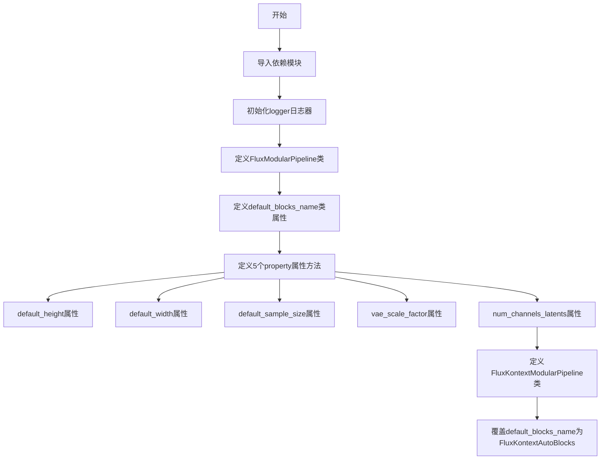
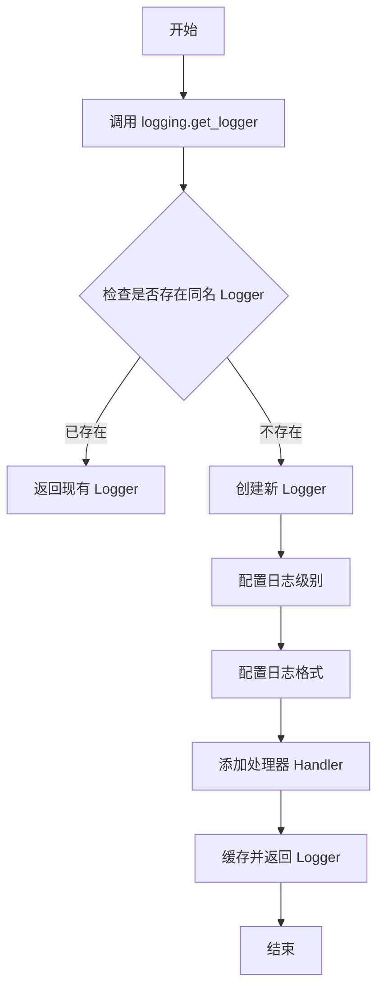
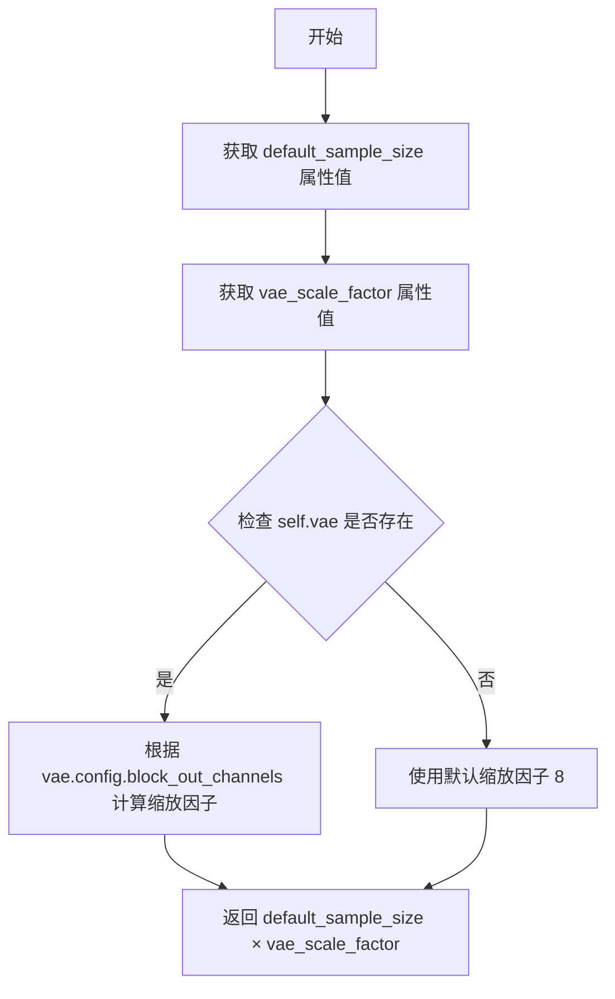
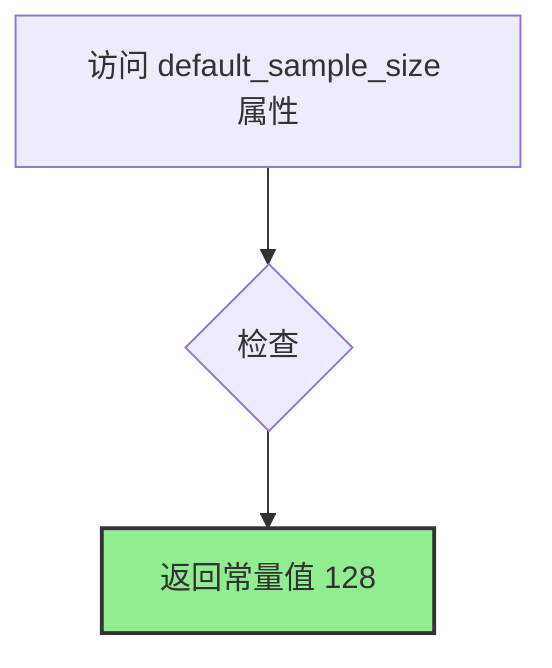
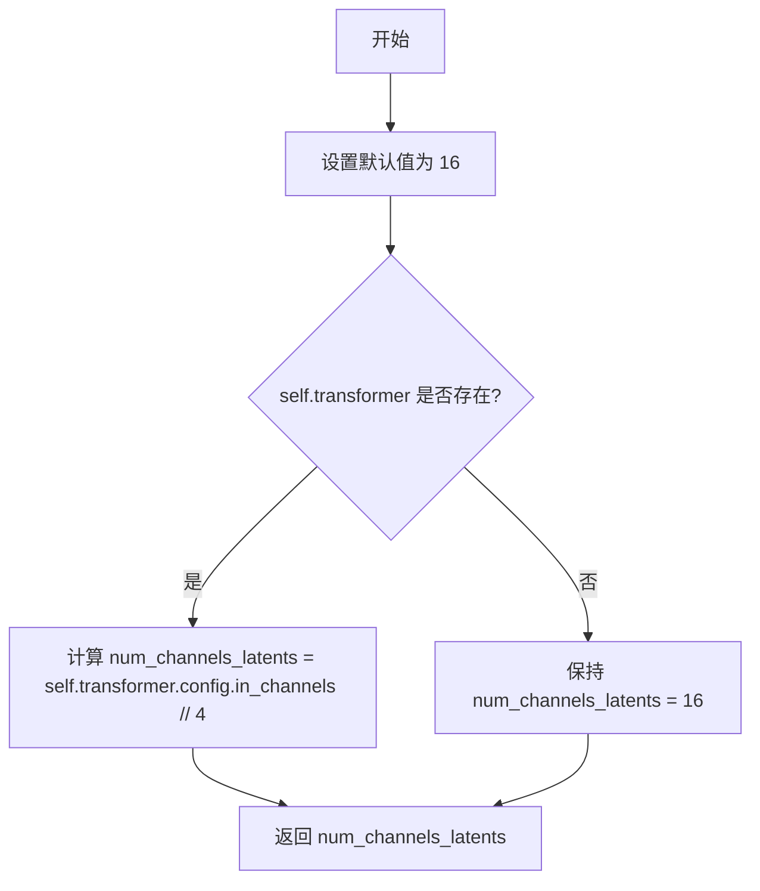

# `diffusers\src\diffusers\modular_pipelines\flux\modular_pipeline.py` 详细设计文档

该文件定义了Flux模态管道的模块化实现，提供了FluxModularPipeline和FluxKontextModularPipeline两个类，用于支持Flux模型的模块化加载和配置，包含VAE比例因子、通道数、默认样本尺寸等关键参数的计算属性。

## 整体流程



## 类结构

```
object
├── ModularPipeline (基类)
├── FluxLoraLoaderMixin (混入类)
├── TextualInversionLoaderMixin (混入类)
└── FluxModularPipeline
    └── FluxKontextModularPipeline
```

## 全局变量及字段


### `logger`
    
用于记录模块日志的Logger实例

类型：`logging.Logger`
    


### `FluxModularPipeline.default_blocks_name`
    
指定Flux管道使用的默认块名称，值为FluxAutoBlocks

类型：`str`
    


### `FluxKontextModularPipeline.default_blocks_name`
    
指定Flux Kontext管道使用的默认块名称，值为FluxKontextAutoBlocks

类型：`str`
    
    

## 全局函数及方法


### `logging.get_logger`

获取一个配置好的日志记录器实例，用于在模块中记录日志信息。

参数：

- `name`：`str`，日志记录器的名称，通常传入 `__name__` 以表示当前模块

返回值：`logging.Logger`，返回一个配置好的 logger 实例，用于记录日志信息

#### 流程图



#### 带注释源码

```
# 这是一个函数调用，而非函数定义
# logging 是从 ...utils 模块导入的
# get_logger 是 logging 模块中的一个函数，用于获取或创建 logger

from ...utils import logging

# 调用 get_logger 函数，传入当前模块的 __name__ 作为参数
# __name__ 是 Python 的内置变量，表示当前模块的完全限定名
# 例如：如果这个文件是 src/utils/module.py，则 __name__ 为 "src.utils.module"
logger = logging.get_logger(__name__)  # pylint: disable=invalid-name
```

#### 补充说明

**函数定义位置**：`logging.get_logger` 函数定义在 `...utils.logging` 模块中（代码中通过 `from ...utils import logging` 导入）。

**函数功能推测**：
- 根据传入的 `name` 参数获取或创建一个 Logger 实例
- 通常会设置合理的默认日志级别（如 WARNING 或 INFO）
- 配置日志格式（如包含时间戳、日志级别、模块名等）
- 添加适当的 Handler（如输出到控制台或文件）

**使用场景**：在模块级别创建一个模块专属的 logger，用于后续的日志记录操作。

**外部依赖**：此函数来自 `transformers` 库的 utils 模块，属于外部依赖。


### `FluxModularPipeline.default_height`

该属性用于获取FluxModularPipeline的默认图像高度，通过将默认采样大小（default_sample_size）乘以VAE的缩放因子（vae_scale_factor）计算得出。

参数：

- `self`：`FluxModularPipeline` 实例，隐式参数，表示当前管道对象

返回值：`int`，返回默认图像高度值（像素单位），计算公式为 `default_sample_size * vae_scale_factor`

#### 流程图

```mermaid
flowchart TD
    A[开始: 调用 default_height] --> B{获取 default_sample_size}
    B --> C[返回固定值 128]
    C --> D{获取 vae_scale_factor}
    D --> E{检查 self.vae 是否存在}
    E -->|是| F[从配置计算: 2^(len(vae.config.block_out_channels) - 1)]
    E -->|否| G[返回默认值 8]
    F --> H[计算结果: default_sample_size * vae_scale_factor]
    G --> H
    H --> I[返回默认高度值]
```

#### 带注释源码

```python
@property
def default_height(self):
    """
    获取默认图像高度。
    
    该属性通过将默认采样大小（128）与VAE缩放因子相乘来计算默认高度。
    VAE缩放因子根据VAE模型的结构动态计算：如果VAE存在，
    则基于其block_out_channels计算（通常为2的幂次方，如8、16、32等）；
    否则使用默认缩放因子8。
    
    Returns:
        int: 默认图像高度（像素），计算公式为 default_sample_size * vae_scale_factor
    """
    return self.default_sample_size * self.vae_scale_factor
```


### `FluxModularPipeline.default_width`

该属性方法用于获取 Flux 模型的默认生成宽度，通过将默认采样大小（default_sample_size）与 VAE 缩放因子（vae_scale_factor）相乘计算得出，支持动态适配不同的 VAE 配置。

参数： 无

返回值：`int`，返回模型默认生成的宽度像素值

#### 流程图



#### 带注释源码

```python
@property
def default_width(self):
    """
    获取 Flux 模型的默认生成宽度。
    
    通过将默认采样大小与 VAE 缩放因子相乘来计算默认宽度。
    如果 VAE 存在，则根据其配置动态计算缩放因子；否则使用默认值 8。
    
    返回:
        int: 默认生成的宽度像素值
    """
    return self.default_sample_size * self.vae_scale_factor
```


### `FluxModularPipeline.default_sample_size`

该属性方法用于返回 FluxModularPipeline 的默认采样大小（sample size），值为固定常数 128。该值决定了生成图像的默认高度和宽度，是管道配置的基础参数之一。

参数：

- （无参数，这是 `@property` 装饰器定义的方法，通过实例属性方式访问）

返回值：`int`，返回默认采样大小值 128，用于计算默认图像高度和宽度

#### 流程图



#### 带注释源码

```python
@property
def default_sample_size(self):
    """
    返回 Flux 模型的默认采样大小。
    
    该属性提供生成图像时的默认采样尺寸基准值。
    该值会与 vae_scale_factor 相乘来计算最终的默认高度和宽度。
    
    Returns:
        int: 默认采样大小，固定返回 128
    """
    return 128
```


### `FluxModularPipeline.vae_scale_factor`

这是一个属性方法，用于计算并返回 FluxModularPipeline 的 VAE 缩放因子。如果 VAE 模型已加载，则根据其配置中的 `block_out_channels` 动态计算；否则返回默认值 8。

参数：

- （无参数）

返回值：`int`，VAE 缩放因子，用于确定潜在空间与像素空间之间的缩放比例

#### 流程图

```mermaid
flowchart TD
    A[开始] --> B[设置默认 vae_scale_factor = 8]
    B --> C{self.vae 是否存在?}
    C -->|是| D[获取 vae.config.block_out_channels]
    D --> E[计算 2^(len(block_out_channels) - 1)]
    E --> F[更新 vae_scale_factor]
    C -->|否| G[保持默认 vae_scale_factor = 8]
    F --> H[返回 vae_scale_factor]
    G --> H
```

#### 带注释源码

```python
@property
def vae_scale_factor(self):
    """
    计算并返回 VAE 的缩放因子。

    VAE 缩放因子决定了潜在空间（latent space）与像素空间（pixel space）
    之间的缩放比例。该值在图像编码/解码过程中用于调整分辨率。

    Returns:
        int: VAE 缩放因子。如果 VAE 已加载，则根据其配置计算；
             否则返回默认值 8。
    """
    # 1. 设置默认的 VAE 缩放因子为 8
    # 这是 Flux 模型的标准默认值
    vae_scale_factor = 8

    # 2. 检查 VAE 模型是否已加载到 pipeline 中
    # getattr 安全地获取属性，避免 AttributeError
    if getattr(self, "vae", None) is not None:
        # 3. VAE 已加载，根据其配置动态计算缩放因子
        # block_out_channels 定义了 VAE 解码器各层的输出通道数
        # 缩放因子通过 2^(层数-1) 计算，反映了 VAE 的下采样程度
        vae_scale_factor = 2 ** (len(self.vae.config.block_out_channels) - 1)

    # 4. 返回计算得到的 VAE 缩放因子
    return vae_scale_factor
```


### `FluxModularPipeline.num_channels_latents`

这是一个属性方法，用于获取 Flux 模型的潜在空间通道数（number of latent channels）。默认值为 16，如果 transformer 对象存在，则根据其配置信息动态计算通道数。

参数：

- 无显式参数（使用 `self` 访问实例属性）

返回值：`int`，返回潜在空间的通道数

#### 流程图



#### 带注释源码

```python
@property
def num_channels_latents(self):
    # 初始化默认通道数为 16
    num_channels_latents = 16
    
    # 检查 transformer 对象是否存在
    if getattr(self, "transformer", None):
        # 如果 transformer 存在，根据其配置计算通道数
        # 公式：输入通道数除以 4
        num_channels_latents = self.transformer.config.in_channels // 4
    
    # 返回计算后的潜在空间通道数
    return num_channels_latents
```

## 关键组件


### FluxModularPipeline

核心模块化管道类，继承自ModularPipeline，并混入了FluxLoraLoaderMixin和TextualInversionLoaderMixin，用于构建Flux模型的完整推理管道。提供了多个计算属性来动态获取模型的默认配置参数，包括图像尺寸、VAE缩放因子和潜在空间通道数。

### FluxKontextModularPipeline

Flux Kontext专用的模块化管道类，继承自FluxModularPipeline，使用不同的默认块名称FluxKontextAutoBlocks，专门用于处理Kontext场景的Flux模型。

### default_height 属性

计算型属性，返回管道默认生成的图像高度，通过default_sample_size乘以vae_scale_factor计算得出，用于确定输出图像的默认高度尺寸。

### default_width 属性

计算型属性，返回管道默认生成的图像宽度，通过default_sample_size乘以vae_scale_factor计算得出，用于确定输出图像的默认宽度尺寸。

### default_sample_size 属性

常量属性，返回默认采样大小值128，这是Flux模型的基准采样尺寸参数，用于作为其他尺寸计算的基准基数。

### vae_scale_factor 属性

计算型属性，动态返回VAE的缩放因子。默认值为8，如果VAE模型存在则根据其配置中的block_out_channels计算实际的缩放因子（2的幂次），用于潜在空间与像素空间之间的尺寸转换。

### num_channels_latents 属性

计算型属性，返回潜在空间的通道数。默认值为16，如果transformer模型存在则从其配置中的in_channels除以4计算得出，用于确定潜在表示的维度。

### FluxLoraLoaderMixin 混入类

从loaders模块导入的LoRA权重加载混入类，为管道提供LoRA适配器加载功能，允许在推理时动态加载和应用LoRA权重来调整模型行为。

### TextualInversionLoaderMixin 混入类

从loaders模块导入的文本反转嵌入加载混入类，为管道提供文本反转（Textual Inversion）嵌入加载功能，允许使用自定义词汇嵌入来控制生成效果。

### ModularPipeline 基类

从modular_pipeline模块导入的模块化管道基类，提供了构建复杂推理管道的核心框架功能，包括组件组装、配置管理和执行调度等基础能力。


## 问题及建议


### 已知问题

- **硬编码的魔法数字**：多个关键参数（如 `vae_scale_factor=8`、`num_channels_latents=16`、`default_sample_size=128`、`除数4`）以硬编码形式散布在代码中，缺乏常量定义，未来修改成本高且易出错
- **属性重复计算**：每次访问 `default_height`、`default_width`、`vae_scale_factor` 等属性时都会重新计算，在高频调用场景下存在性能隐患
- **Mixin 多继承风险**：类继承自三个 Mixin（ModularPipeline、FluxLoraLoaderMixin、TextualInversionLoaderMixin），方法解析顺序（MRO）可能引发冲突，后续维护困难
- **运行时配置依赖**：代码依赖 `self.vae.config.block_out_channels` 和 `self.transformer.config.in_channels`，若配置缺失或格式不符预期将导致运行时错误，缺乏防御性检查
- **子类空实现**：`FluxKontextModularPipeline` 仅重写了 `default_blocks_name`，未添加实质功能，继承层次设计的实际价值有限

### 优化建议

- 将硬编码值提取为类常量或配置文件，使用命名常量替代魔法数字，提高可维护性
- 使用 `functools.cached_property` 替代 `@property` 装饰需要重复计算的属性，或在初始化时预计算并缓存
- 对配置访问添加显式检查和默认值处理，提供友好的错误信息而非隐式的属性访问
- 考虑将 Mixin 改为组合模式（Composition），通过依赖注入方式引入功能，降低继承复杂度
- 为子类 `FluxKontextModularPipeline` 添加有实际意义的功能扩展，或合并到父类中通过参数化实现
- 为所有属性方法添加类型注解（PEP 484）和文档字符串，提升代码可读性和 IDE 支持
- 考虑添加配置验证逻辑，在初始化阶段检查必要配置的存在性和有效性

## 其它


### 设计目标与约束

**设计目标**：为Flux系列模型（包含标准Flux和Flux Kontext）提供模块化的Pipeline架构，支持灵活的组件加载与配置，特别集成LoRA和Textual Inversion加载器，以实现轻量级模型微调和文本反转嵌入功能。

**设计约束**：
- 该Pipeline为实验性功能，API可能在未来版本中发生变化
- 依赖于ModularPipeline基类实现核心Pipeline功能
- 必须配合VAE、Transformer等模型组件才能完成推理任务

### 错误处理与异常设计

**错误处理策略**：
- 使用`getattr`安全获取可选组件（vae、transformer），避免AttributeError
- 当组件不存在时，返回预定义的默认值（vae_scale_factor=8, num_channels_latents=16）
- 异常通过Python标准异常机制传播，由上层调用者处理

**异常场景**：
- 缺少必要组件时：返回默认值而非抛出异常，支持灵活的模型配置
- 配置属性访问错误：Python属性访问机制会自动抛出AttributeError

### 数据流与状态机

**数据流**：
- FluxModularPipeline作为编排层，接收用户输入（如提示词、图像参数等）
- 将输入分发至各组件（VAE、Transformer、Text Encoder等）进行处理
- 各组件返回值在Pipeline层面进行组合与后处理

**状态管理**：
- Pipeline本身无显式状态机，状态由底层模型组件管理
- 配置属性（default_height、default_width等）为只读计算属性，基于模型配置动态计算

### 外部依赖与接口契约

**核心依赖**：
- `ModularPipeline`：基类，提供Pipeline的核心架构
- `FluxLoraLoaderMixin`：混合类，提供LoRA权重加载功能
- `TextualInversionLoaderMixin`：混合类，提供Textual Inversion嵌入加载功能
- `FluxAutoBlocks` / `FluxKontextAutoBlocks`：自动块类，用于模型结构构建

**接口契约**：
- Pipeline需实现标准推理接口（如`__call__`方法，继承自ModularPipeline）
- 混合类方法遵循特定的加载协议（load_lora、load_textual_inversion等）
- 属性方法返回类型需与下游组件期望一致（如vae_scale_factor返回整数）

### 配置与参数说明

| 参数名 | 类型 | 说明 |
|--------|------|------|
| default_blocks_name | str | 指定使用的自动块类名称，FluxModularPipeline默认为"FluxAutoBlocks"，FluxKontextModularPipeline默认为"FluxKontextAutoBlocks" |
| vae_scale_factor | int | VAE缩放因子，基于vae.config.block_out_channels计算 |
| num_channels_latents | int | 潜在空间的通道数，基于transformer.config.in_channels计算 |
| default_sample_size | int | 默认采样尺寸，固定值为128 |
| default_height/width | int | 默认输出图像高度/宽度，基于default_sample_size和vae_scale_factor计算 |

### 使用示例

```python
# 基本初始化
pipeline = FluxModularPipeline.from_pretrained("flux-model-path")

# 加载LoRA权重
pipeline.load_lora("lora-path")

# 加载Textual Inversion
pipeline.load_textual_inversion("embedding-path")

# 执行推理
image = pipeline("a beautiful landscape", num_inference_steps=50)
```

### 版本历史与变更记录

- **2025年**：初始版本，作为实验性功能引入
- 跟随Hugging Face Diffusers库版本更新

### 性能考虑

**优化点**：
- 属性方法使用`@property`装饰器，每次访问时重新计算，适用于配置不频繁变化的场景
- 使用`getattr`进行可选组件检查，避免多次try-except带来的性能开销

**潜在性能瓶颈**：
- 多次访问属性（如default_height）会重复计算，建议缓存结果
- 大模型加载可能占用大量内存

### 安全性考虑

- 无直接的用户输入验证逻辑，安全性依赖上层调用者
- 模型文件加载需信任数据源，防止恶意模型权重
- 遵循Apache 2.0许可证开源协议

### 测试策略

**单元测试**：
- 测试属性方法的计算逻辑（vae_scale_factor、num_channels_latents等）
- 测试混合类方法的存在性和基本接口

**集成测试**：
- 测试完整Pipeline初始化流程
- 测试LoRA和Textual Inversion加载功能
- 测试端到端推理流程


    