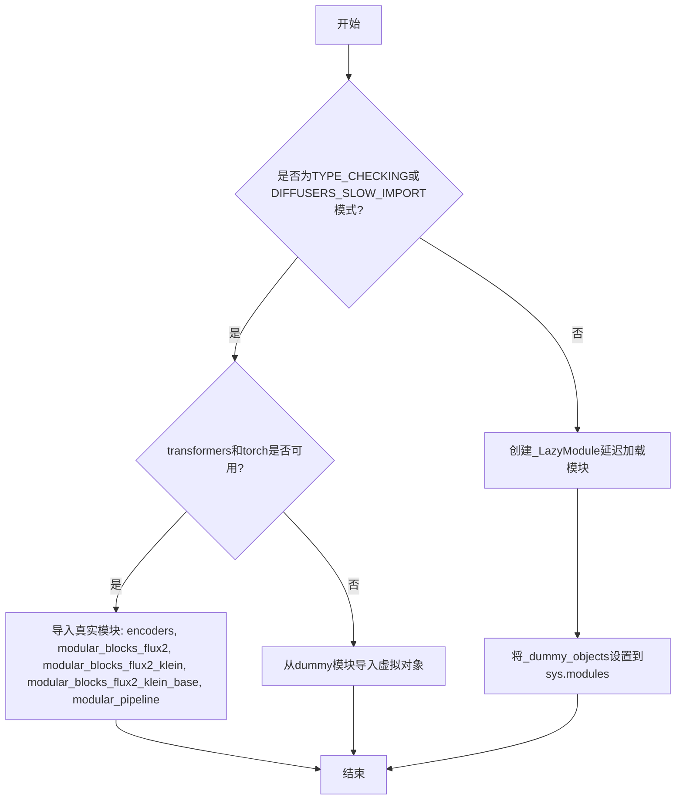
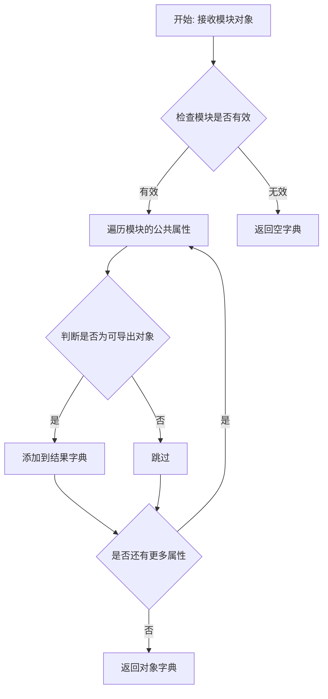
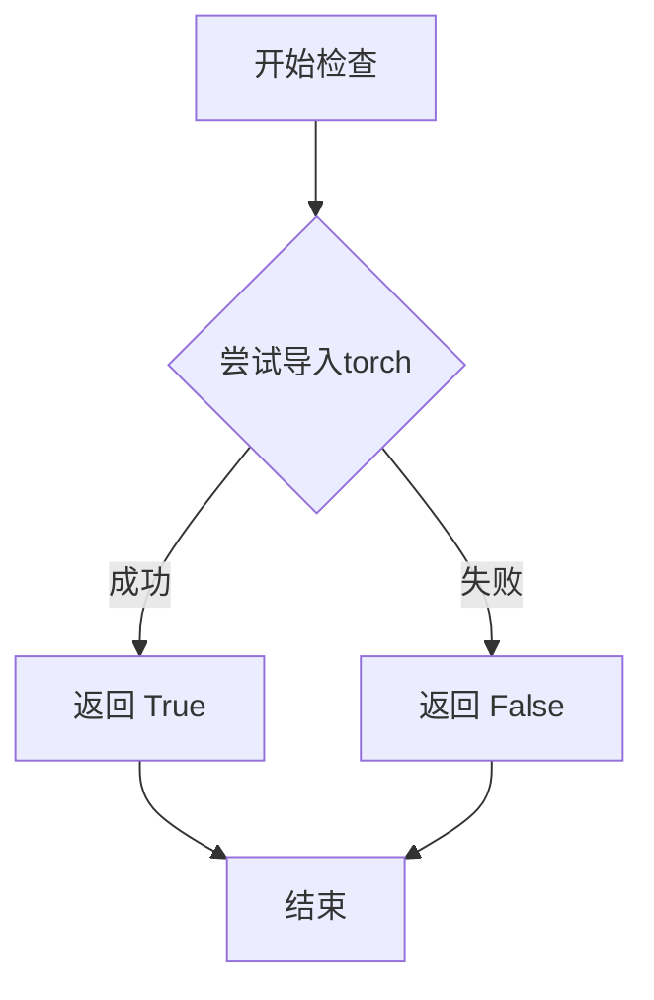
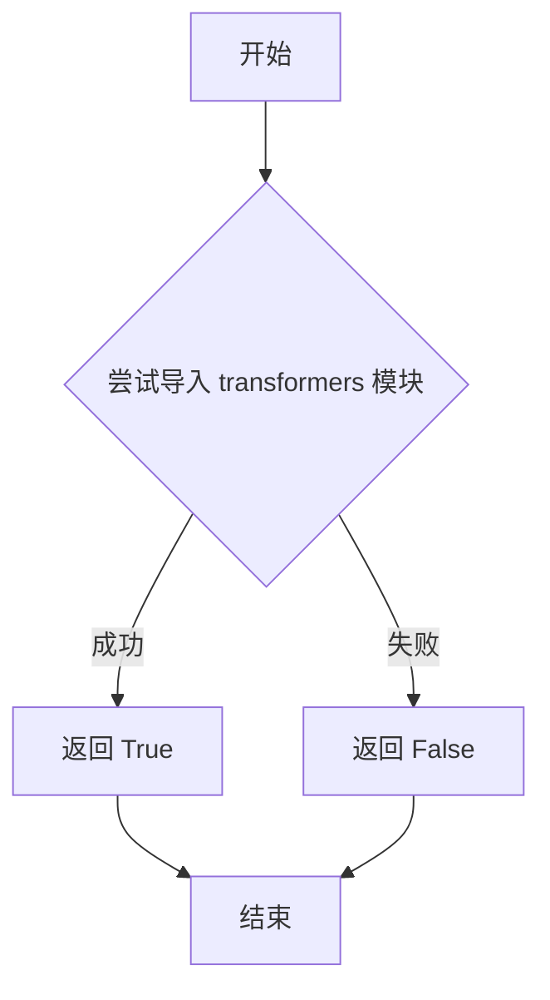

# `diffusers\src\diffusers\modular_pipelines\flux2\__init__.py` 详细设计文档

这是Diffusers库中Flux2模型管道的初始化文件，通过延迟导入机制和可选依赖管理，实现对Flux2相关编码器、自动块和模块化管道组件的动态加载，确保在torch和transformers依赖可用时导出真实对象，否则使用虚拟对象保持接口一致性。

## 整体流程



## 类结构

```
Flux2PipelineModule (包初始化模块)
├── Encoders
│   └── Flux2RemoteTextEncoderStep
├── ModularBlocks
│   ├── Flux2AutoBlocks
│   ├── Flux2KleinAutoBlocks
│   └── Flux2KleinBaseAutoBlocks
└── ModularPipelines
    ├── Flux2ModularPipeline
    ├── Flux2KleinModularPipeline
    └── Flux2KleinBaseModularPipeline
```

## 全局变量及字段


### `_dummy_objects`
    
存储可选依赖不可用时的虚拟对象映射

类型：`dict[str, Any]`
    


### `_import_structure`
    
定义模块的导入结构，键为子模块名，值为导出对象列表

类型：`dict[str, list[str]]`
    


    

## 全局函数及方法


### `get_objects_from_module`

从指定模块中提取所有公共对象（如类、函数等）的工具函数，常用于延迟加载模块时获取可用的对象集合。

参数：

- `module`：模块对象（module），需要从中提取对象的源模块

返回值：`dict`，键为对象名称，值为对应的对象（类或函数）

#### 流程图



#### 带注释源码

```python
# 从 typing 模块导入 TYPE_CHECKING，用于类型检查
from typing import TYPE_CHECKING

# 从本地 utils 模块导入所需函数和类
from ...utils import (
    DIFFUSERS_SLOW_IMPORT,
    OptionalDependencyNotAvailable,
    _LazyModule,
    get_objects_from_module,  # <-- 目标函数：从模块获取对象的工具函数
    is_torch_available,
    is_transformers_available,
)

# 初始化空字典用于存储虚拟对象
_dummy_objects = {}
# 初始化空字典用于存储导入结构
_import_structure = {}

try:
    # 检查依赖是否可用
    if not (is_transformers_available() and is_torch_available()):
        raise OptionalDependencyNotAvailable()
except OptionalDependencyNotAvailable:
    # 如果依赖不可用，从虚拟对象模块获取对象并更新到 _dummy_objects
    from ...utils import dummy_torch_and_transformers_objects  # noqa F403
    # 调用 get_objects_from_module 函数：
    # 参数：dummy_torch_and_transformers_objects 模块
    # 返回值：包含该模块所有公共对象的字典
    # 用途：用于在依赖不可用时提供虚拟对象，实现延迟加载
    _dummy_objects.update(get_objects_from_module(dummy_torch_and_transformers_objects))
else:
    # 如果依赖可用，定义实际的导入结构
    _import_structure["encoders"] = ["Flux2RemoteTextEncoderStep"]
    _import_structure["modular_blocks_flux2"] = ["Flux2AutoBlocks"]
    _import_structure["modular_blocks_flux2_klein"] = ["Flux2KleinAutoBlocks"]
    _import_structure["modular_blocks_flux2_klein_base"] = ["Flux2KleinBaseAutoBlocks"]
    _import_structure["modular_pipeline"] = [
        "Flux2KleinBaseModularPipeline",
        "Flux2KleinModularPipeline",
        "Flux2ModularPipeline",
    ]

# TYPE_CHECKING 块或慢导入时
if TYPE_CHECKING or DIFFUSERS_SLOW_IMPORT:
    try:
        if not (is_transformers_available() and is_torch_available()):
            raise OptionalDependencyNotAvailable()
    except OptionalDependencyNotAvailable:
        from ...utils.dummy_torch_and_transformers_objects import *  # noqa F403
    else:
        # 直接导入实际模块中的类
        from .encoders import Flux2RemoteTextEncoderStep
        from .modular_blocks_flux2 import Flux2AutoBlocks
        from .modular_blocks_flux2_klein import Flux2KleinAutoBlocks
        from .modular_blocks_flux2_klein_base import Flux2KleinBaseAutoBlocks
        from .modular_pipeline import Flux2KleinBaseModularPipeline, Flux2KleinModularPipeline, Flux2ModularPipeline
else:
    # 使用 LazyModule 实现延迟加载
    import sys
    sys.modules[__name__] = _LazyModule(
        __name__,
        globals()["__file__"],
        _import_structure,
        module_spec=__spec__,
    )
    # 将虚拟对象设置到模块中
    for name, value in _dummy_objects.items():
        setattr(sys.modules[__name__], name, value)
```


### `is_torch_available`

该函数用于检查当前环境中 PyTorch 库是否可用，返回布尔值以指示 torch 是否已安装且可导入。

参数： 无

返回值：`bool`，返回 `True` 表示 PyTorch 可用，返回 `False` 表示不可用

#### 流程图



#### 带注释源码

```python
# 注意：此函数定义不在当前文件中，而是从 ...utils 模块导入
# 以下是基于常见实现的推测代码

def is_torch_available() -> bool:
    """
    检查 PyTorch 库是否可用。
    
    Returns:
        bool: 如果 torch 可以被导入则返回 True，否则返回 False
    """
    try:
        import torch
        return True
    except ImportError:
        return False
```

#### 在当前代码中的使用示例

```python
# 在当前文件中的实际使用方式：
if not (is_transformers_available() and is_torch_available()):
    raise OptionalDependencyNotAvailable()
```

> **注意**：由于 `is_torch_available` 函数是从 `...utils` 导入的外部函数，其实际实现不在当前代码文件中。上述源码是基于该函数在 Hugging Face diffusers 项目中的常见实现模式提供的。


### `is_transformers_available`

检查 `transformers` 库是否可用的函数，用于条件导入和可选依赖处理。

参数：

- 此函数无参数

返回值：`bool`，如果 `transformers` 库已安装且可用返回 `True`，否则返回 `False`

#### 流程图



#### 带注释源码

```
# is_transformers_available 是从 ...utils 导入的函数
# 以下是典型的实现模式（基于代码使用方式推断）：

def is_transformers_available() -> bool:
    """
    检查 transformers 库是否可用。
    
    Returns:
        bool: 如果 transformers 库已安装且可导入返回 True，否则返回 False
    """
    try:
        # 尝试导入 transformers 模块
        import transformers
        return True
    except ImportError:
        # 如果导入失败，说明 transformers 不可用
        return False

# 在给定代码中的使用方式：
# if not (is_transformers_available() and is_torch_available()):
#     raise OptionalDependencyNotAvailable()
# 
# 上述代码表示：只有当 transformers 和 torch 都可用时，
# 才会导入真实的模块对象；否则抛出异常并导入 dummy 对象
```

## 关键组件


### 延迟导入模块（Lazy Loading Mechanism）

使用 `_LazyModule` 和 `_import_structure` 字典实现模块的延迟加载，避免在导入时立即加载所有子模块，提高初始导入速度。

### 可选依赖检查（Optional Dependency Management）

通过 `is_transformers_available()` 和 `is_torch_available()` 检查运行时依赖，使用 `OptionalDependencyNotAvailable` 异常和 dummy 对象模式处理依赖不可用的情况。

### 导入结构定义（Import Structure Definition）

通过 `_import_structure` 字典定义模块的导入结构，包括 encoders、modular_blocks_flux2、modular_blocks_flux2_klein、modular_blocks_flux2_klein_base 和 modular_pipeline 五个子模块的导出列表。

### 类型检查支持（Type Checking Support）

利用 `TYPE_CHECKING` 条件导入实现类型提示，同时通过 `DIFFUSERS_SLOW_IMPORT` 控制是否启用慢速导入模式，平衡类型安全和运行时性能。

### Flux2RemoteTextEncoderStep 组件

远程文本编码器步骤，用于 Flux2 模型中的文本编码处理，支持远程文本编码功能。

### Flux2AutoBlocks 组件

Flux2 模型的自动模块块，提供模块化的模型构建能力。

### Flux2KleinAutoBlocks 组件

Flux2 Klein 模型的自动模块块，扩展自 Flux2AutoBlocks，适用于 Klein 架构。

### Flux2KleinBaseAutoBlocks 组件

Flux2 Klein 基础模型的自动模块块，提供基础架构的模块化实现。

### Flux2ModularPipeline 组件

Flux2 模块化管道，提供端到端的推理流程。

### Flux2KleinModularPipeline 组件

Flux2 Klein 模块化管道，针对 Klein 架构的模块化管道实现。

### Flux2KleinBaseModularPipeline 组件

Flux2 Klein 基础模块化管道，提供基础架构的完整推理流程。


## 问题及建议


### 已知问题

-   **重复代码块**：检查依赖可用性的代码 `if not (is_transformers_available() and is_torch_available()): raise OptionalDependencyNotAvailable()` 在第17-19行和第29-31行重复出现两次，增加维护成本
-   **通配符导入**：`from ...utils.dummy_torch_and_transformers_objects import *` 使用通配符导入，违反最佳实践，导致命名空间污染且难以追踪实际导入了哪些对象
-   **异常捕获过于宽泛**：使用 `except OptionalDependencyNotAvailable:` 捕获异常后直接导入dummy对象，未记录具体缺失的依赖信息
-   **魔法字符串**：模块路径字符串如 `"encoders"`、`"modular_blocks_flux2"` 等以硬编码形式存在，缺乏统一管理
-   **缺乏错误处理**：对 `get_objects_from_module()` 函数调用没有错误处理机制，若该函数失败会导致后续逻辑中断

### 优化建议

-   **提取公共逻辑**：将依赖检查逻辑封装为辅助函数，例如 ` _check_dependencies()`，在两处调用点复用，减少代码重复
-   **替换通配符导入**：改为显式导入需要的对象，提高代码可读性和可维护性
-   **增强异常信息**：在捕获 `OptionalDependencyNotAvailable` 时记录具体缺失的依赖，便于调试
-   **使用常量定义**：将 `_import_structure` 中的键值定义为常量或枚举类，统一管理模块路径字符串
-   **添加日志记录**：在依赖检查失败或回退到dummy对象时添加日志，便于运行时诊断
-   **考虑类型注解完善**：为 `_import_structure` 和 `_dummy_objects` 添加类型注解，提高静态检查能力


## 其它


### 设计目标与约束

**设计目标：**
- 实现模块的延迟加载（Lazy Loading），减少首次导入时的开销
- 支持可选依赖（transformers和torch）的动态检测
- 提供统一的模块导出接口，隐藏内部实现细节

**约束条件：**
- 必须同时安装transformers和torch才能使用完整功能
- 仅支持Python 3.8+
- 依赖于diffusers库的utils模块提供的基础设施

### 错误处理与异常设计

**异常类型：**
- `OptionalDependencyNotAvailable`：当torch或transformers不可用时抛出
- `ModuleNotFoundError`：当导入不存在的模块时抛出（由_LazyModule处理）

**错误处理策略：**
- 使用try-except捕获`OptionalDependencyNotAvailable`异常
- 当可选依赖不可用时，从dummy模块导入虚拟对象（_dummy_objects）
- 使用TYPE_CHECKING标志支持类型检查时的完整导入

### 数据流与状态机

**数据流：**
- 导入请求 → _LazyModule → 检查_import_structure → 动态导入目标模块 → 返回模块/类
- 依赖检查流程：is_torch_available() → is_transformers_available() → OptionalDependencyNotAvailable

**状态：**
- INITIAL：模块初始状态，未执行任何导入
- CHECKING：检查依赖可用性
- LOADED：模块已成功加载
- FALLBACK：使用dummy对象（依赖不可用）

### 外部依赖与接口契约

**外部依赖：**
- `diffusers.utils._LazyModule`：延迟加载模块实现
- `diffusers.utils.get_objects_from_module`：从模块获取对象
- `diffusers.utils.OptionalDependencyNotAvailable`：可选依赖异常
- `diffusers.utils.dummy_torch_and_transformers_objects`：虚拟对象模块
- `transformers`：必须依赖（运行时）
- `torch`：必须依赖（运行时）

**接口契约：**
- 模块导出：Flux2RemoteTextEncoderStep、Flux2AutoBlocks、Flux2KleinAutoBlocks、Flux2KleinBaseAutoBlocks、Flux2KleinBaseModularPipeline、Flux2KleinModularPipeline、Flux2ModularPipeline
- 所有导出均为类或对象，无函数接口

### 性能考虑

- 延迟加载机制显著减少首次import时间
- _dummy_objects使用字典存储，查找效率O(1)
- sys.modules缓存机制避免重复导入

### 安全性考虑

- 使用get_objects_from_module避免直接导入未知对象
- 通过_import_structure白名单控制可导出内容
- 依赖版本兼容性由运行时检测保证

### 配置管理

- 无运行时配置，全部为编译时/导入时配置
- DIFFUSERS_SLOW_IMPORT环境变量控制是否启用完整导入

### 版本兼容性

- Python版本：3.8+
- torch版本：需自行安装（无版本约束）
- transformers版本：需自行安装（无版本约束）
- diffusers版本：需与当前版本匹配

### 测试策略建议

- 单元测试：测试依赖检测逻辑、延迟加载行为
- 集成测试：测试完整导入流程、各类实例化
- Mock测试：模拟OptionalDependencyNotAvailable场景

### 部署注意事项

- 部署时需确保diffusers库已正确安装
- 运行时环境必须安装torch和transformers（或接受功能降级）
- 建议使用虚拟环境管理依赖


    