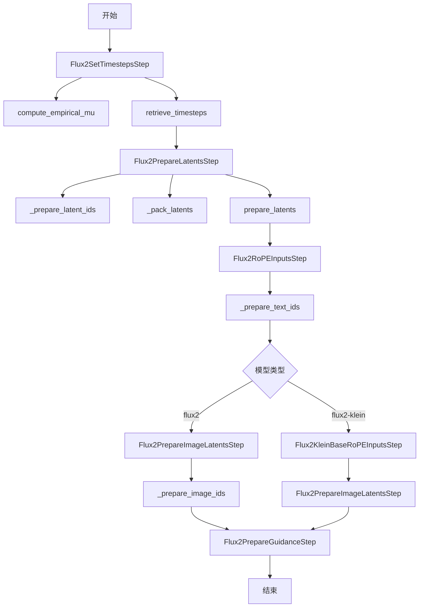
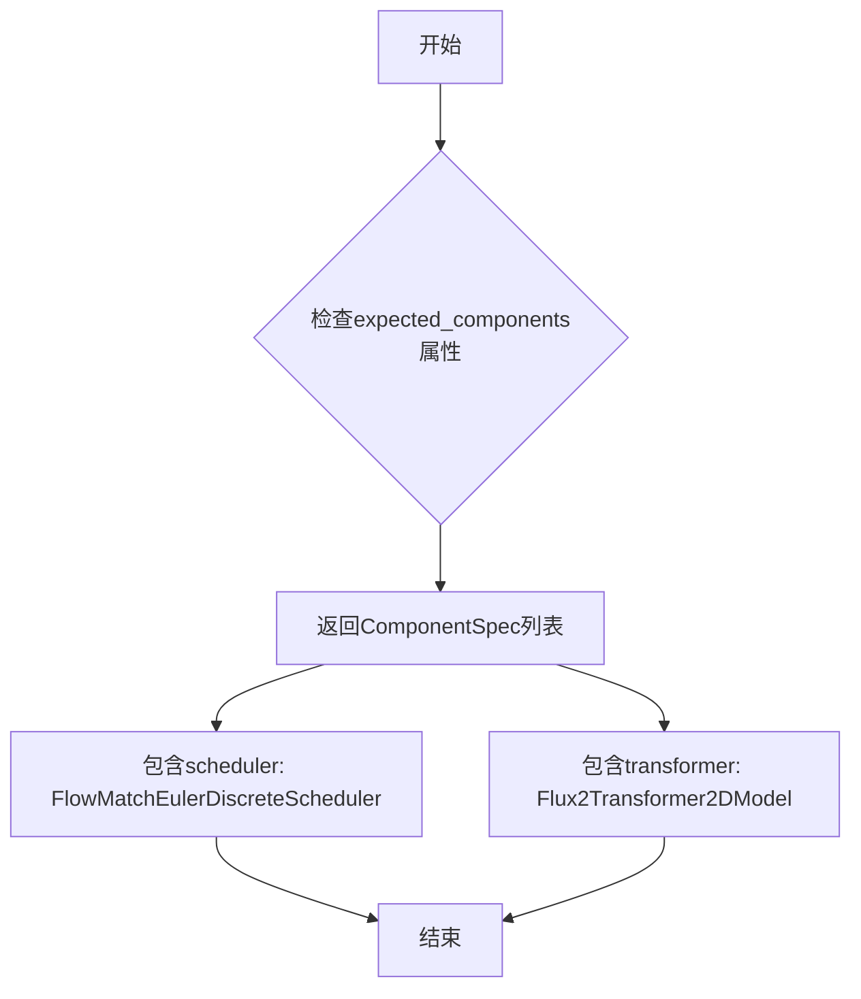
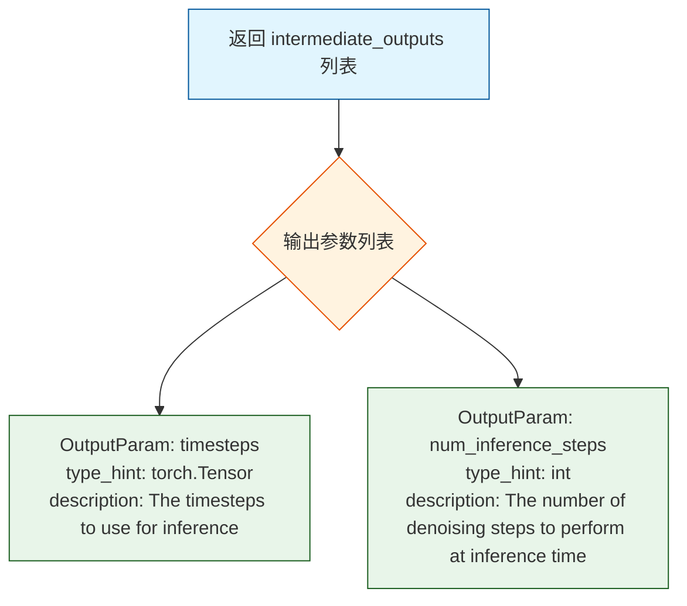
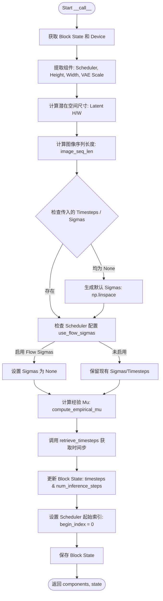
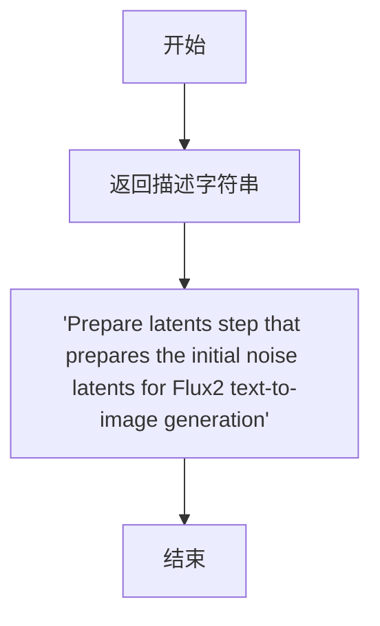
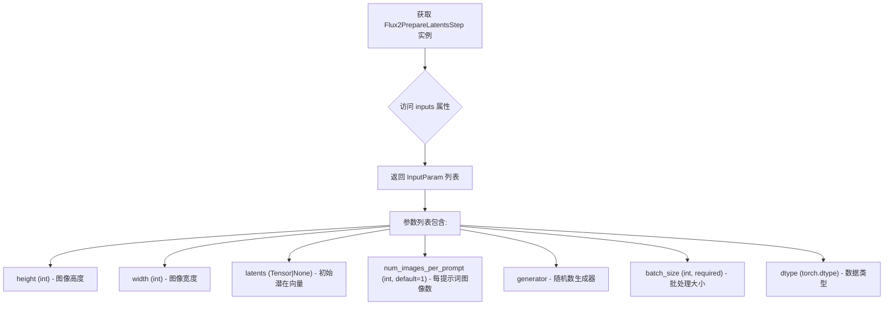
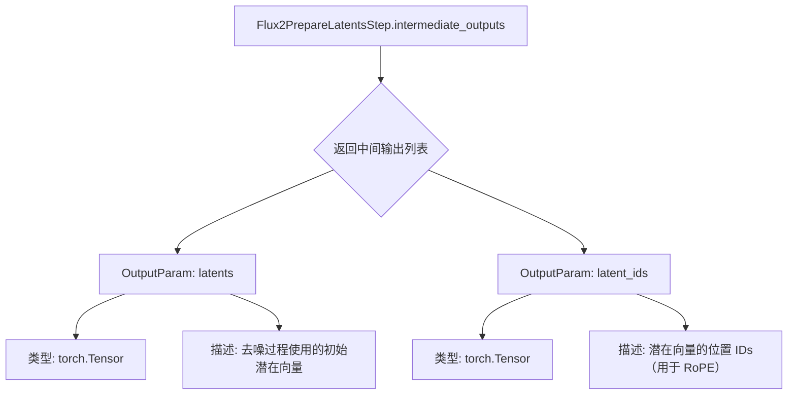
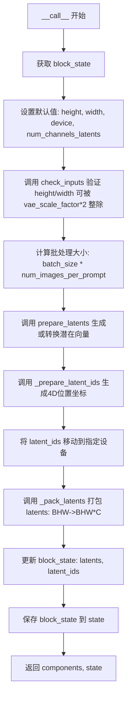
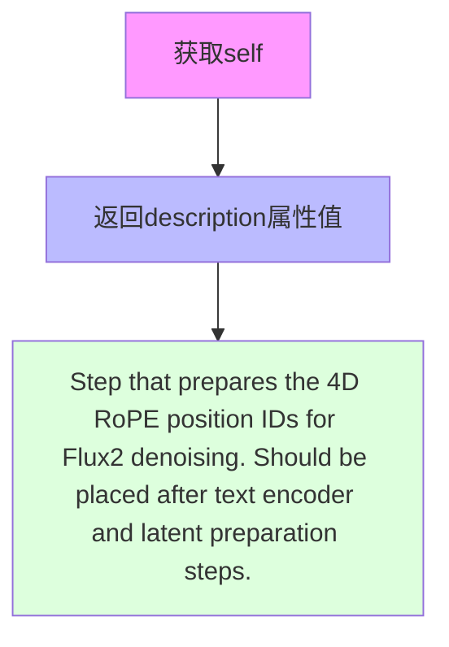
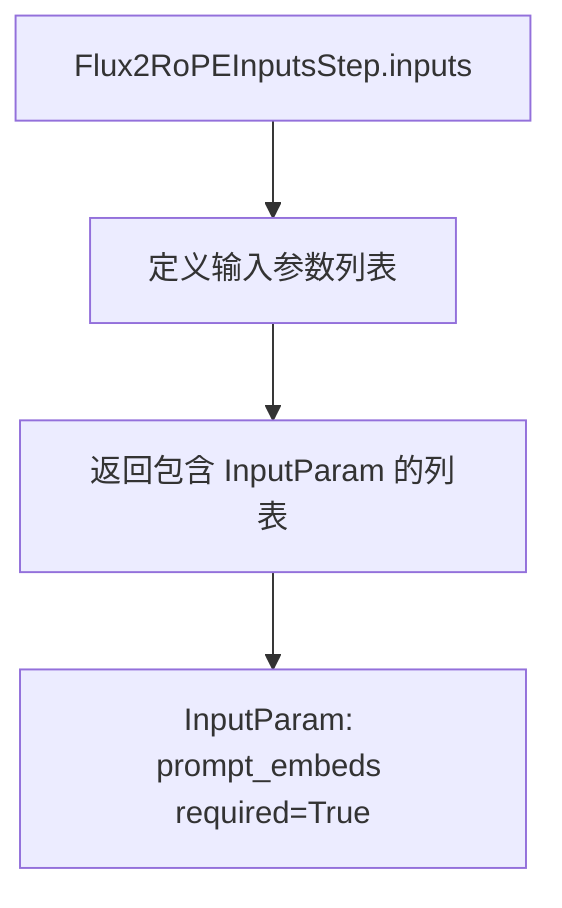

# `diffusers\src\diffusers\modular_pipelines\flux2\before_denoise.py` 详细设计文档

这是 Flux2 文本到图像生成管道的模块化步骤实现，包含了设置时间步、准备潜在向量、准备 RoPE 位置编码、准备图像条件以及指导比例等核心推理步骤，用于支持 Flux2 及其 Klein 变体的模块化流水线处理。

## 整体流程



## 类结构

```
ModularPipelineBlocks (抽象基类)
├── Flux2SetTimestepsStep (设置时间步)
├── Flux2PrepareLatentsStep (准备潜在向量)
├── Flux2RoPEInputsStep (RoPE输入 - Flux2)
├── Flux2KleinBaseRoPEInputsStep (RoPE输入 - Klein变体)
├── Flux2PrepareImageLatentsStep (准备图像潜在向量)
└── Flux2PrepareGuidanceStep (准备指导比例)
```

## 全局变量及字段


### `logger`
    
模块级日志记录器，用于记录警告和错误信息

类型：`logging.Logger`
    


### `a1`
    
compute_empirical_mu中的线性系数，用于短序列计算

类型：`float`
    


### `b1`
    
compute_empirical_mu中的线性系数，用于短序列计算

类型：`float`
    


### `a2`
    
compute_empirical_mu中的线性系数，用于长序列计算

类型：`float`
    


### `b2`
    
compute_empirical_mu中的线性系数，用于长序列计算

类型：`float`
    


### `Flux2SetTimestepsStep.model_name`
    
模型名称标识，固定为'flux2'

类型：`str`
    


### `Flux2PrepareLatentsStep.model_name`
    
模型名称标识，固定为'flux2'

类型：`str`
    


### `Flux2RoPEInputsStep.model_name`
    
模型名称标识，固定为'flux2'

类型：`str`
    


### `Flux2KleinBaseRoPEInputsStep.model_name`
    
模型名称标识，固定为'flux2-klein'，用于Klein变体

类型：`str`
    


### `Flux2PrepareImageLatentsStep.model_name`
    
模型名称标识，固定为'flux2'

类型：`str`
    


### `Flux2PrepareGuidanceStep.model_name`
    
模型名称标识，固定为'flux2'

类型：`str`
    
    

## 全局函数及方法


### `compute_empirical_mu`

该函数根据图像序列长度（image_seq_len）和推理步数（num_steps）计算 Flux2 时间步调度器所需的经验 mu 值，采用分段线性计算策略：当序列长度大于 4300 时使用固定斜率公式，否则在 10-200 步范围内进行线性插值以适应不同的图像分辨率。

参数：

- `image_seq_len`：`int`，图像序列长度，通常由潜在空间的高度和宽度计算得出
- `num_steps`：`int`，推理步数，即去噪过程的迭代次数

返回值：`float`，计算得到的经验 mu 值，用于 Flux2 调度器的时间步设置

#### 流程图

```mermaid
flowchart TD
    A[开始] --> B[定义参数 a1=8.73809524e-05, b1=1.89833333<br/>a2=0.00016927, b2=0.45666666]
    B --> C{image_seq_len > 4300?}
    C -->|是| D[mu = a2 * image_seq_len + b2]
    C -->|否| E[m_200 = a2 * image_seq_len + b2<br/>m_10 = a1 * image_seq_len + b1]
    E --> F[a = (m_200 - m_10) / 190.0<br/>b = m_200 - 200.0 * a]
    F --> G[mu = a * num_steps + b]
    D --> H[返回 float(mu)]
    G --> H
```

#### 带注释源码

```
def compute_empirical_mu(image_seq_len: int, num_steps: int) -> float:
    """Compute empirical mu for Flux2 timestep scheduling."""
    # 定义两组线性参数，用于不同序列长度范围的计算
    # a1, b1: 用于较短序列 (<=4300) 的基础参数
    a1, b1 = 8.73809524e-05, 1.89833333
    # a2, b2: 用于较长序列 (>4300) 或插值计算的参数
    a2, b2 = 0.00016927, 0.45666666

    # 长序列处理：直接使用线性公式计算 mu
    if image_seq_len > 4300:
        mu = a2 * image_seq_len + b2
        return float(mu)

    # 短序列处理：进行 10-200 步范围的线性插值
    # 计算序列在 200 步和 10 步时的基础值
    m_200 = a2 * image_seq_len + b2
    m_10 = a1 * image_seq_len + b1

    # 通过两点确定直线斜率和截距
    # a: 斜率, b: 截距
    a = (m_200 - m_10) / 190.0
    b = m_200 - 200.0 * a
    
    # 根据实际推理步数计算最终 mu 值
    mu = a * num_steps + b

    return float(mu)
```

#### 关键组件信息

| 组件名称 | 一句话描述 |
|---------|-----------|
| 线性插值参数 | 用于在不同推理步数下计算 mu 值的斜率(a)和截距(b) |
| 阈值 4300 | 分段计算的临界点，决定使用哪组参数进行计算 |

#### 潜在的技术债务或优化空间

1. **硬编码参数**：经验参数（a1, b1, a2, b2 和阈值 4300）直接硬编码在函数中，建议提取为可配置参数或从配置文件加载，提高可维护性和调优灵活性
2. **魔法数字**：阈值 4300 和 190、200、10 等数值缺乏明确语义，建议定义为具名常量并添加注释说明其物理意义
3. **缺少输入验证**：未对 `image_seq_len` 和 `num_steps` 的有效性进行校验，可能导致异常结果或除零错误

#### 其它项目

- **设计目标**：为 Flux2 调度器提供基于图像分辨率自适应的经验 mu 值，确保不同尺寸图像在去噪过程中的时间步分布合理
- **约束条件**：`image_seq_len` 必须为正整数，`num_steps` 应为正整数
- **错误处理**：当前实现未包含参数有效性检查，可能在极端输入下产生不符合物理意义的结果
- **外部依赖**：无外部依赖，仅使用 Python 内置类型和 `float` 转换


### `retrieve_timesteps`

该函数是 Flux2 模块化管道中的辅助函数，用于从调度器获取时间步（timesteps）。它支持三种模式：使用自定义时间步列表、使用自定义 sigma 值，或使用调度器默认的时间步间隔策略。函数内部通过检查调度器的 `set_timesteps` 方法签名来验证是否支持自定义参数，并将任何额外的关键字参数传递给调度器的配置方法。

参数：

- `scheduler`：`SchedulerMixin`，调度器对象，用于生成时间步
- `num_inference_steps`：`int | None`，推理时的去噪步数，如果使用自定义 timesteps 或 sigmas 则必须为 None
- `device`：`str | torch.device | None`，时间步要移动到的设备，如果为 None 则不移动
- `timesteps`：`list[int] | None`，自定义时间步列表，用于覆盖调度器的时间步间隔策略
- `sigmas`：`list[float] | None`，自定义 sigma 列表，用于覆盖调度器的 sigma 间隔策略
- `**kwargs`：任意关键字参数，将传递给调度器的 `set_timesteps` 方法

返回值：`tuple[torch.Tensor, int]`，元组包含调度器生成的时间步张量和推理步数

#### 流程图

```mermaid
flowchart TD
    A[开始: retrieve_timesteps] --> B{检查: timesteps 和 sigmas 是否同时存在?}
    B -->|是| C[抛出 ValueError: 只能选择 timesteps 或 sigmas 之一]
    B -->|否| D{检查: timesteps 是否存在?}
    
    D -->|是| E[检查调度器是否支持 timesteps 参数]
    E --> F{支持?}
    F -->|否| G[抛出 ValueError: 当前调度器不支持自定义 timesteps]
    F -->|是| H[调用 scheduler.set_timesteps<br/>参数: timesteps=timesteps, device=device, **kwargs]
    H --> I[获取 scheduler.timesteps]
    I --> J[计算 num_inference_steps = len(timesteps)]
    J --> K[返回 timesteps, num_inference_steps]
    
    D -->|否| L{检查: sigmas 是否存在?}
    
    L -->|是| M[检查调度器是否支持 sigmas 参数]
    M --> N{支持?}
    N -->|否| O[抛出 ValueError: 当前调度器不支持自定义 sigmas]
    N -->|是| P[调用 scheduler.set_timesteps<br/>参数: sigmas=sigmas, device=device, **kwargs]
    P --> Q[获取 scheduler.timesteps]
    Q --> R[计算 num_inference_steps = len(timesteps)]
    R --> K
    
    L -->|否| S[调用 scheduler.set_timesteps<br/>参数: num_inference_steps, device=device, **kwargs]
    S --> T[获取 scheduler.timesteps]
    T --> K
```

#### 带注释源码

```python
# Copied from diffusers.pipelines.stable_diffusion.pipeline_stable_diffusion.retrieve_timesteps
def retrieve_timesteps(
    scheduler,
    num_inference_steps: int | None = None,
    device: str | torch.device | None = None,
    timesteps: list[int] | None = None,
    sigmas: list[float] | None = None,
    **kwargs,
):
    r"""
    Calls the scheduler's `set_timesteps` method and retrieves timesteps from the scheduler after the call. Handles
    custom timesteps. Any kwargs will be supplied to `scheduler.set_timesteps`.

    Args:
        scheduler (`SchedulerMixin`):
            The scheduler to get timesteps from.
        num_inference_steps (`int`):
            The number of diffusion steps used when generating samples with a pre-trained model. If used, `timesteps`
            must be `None`.
        device (`str` or `torch.device`, *optional*):
            The device to which the timesteps should be moved to. If `None`, the timesteps are not moved.
        timesteps (`list[int]`, *optional*):
            Custom timesteps used to override the timestep spacing strategy of the scheduler. If `timesteps` is passed,
            `num_inference_steps` and `sigmas` must be `None`.
        sigmas (`list[float]`, *optional*):
            Custom sigmas used to override the timestep spacing strategy of the scheduler. If `sigmas` is passed,
            `num_inference_steps` and `timesteps` must be `None`.

    Returns:
        `tuple[torch.Tensor, int]`: A tuple where the first element is the timestep schedule from the scheduler and the
        second element is the number of inference steps.
    """
    # 验证输入参数：timesteps 和 sigmas 不能同时指定
    if timesteps is not None and sigmas is not None:
        raise ValueError("Only one of `timesteps` or `sigmas` can be passed. Please choose one to set custom values")
    
    # 分支1：使用自定义 timesteps
    if timesteps is not None:
        # 通过 inspect 检查调度器的 set_timesteps 方法是否接受 timesteps 参数
        accepts_timesteps = "timesteps" in set(inspect.signature(scheduler.set_timesteps).parameters.keys())
        if not accepts_timesteps:
            raise ValueError(
                f"The current scheduler class {scheduler.__class__}'s `set_timesteps` does not support custom"
                f" timestep schedules. Please check whether you are using the correct scheduler."
            )
        # 调用调度器的 set_timesteps 方法设置自定义时间步
        scheduler.set_timesteps(timesteps=timesteps, device=device, **kwargs)
        # 从调度器获取生成的时间步张量
        timesteps = scheduler.timesteps
        # 根据时间步长度计算推理步数
        num_inference_steps = len(timesteps)
    # 分支2：使用自定义 sigmas
    elif sigmas is not None:
        # 通过 inspect 检查调度器的 set_timesteps 方法是否接受 sigmas 参数
        accept_sigmas = "sigmas" in set(inspect.signature(scheduler.set_timesteps).parameters.keys())
        if not accept_sigmas:
            raise ValueError(
                f"The current scheduler class {scheduler.__class__}'s `set_timesteps` does not support custom"
                f" sigmas schedules. Please check whether you are using the correct scheduler."
            )
        # 调用调度器的 set_timesteps 方法设置自定义 sigmas
        scheduler.set_timesteps(sigmas=sigmas, device=device, **kwargs)
        # 从调度器获取生成的时间步张量
        timesteps = scheduler.timesteps
        # 根据时间步长度计算推理步数
        num_inference_steps = len(timesteps)
    # 分支3：使用调度器默认策略
    else:
        # 调用调度器的 set_timesteps 方法，使用默认推理步数
        scheduler.set_timesteps(num_inference_steps, device=device, **kwargs)
        # 从调度器获取生成的时间步张量
        timesteps = scheduler.timesteps
    
    # 返回时间步张量和推理步数
    return timesteps, num_inference_steps
```


### `Flux2SetTimestepsStep.expected_components`

该属性定义了Flux2SetTimestepsStep类在执行过程中所需的核心组件规范，返回一个包含scheduler（调度器）和transformer（变换器模型）的列表，用于确保流水线初始化时所有必要的组件都已正确配置。

参数：无（该方法为属性，无参数）

返回值：`list[ComponentSpec]`，返回一个组件规范列表，包含两个必需组件：调度器（FlowMatchEulerDiscreteScheduler）和变换器（Flux2Transformer2DModel），用于验证流水线是否具备执行时间步设置所需的全部组件。

#### 流程图



#### 带注释源码

```python
@property
def expected_components(self) -> list[ComponentSpec]:
    """
    定义该步骤所需的核心组件规范。
    
    该属性返回一个ComponentSpec列表，用于声明Flux2SetTimestepsStep
    在执行时间步设置时需要访问的组件。流水线初始化时会验证这些
    组件是否存在于组件字典中。
    
    Returns:
        list[ComponentSpec]: 包含两个必需组件的列表：
            - scheduler: FlowMatchEulerDiscreteScheduler类型的调度器
            - transformer: Flux2Transformer2DModel类型的变换器模型
    """
    return [
        ComponentSpec("scheduler", FlowMatchEulerDiscreteScheduler),
        ComponentSpec("transformer", Flux2Transformer2DModel),
    ]
```


### `Flux2SetTimestepsStep.description`

这是一个属性（property），用于返回 Flux2 推理管道的步骤描述，说明该步骤使用经验 mu 值为 Flux2 设置调度器的时间步。

参数：此属性无需参数。

返回值：`str`，返回该步骤的功能描述字符串，描述为"Step that sets the scheduler's timesteps for Flux2 inference using empirical mu calculation"。

#### 带注释源码

```python
@property
def description(self) -> str:
    """
    返回该管道步骤的描述信息。
    
    该属性为 Flux2SetTimestepsStep 类的一个只读属性，
    用于向外部系统（如管道编排器）说明此步骤的功能。
    
    Returns:
        str: 步骤的功能描述，固定返回:
            "Step that sets the scheduler's timesteps for Flux2 inference using empirical mu calculation"
    """
    return "Step that sets the scheduler's timesteps for Flux2 inference using empirical mu calculation"
```


### `Flux2SetTimestepsStep.inputs`

该属性定义了 Flux2 推理步骤的输入参数列表，包含了调度器时间步设置所需的各种参数，如推理步数、时间步、自定义_sigmas_、潜在变量以及图像尺寸等。

参数： 此属性本身无直接参数，其返回的 `InputParam` 列表包含以下参数：

- `num_inference_steps`：`int`，默认值为 50，表示推理时的去噪步数
- `timesteps`：`list[int] | None`，自定义时间步列表，用于覆盖调度器的时间步间隔策略
- `sigmas`：`list[float] | None`，自定义 _sigmas_ 列表，用于覆盖调度器的 _sigma_ 间隔策略
- `latents`：`torch.Tensor | None`，初始潜在变量，用于去噪过程的起点
- `height`：`int | None`，生成图像的高度（像素单位）
- `width`：`int | None`，生成图像的宽度（像素单位）

返回值：`list[InputParam]`，返回输入参数规范列表，包含了上述各参数的名称、默认值和类型提示信息。

#### 流程图

```mermaid
flowchart TD
    A[Flux2SetTimestepsStep.inputs 属性] --> B[返回 InputParam 列表]
    
    B --> C[num_inference_steps<br/>default=50]
    B --> D[timesteps<br/>type_hint: list[int]]
    B --> E[sigmas<br/>type_hint: list[float]]
    B --> F[latents<br/>type_hint: torch.Tensor]
    B --> G[height<br/>type_hint: int]
    B --> H[width<br/>type_hint: int]
    
    style A fill:#f9f,stroke:#333
    style B fill:#ff9,stroke:#333
    style C fill:#9f9,stroke:#333
    style D fill:#9f9,stroke:#333
    style E fill:#9f9,stroke:#333
    style F fill:#9f9,stroke:#333
    style G fill:#9f9,stroke:#333
    style H fill:#9f9,stroke:#333
```

#### 带注释源码

```python
@property
def inputs(self) -> list[InputParam]:
    """
    定义 Flux2SetTimestepsStep 的输入参数列表。
    
    这些参数用于配置调度器的时间步设置，包括：
    - 推理步数（num_inference_steps）
    - 自定义时间步（timesteps）
    - 自定义 sigmas（sigmas）
    - 潜在变量（latents）
    - 输出图像的宽高（height, width）
    
    Returns:
        list[InputParam]: 输入参数规范列表
    """
    return [
        InputParam("num_inference_steps", default=50),  # 默认推理步数为50
        InputParam("timesteps"),  # 可选的自定义时间步列表
        InputParam("sigmas"),  # 可选的自定义 sigmas 列表
        InputParam("latents", type_hint=torch.Tensor),  # 潜在变量张量
        InputParam("height", type_hint=int),  # 图像高度
        InputParam("width", type_hint=int),  # 图像宽度
    ]
```


### `Flux2SetTimestepsStep.intermediate_outputs`

该属性定义了 Flux2SetTimestepsStep 步骤块的中间输出参数列表，包含推理所需的时间步（timesteps）和去噪步数（num_inference_steps），用于在流水线中传递给后续步骤。

参数：无

返回值：`list[OutputParam]` - 中间输出参数列表，包含以下两个 OutputParam 对象：
- `timesteps`: `torch.Tensor` - 推理时使用的时间步
- `num_inference_steps`: `int` - 推理时执行的去噪步数

#### 流程图



#### 带注释源码

```python
@property
def intermediate_outputs(self) -> list[OutputParam]:
    """
    定义该步骤块的中间输出参数列表。
    
    中间输出是指该步骤计算完成后，会被传递给流水线中后续步骤使用的输出值。
    对于 Flux2SetTimestepsStep，主要输出是调度器的时间步和推理步数。
    
    Returns:
        list[OutputParam]: 包含所有中间输出参数的列表
    """
    return [
        # 时间步输出：用于控制扩散/流匹配过程的推理时间步
        OutputParam(
            "timesteps", 
            type_hint=torch.Tensor, 
            description="The timesteps to use for inference"
        ),
        # 推理步数输出：实际执行的去噪/推理迭代次数
        OutputParam(
            "num_inference_steps",
            type_hint=int,
            description="The number of denoising steps to perform at inference time",
        ),
    ]
```


### `Flux2SetTimestepsStep.__call__`

该方法是 Flux2 模组化 Pipeline 中的核心步骤，负责初始化去噪过程的时间步（timesteps）。它首先根据输入图像的分辨率计算潜在空间（latent space）的序列长度，随后计算经验分布参数 Mu，并调用调度器（Scheduler）的 `set_timesteps` 方法来生成具体的推理时间步序列。

参数：

-  `self`：实例本身。
-  `components`：`Flux2ModularPipeline` 对象，包含 pipeline 的所有组件（如 model, scheduler, vae 等），此处主要使用 `scheduler` 和配置信息。
-  `state`：`PipelineState` 对象，保存当前的中间状态（如图像尺寸、当前的 timesteps、sigmas 等）。

返回值：`PipelineState`（具体返回 `tuple(components, state)`），更新后的状态对象，其中包含了调度器生成的时间步和推理步数。

#### 流程图



#### 带注释源码

```python
@torch.no_grad()
def __call__(self, components: Flux2ModularPipeline, state: PipelineState) -> PipelineState:
    """
    执行时间步设置和经验 mu 计算。

    Args:
        components: 包含调度器等组件的管道对象。
        state: 当前的管道状态。

    Returns:
        更新后的 PipelineState 和组件。
    """
    # 1. 获取当前 Block 的状态
    block_state = self.get_block_state(state)
    device = components._execution_device

    # 2. 获取调度器实例
    scheduler = components.scheduler

    # 3. 获取图像尺寸，若未指定则使用默认值
    height = block_state.height or components.default_height
    width = block_state.width or components.default_width
    vae_scale_factor = components.vae_scale_factor

    # 4. 计算潜在空间的尺寸 (Latent Space Dimensions)
    # 潜在图高度 = 2 * (图像高度 / (VAE缩放因子 * 2))
    latent_height = 2 * (int(height) // (vae_scale_factor * 2))
    latent_width = 2 * (int(width) // (vae_scale_factor * 2))
    
    # 5. 计算图像序列长度，用于后续的经验 mu 计算
    # 序列长度 = (潜在高 / 2) * (潜在宽 / 2)
    image_seq_len = (latent_height // 2) * (latent_width // 2)

    # 6. 从状态中获取推理步骤和调度参数
    num_inference_steps = block_state.num_inference_steps
    sigmas = block_state.sigmas
    timesteps = block_state.timesteps

    # 7. 处理默认的 Sigma 分布
    # 如果未提供 timesteps 和 sigmas，则生成默认的线性 Sigmas
    if timesteps is None and sigmas is None:
        # 生成从 1.0 到 1/num_steps 的线性间隔
        sigmas = np.linspace(1.0, 1 / num_inference_steps, num_inference_steps)
    
    # 8. 检查 Scheduler 配置，忽略自定义 Sigmas 使用 Flow Match 模式
    if hasattr(scheduler.config, "use_flow_sigmas") and scheduler.config.use_flow_sigmas:
        sigmas = None

    # 9. 计算经验 Mu (Empirical Mu)
    # 这是 Flux2 特有的调度参数，用于根据图像大小调整噪声分布
    mu = compute_empirical_mu(image_seq_len=image_seq_len, num_steps=num_inference_steps)

    # 10. 调用 retrieve_timesteps 获取最终的时间步序列
    timesteps, num_inference_steps = retrieve_timesteps(
        scheduler,
        num_inference_steps,
        device,
        timesteps=timesteps,
        sigmas=sigmas,
        mu=mu, # 传入计算出的 mu
    )
    
    # 11. 将计算结果更新回 Block State
    block_state.timesteps = timesteps
    block_state.num_inference_steps = num_inference_steps

    # 12. 设置 Scheduler 的起始索引（通常为 0）
    components.scheduler.set_begin_index(0)

    # 13. 保存状态并返回
    self.set_block_state(state, block_state)
    return components, state
```

---

### 辅助全局函数 `compute_empirical_mu`

在上述 `__call__` 方法中被调用，用于根据图像序列长度动态调整调度器的 $\mu$ 参数。

**参数：**
- `image_seq_len`：`int`，潜在空间的序列长度（即 latent height * latent width / 4）。
- `num_steps`：`int`，推理步数。

**返回值：**
- `float`，计算出的经验 $\mu$ 值。

**逻辑简述：**
该函数根据输入的 `image_seq_len` 的大小选择不同的线性公式进行计算。如果序列长度很大（>4300），使用较平缓的斜率；否则在 10 到 200 步之间进行插值运算。这是为了适应不同分辨率图像的扩散过程，确保生成质量。


### `Flux2PrepareLatentsStep.expected_components`

该属性定义了 Flux2PrepareLatentsStep 步骤所需的预期组件规格列表，用于模块化管道的组件依赖管理。

参数：无（属性访问，无需参数）

返回值：`list[ComponentSpec]`，返回包含 ComponentSpec 对象的列表，描述该步骤所依赖的组件类型（如 scheduler、transformer 等）；当前实现返回空列表，表示该步骤为纯数据处理步骤，不依赖特定模型组件。

#### 流程图

```mermaid
flowchart TD
    A[访问 expected_components 属性] --> B{属性类型}
    B -->|@property| C[执行 get 方法]
    C --> D[返回空列表 list[ComponentSpec]]
    D --> E[模块化管道解析组件规格]
    E --> F[确定步骤依赖关系]
```

#### 带注释源码

```python
class Flux2PrepareLatentsStep(ModularPipelineBlocks):
    """Flux2 潜在变量准备步骤，用于为 Flux2 文生图生成准备初始噪声潜在变量"""
    
    model_name = "flux2"  # 模型标识符

    @property
    def expected_components(self) -> list[ComponentSpec]:
        """
        返回该步骤所需的预期组件规格列表。
        
        该属性定义了模块化管道在执行此步骤前需要确保已配置的组件。
        ComponentSpec 通常包含组件名称和类型，用于依赖注入和验证。
        
        Returns:
            list[ComponentSpec]: 组件规格列表。当前返回空列表，表明此步骤
            不依赖特定的模型组件（如 scheduler、transformer 等），主要是
            进行数据准备和状态管理操作。
        
        Example:
            # 若该步骤需要 scheduler 和 transformer，则返回：
            # return [
            #     ComponentSpec("scheduler", FlowMatchEulerDiscreteScheduler),
            #     ComponentSpec("transformer", Flux2Transformer2DModel),
            # ]
        """
        return []
```


### `Flux2PrepareLatentsStep.description`

该属性属于 `Flux2PrepareLatentsStep` 类，用于返回该步骤的描述信息，说明该步骤用于为 Flux2 文生图生成准备初始噪声潜在向量。

参数：无（该属性无需额外参数，`self` 为隐式参数）

返回值：`str`，返回步骤的描述字符串，说明该步骤用于为 Flux2 文本到图像生成准备初始噪声潜在向量。

#### 流程图



#### 带注释源码

```python
@property
def description(self) -> str:
    """
    返回该步骤的描述信息。
    
    Returns:
        str: 描述该步骤功能的字符串，说明该步骤用于为 Flux2 文本到图像生成
             准备初始噪声潜在向量（latents）。
    """
    return "Prepare latents step that prepares the initial noise latents for Flux2 text-to-image generation"
```


### `Flux2PrepareLatentsStep.inputs`

这是一个属性方法（Property），返回 Flux2PrepareLatentsStep 步骤所需的输入参数列表。该属性用于定义 Flux2 文本到图像生成过程中准备潜在向量的输入参数规范，包括图像尺寸、潜在向量、批量大小等关键配置信息。

参数：

此属性本身无直接参数，其返回的 `InputParam` 列表包含以下参数：

- `height`：`int`，生成图像的高度（像素单位）
- `width`：`int`，生成图像的宽度（像素单位）
- `latents`：`torch.Tensor | None`，可选的初始潜在向量，用于从指定噪声开始生成
- `num_images_per_prompt`：`int`，每个提示词生成的图像数量，默认为 1
- `generator`：`Any`，随机数生成器，用于复现生成结果
- `batch_size`：`int`（必需），提示词数量，最终模型输入的批处理大小应为 `batch_size * num_images_per_prompt`
- `dtype`：`torch.dtype`，模型输入的数据类型

返回值：`list[InputParam]`，返回输入参数规范列表，每个元素包含参数名称、类型提示、默认值和描述信息。

#### 流程图



#### 带注释源码

```python
@property
def inputs(self) -> list[InputParam]:
    """
    定义 Flux2PrepareLatentsStep 步骤的输入参数规范。
    
    该属性返回一个 InputParam 对象列表，描述了准备潜在向量所需的
    所有输入参数。每个 InputParam 包含参数名称、类型提示、默认值
    和描述信息，用于管道的输入验证和参数传递。
    
    Returns:
        list[InputParam]: 输入参数规范列表，包含 7 个参数：
            - height: 目标图像高度
            - width: 目标图像宽度  
            - latents: 可选的初始潜在向量（噪声）
            - num_images_per_prompt: 每个提示生成的图像数
            - generator: 随机数生成器
            - batch_size: 批处理大小（必需参数）
            - dtype: 模型使用的数据类型
    """
    return [
        # 图像尺寸参数
        InputParam("height", type_hint=int),
        InputParam("width", type_hint=int),
        
        # 潜在向量参数
        InputParam("latents", type_hint=torch.Tensor | None),
        
        # 生成控制参数
        InputParam("num_images_per_prompt", type_hint=int, default=1),
        InputParam("generator"),  # 通用类型，接受任何生成器对象
        
        # 批处理配置（必需参数）
        InputParam(
            "batch_size",
            required=True,
            type_hint=int,
            description="Number of prompts, the final batch size of model inputs should be `batch_size * num_images_per_prompt`.",
        ),
        
        # 数据类型参数
        InputParam("dtype", type_hint=torch.dtype, description="The dtype of the model inputs"),
    ]
```


### `Flux2PrepareLatentsStep.intermediate_outputs`

该属性定义了 `Flux2PrepareLatentsStep` 类的中间输出参数列表，包含在潜在向量准备步骤结束后传递给后续管道步骤的输出参数。

参数： （此属性无输入参数）

返回值：`list[OutputParam]`，返回两个中间输出参数的列表：
- `latents`：初始潜在向量张量，用于去噪过程
- `latent_ids`：潜在向量的位置 IDs，用于 RoPE（旋转位置编码）计算

#### 流程图



#### 带注释源码

```python
@property
def intermediate_outputs(self) -> list[OutputParam]:
    """
    定义 Flux2PrepareLatentsStep 的中间输出参数。
    
    此属性返回在潜在向量准备步骤完成后，需要传递给后续管道步骤的输出参数列表。
    这些参数包括：
    1. latents: 初始噪声潜在向量，将作为去噪过程的起点
    2. latent_ids: 潜在向量的4D位置坐标，用于旋转位置编码（RoPE）计算
    
    Returns:
        list[OutputParam]: 包含两个 OutputParam 对象的列表，
                          分别是 latents 和 latent_ids
    """
    return [
        OutputParam(
            "latents", 
            type_hint=torch.Tensor, 
            description="The initial latents to use for the denoising process"
        ),
        OutputParam(
            "latent_ids", 
            type_hint=torch.Tensor, 
            description="Position IDs for the latents (for RoPE)"
        ),
    ]
```


### `Flux2PrepareLatentsStep.check_inputs`

验证高度和宽度输入是否符合 VAE 缩放因子的要求，确保输入尺寸能被 `vae_scale_factor * 2` 整除，否则记录警告日志。

参数：

- `components`：`Flux2ModularPipeline`，包含模型组件，用于获取 `vae_scale_factor`（VAE 缩放因子）
- `block_state`：`PipelineState`，包含 `height` 和 `width` 属性，待验证的图像尺寸

返回值：`None`，无返回值，仅执行验证逻辑并可能输出警告

#### 流程图

```mermaid
flowchart TD
    A[开始 check_inputs] --> B[获取 vae_scale_factor]
    B --> C{height 不为 None 且 height % (vae_scale_factor * 2) != 0?}
    C -->|是| D{width 不为 None 且 width % (vae_scale_factor * 2) != 0?}
    C -->|否| E{width 不为 None 且 width % (vae_scale_factor * 2) != 0?}
    D -->|是| F[记录警告日志: height 和 width 必须能被 vae_scale_factor * 2 整除]
    D -->|否| G[继续检查 width]
    E -->|是| F
    E -->|否| H[验证通过，结束]
    F --> H
    
    style F fill:#ffcccc
    style H fill:#ccffcc
```

#### 带注释源码

```python
@staticmethod
def check_inputs(components, block_state):
    """
    验证高度和宽度输入是否符合 VAE 缩放因子的要求。
    
    该方法检查 block_state 中的 height 和 width 是否能够被 vae_scale_factor * 2 整除。
    这是因为在 VAE 编解码过程中， latent 空间的尺寸是原始图像尺寸除以 vae_scale_factor * 2。
    如果尺寸不符合要求，VAE 将无法正确处理输入。
    
    Args:
        components (Flux2ModularPipeline): 包含模型组件的对象，必须包含 vae_scale_factor 属性
        block_state (PipelineState): 包含待验证的 height 和 width 属性的状态对象
    
    Returns:
        None: 该方法无返回值，仅通过 logger.warning 输出警告信息
    """
    
    # 从 components 中获取 VAE 缩放因子
    # vae_scale_factor 用于将像素空间转换为潜在空间
    vae_scale_factor = components.vae_scale_factor
    
    # 检查条件：
    # 1. height 不为 None 且不能被 vae_scale_factor * 2 整除
    # 2. 或者 width 不为 None 且不能被 vae_scale_factor * 2 整除
    if (block_state.height is not None and block_state.height % (vae_scale_factor * 2) != 0) or (
        block_state.width is not None and block_state.width % (vae_scale_factor * 2) != 0
    ):
        # 记录警告日志，提醒用户输入尺寸不符合要求
        logger.warning(
            f"`height` and `width` have to be divisible by {vae_scale_factor * 2} but are {block_state.height} and {block_state.width}."
        )
```


### `Flux2PrepareLatentsStep._prepare_latent_ids`

为输入的潜在张量（Latent Tensors）生成4D位置坐标向量（T, H, W, L），以供Flux2变换器模型进行旋转位置嵌入（RoPE）计算。

参数：
- `latents`：`torch.Tensor`，输入的潜在张量，形状为 `(B, C, H, W)`，其中 `B` 为批量大小，`C` 为通道数，`H` 和 `W` 分别为潜在空间的高度和宽度。

返回值：`torch.Tensor`，生成的位置ID张量，形状为 `(B, H*W, 4)`，包含 T, H, W, L 四个维度的坐标信息。

#### 流程图

```mermaid
flowchart TD
    A[输入: latents (B, C, H, W)] --> B[解包形状: 获取 batch_size, height, width]
    B --> C[生成一维坐标向量: t, h, w, l]
    C --> D[计算笛卡尔积: torch.cartesian_prod(t, h, w, l)]
    D --> E[维度扩展: unsqueeze & expand to batch_size]
    E --> F[输出: latent_ids (B, H*W, 4)]
```

#### 带注释源码

```python
@staticmethod
def _prepare_latent_ids(latents: torch.Tensor):
    """
    生成潜在张量的4D位置坐标 (T, H, W, L)。

    Args:
        latents: 形状为 (B, C, H, W) 的潜在张量

    Returns:
        位置ID张量，形状为 (B, H*W, 4)
    """
    # 1. 从输入张量形状中解包批量大小、高度和宽度
    batch_size, _, height, width = latents.shape

    # 2. 定义四个维度的基础坐标范围
    # T: 时间步/帧维度 (此处固定为1)
    t = torch.arange(1)
    # H: 高度维度 (0 到 height-1)
    h = torch.arange(height)
    # W: 宽度维度 (0 到 width-1)
    w = torch.arange(width)
    # L: 潜在通道/层维度 (此处固定为1)
    l = torch.arange(1)

    # 3. 使用 torch.cartesian_prod 计算笛卡尔积
    # 这将生成所有 (t, h, w, l) 的组合，形状为 (H*W, 4)
    latent_ids = torch.cartesian_prod(t, h, w, l)

    # 4. 扩展维度以匹配批量大小
    # 首先unsqueeze(0)将形状变为 (1, H*W, 4)
    # 然后expand将批量维度复制到 batch_size，形状变为 (B, H*W, 4)
    latent_ids = latent_ids.unsqueeze(0).expand(batch_size, -1, -1)

    return latent_ids
```


### `Flux2PrepareLatentsStep._pack_latents`

该静态方法负责将原始的4D潜在向量张量（batch_size, num_channels, height, width）重新打包为适用于Flux2模型输入的3D张量格式（batch_size, height * width, num_channels），实现从空间域到序列域的转换，以便于后续的Transformer处理。

参数：

- `latents`：`torch.Tensor`，输入的潜在向量张量，形状为 (batch_size, num_channels, height, width)

返回值：`torch.Tensor`，打包后的潜在向量张量，形状为 (batch_size, height * width, num_channels)

#### 流程图

```mermaid
flowchart TD
    A[开始: 输入latents] --> B[提取形状信息: batch_size, num_channels, height, width]
    B --> C[reshape操作: latents.reshape<br/>(batch_size, num_channels, height \* width)]
    C --> D[permute操作: .permute(0, 2, 1)<br/>转换为 (batch_size, height\*width, num_channels)]
    D --> E[返回打包后的latents]
```

#### 带注释源码

```python
@staticmethod
def _pack_latents(latents):
    """Pack latents: (batch_size, num_channels, height, width) -> (batch_size, height * width, num_channels)"""
    # 从输入张量中解包出四个维度信息
    batch_size, num_channels, height, width = latents.shape
    
    # 第一步reshape: 将 (batch_size, num_channels, height, width) 
    #               转换为 (batch_size, num_channels, height * width)
    # 将空间维度(height, width)合并为一个维度
    latents = latents.reshape(batch_size, num_channels, height * width)
    
    # 第二步permute: 将维度顺序从 (0, 1, 2) 转换为 (0, 2, 1)
    # 转换后形状: (batch_size, height * width, num_channels)
    # 这样每个空间位置的特征被组织为一个序列token
    latents = latents.permute(0, 2, 1)
    
    # 返回打包后的latents，形状为 (batch_size, height * width, num_channels)
    return latents
```


### `Flux2PrepareLatentsStep.prepare_latents`

该静态方法用于为 Flux2 文本到图像生成准备初始噪声潜在向量（latents），根据指定的批次大小、通道数、高度和宽度生成或转换潜在向量，并确保其放置在正确的设备和数据类型上。

参数：

- `comp`：`Flux2ModularPipeline`，包含 VAE 缩放因子等组件配置的对象
- `batch_size`：`int`，生成图像的批次大小
- `num_channels_latents`：`int`，潜在向量的通道数
- `height`：`int`，图像高度（像素空间）
- `width`：`int`，图像宽度（像素空间）
- `dtype`：`torch.dtype`，模型输入的数据类型
- `device`：`torch.device`，潜在向量应放置的设备
- `generator`：`torch.Generator | list[torch.Generator] | None`，用于随机数生成的生成器
- `latents`：`torch.Tensor | None`，可选的预定义潜在向量，如果为 None 则随机生成

返回值：`torch.Tensor`，准备好的潜在向量，形状为 (batch_size, num_channels_latents * 4, height // 2, width // 2)

#### 流程图

```mermaid
flowchart TD
    A[开始 prepare_latents] --> B[根据 vae_scale_factor 计算潜在空间高度和宽度]
    B --> C[构建潜在向量形状: (batch_size, num_channels_latents * 4, height//2, width//2)]
    C --> D{generator 是列表且长度不等于 batch_size?}
    D -->|是| E[抛出 ValueError 异常]
    D -->|否| F{latents 为 None?}
    F -->|是| G[使用 randn_tensor 生成随机潜在向量]
    F -->|否| H[将 latents 移动到指定设备并转换数据类型]
    G --> I[返回潜在向量]
    H --> I
    E --> I
```

#### 带注释源码

```python
@staticmethod
def prepare_latents(
    comp,                     # Flux2ModularPipeline 组件对象，包含模型配置
    batch_size,               # int: 批次大小
    num_channels_latents,    # int: 潜在向量通道数
    height,                  # int: 图像高度（像素空间）
    width,                   # int: 图像宽度（像素空间）
    dtype,                   # torch.dtype: 输出数据类型
    device,                  # torch.device: 输出设备
    generator,               # torch.Generator | list | None: 随机生成器
    latents=None,            # torch.Tensor | None: 可选的预定义潜在向量
):
    """
    准备 Flux2 扩散模型的初始噪声潜在向量。
    
    该方法将像素空间的图像尺寸转换为潜在空间的尺寸，
    并生成或转换潜在向量以用于去噪过程。
    """
    
    # 根据 VAE 缩放因子将像素空间尺寸转换为潜在空间尺寸
    # 潜在空间尺寸 = 2 * (像素尺寸 // (vae_scale_factor * 2))
    height = 2 * (int(height) // (comp.vae_scale_factor * 2))
    width = 2 * (int(width) // (comp.vae_scale_factor * 2))

    # 计算潜在向量形状
    # 形状为 (batch_size, num_channels_latents * 4, height // 2, width // 2)
    # 注意：这里假设潜在向量在通道维度上进行了 4 倍扩展
    shape = (batch_size, num_channels_latents * 4, height // 2, width // 2)
    
    # 验证生成器列表长度与批次大小是否匹配
    if isinstance(generator, list) and len(generator) != batch_size:
        raise ValueError(
            f"You have passed a list of generators of length {len(generator)}, but requested an effective batch"
            f" size of {batch_size}. Make sure the batch size matches the length of the generators."
        )
    
    # 如果未提供潜在向量，则使用随机张量生成器创建噪声潜在向量
    if latents is None:
        latents = randn_tensor(shape, generator=generator, device=device, dtype=dtype)
    else:
        # 如果提供了潜在向量，则将其移动到指定设备并转换数据类型
        latents = latents.to(device=device, dtype=dtype)

    # 返回准备好的潜在向量
    return latents
```


### `Flux2PrepareLatentsStep.__call__`

该方法是 Flux2 模组化管道中的潜在向量准备步骤，负责为 Flux2 文本到图像生成准备初始噪声潜在向量（latents）和位置ID（latent_ids），包括输入验证、潜在向量生成、打包和维度转换等核心逻辑。

参数：

- `components`：`Flux2ModularPipeline`，管道组件容器，提供模型配置和执行设备信息
- `state`：`PipelineState`，管道状态对象，包含当前步骤的中间数据和块状态

返回值：`tuple[Flux2ModularPipeline, PipelineState]`，返回更新后的管道组件和状态对象，其中 block_state 包含准备好的 latents 和 latent_ids

#### 流程图



#### 带注释源码

```python
@torch.no_grad()
def __call__(self, components: Flux2ModularPipeline, state: PipelineState) -> PipelineState:
    """
    执行潜在向量准备流程，为 Flux2 文本到图像生成准备初始噪声和位置编码。
    
    处理流程：
    1. 获取并初始化块状态参数（高度、宽度、设备、通道数）
    2. 验证输入参数有效性
    3. 计算最终批处理大小（考虑每提示图像数）
    4. 生成或转换潜在向量张量
    5. 生成4D位置编码（用于RoPE）
    6. 打包潜在向量以适配变换器模型输入格式
    """
    # 步骤1: 从状态获取当前块状态
    block_state = self.get_block_state(state)
    
    # 设置默认高度和宽度（如果未提供）
    block_state.height = block_state.height or components.default_height
    block_state.width = block_state.width or components.default_width
    
    # 设置执行设备和潜在向量通道数
    block_state.device = components._execution_device
    block_state.num_channels_latents = components.num_channels_latents

    # 步骤2: 验证输入参数
    # 检查 height/width 是否能被 vae_scale_factor*2 整除，否则发出警告
    self.check_inputs(components, block_state)
    
    # 步骤3: 计算最终批处理大小
    # 考虑批量大小和每提示生成的图像数量
    batch_size = block_state.batch_size * block_state.num_images_per_prompt

    # 步骤4: 准备潜在向量
    # 如果未提供 latents，则使用 randn_tensor 生成随机噪声
    # 否则将提供的 latents 转换到指定设备和数据类型
    latents = self.prepare_latents(
        components,                  # 管道组件（包含 VAE 配置）
        batch_size,                  # 最终批处理大小
        block_state.num_channels_latents,  # 潜在向量通道数
        block_state.height,          # 潜在空间高度
        block_state.width,           # 潜在空间宽度
        block_state.dtype,           # 数据类型
        block_state.device,          # 设备
        block_state.generator,       # 随机数生成器（用于可复现性）
        block_state.latents,         # 可选的预提供潜在向量
    )

    # 步骤5: 生成4D位置编码 (T, H, W, L)
    # T=时间维度(帧), H=高度, W=宽度, L=通道/层
    # 输出形状: (batch_size, height*width, 4)
    latent_ids = self._prepare_latent_ids(latents)
    
    # 将位置编码移动到指定设备
    latent_ids = latent_ids.to(block_state.device)

    # 步骤6: 打包潜在向量
    # 从 (batch_size, channels, height, width) 
    # 转换为 (batch_size, height*width, channels)
    # 这是变换器模型期望的输入格式
    latents = self._pack_latents(latents)

    # 更新块状态中的潜在向量和位置编码
    block_state.latents = latents
    block_state.latent_ids = latent_ids

    # 保存更新后的块状态
    self.set_block_state(state, block_state)
    
    # 返回更新后的组件和状态
    return components, state
```


### `Flux2RoPEInputsStep.description`

该属性返回Flux2RoPEInputsStep步骤的描述信息，用于说明该步骤的功能定位——为Flux2去噪过程准备4D RoPE位置ID，且应放置在文本编码器和潜在准备步骤之后。

参数：由于是property装饰器修饰的属性，无需显式参数，隐含参数为`self`，代表当前Flux2RoPEInputsStep实例。

返回值：`str`，返回步骤的描述字符串，说明该步骤的作用是为Flux2去噪准备4D RoPE位置IDs，并指出其在流水线中的合适位置。

#### 流程图



#### 带注释源码

```python
@property
def description(self) -> str:
    """
    属性描述：返回Flux2RoPEInputsStep步骤的描述信息
    
    Returns:
        str: 步骤描述，说明该步骤用于为Flux2去噪准备4D RoPE位置IDs，
             并建议放置在文本编码器和潜在准备步骤之后
    """
    return "Step that prepares the 4D RoPE position IDs for Flux2 denoising. Should be placed after text encoder and latent preparation steps."
```


### `Flux2RoPEInputsStep.inputs`

该属性定义了在 Flux2 去噪流程中，RoPE（旋转位置编码）输入准备步骤所需的输入参数列表。

参数：

-  `prompt_embeds`：`torch.Tensor`，必需的输入参数，表示文本嵌入向量，用于生成 4D RoPE 位置 ID

返回值：`list[InputParam]`，返回输入参数列表，包含该步骤需要的所有输入参数

#### 流程图



#### 带注释源码

```python
@property
def inputs(self) -> list[InputParam]:
    """
    定义该步骤的输入参数列表。
    
    Returns:
        list[InputParam]: 包含所有输入参数的列表
    """
    return [
        InputParam(name="prompt_embeds", required=True),
    ]
```


### `Flux2RoPEInputsStep.intermediate_outputs`

该属性定义了 `Flux2RoPEInputsStep` 类的中间输出参数列表，返回文本标记的 4D 位置 ID（txt_ids），用于 RoPE（Rotary Position Embedding）计算。

参数：无（此为属性，无输入参数）

返回值：`list[OutputParam]`，返回包含文本位置 ID 的输出参数列表

#### 流程图

```mermaid
flowchart TD
    A[Flux2RoPEInputsStep.intermediate_outputs 属性] --> B{定义输出参数列表}
    B --> C[返回 txt_ids]
    C --> D[类型: torch.Tensor]
    D --> E[描述: 4D position IDs (T, H, W, L) for text tokens, used for RoPE calculation]
```

#### 带注释源码

```python
@property
def intermediate_outputs(self) -> list[OutputParam]:
    """
    定义该步骤的中间输出参数列表。
    
    该属性返回一个包含 OutputParam 的列表，描述了该步骤
    传递给后续步骤的输出参数。
    
    Returns:
        list[OutputParam]: 包含文本位置 ID 的输出参数列表
    """
    return [
        OutputParam(
            name="txt_ids",
            kwargs_type="denoiser_input_fields",
            type_hint=torch.Tensor,
            description="4D position IDs (T, H, W, L) for text tokens, used for RoPE calculation.",
        ),
    ]
```


### `Flux2RoPEInputsStep._prepare_text_ids`

该静态方法用于为文本令牌生成 4D 位置ID坐标（时间T、高度H、宽度W、序列长度L），作为旋转位置编码（RoPE）的输入支持。

参数：

- `x`：`torch.Tensor`，文本嵌入张量，形状为 (B, L, D)，其中 B 为批次大小，L 为序列长度，D 为特征维度
- `t_coord`：`torch.Tensor | None`，可选的时间坐标张量，用于指定每个批次元素的时间维度坐标，默认为 None（使用默认时间坐标 0）

返回值：`torch.Tensor`，返回 4D 位置 ID 张量，形状为 (B, L, 4)，其中每行包含 [T, H, W, L] 坐标

#### 流程图

```mermaid
flowchart TD
    A[输入: x (B, L, D), t_coord] --> B[获取批次大小 B 和序列长度 L]
    B --> C{遍历批次 i from 0 to B-1}
    C -->|i=0| D1[生成坐标]
    C -->|i=1| D2[生成坐标]
    C -->|i=B-1| Dn[生成坐标]
    D1 --> E1[计算 t = t_coord[i] 或 torch.arange&#40;1&#41;]
    D2 --> E2[计算 t = t_coord[i] 或 torch.arange&#40;1&#41;]
    Dn --> En[计算 t = t_coord[i] 或 torch.arange&#40;1&#41;]
    E1 --> F1[h = torch.arange&#40;1&#41;]
    E2 --> F2[h = torch.arange&#40;1&#41;]
    En --> Fn[h = torch.arange&#40;1&#41;]
    F1 --> G1[w = torch.arange&#40;1&#41;]
    F2 --> G2[w = torch.arange&#40;1&#41;]
    Fn --> Gn[w = torch.arange&#40;1&#41;]
    G1 --> H1[seq_l = torch.arange&#40;L&#41;]
    G2 --> H2[seq_l = torch.arange&#40;L&#41;]
    Gn --> Hn[seq_l = torch.arange&#40;L&#41;]
    H1 --> I1[coords = cartesian_prod&#40;t, h, w, seq_l&#41;]
    H2 --> I2[coords = cartesian_prod&#40;t, h, w, seq_l&#41;]
    Hn --> In[coords = cartesian_prod&#40;t, h, w, seq_l&#41;]
    I1 --> J[out_ids.append&#40;coords&#41;]
    I2 --> J
    In --> J
    J --> K[torch.stack&#40;out_ids&#41;]
    K --> L[返回: (B, L, 4) 张量]
```

#### 带注释源码

```python
@staticmethod
def _prepare_text_ids(x: torch.Tensor, t_coord: torch.Tensor | None = None):
    """
    Prepare 4D position IDs for text tokens.
    
    为文本令牌准备4D位置ID，用于RoPE（旋转位置编码）计算。
    
    Args:
        x: 文本嵌入张量，形状为 (B, L, D)，B=批次大小，L=序列长度，D=特征维度
        t_coord: 可选的时间坐标张量，用于自定义每个批次元素的时间维度
    
    Returns:
        4D位置ID张量，形状为 (B, L, 4)，包含 [T, H, W, L] 坐标
    """
    # 获取输入张量的维度信息
    # B: 批次大小 (batch size)
    # L: 序列长度 (sequence length)
    # _: 特征维度 (feature dimension)，此处不需要
    B, L, _ = x.shape
    
    # 初始化输出列表，用于存储每个批次元素的坐标
    out_ids = []
    
    # 遍历每个批次元素，为其生成4D坐标
    for i in range(B):
        # 确定时间坐标 t：
        # 如果提供了 t_coord，使用传入的时间坐标 t_coord[i]
        # 否则，使用默认的时间坐标 [0]（即 torch.arange(1)）
        t = torch.arange(1) if t_coord is None else t_coord[i]
        
        # 高度维度 h：固定为 [0]（文本没有空间高度）
        h = torch.arange(1)
        
        # 宽度维度 w：固定为 [0]（文本没有空间宽度）
        w = torch.arange(1)
        
        # 序列长度维度 seq_l：覆盖 0 到 L-1
        seq_l = torch.arange(L)
        
        # 使用笛卡尔积生成所有4D坐标组合
        # 结果形状: (L, 4)，每行为 [T, H, W, L] 坐标
        coords = torch.cartesian_prod(t, h, w, seq_l)
        
        # 将当前批次元素的坐标添加到列表中
        out_ids.append(coords)
    
    # 将所有批次元素的坐标堆叠成最终张量
    # 结果形状: (B, L, 4)
    return torch.stack(out_ids)
```


### `Flux2RoPEInputsStep.__call__`

该方法为 Flux2 文本到图像扩散模型准备 4D RoPE（旋转位置编码）位置 ID，用于在去噪过程中对文本token进行位置编码。它接收管道组件和状态对象，从状态中获取文本嵌入（prompt_embeds），通过 `_prepare_text_ids` 方法生成包含时间(T)、高度(H)、宽度(W)和序列长度(L)四维坐标的位置ID，并将结果存储回状态对象中供后续去噪步骤使用。

参数：

- `self`：`Flux2RoPEInputsStep`，类的实例本身
- `components`：`Flux2ModularPipeline`，包含管道组件的对象，提供对模型、设备等资源的访问
- `state`：`PipelineState`，管道状态对象，包含当前步骤的输入数据和中间输出

返回值：`PipelineState`，更新后的管道状态对象，其中包含新生成的 `txt_ids`（4D位置ID）

#### 流程图

```mermaid
flowchart TD
    A[开始: __call__] --> B[获取block_state]
    B --> C[从block_state获取prompt_embeds]
    C --> D[获取prompt_embeds的设备device]
    E[调用_prepare_text_ids方法] --> F[传入prompt_embeds]
    F --> G[获取批次B和序列长度L]
    G --> H[遍历每个批次i]
    H --> I{判断t_coord是否为空}
    I -->|是| J[使用torch.arange生成T=1]
    I -->|否| K[使用传入的t_coord]
    J --> L[生成H=1, W=1, seq_l=1到L]
    K --> L
    L --> M[使用torch.cartesian_prod生成4D坐标]
    M --> N[收集所有批次的坐标]
    N --> O[堆叠成torch.Tensor]
    E --> O
    O --> P[将txt_ids移动到device设备]
    P --> Q[更新block_state.txt_ids]
    Q --> R[保存block_state到state]
    R --> S[返回components和state]
```

#### 带注释源码

```python
def __call__(self, components: Flux2ModularPipeline, state: PipelineState) -> PipelineState:
    """
    执行 Flux2 RoPE 输入准备步骤
    
    Args:
        components: Flux2ModularPipeline 管道组件对象
        state: PipelineState 管道状态对象
        
    Returns:
        更新后的 (components, state) 元组
    """
    # 从管道状态获取当前块的内部状态
    block_state = self.get_block_state(state)
    
    # 从块状态中获取文本嵌入 (prompt embeddings)
    # 这是经过文本编码器处理后的文本特征表示
    prompt_embeds = block_state.prompt_embeds
    
    # 获取文本嵌入所在的设备 (CPU/CUDA)
    device = prompt_embeds.device
    
    # 调用静态方法 _prepare_text_ids 生成 4D 位置 ID
    # 该方法为每个文本 token 生成 4D 坐标 (T, H, W, L)
    # T: 时间维度, H: 高度维度, W: 宽度维度, L: 序列长度
    block_state.txt_ids = self._prepare_text_ids(prompt_embeds)
    
    # 将生成的位置 ID 移动到与 prompt_embeds 相同的设备上
    block_state.txt_ids = block_state.txt_ids.to(device)
    
    # 将更新后的块状态保存回管道状态
    self.set_block_state(state, block_state)
    
    # 返回组件和更新后的状态
    return components, state
```


### `Flux2KleinBaseRoPEInputsStep.description`

这是一个属性方法（Property），用于返回 Flux2KleinBaseRoPEInputsStep 步骤的描述信息，说明该步骤的作用和用途。

参数：无（此属性不接受任何参数）

返回值：`str`，返回该步骤的描述字符串，说明该步骤用于为 Flux2-Klein base 模型去噪准备 4D RoPE 位置 ID，应放置在文本编码器和潜在变量准备步骤之后。

#### 流程图

```mermaid
flowchart TD
    A[获取 description 属性] --> B{是否首次访问}
    B -->|是| C[返回描述字符串]
    B -->|否| D[返回缓存的描述字符串]
    
    C --> E["Step that prepares the 4D RoPE position IDs for Flux2-Klein base model denoising. Should be placed after text encoder and latent preparation steps."]
    D --> E
    
    style A fill:#f9f,stroke:#333,stroke-width:2px
    style E fill:#9f9,stroke:#333,stroke-width:2px
```

#### 带注释源码

```python
@property
def description(self) -> str:
    """
    属性描述：返回该步骤的描述信息
    
    该属性为只读属性，返回一个字符串描述 Flux2KleinBaseRoPEInputsStep 步骤的功能：
    - 为 Flux2-Klein base 模型的去噪过程准备 4D RoPE 位置 ID
    - 说明该步骤在流水线中的位置：应放置在文本编码器（text encoder）
      和潜在变量准备（latent preparation）步骤之后
    
    Args:
        无参数
        
    Returns:
        str: 步骤的功能描述字符串
        
    Note:
        这是一个 @property 装饰器定义只读属性，
        每次访问时返回固定的描述文本
    """
    return "Step that prepares the 4D RoPE position IDs for Flux2-Klein base model denoising. Should be placed after text encoder and latent preparation steps."
```


### `Flux2KleinBaseRoPEInputsStep.inputs`

该属性定义了Flux2KleinBaseRoPEInputsStep步骤的输入参数列表，用于Flux2-Klein基础模型的去噪过程中的4D RoPE位置ID准备工作。

参数：

- （该属性无传统方法参数，作为property decorator访问）

返回值：`list[InputParam]`，输入参数列表，包含了该步骤需要从PipelineState中获取的输入参数

#### 流程图

```mermaid
flowchart TD
    A[访问inputs属性] --> B{返回InputParam列表}
    B --> C[prompt_embeds: 必填参数]
    B --> D[negative_prompt_embeds: 可选参数]
    C --> E[返回参数列表给Pipeline]
    D --> E
```

#### 带注释源码

```python
@property
def inputs(self) -> list[InputParam]:
    """
    定义Flux2KleinBaseRoPEInputsStep的输入参数列表。
    该步骤需要文本嵌入来生成4D RoPE位置ID。
    
    Returns:
        list[InputParam]: 输入参数列表，包含prompt_embeds和negative_prompt_embeds
    """
    return [
        InputParam(name="prompt_embeds", required=True),          # 必填：正向文本嵌入，用于生成txt_ids
        InputParam(name="negative_prompt_embeds", required=False), # 可选：负向文本嵌入，用于生成negative_txt_ids
    ]
```

#### 补充说明

| 属性 | 类型 | 说明 |
|------|------|------|
| `prompt_embeds` | `InputParam` | 必需参数，文本编码器输出的正向文本嵌入向量，形状为(B, L, hidden_dim)，用于生成4D位置ID |
| `negative_prompt_embeds` | `InputParam` | 可选参数，负向文本嵌入，用于Classifier-free guidance场景下的负向提示词编码 |

该属性是`ModularPipelineBlocks`框架中输入参数规范的定义，供Pipeline构建阶段验证参数完整性使用。实际参数值在`__call__`方法执行时从`block_state`中获取。


### `Flux2KleinBaseRoPEInputsStep.intermediate_outputs`

该属性定义了在 Flux2-Klein 基础模型去噪过程中所需的 4D RoPE（旋转位置编码）位置 ID 的中间输出参数列表，包括文本嵌入的位置 ID 和负向文本嵌入的位置 ID。

参数： 无（这是一个属性而非方法，属性本身无需参数）

返回值：`list[OutputParam]`，返回包含两个输出参数的列表

#### 流程图

```mermaid
flowchart TD
    A[intermediate_outputs 属性] --> B[返回 OutputParam 列表]
    B --> C[txt_ids: 文本token的4D位置ID]
    B --> D[negative_txt_ids: 负向文本token的4D位置ID]
    
    C --> E[用于RoPE计算的4D位置信息]
    D --> E
    
    style A fill:#f9f,stroke:#333
    style B fill:#bbf,stroke:#333
    style C fill:#dfd,stroke:#333
    style D fill:#dfd,stroke:#333
```

#### 带注释源码

```python
@property
def intermediate_outputs(self) -> list[OutputParam]:
    """
    定义该步骤的中间输出参数列表。
    这些输出将被传递给后续的去噪步骤，用于RoPE位置编码计算。
    
    Returns:
        list[OutputParam]: 包含两个OutputParam对象的列表：
            - txt_ids: 文本token的4D位置ID (T, H, W, L)
            - negative_txt_ids: 负向文本token的4D位置ID (T, H, W, L)
    """
    return [
        OutputParam(
            name="txt_ids",
            kwargs_type="denoiser_input_fields",
            type_hint=torch.Tensor,
            description="4D position IDs (T, H, W, L) for text tokens, used for RoPE calculation.",
        ),
        OutputParam(
            name="negative_txt_ids",
            kwargs_type="denoiser_input_fields",
            type_hint=torch.Tensor,
            description="4D position IDs (T, H, W, L) for negative text tokens, used for RoPE calculation.",
        ),
    ]
```


### `Flux2KleinBaseRoPEInputsStep._prepare_text_ids`

准备文本令牌的4D位置ID，用于RoPE（旋转位置嵌入）计算。该方法根据输入文本嵌入的形状生成四维坐标（T, H, W, L），支持可选的时间坐标自定义。

参数：

- `x`：`torch.Tensor`，输入的文本嵌入张量，形状为 (B, L, D)，其中 B 是批量大小，L 是序列长度，D 是特征维度
- `t_coord`：`torch.Tensor | None`，可选的时间坐标张量，用于自定义每个样本的时间维度坐标，如果为 None，则使用默认的时间坐标 [0]

返回值：`torch.Tensor`，4D位置ID张量，形状为 (B, L, 4)，包含每个文本令牌的 (T, H, W, L) 坐标

#### 流程图

```mermaid
flowchart TD
    A[开始: _prepare_text_ids] --> B[获取输入张量形状: B, L, _]
    B --> C[初始化空列表: out_ids]
    C --> D{遍历批次: i in range(B)}
    D -->|是| E[确定时间坐标 t]
    E --> F[生成空间坐标: h, w, seq_l]
    F --> G[计算笛卡尔积: coords = cartesian_prod(t, h, w, seq_l)]
    G --> H[添加到列表: out_ids.append(coords)]
    H --> D
    D -->|否| I[堆叠张量: torch.stack(out_ids)]
    I --> J[返回结果]
```

#### 带注释源码

```python
@staticmethod
def _prepare_text_ids(x: torch.Tensor, t_coord: torch.Tensor | None = None):
    """
    Prepare 4D position IDs for text tokens.
    
    Args:
        x: Text embedding tensor of shape (B, L, D) where B is batch size,
           L is sequence length, D is feature dimension
        t_coord: Optional time coordinate tensor for custom time dimension
                 coordinates for each sample
    
    Returns:
        4D position IDs tensor of shape (B, L, 4) containing (T, H, W, L) 
        coordinates for each text token
    """
    # 从输入张量获取批量大小 B 和序列长度 L
    B, L, _ = x.shape
    # 初始化输出列表，用于存储每个样本的位置ID
    out_ids = []

    # 遍历批次中的每个样本
    for i in range(B):
        # 确定时间坐标 t：
        # - 如果提供了 t_coord，使用 t_coord[i]
        # - 否则使用默认的 [0]（单帧）
        t = torch.arange(1) if t_coord is None else t_coord[i]
        # 空间坐标：高度固定为 1（文本无空间维度）
        h = torch.arange(1)
        # 空间坐标：宽度固定为 1（文本无空间维度）
        w = torch.arange(1)
        # 序列坐标：文本序列长度维度
        seq_l = torch.arange(L)

        # 计算四维坐标的笛卡尔积：结果形状为 (L, 4)
        # 每行表示一个文本令牌的 (T, H, W, L) 坐标
        coords = torch.cartesian_prod(t, h, w, seq_l)
        # 将当前样本的坐标添加到列表中
        out_ids.append(coords)

    # 将所有样本的坐标堆叠成最终张量
    # 结果形状: (B, L, 4)
    return torch.stack(out_ids)
```


### Flux2KleinBaseRoPEInputsStep.__call__

该方法是 Flux2-Klein 变体模型中用于准备 RoPE（旋转位置编码）输入的核心步骤，主要负责为文本嵌入（prompt_embeds）和负文本嵌入（negative_prompt_embeds）生成 4D 位置 IDs，用于后续模型的去噪计算。

参数：

- `self`：`Flux2KleinBaseRoPEInputsStep`，类的实例本身
- `components`：`Flux2ModularPipeline`，模块化管道组件，包含执行设备等属性
- `state`：`PipelineState`，管道状态对象，包含块状态（block_state）

返回值：`PipelineState`，更新后的管道状态对象，包含生成的 txt_ids 和 negative_txt_ids

#### 流程图

```mermaid
flowchart TD
    A[__call__ 开始] --> B[获取 block_state]
    B --> C[提取 prompt_embeds 和 device]
    C --> D[调用 _prepare_text_ids 生成 txt_ids]
    D --> E[将 txt_ids 移动到 device]
    E --> F{negative_prompt_embeds 是否存在?}
    F -->|是| G[调用 _prepare_text_ids 生成 negative_txt_ids]
    G --> H[将 negative_txt_ids 移动到 device]
    F -->|否| I[设置 negative_txt_ids 为 None]
    H --> J[更新 block_state]
    I --> J
    J --> K[保存 block_state 到 state]
    K --> L[返回 components 和 state]
```

#### 带注释源码

```python
def __call__(self, components: Flux2ModularPipeline, state: PipelineState) -> PipelineState:
    """
    执行 Flux2-Klein 变体的 RoPE 输入准备步骤。
    
    该方法为文本嵌入和负文本嵌入生成 4D 位置 IDs (T, H, W, L)，
    用于后续 transformer 模型的去噪计算中的旋转位置编码。
    
    参数:
        components: Flux2ModularPipeline 实例，包含执行设备等信息
        state: PipelineState 对象，存储当前管道的状态
    
    返回:
        更新后的 PipelineState 对象
    """
    # 从管道状态中获取当前块的状态对象
    block_state = self.get_block_state(state)
    
    # 获取文本嵌入张量
    prompt_embeds = block_state.prompt_embeds
    # 获取计算设备（CPU/CUDA）
    device = prompt_embeds.device
    
    # 为正向文本嵌入生成 4D 位置 IDs
    # 输出形状: (batch_size, seq_len, 4) - 4维坐标 (T, H, W, L)
    block_state.txt_ids = self._prepare_text_ids(prompt_embeds)
    # 将位置 IDs 移动到目标设备
    block_state.txt_ids = block_state.txt_ids.to(device)
    
    # 初始化负文本位置 IDs 为 None
    block_state.negative_txt_ids = None
    
    # 如果存在负文本嵌入，则为其生成位置 IDs
    if block_state.negative_prompt_embeds is not None:
        block_state.negative_txt_ids = self._prepare_text_ids(block_state.negative_prompt_embeds)
        block_state.negative_txt_ids = block_state.negative_txt_ids.to(device)
    
    # 将更新后的块状态写回管道状态
    self.set_block_state(state, block_state)
    
    # 返回组件和更新后的状态
    return components, state
```


### Flux2PrepareImageLatentsStep.description

该属性返回对 Flux2 图像潜在变量准备步骤的描述，用于 Flux2 图像条件处理过程中的图像潜在变量及其位置 ID 的准备工作。

参数：无（该方法为属性访问器，不接受任何参数）

返回值：`str`，返回描述该步骤功能的字符串，说明该步骤用于准备 Flux2 图像条件处理的图像潜在变量及其位置 ID。

#### 流程图

```mermaid
flowchart TD
    A[开始访问 description 属性] --> B[返回描述字符串]
    B --> C["'Step that prepares image latents and their position IDs for Flux2 image conditioning.'"]
```

#### 带注释源码

```python
class Flux2PrepareImageLatentsStep(ModularPipelineBlocks):
    """Flux2 图像潜在变量准备步骤类，继承自 ModularPipelineBlocks"""
    
    model_name = "flux2"  # 模型名称标识

    @property
    def description(self) -> str:
        """
        获取该步骤的描述信息。
        
        该属性返回一个字符串，描述该步骤的核心功能：
        准备图像潜在变量（image latents）及其位置 ID（position IDs），
        以便用于 Flux2 模型的图像条件处理（image conditioning）。
        
        Returns:
            str: 描述该步骤功能的字符串
        """
        return "Step that prepares image latents and their position IDs for Flux2 image conditioning."
```


### `Flux2PrepareImageLatentsStep.inputs`

该属性定义了Flux2PrepareImageLatentsStep类的输入参数列表，用于描述Flux2图像条件处理管道中准备图像latents所需的输入参数。

**参数：**

- `image_latents`：`list[torch.Tensor]`，待处理的图像latent张量列表
- `batch_size`：`int`（必需），生成图像所需的批次大小
- `num_images_per_prompt`：`int`（默认值：1），每个提示词生成的图像数量

**返回值：** `list[InputParam]` - 返回InputParam对象列表，包含上述三个输入参数的元数据信息

#### 流程图

```mermaid
flowchart TD
    A[inputs属性] --> B{返回参数列表}
    B --> C[InputParam: image_latents]
    B --> D[InputParam: batch_size]
    B --> E[InputParam: num_images_per_prompt]
    
    C --> C1[type_hint: list[torch.Tensor]]
    C --> C2[非必需参数]
    
    D --> D1[type_hint: int]
    D --> D2[required: True]
    
    E --> E1[type_hint: int]
    E --> E2[default: 1]
```

#### 带注释源码

```python
@property
def inputs(self) -> list[InputParam]:
    """
    定义Flux2PrepareImageLatentsStep的输入参数规范
    
    Returns:
        list[InputParam]: 包含三个输入参数的列表
            - image_latents: 图像latent张量列表，用于图像条件
            - batch_size: 必需的批次大小参数
            - num_images_per_prompt: 每个提示词生成的图像数量，默认值为1
    """
    return [
        InputParam("image_latents", type_hint=list[torch.Tensor]),
        InputParam("batch_size", required=True, type_hint=int),
        InputParam("num_images_per_prompt", default=1, type_hint=int),
    ]
```

---

### 补充说明：Flux2PrepareImageLatentsStep 完整类信息

#### 类描述

Flux2PrepareImageLatentsStep是Flux2模块化管道中的关键步骤类，继承自ModularPipelineBlocks，专门负责准备图像latents及其位置ID，用于Flux2的图像条件生成任务。

#### 类字段

| 字段名 | 类型 | 描述 |
|--------|------|------|
| model_name | str | 标识为"flux2" |

#### 类方法

| 方法名 | 描述 |
|--------|------|
| inputs | 返回输入参数列表（list[InputParam]） |
| intermediate_outputs | 返回中间输出参数列表 |
| _prepare_image_ids | 静态方法，生成图像latent的4D时间空间坐标 |
| _pack_latents | 静态方法，将latent从(B,C,H,W)打包成(B,HW,C)格式 |
| __call__ | 执行步骤的主要方法，处理图像latents并生成位置ID |

#### 关键组件信息

- **InputParam**: 输入参数规范类，包含参数名称、类型提示、默认值和是否必需等元数据
- **OutputParam**: 输出参数规范类，用于定义中间输出
- **ModularPipelineBlocks**: 管道块基类，提供状态管理和组件执行能力


### `Flux2PrepareImageLatentsStep.intermediate_outputs`

该属性定义了 Flux2PrepareImageLatentsStep 类的中间输出参数列表，用于返回图像潜变量及其位置ID的打包结果，供后续处理步骤使用。

返回值：`list[OutputParam]`，包含两个输出参数的列表

#### 返回参数列表

- `image_latents`：`torch.Tensor`，打包后的图像潜变量，用于后续去噪过程的图像条件处理
- `image_latent_ids`：`torch.Tensor`，图像潜变量的位置ID，用于RoPE（旋转位置编码）计算

#### 流程图

```mermaid
flowchart TD
    A["intermediate_outputs 属性"] --> B{返回输出参数列表}
    B --> C["OutputParam: image_latents"]
    B --> D["OutputParam: image_latent_ids"]
    
    C --> E["type_hint: torch.Tensor"]
    C --> F["description: Packed image latents for conditioning"]
    
    D --> G["type_hint: torch.Tensor"]
    D --> H["description: Position IDs for image latents"]
    
    style A fill:#f9f,color:#333
    style B fill:#ff9,color:#333
    style C fill:#9f9,color:#333
    style D fill:#9f9,color:#333
```

#### 带注释源码

```python
@property
def intermediate_outputs(self) -> list[OutputParam]:
    """
    定义该步骤的中间输出参数列表。
    
    Returns:
        list[OutputParam]: 包含图像潜变量和位置ID的输出参数列表
            - image_latents: 打包后的图像潜变量张量，用于条件处理
            - image_latent_ids: 图像潜变量的位置ID张量，用于RoPE计算
    """
    return [
        OutputParam(
            "image_latents",
            type_hint=torch.Tensor,
            description="Packed image latents for conditioning",
        ),
        OutputParam(
            "image_latent_ids",
            type_hint=torch.Tensor,
            description="Position IDs for image latents",
        ),
    ]
```


### `Flux2PrepareImageLatentsStep._prepare_image_ids`

该静态方法用于为图像潜在向量序列生成4D时间空间坐标（T, H, W, L），通过计算每个潜在向量在时间维度上的位置以及其内部的空间维度坐标，生成用于RoPE（旋转位置编码）位置识别的坐标张量，以便在Flux2图像条件生成过程中正确建模图像潜在向量的时空关系。

参数：

- `image_latents`：`list[torch.Tensor]`（图像潜在向量列表），输入的图像潜在特征张量列表，每个张量形状为(1, C, H, W)
- `scale`：`int`（可选，默认值为10），用于定义潜在向量之间时间间隔的缩放因子

返回值：`torch.Tensor`（组合坐标张量），形状为(1, N_total, 4)的4D坐标张量，其中N_total为所有图像潜在向量的空间位置总数

#### 流程图

```mermaid
flowchart TD
    A[开始: _prepare_image_ids] --> B{检查image_latents是否为list类型}
    B -->|否| C[抛出ValueError异常]
    B -->|是| D[计算每个latent的时间坐标t_coords]
    E[遍历image_latents和t_coords] --> F[提取单个latent的H, W维度]
    F --> G[使用cartesian_prod生成4D坐标]
    G --> H[将当前latent的坐标添加到列表]
    H --> I{是否还有更多latent需要处理}
    I -->|是| E
    I -->|否| J[沿dim=0拼接所有坐标]
    J --> K[unsqueeze添加batch维度]
    K --> L[返回最终坐标张量]
    C --> L
```

#### 带注释源码

```python
@staticmethod
def _prepare_image_ids(image_latents: list[torch.Tensor], scale: int = 10):
    """
    Generates 4D time-space coordinates (T, H, W, L) for a sequence of image latents.

    Args:
        image_latents: A list of image latent feature tensors of shape (1, C, H, W).
        scale: Factor used to define the time separation between latents.

    Returns:
        Combined coordinate tensor of shape (1, N_total, 4)
    """
    # 参数类型检查，确保输入为列表类型
    if not isinstance(image_latents, list):
        raise ValueError(f"Expected `image_latents` to be a list, got {type(image_latents)}.")

    # 计算时间坐标：每个latent对应一个时间步，时间间隔由scale控制
    # 例如：scale=10时，时间坐标为[10, 20, 30, ...]
    t_coords = [scale + scale * t for t in torch.arange(0, len(image_latents))]
    # 将t_coords转换为1D张量以便后续处理
    t_coords = [t.view(-1) for t in t_coords]

    # 初始化存储所有坐标的列表
    image_latent_ids = []
    # 遍历每个图像latent及其对应的时间坐标
    for x, t in zip(image_latents, t_coords):
        # 移除batch维度：(1, C, H, W) -> (C, H, W)
        x = x.squeeze(0)
        # 获取空间维度信息
        _, height, width = x.shape

        # 使用笛卡尔积生成4D坐标 (T, H, W, L)
        # T: 时间坐标, H: 高度坐标, W: 宽度坐标, L: 通道维度(设为1)
        x_ids = torch.cartesian_prod(t, torch.arange(height), torch.arange(width), torch.arange(1))
        # 将当前latent的坐标添加到列表中
        image_latent_ids.append(x_ids)

    # 沿第一维度拼接所有latent的坐标：(N1+N2+..., 4)
    image_latent_ids = torch.cat(image_latent_ids, dim=0)
    # 添加batch维度以匹配模型输入格式：(1, N_total, 4)
    image_latent_ids = image_latent_ids.unsqueeze(0)

    return image_latent_ids
```


### `Flux2PrepareImageLatentsStep._pack_latents`

该静态方法用于将 4D 潜在向量张量从 `(batch_size, num_channels, height, width)` 格式重新打包为 2D 序列格式 `(batch_size, height * width, num_channels)`，以便后续处理。

参数：

- `latents`：`torch.Tensor`，输入的潜在向量张量，形状为 `(batch_size, num_channels, height, width)`

返回值：`torch.Tensor`，打包后的潜在向量，形状为 `(batch_size, height * width, num_channels)`

#### 流程图

```mermaid
flowchart TD
    A[输入 latents<br/>形状: B×C×H×W] --> B[解构张量形状<br/>获取 batch_size, num_channels, height, width]
    B --> C[reshape 操作<br/>将 C×H×W 展平为 C×HW]
    C --> D[permute 变换<br/>从 B×C×HW 转为 B×HW×C]
    D --> E[返回打包后的 latents<br/>形状: B×HW×C]
```

#### 带注释源码

```python
@staticmethod
def _pack_latents(latents):
    """
    打包 latents: (batch_size, num_channels, height, width) -> (batch_size, height * width, num_channels)
    
    该方法将 4D 潜在向量张量转换为 2D 序列张量，便于后续 transformer 模型处理。
    转换过程：
    1. 将 (batch_size, num_channels, height, width) 重塑为 (batch_size, num_channels, height * width)
    2. 将维度 permute 排列为 (batch_size, height * width, num_channels)
    
    Args:
        latents: 输入的潜在向量张量，形状为 (batch_size, num_channels, height, width)
        
    Returns:
        打包后的潜在向量张量，形状为 (batch_size, height * width, num_channels)
    """
    # 解构输入张量的形状维度
    batch_size, num_channels, height, width = latents.shape
    
    # 第一步：reshape - 将空间维度 (height, width) 展平为单个维度 (height * width)
    # 变换: (B, C, H, W) -> (B, C, H*W)
    latents = latents.reshape(batch_size, num_channels, height * width).permute(0, 2, 1)
    
    # 第二步：permute - 重新排列维度顺序，将通道维度移到最后
    # 变换: (B, C, H*W) -> (B, H*W, C)
    # 最终形状: (batch_size, height * width, num_channels)
    return latents
```


### `Flux2PrepareImageLatentsStep.__call__`

该方法是 Flux2 管道中负责准备图像条件 latent 向量及其位置 ID 的核心步骤。它接收图像 latent 输入，进行批次处理、坐标生成和形状变换，为后续的图像到图像生成或控制流提供条件信息。

参数：

- `self`：类的实例本身
- `components`：`Flux2ModularPipeline` 类型，包含管道组件和执行设备信息
- `state`：`PipelineState` 类型，包含当前管道的状态数据，如图像 latent、批次大小等

返回值：`PipelineState`（具体为元组 `(Flux2ModularPipeline, PipelineState)`），返回更新后的组件和状态对象，其中 `block_state.image_latents` 和 `block_state.image_latent_ids` 被更新为处理后的张量

#### 流程图

```mermaid
flowchart TD
    A[开始 __call__] --> B[获取 block_state]
    B --> C{image_latents 是否为 None?}
    C -->|是| D[设置 image_latents=None]
    D --> E[设置 image_latent_ids=None]
    E --> F[保存 block_state 并返回]
    C -->|否| G[获取执行设备 device]
    G --> H[计算 batch_size = batch_size * num_images_per_prompt]
    H --> I[调用 _prepare_image_ids 生成图像位置 ID]
    I --> J[遍历 image_latents 列表]
    J --> K[对每个 latent 调用 _pack_latents]
    K --> L[将打包后的 latents 拼接]
    L --> M[添加批次维度]
    M --> N[repeat latents 到 batch_size]
    N --> O[repeat latent_ids 到 batch_size]
    O --> P[将 latent_ids 移到 device]
    P --> Q[保存到 block_state]
    Q --> R[保存 block_state 并返回]
```

#### 带注释源码

```python
@torch.no_grad()
def __call__(self, components: Flux2ModularPipeline, state: PipelineState) -> PipelineState:
    """
    执行图像 latent 准备步骤，将输入的图像 latent 列表转换为可用于模型推理的张量格式。
    
    Args:
        components: Flux2ModularPipeline 管道组件对象，包含模型和设备信息
        state: PipelineState 管道状态对象，包含当前步骤所需的输入数据
    
    Returns:
        Tuple[Flux2ModularPipeline, PipelineState]: 更新后的组件和状态对象
    """
    # 从 state 中获取当前 block 的状态数据
    block_state = self.get_block_state(state)
    # 获取输入的图像 latent 列表
    image_latents = block_state.image_latents

    # 如果没有提供图像 latent（用于纯文本生成模式），则直接返回空值
    if image_latents is None:
        block_state.image_latents = None
        block_state.image_latent_ids = None
        self.set_block_state(state, block_state)
        return components, state

    # 获取执行设备（CPU/CUDA）
    device = components._execution_device
    # 计算最终批次大小：基础批次 * 每提示生成的图像数量
    batch_size = block_state.batch_size * block_state.num_images_per_prompt

    # 生成 4D 时空坐标 (T, H, W, L) 用于 RoPE 位置编码
    image_latent_ids = self._prepare_image_ids(image_latents)

    # 初始化打包后的 latents 列表
    packed_latents = []
    # 遍历每个图像 latent 进行形状变换
    for latent in image_latents:
        # 打包 latent: (1, C, H, W) -> (H*W, C)
        packed = self._pack_latents(latent)
        # 移除批次维度
        packed = packed.squeeze(0)
        packed_latents.append(packed)

    # 在序列维度拼接所有打包后的 latents: (N_total, C)
    image_latents = torch.cat(packed_latents, dim=0)
    # 添加批次维度: (N_total, C) -> (1, N_total, C)
    image_latents = image_latents.unsqueeze(0)

    # 复制 latents 以匹配批次大小: (1, N_total, C) -> (batch_size, N_total, C)
    image_latents = image_latents.repeat(batch_size, 1, 1)
    # 复制位置 IDs 以匹配批次大小: (1, N_total, 4) -> (batch_size, N_total, 4)
    image_latent_ids = image_latent_ids.repeat(batch_size, 1, 1)
    # 将位置 IDs 移到正确的设备上
    image_latent_ids = image_latent_ids.to(device)

    # 将处理后的数据保存到 block_state
    block_state.image_latents = image_latents
    block_state.image_latent_ids = image_latent_ids

    # 更新 state 中的 block_state
    self.set_block_state(state, block_state)
    return components, state
```


### `Flux2PrepareGuidanceStep.description`

该属性返回 Flux2PrepareGuidanceStep 类的描述信息，用于说明该步骤的功能为准备 Flux2 推理的引导比例张量。

参数： 无

返回值： `str`，返回步骤的描述字符串，内容为 "Step that prepares the guidance scale tensor for Flux2 inference"

#### 流程图

```mermaid
flowchart TD
    A[获取 description 属性] --> B{属性调用}
    B --> C[返回描述字符串]
    C --> D["Step that prepares the guidance scale tensor for Flux2 inference"]
```

#### 带注释源码

```python
class Flux2PrepareGuidanceStep(ModularPipelineBlocks):
    """Flux2 引导准备步骤类，继承自 ModularPipelineBlocks"""
    
    model_name = "flux2"  # 模型名称标识

    @property
    def description(self) -> str:
        """
        属性方法：返回该步骤的描述信息
        
        Returns:
            str: 描述该步骤功能的字符串，说明其用于准备 Flux2 推理的引导比例张量
        """
        return "Step that prepares the guidance scale tensor for Flux2 inference"
```


### `Flux2PrepareGuidanceStep.inputs`

该属性定义了 Flux2PrepareGuidanceStep 步骤的输入参数列表，用于配置 Flux2 推理过程中的引导尺度相关参数。

参数：

- `guidance_scale`：`float`，引导尺度参数，控制生成图像与提示词的一致性，默认值为 4.0
- `num_images_per_prompt`：`int`，每个提示词生成的图像数量，默认值为 1
- `batch_size`：`int`，（必需）提示词数量，最终的模型输入批处理大小应为 `batch_size * num_images_per_prompt`

返回值：`list[InputParam]`，返回输入参数列表，每个元素为 `InputParam` 对象，包含参数名称、默认值、类型提示和描述信息

#### 流程图

```mermaid
flowchart TD
    A[开始获取 inputs] --> B{定义输入参数列表}
    B --> C[添加 guidance_scale 参数<br/>default=4.0]
    C --> D[添加 num_images_per_prompt 参数<br/>default=1]
    D --> E[添加 batch_size 参数<br/>required=True<br/>type_hint=int]
    E --> F[返回 InputParam 列表]
```

#### 带注释源码

```python
@property
def inputs(self) -> list[InputParam]:
    """
    定义 Flux2PrepareGuidanceStep 的输入参数列表。
    
    该属性返回三个输入参数：
    - guidance_scale: 引导尺度，控制生成图像与文本提示的一致性
    - num_images_per_prompt: 每个提示词生成的图像数量
    - batch_size: 提示词批处理大小（必需参数）
    
    Returns:
        list[InputParam]: 输入参数列表，包含三个 InputParam 对象
    """
    return [
        # guidance_scale: 引导尺度参数，默认值为 4.0
        # 用于控制 CFG (Classifier-Free Guidance) 的强度
        InputParam("guidance_scale", default=4.0),
        
        # num_images_per_prompt: 每个提示词生成的图像数量，默认值为 1
        # 用于批量生成多张图像
        InputParam("num_images_per_prompt", default=1),
        
        # batch_size: 必需的批处理大小参数
        # 描述：提示词数量，最终的模型输入批处理大小应为 batch_size * num_images_per_prompt
        InputParam(
            "batch_size",
            required=True,
            type_hint=int,
            description="Number of prompts, the final batch size of model inputs should be `batch_size * num_images_per_prompt`.",
        ),
    ]
```


### `Flux2PrepareGuidanceStep.intermediate_outputs`

该属性定义了 Flux2 推理管道的中间输出参数，返回指导比例（guidance scale）张量，用于控制生成图像与提示词的对齐程度。

参数：
- （该属性无输入参数，作为类属性直接访问）

返回值：`list[OutputParam]` - 中间输出参数列表，包含一个 `OutputParam` 对象

- `guidance`：`torch.Tensor`，指导比例张量，用于分类器自由引导（CFG），值越大生成的图像与文本提示越相关

#### 流程图

```mermaid
flowchart TD
    A[访问 intermediate_outputs 属性] --> B{返回中间输出列表}
    B --> C[OutputParam: guidance]
    C --> D[类型: torch.Tensor]
    C --> E[描述: Guidance scale tensor]
    
    style A fill:#f9f,stroke:#333
    style B fill:#ff9,stroke:#333
    style C fill:#9f9,stroke:#333
```

#### 带注释源码

```python
@property
def intermediate_outputs(self) -> list[OutputParam]:
    """
    定义该步骤的中间输出参数列表。
    
    中间输出是指该步骤执行后，传递给下游步骤使用的参数。
    在 Flux2PrepareGuidanceStep 中，输出为引导比例张量。
    
    Returns:
        list[OutputParam]: 包含一个 OutputParam 对象的列表，
                          该对象描述了 guidance 参数的名称、类型和描述
    """
    return [
        OutputParam(
            "guidance",                          # 输出参数名称
            type_hint=torch.Tensor,              # 参数类型为 PyTorch 张量
            description="Guidance scale tensor" # 参数描述：指导比例张量
        ),
    ]
```


### `Flux2PrepareGuidanceStep.__call__`

该方法是 Flux2 管道中准备指导比例（guidance scale）张量的核心步骤，负责将用户指定的 guidance_scale 扩展为与批处理大小匹配的张量，以用于后续的去噪推理过程。

参数：

- `components`：`Flux2ModularPipeline`，管道组件对象，包含执行设备和调度器等组件
- `state`：`PipelineState`，管道状态对象，包含批处理大小、每提示生成的图像数量、指导比例等中间数据

返回值：`tuple[Flux2ModularPipeline, PipelineState]`，返回更新后的管道组件和状态对象，其中状态对象的 `block_state.guidance` 被设置为扩展后的指导比例张量

#### 流程图

```mermaid
flowchart TD
    A[开始 __call__] --> B[获取 block_state]
    B --> C[从 components 获取执行设备 device]
    C --> D[计算 batch_size = block_state.batch_size * block_state.num_images_per_prompt]
    D --> E[创建 guidance 张量: torch.full([1], block_state.guidance_scale, device=device, dtype=torch.float32)]
    E --> F[扩展张量: guidance.expand(batch_size)]
    F --> G[将 guidance 存入 block_state.guidance]
    G --> H[更新 block_state 到 state]
    H --> I[返回 components 和 state]
```

#### 带注释源码

```python
@torch.no_grad()
def __call__(self, components: Flux2ModularPipeline, state: PipelineState) -> PipelineState:
    """
    准备 Flux2 推理的指导比例张量。
    
    该方法将用户提供的 guidance_scale 扩展为与批处理大小匹配的张量，
    以便在后续的去噪步骤中使用分类器自由引导（CFG）技术。
    
    Args:
        components: Flux2ModularPipeline 管道组件对象
        state: PipelineState 管道状态对象
    
    Returns:
        tuple[Flux2ModularPipeline, PipelineState]: 更新后的组件和状态
    """
    # 1. 从管道状态中获取当前步骤的块状态
    block_state = self.get_block_state(state)
    
    # 2. 获取执行设备（CPU/GPU）
    device = components._execution_device
    
    # 3. 计算最终的批处理大小：基础批处理大小 × 每提示生成的图像数量
    batch_size = block_state.batch_size * block_state.num_images_per_prompt
    
    # 4. 创建指导比例张量
    # 使用 torch.full 创建长度为1的张量，填充值为用户指定的 guidance_scale
    # 默认为 4.0，使用 float32 精度
    guidance = torch.full([1], block_state.guidance_scale, device=device, dtype=torch.float32)
    
    # 5. 扩展张量到批处理大小
    # 将单个指导比例值扩展为与批处理中每个样本对应的张量
    guidance = guidance.expand(batch_size)
    
    # 6. 将指导比例张量存入块状态，供后续去噪步骤使用
    block_state.guidance = guidance
    
    # 7. 将更新后的块状态写回管道状态
    self.set_block_state(state, block_state)
    
    # 8. 返回更新后的管道组件和状态
    return components, state
```

## 关键组件


### Flux2SetTimestepsStep

设置调度器时间步的模块，使用经验mu计算为Flux2推理配置时间步调度器。

### Flux2PrepareLatentsStep

准备Flux2文本到图像生成的初始噪声潜在向量，包括潜在向量ID生成和打包。

### Flux2RoPEInputsStep

为Flux2去噪准备4D RoPE位置ID，用于文本token的位置编码计算。

### Flux2KleinBaseRoPEInputsStep

为Flux2-Klein基础模型准备4D RoPE位置ID，支持正向和负向文本prompt的位置编码。

### Flux2PrepareImageLatentsStep

准备Flux2图像条件化的图像潜在向量及其位置ID，处理图像编码后的潜在表示。

### Flux2PrepareGuidanceStep

准备Flux2推理的引导比例张量，用于分类器自由引导推理。

### compute_empirical_mu

根据图像序列长度和去噪步数计算经验mu值，用于Flux2时间步调度。

### retrieve_timesteps

从调度器检索时间步，支持自定义时间步和sigma值的功能。


## 问题及建议


### 已知问题

- **魔法数字和硬编码参数**: `compute_empirical_mu`函数中存在大量硬编码的数值（如`a1=8.73809524e-05`, `b1=1.89833333`, 阈值4300、200、190等），缺乏对这些参数来源和意义的文档说明，降低了代码的可维护性。
- **重复代码**: `_prepare_text_ids`方法在`Flux2RoPEInputsStep`和`Flux2KleinBaseRoPEInputsStep`中几乎完全相同；`_pack_latents`方法在`Flux2PrepareLatentsStep`和`Flux2PrepareImageLatentsStep`中重复定义；`image_seq_len`计算逻辑在多个类中重复出现。
- **低效的反射调用**: `retrieve_timesteps`使用`inspect.signature`动态获取参数名，这种反射方式在每次调用时都有性能开销。
- **使用numpy而非torch**: `Flux2SetTimestepsStep.__call__`中使用`np.linspace`生成sigmas，引入不必要的numpy依赖，在GPU环境下torch操作更高效。
- **内存效率问题**: `_prepare_latent_ids`和`_prepare_image_ids`使用`torch.cartesian_prod`生成位置编码，在大尺寸图像时可能产生大量中间张量，缺乏内存使用优化。
- **类型注解不完整**: 部分参数如`prompt_embeds`的`type_hint`未在某些类的`inputs`中指定；`generator`参数缺少类型注解。
- **静态方法设计不当**: `Flux2PrepareLatentsStep.check_inputs`和`prepare_latents`作为静态方法但未使用`@classmethod`，限制了代码的可扩展性。

### 优化建议

- 将`compute_empirical_mu`中的超参数提取为配置类或配置文件，并添加详细文档说明其数学原理和来源。
- 创建一个共享的基类或工具类来存放`_prepare_text_ids`、`_pack_latents`等通用方法，消除代码重复。
- 考虑在`retrieve_timesteps`中缓存签名检查结果，或使用类型注解静态验证替代运行时反射。
- 将`np.linspace`替换为`torch.linspace`，减少不必要的numpy依赖。
- 对于大尺寸位置编码生成，考虑使用向量化操作替代`cartesian_prod`，或添加分批处理逻辑以降低内存峰值。
- 完善类型注解，特别是对于`generator`、`prompt_embeds`等跨模块使用的参数。
- 将静态方法改为类方法或实例方法，提高代码的可测试性和可扩展性。

## 其它


### 设计目标与约束

该模块是Flux2模块化管道的基础构建块，旨在实现文本到图像生成流程的解耦和可组合性。设计目标包括：(1) 支持Flux2和Flux2-Klein两种模型变体；(2) 提供可插拔的管道步骤组件；(3) 实现4D RoPE位置编码以支持高效的长序列处理；(4) 支持图像条件生成；(5) 遵循Diffusers库的模块化架构规范。约束条件包括：必须与Flux2Transformer2DModel和FlowMatchEulerDiscreteScheduler配合使用，height和width必须能被vae_scale_factor * 2整除，batch_size必须为正整数。

### 错误处理与异常设计

代码中的错误处理主要体现在以下几个方面：(1) retrieve_timesteps函数中检查timesteps和sigmas的互斥性；(2) 验证调度器是否支持自定义timesteps或sigmas；(3) prepare_latents方法中检查generator列表长度与batch_size的一致性；(4) Flux2PrepareLatentsStep.check_inputs方法验证图像尺寸的合法性。潜在改进空间包括：为compute_empirical_mu添加输入参数范围检查，为RoPE输入准备函数添加更详细的类型验证，以及为图像潜在向量处理添加空值和形状不匹配的错误提示。

### 数据流与状态机

该模块涉及的数据流如下：Flux2SetTimestepsStep接收num_inference_steps、timesteps、sigmas、latents、height、width等输入，计算image_seq_len并调用compute_empirical_mu获取mu值，然后通过retrieve_timesteps获取调度器的时间步，更新block_state的timesteps和num_inference_steps。Flux2PrepareLatentsStep接收height、width、latents、batch_size等参数，验证输入合法性，生成初始噪声潜在向量，计算latent_ids（用于RoPE），并对latents进行packing操作。Flux2RoPEInputsStep和Flux2KleinBaseRoPEInputsStep基于prompt_embeds生成txt_ids。Flux2PrepareImageLatentsStep处理image_latents生成image_latent_ids。Flux2PrepareGuidanceStep生成guidance张量。整个流程的状态管理通过PipelineState和block_state实现，每个步骤独立处理输入并更新状态。

### 外部依赖与接口契约

核心依赖包括：(1) Flux2Transformer2DModel - Flux2变换器模型；(2) FlowMatchEulerDiscreteScheduler - Flow Match欧拉离散调度器；(3) ModularPipelineBlocks - 模块化管道基类；(4) randn_tensor - 张量随机生成工具；(5) numpy和torch。接口契约方面，所有步骤类必须实现expected_components、description、inputs、intermediate_outputs属性和__call__方法。输入参数通过InputParam定义，输出参数通过OutputParam定义。组件通过ComponentSpec规范，调度器必须实现set_timesteps方法并接受timesteps、sigmas或num_inference_steps参数。

### 性能考虑与优化空间

性能敏感点包括：(1) compute_empirical_mu使用线性插值计算mu值，计算量较小但涉及浮点数运算；(2) retrieve_timesteps需要调用调度器的时间步设置，可能涉及较大的张量操作；(3) _prepare_latent_ids和_prepare_text_ids使用cartesian_prod生成坐标，存在批量生成优化空间；(4) _pack_latents进行张量重塑和置换操作；(5) 图像潜在向量的packing和repeat操作可能占用较多显存。优化方向包括：(1) 预计算或缓存RoPE位置ID；(2) 使用向量化操作替代部分循环；(3) 考虑使用in-place操作减少显存分配；(4) 对大规模batch处理进行内存优化。

### 配置与参数

关键配置参数包括：(1) num_inference_steps - 默认为50的推理步数；(2) guidance_scale - 默认为4.0的引导比例；(3) height和width - 图像尺寸；(4) vae_scale_factor - VAE缩放因子；(5) num_channels_latents - 潜在向量通道数（由模型配置）；(6) use_flow_sigmas - 调度器配置中的Flow Sigmas开关。模型相关配置包括：default_height、default_width、_execution_device、dtype等，均由Flux2ModularPipeline组件统一管理。

### 版本兼容性与扩展性

该模块设计遵循Diffusers库的模块化管道架构，具有良好的版本兼容性。通过ModularPipelineBlocks基类确保与现有管道系统的兼容性。扩展性方面：(1) 可通过继承ModularPipelineBlocks添加新的管道步骤；(2) 支持不同模型变体（如flux2和flux2-klein）；(3) 通过ComponentSpec支持自定义组件；(4) 通过InputParam和OutputParam支持灵活的数据传递。潜在扩展方向包括：支持更多调度器变体、添加额外的条件输入处理、集成更复杂的注意力机制等。

    