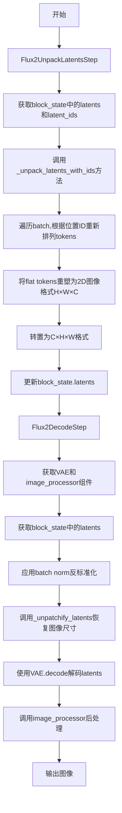
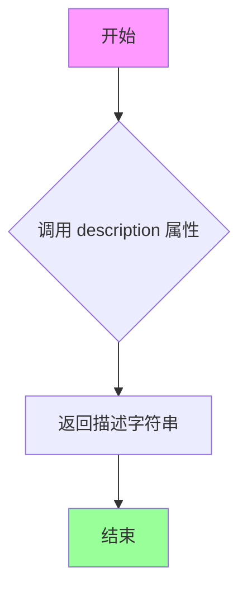
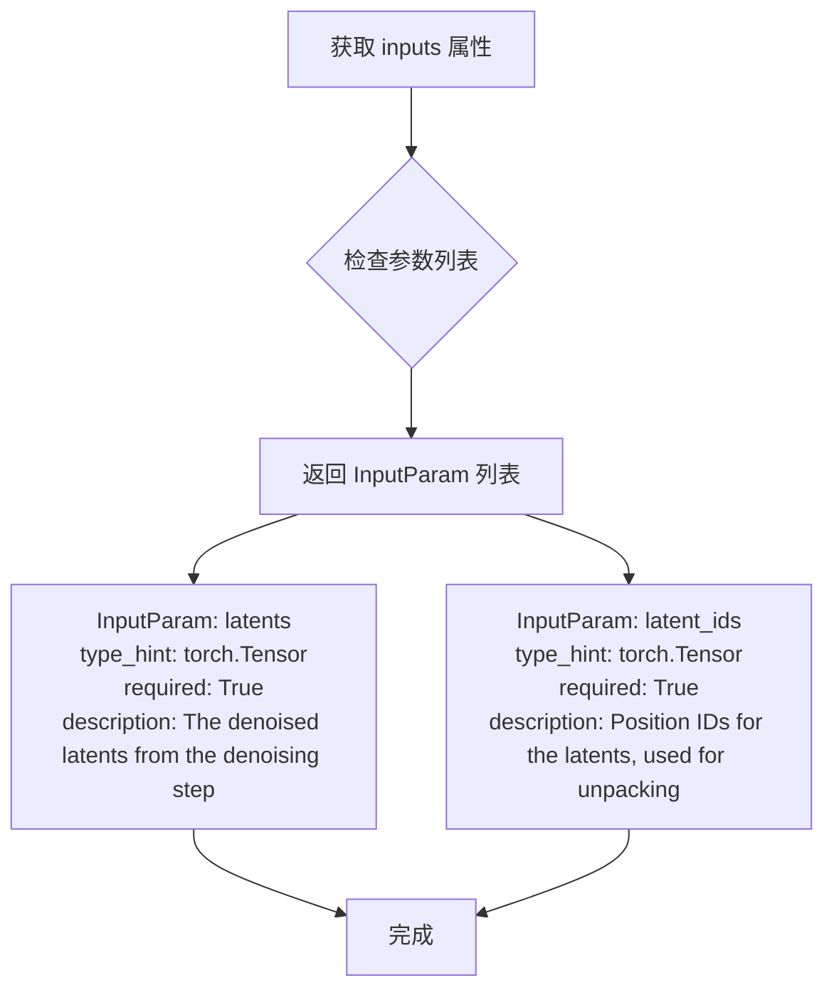
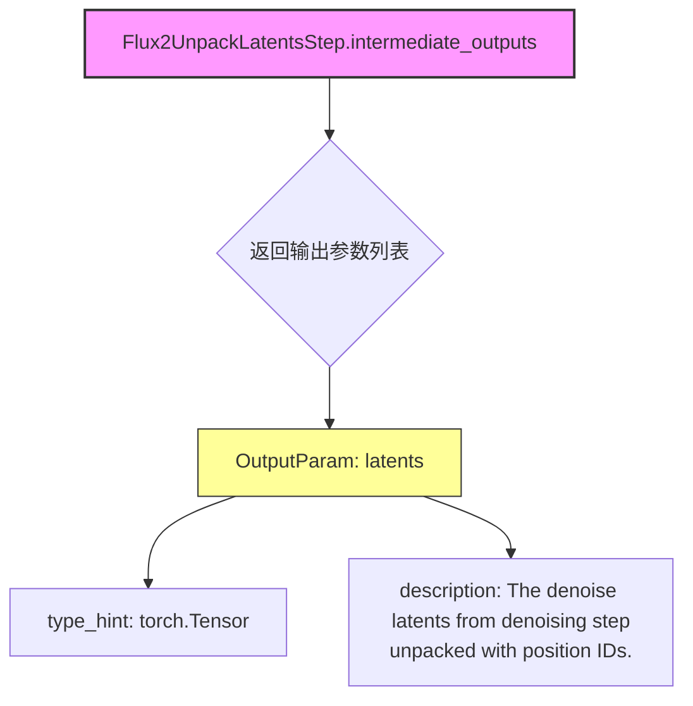
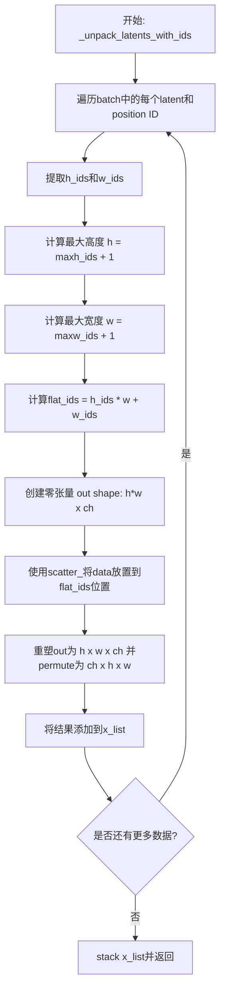
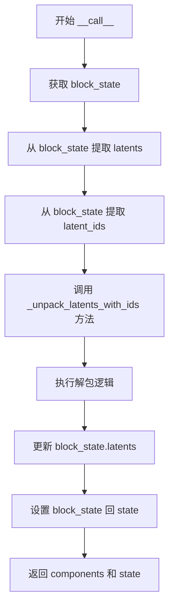
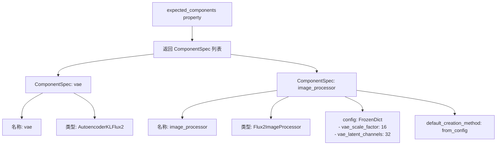
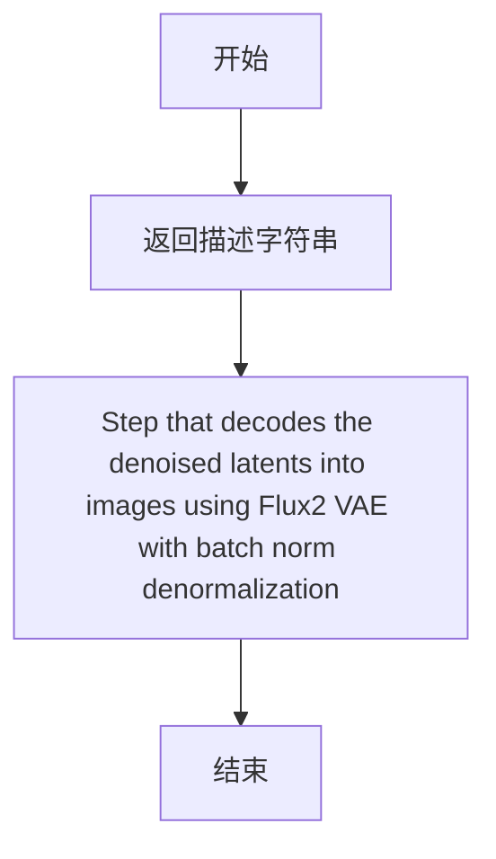
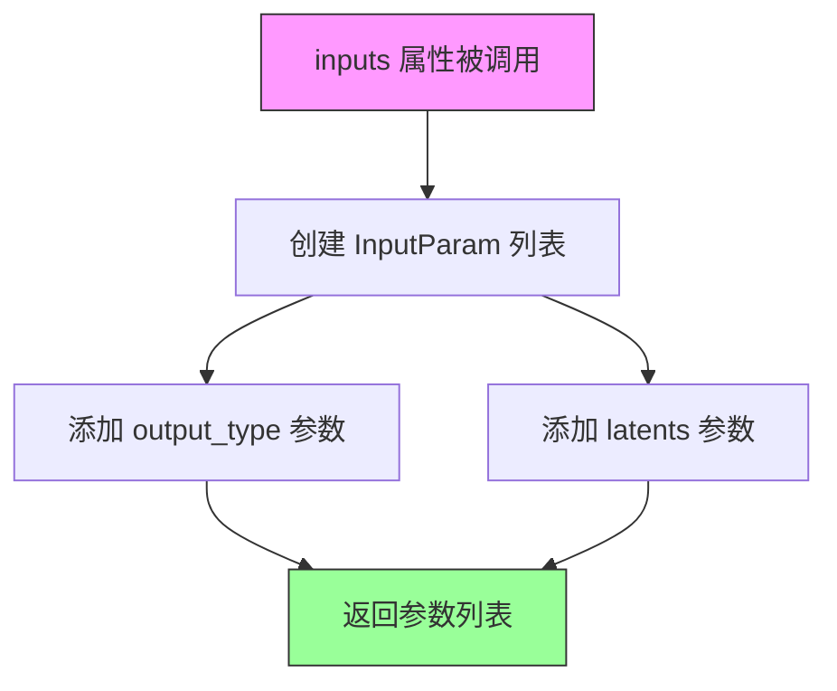
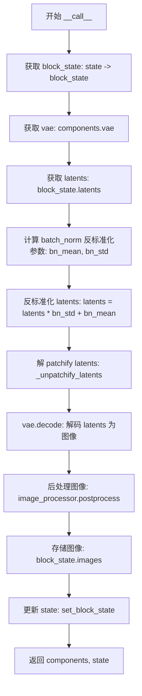

# `diffusers\src\diffusers\modular_pipelines\flux2\decoders.py` 详细设计文档

该文件实现了Flux2模型的管道步骤，包含两个核心类：Flux2UnpackLatentsStep用于将去噪后的latents根据位置ID解包回2D图像格式，Flux2DecodeStep用于将解包后的latents通过Flux2 VAE解码生成最终图像。

## 整体流程



## 类结构

```
ModularPipelineBlocks (抽象基类)
├── Flux2UnpackLatentsStep (解包步骤)
└── Flux2DecodeStep (解码步骤)
```

## 全局变量及字段


### `logger`
    
模块级日志记录器，用于记录该模块的运行信息和调试信息

类型：`logging.Logger`
    


### `Flux2UnpackLatentsStep.model_name`
    
模型名称标识，用于标识该步骤关联的模型类型为flux2

类型：`str`
    


### `Flux2DecodeStep.model_name`
    
模型名称标识，用于标识该步骤关联的模型类型为flux2

类型：`str`
    
    

## 全局函数及方法


### `Flux2UnpackLatentsStep.description`

该属性返回对 `Flux2UnpackLatentsStep` 步骤功能的描述文字，说明该步骤用于从去噪步骤中解包潜在表示。

参数：无（`@property` 装饰器方法，无显式参数）

返回值：`str`，返回步骤描述字符串，说明该步骤的功能是从去噪步骤中解包 latents。

#### 流程图



#### 带注释源码

```python
@property
def description(self) -> str:
    """
    返回该步骤的描述信息
    
    Returns:
        str: 描述字符串，说明此步骤用于从去噪步骤中解包 latents
    """
    return "Step that unpacks the latents from the denoising step"
```


### `Flux2UnpackLatentsStep.inputs`

该属性定义了 `Flux2UnpackLatentsStep` 步骤所需的输入参数列表，包括去噪后的潜在向量和用于解包的位置 ID。

参数：

- `self`：无显式参数（类的实例属性，由 Python property 装饰器管理）

返回值：`list[tuple[str, Any]]`（实际为 `list[InputParam]`），返回该步骤的输入参数规范列表，包含每个参数的名称、类型提示、描述等信息。

#### 流程图



#### 带注释源码

```python
@property
def inputs(self) -> list[tuple[str, Any]]:
    """
    定义该步骤的输入参数列表。
    
    返回一个包含 InputParam 对象的列表，每个对象描述一个输入参数。
    InputParam 是来自 modular_pipeline_utils 的数据结构，用于标准化管道步骤的输入规范。
    
    Returns:
        list[tuple[str, Any]]: 输入参数列表，包含:
            - latents: 去噪步骤产生的潜在向量张量
            - latent_ids: 用于解包潜在向量的位置 ID 张量
    """
    return [
        InputParam(
            "latents",  # 参数名称
            required=True,  # 是否必需
            type_hint=torch.Tensor,  # 类型提示
            description="The denoised latents from the denoising step",  # 参数描述
        ),
        InputParam(
            "latent_ids",  # 参数名称
            required=True,  # 是否必需
            type_hint=torch.Tensor,  # 类型提示
            description="Position IDs for the latents, used for unpacking",  # 参数描述
        ),
    ]
```


### `Flux2UnpackLatentsStep.intermediate_outputs`

该属性定义了 `Flux2UnpackLatentsStep` 步骤的中间输出参数，指定了该步骤处理后产生的输出变量名称、类型及描述信息。

参数： 无（该属性不接受任何输入参数）

返回值： `list[OutputParam]`（包含中间输出参数的列表）

#### 流程图



#### 带注释源码

```python
@property
def intermediate_outputs(self) -> list[str]:
    """
    定义该步骤的中间输出参数。
    
    返回值:
        list[str]: 包含 OutputParam 对象的列表，描述该步骤输出的变量信息。
        
    输出参数详情:
        - latents (torch.Tensor): 从去噪步骤得到的潜在表示，经过位置ID解包处理后的张量。
    """
    return [
        OutputParam(
            "latents",
            type_hint=torch.Tensor,
            description="The denoise latents from denoising step, unpacked with position IDs.",
        )
    ]
```


### Flux2UnpackLatentsStep._unpack_latents_with_ids

该静态方法使用位置ID将打包的latents张量解包为标准图像格式（通道、高度、宽度），通过scatter操作将令牌按照位置ID指定的坐标重新排列到正确的位置。

参数：

- `x`：`torch.Tensor`，打包的latents张量，形状为 (B, seq_len, C)，其中B是批量大小，seq_len是序列长度，C是通道数
- `x_ids`：`torch.Tensor`，位置ID张量，形状为 (B, seq_len, 4)，包含 (T, H, W, L) 坐标信息

返回值：`torch.Tensor`，解包后的latents张量，形状为 (B, C, H, W)，其中H和W是根据位置ID计算得出的高度和宽度

#### 流程图



#### 带注释源码

```python
@staticmethod
def _unpack_latents_with_ids(x: torch.Tensor, x_ids: torch.Tensor) -> torch.Tensor:
    """
    Unpack latents using position IDs to scatter tokens into place.

    Args:
        x: Packed latents tensor of shape (B, seq_len, C)
        x_ids: Position IDs tensor of shape (B, seq_len, 4) with (T, H, W, L) coordinates

    Returns:
        Unpacked latents tensor of shape (B, C, H, W)
    """
    # 初始化结果列表，用于存储每个batch的解包结果
    x_list = []
    
    # 遍历batch中的每个样本（latent和对应的position IDs）
    for data, pos in zip(x, x_ids):
        # 获取通道数（data形状为 seq_len x C）
        _, ch = data.shape  # noqa: F841
        
        # 从position IDs中提取高度和宽度索引
        # pos形状为 (seq_len, 4)，包含 (T, H, W, L) 坐标
        h_ids = pos[:, 1].to(torch.int64)  # 高度索引
        w_ids = pos[:, 2].to(torch.int64)  # 宽度索引

        # 计算输出图像的高度和宽度（取最大值+1以确保包含所有位置）
        h = torch.max(h_ids) + 1
        w = torch.max(w_ids) + 1

        # 将2D位置ID展平为1D索引（用于scatter操作）
        flat_ids = h_ids * w + w_ids

        # 创建输出张量，形状为 (h*w, ch)，初始值为0
        out = torch.zeros((h * w, ch), device=data.device, dtype=data.dtype)
        
        # 使用scatter_将data中的值按照flat_ids展开到out的对应位置
        # flat_ids.unsqueeze(1).expand(-1, ch) 将flat_ids扩展为 (seq_len, ch) 以匹配data的形状
        out.scatter_(0, flat_ids.unsqueeze(1).expand(-1, ch), data)

        # 重塑输出：从 (h*w, ch) -> (h, w, ch) -> (ch, h, w)
        out = out.view(h, w, ch).permute(2, 0, 1)
        x_list.append(out)

    # 将所有batch的结果堆叠成最终的输出张量
    return torch.stack(x_list, dim=0)
```

#### 关键组件信息

| 组件名称 | 描述 |
|---------|------|
| Flux2UnpackLatentsStep | 管道步骤类，负责解包denoising步骤输出的latents |
| x (latents) | 打包的latents张量，来自denoising步骤的输出 |
| x_ids (latent_ids) | 位置ID张量，用于指定每个token的空间位置 |
| flat_ids | 展平后的一维位置索引，用于scatter操作 |
| out | 解包后的输出张量，形状为 (B, C, H, W) |

#### 潜在的技术债务或优化空间

1. **循环效率**：当前使用Python for循环遍历batch，建议考虑使用向量化操作或torch的batch scatter来提升性能
2. **内存预分配**：可以在方法开始前预先计算最大h和w，统一分配输出张量大小，避免每个样本单独分配
3. **边界检查**：缺乏对h_ids和w_ids值范围的验证，可能导致越界访问
4. **device/dtype一致性**：虽然代码中传递了device和dtype，但可以添加更严格的类型检查

#### 其它项目

**设计目标与约束**：
- 将打包的序列latents转换为标准图像格式的张量
- 保持与Flux2模型的位置编码方案兼容
- 支持批量处理多个样本

**错误处理与异常设计**：
- 未对x和x_ids的形状不匹配情况进行处理
- 未检查h_ids和w_ids是否为非负整数
- 未处理空tensor的情况

**数据流与状态机**：
- 输入：打包latents (B, seq_len, C) + 位置ID (B, seq_len, 4)
- 输出：解包latents (B, C, H, W)
- 该方法是纯函数式操作，不涉及状态修改

**外部依赖与接口契约**：
- 依赖PyTorch张量操作
- 输入x_ids应包含有效的(T, H, W, L)坐标，其中H和W用于计算输出尺寸


### `Flux2UnpackLatentsStep.__call__`

该方法是 Flux2 管道中的潜在变量解包步骤，通过位置 IDs 将打包的潜在变量张量散射回原始的二维空间位置，输出解包后的潜在变量张量。

参数：

- `self`：实例方法隐式参数，表示当前 Flux2UnpackLatentsStep 对象
- `components`：未明确类型标注，从代码推断为管道组件集合，包含 VAE 等模型组件
- `state`：`PipelineState`，管道状态对象，包含当前 pipeline 的执行状态和中间数据

返回值：`PipelineState`，实际上返回元组 `(components, state)`，其中 components 为管道组件集合，state 为更新后的管道状态

#### 流程图



#### 带注释源码

```python
@torch.no_grad()
def __call__(self, components, state: PipelineState) -> PipelineState:
    """
    执行潜在变量解包逻辑，将打包的潜在变量通过位置 IDs 解包为二维张量。

    Args:
        components: 管道组件集合（包含 VAE 等模型）
        state: PipelineState 对象，存储当前 pipeline 的执行状态

    Returns:
        更新后的 PipelineState（实际返回元组 components 和 state）
    """
    # 从管道状态中获取当前 block 的状态
    block_state = self.get_block_state(state)

    # 从 block_state 中提取已去噪的潜在变量
    latents = block_state.latents

    # 从 block_state 中提取潜在变量的位置 IDs，用于解包
    latent_ids = block_state.latent_ids

    # 调用静态方法，使用位置 IDs 将打包的潜在变量解包为二维张量
    # 输入: (B, seq_len, C) -> 输出: (B, C, H, W)
    latents = self._unpack_latents_with_ids(latents, latent_ids)

    # 将解包后的潜在变量更新回 block_state
    block_state.latents = latents

    # 将更新后的 block_state 设置回管道状态
    self.set_block_state(state, block_state)

    # 返回组件集合和更新后的管道状态
    return components, state
```


### `Flux2DecodeStep.expected_components`

该属性定义了 `Flux2DecodeStep` 解码步骤所需的核心组件规范，包括用于将潜在表示解码为图像的 VAE 模型以及用于后处理生成图像的图像处理器，并指定了图像处理器的配置参数和创建方法。

参数：

- （无参数，该属性为只读 property）

返回值：`list[ComponentSpec]`，返回 Flux2DecodeStep 所需的组件规范列表，包含 VAE 模型和图像处理器及其配置信息

#### 流程图



#### 带注释源码

```python
@property
def expected_components(self) -> list[ComponentSpec]:
    """
    定义 Flux2DecodeStep 所需的组件规范。
    
    该属性返回一个组件规范列表，指定了解码步骤需要预先配置的两个核心组件：
    1. vae: 用于将去噪后的潜在表示解码为图像的变分自编码器模型
    2. image_processor: 用于对生成的图像进行后处理（如转换为 PIL 图像、归一化等）
    
    Returns:
        list[ComponentSpec]: 包含组件规范的列表，每个规范定义了组件的名称、类型、
                            可选配置以及创建方法
    """
    return [
        # VAE 组件规范：使用 AutoencoderKLFlux2 模型进行潜在表示的解码
        ComponentSpec("vae", AutoencoderKLFlux2),
        
        # 图像处理器组件规范
        # - 类型: Flux2ImageProcessor
        # - 配置: 包含 vae_scale_factor=16 和 vae_latent_channels=32 的冻结字典
        # - 创建方法: 默认从配置文件中创建
        ComponentSpec(
            "image_processor",
            Flux2ImageProcessor,
            config=FrozenDict({"vae_scale_factor": 16, "vae_latent_channels": 32}),
            default_creation_method="from_config",
        ),
    ]
```


### `Flux2DecodeStep.description`

该属性返回 Flux2 解码步骤的描述信息，说明该步骤使用 Flux2 VAE 和批归一化去归一化技术将去噪后的潜在表示解码为图像。

参数：
- （无 - 这是一个属性方法，无输入参数）

返回值：`str`，返回步骤的描述字符串，说明该步骤的功能是将去噪后的 latents 通过 Flux2 VAE 解码为图像，并包含批归一化去归一化处理。

#### 流程图



#### 带注释源码

```python
@property
def description(self) -> str:
    """
    属性方法：返回该解码步骤的描述信息
    
    Returns:
        str: 描述该步骤功能的字符串，说明使用 Flux2 VAE 
            和批归一化去归一化将去噪后的 latents 解码为图像
    """
    return "Step that decodes the denoised latents into images using Flux2 VAE with batch norm denormalization"
```


### `Flux2DecodeStep.inputs`

该属性定义了 `Flux2DecodeStep` 步骤的输入参数列表，包括输出类型和去噪后的潜在向量。

参数：

-  `output_type`：`str`，默认为 `"pil"`，指定输出图像的类型，可为 "pil"、"np" 或 "pt"
-  `latents`：`torch.Tensor`，必填参数，从去噪步骤生成的去噪潜在向量

返回值：`list[tuple[str, Any]]`，返回包含所有输入参数的列表，每个元素为 `InputParam` 对象

#### 流程图



#### 带注释源码

```python
@property
def inputs(self) -> list[tuple[str, Any]]:
    """
    定义该步骤的输入参数列表
    
    返回:
        包含所有输入参数的列表，每个参数由 InputParam 对象封装
    """
    return [
        # output_type: 输出图像的类型，默认为 "pil"（PIL 图像）
        # 支持的类型包括 "pil", "np"（numpy 数组）, "pt"（PyTorch 张量）
        InputParam("output_type", default="pil"),
        
        # latents: 必填参数，从去噪步骤得到的去噪潜在向量
        # 这是一个 torch.Tensor，形状为 (B, C, H, W) 的潜在空间表示
        InputParam(
            "latents",
            required=True,
            type_hint=torch.Tensor,
            description="The denoised latents from the denoising step",
        ),
    ]
```


### `Flux2DecodeStep.intermediate_outputs`

该属性定义了 Flux2 解码步骤的中间输出参数，指定了解码后的图像输出，包括图像的类型提示（支持 PIL.Image、torch.Tensor 或 np.ndarray）和描述。

参数： 无（该属性无输入参数）

返回值：`list[OutputParam]`，返回一个包含输出参数规范的列表，其中定义了图像输出的名称、类型和描述信息。

#### 流程图

```mermaid
flowchart TD
    A[开始] --> B[定义 intermediate_outputs 属性]
    B --> C[返回 OutputParam 列表]
    C --> D[包含 images 输出参数]
    D --> E[类型提示: Union[list[PIL.Image.Image], torch.Tensor, np.ndarray]]
    E --> F[描述: 生成的图像]
    F --> G[结束]
```

#### 带注释源码

```python
@property
def intermediate_outputs(self) -> list[str]:
    """
    定义解码步骤的中间输出参数。
    
    该属性返回解码步骤产生的中间输出信息，用于流水线状态管理。
    在 Flux2DecodeStep 中，中间输出为解码后的图像。
    
    Returns:
        list[str]: 包含 OutputParam 对象的列表，定义图像输出的名称、类型和描述
    """
    return [
        OutputParam(
            "images",  # 输出参数名称
            type_hint=Union[list[PIL.Image.Image], torch.Tensor, np.ndarray],  # 类型提示
            description="The generated images, can be a list of PIL.Image.Image, torch.Tensor or a numpy array",  # 描述
        )
    ]
```


### `Flux2DecodeStep._unpatchify_latents`

将patchified latents恢复为常规格式。该方法通过reshape和permute操作将包含2x2 patch的latents张量转换回原始的空间维度，实现从压缩表示到完整表示的恢复。

参数：

- `latents`：`torch.Tensor`，输入的patchified latents张量，形状为 (batch_size, num_channels_latents, height, width)

返回值：`torch.Tensor`，恢复后的latents张量，形状为 (batch_size, num_channels_latents // 4, height * 2, width * 2)

#### 流程图

```mermaid
flowchart TD
    A[输入: patchified latents<br/>(batch_size, C, H, W)] --> B[获取shape信息<br/>batch_size, num_channels_latents, height, width]
    B --> C[Reshape: (B, C//4, 2, 2, H, W)<br/>将通道维度分解出2x2 patch]
    C --> D[Permute: (B, C//4, H, 2, W, 2)<br/>调整维度顺序重新排列]
    D --> E[Reshape: (B, C//4, H*2, W*2)<br/>合并patch得到扩大2倍的空间维度]
    E --> F[输出: 恢复后的latents<br/>(batch_size, C//4, H*2, W*2)]
    
    style C fill:#e1f5fe
    style D fill:#e1f5fe
    style E fill:#e1f5fe
```

#### 带注释源码

```python
@staticmethod
def _unpatchify_latents(latents):
    """Convert patchified latents back to regular format."""
    # 获取输入张量的形状信息
    # latents 形状: (batch_size, num_channels_latents, height, width)
    # 其中 num_channels_latents 包含了 2*2=4 个patch通道
    batch_size, num_channels_latents, height, width = latents.shape
    
    # 第一步reshape: 将通道维度分解为 (通道数/4, 2, 2)
    # 同时保持 batch_size, height, width 不变
    # 结果形状: (batch_size, num_channels_latents//4, 2, 2, height, width)
    latents = latents.reshape(batch_size, num_channels_latents // (2 * 2), 2, 2, height, width)
    
    # 第二步permute: 重新排列维度顺序
    # 从 (B, C', 2, 2, H, W) -> (B, C', H, 2, W, 2)
    # 将空间维度与patch维度交叉排列
    latents = latents.permute(0, 1, 4, 2, 5, 3)
    
    # 第三步reshape: 合并2x2的patch，恢复到常规空间维度
    # 将 (B, C', H, 2, W, 2) -> (B, C', H*2, W*2)
    # 空间高度和宽度都扩大了2倍
    latents = latents.reshape(batch_size, num_channels_latents // (2 * 2), height * 2, width * 2)
    
    # 返回恢复后的latents，形状: (batch_size, num_channels_latents//4, height*2, width*2)
    return latents
```


### `Flux2DecodeStep.__call__`

执行Flux2模型的解码步骤，将去噪后的latents进行batch norm反标准化和解patchify处理，然后使用VAE解码为图像，并经过图像处理器后处理，最终生成输出图像。

参数：

- `components`：包含pipeline组件的对象，具体为包含`vae`（AutoencoderKLFlux2模型）和`image_processor`（Flux2ImageProcessor）的组件集合。
- `state`：`PipelineState`类型，pipeline的状态对象，包含当前block的上下文信息，如`latents`和`output_type`等。

返回值：返回元组`(components, state)`，其中`components`为输入的组件对象，`state`为更新后的`PipelineState`对象，其中`block_state.images`被设置为生成的图像。

#### 流程图



#### 带注释源码

```python
@torch.no_grad()
def __call__(self, components, state: PipelineState) -> PipelineState:
    """
    执行解码步骤，将去噪后的latents解码为图像。
    
    参数:
        components: 包含VAE和图像处理器的组件集合。
        state: PipelineState对象，包含latents和output_type等。
    
    返回:
        更新后的PipelineState对象，其中包含生成的图像。
    """
    # 从state中获取当前block的状态
    block_state = self.get_block_state(state)
    
    # 获取VAE模型
    vae = components.vae
    
    # 获取去噪后的latents
    latents = block_state.latents
    
    # 获取batch norm的running mean和running var，并计算标准差
    # 用于对latents进行反标准化（denormalization）
    latents_bn_mean = vae.bn.running_mean.view(1, -1, 1, 1).to(latents.device, latents.dtype)
    latents_bn_std = torch.sqrt(vae.bn.running_var.view(1, -1, 1, 1) + vae.config.batch_norm_eps).to(
        latents.device, latents.dtype
    )
    # 反标准化latents: latents = latents * std + mean
    latents = latents * latents_bn_std + latents_bn_mean
    
    # 将patchified latents转换回常规格式（解patchify）
    # 例如从 (B, C, H*2, W*2) 转换回 (B, C//4, H, W) 等，具体形状变化
    latents = self._unpatchify_latents(latents)
    
    # 使用VAE解码latents得到图像
    # vae.decode 返回 tuple (image,)，取第一个元素
    block_state.images = vae.decode(latents, return_dict=False)[0]
    
    # 使用图像处理器对图像进行后处理
    # 根据 output_type（例如 "pil"）转换图像格式
    block_state.images = components.image_processor.postprocess(
        block_state.images, output_type=block_state.output_type
    )
    
    # 更新block_state到state中
    self.set_block_state(state, block_state)
    
    # 返回components和state
    return components, state
```

## 关键组件


### 张量索引与位置ID反投影

将打包的张量通过位置ID散射回原始空间位置，实现从1D序列到2D图像空间的逆映射

### 惰性加载与无梯度计算

使用@torch.no_grad()装饰器禁用梯度计算，减少显存占用并加速推理过程

### 批量归一化反标准化

在解码前使用VAE的batch norm统计量（running_mean和running_var）对潜在表示进行反标准化，恢复原始特征分布

### 潜在表示解patchify

将patch化（分块）的潜在表示还原为连续的空间格式，支持2x2 patch的逆操作

### 图像后处理

通过Flux2ImageProcessor将解码后的潜在表示转换为最终输出格式（pil/tensor/numpy）


## 问题及建议


### 已知问题

- **循环效率低下**: `_unpack_latents_with_ids` 方法使用 Python for 循环逐个处理 batch 中的样本，未利用向量化操作，在大 batch 场景下性能较差
- **硬编码的 Patch 大小**: `_unpatchify_latents` 中硬编码了 `2 * 2` 的 patch 尺寸，未从 VAE 配置或组件规格中读取，降低了代码的通用性和可维护性
- **未使用的变量**: `_unpack_latents_with_ids` 中 `_, ch = data.shape` 声明了 `ch` 变量但实际未使用（虽然后续有使用 `ch`，但 pylint 会产生警告）
- **设备/数据类型转换冗余**: 每次调用 `__call__` 时都执行 `.to(latents.device, latents.dtype)` 将 batch norm 统计量移动到目标设备，VAE 可能已经处于正确设备上，造成不必要的开销
- **缺少输入验证**: `__call__` 方法未验证 `latents` 和 `latent_ids` 的形状兼容性，可能导致运行时错误而非清晰的错误提示
- **类型注解不完整**: `inputs` 属性返回 `list[tuple[str, Any]]` 而非更精确的类型，且缺少对 `components` 参数的类型注解
- **魔法数字**: VAE scale factor (16) 和 latent channels (32) 在 `expected_components` 中硬编码，未从模型配置动态获取

### 优化建议

- **向量化优化**: 将 `_unpack_latents_with_ids` 中的循环改写为完全向量化的操作，利用 PyTorch 的批量张量操作替代逐样本循环
- **配置外部化**: 将 patch 大小、scale factor 等硬编码值提取为组件配置参数或从 VAE config 中读取
- **设备缓存优化**: 在 `__call__` 首次调用时缓存 batch norm 统计量的设备转换结果，避免重复转换
- **添加输入验证**: 在方法入口添加 shape 兼容性检查和必需参数的断言，提供清晰的错误信息
- **JIT 优化**: 对静态方法使用 `@torch.jit.script` 装饰器启用 JIT 编译加速
- **类型注解完善**: 补充 `components` 参数的精确类型注解，考虑使用 `typing.Protocol` 定义更严格的接口约束


## 其它


### 设计目标与约束

本代码实现Flux2模型的去噪latent解码Pipeline块，包括两个核心步骤：Flux2UnpackLatentsStep负责将打包的latent张量根据位置ID解包为2D图像格式；Flux2DecodeStep负责使用VAE将解包后的latent解码为最终图像。设计目标是为Flux2.pipeline提供模块化的latent处理和解码能力，支持批量处理和多种输出类型（PIL/Tensor/NumPy）。主要约束包括依赖AutoencoderKLFlux2模型和Flux2ImageProcessor组件。

### 错误处理与异常设计

代码主要通过PipelineState的状态管理和组件依赖验证处理异常。Flux2UnpackLatentsStep假设输入latents和latent_ids形状匹配，若不匹配会在torch.scatter操作时引发IndexError。Flux2DecodeStep的expected_components属性定义了必需的VAE组件，若组件缺失需在调用前完成依赖注入。日志记录通过logger提供warning级别输出。目前缺乏显式的参数校验和用户友好的错误提示。

### 数据流与状态机

整体数据流为：输入打包latents (B, seq_len, C) + latent_ids (B, seq_len, 4) → Flux2UnpackLatentsStep._unpack_latents_with_ids → 解包latents (B, C, H, W) → 存入PipelineState.block_state.latents → Flux2DecodeStep._unpatchify_latents → 反patchify处理 → VAE.decode → image_processor.postprocess → 最终images输出。状态机遵循ModularPipelineBlocks基类定义的get_block_state/modify/set_block_state模式，各step通过PipelineState共享数据。

### 外部依赖与接口契约

本代码依赖以下外部组件：1) AutoencoderKLFlux2 - VAE解码器模型；2) Flux2ImageProcessor - 图像后处理器；3) PipelineState - 来自modular_pipeline的状态管理类；4) ComponentSpec/InputParam/OutputParam - 来自modular_pipeline_utils的组件规格定义；5) FrozenDict - 配置冻结字典。接口契约要求：调用者需在components中注入vae和image_processor组件，latent_ids需包含(T,H,W,L)四维坐标信息，输出类型默认为"pil"。

### 配置与参数说明

关键配置参数包括：Flux2DecodeStep中image_processor配置包含vae_scale_factor=16和vae_latent_channels=32，用于图像后处理缩放。VAE batch_norm参数通过vae.config.batch_norm_eps获取（默认为1e-6）。位置ID解包时假设h_ids和w_ids从0开始连续，输出分辨率由max(h_ids)+1和max(w_ids)+1计算确定。

### 性能考虑与优化建议

_unpack_latents_with_ids方法使用Python循环逐样本处理，建议使用向量化操作或torch.scatter_reduce优化。_unpatchify_latents方法执行多次reshape和permute，可考虑融合操作。decode调用已使用@torch.no_grad()装饰器避免梯度计算。潜在优化空间包括：1) 预分配输出张量避免多次分配；2) 合并unpack和unpatchify逻辑减少中间张量；3) 考虑使用torch.compile加速。

### 版本兼容性与依赖关系

代码要求Python 3.8+，PyTorch 2.0+，NumPy 1.24+，Pillow 9.0+。本代码位于diffusers库pipelines/flux2模块下，需配合diffusers 0.30+版本使用。AutoencoderKLFlux2模型架构需与当前VAE decode接口兼容。

### 测试策略建议

应覆盖：1) unpack_latents_with_ids正确性验证（已知输入输出）；2) unpack处理边界情况（单样本、特殊位置ID）；3) unpatchify_latents的形状变换验证；4) decode step的组件依赖缺失场景；5) 多种output_type(pil/tensor/numpy)兼容性测试；6) 批量大小为1和多batch场景。
    