# `diffusers\src\diffusers\modular_pipelines\flux2\denoise.py` 详细设计文档

这是 Hugging Face Diffusers 库中 Flux2 图像生成模型的降噪循环模块，提供了多种降噪步骤实现，支持标准 Flux2、Flux2-Klein 和 Flux2-Klein-Base 模型，并实现了 Classifier-Free Guidance (CFG) 引导功能，用于在去噪过程中根据文本提示生成图像。

## 整体流程

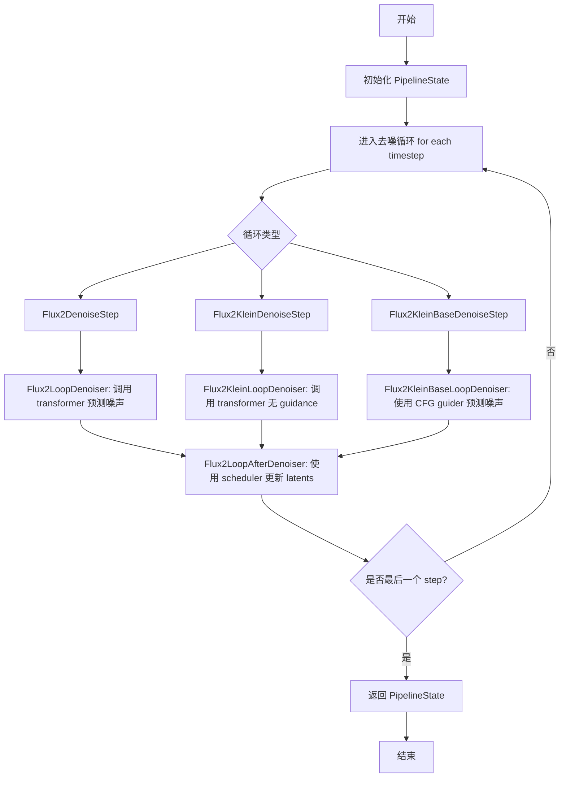

## 类结构

```
ModularPipelineBlocks (基类)
├── Flux2LoopDenoiser (Flux2 去噪循环块)
├── Flux2KleinLoopDenoiser (Flux2-Klein 去噪循环块)
├── Flux2KleinBaseLoopDenoiser (Flux2-Klein-Base 去噪循环块，支持 CFG)
├── Flux2LoopAfterDenoiser (去噪后处理块)
LoopSequentialPipelineBlocks (基类)
└── Flux2DenoiseLoopWrapper (去噪循环包装器)
    ├── Flux2DenoiseStep
    ├── Flux2KleinDenoiseStep
    └── Flux2KleinBaseDenoiseStep
```

## 全局变量及字段


### `XLA_AVAILABLE`
    
Whether PyTorch XLA is available for TPU support

类型：`bool`
    


### `logger`
    
Logger instance for the module

类型：`logging.Logger`
    


### `Flux2LoopDenoiser.model_name`
    
Model identifier for Flux2

类型：`str`
    


### `Flux2KleinLoopDenoiser.model_name`
    
Model identifier for Flux2-Klein

类型：`str`
    


### `Flux2KleinBaseLoopDenoiser.model_name`
    
Model identifier for Flux2-Klein-Base

类型：`str`
    


### `Flux2LoopAfterDenoiser.model_name`
    
Model identifier for Flux2

类型：`str`
    


### `Flux2DenoiseLoopWrapper.model_name`
    
Model identifier for Flux2

类型：`str`
    


### `Flux2DenoiseStep.block_classes`
    
List of block classes used in the denoising step

类型：`list[type[ModularPipelineBlocks]]`
    


### `Flux2DenoiseStep.block_names`
    
List of block names for the denoising step

类型：`list[str]`
    


### `Flux2KleinDenoiseStep.block_classes`
    
List of block classes used in the Klein denoising step

类型：`list[type[ModularPipelineBlocks]]`
    


### `Flux2KleinDenoiseStep.block_names`
    
List of block names for the Klein denoising step

类型：`list[str]`
    


### `Flux2KleinBaseDenoiseStep.block_classes`
    
List of block classes used in the Klein base denoising step

类型：`list[type[ModularPipelineBlocks]]`
    


### `Flux2KleinBaseDenoiseStep.block_names`
    
List of block names for the Klein base denoising step

类型：`list[str]`
    
    

## 全局函数及方法


### `is_torch_xla_available`

该函数用于检测当前环境是否安装了 PyTorch XLA（Accelerated Linear Algebra），即 Google 的用于高性能深度学习的 PyTorch 设备后端。如果可用，则导入 XLA 的核心模块以便后续使用。

参数： 无

返回值：`bool`，返回 `True` 表示 PyTorch XLA 可用并已成功导入；返回 `False` 表示不可用

#### 流程图

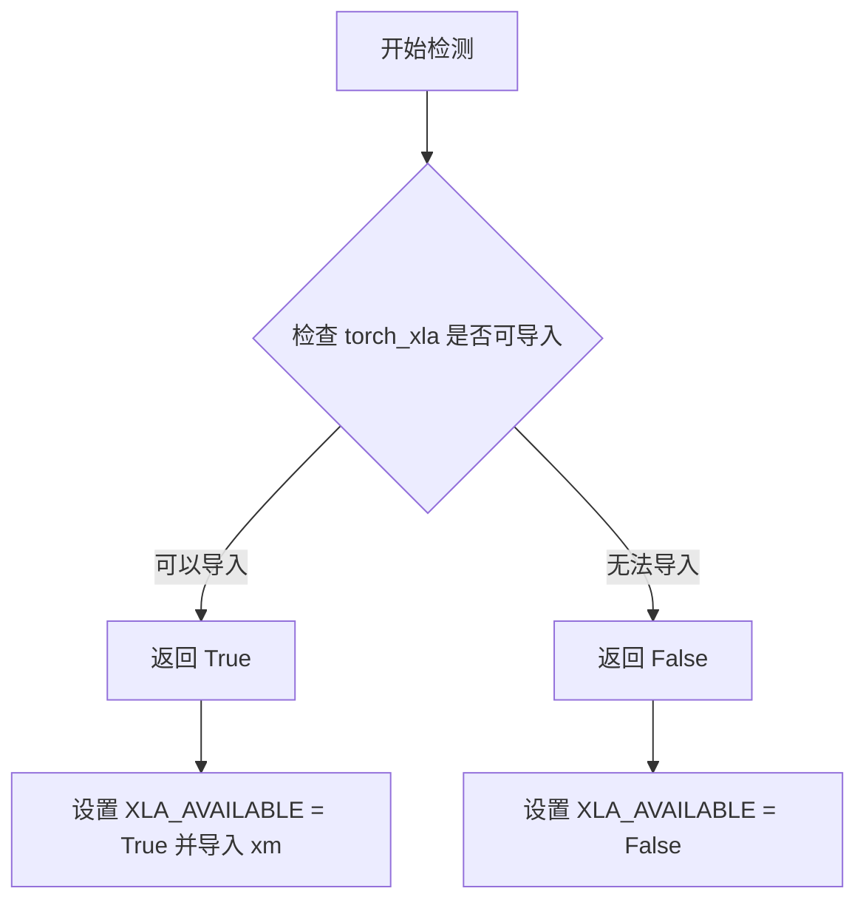

#### 带注释源码

由于 `is_torch_xla_available` 函数定义在 `...utils` 模块中（未在此代码文件中提供定义），以下是基于其在此文件中的使用方式推断的典型实现：

```python
# 这是一个推断的实现，源自对 transformers 库常用工具函数的理解
def is_torch_xla_available() -> bool:
    """
    检查 PyTorch XLA 是否可用。
    
    该函数尝试导入 torch_xla 模块，如果成功则返回 True，
    否则返回 False。这允许代码在没有安装 XLA 的环境中
    优雅地降级。
    
    Returns:
        bool: 如果 torch_xla 可用返回 True，否则返回 False
    """
    try:
        import torch_xla  # noqa: F401
        return True
    except ImportError:
        return False
```

> **注意**：此代码段未在提供的源文件中直接定义，而是从 `...utils` 模块导入。该函数的具体实现位于 `diffusers` 库的 `src/diffusers/utils` 目录下的 `torch_xla_utils.py` 或类似的工具文件中。


### `logging.get_logger`

获取一个与给定模块名称关联的日志记录器实例，用于在模块中记录日志信息。

参数：

- `__name__`：`str`，通常传入 `__name__` 变量，表示当前模块的完全限定名，用于标识日志来源

返回值：`logging.Logger`，返回配置好的日志记录器对象，可用于输出日志信息

#### 流程图

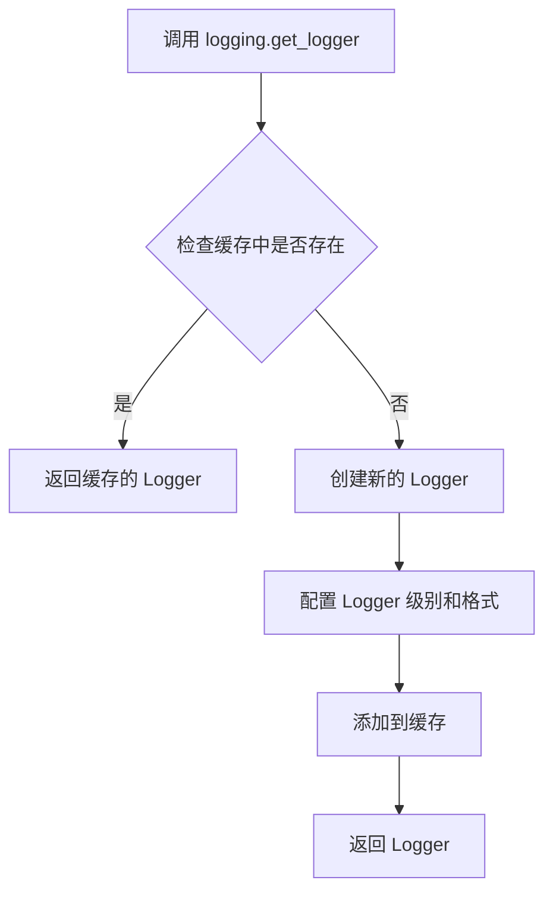

#### 带注释源码

```python
# 在本代码中的使用方式
from ...utils import logging

# 调用 get_logger 获取当前模块的 logger
# __name__ 是 Python 内置变量，表示当前模块的完整路径
# 例如: 'src.diffusers.pipelines.flux.pipeline_flux2'
logger = logging.get_logger(__name__)  # pylint: disable=invalid-name
```

---

**注意**：该函数的实际定义位于 `...utils.logging` 模块中（来自 Hugging Face Diffusers 库），在当前代码文件中仅包含其调用语句，未包含完整实现源码。该函数通常遵循 Python 标准库 `logging.getLogger()` 的模式，实现日志记录器的创建、缓存和配置功能。


### `Flux2LoopDenoiser.expected_components`

该属性方法定义了Flux2LoopDenoiser块在Flux2去噪循环中所依赖的组件规范。它返回一个ComponentSpec列表，明确指定了该块需要使用的Transformer模型组件，用于执行潜在变量的去噪操作。

参数：无（作为@property装饰器的方法，无需显式参数）

返回值：`list[ComponentSpec]`，返回Flux2去噪块所需的组件规范列表。当前仅包含一个transformer组件规范，指定了组件名称为"transformer"以及对应的模型类型为Flux2Transformer2DModel。

#### 流程图

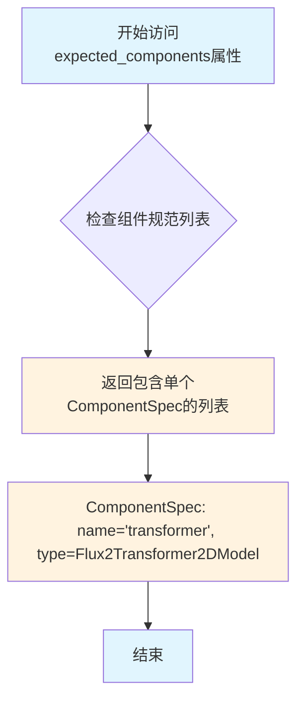

#### 带注释源码

```python
@property
def expected_components(self) -> list[ComponentSpec]:
    """
    定义该块所需的组件规范列表。
    
    该属性返回的ComponentSpec列表用于声明Flux2LoopDenoiser块
    在执行去噪操作时依赖的组件。组件注册系统会根据此规范
    验证并注入相应的组件实例。
    
    Returns:
        list[ComponentSpec]: 包含组件规范的列表，当前定义了一个
                            'transformer'组件，使用Flux2Transformer2DModel类型
    """
    return [ComponentSpec("transformer", Flux2Transformer2DModel)]
```


### `Flux2LoopDenoiser.description`

该属性返回对 `Flux2LoopDenoiser` 类的功能描述，说明该块是 Flux2 去噪循环中的步骤，用于对潜在表示进行去噪，应被用作 `LoopSequentialPipelineBlocks` 对象的 `sub_blocks` 属性的组成部分。

参数： 无（这是一个属性 getter，无参数）

返回值： `str`，返回对该去噪循环块的描述字符串

#### 流程图

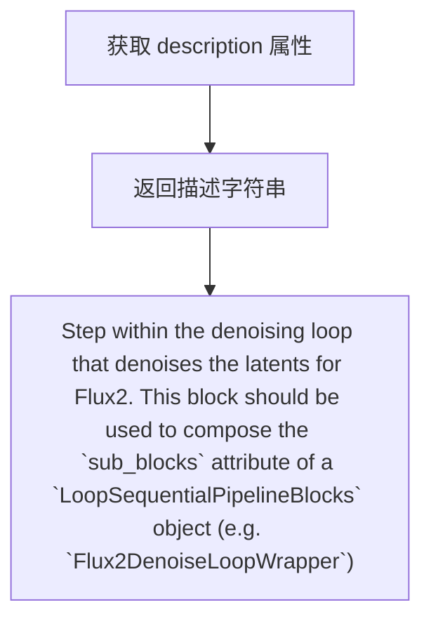

#### 带注释源码

```python
@property
def description(self) -> str:
    """
    返回对 Flux2LoopDenoiser 类的描述信息。
    
    该属性说明这是一个位于去噪循环中的步骤，用于对 Flux2 的 latent 进行去噪。
    此块应用作 LoopSequentialPipelineBlocks 对象的 sub_blocks 属性的组成部分，
    例如用于 Flux2DenoiseLoopWrapper。
    
    Returns:
        str: 描述该块功能和用途的字符串
    """
    return (
        "Step within the denoising loop that denoises the latents for Flux2. "
        "This block should be used to compose the `sub_blocks` attribute of a `LoopSequentialPipelineBlocks` "
        "object (e.g. `Flux2DenoiseLoopWrapper`)"
    )
```


### Flux2LoopDenoiser.inputs

该属性方法定义了 Flux2LoopDenoiser 块的输入参数规范，返回一个包含所有必需和可选输入参数的列表，用于在去噪循环中传递数据。

参数：
- （无额外参数，该方法为 property 类型，仅接受 self 隐式参数）

返回值：`list[tuple[str, Any]]`，返回一个 InputParam 对象列表，描述了该块的所有输入参数

#### 流程图

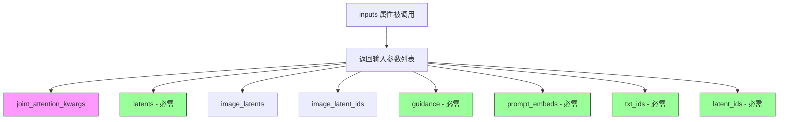

#### 带注释源码

```python
@property
def inputs(self) -> list[tuple[str, Any]]:
    """
    定义 Flux2LoopDenoiser 块的输入参数规范。
    返回一个包含 InputParam 对象的列表，每个对象描述一个输入参数。
    
    返回:
        list[tuple[str, Any]]: 输入参数列表，包含 8 个参数
    """
    return [
        # 可选参数：联合注意力配置字典
        InputParam("joint_attention_kwargs"),
        
        # 必需参数：要去噪的潜在向量，形状为 (B, seq_len, C)
        InputParam(
            "latents",
            required=True,
            type_hint=torch.Tensor,
            description="The latents to denoise. Shape: (B, seq_len, C)",
        ),
        
        # 可选参数：用于条件生成的打包图像潜在向量，形状为 (B, img_seq_len, C)
        InputParam(
            "image_latents",
            type_hint=torch.Tensor,
            description="Packed image latents for conditioning. Shape: (B, img_seq_len, C)",
        ),
        
        # 可选参数：图像潜在向量的位置 ID，形状为 (B, img_seq_len, 4)
        InputParam(
            "image_latent_ids",
            type_hint=torch.Tensor,
            description="Position IDs for image latents. Shape: (B, img_seq_len, 4)",
        ),
        
        # 必需参数：引导尺度张量，用于控制生成过程中的引导强度
        InputParam(
            "guidance",
            required=True,
            type_hint=torch.Tensor,
            description="Guidance scale as a tensor",
        ),
        
        # 必需参数：来自 Mistral3 的文本嵌入向量
        InputParam(
            "prompt_embeds",
            required=True,
            type_hint=torch.Tensor,
            description="Text embeddings from Mistral3",
        ),
        
        # 必需参数：文本令牌的 4D 位置 ID (T, H, W, L)
        InputParam(
            "txt_ids",
            required=True,
            type_hint=torch.Tensor,
            description="4D position IDs for text tokens (T, H, W, L)",
        ),
        
        # 必需参数：潜在令牌的 4D 位置 ID (T, H, W, L)
        InputParam(
            "latent_ids",
            required=True,
            type_hint=torch.Tensor,
            description="4D position IDs for latent tokens (T, H, W, L)",
        ),
    ]
```


### `Flux2LoopDenoiser.__call__`

该方法是 Flux2 循环去噪器的核心调用函数，负责在扩散模型的迭代去噪过程中执行单步前向传播。它接收当前的管道组件、块状态、当前迭代索引和时间步，然后对潜在表示进行条件去噪预测，最终返回更新后的组件和块状态。

参数：

- `self`：`Flux2LoopDenoiser`，当前类的实例对象
- `components`：`Flux2ModularPipeline`，包含管道中所有组件的配置对象，其中包含 `transformer` 等模型组件
- `block_state`：`BlockState`，存储当前去噪迭代的中间状态，包括 `latents`、`prompt_embeds`、`guidance`、`txt_ids`、`latent_ids`、`image_latents`、`image_latent_ids`、`joint_attention_kwargs` 等
- `i`：`int`，当前去噪迭代的索引，用于标识在完整去噪循环中的位置
- `t`：`torch.Tensor`，当前去噪步骤的时间步张量，形状为 (1,)，表示扩散过程中的时间点

返回值：`PipelineState`，一个元组 `(components, block_state)`，其中 `components` 是更新后的管道组件对象，`block_state` 是更新后的块状态对象，新增了 `noise_pred` 属性存储预测的噪声

#### 流程图

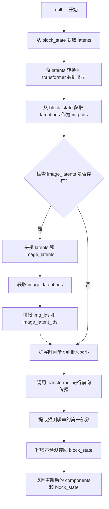

#### 带注释源码

```python
@torch.no_grad()
def __call__(
    self, components: Flux2ModularPipeline, block_state: BlockState, i: int, t: torch.Tensor
) -> PipelineState:
    """
    执行单步去噪前向传播，对当前潜在表示进行噪声预测。
    
    参数:
        components: 包含管道组件的配置对象，必须包含 transformer 属性
        block_state: 存储当前迭代状态的块状态对象，包含 latents、prompt_embeds、guidance 等
        i: 当前迭代索引，用于标识去噪循环中的位置
        t: 当前时间步张量，范围 [0, 1000]
    
    返回:
        包含更新后 components 和 block_state 的元组
    """
    # 从块状态中获取当前需要去噪的潜在表示
    latents = block_state.latents
    
    # 将潜在表示转换为 transformer 模型所需的数据类型（通常为 float16 或 bfloat16）
    latent_model_input = latents.to(components.transformer.dtype)
    
    # 获取潜在标记的位置 ID，用于 transformer 中的位置编码
    img_ids = block_state.latent_ids

    # 检查是否存在图像条件输入（用于图像到图像的生成任务）
    image_latents = getattr(block_state, "image_latents", None)
    if image_latents is not None:
        # 如果存在图像潜在表示，将其与主潜在表示在序列维度上拼接
        latent_model_input = torch.cat([latents, image_latents], dim=1).to(components.transformer.dtype)
        
        # 获取图像潜在表示的位置 ID
        image_latent_ids = block_state.image_latent_ids
        
        # 拼接位置 ID 以匹配拼接后的潜在表示
        img_ids = torch.cat([img_ids, image_latent_ids], dim=1)

    # 将时间步扩展到与批次大小匹配，并转换为与潜在表示相同的数据类型
    timestep = t.expand(latents.shape[0]).to(latents.dtype)

    # 调用 Flux2 transformer 模型进行前向传播，生成噪声预测
    # 注意：时间步需要除以 1000 进行归一化处理
    noise_pred = components.transformer(
        hidden_states=latent_model_input,    # 输入的潜在表示（可能包含图像条件）
        timestep=timestep / 1000,            # 归一化后的时间步
        guidance=block_state.guidance,       # 无分类器引导强度
        encoder_hidden_states=block_state.prompt_embeds,  # 文本嵌入
        txt_ids=block_state.txt_ids,         # 文本标记的位置 ID
        img_ids=img_ids,                     # 潜在标记的位置 ID
        joint_attention_kwargs=block_state.joint_attention_kwargs,  # 注意力额外参数
        return_dict=False,                   # 返回非字典格式以提高性能
    )[0]

    # 由于可能拼接了图像潜在表示，需要提取仅对应原始 latents 的预测部分
    noise_pred = noise_pred[:, : latents.size(1)]
    
    # 将预测的噪声存储到块状态中，供后续的调度器步骤使用
    block_state.noise_pred = noise_pred

    # 返回更新后的组件和块状态
    return components, block_state
```


### `Flux2KleinLoopDenoiser.expected_components`

该属性定义了 Flux2KleinLoopDenoiser 模块在运行过程中所需的组件规范。它声明该模块需要一个名为 "transformer" 的 Flux2Transformer2DModel 组件，用于对 latents 进行去噪处理。

参数： 无（这是一个属性方法，不需要显式参数）

返回值：`list[ComponentSpec]`，返回该模块所需组件的规范列表，当前仅包含一个 transformer 组件规范。

#### 流程图

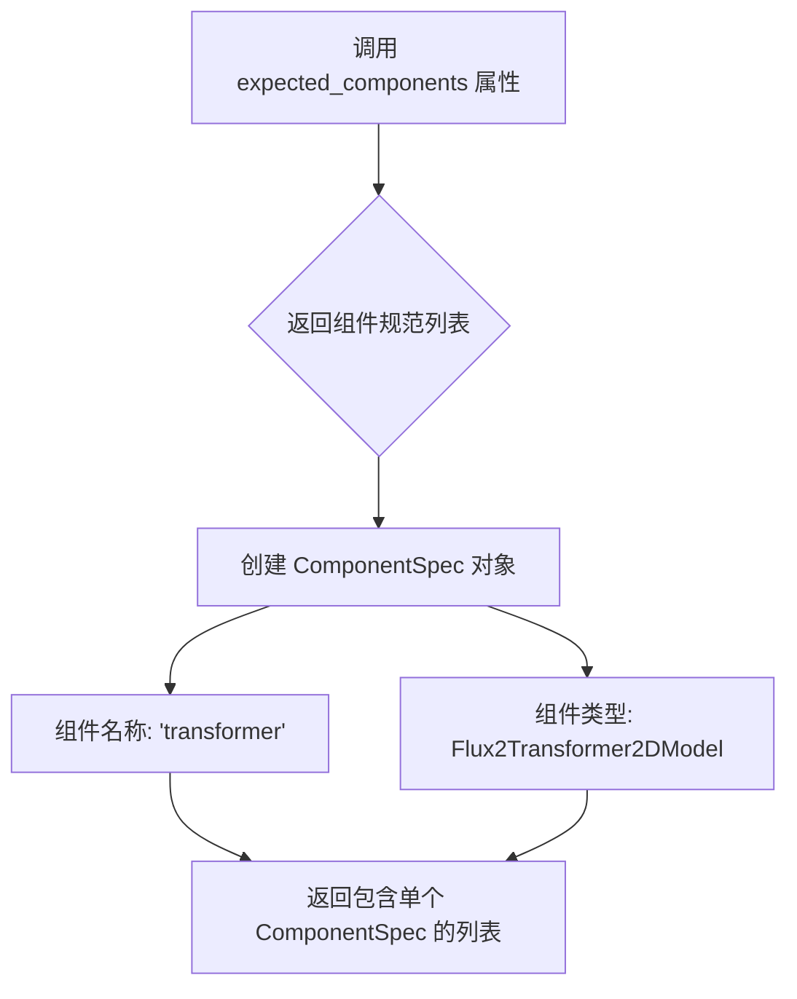

#### 带注释源码

```python
@property
def expected_components(self) -> list[ComponentSpec]:
    """
    定义该模块所需的组件规范。
    
    Returns:
        list[ComponentSpec]: 包含所需组件规范的列表。
            - transformer: Flux2Transformer2DModel 类型的模型组件，用于对 latents 进行去噪。
    """
    # 返回一个 ComponentSpec 列表，声明需要名为 "transformer" 的组件
    # 类型为 Flux2Transformer2DModel，用于 Flux2 模型的潜在向量去噪
    return [ComponentSpec("transformer", Flux2Transformer2DModel)]
```


### `Flux2KleinLoopDenoiser.description`

该属性方法返回对 `Flux2KleinLoopDenoiser` 类的描述，说明它是 Flux2 模型去噪循环中的步骤，用于对潜在表示进行去噪，应作为 `LoopSequentialPipelineBlocks` 对象（例如 `Flux2DenoiseLoopWrapper`）的 `sub_blocks` 属性的一部分来使用。

参数：无（该方法为 `@property`，隐式的 `self` 不计入参数列表）

返回值：`str`，返回对 `Flux2KleinLoopDenoiser` 类功能的描述字符串，说明其在去噪流程中的作用和适用场景。

#### 流程图

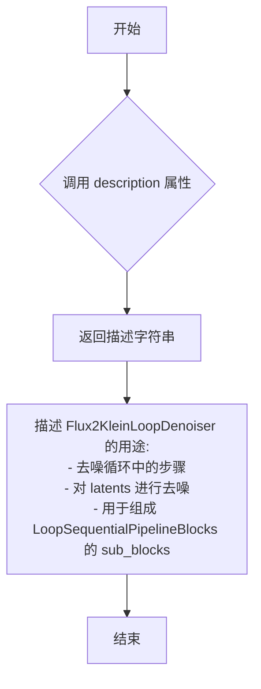

#### 带注释源码

```python
@property
def description(self) -> str:
    """
    返回对该类的描述信息。
    
    该属性方法说明了 Flux2KleinLoopDenoiser 是 Flux2 模型去噪流程中的
    一个关键组件，专门用于在去噪循环中对潜在表示（latents）进行去噪处理。
    
    Returns:
        str: 描述字符串，说明该块应作为 LoopSequentialPipelineBlocks 对象
            （如 Flux2DenoiseLoopWrapper）的 sub_blocks 属性的组成部分
    """
    return (
        "Step within the denoising loop that denoises the latents for Flux2. "
        "This block should be used to compose the `sub_blocks` attribute of a `LoopSequentialPipelineBlocks` "
        "object (e.g. `Flux2DenoiseLoopWrapper`)"
    )
```


### `Flux2KleinLoopDenoiser.inputs`

该属性定义了 Flux2KleinLoopDenoiser 类的输入参数规范，用于描述去噪循环中所需的输入数据及其类型、是否必需等信息。

参数：

- `joint_attention_kwargs`：`dict` 或 `None`，联合注意力机制的额外参数
- `latents`：`torch.Tensor`，需要去噪的潜在向量，形状为 (B, seq_len, C)，必填
- `image_latents`：`torch.Tensor`，用于条件生成的打包图像潜在向量，形状为 (B, img_seq_len, C)，可选
- `image_latent_ids`：`torch.Tensor`，图像潜在向量的位置 ID，形状为 (B, img_seq_len, 4)，可选
- `prompt_embeds`：`torch.Tensor`，来自 Qwen3 的文本嵌入，必填
- `txt_ids`：`torch.Tensor`，文本令牌的 4D 位置 ID (T, H, W, L)，必填
- `latent_ids`：`torch.Tensor`，潜在令牌的 4D 位置 ID (T, H, W, L)，必填

返回值：`list[tuple[str, Any]]`，返回由 InputParam 对象组成的列表，描述该模块的所有输入参数

#### 流程图

```mermaid
flowchart TD
    A[Flux2KleinLoopDenoiser.inputs] --> B[joint_attention_kwargs]
    A --> C[latents<br required<br>torch.Tensor<br>(B, seq_len, C)]
    A --> D[image_latents<br optional<br>torch.Tensor<br>(B, img_seq_len, C)]
    A --> E[image_latent_ids<br optional<br>torch.Tensor<br>(B, img_seq_len, 4)]
    A --> F[prompt_embeds<br required<br>torch.Tensor<br>Text from Qwen3]
    A --> G[txt_ids<br required<br>torch.Tensor<br>4D position IDs]
    A --> H[latent_ids<br required<br>torch.Tensor<br>4D position IDs]
    
    style C fill:#ff6b6b
    style F fill:#ff6b6b
    style G fill:#ff6b6b
    style H fill:#ff6b6b
    style D fill:#feca57
    style E fill:#feca57
    style B fill:#feca57
```

#### 带注释源码

```python
@property
def inputs(self) -> list[tuple[str, Any]]:
    """
    定义 Flux2KleinLoopDenoiser 模块的输入参数规范。
    该属性返回一个 InputParam 对象列表，描述去噪循环中需要的所有输入数据。
    """
    return [
        # 联合注意力机制的额外参数，用于控制注意力行为
        InputParam("joint_attention_kwargs"),
        
        # 需要去噪的潜在向量，形状为 (B, seq_len, C)，其中 B 是批次大小，
        # seq_len 是序列长度，C 是通道数。这是必需的输入参数。
        InputParam(
            "latents",
            required=True,
            type_hint=torch.Tensor,
            description="The latents to denoise. Shape: (B, seq_len, C)",
        ),
        
        # 打包的图像潜在向量，用于条件生成（如 img2img），
        # 形状为 (B, img_seq_len, C)。可选参数，当存在图像条件时使用。
        InputParam(
            "image_latents",
            type_hint=torch.Tensor,
            description="Packed image latents for conditioning. Shape: (B, img_seq_len, C)",
        ),
        
        # 图像潜在向量的位置 ID，用于在模型中标识图像 token 的位置信息，
        # 形状为 (B, img_seq_len, 4)。与 image_latents 配合使用。
        InputParam(
            "image_latent_ids",
            type_hint=torch.Tensor,
            description="Position IDs for image latents. Shape: (B, img_seq_len, 4)",
        ),
        
        # 来自 Qwen3 模型的文本嵌入，作为条件输入引导生成过程。
        # 这是必填参数，提供文本语义信息。
        InputParam(
            "prompt_embeds",
            required=True,
            type_hint=torch.Tensor,
            description="Text embeddings from Qwen3",
        ),
        
        # 文本令牌的 4D 位置 ID，格式为 (T, H, W, L)，用于标识文本 token
        # 在时空维度上的位置关系。T 可能表示时间步，H/W 表示空间维度，
        # L 可能表示层级或其他维度信息。
        InputParam(
            "txt_ids",
            required=True,
            type_hint=torch.Tensor,
            description="4D position IDs for text tokens (T, H, W, L)",
        ),
        
        # 潜在令牌的 4D 位置 ID，与 txt_ids 类似，用于标识 latent token
        # 在时空维度上的位置信息，指导模型正确处理空间结构。
        InputParam(
            "latent_ids",
            required=True,
            type_hint=torch.Tensor,
            description="4D position IDs for latent tokens (T, H, W, L)",
        ),
    ]
```


### `Flux2KleinLoopDenoiser.__call__`

该方法是 Flux2KleinLoopDenoiser 类的核心调用函数，作用是在 Flux2 模型的去噪循环中执行单步去噪操作。与 Flux2LoopDenoiser 的区别在于 guidance 参数固定为 None（表示不使用 Classifier-Free Guidance），专门用于 Flux2-Klein 变体模型的推理过程。

参数：

- `self`：`Flux2KleinLoopDenoiser` 类实例本身
- `components`：`Flux2KleinModularPipeline` 模块化管道组件对象，包含 transformer 等模型组件
- `block_state`：`BlockState` 当前块状态对象，包含 latents、prompt_embeds、txt_ids、latent_ids 等属性
- `i`：`int` 当前去噪步骤的索引
- `t`：`torch.Tensor` 当前时间步张量

返回值：`PipelineState` 包含更新后的 components 和 block_state，其中 block_state.noise_pred 被设置为预测的噪声

#### 流程图

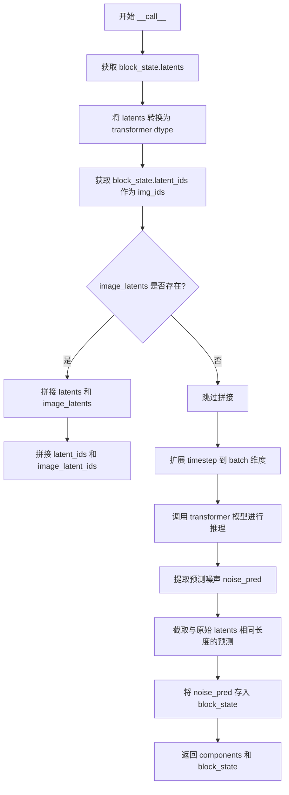

#### 带注释源码

```python
@torch.no_grad()
def __call__(
    self, components: Flux2KleinModularPipeline, block_state: BlockState, i: int, t: torch.Tensor
) -> PipelineState:
    # 从 block_state 中获取当前的 latents（待去噪的潜在表示）
    latents = block_state.latents
    
    # 将 latents 转换为 transformer 模型所需的数据类型（如 float16 或 bfloat16）
    latent_model_input = latents.to(components.transformer.dtype)
    
    # 获取 latent 的位置 ID
    img_ids = block_state.latent_ids

    # 检查是否存在图像条件信息（用于图像到图像的生成任务）
    image_latents = getattr(block_state, "image_latents", None)
    if image_latents is not None:
        # 如果存在图像 latents，则将其与当前 latents 拼接在一起作为模型输入
        latent_model_input = torch.cat([latents, image_latents], dim=1).to(components.transformer.dtype)
        # 同时拼接对应的位置 ID
        image_latent_ids = block_state.image_latent_ids
        img_ids = torch.cat([img_ids, image_latent_ids], dim=1)

    # 扩展时间步以匹配 batch 大小，并转换为与 latents 相同的数据类型
    timestep = t.expand(latents.shape[0]).to(latents.dtype)

    # 调用 Flux2 transformer 模型进行去噪预测
    # 注意：guidance=None 是与 Flux2LoopDenoiser 的关键区别
    noise_pred = components.transformer(
        hidden_states=latent_model_input,  # 输入的潜在表示
        timestep=timestep / 1000,          # 归一化的时间步（Flux2 使用 0-1000 范围）
        guidance=None,                     # Klein 变体不使用 Classifier-Free Guidance
        encoder_hidden_states=block_state.prompt_embeds,  # 文本嵌入（来自 Qwen3）
        txt_ids=block_state.txt_ids,       # 文本 token 的 4D 位置 ID
        img_ids=img_ids,                   # 图像/latent token 的 4D 位置 ID
        joint_attention_kwargs=block_state.joint_attention_kwargs,  # 注意力机制额外参数
        return_dict=False,                 # 不返回字典，直接返回元组
    )[0]

    # 仅保留与原始输入 latents 对应的预测部分（去除拼接的图像 latents 部分）
    noise_pred = noise_pred[:, : latents.size(1)]
    
    # 将预测的噪声存储到 block_state 中，供后续的调度器（scheduler）使用
    block_state.noise_pred = noise_pred

    # 返回更新后的组件和块状态
    return components, block_state
```


### `Flux2KleinBaseLoopDenoiser.expected_components`

该属性方法定义了 Flux2KleinBaseLoopDenoiser 模块所需的组件规范，返回一个包含 transformer 和 guider 两个组件的列表，用于在去噪循环中执行 Flux2 模型的推理。

参数：

- `self`：无显式参数（Property 属性方法，隐式接收实例自身）

返回值：`list[ComponentSpec]`，返回一个 ComponentSpec 对象列表，描述该模块依赖的必需组件（包括 transformer 和 guider）。

#### 流程图

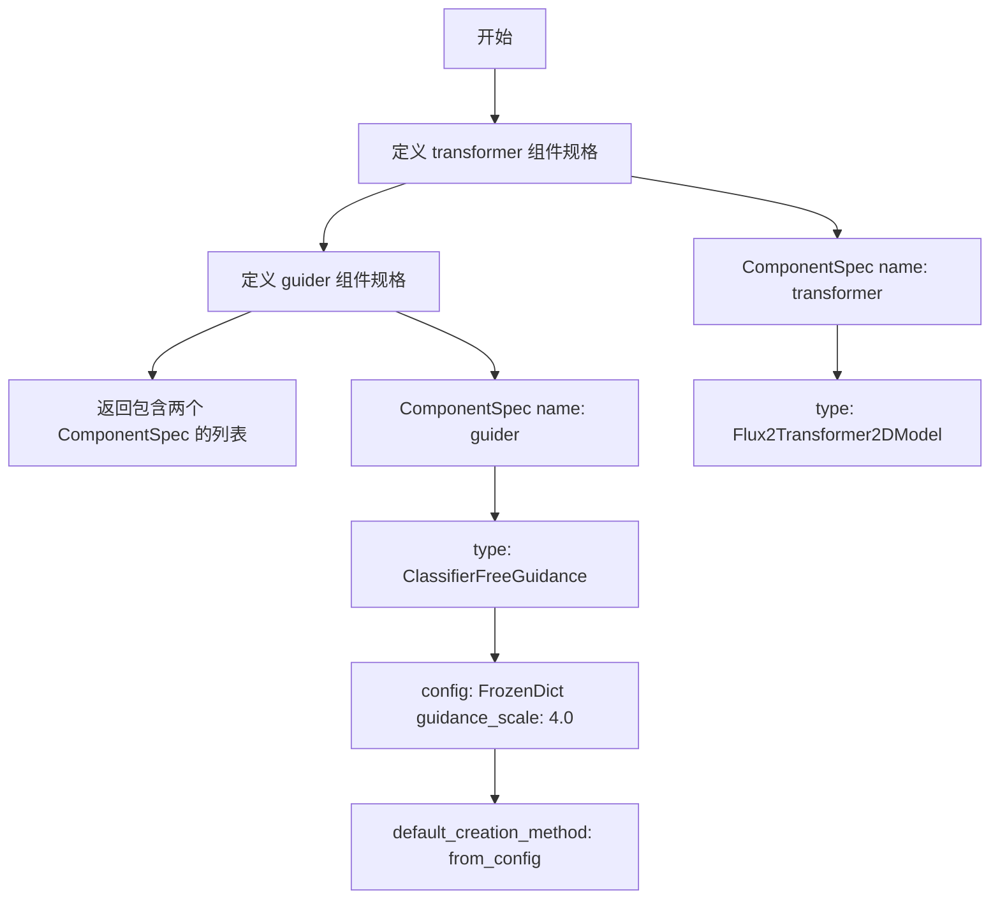

#### 带注释源码

```python
@property
def expected_components(self) -> list[ComponentSpec]:
    """
    定义该模块期望的组件列表。
    
    返回说明:
    - transformer: Flux2Transformer2DModel 模型，用于执行潜在空间的去噪预测
    - guider: ClassifierFreeGuidance 引导器，用于实现无分类器引导(CFG)功能
             配置了默认的 guidance_scale=4.0，并使用 from_config 方式创建
    """
    return [
        # 核心 Transformer 模型组件
        ComponentSpec("transformer", Flux2Transformer2DModel),
        # CFG 引导器组件，用于处理正负提示词的引导
        ComponentSpec(
            "guider",
            ClassifierFreeGuidance,
            config=FrozenDict({"guidance_scale": 4.0}),
            default_creation_method="from_config",
        ),
    ]
```


### `Flux2KleinBaseLoopDenoiser.expected_configs`

该属性方法定义了 Flux2KleinBaseLoopDenoiser 类期望的配置参数列表，返回一个包含配置规范的列表，目前包含一个 `is_distilled` 配置项，默认值为 `False`。

参数： 无

返回值：`list[ConfigSpec]`，返回配置规范列表，定义了 Flux2KleinBaseLoopDenoiser 所需的配置参数

#### 流程图

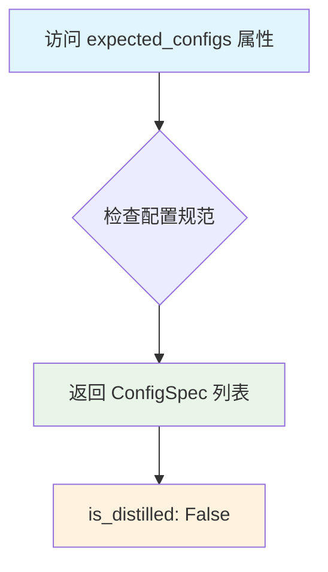

#### 带注释源码

```python
@property
def expected_configs(self) -> list[ConfigSpec]:
    """
    定义 Flux2KleinBaseLoopDenoiser 期望的配置参数列表
    
    返回值:
        list[ConfigSpec]: 包含配置规范的列表，每个 ConfigSpec 定义一个配置项的名称和默认值
    
    说明:
        - is_distilled: 标识模型是否经过蒸馏处理，默认为 False
          当为 False 时，表示使用完整的 Flux2-Klein base 模型进行去噪
          当为 True 时，可能使用蒸馏版本的模型以加速推理
    """
    return [
        ConfigSpec(name="is_distilled", default=False),
    ]
```


### `Flux2KleinBaseLoopDenoiser.description`

该属性返回 Flux2KleinBaseLoopDenoiser 类的描述信息，说明该类是 Flux2 去噪循环中的步骤，用于对 latent 进行去噪。此块用于组成 `LoopSequentialPipelineBlocks` 对象的 `sub_blocks` 属性（例如 `Flux2DenoiseLoopWrapper`）。

参数： 无（这是一个属性方法，不接受任何参数）

返回值：`str`，返回该类的描述字符串

#### 流程图

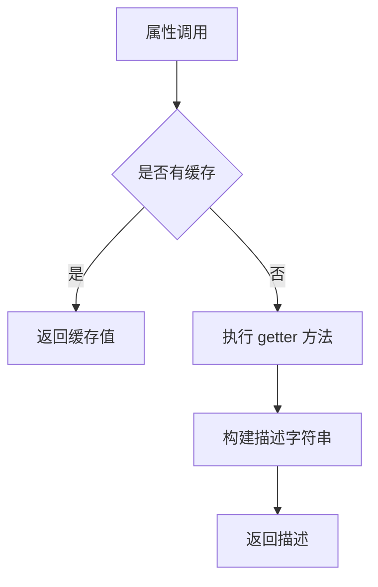

#### 带注释源码

```python
@property
def description(self) -> str:
    """
    属性描述符，返回该类的功能描述。
    
    Returns:
        str: 描述 Flux2KleinBaseLoopDenoiser 类的功能：
             - 这是 Flux2 去噪循环中的步骤，用于对 latents 进行去噪
             - 该块用于组成 LoopSequentialPipelineBlocks 对象的 sub_blocks 属性
             - 例如可与 Flux2DenoiseLoopWrapper 配合使用
    """
    return (
        "Step within the denoising loop that denoises the latents for Flux2. "
        "This block should be used to compose the `sub_blocks` attribute of a `LoopSequentialPipelineBlocks` "
        "object (e.g. `Flux2DenoiseLoopWrapper`)"
    )
```


### `Flux2KleinBaseLoopDenoiser.inputs`

该属性定义了 Flux2-Klein 基础模型的去噪循环步骤所需的输入参数列表，包含了用于文本条件处理的正向和负向嵌入、位置编码，以及可选的图像条件 latent 信息。

参数：

- `joint_attention_kwargs`：`Any`，联合注意力配置参数，用于控制注意力机制的额外参数
- `latents`：`torch.Tensor`（必需），待去噪的 latent，形状为 (B, seq_len, C)
- `image_latents`：`torch.Tensor`（可选），用于条件生成的打包图像 latent，形状为 (B, img_seq_len, C)
- `image_latent_ids`：`torch.Tensor`（可选），图像 latent 的位置 ID，形状为 (B, img_seq_len, 4)
- `prompt_embeds`：`torch.Tensor`（必需），来自 Qwen3 的文本嵌入
- `negative_prompt_embeds`：`torch.Tensor`（可选），来自 Qwen3 的负向文本嵌入
- `txt_ids`：`torch.Tensor`（必需），文本令牌的 4D 位置 ID (T, H, W, L)
- `negative_txt_ids`：`torch.Tensor`（可选），负向文本令牌的 4D 位置 ID (T, H, W, L)
- `latent_ids`：`torch.Tensor`（必需），latent 令牌的 4D 位置 ID (T, H, W, L)

返回值：`list[tuple[str, Any]]`，返回输入参数规范列表，每个元素包含参数名称和对应的 InputParam 对象

#### 流程图

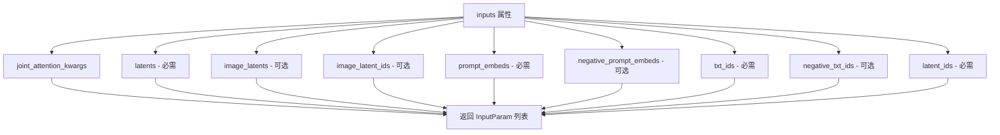

#### 带注释源码

```python
@property
def inputs(self) -> list[tuple[str, Any]]:
    """
    定义该模块的输入参数规范列表。
    返回值是一个包含多个 InputParam 对象的列表，每个对象描述一个输入参数的元数据。
    """
    return [
        # 联合注意力关键字参数，用于控制注意力机制的额外配置
        InputParam("joint_attention_kwargs"),
        
        # 必需参数：待去噪的 latent 张量
        # 形状: (B, seq_len, C)，其中 B 是批次大小，seq_len 是序列长度，C 是通道数
        InputParam(
            "latents",
            required=True,
            type_hint=torch.Tensor,
            description="The latents to denoise. Shape: (B, seq_len, C)",
        ),
        
        # 可选参数：打包的图像 latent，用于条件生成
        # 形状: (B, img_seq_len, C)
        InputParam(
            "image_latents",
            type_hint=torch.Tensor,
            description="Packed image latents for conditioning. Shape: (B, img_seq_len, C)",
        ),
        
        # 可选参数：图像 latent 的位置 ID
        # 形状: (B, img_seq_len, 4)，4D 位置编码
        InputParam(
            "image_latent_ids",
            type_hint=torch.Tensor,
            description="Position IDs for image latents. Shape: (B, img_seq_len, 4)",
        ),
        
        # 必需参数：来自 Qwen3 的正向文本嵌入
        InputParam(
            "prompt_embeds",
            required=True,
            type_hint=torch.Tensor,
            description="Text embeddings from Qwen3",
        ),
        
        # 可选参数：来自 Qwen3 的负向文本嵌入，用于 Classifier-Free Guidance
        InputParam(
            "negative_prompt_embeds",
            required=False,
            type_hint=torch.Tensor,
            description="Negative text embeddings from Qwen3",
        ),
        
        # 必需参数：文本令牌的 4D 位置 ID
        # 格式: (T, H, W, L) - 时间、高度、宽度、层级
        InputParam(
            "txt_ids",
            required=True,
            type_hint=torch.Tensor,
            description="4D position IDs for text tokens (T, H, W, L)",
        ),
        
        # 可选参数：负向文本令牌的 4D 位置 ID，用于 CFG
        InputParam(
            "negative_txt_ids",
            required=False,
            type_hint=torch.Tensor,
            description="4D position IDs for negative text tokens (T, H, W, L)",
        ),
        
        # 必需参数：latent 令牌的 4D 位置 ID
        # 格式: (T, H, W, L)
        InputParam(
            "latent_ids",
            required=True,
            type_hint=torch.Tensor,
            description="4D position IDs for latent tokens (T, H, W, L)",
        ),
    ]
```


### `Flux2KleinBaseLoopDenoiser.__call__`

该方法是 Flux2-Klein 基础模型的去噪循环步骤，支持Classifier-Free Guidance (CFG)。它在每个去噪迭代中处理潜在向量，通过transformer模型预测噪声，并使用guider组件执行CFG操作以提升生成质量。

参数：

- `self`：实例本身，类型为 `Flux2KleinBaseLoopDenoiser`（继承自 `ModularPipelineBlocks`）
- `components`：`Flux2KleinModularPipeline`，管道组件容器，包含transformer和guider等组件
- `block_state`：`BlockState`，当前块状态，包含latents、prompt_embeds、txt_ids等数据
- `i`：`int`，当前去噪步骤的索引
- `t`：`torch.Tensor`，当前时间步张量

返回值：`PipelineState`，返回元组 `(components, block_state)`，其中包含更新后的组件和块状态

#### 流程图

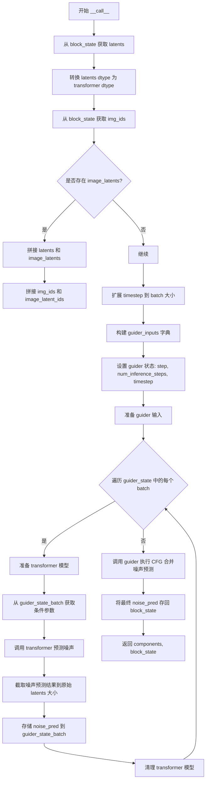

#### 带注释源码

```python
@torch.no_grad()
def __call__(
    self, components: Flux2KleinModularPipeline, block_state: BlockState, i: int, t: torch.Tensor
) -> PipelineState:
    """
    执行 Flux2-Klein 基础模型的去噪步骤，支持 Classifier-Free Guidance
    
    参数:
        components: 管道组件容器，包含 transformer 和 guider
        block_state: 块状态，包含当前的 latents、embeddings 等
        i: 当前去噪迭代的索引
        t: 当前的时间步张量
    
    返回:
        更新后的 components 和 block_state
    """
    # 1. 从 block_state 获取当前需要去噪的 latents
    latents = block_state.latents
    
    # 2. 将 latents 转换为 transformer 所需的数据类型
    latent_model_input = latents.to(components.transformer.dtype)
    
    # 3. 获取 latent 的位置 IDs
    img_ids = block_state.latent_ids

    # 4. 检查是否存在图像条件 latent (用于图像到图像的生成)
    image_latents = getattr(block_state, "image_latents", None)
    if image_latents is not None:
        # 如果存在图像 latents，将其与主 latents 拼接
        latent_model_input = torch.cat([latents, image_latents], dim=1).to(components.transformer.dtype)
        # 同样拼接位置 IDs
        image_latent_ids = block_state.image_latent_ids
        img_ids = torch.cat([img_ids, image_latent_ids], dim=1)

    # 5. 扩展 timestep 以匹配 batch 大小，并转换为 latents 的 dtype
    timestep = t.expand(latents.shape[0]).to(latents.dtype)

    # 6. 构建 guider 的输入字典，包含正向和负向的 prompt embeddings 及 txt_ids
    guider_inputs = {
        "encoder_hidden_states": (
            getattr(block_state, "prompt_embeds", None),
            getattr(block_state, "negative_prompt_embeds", None),
        ),
        "txt_ids": (
            getattr(block_state, "txt_ids", None),
            getattr(block_state, "negative_txt_ids", None),
        ),
    }

    # 7. 设置 guider 的状态：当前步骤、推理步数、时间步
    components.guider.set_state(step=i, num_inference_steps=block_state.num_inference_steps, timestep=t)
    
    # 8. 准备 guider 的输入（可能包含多个 batch）
    guider_state = components.guider.prepare_inputs(guider_inputs)

    # 9. 遍历每个 guider state batch，分别进行前向和负向的噪声预测
    for guider_state_batch in guider_state:
        # 准备 transformer 模型（可能包含一些初始化工作）
        components.guider.prepare_models(components.transformer)
        
        # 从 guider_state_batch 中提取条件参数（如 encoder_hidden_states 和 txt_ids）
        cond_kwargs = {input_name: getattr(guider_state_batch, input_name) for input_name in guider_inputs.keys()}

        # 10. 调用 transformer 模型进行噪声预测
        # 注意: guidance 设置为 None，因为 CFG 在 guider 中处理
        noise_pred = components.transformer(
            hidden_states=latent_model_input,
            timestep=timestep / 1000,  # 将 timestep 缩放到 [0, 1] 范围
            guidance=None,
            img_ids=img_ids,
            joint_attention_kwargs=block_state.joint_attention_kwargs,
            return_dict=False,
            **cond_kwargs,  # 传入条件参数（正向和负向）
        )[0]
        
        # 11. 截取噪声预测结果，只保留与原始 latents 对应的部分（排除 image_latents）
        guider_state_batch.noise_pred = noise_pred[:, : latents.size(1)]
        
        # 12. 清理 transformer 模型资源
        components.guider.cleanup_models(components.transformer)

    # 13. 执行 Classifier-Free Guidance：合并正向和负向的噪声预测
    block_state.noise_pred = components.guider(guider_state)[0]

    # 14. 返回更新后的组件和块状态
    return components, block_state
```


### `Flux2LoopAfterDenoiser.expected_components`

该属性定义了 `Flux2LoopAfterDenoiser` 类在管道中所需的组件依赖，指定了需要配置 `FlowMatchEulerDiscreteScheduler` 调度器组件。

参数：无（该方法为属性访问器，隐式参数 `self` 为类的实例）

返回值：`list[ComponentSpec]` ，返回一个包含组件规范的列表，其中指定了需要名为 "scheduler"、类型为 `FlowMatchEulerDiscreteScheduler` 的组件。

#### 流程图

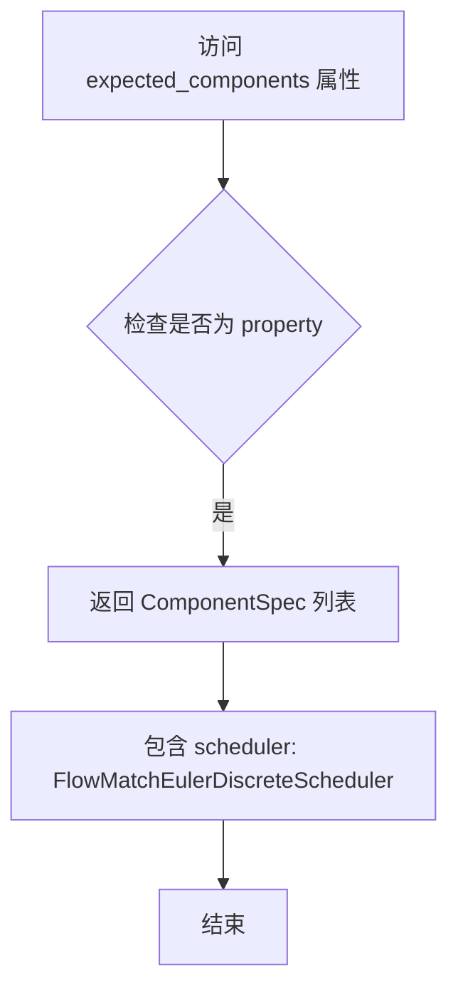

#### 带注释源码

```python
class Flux2LoopAfterDenoiser(ModularPipelineBlocks):
    """在去噪循环中更新潜在向量的步骤"""
    model_name = "flux2"

    @property
    def expected_components(self) -> list[ComponentSpec]:
        """
        定义该模块所需的组件依赖
        
        Returns:
            list[ComponentSpec]: 包含单个组件规范的列表
                - scheduler: FlowMatchEulerDiscreteScheduler 用于更新潜在向量的调度器
        """
        # 返回一个ComponentSpec列表，指定需要FlowMatchEulerDiscreteScheduler调度器
        return [ComponentSpec("scheduler", FlowMatchEulerDiscreteScheduler)]
```


### `Flux2LoopAfterDenoiser.description`

该属性返回对 `Flux2LoopAfterDenoiser` 类的文字描述，说明该类是去噪循环中的步骤，用于在去噪后更新潜变量，并用于构成 `LoopSequentialPipelineBlocks` 对象的 `sub_blocks` 属性（例如 `Flux2DenoiseLoopWrapper`）。

参数：无（这是一个属性 getter）

返回值：`str`，返回该类的功能描述文本

#### 流程图

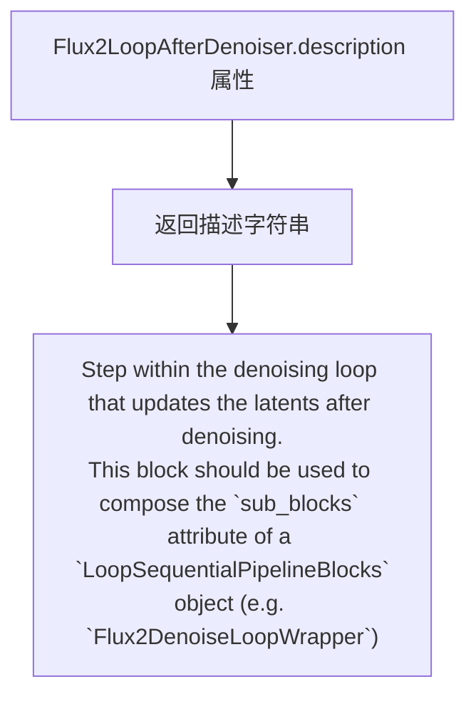

#### 带注释源码

```python
@property
def description(self) -> str:
    """
    属性 getter: 返回对当前类的描述信息
    
    返回值:
        str: 描述 Flux2LoopAfterDenoiser 类的功能和用途的字符串
    """
    return (
        "Step within the denoising loop that updates the latents after denoising. "
        "This block should be used to compose the `sub_blocks` attribute of a `LoopSequentialPipelineBlocks` "
        "object (e.g. `Flux2DenoiseLoopWrapper`)"
    )
```


### `Flux2LoopAfterDenoiser.inputs`

该属性定义了 `Flux2LoopAfterDenoiser` 类的输入参数规范，用于描述该模块在去噪循环中所需的输入参数。

参数： 无（这是一个 `@property` 装饰器定义的方法，而非普通函数，因此没有输入参数）

返回值： `list[tuple[str, Any]]`，返回输入参数列表，每个元素是一个包含参数信息的元组

#### 流程图

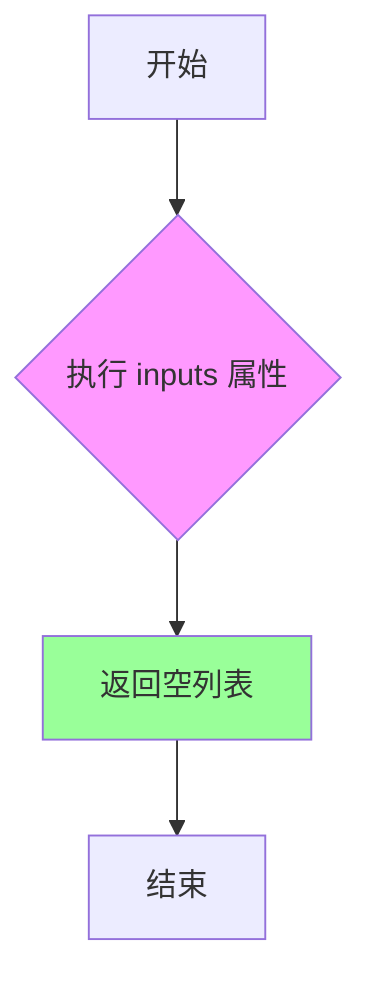

#### 带注释源码

```python
@property
def inputs(self) -> list[tuple[str, Any]]:
    """
    定义 Flux2LoopAfterDenoiser 模块的输入参数规范。
    
    该属性返回一个列表，描述该模块需要从外部获取的输入参数。
    对于 Flux2LoopAfterDenoiser，由于它主要依赖于从 block_state 中获取的前一个模块（如 Flux2LoopDenoiser）的输出
    （如 noise_pred），因此它不需要额外的直接输入参数。
    
    Returns:
        list[tuple[str, Any]]: 返回一个空列表，表示该模块没有额外的输入参数依赖。
                               所需的输入（如 noise_pred）通过 intermediate_inputs 和 block_state 获取。
    """
    return []
```


### `Flux2LoopAfterDenoiser.intermediate_inputs`

该属性定义了 `Flux2LoopAfterDenoiser` 模块在去噪循环中所需的中间输入参数，用于接收外部传入的生成器对象。

参数：

- 无显式参数（这是一个属性，不是方法）

返回值：`list[str]`，返回包含 `InputParam("generator")` 的字符串列表，描述中间输入参数。

#### 流程图

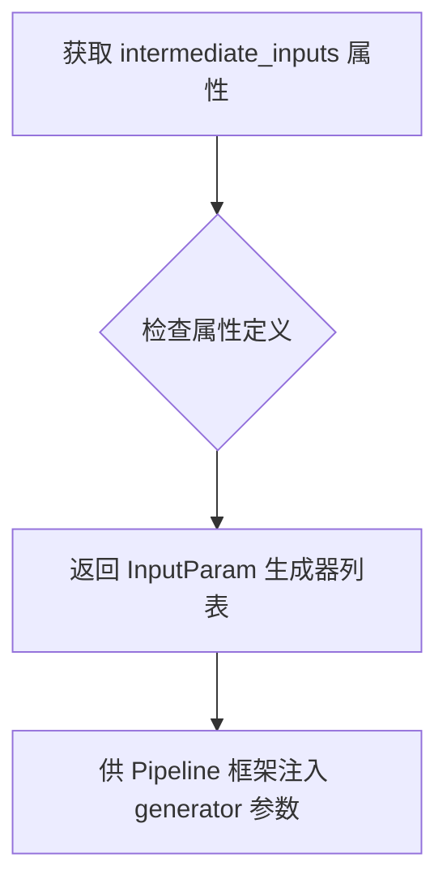

#### 带注释源码

```python
@property
def intermediate_inputs(self) -> list[str]:
    """
    定义该 Block 在循环去噪过程中需要从外部接收的中间输入参数。
    
    这些参数不由 Block 自身的 inputs 定义，而是在 Loop 层级由外部注入，
    用于支持跨步骤共享的状态或资源（如随机数生成器）。
    
    Returns:
        list[str]: 包含参数名的列表，当前定义为 ['generator']
                   对应的 InputParam 在类定义中为 InputParam('generator')
    """
    return [InputParam("generator")]
```


### `Flux2LoopAfterDenoiser.intermediate_outputs`

该属性定义了 `Flux2LoopAfterDenoiser` 类的中间输出参数，用于描述该模块在去噪循环中传递给后续步骤的输出数据。

参数：无（该属性不接受任何参数）

返回值：`list[OutputParam]`，返回包含中间输出参数规范的列表，当前定义了对去噪后潜在变量（latents）的输出规范。

#### 流程图

```mermaid
flowchart TD
    A[intermediate_outputs 属性调用] --> B{返回输出参数列表}
    B --> C[OutputParam: latents]
    C --> D[type_hint: torch.Tensor]
    C --> E[description: The denoised latents]
```

#### 带注释源码

```python
@property
def intermediate_outputs(self) -> list[OutputParam]:
    """
    定义该模块的中间输出参数规范。
    
    该属性返回一个列表，描述了在去噪循环中该模块向后续步骤
    传递的输出数据。当前定义了一个输出参数：
    - latents: 经过调度器步骤更新后的去噪潜在变量
    
    Returns:
        list[OutputParam]: 包含中间输出参数规范的列表
    """
    return [OutputParam("latents", type_hint=torch.Tensor, description="The denoised latents")]
```


### `Flux2LoopAfterDenoiser.__call__`

该方法是 Flux2 降噪循环中的后处理步骤，负责在完成噪声预测后通过调度器（Scheduler）更新潜在变量（latents），实现了去噪过程的单步推进。

参数：

- `self`：`Flux2LoopAfterDenoiser`，类的实例自身
- `components`：`Flux2ModularPipeline`，管道组件容器，包含 scheduler 等组件
- `block_state`：`BlockState`，块状态对象，包含当前的去噪状态（如 latents、noise_pred 等）
- `i`：`int`，当前去噪循环的迭代索引
- `t`：`torch.Tensor`，当前时间步（timestep）张量

返回值：`PipelineState`，即 `Tuple[Flux2ModularPipeline, BlockState]`，返回更新后的组件和块状态

#### 流程图

```mermaid
flowchart TD
    A[开始 __call__] --> B[保存原始 latents 数据类型]
    B --> C[调用 scheduler.step 执行去噪步骤]
    C --> D{新 latents dtype<br/>是否等于原始 dtype?}
    D -->|否| E{当前设备是否为<br/>MPS?}
    D -->|是| F[返回 components 和 block_state]
    E -->|是| G[将 latents 转换回原始 dtype]
    E -->|否| F
    G --> F
```

#### 带注释源码

```python
@torch.no_grad()
def __call__(self, components: Flux2ModularPipeline, block_state: BlockState, i: int, t: torch.Tensor):
    """
    执行去噪循环的后处理步骤，通过调度器更新 latents。
    
    参数:
        components: Flux2ModularPipeline，管道组件容器
        block_state: BlockState，块状态，包含当前 latents 和 noise_pred
        i: int，当前循环迭代索引
        t: torch.Tensor，当前时间步
    
    返回:
        Tuple[Flux2ModularPipeline, BlockState]: 更新后的组件和块状态
    """
    # 保存原始 latents 的数据类型，以便后续恢复
    latents_dtype = block_state.latents.dtype
    
    # 使用调度器的 step 方法执行单步去噪
    # 输入: 噪声预测、当前时间步、当前 latents
    # 输出: 新的去噪后的 latents
    block_state.latents = components.scheduler.step(
        block_state.noise_pred,  # 噪声预测结果
        t,                        # 当前时间步
        block_state.latents,      # 当前 latent 状态
        return_dict=False,        # 不返回字典，直接返回张量
    )[0]  # 取第一个返回值（去噪后的 latents）

    # 检查去噪后的 latents 数据类型是否改变
    if block_state.latents.dtype != latents_dtype:
        # 针对 MPS (Apple Silicon) 后端的特殊处理
        # MPS 不支持所有数据类型转换，需要显式转换回原始类型
        if torch.backends.mps.is_available():
            block_state.latents = block_state.latents.to(latents_dtype)

    # 返回更新后的组件和块状态
    return components, block_state
```


### `Flux2DenoiseLoopWrapper.description`

这是一个属性（Property），用于获取 `Flux2DenoiseLoopWrapper` 类的描述信息。

参数：无（这是一个属性访问，无需显式参数）

返回值：`str`，返回该流水线块的描述字符串，说明其功能是迭代地对潜在向量进行去噪，并允许通过 `sub_blocks` 属性自定义每次迭代的具体步骤。

#### 流程图

```mermaid
flowchart TD
    A[访问 Flux2DenoiseLoopWrapper.description] --> B{是否是属性访问}
    B -->|Yes| C[调用 getter 方法]
    C --> D[返回描述字符串]
    
    style A fill:#f9f,stroke:#333
    style D fill:#9f9,stroke:#333
```

#### 带注释源码

```python
@property
def description(self) -> str:
    """
    属性 getter 方法，返回当前流水线块的描述信息。
    
    该描述说明了 Flux2DenoiseLoopWrapper 的核心功能：
    - 迭代地对 latents（潜在向量）进行去噪处理
    - 去噪过程基于 timesteps（时间步）
    - 每次迭代的具体步骤可通过 sub_blocks 属性自定义
    
    Returns:
        str: 描述流水线块功能的字符串
    """
    return (
        "Pipeline block that iteratively denoises the latents over `timesteps`. "
        "The specific steps within each iteration can be customized with `sub_blocks` attribute"
    )
```


### `Flux2DenoiseLoopWrapper.loop_expected_components`

该属性方法定义了 Flux2DenoiseLoopWrapper 在去噪循环中所需的组件列表，包括调度器（scheduler）和变换器（transformer）模型。

参数：无需参数（为属性方法，仅隐式接收 `self`）

返回值：`list[ComponentSpec]`，返回包含调度器和变换器组件规范的列表，定义了循环去噪过程中需要使用的主要组件。

#### 流程图

```mermaid
graph TD
    A[Flux2DenoiseLoopWrapper] --> B[loop_expected_components 属性]
    B --> C[返回 ComponentSpec 列表]
    C --> D[scheduler: FlowMatchEulerDiscreteScheduler]
    C --> E[transformer: Flux2Transformer2DModel]
    
    style A fill:#f9f,stroke:#333,stroke-width:2px
    style B fill:#ff9,stroke:#333,stroke-width:1px
    style C fill:#ff9,stroke:#333,stroke-width:1px
```

#### 带注释源码

```python
@property
def loop_expected_components(self) -> list[ComponentSpec]:
    """
    定义去噪循环中必需的组件列表。
    
    该属性返回两个核心组件的规范：
    1. scheduler: 用于控制去噪过程中时间步进度的调度器
    2. transformer: 执行潜在空间去噪的变换器模型
    
    Returns:
        list[ComponentSpec]: 包含必需组件规范的列表
    """
    return [
        ComponentSpec("scheduler", FlowMatchEulerDiscreteScheduler),
        ComponentSpec("transformer", Flux2Transformer2DModel),
    ]
```


### `Flux2DenoiseLoopWrapper.loop_inputs`

该属性方法定义了 Flux2DenoiseLoopWrapper 在去噪循环中所需的输入参数，包括时间步长（timesteps）和推理步数（num_inference_steps）。

参数： 无（该方法为属性方法，无函数参数）

返回值：`list[InputParam]`（返回输入参数列表，包含时间步和推理步数信息）

#### 流程图

```mermaid
flowchart TD
    A[开始] --> B[定义 loop_inputs 属性]
    B --> C[返回包含两个 InputParam 的列表]
    C --> D[结束]
    
    subgraph InputParam 1
    C1[timesteps: torch.Tensor, required=True]
    end
    
    subgraph InputParam 2
    C2[num_inference_steps: int, required=True]
    end
    
    C --> C1
    C --> C2
```

#### 带注释源码

```python
@property
def loop_inputs(self) -> list[InputParam]:
    """
    定义 Flux2DenoiseLoopWrapper 的循环输入参数。
    
    Returns:
        list[InputParam]: 包含去噪循环所需输入参数的列表
    """
    return [
        InputParam(
            "timesteps",
            required=True,
            type_hint=torch.Tensor,
            description="The timesteps to use for the denoising process.",
        ),
        InputParam(
            "num_inference_steps",
            required=True,
            type_hint=int,
            description="The number of inference steps to use for the denoising process.",
        ),
    ]
```


### `Flux2DenoiseLoopWrapper.__call__`

该方法是Flux2降噪循环包装器的核心调用方法，负责迭代地对潜在表示进行去噪处理。它通过获取管道状态、计算预热步骤，然后遍历所有时间步来执行去噪循环，在每个时间步调用`loop_step`方法执行子块（去噪器和去噪后处理），并支持进度条显示和XLA设备优化。

参数：

- `self`：调用该方法的对象实例
- `components`：`Flux2ModularPipeline`类型，包含管道组件（如调度器、变换器等）
- `state`：`PipelineState`类型，管道状态对象，包含所有中间状态和参数

返回值：`PipelineState`，返回更新后的管道状态对象，其中包含去噪后的潜在表示

#### 流程图

```mermaid
flowchart TD
    A[开始 __call__] --> B[获取 block_state]
    B --> C[计算 num_warmup_steps]
    C --> D[初始化进度条 total=block_state.num_inference_steps]
    D --> E{遍历 timesteps}
    E -->|for i, t in enumerate| F[调用 self.loop_step]
    F --> G[执行子块: Flux2LoopDenoiser + Flux2LoopAfterDenoiser]
    G --> H{检查是否更新进度条}
    H -->|i == len-1 或 满足条件| I[progress_bar.update]
    H -->|不满足| J[跳过]
    I --> K{XLA_AVAILABLE?}
    J --> K
    K -->|True| L[xm.mark_step]
    K -->|False| M[继续下一步]
    L --> M
    M --> E
    E -->|遍历完成| N[设置 block_state 回 state]
    N --> O[返回 components, state]
```

#### 带注释源码

```python
@torch.no_grad()  # 禁用梯度计算以节省内存
def __call__(self, components: Flux2ModularPipeline, state: PipelineState) -> PipelineState:
    """
    执行Flux2去噪循环的主方法
    
    参数:
        components: Flux2ModularPipeline - 管道组件对象,包含scheduler、transformer等
        state: PipelineState - 管道状态,存储中间结果
    
    返回:
        PipelineState - 更新后的管道状态
    """
    
    # 1. 从管道状态中获取当前块状态
    block_state = self.get_block_state(state)

    # 2. 计算预热步骤数(warmup_steps)
    # 预热步骤是指不需要记录进度的初始步骤
    # 公式: 总时间步数 - (推理步骤数 * 调度器阶数)
    block_state.num_warmup_steps = max(
        len(block_state.timesteps) - block_state.num_inference_steps * components.scheduler.order, 0
    )

    # 3. 创建进度条,显示去噪进度
    with self.progress_bar(total=block_state.num_inference_steps) as progress_bar:
        
        # 4. 遍历所有时间步
        for i, t in enumerate(block_state.timesteps):
            
            # 5. 执行单步去噪循环
            # 会依次调用sub_blocks中的块:
            # - Flux2LoopDenoiser: 执行模型前向推理,预测噪声
            # - Flux2LoopAfterDenoiser: 使用调度器更新潜在表示
            components, block_state = self.loop_step(components, block_state, i=i, t=t)

            # 6. 判断是否需要更新进度条
            # 条件: 最后一步 或 (超过预热步且是调度器阶数的倍数)
            if i == len(block_state.timesteps) - 1 or (
                (i + 1) > block_state.num_warmup_steps and (i + 1) % components.scheduler.order == 0
            ):
                progress_bar.update()

            # 7. XLA优化: 标记计算步骤以加速TPU执行
            if XLA_AVAILABLE:
                xm.mark_step()

    # 8. 将更新后的块状态写回管道状态
    self.set_block_state(state, block_state)
    
    # 9. 返回组件和状态
    return components, state
```


### `Flux2DenoiseStep.description`

该属性返回 `Flux2DenoiseStep` 类的描述字符串，说明这是一个用于 Flux2 模型的去噪步骤，通过迭代方式对潜在表示进行去噪处理。循环逻辑在 `Flux2DenoiseLoopWrapper.__call__` 方法中定义，每次迭代依序执行 `sub_blocks` 中定义的块：`Flux2LoopDenoiser` 和 `Flux2LoopAfterDenoiser`。该块支持文本到图像和图像条件生成两种模式。

参数：
- 该方法为属性访问器，无显式参数（通过 `@property` 装饰器实现）

返回值：`str`，返回描述 Flux2DenoiseStep 类功能的字符串

#### 流程图

```mermaid
flowchart TD
    A[开始] --> B{访问 description 属性}
    B --> C[返回描述字符串]
    
    C --> C1[说明这是 Flux2 的去噪步骤]
    C1 --> C2[引用 Flux2DenoiseLoopWrapper.__call__ 的循环逻辑]
    C2 --> C3[列出迭代执行的子块:
    - Flux2LoopDenoiser
    - Flux2LoopAfterDenoiser]
    C3 --> C4[说明支持文本到图像
    和图像条件生成]
    C4 --> D[结束]
    
    style C fill:#e1f5fe
    style C4 fill:#e8f5e8
```

#### 带注释源码

```python
class Flux2DenoiseStep(Flux2DenoiseLoopWrapper):
    # 定义该去噪步骤中使用的块类列表
    # - Flux2LoopDenoiser: 执行实际的去噪预测
    # - Flux2LoopAfterDenoiser: 在去噪后更新潜在表示
    block_classes = [Flux2LoopDenoiser, Flux2LoopAfterDenoiser]
    
    # 定义块的名称映射，用于在状态中引用
    block_names = ["denoiser", "after_denoiser"]

    @property
    def description(self) -> str:
        """
        返回该类的描述信息
        
        描述内容说明:
        1. 明确这是 Flux2 模型的去噪步骤
        2. 说明循环逻辑继承自 Flux2DenoiseLoopWrapper.__call__
        3. 列出每次迭代依序执行的子块
        4. 标注支持的生成模式（文本到图像/图像条件）
        """
        return (
            "Denoise step that iteratively denoises the latents for Flux2. \n"
            "Its loop logic is defined in `Flux2DenoiseLoopWrapper.__call__` method \n"
            "At each iteration, it runs blocks defined in `sub_blocks` sequentially:\n"
            " - `Flux2LoopDenoiser`\n"
            " - `Flux2LoopAfterDenoiser`\n"
            "This block supports both text-to-image and image-conditioned generation."
        )
```

#### 附加说明

| 项目 | 说明 |
|------|------|
| **类层次** | `Flux2DenoiseStep` → `Flux2DenoiseLoopWrapper` → `LoopSequentialPipelineBlocks` |
| **块执行顺序** | `Flux2LoopDenoiser` (预测噪声) → `Flux2LoopAfterDenoiser` (更新latents) |
| **支持模式** | 文本到图像 (text-to-image)、图像条件生成 (image-conditioned) |
| **继承关系** | 该类复用了父类的循环逻辑，仅通过 `block_classes` 和 `block_names` 配置具体执行块 |


### `Flux2KleinDenoiseStep.description`

该属性定义了 Flux2KleinDenoiseStep 类的功能描述，用于说明这是一个迭代去噪 latent 的步骤，支持文本到图像和图像条件生成任务。

参数：无（这是一个 property 属性，不需要参数）

返回值：`str`，返回该类的描述字符串，说明其循环逻辑和内部执行的模块块

#### 流程图

```mermaid
flowchart TD
    A[Flux2KleinDenoiseStep 类] --> B{description 属性被访问}
    B --> C[返回描述字符串]
    
    C --> C1["Denoise step that iteratively denoises the latents for Flux2."]
    C1 --> C2["Its loop logic is defined in Flux2DenoiseLoopWrapper.__call__ method"]
    C2 --> C3["At each iteration, it runs blocks defined in sub_blocks sequentially:"]
    C3 --> C4["- Flux2KleinLoopDenoiser"]
    C3 --> C5["- Flux2LoopAfterDenoiser"]
    C5 --> C6["This block supports both text-to-image and image-conditioned generation."]
    
    style A fill:#f9f,stroke:#333
    style B fill:#ff9,stroke:#333
    style C fill:#9f9,stroke:#333
```

#### 带注释源码

```python
class Flux2KleinDenoiseStep(Flux2DenoiseLoopWrapper):
    # 定义该类使用的块类：去噪器和去噪后处理块
    block_classes = [Flux2KleinLoopDenoiser, Flux2LoopAfterDenoiser]
    # 定义块名称别名
    block_names = ["denoiser", "after_denoiser"]

    @property
    def description(self) -> str:
        """
        返回该类的功能描述字符串。
        
        描述内容：
        1. 说明这是用于 Flux2 的迭代去噪步骤
        2. 指出循环逻辑继承自 Flux2DenoiseLoopWrapper.__call__ 方法
        3. 列出了每次迭代顺序执行的子块：
           - Flux2KleinLoopDenoiser：执行实际的去噪推理
           - Flux2LoopAfterDenoiser：执行去噪后的处理（如 scheduler.step）
        4. 说明该块支持文本到图像和图像条件生成两种模式
        """
        return (
            "Denoise step that iteratively denoises the latents for Flux2. \n"
            "Its loop logic is defined in `Flux2DenoiseLoopWrapper.__call__` method \n"
            "At each iteration, it runs blocks defined in `sub_blocks` sequentially:\n"
            " - `Flux2KleinLoopDenoiser`\n"
            " - `Flux2LoopAfterDenoiser`\n"
            "This block supports both text-to-image and image-conditioned generation."
        )
```


### `Flux2KleinBaseDenoiseStep.description`

该属性定义了 Flux2KleinBaseDenoiseStep 类的描述信息，用于说明该类是一个迭代去噪步骤，用于对 Flux2 模型的潜在表示进行去噪。该去噪步骤的循环逻辑在 `Flux2DenoiseLoopWrapper.__call__` 方法中定义，在每次迭代中依次运行 `Flux2KleinBaseLoopDenoiser` 和 `Flux2LoopAfterDenoiser` 两个模块，支持文本到图像和图像条件生成任务。

参数：

- `self`：Python 对象实例本身（隐式参数），表示 Flux2KleinBaseDenoiseStep 的实例对象

返回值：`str`，返回该类的描述字符串，说明其功能、运行机制和支持的任务类型

#### 流程图

```mermaid
flowchart TD
    A[访问 description 属性] --> B{是否首次访问}
    B -->|是| C[执行 @property 装饰的 getter 方法]
    B -->|否| D[返回缓存的描述字符串]
    C --> E[拼接描述字符串组件]
    E --> E1[基础说明: Denoise step that iteratively denoises the latents for Flux2]
    E --> E2[引用父类: Its loop logic is defined in Flux2DenoiseLoopWrapper.__call__ method]
    E --> E3[迭代步骤: At each iteration runs Flux2KleinBaseLoopDenoiser and Flux2LoopAfterDenoiser]
    E --> E4[功能说明: Supports both text-to-image and image-conditioned generation]
    E1 --> F[返回完整描述字符串]
    E2 --> F
    E3 --> F
    E4 --> F
    D --> F
```

#### 带注释源码

```python
class Flux2KleinBaseDenoiseStep(Flux2DenoiseLoopWrapper):
    """
    Flux2KleinBaseDenoiseStep 类
    
    继承自 Flux2DenoiseLoopWrapper，是 Flux2 模型的去噪步骤封装类。
    该类组合了两个关键的子模块：
    1. Flux2KleinBaseLoopDenoiser: 执行潜在表示的去噪预测
    2. Flux2LoopAfterDenoiser: 在去噪后更新潜在表示
    
    该类支持文本到图像生成和图像条件生成两种模式。
    """
    
    # 定义该去噪步骤包含的子模块类
    block_classes = [Flux2KleinBaseLoopDenoiser, Flux2LoopAfterDenoiser]
    
    # 定义子模块的名称映射，便于在管道中引用
    block_names = ["denoiser", "after_denoiser"]

    @property
    def description(self) -> str:
        """
        获取该去噪步骤的描述信息
        
        返回值:
            str: 包含详细说明的字符串，描述该步骤的功能、循环逻辑、执行的模块以及支持的任务类型
        """
        return (
            "Denoise step that iteratively denoises the latents for Flux2. \n"
            "Its loop logic is defined in `Flux2DenoiseLoopWrapper.__call__` method \n"
            "At each iteration, it runs blocks defined in `sub_blocks` sequentially:\n"
            " - `Flux2KleinBaseLoopDenoiser`\n"
            " - `Flux2LoopAfterDenoiser`\n"
            "This block supports both text-to-image and image-conditioned generation."
        )
```

## 关键组件


### Flux2LoopDenoiser

Flux2模型的循环去噪器块，在去噪循环中执行单步去噪处理，支持文本到图像和图像条件生成。

### Flux2KleinLoopDenoiser

Flux2-Klein模型的循环去噪器块，与Flux2LoopDenoiser类似但 guidance 设置为 None，适用于不需要引导的 Klein 变体。

### Flux2KleinBaseLoopDenoiser

支持 Classifier-Free Guidance (CFG) 的 Flux2-Klein 基础模型循环去噪器块，通过 guider 组件实现条件和无条件预测的组合。

### Flux2LoopAfterDenoiser

去噪循环中的后处理步骤，调用调度器根据噪声预测更新 latents，处理数据类型转换以保持一致性。

### Flux2DenoiseLoopWrapper

去噪循环的包装器类，封装了迭代去噪的核心逻辑，管理时间步迭代和进度跟踪，支持 XLA 设备优化。

### Flux2DenoiseStep

Flux2 模型的完整去噪步骤，结合 Flux2LoopDenoiser 和 Flux2LoopAfterDenoiser，提供端到端的单步去噪流程。

### Flux2KleinDenoiseStep

Flux2-Klein 模型的完整去噪步骤，结合 Flux2KleinLoopDenoiser 和 Flux2LoopAfterDenoiser。

### Flux2KleinBaseDenoiseStep

Flux2-Klein 基础模型的完整去噪步骤，结合 Flux2KleinBaseLoopDenoiser（支持 CFG）和 Flux2LoopAfterDenoiser。

## 问题及建议


### 已知问题

-   **代码重复（DRY原则违反）**：`Flux2LoopDenoiser` 和 `Flux2KleinLoopDenoiser` 的实现几乎完全相同，仅在 `guidance` 参数上有差异（一个传递 `block_state.guidance`，另一个固定为 `None`），可以考虑通过参数化或继承来消除重复。
-   **硬编码配置**：`Flux2KleinBaseLoopDenoiser` 中的 `guidance_scale=4.0` 被硬编码在 `ComponentSpec` 中，缺乏灵活性，应通过配置参数传入。
-   **冗余的属性定义**：多个 `DenoiseStep` 子类（`Flux2DenoiseStep`、`Flux2KleinDenoiseStep`、`Flux2KleinBaseDenoiseStep`）的 `description` 属性内容高度重复，仅模型名称不同，可提取为父类属性或使用模板生成。
-   **类型注解不完整**：部分方法参数和返回值缺少类型注解，如 `Flux2LoopAfterDenoiser.__call__` 的返回值声明缺失。
-   **潜在的类型转换开销**：多处使用 `.to(components.transformer.dtype)` 进行显式类型转换，可能导致不必要的内存分配和拷贝。
-   **XLA 支持的侵入式检查**：`XLA_AVAILABLE` 的检查逻辑散布在代码中，增加了代码复杂度。

### 优化建议

-   **提取公共基类或混入**：将 `Flux2LoopDenoiser` 和 `Flux2KleinLoopDenoiser` 的公共逻辑提取到一个基类或工厂函数中，通过参数区分不同的模型变体。
-   **配置外部化**：将 `guidance_scale` 等配置项从组件规范中移除，改为在运行时通过 `block_state` 或构造参数传入。
-   **描述文本模板化**：在 `Flux2DenoiseStep` 基类中定义 `description` 模板，子类只需提供模型名称变量。
-   **类型注解完善**：为所有公共方法补充完整的类型注解，提升代码可读性和静态检查能力。
-   **dtype 管理优化**：在流水线初始化时统一所有组件的 `dtype`，减少运行时的动态类型转换。
-   **XLA 逻辑封装**：将 `xm.mark_step()` 调用封装到独立的调度器或回调中，避免在核心逻辑中散落条件判断。

## 其它


### 设计目标与约束

本模块的设计目标是实现Flux2扩散模型的模块化去噪管道，支持多种变体（Flux2、Flux2-Klein、Flux2-Klein-Base），提供灵活的块组合机制以适应不同的生成场景。核心约束包括：(1) 必须与ModularPipelineBlocks框架兼容；(2) 支持文本到图像和图像条件生成两种模式；(3) 去噪循环必须在@torch.no_grad()下执行以节省显存；(4) 必须支持XLA加速以提升TPU设备上的性能；(5) guidance参数必须支持None值以兼容Klein模型。

### 错误处理与异常设计

主要异常场景包括：(1) 组件缺失异常：当transformer或scheduler未在expected_components中声明时抛出ValueError；(2) 张量形状不匹配：当latents、prompt_embeds、txt_ids、latent_ids等张量维度不一致时抛出RuntimeError；(3) dtype不兼容：当输入张量dtype与transformer期望的dtype不匹配时进行隐式转换，若转换失败则抛出TypeError；(4) XLA设备异常：当XLA可用但xla_model调用失败时捕获异常并回退到CPU执行；(5) 空输入异常：当required=True的输入参数为None时抛出TypeError。异常处理采用防御性编程，在__call__方法入口进行关键参数检查。

### 数据流与状态机

数据流遵循以下状态转换：PipelineState → BlockState(初始化latents、timesteps) → 循环迭代(对每个timestep执行block_state更新) → 最终PipelineState。BlockState包含的关键状态变量有：latents(当前潜在表示)、noise_pred(预测噪声)、prompt_embeds(文本嵌入)、guidance(引导强度)、num_inference_steps(推理步数)、timesteps(时间步序列)。状态转换由LoopSequentialPipelineBlocks控制，每个循环迭代调用loop_step方法执行sub_blocks中的块序列。Flux2KleinBaseLoopDenoiser额外维护guider_state状态用于CFG处理。

### 外部依赖与接口契约

核心依赖包括：(1) Flux2Transformer2DModel：变换器模型，接受hidden_states、timestep、guidance、encoder_hidden_states、txt_ids、img_ids、joint_attention_kwargs参数，返回噪声预测；(2) FlowMatchEulerDiscreteScheduler：调度器，执行step方法接受noise_pred、timestep、latents参数，返回去噪后的latents；(3) ClassifierFreeGuidance：CFG引导器，需实现set_state、prepare_inputs、prepare_models、cleanup_models方法；(4) BlockState：块状态容器，通过getattr获取可选属性如image_latents、negative_prompt_embeds。接口契约规定：所有ModularPipelineBlocks子类必须实现expected_components、inputs、__call__方法；loop块必须实现loop_expected_components、loop_inputs方法。

### 性能考虑与优化空间

性能关键点包括：(1) 内存优化：所有去噪操作使用@torch.no_grad()装饰器避免计算梯度；在MPS设备上显式转换dtype以避免隐式转换开销；(2) 计算优化：timestep除以1000进行归一化以提高数值稳定性；image_latents的拼接操作尽量减少中间张量创建；(3) XLA优化：使用xm.mark_step()进行异步执行以加速TPU计算。潜在优化空间包括：(1) 缓存机制：可对不变化的prompt_embeds进行缓存避免重复编码；(2) 混合精度：可引入fp16/bf16混合精度计算进一步降低显存；(3) 并行化：多batch推理时可考虑并行化处理。

### 安全性考虑

输入验证方面：需要对timesteps张量形状进行验证确保与batch size匹配；需要对prompt_embeds进行长度检查避免超过模型最大序列长度；需要对guidance值进行范围检查（通常guidance >= 0）。模型安全方面：Flux2KleinBaseLoopDenoiser支持negative_prompt_embeds以实现内容过滤；CFG机制可有效避免生成不当内容。敏感数据方面：代码本身不直接处理用户敏感数据，但需注意prompt_embeds可能包含用户输入文本。

### 版本兼容性与迁移策略

兼容性要求：(1) Python版本：需要Python 3.8+；(2) PyTorch版本：需要PyTorch 2.0+以支持torch.no_grad()和MPS后端；(3) 依赖库版本：transformers库版本需支持Flux2Transformer2DModel。迁移策略：未来若更换调度器，只需修改Flux2LoopAfterDenoiser中的scheduler.step调用；若更换模型架构，只需修改Flux2LoopDenoiser中的transformer调用，接口保持不变。

### 测试策略建议

单元测试应覆盖：(1) 各Block类的expected_components和inputs属性返回正确类型；(2) __call__方法对有效输入返回正确的PipelineState；(3) 异常场景正确抛出指定异常。集成测试应覆盖：(1) 完整去噪循环从初始latents到最终latents的转换；(2) 多种模型变体的组合运行；(3) XLA设备的启用和禁用场景。性能测试应关注：(1) 不同batch size下的显存占用；(2) 推理延迟；(3) XLA加速比。

### 配置管理与扩展性设计

配置管理采用FrozenDict存储不可变配置，支持通过ConfigSpec声明配置项（如is_distilled）。组件创建支持default_creation_method="from_config"从配置文件加载。扩展性设计体现在：(1) ModularPipelineBlocks的组合机制允许通过sub_blocks添加新的处理块；(2) LoopSequentialPipelineBlocks允许自定义循环逻辑；(3) 输入输出通过InputParam和OutputParam声明，支持动态扩展新参数。

### 并发与异步处理

当前实现为同步执行，XLA场景下使用xm.mark_step()进行异步标记。并发考虑：(1) Flux2KleinBaseLoopDenoiser中的guider_state支持批处理迭代，可考虑进一步并行化；(2) 多样本生成时可考虑使用torch.nn.DataParallel进行模型并行。未来可引入asyncio实现异步采样以提升吞吐量。

### 监控与日志

日志记录使用logger模块，遵循HuggingFace统一日志规范。关键日志点包括：(1) 进度条更新用于监控去噪循环进度；(2) XLA设备检测和回退逻辑。监控指标建议包括：推理步数、显存占用、推理延迟、生成的图像质量评分。


    