# `diffusers\src\diffusers\modular_pipelines\flux2\encoders.py` 详细设计文档

该模块实现了Flux2图像生成管道的文本编码器步骤，包括使用Mistral3/Qwen3模型进行本地文本嵌入生成、远程API调用以及VAE图像编码等功能，支持多种文本编码策略和配置选项。

## 整体流程

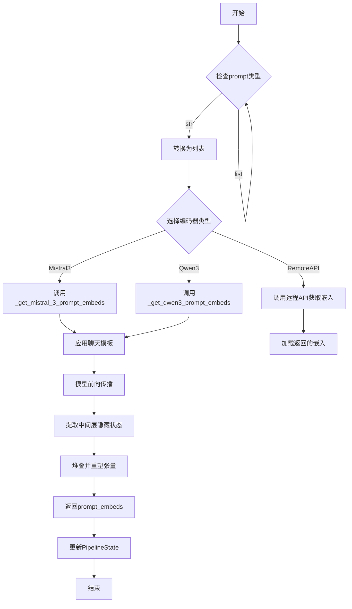

## 类结构

```
ModularPipelineBlocks (抽象基类)
├── Flux2TextEncoderStep (Mistral3文本编码)
├── Flux2RemoteTextEncoderStep (远程API文本编码)
├── Flux2KleinTextEncoderStep (Qwen3精简版文本编码)
├── Flux2KleinBaseTextEncoderStep (Qwen3基础版文本编码)
└── Flux2VaeEncoderStep (VAE图像编码)
```

## 全局变量及字段


### `logger`
    
模块级日志记录器，用于输出该模块的运行状态和调试信息

类型：`logging.Logger`
    


### `format_text_input`
    
全局函数，用于将用户提示格式化为Mistral3聊天模板所需的字典结构

类型：`Callable[[list[str], str | None], list[list[dict]]]`
    


### `retrieve_latents`
    
全局函数，用于从VAE编码器输出中提取潜在表示，支持sample和argmax两种模式

类型：`Callable[[torch.Tensor, torch.Generator | None, str], torch.Tensor]`
    


### `Flux2TextEncoderStep.model_name`
    
类属性，标识该步骤适用于flux2模型

类型：`str`
    


### `Flux2TextEncoderStep.DEFAULT_SYSTEM_MESSAGE`
    
类属性，定义默认的系统消息，指导模型生成结构化响应

类型：`str`
    


### `Flux2RemoteTextEncoderStep.model_name`
    
类属性，标识该步骤适用于flux2模型

类型：`str`
    


### `Flux2RemoteTextEncoderStep.REMOTE_URL`
    
类属性，定义远程文本编码服务的API端点URL

类型：`str`
    


### `Flux2KleinTextEncoderStep.model_name`
    
类属性，标识该步骤适用于flux2-klein模型

类型：`str`
    


### `Flux2KleinBaseTextEncoderStep.model_name`
    
类属性，标识该步骤适用于flux2-klein模型

类型：`str`
    


### `Flux2VaeEncoderStep.model_name`
    
类属性，标识该步骤适用于flux2模型

类型：`str`
    
    

## 全局函数及方法


### `format_text_input`

格式化提示词以适配 Mistral3 聊天模板。该函数接收提示词列表和可选的系统消息，清理提示词中的 `[IMG]` 标记，并将其转换为符合 Mistral3 chat template 格式的多轮对话结构（包含 system 和 user 角色）。

参数：

- `prompts`：`list[str]`，输入的提示词列表
- `system_message`：`str | None`，可选的系统消息，默认为 None

返回值：`list[list[dict]]`，返回符合 Mistral3 chat template 格式的消息批次，每个内部列表包含一个 system 消息和一个 user 消息

#### 流程图

```mermaid
flowchart TD
    A[开始 format_text_input] --> B{检查 system_message}
    B -->|None| C[cleaned_txt = prompts 列表每个元素移除 '[IMG]']
    B -->|有值| D[cleaned_txt = prompts 列表每个元素移除 '[IMG]']
    C --> E[构建消息结构]
    D --> E
    E --> F[对每个 prompt 创建 [system, user] 消息对]
    F --> G[返回格式化后的消息列表]
    G --> H[结束]
```

#### 带注释源码

```python
def format_text_input(prompts: list[str], system_message: str = None):
    """Format prompts for Mistral3 chat template."""
    # 清理提示词：移除所有 "[IMG]" 标记
    # 这是因为在某些图像相关的任务中，提示词可能包含图像占位符
    cleaned_txt = [prompt.replace("[IMG]", "") for prompt in prompts]

    # 构建符合 Mistral3 chat template 格式的消息结构
    # 返回一个列表的列表，每个内部列表包含一个对话轮次
    # 包含 system 消息（设置助手行为）和 user 消息（用户输入）
    return [
        [
            {
                "role": "system",
                "content": [{"type": "text", "text": system_message}],
            },
            {"role": "user", "content": [{"type": "text", "text": prompt}]},
        ]
        for prompt in cleaned_txt
    ]
```


### `retrieve_latents`

该函数用于从编码器输出中提取潜在向量（latents），支持多种采样模式（sample 或 argmax），是连接 VAE 编码器与潜在空间的关键桥梁。

参数：

- `encoder_output`：`torch.Tensor`，编码器输出对象，包含 `latent_dist` 属性（潜在分布）或 `latents` 属性（潜在向量）
- `generator`：`torch.Generator | None`，可选的随机数生成器，用于潜在分布的随机采样
- `sample_mode`：`str`，采样模式，默认为 `"sample"`（随机采样），可选 `"argmax"`（取分布的众数/确定性输出）

返回值：`torch.Tensor`，从编码器输出中提取的潜在向量

#### 流程图

```mermaid
flowchart TD
    A[开始: retrieve_latents] --> B{encoder_output 是否有 latent_dist 属性?}
    B -- 是 --> C{sample_mode == 'sample'?}
    C -- 是 --> D[返回 encoder_output.latent_dist.sample<br/>/generator)]
    C -- 否 --> E{sample_mode == 'argmax'?}
    E -- 是 --> F[返回 encoder_output.latent_dist.mode<br/>/取分布的众数]
    E -- 否 --> G[抛出 AttributeError]
    B -- 否 --> H{encoder_output 是否有 latents 属性?}
    H -- 是 --> I[返回 encoder_output.latents]
    H -- 否 --> G
```

#### 带注释源码

```python
# Copied from diffusers.pipelines.stable_diffusion.pipeline_stable_diffusion_img2img.retrieve_latents
def retrieve_latents(
    encoder_output: torch.Tensor, generator: torch.Generator | None = None, sample_mode: str = "sample"
):
    """
    从编码器输出中提取潜在向量。
    
    支持三种模式：
    1. 从潜在分布中随机采样 (sample_mode="sample")
    2. 从潜在分布中取众数/确定性输出 (sample_mode="argmax")
    3. 直接返回预计算的潜在向量 (latents 属性)
    """
    # 场景1: 编码器输出包含潜在分布对象 latent_dist，且要求随机采样
    if hasattr(encoder_output, "latent_dist") and sample_mode == "sample":
        return encoder_output.latent_dist.sample(generator)
    
    # 场景2: 编码器输出包含潜在分布对象 latent_dist，且要求取众数
    elif hasattr(encoder_output, "latent_dist") and sample_mode == "argmax":
        return encoder_output.latent_dist.mode()
    
    # 场景3: 编码器输出包含预计算的潜在向量 latents
    elif hasattr(encoder_output, "latents"):
        return encoder_output.latents
    
    # 错误处理: 无法从 encoder_output 中提取潜在向量
    else:
        raise AttributeError("Could not access latents of provided encoder_output")
```


### `Flux2TextEncoderStep.description`

获取Flux2TextEncoderStep模块的描述信息，用于说明该步骤的功能定位。

参数：
- （无参数，这是一个属性getter方法）

返回值：`str`，返回该文本编码步骤的描述，说明其使用Mistral3生成文本嵌入以指导图像生成的功能。

#### 流程图

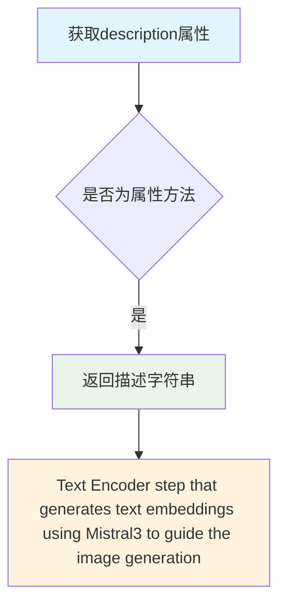

#### 带注释源码

```python
@property
def description(self) -> str:
    """
    属性 getter 方法，返回该模块的功能描述。
    
    该描述用于：
    1. 日志记录和调试信息展示
    2. 管道组件的文档化说明
    3. 调试时识别当前执行的管道步骤
    
    Returns:
        str: 描述文本编码步骤功能的字符串，说明使用Mistral3模型
             生成文本嵌入向量以指导Flux2图像生成管道的图像生成过程
    """
    return "Text Encoder step that generates text embeddings using Mistral3 to guide the image generation"
```


### `Flux2TextEncoderStep.expected_components`

该属性定义了 Flux2 文本编码步骤所需的组件规范，指定该步骤需要 `text_encoder`（Mistral3ForConditionalGeneration 模型）和 `tokenizer`（AutoProcessor）两个核心组件来完成文本嵌入的生成。

参数：无需显式参数（隐含 `self` 参数）

返回值：`list[ComponentSpec]`，返回组件规范列表，包含该模块化管道步骤所需的文本编码器和分词器组件规范

#### 流程图

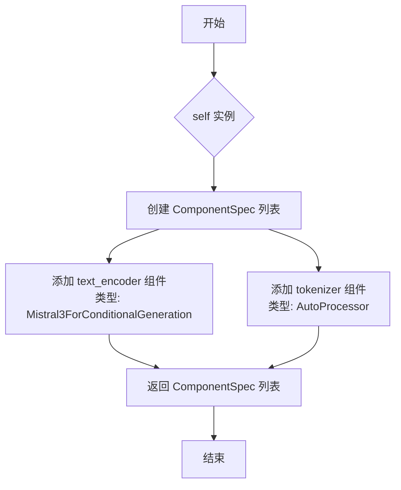

#### 带注释源码

```python
@property
def expected_components(self) -> list[ComponentSpec]:
    """
    定义该步骤期望的组件规范。
    
    Returns:
        list[ComponentSpec]: 包含 text_encoder 和 tokenizer 的组件规范列表
    """
    return [
        # 文本编码器组件：使用 Mistral3ForConditionalGeneration 模型
        # 用于将文本 prompt 转换为文本嵌入向量
        ComponentSpec("text_encoder", Mistral3ForConditionalGeneration),
        
        # 分词器组件：使用 AutoProcessor（自动处理器）
        # 负责对文本进行分词和编码处理
        ComponentSpec("tokenizer", AutoProcessor),
    ]
```


### `Flux2TextEncoderStep.inputs`

该属性方法定义了Flux2TextEncoderStep模块化流水线块的输入参数列表，包括提示词、最大序列长度和文本编码器输出层索引等参数，用于指导图像生成过程。

参数：

- `prompt`：`str | list[str]`，用户提供的文本提示词，用于生成文本嵌入以指导图像生成
- `max_sequence_length`：`int`，文本序列的最大长度，默认为512，可选
- `text_encoder_out_layers`：`tuple[int]`，指定从文本编码器中提取的隐藏状态层索引元组，默认为(10, 20, 30)，可选

返回值：`list[InputParam]`，返回包含所有输入参数的InputParam对象列表

#### 流程图

```mermaid
flowchart TD
    A[开始] --> B{inputs属性被调用}
    B --> C[返回InputParam列表]
    
    C --> D[prompt参数<br/>类型: str | list[str]
    必填]
    C --> E[max_sequence_length参数<br/>类型: int
    默认值: 512
    可选]
    C --> F[text_encoder_out_layers参数<br/>类型: tuple[int]
    默认值: (10, 20, 30)
    可选]
    
    D --> G[返回列表]
    E --> G
    F --> G
    G --> H[结束]
```

#### 带注释源码

```python
@property
def inputs(self) -> list[InputParam]:
    """
    定义Flux2TextEncoderStep的输入参数列表。
    
    该属性返回三个InputParam对象：
    1. prompt - 文本提示词，支持字符串或字符串列表
    2. max_sequence_length - 最大序列长度，默认为512个token
    3. text_encoder_out_layers - 文本编码器中间层索引，用于提取多层次特征
    
    Returns:
        list[InputParam]: 包含所有输入参数的列表，用于模块化流水线的参数绑定
    """
    return [
        InputParam("prompt"),
        # 提示词参数：用户提供的文本描述，用于生成引导图像的文本嵌入
        # 支持单个字符串或字符串列表（批量处理）
        
        InputParam("max_sequence_length", type_hint=int, default=512, required=False),
        # 最大序列长度参数：限制输入文本的token数量
        # 类型提示为int，默认为512，可选参数
        
        InputParam("text_encoder_out_layers", type_hint=tuple[int], default=(10, 20, 30), required=False)
        # 文本编码器输出层索引参数：指定从transformer的哪些中间层提取隐藏状态
        # 类型提示为tuple[int]，默认为(10, 20, 30)，即第10、20、30层的隐藏状态
        # 这些中间层特征会被拼接起来形成更丰富的文本表示
    ]
```


### `Flux2TextEncoderStep.intermediate_outputs`

该属性方法定义了 Flux2 文本编码器步骤的中间输出参数列表，用于返回由 Mistral3 模型生成的文本嵌入（prompt_embeds），这些嵌入将用于引导图像生成过程。

参数：

- 无显式参数（隐含 `self` 参数引用类实例）

返回值：`list[OutputParam]` ，返回包含 `OutputParam` 对象的列表，定义了文本编码步骤的中间输出参数，其中包含 `prompt_embeds` 文本嵌入张量。

#### 流程图

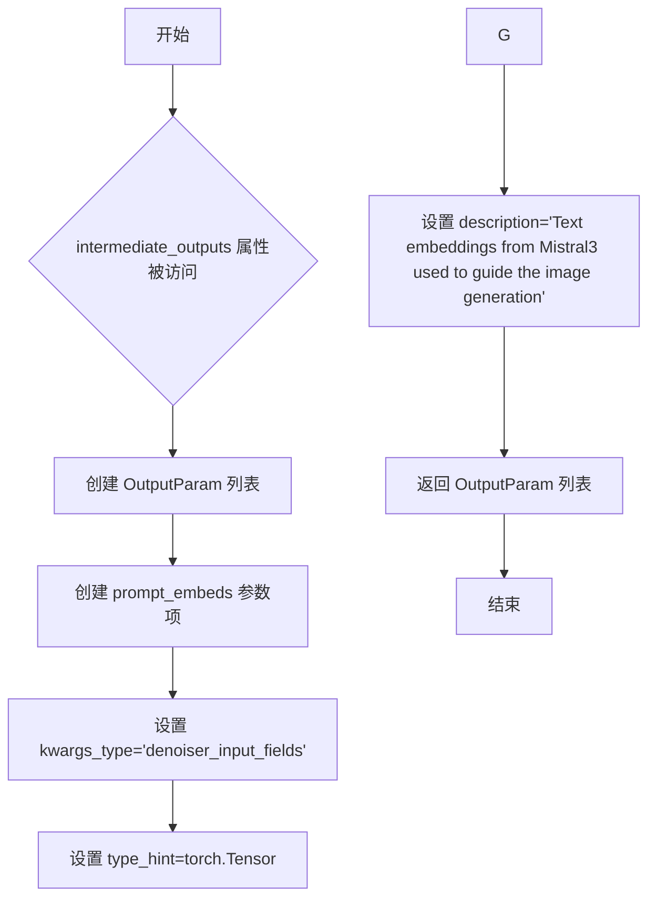

#### 带注释源码

```python
@property
def intermediate_outputs(self) -> list[OutputParam]:
    """
    定义 Flux2TextEncoderStep 的中间输出参数。
    
    返回值：
        list[OutputParam]: 包含中间输出参数的列表，每个 OutputParam 描述一个输出参数的结构。
    """
    return [
        OutputParam(
            "prompt_embeds",                          # 参数名称：文本嵌入张量
            kwargs_type="denoiser_input_fields",      # kwargs 类型：去噪器输入字段
            type_hint=torch.Tensor,                   # 类型提示：PyTorch 张量
            description="Text embeddings from Mistral3 used to guide the image generation",  # 描述：Mistral3 生成的文本嵌入，用于引导图像生成
        ),
    ]
```

#### 补充说明

| 项目 | 说明 |
|------|------|
| **所属类** | `Flux2TextEncoderStep` |
| **方法类型** | 属性方法（@property） |
| **依赖类** | `OutputParam`（来自 `..modular_pipeline_utils`） |
| **使用场景** | 在模块化流水线中，用于声明该步骤可传递给下游步骤的中间结果 |
| **数据流** | 输出 `prompt_embeds` 作为 `PipelineState` 的一部分，供后续去噪步骤使用 |


### `Flux2TextEncoderStep.check_inputs`

验证输入的 prompt 参数是否符合预期的类型（str 或 list）。若不符合，则抛出 ValueError 异常。

参数：

-  `block_state`：包含块状态的对象，通过该对象获取 prompt 参数进行验证

返回值：`None`（无返回值，但在验证失败时抛出 ValueError 异常）

#### 流程图

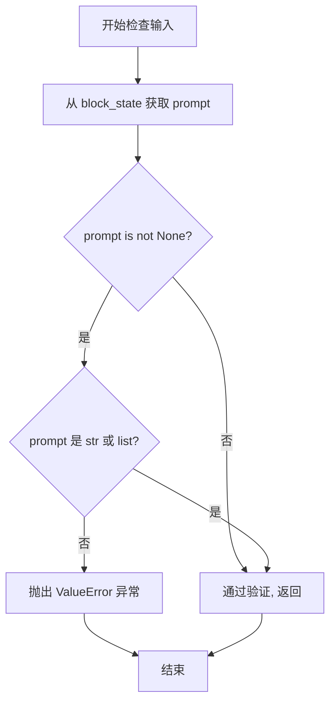

#### 带注释源码

```python
@staticmethod
def check_inputs(block_state):
    """
    验证 block_state 中的 prompt 参数类型是否合法。
    
    Args:
        block_state: 包含块状态的对象，必须具有 prompt 属性
        
    Raises:
        ValueError: 当 prompt 不为 None 且不是 str 或 list 类型时抛出
    """
    # 从 block_state 中获取 prompt 属性
    prompt = block_state.prompt
    
    # 检查 prompt 是否不为 None 且不是 str 或 list 类型
    if prompt is not None and (not isinstance(prompt, str) and not isinstance(prompt, list)):
        # 抛出详细的错误信息，包含实际类型
        raise ValueError(f"`prompt` has to be of type `str` or `list` but is {type(prompt)}")
```


### `Flux2TextEncoderStep._get_mistral_3_prompt_embeds`

该方法是一个静态方法，用于将文本提示（prompt）转换为 Mistral3 模型的文本嵌入（prompt embeds），支持批量处理和中间隐藏层提取，最终返回用于引导图像生成的文本嵌入张量。

参数：

- `text_encoder`：`Mistral3ForConditionalGeneration`，Mistral3 文本编码器模型实例
- `tokenizer`：`AutoProcessor`，用于处理文本输入的分词器
- `prompt`：`str | list[str]`，用户输入的文本提示，可以是单个字符串或字符串列表
- `dtype`：`torch.dtype | None`，输出的数据类型，默认为 None（使用模型的数据类型）
- `device`：`torch.device | None`，计算设备，默认为 None（使用模型的设备）
- `max_sequence_length`：`int`，最大序列长度，默认为 512
- `system_message`：`str`，系统消息，用于引导模型生成更结构化的响应，默认为预定义的常量
- `hidden_states_layers`：`tuple[int]`，要提取的隐藏层索引元组，默认为 (10, 20, 30)

返回值：`torch.Tensor`，形状为 (batch_size, seq_len, num_channels * hidden_dim) 的文本嵌入张量，用于引导图像生成

#### 流程图

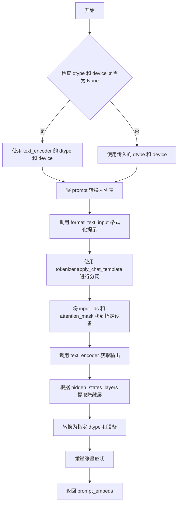

#### 带注释源码

```python
@staticmethod
def _get_mistral_3_prompt_embeds(
    text_encoder: Mistral3ForConditionalGeneration,
    tokenizer: AutoProcessor,
    prompt: str | list[str],
    dtype: torch.dtype | None = None,
    device: torch.device | None = None,
    max_sequence_length: int = 512,
    # fmt: off
    system_message: str = "You are an AI that reasons about image descriptions. You give structured responses focusing on object relationships, object attribution and actions without speculation.",
    # fmt: on
    hidden_states_layers: tuple[int] = (10, 20, 30),
):
    # 如果未指定 dtype，则使用 text_encoder 的数据类型
    dtype = text_encoder.dtype if dtype is None else dtype
    # 如果未指定 device，则使用 text_encoder 的设备
    device = text_encoder.device if device is None else device

    # 确保 prompt 是列表格式，便于批量处理
    prompt = [prompt] if isinstance(prompt, str) else prompt

    # 使用 format_text_input 函数将 prompt 转换为聊天模板格式
    messages_batch = format_text_input(prompts=prompt, system_message=system_message)

    # 使用分词器的聊天模板进行分词，返回 PyTorch 张量
    inputs = tokenizer.apply_chat_template(
        messages_batch,
        add_generation_prompt=False,
        tokenize=True,
        return_dict=True,
        return_tensors="pt",
        padding="max_length",
        truncation=True,
        max_length=max_sequence_length,
    )

    # 将输入张量移动到指定的计算设备上
    input_ids = inputs["input_ids"].to(device)
    attention_mask = inputs["attention_mask"].to(device)

    # 调用文本编码器模型，获取隐藏状态输出
    output = text_encoder(
        input_ids=input_ids,
        attention_mask=attention_mask,
        output_hidden_states=True,  # 启用输出所有隐藏状态
        use_cache=False,  # 禁用 KV 缓存以节省内存
    )

    # 根据指定的层索引堆叠对应的隐藏状态
    # output.hidden_states[k] 的形状: (batch_size, seq_len, hidden_dim)
    # 堆叠后的形状: (batch_size, num_channels, seq_len, hidden_dim)
    out = torch.stack([output.hidden_states[k] for k in hidden_states_layers], dim=1)
    # 将张量转换到指定的数据类型和设备
    out = out.to(dtype=dtype, device=device)

    # 获取输出张量的形状
    batch_size, num_channels, seq_len, hidden_dim = out.shape
    # 对张量进行维度重排和reshape:
    # permute: (batch_size, seq_len, num_channels, hidden_dim)
    # reshape: (batch_size, seq_len, num_channels * hidden_dim)
    # 最终得到 (batch_size, seq_len, num_channels * hidden_dim) 的嵌入向量
    prompt_embeds = out.permute(0, 2, 1, 3).reshape(batch_size, seq_len, num_channels * hidden_dim)

    return prompt_embeds
```


### `Flux2TextEncoderStep.__call__`

该方法是 `Flux2TextEncoderStep` 类的核心调用入口，接收模块化管道组件和管道状态作为输入，验证并处理文本提示词，然后调用 Mistral3 文本编码器生成文本嵌入向量（prompt_embeds），最终将结果存储到管道状态中并返回更新后的组件和状态。

参数：

- `self`：`Flux2TextEncoderStep` 实例对象
- `components`：`Flux2ModularPipeline` 类型，模块化管道组件容器，包含文本编码器（text_encoder）和分词器（tokenizer）等组件
- `state`：`PipelineState` 类型，管道状态对象，用于在各个处理步骤之间传递数据和中间结果

返回值：`Tuple[Flux2ModularPipeline, PipelineState]` 类型，返回更新后的管道组件和状态元组，其中状态对象中包含生成的 `prompt_embeds` 文本嵌入向量

#### 流程图

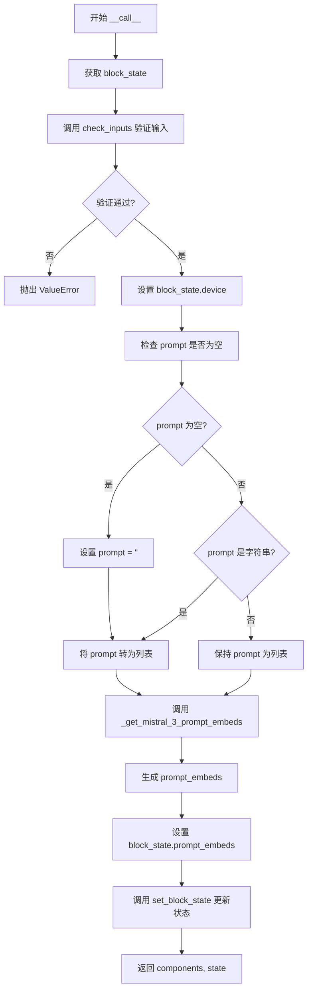

#### 带注释源码

```python
@torch.no_grad()
def __call__(self, components: Flux2ModularPipeline, state: PipelineState) -> PipelineState:
    """
    Flux2TextEncoderStep 的主调用方法，执行文本编码步骤。
    
    该方法完成以下工作：
    1. 从管道状态中获取当前步骤的 block_state
    2. 验证输入参数的有效性
    3. 获取执行设备信息
    4. 处理 prompt（确保为列表格式）
    5. 调用 Mistral3 文本编码器生成文本嵌入
    6. 将嵌入结果存储到 block_state 中
    7. 更新管道状态并返回
    
    参数:
        components: Flux2ModularPipeline 实例，包含 text_encoder 和 tokenizer 等组件
        state: PipelineState 管道状态对象
    
    返回:
        Tuple[Flux2ModularPipeline, PipelineState]: 更新后的组件和状态
    """
    # 从管道状态中获取当前文本编码步骤的 block_state
    # block_state 包含该步骤的输入参数和中间输出
    block_state = self.get_block_state(state)
    
    # 验证输入参数的合法性
    # 检查 prompt 是否为 str 或 list 类型
    self.check_inputs(block_state)
    
    # 将执行设备信息存储到 block_state 中
    # 后续的 tensor 操作将在该设备上进行
    block_state.device = components._execution_device
    
    # 从 block_state 中获取 prompt
    prompt = block_state.prompt
    
    # 如果 prompt 为 None，则设置为空字符串
    if prompt is None:
        prompt = ""
    
    # 确保 prompt 为列表格式
    # 如果是单个字符串，则包装为单元素列表
    prompt = [prompt] if isinstance(prompt, str) else prompt
    
    # 调用 Mistral3 模型生成文本嵌入向量
    # 使用指定的中层隐藏层输出 (text_encoder_out_layers)
    # 这些嵌入将用于指导图像生成过程
    block_state.prompt_embeds = self._get_mistral_3_prompt_embeds(
        text_encoder=components.text_encoder,      # Mistral3 文本编码器模型
        tokenizer=components.tokenizer,            # Mistral3 分词器
        prompt=prompt,                              # 处理后的文本提示
        device=block_state.device,                 # 执行设备
        max_sequence_length=block_state.max_sequence_length,  # 最大序列长度
        system_message=self.DEFAULT_SYSTEM_MESSAGE, # 系统消息
        hidden_states_layers=block_state.text_encoder_out_layers,  # 隐藏层索引
    )
    
    # 将更新后的 block_state 写回管道状态
    self.set_block_state(state, block_state)
    
    # 返回更新后的组件和状态
    return components, state
```


### `Flux2RemoteTextEncoderStep.description`

这是一个只读属性（property），用于描述 Flux2RemoteTextEncoderStep 模块的功能。该属性返回一段文字说明，表明该模块是一个文本编码步骤，通过调用远程 API 端点来生成用于指导图像生成的文本嵌入向量。

参数：
- （无参数，这是一个只读属性）

返回值：`str`，返回对该步骤功能的描述文本："Text Encoder step that generates text embeddings using a remote API endpoint"

#### 流程图

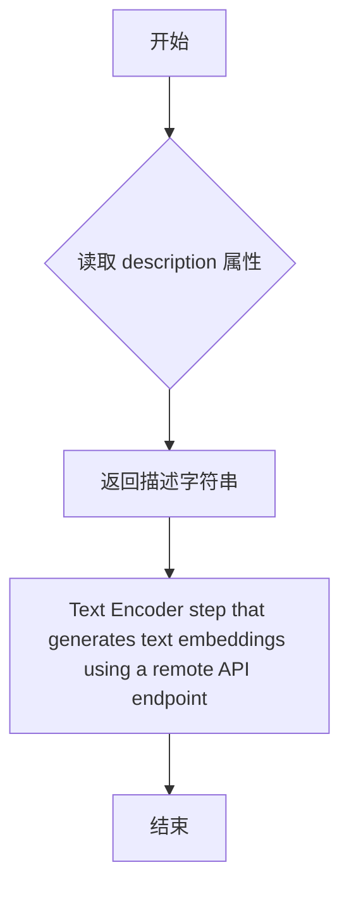

#### 带注释源码

```python
class Flux2RemoteTextEncoderStep(ModularPipelineBlocks):
    """远程文本编码器步骤类，用于通过远程API生成文本嵌入"""
    
    model_name = "flux2"  # 模型名称标识

    # 远程API的URL端点
    REMOTE_URL = "https://remote-text-encoder-flux-2.huggingface.co/predict"

    @property
    def description(self) -> str:
        """
        返回该步骤的描述信息
        
        这是一个只读属性，返回当前模块功能的文字描述。
        用于日志记录、调试信息展示以及管道组装时的步骤说明。
        
        Returns:
            str: 描述文本，说明该步骤通过远程API生成文本嵌入向量
                 用于指导图像生成过程
        """
        return "Text Encoder step that generates text embeddings using a remote API endpoint"
```


### `Flux2RemoteTextEncoderStep.expected_components`

该属性方法定义了`Flux2RemoteTextEncoderStep`模块化管道步骤所需的组件列表。对于远程文本编码器步骤，由于文本嵌入生成通过远程API调用完成，因此不需要任何本地组件。

参数：无（属性方法不接受参数）

返回值：`list[ComponentSpec]`，返回组件规格对象列表，描述该步骤所需的前置组件

#### 流程图

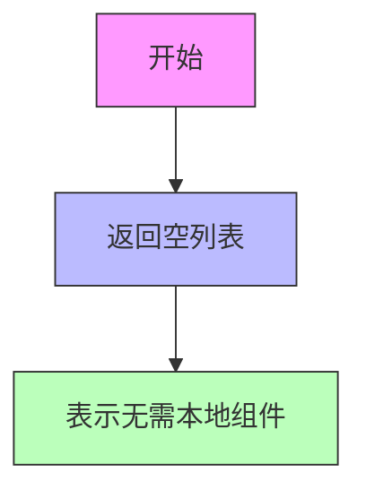

#### 带注释源码

```python
@property
def expected_components(self) -> list[ComponentSpec]:
    """
    定义该管道步骤所需的前置组件。
    
    Flux2RemoteTextEncoderStep 使用远程API来生成文本嵌入，
    因此不需要本地的text_encoder或tokenizer组件。
    
    Returns:
        list[ComponentSpec]: 组件规格列表，此处返回空列表，
                            表示该步骤不依赖任何本地模型组件
    """
    return []
```


### `Flux2RemoteTextEncoderStep.inputs`

该属性定义了远程文本编码器步骤的输入参数列表，用于描述从远程API获取文本嵌入时所需的输入配置。

参数： 无（这是一个属性方法，参数为隐式的self）

返回值：`list[InputParam]`，返回包含输入参数的列表，每个InputParam对象描述一个输入参数的名称、类型、默认值和是否必需等信息。

#### 流程图

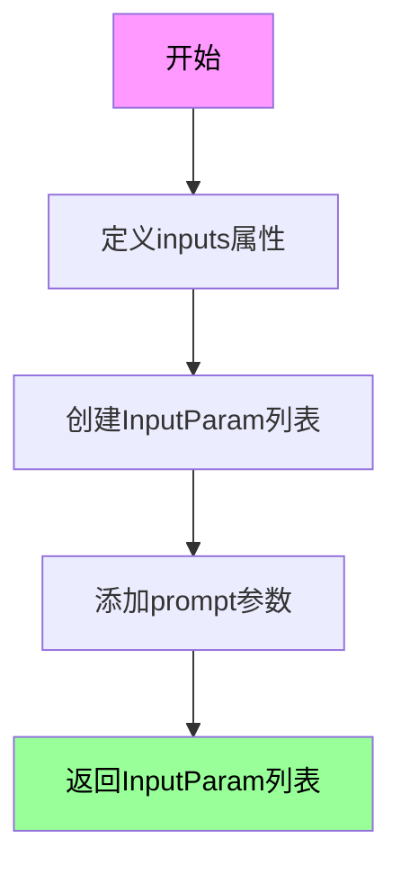

#### 带注释源码

```python
@property
def inputs(self) -> list[InputParam]:
    """
    定义远程文本编码器步骤的输入参数规范。
    
    该属性返回一个InputParam列表，描述该处理步骤需要接收的输入参数。
    对于Flux2RemoteTextEncoderStep，只需要一个prompt参数用于文本嵌入生成。
    
    Returns:
        list[InputParam]: 包含所有输入参数规范的列表
    """
    return [
        InputParam("prompt"),  # 文本提示输入，支持字符串或字符串列表
    ]
```


### `Flux2RemoteTextEncoderStep.intermediate_outputs`

该属性方法定义了 Flux2RemoteTextEncoderStep 步骤的中间输出参数，包含从远程 API 获取的文本嵌入（prompt_embeds），用于指导图像生成过程。

参数：

- `self`：`Flux2RemoteTextEncoderStep`，隐式参数，表示类的实例本身

返回值：`list[OutputParam]`，返回包含 OutputParam 对象的列表，定义了步骤输出的文本嵌入参数

#### 流程图

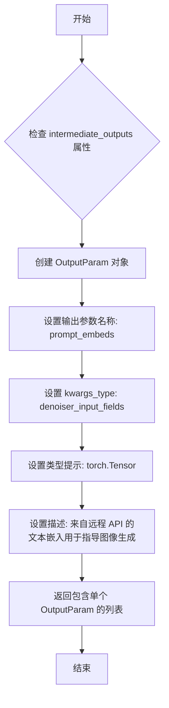

#### 带注释源码

```python
@property
def intermediate_outputs(self) -> list[OutputParam]:
    """定义该步骤的中间输出参数。
    
    返回值:
        list[OutputParam]: 包含文本嵌入输出参数的列表，用于后续去噪步骤的输入。
    """
    return [
        OutputParam(
            "prompt_embeds",  # 输出参数的名称，对应 block_state 中的属性名
            kwargs_type="denoiser_input_fields",  # 指定该参数属于去噪器输入字段
            type_hint=torch.Tensor,  # 参数的类型提示，表示为 PyTorch 张量
            description="Text embeddings from remote API used to guide the image generation",  # 参数描述，说明该嵌入用于引导图像生成
        ),
    ]
```


### `Flux2RemoteTextEncoderStep.check_inputs`

该方法是一个静态输入验证函数，用于检查传入的 `block_state` 中的 `prompt` 参数是否为有效类型（字符串或列表）。如果 `prompt` 既不是 `None`、也不是 `str` 或 `list` 类型，则抛出 `ValueError` 异常，以确保后续处理流程接收到有效的数据类型。

参数：

- `block_state`：对象，包含模块化管道块的状态信息，其中包含 `prompt` 属性待验证

返回值：`None`，无返回值（该方法通过抛出异常来处理无效输入）

#### 流程图

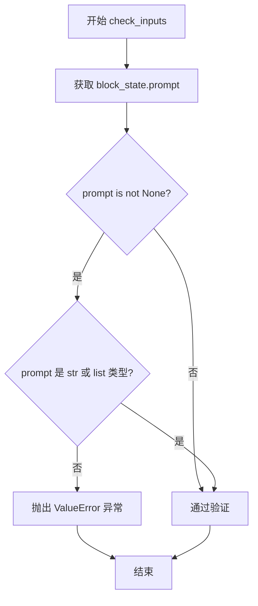

#### 带注释源码

```python
@staticmethod
def check_inputs(block_state):
    """
    检查 block_state 中的 prompt 参数是否为有效类型。
    
    参数:
        block_state: 包含管道状态的块状态对象,需要具有 prompt 属性
    
    返回:
        None: 验证通过时无返回值,验证失败时抛出 ValueError
    
    异常:
        ValueError: 当 prompt 既不是 None,也不是 str 或 list 类型时抛出
    """
    # 从 block_state 中获取 prompt 属性
    prompt = block_state.prompt
    
    # 检查 prompt 是否不为 None 且不是有效的 str 或 list 类型
    if prompt is not None and (not isinstance(prompt, str) and not isinstance(prompt, list)):
        # 抛出详细的错误信息,说明期望的类型和实际收到的类型
        raise ValueError(f"`prompt` has to be of type `str` or `list` but is {type(block_state.prompt)}")
```


### `Flux2RemoteTextEncoderStep.__call__`

该方法是 Flux2 远程文本编码器步骤的实现，通过调用远程 API 端点获取文本嵌入（prompt embeddings），用于指导图像生成过程。它接收模块化管道组件和管道状态，验证输入有效性，发送请求到远程服务器，并将返回的嵌入张量加载到指定设备上。

参数：

- `self`：类实例本身，隐式参数
- `components`：`Flux2ModularPipeline` 类型，模块化管道组件对象，提供执行设备和配置信息
- `state`：`PipelineState` 类型，管道状态对象，包含提示词和块状态信息

返回值：`Tuple[Flux2ModularPipeline, PipelineState]` 类型，返回更新后的管道组件和状态元组，其中状态对象的 `prompt_embeds` 属性被设置为从远程 API 获取的文本嵌入

#### 流程图

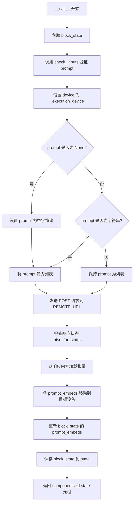

#### 带注释源码

```python
@torch.no_grad()  # 禁用梯度计算以节省内存
def __call__(self, components: Flux2ModularPipeline, state: PipelineState) -> PipelineState:
    """
    执行远程文本编码步骤，通过 API 获取文本嵌入。
    
    参数:
        components: Flux2ModularPipeline 实例，提供管道组件和执行设备
        state: PipelineState 实例，包含当前管道状态和输入参数
    
    返回:
        Tuple[Flux2ModularPipeline, PipelineState]: 更新后的组件和状态
    """
    import io
    import requests
    from huggingface_hub import get_token

    # 从管道状态中获取当前块状态
    block_state = self.get_block_state(state)
    
    # 验证输入参数的有效性
    self.check_inputs(block_state)

    # 设置设备为管道的执行设备
    block_state.device = components._execution_device

    # 获取提示词
    prompt = block_state.prompt
    
    # 如果 prompt 为 None，则设置为空字符串
    if prompt is None:
        prompt = ""
    
    # 确保 prompt 是列表格式（支持批量处理）
    prompt = [prompt] if isinstance(prompt, str) else prompt

    # 向远程 API 发送 POST 请求获取文本嵌入
    response = requests.post(
        self.REMOTE_URL,  # 远程 API 端点 URL
        json={"prompt": prompt},  # 请求体，包含提示词
        headers={
            "Authorization": f"Bearer {get_token()}",  # 使用 HuggingFace token 认证
            "Content-Type": "application/json",
        },
    )
    
    # 检查 HTTP 响应状态，若出错则抛出异常
    response.raise_for_status()

    # 从响应内容加载文本嵌入张量
    # 使用 io.BytesIO 将字节内容转换为二进制流供 torch.load 读取
    # weights_only=True 仅加载张量权重，不加载完整对象（更安全）
    block_state.prompt_embeds = torch.load(io.BytesIO(response.content), weights_only=True)
    
    # 将嵌入张量移动到目标设备（CPU/GPU）
    block_state.prompt_embeds = block_state.prompt_embeds.to(block_state.device)

    # 更新管道状态中的块状态
    self.set_block_state(state, block_state)
    
    # 返回更新后的组件和状态
    return components, state
```


### `Flux2KleinTextEncoderStep.description`

该属性返回当前步骤的描述信息，用于说明该模块是一个使用 Qwen3 生成文本嵌入以指导图像生成的文本编码器步骤。

参数：無（该方法为属性，无显式参数）

返回值：`str`，返回对 Flux2KleinTextEncoderStep 步骤的描述字符串，说明该步骤使用 Qwen3 生成文本嵌入来指导图像生成。

#### 流程图

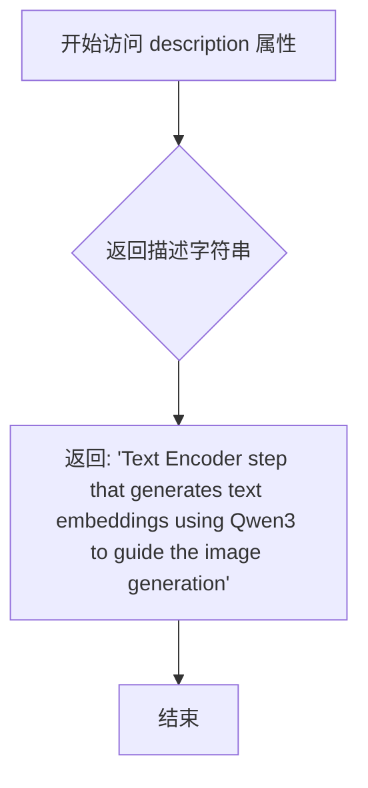

#### 带注释源码

```python
@property
def description(self) -> str:
    """
    属性描述符，返回当前步骤的描述信息。
    
    该属性用于向管道系统说明当前模块的功能和用途，
    帮助进行步骤调度、执行追踪和日志记录。
    
    Returns:
        str: 描述文本，说明该步骤使用 Qwen3 模型生成文本嵌入，
             生成的嵌入将用于指导后续的图像生成过程。
    """
    return "Text Encoder step that generates text embeddings using Qwen3 to guide the image generation"
```


### `Flux2KleinTextEncoderStep.expected_components`

该属性定义了 Flux2KleinTextEncoderStep 所需的核心组件，包括文本编码器（Qwen3ForCausalLM）和分词器（Qwen2TokenizerFast），用于生成文本嵌入以指导图像生成。

参数：
该属性无参数。

返回值：`list[ComponentSpec]`，返回包含文本编码器和分词器组件规格的列表。

#### 流程图

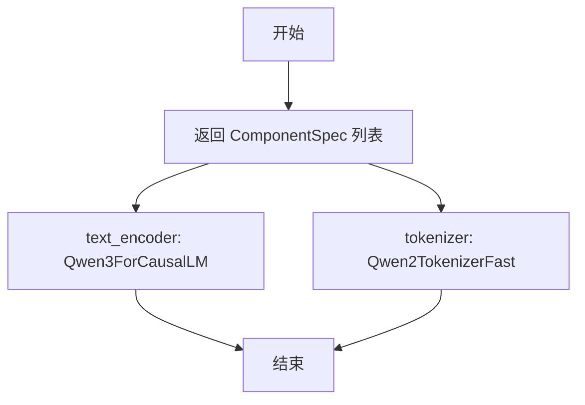

#### 带注释源码

```python
@property
def expected_components(self) -> list[ComponentSpec]:
    """
    定义该步骤所需的核心组件。
    
    返回一个包含 ComponentSpec 的列表，指定了:
    1. text_encoder: Qwen3ForCausalLM - 用于生成文本嵌入的因果语言模型
    2. tokenizer: Qwen2TokenizerFast - 用于对输入文本进行分词处理的快速分词器
    
    Returns:
        list[ComponentSpec]: 组件规格列表，包含文本编码器和解码器所需的组件
    """
    return [
        ComponentSpec("text_encoder", Qwen3ForCausalLM),
        ComponentSpec("tokenizer", Qwen2TokenizerFast),
    ]
```


### `Flux2KleinTextEncoderStep.expected_configs`

该属性方法定义了 Flux2KleinTextEncoderStep 的预期配置规范，返回一个包含配置项名称和默认值的列表，用于指导管道的配置初始化。

参数：无（该方法为属性方法，无显式参数）

返回值：`list[ConfigSpec]`，返回配置规范列表，当前包含 `is_distilled` 配置项及其默认值 `True`

#### 流程图

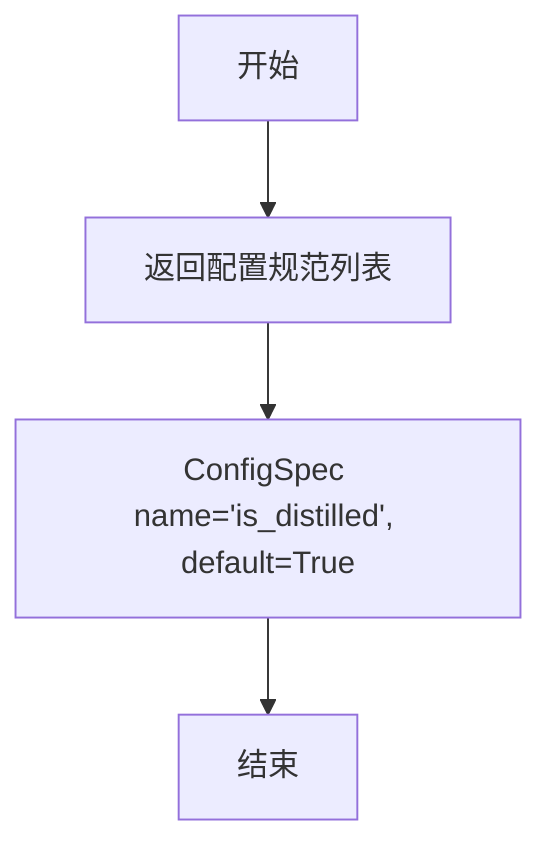

#### 带注释源码

```python
@property
def expected_configs(self) -> list[ConfigSpec]:
    """
    定义 Flux2KleinTextEncoderStep 的预期配置规范。
    
    该属性返回一个配置规范列表，用于指定该步骤所需的配置项。
    当前仅定义了一个配置项 'is_distilled'，用于标识模型是否为蒸馏版本。
    
    Returns:
        list[ConfigSpec]: 包含配置规范的列表，每个 ConfigSpec 定义了配置项的名称和默认值
    """
    return [
        ConfigSpec(name="is_distilled", default=True),
    ]
```


### `Flux2KleinTextEncoderStep.inputs`

该属性定义了 Flux2KleinTextEncoderStep 的输入参数列表，包括提示词、最大序列长度和文本编码器输出层配置。

参数：
- 该方法为属性方法，无直接参数；其返回值包含三个 `InputParam` 对象：
  - `prompt`：`str | list[str]`，用户输入的文本提示词
  - `max_sequence_length`：`int`，最大序列长度，默认值为 512，可选
  - `text_encoder_out_layers`：`tuple[int]`，文本编码器输出层索引元组，默认值为 (9, 18, 27)，可选

返回值：`list[InputParam]`，返回输入参数规范列表，用于定义该步骤需要从管道状态中获取的输入参数。

#### 流程图

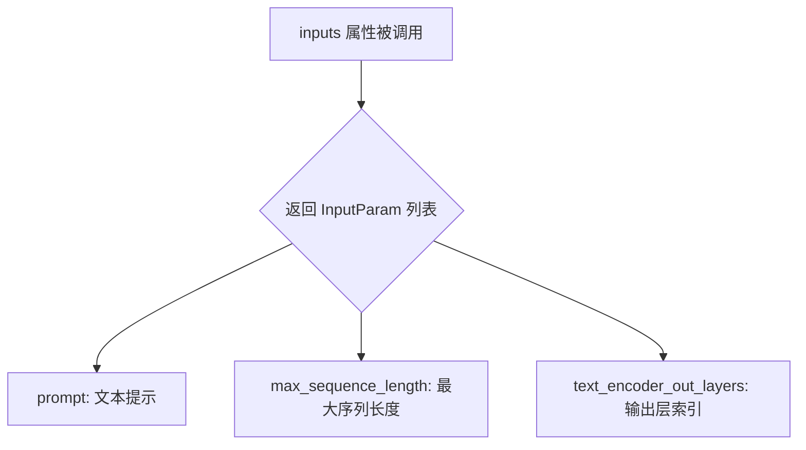

#### 带注释源码

```python
@property
def inputs(self) -> list[InputParam]:
    """
    定义 Flux2KleinTextEncoderStep 的输入参数规范。
    
    返回值:
        list[InputParam]: 包含以下输入参数的列表:
            - prompt: 用户提供的文本提示词，支持字符串或字符串列表
            - max_sequence_length: 文本编码的最大序列长度，默认512
            - text_encoder_out_layers: Qwen3模型中间层索引，用于提取多层隐藏状态，默认(9,18,27)
    """
    return [
        InputParam("prompt"),
        InputParam("max_sequence_length", type_hint=int, default=512, required=False),
        InputParam("text_encoder_out_layers", type_hint=tuple[int], default=(9, 18, 27), required=False),
    ]
```


### `Flux2KleinTextEncoderStep.intermediate_outputs`

该属性定义了 Flux2Klein 文本编码步骤的中间输出参数规范，用于描述该步骤向前序组件（如去噪器）传递的文本嵌入张量信息。

参数：

- （该属性为类属性，无实例方法参数）

返回值：`list[OutputParam]`，返回包含单个 `OutputParam` 对象的列表，定义了该步骤生成的文本嵌入（prompt_embeds）的元数据信息，包括张量类型、用于去噪器输入字段的标识符以及描述信息。

#### 流程图

```mermaid
flowchart TD
    A[Flux2KleinTextEncoderStep] --> B{intermediate_outputs 属性被调用}
    B --> C[返回 OutputParam 列表]
    C --> D[包含 prompt_embeds 参数规范]
    D --> E[type_hint: torch.Tensor]
    D --> F[kwargs_type: denoiser_input_fields]
    D --> G[description: 来自 Qwen3 的文本嵌入用于引导图像生成]
```

#### 带注释源码

```python
@property
def intermediate_outputs(self) -> list[OutputParam]:
    """
    定义 Flux2KleinTextEncoderStep 的中间输出参数规范。
    
    该属性返回一个包含 OutputParam 对象的列表，用于描述本步骤
    向前序组件（如去噪器）传递的数据结构和语义信息。
    
    Returns:
        list[OutputParam]: 包含单个 OutputParam 的列表，定义文本嵌入输出
    """
    return [
        OutputParam(
            "prompt_embeds",                    # 参数名称：文本嵌入张量的标识符
            kwargs_type="denoiser_input_fields", # 关键字参数类型：指定该参数属于去噪器输入字段
            type_hint=torch.Tensor,             # 类型提示：期望接收 torch.Tensor 类型的张量
            description="Text embeddings from qwen3 used to guide the image generation",  # 描述：说明该嵌入用于引导图像生成过程
        ),
    ]
```


### `Flux2KleinTextEncoderStep.check_inputs`

该方法是一个静态输入验证函数，用于检查 `Flux2KleinTextEncoderStep` 块中的 `prompt` 参数是否为 `str` 或 `list` 类型，确保输入的合法性，若类型不匹配则抛出 `ValueError` 异常。

参数：

- `block_state`：对象，包含块状态信息，用于获取 `prompt` 属性进行验证

返回值：`None`，该方法仅为验证逻辑，不返回任何值

#### 流程图

```mermaid
flowchart TD
    A[开始验证] --> B{获取 block_state.prompt}
    B --> C{prompt is not None}
    C -->|是| D{prompt 是 str 类型?}
    C -->|否| E[通过验证]
    D -->|是| E
    D -->|否| F{prompt 是 list 类型?}
    F -->|是| E
    F -->|否| G[抛出 ValueError]
    G --> H[结束]
    E --> H
```

#### 带注释源码

```python
@staticmethod
def check_inputs(block_state):
    """验证 block_state 中的 prompt 参数类型是否合法。
    
    参数:
        block_state: 包含块状态信息的对象，必须具有 prompt 属性。
                     该对象通常由 PipelineState 管理，
                     存储当前流水线步骤的中间状态和输入参数。
    
    异常:
        ValueError: 当 prompt 不为 None 且既不是 str 也不是 list 类型时抛出。
    """
    # 从 block_state 对象中获取 prompt 属性
    # prompt 是文本编码步骤的核心输入，可以是单个字符串或字符串列表
    prompt = block_state.prompt

    # 检查 prompt 是否为合法类型
    # 合法类型包括：
    #   - None (表示使用空字符串作为默认值)
    #   - str (单个文本提示)
    #   - list (多个文本提示的批量输入)
    if prompt is not None and (not isinstance(prompt, str) and not isinstance(prompt, list)):
        # 类型不匹配时抛出详细的错误信息
        # 错误信息包含实际得到的类型，便于调试
        raise ValueError(f"`prompt` has to be of type `str` or `list` but is {type(prompt)}")
```


### `Flux2KleinTextEncoderStep._get_qwen3_prompt_embeds`

该函数使用 Qwen3 因果语言模型生成文本嵌入向量（prompt_embeds），用于引导 Flux2-Klein 图像生成模型。它通过聊天模板格式化提示词，分词处理后传入模型获取中间隐藏层状态，最后将多层隐藏状态拼接成高维文本嵌入。

参数：

- `text_encoder`：`Qwen3ForCausalLM`，Qwen3 因果语言模型实例，用于生成文本嵌入
- `tokenizer`：`Qwen2TokenizerFast`，Qwen2 快速分词器，用于将文本转换为 token IDs
- `prompt`：`str | list[str]`，输入的提示文本，可以是单个字符串或字符串列表
- `dtype`：`torch.dtype | None`，输出张量的数据类型，默认为 `text_encoder.dtype`
- `device`：`torch.device | None`，输出张量的设备，默认为 `text_encoder.device`
- `max_sequence_length`：`int = 512`，分词的最大序列长度，超过部分会被截断
- `hidden_states_layers`：`list[int] = (9, 18, 27)`，指定从模型中提取的中间隐藏层索引列表

返回值：`torch.Tensor`，拼接后的文本嵌入向量，形状为 `(batch_size, seq_len, num_channels * hidden_dim)`

#### 流程图

```mermaid
flowchart TD
    A[开始] --> B{判断 prompt 类型}
    B -->|字符串| C[转换为单元素列表]
    B -->|列表| D[保持不变]
    C --> E[初始化空列表 all_input_ids 和 all_attention_masks]
    D --> E
    E --> F[遍历每个 prompt]
    F --> G[构建聊天消息: role=user, content=prompt]
    G --> H[使用 tokenizer.apply_chat_template 格式化]
    H --> I[使用 tokenizer 分词: return_tensors=pt, padding=max_length, truncation=True]
    I --> J[提取 input_ids 和 attention_mask]
    J --> K[添加到列表]
    K --> L{还有更多 prompt?}
    L -->|是| F
    L -->|否| M[沿 dim=0 拼接所有 input_ids 和 attention_mask]
    M --> N[移动到指定设备 device]
    N --> O[调用 text_encoder forward: output_hidden_states=True, use_cache=False]
    O --> P[从 output.hidden_states 提取指定层并用 torch.stack 堆叠]
    P --> Q[转换 dtype 和 device]
    Q --> R[permute: (batch, channels, seq, hidden) → (batch, seq, channels, hidden)]
    R --> S[reshape: 合并 channels 和 hidden 维度]
    S --> T[返回 prompt_embeds]
```

#### 带注释源码

```python
@staticmethod
# Copied from diffusers.pipelines.flux2.pipeline_flux2_klein.Flux2KleinPipeline._get_qwen3_prompt_embeds
def _get_qwen3_prompt_embeds(
    text_encoder: Qwen3ForCausalLM,
    tokenizer: Qwen2TokenizerFast,
    prompt: str | list[str],
    dtype: torch.dtype | None = None,
    device: torch.device | None = None,
    max_sequence_length: int = 512,
    hidden_states_layers: list[int] = (9, 18, 27),
):
    # 如果未指定 dtype，则使用 text_encoder 的默认数据类型
    dtype = text_encoder.dtype if dtype is None else dtype
    # 如果未指定 device，则使用 text_encoder 的默认设备
    device = text_encoder.device if device is None else device

    # 统一将 prompt 转换为列表格式，方便批量处理
    prompt = [prompt] if isinstance(prompt, str) else prompt

    # 用于存储所有批次的 input_ids 和 attention_mask
    all_input_ids = []
    all_attention_masks = []

    # 遍历每个 prompt，分别进行分词处理
    for single_prompt in prompt:
        # 构建符合 Qwen3 聊天模板格式的消息结构
        messages = [{"role": "user", "content": single_prompt}]
        # 应用聊天模板，将消息转换为模型输入格式（此时未分词）
        text = tokenizer.apply_chat_template(
            messages,
            tokenize=False,  # 不分词，只返回格式化后的文本
            add_generation_prompt=True,  # 添加生成提示符
            enable_thinking=False,  # 禁用思考模式
        )
        # 对格式化后的文本进行分词，转换为 PyTorch 张量
        inputs = tokenizer(
            text,
            return_tensors="pt",  # 返回 PyTorch 张量
            padding="max_length",  # 填充到最大长度
            truncation=True,  # 启用截断
            max_length=max_sequence_length,  # 最大序列长度
        )

        # 收集当前 prompt 的 input_ids 和 attention_mask
        all_input_ids.append(inputs["input_ids"])
        all_attention_masks.append(inputs["attention_mask"])

    # 将所有批次沿 batch 维度（dim=0）拼接
    input_ids = torch.cat(all_input_ids, dim=0).to(device)
    attention_mask = torch.cat(all_attention_masks, dim=0).to(device)

    # Forward pass：通过 text_encoder 获取隐藏状态
    output = text_encoder(
        input_ids=input_ids,
        attention_mask=attention_mask,
        output_hidden_states=True,  # 请求返回所有隐藏状态
        use_cache=False,  # 禁用 KV 缓存，因为是推理模式
    )

    # 从指定的中间层提取隐藏状态，并沿新维度堆叠
    # 结果形状: (batch_size, num_layers, seq_len, hidden_dim)
    out = torch.stack([output.hidden_states[k] for k in hidden_states_layers], dim=1)
    # 将结果转换到指定的 dtype 和 device
    out = out.to(dtype=dtype, device=device)

    # 重新排列维度并reshape，将多层隐藏状态拼接成单一大向量
    # 从 (batch, channels, seq, hidden) -> (batch, seq, channels, hidden) -> (batch, seq, channels*hidden)
    batch_size, num_channels, seq_len, hidden_dim = out.shape
    prompt_embeds = out.permute(0, 2, 1, 3).reshape(batch_size, seq_len, num_channels * hidden_dim)

    return prompt_embeds
```


### `Flux2KleinTextEncoderStep.__call__`

该方法是 Flux2Klein 文本编码步骤的核心执行函数，负责接收提示词并调用 Qwen3 模型生成文本嵌入向量，同时更新管道状态以供后续步骤使用。

参数：

- `self`：隐式参数，`Flux2KleinTextEncoderStep` 类的实例对象
- `components`：`Flux2KleinModularPipeline`，模块化管道组件容器，包含 text_encoder（Qwen3 模型）和 tokenizer（Qwen2 分词器）等组件
- `state`：`PipelineState`，管道状态对象，用于在步骤之间传递数据和状态

返回值：`PipelineState`，更新后的管道状态对象，其中包含生成的 prompt_embeds（文本嵌入向量）

#### 流程图

```mermaid
flowchart TD
    A[__call__ 开始] --> B[获取 block_state]
    B --> C{检查输入有效性}
    C -->|通过| D[获取执行设备 device]
    C -->|失败| E[抛出异常]
    D --> F[获取 prompt 并处理空值]
    F --> G[将 prompt 转为列表]
    G --> H[调用 _get_qwen3_prompt_embeds 生成嵌入]
    H --> I[将嵌入存入 block_state.prompt_embeds]
    I --> J[更新 state 中的 block_state]
    J --> K[返回 components 和 state]
    
    H --> H1[文本编码器处理]
    H1 --> H2[提取中间层隐藏状态]
    H2 --> H3[堆叠并重塑为嵌入向量]
```

#### 带注释源码

```python
@torch.no_grad()
def __call__(self, components: Flux2KleinModularPipeline, state: PipelineState) -> PipelineState:
    """
    执行文本编码步骤，使用 Qwen3 模型将提示词转换为文本嵌入向量。
    
    参数:
        components: 包含 text_encoder 和 tokenizer 的管道组件
        state: 管道状态对象
        
    返回:
        更新后的管道状态对象
    """
    # 1. 从 state 中获取当前步骤的 block_state
    block_state = self.get_block_state(state)
    
    # 2. 验证输入参数的合法性
    self.check_inputs(block_state)

    # 3. 获取执行设备（CPU/GPU）
    device = components._execution_device

    # 4. 获取提示词，若为空则设为空字符串
    prompt = block_state.prompt
    if prompt is None:
        prompt = ""
    
    # 5. 确保 prompt 为列表格式（支持批量处理）
    prompt = [prompt] if isinstance(prompt, str) else prompt

    # 6. 调用 Qwen3 嵌入生成方法，生成文本嵌入向量
    block_state.prompt_embeds = self._get_qwen3_prompt_embeds(
        text_encoder=components.text_encoder,    # Qwen3 因果语言模型
        tokenizer=components.tokenizer,          # Qwen2 快速分词器
        prompt=prompt,                            # 处理后的提示词列表
        device=device,                            # 执行设备
        max_sequence_length=block_state.max_sequence_length,  # 最大序列长度
        hidden_states_layers=block_state.text_encoder_out_layers,  # 中间层索引
    )

    # 7. 将更新后的 block_state 写回 state
    self.set_block_state(state, block_state)
    
    # 8. 返回组件和状态，供下游步骤使用
    return components, state
```


### `Flux2KleinBaseTextEncoderStep.description`

该属性返回Flux2KleinBaseTextEncoderStep类的描述信息，说明该步骤使用Qwen3生成文本嵌入以指导图像生成。

参数：

- 无

返回值：`str`，返回该步骤的描述文本，说明其功能为使用Qwen3生成文本嵌入来指导图像生成

#### 流程图

```mermaid
flowchart TD
    A[开始] --> B{获取description属性}
    B --> C[返回描述字符串]
    C --> D[结束]
    
    style A fill:#f9f,color:#333
    style C fill:#9f9,color:#333
    style D fill:#f9f,color:#333
```

#### 带注释源码

```python
@property
def description(self) -> str:
    """
    属性描述：
    返回该流水线块的描述信息
    
    参数：
        无
    
    返回值：
        str: 描述文本，说明该步骤使用Qwen3生成文本嵌入来指导图像生成
    """
    return "Text Encoder step that generates text embeddings using Qwen3 to guide the image generation"
```


### `Flux2KleinBaseTextEncoderStep.expected_components`

该属性方法定义了 Flux2KleinBaseTextEncoderStep 步骤所需的核心组件，包括文本编码器（Qwen3ForCausalLM）、分词器（Qwen2TokenizerFast）以及用于无分类器引导的 Guider 组件。

参数： 无

返回值：`list[ComponentSpec]`，返回该步骤期望的组件规格列表，包含文本编码器、分词器和引导器三个组件的规范定义。

#### 流程图

```mermaid
flowchart TD
    A[开始] --> B{调用 expected_components 属性}
    B --> C[定义组件列表]
    C --> D[创建 text_encoder 组件规格: Qwen3ForCausalLM]
    C --> E[创建 tokenizer 组件规格: Qwen2TokenizerFast]
    C --> F[创建 guider 组件规格: ClassifierFreeGuidance<br/>config: FrozenDict{guidance_scale: 4.0}<br/>default_creation_method: from_config]
    D --> G[返回 ComponentSpec 列表]
    E --> G
    F --> G
    G --> H[结束]
```

#### 带注释源码

```python
@property
def expected_components(self) -> list[ComponentSpec]:
    """
    定义该步骤所需的组件列表。
    
    返回一个包含三个 ComponentSpec 的列表：
    1. text_encoder: Qwen3ForCausalLM 模型，用于生成文本嵌入
    2. tokenizer: Qwen2TokenizerFast 分词器，用于对文本进行分词
    3. guider: ClassifierFreeGuidance 引导器，用于无分类器引导生成
    
    Returns:
        list[ComponentSpec]: 组件规格列表，定义了运行此步骤所需的组件及其类型
    """
    return [
        # 文本编码器组件：使用 Qwen3ForCausalLM 模型生成文本嵌入
        ComponentSpec("text_encoder", Qwen3ForCausalLM),
        # 分词器组件：使用 Qwen2TokenizerFast 对输入文本进行分词处理
        ComponentSpec("tokenizer", Qwen2TokenizerFast),
        # 引导器组件：使用 ClassifierFreeGuidance，配置默认 guidance_scale 为 4.0
        # default_creation_method="from_config" 表示从配置中创建该组件
        ComponentSpec(
            "guider",
            ClassifierFreeGuidance,
            config=FrozenDict({"guidance_scale": 4.0}),
            default_creation_method="from_config",
        ),
    ]
```


### `Flux2KleinBaseTextEncoderStep.expected_configs`

该属性定义了 Flux2KleinBaseTextEncoderStep 类的预期配置规范，返回一个包含配置项的列表，其中包含 `is_distilled` 配置项，默认为 `False`。

参数： 无（属性方法不接受参数）

返回值：`list[ConfigSpec]`，返回配置规范列表，用于定义该步骤的可配置参数。

#### 流程图

```mermaid
flowchart TD
    A[开始] --> B{访问 expected_configs 属性}
    B --> C[创建 ConfigSpec 列表]
    C --> D[添加 is_distilled 配置项: name='is_distilled', default=False]
    D --> E[返回配置规范列表]
    E --> F[结束]
```

#### 带注释源码

```python
@property
def expected_configs(self) -> list[ConfigSpec]:
    """
    定义 Flux2KleinBaseTextEncoderStep 的预期配置规范。
    
    返回值:
        list[ConfigSpec]: 包含配置规范的列表，当前只包含 is_distilled 配置项。
                         is_distilled 用于指示模型是否为蒸馏版本，
                         对于 Base 版本默认为 False（非蒸馏版本）。
    """
    return [
        ConfigSpec(name="is_distilled", default=False),
    ]
```


### `Flux2KleinBaseTextEncoderStep.inputs`

该属性定义了 Flux2KleinBaseTextEncoderStep 模块的输入参数规范，返回一个包含所有可配置输入项的列表，用于文本编码步骤的数据输入。

参数：
- `prompt`：`str | list[str]`，需要编码的文本提示，可以是单个字符串或字符串列表
- `max_sequence_length`：`int`，最大序列长度，默认值为 512，用于控制文本编码的最大token数量
- `text_encoder_out_layers`：`tuple[int]`，文本编码器输出层索引元组，默认值为 (9, 18, 27)，用于指定从模型哪些中间层获取隐藏状态

返回值：`list[InputParam]`，返回输入参数规范列表，包含所有可配置的输入项及其类型提示、默认值和必需属性

#### 流程图

```mermaid
flowchart TD
    A[inputs 属性] --> B{返回 InputParam 列表}
    B --> C[prompt - 文本提示]
    B --> D[max_sequence_length - 最大序列长度]
    B --> E[text_encoder_out_layers - 输出层索引]
    
    C --> C1[type_hint: str | liststr]
    C --> C2[required: True]
    
    D --> D1[type_hint: int]
    D --> D2[default: 512]
    D --> D3[required: False]
    
    E --> E1[type_hint: tupleint]
    E --> E2[default: 9, 18, 27]
    E --> E3[required: False]
```

#### 带注释源码

```python
@property
def inputs(self) -> list[InputParam]:
    """
    定义 Flux2KleinBaseTextEncoderStep 的输入参数规范。
    
    该属性返回一个包含 InputParam 对象的列表，每个对象描述一个输入参数：
    - prompt: 必需的文本提示输入，支持字符串或字符串列表
    - max_sequence_length: 可选的最大序列长度参数，默认512
    - text_encoder_out_layers: 可选的输出层索引元组，默认提取第9、18、27层的隐藏状态
    
    Returns:
        list[InputParam]: 输入参数规范列表
    """
    return [
        # 必需的文本提示参数，支持单个字符串或字符串列表
        InputParam("prompt"),
        
        # 可选的最大序列长度参数，默认512个token
        InputParam("max_sequence_length", type_hint=int, default=512, required=False),
        
        # 可选的文本编码器输出层索引，用于指定从模型的哪些中间层获取隐藏状态
        # 默认提取第9、18、27层的隐藏状态并拼接
        InputParam("text_encoder_out_layers", type_hint=tuple[int], default=(9, 18, 27), required=False),
    ]
```


### `Flux2KleinBaseTextEncoderStep.intermediate_outputs`

该属性方法定义了 Flux2KleinBaseTextEncoderStep 类的中间输出规范，返回文本编码器生成的正向提示词嵌入（prompt_embeds）和负向提示词嵌入（negative_prompt_embeds），用于指导图像生成过程。

参数：

- （无参数，该方法为属性方法）

返回值：`list[OutputParam]`，包含两个输出参数的列表，用于后续去噪步骤的输入字段

#### 流程图

```mermaid
flowchart TD
    A[开始] --> B{intermediate_outputs 属性被访问}
    B --> C[创建 OutputParam 列表]
    C --> D[创建 prompt_embeds OutputParam]
    D --> E[设置 kwargs_type='denoiser_input_fields']
    D --> F[设置 type_hint=torch.Tensor]
    D --> G[设置 description='Text embeddings from qwen3 used to guide the image generation']
    F --> H[创建 negative_prompt_embeds OutputParam]
    H --> I[设置 kwargs_type='denoiser_input_fields']
    H --> J[设置 type_hint=torch.Tensor]
    H --> K[设置 description='Negative text embeddings from qwen3 used to guide the image generation']
    K --> L[返回 OutputParam 列表]
    L --> M[结束]
```

#### 带注释源码

```python
@property
def intermediate_outputs(self) -> list[OutputParam]:
    """
    定义文本编码器步骤的中间输出规范。
    
    该属性返回两个 OutputParam 对象，分别对应：
    1. prompt_embeds: 正向提示词嵌入，用于引导图像生成朝向目标内容
    2. negative_prompt_embeds: 负向提示词嵌入，用于引导图像生成远离不想要的内容
    
    这些输出会被传递给后续的去噪步骤（denoiser），作为输入字段使用。
    """
    return [
        OutputParam(
            "prompt_embeds",
            kwargs_type="denoiser_input_fields",
            type_hint=torch.Tensor,
            description="Text embeddings from qwen3 used to guide the image generation",
        ),
        OutputParam(
            "negative_prompt_embeds",
            kwargs_type="denoiser_input_fields",
            type_hint=torch.Tensor,
            description="Negative text embeddings from qwen3 used to guide the image generation",
        ),
    ]
```


### `Flux2KleinBaseTextEncoderStep.check_inputs`

验证输入的prompt参数是否符合预期类型（str或list）。

参数：

- `block_state`：包含管道状态的模块化块状态对象，其中包含`prompt`属性用于验证

返回值：`None`，该方法不返回任何值，主要通过抛出`ValueError`异常来处理无效输入

#### 流程图

```mermaid
flowchart TD
    A[开始 check_inputs] --> B{block_state.prompt is not None}
    B -->|Yes| C{prompt 是 str 类型?}
    B -->|No| D[结束 - 通过验证]
    C -->|Yes| E[结束 - 通过验证]
    C -->|No| F{prompt 是 list 类型?}
    F -->|Yes| G[结束 - 通过验证]
    F -->|No| H[抛出 ValueError]
    H --> I[结束]
    
    style H fill:#ff9999
    style D fill:#99ff99
    style E fill:#99ff99
    style G fill:#99ff99
    style I fill:#ffcc99
```

#### 带注释源码

```python
@staticmethod
def check_inputs(block_state):
    """验证输入参数是否符合预期类型。
    
    该静态方法检查 block_state 中的 prompt 参数是否为 str 或 list 类型。
    如果 prompt 不为 None 且既不是 str 也不是 list，则抛出 ValueError 异常。
    
    Args:
        block_state: 包含管道状态的模块化块状态对象，必须包含 prompt 属性
        
    Raises:
        ValueError: 当 prompt 不为 None 且不是 str 或 list 类型时抛出
    """
    # 从 block_state 中获取 prompt 属性
    prompt = block_state.prompt

    # 检查 prompt 是否不为 None
    if prompt is not None:
        # 验证 prompt 是否为 str 类型
        is_string = isinstance(prompt, str)
        # 验证 prompt 是否为 list 类型
        is_list = isinstance(prompt, list)
        
        # 如果既不是 str 也不是 list，则抛出 ValueError
        if not is_string and not is_list:
            raise ValueError(f"`prompt` has to be of type `str` or `list` but is {type(prompt)}")
```


### `Flux2KleinBaseTextEncoderStep._get_qwen3_prompt_embeds`

该方法是一个静态方法，用于将输入的文本提示（prompt）转换为 Qwen3 模型的文本嵌入向量。它首先对提示进行分词和聊天模板处理，然后通过 Qwen3 因果语言模型获取指定中间层的隐藏状态，最后将这些隐藏状态堆叠并重塑为适用于图像生成引导的嵌入向量。

参数：

- `text_encoder`：`Qwen3ForCausalLM`，Qwen3 因果语言模型，用于生成文本嵌入
- `tokenizer`：`Qwen2TokenizerFast`，Qwen2 快速分词器，用于对提示进行分词处理
- `prompt`：`str | list[str]`，输入的文本提示，可以是单个字符串或字符串列表
- `dtype`：`torch.dtype | None`，输出嵌入的数据类型，默认为 `None`（使用 `text_encoder.dtype`）
- `device`：`torch.device | None`，运行模型的目标设备，默认为 `None`（使用 `text_encoder.device`）
- `max_sequence_length`：`int`，分词的最大序列长度，默认为 512
- `hidden_states_layers`：`list[int]`，要提取的中间隐藏状态层索引列表，默认为 (9, 18, 27)

返回值：`torch.Tensor`，形状为 `(batch_size, seq_len, num_channels * hidden_dim)` 的文本嵌入张量，用于引导图像生成

#### 流程图

```mermaid
flowchart TD
    A[开始] --> B{检查 prompt 类型}
    B -->|字符串| C[将 prompt 转换为列表]
    B -->|列表| D[直接使用]
    C --> E[遍历每个 prompt]
    D --> E
    E --> F[构建消息格式<br/>messages = [{'role': 'user', 'content': single_prompt}]
    F --> G[使用 tokenizer.apply_chat_template<br/>生成聊天模板文本]
    G --> H[使用 tokenizer 分词<br/>return_tensors='pt', padding='max_length', truncation=True]
    H --> I[收集所有 input_ids 和 attention_mask]
    I --> J[沿 dim=0 拼接所有 batch 的 input_ids 和 attention_mask]
    J --> K[移动到指定 device]
    K --> L[text_encoder 前向传播<br/>output_hidden_states=True, use_cache=False]
    L --> M[提取指定隐藏状态层<br/>torch.stack output.hidden_states[k]]
    M --> N[转换 dtype 和 device]
    N --> O[获取输出形状<br/>batch_size, num_channels, seq_len, hidden_dim]
    O --> P[permute 维度: 0,2,1,3]
    P --> Q[reshape 为标准嵌入格式<br/>batch_size, seq_len, num_channels * hidden_dim]
    Q --> R[返回 prompt_embeds]
```

#### 带注释源码

```python
@staticmethod
# Copied from diffusers.pipelines.flux2.pipeline_flux2_klein.Flux2KleinPipeline._get_qwen3_prompt_embeds
def _get_qwen3_prompt_embeds(
    text_encoder: Qwen3ForCausalLM,
    tokenizer: Qwen2TokenizerFast,
    prompt: str | list[str],
    dtype: torch.dtype | None = None,
    device: torch.device | None = None,
    max_sequence_length: int = 512,
    hidden_states_layers: list[int] = (9, 18, 27),
):
    # 如果未指定 dtype，则使用 text_encoder 的默认数据类型
    dtype = text_encoder.dtype if dtype is None else dtype
    # 如果未指定 device，则使用 text_encoder 的默认设备
    device = text_encoder.device if device is None else device

    # 如果 prompt 是单个字符串，则转换为列表以统一处理
    prompt = [prompt] if isinstance(prompt, str) else prompt

    # 初始化列表以收集所有批次的 input_ids 和 attention_mask
    all_input_ids = []
    all_attention_masks = []

    # 遍历每个 prompt 进行独立处理
    for single_prompt in prompt:
        # 构建符合 Qwen3 聊天模板的消息格式
        messages = [{"role": "user", "content": single_prompt}]
        # 应用聊天模板，将消息格式转换为模型输入文本
        # tokenize=False: 返回文本而非 token IDs
        # add_generation_prompt=True: 添加生成提示符
        # enable_thinking=False: 禁用思考模式
        text = tokenizer.apply_chat_template(
            messages,
            tokenize=False,
            add_generation_prompt=True,
            enable_thinking=False,
        )
        # 使用分词器将文本转换为 PyTorch 张量
        # padding="max_length": 填充到最大长度
        # truncation=True: 超过最大长度的序列将被截断
        inputs = tokenizer(
            text,
            return_tensors="pt",
            padding="max_length",
            truncation=True,
            max_length=max_sequence_length,
        )

        # 收集当前 prompt 的 input_ids 和 attention_mask
        all_input_ids.append(inputs["input_ids"])
        all_attention_masks.append(inputs["attention_mask"])

    # 沿批次维度（dim=0）拼接所有 prompt 的 tensor
    input_ids = torch.cat(all_input_ids, dim=0).to(device)
    attention_mask = torch.cat(all_attention_masks, dim=0).to(device)

    # Forward pass through the model
    # 执行模型前向传播，获取所有隐藏状态
    # output_hidden_states=True: 返回所有层的隐藏状态
    # use_cache=False: 禁用 KV 缓存以节省内存
    output = text_encoder(
        input_ids=input_ids,
        attention_mask=attention_mask,
        output_hidden_states=True,
        use_cache=False,
    )

    # Only use outputs from intermediate layers and stack them
    # 从指定层索引提取隐藏状态并沿新维度堆叠
    # 结果形状: (batch_size, num_layers, seq_len, hidden_dim)
    out = torch.stack([output.hidden_states[k] for k in hidden_states_layers], dim=1)
    # 将输出转换到指定的 dtype 和 device
    out = out.to(dtype=dtype, device=device)

    # 获取输出张量的形状信息
    batch_size, num_channels, seq_len, hidden_dim = out.shape
    # 调整维度顺序: (batch_size, num_channels, seq_len, hidden_dim) -> (batch_size, seq_len, num_channels, hidden_dim)
    # 然后重塑为: (batch_size, seq_len, num_channels * hidden_dim)
    # 这是标准的文本嵌入格式，适用于后续的图像生成模型
    prompt_embeds = out.permute(0, 2, 1, 3).reshape(batch_size, seq_len, num_channels * hidden_dim)

    return prompt_embeds
```


### `Flux2KleinBaseTextEncoderStep.__call__`

该方法是 Flux2-Klein 模块化管道中的文本编码步骤，使用 Qwen3 语言模型生成文本嵌入（prompt_embeds）用于指导图像生成，同时支持负向提示嵌入（negative_prompt_embeds）以实现 classifier-free guidance。

参数：

- `self`：`Flux2KleinBaseTextEncoderStep`，文本编码步骤类实例
- `components`：`Flux2KleinModularPipeline`，模块化管道组件，包含 text_encoder、tokenizer、guider 等
- `state`：`PipelineState`，管道状态对象，包含 block_state

返回值：`tuple[Flux2KleinModularPipeline, PipelineState]`，返回更新后的组件和状态对象

#### 流程图

```mermaid
flowchart TD
    A[开始 __call__] --> B[获取 block_state]
    B --> C[调用 check_inputs 验证输入]
    C --> D[从 components 获取 _execution_device]
    E[获取 block_state.prompt] --> F{prompt 是否为 None?}
    F -->|是| G[设置为空字符串]
    F -->|否| H{prompt 是否为字符串?}
    H -->|是| I[转换为列表]
    H -->|否| J[保持列表不变]
    G --> K
    I --> K
    J --> K
    K[调用 _get_qwen3_prompt_embeds 生成 prompt_embeds] --> L{components.requires_unconditional_embeds?}
    L -->|是| M[创建 negative_prompt 列表]
    M --> N[调用 _get_qwen3_prompt_embeds 生成 negative_prompt_embeds]
    L -->|否| O[设置 negative_prompt_embeds 为 None]
    N --> P
    O --> P
    P[调用 set_block_state 更新状态] --> Q[返回 components 和 state]
```

#### 带注释源码

```python
@torch.no_grad()
def __call__(self, components: Flux2KleinModularPipeline, state: PipelineState) -> PipelineState:
    """
    执行文本编码步骤，生成用于指导图像生成的文本嵌入。
    
    参数:
        components: Flux2KleinModularPipeline 实例，包含 text_encoder、tokenizer 等组件
        state: PipelineState 实例，包含当前管道的状态信息
    
    返回:
        更新后的 components 和 state 元组
    """
    # 从 state 中获取当前 block 的状态
    block_state = self.get_block_state(state)
    
    # 验证输入的 prompt 格式是否正确
    self.check_inputs(block_state)

    # 获取执行设备（CPU/GPU）
    device = components._execution_device

    # 获取用户输入的提示词
    prompt = block_state.prompt
    
    # 如果没有提供 prompt，默认为空字符串
    if prompt is None:
        prompt = ""
    
    # 确保 prompt 是列表格式（支持批量处理）
    prompt = [prompt] if isinstance(prompt, str) else prompt

    # 使用 Qwen3 模型生成正向提示词的嵌入向量
    # 这里调用静态方法 _get_qwen3_prompt_embeds 来获取文本嵌入
    block_state.prompt_embeds = self._get_qwen3_prompt_embeds(
        text_encoder=components.text_encoder,    # Qwen3 因果语言模型
        tokenizer=components.tokenizer,           # Qwen2 分词器
        prompt=prompt,                             # 用户输入的提示词
        device=device,                             # 执行设备
        max_sequence_length=block_state.max_sequence_length,  # 最大序列长度（默认512）
        hidden_states_layers=block_state.text_encoder_out_layers,  # 隐藏层索引（默认9,18,27）
    )

    # 检查是否需要生成无条件嵌入（用于 classifier-free guidance）
    if components.requires_unconditional_embeds:
        # 创建负向提示词列表（空字符串）
        negative_prompt = [""] * len(prompt)
        
        # 生成负向提示词的嵌入向量
        block_state.negative_prompt_embeds = self._get_qwen3_prompt_embeds(
            text_encoder=components.text_encoder,
            tokenizer=components.tokenizer,
            prompt=negative_prompt,
            device=device,
            max_sequence_length=block_state.max_sequence_length,
            hidden_states_layers=block_state.text_encoder_out_layers,
        )
    else:
        # 如果不需要无条件嵌入，设置为 None
        block_state.negative_prompt_embeds = None

    # 将更新后的 block_state 写回 state
    self.set_block_state(state, block_state)
    
    # 返回更新后的 components 和 state
    return components, state
```


### `Flux2VaeEncoderStep.description`

这是 `Flux2VaeEncoderStep` 类的属性方法，返回一个字符串，描述该模块的核心功能为"VAE Encoder step that encodes preprocessed images into latent representations for Flux2."。

参数：该属性方法没有参数。

返回值：`str`，返回对 VAE Encoder 步骤的描述，即"VAE Encoder step that encodes preprocessed images into latent representations for Flux2."。

#### 流程图

```mermaid
flowchart TD
    A[开始] --> B[返回描述字符串]
    B --> C[结束]
```

#### 带注释源码

```python
@property
def description(self) -> str:
    """
    属性方法：返回对 Flux2VaeEncoderStep 模块的描述。
    
    该方法继承自 ModularPipelineBlocks，用于向框架描述当前模块的功能。
    在模块化流水线中，此描述信息可能用于日志记录、调试或用户界面展示。
    
    参数：
        无（属性方法，自动接收 self）
    
    返回值：
        str：描述 VAE Encoder 步骤功能的字符串
    """
    return "VAE Encoder step that encodes preprocessed images into latent representations for Flux2."
```


### `Flux2VaeEncoderStep.expected_components`

该属性方法定义了 Flux2 VAE 编码步骤所需的核心组件规范，明确指定需要使用 AutoencoderKLFlux2 模型作为 VAE 组件。

参数： 无（这是一个属性方法，不接受任何参数）

返回值：`list[ComponentSpec]` ，返回包含 VAE 组件规范的列表，用于描述该步骤依赖的模型组件。

#### 流程图

```mermaid
flowchart TD
    A[开始] --> B{调用 expected_components 属性}
    B --> C[返回包含 VAE 组件的列表]
    C --> D[ComponentSpec name='vae'<br/>type=AutoencoderKLFlux2]
    D --> E[结束]
    
    style A fill:#f9f,color:#000
    style E fill:#9f9,color:#000
    style D fill:#ff9,color:#000
```

#### 带注释源码

```python
@property
def expected_components(self) -> list[ComponentSpec]:
    """定义 Flux2VaeEncoderStep 所需的组件规范。
    
    该属性方法返回一个列表，指定了该步骤必须包含的组件。
    在 Flux2 VAE 编码步骤中，只需要一个 VAE 组件。
    
    Returns:
        list[ComponentSpec]: 包含组件规范的列表，当前仅包含 VAE 组件规范。
    """
    return [ComponentSpec("vae", AutoencoderKLFlux2)]
```


### `Flux2VaeEncoderStep.inputs`

该属性定义了 Flux2 VAE Encoder 步骤的输入参数列表，包含条件图像列表和随机生成器。

参数：
-  `condition_images`：`list[torch.Tensor]`，待编码的条件图像张量列表
-  `generator`：随机生成器，用于 VAE 采样的可選随机数生成器

返回值：`list[InputParam]`，返回输入参数规范列表，描述该步骤所需的所有输入

#### 流程图

```mermaid
flowchart TD
    A[开始] --> B[定义 inputs 属性]
    B --> C[返回 InputParam 列表]
    C --> D[包含 condition_images 参数]
    C --> E[包含 generator 参数]
    D --> F[结束]
    E --> F
```

#### 带注释源码

```python
@property
def inputs(self) -> list[InputParam]:
    """
    定义 Flux2VaeEncoderStep 的输入参数规范。
    
    Returns:
        list[InputParam]: 包含该步骤所需输入参数的列表
    """
    return [
        # condition_images: 条件图像列表，每个元素为 torch.Tensor 格式的图像数据
        # 用于作为 Flux2 图像生成的条件输入
        InputParam("condition_images", type_hint=list[torch.Tensor]),
        
        # generator: 可选的 PyTorch 随机生成器
        # 用于控制 VAE 编码过程中的随机采样行为，确保结果可复现
        InputParam("generator"),
    ]
```


### `Flux2VaeEncoderStep.intermediate_outputs`

描述：定义 Flux2 VAE 编码步骤的中间输出属性，返回图像潜在表示列表，用于后续去噪处理。

参数：

- （无显式参数，仅包含隐式 `self`）

返回值：`list[OutputParam]`，返回包含图像潜在表示的输出参数列表

#### 流程图

```mermaid
flowchart TD
    A[Start] --> B{intermediate_outputs property access}
    B --> C[创建 OutputParam 列表]
    C --> D[定义 image_latents 参数]
    D --> E[返回 OutputParam 列表]
    E --> F[End]
    
    subgraph OutputParam
    D1[image_latents: list[torch.Tensor]]
    end
    
    E --> D1
```

#### 带注释源码

```python
@property
def intermediate_outputs(self) -> list[OutputParam]:
    """定义 VAE 编码步骤的中间输出属性。
    
    返回包含图像潜在表示的输出参数列表，这些潜在表示
    将被传递给后续的去噪步骤用于引导图像生成。
    
    Returns:
        list[OutputParam]: 包含图像潜在表示的输出参数列表
    """
    return [
        OutputParam(
            "image_latents",
            type_hint=list[torch.Tensor],
            description="List of latent representations for each reference image",
        ),
    ]
```


### `Flux2VaeEncoderStep._patchify_latents`

将 VAE 输出的 latent 转换为 Flux2 所需的 patchified 格式，通过将空间维度划分为 2x2 的 patch 并重新排列通道。

参数：

- `latents`：`torch.Tensor`，输入的 VAE latent，形状为 (batch_size, num_channels_latents, height, width)

返回值：`torch.Tensor`，patchified 后的 latent，形状为 (batch_size, num_channels_latents * 4, height // 2, width // 2)

#### 流程图

```mermaid
flowchart TD
    A[输入 latents: (batch, C, H, W)] --> B[获取维度信息]
    B --> C[view 重塑: (batch, C, H/2, 2, W/2, 2)]
    C --> D[permute 维度重排: (batch, C, 2, 2, H/2, W/2)]
    D --> E[reshape 重塑: (batch, C*4, H/2, W/2)]
    E --> F[返回 patchified latents]
```

#### 带注释源码

```python
@staticmethod
def _patchify_latents(latents):
    """Convert latents to patchified format for Flux2."""
    # 获取输入 latents 的形状信息
    batch_size, num_channels_latents, height, width = latents.shape
    
    # 第一次 view：将 height 和 width 各划分为 2 个 patch
    # 从 (B, C, H, W) -> (B, C, H//2, 2, W//2, 2)
    latents = latents.view(batch_size, num_channels_latents, height // 2, 2, width // 2, 2)
    
    # permute 维度重排：将 2x2 的 patch 维度移到通道维度之前
    # 从 (B, C, H//2, 2, W//2, 2) -> (B, C, 2, 2, H//2, W//2)
    latents = latents.permute(0, 1, 3, 5, 2, 4)
    
    # 第二次 reshape：将 2x2 的 patch 合并到通道维度
    # 从 (B, C, 2, 2, H//2, W//2) -> (B, C*4, H//2, W//2)
    latents = latents.reshape(batch_size, num_channels_latents * 4, height // 2, width // 2)
    
    return latents
```


### `Flux2VaeEncoderStep._encode_vae_image`

使用 Flux2 VAE 将单张图像编码为潜在表示，并进行批归一化处理。

参数：

- `vae`：`AutoencoderKLFlux2`，VAE 模型实例，用于对图像进行编码
- `image`：`torch.Tensor`，待编码的图像张量，形状为 [B, C, H, W]
- `generator`：`torch.Generator`，随机生成器，用于潜在分布采样

返回值：`torch.Tensor`，编码并归一化后的图像潜在表示

#### 流程图

```mermaid
flowchart TD
    A[开始 _encode_vae_image] --> B{image.ndim == 4?}
    B -->|否| C[抛出 ValueError: 图像维度必须为4]
    B -->|是| D[vae.encode(image) 编码图像]
    D --> E[retrieve_latents 获取潜在表示 sample_mode=argmax]
    E --> F[_patchify_latents 转换潜在表示为patch格式]
    F --> G[获取 vae.bn.running_mean 批归一化均值]
    G --> H[获取 vae.bn.running_var 计算标准差]
    H --> I[latents_bn_std = sqrt(running_var + batch_norm_eps)]
    I --> J[image_latents = (image_latents - mean) / std 归一化]
    J --> K[返回归一化后的 image_latents]
```

#### 带注释源码

```python
def _encode_vae_image(self, vae: AutoencoderKLFlux2, image: torch.Tensor, generator: torch.Generator):
    """Encode a single image using Flux2 VAE with batch norm normalization."""
    # 检查输入图像维度是否为4D (B, C, H, W)
    if image.ndim != 4:
        raise ValueError(f"Expected image dims 4, got {image.ndim}.")

    # 使用VAE编码图像并从潜在分布中采样
    # sample_mode="argmax" 表示使用分布的众数而非采样
    image_latents = retrieve_latents(vae.encode(image), generator=generator, sample_mode="argmax")
    
    # 将latents转换为patchified格式以适应Flux2架构
    # 原始形状: (B, C, H, W) -> patchified: (B, C*4, H//2, W//2)
    image_latents = self._patchify_latents(image_latents)

    # 从VAE的批归一化层获取运行均值
    # view(1, -1, 1, 1) 将1D向量 reshape 为 (1, C, 1, 1) 以便广播
    latents_bn_mean = vae.bn.running_mean.view(1, -1, 1, 1).to(image_latents.device, image_latents.dtype)
    
    # 从VAE的批归一化层获取运行方差并计算标准差
    # 添加 batch_norm_eps 防止除零
    latents_bn_std = torch.sqrt(vae.bn.running_var.view(1, -1, 1, 1) + vae.config.batch_norm_eps)
    latents_bn_std = latents_bn_std.to(image_latents.device, image_latents.dtype)
    
    # 对latents进行批归一化: (x - mean) / std
    image_latents = (image_latents - latents_bn_mean) / latents_bn_std

    return image_latents
```


### `Flux2VaeEncoderStep.__call__`

该方法是 Flux2 VAE 编码步骤的核心实现，负责将预处理后的图像编码为潜在表示。它从管道状态获取条件图像列表，对每张图像进行 VAE 编码和标准化处理，最终将编码后的潜在表示存储到块状态中供后续管道步骤使用。

参数：

- `self`：实例方法，Flux2VaeEncoderStep 类的实例
- `components`：`Flux2ModularPipeline`，模块化管道组件对象，包含 VAE 模型等组件
- `state`：`PipelineState`，管道状态对象，包含当前步骤的输入输出数据

返回值：`Tuple[Flux2ModularPipeline, PipelineState]`，返回组件对象和更新后的管道状态元组

#### 流程图

```mermaid
flowchart TD
    A[开始 __call__] --> B[获取 block_state]
    B --> C[获取 condition_images]
    C --> D{condition_images 是否为 None?}
    D -->|是| E[直接返回 components, state]
    D -->|否| F[获取 device 和 dtype]
    F --> G[初始化空列表 image_latents]
    G --> H{遍历 condition_images}
    H -->|每个 image| I[将 image 移动到 device 和 dtype]
    I --> J[调用 _encode_vae_image 编码图像]
    J --> K[将 latent 添加到 image_latents]
    K --> H
    H -->|遍历完成| L[将 image_latents 保存到 block_state]
    L --> M[调用 set_block_state 更新 state]
    M --> N[返回 components, state]
```

#### 带注释源码

```python
@torch.no_grad()
def __call__(self, components: Flux2ModularPipeline, state: PipelineState) -> PipelineState:
    """
    执行 VAE 编码步骤，将条件图像编码为潜在表示。
    
    参数:
        components: Flux2ModularPipeline，包含 VAE 模型等组件
        state: PipelineState，管道状态
        
    返回:
        Tuple[Flux2ModularPipeline, PipelineState]: 组件和更新后的状态
    """
    # 从管道状态中获取当前步骤的块状态
    block_state = self.get_block_state(state)
    
    # 从块状态中获取条件图像列表
    condition_images = block_state.condition_images
    
    # 如果没有条件图像，直接返回，不进行编码处理
    if condition_images is None:
        return components, state
    
    # 获取执行设备和 VAE 的数据类型
    device = components._execution_device
    dtype = components.vae.dtype
    
    # 初始化潜在表示列表
    image_latents = []
    
    # 遍历每张条件图像进行编码
    for image in condition_images:
        # 将图像移动到指定设备和数据类型
        image = image.to(device=device, dtype=dtype)
        
        # 调用内部方法对单张图像进行 VAE 编码
        # 包含 patchify 转换和批归一化标准化
        latent = self._encode_vae_image(
            vae=components.vae,
            image=image,
            generator=block_state.generator,
        )
        
        # 将编码后的潜在表示添加到列表
        image_latents.append(latent)
    
    # 将编码后的潜在表示列表保存到块状态
    block_state.image_latents = image_latents
    
    # 更新管道状态
    self.set_block_state(state, block_state)
    
    # 返回组件和更新后的状态
    return components, state
```

## 关键组件


### 张量索引与惰性加载

通过 `hidden_states_layers` 参数（如 `text_encoder_out_layers`）实现对特定中间隐藏层的选择性加载，避免一次性加载全部隐藏状态，减少显存占用。

### 反量化支持

`retrieve_latents` 函数支持三种模式（sample、argmax、直接获取latents），通过 `sample_mode` 参数灵活控制潜在向量的采样策略。

### 量化策略

代码中多处处理 dtype 转换（如 `out.to(dtype=dtype, device=device)`），支持模型量化后的类型推理，确保量化模型与计算图兼容。

### Mistral3 文本编码器步骤

`Flux2TextEncoderStep` 类封装 Mistral3 模型，生成用于引导图像生成的文本嵌入，包含完整的输入校验和中间层特征提取。

### Qwen3 文本编码器步骤（蒸馏版）

`Flux2KleinTextEncoderStep` 类使用 Qwen3 蒸馏版本生成文本嵌入，通过 `is_distilled` 配置区分蒸馏与基础模型。

### Qwen3 文本编码器步骤（基础版）

`Flux2KleinBaseTextEncoderStep` 类支持 Classifier-Free Guidance，额外生成 negative_prompt_embeds 用于无条件引导。

### 远程文本编码器步骤

`Flux2RemoteTextEncoderStep` 类通过 HTTP API 调用远程端点获取文本嵌入，实现模型与计算的分离部署。

### VAE 编码器步骤

`Flux2VaeEncoderStep` 类将输入图像编码为潜在表示，包含 patchify 变换和批量归一化归一化处理。

### 文本输入格式化

`format_text_input` 函数将原始提示转换为符合 Mistral3 聊天模板的结构化消息格式。


## 问题及建议


### 已知问题

-   **代码重复**：`_get_qwen3_prompt_embeds` 方法在 `Flux2KleinTextEncoderStep` 和 `Flux2KleinBaseTextEncoderStep` 中完全重复；`check_inputs` 方法在多个类中逻辑相似但未提取为共享工具函数
-   **魔法数字**：多处硬编码默认值如 `max_sequence_length=512`、`hidden_states_layers=(10, 20, 30)` 和 `(9, 18, 27)`、`guidance_scale=4.0`，缺乏统一配置管理
-   **类型提示不完整**：`inputs` 中 `generator` 参数缺少类型提示；`tuple[int]` 应为 `tuple[int, ...]` 以支持可变长度元组
-   **网络请求健壮性不足**：`Flux2RemoteTextEncoderStep` 中对远程 API 调用缺少重试机制、超时处理和错误重试策略
-   **顺序处理性能瓶颈**：`Flux2VaeEncoderStep` 中对多张图像使用顺序循环编码，未利用批量处理优化性能
-   **内部导入**：`Flux2RemoteTextEncoderStep` 在 `__call__` 方法内部导入 `requests` 和 `huggingface_hub`，影响代码可读性和模块级导入优化
-   **缺少输入验证**：`text_encoder_out_layers` 索引范围未验证；VAE 编码器未验证输入图像尺寸兼容性
-   **硬编码配置**：`REMOTE_URL` 和 `DEFAULT_SYSTEM_MESSAGE` 硬编码在类中，降低了灵活性和可配置性
-   **函数设计**：`format_text_input` 作为模块级函数可考虑封装为类方法或工具类；`retrieve_latents` 函数复制自其他管道但未做适当整合

### 优化建议

-   提取共享方法到基类或工具模块：将 `_get_qwen3_prompt_embeds`、`check_inputs` 等公共逻辑抽象到 `ModularPipelineBlocks` 基类或单独的工具类中
-   统一配置管理：创建配置类或使用配置对象集中管理 `max_sequence_length`、`hidden_states_layers` 等默认值
-   完善类型提示：为所有函数参数添加完整的类型注解，使用 `Optional` 替代 `| None` 语法以兼容更多 Python 版本
-   增强网络请求可靠性：为远程文本编码器添加指数退避重试机制、请求超时设置和更详细的错误信息
-   批量处理优化：将 VAE 图像编码改为批量处理，通过填充或分批方式一次处理多张图像
-   移动导入语句：将 `requests` 和 `huggingface_hub` 导入移到模块顶部，或使用延迟导入的缓存机制
-   增加输入验证：添加 `text_encoder_out_layers` 索引有效性检查和图像尺寸预验证
-   配置外部化：将 URL 和系统消息等配置提取到构造函数参数或配置文件中
-   重构工具函数：将 `format_text_input` 和 `retrieve_latents` 移入适当的工具模块或类中统一管理

## 其它


### 设计目标与约束

本模块旨在为Flux2图像生成管道提供模块化的文本编码和VAE编码步骤，支持多种文本编码器实现（Mistral3本地模型、远程API、Qwen3等），实现文本到嵌入向量的转换以及图像到潜在表示的编码。设计约束包括：必须遵循ModularPipelineBlocks接口规范，支持批处理和梯度禁用环境，文本嵌入层输出需适配denoiser输入字段格式，VAE编码需支持patchified格式转换和批次归一化参数应用。

### 错误处理与异常设计

代码中主要通过check_inputs静态方法进行输入验证，当prompt类型不符合str或list时会抛出ValueError。远程API调用（Flux2RemoteTextEncoderStep）使用response.raise_for_status()处理HTTP错误。VAE编码阶段对输入图像维度进行验证，期望4维张量否则抛出ValueError。潜在变量获取使用AttributeError捕获encoder_output缺少latent_dist或latents属性的情况。当前设计缺少对tokenizer截断、超时处理、网络重试、模型设备不匹配等场景的显式异常处理，建议增加更细粒度的异常捕获和自定义异常类。

### 数据流与状态机

数据流主要遵循PipelineState状态传递模式：输入prompt经过format_text_input格式化或直接应用chat template，经tokenizer转换为input_ids和attention_mask，文本编码器forward得到hidden_states，按指定层级提取并拼接为prompt_embeds，最终存入block_state的prompt_embeds字段供下游denoiser使用。VAE编码路径：condition_images经_encode_vae_image处理，经过retrieve_latents获取潜在表示，patchify转换后应用批次归一化参数，输出image_latents列表。状态机转换受PipelineState管理，各Block通过get_block_state获取当前状态并通过set_block_state更新。

### 外部依赖与接口契约

核心依赖包括：torch>=1.9、transformers库（Mistral3ForConditionalGeneration、Qwen3ForCausalLM、Qwen2TokenizerFast）、diffusers内部模块（AutoencoderKLFlux2、ClassifierFreeGuidance、ModularPipelineBlocks、PipelineState）、requests库（用于远程API调用）、huggingface_hub（获取认证token）。接口契约方面：文本编码器需实现output_hidden_states=True返回完整隐藏状态，tokenizer需支持apply_chat_template方法，VAE需包含latent_dist或latents属性，remote API需返回torch.load可加载的序列化tensor格式。

### 性能考虑与优化空间

当前实现存在以下性能瓶颈：文本编码采用逐个prompt处理后拼接的方式，可考虑批量编码优化；远程API调用为同步阻塞模式，建议增加异步支持；VAE编码循环处理每张图像未利用批处理能力；hidden_states_layers参数每次调用都进行torch.stack操作。建议的优化方向包括：实现批量推理减少forward调用次数、添加缓存机制避免重复编码相同prompt、支持FP16/INT8量化推理、考虑使用torch.compile加速、remote API增加连接池复用。

### 配置管理与参数设计

模块采用ComponentSpec和ConfigSpec进行组件和配置管理。Flux2TextEncoderStep使用默认system_message和text_encoder_out_layers=(10,20,30)，Flux2KleinTextEncoderStep使用layers=(9,18,27)且支持is_distilled配置，Flux2KleinBaseTextEncoderStep额外配置guider的guidance_scale=4.0。max_sequence_length默认512，device和dtype从组件继承。当前配置通过InputParam的default参数指定，缺少运行时配置覆盖机制的文档化说明，建议明确配置优先级顺序（代码默认 < 初始化参数 < 运行时传入）。

### 安全考虑

远程API调用使用Bearer token认证，token通过huggingface_hub.get_token()动态获取，建议增加token过期处理和刷新机制。requests.post调用未设置超时参数，存在网络阻塞风险。torch.load使用weights_only=True防止恶意权重文件执行，但remote API的HTTPS证书验证依赖requests库默认行为。建议增加请求重试次数限制、敏感信息日志脱敏、输入prompt长度限制防止DoS攻击等安全措施。

### 并发与线程安全

代码使用@torch.no_grad()装饰器确保推理过程不产生梯度，在多线程环境下组件（text_encoder、tokenizer、vae）应设为只读共享状态。当前实现中block_state为每次调用独立创建，不存在状态竞争问题。但需要注意：remote API的requests.Session对象非线程安全，每次请求创建新session或使用单例模式需明确文档说明。组件的_execution_device属性在多管道并行执行时需确保隔离。

    