# `diffusers\src\diffusers\modular_pipelines\flux2\inputs.py` 详细设计文档

Flux2模块化管道中的文本输入和图像预处理步骤实现，提供了文本嵌入的批处理、dtype推断以及参考图像的验证和预处理功能。

## 整体流程

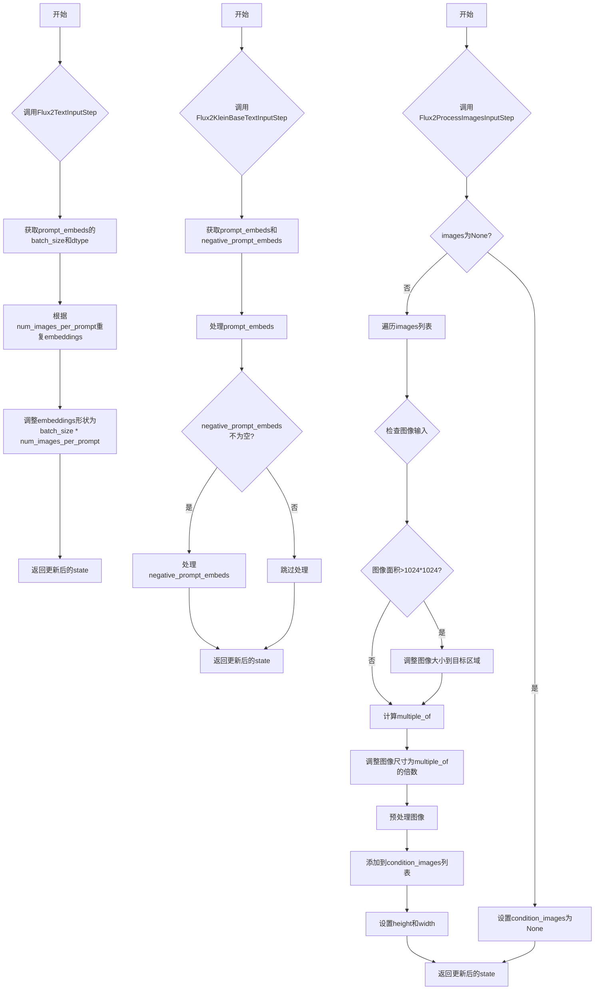

## 类结构

```
ModularPipelineBlocks (基类)
├── Flux2TextInputStep (文本输入步骤)
├── Flux2KleinBaseTextInputStep (Klein文本输入步骤)
└── Flux2ProcessImagesInputStep (图像处理步骤)
```

## 全局变量及字段


### `logger`
    
模块级日志记录器，用于输出该模块的调试和运行信息

类型：`logging.Logger`
    


### `Flux2TextInputStep.model_name`
    
模型名称标识，指定为'flux2'，用于区分不同的流水线步骤类型

类型：`str`
    


### `Flux2KleinBaseTextInputStep.model_name`
    
模型名称标识，指定为'flux2-klein'，用于区分Klein变体的文本输入步骤

类型：`str`
    


### `Flux2ProcessImagesInputStep.model_name`
    
模型名称标识，指定为'flux2'，用于区分图像处理输入步骤

类型：`str`
    
    

## 全局函数及方法


### `Flux2TextInputStep.description`

该属性方法用于返回当前文本输入步骤的功能描述，说明该步骤主要负责根据`prompt_embeds`确定批处理大小和数据类型，并确保所有文本嵌入具有一致的批处理大小（batch_size * num_images_per_prompt）。

参数：

- `self`：`Flux2TextInputStep` 实例，隐式参数，无需显式传递

返回值：`str`，返回该步骤的描述文本，说明步骤执行的两个核心功能：1) 根据 `prompt_embeds` 确定 `batch_size` 和 `dtype`；2) 确保所有文本嵌入具有一致的批处理大小

#### 流程图

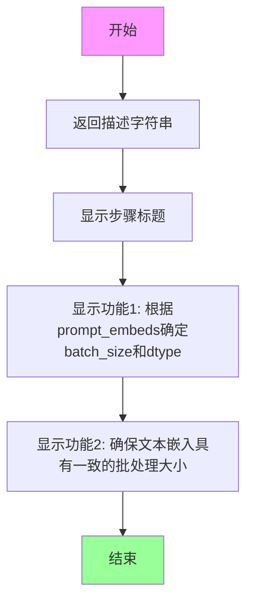

#### 带注释源码

```python
@property
def description(self) -> str:
    """
    返回该步骤的描述信息。
    
    该属性方法说明了 Flux2TextInputStep 的核心功能：
    1. 根据传入的 prompt_embeds 张量确定批处理大小(batch_size)和数据类型(dtype)
    2. 确保所有文本嵌入具有一致的批处理大小，即 batch_size * num_images_per_prompt
    
    Returns:
        str: 包含步骤功能描述的字符串，包含两个主要功能的说明
    """
    return (
        "This step:\n"
        "  1. Determines `batch_size` and `dtype` based on `prompt_embeds`\n"
        "  2. Ensures all text embeddings have consistent batch sizes (batch_size * num_images_per_prompt)"
    )
```


### Flux2TextInputStep.inputs

该属性方法用于定义 Flux2 文本输入步骤的输入参数，包括每张图像生成的文本嵌入数量和预生成的文本嵌入。

参数：

- 无（该方法为类属性，不接受直接参数）

返回值：`list[InputParam]`，返回包含输入参数的列表，每个 InputParam 描述一个输入参数。

#### 流程图

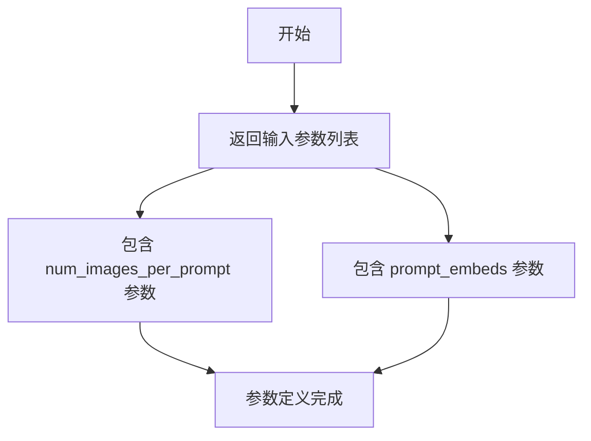

#### 带注释源码

```python
@property
def inputs(self) -> list[InputParam]:
    """
    定义 Flux2TextInputStep 的输入参数
    
    Returns:
        list[InputParam]: 输入参数列表，包含：
        - num_images_per_prompt: 每个提示词生成的图像数量，默认为1
        - prompt_embeds: 预生成的文本嵌入向量，必需参数
    """
    return [
        # 参数1：每张图像生成的图像数量，默认为1
        InputParam("num_images_per_prompt", default=1),
        
        # 参数2：预生成的文本嵌入，用于指导图像生成
        # 类型提示为 torch.Tensor，来自 text_encoder 步骤的输出
        InputParam(
            "prompt_embeds",
            required=True,  # 必需参数
            kwargs_type="denoiser_input_fields",  # kwargs 类型标记
            type_hint=torch.Tensor,  # 类型提示
            description="Pre-generated text embeddings. Can be generated from text_encoder step.",
        ),
    ]
```


### `Flux2TextInputStep.intermediate_outputs`

这是一个属性方法（property），用于定义 Flux2TextInputStep 步骤的中间输出参数。它返回三个关键的中间输出：batch_size（批次大小）、dtype（数据类型）和 prompt_embeds（文本嵌入），这些参数将传递给管道中的后续步骤用于图像生成。

参数： 无（该方法是一个 @property，不需要显式参数）

返回值：`list[OutputParam]`（实际类型为 `list[str]`，但包含 OutputParam 对象），返回该步骤产生的中间输出参数列表，包含 batch_size、dtype 和 prompt_embeds 三个 OutputParam 对象

#### 流程图

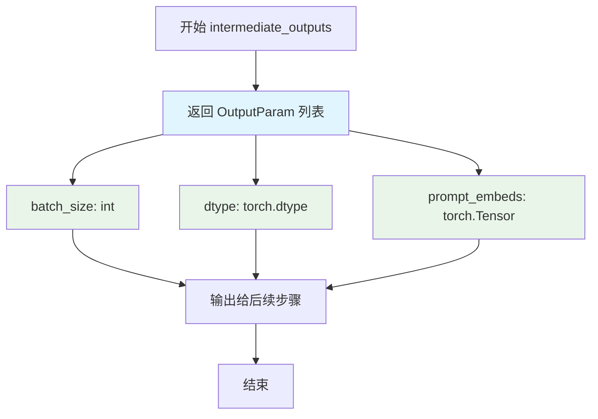

#### 带注释源码

```python
@property
def intermediate_outputs(self) -> list[str]:
    """
    定义该步骤的中间输出参数。
    
    这些输出将作为输入传递给管道中的后续步骤（特别是去噪器步骤），
    用于控制图像生成过程的批次大小、数据类型和文本引导。
    
    Returns:
        list[str]: 包含三个 OutputParam 对象的列表，分别代表：
            - batch_size: 批次大小，等于 prompt_embeds 的第一维维度
            - dtype: 数据类型，从 prompt_embeds 的 dtype 获取
            - prompt_embeds: 处理后的文本嵌入，用于指导图像生成
    """
    return [
        OutputParam(
            "batch_size",
            type_hint=int,
            description="Number of prompts, the final batch size of model inputs should be batch_size * num_images_per_prompt",
        ),
        OutputParam(
            "dtype",
            type_hint=torch.dtype,
            description="Data type of model tensor inputs (determined by `prompt_embeds`)",
        ),
        OutputParam(
            "prompt_embeds",
            type_hint=torch.Tensor,
            kwargs_type="denoiser_input_fields",
            description="Text embeddings used to guide the image generation",
        ),
    ]
```


### `Flux2TextInputStep.__call__`

该方法是 Flux2 文本输入步骤的核心调用接口，负责从预生成的文本嵌入（prompt_embeds）中提取批次大小和数据类型，并将文本嵌入根据 `num_images_per_prompt` 参数进行复制和 reshape，以支持批量图像生成。

参数：

- `components`：`Flux2ModularPipeline`，包含管道组件的实例，用于访问和管理管道中的各种模型和处理器
- `state`：`PipelineState`，管道状态对象，用于在步骤之间传递和共享数据

返回值：`tuple[Flux2ModularPipeline, PipelineState]`，返回组件和更新后的状态元组

#### 流程图

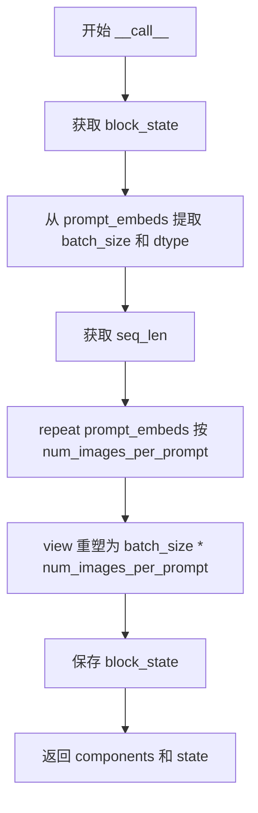

#### 带注释源码

```python
@torch.no_grad()
def __call__(self, components: Flux2ModularPipeline, state: PipelineState) -> PipelineState:
    # 获取当前块的执行状态，包含该步骤中所有中间变量
    block_state = self.get_block_state(state)

    # 步骤1: 从 prompt_embeds 的第一维获取批次大小
    # prompt_embeds shape: [batch_size, seq_len, hidden_dim]
    block_state.batch_size = block_state.prompt_embeds.shape[0]
    
    # 步骤2: 从 prompt_embeds 的数据类型确定后续计算的数据类型
    block_state.dtype = block_state.prompt_embeds.dtype

    # 步骤3: 获取序列长度，用于后续 reshape
    # shape: [batch_size, seq_len, hidden_dim]
    _, seq_len, _ = block_state.prompt_embeds.shape
    
    # 步骤4: 沿着序列维度重复嵌入，扩展 batch 以匹配 num_images_per_prompt
    # repeat(1, num_images_per_prompt, 1) 表示在第1维度(sequence)重复
    # 重复后 shape: [batch_size, seq_len * num_images_per_prompt, hidden_dim]
    block_state.prompt_embeds = block_state.prompt_embeds.repeat(1, block_state.num_images_per_prompt, 1)
    
    # 步骤5: 重塑张量以获得正确的批次维度
    # 最终 shape: [batch_size * num_images_per_prompt, seq_len, hidden_dim]
    block_state.prompt_embeds = block_state.prompt_embeds.view(
        block_state.batch_size * block_state.num_images_per_prompt, seq_len, -1
    )

    # 步骤6: 将更新后的 block_state 写回 state
    self.set_block_state(state, block_state)
    
    # 返回组件和状态，供下游步骤使用
    return components, state
```


### `Flux2KleinBaseTextInputStep.description`

这是一个属性方法（property），用于返回描述该文本输入步骤功能的字符串说明。该方法属于Flux2KleinBaseTextInputStep类，提供了该步骤的核心功能概述。

参数：

- `self`：`Flux2KleinBaseTextInputStep`，当前类的实例对象，用于访问类属性和状态

返回值：`str`，返回该步骤的操作描述字符串，包含两个主要功能点：1）基于prompt_embeds确定batch_size和dtype；2）确保所有文本嵌入具有一致的批处理大小

#### 流程图

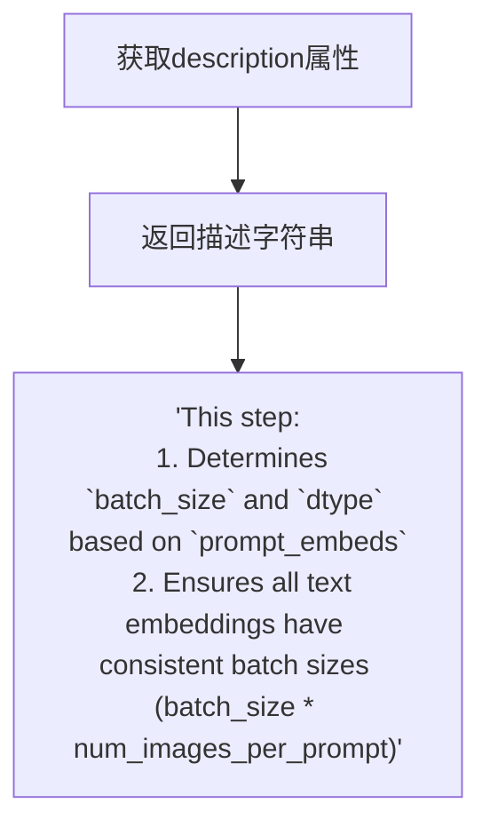

#### 带注释源码

```python
@property
def description(self) -> str:
    """
    属性方法：返回该文本输入步骤的描述信息
    
    该方法说明了Flux2KleinBaseTextInputStep类在流水线中的主要功能：
    1. 根据prompt_embeds张量确定批处理大小(batch_size)和数据类型(dtype)
    2. 确保所有文本嵌入的批处理大小一致，最终批大小为batch_size * num_images_per_prompt
    
    Returns:
        str: 描述该步骤功能的字符串，包含两个主要操作说明
    """
    return (
        "This step:\n"
        "  1. Determines `batch_size` and `dtype` based on `prompt_embeds`\n"
        "  2. Ensures all text embeddings have consistent batch sizes (batch_size * num_images_per_prompt)"
    )
```


### `Flux2KleinBaseTextInputStep.inputs`

该属性方法定义了 Flux2KleinBaseTextInputStep 类的输入参数列表，包含了三个 InputParam 对象，分别用于配置每张图像生成的提示词数量、正向提示词嵌入和负向提示词嵌入，这些参数将用于后续的文本嵌入处理和批处理大小计算。

参数：

- （无）——这是一个属性方法（使用 @property 装饰器），不需要显式传入参数，通过类的实例属性访问

返回值：`list[InputParam]`，返回一个包含三个 `InputParam` 对象的列表，描述了该步骤需要的所有输入参数

#### 流程图

```mermaid
flowchart TD
    A[访问 inputs 属性] --> B{返回输入参数列表}
    
    B --> C[参数1: num_images_per_prompt]
    B --> D[参数2: prompt_embeds]
    B --> E[参数3: negative_prompt_embeds]
    
    C --> C1[default=1]
    C --> C2[type_hint: int]
    C --> C3[描述: 每张提示词生成的图像数量]
    
    D --> D1[required=True]
    D --> D2[type_hint: torch.Tensor]
    D --> D3[kwargs_type: denoiser_input_fields]
    D --> D4[描述: 预生成的文本嵌入]
    
    E --> E1[required=False]
    E --> E2[type_hint: torch.Tensor]
    E --> E3[kwargs_type: denoiser_input_fields]
    E --> E4[描述: 预生成的负向文本嵌入]
    
    C1 --> F[返回 List[InputParam]]
    C2 --> F
    C3 --> F
    D1 --> F
    D2 --> F
    D3 --> F
    D4 --> F
    E1 --> F
    E2 --> F
    E3 --> F
    E4 --> F
```

#### 带注释源码

```python
@property
def inputs(self) -> list[InputParam]:
    """
    定义该步骤的输入参数列表。
    
    返回一个包含 InputParam 对象的列表，描述了执行此步骤所需的所有输入参数。
    这些参数将在管道执行过程中被传递并用于处理文本嵌入。
    
    返回类型:
        list[InputParam]: 输入参数列表，包含三个参数：
            - num_images_per_prompt: 每张提示词生成的图像数量
            - prompt_embeds: 预生成的文本嵌入（正向提示词）
            - negative_prompt_embeds: 预生成的负向文本嵌入
    """
    return [
        # 参数1: num_images_per_prompt
        # 类型: int，默认值为 1
        # 描述: 控制每条提示词生成的图像数量，用于批处理扩展
        InputParam("num_images_per_prompt", default=1),
        
        # 参数2: prompt_embeds
        # 类型: torch.Tensor，必填参数
        # 描述: 预生成的文本嵌入向量，用于引导图像生成过程
        # kwargs_type: 表示该参数属于 denoiser_input_fields 类别
        InputParam(
            "prompt_embeds",
            required=True,
            kwargs_type="denoiser_input_fields",
            type_hint=torch.Tensor,
            description="Pre-generated text embeddings. Can be generated from text_encoder step.",
        ),
        
        # 参数3: negative_prompt_embeds
        # 类型: torch.Tensor，可选参数
        # 描述: 预生成的负向文本嵌入，用于引导图像生成过程（排除不需要的内容）
        # kwargs_type: 表示该参数属于 denoiser_input_fields 类别
        InputParam(
            "negative_prompt_embeds",
            required=False,
            kwargs_type="denoiser_input_fields",
            type_hint=torch.Tensor,
            description="Pre-generated negative text embeddings. Can be generated from text_encoder step.",
        ),
    ]
```


### `Flux2KleinBaseTextInputStep.intermediate_outputs`

该属性方法定义了 Flux2KleinBaseTextInputStep 步骤的中间输出参数，包括批大小、数据类型、正向文本嵌入和负向文本嵌入，这些参数将传递给后续的去噪器步骤。

参数：无（该方法为属性方法，无需显式参数）

返回值：`list[OutputParam]`（OutputParam 对象的列表），包含以下四个输出参数：
- `batch_size`：int，提示词数量，最终模型输入的批大小应为 batch_size * num_images_per_prompt
- `dtype`：torch.dtype，模型张量输入的数据类型（由 prompt_embeds 决定）
- `prompt_embeds`：torch.Tensor，用于引导图像生成的文本嵌入
- `negative_prompt_embeds`：torch.Tensor，用于引导图像生成的负向文本嵌入

#### 流程图

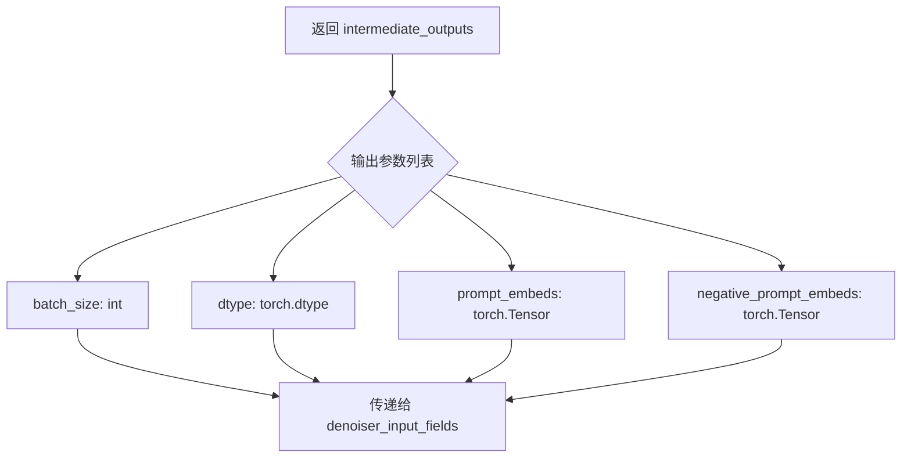

#### 带注释源码

```python
@property
def intermediate_outputs(self) -> list[str]:
    """
    定义该步骤的中间输出参数。
    
    返回值：
        list[OutputParam]: 包含以下四个输出参数的列表：
        - batch_size: 提示词数量，最终模型输入的批大小应为 batch_size * num_images_per_prompt
        - dtype: 模型张量输入的数据类型（由 prompt_embeds 决定）
        - prompt_embeds: 用于引导图像生成的文本嵌入
        - negative_prompt_embeds: 用于引导图像生成的负向文本嵌入
    """
    return [
        OutputParam(
            "batch_size",
            type_hint=int,
            description="Number of prompts, the final batch size of model inputs should be batch_size * num_images_per_prompt",
        ),
        OutputParam(
            "dtype",
            type_hint=torch.dtype,
            description="Data type of model tensor inputs (determined by `prompt_embeds`)",
        ),
        OutputParam(
            "prompt_embeds",
            type_hint=torch.Tensor,
            kwargs_type="denoiser_input_fields",
            description="Text embeddings used to guide the image generation",
        ),
        OutputParam(
            "negative_prompt_embeds",
            type_hint=torch.Tensor,
            kwargs_type="denoiser_input_fields",
            description="Negative text embeddings used to guide the image generation",
        ),
    ]
```


### `Flux2KleinBaseTextInputStep.__call__`

该方法是 Flux2-Klein 文本输入处理步骤的核心实现，负责从预生成的文本嵌入（prompt_embeds 和 negative_prompt_embeds）中提取批处理大小和数据类型，并根据 `num_images_per_prompt` 参数扩展文本嵌入以支持批量图像生成。

参数：

- `self`：实例方法隐含参数，指代 `Flux2KleinBaseTextInputStep` 类本身
- `components`：`Flux2ModularPipeline`，模块化管道实例，包含所有管道组件
- `state`：`PipelineState`，管道状态对象，用于在各个步骤之间传递数据

返回值：`PipelineState`，处理并更新后的管道状态对象（通过元组 `(components, state)` 返回）

#### 流程图

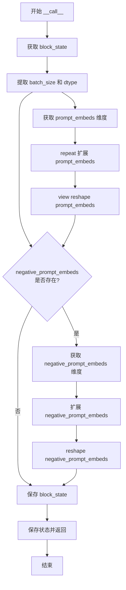

#### 带注释源码

```python
@torch.no_grad()  # 禁用梯度计算，减少内存消耗
def __call__(self, components: Flux2ModularPipeline, state: PipelineState) -> PipelineState:
    """
    处理文本输入嵌入的主方法。
    
    该方法执行以下操作：
    1. 从 prompt_embeds 中提取 batch_size 和 dtype
    2. 根据 num_images_per_prompt 扩展 prompt_embeds
    3. 如果存在 negative_prompt_embeds，也进行相同扩展
    4. 更新并返回管道状态
    """
    
    # 第一步：获取当前步骤的块状态
    block_state = self.get_block_state(state)

    # 第二步：从 prompt_embeds 提取基础属性
    # batch_size = prompt_embeds 的第一维维度（样本数）
    block_state.batch_size = block_state.prompt_embeds.shape[0]
    # dtype = prompt_embeds 的数据类型（由文本编码器决定）
    block_state.dtype = block_state.prompt_embeds.dtype

    # 第三步：扩展 prompt_embeds 以支持每提示生成多张图像
    # 获取序列长度（第二维）
    _, seq_len, _ = block_state.prompt_embeds.shape
    # repeat 操作：在序列维度上重复 num_images_per_prompt 次
    # 例如：如果 batch_size=1, num_images_per_prompt=4，则扩展为 4 个相同的嵌入
    block_state.prompt_embeds = block_state.prompt_embeds.repeat(1, block_state.num_images_per_prompt, 1)
    # view 操作：重新整形为 (batch_size * num_images_per_prompt, seq_len, hidden_dim)
    block_state.prompt_embeds = block_state.prompt_embeds.view(
        block_state.batch_size * block_state.num_images_per_prompt, seq_len, -1
    )

    # 第四步：条件处理 negative_prompt_embeds（可选）
    # 如果提供了 negative_prompt_embeds，进行相同的扩展处理
    if block_state.negative_prompt_embeds is not None:
        _, seq_len, _ = block_state.negative_prompt_embeds.shape
        block_state.negative_prompt_embeds = block_state.negative_prompt_embeds.repeat(
            1, block_state.num_images_per_prompt, 1
        )
        block_state.negative_prompt_embeds = block_state.negative_prompt_embeds.view(
            block_state.batch_size * block_state.num_images_per_prompt, seq_len, -1
        )

    # 第五步：保存更新后的块状态到管道状态
    self.set_block_state(state, block_state)
    
    # 返回组件和更新后的状态（元组形式）
    return components, state
```


### `Flux2ProcessImagesInputStep.description`

该属性返回当前处理步骤（图像预处理）的描述信息，用于说明该步骤在 Flux2 流水线中的作用。

参数：无

返回值：`str`，返回步骤的描述字符串，内容为 "Image preprocess step for Flux2. Validates and preprocesses reference images."

#### 流程图

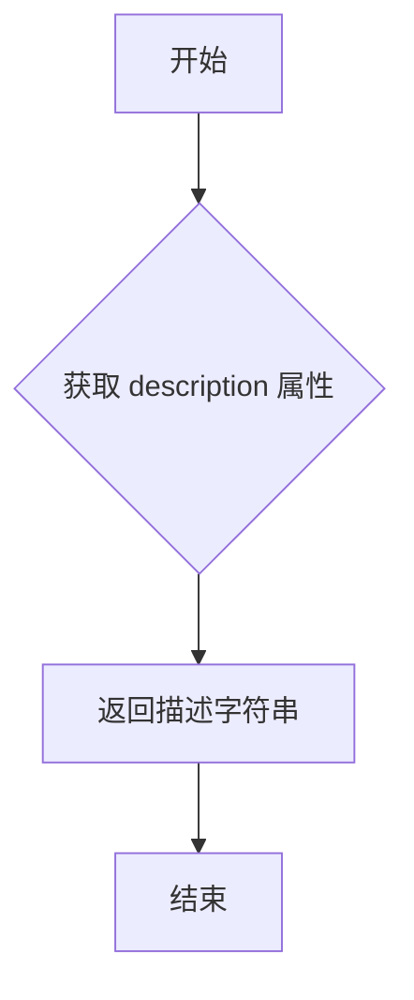

#### 带注释源码

```python
@property
def description(self) -> str:
    """
    返回当前步骤的描述信息。
    
    Returns:
        str: 描述 Flux2 图像预处理步骤功能的字符串，包含验证和预处理参考图像的含义。
    """
    return "Image preprocess step for Flux2. Validates and preprocesses reference images."
```


### `Flux2ProcessImagesInputStep.expected_components`

该属性方法定义了 Flux2ProcessImagesInputStep 流水线步骤所需的核心组件规范。它声明需要一个 `Flux2ImageProcessor` 类型的图像处理器组件，并指定了 VAE 相关的配置参数（vae_scale_factor=16 和 vae_latent_channels=32）以及默认创建方式。

参数：

- `self`：`Flux2ProcessImagesInputStep`，隐式参数，表示类的实例本身

返回值：`list[ComponentSpec]`，返回组件规范列表，包含图像处理器组件的定义

#### 流程图

```mermaid
flowchart TD
    A[访问 expected_components 属性] --> B{创建 ComponentSpec 列表}
    B --> C[指定组件名称: image_processor]
    D[指定组件类型: Flux2ImageProcessor]
    C --> E[配置 FrozenDict<br/>vae_scale_factor: 16<br/>vae_latent_channels: 32]
    D --> E
    E --> F[设置默认创建方法: from_config]
    F --> G[返回 list[ComponentSpec]]
    
    style A fill:#f9f,stroke:#333
    style G fill:#9f9,stroke:#333
```

#### 带注释源码

```python
@property
def expected_components(self) -> list[ComponentSpec]:
    """
    定义此步骤期望的组件规范。
    
    该属性返回一个列表，包含此流水线步骤所需的组件定义。
    对于 Flux2ProcessImagesInputStep，需要一个图像处理器组件。
    
    返回:
        list[ComponentSpec]: 包含组件规范的列表，每个规范定义了组件名称、类型、配置和创建方式。
    """
    return [
        ComponentSpec(
            "image_processor",                           # 组件名称，用于在流水线中引用
            Flux2ImageProcessor,                        # 组件的具体类类型
            config=FrozenDict({                          # 组件配置参数
                "vae_scale_factor": 16,                 # VAE 缩放因子，影响潜在空间的采样步长
                "vae_latent_channels": 32               # VAE 潜在通道数，决定潜在表示的维度
            }),
            default_creation_method="from_config",      # 默认创建方式，从配置初始化组件
        ),
    ]
```


### `Flux2ProcessImagesInputStep.inputs`

该属性定义了 Flux2 图像处理步骤的输入参数列表，包括图像、高度和宽度三个参数，用于图像预处理步骤的输入配置。

参数：

- `image`：`InputParam`，图像输入参数
- `height`：`InputParam`，图像高度参数
- `width`：`InputParam`，图像宽度参数

返回值：`list[InputParam]`：返回输入参数列表，包含 image、height 和 width 三个 InputParam 对象

#### 流程图

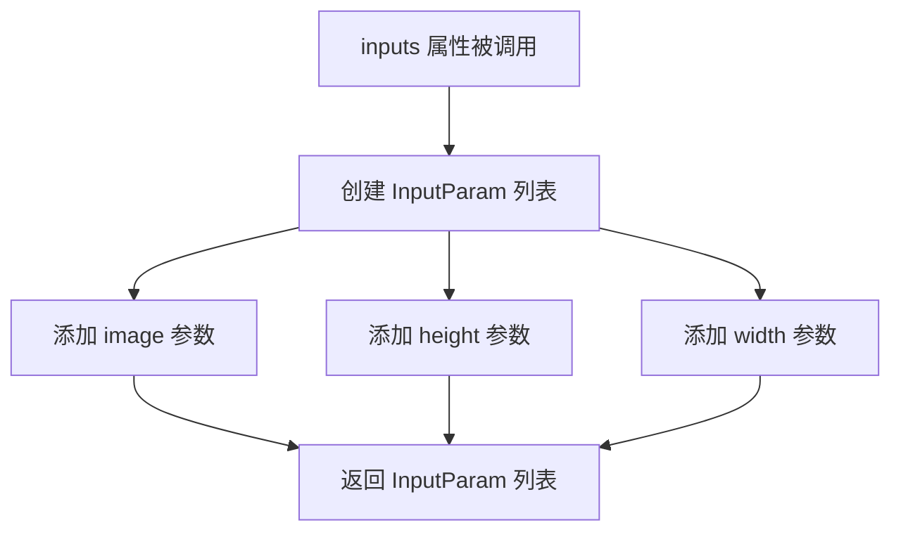

#### 带注释源码

```python
@property
def inputs(self) -> list[InputParam]:
    """
    定义 Flux2ProcessImagesInputStep 的输入参数列表。
    
    返回：
        包含三个 InputParam 对象的列表：image、height 和 width。
        这些参数用于指定图像处理步骤的输入数据。
    """
    return [
        InputParam("image"),    # 图像输入参数
        InputParam("height"),   # 图像高度参数
        InputParam("width"),    # 图像宽度参数
    ]
```


### `Flux2ProcessImagesInputStep.intermediate_outputs`

这是一个属性方法（用 `@property` 装饰），用于定义 Flux2 图像处理步骤的中间输出参数。该方法返回该步骤产生的中间结果元数据，包括输出参数的名称、类型提示和描述。在这个步骤中，中间输出是处理后的条件图像列表（`condition_images`）。

参数：

- （无显式参数，除了隐式的 `self`）

返回值：`list[OutputParam]`，返回一个包含 `OutputParam` 对象的列表，描述该步骤的中间输出参数。每个 `OutputParam` 包含：
- `name`: "condition_images" - 输出参数的名称
- `type_hint`: `list[torch.Tensor]` - 输出参数的类型提示
- `description`: （隐含）处理后的条件图像列表

#### 流程图

```mermaid
flowchart TD
    A[开始 intermediate_outputs 属性方法] --> B{执行方法}
    B --> C[返回包含单个 OutputParam 的列表]
    C --> D[OutputParam 参数信息:<br/>- name: 'condition_images'<br/>- type_hint: list[torch.Tensor]<br/>- description: 处理后的条件图像列表]
    D --> E[结束]
```

#### 带注释源码

```python
@property
def intermediate_outputs(self) -> list[OutputParam]:
    """
    定义该处理步骤的中间输出参数。
    
    返回一个列表，包含该步骤产生的中间结果参数元数据。
    在 Flux2ProcessImagesInputStep 中，中间输出是处理后的条件图像。
    
    Returns:
        list[OutputParam]: 包含中间输出参数的列表，
                         当前包含一个参数：condition_images
    """
    # 返回一个包含单个 OutputParam 的列表
    # 该 OutputParam 描述了中间输出 'condition_images' 的元数据
    return [OutputParam(name="condition_images", type_hint=list[torch.Tensor])]
```


### `Flux2ProcessImagesInputStep.__call__`

该方法是 Flux2 图像处理输入步骤的核心实现，负责验证和预处理参考图像。它从 block_state 中获取原始图像，进行尺寸验证、调整和预处理，最终生成条件图像（condition_images）供后续流水线使用。

参数：

- `components`：`Flux2ModularPipeline`，流水线组件集合，包含图像处理器等组件
- `state`：`PipelineState`，流水线状态对象，包含当前步骤的中间状态和数据

返回值：`Tuple[Flux2ModularPipeline, PipelineState]`，返回更新后的组件和状态对象

#### 流程图

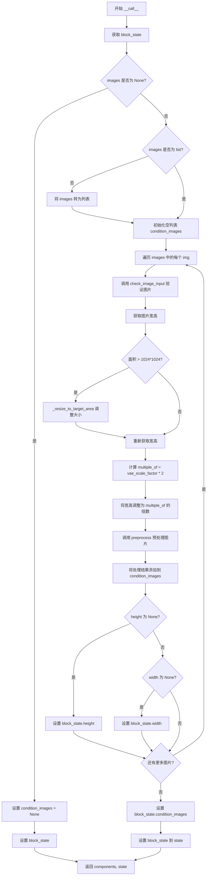

#### 带注释源码

```python
@torch.no_grad()
def __call__(self, components: Flux2ModularPipeline, state: PipelineState):
    """
    处理图像输入的主方法
    
    参数:
        components: Flux2ModularPipeline，流水线组件集合
        state: PipelineState，流水线状态对象
    
    返回:
        Tuple[Flux2ModularPipeline, PipelineState]：更新后的组件和状态
    """
    # 1. 从 state 中获取当前 block 的状态
    block_state = self.get_block_state(state)
    
    # 2. 获取待处理的原始图像
    images = block_state.image
    
    # 3. 处理图像为 None 的情况
    if images is None:
        # 设置条件图像为 None
        block_state.condition_images = None
        # 更新状态并返回
        self.set_block_state(state, block_state)
        return components, state
    
    # 4. 确保 images 是列表格式（支持单张或多张图像）
    if not isinstance(images, list):
        images = [images]
    
    # 5. 初始化条件图像列表
    condition_images = []
    
    # 6. 遍历处理每张图像
    for img in images:
        # 6.1 验证图像输入的有效性
        components.image_processor.check_image_input(img)
        
        # 6.2 获取图像尺寸
        image_width, image_height = img.size
        
        # 6.3 如果图像面积过大，进行等比例缩放
        if image_width * image_height > 1024 * 1024:
            img = components.image_processor._resize_to_target_area(img, 1024 * 1024)
            image_width, image_height = img.size
        
        # 6.4 计算缩放因子，确保尺寸是 VAE 要求的倍数
        multiple_of = components.vae_scale_factor * 2
        
        # 6.5 调整图像尺寸为 multiple_of 的整数倍（满足模型输入要求）
        image_width = (image_width // multiple_of) * multiple_of
        image_height = (image_height // multiple_of) * multiple_of
        
        # 6.6 预处理图像（归一化、转换为张量等）
        condition_img = components.image_processor.preprocess(
            img, height=image_height, width=image_width, resize_mode="crop"
        )
        
        # 6.7 将处理后的图像添加到列表
        condition_images.append(condition_img)
        
        # 6.8 更新 block_state 的高度和宽度（首次设置时）
        if block_state.height is None:
            block_state.height = image_height
        if block_state.width is None:
            block_state.width = image_width
    
    # 7. 将处理后的条件图像列表存入 block_state
    block_state.condition_images = condition_images
    
    # 8. 更新 block_state 到 state 中
    self.set_block_state(state, block_state)
    
    # 9. 返回更新后的组件和状态
    return components, state
```

## 关键组件


### Flux2TextInputStep

处理Flux2模型文本嵌入输入的模块化步骤类，核心功能是根据输入的prompt_embeds确定batch_size和dtype，并将文本嵌入扩展到与num_images_per_prompt相匹配的维度。

### Flux2KleinBaseTextInputStep

Flux2-Klein模型的文本输入步骤，继承自Flux2TextInputStep并扩展了negative_prompt_embeds的处理能力，支持负面提示嵌入的批量扩展和维度调整。

### Flux2ProcessImagesInputStep

Flux2模型的图像预处理步骤，负责验证输入图像、调整图像尺寸以符合VAE的倍数要求（vae_scale_factor * 2），并对图像进行预处理生成条件图像。

### 张量形状操作与批量维度处理

代码中通过repeat()和view()方法对张量进行批量维度扩展，将原始的(batch_size, seq_len, hidden_dim)转换为(batch_size * num_images_per_prompt, seq_len, hidden_dim)，实现单次推理生成多张图像的功能。

### 图像尺寸对齐与VAE适配

图像预处理中包含尺寸对齐逻辑，确保图像宽度和高度都是vae_scale_factor * 2的倍数，以满足VAE潜在空间的压缩要求，同时支持超大图像的自动缩放。

### 模块化状态管理

通过PipelineState和block_state实现步骤间的状态传递，支持get_block_state和set_block_state方法进行状态的获取和更新，实现惰性加载和按需计算。


## 问题及建议


### 已知问题

-   **代码重复（DRY 原则违反）**：`Flux2TextInputStep` 和 `Flux2KleinBaseTextInputStep` 的 `description` 属性、绝大部分 `inputs` 属性和 `__call__` 方法中的核心逻辑完全重复，仅后者多了对 `negative_prompt_embeds` 的处理逻辑，这违反了 DRY 原则，维护成本高。
-   **冗余计算**：在 `Flux2KleinBaseTextInputStep` 的 `__call__` 方法中，第119行和第123行重复获取了 `negative_prompt_embeds.shape` 并赋值给 `seq_len`，这是冗余的变量赋值。
-   **硬编码值**：在 `Flux2ProcessImagesInputStep` 中，第209行和第211行使用了硬编码的魔法数字 `1024 * 1024`（目标像素面积）和 `multiple_of`（VAE 缩放因子的2倍），这些值缺乏灵活配置性，应该通过参数或配置传入。
-   **类型注解不一致**：`Flux2ProcessImagesInputStep` 的 `inputs` 属性（第173-175行）缺少类型注解（直接写 `InputParam("image")` 而没有 `type_hint`），而其他 `InputParam` 都有，这降低了代码的类型安全性和可读性。
-   **缺乏输入验证**：代码中没有对输入参数（如 `prompt_embeds` 的形状、维度）进行合法性校验，如果传入不符合预期的张量形状可能导致运行时错误或难以调试的异常。
-   **副作用风险**：在 `Flux2ProcessImagesInputStep` 的第209行，直接修改了传入的 `img` 对象（通过 `_resize_to_target_area`），可能产生副作用，应该先复制再操作。

### 优化建议

-   **提取公共基类**：将 `Flux2TextInputStep` 和 `Flux2KleinBaseTextInputStep` 的公共逻辑提取到一个基类 `Flux2BaseTextInputStep` 中，通过参数或属性控制是否处理 `negative_prompt_embeds`，减少代码重复。
-   **消除冗余计算**：在 `Flux2KleinBaseTextInputStep` 中，移除第119行的 `_, seq_len, _ = block_state.negative_prompt_embeds.shape`，直接使用后续计算的值。
-   **配置化硬编码值**：将图像处理的最大像素数、缩放因子倍数等硬编码值提取为类属性或配置参数（如 `max_image_pixels`、`resize_multiple_of`），提高代码灵活性。
-   **补充类型注解**：为 `Flux2ProcessImagesInputStep` 的 `inputs` 中的 `image`、`height`、`width` 补充完整的类型注解（如 `type_hint=torch.Tensor`、`type_hint=int`）。
-   **增加输入校验**：在 `__call__` 方法开始处增加对关键输入参数（如 `prompt_embeds` 的维度、形状、是否为 None）的校验，提前捕获并抛出明确的错误信息。
-   **避免副作用**：在图像处理前使用 `img.copy()` 创建副本，或在文档中明确标注此方法会修改输入对象。

## 其它


### 设计目标与约束

本代码旨在为Flux2图像生成管道提供模块化的输入处理步骤，支持文本嵌入和图像预处理，采用模块化流水线架构（ModularPipelineBlocks），依赖HuggingFace的torch和transformers生态系统。

### 错误处理与异常设计

代码中的错误处理主要通过以下方式实现：
1. `Flux2ProcessImagesInputStep.__call__`中对图像为None的检查，将`condition_images`设为None
2. 图像尺寸超过1024x1024时的自动resize处理
3. 图像尺寸必须为`vae_scale_factor * 2`的倍数的校验和调整
4. 使用`check_image_input`方法进行输入验证
5. 异常通过Python标准异常机制向上传播，由调用方处理

### 数据流与状态机

数据流遵循以下流程：
1. **Flux2TextInputStep**: 接收`prompt_embeds` → 提取batch_size和dtype → 根据`num_images_per_prompt`扩展embeddings → 输出扩展后的`prompt_embeds`及中间状态
2. **Flux2KleinBaseTextInputStep**: 接收`prompt_embeds`和`negative_prompt_embeds` → 提取batch_size和dtype → 分别扩展两种embeddings → 输出扩展后的embeddings及中间状态
3. **Flux2ProcessImagesInputStep**: 接收原始图像 → 验证图像输入 → 调整尺寸至满足VAE要求 → 预处理图像 → 输出`condition_images`列表及更新后的height/width状态

状态机由`PipelineState`管理，每个block通过`get_block_state`和`set_block_state`方法访问和更新状态。

### 外部依赖与接口契约

外部依赖包括：
1. `torch` - 张量计算
2. `configuration_utils.FrozenDict` - 不可变配置字典
3. `pipelines.flux2.image_processor.Flux2ImageProcessor` - 图像处理组件
4. `utils.logging` - 日志记录
5. `modular_pipeline.ModularPipelineBlocks` - 模块化流水线基类
6. `modular_pipeline_utils.ComponentSpec/InputParam/OutputParam` - 组件规格定义

接口契约：
- 输入参数通过`InputParam`定义，包含名称、类型提示、默认值、描述
- 输出参数通过`OutputParam`定义，包含名称、类型提示、描述
- 中间输出通过`intermediate_outputs`属性声明
- 所有步骤类必须实现`__call__`方法，签名为`(self, components: Flux2ModularPipeline, state: PipelineState) -> PipelineState`

### 版本兼容性说明

代码适用于PyTorch生态，依赖版本应与HuggingFace Diffusers 2025版本兼容，Python版本要求3.8+，torch版本要求1.9.0+。

### 性能考虑与优化空间

1. 图像resize操作在每次调用时执行，可考虑缓存已处理图像
2. `repeat`和`view`操作会复制张量，对于大批量处理可能存在内存压力
3. 图像尺寸验证和调整逻辑可提取为独立工具函数以提高复用性
4. 缺少对极端batch_size的边界检查和优化

### 配置管理

组件配置通过`FrozenDict`确保不可变性，VAE相关配置（scale_factor=16, latent_channels=32）硬编码在`expected_components`中，建议抽取为可配置参数。

### 线程安全与并发

代码使用了`@torch.no_grad()`装饰器确保推理时不需要梯度计算，但未实现显式的线程安全机制，状态更新依赖调用顺序保证一致性。

### 单元测试与验证

建议补充以下测试用例：
1. 空prompt_embeds和negative_prompt_embeds的处理
2. 不同num_images_per_prompt值的扩展结果验证
3. 图像尺寸边界条件测试（极小/极大/非倍数）
4. 多种图像格式的兼容性测试

### 文档注释

代码中已包含基本的docstring和属性描述，但缺少详细的算法说明（如embedding重复的具体计算逻辑）、示例用法、以及与上游/下游步骤的交互说明。


    