# `diffusers\src\diffusers\modular_pipelines\flux2\modular_blocks_flux2.py` 详细设计文档

Flux2模块化管道定义文件，实现了文本到图像和图像条件生成的自动管道架构，包含VAE编码器、核心去噪步骤和自动块调度器，支持动态选择文本生成或图像条件生成流程。

## 整体流程

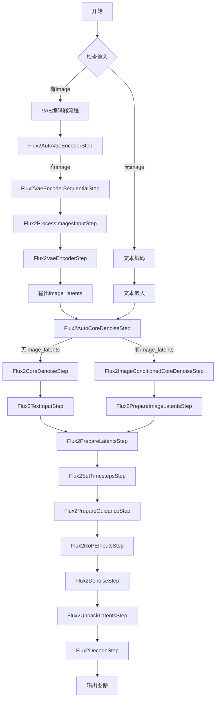

## 类结构

```
SequentialPipelineBlocks (基类)
├── Flux2VaeEncoderSequentialStep
└── Flux2CoreDenoiseStep
    └── Flux2ImageConditionedCoreDenoiseStep
AutoPipelineBlocks (基类)
├── Flux2AutoVaeEncoderStep
└── Flux2AutoCoreDenoiseStep
Flux2AutoBlocks (顶层组合)
辅助数据结构和函数
├── Flux2CoreDenoiseBlocks (InsertableDict)
└── Flux2ImageConditionedCoreDenoiseBlocks (InsertableDict)
└── AUTO_BLOCKS (InsertableDict)
```

## 全局变量及字段


### `logger`
    
模块级logger对象，用于记录该模块的日志信息

类型：`logging.Logger`
    


### `Flux2CoreDenoiseBlocks`
    
包含Flux2核心去噪流程的插入式字典，定义了文本输入、潜在变量准备、时间步设置、RoPE输入准备、去噪和解包潜在变量等步骤

类型：`InsertableDict`
    


### `Flux2ImageConditionedCoreDenoiseBlocks`
    
包含Flux2图像条件核心去噪流程的插入式字典，在核心去噪流程基础上增加了图像潜在变量准备步骤

类型：`InsertableDict`
    


### `AUTO_BLOCKS`
    
定义Flux2自动模块化管道的整体工作流字典，包含文本编码器、VAE编码器、去噪和解码四个主要步骤

类型：`InsertableDict`
    


### `Flux2VaeEncoderSequentialStep.model_name`
    
模型名称标识，固定为'flux2'

类型：`str`
    


### `Flux2VaeEncoderSequentialStep.block_classes`
    
包含图像预处理和VAE编码步骤的类列表

类型：`list`
    


### `Flux2VaeEncoderSequentialStep.block_names`
    
对应block_classes的步骤名称列表，值为['preprocess', 'encode']

类型：`list`
    


### `Flux2AutoVaeEncoderStep.block_classes`
    
自动VAE编码步骤引用的顺序编码步骤类列表

类型：`list`
    


### `Flux2AutoVaeEncoderStep.block_names`
    
自动VAE编码步骤的名称列表，值为['img_conditioning']

类型：`list`
    


### `Flux2AutoVaeEncoderStep.block_trigger_inputs`
    
触发该自动步骤的输入条件列表，当存在'image'输入时触发

类型：`list`
    


### `Flux2CoreDenoiseStep.model_name`
    
模型名称标识，固定为'flux2'

类型：`str`
    


### `Flux2CoreDenoiseStep.block_classes`
    
从Flux2CoreDenoiseBlocks字典中获取的所有去噪步骤类

类型：`list`
    


### `Flux2CoreDenoiseStep.block_names`
    
从Flux2CoreDenoiseBlocks字典中获取的所有去噪步骤名称

类型：`list`
    


### `Flux2ImageConditionedCoreDenoiseStep.model_name`
    
模型名称标识，固定为'flux2'

类型：`str`
    


### `Flux2ImageConditionedCoreDenoiseStep.block_classes`
    
从Flux2ImageConditionedCoreDenoiseBlocks字典中获取的所有图像条件去噪步骤类

类型：`list`
    


### `Flux2ImageConditionedCoreDenoiseStep.block_names`
    
从Flux2ImageConditionedCoreDenoiseBlocks字典中获取的所有图像条件去噪步骤名称

类型：`list`
    


### `Flux2AutoCoreDenoiseStep.model_name`
    
模型名称标识，固定为'flux2'

类型：`str`
    


### `Flux2AutoCoreDenoiseStep.block_classes`
    
自动核心去噪步骤引用的去噪步骤类列表，包含图像条件去噪和纯文本去噪两类

类型：`list`
    


### `Flux2AutoCoreDenoiseStep.block_names`
    
自动核心去噪步骤的名称列表，值为['image_conditioned', 'text2image']

类型：`list`
    


### `Flux2AutoCoreDenoiseStep.block_trigger_inputs`
    
触发自动去噪步骤的输入条件列表，根据image_latents是否存在或None来决定使用哪个去噪步骤

类型：`list`
    


### `Flux2AutoBlocks.model_name`
    
模型名称标识，固定为'flux2'

类型：`str`
    


### `Flux2AutoBlocks.block_classes`
    
自动模块管道包含的所有步骤类，从AUTO_BLOCKS字典值中获取

类型：`list`
    


### `Flux2AutoBlocks.block_names`
    
自动模块管道包含的所有步骤名称，从AUTO_BLOCKS字典键中获取

类型：`list`
    


### `Flux2AutoBlocks._workflow_map`
    
定义支持的工作流映射字典，text2image需要prompt，image_conditioned需要image和prompt

类型：`dict`
    
    

## 全局函数及方法


### `logging.get_logger`

获取与给定模块名称关联的日志记录器实例。该函数是 Hugging Face Transformers 库中的标准日志工具，用于创建具有适当名称和默认级别的日志记录器。

参数：

- `name`：`str`，日志记录器的名称，通常传入 `__name__` 以获取模块级别的日志记录器

返回值：`logging.Logger`，返回一个配置好的 Python Logger 对象，可用于记录不同级别的日志信息

#### 流程图

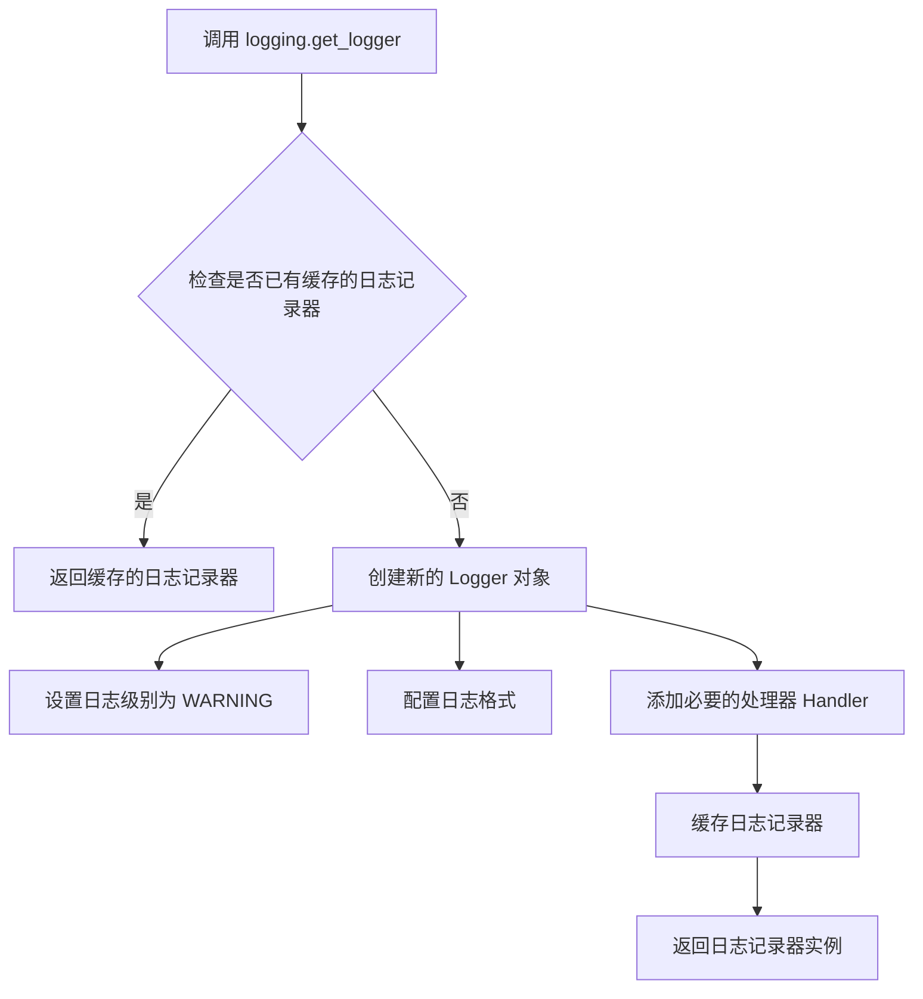

#### 带注释源码

```python
# 这是基于 Hugging Face Transformers 库中 logging 模块的标准实现模式
# 实际源码位于 ...utils.logging 模块中，此处为推断的典型实现

import logging
import sys
from typing import Optional

# 全局日志级别配置
_DEFAULT_LOG_LEVEL = logging.WARNING

def get_logger(name: Optional[str] = None) -> logging.Logger:
    """
    获取与指定名称关联的日志记录器。
    
    参数:
        name: 日志记录器的名称，通常使用 __name__ 以标识模块来源
              如果为 None，则返回根日志记录器
    
    返回值:
        配置好的 Logger 实例，默认级别为 WARNING
    """
    # 如果未提供名称，使用根日志记录器
    if name is None:
        return logging.getLogger()
    
    # 格式化日志名称，通常保持原样
    logger = logging.getLogger(name)
    
    # 检查 logger 是否已有处理器（避免重复添加）
    if not logger.handlers:
        # 设置默认日志级别
        logger.setLevel(_DEFAULT_LOG_LEVEL)
        
        # 创建标准输出处理器
        handler = logging.StreamHandler(sys.stdout)
        handler.setLevel(_DEFAULT_LOG_LEVEL)
        
        # 设置日志格式
        formatter = logging.Formatter(
            '%(asctime)s - %(name)s - %(levelname)s - %(message)s',
            datefmt='%Y-%m-%d %H:%M:%S'
        )
        handler.setFormatter(formatter)
        
        # 添加处理器到 logger
        logger.addHandler(handler)
    
    return logger


# 在代码中的实际使用方式
logger = logging.get_logger(__name__)  # pylint: disable=invalid-name
# 结果：logger 变量将记录此模块的日志信息，级别为 WARNING
```


### `Flux2VaeEncoderSequentialStep.description`

该属性返回对 Flux2 VAE 编码器顺序步骤的描述，说明它负责预处理、编码图像并为 Flux2 条件生成准备图像潜在表示。

参数：

- `self`：隐式参数，类型为 `Flux2VaeEncoderSequentialStep`，表示类的实例本身

返回值：`str`，返回描述该步骤功能的字符串："VAE encoder step that preprocesses, encodes, and prepares image latents for Flux2 conditioning."

#### 流程图

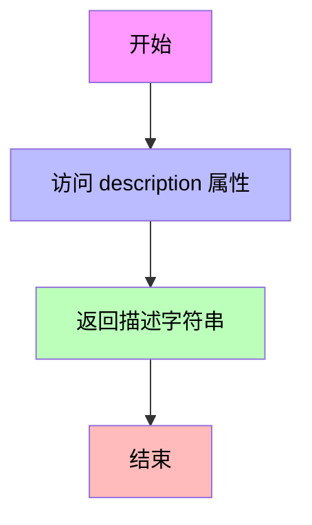

#### 带注释源码

```python
@property
def description(self) -> str:
    """
    属性 getter 方法，返回该 Pipeline Block 的描述信息。
    
    Returns:
        str: 返回该步骤的功能描述，说明它是一个 VAE 编码器步骤，
             负责预处理、编码图像并为 Flux2 条件生成准备图像潜在表示。
    """
    return "VAE encoder step that preprocesses, encodes, and prepares image latents for Flux2 conditioning."
```


### `Flux2AutoVaeEncoderStep.description`

这是一个属性（property），用于描述 `Flux2AutoVaeEncoderStep` 类的功能和工作逻辑。

参数：该方法为属性访问器，无显式参数

- `self`：隐式参数，表示类的实例本身

返回值：`str`，返回该步骤的描述字符串，说明其功能、条件分支逻辑和使用场景。

#### 流程图

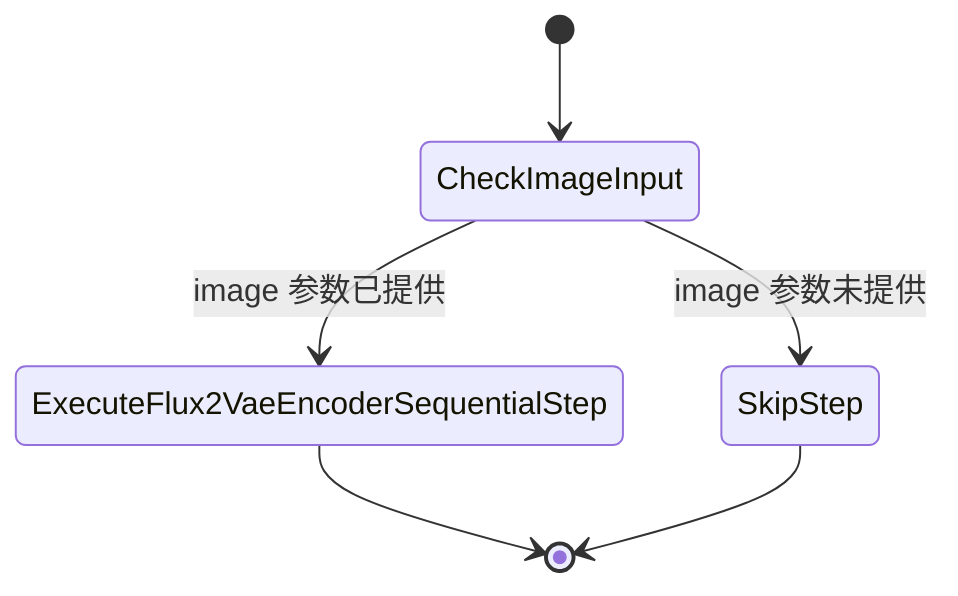

#### 带注释源码

```python
@property
def description(self):
    """
    属性描述符：返回 Flux2AutoVaeEncoderStep 的功能描述
    
    该属性用于自动流水线系统中的文档生成和日志记录。
    描述了该步骤的核心功能：VAE编码器将图像输入编码为潜在表示。
    同时说明了自动管道块的条件触发逻辑。
    
    Returns:
        str: 包含详细功能描述的字符串，包括：
             - 核心功能：VAE编码器步骤
             - 工作模式：自动管道块
             - 条件分支：image参数存在时使用Flux2VaeEncoderSequentialStep，
               不存在时跳过该步骤
    """
    return (
        "VAE encoder step that encodes the image inputs into their latent representations.\n"
        "This is an auto pipeline block that works for image conditioning tasks.\n"
        " - `Flux2VaeEncoderSequentialStep` is used when `image` is provided.\n"
        " - If `image` is not provided, step will be skipped."
    )
```


### `Flux2CoreDenoiseStep.description`

该属性返回 Flux2CoreDenoiseStep 类的描述信息，用于说明该步骤执行 Flux2-dev 模型的降噪过程。

参数：

- 无（property 方法，仅包含隐式参数 `self`）

返回值：`str`，返回该步骤的描述字符串 "Core denoise step that performs the denoising process for Flux2-dev."

#### 流程图

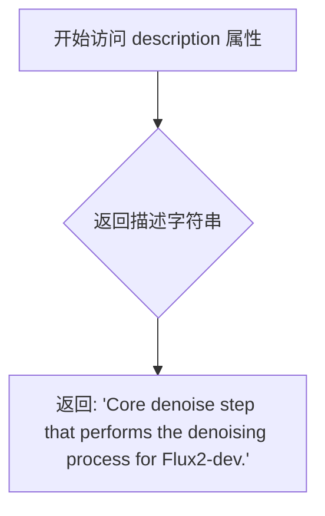

#### 带注释源码

```python
class Flux2CoreDenoiseStep(SequentialPipelineBlocks):
    """
    Core denoise step that performs the denoising process for Flux2-dev.

      Components:
          scheduler (`FlowMatchEulerDiscreteScheduler`) transformer (`Flux2Transformer2DModel`)

      Inputs:
          num_images_per_prompt (`None`, *optional*, defaults to 1):
              TODO: Add description.
          prompt_embeds (`Tensor`):
              Pre-generated text embeddings. Can be generated from text_encoder step.
          height (`int`, *optional*):
              TODO: Add description.
          width (`int`, *optional*):
              TODO: Add description.
          latents (`Tensor | NoneType`, *optional*):
              TODO: Add description.
          generator (`None`, *optional*):
              TODO: Add description.
          num_inference_steps (`None`, *optional*, defaults to 50):
              TODO: Add description.
          timesteps (`None`, *optional*):
              TODO: Add description.
          sigmas (`None`, *optional*):
              TODO: Add description.
          guidance_scale (`None`, *optional*, defaults to 4.0):
              TODO: Add description.
          joint_attention_kwargs (`None`, *optional*):
              TODO: Add description.
          image_latents (`Tensor`, *optional*):
              Packed image latents for conditioning. Shape: (B, img_seq_len, C)
          image_latent_ids (`Tensor`, *optional*):
              Position IDs for image latents. Shape: (B, img_seq_len, 4)

      Outputs:
          latents (`Tensor`):
              Denoised latents.
    """

    model_name = "flux2"

    # 从 Flux2CoreDenoiseBlocks InsertableDict 中获取块类和块名称
    block_classes = Flux2CoreDenoiseBlocks.values()
    block_names = Flux2CoreDenoiseBlocks.keys()

    @property
    def description(self):
        """
        属性方法，返回该步骤的描述字符串
        
        Returns:
            str: 描述 Flux2-dev 核心降噪步骤的字符串
        """
        return "Core denoise step that performs the denoising process for Flux2-dev."

    @property
    def outputs(self):
        """
        属性方法，返回该步骤的输出参数列表
        
        Returns:
            list: 包含 OutputParam.template("latents") 的列表，表示降噪后的潜在表示
        """
        return [
            OutputParam.template("latents"),
        ]
```


### `Flux2CoreDenoiseStep.outputs`

这是一个属性方法，用于定义 Flux2CoreDenoiseStep 类的输出参数。它返回该步骤产生的输出变量列表，在这个场景中输出的是去噪后的潜在表示（latents）。

参数：

- （无参数，这是一个属性方法，隐含的 `self` 不计入参数）

返回值：`List[OutputParam]`，返回一个包含 OutputParam 对象的列表，描述该步骤的输出变量。

#### 流程图

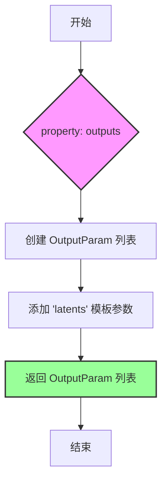

#### 带注释源码

```python
@property
def outputs(self):
    """
    定义 Flux2CoreDenoiseStep 的输出参数。
    
    该属性返回一个列表，包含一个 OutputParam 对象，
    用于描述去噪步骤产生的输出变量。
    
    Returns:
        List[OutputParam]: 包含输出参数信息的列表。
                          当前返回一个名为 'latents' 的输出参数模板，
                          代表去噪后的潜在表示张量。
    """
    return [
        OutputParam.template("latents"),
    ]
```


### `Flux2ImageConditionedCoreDenoiseStep.description`

返回该类的描述信息，用于说明该类的功能。

参数： 无

返回值： `str`，返回该类的功能描述字符串，描述了这是 Flux2-dev 中执行带图像条件去噪过程的核心步骤。

#### 流程图

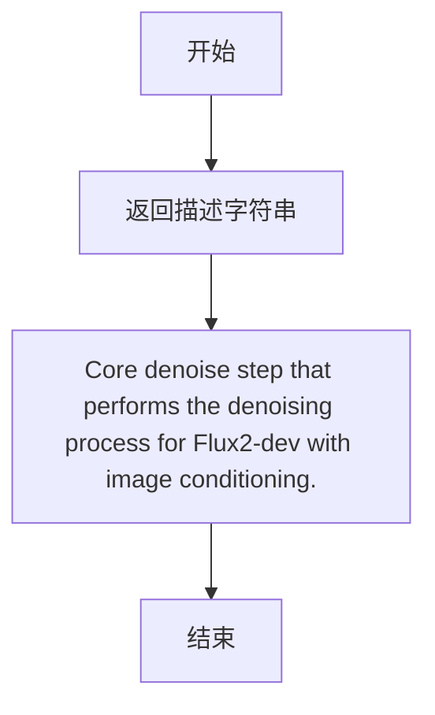

#### 带注释源码

```python
@property
def description(self):
    """
    返回该类的描述信息。
    
    该属性方法返回一个字符串，描述 Flux2ImageConditionedCoreDenoiseStep 类的功能：
    即执行 Flux2-dev 模型中带图像条件的核心去噪过程。
    
    Returns:
        str: 描述字符串，说明该步骤执行带图像条件的去噪过程
    """
    return "Core denoise step that performs the denoising process for Flux2-dev with image conditioning."
```


### `Flux2ImageConditionedCoreDenoiseStep.outputs`

该属性是 Flux2 图像条件去噪步骤的输出参数定义属性，用于声明该步骤的输出结果为去噪后的 latents（潜在表示）。

参数：

- （无，该属性为只读属性，不接受任何参数）

返回值：`list[OutputParam]`，返回一个包含 OutputParam 模板的列表，声明该步骤输出名为 "latents" 的去噪潜在表示。

#### 流程图

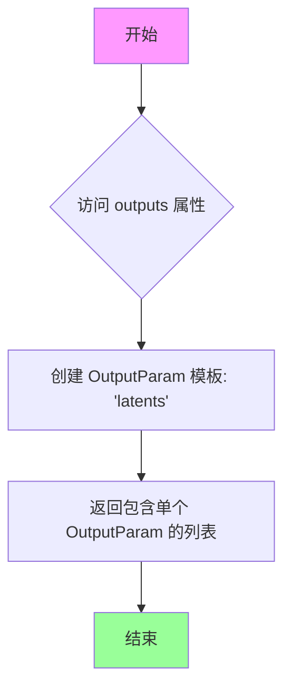

#### 带注释源码

```python
@property
def outputs(self):
    """
    定义 Flux2ImageConditionedCoreDenoiseStep 的输出参数。
    
    该属性返回去噪步骤产生的潜在表示（latents）作为输出参数。
    用于流水线和输出验证，确保去噪步骤正确输出结果。
    
    返回:
        list: 包含 OutputParam 模板对象的列表，当前只有一个元素，
              模板名称为 'latents'，表示去噪后的潜在表示。
    """
    return [
        OutputParam.template("latents"),
    ]
```


### `Flux2AutoCoreDenoiseStep.description`

这是一个自动核心去噪步骤的属性，用于执行 Flux2-dev 的去噪过程。这是一个自动管道块，支持文本到图像和图像条件生成。

参数：

- 无参数（这是一个 property 装饰器方法，仅包含 self 参数）

返回值：`str`，返回该步骤的描述字符串，说明其功能以及在不同场景下使用的具体步骤类。

#### 流程图

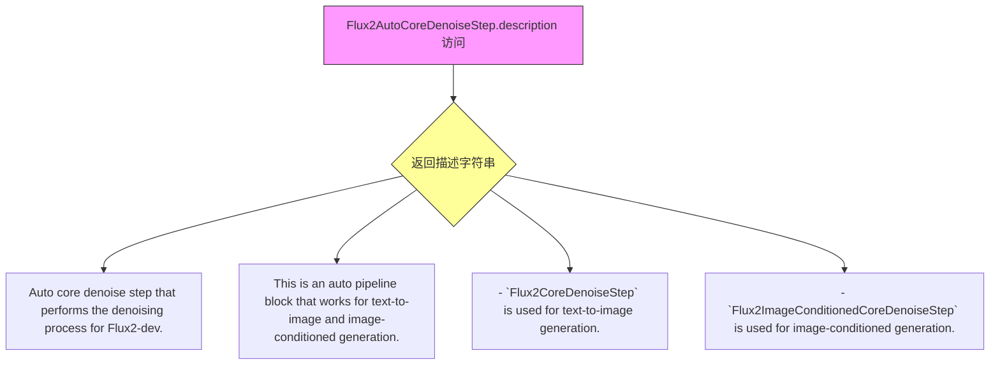

#### 带注释源码

```python
@property
def description(self):
    """
    属性描述：
        返回 Flux2AutoCoreDenoiseStep 类的描述字符串。
        
    返回值：
        str: 描述该自动核心去噪步骤的功能说明，包含：
            - 核心功能：执行 Flux2-dev 的去噪过程
            - 自动管道块：支持文本到图像和图像条件生成
            - 具体步骤映射：
              * Flux2CoreDenoiseStep 用于文本到图像生成
              * Flux2ImageConditionedCoreDenoiseStep 用于图像条件生成
    """
    return (
        "Auto core denoise step that performs the denoising process for Flux2-dev."
        "This is an auto pipeline block that works for text-to-image and image-conditioned generation."
        " - `Flux2CoreDenoiseStep` is used for text-to-image generation.\n"
        " - `Flux2ImageConditionedCoreDenoiseStep` is used for image-conditioned generation.\n"
    )
```


### `Flux2AutoBlocks.description`

该属性是 `Flux2AutoBlocks` 类的一个只读属性，用于描述 Flux2 自动模块化管道的主要功能，即用于 Flux2 的文本到图像和图像条件生成的自动模块化管道。

参数： 无（该方法为属性访问器，不接受任何参数）

返回值：`str`，返回管道的描述字符串，值为 "Auto Modular pipeline for text-to-image and image-conditioned generation using Flux2."

#### 流程图

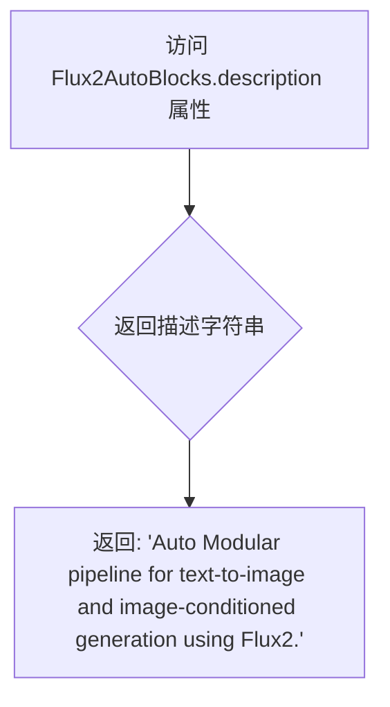

#### 带注释源码

```python
@property
def description(self):
    """
    返回 Flux2 自动模块化管道的描述信息。
    
    该属性提供管道的简要说明，用于文档生成和日志记录。
    描述内容涵盖了管道支持的两种工作流程：
    1. text2image：仅需要 prompt
    2. image_conditioned：需要 image 和 prompt
    
    Returns:
        str: 管道描述字符串
    """
    return "Auto Modular pipeline for text-to-image and image-conditioned generation using Flux2."
```


### `Flux2AutoBlocks.outputs`

该属性定义了在 Flux2 自动模块化管道执行完成后输出的参数列表，用于返回生成的图像结果。

参数：
- （无参数，仅为属性 getter）

返回值：`List[OutputParam]`，返回生成的图像列表。

#### 流程图

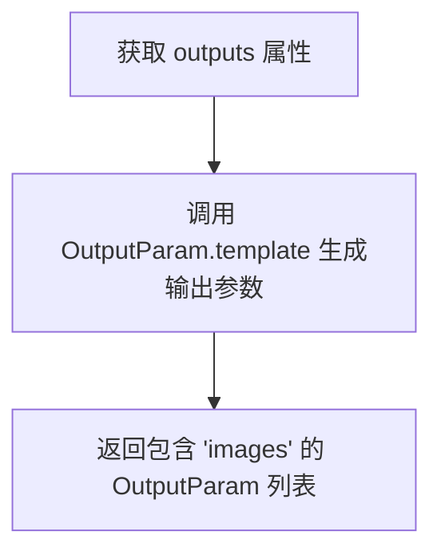

#### 带注释源码

```python
@property
def outputs(self):
    """
    定义 Flux2AutoBlocks 管道的输出参数。
    
    该属性在父类 SequentialPipelineBlocks 中被调用，用于获取
    管道执行完成后需要返回的输出参数列表。
    
    Returns:
        List[OutputParam]: 包含输出参数信息的列表，目前定义了一个
                          名为 'images' 的输出参数，代表生成的图像列表。
    """
    return [
        OutputParam.template("images"),
    ]
```

#### 补充说明

- **OutputParam.template** 是从 `..modular_pipeline_utils` 模块导入的工厂方法，用于创建输出参数模板
- 返回的列表中包含一个 `OutputParam` 对象，其名称为 `"images"`
- 该输出与类文档字符串中的 `Outputs` 部分相对应：`images (list): Generated images.`
- 在整个管道执行流程中，此输出参数会被用于最终返回生成的图像结果

## 关键组件


### 张量索引与惰性加载

通过`block_trigger_inputs`和自动管道块机制实现惰性加载。只有当特定输入（如`image`、`image_latents`）被提供时，对应的处理块才会被触发执行，避免不必要的计算。

### 反量化支持

`Flux2CoreDenoiseStep`和`Flux2ImageConditionedCoreDenoiseStep`分别支持纯文本到图像和图像条件生成的两种去噪流程，通过`Flux2AutoCoreDenoiseStep`自动选择合适的反量化策略。

### 量化策略

通过`Flux2AutoCoreDenoiseStep`类的`block_trigger_inputs = ["image_latents", None]`设计，实现文本到图像（None）和图像条件生成（image_latents）的不同量化处理策略自动切换。

### 模块化管道架构

基于`SequentialPipelineBlocks`和`AutoPipelineBlocks`构建的模块化框架，支持可插拔的步骤组合，包括文本编码、VAE编码、去噪和解码等核心组件。

### 工作流自动路由

通过`_workflow_map`实现自动工作流识别，根据输入参数（`prompt`、`image`）自动选择`text2image`或`image_conditioned`流程。

### 图像条件处理

`Flux2AutoVaeEncoderStep`和`Flux2ImageConditionedCoreDenoiseStep`专门处理图像条件输入，支持参考图像的latent表示生成和条件去噪。

### 核心去噪管道

`Flux2CoreDenoiseBlocks`和`Flux2ImageConditionedCoreDenoiseBlocks`定义了完整的去噪步骤链，包括文本输入、latent准备、时间步设置、RoPE输入准备、去噪和后处理。


## 问题及建议


### 已知问题

- **大量缺失的文档描述**：代码中大量参数使用 `TODO: Add description.` 标记，缺少实际的功能描述，影响代码可维护性和可理解性。
- **`Flux2AutoCoreDenoiseStep` 缺少 `outputs` 属性**：该类继承自 `AutoPipelineBlocks`，但相比其子类 `Flux2CoreDenoiseStep` 和 `Flux2ImageConditionedCoreDenoiseStep`，缺少 `outputs` 属性的定义，导致接口不一致。
- **类属性 `description` 返回类型不一致**：`Flux2VaeEncoderSequentialStep` 的 `description` 方法声明返回 `str` 类型，但其他类（如 `Flux2AutoVaeEncoderStep`、`Flux2CoreDenoiseStep` 等）的方法没有声明返回类型注解。
- **代码重复**：在 `Flux2CoreDenoiseBlocks` 和 `Flux2ImageConditionedCoreDenoiseBlocks` 中，`Flux2TextInputStep()`、`Flux2SetTimestepsStep`、`Flux2PrepareGuidanceStep`、`Flux2RoPEInputsStep`、`Flux2DenoiseStep`、`Flux2UnpackLatentsStep` 等步骤重复定义，仅 `Flux2ImageConditionedCoreDenoiseBlocks` 多了一个 `Flux2PrepareImageLatentsStep`，且 `prepare_latents` 的顺序不同。
- **block_trigger_inputs 设计不清晰**：`Flux2AutoCoreDenoiseStep` 使用 `["image_latents", None]` 作为触发条件，`None` 的语义不够明确，容易产生歧义。
- **类型注解不完整**：部分参数缺少类型注解，例如 `Flux2AutoBlocks` 中的 `_workflow_map` 字典值的类型未明确声明。
- **AutoPipelineBlocks 的 block_trigger_inputs 机制未明确**：传入 `None` 作为触发条件时，具体的回退逻辑未在代码中体现，需要依赖外部约定。

### 优化建议

- **补充所有 TODO 描述**：为每个类和方法的文档字符串添加完整的参数和返回值描述，提升代码可读性。
- **统一类属性定义**：确保所有继承自相同基类的实现类具有一致的属性定义，建议为 `Flux2AutoCoreDenoiseStep` 添加 `outputs` 属性。
- **提取公共步骤**：将 `Flux2CoreDenoiseBlocks` 和 `Flux2ImageConditionedCoreDenoiseBlocks` 中的公共步骤提取为共享变量或基类，减少代码重复。
- **改进类型注解**：为所有方法添加完整的类型注解，特别是 `description` 属性和字典类型。
- **优化 block_trigger_inputs 设计**：考虑使用更明确的触发机制，例如使用枚举或显式的条件类，而不是依赖 `None` 这样的模糊值。
- **添加错误处理**：在关键步骤（如 VAE 编码、解码、denoise 过程）中添加异常捕获和处理逻辑，提升鲁棒性。
- **考虑将配置与逻辑分离**：当前 `AUTO_BLOCKS` 和 `Flux2CoreDenoiseBlocks` 等字典包含具体步骤实例，建议将可配置的参数（如步骤名称、执行顺序）抽离为配置文件或数据类。

## 其它


### 设计目标与约束

本代码实现了一个模块化的Flux2图像生成管道，支持文本到图像生成和图像条件生成两种工作流程。设计目标包括：(1) 提供可组合的pipeline blocks架构；(2) 支持自动选择合适的处理步骤；(3) 实现高效的VAE编码和核心去噪过程。约束条件包括依赖Apache 2.0许可的HuggingFace库，需要flux2相关的模型组件（transformer、VAE、scheduler等）。

### 错误处理与异常设计

代码主要依赖父类`SequentialPipelineBlocks`和`AutoPipelineBlocks`的错误处理机制。潜在错误场景包括：(1) 输入参数验证失败（如height/width不符合模型要求）；(2) 模型加载失败；(3) 设备兼容性问题（GPU/CPU）；(4) 内存不足导致的OOM错误。TODO注释表明部分输入参数描述未完成，可能需要在实际使用时添加参数校验逻辑。

### 数据流与状态机

数据流主要分为两条路径：文本到图像路径（text2image）和图像条件生成路径（image_conditioned）。文本到图像流程：TextInputStep → PrepareLatentsStep → SetTimestepsStep → PrepareGuidanceStep → PrepareRoPEInputsStep → DenoiseStep → UnpackLatentsStep → DecodeStep。图像条件生成额外包含：ProcessImagesInputStep → VAEEncoderStep → PrepareImageLatentsStep。状态转换由AutoPipelineBlocks根据block_trigger_inputs自动触发。

### 外部依赖与接口契约

核心依赖包括：flow匹配调度器(FlowMatchEulerDiscreteScheduler)、Transformer模型(Flux2Transformer2DModel)、VAE模型(AutoencoderKLFlux2)、文本编码器(Mistral3ForConditionalGeneration)、图像处理器(Flux2ImageProcessor)。接口契约通过InsertableDict定义block顺序，通过OutputParam定义输出参数格式。输入接受Tensor、NoneType、可选列表等类型，返回图像列表。

### 配置与参数说明

关键配置参数包括：num_inference_steps（默认50步）、guidance_scale（默认4.0）、max_sequence_length（默认512）、num_images_per_prompt（默认1）、text_encoder_out_layers（默认(10,20,30)）。image_latents和image_latent_ids用于图像条件生成的位置编码。output_type支持pil格式输出。

### 性能考虑

潜在性能优化点：(1) 图像latents的packing操作（Flux2PrepareImageLatentsStep）；(2) RoPE位置编码的预处理；(3) 混合精度推理的支持；(4) 批处理优化。当前设计通过InsertableDict支持动态调整block顺序，可根据具体硬件环境优化pipeline。TODO注释表明部分参数描述未完成，建议补充以支持性能调优。

### 安全性考虑

代码本身为图像生成管道，安全性主要涉及：(1) 用户输入的prompt内容过滤（应在TextEncoderStep处理）；(2) 生成图像的版权问题；(3) 模型权重的安全性验证。代码未包含显式的安全过滤机制，建议在实际部署时添加内容审查模块。

### 测试考虑

建议测试场景：(1) 纯文本到图像生成；(2) 图像条件生成；(3) 无图像输入时的自动跳过逻辑；(4) 参数边界值测试（height/width/num_inference_steps）；(5) 不同硬件环境兼容性；(6) 内存使用峰值测试。AutoPipelineBlocks的触发条件需要重点测试。

### 版本兼容性

代码依赖HuggingFace Diffusers库，需要保持与以下组件的版本兼容：transformers、diffusers、accelerate。建议锁定特定版本号，避免因API变更导致的功能异常。Flux2模型为较新架构，需确认使用的模型版本与代码兼容。

### 使用示例

```python
# 文本到图像生成
pipeline = Flux2AutoBlocks()
images = pipeline(prompt="a beautiful sunset", num_inference_steps=50)

# 图像条件生成
pipeline = Flux2AutoBlocks()
images = pipeline(prompt="make it more colorful", image=input_image, num_inference_steps=50)
```

### 关键技术细节

Flux2CoreDenoiseBlocks和Flux2ImageConditionedCoreDenoiseBlocks使用InsertableDict管理block顺序，支持动态插入和重新排序。AutoPipelineBlocks的block_trigger_inputs机制实现了条件触发，image_latents存在时自动选择图像条件去噪路径，否则选择纯文本路径。Flux2AutoBlocks的_workflow_map定义了两种工作流的输入要求。

    