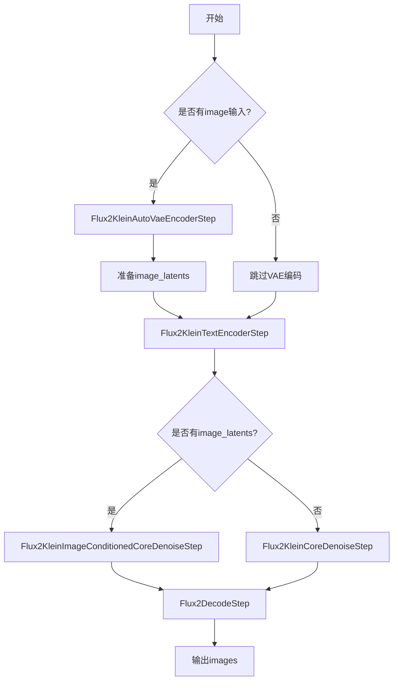
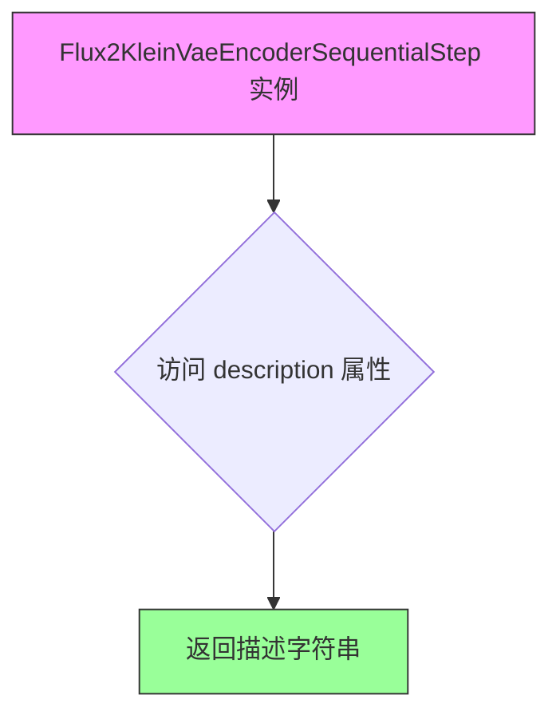
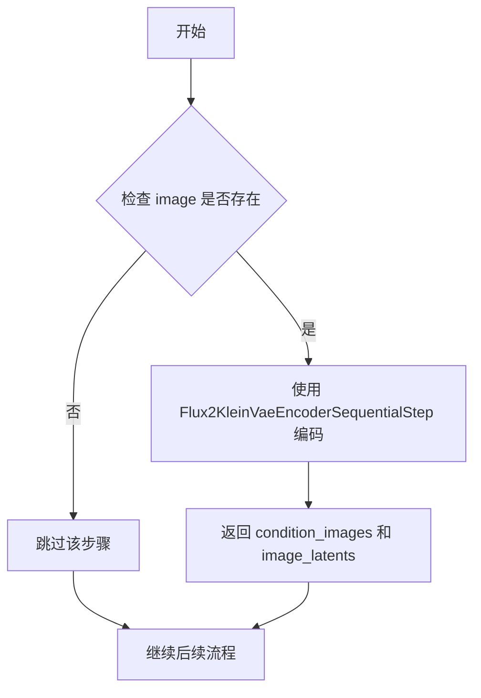
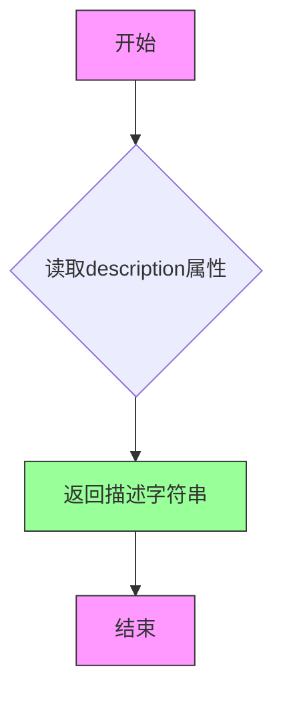
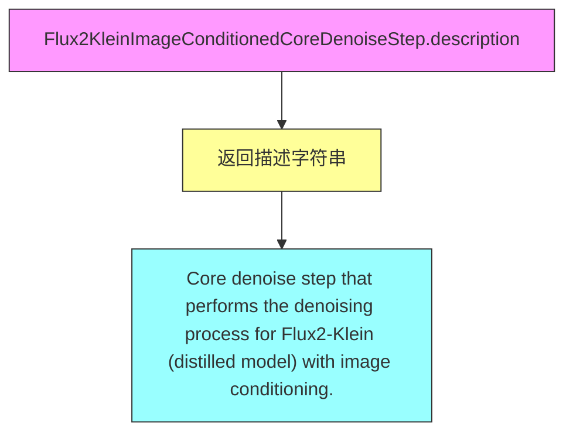
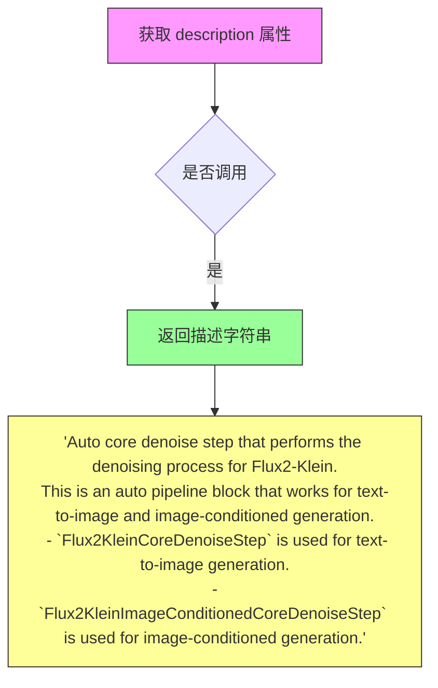
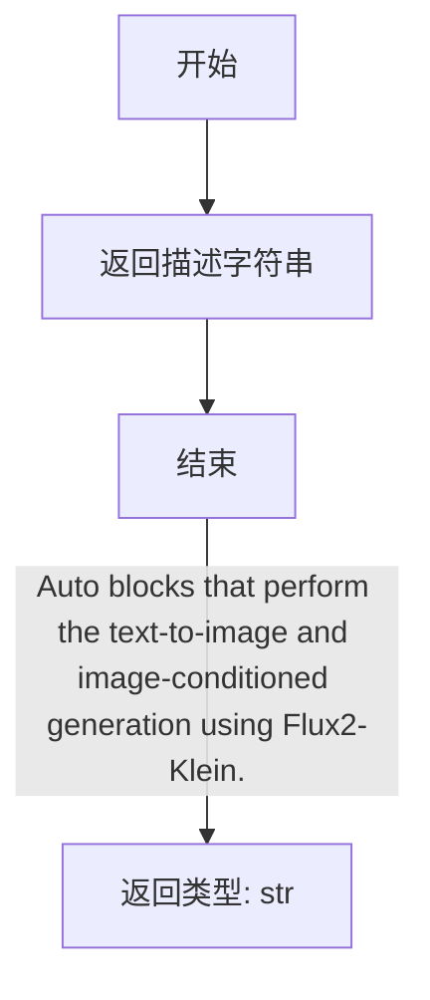
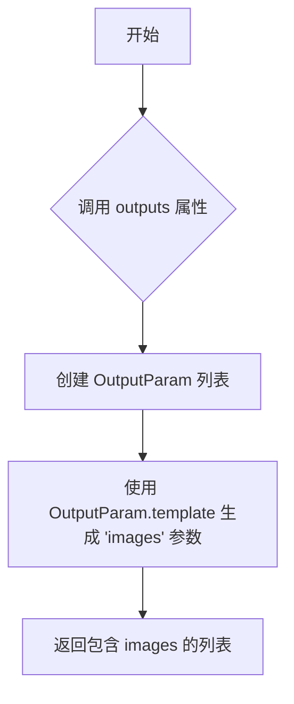

```mermaid
flowchart TD
    A[outputs 属性被访问] --> B{返回 OutputParam 列表}
    B --> C[包含一个 OutputParam.template&#40;'latents'&#41;]
    C --> D[表示去噪后的潜在表示张量]
    
    style A fill:#e1f5fe
    style B fill:#fff3e0
    style C fill:#e8f5e9
    style D fill:#fce4ec
```

# `diffusers\src\diffusers\modular_pipelines\flux2\modular_blocks_flux2_klein.py` 详细设计文档

Flux2-Klein模型的pipeline实现，提供了文本到图像生成和图像条件生成的功能。该模块通过模块化的pipeline块（VAE编码器、文本编码器、去噪步骤、解码器）实现高效的图像生成流程，支持自动根据输入条件选择不同的工作流（text2image或image_conditioned）。

## 整体流程



## 类结构

```
PipelineBlock (抽象基类)
├── SequentialPipelineBlocks (顺序Pipeline块)
│   ├── Flux2KleinVaeEncoderSequentialStep
│   ├── Flux2KleinCoreDenoiseStep
│   ├── Flux2KleinImageConditionedCoreDenoiseStep
│   └── Flux2KleinAutoBlocks
└── AutoPipelineBlocks (自动Pipeline块)
    ├── Flux2KleinAutoVaeEncoderStep
    └── Flux2KleinAutoCoreDenoiseStep
```

## 全局变量及字段


### `Flux2KleinCoreDenoiseBlocks`
    
核心去噪流程的插入式字典，包含文本输入、潜在变量准备、时间步设置、RoPE输入准备、去噪和去噪后处理等步骤

类型：`InsertableDict`
    


### `Flux2KleinImageConditionedCoreDenoiseBlocks`
    
带图像条件的核心去噪流程的插入式字典，在核心去噪基础上增加了图像潜在变量准备步骤

类型：`InsertableDict`
    


### `logger`
    
模块级日志记录器，用于输出该模块的调试和信息日志

类型：`logging.Logger`
    


### `Flux2KleinVaeEncoderSequentialStep.model_name`
    
模型名称标识，固定为 'flux2-klein'

类型：`str`
    


### `Flux2KleinVaeEncoderSequentialStep.block_classes`
    
pipeline块类列表，包含图像预处理和VAE编码步骤

类型：`list[PipelineBlock]`
    


### `Flux2KleinVaeEncoderSequentialStep.block_names`
    
pipeline块名称列表，用于标识预处理和编码步骤

类型：`list[str]`
    


### `Flux2KleinAutoVaeEncoderStep.model_name`
    
模型名称标识，固定为 'flux2-klein'

类型：`str`
    


### `Flux2KleinAutoVaeEncoderStep.block_classes`
    
自动pipeline块类列表，包含VAE编码顺序步骤类

类型：`list[type]`
    


### `Flux2KleinAutoVaeEncoderStep.block_names`
    
自动pipeline块名称列表，用于标识图像条件处理步骤

类型：`list[str]`
    


### `Flux2KleinAutoVaeEncoderStep.block_trigger_inputs`
    
自动块触发输入条件列表，指定image作为触发条件

类型：`list[str]`
    


### `Flux2KleinCoreDenoiseStep.model_name`
    
模型名称标识，固定为 'flux2-klein'

类型：`str`
    


### `Flux2KleinCoreDenoiseStep.block_classes`
    
核心去噪流程的块类集合，包含文本输入、潜在变量准备等步骤

类型：`dict_values`
    


### `Flux2KleinCoreDenoiseStep.block_names`
    
核心去噪流程的块名称集合，对应各个处理步骤的标识

类型：`dict_keys`
    


### `Flux2KleinImageConditionedCoreDenoiseStep.model_name`
    
模型名称标识，固定为 'flux2-klein'

类型：`str`
    


### `Flux2KleinImageConditionedCoreDenoiseStep.block_classes`
    
图像条件核心去噪流程的块类集合，包含图像潜在变量准备等步骤

类型：`dict_values`
    


### `Flux2KleinImageConditionedCoreDenoiseStep.block_names`
    
图像条件核心去噪流程的块名称集合

类型：`dict_keys`
    


### `Flux2KleinAutoCoreDenoiseStep.model_name`
    
模型名称标识，固定为 'flux2-klein'

类型：`str`
    


### `Flux2KleinAutoCoreDenoiseStep.block_classes`
    
自动核心去噪块类列表，包含图像条件去噪和文本到图像去噪步骤

类型：`list[type]`
    


### `Flux2KleinAutoCoreDenoiseStep.block_names`
    
自动核心去噪块名称列表，用于标识图像条件和文本到图像模式

类型：`list[str]`
    


### `Flux2KleinAutoCoreDenoiseStep.block_trigger_inputs`
    
自动块触发输入条件列表，指定image_latents作为图像条件触发，None用于文本到图像模式

类型：`list[str | None]`
    


### `Flux2KleinAutoBlocks.model_name`
    
模型名称标识，固定为 'flux2-klein'

类型：`str`
    


### `Flux2KleinAutoBlocks.block_classes`
    
自动块类列表，包含文本编码、VAE编码、核心去噪和解码步骤

类型：`list[PipelineBlock]`
    


### `Flux2KleinAutoBlocks.block_names`
    
自动块名称列表，用于标识文本编码、VAE编码、去噪和解码流程

类型：`list[str]`
    


### `Flux2KleinAutoBlocks._workflow_map`
    
工作流映射字典，定义文本到图像和图像条件工作流所需的输入参数

类型：`dict[str, dict[str, bool]]`
    
    

## 全局函数及方法


### `Flux2KleinVaeEncoderSequentialStep.description`

返回该流水线步骤的描述信息，用于说明该步骤的功能为对图像输入进行预处理并编码到潜在表示。

参数：

- （无显式参数，隐式接收 `self` 作为实例）

返回值：`str`，返回该 VAE 编码器步骤的描述字符串，说明其功能是对图像输入进行预处理并编码到潜在表示。

#### 流程图



#### 带注释源码

```python
@property
def description(self) -> str:
    """
    返回该 VAE 编码器步骤的描述信息。
    
    该属性继承自 SequentialPipelineBlocks 类，
    用于提供该步骤的功能说明，便于日志记录和调试。
    
    Returns:
        str: 描述字符串，说明该步骤执行图像预处理和 VAE 编码操作。
    """
    return "VAE encoder step that preprocesses and encodes the image inputs into their latent representations."
```


### `Flux2KleinAutoVaeEncoderStep.description`

该属性方法返回 Flux2KleinAutoVaeEncoderStep 类的描述信息，用于说明 VAE 编码器步骤的功能和自动触发逻辑。

参数：
- `self`：隐式参数，指向类实例本身，无额外描述

返回值：`str`，返回该步骤的描述字符串，说明当提供图像时使用 Flux2KleinVaeEncoderSequentialStep 进行编码，否则跳过该步骤。

#### 流程图



#### 带注释源码

```python
@property
def description(self):
    """
    返回 VAE 编码器步骤的描述信息。
    
    该方法是一个属性方法（property），用于获取 Flux2KleinAutoVaeEncoderStep 的描述。
    描述说明了该步骤是一个自动管道块（AutoPipelineBlocks），用于图像条件任务：
    - 当提供了 image 参数时，使用 Flux2KleinVaeEncoderSequentialStep 进行图像预处理和 VAE 编码；
    - 当未提供 image 参数时，该步骤将被跳过。
    
    Returns:
        str: 描述该 VAE 编码器步骤功能的字符串，包含自动触发逻辑的说明。
    """
    return (
        "VAE encoder step that encodes the image inputs into their latent representations.\n"
        "This is an auto pipeline block that works for image conditioning tasks.\n"
        " - `Flux2KleinVaeEncoderSequentialStep` is used when `image` is provided.\n"
        " - If `image` is not provided, step will be skipped."
    )
```


### `Flux2KleinCoreDenoiseStep.description`

这是一个只读属性（property），用于返回 `Flux2KleinCoreDenoiseStep` 类的描述信息，说明该类执行 Flux2-Klein（蒸馏模型）的核心去噪过程，用于文本到图像生成。

参数：该属性无参数。

返回值：`str`，返回对核心去噪步骤的描述字符串，说明其功能是执行 Flux2-Klein 蒸馏模型的文本到图像去噪过程。

#### 流程图



#### 带注释源码

```python
@property
def description(self):
    """
    属性描述：
        返回该核心去噪步骤的描述信息。
    
    返回值：
        str: 描述字符串，说明该步骤执行 Flux2-Klein（蒸馏模型）
             的核心去噪过程，用于文本到图像生成。
    
    注意：
        这是一个只读属性，用于文档和日志记录目的。
        该类继承自 SequentialPipelineBlocks，是去噪流水线的核心组件。
    """
    return "Core denoise step that performs the denoising process for Flux2-Klein (distilled model), for text-to-image generation."
```


### `Flux2KleinCoreDenoiseStep.outputs`

这是一个属性方法（property），用于定义 Flux2KleinCoreDenoiseStep 类的输出参数。它返回该步骤产生的输出参数列表，在此场景中为去噪后的潜在表示（latents）。

参数： 无（这是一个属性方法，不接受任何参数）

返回值：`list[OutputParam]`，返回包含输出参数信息的列表，当前包含一个 "latents" 参数，表示去噪后的潜在表示张量。

#### 流程图

```mermaid
flowchart TD
    A[开始] --> B[返回 OutputParam.template('latents') 列表]
    B --> C[结束]
```

#### 带注释源码

```python
@property
def outputs(self):
    """
    定义该步骤的输出参数。
    
    Returns:
        list: 包含输出参数的列表，当前只包含一个 'latents' 参数，
              代表去噪后的潜在表示（Tensor 类型）
    """
    return [
        OutputParam.template("latents"),
    ]
```


### `Flux2KleinImageConditionedCoreDenoiseStep.description`

这是 `Flux2KleinImageConditionedCoreDenoiseStep` 类的描述属性，返回该类的功能说明字符串。

参数：

- （无，此为属性方法，仅包含 `self` 隐式参数）

返回值：`str`，返回该步骤的功能描述文本。

#### 流程图



#### 带注释源码

```python
@property
def description(self):
    """
    返回 Flux2KleinImageConditionedCoreDenoiseStep 类的描述信息。
    
    该类是 Flux2-Klein 模型的图像条件核心去噪步骤的顺序管道块。
    它集成了多个处理块：文本输入、图像潜变量准备、潜变量准备、时间步设置、
    RoPE 输入准备、去噪和去噪后处理。
    
    Returns:
        str: 描述该步骤功能的字符串，说明其执行 Flux2-Klein（蒸馏模型）
             在图像条件下的去噪过程。
    """
    return "Core denoise step that performs the denoising process for Flux2-Klein (distilled model) with image conditioning."
```

---

### 关联信息补充

**所属类**: `Flux2KleinImageConditionedCoreDenoiseStep`

**类概述**: 
`Flux2KleinImageConditionedCoreDenoiseStep` 是 Flux2-Klein 蒸馏模型的核心去噪步骤，专门用于图像条件生成任务。它继承自 `SequentialPipelineBlocks`，通过组合多个处理块（输入处理、图像潜变量准备、潜变量准备、时间步设置、RoPE输入准备、去噪、解包潜变量）来完成带图像条件的文本到图像生成过程。

**关键组件**:
- `Flux2TextInputStep`: 文本输入处理
- `Flux2PrepareImageLatentsStep`: 图像潜变量准备
- `Flux2PrepareLatentsStep`: 潜变量准备
- `Flux2SetTimestepsStep`: 时间步设置
- `Flux2RoPEInputsStep`: RoPE 输入准备
- `Flux2KleinDenoiseStep`: 核心去噪操作
- `Flux2UnpackLatentsStep`: 去噪后解包潜变量


### `Flux2KleinImageConditionedCoreDenoiseStep.outputs`

该属性方法定义了 Flux2KleinImageConditionedCoreDenoiseStep 类的输出参数，返回去噪后的 latents 张量列表。

参数：无（该方法为属性方法，无显式参数）

返回值：`list[OutputParam]`，返回包含去噪后 latents 的输出参数列表

#### 流程图



#### 带注释源码

```python
@property
def outputs(self):
    """
    定义该 pipeline 步骤的输出参数。
    
    返回一个包含 OutputParam 的列表，描述该步骤生成的输出。
    在 Flux2KleinImageConditionedCoreDenoiseStep 中，输出为去噪后的 latents 张量。
    
    Returns:
        list: 包含输出参数的列表，当前只有一个元素 - 去噪后的 latents
    """
    return [
        OutputParam.template("latents"),
    ]
```


### `Flux2KleinAutoCoreDenoiseStep.description`

该方法是 `Flux2KleinAutoCoreDenoiseStep` 类的属性方法，用于返回该自动核心降噪步骤的描述信息。它是一个自动管道块，适用于文本到图像和图像条件生成任务，根据是否提供 `image_latents` 来选择使用 `Flux2KleinCoreDenoiseStep`（文本到图像）或 `Flux2KleinImageConditionedCoreDenoiseStep`（图像条件生成）。

参数：

- `self`：隐式参数，类型为 `Flux2KleinAutoCoreDenoiseStep` 实例，方法的调用者

返回值：`str`，返回该步骤的描述字符串，说明其功能和在文本到图像及图像条件生成中的用途。

#### 流程图



#### 带注释源码

```python
@property
def description(self):
    """
    获取该自动核心降噪步骤的描述信息。
    
    该属性返回一段描述性文字，说明:
    1. 这是一个用于 Flux2-Klein 模型的核心降噪步骤
    2. 它是一个自动管道块，支持文本到图像和图像条件生成两种工作流
    3. 根据输入条件自动选择合适的降噪实现
    
    Returns:
        str: 描述该步骤功能的字符串，包含其用途和两种工作模式的说明
    """
    return (
        "Auto core denoise step that performs the denoising process for Flux2-Klein.\n"
        "This is an auto pipeline block that works for text-to-image and image-conditioned generation.\n"
        " - `Flux2KleinCoreDenoiseStep` is used for text-to-image generation.\n"
        " - `Flux2KleinImageConditionedCoreDenoiseStep` is used for image-conditioned generation.\n"
    )
```


### `Flux2KleinAutoBlocks.description`

这是一个属性方法（Property），用于获取 Flux2KleinAutoBlocks 类的描述信息。

参数：

- 该方法无额外参数（仅包含隐式参数 `self`）

返回值：`str`，返回该自动块的功能描述，说明其执行 Flux2-Klein 的文本到图像和图像条件生成。

#### 流程图



#### 带注释源码

```python
@property
def description(self) -> str:
    """
    获取 Flux2KleinAutoBlocks 的描述信息。
    
    该属性返回该自动块的功能描述，说明其执行 Flux2-Klein 模型
    的文本到图像（text-to-image）和图像条件（image-conditioned）生成任务。
    
    Returns:
        str: 描述字符串，内容为：
             "Auto blocks that perform the text-to-image and 
              image-conditioned generation using Flux2-Klein."
    """
    return "Auto blocks that perform the text-to-image and image-conditioned generation using Flux2-Klein."
```


### `Flux2KleinAutoBlocks.outputs`

该属性方法定义了 Flux2KleinAutoBlocks 的输出参数，用于返回生成结果的信息。

参数：无

返回值：`List[OutputParam]`，返回一个包含图像输出参数的列表，其中包含一个名为 "images" 的输出参数，描述了 Flux2-Klein 模型生成的图像列表。

#### 流程图



#### 带注释源码

```python
@property
def outputs(self):
    """
    定义 Flux2KleinAutoBlocks 的输出参数。
    
    该属性方法返回一个列表，包含一个 OutputParam 对象，
    用于描述该流水线块的输出内容。
    
    Returns:
        List[OutputParam]: 包含输出参数的列表，当前只有一个 'images' 参数，
                          代表 Flux2-Klein 模型生成的图像列表。
    """
    return [
        OutputParam.template("images"),
    ]
```

## 关键组件


### Flux2KleinVaeEncoderSequentialStep

VAE编码器顺序步骤，负责图像输入的预处理和编码，将其转换为潜在表示。包含图像处理（Flux2ProcessImagesInputStep）和VAE编码（Flux2VaeEncoderStep）两个子步骤。

### Flux2KleinAutoVaeEncoderStep

自动VAE编码器步骤，根据输入条件动态决定是否执行编码。当提供image参数时使用Flux2KleinVaeEncoderSequentialStep，未提供时跳过该步骤，实现图像条件任务的自动适配。

### Flux2KleinCoreDenoiseBlocks

核心去噪块的InsertableDict集合，包含文本输入、潜在值准备、时间步设置、RoPE输入准备、去噪和去噪后处理等六个顺序步骤，构成了完整的文本到图像去噪流程。

### Flux2KleinCoreDenoiseStep

Flux2-Klein蒸馏模型的核心去噪步骤，执行文本到图像生成的去噪过程。集成调度器（FlowMatchEulerDiscreteScheduler）和变换器（Flux2Transformer2DModel），接受提示嵌入、潜在值、推理步数等参数，输出去噪后的潜在表示。

### Flux2KleinImageConditionedCoreDenoiseBlocks

带图像条件的核心去噪块集合，在标准去噪流程中新增图像潜在值准备步骤（Flux2PrepareImageLatentsStep），支持图像条件生成任务。

### Flux2KleinImageConditionedCoreDenoiseStep

带图像条件的核心去噪步骤，扩展了标准去噪流程以支持图像潜在值注入，用于图像条件生成场景。

### Flux2KleinAutoCoreDenoiseStep

自动核心去噪步骤，根据是否存在image_latents自动选择去噪策略。有图像条件时使用Flux2KleinImageConditionedCoreDenoiseStep，否则使用Flux2KleinCoreDenoiseStep，实现文本到图像和图像条件生成的统一入口。

### Flux2KleinAutoBlocks

Flux2-Klein的完整自动管道块，整合文本编码、VAE编码、核心去噪和解码四个主要阶段。支持text2image和image_conditioned两种工作流，通过_workflow_map配置输入触发条件。

### SequentialPipelineBlocks

顺序管道块基类，定义步骤的顺序执行逻辑，Flux2KleinVaeEncoderSequentialStep和Flux2KleinCoreDenoiseStep继承自此类。

### AutoPipelineBlocks

自动管道块基类，根据输入条件动态选择执行策略，Flux2KleinAutoVaeEncoderStep和Flux2KleinAutoCoreDenoiseStep继承自此类。

### InsertableDict

可插入的有序字典数据结构，用于组织管道块的执行顺序，支持键值对存储并保持插入顺序。


## 问题及建议


### 已知问题

- **大量未完成的TODO注释**：代码中存在大量`TODO: Add description.`注释，说明输入输出参数描述不完整，文档严重缺失。
- **重复的代码结构**：`Flux2KleinCoreDenoiseStep`和`Flux2KleinImageConditionedCoreDenoiseStep`类中的属性定义高度重复（model_name、description、outputs等），违反了DRY原则。
- **硬编码的Magic Number**：默认值如`max_sequence_length=512`、`num_inference_steps=50`、text_encoder_out_layers=(9, 18, 27)等硬编码在类定义中，缺乏灵活配置。
- **不清晰的触发条件设计**：`block_trigger_inputs = ["image_latents", None]`使用`None`来表示"总是触发"的逻辑不够直观，这是一种隐藏的hack。
- **未使用的属性**：定义了`_workflow_map = {"text2image": {"prompt": True}, "image_conditioned": {"image": True, "prompt": True}}`但从未被使用。
- **类型标注不完整**：部分方法参数和返回值缺少类型标注，如`Flux2KleinAutoVaeEncoderStep.description`方法没有返回类型注解。
- **命名不一致**：命名风格不统一，有的用`Blocks`后缀（如`Flux2KleinCoreDenoiseBlocks`），有的用`Step`后缀（如`Flux2KleinCoreDenoiseStep`）。
- **模块导入路径脆弱**：相对导入路径`from ...utils`和`from ..modular_pipeline`假设了固定的目录结构，迁移时容易出错。

### 优化建议

- 补充所有TODO描述，完善文档和类型注解。
- 提取公共基类或使用Mixins来减少`Flux2KleinCoreDenoiseStep`和`Flux2KleinImageConditionedCoreDenoiseStep`之间的重复代码。
- 将硬编码的默认值迁移到配置类或构造函数参数中，提高灵活性。
- 重构`block_trigger_inputs`的设计，使用更明确的枚举或配置对象替代`None`的hack。
- 检查并移除未使用的`_workflow_map`属性，或实现其预期功能。
- 统一命名规范，建议统一使用`Step`后缀来命名pipeline块类。
- 考虑将常量配置提取到独立的配置模块中管理。

## 其它


### 设计目标与约束

**设计目标：**
- 实现Flux2-Klein（蒸馏模型）的文本到图像生成管道
- 支持两种工作流：纯文本生成（text2image）和图像条件生成（image_conditioned）
- 提供模块化的管道架构，便于扩展和替换各个组件

**设计约束：**
- 仅支持is_distilled=True的蒸馏模型配置
- 图像条件生成需要同时提供prompt和image
- 文本到图像生成仅需要prompt
- 最大序列长度默认为512
- 默认生成1张图像（num_images_per_prompt=1）

### 错误处理与异常设计

**输入验证：**
- prompt和image参数必须满足工作流要求（text2image需要prompt，image_conditioned需要prompt和image）
- height和width参数需要符合模型支持的分辨率范围
- num_inference_steps需要为正整数

**异常处理策略：**
- 当image为None时，Flux2KleinAutoVaeEncoderStep会自动跳过VAE编码步骤
- 当image_latents为None时，Flux2KleinAutoCoreDenoiseStep自动选择text2image工作流
- 参数类型检查在各个Step内部进行，使用Python类型注解进行约束

### 数据流与状态机

**整体数据流：**
1. **文本编码阶段**：prompt → TextEncoder → prompt_embeds
2. **图像编码阶段（可选）**：image → ImageProcessor → VAE Encoder → image_latents
3. **核心去噪阶段**：prompt_embeds + image_latents → 多次去噪迭代 → latents
4. **解码阶段**：latents → VAE Decoder → images

**工作流状态机：**
- **text2image状态**：仅包含文本输入，跳过图像编码步骤，使用Flux2KleinCoreDenoiseStep
- **image_conditioned状态**：包含文本和图像输入，使用完整管道，使用Flux2KleinImageConditionedCoreDenoiseStep

### 外部依赖与接口契约

**核心依赖组件：**
- `Qwen3ForCausalLM`：文本编码器
- `Qwen2TokenizerFast`：文本分词器
- `Flux2ImageProcessor`：图像预处理
- `AutoencoderKLFlux2`：VAE编解码器
- `FlowMatchEulerDiscreteScheduler`：调度器
- `Flux2Transformer2DModel`：Transformer去噪模型

**接口契约：**
- TextEncoder输出：prompt_embeds (Tensor)
- VAE Encoder输出：image_latents (list of Tensors), condition_images (list)
- Core Denoise输入：prompt_embeds, image_latents (可选), latents
- Core Denoise输出：latents (Tensor)
- Decoder输出：images (list)

### 配置与参数说明

**模型配置：**
- model_name: "flux2-klein"
- is_distilled: True (默认)

**关键参数：**
- max_sequence_length: 512 (默认)
- num_images_per_prompt: 1 (默认)
- num_inference_steps: 50 (默认)
- output_type: "pil" (默认)
- text_encoder_out_layers: (9, 18, 27) (默认)

### 使用示例与调用方式

**文本到图像生成：**
```python
pipeline = Flux2KleinAutoBlocks()
result = pipeline(
    prompt="A beautiful sunset over mountains",
    height=512,
    width=512,
    num_inference_steps=50
)
```

**图像条件生成：**
```python
pipeline = Flux2KleinAutoBlocks()
result = pipeline(
    prompt="A cat sitting on a bench",
    image=input_image,
    height=512,
    width=512,
    num_inference_steps=50
)
```

### 兼容性说明

**支持的特性：**
- Python类型注解完整，支持静态类型检查
- 兼容HuggingFace Diffusers库架构
- 支持PyTorch框架

**版本要求：**
- Python 3.8+
- PyTorch 2.0+
- Diffusers库最新版本

    