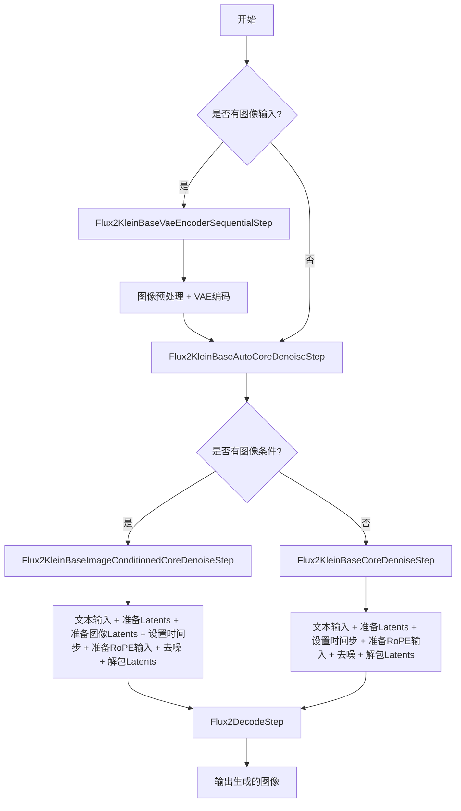
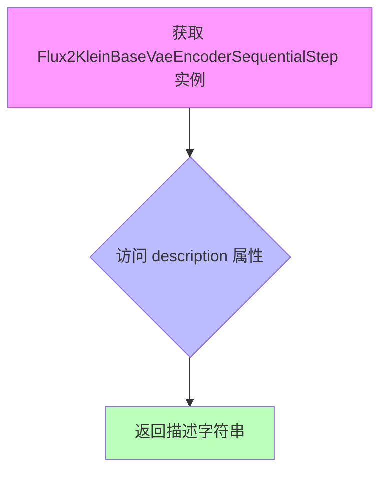
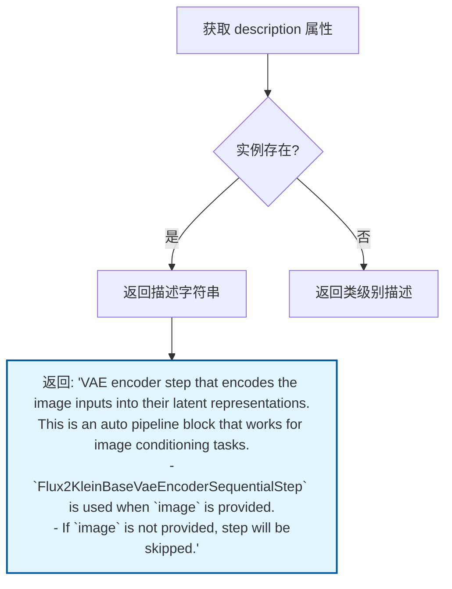
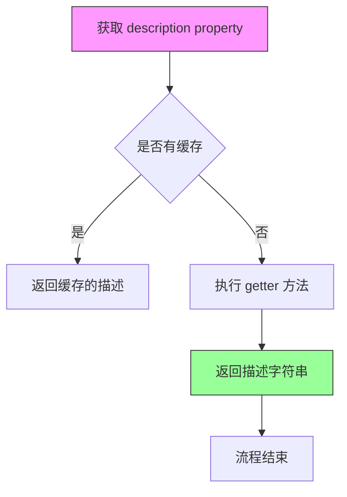
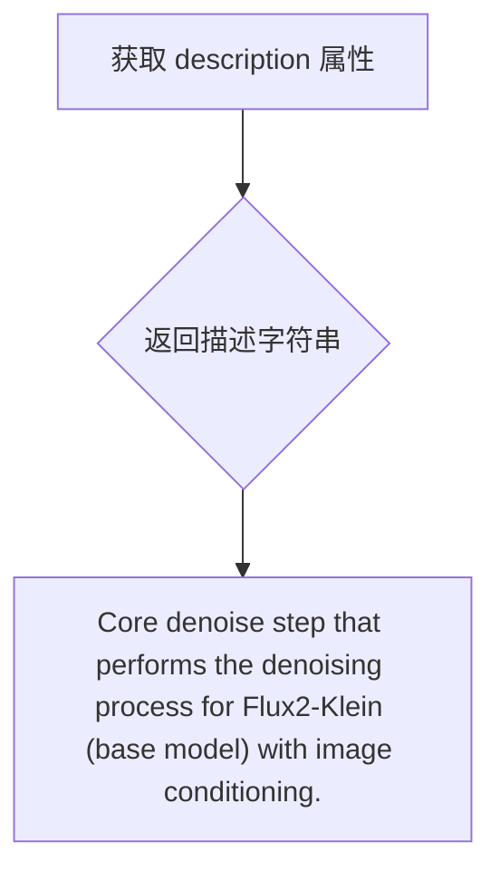
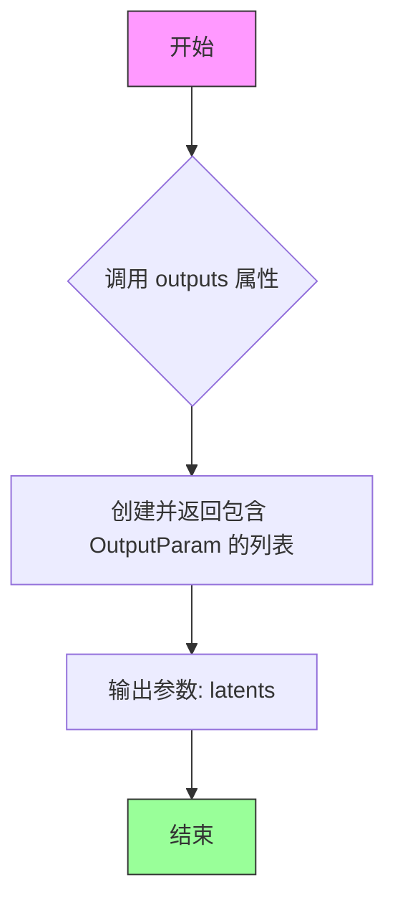
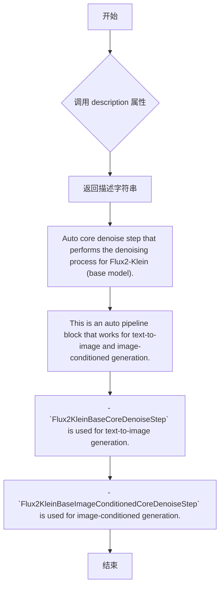
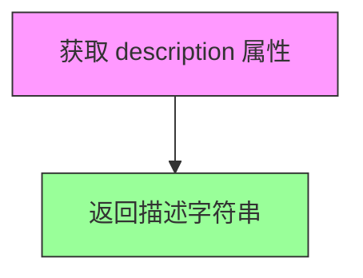
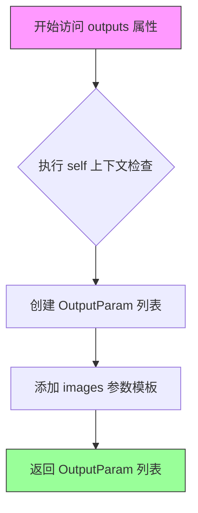

# `diffusers\src\diffusers\modular_pipelines\flux2\modular_blocks_flux2_klein_base.py` 详细设计文档

Flux2-Klein基础模型的模块化Pipeline实现，提供了文本到图像生成和图像条件生成的功能，通过VAE编码、核心去噪和解码步骤完成图像生成流程。

## 整体流程



## 类结构

```
SequentialPipelineBlocks (基类)
├── Flux2KleinBaseVaeEncoderSequentialStep
└── Flux2KleinBaseCoreDenoiseStep
└── Flux2KleinBaseImageConditionedCoreDenoiseStep
└── Flux2KleinBaseAutoBlocks
AutoPipelineBlocks (基类)
├── Flux2KleinBaseAutoVaeEncoderStep
└── Flux2KleinBaseAutoCoreDenoiseStep
```

## 全局变量及字段


### `Flux2KleinBaseCoreDenoiseBlocks`
    
核心去噪块字典

类型：`InsertableDict`
    


### `Flux2KleinBaseImageConditionedCoreDenoiseBlocks`
    
图像条件核心去噪块字典

类型：`InsertableDict`
    


### `logger`
    
日志记录器

类型：`logging.Logger`
    


### `Flux2KleinBaseVaeEncoderSequentialStep.model_name`
    
模型名称

类型：`str`
    


### `Flux2KleinBaseVaeEncoderSequentialStep.block_classes`
    
块类列表

类型：`list`
    


### `Flux2KleinBaseVaeEncoderSequentialStep.block_names`
    
块名称列表

类型：`list`
    


### `Flux2KleinBaseAutoVaeEncoderStep.block_classes`
    
块类列表

类型：`list`
    


### `Flux2KleinBaseAutoVaeEncoderStep.block_names`
    
块名称列表

类型：`list`
    


### `Flux2KleinBaseAutoVaeEncoderStep.block_trigger_inputs`
    
块触发输入

类型：`list`
    


### `Flux2KleinBaseCoreDenoiseStep.model_name`
    
模型名称

类型：`str`
    


### `Flux2KleinBaseCoreDenoiseStep.block_classes`
    
块类列表

类型：`list`
    


### `Flux2KleinBaseCoreDenoiseStep.block_names`
    
块名称列表

类型：`list`
    


### `Flux2KleinBaseImageConditionedCoreDenoiseStep.model_name`
    
模型名称

类型：`str`
    


### `Flux2KleinBaseImageConditionedCoreDenoiseStep.block_classes`
    
块类列表

类型：`list`
    


### `Flux2KleinBaseImageConditionedCoreDenoiseStep.block_names`
    
块名称列表

类型：`list`
    


### `Flux2KleinBaseAutoCoreDenoiseStep.model_name`
    
模型名称

类型：`str`
    


### `Flux2KleinBaseAutoCoreDenoiseStep.block_classes`
    
块类列表

类型：`list`
    


### `Flux2KleinBaseAutoCoreDenoiseStep.block_names`
    
块名称列表

类型：`list`
    


### `Flux2KleinBaseAutoCoreDenoiseStep.block_trigger_inputs`
    
块触发输入

类型：`list`
    


### `Flux2KleinBaseAutoBlocks.model_name`
    
模型名称

类型：`str`
    


### `Flux2KleinBaseAutoBlocks.block_classes`
    
块类列表

类型：`list`
    


### `Flux2KleinBaseAutoBlocks.block_names`
    
块名称列表

类型：`list`
    


### `Flux2KleinBaseAutoBlocks._workflow_map`
    
工作流映射

类型：`dict`
    
    

## 全局函数及方法


### `Flux2KleinBaseVaeEncoderSequentialStep.description`

返回 VAE 编码器步骤的描述信息，该步骤负责对图像输入进行预处理并将其编码为潜在表示。

参数：

- `self`：隐式参数，`Flux2KleinBaseVaeEncoderSequentialStep` 类的实例，无需显式传递

返回值：`str`，返回该步骤的描述字符串："VAE encoder step that preprocesses and encodes the image inputs into their latent representations."

#### 流程图



#### 带注释源码

```python
@property
def description(self) -> str:
    """
    返回 VAE 编码器步骤的描述信息。
    
    该属性方法返回类的描述字符串，用于文档生成和日志记录。
    描述说明了该步骤的核心功能：对图像输入进行预处理并编码为潜在表示。
    
    Returns:
        str: VAE encoder step that preprocesses and encodes the image inputs 
             into their latent representations.
    """
    return "VAE encoder step that preprocesses and encodes the image inputs into their latent representations."
```


### `Flux2KleinBaseAutoVaeEncoderStep.description`

这是一个属性方法（Property），返回 `Flux2KleinBaseAutoVaeEncoderStep` 类的描述信息。该类是一个自动 pipeline block，用于图像条件任务的 VAE 编码步骤。当提供 `image` 时使用 `Flux2KleinBaseVaeEncoderSequentialStep`，未提供时则跳过该步骤。

参数：

- 无参数（仅包含隐式参数 `self`）

返回值：`str`，返回该自动 pipeline block 的功能描述字符串，包含：
- VAE 编码器步骤的主要功能
- 适用的场景（图像条件任务）
- 条件分支逻辑说明

#### 流程图



#### 带注释源码

```python
@property
def description(self) -> str:
    """
    返回 Flux2KleinBaseAutoVaeEncoderStep 类的描述信息。
    
    该属性方法提供了一个说明性字符串，描述了 VAE 编码步骤的功能：
    - 将图像输入编码为潜在表示
    - 作为自动 pipeline block 处理图像条件任务
    - 根据是否提供 image 动态选择执行逻辑
    
    Returns:
        str: 描述该类功能的字符串，包含主要功能、适用场景和条件分支说明
    """
    return (
        "VAE encoder step that encodes the image inputs into their latent representations.\n"
        "This is an auto pipeline block that works for image conditioning tasks.\n"
        " - `Flux2KleinBaseVaeEncoderSequentialStep` is used when `image` is provided.\n"
        " - If `image` is not provided, step will be skipped."
    )
```


### `Flux2KleinBaseCoreDenoiseStep.description`

这是一个类属性（property），用于返回 `Flux2KleinBaseCoreDenoiseStep` 类的描述信息。

参数： 无（这是一个只读的 property getter，不接受任何参数）

返回值： `str`，返回该类的功能描述字符串

#### 流程图



#### 带注释源码

```python
# auto_docstring
class Flux2KleinBaseCoreDenoiseStep(SequentialPipelineBlocks):
    """
    Core denoise step that performs the denoising process for Flux2-Klein (base model), for text-to-image generation.

      Components:
          scheduler (`FlowMatchEulerDiscreteScheduler`) transformer (`Flux2Transformer2DModel`) guider
          (`ClassifierFreeGuidance`)

      Configs:
          is_distilled (default: False)

      Inputs:
          num_images_per_prompt (`None`, *optional*, defaults to 1):
              TODO: Add description.
          prompt_embeds (`Tensor`):
              Pre-generated text embeddings. Can be generated from text_encoder step.
          negative_prompt_embeds (`Tensor`, *optional*):
              Pre-generated negative text embeddings. Can be generated from text_encoder step.
          height (`int`, *optional*):
              TODO: Add description.
          width (`int`, *optional*):
              TODO: Add description.
          latents (`Tensor | NoneType`, *optional*):
              TODO: Add description.
          generator (`None`, *optional*):
              TODO: Add description.
          num_inference_steps (`None`, *optional*, defaults to 50):
              TODO: Add description.
          timesteps (`None`, *optional*):
              TODO: Add description.
          sigmas (`None`, *optional*):
              TODO: Add description.
          joint_attention_kwargs (`None`, *optional*):
              TODO: Add description.
          image_latents (`Tensor`, *optional*):
              Packed image latents for conditioning. Shape: (B, img_seq_len, C)
          image_latent_ids (`Tensor`, *optional*):
              Position IDs for image latents. Shape: (B, img_seq_len, 4)

      Outputs:
          latents (`Tensor`):
              Denoised latents.
    """

    model_name = "flux2-klein"
    # 类属性：存储该 pipeline 使用的所有块类（来自 Flux2KleinBaseCoreDenoiseBlocks 字典的值）
    block_classes = Flux2KleinBaseCoreDenoiseBlocks.values()
    # 类属性：存储该 pipeline 使用的所有块名称（来自 Flux2KleinBaseCoreDenoiseBlocks 字典的键）
    block_names = Flux2KleinBaseCoreDenoiseBlocks.keys()

    @property
    def description(self):
        """
        返回该类的功能描述。
        
        该方法是一个 property getter，用于获取 Flux2KleinBaseCoreDenoiseStep 类的描述信息。
        描述说明了这是 Flux2-Klein 基础模型的核心去噪步骤，用于文本到图像生成任务。
        
        Returns:
            str: 描述字符串，说明该类的核心功能
        """
        return "Core denoise step that performs the denoising process for Flux2-Klein (base model), for text-to-image generation."

    @property
    def outputs(self):
        """
        返回该类的输出参数列表。
        
        Returns:
            list: 包含 OutputParam 的列表，当前返回去噪后的 latents 张量
        """
        return [
            OutputParam.template("latents"),
        ]
```


### `Flux2KleinBaseCoreDenoiseStep.outputs`

该属性定义了 Flux2KleinBaseCoreDenoiseStep 类的输出参数，用于返回去噪处理后的潜在向量（latents）。

参数：无（该属性不接受任何参数）

返回值：`list[OutputParam]`，返回一个包含输出参数信息的列表，当前包含一个名为 "latents" 的输出参数，表示去噪后的潜在向量。

#### 流程图

```mermaid
flowchart TD
    A[开始] --> B[返回 OutputParam 列表]
    B --> C{检查输出参数}
    C -->|包含 latents| D[返回列表: [OutputParam.template('latents')]]
    D --> E[结束]
```

#### 带注释源码

```python
@property
def outputs(self):
    """
    定义该步骤的输出参数。
    
    Returns:
        list: 包含 OutputParam 的列表，当前仅包含 'latents' 参数
              表示去噪处理后的潜在向量张量
    """
    return [
        OutputParam.template("latents"),
    ]
```


### `Flux2KleinBaseImageConditionedCoreDenoiseStep.description`

该属性返回对 Flux2KleinBaseImageConditionedCoreDenoiseStep 类的文字描述，说明该类是 Flux2-Klein 基础模型的核心去噪步骤，用于执行带图像条件的文本到图像生成过程。

参数：
- `self`：自动传入的实例引用，无需显式传递

返回值：`str`，返回该类的功能描述字符串

#### 流程图



#### 带注释源码

```python
@property
def description(self):
    """
    返回该类的功能描述字符串。
    
    描述内容：Core denoise step that performs the denoising process for 
    Flux2-Klein (base model) with image conditioning.
    
    Returns:
        str: 描述 Flux2-Klein 基础模型在图像条件作用下执行去噪过程的核心步骤
    """
    return "Core denoise step that performs the denoising process for Flux2-Klein (base model) with image conditioning."
```


### `Flux2KleinBaseImageConditionedCoreDenoiseStep.outputs`

该属性用于获取 Flux2KleinBaseImageConditionedCoreDenoiseStep 类的输出参数定义，返回一个包含 OutputParam 对象的列表，描述该步骤的输出内容。

参数：无（这是一个属性 getter，不需要参数）

返回值：`list`，返回包含输出参数定义的列表，当前包含一个 "latents" 输出参数，表示去噪后的潜在表示（Latents）

#### 流程图



#### 带注释源码

```python
@property
def outputs(self):
    """
    返回该步骤的输出参数定义。
    
    该属性定义了在图像条件去噪步骤完成后需要返回的输出参数。
    在 Flux2KleinBaseImageConditionedCoreDenoiseStep 中，
    核心的去噪过程会产生去噪后的 latents（潜在表示），
    这些 latents 将作为后续解码步骤的输入。
    
    Returns:
        list: 包含 OutputParam 对象的列表，每个对象描述一个输出参数。
              当前返回一个包含单个元素的列表，表示去噪后的 latents。
    """
    return [
        OutputParam.template("latents"),
    ]
```


### `Flux2KleinBaseAutoCoreDenoiseStep.description`

这是一个自动管道块的属性，用于返回 Flux2-Klein（基础模型）的核心去噪步骤描述。该属性支持文本到图像和图像条件生成两种工作模式。

参数：无（这是一个属性方法，不接受参数）

返回值：`str`，返回描述 Flux2-Klein 基础模型核心去噪步骤的字符串说明。

#### 流程图



#### 带注释源码

```python
@property
def description(self):
    """
    返回 Flux2-Klein 基础模型的自动核心去噪步骤描述。
    
    该属性返回一个多行字符串描述，说明:
    1. 这是一个自动核心去噪步骤，用于 Flux2-Klein 基础模型
    2. 这是一个自动管道块，支持文本到图像和图像条件生成
    3. 根据输入条件自动选择合适的去噪步骤:
       - 当进行文本到图像生成时使用 Flux2KleinBaseCoreDenoiseStep
       - 当进行图像条件生成时使用 Flux2KleinBaseImageConditionedCoreDenoiseStep
    
    Returns:
        str: 描述自动核心去噪步骤功能的多行字符串
    """
    return (
        "Auto core denoise step that performs the denoising process for Flux2-Klein (base model).\n"
        "This is an auto pipeline block that works for text-to-image and image-conditioned generation.\n"
        " - `Flux2KleinBaseCoreDenoiseStep` is used for text-to-image generation.\n"
        " - `Flux2KleinBaseImageConditionedCoreDenoiseStep` is used for image-conditioned generation.\n"
    )
```


### `Flux2KleinBaseAutoBlocks.description`

返回 Flux2-Klein（基础模型）的自动模块描述，用于执行文本到图像和图像条件生成。

参数：

- `self`：`Flux2KleinBaseAutoBlocks` 实例，隐式参数，表示类的实例本身

返回值：`str`，返回该类的描述字符串，说明其功能是执行 Flux2-Klein（基础模型）的文本到图像和图像条件生成。

#### 流程图



#### 带注释源码

```python
@property
def description(self):
    """
    获取 Flux2KleinBaseAutoBlocks 类的描述信息。
    
    该属性返回一段描述性字符串，说明该自动模块的功能：
    执行 Flux2-Klein（基础模型）的文本到图像和图像条件生成。
    
    Returns:
        str: 描述字符串
            - "Auto blocks that perform the text-to-image and image-conditioned generation using Flux2-Klein (base model)."
    
    Example:
        >>> blocks = Flux2KleinBaseAutoBlocks()
        >>> print(blocks.description)
        Auto blocks that perform the text-to-image and image-conditioned generation using Flux2-Klein (base model).
    """
    return "Auto blocks that perform the text-to-image and image-conditioned generation using Flux2-Klein (base model)."
```


### `Flux2KleinBaseAutoBlocks.outputs`

这是一个属性（property）方法，用于定义 `Flux2KleinBaseAutoBlocks` 流水线的输出参数。该属性返回一个包含 `OutputParam` 的列表，标识该流水线将输出生成的图像列表。

参数：无（此为属性方法，不接受任何参数）

返回值：`list[OutputParam]`，返回一个包含输出参数定义的列表，当前包含一个名为 "images" 的输出参数，表示生成的图像列表。

#### 流程图



#### 带注释源码

```python
@property
def outputs(self):
    """
    定义流水线输出参数的属性方法。
    
    该属性返回一个列表，包含一个 OutputParam 对象，
    用于描述流水线输出的元数据信息。
    
    Returns:
        list: 包含 OutputParam.template('images') 的列表，
              表示该流水线将输出生成的图像列表
    """
    return [
        OutputParam.template("images"),
    ]
```

#### 相关上下文信息

**所属类：`Flux2KleinBaseAutoBlocks`**

```python
class Flux2KleinBaseAutoBlocks(SequentialPipelineBlocks):
    """
    Auto blocks that perform the text-to-image and image-conditioned generation 
    using Flux2-Klein (base model).
    
    Supported workflows:
      - `text2image`: requires `prompt`
      - `image_conditioned`: requires `image`, `prompt`
    
    Outputs:
        images (`list`):
            Generated images.
    """
    
    # ... 其他代码 ...
    
    @property
    def outputs(self):
        return [
            OutputParam.template("images"),
        ]
```

**输出参数模板信息：**

| 参数名称 | 参数类型 | 参数描述 |
|---------|---------|---------|
| images | list | 生成的图像列表 |

**设计意图：**
- 该属性遵循了模块化流水线的设计模式，通过 `OutputParam` 模板定义输出的元数据
- 使得流水线的输出接口可以被自动发现和验证
- 支持动态的输出参数配置，便于扩展和管理

## 关键组件


### Flux2KleinBaseVaeEncoderSequentialStep

VAE编码器顺序步骤，预处理并将图像输入编码为潜在表示，包含图像处理和VAE编码两个子步骤

### Flux2KleinBaseAutoVaeEncoderStep

自动VAE编码器步骤，根据输入条件自动选择是否执行图像编码，当提供image时使用Flux2KleinBaseVaeEncoderSequentialStep，否则跳过

### Flux2KleinBaseCoreDenoiseBlocks

核心去噪块字典，包含文本到图像生成所需的完整处理链：文本输入准备、潜在向量准备、时间步设置、RoPE输入准备、去噪和潜在向量解包

### Flux2KleinBaseCoreDenoiseStep

核心去噪步骤，执行Flux2-Klein基础模型的文本到图像去噪过程，使用FlowMatchEulerDiscreteScheduler和Flux2Transformer2DModel

### Flux2KleinBaseImageConditionedCoreDenoiseBlocks

图像条件核心去噪块字典，在核心去噪流程中增加了图像潜在向量准备步骤，用于支持图像条件生成

### Flux2KleinBaseImageConditionedCoreDenoiseStep

带图像条件的核心去噪步骤，在去噪过程中加入图像潜在向量处理，支持基于参考图像的条件生成

### Flux2KleinBaseAutoCoreDenoiseStep

自动核心去噪步骤，根据输入自动选择去噪模式：有图像潜在向量时使用图像条件模式，否则使用纯文本到图像模式

### Flux2KleinBaseAutoBlocks

顶层自动块，整合文本编码、VAE编码、去噪和解码四个主要阶段，支持text2image和image_conditioned两种工作流

### SequentialPipelineBlocks

顺序管道块基类，定义块的顺序执行框架

### AutoPipelineBlocks

自动管道块基类，根据输入条件动态选择执行哪个具体块实现

### InsertableDict

可插入字典，用于有序存储管道块配置，支持通过键值访问块


## 问题及建议


### 已知问题

-   **大量TODO占位符未填充**：代码中存在大量TODO注释，如输入参数描述（`image`, `height`, `width`, `generator`, `prompt`, `num_images_per_prompt`, `num_inference_steps`, `timesteps`, `sigmas`, `joint_attention_kwargs`, `latents`, `image_latents`, `image_latent_ids`, `output_type`等），严重影响代码可读性和可用性
-   **AutoPipelineBlocks触发逻辑不明确**：`block_trigger_inputs = ["image_latents", None]`中`None`作为触发条件的含义不清晰，第二个block的触发机制缺乏明确文档
-   **重复代码结构**：`Flux2KleinBaseCoreDenoiseStep`和`Flux2KleinBaseImageConditionedCoreDenoiseStep`两个类除了`block_classes`和`block_names`不同外，docstring和属性定义几乎完全重复
-   **全局变量命名不符合PEP8**：`Flux2KleinBaseCoreDenoiseBlocks`和`Flux2KleinBaseImageConditionedCoreDenoiseBlocks`使用PascalCase命名作为全局变量，应使用UPPER_CASE
-   **类型注解不完整**：多处缺少类型注解，如`Flux2KleinBaseAutoVaeEncoderStep.description`方法、`block_classes`属性等，影响静态分析和IDE支持
-   **硬编码默认值分散**：默认参数值（如`num_inference_steps=50`, `num_images_per_prompt=1`, `max_sequence_length=512`, `output_type="pil"`）散布在各处的docstring和注释中，无集中配置管理

### 优化建议

-   **完善文档注释**：为所有TODO占位符补充准确的参数描述，说明每个输入输出的用途、类型约束和默认值
-   **重构重复类**：提取共用的docstring和属性到基类或混入类中，通过参数化方式区分不同变体
-   **统一命名规范**：将全局常量`Flux2KleinBaseCoreDenoiseBlocks`等改为`FLUX2_KLEIN_BASE_CORE_DENOISE_BLOCKS`
-   **补充类型注解**：为所有属性和方法添加完整的类型注解，特别是`block_classes`、`block_names`、`outputs`等关键属性
-   **简化AutoPipelineBlocks设计**：考虑使用枚举或显式配置替代`None`作为触发条件，使触发逻辑更直观
-   **集中管理配置**：创建配置类或 dataclass 统一管理默认值（如推理步数、序列长度等），提高可维护性

## 其它


### 设计目标与约束

本模块旨在实现Flux2-Klein（基础模型）的文本到图像生成和图像条件生成功能。设计目标包括：1）支持文本到图像（text2image）和图像条件（image_conditioned）两种工作流；2）通过AutoPipelineBlocks实现动态pipeline选择，根据输入条件自动选择合适的处理流程；3）模块化设计，支持组件的热插拔和复用。约束条件包括：默认is_distilled=False，支持FlowMatchEulerDiscreteScheduler调度器，最大序列长度默认512，图像生成默认num_inference_steps为50。

### 错误处理与异常设计

代码中通过logger记录日志，未在当前文件中实现显式的异常处理。潜在异常场景包括：1）输入图像尺寸不符合要求；2）文本编码器输出层配置不正确；3）latents维度不匹配；4）调度器或transformer模型未正确加载。建议在调用链路上添加：图像输入的尺寸验证（height/width需为8的倍数）；prompt_embeds和negative_prompt_embeds的维度一致性检查；latents与生成参数的兼容性校验；AutoPipelineBlocks触发条件为空时的fallback处理。

### 数据流与状态机

数据流分为两条主要路径：1）text2image路径：prompt → text_encoder → prepare_latents → set_timesteps → prepare_rope_inputs → denoise → unpack_latents → decode → images；2）image_conditioned路径：在text2image路径基础上增加vae_encoder（处理image输入生成image_latents）和prepare_image_latents步骤。AutoCoreDenoiseStep根据block_trigger_inputs（image_latents是否存在）自动选择对应路径：image_latents存在时使用Flux2KleinBaseImageConditionedCoreDenoiseStep，否则使用Flux2KleinBaseCoreDenoiseStep。

### 外部依赖与接口契约

核心依赖包括：1）transformers库：Qwen3ForCausalLM（文本编码器）、Qwen2TokenizerFast；2）diffusers库：FlowMatchEulerDiscreteScheduler（调度器）、AutoencoderKLFlux2（VAE）、Flux2Transformer2DModel（扩散变换器）、ClassifierFreeGuidance；3）本地模块：Flux2ImageProcessor（图像处理）、Flux2DecodeStep/Flux2UnpackLatentsStep（解码）、Flux2KleinBaseTextEncoderStep（文本编码）。接口契约：输入端接受prompt（str）、image（PIL.Image或None）、height/width（int）、generator（torch.Generator）、num_inference_steps（int）等；输出端返回images（list of PIL.Image）。

### 配置与参数说明

关键配置项：model_name="flux2-klein"标识模型版本；is_distilled=False标识是否为蒸馏模型（影响推理路径）；text_encoder_out_layers=(9,18,27)指定文本编码器输出层；max_sequence_length=512限制文本序列长度；num_images_per_prompt=1控制每提示词生成图像数量；output_type="pil"指定输出格式。Flux2KleinBaseCoreDenoiseBlocks和Flux2KleinBaseImageConditionedCoreDenoiseBlocks使用InsertableDict定义可插入的流水线块，支持动态调整处理步骤。

### 性能考虑

当前实现为顺序执行（SequentialPipelineBlocks），可优化方向：1）文本编码和VAE编码可并行执行；2）去噪过程中的RoPE输入准备可与调度器时间步设置并行；3）对于多图像生成场景，可利用num_images_per_prompt进行批量处理；4）image_latents的packing操作可预先计算减少运行时开销。AutoPipelineBlocks的懒加载机制已实现，但block_trigger_inputs的匹配逻辑可进一步优化以减少条件判断开销。

### 安全性考虑

代码本身为模型推理流水线，安全性关注点包括：1）输入验证：防止异常尺寸图像导致OOM或计算错误；2）模型加载安全：确保模型权重来源可信；3）生成内容过滤：当前未实现prompt安全过滤，建议在text_encoder前添加内容审核；4）内存管理：对于大尺寸图像生成，需注意VAE编解码的内存占用，建议对超大图像进行自动降采样处理。

### 版本兼容性

代码依赖HuggingFace Transformers和Diffusers库，需确保版本兼容性：1）AutoPipelineBlocks和SequentialPipelineBlocks的接口稳定性；2）Flux2Transformer2DModel和AutoencoderKLFlux2的版本匹配；3）FlowMatchEulerDiscreteScheduler的API兼容性。建议锁定diffusers>=0.31.0和transformers>=4.46.0以确保功能正常。

### 使用示例

```python
from diffusers import Flux2KleinBasePipeline

# 文本到图像生成
pipeline = Flux2KleinBasePipeline.from_pretrained("flux2-klein-base")
image = pipeline(
    prompt="A beautiful sunset over mountains",
    num_inference_steps=28,
    height=512,
    width=512
)

# 图像条件生成
image = pipeline(
    prompt="Transform this image to be more vibrant",
    image=input_image,
    num_inference_steps=28
)
```


    