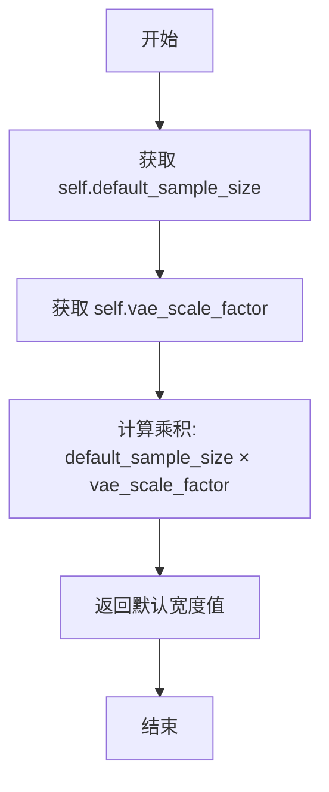
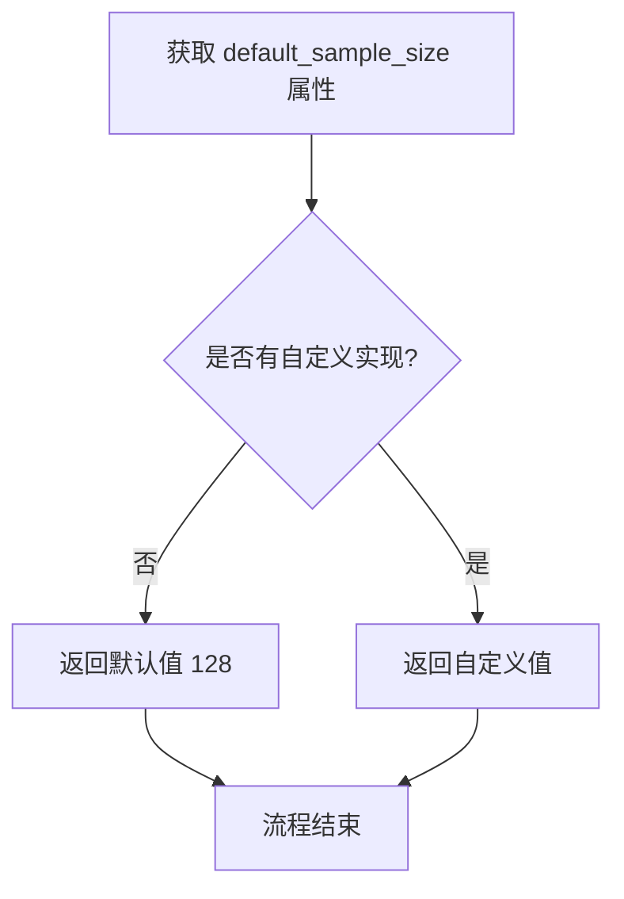
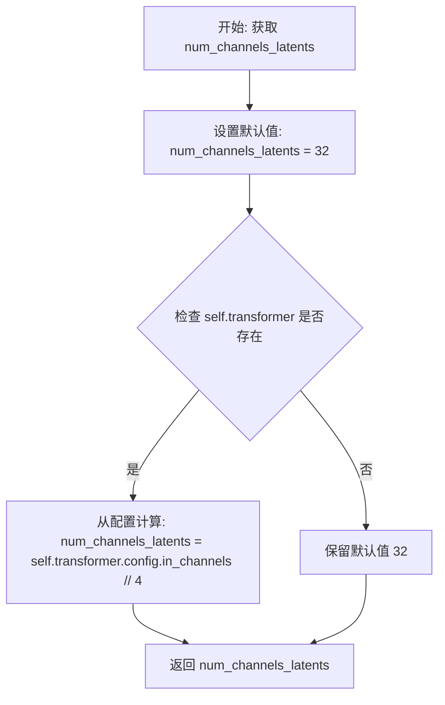
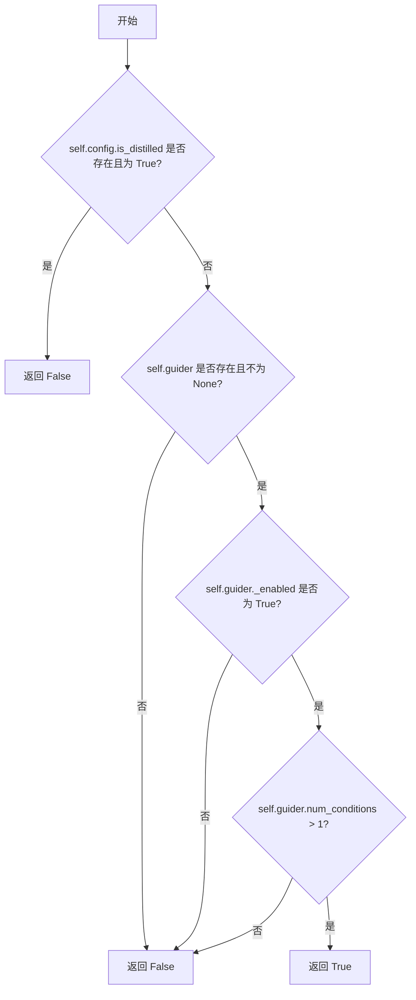
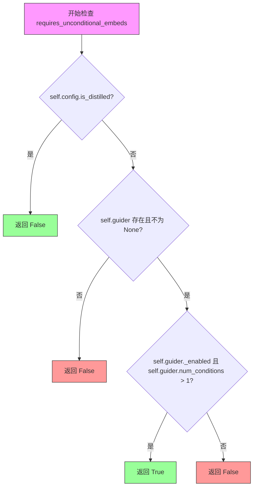

# `diffusers\src\diffusers\modular_pipelines\flux2\modular_pipeline.py` 详细设计文档

该文件定义了用于Flux2图像生成模型的模块化管道（ModularPipeline）实现，包含通用的Flux2ModularPipeline、针对Klein蒸馏模型的Flux2KleinModularPipeline以及针对Klein基础模型的Flux2KleinBaseModularPipeline。这些类通过继承和属性（Property）动态计算图像尺寸、VAE缩放因子、潜在通道数等关键参数，以适配不同的模型配置，并支持LoRA加载。

## 整体流程

```mermaid
graph TD
    A[用户初始化Pipeline] --> B{选择模型类型}
    B -- 通用Flux2 --> C[Flux2ModularPipeline]
    B -- Flux2-Klein蒸馏 --> D[Flux2KleinModularPipeline]
    B -- Flux2-Klein基础 --> E[Flux2KleinBaseModularPipeline]
    C --> F[加载模型配置 (VAE, Transformer等)]
    D --> F
    E --> F
    F --> G[推理时调用属性获取参数]
    G --> H{访问属性}
    H --> I[default_height / default_width]
    H --> J[vae_scale_factor]
    H --> K[num_channels_latents]
    H --> L[requires_unconditional_embeds]
```

## 类结构

```
ModularPipeline (基类)
Flux2LoraLoaderMixin (混入类)
Flux2ModularPipeline (继承自ModularPipeline和Flux2LoraLoaderMixin)
├── Flux2KleinModularPipeline (继承自Flux2ModularPipeline)
└── Flux2KleinBaseModularPipeline (继承自Flux2ModularPipeline)
```

## 全局变量及字段


### `logger`
    
全局日志对象，用于记录模块运行时的日志信息

类型：`logging.Logger`
    


### `Flux2ModularPipeline.default_blocks_name`
    
类属性字符串，指定Flux2管道的默认块名称为Flux2AutoBlocks

类型：`str`
    


### `Flux2ModularPipeline.default_height`
    
属性方法，计算并返回默认图像高度，等于default_sample_size乘以vae_scale_factor

类型：`int (property)`
    


### `Flux2ModularPipeline.default_width`
    
属性方法，计算并返回默认图像宽度，等于default_sample_size乘以vae_scale_factor

类型：`int (property)`
    


### `Flux2ModularPipeline.default_sample_size`
    
属性方法，返回默认采样大小，固定值为128

类型：`int (property)`
    


### `Flux2ModularPipeline.vae_scale_factor`
    
属性方法，计算VAE缩放因子，基于vae配置动态计算，默认8

类型：`int (property)`
    


### `Flux2ModularPipeline.num_channels_latents`
    
属性方法，计算潜在空间的通道数，基于transformer配置动态计算，默认32

类型：`int (property)`
    


### `Flux2KleinModularPipeline.default_blocks_name`
    
类属性字符串，指定Flux2-Klein蒸馏模型的默认块名称为Flux2KleinAutoBlocks

类型：`str`
    


### `Flux2KleinModularPipeline.requires_unconditional_embeds`
    
属性方法，判断是否需要无条件嵌入，基于is_distilled配置和guider状态动态计算

类型：`bool (property)`
    


### `Flux2KleinBaseModularPipeline.default_blocks_name`
    
类属性字符串，指定Flux2-Klein基础模型的默认块名称为Flux2KleinBaseAutoBlocks

类型：`str`
    


### `Flux2KleinBaseModularPipeline.requires_unconditional_embeds`
    
属性方法，判断是否需要无条件嵌入，基于is_distilled配置和guider状态动态计算

类型：`bool (property)`
    
    

## 全局函数及方法


### `Flux2ModularPipeline.default_height`

该属性是一个只读属性，用于返回 Flux2 模型的默认图像高度。它通过将默认采样大小（`default_sample_size`）与 VAE 缩放因子（`vae_scale_factor`）相乘计算得出，高度依赖于 `default_sample_size` 和 `vae_scale_factor` 两个属性的返回值。

参数：由于 `default_height` 是一个属性（Property），没有显式的外部参数。

- `self`：`Flux2ModularPipeline`（隐式参数），当前 Pipeline 实例本身，用于访问实例的其他属性

返回值：`int`，返回默认图像高度的像素值

#### 流程图

```mermaid
flowchart TD
    A[访问 default_height 属性] --> B{检查 default_sample_size 属性}
    B --> C[default_sample_size 返回 128]
    
    D{检查 vae_scale_factor 属性}
    D --> E{self.vae 是否存在}
    
    E -->|否| F[vae_scale_factor = 8]
    E -->|是| G[vae_scale_factor = 2 ^ (len(vae.config.block_out_channels) - 1)]
    
    F --> H[计算: default_height = default_sample_size * vae_scale_factor]
    G --> H
    
    H --> I[返回 default_height]
```

#### 带注释源码

```python
@property
def default_height(self):
    """
    返回 Flux2 模型的默认图像高度。
    
    该属性通过将默认采样大小乘以 VAE 缩放因子来计算默认高度。
    默认采样大小固定为 128，VAE 缩放因子根据 VAE 模型的结构动态计算。
    
    Returns:
        int: 默认图像高度（像素值）
    """
    # 访问 default_sample_size 属性获取默认采样大小（固定值 128）
    # 访问 vae_scale_factor 属性获取 VAE 缩放因子
    # VAE 缩放因子默认值为 8，如果存在 VAE 模型则根据其配置计算
    return self.default_sample_size * self.vae_scale_factor
```


### `Flux2ModularPipeline.default_width`

该属性是 Flux2ModularPipeline 类中的一个属性方法，用于返回默认图像宽度。它通过将默认样本大小（128）与 VAE 缩放因子相乘来计算默认宽度值。

参数：
- 无

返回值：`int`，返回默认图像宽度（像素值）

#### 流程图



#### 带注释源码

```python
@property
def default_width(self):
    """
    返回默认图像宽度。
    
    计算方式：默认样本大小 × VAE 缩放因子
    - default_sample_size: 基础样本大小，固定为 128
    - vae_scale_factor: VAE 缩放因子，默认为 8，或根据 VAE 模型的 block_out_channels 计算
    """
    return self.default_sample_size * self.vae_scale_factor
```


### `Flux2ModularPipeline.default_sample_size`

该属性用于返回 Flux2 模块化流水线的默认采样大小，固定返回整数值 128，用于计算默认图像的高度和宽度。

参数：无

返回值：`int`，返回默认采样大小，固定值为 128

#### 流程图



#### 带注释源码

```python
@property
def default_sample_size(self):
    """
    返回 Flux2 默认采样大小。
    
    该属性用于确定生成图像的默认尺寸，通过与 vae_scale_factor 相乘
    来计算 default_height 和 default_width。
    
    Returns:
        int: 默认采样大小，固定返回 128
    """
    return 128
```


### `Flux2ModularPipeline.vae_scale_factor`

该属性用于计算 VAE（变分自编码器）的缩放因子。首先尝试从 VAE 模型配置中获取 `block_out_channels` 长度来计算 2 的幂次作为缩放因子，如果 VAE 不存在则返回默认值 8。

参数：

- 无显式参数（`self` 为隐式参数）

返回值：`int`，计算得到的 VAE 缩放因子，用于确定默认图像高度和宽度。

#### 流程图

```mermaid
flowchart TD
    A[开始: 获取 vae_scale_factor] --> B[设置默认值 vae_scale_factor = 8]
    B --> C{检查 self.vae 是否存在}
    C -->|是| D[获取 vae.config.block_out_channels]
    D --> E[计算 2 ** (len(block_out_channels) - 1)]
    E --> F[更新 vae_scale_factor]
    C -->|否| G[保持默认值 8]
    F --> H[返回 vae_scale_factor]
    G --> H
```

#### 带注释源码

```python
@property
def vae_scale_factor(self):
    """
    计算 VAE 的缩放因子。
    
    逻辑：
    1. 首先设置默认值为 8
    2. 如果 VAE 模型存在，则根据其配置中的 block_out_channels 计算缩放因子
    3. 公式: 2^(len(block_out_channels) - 1)
    
    返回值：
        int: VAE 缩放因子，用于计算默认高度和宽度
    """
    # 初始化默认的 VAE 缩放因子为 8
    vae_scale_factor = 8
    
    # 检查 self.vae 属性是否存在且不为 None
    if getattr(self, "vae", None) is not None:
        # 从 VAE 配置中获取 block_out_channels 长度
        # 并计算 2 的幂次: 2^(n-1)，其中 n 是 block_out_channels 的数量
        # 这反映了 VAE 中上采样/下采样层数
        vae_scale_factor = 2 ** (len(self.vae.config.block_out_channels) - 1)
    
    # 返回计算得到的 VAE 缩放因子
    return vae_scale_factor
```


### `Flux2ModularPipeline.num_channels_latents`

该属性用于计算潜在空间（latent space）的通道数，是Flux2模块化管道的重要配置参数。它首先检查是否存在transformer对象，如果有则从transformer配置中计算通道数（输入通道数除以4），否则使用默认的32通道。

参数：

- `self`：`Flux2ModularPipeline` 实例，隐含参数，表示当前管道对象

返回值：`int`，返回潜在空间的通道数。如果存在transformer则返回 `transformer.config.in_channels // 4`，否则返回默认值 32。

#### 流程图



#### 带注释源码

```python
@property
def num_channels_latents(self):
    """
    计算潜在空间（latent space）的通道数。
    
    该属性用于确定潜在变量的通道维度，是扩散模型中重要的配置参数。
    如果transformer对象存在，则从其配置中推断通道数；否则使用默认值。
    
    Returns:
        int: 潜在空间的通道数。如果存在transformer则返回 in_channels // 4，否则返回32。
    """
    # 初始化默认通道数为32
    num_channels_latents = 32
    
    # 检查transformer对象是否存在
    if getattr(self, "transformer", None):
        # 如果transformer存在，从配置中计算通道数
        # 通常in_channels是潜在通道数的4倍，所以除以4得到潜在通道数
        num_channels_latents = self.transformer.config.in_channels // 4
    
    # 返回计算得到的通道数
    return num_channels_latents
```


### `Flux2KleinModularPipeline.requires_unconditional_embeds`

该属性用于判断当前 Flux2-Klein 流水线模型是否需要无条件嵌入（unconditional embeds）。如果模型是蒸馏模型（distilled model），则直接返回 False；否则根据引导器（guider）的启用状态和条件数量来决定是否需要无条件嵌入。

参数：

- （无参数，属于属性装饰器）

返回值：`bool`，返回 True 表示需要无条件嵌入，返回 False 表示不需要无条件嵌入。

#### 流程图



#### 带注释源码

```python
@property
def requires_unconditional_embeds(self):
    # 如果配置中指定了 is_distilled 且为 True，说明是蒸馏模型
    # 蒸馏模型不需要无条件嵌入，直接返回 False
    if hasattr(self.config, "is_distilled") and self.config.is_distilled:
        return False

    # 初始化标志为 False
    requires_unconditional_embeds = False
    
    # 检查引导器（guider）是否存在且已配置
    if hasattr(self, "guider") and self.guider is not None:
        # 只有当引导器启用且包含多个条件时才需要无条件嵌入
        # num_conditions > 1 表示存在条件嵌入，需要相应的无条件嵌入
        requires_unconditional_embeds = self.guider._enabled and self.guider.num_conditions > 1

    # 返回最终判断结果
    return requires_unconditional_embeds
```


### `Flux2KleinBaseModularPipeline.requires_unconditional_embeds`

该属性用于判断 Flux2-Klein（基础模型）管道是否需要无条件嵌入（unconditional embeds），通过检查模型配置是否为蒸馏模型以及 guider 组件是否启用且具有多个条件来决定返回值。

参数： 无

返回值：`bool`，返回 `True` 表示需要无条件嵌入，返回 `False` 表示不需要无条件嵌入

#### 流程图



#### 带注释源码

```python
@property
def requires_unconditional_embeds(self):
    """
    判断管道是否需要无条件嵌入（unconditional embeds）。

    无条件嵌入在某些扩散模型中用于处理 classifier-free guidance，
    当 guider 启用且存在多个条件时需要计算无条件嵌入以进行推理。
    
    Returns:
        bool: 如果需要无条件嵌入返回 True，否则返回 False
    """
    # 检查配置是否为蒸馏模型
    # 蒸馏模型（distilled model）内部已经处理了无条件嵌入逻辑，
    # 因此不需要外部计算
    if hasattr(self.config, "is_distilled") and self.config.is_distilled:
        return False

    # 初始化默认为不需要无条件嵌入
    requires_unconditional_embeds = False
    
    # 检查 guider 是否存在
    # guider 负责管理条件输入（conditions），包括文本条件、图像条件等
    if hasattr(self, "guider") and self.guider is not None:
        # guider 需要同时满足两个条件：
        # 1. _enabled: guider 功能已启用
        # 2. num_conditions > 1: 存在多个条件输入（多条件引导需要无条件嵌入）
        requires_unconditional_embeds = self.guider._enabled and self.guider.num_conditions > 1

    return requires_unconditional_embeds
```

## 关键组件


### Flux2ModularPipeline

核心模块化管道类，继承自ModularPipeline和Flux2LoraLoaderMixin，用于Flux2模型的推理流程。提供默认高度、宽度、样本大小和VAE缩放因子的计算属性，以及潜在通道数的动态获取。

### Flux2KleinModularPipeline

Flux2-Klein（蒸馏模型）的模块化管道类，继承自Flux2ModularPipeline。实现了requires_unconditional_embeds属性，用于判断是否需要无条件嵌入，根据is_distilled配置和guider状态动态确定。

### Flux2KleinBaseModularPipeline

Flux2-Klein（基础模型）的模块化管道类，继承自Flux2ModularPipeline。实现了requires_unconditional_embeds属性，与蒸馏模型类似的逻辑，但适用于基础模型配置。

### default_blocks_name属性

动态指定默认使用的Blocks类名，Flux2ModularPipeline默认为"Flux2AutoBlocks"，Klein蒸馏模型为"Flux2KleinAutoBlocks"，Klein基础模型为"Flux2KleinBaseAutoBlocks"。

### vae_scale_factor计算属性

动态计算VAE缩放因子，默认值为8，当VAE存在时，根据block_out_channels计算2^(len-1)的值，用于确定输出图像的缩放比例。

### num_channels_latents计算属性

动态计算潜在空间的通道数，默认值为32，当transformer存在时，从transformer.config.in_channels除以4获取，用于确定潜在表示的维度。

### requires_unconditional_embeds属性

条件性判断是否需要无条件嵌入，根据模型配置（is_distilled）和guider的启用状态及条件数量动态返回布尔值，优化蒸馏模型的嵌入处理。


## 问题及建议


### 已知问题

-   **代码重复**：`Flux2KleinModularPipeline` 和 `Flux2KleinBaseModularPipeline` 中的 `requires_unconditional_embeds` 属性实现完全相同，违反 DRY 原则
-   **硬编码值缺乏说明**：`default_sample_size = 128`、`vae_scale_factor = 8`、`num_channels_latents = 32` 等魔法数字未提供注释说明来源或意义
-   **属性计算未缓存**：每次访问 `vae_scale_factor` 和 `num_channels_latents` 属性时都会重新计算，存在性能开销
-   **类型提示完全缺失**：所有方法参数、返回值、类字段均无类型标注，降低代码可读性和静态分析能力
-   **属性缺少文档**：各属性均无 docstring，新开发者难以理解其用途和计算逻辑
-   **getattr 与直接访问混用**：代码中既有 `getattr(self, "vae", None)` 又有 `self.transformer.config.in_channels`，风格不统一
-   **is_distilled 检查重复**：两个子类都包含相同的 `is_distilled` 检查逻辑，可提取到父类或 mixin 中
-   **guider 属性访问不安全**：`self.guider._enabled` 和 `self.guider.num_conditions` 直接访问私有属性，缺乏防御性编程

### 优化建议

-   **提取公共逻辑**：将 `requires_unconditional_embeds` 的重复实现抽取为父类方法或使用 mixin
-   **添加类型提示**：为所有属性和方法添加 PEP 484 类型注解
-   **使用缓存装饰器**：对计算密集的属性使用 `@cached_property` 替代 `@property`
-   **定义常量**：将魔法数字提取为类常量或配置文件，并添加注释说明其含义
-   **统一属性访问风格**：使用 `getattr` 统一处理可选组件的访问，或在初始化时确保组件存在
-   **添加属性文档**：为每个 property 添加详细的 docstring，说明计算逻辑和默认值来源
-   **使用公共属性**：将 `guider._enabled` 和 `guider.num_conditions` 替换为公共 API（如有）或添加 getter 方法

## 其它


### 设计目标与约束

本模块的设计目标是为Hugging Face Diffusers库提供Flux2系列模型（Flux2、Flux2-Klein蒸馏模型、Flux2-Klein基础模型）的模块化管道（ModularPipeline）实现。核心约束包括：1）必须继承自ModularPipeline基类以保持与现有框架的一致性；2）必须支持LoRA加载功能（通过Flux2LoraLoaderMixin）；3）所有管道均为实验性功能（标记为WARNING）；4）需要根据模型配置动态计算潜在空间参数（vae_scale_factor、num_channels_latents等），以适应不同的模型架构变体。

### 错误处理与异常设计

代码采用了防御性编程风格，主要通过以下方式处理错误和异常情况：1）使用`getattr(self, "vae", None)`安全获取属性，避免AttributeError；2）使用`hasattr()`检查对象是否具有特定属性或配置项；3）对可选组件（vae、transformer、guider）进行空值检查后再访问其属性或方法。当获取失败时，会返回默认值（如vae_scale_factor默认为8，num_channels_latents默认为32）。对于is_distilled配置的判断，如果属性不存在会返回False。这种设计确保了模块在部分组件缺失时仍能以合理方式运行或回退到默认行为。

### 数据流与状态机

数据流主要体现在参数计算链上：`default_sample_size`（默认128）→ `vae_scale_factor`（基于VAE block_out_channels计算）→ `default_height`/`default_width`（由default_sample_size和vae_scale_factor相乘得到）。对于条件嵌入（requires_unconditional_embeds），状态机逻辑为：检查is_distilled配置→若是蒸馏模型返回False→否则检查guider是否存在且启用→判断num_conditions是否大于1。该属性用于控制是否需要无条件嵌入（unconditional embeddings），在多条件生成场景下尤为重要。

### 外部依赖与接口契约

主要外部依赖包括：1）`ModularPipeline`基类，提供了管道的基本框架和运行逻辑；2）`Flux2LoraLoaderMixin`，提供了LoRA权重加载功能；3）`Flux2LoraLoaderMixin`可能依赖的加载工具；4）VAE组件的`config.block_out_channels`属性用于计算缩放因子；5）Transformer组件的`config.in_channels`属性用于计算潜在通道数。接口契约方面：子类需实现`default_blocks_name`属性指定自动块类名；属性方法`default_height`、`default_width`、`default_sample_size`、`vae_scale_factor`、`num_channels_latents`、`requires_unconditional_embeds`必须返回有效的数值或布尔值。

### 版本兼容性考虑

该代码标记为实验性功能（experimental feature），版本兼容性存在以下风险：1）ModularPipeline基类的接口可能随版本变化，子类需同步更新；2）Flux2LoraLoaderMixin的接口变更可能影响LoRA加载功能；3）VAE和transformer的配置结构（config属性）依赖于模型权重文件的具体结构。建议在生产环境中锁定diffusers库版本，并在版本升级时进行充分的回归测试。

### 使用注意事项

1）所有Flux2系列管道均为实验性功能，API可能在未来版本中发生变化；2）使用前需确保已正确安装对应的模型权重（Flux2、Flux2-Klein等）；3）requires_unconditional_embeds属性决定了是否需要在推理时提供无条件嵌入，用户应根据具体模型类型调整输入；4）default_sample_size为固定值128，这是基础采样网格大小，最终输出图像尺寸会乘以vae_scale_factor。


    