# `diffusers\src\diffusers\modular_pipelines\mellon_node_utils.py` 详细设计文档

Mellon是一个用于定义和配置Diffusers流水线节点的框架，通过MellonParam元类和MellonPipelineConfig配置类，实现参数的UI配置、节点规格转换以及与HuggingFace Hub的保存/加载功能。

## 整体流程

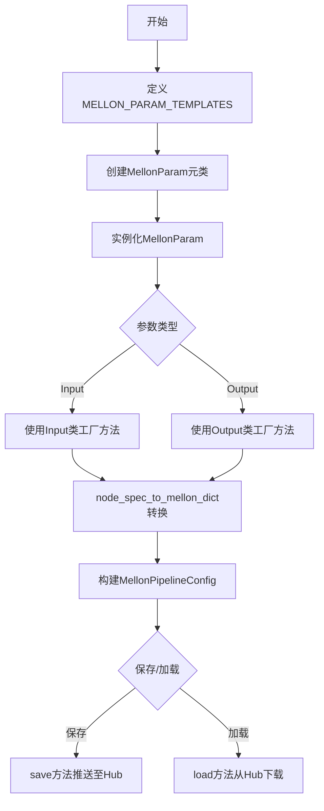

## 类结构

```
MellonParamMeta (元类)
├── MellonParam (数据类)
│   ├── Input (嵌套类工厂)
│   └── Output (嵌套类工厂)
└── MellonPipelineConfig (配置类)
```

## 全局变量及字段


### `logger`
    
模块级日志记录器，用于输出运行时的日志信息

类型：`logging.Logger`
    


### `MELLON_PARAM_TEMPLATES`
    
标准diffuser pipeline参数的模板定义字典，包含各类型参数的元数据配置

类型：`dict[str, dict[str, Any]]`
    


### `DEFAULT_NODE_SPECS`
    
默认的节点规范字典，定义了各模块节点的输入、输出和模型输入配置

类型：`dict[str, dict[str, Any] | None]`
    


### `MellonParam.name`
    
参数的名称标识符

类型：`str`
    


### `MellonParam.label`
    
参数的显示标签，用于UI展示

类型：`str`
    


### `MellonParam.type`
    
参数的数据类型，如string、int、float、image等

类型：`str`
    


### `MellonParam.display`
    
参数的显示方式，如input、output、textarea、slider、dropdown、random等

类型：`str | None`
    


### `MellonParam.default`
    
参数的默认值

类型：`Any`
    


### `MellonParam.min`
    
数值参数的最小值限制

类型：`float | None`
    


### `MellonParam.max`
    
数值参数的最大值限制

类型：`float | None`
    


### `MellonParam.step`
    
数值参数的步长，用于slider等控件

类型：`float | None`
    


### `MellonParam.options`
    
下拉框等选项型参数的可用选项列表

类型：`Any`
    


### `MellonParam.value`
    
参数的当前值

类型：`Any`
    


### `MellonParam.fieldOptions`
    
字段的额外配置选项

类型：`dict[str, Any] | None`
    


### `MellonParam.onChange`
    
参数变化时的回调配置，定义依赖字段的显示/隐藏

类型：`Any`
    


### `MellonParam.onSignal`
    
信号触发时的回调配置

类型：`Any`
    


### `MellonParam.required_block_params`
    
参数所依赖的必需块参数列表

类型：`str | list[str] | None`
    


### `MellonPipelineConfig.config_name`
    
配置文件名，固定为mellon_pipeline_config.json

类型：`str`
    


### `MellonPipelineConfig.node_specs`
    
节点规范字典，键为节点类型，值为节点规范或None

类型：`dict[str, dict[str, Any] | None]`
    


### `MellonPipelineConfig.label`
    
pipeline的可读标签名称

类型：`str`
    


### `MellonPipelineConfig.default_repo`
    
默认的HuggingFace仓库地址

类型：`str`
    


### `MellonPipelineConfig.default_dtype`
    
默认的数据类型，如float16、bfloat16等

类型：`str`
    


### `MellonPipelineConfig._node_params`
    
缓存的节点参数字典，用于延迟计算

类型：`dict[str, Any]`
    
    

## 全局函数及方法


### `_name_to_label`

将 snake_case 格式的参数名称转换为 Title Case（标题格式）的标签，用于 UI 显示。例如：`image_latents` 转换为 `Image Latents`。

参数：

-  `name`：`str`，输入的 snake_case 格式的参数名称

返回值：`str`，转换后的 Title Case 格式标签

#### 流程图

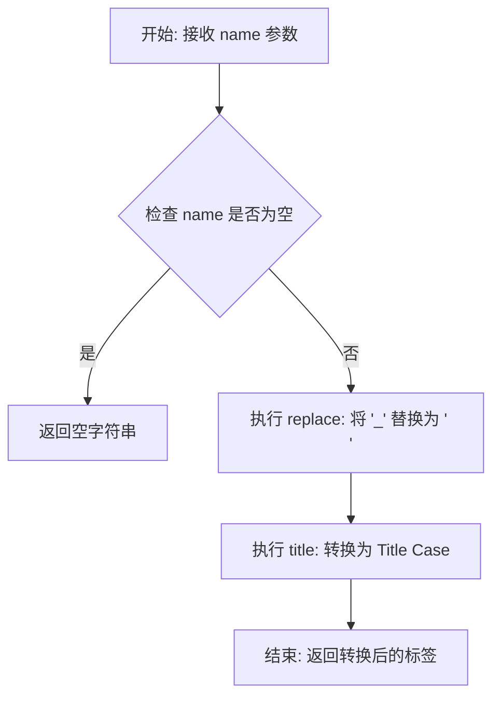

#### 带注释源码

```python
def _name_to_label(name: str) -> str:
    """
    Convert snake_case name to Title Case label.
    
    This utility function is used throughout the MellonParam factories
    (e.g., MellonParam.Input.image, MellonParam.Input.textbox) to generate
    human-readable labels from parameter names.
    
    Examples:
        - "image" -> "Image"
        - "image_latents" -> "Image Latents"
        - "num_inference_steps" -> "Num Inference Steps"
        - "controlnet_conditioning_scale" -> "Controlnet Conditioning Scale"
    
    Args:
        name: The snake_case parameter name to convert.
        
    Returns:
        A Title Case formatted string suitable for UI labels.
    """
    # Step 1: Replace all underscores with spaces
    #   "image_latents" -> "image latents"
    # Step 2: Apply title case to capitalize each word
    #   "image latents" -> "Image Latents"
    return name.replace("_", " ").title()
```


### `input_param_to_mellon_param`

该函数负责将模块化管道中的输入参数（InputParam）转换为Mellon UI框架所需的参数定义（MellonParam），支持通过元数据指定简单类型映射或完整的UI配置。

参数：

- `input_param`：`InputParam`，输入参数对象，包含 `name`（参数名称）、`metadata`（元数据，可选，用于指定Mellon类型或完整的MellonParam配置）、`default`（默认值）属性

返回值：`MellonParam`，Mellon参数实例，用于定义Mellon UI节点的输入配置

#### 流程图

```mermaid
flowchart TD
    A[开始: input_param_to_mellon_param] --> B[提取input_param.name]
    B --> C[提取input_param.metadata]
    C --> D{metadata是否存在?}
    D -->|否| E[mellon_value = None]
    D -->|是| F[mellon_value = metadata.get&#40;'mellon'&#41;]
    E --> I[提取default]
    F --> I
    I --> G{mellon_value是否是MellonParam实例?}
    G -->|是| H[直接返回mellon_value]
    G -->|否| J{mellon_type == 'image'?}
    J -->|是| K[返回MellonParam.Input.image&#40;name&#41;]
    J -->|否| L{mellon_type == 'textbox'?}
    L -->|是| M[返回MellonParam.Input.textbox&#40;name, default&#41;]
    L -->|否| N{mellon_type == 'dropdown'?}
    N -->|是| O[返回MellonParam.Input.dropdown&#40;name, default&#41;]
    N -->|否| P{mellon_type == 'slider'?}
    P -->|是| Q[返回MellonParam.Input.slider&#40;name, default&#41;]
    P -->|否| R{mellon_type == 'number'?}
    R -->|是| S[返回MellonParam.Input.number&#40;name, default&#41;]
    R -->|否| T{mellon_type == 'seed'?}
    T -->|是| U[返回MellonParam.Input.seed&#40;name, default&#41;]
    T -->|否| V{mellon_type == 'checkbox'?}
    V -->|是| W[返回MellonParam.Input.checkbox&#40;name, default&#41;]
    V -->|否| X{mellon_type == 'model'?}
    X -->|是| Y[返回MellonParam.Input.model&#40;name&#41;]
    X -->|否| Z[返回MellonParam.Input.custom_type&#40;name, 'custom'&#41;]
    H --> END[结束]
    K --> END
    M --> END
    O --> END
    Q --> END
    S --> END
    U --> END
    W --> END
    Y --> END
    Z --> END
```

#### 带注释源码

```python
def input_param_to_mellon_param(input_param: "InputParam") -> MellonParam:
    """
    Convert an InputParam to a MellonParam using metadata.

    Args:
        input_param: An InputParam with optional metadata containing either:
            - {"mellon": "<type>"} for simple types (image, textbox, slider, etc.)
            - {"mellon": MellonParam(...)} for full control over UI configuration

    Returns:
        MellonParam instance
    """
    # 从InputParam对象中提取参数名称
    name = input_param.name
    # 获取元数据字典，用于指定Mellon参数类型
    metadata = input_param.metadata
    # 从元数据中获取mellon字段值，若无元数据则为None
    mellon_value = metadata.get("mellon") if metadata else None
    # 提取默认值，用于填充UI控件
    default = input_param.default

    # 如果mellon_value已经是MellonParam实例，直接返回（支持完全自定义配置）
    if isinstance(mellon_value, MellonParam):
        return mellon_value

    # 将mellon_value赋值给mellon_type用于后续类型匹配
    mellon_type = mellon_value

    # 根据mellon_type匹配不同的UI输入类型
    if mellon_type == "image":
        # 图像输入类型
        return MellonParam.Input.image(name)
    elif mellon_type == "textbox":
        # 文本输入区域类型，支持默认值的文本框
        return MellonParam.Input.textbox(name, default=default or "")
    elif mellon_type == "dropdown":
        # 下拉选择框类型
        return MellonParam.Input.dropdown(name, default=default or "")
    elif mellon_type == "slider":
        # 滑动条类型，适用于数值范围输入
        return MellonParam.Input.slider(name, default=default or 0)
    elif mellon_type == "number":
        # 数字输入类型，无滑动条
        return MellonParam.Input.number(name, default=default or 0)
    elif mellon_type == "seed":
        # 随机种子输入类型，带随机化按钮
        return MellonParam.Input.seed(name, default=default or 0)
    elif mellon_type == "checkbox":
        # 复选框类型，用于布尔值
        return MellonParam.Input.checkbox(name, default=default or False)
    elif mellon_type == "model":
        # 模型输入类型，用于Diffusers组件
        return MellonParam.Input.model(name)
    else:
        # None或未知类型 -> 自定义类型，用于节点连接
        return MellonParam.Input.custom_type(name, type="custom")
```


### `output_param_to_mellon_param`

将 OutputParam 对象转换为 MellonParam 对象，根据元数据中的 "mellon" 类型字段映射到对应的 Mellon 输出参数类型。

参数：

- `output_param`：`OutputParam`，包含名称和可选元数据的输出参数对象，元数据中可通过 `{"mellon": "<type>"}` 指定类型（image、video、text、model）

返回值：`MellonParam`，根据 mellon_type 类型映射后的 Mellon 参数实例

#### 流程图

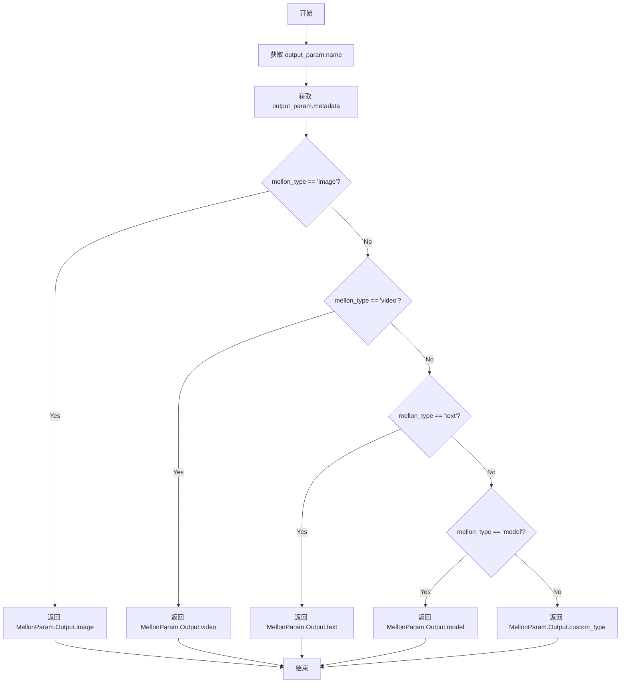

#### 带注释源码

```python
def output_param_to_mellon_param(output_param: "OutputParam") -> MellonParam:
    """
    Convert an OutputParam to a MellonParam using metadata.

    Args:
        output_param: An OutputParam with optional metadata={"mellon": "<type>"} where type is one of:
            image, video, text, model. If metadata is None or unknown, maps to "custom".

    Returns:
        MellonParam instance
    """
    # 从 OutputParam 对象中提取 name 字段
    name = output_param.name
    # 获取 metadata 字典（可能为 None）
    metadata = output_param.metadata
    # 从 metadata 中获取 "mellon" 键对应的值，若 metadata 为 None 则返回 None
    mellon_type = metadata.get("mellon") if metadata else None

    # 根据 mellon_type 类型映射到对应的 Mellon 输出参数工厂方法
    if mellon_type == "image":
        # 图像输出类型
        return MellonParam.Output.image(name)
    elif mellon_type == "video":
        # 视频输出类型
        return MellonParam.Output.video(name)
    elif mellon_type == "text":
        # 文本输出类型
        return MellonParam.Output.text(name)
    elif mellon_type == "model":
        # 模型输出类型
        return MellonParam.Output.model(name)
    else:
        # None 或未知类型 -> 自定义类型输出
        return MellonParam.Output.custom_type(name, type="custom")
```


### `mark_required`

在标签字符串末尾添加必填标记符号，如果标签已经以该标记结尾则保持不变。

参数：

- `label`：`str`，要处理的标签字符串
- `marker`：`str` = " *"，标记符号，默认为" *"，用于标识必填字段

返回值：`str`，添加标记后的标签字符串

#### 流程图

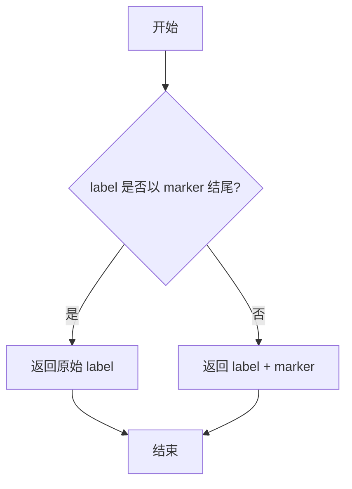

#### 带注释源码

```python
def mark_required(label: str, marker: str = " *") -> str:
    """
    Add required marker to label if not already present.
    
    Args:
        label: The label string to process.
        marker: The marker to append, defaults to " *".
    
    Returns:
        The label with marker appended if not already present.
    """
    # 检查标签是否已经以标记结尾，避免重复添加
    if label.endswith(marker):
        return label
    # 将标记追加到标签末尾并返回
    return f"{label}{marker}"
```


### `node_spec_to_mellon_dict`

将节点规范字典转换为 Mellin 格式的函数，用于生成 Mellin UI 所需的参数配置结构。

参数：

- `node_spec`：`dict[str, Any]`，节点规范字典，包含 `inputs`、`model_inputs`、`outputs`（均为 `MellonParam` 列表），以及 `required_inputs`、`required_model_inputs`、`block_name` 等元数据
- `node_type`：`str`，节点类型字符串（如 "denoise"、"controlnet"、"vae_encoder" 等）

返回值：`dict[str, Any]` - 包含以下键的字典：
- `params`：所有参数的扁平字典，键为参数名，值为 UI 配置
- `input_names`：输入参数名称列表
- `model_input_names`：模型输入参数名称列表
- `output_names`：输出参数名称列表
- `block_name`：后端块名称
- `node_type`：节点类型

#### 流程图

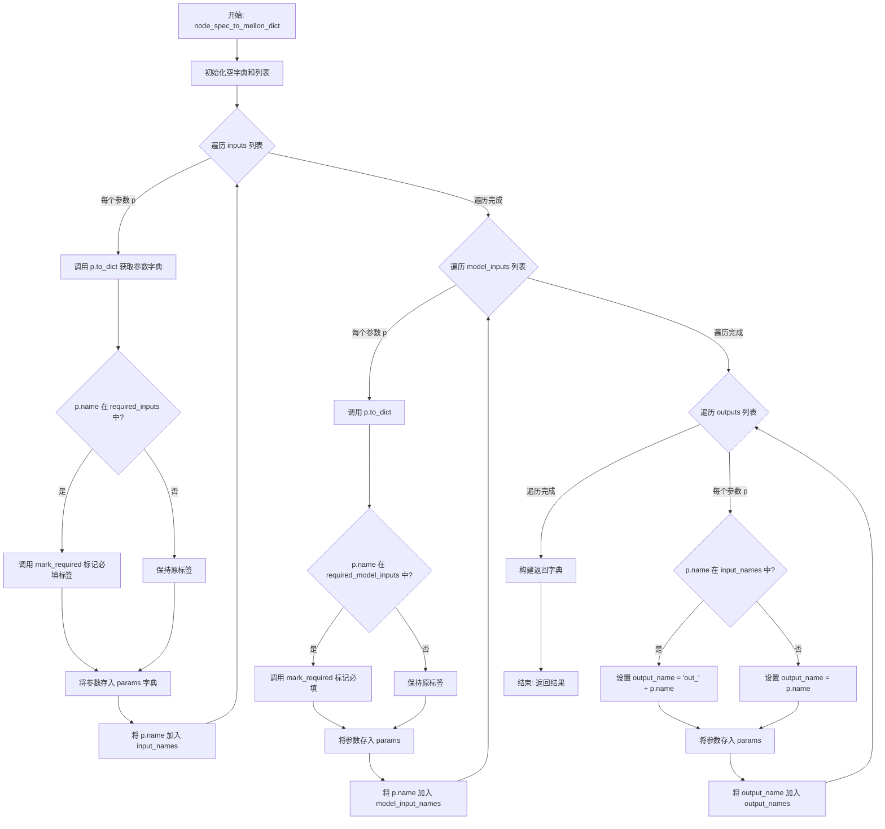

#### 带注释源码

```python
def node_spec_to_mellon_dict(node_spec: dict[str, Any], node_type: str) -> dict[str, Any]:
    """
    将节点规范字典转换为 Mellon 格式。

    节点规范是我们在代码中定义 Mellon diffusers 节点的方式。此函数将其转换为 Mellon UI 期望的 `params` 映射格式。

    `params` 映射是一个字典，键为参数名，值为 UI 配置：
        ```python
        {"seed": {"label": "Seed", "type": "int", "default": 0}}
        ```

    对于模块化 Mellon 节点，需要区分：
        - `inputs`：管道输入（如 seed、prompt、image）
        - `model_inputs`：模型组件（如 unet、vae、scheduler）
        - `outputs`：节点输出（如 latents、images）

    节点规范还包括：
        - `required_inputs` / `required_model_inputs`：哪些参数是必需的（标记 *）
        - `block_name`：此节点对应的后端模块化管道块

    Args:
        node_spec: 包含 `inputs`、`model_inputs`、`outputs`（MellonParam 列表），
                   以及 `required_inputs`、`required_model_inputs`、`block_name` 的字典。
        node_type: 节点类型字符串（如 "denoise"、"controlnet"）

    Returns:
        包含以下内容的字典：
            - `params`：Mellon UI 格式的所有参数扁平字典
            - `input_names`：输入参数名列表
            - `model_input_names`：模型输入参数名列表
            - `output_names`：输出参数名列表
            - `block_name`：后端块名称
            - `node_type`：节点类型
    """
    # 初始化用于存储结果的字典和列表
    params = {}              # 存储所有参数的 UI 配置
    input_names = []         # 存储输入参数名称
    model_input_names = []   # 存储模型输入参数名称
    output_names = []        # 存储输出参数名称

    # 从 node_spec 中获取必填参数列表
    required_inputs = node_spec.get("required_inputs", [])
    required_model_inputs = node_spec.get("required_model_inputs", [])

    # ========================================
    # 处理普通输入参数 (inputs)
    # ========================================
    for p in node_spec.get("inputs", []):
        # 将 MellonParam 转换为字典格式
        param_dict = p.to_dict()
        
        # 如果参数在 required_inputs 中，标记为必填
        if p.name in required_inputs:
            param_dict["label"] = mark_required(param_dict["label"])
        
        # 存入 params 字典，键为参数名
        params[p.name] = param_dict
        # 记录输入参数名
        input_names.append(p.name)

    # ========================================
    # 处理模型输入参数 (model_inputs)
    # ========================================
    for p in node_spec.get("model_inputs", []):
        # 将 MellonParam 转换为字典格式
        param_dict = p.to_dict()
        
        # 如果参数在 required_model_inputs 中，标记为必填
        if p.name in required_model_inputs:
            param_dict["label"] = mark_required(param_dict["label"])
        
        # 存入 params 字典
        params[p.name] = param_dict
        # 记录模型输入参数名
        model_input_names.append(p.name)

    # ========================================
    # 处理输出参数 (outputs)
    # 特殊处理：如果输出名称与输入名称冲突，添加前缀
    # ========================================
    for p in node_spec.get("outputs", []):
        # 检查输出名称是否已存在于输入参数中
        if p.name in input_names:
            # 冲突：重命名为 out_<name> 格式
            output_name = f"out_{p.name}"
        else:
            # 无冲突：使用原始名称
            output_name = p.name
        
        # 将输出参数存入 params
        params[output_name] = p.to_dict()
        # 记录输出参数名
        output_names.append(output_name)

    # ========================================
    # 组装返回结果
    # ========================================
    return {
        "params": params,                  # 所有参数的 UI 配置
        "input_names": input_names,        # 输入参数名称列表
        "model_input_names": model_input_names,  # 模型输入参数名称列表
        "output_names": output_names,      # 输出参数名称列表
        "block_name": node_spec.get("block_name"),  # 后端块名称
        "node_type": node_type,            # 节点类型
    }
```


### `MellonParamMeta.__getattr__`

这是一个元类的属性访问方法，实现了对 `MellonParam.template_name(**overrides)` 语法糖的支持，使得可以通过模板名称动态创建参数实例。

参数：

- `name`：`str`，要访问的属性名称（即模板名称），例如 `seed`、`prompt` 等

返回值：`Callable[[Any, Any], MellonParam] | None`，返回一个工厂函数（当模板存在时），该函数可以接受 `default` 和其他覆盖参数并返回 `MellonParam` 实例；如果模板不存在则抛出 `AttributeError`

#### 流程图

```mermaid
flowchart TD
    A[__getattr__ 被调用] --> B{检查 name 是否在 MELLON_PARAM_TEMPLATES 中}
    B -->|是| C[定义工厂函数 factory]
    C --> D[合并模板参数与用户覆盖参数]
    D --> E{default 参数是否非空}
    E -->|是| F[设置 params['default'] = default]
    E -->|否| G[跳过 default 设置]
    F --> H[返回 cls(**params 即 MellonParam 实例]
    G --> H
    B -->|否| I[抛出 AttributeError 异常]
    H --> J[工厂函数被调用时执行]
    J --> K[创建并返回 MellonParam 实例]
    I --> L[异常传播到调用方]
```

#### 带注释源码

```python
def __getattr__(cls, name: str):
    """
    元类属性访问拦截器，实现 MellonParam.template_name() 语法糖。
    
    当访问 MellonParam.seed() 或 MellonParam.prompt(default="...") 时:
    1. 检查 name 是否在预定义模板字典中
    2. 如果存在，返回一个工厂函数用于创建参数实例
    3. 如果不存在，抛出 AttributeError
    """
    # 检查请求的模板名称是否在预定义模板中
    if name in MELLON_PARAM_TEMPLATES:

        # 定义内部工厂函数，用于创建具体的 MellonParam 实例
        def factory(default=None, **overrides):
            """
            参数工厂函数。
            
            Args:
                default: 可选的默认值，会覆盖模板中的 default
                **overrides: 其他要覆盖的模板参数，如 display、min、max 等
            """
            # 获取对应模板的配置字典
            template = MELLON_PARAM_TEMPLATES[name]
            
            # 合并参数：使用模板中的 name（如果指定），否则使用字典键
            # 然后展开模板内容，最后用用户覆盖参数覆盖
            params = {"name": template.get("name", name), **template, **overrides}
            
            # 如果提供了默认值，显式设置
            if default is not None:
                params["default"] = default
            
            # 创建并返回 MellonParam 数据类实例
            return cls(**params)

        # 返回工厂函数，供后续调用 MellonParam.seed() 时使用
        return factory

    # 模板不存在，抛出标准属性错误
    raise AttributeError(f"type object 'MellonParam' has no attribute '{name}'")
```


### `MellonParam.to_dict`

将 MellonParam 实例转换为字典格式，用于 Mellon schema，转换过程中会排除值为 None 的字段以及内部字段（name, required_block_params）。

参数：
- 无（仅包含隐式参数 `self`）

返回值：`dict[str, Any]`，返回一个过滤后的字典，包含非 None 的公共字段，不包含 `name` 和 `required_block_params` 字段。

#### 流程图

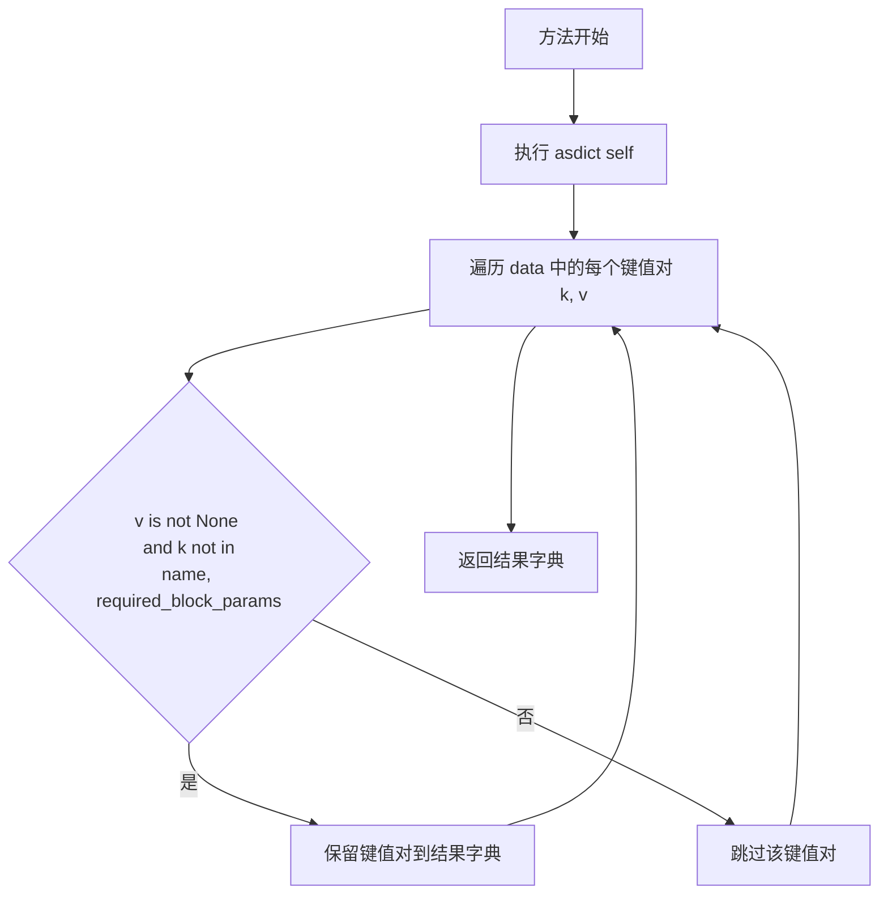

#### 带注释源码

```python
def to_dict(self) -> dict[str, Any]:
    """
    将 MellonParam 转换为字典格式，用于 Mellon schema。
    
    转换逻辑：
    1. 使用 dataclasses.asdict 将整个对象转换为字典
    2. 过滤掉值为 None 的字段
    3. 排除内部字段 name 和 required_block_params
    
    Returns:
        dict[str, Any]: 过滤后的参数字典，用于 UI 或序列化
    """
    # Step 1: 将 dataclass 实例转换为字典
    # asdict 会递归处理嵌套对象，生成完整的字典表示
    data = asdict(self)
    
    # Step 2: 过滤字典
    # - 排除值为 None 的键（不传递未设置的参数）
    # - 排除 'name' 字段（内部标识符，不暴露给 UI）
    # - 排除 'required_block_params' 字段（内部元数据，不暴露给 UI）
    return {
        k: v 
        for k, v in data.items() 
        if v is not None and k not in ("name", "required_block_params")
    }
```


# MellonParam.Input 类方法群设计文档

## 一段话描述

`MellonParam.Input` 是 `MellonParam` 类的内部嵌套类，提供了一系列工厂方法（工厂模式），用于为自定义模块（custom blocks）创建不同类型的输入参数 UI 元素，包括图像、文本框、下拉菜单、滑块、数字输入、种子值、复选框、模型引用等，并将其转换为标准的 `MellonParam` 参数定义对象。

## 文件的整体运行流程

```
┌─────────────────────────────────────────────────────────────────────────────┐
│                           MellonParam.Input 类方法群                          │
├─────────────────────────────────────────────────────────────────────────────┤
│                                                                              │
│  用户调用 MellonParam.Input.<method>(...)                                   │
│           │                                                                   │
│           ▼                                                                   │
│  ┌────────────────────────────────────────────────────────────────┐          │
│  │  Input 类方法（工厂方法）                                        │          │
│  │  - image()    - textbox()  - dropdown()  - slider()           │          │
│  │  - number()   - seed()     - checkbox()  - custom_type()       │          │
│  │  - model()                                                  │          │
│  └──────────────────────────┬─────────────────────────────────┘          │
│                             │                                                 │
│                             ▼                                                 │
│  ┌────────────────────────────────────────────────────────────────┐          │
│  │  创建 MellonParam 实例                                         │          │
│  │  (使用 _name_to_label() 转换名称为标签)                          │          │
│  └──────────────────────────┬─────────────────────────────────┘          │
│                             │                                                 │
│                             ▼                                                 │
│  ┌────────────────────────────────────────────────────────────────┐          │
│  │  返回 MellonParam 对象                                         │          │
│  │  (包含 name, label, type, display, default, min, max, step,    │          │
│  │   options, value 等属性)                                        │          │
│  └────────────────────────────────────────────────────────────────┘          │
│                                                                              │
└─────────────────────────────────────────────────────────────────────────────┘
```

## 类的详细信息

### 类：MellonParam.Input

**描述**：MellonParam 的内部嵌套类，提供创建各种输入参数类型的工厂方法。该类主要用于自定义块（custom blocks）的 UI 参数定义，支持图像、文本、数值、下拉选择、复选框、模型等多种输入类型。

#### 类字段

| 字段名称 | 类型 | 描述 |
|---------|------|------|
| 无类字段 | - | 本类仅包含类方法（工厂方法），无实例属性 |

---

### MellonParam.Input 类方法详情

#### 1. MellonParam.Input.image

**描述**：创建图像类型的输入参数。

参数：

- `name`：`str`，参数的名称，用于在节点图中标识此参数

返回值：`MellonParam`，返回包含图像输入配置的 MellonParam 对象

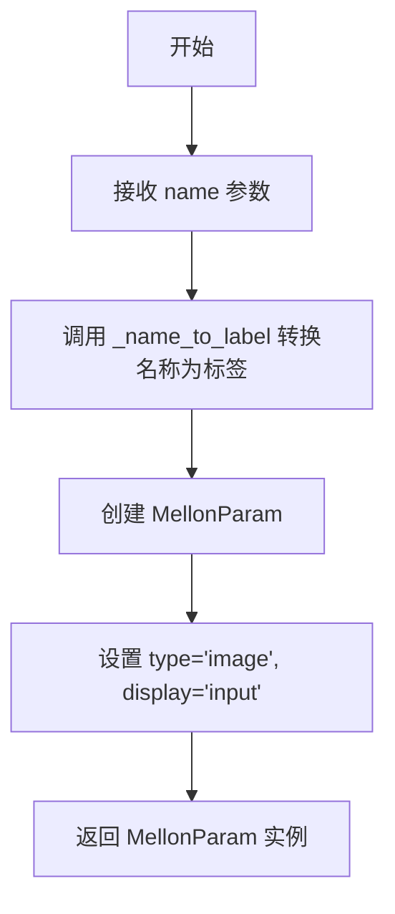

```python
@classmethod
def image(cls, name: str) -> "MellonParam":
    """image input."""
    return MellonParam(name=name, label=_name_to_label(name), type="image", display="input")
```

---

#### 2. MellonParam.Input.textbox

**描述**：创建文本区域（textarea）类型的输入参数。

参数：

- `name`：`str`，参数的名称
- `default`：`str` = ""，默认值，默认为空字符串

返回值：`MellonParam`，返回包含文本输入配置的 MellonParam 对象

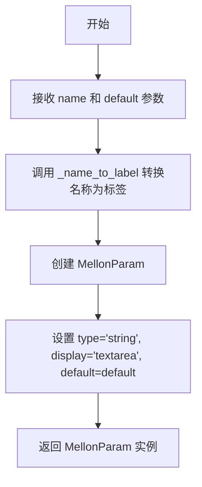

```python
@classmethod
def textbox(cls, name: str, default: str = "") -> "MellonParam":
    """text input as textarea."""
    return MellonParam(
        name=name, label=_name_to_label(name), type="string", display="textarea", default=default
    )
```

---

#### 3. MellonParam.Input.dropdown

**描述**：创建下拉选择类型的输入参数。

参数：

- `name`：`str`，参数的名称
- `options`：`list[str]` = None，下拉选项列表，默认为 None
- `default`：`str` = None，默认选中项，默认为选项列表第一项或空字符串

返回值：`MellonParam`，返回包含下拉选择配置的 MellonParam 对象

```mermaid
flowchart TD
    A[开始] --> B[接收 name, options, default 参数]
    B --> C{options 存在且 default 不存在?}
    C -->|是| D[default = options[0]]
    C -->|否| E{default 不存在?}
    E -->|是| F[default = '']
    E -->|否| G[保持 default 不变]
    D --> H{options 不存在?}
    H -->|是| I[options = [default]]
    H -->|否| J[保持 options 不变]
    I --> K
    J --> K
    K[调用 _name_to_label] --> L[创建 MellonParam]
    L --> M[设置 type='string', options=options, value=default]
    M --> N[返回 MellonParam 实例]
```

```python
@classmethod
def dropdown(cls, name: str, options: list[str] = None, default: str = None) -> "MellonParam":
    """dropdown selection."""
    if options and not default:
        default = options[0]
    if not default:
        default = ""
    if not options:
        options = [default]
    return MellonParam(name=name, label=_name_to_label(name), type="string", options=options, value=default)
```

---

#### 4. MellonParam.Input.slider

**描述**：创建滑块类型的输入参数，支持数值范围选择。

参数：

- `name`：`str`，参数的名称
- `default`：`float` = 0，默认值
- `min`：`float` = None，最小值，默认为 default 值
- `max`：`float` = None，最大值，默认为 default 值
- `step`：`float` = None，步长，默认 0.01（浮点数）或 1（整数）

返回值：`MellonParam`，返回包含滑块配置的 MellonParam 对象

```mermaid
flowchart TD
    A[开始] --> B[接收 name, default, min, max, step 参数]
    B --> C{default 是浮点数 或 step 是浮点数?}
    C -->|是| D[param_type = 'float']
    C -->|否| E[param_type = 'int']
    D --> F
    E --> F
    F{min 是 None?} -->|是| G[min = default]
    F -->|否| H[保持 min]
    G --> I{max 是 None?}
    I -->|是| J[max = default]
    I -->|否| K[保持 max]
    J --> L{step 是 None?}
    K --> L
    L -->|是 M[step = 0.01 如果是浮点数否则 1]
    L -->|否| N[保持 step]
    M --> O
    N --> O
    O[调用 _name_to_label] --> P[创建 MellonParam]
    P --> Q[设置 type=param_type, display='slider', default, min, max, step]
    Q --> R[返回 MellonParam 实例]
```

```python
@classmethod
def slider(
    cls, name: str, default: float = 0, min: float = None, max: float = None, step: float = None
) -> "MellonParam":
    """slider input."""
    is_float = isinstance(default, float) or (step is not None and isinstance(step, float))
    param_type = "float" if is_float else "int"
    if min is None:
        min = default
    if max is None:
        max = default
    if step is None:
        step = 0.01 if is_float else 1
    return MellonParam(
        name=name,
        label=_name_to_label(name),
        type=param_type,
        display="slider",
        default=default,
        min=min,
        max=max,
        step=step,
    )
```

---

#### 5. MellonParam.Input.number

**描述**：创建数字输入类型的参数（无滑块）。

参数：

- `name`：`str`，参数的名称
- `default`：`float` = 0，默认值
- `min`：`float` = None，最小值
- `max`：`float` = None，最大值
- `step`：`float` = None，步长

返回值：`MellonParam`，返回包含数字输入配置的 MellonParam 对象

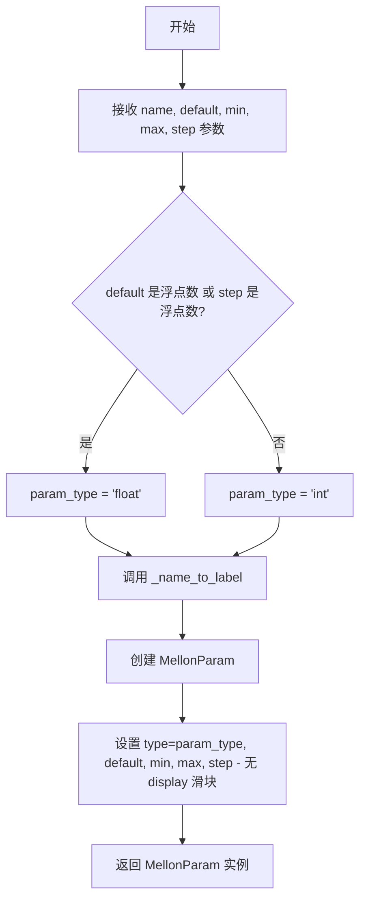

```python
@classmethod
def number(
    cls, name: str, default: float = 0, min: float = None, max: float = None, step: float = None
) -> "MellonParam":
    """number input (no slider)."""
    is_float = isinstance(default, float) or (step is not None and isinstance(step, float))
    param_type = "float" if is_float else "int"
    return MellonParam(
        name=name, label=_name_to_label(name), type=param_type, default=default, min=min, max=max, step=step
    )
```

---

#### 6. MellonParam.Input.seed

**描述**：创建种子值输入参数，带随机化按钮。

参数：

- `name`：`str` = "seed"，参数的名称，默认为 "seed"
- `default`：`int` = 0，默认种子值

返回值：`MellonParam`，返回包含种子输入配置的 MellonParam 对象

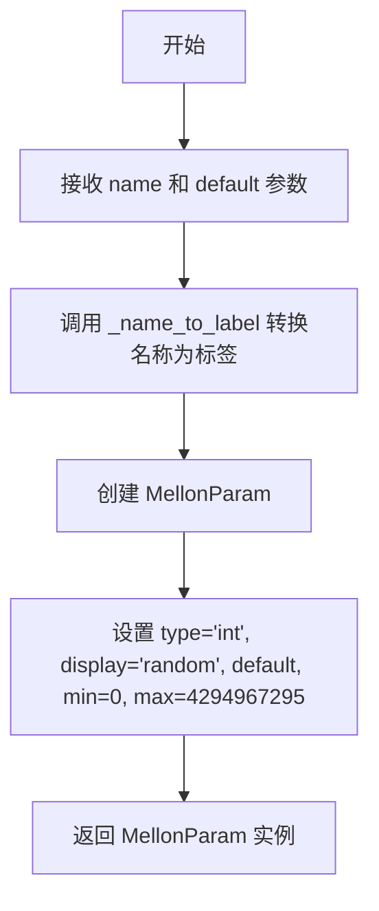

```python
@classmethod
def seed(cls, name: str = "seed", default: int = 0) -> "MellonParam":
    """seed input with randomize button."""
    return MellonParam(
        name=name,
        label=_name_to_label(name),
        type="int",
        display="random",
        default=default,
        min=0,
        max=4294967295,
    )
```

---

#### 7. MellonParam.Input.checkbox

**描述**：创建布尔复选框类型的输入参数。

参数：

- `name`：`str`，参数的名称
- `default`：`bool` = False，是否选中的默认状态

返回值：`MellonParam`，返回包含复选框配置的 MellonParam 对象

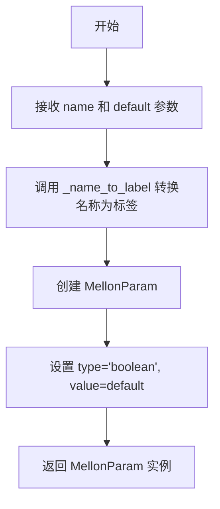

```python
@classmethod
def checkbox(cls, name: str, default: bool = False) -> "MellonParam":
    """boolean checkbox."""
    return MellonParam(name=name, label=_name_to_label(name), type="boolean", value=default)
```

---

#### 8. MellonParam.Input.custom_type

**描述**：创建自定义类型的输入参数，用于节点连接。

参数：

- `name`：`str`，参数的名称
- `type`：`str`，自定义类型名称

返回值：`MellonParam`，返回包含自定义类型配置的 MellonParam 对象

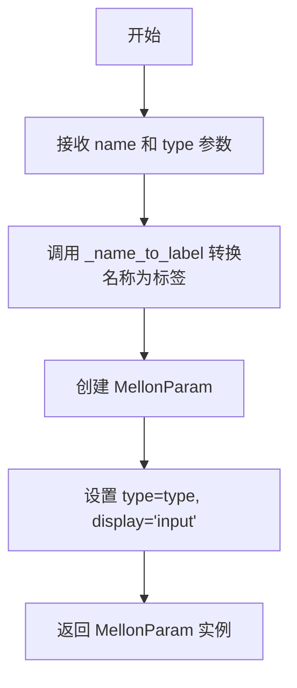

```python
@classmethod
def custom_type(cls, name: str, type: str) -> "MellonParam":
    """custom type input for node connections."""
    return MellonParam(name=name, label=_name_to_label(name), type=type, display="input")
```

---

#### 9. MellonParam.Input.model

**描述**：创建模型引用类型的输入参数，用于 Diffusers 组件。

参数：

- `name`：`str`，参数的名称

返回值：`MellonParam`，返回包含模型输入配置的 MellonParam 对象

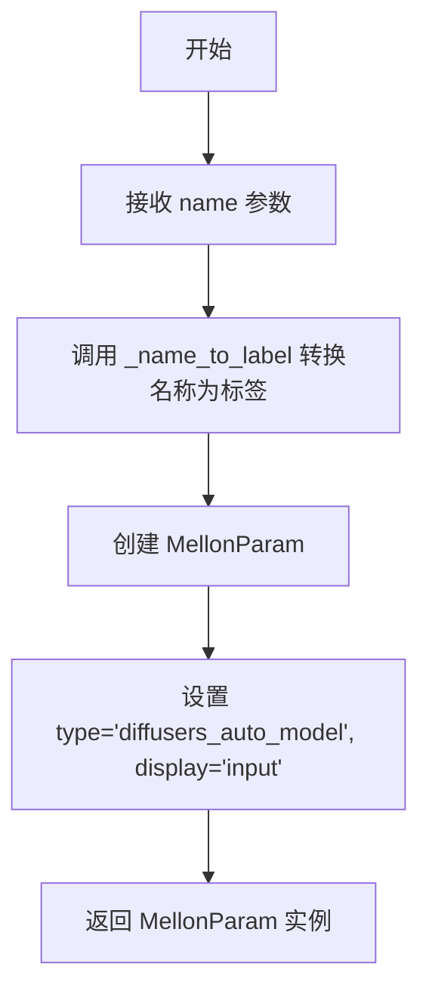

```python
@classmethod
def model(cls, name: str) -> "MellonParam":
    """model input for diffusers components."""
    return MellonParam(name=name, label=_name_to_label(name), type="diffusers_auto_model", display="input")
```

---

## 关键组件信息

| 组件名称 | 一句话描述 |
|---------|-----------|
| `_name_to_label(name: str) -> str` | 将 snake_case 名称转换为 Title Case 标签的辅助函数 |
| `MELLON_PARAM_TEMPLATES` | 预定义的参数模板字典，包含标准 Diffusers 管道参数的默认配置 |
| `MellonParam` | 核心参数定义类，使用 dataclass 和元类实现，支持模板化参数创建 |
| `MellonParamMeta` | 元类，使 `MellonParam` 支持 `MellonParam.template_name()` 的调用语法 |

---

## 潜在的技术债务或优化空间

1. **类型提示不完整**：部分方法使用 `Any` 类型（如 `options: Any = None`），可考虑使用泛型或 Literal 类型增强类型安全。

2. **缺少验证逻辑**：参数创建时未验证 `min <= max`、数值范围合理性等，可增加参数校验防止无效配置。

3. **重复代码模式**：`dropdown` 方法中的默认值处理逻辑可抽取为独立方法。

4. **日志缺失**：Input 类方法中无日志记录，建议添加 debug 日志以便排查问题。

5. **文档字符串不够详细**：部分方法仅有简单的一行 docstring，可增加更多使用示例。

---

## 其它项目

### 设计目标与约束

- **设计模式**：工厂模式（Factory Method），通过类方法创建不同类型的 UI 输入参数
- **不可变性**：MellonParam 使用 `frozen=True` 的 dataclass，确保实例不可变
- **类型推断**：根据 default 和 step 参数自动推断是整型还是浮点型参数

### 错误处理与异常设计

- 本模块未显式抛出业务异常，错误处理主要依赖 Python 内置类型检查（如 `isinstance`）
- 建议：可增加参数范围校验并抛出 `ValueError`

### 数据流与状态机

- Input 类为无状态类，所有方法都是纯函数式的——给定相同输入必返回相同输出
- 状态由返回的 MellonParam 对象携带，遵循不可变数据设计

### 外部依赖与接口契约

- 依赖 `dataclasses.asdict` 进行字典转换
- 依赖 `typing.Any` 处理可选类型
- 依赖本地 `_name_to_label` 辅助函数进行名称格式化
- 返回类型均为 `MellonParam`，符合统一的参数对象接口


### MellonParam.Output

MellonParam.Output 类是 MellonParam 数据类的嵌套类，提供了一组用于创建自定义块输出 UI 元素的类方法工厂。该类允许用户通过简洁的 API 为 Mellonnode 定义不同类型的输出参数，如图像、视频、文本、模型和自定义类型。

参数：

- `cls`：类方法隐式接收的类本身，无需显式传递

返回值：各类方法均返回 `MellonParam` 实例，表示配置好的输出参数

#### 流程图

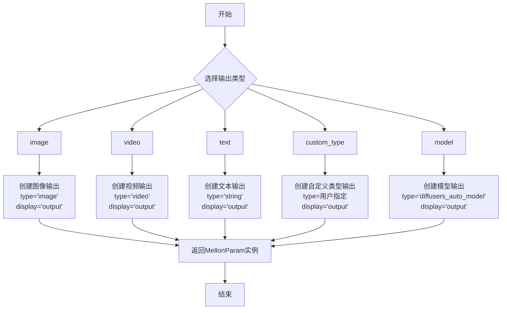

#### 带注释源码

```python
class Output:
    """output UI elements for custom blocks."""

    @classmethod
    def image(cls, name: str) -> "MellonParam":
        """image output."""
        # 创建一个图像类型的输出参数
        # name: 输出参数的名称
        # label: 自动从名称转换为标题格式
        # type: 设为 "image" 表示图像类型
        # display: 设为 "output" 表示这是输出参数
        return MellonParam(name=name, label=_name_to_label(name), type="image", display="output")

    @classmethod
    def video(cls, name: str) -> "MellonParam":
        """video output."""
        # 创建一个视频类型的输出参数
        # name: 输出参数的名称
        # label: 自动从名称转换为标题格式
        # type: 设为 "video" 表示视频类型
        # display: 设为 "output" 表示这是输出参数
        return MellonParam(name=name, label=_name_to_label(name), type="video", display="output")

    @classmethod
    def text(cls, name: str) -> "MellonParam":
        """text output."""
        # 创建一个文本类型的输出参数
        # name: 输出参数的名称
        # label: 自动从名称转换为标题格式
        # type: 设为 "string" 表示文本类型
        # display: 设为 "output" 表示这是输出参数
        return MellonParam(name=name, label=_name_to_label(name), type="string", display="output")

    @classmethod
    def custom_type(cls, name: str, type: str) -> "MellonParam":
        """custom type output for node connections."""
        # 创建一个自定义类型的输出参数，用于节点连接
        # name: 输出参数的名称
        # type: 用户指定的类型字符串
        # label: 自动从名称转换为标题格式
        # display: 设为 "output" 表示这是输出参数
        return MellonParam(name=name, label=_name_to_label(name), type=type, display="output")

    @classmethod
    def model(cls, name: str) -> "MellonParam":
        """model output for diffusers components."""
        # 创建一个模型类型的输出参数，用于 diffusers 组件
        # name: 输出参数的名称
        # label: 自动从名称转换为标题格式
        # type: 设为 "diffusers_auto_model" 表示模型类型
        # display: 设为 "output" 表示这是输出参数
        return MellonParam(name=name, label=_name_to_label(name), type="diffusers_auto_model", display="output")
```

---

### MellonParam.Output.image

创建图像类型的输出参数，用于定义 Mellon 节点输出的图像数据。

参数：

- `name`：`str`，输出参数的名称，用于标识该输出

返回值：`MellonParam`，返回配置好的图像类型输出参数实例

#### 流程图

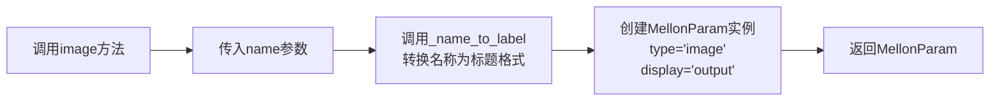

#### 带注释源码

```python
@classmethod
def image(cls, name: str) -> "MellonParam":
    """image output."""
    # 参数说明：
    # - name: str 类型，输出参数的名称，例如 "result_images"
    # 返回值：
    # - MellonParam 实例，包含以下属性：
    #   * name: 用户传入的名称
    #   * label: 由 _name_to_label(name) 转换而来的标题格式标签
    #   * type: "image" 表示图像类型
    #   * display: "output" 表示这是输出参数
    return MellonParam(name=name, label=_name_to_label(name), type="image", display="output")
```

---

### MellonParam.Output.video

创建视频类型的输出参数，用于定义 Mellon 节点输出的视频数据。

参数：

- `name`：`str`，输出参数的名称，用于标识该输出

返回值：`MellonParam`，返回配置好的视频类型输出参数实例

#### 流程图

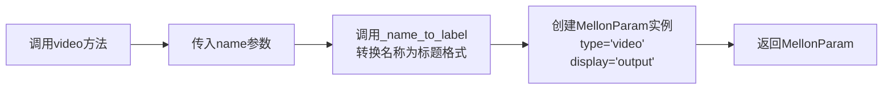

#### 带注释源码

```python
@classmethod
def video(cls, name: str) -> "MellonParam":
    """video output."""
    # 参数说明：
    # - name: str 类型，输出参数的名称，例如 "output_videos"
    # 返回值：
    # - MellonParam 实例，包含以下属性：
    #   * name: 用户传入的名称
    #   * label: 由 _name_to_label(name) 转换而来的标题格式标签
    #   * type: "video" 表示视频类型
    #   * display: "output" 表示这是输出参数
    return MellonParam(name=name, label=_name_to_label(name), type="video", display="output")
```

---

### MellonParam.Output.text

创建文本类型的输出参数，用于定义 Mellon 节点输出的文本数据。

参数：

- `name`：`str`，输出参数的名称，用于标识该输出

返回值：`MellonParam`，返回配置好的文本类型输出参数实例

#### 流程图

```mermaid
flowchart LR
    A[调用text方法] --> B[传入name参数]
    B --> C[调用_name_to_label<br/>转换名称为标题格式]
    C --> D[创建MellonParam实例<br/>type='string'<br/>display='output']
    D --> E[返回MellonParam]
```

#### 带注释源码

```python
@classmethod
def text(cls, name: str) -> "MellonParam":
    """text output."""
    # 参数说明：
    # - name: str 类型，输出参数的名称，例如 "output_text"
    # 返回值：
    # - MellonParam 实例，包含以下属性：
    #   * name: 用户传入的名称
    #   * label: 由 _name_to_label(name) 转换而来的标题格式标签
    #   * type: "string" 表示文本类型
    #   * display: "output" 表示这是输出参数
    return MellonParam(name=name, label=_name_to_label(name), type="string", display="output")
```

---

### MellonParam.Output.custom_type

创建自定义类型的输出参数，用于定义 Mellon 节点的自定义类型输出，适用于节点连接场景。

参数：

- `name`：`str`，输出参数的名称
- `type`：`str`，用户指定的自定义类型字符串

返回值：`MellonParam`，返回配置好的自定义类型输出参数实例

#### 流程图

```mermaid
flowchart LR
    A[调用custom_type方法] --> B[传入name参数]
    B --> C[传入type参数]
    C --> D[调用_name_to_label<br/>转换名称为标题格式]
    D --> E[创建MellonParam实例<br/>type=用户指定<br/>display='output']
    E --> F[返回MellonParam]
```

#### 带注释源码

```python
@classmethod
def custom_type(cls, name: str, type: str) -> "MellonParam":
    """custom type output for node connections."""
    # 参数说明：
    # - name: str 类型，输出参数的名称
    # - type: str 类型，用户指定的类型字符串，用于表示自定义类型
    # 返回值：
    # - MellonParam 实例，包含以下属性：
    #   * name: 用户传入的名称
    #   * label: 由 _name_to_label(name) 转换而来的标题格式标签
    #   * type: 用户传入的自定义类型
    #   * display: "output" 表示这是输出参数
    # 使用场景：当需要创建非标准类型的输出时使用
    return MellonParam(name=name, label=_name_to_label(name), type=type, display="output")
```

---

### MellonParam.Output.model

创建模型类型的输出参数，用于定义 Mellon 节点的 diffusers 组件模型输出。

参数：

- `name`：`str`，输出参数的名称

返回值：`MellonParam`，返回配置好的模型类型输出参数实例

#### 流程图

```mermaid
flowchart LR
    A[调用model方法] --> B[传入name参数]
    B --> C[调用_name_to_label<br/>转换名称为标题格式]
    C --> D[创建MellonParam实例<br/>type='diffusers_auto_model'<br/>display='output']
    D --> E[返回MellonParam]
```

#### 带注释源码

```python
@classmethod
def model(cls, name: str) -> "MellonParam":
    """model output for diffusers components."""
    # 参数说明：
    # - name: str 类型，输出参数的名称，例如 "output_model"
    # 返回值：
    # - MellonParam 实例，包含以下属性：
    #   * name: 用户传入的名称
    #   * label: 由 _name_to_label(name) 转换而来的标题格式标签
    #   * type: "diffusers_auto_model" 表示 diffusers 自动模型类型
    #   * display: "output" 表示这是输出参数
    # 使用场景：用于输出 diffusers 库的模型组件，如 VAE、UNet 等
    return MellonParam(name=name, label=_name_to_label(name), type="diffusers_auto_model", display="output")
```


### `MellonPipelineConfig.__init__`

该方法是 `MellonPipelineConfig` 类的构造函数，用于初始化一个包含多个节点的 Mellon 管道配置对象。它接收节点规范字典、管道标签、默认 HuggingFace 仓库地址和默认数据类型作为参数，并将这些值存储为实例属性。

参数：

- `node_specs`：`dict[str, dict[str, Any] | None]`，节点类型到节点规范的映射字典，节点规范包含 inputs、model_inputs、outputs、required_inputs、required_model_inputs、block_name 等字段
- `label`：`str`，管道的可读性标签，用于 UI 显示
- `default_repo`：`str`，默认的 HuggingFace Hub 仓库地址
- `default_dtype`：`str`，默认的数据类型（如 "float16"、"bfloat16"）

返回值：`None`，无返回值（构造函数）

#### 流程图

```mermaid
graph TD
    A[开始 __init__] --> B[接收参数: node_specs, label, default_repo, default_dtype]
    B --> C[self.node_specs = node_specs]
    C --> D[self.label = label]
    D --> E[self.default_repo = default_repo]
    E --> F[self.default_dtype = default_dtype]
    F --> G[结束 __init__]
```

#### 带注释源码

```python
def __init__(
    self,
    node_specs: dict[str, dict[str, Any] | None],
    label: str = "",
    default_repo: str = "",
    default_dtype: str = "",
):
    """
    初始化 MellonPipelineConfig 实例。

    Args:
        node_specs: Dict mapping node_type to node spec or None.
                    Node spec has: inputs, model_inputs, outputs, required_inputs, required_model_inputs,
                    block_name (all optional)
        label: Human-readable label for the pipeline
        default_repo: Default HuggingFace repo for this pipeline
        default_dtype: Default dtype (e.g., "float16", "bfloat16")
    """
    # 将传入的节点规范字典直接存储到实例变量
    # node_specs 会在后续通过 node_params 属性被转换为 Mellon 格式
    self.node_specs = node_specs

    # 存储管道的显示标签，默认为空字符串
    self.label = label
    
    # 存储默认的 HuggingFace Hub 仓库地址，用于后续的 save/load 操作
    self.default_repo = default_repo
    
    # 存储默认的数据类型，决定模型推理时使用的数据精度
    self.default_dtype = default_dtype
```


### `MellonPipelineConfig.node_params`

该属性用于从 `node_specs` 懒加载计算节点参数，将节点规范转换为 Mell-on 格式的参数字典。它遍历所有节点类型，对于非空规范调用 `node_spec_to_mellon_dict` 进行转换，对于空规范直接设置为 None。

参数：

- `self`：实例本身，无额外参数

返回值：`dict[str, Any]`，返回节点名称到 Mell-on 格式参数字典的映射

#### 流程图

```mermaid
flowchart TD
    A[Start: node_params property] --> B{self.node_specs is None?}
    B -->|Yes| C[Return self._node_params]
    B -->|No| D[Initialize empty params dict]
    D --> E[Iterate: for node_type, spec in self.node_specs.items]
    E --> F{spec is None?}
    F -->|Yes| G[Set params[node_type] = None]
    F -->|No| H[Call node_spec_to_mellon_dict<br/>/ spec: node spec dict<br/>/ node_type: str]
    H --> I[Get Mellon-format dict]
    I --> J[Set params[node_type] = Mellon-format dict]
    G --> K{Next node_type exists?}
    J --> K
    K -->|Yes| E
    K -->|No| L[Return params dict]
    C --> L
```

#### 带注释源码

```python
@property
def node_params(self) -> dict[str, Any]:
    """
    Lazily compute node_params from node_specs.
    
    如果 node_specs 为 None（从 JSON 加载时），返回预先存储的 _node_params。
    否则遍历所有节点规范，将其转换为 Mellon 格式的参数字典。
    """
    # 如果 node_specs 为 None，说明是从 JSON 加载的数据，直接返回预计算的 _node_params
    if self.node_specs is None:
        return self._node_params

    # 初始化结果参数字典
    params = {}
    
    # 遍历所有节点类型及其规范
    for node_type, spec in self.node_specs.items():
        if spec is None:
            # 节点规范为 None 时，直接设置为 None
            params[node_type] = None
        else:
            # 调用转换函数，将节点规范转换为 Mellon 格式
            # 转换包括：处理输入、模型输入、输出，标记必填参数等
            params[node_type] = node_spec_to_mellon_dict(spec, node_type)
    
    return params
```


### `MellonPipelineConfig.__repr__`

该方法返回 MellonPipelineConfig 对象的字符串表示形式，包含管道标签、默认仓库、默认数据类型以及所有节点规范的详细信息（输入、模型输入和输出）。

参数：

- `self`：`MellonPipelineConfig`，调用此方法的实例对象本身

返回值：`str`，返回对象的可读字符串表示，包含所有配置信息的格式化输出

#### 流程图

```mermaid
flowchart TD
    A[开始 __repr__] --> B[构建第一行配置信息]
    B --> C{遍历 node_specs}
    C -->|节点规范为 None| D[添加节点类型: None]
    C -->|节点规范存在| E[提取 inputs 列表]
    E --> F[提取 model_inputs 列表]
    F --> G[提取 outputs 列表]
    G --> H[添加格式化节点信息]
    D --> I{还有更多节点?}
    H --> I
    I -->|是| C
    I -->|否| J[用换行符连接所有行]
    J --> K[返回字符串]
```

#### 带注释源码

```python
def __repr__(self) -> str:
    """
    返回对象的字符串表示形式。
    
    Returns:
        str: 包含管道配置的格式化字符串，包括标签、默认仓库、默认数据类型
             以及所有节点规范的详细信息（输入、模型输入和输出）
    """
    # 初始化列表，包含对象的基本配置信息
    lines = [
        f"MellonPipelineConfig(label={self.label!r}, default_repo={self.default_repo!r}, default_dtype={self.default_dtype!r})"
    ]
    
    # 遍历所有节点规范
    for node_type, spec in self.node_specs.items():
        if spec is None:
            # 如果节点规范为空，添加简单标记
            lines.append(f"  {node_type}: None")
        else:
            # 从规范中提取各类参数名称列表
            inputs = [p.name for p in spec.get("inputs", [])]
            model_inputs = [p.name for p in spec.get("model_inputs", [])]
            outputs = [p.name for p in spec.get("outputs", [])]
            
            # 添加节点类型标题
            lines.append(f"  {node_type}:")
            # 添加输入参数信息
            lines.append(f"    inputs: {inputs}")
            # 添加模型输入参数信息
            lines.append(f"    model_inputs: {model_inputs}")
            # 添加输出参数信息
            lines.append(f"    outputs: {outputs}")
    
    # 将所有行用换行符连接成最终字符串
    return "\n".join(lines)
```


### `MellonPipelineConfig.to_dict`

该方法将 MellonPipelineConfig 对象转换为 JSON 可序列化的字典格式，便于持久化存储或网络传输。它收集管道的标签、默认仓库、默认数据类型以及所有节点的参数配置信息。

参数：无需显式参数（隐式接收 `self` 实例）

返回值：`dict[str, Any]`，返回包含管道配置的字典，包含以下键值对：
- `label`：管道的人类可读标签
- `default_repo`：默认的 HuggingFace 仓库地址
- `default_dtype`：默认的数据类型（如 "float16"）
- `node_params`：所有节点的参数字典

#### 流程图

```mermaid
flowchart TD
    A[开始 to_dict] --> B{检查 node_specs}
    B -->|不为 None| C[调用 node_params 属性]
    B -->|为 None| D[使用预计算的 _node_params]
    C --> E[构建字典]
    D --> E
    E --> F[返回包含 label<br/>default_repo<br/>default_dtype<br/>node_params 的字典]
```

#### 带注释源码

```python
def to_dict(self) -> dict[str, Any]:
    """
    将当前配置对象转换为 JSON 可序列化的字典格式。
    
    该方法收集管道的基本配置信息（标签、默认仓库、默认数据类型）
    以及通过 node_params 属性计算出的所有节点参数配置。
    
    Returns:
        dict[str, Any]: 包含以下键的字典：
            - label: 人类可读的管道标签
            - default_repo: 默认 HuggingFace 仓库地址
            - default_dtype: 默认数据类型（如 "float16"）
            - node_params: 所有节点的参数字典，由 node_params 属性计算得出
    """
    # 构建包含管道核心配置信息的字典
    # label: 管道的人类可读标签，描述管道的用途或名称
    # default_repo: 默认的 HuggingFace Hub 仓库地址，用于管道的默认保存位置
    # default_dtype: 默认的浮点数据类型，影响模型计算的精度和内存占用
    # node_params: 通过 property 属性延迟计算的所有节点参数配置
    return {
        "label": self.label,
        "default_repo": self.default_repo,
        "default_dtype": self.default_dtype,
        "node_params": self.node_params,
    }
```


### `MellonPipelineConfig.from_dict`

从字典数据创建 `MellonPipelineConfig` 实例的类方法。该方法用于从 JSON 格式加载的配置字典中恢复完整的管道配置对象。

参数：

- `data`：`dict[str, Any]`，包含管道配置的字典对象，应包含 `node_params`、`label`、`default_repo`、`default_dtype` 等键

返回值：`MellonPipelineConfig`，返回一个重新构造的 `MellonPipelineConfig` 实例

#### 流程图

```mermaid
flowchart TD
    A[开始] --> B[使用 cls.__new__ 创建新实例]
    B --> C[设置 instance.node_specs = None]
    C --> D[从 data 提取 node_params 存入 instance._node_params]
    D --> E[从 data 提取 label 存入 instance.label]
    E --> F[从 data 提取 default_repo 存入 instance.default_repo]
    F --> G[从 data 提取 default_dtype 存入 instance.default_dtype]
    G --> H[返回重建的实例]
```

#### 带注释源码

```python
@classmethod
def from_dict(cls, data: dict[str, Any]) -> "MellonPipelineConfig":
    """
    Create from a dictionary (loaded from JSON).

    Note: The mellon_params are already in Mellon format when loading from JSON.
    """
    # 使用 __new__ 绕过 __init__ 直接创建实例
    instance = cls.__new__(cls)
    # 设为 None 表示该实例是从字典加载的，而非通过常规构造函数创建
    instance.node_specs = None
    # 存储预先计算好的 Mellon 格式参数字典
    instance._node_params = data.get("node_params", {})
    # 加载可选的管道标签
    instance.label = data.get("label", "")
    # 加载默认的 HuggingFace 仓库地址
    instance.default_repo = data.get("default_repo", "")
    # 加载默认的数据类型（如 float16、bfloat16）
    instance.default_dtype = data.get("default_dtype", "")
    return instance
```


### `MellonPipelineConfig.to_json_string`

将 MellonPipelineConfig 实例序列化为格式化的 JSON 字符串，用于持久化存储或网络传输。

参数： 无（仅隐式参数 `self`）

返回值：`str`，格式化的 JSON 字符串，包含管道配置的完整信息

#### 流程图

```mermaid
graph TD
    A[调用 to_json_string] --> B[调用 self.to_dict 获取字典]
    B --> C{检查 node_specs}
    C -->|不为 None| D[遍历 node_specs]
    C -->|为 None| E[返回缓存的 _node_params]
    D --> F[对每个节点调用 node_spec_to_mellon_dict]
    F --> G[构建 params 字典]
    G --> H[调用 json.dumps 序列化为 JSON]
    H --> I[添加换行符]
    I --> J[返回 JSON 字符串]
```

#### 带注释源码

```python
def to_json_string(self) -> str:
    """
    将当前配置对象序列化为格式化的 JSON 字符串。
    
    内部调用 to_dict() 方法将配置转换为字典，然后使用 json.dumps 
    序列化为字符串。返回的字符串以换行符结尾，方便直接写入文件。
    
    Returns:
        str: 格式化的 JSON 字符串，包含完整的管道配置信息
    """
    # 调用 to_dict() 获取 JSON 可序列化的字典表示
    # to_dict() 会处理 node_specs 到 node_params 的转换
    dict_representation = self.to_dict()
    
    # 使用 json.dumps 序列化为字符串，indent=2 用于美化输出，
    # sort_keys=False 保持参数顺序（对于 UI 配置很重要）
    json_str = json.dumps(dict_representation, indent=2, sort_keys=False)
    
    # 添加换行符，使文件以换行符结尾，符合文本文件规范
    return json_str + "\n"
```


### `MellonPipelineConfig.to_json_file`

将 `MellonPipelineConfig` 对象序列化为 JSON 格式并写入到指定的文件路径。该方法是实例方法，用于将管道的配置信息持久化到本地文件系统。

参数：

- `json_file_path`：`str | os.PathLike`，目标 JSON 文件的路径，可以是字符串或 `os.PathLike` 对象

返回值：`None`，无返回值，仅执行文件写入操作

#### 流程图

```mermaid
flowchart TD
    A[开始] --> B[打开文件 json_file_path]
    B --> C[调用 to_json_string 方法获取 JSON 字符串]
    C --> D[写入文件]
    D --> E[关闭文件]
    E --> F[结束]
```

#### 带注释源码

```python
def to_json_file(self, json_file_path: str | os.PathLike):
    """
    Save to a JSON file.
    
    将当前 MellonPipelineConfig 实例序列化为 JSON 格式并保存到指定文件。
    
    Args:
        json_file_path: 目标文件路径，支持字符串或 os.PathLike 类型
    """
    # 使用 utf-8 编码打开文件，使用 with 语句确保文件正确关闭
    with open(json_file_path, "w", encoding="utf-8") as writer:
        # 调用实例的 to_json_string 方法获取序列化后的 JSON 字符串
        # to_json_string 会调用 to_dict 方法获取配置字典，然后序列化为 JSON
        writer.write(self.to_json_string())
```


### `MellonPipelineConfig.from_json_file`

从指定的JSON文件路径加载并反序列化为 `MellonPipelineConfig` 实例。

参数：

- `json_file_path`：`str | os.PathLike`，待加载的JSON配置文件路径

返回值：`MellonPipelineConfig`，从JSON文件数据反序列化得到的配置对象实例

#### 流程图

```mermaid
flowchart TD
    A[开始: from_json_file] --> B{打开文件}
    B -->|成功| C[读取JSON内容]
    B -->|失败| D[抛出异常]
    C --> E{解析JSON}
    E -->|成功| F[调用 from_dict 反序列化]
    E -->|失败| G[抛出 JSONDecodeError 或 UnicodeDecodeError]
    F --> H[返回 MellonPipelineConfig 实例]
    D --> I[结束]
    G --> I
    H --> I
```

#### 带注释源码

```python
@classmethod
def from_json_file(cls, json_file_path: str | os.PathLike) -> "MellonPipelineConfig":
    """
    Load from a JSON file.
    
    Args:
        json_file_path: Path to the JSON configuration file.
        
    Returns:
        MellonPipelineConfig instance deserialized from the JSON file.
    """
    # 使用 UTF-8 编码打开指定路径的 JSON 文件
    with open(json_file_path, "r", encoding="utf-8") as reader:
        # 读取文件内容并解析为 Python 字典
        data = json.load(reader)
    
    # 调用类方法 from_dict 将字典数据转换为 MellonPipelineConfig 实例
    return cls.from_dict(data)
```


### `MellonPipelineConfig.save`

将Mellon管道配置保存到本地目录，或可选地推送到HuggingFace Hub。

参数：

- `save_directory`：`str | os.PathLike`，保存配置的目标目录路径
- `push_to_hub`：`bool`，是否将配置推送到HuggingFace Hub，默认为False
- `commit_message`：`str | None`，可选，推送到Hub时的提交信息
- `private`：`bool | None`，可选，推送到Hub时是否创建私有仓库
- `create_pr`：`bool`，可选，是否创建Pull Request，默认为False
- `token`：`str | None`，可选，HuggingFace认证令牌
- `repo_id`：`str | None`，可选，Hub仓库ID，默认为目录名

返回值：无（`None`），该方法直接操作文件系统或Hub，不返回任何值

#### 流程图

```mermaid
flowchart TD
    A[开始 save] --> B{save_directory 是文件?}
    B -->|是| C[抛出 AssertionError]
    B -->|否| D[创建目录]
    D --> E[保存配置到 JSON 文件]
    E --> F[记录日志: 配置已保存]
    F --> G{push_to_hub?}
    G -->|否| H[结束]
    G -->|是| I[提取推送参数]
    I --> J[创建或获取仓库]
    J --> K[上传文件到 Hub]
    K --> L[记录日志: 已推送到 Hub]
    L --> H
```

#### 带注释源码

```python
def save(self, save_directory: str | os.PathLike, push_to_hub: bool = False, **kwargs):
    """Save the mellon pipeline config to a directory."""
    # 检查提供的路径是否为文件而非目录
    if os.path.isfile(save_directory):
        raise AssertionError(f"Provided path ({save_directory}) should be a directory, not a file")

    # 创建目标目录（如果不存在）
    os.makedirs(save_directory, exist_ok=True)
    
    # 拼接完整的输出文件路径
    output_path = os.path.join(save_directory, self.config_name)
    
    # 将配置序列化为JSON并写入文件
    self.to_json_file(output_path)
    logger.info(f"Pipeline config saved to {output_path}")

    # 如果需要推送到HuggingFace Hub
    if push_to_hub:
        # 从kwargs中提取推送相关参数
        commit_message = kwargs.pop("commit_message", None)
        private = kwargs.pop("private", None)
        create_pr = kwargs.pop("create_pr", False)
        token = kwargs.pop("token", None)
        
        # 从目录路径中提取repo_id（取最后一个路径部分）
        repo_id = kwargs.pop("repo_id", save_directory.split(os.path.sep)[-1])
        
        # 在Hub上创建仓库并获取正式的repo_id
        repo_id = create_repo(repo_id, exist_ok=True, private=private, token=token).repo_id

        # 上传配置文件到Hub
        upload_file(
            path_or_fileobj=output_path,
            path_in_repo=self.config_name,
            repo_id=repo_id,
            token=token,
            commit_message=commit_message or "Upload MellonPipelineConfig",
            create_pr=create_pr,
        )
        logger.info(f"Pipeline config pushed to hub: {repo_id}")
```


### `MellonPipelineConfig.load`

从本地路径或 HuggingFace Hub 加载 Mellon 管道配置。该方法支持三种输入形式：单个配置文件、配置目录或远程仓库，并处理各种网络和文件系统错误情况。

参数：

-  `cls`：类型，`MellonPipelineConfig` 类本身
-  `pretrained_model_name_or_path`：`str | os.PathLike`，配置文件的本地路径、目录路径或 HuggingFace Hub 上的模型/仓库标识符
-  `cache_dir`：`str | None`（可选），缓存目录路径，默认为 `None`
-  `local_dir`：`str | None`（可选），本地目录路径，默认为 `None`
-  `local_dir_use_symlinks`：`str | bool`（可选），是否使用符号链接，默认为 `"auto"`
-  `force_download`：`bool`（可选），是否强制重新下载，默认为 `False`
-  `proxies`：`dict | None`（可选），代理服务器配置，默认为 `None`
-  `token`：`str | None`（可选），HuggingFace 认证令牌，默认为 `None`
-  `local_files_only`：`bool`（可选），是否仅使用本地文件，默认为 `False`
-  `revision`：`str | None`（可选），Git 修订版本（分支名、标签名或提交 ID），默认为 `None`
-  `subfolder`：`str | None`（可选），仓库中的子文件夹路径，默认为 `None`

返回值：`MellonPipelineConfig`，从 JSON 配置文件中反序列化创建的管道配置对象

#### 流程图

```mermaid
flowchart TD
    A[开始: load] --> B{输入路径类型判断}
    
    B --> C{是否是文件?}
    C -->|Yes| D[直接使用配置文件路径]
    C -->|No| E{是否是目录?}
    
    E -->|Yes| F[拼接目录路径与 config_name]
    E -->|No| G{尝试从 HuggingFace Hub 下载}
    
    F --> H{配置文件是否存在?}
    H -->|No| I[抛出 EnvironmentError]
    H -->|Yes| J[使用配置文件路径]
    
    G --> K[调用 hf_hub_download]
    
    K --> L{异常处理}
    L --> M[RepositoryNotFoundError: 仓库不存在或无权限]
    L --> N[RevisionNotFoundError: 修订版本不存在]
    L --> O[EntryNotFoundError: 配置文件不存在]
    L --> P[HfHubHTTPError: 网络连接错误]
    L --> Q[ValueError: 无法连接到 Hub]
    L --> R[EnvironmentError: 其他加载错误]
    
    M --> S[抛出 EnvironmentError 并提示权限问题]
    N --> T[抛出 EnvironmentError 并列出可用修订版本]
    O --> U[抛出 EnvironmentError 并说明文件缺失]
    P --> V[抛出 EnvironmentError 并显示连接错误详情]
    Q --> W[抛出 EnvironmentError 并提示离线模式]
    R --> X[抛出 EnvironmentError 并提示检查目录名]
    
    J --> Y[调用 from_json_file 加载配置]
    S --> Y
    T --> Y
    U --> Y
    V --> Y
    W --> Y
    X --> Y
    
    Y --> Z{JSON 解析检查}
    Z -->|失败| AA[抛出 EnvironmentError: 无效 JSON 文件]
    Z -->|成功| AB[返回 MellonPipelineConfig 实例]
    
    I --> AC[结束: 抛出异常]
    AA --> AC
    AB --> AD[结束: 返回配置对象]
```

#### 带注释源码

```python
@classmethod
def load(
    cls,
    pretrained_model_name_or_path: str | os.PathLike,
    **kwargs,
) -> "MellonPipelineConfig":
    """Load a pipeline config from a local path or Hugging Face Hub."""
    # 提取可选参数，设置默认值
    cache_dir = kwargs.pop("cache_dir", None)
    local_dir = kwargs.pop("local_dir", None)
    local_dir_use_symlinks = kwargs.pop("local_dir_use_symlinks", "auto")
    force_download = kwargs.pop("force_download", False)
    proxies = kwargs.pop("proxies", None)
    token = kwargs.pop("token", None)
    local_files_only = kwargs.pop("local_files_only", False)
    revision = kwargs.pop("revision", None)
    subfolder = kwargs.pop("subfolder", None)

    # 统一转换为字符串类型
    pretrained_model_name_or_path = str(pretrained_model_name_or_path)

    # 情况1：输入是单个文件路径
    if os.path.isfile(pretrained_model_name_or_path):
        config_file = pretrained_model_name_or_path
    
    # 情况2：输入是目录路径
    elif os.path.isdir(pretrained_model_name_or_path):
        config_file = os.path.join(pretrained_model_name_or_path, cls.config_name)
        # 检查目录中是否存在配置文件
        if not os.path.isfile(config_file):
            raise EnvironmentError(f"No file named {cls.config_name} found in {pretrained_model_name_or_path}")
    
    # 情况3：输入是 HuggingFace Hub 仓库标识符
    else:
        try:
            config_file = hf_hub_download(
                pretrained_model_name_or_path,  # 仓库名称
                filename=cls.config_name,        # 要下载的文件名
                cache_dir=cache_dir,             # 缓存目录
                force_download=force_download,  # 是否强制下载
                proxies=proxies,                 # 代理配置
                local_files_only=local_files_only,  # 仅本地文件
                token=token,                    # 认证令牌
                revision=revision,              # Git 修订版本
                subfolder=subfolder,            # 子文件夹
                local_dir=local_dir,            # 本地目录
                local_dir_use_symlinks=local_dir_use_symlinks,  # 符号链接选项
            )
        # 异常处理：仓库不存在
        except RepositoryNotFoundError:
            raise EnvironmentError(
                f"{pretrained_model_name_or_path} is not a local folder and is not a valid model identifier"
                " listed on 'https://huggingface.co/models'\nIf this is a private repository, make sure to pass a"
                " token having permission to this repo with `token` or log in with `hf auth login`."
            )
        # 异常处理：修订版本不存在
        except RevisionNotFoundError:
            raise EnvironmentError(
                f"{revision} is not a valid git identifier (branch name, tag name or commit id) that exists for"
                " this model name. Check the model page at"
                f" 'https://huggingface.co/{pretrained_model_name_or_path}' for available revisions."
            )
        # 异常处理：配置文件不存在
        except EntryNotFoundError:
            raise EnvironmentError(
                f"{pretrained_model_name_or_path} does not appear to have a file named {cls.config_name}."
            )
        # 异常处理：HTTP 连接错误
        except HfHubHTTPError as err:
            raise EnvironmentError(
                "There was a specific connection error when trying to load"
                f" {pretrained_model_name_or_path}:\n{err}"
            )
        # 异常处理：无法连接到 Hub
        except ValueError:
            raise EnvironmentError(
                f"We couldn't connect to '{HUGGINGFACE_CO_RESOLVE_ENDPOINT}' to load this model, couldn't find it"
                f" in the cached files and it looks like {pretrained_model_name_or_path} is not the path to a"
                f" directory containing a {cls.config_name} file.\nCheckout your internet connection or see how to"
                " run the library in offline mode at"
                " 'https://huggingface.co/docs/diffusers/installation#offline-mode'."
            )
        # 异常处理：通用环境错误
        except EnvironmentError:
            raise EnvironmentError(
                f"Can't load config for '{pretrained_model_name_or_path}'. If you were trying to load it from "
                "'https://huggingface.co/models', make sure you don't have a local directory with the same name. "
                f"Otherwise, make sure '{pretrained_model_name_or_path}' is the correct path to a directory "
                f"containing a {cls.config_name} file"
            )

    # 尝试从 JSON 文件反序列化为 MellonPipelineConfig 对象
    try:
        return cls.from_json_file(config_file)
    except (json.JSONDecodeError, UnicodeDecodeError):
        raise EnvironmentError(f"The config file at '{config_file}' is not a valid JSON file.")
```


### `MellonPipelineConfig.from_blocks`

通过将模板定义与实际管道块进行匹配，自动构建 Mellon 管道配置。它会遍历预定义的模板节点规范，根据传入的 `blocks` 对象中实际存在的子块，筛选并生成符合要求的节点规范，最终返回一个配置好的 `MellonPipelineConfig` 实例。

参数：

- `cls`：类型 `type[MellonPipelineConfig]`，类方法隐含的类本身参数
- `blocks`：类型 `Any`，包含 `sub_blocks` 属性的管道块集合对象，用于获取可用的子块信息
- `template`：类型 `dict[str, dict[str, Any]] | None`，可选参数，用于指定节点模板规范字典，默认为 `DEFAULT_NODE_SPECS`
- `label`：类型 `str`，可选参数，表示管道的显示标签，默认为空字符串
- `default_repo`：类型 `str`，可选参数，表示默认的 HuggingFace 仓库地址，默认为空字符串
- `default_dtype`：类型 `str`，可选参数，表示默认的数据类型，默认为 `"bfloat16"`

返回值：`MellonPipelineConfig`，返回一个根据模板和实际块配置构建的管道配置对象

#### 流程图

```mermaid
flowchart TD
    A[开始 from_blocks] --> B{template 是否为 None?}
    B -->|是| C[使用 DEFAULT_NODE_SPECS]
    B -->|否| D[使用传入的 template]
    C --> E[从 blocks 获取 sub_block_map]
    D --> E
    E --> F[遍历 template 中的每个 node_type 和 template_spec]
    F --> G{template_spec 是否为 None?}
    G -->|是| H[设置 node_specs[node_type] = None]
    G -->|否| I{template_spec 有 block_name?}
    I -->|否| J[设置 node_specs[node_type] = None]
    I -->|是| K{block_name 在 sub_block_map 中?}
    K -->|否| L[设置 node_specs[node_type] = None]
    K -->|是| M[调用 filter_spec_for_block 筛选参数]
    M --> N[构建完整 node_spec]
    N --> O[保存到 node_specs]
    H --> P{还有更多 node_type?}
    J --> P
    O --> P
    P -->|是| F
    P -->|否| Q[创建 MellonPipelineConfig 实例]
    Q --> R[返回配置对象]
```

#### 带注释源码

```python
@classmethod
def from_blocks(
    cls,  # 类方法：指向 MellonPipelineConfig 类的引用
    blocks,  # 管道块对象，包含 sub_blocks 属性
    template: dict[str, dict[str, Any]] | None = None,  # 可选的节点模板规范
    label: str = "",  # 管道显示标签
    default_repo: str = "",  # 默认 HuggingFace 仓库
    default_dtype: str = "bfloat16",  # 默认数据类型
) -> "MellonPipelineConfig":
    """
    Create MellonPipelineConfig by matching template against actual pipeline blocks.
    
    该方法的核心逻辑：
    1. 如果没有提供 template，则使用默认的 DEFAULT_NODE_SPECS
    2. 从 blocks 对象中提取 sub_block_map（子块名称到块对象的映射）
    3. 定义内部函数 filter_spec_for_block，用于根据块的实际能力筛选模板参数
    4. 遍历 template 中的每个节点类型，尝试找到对应的块并生成节点规范
    5. 最后返回构建好的 MellonPipelineConfig 实例
    """
    # 如果未提供模板，使用默认的节点规范模板
    if template is None:
        template = DEFAULT_NODE_SPECS

    # 从 blocks 对象中获取子块映射字典
    # sub_blocks 是一个类似字典的对象，键为块名称，值为块对象
    sub_block_map = dict(blocks.sub_blocks)

    def filter_spec_for_block(template_spec: dict[str, Any], block) -> dict[str, Any] | None:
        """
        根据块实际支持的参数筛选模板规范中的参数。
        
        筛选逻辑：
        - inputs: 只保留块 input_names 中包含 required_block_params 的参数
        - model_inputs: 只保留块 component_names 中包含 required_block_params 的参数
        - outputs: 只保留块 intermediate_output_names 中包含 required_block_params 的参数
        """
        # 获取块的输入名、输出名和组件名集合
        block_input_names = set(block.input_names)
        block_output_names = set(block.intermediate_output_names)
        block_component_names = set(block.component_names)

        # 筛选输入参数：必须满足 required_block_params 条件
        filtered_inputs = [
            p
            for p in template_spec.get("inputs", [])
            if p.required_block_params is None
            or all(name in block_input_names for name in p.required_block_params)
        ]
        
        # 筛选模型输入参数：必须满足 required_block_params 条件
        filtered_model_inputs = [
            p
            for p in template_spec.get("model_inputs", [])
            if p.required_block_params is None
            or all(name in block_component_names for name in p.required_block_params)
        ]
        
        # 筛选输出参数：必须满足 required_block_params 条件
        filtered_outputs = [
            p
            for p in template_spec.get("outputs", [])
            if p.required_block_params is None
            or all(name in block_output_names for name in p.required_block_params)
        ]

        # 从筛选后的参数中提取名称集合
        filtered_input_names = {p.name for p in filtered_inputs}
        filtered_model_input_names = {p.name for p in filtered_model_inputs}

        # 筛选必需的输入参数：只保留在过滤后输入名称中的参数
        filtered_required_inputs = [
            r for r in template_spec.get("required_inputs", []) if r in filtered_input_names
        ]
        
        # 筛选必需的模型输入参数：只保留在过滤后模型输入名称中的参数
        filtered_required_model_inputs = [
            r for r in template_spec.get("required_model_inputs", []) if r in filtered_model_input_names
        ]

        # 返回过滤后的完整节点规范
        return {
            "inputs": filtered_inputs,
            "model_inputs": filtered_model_inputs,
            "outputs": filtered_outputs,
            "required_inputs": filtered_required_inputs,
            "required_model_inputs": filtered_required_model_inputs,
            "block_name": template_spec.get("block_name"),
        }

    # 构建节点规范字典
    node_specs = {}
    
    # 遍历模板中的每个节点类型
    for node_type, template_spec in template.items():
        # 如果模板规范为 None，直接设置为 None
        if template_spec is None:
            node_specs[node_type] = None
            continue

        # 获取模板中定义的块名称
        block_name = template_spec.get("block_name")
        
        # 如果没有块名称或块不在子块映射中，则设置为 None
        if block_name is None or block_name not in sub_block_map:
            node_specs[node_type] = None
            continue

        # 使用筛选函数生成该节点的规范
        node_specs[node_type] = filter_spec_for_block(template_spec, sub_block_map[block_name])

    # 创建并返回 MellonPipelineConfig 实例
    return cls(
        node_specs=node_specs,
        label=label or getattr(blocks, "model_name", ""),  # 使用提供的 label 或从 blocks 获取 model_name
        default_repo=default_repo,
        default_dtype=default_dtype,
    )
```


### `MellonPipelineConfig.from_custom_block`

从自定义块创建 MellonPipelineConfig 实例。该方法接收一个自定义块对象，提取其输入、输出和组件信息，并将其转换为 Mellon 格式的管道配置，支持通过 input_types 和 output_types 参数覆盖默认的类型映射。

参数：

- `cls`：类本身（隐式参数），由 `@classmethod` 装饰器自动传入
- `block`：`Any`，自定义块实例，需包含 `inputs`、`outputs` 和 `component_names` 属性。每个 InputParam/OutputParam 应有 `metadata={"mellon": "<type>"}` 属性，其中 type 可选值包括：image、video、text、checkbox、number、slider、dropdown、model。如果 metadata 为 None，则映射为 "custom"
- `node_label`：`str | None`，节点的显示标签，默认为 block 类名（将大写字母前插入空格转换而来）
- `input_types`：`dict[str, Any] | None`，可选字典，用于映射输入参数名称到 mellon 类型，覆盖 block 元数据。示例：`{"prompt": "textbox", "image": "image"}`
- `output_types`：`dict[str, Any] | None`，可选字典，用于映射输出参数名称到 mellon 类型，覆盖 block 元数据。示例：`{"images": "image"}`

返回值：`MellonPipelineConfig`，返回从自定义块创建的配置实例

#### 流程图

```mermaid
flowchart TD
    A[开始 from_custom_block] --> B{node_label 是否为 None}
    B -- 是 --> C[从 block 类名生成 node_label]
    B -- 否 --> D[使用传入的 node_label]
    C --> E[初始化 input_types 和 output_types 为空字典]
    D --> E
    E --> F[遍历 block.inputs 处理输入参数]
    F --> G{input_param.name 是否在 input_types 中}
    G -- 是 --> H[复制 input_param 并覆盖 metadata]
    G -- 否 --> I[直接使用原 input_param]
    H --> J[调用 input_param_to_mellon_param 转换为 MellonParam]
    I --> J
    J --> F
    F --> K[遍历 block.outputs 处理输出参数]
    K --> L{output_param.name 是否在 output_types 中}
    L -- 是 --> M[复制 output_param 并覆盖 metadata]
    L -- 否 --> N[直接使用原 output_param]
    M --> O[调用 output_param_to_mellon_param 转换为 MellonParam]
    N --> O
    O --> K
    K --> P[遍历 block.component_names 创建 model_inputs]
    P --> Q[添加 MellonParam.doc 作为输出]
    Q --> R[构建 node_spec 字典]
    R --> S[创建 MellonPipelineConfig 实例]
    S --> T[返回配置对象]
```

#### 带注释源码

```python
@classmethod
def from_custom_block(
    cls,
    block,
    node_label: str = None,
    input_types: dict[str, Any] | None = None,
    output_types: dict[str, Any] | None = None,
) -> "MellonPipelineConfig":
    """
    Create a MellonPipelineConfig from a custom block.

    Args:
        block: A block instance with `inputs`, `outputs`, and `expected_components`/`component_names` properties.
            Each InputParam/OutputParam should have metadata={"mellon": "<type>"} where type is one of: image,
            video, text, checkbox, number, slider, dropdown, model. If metadata is None, maps to "custom".
        node_label: The display label for the node. Defaults to block class name with spaces.
        input_types:
            Optional dict mapping input param names to mellon types. Overrides the block's metadata if provided.
            Example: {"prompt": "textbox", "image": "image"}
        output_types:
            Optional dict mapping output param names to mellon types. Overrides the block's metadata if provided.
            Example: {"prompt": "text", "images": "image"}

    Returns:
        MellonPipelineConfig instance
    """
    # 如果未提供 node_label，则从 block 类名自动生成
    # 将类名中的大写字母前插入空格，转换为可读标签
    # 例如: "MyCustomBlock" -> "My Custom Block"
    if node_label is None:
        class_name = block.__class__.__name__
        node_label = "".join([" " + c if c.isupper() else c for c in class_name]).strip()

    # 初始化空字典，避免后续检查 None
    if input_types is None:
        input_types = {}
    if output_types is None:
        output_types = {}

    # 用于存储转换后的 MellonParam 对象
    inputs = []
    model_inputs = []
    outputs = []

    # 遍历 block 的所有输入参数
    # 处理每个 InputParam，将其转换为 MellonParam 格式
    for input_param in block.inputs:
        # 跳过没有名称的参数
        if input_param.name is None:
            continue
        # 如果在 input_types 中指定了类型，则覆盖 block 原有的 metadata
        if input_param.name in input_types:
            # 使用 copy 避免修改原始 block 对象
            input_param = copy.copy(input_param)
            input_param.metadata = {"mellon": input_types[input_param.name]}
        # 打印调试信息
        print(f" processing input: {input_param.name}, metadata: {input_param.metadata}")
        # 调用转换函数，将 InputParam 转换为 MellonParam
        inputs.append(input_param_to_mellon_param(input_param))

    # 遍历 block 的所有输出参数
    # 处理每个 OutputParam，将其转换为 MellonParam 格式
    for output_param in block.outputs:
        # 跳过没有名称的参数
        if output_param.name is None:
            continue
        # 如果在 output_types 中指定了类型，则覆盖 block 原有的 metadata
        if output_param.name in output_types:
            # 使用 copy 避免修改原始 block 对象
            output_param = copy.copy(output_param)
            output_param.metadata = {"mellon": output_types[output_param.name]}
        # 调用转换函数，将 OutputParam 转换为 MellonParam
        outputs.append(output_param_to_mellon_param(output_param))

    # 处理 block 期望的组件
    # 所有组件都映射为 model_inputs（模型输入参数）
    component_names = block.component_names
    for component_name in component_names:
        model_inputs.append(MellonParam.Input.model(component_name))

    # 始终添加文档输出节点
    # 用于输出块的文档字符串或描述信息
    outputs.append(MellonParam.doc())

    # 构建节点规范字典
    # 定义该自定义节点的所有参数配置
    node_spec = {
        "inputs": inputs,                      # 普通输入参数列表
        "model_inputs": model_inputs,          # 模型组件输入列表
        "outputs": outputs,                    # 输出参数列表
        "required_inputs": [],                 # 无必需输入（由用户自行提供）
        "required_model_inputs": [],          # 无必需模型输入
        "block_name": "custom",                # 标记为自定义块
    }

    # 创建并返回 MellonPipelineConfig 实例
    # 使用 "custom" 作为节点类型键
    return cls(
        node_specs={"custom": node_spec},
        label=node_label,
    )
```

## 关键组件


### MellonParamTemplates

参数模板字典，定义了标准扩散器管道参数的元数据，包括图像I/O、潜在变量、嵌入、文本输入、数值参数、ControlNet、视频、模型等类型。

### MellonParamMeta

元类，通过 `__getattr__` 实现 `MellonParam.template_name(**overrides)` 语法，支持从模板动态创建参数实例。

### MellonParam

数据类，表示 Mellon 节点参数定义，包含 name、label、type、display、default、min、max、step 等字段，提供 `to_dict()` 方法转换为 UI 配置格式。

### MellonParam.Input

内部类，提供通用输入参数工厂方法，包括 image、textbox、dropdown、slider、number、seed、checkbox、custom_type、model 等创建方法。

### MellonParam.Output

内部类，提供通用输出参数工厂方法，包括 image、video、text、custom_type、model 等创建方法。

### input_param_to_mellon_param

将 InputParam 转换为 MellonParam 的转换函数，支持通过 metadata 指定 mellon 类型。

### output_param_to_mellon_param

将 OutputParam 转换为 MellonParam 的转换函数。

### node_spec_to_mellon_dict

将节点规格字典转换为 Mellon 格式的函数，处理输入、模型输入和输出的参数组织。

### MellonPipelineConfig

管道配置类，管理整个 Mellon 管道，支持从节点规格创建、转换为 Mellon 格式、保存/加载到 HuggingFace Hub。

## 问题及建议


### 已知问题

-   **调试打印语句残留**：代码中存在 `print(f" processing input: {input_param.name}, metadata: {input_param.metadata}")` 语句，不应在生产代码中保留。
-   **`required_block_params` 类型不一致**：在 `MELLON_PARAM_TEMPLATES` 中，部分字段如 `"controlnet_bundle"` 的 `required_block_params` 是字符串 `"controlnet_image"`，而其他地方是列表，类型不统一可能导致运行时错误。
-   **`node_params` 属性逻辑缺陷**：当 `node_specs` 为 `None` 时，`node_params` 属性会尝试访问 `self._node_params`，但该属性仅在 `from_dict` 方法中定义，初始化时未设置默认值。
-   **元类与工厂方法混用**：`MellonParamMeta` 元类实现了 `__getattr__` 魔法方法实现 `MellonParam.seed()` 语法，同时又定义了 `MellonParam.Input` 和 `MellonParam.Output` 内部类，增加了代码理解难度。
-   **`from_blocks` 方法中 `sub_block_map` 变量命名**：使用了 `dict(blocks.sub_blocks)` 创建映射，但未检查 `sub_blocks` 是否为字典类型，可能引发类型错误。
-   **异常处理重复**：在 `load` 方法中，`RepositoryNotFoundError` 和 `RevisionNotFoundError` 都会被后续的 `EnvironmentError` 捕获，导致错误信息不准确。
-   **类型注解不完整**：部分方法参数缺少类型注解，如 `filter_spec_for_block` 方法的 `block` 参数。

### 优化建议

-   **移除调试代码**：删除所有 `print` 语句或改用日志记录。
-   **统一 `required_block_params` 类型**：将所有 `required_block_params` 规范化为列表类型，或在处理前进行类型检查和转换。
-   **修复 `node_params` 逻辑**：在 `__init__` 方法中初始化 `_node_params` 为空字典，确保属性访问安全。
-   **简化元类设计**：考虑移除元类，改用显式的类方法或模块级函数来实现工厂方法，提高代码可读性。
-   **增强异常处理**：调整异常捕获顺序或使用更具体的异常类型，避免重复处理。
-   **添加类型注解**：为所有公共方法添加完整的类型注解，提高代码可维护性。
-   **添加缓存机制**：`node_params` 属性可以添加缓存，避免每次访问都重新计算。

## 其它


### 设计目标与约束

本模块的设计目标是提供一个类型安全的参数定义系统，用于描述Mellon扩散器管道中的节点参数。主要约束包括：1) 使用Python dataclass和元编程实现灵活的参数工厂模式；2) 参数模板需与HuggingFace Hub集成，支持远程保存/加载；3) 必须兼容Modular Pipeline的块结构，支持动态过滤参数。

### 错误处理与异常设计

代码中的异常处理主要体现在MellonPipelineConfig.load方法中对HuggingFace Hub相关错误的捕获：1) RepositoryNotFoundError - 仓库不存在或无权限；2) RevisionNotFoundError - 指定版本不存在；3) EntryNotFoundError - 配置文件不存在；4) HfHubHTTPError - 网络连接错误；5) ValueError - 无法连接到HuggingFace。所有Hub相关错误均被转换为EnvironmentError并携带详细错误信息。此外，from_json_file和to_json_file方法包含JSON解析和文件读写的异常处理。

### 数据流与状态机

数据流主要分为三个方向：1) 参数定义流：MELLON_PARAM_TEMPLATES模板 → MellonParamMeta元类工厂 → MellonParam实例 → to_dict()序列化；2) 节点规格流：node_specs字典 → node_spec_to_mellon_dict()转换 → Mellon格式的params字典；3) 配置持久化流：MellonPipelineConfig → to_json_file()/save() → 本地文件或Hub。状态机方面，MellonParamMeta元类维护参数模板的可用属性集合，MellonPipelineConfig通过node_specs属性在None和具体规格之间转换。

### 外部依赖与接口契约

主要外部依赖包括：1) huggingface_hub - 用于Hub交互（create_repo, hf_hub_download, upload_file）；2) dataclasses - 参数基类定义；3) typing - 类型注解；4) json - 配置序列化；5) logging - 日志记录。接口契约方面：InputParam/OutputParam来自modular_pipeline_utils模块，需包含name、metadata属性；MellonParam.to_dict()返回不含None值的字典；node_spec_to_mellon_dict()返回包含params、input_names等6个键的字典。

### 关键组件信息

1. **MellonParamMeta元类** - 动态创建参数工厂方法，支持MellonParam.seed()等语法糖
2. **MellonParam数据类** - 核心参数定义类，包含Input/Output内部类提供UI元素工厂
3. **MellonPipelineConfig类** - 管道配置管理器，支持save/load到本地或Hub
4. **MELLON_PARAM_TEMPLATES字典** - 预定义参数模板集合，涵盖扩散器常用参数
5. **DEFAULT_NODE_SPECS字典** - 默认节点规格定义，包含denoise/vae_encoder等5种节点

### 潜在的技术债务与优化空间

1. **硬编码的必需标记逻辑** - mark_required函数使用" *"固定标记，应可自定义
2. **缺少参数验证** - MellonParam构造函数未验证type、display等字段的合法性
3. **print语句残留** - from_custom_block方法中有print语句用于调试，应改为日志
4. **零散的类型映射** - input_param_to_mellon_param和output_param_to_mellon_param包含大量if-elif分支，可提取为映射表
5. **from_dict的反序列化局限** - 创建实例时绕过__init__可能导致属性不一致
6. **缺乏缓存机制** - node_params属性每次调用都重新计算，应加入懒加载缓存


    