# `diffusers\src\diffusers\modular_pipelines\modular_pipeline.py` 详细设计文档

这是一个模块化管道框架，提供了灵活的管道构建块系统，支持条件选择、自动选择、顺序执行和循环执行等多种管道执行模式，用于组合和运行Diffusers库中的各种扩散模型组件。

## 整体流程

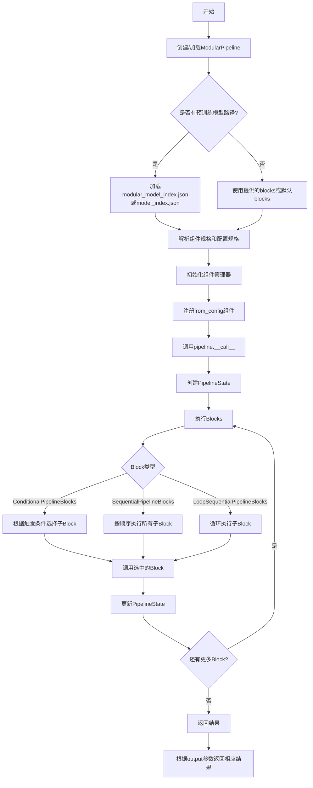

## 类结构

```
PipelineState (数据类-状态容器)
BlockState (数据类-块状态容器)
ModularPipelineBlocks (抽象基类)
├── ConditionalPipelineBlocks (条件管道块)
│   └── AutoPipelineBlocks (自动管道块)
├── SequentialPipelineBlocks (顺序管道块)
└── LoopSequentialPipelineBlocks (循环顺序管道块)
ModularPipeline (主管道类)
```

## 全局变量及字段


### `logger`
    
Module-level logger for debugging and information output

类型：`logging.Logger`
    


### `MODULAR_PIPELINE_MAPPING`
    
Maps model identifiers to modular pipeline class factory functions

类型：`OrderedDict[str, Callable[[dict | None], str]]`
    


### `PipelineState.PipelineState.values`
    
Dictionary storing pipeline state values keyed by parameter names

类型：`dict[str, Any]`
    


### `PipelineState.PipelineState.kwargs_mapping`
    
Maps kwargs types to lists of parameter names for grouping related inputs

类型：`dict[str, list[str]]`
    


### `ModularPipelineBlocks.ModularPipelineBlocks.config_name`
    
Filename for storing modular pipeline configuration

类型：`str`
    


### `ModularPipelineBlocks.ModularPipelineBlocks.model_name`
    
Name identifier for the model architecture this block targets

类型：`str | None`
    


### `ModularPipelineBlocks.ModularPipelineBlocks._workflow_map`
    
Optional mapping of workflow names to their trigger input configurations

类型：`dict | None`
    


### `ModularPipelineBlocks.ModularPipelineBlocks.sub_blocks`
    
Dictionary of child pipeline blocks organized by name

类型：`InsertableDict`
    


### `ConditionalPipelineBlocks.ConditionalPipelineBlocks.block_classes`
    
List of block classes available for conditional execution

类型：`list`
    


### `ConditionalPipelineBlocks.ConditionalPipelineBlocks.block_names`
    
List of names corresponding to each block class

类型：`list`
    


### `ConditionalPipelineBlocks.ConditionalPipelineBlocks.block_trigger_inputs`
    
Input parameter names used to determine which block to execute

类型：`list`
    


### `ConditionalPipelineBlocks.ConditionalPipelineBlocks.default_block_name`
    
Name of the default block to run when no trigger inputs match

类型：`str | None`
    


### `ConditionalPipelineBlocks.ConditionalPipelineBlocks.sub_blocks`
    
Dictionary of instantiated sub-blocks keyed by block name

类型：`InsertableDict`
    


### `AutoPipelineBlocks.AutoPipelineBlocks.block_classes`
    
List of block classes for automatic selection based on trigger presence

类型：`list`
    


### `AutoPipelineBlocks.AutoPipelineBlocks.block_names`
    
List of names for each automatic selection block

类型：`list`
    


### `AutoPipelineBlocks.AutoPipelineBlocks.block_trigger_inputs`
    
Trigger input names for automatic block selection (1:1 mapping)

类型：`list`
    


### `AutoPipelineBlocks.AutoPipelineBlocks.default_block_name`
    
Default block name derived from None trigger in block_trigger_inputs

类型：`str | None`
    


### `AutoPipelineBlocks.AutoPipelineBlocks.sub_blocks`
    
Dictionary of automatically selected sub-blocks

类型：`InsertableDict`
    


### `SequentialPipelineBlocks.SequentialPipelineBlocks.block_classes`
    
List of block classes to execute in sequence

类型：`list`
    


### `SequentialPipelineBlocks.SequentialPipelineBlocks.block_names`
    
List of names for sequential execution blocks

类型：`list`
    


### `SequentialPipelineBlocks.SequentialPipelineBlocks._workflow_map`
    
Workflow definitions mapping workflow names to trigger input configurations

类型：`dict | None`
    


### `SequentialPipelineBlocks.SequentialPipelineBlocks.sub_blocks`
    
Ordered dictionary of sequential execution blocks

类型：`InsertableDict`
    


### `LoopSequentialPipelineBlocks.LoopSequentialPipelineBlocks.model_name`
    
Model name identifier for loop-based pipeline blocks

类型：`str | None`
    


### `LoopSequentialPipelineBlocks.LoopSequentialPipelineBlocks.block_classes`
    
List of block classes to be executed in a loop

类型：`list`
    


### `LoopSequentialPipelineBlocks.LoopSequentialPipelineBlocks.block_names`
    
Names of blocks for loop iteration

类型：`list`
    


### `LoopSequentialPipelineBlocks.LoopSequentialPipelineBlocks.sub_blocks`
    
Dictionary of blocks to be executed within each loop iteration

类型：`InsertableDict`
    


### `LoopSequentialPipelineBlocks.LoopSequentialPipelineBlocks._progress_bar_config`
    
Configuration dictionary for progress bar display during loop execution

类型：`dict`
    


### `ModularPipeline.ModularPipeline.config_name`
    
Configuration filename for modular pipeline serialization

类型：`str`
    


### `ModularPipeline.ModularPipeline.hf_device_map`
    
HuggingFace device mapping for distributed model placement

类型：`dict | None`
    


### `ModularPipeline.ModularPipeline.default_blocks_name`
    
Default pipeline blocks class name when none is explicitly provided

类型：`str | None`
    


### `ModularPipeline.ModularPipeline._blocks`
    
Root pipeline blocks object defining the execution structure

类型：`ModularPipelineBlocks | None`
    


### `ModularPipeline.ModularPipeline._components_manager`
    
Manager for handling component loading, caching, and offloading strategies

类型：`ComponentsManager | None`
    


### `ModularPipeline.ModularPipeline._collection`
    
Collection identifier for organizing components in the components manager

类型：`str | None`
    


### `ModularPipeline.ModularPipeline._component_specs`
    
Dictionary of component specifications keyed by component name

类型：`dict[str, ComponentSpec]`
    


### `ModularPipeline.ModularPipeline._config_specs`
    
Dictionary of configuration specifications for pipeline parameters

类型：`dict[str, ConfigSpec]`
    
    

## 全局函数及方法


### `_create_default_map_fn`

该函数是一个工厂函数，用于创建一个始终返回相同管道类名的映射函数。它接受管道类名作为参数，并返回一个内部函数，该函数无论输入什么配置字典都返回相同的管道类名。

参数：

-  `pipeline_class_name`：`str`，要映射到的管道类名

返回值：`function`，返回内部函数 `_map_fn`，该函数接受可选的 `config_dict` 参数，始终返回 `pipeline_class_name`

#### 流程图

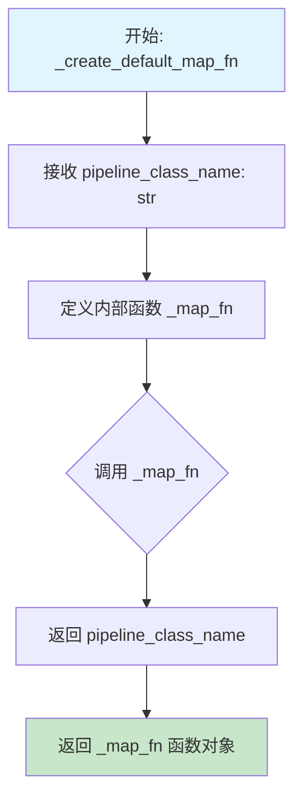

#### 带注释源码

```python
def _create_default_map_fn(pipeline_class_name: str):
    """
    创建一个映射函数，该函数始终返回相同的管道类名。
    
    这是一个工厂函数，用于生成一个简单的映射函数。
    该映射函数主要用于 MODULAR_PIPELINE_MAPPING 字典中，
    为特定的模型类型提供默认的模块化管道类。
    
    Args:
        pipeline_class_name: str，要映射到的管道类名
        
    Returns:
        function，内部函数 _map_fn
    """
    
    def _map_fn(config_dict=None):
        """
        内部映射函数，无论输入什么配置都返回相同的管道类名。
        
        Args:
            config_dict: 可选的配置字典参数（此参数被忽略）
            
        Returns:
            str，始终返回构造函数时指定的 pipeline_class_name
        """
        return pipeline_class_name

    return _map_fn
```

#### 使用示例

该函数在代码中用于创建默认的模块化管道映射函数，例如：

```python
# 创建默认映射函数
_create_default_map_fn("StableDiffusionXLModularPipeline")
# 返回一个函数，该函数无论 config_dict 是什么都返回 "StableDiffusionXLModularPipeline"

_create_default_map_fn("FluxModularPipeline")
# 返回一个函数，该函数无论 config_dict 是什么都返回 "FluxModularPipeline"
```

这些映射函数被存储在 `MODULAR_PIPELINE_MAPPING` 字典中，用于根据模型名称选择正确的模块化管道类。


### `_flux2_klein_map_fn`

该函数是 Flux2 Klein 模块化管道的映射函数，用于根据配置字典中的参数动态返回对应的管道类名称。它检查配置字典是否存在以及是否包含 `is_distilled` 标志，从而决定使用 `Flux2KleinModularPipeline` 还是 `Flux2KleinBaseModularPipeline`。

参数：

-  `config_dict`：`dict | None`，可选参数，包含管道配置的字典，用于判断应返回哪种管道类

返回值：`str`，返回对应的模块化管道类名称（"Flux2KleinModularPipeline" 或 "Flux2KleinBaseModularPipeline"）

#### 流程图

```mermaid
flowchart TD
    A[开始] --> B{config_dict is None?}
    B -->|是| C[返回 "Flux2KleinModularPipeline"]
    B -->|否| D{"is_distilled" in config_dict<br/>且 config_dict["is_distilled"] 为真?}
    D -->|是| C
    D -->|否| E[返回 "Flux2KleinBaseModularPipeline"]
    C --> F[结束]
    E --> F
```

#### 带注释源码

```python
def _flux2_klein_map_fn(config_dict=None):
    """
    Flux2 Klein 模块化管道的映射函数。
    
    根据配置字典中的参数动态返回对应的管道类名称：
    - 如果配置字典为 None，返回 "Flux2KleinModularPipeline"
    - 如果配置字典包含 "is_distilled" 且值为 True，返回 "Flux2KleinModularPipeline"
    - 否则返回 "Flux2KleinBaseModularPipeline"
    
    Args:
        config_dict: 包含管道配置的字典，可选参数。
                     当包含 "is_distilled" 键且值为 True 时，
                     表示使用的是蒸馏版本的 Flux2 Klein 模型。
    
    Returns:
        str: 对应的模块化管道类名称
    """
    # 如果配置字典为空，返回默认的蒸馏版管道类
    if config_dict is None:
        return "Flux2KleinModularPipeline"

    # 检查配置字典中是否存在 is_distilled 标志
    if "is_distilled" in config_dict and config_dict["is_distilled"]:
        # 蒸馏版本，返回蒸馏版管道类
        return "Flux2KleinModularPipeline"
    else:
        # 非蒸馏版本，返回基础版管道类
        return "Flux2KleinBaseModularPipeline"
```


### `_wan_map_fn`

该函数是 Wan 系列管道的映射函数，用于根据配置字典中的 `boundary_ratio` 参数值来决定返回哪种模块化管道类（`WanModularPipeline` 或 `Wan22ModularPipeline`）。

参数：

-  `config_dict`：`dict | None`，可选参数，包含管道配置信息的字典。如果为 `None`，则返回默认的 `WanModularPipeline`。

返回值：`str`，返回对应的模块化管道类名字符串。

#### 流程图

```mermaid
flowchart TD
    A[开始] --> B{config_dict is None?}
    B -->|Yes| C[返回 "WanModularPipeline"]
    B -->|No| D{"boundary_ratio" in config_dict<br/>且 config_dict["boundary_ratio"] is not None?}
    D -->|Yes| E[返回 "Wan22ModularPipeline"]
    D -->|No| F[返回 "WanModularPipeline"]
    C --> G[结束]
    E --> G
    F --> G
```

#### 带注释源码

```python
def _wan_map_fn(config_dict=None):
    """
    Wan 系列管道的映射函数，根据配置决定返回的模块化管道类名。
    
    该函数用于 MODULAR_PIPELINE_MAPPING 字典中，根据模型名称映射到对应的
    模块化管道实现类。
    
    Args:
        config_dict: 可选的配置字典，用于决定具体的管道类。
                     如果包含 "boundary_ratio" 字段且值不为 None，
                     则返回 Wan22ModularPipeline，否则返回 WanModularPipeline。
    
    Returns:
        str: 模块化管道类名字符串
             - "WanModularPipeline" (默认)
             - "Wan22ModularPipeline" (当 boundary_ratio 存在且不为 None)
    """
    # 如果没有提供配置字典，返回默认的 WanModularPipeline
    if config_dict is None:
        return "WanModularPipeline"

    # 检查配置中是否存在 boundary_ratio 参数且值不为 None
    # boundary_ratio 是 Wan 2.2 版本的新参数，用于控制边界比例
    if "boundary_ratio" in config_dict and config_dict["boundary_ratio"] is not None:
        return "Wan22ModularPipeline"
    else:
        return "WanModularPipeline"
```

---

### 关键组件信息

| 名称 | 描述 |
|------|------|
| `MODULAR_PIPELINE_MAPPING` | 有序字典，映射模型标识符到对应的模块化管道映射函数，`_wan_map_fn` 是其针对 "wan" 模型的映射实现 |
| `_create_default_map_fn` | 工厂函数，创建返回固定管道类名的映射函数 |
| `_flux2_klein_map_fn` | 类似的映射函数，用于 Flux2 Klein 管道，根据 `is_distilled` 决定返回类型 |
| `_wan_i2v_map_fn` | Wan Image2Video 管道映射函数，与 `_wan_map_fn` 逻辑类似 |

### 技术债务与优化空间

1. **硬编码的映射逻辑**：映射函数中的条件判断（如检查 `boundary_ratio`）是硬编码的，如果未来有更多变体，可能需要更灵活的配置方式。

2. **重复代码**：`_wan_map_fn` 和 `_wan_i2v_map_fn` 存在重复的逻辑结构，可以考虑抽象出一个通用的工厂函数来减少代码冗余。

3. **文档缺失**：该函数目前没有在模块级别被详细文档化，使用者可能不清楚 `boundary_ratio` 的具体作用和取值范围。


### `_wan_i2v_map_fn`

该函数是 Wan I2V（Image-to-Video）模块化管道的映射函数，根据配置字典中的 `boundary_ratio` 参数决定返回的具体管道类名。如果配置为空或 `boundary_ratio` 未设置，返回基础版管道类；如果 `boundary_ratio` 有具体值，则返回 22 版本的高级管道类。

参数：

- `config_dict`：`dict | None`，可选参数，包含管道配置信息的字典，用于判断返回哪种模块化管道类

返回值：`str`，返回模块化管道类名字符串

#### 流程图

```mermaid
flowchart TD
    A[开始] --> B{config_dict is None?}
    B -->|是| C[返回 'WanImage2VideoModularPipeline']
    B -->|否| D{"boundary_ratio" in config_dict?}
    D -->|否| E[返回 'WanImage2VideoModularPipeline']
    D -->|是| F{config_dict['boundary_ratio'] is not None?}
    F -->|是| G[返回 'Wan22Image2VideoModularPipeline']
    F -->|否| E
```

#### 带注释源码

```python
def _wan_i2v_map_fn(config_dict=None):
    """
    Wan I2V (Image-to-Video) 模块化管道的映射函数。
    
    根据配置字典中的 boundary_ratio 参数返回对应的模块化管道类名。
    用于 MODULAR_PIPELINE_MAPPING 字典中，支持动态选择管道实现。
    
    Args:
        config_dict: 包含管道配置的可选字典。
                     如果为 None，则返回默认的基础管道类。
                     如果包含 'boundary_ratio' 键且值不为 None，
                     则返回支持 22 版本特性的管道类。
    
    Returns:
        str: 模块化管道的类名字符串。
             - "WanImage2VideoModularPipeline": 基础版 I2V 管道
             - "Wan22Image2VideoModularPipeline": 22 版本增强版 I2V 管道
    """
    # 如果配置字典为空，返回默认的基础管道类
    if config_dict is None:
        return "WanImage2VideoModularPipeline"

    # 检查配置中是否存在 boundary_ratio 参数
    # 如果存在且不为 None，返回 22 版本管道类
    if "boundary_ratio" in config_dict and config_dict["boundary_ratio"] is not None:
        return "Wan22Image2VideoModularPipeline"
    else:
        # 否则返回基础版管道类
        return "WanImage2VideoModularPipeline"
```


### `PipelineState.set`

该方法用于向 PipelineState 中添加键值对，同时可选地将其注册到 kwargs_mapping 中以支持按 kwargs_type 批量检索。

参数：

- `key`：`str`，用于存储值的键名
- `value`：`Any`，要存储的实际数据，可以是任意类型
- `kwargs_type`：`str`，可选参数，指定该值所属的 kwargs 类型，用于后续按类型批量获取

返回值：`None`，该方法仅修改内部状态，不返回任何值

#### 流程图

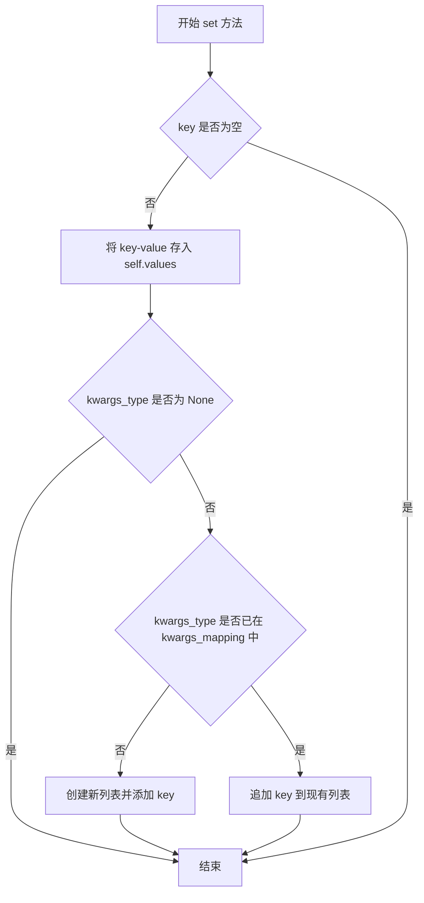

#### 带注释源码

```python
def set(self, key: str, value: Any, kwargs_type: str = None):
    """
    Add a value to the pipeline state.

    Args:
        key (str): The key for the value
        value (Any): The value to store
        kwargs_type (str): The kwargs_type with which the value is associated
    """
    # 1. 将值存储到 values 字典中
    self.values[key] = value

    # 2. 如果提供了 kwargs_type，则建立键到类型组的映射
    if kwargs_type is not None:
        # 检查该 kwargs_type 是否已存在
        if kwargs_type not in self.kwargs_mapping:
            # 不存在则创建新列表并添加 key
            self.kwargs_mapping[kwargs_type] = [key]
        else:
            # 已存在则追加到现有列表
            self.kwargs_mapping[kwargs_type].append(key)
```


### `PipelineState.get`

获取管道状态中的一个或多个值。

参数：

- `keys`：`str | list[str]`，要获取的值的键或键列表
- `default`：`Any`，如果未找到时返回的默认值

返回值：`Any | dict[str, Any]`，如果 keys 是 str 则返回单个值，如果 keys 是 list 则返回值的字典

#### 流程图

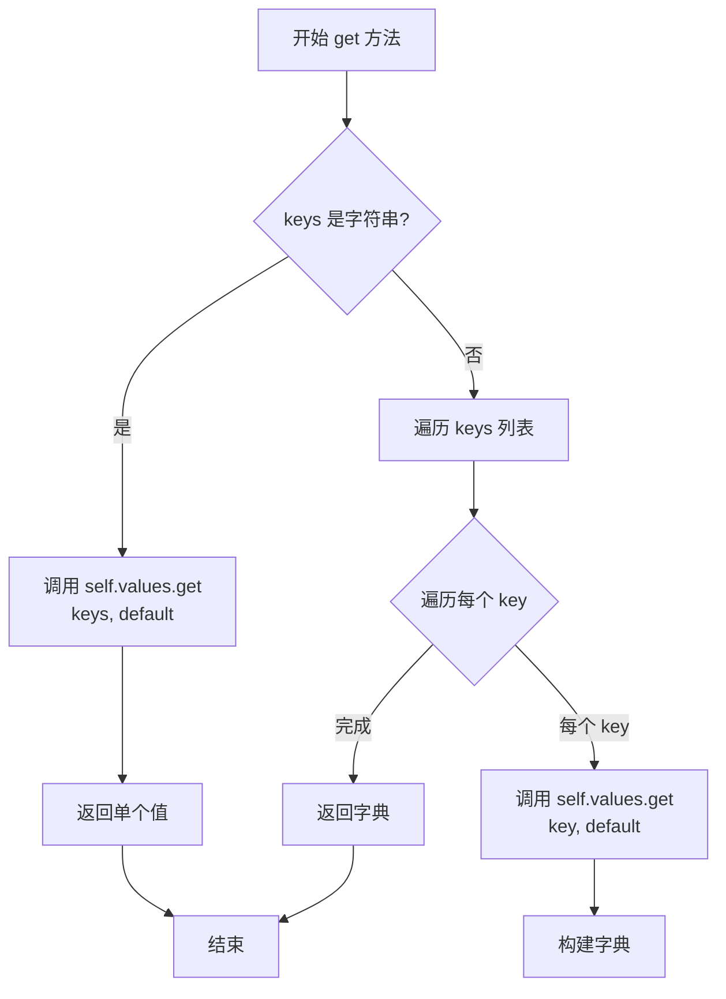

#### 带注释源码

```python
def get(self, keys: str | list[str], default: Any = None) -> Any | dict[str, Any]:
    """
    Get one or multiple values from the pipeline state.

    Args:
        keys (str | list[str]): Key or list of keys for the values
        default (Any): The default value to return if not found

    Returns:
        Any | dict[str, Any]: Single value if keys is str, dictionary of values if keys is list
    """
    # 如果 keys 是单个字符串，直接从 values 字典中获取单个值
    if isinstance(keys, str):
        return self.values.get(keys, default)
    
    # 如果 keys 是列表，遍历每个 key，构建字典返回
    # 对于列表中的每个 key，如果不存在则使用 default 作为默认值
    return {key: self.values.get(key, default) for key in keys}
```


### `PipelineState.get_by_kwargs`

根据给定的 kwargs_type 类型，从 PipelineState 中检索所有关联的值，并以字典形式返回。

参数：

-  `kwargs_type`：`str`，用于过滤的 kwargs 类型标识符

返回值：`dict[str, Any]`，包含与指定 kwargs_type 关联的所有值键值对

#### 流程图

```mermaid
flowchart TD
    A[开始 get_by_kwargs] --> B[获取 kwargs_type 对应的 value_names]
    B --> C{kwargs_type 在 kwargs_mapping 中?}
    C -->|是 D[调用 self.get 获取值名称对应的值]
    C -->|否 E[返回空字典]
    D --> F[结束 - 返回值字典]
    E --> F
    
    style A fill:#f9f,stroke:#333
    style F fill:#9f9,stroke:#333
    style D fill:#ff9,stroke:#333
```

#### 带注释源码

```python
def get_by_kwargs(self, kwargs_type: str) -> dict[str, Any]:
    """
    Get all values with matching kwargs_type.

    Args:
        kwargs_type (str): The kwargs_type to filter by

    Returns:
        dict[str, Any]: Dictionary of values with matching kwargs_type
    """
    # 从 kwargs_mapping 字典中获取指定 kwargs_type 对应的值名称列表
    # 如果 kwargs_type 不存在，则返回空列表作为默认值
    value_names = self.kwargs_mapping.get(kwargs_type, [])
    
    # 调用 get 方法，传入值名称列表，获取对应的值字典
    # get 方法会为每个 key 返回其对应的值，若不存在则返回 None
    return self.get(value_names)
```

#### 关联信息

**所属类**：`PipelineState`

**类功能概述**：
`PipelineState` 是一个数据类，用于在 pipeline 块之间传递状态数据。它维护了一个 `values` 字典存储实际数据，以及一个 `kwargs_mapping` 字典用于跟踪哪些值属于哪个 kwargs 类型分类。

**关键字段**：
- `values: dict[str, Any]` - 存储实际键值对数据
- `kwargs_mapping: dict[str, list[str]]` - 存储 kwargs_type 到对应 value 名称列表的映射

**方法协同**：
- `set(key, value, kwargs_type)` - 设置值时关联 kwargs_type
- `get(keys)` - 获取一个或多个值的基础方法


### `PipelineState.to_dict`

将 PipelineState 对象转换为字典格式。

参数：

- 无（该方法不接收额外参数，`self` 为隐式参数）

返回值：`dict[str, Any]`，返回包含 PipelineState 所有属性的字典副本。

#### 流程图

```mermaid
flowchart TD
    A[开始 to_dict] --> B[获取 self.__dict__]
    B --> C[使用字典解包 {**self.__dict__}]
    C --> D[返回新字典副本]
    E[结束]
    D --> E
```

#### 带注释源码

```python
def to_dict(self) -> dict[str, Any]:
    """
    Convert PipelineState to a dictionary.
    """
    # 使用字典解包语法创建并返回 self.__dict__ 的浅拷贝
    # self.__dict__ 包含对象的实例属性：values 和 kwargs_mapping
    # 通过 {**self.__dict__} 创建新的字典对象，避免返回内部字典的引用
    return {**self.__dict__}
```

#### 补充说明

- **设计目的**：提供一种将 `PipelineState` 状态对象序列化为普通 Python 字典的方法，便于后续处理（如 JSON 序列化、调试信息输出等）。
- **返回值结构**：返回的字典包含两个键值对：
  - `values`: 存储所有状态值的字典 (`dict[str, Any]`)
  - `kwargs_mapping`: 存储 kwargs 类型映射关系的字典 (`dict[str, list[str]]`)
- **注意事项**：该方法返回的是浅拷贝字典，字典本身的键值对是共享引用的，但如果需要对值进行深拷贝，需要在调用方自行处理。


### `PipelineState.__getattr__`

允许通过属性访问方式获取 PipelineState 中间值的特殊方法。当访问的属性不存在于对象本身时，会自动从 `values` 字典中查找对应的值。

参数：

- `name`：`str`，要访问的属性名称

返回值：`Any`，如果属性存在于 `values` 字典中则返回对应值，否则抛出 `AttributeError`

#### 流程图

```mermaid
flowchart TD
    A[__getattr__ 被调用] --> B{尝试获取 values 属性}
    B -->|成功| C{name 是否在 values 中}
    B -->|失败| D[抛出 AttributeError]
    C -->|是| E[返回 values[name]]
    C -->|否| F[抛出 AttributeError]
    
    style D fill:#ffcccc
    style F fill:#ffcccc
    style E fill:#ccffcc
```

#### 带注释源码

```python
def __getattr__(self, name):
    """
    Allow attribute access to intermediate values. If an attribute is not found in the object, look for it in the
    intermediates dict.
    """
    # Use object.__getattribute__ to avoid infinite recursion during deepcopy
    # 通过 object.__getattribute__ 直接访问 values 属性，避免因 __getattr__ 递归调用导致的无限递归
    try:
        values = object.__getattribute__(self, "values")
    except AttributeError:
        raise AttributeError(f"'{self.__class__.__name__}' object has no attribute '{name}'")

    # 检查请求的属性名是否存在于 values 字典中
    if name in values:
        return values[name]
    # 如果属性不存在，抛出标准的 AttributeError
    raise AttributeError(f"'{self.__class__.__name__}' object has no attribute '{name}'")
```


### `PipelineState.__repr__`

该方法用于将 `PipelineState` 对象转换为格式化的字符串表示，便于调试和日志记录。它会递归地格式化 `values` 字典和 `kwargs_mapping` 字典中的所有值，特别是对 PyTorch 张量进行了特殊处理，显示其 dtype 和 shape 信息。

参数：

- 无显式参数（`self` 为隐式参数）

返回值：`str`，返回 PipelineState 对象的字符串表示，包含格式化后的 values 和 kwargs_mapping 内容

#### 流程图

```mermaid
flowchart TD
    A[开始 __repr__] --> B[定义 format_value 内部函数]
    B --> C{检查值 v 是否有 shape 和 dtype 属性}
    C -->|是| D[返回 Tensor 格式化字符串]
    C -->|否| E{检查 v 是否为列表且长度>0}
    E -->|是| F{检查列表第一个元素是否有 shape 和 dtype}
    F -->|是| G[返回列表 Tensor 格式化字符串]
    F -->|否| H[返回 repr(v)]
    E -->|否| H
    D --> I[格式化 values 字典为字符串]
    G --> I
    H --> I
    I --> J[格式化 kwargs_mapping 字典为字符串]
    J --> K[拼接并返回完整字符串表示]
```

#### 带注释源码

```python
def __repr__(self):
    """
    生成 PipelineState 对象的可读字符串表示。
    
    该方法遍历 PipelineState 的 values 和 kwargs_mapping 字典，
    将其中的值格式化为易读的字符串形式，特别是对 PyTorch 张量
    进行了特殊处理以避免打印大型张量数据。
    """
    
    def format_value(v):
        """内部函数：格式化单个值以便于显示"""
        # 检查是否为 PyTorch 张量
        if hasattr(v, "shape") and hasattr(v, "dtype"):
            # 返回 Tensor 的 dtype 和 shape 信息，避免打印实际数据
            return f"Tensor(dtype={v.dtype}, shape={v.shape})"
        # 检查是否为包含张量的列表
        elif isinstance(v, list) and len(v) > 0 and hasattr(v[0], "shape") and hasattr(v[0], "dtype"):
            # 返回列表中第一个张量的信息，并标注为列表
            return f"[Tensor(dtype={v[0].dtype}, shape={v[0].shape}), ...]"
        else:
            # 对于其他类型，使用标准的 repr
            return repr(v)

    # 将 values 字典格式化为多行字符串
    # 每个键值对格式为 "    key: formatted_value"
    values_str = "\n".join(f"    {k}: {format_value(v)}" for k, v in self.values.items())
    
    # 将 kwargs_mapping 字典格式化为多行字符串
    kwargs_mapping_str = "\n".join(f"    {k}: {v}" for k, v in self.kwargs_mapping.items())

    # 返回完整的 PipelineState 字符串表示
    return f"PipelineState(\n  values={{\n{values_str}\n  }},\n  kwargs_mapping={{\n{kwargs_mapping_str}\n  }}\n)"
```


### `BlockState.__init__`

这是 `BlockState` 类的构造函数，用于初始化块状态对象。它接受任意关键字参数并将它们动态设置为对象的属性，支持属性访问和格式化表示。

参数：

- `**kwargs`：`任意关键字参数`，可变数量的键值对，用于初始化块状态的属性

返回值：`None`，无返回值（构造函数）

#### 流程图

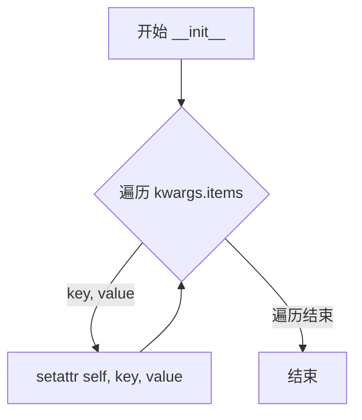

#### 带注释源码

```python
def __init__(self, **kwargs):
    """
    初始化 BlockState 实例。
    
    该构造函数接受任意数量的关键字参数，并将每个键值对作为对象的属性进行设置。
    这使得 BlockState 能够动态地存储和访问块状态数据，类似于字典但支持属性访问语法。
    
    Args:
        **kwargs: 可变数量的关键字参数，每个参数都会作为实例属性存储
        
    Example:
        >>> block_state = BlockState(latents=torch.randn(1, 4, 64, 64), prompt_embeds=embeds)
        >>> block_state.latents  # 通过属性访问
        >>> block_state["latents"]  # 通过字典方式访问
    """
    # 遍历所有传入的关键字参数
    for key, value in kwargs.items():
        # 使用 setattr 动态设置对象属性
        # 这样可以将任意键值对转换为对象的属性
        setattr(self, key, value)
```


### `BlockState.__getitem__`

该方法允许通过字典式访问语法 `block_state["foo"]` 获取 BlockState 对象的属性值，类似于字典的 `__getitem__` 操作。

参数：

- `key`：`str`，用于从 BlockState 获取属性值的键

返回值：`Any`，返回指定键对应的属性值，如果属性不存在则返回 `None`

#### 流程图

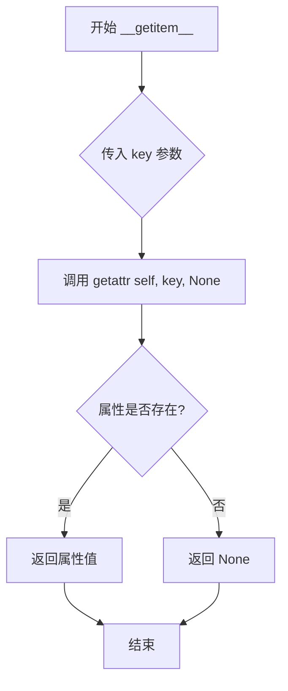

#### 带注释源码

```python
def __getitem__(self, key: str):
    # allows block_state["foo"]
    # 使用 getattr 获取对象属性，如果属性不存在则返回 None
    # 这允许像字典一样通过键访问 BlockState 的属性
    return getattr(self, key, None)
```


### `BlockState.__setitem__`

允许使用字典语法 `block_state["key"] = value` 为 BlockState 对象动态设置属性。

参数：

-  `key`：`str`，要设置的属性名称
-  `value`：`Any`，要赋给属性的值

返回值：`None`，该方法不返回值（隐式返回 None）

#### 流程图

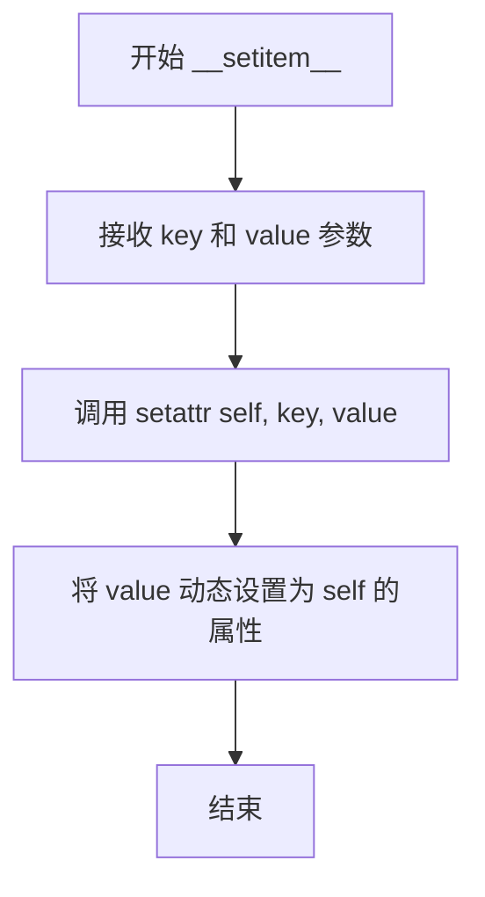

#### 带注释源码

```python
def __setitem__(self, key: str, value: Any):
    # allows block_state["foo"] = "bar"
    # 使用 setattr 动态设置属性
    # key: 属性名, value: 属性值
    setattr(self, key, value)
```


### `BlockState.as_dict`

将 BlockState 对象的所有属性转换为字典格式。

参数： 无

返回值：`dict[str, Any]`，包含 BlockState 所有属性的字典

#### 流程图

```mermaid
flowchart TD
    A[开始 as_dict] --> B[获取 self.__dict__]
    B --> C[调用 dict.items()]
    C --> D[构造字典]
    D --> E[返回字典]
```

#### 带注释源码

```python
def as_dict(self):
    """
    Convert BlockState to a dictionary.

    Returns:
        dict[str, Any]: Dictionary containing all attributes of the BlockState
    """
    # self.__dict__ 包含对象的所有实例属性
    # dict() 构造函数将 items() 转换为字典对象
    return dict(self.__dict__.items())
```


### `BlockState.__repr__`

该方法用于生成 BlockState 对象的字符串表示形式，格式化显示所有属性。对于张量类型，会显示其 dtype 和 shape；对于张量列表或元组，会显示数量和形状；对于包含张量的字典，会递归格式化其值。

参数：无（该方法是实例方法，self 为隐式参数）

返回值：`str`，返回 BlockState 对象的格式化字符串表示

#### 流程图

```mermaid
flowchart TD
    A[开始 __repr__] --> B{遍历 self.__dict__}
    B --> C{对每个属性值 v 调用 format_value}
    C --> D{v 有 shape 和 dtype 属性?}
    D -->|是| E[返回 Tensor 格式化字符串]
    D -->|否| F{v 是 list?}
    F -->|是 且 元素有 shape/dtype| G[返回 list 格式化字符串]
    F -->|否| H{v 是 tuple?}
    H -->|是 且 元素有 shape/dtype| I[返回 tuple 格式化字符串]
    H -->|否| J{v 是 dict?}
    J -->|是| K[递归格式化字典中的张量值]
    J -->|否| L[使用 repr(v)]
    E --> M[拼接所有属性]
    G --> M
    I --> M
    K --> M
    L --> M
    M --> N[返回完整格式化字符串]
```

#### 带注释源码

```python
def __repr__(self):
    """
    生成 BlockState 对象的字符串表示形式。
    
    该方法会格式化显示所有实例属性，对于不同类型的值采用不同的格式化策略：
    - 单个张量：显示 dtype 和 shape
    - 张量列表：显示元素数量和各自的 shape
    - 张量元组：显示元素数量和各自的 shape
    - 包含张量的字典：递归格式化其中的张量值
    - 其他类型：使用标准的 repr()
    
    Returns:
        str: 格式化后的字符串表示
    """
    def format_value(v):
        # 处理单个张量
        # 检查值是否有 shape 和 dtype 属性（张量的特征）
        if hasattr(v, "shape") and hasattr(v, "dtype"):
            return f"Tensor(dtype={v.dtype}, shape={v.shape})"

        # 处理张量列表
        elif isinstance(v, list):
            # 检查列表是否非空且第一个元素是张量
            if len(v) > 0 and hasattr(v[0], "shape") and hasattr(v[0], "dtype"):
                # 收集所有张量的形状
                shapes = [t.shape for t in v]
                return f"list[{len(v)}] of Tensors with shapes {shapes}"
            # 非张量列表使用默认 repr
            return repr(v)

        # 处理张量元组
        elif isinstance(v, tuple):
            # 检查元组是否非空且第一个元素是张量
            if len(v) > 0 and hasattr(v[0], "shape") and hasattr(v[0], "dtype"):
                # 收集所有张量的形状
                shapes = [t.shape for t in v]
                return f"tuple[{len(v)}] of Tensors with shapes {shapes}"
            # 非张量元组使用默认 repr
            return repr(v)

        # 处理包含张量值的字典
        elif isinstance(v, dict):
            formatted_dict = {}
            for k, val in v.items():
                # 字典值是单个张量
                if hasattr(val, "shape") and hasattr(val, "dtype"):
                    formatted_dict[k] = f"Tensor(shape={val.shape}, dtype={val.dtype})"
                # 字典值是张量列表
                elif (
                    isinstance(val, list)
                    and len(val) > 0
                    and hasattr(val[0], "shape")
                    and hasattr(val[0], "dtype")
                ):
                    shapes = [t.shape for t in val]
                    formatted_dict[k] = f"list[{len(val)}] of Tensors with shapes {shapes}"
                # 其他类型使用默认 repr
                else:
                    formatted_dict[k] = repr(val)
            return formatted_dict

        # 默认情况：使用标准 repr
        return repr(v)

    # 格式化所有实例属性
    # self.__dict__ 包含所有实例属性
    attributes = "\n".join(f"    {k}: {format_value(v)}" for k, v in self.__dict__.items())
    # 返回完整的格式化字符串
    return f"BlockState(\n{attributes}\n)"
```


### `ModularPipelineBlocks._get_signature_keys`

该方法是一个类方法，用于通过检查给定类（或对象）的 `__init__` 方法签名来提取必需的模块名称和可选参数名称。这是模块化管道块加载过程中的关键步骤，用于确定实例化块类时需要哪些参数。

参数：

- `obj`：`type`，目标类或对象，用于提取其 `__init__` 方法的签名信息

返回值：`tuple[set[str], set[str]]`，返回一个包含两个集合的元组——第一个是必需的模块名称集合（不包括 `self`），第二个是可选参数名称集合

#### 流程图

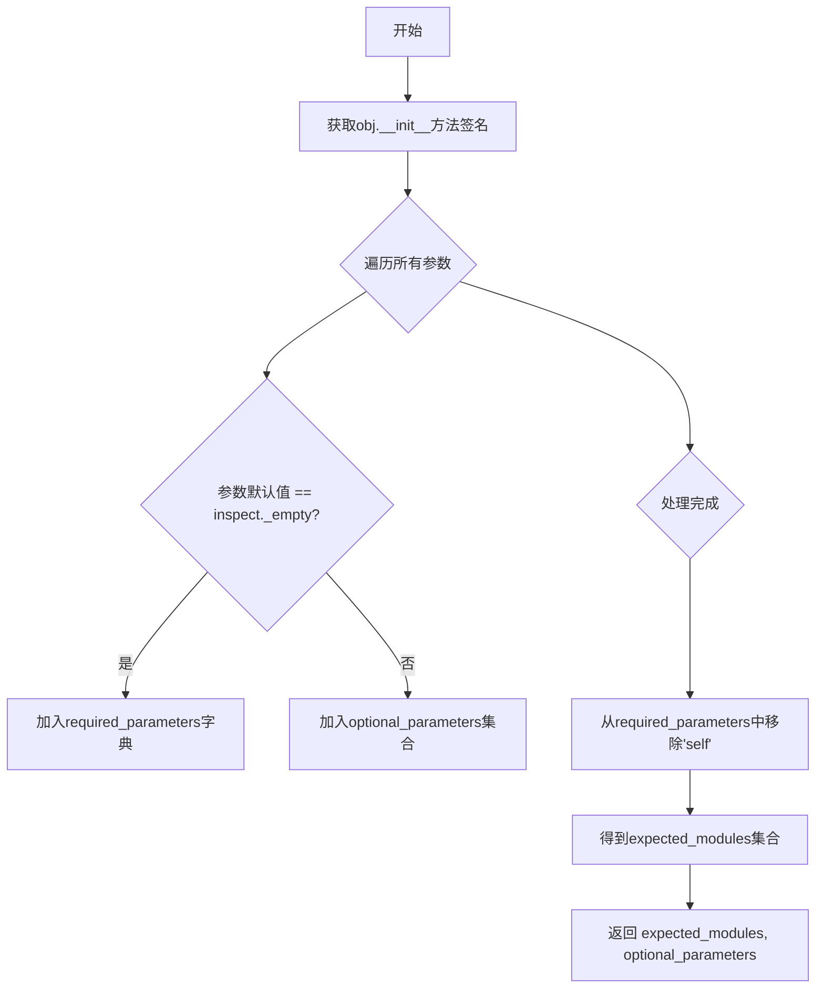

#### 带注释源码

```python
@classmethod
def _get_signature_keys(cls, obj):
    """
    从给定类或对象的 __init__ 方法中提取签名键。
    
    该方法通过检查 obj 的 __init__ 方法签名来识别：
    1. 必需的参数（没有默认值的参数）
    2. 可选的参数（有默认值的参数）
    3. 期望的模块（必需的参数排除 'self' 之后）
    
    Args:
        obj: 要检查的类或对象，通常是模块化管道块类
        
    Returns:
        tuple: (expected_modules, optional_parameters)
            - expected_modules: 必需的参数名称集合（不含'self'）
            - optional_parameters: 可选的参数名称集合
    """
    # 获取 obj.__init__ 方法的签名对象
    # inspect.signature() 返回一个 Signature 对象，包含所有参数信息
    parameters = inspect.signature(obj.__init__).parameters
    
    # 筛选出必需的参数：默认值为 inspect._empty 表示没有默认值
    # 这是 Python 中判断参数是否有默认值的标准方式
    required_parameters = {k: v for k, v in parameters.items() if v.default == inspect._empty}
    
    # 筛选出可选的参数：有默认值的参数
    optional_parameters = set({k for k, v in parameters.items() if v.default != inspect._empty})
    
    # 从必需参数中排除 'self'，因为它不是实际的模块参数
    # 'self' 是实例方法的第一个参数，不应被视为需要配置的模块
    expected_modules = set(required_parameters.keys()) - {"self"}
    
    # 返回两个集合：期望的模块和可选参数
    return expected_modules, optional_parameters
```


### `ModularPipelineBlocks.__init__`

初始化 `ModularPipelineBlocks` 类的实例，创建一个用于存储子块（sub_blocks）的空 `InsertableDict`。

参数：

- `self`：无，隐式参数，表示类实例本身

返回值：`None`，无返回值（`__init__` 方法）

#### 流程图

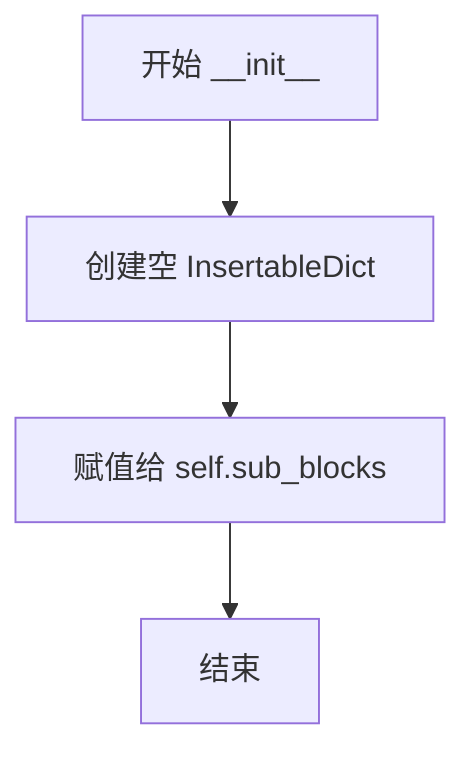

#### 带注释源码

```python
def __init__(self):
    """
    初始化 ModularPipelineBlocks 实例。
    
    创建一个空的 InsertableDict 用于存储子块（sub_blocks）。
    InsertableDict 是一个支持动态插入的有序字典，用于管理管道中的模块化块。
    """
    # 初始化 sub_blocks 为空 InsertableDict
    # sub_blocks 用于存储 ConditionalPipelineBlocks、SequentialPipelineBlocks 等子块
    self.sub_blocks = InsertableDict()
```


### `ModularPipelineBlocks.description`

返回模块化管道块的描述信息。该属性为只读属性，在基类中返回空字符串，具体描述内容需由子类实现。

参数：  
无参数

返回值：`str`，返回管道的描述字符串。基类默认返回空字符串，子类需重写该属性以提供具体的管道描述。

#### 流程图

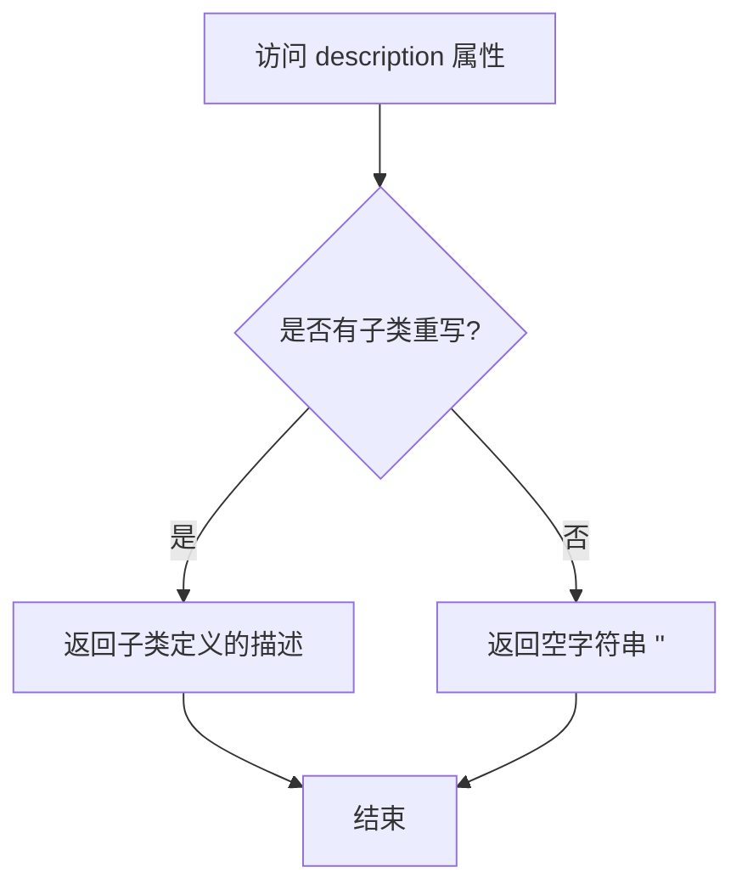

#### 带注释源码

```python
@property
def description(self) -> str:
    """Description of the block. Must be implemented by subclasses."""
    return ""
```

**源码解析：**

- **属性类型**：使用 `@property` 装饰器定义为只读属性
- **返回类型**：`str`，字符串类型
- **默认行为**：在基类 `ModularPipelineBlocks` 中直接返回空字符串 `""`
- **设计意图**：采用模板方法模式，要求子类必须重写该属性以提供有意义的描述
- **使用场景**：在 `__repr__` 方法和 `doc` 属性中被调用，用于生成管道块的文档字符串和字符串表示


### `ModularPipelineBlocks.expected_components`

该属性是 `ModularPipelineBlocks` 基类中定义的一个只读属性，用于返回当前 Pipeline Block 期望的组件规范列表。在基类中默认返回空列表，由子类实现具体的组件规范。

参数：

- 无参数（该方法为属性方法，通过 `self` 访问）

返回值：`list[ComponentSpec]`，返回当前 Block 期望的组件规范列表，用于定义 Pipeline 需要加载和管理的组件（如 unet、vae、text_encoder 等）。

#### 流程图

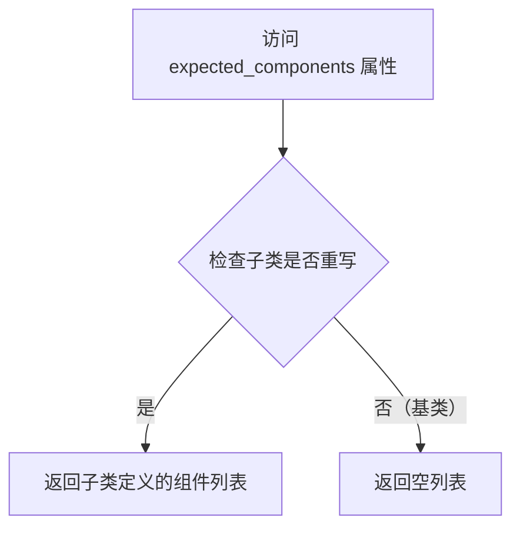

#### 带注释源码

```python
@property
def expected_components(self) -> list[ComponentSpec]:
    """
    返回当前 Pipeline Block 期望的组件规范列表。
    子类应重写此属性以提供具体的组件规范。
    
    返回:
        list[ComponentSpec]: 组件规范列表，基类默认返回空列表
    """
    return []
```


### `ModularPipelineBlocks.expected_configs`

该属性定义了管道块预期需要的配置规范列表。基类返回空列表，子类通过遍历所有子块合并其配置规范（去重），用于描述管道运行时所需的配置参数。

参数：无参数（为属性装饰器方法）

返回值：`list[ConfigSpec]`，返回预期配置规范列表

#### 流程图

```mermaid
flowchart TD
    A[开始: 获取 expected_configs] --> B{检查是否有子块}
    B -->|是| C[遍历所有子块]
    B -->|否| D[返回空列表]
    C --> E[获取子块的 expected_configs]
    E --> F{配置是否已存在}
    F -->|是| H[跳过]
    F -->|否| G[添加到列表]
    H --> C
    G --> C
    C --> I[返回配置列表]
```

#### 带注释源码

```python
@property
def expected_configs(self) -> list[ConfigSpec]:
    """
    返回该管道块预期需要的配置规范列表。
    
    基类实现返回空列表，子类（如 ConditionalPipelineBlocks, 
    SequentialPipelineBlocks, LoopSequentialPipelineBlocks）会重写此方法，
    通过遍历子块合并其配置规范。
    
    Returns:
        list[ConfigSpec]: 配置规范列表，用于描述管道所需的配置参数
    """
    return []
```

### 子类重写示例（ConditionalPipelineBlocks）

```python
@property
def expected_configs(self):
    """
    合并所有子块的 expected_configs，去重后返回。
    
    遍历 sub_blocks 字典中的每个块，获取其 expected_configs 属性，
    将不重复的配置添加到列表中。
    """
    expected_configs = []
    for block in self.sub_blocks.values():
        for config in block.expected_configs:
            if config not in expected_configs:
                expected_configs.append(config)
    return expected_configs
```

### 子类重写示例（LoopSequentialPipelineBlocks）

```python
@property
def expected_configs(self):
    """
    合并所有子块的 expected_configs 和循环自身的 loop_expected_configs，去重后返回。
    
    除了遍历子块外，还额外添加了循环块特有的配置规范。
    """
    expected_configs = []
    for block in self.sub_blocks.values():
        for config in block.expected_configs:
            if config not in expected_configs:
                expected_configs.append(config)
    for config in self.loop_expected_configs:
        if config not in expected_configs:
            expected_configs.append(config)
    return expected_configs
```


### `ModularPipelineBlocks.inputs`

该属性是 `ModularPipelineBlocks` 基类中定义的输入参数列表的抽象属性，用于声明流水线块所期望的输入参数。子类需要重写此属性以提供具体的输入参数规范。

参数：

- 无参数（该方法是一个属性，通过 `self` 访问）

返回值：`list[InputParam]`，返回流水线块的输入参数列表，每个元素为 `InputParam` 对象，包含参数的名称、类型、是否必需等信息。

#### 流程图

```mermaid
flowchart TD
    A[访问 inputs 属性] --> B{子类是否重写?}
    B -- 是 --> C[返回子类定义的输入参数列表]
    B -- 否 --> D[返回空列表]
    
    C --> E[流程结束]
    D --> E
```

#### 带注释源码

```python
@property
def inputs(self) -> list[InputParam]:
    """list of input parameters. Must be implemented by subclasses."""
    return []
```

**说明**：这是一个抽象属性（property），在基类中返回空列表。子类需要重写该属性以提供具体的输入参数定义。例如，`SequentialPipelineBlocks` 类重写了该属性：

```python
# 来自 SequentialPipelineBlocks 类
@property
def inputs(self) -> list[tuple[str, Any]]:
    return self._get_inputs()
```

其中 `_get_inputs` 方法会遍历所有子块，收集并合并它们的输入参数。`InputParam` 类型通常包含以下字段：`name`（参数名称）、`required`（是否必需）、`kwargs_type`（关键字参数类型）、`default`（默认值）等。


### `ModularPipelineBlocks._get_required_inputs`

该方法是一个私有方法，用于从当前 Block 的输入参数列表中筛选出所有标记为“必需”的输入参数名称。它通过遍历 `inputs` 属性（返回 `InputParam` 对象列表），检查每个输入的 `required` 标志，将所有必需输入的名称收集到一个列表中并返回。

参数：该方法没有显式参数，仅使用实例属性 `self`。

返回值：`list[str]`，返回所有必需输入参数的名称列表。

#### 流程图

```mermaid
flowchart TD
    A[开始] --> B[初始化空列表 input_names]
    B --> C[遍历 self.inputs 中的每个 input_param]
    C --> D{input_param.required == True?}
    D -- 是 --> E[将 input_param.name 添加到 input_names]
    E --> F[继续遍历下一个 input_param]
    D -- 否 --> F
    F --> G{还有更多 input_param?}
    G -- 是 --> C
    G -- 否 --> H[返回 input_names 列表]
    H --> I[结束]
```

#### 带注释源码

```python
def _get_required_inputs(self):
    """
    获取当前 Block 的所有必需输入参数名称。
    
    该方法遍历 inputs 属性中的所有 InputParam 对象，
    筛选出 required 属性为 True 的输入参数，
    并返回这些输入参数的名称列表。
    """
    # 初始化一个空列表用于存储必需的输入参数名称
    input_names = []
    
    # 遍历当前 Block 的所有输入参数
    for input_param in self.inputs:
        # 检查该输入参数是否为必需的
        if input_param.required:
            # 如果是必需的，将其名称添加到列表中
            input_names.append(input_param.name)
    
    # 返回所有必需输入参数的名称列表
    return input_names
```


### `ModularPipelineBlocks.required_inputs`

该属性返回当前 Pipeline Block 所需输入参数的名称列表。它通过遍历 `inputs` 属性中的所有输入参数，筛选出标记为 `required=True` 的参数，并返回其名称。

参数：

- （无显式参数，该方法为属性，接受隐式 `self` 参数）

返回值：`list[str]`，返回必需输入参数的名称列表（注：代码中类型注解标记为 `list[InputParam]`，但实现实际返回 `list[str]`）

#### 流程图

```mermaid
flowchart TD
    A[开始] --> B[获取 self.inputs 属性]
    B --> C{遍历 inputs 列表}
    C --> D{当前 input_param.required == True?}
    D -->|是| E[将 input_param.name 加入 input_names 列表]
    D -->|否| F[跳过]
    E --> C
    F --> C
    C --> G{遍历结束?}
    G -->|否| C
    G -->|是| H[返回 input_names 列表]
    H --> I[结束]
```

#### 带注释源码

```python
@property
def required_inputs(self) -> list[InputParam]:
    """
    返回必需输入参数的名称列表。
    
    该属性是一个只读属性，通过调用 _get_required_inputs() 方法
    筛选出所有 required=True 的输入参数名称。
    
    返回:
        list[InputParam]: 必需输入参数的名称列表
        注意：实际返回类型为 list[str]，与类型注解可能不符
    """
    return self._get_required_inputs()


def _get_required_inputs(self):
    """
    内部方法，实际执行筛选必需输入参数逻辑。
    
    遍历 self.inputs 中的所有输入参数，
    将 required 标记为 True 的参数名称收集到列表中。
    
    返回:
        list[str]: 必需输入参数的名称列表
    """
    input_names = []
    # 遍历所有输入参数
    for input_param in self.inputs:
        # 检查该参数是否为必需参数
        if input_param.required:
            # 将必需参数的名称添加到列表中
            input_names.append(input_param.name)

    return input_names
```


### `ModularPipelineBlocks.intermediate_outputs`

该属性定义了管道块的中间输出参数列表，用于在管道执行过程中在不同块之间传递数据。子类需要重写此属性以返回具体的输出参数规范。

参数： 无（属性访问器不接受额外参数）

返回值： `list[OutputParam]` ，返回该管道块产生的中间输出参数规范列表

#### 流程图

```mermaid
flowchart TD
    A[访问 intermediate_outputs 属性] --> B{子类是否重写?}
    B -- 是 --> C[返回子类定义的 OutputParam 列表]
    B -- 否 --> D[返回空列表]
    C --> E[调用方获取中间输出参数规范]
    D --> E
```

#### 带注释源码

```python
@property
def intermediate_outputs(self) -> list[OutputParam]:
    """list of intermediate output parameters. Must be implemented by subclasses."""
    return []
```

**源码解析：**

- 这是一个**属性（property）**装饰器定义的方法，而非普通函数
- **返回类型**：`list[OutputParam]` — 表示中间输出参数的列表，每个元素为 `OutputParam` 类型
- **默认实现**：返回空列表，子类需重写该属性以提供实际的中间输出参数
- **设计目的**：定义该管道块执行后会产生哪些中间结果，这些结果可供后续块使用
- **调用场景**：
  - `SequentialPipelineBlocks` 中组合多个块的输出时调用
  - `ConditionalPipelineBlocks` 中获取可用的中间输出时调用
  - 管道状态管理中获取输出规范时调用


### `ModularPipelineBlocks._get_outputs`

该方法是一个简单的取值方法，用于返回管道块的中间输出。它是 `outputs` 属性的底层实现，供子类或外部调用者获取管道块的输出参数列表。

参数：

- `self`：`ModularPipelineBlocks` 实例，调用该方法的对象本身

返回值：`list[OutputParam]`，返回中间输出参数列表，通常由子类实现 `intermediate_outputs` 属性来定义具体的输出参数。

#### 流程图

```mermaid
flowchart TD
    A[开始: 调用 _get_outputs] --> B{检查 intermediate_outputs}
    B --> C[返回 self.intermediate_outputs]
    C --> D[结束]
    
    note1[该方法为虚方法<br/>由子类override]
```

#### 带注释源码

```python
def _get_outputs(self):
    """
    获取管道块的输出参数列表。
    
    该方法返回中间输出参数列表，通常由子类通过重写 `intermediate_outputs` 属性来定义。
    在基类中，它直接返回 `intermediate_outputs` 属性的值。
    
    Returns:
        list[OutputParam]: 管道块的中间输出参数列表
    """
    return self.intermediate_outputs
```

---

**补充说明**：

该方法通常与以下属性配合使用：

1. **`outputs`** 属性（调用此方法）：
   ```python
   @property
   def outputs(self) -> list[OutputParam]:
       return self._get_outputs()
   ```

2. **`intermediate_outputs`** 属性（被调用者，需子类实现）：
   ```python
   @property
   def intermediate_outputs(self) -> list[OutputParam]:
       """list of intermediate output parameters. Must be implemented by subclasses."""
       return []
   ```

这种设计模式允许子类通过重写 `intermediate_outputs` 属性来定义自己的输出，同时通过 `_get_outputs` 方法提供统一的访问接口。不同类型的块（如 `SequentialPipelineBlocks`、`ConditionalPipelineBlocks`）会根据自己的逻辑返回不同的输出参数列表。


### `ModularPipelineBlocks.outputs`

该属性返回管线块的输出参数列表。在基类中，它通过调用 `_get_outputs()` 方法来获取 `intermediate_outputs`。子类（如 `ConditionalPipelineBlocks`、`SequentialPipelineBlocks`、`LoopSequentialPipelineBlocks`）会重写此属性以提供各自的输出逻辑。

参数：
- 无（这是一个属性，只接受隐式参数 `self`）

返回值：`list[OutputParam]`，返回输出参数列表

#### 流程图

```mermaid
flowchart TD
    A[访问 outputs 属性] --> B{调用 self._get_outputs}
    B --> C{返回 self.intermediate_outputs}
    C --> D[子类可重写该属性]
    
    E[ConditionalPipelineBlocks 重写] --> F[遍历 sub_blocks]
    F --> G[调用每个 block.outputs]
    G --> H[使用 combine_outputs 合并]
    H --> I[返回合并后的输出]
    
    J[SequentialPipelineBlocks 重写] --> K[直接返回 intermediate_outputs]
    
    L[LoopSequentialPipelineBlocks 重写] --> M[返回最后一个 block 的 intermediate_outputs]
```

#### 带注释源码

```python
@property
def outputs(self) -> list[OutputParam]:
    """
    返回管线块的输出参数列表。
    
    该属性是只读的，返回值类型为 list[OutputParam]。
    基类实现调用 _get_outputs() 方法，而该方法返回 intermediate_outputs。
    子类可以重写此属性以提供自定义的输出参数逻辑。
    
    Returns:
        list[OutputParam]: 输出参数列表
    """
    return self._get_outputs()

def _get_outputs(self):
    """
    内部方法，用于获取输出参数。
    基类实现直接返回 intermediate_outputs 属性。
    子类可以通过重写 outputs 属性来覆盖此行为。
    
    Returns:
        list[OutputParam]: 中间输出参数列表
    """
    return self.intermediate_outputs

@property
def intermediate_outputs(self) -> list[OutputParam]:
    """
    列表类型的中间输出参数。子类必须实现此属性。
    
    Returns:
        list[OutputParam]: 中间输出参数列表
    """
    return []
```


### `ModularPipelineBlocks.get_execution_blocks`

获取在给定输入条件下会执行的块。该方法由支持条件块选择的子类实现，用于静态解析在给定输入下哪些块会被执行。

参数：

- `**kwargs`：输入名称和值。仅触发输入（trigger inputs）会影响块的选择。

返回值：`ModularPipelineBlocks | None`，返回会被执行的块，或在不会执行任何块时返回 `None`。基类中未实现，会抛出 `NotImplementedError`。

#### 流程图

```mermaid
flowchart TD
    A[开始 get_execution_blocks] --> B{检查子类是否实现}
    B -->|已实现 --> C[调用子类实现]
    B -->|未实现 --> D[抛出 NotImplementedError]
    C --> E[返回执行的块或 None]
    D --> F[返回错误]
    
    style B fill:#f9f,stroke:#333
    style C fill:#9f9,stroke:#333
    style D fill:#f99,stroke:#333
```

#### 带注释源码

```python
# currentlyonly ConditionalPipelineBlocks and SequentialPipelineBlocks support `get_execution_blocks`
def get_execution_blocks(self, **kwargs):
    """
    Get the block(s) that would execute given the inputs. Must be implemented by subclasses that support
    conditional block selection.

    Args:
        **kwargs: Input names and values. Only trigger inputs affect block selection.
    """
    # 基类未实现此方法，抛出 NotImplementedError
    # 子类 ConditionalPipelineBlocks 和 SequentialPipelineBlocks 实现了具体逻辑
    raise NotImplementedError(f"`get_execution_blocks` is not implemented for {self.__class__.__name__}")
```

#### 子类实现说明

该方法在以下子类中有完整实现：

1. **`ConditionalPipelineBlocks.get_execution_blocks`**：基于触发输入选择单个块，递归解析嵌套的条件块直到达到叶子块。

2. **`SequentialPipelineBlocks.get_execution_blocks`**：遍历顺序块，根据输入和中间输出动态解析哪些块会执行，返回包含已解析执行块的 `SequentialPipelineBlocks`。

---

### 相关信息

#### 关键组件

| 名称 | 描述 |
|------|------|
| `ModularPipelineBlocks` | 所有管道块的基类，提供加载、保存和块状态管理功能 |
| `ConditionalPipelineBlocks` | 条件选择执行的管道块，基于触发输入选择要运行的块 |
| `SequentialPipelineBlocks` | 顺序执行的管道块，组合多个块按顺序执行 |
| `PipelineState` | 在管道块之间传递数据的状态容器 |
| `BlockState` | 块状态数据容器，支持属性访问和格式化表示 |

#### 技术债务与优化空间

1. **方法覆盖不一致**：`get_execution_blocks` 在基类中抛出 `NotImplementedError`，但没有在文档中明确列出哪些子类实现了该方法
2. **递归深度问题**：嵌套的条件块解析可能存在深度限制，文档中未说明
3. **触发输入依赖**：该方法的正确性依赖于触发输入的完整性，如果条件逻辑基于中间输出但未正确传递，可能导致静默错误

#### 设计目标与约束

- **设计目标**：支持静态解析管道执行流程，允许在运行前了解哪些块会被执行
- **约束**：仅支持基于存在性（是否为 None）的条件判断，不支持基于实际值的条件判断
- **错误处理**：基类抛出 `NotImplementedError`，子类中运行时错误会捕获并记录详细错误信息


### `ModularPipelineBlocks.available_workflows`

返回可用工作流名称列表。必须在定义 `_workflow_map` 的子类中实现。

参数： 无

返回值：`list[str]`，返回可用工作流名称列表

#### 流程图

```mermaid
flowchart TD
    A[开始] --> B{_workflow_map 是否为 None?}
    B -->|是| C[抛出 NotImplementedError]
    B -->|否| D[返回 _workflow_map 的键列表]
    C --> E[结束]
    D --> E
```

#### 带注释源码

```python
# currently only SequentialPipelineBlocks support workflows
@property
def available_workflows(self):
    """
    Returns a list of available workflow names. Must be implemented by subclasses that define `_workflow_map`.
    """
    raise NotImplementedError(f"`available_workflows` is not implemented for {self.__class__.__name__}")
```

> **注意**：上述代码展示的是基类 `ModularPipelineBlocks` 中的实现，它会抛出 `NotImplementedError`。实际的功能实现位于子类 `SequentialPipelineBlocks` 中，其代码如下：

```python
@property
def available_workflows(self):
    if self._workflow_map is None:
        raise NotImplementedError(
            f"workflows is not supported because _workflow_map is not set for {self.__class__.__name__}"
        )

    return list(self._workflow_map.keys())
```

该属性返回一个列表，包含当前 Pipeline Blocks 支持的所有预定义工作流名称（由 `_workflow_map` 字典的键决定）。只有 `SequentialPipelineBlocks` 及其子类实现了此功能，其他类型的 Blocks（如 `ConditionalPipelineBlocks`、`AutoPipelineBlocks`）不支持工作流。


### `SequentialPipelineBlocks.get_workflow`

该方法用于根据给定的工作流名称获取对应的执行块。它首先验证工作流映射是否存在，然后查找指定的工作流名称，最后通过触发输入解析并返回该工作流包含的执行块。

参数：

-  `workflow_name`：`str`，要检索的工作流名称

返回值：`SequentialPipelineBlocks`，包含指定工作流执行块的顺序管道块对象

#### 流程图

```mermaid
flowchart TD
    A[开始 get_workflow] --> B{_workflow_map 是否为 None?}
    B -->|是| C[抛出 NotImplementedError]
    B -->|否| D{workflow_name 是否在 _workflow_map 中?}
    D -->|否| E[抛出 ValueError: Workflow not found]
    D -->|是| F[从 _workflow_map 获取 trigger_inputs]
    G[调用 get_execution_blocks(**trigger_inputs)] --> H[返回 workflow_blocks]
```

#### 带注释源码

```python
def get_workflow(self, workflow_name: str):
    """
    Get the execution blocks for a specific workflow. Must be implemented by subclasses that define
    `_workflow_map`.

    Args:
        workflow_name: Name of the workflow to retrieve.
    """
    # 检查 _workflow_map 是否已设置
    if self._workflow_map is None:
        raise NotImplementedError(
            f"workflows is not supported because _workflow_map is not set for {self.__class__.__name__}"
        )

    # 验证工作流名称是否存在
    if workflow_name not in self._workflow_map:
        raise ValueError(f"Workflow {workflow_name} not found in {self.__class__.__name__}")

    # 从工作流映射中获取该工作流的触发输入
    trigger_inputs = self._workflow_map[workflow_name]
    
    # 调用 get_execution_blocks 方法，根据触发输入解析出实际要执行的块
    workflow_blocks = self.get_execution_blocks(**trigger_inputs)

    return workflow_blocks
```


### `ModularPipelineBlocks.from_pretrained`

该方法是一个类方法，用于从预训练的 Hugging Face Hub 仓库加载模块化管道块（ModularPipelineBlocks）。它通过读取配置文件中的 `auto_map` 信息，动态加载自定义的管道块类，并根据期望的参数和可选参数过滤传入的关键字参数，最终实例化并返回对应的块对象。

参数：

- `cls`：类型，当前类对象，表示调用该方法的类本身
- `pretrained_model_name_or_path`：`str`，预训练模型的名称或路径，指向 Hugging Face Hub 上的模型仓库
- `trust_remote_code`：`bool`，是否信任远程代码，默认为 `False`。当为 `True` 时，允许加载模型仓库中的自定义代码
- `**kwargs`：可变关键字参数，可包含 `cache_dir`、`force_download`、`local_files_only`、`local_dir`、`proxies`、`revision`、`subfolder`、`token` 等 Hugging Face Hub 相关的参数，以及其他传递给块类的参数

返回值：类型为 `block_cls`（动态加载的块类实例），返回从预训练模型加载的管道块对象

#### 流程图

```mermaid
flowchart TD
    A[开始] --> B[提取Hub相关参数]
    B --> C[调用load_config加载配置]
    C --> D{检查auto_map中是否有当前类}
    D -->|是| E[获取has_remote_code标记]
    D -->|否| F[has_remote_code = False]
    E --> G{调用resolve_trust_remote_code解析trust_remote_code}
    G --> H{检查has_remote_code和trust_remote_code}
    H -->|没有远程代码但信任远程代码| I[抛出ValueError异常]
    H -->|否则继续| J[从auto_map获取class_ref]
    J --> K[解析module_file和class_name]
    K --> L[调用get_class_from_dynamic_module动态加载块类]
    L --> M[获取块类的签名参数]
    M --> N[过滤kwargs获取block_kwargs]
    N --> O[实例化块类并返回]
    I --> P[结束]
    O --> P
```

#### 带注释源码

```python
@classmethod
def from_pretrained(
    cls,
    pretrained_model_name_or_path: str,
    trust_remote_code: bool = False,
    **kwargs,
):
    # 定义需要从kwargs中提取的HuggingFace Hub相关参数名称列表
    hub_kwargs_names = [
        "cache_dir",
        "force_download",
        "local_files_only",
        "local_dir",
        "proxies",
        "revision",
        "subfolder",
        "token",
    ]
    # 从kwargs中提取Hub相关参数，构建hub_kwargs字典
    hub_kwargs = {name: kwargs.pop(name) for name in hub_kwargs_names if name in kwargs}

    # 加载预训练模型的配置文件
    config = cls.load_config(pretrained_model_name_or_path, **hub_kwargs)
    
    # 检查配置中是否存在auto_map且当前类名在其中
    has_remote_code = "auto_map" in config and cls.__name__ in config["auto_map"]
    
    # 解析并确定最终的trust_remote_code值
    trust_remote_code = resolve_trust_remote_code(
        trust_remote_code, pretrained_model_name_or_path, has_remote_code
    )
    
    # 如果没有远程代码但要求信任远程代码，则抛出错误
    if not has_remote_code and trust_remote_code:
        raise ValueError(
            "Selected model repository does not happear to have any custom code or does not have a valid `config.json` file."
        )

    # 从配置中获取当前类的映射引用（如 "my_module.MyBlockClass"）
    class_ref = config["auto_map"][cls.__name__]
    # 分割出模块文件名和类名
    module_file, class_name = class_ref.split(".")
    # 补充文件扩展名
    module_file = module_file + ".py"
    
    # 通过动态模块加载获取具体的块类
    block_cls = get_class_from_dynamic_module(
        pretrained_model_name_or_path,
        module_file=module_file,
        class_name=class_name,
        **hub_kwargs,
    )
    
    # 获取块类的必需参数和可选参数
    expected_kwargs, optional_kwargs = block_cls._get_signature_keys(block_cls)
    
    # 从kwargs中筛选出块类期望的参数
    block_kwargs = {
        name: kwargs.get(name) for name in kwargs if name in expected_kwargs or name in optional_kwargs
    }

    # 实例化块类并返回
    return block_cls(**block_kwargs)
```


### `ModularPipelineBlocks.save_pretrained`

该方法用于将模块化管道块（ModularPipelineBlocks）的配置保存到指定目录。它通过构建自动映射（auto_map）来注册配置，然后调用 `save_config` 方法保存配置，并将其转换为不可变的 FrozenDict 格式。

参数：

-  `save_directory`：`str` 或 `os.PathLike`，保存管道的目标目录路径
-  `push_to_hub`：`bool`，可选参数（默认值为 `False`），是否将管道推送到 Hugging Face Hub
-  `**kwargs`：可变关键字参数，其他传递给 `save_config()` 方法的额外参数

返回值：`None`，该方法没有显式返回值，通过副作用修改对象状态

#### 流程图

```mermaid
flowchart TD
    A[开始 save_pretrained] --> B[获取类名 cls_name]
    B --> C[获取完整模块名 full_mod]
    C --> D[提取模块名: 移除 __dynamic__ 后缀]
    D --> E[获取父模块名 parent_module]
    E --> F[构建 auto_map 字典<br/>parent_module -> module.cls_name]
    F --> G[调用 register_to_config<br/>注册 auto_map]
    G --> H[调用 save_config<br/>保存目录和推送选项]
    H --> I[获取当前配置字典]
    I --> J[将配置转换为 FrozenDict<br/>赋值给 _internal_dict]
    J --> K[结束]
```

#### 带注释源码

```python
def save_pretrained(self, save_directory, push_to_hub=False, **kwargs):
    # TODO: factor out this logic.
    # 获取当前类的名称
    cls_name = self.__class__.__name__

    # 获取当前对象所属模块的完整名称
    # 例如: "diffusers.pipelines.modular_pipelines" 或 "__dynamic__.xxx"
    full_mod = type(self).__module__
    
    # 提取模块名（去掉完整路径前缀），并将 "__dynamic__" 替换为空字符串
    # 例如: "modular_pipelines" 或实际模块名
    module = full_mod.rsplit(".", 1)[-1].replace("__dynamic__", "")
    
    # 通过方法的 __qualname__ 获取父模块名称
    # 例如: "ModularPipelineBlocks"
    parent_module = self.save_pretrained.__func__.__qualname__.split(".", 1)[0]
    
    # 构建自动映射字典，用于配置文件中记录类的位置
    # 格式: {"ModularPipelineBlocks": "modular_pipelines.StableDiffusionXLModularPipelineBlocks"}
    auto_map = {f"{parent_module}": f"{module}.{cls_name}"}

    # 将 auto_map 注册到配置中
    self.register_to_config(auto_map=auto_map)
    
    # 调用父类的 save_config 方法保存配置到指定目录
    # 可选地推送到 Hub
    self.save_config(save_directory=save_directory, push_to_hub=push_to_hub, **kwargs)
    
    # 获取当前配置的字典副本
    config = dict(self.config)
    
    # 将配置转换为不可变的 FrozenDict 并存储
    # 这样可以防止后续意外修改配置
    self._internal_dict = FrozenDict(config)
```


### `ModularPipelineBlocks.init_pipeline`

该方法用于根据当前的 Pipeline Blocks 创建一个 ModularPipeline 实例。它通过模型名称映射到对应的模块化管道类，并使用深度拷贝的 Blocks、预训练模型路径、组件管理器和集合名称来初始化管道实例。

参数：

- `pretrained_model_name_or_path`：`str | os.PathLike | None`，预训练模型的名称或路径，可选，用于从 HuggingFace Hub 加载模型配置和组件
- `components_manager`：`ComponentsManager | None`，组件管理器，用于管理多个管道的组件和应用卸载策略，可选
- `collection`：`str | None`，集合名称，用于在组件管理器中组织组件，可选

返回值：`ModularPipeline`，返回创建的模块化管道实例

#### 流程图

```mermaid
flowchart TD
    A[开始 init_pipeline] --> B{获取 model_name}
    B --> C[从 MODULAR_PIPELINE_MAPPING 获取映射函数]
    C --> D[调用映射函数获取管道类名]
    E[默认映射函数返回 'ModularPipeline']
    C -.-> E
    D --> F[动态导入 diffusers 模块]
    F --> G[获取管道类对象]
    H[创建 deepcopy 副本]
    G --> H
    H --> I[实例化 ModularPipeline]
    I --> J[传入 blocks 参数]
    I --> K[传入 pretrained_model_name_or_path 参数]
    I --> L[传入 components_manager 参数]
    I --> M[传入 collection 参数]
    J --> N[返回 ModularPipeline 实例]
    K --> N
    L --> N
    M --> N
    N[结束 init_pipeline]
```

#### 带注释源码

```python
def init_pipeline(
    self,
    pretrained_model_name_or_path: str | os.PathLike | None = None,
    components_manager: ComponentsManager | None = None,
    collection: str | None = None,
) -> "ModularPipeline":
    """
    create a ModularPipeline, optionally accept pretrained_model_name_or_path to load from hub.
    """
    # 根据 self.model_name 获取映射函数，如果未找到则使用默认映射函数创建 ModularPipeline
    map_fn = MODULAR_PIPELINE_MAPPING.get(self.model_name, _create_default_map_fn("ModularPipeline"))
    
    # 调用映射函数获取具体的管道类名称
    pipeline_class_name = map_fn()
    
    # 动态导入 diffusers 模块
    diffusers_module = importlib.import_module("diffusers")
    
    # 从 diffusers 模块中获取对应的管道类
    pipeline_class = getattr(diffusers_module, pipeline_class_name)

    # 使用深度拷贝复制当前的 blocks，以避免修改原始对象
    # 并使用传入的参数实例化管道类
    modular_pipeline = pipeline_class(
        blocks=deepcopy(self),
        pretrained_model_name_or_path=pretrained_model_name_or_path,
        components_manager=components_manager,
        collection=collection,
    )
    
    # 返回创建的模块化管道实例
    return modular_pipeline
```


### `ModularPipelineBlocks.get_block_state`

获取当前块的所有输入和中间变量，并将其打包成一个包含所有输入和中间结果的字典形式返回。

参数：

-  `state`：`PipelineState`，管道状态对象，包含当前管道的所有输入值和中间值

返回值：`dict`，返回一个包含当前块所有输入和中间结果的 `BlockState` 对象字典

#### 流程图

```mermaid
flowchart TD
    A[开始获取块状态] --> B[初始化空字典data]
    B --> C[获取当前块的输入定义 state_inputs = self.inputs]
    C --> D{遍历每个输入参数}
    
    D --> E{检查输入参数是否有name属性}
    E -->|是| F[从state中获取该name对应的值: value = state.get(input_param.name)]
    F --> G{检查是否是必需输入且值为None}
    G -->|是| H[抛出ValueError异常]
    G -->|否| I{检查值不为None或者name不在data中}
    I -->|是| J[将值添加到data字典]
    I -->|否| K[继续下一个输入]
    
    E -->|否| L{检查是否有kwargs_type属性}
    L -->|是| M[初始化kwargs_type子字典]
    M --> N[获取所有匹配kwargs_type的输入: inputs_kwargs = state.get_by_kwargs]
    N --> O{遍历inputs_kwargs中的键值对}
    O --> P{值不为None}
    P -->|是| Q[将键值对添加到data和kwargs_type子字典]
    P -->|否| R[跳过该值]
    O --> S{处理完所有kwargs_type输入}
    S --> T[返回BlockState(**data)]
    
    K --> D
    R --> D
    L -->|否| D
    
    D --> U{遍历完成?}
    U -->|是| T
```

#### 带注释源码

```python
def get_block_state(self, state: PipelineState) -> dict:
    """Get all inputs and intermediates in one dictionary"""
    # 初始化一个空字典用于存储块状态数据
    data = {}
    
    # 获取当前块的输入定义（从inputs属性）
    state_inputs = self.inputs

    # 遍历所有输入参数
    for input_param in state_inputs:
        # 处理有name属性的输入参数
        if input_param.name:
            # 从pipeline state中获取该输入参数的值
            value = state.get(input_param.name)
            
            # 如果是必需输入且值为None，抛出异常
            if input_param.required and value is None:
                raise ValueError(f"Required input '{input_param.name}' is missing")
            
            # 如果值不为None，或者值为None但name不在data中，则添加到data
            # 这样确保_required但值为None的输入也会被包含（只是值为None）
            elif value is not None or (value is None and input_param.name not in data):
                data[input_param.name] = value

        # 处理有kwargs_type属性的输入参数（如denoiser_input_fields等）
        elif input_param.kwargs_type:
            # 如果kwargs_type不存在于data中，初始化为字典
            if input_param.kwargs_type not in data:
                data[input_param.kwargs_type] = {}
            
            # 获取所有匹配kwargs_type的输入（通过kwargs_mapping）
            inputs_kwargs = state.get_by_kwargs(input_param.kwargs_type)
            
            # 遍历所有匹配的输入
            if inputs_kwargs:
                for k, v in inputs_kwargs.items():
                    if v is not None:
                        # 将值添加到data字典
                        data[k] = v
                        # 同时也添加到kwargs_type子字典中
                        data[input_param.kwargs_type][k] = v

    # 返回一个BlockState对象，包含所有收集到的数据
    return BlockState(**data)
```


### `ModularPipelineBlocks.set_block_state`

该方法将 BlockState 中的数据同步回 PipelineState，处理中间输出和输入参数，使用身份比较检测对象是否被修改。

参数：

-  `self`：`ModularPipelineBlocks`，方法所属的实例
-  `state`：`PipelineState`，管道的全局状态对象，用于存储输入和中间结果
-  `block_state`：`BlockState`，当前块的局部状态对象，包含块的输入和输出数据

返回值：`None`，该方法直接修改 `state` 对象，不返回任何值

#### 流程图

```mermaid
flowchart TD
    A[开始 set_block_state] --> B{遍历 intermediate_outputs}
    B --> C{检查 block_state 是否有该输出}
    C -->|否| D[抛出 ValueError]
    C -->|是| E[获取输出参数值]
    E --> F[将参数写入 state]
    F --> B
    
    B --> G{遍历 inputs}
    G --> H{输入有 name 属性?}
    H -->|是| I{block_state 是否有该属性?}
    I -->|是| J[获取参数值]
    J --> K{与 state 中当前值比较<br>current_value is not param}
    K -->|是| L[更新 state]
    K -->|否| M[跳过]
    M --> G
    
    H -->|否| N{输入有 kwargs_type?}
    N -->|是| O[获取该 kwargs_type 的所有参数]
    O --> P{遍历每个参数}
    P --> Q{block_state 是否有该参数?}
    Q -->|是| R[获取参数值]
    R --> S{与 state 中当前值比较}
    S -->|是| T[更新 state]
    T --> P
    S -->|否| P
    Q -->|否| P
    
    N -->|否| G
    I -->|否| N
    
    P --> G
    G --> U[结束]
```

#### 带注释源码

```python
def set_block_state(self, state: PipelineState, block_state: BlockState):
    """
    将 block_state 中的数据同步回 pipeline state。
    该方法处理两种类型的数据：
    1. 中间输出 (intermediate_outputs) - 块产生的结果
    2. 输入参数 (inputs) - 块可能修改的输入
    
    使用身份比较 (is) 而非值比较来判断对象是否被修改，
    这对于检测张量等大型对象的引用变化更高效。
    """
    # 第一步：处理中间输出
    # 将块产生的中间输出写入全局状态，供后续块使用
    for output_param in self.intermediate_outputs:
        # 验证 block_state 是否包含所有必需的中间输出
        if not hasattr(block_state, output_param.name):
            raise ValueError(f"Intermediate output '{output_param.name}' is missing in block state")
        
        # 获取输出参数的值
        param = getattr(block_state, output_param.name)
        # 将参数写入 state，使用 kwargs_type 进行分类管理
        state.set(output_param.name, param, output_param.kwargs_type)

    # 第二步：处理输入参数
    # 检查块的输入是否被修改，如果是则更新 state
    for input_param in self.inputs:
        # 处理命名输入参数 (有明确 name 属性)
        if input_param.name and hasattr(block_state, input_param.name):
            param = getattr(block_state, input_param.name)
            # Only add if the value is different from what's in the state
            # 使用 identity comparison (is) 而非值比较 (==)
            # 这对于检测对象引用变化更可靠
            current_value = state.get(input_param.name)
            if current_value is not param:  # Using identity comparison to check if object was modified
                state.set(input_param.name, param, input_param.kwargs_type)

        # 处理 kwargs 类型输入 (如 "denoiser_input_fields")
        # 这类输入通常是多个相关参数的集合
        elif input_param.kwargs_type:
            # if it is a kwargs type, e.g. "denoiser_input_fields", it is likely to be a list of parameters
            # we need to first find out which inputs are and loop through them.
            # 获取该 kwargs_type 分类下的所有参数
            intermediate_kwargs = state.get_by_kwargs(input_param.kwargs_type)
            for param_name, current_value in intermediate_kwargs.items():
                if param_name is None:
                    continue

                if not hasattr(block_state, param_name):
                    continue

                param = getattr(block_state, param_name)
                # 同样使用身份比较检测修改
                if current_value is not param:  # Using identity comparison to check if object was modified
                    state.set(param_name, param, input_param.kwargs_type)
```


### `ModularPipelineBlocks.input_names`

该属性返回当前 Pipeline Block 的所有输入参数名称列表，通过遍历 `inputs` 属性中的 `InputParam` 对象，筛选出 `name` 不为 `None` 的参数并提取其名称。

参数：无参数（为属性）

返回值：`list[str]`，返回输入参数名称列表，列表中的每个元素为字符串类型的参数名称，仅包含 `name` 不为 `None` 的输入参数。

#### 流程图

```mermaid
flowchart TD
    A[开始] --> B[遍历 self.inputs]
    B --> C{当前 input_param.name 是否为 None?}
    C -->|是| D[跳过该参数]
    C -->|否| E[将 name 添加到结果列表]
    D --> F{是否还有更多 input_param?}
    E --> F
    F -->|是| B
    F -->|否| G[返回结果列表]
```

#### 带注释源码

```python
@property
def input_names(self) -> list[str]:
    """
    返回当前 Pipeline Block 的所有输入参数名称列表。
    
    该属性遍历 inputs 属性中的所有 InputParam 对象，
    筛选出 name 不为 None 的参数，并提取其名称组成列表返回。
    
    Returns:
        list[str]: 输入参数名称列表
    """
    # 遍历所有输入参数，提取非空名称
    return [input_param.name for input_param in self.inputs if input_param.name is not None]
```


### `ModularPipelineBlocks.intermediate_output_names`

获取流水线块的中间输出参数名称列表，过滤掉名称为 None 的输出。

参数：  
无（该方法为属性方法，仅使用隐式 `self`）

返回值：`list[str]`，返回中间输出参数的名称列表，不包含名称为 `None` 的参数

#### 流程图

```mermaid
flowchart TD
    A[开始] --> B[获取 self.intermediate_outputs]
    B --> C{遍历输出参数}
    C -->|有更多参数| D{output_param.name is not None?}
    D -->|是| E[将名称添加到结果列表]
    D -->|否| F[跳过该参数]
    E --> C
    F --> C
    C -->|遍历完成| G[返回结果列表]
```

#### 带注释源码

```python
@property
def intermediate_output_names(self) -> list[str]:
    """
    获取流水线块的中间输出参数名称列表
    
    该属性方法从 intermediate_outputs 中提取所有非空的输出参数名称，
    用于识别块可以产生哪些中间结果。
    
    Returns:
        list[str]: 中间输出参数的名称列表，不包含名称为 None 的参数
    """
    # 获取中间输出参数列表（来自 intermediate_outputs 属性）
    # intermediate_outputs 是 OutputParam 对象的列表
    return [output_param.name for output_param in self.intermediate_outputs if output_param.name is not None]
```


### `ModularPipelineBlocks.output_names`

该属性返回管道块的输出名称列表，过滤掉为 `None` 的输出参数。

参数：
- 无（该方法为属性装饰器方法，隐式接收 `self` 参数）

返回值：`list[str]`，返回输出名称列表，这些名称来自 `self.outputs` 属性中所有非 `None` 的 `output_param.name`。

#### 流程图

```mermaid
flowchart TD
    A[开始] --> B[获取 self.outputs 属性]
    B --> C{遍历 outputs 中的每个 output_param}
    C -->|output_param.name 不为 None| D[将 output_param.name 添加到列表]
    C -->|output_param.name 为 None| E[跳过]
    D --> F{遍历是否结束}
    E --> F
    F --> G[返回名称列表]
```

#### 带注释源码

```python
@property
def output_names(self) -> list[str]:
    """
    返回管道块的输出名称列表。
    
    该属性遍历所有输出参数 (OutputParam)，并收集非 None 的输出参数名称。
    它依赖于 self.outputs 属性，该属性返回中间输出参数列表。
    
    Returns:
        list[str]: 输出名称列表，包含所有非 None 的输出参数名称
    """
    # self.outputs 返回 list[OutputParam]
    # 遍历每个输出参数，过滤掉 name 为 None 的项
    return [output_param.name for output_param in self.outputs if output_param.name is not None]
```


### `ModularPipelineBlocks.component_names`

该属性方法返回当前 Pipeline Block 期望的所有组件的名称列表。它通过遍历 `expected_components` 属性中的每个 `ComponentSpec` 对象，提取其 `name` 字段并构建成列表返回。

参数：
- 无

返回值：`list[str]`，返回所有预期组件的名称列表

#### 流程图

```mermaid
flowchart TD
    A[开始] --> B[获取 expected_components 属性]
    B --> C{遍历 components}
    C -->|每个 component| D[提取 component.name]
    D --> E[将名称添加到列表]
    E --> C
    C -->|遍历完成| F[返回名称列表]
```

#### 带注释源码

```python
@property
def component_names(self) -> list[str]:
    """
    返回当前 Pipeline Block 期望的所有组件的名称列表。
    
    该属性通过列表推导式从 expected_components 中提取每个组件的名称。
    用于快速获取管道需要的所有组件标识符。
    
    Returns:
        list[str]: 组件名称列表
    """
    # 遍历 expected_components (ComponentSpec 对象列表)
    # 提取每个组件的 name 属性
    # 返回由所有组件名称组成的列表
    return [component.name for component in self.expected_components]
```


### ModularPipelineBlocks.doc

`ModularPipelineBlocks.doc` 属性生成当前管道块的文档字符串，汇总输入、输出、描述、预期组件和配置信息，用于自动生成代码文档。

参数： 无（此属性不接受任何参数）

返回值：`str`，返回格式化的文档字符串，包含类名、描述、输入参数、输出参数、预期组件和预期配置信息。

#### 流程图

```mermaid
flowchart TD
    A[获取 doc 属性] --> B{确定上下文类}
    B --> C[调用 make_doc_string 函数]
    C --> D[收集 inputs 属性]
    C --> E[收集 outputs 属性]
    C --> F[收集 description 属性]
    C --> G[收集 expected_components 属性]
    C --> H[收集 expected_configs 属性]
    D --> I[组合所有信息]
    E --> I
    F --> I
    G --> I
    H --> I
    I --> J[生成格式化文档字符串]
    J --> K[返回文档字符串]
```

#### 带注释源码

```python
@property
def doc(self):
    """
    生成并返回当前管道块的文档字符串。
    
    该属性整合了以下信息来构建完整的文档：
    - inputs: 块的输入参数列表
    - outputs: 块的输出参数列表
    - description: 块的描述信息
    - class_name: 块所属的类名
    - expected_components: 块预期的组件列表
    - expected_configs: 块预期的配置列表
    
    Returns:
        str: 格式化的文档字符串，可用于自动生成文档或IDE提示。
    """
    return make_doc_string(
        self.inputs,                      # 获取输入参数列表
        self.outputs,                     # 获取输出参数列表
        self.description,                 # 获取块描述
        class_name=self.__class__.__name__,  # 获取当前类名
        expected_components=self.expected_components,  # 获取预期组件
        expected_configs=self.expected_configs,        # 获取预期配置
    )
```


### `ConditionalPipelineBlocks.__init__`

这是 `ConditionalPipelineBlocks` 类的构造函数，用于初始化条件管道块。它根据类属性 `block_names` 和 `block_classes` 创建子块实例，并进行必要的验证。

参数：无需显式传入参数（使用类属性 `block_classes`、`block_names`、`default_block_name`）

返回值：无返回值（`None`）

#### 流程图

```mermaid
flowchart TD
    A[开始 __init__] --> B[创建空的 InsertableDict]
    B --> C{遍历 block_names 和 block_classes}
    C --> D{当前 block 是类吗?}
    D -->|是| E[实例化 block 类]
    D -->|否| F[直接使用 block 实例]
    E --> G[添加到 sub_blocks 字典]
    F --> G
    G --> C
    C --> H{遍历完成?}
    H -->|否| C
    H -->|是| I[验证 block_classes 和 block_names 长度相同]
    I --> J{长度相等?}
    J -->|否| K[抛出 ValueError]
    J -->|是| L{default_block_name 不为 None?}
    L -->|是| M{default_block_name 在 block_names 中?}
    L -->|否| N[设置 self.sub_blocks]
    M -->|否| O[抛出 ValueError]
    M -->|是| N
    O --> P[结束]
    K --> P
    N --> P
```

#### 带注释源码

```python
def __init__(self):
    """
    初始化 ConditionalPipelineBlocks 实例。
    
    根据类属性 block_names 和 block_classes 创建子块（sub_blocks）字典。
    1. 遍历 block_names 和 block_classes 配对
    2. 如果 block 是类而非实例，则实例化它
    3. 验证 block_classes 和 block_names 长度一致
    4. 验证 default_block_name（如果指定）存在于 block_names 中
    """
    # 1. 创建可插入的字典用于存储子块
    sub_blocks = InsertableDict()
    
    # 2. 遍历 block_names 和 block_classes，创建子块实例
    for block_name, block in zip(self.block_names, self.block_classes):
        if inspect.isclass(block):
            # 如果是类，创建其实例
            sub_blocks[block_name] = block()
        else:
            # 如果已经是实例，直接使用
            sub_blocks[block_name] = block
    
    # 存储子块字典
    self.sub_blocks = sub_blocks
    
    # 3. 验证 block_classes 和 block_names 长度相同
    if not (len(self.block_classes) == len(self.block_names)):
        raise ValueError(
            f"In {self.__class__.__name__}, the number of block_classes and block_names must be the same."
        )
    
    # 4. 验证 default_block_name 是否在 block_names 中（如果指定了）
    if self.default_block_name is not None and self.default_block_name not in self.block_names:
        raise ValueError(
            f"In {self.__class__.__name__}, default_block_name '{self.default_block_name}' must be one of block_names: {self.block_names}"
        )
```


### `ConditionalPipelineBlocks.model_name`

获取条件管道块的模型名称，该属性返回第一个子块的模型名称。

参数：无（这是一个属性装饰器方法，不接受任何参数）

返回值：`str | None`，返回第一个子块的模型名称（model_name），如果子块没有 model_name 则返回 None

#### 流程图

```mermaid
flowchart TD
    A[开始] --> B[获取 self.sub_blocks.values 的迭代器]
    B --> C[使用 next 获取第一个子块]
    C --> D[访问第一个子块的 model_name 属性]
    D --> E[返回 model_name]
    
    E --> F{子块有 model_name?}
    F -->|是| G[返回具体的模型名称字符串]
    F -->|否| H[返回 None]
    
    G --> I[结束]
    H --> I
```

#### 带注释源码

```python
@property
def model_name(self):
    """
    获取条件管道块的模型名称。
    
    该属性返回第一个子块（sub_blocks 中的第一个元素）的 model_name 属性值。
    由于条件管道块本身不直接存储 model_name，需要从其子块中获取。
    
    实现逻辑：
    1. 使用 next(iter(self.sub_blocks.values())) 获取 sub_blocks 字典中的第一个值（即第一个子块实例）
    2. 访问该子块的 model_name 属性并返回
    
    注意：
    - 假设所有子块的 model_name 都相同，因此只取第一个子块的 model_name
    - 如果 sub_blocks 为空，调用此属性会抛出 StopIteration 异常
    - 如果第一个子块没有 model_name 属性，会抛出 AttributeError 异常
    
    返回:
        str | None: 第一个子块的模型名称，如果不存在则返回 None
    """
    return next(iter(self.sub_blocks.values())).model_name
```


### `ConditionalPipelineBlocks.description`

该属性返回条件管道块的描述信息。由于 `ConditionalPipelineBlocks` 基类本身不实现具体逻辑，其 `description` 属性返回空字符串。实际的描述信息由子类重写该属性来提供。

参数：无

返回值：`str`，返回块的描述字符串，基类实现返回空字符串，子类可重写以提供具体描述。

#### 流程图

```mermaid
flowchart TD
    A[访问 description 属性] --> B{子类是否重写?}
    B -->|是| C[返回子类的描述]
    B -->|否| D[返回空字符串 '']
    
    style A fill:#f9f,stroke:#333
    style C fill:#9f9,stroke:#333
    style D fill:#ff9,stroke:#333
```

#### 带注释源码

```python
@property
def description(self):
    """
    Description of the block. Must be implemented by subclasses.
    
    返回条件管道块的描述信息。
    基类实现返回空字符串，具体的条件块子类应重写此属性
    以提供有意义的描述，说明该条件块的作用和选择逻辑。
    
    Returns:
        str: 块的描述字符串。基类 ConditionalPipelineBlocks 返回空字符串 "",
             子类应重写为返回具体的描述信息。
    """
    return ""
```


### `ConditionalPipelineBlocks.expected_components`

该属性是 `ConditionalPipelineBlocks` 类的一个属性（property），用于收集并返回所有子块（sub_blocks）中期望的组件规格列表。它遍历所有子块，合并每个子块的 `expected_components`，并去除重复项后返回。

参数：无（该属性不需要任何参数）

返回值：`list[ComponentSpec]`，返回所有子块中期望的组件规格（ComponentSpec）列表。如果多个子块包含相同的组件规格，则只保留一个（去重）。

#### 流程图

```mermaid
flowchart TD
    A[开始] --> B[初始化空列表 expected_components]
    B --> C{遍历 sub_blocks}
    C -->|每个 block| D[获取 block.expected_components]
    D --> E{遍历组件列表}
    E -->|每个 component| F{component 是否在 expected_components 中}
    F -->|是| G[跳过, 不添加]
    F -->|否| H[添加到 expected_components]
    H --> E
    E --> C
    C --> I[返回 expected_components 列表]
    I --> J[结束]
```

#### 带注释源码

```python
@property
def expected_components(self):
    """
    获取所有子块期望的组件规格列表。

    遍历所有子块（sub_blocks），收集每个子块的 expected_components，
    并去除重复项后返回。

    Returns:
        list[ComponentSpec]: 所有子块中期望的组件规格列表
    """
    # 1. 初始化一个空列表，用于存储合并后的组件规格
    expected_components = []
    
    # 2. 遍历所有子块
    for block in self.sub_blocks.values():
        # 3. 获取当前子块的 expected_components
        for component in block.expected_components:
            # 4. 如果组件不在列表中，则添加（去重）
            if component not in expected_components:
                expected_components.append(component)
    
    # 5. 返回合并后的组件规格列表
    return expected_components
```


### `ConditionalPipelineBlocks.expected_configs`

该属性用于收集并返回条件管道块中所有子块预期的配置规范列表。通过遍历所有子块，合并它们的 `expected_configs`，并去除重复项，提供一个统一的配置需求清单。

参数：
- （无参数，该方法为属性）

返回值：`list[ConfigSpec]`，返回所有子块期望的配置规范列表（已去重）

#### 流程图

```mermaid
flowchart TD
    A[开始] --> B[初始化空列表 expected_configs]
    B --> C{遍历 sub_blocks}
    C -->|对于每个 block| D[获取 block.expected_configs]
    D --> E{config not in expected_configs?}
    E -->|是| F[将 config 添加到列表]
    E -->|否| G[跳过]
    F --> C
    G --> C
    C --> H[返回 expected_configs]
    H --> I[结束]
```

#### 带注释源码

```python
@property
def expected_configs(self):
    """
    收集并返回所有子块的预期配置规范。
    
    该属性遍历所有子块 (sub_blocks)，从每个子块获取其 expected_configs，
    然后合并为一个去重的列表。如果多个子块声明了相同的配置规范，
    则只在返回列表中保留一个实例。
    
    Returns:
        list[ConfigSpec]: 所有子块期望的配置规范列表（已去重）
    """
    # 初始化用于存储配置规范的空列表
    expected_configs = []
    
    # 遍历所有子块
    for block in self.sub_blocks.values():
        # 获取当前子块的 expected_configs
        for config in block.expected_configs:
            # 仅当配置规范不在列表中时添加（去重）
            if config not in expected_configs:
                expected_configs.append(config)
    
    # 返回合并并去重后的配置规范列表
    return expected_configs
```


### `ConditionalPipelineBlocks.required_inputs`

该属性方法用于获取条件管道块中所有子块共同需要的必填输入。如果条件块没有默认块名称（即 `default_block_name` 为 `None`），则返回一个空列表，表示该条件块可以被完全跳过。该方法通过取所有子块的 `required_inputs` 的交集来计算共同需要的必填输入。

参数：
- 无（这是一个属性方法，没有参数）

返回值：`list[str]`，返回所有子块共同需要的必填输入名称列表

#### 流程图

```mermaid
flowchart TD
    A[开始: 获取 required_inputs] --> B{default_block_name is None?}
    B -->|是| C[返回空列表 []]
    B -->|否| D[获取第一个子块]
    D --> E[获取第一个子块的 required_inputs]
    E --> F[初始化 required_by_all 集合]
    F --> G[遍历剩余子块]
    G --> H[获取当前子块的 required_inputs]
    H --> I[与 required_by_all 取交集]
    I --> J{还有更多子块?}
    J -->|是| H
    J -->|否| K[返回列表形式: list(required_by_all)]
```

#### 带注释源码

```python
@property
def required_inputs(self) -> list[str]:
    # no default block means this conditional block can be skipped entirely
    # 如果没有默认块名称，说明该条件块可以被完全跳过，因此返回空列表
    if self.default_block_name is None:
        return []

    # 获取第一个子块
    # 获取第一个子块的必填输入作为初始集合
    first_block = next(iter(self.sub_blocks.values()))
    required_by_all = set(getattr(first_block, "required_inputs", set()))

    # Intersect with required inputs from all other blocks
    # 遍历剩余的所有子块，将每个子块的必填输入与当前集合取交集
    # 只有所有子块都需要的输入才会被保留
    for block in list(self.sub_blocks.values())[1:]:
        block_required = set(getattr(block, "required_inputs", set()))
        required_by_all.intersection_update(block_required)

    # 返回交集结果（必填输入列表）
    return list(required_by_all)
```


### `ConditionalPipelineBlocks.inputs`

该属性用于获取条件流水线块的所有输入参数。它通过合并所有子块的输入参数列表，并标记哪些输入是所有块都需要的必需输入。

参数：无（这是一个属性方法，无显式参数）

返回值：`list[InputParam]`（或 `list[tuple[str, Any]]`），返回合并后的输入参数列表，其中每个输入参数的 `required` 属性根据是否所有子块都需要该输入来进行标记。

#### 流程图

```mermaid
flowchart TD
    A[开始: 获取 inputs 属性] --> B[遍历 self.sub_blocks.items]
    B --> C[收集每个子块的名称和输入: (name, block.inputs)]
    C --> D[调用 combine_inputs 合并所有输入]
    D --> E{遍历合并后的输入参数}
    E -->|输入名称在 required_inputs 中| F[设置 input_param.required = True]
    E -->|输入名称不在 required_inputs 中| G[设置 input_param.required = False]
    F --> H[返回 combined_inputs]
    G --> H
```

#### 带注释源码

```python
@property
def inputs(self) -> list[tuple[str, Any]]:
    """
    获取条件流水线块的所有输入参数。
    
    该属性通过以下步骤生成输入参数列表：
    1. 遍历所有子块，收集每个子块的输入参数
    2. 使用 combine_inputs 函数合并所有输入
    3. 根据 required_inputs 标记哪些输入是必需的
    
    Returns:
        list[tuple[str, Any]]: 合并后的输入参数列表
    """
    # 第一步：收集所有子块的名称和对应输入
    # 构建命名输入列表：[(block_name, block_inputs), ...]
    named_inputs = [(name, block.inputs) for name, block in self.sub_blocks.items()]
    
    # 第二步：调用 combine_inputs 合并所有子块的输入
    # combine_inputs 会处理输入参数的合并、去重等逻辑
    combined_inputs = combine_inputs(*named_inputs)
    
    # 第三步：标记必需输入
    # 只有当某个输入被所有子块都需要时，才将其标记为必需输入
    for input_param in combined_inputs:
        if input_param.name in self.required_inputs:
            input_param.required = True
        else:
            input_param.required = False
    
    # 返回合并并标记后的输入参数列表
    return combined_inputs
```


### `ConditionalPipelineBlocks.intermediate_outputs`

获取条件管道块的中间输出，通过合并所有子块的中间输出得到统一的输出列表。该属性遍历所有子块，收集每个子块的 `intermediate_outputs`，然后使用 `combine_outputs` 函数将它们合并，返回合并后的输出列表。

参数：

- （无参数，这是一个属性）

返回值：`list[str]`，返回合并后的中间输出参数列表

#### 流程图

```mermaid
flowchart TD
    A[开始: 获取 intermediate_outputs] --> B[遍历 self.sub_blocks.items]
    B --> C[对每个子块: 获取 name 和 block.intermediate_outputs]
    C --> D[构建 named_outputs 列表: [(name, outputs), ...]]
    D --> E{调用 combine_outputs}
    E --> F[合并所有子块的输出]
    F --> G[返回 combined_outputs]
    G --> H[结束: 返回 list[str]]
```

#### 带注释源码

```python
@property
def intermediate_outputs(self) -> list[str]:
    """
    获取条件管道块的中间输出。
    
    该属性通过以下步骤合并所有子块的中间输出：
    1. 遍历所有子块 (sub_blocks)
    2. 收集每个子块的 intermediate_outputs
    3. 使用 combine_outputs 函数合并这些输出
    4. 返回合并后的输出列表
    
    Returns:
        list[str]: 合并后的中间输出参数列表
    """
    # 步骤1: 遍历所有子块，构建 (name, outputs) 元组列表
    named_outputs = [(name, block.intermediate_outputs) for name, block in self.sub_blocks.items()]
    
    # 步骤2: 使用 combine_outputs 函数合并所有子块的输出
    combined_outputs = combine_outputs(*named_outputs)
    
    # 步骤3: 返回合并后的输出列表
    return combined_outputs
```


### `ConditionalPipelineBlocks.outputs`

该属性用于获取条件管道块的所有输出参数。它通过遍历所有子块，收集每个子块的输出，并使用 `combine_outputs` 函数将它们合并成一个统一的输出列表。

参数：
- 无（该方法为属性方法，仅使用 `self`）

返回值：`list[str]`，返回所有子块的输出参数列表

#### 流程图

```mermaid
flowchart TD
    A[开始: 获取 outputs] --> B[遍历 self.sub_blocks.items]
    B --> C[对每个子块: 创建 tuple name, block.outputs]
    C --> D[将所有 tuple 收集到 named_outputs 列表]
    D --> E[调用 combine_outputs 函数合并输出]
    E --> F[返回合并后的 combined_outputs]
```

#### 带注释源码

```python
@property
def outputs(self) -> list[str]:
    """
    获取条件管道块的所有输出参数。
    
    该属性通过以下步骤获取输出:
    1. 遍历所有子块 (sub_blocks)
    2. 收集每个子块的输出属性 (block.outputs)
    3. 使用 combine_outputs 函数将所有输出合并成一个列表
    
    Returns:
        list[str]: 包含所有子块输出的列表
    """
    # 步骤1: 遍历子块，构建 named_outputs 列表
    # 每个元素是一个元组 (block_name, block.outputs)
    named_outputs = [(name, block.outputs) for name, block in self.sub_blocks.items()]
    
    # 步骤2: 使用 combine_outputs 合并所有子块的输出
    # combine_outputs 是从 modular_pipeline_utils 导入的函数
    combined_outputs = combine_outputs(*named_outputs)
    
    # 步骤3: 返回合并后的输出列表
    return combined_outputs
```


### `ConditionalPipelineBlocks._get_trigger_inputs`

获取当前条件块及其嵌套子块中所有唯一的触发输入值集合，用于 `__repr__` 方法展示。

参数：

- （无外部参数，仅使用 `self`）

返回值：`set`，返回所有唯一触发输入值的集合

#### 流程图

```mermaid
flowchart TD
    A["开始: _get_trigger_inputs"] --> B["初始化 all_triggers = {t for t in self.block_trigger_inputs if t is not None}"]
    B --> C["调用 fn_recursive_get_trigger(self.sub_blocks)"]
    C --> D{"blocks is not None?"}
    D -->|Yes| E["遍历 blocks 中的每个 block"]
    D -->|No| G["返回 trigger_values"]
    E --> F{"block 有 block_trigger_inputs?"}
    F -->|Yes| H["trigger_values.update(block.block_trigger_inputs 中的非None值)"]
    F -->|No| I{"block 有 sub_blocks?"}
    I -->|Yes| J["递归调用 fn_recursive_get_trigger(block.sub_blocks)"]
    I -->|No| E
    J --> K["更新 trigger_values"]
    K --> E
    H --> I
    G --> L["all_triggers.update(递归获取的 trigger_values)"]
    L --> M["返回 all_triggers"]
```

#### 带注释源码

```python
def _get_trigger_inputs(self) -> set:
    """
    Returns a set of all unique trigger input values found in this block and nested blocks.
    """

    def fn_recursive_get_trigger(blocks):
        """递归辅助函数，用于遍历嵌套块获取触发输入"""
        trigger_values = set()

        if blocks is not None:
            for name, block in blocks.items():
                # 检查当前块是否有 block_trigger_inputs 属性
                if hasattr(block, "block_trigger_inputs") and block.block_trigger_inputs is not None:
                    # 将当前块的所有非空触发输入添加到集合中
                    trigger_values.update(t for t in block.block_trigger_inputs if t is not None)

                # 如果块有 sub_blocks，递归检查它们
                if block.sub_blocks:
                    nested_triggers = fn_recursive_get_trigger(block.sub_blocks)
                    trigger_values.update(nested_triggers)

        return trigger_values

    # 首先获取当前块的 block_trigger_inputs（排除 None 值）
    all_triggers = {t for t in self.block_trigger_inputs if t is not None}
    # 添加从嵌套块中递归获取的触发输入
    all_triggers.update(fn_recursive_get_trigger(self.sub_blocks))

    return all_triggers
```


### `ConditionalPipelineBlocks.select_block`

选择一个基于触发输入运行的块。子类必须实现此方法来定义选择块的逻辑。当前仅支持基于输入的存在或不存在（即它们是 `None` 还是不是）来选择逻辑。

参数：

- `**kwargs`：`任意关键字参数`，触发输入名称及其来自状态的值

返回值：`str | None`，要运行的块的名称，或 None 以使用默认/跳过

#### 流程图

```mermaid
flowchart TD
    A[开始 select_block] --> B{子类实现}
    B -->|实现逻辑| C[返回 str: 块名称]
    B -->|无匹配| D[返回 None: 使用默认块或跳过]
    
    C --> E[结束]
    D --> E
    
    style A fill:#e1f5fe
    style E fill:#e1f5fe
```

#### 带注释源码

```python
def select_block(self, **kwargs) -> str | None:
    """
    Select the block to run based on the trigger inputs. Subclasses must implement this method to define the logic
    for selecting the block.

    Note: When trigger inputs include intermediate outputs from earlier blocks, the selection logic should only
    depend on the presence or absence of the input (i.e., whether it is None or not), not on its actual value. This
    is because `get_execution_blocks()` resolves conditions statically by propagating intermediate output names
    without their runtime values.

    Args:
        **kwargs: Trigger input names and their values from the state.

    Returns:
        str | None: The name of the block to run, or None to use default/skip.
    """
    # 抽象方法，由子类实现
    # 如果不实现会抛出 NotImplementedError
    raise NotImplementedError(f"Subclass {self.__class__.__name__} must implement the `select_block` method.")
```


### `ConditionalPipelineBlocks.__call__`

该方法是条件管道块的核心调用入口，根据触发输入选择要执行的子块，并在选定的块上调用执行。如果无法选择任何块且没有默认块，则跳过该条件块。

参数：

-  `self`：隐藏的 `ConditionalPipelineBlocks` 实例参数，表示当前条件管道块对象本身
-  `pipeline`：表示管道实例，用于传递给子块执行
-  `state`：`PipelineState`，包含管道状态和中间值的状态对象，用于在块之间传递数据

返回值：`PipelineState`，执行完成后返回更新后的管道和状态对象（元组形式：`(pipeline, state)`）

#### 流程图

```mermaid
flowchart TD
    A[开始 __call__] --> B[从 state 中提取触发输入]
    B --> C[调用 select_block 根据触发输入选择块]
    C --> D{选择的块名称是否为空?}
    D -->|是| E{是否有默认块名称?}
    E -->|是| F[使用默认块名称]
    E -->|否| G[跳过条件块并返回 pipeline 和 state]
    D -->|否| H[获取选定的块]
    F --> H
    H --> I[在选定的块上调用执行]
    I --> J{执行是否成功?}
    J -->|是| K[返回执行结果 pipeline 和 state]
    J -->|否| L[记录错误信息并重新抛出异常]
```

#### 带注释源码

```python
@torch.no_grad()
def __call__(self, pipeline, state: PipelineState) -> PipelineState:
    """
    执行条件管道块，根据触发输入选择并运行相应的子块。
    
    参数:
        pipeline: 管道实例
        state: 管道状态对象，包含输入和中间值
    
    返回:
        更新后的 pipeline 和 state 元组
    """
    # 1. 从 state 中提取所有触发输入的值，构建触发参数字典
    trigger_kwargs = {name: state.get(name) for name in self.block_trigger_inputs if name is not None}
    
    # 2. 调用子类的 select_block 方法，根据触发输入选择要执行的块
    block_name = self.select_block(**trigger_kwargs)
    
    # 3. 如果没有选中任何块，尝试使用默认块名称
    if block_name is None:
        block_name = self.default_block_name
    
    # 4. 如果仍然没有块可以执行，则跳过此条件块
    if block_name is None:
        logger.info(f"skipping conditional block: {self.__class__.__name__}")
        return pipeline, state
    
    # 5. 根据块名称获取对应的子块实例
    block = self.sub_blocks[block_name]
    
    try:
        # 6. 记录日志并执行选定的块
        logger.info(f"Running block: {block.__class__.__name__}")
        return block(pipeline, state)
    except Exception as e:
        # 7. 捕获异常，记录错误详情并重新抛出
        error_msg = (
            f"\nError in block: {block.__class__.__name__}\n"
            f"Error details: {str(e)}\n"
            f"Traceback:\n{traceback.format_exc()}"
        )
        logger.error(error_msg)
        raise
```


### `ConditionalPipelineBlocks.get_execution_blocks`

根据给定的输入获取将要执行的块。该方法递归解析嵌套的条件管道块，直到到达叶子块或顺序管道块，并返回将要执行的具体块实例。

参数：

- `**kwargs`：`dict`，输入名称和值。只有触发输入会影响块的选择。

返回值：`ModularPipelineBlocks | None`，如果存在匹配的触发输入或存在默认块，则返回叶子块或解析后的 `SequentialPipelineBlocks`；如果该条件块将被跳过（无触发匹配且无默认块），则返回 `None`。

#### 流程图

```mermaid
flowchart TD
    A[开始 get_execution_blocks] --> B[从 kwargs 中提取触发输入]
    B --> C{调用 select_block 方法}
    C --> D{返回的 block_name 不为空?}
    D -->|是| E[使用返回的 block_name]
    D -->|否| F{default_block_name 不为空?}
    F -->|是| G[使用 default_block_name]
    F -->|否| H[返回 None - 跳过此条件块]
    E --> I[获取对应的 block]
    G --> I
    I --> J{block 有 sub_blocks 且不是 LoopSequentialPipelineBlocks?}
    J -->|是| K[递归调用 block.get_execution_blocks]
    K --> L[返回递归解析后的结果]
    J -->|否| M[返回该 block]
    M --> N[结束]
    L --> N
    H --> N
```

#### 带注释源码

```python
def get_execution_blocks(self, **kwargs) -> ModularPipelineBlocks | None:
    """
    Get the block(s) that would execute given the inputs.

    Recursively resolves nested ConditionalPipelineBlocks until reaching either:
    - A leaf block (no sub_blocks or LoopSequentialPipelineBlocks) → returns single `ModularPipelineBlocks`
    - A `SequentialPipelineBlocks` → delegates to its `get_execution_blocks()` which returns
    a `SequentialPipelineBlocks` containing the resolved execution blocks

    Args:
        **kwargs: Input names and values. Only trigger inputs affect block selection.

    Returns:
        - `ModularPipelineBlocks`: A leaf block or resolved `SequentialPipelineBlocks`
        - `None`: If this block would be skipped (no trigger matched and no default)
    """
    # 从 kwargs 中提取触发输入相关的参数，只保留 block_trigger_inputs 中定义的名称
    # 过滤掉 None 值的触发输入
    trigger_kwargs = {name: kwargs.get(name) for name in self.block_trigger_inputs if name is not None}
    
    # 调用子类的 select_block 方法，根据触发输入选择要执行的块
    block_name = self.select_block(**trigger_kwargs)

    # 如果没有匹配到具体的块名称，尝试使用默认块名称
    if block_name is None:
        block_name = self.default_block_name

    # 如果既没有匹配的块也没有默认块，则该条件块将被跳过
    if block_name is None:
        return None

    # 根据块名称从子块字典中获取对应的块实例
    block = self.sub_blocks[block_name]

    # 递归解析：如果是嵌套的条件块（非叶子块且非循环顺序块），则继续递归解析
    # LoopSequentialPipelineBlocks 不支持递归解析，因为它是一个循环结构
    if block.sub_blocks and not isinstance(block, LoopSequentialPipelineBlocks):
        return block.get_execution_blocks(**kwargs)

    # 返回最终解析到的叶子块或顺序块
    return block
```


### `ConditionalPipelineBlocks.__repr__`

该方法为 `ConditionalPipelineBlocks` 类生成人类可读的字符串表示形式，展示类的基本信息、描述、预期组件、预期配置及所有子块（包括默认块标记），帮助开发者调试和理解管道的条件块结构。

参数：

- `self`：隐式参数，`ConditionalPipelineBlocks` 的实例对象，无需显式传递

返回值：`str`，返回该条件管道块的完整字符串表示形式

#### 流程图

```mermaid
flowchart TD
    A[开始 __repr__] --> B[获取类名和基类名]
    B --> C{基类名是否存在且非object}
    C -->|是| D[构建包含类信息的header]
    C -->|否| E[构建基础header]
    D --> F{是否有触发输入}
    E --> F
    F -->|是| G[添加触发输入信息到header]
    F -->|否| H[格式化description]
    G --> H
    H --> I[获取expected_components并格式化]
    I --> J[获取expected_configs并格式化]
    J --> K[遍历sub_blocks构建块信息]
    K --> L{当前块名是否为default_block_name}
    L -->|是| M[添加default标记]
    L -->|否| N[不添加标记]
    M --> O[添加块描述信息]
    N --> O
    O --> P[拼接所有部分构建最终结果]
    P --> Q[返回结果字符串]
```

#### 带注释源码

```python
def __repr__(self):
    """
    生成 ConditionalPipelineBlocks 类的字符串表示形式。
    
    包含以下信息：
    - 类名和基类名
    - 触发输入信息（如果有）
    - 描述信息
    - 预期组件
    - 预期配置
    - 所有子块及其描述
    """
    # 获取当前类名和基类名
    class_name = self.__class__.__name__
    base_class = self.__class__.__bases__[0].__name__
    
    # 构建header，根据基类名是否存在来决定格式
    header = (
        f"{class_name}(\n  Class: {base_class}\n" if base_class and base_class != "object" else f"{class_name}(\n"
    )

    # 如果存在触发输入，添加触发输入信息到header
    if self._get_trigger_inputs():
        header += "\n"
        header += "  " + "=" * 100 + "\n"
        header += "  This pipeline contains blocks that are selected at runtime based on inputs.\n"
        header += f"  Trigger Inputs: {sorted(self._get_trigger_inputs())}\n"
        header += "  " + "=" * 100 + "\n\n"

    # 格式化description，处理多行描述的缩进
    desc_lines = self.description.split("\n")
    desc = []
    # 第一行添加 "Description:" 标签
    desc.append(f"  Description: {desc_lines[0]}")
    # 后续行添加适当的缩进
    if len(desc_lines) > 1:
        desc.extend(f"      {line}" for line in desc_lines[1:])
    desc = "\n".join(desc) + "\n"

    # 获取并格式化预期组件部分
    expected_components = getattr(self, "expected_components", [])
    components_str = format_components(expected_components, indent_level=2, add_empty_lines=False)

    # 获取并格式化预期配置部分
    expected_configs = getattr(self, "expected_configs", [])
    configs_str = format_configs(expected_configs, indent_level=2, add_empty_lines=False)

    # 构建子块部分
    blocks_str = "  Sub-Blocks:\n"
    for i, (name, block) in enumerate(self.sub_blocks.items()):
        # 如果是默认块，添加标记
        if name == self.default_block_name:
            addtional_str = " [default]"
        else:
            addtional_str = ""
        blocks_str += f"    • {name}{addtional_str} ({block.__class__.__name__})\n"

        # 添加块描述，处理多行描述
        block_desc_lines = block.description.split("\n")
        indented_desc = block_desc_lines[0]
        if len(block_desc_lines) > 1:
            indented_desc += "\n" + "\n".join("                   " + line for line in block_desc_lines[1:])
        blocks_str += f"       Description: {indented_desc}\n\n"

    # 构建最终表示字符串
    result = f"{header}\n{desc}"

    # 仅在有内容时添加组件部分
    if components_str.strip():
        result += f"\n\n{components_str}"

    # 仅在有内容时添加配置部分
    if configs_str.strip():
        result += f"\n\n{configs_str}"

    # 始终添加块部分
    result += f"\n\n{blocks_str})"

    return result
```


### `ConditionalPipelineBlocks`

该类是一个根据输入条件动态选择要运行的管道块的类。它继承自`ModularPipelineBlocks`，通过实现`select_block`方法来定义块选择逻辑。目前仅支持基于输入存在与否（即是否为`None`）的选择逻辑。

参数：

- 无直接参数（构造函数继承自父类）

返回值：`ConditionalPipelineBlocks`类本身

#### 流程图

```mermaid
flowchart TD
    A[开始] --> B{检查block_classes和block_names长度是否一致}
    B -->|是| C{检查default_block_name是否在block_names中}
    B -->|否| D[抛出ValueError]
    C -->|是| E[创建sub_blocks字典]
    C -->|否| F[抛出ValueError]
    E --> G[初始化完成]
    D --> H[结束]
    F --> H
    
    I[调用__call__] --> J[获取trigger_inputs]
    J --> K[调用select_block方法]
    K --> L{返回block_name是否为空}
    L -->|是| M{default_block_name是否存在}
    L -->|否| N[获取对应block]
    M -->|是| O[使用default_block_name]
    M -->|否| P[跳过此条件块]
    N --> Q[执行block]
    O --> Q
    P --> R[返回pipeline和state]
    Q --> S[返回执行结果]
    
    T[调用get_execution_blocks] --> U[获取trigger_kwargs]
    U --> V[调用select_block]
    V --> W{返回block_name是否为空}
    W -->|是| X{default_block_name是否存在}
    W -->|否| Y[获取对应block]
    X -->|是| Z[使用default_block_name]
    X -->|否| AA[返回None]
    Y --> AB{block是否有sub_blocks}
    Z --> AB
    AB -->|是| AC[递归调用get_execution_blocks]
    AB -->|否| AD[返回block]
    AC --> AD
```

#### 带注释源码

```python
class ConditionalPipelineBlocks(ModularPipelineBlocks):
    """
    A Pipeline Blocks that conditionally selects a block to run based on the inputs. 
    Subclasses must implement the `select_block` method to define the logic for selecting the block. 
    Currently, we only support selection logic based on the presence or absence of inputs 
    (i.e., whether they are `None` or not)

    This class inherits from [`ModularPipelineBlocks`]. Check the superclass documentation for the 
    generic methods the library implements for all the pipeline blocks (such as loading or saving etc.)

    > [!WARNING] > This is an experimental feature and is likely to change in the future.

    Attributes:
        block_classes: List of block classes to be used. Must have the same length as `block_names`.
        block_names: List of names for each block. Must have the same length as `block_classes`.
        block_trigger_inputs: List of input names that `select_block()` uses to determine which block to run.
            For `ConditionalPipelineBlocks`, this does not need to correspond to `block_names` and `block_classes`. 
            For `AutoPipelineBlocks`, this must have the same length as `block_names` and `block_classes`, 
            where each element specifies the trigger input for the corresponding block.
        default_block_name: Name of the default block to run when no trigger inputs match.
            If None, this block can be skipped entirely when no trigger inputs are provided.
    """

    # 类属性：定义可用的块类、块名称、触发输入和默认块
    block_classes = []       # 要使用的块类列表
    block_names = []          # 每个块的名称列表
    block_trigger_inputs = []  # 用于选择块的触发输入列表
    default_block_name = None  # 默认块名称，当没有触发输入匹配时使用

    def __init__(self):
        """初始化ConditionalPipelineBlocks实例"""
        sub_blocks = InsertableDict()
        # 遍历block_names和block_classes，创建子块实例或使用提供的实例
        for block_name, block in zip(self.block_names, self.block_classes):
            if inspect.isclass(block):
                # 如果是类，则实例化
                sub_blocks[block_name] = block()
            else:
                # 如果是实例，则直接使用
                sub_blocks[block_name] = block
        self.sub_blocks = sub_blocks
        
        # 验证block_classes和block_names长度一致
        if not (len(self.block_classes) == len(self.block_names)):
            raise ValueError(
                f"In {self.__class__.__name__}, the number of block_classes and block_names must be the same."
            )
        
        # 验证default_block_name在block_names中（如果提供了）
        if self.default_block_name is not None and self.default_block_name not in self.block_names:
            raise ValueError(
                f"In {self.__class__.__name__}, default_block_name '{self.default_block_name}' must be one of block_names: {self.block_names}"
            )

    @property
    def model_name(self):
        """返回第一个子块的模型名称"""
        return next(iter(self.sub_blocks.values())).model_name

    @property
    def description(self):
        """返回块的描述"""
        return ""

    @property
    def expected_components(self):
        """获取所有子块期望的组件，去重后返回"""
        expected_components = []
        for block in self.sub_blocks.values():
            for component in block.expected_components:
                if component not in expected_components:
                    expected_components.append(component)
        return expected_components

    @property
    def expected_configs(self):
        """获取所有子块期望的配置，去重后返回"""
        expected_configs = []
        for block in self.sub_blocks.values():
            for config in block.expected_configs:
                if config not in expected_configs:
                    expected_configs.append(config)
        return expected_configs

    @property
    def required_inputs(self) -> list[str]:
        """
        获取所有块共同的必需输入
        如果没有默认块，则返回空列表（条件块可以被完全跳过）
        """
        # 没有默认块意味着这个条件块可以被完全跳过
        if self.default_block_name is None:
            return []

        first_block = next(iter(self.sub_blocks.values()))
        required_by_all = set(getattr(first_block, "required_inputs", set()))

        # 与所有其他块的必需输入取交集
        for block in list(self.sub_blocks.values())[1:]:
            block_required = set(getattr(block, "required_inputs", set()))
            required_by_all.intersection_update(block_required)

        return list(required_by_all)

    @property
    def inputs(self) -> list[tuple[str, Any]]:
        """
        获取合并后的输入列表
        仅当某个输入被所有块需要时才标记为必需
        """
        named_inputs = [(name, block.inputs) for name, block in self.sub_blocks.items()]
        combined_inputs = combine_inputs(*named_inputs)
        
        # 仅当该输入被所有块需要时才标记为必需
        for input_param in combined_inputs:
            if input_param.name in self.required_inputs:
                input_param.required = True
            else:
                input_param.required = False
        return combined_inputs

    @property
    def intermediate_outputs(self) -> list[str]:
        """获取合并后的中间输出"""
        named_outputs = [(name, block.intermediate_outputs) for name, block in self.sub_blocks.items()]
        combined_outputs = combine_outputs(*named_outputs)
        return combined_outputs

    @property
    def outputs(self) -> list[str]:
        """获取合并后的输出"""
        named_outputs = [(name, block.outputs) for name, block in self.sub_blocks.items()]
        combined_outputs = combine_outputs(*named_outputs)
        return combined_outputs

    def _get_trigger_inputs(self) -> set:
        """
        返回在此块和嵌套块中找到的所有唯一触发输入值的集合
        """

        def fn_recursive_get_trigger(blocks):
            trigger_values = set()

            if blocks is not None:
                for name, block in blocks.items():
                    # 检查当前块是否有block_trigger_inputs
                    if hasattr(block, "block_trigger_inputs") and block.block_trigger_inputs is not None:
                        trigger_values.update(t for t in block.block_trigger_inputs if t is not None)

                    # 如果块有sub_blocks，递归检查它们
                    if block.sub_blocks:
                        nested_triggers = fn_recursive_get_trigger(block.sub_blocks)
                        trigger_values.update(nested_triggers)

            return trigger_values

        # 从这个块的block_trigger_inputs开始
        all_triggers = {t for t in self.block_trigger_inputs if t is not None}
        # 添加嵌套的触发器
        all_triggers.update(fn_recursive_get_trigger(self.sub_blocks))

        return all_triggers

    def select_block(self, **kwargs) -> str | None:
        """
        根据触发输入选择要运行的块。子类必须实现此方法来定义选择块的逻辑。

        注意：当触发输入包含来自早期块的中间输出时，选择逻辑应仅依赖于输入的存在与否
        （即是否为None），而不是其实际值。这是因为`get_execution_blocks()`通过传播中间输出名称
        来静态解析条件，而不包含其运行时值。

        Args:
            **kwargs: 状态中的触发输入名称及其值

        Returns:
            str | None: 要运行的块的名称，或None使用默认/跳过
        """
        raise NotImplementedError(f"Subclass {self.__class__.__name__} must implement the `select_block` method.")

    @torch.no_grad()
    def __call__(self, pipeline, state: PipelineState) -> PipelineState:
        """
        执行条件管道块

        Args:
            pipeline: 管道对象
            state: PipelineState对象，包含输入和中间值

        Returns:
            PipelineState: 更新后的状态
        """
        # 获取触发输入的值
        trigger_kwargs = {name: state.get(name) for name in self.block_trigger_inputs if name is not None}
        block_name = self.select_block(**trigger_kwargs)

        # 如果没有选择块，使用默认块
        if block_name is None:
            block_name = self.default_block_name

        # 如果仍然没有块，跳过此条件块
        if block_name is None:
            logger.info(f"skipping conditional block: {self.__class__.__name__}")
            return pipeline, state

        # 获取对应的块并执行
        block = self.sub_blocks[block_name]

        try:
            logger.info(f"Running block: {block.__class__.__name__}")
            return block(pipeline, state)
        except Exception as e:
            error_msg = (
                f"\nError in block: {block.__class__.__name__}\n"
                f"Error details: {str(e)}\n"
                f"Traceback:\n{traceback.format_exc()}"
            )
            logger.error(error_msg)
            raise

    def get_execution_blocks(self, **kwargs) -> ModularPipelineBlocks | None:
        """
        获取给定输入将执行的块

        递归解析嵌套的ConditionalPipelineBlocks，直到达到：
        - 叶子块（没有sub_blocks或LoopSequentialPipelineBlocks）→返回单个ModularPipelineBlocks
        - SequentialPipelineBlocks →委托给其get_execution_blocks()返回包含已解析执行块的SequentialPipelineBlocks

        Args:
            **kwargs: 输入名称和值。只有触发输入影响块选择

        Returns:
            - ModularPipelineBlocks: 叶子块或已解析的SequentialPipelineBlocks
            - None: 如果此块将被跳过（没有触发匹配且没有默认块）
        """
        trigger_kwargs = {name: kwargs.get(name) for name in self.block_trigger_inputs if name is not None}
        block_name = self.select_block(**trigger_kwargs)

        if block_name is None:
            block_name = self.default_block_name

        if block_name is None:
            return None

        block = self.sub_blocks[block_name]

        # 递归解析直到达到叶子块
        if block.sub_blocks and not isinstance(block, LoopSequentialPipelineBlocks):
            return block.get_execution_blocks(**kwargs)

        return block

    def __repr__(self):
        """返回类的字符串表示形式"""
        class_name = self.__class__.__name__
        base_class = self.__class__.__bases__[0].__name__
        header = (
            f"{class_name}(\n  Class: {base_class}\n" if base_class and base_class != "object" else f"{class_name}(\n"
        )

        if self._get_trigger_inputs():
            header += "\n"
            header += "  " + "=" * 100 + "\n"
            header += "  This pipeline contains blocks that are selected at runtime based on inputs.\n"
            header += f"  Trigger Inputs: {sorted(self._get_trigger_inputs())}\n"
            header += "  " + "=" * 100 + "\n\n"

        # Format description with proper indentation
        desc_lines = self.description.split("\n")
        desc = []
        desc.append(f"  Description: {desc_lines[0]}")
        if len(desc_lines) > 1:
            desc.extend(f"      {line}" for line in desc_lines[1:])
        desc = "\n".join(desc) + "\n"

        # Components section
        expected_components = getattr(self, "expected_components", [])
        components_str = format_components(expected_components, indent_level=2, add_empty_lines=False)

        # Configs section
        expected_configs = getattr(self, "expected_configs", [])
        configs_str = format_configs(expected_configs, indent_level=2, add_empty_lines=False)

        # Blocks section
        blocks_str = "  Sub-Blocks:\n"
        for i, (name, block) in enumerate(self.sub_blocks.items()):
            if name == self.default_block_name:
                addtional_str = " [default]"
            else:
                addtional_str = ""
            blocks_str += f"    • {name}{addtional_str} ({block.__class__.__name__})\n"

            # Add block description
            block_desc_lines = block.description.split("\n")
            indented_desc = block_desc_lines[0]
            if len(block_desc_lines) > 1:
                indented_desc += "\n" + "\n".join("                   " + line for line in block_desc_lines[1:])
            blocks_str += f"       Description: {indented_desc}\n\n"

        result = f"{header}\n{desc}"

        if components_str.strip():
            result += f"\n\n{components_str}"

        if configs_str.strip():
            result += f"\n\n{configs_str}"

        result += f"\n\n{blocks_str})"

        return result

    @property
    def doc(self):
        """返回类的文档字符串"""
        return make_doc_string(
            self.inputs,
            self.outputs,
            self.description,
            class_name=self.__class__.__name__,
            expected_components=self.expected_components,
            expected_configs=self.expected_configs,
        )
```


### `AutoPipelineBlocks.__init__`

该方法是 `AutoPipelineBlocks` 类的初始化方法，负责验证块配置并将 `block_trigger_inputs` 中的 `None` 值自动转换为默认块名称。

参数：无（仅包含隐式 `self` 参数）

返回值：无（`None`）

#### 流程图

```mermaid
flowchart TD
    A[开始 __init__] --> B[调用 super().__init__]
    B --> C{self.default_block_name is not None?}
    C -->|是| D[抛出 ValueError: 不应设置 default_block_name]
    C -->|否| E{len(block_classes) == len(block_names) == len(block_trigger_inputs)?}
    E -->|否| F[抛出 ValueError: 长度必须相等]
    E -->|是| G{None in block_trigger_inputs?}
    G -->|是| H[找到 None 的索引位置]
    H --> I[将 default_block_name 设置为对应的 block_names[idx]]
    G -->|否| J[结束]
    I --> J
```

#### 带注释源码

```python
def __init__(self):
    """
    初始化 AutoPipelineBlocks 实例。
    
    该方法执行以下操作：
    1. 调用父类 ConditionalPipelineBlocks 的初始化方法
    2. 验证不应显式设置 default_block_name（应通过 block_trigger_inputs 指定）
    3. 验证 block_classes, block_names, block_trigger_inputs 三个列表长度一致
    4. 如果 block_trigger_inputs 包含 None，则自动将该位置对应的 block_names 设为默认块
    """
    # 调用父类 ConditionalPipelineBlocks 的 __init__ 方法
    # 父类会初始化 sub_blocks InsertableDict
    super().__init__()

    # 检查是否错误地设置了 default_block_name
    # AutoPipelineBlocks 应通过在 block_trigger_inputs 中使用 None 来指定默认块
    if self.default_block_name is not None:
        raise ValueError(
            f"In {self.__class__.__name__}, do not set `default_block_name` for AutoPipelineBlocks. "
            f"Use `None` in `block_trigger_inputs` to specify the default block."
        )

    # 验证三个列表的长度必须相等
    # - block_classes: 块类列表
    # - block_names: 块名称列表  
    # - block_trigger_inputs: 触发输入列表（用于自动选择块）
    if not (len(self.block_classes) == len(self.block_names) == len(self.block_trigger_inputs)):
        raise ValueError(
            f"In {self.__class__.__name__}, the number of block_classes, block_names, and block_trigger_inputs must be the same."
        )

    # 如果 block_trigger_inputs 包含 None，则自动确定默认块
    # None 在 block_trigger_inputs 中表示该块是默认块（当没有其他触发输入匹配时执行）
    if None in self.block_trigger_inputs:
        idx = self.block_trigger_inputs.index(None)
        self.default_block_name = self.block_names[idx]
```


### `AutoPipelineBlocks.select_block`

根据触发输入是否存在（不为 None）来自动选择要运行的块。该方法是 `AutoPipelineBlocks` 类的核心方法，继承了 `ConditionalPipelineBlocks` 并实现了基于触发输入的自动选择逻辑。

参数：

- `**kwargs`：可变关键字参数，键为触发输入名称，值为对应的输入值。用于判断哪个触发输入存在，从而选择对应的块。如果触发输入的值不为 None，则认为该触发输入存在。

返回值：`str | None`，返回要运行的块的名称。如果没有任何触发输入匹配，则返回 None（将使用默认块）。

#### 流程图

```mermaid
flowchart TD
    A[开始 select_block] --> B{遍历 block_trigger_inputs 和 block_names}
    B -->|逐个检查| C{当前 trigger_input 不为 None<br/>且 kwargs 中该输入的值不为 None?}
    C -->|是| D[返回对应的 block_name]
    C -->|否| E{还有更多触发输入?}
    E -->|是| B
    E -->|否| F[返回 None]
    D --> G[结束]
    F --> G
    
    style C fill:#e1f5fe
    style D fill:#c8e6c9
    style F fill:#ffcdd2
```

#### 带注释源码

```python
def select_block(self, **kwargs) -> str | None:
    """
    Select block based on which trigger input is present (not None).
    
    该方法遍历 block_trigger_inputs 和 block_names，当发现某个触发输入
    在 kwargs 中存在且其值不为 None 时，返回对应的块名称。如果所有触发
    输入都不匹配，则返回 None（将使用默认块）。
    
    Args:
        **kwargs: 触发输入名称和值的字典，用于判断哪个块应该被执行
        
    Returns:
        str | None: 要执行的块名称，如果没有触发输入匹配则返回 None
    """
    # 使用 zip 同时遍历触发输入列表和块名称列表
    for trigger_input, block_name in zip(self.block_trigger_inputs, self.block_names):
        # 检查触发输入是否为 None（None 表示这是默认块，不作为触发条件）
        # 同时检查 kwargs 中该触发输入的值是否存在（不为 None）
        if trigger_input is not None and kwargs.get(trigger_input) is not None:
            # 找到匹配的触发输入，返回对应的块名称
            return block_name
    
    # 没有任何触发输入匹配，返回 None（将使用默认块）
    return None
```


### `SequentialPipelineBlocks.__init__`

这是 `SequentialPipelineBlocks` 类的构造函数，用于初始化顺序管道块。它遍历类属性 `block_names` 和 `block_classes`，创建对应的子块实例并存储在 `InsertableDict` 中，同时验证两者数量是否一致。

参数：

- `self`：隐式参数，`SequentialPipelineBlocks` 实例本身

返回值：`None`，构造函数不返回任何值

#### 流程图

```mermaid
flowchart TD
    A[开始 __init__] --> B[创建 InsertableDict 实例 sub_blocks]
    C[遍历 block_names 和 block_classes] --> D{检查 block 是否为类}
    D -->|是| E[实例化 block: block()]
    D -->|否| F[直接使用 block 实例]
    E --> G[将 block 存入 sub_blocks]
    F --> G
    G --> H{还有更多 block?}
    H -->|是| C
    H -->|否| I[验证 block_names 和 block_classes 数量一致性]
    I --> J{数量相等?}
    J -->|是| K[赋值 self.sub_blocks = sub_blocks]
    J -->|否| L[抛出 ValueError 异常]
    K --> M[结束 __init__]
    L --> M
```

#### 带注释源码

```python
def __init__(self):
    """
    初始化 SequentialPipelineBlocks 实例。
    
    遍历类属性 block_names 和 block_classes，创建对应的子块实例，
    并存储在 InsertableDict 中。同时验证两者数量是否一致。
    """
    # 创建 InsertableDict 用于存储子块
    sub_blocks = InsertableDict()
    
    # 遍历 block_names 和 block_classes 配对
    for block_name, block in zip(self.block_names, self.block_classes):
        # 如果 block 是一个类而非实例，则创建其实例
        if inspect.isclass(block):
            sub_blocks[block_name] = block()
        else:
            # 如果已经是实例，直接使用
            sub_blocks[block_name] = block
    
    # 将子块字典赋值给实例属性
    self.sub_blocks = sub_blocks
    
    # 验证 block_names 和 block_classes 长度必须一致
    if not len(self.block_names) == len(self.block_classes):
        raise ValueError(
            f"In {self.__class__.__name__}, the number of block_names and block_classes must be the same."
        )
```


### `SequentialPipelineBlocks.model_name`

该属性用于获取管道块的模型名称。它遍历所有子块（sub_blocks），返回第一个具有非空 `model_name` 属性的子块的模型名称。如果所有子块的 `model_name` 都为 `None`，则返回 `None`。

参数：

- （无显式参数，隐式参数为 `self`）

返回值：`str | None`，第一个非空子块的模型名称，如果所有子块都没有模型名称则返回 `None`

#### 流程图

```mermaid
flowchart TD
    A[开始: 访问 model_name 属性] --> B{遍历 sub_blocks}
    B --> C{当前 block 的 model_name 是否为非空}
    C -->|是| D[返回该 model_name]
    C -->|否| E{是否还有更多 block}
    E -->|是| B
    E -->|否| F[返回 None]
```

#### 带注释源码

```python
@property
def model_name(self):
    """
    属性用于获取管道块的模型名称。
    遍历所有子块，返回第一个具有非空 model_name 属性的子块的模型名称。
    如果所有子块的 model_name 都为 None，则返回 None。
    
    Returns:
        str | None: 第一个非空子块的模型名称，如果所有子块都没有模型名称则返回 None
    """
    # 使用生成器表达式遍历 sub_blocks.values()
    # 找到第一个 model_name 不为 None 的 block 并返回其 model_name
    # 如果所有 block 的 model_name 都为 None，则返回 None（next 的默认值）
    return next((block.model_name for block in self.sub_blocks.values() if block.model_name is not None), None)
```


### `SequentialPipelineBlocks.description`

返回 `SequentialPipelineBlocks` 类的描述信息。该属性继承自 `ModularPipelineBlocks` 基类，在 `SequentialPipelineBlocks` 中默认返回空字符串，具体描述通常由子类重写实现。

参数：
- （无参数）

返回值：`str`，返回该管道块的描述信息，默认返回空字符串。

#### 流程图

```mermaid
flowchart TD
    A[访问 description 属性] --> B{子类是否重写?}
    B -- 是 --> C[返回子类定义的具体描述]
    B -- 否 --> D[返回空字符串]
    D --> E[描述为:""]
```

#### 带注释源码

```python
@property
def description(self):
    """
    Description of the block. Must be implemented by subclasses.
    
    在 SequentialPipelineBlocks 中默认返回空字符串。
    具体描述由子类根据实际管道块的用途进行重写。
    例如: 描述该顺序块包含哪些子块、用于什么任务等。
    """
    return ""
```


### `SequentialPipelineBlocks.expected_components`

该属性方法用于获取顺序管道块的所有预期组件。它通过遍历所有子块，收集并合并它们的预期组件列表，同时去除重复项。

参数：无（为属性方法，通过 `self.sub_blocks` 访问子块）

返回值：`list[ComponentSpec]`，返回所有子块期望的组件规范列表（去重后的合并结果）

#### 流程图

```mermaid
flowchart TD
    A[开始] --> B[初始化空列表 expected_components]
    B --> C{遍历 sub_blocks 中的每个 block}
    C -->|对每个 block| D[获取 block.expected_components]
    D --> E{component 是否已存在}
    E -->|不存在| F[添加到 expected_components]
    E -->|已存在| G[跳过]
    F --> C
    G --> C
    C --> H{遍历完成?}
    H -->|是| I[返回 expected_components]
```

#### 带注释源码

```python
@property
def expected_components(self):
    """
    获取所有子块的预期组件列表（去重后合并）。
    
    该属性方法遍历当前顺序块中的所有子块（sub_blocks），
    收集每个子块的 expected_components，然后合并成一个去重的列表。
    这确保了 SequentialPipelineBlocks 知道它需要哪些组件来运行。
    
    Returns:
        list[ComponentSpec]: 包含所有子块预期组件的列表，组件不重复
    """
    # 初始化用于存储合并后组件的列表
    expected_components = []
    
    # 遍历所有子块
    for block in self.sub_blocks.values():
        # 获取当前子块的预期组件列表
        for component in block.expected_components:
            # 仅当组件不在列表中时才添加（去重）
            if component not in expected_components:
                expected_components.append(component)
    
    # 返回合并并去重后的组件列表
    return expected_components
```


### SequentialPipelineBlocks.expected_configs

该属性方法用于收集并返回该顺序块及其所有子块期望的配置规格列表（ConfigSpec）。它遍历所有子块，获取每个子块的 expected_configs，并通过去重确保返回唯一的配置列表。

参数：
- 无（这是一个属性方法，无需显式参数）

返回值：`list[ConfigSpec]`，返回所有子块期望的配置规格列表。

#### 流程图

```mermaid
flowchart TD
    A[开始] --> B[创建空列表 expected_configs]
    B --> C[遍历 sub_blocks.values()]
    C --> D{每个 block}
    D --> E[获取 block.expected_configs]
    E --> F{遍历 block 的 expected_configs}
    F --> G{config 不在 expected_configs 中?}
    G -->|是| H[追加 config 到列表]
    G -->|否| I[跳过]
    H --> I
    I --> F
    F --> D
    D --> J[返回 expected_configs]
```

#### 带注释源码

```python
@property
def expected_configs(self):
    """
    返回该顺序块及其所有子块期望的配置规格列表。
    
    该方法收集所有子块的 expected_configs，并去重后返回。
    用于获取流水线块组合后的整体配置需求。
    """
    # 初始化空列表用于存储唯一的配置规格
    expected_configs = []
    
    # 遍历所有子块
    for block in self.sub_blocks.values():
        # 获取当前子块的 expected_configs
        for config in block.expected_configs:
            # 仅添加尚未存在于列表中的配置规格（去重）
            if config not in expected_configs:
                expected_configs.append(config)
    
    # 返回收集到的所有唯一配置规格
    return expected_configs
```


### `SequentialPipelineBlocks.available_workflows`

该属性方法返回当前管道块可用的工作流名称列表。如果 `_workflow_map` 未设置，则抛出 `NotImplementedError`。

参数：

- 无显式参数（`self` 为隐式参数）

返回值：`list[str]`，可用工作流的名称列表

#### 流程图

```mermaid
flowchart TD
    A[开始] --> B{_workflow_map is None?}
    B -->|是| C[抛出 NotImplementedError]
    B -->|否| D[返回 list(_workflow_map.keys())]
    C --> E[结束]
    D --> E
```

#### 带注释源码

```python
@property
def available_workflows(self):
    """
    返回可用工作流的名称列表。子类必须定义 _workflow_map 属性才能使用此属性。
    
    如果 _workflow_map 未设置（为 None），则抛出 NotImplementedError 异常。
    否则，返回 _workflow_map 字典的所有键（即工作流名称）组成的列表。
    
    Returns:
        list[str]: 可用工作流的名称列表
        
    Raises:
        NotImplementedError: 如果 _workflow_map 未设置
    """
    # 检查 _workflow_map 是否为 None
    if self._workflow_map is None:
        # 如果 _workflow_map 未设置，抛出 NotImplementedError 并提供清晰的错误信息
        raise NotImplementedError(
            f"workflows is not supported because _workflow_map is not set for {self.__class__.__name__}"
        )

    # 返回 _workflow_map 字典的所有键（即工作流名称）组成的列表
    return list(self._workflow_map.keys())
```


### `SequentialPipelineBlocks.get_workflow`

获取特定工作流的执行块。该方法根据提供的工作流名称，从工作流映射中获取对应的触发输入，并解析出实际需要执行的块序列。

参数：

- `workflow_name`：`str`，要检索的工作流的名称

返回值：`SequentialPipelineBlocks`，包含仅会执行的工作流块的新 `SequentialPipelineBlocks` 实例

#### 流程图

```mermaid
flowchart TD
    A[开始 get_workflow] --> B{_workflow_map is None?}
    B -->|是| C[抛出 NotImplementedError]
    B -->|否| D{workflow_name in _workflow_map?}
    D -->|否| E[抛出 ValueError]
    D -->|是| F[从 _workflow_map 获取 trigger_inputs]
    F --> G[调用 get_execution_blocks**trigger_inputs]
    G --> H[返回 workflow_blocks]
```

#### 带注释源码

```python
def get_workflow(self, workflow_name: str):
    """
    Get the execution blocks for a specific workflow.
    
    从工作流映射中获取指定工作流对应的执行块。通过工作流名称查找触发输入，
    然后使用这些触发输入解析出实际需要执行的块。
    
    Args:
        workflow_name: Name of the workflow to retrieve.
                      工作流的名称，用于从 _workflow_map 中查找对应的执行块。
    
    Returns:
        SequentialPipelineBlocks: A new SequentialPipelineBlocks instance 
        containing only the blocks that would execute for the specified workflow.
        包含工作流实际执行块的新 SequentialPipelineBlocks 实例。
    
    Raises:
        NotImplementedError: If _workflow_map is not set for this class.
                            如果此类没有设置 _workflow_map，则抛出此异常。
        ValueError: If the specified workflow_name is not found in _workflow_map.
                    如果指定的工作流名称在 _workflow_map 中不存在，则抛出此异常。
    """
    # 检查 _workflow_map 是否存在，如果不存在则抛出 NotImplementedError
    # 这表明该类不支持工作流功能
    if self._workflow_map is None:
        raise NotImplementedError(
            f"workflows is not supported because _workflow_map is not set for {self.__class__.__name__}"
        )

    # 验证工作流名称是否存在于 _workflow_map 中
    if workflow_name not in self._workflow_map:
        raise ValueError(f"Workflow {workflow_name} not found in {self.__class__.__name__}")

    # 从工作流映射中获取该工作流对应的触发输入
    # trigger_inputs 是一个字典，包含触发条件输入的名称和值
    trigger_inputs = self._workflow_map[workflow_name]
    
    # 调用 get_execution_blocks 方法，根据触发输入解析出实际需要执行的块
    # 这会返回一个包含所有满足执行条件的块的新 SequentialPipelineBlocks 实例
    workflow_blocks = self.get_execution_blocks(**trigger_inputs)

    return workflow_blocks
```


### `SequentialPipelineBlocks.from_blocks_dict`

从字典创建 SequentialPipelineBlocks 实例的类方法。该方法接受一个块名称到块类或实例的字典映射，并返回一个配置好的 SequentialPipelineBlocks 对象。

参数：

-  `cls`：类型 `type[SequentialPipelineBlocks]`，类本身（隐式参数）
-  `blocks_dict`：`dict[str, Any]`，块名称到块类或实例的字典映射
-  `description`：`str | None`，可选的描述字符串，用于设置实例的描述属性

返回值：`SequentialPipelineBlocks`，返回新创建的 SequentialPipelineBlocks 实例

#### 流程图

```mermaid
flowchart TD
    A[开始] --> B[创建 cls 的新实例]
    B --> C[创建空的 InsertableDict]
    C --> D{遍历 blocks_dict}
    D -->|block 是类| E[实例化 block: sub_blocks[name] = block()]
    D -->|block 是实例| F[直接使用: sub_blocks[name] = block]
    E --> G[提取所有块的类: block_classes]
    F --> G
    G --> H[提取所有块名称: block_names]
    H --> I[设置实例的 sub_blocks 属性]
    I --> J{description 不为 None?}
    J -->|是| K[设置实例的 description]
    J -->|否| L[跳过]
    K --> M[返回实例]
    L --> M
```

#### 带注释源码

```python
@classmethod
def from_blocks_dict(
    cls, blocks_dict: dict[str, Any], description: str | None = None
) -> "SequentialPipelineBlocks":
    """Creates a SequentialPipelineBlocks instance from a dictionary of blocks.

    Args:
        blocks_dict: Dictionary mapping block names to block classes or instances

    Returns:
        A new SequentialPipelineBlocks instance
    """
    # 使用类构造器创建一个新的 SequentialPipelineBlocks 实例
    # 这会调用 __init__ 方法，但此时 sub_blocks 等属性会被下面的逻辑覆盖
    instance = cls()

    # 创建空的 InsertableDict 用于存储子块
    sub_blocks = InsertableDict()
    
    # 遍历输入的 blocks_dict，实例化类或直接使用实例
    for name, block in blocks_dict.items():
        # 如果 block 是类而不是实例，则创建其实例
        if inspect.isclass(block):
            sub_blocks[name] = block()
        else:
            # 如果已经是实例，直接使用
            sub_blocks[name] = block

    # 从 sub_blocks 的值中提取所有块的类，构建 block_classes 列表
    instance.block_classes = [block.__class__ for block in sub_blocks.values()]
    
    # 提取所有块的名称，构建 block_names 列表
    instance.block_names = list(sub_blocks.keys())
    
    # 设置实例的 sub_blocks 属性
    instance.sub_blocks = sub_blocks

    # 如果提供了 description，则设置实例的描述属性
    if description is not None:
        instance.description = description

    # 返回配置好的 SequentialPipelineBlocks 实例
    return instance
```


### `SequentialPipelineBlocks._get_inputs`

该方法用于收集顺序管道块的所有输入参数。它会遍历所有子块，将那些不是由前面块产生的中间输出的输入参数添加到返回列表中。对于条件管道块，如果没有默认块（即可以跳过），则不将其输出添加到可用输出集合中。

参数：

- 无参数（仅包含 `self`）

返回值：`list[InputParam]`，返回所有必需的输入参数列表，这些输入参数不是由前面块产生的中间输出。

#### 流程图

```mermaid
flowchart TD
    A[开始 _get_inputs] --> B[初始化空列表 inputs 和空集合 outputs]
    C[遍历所有子块] --> D{当前块是否为 ConditionalPipelineBlocks 且 default_block_name 为 None}
    D -->|是| E[设置 should_add_outputs = False]
    D -->|否| F[设置 should_add_outputs = True]
    E --> G[跳过此块输出]
    F --> H[将此块的中间输出添加到 outputs 集合]
    G --> I{当前输入是否在 outputs 集合中}
    I -->|是| J[不添加此输入]
    I -->|否| K{当前输入是否已在 inputs 列表中}
    K -->|是| J
    K -->|否| L[将此输入添加到 inputs 列表]
    H --> L
    J --> M[处理下一个块]
    L --> M
    M --> N{还有更多块需要处理}
    N -->|是| C
    N -->|否| O[返回 inputs 列表]
```

#### 带注释源码

```python
def _get_inputs(self):
    """
    获取顺序管道块的所有输入参数。
    
    该方法遍历所有子块，收集那些不是由前面块产生的中间输出的输入参数。
    对于可以跳过的条件块（无 default_block_name），其输出不会被添加到可用输出集合中。
    
    Returns:
        list[InputParam]: 所有必需的输入参数列表
    """
    inputs = []  # 用于存储所有输入参数
    outputs = set()  # 用于存储所有中间输出参数名称

    # 按顺序遍历所有子块
    for block in self.sub_blocks.values():
        # 添加那些还没有出现在 outputs 中的输入
        for inp in block.inputs:
            # 检查输入名称不在 outputs 集合中，且不在已添加的 inputs 列表中
            if inp.name not in outputs and inp.name not in {input.name for input in inputs}:
                inputs.append(inp)

        # 仅当块不能被跳过时才添加输出
        should_add_outputs = True
        if isinstance(block, ConditionalPipelineBlocks) and block.default_block_name is None:
            # ConditionalPipelineBlocks 没有默认块，可以被跳过
            should_add_outputs = False

        if should_add_outputs:
            # 将此块的中间输出添加到 outputs 集合
            block_intermediate_outputs = [out.name for out in block.intermediate_outputs]
            outputs.update(block_intermediate_outputs)

    return inputs
```


### `SequentialPipelineBlocks.inputs`

该属性用于获取顺序管道块的输入参数列表。它通过遍历所有子块，收集那些尚未被前面块输出过的输入参数，并返回一个包含所有这些输入参数的列表。

参数： 无

返回值：`list[tuple[str, Any]]`，返回输入参数列表，其中每个元素是一个`InputParam`对象，表示一个输入参数。

#### 流程图

```mermaid
flowchart TD
    A[开始遍历 sub_blocks] --> B{当前块的输入是否已在输出集合中?}
    B -- 是 --> C[跳过该输入]
    B -- 否 --> D{该输入是否已在输入列表中?}
    D -- 是 --> C
    D -- 否 --> E[将该输入添加到输入列表]
    E --> F{当前块是否可跳过?}
    F -- 是 --> G[不添加该块的输出到输出集合]
    F -- 否 --> H[将该块的中间输出添加到输出集合]
    H --> I[继续处理下一个块]
    C --> I
    G --> I
    I --> J{是否还有更多块?}
    J -- 是 --> A
    J -- 否 --> K[返回输入列表]
```

#### 带注释源码

```python
@property
def _get_inputs(self):
    """
    遍历所有子块，收集输入参数。
    仅添加那些尚未被前面块输出过的输入参数。
    """
    inputs = []  # 存储最终的输入参数列表
    outputs = set()  # 跟踪已产生的输出参数名称

    # 按顺序遍历所有子块
    for block in self.sub_blocks.values():
        # 添加尚未出现在输出集合中的输入
        for inp in block.inputs:
            # 检查输入名称是否不在输出集合中，且不在已收集的输入列表中
            if inp.name not in outputs and inp.name not in {input.name for input in inputs}:
                inputs.append(inp)

        # 确定是否应该添加该块的输出
        should_add_outputs = True
        # 如果是条件管道块且没有默认块，则该块可以被跳过
        if isinstance(block, ConditionalPipelineBlocks) and block.default_block_name is None:
            should_add_outputs = False

        if should_add_outputs:
            # 将该块的中间输出添加到输出集合
            block_intermediate_outputs = [out.name for out in block.intermediate_outputs]
            outputs.update(block_intermediate_outputs)

    return inputs

# YiYi TODO: add test for this
@property
def inputs(self) -> list[tuple[str, Any]]:
    """
    返回顺序管道块的输入参数列表。
    该属性调用 _get_inputs 方法来获取所有输入参数。
    """
    return self._get_inputs()
```


### `SequentialPipelineBlocks.required_inputs`

该属性用于获取顺序管道块中至少一个块所需的所有输入参数名称。它通过合并所有子块的必需输入来计算返回值。

参数： 无

返回值： `list[str]`，返回所有必需输入参数名称的列表，这些参数在顺序管道中的至少一个块中是必需的。

#### 流程图

```mermaid
flowchart TD
    A[开始] --> B[获取 sub_blocks 中的第一个块]
    B --> C[从第一个块获取 required_inputs]
    C --> D[初始化 required_by_any 集合]
    D --> E{遍历其余块}
    E -->|是| F[获取当前块的 required_inputs]
    F --> G[将当前块的必需输入合并到集合中]
    G --> E
    E -->|否| H[将集合转换为列表]
    H --> I[返回必需输入列表]
    
    style A fill:#f9f,stroke:#333
    style I fill:#9f9,stroke:#333
```

#### 带注释源码

```python
@property
def required_inputs(self) -> list[str]:
    """
    获取顺序管道块中所有必需输入的列表。
    
    该属性通过合并所有子块的必需输入来计算返回值。
    如果任何一个块需要某个输入，则该输入被认为是整个顺序块所需的。
    
    返回:
        list[str]: 包含所有必需输入参数名称的列表
    """
    # 从字典中获取第一个块
    first_block = next(iter(self.sub_blocks.values()))
    # 获取第一个块的必需输入，并初始化集合
    required_by_any = set(getattr(first_block, "required_inputs", set()))

    # 遍历所有其余的块
    for block in list(self.sub_blocks.values())[1:]:
        # 获取当前块的必需输入
        block_required = set(getattr(block, "required_inputs", set()))
        # 将当前块的必需输入合并到集合中（取并集）
        required_by_any.update(block_required)

    # 返回必需输入列表
    return list(required_by_any)
```


### `SequentialPipelineBlocks.intermediate_outputs`

该属性用于获取顺序管道块的中间输出参数列表。它通过遍历所有子块，筛选出那些名称不在其输入参数中的块（即新产生的中间变量），然后将这些块的中间输出合并后返回。

参数：

- （无显式参数，隐式接收 `self` 作为 `SequentialPipelineBlocks` 实例）

返回值：`list[OutputParam]`，返回该顺序管道块的所有中间输出参数列表

#### 流程图

```mermaid
flowchart TD
    A[开始: 获取 intermediate_outputs] --> B[初始化空列表 named_outputs]
    B --> C[遍历 self.sub_blocks 中的每个 block]
    C --> D{检查 block 名称是否在输入参数中}
    D -->|是| E[跳过 - 不作为中间输出]
    D -->|否| F[将该 block 的 intermediate_outputs 添加到 named_outputs]
    F --> G{是否还有更多 block}
    G -->|是| C
    G -->|否| H[调用 combine_outputs 合并所有 named_outputs]
    H --> I[返回合并后的输出列表]
    
    style A fill:#f9f,color:#333
    style I fill:#9f9,color:#333
```

#### 带注释源码

```python
@property
def intermediate_outputs(self) -> list[str]:
    """
    获取顺序管道块的中间输出参数列表。
    
    该属性通过以下逻辑确定哪些变量应作为中间输出：
    1. 遍历所有子块（sub_blocks）
    2. 对于每个子块，检查其名称是否作为输入参数出现
    3. 只有当子块名称不在其输入参数中时，才将其 intermediate_outputs 视为真正的中间输出
       （即该块产生了新的变量，而不是简单传递输入）
    4. 最后将所有符合条件的中间输出合并返回
    
    注意：用户如果想将某些已修改的输入也列为中间输出，仍然可以手动添加，
    此处不会强制过滤用户自定义的中间输出。
    
    Returns:
        list[OutputParam]: 合并后的中间输出参数列表
    """
    # 用于存储 (block_name, block_intermediate_outputs) 元组的列表
    named_outputs = []
    
    # 遍历所有子块
    for name, block in self.sub_blocks.items():
        # 获取当前块的所有输入参数名称集合
        inp_names = {inp.name for inp in block.inputs}
        
        # 过滤逻辑：
        # - 只有当块名称不在其输入参数中时，才将该块的输出视为中间输出
        # - 这样可以排除那些只是传递输入而没有产生新变量的块
        # - 注释：用户如果想手动列出这些修改过的变量也可以，不会强制过滤
        if name not in inp_names:
            named_outputs.append((name, block.intermediate_outputs))
    
    # 合并所有子块的中间输出
    combined_outputs = combine_outputs(*named_outputs)
    return combined_outputs
```


### `SequentialPipelineBlocks.outputs`

该属性返回顺序管道块的最终输出列表。它通过整合所有子块的中间输出，排除已被后续块消费的变量，来确定管道的最终输出结果。

参数：
- 无（该属性不需要任何参数）

返回值：`list[str]`，返回管道块的最终输出参数名称列表

#### 流程图

```mermaid
flowchart TD
    A[开始: 访问 outputs 属性] --> B[获取 intermediate_outputs]
    B --> C[遍历 sub_blocks 中的所有块]
    C --> D{检查块名称是否在输入名称中}
    D -->|否| E[将块名称和中间输出添加到 named_outputs]
    D -->|是| F[跳过, 因为该输出已被消费]
    E --> G{继续遍历}
    F --> G
    G --> H{所有块遍历完成?}
    H -->|否| C
    H -->|是| I[调用 combine_outputs 合并所有命名输出]
    I --> J[返回合并后的输出列表]
```

#### 带注释源码

```python
@property
def outputs(self) -> list[str]:
    """
    获取顺序管道块的最终输出。
    
    该属性返回管道的最终输出参数列表。它通过分析子块之间的输入输出依赖关系，
    过滤掉已被后续块消费的中间变量，只保留真正的最终输出。
    
    注意：这是一个属性（property），不是方法，因此调用时不需要括号。
    
    Returns:
        list[str]: 最终输出参数名称列表
    """
    # 直接返回 intermediate_outputs 的结果
    # 根据代码注释，这可能是为了简化而保留的属性
    # 实际逻辑在 intermediate_outputs 属性中实现
    return self.intermediate_outputs
```

#### 相关联的 `intermediate_outputs` 属性源码

```python
@property
def intermediate_outputs(self) -> list[str]:
    """
    获取所有块的中间输出并过滤已消费的变量。
    
    该方法遍历所有子块，对于每个块：
    1. 获取该块的所有输入参数名称
    2. 如果块名称不在输入名称中（即该块产生新的输出），则将其中间输出添加到列表
    3. 使用 combine_outputs 函数合并所有块的输出
    
    这种设计确保了：
    - 只有新产生的变量才被标记为中间输出
    - 已被后续块消费的变量不会被重复标记
    
    Returns:
        list[str]: 过滤后的中间输出参数名称列表
    """
    named_outputs = []
    for name, block in self.sub_blocks.items():
        # 获取当前块的所有输入参数名称
        inp_names = {inp.name for inp in block.inputs}
        
        # 如果块名称不在输入名称中，说明这个块产生了新的输出变量
        # 注释说明：我们只需要列出新的变量作为中间输出
        # 但如果用户想列出已修改的变量也是可以的（不会强制限制）
        # 在这里过滤掉它们，以免它们成为中间输出
        if name not in inp_names:
            named_outputs.append((name, block.intermediate_outputs))
    
    # 使用 combine_outputs 辅助函数合并所有命名输出
    combined_outputs = combine_outputs(*named_outputs)
    return combined_outputs
```


### `SequentialPipelineBlocks.__call__`

该方法实现了顺序管道块的调用逻辑，遍历所有子块并按顺序依次执行，每个子块接收前一个子块的输出作为输入，最终返回更新后的管道和状态对象。

参数：

-  `pipeline`：任意类型，执行管道的主对象，传递给每个子块使用
-  `state`：`PipelineState`，管道状态对象，用于在块之间传递数据和中间结果

返回值：`PipelineState`，执行完所有子块后更新状态对象

#### 流程图

```mermaid
flowchart TD
    A[开始 __call__] --> B{遍历 sub_blocks}
    B -->|for each block| C[执行 block]
    C --> D{执行成功?}
    D -->|是| E[获取返回的 pipeline 和 state]
    D -->|否| F[构建错误消息]
    F --> G[记录错误日志]
    G --> H[抛出异常]
    E --> I{还有更多块?}
    I -->|是| B
    I -->|否| J[返回 pipeline 和 state]
    J --> K[结束 __call__]
    H --> K
```

#### 带注释源码

```python
@torch.no_grad()
def __call__(self, pipeline, state: PipelineState) -> PipelineState:
    """
    执行顺序管道块。
    
    依次调用每个子块，将前一个块的输出作为下一个块的输入。
    使用 @torch.no_grad() 装饰器禁用梯度计算以节省内存。
    
    Args:
        pipeline: 管道对象，会传递给每个子块
        state: PipelineState，包含输入和中间状态
        
    Returns:
        PipelineState: 更新后的状态对象
    """
    # 遍历所有子块
    for block_name, block in self.sub_blocks.items():
        try:
            # 调用当前块，获取更新后的 pipeline 和 state
            pipeline, state = block(pipeline, state)
        except Exception as e:
            # 发生异常时，构建详细的错误信息
            error_msg = (
                f"\nError in block: ({block_name}, {block.__class__.__name__})\n"
                f"Error details: {str(e)}\n"
                f"Traceback:\n{traceback.format_exc()}"
            )
            # 记录错误日志
            logger.error(error_msg)
            # 重新抛出异常以通知调用者
            raise
    # 所有块执行完成后，返回最终的 pipeline 和 state
    return pipeline, state
```


### `SequentialPipelineBlocks._get_trigger_inputs`

该方法递归遍历所有子块，收集并返回所有唯一的触发输入值（trigger input），用于在 `__repr__` 中展示哪些输入会影响运行时块的选择。

参数：无需参数

返回值：`set`，返回所有唯一的触发输入值集合

#### 流程图

```mermaid
flowchart TD
    A[开始 _get_trigger_inputs] --> B[创建空集合 trigger_values]
    B --> C{self.sub_blocks 是否存在}
    C -->|是| D[遍历 sub_blocks 中的每个 block]
    C -->|否| H[返回空集合]
    
    D --> E{block 是否有 block_trigger_inputs 属性且不为 None}
    E -->|是| F[将 block_trigger_inputs 中的非 None 值添加到 trigger_values]
    E -->|否| G
    
    F --> G{block 是否有 sub_blocks}
    G -->|是| I[递归调用 fn_recursive_get_trigger]
    G -->|否| J{是否还有未遍历的 block}
    
    I --> K[将递归返回的嵌套触发器添加到 trigger_values]
    K --> J
    
    J -->|是| D
    J -->|否| L[返回 trigger_values 集合]
```

#### 带注释源码

```python
# used for `__repr__`
def _get_trigger_inputs(self):
    """
    Returns a set of all unique trigger input values found in the blocks.
    """
    # 定义内部递归函数，用于遍历嵌套的块结构
    def fn_recursive_get_trigger(blocks):
        trigger_values = set()  # 用于存储收集到的触发器输入

        if blocks is not None:
            # 遍历所有子块
            for name, block in blocks.items():
                # 检查当前块是否有 block_trigger_inputs 属性（ConditionalPipelineBlocks 特有）
                if hasattr(block, "block_trigger_inputs") and block.block_trigger_inputs is not None:
                    # 将当前块的触发器输入添加到集合中（过滤掉 None 值）
                    trigger_values.update(t for t in block.block_trigger_inputs if t is not None)

                # 如果块还有子块，递归检查它们
                if block.sub_blocks:
                    nested_triggers = fn_recursive_get_trigger(block.sub_blocks)
                    trigger_values.update(nested_triggers)

        return trigger_values

    # 从子块开始递归收集所有触发器输入
    return fn_recursive_get_trigger(self.sub_blocks)
```


### `SequentialPipelineBlocks.get_execution_blocks`

获取在给定输入下将被执行的块。该方法递归遍历顺序块，将已解析块的中间输出添加到活动输入中，以便依赖中间输出的条件块能够正确解析。

参数：

- `**kwargs`：输入名称和值。仅触发输入会影响块的选择。

返回值：`SequentialPipelineBlocks`，包含仅会执行的块的新的顺序管道块对象。

#### 流程图

```mermaid
flowchart TD
    A[开始 get_execution_blocks] --> B[复制 kwargs 到 active_inputs]
    B --> C[遍历 self.sub_blocks]
    
    D{遍历每个 block} --> E{Block 是 ConditionalPipelineBlocks?}
    E -->|是| F[调用 block.get_execution_blocks]
    F --> G{返回的 block 为 None?}
    G -->|是| H[返回空 OrderedDict]
    G -->|否| I[使用返回的 block]
    
    E -->|否| J{Block 有 sub_blocks 且不是 LoopSequentialPipelineBlocks?}
    J -->|是| K[递归遍历子块]
    K --> L[为子块名称添加前缀]
    L --> M[更新 result_blocks]
    
    J -->|否| N[叶子块: 直接添加到 result_blocks]
    N --> O{Block 有 intermediate_outputs?}
    O -->|是| P[将输出添加到 active_inputs]
    O -->|否| Q[继续]
    
    M --> R[返回 result_blocks]
    P --> R
    H --> R
    Q --> R
    
    C --> S[汇总所有 nested_blocks]
    S --> T[调用 from_blocks_dict 创建新实例]
    T --> U[返回 SequentialPipelineBlocks]
```

#### 带注释源码

```python
def get_execution_blocks(self, **kwargs) -> "SequentialPipelineBlocks":
    """
    Get the blocks that would execute given the specified inputs.

    As the traversal walks through sequential blocks, intermediate outputs from resolved blocks are added to the
    active inputs. This means conditional blocks that depend on intermediates (e.g., "run img2img if image_latents
    is present") will resolve correctly, as long as the condition is based on presence/absence (None or not None),
    not on the actual value.


    Args:
        **kwargs: Input names and values. Only trigger inputs affect block selection.

    Returns:
        SequentialPipelineBlocks containing only the blocks that would execute
    """
    # Copy kwargs so we can add outputs as we traverse
    # 复制 kwargs 以便在遍历过程中添加输出
    active_inputs = dict(kwargs)

    def fn_recursive_traverse(block, block_name, active_inputs):
        """递归遍历块结构的核心函数"""
        result_blocks = OrderedDict()

        # ConditionalPipelineBlocks (includes AutoPipelineBlocks)
        # 如果是条件块，需要先解析条件以确定实际执行的子块
        if isinstance(block, ConditionalPipelineBlocks):
            block = block.get_execution_blocks(**active_inputs)
            if block is None:
                # 条件块返回 None 表示该块被跳过
                return result_blocks

        # Has sub_blocks (SequentialPipelineBlocks/ConditionalPipelineBlocks)
        # 如果块还有子块且不是循环块，则继续递归遍历
        if block.sub_blocks and not isinstance(block, LoopSequentialPipelineBlocks):
            for sub_block_name, sub_block in block.sub_blocks.items():
                nested_blocks = fn_recursive_traverse(sub_block, sub_block_name, active_inputs)
                # 为子块名称添加父块名称前缀，保持层次结构
                nested_blocks = {f"{block_name}.{k}": v for k, v in nested_blocks.items()}
                result_blocks.update(nested_blocks)
        else:
            # Leaf block: single ModularPipelineBlocks or LoopSequentialPipelineBlocks
            # 叶子块：直接将块添加到结果中
            result_blocks[block_name] = block
            
            # Add outputs to active_inputs so subsequent blocks can use them as triggers
            # 将当前块的输出添加到活动输入，供后续块作为触发条件使用
            if hasattr(block, "intermediate_outputs"):
                for out in block.intermediate_outputs:
                    active_inputs[out.name] = True

        return result_blocks

    # 遍历所有顶层块，收集执行块
    all_blocks = OrderedDict()
    for block_name, block in self.sub_blocks.items():
        nested_blocks = fn_recursive_traverse(block, block_name, active_inputs)
        all_blocks.update(nested_blocks)

    # 使用收集到的块创建新的 SequentialPipelineBlocks 实例
    return SequentialPipelineBlocks.from_blocks_dict(all_blocks)
```


### `SequentialPipelineBlocks.__repr__`

该方法用于生成 `SequentialPipelineBlocks` 类的字符串表示形式，包含类名、基类、描述、组件、配置和子块信息。

参数： 无

返回值：`str`，返回该对象的字符串表示形式

#### 流程图

```mermaid
flowchart TD
    A[开始 __repr__] --> B[获取类名和基类名]
    B --> C{检查触发输入是否存在且workflow_map为None}
    C -->|是| D[添加触发输入警告头部]
    C -->|否| E[跳过添加警告]
    D --> E
    E --> F{检查workflow_map是否定义}
    F -->|是| G[格式化workflow并追加到描述]
    F -->|否| H[使用原始描述]
    G --> H
    H --> I[格式化描述为多行字符串]
    I --> J[获取并格式化预期组件]
    J --> K[获取并格式化预期配置]
    K --> L[遍历子块构建子块信息字符串]
    L --> M{各部分是否有内容}
    M -->|是| N[添加到结果字符串]
    M -->|否| O[跳过该部分]
    N --> O
    O --> P[返回最终格式化字符串]
```

#### 带注释源码

```python
def __repr__(self):
    """
    生成 SequentialPipelineBlocks 的字符串表示形式。
    
    返回格式化的字符串，包含：
    - 类名和基类信息
    - 运行时块选择警告（如果包含条件块）
    - 描述和工作流信息
    - 预期组件和配置
    - 子块列表及执行顺序
    """
    # 1. 获取当前类名和基类名
    class_name = self.__class__.__name__
    base_class = self.__class__.__bases__[0].__name__
    
    # 2. 构建头部，包含类名和基类信息
    header = (
        f"{class_name}(\n  Class: {base_class}\n" if base_class and base_class != "object" else f"{class_name}(\n"
    )

    # 3. 检查是否存在触发输入且workflow_map未定义，如果是则添加运行时选择警告
    if self._workflow_map is None and self._get_trigger_inputs():
        header += "\n"
        header += "  " + "=" * 100 + "\n"
        header += "  This pipeline contains blocks that are selected at runtime based on inputs.\n"
        header += f"  Trigger Inputs: {[inp for inp in self._get_trigger_inputs() if inp is not None]}\n"
        # 获取第一个触发输入作为示例
        example_input = next(t for t in self._get_trigger_inputs() if t is not None)
        header += f"  Use `get_execution_blocks()` to see selected blocks (e.g. `get_execution_blocks({example_input}=...)`).\n"
        header += "  " + "=" * 100 + "\n\n"

    # 4. 处理描述信息
    description = self.description
    if self._workflow_map is not None:
        # 如果有workflow_map，格式化并追加到描述
        workflow_str = format_workflow(self._workflow_map)
        description = f"{self.description}\n\n{workflow_str}"

    # 5. 格式化描述为多行字符串
    desc_lines = description.split("\n")
    desc = []
    # 第一行带"Description:"标签
    desc.append(f"  Description: {desc_lines[0]}")
    # 后续行带缩进
    if len(desc_lines) > 1:
        desc.extend(f"      {line}" for line in desc_lines[1:])
    desc = "\n".join(desc) + "\n"

    # 6. 获取并格式化预期组件
    expected_components = getattr(self, "expected_components", [])
    components_str = format_components(expected_components, indent_level=2, add_empty_lines=False)

    # 7. 获取并格式化预期配置
    expected_configs = getattr(self, "expected_configs", [])
    configs_str = format_configs(expected_configs, indent_level=2, add_empty_lines=False)

    # 8. 构建子块信息字符串，显示执行顺序
    blocks_str = "  Sub-Blocks:\n"
    for i, (name, block) in enumerate(self.sub_blocks.items()):
        # 显示执行顺序 [0], [1], ...
        blocks_str += f"    [{i}] {name} ({block.__class__.__name__})\n"

        # 添加块描述
        desc_lines = block.description.split("\n")
        indented_desc = desc_lines[0]
        if len(desc_lines) > 1:
            indented_desc += "\n" + "\n".join("                   " + line for line in desc_lines[1:])
        blocks_str += f"       Description: {indented_desc}\n\n"

    # 9. 构建最终结果字符串，根据各部分是否有内容条件添加
    result = f"{header}\n{desc}"

    # 只有组件部分有内容时才添加
    if components_str.strip():
        result += f"\n\n{components_str}"

    # 只有配置部分有内容时才添加
    if configs_str.strip():
        result += f"\n\n{configs_str}"

    # 子块部分始终添加
    result += f"\n\n{blocks_str})"

    return result
```


### `SequentialPipelineBlocks`

SequentialPipelineBlocks 是一个将多个流水线块类组合在一起的管道块类。当被调用时，它会按顺序执行每个块。该类继承自 `ModularPipelineBlocks`，提供了加载、保存管道块定义的方法，以及获取执行块、管理工作流等核心功能。

参数：

-  `block_classes`：`list`，要使用的块类列表
-  `block_names`：每个块的名称前缀列表

返回值：`SequentialPipelineBlocks`，返回组合后的顺序管道块实例

#### 流程图

```mermaid
flowchart TD
    A[开始] --> B{是否提供 blocks_dict?}
    B -->|Yes| C[从 blocks_dict 创建实例]
    B -->|No| D[初始化空实例]
    C --> E[设置 sub_blocks]
    D --> E
    E --> F[验证 block_names 和 block_classes 长度]
    F --> G[返回实例]
    
    H[调用 __call__] --> I[遍历 sub_blocks]
    I --> J{还有更多块?}
    J -->|Yes| K[执行当前块]
    K --> L[更新 pipeline 和 state]
    L --> J
    J -->|No| M[返回 pipeline 和 state]
    
    N[调用 get_execution_blocks] --> O[复制 kwargs 到 active_inputs]
    O --> P[递归遍历块]
    P --> Q{遇到条件块?}
    Q -->|Yes| R[获取执行块]
    Q -->|No| S{有子块?}
    S -->|Yes| P
    S -->|No| T[添加叶块到结果]
    T --> U[将输出添加到 active_inputs]
    U --> V[返回 SequentialPipelineBlocks]
```

#### 带注释源码

```python
class SequentialPipelineBlocks(ModularPipelineBlocks):
    """
    A Pipeline Blocks that combines multiple pipeline block classes into one. When called, it will call each block in
    sequence.

    This class inherits from [`ModularPipelineBlocks`]. Check the superclass documentation for the generic methods the
    library implements for all the pipeline blocks (such as loading or saving etc.)

    > [!WARNING] > This is an experimental feature and is likely to change in the future.

    Attributes:
        block_classes: list of block classes to be used
        block_names: list of prefixes for each block
    """

    block_classes = []  # 要使用的块类列表
    block_names = []    # 每个块的名称前缀列表

    @property
    def description(self):
        return ""

    @property
    def model_name(self):
        # 返回第一个有 model_name 的子块的 model_name
        return next((block.model_name for block in self.sub_blocks.values() if block.model_name is not None), None)

    @property
    def expected_components(self):
        # 收集所有子块期望的组件
        expected_components = []
        for block in self.sub_blocks.values():
            for component in block.expected_components:
                if component not in expected_components:
                    expected_components.append(component)
        return expected_components

    @property
    def expected_configs(self):
        # 收集所有子块期望的配置
        expected_configs = []
        for block in self.sub_blocks.values():
            for config in block.expected_configs:
                if config not in expected_configs:
                    expected_configs.append(config)
        return expected_configs

    @property
    def available_workflows(self):
        # 返回可用的工作流名称列表
        if self._workflow_map is None:
            raise NotImplementedError(
                f"workflows is not supported because _workflow_map is not set for {self.__class__.__name__}"
            )
        return list(self._workflow_map.keys())

    def get_workflow(self, workflow_name: str):
        # 获取特定工作流的执行块
        if self._workflow_map is None:
            raise NotImplementedError(
                f"workflows is not supported because _workflow_map is not set for {self.__class__.__name__}"
            )
        if workflow_name not in self._workflow_map:
            raise ValueError(f"Workflow {workflow_name} not found in {self.__class__.__name__}")
        trigger_inputs = self._workflow_map[workflow_name]
        workflow_blocks = self.get_execution_blocks(**trigger_inputs)
        return workflow_blocks

    @classmethod
    def from_blocks_dict(
        cls, blocks_dict: dict[str, Any], description: str | None = None
    ) -> "SequentialPipelineBlocks":
        """Creates a SequentialPipelineBlocks instance from a dictionary of blocks.

        Args:
            blocks_dict: Dictionary mapping block names to block classes or instances
            description: Optional description for the SequentialPipelineBlocks

        Returns:
            A new SequentialPipelineBlocks instance
        """
        instance = cls()
        # 如果提供的是类而不是实例，则创建实例
        sub_blocks = InsertableDict()
        for name, block in blocks_dict.items():
            if inspect.isclass(block):
                sub_blocks[name] = block()
            else:
                sub_blocks[name] = block

        instance.block_classes = [block.__class__ for block in sub_blocks.values()]
        instance.block_names = list(sub_blocks.keys())
        instance.sub_blocks = sub_blocks

        if description is not None:
            instance.description = description

        return instance

    def __init__(self):
        """初始化 SequentialPipelineBlocks，创建子块实例"""
        sub_blocks = InsertableDict()
        for block_name, block in zip(self.block_names, self.block_classes):
            if inspect.isclass(block):
                sub_blocks[block_name] = block()
            else:
                sub_blocks[block_name] = block
        self.sub_blocks = sub_blocks
        # 验证 block_names 和 block_classes 长度一致
        if not len(self.block_names) == len(self.block_classes):
            raise ValueError(
                f"In {self.__class__.__name__}, the number of block_names and block_classes must be the same."
            )

    def _get_inputs(self):
        """获取管道所有需要的输入"""
        inputs = []
        outputs = set()

        # 按顺序遍历所有块
        for block in self.sub_blocks.values():
            # 添加尚未出现在输出中的输入
            for inp in block.inputs:
                if inp.name not in outputs and inp.name not in {input.name for input in inputs}:
                    inputs.append(inp)

            # 确定是否应该添加输出
            should_add_outputs = True
            if isinstance(block, ConditionalPipelineBlocks) and block.default_block_name is None:
                # 没有默认块的 ConditionalPipelineBlocks 可以被跳过
                should_add_outputs = False

            if should_add_outputs:
                # 添加该块的输出
                block_intermediate_outputs = [out.name for out in block.intermediate_outputs]
                outputs.update(block_intermediate_outputs)

        return inputs

    @property
    def inputs(self) -> list[tuple[str, Any]]:
        return self._get_inputs()

    @property
    def required_inputs(self) -> list[str]:
        """获取所有块中至少一个需要的输入"""
        first_block = next(iter(self.sub_blocks.values()))
        required_by_any = set(getattr(first_block, "required_inputs", set()))

        # 与所有其他块的必需输入取并集
        for block in list(self.sub_blocks.values())[1:]:
            block_required = set(getattr(block, "required_inputs", set()))
            required_by_any.update(block_required)

        return list(required_by_any)

    @property
    def intermediate_outputs(self) -> list[str]:
        """获取中间输出"""
        named_outputs = []
        for name, block in self.sub_blocks.items():
            inp_names = {inp.name for inp in block.inputs}
            # 只列出新变量作为中间输出
            if name not in inp_names:
                named_outputs.append((name, block.intermediate_outputs))
        combined_outputs = combine_outputs(*named_outputs)
        return combined_outputs

    @property
    def outputs(self) -> list[str]:
        """返回输出，等同于 intermediate_outputs"""
        return self.intermediate_outputs

    @torch.no_grad()
    def __call__(self, pipeline, state: PipelineState) -> PipelineState:
        """按顺序执行所有块"""
        for block_name, block in self.sub_blocks.items():
            try:
                pipeline, state = block(pipeline, state)
            except Exception as e:
                error_msg = (
                    f"\nError in block: ({block_name}, {block.__class__.__name__})\n"
                    f"Error details: {str(e)}\n"
                    f"Traceback:\n{traceback.format_exc()}"
                )
                logger.error(error_msg)
                raise
        return pipeline, state

    def _get_trigger_inputs(self):
        """返回所有唯一的触发输入值"""
        def fn_recursive_get_trigger(blocks):
            trigger_values = set()
            if blocks is not None:
                for name, block in blocks.items():
                    # 检查当前块是否有 block_trigger_inputs
                    if hasattr(block, "block_trigger_inputs") and block.block_trigger_inputs is not None:
                        trigger_values.update(t for t in block.block_trigger_inputs if t is not None)
                    # 递归检查子块
                    if block.sub_blocks:
                        nested_triggers = fn_recursive_get_trigger(block.sub_blocks)
                        trigger_values.update(nested_triggers)
            return trigger_values

        return fn_recursive_get_trigger(self.sub_blocks)

    def get_execution_blocks(self, **kwargs) -> "SequentialPipelineBlocks":
        """获取给定输入将执行的块"""
        # 复制 kwargs 以便在遍历时添加输出
        active_inputs = dict(kwargs)

        def fn_recursive_traverse(block, block_name, active_inputs):
            result_blocks = OrderedDict()

            # ConditionalPipelineBlocks (包含 AutoPipelineBlocks)
            if isinstance(block, ConditionalPipelineBlocks):
                block = block.get_execution_blocks(**active_inputs)
                if block is None:
                    return result_blocks

            # 有子块 (SequentialPipelineBlocks/ConditionalPipelineBlocks)
            if block.sub_blocks and not isinstance(block, LoopSequentialPipelineBlocks):
                for sub_block_name, sub_block in block.sub_blocks.items():
                    nested_blocks = fn_recursive_traverse(sub_block, sub_block_name, active_inputs)
                    nested_blocks = {f"{block_name}.{k}": v for k, v in nested_blocks.items()}
                    result_blocks.update(nested_blocks)
            else:
                # 叶块: 单个 ModularPipelineBlocks 或 LoopSequentialPipelineBlocks
                result_blocks[block_name] = block
                # 添加输出到 active_inputs 以便后续块可以使用
                if hasattr(block, "intermediate_outputs"):
                    for out in block.intermediate_outputs:
                        active_inputs[out.name] = True

            return result_blocks

        all_blocks = OrderedDict()
        for block_name, block in self.sub_blocks.items():
            nested_blocks = fn_recursive_traverse(block, block_name, active_inputs)
            all_blocks.update(nested_blocks)

        return SequentialPipelineBlocks.from_blocks_dict(all_blocks)

    def __repr__(self):
        """返回类的字符串表示"""
        class_name = self.__class__.__name__
        base_class = self.__class__.__bases__[0].__name__
        header = (
            f"{class_name}(\n  Class: {base_class}\n" if base_class and base_class != "object" else f"{class_name}(\n"
        )

        if self._workflow_map is None and self._get_trigger_inputs():
            header += "\n"
            header += "  " + "=" * 100 + "\n"
            header += "  This pipeline contains blocks that are selected at runtime based on inputs.\n"
            header += f"  Trigger Inputs: {[inp for inp in self._get_trigger_inputs() if inp is not None]}\n"
            example_input = next(t for t in self._get_trigger_inputs() if t is not None)
            header += f"  Use `get_execution_blocks()` to see selected blocks (e.g. `get_execution_blocks({example_input}=...)`).\n"
            header += "  " + "=" * 100 + "\n\n"

        description = self.description
        if self._workflow_map is not None:
            workflow_str = format_workflow(self._workflow_map)
            description = f"{self.description}\n\n{workflow_str}"

        # 格式化描述
        desc_lines = description.split("\n")
        desc = []
        desc.append(f"  Description: {desc_lines[0]}")
        if len(desc_lines) > 1:
            desc.extend(f"      {line}" for line in desc_lines[1:])
        desc = "\n".join(desc) + "\n"

        # 组件部分
        expected_components = getattr(self, "expected_components", [])
        components_str = format_components(expected_components, indent_level=2, add_empty_lines=False)

        # 配置部分
        expected_configs = getattr(self, "expected_configs", [])
        configs_str = format_configs(expected_configs, indent_level=2, add_empty_lines=False)

        # 块部分
        blocks_str = "  Sub-Blocks:\n"
        for i, (name, block) in enumerate(self.sub_blocks.items()):
            blocks_str += f"    [{i}] {name} ({block.__class__.__name__})\n"
            desc_lines = block.description.split("\n")
            indented_desc = desc_lines[0]
            if len(desc_lines) > 1:
                indented_desc += "\n" + "\n".join("                   " + line for line in desc_lines[1:])
            blocks_str += f"       Description: {indented_desc}\n\n"

        result = f"{header}\n{desc}"
        if components_str.strip():
            result += f"\n\n{components_str}"
        if configs_str.strip():
            result += f"\n\n{configs_str}"
        result += f"\n\n{blocks_str})"

        return result

    @property
    def doc(self):
        """返回文档字符串"""
        description = self.description
        if self._workflow_map is not None:
            workflow_str = format_workflow(self._workflow_map)
            description = f"{self.description}\n\n{workflow_str}"

        return make_doc_string(
            self.inputs,
            self.outputs,
            description=description,
            class_name=self.__class__.__name__,
            expected_components=self.expected_components,
            expected_configs=self.expected_configs,
        )
```


### `LoopSequentialPipelineBlocks.__init__`

初始化 `LoopSequentialPipelineBlocks` 类的实例，用于构建一个顺序执行的循环管道块。该方法接收 `block_names` 和 `block_classes` 类属性定义的块，将其实例化为子块并存储在 `InsertableDict` 中，同时验证所有子块必须是叶子块（不包含嵌套的 sub_blocks）。

参数： 无显式参数（除 `self` 外）。该方法使用类属性 `block_names` 和 `block_classes` 作为配置来源。

返回值：无返回值（`None`），该方法仅完成对象状态的初始化。

#### 流程图

```mermaid
flowchart TD
    A[开始 __init__] --> B[创建空的 InsertableDict]
    B --> C[遍历 block_names 和 block_classes]
    C --> D{当前 block 是类还是实例?}
    D -->|是类| E[实例化 block 类]
    D -->|已是实例| F[直接使用该实例]
    E --> G[添加到 sub_blocks 字典]
    F --> G
    G --> H{还有更多 block?}
    H -->|是| C
    H -->|否| I[遍历 sub_blocks 验证叶子块]
    I --> J{当前 block 是否有 sub_blocks?}
    J -->|是| K[抛出 ValueError]
    J -->|否| L{还有更多 block?}
    L -->|是| I
    L -->|否| M[结束 __init__]
    K --> N[终止初始化]
```

#### 带注释源码

```python
def __init__(self):
    # 创建一个可插入的有序字典用于存储子块
    sub_blocks = InsertableDict()
    
    # 遍历类属性 block_names 和 block_classes，将名称与块配对
    for block_name, block in zip(self.block_names, self.block_classes):
        if inspect.isclass(block):
            # 如果 block 是类而非实例，则创建其实例
            sub_blocks[block_name] = block()
        else:
            # 如果 block 已经是实例，直接添加到字典中
            sub_blocks[block_name] = block
    
    # 将构建好的子块字典存储为实例属性
    self.sub_blocks = sub_blocks

    # 验证所有子块都是叶子块（不能包含嵌套的 sub_blocks）
    # LoopSequentialPipelineBlocks 只接受叶子块作为子块
    for block_name, block in self.sub_blocks.items():
        if block.sub_blocks:
            raise ValueError(
                f"In {self.__class__.__name__}, sub_blocks must be leaf blocks (no sub_blocks). "
                f"Block '{block_name}' ({block.__class__.__name__}) has sub_blocks."
            )
```


### `LoopSequentialPipelineBlocks.description`

这是一个属性方法（property），用于获取循环顺序管道块的描述信息。该方法定义在 `LoopSequentialPipelineBlocks` 类中，要求子类必须实现具体的描述内容。

参数：

- 无（该方法为属性访问器，隐式接收 `self` 参数）

返回值：`str`，返回管道的描述信息，如果子类未实现则抛出 `NotImplementedError` 异常。

#### 流程图

```mermaid
flowchart TD
    A[开始访问 description 属性] --> B{子类是否实现 description?}
    B -->|是| C[返回子类实现的描述字符串]
    B -->|否| D[抛出 NotImplementedError]
    C --> E[结束]
    D --> E
```

#### 带注释源码

```python
@property
def description(self) -> str:
    """Description of the block. Must be implemented by subclasses."""
    raise NotImplementedError("description method must be implemented in subclasses")
```

**代码说明：**

- `@property` 装饰器：将方法转换为属性，允许通过 `instance.description` 的方式访问
- 返回类型 `str`：明确该属性返回字符串类型的描述信息
- 文档字符串：说明该属性用于返回块的描述，且子类必须实现此方法
- `raise NotImplementedError`：如果子类没有重写该方法，调用时将抛出异常，提醒开发者实现具体的描述逻辑

**设计意图：**

`LoopSequentialPipelineBlocks` 是一个抽象基类，用于将多个管道块组合成循环结构。其 `description` 属性要求子类提供具体的业务描述，例如说明该循环块的功能、用途或特定配置。这种设计确保每个具体的循环管道块都有清晰的文档说明，便于调试和理解管道流程。


### `LoopSequentialPipelineBlocks.loop_expected_components`

该属性定义了循环块内部所需的组件列表。它返回由 `ComponentSpec` 对象组成的列表，用于指定循环执行过程中需要使用的组件。在 `expected_components` 属性中会合并子块和循环块的所有预期组件。

参数：
- 无

返回值：`list[ComponentSpec]`，返回循环块所需的组件规范列表，默认返回空列表。

#### 流程图

```mermaid
flowchart TD
    A[开始] --> B{访问 loop_expected_components 属性}
    B --> C[返回空列表 [] / 子类重写的列表]
    D[结束]
```

#### 带注释源码

```python
@property
def loop_expected_components(self) -> list[ComponentSpec]:
    """
    返回循环块所需的组件列表。
    
    此属性用于定义在循环（for loop）结构内部需要使用的组件。
    与子块的 expected_components 不同，loop_expected_components 
    特指循环体内部每次迭代所需的组件。
    
    子类可以通过重写此属性来定义循环块所需的组件。
    
    Returns:
        list[ComponentSpec]: 组件规范列表，默认为空列表
    """
    return []
```


### `LoopSequentialPipelineBlocks.loop_expected_configs`

这是一个属性方法，属于 `LoopSequentialPipelineBlocks` 类。该属性用于定义循环（Loop）部分期望的配置规范（ConfigSpec），供模块化管道系统了解该循环块需要哪些配置参数。

参数：

- （无参数，作为属性被访问）

返回值：`list[ConfigSpec]`，返回循环部分期望的配置规范列表。在基类中默认返回空列表，子类可以重写此属性以提供具体的配置规范。

#### 流程图

```mermaid
flowchart TD
    A[访问 loop_expected_configs 属性] --> B{子类是否重写?}
    B -- 是 --> C[返回子类定义的具体 ConfigSpec 列表]
    B -- 否 --> D[返回空列表]
    
    C --> E[合并到 expected_configs]
    D --> E
```

#### 带注释源码

```python
@property
def loop_expected_configs(self) -> list[ConfigSpec]:
    """
    定义循环（loop）部分期望的配置规范列表。
    
    该属性用于指定 LoopSequentialPipelineBlocks 在循环执行过程中需要哪些配置参数。
    例如，循环次数（num_loops）、循环终止条件等配置都可以通过此属性定义。
    
    子类应重写此属性以提供具体的配置规范列表。
    
    返回:
        list[ConfigSpec]: 循环部分期望的配置规范列表
    """
    return []
```

#### 使用上下文

此属性在 `expected_configs` 属性中被合并使用：

```python
# modified from SequentialPipelineBlocks to include loop_expected_configs
@property
def expected_configs(self):
    expected_configs = []
    # 收集子块的配置规范
    for block in self.sub_blocks.values():
        for config in block.expected_configs:
            if config not in expected_configs:
                expected_configs.append(config)
    # 合并循环部分的配置规范
    for config in self.loop_expected_configs:
        if config not in expected_configs:
            expected_configs.append(config)
    return expected_configs
```

这样设计的好处是：
1. **分离关注点**：将循环相关的配置规范与子块的配置规范分离
2. **可扩展性**：子类可以独立定义循环部分的配置需求
3. **组合性**：最终 `expected_configs` 会自动合并所有相关配置，形成完整的配置规范列表


### `LoopSequentialPipelineBlocks.loop_inputs`

该属性定义了循环管道块（Loop Sequential Pipeline Blocks）的循环迭代输入参数列表。子类必须实现此属性以指定每次循环迭代所需提供的输入参数，这些参数与块内部子块的输入参数共同构成完整的输入规范。

参数：无（此类为属性，非方法）

返回值：`list[InputParam]`，循环迭代所需的输入参数列表

#### 流程图

```mermaid
flowchart TD
    A[访问 loop_inputs 属性] --> B{子类是否已实现?}
    B -->|是| C[返回子类定义的输入参数列表]
    B -->|否| D[返回空列表]
    C --> E[在 _get_inputs 中与子块输入合并]
    D --> E
    E --> F[构成完整输入规范]
```

#### 带注释源码

```python
@property
def loop_inputs(self) -> list[InputParam]:
    """
    list of input parameters. Must be implemented by subclasses.
    
    此属性为抽象属性，定义了循环块每次迭代所需的输入参数。
    子类需要重写此属性以提供具体的输入参数定义。
    这些参数与子块的输入参数一起，在 _get_inputs() 方法中合并，
    形成 LoopSequentialPipelineBlocks 的完整输入规范。
    
    Returns:
        list[InputParam]: 循环迭代所需的输入参数列表
    """
    return []
```


### `LoopSequentialPipelineBlocks.loop_required_inputs`

获取循环块所需的输入参数名称列表。该属性遍历 `loop_inputs` 并返回所有 `required=True` 的输入参数名称。

参数：

- 无（该属性不需要额外参数，`self` 为隐式参数）

返回值：`list[str]`，返回循环所需输入参数的名称列表

#### 流程图

```mermaid
flowchart TD
    A["开始: loop_required_inputs"] --> B{获取 loop_inputs 属性}
    B --> C[遍历 loop_inputs 中的每个 input_param]
    C --> D{input_param.required == True?}
    D -->|是| E["将 input_param.name 添加到 input_names 列表"]
    D -->|否| F["继续下一个 input_param"]
    E --> G{还有更多 input_param?}
    F --> G
    G -->|是| C
    G -->|否| H["返回 input_names 列表"]
```

#### 带注释源码

```python
@property
def loop_required_inputs(self) -> list[str]:
    """
    获取循环块所需输入参数的名称列表。
    
    该属性遍历 loop_inputs 属性，返回所有 required=True 的输入参数名称。
    用于确定循环结构中哪些输入是必需的。
    
    Returns:
        list[str]: 必需的输入参数名称列表
    """
    input_names = []  # 初始化存储必需输入名称的列表
    for input_param in self.loop_inputs:  # 遍历循环的所有输入参数
        if input_param.required:  # 检查输入参数是否为必需的
            input_names.append(input_param.name)  # 将必需的参数名称添加到列表
    return input_names  # 返回必需的输入参数名称列表
```

---

**相关上下文信息**

- **所属类**：`LoopSequentialPipelineBlocks`
- **父类属性**：`loop_inputs`（需由子类实现的输入参数列表）
- **类似属性**：
  - `LoopSequentialPipelineBlocks.required_inputs`：获取所有块（包括循环）的必需输入
  - `ModularPipelineBlocks._get_required_inputs()`：基类方法，获取块的必需输入
  - `SequentialPipelineBlocks.required_inputs`：顺序块的必需输入（取所有块的并集）


### `LoopSequentialPipelineBlocks.loop_intermediate_outputs`

这是一个属性（property），定义了循环块在每次迭代中产生的中间输出参数列表。该属性为抽象属性，子类必须实现它以指定循环执行过程中产生的中间输出。

参数：无（这是一个属性装饰器方法，不接受除 self 外的参数）

返回值：`list[OutputParam]`，循环块的中间输出参数列表，包含了循环每次迭代产生的可以被后续块使用的输出参数。

#### 流程图

```mermaid
flowchart TD
    A[开始访问 loop_intermediate_outputs 属性] --> B{子类是否已实现该属性?}
    B -- 是 --> C[返回子类定义的 OutputParam 列表]
    B -- 否 --> D[返回空列表 []]
    C --> E[结束]
    D --> E
    
    style A fill:#f9f,stroke:#333
    style C fill:#9f9,stroke:#333
    style D fill:#ff9,stroke:#333
    style E fill:#9ff,stroke:#333
```

#### 带注释源码

```python
@property
def loop_intermediate_outputs(self) -> list[OutputParam]:
    """
    list of intermediate output parameters. Must be implemented by subclasses.
    
    这个属性定义了循环块在每次迭代中产生的中间输出参数。
    子类必须实现此属性，以指定循环执行过程中产生的中间输出。
    这些输出可以在循环内部被后续块使用，也可以在循环结束后传递给下游块。
    
    Returns:
        list[OutputParam]: 中间输出参数列表，每个 OutputParam 包含：
            - name: 输出参数名称
            - type_hint: 输出参数的类型提示
            - required: 是否为必需输出
            - kwargs_type: 关联的 kwargs 类型（可选）
    """
    return []
```


### `LoopSequentialPipelineBlocks.expected_components`

该属性返回循环顺序管道块期望的组件列表，包括子块组件和循环特定组件。

参数： 无

返回值：`list[ComponentSpec]`，返回所有预期组件的列表，包含子块和循环特定的组件，且不重复。

#### 流程图

```mermaid
flowchart TD
    A[开始] --> B[初始化空列表 expected_components]
    B --> C{遍历 sub_blocks 中的每个 block}
    C -->|对于每个 block| D[获取 block.expected_components]
    D --> E{遍历其中的每个 component}
    E -->|component 不在 expected_components 中| F[添加到 expected_components]
    E -->|component 已存在| G[跳过]
    F --> H{还有更多 component?}
    G --> H
    H -->|是| E
    H -->|否| I{还有更多 sub_blocks?}
    I -->|是| C
    I -->|否| J[遍历 loop_expected_components]
    J --> K{遍历其中的每个 component}
    K -->|component 不在 expected_components 中| L[添加到 expected_components]
    K -->|component 已存在| M[跳过]
    L --> N{还有更多 component?}
    M --> N
    N -->|是| K
    N -->|否| O[返回 expected_components]
```

#### 带注释源码

```python
@property
def expected_components(self):
    """
    获取循环顺序管道块期望的组件列表。
    
    该属性收集所有子块的预期组件，并额外添加循环特定的预期组件。
    使用列表维护顺序，避免重复组件。
    """
    # 初始化用于存储预期组件的列表
    expected_components = []
    
    # 遍历所有子块，收集它们的预期组件
    for block in self.sub_blocks.values():
        # 获取当前子块的预期组件
        for component in block.expected_components:
            # 仅添加尚未存在于列表中的组件（避免重复）
            if component not in expected_components:
                expected_components.append(component)
    
    # 遍历循环特定的预期组件
    for component in self.loop_expected_components:
        # 仅添加尚未存在于列表中的组件（避免重复）
        if component not in expected_components:
            expected_components.append(component)
    
    # 返回包含所有唯一预期组件的列表
    return expected_components
```


### `LoopSequentialPipelineBlocks.expected_configs`

该属性是 `LoopSequentialPipelineBlocks` 类中的一个属性方法，用于返回该块及其所有子块期望的配置列表。它合并了所有子块的 `expected_configs` 和 `loop_expected_configs`，去重后返回。

参数：
- 无（这是一个属性，不需要参数）

返回值：`list[ConfigSpec]`，返回所有子块和循环期望的配置的合并列表

#### 流程图

```mermaid
flowchart TD
    A[开始: 访问 expected_configs 属性] --> B[初始化空列表 expected_configs]
    B --> C[遍历 self.sub_blocks.values]
    C --> D{还有更多子块?}
    D -->|是| E[获取子块的 expected_configs]
    E --> F{配置不在列表中?}
    F -->|是| G[添加到 expected_configs]
    F -->|否| D
    D -->|否| H[遍历 self.loop_expected_configs]
    H --> I{配置不在列表中?}
    I -->|是| J[添加到 expected_configs]
    I -->|否| K[返回 expected_configs 列表]
    G --> D
    J --> K
```

#### 带注释源码

```python
@property
def expected_configs(self):
    """
    返回该Pipeline块期望的配置列表。
    
    该属性合并了:
    1. 所有子块的 expected_configs
    2. 循环自身的 loop_expected_configs
    
    返回:
        list[ConfigSpec]: 去重后的配置列表
    """
    # 初始化结果列表
    expected_configs = []
    
    # 遍历所有子块，收集它们的 expected_configs
    for block in self.sub_blocks.values():
        for config in block.expected_configs:
            # 避免重复添加相同配置
            if config not in expected_configs:
                expected_configs.append(config)
    
    # 添加循环自身期望的配置
    for config in self.loop_expected_configs:
        if config not in expected_configs:
            expected_configs.append(config)
    
    return expected_configs
```


### `LoopSequentialPipelineBlocks._get_inputs`

该方法用于计算并返回循环顺序管道块的综合输入列表。它首先包含循环的输入，然后遍历所有子块，收集那些尚未被前面块产生输出的输入，最后根据必需输入集合标记每个输入参数的 required 状态。

参数：

- `self`：`LoopSequentialPipelineBlocks` 实例，隐式参数

返回值：`list[InputParam]`，返回由 `InputParam` 对象组成的列表，包含循环输入和子块输入，去重后标记了 required 状态

#### 流程图

```mermaid
flowchart TD
    A[开始 _get_inputs] --> B[初始化空列表 inputs 和空集合 outputs]
    B --> C[将 self.loop_inputs 添加到 inputs]
    C --> D{遍历 sub_blocks 中的每个 block}
    D -->|对于每个 block| E[遍历 block.inputs 中的每个输入 inp]
    E --> F{inp.name 不在 outputs 中<br>且 inp 不在 inputs 中}
    F -->|是| G[将 inp 添加到 inputs]
    F -->|否| H[跳过该 inp]
    G --> I[将 block 的 intermediate_outputs 添加到 outputs]
    H --> I
    I --> D
    D --> J{遍历 inputs 中的每个 input_param}
    J --> K{input_param.name 在 self.required_inputs 中}
    K -->|是| L[设置 input_param.required = True]
    K -->|否| M[设置 input_param.required = False]
    L --> J
    M --> J
    J --> N[返回 inputs 列表]
    N --> O[结束]
```

#### 带注释源码

```python
def _get_inputs(self):
    """
    计算并返回循环顺序管道块的综合输入列表。
    该方法整合了循环输入和所有子块的输入，并处理去重和必需性标记。
    """
    # 1. 初始化输入列表和输出集合
    inputs = []
    inputs.extend(self.loop_inputs)  # 首先添加循环级别的输入
    outputs = set()

    # 2. 遍历所有子块，收集不在输出中的输入
    for name, block in self.sub_blocks.items():
        # 对于每个子块，添加那些尚未被前面块产生的输入
        for inp in block.inputs:
            # 只有当输入名称不在已有输出中，且不在输入列表中时才添加
            if inp.name not in outputs and inp not in inputs:
                inputs.append(inp)

        # 将当前块的中间输出添加到输出集合，供后续块使用
        block_intermediate_outputs = [out.name for out in block.intermediate_outputs]
        outputs.update(block_intermediate_outputs)

    # 3. 根据 required_inputs 集合标记每个输入的 required 状态
    for input_param in inputs:
        if input_param.name in self.required_inputs:
            input_param.required = True
        else:
            input_param.required = False

    # 4. 返回最终的输入参数列表
    return inputs
```


### `LoopSequentialPipelineBlocks.inputs`

该属性返回 LoopSequentialPipelineBlocks 的输入参数列表。它首先包含循环级别的输入（loop_inputs），然后遍历所有子块，收集不在已有输出中的输入参数，最后根据 required_inputs 标记每个输入参数是否为必需的。

参数：

- `self`：`LoopSequentialPipelineBlocks`，LoopSequentialPipelineBlocks 的实例本身

返回值：`list[InputParam]`，返回输入参数列表，包含所有循环输入和子块输入，其中每个 InputParam 的 required 属性会根据是否在 required_inputs 中进行标记

#### 流程图

```mermaid
flowchart TD
    A[开始: 获取 inputs] --> B[初始化空列表 inputs 和空集合 outputs]
    B --> C[将 self.loop_inputs 添加到 inputs 列表]
    C --> D{遍历 sub_blocks 中的每个 block}
    D -->|for each block| E[遍历 block.inputs 中的每个输入参数 inp]
    E --> F{inp.name 不在 outputs 中<br>且 inp 不在 inputs 中}
    F -->|是| G[将 inp 添加到 inputs 列表]
    F -->|否| H[跳过该输入]
    G --> I[将该 block 的所有 intermediate_outputs 的 name 加入 outputs 集合]
    H --> I
    I --> D
    D --> J{遍历完成?}
    J -->|否| D
    J -->|是| K[遍历 inputs 列表中的每个 input_param]
    K --> L{input_param.name 在 required_inputs 中}
    L -->|是| M[设置 input_param.required = True]
    L -->|否| N[设置 input_param.required = False]
    M --> K
    N --> K
    K --> O[返回 inputs 列表]
    O --> Z[结束]
```

#### 带注释源码

```python
@property
# Copied from diffusers.modular_pipelines.modular_pipeline.SequentialPipelineBlocks.inputs
def inputs(self):
    """
    获取 LoopSequentialPipelineBlocks 的输入参数列表。
    
    该属性整合了循环级别的输入（loop_inputs）和所有子块的输入，
    同时排除已经作为子块输出的参数，并标记必需的输入参数。
    
    Returns:
        list[InputParam]: 输入参数列表
    """
    return self._get_inputs()

def _get_inputs(self):
    """
    内部方法：构建并返回输入参数列表。
    
    处理流程：
    1. 首先添加循环级别的输入（loop_inputs）
    2. 遍历所有子块，收集每个子块的输入
    3. 对于每个输入，只有当它不在已有输出集合中时才添加
    4. 遍历完成后，根据 required_inputs 标记每个输入的 required 属性
    
    Returns:
        list[InputParam]: 处理后的输入参数列表
    """
    # 初始化输入列表和输出集合
    inputs = []
    inputs.extend(self.loop_inputs)  # 首先添加循环级别的输入
    outputs = set()

    # 遍历所有子块
    for name, block in self.sub_blocks.items():
        # 添加不在已有输出中的输入
        for inp in block.inputs:
            if inp.name not in outputs and inp not in inputs:
                inputs.append(inp)

        # 将该块的所有中间输出的名称加入输出集合
        block_intermediate_outputs = [out.name for out in block.intermediate_outputs]
        outputs.update(block_intermediate_outputs)

    # 遍历所有输入，根据 required_inputs 标记 required 属性
    for input_param in inputs:
        if input_param.name in self.required_inputs:
            input_param.required = True
        else:
            input_param.required = False

    return inputs
```


### `LoopSequentialPipelineBlocks.required_inputs`

该属性用于获取 `LoopSequentialPipelineBlocks` 管道块的所有必需输入名称列表。它通过合并循环本身的必需输入和所有子块的必需输入来确定哪些输入是执行该块所必需的。

参数：

- `self`：`LoopSequentialPipelineBlocks` 实例，隐式参数

返回值：`list[str]`，返回所有必需输入的名称列表

#### 流程图

```mermaid
flowchart TD
    A[Start: required_inputs property] --> B[Get first block from sub_blocks]
    B --> C[Initialize required_by_any with first block's required_inputs]
    C --> D[Get loop_required_inputs from self]
    D --> E[Update required_by_any with loop_required_inputs]
    E --> F[Loop through remaining blocks in sub_blocks]
    F --> G{More blocks?}
    G -->|Yes| H[Get block's required_inputs]
    H --> I[Update required_by_any with block_required]
    I --> F
    G -->|No| J[Return list of required_by_any]
```

#### 带注释源码

```python
@property
# modified from SequentialPipelineBlocks, if any additionan input required by the loop is required by the block
def required_inputs(self) -> list[str]:
    """
    获取所有必需输入的名称列表。
    
    该方法通过以下步骤计算必需输入：
    1. 获取第一个子块的必需输入
    2. 合并循环自身的必需输入 (loop_required_inputs)
    3. 与所有其他子块的必需输入取并集
    
    Returns:
        list[str]: 所有必需输入的名称列表
    """
    # 从字典中获取第一个块
    first_block = next(iter(self.sub_blocks.values()))
    # 初始化必需输入集合，包含第一个块的必需输入
    required_by_any = set(getattr(first_block, "required_inputs", set()))

    # 获取循环自身的必需输入
    required_by_loop = set(getattr(self, "loop_required_inputs", set()))
    # 将循环的必需输入合并到集合中
    required_by_any.update(required_by_loop)

    # 与所有其他块的必需输入取并集
    for block in list(self.sub_blocks.values())[1:]:
        block_required = set(getattr(block, "required_inputs", set()))
        required_by_any.update(block_required)

    # 返回列表形式的结果
    return list(required_by_any)
```


### `LoopSequentialPipelineBlocks.intermediate_outputs`

该属性用于获取循环顺序管道块的所有中间输出。它结合了子块的中间输出以及循环特有的中间输出（`loop_intermediate_outputs`），返回一个包含所有中间输出参数的列表。

参数：

- （无参数，该属性不接受任何输入）

返回值：`list[str]`，返回所有中间输出参数的列表。

#### 流程图

```mermaid
flowchart TD
    A[开始获取 intermediate_outputs] --> B[遍历 self.sub_blocks.items]
    B --> C[获取每个 block 的 intermediate_outputs]
    C --> D[使用 combine_outputs 合并所有子块输出]
    D --> E[遍历 self.loop_intermediate_outputs]
    E --> F{输出名称是否已存在?}
    F -->|是| G[跳过该输出]
    F -->|否| H[将该输出添加到合并后的列表]
    G --> I[返回最终输出列表]
    H --> I
```

#### 带注释源码

```python
@property
# 来自 SequentialPipelineBlocks 的修改，增加了 loop_intermediate_outputs
def intermediate_outputs(self) -> list[str]:
    """
    获取循环顺序管道块的所有中间输出。
    
    该属性首先收集所有子块的中间输出，然后添加循环特有的中间输出。
    如果循环的中间输出与子块的输出名称重复，则只保留子块的输出。
    
    返回:
        list[str]: 所有中间输出参数的列表
    """
    # 步骤1: 遍历所有子块，获取每个块的中间输出
    named_outputs = [(name, block.intermediate_outputs) for name, block in self.sub_blocks.items()]
    
    # 步骤2: 使用 combine_outputs 函数合并所有子块的输出
    combined_outputs = combine_outputs(*named_outputs)
    
    # 步骤3: 遍历循环特有的中间输出 (loop_intermediate_outputs)
    for output in self.loop_intermediate_outputs:
        # 检查输出名称是否已经存在于合并后的输出列表中
        if output.name not in {output.name for output in combined_outputs}:
            # 如果不存在，则添加到列表中
            combined_outputs.append(output)
    
    # 步骤4: 返回最终组合的输出列表
    return combined_outputs
```


### `LoopSequentialPipelineBlocks.outputs`

该属性返回循环顺序管道块的最终输出，即按顺序执行后最后一个子块产生的中间输出结果。

参数：无

返回值：`list[str]`，返回包含输出参数名称的列表

#### 流程图

```mermaid
flowchart TD
    A[开始: 访问 outputs 属性] --> B{检查 sub_blocks 是否为空}
    B -->|是| C[返回空列表]
    B -->|否| D[获取 sub_blocks 的最后一个值]
    D --> E[返回该值的 intermediate_outputs 属性]
    E --> F[结束: 返回 list[str]]
    
    style A fill:#f9f,stroke:#333
    style F fill:#9f9,stroke:#333
```

#### 带注释源码

```python
# YiYi TODO: this need to be thought about more
@property
def outputs(self) -> list[str]:
    """
    返回循环顺序管道块的输出。
    
    该属性返回最后一个子块（sub_blocks 中的最后一个）的 intermediate_outputs。
    这表示整个循环管道执行完成后的最终输出。
    
    Returns:
        list[str]: 输出参数名称列表
    """
    # 使用 next 和 reversed 获取字典中最后一个插入的值
    # sub_blocks 是一个 InsertableDict，按插入顺序存储子块
    # reversed(self.sub_blocks.values()) 会反转迭代顺序，取最后一个子块
    return next(reversed(self.sub_blocks.values())).intermediate_outputs
```


### `LoopSequentialPipelineBlocks.from_blocks_dict`

该方法是一个类方法，用于从块字典创建 `LoopSequentialPipelineBlocks` 实例。它接受一个块名称到块实例的映射字典，遍历字典中的每个块，如果块是类则实例化它，最后将块类、块名称和子块存储到新创建的实例中并返回。

参数：

- `blocks_dict`：`dict[str, Any]`，字典类型，映射块名称到块实例（可以是类或已实例化的对象）
- `cls`：隐式参数，表示调用此方法的类本身

返回值：`LoopSequentialPipelineBlocks`，返回新创建的 `LoopSequentialPipelineBlocks` 实例

#### 流程图

```mermaid
flowchart TD
    A[开始] --> B[cls 调用 - 创建新实例]
    B --> C[创建空的 InsertableDict]
    C --> D{遍历 blocks_dict}
    D -->|每个 name, block| E{检查 block 是否为类}
    E -->|是类| F[调用 block() 实例化]
    E -->|已实例化| G[直接使用 block]
    F --> H[添加到 sub_blocks 字典]
    G --> H
    H --> I{blocks_dict 遍历完成?}
    I -->|否| D
    I -->|是| J[提取所有块的类到 block_classes]
    J --> K[提取所有块名称到 block_names]
    K --> L[设置实例的 sub_blocks]
    L --> M[返回实例]
```

#### 带注释源码

```python
@classmethod
def from_blocks_dict(cls, blocks_dict: dict[str, Any]) -> "LoopSequentialPipelineBlocks":
    """
    Creates a LoopSequentialPipelineBlocks instance from a dictionary of blocks.

    Args:
        blocks_dict: Dictionary mapping block names to block instances

    Returns:
        A new LoopSequentialPipelineBlocks instance
    """
    # 1. 通过调用 cls() 创建类的新实例（调用 __init__ 方法）
    instance = cls()

    # 2. 创建用于存储子块的 InsertableDict（一种支持动态插入的有序字典）
    sub_blocks = InsertableDict()
    
    # 3. 遍历输入的 blocks_dict，处理每个块
    for name, block in blocks_dict.items():
        # 检查 block 是否为类（而非已实例化的对象）
        if inspect.isclass(block):
            # 如果是类，则创建实例并添加到 sub_blocks
            sub_blocks[name] = block()
        else:
            # 如果已经是实例，直接使用
            sub_blocks[name] = block

    # 4. 提取所有块的类（用于保存配置信息）
    instance.block_classes = [block.__class__ for block in blocks_dict.values()]
    
    # 5. 提取所有块的名称（保留顺序）
    instance.block_names = list(blocks_dict.keys())
    
    # 6. 设置实例的 sub_blocks 属性
    instance.sub_blocks = blocks_dict
    
    # 7. 返回配置好的新实例
    return instance
```


### `LoopSequentialPipelineBlocks.loop_step`

该方法实现循环顺序管道块的单步执行功能。它遍历所有子块，依次调用每个块来处理组件和状态，如果执行过程中发生异常则记录错误信息并重新抛出异常。

参数：

-   `self`：隐式参数，当前 `LoopSequentialPipelineBlocks` 实例
-   `components`：`Any`，管道组件对象，包含流水线运行所需的各种模型组件
-   `state`：`PipelineState`，管道状态对象，用于在块之间传递数据和中间结果
-   `**kwargs`：`Any`，可变关键字参数，会传递给每个子块

返回值： `tuple[Any, PipelineState]`，返回更新后的组件和状态元组

#### 流程图

```mermaid
flowchart TD
    A[开始 loop_step] --> B{遍历 sub_blocks}
    B -->|还有块| C[获取当前块名称和块对象]
    C --> D[调用 block 处理 components 和 state]
    D --> E{检查异常}
    E -->|发生异常| F[构建错误消息]
    F --> G[记录错误日志]
    G --> H[重新抛出异常]
    E -->|无异常| I[更新 components 和 state]
    I --> B
    B -->|遍历完成| J[返回 components 和 state]
    H --> K[结束]
    J --> K
```

#### 带注释源码

```python
def loop_step(self, components, state: PipelineState, **kwargs):
    """
    执行循环顺序管道块的单步迭代。
    
    该方法遍历所有子块(sub_blocks)，依次调用每个块来处理组件和状态。
    如果任何块执行失败，会捕获异常、记录详细错误信息并重新抛出。
    
    Args:
        components: 管道组件对象，包含UNet、VAE、TextEncoder等模型
        state: PipelineState对象，存储当前流水线执行状态和中间结果
        **kwargs: 额外的关键字参数，会传递给每个子块
    
    Returns:
        tuple: (components, state) 更新后的组件和状态
    """
    # 遍历所有子块，按block_names顺序执行
    for block_name, block in self.sub_blocks.items():
        try:
            # 调用当前块的处理逻辑，传入组件、状态和额外参数
            # 每个块会更新state中的中间结果，并可能修改components
            components, state = block(components, state, **kwargs)
        except Exception as e:
            # 构建详细的错误信息，包含块名称、异常详情和完整堆栈跟踪
            error_msg = (
                f"\nError in block: ({block_name}, {block.__class__.__name__})\n"
                f"Error details: {str(e)}\n"
                f"Traceback:\n{traceback.format_exc()}"
            )
            # 记录错误日志便于调试
            logger.error(error_msg)
            # 重新抛出异常以通知上层调用者
            raise
    # 返回更新后的组件和状态，供下一步迭代或最终输出使用
    return components, state
```


### `LoopSequentialPipelineBlocks.__call__`

该方法是 `LoopSequentialPipelineBlocks` 类的调用接口，用于执行循环顺序管道块。由于基类中该方法被声明为抽象方法（抛出 `NotImplementedError`），实际的循环执行逻辑由子类通过 `loop_step` 方法实现。

参数：

-  `components`：任意类型，管道组件集合
-  `state`：`PipelineState`，管道状态对象，用于在块之间传递数据

返回值：`PipelineState`，执行后的管道状态

#### 流程图

```mermaid
flowchart TD
    A[__call__ 被调用] --> B{子类是否实现?}
    B -->|未实现| C[抛出 NotImplementedError]
    B -->|已实现| D[调用 loop_step 执行循环]
    D --> E[返回更新后的 PipelineState]
    
    style C fill:#ffcccc
    style E fill:#ccffcc
```

#### 带注释源码

```python
def __call__(self, components, state: PipelineState) -> PipelineState:
    """
    执行循环顺序管道块。
    
    注意：基类中此方法抛出 NotImplementedError，
    实际的循环执行逻辑由子类通过 loop_step 方法实现。
    
    Args:
        components: 管道组件集合
        state: PipelineState 对象，包含输入和中间值
        
    Returns:
        PipelineState: 执行后的管道状态
        
    Raises:
        NotImplementedError: 当子类未实现此方法时
    """
    raise NotImplementedError("`__call__` method needs to be implemented by the subclass")
```

#### 补充说明

在 `LoopSequentialPipelineBlocks` 类中，实际的循环执行由 `loop_step` 方法完成：

```python
def loop_step(self, components, state: PipelineState, **kwargs):
    """
    执行一个循环步骤，依次调用所有子块。
    
    Args:
        components: 管道组件
        state: PipelineState 对象
        **kwargs: 传递给子块的额外参数
        
    Returns:
        tuple: (components, state) 执行后的组件和状态
    """
    for block_name, block in self.sub_blocks.items():
        try:
            components, state = block(components, state, **kwargs)
        except Exception as e:
            error_msg = (
                f"\nError in block: ({block_name}, {block.__class__.__name__})\n"
                f"Error details: {str(e)}\n"
                f"Traceback:\n{traceback.format_exc()}"
            )
            logger.error(error_msg)
            raise
    return components, state
```


### `LoopSequentialPipelineBlocks`

`LoopSequentialPipelineBlocks` 是一个将多个流水线块类组合成 For 循环的流水线块类。当被调用时，它将按顺序调用每个块。该类继承自 `ModularPipelineBlocks`，提供了管理循环流水线块的属性和方法。

参数：

- 无直接参数（构造函数不接受参数，但通过类属性 `block_classes` 和 `block_names` 定义子块）

返回值：`LoopSequentialPipelineBlocks`，返回创建的循环顺序流水线块实例

#### 流程图

```mermaid
flowchart TD
    A[开始] --> B[初始化 sub_blocks]
    B --> C[验证 sub_blocks 都是叶子块]
    C --> D[LoopSequentialPipelineBlocks 就绪]
    
    E[调用 __call__] --> F{子类实现}
    F --> G[调用 loop_step]
    G --> H[遍历 sub_blocks]
    H --> I[执行每个 block]
    I --> J[返回 PipelineState]
    
    K[调用 loop_step] --> L[遍历 sub_blocks]
    L --> M[执行 block]
    M --> N[返回 components 和 state]
    
    O[调用 progress_bar] --> P{检查参数}
    P --> Q[iterable 不为 None] --> R[返回 tqdm with iterable]
    P --> S[total 不为 None] --> T[返回 tqdm with total]
    P --> U[参数都不满足] --> V[抛出 ValueError]
```

#### 带注释源码

```python
class LoopSequentialPipelineBlocks(ModularPipelineBlocks):
    """
    A Pipeline blocks that combines multiple pipeline block classes into a For Loop. When called, it will call each
    block in sequence.

    This class inherits from [`ModularPipelineBlocks`]. Check the superclass documentation for the generic methods the
    library implements for all the pipeline blocks (such as loading or saving etc.)

    > [!WARNING] > This is an experimental feature and is likely to change in the future.

    Attributes:
        block_classes: list of block classes to be used
        block_names: list of prefixes for each block
    """

    model_name = None  # 模型名称，默认为 None
    block_classes = []  # 要使用的块类列表
    block_names = []  # 每个块的名称前缀列表

    @property
    def description(self) -> str:
        """Description of the block. Must be implemented by subclasses."""
        raise NotImplementedError("description method must be implemented in subclasses")

    @property
    def loop_expected_components(self) -> list[ComponentSpec]:
        """循环预期的组件列表，子类实现"""
        return []

    @property
    def loop_expected_configs(self) -> list[ConfigSpec]:
        """循环预期的配置列表，子类实现"""
        return []

    @property
    def loop_inputs(self) -> list[InputParam]:
        """list of input parameters. Must be implemented by subclasses."""
        return []

    @property
    def loop_required_inputs(self) -> list[str]:
        """获取循环必需的输入参数名称列表"""
        input_names = []
        for input_param in self.loop_inputs:
            if input_param.required:
                input_names.append(input_param.name)
        return input_names

    @property
    def loop_intermediate_outputs(self) -> list[OutputParam]:
        """list of intermediate output parameters. Must be implemented by subclasses."""
        return []

    # modified from SequentialPipelineBlocks to include loop_expected_components
    @property
    def expected_components(self):
        """获取所有预期组件，包括子块和循环组件"""
        expected_components = []
        for block in self.sub_blocks.values():
            for component in block.expected_components:
                if component not in expected_components:
                    expected_components.append(component)
        for component in self.loop_expected_components:
            if component not in expected_components:
                expected_components.append(component)
        return expected_components

    # modified from SequentialPipelineBlocks to include loop_expected_configs
    @property
    def expected_configs(self):
        """获取所有预期配置，包括子块和循环配置"""
        expected_configs = []
        for block in self.sub_blocks.values():
            for config in block.expected_configs:
                if config not in expected_configs:
                    expected_configs.append(config)
        for config in self.loop_expected_configs:
            if config not in expected_configs:
                expected_configs.append(config)
        return expected_configs

    def _get_inputs(self):
        """获取所有输入参数，包括循环输入和子块输入"""
        inputs = []
        inputs.extend(self.loop_inputs)  # 首先添加循环输入
        outputs = set()

        for name, block in self.sub_blocks.items():
            # 添加不在输出中的输入
            for inp in block.inputs:
                if inp.name not in outputs and inp not in inputs:
                    inputs.append(inp)

            # 添加此块的输出
            block_intermediate_outputs = [out.name for out in block.intermediate_outputs]
            outputs.update(block_intermediate_outputs)

        for input_param in inputs:
            if input_param.name in self.required_inputs:
                input_param.required = True
            else:
                input_param.required = False

        return inputs

    @property
    # Copied from diffusers.modular_pipelines.modular_pipeline.SequentialPipelineBlocks.inputs
    def inputs(self):
        """返回所有输入参数"""
        return self._get_inputs()

    # modified from SequentialPipelineBlocks, if any additionan input required by the loop is required by the block
    @property
    def required_inputs(self) -> list[str]:
        """获取所有必需的输入参数"""
        # Get the first block from the dictionary
        first_block = next(iter(self.sub_blocks.values()))
        required_by_any = set(getattr(first_block, "required_inputs", set()))

        required_by_loop = set(getattr(self, "loop_required_inputs", set()))
        required_by_any.update(required_by_loop)

        # Union with required inputs from all other blocks
        for block in list(self.sub_blocks.values())[1:]:
            block_required = set(getattr(block, "required_inputs", set()))
            required_by_any.update(block_required)

        return list(required_by_any)

    # YiYi TODO: this need to be thought about more
    # modified from SequentialPipelineBlocks to include loop_intermediate_outputs
    @property
    def intermediate_outputs(self) -> list[str]:
        """获取中间输出参数"""
        named_outputs = [(name, block.intermediate_outputs) for name, block in self.sub_blocks.items()]
        combined_outputs = combine_outputs(*named_outputs)
        for output in self.loop_intermediate_outputs:
            if output.name not in {output.name for output in combined_outputs}:
                combined_outputs.append(output)
        return combined_outputs

    # YiYi TODO: this need to be thought about more
    @property
    def outputs(self) -> list[str]:
        """获取输出参数"""
        return next(reversed(self.sub_blocks.values())).intermediate_outputs

    def __init__(self):
        """初始化 LoopSequentialPipelineBlocks，创建子块实例"""
        sub_blocks = InsertableDict()
        for block_name, block in zip(self.block_names, self.block_classes):
            if inspect.isclass(block):
                sub_blocks[block_name] = block()
            else:
                sub_blocks[block_name] = block
        self.sub_blocks = sub_blocks

        # Validate that sub_blocks are only leaf blocks
        for block_name, block in self.sub_blocks.items():
            if block.sub_blocks:
                raise ValueError(
                    f"In {self.__class__.__name__}, sub_blocks must be leaf blocks (no sub_blocks). "
                    f"Block '{block_name}' ({block.__class__.__name__}) has sub_blocks."
                )

    @classmethod
    def from_blocks_dict(cls, blocks_dict: dict[str, Any]) -> "LoopSequentialPipelineBlocks":
        """
        Creates a LoopSequentialPipelineBlocks instance from a dictionary of blocks.

        Args:
            blocks_dict: Dictionary mapping block names to block instances

        Returns:
            A new LoopSequentialPipelineBlocks instance
        """
        instance = cls()

        # Create instances if classes are provided
        sub_blocks = InsertableDict()
        for name, block in blocks_dict.items():
            if inspect.isclass(block):
                sub_blocks[name] = block()
            else:
                sub_blocks[name] = block

        instance.block_classes = [block.__class__ for block in blocks_dict.values()]
        instance.block_names = list(blocks_dict.keys())
        instance.sub_blocks = blocks_dict
        return instance

    def loop_step(self, components, state: PipelineState, **kwargs):
        """执行单步循环迭代，遍历所有子块并执行"""
        for block_name, block in self.sub_blocks.items():
            try:
                components, state = block(components, state, **kwargs)
            except Exception as e:
                error_msg = (
                    f"\nError in block: ({block_name}, {block.__class__.__name__})\n"
                    f"Error details: {str(e)}\n"
                    f"Traceback:\n{traceback.format_exc()}"
                )
                logger.error(error_msg)
                raise
        return components, state

    def __call__(self, components, state: PipelineState) -> PipelineState:
        """调用方法，需要子类实现"""
        raise NotImplementedError("`__call__` method needs to be implemented by the subclass")

    @property
    def doc(self):
        """生成文档字符串"""
        return make_doc_string(
            self.inputs,
            self.outputs,
            self.description,
            class_name=self.__class__.__name__,
            expected_components=self.expected_components,
            expected_configs=self.expected_configs,
        )

    # modified from SequentialPipelineBlocks,
    # (does not need trigger_inputs related part so removed them,
    # do not need to support auto block for loop blocks)
    def __repr__(self):
        """返回类的字符串表示"""
        class_name = self.__class__.__name__
        base_class = self.__class__.__bases__[0].__name__
        header = (
            f"{class_name}(\n  Class: {base_class}\n" if base_class and base_class != "object" else f"{class_name}(\n"
        )

        # Format description with proper indentation
        desc_lines = self.description.split("\n")
        desc = []
        # First line with "Description:" label
        desc.append(f"  Description: {desc_lines[0]}")
        # Subsequent lines with proper indentation
        if len(desc_lines) > 1:
            desc.extend(f"      {line}" for line in desc_lines[1:])
        desc = "\n".join(desc) + "\n"

        # Components section - focus only on expected components
        expected_components = getattr(self, "expected_components", [])
        components_str = format_components(expected_components, indent_level=2, add_empty_lines=False)

        # Configs section - use format_configs with add_empty_lines=False
        expected_configs = getattr(self, "expected_configs", [])
        configs_str = format_configs(expected_configs, indent_level=2, add_empty_lines=False)

        # Blocks section - moved to the end with simplified format
        blocks_str = "  Sub-Blocks:\n"
        for i, (name, block) in enumerate(self.sub_blocks.items()):
            # For SequentialPipelineBlocks, show execution order
            blocks_str += f"    [{i}] {name} ({block.__class__.__name__})\n"

            # Add block description
            desc_lines = block.description.split("\n")
            indented_desc = desc_lines[0]
            if len(desc_lines) > 1:
                indented_desc += "\n" + "\n".join("                   " + line for line in desc_lines[1:])
            blocks_str += f"       Description: {indented_desc}\n\n"

        # Build the representation with conditional sections
        result = f"{header}\n{desc}"

        # Only add components section if it has content
        if components_str.strip():
            result += f"\n\n{components_str}"

        # Only add configs section if it has content
        if configs_str.strip():
            result += f"\n\n{configs_str}"

        # Always add blocks section
        result += f"\n\n{blocks_str})"

        return result

    @torch.compiler.disable
    def progress_bar(self, iterable=None, total=None):
        """创建进度条"""
        if not hasattr(self, "_progress_bar_config"):
            self._progress_bar_config = {}
        elif not isinstance(self._progress_bar_config, dict):
            raise ValueError(
                f"`self._progress_bar_config` should be of type `dict`, but is {type(self._progress_bar_config)}."
            )

        if iterable is not None:
            return tqdm(iterable, **self._progress_bar_config)
        elif total is not None:
            return tqdm(total=total, **self._progress_bar_config)
        else:
            raise ValueError("Either `total` or `iterable` has to be defined.")

    def set_progress_bar_config(self, **kwargs):
        """设置进度条配置"""
        self._progress_bar_config = kwargs
```


### `LoopSequentialPipelineBlocks.__repr__`

该方法是 `LoopSequentialPipelineBlocks` 类的字符串表示形式，用于生成人类可读的管道块描述信息。它继承自 `ModularPipelineBlocks`，但针对循环管道块进行了定制化处理，移除了触发器输入相关逻辑（因为循环块不支持自动块选择）。

参数：

- 该方法无显式参数（仅使用 `self`）

返回值：`str`，返回格式化后的类表示字符串，包含类名、描述、预期组件、预期配置和子块信息。

#### 流程图

```mermaid
flowchart TD
    A[开始 __repr__] --> B[获取类名和基类名]
    B --> C[构建 header 字符串]
    C --> D[格式化 description]
    D --> E[获取并格式化 expected_components]
    E --> F[获取并格式化 expected_configs]
    F --> G[遍历 sub_blocks 构建块信息]
    G --> H[组合所有部分形成最终字符串]
    H --> I[返回结果]
```

#### 带注释源码

```python
def __repr__(self):
    # 获取当前类的名称
    class_name = self.__class__.__name__
    # 获取基类名称（ModularPipelineBlocks）
    base_class = self.__class__.__bases__[0].__name__
    # 构建头部字符串，包含类名和基类信息
    header = (
        f"{class_name}(\n  Class: {base_class}\n" if base_class and base_class != "object" else f"{class_name}(\n"
    )

    # 将描述按行分割进行处理
    desc_lines = self.description.split("\n")
    desc = []
    # 第一行添加 "Description:" 标签
    desc.append(f"  Description: {desc_lines[0]}")
    # 后续行使用适当的缩进
    if len(desc_lines) > 1:
        desc.extend(f"      {line}" for line in desc_lines[1:])
    desc = "\n".join(desc) + "\n"

    # 获取预期组件列表（包含子块组件和循环组件）
    expected_components = getattr(self, "expected_components", [])
    # 格式化组件信息，缩进级别为2，不添加空行
    components_str = format_components(expected_components, indent_level=2, add_empty_lines=False)

    # 获取预期配置列表（包含子块配置和循环配置）
    expected_configs = getattr(self, "expected_configs", [])
    # 格式化配置信息
    configs_str = format_configs(expected_configs, indent_level=2, add_empty_lines=False)

    # 构建子块部分 - 使用简化格式
    blocks_str = "  Sub-Blocks:\n"
    # 遍历所有子块，按顺序编号显示
    for i, (name, block) in enumerate(self.sub_blocks.items()):
        # 对于 SequentialPipelineBlocks，显示执行顺序
        blocks_str += f"    [{i}] {name} ({block.__class__.__name__})\n"

        # 添加块描述
        desc_lines = block.description.split("\n")
        indented_desc = desc_lines[0]
        if len(desc_lines) > 1:
            indented_desc += "\n" + "\n".join("                   " + line for line in desc_lines[1:])
        blocks_str += f"       Description: {indented_desc}\n\n"

    # 组合所有部分构建最终表示
    result = f"{header}\n{desc}"

    # 仅在有内容时添加组件部分
    if components_str.strip():
        result += f"\n\n{components_str}"

    # 仅在有内容时添加配置部分
    if configs_str.strip():
        result += f"\n\n{configs_str}"

    # 始终添加块部分
    result += f"\n\n{blocks_str})"

    return result
```


### `LoopSequentialPipelineBlocks.progress_bar`

该方法用于创建一个 tqdm 进度条实例，允许用户自定义进度条配置，并在遍历可迭代对象或指定总数时显示进度。

参数：

- `iterable`：可迭代对象（Iterable），可选，要迭代的对象
- `total`：整数（int | None），可选，迭代的总次数

返回值：`tqdm`，返回一个 tqdm 进度条实例

#### 流程图

```mermaid
flowchart TD
    A[开始 progress_bar] --> B{self._progress_bar_config 存在?}
    B -->|否| C[初始化为空字典]
    B -->|是| D{_progress_bar_config 是 dict?}
    D -->|否| E[抛出 ValueError]
    D -->|是| F{iterable 是否为 None?}
    C --> F
    F -->|否| G[返回 tqdm with iterable]
    F -->|是| H{total 是否为 None?}
    H -->|否| I[返回 tqdm with total]
    H -->|是| J[抛出 ValueError]
    G --> K[结束]
    I --> K
    E --> K
    J --> K
```

#### 带注释源码

```python
@torch.compiler.disable  # 禁用 Torch 编译器优化
def progress_bar(self, iterable=None, total=None):
    """
    创建并返回一个 tqdm 进度条实例。
    
    该方法支持两种创建进度条的方式：
    1. 通过可迭代对象 (iterable) 创建
    2. 通过指定总数 (total) 创建
    
    进度条的配置通过 set_progress_bar_config 方法预先设置。
    
    Args:
        iterable: 可迭代对象，如果提供则直接包装该对象
        total: 迭代的总次数，如果提供则创建固定长度的进度条
    
    Returns:
        tqdm: 配置好的 tqdm 进度条实例
    
    Raises:
        ValueError: 如果 _progress_bar_config 类型不是 dict
        ValueError: 如果既没有提供 iterable 也没有提供 total
    """
    # 检查并初始化 _progress_bar_config 属性
    # 如果不存在则创建空字典
    if not hasattr(self, "_progress_bar_config"):
        self._progress_bar_config = {}
    # 确保配置是字典类型，否则抛出错误
    elif not isinstance(self._progress_bar_config, dict):
        raise ValueError(
            f"`self._progress_bar_config` should be of type `dict`, but is {type(self._progress_bar_config)}."
        )

    # 根据提供参数创建进度条
    # 方式1: 直接包装可迭代对象
    if iterable is not None:
        return tqdm(iterable, **self._progress_bar_config)
    # 方式2: 指定总数创建进度条
    elif total is not None:
        return tqdm(total=total, **self._progress_bar_config)
    # 参数都不提供时抛出错误
    else:
        raise ValueError("Either `total` or `iterable` has to be defined.")
```


### `LoopSequentialPipelineBlocks.set_progress_bar_config`

配置循环顺序管道块的进度条参数，用于自定义 `progress_bar` 方法创建的 tqdm 进度条外观和行为。

参数：

- `**kwargs`：关键字参数，接受任意数量的 tqdm 进度条参数（如 `disable`、`desc`、`leave` 等）

返回值：无（`None`），该方法直接修改实例属性 `_progress_bar_config`

#### 流程图

```mermaid
flowchart TD
    A[开始 set_progress_bar_config] --> B[将 kwargs 赋值给 self._progress_bar_config]
    B --> C[结束]
```

#### 带注释源码

```python
def set_progress_bar_config(self, **kwargs):
    """
    设置进度条配置，用于自定义 progress_bar 方法的行为。

    Args:
        **kwargs: 关键字参数，会被传递给 tqdm 进度条。
                  常用参数包括：
                  - disable (bool): 是否禁用进度条
                  - desc (str): 进度条描述文本
                  - leave (bool): 完成后是否保留进度条
                  - ncols (int): 进度条宽度
                  - colour (str): 进度条颜色
    """
    # 直接将传入的关键字参数存储为进度条配置字典
    # 这些配置会在调用 progress_bar 方法时传递给 tqdm
    self._progress_bar_config = kwargs
```


### `ModularPipeline.__init__`

初始化 `ModularPipeline` 实例。该方法通过以下步骤设置管道：创建默认管道块（如果未提供）；根据管道块的要求收集组件和规范规范（例如 expected_components、expected_configs）；如果提供了 `pretrained_model_name_or_path`，则根据 huggingface hub 中的 `modular_model_index.json` 文件更新 from_pretrained 组件的加载规范；创建 from_config 组件并注册所有内容。

参数：

- `blocks`：`ModularPipelineBlocks | None`，管道块实例。如果为 None，将尝试基于管道类名加载默认块。
- `pretrained_model_name_or_path`：`str | os.PathLike | None`，预训练管道配置的路径。如果提供，将首先尝试加载组件规范（仅用于 from_pretrained 组件）和来自 `modular_model_index.json` 的配置值，然后回退到 `model_index.json` 以与非模块化存储库兼容。
- `components_manager`：`ComponentsManager | None`，用于管理多个跨不同管道的组件并应用卸载策略的可选 ComponentsManager。
- `collection`：`str | None`，用于在 ComponentsManager 中组织组件的可选集合名称。
- `modular_config_dict`：`dict[str, Any] | None`，预加载的模块化配置字典。
- `config_dict`：`dict[str, Any] | None`，预加载的标准配置字典。
- `**kwargs`：其他传递给 `load_config()` 的附加参数。

返回值：无（构造函数）

#### 流程图

```mermaid
flowchart TD
    A[开始 __init__] --> B{modular_config_dict<br>config_dict<br>pretrained_model_name_or_path<br>都为空?}
    B -->|是| C[跳过配置加载]
    B -->|否| D[提取缓存目录等参数]
    D --> E[调用 _load_pipeline_config<br>加载 modular_config_dict 和 config_dict]
    E --> F{blocks 为空?}
    F -->|是| G[尝试从 modular_config_dict<br>获取 blocks_class_name]
    G --> H{blocks_class_name 存在?}
    H -->|是| I[动态导入并创建 blocks 实例]
    H -->|否| J[记录警告日志]
    F -->|否| K[使用提供的 blocks]
    I --> L
    J --> L
    K --> L[设置 _blocks]
    C --> L
    L[初始化组件管理器<br>集合和深拷贝组件规范] --> M[遍历 modular_config_dict<br>更新组件和规范]
    M --> N{config_dict 存在?}
    N -->|是| O[从 config_dict 更新组件和规范]
    N -->|否| P[跳过 config_dict 更新]
    O --> Q
    P --> Q
    Q[注册 from_config 组件<br>创建并设置为 None] --> R[注册 to_config 默认配置<br>包括 _blocks_class_name]
    R --> S[结束 __init__]
```

#### 带注释源码

```python
def __init__(
    self,
    blocks: ModularPipelineBlocks | None = None,
    pretrained_model_name_or_path: str | os.PathLike | None = None,
    components_manager: ComponentsManager | None = None,
    collection: str | None = None,
    modular_config_dict: dict[str, Any] | None = None,
    config_dict: dict[str, Any] | None = None,
    **kwargs,
):
    """
    初始化一个 ModularPipeline 实例。

    该方法通过以下步骤设置管道：
    - 如果未提供 blocks，则创建默认管道块
    - 根据管道块的要求收集组件和配置规范（例如 expected_components、expected_configs）
    - 如果提供了 pretrained_model_name_or_path，则根据 huggingface hub 中的 modular_model_index.json 文件更新 from_pretrained 组件的加载规范
    - 创建 from_config 组件并注册所有内容

    参数:
        blocks: ModularPipelineBlocks 实例。如果为 None，将尝试基于管道类名加载默认块。
        pretrained_model_name_or_path: 预训练管道配置的路径。
        components_manager: 可选的 ComponentsManager，用于管理多个跨不同管道的组件。
        collection: 可选的集合名称，用于在 ComponentsManager 中组织组件。
        **kwargs: 传递给 load_config() 的附加参数。
    """
    # 如果没有提供 modular_config_dict、config_dict 和 pretrained_model_name_or_path，则跳过配置加载
    if modular_config_dict is None and config_dict is None and pretrained_model_name_or_path is not None:
        # 提取缓存目录等配置参数
        cache_dir = kwargs.pop("cache_dir", None)
        force_download = kwargs.pop("force_download", False)
        proxies = kwargs.pop("proxies", None)
        token = kwargs.pop("token", None)
        local_files_only = kwargs.pop("local_files_only", False)
        revision = kwargs.pop("revision", None)

        # 构建加载配置的参数字典
        load_config_kwargs = {
            "cache_dir": cache_dir,
            "force_download": force_download,
            "proxies": proxies,
            "token": token,
            "local_files_only": local_files_only,
            "revision": revision,
        }

        # 加载模块化和标准管道配置
        modular_config_dict, config_dict = self._load_pipeline_config(
            pretrained_model_name_or_path, **load_config_kwargs
        )

    # 如果 blocks 为 None，尝试从配置中获取或使用默认
    if blocks is None:
        if modular_config_dict is not None:
            blocks_class_name = modular_config_dict.get("_blocks_class_name")
        else:
            blocks_class_name = self.default_blocks_name
        
        if blocks_class_name is not None:
            # 动态导入 diffusers 模块并获取 blocks 类
            diffusers_module = importlib.import_module("diffusers")
            blocks_class = getattr(diffusers_module, blocks_class_name)
            blocks = blocks_class()
        else:
            logger.warning(f"`blocks` is `None`, no default blocks class found for {self.__class__.__name__}")

    # 设置实例属性
    self._blocks = blocks
    self._components_manager = components_manager
    self._collection = collection
    
    # 深拷贝组件和规范规范
    self._component_specs = {spec.name: deepcopy(spec) for spec in self._blocks.expected_components}
    self._config_specs = {spec.name: deepcopy(spec) for spec in self._blocks.expected_configs}

    # 如果 modular_config_dict 存在，基于它更新组件和规范
    if modular_config_dict is not None:
        for name, value in modular_config_dict.items():
            # modular_model_index.json 中的所有组件都是 from_pretrained 组件
            if name in self._component_specs and isinstance(value, (tuple, list)) and len(value) == 3:
                library, class_name, component_spec_dict = value
                component_spec = self._dict_to_component_spec(name, component_spec_dict)
                component_spec.default_creation_method = "from_pretrained"
                self._component_specs[name] = component_spec

            elif name in self._config_specs:
                self._config_specs[name].default = value

    # 如果 modular_config_dict 为 None（即未找到 modular_model_index.json），基于 config_dict 更新
    elif config_dict is not None:
        for name, value in config_dict.items():
            if name in self._component_specs and isinstance(value, (tuple, list)) and len(value) == 2:
                library, class_name = value
                component_spec_dict = {
                    "repo": pretrained_model_name_or_path,
                    "subfolder": name,
                    "type_hint": (library, class_name),
                }
                component_spec = self._dict_to_component_spec(name, component_spec_dict)
                component_spec.default_creation_method = "from_pretrained"
                self._component_specs[name] = component_spec
            elif name in self._config_specs:
                self._config_specs[name].default = value

    # 记录意外的输入参数警告
    if len(kwargs) > 0:
        logger.warning(f"Unexpected input '{kwargs.keys()}' provided. This input will be ignored.")

    # 注册组件字典
    register_components_dict = {}
    for name, component_spec in self._component_specs.items():
        if component_spec.default_creation_method == "from_config":
            component = component_spec.create()
        else:
            component = None
        register_components_dict[name] = component
    self.register_components(**register_components_dict)

    # 注册默认配置
    default_configs = {}
    for name, config_spec in self._config_specs.items():
        default_configs[name] = config_spec.default
    self.register_to_config(**default_configs)
    self.register_to_config(
        _blocks_class_name=self._blocks.__class__.__name__ if self._blocks is not None else None
    )
```


### `ModularPipeline.default_call_parameters`

该属性方法用于获取管道输入参数的默认值。它遍历管道块定义的所有输入参数，将每个参数的名称映射到其默认值，并返回包含这些映射关系的字典。

参数：
- （无显式参数，该方法为属性）

返回值：`dict[str, Any]`，返回输入名称到默认值的映射字典

#### 流程图

```mermaid
flowchart TD
    A[开始] --> B[初始化空字典 params]
    B --> C{遍历 self._blocks.inputs}
    C -->|对于每个 input_param| D[将 input_param.name 作为键<br/>input_param.default 作为值<br/>添加到 params 字典]
    D --> C
    C -->|遍历完成| E[返回 params 字典]
    E --> F[结束]
```

#### 带注释源码

```python
@property
def default_call_parameters(self) -> dict[str, Any]:
    """
    Returns:
        - Dictionary mapping input names to their default values
    """
    # 初始化一个空字典用于存储参数名到默认值的映射
    params = {}
    # 遍历管道块定义的所有输入参数
    for input_param in self._blocks.inputs:
        # 将每个参数的名称作为键，其默认值作为值，加入字典
        params[input_param.name] = input_param.default
    # 返回包含所有输入参数默认值的字典
    return params
```


### `ModularPipeline._load_pipeline_config`

该方法是一个类方法，用于加载模块化流水线的配置文件。它首先尝试加载 `modular_model_index.json`（模块化配置），如果不存在则回退到加载标准的 `model_index.json`，以保证与非模块化仓库的兼容性。

参数：

-  `cls`：类对象，ModularPipeline 类本身
-  `pretrained_model_name_or_path`：`str | os.PathLike | None`，预训练模型的路径或名称（例如 "stabilityai/stable-diffusion-xl"）
-  `**load_config_kwargs`：可变关键字参数，用于传递给 `load_config` 方法的额外参数（如 `cache_dir`、`force_download`、`token` 等）

返回值：元组 `(modular_config_dict, config_dict)`，其中：
-  `modular_config_dict`：模块化配置文件内容（如果找到 `modular_model_index.json`），否则为 `None`
-  `config_dict`：标准配置文件内容（如果找到 `model_index.json`），否则为 `None`

#### 流程图

```mermaid
flowchart TD
    A[开始 _load_pipeline_config] --> B{尝试加载 modular_model_index.json}
    B -->|成功| C[返回 modular_config_dict, None]
    B -->|EnvironmentError| D[记录调试日志]
    D --> E{尝试加载 model_index.json}
    E -->|成功| F[返回 None, config_dict]
    E -->|EnvironmentError| G[抛出 EnvironmentError]
    C --> H[结束]
    F --> H
    G --> H
```

#### 带注释源码

```python
@classmethod
def _load_pipeline_config(
    cls,
    pretrained_model_name_or_path: str | os.PathLike | None,
    **load_config_kwargs,
):
    """
    加载模块化流水线的配置文件。
    
    尝试顺序：
    1. 首先尝试加载 modular_model_index.json（模块化配置）
    2. 如果不存在，回退到加载 model_index.json（标准配置）
    3. 如果两者都不存在，抛出 EnvironmentError
    
    Args:
        cls: 类对象
        pretrained_model_name_or_path: 预训练模型的路径或名称
        **load_config_kwargs: 传递给 load_config 的额外参数
    
    Returns:
        (modular_config_dict, config_dict): 
            - 如果找到 modular_model_index.json，返回 (config_dict, None)
            - 如果只找到 model_index.json，返回 (None, config_dict)
            - 如果都没找到，不会返回此行，会抛出异常
    """
    try:
        # 尝试加载模块化配置文件 modular_model_index.json
        # 这是模块化流水线的专用配置文件
        modular_config_dict = cls.load_config(pretrained_model_name_or_path, **load_config_kwargs)
        # 找到 modular_model_index.json，返回 (config_dict, None)
        return modular_config_dict, None

    except EnvironmentError as e:
        # modular_model_index.json 不存在，记录调试日志
        logger.debug(f" modular_model_index.json not found in the repo: {e}")

    try:
        logger.debug(" try to load model_index.json")
        # 导入 DiffusionPipeline 以使用其 load_config 方法
        # 这是标准的非模块化配置文件加载方式
        from diffusers import DiffusionPipeline

        # 加载标准的 model_index.json
        config_dict = DiffusionPipeline.load_config(pretrained_model_name_or_path, **load_config_kwargs)
        # 找到 model_index.json，返回 (None, config_dict)
        return None, config_dict

    except EnvironmentError as e:
        # 两个配置文件都不存在，抛出详细的错误信息
        raise EnvironmentError(
            f"Failed to load config from '{pretrained_model_name_or_path}'. "
            f"Could not find or load 'modular_model_index.json' or 'model_index.json'."
        ) from e

    # 理论上不会执行到这里，但作为安全网返回 (None, None)
    return None, None
```


### `ModularPipeline.from_pretrained`

从 Hugging Face Hub 加载 ModularPipeline，支持从 `modular_model_index.json` 或 `model_index.json` 加载配置，并根据配置选择合适的模块化管道类进行实例化。

参数：

- `cls`：类方法隐含的类本身
- `pretrained_model_name_or_path`：`str | os.PathLike | None`，预训练管道配置的路径或 Hugging Face Hub 上的模型 ID，优先尝试从 `modular_model_index.json` 加载，回退到 `model_index.json` 以兼容标准非模块化仓库
- `trust_remote_code`：`bool | None`，是否信任远程代码，设置为 True 时允许基于 `pretrained_model_name_or_path` 中的自定义代码创建管道块
- `components_manager`：`ComponentsManager | None`，可选的 ComponentsManager 实例，用于管理多个管道的组件并应用卸载策略
- `collection`：`str | None`，用于在 ComponentsManager 中组织组件的集合名称
- `**kwargs`：传递给 `ModularPipelineBlocks.from_pretrained` 和配置加载的其他可选参数（如 `cache_dir`、`force_download`、`token` 等 Hub 相关参数）

返回值：`ModularPipeline`，返回加载并初始化后的 ModularPipeline 实例

#### 流程图

```mermaid
flowchart TD
    A[开始 from_pretrained] --> B{尝试加载 Blocks}
    B --> C[调用 ModularPipelineBlocks.from_pretrained]
    C --> D{是否成功}
    D -->|成功| E[blocks = 加载的 blocks]
    D -->|失败| F[blocks = None]
    E --> G[提取 Hub 相关 kwargs]
    F --> G
    G --> H[调用 _load_pipeline_config 加载配置]
    H --> I{modular_config_dict 存在?}
    I -->|是| J[从 modular_config_dict 获取管道类]
    I -->|否| K{config_dict 存在?}
    K -->|是| L[从 config_dict 推断模型名并映射到模块化管道类]
    K -->|否| M[使用当前类作为管道类]
    J --> N[创建管道实例]
    L --> N
    M --> N
    N --> O[返回 pipeline]
```

#### 带注释源码

```python
@classmethod
@validate_hf_hub_args
def from_pretrained(
    cls,
    pretrained_model_name_or_path: str | os.PathLike | None,
    trust_remote_code: bool | None = None,
    components_manager: ComponentsManager | None = None,
    collection: str | None = None,
    **kwargs,
):
    """
    Load a ModularPipeline from a huggingface hub repo.

    Args:
        pretrained_model_name_or_path (`str` or `os.PathLike`, optional):
            Path to a pretrained pipeline configuration. It will first try to load config from
            `modular_model_index.json`, then fallback to `model_index.json` for compatibility with standard
            non-modular repositories. If the pretrained_model_name_or_path does not contain any pipeline config, it
            will be set to None during initialization.
        trust_remote_code (`bool`, optional):
            Whether to trust remote code when loading the pipeline, need to be set to True if you want to create
            pipeline blocks based on the custom code in `pretrained_model_name_or_path`
        components_manager (`ComponentsManager`, optional):
            ComponentsManager instance for managing multiple component cross different pipelines and apply
            offloading strategies.
        collection (`str`, optional):`
            Collection name for organizing components in the ComponentsManager.
    """
    from ..pipelines.pipeline_loading_utils import _get_pipeline_class

    # 1. 尝试从预训练模型加载 ModularPipelineBlocks
    # 这会触发动态模块加载，获取自定义的管道块定义
    try:
        blocks = ModularPipelineBlocks.from_pretrained(
            pretrained_model_name_or_path, trust_remote_code=trust_remote_code, **kwargs
        )
    except EnvironmentError as e:
        # 如果加载失败（如没有自定义块），记录调试信息并设置 blocks 为 None
        logger.debug(f"EnvironmentError: {e}")
        blocks = None

    # 2. 从 kwargs 中提取 Hugging Face Hub 相关的配置参数
    # 这些参数将用于后续的配置加载和模型下载
    cache_dir = kwargs.pop("cache_dir", None)
    force_download = kwargs.pop("force_download", False)
    proxies = kwargs.pop("proxies", None)
    token = kwargs.pop("token", None)
    local_files_only = kwargs.pop("local_files_only", False)
    revision = kwargs.pop("revision", None)

    # 构建加载配置所需的参数字典
    load_config_kwargs = {
        "cache_dir": cache_dir,
        "force_download": force_download,
        "proxies": proxies,
        "token": token,
        "local_files_only": local_files_only,
        "revision": revision,
    }

    # 3. 加载管道配置
    # 优先尝试 modular_model_index.json，回退到 model_index.json
    modular_config_dict, config_dict = cls._load_pipeline_config(
        pretrained_model_name_or_path, **load_config_kwargs
    )

    # 4. 根据配置确定要使用的管道类
    if modular_config_dict is not None:
        # 如果存在 modular_config_dict，直接从中获取管道类
        pipeline_class = _get_pipeline_class(cls, config=modular_config_dict)
    elif config_dict is not None:
        # 如果只有标准 config_dict，需要推断模型名称并映射到模块化管道类
        from diffusers.pipelines.auto_pipeline import _get_model

        logger.debug(" try to determine the modular pipeline class from model_index.json")
        standard_pipeline_class = _get_pipeline_class(cls, config=config_dict)
        model_name = _get_model(standard_pipeline_class.__name__)
        # 使用预定义的映射表获取对应的模块化管道类
        map_fn = MODULAR_PIPELINE_MAPPING.get(model_name, _create_default_map_fn("ModularPipeline"))
        pipeline_class_name = map_fn(config_dict)
        diffusers_module = importlib.import_module("diffusers")
        pipeline_class = getattr(diffusers_module, pipeline_class_name)
    else:
        # 没有配置时，假设管道块不需要 from_pretrained 组件
        pipeline_class = cls
        pretrained_model_name_or_path = None

    # 5. 创建并返回管道实例
    pipeline = pipeline_class(
        blocks=blocks,
        pretrained_model_name_or_path=pretrained_model_name_or_path,
        components_manager=components_manager,
        collection=collection,
        modular_config_dict=modular_config_dict,
        config_dict=config_dict,
        **kwargs,
    )
    return pipeline
```


### `ModularPipeline.save_pretrained`

保存模块化Pipeline到指定目录。该方法负责将Pipeline的配置保存到文件系统中，支持可选地将Pipeline推送到HuggingFace Hub。

参数：

- `save_directory`：`str | os.PathLike`，保存Pipeline的目录路径
- `push_to_hub`：`bool`，是否将Pipeline推送到HuggingFace Hub，默认为`False`
- `**kwargs`：额外参数，将传递给`save_config()`方法

返回值：`None`，该方法无返回值

#### 流程图

```mermaid
flowchart TD
    A[开始 save_pretrained] --> B{push_to_hub?}
    B -->|Yes| C[提取推送参数]
    C --> D[commit_message]
    C --> E[private]
    C --> F[create_pr]
    C --> G[token]
    C --> H[repo_id]
    D --> I[create_repo 创建远程仓库]
    I --> J[generate_modular_model_card_content 生成模型卡片内容]
    J --> K[load_or_create_model_card 加载或创建模型卡片]
    K --> L[populate_model_card 添加标签]
    L --> M[model_card.save 保存README.md]
    B -->|No| N[跳过Hub推送逻辑]
    M --> O[save_config 保存配置]
    N --> O
    O --> P{push_to_hub?}
    P -->|Yes| Q[_upload_folder 上传文件夹到Hub]
    P -->|No| R[结束]
    Q --> R
```

#### 带注释源码

```python
def save_pretrained(self, save_directory: str | os.PathLike, push_to_hub: bool = False, **kwargs):
    """
    Save the pipeline to a directory. It does not save components, you need to save them separately.

    Args:
        save_directory (`str` or `os.PathLike`):
            Path to the directory where the pipeline will be saved.
        push_to_hub (`bool`, optional):
            Whether to push the pipeline to the huggingface hub.
        **kwargs: Additional arguments passed to `save_config()` method
    """
    # 如果需要推送到Hub，处理相关的参数
    if push_to_hub:
        # 从kwargs中提取推送相关的参数
        commit_message = kwargs.pop("commit_message", None)  # 提交消息
        private = kwargs.pop("private", None)  # 是否私有仓库
        create_pr = kwargs.pop("create_pr", False)  # 是否创建PR
        token = kwargs.pop("token", None)  # 认证token
        # 从保存目录路径中提取repo_id（取最后一段路径名）
        repo_id = kwargs.pop("repo_id", save_directory.split(os.path.sep)[-1])
        # 创建远程仓库（如果不存在）
        repo_id = create_repo(repo_id, exist_ok=True, private=private, token=token).repo_id

        # 生成模块化Pipeline的模型卡片内容
        card_content = generate_modular_model_card_content(self.blocks)

        # 创建新的模型卡片并添加标签
        model_card = load_or_create_model_card(
            repo_id,
            token=token,
            is_pipeline=True,
            model_description=MODULAR_MODEL_CARD_TEMPLATE.format(**card_content),
            is_modular=True,
        )
        # 为模型卡片添加标签
        model_card = populate_model_card(model_card, tags=card_content["tags"])

        # 保存README.md文件
        model_card.save(os.path.join(save_directory, "README.md"))

    # 保存Pipeline配置（包含模块化配置信息）
    # 注意：组件需要单独保存
    self.save_config(save_directory=save_directory)

    # 如果需要推送到Hub，上传整个文件夹
    if push_to_hub:
        self._upload_folder(
            save_directory,
            repo_id,
            token=token,
            commit_message=commit_message,
            create_pr=create_pr,
        )
```


### `ModularPipeline.doc`

该属性返回管道块的文档字符串，用于生成管道的自动文档说明。

参数：
- 该属性无显式参数（除 `self` 外）

返回值：`str`，返回管道块的文档字符串，由 `make_doc_string` 函数生成，包含类名、输入参数、输出参数、描述、预期组件和预期配置等信息。

#### 流程图

```mermaid
flowchart TD
    A[访问 ModularPipeline.doc 属性] --> B[获取 self._blocks]
    B --> C[调用 _blocks.doc 属性]
    C --> D[调用 make_doc_string 函数]
    D --> E[收集 inputs 属性]
    D --> F[收集 outputs 属性]
    D --> G[收集 description 属性]
    D --> H[收集 expected_components 属性]
    D --> I[收集 expected_configs 属性]
    E --> J[生成格式化的文档字符串]
    F --> J
    G --> J
    H --> J
    I --> J
    J --> K[返回文档字符串]
```

#### 带注释源码

```python
@property
def doc(self):
    """
    Returns:
        - The docstring of the pipeline blocks
    """
    # 返回管道块的文档字符串
    # self._blocks 是 ModularPipelineBlocks 或其子类的实例
    # 该属性调用 _blocks.doc，实际上是调用 make_doc_string 函数
    # 生成包含类名、输入输出参数、描述、预期组件和配置等信息的格式化文档字符串
    return self._blocks.doc
```


### `ModularPipeline.blocks`

该属性返回管道模块的深拷贝，用于获取管道的所有模块化块定义。

参数：无（这是一个属性访问器）

返回值：`ModularPipelineBlocks`，返回管道块的深拷贝

#### 流程图

```mermaid
flowchart TD
    A[访问 blocks 属性] --> B{检查 self._blocks 是否存在}
    B -->|存在| C[调用 deepcopy]
    B -->|不存在| D[返回 None]
    C --> E[返回深拷贝的 ModularPipelineBlocks 对象]
```

#### 带注释源码

```python
@property
def blocks(self) -> ModularPipelineBlocks:
    """
    Returns:
        - A copy of the pipeline blocks
    """
    return deepcopy(self._blocks)
```

**代码详解：**

1. **`@property` 装饰器**：将该方法转换为属性，允许通过 `pipeline.blocks` 的方式访问，无需括号调用

2. **`deepcopy(self._blocks)`**：
   - 使用 `deepcopy` 而非浅拷贝，确保返回的对象与原始对象完全独立
   - 修改返回值不会影响原始的 `_blocks` 对象
   - 这是为了保护内部状态不被外部意外修改

3. **`self._blocks`**：这是 `ModularPipeline.__init__` 方法中设置的内部属性，存储了管道块的实例


### `ModularPipeline.register_components`

该方法负责将组件注册到模块化管道中，包括将组件对象设置为管道属性、更新配置字典（用于保存为 `modular_model_index.json`），以及将组件添加到组件管理器（如果已连接）。

参数：

-  `**kwargs`：关键字参数，其中键是组件名称，值是组件对象。例如 `register_components(unet=unet_model, text_encoder=encoder_model)`

返回值：`None`，该方法无返回值，仅执行注册操作

#### 流程图

```mermaid
flowchart TD
    A[开始 register_components] --> B{遍历 kwargs 中的每个 name, module}
    B --> C{检查 component_spec 是否存在}
    C -->|不存在| D[记录警告: 跳过未知组件]
    C -->|存在| E{检查是否是首次注册}
    E -->|首次注册| F{检查 module 是否为 None}
    E -->|非首次注册| G{检查组件是否已存在}
    F -->|module 不为 None| H{获取 library 和 class_name}
    F -->|module 为 None| I[设置 library 和 class_name 为 None]
    H --> J[将 component_spec 转换为字典]
    I --> J
    J --> K{检查 is_from_pretrained}
    K -->|是| L[调用 register_to_config 更新配置]
    K -->|否| M[不调用 register_to_config]
    L --> N[设置组件属性 setattr]
    M --> N
    N --> O{检查 module 不为 None 且 is_from_pretrained 且 _components_manager 存在}
    O -->|是| P[调用 _components_manager.add 添加组件]
    O -->|否| Q[继续下一个组件]
    P --> Q
    D --> Q
    G -->|已注册且相同对象| R[记录信息: 跳过]
    G -->|已注册但不同对象| S{检查是否为同一类型的新实例}
    S -->|是同一类型| T[记录调试信息: 替换]
    S -->|否| U[记录信息: 设置为 None 或其他处理]
    T --> V[调用 register_to_config 更新配置]
    U --> V
    R --> W[设置属性和可能的组件管理器添加]
    V --> W
    W --> X{还有更多组件要处理}
    X -->|是| B
    X -->|否| Y[结束]
```

#### 带注释源码

```python
def register_components(self, **kwargs):
    """
    Register components with their corresponding specifications.

    This method is responsible for:
    1. Sets component objects as attributes on the loader (e.g., self.unet = unet)
    2. Updates the config dict, which will be saved as `modular_model_index.json` during `save_pretrained` (only
       for from_pretrained components)
    3. Adds components to the component manager if one is attached (only for from_pretrained components)

    This method is called when:
    - Components are first initialized in __init__:
       - from_pretrained components not loaded during __init__ so they are registered as None;
       - non from_pretrained components are created during __init__ and registered as the object itself
    - Components are updated with the `update_components()` method: e.g. loader.update_components(unet=unet) or
      loader.update_components(guider=guider_spec)
    - (from_pretrained) Components are loaded with the `load_components()` method: e.g.
      loader.load_components(names=["unet"]) or loader.load_components() to load all default components

    Args:
        **kwargs: Keyword arguments where keys are component names and values are component objects.
                  E.g., register_components(unet=unet_model, text_encoder=encoder_model)

    Notes:
        - When registering None for a component, it sets attribute to None but still syncs specs with the config
          dict, which will be saved as `modular_model_index.json` during `save_pretrained`
        - component_specs are updated to match the new component outside of this method, e.g. in
          `update_components()` method
    """
    # 遍历传入的每个组件名称和组件对象
    for name, module in kwargs.items():
        # 获取当前组件的规格说明
        component_spec = self._component_specs.get(name)
        if component_spec is None:
            # 如果组件规格不存在，记录警告并跳过
            logger.warning(f"ModularPipeline.register_components: skipping unknown component '{name}'")
            continue

        # 检查是否是首次注册（从 __init__ 调用）或者是更新注册
        is_registered = hasattr(self, name)
        # 检查组件是否需要从预训练模型加载
        is_from_pretrained = component_spec.default_creation_method == "from_pretrained"

        if module is not None:
            # 如果模块不为 None，获取实际的库名和类名
            # 例如：("diffusers", "UNet2DConditionModel")
            library, class_name = _fetch_class_library_tuple(module)
        else:
            # 如果模块为 None（例如在 __init__ 中调用 self.register_components(unet=None)）
            # 不更新规格，但仍需要根据组件规格更新 modular_model_index.json 配置
            library, class_name = None, None

        # 从更新的组件规格中提取加载规格，用于作为 modular_model_index.json 配置的一部分
        # 例如：{"pretrained_model_name_or_path": "stabilityai/stable-diffusion-2-1",
        #       "type_hint": ("diffusers", "UNet2DConditionModel"),
        #       "subfolder": "unet",
        #       "variant": None,
        #       "revision": None}
        component_spec_dict = self._component_spec_to_dict(component_spec)

        # 构建注册字典
        register_dict = {name: (library, class_name, component_spec_dict)}

        # 将组件设置为属性
        # 如果尚未设置，直接设置并跳过下面的检查和警告
        if not is_registered:
            if is_from_pretrained:
                # 如果是预训练组件，更新配置字典
                self.register_to_config(**register_dict)
            # 设置组件属性
            setattr(self, name, module)
            # 如果模块不为 None、是预训练组件、且有组件管理器，则添加到管理器
            if module is not None and is_from_pretrained and self._components_manager is not None:
                self._components_manager.add(name, module, self._collection)
            continue

        # 获取当前已注册的模块
        current_module = getattr(self, name, None)
        # 如果组件已经用相同对象注册，则跳过
        if current_module is module:
            logger.info(
                f"ModularPipeline.register_components: {name} is already registered with same object, skipping"
            )
            continue

        # 如果要解注册（从有组件设置为 None）
        if current_module is not None and module is None:
            logger.info(
                f"ModularPipeline.register_components: setting '{name}' to None "
                f"(was {current_module.__class__.__name__})"
            )
        # 同一类型，新实例 → 替换但发送调试日志
        elif (
            current_module is not None
            and module is not None
            and isinstance(module, current_module.__class__)
            and current_module != module
        ):
            logger.debug(
                f"ModularPipeline.register_components: replacing existing '{name}' "
                f"(same type {type(current_module).__name__}, new instance)"
            )

        # 更新 modular_model_index.json 配置
        if is_from_pretrained:
            self.register_to_config(**register_dict)
        # 最后设置模型
        setattr(self, name, module)
        # 如果有组件管理器且组件不为 None 且是预训练组件，则添加到管理器
        if module is not None and is_from_pretrained and self._components_manager is not None:
            self._components_manager.add(name, module, self._collection)
```


### `ModularPipeline.device`

该属性返回管道所在的 torch 设备。它通过遍历所有组件模块，查找第一个 `torch.nn.Module` 实例的设备来确定管道的位置；如果没有找到任何模块，则默认返回 CPU 设备。

参数：无（该方法为属性，不接受参数）

返回值：`torch.device`，管道所在的 torch 设备

#### 流程图

```mermaid
flowchart TD
    A[开始: 获取 device 属性] --> B[获取 self.components.values]
    B --> C{过滤出 torch.nn.Module 实例}
    C --> D{是否存在模块?}
    D -->|是| E[遍历模块]
    E --> F[返回第一个模块的 device]
    F --> G[结束]
    D -->|否| H[返回 torch.device CPU]
    H --> G
```

#### 带注释源码

```python
@property
def device(self) -> torch.device:
    r"""
    Returns:
        `torch.device`: The torch device on which the pipeline is located.
    """
    # 获取所有组件的值
    modules = self.components.values()
    # 过滤出 torch.nn.Module 类型的组件
    modules = [m for m in modules if isinstance(m, torch.nn.Module)]

    # 遍历模块，返回第一个模块的设备
    for module in modules:
        return module.device

    # 如果没有找到任何模块，返回 CPU 设备
    return torch.device("cpu")
```


### `ModularPipeline._execution_device`

该属性方法用于返回管线模型将执行的设备。在调用了 `enable_sequential_cpu_offload` 后，执行设备只能从 Accelerate 的模块钩子中推断。

参数：

- 该方法为属性方法，无显式参数

返回值：`torch.device`，返回管线模型执行所在的设备

#### 流程图

```mermaid
flowchart TD
    A[开始] --> B[遍历 self.components.items()]
    B --> C{模型是否为 torch.nn.Module?}
    C -->|否| D[继续下一个组件]
    C -->|是| E{模型是否有 _hf_hook?}
    E -->|否| F[返回 self.device]
    E -->|是| G[遍历 model.modules()]
    G --> H{模块有 _hf_hook 且有 execution_device?}
    H -->|否| I[继续下一个模块]
    H -->|是| J[返回 torch.device(module._hf_hook.execution_device)]
    I --> G
    D --> B
    B --> K{遍历完毕?}
    K -->|是| L[返回 self.device]
    J --> M[结束]
    F --> M
    L --> M
```

#### 带注释源码

```python
@property
# Modified from diffusers.pipelines.pipeline_utils.DiffusionPipeline._execution_device
def _execution_device(self):
    r"""
    Returns the device on which the pipeline's models will be executed. After calling
    [`~DiffusionPipeline.enable_sequential_cpu_offload`] the execution device can only be inferred from
    Accelerate's module hooks.
    """
    # 遍历管线中的所有组件
    for name, model in self.components.items():
        # 跳过非 torch.nn.Module 的组件（如配置对象、调度器等）
        if not isinstance(model, torch.nn.Module):
            continue

        # 如果模型没有 _hf_hook（加速器钩子），则直接返回 self.device
        if not hasattr(model, "_hf_hook"):
            return self.device
        
        # 遍历模型的所有子模块，检查是否有设置 execution_device 的钩子
        for module in model.modules():
            if (
                hasattr(module, "_hf_hook")
                and hasattr(module._hf_hook, "execution_device")
                and module._hf_hook.execution_device is not None
            ):
                # 返回加速器钩子指定的执行设备
                return torch.device(module._hf_hook.execution_device)
    
    # 如果没有找到任何钩子设置的执行设备，返回默认设备
    return self.device
```


### `ModularPipeline.dtype`

这是一个属性方法（property），用于获取管道中模型组件的数据类型（dtype）。

参数：无（此方法不需要参数）

返回值：`torch.dtype`，管道所在的 torch 数据类型

#### 流程图

```mermaid
flowchart TD
    A[开始] --> B[获取 self.components.values]
    B --> C{遍历模块}
    C --> D{检查模块是否为 torch.nn.Module}
    D -->|是| E[返回 module.dtype]
    D -->|否| C
    C --> F{所有模块遍历完毕}
    F --> G[返回 torch.float32 作为默认值]
```

#### 带注释源码

```python
@property
def dtype(self) -> torch.dtype:
    r"""
    Returns:
        `torch.dtype`: The torch dtype on which the pipeline is located.
    """
    # 获取管道中所有组件的值
    modules = self.components.values()
    
    # 过滤出只有 torch.nn.Module 类型的组件
    modules = [m for m in modules if isinstance(m, torch.nn.Module)]

    # 遍历模块，返回第一个模块的 dtype
    for module in modules:
        return module.dtype

    # 如果没有找到任何模块，返回默认 dtype
    return torch.float32
```

#### 说明

此属性方法实现了解析管道数据类型的逻辑：

1. **组件过滤**：首先从 `self.components` 获取所有组件，并过滤出 `torch.nn.Module` 类型的组件
2. **返回顺序**：返回遍历过程中遇到的第一个模块的 `dtype`，这通常代表了管道中主要模型的精度（如 `torch.float32`、`torch.float16` 等）
3. **默认回退**：如果没有找到任何 `torch.nn.Module` 类型的组件，则返回 `torch.float32` 作为默认值


### `ModularPipeline.null_component_names`

该属性用于获取当前管道中尚未加载（即为 `None`）的组件名称列表，以便确定哪些组件需要通过 `load_components()` 方法进行加载。

参数：
- （无参数，该方法为属性）

返回值：`list[str]`，需要加载的组件名称列表

#### 流程图

```mermaid
flowchart TD
    A[开始] --> B[遍历 self._component_specs.keys]
    B --> C{检查组件名称是否存在于实例属性中}
    C -->|是| D{检查该组件属性值是否为 None}
    C -->|否| E[跳过该组件]
    D -->|是| F[将该组件名称加入结果列表]
    D -->|否| E
    F --> G{是否有更多组件}
    G -->|是| B
    G -->|H| H[返回结果列表]
    E --> G
```

#### 带注释源码

```python
@property
def null_component_names(self) -> list[str]:
    """
    Returns:
        - list of names for components that needs to be loaded
    """
    # 遍历所有组件规范（component specs）的键（即组件名称）
    # 筛选条件：
    # 1. hasattr(self, name): 该组件名称已作为属性注册到管道实例上
    # 2. getattr(self, name) is None: 该组件当前值为 None（尚未加载）
    return [name for name in self._component_specs.keys() if hasattr(self, name) and getattr(self, name) is None]
```


### `ModularPipeline.component_names`

获取管道的所有组件名称列表。该属性返回一个包含管道中所有组件名称的列表，这些名称来自组件管理器的键集合。

参数： 无（属性访问，无需参数）

返回值：`list[str]`，返回所有已注册组件的名称列表

#### 流程图

```mermaid
flowchart TD
    A[访问 component_names 属性] --> B{检查组件是否存在}
    B -->|是| C[调用 self.components 属性]
    B -->|否| D[返回空列表]
    
    C --> E[获取 components 字典的 keys]
    E --> F[转换为列表]
    F --> G[返回组件名称列表]
    
    style A fill:#e1f5fe
    style G fill:#c8e6c9
```

#### 带注释源码

```python
@property
def component_names(self) -> list[str]:
    """
    Returns:
        - list of names for all components
    """
    # components 属性返回一个字典，映射组件名称到组件对象
    # keys() 获取所有键（即组件名称），list() 转换为列表返回
    return list(self.components.keys())
```

#### 相关联的属性和方法

| 名称 | 类型 | 描述 |
|------|------|------|
| `components` | `property` | 返回组件名称到对象的字典映射 |
| `null_component_names` | `property` | 返回需要加载的组件名称列表 |
| `pretrained_component_names` | `property` | 返回来自 pretrained 的组件名称列表 |
| `config_component_names` | `property` | 返回来自 config 的组件名称列表 |
| `get_component_spec(name)` | `method` | 获取指定组件的 ComponentSpec 对象 |


### `ModularPipeline.pretrained_component_names`

该属性是 `ModularPipeline` 类的一个只读属性，用于获取所有通过 `from_pretrained` 方法加载的组件名称列表。它遍历内部组件规范字典，筛选出创建方式为 "from_pretrained" 的组件名称并返回。

参数： 无

返回值：`list[str]`，返回组件名称列表，包含所有在模块化管道中通过 `from_pretrained` 方式加载的组件名称。

#### 流程图

```mermaid
flowchart TD
    A[开始] --> B[获取 _component_specs 的所有键]
    B --> C{遍历每个组件名称}
    C --> D{检查 default_creation_method}
    D -->|等于 'from_pretrained'| E[将名称添加到结果列表]
    D -->|不等于 'from_pretrained'| F[跳过]
    E --> C
    F --> C
    C --> G[返回结果列表]
    G --> H[结束]
```

#### 带注释源码

```python
@property
def pretrained_component_names(self) -> list[str]:
    """
    返回:
        - list[str]: 来自预训练模型的组件名称列表
    
    该属性遍历组件规范字典，筛选出创建方式为 'from_pretrained' 的组件。
    这些组件通常是具有权重的大型模型组件（如 UNet、Text Encoder 等），
    需要从 HuggingFace Hub 或本地路径加载。
    """
    return [
        name
        for name in self._component_specs.keys()
        if self._component_specs[name].default_creation_method == "from_pretrained"
    ]
```


### `ModularPipeline.config_component_names`

该属性用于获取所有通过 `from_config` 方式创建的组件名称列表。它遍历内部组件规范字典，筛选出 `default_creation_method` 为 "from_config" 的组件名称并返回。

参数：
- （无参数）

返回值：`list[str]`，返回所有 from_config 组件的名称列表

#### 流程图

```mermaid
flowchart TD
    A[开始] --> B[获取 self._component_specs.keys]
    B --> C{遍历每个组件名称}
    C --> D{检查 default_creation_method == 'from_config'}
    D -->|是| E[将该名称添加到结果列表]
    D -->|否| F[跳过该名称]
    E --> C
    F --> C
    C --> G[返回结果列表]
    G --> H[结束]
```

#### 带注释源码

```python
@property
def config_component_names(self) -> list[str]:
    """
    Returns:
        - list of names for from_config components
    """
    # 遍历所有组件规范的键（组件名称）
    return [
        name
        for name in self._component_specs.keys()
        # 筛选出创建方法为 from_config 的组件
        if self._component_specs[name].default_creation_method == "from_config"
    ]
```


### `ModularPipeline.components`

该属性是一个只读属性，用于获取管道中所有已注册组件的字典映射，返回包含从预训练模型加载的组件（from_pretrained）和从配置创建的组件（from_config）的名称-对象映射。

参数：无（这是一个属性）

返回值：`dict[str, Any]`，返回从组件规范键中过滤出的已实际设置为属性的组件字典，键为组件名称，值为对应的组件对象。

#### 流程图

```mermaid
flowchart TD
    A[开始: 访问 components 属性] --> B{获取 _component_specs}
    B --> C[遍历所有组件规范名称]
    C --> D{检查 self 是否有该名称的属性}
    D -->|是| E[将该名称-对象对添加到结果字典]
    D -->|否| F[跳过该组件]
    E --> G{还有更多组件规范?}
    F --> G
    G -->|是| C
    G -->|否| H[返回组件字典]
    
    style A fill:#f9f,stroke:#333
    style H fill:#9f9,stroke:#333
```

#### 带注释源码

```python
@property
def components(self) -> dict[str, Any]:
    """
    Returns:
        - Dictionary mapping component names to their objects (include both from_pretrained and from_config
          components)
    """
    # return only components we've actually set as attributes on self
    # 使用字典推导式构建组件字典，只包含实际已设置为self属性的组件
    return {
        name: getattr(self, name)  # 获取组件对象
        for name in self._component_specs.keys()  # 遍历所有组件规范名称
        if hasattr(self, name)  # 只包含self上实际存在的属性
    }
```


### `ModularPipeline.get_component_spec`

该方法是`ModularPipeline`类的核心组件查询接口，通过深拷贝返回指定名称的组件规范对象，确保返回的规范副本与原始规范隔离，防止意外修改影响内部状态。

参数：

-  `name`：`str`，组件的唯一标识名称，用于从组件规范字典中检索对应的ComponentSpec对象

返回值：`ComponentSpec`，返回指定组件名称的ComponentSpec对象的深拷贝副本

#### 流程图

```mermaid
flowchart TD
    A[开始 get_component_spec] --> B{验证 name 是否在 _component_specs 中}
    B -->|是| C[从 _component_specs 字典中获取 ComponentSpec]
    C --> D[调用 deepcopy 复制 ComponentSpec 对象]
    D --> E[返回复制的 ComponentSpec]
    B -->|否| F[抛出 KeyError 异常]
    E --> G[结束]
    F --> G
```

#### 带注释源码

```python
def get_component_spec(self, name: str) -> ComponentSpec:
    """
    获取指定名称的组件规范对象副本。
    
    该方法从管道内部维护的组件规范字典中检索指定组件的规范对象，
    并通过深拷贝返回其副本，确保调用者可以安全地修改返回的规范对象
    而不会影响管道内部存储的原始规范。
    
    Args:
        name (str): 组件的唯一标识名称，必须与注册到管道的组件名称匹配
        
    Returns:
        ComponentSpec: 指定组件的ComponentSpec对象深拷贝
        
    Raises:
        KeyError: 当指定的组件名称不存在于_component_specs字典中时抛出
    """
    # 使用deepcopy确保返回的是独立副本，避免外部修改影响内部状态
    # self._component_specs 是一个以组件名称为键、ComponentSpec对象为值的字典
    return deepcopy(self._component_specs[name])
```


### `ModularPipeline.update_components`

该方法用于在管道实例化后更新组件和配置值及规格。它允许用户替换现有组件（如 `self.unet` 或 `self.text_encoder`）或更新配置值（如 `requires_safety_checker` 标志）。该方法不仅更新管道属性中的组件和配置值，还同步更新 `_component_specs` 和 `_config_specs` 中的相应规格，以及 `config` 字典（将在 `save_pretrained` 时保存为 `modular_model_index.json`）。

参数：

- `**kwargs`：要更新的组件对象或配置值：
  - 组件对象：使用 `AutoModel.from_pretrained()` 或 `ComponentSpec.load()` 加载的模型会自动标记加载信息；无权重的 ConfigMixin 对象（如调度器、引导器）可直接传递。
  - 配置值：用于更新配置设置的简单值（如 `requires_safety_checker=False`）

返回值：无（`None`），该方法直接修改管道实例的状态

#### 流程图

```mermaid
flowchart TD
    A["开始: update_components(**kwargs)"] --> B{从 kwargs 中提取参数}
    B --> C["passed_components = {k: kwargs.pop(k) for k in self._component_specs if k in kwargs}"]
    B --> D["passed_config_values = {k: kwargs.pop(k) for k in self._config_specs if k in kwargs}"]
    C --> E{遍历 passed_components}
    D --> F{遍历 passed_config_values}
    
    E --> G["获取当前组件规格 current_component_spec"]
    G --> H{"检查类型是否变化"}
    H -->|是| I["记录日志: 新类型 vs 旧类型"]
    H -->|否| J{"组件是否为 None"}
    I --> J
    
    J -->|是| K{"当前组件是否存在且非None"}
    K -->|是| L["记录日志: 设置为 None"]
    K -->|否| M{"是否有 _diffusers_load_id"}
    L --> N["创建新组件规格 new_component_spec"]
    M -->|否| O["记录警告并创建基础规格"]
    M -->|是| P["使用 ComponentSpec.from_component()"]
    O --> N
    P --> N
    
    N --> Q{"default_creation_method 变化?"}
    Q -->|是| R["记录日志: 变更方法"]
    Q -->|否| S["更新 self._component_specs[name]"]
    R --> S
    
    S --> T{"passed_components 是否遍历完"}
    T -->|否| E
    T -->|是| U["调用 self.register_components(**passed_components)"]
    
    F --> V["更新 self._config_specs[name].default = new_value"]
    V --> W["构建 config_to_register 字典"]
    W --> X{"passed_config_values 是否遍历完"}
    X -->|否| F
    X -->|是| Y["调用 self.register_to_config(**config_to_register)"]
    
    U --> Z{"检查剩余 kwargs"}
    Y --> Z
    Z -->|有剩余| AA["记录警告: 忽略未知参数"]
    Z -->|无剩余| AB["结束"]
    AA --> AB
```

#### 带注释源码

```python
def update_components(self, **kwargs):
    """
    Update components and configuration values and specs after the pipeline has been instantiated.

    This method allows you to:
    1. Replace existing components with new ones (e.g., updating `self.unet` or `self.text_encoder`)
    2. Update configuration values (e.g., changing `self.requires_safety_checker` flag)

    In addition to updating the components and configuration values as pipeline attributes, the method also
    updates:
    - the corresponding specs in `_component_specs` and `_config_specs`
    - the `config` dict, which will be saved as `modular_model_index.json` during `save_pretrained`

    Args:
        **kwargs: Component objects or configuration values to update:
            - Component objects: Models loaded with `AutoModel.from_pretrained()` or `ComponentSpec.load()`
            are automatically tagged with loading information. ConfigMixin objects without weights (e.g.,
            schedulers, guiders) can be passed directly.
            - Configuration values: Simple values to update configuration settings
            (e.g., `requires_safety_checker=False`)

    Examples:
        ```python
        # Update pre-trained model
        pipeline.update_components(unet=new_unet_model, text_encoder=new_text_encoder)

        # Update configuration values
        pipeline.update_components(requires_safety_checker=False)
        ```

    Notes:
        - Components with trained weights should be loaded with `AutoModel.from_pretrained()` or
        `ComponentSpec.load()` so that loading specs are preserved for serialization.
        - ConfigMixin objects without weights (e.g., schedulers, guiders) can be passed directly.
    """
    # 从 kwargs 中分离出组件参数和配置值参数
    # 只保留存在于 _component_specs 中的参数作为组件
    passed_components = {k: kwargs.pop(k) for k in self._component_specs if k in kwargs}
    # 只保留存在于 _config_specs 中的参数作为配置值
    passed_config_values = {k: kwargs.pop(k) for k in self._config_specs if k in kwargs}

    # 遍历所有需要更新的组件
    for name, component in passed_components.items():
        # 获取当前组件的规格
        current_component_spec = self._component_specs[name]

        # 如果类型发生变化，记录日志
        if current_component_spec.type_hint is not None and not isinstance(
            component, current_component_spec.type_hint
        ):
            logger.info(
                f"ModularPipeline.update_components: adding {name} with new type: {component.__class__.__name__}, previous type: {current_component_spec.type_hint.__name__}"
            )
        
        # 根据新组件更新 _component_specs
        if component is None:
            # 如果组件为 None，保持原有规格不变
            new_component_spec = current_component_spec
            # 如果当前组件存在且不为 None，记录警告
            if hasattr(self, name) and getattr(self, name) is not None:
                logger.warning(f"ModularPipeline.update_components: setting {name} to None (spec unchanged)")
        # 检查组件是否具有有效的 _diffusers_load_id
        elif current_component_spec.default_creation_method == "from_pretrained" and not (
            hasattr(component, "_diffusers_load_id") and component._diffusers_load_id is not None
        ):
            # 如果没有有效的加载 ID，记录警告并创建基础规格
            logger.warning(
                f"ModularPipeline.update_components: {name} has no valid _diffusers_load_id. "
                f"This will result in empty loading spec, use ComponentSpec.load() for proper specs"
            )
            new_component_spec = ComponentSpec(name=name, type_hint=type(component))
        else:
            # 从组件对象创建新的规格
            new_component_spec = ComponentSpec.from_component(name, component)

        # 检查 default_creation_method 是否发生变化
        if new_component_spec.default_creation_method != current_component_spec.default_creation_method:
            logger.info(
                f"ModularPipeline.update_components: changing the default_creation_method of {name} from {current_component_spec.default_creation_method} to {new_component_spec.default_creation_method}."
            )

        # 更新组件规格字典
        self._component_specs[name] = new_component_spec

    # 检查是否有未预期的关键字参数
    if len(kwargs) > 0:
        logger.warning(f"Unexpected keyword arguments, will be ignored: {kwargs.keys()}")

    # 注册更新后的组件（这会更新管道属性和配置字典）
    self.register_components(**passed_components)

    # 处理配置值的更新
    config_to_register = {}
    for name, new_value in passed_config_values.items():
        # 更新配置规格的默认值
        self._config_specs[name].default = new_value
        # 准备注册到配置字典的值
        config_to_register[name] = new_value
    
    # 将配置值注册到配置字典
    self.register_to_config(**config_to_register)
```


### `ModularPipeline.load_components`

该方法用于从预定义的组件规范（ComponentSpec）中加载选定的组件。它支持按名称加载特定组件或加载所有未初始化的 `from_pretrained` 组件，并允许通过 kwargs 覆盖加载参数（如 `torch_dtype`、`variant` 等）。

参数：

- `names`：`list[str] | str | None`，要加载的组件名称列表。如果为 `None`，则加载所有 `default_creation_method == "from_pretrained"` 且尚未加载的组件。如果提供为字符串，则自动转换为单元素列表。
- `**kwargs`：额外的关键字参数，将传递给 `from_pretrained()` 方法。可以是单个值（应用于所有组件），也可以是字典（键为组件名，"default" 为默认值）。

返回值：`None`，该方法直接修改 pipeline 实例的状态，通过 `register_components` 注册加载的组件。

#### 流程图

```mermaid
flowchart TD
    A[开始 load_components] --> B{names is None?}
    B -->|Yes| C[查找所有 from_pretrained 且未加载的组件名]
    B -->|No| D{names 是字符串?}
    D -->|Yes| E[names = [names]]
    D -->|No| F{names 是列表?}
    F -->|No| G[抛出 ValueError]
    F -->|Yes| H[使用传入的 names]
    C --> I[过滤出存在于 _component_specs 中的组件]
    E --> I
    H --> I
    I --> J[警告未知组件]
    J --> K{遍历 components_to_load}
    K --> L[获取组件的 ComponentSpec]
    L --> M[构建 component_load_kwargs]
    M --> N{尝试 spec.load]}
    N -->|成功| O[添加到 components_to_register]
    N -->|失败| P[记录警告日志]
    P --> Q{继续遍历}
    O --> Q
    Q --> K
    K --> R[调用 register_components 注册所有组件]
    R --> S[结束]
```

#### 带注释源码

```python
def load_components(self, names: list[str] | str | None = None, **kwargs):
    """
    Load selected components from specs.

    Args:
        names: list of component names to load. If None, will load all components with
               default_creation_method == "from_pretrained". If provided as a list or string, will load only the
               specified components.
        **kwargs: additional kwargs to be passed to `from_pretrained()`.Can be:
         - a single value to be applied to all components to be loaded, e.g. torch_dtype=torch.bfloat16
         - a dict, e.g. torch_dtype={"unet": torch.bfloat16, "default": torch.float32}
         - if potentially override ComponentSpec if passed a different loading field in kwargs, e.g.
           `pretrained_model_name_or_path`, `variant`, `revision`, etc.
         - if potentially override ComponentSpec if passed a different loading field in kwargs, e.g.
           `pretrained_model_name_or_path`, `variant`, `revision`, etc.
    """

    # 如果没有指定组件名，则自动收集所有需要加载的组件：
    # 1. default_creation_method 为 "from_pretrained"
    # 2. pretrained_model_name_or_path 不为 None
    # 3. 该组件尚未被加载（self.name 为 None）
    if names is None:
        names = [
            name
            for name in self._component_specs.keys()
            if self._component_specs[name].default_creation_method == "from_pretrained"
            and self._component_specs[name].pretrained_model_name_or_path is not None
            and getattr(self, name, None) is None
        ]
    # 支持字符串输入，自动转为列表
    elif isinstance(names, str):
        names = [names]
    # 类型检查：只接受 None, str, list
    elif not isinstance(names, list):
        raise ValueError(f"Invalid type for names: {type(names)}")

    # 过滤出有效的组件名（存在于 _component_specs 中）
    components_to_load = {name for name in names if name in self._component_specs}
    # 检测未知组件名并记录警告
    unknown_names = {name for name in names if name not in self._component_specs}
    if len(unknown_names) > 0:
        logger.warning(f"Unknown components will be ignored: {unknown_names}")

    # 用于存储成功加载的组件
    components_to_register = {}
    # 遍历每个需要加载的组件
    for name in components_to_load:
        # 获取该组件的 ComponentSpec 规范对象
        spec = self._component_specs[name]
        # 构建加载参数字典
        component_load_kwargs = {}
        for key, value in kwargs.items():
            if not isinstance(value, dict):
                # 如果值不是字典，则应用于所有组件
                component_load_kwargs[key] = value
            else:
                # 如果是字典，检查组件名是否在字典中
                if name in value:
                    component_load_kwargs[key] = value[name]
                # 否则使用 "default" 键的值
                elif "default" in value:
                    component_load_kwargs[key] = value["default"]
        try:
            # 调用 ComponentSpec 的 load 方法加载组件
            components_to_register[name] = spec.load(**component_load_kwargs)
        except Exception:
            # 加载失败时记录详细警告，但不中断流程
            logger.warning(
                f"\nFailed to create component {name}:\n"
                f"- Component spec: {spec}\n"
                f"- load() called with kwargs: {component_load_kwargs}\n"
                "If this component is not required for your workflow you can safely ignore this message.\n\n"
                "Traceback:\n"
                f"{traceback.format_exc()}"
            )

    # 一次性注册所有成功加载的组件
    self.register_components(**components_to_register)
```


### `ModularPipeline._maybe_raise_error_if_group_offload_active`

该方法用于检查流水线中的组件是否启用了组卸载（group offloading），如果启用了且 `raise_error` 为 True，则抛出 ValueError 异常；否则返回是否存在组卸载的布尔值。

参数：

- `self`：隐式参数，ModularPipeline 实例本身
- `raise_error`：`bool`，默认为 False，当设置为 True 时，如果检测到组卸载则抛出 ValueError 异常
- `module`：`torch.nn.Module | None`，默认为 None，要检查的特定模块，如果为 None 则检查所有组件

返回值：`bool`，如果任何组件启用了组卸载则返回 True，否则返回 False

#### 流程图

```mermaid
flowchart TD
    A[Start] --> B{module is None?}
    B -->|Yes| C[获取所有组件: self.components.values]
    B -->|No| D[使用提供的 module 作为列表]
    C --> E[过滤保留 torch.nn.Module 实例]
    D --> E
    E --> F[遍历组件列表]
    F --> G{当前组件有 group offload?}
    G -->|Yes| H{raise_error = True?}
    G -->|No| F
    H -->|Yes| I[抛出 ValueError 异常]
    H -->|No| J[返回 True]
    F --> K{遍历完成?}
    K -->|No| F
    K -->|Yes| L[返回 False]
    I --> M[End]
    J --> M
    L --> M
```

#### 带注释源码

```python
def _maybe_raise_error_if_group_offload_active(
    self, raise_error: bool = False, module: torch.nn.Module | None = None
) -> bool:
    """
    检查流水线组件是否启用了组卸载（group offloading）。
    
    此方法用于在执行设备转换或其他操作前验证组件状态，
    防止在不兼容的配置下执行操作。
    
    Args:
        raise_error: 如果为 True，当检测到组卸载时抛出 ValueError；
                     如果为 False，只返回检测结果
        module: 要检查的特定模块，如果为 None 则检查所有组件
    
    Returns:
        bool: 如果任何组件启用了组卸载则返回 True，否则返回 False
    """
    # 动态导入组卸载检测函数
    from ..hooks.group_offloading import _is_group_offload_enabled

    # 根据 module 参数决定检查范围：所有组件或特定模块
    components = self.components.values() if module is None else [module]
    
    # 过滤只保留 torch.nn.Module 类型的组件（排除非模块对象如调度器等）
    components = [component for component in components if isinstance(component, torch.nn.Module)]
    
    # 遍历每个组件检查组卸载状态
    for component in components:
        if _is_group_offload_enabled(component):
            # 如果要求抛出错误，则抛出详细的 ValueError
            if raise_error:
                raise ValueError(
                    "You are trying to apply model/sequential CPU offloading to a pipeline that contains components "
                    "with group offloading enabled. This is not supported. Please disable group offloading for "
                    "components of the pipeline to use other offloading methods."
                )
            # 否则返回 True 表示检测到组卸载
            return True
    
    # 所有组件检查完毕，未发现组卸载
    return False
```


### `ModularPipeline.to`

该方法执行管道的 dtype 和/或 device 转换。从 `self.to(*args, **kwargs)` 的参数中推断出 torch.dtype 和 torch.device。如果管道已经具有正确的 torch.dtype 和 torch.device，则直接返回。

参数：

-  `self`：`ModularPipeline`，执行转换的管道实例
-  `*args`：可变位置参数，支持以下调用方式：
    - `to(dtype)` → 指定 dtype
    - `to(device)` → 指定 device
    - `to(device, dtype)` → 同时指定 device 和 dtype
-  `**kwargs`：可选关键字参数：
    - `dtype`：`torch.dtype`，目标数据类型
    - `device`：`torch.device`，目标设备
    - `silence_dtype_warnings`：`bool`，是否抑制 dtype 兼容性警告

返回值：`Self`，转换后的管道副本（如果无需转换则返回原管道）

#### 流程图

```mermaid
flowchart TD
    A[开始 to 方法] --> B{解析 args 参数}
    B --> C{args 长度为 1?}
    C -->|是| D{args[0] 是 torch.dtype?}
    C -->|否| E{args 长度为 2?}
    D -->|是| F[dtype_arg = args[0]]
    D -->|否| G[device_arg = torch.device(args[0])]
    E -->|是| H{args[0] 是 dtype?}
    E -->|否| I[抛出错误: 参数过多]
    H -->|是| I
    H -->|否| J[device_arg = torch.device(args[0]), dtype_arg = args[1]]
    
    F --> K[合并 dtype 和 dtype_arg]
    G --> K
    J --> K
    K --> L[合并 device 和 device_arg]
    
    L --> M{device 和 device_arg 都存在?}
    M -->|是| N[抛出错误: device 重复指定]
    M -->|否| O{device_type 是 cuda/xpu/hpu?]
    
    O -->|是| P{管道已顺序 offload 且无 bnb?}
    O -->|否| Q[检查 bitsandbytes 状态]
    P -->|是| R[抛出错误: 不兼容 offload]
    P -->|否| S[检查 bnb 版本]
    
    Q --> T{模块是 offloaded?}
    T -->|是| U[记录警告: 手动移动会丢失 offload 优势]
    T -->|否| V[遍历所有模块]
    
    V --> W{模块有 _hf_hook?}
    W -->|是| X[处理 group offload 情况]
    W -->|否| Y[调用 module.to(device, dtype)]
    
    X --> Y
    Y --> Z{还有更多模块?}
    Z -->|是| V
    Z -->|否| AA[返回 self]
```

#### 带注释源码

```python
# Copied from diffusers.pipelines.pipeline_utils.DiffusionPipeline.to
def to(self, *args, **kwargs) -> Self:
    r"""
    Performs Pipeline dtype and/or device conversion. A torch.dtype and torch.device are inferred from the
    arguments of `self.to(*args, **kwargs).`

    > [!TIP] > If the pipeline already has the correct torch.dtype and torch.device, then it is returned as is.
    Otherwise, > the returned pipeline is a copy of self with the desired torch.dtype and torch.device.

    Here are the ways to call `to`:
    - `to(dtype, silence_dtype_warnings=False) → DiffusionPipeline`
    - `to(device, silence_dtype_warnings=False) → DiffusionPipeline`
    - `to(device=None, dtype=None, silence_dtype_warnings=False) → DiffusionPipeline`

    Arguments:
        dtype (`torch.dtype`, *optional*): Returns a pipeline with the specified dtype
        device (`torch.Device`, *optional*): Returns a pipeline with the specified device
        silence_dtype_warnings (`str`, *optional*, defaults to `False`): Whether to omit warnings

    Returns:
        [`DiffusionPipeline`]: The pipeline converted to specified `dtype` and/or `dtype`.
    """
    # 导入必要的工具函数
    from ..pipelines.pipeline_utils import _check_bnb_status
    from ..utils import is_accelerate_available, is_accelerate_version, is_hpu_available, is_transformers_version

    # 从 kwargs 中提取参数
    dtype = kwargs.pop("dtype", None)
    device = kwargs.pop("device", None)
    silence_dtype_warnings = kwargs.pop("silence_dtype_warnings", False)

    dtype_arg = None
    device_arg = None
    
    # 解析位置参数 args
    if len(args) == 1:
        # 单参数情况：判断是 dtype 还是 device
        if isinstance(args[0], torch.dtype):
            dtype_arg = args[0]
        else:
            device_arg = torch.device(args[0]) if args[0] is not None else None
    elif len(args) == 2:
        # 两参数情况：device, dtype 顺序
        if isinstance(args[0], torch.dtype):
            raise ValueError(
                "When passing two arguments, make sure the first corresponds to `device` and the second to `dtype`."
            )
        device_arg = torch.device(args[0]) if args[0] is not None else None
        dtype_arg = args[1]
    elif len(args) > 2:
        raise ValueError("Please make sure to pass at most two arguments (`device` and `dtype`) `.to(...)`")

    # 合并 kwargs 和 args 中的 dtype 参数
    if dtype is not None and dtype_arg is not None:
        raise ValueError(
            "You have passed `dtype` both as an argument and as a keyword argument. Please only pass one of the two."
        )
    dtype = dtype or dtype_arg

    # 合并 kwargs 和 args 中的 device 参数
    if device is not None and device_arg is not None:
        raise ValueError(
            "You have passed `device` both as an argument and as a keyword argument. Please only pass one of the two."
        )
    device = device or device_arg
    
    # 获取 device 类型
    device_type = torch.device(device).type if device is not None else None
    
    # 检查是否有 bitsandbytes 量化模型
    pipeline_has_bnb = any(any((_check_bnb_status(module))) for _, module in self.components.items())

    # 定义辅助函数：检查模块是否顺序 offload
    def module_is_sequentially_offloaded(module):
        if not is_accelerate_available() or is_accelerate_version("<", "0.14.0"):
            return False
        _, _, is_loaded_in_8bit_bnb = _check_bnb_status(module)
        if is_loaded_in_8bit_bnb:
            return False
        return hasattr(module, "_hf_hook") and (
            isinstance(module._hf_hook, accelerate.hooks.AlignDevicesHook)
            or hasattr(module._hf_hook, "hooks")
            and isinstance(module._hf_hook.hooks[0], accelerate.hooks.AlignDevicesHook)
        )

    # 定义辅助函数：检查模块是否 CPU offload
    def module_is_offloaded(module):
        if not is_accelerate_available() or is_accelerate_version("<", "0.17.0.dev0"):
            return False
        return hasattr(module, "_hf_hook") and isinstance(module._hf_hook, accelerate.hooks.CpuOffload)

    # 检查管道是否已顺序 offload
    pipeline_is_sequentially_offloaded = any(
        module_is_sequentially_offloaded(module) for _, module in self.components.items()
    )

    # 检查是否有 device map
    is_pipeline_device_mapped = self.hf_device_map is not None and len(self.hf_device_map) > 1
    if is_pipeline_device_mapped:
        raise ValueError(
            "It seems like you have activated a device mapping strategy on the pipeline which doesn't allow explicit device placement using `to()`. You can call `reset_device_map()` to remove the existing device map from the pipeline."
        )

    # CUDA/XPU 设备兼容性检查
    if device_type in ["cuda", "xpu"]:
        if pipeline_is_sequentially_offloaded and not pipeline_has_bnb:
            raise ValueError(
                "It seems like you have activated sequential model offloading by calling `enable_sequential_cpu_offload`, but are now attempting to move the pipeline to GPU. This is not compatible with offloading."
            )
        elif pipeline_has_bnb and is_accelerate_version("<", "1.1.0.dev0"):
            raise ValueError(
                "You are trying to call `.to('cuda')` on a pipeline that has models quantized with `bitsandbytes`. Your current `accelerate` installation does not support it."
            )

    # 检查管道是否 offloaded
    pipeline_is_offloaded = any(module_is_offloaded(module) for _, module in self.components.items())
    if pipeline_is_offloaded and device_type in ["cuda", "xpu"]:
        logger.warning(
            f"It seems like you have activated model offloading by calling `enable_model_cpu_offload`, but are now manually moving the pipeline to GPU..."
        )

    # HPU (Intel Gaudi) 支持
    if device_type == "hpu" and kwargs.pop("hpu_migration", True) and is_hpu_available():
        os.environ["PT_HPU_GPU_MIGRATION"] = "1"
        import habana_frameworks.torch  # noqa: F401
        if not (hasattr(torch, "hpu") and torch.hpu.is_available()):
            raise ValueError("You are trying to call `.to('hpu')` but HPU device is unavailable.")
        os.environ["PT_HPU_MAX_COMPOUND_OP_SIZE"] = "1"

    # 获取所有 torch.nn.Module 类型的组件
    modules = self.components.values()
    modules = [m for m in modules if isinstance(m, torch.nn.Module)]

    # 遍历模块并转换设备/dtype
    is_offloaded = pipeline_is_offloaded or pipeline_is_sequentially_offloaded
    for module in modules:
        # 检查量化状态
        _, is_loaded_in_4bit_bnb, is_loaded_in_8bit_bnb = _check_bnb_status(module)
        is_group_offloaded = self._maybe_raise_error_if_group_offload_active(module=module)

        # 量化模型不支持 dtype 转换警告
        if (is_loaded_in_4bit_bnb or is_loaded_in_8bit_bnb) and dtype is not None:
            logger.warning(
                f"The module '{module.__class__.__name__}' has been loaded in `bitsandbytes` {'4bit' if is_loaded_in_4bit_bnb else '8bit'} and conversion to {dtype} is not supported."
            )

        # 8bit 量化不支持移动设备警告
        if is_loaded_in_8bit_bnb and device is not None:
            logger.warning(
                f"The module '{module.__class__.__name__}' has been loaded in `bitsandbytes` 8bit and moving it to {device} via `.to()` is not supported."
            )

        # Group offloaded 模块不支持移动警告
        if self._maybe_raise_error_if_group_offload_active(raise_error=False, module=module) and device is not None:
            logger.warning(
                f"The module '{module.__class__.__name__}' is group offloaded and moving it to {device} via `.to()` is not supported."
            )

        # 根据 transformers 版本处理 4bit 量化模型
        if is_loaded_in_4bit_bnb and device is not None and is_transformers_version(">", "4.44.0"):
            module.to(device=device)
        elif not is_loaded_in_4bit_bnb and not is_loaded_in_8bit_bnb and not is_group_offloaded:
            module.to(device, dtype)

        # float16 到 CPU 的兼容性警告
        if module.dtype == torch.float16 and str(device) in ["cpu"] and not silence_dtype_warnings and not is_offloaded:
            logger.warning(
                "Pipelines loaded with `dtype=torch.float16` cannot run with `cpu` device..."
            )
    
    return self
```


### `ModularPipeline._component_spec_to_dict`

将 `ComponentSpec` 对象转换为 JSON 可序列化的字典，用于保存为 `modular_model_index.json` 中的条目。如果 `default_creation_method` 不是 `from_pretrained`，则返回 `None`。

参数：

-  `component_spec`：`ComponentSpec`，描述单个管道组件的规格对象

返回值：`dict[str, Any]`，适合 JSON 序列化的映射字典

#### 流程图

```mermaid
flowchart TD
    A[开始] --> B{component_spec.default_creation_method == 'from_pretrained'?}
    B -- 否 --> C[返回 None]
    B -- 是 --> D{component_spec.type_hint is not None?}
    D -- 否 --> E[lib_name = None, cls_name = None]
    D -- 是 --> F[调用 _fetch_class_library_tuple 获取 lib_name 和 cls_name]
    E --> G[获取 component_spec.loading_fields 中的所有字段]
    F --> G
    H[构建返回字典<br/>type_hint + 所有加载字段] --> I[结束]
```

#### 带注释源码

```python
@staticmethod
def _component_spec_to_dict(component_spec: ComponentSpec) -> Any:
    """
    Convert a ComponentSpec into a JSON‐serializable dict for saving as an entry in `modular_model_index.json`. If
    the `default_creation_method` is not `from_pretrained`, return None.

    This dict contains:
      - "type_hint": tuple[str, str]
          Library name and class name of the component. (e.g. ("diffusers", "UNet2DConditionModel"))
      - All loading fields defined by `component_spec.loading_fields()`, typically:
          - "pretrained_model_name_or_path": str | None
              The model pretrained_model_name_or_pathsitory (e.g., "stabilityai/stable-diffusion-xl").
          - "subfolder": str | None
              A subfolder within the pretrained_model_name_or_path where this component lives.
          - "variant": str | None
              An optional variant identifier for the model.
          - "revision": str | None
              A specific git revision (commit hash, tag, or branch).
          - ... any other loading fields defined on the spec.

    Args:
        component_spec (ComponentSpec):
            The spec object describing one pipeline component.

    Returns:
        dict[str, Any]: A mapping suitable for JSON serialization.

    Example:
        >>> from diffusers.pipelines.modular_pipeline_utils import ComponentSpec
        >>> from diffusers import UNet2DConditionModel
        >>> spec = ComponentSpec(
        ...     name="unet",
        ...     type_hint=UNet2DConditionModel,
        ...     config=None,
        ...     pretrained_model_name_or_path="path/to/pretrained_model_name_or_path",
        ...     subfolder="subfolder",
        ...     variant=None,
        ...     revision=None,
        ...     default_creation_method="from_pretrained",
        ... )
        >>> ModularPipeline._component_spec_to_dict(spec)
        {
            "type_hint": ("diffusers", "UNet2DConditionModel"),
            "pretrained_model_name_or_path": "path/to/repo",
            "subfolder": "subfolder",
            "variant": None,
            "revision": None,
        }
    """
    # 如果组件创建方法不是 from_pretrained，则返回 None
    # 因为 from_config 创建的组件不需要保存到 modular_model_index.json
    if component_spec.default_creation_method != "from_pretrained":
        return None

    # 从 type_hint 中提取库名和类名
    # 例如: UNet2DConditionModel -> ("diffusers", "UNet2DConditionModel")
    if component_spec.type_hint is not None:
        lib_name, cls_name = _fetch_class_library_tuple(component_spec.type_hint)
    else:
        lib_name = None
        cls_name = None

    # 获取所有加载字段（如 pretrained_model_name_or_path, subfolder, variant, revision 等）
    # 这些字段由 component_spec.loading_fields() 方法定义
    load_spec_dict = {k: getattr(component_spec, k) for k in component_spec.loading_fields()}

    # 构建最终的字典，包含 type_hint 和所有加载字段
    return {
        "type_hint": (lib_name, cls_name),
        **load_spec_dict,
    }
```


### `ModularPipeline._dict_to_component_spec`

该方法是一个静态方法，用于将存储在 `modular_model_index.json` 中的字典表示形式重新构造为 `ComponentSpec` 对象。它从字典中提取类型提示（type_hint）并解析库名和类名，然后使用剩余的加载字段重新组装 `ComponentSpec` 实例。

参数：

-  `name`：`str`，组件的名称
-  `spec_dict`：`dict[str, Any]`，包含组件规范数据的字典，应包含 `type_hint` 元组（如 `("diffusers", "UNet2DConditionModel"`）以及所有加载字段（如 `pretrained_model_name_or_path`、`subfolder`、`variant`、`revision` 等）

返回值：`ComponentSpec`，重新构造的 `ComponentSpec` 对象

#### 流程图

```mermaid
flowchart TD
    A[开始: _dict_to_component_spec] --> B[复制 spec_dict 避免修改原始字典]
    B --> C[从 spec_dict 中弹出 type_hint]
    C --> D{lib_name 和 cls_name 都不为 None?}
    D -->|是| E[使用 simple_get_class_obj 解析类型提示为实际类]
    D -->|否| F[设置 type_hint 为 None]
    E --> G[使用组件名称、type_hint 和剩余字段构造 ComponentSpec]
    F --> G
    G --> H[返回 ComponentSpec 对象]
```

#### 带注释源码

```python
@staticmethod
def _dict_to_component_spec(name: str, spec_dict: dict[str, Any]) -> ComponentSpec:
    """
    Reconstruct a ComponentSpec from a loading specdict.

    This method converts a dictionary representation back into a ComponentSpec object. The dict should contain:
      - "type_hint": tuple[str, str]
          Library name and class name of the component. (e.g. ("diffusers", "UNet2DConditionModel"))
      - All loading fields defined by `component_spec.loading_fields(), typically:
          - "pretrained_model_name_or_path": str | None
              The model repository (e.g., "stabilityai/stable-diffusion-xl").
          - "subfolder": str | None
              A subfolder within the pretrained_model_name_or_path where this component lives.
          - "variant": str | None
              An optional variant identifier for the model.
          - "revision": str | None
              A specific git revision (commit hash, tag, or branch).
          - ... any other loading fields defined on the spec.

    Args:
        name (str):
            The name of the component.
        specdict (dict[str, Any]):
            A dictionary containing the component specification data.

    Returns:
        ComponentSpec: A reconstructed ComponentSpec object.

    Example:
        >>> spec_dict = { ... "type_hint": ("diffusers", "UNet2DConditionModel"), ...
        "pretrained_model_name_or_path": "stabilityai/stable-diffusion-xl", ... "subfolder": "unet", ... "variant":
        None, ... "revision": None, ... } >>> ModularPipeline._dict_to_component_spec("unet", spec_dict)
        ComponentSpec(
            name="unet", type_hint=UNet2DConditionModel, config=None,
            pretrained_model_name_or_path="stabilityai/stable-diffusion-xl", subfolder="unet", variant=None,
            revision=None, default_creation_method="from_pretrained"
        >>> spec_dict = { ... "type_hint": ("diffusers", "UNet2DConditionModel"), ...
        "pretrained_model_name_or_path": "stabilityai/stable-diffusion-xl", ... "subfolder": "unet", ... "variant":
        None, ... "revision": None, ... } >>> ModularPipeline._dict_to_component_spec("unet", spec_dict)
        ComponentSpec(
            name="unet", type_hint=UNet2DConditionModel, config=None,
            pretrained_model_name_or_path="stabilityai/stable-diffusion-xl", subfolder="unet", variant=None,
            revision=None, default_creation_method="from_pretrained"
        )
    """
    # make a shallow copy so we can pop() safely
    # 创建浅拷贝以避免修改原始字典（因为后续需要 pop 操作）
    spec_dict = spec_dict.copy()
    
    # pull out and resolve the stored type_hint
    # 弹出并解析存储的 type_hint（库名和类名元组）
    lib_name, cls_name = spec_dict.pop("type_hint")
    
    # 如果库名和类名都存在，则使用 simple_get_class_obj 解析为实际类对象
    if lib_name is not None and cls_name is not None:
        type_hint = simple_get_class_obj(lib_name, cls_name)
    else:
        # 否则将 type_hint 设为 None
        type_hint = None

    # re‐assemble the ComponentSpec
    # 使用组件名称、type_hint 和剩余的加载字段重新组装 ComponentSpec 对象
    return ComponentSpec(
        name=name,
        type_hint=type_hint,
        **spec_dict,
    )
```


### `ModularPipeline.set_progress_bar_config`

该方法用于为管道的所有子块设置进度条配置。它遍历管道中的所有子块，对于支持进度条配置的子块（如 `LoopSequentialPipelineBlocks`），将其配置参数传递给子块的 `set_progress_bar_config` 方法。

参数：

- `**kwargs`：可变关键字参数，传递进度条配置选项（如 `disable=True`、`ncols=50` 等），这些参数将被传递给每个支持进度条配置的子块。

返回值：`None`，该方法不返回任何值，仅修改内部状态。

#### 流程图

```mermaid
flowchart TD
    A[开始 set_progress_bar_config] --> B{遍历 sub_blocks}
    B --> C{检查当前 sub_block 是否有 set_progress_bar_config}
    C -->|是| D[调用 sub_block.set_progress_bar_config kwargs]
    C -->|否| E[跳过当前子块]
    D --> F{还有更多 sub_blocks?}
    E --> F
    F -->|是| B
    F -->|否| G[结束]
```

#### 带注释源码

```python
def set_progress_bar_config(self, **kwargs):
    """
    为管道的所有子块设置进度条配置。
    
    该方法遍历 ModularPipeline 中的所有子块，对于支持进度条配置的子块
    （如 LoopSequentialPipelineBlocks），将配置参数传递给子块自身的
    set_progress_bar_config 方法。
    
    参数:
        **kwargs: 可变关键字参数，用于配置进度条的各种选项
                 （例如: disable=True, ncols=50, leave=True 等）
                 这些参数会被传递给每个支持该方法的子块
    """
    # 遍历管道中所有的子块 (sub_blocks)
    # self._blocks.sub_blocks 是一个 InsertableDict，存储了管道中的所有块
    for sub_block_name, sub_block in self._blocks.sub_blocks.items():
        # 检查当前子块是否具有 set_progress_bar_config 方法
        # 只有某些类型的块（如 LoopSequentialPipelineBlocks）实现了该方法
        if hasattr(sub_block, "set_progress_bar_config"):
            # 调用子块的 set_progress_bar_config 方法，传递相同的 kwargs
            sub_block.set_progress_bar_config(**kwargs)
```


### `ModularPipeline.__call__`

执行管道，通过给定的输入运行管道块。该方法是管道的主要入口点，负责初始化状态、管理输入、执行块并返回结果。

参数：

- `state`：`PipelineState | None`，包含输入和中间值的 PipelineState 实例。如果为 None，将根据用户输入和管道块的要求创建一个新的 PipelineState。
- `output`：`str | list[str] | None`，可选的返回内容规范：
  - `None`：返回完整的 `PipelineState`（默认）
  - `str`：返回状态中的特定中间值（如 `output="image"`）
  - `list[str]`：返回特定中间值的字典（如 `output=["image", "latents"]`）
- `**kwargs`：任意关键字参数，会被添加到管道状态中

返回值：`PipelineState | Any`，根据 `output` 参数不同而变化：
- 如果 `output` 是 `None`：返回完整的 `PipelineState`
- 如果 `output` 是 `str`：返回特定的中间值
- 如果 `output` 是 `list[str]`：返回包含指定值的字典

#### 流程图

```mermaid
flowchart TD
    A[开始 __call__] --> B{state 是否为 None?}
    B -->|是| C[创建新的 PipelineState]
    B -->|否| D[深拷贝 state]
    C --> E[复制输入 kwargs]
    D --> E
    E --> F[遍历所有预期输入参数]
    F --> G{name 是否在 passed_kwargs 中?}
    G -->|是| H[从 passed_kwargs 提取值并设置到 state]
    G -->|否| I{kwargs_type 是否在 passed_kwargs 中?}
    I -->|是| J[从 kwargs_dict 提取值并设置到 state]
    I -->|否| K{name 不在 state.values 中?}
    K -->|是| L[使用默认值设置到 state]
    K -->|否| M[不设置]
    H --> N[检查并警告意外输入]
    J --> N
    L --> N
    M --> N
    N --> O[使用 torch.no_grad() 执行管道]
    O --> P{执行是否成功?}
    P -->|是| Q{output 是否为 None?}
    P -->|否| R[记录错误并抛出异常]
    Q -->|是| S[返回完整的 state]
    Q -->|否| T{output 是 str?}
    T -->|是| U[返回 state.get(output)]
    T -->|否| V{output 是 list/tuple?}
    V -->|是| W[返回 state.get(output 列表)]
    V -->|否| X[抛出 ValueError]
```

#### 带注释源码

```python
def __call__(self, state: PipelineState = None, output: str | list[str] = None, **kwargs):
    """
    Execute the pipeline by running the pipeline blocks with the given inputs.

    Args:
        state (`PipelineState`, optional):
            PipelineState instance contains inputs and intermediate values. If None, a new `PipelineState` will be
            created based on the user inputs and the pipeline blocks's requirement.
        output (`str` or `list[str]`, optional):
            Optional specification of what to return:
               - None: Returns the complete `PipelineState` with all inputs and intermediates (default)
               - str: Returns a specific intermediate value from the state (e.g. `output="image"`)
               - list[str]: Returns a dictionary of specific intermediate values (e.g. `output=["image",
                 "latents"]`)
    """
    # 如果 state 为 None，创建一个新的 PipelineState 实例
    # 否则对已有 state 进行深拷贝，确保不会修改原始状态
    if state is None:
        state = PipelineState()
    else:
        state = deepcopy(state)

    # 复制输入的 kwargs，避免修改原始字典
    passed_kwargs = kwargs.copy()

    # 遍历管道块定义的所有预期输入参数，将 kwargs 中的值添加到 state
    # 如果同一输入已在 state 中，kwargs 中的值会覆盖它
    for expected_input_param in self._blocks.inputs:
        name = expected_input_param.name
        default = expected_input_param.default
        kwargs_type = expected_input_param.kwargs_type
        
        # 优先从 passed_kwargs 中获取值
        if name in passed_kwargs:
            state.set(name, passed_kwargs.pop(name), kwargs_type)
        # 检查 kwargs_type 是否在 passed_kwargs 中（如 denoiser_input_fields）
        elif kwargs_type is not None and kwargs_type in passed_kwargs:
            kwargs_dict = passed_kwargs.pop(kwargs_type)
            for k, v in kwargs_dict.items():
                state.set(k, v, kwargs_type)
        # 如果既没有直接提供也没有 kwargs_type 提供，使用默认值
        elif name is not None and name not in state.values:
            state.set(name, default, kwargs_type)

    # 警告意外提供的输入参数
    if len(passed_kwargs) > 0:
        warnings.warn(f"Unexpected input '{passed_kwargs.keys()}' provided. This input will be ignored.")

    # 使用 torch.no_grad() 上下文执行管道，禁用梯度计算以节省内存
    with torch.no_grad():
        try:
            # 调用管道块的 __call__ 方法执行实际的处理流程
            _, state = self._blocks(self, state)
        except Exception:
            # 记录错误信息并重新抛出异常
            error_msg = f"Error in block: ({self._blocks.__class__.__name__}):\n"
            logger.error(error_msg)
            raise

    # 根据 output 参数返回不同类型的结果
    if output is None:
        return state  # 返回完整的 PipelineState

    if isinstance(output, str):
        return state.get(output)  # 返回特定的中间值

    elif isinstance(output, (list, tuple)):
        return state.get(output)  # 返回多个中间值的字典
    else:
        raise ValueError(f"Output '{output}' is not a valid output type")
```

## 关键组件


### PipelineState

用于在管道块之间传递数据的容器，支持通过键值对存储和检索值，包含kwargs_mapping用于跟踪参数类型，并提供属性访问和格式化表示。

### BlockState

块状态数据的容器，支持属性访问和格式化表示，能够将张量、列表等转换为可读格式。

### ModularPipelineBlocks

所有管道块的基类，提供加载和保存管道块定义的方法。包含输入、输出、组件和配置规范的定义，以及块状态管理功能。

### ConditionalPipelineBlocks

根据输入条件选择块执行的管道块。继承自ModularPipelineBlocks，支持基于触发输入的动态块选择，包含block_classes、block_names和block_trigger_inputs属性。

### AutoPipelineBlocks

自动选择块执行的管道块，是ConditionalPipelineBlocks的专业化版本。每个块有一个对应的触发输入（1:1映射），块选择是自动的。

### SequentialPipelineBlocks

将多个管道块类组合成一个顺序执行的管道块。调用时按顺序执行每个块，支持工作流（workflows）定义。

### LoopSequentialPipelineBlocks

将多个管道块类组合成For循环的管道块。每次迭代按顺序调用块，支持循环特定的输入和输出。

### ModularPipeline

所有模块化管道的基类，负责管理组件、配置和块。提供组件加载、保存、设备转换等功能，支持from_pretrained和save_pretrained。

### ComponentsManager

组件管理器，用于管理多个管道的组件并应用卸载策略。

### MODULAR_PIPELINE_MAPPING

有序字典，将模型名称映射到对应的模块化管道类名，用于动态创建管道实例。

### PipelineState.set

向管道状态添加值的方法，支持指定kwargs_type。

### PipelineState.get

从管道状态获取单个或多个值的方法。

### ModularPipeline.register_components

注册组件的方法，负责将组件对象设置为属性、更新配置字典并添加到组件管理器。

### ModularPipeline.load_components

按需加载组件的方法，支持选择性地加载指定的预训练组件。

### ModularPipeline.to

执行管道dtype和/或设备转换的方法，支持CUDA、XPU、HPU等设备，以及bitsandbytes量化模型的特殊处理。

### ModularPipeline.from_pretrained

从HuggingFace Hub加载模块化管道的方法。

### ModularPipeline.get_execution_blocks

获取给定输入下将执行的块的方法，用于工作流解析。

### _flux2_klein_map_fn

Flux2模型的映射函数，根据配置中的is_distilled属性返回不同的管道类名。

### _wan_map_fn

Wan模型的映射函数，根据boundary_ratio配置返回不同的管道类名（Wan22或Wan）。

## 问题及建议


### 已知问题

-   **代码重复**：多个Block类（`ConditionalPipelineBlocks`、`SequentialPipelineBlocks`、`LoopSequentialPipelineBlocks`）中存在大量重复的属性实现，如`expected_components`、`expected_configs`、`inputs`、`outputs`等，缺乏统一的抽象
-   **继承层次不合理**：`LoopSequentialPipelineBlocks`继承自`ModularPipelineBlocks`，但实际上它更接近`SequentialPipelineBlocks`的行为，导致代码组织混乱
-   **TODO标记过多**：代码中存在多个`# YiYi TODO`标记，表明有计划但未完成的功能（如序列化顺序、ConfigSpec必要性、docstring改进等），属于技术债务
-   **性能开销**：在`__init__`中大量使用`deepcopy`，对于大型模型组件可能导致显著的性能开销；`get_execution_blocks`使用递归且每次都创建新的`SequentialPipelineBlocks`对象
-   **属性计算无缓存**：多个`@property`方法（如`inputs`、`outputs`、`expected_components`等）每次访问都重新计算，没有缓存机制，在复杂管道中可能导致性能问题
-   **类型比较问题**：`set_block_state`方法中使用身份比较（`is not`）检查对象是否被修改，可能导致误判；某些地方应使用`is None`而不是`== None`
-   **配置处理重复**：`_load_pipeline_config`、`__init__`以及`from_pretrained`中存在大量重复的配置加载和解析逻辑
-   **异常处理不完善**：部分异常被捕获后仅记录日志然后重新抛出，缺乏更详细的上下文信息；某些方法的错误处理逻辑复杂且难以追踪
-   **`__repr__`过于复杂**：多个类的`__repr__`方法包含大量字符串格式化逻辑，难以维护，且与其他方法的实现风格不一致
-   **API不一致**：某些方法接受`None`值作为有效输入，但在文档中未明确说明；`load_components`的参数处理逻辑复杂且容易混淆

### 优化建议

-   **提取公共基类**：将`ConditionalPipelineBlocks`、`SequentialPipelineBlocks`等类的公共逻辑提取到一个Mixin或基类中，减少代码重复
-   **添加缓存机制**：对于不经常变化的属性（如`expected_components`、`inputs`等），使用`functools.cached_property`或手动缓存结果
-   **优化深度复制**：评估是否真的需要对所有组件进行深度复制，考虑使用浅复制或延迟复制
-   **统一配置加载**：重构配置加载逻辑，将`modular_config_dict`和`config_dict`的处理统一到一个方法中
-   **完善文档**：为所有TODO项添加详细的实现计划或将其列入项目待办事项
-   **简化`__repr__`**：考虑使用更简洁的方式实现，或将格式化逻辑抽取到独立的辅助类中
-   **改进类型比较**：将身份比较改为更合适的值比较或`is`操作符的正确使用
-   **添加验证逻辑**：在`__init__`方法中添加更多参数验证，确保传入的参数符合预期

## 其它


### 设计目标与约束

该代码实现了一个模块化的Diffusion Pipeline框架，支持动态组合和条件执行不同的Pipeline Blocks。核心设计目标包括：(1) 提供灵活的Pipeline组件管理机制，支持条件分支、顺序执行和循环执行三种Block类型；(2) 实现组件的热插拔和动态加载，支持from_pretrained和from_config两种创建方式；(3) 提供PipelineState和BlockState状态传递机制，实现Block之间的数据共享；(4) 支持工作流(workflow)定义和动态选择。

主要约束包括：(1) 依赖PyTorch和HuggingFace Hub生态；(2) 需要配合diffusers库的其他模块使用；(3) 当前版本为实验性功能，API可能发生变化；(4) 某些高级特性(如Group Offload)与手动device迁移不兼容。

### 错误处理与异常设计

代码采用分层异常处理策略：

1. **Block级别异常捕获**：在`ConditionalPipelineBlocks.__call__`和`SequentialPipelineBlocks.__call__`中，每个Block执行时都包含try-except块，捕获异常后记录完整的错误信息(包括Block名称、错误详情和traceback)，然后重新抛出异常。

2. **组件加载异常处理**：在`load_components`方法中，组件加载失败时会记录警告信息但不会中断流程，允许用户忽略失败的组件(如果工作流不需要该组件)。

3. **配置加载异常**：`_load_pipeline_config`方法会依次尝试加载`modular_model_index.json`和`model_index.json`，如果两者都失败则抛出`EnvironmentError`。

4. **参数验证**：在`__init__`方法中对Block类名数量一致性进行检查，抛出`ValueError`并提供清晰的错误信息。

5. **警告机制**：使用`warnings.warn`和`logger.warning`记录非致命问题，如未知参数、组件类型变更等。

### 数据流与状态机

数据流通过两个核心状态对象传递：

1. **PipelineState**：存储Pipeline级别的状态数据，包含：
   - `values`：字典，存储所有键值对数据
   - `kwargs_mapping`：字典，映射kwargs类型到对应的键列表
   - 支持`.set()`设置值、`.get()`获取值、`.get_by_kwargs()`按类型获取
   - 支持属性访问方式(`state.key`)获取中间值

2. **BlockState**：Block执行过程中的临时状态容器：
   - 通过`get_block_state(state)`从PipelineState提取Block需要的输入和中间输出
   - 通过`set_block_state(state, block_state)`将Block输出写回PipelineState
   - 使用身份比较(`is not`)检测对象是否被修改

数据流向：
```
用户输入 → PipelineState → Block1 → BlockState → Block输出 → PipelineState → Block2 → ... → 最终输出
```

### 外部依赖与接口契约

核心依赖包括：

1. **torch**：张量计算和神经网络基础
2. **huggingface_hub**：模型仓库交互(`create_repo`, `validate_hf_hub_args`)
3. **diffusers配置模块**：`ConfigMixin`, `FrozenDict`, `PushToHubMixin`
4. **accelerate**（可选）：设备映射和模型加速加载
5. **tqdm**：进度条显示
6. **typing_extensions**：类型提示扩展(`Self`)
7. **本地模块**：
   - `configuration_utils`：配置混合类
   - `pipelines.pipeline_loading_utils`：组件加载工具
   - `utils.dynamic_modules_utils`：动态模块加载
   - `utils.hub_utils`：Hub工具函数

接口契约：

1. **ModularPipelineBlocks子类**：必须实现`description`、`inputs`、`intermediate_outputs`属性，`model_name`属性可选
2. **Block执行契约**：所有Block的`__call__`方法签名为`def __call__(self, pipeline, state: PipelineState) -> PipelineState`
3. **组件创建方法**：`ComponentSpec.load()`返回可用的组件实例
4. **配置序列化**：`save_pretrained`生成`modular_model_index.json`包含组件规格和配置

### 性能考虑

1. **惰性加载**：from_pretrained组件在初始化时仅注册规格，实际加载延迟到`load_components`调用
2. **深度拷贝**：使用`deepcopy`避免状态污染，但需注意大对象的拷贝开销
3. **torch.no_grad**：在Pipeline和Block执行中使用`@torch.no_grad()`装饰器减少内存占用
4. **组件过滤**：属性访问时过滤非torch.nn.Module，减少不必要的设备查询
5. **进度条配置缓存**：LoopSequentialPipelineBlocks缓存进度条配置避免重复解析

### 兼容性考虑

1. **向后兼容**：优先尝试加载`modular_model_index.json`，失败后回退到`model_index.json`
2. **远程代码信任**：通过`trust_remote_code`参数控制是否加载自定义代码
3. **设备兼容性**：支持CPU、CUDA、XPU、HPU等多种设备，通过`.to()`方法统一处理
4. **量化模型支持**：检测bitsandbytes 4bit/8bit量化模型，避免不支持的操作
5. **版本检测**：对accelerate版本进行检测，版本不同时提供相应功能或警告

### 测试策略建议

虽然代码中未包含测试，但设计文档应包含测试策略：

1. 单元测试：测试各Block类的属性正确性、状态管理、异常抛出
2. 集成测试：测试完整Pipeline的加载、保存、组件更新流程
3. 端到端测试：测试实际推理流程，验证数据流正确性
4. 性能基准：测试大规模组件加载和Pipeline执行的性能


    