# `diffusers\src\diffusers\modular_pipelines\modular_pipeline_utils.py` 详细设计文档

该文件定义了Diffusers模块化管道框架的核心规格说明类和工具函数，用于描述管道的组件（ComponentSpec）、配置（ConfigSpec）、输入输出参数（InputParam/OutputParam），并提供参数格式化、组件格式化和模块化模型卡片内容生成等功能，支持管道的动态组合和文档自动化。

## 整体流程

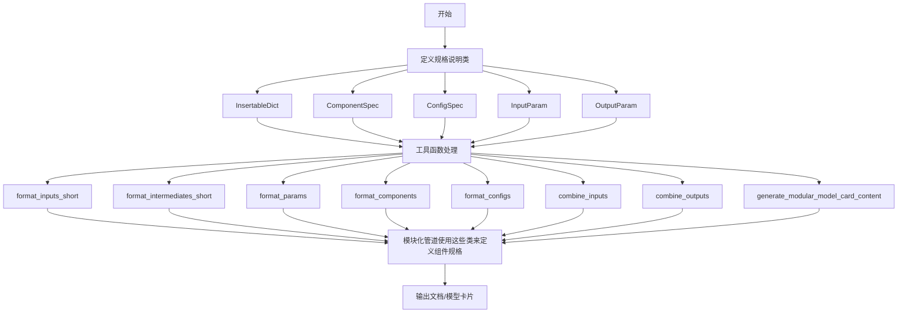

## 类结构

```
Object (Python基类)
├── InsertableDict (OrderedDict子类)
├── ComponentSpec (dataclass)
│   └── 方法: from_component, create, load, decode_load_id, etc.
├── ConfigSpec (dataclass)
├── InputParam (dataclass)
│   └── 方法: template (classmethod)
└── OutputParam (dataclass)
    └── 方法: template (classmethod)

工具函数模块
├── format_inputs_short
├── format_intermediates_short
├── format_params
├── format_input_params
├── format_output_params
├── format_components
├── format_configs
├── format_workflow
├── make_doc_string
├── combine_inputs
├── combine_outputs
└── generate_modular_model_card_content
```

## 全局变量及字段


### `logger`
    
用于记录模块日志的Logger对象

类型：`logging.Logger`
    


### `MODULAR_MODEL_CARD_TEMPLATE`
    
模块化管道模型卡的字符串模板，包含模型描述、组件、输入输出规范等占位符

类型：`str`
    


### `INPUT_PARAM_TEMPLATES`
    
预定义的输入参数模板字典，包含各种扩散模型参数的名称、类型、默认值和描述

类型：`dict[str, dict]`
    


### `OUTPUT_PARAM_TEMPLATES`
    
预定义的输出参数模板字典，包含生成图像、潜在向量等输出参数的类型和描述

类型：`dict[str, dict]`
    


### `InsertableDict.继承自OrderedDict，无自定义字段`
    
继承自OrderedDict的字典类，支持在指定位置插入键值对

类型：`OrderedDict`
    


### `ComponentSpec.name`
    
组件的唯一标识名称

类型：`str | None`
    


### `ComponentSpec.type_hint`
    
组件的Python类型提示（如UNet2DConditionModel）

类型：`Type | None`
    


### `ComponentSpec.description`
    
组件的可选描述信息

类型：`str | None`
    


### `ComponentSpec.config`
    
组件初始化配置字典

类型：`FrozenDict | None`
    


### `ComponentSpec.pretrained_model_name_or_path`
    
预训练模型的路径或HuggingFace Hub模型ID

类型：`str | list[str] | None`
    


### `ComponentSpec.subfolder`
    
预训练模型目录中的子文件夹路径

类型：`str | None`
    


### `ComponentSpec.variant`
    
预训练模型的变体（如fp16、fp32等）

类型：`str | None`
    


### `ComponentSpec.revision`
    
预训练模型的Git提交修订版本

类型：`str | None`
    


### `ComponentSpec.default_creation_method`
    
组件的默认创建方式（从配置或从预训练模型加载）

类型：`Literal["from_config", "from_pretrained"]`
    


### `ComponentSpec.repo`
    
已废弃的字段，现使用pretrained_model_name_or_path

类型：`str | list[str] | None`
    


### `ConfigSpec.name`
    
配置参数的名称

类型：`str`
    


### `ConfigSpec.default`
    
配置参数的默认值

类型：`Any`
    


### `ConfigSpec.description`
    
配置参数的可选描述

类型：`str | None`
    


### `InputParam.name`
    
输入参数的名称

类型：`str | None`
    


### `InputParam.type_hint`
    
输入参数的类型提示

类型：`Any`
    


### `InputParam.default`
    
输入参数的默认值

类型：`Any`
    


### `InputParam.required`
    
标记输入参数是否为必需参数

类型：`bool`
    


### `InputParam.description`
    
输入参数的文字描述

类型：`str`
    


### `InputParam.kwargs_type`
    
输入参数的kwargs类型标识（如denoiser_input_fields）

类型：`str | None`
    


### `InputParam.metadata`
    
输入参数的额外元数据信息

类型：`dict[str, Any] | None`
    


### `OutputParam.name`
    
输出参数的名称

类型：`str`
    


### `OutputParam.type_hint`
    
输出参数的类型提示

类型：`Any`
    


### `OutputParam.description`
    
输出参数的文字描述

类型：`str`
    


### `OutputParam.kwargs_type`
    
输出参数的kwargs类型标识

类型：`str | None`
    


### `OutputParam.metadata`
    
输出参数的额外元数据信息

类型：`dict[str, Any] | None`
    
    

## 全局函数及方法


### `format_inputs_short`

将输入参数列表格式化为字符串表示，必填参数放在前面，可选参数放在后面。

参数：

-  `inputs`：`list`，输入参数列表，每个元素具有 `required`、`name` 和 `default` 属性（可选参数）

返回值：`str`，格式化后的输入参数字符串

#### 流程图

```mermaid
flowchart TD
    A[开始] --> B[接收 inputs 参数]
    B --> C[筛选必填参数 required_inputs]
    B --> D[筛选可选参数 optional_inputs]
    C --> E[拼接必填参数名称<br/>required_str = ', '.join(param.name)]
    D --> F[拼接可选参数名称和默认值<br/>optional_str = ', '.join(param.name=param.default)]
    E --> G{required_str 是否为空}
    G -->|是| H[inputs_str = optional_str]
    G -->|否| I{optional_str 是否存在}
    I -->|是| J[inputs_str = required_str + ', ' + optional_str]
    I -->|否| K[inputs_str = required_str]
    H --> L[返回 inputs_str]
    J --> L
    K --> L
```

#### 带注释源码

```python
def format_inputs_short(inputs):
    """
    Format input parameters into a string representation, with required params first followed by optional ones.

    Args:
        inputs: list of input parameters with 'required' and 'name' attributes, and 'default' for optional params

    Returns:
        str: Formatted string of input parameters

    Example:
        >>> inputs = [ ... InputParam(name="prompt", required=True), ... InputParam(name="image", required=True), ...
        InputParam(name="guidance_scale", required=False, default=7.5), ... InputParam(name="num_inference_steps",
        required=False, default=50) ... ] >>> format_inputs_short(inputs) 'prompt, image, guidance_scale=7.5,
        num_inference_steps=50'
    """
    # 从输入列表中筛选出必填参数 (required=True)
    required_inputs = [param for param in inputs if param.required]
    
    # 从输入列表中筛选出可选参数 (required=False)
    optional_inputs = [param for param in inputs if not param.required]

    # 将必填参数名称用逗号连接成字符串
    required_str = ", ".join(param.name for param in required_inputs)
    
    # 将可选参数名称和默认值用逗号连接，格式为 "name=default"
    optional_str = ", ".join(f"{param.name}={param.default}" for param in optional_inputs)

    # 初始化结果字符串为必填参数部分
    inputs_str = required_str
    
    # 如果存在可选参数
    if optional_str:
        # 如果有必填参数，则在两者之间添加逗号和空格
        # 否则直接使用可选参数字符串
        inputs_str = f"{inputs_str}, {optional_str}" if required_str else optional_str

    # 返回格式化后的参数字符串
    return inputs_str
```


### `format_intermediates_short`

该函数用于将模块的中间输入和中间输出格式化为可读的字符串表示形式，便于文档生成和调试。它会区分必需的输入、修改的变量（同时出现在输入和输出中）以及新生成的输出。

参数：

- `intermediate_inputs`：`list`，中间输入参数列表，每个元素为包含 `name` 和 `kwargs_type` 属性的对象
- `required_intermediate_inputs`：`list`，必需的中间输入名称集合，用于标记哪些输入是必需的
- `intermediate_outputs`：`list`，中间输出参数列表，每个元素为包含 `name` 属性的对象

返回值：`str`，格式化后的字符串，包含 inputs、modified 和 outputs 三个部分

#### 流程图

```mermaid
flowchart TD
    A[开始 format_intermediates_short] --> B{input_parts 是否为空}
    B -->|否| C[遍历 intermediate_inputs]
    B -->|是| D{modified_parts 是否为空}
    
    C --> E{输入名在 required_intermediate_inputs 中?}
    E -->|是| F[添加 Required{输入名} 到 input_parts]
    E -->|否| G{输入名是否为 None 且有 kwargs_type?}
    G -->|是| H[添加 *_kwargs_type 到 input_parts]
    G -->|否| I[添加输入名到 input_parts]
    
    H --> D
    F --> D
    I --> D
    
    D --> J{new_output_parts 是否为空}
    J -->|否| K[遍历 intermediate_outputs]
    J -->是| L[构建输出字符串]
    
    K --> L{输出名在输入集合中?}
    L -->|是| M[添加输出名到 modified_parts]
    L -->|否| N[添加输出名到 new_output_parts]
    
    M --> J
    N --> J
    
    L --> O{input_parts 有内容?}
    O -->|是| P[添加 - inputs: ... 到结果]
    O -->|否| Q{modified_parts 有内容?}
    
    Q -->|是| R[添加 - modified: ... 到结果]
    Q -->|否| S{new_output_parts 有内容?}
    
    S -->|是| T[添加 - outputs: ... 到结果]
    S -->|否| U[返回 (none)]
    
    P --> V[返回格式化字符串]
    R --> V
    T --> V
    U --> V
```

#### 带注释源码

```python
def format_intermediates_short(intermediate_inputs, required_intermediate_inputs, intermediate_outputs):
    """
    Formats intermediate inputs and outputs of a block into a string representation.

    Args:
        intermediate_inputs: list of intermediate input parameters
        required_intermediate_inputs: list of required intermediate input names
        intermediate_outputs: list of intermediate output parameters

    Returns:
        str: Formatted string like:
            Intermediates:
                - inputs: Required(latents), dtype
                - modified: latents # variables that appear in both inputs and outputs
                - outputs: images # new outputs only
    """
    # 处理输入参数
    input_parts = []
    for inp in intermediate_inputs:
        # 检查输入是否为必需输入
        if inp.name in required_intermediate_inputs:
            input_parts.append(f"Required({inp.name})")
        else:
            # 处理特殊类型的输入（如 kwargs 类型）
            if inp.name is None and inp.kwargs_type is not None:
                inp_name = "*_" + inp.kwargs_type
            else:
                inp_name = inp.name
            input_parts.append(inp_name)

    # 构建输入名称集合，用于判断修改的变量
    inputs_set = {inp.name for inp in intermediate_inputs}
    modified_parts = []    # 同时出现在输入和输出中的变量
    new_output_parts = []  # 仅在输出中出现的新变量

    # 处理输出参数，区分修改的变量和新输出
    for out in intermediate_outputs:
        if out.name in inputs_set:
            modified_parts.append(out.name)
        else:
            new_output_parts.append(out.name)

    # 组装最终输出字符串
    result = []
    if input_parts:
        result.append(f"    - inputs: {', '.join(input_parts)}")
    if modified_parts:
        result.append(f"    - modified: {', '.join(modified_parts)}")
    if new_output_parts:
        result.append(f"    - outputs: {', '.join(new_output_parts)}")

    return "\n".join(result) if result else "    (none)"
```


### `format_params`

将 InputParam 或 OutputParam 对象列表格式化为可读的字符串表示形式。

参数：

- `params`：`list[InputParam | OutputParam]`，要格式化的参数列表
- `header`：`str`，头部文本（如 "Args" 或 "Returns"），默认值为 "Args"
- `indent_level`：`int`，每个参数行的缩进空格数，默认值为 4
- `max_line_length`：`int`，换行前的最大行长度，默认值为 115

返回值：`str`，代表所有参数的格式化字符串

#### 流程图

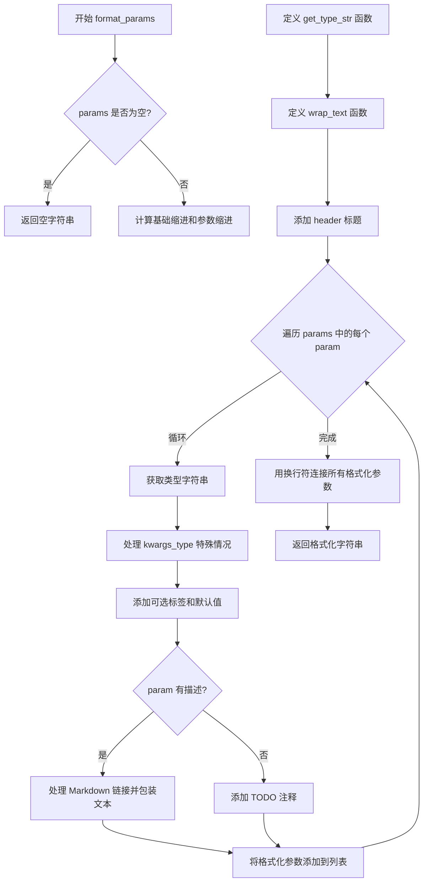

#### 带注释源码

```
def format_params(params, header="Args", indent_level=4, max_line_length=115):
    """Format a list of InputParam or OutputParam objects into a readable string representation.

    Args:
        params: list of InputParam or OutputParam objects to format
        header: Header text to use (e.g. "Args" or "Returns")
        indent_level: Number of spaces to indent each parameter line (default: 4)
        max_line_length: Maximum length for each line before wrapping (default: 115)

    Returns:
        A formatted string representing all parameters
    """
    # 如果参数列表为空，直接返回空字符串
    if not params:
        return ""

    # 计算基础缩进和参数缩进级别
    base_indent = " " * indent_level
    param_indent = " " * (indent_level + 4)
    desc_indent = " " * (indent_level + 8)
    formatted_params = []

    # 定义辅助函数：获取类型字符串
    def get_type_str(type_hint):
        # 处理 UnionType 或 Union 类型，显示多个可能的类型
        if isinstance(type_hint, UnionType) or get_origin(type_hint) is Union:
            type_strs = [t.__name__ if hasattr(t, "__name__") else str(t) for t in get_args(type_hint)]
            return " | ".join(type_strs)
        # 对于其他类型，返回类型名称
        return type_hint.__name__ if hasattr(type_hint, "__name__") else str(type_hint)

    # 定义辅助函数：文本包装，保持 Markdown 链接并维护缩进
    def wrap_text(text, indent, max_length):
        """Wrap text while preserving markdown links and maintaining indentation."""
        words = text.split()
        lines = []
        current_line = []
        current_length = 0

        # 遍历每个单词，计算行长度并在超过最大长度时换行
        for word in words:
            word_length = len(word) + (1 if current_line else 0)

            if current_line and current_length + word_length > max_length:
                lines.append(" ".join(current_line))
                current_line = [word]
                current_length = len(word)
            else:
                current_line.append(word)
                current_length += word_length

        # 处理最后一行
        if current_line:
            lines.append(" ".join(current_line))

        # 使用缩进连接各行
        return f"\n{indent}".join(lines)

    # 添加 header 标题
    formatted_params.append(f"{base_indent}{header}:")

    # 遍历每个参数并格式化
    for param in params:
        # Format parameter name and type
        type_str = get_type_str(param.type_hint) if param.type_hint != Any else ""
        # YiYi Notes: remove this line if we remove kwargs_type
        # 处理 kwargs_type 的特殊情况，使用粗体显示
        name = f"**{param.kwargs_type}" if param.name is None and param.kwargs_type is not None else param.name
        param_str = f"{param_indent}{name} (`{type_str}`"

        # Add optional tag and default value if parameter is an InputParam and optional
        # 如果是 InputParam 且为可选参数，添加 optional 标签和默认值
        if hasattr(param, "required"):
            if not param.required:
                param_str += ", *optional*"
                if param.default is not None:
                    param_str += f", defaults to {param.default}"
        param_str += "):"

        # Add description on a new line with additional indentation and wrapping
        # 处理参数描述，处理 Markdown 链接并包装文本
        if param.description:
            desc = re.sub(r"\[(.*?)\]\((https?://[^\s\)]+)\)", r"[\1](\2)", param.description)
            wrapped_desc = wrap_text(desc, desc_indent, max_line_length)
            param_str += f"\n{desc_indent}{wrapped_desc}"
        else:
            param_str += f"\n{desc_indent}TODO: Add description."

        formatted_params.append(param_str)

    # 返回用换行符连接的格式化参数字符串
    return "\n".join(formatted_params)
```


### `format_input_params`

该函数是一个便捷的封装函数，用于将 `InputParam` 对象列表格式化为人类可读的字符串表示形式，专门用于描述输入参数。它内部调用了通用的 `format_params` 函数，并指定了 "Inputs" 作为参数部分的头部标识。

参数：

-  `input_params`：`list[InputParam]`，要格式化的输入参数对象列表
-  `indent_level`：`int`，每个参数行的缩进空格数（默认为 4）
-  `max_line_length`：`int`，换行前的最大行长度（默认为 115）

返回值：`str`，表示所有输入参数的格式化字符串

#### 流程图

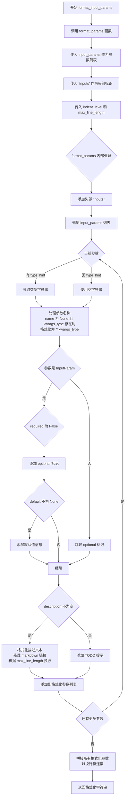

#### 带注释源码

```python
def format_input_params(input_params, indent_level=4, max_line_length=115):
    """Format a list of InputParam objects into a readable string representation.

    Args:
        input_params: list of InputParam objects to format
            要格式化的 InputParam 对象列表，每个对象包含参数名称、类型提示、
            默认值、是否必需、描述等信息
        indent_level: Number of spaces to indent each parameter line (default: 4)
            用于控制输出格式的缩进级别，数值越大输出越靠右
        max_line_length: Maximum length for each line before wrapping (default: 115)
            描述文本的最大行长度，超过此长度会自动换行以提高可读性

    Returns:
        A formatted string representing all input parameters
        返回一个格式化的字符串，包含输入参数部分的标题 "Inputs:" 和
        所有参数的详细信息（名称、类型、默认值、描述等）
    """
    # 调用通用的 format_params 函数，传入 "Inputs" 作为头部标识
    # 该函数会处理所有格式化的细节，包括缩进、换行、类型转换等
    return format_params(input_params, "Inputs", indent_level, max_line_length)
```


### `format_output_params`

格式化输出参数列表为可读的字符串表示形式。该函数是 `format_params` 的包装器，专门用于格式化 `OutputParam` 对象列表，将头部设置为 "Outputs"。

参数：

-  `output_params`：`list[OutputParam]`，要格式化的 OutputParam 对象列表
-  `indent_level`：`int`，每个参数行的缩进空格数（默认值为 4）
-  `max_line_length`：`int`，每行换行前的最大长度（默认值为 115）

返回值：`str`，表示所有输出参数的格式化字符串

#### 流程图

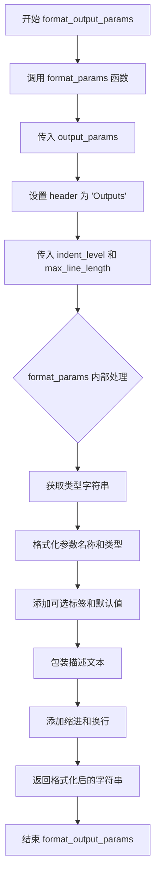

#### 带注释源码

```
def format_output_params(output_params, indent_level=4, max_line_length=115):
    """Format a list of OutputParam objects into a readable string representation.

    Args:
        output_params: list of OutputParam objects to format
        indent_level: Number of spaces to indent each parameter line (default: 4)
        max_line_length: Maximum length for each line before wrapping (default: 115)

    Returns:
        A formatted string representing all output parameters
    """
    # 调用 format_params 函数，将 header 参数设置为 "Outputs"
    # 该函数会处理 OutputParam 对象的格式化，包括：
    # 1. 获取每个参数的类型字符串（处理 UnionType 等复杂类型）
    # 2. 格式化参数名称和类型
    # 3. 添加可选标签和默认值（如果参数是 InputParam 才有意义，OutputParam 没有 required 属性）
    # 4. 包装描述文本以适应 max_line_length
    # 5. 添加适当的缩进
    return format_params(output_params, "Outputs", indent_level, max_line_length)
```


### `format_components`

该函数用于将 `ComponentSpec` 对象列表格式化为可读的字符串表示形式，常用于生成模块化管道的文档描述。

参数：

-  `components`：`list[ComponentSpec]`，待格式化的 ComponentSpec 对象列表
-  `indent_level`：`int`，每个组件行的缩进空格数（默认值为 4）
-  `max_line_length`：`int`，每行在换行前的最大长度（默认值为 115）
-  `add_empty_lines`：`bool`，是否在组件之间添加空行（默认值为 True）

返回值：`str`，格式化后的组件描述字符串

#### 流程图

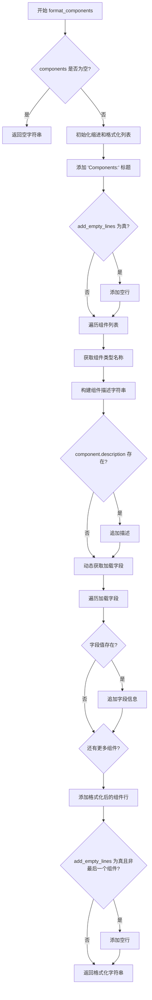

#### 带注释源码

```python
def format_components(components, indent_level=4, max_line_length=115, add_empty_lines=True):
    """Format a list of ComponentSpec objects into a readable string representation.

    Args:
        components: list of ComponentSpec objects to format
        indent_level: Number of spaces to indent each component line (default: 4)
        max_line_length: Maximum length for each line before wrapping (default: 115)
        add_empty_lines: Whether to add empty lines between components (default: True)

    Returns:
        A formatted string representing all components
    """
    # 处理空列表情况，直接返回空字符串
    if not components:
        return ""

    # 初始化基础缩进和组件缩进
    base_indent = " " * indent_level
    component_indent = " " * (indent_level + 4)
    formatted_components = []

    # 添加 "Components:" 标题头
    formatted_components.append(f"{base_indent}Components:")
    # 根据参数决定是否添加空行
    if add_empty_lines:
        formatted_components.append("")

    # 遍历每个 ComponentSpec 对象
    for i, component in enumerate(components):
        # 获取类型名称，处理特殊 cases（类或字符串）
        type_name = (
            component.type_hint.__name__ if hasattr(component.type_hint, "__name__") else str(component.type_hint)
        )

        # 构建组件基础描述：名称 + 类型
        component_desc = f"{component_indent}{component.name} (`{type_name}`)"
        # 如果存在描述，则追加到描述字符串
        if component.description:
            component_desc += f": {component.description}"

        # 动态获取加载字段（来自 ComponentSpec.loading_fields()）
        loading_field_values = []
        for field_name in component.loading_fields():
            field_value = getattr(component, field_name)
            if field_value:  # 只添加有值的字段
                loading_field_values.append(f"{field_name}={field_value}")

        # 如果存在加载字段信息，则追加到描述字符串
        if loading_field_values:
            component_desc += f" [{', '.join(loading_field_values)}]"

        # 添加当前组件的格式化行
        formatted_components.append(component_desc)

        # 在非最后一个组件后添加空行（如果 add_empty_lines 为真）
        if add_empty_lines and i < len(components) - 1:
            formatted_components("")

    # 将所有行连接成最终字符串并返回
    return "\n".join(formatted_components)
```


### `format_configs`

该函数用于将 `ConfigSpec` 对象列表格式化为可读的字符串表示，支持自定义缩进级别和行长度限制，常用于生成文档或日志输出。

参数：

-  `configs`：`list[ConfigSpec]`，要格式化的 ConfigSpec 对象列表
-  `indent_level`：`int`，每个配置行的缩进空格数（默认值为 4）
-  `max_line_length`：`int`，每行换行前的最大长度（默认值为 115）
-  `add_empty_lines`：`bool`，是否在配置之间添加空行（默认值为 True）

返回值：`str`，格式化后的字符串，如果输入为空则返回空字符串

#### 流程图

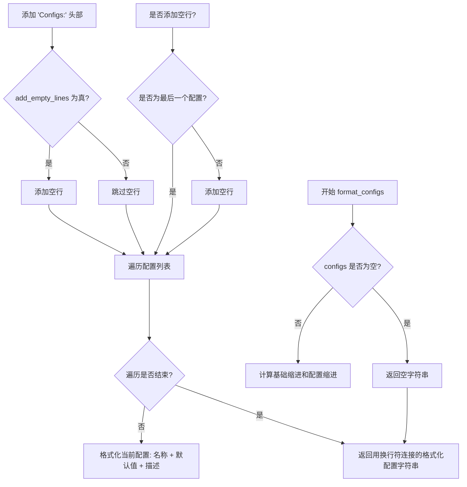

#### 带注释源码

```python
def format_configs(configs, indent_level=4, max_line_length=115, add_empty_lines=True):
    """Format a list of ConfigSpec objects into a readable string representation.

    Args:
        configs: list of ConfigSpec objects to format  # 要格式化的 ConfigSpec 对象列表
        indent_level: Number of spaces to indent each config line (default: 4)  # 每个配置行的缩进空格数
        max_line_length: Maximum length for each line before wrapping (default: 115)  # 每行最大长度
        add_empty_lines: Whether to add empty lines between configs (default: True)  # 是否在配置间添加空行

    Returns:
        A formatted string representing all configs  # 格式化后的配置字符串
    """
    # 如果配置列表为空，直接返回空字符串
    if not configs:
        return ""

    # 计算基础缩进：indent_level 个空格
    base_indent = " " * indent_level
    # 计算配置缩进：基础缩进 + 4 个空格
    config_indent = " " * (indent_level + 4)
    # 用于存储格式化后的配置字符串
    formatted_configs = []

    # 添加 "Configs:" 头部，使用基础缩进
    formatted_configs.append(f"{base_indent}Configs:")
    # 如果需要添加空行，在头部后添加空行
    if add_empty_lines:
        formatted_configs.append("")

    # 遍历每个 ConfigSpec 对象
    for i, config in enumerate(configs):
        # 格式化配置描述：名称 + 默认值
        config_desc = f"{config_indent}{config.name} (default: {config.default})"
        # 如果配置有描述，添加到描述中
        if config.description:
            config_desc += f": {config.description}"
        # 添加格式化后的配置描述到列表
        formatted_configs.append(config_desc)

        # 如果需要添加空行且不是最后一个配置，在配置后添加空行
        if add_empty_lines and i < len(configs) - 1:
            formatted_configs.append("")

    # 将格式化后的配置列表用换行符连接成字符串并返回
    return "\n".join(formatted_configs)
```


### `format_workflow`

将工作流映射表格式化为可读的字符串表示形式，用于展示支持的工作流及其触发条件。

参数：

- `workflow_map`：`Dict[str, Dict[str, bool]]`，字典，键为工作流名称，值为触发输入的字典（布尔值表示该输入是否为必需）

返回值：`str`，格式化后的工作流描述字符串

#### 流程图

```mermaid
flowchart TD
    A[开始 format_workflow] --> B{workflow_map is None?}
    B -->|Yes| C[返回空字符串 '']
    B -->|No| D[初始化 lines = ['Supported workflows:']]
    D --> E[遍历 workflow_map.items()]
    E --> F{trigger_inputs 中 v=True 的数量 > 0?}
    F -->|Yes| G[收集所有 required_inputs]
    G --> H[格式化 inputs_str = `输入1`, `输入2`, ...]
    H --> I[添加行: - `workflow_name`: requires {inputs_str}]
    F -->|No| J[添加行: - `workflow_name`: default (no additional inputs required)]
    I --> K{继续遍历?}
    J --> K
    K -->|Yes| E
    K -->|No| L[返回 '\n'.join(lines)]
    L --> M[结束]
```

#### 带注释源码

```python
def format_workflow(workflow_map):
    """Format a workflow map into a readable string representation.

    Args:
        workflow_map: Dictionary mapping workflow names to trigger inputs

    Returns:
        A formatted string representing all workflows
    """
    # 如果工作流映射为空，直接返回空字符串
    if workflow_map is None:
        return ""

    # 初始化结果列表，以 "Supported workflows:" 标题开始
    lines = ["Supported workflows:"]
    
    # 遍历每个工作流及其触发输入
    for workflow_name, trigger_inputs in workflow_map.items():
        # 筛选出必需的输入（值为 True 的键）
        required_inputs = [k for k, v in trigger_inputs.items() if v]
        
        if required_inputs:
            # 如果有必需输入，格式化输入名称为代码块样式
            inputs_str = ", ".join(f"`{t}`" for t in required_inputs)
            lines.append(f"  - `{workflow_name}`: requires {inputs_str}")
        else:
            # 如果没有必需输入，标记为默认工作流
            lines.append(f"  - `{workflow_name}`: default (no additional inputs required)")

    # 将所有行连接成单个字符串返回
    return "\n".join(lines)
```


### `make_doc_string`

该函数用于生成格式化的文档字符串，描述管道块的参数和结构，支持可选的类名、组件配置和输入输出参数格式化。

参数：

-  `inputs`：`list[InputParam]`，输入参数列表
-  `outputs`：`list[OutputParam]`，输出参数列表
-  `description`：`str`，可选，块的描述
-  `class_name`：`str | None`，可选，要包含在文档中的类名
-  `expected_components`：`list[ComponentSpec] | None`，可选，预期组件列表
-  `expected_configs`：`list[ConfigSpec] | None`，可选，预期配置列表

返回值：`str`，包含组件、配置、调用参数和最终输出信息的格式化字符串

#### 流程图

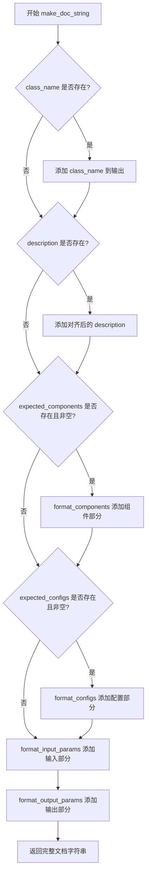

#### 带注释源码

```python
def make_doc_string(
    inputs,                          # 输入参数列表 (InputParam 对象列表)
    outputs,                         # 输出参数列表 (OutputParam 对象列表)
    description="",                  # 可选的块描述字符串
    class_name=None,                 # 可选的类名
    expected_components=None,        # 可选的组件规格列表 (ComponentSpec)
    expected_configs=None,           # 可选的配置规格列表 (ConfigSpec)
):
    """
    生成格式化的文档字符串，描述管道块的参数和结构。

    Args:
        inputs: 输入参数列表
        intermediate_inputs: 中间输入参数列表
        outputs: 输出参数列表
        description (str, *optional*): 块的描述
        class_name (str, *optional*): 包含在文档中的类名
        expected_components (list[ComponentSpec], *optional*): 预期组件列表
        expected_configs (list[ConfigSpec], *optional*): 预期配置列表

    Returns:
        str: 包含组件、配置、调用参数、中间输入/输出和最终输出信息的格式化字符串
    """
    output = ""  # 初始化输出字符串

    # 如果提供了 class_name，则添加到输出中
    if class_name:
        output += f"class {class_name}\n\n"

    # 如果提供了 description，则添加到输出中
    # 将描述的每一行左对齐两个空格
    if description:
        desc_lines = description.strip().split("\n")
        aligned_desc = "\n".join("  " + line.rstrip() for line in desc_lines)
        output += aligned_desc + "\n\n"

    # 如果提供了 expected_components，则格式化并添加到输出
    if expected_components and len(expected_components) > 0:
        components_str = format_components(expected_components, indent_level=2, add_empty_lines=False)
        output += components_str + "\n\n"

    # 如果提供了 expected_configs，则格式化并添加到输出
    if expected_configs and len(expected_configs) > 0:
        configs_str = format_configs(expected_configs, indent_level=2, add_empty_lines=False)
        output += configs_str + "\n\n"

    # 格式化输入参数并添加到输出
    output += format_input_params(inputs, indent_level=2)

    # 格式化输出参数并添加到输出
    output += "\n\n"
    output += format_output_params(outputs, indent_level=2)

    return output  # 返回完整的文档字符串
```


### `combine_inputs`

该函数用于合并来自不同块的多个 InputParam 对象列表。对于重复的输入参数，仅在当前默认值 为 None 且新默认值不为 None 时进行更新。如果存在多个不同的非 None 默认值，则会发出警告。

参数：

-  `named_input_lists`：`list[tuple[str, list[InputParam]]]`，由 (block_name, input_param_list) 元组组成的列表

返回值：`list[InputParam]`，合并后的唯一 InputParam 对象列表

#### 流程图

```mermaid
flowchart TD
    A[开始 combine_inputs] --> B[初始化 combined_dict 和 value_sources]
    B --> C[遍历 named_input_lists 中的每个 block_name 和 inputs]
    C --> D{遍历每个 input_param}
    D --> E{input_param.name 是否为 None 且 kwargs_type 存在?}
    E -->|是| F[input_name = '*_' + kwargs_type]
    E -->|否| G[input_name = input_param.name]
    G --> H{input_name 是否已在 combined_dict 中?}
    H -->|是| I[获取当前参数 current_param]
    I --> J{current_param.default 和 input_param.default 都非 None 且不相等?}
    J -->|是| K[发出警告: 多个不同默认值]
    J -->|否| L{current_param.default 为 None 且 input_param.default 非 None?}
    L -->|是| M[更新 combined_dict[input_name] 和 value_sources]
    L -->|否| N[保持原参数不变]
    K --> N
    H -->|否| O[直接添加 input_param 到 combined_dict]
    O --> P[设置 value_sources[input_name] = block_name]
    M --> Q[继续处理下一个 input_param]
    N --> Q
    Q --> R{是否还有更多 input_param?}
    R -->|是| D
    R -->|否| S{是否还有更多 block?}
    S -->|是| C
    S -->|否| T[返回 list(combined_dict.values())]
    T --> U[结束]

    style A fill:#f9f,color:#333
    style T fill:#9f9,color:#333
    style K fill:#ff9,color:#333
```

#### 带注释源码

```python
def combine_inputs(*named_input_lists: list[tuple[str, list[InputParam]]]) -> list[InputParam]:
    """
    Combines multiple lists of InputParam objects from different blocks. For duplicate inputs, updates only if current
    default value is None and new default value is not None. Warns if multiple non-None default values exist for the
    same input.

    Args:
        named_input_lists: List of tuples containing (block_name, input_param_list) pairs

    Returns:
        List[InputParam]: Combined list of unique InputParam objects
    """
    combined_dict = {}  # name -> InputParam: 存储合并后的参数，键为参数名
    value_sources = {}  # name -> block_name: 记录每个参数来源于哪个块

    # 遍历每个块及其输入参数列表
    for block_name, inputs in named_input_lists:
        for input_param in inputs:
            # 处理特殊参数名：如果 name 为 None 但 kwargs_type 存在，则使用 "*_" + kwargs_type 作为名称
            if input_param.name is None and input_param.kwargs_type is not None:
                input_name = "*_" + input_param.kwargs_type
            else:
                input_name = input_param.name
            
            # 如果参数已存在，进行合并逻辑处理
            if input_name in combined_dict:
                current_param = combined_dict[input_name]
                
                # 检测冲突：两个不同的非 None 默认值
                if (
                    current_param.default is not None
                    and input_param.default is not None
                    and current_param.default != input_param.default
                ):
                    warnings.warn(
                        f"Multiple different default values found for input '{input_name}': "
                        f"{current_param.default} (from block '{value_sources[input_name]}') and "
                        f"{input_param.default} (from block '{block_name}'). Using {current_param.default}."
                    )
                
                # 仅当当前默认值为 None 且新默认值非 None 时才更新
                if current_param.default is None and input_param.default is not None:
                    combined_dict[input_name] = input_param
                    value_sources[input_name] = block_name
            else:
                # 新参数，直接添加到字典中
                combined_dict[input_name] = input_param
                value_sources[input_name] = block_name

    # 返回合并后的参数列表
    return list(combined_dict.values())
```


### `combine_outputs`

该函数用于合并多个来自不同块的输出参数列表，对于重复的输出名称保留首次出现的定义，并在原有输出缺少 `kwargs_type` 但新输出具有 `kwargs_type` 时进行更新。

参数：

-  `*named_output_lists`：`list[tuple[str, list[OutputParam]]]`，可变数量的命名输出列表，每个元素为包含（块名称, 输出参数列表）的元组

返回值：`list[OutputParam]`，合并后的唯一 OutputParam 对象列表

#### 流程图

```mermaid
flowchart TD
    A[开始 combine_outputs] --> B{检查是否还有未处理的命名输出列表}
    B -->|是| C[取出下一个命名输出列表]
    B -->|否| H[返回合并结果列表]
    
    C --> D{检查该列表中的输出参数}
    D -->|还有输出| E[获取当前输出参数 output_param]
    D -->|处理完毕| B
    
    E --> F{检查输出名称是否已存在或需要更新}
    F -->|是| G[将输出参数添加到合并字典]
    F -->|否| D
    
    G --> D
    
    subgraph 合并逻辑
        F -.-> F1[output_param.name 不在 combined_dict 中]
        F -.-> F2[combined_dict[output_param.name].kwargs_type 为 None<br/>但 output_param.kwargs_type 不为 None]
    end
```

#### 带注释源码

```python
def combine_outputs(*named_output_lists: list[tuple[str, list[OutputParam]]]) -> list[OutputParam]:
    """
    Combines multiple lists of OutputParam objects from different blocks. For duplicate outputs, keeps the first
    occurrence of each output name.

    Args:
        named_output_lists: List of tuples containing (block_name, output_param_list) pairs

    Returns:
        List[OutputParam]: Combined list of unique OutputParam objects
    """
    # 使用字典存储合并后的输出，键为输出名称，值为 OutputParam 对象
    combined_dict = {}  # name -> OutputParam

    # 遍历所有传入的命名输出列表
    for block_name, outputs in named_output_lists:
        # 遍历每个块中的输出参数
        for output_param in outputs:
            # 判断是否需要将该输出添加到合并结果中
            # 条件1: 输出名称尚不存在于 combined_dict 中（首次出现）
            # 条件2: 或已存在的输出没有 kwargs_type，但当前输出有 kwargs_type（更新更详细的定义）
            if (output_param.name not in combined_dict) or (
                combined_dict[output_param.name].kwargs_type is None and output_param.kwargs_type is not None
            ):
                # 将输出参数添加到合并字典中
                combined_dict[output_param.name] = output_param

    # 返回合并后的所有 OutputParam 对象列表
    return list(combined_dict.values())
```


### `generate_modular_model_card_content`

该函数用于生成模块化管道的模型卡片内容，创建一个包含管道架构、组件、配置、输入输出规范的综合描述文档。

参数：

- `blocks`：`Any`，管道的 blocks 对象，包含所有管道规范信息

返回值：`dict[str, Any]`，包含以下键的字典：
- `pipeline_name`：管道名称
- `model_description`：模型描述
- `blocks_description`：块架构描述
- `components_description`：组件描述
- `configs_section`：配置参数部分
- `inputs_description`：输入参数规范
- `outputs_description`：输出参数规范
- `trigger_inputs_section`：条件执行信息
- `tags`：模型卡片标签列表

#### 流程图

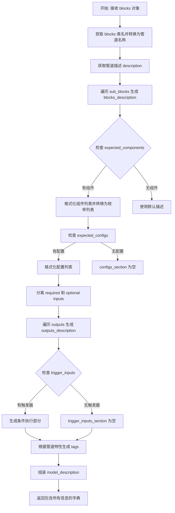

#### 带注释源码

```python
def generate_modular_model_card_content(blocks) -> dict[str, Any]:
    """
    Generate model card content for a modular pipeline.

    This function creates a comprehensive model card with descriptions of the pipeline's architecture, components,
    configurations, inputs, and outputs.

    Args:
        blocks: The pipeline's blocks object containing all pipeline specifications

    Returns:
        Dict[str, Any]: A dictionary containing formatted content sections:
            - pipeline_name: Name of the pipeline
            - model_description: Overall description with pipeline type
            - blocks_description: Detailed architecture of blocks
            - components_description: List of required components
            - configs_section: Configuration parameters section
            - inputs_description: Input parameters specification
            - outputs_description: Output parameters specification
            - trigger_inputs_section: Conditional execution information
            - tags: List of relevant tags for the model card
    """
    # 1. 获取 blocks 类的名称并转换为管道名称（如 "ModularPipelineBlocks" -> "ModularPipeline Pipeline"）
    blocks_class_name = blocks.__class__.__name__
    pipeline_name = blocks_class_name.replace("Blocks", " Pipeline")
    
    # 2. 获取管道的描述，默认为 "A modular diffusion pipeline."
    description = getattr(blocks, "description", "A modular diffusion pipeline.")

    # 3. 生成 blocks 架构描述
    blocks_desc_parts = []
    # 获取所有子块
    sub_blocks = getattr(blocks, "sub_blocks", None) or {}
    if sub_blocks:
        # 遍历每个子块，生成编号列表
        for i, (name, block) in enumerate(sub_blocks.items()):
            block_class = block.__class__.__name__
            # 获取块描述的第一行
            block_desc = block.description.split("\n")[0] if getattr(block, "description", "") else ""
            blocks_desc_parts.append(f"{i + 1}. **{name}** (`{block_class}`)")
            if block_desc:
                blocks_desc_parts.append(f"   - {block_desc}")

            # 处理嵌套的子块
            if hasattr(block, "sub_blocks") and block.sub_blocks:
                for sub_name, sub_block in block.sub_blocks.items():
                    sub_class = sub_block.__class__.__name__
                    sub_desc = sub_block.description.split("\n")[0] if getattr(sub_block, "description", "") else ""
                    blocks_desc_parts.append(f"   - *{sub_name}*: `{sub_class}`")
                    if sub_desc:
                        blocks_desc_parts.append(f"     - {sub_desc}")

    # 如果没有块定义，使用默认描述
    blocks_description = "\n".join(blocks_desc_parts) if blocks_desc_parts else "No blocks defined."

    # 4. 格式化组件描述
    components = getattr(blocks, "expected_components", [])
    if components:
        # 使用 format_components 函数格式化组件列表
        components_str = format_components(components, indent_level=0, add_empty_lines=False)
        # 移除 "Components:" 标题，因为模板有自己的标题
        components_description = components_str.replace("Components:\n", "").strip()
        if components_description:
            # 转换为枚举列表（1., 2., 3.）
            lines = [line.strip() for line in components_description.split("\n") if line.strip()]
            enumerated_lines = [f"{i + 1}. {line}" for i, line in enumerate(lines)]
            components_description = "\n".join(enumerated_lines)
        else:
            components_description = "No specific components required."
    else:
        components_description = "No specific components required. Components can be loaded dynamically."

    # 5. 格式化配置描述
    configs = getattr(blocks, "expected_configs", [])
    configs_section = ""
    if configs:
        configs_str = format_configs(configs, indent_level=0, add_empty_lines=False)
        configs_description = configs_str.replace("Configs:\n", "").strip()
        if configs_description:
            configs_section = f"\n\n## Configuration Parameters\n\n{configs_description}"

    # 6. 获取输入和输出
    inputs = blocks.inputs
    outputs = blocks.outputs

    # 7. 格式化输入为 markdown 列表
    inputs_parts = []
    # 分离必需和可选输入
    required_inputs = [inp for inp in inputs if inp.required]
    optional_inputs = [inp for inp in inputs if not inp.required]

    if required_inputs:
        inputs_parts.append("**Required:**\n")
        for inp in required_inputs:
            # 获取类型名称
            if hasattr(inp.type_hint, "__name__"):
                type_str = inp.type_hint.__name__
            elif inp.type_hint is not None:
                type_str = str(inp.type_hint).replace("typing.", "")
            else:
                type_str = "Any"
            desc = inp.description or "No description provided"
            inputs_parts.append(f"- `{inp.name}` (`{type_str}`): {desc}")

    if optional_inputs:
        if required_inputs:
            inputs_parts.append("")
        inputs_parts.append("**Optional:**\n")
        for inp in optional_inputs:
            if hasattr(inp.type_hint, "__name__"):
                type_str = inp.type_hint.__name__
            elif inp.type_hint is not None:
                type_str = str(inp.type_hint).replace("typing.", "")
            else:
                type_str = "Any"
            desc = inp.description or "No description provided"
            # 添加默认值信息
            default_str = f", default: `{inp.default}`" if inp.default is not None else ""
            inputs_parts.append(f"- `{inp.name}` (`{type_str}`){default_str}: {desc}")

    inputs_description = "\n".join(inputs_parts) if inputs_parts else "No specific inputs defined."

    # 8. 格式化输出为 markdown 列表
    outputs_parts = []
    for out in outputs:
        if hasattr(out.type_hint, "__name__"):
            type_str = out.type_hint.__name__
        elif out.type_hint is not None:
            type_str = str(out.type_hint).replace("typing.", "")
        else:
            type_str = "Any"
        desc = out.description or "No description provided"
        outputs_parts.append(f"- `{out.name}` (`{type_str}`): {desc}")

    outputs_description = "\n".join(outputs_parts) if outputs_parts else "Standard pipeline outputs."

    # 9. 生成条件执行部分
    trigger_inputs_section = ""
    if hasattr(blocks, "trigger_inputs") and blocks.trigger_inputs:
        trigger_inputs_list = sorted([t for t in blocks.trigger_inputs if t is not None])
        if trigger_inputs_list:
            trigger_inputs_str = ", ".join(f"`{t}`" for t in trigger_inputs_list)
            trigger_inputs_section = f"""
### Conditional Execution

This pipeline contains blocks that are selected at runtime based on inputs:
- **Trigger Inputs**: {trigger_inputs_str}
"""

    # 10. 根据管道特性生成标签
    tags = ["modular-diffusers", "diffusers"]

    if hasattr(blocks, "model_name") and blocks.model_name:
        tags.append(blocks.model_name)

    # 根据 trigger_inputs 添加特定标签
    if hasattr(blocks, "trigger_inputs") and blocks.trigger_inputs:
        triggers = blocks.trigger_inputs
        if any(t in triggers for t in ["mask", "mask_image"]):
            tags.append("inpainting")
        if any(t in triggers for t in ["image", "image_latents"]):
            tags.append("image-to-image")
        if any(t in triggers for t in ["control_image", "controlnet_cond"]):
            tags.append("controlnet")
        if not any(t in triggers for t in ["image", "mask", "image_latents", "mask_image"]):
            tags.append("text-to-image")
    else:
        tags.append("text-to-image")

    # 11. 组装完整的模型描述
    block_count = len(blocks.sub_blocks)
    model_description = f"""This is a modular diffusion pipeline built with 🧨 Diffusers' modular pipeline framework.

**Pipeline Type**: {blocks_class_name}

**Description**: {description}

This pipeline uses a {block_count}-block architecture that can be customized and extended."""

    # 12. 返回包含所有信息的字典
    return {
        "pipeline_name": pipeline_name,
        "model_description": model_description,
        "blocks_description": blocks_description,
        "components_description": components_description,
        "configs_section": configs_section,
        "inputs_description": inputs_description,
        "outputs_description": outputs_description,
        "trigger_inputs_section": trigger_inputs_section,
        "tags": tags,
    }
```


### `InsertableDict.insert`

该方法用于在有序字典的指定位置插入或移动键值对，支持方法链式调用。如果键已存在，则先移除原键再插入到新位置，从而实现键的移动功能。

参数：

- `key`：任意类型，要插入的键
- `value`：任意类型，要插入的值
- `index`：`int`，插入的位置索引

返回值：`InsertableDict`，返回自身（self）以支持方法链式调用

#### 流程图

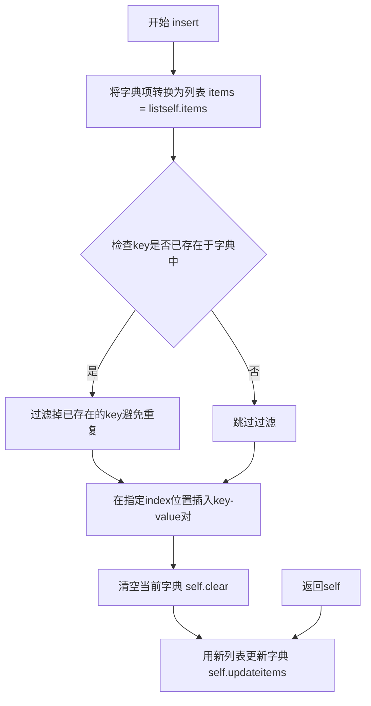

#### 带注释源码

```python
def insert(self, key, value, index):
    """
    在有序字典的指定位置插入或移动键值对。
    
    Args:
        key: 要插入的键
        value: 要插入的值
        index: 插入的位置索引
    
    Returns:
        InsertableDict: 返回自身以支持方法链式调用
    """
    # 将当前字典的键值对转换为列表
    items = list(self.items())

    # 如果键已存在，则移除旧条目以避免重复
    items = [(k, v) for k, v in items if k != key]

    # 在指定索引位置插入新的键值对
    items.insert(index, (key, value))

    # 清空当前字典内容
    self.clear()
    # 用重新排列后的列表更新字典
    self.update(items)

    # 返回self以支持方法链式调用
    return self
```


### `InsertableDict.__repr__`

该方法用于生成 `InsertableDict` 对象的字符串表示形式，提供更具可读性的自定义输出格式。它会遍历字典中的所有键值对，以索引、键和值的形式展示内容，其中值会根据其类型（类或实例）显示不同的表示方式。

参数： 无（`self` 为隐式实例参数）

返回值：`str`，返回 `InsertableDict` 的字符串表示形式

#### 流程图

```mermaid
flowchart TD
    A[开始 __repr__] --> B{self 是否为空?}
    B -->|是| C[返回 "InsertableDict()"]
    B -->|否| D[初始化空列表 items]
    D --> E[遍历 self.items with enumerate]
    E --> F{value 是否为 type 类?}
    F -->|是| G[构建类表示: &lt;class 'module.name'&gt;]
    F -->|否| H[构建对象表示: &lt;obj 'module.name'&gt;]
    G --> I[格式化为 "i: (key, obj_repr)"]
    H --> I
    I --> J{是否还有更多项?}
    J -->|是| E
    J -->|否| K[拼接所有 items]
    K --> L[返回最终字符串: "InsertableDict([\n  " + items + "\n])"]
```

#### 带注释源码

```python
def __repr__(self):
    """
    生成 InsertableDict 的自定义字符串表示形式。
    
    返回格式示例:
    InsertableDict([
      0: ('key1', <class 'module.ClassName'>),
      1: ('key2', <obj 'module.ClassName'>)
    ])
    """
    # 检查字典是否为空，如果为空则返回空字典的表示形式
    if not self:
        return "InsertableDict()"

    # 用于存储格式化后的每个键值对字符串
    items = []
    
    # 遍历字典中的所有项，带索引
    for i, (key, value) in enumerate(self.items()):
        # 判断值是否为类（type 类型）
        if isinstance(value, type):
            # 对于类，显示完整的模块路径和类名
            # 例如: <class 'diffusers.models.unet_2d.UNet2DConditionModel'>
            obj_repr = f"<class '{value.__module__}.{value.__name__}'>"
        else:
            # 对于对象实例，显示类所在的模块和类名
            # 例如: <obj 'diffusers.models.modeling_utils.PreTrainedModel'>
            obj_repr = f"<obj '{value.__class__.__module__}.{value.__class__.__name__}'>"
        
        # 格式化该项为 "索引: (键的repr, 值的表示)" 格式
        items.append(f"{i}: ({repr(key)}, {obj_repr})")

    # 拼接最终字符串，使用换行和缩进提高可读性
    return "InsertableDict([\n  " + ",\n  ".join(items) + "\n])"
```


### `ComponentSpec.__post_init__`

该方法是一个 dataclass 初始化钩子，用于在对象创建后处理遗留的 `repo` 字段（已弃用），将其值自动迁移到 `pretrained_model_name_or_path` 字段，以保持向后兼容性。

参数：
- 无显式参数（隐式参数 `self` 为 ComponentSpec 实例）

返回值：`None`，无返回值（该方法直接修改对象状态）

#### 流程图

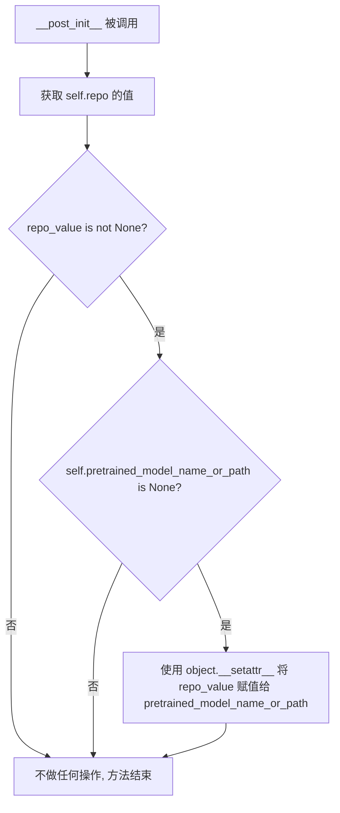

#### 带注释源码

```python
def __post_init__(self):
    """
    处理 dataclass 初始化后的遗留字段迁移。
    
    该方法用于向后兼容：如果用户使用了已弃用的 `repo` 字段，
    且未设置 `pretrained_model_name_or_path`，则自动将 `repo` 的值
    迁移到 `pretrained_model_name_or_path`。
    """
    # 获取已弃用的 repo 字段的值
    repo_value = self.repo
    
    # 只有当 repo 有值 且 pretrained_model_name_or_path 未设置时才进行迁移
    if repo_value is not None and self.pretrained_model_name_or_path is None:
        # 使用 object.__setattr__ 绕过 dataclass 字段的只读限制
        # 因为 pretrained_model_name_or_path 本身是通过 field() 定义的
        object.__setattr__(self, "pretrained_model_name_or_path", repo_value)
```


### `ComponentSpec.__hash__`

使 `ComponentSpec` 对象可哈希，以便可以在集合（如 `set` 和 `dict` 的键）中使用。该方法使用 `name`、`load_id` 和 `default_creation_method` 三个属性来计算哈希值。

参数：

- `self`：`ComponentSpec`，当前 `ComponentSpec` 实例本身

返回值：`int`，基于 `(self.name, self.load_id, self.default_creation_method)` 元组计算得到的整数哈希值

#### 流程图

```mermaid
flowchart TD
    A[开始 __hash__] --> B[获取 self.name]
    B --> C[获取 self.load_id 属性]
    C --> D[获取 self.default_creation_method]
    D --> E[构建元组 (name, load_id, default_creation_method)]
    E --> F[调用内置 hash 函数]
    F --> G[返回哈希值]
```

#### 带注释源码

```python
def __hash__(self):
    """Make ComponentSpec hashable, using load_id as the hash value."""
    # 使用元组 (name, load_id, default_creation_method) 作为哈希输入
    # - name: 组件名称
    # - load_id: 组件的唯一加载标识符，由 pretrained_model_name_or_path|subfolder|variant|revision 组成
    # - default_creation_method: 组件的创建方式 ("from_config" 或 "from_pretrained")
    return hash((self.name, self.load_id, self.default_creation_method))
```


### `ComponentSpec.__eq__`

比较两个 `ComponentSpec` 对象是否相等，基于名称、加载ID和默认创建方法进行相等性判断。

参数：

- `self`：`ComponentSpec`，当前的 ComponentSpec 实例
- `other`：`Any`，要与之比较的对象

返回值：`bool`，如果两个 ComponentSpec 对象相等则返回 `True`，否则返回 `False`

#### 流程图

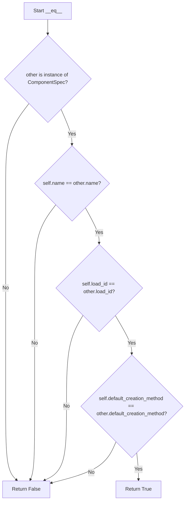

#### 带注释源码

```python
def __eq__(self, other):
    """Compare ComponentSpec objects based on name and load_id."""
    # 首先检查 other 是否为 ComponentSpec 实例
    # 如果不是，直接返回 False，避免后续属性访问可能引发的异常
    if not isinstance(other, ComponentSpec):
        return False
    
    # 比较三个关键属性：
    # 1. name: 组件名称
    # 2. load_id: 组件的唯一加载标识符（由 pretrained_model_name_or_path|subfolder|variant|revision 组成）
    # 3. default_creation_method: 默认创建方法（"from_config" 或 "from_pretrained"）
    # 只有当这三个属性全部相等时，两个 ComponentSpec 对象才被认为是相等的
    return (
        self.name == other.name
        and self.load_id == other.load_id
        and self.default_creation_method == other.default_creation_method
    )
```


### `ComponentSpec.from_component`

从已有的组件对象（如已加载的模型实例、配置对象等）反向推导并创建对应的 `ComponentSpec` 规范对象，使得组件的配置信息和加载来源可以被序列化复用。

参数：

-  `name`：`str`，组件的名称，用于标识该组件在管道中的角色
-  `component`：`Any`，组件对象，可以是任何需要提取规范的对象实例

返回值：`Any`，返回新创建的 `ComponentSpec` 对象实例

#### 流程图

```mermaid
flowchart TD
    A[开始: from_component] --> B{component 是否有 _diffusers_load_id 且 != 'null'}
    
    B -->|是| C[设置 default_creation_method = 'from_pretrained']
    B -->|否| D{component 是否为 torch.nn.Module}
    
    C --> E[获取 type_hint = component.__class__]
    D -->|是| F[抛出 ValueError: nn.Module 未通过 load() 创建]
    D -->|否| G{component 是否为 ConfigMixin}
    
    G -->|是| H[检查是否有 _diffusers_load_id]
    H -->|无| I[发出警告: 组件非 ComponentSpec 创建]
    H -->|有/无| J[设置 default_creation_method = 'from_config']
    
    G -->|否| K[抛出 ValueError: 不支持的组件类型]
    
    I --> E
    J --> E
    
    E --> L{component 是 ConfigMixin 且 default_creation_method == 'from_config'?}
    
    L -->|是| M[config = component.config]
    L -->|否| N[config = None]
    
    M --> O{component 有 _diffusers_load_id 且 != 'null'?}
    N --> O
    
    O -->|是| P[load_spec = cls.decode_load_id(component._diffusers_load_id)]
    O -->|否| Q[load_spec = {}]
    
    P --> R[返回 ComponentSpec 对象]
    Q --> R
    
    R --> S[结束]
    
    style F fill:#ffcccc
    style K fill:#ffcccc
```

#### 带注释源码

```python
@classmethod
def from_component(cls, name: str, component: Any) -> Any:
    """Create a ComponentSpec from a Component.

    Currently supports:
    - Components created with `ComponentSpec.load()` method
    - Components that are ConfigMixin subclasses but not nn.Modules (e.g. schedulers, guiders)

    Args:
        name: Name of the component
        component: Component object to create spec from

    Returns:
        ComponentSpec object

    Raises:
        ValueError: If component is not supported (e.g. nn.Module without load_id, non-ConfigMixin)
    """

    # Check if component was created with ComponentSpec.load()
    # 如果组件是通过 ComponentSpec.load() 方法创建的，它会有 _diffusers_load_id 属性
    # 这个 ID 包含了从预训练模型加载的所有信息
    if hasattr(component, "_diffusers_load_id") and component._diffusers_load_id != "null":
        # component has a usable load_id -> from_pretrained, no warning needed
        # load_id 有效，说明组件是从预训练模型加载的
        default_creation_method = "from_pretrained"
    else:
        # Component doesn't have a usable load_id, check if it's a nn.Module
        # 组件没有有效的 load_id，检查是否是神经网络模块
        if isinstance(component, torch.nn.Module):
            raise ValueError(
                "Cannot create ComponentSpec from a nn.Module that was not created with `ComponentSpec.load()` method."
            )
        # ConfigMixin objects without weights (e.g. scheduler & guider) can be recreated with from_config
        # ConfigMixin 对象（如调度器、引导器）没有权重，可以从配置重建
        elif isinstance(component, ConfigMixin):
            # warn if component was not created with `ComponentSpec`
            # 如果组件不是通过 ComponentSpec 创建的，发出警告
            if not hasattr(component, "_diffusers_load_id"):
                logger.warning(
                    "Component was not created using `ComponentSpec`, defaulting to `from_config` creation method"
                )
            default_creation_method = "from_config"
        else:
            # Not a ConfigMixin and not created with `ComponentSpec.load()` method -> throw error
            # 既不是 ConfigMixin 也不是通过 load() 创建的，抛出错误
            raise ValueError(
                f"Cannot create ComponentSpec from {name}({component.__class__.__name__}). Currently ComponentSpec.from_component() only supports: "
                f" - components created with `ComponentSpec.load()` method"
                f" - components that are a subclass of ConfigMixin but not a nn.Module (e.g. guider, scheduler)."
            )

    # 获取组件的类型提示，用于记录组件的实际类名
    type_hint = component.__class__

    # 如果组件是 ConfigMixin 且使用 from_config 创建方法，保存其配置
    # 配置包含了组件的所有初始化参数，可以用于重建组件
    if isinstance(component, ConfigMixin) and default_creation_method == "from_config":
        config = component.config
    else:
        config = None
    
    # 如果组件有有效的 load_id，解码它以获取加载参数
    # load_id 格式: pretrained_model_name_or_path|subfolder|variant|revision
    if hasattr(component, "_diffusers_load_id") and component._diffusers_load_id != "null":
        load_spec = cls.decode_load_id(component._diffusers_load_id)
    else:
        load_spec = {}

    # 创建并返回 ComponentSpec 对象
    # 包含了组件的名称、类型提示、配置、创建方法和加载参数
    return cls(
        name=name, 
        type_hint=type_hint, 
        config=config, 
        default_creation_method=default_creation_method, 
        **load_spec
    )
```


### `ComponentSpec.loading_fields`

返回所有与加载相关的字段名称列表（即 `field.metadata["loading"]` 为 True 的字段）。

参数：

-  `cls`：类型 `ComponentSpec`，隐含的类参数（classmethod）

返回值：`list[str]`，返回所有与加载相关的字段名称列表

#### 流程图

```mermaid
flowchart TD
    A[开始] --> B[cls.loading_fields]
    B --> C{执行}
    C --> D[return DIFFUSERS_LOAD_ID_FIELDS.copy()]
    D --> E[结束]
```

#### 带注释源码

```python
@classmethod
def loading_fields(cls) -> list[str]:
    """
    Return the names of all loading‐related fields (i.e. those whose field.metadata["loading"] is True).
    
    该方法是一个类方法（classmethod），用于获取所有与加载相关的字段名称。
    它通过返回 DIFFUSERS_LOAD_ID_FIELDS 的副本来获取这些字段。
    DIFFUSERS_LOAD_ID_FIELDS 是一个预定义的字段列表，包含了所有标记为 loading=True 的字段。
    
    Returns:
        list[str]: 包含所有加载相关字段名称的列表
    """
    return DIFFUSERS_LOAD_ID_FIELDS.copy()
```


### `ComponentSpec.load_id`

这是一个属性（property），用于生成组件规格的唯一加载标识符。该标识符由 `pretrained_model_name_or_path|subfolder|variant|revision` 四个字段组成，用于唯一标识一个预训练模型的加载配置。

参数：

- `self`：`ComponentSpec`，隐式参数，组件规格实例本身

返回值：`str`，返回格式为 `pretrained_model_name_or_path|subfolder|variant|revision` 的唯一标识符字符串，其中空值被替换为 `"null"`。

#### 流程图

```mermaid
flowchart TD
    A[开始] --> B{default_creation_method == 'from_config'?}
    B -->|是| C[返回 'null']
    B -->|否| D[获取所有 loading_fields]
    D --> E[遍历每个字段值]
    E --> F{值是否为 None?}
    F -->|是| G[替换为 'null']
    F -->|否| H[保留原值]
    G --> I[收集所有处理后的值]
    H --> I
    I --> J[用 '|' 连接所有部分]
    J --> K[返回最终字符串]
```

#### 带注释源码

```python
@property
def load_id(self) -> str:
    """
    Unique identifier for this spec's pretrained load, composed of
    pretrained_model_name_or_path|subfolder|variant|revision (no empty segments).
    """
    # 如果创建方法是 from_config，说明不是从预训练模型加载的，返回 'null'
    if self.default_creation_method == "from_config":
        return "null"
    
    # 获取所有加载相关字段的值（来自 loading_fields 方法）
    # 这些字段包括: pretrained_model_name_or_path, subfolder, variant, revision
    parts = [getattr(self, k) for k in self.loading_fields()]
    
    # 将 None 值替换为字符串 'null'，以便在 load_id 中表示空值
    parts = ["null" if p is None else p for p in parts]
    
    # 用管道符连接所有部分，形成唯一的加载标识符
    # 格式: "pretrained_model_name_or_path|subfolder|variant|revision"
    return "|".join(parts)
```


### `ComponentSpec.decode_load_id`

该方法是一个类方法，用于将之前编码的 `load_id` 字符串解码回包含加载字段的字典格式。它解析以 `|` 分隔的字符串，其中 `"null"` 表示空值，并将其转换为对应的 Python 值（`None` 或实际字符串）。

参数：

-  `load_id`：`str`，要解码的 load_id 字符串，格式为 "pretrained_model_name_or_path|subfolder|variant|revision"，其中 None 值用 "null" 表示

返回值：`dict[str, str | None]`，映射加载字段名称到其值的字典。如果 load_id 是 "null"，返回所有字段为 None 的字典。

#### 流程图

```mermaid
flowchart TD
    A[开始 decode_load_id] --> B[获取所有加载字段 loading_fields]
    B --> C[创建结果字典 result, 键为所有加载字段]
    C --> D{load_id == 'null'?}
    D -->|是| E[直接返回 result]
    D -->|否| F[按 '|' 分割 load_id]
    F --> G[遍历分割后的每个部分]
    G --> H{索引 i < 加载字段数量?}
    H -->|否| G
    H -->|是| I{part == 'null'?}
    I -->|是| J[result[字段名] = None]
    I -->|否| K[result[字段名] = part]
    J --> G
    K --> G
    G --> L{处理完所有部分?}
    L -->|否| G
    L -->|是| M[返回 result]
```

#### 带注释源码

```python
@classmethod
def decode_load_id(cls, load_id: str) -> dict[str, str | None]:
    """
    Decode a load_id string back into a dictionary of loading fields and values.

    Args:
        load_id: The load_id string to decode, format: "pretrained_model_name_or_path|subfolder|variant|revision"
                 where None values are represented as "null"

    Returns:
        Dict mapping loading field names to their values. e.g. {
            "pretrained_model_name_or_path": "path/to/repo", "subfolder": "subfolder", "variant": "variant",
            "revision": "revision"
        } If a segment value is "null", it's replaced with None. Returns None if load_id is "null" (indicating
        component not created with `load` method).
    """

    # 获取所有加载字段（按定义顺序）
    # Get all loading fields in order
    loading_fields = cls.loading_fields()
    
    # 初始化结果字典，所有键预设为 None
    # Create result dict with all loading field keys set to None
    result = dict.fromkeys(loading_fields)

    # 如果 load_id 本身就是 "null"（表示组件不是通过 load 方法创建的），直接返回
    # If load_id is "null", return the result with all None values
    if load_id == "null":
        return result

    # 使用 "|" 字符分割 load_id 字符串
    # Split the load_id by "|" delimiter
    parts = load_id.split("|")

    # 将分割后的部分按位置映射到对应的加载字段
    # Map parts to loading fields by position
    for i, part in enumerate(parts):
        # 确保索引不超出加载字段列表的范围
        # Ensure we don't exceed the number of loading fields
        if i < len(loading_fields):
            # 如果部分内容是 "null" 字符串，转换回 Python 的 None
            # Convert "null" string back to Python None
            result[loading_fields[i]] = None if part == "null" else part

    # 返回解码后的字段字典
    # Return the decoded dictionary
    return result
```


### `ComponentSpec.create`

该方法用于通过 `from_config` 方式根据 `ComponentSpec` 规范创建 pipeline 组件实例。它首先验证 `type_hint` 的有效性，然后根据组件类型（是否为 `ConfigMixin` 子类）选择不同的实例化策略，最后设置组件的加载标识并返回创建的组件。

#### 参数

- `config`：`FrozenDict | dict[str, Any] | None`，用于初始化组件的配置字典，优先级高于 `self.config`
- `**kwargs`：可变关键字参数，用于覆盖或补充配置中的参数

#### 返回值

- `Any`：创建的组件实例对象

#### 流程图

```mermaid
flowchart TD
    A[开始 create 方法] --> B{type_hint 是否有效?}
    B -->|否| C[抛出 ValueError]
    B -->|是| D{config 是否有值?}
    D -->|否| E[使用 self.config 或空字典]
    D -->|是| F[使用传入的 config]
    E --> G
    F --> G{type_hint 是否为 ConfigMixin 子类?}
    G -->|是| H[使用 from_config 创建组件]
    G -->|否| I[使用 __init__ 直接实例化]
    H --> J[设置 _diffusers_load_id 为 'null']
    I --> J
    J --> K{组件是否有 config 属性?}
    K -->|是| L[更新 self.config]
    K -->|否| M[返回组件]
    L --> M
```

#### 带注释源码

```python
def create(self, config: FrozenDict | dict[str, Any] | None = None, **kwargs) -> Any:
    """Create component using from_config with config."""
    
    # 验证 type_hint 是否为有效的类型（非 None 且为 type 实例）
    if self.type_hint is None or not isinstance(self.type_hint, type):
        raise ValueError("`type_hint` is required when using from_config creation method.")

    # 确定配置字典：优先使用传入的 config，其次使用 self.config，最后使用空字典
    config = config or self.config or {}

    # 根据 type_hint 类型选择不同的实例化策略
    if issubclass(self.type_hint, ConfigMixin):
        # ConfigMixin 子类（如调度器、guiders）使用 from_config 方法创建
        # 这是推荐的方式，可以正确保留配置信息
        component = self.type_hint.from_config(config, **kwargs)
    else:
        # 非 ConfigMixin 类型（如普通 nn.Module），通过直接调用 __init__ 创建
        # 只传递与签名匹配的参数，避免传递非法参数导致报错
        signature_params = inspect.signature(self.type_hint.__init__).parameters
        init_kwargs = {}
        # 从 config 中提取签名中存在的参数
        for k, v in config.items():
            if k in signature_params:
                init_kwargs[k] = v
        # 从 kwargs 中提取签名中存在的参数
        for k, v in kwargs.items():
            if k in signature_params:
                init_kwargs[k] = v
        # 直接实例化组件
        component = self.type_hint(**init_kwargs)

    # 标记该组件未通过 load 方法加载（"null" 表示非预训练加载）
    component._diffusers_load_id = "null"
    
    # 如果组件有 config 属性，更新 ComponentSpec 的 config
    # 确保配置信息与实际创建的组件保持同步
    if hasattr(component, "config"):
        self.config = component.config

    return component
```


### `ComponentSpec.load`

该方法用于从预训练模型加载组件，支持单文件和普通预训练模型两种加载方式，并处理加载参数的合并与验证。

参数：

-  `kwargs`：关键字参数，可包含 `pretrained_model_name_or_path`、`subfolder`、`variant`、`revision` 等加载相关参数

返回值：`Any`，返回加载后的组件对象

#### 流程图

```mermaid
flowchart TD
    A[开始 load 方法] --> B[从 kwargs 中提取加载字段]
    B --> C[合并 Spec 中的加载字段与用户传入的字段]
    C --> D{检查 pretrained_model_name_or_path 是否存在}
    D -->|不存在| E[抛出 ValueError 异常]
    D -->|存在| F[检查是否为单文件路径]
    F --> G{是否为单文件且 type_hint 为空}
    G -->|是| H[抛出 ValueError 异常]
    G -->|否| I{type_hint 是否为空}
    I -->|是| J[使用 AutoModel.from_pretrained 加载]
    I -->|否| K{是否为单文件模型}
    K -->|是| L[使用 from_single_file 方法]
    K -->|否| M[使用 from_pretrained 方法]
    J --> N[更新 type_hint 为加载后的组件类]
    L --> O[尝试加载组件]
    M --> O
    O --> P{加载是否成功}
    P -->|成功| Q[更新组件的加载信息]
    P -->|失败| R[抛出 ValueError 异常]
    Q --> S[返回加载后的组件]
```

#### 带注释源码

```python
def load(self, **kwargs) -> Any:
    """Load component using from_pretrained."""
    # 从用户传入的 kwargs 中提取加载相关字段（如 pretrained_model_name_or_path, subfolder, variant, revision 等）
    passed_loading_kwargs = {key: kwargs.pop(key) for key in self.loading_fields() if key in kwargs}
    
    # 将 Spec 中已定义的加载字段与用户传入的值合并，生成最终的 load_kwargs
    load_kwargs = {key: passed_loading_kwargs.get(key, getattr(self, key)) for key in self.loading_fields()}

    # 从 load_kwargs 中取出预训练模型路径，若不存在则抛出异常
    pretrained_model_name_or_path = load_kwargs.pop("pretrained_model_name_or_path", None)
    if pretrained_model_name_or_path is None:
        raise ValueError(
            "`pretrained_model_name_or_path` info is required when using `load` method (you can directly set it in `pretrained_model_name_or_path` field of the ComponentSpec or pass it as an argument)"
        )
    
    # 检查是否为单文件路径/URL
    is_single_file = _is_single_file_path_or_url(pretrained_model_name_or_path)
    
    # 单文件加载时必须提供 type_hint，否则抛出异常
    if is_single_file and self.type_hint is None:
        raise ValueError(
            f"`type_hint` is required when loading a single file model but is missing for component: {self.name}"
        )

    # 若 type_hint 未指定，尝试使用 AutoModel 自动推断类型并加载
    if self.type_hint is None:
        try:
            from diffusers import AutoModel
            component = AutoModel.from_pretrained(pretrained_model_name_or_path, **load_kwargs, **kwargs)
        except Exception as e:
            raise ValueError(f"Unable to load {self.name} without `type_hint`: {e}")
        
        # 加载成功后更新 type_hint 为实际加载的组件类
        self.type_hint = component.__class__
    else:
        # 根据是否为单文件模型选择合适的加载方法
        load_method = (
            getattr(self.type_hint, "from_single_file")
            if is_single_file
            else getattr(self.type_hint, "from_pretrained")
        )

        try:
            # 调用对应的加载方法
            component = load_method(pretrained_model_name_or_path, **load_kwargs, **kwargs)
        except Exception as e:
            raise ValueError(f"Unable to load {self.name} using load method: {e}")

    # 更新组件的预训练模型路径信息
    self.pretrained_model_name_or_path = pretrained_model_name_or_path
    
    # 将其他加载参数（如 subfolder, variant, revision）更新到 Spec 对象中
    for k, v in load_kwargs.items():
        setattr(self, k, v)
    
    # 为组件设置唯一的加载标识 ID
    component._diffusers_load_id = self.load_id

    return component
```


### `InputParam.__repr__`

该方法用于将 `InputParam` 对象转换为人类可读的字符串表示形式，便于调试和日志输出。

参数：

-  `self`：`InputParam`，隐式参数，表示调用该方法的对象实例本身

返回值：`str`，返回格式为 `<name: required/optional, default=value>` 的字符串，其中 `required` 或 `optional` 表示参数是否为必需参数，`default` 表示参数的默认值（如果存在）。

#### 流程图

```mermaid
flowchart TD
    A[开始 __repr__] --> B{self.required == True?}
    B -->|True| C[设置状态为 'required']
    B -->|False| D[设置状态为 'optional']
    C --> E[构建返回字符串]
    D --> E
    E --> F[返回格式: <name: 状态, default=value>]
```

#### 带注释源码

```python
def __repr__(self):
    """
    生成 InputParam 对象的字符串表示形式。
    
    返回格式: <name: required/optional, default=value>
    例如: <prompt: required, default=None>
         <num_inference_steps: optional, default=50>
    """
    # 根据 self.required 布尔值判断参数是必需还是可选
    # 如果 required 为 True，显示 'required'；否则显示 'optional'
    return f"<{self.name}: {'required' if self.required else 'optional'}, default={self.default}>"
```


### `InputParam.template`

根据预定义的输入参数模板创建一个 `InputParam` 对象，支持通过覆盖参数自定义模板属性。

参数：

- `template_name`：`str`，模板名称，用于从 `INPUT_PARAM_TEMPLATES` 字典中获取对应的模板定义
- `note`：`str | None`，可选的注释信息，会追加到模板描述的末尾（格式：`原描述 (note)`）
- `**overrides`：可变关键字参数，用于覆盖或添加模板中的属性（如 `type_hint`、`default`、`required`、`description` 等）

返回值：`InputParam`，返回基于指定模板创建的新 `InputParam` 对象实例

#### 流程图

```mermaid
flowchart TD
    A[开始: template classmethod] --> B{检查模板名称是否存在于 INPUT_PARAM_TEMPLATES}
    B -->|不存在| C[抛出 ValueError: InputParam template for {template_name} not found]
    B -->|存在| D[复制模板字典 template_kwargs]
    E[从 overrides 中弹出 name<br/>否则从 template_kwargs 弹出 name<br/>否则回退到 template_name]
    D --> E
    F{检查 note 是否存在<br/>且 description 是否在 template_kwargs 中}
    E --> F
    F -->|是| G[将 description 更新为<br/>'{原描述} ({note})']
    F -->|否| H[跳过描述更新]
    G --> I[使用 overrides 更新 template_kwargs]
    H --> I
    I[创建 InputParam 实例<br/>name=处理后的name<br/>**template_kwargs]
    C --> J[结束: 抛出异常]
    I --> K[结束: 返回 InputParam 对象]
```

#### 带注释源码

```python
@classmethod
def template(cls, template_name: str, note: str = None, **overrides) -> "InputParam":
    """Get template for name if exists, otherwise raise ValueError.
    
    根据预定义的输入参数模板创建 InputParam 对象。
    支持通过 overrides 参数覆盖模板中的任意属性。
    
    Args:
        template_name: 模板名称，必须存在于 INPUT_PARAM_TEMPLATES 字典中
        note: 可选的注释信息，会追加到模板描述的末尾
        **overrides: 可变关键字参数，用于覆盖或添加模板属性
    
    Returns:
        基于指定模板创建的 InputParam 对象
    
    Raises:
        ValueError: 当 template_name 不存在于模板字典中时抛出
    """
    # 验证模板名称是否存在于预定义模板字典中
    if template_name not in INPUT_PARAM_TEMPLATES:
        raise ValueError(f"InputParam template for {template_name} not found")

    # 从模板字典中复制对应的模板参数
    template_kwargs = INPUT_PARAM_TEMPLATES[template_name].copy()

    # 确定实际的参数名称：
    # 1. 优先使用 overrides 中提供的 name
    # 2. 其次使用模板中定义的 name
    # 3. 最后回退到 template_name 本身
    name = overrides.pop("name", template_kwargs.pop("name", template_name))

    # 如果提供了 note 且模板中存在 description，则将 note 追加到描述末尾
    if note and "description" in template_kwargs:
        template_kwargs["description"] = f"{template_kwargs['description']} ({note})"

    # 使用 overrides 更新模板参数，允许覆盖默认值
    template_kwargs.update(overrides)
    
    # 创建并返回新的 InputParam 对象
    return cls(name=name, **template_kwargs)
```


### `OutputParam.__repr__`

该方法用于将 `OutputParam` 对象转换为字符串表示形式，方便调试和日志输出。

参数：
-  无（仅包含 `self` 参数）

返回值：`str`，返回格式为 `<{name}: {type_hint}>` 的字符串，其中 type_hint 会优先显示 `__name__` 属性，否则转为字符串。

#### 流程图

```mermaid
flowchart TD
    A[开始 __repr__] --> B{self.type_hint 是否有 __name__ 属性?}
    B -->|是| C[获取 type_hint.__name__]
    B -->|否| D[将 type_hint 转为字符串 str(self.type_hint)]
    C --> E[拼接字符串: f"<{self.name}: {type_hint}>"]
    D --> E
    E --> F[返回字符串]
```

#### 带注释源码

```python
def __repr__(self):
    """
    将 OutputParam 对象转换为字符串表示形式。
    
    返回格式: <name: type_hint>
    - 如果 type_hint 有 __name__ 属性（如类型对象），使用该名称
    - 否则将 type_hint 转为字符串
    
    Returns:
        str: 格式化的字符串表示，如 '<images: list<PIL.Image.Image>>'
    """
    return (
        f"<{self.name}: {self.type_hint.__name__ if hasattr(self.type_hint, '__name__') else str(self.type_hint)}>"
    )
```


### `OutputParam.template`

该方法是 `OutputParam` 类的类方法，用于根据预定义的模板创建 `OutputParam` 对象，支持通过覆盖参数自定义模板内容。

参数：

-  `template_name`：`str`，模板名称，对应 `OUTPUT_PARAM_TEMPLATES` 字典中的键
-  `note`：`str | None`，可选的备注信息，会追加到描述中
-  `**overrides`：可变关键字参数，用于覆盖模板中的任意属性（如 name、type_hint、description 等）

返回值：`OutputParam`，返回创建的输出参数规范对象

#### 流程图

```mermaid
flowchart TD
    A[开始 template 方法] --> B{检查 template_name 是否在 OUTPUT_PARAM_TEMPLATES 中}
    B -->|否| C[抛出 ValueError 异常]
    B -->|是| D[复制模板字典到 template_kwargs]
    E[获取 name 参数] --> F{overrides 中是否有 name?}
    F -->|是| G[使用 overrides['name']]
    F -->|否| H{template_kwargs 中是否有 name?}
    H -->|是| I[使用 template_kwargs['name']]
    H -->|否| J[使用 template_name]
    G --> K
    I --> K
    J --> K
    K{检查 note 和 description 是否存在}
    K -->|是| L[追加 note 到 description]
    K -->|否| M[更新 template_kwargs]
    L --> M
    M --> N[使用 overrides 更新 template_kwargs]
    N --> O[创建并返回 OutputParam 实例]
```

#### 带注释源码

```python
@classmethod
def template(cls, template_name: str, note: str = None, **overrides) -> "OutputParam":
    """Get template for name if exists, otherwise raise ValueError."""
    # 检查模板名称是否存在于预定义的模板字典中
    if template_name not in OUTPUT_PARAM_TEMPLATES:
        raise ValueError(f"OutputParam template for {template_name} not found")

    # 从模板字典中复制对应的模板参数
    template_kwargs = OUTPUT_PARAM_TEMPLATES[template_name].copy()

    # 确定实际的参数名称：
    # 1. 如果 overrides 中提供了 name，则使用它
    # 2. 否则，如果模板中包含 name，则使用模板中的名称
    # 3. 否则，回退到使用 template_name 作为名称
    name = overrides.pop("name", template_kwargs.pop("name", template_name))

    # 如果提供了 note 且模板中存在 description，则将 note 追加到描述中
    if note and "description" in template_kwargs:
        template_kwargs["description"] = f"{template_kwargs['description']} ({note})"

    # 使用 overrides 中的值更新模板参数（允许覆盖任何模板属性）
    template_kwargs.update(overrides)

    # 创建并返回新的 OutputParam 实例，使用确定的名称和所有模板参数
    return cls(name=name, **template_kwargs)
```

## 关键组件


### InsertableDict

一个继承自 OrderedDict 的有序字典类，支持在指定索引位置插入键值对，并提供自定义的格式化输出显示类名和模块信息。

### ComponentSpec

管道组件的规格说明类，支持两种创建方式：通过 `__init__` 使用配置字典创建，或通过 `from_pretrained` 从预训练模型加载。核心功能包括组件的序列化、加载 ID 管理、从组件推断规格等。

### ConfigSpec

管道配置参数的规格说明类，用于定义配置参数的名称、默认值和描述信息。

### InputParam

输入参数的规格说明类，基于预定义的模板（INPUT_PARAM_TEMPLATES）创建标准化的输入参数规范，支持必需参数和可选参数的定义。

### OutputParam

输出参数的规格说明类，基于预定义的模板（OUTPUT_PARAM_TEMPLATES）创建标准化的输出参数规范，用于描述管道输出。

### format_inputs_short

将输入参数列表格式化为简短字符串的辅助函数，输出格式为"必需参数, 可选参数=默认值"的形式。

### format_intermediates_short

将中间输入和输出格式化为可读字符串的辅助函数，用于描述块级别的中间数据流。

### format_params

通用的参数格式化函数，将 InputParam 或 OutputParam 对象列表格式化为带缩进的 Markdown 兼容字符串，支持类型换行和描述换行。

### format_input_params

调用 format_params 格式化输入参数列表的便捷函数。

### format_output_params

调用 format_params 格式化输出参数列表的便捷函数。

### format_components

将 ComponentSpec 对象列表格式化为可读字符串的函数，显示组件名称、类型、描述和加载字段信息。

### format_configs

将 ConfigSpec 对象列表格式化为可读字符串的函数，显示配置参数名称、默认值和描述。

### format_workflow

将工作流映射格式化为可读字符串的函数，显示支持的工作流及其触发条件。

### make_doc_string

生成管道块的完整文档字符串的函数，整合组件、配置、输入和输出信息。

### combine_inputs

合并多个 InputParam 列表的函数，处理重复输入并合并默认值。

### combine_outputs

合并多个 OutputParam 列表的函数，保留第一个出现的输出定义。

### generate_modular_model_card_content

生成模块化管道模型卡内容的核心函数，创建包含管道名称、描述、架构、组件、配置、输入输出规范的完整文档。


## 问题及建议


### 已知问题

- **TODO 未完成**：代码中存在多处 YiYi TODO 标记，包括验证 dataclass 字段、改进文档字符串、为 load 方法添加验证器、支持 ConfigMixin 的限制等，均未实现。
- **类型提示不完整**：部分方法返回类型标注为 `Any`，如 `from_component`、`create`、`load` 方法；`InputParam` 和 `OutputParam` 的 `type_hint` 字段也允许为 `None`。
- **弃用字段仍在使用**：`ComponentSpec` 中的 `repo` 字段已标记为 Deprecated（`metadata={"loading": False}`），但代码中仍有相关处理逻辑（`__post_init__` 中的 `repo_value` 处理）。
- **魔法字符串和硬编码**：`"null"` 字符串在多处使用（如 `load_id` 属性、组件的 `_diffusers_load_id` 设置），应提取为常量。
- **异常处理过于宽泛**：`load` 方法中使用 `except Exception as e` 捕获所有异常，掩盖了具体错误类型，难以定位问题。
- **动态导入风险**：`load` 方法中动态导入 `from diffusers import AutoModel`，若导入失败会抛出难以追溯的异常。
- **数据类不变性被破坏**：通过 `object.__setattr__` 和 `setattr` 绕过 dataclass 的不可变性（如 `ComponentSpec.__post_init__` 和 `load` 方法中），破坏了对象的完整性。
- **哈希方法不完善**：`__hash__` 方法依赖于 `load_id`，但 `load_id` 的计算可能包含可变状态或非哈希对象。
- **正则表达式未预编译**：`format_params` 中的正则表达式 `re.sub(r"\[(.*?)\]\((https?://[^\s\)]+)\)", ...)` 每次调用都重新编译，性能低下。

### 优化建议

- **完成 TODO 项**：实现 dataclass 字段验证器、改进文档字符串、为 load 方法添加输入验证、限制 create 方法仅支持 ConfigMixin。
- **改进类型提示**：为所有方法添加精确的返回类型注解，将 `Any` 替换为具体类型。
- **移除弃用代码**：清理 `repo` 字段及其相关处理逻辑，简化代码。
- **提取常量**：将 `"null"`、`"from_config"`、`"from_pretrained"` 等魔法字符串提取为模块级常量。
- **改进错误处理**：为 `load` 方法添加具体的异常类型捕获，提供更有意义的错误信息。
- **使用 frozen dataclass**：将 `ComponentSpec` 改为 `frozen=True`，通过官方 API 修改字段而非绕过。
- **预编译正则表达式**：将正则表达式提取为模块级常量并预编译。
- **延迟导入优化**：将 `AutoModel` 的导入移到函数内部并添加缓存，避免重复导入开销。
- **添加日志记录**：在关键操作（如组件加载、创建）添加日志记录，便于调试和监控。
- **完善文档**：为所有公开方法和参数添加完整的 docstring，特别是那些标记为 "TODO: Add description" 的部分。

## 其它


### 设计目标与约束

本模块的设计目标是提供一个灵活的模块化扩散管道框架，支持动态组合和配置扩散模型的各种组件（如UNet、VAE、调度器等），实现高度可定制和可扩展的图像/视频生成管道。核心约束包括：1) 组件必须支持`from_config`或`from_pretrained`两种创建方式；2) 所有组件需实现`ConfigMixin`接口或提供加载信息（load_id）；3) 管道需支持条件执行，根据输入参数动态选择执行路径；4) 保持与现有Diffusers管道的向后兼容性。

### 错误处理与异常设计

代码中的异常处理设计包括：1) `ValueError`用于参数校验，如`ComponentSpec.load()`中缺少`pretrained_model_name_or_path`或`type_hint`时的检查；2) 尝试使用`AutoModel.from_pretrained()`作为单文件模型加载的回退方案；3) 捕获加载过程中的异常并重新抛出以提供上下文信息；4) 使用`warnings.warn()`提示非关键问题（如组件未通过`ComponentSpec`创建）。潜在改进：建议添加更细粒度的异常类型定义，增加重试机制，以及对配置文件损坏情况的处理。

### 数据流与状态机

管道的数据流遵循以下模式：输入参数→组件加载/创建→中间结果计算（prompt_embeds生成、latents处理等）→去噪循环→输出格式化。`combine_inputs`和`combine_outputs`函数处理多模块间的输入输出合并，通过`kwargs_type`支持动态参数传递。状态转换主要体现在组件的生命周期：Spec定义→组件加载/创建→运行时状态→序列化信息保存。`load_id`属性作为组件加载状态的关键标识。

### 外部依赖与接口契约

主要外部依赖包括：1) `torch`和`torch.nn.Module`用于模型定义；2) `PIL.Image`用于图像处理；3) `diffusers.configuration_utils.ConfigMixin`作为组件配置接口契约；4) `diffusers.loaders.single_file_utils`用于单文件模型检测；5) `diffusers.utils`用于工具函数和日志。接口契约要求：实现`ConfigMixin`的组件需提供`from_config()`类方法；模型类需提供`from_pretrained()`和/或`from_single_file()`类方法；所有组件可设置`_diffusers_load_id`属性以支持序列化。

### 并发与异步考虑

当前代码为同步设计，未包含异步加载或并发处理机制。`ComponentSpec.load()`方法为阻塞调用，大型模型加载可能阻塞主线程。潜在优化方向：1) 考虑为组件并行加载提供支持；2) 添加异步版本的文件下载和缓存机制；3) 支持流式加载大型模型。

### 序列化与持久化

代码支持通过`load_id`机制追踪组件来源信息，但完整序列化（如`ComponentSpec`的保存和恢复）尚未完全实现。`decode_load_id()`方法提供了从加载ID反序列化配置的能力。当前限制：非`ConfigMixin`组件的`create()`方法可能丢失配置信息（如注释所述的技术债务）。

### 安全性考虑

代码未包含用户输入验证、模型文件完整性校验或恶意模型加载防护。主要安全考量：1) `pretrained_model_name_or_path`应验证来源可靠性；2) 配置文件需防止注入攻击；3) 远程模型加载需考虑中间人攻击风险。建议在生产环境中添加模型哈希校验和来源白名单机制。

### 版本兼容性

代码需保持与以下版本的兼容性：Python 3.8+（使用`|`联合类型语法）；PyTorch 2.0+（完整功能）；Diffusers核心库（`ConfigMixin`等接口）。使用`is_torch_available()`进行条件导入，但内部`pass`语句未实际使用该检查，存在潜在冗余。

### 性能优化空间

性能相关代码分析：1) `InsertableDict.insert()`每次操作都重建整个字典，大数据量时效率较低；2) 模板查找使用字典直接访问，效率尚可；3) 字符串格式化操作（`format_params`）涉及多次正则匹配和文本包装，可考虑缓存。优化建议：使用链表结构优化`InsertableDict`，为频繁使用的模板结果添加缓存层。

### 测试覆盖考虑

根据代码结构，建议重点测试场景：1) `ComponentSpec`的`load()`和`create()`方法的各种组合；2) 输入输出参数合并的边界情况；3) `load_id`的编码/解码一致性；4) 模板系统对缺失键的处理；5) 跨模块参数类型不匹配时的行为。

### 配置管理

组件配置通过`FrozenDict`或普通字典传递，支持嵌套配置。`ConfigSpec`类提供了配置参数的定义模板。配置验证机制较弱（TODO注释提及），建议添加配置Schema验证器。配置继承和覆盖逻辑需要更明确的规范文档。

### 日志与可观测性

使用`logging.get_logger(__name__)`获取模块级日志器，当前仅用于警告信息。建议增加：1) 组件加载过程的详细信息日志；2) 性能指标记录（如加载时间）；3) 管道执行追踪信息；4) 调试模式开关以输出中间状态。


    