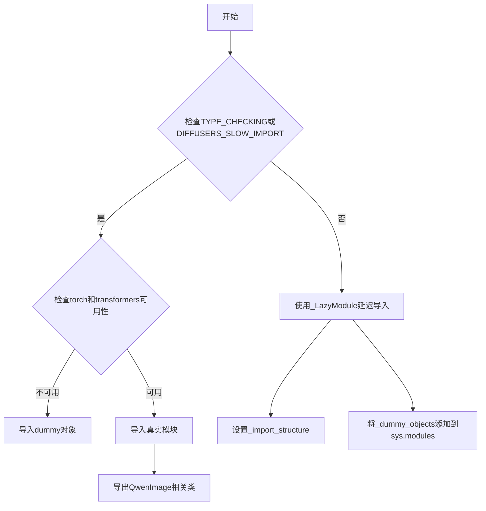
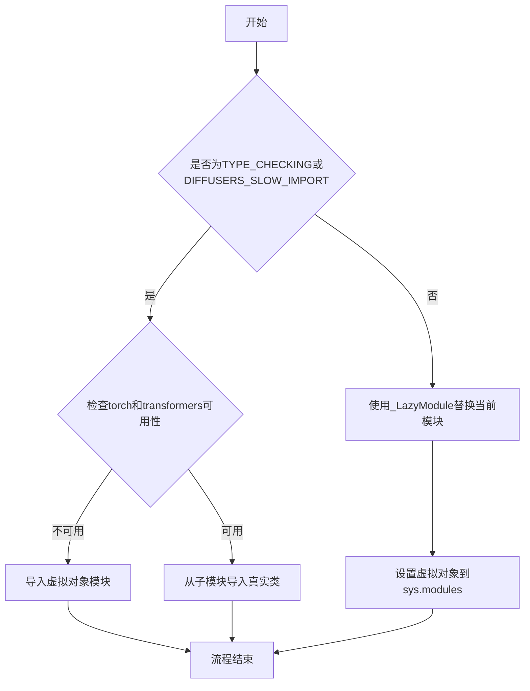
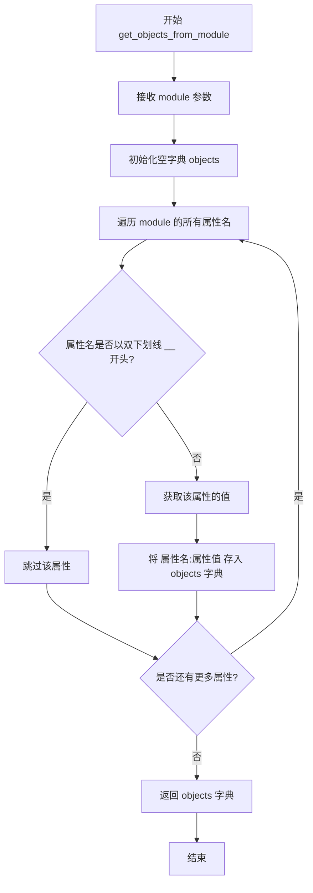
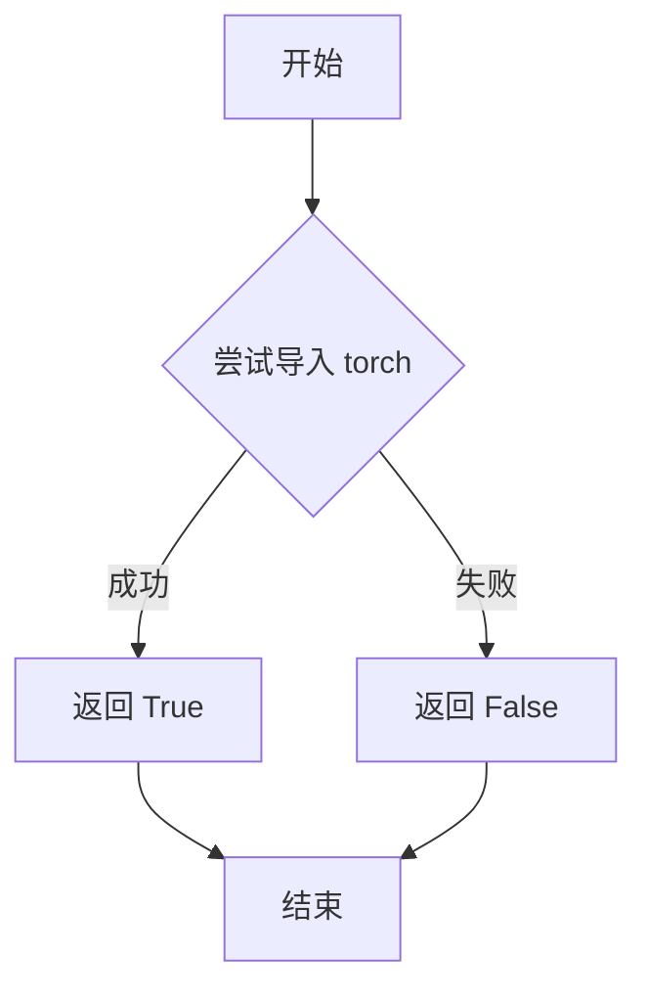
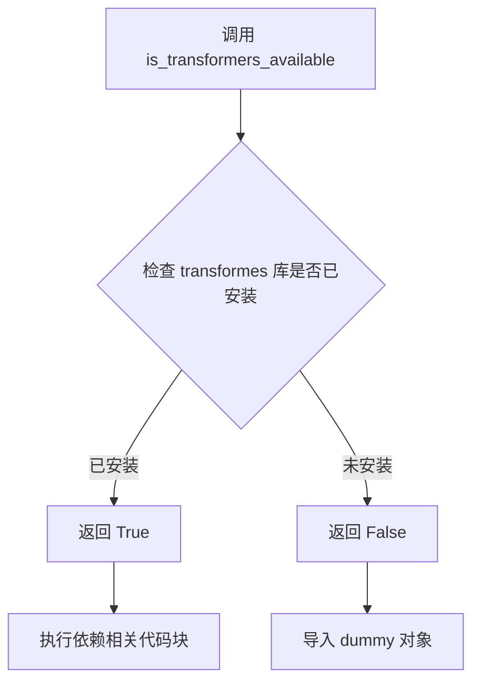
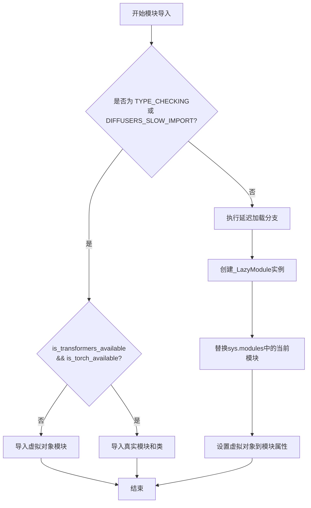
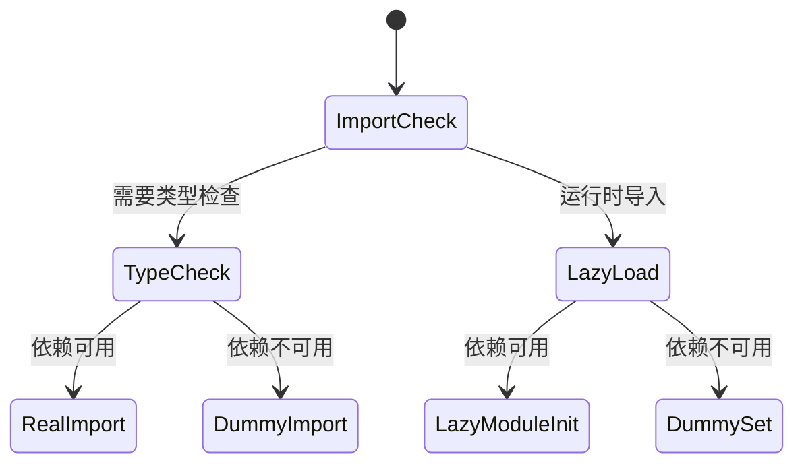

# `diffusers\src\diffusers\modular_pipelines\qwenimage\__init__.py` 详细设计文档

这是一个模块化的图像处理管道初始化文件，通过延迟导入机制实现可选依赖（torch和transformers）的动态加载，并导出多个Qwen图像处理相关的模块化块和管道类。

## 整体流程



## 类结构

```
模块初始化 (modular_qwenimage)
├── 延迟加载机制 (_LazyModule)
├── 可选依赖检查 (is_torch_available, is_transformers_available)
└── 导出类
    ├── QwenImageAutoBlocks
    ├── QwenImageEditAutoBlocks
    ├── QwenImageEditPlusAutoBlocks
    ├── QwenImageLayeredAutoBlocks
    ├── QwenImageEditModularPipeline
    ├── QwenImageEditPlusModularPipeline
    ├── QwenImageLayeredModularPipeline
    └── QwenImageModularPipeline
```

## 全局变量及字段


### `_dummy_objects`
    
用于存储虚拟对象的字典，当可选依赖不可用时使用

类型：`dict`
    


### `_import_structure`
    
定义模块导入结构的字典，存储各类名和模块路径的映射关系

类型：`dict`
    


### `DIFFUSERS_SLOW_IMPORT`
    
控制是否启用慢导入模式的标志变量

类型：`bool`
    


### `OptionalDependencyNotAvailable`
    
可选依赖不可用时抛出的异常类

类型：`Exception`
    


    

## 全局函数及方法


### `_LazyModule`

这是一段用于延迟加载模块的初始化代码，它根据可选依赖（torch 和 transformers）的可用性动态导入 QwenImage 相关的模块、类和管道，或者使用虚拟对象进行占位。

参数：

- 无直接参数（模块级别的初始化代码）

返回值：`无返回值`（模块级别的副作用操作）

#### 流程图



#### 带注释源码

```python
from typing import TYPE_CHECKING

# 从utils导入必要的工具和类
from ...utils import (
    DIFFUSERS_SLOW_IMPORT,  # 标志：是否慢速导入
    OptionalDependencyNotAvailable,  # 可选依赖不可用异常
    _LazyModule,  # 延迟加载模块类
    get_objects_from_module,  # 从模块获取对象
    is_torch_available,  # 检查torch是否可用
    is_transformers_available,  # 检查transformers是否可用
)

# 初始化虚拟对象字典和导入结构字典
_dummy_objects = {}
_import_structure = {}

# 尝试检查torch和transformers依赖
try:
    if not (is_transformers_available() and is_torch_available()):
        raise OptionalDependencyNotAvailable()
except OptionalDependencyNotAvailable:
    # 如果依赖不可用，导入虚拟对象模块
    from ...utils import dummy_torch_and_transformers_objects  # noqa F403
    # 更新虚拟对象字典
    _dummy_objects.update(get_objects_from_module(dummy_torch_and_transformers_objects))
else:
    # 如果依赖可用，定义导入结构
    _import_structure["modular_blocks_qwenimage"] = ["QwenImageAutoBlocks"]
    _import_structure["modular_blocks_qwenimage_edit"] = ["QwenImageEditAutoBlocks"]
    _import_structure["modular_blocks_qwenimage_edit_plus"] = ["QwenImageEditPlusAutoBlocks"]
    _import_structure["modular_blocks_qwenimage_layered"] = ["QwenImageLayeredAutoBlocks"]
    _import_structure["modular_pipeline"] = [
        "QwenImageEditModularPipeline",
        "QwenImageEditPlusModularPipeline",
        "QwenImageLayeredModularPipeline",
        "QwenImageModularPipeline",
    ]

# 类型检查或慢导入时的处理
if TYPE_CHECKING or DIFFUSERS_SLOW_IMPORT:
    try:
        # 再次检查依赖可用性
        if not (is_transformers_available() and is_torch_available()):
            raise OptionalDependencyNotAvailable()
    except OptionalDependencyNotAvailable:
        # 导入虚拟对象用于类型检查
        from ...utils.dummy_torch_and_transformers_objects import *  # noqa F403
    else:
        # 导入真实类用于类型检查
        from .modular_blocks_qwenimage import QwenImageAutoBlocks
        from .modular_blocks_qwenimage_edit import QwenImageEditAutoBlocks
        from .modular_blocks_qwenimage_edit_plus import QwenImageEditPlusAutoBlocks
        from .modular_blocks_qwenimage_layered import QwenImageLayeredAutoBlocks
        from .modular_pipeline import (
            QwenImageEditModularPipeline,
            QwenImageEditPlusModularPipeline,
            QwenImageLayeredModularPipeline,
            QwenImageModularPipeline,
        )
else:
    # 非类型检查时，使用延迟加载模块
    import sys
    # 用_LazyModule替换当前模块，实现延迟加载
    sys.modules[__name__] = _LazyModule(
        __name__,
        globals()["__file__"],  # 模块文件路径
        _import_structure,  # 导入结构字典
        module_spec=__spec__,  # 模块规格
    )
    # 将虚拟对象设置到sys.modules中
    for name, value in _dummy_objects.items():
        setattr(sys.modules[__name__], name, value)
```


### `get_objects_from_module`

该函数是 Diffusers 库中用于懒加载模块的实用工具函数，它从指定模块中提取所有公共对象（不以双下划线 `__` 开头的属性），返回一个包含对象名称到对象本身映射的字典，通常用于在可选依赖不可用时从虚拟对象模块中获取占位符对象，以便模块能够被正常导入而不引发导入错误。

参数：

-  `module`：`module`，要从中提取对象的模块对象，通常是 dummy 对象模块（如 `dummy_torch_and_transformers_objects`）

返回值：`Dict[str, Any]`，返回字典，键为对象名称（字符串），值为对应的对象本身

#### 流程图



#### 带注释源码

```python
def get_objects_from_module(module):
    """
    从给定模块中提取所有公共对象（不包括以双下划线开头的私有属性）
    
    此函数主要用于懒加载机制，当某些可选依赖（如 torch 和 transformers）不可用时，
    会从 dummy 模块中提取预定义的占位符对象，使模块能够被导入但调用时会抛出正确的
    OptionalDependencyNotAvailable 异常。
    
    参数:
        module: 要提取对象的模块对象
        
    返回:
        Dict[str, Any]: 包含模块中所有公共对象名称到对象本身的映射字典
    """
    # 初始化结果字典
    objects = {}
    
    # 遍历模块的所有属性
    # dir() 返回模块的所有属性列表，包括函数、类、变量等
    for name in dir(module):
        # 过滤掉所有以双下划线开头的属性
        # 这符合 Python 的约定，双下划线开头的通常是私有实现细节
        if name.startswith('__'):
            continue
        
        # 获取属性值
        obj = getattr(module, name)
        
        # 将名称-对象对存入字典
        objects[name] = obj
    
    return objects


# 在代码中的实际使用方式：
# 当 is_transformers_available() 和 is_torch_available() 都返回 False 时
# 会触发 OptionalDependencyNotAvailable 异常，进入 except 分支
try:
    if not (is_transformers_available() and is_torch_available()):
        raise OptionalDependencyNotAvailable()
except OptionalDependencyNotAvailable:
    # 从 dummy 模块获取所有占位符对象
    _dummy_objects.update(get_objects_from_module(dummy_torch_and_transformers_objects))
    # 这些对象会被添加到 _dummy_objects 字典中
    # 并在后续通过 setattr 注入到 sys.modules 中，使得模块可以导入
else:
    # 当依赖可用时，导入真实的类和函数
    _import_structure["modular_blocks_qwenimage"] = ["QwenImageAutoBlocks"]
    # ... 其他导入结构定义
```


### `is_torch_available`

检查当前环境中 PyTorch 库是否可用的工具函数，返回布尔值表示 PyTorch 是否已正确安装且可导入。

参数：

- （无参数）

返回值：`bool`，返回 `True` 表示 PyTorch 可用，返回 `False` 表示 PyTorch 不可用。

#### 流程图



#### 带注释源码

```
# 注意：此函数定义在 ...utils 模块中，这里展示可能的实现逻辑

def is_torch_available() -> bool:
    """
    检查 PyTorch 是否可用。
    
    该函数尝试动态导入 torch 模块，如果导入成功则返回 True，
    否则返回 False。这是一种常见的惰性依赖检查方式，
    允许库在 PyTorch 不可用时提供优雅的降级处理。
    
    Returns:
        bool: 如果 torch 模块可以成功导入则返回 True，否则返回 False
    """
    try:
        import torch  # noqa F401
        return True
    except ImportError:
        return False
```

---

### 在当前代码中的使用方式

```
# 当前文件中的调用示例
if not (is_transformers_available() and is_torch_available()):
    raise OptionalDependencyNotAvailable()
```

此函数在当前代码中用于条件性地导入模块，只有当 `transformers` 和 `torch` 都可用时，才会导入相关的 QwenImage 模块；否则会导入虚拟对象（dummy objects）以保持模块接口完整性。这是一种常见的可选依赖处理模式。


### `is_transformers_available`

该函数用于检查当前环境中是否安装了 `transformers` 库，通过返回布尔值来指示库的可用性，以便在代码中实现可选依赖的动态加载。

参数：

- 无参数

返回值：`bool`，返回 `True` 表示 `transformers` 库可用，返回 `False` 表示不可用。

#### 流程图



#### 带注释源码

```python
# 该函数定义在 ...utils 模块中
# 此处为代码中对该函数的使用示例

# 1. 从 utils 模块导入 is_transformers_available
from ...utils import is_transformers_available

# 2. 检查 transformers 和 torch 是否同时可用
if not (is_transformers_available() and is_torch_available()):
    # 如果任一库不可用，抛出 OptionalDependencyNotAvailable 异常
    raise OptionalDependencyNotAvailable()

# 3. 在 TYPE_CHECK 模式下也进行相同的可用性检查
if TYPE_CHECKING or DIFFUSERS_SLOW_IMPORT:
    try:
        if not (is_transformers_available() and is_torch_available()):
            raise OptionalDependencyNotAvailable()
    except OptionalDependencyNotAvailable:
        # 导入 dummy 对象作为占位符
        from ...utils.dummy_torch_and_transformers_objects import *
    else:
        # 当库可用时，导入实际的模块和类
        from .modular_blocks_qwenimage import QwenImageAutoBlocks
        # ... 其他模块导入
```

> **注意**：该函数定义在 `...utils` 模块中，当前代码文件仅导入并使用了该函数，其完整定义需要在 `transformers` 库的 utils 相关模块中查看。该函数通常通过尝试导入 `transformers` 包并捕获导入异常来实现。


### `setattr`

将 `_dummy_objects` 字典中的虚拟对象动态设置为当前模块的属性，使得在依赖不可用时可以通过模块访问这些虚拟对象。

参数：

- `obj`：`types.ModuleType`，目标模块对象，即 `sys.modules[__name__]`
- `name`：`str`，要设置的属性名称，来自 `_dummy_objects` 字典的键
- `value`：任意类型，属性值，来自 `_dummy_objects` 字典的值

返回值：`None`，`setattr` 函数不返回任何值

#### 流程图

```mermaid
flowchart TD
    A[开始] --> B[遍历 _dummy_objects.items]
    B --> C{还有未处理的键值对?}
    C -->|是| D[取出 name 和 value]
    D --> E[调用 setattr sys.modules[__name__], name, value]
    E --> C
    C -->|否| F[结束]
```

#### 带注释源码

```python
for name, value in _dummy_objects.items():
    # 参数说明：
    # - sys.modules[__name__]：当前模块的模块对象
    # - name：字符串，要设置的属性名（来自 _dummy_objects 的键）
    # - value：任意类型，属性值（来自 _dummy_objects 的值）
    # 功能：将虚拟对象设置为当前模块的属性，使延迟导入时能正确访问
    setattr(sys.modules[__name__], name, value)
```


# 模块初始化文件设计文档

## 1. 代码核心功能概述

该代码是一个**延迟加载（Lazy Loading）模块初始化文件**，通过`_LazyModule`实现按需导入机制，处理PyTorch和Transformers的可选依赖，确保在依赖不可用时仍能以虚拟对象形式导入，避免运行时错误。

---

## 2. 文件整体运行流程



---

## 3. 类详细信息

### 3.1 全局变量

| 名称 | 类型 | 描述 |
|------|------|------|
| `_dummy_objects` | `dict` | 存储可选依赖不可用时的虚拟对象集合 |
| `_import_structure` | `dict` | 定义模块的导入结构映射关系 |
| `DIFFUSERS_SLOW_IMPORT` | `bool` | 标志是否启用慢速导入模式 |

### 3.2 关键函数/类

| 名称 | 类型 | 描述 |
|------|------|------|
| `_LazyModule` | 类 | 延迟加载模块的实现类 |
| `get_objects_from_module` | 函数 | 从模块中获取对象集合 |
| `is_torch_available` | 函数 | 检查PyTorch是否可用 |
| `is_transformers_available` | 函数 | 检查Transformers是否可用 |
| `OptionalDependencyNotAvailable` | 异常类 | 可选依赖不可用时抛出的异常 |

---

## 4. 关键组件信息

| 组件名称 | 一句话描述 |
|----------|------------|
| `_LazyModule` | 实现了延迟加载机制的模块包装类，支持按需导入和虚拟对象注入 |
| `OptionalDependencyNotAvailable` | 可选依赖缺失时抛出的异常，用于优雅降级 |
| `sys.modules` 动态替换 | 通过将模块注册到`sys.modules`实现自定义导入行为 |

---

## 5. sys.modules 相关代码段提取

### `sys.modules` 动态配置

#### 描述

在非类型检查和非慢速导入模式下，将当前模块替换为`_LazyModule`实例，并注入虚拟对象，实现延迟加载和优雅降级。

#### 参数

- 无直接函数参数（此段代码在模块级别执行）

#### 返回值

无返回值

#### 流程图

```mermaid
flowchart TD
    A[开始执行] --> B[import sys]
    B --> C[创建_LazyModule实例]
    C --> D[替换sys.modules[__name__]]
    D --> E[遍历_dummy_objects]
    E --> F{遍历完成?}
    F -->|否| G[setattr设置虚拟对象]
    G --> E
    F -->|是| H[结束]
```

#### 带注释源码

```python
else:
    import sys  # 导入sys模块以访问modules注册表

    # 创建延迟加载模块实例，替换当前模块
    # 参数说明：
    #   __name__: 当前模块的完整路径（如 'diffusers.models.modular_qwenimage'）
    #   globals()["__file__"]: 当前模块文件的绝对路径
    #   _import_structure: 导入结构字典，定义可导出的成员
    #   __spec__: 模块规格对象，包含模块元数据
    sys.modules[__name__] = _LazyModule(
        __name__,
        globals()["__file__"],
        _import_structure,
        module_spec=__spec__,
    )

    # 将虚拟对象逐个设置到延迟加载模块的属性上
    # 这样当代码尝试访问不存在的成员时，会返回虚拟对象而非抛出AttributeError
    # 参数说明：
    #   name: 虚拟对象的名称（如 'QwenImageAutoBlocks'）
    #   value: 虚拟对象实例（通常是抛出ImportError的可调用对象）
    for name, value in _dummy_objects.items():
        setattr(sys.modules[__name__], name, value)
```

---

## 6. 潜在技术债务与优化空间

| 问题 | 描述 | 优化建议 |
|------|------|----------|
| 魔法字符串 | `_import_structure`中使用字符串键，易产生拼写错误 | 使用枚举或常量类定义 |
| 重复检查 | `is_transformers_available()`和`is_torch_available()`在多处重复调用 | 提取为单一检查函数并缓存结果 |
| 虚拟对象覆盖 | 直接修改`sys.modules`可能覆盖有价值的错误信息 | 增加更详细的错误消息或日志记录 |
| 缺少类型注解 | `_import_structure`和`_dummy_objects`缺乏具体类型注解 | 添加泛型类型注解提高可维护性 |

---

## 7. 其它项目

### 设计目标与约束

- **目标**：实现可选依赖的优雅降级，支持在无PyTorch/Transformers环境下以虚拟对象形式导入
- **约束**：必须兼容`TYPE_CHECKING`模式以支持静态类型检查

### 错误处理与异常设计

- 使用`OptionalDependencyNotAvailable`异常标记依赖不可用状态
- 虚拟对象在被调用时通常会抛出有意义的`ImportError`而非`AttributeError`

### 数据流与状态机



### 外部依赖与接口契约

| 依赖项 | 接口要求 |
|--------|----------|
| `torch` | 通过`is_torch_available()`检查 |
| `transformers` | 通过`is_transformers_available()`检查 |
| `_LazyModule` | 必须实现`__getattr__`以支持延迟加载 |
| `get_objects_from_module` | 必须返回可迭代的对象字典 |

## 关键组件


### OptionalDependencyNotAvailable

可选依赖不可用时抛出的异常，用于处理torch和transformers库的可选依赖检查。

### _LazyModule

延迟加载模块类，用于在运行时按需导入子模块，减少启动时的导入开销。

### _import_structure

字典类型变量，定义了模块的导入结构，包含模块名称到导出对象列表的映射，用于LazyModule的初始化。

### _dummy_objects

字典类型变量，用于存储当可选依赖不可用时的dummy对象，防止导入错误。

### TYPE_CHECKING 分支

类型检查时的条件导入逻辑，在类型检查或慢导入模式下直接导入真实模块，否则使用LazyModule进行延迟加载。

### QwenImageAutoBlocks

从modular_blocks_qwenimage模块导出的图像处理自动块类。

### QwenImageEditAutoBlocks

从modular_blocks_qwenimage_edit模块导出的图像编辑自动块类。

### QwenImageEditPlusAutoBlocks

从modular_blocks_qwenimage_edit_plus模块导出的增强版图像编辑自动块类。

### QwenImageLayeredAutoBlocks

从modular_blocks_qwenimage_layered模块导出的分层图像自动块类。

### QwenImageModularPipeline

从modular_pipeline模块导出的Qwen图像模块化管道类。

### QwenImageEditModularPipeline

从modular_pipeline模块导出的Qwen图像编辑模块化管道类。

### QwenImageEditPlusModularPipeline

从modular_pipeline模块导出的Qwen增强图像编辑模块化管道类。

### QwenImageLayeredModularPipeline

从modular_pipeline模块导出的Qwen分层图像模块化管道类。

### is_torch_available

检查torch库是否可用的工具函数。

### is_transformers_available

检查transformers库是否可用的工具函数。

### get_objects_from_module

从模块中获取对象的工具函数，用于构建dummy对象集合。

### _LazyModule 初始化逻辑

将当前模块替换为LazyModule实例，并设置dummy对象到系统模块中，实现延迟加载机制。


## 问题及建议


### 已知问题

- **重复的条件判断逻辑**：代码在第17行和第28行重复检查 `is_transformers_available() and is_torch_available()` 条件，增加了维护成本且容易出现不一致
- **硬编码的模块映射**：所有模块名（modular_blocks_qwenimage、modular_pipeline等）和类名被硬编码在_import_structure字典中，新增模块需要修改多处代码
- **缺少导入错误处理**：如果LazyModule初始化或get_objects_from_module调用失败，代码没有异常捕获和适当的错误提示
- **魔法字符串和重复代码**：模块路径字符串在_import_structure和实际的from导入语句中重复出现，容易因手动修改导致不一致

### 优化建议

- **提取公共条件判断**：将依赖检查逻辑封装为函数或变量，避免重复的条件判断
- **使用配置驱动**：将模块名到类名的映射关系提取为配置列表，通过循环自动构建_import_structure，减少手动维护成本
- **添加错误处理**：为LazyModule创建和setattr操作添加try-except块，提供更清晰的错误信息
- **统一导入路径**：考虑将模块路径字符串定义为常量，或使用__all__列表自动推断需要导出的类名

## 其它


### 设计目标与约束

本模块采用懒加载（Lazy Loading）模式，主要目标是在保证功能完整性的前提下，最大限度地减少模块初始化时的依赖加载时间。通过延迟导入可选依赖（transformers和torch），提升库的导入性能，同时保持API的完整性和一致性。设计约束包括：仅在transformers和torch同时可用时才会导入实际模块，否则使用空对象（dummy objects）作为占位符，确保代码在任何环境下都能被导入而不引发ImportError。

### 错误处理与异常设计

代码采用可选依赖模式，通过捕获OptionalDependencyNotAvailable异常来处理依赖缺失情况。当transformers或torch任一不可用时，模块不会抛出致命错误，而是导入对应的dummy模块作为替代。这种设计允许库在基础环境中安装运行，同时确保在完整依赖环境下功能可用。异常处理流程为：尝试检查依赖可用性，若不可用则触发OptionalDependencyNotAvailable，在except块中导入dummy_objects并更新_import_structure。

### 外部依赖与接口契约

模块明确依赖两个外部包：transformers和torch。通过is_transformers_available()和istorch_available()两个函数进行运行时检查。接口契约定义了导出类的集合，包括4个Blocks类（QwenImageAutoBlocks、QwenImageEditAutoBlocks、QwenImageEditPlusAutoBlocks、QwenImageLayeredAutoBlocks）和4个Pipeline类（QwenImageEditModularPipeline、QwenImageEditPlusModularPipeline、QwenImageLayeredModularPipeline、QwenImageModularPipeline）。所有导出类均通过LazyModule机制进行延迟加载，调用方无需关心依赖检查细节。

### 模块初始化流程

模块初始化分为两条路径：TYPE_CHECKING或DIFFUSERS_SLOW_IMPORT为真时，执行实际导入流程；否则进入懒加载路径。在懒加载路径中，首先创建_LazyModule实例替换当前模块，然后遍历_dummy_objects并使用setattr将空对象绑定到模块属性。这种双重路径设计确保了IDE类型提示和运行时性能的最优平衡。

### 类型检查与类型安全

代码使用TYPE_CHECKING条件导入来支持静态类型分析。在类型检查模式下，会导入实际的实现类而非dummy对象，使IDE能够提供准确的类型提示和代码补全。同时通过is_transformers_available()和is_torch_available()的类型守卫（Type Guard），确保在类型检查分支中假设依赖一定可用，mypy等工具能够正确推断类型。

### 性能优化考量

懒加载机制显著优化了模块导入性能。仅当用户实际使用某个类时，才会触发该类的导入和初始化。_dummy_objects的设计避免了在依赖缺失时加载完整的模块图，减少了内存占用和导入时间。sys.modules的直接操作提供了最小开销的模块替换机制，避免了传统导入流程的额外开销。

### 版本兼容性设计

模块通过抽象的依赖检查函数（is_transformers_available、is_torch_available）解耦了对具体版本的依赖，允许在不同版本的transformers和torch下工作。OptionalDependencyNotAvailable异常的标准化处理确保了与Diffusers库其他模块的一致性。dummy模块的使用保证了下游代码无需进行版本判断即可编写兼容代码。

### 命名规范与导出策略

模块采用清晰的命名约定：AutoBlocks后缀表示自动加载的模块块，ModularPipeline后缀表示模块化管道，Edit/EditPlus/Layered等修饰词区分不同功能变体。所有公共API通过_import_structure字典显式声明，配合__all__机制（虽然在此代码中未显式写出，但通过LazyModule隐式实现），明确控制导出接口范围，避免内部实现泄露。

### 可维护性与扩展性

代码结构便于扩展新模块，只需在_import_structure中添加新的映射，并在对应的if-else分支中添加导入语句即可。模块化的块设计（modular_blocks_*）和管道设计（modular_pipeline）分离了关注点，使得添加新的图像处理变体时无需修改核心逻辑。dummy_objects的动态更新机制允许在不修改主代码的情况下扩展可选依赖集合。


    