# `diffusers\src\diffusers\modular_pipelines\qwenimage\before_denoise.py` 详细设计文档

This file defines modular pipeline blocks for QwenImage generation, including steps for preparing initial latents (noise), setting timesteps for the diffusion scheduler, preparing RoPE (Rotary Position Embedding) inputs for the denoiser, and handling ControlNet inputs. It supports various generation modes such as text-to-image, image-to-image, inpainting, layered generation, and editing tasks.

## 整体流程

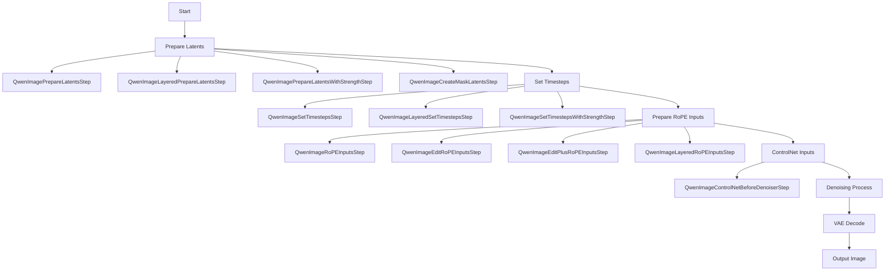

## 类结构

```
ModularPipelineBlocks (抽象基类)
├── QwenImagePrepareLatentsStep (准备基础图像latents)
├── QwenImageLayeredPrepareLatentsStep (准备分层图像latents)
├── QwenImagePrepareLatentsWithStrengthStep (img2img/inpainting的latents准备)
├── QwenImageCreateMaskLatentsStep (创建mask latents)
├── QwenImageSetTimestepsStep (设置基础timesteps)
├── QwenImageLayeredSetTimestepsStep (设置分层timesteps)
├── QwenImageSetTimestepsWithStrengthStep (设置带强度的timesteps)
├── QwenImageRoPEInputsStep (基础RoPE输入)
├── QwenImageEditRoPEInputsStep (编辑模式RoPE输入)
├── QwenImageEditPlusRoPEInputsStep (编辑增强版RoPE输入)
├── QwenImageLayeredRoPEInputsStep (分层RoPE输入)
└── QwenImageControlNetBeforeDenoiserStep (ControlNet输入准备)
```

## 全局变量及字段


### `calculate_shift`
    
Calculates the shift value for image sequence length based on base and max sequence lengths and shift parameters

类型：`function`
    


### `retrieve_timesteps`
    
Retrieves timesteps from the scheduler after calling set_timesteps method, handles custom timesteps and sigmas

类型：`function`
    


### `get_timesteps`
    
Gets the original timestep using init_timestep for image-to-image/inpainting generation based on strength parameter

类型：`function`
    


### `QwenImagePrepareLatentsStep.model_name`
    
Model identifier string set to 'qwenimage' for the prepare latents step

类型：`str`
    


### `QwenImageLayeredPrepareLatentsStep.model_name`
    
Model identifier string set to 'qwenimage-layered' for layered prepare latents step

类型：`str`
    


### `QwenImagePrepareLatentsWithStrengthStep.model_name`
    
Model identifier string set to 'qwenimage' for prepare latents with strength step

类型：`str`
    


### `QwenImageCreateMaskLatentsStep.model_name`
    
Model identifier string set to 'qwenimage' for create mask latents step

类型：`str`
    


### `QwenImageSetTimestepsStep.model_name`
    
Model identifier string set to 'qwenimage' for set timesteps step

类型：`str`
    


### `QwenImageLayeredSetTimestepsStep.model_name`
    
Model identifier string set to 'qwenimage-layered' for layered set timesteps step

类型：`str`
    


### `QwenImageSetTimestepsWithStrengthStep.model_name`
    
Model identifier string set to 'qwenimage' for set timesteps with strength step

类型：`str`
    


### `QwenImageRoPEInputsStep.model_name`
    
Model identifier string set to 'qwenimage' for RoPE inputs step

类型：`str`
    


### `QwenImageEditRoPEInputsStep.model_name`
    
Model identifier string set to 'qwenimage' for edit RoPE inputs step

类型：`str`
    


### `QwenImageEditPlusRoPEInputsStep.model_name`
    
Model identifier string set to 'qwenimage-edit-plus' for edit plus RoPE inputs step

类型：`str`
    


### `QwenImageLayeredRoPEInputsStep.model_name`
    
Model identifier string set to 'qwenimage-layered' for layered RoPE inputs step

类型：`str`
    


### `QwenImageControlNetBeforeDenoiserStep.model_name`
    
Model identifier string set to 'qwenimage' for ControlNet before denoiser step

类型：`str`
    
    

## 全局函数及方法


### `calculate_shift`

该函数是一个线性插值计算工具，用于根据图像序列长度动态计算扩散模型的时间步偏移量（shift）。通过建立图像序列长度与偏移量之间的线性关系，使模型能够自适应不同分辨率图像的采样策略。

参数：

- `image_seq_len`：`int`，图像的序列长度（patch 数量），决定最终偏移量的大小
- `base_seq_len`：`int` = 256，基础序列长度，对应基础偏移量的参考基准
- `max_seq_len`：`int` = 4096，最大序列长度，对应最大偏移量的参考上限
- `base_shift`：`float` = 0.5，基础偏移量，序列长度为 base_seq_len 时的偏移值
- `max_shift`：`float` = 1.15，最大偏移量，序列长度为 max_seq_len 时的偏移值

返回值：`float`，计算得到的偏移量 mu，用于调整扩散调度器的时间步采样策略

#### 流程图

```mermaid
flowchart TD
    A[开始] --> B[计算斜率 m<br/>m = (max_shift - base_shift) / (max_seq_len - base_seq_len)]
    B --> C[计算截距 b<br/>b = base_shift - m * base_seq_len]
    C --> D[计算偏移量 mu<br/>mu = image_seq_len * m + b]
    D --> E[返回 mu]
    
    B -->|输入示例| B1[例如: m = (1.15 - 0.5) / (4096 - 256)]
    C -->|推导| C1[线性方程: y = mx + b]
    D -->|示例| D1[若 image_seq_len=1024<br/>mu ≈ 0.65]
```

#### 带注释源码

```python
def calculate_shift(
    image_seq_len,          # 输入：图像序列长度（patch数），决定最终偏移量
    base_seq_len: int = 256,       # 默认256，对应标准分辨率下的序列长度
    max_seq_len: int = 4096,       # 默认4096，对应高分辨率下的序列长度
    base_shift: float = 0.5,       # 默认0.5，标准分辨率时的时间步偏移
    max_shift: float = 1.15,       # 默认1.15，高分辨率时的时间步偏移
):
    # 第一步：计算线性插值的斜率 m
    # 斜率表示每单位序列长度变化时，偏移量的变化率
    # 公式：(最大值 - 最小值) / (最大值范围 - 最小值范围)
    m = (max_shift - base_shift) / (max_seq_len - base_seq_len)
    
    # 第二步：计算线性方程的截距 b
    # 截距确保在 base_seq_len 时，偏移量恰好等于 base_shift
    # 推导：base_shift = m * base_seq_len + b => b = base_shift - m * base_seq_len
    b = base_shift - m * base_seq_len
    
    # 第三步：根据实际图像序列长度计算偏移量 mu
    # 使用线性方程：mu = m * image_seq_len + b
    # 这使得偏移量能够根据图像尺寸平滑过渡
    mu = image_seq_len * m + b
    
    # 返回计算得到的偏移量，用于调度器的 mu 参数
    return mu
```


### `retrieve_timesteps`

该函数是扩散模型采样流程中的核心时间步管理函数，负责调用调度器的`set_timesteps`方法并从中获取时间步序列。它支持自定义时间步或sigma值，并能根据调度器的接口自动适配不同的调度器实现。

参数：

- `scheduler`：`SchedulerMixin`，调度器对象，用于获取时间步
- `num_inference_steps`：`int | None`，生成样本时使用的扩散步数，若使用此参数则`timesteps`必须为`None`
- `device`：`str | torch.device | None`，时间步要移动到的设备，若为`None`则不移动
- `timesteps`：`list[int] | None`，用于覆盖调度器时间步间隔策略的自定义时间步，若传入此参数则`num_inference_steps`和`sigmas`必须为`None`
- `sigmas`：`list[float] | None`，用于覆盖调度器时间步间隔策略的自定义sigma，若传入此参数则`num_inference_steps`和`timesteps`必须为`None`
- `**kwargs`：任意关键字参数，将传递给调度器的`set_timesteps`方法

返回值：`tuple[torch.Tensor, int]`，元组第一个元素是调度器的时间步调度序列，第二个元素是推理步数

#### 流程图

```mermaid
flowchart TD
    A[开始] --> B{检查timesteps和sigmas是否同时存在}
    B -->|是| C[抛出ValueError: 只能选择一个]
    B -->|否| D{检查timesteps是否不为None}
    D -->|是| E{检查scheduler.set_timesteps是否接受timesteps参数}
    E -->|否| F[抛出ValueError: 当前调度器不支持自定义timesteps]
    E -->|是| G[调用scheduler.set_timesteps<br/>timesteps=timesteps, device=device]
    G --> H[从scheduler获取timesteps]
    H --> I[num_inference_steps = len(timesteps)]
    I --> J[返回timesteps和num_inference_steps]
    
    D -->|否| K{检查sigmas是否不为None}
    K -->|是| L{检查scheduler.set_timesteps是否接受sigmas参数}
    L -->|否| M[抛出ValueError: 当前调度器不支持自定义sigmas]
    L -->|是| N[调用scheduler.set_timesteps<br/>sigmas=sigmas, device=device]
    N --> O[从scheduler获取timesteps]
    O --> P[num_inference_steps = len(timesteps)]
    P --> J
    
    K -->|否| Q[调用scheduler.set_timesteps<br/>num_inference_steps, device=device]
    Q --> R[从scheduler获取timesteps]
    R --> S[num_inference_steps保持原值]
    S --> J
    
    C --> T[结束]
    F --> T
    M --> T
    J --> T
```

#### 带注释源码

```python
# Copied from diffusers.pipelines.stable_diffusion.pipeline_stable_diffusion.retrieve_timesteps
def retrieve_timesteps(
    scheduler,  # 调度器对象，用于获取时间步
    num_inference_steps: int | None = None,  # 推理步数
    device: str | torch.device | None = None,  # 目标设备
    timesteps: list[int] | None = None,  # 自定义时间步列表
    sigmas: list[float] | None = None,  # 自定义sigma列表
    **kwargs,  # 传递给set_timesteps的其他参数
):
    r"""
    Calls the scheduler's `set_timesteps` method and retrieves timesteps from the scheduler after the call. Handles
    custom timesteps. Any kwargs will be supplied to `scheduler.set_timesteps`.

    Args:
        scheduler (`SchedulerMixin`):
            The scheduler to get timesteps from.
        num_inference_steps (`int`):
            The number of diffusion steps used when generating samples with a pre-trained model. If used, `timesteps`
            must be `None`.
        device (`str` or `torch.device`, *optional*):
            The device to which the timesteps should be moved to. If `None`, the timesteps are not moved.
        timesteps (`list[int]`, *optional*):
            Custom timesteps used to override the timestep spacing strategy of the scheduler. If `timesteps` is passed,
            `num_inference_steps` and `sigmas` must be `None`.
        sigmas (`list[float]`, *optional*):
            Custom sigmas used to override the timestep spacing strategy of the scheduler. If `sigmas` is passed,
            `num_inference_steps` and `timesteps` must be `None`.

    Returns:
        `tuple[torch.Tensor, int]`: A tuple where the first element is the timestep schedule from the scheduler and the
        second element is the number of inference steps.
    """
    # 校验：timesteps和sigmas不能同时传入
    if timesteps is not None and sigmas is not None:
        raise ValueError("Only one of `timesteps` or `sigmas` can be passed. Please choose one to set custom values")
    
    # 分支1：使用自定义timesteps
    if timesteps is not None:
        # 检查调度器的set_timesteps方法是否支持timesteps参数
        accepts_timesteps = "timesteps" in set(inspect.signature(scheduler.set_timesteps).parameters.keys())
        if not accepts_timesteps:
            raise ValueError(
                f"The current scheduler class {scheduler.__class__}'s `set_timesteps` does not support custom"
                f" timestep schedules. Please check whether you are using the correct scheduler."
            )
        # 调用调度器的set_timesteps方法设置自定义时间步
        scheduler.set_timesteps(timesteps=timesteps, device=device, **kwargs)
        # 从调度器获取生成的时间步
        timesteps = scheduler.timesteps
        # 计算推理步数
        num_inference_steps = len(timesteps)
    
    # 分支2：使用自定义sigmas
    elif sigmas is not None:
        # 检查调度器的set_timesteps方法是否支持sigmas参数
        accept_sigmas = "sigmas" in set(inspect.signature(scheduler.set_timesteps).parameters.keys())
        if not accept_sigmas:
            raise ValueError(
                f"The current scheduler class {scheduler.__class__}'s `set_timesteps` does not support custom"
                f" sigmas schedules. Please check whether you are using the correct scheduler."
            )
        # 调用调度器的set_timesteps方法设置自定义sigma
        scheduler.set_timesteps(sigmas=sigmas, device=device, **kwargs)
        # 从调度器获取生成的时间步
        timesteps = scheduler.timesteps
        # 计算推理步数
        num_inference_steps = len(timesteps)
    
    # 分支3：使用默认推理步数
    else:
        # 调用调度器的set_timesteps方法，使用num_inference_steps
        scheduler.set_timesteps(num_inference_steps, device=device, **kwargs)
        # 从调度器获取生成的时间步
        timesteps = scheduler.timesteps
    
    # 返回时间步序列和推理步数
    return timesteps, num_inference_steps
```


### `get_timesteps`

该函数用于根据图像到图像（img2img）或修复（inpainting）的强度（strength）参数计算并调整时间步调度。它从调度器中提取与指定强度相对应的子集时间步，并返回调整后的时间步序列和推理步数。

参数：

- `scheduler`：`SchedulerMixin`，用于获取时间步的调度器对象
- `num_inference_steps`：`int`，推理过程中使用的去噪步数
- `strength`：`float`，图像到图像或修复的强度值，范围通常在 0 到 1 之间，用于确定加入噪声的比例

返回值：`tuple[torch.Tensor, int]`，返回一个元组，其中第一个元素是调整后的时间步序列（Tensor），第二个元素是调整后的推理步数（int）

#### 流程图

```mermaid
flowchart TD
    A[开始] --> B[计算init_timestep<br/>min(num_inference_steps × strength, num_inference_steps)]
    B --> C[计算t_start<br/>max(num_inference_steps - init_timestep, 0)]
    C --> D[从scheduler.timesteps切片获取timesteps<br/>scheduler.timesteps[t_start × scheduler.order:]]
    D --> E{scheduler是否有set_begin_index属性}
    E -->|是| F[调用scheduler.set_begin_index<br/>t_start × scheduler.order]
    E -->|否| G[跳过]
    F --> H[返回timesteps和num_inference_steps - t_start]
    G --> H
```

#### 带注释源码

```python
# modified from diffusers.pipelines.stable_diffusion_3.pipeline_stable_diffusion_3_img2img.StableDiffusion3Img2ImgPipeline.get_timesteps
def get_timesteps(scheduler, num_inference_steps, strength):
    # 根据强度计算初始时间步，取num_inference_steps * strength和num_inference_steps中的较小值
    # 这确定了需要保留多少原始图像信息
    init_timestep = min(num_inference_steps * strength, num_inference_steps)

    # 计算起始索引，从完整的时间步序列中跳过前面的步数
    # 这对应于被噪声替换的部分
    t_start = int(max(num_inference_steps - init_timestep, 0))
    
    # 从调度器中获取对应的时间步序列，使用scheduler.order进行索引调整
    timesteps = scheduler.timesteps[t_start * scheduler.order :]
    
    # 如果调度器支持set_begin_index方法，设置其起始索引
    # 这用于跟踪当前的去噪进度
    if hasattr(scheduler, "set_begin_index"):
        scheduler.set_begin_index(t_start * scheduler.order)

    # 返回调整后的时间步和实际执行的推理步数
    return timesteps, num_inference_steps - t_start
```


### `QwenImagePrepareLatentsStep.description`

返回该步骤的描述信息，用于说明该步骤的核心功能。

参数：无（该方法为属性，无显式参数）

- `self`：`QwenImagePrepareLatentsStep`，隐式参数，指向类实例本身

返回值：`str`，返回该步骤的描述文本，值为 `"Prepare initial random noise for the generation process"`，表明该步骤用于为生成过程准备初始的随机噪声（latents）。

#### 流程图

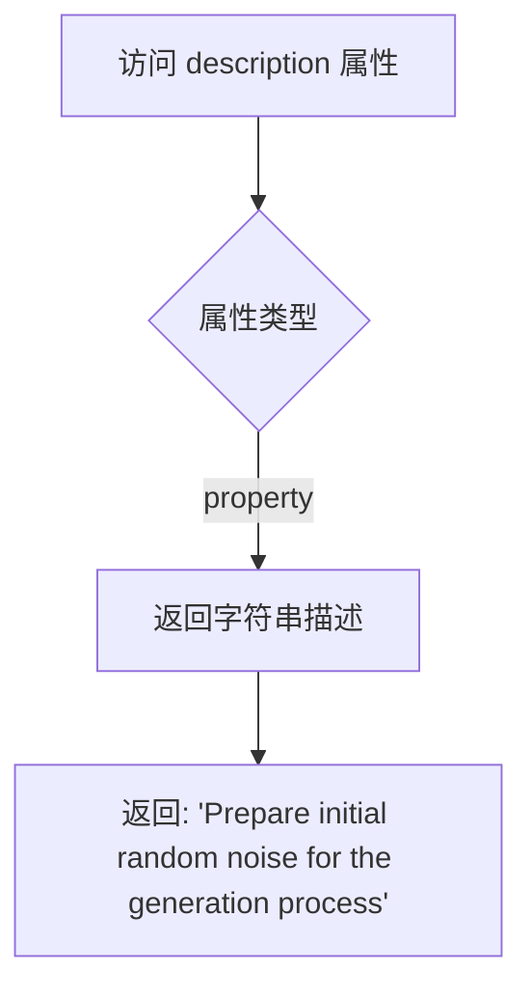

#### 带注释源码

```python
@property
def description(self) -> str:
    """
    该属性返回当前步骤的描述信息
    
    Args:
        self: QwenImagePrepareLatentsStep 类实例（隐式参数）
    
    Returns:
        str: 步骤描述字符串，说明该步骤的核心功能是
            "Prepare initial random noise for the generation process"
            即为图像生成过程准备初始的随机噪声 latent
    """
    return "Prepare initial random noise for the generation process"
```


### `QwenImagePrepareLatentsStep.expected_components`

该属性定义了 `QwenImagePrepareLatentsStep` 步骤所需的组件规范，返回一个包含 `pachifier` 组件的列表，用于对潜在变量进行打包处理。

参数：
- 该属性无参数（作为 property 调用）

返回值：`list[ComponentSpec]`，返回一个组件规范列表，指定该步骤需要从配置中创建的 `QwenImagePachifier` 组件。

#### 流程图

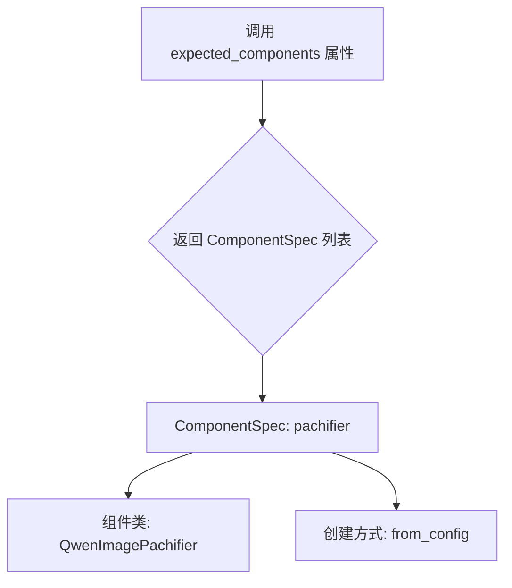

#### 带注释源码

```python
@property
def expected_components(self) -> list[ComponentSpec]:
    """
    定义该步骤所需的组件规范列表。
    
    该属性返回一个列表，包含一个 ComponentSpec 对象，指定了：
    - 组件名称: 'pachifier'
    - 组件类: QwenImagePachifier
    - 默认创建方法: 'from_config'（从配置文件创建）
    
    pachifier 组件负责将潜在变量（latents）打包成适合模型处理的格式。
    
    Returns:
        list[ComponentSpec]: 包含单个 ComponentSpec 的列表，描述所需的 pachifier 组件
    """
    return [
        ComponentSpec("pachifier", QwenImagePachifier, default_creation_method="from_config"),
    ]
```


### `QwenImagePrepareLatentsStep.inputs`

该属性定义了 QwenImagePrepareLatentsStep 类的输入参数模板列表，用于描述该步骤需要哪些输入参数。

返回值：`list[InputParam]`，返回输入参数模板列表，包含 7 个输入参数项。

#### 流程图

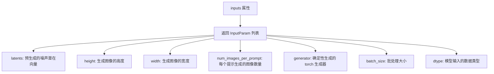

#### 带注释源码

```python
@property
def inputs(self) -> list[InputParam]:
    """
    定义该步骤的输入参数模板列表。
    使用 InputParam.template 方法创建参数模板，支持从外部传入或由前序步骤生成。
    
    Returns:
        list[InputParam]: 包含以下参数的列表：
        - latents: 预生成的噪声潜在向量（可选）
        - height: 生成图像的高度（可选）
        - width: 生成图像的宽度（可选）
        - num_images_per_prompt: 每个提示生成的图像数量（可选，默认1）
        - generator: torch 生成器，用于确定性生成（可选）
        - batch_size: 批处理大小（可选，默认1）
        - dtype: 模型输入的数据类型（可选，默认torch.float32）
    """
    return [
        InputParam.template("latents"),
        InputParam.template("height"),
        InputParam.template("width"),
        InputParam.template("num_images_per_prompt"),
        InputParam.template("generator"),
        InputParam.template("batch_size"),
        InputParam.template("dtype"),
    ]
```


### `QwenImagePrepareLatentsStep.intermediate_outputs`

该属性定义了 `QwenImagePrepareLatentsStep` 类的中间输出参数列表，用于描述该步骤执行完成后输出的数据参数。

参数：
- （无参数，该属性不接受任何输入）

返回值：`list[OutputParam]`，返回一个包含三个 `OutputParam` 对象的列表，分别对应 `height`（输出图像高度）、`width`（输出图像宽度）和 `latents`（去噪过程的初始潜在变量）三个中间输出参数。

#### 流程图

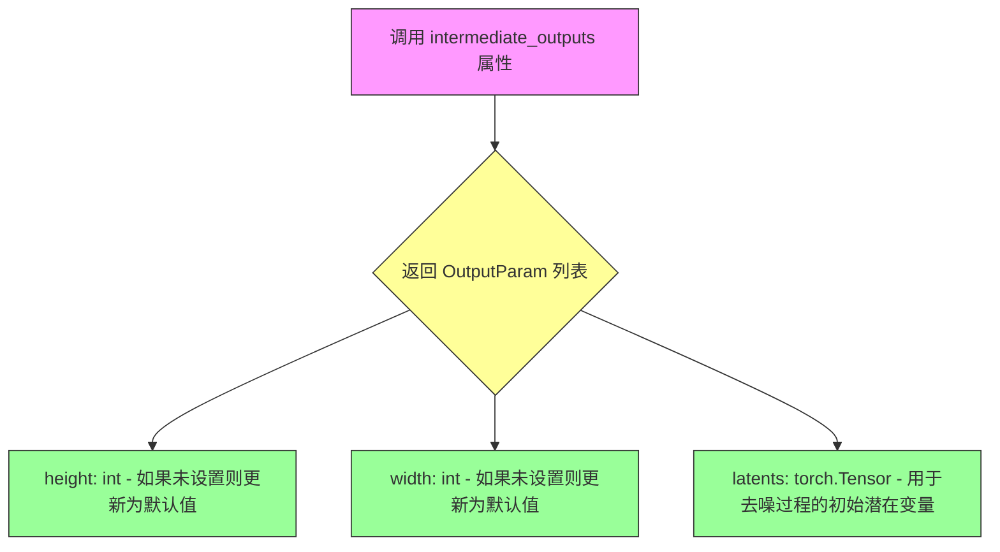

#### 带注释源码

```python
@property
def intermediate_outputs(self) -> list[OutputParam]:
    """
    定义该步骤的中间输出参数列表。
    
    返回:
        list[OutputParam]: 包含以下三个输出参数的列表:
            - height (int): 如果未设置则更新为默认值
            - width (int): 如果未设置则更新为默认值  
            - latents (torch.Tensor): 用于去噪过程的初始潜在变量
    """
    return [
        OutputParam(name="height", type_hint=int, description="if not set, updated to default value"),
        OutputParam(name="width", type_hint=int, description="if not set, updated to default value"),
        OutputParam(
            name="latents",
            type_hint=torch.Tensor,
            description="The initial latents to use for the denoising process",
        ),
    ]
```


### `QwenImagePrepareLatentsStep.check_inputs`

这是一个静态方法，用于验证生成图像的高度和宽度是否符合VAE的压缩要求。该方法检查height和width是否能够被`vae_scale_factor * 2`整除，以确保后续的latent空间计算能够正确进行。

参数：

- `height`：`int | None`，生成图像的高度（像素）。如果提供，必须能够被`vae_scale_factor * 2`整除
- `width`：`int | None`，生成图像的宽度（像素）。如果提供，必须能够被`vae_scale_factor * 2`整除
- `vae_scale_factor`：`int`，VAE的缩放因子，用于计算latent空间的尺寸

返回值：`None`，该方法不返回任何值，仅通过抛出`ValueError`异常来处理验证失败的情况

#### 流程图

```mermaid
flowchart TD
    A[开始 check_inputs] --> B{height is not None?}
    B -->|Yes| C{height % (vae_scale_factor * 2) == 0?}
    C -->|No| D[抛出 ValueError: Height必须能被vae_scale_factor*2整除]
    C -->|Yes| E{width is not None?}
    B -->|No| E
    E -->|Yes| F{width % (vae_scale_factor * 2) == 0?}
    F -->|No| G[抛出 ValueError: Width必须能被vae_scale_factor*2整除]
    F -->|Yes| H[验证通过，方法结束]
    E -->|No| H
    D --> I[结束]
    G --> I
    H --> I
```

#### 带注释源码

```python
@staticmethod
def check_inputs(height, width, vae_scale_factor):
    """
    验证输入的height和width是否符合VAE压缩要求
    
    参数:
        height: 生成图像的高度，如果为None则跳过验证
        width: 生成图像的宽度，如果为None则跳过验证
        vae_scale_factor: VAE的缩放因子，用于确定可接受的尺寸除数
    
    异常:
        ValueError: 当height或width不能被vae_scale_factor * 2整除时抛出
    """
    # 检查高度是否符合要求
    # VAE通常有8x的压缩率，而packing还需要额外的2x因子的对齐
    # 所以总的因数为vae_scale_factor * 2
    if height is not None and height % (vae_scale_factor * 2) != 0:
        raise ValueError(f"Height must be divisible by {vae_scale_factor * 2} but is {height}")

    # 检查宽度是否符合要求
    # 同样的要求应用于宽度维度
    if width is not None and width % (vae_scale_factor * 2) != 0:
        raise ValueError(f"Width must be divisible by {vae_scale_factor * 2} but is {width}")
```


### `QwenImagePrepareLatentsStep.__call__`

该方法是 QwenImage 图像生成管道中 "准备潜在变量"（Prepare Latents）步骤的核心执行逻辑，负责验证输入尺寸、计算潜在空间维度、生成或处理初始随机噪声，并将其打包为适合模型输入的格式。

参数：

-  `self`：`QwenImagePrepareLatentsStep`，当前类的实例，包含管道块的配置和状态。
-  `components`：`QwenImageModularPipeline`，模块化管道对象，提供管道执行所需的组件（如 VAE 缩放因子、默认图像尺寸、潜在通道数、打包器等）。
-  `state`：`PipelineState`，管道状态对象，包含当前步骤的输入参数（height、width、batch_size、num_images_per_prompt、latents、generator、dtype 等）和输出结果。

返回值：`PipelineState`，更新后的管道状态对象，其中包含处理后的 `height`、`width` 和 `latents`（打包后的初始噪声潜在变量）。

#### 流程图

```mermaid
flowchart TD
    A[开始: __call__] --> B[获取 block_state]
    B --> C[调用 check_inputs 验证 height/width]
    C --> D[计算 batch_size = batch_size * num_images_per_prompt]
    D --> E[设置默认 height/width]
    E --> F[计算 latent_height = 2 * (height // (vae_scale_factor * 2))]
    F --> G[计算 latent_width = 2 * (width // (vae_scale_factor * 2))]
    G --> H[构造 shape tuple]
    H --> I{检查 generator 列表长度}
    I -->|不匹配| J[抛出 ValueError]
    I -->|匹配| K{latents 是否为 None}
    K -->|否| L[跳过生成]
    K -->|是| M[调用 randn_tensor 生成随机潜在变量]
    M --> N[调用 pachifier.pack_latents 打包潜在变量]
    L --> O[保存 block_state 到 state]
    O --> P[返回 components, state]
```

#### 带注释源码

```python
@torch.no_grad()
def __call__(self, components: QwenImageModularPipeline, state: PipelineState) -> PipelineState:
    """
    执行准备潜在变量的步骤，生成或处理初始噪声潜在变量。

    参数:
        components: 包含管道组件的模块化管道对象，提供 VAE 缩放因子、默认尺寸等配置。
        state: 管道状态对象，包含当前步骤的输入参数和输出结果。

    返回:
        更新后的管道状态对象，包含处理后的 height、width 和 latents。
    """
    # 1. 从管道状态中获取当前块的局部状态（包含输入参数）
    block_state = self.get_block_state(state)

    # 2. 验证输入的 height 和 width 是否符合 VAE 缩放要求（必须能被 vae_scale_factor * 2 整除）
    self.check_inputs(
        height=block_state.height,
        width=block_state.width,
        vae_scale_factor=components.vae_scale_factor,
    )

    # 3. 获取执行设备（CPU/CUDA）和计算有效批次大小
    device = components._execution_device
    batch_size = block_state.batch_size * block_state.num_images_per_prompt

    # 4. 如果未提供 height/width，则使用管道组件的默认值
    block_state.height = block_state.height or components.default_height
    block_state.width = block_state.width or components.default_width

    # 5. 计算潜在空间的高度和宽度
    #    VAE 应用 8x 压缩（vae_scale_factor=8），但打包要求 latent 尺寸必须能被 2 整除
    latent_height = 2 * (int(block_state.height) // (components.vae_scale_factor * 2))
    latent_width = 2 * (int(block_state.width) // (components.vae_scale_factor * 2))

    # 6. 构造潜在变量的形状：(batch_size, num_channels_latents, 1, latent_height, latent_width)
    shape = (batch_size, components.num_channels_latents, 1, latent_height, latent_width)

    # 7. 验证 generator 列表长度是否与批次大小匹配
    if isinstance(block_state.generator, list) and len(block_state.generator) != batch_size:
        raise ValueError(
            f"You have passed a list of generators of length {len(block_state.generator)}, but requested an effective batch"
            f" size of {batch_size}. Make sure the batch size matches the length of the generators."
        )

    # 8. 如果未提供 latents，则生成随机噪声潜在变量
    if block_state.latents is None:
        # 使用 randn_tensor 生成标准正态分布的随机张量
        block_state.latents = randn_tensor(
            shape, generator=block_state.generator, device=device, dtype=block_state.dtype
        )
        # 使用打包器将潜在变量转换为适合模型输入的格式
        block_state.latents = components.pachifier.pack_latents(block_state.latents)

    # 9. 将更新后的块状态保存回管道状态
    self.set_block_state(state, block_state)

    # 10. 返回更新后的组件和状态对象
    return components, state
```


### `QwenImageLayeredPrepareLatentsStep.description`

该属性返回 QwenImageLayeredPrepareLatentsStep 类的功能描述，用于说明该步骤是准备生成过程的初始随机噪声。

参数：

- `self`：`ModularPipelineBlocks`，隐式参数，表示类的实例本身

返回值：`str`，返回该步骤的描述字符串，内容为 "Prepare initial random noise (B, layers+1, C, H, W) for the generation process"

#### 流程图

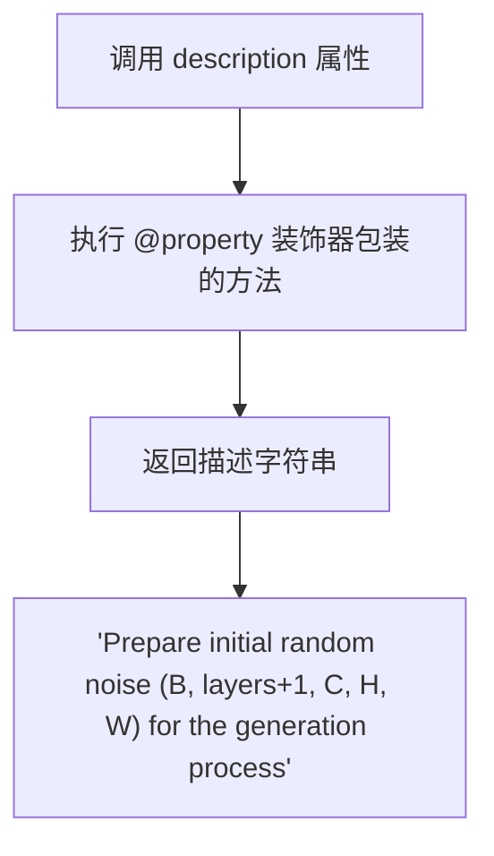

#### 带注释源码

```python
@property
def description(self) -> str:
    """
    返回该步骤的功能描述字符串
    
    Returns:
        str: 描述文本，说明该步骤准备用于生成过程的初始随机噪声，
            并明确指出噪声的形状为 (B, layers+1, C, H, W)
    """
    return "Prepare initial random noise (B, layers+1, C, H, W) for the generation process"
```


### `QwenImageLayeredPrepareLatentsStep.expected_components`

该属性定义了 `QwenImageLayeredPrepareLatentsStep` 类在执行过程中所需的组件依赖。调用时会返回包含 `pachifier` 组件的规格列表，用于框架初始化或验证所需组件是否已正确配置。

参数：

- `self`：`QwenImageLayeredPrepareLatentsStep`，属性所属的类实例

返回值：`list[ComponentSpec]`，返回组件规格列表，当前包含一个 `pachifier` 组件（类型为 `QwenImageLayeredPachifier`），创建方式默认为 `from_config`

#### 流程图

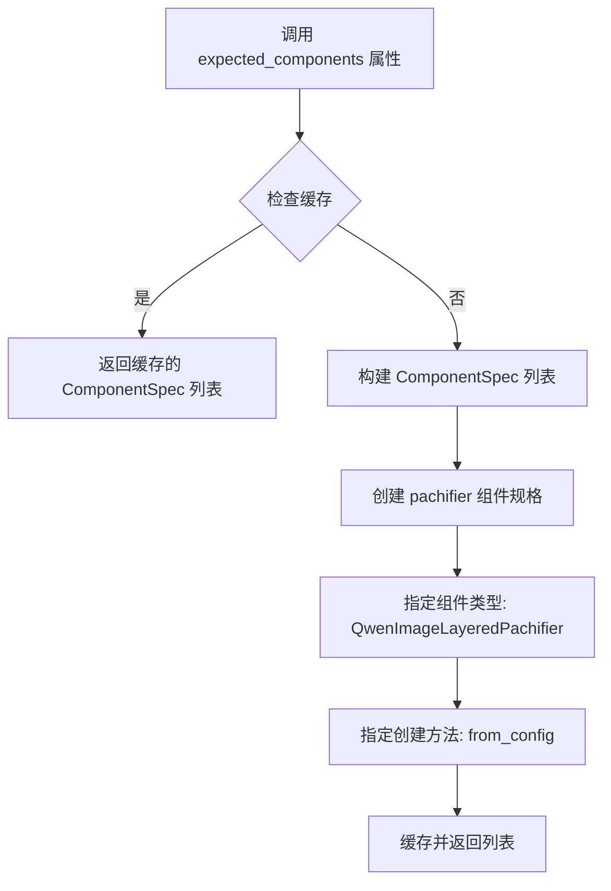

#### 带注释源码

```python
@property
def expected_components(self) -> list[ComponentSpec]:
    """
    定义该 Pipeline Block 所需的组件依赖。
    
    Returns:
        list[ComponentSpec]: 包含所需组件规范的列表
    """
    return [
        ComponentSpec(
            "pachifier",                                      # 组件名称
            QwenImageLayeredPachifier,                        # 组件类型
            default_creation_method="from_config"             # 默认创建方式
        ),
    ]
```


### `QwenImageLayeredPrepareLatentsStep.inputs`

该属性定义了 `QwenImageLayeredPrepareLatentsStep` 类的输入参数列表，用于描述该步骤需要接收的输入参数。这些输入参数包括潜在向量、高度、宽度、层数、每提示生成的图像数量、生成器、批量大小和数据类型。

参数：

-  `latents`：`Tensor`，可选，预先生成的噪声潜在向量，用于图像生成。
-  `height`：`int`，可选，生成图像的高度（以像素为单位）。
-  `width`：`int`，可选，生成图像的宽度（以像素为单位）。
-  `layers`：`int`，可选，默认为 4，从图像中提取的层数。
-  `num_images_per_prompt`：`int`，可选，默认为 1，每个提示生成的图像数量。
-  `generator`：`Generator`，可选，用于确定性生成的 Torch 生成器。
-  `batch_size`：`int`，可选，默认为 1，提示数量，最终模型输入的批量大小应为 batch_size * num_images_per_prompt。可以在输入步骤中生成。
-  `dtype`：`dtype`，可选，默认为 torch.float32，模型输入的数据类型。可以在输入步骤中生成。

返回值：`list[InputParam]`，返回输入参数列表，每个参数包含名称、类型、描述等信息。

#### 流程图

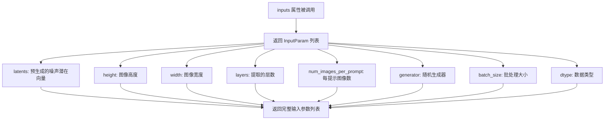

#### 带注释源码

```python
@property
def inputs(self) -> list[InputParam]:
    """
    定义该步骤的输入参数列表。
    
    该属性返回一系列输入参数，这些参数用于配置图像生成过程的不同方面：
    - latents: 可选的预生成潜在向量
    - height/width: 输出图像的尺寸
    - layers: 分层生成所需的层数
    - num_images_per_prompt: 每个文本提示生成的图像数量
    - generator: 用于随机数生成的可选生成器，确保可重现性
    - batch_size: 批处理大小，影响生成效率
    - dtype: 计算使用的数据类型
    
    Returns:
        list[InputParam]: 输入参数模板列表
    """
    return [
        InputParam.template("latents"),
        InputParam.template("height"),
        InputParam.template("width"),
        InputParam.template("layers"),
        InputParam.template("num_images_per_prompt"),
        InputParam.template("generator"),
        InputParam.template("batch_size"),
        InputParam.template("dtype"),
    ]
```


### `QwenImageLayeredPrepareLatentsStep.intermediate_outputs`

该属性是 `QwenImageLayeredPrepareLatentsStep` 类中的一个只读属性，用于定义该流水线步骤的中间输出参数。它返回三个 `OutputParam` 对象，分别对应生成图像的高度、宽度和初始潜在变量，这些输出将传递给后续的降噪步骤。

参数：
- 该属性无显式参数（使用 `self` 隐式引用实例）

返回值：`list[OutputParam]`，返回三个输出参数的列表：
- `height`：`int` 类型，如果未设置则更新为默认值
- `width`：`int` 类型，如果未设置则更新为默认值  
- `latents`：`torch.Tensor` 类型，用于去噪过程的初始潜在变量

#### 流程图

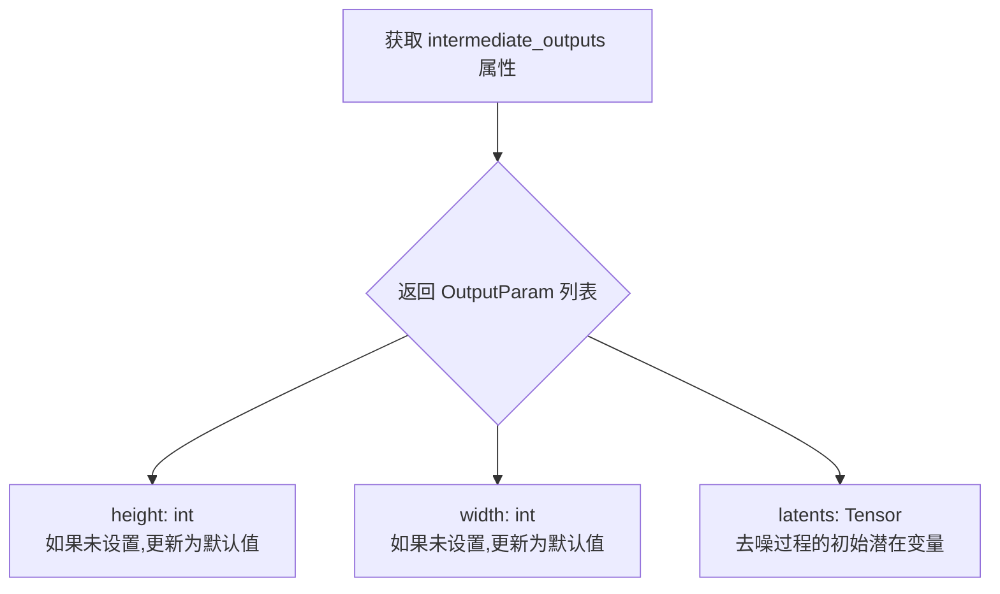

#### 带注释源码

```python
@property
def intermediate_outputs(self) -> list[OutputParam]:
    """
    定义该流水线步骤的中间输出参数。
    
    该属性返回三个 OutputParam 对象,描述了该步骤生成并传递给后续步骤的输出:
    1. height - 生成图像的高度,如果未在输入中设置则使用默认值
    2. width - 生成图像的宽度,如果未在输入中设置则使用默认值
    3. latents - 初始的噪声潜在变量,用于后续的去噪生成过程
    
    Returns:
        list[OutputParam]: 包含三个输出参数的列表,用于流水线状态传递
    """
    return [
        # 输出参数1: 图像高度
        OutputParam(
            name="height", 
            type_hint=int, 
            description="if not set, updated to default value"
        ),
        # 输出参数2: 图像宽度
        OutputParam(
            name="width", 
            type_hint=int, 
            description="if not set, updated to default value"
        ),
        # 输出参数3: 初始潜在变量
        OutputParam(
            name="latents",
            type_hint=torch.Tensor,
            description="The initial latents to use for the denoising process",
        ),
    ]
```


### `QwenImageLayeredPrepareLatentsStep.check_inputs`

该静态方法用于验证生成图像的高度和宽度是否符合 VAE 缩放因子的要求，确保后续 latent 计算的维度对齐。

参数：

- `height`：`int | None`，可选参数，待生成图像的高度（像素），如果提供则必须能被 `vae_scale_factor * 2` 整除
- `width`：`int | None`，可选参数，待生成图像的宽度（像素），如果提供则必须能被 `vae_scale_factor * 2` 整除
- `vae_scale_factor`：`int`，VAE 的缩放因子，用于计算 latent 空间的压缩比例

返回值：`None`，该方法不返回值，仅通过抛出 `ValueError` 异常来处理验证失败的情况

#### 流程图

```mermaid
flowchart TD
    A[开始 check_inputs] --> B{height is not None?}
    B -->|Yes| C{height % (vae_scale_factor * 2) == 0?}
    C -->|No| D[抛出 ValueError: Height must be divisible by ...]
    C -->|Yes| E{width is not None?}
    B -->|No| E
    E -->|Yes| F{width % (vae_scale_factor * 2) == 0?}
    F -->|No| G[抛出 ValueError: Width must be divisible by ...]
    F -->|Yes| H[结束 check_inputs]
    E -->|No| H
    D --> H
    G --> H
```

#### 带注释源码

```python
@staticmethod
def check_inputs(height, width, vae_scale_factor):
    """
    验证输入的高度和宽度是否符合 VAE 缩放因子的要求
    
    参数:
        height: 可选的图像高度，如果提供则必须能被 vae_scale_factor * 2 整除
        width: 可选的图像宽度，如果提供则必须能被 vae_scale_factor * 2 整除
        vae_scale_factor: VAE 的缩放因子，用于计算 latent 空间的压缩
    
    异常:
        ValueError: 当 height 或 width 不符合要求时抛出
    """
    # 检查高度是否被 vae_scale_factor * 2 整除
    # VAE 通常有 8x 压缩率，加上 packing 需要 latent 尺寸可被 2 整除
    if height is not None and height % (vae_scale_factor * 2) != 0:
        raise ValueError(f"Height must be divisible by {vae_scale_factor * 2} but is {height}")

    # 检查宽度是否被 vae_scale_factor * 2 整除
    if width is not None and width % (vae_scale_factor * 2) != 0:
        raise ValueError(f"Width must be divisible by {vae_scale_factor * 2} but is {width}")
```


### `QwenImageLayeredPrepareLatentsStep.__call__`

该方法是 QwenImageLayeredPrepareLatentsStep 类的核心调用方法，用于为分层图像生成准备初始随机噪声张量（形状为 B, layers+1, C, H, W）。方法首先验证输入的高度和宽度是否满足 VAE 压缩和打包的约束条件，然后根据批次大小和层数计算潜在空间的形状，如果未提供预生成的 latents，则使用随机张量生成器创建噪声，最后通过 pachifier 组件对 latents 进行打包处理。

**参数：**

- `self`：隐含的实例参数，表示 QwenImageLayeredPrepareLatentsStep 类的当前实例
- `components`：`QwenImageModularPipeline` 类型，包含流水线所需的各种组件，如 VAE、pachifier 等
- `state`：`PipelineState` 类型，包含当前流水线的状态信息，如高度、宽度、层数、批次大小等

**返回值：** `PipelineState`，实际上返回的是 `(components, state)` 元组，其中 components 是 QwenImageModularPipeline 实例，state 是更新后的 PipelineState 对象

#### 流程图

```mermaid
flowchart TD
    A[开始 __call__] --> B[获取 block_state]
    B --> C[调用 check_inputs 验证 height 和 width]
    C --> D{验证通过?}
    D -->|否| E[抛出 ValueError]
    D -->|是| F[获取 device 和 batch_size]
    F --> G[更新 height 和 width 为默认值如果未设置]
    G --> H[计算 latent_height 和 latent_width]
    H --> I[构建形状 tuple: (batch_size, layers+1, num_channels_latents, latent_height, latent_width)]
    I --> J{generator 列表长度是否匹配 batch_size?}
    J -->|否| K[抛出 ValueError]
    J -->|是| L{latents 是否为 None?}
    L -->|是| M[使用 randn_tensor 生成随机 latents]
    M --> N[调用 pachifier.pack_latents 打包 latents]
    L -->|否| O[跳过生成直接使用现有 latents]
    N --> P[更新 block_state 的 latents]
    O --> P
    P --> Q[保存 block_state 到 state]
    Q --> R[返回 components 和 state 元组]
```

#### 带注释源码

```python
@torch.no_grad()
def __call__(self, components: QwenImageModularPipeline, state: PipelineState) -> PipelineState:
    """
    准备分层图像生成的初始随机噪声
    
    参数:
        components: 流水线组件集合，包含 VAE、pachifier 等
        state: 流水线状态，包含高度、宽度、层数等信息
    
    返回:
        更新后的 components 和 state 元组
    """
    # 1. 获取当前块状态
    block_state = self.get_block_state(state)

    # 2. 验证输入参数：检查高度和宽度是否能被 vae_scale_factor * 2 整除
    self.check_inputs(
        height=block_state.height,
        width=block_state.width,
        vae_scale_factor=components.vae_scale_factor,
    )

    # 3. 获取执行设备和计算有效批次大小
    device = components._execution_device
    batch_size = block_state.batch_size * block_state.num_images_per_prompt

    # 4. 设置默认高度和宽度（如果未提供）
    block_state.height = block_state.height or components.default_height
    block_state.width = block_state.width or components.default_width

    # 5. 计算潜在空间的尺寸
    # VAE 应用 8x 压缩，但打包要求潜在空间高度和宽度可被 2 整除
    latent_height = 2 * (int(block_state.height) // (components.vae_scale_factor * 2))
    latent_width = 2 * (int(block_state.width) // (components.vae_scale_factor * 2))

    # 6. 构建潜在张量的形状: (batch_size, layers+1, num_channels, latent_height, latent_width)
    shape = (batch_size, block_state.layers + 1, components.num_channels_latents, latent_height, latent_width)
    
    # 7. 验证生成器列表长度是否与批次大小匹配
    if isinstance(block_state.generator, list) and len(block_state.generator) != batch_size:
        raise ValueError(
            f"You have passed a list of generators of length {len(block_state.generator)}, but requested an effective batch"
            f" size of {batch_size}. Make sure the batch size matches the length of the generators."
        )
    
    # 8. 如果未提供 latents，则生成随机噪声并打包
    if block_state.latents is None:
        block_state.latents = randn_tensor(
            shape, generator=block_state.generator, device=device, dtype=block_state.dtype
        )
        # 使用 pachifier 组件打包 latents
        block_state.latents = components.pachifier.pack_latents(block_state.latents)

    # 9. 保存更新后的块状态
    self.set_block_state(state, block_state)
    return components, state
```


### `QwenImagePrepareLatentsWithStrengthStep.description`

该属性方法返回当前步骤的描述字符串，用于说明该步骤在图像生成流水线中的功能。

参数：无

返回值：`str`，描述该步骤的功能，即"为图像到图像/修复任务向图像潜在向量添加噪声的步骤，应在设置时间步和准备潜在向量之后运行。噪声和图像潜在向量应该已经过补丁化处理。"

#### 流程图

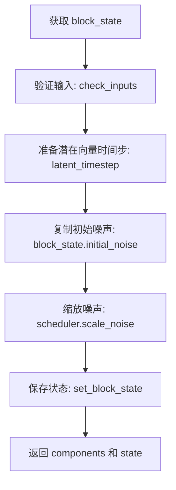

#### 带注释源码

```python
@property
def description(self) -> str:
    """
    返回该步骤的描述信息
    
    返回:
        str: 描述该步骤用于图像到图像/修复任务的噪声添加功能
    """
    return "Step that adds noise to image latents for image-to-image/inpainting. Should be run after set_timesteps, prepare_latents. Both noise and image latents should alreadybe patchified."
```


### `QwenImagePrepareLatentsWithStrengthStep.expected_components`

该属性定义了 `QwenImagePrepareLatentsWithStrengthStep` 类所需的组件依赖，指定该步骤需要使用 `FlowMatchEulerDiscreteScheduler` 调度器来对图像潜在变量进行噪声处理，适用于图像到图像（img2img）或重绘（inpainting）任务。

参数：无（该方法为属性，无参数）

返回值：`list[ComponentSpec]`，返回组件规范列表，包含调度器（`scheduler`）的配置信息。

#### 流程图

```mermaid
flowchart TD
    A[获取 expected_components 属性] --> B{检查返回值类型}
    B -->|list[ComponentSpec]| C[返回包含 scheduler 的 ComponentSpec 列表]
    C --> D[ComponentSpec: scheduler 类型为 FlowMatchEulerDiscreteScheduler]
    
    style A fill:#f9f,stroke:#333
    style C fill:#9f9,stroke:#333
    style D fill:#ff9,stroke:#333
```

#### 带注释源码

```python
@property
def expected_components(self) -> list[ComponentSpec]:
    """
    定义该 Pipeline Block 所需的组件依赖。
    
    该方法返回一个列表，包含该步骤所需的所有组件规范（ComponentSpec）。
    对于 QwenImagePrepareLatentsWithStrengthStep，它需要使用调度器（scheduler）
    来对图像潜在变量进行噪声缩放（scale_noise），从而实现图像到图像或重绘功能。
    
    Returns:
        list[ComponentSpec]: 包含组件规范的列表，当前仅包含 scheduler 组件。
            - scheduler: 类型为 FlowMatchEulerDiscreteScheduler，用于噪声调度。
    """
    return [
        ComponentSpec("scheduler", FlowMatchEulerDiscreteScheduler),
    ]
```


### `QwenImagePrepareLatentsWithStrengthStep.inputs`

该属性定义了 `QwenImagePrepareLatentsWithStrengthStep` 类的输入参数列表，用于图像到图像（image-to-image）或重绘（inpainting）过程中的噪声添加步骤。

参数：

- `latents`：`torch.Tensor`，必需的输入参数，表示初始随机噪声张量，可在 prepare latent 步骤中生成。
- `image_latents`：`torch.Tensor`，可选的输入参数，表示用于引导图像生成的图像潜在表示，可从 VAE 编码器步骤生成或在输入步骤中更新。
- `timesteps`：`torch.Tensor`，必需的输入参数，表示去噪过程使用的时间步，可在 set_timesteps 步骤中生成。

返回值：`list[InputParam]`，返回一个包含三个 `InputParam` 对象的列表，定义了 Prepare Latents With Strength 步骤的输入参数。

#### 流程图

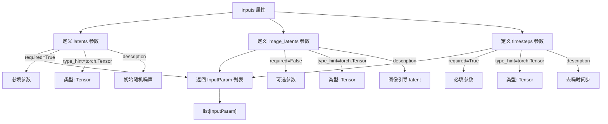

#### 带注释源码

```python
@property
def inputs(self) -> list[InputParam]:
    """
    定义该步骤的输入参数列表。
    
    返回:
        包含三个 InputParam 对象的列表，分别对应:
        - latents: 初始随机噪声 (必填)
        - image_latents: 图像引导 latent (可选)
        - timesteps: 去噪时间步 (必填)
    """
    return [
        # latents: 初始随机噪声张量，用于去噪过程
        InputParam(
            name="latents",
            required=True,
            type_hint=torch.Tensor,
            description="The initial random noised, can be generated in prepare latent step.",
        ),
        # image_latents: 图像 latent，用于引导图像生成
        InputParam.template("image_latents", note="Can be generated from vae encoder and updated in input step."),
        # timesteps: 时间步张量，用于控制去噪过程
        InputParam(
            name="timesteps",
            required=True,
            type_hint=torch.Tensor,
            description="The timesteps to use for the denoising process. Can be generated in set_timesteps step.",
        ),
    ]
```


### `QwenImagePrepareLatentsWithStrengthStep.intermediate_outputs`

该属性定义了 `QwenImagePrepareLatentsWithStrengthStep` 步骤的中间输出参数。它返回两个 `OutputParam` 对象：`initial_noise`（用于 inpainting 降噪的初始随机噪声）和 `latents`（用于 inpainting/img2img 降噪的缩放噪声 latent）。

参数：
- （无，此属性为 getter，无输入参数）

返回值：`list[OutputParam]`，返回包含 `initial_noise` 和 `latents` 的输出参数列表。

#### 流程图

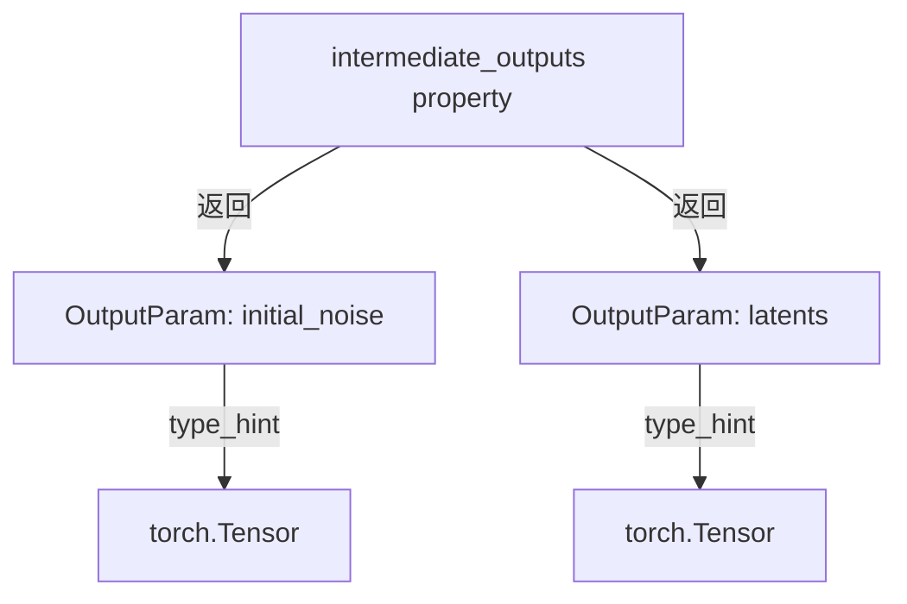

#### 带注释源码

```python
@property
def intermediate_outputs(self) -> list[OutputParam]:
    """
    返回该步骤的中间输出参数列表。
    
    Returns:
        list[OutputParam]: 包含 'initial_noise' 和 'latents' 的列表。
    """
    return [
        OutputParam(
            name="initial_noise",
            type_hint=torch.Tensor,
            description="The initial random noised used for inpainting denoising.",
        ),
        OutputParam(
            name="latents",
            type_hint=torch.Tensor,
            description="The scaled noisy latents to use for inpainting/image-to-image denoising.",
        ),
    ]
```


### `QwenImagePrepareLatentsWithStrengthStep.check_inputs`

这是一个静态方法，用于验证图像潜在变量（image_latents）和潜在变量（latents）的输入合法性，确保它们具有相同的批次大小和正确的维度。

参数：

- `image_latents`：`torch.Tensor`，经过 patchify 处理的图像潜在变量，用于引导图像生成
- `latents`：`torch.Tensor`，初始的随机噪声潜在变量

返回值：`None`，该方法不返回任何值，仅通过抛出 ValueError 来处理验证失败的情况

#### 流程图

```mermaid
flowchart TD
    A[开始 check_inputs] --> B{检查批次大小是否相等}
    B -->|不相等| C[抛出 ValueError: image_latents 和 latents 批次大小必须一致]
    B -->|相等 --> D{检查 image_latents 维度是否为3}
    D -->|不是3维| E[抛出 ValueError: image_latents 必须是3维]
    D -->|是3维 --> F[验证通过, 方法结束]
    C --> F
    E --> F
```

#### 带注释源码

```python
@staticmethod
def check_inputs(image_latents, latents):
    # 检查 image_latents 和 latents 的批次大小是否一致
    # 如果不一致，抛出 ValueError 并提示具体的批次大小差异
    if image_latents.shape[0] != latents.shape[0]:
        raise ValueError(
            f"`image_latents` must have have same batch size as `latents`, but got {image_latents.shape[0]} and {latents.shape[0]}"
        )

    # 检查 image_latents 是否为3维张量（已 patchify 处理）
    # patchify 后的张量应该是3维的: (batch_size, seq_len, hidden_dim)
    # 如果不是3维，抛出 ValueError
    if image_latents.ndim != 3:
        raise ValueError(f"`image_latents` must have 3 dimensions (patchified), but got {image_latents.ndim}")
```


### `QwenImagePrepareLatentsWithStrengthStep.__call__`

该方法用于在图像到图像（Image-to-Image）或修复（Inpainting）任务中，向图像潜变量添加噪声。应 在 set_timesteps 和 prepare_latents 步骤之后运行。噪声和图像潜变量都应已经过 patchify 处理。

参数：

-  `self`：实例本身
-  `components`：`QwenImageModularPipeline`，模块化管道组件容器，包含 scheduler 等组件
-  `state`：`PipelineState`，管道状态对象，包含 block_state 中的 latents、image_latents、timesteps 等

返回值：`PipelineState`，更新后的管道状态对象（实际返回 `Tuple[QwenImageModularPipeline, PipelineState]`）

#### 流程图

```mermaid
flowchart TD
    A[开始 __call__] --> B[获取 block_state]
    B --> C[调用 check_inputs 验证 image_latents 和 latents]
    C --> D{验证通过?}
    D -->|否| E[抛出 ValueError]
    D -->|是| F[准备 latent_timestep: timesteps[:1].repeat(batch_size)]
    F --> G[保存初始噪声: block_state.initial_noise = block_state.latents]
    G --> H[调用 scheduler.scale_noise 缩放噪声]
    H --> I[更新 block_state.latents 为缩放后的噪声]
    I --> J[保存 block_state 到 state]
    J --> K[返回 components, state]
```

#### 带注释源码

```python
@torch.no_grad()
def __call__(self, components: QwenImageModularPipeline, state: PipelineState) -> PipelineState:
    """
    执行图像到图像/修复的噪声添加步骤
    
    参数:
        components: QwenImageModularPipeline，管道组件容器
        state: PipelineState，管道状态
    
    返回:
        更新后的 (components, state) 元组
    """
    # 1. 从 state 中获取当前 block 的状态
    block_state = self.get_block_state(state)

    # 2. 验证输入参数的有效性
    #    检查 image_latents 和 latents 的 batch size 是否一致
    #    检查 image_latents 是否已经是 patchified 后的 3 维形式
    self.check_inputs(
        image_latents=block_state.image_latents,
        latents=block_state.latents,
    )

    # 3. 准备潜变量时间步
    #    取第一个时间步并根据 batch size 重复
    latent_timestep = block_state.timesteps[:1].repeat(block_state.latents.shape[0])

    # 4. 保存原始噪声作为 initial_noise
    #    用于后续可能的修复/重建任务
    block_state.initial_noise = block_state.latents

    # 5. 使用 scheduler 的 scale_noise 方法对噪声进行缩放
    #    根据 image_latents 和 latent_timestep 将噪声调整到适当的缩放级别
    block_state.latents = components.scheduler.scale_noise(
        block_state.image_latents, latent_timestep, block_state.latents
    )

    # 6. 将更新后的 block_state 写回 state
    self.set_block_state(state, block_state)

    # 7. 返回更新后的 components 和 state
    return components, state
```

#### 关键字段说明

从类定义中提取的相关字段：

- **输入参数（来自 block_state）**：
  - `latents`：`torch.Tensor`，初始随机噪声，由 prepare_latents 步骤生成
  - `image_latents`：`torch.Tensor`，图像潜变量，由 VAE 编码器生成
  - `timesteps`：`torch.Tensor`，去噪过程使用的时间步

- **输出参数（写入 block_state）**：
  - `initial_noise`：`torch.Tensor`，原始噪声副本，用于修复去噪
  - `latents`：`torch.Tensor`，缩放后的噪声潜变量，用于图像到图像/修复去噪

- **依赖组件**：
  - `scheduler`：`FlowMatchEulerDiscreteScheduler`，流匹配欧拉离散调度器，用于噪声缩放


### `QwenImageCreateMaskLatentsStep.description`

该属性返回当前步骤的描述信息，用于说明该步骤的核心功能是将预处理后的掩码图像通过插值的方式转换到潜在空间，生成掩码潜在变量。

参数：

- `self`：当前类实例，无需显式传递

返回值：`str`，返回步骤的描述字符串

#### 流程图

```mermaid
flowchart TD
    A[获取description属性] --> B{返回描述字符串}
    B --> C["Step that creates mask latents from preprocessed mask_image by interpolating to latent space."]
    
    style A fill:#e1f5fe
    style B fill:#fff3e0
    style C fill:#e8f5e9
```

#### 带注释源码

```python
@property
def description(self) -> str:
    """
    获取该步骤的描述信息。
    
    该属性是ModularPipelineBlocks抽象基类要求实现的标准属性之一，
    用于向外部系统（如管道编排器、日志系统或UI）提供该步骤功能的文字说明。
    在本步骤中，描述信息明确指出这是将预处理后的掩码图像插值到潜在空间
    以生成用于图像修复过程的掩码潜在变量。
    
    Args:
        self: QwenImageCreateMaskLatentsStep类的实例
        
    Returns:
        str: 步骤的功能描述文本
    """
    return "Step that creates mask latents from preprocessed mask_image by interpolating to latent space."
```


### `QwenImageCreateMaskLatentsStep.expected_components`

该属性定义了 `QwenImageCreateMaskLatentsStep` 类在执行过程中所依赖的组件规范列表，用于指定创建 mask latents 步骤所需的 pachifier 组件。

参数： 无（这是一个属性 getter，不接受任何参数）

返回值：`list[ComponentSpec]` ，返回该步骤期望的组件规范列表，当前包含一个 `pachifier` 组件，用于将 mask 张量打包成适合潜空间处理的格式。

#### 带注释源码

```python
@property
def expected_components(self) -> list[ComponentSpec]:
    """
    定义当前步骤所需的组件规范。

    Returns:
        list[ComponentSpec]: 包含组件名称、类型及默认创建方式的列表。
                              当前步骤依赖 QwenImagePachifier 组件进行 mask 的打包处理。
    """
    return [
        ComponentSpec("pachifier", QwenImagePachifier, default_creation_method="from_config"),
    ]
```


### `QwenImageCreateMaskLatentsStep.inputs`

该属性定义了 `QwenImageCreateMaskLatentsStep` 步骤的输入参数列表，包含了进行掩码潜在向量生成所需的全部输入参数：处理后的掩码图像、生成图像的高度和宽度、以及数据类型。

参数：

- （无显式参数，属性方法通过 `self` 访问）

返回值：`list[InputParam]`，返回该步骤的所有输入参数定义列表，每个 `InputParam` 包含参数名称、类型、是否必填以及描述信息。

#### 流程图

```mermaid
flowchart TD
    A[inputs property 被访问] --> B{返回输入参数列表}
    
    B --> C[InputParam: processed_mask_image]
    B --> D[InputParam: height]
    B --> E[InputParam: width]
    B --> F[InputParam: dtype]
    
    C --> G[list of InputParam]
    D --> G
    E --> G
    F --> G
    
    G --> H[用于描述 QwenImageCreateMaskLatentsStep 的输入规范]
```

#### 带注释源码

```python
@property
def inputs(self) -> list[InputParam]:
    """
    定义该步骤的输入参数列表。
    
    Returns:
        list[InputParam]: 包含以下参数的列表：
        - processed_mask_image: 处理后的掩码图像张量，用于图像修复过程
        - height: 生成图像的高度（像素）
        - width: 生成图像的宽度（像素）
        - dtype: 模型输入的数据类型，默认为 torch.float32
    """
    return [
        InputParam(
            name="processed_mask_image",  # 参数名称：处理后的掩码图像
            required=True,                  # 该参数为必填项
            type_hint=torch.Tensor,         # 参数类型：PyTorch 张量
            description="The processed mask to use for the inpainting process.",  # 参数描述：用于图像修复过程的处理掩码
        ),
        InputParam.template("height", required=True),   # 使用模板创建 height 参数，必填
        InputParam.template("width", required=True),    # 使用模板创建 width 参数，必填
        InputParam.template("dtype"),                    # 使用模板创建 dtype 参数，可选
    ]
```


### `QwenImageCreateMaskLatentsStep.intermediate_outputs`

该属性定义了 `QwenImageCreateMaskLatentsStep` 类的中间输出参数，指定了该步骤在处理过程中生成的输出变量，包括输出名称、类型提示和描述信息。

参数：无（该属性不接受任何参数）

返回值：`list[OutputParam]`，返回该步骤生成的中间输出参数列表，包含一个 `mask` 参数，表示用于修复过程的掩码张量。

#### 流程图

```mermaid
flowchart TD
    A[开始] --> B{定义 intermediate_outputs 属性}
    B --> C[返回包含单个 OutputParam 的列表]
    C --> D[OutputParam: name='mask', type_hint=torch.Tensor]
    D --> E[描述: The mask to use for the inpainting process.]
    E --> F[结束]
    
    style B fill:#e1f5fe
    style C fill:#e1f5fe
    style D fill:#b3e5fc
    style E fill:#b3e5fc
```

#### 带注释源码

```python
@property
def intermediate_outputs(self) -> list[OutputParam]:
    """
    定义该步骤的中间输出参数。
    
    该属性返回一个列表，包含了该处理步骤将生成的所有输出参数。
    每个 OutputParam 对象描述一个输出参数的名称、类型提示和用途说明。
    
    Returns:
        list[OutputParam]: 包含所有中间输出参数的列表。
            - mask (torch.Tensor): 用于修复过程的掩码张量。
    """
    return [
        OutputParam(
            name="mask",  # 输出参数的名称
            type_hint=torch.Tensor,  # 输出参数的类型提示
            description="The mask to use for the inpainting process."  # 输出参数的描述
        ),
    ]
```


### `QwenImageCreateMaskLatentsStep.__call__`

该方法是通过插值将预处理后的掩码图像调整到潜在空间尺寸，并进行填充处理，生成可用于inpainting过程的掩码潜在变量。

参数：

- `self`：`QwenImageCreateMaskLatentsStep` 类实例
- `components`：`QwenImageModularPipeline`，模块化管道组件，提供VAE缩放因子、通道数和pachifier
- `state`：`PipelineState`，管道状态，包含mask图像、高度、宽度、数据类型等中间数据

返回值：`PipelineState`，更新后的管道状态，其中包含处理后的mask潜在变量

#### 流程图

```mermaid
flowchart TD
    A[开始] --> B[从state获取block_state]
    B --> C[获取执行设备device]
    C --> D[计算latent高度: height_latents = 2 * height // (vae_scale_factor * 2)]
    D --> E[计算latent宽度: width_latents = 2 * width // (vae_scale_factor * 2)]
    E --> F[使用torch.nn.functional.interpolate调整mask尺寸到latent空间]
    F --> G[unsqueeze添加通道维度]
    G --> H[repeat复制通道数: (1, num_channels_latents, 1, 1, 1)]
    H --> I[转换为指定device和dtype]
    I --> J[使用pachifier.pack_latents进行填充处理]
    J --> K[保存mask到block_state]
    K --> L[更新state并返回components和state]
```

#### 带注释源码

```python
@torch.no_grad()  # 禁用梯度计算以节省内存
def __call__(self, components: QwenImageModularPipeline, state: PipelineState) -> PipelineState:
    # 从pipeline state中获取当前block的状态
    block_state = self.get_block_state(state)

    # 获取执行设备（CPU/CUDA）
    device = components._execution_device

    # VAE应用8x压缩，但还需要考虑packing要求
    # latent高度和宽度需要能被2整除
    # 计算目标latent空间的高度和宽度
    height_latents = 2 * (int(block_state.height) // (components.vae_scale_factor * 2))
    width_latents = 2 * (int(block_state.width) // (components.vae_scale_factor * 2))

    # 使用双线性插值将预处理后的mask图像调整到latent空间尺寸
    block_state.mask = torch.nn.functional.interpolate(
        block_state.processed_mask_image,
        size=(height_latents, width_latents),
    )

    # 在通道维度之后添加一个新的维度，用于后续的layer维度
    block_state.mask = block_state.mask.unsqueeze(2)
    
    # 复制mask以匹配latent的通道数
    # 形状从 (B, C, 1, H, W) 扩展为 (B, num_channels_latents, 1, H, W)
    block_state.mask = block_state.mask.repeat(1, components.num_channels_latents, 1, 1, 1)
    
    # 将mask转换到指定设备并使用指定数据类型
    block_state.mask = block_state.mask.to(device=device, dtype=block_state.dtype)

    # 使用pachifier对mask进行packing处理（将latent打包成序列格式）
    block_state.mask = components.pachifier.pack_latents(block_state.mask)

    # 将更新后的block_state写回pipeline state
    self.set_block_state(state, block_state)

    # 返回更新后的components和state
    return components, state
```


### `QwenImageSetTimestepsStep.description`

该属性返回对 `QwenImageSetTimestepsStep` 步骤功能的描述，用于文本到图像生成过程中调度器时间步的设置，应在准备潜在变量步骤之后运行。

参数：无（该方法为属性，不接受任何参数）

返回值：`str`，返回该步骤的描述字符串，说明其功能为设置调度器的时间步，用于文本到图像生成过程，应在准备潜在变量步骤之后运行。

#### 流程图

```mermaid
flowchart TD
    A[获取 description 属性] --> B{返回描述字符串}
    B --> C[Step that sets the scheduler's timesteps for text-to-image generation. Should be run after prepare latents step.]
```

#### 带注释源码

```python
@property
def description(self) -> str:
    """
    该属性方法返回对 QwenImageSetTimestepsStep 步骤的描述字符串。
    
    Returns:
        str: 描述该步骤功能的字符串，说明其用于设置调度器的时间步，
            应在准备潜在变量（prepare latents）步骤之后运行。
    """
    return "Step that sets the scheduler's timesteps for text-to-image generation. Should be run after prepare latents step."
```


### `QwenImageSetTimestepsStep.expected_components`

该属性定义了 `QwenImageSetTimestepsStep` 步骤所需的组件规范。它声明该步骤需要一个 `FlowMatchEulerDiscreteScheduler` 类型的调度器组件，用于生成去噪过程的时间步。

参数：无（属性 getter 不接受参数）

返回值：`list[ComponentSpec]`，返回该步骤所需的组件规范列表，当前包含一个 `FlowMatchEulerDiscreteScheduler` 调度器组件。

#### 流程图

```mermaid
flowchart TD
    A[调用 expected_components 属性] --> B{返回组件列表}
    B --> C[ComponentSpec: scheduler - FlowMatchEulerDiscreteScheduler]
```

#### 带注释源码

```python
@property
def expected_components(self) -> list[ComponentSpec]:
    """
    属性方法，返回该步骤所需的组件规范列表。
    
    该方法定义了在 QwenImage 文本到图像生成流程中，
    设置时间步步骤所需的调度器组件。
    
    Returns:
        list[ComponentSpec]: 包含调度器组件规范的列表
    """
    return [
        ComponentSpec("scheduler", FlowMatchEulerDiscreteScheduler),
    ]
```


### `QwenImageSetTimestepsStep.inputs` (property)

该属性定义了 `QwenImageSetTimestepsStep` 类的输入参数列表，用于配置时间步设置所需的参数，包括推理步数、自定义噪声水平以及用于计算图像序列长度的潜在向量。

参数：

- `num_inference_steps`：可选参数，通过 `InputParam.template("num_inference_steps")` 生成，默认值为 50，表示去噪步骤的数量
- `sigmas`：可选参数，通过 `InputParam.template("sigmas")` 生成，表示用于去噪过程的自定义噪声水平
- `latents`：`torch.Tensor`，必需参数，表示去噪过程使用的初始随机噪声潜在向量，可由 prepare latents 步骤生成

返回值：`list[InputParam]`，返回包含三个 `InputParam` 对象的列表，定义了时间步设置步骤的所有输入参数

#### 流程图

```mermaid
flowchart TD
    A[Start] --> B[定义 inputs property]
    B --> C[创建 InputParam 列表]
    C --> D[添加 num_inference_steps 模板参数]
    C --> E[添加 sigmas 模板参数]
    C --> F[添加 latents 必需参数<br/>类型: torch.Tensor<br/>描述: 初始随机噪声潜在向量]
    D --> G[返回 InputParam 列表]
    E --> G
    F --> G
    G --> H[End]
```

#### 带注释源码

```python
@property
def inputs(self) -> list[InputParam]:
    """
    定义该步骤的输入参数列表
    
    返回:
        包含所有输入参数的列表，用于配置时间步设置
    """
    return [
        # 模板参数：推理步数，可选，默认值为50
        InputParam.template("num_inference_steps"),
        # 模板参数：自定义噪声水平sigmas，可选
        InputParam.template("sigmas"),
        # 必需参数：初始随机噪声潜在向量
        # 用于计算图像序列长度以进行shift计算
        InputParam(
            name="latents",
            required=True,  # 该参数为必需参数
            type_hint=torch.Tensor,  # 类型提示为Tensor
            description="The initial random noised latents for the denoising process. Can be generated in prepare latents step.",
        ),
    ]
```


### `QwenImageSetTimestepsStep.intermediate_outputs`

该属性定义了 `QwenImageSetTimestepsStep` 类的中间输出参数，用于描述该步骤在流水线执行过程中产生并传递给后续步骤的输出变量。

参数： （该属性无参数）

返回值：`list[OutputParam]`，返回该步骤产生的中间输出参数列表，包含输出参数的名称、类型提示和描述信息。

#### 流程图

```mermaid
flowchart TD
    A[开始] --> B{intermediate_outputs 属性被访问}
    B --> C[创建 OutputParam 列表]
    C --> D[添加 timesteps 输出参数]
    D --> E[返回 OutputParam 列表]
    E --> F[结束]
    
    style B fill:#f9f,stroke:#333
    style C fill:#ff9,stroke:#333
    style D fill:#ff9,stroke:#333
    style E fill:#9f9,stroke:#333
```

#### 带注释源码

```python
@property
def intermediate_outputs(self) -> list[OutputParam]:
    """
    定义该步骤的中间输出参数。
    
    中间输出是指该步骤执行完成后，传递给流水线中后续步骤使用的输出变量。
    这些变量会被存储在 PipelineState 中，供下游步骤使用。
    
    Returns:
        list[OutputParam]: 包含该步骤所有中间输出的列表，每个元素描述一个输出参数的
                          名称、类型提示和用途描述。
    """
    return [
        OutputParam(
            name="timesteps",  # 输出参数名称
            type_hint=torch.Tensor,  # 参数类型提示
            description="The timesteps to use for the denoising process"  # 参数描述
        ),
    ]
```


### `QwenImageSetTimestepsStep.__call__`

设置调度器的时间步，用于文本到图像生成过程。该方法在准备潜在变量步骤之后运行，计算基于潜在变量形状的移动参数mu，并从调度器检索时间步。

参数：

- `self`：隐式参数，QwenImageSetTimestepsStep 类的实例
- `components`：`QwenImageModularPipeline` 类型，包含管道组件的配置和执行设备
- `state`：`PipelineState` 类型，包含当前管道的状态，包括num_inference_steps、sigmas、latents等

返回值：`PipelineState`，更新后的管道状态，包含timesteps和num_inference_steps

#### 流程图

```mermaid
flowchart TD
    A[开始 __call__] --> B[获取 block_state]
    B --> C[获取执行设备 device]
    C --> D{判断 sigmas 是否为 None}
    D -->|是| E[使用 np.linspace 生成默认 sigmas]
    D -->|否| F[使用 block_state.sigmas]
    E --> G[调用 calculate_shift 计算 mu]
    F --> G
    G --> H[调用 retrieve_timesteps 获取 timesteps]
    H --> I[设置 scheduler 的 begin_index 为 0]
    I --> J[更新 block_state]
    J --> K[设置 block_state 并返回]
```

#### 带注释源码

```python
def __call__(self, components: QwenImageModularPipeline, state: PipelineState) -> PipelineState:
    """
    设置调度器的时间步，用于文本到图像生成。
    
    Args:
        components: 管道组件，包含scheduler配置和执行设备
        state: 管道状态，包含num_inference_steps、sigmas、latents等
    
    Returns:
        更新后的管道状态，包含timesteps和num_inference_steps
    """
    # 获取当前块的state
    block_state = self.get_block_state(state)
    
    # 获取执行设备
    device = components._execution_device
    
    # 确定是否使用自定义sigmas，如果没有则生成默认sigmas
    sigmas = (
        np.linspace(1.0, 1 / block_state.num_inference_steps, block_state.num_inference_steps)
        if block_state.sigmas is None
        else block_state.sigmas
    )
    
    # 计算图像序列长度的移动参数mu，用于调整时间步计划
    mu = calculate_shift(
        image_seq_len=block_state.latents.shape[1],  # 潜在变量的序列长度
        base_seq_len=components.scheduler.config.get("base_image_seq_len", 256),  # 基础序列长度
        max_seq_len=components.scheduler.config.get("max_image_seq_len", 4096),  # 最大序列长度
        base_shift=components.scheduler.config.get("base_shift", 0.5),  # 基础移动量
        max_shift=components.scheduler.config.get("max_shift", 1.15),  # 最大移动量
    )
    
    # 从调度器检索时间步
    block_state.timesteps, block_state.num_inference_steps = retrieve_timesteps(
        scheduler=components.scheduler,
        num_inference_steps=block_state.num_inference_steps,
        device=device,
        sigmas=sigmas,
        mu=mu,
    )
    
    # 设置调度器的起始索引为0
    components.scheduler.set_begin_index(0)
    
    # 更新block_state
    self.set_block_state(state, block_state)
    
    # 返回更新后的components和state
    return components, state
```


### `QwenImageLayeredSetTimestepsStep.description`

返回用于 QwenImage Layered 的 timestep 设置步骤的描述，该步骤基于 `image_latents` 进行自定义 mu 计算。

参数：

- 该属性无显式参数（除了隐式的 `self`）

返回值：`str`，返回该步骤的功能描述字符串

#### 流程图

```mermaid
flowchart TD
    A[开始] --> B{调用 description 属性}
    B --> C[返回静态字符串描述]
    C --> D[结束]
    
    style B fill:#f9f,stroke:#333
    style C fill:#9f9,stroke:#333
```

#### 带注释源码

```python
@property
def description(self) -> str:
    """
    属性描述符，返回该步骤的功能描述。
    
    Returns:
        str: 描述文本，说明此步骤用于 QwenImage Layered 的时间步设置，
            并基于 image_latents 进行自定义 mu 计算。
    """
    return "Set timesteps step for QwenImage Layered with custom mu calculation based on image_latents."
```

---

**补充说明：**

- **类归属**：此属性属于 `QwenImageLayeredSetTimestepsStep` 类
- **性质**：这是一个只读的 `@property` 装饰器方法，用于提供步骤的文本描述
- **用途**：通常用于日志记录、调试信息或文档生成，帮助开发者理解该步骤在流水线中的作用
- **与其他组件的关系**：该类用于处理分层图像（Layered）的时间步调度，与标准的 `QwenImageSetTimestepsStep` 相比，它使用了基于 `image_latents` 形状的自定义 mu 计算公式


### `QwenImageLayeredSetTimestepsStep.expected_components`

该属性定义了 `QwenImageLayeredSetTimestepsStep` 类所需的组件依赖，指定了该步骤执行时需要从管道中获取的组件类型。

参数： （无 - 这是一个属性，不接受任何参数）

返回值：`list[ComponentSpec]` ，返回该步骤所需的组件规范列表，包含组件名称和类型。

#### 流程图

```mermaid
flowchart TD
    A[开始] --> B{读取 expected_components 属性}
    B --> C[返回包含 scheduler 组件的列表]
    C --> D[组件规范: scheduler - FlowMatchEulerDiscreteScheduler 类型]
    D --> E[使用 default_creation_method='from_config' 创建组件]
    E --> F[结束]
    
    style A fill:#f9f,stroke:#333
    style F fill:#9f9,stroke:#333
```

#### 带注释源码

```python
@property
def expected_components(self) -> list[ComponentSpec]:
    """
    定义该管道块所需的组件依赖。
    
    该属性返回组件规范列表，指定了 QwenImageLayeredSetTimestepsStep 
    在执行 __call__ 方法时需要从 QwenImageModularPipeline 中获取的组件。
    
    Returns:
        list[ComponentSpec]: 包含所需组件规范的列表。当前版本只依赖 
        FlowMatchEulerDiscreteScheduler 调度器组件，用于设置去噪过程的时间步。
    
    Example:
        >>> step = QwenImageLayeredSetTimestepsStep()
        >>> components = step.expected_components
        >>> print(components[0].name)  # 输出: 'scheduler'
        >>> print(components[0].component_class)  # 输出: FlowMatchEulerDiscreteScheduler
    """
    return [
        ComponentSpec("scheduler", FlowMatchEulerDiscreteScheduler),
    ]
```


### QwenImageLayeredSetTimestepsStep.inputs

该属性定义了 `QwenImageLayeredSetTimestepsStep` 步骤类的输入参数列表，用于配置分层图像生成的时间步长设置。返回三个输入参数：推理步数、自定义sigmas以及图像潜在变量。

参数：

- `num_inference_steps`：`int`，可选，默认值为 50。推理过程中的去噪步数。
- `sigmas`：`list`，可选。自定义的去噪过程sigmas值。
- `image_latents`：`Tensor`，可选。用于引导图像生成的图像潜在变量，可从 VAE 编码器步骤生成。

返回值：`list[InputParam]`，返回输入参数列表。

#### 流程图

```mermaid
flowchart TD
    A[inputs property] --> B[返回 InputParam 列表]
    B --> C[num_inference_steps]
    B --> D[sigmas]
    B --> E[image_latents]
    
    C --> C1[模板参数: num_inference_steps]
    D --> D1[模板参数: sigmas]
    E --> E1[模板参数: image_latents]
```

#### 带注释源码

```python
@property
def inputs(self) -> list[InputParam]:
    """
    定义该步骤的输入参数列表。
    
    返回:
        包含三个InputParam对象的列表，分别对应：
        - num_inference_steps: 推理步数
        - sigmas: 自定义sigmas
        - image_latents: 图像潜在变量
    """
    return [
        InputParam.template("num_inference_steps"),
        InputParam.template("sigmas"),
        InputParam.template("image_latents"),
    ]
```


### `QwenImageLayeredSetTimestepsStep.intermediate_outputs`

该属性定义了 `QwenImageLayeredSetTimestepsStep` 类的中间输出参数，返回一个包含去噪过程所需时间步的张量列表。

参数：

- （无，此为属性而非方法）

返回值：`list[OutputParam]`，返回一个包含 `OutputParam` 对象的列表，其中描述了去噪过程所需的时间步。

#### 流程图

```mermaid
flowchart TD
    A[开始] --> B{访问 intermediate_outputs 属性}
    B --> C[返回包含 timesteps 的 OutputParam 列表]
    C --> D[列表包含一个 OutputParam<br/>name: timesteps<br/>type_hint: torch.Tensor<br/>description: The timesteps to use for the denoising process.]
    D --> E[结束]
```

#### 带注释源码

```python
@property
def intermediate_outputs(self) -> list[OutputParam]:
    """
    定义该步骤的中间输出参数。
    
    返回:
        list[OutputParam]: 包含时间步输出参数的列表，用于去噪过程。
    """
    return [
        OutputParam(
            name="timesteps",                           # 输出参数名称
            type_hint=torch.Tensor,                     # 参数类型提示
            description="The timesteps to use for the denoising process."  # 参数描述
        ),
    ]
```


### `QwenImageLayeredSetTimestepsStep.__call__`

该方法是 QwenImage 分层图像生成流程中的时间步设置步骤，专门针对分层架构设计了基于图像潜变量的自定义 mu（均值）计算，用于调整去噪调度计划。

参数：

- `components`：`QwenImageModularPipeline`，模块化管道组件容器，包含调度器等执行组件
- `state`：`PipelineState`，管道状态对象，包含当前时间步、推理步数、图像潜变量等中间状态

返回值：`PipelineState`，更新后的管道状态对象，包含设置好的 timesteps 和 num_inference_steps

#### 流程图

```mermaid
flowchart TD
    A[开始 __call__] --> B[获取 block_state]
    B --> C[获取执行设备 device]
    C --> D[计算 base_seqlen = 256 * 256 / 16 / 16 = 256]
    D --> E[计算 mu = (image_latents.shape[1] / base_seqlen) ** 0.5]
    E --> F{检查 sigmas 是否为 None}
    F -->|是| G[使用 np.linspace 生成默认 sigmas]
    F -->|否| H[使用传入的 sigmas]
    G --> I[调用 retrieve_timesteps]
    H --> I
    I --> J[获取 timesteps 和 num_inference_steps]
    J --> K[设置 scheduler.set_begin_index(0)]
    K --> L[更新 block_state.timesteps 和 num_inference_steps]
    L --> M[保存 block_state 到 state]
    M --> N[返回 components, state]
```

#### 带注释源码

```python
@torch.no_grad()
def __call__(self, components, state: PipelineState) -> PipelineState:
    """
    执行时间步设置逻辑
    
    参数:
        components: QwenImageModularPipeline 实例，包含 scheduler 等组件
        state: PipelineState 实例，存储当前管道的中间状态
        
    返回:
        PipelineState: 更新后的管道状态
    """
    # 1. 从 state 中获取当前 block 的状态
    block_state = self.get_block_state(state)

    # 2. 获取执行设备（CPU/CUDA）
    device = components._execution_device

    # 3. 分层架构特有的 mu 计算方式
    # base_seqlen = 256 * 256 / 16 / 16 = 256
    # 这是基于 Qwen2-VL 的标准序列长度
    base_seqlen = 256 * 256 / 16 / 16  # = 256
    
    # 根据图像潜变量的序列长度计算 mu（用于调整噪声调度）
    # mu = sqrt(image_seq_len / base_seq_len)
    mu = (block_state.image_latents.shape[1] / base_seqlen) ** 0.5

    # 4. 处理 sigmas（噪声标准差调度）
    # 如果未提供自定义 sigmas，则使用线性间隔从 1.0 到 1/num_inference_steps
    sigmas = (
        np.linspace(1.0, 1 / block_state.num_inference_steps, block_state.num_inference_steps)
        if block_state.sigmas is None
        else block_state.sigmas
    )

    # 5. 调用 retrieve_timesteps 获取时间步调度
    # 这是从调度器获取标准时间步的核心函数
    block_state.timesteps, block_state.num_inference_steps = retrieve_timesteps(
        components.scheduler,           # FlowMatchEulerDiscreteScheduler 实例
        block_state.num_inference_steps, # 推理步数
        device,                          # 计算设备
        sigmas=sigmas,                   # 自定义 sigmas
        mu=mu,                           # 分层架构特有的 mu 值
    )

    # 6. 设置调度器的起始索引为 0
    # 确保从时间步序列的开始执行去噪
    components.scheduler.set_begin_index(0)

    # 7. 将更新后的 block_state 写回 state
    self.set_block_state(state, block_state)
    
    # 8. 返回更新后的 components 和 state
    return components, state
```


### `QwenImageSetTimestepsWithStrengthStep.description`

属性，用于获取该步骤的描述信息，说明该步骤用于设置图像到图像生成和修复的调度器时间步，应在准备潜在变量步骤之后运行。

参数：
- 无（这是一个属性 getter，不接受参数）

返回值：`str`，返回该步骤的描述字符串

#### 流程图

```mermaid
flowchart TD
    A[获取 block_state] --> B[获取执行设备 device]
    B --> C{检查 sigmas 是否存在}
    C -->|是| D[使用自定义 sigmas]
    C -->|否| E[生成线性分布 sigmas: 1.0 到 1/num_inference_steps]
    D --> F
    E --> F
    F[计算 mu: 调用 calculate_shift<br/>基于 latents.shape[1] 和 scheduler 配置] --> G[调用 retrieve_timesteps<br/>传入 scheduler, num_inference_steps, device, sigmas, mu]
    G --> H[调用 get_timesteps<br/>传入 scheduler, num_inference_steps, strength]
    H --> I[更新 block_state.timesteps<br/>和 num_inference_steps]
    I --> J[保存 block_state 到 state]
    J --> K[返回 components 和 state]
```

#### 带注释源码

```python
@property
def description(self) -> str:
    """
    属性getter: 返回该步骤的描述信息
    
    Returns:
        str: 描述字符串，说明该步骤用于设置图像到图像生成和修复的调度器时间步
    """
    return "Step that sets the scheduler's timesteps for image-to-image generation, and inpainting. Should be run after prepare latents step."
```


### `QwenImageSetTimestepsWithStrengthStep.expected_components`

该属性定义了 `QwenImageSetTimestepsWithStrengthStep` 类所需的组件规范，指定该步骤依赖 `FlowMatchEulerDiscreteScheduler` 类型的调度器组件。

参数： 无（该属性不接受任何参数）

返回值：`list[ComponentSpec]` ，返回组件规范列表，包含调度器组件的规格说明。

#### 流程图

```mermaid
flowchart TD
    A[expected_components property] --> B{Return ComponentSpec List}
    B --> C[ComponentSpec: scheduler]
    C --> D[ComponentSpec Fields:]
    D --> E[name: scheduler]
    D --> F[component_class: FlowMatchEulerDiscreteScheduler]
    D --> G[default_creation_method: from_config]
```

#### 带注释源码

```python
@property
def expected_components(self) -> list[ComponentSpec]:
    """
    定义该步骤所需的组件规范。
    
    该步骤需要使用 FlowMatchEulerDiscreteScheduler 调度器来设置图像到图像
    生成和修复的时间步。调度器负责管理去噪过程中的时间步调度。
    
    Returns:
        list[ComponentSpec]: 包含调度器组件的规范列表
    """
    return [
        ComponentSpec("scheduler", QwenImageControlNetModel),
    ]
```


### `QwenImageSetTimestepsWithStrengthStep.inputs`

这是一个属性（property），用于定义 `QwenImageSetTimestepsWithStrengthStep` 类的输入参数列表。该属性返回一组输入参数规范，描述了该步骤需要接收的输入参数，包括推理步数、sigma值、潜在向量和强度等。

参数：

-  `num_inference_steps`：可选参数，整数类型，默认值为50。表示去噪过程的推理步数。
-  `sigmas`：可选参数，列表类型。自定义去噪过程的sigma值。
-  `latents`：必需参数，torch.Tensor类型。用于去噪过程的潜在向量，可以在prepare latents步骤中生成。
-  `strength`：可选参数，浮点数类型，默认值为0.9。用于图像到图像生成/修复的强度值。

返回值：`list[InputParam]`，返回输入参数规范列表。

#### 流程图

```mermaid
flowchart TD
    A[inputs property] --> B[创建InputParam列表]
    B --> C[添加num_inference_steps模板]
    B --> D[添加sigmas模板]
    B --> E[添加latents参数<br/>type_hint: torch.Tensor<br/>required: True]
    B --> F[添加strength模板<br/>default: 0.9]
    C --> G[返回InputParam列表]
    D --> G
    E --> G
    F --> G
```

#### 带注释源码

```python
@property
def inputs(self) -> list[InputParam]:
    """
    定义该步骤的输入参数规范列表。
    
    返回:
        包含所有输入参数的InputParam对象列表，每个参数包含名称、类型提示、是否必需等信息。
    """
    return [
        # 推理步数参数，使用模板创建（可选，有默认值）
        InputParam.template("num_inference_steps"),
        
        # 自定义sigma参数，使用模板创建（可选）
        InputParam.template("sigmas"),
        
        # 潜在向量参数，必需参数
        # 描述：该潜在向量用于去噪过程，可以在prepare latents步骤中生成
        InputParam(
            "latents",
            required=True,
            type_hint=torch.Tensor,
            description="The latents to use for the denoising process. Can be generated in prepare latents step.",
        ),
        
        # 强度参数，使用模板创建，默认值为0.9
        # 用于图像到图像生成或修复过程
        InputParam.template("strength", default=0.9),
    ]
```


### `QwenImageSetTimestepsWithStrengthStep.intermediate_outputs`

该属性定义了在图像到图像（img2img）或 inpainting 任务中，设置时间步长后的中间输出参数，包括时间步（timesteps）和推理步数（num_inference_steps），用于后续的去噪过程。

参数：无（这是一个属性而非方法，不接受任何输入参数）

返回值：`list[OutputParam]` — 返回一个包含两个 `OutputParam` 对象的列表，分别描述时间步张量和推理步数的元信息。

#### 流程图

```mermaid
flowchart TD
    A[获取 intermediate_outputs 属性] --> B{返回列表}
    B --> C[OutputParam: timesteps<br/>type: torch.Tensor<br/>desc: The timesteps to use for the denoising process.]
    B --> D[OutputParam: num_inference_steps<br/>type: int<br/>desc: The number of denoising steps to perform at inference time. Updated based on strength.]
```

#### 带注释源码

```python
@property
def intermediate_outputs(self) -> list[OutputParam]:
    """
    定义该步骤执行完成后，向下游步骤提供的中间输出参数。
    在 QwenImageSetTimestepsWithStrengthStep 中，输出包括：
    1. timesteps: 用于去噪过程的时间步张量
    2. num_inference_steps: 实际执行的推理步数（会根据 strength 参数进行调整）
    """
    return [
        OutputParam(
            name="timesteps",
            type_hint=torch.Tensor,
            description="The timesteps to use for the denoising process.",
        ),
        OutputParam(
            name="num_inference_steps",
            type_hint=int,
            description="The number of denoising steps to perform at inference time. Updated based on strength.",
        ),
    ]
```


### `QwenImageSetTimestepsWithStrengthStep.__call__`

该方法是 Qwen-Image 模块化管道中的一个步骤，用于设置图像到图像（img2img）和修复（inpainting）任务的调度器时间步。它在准备潜在向量（prepare latents）步骤之后运行，根据 `strength` 参数调整去噪过程的推理步数，并通过 `calculate_shift` 和 `get_timesteps` 函数计算和调整时间步调度。

参数：

- `self`：类实例本身
- `components`：`QwenImageModularPipeline`，包含管道组件（如 `scheduler` 调度器）的对象
- `state`：`PipelineState`，管道状态对象，包含 `num_inference_steps`、`sigmas`、`latents`、`strength` 等输入参数，以及 `timesteps`、`num_inference_steps` 等输出结果

返回值：`PipelineState`，更新后的管道状态对象，包含 `timesteps`（去噪过程使用的时间步）和更新后的 `num_inference_steps`（基于 strength 调整后的推理步数）

#### 流程图

```mermaid
flowchart TD
    A[__call__ 开始] --> B[获取 block_state]
    B --> C[获取执行设备 device]
    C --> D{判断 block_state.sigmas 是否为 None}
    D -->|是| E[使用 np.linspace 生成默认 sigmas]
    D -->|否| F[使用用户提供的 sigmas]
    E --> G[调用 calculate_shift 计算 mu]
    F --> G
    G --> H[调用 retrieve_timesteps 获取 timesteps 和 num_inference_steps]
    H --> I[调用 get_timesteps 根据 strength 调整时间步]
    I --> J[更新 block_state.timesteps 和 num_inference_steps]
    J --> K[保存 block_state 到 state]
    K --> L[返回 components, state]
```

#### 带注释源码

```python
def __call__(self, components: QwenImageModularPipeline, state: PipelineState) -> PipelineState:
    # 获取当前块的执行状态，包含输入参数和输出结果
    block_state = self.get_block_state(state)

    # 获取执行设备（CPU/CUDA）
    device = components._execution_device
    
    # 确定推理时使用的 sigmas（噪声调度参数）
    # 如果用户未提供，则生成从 1.0 线性递减到 1/num_inference_steps 的默认值
    sigmas = (
        np.linspace(1.0, 1 / block_state.num_inference_steps, block_state.num_inference_steps)
        if block_state.sigmas is None
        else block_state.sigmas
    )

    # 计算图像序列长度的偏移量 mu，用于调整时间步调度
    # 基于调度器的配置参数（base_image_seq_len, max_image_seq_len, base_shift, max_shift）
    mu = calculate_shift(
        image_seq_len=block_state.latents.shape[1],
        base_seq_len=components.scheduler.config.get("base_image_seq_len", 256),
        max_seq_len=components.scheduler.config.get("max_image_seq_len", 4096),
        base_shift=components.scheduler.config.get("base_shift", 0.5),
        max_shift=components.scheduler.config.get("max_shift", 1.15),
    )
    
    # 调用 retrieve_timesteps 获取初始的时间步调度
    # 这是从调度器获取标准时间步的通用方法
    block_state.timesteps, block_state.num_inference_steps = retrieve_timesteps(
        scheduler=components.scheduler,
        num_inference_steps=block_state.num_inference_steps,
        device=device,
        sigmas=sigmas,
        mu=mu,
    )

    # 根据 strength 参数进一步调整时间步
    # 这对于图像到图像的转换和修复任务至关重要
    # strength 决定了保留原图细节与生成新内容的比例
    block_state.timesteps, block_state.num_inference_steps = get_timesteps(
        scheduler=components.scheduler,
        num_inference_steps=block_state.num_inference_steps,
        strength=block_state.strength,
    )

    # 将更新后的块状态保存回管道状态
    self.set_block_state(state, block_state)

    # 返回更新后的组件和状态，供管道下一步使用
    return components, state
```


### `QwenImageRoPEInputsStep.description`

该属性用于返回 `QwenImageRoPEInputsStep` 类的描述信息，说明该步骤用于准备去噪过程的 RoPE 输入，应放置在 prepare_latents 步骤之后。

参数：无（该属性不接受任何参数）

返回值：`str`，返回该步骤的功能描述字符串

#### 流程图

```mermaid
flowchart TD
    A[开始] --> B[返回描述字符串]
    B --> C[结束]
    
    style A fill:#f9f,color:#333
    style B fill:#ff9,color:#333
    style C fill:#9f9,color:#333
```

#### 带注释源码

```python
@property
def description(self) -> str:
    """
    属性描述：返回该步骤的功能描述
    
    该方法是一个属性方法（使用 @property 装饰器），
    用于描述 QwenImageRoPEInputsStep 步骤的功能。
    它表明该步骤用于准备去噪过程的 RoPE（Rotary Position Embedding）输入，
    并且应该放置在 prepare_latents 步骤之后执行。
    
    返回值：
        str: 描述字符串，说明步骤的作用和执行时机
    """
    return (
        "Step that prepares the RoPE inputs for the denoising process. Should be place after prepare_latents step"
    )
```


### QwenImageRoPEInputsStep.inputs

该属性定义了 QwenImageRoPEInputsStep 类的输入参数列表，用于为去噪过程准备 RoPE（Rotary Position Embedding）输入参数。

参数：

- `batch_size`：`int`，可选，默认值为 1。提示词数量，最终模型输入的批次大小应为 batch_size * num_images_per_prompt。可以在输入步骤中生成。
- `height`：`int`，必填。生成图像的高度（像素）。
- `width`：`int`，必填。生成图像的宽度（像素）。
- `prompt_embeds_mask`：`Tensor`，文本嵌入的掩码。可以从 text_encoder 步骤生成。
- `negative_prompt_embeds_mask`：`Tensor`，可选。负向文本嵌入的掩码。可以从 text_encoder 步骤生成。

返回值：`list[InputParam]`，返回 InputParam 对象列表，包含了所有输入参数的模板定义。

#### 流程图

```mermaid
flowchart TD
    A[inputs 属性被调用] --> B[创建 InputParam 列表]
    B --> C[添加 batch_size 模板]
    B --> D[添加 height 模板 required=True]
    B --> E[添加 width 模板 required=True]
    B --> F[添加 prompt_embeds_mask 模板]
    B --> G[添加 negative_prompt_embeds_mask 模板]
    C --> H[返回 InputParam 列表]
    D --> H
    E --> H
    F --> H
    G --> H
```

#### 带注释源码

```python
@property
def inputs(self) -> list[InputParam]:
    """
    定义该步骤的输入参数列表。
    
    返回:
        list[InputParam]: 包含所有输入参数的 InputParam 对象列表
    """
    return [
        # 批次大小参数，使用模板创建，默认值为 1
        InputParam.template("batch_size"),
        
        # 图像高度参数，必填字段
        InputParam.template("height", required=True),
        
        # 图像宽度参数，必填字段
        InputParam.template("width", required=True),
        
        # 提示词嵌入掩码，用于文本嵌入处理
        InputParam.template("prompt_embeds_mask"),
        
        # 负向提示词嵌入掩码，可选参数
        InputParam.template("negative_prompt_embeds_mask"),
    ]
```


### `QwenImageRoPEInputsStep.intermediate_outputs`

该属性定义了 `QwenImageRoPEInputsStep` 类的中间输出参数，用于描述该步骤在流水线中产生并传递给下一步（如去噪器）的输出变量。

参数：无（属性方法不接受额外参数）

返回值：`list[OutputParam]` ，返回一个包含单个 `OutputParam` 对象的列表，描述图像 latent 的形状信息，用于 RoPE 计算。

#### 流程图

```mermaid
flowchart TD
    A[获取 intermediate_outputs] --> B[返回 img_shapes OutputParam 列表]
    B --> C[结束]
```

#### 带注释源码

```python
@property
def intermediate_outputs(self) -> list[OutputParam]:
    """
    定义该步骤的中间输出参数。

    Returns:
        list[OutputParam]: 包含图像形状信息的输出参数列表，用于后续去噪过程中的 RoPE 计算。
    """
    return [
        OutputParam(
            name="img_shapes",  # 输出参数名称
            kwargs_type="denoiser_input_fields",  # 标记该参数属于去噪器的输入字段
            type_hint=list[list[tuple[int, int, int]]],  # 类型提示：批次大小的列表，每个元素是形状列表，每个形状为 [通道数, 高度, 宽度]
            description="The shapes of the images latents, used for RoPE calculation",  # 描述：图像 latent 的形状，用于 RoPE 计算
        ),
    ]
```


### `QwenImageRoPEInputsStep.__call__`

该方法为去噪过程准备 RoPE（旋转位置编码）输入，计算图像 latent 的形状信息并存储到块状态中。它根据图像高度、宽度和 VAE 缩放因子生成形状列表，用于后续 RoPE 计算。

参数：

- `self`：`QwenImageRoPEInputsStep` 类的实例方法隐式参数
- `components`：`QwenImageModularPipeline`，模块化管道组件容器，提供 VAE 缩放因子等配置信息
- `state`：`PipelineState`，管道状态对象，包含当前步骤的块状态（block_state）

返回值：`PipelineState`，更新后的管道状态对象，包含计算得到的 `img_shapes` 信息

#### 流程图

```mermaid
flowchart TD
    A[开始 __call__] --> B[获取 block_state]
    B --> C[计算 latent 形状]
    C --> D[batch_size 次数复制 img_shapes]
    D --> E[设置 block_state]
    E --> F[返回 components 和 state]
    
    C -.-> C1[height // vae_scale_factor // 2]
    C -.-> C2[width // vae_scale_factor // 2]
    C -.-> C3[构建 tuple 1, H, W]
```

#### 带注释源码

```python
def __call__(self, components: QwenImageModularPipeline, state: PipelineState) -> PipelineState:
    """
    执行 RoPE 输入准备步骤
    
    Args:
        components: QwenImageModularPipeline 实例，包含模型组件配置
        state: PipelineState 实例，包含当前管道执行状态
    
    Returns:
        更新后的 PipelineState，包含 img_shapes 信息
    """
    # 从管道状态中获取当前块的执行状态
    block_state = self.get_block_state(state)

    # 计算图像 latent 的空间维度
    # VAE 缩放因子用于将像素空间映射到 latent 空间
    # 除以 2 是因为 latent 空间在高度和宽度维度上的下采样系数
    latent_height = block_state.height // components.vae_scale_factor // 2
    latent_width = block_state.width // components.vae_scale_factor // 2

    # 构建 img_shapes 列表
    # 结构为 list[list[tuple[int, int, int]]]
    # 外层列表长度等于 batch_size
    # 内层列表包含每个样本的形状信息 (通道数, 高度, 宽度)
    # 这里通道数固定为 1（单通道 latent 表示）
    block_state.img_shapes = [
        [
            (
                1,                      # 通道数
                latent_height,         # latent 空间高度
                latent_width,          # latent 空间宽度
            )
        ]
    ] * block_state.batch_size  # 复制 batch_size 份

    # 将更新后的块状态写回管道状态
    self.set_block_state(state, block_state)

    # 返回组件和状态，供下游步骤使用
    return components, state
```


### `QwenImageEditRoPEInputsStep.description`

该属性返回当前步骤的描述信息，用于说明该步骤的功能。QwenImageEditRoPEInputsStep 是 QwenImage 编辑模块中准备 RoPE（Rotary Position Embedding）输入的步骤，用于去噪过程，应放置在 prepare_latents 步骤之后。

参数：
- 无参数（这是一个属性，不是方法）

返回值：`str`，返回该步骤的描述字符串，说明该步骤用于为 QwenImage 编辑准备 RoPE 输入，应放置在 prepare_latents 步骤之后。

#### 流程图

```mermaid
graph TD
    A[description 属性] --> B[返回描述字符串]
    B --> C["Step that prepares the RoPE inputs for denoising process. This is used in QwenImage Edit. Should be placed after prepare_latents step"]
```

#### 带注释源码

```python
@property
def description(self) -> str:
    """
    属性描述：
        返回当前步骤的描述信息。
    
    返回值：
        str: 描述字符串，说明该步骤的功能和用途。
    """
    return "Step that prepares the RoPE inputs for denoising process. This is used in QwenImage Edit. Should be placed after prepare_latents step"
```


### `QwenImageEditRoPEInputsStep.inputs`

该属性用于定义 QwenImage 编辑场景下的 RoPE 输入准备步骤所需的输入参数列表。这些输入参数包括批大小、参考图像尺寸、目标图像尺寸以及文本嵌入掩码，用于后续的去噪过程中的 RoPE 计算。

参数：

- `batch_size`：`int`，可选参数，默认值为 1。提示词的数量，最终模型输入的批次大小应为 batch_size * num_images_per_prompt。可以在输入步骤中生成。
- `image_height`：`int`，必需参数。参考图像的高度。可以在输入步骤中生成。
- `image_width`：`int`，必需参数。参考图像的宽度。可以在输入步骤中生成。
- `height`：`int`，必需参数。生成图像的高度（以像素为单位）。
- `width`：`int`，必需参数。生成图像的宽度（以像素为单位）。
- `prompt_embeds_mask`：`Tensor`，文本嵌入的掩码。可以从 text_encoder 步骤生成。
- `negative_prompt_embeds_mask`：`Tensor`，可选参数。负面文本嵌入的掩码。可以从 text_encoder 步骤生成。

返回值：`list[InputParam]`，返回包含所有输入参数的列表，每个参数都封装在 `InputParam` 对象中。

#### 流程图

```mermaid
flowchart TD
    A[开始] --> B[获取输入参数列表]
    B --> C[返回包含7个InputParam对象的列表]
    C --> D[batch_size: 可选模板参数]
    C --> E[image_height: 必需int类型]
    C --> F[image_width: 必需int类型]
    C --> G[height: 必需模板参数]
    C --> H[width: 必需模板参数]
    C --> I[prompt_embeds_mask: 模板参数]
    C --> J[negative_prompt_embeds_mask: 模板参数]
    D --> K[结束]
    E --> K
    F --> K
    G --> K
    H --> K
    I --> K
    J --> K
```

#### 带注释源码

```python
@property
def inputs(self) -> list[InputParam]:
    """
    定义该步骤所需的输入参数列表。
    
    Returns:
        list[InputParam]: 包含所有输入参数的列表，用于配置RoPE输入准备步骤。
    """
    return [
        # 批大小参数，可选，默认值为1
        InputParam.template("batch_size"),
        
        # 参考图像高度，必需参数
        InputParam(
            name="image_height",
            required=True,
            type_hint=int,
            description="The height of the reference image. Can be generated in input step.",
        ),
        
        # 参考图像宽度，必需参数
        InputParam(
            name="image_width",
            required=True,
            type_hint=int,
            description="The width of the reference image. Can be generated in input step.",
        ),
        
        # 生成图像高度，必需参数（使用模板）
        InputParam.template("height", required=True),
        
        # 生成图像宽度，必需参数（使用模板）
        InputParam.template("width", required=True),
        
        # 提示词嵌入掩码，可选参数（使用模板）
        InputParam.template("prompt_embeds_mask"),
        
        # 负面提示词嵌入掩码，可选参数（使用模板）
        InputParam.template("negative_prompt_embeds_mask"),
    ]
```


### `QwenImageEditRoPEInputsStep.intermediate_outputs`

该属性定义了 QwenImage 编辑任务的中间输出参数，主要包含用于 RoPE（Rotary Position Embedding）计算的图像形状信息。

参数： 无（此为属性而非方法）

返回值：`list[OutputParam]`，包含图像 latent 的形状列表，用于 RoPE 计算

#### 流程图

```mermaid
flowchart TD
    A[属性调用] --> B[返回 OutputParam 列表]
    
    B --> C[name: img_shapes]
    B --> D[type_hint: list[list[tuple[int, int, int]]]]
    B --> E[kwargs_type: denoiser_input_fields]
    B --> F[description: 图像latents的形状]
    
    style A fill:#f9f,stroke:#333
    style B fill:#bbf,stroke:#333
    style C fill:#dfd,stroke:#333
    style D fill:#dfd,stroke:#333
    style E fill:#dfd,stroke:#333
    style F fill:#dfd,stroke:#333
```

#### 带注释源码

```python
@property
def intermediate_outputs(self) -> list[OutputParam]:
    """
    定义该步骤的中间输出参数。
    
    返回:
        list[OutputParam]: 包含单个 OutputParam 的列表，描述 img_shapes。
            - name: 输出参数名称 'img_shapes'
            - type_hint: 类型提示为 list[list[tuple[int, int, int]]]，
                         表示批次大小的列表，每个元素是图像形状列表，
                         每个形状为 (通道数, 高度, 宽度) 的元组
            - kwargs_type: 指定该输出作为 denoiser_input_fields 传递给去噪器
            - description: 说明该输出用于 RoPE 计算
    
    注意:
        不同于 QwenImageRoPEInputsStep，Edit 版本会包含两个图像形状：
        1. 目标生成的图像形状 (height, width)
        2. 参考图像的形状 (image_height, image_width)
        这允许编辑任务中目标图像和参考图像使用不同的分辨率
    """
    return [
        OutputParam(
            name="img_shapes",
            kwargs_type="denoiser_input_fields",
            type_hint=list[list[tuple[int, int, int]]],
            description="The shapes of the images latents, used for RoPE calculation",
        ),
    ]
```


### `QwenImageEditRoPEInputsStep.__call__`

该方法是 QwenImage 编辑任务的 RoPE（Rotary Position Embedding）输入准备步骤，用于计算图像 latent 的形状信息。与普通 RoPE 输入步骤不同，编辑任务需要同时考虑目标图像和参考图像两组尺寸。

参数：

- `self`：隐含的实例参数
- `components`：`QwenImageModularPipeline`，模块化管道组件，包含 VAE 缩放因子等配置
- `state`：`PipelineState`，管道状态，包含高度、宽度、参考图像尺寸、批次大小等信息

返回值：`PipelineState`，更新后的管道状态，其中 `img_shapes` 字段被设置为包含目标图像和参考图像形状的列表

#### 流程图

```mermaid
flowchart TD
    A[开始 __call__] --> B[获取 block_state]
    B --> C[计算目标图像形状]
    C --> D[height // vae_scale_factor // 2]
    D --> E[width // vae_scale_factor // 2]
    F[计算参考图像形状] --> G[image_height // vae_scale_factor // 2]
    G --> H[image_width // vae_scale_factor // 2]
    E --> I[组合目标图像和参考图像形状为元组列表]
    H --> I
    I --> J[根据 batch_size 复制形状列表]
    J --> K[更新 block_state.img_shapes]
    K --> L[保存 block_state 到 state]
    L --> M[返回 components 和 state]
```

#### 带注释源码

```python
def __call__(self, components: QwenImageModularPipeline, state: PipelineState) -> PipelineState:
    """
    准备编辑任务的 RoPE 输入。
    
    对于编辑任务，参考图像的尺寸可能与生成的目标图像尺寸不同，
    因此需要同时包含两种图像的形状信息。
    
    Args:
        components: QwenImageModularPipeline 管道组件
        state: PipelineState 管道状态
        
    Returns:
        更新后的 PipelineState，其中 img_shapes 包含了目标图像和参考图像的形状信息
    """
    # 从管道状态获取当前块状态
    block_state = self.get_block_state(state)

    # 对于编辑任务，图像尺寸可能与目标尺寸（height/width）不同
    # 计算目标图像的 latent 形状：(1, latent_h, latent_w)
    # latent_h = height // vae_scale_factor // 2
    target_shape = (
        1,
        block_state.height // components.vae_scale_factor // 2,
        block_state.width // components.vae_scale_factor // 2,
    )
    
    # 计算参考图像的 latent 形状
    reference_shape = (
        1,
        block_state.image_height // components.vae_scale_factor // 2,
        block_state.image_width // components.vae_scale_factor // 2,
    )
    
    # 构建 img_shapes 列表
    # 每个批次元素包含两个形状：目标图像形状和参考图像形状
    block_state.img_shapes = [
        [
            target_shape,
            reference_shape,
        ]
    ] * block_state.batch_size

    # 将更新后的块状态保存回管道状态
    self.set_block_state(state, block_state)

    return components, state
```


### QwenImageEditPlusRoPEInputsStep.description

描述：这是一个属性（property），返回对 QwenImageEditPlusRoPEInputsStep 步骤的描述信息。该步骤用于为去噪过程准备 RoPE（Rotary Position Embedding）输入，适用于 QwenImage Edit Plus。与 Edit 版本不同，Edit Plus 支持多个参考图像的 image_height/image_width 列表。该步骤应放置在 prepare_latents 步骤之后。

参数： 无（这是一个属性，不接受参数）

返回值： `str`，返回描述 QwenImageEditPlusRoPEInputsStep 步骤功能的字符串

#### 流程图

```mermaid
flowchart TD
    A[QwenImageEditPlusRoPEInputsStep.description property] --> B{被访问}
    B --> C[返回描述字符串]
    C --> D["Step that prepares the RoPE inputs for denoising process. This is used in QwenImage Edit Plus.\nUnlike Edit, Edit Plus handles lists of image_height/image_width for multiple reference images.\nShould be placed after prepare_latents step."]
    
    style A fill:#f9f,stroke:#333
    style C fill:#ff9,stroke:#333
    style D fill:#9f9,stroke:#333
```

#### 带注释源码

```python
@property
def description(self) -> str:
    """
    属性描述：返回 QwenImageEditPlusRoPEInputsStep 步骤的描述信息
    
    该属性是 QwenImageEditPlusRoPEInputsStep 类的一部分，该类继承自 ModularPipelineBlocks。
    description 属性用于提供步骤的功能说明，帮助开发者理解该步骤在流水线中的作用。
    
    返回值：
        str: 描述该步骤功能的字符串，说明：
            1. 该步骤用于为去噪过程准备 RoPE 输入
            2. 适用于 QwenImage Edit Plus
            3. 与 Edit 版本不同，Edit Plus 支持多个参考图像的列表
            4. 应放置在 prepare_latents 步骤之后
    """
    return (
        "Step that prepares the RoPE inputs for denoising process. This is used in QwenImage Edit Plus.\n"
        "Unlike Edit, Edit Plus handles lists of image_height/image_width for multiple reference images.\n"
        "Should be placed after prepare_latents step."
    )
```


### `QwenImageEditPlusRoPEInputsStep.inputs`

该属性定义了 QwenImage Edit Plus 步骤的输入参数列表，用于为去噪过程准备 RoPE（Rotary Position Embedding）输入。与 Edit 版本不同，Edit Plus 支持多个参考图像，因此 `image_height` 和 `image_width` 参数为列表类型。

参数：

- `batch_size`：`int`（通过模板生成），每批提示词数量，最终模型输入的批次大小应为 batch_size * num_images_per_prompt。可在输入步骤中生成。
- `image_height`：`list[int]`，必需参数，参考图像的高度列表。用于 RoPE 计算。可在输入步骤中生成。
- `image_width`：`list[int]`，必需参数，参考图像的宽度列表。用于 RoPE 计算。可在输入步骤中生成。
- `height`：`int`（通过模板生成），必需参数，生成图像的高度（以像素为单位）。
- `width`：`int`（通过模板生成），必需参数，生成图像的宽度（以像素为单位）。
- `prompt_embeds_mask`：`Tensor`（通过模板生成），文本嵌入的掩码。可从 text_encoder 步骤生成。
- `negative_prompt_embeds_mask`：`Tensor`（通过模板生成），负面文本嵌入的掩码（可选）。可从 text_encoder 步骤生成。

返回值：`list[InputParam]`，`InputParam` 对象列表，包含了该步骤所需的所有输入参数定义。

#### 流程图

```mermaid
flowchart TD
    A[inputs property] --> B[返回 InputParam 列表]
    
    B --> C[batch_size: 模板参数]
    B --> D[image_height: list[int], 必需]
    B --> E[image_width: list[int], 必需]
    B --> F[height: 模板参数, 必需]
    B --> G[width: 模板参数, 必需]
    B --> H[prompt_embeds_mask: 模板参数]
    B --> I[negative_prompt_embeds_mask: 模板参数]
    
    style D fill:#e1f5fe
    style E fill:#e1f5fe
    style F fill:#e1f5fe
    style G fill:#e1f5fe
```

#### 带注释源码

```python
@property
def inputs(self) -> list[InputParam]:
    """
    定义 QwenImageEditPlusRoPEInputsStep 的输入参数列表。
    与 QwenImageEditRoPEInputsStep 不同，Edit Plus 支持多个参考图像，
    因此 image_height 和 image_width 为列表类型。
    
    Returns:
        list[InputParam]: 包含以下参数的 InputParam 列表:
            - batch_size: 模板参数，批次大小
            - image_height: 必需参数，参考图像高度列表 (list[int])
            - image_width: 必需参数，参考图像宽度列表 (list[int])
            - height: 必需参数，生成图像高度
            - width: 必需参数，生成图像宽度
            - prompt_embeds_mask: 模板参数，文本嵌入掩码
            - negative_prompt_embeds_mask: 模板参数，负面文本嵌入掩码
    """
    return [
        InputParam.template("batch_size"),  # 模板参数：批次大小
        InputParam(
            name="image_height",
            required=True,
            type_hint=list[int],  # 注意：Edit Plus 使用 list[int] 而非单个 int
            description="The heights of the reference images. Can be generated in input step.",
        ),
        InputParam(
            name="image_width",
            required=True,
            type_hint=list[int],  # 注意：Edit Plus 使用 list[int] 而非单个 int
            description="The widths of the reference images. Can be generated in input step.",
        ),
        InputParam.template("height", required=True),  # 必需参数：生成图像高度
        InputParam.template("width", required=True),   # 必需参数：生成图像宽度
        InputParam.template("prompt_embeds_mask"),      # 模板参数：文本嵌入掩码
        InputParam.template("negative_prompt_embeds_mask"),  # 模板参数：负面文本嵌入掩码
    ]
```


### `QwenImageEditPlusRoPEInputsStep.intermediate_outputs`

这是一个属性方法（property），用于定义 QwenImage Edit Plus 步骤的中间输出参数。该方法返回三个输出参数：img_shapes（图像潜在形状）、txt_seq_lens（文本序列长度）和 negative_txt_seq_lens（负文本序列长度），这些参数用于去噪过程中的 RoPE 计算。

参数： 无（这是一个属性方法，没有输入参数）

返回值：`list[OutputParam]`，返回包含三个 OutputParam 对象的列表，分别描述图像形状、文本序列长度和负文本序列长度

#### 流程图

```mermaid
flowchart TD
    A[开始] --> B{property 方法调用}
    B --> C[返回 OutputParam 列表]
    
    C --> D[img_shapes: 图像潜在形状列表]
    C --> E[txt_seq_lens: 文本序列长度列表]
    C --> F[negative_txt_seq_lens: 负文本序列长度列表]
    
    D --> G[结束]
    E --> G
    F --> G
```

#### 带注释源码

```python
@property
def intermediate_outputs(self) -> list[OutputParam]:
    """
    定义 QwenImageEditPlusRoPEInputsStep 步骤的中间输出参数。
    
    该属性方法返回一个包含三个 OutputParam 对象的列表，
    每个 OutputParam 描述了一个用于 RoPE 计算的输出参数。
    
    Returns:
        list[OutputParam]: 包含三个输出参数的列表：
            - img_shapes: 图像潜在变量的形状，用于 RoPE 计算
            - txt_seq_lens: 提示嵌入的序列长度，用于 RoPE 计算
            - negative_txt_seq_lens: 负提示嵌入的序列长度，用于 RoPE 计算
    """
    return [
        # img_shapes: 图像潜在变量的形状列表
        # 类型: list[list[tuple[int, int, int]]]
        # 用途: 用于 RoPE 计算的图像潜在变量形状
        OutputParam(
            name="img_shapes",
            kwargs_type="denoiser_input_fields",
            type_hint=list[list[tuple[int, int, int]]],
            description="The shapes of the image latents, used for RoPE calculation",
        ),
        # txt_seq_lens: 文本序列长度列表
        # 类型: list[int]
        # 用途: 提示嵌入的序列长度，用于 RoPE 计算
        OutputParam(
            name="txt_seq_lens",
            kwargs_type="denoiser_input_fields",
            type_hint=list[int],
            description="The sequence lengths of the prompt embeds, used for RoPE calculation",
        ),
        # negative_txt_seq_lens: 负文本序列长度列表
        # 类型: list[int]
        # 用途: 负提示嵌入的序列长度，用于 RoPE 计算
        OutputParam(
            name="negative_txt_seq_lens",
            kwargs_type="denoiser_input_fields",
            type_hint=list[int],
            description="The sequence lengths of the negative prompt embeds, used for RoPE calculation",
        ),
    ]
```


### `QwenImageEditPlusRoPEInputsStep.__call__`

该方法是 QwenImage Edit Plus 模块中负责准备 RoPE（旋转位置编码）输入的关键步骤。它接收模块化管道组件和状态，计算生成图像及多个参考图像的形状信息，并从提示嵌入掩码中提取序列长度，为后续去噪过程提供必要的 RoPE 计算参数。

参数：

- `components`：`QwenImageModularPipeline`，模块化管道组件容器，包含 VAE 缩放因子等配置信息
- `state`：`PipelineState`，管道状态对象，包含批处理大小、图像高度/宽度、提示嵌入掩码等输入数据

返回值：`PipelineState`，更新后的管道状态对象，包含计算得到的 img_shapes、txt_seq_lens 和 negative_txt_seq_lens

#### 流程图

```mermaid
flowchart TD
    A[开始 __call__] --> B[获取 block_state]
    B --> C[获取 vae_scale_factor]
    C --> D[计算生成图像形状列表]
    D --> E{image_height 和 image_width 是否为列表}
    E -->|是| F[遍历列表计算每个参考图像形状]
    E -->|否| G[跳过参考图像形状计算]
    F --> H[将形状列表扩展到 batch_size]
    G --> H
    H --> I{prompt_embeds_mask 是否存在}
    I -->|是| J[计算 txt_seq_lens = sum dim=1]
    I -->|否| K[txt_seq_lens = None]
    J --> L{negative_prompt_embeds_mask 是否存在}
    L -->|是| M[计算 negative_txt_seq_lens = sum dim=1]
    L -->|否| N[negative_txt_seq_lens = None]
    M --> O[保存状态到 block_state]
    K --> O
    N --> O
    O --> P[更新 PipelineState]
    P --> Q[返回 components 和 state]
```

#### 带注释源码

```python
def __call__(self, components: QwenImageModularPipeline, state: PipelineState) -> PipelineState:
    # 获取当前步骤的块状态，包含所有输入参数
    block_state = self.get_block_state(state)

    # 从组件中获取 VAE 缩放因子，用于计算潜在空间尺寸
    vae_scale_factor = components.vae_scale_factor

    # Edit Plus: image_height 和 image_width 是列表，支持多个参考图像
    # 计算生成图像的形状：(批次, 高度//vae_scale_factor//2, 宽度//vae_scale_factor//2)
    # 并使用 zip 遍历参考图像列表，计算每个参考图像的形状
    block_state.img_shapes = [
        [
            # 生成图像的形状
            (1, block_state.height // vae_scale_factor // 2, block_state.width // vae_scale_factor // 2),
            *[
                # 为每个参考图像计算形状
                (1, img_height // vae_scale_factor // 2, img_width // vae_scale_factor // 2)
                for img_height, img_width in zip(block_state.image_height, block_state.image_width)
            ],
        ]
    ] * block_state.batch_size  # 复制到每个批次

    # 从 prompt_embeds_mask 计算文本序列长度
    # 如果掩码存在，对其按维度1求和得到每个样本的有效序列长度，并转为列表
    block_state.txt_seq_lens = (
        block_state.prompt_embeds_mask.sum(dim=1).tolist() if block_state.prompt_embeds_mask is not None else None
    )
    # 同样处理负向提示的序列长度
    block_state.negative_txt_seq_lens = (
        block_state.negative_prompt_embeds_mask.sum(dim=1).tolist()
        if block_state.negative_prompt_embeds_mask is not None
        else None
    )

    # 将更新后的块状态写回管道状态
    self.set_block_state(state, block_state)

    # 返回组件和更新后的状态，供管道下一步使用
    return components, state
```


### `QwenImageLayeredRoPEInputsStep.description`

该属性返回对 `QwenImageLayeredRoPEInputsStep` 类的功能描述，说明该步骤用于准备去噪过程的 RoPE 输入，应放置在 prepare_latents 步骤之后。

参数： 无

返回值： `str`，返回该步骤的描述字符串，说明其功能定位

#### 流程图

```mermaid
graph TD
    A[description property] --> B[返回描述字符串]
    B --> C["Step that prepares the RoPE inputs for the denoising process. Should be place after prepare_latents step"]
```

#### 带注释源码

```python
@property
def description(self) -> str:
    """
    返回该步骤的描述信息
    
    Returns:
        str: 描述该步骤功能的字符串，说明其用于准备去噪过程的RoPE输入，
            应放置在prepare_latents步骤之后
    """
    return (
        "Step that prepares the RoPE inputs for the denoising process. Should be place after prepare_latents step"
    )
```


### `QwenImageLayeredRoPEInputsStep.inputs`

该属性方法定义了 `QwenImageLayeredRoPEInputsStep` 步骤所需的输入参数列表。它返回一组 `InputParam` 对象，描述了步骤执行时需要从状态中获取或生成的参数，例如 `batch_size`、`layers`、`height` 等。

参数：

- `self`：`QwenImageLayeredRoPEInputsStep` 类实例，隐式参数，无需显式传递。

返回值：`list[InputParam]`，返回包含步骤输入参数定义的列表。

#### 流程图

```mermaid
graph LR
    A((Start)) --> B[执行 inputs property getter]
    B --> C{返回输入参数列表}
    C --> D[list of InputParam objects]
```

#### 带注释源码

```python
@property
def inputs(self) -> list[InputParam]:
    """
    返回该步骤所需的输入参数列表。

    Returns:
        list[InputParam]: 包含步骤输入参数的列表，定义了从 PipelineState 中获取或生成的参数。
    """
    return [
        InputParam.template("batch_size"),  # 批次大小
        InputParam.template("layers"),       # 层数
        InputParam.template("height", required=True),  # 生成图像的高度，必填
        InputParam.template("width", required=True),   # 生成图像的宽度，必填
        InputParam.template("prompt_embeds_mask"),     # 提示词嵌入的掩码
        InputParam.template("negative_prompt_embeds_mask"), # 负提示词嵌入的掩码
    ]
```


### `QwenImageLayeredRoPEInputsStep.intermediate_outputs`

该属性定义了 `QwenImageLayeredRoPEInputsStep` 类在流水线执行过程中的中间输出参数，包括图像形状、文本序列长度和附加条件等信息，用于去噪过程中的 RoPE（旋转位置编码）计算。

返回值：`list[OutputParam]`，包含四个输出参数的列表，用于描述该步骤产生的中间结果。

#### 流程图

```mermaid
flowchart TD
    A[开始 intermediate_outputs] --> B{获取输出参数列表}
    B --> C[img_shapes: 图像latents形状<br/>type: list[list[tuple[int, int, int]]]<br/>kwargs_type: denoiser_input_fields]
    B --> D[txt_seq_lens: 提示词嵌入序列长度<br/>type: list[int]<br/>kwargs_type: denoiser_input_fields]
    B --> E[negative_txt_seq_lens: 负向提示词嵌入序列长度<br/>type: list[int]<br/>kwargs_type: denoiser_input_fields]
    B --> F[additional_t_cond: 附加时间条件<br/>type: Tensor<br/>kwargs_type: denoiser_input_fields]
    C --> G[返回 OutputParam 列表]
    D --> G
    E --> G
    F --> G
    G --> H[结束]
```

#### 带注释源码

```python
@property
def intermediate_outputs(self) -> list[OutputParam]:
    """
    定义该步骤的中间输出参数
    
    Returns:
        list[OutputParam]: 包含以下四个输出参数的列表：
            - img_shapes: 图像latents的形状，用于RoPE计算
            - txt_seq_lens: 提示词嵌入的序列长度，用于RoPE计算
            - negative_txt_seq_lens: 负向提示词嵌入的序列长度，用于RoPE计算
            - additional_t_cond: 附加的时间条件，用于RoPE计算
    """
    return [
        # img_shapes: 图像latents形状列表，嵌套列表结构包含批次维度
        # 外层list对应batch_size，内层list对应layers+2个形状（layers个输出+1个条件形状）
        # 每个形状为tuple[int, int, int]，表示(通道数, 高度, 宽度)经VAE缩放因子处理后的维度
        OutputParam(
            name="img_shapes",
            type_hint=list[list[tuple[int, int, int]]],
            kwargs_type="denoiser_input_fields",
            description="The shapes of the image latents, used for RoPE calculation",
        ),
        
        # txt_seq_lens: 提示词嵌入的序列长度列表，长度等于batch_size
        # 通过对prompt_embeds_mask在dim=1上求和得到有效token数量
        OutputParam(
            name="txt_seq_lens",
            type_hint=list[int],
            kwargs_type="denoiser_input_fields",
            description="The sequence lengths of the prompt embeds, used for RoPE calculation",
        ),
        
        # negative_txt_seq_lens: 负向提示词嵌入的序列长度列表
        # 用于负面提示词的RoPE位置编码计算
        OutputParam(
            name="negative_txt_seq_lens",
            type_hint=list[int],
            kwargs_type="denoiser_input_fields",
            description="The sequence lengths of the negative prompt embeds, used for RoPE calculation",
        ),
        
        # additional_t_cond: 附加的时间条件张量
        # 在Layered场景下初始化为全0的long型张量，用于额外的条件控制
        # 形状为(batch_size,)，值为0
        OutputParam(
            name="additional_t_cond",
            type_hint=torch.Tensor,
            kwargs_type="denoiser_input_fields",
            description="The additional t cond, used for RoPE calculation",
        ),
    ]
```


### `QwenImageLayeredRoPEInputsStep.__call__`

该方法是 QwenImageLayered 流水线中的 RoPE（旋转位置编码）输入准备步骤，用于为去噪过程准备 RoPE 相关的输入数据。它接收模块化流水线的组件和状态，计算图像形状、文本序列长度和额外的条件张量，并将其存储在块状态中供后续去噪步骤使用。

参数：

-  `components`：`QwenImageModularPipeline`，模块化流水线组件容器，包含模型配置和执行设备信息
-  `state`：`PipelineState`，流水线状态对象，包含当前步骤的输入参数和中间输出

返回值：`PipelineState`，更新后的流水线状态对象，包含以下输出参数：

-  `img_shapes`：`list[list[tuple[int, int, int]]]`，图像 latent 的形状列表，用于 RoPE 计算
-  `txt_seq_lens`：`list[int]`，提示词嵌入的序列长度列表，用于 RoPE 计算
-  `negative_txt_seq_lens`：`list[int]`，负向提示词嵌入的序列长度列表，用于 RoPE 计算
-  `additional_t_cond`：`torch.Tensor`，额外的 t 条件张量，用于 RoPE 计算

#### 流程图

```mermaid
flowchart TD
    A[开始 __call__] --> B[获取 block_state]
    B --> C[获取执行设备 device]
    C --> D[计算单个图像形状 shape]
    D --> E[构建 img_shapes]
    E --> F{检查 prompt_embeds_mask}
    F -->|不为 None| G[计算 txt_seq_lens]
    F -->|为 None| H[设为 None]
    G --> I{检查 negative_prompt_embeds_mask}
    I -->|不为 None| J[计算 negative_txt_seq_lens]
    I -->|为 None| K[设为 None]
    J --> L[创建 additional_t_cond]
    H --> L
    K --> L
    L --> M[更新 block_state]
    M --> N[设置 block_state 到 state]
    N --> O[返回 components 和 state]
```

#### 带注释源码

```python
@torch.no_grad()
def __call__(self, components, state: PipelineState) -> PipelineState:
    """
    准备 RoPE 输入参数并更新流水线状态
    
    Args:
        components: 模块化流水线组件，包含 VAE 缩放因子和执行设备
        state: 流水线状态对象
    
    Returns:
        更新后的 PipelineState
    """
    # 从状态中获取当前块的执行状态
    block_state = self.get_block_state(state)

    # 获取执行设备（CPU/CUDA）
    device = components._execution_device

    # ===== 1. 计算图像形状 =====
    # Layered 模式下所有图像形状相同
    # 形状 = (通道数, 高度 // VAE缩放因子 // 2, 宽度 // VAE缩放因子 // 2)
    shape = (
        1,  # 通道数固定为 1
        block_state.height // components.vae_scale_factor // 2,
        block_state.width // components.vae_scale_factor // 2,
    )

    # ===== 2. 构建 img_shapes =====
    # layers+1 输出形状 + 1 条件形状（Layered 模式下都相同）
    # 外层列表长度为 batch_size，内层列表长度为 layers + 2
    block_state.img_shapes = [[shape] * (block_state.layers + 2)] * block_state.batch_size

    # ===== 3. 计算文本序列长度 =====
    # 从 prompt_embeds_mask 计算每个样本的序列长度
    block_state.txt_seq_lens = (
        block_state.prompt_embeds_mask.sum(dim=1).tolist() if block_state.prompt_embeds_mask is not None else None
    )
    # 从 negative_prompt_embeds_mask 计算负向提示的序列长度
    block_state.negative_txt_seq_lens = (
        block_state.negative_prompt_embeds_mask.sum(dim=1).tolist()
        if block_state.negative_prompt_embeds_mask is not None
        else None
    )

    # ===== 4. 创建额外的条件张量 =====
    # 创建形状为 (batch_size,) 的零张量，dtype 为 long
    # 用于 RoPE 计算中的额外条件输入
    block_state.additional_t_cond = torch.tensor([0] * block_state.batch_size).to(device=device, dtype=torch.long)

    # ===== 5. 保存状态并返回 =====
    self.set_block_state(state, block_state)
    return components, state
```


### `QwenImageControlNetBeforeDenoiserStep.description`

该属性返回对 `QwenImageControlNetBeforeDenoiserStep` 类的描述，说明该步骤用于准备 ControlNet 的输入参数，应插入在去噪步骤之前、设置时间步步骤之后执行。

参数： （无 — 这是一个属性，不接受任何参数）

返回值：`str`，返回该步骤的功能描述字符串

#### 流程图

```mermaid
flowchart TD
    A[description 属性被访问] --> B[返回描述字符串]
    B --> C["step that prepare inputs for controlnet. Insert before the Denoise Step, after set_timesteps step."]
```

#### 带注释源码

```python
@property
def description(self) -> str:
    """
    获取该步骤的描述信息。
    
    该方法是一个属性 getter，用于返回当前步骤的功能描述。
    描述说明了该步骤的作用：准备 ControlNet 所需的输入参数，
    并且应该在去噪步骤之前、设置时间步步骤之后执行。
    
    Returns:
        str: 描述该步骤功能的字符串
    """
    return "step that prepare inputs for controlnet. Insert before the Denoise Step, after set_timesteps step."
```


### QwenImageControlNetBeforeDenoiserStep.expected_components

该属性定义了`QwenImageControlNetBeforeDenoiserStep`类在执行过程中所依赖的组件规范。

参数：无（该方法为属性方法，无需输入参数）

返回值：`list[ComponentSpec]`，返回该步骤所需组件的规范列表，当前包含`controlnet`组件

#### 流程图

```mermaid
flowchart TD
    A[开始] --> B{调用 expected_components 属性}
    B --> C[返回包含 controlnet 组件规范的列表]
    C --> D[ComponentSpec 控制网络组件]
    D --> E[结束]
```

#### 带注释源码

```python
@property
def expected_components(self) -> list[ComponentSpec]:
    """
    定义该步骤所需的组件规范。
    
    该属性返回一个列表，指定了 QwenImageControlNetBeforeDenoiserStep 
    在执行 __call__ 方法时需要的组件。
    
    Returns:
        list[ComponentSpec]: 包含组件规范的列表，当前包含一个 controlnet 组件规范
    """
    return [
        ComponentSpec("controlnet", QwenImageControlNetModel, default_creation_method="from_config"),
    ]
```


### `QwenImageControlNetBeforeDenoiserStep.inputs`

该属性方法定义了 ControlNet 去噪器步骤的输入参数列表，包括控制引导参数、控制网络条件缩放、控制图像潜变量和时间步等。

参数：

-  `control_guidance_start`：`InputParam`，可选参数，控制网络开始应用的时刻（默认为 0.0）
-  `control_guidance_end`：`InputParam`，可选参数，控制网络停止应用的时刻（默认为 1.0）
-  `controlnet_conditioning_scale`：`InputParam`，可选参数，控制网络条件缩放因子（默认为 1.0）
-  `control_image_latents`：`torch.Tensor`，必需参数，用于去噪过程的控制图像潜变量，可在 controlnet vae encoder 步骤中生成
-  `timesteps`：`torch.Tensor`，必需参数，用于去噪过程的时间步，可在 set_timesteps 步骤中生成

返回值：`list[InputParam]`，返回输入参数列表

#### 流程图

```mermaid
flowchart TD
    A[inputs 属性被调用] --> B{参数类型判断}
    B -->|control_guidance_start| C[返回模板参数]
    B -->|control_guidance_end| D[返回模板参数]
    B -->|controlnet_conditioning_scale| E[返回模板参数]
    B -->|control_image_latents| F[返回必需参数<br>类型: torch.Tensor]
    B -->|timesteps| G[返回必需参数<br>类型: torch.Tensor]
    C --> H[组装为 InputParam 列表返回]
    D --> H
    E --> H
    F --> H
    G --> H
```

#### 带注释源码

```python
@property
def inputs(self) -> list[InputParam]:
    """
    定义该步骤的输入参数列表
    
    Returns:
        list[InputParam]: 包含所有输入参数的列表
    """
    return [
        # 控制网络引导开始时间（可选，默认为0.0）
        InputParam.template("control_guidance_start"),
        
        # 控制网络引导结束时间（可选，默认为1.0）
        InputParam.template("control_guidance_end"),
        
        # 控制网络条件缩放因子（可选，默认为1.0）
        InputParam.template("controlnet_conditioning_scale"),
        
        # 控制图像潜变量（必需）
        # 用于去噪过程的控制图像潜变量，可在controlnet vae encoder步骤中生成
        InputParam(
            name="control_image_latents",
            required=True,
            type_hint=torch.Tensor,
            description="The control image latents to use for the denoising process. Can be generated in controlnet vae encoder step.",
        ),
        
        # 时间步（必需）
        # 用于去噪过程的时间步，可在set_timesteps步骤中生成
        InputParam(
            name="timesteps",
            required=True,
            type_hint=torch.Tensor,
            description="The timesteps to use for the denoising process. Can be generated in set_timesteps step.",
        ),
    ]
```


### `QwenImageControlNetBeforeDenoiserStep.intermediate_outputs`

该属性用于定义 ControlNet 步骤的中间输出参数，主要输出在去噪过程中用于控制网络应用时序的 `controlnet_keep` 列表。

参数：
- （该属性无参数，为 property 类型）

返回值：`list[OutputParam]`，返回包含中间输出参数的列表，描述了 ControlNet 步骤产生的输出变量。

#### 流程图

```mermaid
flowchart TD
    A[定义 intermediate_outputs 属性] --> B{返回类型}
    B --> C[返回包含 controlnet_keep 的 OutputParam 列表]
    
    C --> D[OutputParam: controlnet_keep]
    D --> E[type_hint: list[float]]
    D --> F[description: The controlnet keep values]
    
    style A fill:#f9f,stroke:#333
    style C fill:#9f9,stroke:#333
    style D fill:#ff9,stroke:#333
```

#### 带注释源码

```python
@property
def intermediate_outputs(self) -> list[OutputParam]:
    """
    定义该步骤的中间输出参数。
    
    返回:
        list[OutputParam]: 包含该步骤输出的 OutputParam 列表。
        - controlnet_keep: 控制网络在每个时间步的保留权重列表
    """
    return [
        OutputParam(
            "controlnet_keep", 
            type_hint=list[float], 
            description="The controlnet keep values"
        ),
    ]
```


### `QwenImageControlNetBeforeDenoiserStep.__call__`

该方法是 `QwenImageControlNetBeforeDenoiserStep` 类的核心方法，负责为 ControlNet 准备输入数据。它在去噪步骤之前、设置时间步之后执行，主要功能包括：标准化 ControlNet 的引导控制参数格式（起始/结束时间、缩放因子），并根据时间步计算每个时间步的 ControlNet 保留权重（keep values），用于控制 ControlNet 在去噪过程中的作用强度。

参数：

-  `self`：类的实例方法隐含参数
-  `components`：`QwenImageModularPipeline` 类型，包含模块化流水线的组件实例，其中 `components.controlnet` 是 `QwenImageControlNetModel` 或 `QwenImageMultiControlNetModel` 实例
-  `state`：`PipelineState` 类型，包含流水线状态数据，通过 `block_state` 访问输入参数（`control_guidance_start`、`control_guidance_end`、`controlnet_conditioning_scale`、`control_image_latents`、`timesteps`）和输出参数（`controlnet_keep`）

返回值：`PipelineState` 类型，更新后的流水线状态对象，包含计算出的 `controlnet_keep` 列表

#### 流程图

```mermaid
flowchart TD
    A[开始 __call__] --> B[获取 block_state]
    B --> C[unwrap_module 获取 controlnet]
    C --> D{判断 control_guidance_start/end 类型}
    D -->|都不是列表| E[根据 controlnet 类型确定倍数]
    D -->|start 是列表| F[将 end 扩展为与 start 相同长度]
    D -->|end 是列表| G[将 start 扩展为与 end 相同长度]
    E --> H[设置 control_guidance_start/end 为列表]
    F --> I[设置 controlnet_conditioning_scale 为列表]
    G --> I
    H --> I
    I --> J{判断 controlnet 类型和 scale 类型}
    J -->|MultiControlNet 且 scale 是 float| K[扩展 scale 为列表]
    J -->|其他| L[初始化 controlnet_keep 列表]
    K --> L
    L --> M[遍历每个 timestep 计算 keep 值]
    M --> N{当前索引是否在引导范围内}
    N -->|是| O[keep = 1.0 - max 超出比例]
    N -->|否| P[keep = 0.0]
    O --> Q[单 ControlNet 取 keeps0, 多 ControlNet 取整个 keeps]
    P --> Q
    Q --> R[将 keep 添加到列表]
    R --> S{是否还有更多 timesteps}
    S -->|是| M
    S -->|否| T[设置 block_state.controlnet_keep]
    T --> U[保存 block_state 到 state]
    U --> V[返回 components 和 state]
```

#### 带注释源码

```python
@torch.no_grad()
def __call__(self, components: QwenImageModularPipeline, state: PipelineState) -> PipelineState:
    # 获取当前块的执行状态，包含所有输入参数
    block_state = self.get_block_state(state)
    
    # unwrap_module: 从可能的 DDP/accelerate 包装中获取原始的 controlnet 模块
    controlnet = unwrap_module(components.controlnet)
    
    # ==================== 步骤 1: 标准化 control_guidance_start/control_guidance_end 格式 ====================
    # 确保这两个参数都是列表格式，以便支持多个 ControlNet 的情况
    
    # 情况1: start 不是列表，end 是列表 -> 将 start 扩展为与 end 相同长度
    if not isinstance(block_state.control_guidance_start, list) and isinstance(
        block_state.control_guidance_end, list
    ):
        block_state.control_guidance_start = len(block_state.control_guidance_end) * [
            block_state.control_guidance_start
        ]
    # 情况2: end 不是列表，start 是列表 -> 将 end 扩展为与 start 相同长度
    elif not isinstance(block_state.control_guidance_end, list) and isinstance(
        block_state.control_guidance_start, list
    ):
        block_state.control_guidance_end = len(block_state.control_guidance_start) * [
            block_state.control_guidance_end
        ]
    # 情况3: 两者都不是列表 -> 需要根据 controlnet 类型确定倍数
    # 如果是 MultiControlNet，倍数等于 control_image_latents 的数量，否则为 1
    elif not isinstance(block_state.control_guidance_start, list) and not isinstance(
        block_state.control_guidance_end, list
    ):
        mult = (
            len(block_state.control_image_latents) if isinstance(controlnet, QwenImageMultiControlNetModel) else 1
        )
        block_state.control_guidance_start, block_state.control_guidance_end = (
            mult * [block_state.control_guidance_start],
            mult * [block_state.control_guidance_end],
        )
    
    # ==================== 步骤 2: 标准化 controlnet_conditioning_scale 格式 ====================
    # 如果是 MultiControlNet 且 scale 是单个 float，需要扩展为列表
    if isinstance(controlnet, QwenImageMultiControlNetModel) and isinstance(
        block_state.controlnet_conditioning_scale, float
    ):
        block_state.controlnet_conditioning_scale = [block_state.controlnet_conditioning_scale] * mult
    
    # ==================== 步骤 3: 计算 controlnet_keep 列表 ====================
    # controlnet_keep 用于控制每个时间步对噪声预测的影响程度
    # 计算逻辑: 对于每个时间步 i，检查该时间步是否在引导 [start, end] 范围内
    # 如果完全在范围内 keep=1.0，部分在范围内则按比例计算，完全超出则 keep=0.0
    
    block_state.controlnet_keep = []
    for i in range(len(block_state.timesteps)):
        # 遍历每个时间步索引
        keeps = [
            # 计算每个 ControlNet 的 keep 值
            # 公式: 1.0 - float(开始前或结束后超出部分的比例)
            # i/len(timesteps): 当前进度 (0~1)
            # (i+1)/len(timesteps): 下一个时间步的进度
            1.0 - float(i / len(block_state.timesteps) < s or (i + 1) / len(block_state.timesteps) > e)
            for s, e in zip(block_state.control_guidance_start, block_state.control_guidance_end)
        ]
        # 单个 ControlNet 取第一个 keeps[0]，多个 ControlNet 取整个 keeps 列表
        block_state.controlnet_keep.append(keeps[0] if isinstance(controlnet, QwenImageControlNetModel) else keeps)
    
    # ==================== 步骤 4: 保存状态并返回 ====================
    self.set_block_state(state, block_state)
    return components, state
```

## 关键组件


### 张量索引与惰性加载

处理时间步的检索和自定义时间步的惰性加载逻辑，支持自定义sigmas和timesteps的延迟计算。

### 反量化支持

通过sigmas参数支持自定义噪声调度，允许用户传入自定义的sigma值来覆盖默认的反量化策略，实现灵活的噪声调度控制。

### 量化策略

代码中通过calculate_shift函数根据图像序列长度动态计算偏移量mu，用于调整噪声调度策略，支持不同分辨率下的自适应量化。

### retrieve_timesteps

检索调度器的时间步，处理自定义时间步和自定义sigmas，支持通过inspect检查调度器是否支持自定义参数，实现惰性加载和参数验证。

### get_timesteps

获取原始时间步用于图像到图像的生成，根据strength参数计算初始时间步，实现基于强度的推理步骤调整。

### QwenImagePrepareLatentsStep

准备初始随机噪声的核心步骤，处理潜在变量的形状计算、VAE压缩因子考虑以及patchify打包，支持批处理和多图像生成。

### QwenImageLayeredPrepareLatentsStep

为分层图像生成准备潜在变量，支持layers+1维度的噪声生成，考虑了多层结构的特殊形状要求。

### QwenImageSetTimestepsStep

设置调度器时间步的核心步骤，结合calculate_shift计算图像序列长度偏移，支持自定义sigmas和时间步调度。

### QwenImageLayeredSetTimestepsStep

分层模型专用的时间步设置，基于image_latents形状计算mu值，实现针对分层结构的自适应调度。

### QwenImageRoPEInputsStep

准备旋转位置编码（RoPE）输入的步骤，计算图像潜在变量的形状用于位置编码，支持批处理和图像尺寸变化。

### QwenImageEditRoPEInputsStep

编辑任务专用的RoPE输入准备，处理参考图像和目标图像尺寸不同的情况，支持编辑场景下的多尺寸RoPE计算。

### QwenImageEditPlusRoPEInputsStep

高级编辑任务的RoPE输入准备，支持多个参考图像的列表处理，计算文本序列长度用于RoPE嵌入。

### QwenImageLayeredRoPEInputsStep

分层模型的RoPE输入准备，处理layers+2个形状的输出，计算附加的时间条件用于分层控制。

### QwenImageControlNetBeforeDenoiserStep

ControlNet输入准备步骤，处理条件引导的起始和结束时间，计算controlnet_keep值用于条件应用控制。


## 问题及建议


### 已知问题

-   **代码重复严重**：`QwenImagePrepareLatentsStep` 和 `QwenImageLayeredPrepareLatentsStep`、`QwenImageSetTimestepsStep` 和 `QwenImageLayeredSetTimestepsStep` 之间存在大量重复的逻辑，仅在 shape 计算和少量参数上有差异，增加了维护成本。
-   **Magic Numbers 硬编码**：在 `QwenImageLayeredSetTimestepsStep` 中 `base_seqlen = 256 * 256 / 16 / 16 # = 256` 以及多处 `vae_scale_factor * 2` 的倍数计算缺乏明确的常量定义，可读性和可维护性较差。
-   **类型注解不完整**：部分方法的参数和返回值缺少类型注解（如 `__call__` 方法中的 `components` 参数在某些类中未标注类型），影响代码可读性和 IDE 辅助功能。
-   **输入验证不足**：`check_inputs` 方法仅检查了 height/width 的整除性，未检查负值、零值或极端值情况，可能导致后续运行时错误。
-   **重复的属性定义**：每个类都重复定义 `description`、`expected_components`、`inputs`、`intermediate_outputs` 等 property，可通过混入类（Mixin）或基类抽象减少冗余。
-   **设备管理不一致**：部分地方使用 `components._execution_device`，但未统一通过方法获取，可能在不同配置下出现设备不匹配问题。
-   **Tensors 创建未优化**：在 `QwenImageLayeredRoPEInputsStep` 中使用 `torch.tensor([0] * block_state.batch_size).to(device=device, dtype=torch.long)` 创建张量，可直接使用 `torch.zeros` 减少中间操作。

### 优化建议

-   **提取公共基类**：将重复的 `check_inputs`、property 定义、latent shape 计算逻辑提取到抽象基类中，通过模板方法模式或泛型参数区分普通模式和 Layered 模式。
-   **定义常量类**：将 `vae_scale_factor * 2`、`256 * 256 / 16 / 16` 等 magic numbers 提取为明确的常量或配置项，提升代码自解释性。
-   **增强类型注解**：为所有 `__call__` 方法的参数和返回值补充完整的类型注解，统一代码风格。
-   **扩展输入验证**：在 `check_inputs` 中增加对 height/width 的正数检查、batch_size 的合法性验证，以及 generator 列表长度与 batch_size 的匹配校验。
-   **统一设备获取**：封装统一的设备获取方法 `get_execution_device()`，避免直接访问私有属性 `_execution_device`。
-   **优化张量创建**：使用 `torch.zeros(batch_size, dtype=torch.long, device=device)` 替代列表推导式创建张量，提升性能。

## 其它


### 设计目标与约束

本代码模块的设计目标是为Qwen-Image模型提供模块化的图像生成流水线框架，支持文本到图像、图像到图像、修复（inpainting）等多种生成模式。主要约束包括：1）高度模块化设计，每个步骤（Step）独立可插拔；2）支持分层（layered）图像生成和多ControlNet控制；3）遵循diffusers库的组件化设计模式；4）必须与FlowMatchEulerDiscreteScheduler配合使用；5）图像尺寸必须能被vae_scale_factor*2整除；6）latents形状必须考虑VAE的8x压缩率和packing的2x要求。

### 错误处理与异常设计

代码中的错误处理主要包括：1）输入验证错误（ValueError）：在`check_inputs`方法中检查图像尺寸 divisibility；2）调度器参数错误（ValueError）：在`retrieve_timesteps`中检查timesteps和sigmas的互斥性以及调度器是否支持自定义参数；3）批处理一致性错误（ValueError）：检查generator列表长度与batch_size的匹配；4）维度错误（ValueError）：检查image_latents的维度是否为3（patchified后）。异常设计遵循快速失败原则，在流水线早期进行验证。

### 数据流与状态机

整个流水线的数据流遵循以下顺序：Prepare Latents → Set Timesteps → RoPE Inputs → Prepare Other Denoiser Inputs（如ControlNet）→ Denoising Loop。状态机由`PipelineState`管理，每个Step通过`get_block_state`获取当前状态，通过`set_block_state`更新状态。关键状态包括：latents（潜在表示）、timesteps（时间步）、height/width（图像尺寸）、mask（修复掩码）、img_shapes（RoPE计算用形状）、controlnet_keep（ControlNet应用比例）等。

### 外部依赖与接口契约

主要外部依赖包括：1）torch和numpy用于张量操作；2）diffusers库的ModularPipelineBlocks、PipelineState、ComponentSpec、InputParam、OutputParam等模块化基础设施；3）QwenImageControlNetModel和QwenImageMultiControlNetModel用于ControlNet；4）FlowMatchEulerDiscreteScheduler用于扩散调度；5）randn_tensor和unwrap_module工具函数。接口契约方面，每个Step类必须实现：expected_components（声明依赖组件）、inputs（声明输入参数）、intermediate_outputs（声明输出参数）、__call__方法（执行逻辑）以及description属性（步骤描述）。

### 并发与异步考虑

当前代码未显式使用异步机制，所有计算均在`torch.no_grad()`下执行以节省显存。潜在优化方向包括：1）对于多ControlNet场景，当前循环计算controlnet_keep可考虑向量化；2）图像到图像的latents scaling操作可与噪声生成并行；3）RoPE inputs计算不依赖模型前向传播，可提前预处理。

### 配置与可扩展性

代码支持高度可扩展性：1）通过ComponentSpec允许运行时动态注入组件；2）通过InputParam.template支持可选参数的默认值推导；3）不同生成模式（普通/layered/edit/edit-plus）有对应的专用Step类；4）mu计算逻辑支持基于图像序列长度的自适应调整；5）支持自定义sigmas和timesteps覆盖默认调度策略。

### 性能优化建议

当前实现存在以下优化空间：1）重复计算相同的img_shapes列表（Line 577, 605, 652, 704），可缓存；2）RoPE inputs步骤中的除法操作可预先计算；3）mask创建时的多次unsqueeze和repeat操作可合并；4）batch_size较大的场景下，generator列表验证可延迟到实际采样时；5）可以考虑使用torch.compile加速静态图构建。

### 安全与合规

代码遵循Apache 2.0许可证。潜在安全考虑：1）generator参数允许确定性生成，需防止伪随机数生成器的误用；2）ControlNet的control_guidance_start/end参数需验证范围在[0,1]；3）模型权重加载需遵循原始许可证约束。

    