# `diffusers\src\diffusers\modular_pipelines\qwenimage\decoders.py` 详细设计文档

Qwen图像模块化管道步骤实现，包含了去噪后的latent解包、VAE解码、图像后处理等核心步骤，用于将扩散模型生成的latent张量转换为最终图像输出。

## 整体流程

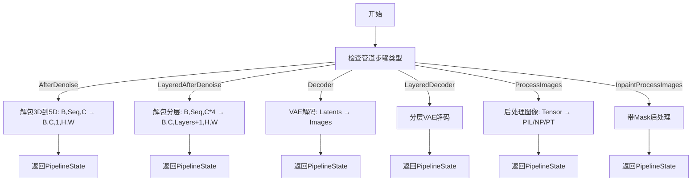

## 类结构

```
ModularPipelineBlocks (抽象基类)
├── QwenImageAfterDenoiseStep (去噪后解包步骤)
├── QwenImageLayeredAfterDenoiseStep (分层去噪后解包步骤)
├── QwenImageDecoderStep (解码步骤)
├── QwenImageLayeredDecoderStep (分层解码步骤)
├── QwenImageProcessImagesOutputStep (图像后处理步骤)
└── QwenImageInpaintProcessImagesOutputStep (图像修复后处理步骤)
```

## 全局变量及字段


### `logger`
    
模块级日志记录器，用于记录该模块的运行信息和调试信息

类型：`logging.Logger`
    


### `QwenImageAfterDenoiseStep.model_name`
    
该步骤对应的模型标识符，值为 'qwenimage'

类型：`str`
    


### `QwenImageLayeredAfterDenoiseStep.model_name`
    
该步骤对应的模型标识符，值为 'qwenimage-layered'

类型：`str`
    


### `QwenImageDecoderStep.model_name`
    
该步骤对应的模型标识符，值为 'qwenimage'

类型：`str`
    


### `QwenImageLayeredDecoderStep.model_name`
    
该步骤对应的模型标识符，值为 'qwenimage-layered'

类型：`str`
    


### `QwenImageProcessImagesOutputStep.model_name`
    
该步骤对应的模型标识符，值为 'qwenimage'

类型：`str`
    


### `QwenImageInpaintProcessImagesOutputStep.model_name`
    
该步骤对应的模型标识符，值为 'qwenimage'

类型：`str`
    
    

## 全局函数及方法


### `QwenImageAfterDenoiseStep.description`

该方法是一个属性方法（property），用于返回 `QwenImageAfterDenoiseStep` 类的功能描述，描述了该步骤将潜在变量从3D张量解包为5D张量的过程。

参数：

- 该方法无参数（除隐含的 `self`）

返回值：`str`，返回该步骤的描述字符串，说明其功能是将latents从3D张量（batch_size, sequence_length, channels）解包为5D张量（batch_size, channels, 1, height, width）

#### 流程图

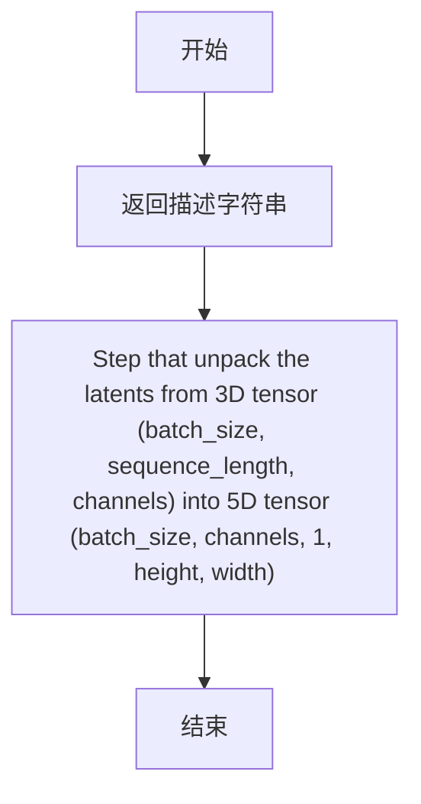

#### 带注释源码

```python
@property
def description(self) -> str:
    """
    属性方法，返回当前步骤的描述信息
    
    Returns:
        str: 描述该步骤功能的字符串，说明将latents从3D张量解包为5D张量
    """
    return "Step that unpack the latents from 3D tensor (batch_size, sequence_length, channels) into 5D tensor (batch_size, channels, 1, height, width)"
```


### `QwenImageAfterDenoiseStep.expected_components`

这是一个属性方法（property），用于定义`QwenImageAfterDenoiseStep`步骤所需的组件规范。它返回一个组件规范列表，其中包含一个`pachifier`组件，该组件用于将3D张量解包为5D张量。

参数：

- `self`：隐式参数，类实例本身

返回值：`list[ComponentSpec]`，组件规范列表，包含用于解包latent的pachifier组件

#### 流程图

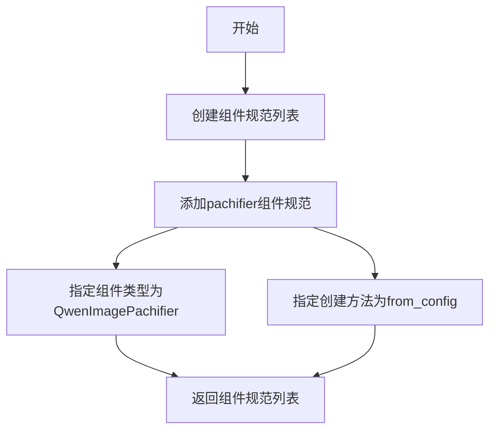

#### 带注释源码

```python
@property
def expected_components(self) -> list[ComponentSpec]:
    """
    定义该步骤所需的组件规范列表。
    
    该步骤需要一个pachifier组件来将latents从3D张量解包为5D张量。
    
    Returns:
        list[ComponentSpec]: 包含组件规范的列表
    """
    # 初始化组件规范列表
    components = [
        # 定义pachifier组件，指定类型为QwenImagePachifier
        # 并设置默认创建方法为from_config（从配置中创建）
        ComponentSpec("pachifier", QwenImagePachifier, default_creation_method="from_config"),
    ]

    # 返回完整的组件规范列表
    return components
```


### `QwenImageAfterDenoiseStep.inputs`

该属性定义了 `QwenImageAfterDenoiseStep` 步骤的输入参数列表，包含生成图像所需的高度、宽度以及从去噪步骤生成的潜在变量。

参数：

- `height`：`int`，生成图像的高度（以像素为单位），必填参数。
- `width`：`int`，生成图像的宽度（以像素为单位），必填参数。
- `latents`：`torch.Tensor`，待解码的潜在变量，可以由去噪步骤生成。

返回值：`list[InputParam]`，返回包含三个 `InputParam` 对象的列表，定义了 `QwenImageAfterDenoiseStep` 步骤的输入参数规范。

#### 流程图

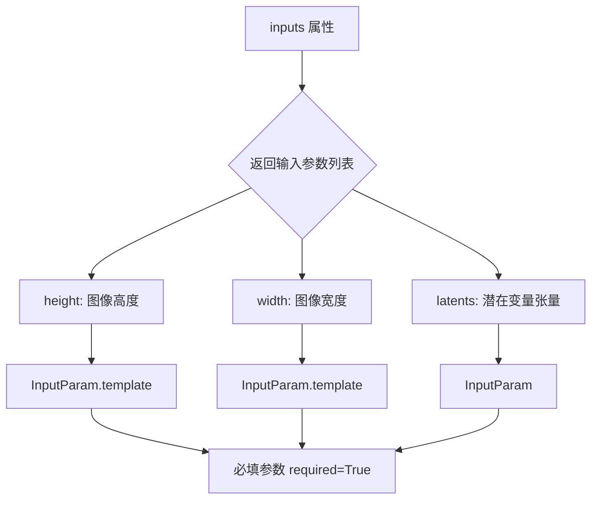

#### 带注释源码

```python
@property
def inputs(self) -> list[InputParam]:
    """
    定义该步骤的输入参数列表。
    
    返回：
        包含三个 InputParam 对象的列表，分别对应：
        - height: 生成图像的高度
        - width: 生成图像的宽度
        - latents: 待解码的潜在变量
    """
    return [
        # 模板参数：图像高度，必填
        InputParam.template("height", required=True),
        # 模板参数：图像宽度，必填
        InputParam.template("width", required=True),
        # 显式定义的参数：潜在变量张量
        InputParam(
            name="latents",
            required=True,
            type_hint=torch.Tensor,
            description="The latents to decode, can be generated in the denoise step.",
        ),
    ]
```


### `QwenImageAfterDenoiseStep.intermediate_outputs`

该属性方法定义了 `QwenImageAfterDenoiseStep` 步骤的中间输出参数列表，用于描述去噪后待解码的潜在向量（latents）信息。它返回一个包含 `OutputParam` 对象的列表，其中描述了输出的名称、类型和描述信息。

参数：

- 无（该方法为属性方法，仅包含 `self` 参数）

返回值：`list[OutputParam]` ，返回中间输出参数列表，包含去噪后的 latents，形状为 B, C, 1, H, W

#### 流程图

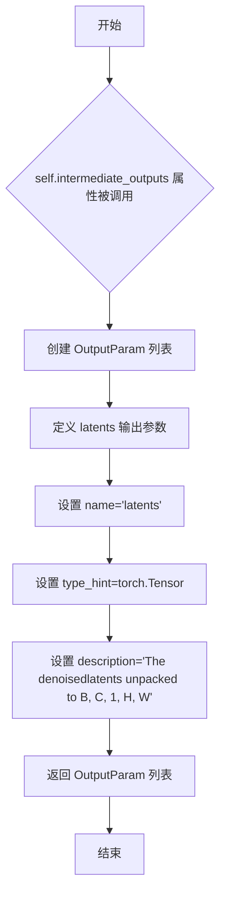

#### 带注释源码

```python
@property
def intermediate_outputs(self) -> list[OutputParam]:
    """
    定义该步骤的中间输出参数列表。
    
    返回值:
        list[OutputParam]: 包含 OutputParam 对象的列表，描述去噪后的 latents 输出
    """
    return [
        OutputParam(
            name="latents",  # 输出参数名称
            type_hint=torch.Tensor,  # 输出参数类型为 PyTorch 张量
            description="The denoisedlatents unpacked to B, C, 1, H, W"  # 输出描述：去噪后的 latents 被解包为 B, C, 1, H, W 形状
        ),
    ]
```


### `QwenImageAfterDenoiseStep.__call__`

该方法是在去噪循环之后执行的步骤，用于将潜在表示从3D张量（batch_size, sequence_length, channels）解包为5D张量（batch_size, channels, 1, height, width），以便后续的解码步骤使用。

参数：

-  `components`：`QwenImageModularPipeline`，包含管道组件的对象，提供对VAE比例因子和pachifier的访问
-  `state`：`PipelineState`，管道的当前状态，包含高度、宽度和潜在表示等块状态

返回值：`Tuple[QwenImageModularPipeline, PipelineState]`，返回更新后的组件和状态对象

#### 流程图

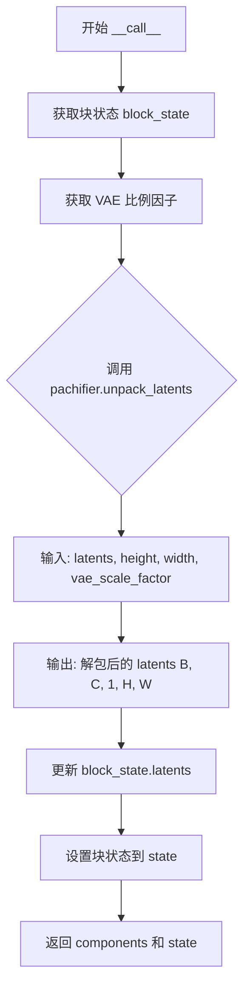

#### 带注释源码

```python
@torch.no_grad()
def __call__(self, components: QwenImageModularPipeline, state: PipelineState) -> PipelineState:
    """
    执行去噪后的解包步骤，将3D潜在表示解包为5D张量
    
    参数:
        components: 管道组件，包含pachifier和vae_scale_factor
        state: 管道状态，包含height、width和latents
    
    返回:
        更新后的components和state元组
    """
    # 从管道状态中获取当前块的局部状态
    block_state = self.get_block_state(state)

    # 获取VAE的比例因子，用于正确解包潜在表示
    vae_scale_factor = components.vae_scale_factor
    
    # 调用pachifier的unpack_latents方法，将潜在表示从3D张量
    # (batch_size, sequence_length, channels) 解包为 5D 张量
    # (batch_size, channels, 1, height, width)
    block_state.latents = components.pachifier.unpack_latents(
        block_state.latents, 
        block_state.height, 
        block_state.width, 
        vae_scale_factor=vae_scale_factor
    )

    # 将更新后的块状态写回管道状态
    self.set_block_state(state, block_state)
    
    # 返回组件和状态，供管道下一步使用
    return components, state
```


### `QwenImageLayeredAfterDenoiseStep.description`

该属性返回对 `QwenImageLayeredAfterDenoiseStep` 类的功能描述，说明其将去噪后的latents从3D张量（batch_size, sequence_length, channels*4）解包为5D张量（batch_size, channels, layers+1, height, width）。

参数：

- 无（`description` 是一个属性方法，不接受任何参数）

返回值：`str`，返回对类功能的描述字符串

#### 流程图

```mermaid
flowchart TD
    A[获取 description 属性] --> B{属性调用}
    B --> C[返回描述字符串]
    C --> D[流程结束]
    
    描述字符串: "Unpack latents from (B, seq, C*4) to (B, C, layers+1, H, W) after denoising."
```

#### 带注释源码

```python
@property
def description(self) -> str:
    """
    获取该处理步骤的描述信息。
    
    该属性用于文档生成和调试目的，
    描述了该步骤的核心功能：将去噪后的latents从
    (B, seq, C*4) 形状解包为 (B, C, layers+1, H, W) 形状。
    
    Returns:
        str: 描述字符串，说明该步骤的功能
    """
    return "Unpack latents from (B, seq, C*4) to (B, C, layers+1, H, W) after denoising."
```


### `QwenImageLayeredAfterDenoiseStep.expected_components`

该属性定义了 `QwenImageLayeredAfterDenoiseStep` 类所需的组件规范，返回一个包含 `pachifier` 组件的列表，用于将去噪后的 latents 从 3D 张量 (B, seq, C*4) 解包为 5D 张量 (B, C, layers+1, H, W)。

参数： 无（这是一个属性方法，仅接收隐式参数 `self`）

返回值：`list[ComponentSpec]`，返回组件规范列表，包含一个 `pachifier` 组件的规格定义

#### 流程图

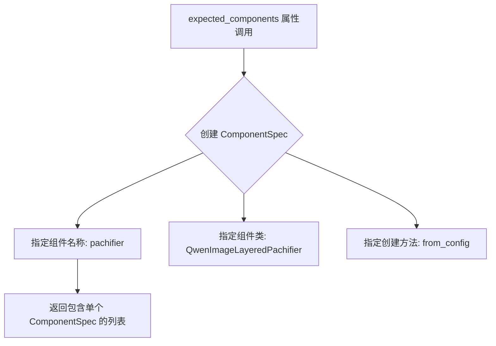

#### 带注释源码

```python
@property
def expected_components(self) -> list[ComponentSpec]:
    """
    定义该步骤所需的组件规范。
    
    该属性返回一个列表，包含一个 ComponentSpec 对象，用于指定
    'pachifier' 组件的类型和创建方式。
    
    Returns:
        list[ComponentSpec]: 包含组件规范的列表，当前只包含一个
                             'pachifier' 组件的规格定义
    """
    return [
        # ComponentSpec 参数说明:
        # - "pachifier": 组件在管道中的名称/键名
        # - QwenImageLayeredPachifier: 组件的实际类名
        # - default_creation_method="from_config": 指定默认从配置创建组件
        ComponentSpec("pachifier", QwenImageLayeredPachifier, default_creation_method="from_config"),
    ]
```


### `QwenImageLayeredAfterDenoiseStep.inputs`

该属性定义了 `QwenImageLayeredAfterDenoiseStep` 类的输入参数列表，用于指定处理去噪后潜在表示所需的输入参数。

参数：

-  `latents`：`torch.Tensor`，需要解码的去噪潜在表示，可以在去噪步骤中生成
-  `height`：`int`，生成图像的高度（像素）
-  `width`：`int`，生成图像的宽度（像素）
-  `layers`：`int`（可选，默认为 4），从图像中提取的层数

返回值：`list[InputParam]`，返回包含所有输入参数的列表

#### 流程图

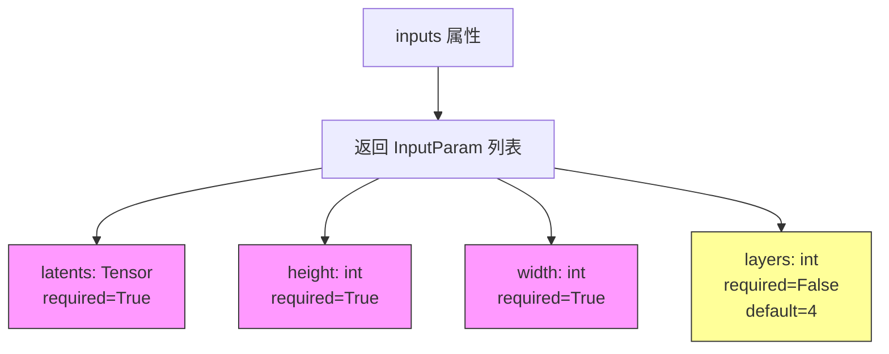

#### 带注释源码

```python
@property
def inputs(self) -> list[InputParam]:
    """
    定义该处理步骤所需的输入参数列表。
    
    返回:
        包含所有输入参数的列表，每个参数由 InputParam 对象表示
    """
    return [
        # 第一个参数：latents（去噪后的潜在表示）
        InputParam(
            name="latents",
            required=True,  # 必填参数
            type_hint=torch.Tensor,  # 类型提示：PyTorch 张量
            description="The denoised latents to decode, can be generated in the denoise step.",
        ),
        # 第二个参数：height（图像高度）
        InputParam.template("height", required=True),
        # 第三个参数：width（图像宽度）
        InputParam.template("width", required=True),
        # 第四个参数：layers（层数，可选参数）
        InputParam.template("layers"),  # 使用模板创建，可选参数，默认为4
    ]
```


### `QwenImageLayeredAfterDenoiseStep.intermediate_outputs`

该属性定义了 `QwenImageLayeredAfterDenoiseStep` 步骤的中间输出参数列表，用于描述去噪步骤完成后输出的 latent 张量信息。

参数：

- `self`：`QwenImageLayeredAfterDenoiseStep` 实例本身，无需显式传递

返回值：`list[OutputParam]`，返回包含输出参数规范的列表，当前包含一个名为 "latents" 的输出参数，其形状被展开描述为 `B, C, layers+1, H, W`。

#### 流程图

```mermaid
flowchart TD
    A[intermediate_outputs 属性被调用] --> B{返回 OutputParam 列表}
    B --> C[创建 OutputParam 对象: name='latents']
    C --> D[note: 'unpacked to B, C, layers+1, H, W']
    D --> E[返回列表 [OutputParam]]
```

#### 带注释源码

```python
@property
def intermediate_outputs(self) -> list[OutputParam]:
    """
    定义该步骤的中间输出参数规范。
    
    Returns:
        list[OutputParam]: 包含输出参数信息的列表，当前定义了一个名为 'latents' 的输出，
                          描述其形状从 (B, seq, C*4) 被展开为 (B, C, layers+1, H, W)
    """
    return [
        OutputParam.template("latents", note="unpacked to B, C, layers+1, H, W"),
    ]
```


### `QwenImageLayeredAfterDenoiseStep.__call__`

该方法是 Qwen-Image 分层去噪后处理步骤的核心实现，负责将去噪后的 latents 从 3D 张量 (B, seq, C*4) 解包转换为 5D 张量 (B, C, layers+1, H, W)，为后续的分层解码做准备。

参数：

- `self`：`QwenImageLayeredAfterDenoiseStep` 实例本身
- `components`：`QwenImageModularPipeline`，模块化管道组件容器，包含 pachifier 等组件
- `state`：`PipelineState`，管道状态对象，存储当前块的状态信息（包括 latents、height、width、layers 等）

返回值：`PipelineState`，更新后的管道状态对象

#### 流程图

```mermaid
flowchart TD
    A[__call__ 开始] --> B[获取 block_state]
    B --> C[调用 pachifier.unpack_latents]
    C --> D[(B, seq, C*4) -> (B, C, layers+1, H, W)]
    D --> E[更新 block_state.latents]
    E --> F[设置 block_state]
    F --> G[返回 components 和 state]
```

#### 带注释源码

```python
@torch.no_grad()
def __call__(self, components, state: PipelineState) -> PipelineState:
    """
    执行分层去噪后的解包操作
    
    参数:
        components: 管道组件容器，包含 pachifier 和 vae_scale_factor
        state: 管道状态，包含当前的 latents、height、width、layers
    
    返回:
        更新后的 components 和 state
    """
    # 从管道状态中获取当前块的状态
    block_state = self.get_block_state(state)

    # 使用 pachifier 组件将 latents 从 3D 解包为 5D 张量
    # 输入形状: (B, seq, C*4) - 批次大小、序列长度、通道数×4
    # 输出形状: (B, C, layers+1, H, W) - 批次大小、通道数、层数+1、高度、宽度
    block_state.latents = components.pachifier.unpack_latents(
        block_state.latents,       # 待解包的 latents 张量
        block_state.height,        # 目标图像高度
        block_state.width,         # 目标图像宽度
        block_state.layers,        # 要提取的层数（默认4）
        components.vae_scale_factor,  # VAE 缩放因子
    )

    # 将更新后的块状态写回管道状态
    self.set_block_state(state, block_state)
    
    # 返回更新后的组件和状态，供管道后续步骤使用
    return components, state
```


### `QwenImageDecoderStep.description`

该属性返回对 `QwenImageDecoderStep` 类的功能描述，说明该步骤负责将潜在表示解码为图像。

参数：

- （无，该属性不接受任何参数）

返回值：`str`，返回对该解码步骤的描述文本："Step that decodes the latents to images"

#### 流程图

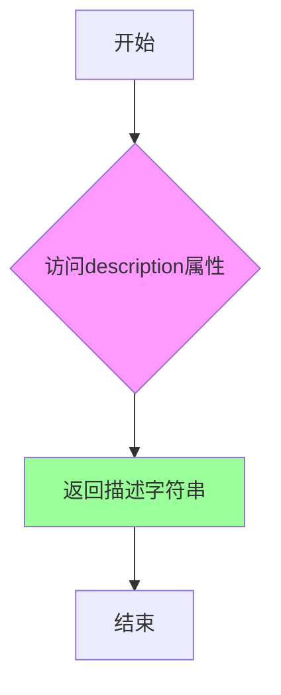

#### 带注释源码

```python
@property
def description(self) -> str:
    """
    属性方法：返回对该解码步骤的描述信息
    
    该属性是QwenImageDecoderStep类的一部分，用于提供
    步骤功能的简短描述，供文档生成或调试使用。
    
    Returns:
        str: 描述文本，说明该步骤将latents解码为images
    """
    return "Step that decodes the latents to images"
```


### `QwenImageDecoderStep.expected_components`

该属性方法定义了 `QwenImageDecoderStep` 解码步骤所需的核心组件列表。在这个实现中，只需要一个 VAE（变分自编码器）组件来将去噪后的潜在表示解码为图像。

参数：无（该方法为属性方法，无显式参数）

返回值：`list[ComponentSpec]`，返回组件规范列表，包含解码步骤所需的 VAE 组件规范

#### 流程图

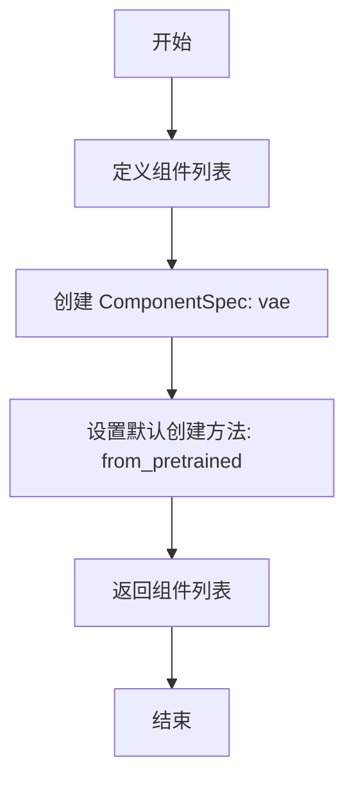

#### 带注释源码

```python
@property
def expected_components(self) -> list[ComponentSpec]:
    # 定义该解码步骤所需的组件列表
    components = [
        # ComponentSpec 用于描述管道中需要的组件
        # 参数1: 组件名称 'vae'
        # 参数2: 组件类型 AutoencoderKLQwenImage
        # 默认创建方法为 from_pretrained（隐式）
        ComponentSpec("vae", AutoencoderKLQwenImage),
    ]

    # 返回包含组件规范的列表
    # 该列表会被 ModuarPipeline 用于初始化和注入实际组件实例
    return components
```


### `QwenImageDecoderStep.inputs`

这是一个属性方法（property），用于定义 QwenImageDecoderStep 解码步骤所需的输入参数。它返回包含 InputParam 对象的列表，描述解码器所需的 latents 输入。

参数：

- （无参数，这是一个属性方法）

返回值：`list[InputParam]`，返回解码步骤所需的输入参数列表，包含一个 `latents` 参数，类型为 `torch.Tensor`，表示需要解码的去噪潜在表示。

#### 流程图

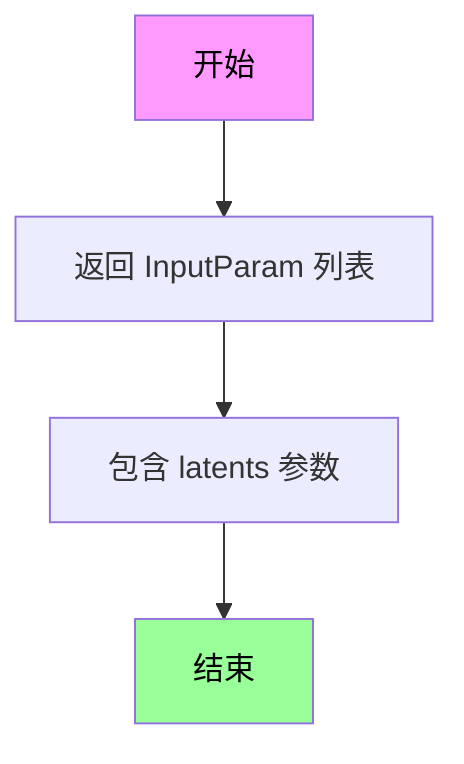

#### 带注释源码

```python
@property
def inputs(self) -> list[InputParam]:
    """
    定义解码步骤的输入参数。
    
    返回一个列表，包含解码器所需的输入参数信息。
    每个 InputParam 对象描述一个输入参数的名称、类型、是否必需以及描述信息。
    
    Returns:
        list[InputParam]: 包含输入参数的列表，当前只包含 latents 参数
    """
    return [
        InputParam(
            name="latents",  # 参数名称
            required=True,   # 是否必需参数
            type_hint=torch.Tensor,  # 参数类型提示
            description="The denoised latents to decode, can be generated in the denoise step and unpacked in the after denoise step.",  # 参数描述
        ),
    ]
```


### `QwenImageDecoderStep.intermediate_outputs`

该属性方法定义了 `QwenImageDecoderStep` 类的中间输出参数列表，用于描述解码步骤产生的中间结果。

参数：无需参数（作为属性方法，仅接收 `self`）

返回值：`list[OutputParam]`，返回包含图像输出参数的列表，注明为 VAE 解码器的张量输出。

#### 流程图

```mermaid
flowchart TD
    A[Start] --> B[定义 intermediate_outputs 属性]
    B --> C[创建包含 'images' 的 OutputParam 列表]
    C --> D[返回 list[OutputParam]]
    D --> E[End]
```

#### 带注释源码

```python
@property
def intermediate_outputs(self) -> list[OutputParam]:
    """
    定义解码步骤的中间输出参数。
    
    该属性返回解码器产生的图像输出参数列表。
    在 QwenImageDecoderStep 中，解码器将去噪后的潜在表示解码为图像张量。
    
    Returns:
        list[OutputParam]: 包含图像输出的 OutputParam 列表
    """
    return [OutputParam.template("images", note="tensor output of the vae decoder.")]
```


### `QwenImageDecoderStep.__call__`

该方法是 QwenImage 管道中的解码步骤，负责将去噪后的 latents 张量解码为图像。它首先对 latents 进行维度检查和 dtype 转换，然后根据 VAE 配置的 mean 和 std 进行归一化，最后使用 VAE 解码器生成图像。

参数：

- `components`：`QwenImageModularPipeline`，管道组件对象，包含 VAE 等模型组件
- `state`：`PipelineState`，管道状态对象，包含当前的 latents、images 等数据

返回值：`PipelineState`，更新后的组件和状态，其中状态包含解码后的图像

#### 流程图

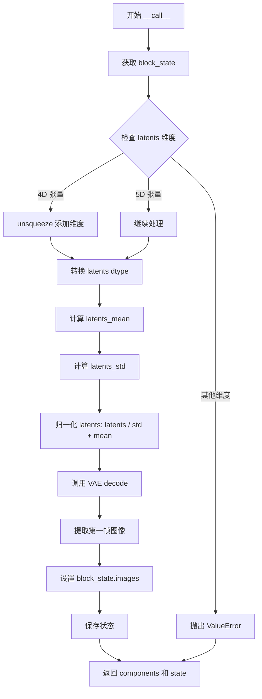

#### 带注释源码

```python
@torch.no_grad()
def __call__(self, components: QwenImageModularPipeline, state: PipelineState) -> PipelineState:
    # 获取当前块的状态，包含 latents、height、width 等数据
    block_state = self.get_block_state(state)

    # YiYi Notes: remove support for output_type = "latents', we can just skip decode/encode step in modular
    # 检查 latents 的维度：必须是 4D 或 5D 张量
    if block_state.latents.ndim == 4:
        # 4D 张量 (B, C, H, W) -> 添加通道维度变成 5D (B, C, 1, H, W)
        block_state.latents = block_state.latents.unsqueeze(dim=1)
    elif block_state.latents.ndim != 5:
        # 维度不符合要求，抛出错误
        raise ValueError(
            f"expect latents to be a 4D or 5D tensor but got: {block_state.latents.shape}. Please make sure the latents are unpacked before decode step."
        )
    
    # 将 latents 转换为 VAE 模型所需的 dtype（如 float16 或 float32）
    block_state.latents = block_state.latents.to(components.vae.dtype)

    # 从 VAE 配置中获取 latents 的均值，并 reshape 为 (1, z_dim, 1, 1, 1)
    latents_mean = (
        torch.tensor(components.vae.config.latents_mean)
        .view(1, components.vae.config.z_dim, 1, 1, 1)
        .to(block_state.latents.device, block_state.latents.dtype)
    )
    # 从 VAE 配置中获取 latents 的标准差，并计算其倒数（用于归一化）
    latents_std = 1.0 / torch.tensor(components.vae.config.latents_std).view(
        1, components.vae.config.z_dim, 1, 1, 1
    ).to(block_state.latents.device, block_state.latents.dtype)
    
    # 对 latents 进行归一化：先除以标准差，再加上均值
    # 这是 VAE 潜在空间的逆变换
    block_state.latents = block_state.latents / latents_std + latents_mean
    
    # 调用 VAE 解码器将 latents 解码为图像
    # 返回的第一个元素是图像张量，形状为 (B, C, 1, H, W)
    # 提取第一个帧 [:, :, 0] 得到 (B, C, H, W)
    block_state.images = components.vae.decode(block_state.latents, return_dict=False)[0][:, :, 0]

    # 更新状态并保存 block_state
    self.set_block_state(state, block_state)
    
    # 返回更新后的 components 和 state
    return components, state
```


### `QwenImageLayeredDecoderStep.description`

这是一个属性（property），用于描述 `QwenImageLayeredDecoderStep` 类的功能。

属性返回值：`str`，返回该步骤的描述信息，说明其将解包的潜在向量 (B, C, layers+1, H, W) 解码为分层图像。

#### 流程图

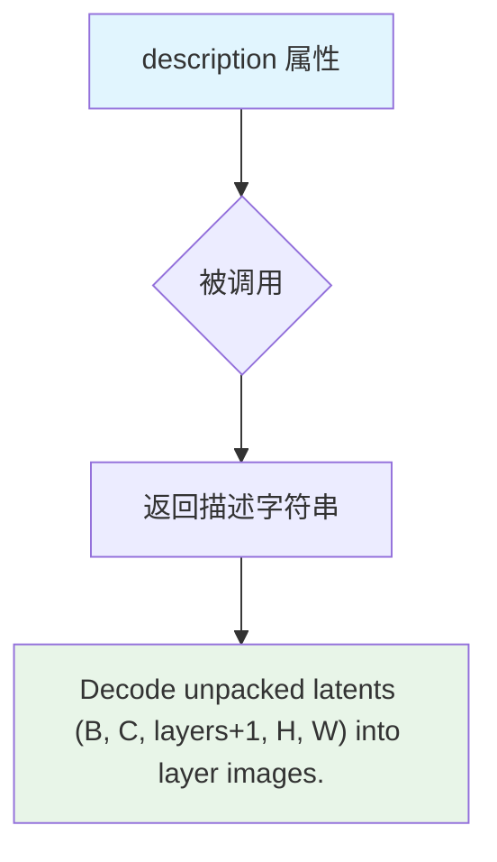

#### 带注释源码

```python
@property
def description(self) -> str:
    """
    属性描述：返回该解码步骤的功能描述
    
    说明：
        - 这是一个只读属性，用于文档和调试目的
        - 描述了将解包的latents从5D张量 (B, C, layers+1, H, W) 解码为分层图像的功能
        - 该属性继承自 ModularPipelineBlocks 基类
    
    参数：
        - 无参数（属性访问）
    
    返回值：
        - str: 描述字符串 "Decode unpacked latents (B, C, layers+1, H, W) into layer images."
    """
    return "Decode unpacked latents (B, C, layers+1, H, W) into layer images."
```


### `QwenImageLayeredDecoderStep.expected_components`

该属性方法定义了 `QwenImageLayeredDecoderStep` 所需的组件规范，包括 VAE 解码器和图像处理器。

参数： 无（为属性方法）

返回值：`list[ComponentSpec]` ，返回包含 VAE 和图像处理器组件的规范列表

#### 流程图

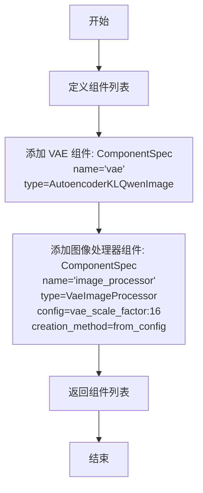

#### 带注释源码

```python
@property
def expected_components(self) -> list[ComponentSpec]:
    """
    定义该步骤所需的组件规范列表。
    
    该方法返回一个包含两个组件的列表：
    1. vae: AutoencoderKLQwenImage 模型，用于将 latents 解码为图像
    2. image_processor: VaeImageProcessor，用于后处理解码后的图像
    
    Returns:
        list[ComponentSpec]: 组件规范列表，包含 VAE 和图像处理器
    """
    return [
        # VAE 解码器组件，用于将 latents 解码为图像张量
        ComponentSpec("vae", AutoencoderKLQwenImage),
        # 图像后处理器组件，用于将解码后的图像转换为指定格式
        ComponentSpec(
            "image_processor",
            VaeImageProcessor,
            # 配置 VAE 的缩放因子，用于图像尺寸计算
            config=FrozenDict({"vae_scale_factor": 16}),
            # 指定从配置创建组件的默认方法
            default_creation_method="from_config",
        ),
    ]
```


### `QwenImageLayeredDecoderStep.inputs`

该属性定义了 `QwenImageLayeredDecoderStep` 类的输入参数列表，用于描述该解码步骤所需的输入参数信息。

参数：

- `latents`：`torch.Tensor`，待解码的去噪潜在向量，来源于去噪步骤并经过去噪后步骤的解包处理。
- `output_type`：`str`，可选参数，默认为 'pil'，指定输出格式，可选值为 'pil'、'np'、'pt'。

返回值：`list[InputParam]`，返回包含所有输入参数的列表，每个元素描述一个输入参数的名称、类型、是否必需以及描述信息。

#### 流程图

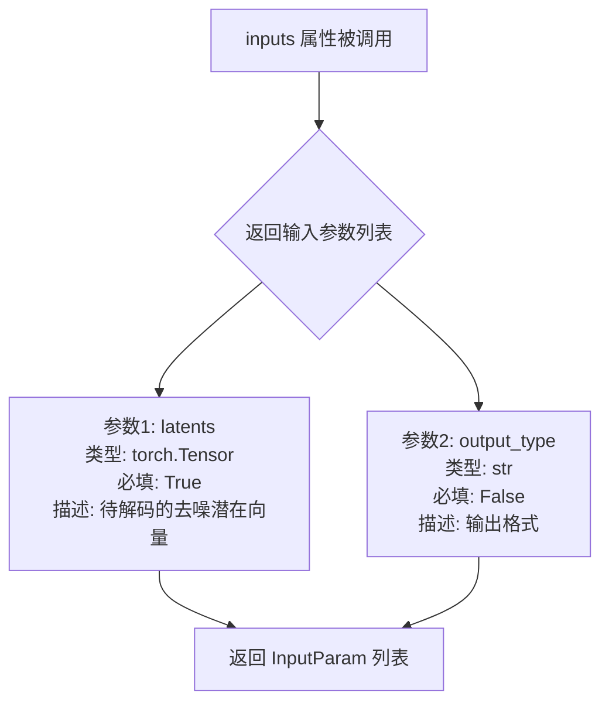

#### 带注释源码

```python
@property
def inputs(self) -> list[InputParam]:
    """
    定义该解码步骤的输入参数列表。
    
    返回:
        包含所有输入参数的列表，每个参数由 InputParam 对象描述。
    """
    return [
        InputParam(
            name="latents",
            required=True,
            type_hint=torch.Tensor,
            description="The denoised latents to decode, can be generated in the denoise step and unpacked in the after denoise step.",
        ),
        InputParam.template("output_type"),
    ]
```


### `QwenImageLayeredDecoderStep.intermediate_outputs`

该属性定义了 `QwenImageLayeredDecoderStep` 类的中间输出参数，用于描述解码步骤产生的图像结果。

参数： 无（该方法为属性方法，无显式参数）

返回值：`list[OutputParam]`，返回包含图像输出参数的列表，描述解码后生成的图像列表。

#### 流程图

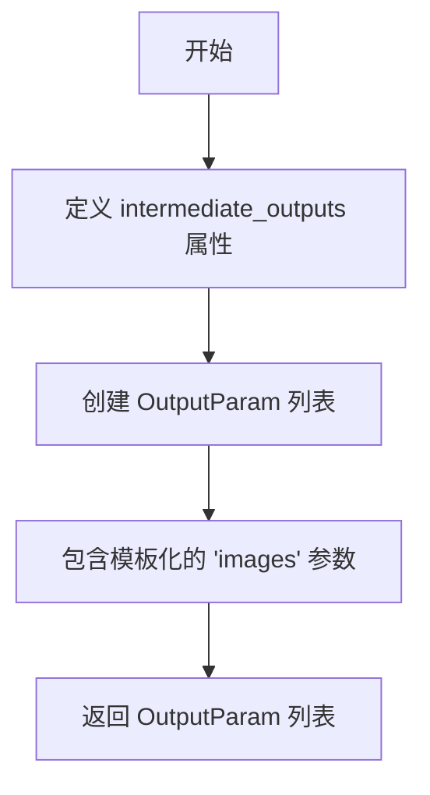

#### 带注释源码

```python
@property
def intermediate_outputs(self) -> list[OutputParam]:
    """
    定义解码步骤的中间输出参数。
    
    Returns:
        list[OutputParam]: 包含图像输出参数的列表。
                          该列表包含一个模板化的 'images' 参数，
                          用于描述从 VAE 解码器输出的图像结果。
    """
    # 使用 OutputParam.template 创建模板化的输出参数
    # 'images' 表示输出的图像列表
    return [OutputParam.template("images")]
```


### `QwenImageLayeredDecoderStep.__call__`

该方法是 QwenImageLayeredDecoderStep 类的核心调用方法，负责将去噪后解包的 latents（形状为 B, C, layers+1, H, W）解码为分层图像列表。它首先对 latents 进行 VAE 归一化处理，然后重塑为批量解码格式，调用 VAE 解码器，最后通过图像处理器后处理并按批次分组返回图像列表。

参数：

- `self`：调用实例本身，包含类的属性和配置
- `components`：包含 VAE 模型和图像处理器的组件对象，具有 `vae`（AutoencoderKLQwenImage 类型）和 `image_processor`（VaeImageProcessor 类型）属性
- `state`：PipelineState 管道状态对象，包含 block_state 属性用于存储中间状态如 latents、output_type 和生成的 images

返回值：`PipelineState`，返回包含更新后 components 和 state 的元组，其中 state.block_state.images 被设置为生成的图像列表

#### 流程图

```mermaid
flowchart TD
    A[开始 __call__] --> B[获取 block_state]
    B --> C[提取 latents]
    C --> D{latents 维度检查}
    D -->|通过| E[VAE dtype 转换]
    E --> F[计算 latents_mean 和 latents_std]
    F --> G[反归一化 latents]
    G --> H[提取形状: b, c, f, h, w]
    H --> I[移除第一帧复合层]
    I --> J[重塑: (B,C,layers,H,W) -> (B*layers, C, 1, H, W)]
    J --> K[VAE 解码]
    K --> L[移除多余维度]
    L --> M[图像后处理]
    M --> N[按批次分组成列表]
    N --> O[保存到 block_state.images]
    O --> P[设置 block_state]
    P --> Q[返回 components, state]
```

#### 带注释源码

```python
@torch.no_grad()
def __call__(self, components, state: PipelineState) -> PipelineState:
    # 从 state 中获取当前块的内部状态
    block_state = self.get_block_state(state)

    # 获取需要解码的 latents 张量
    latents = block_state.latents

    # 1. VAE 归一化处理
    # 将 latents 转换为 VAE 模型所需的数据类型
    latents = latents.to(components.vae.dtype)
    
    # 从 VAE 配置中获取 latents 的均值和标准差
    # 并 reshape 为 (1, z_dim, 1, 1, 1) 以便广播操作
    latents_mean = (
        torch.tensor(components.vae.config.latents_mean)
        .view(1, components.vae.config.z_dim, 1, 1, 1)
        .to(latents.device, latents.dtype)
    )
    # 标准差取倒数实现反归一化
    latents_std = 1.0 / torch.tensor(components.vae.config.latents_std).view(
        1, components.vae.config.z_dim, 1, 1, 1
    ).to(latents.device, latents.dtype)
    
    # 执行反归一化: (latents - mean) / std
    latents = latents / latents_std + latents_mean

    # 2. 重塑为批量解码格式
    # 从 (B, C, layers+1, H, W) 提取各维度大小
    b, c, f, h, w = latents.shape
    
    # 3. 移除第一帧（复合层），保留 layers 个独立层
    # latents 形状: (B, C, layers+1, H, W) -> (B, C, layers, H, W)
    latents = latents[:, :, 1:]
    
    # 4. 维度重排和展平
    # (B, C, layers, H, W) -> (B, layers, C, H, W) -> (B*layers, C, 1, H, W)
    # 为每个 batch 元素的每一层添加批次维度
    latents = latents.permute(0, 2, 1, 3, 4).reshape(-1, c, 1, h, w)

    # 5. VAE 解码
    # 输入: (B*layers, C, 1, H, W) -> 输出: (B*layers, C, H, W)
    image = components.vae.decode(latents, return_dict=False)[0]
    # 移除多余的第三维 (维度为1)
    image = image.squeeze(2)

    # 6. 图像后处理
    # 将解码后的图像转换为指定格式 (pil/np/pt)
    # 返回扁平列表长度 B*layers
    image = components.image_processor.postprocess(image, output_type=block_state.output_type)

    # 7. 按批次分组
    # 将扁平图像列表转换为嵌套列表，每个 batch 元素包含其 layers 个图层
    images = []
    for bidx in range(b):
        images.append(image[bidx * f : (bidx + 1) * f])

    # 将生成的图像列表保存到 block_state
    block_state.images = images

    # 更新并返回状态
    self.set_block_state(state, block_state)
    return components, state
```


### `QwenImageProcessImagesOutputStep.description`

返回该类的功能描述，用于在模块化流水线中标识该步骤的作用。

参数：无（仅包含隐式参数 `self`）

返回值：`str`，返回描述文本 "postprocess the generated image"

#### 流程图

```mermaid
flowchart TD
    A[获取 self] --> B[返回描述字符串]
    
    B --> B1["'postprocess the generated image'"]
```

#### 带注释源码

```python
@property
def description(self) -> str:
    """
    属性描述：返回该处理步骤的描述信息
    
    参数:
        self: QwenImageProcessImagesOutputStep 实例本身
    
    返回值:
        str: 描述该步骤功能的字符串
    
    说明:
        此属性用于模块化流水线系统中标识当前步骤的用途，
        帮助用户在配置或调试时理解流水线的每个组件功能。
        该方法被 auto_docstring 装饰器或其他文档生成工具调用。
    """
    return "postprocess the generated image"
```


### `QwenImageProcessImagesOutputStep.expected_components`

该属性方法定义了 `QwenImageProcessImagesOutputStep` 步骤所需的组件列表。在这个方法中，返回一个只包含 `image_processor` 组件的列表，该组件使用 `VaeImageProcessor` 类，用于对生成的图像进行后处理。

参数：无（这是一个属性方法，不需要参数）

返回值：`list[ComponentSpec]`，返回该步骤所需的组件规格列表，当前只包含 `image_processor` 组件。

#### 流程图

```mermaid
flowchart TD
    A[开始] --> B[创建 ComponentSpec 列表]
    B --> C[创建 ComponentSpec: image_processor]
    C --> D[设置组件类: VaeImageProcessor]
    D --> E[设置配置: FrozenDict({'vae_scale_factor': 16})]
    E --> F[设置创建方法: from_config]
    F --> G[返回 ComponentSpec 列表]
    G --> H[结束]
```

#### 带注释源码

```python
@property
def expected_components(self) -> list[ComponentSpec]:
    """
    定义该步骤所需的组件列表。
    
    返回一个包含单个 ComponentSpec 的列表，指定了 image_processor 组件。
    该组件用于将 VAE 解码后的图像张量后处理为指定格式（pil/np/pt）。
    
    Returns:
        list[ComponentSpec]: 组件规格列表，包含 image_processor 组件
    """
    return [
        ComponentSpec(
            "image_processor",           # 组件名称，用于在 pipeline 中引用
            VaeImageProcessor,           # 组件类，用于处理图像的后处理
            config=FrozenDict({          # 组件配置参数
                "vae_scale_factor": 16   # VAE 的缩放因子，用于图像尺寸计算
            }),
            default_creation_method="from_config",  # 默认创建方法，从配置中创建组件
        ),
    ]
```


### `QwenImageProcessImagesOutputStep.inputs`

该属性定义了 `QwenImageProcessImagesOutputStep` 步骤的输入参数列表，包括生成的图像张量（必填）和输出类型（可选，默认值为 'pil'）。

参数：
（该属性为 property 类型，无直接参数）

返回值：`list[InputParam]`，包含图像输入参数和输出类型参数的列表

#### 流程图

```mermaid
flowchart TD
    A[inputs property] --> B{返回输入参数列表}
    B --> C[InputParam: images<br/>type: torch.Tensor<br/>required: True<br/>description: the generated image tensor from decoders step]
    B --> D[InputParam: output_type<br/>type: str<br/>required: False<br/>description: Output format: 'pil', 'np', 'pt'.]
    C --> E[list[InputParam]]
    D --> E
```

#### 带注释源码

```python
@property
def inputs(self) -> list[InputParam]:
    """
    定义该步骤的输入参数列表。

    返回:
        list[InputParam]: 包含以下参数:
            - images: 来自解码步骤生成的图像张量（必填）
            - output_type: 输出格式，可选 'pil', 'np', 'pt'（可选，默认 'pil'）
    """
    return [
        # 第一个输入参数：images - 来自解码步骤的图像张量
        InputParam(
            name="images",
            required=True,  # 必填参数
            type_hint=torch.Tensor,  # 类型提示：PyTorch张量
            description="the generated image tensor from decoders step",  # 参数描述
        ),
        # 第二个输入参数：output_type - 输出格式（使用模板创建，可选）
        InputParam.template("output_type"),  # 默认值：'pil'
    ]
```


### `QwenImageProcessImagesOutputStep.intermediate_outputs`

该属性定义了 `QwenImageProcessImagesOutputStep` 类的中间输出参数，用于描述该步骤执行完成后传递给下一步的输出数据。

参数： 无（这是一个属性方法，不接受任何参数）

返回值：`list[OutputParam]`，返回包含图像输出参数的列表，其中定义了输出参数的名称为 "images"，用于传递处理后的图像列表。

#### 流程图

```mermaid
flowchart TD
    A[Property: intermediate_outputs] --> B[Return list of OutputParam]
    B --> C[OutputParam: images]
    C --> D[Description: Generated images]
```

#### 带注释源码

```python
@property
def intermediate_outputs(self) -> list[OutputParam]:
    """
    定义该步骤的中间输出参数。
    
    Returns:
        list[OutputParam]: 包含输出参数的列表，当前步骤输出的参数名为 'images'，
                          表示处理后的图像列表，将传递给流水线中的下一个步骤。
    """
    return [OutputParam.template("images")]
```


### `QwenImageProcessImagesOutputStep.check_inputs`

该静态方法用于验证图像输出类型参数是否符合预期，确保输出格式为支持的类型之一（"pil"、"np" 或 "pt"），若不合法则抛出 ValueError 异常。

参数：

- `output_type`：`str`，指定输出图像的格式类型，可选值为 "pil"（PIL 图像）、"np"（NumPy 数组）或 "pt"（PyTorch 张量）

返回值：`None`，该方法仅进行参数验证，不返回任何值

#### 流程图

```mermaid
flowchart TD
    A[开始检查 output_type] --> B{output_type in ['pil', 'np', 'pt']?}
    B -->|是| C[验证通过 - 结束]
    B -->|否| D[抛出 ValueError 异常]
    D --> E[结束]
    
    style B fill:#ffeeaa,stroke:#333
    style D fill:#ffcccc,stroke:#333
```

#### 带注释源码

```python
@staticmethod
def check_inputs(output_type):
    """
    静态方法：检查输出类型参数是否合法
    
    参数:
        output_type: 期望的输出格式字符串，应为 'pil', 'np' 或 'pt' 之一
    
    异常:
        ValueError: 当 output_type 不在允许的取值列表中时抛出
    
    返回:
        None: 该方法仅进行验证，不返回任何值
    """
    # 定义支持的输出类型集合
    valid_output_types = ["pil", "np", "pt"]
    
    # 检查传入的 output_type 是否在支持列表中
    if output_type not in valid_output_types:
        # 不合法时抛出详细的错误信息，包含非法值
        raise ValueError(f"Invalid output_type: {output_type}")
    
    # 验证通过，方法正常结束（隐式返回 None）
```


### `QwenImageProcessImagesOutputStep.__call__`

该方法是图像后处理步骤的调用函数，负责验证输出类型参数，并调用图像处理器将生成的图像张量转换为指定格式（'pil'、'np' 或 'pt'）。

参数：

- `self`：类的实例方法隐含参数，指向类的实例本身。
- `components`：`QwenImageModularPipeline` 类型，包含模块化管道的组件，如 `image_processor` 等。
- `state`：`PipelineState` 类型，包含管道的状态数据，如 `output_type`、`images` 等。

返回值：`Tuple[QwenImageModularPipeline, PipelineState]`，返回更新后的组件和状态对象。

#### 流程图

```mermaid
flowchart TD
    A[__call__ 开始] --> B[获取 block_state]
    B --> C[调用 check_inputs 验证 output_type]
    C --> D{output_type 有效?}
    D -->|是| E[调用 image_processor.postprocess]
    D -->|否| F[抛出 ValueError 异常]
    E --> G[更新 block_state.images]
    G --> H[保存 block_state 到 state]
    H --> I[返回 components 和 state]
```

#### 带注释源码

```python
@torch.no_grad()  # 禁用梯度计算，用于推理阶段以节省显存
def __call__(self, components: QwenImageModularPipeline, state: PipelineState):
    """
    执行图像后处理步骤，将生成的图像张量转换为指定格式。
    
    参数:
        components: 包含图像处理器的模块化管道组件
        state: 管道状态，包含输入图像和输出类型配置
    
    返回:
        更新后的 components 和 state 元组
    """
    
    # 1. 从管道状态中获取当前块的状态
    block_state = self.get_block_state(state)
    
    # 2. 验证输出类型参数是否合法（支持 'pil', 'np', 'pt'）
    self.check_inputs(block_state.output_type)
    
    # 3. 调用图像处理器的后处理方法，将图像张量转换为目标格式
    #    - 'pil': PIL 图像格式
    #    - 'np': NumPy 数组格式
    #    - 'pt': PyTorch 张量格式
    block_state.images = components.image_processor.postprocess(
        image=block_state.images,  # 来自解码步骤的生成图像张量
        output_type=block_state.output_type,  # 目标输出格式
    )
    
    # 4. 将更新后的块状态保存回管道状态
    self.set_block_state(state, block_state)
    
    # 5. 返回更新后的组件和状态，供管道下一步使用
    return components, state
```


### `QwenImageInpaintProcessImagesOutputStep`

该类是 Qwen-Image 管道中的图像后处理步骤，用于对生成的图像进行后处理，并可选地应用掩码覆盖到原始图像上。它使用 `InpaintProcessor` 组件来处理图像，并支持多种输出格式（'pil'、'np'、'pt'）。

参数：

- `components`：`QwenImageModularPipeline`，管道组件容器，包含 VAE 图像处理器等组件
- `state`：`PipelineState`，管道状态对象，包含当前执行上下文和中间数据

返回值：`Tuple[QwenImageModularPipeline, PipelineState]`，返回更新后的组件和状态对象

#### 流程图

```mermaid
flowchart TD
    A[开始] --> B[获取 block_state]
    B --> C{检查输入参数}
    C -->|输出类型无效| D[抛出 ValueError]
    C -->|输出类型为非 pil 但有掩码参数| E[抛出 ValueError]
    C -->|验证通过| F{mask_overlay_kwargs 是否为空}
    F -->|是| G[设置空字典]
    F -->|否| H[使用 mask_overlay_kwargs]
    G --> I[调用 image_mask_processor.postprocess]
    H --> I
    I --> J[更新 block_state.images]
    J --> K[保存 block_state]
    K --> L[返回 components 和 state]
```

#### 带注释源码

```python
@torch.no_grad()
def __call__(self, components: QwenImageModularPipeline, state: PipelineState):
    """
    执行图像后处理步骤
    
    参数:
        components: QwenImageModularPipeline - 管道组件容器
        state: PipelineState - 管道状态对象
    
    返回:
        Tuple[QwenImageModularPipeline, PipelineState] - 更新后的组件和状态
    """
    # 从管道状态中获取当前块状态
    block_state = self.get_block_state(state)
    
    # 验证输出类型和掩码参数的合法性
    # - 输出类型必须是 'pil', 'np', 'pt' 之一
    # - 如果提供了掩码覆盖参数，输出类型必须是 'pil'
    self.check_inputs(block_state.output_type, block_state.mask_overlay_kwargs)
    
    # 处理掩码覆盖参数：如果为 None 则使用空字典
    if block_state.mask_overlay_kwargs is None:
        mask_overlay_kwargs = {}
    else:
        mask_overlay_kwargs = block_state.mask_overlay_kwargs
    
    # 调用图像掩码处理器的后处理方法
    # 该方法会将生成的图像转换为指定格式，并可选应用掩码覆盖
    block_state.images = components.image_mask_processor.postprocess(
        image=block_state.images,
        **mask_overlay_kwargs,
    )
    
    # 将更新后的状态保存回管道状态对象
    self.set_block_state(state, block_state)
    
    # 返回更新后的组件和状态
    return components, state
```

#### 辅助方法：`check_inputs`

```python
@staticmethod
def check_inputs(output_type, mask_overlay_kwargs):
    """
    静态方法：验证输入参数的合法性
    
    参数:
        output_type: str - 输出格式 ('pil', 'np', 'pt')
        mask_overlay_kwargs: dict or None - 掩码覆盖参数字典
    
    异常:
        ValueError: 当输出类型无效或掩码参数与非 pil 输出类型一起使用时
    """
    # 检查输出类型是否合法
    if output_type not in ["pil", "np", "pt"]:
        raise ValueError(f"Invalid output_type: {output_type}")
    
    # 如果提供了掩码覆盖参数，输出类型必须是 'pil'
    # 因为掩码覆盖仅支持 PIL 图像格式
    if mask_overlay_kwargs and output_type != "pil":
        raise ValueError("only support output_type 'pil' for mask overlay")
```

#### 属性信息

| 属性名 | 类型 | 描述 |
|--------|------|------|
| `description` | `str` | 返回类的描述信息：后处理生成的图像，可选应用掩码覆盖 |
| `expected_components` | `list[ComponentSpec]` | 返回所需的组件列表，包含 `image_mask_processor` (InpaintProcessor) |
| `inputs` | `list[InputParam]` | 返回输入参数列表：images、output_type、mask_overlay_kwargs |
| `intermediate_outputs` | `list[OutputParam]` | 返回中间输出参数列表：images |


### `QwenImageInpaintProcessImagesOutputStep.expected_components`

该属性定义了 `QwenImageInpaintProcessImagesOutputStep` 步骤所需的核心组件，返回一个包含 `InpaintProcessor` 的组件规范列表，用于图像修复后的后处理操作。

参数：

- 该方法无显式参数（隐含参数 `self` 为类的实例）

返回值：`list[ComponentSpec]`，返回一个组件规范列表，指定该步骤需要使用 `InpaintProcessor` 进行图像掩码处理。

#### 流程图

```mermaid
flowchart TD
    A[expected_components 属性] --> B{返回组件列表}
    B --> C[ComponentSpec: image_mask_processor]
    C --> D[类型: InpaintProcessor]
    C --> E[配置: FrozenDict with vae_scale_factor=16]
    C --> F[创建方法: from_config]
    
    style A fill:#f9f,color:#333
    style B fill:#bbf,color:#333
    style C fill:#dfd,color:#333
```

#### 带注释源码

```python
@property
def expected_components(self) -> list[ComponentSpec]:
    """
    定义该步骤所需的核心组件。
    
    该步骤需要使用 InpaintProcessor 作为 image_mask_processor 组件，
    用于对修复后的图像进行后处理，包括可选的掩码叠加操作。
    
    返回:
        list[ComponentSpec]: 包含组件规范的列表
    """
    return [
        ComponentSpec(
            "image_mask_processor",          # 组件名称
            InpaintProcessor,                 # 组件类型：图像修复处理器
            config=FrozenDict({               # 组件配置
                "vae_scale_factor": 16        # VAE缩放因子
            }),
            default_creation_method="from_config",  # 默认创建方式：从配置创建
        ),
    ]
```


### QwenImageInpaintProcessImagesOutputStep.inputs

该属性定义了 `QwenImageInpaintProcessImagesOutputStep` 类的输入参数规范，用于描述图像修复任务中后处理步骤的输入参数列表，包括生成的图像张量、输出类型以及可选的掩码叠加参数。

参数：

- `images`：`torch.Tensor`，必填参数，来自解码步骤生成的图像张量
- `output_type`：`str`，可选参数，默认为 "pil"，输出格式，可选值为 'pil'、'np'、'pt'
- `mask_overlay_kwargs`：`dict[str, Any]`，可选参数，用于在后处理步骤中应用掩码叠加的 kwargs，生成于 InpaintProcessImagesInputStep

返回值：`list[InputParam]`，返回 InputParam 对象列表，包含了上述三个输入参数的完整规范定义

#### 流程图

```mermaid
flowchart TD
    A[inputs 属性] --> B[定义 images 参数]
    A --> C[定义 output_type 参数]
    A --> D[定义 mask_overlay_kwargs 参数]
    
    B --> B1[必填: required=True]
    B --> B2[类型: torch.Tensor]
    B --> B3[描述: the generated image tensor from decoders step]
    
    C --> C1[使用 InputParam.template]
    C --> C2[参数名: output_type]
    
    D --> D1[可选参数]
    D --> D2[类型: dict[str, Any]]
    D --> D3[描述: The kwargs for the postprocess step to apply the mask overlay]
    
    B1 --> E[返回 list[InputParam]]
    C1 --> E
    D1 --> E
```

#### 带注释源码

```python
@property
def inputs(self) -> list[InputParam]:
    """
    定义 QwenImageInpaintProcessImagesOutputStep 的输入参数规范
    
    该属性返回后处理步骤需要的输入参数列表，包含：
    1. images: 来自解码器生成的图像张量（必填）
    2. output_type: 输出格式，可选 'pil'/'np'/'pt'（可选，使用模板）
    3. mask_overlay_kwargs: 掩码叠加的可选参数（可选）
    
    Returns:
        list[InputParam]: 包含三个 InputParam 对象的列表
    """
    return [
        # images 参数：来自解码步骤的生成图像张量，必填参数
        InputParam(
            name="images",
            required=True,
            type_hint=torch.Tensor,
            description="the generated image tensor from decoders step",
        ),
        # output_type 参数：输出图像格式，使用模板创建，默认值为 'pil'
        InputParam.template("output_type"),
        # mask_overlay_kwargs 参数：掩码叠加的可选 kwargs 字典
        # 用于在后处理时将掩码应用到原始图像
        InputParam(
            name="mask_overlay_kwargs",
            type_hint=dict[str, Any],
            description="The kwargs for the postprocess step to apply the mask overlay. generated in InpaintProcessImagesInputStep.",
        ),
    ]
```


### `QwenImageInpaintProcessImagesOutputStep.intermediate_outputs`

该属性方法定义了在图像修复（inpainting）流程中，处理完图像后输出的中间结果参数。它返回一个包含 `OutputParam` 对象的列表，其中封装了输出图像的名称和元数据。

参数：
- `self`：`QwenImageInpaintProcessImagesOutputStep`，隐式参数，代表类的实例对象本身，用于访问类属性和状态。

返回值：`list[OutputParam]`（具体为 `List[OutputParam]`），返回一个列表，其中包含一个 `OutputParam` 对象，该对象对应生成的图像结果。

#### 流程图

```mermaid
graph TD
    A[Start: 调用 intermediate_outputs 属性] --> B{执行逻辑}
    B --> C[创建并返回包含 'images' 参数的 OutputParam 列表]
    C --> D[End: 返回结果]
```

#### 带注释源码

```python
@property
def intermediate_outputs(self) -> list[OutputParam]:
    """
    定义该步骤的中间输出参数。
    
    该属性返回一个列表，列表中包含一个 OutputParam 对象，用于描述输出图像的信息。
    在图像修复流程中，这通常代表经过后处理（如mask叠加）后的最终图像。
    
    Returns:
        list[OutputParam]: 包含输出参数 'images' 的列表。
    """
    # 使用 OutputParam.template 方法创建一个默认的输出参数，参数名为 "images"
    return [OutputParam.template("images")]
```


### `QwenImageInpaintProcessImagesOutputStep.check_inputs`

该静态方法用于验证图像修复（Inpaint）输出步骤的输入参数有效性，确保 `output_type` 在支持列表中，且当提供 `mask_overlay_kwargs` 时 `output_type` 必须为 "pil"。

参数：

- `output_type`：`str`，输出格式，选项为 'pil'、'np' 或 'pt'
- `mask_overlay_kwargs`：`dict[str, Any]`，可选的掩码叠加参数，用于在后处理步骤中应用掩码叠加

返回值：`None`，该方法仅进行输入验证，不返回任何值

#### 流程图

```mermaid
graph TD
    A[开始 check_inputs] --> B{output_type in ["pil", "np", "pt"]?}
    B -- 否 --> C[raise ValueError: Invalid output_type]
    B -- 是 --> D{mask_overlay_kwargs is not None?}
    D -- 否 --> E[结束]
    D -- 是 --> F{output_type == "pil"?}
    F -- 否 --> G[raise ValueError: only support output_type 'pil' for mask overlay]
    F -- 是 --> E
```

#### 带注释源码

```python
@staticmethod
def check_inputs(output_type, mask_overlay_kwargs):
    """
    验证输出类型和掩码叠加参数的有效性
    
    参数:
        output_type (str): 期望的输出格式，支持 'pil', 'np', 'pt'
        mask_overlay_kwargs (dict[str, Any]): 可选的掩码叠加配置字典
    """
    # 第一层验证：检查 output_type 是否在支持列表中
    if output_type not in ["pil", "np", "pt"]:
        raise ValueError(f"Invalid output_type: {output_type}")

    # 第二层验证：如果提供了 mask_overlay_kwargs，则 output_type 必须为 'pil'
    # 这是因为掩码叠加功能仅支持 PIL 图像格式
    if mask_overlay_kwargs and output_type != "pil":
        raise ValueError("only support output_type 'pil' for mask overlay")
```


### `QwenImageInpaintProcessImagesOutputStep.__call__`

该方法实现了图像修复（Inpainting）的后处理步骤。它接收由解码器生成的图像张量，根据 `output_type` 进行格式转换，并可选地应用掩码覆盖（mask overlay）将修复结果合成到原始图像上。最终更新 `PipelineState` 中的图像数据。

参数：

- `components`：`QwenImageModularPipeline`，管道组件集合，包含 `image_mask_processor`（用于图像后处理和掩码应用的 `InpaintProcessor` 实例）。
- `state`：`PipelineState`，管道状态对象，包含以下关键数据：
  - `images`：`torch.Tensor`，解码步骤生成的图像张量。
  - `output_type`：`str`，期望的输出格式（'pil', 'np', 'pt'）。
  - `mask_overlay_kwargs`：`dict`，可选参数，包含应用掩码所需的原始图像、掩码等信息。

返回值：`Tuple[QwenImageModularPipeline, PipelineState]`，返回组件对象和更新后的状态对象。状态对象中的 `images` 字段将被更新为处理后的图像列表。

#### 流程图

```mermaid
flowchart TD
    A[开始: __call__] --> B[获取 Block State]
    B --> C{检查输入有效性}
    C -->|不通过| D[抛出 ValueError]
    C -->|通过| E{mask_overlay_kwargs 是否存在?}
    E -->|否| F[设置 mask_overlay_kwargs = {}]
    E -->|是| G[保持原 mask_overlay_kwargs]
    F --> H[调用 InpaintProcessor.postprocess]
    G --> H
    H --> I[更新 block_state.images]
    I --> J[写回 State]
    J --> K[返回 components, state]
```

#### 带注释源码

```python
@torch.no_grad()
def __call__(self, components: QwenImageModularPipeline, state: PipelineState):
    """
    执行图像后处理。

    参数:
        components (QwenImageModularPipeline): 管道组件，包含 InpaintProcessor。
        state (PipelineState): 包含图像和配置的状态。

    返回:
        Tuple[QwenImageModularPipeline, PipelineState]: 更新后的组件和状态。
    """
    # 1. 获取当前步骤的块状态 (Block State)
    block_state = self.get_block_state(state)

    # 2. 校验输入参数 (output_type 和 mask_overlay_kwargs 的兼容性)
    #    检查 output_type 是否合法，以及如果提供了 mask_overlay_kwargs，是否指定了 'pil' 输出
    self.check_inputs(block_state.output_type, block_state.mask_overlay_kwargs)

    # 3. 处理掩码覆盖参数
    #    如果 state 中没有提供 mask_overlay_kwargs，则默认为空字典，避免传递给 processor 出错
    if block_state.mask_overlay_kwargs is None:
        mask_overlay_kwargs = {}
    else:
        mask_overlay_kwargs = block_state.mask_overlay_kwargs

    # 4. 调用图像掩码处理器进行后处理
    #    如果传入了 mask_overlay_kwargs，processor 会将生成的图像叠加到原始图像/掩码上
    block_state.images = components.image_mask_processor.postprocess(
        image=block_state.images,
        **mask_overlay_kwargs,
    )

    # 5. 将更新后的状态写回全局状态管理器
    self.set_block_state(state, block_state)
    
    # 6. 返回组件和状态（这是 ModularPipelineBlocks 的标准返回格式）
    return components, state
```

## 关键组件


### QwenImageAfterDenoiseStep

将3D潜在张量（批量大小、序列长度、通道）解包为5D张量（批量大小、通道、1、高度、宽度）的后处理步骤，使用pachifier组件进行张量形状变换。

### QwenImageLayeredAfterDenoiseStep

将分层潜在张量从(B, seq, C*4)解包为(B, C, layers+1, H, W)格式的后处理步骤，支持可配置的分层数量提取。

### QwenImageDecoderStep

将解包后的潜在张量解码为实际图像的步骤，包含VAE反量化处理（基于latents_mean和latents_std进行归一化逆操作）和 dtype 转换。

### QwenImageLayeredDecoderStep

将分层潜在张量(B, C, layers+1, H, W)批量解码为分层图像的步骤，实现张量重塑（批量维度与分层维度合并）、VAE解码和图像后处理。

### QwenImageProcessImagesOutputStep

对生成的图像进行后处理（格式转换为pil/np/pt）的步骤，使用VaeImageProcessor进行输出格式转换和验证。

### QwenImageInpaintProcessImagesOutputStep

支持蒙版叠加的图像后处理步骤，可选将蒙版应用于原始图像，仅支持pil格式输出。

### QwenImagePachifier (QwenImageLayeredPachifier)

张量形状解包组件，负责潜在张量的维度变换和形状重塑，实现从序列形式到空间形式的转换。

### AutoencoderKLQwenImage

VAE解码器组件，负责将潜在表示解码为像素空间图像，支持批量解码和多帧处理。

### VaeImageProcessor

图像后处理器，负责将VAE输出的张量转换为指定格式（pil/numpy/PyTorch张量）。

### InpaintProcessor

修复专用图像处理器，支持蒙版叠加功能，可将生成的图像与原始图像和蒙版进行合成。

### PipelineState

管道状态管理容器，用于在各个步骤之间传递和管理数据块状态（block_state）。

## 问题及建议


### 已知问题

-   **代码重复**：latents标准化逻辑（`latents_mean`/`latents_std`的计算和转换）在`QwenImageDecoderStep`和`QwenImageLayeredDecoderStep`中重复出现，应抽取为共享工具函数
-   **类型注解不一致**：`__call__`方法中`components`参数在部分类中有类型注解（`QwenImageModularPipeline`），部分类缺失
-   **硬编码值**：`vae_scale_factor=16`在多个类中硬编码，应从`components.vae.config`或组件配置中动态获取；`layers`参数的默认值在文档中说明为4但代码中未体现
-   **文档错误**：`QwenImageAfterDenoiseStep`描述中存在拼写错误"denoisedlatents"应为"denoised latents"
-   **类型注解语法兼容性**：`dict[str, Any]`使用Python 3.9+语法，可能与旧版本Python不兼容
-   **设备管理分散**：多处使用`.to(device, dtype)`进行张量转换，缺乏统一的设备管理抽象
-   **循环处理效率低**：`QwenImageLayeredDecoderStep`中使用Python循环拼接图像列表，可考虑向量化操作
-   **状态管理不透明**：`block_state`的字段结构和生命周期缺乏明确定义，依赖隐式约定

### 优化建议

-   提取`latents_normalize`为共享方法，减少代码重复
-   统一`components`参数的类型注解，增强代码可读性和IDE支持
-   从VAE配置中动态获取`vae_scale_factor`，避免硬编码
-   为`layers`参数添加明确的默认值处理逻辑
-   修复文档拼写错误，确保中英文描述准确
-   考虑使用`typing.Dict`替代`dict[str, Any]`以兼容旧版Python
-   封装设备管理逻辑到统一工具类或基类方法中
-   将图像chunking逻辑向量化或使用tensor操作替代Python循环
-   补充block_state的接口定义文档，明确各步骤间的状态契约

## 其它


### 设计目标与约束

本模块作为Qwen-Image生成管道的核心解码与后处理阶段，旨在将去噪后的潜在表示(latents)转换为最终图像输出。设计目标包括：1) 支持标准图像生成与分层(Layered)图像生成两种模式；2) 提供灵活的后处理流程，支持 PIL、NumPy、PyTorch 三种输出格式；3) 兼容inpainting场景下的mask overlay处理；4) 遵循无状态设计原则，通过PipelineState传递状态。

主要约束：1) 输入latents必须为4D或5D张量；2) output_type仅支持"pil"、"np"、"pt"三种格式；3) mask_overlay功能仅在output_type为"pil"时可用；4) 所有计算需在torch.no_grad()下执行以节省显存。

### 错误处理与异常设计

代码中的错误处理机制主要通过静态方法check_inputs实现，用于验证输入参数的有效性。具体错误场景包括：1) ValueError - 当latents维度不是4D或5D时抛出，提示"expect latents to be a 4D or 5D tensor but got: {shape}"；2) ValueError - 当output_type不在["pil", "np", "pt"]范围内时抛出；3) ValueError - 当mask_overlay_kwargs非空但output_type不为"pil"时抛出，提示"only support output_type 'pil' for mask overlay"。

建议补充的异常处理：1) 设备兼容性检查，确保latents与vae在同一设备上；2) dtype兼容性检查，防止精度不匹配导致的计算错误；3) 内存溢出保护，特别是对大批量层解码时的内存预估。

### 数据流与状态机

整体数据流遵循以下流程：去噪输出 → 解包(latents unpack) → 解码(VAE decode) → 后处理(postprocess) → 最终输出。

状态管理通过PipelineState对象实现，每个Step从state中读取必要的输入参数(如latents、height、width、layers、output_type等)，执行相应逻辑后，将输出结果(如images)写回state。模块化设计允许各Step解耦执行，通过组件(ComponentSpec)声明依赖关系。

分层图像处理的特殊流程：(B, seq, C*4) → unpack → (B, C, layers+1, H, W) → VAE decode → (B*layers, C, H, W) → postprocess → 按batch分组的图像列表。

### 外部依赖与接口契约

核心依赖组件包括：1) QwenImagePachifier - 负责3D到5D latents张量的解包；2) QwenImageLayeredPachifier - 负责分层latents的解包；3) AutoencoderKLQwenImage - VAE解码器模型；4) VaeImageProcessor - 图像后处理器；5) InpaintProcessor - inpainting专用后处理器。

接口契约规范：1) 所有Step类需继承ModularPipelineBlocks并实现__call__方法，返回(components, state)元组；2) 通过expected_components声明所需组件及其创建方式；3) 通过inputs和intermediate_outputs定义输入输出规范；4) 使用InputParam和OutputParam模板进行类型约束和描述。

### 配置与参数设计

关键配置参数：1) vae_scale_factor - VAE缩放因子，默认16，用于latents与像素空间的比例转换；2) latents_mean/latents_std - VAE潜在空间的均值和标准差，用于归一化逆操作；3) z_dim - VAE潜在空间维度；4) output_type - 输出格式控制，默认为"pil"。

层相关参数：1) layers - 分层数量，默认为4，决定输出(B, C, layers+1, H, W)中的layers+1维度；2) mask_overlay_kwargs - 遮罩叠加参数，仅用于inpainting场景。

### 性能考虑与优化建议

当前实现中的性能优化点：1) 使用torch.no_grad()装饰器禁用梯度计算；2) latents在解码前转换为vae的dtype以支持混合精度；3) 分层解码时通过reshape和permute操作批量处理以提高GPU利用率。

潜在优化方向：1) 缓存latents_mean和latents_std张量，避免每次调用时重新创建；2) 对于大批量分层图像，可考虑使用torch.cuda.amp进行混合精度加速；3) 图像后处理可考虑异步执行以避免阻塞主流程；4) 针对inference优化，可集成xFormers等高性能注意力实现。

### 安全性与合规性

代码层面的安全考量：1) 依赖PyTorch的张量操作，无直接文件I/O风险；2) 通过check_inputs进行输入验证，防止非法参数导致异常；3) 遵循Apache 2.0开源许可证。

合规性检查点：1) 确保使用的模型权重符合许可协议；2) 用户输入的图像数据需进行合法性校验（如尺寸限制、格式验证）；3) 生成的图像内容应符合相关法律法规要求。

### 测试策略

建议的测试覆盖：1) 单元测试 - 验证各Step类的独立功能，包括正常流程和边界条件；2) 集成测试 - 验证完整的latents-to-images流程；3) 参数化测试 - 覆盖不同的output_type、layers数值、batch_size等组合；4) 错误场景测试 - 验证异常情况下的错误抛出是否符合预期。

关键测试用例：1) 4D/5D latents输入的解码；2) 分层图像的批量解码；3) output_type各格式的输出验证；4) mask_overlay在pil格式下的正确性。

### 版本兼容性

依赖版本要求：1) PyTorch - 需支持torch.no_grad()上下文管理器；2) transformers - AutoencoderKLQwenImage模型类；3) diffusers - 基础框架模块(configuration_utils, image_processor, models, utils等)。

兼容性考虑：1) 组件创建方法支持"from_config"和直接实例化两种模式；2) PipelineState的设计需与上层ModularPipeline框架保持一致；3) 建议在文档中明确支持的最小版本依赖。

    