# `diffusers\src\diffusers\modular_pipelines\qwenimage\denoise.py` 详细设计文档

该文件实现了Qwen-Image扩散模型的模块化去噪循环组件，定义了原子操作步骤（去噪前准备、预测噪声、去噪后更新）以及组合步骤封装类，支持文本到图像、图像到图像、图像修复和ControlNet等多种生成任务。

## 整体流程

```mermaid
graph TD
    A[Pipeline 调用] --> B[选择 Denoise Step 类 (如 QwenImageDenoiseStep)]
    B --> C[执行 QwenImageDenoiseLoopWrapper.__call__]
    C --> D[初始化循环: timesteps]
    D --> E{遍历每个时间步 t}
    E --> F[调用子模块: Before Denoiser (如 QwenImageLoopBeforeDenoiser)]
    F --> G[调用子模块: Denoiser (如 QwenImageLoopDenoiser 预测噪声)]
    G --> H[调用子模块: After Denoiser (如 QwenImageLoopAfterDenoiser 更新潜变量)]
    H --> I{是否还有时间步}
    I -- 是 --> E
    I -- 否 --> J[返回更新后的 PipelineState]
```

## 类结构

```
ModularPipelineBlocks (抽象基类)
├── QwenImageLoopBeforeDenoiser (文本/图像生成前准备)
├── QwenImageEditLoopBeforeDenoiser (编辑任务前准备)
├── QwenImageLoopBeforeDenoiserControlNet (ControlNet前准备)
├── QwenImageLoopDenoiser (核心去噪/预测)
├── QwenImageEditLoopDenoiser (编辑任务去噪)
├── QwenImageLoopAfterDenoiser (去噪后更新潜变量)
└── QwenImageLoopAfterDenoiserInpaint (修复任务的掩码处理)
LoopSequentialPipelineBlocks (循环封装基类)
└── QwenImageDenoiseLoopWrapper (去噪循环逻辑)
    ├── QwenImageDenoiseStep (Text2Img/Img2Img)
    ├── QwenImageInpaintDenoiseStep (Inpainting)
    ├── QwenImageControlNetDenoiseStep (ControlNet)
    ├── QwenImageInpaintControlNetDenoiseStep (Inpainting+ControlNet)
    ├── QwenImageEditDenoiseStep (Edit)
    ├── QwenImageEditInpaintDenoiseStep (Edit+Inpainting)
    └── QwenImageLayeredDenoiseStep (Layered)
```

## 全局变量及字段


### `logger`
    
用于记录模块日志的全局日志记录器对象

类型：`logging.Logger`
    


### `QwenImageLoopBeforeDenoiser.model_name`
    
模型标识名称，用于标识该块所属的模型类型，此处为qwenimage

类型：`str`
    


### `QwenImageEditLoopBeforeDenoiser.model_name`
    
模型标识名称，用于标识该块所属的模型类型，此处为qwenimage-edit

类型：`str`
    


### `QwenImageLoopBeforeDenoiserControlNet.model_name`
    
模型标识名称，用于标识该块所属的模型类型，此处为qwenimage

类型：`str`
    


### `QwenImageLoopDenoiser.model_name`
    
模型标识名称，用于标识该块所属的模型类型，此处为qwenimage

类型：`str`
    


### `QwenImageEditLoopDenoiser.model_name`
    
模型标识名称，用于标识该块所属的模型类型，此处为qwenimage-edit

类型：`str`
    


### `QwenImageLoopAfterDenoiser.model_name`
    
模型标识名称，用于标识该块所属的模型类型，此处为qwenimage

类型：`str`
    


### `QwenImageLoopAfterDenoiserInpaint.model_name`
    
模型标识名称，用于标识该块所属的模型类型，此处为qwenimage

类型：`str`
    


### `QwenImageDenoiseLoopWrapper.model_name`
    
模型标识名称，用于标识该块所属的模型类型，此处为qwenimage

类型：`str`
    


### `QwenImageDenoiseStep.model_name`
    
模型标识名称，用于标识该块所属的模型类型，此处为qwenimage

类型：`str`
    


### `QwenImageDenoiseStep.block_classes`
    
去噪步骤中各个子块的具体实现类列表，用于组成完整的去噪流程

类型：`list[Type[ModularPipelineBlocks]]`
    


### `QwenImageDenoiseStep.block_names`
    
去噪步骤中各个子块的名称列表，用于标识和引用对应的子块

类型：`list[str]`
    


### `QwenImageInpaintDenoiseStep.model_name`
    
模型标识名称，用于标识该块所属的模型类型，此处为qwenimage

类型：`str`
    


### `QwenImageInpaintDenoiseStep.block_classes`
    
图像修复去噪步骤中各个子块的具体实现类列表，包含inpaint相关的处理块

类型：`list[Type[ModularPipelineBlocks]]`
    


### `QwenImageInpaintDenoiseStep.block_names`
    
图像修复去噪步骤中各个子块的名称列表，包含inpaint相关的标识名称

类型：`list[str]`
    


### `QwenImageControlNetDenoiseStep.model_name`
    
模型标识名称，用于标识该块所属的模型类型，此处为qwenimage

类型：`str`
    


### `QwenImageControlNetDenoiseStep.block_classes`
    
ControlNet去噪步骤中各个子块的具体实现类列表，包含ControlNet相关的处理块

类型：`list[Type[ModularPipelineBlocks]]`
    


### `QwenImageControlNetDenoiseStep.block_names`
    
ControlNet去噪步骤中各个子块的名称列表，包含controlnet相关的标识名称

类型：`list[str]`
    


### `QwenImageInpaintControlNetDenoiseStep.model_name`
    
模型标识名称，用于标识该块所属的模型类型，此处为qwenimage

类型：`str`
    


### `QwenImageInpaintControlNetDenoiseStep.block_classes`
    
图像修复+ControlNet去噪步骤中各个子块的具体实现类列表，包含inpaint和controlnet的处理块

类型：`list[Type[ModularPipelineBlocks]]`
    


### `QwenImageInpaintControlNetDenoiseStep.block_names`
    
图像修复+ControlNet去噪步骤中各个子块的名称列表，包含inpaint和controlnet的标识名称

类型：`list[str]`
    


### `QwenImageEditDenoiseStep.model_name`
    
模型标识名称，用于标识该块所属的模型类型，此处为qwenimage-edit

类型：`str`
    


### `QwenImageEditDenoiseStep.block_classes`
    
图像编辑去噪步骤中各个子块的具体实现类列表，包含edit相关的处理块

类型：`list[Type[ModularPipelineBlocks]]`
    


### `QwenImageEditDenoiseStep.block_names`
    
图像编辑去噪步骤中各个子块的名称列表，包含edit相关的标识名称

类型：`list[str]`
    


### `QwenImageEditInpaintDenoiseStep.model_name`
    
模型标识名称，用于标识该块所属的模型类型，此处为qwenimage-edit

类型：`str`
    


### `QwenImageEditInpaintDenoiseStep.block_classes`
    
图像编辑+修复去噪步骤中各个子块的具体实现类列表，包含edit和inpaint的处理块

类型：`list[Type[ModularPipelineBlocks]]`
    


### `QwenImageEditInpaintDenoiseStep.block_names`
    
图像编辑+修复去噪步骤中各个子块的名称列表，包含edit和inpaint的标识名称

类型：`list[str]`
    


### `QwenImageLayeredDenoiseStep.model_name`
    
模型标识名称，用于标识该块所属的模型类型，此处为qwenimage-layered

类型：`str`
    


### `QwenImageLayeredDenoiseStep.block_classes`
    
分层图像去噪步骤中各个子块的具体实现类列表，包含layered相关的处理块

类型：`list[Type[ModularPipelineBlocks]]`
    


### `QwenImageLayeredDenoiseStep.block_names`
    
分层图像去噪步骤中各个子块的名称列表，包含layered相关的标识名称

类型：`list[str]`
    
    

## 全局函数及方法


### `QwenImageLoopBeforeDenoiser.description`

该属性返回对 `QwenImageLoopBeforeDenoiser` 块的文字描述，说明它是去噪循环中的步骤，用于准备供去噪器使用的潜在输入，应被用作 `LoopSequentialPipelineBlocks` 对象的 `sub_blocks` 属性的组成部分。

参数：无（这是一个 `@property` 装饰器方法，不接受任何参数）

返回值：`str`，返回描述该模块化管道块的字符串，说明其功能用途和在管道中的位置

#### 流程图

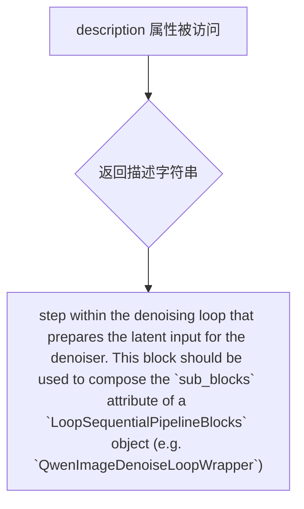

#### 带注释源码

```python
class QwenImageLoopBeforeDenoiser(ModularPipelineBlocks):
    """去噪循环前的处理块类，用于准备潜在输入"""
    
    model_name = "qwenimage"  # 模型名称标识

    @property
    def description(self) -> str:
        """
        获取该块的描述信息
        
        该方法返回一段描述文字，说明该块是去噪循环中的步骤，
        用于准备潜在输入供去噪器使用。此块应用作 
        `LoopSequentialPipelineBlocks` 对象（例如 `QwenImageDenoiseLoopWrapper`）
        的 `sub_blocks` 属性的组成部分。
        
        Returns:
            str: 描述该块功能和用途的字符串
        """
        return (
            "step within the denoising loop that prepares the latent input for the denoiser. "
            "This block should be used to compose the `sub_blocks` attribute of a `LoopSequentialPipelineBlocks` "
            "object (e.g. `QwenImageDenoiseLoopWrapper`)"
        )
```


### `QwenImageLoopBeforeDenoiser.inputs`

该属性定义了 QwenImageLoopBeforeDenoiser 类的输入参数列表，用于描述去噪循环前处理模块所需的输入参数。

参数：
- （该属性为 property，无直接参数，其返回的列表包含以下元素）
  - `latents`：`torch.Tensor`，去噪过程所使用的初始潜在变量，可由 prepare_latent 步骤生成。

返回值：`list[InputParam]`，返回一个包含输入参数规范的列表，描述了该模块所需的输入参数及其元数据。

#### 流程图

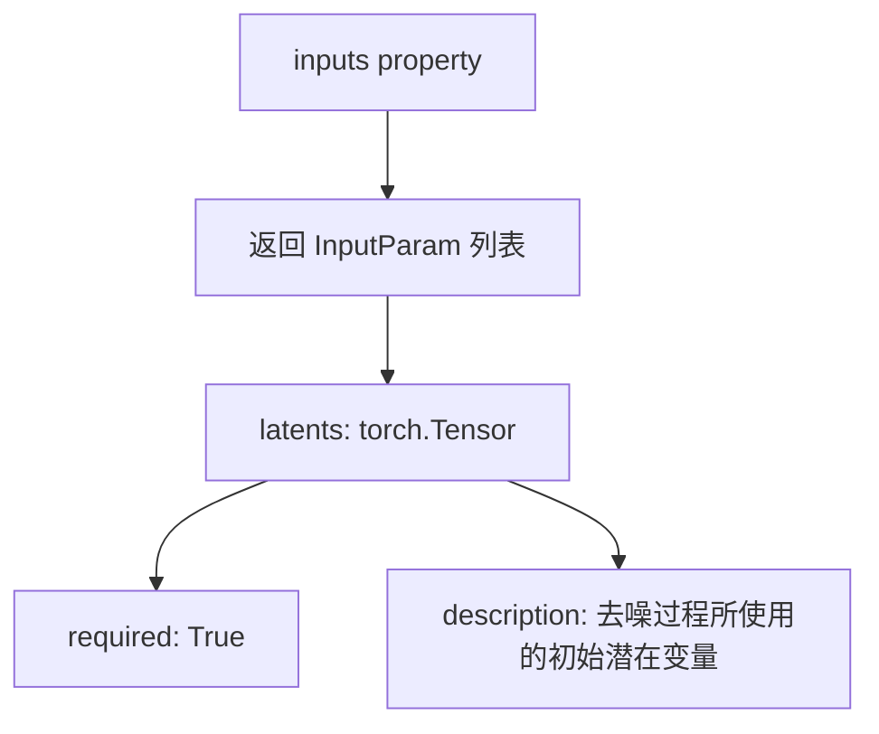

#### 带注释源码

```python
@property
def inputs(self) -> list[InputParam]:
    """
    定义该模块的输入参数规范。
    
    Returns:
        list[InputParam]: 包含所有输入参数的列表，每个 InputParam 描述一个参数元数据。
    """
    return [
        InputParam(
            name="latents",  # 参数名称
            required=True,   # 是否必需
            type_hint=torch.Tensor,  # 类型提示
            description="The initial latents to use for the denoising process. Can be generated in prepare_latent step.",  # 参数描述
        ),
    ]
```


### `QwenImageLoopBeforeDenoiser.__call__`

在去噪循环中准备去噪器所需潜在输入的步骤。该块用于组成 `LoopSequentialPipelineBlocks` 对象的 `sub_blocks` 属性（如 `QwenImageDenoiseLoopWrapper`）。

参数：

- `components`：`QwenImageModularPipeline`，模块化管道组件，包含模型、调度器等
- `block_state`：`BlockState`，块状态，存储当前循环的中间状态（如 latents、timestep 等）
- `i`：`int`，当前去噪步骤的索引
- `t`：`torch.Tensor`，当前时间步张量

返回值：`Tuple[QwenImageModularPipeline, BlockState]`，返回更新后的组件和块状态

#### 流程图

```mermaid
flowchart TD
    A[开始 __call__] --> B{检查输入}
    B --> C[设置 block_state.timestep]
    C --> D[扩展时间步 t.expand<br/>block_state.latents.shape[0]]
    D --> E[转换数据类型<br/>.to block_state.latents.dtype]
    E --> F[设置 block_state.latent_model_input<br/>= block_state.latents]
    F --> G[返回 components, block_state]
```

#### 带注释源码

```python
@torch.no_grad()
def __call__(self, components: QwenImageModularPipeline, block_state: BlockState, i: int, t: torch.Tensor):
    # 获取当前时间步，并扩展到与 batch size 匹配
    # t.expand(block_state.latents.shape[0]) 将时间步张量扩展到与潜在向量 batch 维度相同
    # .to(block_state.latents.dtype) 确保时间步数据类型与潜在向量一致
    block_state.timestep = t.expand(block_state.latents.shape[0]).to(block_state.latents.dtype)
    
    # 将潜在模型输入设置为当前潜在向量
    # 在去噪循环开始时，latent_model_input 等于初始 latents
    block_state.latent_model_input = block_state.latents
    
    # 返回更新后的组件和块状态，供下一个块使用
    return components, block_state
```


### `QwenImageEditLoopBeforeDenoiser.description`

该属性返回 QwenImage 编辑模块中去噪循环前置步骤的描述，说明该模块用于准备去噪器的潜在输入，应作为 `LoopSequentialPipelineBlocks` 对象的 `sub_blocks` 属性组成部分。

参数： 无（这是一个属性装饰器方法，self 为隐式参数）

返回值： `str`，返回该块的功能描述字符串，说明该步骤在去噪循环中的作用以及使用方式

#### 流程图

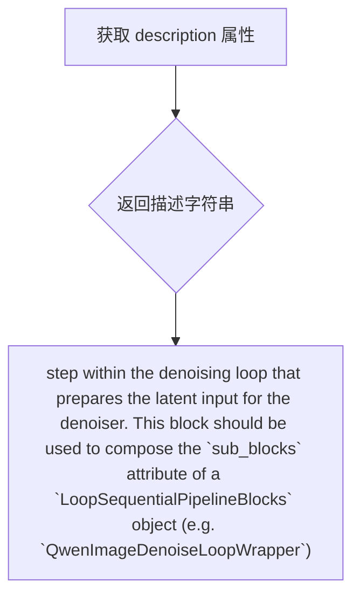

#### 带注释源码

```python
@property
def description(self) -> str:
    """
    属性描述：
    返回该块的功能描述，说明其在去噪循环中的位置和用途。
    
    返回值：
        str: 描述字符串，包含以下信息：
            1. 该步骤位于去噪循环中，准备潜在输入给去噪器
            2. 该块用于组合 LoopSequentialPipelineBlocks 对象的 sub_blocks 属性
            3. 例如可用于 QwenImageDenoiseLoopWrapper
    """
    return (
        "step within the denoising loop that prepares the latent input for the denoiser. "
        "This block should be used to compose the `sub_blocks` attribute of a `LoopSequentialPipelineBlocks` "
        "object (e.g. `QwenImageDenoiseLoopWrapper`)"
    )
```


### `QwenImageEditLoopBeforeDenoiser.inputs`

该属性定义了 `QwenImageEditLoopBeforeDenoiser` 块在去噪循环中所需的输入参数列表，用于为去噪器准备潜在输入。该块用于组成 `LoopSequentialPipelineBlocks` 对象的 `sub_blocks` 属性。

参数：

- `latents`：`torch.Tensor`，去噪过程所需的初始潜在向量，可在 prepare_latent 步骤中生成。
- `image_latents`：`torch.Tensor`（通过模板生成），图像潜在向量，用于引导图像生成，可从 vae_encoder 步骤生成。

返回值：`list[InputParam]`，返回一个包含所有输入参数的列表，每个参数由 `InputParam` 对象描述。

#### 流程图

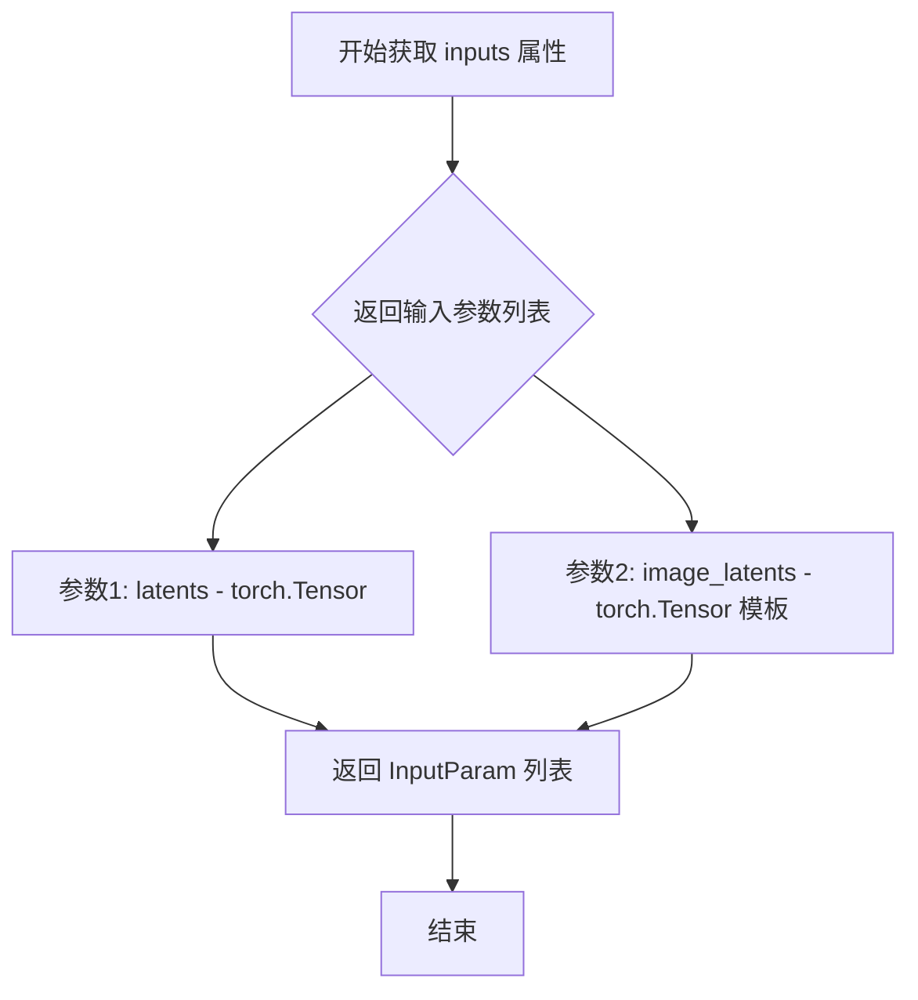

#### 带注释源码

```python
@property
def inputs(self) -> list[InputParam]:
    """
    定义该块所需的输入参数列表。
    
    返回:
        list[InputParam]: 包含所有输入参数的列表，用于去噪循环前的准备工作。
    """
    return [
        InputParam(
            name="latents",
            required=True,
            type_hint=torch.Tensor,
            description="The initial latents to use for the denoising process. Can be generated in prepare_latent step.",
        ),
        InputParam.template("image_latents"),  # 使用模板创建，支持可选的图像潜在向量
    ]
```


### `QwenImageEditLoopBeforeDenoiser.__call__`

该方法是 Qwen-Image 编辑流水线中的循环步骤，在去噪之前准备潜在输入。它将当前潜在变量与图像潜在变量在通道维度上拼接，以支持图像到图像的编辑任务。

参数：

- `self`：类实例本身，包含类的属性和方法。
- `components`：`QwenImageModularPipeline`，模块化流水线组件容器，包含模型、调度器等组件。
- `block_state`：`BlockState`，块状态对象，存储当前块执行过程中的中间状态，如 latents、image_latents、timestep 等。
- `i`：`int`，当前去噪步骤的索引，用于标识在去噪循环中的位置。
- `t`：`torch.Tensor`，当前时间步张量，表示扩散过程中的时间点。

返回值：`tuple[QwenImageModularPipeline, BlockState]`，返回更新后的组件和块状态。`block_state.latent_model_input` 被设置为拼接后的潜在输入，`block_state.timestep` 被设置为当前时间步。

#### 流程图

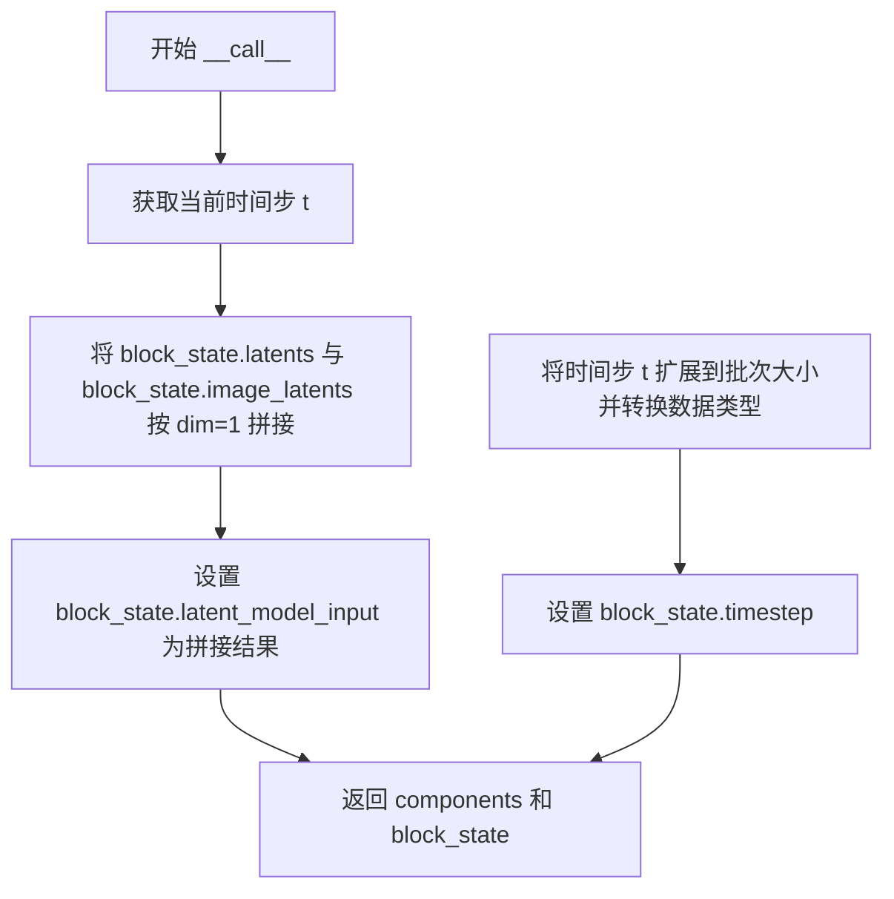

#### 带注释源码

```python
@torch.no_grad()
def __call__(self, components: QwenImageModularPipeline, block_state: BlockState, i: int, t: torch.Tensor):
    """
    执行编辑图像编辑流水线中 去噪循环之前 的准备步骤。
    
    参数:
        components: QwenImageModularPipeline，模块化流水线组件
        block_state: BlockState，块状态对象，存储中间变量
        i: int，当前去噪步骤索引
        t: torch.Tensor，当前时间步张量
    
    返回:
        tuple: (components, block_state)
    """
    # 步骤1: 准备潜在模型输入
    # 将当前潜在变量与图像潜在变量沿通道维度(dim=1)拼接
    # 这里假设 latents 和 image_latents 的空间维度(H,W)相同
    # 拼接后的 latent_model_input 将作为去噪器的输入
    block_state.latent_model_input = torch.cat([block_state.latents, block_state.image_latents], dim=1)
    
    # 步骤2: 设置当前时间步
    # 将时间步 t 扩展到与潜在变量批次大小一致
    # 并将数据类型转换为与潜在变量一致
    block_state.timestep = t.expand(block_state.latents.shape[0]).to(block_state.latents.dtype)
    
    # 返回更新后的组件和块状态
    return components, block_state
```


### `QwenImageLoopBeforeDenoiserControlNet.expected_components`

该属性定义了 `QwenImageLoopBeforeDenoiserControlNet` 类在执行过程中所需的组件声明列表。它返回两个关键组件：`guider`（用于无分类器引导）和 `controlnet`（用于条件控制），这些组件在流水线初始化时需要被提供或创建。

参数：无（该属性不需要输入参数）

返回值：`list[ComponentSpec]`，返回该模块所需的组件规范列表，包含 guider 和 controlnet 两个组件的规格定义。

#### 流程图

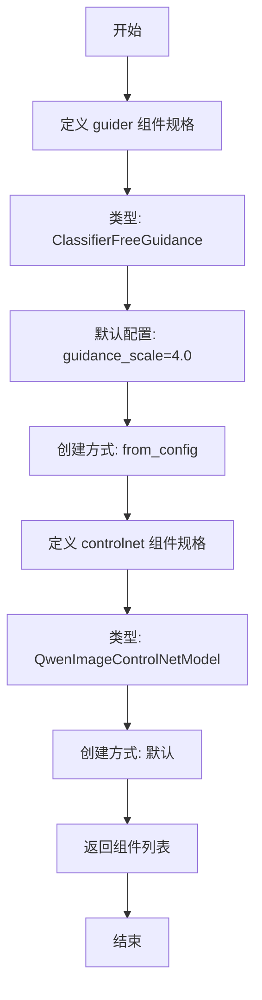

#### 带注释源码

```python
@property
def expected_components(self) -> list[ComponentSpec]:
    """
    定义该模块所需的组件规格列表
    
    Returns:
        list[ComponentSpec]: 包含 guider 和 controlnet 两个必需组件的列表
    """
    return [
        # guider 组件：用于无分类器引导（Classifier Free Guidance）
        # config 中定义了默认的 guidance_scale 为 4.0
        # default_creation_method="from_config" 表示从配置文件创建
        ComponentSpec(
            "guider",
            ClassifierFreeGuidance,
            config=FrozenDict({"guidance_scale": 4.0}),
            default_creation_method="from_config",
        ),
        # controlnet 组件：用于条件控制图像生成
        # 类型为 QwenImageControlNetModel
        # 使用默认创建方式
        ComponentSpec("controlnet", QwenImageControlNetModel),
    ]
```


### `QwenImageLoopBeforeDenoiserControlNet.description`

这是一个属性方法（property），返回该块的功能描述字符串。该块是去噪循环中的一个步骤，用于在去噪器之前运行ControlNet。此块用于组成 `LoopSequentialPipelineBlocks` 对象（例如 `QwenImageDenoiseLoopWrapper`）的 `sub_blocks` 属性。

参数：

- （无参数，只是一个属性方法）

返回值：`str`，返回该块的功能描述文本。

#### 流程图

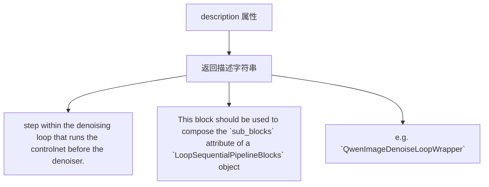

#### 带注释源码

```python
@property
def description(self) -> str:
    """
    返回该块的功能描述。
    
    该方法是一个只读属性，返回关于这个块在去噪循环中作用的字符串描述。
    这个块用于在去噪器之前运行ControlNet，应该被用作组成
    LoopSequentialPipelineBlocks对象的sub_blocks属性。
    
    Returns:
        str: 描述该块功能的字符串，包含：
             - 在去噪循环中运行ControlNet的步骤
             - 用于组成LoopSequentialPipelineBlocks的sub_blocks属性
             - 使用示例（如QwenImageDenoiseLoopWrapper）
    """
    return (
        "step within the denoising loop that runs the controlnet before the denoiser. "
        "This block should be used to compose the `sub_blocks` attribute of a `LoopSequentialPipelineBlocks` "
        "object (e.g. `QwenImageDenoiseLoopWrapper`)"
    )
```


### `QwenImageLoopBeforeDenoiserControlNet.inputs`

该属性定义了 `QwenImageLoopBeforeDenoiserControlNet` 类的输入参数列表，包含了在去噪循环中运行 ControlNet 之前所需的关键输入参数。这些参数主要用于控制图像条件的处理和 Guidance 缩放。

参数：

- `control_image_latents`：`torch.Tensor`，ControlNet 条件图像的潜在表示，用于去噪过程。可在 `prepare_controlnet_inputs` 步骤中生成。
- `controlnet_conditioning_scale`：`float` 或 `list[float]`，ControlNet 条件缩放因子，用于调节 ControlNet 对生成结果的影响程度。默认值可在配置中指定，在 `prepare_controlnet_inputs` 步骤中更新。
- `controlnet_keep`：`list[float]`，ControlNet 保留值列表，用于控制每一步是否启用 ControlNet。可在 `prepare_controlnet_inputs` 步骤中生成。

返回值：`list[InputParam]`，返回包含上述参数的 `InputParam` 对象列表。

#### 流程图

```mermaid
flowchart TD
    A[inputs 属性被调用] --> B[返回 InputParam 列表]
    
    B --> C[control_image_latents]
    B --> D[controlnet_conditioning_scale]
    B --> E[controlnet_keep]
    
    C --> C1[必选参数]
    C --> C2[type_hint: torch.Tensor]
    C --> C3[description: ControlNet 条件图像]
    
    D --> D1[可选模板参数]
    D --> D2[type_hint: float 或 list[float]]
    D --> D3[description: 条件缩放因子]
    
    E --> E1[必选参数]
    E --> E2[type_hint: list[float]]
    E --> E3[description: ControlNet 保留值]
```

#### 带注释源码

```python
@property
def inputs(self) -> list[InputParam]:
    """
    定义该模块的输入参数列表。
    
    该属性返回在去噪循环中运行 ControlNet 之前所需的输入参数，
    包括 ControlNet 条件图像、缩放因子和保留值。
    
    Returns:
        list[InputParam]: 包含以下参数的 InputParam 列表:
            - control_image_latents: ControlNet 条件图像的潜在表示
            - controlnet_conditioning_scale: 条件缩放因子
            - controlnet_keep: ControlNet 保留值列表
    """
    return [
        InputParam(
            "control_image_latents",
            required=True,
            type_hint=torch.Tensor,
            description="The control image to use for the denoising process. Can be generated in prepare_controlnet_inputs step.",
        ),
        InputParam.template("controlnet_conditioning_scale", note="updated in prepare_controlnet_inputs step."),
        InputParam(
            name="controlnet_keep",
            required=True,
            type_hint=list[float],
            description="The controlnet keep values. Can be generated in prepare_controlnet_inputs step.",
        ),
    ]
```


### `QwenImageLoopBeforeDenoiserControlNet.__call__`

在去噪循环中运行 ControlNet 预处理步骤，为去噪器准备条件输入。该模块计算 ControlNet 的条件缩放因子，执行 ControlNet 模型获取中间特征，并将结果存储到块状态中供后续去噪器使用。

参数：

-   `components`：`QwenImageModularPipeline`，模块化管道组件容器，包含 `guider` 和 `controlnet` 等模型组件。
-   `block_state`：`BlockState`，管道执行过程中的状态容器，存储当前的 latents、timestep、条件缩放因子等中间数据。
-   `i`：`int`，当前去噪循环的迭代索引，用于从 `controlnet_keep` 列表中获取当前步骤的保持权重。
-   `t`：`int`（注：代码中标注为 `int`，但根据上下文应为 `torch.Tensor`），当前去噪步骤的时间步。

返回值：`Tuple[QwenImageModularPipeline, BlockState]`，返回更新后的组件和块状态，其中块状态包含计算得到的 `cond_scale` 和 `additional_cond_kwargs["controlnet_block_samples"]`。

#### 流程图

```mermaid
flowchart TD
    A[开始: __call__] --> B{判断 controlnet_keep[i] 类型}
    B -->|list| C[计算列表条件缩放: cond_scale = [c * s for c, s in zip(cond_scale, keep[i)]]
    B -->|非list| D{判断 cond_scale 类型}
    D -->|list| E[取第一个元素]
    E --> F[计算单一条件缩放: cond_scale * keep[i]]
    D -->|非list| F
    C --> G[调用 ControlNet 模型]
    F --> G
    G --> H[传入参数: hidden_states, controlnet_cond, conditioning_scale, timestep, img_shapes, encoder_hidden_states, encoder_hidden_states_mask]
    H --> I[获取 controlnet_block_samples]
    I --> J[更新 block_state.additional_cond_kwargs['controlnet_block_samples']]
    J --> K[返回 components, block_state]
```

#### 带注释源码

```python
@torch.no_grad()
def __call__(self, components: QwenImageModularPipeline, block_state: BlockState, i: int, t: int):
    # ====== 1. 计算当前时间步的条件缩放因子 ======
    # 根据 controlnet_keep[i] 的类型进行处理
    if isinstance(block_state.controlnet_keep[i], list):
        # 如果 keep 值是列表（多条件情况），对每个条件缩放因子乘以对应的 keep 值
        block_state.cond_scale = [
            c * s for c, s in zip(block_state.controlnet_conditioning_scale, block_state.controlnet_keep[i])
        ]
    else:
        # 如果 keep 值是单一数值
        controlnet_cond_scale = block_state.controlnet_conditioning_scale
        # 处理条件缩放因子可能是列表的情况，取第一个元素
        if isinstance(controlnet_cond_scale, list):
            controlnet_cond_scale = controlnet_cond_scale[0]
        # 计算最终的条件缩放因子
        block_state.cond_scale = controlnet_cond_scale * block_state.controlnet_keep[i]

    # ====== 2. 运行 ControlNet 模型 ======
    # 使用当前的时间步、latents 和条件信息运行 ControlNet
    controlnet_block_samples = components.controlnet(
        hidden_states=block_state.latent_model_input,        # 当前 latent 输入
        controlnet_cond=block_state.control_image_latents,   # ControlNet 条件图像
        conditioning_scale=block_state.cond_scale,           # 条件缩放因子
        timestep=block_state.timestep / 1000,                # 归一化时间步
        img_shapes=block_state.img_shapes,                   # 图像形状信息
        encoder_hidden_states=block_state.prompt_embeds,     # 文本嵌入
        encoder_hidden_states_mask=block_state.prompt_embeds_mask,  # 嵌入掩码
        return_dict=False,                                    # 返回元组而非字典
    )

    # ====== 3. 将 ControlNet 输出添加到块状态 ======
    # 将 ControlNet 的中间结果存储到 additional_cond_kwargs
    # 供后续的去噪器模块使用
    block_state.additional_cond_kwargs["controlnet_block_samples"] = controlnet_block_samples

    # ====== 4. 返回更新后的组件和状态 ======
    return components, block_state
```


### `QwenImageLoopDenoiser.description`

该属性提供了一段描述信息，说明该模块是去噪循环中的一个步骤，用于对潜在输入进行去处理。该模块应被用于组合 `LoopSequentialPipelineBlocks`（例如 `QwenImageDenoiseLoopWrapper`）的 `sub_blocks` 属性。

参数：
- （无参数，仅有隐含的 `self`）

返回值：`str`，返回对该 Block 功能的描述字符串。

#### 流程图

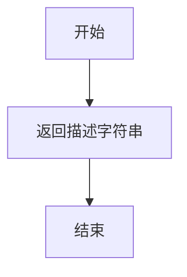

#### 带注释源码

```python
@property
def description(self) -> str:
    """
    返回对该去噪循环步骤的描述信息。
    
    该描述说明了此模块是去噪循环中负责对潜在输入（latent input）
    进行去处理的步骤。它被设计用于组合到 LoopSequentialPipelineBlocks
    对象（例如 QwenImageDenoiseLoopWrapper）的 sub_blocks 属性中。
    """
    return (
        "step within the denoising loop that denoise the latent input for the denoiser. "
        "This block should be used to compose the `sub_blocks` attribute of a `LoopSequentialPipelineBlocks` "
        "object (e.g. `QwenImageDenoiseLoopWrapper`)"
    )
```


### `QwenImageLoopDenoiser.expected_components`

该属性定义了 `QwenImageLoopDenoiser` 类在执行去噪步骤时所需的核心组件规范。它指定了该模块需要使用的引导器（guider）和变换器（transformer）模型组件。

参数：无（这是一个属性，不是方法）

返回值：`list[ComponentSpec]`，返回组件规范列表，包含执行去噪所需的关键组件

#### 流程图

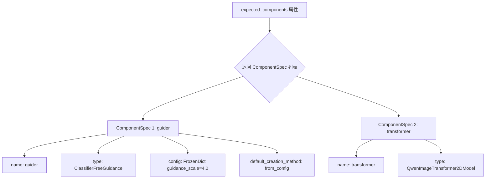

#### 带注释源码

```python
@property
def expected_components(self) -> list[ComponentSpec]:
    """
    定义该去噪块所需的核心组件。
    
    该属性返回一个组件规范列表，指定了在去噪循环步骤中
    需要实例化和使用的关键组件。这些组件由模块化管道系统
    自动注入和管理。
    
    返回:
        list[ComponentSpec]: 包含两个组件规范的列表：
            1. guider: 用于分类器自由引导的组件，负责处理条件输入
               和生成噪声预测的权重调整
            2. transformer: Qwen图像变换器模型，负责实际的去噪推理
    """
    return [
        # ComponentSpec 1: guider
        # 分类器自由引导（Classifier-Free Guidance）组件
        # 用于在推理时平衡条件生成和无条件生成
        # 默认配置 guidance_scale=4.0
        ComponentSpec(
            "guider",
            ClassifierFreeGuidance,
            config=FrozenDict({"guidance_scale": 4.0}),
            default_creation_method="from_config",
        ),
        # ComponentSpec 2: transformer
        # Qwen图像2D变换器模型
        # 负责执行主要的去噪/图像生成推理
        ComponentSpec("transformer", QwenImageTransformer2DModel),
    ]
```


### `QwenImageLoopDenoiser.inputs`

该属性定义了 `QwenImageLoopDenoiser` 类的输入参数，用于描述去噪循环步骤中所需的输入参数信息。

参数：

-  `attention_kwargs`：`dict`，通过模板获取，用于传递注意力处理器相关的额外参数
-  `denoiser_input_fields`：`dict`，通过模板获取，包含去噪器的条件模型输入（如 prompt_embeds、negative_prompt_embeds 等）
-  `img_shapes`：`list[tuple[int, int]]`，图像潜在向量的形状，用于 RoPE 计算。可以在 prepare_additional_inputs 步骤中生成

返回值：`list[InputParam]`，返回输入参数规范列表

#### 流程图

```mermaid
flowchart TD
    A[inputs 属性] --> B[获取 InputParam 列表]
    
    B --> C[attention_kwargs]
    B --> D[denoiser_input_fields]
    B --> E[img_shapes]
    
    C --> C1[类型: dict]
    C --> C2[通过模板获取]
    
    D --> D1[类型: dict]
    D --> D2[通过模板获取]
    
    E --> E1[类型: list[tuple[int, int]]]
    E --> E2[必填参数]
    E --> E3[描述: 图像潜在形状用于RoPE计算]
```

#### 带注释源码

```python
@property
def inputs(self) -> list[InputParam]:
    """
    定义去噪循环步骤的输入参数规范。
    
    返回值:
        list[InputParam]: 包含三个输入参数的列表
    """
    return [
        # 注意力机制的额外参数，通过模板获取
        # 可以包含注意力处理器相关的配置
        InputParam.template("attention_kwargs"),
        
        # 去噪器的条件模型输入字段，通过模板获取
        # 包含如 prompt_embeds, negative_prompt_embeds 等条件信息
        InputParam.template("denoiser_input_fields"),
        
        # 图像潜在向量的形状列表，用于 RoPE（旋转位置嵌入）计算
        # 必填参数，类型为列表元组，每个元组包含高度和宽度
        # 可在 prepare_additional_inputs 步骤中生成
        InputParam(
            "img_shapes",
            required=True,
            type_hint=list[tuple[int, int]],
            description="The shape of the image latents for RoPE calculation. can be generated in prepare_additional_inputs step.",
        ),
    ]
```


### `QwenImageLoopDenoiser.__call__`

该方法是去噪循环中的核心步骤，负责使用Transformer模型对潜在输入进行去噪，并通过引导器（guider）应用分类器自由引导（Classifier-Free Guidance）来生成预测的噪声。

参数：

-  `self`：类的实例自身
-  `components`：`QwenImageModularPipeline`，包含管道所有组件的对象，必须包含guider和transformer组件
-  `block_state`：`BlockState`，块状态对象，存储当前的latents、timestep、prompt_embeds等中间状态
-  `i`：`int`，当前去噪步骤的索引（从0开始）
-  `t`：`torch.Tensor`，当前的时间步张量

返回值：`tuple[QwenImageModularPipeline, BlockState]`，返回更新后的组件和块状态，其中`block_state.noise_pred`被设置为去噪后的噪声预测

#### 流程图

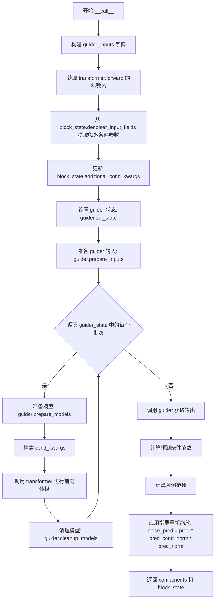

#### 带注释源码

```python
@torch.no_grad()
def __call__(self, components: QwenImageModularPipeline, block_state: BlockState, i: int, t: torch.Tensor):
    # 步骤1: 构建guider输入字典，包含正向和负向的prompt embeddings及对应mask
    guider_inputs = {
        "encoder_hidden_states": (
            getattr(block_state, "prompt_embeds", None),
            getattr(block_state, "negative_prompt_embeds", None),
        ),
        "encoder_hidden_states_mask": (
            getattr(block_state, "prompt_embeds_mask", None),
            getattr(block_state, "negative_prompt_embeds_mask", None),
        ),
    }

    # 步骤2: 获取transformer.forward方法的所有参数名，用于过滤有效的条件参数
    transformer_args = set(inspect.signature(components.transformer.forward).parameters.keys())
    additional_cond_kwargs = {}
    # 步骤3: 遍历denoiser_input_fields，筛选出transformer需要的额外条件参数
    for field_name, field_value in block_state.denoiser_input_fields.items():
        if field_name in transformer_args and field_name not in guider_inputs:
            additional_cond_kwargs[field_name] = field_value
    # 步骤4: 将额外条件参数更新到block_state中
    block_state.additional_cond_kwargs.update(additional_cond_kwargs)

    # 步骤5: 设置guider的当前状态，包括步骤索引、总推理步骤数和时间步
    components.guider.set_state(step=i, num_inference_steps=block_state.num_inference_steps, timestep=t)
    # 步骤6: 准备guider的输入数据（处理分类器自由引导的批处理）
    guider_state = components.guider.prepare_inputs(guider_inputs)

    # 步骤7: 遍历guider状态中的每个批次（支持CFG的多批次处理）
    for guider_state_batch in guider_state:
        # 准备transformer模型
        components.guider.prepare_models(components.transformer)
        # 从当前批次中提取条件参数
        cond_kwargs = {input_name: getattr(guider_state_batch, input_name) for input_name in guider_inputs.keys()}

        # 步骤8: 调用transformer进行前向传播，获取噪声预测
        # YiYi TODO: add cache context
        guider_state_batch.noise_pred = components.transformer(
            hidden_states=block_state.latent_model_input,  # 当前潜在输入
            timestep=block_state.timestep / 1000,          # 归一化的时间步
            attention_kwargs=block_state.attention_kwargs, # 注意力相关参数
            return_dict=False,                             # 不返回字典，直接返回tuple
            **cond_kwargs,                                 # 条件参数（prompt embeddings等）
            **block_state.additional_cond_kwargs,          # 额外条件参数
        )[0]  # 取第一个返回值（noise_pred）

        # 清理transformer模型
        components.guider.cleanup_models(components.transformer)

    # 步骤9: 调用guider处理所有批次的预测结果，应用分类器自由引导
    guider_output = components.guider(guider_state)

    # 步骤10: 计算预测的条件范数和原始范数，用于指导重新缩放
    pred_cond_norm = torch.norm(guider_output.pred_cond, dim=-1, keepdim=True)
    pred_norm = torch.norm(guider_output.pred, dim=-1, keepdim=True)
    # 步骤11: 应用指导重新缩放，防止指导强度过大
    block_state.noise_pred = guider_output.pred * (pred_cond_norm / pred_norm)

    return components, block_state
```


### QwenImageEditLoopDenoiser.description

表示去噪循环中的一个步骤，用于对潜在输入进行去噪。该块用于组成 `LoopSequentialPipelineBlocks` 对象（例如 `QwenImageDenoiseLoopWrapper`）的 `sub_blocks` 属性。

参数： 无（这是一个属性而非函数）

返回值：`str`，描述该块在去噪循环中的功能

#### 流程图

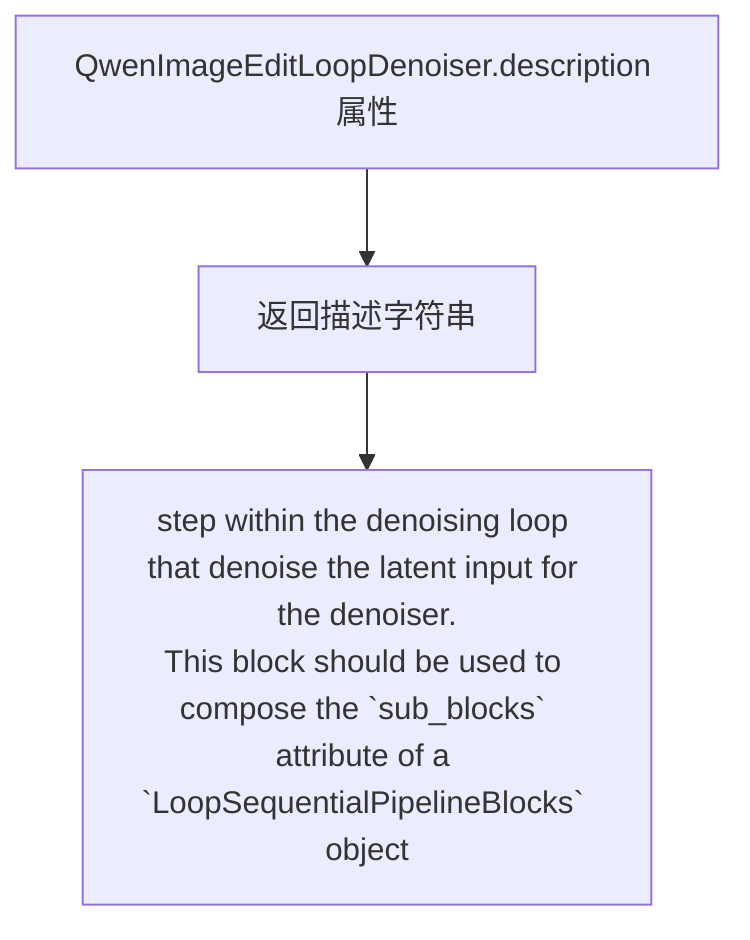

#### 带注释源码

```python
@property
def description(self) -> str:
    """
    属性描述：
    返回该块在去噪循环中的功能说明。
    用于帮助用户理解该块的作用，以及如何将其组合到更大的管道中。
    
    返回值：
        str: 描述该块功能的字符串，说明它是去噪循环中负责对潜在输入进行去噪的步骤，
             用于构成 LoopSequentialPipelineBlocks 对象的 sub_blocks 属性。
    """
    return (
        "step within the denoising loop that denoise the latent input for the denoiser. "
        "This block should be used to compose the `sub_blocks` attribute of a `LoopSequentialPipelineBlocks` "
        "object (e.g. `QwenImageDenoiseLoopWrapper`)"
    )
```


### `QwenImageEditLoopDenoiser.expected_components`

该属性定义了 `QwenImageEditLoopDenoiser` 类在去噪循环中所期望的组件规范。它返回一个包含 `guider`（分类器自由引导器）和 `transformer`（Qwen图像2D变换器模型）的组件列表，用于图像编辑任务的去噪过程。

参数：无（这是一个属性而非方法）

返回值：`list[ComponentSpec]`，`ComponentSpec` 对象列表，包含 `guider` 和 `transformer` 两个必需组件

#### 流程图

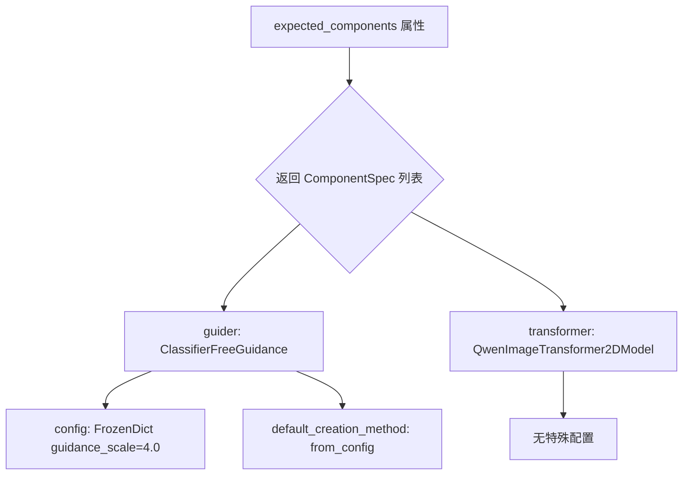

#### 带注释源码

```python
@property
def expected_components(self) -> list[ComponentSpec]:
    """
    定义该块在去噪循环中所期望的组件。
    
    返回说明：
        - guider (ClassifierFreeGuidance): 分类器自由引导器，用于无分类器引导生成
          - config: 包含 guidance_scale=4.0 的 FrozenDict 配置
          - default_creation_method: from_config，表示从配置创建
        - transformer (QwenImageTransformer2DModel): Qwen图像变换器模型，用于去噪
          - 无特殊配置要求
    """
    return [
        ComponentSpec(
            "guider",
            ClassifierFreeGuidance,
            config=FrozenDict({"guidance_scale": 4.0}),
            default_creation_method="from_config",
        ),
        ComponentSpec("transformer", QwenImageTransformer2DModel),
    ]
```


### `QwenImageEditLoopDenoiser.inputs`

该属性定义了 `QwenImageEditLoopDenoiser` 类的输入参数规范，用于描述该块在去噪循环中所需的输入参数列表。

参数：

- `attention_kwargs`：`dict`（可选），通过模板获取，注意力处理器的额外参数
- `denoiser_input_fields`：`dict`（可选），通过模板获取，去噪器的条件模型输入字段（如 prompt_embeds、negative_prompt_embeds 等）
- `img_shapes`：`list[tuple[int, int]]`（必需），图像潜在表示的形状，用于 RoPE 计算。可在 `prepare_additional_inputs` 步骤中生成

返回值：`list[InputParam]`，返回包含所有输入参数的列表，每个参数由 `InputParam` 对象描述

#### 流程图

```mermaid
flowchart TD
    A[inputs 属性被调用] --> B{检查参数类型}
    B -->|attention_kwargs| C[InputParam.template 创建]
    B -->|denoiser_input_fields| D[InputParam.template 创建]
    B -->|img_shapes| E[InputParam 创建: 类型 list[tuple[int, int]], required=True]
    C --> F[返回 InputParam 列表]
    D --> F
    E --> F
```

#### 带注释源码

```python
@property
def inputs(self) -> list[InputParam]:
    """
    定义该块的输入参数规范
    
    Returns:
        list[InputParam]: 包含所有输入参数的列表
    """
    return [
        # 注意力机制的额外参数字典，可选参数
        InputParam.template("attention_kwargs"),
        # 去噪器的条件输入字段，包含如 prompt_embeds 等信息
        InputParam.template("denoiser_input_fields"),
        # 图像潜在表示的形状列表，用于 RoPE 位置编码计算
        # 必需参数，形状为 [(height, width), ...]
        InputParam(
            "img_shapes",
            required=True,
            type_hint=list[tuple[int, int]],
            description="The shape of the image latents for RoPE calculation. Can be generated in prepare_additional_inputs step.",
        ),
    ]
```


### `QwenImageEditLoopDenoiser.__call__`

该方法是 QwenImage 编辑 pipeline 中去噪循环的核心步骤，负责在每个去噪迭代中对潜在表示进行预测，并通过 ClassifierFreeGuidance 引导机制生成最终的去噪预测结果，同时对预测进行指导重缩放处理。

参数：

-   `self`：隐式参数，表示类的实例本身。
-   `components`：`QwenImageModularPipeline`，包含pipeline的所有组件，如`guider`和`transformer`。
-   `block_state`：`BlockState`，存储当前block的中间状态，包括`latent_model_input`、`timestep`、`prompt_embeds`、`denoiser_input_fields`等。
-   `i`：`int`，当前去噪循环的迭代索引。
-   `t`：`torch.Tensor`，当前去噪循环的时间步张量。

返回值：`(components: QwenImageModularPipeline, block_state: BlockState)`，返回更新后的组件和块状态，其中`block_state.noise_pred`被设置为经过指导重缩放后的去噪预测结果。

#### 流程图

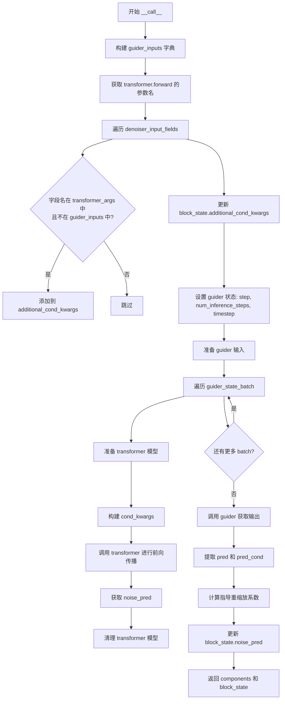

#### 带注释源码

```python
@torch.no_grad()
def __call__(self, components: QwenImageModularPipeline, block_state: BlockState, i: int, t: torch.Tensor):
    # 构建 guider 所需的输入字典，包含 prompt 的 embedding 和 mask
    # encoder_hidden_states 和 encoder_hidden_states_mask 可能包含正向和负向embedding
    guider_inputs = {
        "encoder_hidden_states": (
            getattr(block_state, "prompt_embeds", None),
            getattr(block_state, "negative_prompt_embeds", None),
        ),
        "encoder_hidden_states_mask": (
            getattr(block_state, "prompt_embeds_mask", None),
            getattr(block_state, "negative_prompt_embeds_mask", None),
        ),
    }

    # 通过 inspect 获取 transformer.forward 方法的所有参数名，用于过滤条件参数
    transformer_args = set(inspect.signature(components.transformer.forward).parameters.keys())
    
    # 初始化额外的条件参数字典
    additional_cond_kwargs = {}
    # 遍历 denoiser_input_fields，将其中属于 transformer 参数且不属于 guider_inputs 的字段添加到 additional_cond_kwargs
    for field_name, field_value in block_state.denoiser_input_fields.items():
        if field_name in transformer_args and field_name not in guider_inputs:
            additional_cond_kwargs[field_name] = field_value
    
    # 更新 block_state 中的额外条件参数
    block_state.additional_cond_kwargs.update(additional_cond_kwargs)

    # 设置 guider 的当前状态，包括推理步骤数、当前时间步等
    components.guider.set_state(step=i, num_inference_steps=block_state.num_inference_steps, timestep=t)
    
    # 准备 guider 所需的输入数据
    guider_state = components.guider.prepare_inputs(guider_inputs)

    # 遍历每个 guider 状态批次（通常对应 ClassifierFreeGuidance 的条件/无条件批次）
    for guider_state_batch in guider_state:
        # 准备 transformer 模型
        components.guider.prepare_models(components.transformer)
        
        # 从当前 guider 状态批次中提取条件参数
        cond_kwargs = {input_name: getattr(guider_state_batch, input_name) for input_name in guider_inputs.keys()}

        # YiYi TODO: add cache context
        # 调用 transformer 进行前向传播，获取噪声预测
        # 这里将 latent_model_input、timestep、attention_kwargs、cond_kwargs 和 additional_cond_kwargs 一起传入
        guider_state_batch.noise_pred = components.transformer(
            hidden_states=block_state.latent_model_input,
            timestep=block_state.timestep / 1000,  # 时间步通常需要归一化到 0-1 范围
            attention_kwargs=block_state.attention_kwargs,
            return_dict=False,
            **cond_kwargs,
            **block_state.additional_cond_kwargs,
        )[0]  # 取第一个返回值（通常是预测结果）

        # 清理 transformer 模型
        components.guider.cleanup_models(components.transformer)

    # 调用 guider 对所有 guider 状态进行最终处理，生成指导输出
    guider_output = components.guider(guider_state)

    # 对于编辑任务，预测结果可能包含多个部分（如编辑部分和原始部分）
    # 这里只取前 block_state.latents.size(1) 个维度，对应于编辑的 latents
    pred = guider_output.pred[:, : block_state.latents.size(1)]
    pred_cond = guider_output.pred_cond[:, : block_state.latents.size(1)]

    # 应用指导重缩放 (guidance rescale)
    # 计算条件预测和原始预测的范数，用于调整预测方向
    pred_cond_norm = torch.norm(pred_cond, dim=-1, keepdim=True)
    pred_norm = torch.norm(pred, dim=-1, keepdim=True)
    
    # 更新 block_state 中的噪声预测，使用重缩放后的结果
    block_state.noise_pred = pred * (pred_cond_norm / pred_norm)

    return components, block_state
```


### `QwenImageLoopAfterDenoiser.description`

该属性方法用于描述 `QwenImageLoopAfterDenoiser` 块的功能，即去噪循环中更新潜在变量（latents）的步骤。该块用于组成 `LoopSequentialPipelineBlocks` 对象（如 `QwenImageDenoiseLoopWrapper`）的 `sub_blocks` 属性。

参数：无（属性方法，无参数）

返回值：`str`，返回对去噪循环中更新潜在变量步骤的描述，说明该块用于更新 latents，应被用作 `LoopSequentialPipelineBlocks` 对象的 `sub_blocks` 属性的一部分。

#### 流程图

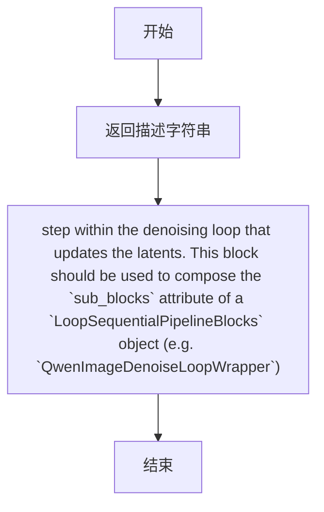

#### 带注释源码

```python
@property
def description(self) -> str:
    """
    属性方法，返回对 QwenImageLoopAfterDenoiser 块的描述。
    
    该描述说明了这是去噪循环中更新潜在变量（latents）的步骤，
    并建议将该块用作 LoopSequentialPipelineBlocks 对象的 sub_blocks 属性的一部分。
    
    Returns:
        str: 描述去噪循环中更新潜在变量步骤的字符串
    """
    return (
        "step within the denoising loop that updates the latents. "
        "This block should be used to compose the `sub_blocks` attribute of a `LoopSequentialPipelineBlocks` "
        "object (e.g. `QwenImageDenoiseLoopWrapper`)"
    )
```


### `QwenImageLoopAfterDenoiser.expected_components`

该属性方法定义了 `QwenImageLoopAfterDenoiser` 块在去噪循环中更新隐变量时所需的预期组件。它指定了该块需要调度器（scheduler）组件来执行去噪步骤的计算。

参数：

- `self`：无显式参数（属性方法的隐式参数），`QwenImageLoopAfterDenoiser` 类实例本身

返回值：`list[ComponentSpec]` ，返回需要被注入的组件规范列表，当前包含 `scheduler` 组件（类型为 `FlowMatchEulerDiscreteScheduler`）。

#### 流程图

```mermaid
flowchart TD
    A[开始] --> B{调用 expected_components 属性}
    B --> C[创建 ComponentSpec 列表]
    C --> D[添加 scheduler 组件规范<br/>类型: FlowMatchEulerDiscreteScheduler]
    D --> E[返回 ComponentSpec 列表]
    E --> F[结束]
```

#### 带注释源码

```python
@property
def expected_components(self) -> list[ComponentSpec]:
    """
    定义该块所需的组件规范。
    
    该属性返回一个组件规范列表，指定了在去噪循环中
    更新隐变量时需要预先配置或注入的组件。
    
    Returns:
        list[ComponentSpec]: 包含所需组件规范的列表。
            当前唯一需要的组件是 scheduler (FlowMatchEulerDiscreteScheduler)，
            用于执行噪声预测后的隐变量更新步骤。
    """
    return [
        ComponentSpec("scheduler", FlowMatchEulerDiscreteScheduler),
    ]
```


### `QwenImageLoopAfterDenoiser.intermediate_outputs`

该属性定义了去噪循环中 "after denoiser" 步骤的中间输出，即经过调度器（scheduler）更新后的潜在变量（latents）。这个属性用于描述该模块在去噪过程中会生成并传递到下游的输出参数。

参数：无（该属性不接受任何输入参数）

返回值：`list[OutputParam]`，返回包含 `latents`（去噪后的潜在变量）的输出参数列表。

#### 流程图

```mermaid
flowchart TD
    A[开始] --> B{property: intermediate_outputs}
    B --> C[返回 OutputParam 列表]
    C --> D[包含 latents 模板]
    E[结束]
```

#### 带注释源码

```python
@property
def intermediate_outputs(self) -> list[OutputParam]:
    """
    定义去噪循环中 'after denoiser' 步骤的中间输出。
    
    该属性返回一个列表，指定了该模块在每个去噪步骤中会产生的输出参数。
    在 QwenImageLoopAfterDenoiser 中，主要输出是经过调度器更新后的 latents（潜在变量）。
    这些 latents 会作为中间结果传递给下一个去噪步骤或用于最终图像解码。
    
    Returns:
        list[OutputParam]: 包含 'latents' 的输出参数模板列表
    """
    return [
        OutputParam.template("latents"),
    ]
```


### `QwenImageLoopAfterDenoiser.__call__`

该方法是 Qwen-Image 流水线中去噪循环的第三个步骤（after denoiser），负责根据预测的噪声通过调度器（scheduler）更新潜空间表示（latents），并处理数据类型转换以兼容不同硬件平台（如 Apple MPS）。

参数：

- `self`：`QwenImageLoopAfterDenoiser` 实例方法隐式参数
- `components`：`QwenImageModularPipeline`，流水线组件容器，包含 scheduler 等组件
- `block_state`：`BlockState`，块状态对象，存储当前迭代的 latents、noise_pred 等中间状态
- `i`：`int`，当前去噪步骤的索引
- `t`：`torch.Tensor`，当前去噪的时间步

返回值：`(Tuple[QwenImageModularPipeline, BlockState])`，返回更新后的组件容器和块状态，块状态中的 latents 已被 scheduler 更新

#### 流程图

```mermaid
flowchart TD
    A[开始 __call__] --> B[保存原始 latents 数据类型]
    B --> C[调用 scheduler.step]
    C --> D[使用 noise_pred, t, latents 计算]
    D --> E[获取更新后的 latents]
    E --> F{数据类型是否改变?}
    F -->|是| G{是否为 MPS 设备?}
    F -->|否| H[直接返回]
    G -->|是| I[转换为原始数据类型]
    G -->|否| H
    I --> H
    H --> J[返回 components 和 block_state]
```

#### 带注释源码

```python
@torch.no_grad()
def __call__(self, components: QwenImageModularPipeline, block_state: BlockState, i: int, t: torch.Tensor):
    # 记录更新前 latents 的数据类型，用于后续类型兼容性处理
    latents_dtype = block_state.latents.dtype
    
    # 使用调度器根据预测噪声执行单步去噪
    # scheduler.step 根据 flow matching 或其他采样算法计算下一步的 latents
    block_state.latents = components.scheduler.step(
        block_state.noise_pred,  # 模型预测的噪声
        t,                        # 当前时间步
        block_state.latents,     # 当前潜空间表示
        return_dict=False,        # 不返回字典，直接返回 tuple
    )[0]  # scheduler.step 返回 (latents, ...) 取第一个元素

    # 处理数据类型转换兼容性问题
    # 某些平台（如 Apple MPS）由于 PyTorch 缺陷会出现类型不一致
    if block_state.latents.dtype != latents_dtype:
        if torch.backends.mps.is_available():
            # MPS 设备上将 latents 转换回原始数据类型
            # 修复参考: https://github.com/pytorch/pytorch/pull/99272
            block_state.latents = block_state.latents.to(latents_dtype)

    # 返回更新后的组件和块状态
    # block_state.latents 已更新为去噪后的新值
    return components, block_state
```


### QwenImageLoopAfterDenoiserInpaint.__call__

该方法是 QwenImageLoopAfterDenoiserInpaint 类的核心执行函数，实现了去噪循环中使用 mask 和 image_latents 进行图像修复（inpainting）的步骤。它通过 mask 将原始图像潜变量（image_latents）与生成的噪声潜变量（latents）进行混合，以实现对图像特定区域的修复。

参数：

- `components`：`QwenImageModularPipeline`，管道组件集合，包含 scheduler 等模型组件
- `block_state`：`BlockState`，管道块状态，包含 latents、mask、image_latents、initial_noise、timesteps 等关键状态数据
- `i`：`int`，当前去噪步骤的索引
- `t`：`torch.Tensor`，当前去噪的时间步

返回值：`Tuple[QwenImageModularPipeline, BlockState]`，返回更新后的组件和块状态

#### 流程图

```mermaid
graph TD
    A([Start __call__]) --> B[设置 init_latents_proper = block_state.image_latents]
    B --> C{判断: i < len(timesteps) - 1?}
    C -->|Yes| D[获取下一个时间步 noise_timestep = timesteps[i+1]]
    D --> E[调用 scheduler.scale_noise 缩放噪声]
    E --> F[更新 init_latents_proper]
    C -->|No| G[计算新 latents: (1 - mask) * init_latents_proper + mask * latents]
    F --> G
    G --> H([返回 components, block_state])
```

#### 带注释源码

```python
@torch.no_grad()
def __call__(self, components: QwenImageModularPipeline, block_state: BlockState, i: int, t: torch.Tensor):
    """
    在去噪循环的步骤中，使用 mask 和 image_latents 更新 latents 进行图像修复。
    
    参数:
        components: 管道组件，包含 scheduler 等
        block_state: 管道状态，包含 latents, mask, image_latents, initial_noise 等
        i: 当前去噪步骤索引
        t: 当前时间步
        
    返回:
        更新后的 components 和 block_state
    """
    # 1. 将初始潜变量设置为图像潜变量（用于 inpainting 的原始图像内容）
    block_state.init_latents_proper = block_state.image_latents
    
    # 2. 如果不是最后一个去噪步骤，则对噪声进行缩放以匹配下一个时间步
    # 这对于确保 inpainting 过程中噪声的正确时间对齐很重要
    if i < len(block_state.timesteps) - 1:
        block_state.noise_timestep = block_state.timesteps[i + 1]
        # 使用 scheduler 缩放噪声：init_latents_proper -> 带噪声的版本
        block_state.init_latents_proper = components.scheduler.scale_noise(
            block_state.init_latents_proper, 
            torch.tensor([block_state.noise_timestep]), 
            block_state.initial_noise
        )

    # 3. 根据 mask 混合原始图像潜变量和去噪后的潜变量
    # mask=1: 保留原始图像内容 (init_latents_proper)
    # mask=0: 保留生成的图像内容 (latents)
    block_state.latents = (
        1 - block_state.mask
    ) * block_state.init_latents_proper + block_state.mask * block_state.latents

    return components, block_state
```


### `QwenImageLoopAfterDenoiserInpaint.inputs`

该属性定义了 `QwenImageLoopAfterDenoiserInpaint` 类的输入参数列表，用于描述在去噪循环中处理图像修复（inpainting）所需的输入参数。

参数：

-  `mask`：`torch.Tensor`，必需参数。用于图像修复过程的掩码，指示需要修复的区域。可以在 inpaint 准备 latent 步骤中生成。
-  `image_latents`：`torch.Tensor`，可选参数（使用模板创建）。图像的 latent 表示，用于引导图像生成。来源于 VAE encoder 步骤。
-  `initial_noise`：`torch.Tensor`，必需参数。用于图像修复过程的初始噪声。可以在 inpaint 准备 latent 步骤中生成。

返回值：`list[InputParam]`，返回包含所有输入参数的列表，用于定义该模块所需的前置条件。

#### 流程图

```mermaid
flowchart TD
    A[开始: 获取 inputs] --> B[获取 mask 掩码张量]
    B --> C[获取 image_latents 图像latent]
    C --> D[获取 initial_noise 初始噪声]
    D --> E[返回 InputParam 列表]
    
    style A fill:#f9f,stroke:#333
    style E fill:#9f9,stroke:#333
```

#### 带注释源码

```python
@property
def inputs(self) -> list[InputParam]:
    """
    定义该模块的输入参数列表。
    用于描述在去噪循环中处理图像修复所需的输入参数。
    
    Returns:
        list[InputParam]: 包含所有输入参数的列表
    """
    return [
        # mask: 图像修复掩码，标识需要修复的区域
        InputParam(
            "mask",
            required=True,
            type_hint=torch.Tensor,
            description="The mask to use for the inpainting process. Can be generated in inpaint prepare latents step.",
        ),
        # image_latents: 图像的latent表示，用于引导生成
        InputParam.template("image_latents"),
        # initial_noise: 初始噪声，用于图像修复过程
        InputParam(
            "initial_noise",
            required=True,
            type_hint=torch.Tensor,
            description="The initial noise to use for the inpainting process. Can be generated in inpaint prepare latents step.",
        ),
    ]
```


### `QwenImageLoopAfterDenoiserInpaint.intermediate_outputs`

该属性定义了 `QwenImageLoopAfterDenoiserInpaint` 类的中间输出参数，用于描述在去噪循环中该模块产生并传递给下游模块的数据。

参数：
（该属性为 `@property`，无直接输入参数，它返回的是模块的输出元数据定义）

- `OutputParam`：
  - 名称：`latents`
  - 类型：`torch.Tensor`（通过 `OutputParam.template("latents")` 推断）
  - 描述：去噪更新后的潜在表示（latents）

返回值：`list[OutputParam]`，返回包含 `latents` 输出参数的列表

#### 流程图

```mermaid
graph TD
    A[intermediate_outputs 属性调用] --> B{返回 OutputParam 列表}
    B --> C[latents: torch.Tensor]
    C --> D[描述: 去噪更新后的潜在表示]
```

#### 带注释源码

```python
@property
def intermediate_outputs(self) -> list[OutputParam]:
    """
    定义该模块的中间输出参数。
    在去噪循环中，此模块会将更新后的 latents 传递给下一个块（block）。
    """
    return [
        OutputParam.template("latents"),
    ]
```


### `QwenImageLoopAfterDenoiserInpaint.__call__`

该方法是去噪循环中的后处理步骤，专门用于图像修复（inpainting）任务。它通过掩码将原始图像潜在表示与当前去噪潜在变量进行线性混合，实现对图像特定区域的修复与重建。

参数：

- `self`：隐式参数，表示类的实例对象。
- `components`：`QwenImageModularPipeline`，模块化管道组件容器，包含调度器（scheduler）等组件。
- `block_state`：`BlockState`，块状态对象，存储去噪过程中的潜在变量、掩码、图像潜在变量、初始噪声等状态信息。
- `i`：`int`，当前去噪步骤的索引，用于访问时间步列表。
- `t`：`torch.Tensor`，当前去噪过程的时间步张量。

返回值：`Tuple[QwenImageModularPipeline, BlockState]`，返回更新后的组件容器和块状态对象，其中块状态的 `latents` 已被更新为混合后的结果。

#### 流程图

```mermaid
flowchart TD
    A[开始执行 __call__] --> B[获取 image_latents 赋值给 init_latents_proper]
    B --> C{判断 i < len(timesteps) - 1}
    C -->|是| D[获取下一个时间步 noise_timestep]
    D --> E[调用 scheduler.scale_noise 缩放噪声]
    E --> F[更新 init_latents_proper]
    C -->|否| G[跳过噪声缩放]
    F --> H[计算混合潜在变量]
    G --> H
    H --> I[latents = (1 - mask) * init_latents_proper + mask * latents]
    I --> J[返回 components 和 block_state]
```

#### 带注释源码

```python
@torch.no_grad()
def __call__(self, components: QwenImageModularPipeline, block_state: BlockState, i: int, t: torch.Tensor):
    # 步骤1: 将图像潜在变量初始化为 init_latents_proper
    # 这是修复过程中用于填充掩码区域的原始图像潜在表示
    block_state.init_latents_proper = block_state.image_latents
    
    # 步骤2: 如果不是最后一个去噪步骤，则对初始潜在变量进行噪声缩放
    # 这确保了修复区域与当前去噪阶段的噪声水平相匹配
    if i < len(block_state.timesteps) - 1:
        # 获取下一步的时间步，用于确定噪声缩放的程度
        block_state.noise_timestep = block_state.timesteps[i + 1]
        
        # 使用调度器的 scale_noise 方法对 init_latents_proper 进行噪声缩放
        # 将原始图像潜在表示与初始噪声按照下一步时间步进行混合
        block_state.init_latents_proper = components.scheduler.scale_noise(
            block_state.init_latents_proper, 
            torch.tensor([block_state.noise_timestep]), 
            block_state.initial_noise
        )

    # 步骤3: 使用掩码对潜在变量进行混合
    # (1 - mask) * init_latents_proper: 未掩码区域保持原始图像潜在表示
    # mask * latents: 掩码区域使用当前去噪的潜在变量
    # 这种线性混合实现了对图像特定区域的修复
    block_state.latents = (
        1 - block_state.mask
    ) * block_state.init_latents_proper + block_state.mask * block_state.latents

    # 步骤4: 返回更新后的组件和块状态
    return components, block_state
```


### `QwenImageDenoiseLoopWrapper.description`

返回该去噪循环包装器的描述信息，用于说明该模块的功能和用途。

参数： 无

返回值：`str`，描述该Pipeline block的功能——迭代地对`latents`进行去噪处理，具体步骤可通过`sub_blocks`属性自定义。

#### 流程图

```mermaid
flowchart TD
    A[开始] --> B[返回描述字符串]
    B --> C[说明: 这是一个属性方法,用于获取类的描述信息]
    C --> D[功能: 迭代地对latents进行去噪]
    D --> E[特点: 具体的迭代步骤可通过sub_blocks属性自定义]
    E --> F[结束]
```

#### 带注释源码

```python
class QwenImageDenoiseLoopWrapper(LoopSequentialPipelineBlocks):
    """去噪循环包装器类，继承自LoopSequentialPipelineBlocks"""
    model_name = "qwenimage"  # 模型名称标识

    @property
    def description(self) -> str:
        """
        属性方法：返回该去噪循环包装器的描述信息
        
        返回值说明:
            - 描述了该Pipeline block的核心功能：迭代地对latents进行去噪
            - 说明去噪过程基于timesteps进行
            - 指出具体的迭代步骤可以通过sub_blocks属性进行自定义配置
            
        Returns:
            str: 描述该模块功能的字符串
        """
        return (
            "Pipeline block that iteratively denoise the latents over `timesteps`. "
            "The specific steps with each iteration can be customized with `sub_blocks` attributes"
        )
```


### `QwenImageDenoiseLoopWrapper.loop_expected_components`

该属性定义了去噪循环过程中所必需的组件列表。在这个属性中，指定了循环去噪步骤需要使用的调度器（scheduler）组件。

参数：无（这是一个属性而非方法，隐式参数为 `self`）

返回值：`list[ComponentSpec]`，返回去噪循环所期望的组件规格列表，当前仅包含调度器组件。

#### 流程图

```mermaid
flowchart TD
    A[开始] --> B[定义 loop_expected_components 属性]
    B --> C[返回包含 scheduler 组件的列表]
    C --> D[ComponentSpec: scheduler 类型为 FlowMatchEulerDiscreteScheduler]
    D --> E[结束]
```

#### 带注释源码

```python
@property
def loop_expected_components(self) -> list[ComponentSpec]:
    """
    定义去噪循环所需的组件规格列表。
    
    该属性返回在去噪循环（denoising loop）执行过程中所必须拥有的组件。
    对于 QwenImageDenoiseLoopWrapper，去噪循环只需要调度器（scheduler）组件
    来执行噪声预测后的单步更新操作。
    
    返回值:
        list[ComponentSpec]: 包含组件规格的列表，当前定义了一个 scheduler 组件，
                           类型为 FlowMatchEulerDiscreteScheduler，用于执行
                           Flow Match 算法的离散调度器步骤。
    """
    return [
        ComponentSpec("scheduler", FlowMatchEulerDiscreteScheduler),
    ]
```


### `QwenImageDenoiseLoopWrapper.loop_inputs`

这是一个属性方法（property），定义了去噪循环（denoising loop）所需的输入参数。该属性返回一个参数列表，包含去噪过程中必要的时间步长（timesteps）和推理步骤数（num_inference_steps），用于控制扩散模型的迭代去噪过程。

参数：

- 该方法是一个属性（property），没有传统意义上的参数。它返回的参数列表包含在返回值中。

返回值：`list[InputParam]`，返回去噪循环所需的输入参数列表，包含：
- `timesteps`（torch.Tensor）：去噪过程使用的时间步长张量，可在 set_timesteps 步骤中生成。
- `num_inference_steps`（int）：去噪步骤的数量。

#### 流程图

```mermaid
flowchart TD
    A[开始] --> B[定义 loop_inputs 属性]
    B --> C[创建 InputParam 列表]
    C --> D[添加 timesteps 参数]
    D --> E[添加 num_inference_steps 参数]
    E --> F[返回 InputParam 列表]
    F --> G[结束]
```

#### 带注释源码

```python
@property
def loop_inputs(self) -> list[InputParam]:
    """
    定义去噪循环所需的输入参数列表。
    
    返回值:
        list[InputParam]: 包含去噪过程所需参数的列表。
    """
    return [
        # timesteps: 去噪过程使用的时间步长张量
        InputParam(
            name="timesteps",
            required=True,
            type_hint=torch.Tensor,
            description="The timesteps to use for the denoising process. Can be generated in set_timesteps step.",
        ),
        # num_inference_steps: 去噪推理的步骤数
        InputParam.template("num_inference_steps", required=True),
    ]
```


### `QwenImageDenoiseLoopWrapper.__call__`

这是 Qwen-Image 模态去噪循环的包装器方法，负责在给定的时间步序列上迭代执行去噪过程。该方法通过调用 `loop_step` 方法依次处理每个时间步，并使用进度条跟踪去噪进度，最终返回更新后的管道状态。

参数：

- `components`：`QwenImageModularPipeline`，包含所有管道组件（如 scheduler、guider、transformer 等）的模块化管道对象
- `state`：`PipelineState`，管道的全局状态对象，包含块状态（block_state）和其他运行时信息

返回值：`PipelineState`，更新后的管道状态，其中包含去噪后的 latents 和其他中间结果

#### 流程图

```mermaid
flowchart TD
    A[开始 __call__] --> B[从 state 获取 block_state]
    B --> C[计算 num_warmup_steps 预热步数]
    C --> D[初始化 additional_cond_kwargs 为空字典]
    D --> E[创建进度条 total=num_inference_steps]
    E --> F{遍历 timesteps}
    F -->|i=0| G[调用 loop_step 处理当前时间步]
    G --> H{检查是否更新进度条}
    H -->|最后一步| I[更新进度条]
    H -->|非最后一步但满足条件| I
    H -->|不满足条件| J[继续下一步]
    I --> J
    J -->|还有更多时间步| F
    J -->|遍历完成| K[将 block_state 写回 state]
    K --> L[返回 components 和 state]
```

#### 带注释源码

```python
@torch.no_grad()
def __call__(self, components: QwenImageModularPipeline, state: PipelineState) -> PipelineState:
    # 从全局 state 中获取当前块的局部状态 block_state
    block_state = self.get_block_state(state)

    # 计算预热步数：总时间步数减去推理步数乘以调度器阶数，确保调度器正确运行
    block_state.num_warmup_steps = max(
        len(block_state.timesteps) - block_state.num_inference_steps * components.scheduler.order, 0
    )

    # 初始化额外的条件参数字典，用于存储传递给去噪器的附加信息
    block_state.additional_cond_kwargs = {}

    # 创建进度条以可视化去噪进度
    with self.progress_bar(total=block_state.num_inference_steps) as progress_bar:
        # 遍历所有时间步进行迭代去噪
        for i, t in enumerate(block_state.timesteps):
            # 执行单个去噪步骤：调用子块（before_denoiser -> denoiser -> after_denoiser）
            components, block_state = self.loop_step(components, block_state, i=i, t=t)
            
            # 判断是否需要更新进度条：
            # 1. 已经是最后一个时间步
            # 2. 或者已经超过预热步数且当前步骤是调度器阶数的整数倍
            if i == len(block_state.timesteps) - 1 or (
                (i + 1) > block_state.num_warmup_steps and (i + 1) % components.scheduler.order == 0
            ):
                progress_bar.update()

    # 将更新后的 block_state 写回全局 state
    self.set_block_state(state, block_state)

    # 返回组件和更新后的状态
    return components, state
```


### `QwenImageDenoiseStep.description`

该属性返回对 `QwenImageDenoiseStep` 类的功能描述，说明它是一个迭代去噪 latent 的步骤，其循环逻辑在 `QwenImageDenoiseLoopWrapper.__call__` 方法中定义。每次迭代时，它按顺序运行 `sub_blocks` 中定义的块：`QwenImageLoopBeforeDenoiser`、`QwenImageLoopDenoiser` 和 `QwenImageLoopAfterDenoiser`。该块支持 QwenImage 的 text2image 和 image2image 任务。

参数： 无（这是一个属性 getter，没有输入参数）

返回值：`str`，返回对该去噪步骤的详细描述文本，说明其支持的模型组件、输入输出参数等信息。

#### 流程图

```mermaid
flowchart TD
    A[开始] --> B{description 属性被访问}
    B --> C[返回描述字符串]
    C --> D[描述内容包含:]
    D --> E[循环逻辑来自 QwenImageDenoiseLoopWrapper.__call__]
    D --> F[子块执行顺序: before_denoiser → denoiser → after_denoiser]
    D --> G[支持的组件: guider, transformer, scheduler]
    D --> H[支持的输入: timesteps, num_inference_steps, latents等]
    D --> I[输出: denoised latents]
    E --> J[结束]
    F --> J
    G --> J
    H --> J
    I --> J
```

#### 带注释源码

```python
@property
def description(self) -> str:
    """
    返回对该去噪步骤的详细描述。
    
    描述内容涵盖：
    1. 核心功能：迭代去噪 latents
    2. 循环逻辑：继承自 QwenImageDenoiseLoopWrapper.__call__
    3. 子块执行顺序：before_denoiser → denoiser → after_denoiser
    4. 支持的任务：text2image 和 image2image
    5. 所需组件：guider, transformer, scheduler
    6. 输入参数：timesteps, num_inference_steps, latents 等
    7. 输出：denoised latents
    """
    return (
        "Denoise step that iteratively denoise the latents.\n"
        "Its loop logic is defined in `QwenImageDenoiseLoopWrapper.__call__` method\n"
        "At each iteration, it runs blocks defined in `sub_blocks` sequencially:\n"
        " - `QwenImageLoopBeforeDenoiser`\n"
        " - `QwenImageLoopDenoiser`\n"
        " - `QwenImageLoopAfterDenoiser`\n"
        "This block supports text2image and image2image tasks for QwenImage."
    )
```


### `QwenImageInpaintDenoiseStep.description`

该属性返回对 `QwenImageInpaintDenoiseStep` 类的描述，说明其作为去噪步骤，用于迭代地对潜在表示进行去噪，支持 QwenImage 的图像修复任务。

参数：

- （无显式参数，self 为隐式参数）

返回值：`str`，返回描述 QwenImageInpaintDenoiseStep 类功能的字符串。

#### 流程图

```mermaid
graph TD
    A[调用 QwenImageInpaintDenoiseStep.description] --> B[返回描述字符串]
```

#### 带注释源码

```python
@property
def description(self) -> str:
    return (
        "Denoise step that iteratively denoise the latents. \n"
        "Its loop logic is defined in `QwenImageDenoiseLoopWrapper.__call__` method \n"
        "At each iteration, it runs blocks defined in `sub_blocks` sequencially:\n"
        " - `QwenImageLoopBeforeDenoiser`\n"
        " - `QwenImageLoopDenoiser`\n"
        " - `QwenImageLoopAfterDenoiser` \n"
        " - `QwenImageLoopAfterDenoiserInpaint`\n"
        "This block supports inpainting tasks for QwenImage."
    )
```


### `QwenImageControlNetDenoiseStep.description`

该属性是 `QwenImageControlNetDenoiseStep` 类的描述属性，返回一个字符串，说明该去噪步骤的功能：迭代地去噪潜在向量（latents），其循环逻辑定义在 `QwenImageDenoiseLoopWrapper.__call__` 方法中。每次迭代按顺序运行 `sub_blocks` 中定义的块：`QwenImageLoopBeforeDenoiser`、`QwenImageLoopBeforeDenoiserControlNet`、`QwenImageLoopDenoiser` 和 `QwenImageLoopAfterDenoiser`。该块支持 QwenImage 的 text2img/img2img 任务（带 ControlNet）。

参数：

- 无参数（该方法是一个属性，使用 `@property` 装饰器，无显式参数）

返回值：`str`，返回该类的功能描述字符串

#### 流程图

```mermaid
flowchart TD
    A[开始] --> B{获取description属性}
    B --> C[返回多行描述字符串]
    
    C --> C1[说明: 迭代去噪latents]
    C --> C2[说明: 循环逻辑在QwenImageDenoiseLoopWrapper.__call__]
    C --> C3[说明: 顺序执行4个块]
    C --> C4[说明: 支持text2img/img2img带ControlNet]
    
    C1 --> D[结束]
    C2 --> D
    C3 --> D
    C4 --> D
```

#### 带注释源码

```python
@property
def description(self) -> str:
    """
    返回该去噪步骤的描述信息。
    
    该方法是一个属性（property），用于描述 QwenImageControlNetDenoiseStep 类的功能。
    它说明了该步骤是迭代去噪latents的过程，循环逻辑继承自QwenImageDenoiseLoopWrapper，
    并按顺序执行四个子块：before_denoiser、before_denoiser_controlnet、denoiser和after_denoiser。
    该块支持QwenImage的text2img/img2img任务，并集成了ControlNet。
    
    Returns:
        str: 描述该去噪步骤功能的多行字符串
    """
    return (
        "Denoise step that iteratively denoise the latents. \n"
        "Its loop logic is defined in `QwenImageDenoiseLoopWrapper.__call__` method \n"
        "At each iteration, it runs blocks defined in `sub_blocks` sequencially:\n"
        " - `QwenImageLoopBeforeDenoiser`\n"
        " - `QwenImageLoopBeforeDenoiserControlNet`\n"
        " - `QwenImageLoopDenoiser`\n"
        " - `QwenImageLoopAfterDenoiser`\n"
        "This block supports text2img/img2img tasks with controlnet for QwenImage."
    )
```


### `QwenImageInpaintControlNetDenoiseStep.description`

该属性方法返回 QwenImageInpaintControlNetDenoiseStep 类的描述信息，说明该类是一个迭代去噪步骤，用于支持 QwenImage 的 inpainting 任务（带 ControlNet）。它定义了每个迭代中依次运行的子块：QwenImageLoopBeforeDenoiser、QwenImageLoopBeforeDenoiserControlNet、QwenImageLoopDenoiser、QwenImageLoopAfterDenoiser 和 QwenImageLoopAfterDenoiserInpaint。

参数：

- `self`：隐式参数，类型为 `QwenImageInpaintControlNetDenoiseStep`，表示该属性所属的实例对象本身

返回值：`str`，返回该去噪步骤的描述字符串，包含其功能、迭代逻辑和支持的任務类型

#### 流程图

```mermaid
flowchart TD
    A[获取 QwenImageInpaintControlNetDenoiseStep.description] --> B[返回描述字符串]
    
    B --> C1[说明这是迭代去噪步骤]
    B --> C2[引用 QwenImageDenoiseLoopWrapper.__call__ 方法]
    C2 --> C3[列出子块执行顺序]
    C3 --> C4[QwenImageLoopBeforeDenoiser]
    C3 --> C5[QwenImageLoopBeforeDenoiserControlNet]
    C3 --> C6[QwenImageLoopDenoiser]
    C3 --> C7[QwenImageLoopAfterDenoiser]
    C3 --> C8[QwenImageLoopAfterDenoiserInpaint]
    B --> C9[说明支持带 ControlNet 的 inpainting 任务]
```

#### 带注释源码

```python
@property
def description(self) -> str:
    """
    属性方法：返回该去噪步骤的描述信息。
    
    该方法说明了 QwenImageInpaintControlNetDenoiseStep 的功能：
    1. 这是一个迭代去噪步骤，迭代逻辑定义在 QwenImageDenoiseLoopWrapper.__call__ 方法中
    2. 每次迭代依次执行以下子块：
       - QwenImageLoopBeforeDenoiser: 准备去噪器的潜在输入
       - QwenImageLoopBeforeDenoiserControlNet: 运行 ControlNet
       - QwenImageLoopDenoiser: 执行去噪
       - QwenImageLoopAfterDenoiser: 更新潜在表示
       - QwenImageLoopAfterDenoiserInpaint: 使用 mask 和 image_latents 进行 inpainting 更新
    3. 该块支持 QwenImage 的带 ControlNet 的 inpainting 任务
    
    参数:
        self: QwenImageInpaintControlNetDenoiseStep 实例
        
    返回值:
        str: 描述该去噪步骤的字符串
    """
    return (
        "Denoise step that iteratively denoise the latents. \n"
        "Its loop logic is defined in `QwenImageDenoiseLoopWrapper.__call__` method \n"
        "At each iteration, it runs blocks defined in `sub_blocks` sequencially:\n"
        " - `QwenImageLoopBeforeDenoiser`\n"
        " - `QwenImageLoopBeforeDenoiserControlNet`\n"
        " - `QwenImageLoopDenoiser`\n"
        " - `QwenImageLoopAfterDenoiser`\n"
        " - `QwenImageLoopAfterDenoiserInpaint`\n"
        "This block supports inpainting tasks with controlnet for QwenImage."
    )
```


### `QwenImageEditDenoiseStep.description`

描述 QwenImageEdit 去噪步骤的属性方法。该方法返回对 `QwenImageEditDenoiseStep` 类的功能描述，说明其迭代去噪的逻辑以及支持的块序列。

参数：

- 无参数（这是一个属性方法，通过 `self` 隐式访问实例）

返回值：`str`，返回对该去噪步骤的描述字符串，说明其循环逻辑和所支持的 QwenImage Edit 功能。

#### 流程图

```mermaid
flowchart TD
    A[获取 description 属性] --> B{返回描述字符串}
    B --> C["Denoise step that iteratively denoise the latents.<br/>Its loop logic is defined in `QwenImageDenoiseLoopWrapper.__call__` method<br/>At each iteration, it runs blocks defined in `sub_blocks` sequencially:<br/> - `QwenImageEditLoopBeforeDenoiser`<br/> - `QwenImageEditLoopDenoiser`<br/> - `QwenImageLoopAfterDenoiser`<br/>This block supports QwenImage Edit."]
```

#### 带注释源码

```python
@property
def description(self) -> str:
    """
    返回对 QwenImageEdit 去噪步骤的描述信息。
    
    该方法说明了：
    1. 这是一个迭代去噪步骤，其去噪逻辑定义在 QwenImageDenoiseLoopWrapper.__call__ 方法中
    2. 每次迭代按顺序运行 sub_blocks 中定义的块：
       - QwenImageEditLoopBeforeDenoiser: 准备去噪器的潜在输入
       - QwenImageEditLoopDenoiser: 对潜在输入进行去噪
       - QwenImageLoopAfterDenoiser: 更新潜在变量
    3. 此块支持 QwenImage Edit 任务
    
    Returns:
        str: 描述去噪步骤功能和组成的字符串
    """
    return (
        "Denoise step that iteratively denoise the latents. \n"
        "Its loop logic is defined in `QwenImageDenoiseLoopWrapper.__call__` method \n"
        "At each iteration, it runs blocks defined in `sub_blocks` sequencially:\n"
        " - `QwenImageEditLoopBeforeDenoiser`\n"
        " - `QwenImageEditLoopDenoiser`\n"
        " - `QwenImageLoopAfterDenoiser`\n"
        "This block supports QwenImage Edit."
    )
```


### `QwenImageEditInpaintDenoiseStep.description`

该属性方法返回 `QwenImageEditInpaintDenoiseStep` 类的描述信息，说明该类是一个迭代去噪 latent 的去噪步骤，其循环逻辑定义在 `QwenImageDenoiseLoopWrapper.__call__` 方法中，每次迭代按顺序运行 `sub_blocks` 中定义的块：`QwenImageEditLoopBeforeDenoiser`、`QwenImageEditLoopDenoiser`、`QwenImageLoopAfterDenoiser` 和 `QwenImageLoopAfterDenoiserInpaint`，该类支持 QwenImage Edit 的图像修复任务。

参数：
- 无（该方法为属性方法，无需额外参数，`self` 为隐式参数）

返回值：`str`，返回该类的描述字符串，说明其功能为迭代去噪 latent，支持 QwenImage Edit 的 inpainting 任务。

#### 流程图

```mermaid
flowchart TD
    A[获取 description 属性] --> B[返回描述字符串]
    
    B --> B1["描述内容:<br/>1. 迭代去噪 latents<br/>2. 循环逻辑在 QwenImageDenoiseLoopWrapper.__call__<br/>3. 依次运行 sub_blocks:<br/> - QwenImageEditLoopBeforeDenoiser<br/> - QwenImageEditLoopDenoiser<br/> - QwenImageLoopAfterDenoiser<br/> - QwenImageLoopAfterDenoiserInpaint<br/>4. 支持 QwenImage Edit inpainting"]
```

#### 带注释源码

```python
@property
def description(self) -> str:
    """
    返回该类的描述信息。
    
    该方法描述了 QwenImageEditInpaintDenoiseStep 的功能：
    - 迭代去噪 latents
    - 循环逻辑定义在 QwenImageDenoiseLoopWrapper.__call__ 方法中
    - 每次迭代按顺序运行 sub_blocks 中定义的块
    - 支持 QwenImage Edit 的 inpainting 任务
    
    Returns:
        str: 描述该类功能的字符串
    """
    return (
        "Denoise step that iteratively denoise the latents. \n"
        "Its loop logic is defined in `QwenImageDenoiseLoopWrapper.__call__` method \n"
        "At each iteration, it runs blocks defined in `sub_blocks` sequencially:\n"
        " - `QwenImageEditLoopBeforeDenoiser`\n"
        " - `QwenImageEditLoopDenoiser`\n"
        " - `QwenImageLoopAfterDenoiser`\n"
        " - `QwenImageLoopAfterDenoiserInpaint`\n"
        "This block supports inpainting tasks for QwenImage Edit."
    )
```


### `QwenImageLayeredDenoiseStep.description`

该属性方法返回 `QwenImageLayeredDenoiseStep` 类的描述信息，说明这是一个迭代去噪步骤，其循环逻辑在 `QwenImageDenoiseLoopWrapper.__call__` 方法中定义。每次迭代按顺序运行 `sub_blocks` 中定义的块：`QwenImageEditLoopBeforeDenoiser`、`QwenImageEditLoopDenoiser` 和 `QwenImageLoopAfterDenoiser`，该块支持 QwenImage Layered（分层图像）任务。

参数：无参数（这是一个属性方法 `@property`）

返回值：`str`，返回该类的描述字符串，说明其功能、支持的块序列以及适用的任务类型。

#### 流程图

```mermaid
flowchart TD
    A[开始] --> B[返回描述字符串]
    
    B --> C["Denoise step that iteratively denoise the latents.\n<br>Loop logic in QwenImageDenoiseLoopWrapper.__call__\n<br>Sequentially runs:\n<br>- QwenImageEditLoopBeforeDenoiser\n<br>- QwenImageEditLoopDenoiser\n<br>- QwenImageLoopAfterDenoiser\n<br>Supports QwenImage Layered"]
    
    C --> D[结束]
```

#### 带注释源码

```python
@property
def description(self) -> str:
    """
    返回该去噪步骤的描述信息。
    
    说明：
        - 这是一个属性方法（使用 @property 装饰器）
        - 描述了该类的核心功能：迭代去噪 latent
        - 说明确了循环逻辑在 QwenImageDenoiseLoopWrapper.__call__ 中定义
        - 列出了每次迭代按顺序运行的三个块：
          1. QwenImageEditLoopBeforeDenoiser - 去噪前的预处理
          2. QwenImageEditLoopDenoiser - 执行去噪
          3. QwenImageLoopAfterDenoiser - 去噪后的处理
        - 指出该块支持 QwenImage Layered（分层图像）任务
    
    返回：
        str: 描述该类功能的字符串，包含去噪步骤的详细信息和支持的块序列
    """
    return (
        "Denoise step that iteratively denoise the latents. \n"
        "Its loop logic is defined in `QwenImageDenoiseLoopWrapper.__call__` method \n"
        "At each iteration, it runs blocks defined in `sub_blocks` sequencially:\n"
        " - `QwenImageEditLoopBeforeDenoiser`\n"
        " - `QwenImageEditLoopDenoiser`\n"
        " - `QwenImageLoopAfterDenoiser`\n"
        "This block supports QwenImage Layered."
    )
```

## 关键组件


### QwenImageLoopBeforeDenoiser

去噪循环中的第一步，准备潜在输入供去噪器使用，设置时间步和潜在模型输入。

### QwenImageEditLoopBeforeDenoiser

编辑模式的去噪前步骤，准备潜在输入并将图像潜在与噪声潜在连接。

### QwenImageLoopBeforeDenoiserControlNet

在去噪前运行ControlNet以生成控制条件，支持条件缩放和批处理。

### QwenImageLoopDenoiser

核心去噪步骤，调用transformer模型进行噪声预测，应用分类器自由引导（CFG）。

### QwenImageEditLoopDenoiser

编辑模式的去噪步骤，处理双潜在输入并根据潜在大小裁剪预测结果。

### QwenImageLoopAfterDenoiser

去噪后处理，使用调度器（scheduler）更新潜在表示。

### QwenImageLoopAfterDenoiserInpaint

针对图像修复（inpainting）的去噪后处理，结合mask和图像潜在进行latent更新。

### QwenImageDenoiseLoopWrapper

定义去噪循环的整体逻辑，管理时间步迭代和进度条。

### QwenImageDenoiseStep

组合去噪循环的完整步骤，支持text2image和image2image任务。

### QwenImageInpaintDenoiseStep

支持图像修复任务的去噪步骤组合。

### QwenImageControlNetDenoiseStep

支持ControlNet控制的text2image/image2image去噪步骤。

### QwenImageInpaintControlNetDenoiseStep

支持ControlNet控制的图像修复去噪步骤。

### QwenImageEditDenoiseStep

支持QwenImage编辑功能的去噪步骤。

### QwenImageEditInpaintDenoiseStep

支持编辑模式下图像修复的去噪步骤。

### QwenImageLayeredDenoiseStep

支持分层图像处理（layered）的去噪步骤。

## 问题及建议


### 已知问题

- **代码重复**：QwenImageLoopDenoiser 和 QwenImageEditLoopDenoiser 逻辑几乎完全相同，仅在最后处理 pred 时有细微差别（后者需要切片处理 image_latents 部分）；多个 DenoiseStep 类的 block_classes 和 block_names 定义高度重复
- **TODO 未完成**：存在 `# YiYi TODO: add cache context` 注释，表明缓存功能尚未实现
- **性能隐患**：每次调用 `__call__` 时都执行 `inspect.signature(components.transformer.forward).parameters.keys()`，在每个去噪步骤中重复执行会产生不必要的性能开销
- **类型不一致**：QwenImageLoopBeforeDenoiserControlNet 的 `t` 参数类型为 `int`，而其他类的相同参数类型为 `torch.Tensor`
- **硬编码值**：guidance_scale=4.0 在多个 ComponentSpec 中重复定义；timestep 除以 1000 的操作在多处重复出现
- **魔法数字**：MPS 设备特殊处理的 bug workaround 代码中硬编码了 PyTorch PR 链接，说明这是临时解决方案
- **错误处理不足**：缺少对输入参数的类型校验、shape 兼容性检查，以及对 missing components 的处理
- **抽象泄漏**：使用 `getattr(block_state, "prompt_embeds", None)` 等动态获取属性，缺乏显式接口定义

### 优化建议

- **消除重复代码**：提取公共逻辑到基类或使用工厂模式，例如将 QwenImageLoopDenoiser 和 QwenImageEditLoopDenoiser 合并为参数化版本
- **缓存签名结果**：将 `transformer_args` 在初始化时计算一次并缓存，避免在去噪循环中重复调用 inspect
- **统一配置管理**：将 guidance_scale 等配置抽取到统一的配置类或配置文件中管理
- **修复类型不一致**：统一所有 __call__ 方法中 `t` 参数的类型定义
- **增加错误处理**：添加参数校验、组件可用性检查、异常捕获和日志记录
- **完善文档**：为复杂逻辑（如 controlnet_keep 的处理、guidance rescale 公式）添加更详细的注释

## 其它


### 设计目标与约束

本模块化管道设计目标是为Qwen-Image模型提供灵活的图像生成框架，支持text2image、image2image、inpainting、controlnet等多种任务模式。通过模块化设计，实现代码复用和可扩展性。设计约束包括：1）必须与HuggingFace Diffusers框架兼容；2）使用FlowMatchEulerDiscreteScheduler进行去噪调度；3）通过ClassifierFreeGuidance实现条件生成；4）所有计算必须在torch.no_grad()下执行以节省显存。

### 错误处理与异常设计

代码中错误处理机制较为薄弱，主要体现在：1）MPS设备特殊处理：针对Apple MPS后端的dtype转换bug有特殊处理（见`QwenImageLoopAfterDenoiser.__call__`）；2）缺少参数校验：各Block的`__call__`方法未对输入参数进行合法性校验；3）ControlNet输入校验缺失：`QwenImageLoopBeforeDenoiserControlNet`未校验controlnet_keep列表长度与batch_size的匹配性；4）缺失异常抛出：transformer或controlnet调用失败时无明确异常信息。建议添加参数校验、异常捕获和清晰的错误提示。

### 数据流与状态机

数据流主要经过以下阶段：latents输入 → before_denoiser（准备latent_model_input和timestep） → denoiser（通过transformer预测噪声） → after_denoiser（scheduler.step更新latents）。BlockState是核心状态容器，存储latents、timestep、noise_pred、prompt_embeds、additional_cond_kwargs等中间状态。编辑模式（qwenimage-edit）额外处理image_latents，将其与latents在通道维度拼接。Inpainting模式通过mask和initial_noise进行latents融合。ControlNet模式在去噪前运行controlnet获取额外的条件信息。

### 外部依赖与接口契约

核心依赖包括：1）torch：张量计算；2）transformers库：模型加载；3）diffusers框架：基础设施（PipelineState、BlockState、ModularPipelineBlocks等）；4）QwenImageTransformer2DModel：DiT架构的transformer；5）QwenImageControlNetModel：ControlNet模型；6）ClassifierFreeGuidance：无分类器引导实现；7）FlowMatchEulerDiscreteScheduler：.flow匹配调度器。接口契约方面，各Block类需实现`__call__(components, block_state, i, t)`方法，返回(components, block_state)；需提供`inputs`、`expected_components`、`description`等属性。

### 模块化架构设计

本代码采用复合块（Composite Blocks）模式：1）LoopSequentialPipelineBlocks：定义循环逻辑；2）ModularPipelineBlocks：定义单步计算块；3）各DenoiseStep类通过block_classes和block_names组合多个LoopStep形成完整去噪流程。这种设计允许用户通过组合不同Block定制pipeline。模块层次：LoopWrapper → DenoiseStep → LoopBeforeDenoiser/LoopDenoiser/LoopAfterDenoiser。子块通过block_state.additional_cond_kwargs传递条件信息。

### 性能优化空间

存在以下优化机会：1）代码注释中"YiYi TODO: add cache context"表明计划添加KV cache以加速推理；2）当前实现逐batch处理guider_state，未利用批量推理；3）每次循环都创建新的字典对象，可考虑对象池化；4）transformer_args通过inspect获取，可缓存以减少开销；5）MPS设备特殊处理可提取为通用工具函数；6）可添加混合精度推理支持（fp16/bf16）；7）可支持gradient checkpointing以节省显存。

### 版本兼容性考虑

代码引用了pytorch MPS bug修复（https://github.com/pytorch/pytorch/pull/99272），表明对特定pytorch版本有依赖。建议在文档中明确：1）最低pytorch版本要求；2）diffusers框架版本要求；3）CUDA版本要求；4）Apple Silicon MPS支持状态。transformer.forward参数通过inspect动态获取，这种设计虽然灵活但可能因版本变化而失效。

### 使用示例与最佳实践

建议补充：1）如何组合不同Block创建自定义pipeline；2）如何添加自定义LoopStep；3）如何配置不同的guidance_scale；4）如何处理多ControlNet场景；5）内存占用与batch_size的关系；6）典型推理参数配置示例。最佳实践包括：确保prompt_embeds与negative_prompt_embeds同时提供以获得最佳质量；inpainting时确保mask与image_latents对齐；在Apple MPS设备上注意dtype转换可能导致的精度问题。


    