# `diffusers\src\diffusers\modular_pipelines\qwenimage\encoders.py` 详细设计文档

该模块实现了QwenImage管道的文本和VAE编码器块，包含图像预处理、文本嵌入生成、VAE latent编码等核心功能，通过模块化管道步骤支持图像编辑、分层、图像修复等多种任务。

## 整体流程

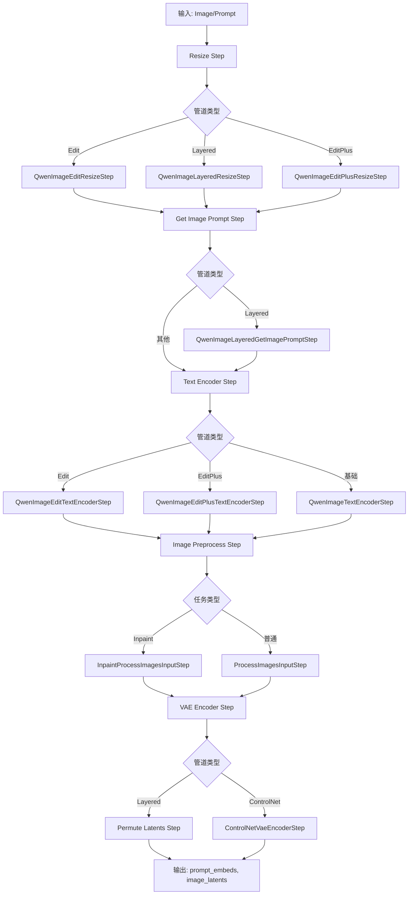

## 类结构

```
ModularPipelineBlocks (基类)
├── QwenImageEditResizeStep
├── QwenImageLayeredResizeStep
├── QwenImageEditPlusResizeStep
├── QwenImageLayeredGetImagePromptStep
├── QwenImageTextEncoderStep
├── QwenImageEditTextEncoderStep
├── QwenImageEditPlusTextEncoderStep
├── QwenImageInpaintProcessImagesInputStep
├── QwenImageEditInpaintProcessImagesInputStep
├── QwenImageProcessImagesInputStep
├── QwenImageEditProcessImagesInputStep
├── QwenImageEditPlusProcessImagesInputStep
├── QwenImageVaeEncoderStep
├── QwenImageControlNetVaeEncoderStep
└── QwenImageLayeredPermuteLatentsStep
```

## 全局变量及字段


### `logger`
    
模块级日志记录器，用于输出调试和运行信息

类型：`logging.Logger`
    


### `QWENIMAGE_EDIT_PLUS_IMG_TEMPLATE`
    
QwenImage编辑增强管道的图像模板，用于多图像场景下的提示词格式化

类型：`str`
    


### `QWENIMAGE_EDIT_PLUS_PROMPT_TEMPLATE`
    
QwenImage编辑增强管道的提示词模板，用于处理图像和文本联合输入

类型：`str`
    


### `QWENIMAGE_EDIT_PLUS_PROMPT_TEMPLATE_START_IDX`
    
QwenImage编辑增强管道提示词模板的起始索引，用于裁剪嵌入

类型：`int`
    


### `QWENIMAGE_EDIT_PROMPT_TEMPLATE`
    
QwenImage编辑管道的提示词模板，用于图像编辑任务的提示词格式化

类型：`str`
    


### `QWENIMAGE_EDIT_PROMPT_TEMPLATE_START_IDX`
    
QwenImage编辑管道提示词模板的起始索引，用于裁剪嵌入

类型：`int`
    


### `QWENIMAGE_LAYERED_CAPTION_PROMPT_CN`
    
分层图像Caption生成的中文提示词模板

类型：`str`
    


### `QWENIMAGE_LAYERED_CAPTION_PROMPT_EN`
    
分层图像Caption生成的英文提示词模板

类型：`str`
    


### `QWENIMAGE_PROMPT_TEMPLATE`
    
QwenImage基础管道的提示词模板，用于标准文本生成任务

类型：`str`
    


### `QWENIMAGE_PROMPT_TEMPLATE_START_IDX`
    
QwenImage基础管道提示词模板的起始索引，用于裁剪嵌入

类型：`int`
    


### `QwenImageEditResizeStep.model_name`
    
管道模型标识符，值为'qwenimage-edit'

类型：`str`
    


### `QwenImageLayeredResizeStep.model_name`
    
管道模型标识符，值为'qwenimage-layered'

类型：`str`
    


### `QwenImageEditPlusResizeStep.model_name`
    
管道模型标识符，值为'qwenimage-edit-plus'

类型：`str`
    


### `QwenImageLayeredGetImagePromptStep.model_name`
    
管道模型标识符，值为'qwenimage-layered'

类型：`str`
    


### `QwenImageLayeredGetImagePromptStep.image_caption_prompt_en`
    
英文图像Caption生成提示词模板

类型：`str`
    


### `QwenImageLayeredGetImagePromptStep.image_caption_prompt_cn`
    
中文图像Caption生成提示词模板

类型：`str`
    


### `QwenImageTextEncoderStep.model_name`
    
管道模型标识符，值为'qwenimage'

类型：`str`
    


### `QwenImageTextEncoderStep.prompt_template_encode`
    
文本编码提示词模板

类型：`str`
    


### `QwenImageTextEncoderStep.prompt_template_encode_start_idx`
    
提示词模板编码起始索引

类型：`int`
    


### `QwenImageTextEncoderStep.tokenizer_max_length`
    
分词器最大长度，默认为1024

类型：`int`
    


### `QwenImageEditTextEncoderStep.model_name`
    
管道模型标识符，值为'qwenimage'

类型：`str`
    


### `QwenImageEditTextEncoderStep.prompt_template_encode`
    
编辑管道文本编码提示词模板

类型：`str`
    


### `QwenImageEditTextEncoderStep.prompt_template_encode_start_idx`
    
编辑管道提示词模板编码起始索引

类型：`int`
    


### `QwenImageEditPlusTextEncoderStep.model_name`
    
管道模型标识符，值为'qwenimage-edit-plus'

类型：`str`
    


### `QwenImageEditPlusTextEncoderStep.prompt_template_encode`
    
编辑增强管道文本编码提示词模板

类型：`str`
    


### `QwenImageEditPlusTextEncoderStep.img_template_encode`
    
编辑增强管道图像编码模板

类型：`str`
    


### `QwenImageEditPlusTextEncoderStep.prompt_template_encode_start_idx`
    
编辑增强管道提示词模板编码起始索引

类型：`int`
    


### `QwenImageInpaintProcessImagesInputStep.model_name`
    
管道模型标识符，值为'qwenimage'

类型：`str`
    


### `QwenImageEditInpaintProcessImagesInputStep.model_name`
    
管道模型标识符，值为'qwenimage-edit'

类型：`str`
    


### `QwenImageProcessImagesInputStep.model_name`
    
管道模型标识符，值为'qwenimage'

类型：`str`
    


### `QwenImageEditProcessImagesInputStep.model_name`
    
管道模型标识符，值为'qwenimage-edit'

类型：`str`
    


### `QwenImageEditPlusProcessImagesInputStep.model_name`
    
管道模型标识符，值为'qwenimage-edit-plus'

类型：`str`
    


### `QwenImageVaeEncoderStep.model_name`
    
管道模型标识符，值为'qwenimage'

类型：`str`
    


### `QwenImageVaeEncoderStep._input`
    
输入参数配置，定义待编码的图像张量

类型：`InputParam`
    


### `QwenImageVaeEncoderStep._output`
    
输出参数配置，定义图像潜在表示

类型：`OutputParam`
    


### `QwenImageVaeEncoderStep._image_input_name`
    
输入图像在状态块中的属性名

类型：`str`
    


### `QwenImageVaeEncoderStep._image_latents_output_name`
    
输出潜在表示在状态块中的属性名

类型：`str`
    


### `QwenImageControlNetVaeEncoderStep.model_name`
    
管道模型标识符，值为'qwenimage'

类型：`str`
    


### `QwenImageLayeredPermuteLatentsStep.model_name`
    
管道模型标识符，值为'qwenimage-layered'

类型：`str`
    
    

## 全局函数及方法


### `_extract_masked_hidden`

从隐藏状态张量中根据掩码提取有效部分，并将结果按批次分割为列表。

参数：

- `hidden_states`：`torch.Tensor`，隐藏状态张量，通常来自文本编码器的最后一层隐藏状态，形状为 [batch_size, seq_len, hidden_dim]
- `mask`：`torch.Tensor`，注意力掩码张量，形状为 [batch_size, seq_len]，用于标识有效位置

返回值：`list[torch.Tensor]`（通过 `torch.split` 返回），按批次分割后的隐藏状态列表，每个元素对应一个样本的有效隐藏状态

#### 流程图

```mermaid
flowchart TD
    A[输入 hidden_states 和 mask] --> B[将 mask 转换为布尔类型 bool_mask]
    B --> C[计算每行的有效长度 valid_lengths = bool_mask.sum dim=1]
    C --> D[使用布尔掩码选择有效隐藏状态 selected = hidden_states[bool_mask]]
    D --> E[按有效长度分割 selected = torch.split selected, valid_lengths.tolist]
    E --> F[返回分割结果 split_result]
```

#### 带注释源码

```python
def _extract_masked_hidden(hidden_states: torch.Tensor, mask: torch.Tensor):
    """
    从隐藏状态张量中根据掩码提取有效部分，并按批次分割返回列表。
    
    该函数用于从文本编码器的输出中提取与有效token对应的隐藏状态，
    过滤掉padding部分，便于后续处理。
    
    Args:
        hidden_states: 文本编码器输出的隐藏状态，形状为 [batch_size, seq_len, hidden_dim]
        mask: 注意力掩码，形状为 [batch_size, seq_len]，1表示有效位置，0表示padding
    
    Returns:
        分割后的隐藏状态列表，长度为batch_size，每个元素形状为 [valid_seq_len, hidden_dim]
    """
    # 将掩码转换为布尔类型，1 -> True, 0 -> False
    bool_mask = mask.bool()
    
    # 计算每个样本的有效token数量（沿seq_len维度求和）
    valid_lengths = bool_mask.sum(dim=1)
    
    # 使用布尔索引从隐藏状态中选取有效位置的数据
    # 这会将所有batch的有效token展平到一个维度
    selected = hidden_states[bool_mask]
    
    # 将展平的数据按每个样本的有效长度分割成列表
    # 返回结果为list of Tensor，每个Tensor对应一个样本的有效隐藏状态
    split_result = torch.split(selected, valid_lengths.tolist(), dim=0)
    
    return split_result
```


### `get_qwen_prompt_embeds`

该函数用于将文本提示词转换为 Qwen 模型的嵌入向量（prompt embeds）和注意力掩码（attention mask），支持单条或多条提示词处理，并生成可用于图像生成模型的文本条件向量。

参数：

- `text_encoder`：`torch.nn.Module`，Qwen2_5_VL 文本编码器模型，用于将 token 序列编码为隐藏状态
- `tokenizer`：`transformers.tokenization_utils_base.PreTrainedTokenizer`，Qwen2 分词器，负责将文本分割为 token ID 序列
- `prompt`：`str | list[str]`，待编码的文本提示词，支持单条字符串或字符串列表，默认为 None
- `prompt_template_encode`：`str`，提示词格式化模板，用于包装原始提示词，默认值为 `QWENIMAGE_PROMPT_TEMPLATE`
- `prompt_template_encode_start_idx`：`int`，模板中需要丢弃的 token 起始索引，用于对齐嵌入，默认值为 `QWENIMAGE_PROMPT_TEMPLATE_START_IDX`
- `tokenizer_max_length`：`int`，分词器最大序列长度，默认值为 1024
- `device`：`torch.device | None`，计算设备，用于将张量移动到指定设备（如 CUDA），默认为 None

返回值：`tuple[torch.Tensor, torch.Tensor]`

- `prompt_embeds`：`torch.Tensor`，形状为 `(batch_size, seq_len, hidden_dim)` 的文本嵌入向量，用于引导图像生成
- `encoder_attention_mask`：`torch.Tensor`，形状为 `(batch_size, seq_len)` 的注意力掩码，用于指示有效 token 位置

#### 流程图

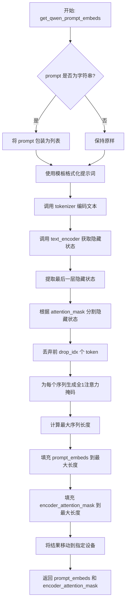

#### 带注释源码

```python
def get_qwen_prompt_embeds(
    text_encoder,  # Qwen2_5_VL 文本编码器模型
    tokenizer,     # Qwen2 分词器
    prompt: str | list[str] = None,                    # 输入提示词
    prompt_template_encode: str = QWENIMAGE_PROMPT_TEMPLATE,        # 提示词模板
    prompt_template_encode_start_idx: int = QWENIMAGE_PROMPT_TEMPLATE_START_IDX,  # 模板起始索引
    tokenizer_max_length: int = 1024,                  # 分词器最大长度
    device: torch.device | None = None,                # 计算设备
):
    # 1. 标准化输入：将字符串转换为列表，统一处理流程
    prompt = [prompt] if isinstance(prompt, str) else prompt

    # 2. 获取模板和起始索引
    template = prompt_template_encode
    drop_idx = prompt_template_encode_start_idx

    # 3. 使用模板格式化每个提示词
    #    例如：template = "描述这个图像: {0}"，prompt = ["一只猫"] -> "描述这个图像: 一只猫"
    txt = [template.format(e) for e in prompt]

    # 4. 调用分词器将文本转换为 token ID 序列
    #    增加 max_length 以预留模板前缀的空间
    txt_tokens = tokenizer(
        txt, 
        max_length=tokenizer_max_length + drop_idx,  # 加上 drop_idx 预留模板前缀位置
        padding=True,                                # 填充到相同长度
        truncation=True,                             # 截断超长序列
        return_tensors="pt"                          # 返回 PyTorch 张量
    ).to(device)  # 移动到指定设备

    # 5. 调用文本编码器获取隐藏状态
    #    output_hidden_states=True 确保返回所有层的隐藏状态
    encoder_hidden_states = text_encoder(
        input_ids=txt_tokens.input_ids,              # token ID 序列
        attention_mask=txt_tokens.attention_mask,    # 注意力掩码
        output_hidden_states=True,                   # 输出所有隐藏层
    )

    # 6. 提取最后一层（最深层）的隐藏状态
    #    这是编码了最丰富语义信息的表示
    hidden_states = encoder_hidden_states.hidden_states[-1]

    # 7. 根据注意力掩码分割隐藏状态
    #    将批量隐藏状态按序列分割为单独的序列
    #    例如：batch=2, seq=512 -> [seq1, seq2]
    split_hidden_states = _extract_masked_hidden(hidden_states, txt_tokens.attention_mask)

    # 8. 丢弃模板前缀部分，只保留实际提示词的嵌入
    #    drop_idx 用于跳过模板添加的前缀 token
    split_hidden_states = [e[drop_idx:] for e in split_hidden_states]

    # 9. 为每个序列生成全1的注意力掩码
    #    因为已经去掉了模板前缀，所有有效 token 都标记为1
    attn_mask_list = [
        torch.ones(e.size(0), dtype=torch.long, device=e.device) 
        for e in split_hidden_states
    ]

    # 10. 计算最大序列长度，用于填充对齐
    max_seq_len = max([e.size(0) for e in split_hidden_states])

    # 11. 填充 prompt_embeds 到最大序列长度
    #     短序列用零向量填充到相同长度，保持批量一致性
    prompt_embeds = torch.stack(
        [torch.cat([u, u.new_zeros(max_seq_len - u.size(0), u.size(1))]) for u in split_hidden_states]
    )

    # 12. 填充注意力掩码到最大序列长度
    encoder_attention_mask = torch.stack(
        [torch.cat([u, u.new_zeros(max_seq_len - u.size(0))]) for u in attn_mask_list]
    )

    # 13. 确保最终结果在指定设备上
    prompt_embeds = prompt_embeds.to(device=device)

    # 14. 返回提示词嵌入和注意力掩码
    return prompt_embeds, encoder_attention_mask
```


### `get_qwen_prompt_embeds_edit`

该函数是 QwenImage 编辑管道的核心组件，负责将文本提示词和图像一起编码为高维文本嵌入向量（prompt_embeds）及其对应的注意力掩码（encoder_attention_mask），供后续图像生成模型使用。

参数：

- `text_encoder`：`Qwen2_5_VLForConditionalGeneration`，Qwen2.5 VL 文本编码器模型，用于生成文本嵌入
- `processor`：`Qwen2VLProcessor`，Qwen2 VL 处理器，用于将文本和图像 tokenize 为模型输入
- `prompt`：`str | list[str]`，要编码的文本提示词，可以是单个字符串或字符串列表
- `image`：`torch.Tensor | None`，要与提示词一起编码的图像张量，支持视觉-语言融合
- `prompt_template_encode`：`str`，提示词模板，默认为 `QWENIMAGE_EDIT_PROMPT_TEMPLATE`，用于格式化输入提示词
- `prompt_template_encode_start_idx`：`int`，模板起始索引，默认为 `QWENIMAGE_EDIT_PROMPT_TEMPLATE_START_IDX`，用于裁剪嵌入
- `device`：`torch.device | None`，计算设备，用于将数据移动到指定设备

返回值：`tuple[torch.Tensor, torch.Tensor]`

- `prompt_embeds`：`torch.Tensor`，形状为 `(batch_size, max_seq_len, hidden_dim)` 的文本嵌入张量
- `encoder_attention_mask`：`torch.Tensor`，形状为 `(batch_size, max_seq_len)` 的注意力掩码，用于指示有效 token 位置

#### 流程图

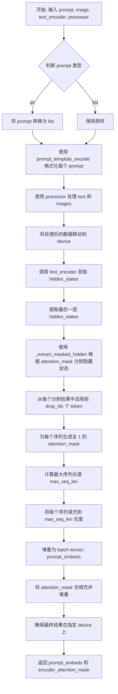

#### 带注释源码

```python
def get_qwen_prompt_embeds_edit(
    text_encoder,
    processor,
    prompt: str | list[str] = None,
    image: torch.Tensor | None = None,
    prompt_template_encode: str = QWENIMAGE_EDIT_PROMPT_TEMPLATE,
    prompt_template_encode_start_idx: int = QWENIMAGE_EDIT_PROMPT_TEMPLATE_START_IDX,
    device: torch.device | None = None,
):
    """
    将文本提示词和图像一起编码为文本嵌入向量及注意力掩码。
    
    Args:
        text_encoder: Qwen2.5 VL 文本编码器模型
        processor: Qwen2 VL 处理器，用于 token 化
        prompt: 输入的文本提示词
        image: 输入的图像张量
        prompt_template_encode: 提示词格式化模板
        prompt_template_encode_start_idx: 模板起始索引，用于裁剪
        device: 计算设备
    
    Returns:
        prompt_embeds: 编码后的文本嵌入
        encoder_attention_mask: 注意力掩码
    """
    # 1. 统一 prompt 为 list 格式，便于批量处理
    prompt = [prompt] if isinstance(prompt, str) else prompt

    # 2. 获取模板和起始索引
    template = prompt_template_encode
    drop_idx = prompt_template_encode_start_idx
    
    # 3. 使用模板格式化每个 prompt
    txt = [template.format(e) for e in prompt]

    # 4. 使用 processor 处理文本和图像，返回模型输入
    #    包括 input_ids, attention_mask, pixel_values, image_grid_thw
    model_inputs = processor(
        text=txt,
        images=image,
        padding=True,
        return_tensors="pt",
    ).to(device)

    # 5. 调用 text_encoder 进行视觉-语言联合编码
    outputs = text_encoder(
        input_ids=model_inputs.input_ids,
        attention_mask=model_inputs.attention_mask,
        pixel_values=model_inputs.pixel_values,
        image_grid_thw=model_inputs.image_grid_thw,
        output_hidden_states=True,
    )

    # 6. 提取最后一层隐藏状态作为嵌入
    hidden_states = outputs.hidden_states[-1]
    
    # 7. 根据 attention_mask 从隐藏状态中提取有效 token 对应的向量
    #    这是一个关键步骤，去除 padding 部分
    split_hidden_states = _extract_masked_hidden(hidden_states, model_inputs.attention_mask)
    
    # 8. 去除模板前缀部分（drop_idx），只保留实际内容
    split_hidden_states = [e[drop_idx:] for e in split_hidden_states]
    
    # 9. 为每个序列创建注意力掩码（全 1 表示有效位置）
    attn_mask_list = [torch.ones(e.size(0), dtype=torch.long, device=e.device) for e in split_hidden_states]
    
    # 10. 计算批次中的最大序列长度，用于填充
    max_seq_len = max([e.size(0) for e in split_hidden_states])
    
    # 11. 将每个序列填充到 max_seq_len 长度，不足部分用零填充
    prompt_embeds = torch.stack(
        [torch.cat([u, u.new_zeros(max_seq_len - u.size(0), u.size(1))]) for u in split_hidden_states]
    )
    
    # 12. 同样将 attention_mask 填充到统一长度
    encoder_attention_mask = torch.stack(
        [torch.cat([u, u.new_zeros(max_seq_len - u.size(0))]) for u in attn_mask_list]
    )

    # 13. 确保最终结果在指定设备上
    prompt_embeds = prompt_embeds.to(device=device)

    return prompt_embeds, encoder_attention_mask
```


### `get_qwen_prompt_embeds_edit_plus`

该函数用于 QwenImage Edit Plus 管道中，将提示词和图像一起编码生成文本嵌入（prompt_embeds）和注意力掩码（encoder_attention_mask）。它支持多图像输入，并通过图像模板和提示词模板对输入进行预处理后送入 VL 文本编码器。

参数：

- `text_encoder`：`Qwen2_5_VLForConditionalGeneration`，Qwen2.5 VL 文本编码器模型
- `processor`：`Qwen2VLProcessor`，用于处理文本和图像的处理器
- `prompt`：`str | list[str] | None`，用户提示词，字符串或字符串列表
- `image`：`torch.Tensor | list[PIL.Image.Image, PIL.Image.Image] | None`，输入图像，支持单张或最多两张图像的列表
- `prompt_template_encode`：`str`，提示词格式化模板，默认值为 `QWENIMAGE_EDIT_PLUS_PROMPT_TEMPLATE`
- `img_template_encode`：`str`，图像占位符模板，默认值为 `QWENIMAGE_EDIT_PLUS_IMG_TEMPLATE`
- `prompt_template_encode_start_idx`：`int`，提示词模板起始索引，用于裁剪嵌入，默认值为 `QWENIMAGE_EDIT_PLUS_PROMPT_TEMPLATE_START_IDX`
- `device`：`torch.device | None`，计算设备

返回值：`tuple[torch.Tensor, torch.Tensor]`，返回提示词嵌入（prompt_embeds）和编码器注意力掩码（encoder_attention_mask）

#### 流程图

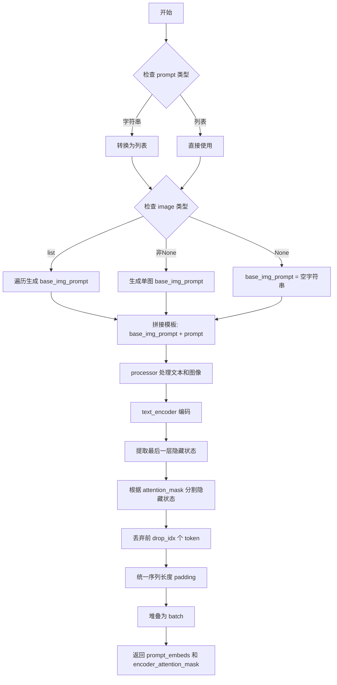

#### 带注释源码

```python
def get_qwen_prompt_embeds_edit_plus(
    text_encoder,
    processor,
    prompt: str | list[str] = None,
    image: torch.Tensor | list[PIL.Image.Image, PIL.Image.Image] | None = None,
    prompt_template_encode: str = QWENIMAGE_EDIT_PLUS_PROMPT_TEMPLATE,
    img_template_encode: str = QWENIMAGE_EDIT_PLUS_IMG_TEMPLATE,
    prompt_template_encode_start_idx: int = QWENIMAGE_EDIT_PLUS_PROMPT_TEMPLATE_START_IDX,
    device: torch.device | None = None,
):
    # 统一 prompt 为列表格式，便于批量处理
    prompt = [prompt] if isinstance(prompt, str) else prompt
    
    # 处理图像模板：根据图像数量生成对应的图像占位符
    if isinstance(image, list):
        # 多图情况：为每张图片生成 <img_1>, <img_2> 等占位符
        base_img_prompt = ""
        for i, img in enumerate(image):
            base_img_prompt += img_template_encode.format(i + 1)
    elif image is not None:
        # 单图情况：生成 <img_1> 占位符
        base_img_prompt = img_template_encode.format(1)
    else:
        # 无图情况：空字符串
        base_img_prompt = ""

    # 获取提示词模板
    template = prompt_template_encode

    # 计算需要丢弃的模板 token 数量（模板前缀部分）
    drop_idx = prompt_template_encode_start_idx
    
    # 将图像占位符与用户提示词拼接后进行模板格式化
    txt = [template.format(base_img_prompt + e) for e in prompt]

    # 使用 processor 将文本和图像转换为模型输入格式
    model_inputs = processor(
        text=txt,
        images=image,
        padding=True,
        return_tensors="pt",
    ).to(device)
    
    # 通过文本编码器获取隐藏状态
    outputs = text_encoder(
        input_ids=model_inputs.input_ids,
        attention_mask=model_inputs.attention_mask,
        pixel_values=model_inputs.pixel_values,
        image_grid_thw=model_inputs.image_grid_thw,
        output_hidden_states=True,
    )

    # 获取最后一层隐藏状态
    hidden_states = outputs.hidden_states[-1]
    
    # 根据 attention_mask 提取有效 token 的隐藏状态（去除 padding 部分）
    split_hidden_states = _extract_masked_hidden(hidden_states, model_inputs.attention_mask)
    
    # 丢弃模板前缀部分，只保留实际内容
    split_hidden_states = [e[drop_idx:] for e in split_hidden_states]
    
    # 为每个序列创建全 1 的注意力掩码（因为 padding 已被移除）
    attn_mask_list = [torch.ones(e.size(0), dtype=torch.long, device=e.device) for e in split_hidden_states]
    
    # 找到最长序列长度，用于 padding 对齐
    max_seq_len = max([e.size(0) for e in split_hidden_states])
    
    # 将不同长度的序列 padding 到相同长度，并堆叠成 batch
    prompt_embeds = torch.stack(
        [torch.cat([u, u.new_zeros(max_seq_len - u.size(0), u.size(1))]) for u in split_hidden_states]
    )
    encoder_attention_mask = torch.stack(
        [torch.cat([u, u.new_zeros(max_seq_len - u.size(0))]) for u in attn_mask_list]
    )

    # 确保结果张量在指定设备上
    prompt_embeds = prompt_embeds.to(device=device)
    return prompt_embeds, encoder_attention_mask
```


### `retrieve_latents`

从 VAE 编码器输出中提取潜在表示（latents），支持通过采样模式（sample）或 argmax 模式从潜在分布中获取样本，也可以直接返回预计算的潜在向量。

参数：

- `encoder_output`：`torch.Tensor`，VAE 编码器的输出对象，通常包含 `latent_dist` 属性（潜在分布）或 `latents` 属性（预计算的潜在向量）
- `generator`：`torch.Generator | None`，可选的随机数生成器，用于确定性采样
- `sample_mode`：`str`，采样模式，默认为 `"sample"`；可选 `"argmax"` 表示取分布的众数

返回值：`torch.Tensor`，提取出的潜在表示张量

#### 流程图

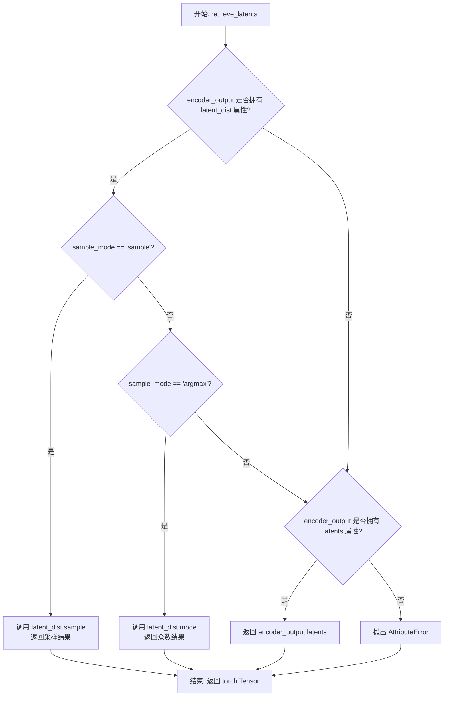

#### 带注释源码

```
# 从 Stable Diffusion img2img 管道中复制
def retrieve_latents(
    encoder_output: torch.Tensor,  # VAE 编码器输出，包含潜在分布或潜在向量
    generator: torch.Generator | None = None,  # 随机生成器，用于确定性采样
    sample_mode: str = "sample"  # 采样模式: "sample" 或 "argmax"
):
    # 情况1: 编码器输出包含 latent_dist 属性，且使用 sample 模式
    if hasattr(encoder_output, "latent_dist") and sample_mode == "sample":
        # 从潜在分布中采样，返回潜在向量
        return encoder_output.latent_dist.sample(generator)
    
    # 情况2: 编码器输出包含 latent_dist 属性，且使用 argmax 模式
    elif hasattr(encoder_output, "latent_dist") and sample_mode == "argmax":
        # 取潜在分布的众数（最大值对应的点）
        return encoder_output.latent_dist.mode()
    
    # 情况3: 编码器输出直接包含 latents 属性
    elif hasattr(encoder_output, "latents"):
        # 直接返回预计算的潜在向量
        return encoder_output.latents
    
    # 错误情况: 无法从 encoder_output 中获取潜在表示
    else:
        raise AttributeError("Could not access latents of provided encoder_output")
```


### `encode_vae_image`

该函数是 QwenImage 管道中的 VAE 图像编码器，负责将预处理后的图像张量编码为潜在空间表示（latents）。它支持批量图像处理，通过 VAE 模型编码图像，并根据配置的均值和标准差对潜在表示进行标准化归一化处理。

参数：

- `image`：`torch.Tensor`，输入的预处理图像张量，要求为 4D（batch, channels, height, width）或 5D（batch, channels, frames, height, width）张量
- `vae`：`AutoencoderKLQwenImage`，用于编码图像的 VAE 模型实例
- `generator`：`torch.Generator` 或 `list[torch.Generator]`，随机数生成器，用于确定性生成，若为列表则需与批次大小匹配
- `device`：`torch.device`，计算设备（CPU/CUDA）
- `dtype`：`torch.dtype`，计算数据类型（如 torch.float16）
- `latent_channels`：`int`，潜在空间的通道数，默认为 16
- `sample_mode`：`str`，采样模式，可选 "sample"（随机采样）或 "argmax"（取均值），默认为 "argmax"

返回值：`torch.Tensor`，编码并归一化后的图像潜在表示，形状为 (batch, latent_channels, [1], height/8, width/8)

#### 流程图

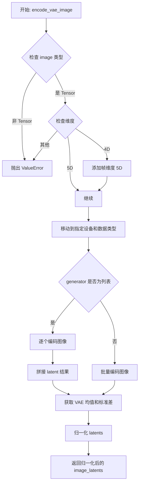

#### 带注释源码

```
def encode_vae_image(
    image: torch.Tensor,                # 输入：预处理后的图像张量（4D 或 5D）
    vae: AutoencoderKLQwenImage,         # VAE 编码器模型
    generator: torch.Generator,         # 随机数生成器（支持单个或列表）
    device: torch.device,                # 目标设备
    dtype: torch.dtype,                 # 目标数据类型
    latent_channels: int = 16,         # 潜在通道数（默认 16）
    sample_mode: str = "argmax",        # 采样模式："sample" 或 "argmax"
):
    # 1. 类型检查：确保输入是 PyTorch 张量
    if not isinstance(image, torch.Tensor):
        raise ValueError(f"Expected image to be a tensor, got {type(image)}.")

    # 2. 维度处理：VAE 编码要求 4D 或 5D 张量
    #    4D: (B, C, H, W) -> 扩展为 5D: (B, C, 1, H, W)
    #    5D: (B, C, F, H, W) 用于视频/多帧场景
    if image.dim() == 4:
        image = image.unsqueeze(2)  # 在通道后添加帧维度
    elif image.dim() != 5:
        raise ValueError(f"Expected image dims 4 or 5, got {image.dim()}.")

    # 3. 设备与类型转换：将图像数据移至指定计算设备和精度
    image = image.to(device=device, dtype=dtype)

    # 4. VAE 编码：处理单图或批量图像
    if isinstance(generator, list):
        # 批量生成器模式：逐个编码并拼接结果
        image_latents = [
            retrieve_latents(
                vae.encode(image[i : i + 1]),      # 编码单张图像
                generator=generator[i],           # 对应随机种子
                sample_mode=sample_mode            # 采样策略
            )
            for i in range(image.shape[0])        # 遍历批次
        ]
        # 沿批次维度拼接所有 latents
        image_latents = torch.cat(image_latents, dim=0)
    else:
        # 单生成器模式：批量编码
        image_latents = retrieve_latents(
            vae.encode(image),
            generator=generator,
            sample_mode=sample_mode
        )

    # 5. 归一化处理：使用 VAE 预定义的均值和标准差进行标准化
    #    将潜在表示转换为标准正态分布（均值 0，方差 1）
    latents_mean = (
        torch.tensor(vae.config.latents_mean)      # 从 VAE 配置读取均值
        .view(1, latent_channels, 1, 1, 1)         #  reshape 为 (1, 16, 1, 1, 1)
        .to(image_latents.device, image_latents.dtype)  # 移至目标设备
    )
    latents_std = (
        torch.tensor(vae.config.latents_std)       # 从 VAE 配置读取标准差
        .view(1, latent_channels, 1, 1, 1)         # reshape 为 (1, 16, 1, 1, 1)
        .to(image_latents.device, image_latents.dtype)  # 移至目标设备
    )
    # Z-score 标准化：(x - mean) / std
    image_latents = (image_latents - latents_mean) / latents_std

    return image_latents  # 返回归一化后的潜在表示
```


### `QwenImageEditResizeStep.description`

返回 `QwenImageEditResizeStep` 类的描述属性，说明该类的功能。

参数： 无（这是一个属性 getter，没有输入参数）

返回值：`str`，返回该类的描述字符串，说明图像调整大小步骤的功能是将图像调整到目标区域同时保持宽高比。

#### 流程图

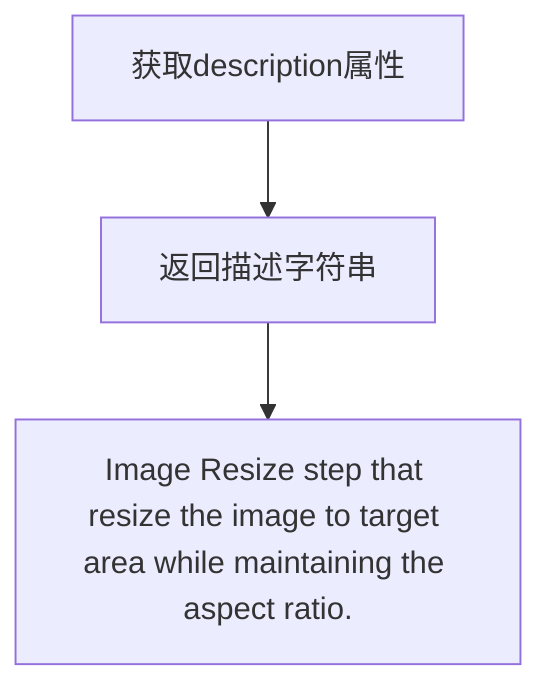

#### 带注释源码

```python
@property
def description(self) -> str:
    """
    获取该管道块的描述信息。
    
    这是一个属性方法（property），用于描述当前管道块的功能。
    在模块化管道（ModularPipeline）中，此描述用于文档生成和日志记录。
    
    Returns:
        str: 描述字符串，说明该步骤是图像调整大小步骤，
             将图像调整到目标区域同时保持宽高比。
    """
    return "Image Resize step that resize the image to target area while maintaining the aspect ratio."
```


### `QwenImageEditResizeStep.expected_components`

该属性方法定义了 `QwenImageEditResizeStep` 所需的组件规范，返回一个包含图像调整大小处理器的组件规范列表。

参数： 无（该方法为属性方法，无显式参数）

返回值：`list[ComponentSpec]`，返回该步骤所需的组件规范列表，当前包含 `image_resize_processor` 组件

#### 流程图

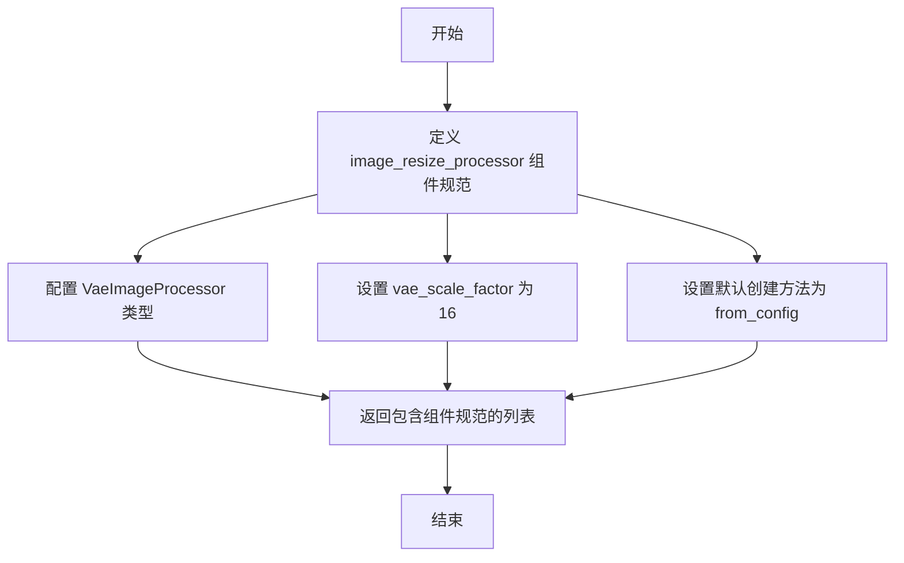

#### 带注释源码

```python
@property
def expected_components(self) -> list[ComponentSpec]:
    """
    定义该管道块所需的组件规范。
    
    返回一个列表，包含该步骤需要从配置中加载的组件。
    对于图像调整大小步骤，只需要一个 VaeImageProcessor 组件。
    
    Returns:
        list[ComponentSpec]: 组件规范列表
    """
    return [
        ComponentSpec(
            "image_resize_processor",           # 组件名称
            VaeImageProcessor,                   # 组件类型
            config=FrozenDict({"vae_scale_factor": 16}),  # 组件配置
            default_creation_method="from_config",        # 默认创建方法
        ),
    ]
```


### `QwenImageEditResizeStep.inputs`

该属性方法定义了在 QwenImage 编辑管道中图像调整大小步骤的输入参数。它返回一个包含输入参数的列表，用于接收待处理的原始图像。

参数：

- 无传统参数（属性方法，通过 `self` 访问类实例）

返回值：`list[InputParam]`，输入参数列表，包含了该步骤需要接收的外部输入定义

#### 流程图

```mermaid
flowchart TD
    A[开始: 访问 inputs 属性] --> B[返回 InputParam 列表]
    B --> C[列表包含: image 参数]
    C --> D[参数来源于 InputParam.template]
    D --> E[结束: 返回 list[InputParam]]
```

#### 带注释源码

```python
@property
def inputs(self) -> list[InputParam]:
    """
    定义 QwenImageEditResizeStep 的输入参数。
    
    Returns:
        list[InputParam]: 包含输入参数的列表，目前只有一个 'image' 参数，
                         允许接收单个图像或图像列表作为待调整大小的输入。
    """
    # 使用 InputParam.template 创建模板化的输入参数
    # "image" 是参数名称，模板会自动从管道状态中获取同名属性
    return [InputParam.template("image")]
```

#### 相关说明

- **所属类**: `QwenImageEditResizeStep`
- **方法类型**: 属性方法（@property）
- **输入参数详情**:
  - `image`: 类型为 `Image | list[Image]`，即支持单个 PIL 图像或图像列表
  - 该参数为模板参数，管道执行时会从 `PipelineState.block_state` 中获取同名属性
- **用途**: 此输入定义用于模块化管道系统，让框架知道该步骤需要从外部接收什么数据


### `QwenImageEditResizeStep.intermediate_outputs`

这是一个属性方法（Property），定义了 `QwenImageEditResizeStep` 类的中间输出参数。该属性返回一个包含 `OutputParam` 的列表，描述了该步骤产生的中间结果，即调整大小后的图像列表。

参数： （该方法为属性方法，无显式参数，隐式参数为 `self`）

-  `self`：`QwenImageEditResizeStep` 实例，类型为 `QwenImageEditResizeStep`，表示调用该属性的类实例本身

返回值：`list[OutputParam]` ，返回调整大小后的图像输出参数列表。该列表包含一个 `OutputParam` 对象，其中：
- `name` 为 `resized_image`，表示输出的变量名
- `type_hint` 为 `list[PIL.Image.Image]`，表示返回的是 PIL 图像列表
- `description` 为 `"The resized images"`，描述返回的图像为调整大小后的图像

#### 流程图

```mermaid
flowchart TD
    A[QwenImageEditResizeStep.intermediate_outputs] --> B{Property Getter}
    B --> C[Return list of OutputParam]
    C --> D[OutputParam: name='resized_image']
    C --> E[OutputParam: type_hint=list[PIL.Image.Image]]
    C --> F[OutputParam: description='The resized images']
```

#### 带注释源码

```python
@property
def intermediate_outputs(self) -> list[OutputParam]:
    """
    定义该步骤的中间输出参数。
    
    该属性返回一个列表，包含一个 OutputParam 对象，描述了该步骤产生的
    调整大小后的图像输出。
    
    Returns:
        list[OutputParam]: 返回包含 OutputParam 的列表，
                          描述该步骤的中间输出（resized_image）
    """
    return [
        OutputParam(
            name="resized_image",
            type_hint=list[PIL.Image.Image],
            description="The resized images",
        ),
    ]
```


### QwenImageEditResizeStep.__call__

该方法是 QwenImage 编辑流水线的图像缩放步骤，用于将输入图像调整到目标面积（1024x1024）同时保持宽高比，为后续的 VL 编码和 VAE 编码准备合适尺寸的图像。

参数：

- `self`：隐式参数，类实例本身
- `components`：`QwenImageModularPipeline`，流水线组件容器，包含 `image_resize_processor` 等组件
- `state`：`PipelineState`，流水线的当前状态，包含输入图像和处理过程中的中间结果

返回值：`tuple[QwenImageModularPipeline, PipelineState]`，返回更新后的组件和状态对象，其中状态对象中包含 `resized_image`（缩放后的图像列表）

#### 流程图

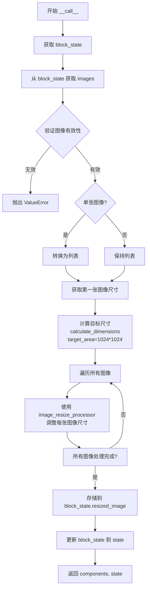

#### 带注释源码

```python
@torch.no_grad()  # 禁用梯度计算以节省内存和计算资源
def __call__(self, components: QwenImageModularPipeline, state: PipelineState):
    """
    执行图像缩放操作，将输入图像调整到目标面积（1024x1024）同时保持宽高比。
    
    参数:
        components: 流水线组件容器，提供 image_resize_processor 等组件
        state: 流水线状态，包含输入图像和中间结果
    
    返回:
        更新后的 components 和 state
    """
    # 从当前流水线状态中获取该步骤对应的块状态
    block_state = self.get_block_state(state)

    # 获取输入图像（可能为单张图像或图像列表）
    images = block_state.image

    # 验证图像是否为有效的图像类型或图像列表
    if not is_valid_image_imagelist(images):
        raise ValueError(f"Images must be image or list of images but are {type(images)}")

    # 如果是单张图像，转换为列表以便统一处理
    if is_valid_image(images):
        images = [images]

    # 获取第一张图像的尺寸（假设所有图像尺寸相同）
    image_width, image_height = images[0].size
    
    # 计算目标尺寸：目标面积 1024*1024=1048576，基于原始图像宽高比
    # calculate_dimensions 返回 (计算后的宽度, 计算后的高度, 缩放因子)
    calculated_width, calculated_height, _ = calculate_dimensions(1024 * 1024, image_width / image_height)

    # 遍历所有图像，使用 image_resize_processor 进行缩放
    resized_images = [
        components.image_resize_processor.resize(
            image, 
            height=calculated_height, 
            width=calculated_width
        )
        for image in images
    ]

    # 将缩放后的图像存储到块状态中
    block_state.resized_image = resized_images
    
    # 更新流水线状态
    self.set_block_state(state, block_state)
    
    # 返回更新后的组件和状态
    return components, state
```


### `QwenImageLayeredResizeStep.description`

获取该流水线块的描述信息，用于说明该步骤的功能。

参数： 无

返回值：`str`，返回该流水线块的描述字符串，说明该步骤用于将图像调整到用户指定的目标区域（由 resolution 参数定义），同时保持图像的宽高比。

#### 流程图

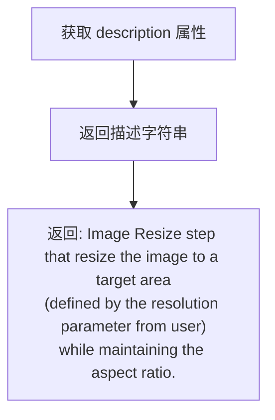

#### 带注释源码

```python
@property
def description(self) -> str:
    """
    获取该流水线块的描述信息。
    
    该属性返回一个字符串，描述 QwenImageLayeredResizeStep 流水线块的功能：
    将输入图像调整到用户指定的目标区域（由 resolution 参数定义，通常为 640 或 1024），
    同时保持图像的原始宽高比。
    
    Returns:
        str: 描述该步骤功能的字符串
    """
    return "Image Resize step that resize the image to a target area (defined by the resolution parameter from user) while maintaining the aspect ratio."
```


### `QwenImageLayeredResizeStep.expected_components`

该属性定义了 `QwenImageLayeredResizeStep` 类在执行图像缩放步骤时所需依赖的组件规范。它返回一个包含图像缩放处理器的组件列表，用于在分层流水线中调整输入图像的尺寸。

参数：
- （无参数，这是一个属性）

返回值：`list[ComponentSpec]`，返回该步骤所需组件的规范列表，当前包含一个 `VaeImageProcessor` 类型的图像缩放处理器组件。

#### 流程图

```mermaid
flowchart TD
    A[调用 expected_components 属性] --> B[返回 ComponentSpec 列表]
    B --> C[image_resize_processor: VaeImageProcessor]
    C --> D[config: FrozenDict{vae_scale_factor: 16}]
    C --> E[default_creation_method: from_config]
```

#### 带注释源码

```python
@property
def expected_components(self) -> list[ComponentSpec]:
    """
    定义该流水线步骤所需的组件列表。
    
    Returns:
        list[ComponentSpec]: 包含所需组件规范的列表。
            - image_resize_processor: VaeImageProcessor 实例，用于调整图像尺寸
              - config: FrozenDict 配置，包含 vae_scale_factor=16
              - default_creation_method: 'from_config' 表示从配置创建组件
    """
    return [
        ComponentSpec(
            "image_resize_processor",  # 组件名称
            VaeImageProcessor,         # 组件类型
            config=FrozenDict({"vae_scale_factor": 16}),  # 组件配置
            default_creation_method="from_config",       # 默认创建方式
        ),
    ]
```

#### 相关类信息

| 名称 | 类型 | 描述 |
|------|------|------|
| `QwenImageLayeredResizeStep` | 类 | 分层图像流水线的图像缩放步骤模块 |
| `ComponentSpec` | 类 | 组件规范定义类，用于描述流水线组件的元信息 |
| `VaeImageProcessor` | 类 | VAE图像处理器，用于图像的预处理和缩放 |
| `FrozenDict` | 类 | 不可变字典，用于存储配置信息 |


### `QwenImageLayeredResizeStep.inputs`

该属性定义了 `QwenImageLayeredResizeStep` 类的输入参数列表，描述了该图像调整大小步骤所需接受的输入参数，包括图像和分辨率参数。

参数：

-  `image`：`InputParam`，使用模板创建的图像输入参数，支持单个图像或图像列表
-  `resolution`：`int`，目标分辨率，默认为 640，可选值为 1024 或 640

返回值：`list[InputParam]`，返回包含所有输入参数的列表

#### 流程图

```mermaid
flowchart TD
    A[inputs 属性被调用] --> B[返回 InputParam 列表]
    B --> C[包含 image 参数]
    B --> D[包含 resolution 参数]
    
    C --> C1[模板参数<br/>name: image<br/>required: True<br/>type_hint: Image | list]
    
    D --> D1[自定义参数<br/>name: resolution<br/>default: 640<br/>type_hint: int<br/>description: The target area to resize the image to<br/>can be 1024 or 640]
```

#### 带注释源码

```python
@property
def inputs(self) -> list[InputParam]:
    """
    定义该步骤的输入参数列表。
    
    该属性返回两个输入参数：
    1. image: 来自模板的图像参数，支持单个PIL.Image.Image或图像列表
    2. resolution: 自定义分辨率参数，指定目标调整区域，支持640或1024
    
    Returns:
        list[InputParam]: 包含所有输入参数的列表
    """
    return [
        # 模板参数：从PipelineState中获取名为"image"的输入
        # 支持类型：PIL.Image.Image 或 list[PIL.Image.Image]
        InputParam.template("image"),
        
        # 自定义参数：目标分辨率，用于计算调整后的图像尺寸
        # 默认值为640，可选值为640或1024
        # 用于控制输出图像的目标面积（resolution * resolution）
        InputParam(
            name="resolution",
            default=640,
            type_hint=int,
            description="The target area to resize the image to, can be 1024 or 640",
        ),
    ]
```


### `QwenImageLayeredResizeStep.intermediate_outputs`

该属性定义了 `QwenImageLayeredResizeStep` 类的中间输出参数，指定了该图像调整大小步骤产生的输出结果。

参数：
- 无（这是一个属性，不是方法，因此没有输入参数）

返回值：`list[OutputParam]` ，返回包含输出参数规范的列表，定义了该步骤产生的中间结果。

#### 流程图

```mermaid
flowchart TD
    A[定义 intermediate_outputs 属性] --> B[返回 OutputParam 列表]
    B --> C[包含一个 OutputParam: resized_image]
    C --> D[类型提示: list[PIL.Image.Image]]
    D --> E[描述: 调整大小后的图像列表]
```

#### 带注释源码

```python
@property
def intermediate_outputs(self) -> list[OutputParam]:
    """
    定义该管道步骤的中间输出参数。
    
    该属性返回一个列表，包含该步骤产生的所有输出参数。
    对于 QwenImageLayeredResizeStep 步骤，输出为调整大小后的图像列表。
    
    Returns:
        list[OutputParam]: 包含输出参数规范的列表，当前包含一个参数:
            - resized_image: 调整大小后的图像列表
    """
    return [
        OutputParam(
            name="resized_image",
            type_hint=list[PIL.Image.Image],
            description="The resized images",
        )
    ]
```

#### 详细说明

| 项目 | 详情 |
|------|------|
| **名称** | `QwenImageLayeredResizeStep.intermediate_outputs` |
| **类型** | 属性（Property） |
| **所属类** | `QwenImageLayeredResizeStep` |
| **返回类型** | `list[OutputParam]` |
| **输出参数名称** | `resized_image` |
| **输出参数类型** | `list[PIL.Image.Image]` |
| **输出参数描述** | 调整大小后的图像列表（The resized images） |
| **用途** | 定义模块化管道中该步骤的输出接口，供后续步骤使用 |
| **调用时机** | 当需要获取该步骤的输出规范时由管道系统调用 |


### `QwenImageLayeredResizeStep.check_inputs`

验证输入的分辨率参数是否合法，确保分辨率只能是 1024 或 640。

参数：

- `resolution`：`int`，用户输入的目标分辨率值，用于确定图像调整大小的目标区域

返回值：`None`，无返回值。该方法通过抛出 ValueError 异常来处理无效输入。

#### 流程图

```mermaid
flowchart TD
    A[开始 check_inputs] --> B{resolution in [1024, 640]?}
    B -->|是| C[通过验证 - 返回 None]
    B -->|否| D[抛出 ValueError 异常]
    D --> E[错误信息: Resolution must be 1024 or 640]
```

#### 带注释源码

```python
@staticmethod
def check_inputs(resolution: int):
    """
    检查输入的分辨率是否合法。
    
    Args:
        resolution (int): 目标分辨率值，应为 1024 或 640
        
    Raises:
        ValueError: 如果 resolution 不是 1024 或 640
    """
    # 检查分辨率是否在允许的列表 [1024, 640] 中
    if resolution not in [1024, 640]:
        # 如果不合法，抛出详细的 ValueError 异常
        raise ValueError(f"Resolution must be 1024 or 640 but is {resolution}")
```


### `QwenImageLayeredResizeStep.__call__`

该方法是 QwenImageLayeredResizeStep 类的核心调用方法，负责将输入图像调整到指定的目标区域（由 resolution 参数定义），同时保持图像的宽高比。该方法从 PipelineState 中获取图像和分辨率参数，验证输入有效性，计算符合目标区域和原图宽高比的尺寸，然后使用 image_resize_processor 对图像进行 resize，最后将结果存储回 PipelineState 并返回。

参数：

- `self`：类的实例方法隐式参数，表示 QwenImageLayeredResizeStep 类的实例
- `components: QwenImageModularPipeline`，包含模块化管道组件的容器对象，提供对 image_resize_processor 等组件的访问
- `state: PipelineState`，管道状态对象，用于存储和传递管道执行过程中的中间状态（如图像、分辨率、resize 结果等）

返回值：`tuple[QwenImageModularPipeline, PipelineState]`，返回更新后的组件和状态对象，其中 state.block_state.resized_image 包含调整大小后的图像列表

#### 流程图

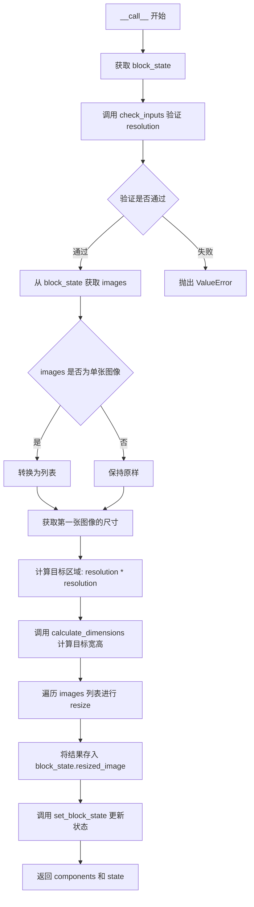

#### 带注释源码

```python
@torch.no_grad()  # 禁用梯度计算，用于推理阶段，提升性能和减少内存占用
def __call__(self, components: QwenImageModularPipeline, state: PipelineState):
    # 从 PipelineState 中获取当前 block 的状态对象
    block_state = self.get_block_state(state)

    # 静态方法：验证 resolution 参数是否为有效值（必须是 1024 或 640）
    self.check_inputs(resolution=block_state.resolution)

    # 从 block_state 中获取输入图像
    images = block_state.image

    # 验证 images 是否为有效的图像或图像列表类型
    if not is_valid_image_imagelist(images):
        raise ValueError(f"Images must be image or list of images but are {type(images)}")

    # 如果是单张图像，转换为列表以便统一处理
    if is_valid_image(images):
        images = [images]

    # 获取第一张图像的原始宽高
    image_width, image_height = images[0].size

    # 计算目标面积：resolution 的平方（如 640*640=409600 或 1024*1024=1048576）
    target_area = block_state.resolution * block_state.resolution

    # 计算保持宽高比的目标宽高尺寸，calculate_dimensions 返回 (width, height, scale_factor)
    calculated_width, calculated_height, _ = calculate_dimensions(target_area, image_width / image_height)

    # 使用 VaeImageProcessor 对每张图像进行 resize 操作
    resized_images = [
        components.image_resize_processor.resize(image, height=calculated_height, width=calculated_width)
        for image in images
    ]

    # 将 resize 后的图像列表存储到 block_state 的 resized_image 字段中
    block_state.resized_image = resized_images

    # 将更新后的 block_state 写回 PipelineState
    self.set_block_state(state, block_state)

    # 返回更新后的 components 和 state，供下一个管道步骤使用
    return components, state
```


### `QwenImageEditPlusResizeStep.description`

该属性方法用于返回 QwenImage Edit Plus 管道中图像调整大小步骤的描述信息，说明该步骤会产生两种尺寸的调整后图像：用于 VAE 编码的 1024x1024 图像和用于 VL 文本编码的 384x384 图像，每个图像根据其各自的宽高比独立调整大小。

参数： 无（仅包含隐式参数 `self`）

返回值：`str`，返回该管道块的描述字符串

#### 流程图

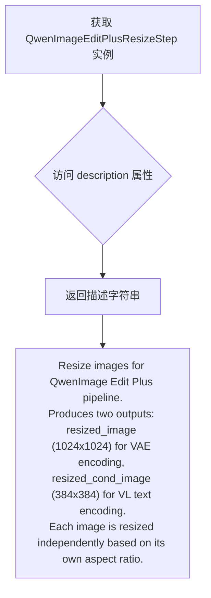

#### 带注释源码

```python
@property
def description(self) -> str:
    """
    返回 QwenImage Edit Plus 管道中图像调整大小步骤的描述信息。
    
    该描述说明了该步骤的核心功能：
    1. 为 VAE 编码调整图像到 1024x1024 目标区域
    2. 为 VL 文本编码调整图像到 384x384 目标区域
    3. 每个图像根据其各自的宽高比独立进行调整
    
    Returns:
        str: 描述该管道块功能的字符串
    """
    return (
        "Resize images for QwenImage Edit Plus pipeline.\n"
        "Produces two outputs: resized_image (1024x1024) for VAE encoding, "
        "resized_cond_image (384x384) for VL text encoding.\n"
        "Each image is resized independently based on its own aspect ratio."
    )
```


### `QwenImageEditPlusResizeStep.expected_components`

该属性方法定义了 QwenImage Edit Plus 管道中图像调整大小步骤所需的组件规范。它返回一个包含 `image_resize_processor` 组件的列表，该组件用于将图像调整到不同的目标尺寸以供后续的 VAE 编码器和 VL 文本编码器使用。

参数： 无（这是一个属性方法，仅包含 `self` 参数）

返回值：`list[ComponentSpec]` ，返回一个 ComponentSpec 对象列表，定义了管道所需的图像调整大小处理器组件。

#### 流程图

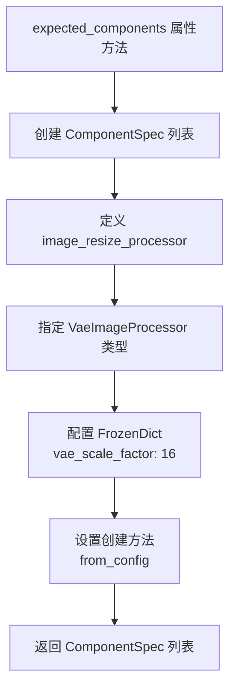

#### 带注释源码

```python
@property
def expected_components(self) -> list[ComponentSpec]:
    """
    定义并返回该管道步骤所需的组件规范列表。
    
    该方法创建一个包含单个组件规范的列表，指定了图像调整大小处理器所需的配置。
    
    Returns:
        list[ComponentSpec]: 包含一个 ComponentSpec 对象的列表，描述了所需的 image_resize_processor 组件
    """
    return [
        ComponentSpec(
            "image_resize_processor",  # 组件名称
            VaeImageProcessor,          # 组件类型：用于图像处理的 VAE 图像处理器
            config=FrozenDict({         # 组件配置参数
                "vae_scale_factor": 16  # VAE 缩放因子，用于潜在空间与像素空间之间的转换
            }),
            default_creation_method="from_config",  # 默认创建方式：从配置中创建组件
        ),
    ]
```


### `QwenImageEditPlusResizeStep.inputs`

该属性方法定义了 `QwenImageEditPlusResizeStep` 类的输入参数列表，用于指定该管道步骤所接受的输入参数。

参数：

- 无显式输入参数（通过 `InputParam.template("image")` 模板从外部获取名为 "image" 的输入）

返回值：`list[InputParam]`，返回一个包含输入参数规范的列表，当前包含一个模板参数 "image"

#### 流程图

```mermaid
flowchart TD
    A[开始: inputs 属性调用] --> B{检查模板参数}
    B -->|使用 InputParam.template| C[返回包含 image 参数的列表]
    C --> D[结束: list[InputParam]]
    
    style A fill:#f9f,stroke:#333
    style D fill:#9f9,stroke:#333
```

#### 带注释源码

```python
@property
def inputs(self) -> list[InputParam]:
    """
    定义该管道步骤的输入参数规范。
    
    该属性返回一个包含 InputParam 对象的列表，描述了 QwenImageEditPlusResizeStep
    步骤所接受的输入参数。使用模板机制从外部 PipelineState 中获取参数。
    
    Returns:
        list[InputParam]: 输入参数列表，当前包含一个模板参数 "image"
    """
    # image
    # 使用 InputParam.template 创建模板参数 "image"
    # 这样该步骤会从外部 PipelineState 中获取名为 "image" 的输入参数
    return [InputParam.template("image")]
```


### `QwenImageEditPlusResizeStep.intermediate_outputs`

该属性定义了 QwenImageEditPlusResizeStep 类的中间输出参数，包含两个输出：resized_image（用于 VAE 编码的 1024x1024 图像）和 resized_cond_image（用于 VL 文本编码的 384x384 图像）。

参数： 无（该属性为属性方法，无输入参数）

返回值：`list[OutputParam]`，返回包含两个 OutputParam 对象的列表，分别描述 resized_image 和 resized_cond_image

#### 流程图

```mermaid
flowchart TD
    A[intermediate_outputs property] --> B{Return list of OutputParam}
    B --> C[OutputParam: resized_image]
    B --> D[OutputParam: resized_cond_image]
    C --> C1[type_hint: list[PIL.Image.Image]]
    C --> C2[description: Images resized to 1024x1024 target area for VAE encoding]
    D --> D1[type_hint: list[PIL.Image.Image]]
    D --> D2[description: Images resized to 384x384 target area for VL text encoding]
```

#### 带注释源码

```python
@property
def intermediate_outputs(self) -> list[OutputParam]:
    """
    定义该处理步骤的中间输出参数。
    
    返回一个包含两个 OutputParam 的列表：
    1. resized_image: 用于 VAE 编码的调整大小后的图像（目标区域 1024x1024）
    2. resized_cond_image: 用于 VL 文本编码的调整大小后的图像（目标区域 384x384）
    
    Returns:
        list[OutputParam]: 包含两个输出参数的列表，分别对应 VAE 编码和 VL 文本编码的图像
    """
    return [
        OutputParam(
            name="resized_image",
            type_hint=list[PIL.Image.Image],
            description="Images resized to 1024x1024 target area for VAE encoding",
        ),
        OutputParam(
            name="resized_cond_image",
            type_hint=list[PIL.Image.Image],
            description="Images resized to 384x384 target area for VL text encoding",
        ),
    ]
```


### `QwenImageEditPlusResizeStep.__call__`

该方法为 QwenImage Edit Plus pipeline 调整图像尺寸，根据每个图像的宽高比独立调整，生成两个输出：用于 VAE 编码的 1024x1024 目标区域图像（resized_image）和用于 VL 文本编码的 384x384 目标区域图像（resized_cond_image）。

参数：

- `self`：`QwenImageEditPlusResizeStep` 实例本身
- `components`：`QwenImageModularPipeline`，模块化管道组件容器，包含 `image_resize_processor` 等组件
- `state`：`PipelineState`，管道状态对象，包含当前 block 的状态信息（如 `image`）

返回值：`tuple[QwenImageModularPipeline, PipelineState]`，返回更新后的组件和状态对象

#### 流程图

```mermaid
flowchart TD
    A[开始 __call__] --> B[获取 block_state]
    B --> C[从 block_state 获取 images]
    C --> D{验证图像列表是否合法<br>is_valid_image_imagelist?}
    D -->|否| E[抛出 ValueError]
    D -->|是| F{单个图像?<br>is_valid_image?}
    F -->|是| G[转换为图像列表]
    F -->|否| H[保持图像列表]
    G --> I[遍历每个图像]
    H --> I
    I --> J[获取当前图像尺寸<br>image_width, image_height]
    J --> K[计算 VAE 编码目标尺寸<br>1024*1024 面积]
    K --> L[调用 resize 调整图像到 vae 尺寸]
    L --> M[计算 VL 文本编码目标尺寸<br>384*384 面积]
    M --> N[调用 resize 调整图像到 vl 尺寸]
    N --> O{还有更多图像?}
    O -->|是| I
    O -->|否| P[保存 resized_images 到 block_state]
    P --> Q[保存 resized_cond_images 到 block_state]
    Q --> R[更新 block_state 到 state]
    R --> S[返回 components, state]
```

#### 带注释源码

```python
@torch.no_grad()
def __call__(self, components: QwenImageModularPipeline, state: PipelineState):
    """
    执行图像调整大小操作，为 QwenImage Edit Plus pipeline 准备两种尺寸的图像。
    
    Args:
        components: 模块化管道组件容器
        state: 管道状态对象
    
    Returns:
        更新后的 components 和 state
    """
    # 从 state 中获取当前 block 的状态
    block_state = self.get_block_state(state)

    # 从 block 状态中获取输入图像
    images = block_state.image

    # 验证图像是否为有效的图像或图像列表
    if not is_valid_image_imagelist(images):
        raise ValueError(f"Images must be image or list of images but are {type(images)}")

    # 如果是单个图像，转换为列表以便统一处理
    if is_valid_image(images):
        images = [images]

    # 初始化两个列表分别存储不同用途的调整后图像
    resized_images = []         # 用于 VAE 编码 (1024x1024)
    resized_cond_images = []    # 用于 VL 文本编码 (384x384)
    
    # 遍历每个图像，根据各自的宽高比独立调整大小
    for image in images:
        # 获取当前图像的原始尺寸
        image_width, image_height = image.size

        # === 为 VAE 编码器计算目标尺寸 (1024x1024 目标区域) ===
        # 计算保持宽高比的目标宽度和高度，面积约为 1024*1024
        vae_width, vae_height, _ = calculate_dimensions(1024 * 1024, image_width / image_height)
        # 使用 image_resize_processor 调整图像到计算出的 VAE 尺寸
        resized_images.append(
            components.image_resize_processor.resize(image, height=vae_height, width=vae_width)
        )

        # === 为 VL 文本编码器计算目标尺寸 (384x384 目标区域) ===
        # 计算保持宽高比的目标宽度和高度，面积约为 384*384
        vl_width, vl_height, _ = calculate_dimensions(384 * 384, image_width / image_height)
        # 使用 image_resize_processor 调整图像到计算出的 VL 尺寸
        resized_cond_images.append(
            components.image_resize_processor.resize(image, height=vl_height, width=vl_width)
        )

    # 将调整后的图像存储到 block_state 中
    block_state.resized_image = resized_images       # 1024x1024 用于 VAE 编码
    block_state.resized_cond_image = resized_cond_images  # 384x384 用于 VL 文本编码
    
    # 将更新后的 block_state 写回 state
    self.set_block_state(state, block_state)
    
    # 返回更新后的组件和状态
    return components, state
```


### `QwenImageLayeredGetImagePromptStep.__init__`

该方法是 `QwenImageLayeredGetImagePromptStep` 类的初始化方法，负责设置图像标题提示模板（英文和中文）并调用父类构造函数。

参数：无

返回值：无

#### 流程图

```mermaid
flowchart TD
    A[__init__ 开始] --> B[设置 image_caption_prompt_en]
    B --> C[设置 image_caption_prompt_cn]
    C --> D[调用 super().__init__]
    D --> E[__init__ 结束]
```

#### 带注释源码

```python
def __init__(self):
    # 设置英文图像标题提示模板
    # 该模板用于引导视觉语言模型生成英文图像描述
    self.image_caption_prompt_en = QWENIMAGE_LAYERED_CAPTION_PROMPT_EN
    
    # 设置中文图像标题提示模板
    # 该模板用于引导视觉语言模型生成中文图像描述
    self.image_caption_prompt_cn = QWENIMAGE_LAYERED_CAPTION_PROMPT_CN
    
    # 调用父类 ModularPipelineBlocks 的构造函数
    # 负责初始化基类所需的资源和状态
    super().__init__()
```


### `QwenImageLayeredGetImagePromptStep.description`

这是 `QwenImageLayeredGetImagePromptStep` 类的属性方法，用于返回该步骤的描述信息。

参数：无（这是一个属性方法，没有输入参数）

返回值：`str`，返回该步骤的功能描述字符串

#### 流程图

```mermaid
flowchart TD
    A[description 属性] --> B[返回描述字符串]
    
    B --> C1[自动字幕步骤]
    B --> C2[如果未提供提示则从输入图像生成文本提示]
    B --> C3[使用VL模型生成图像描述]
    B --> C4[如果已提供提示则保持不变]
    
    style C1 fill:#e1f5fe
    style C2 fill:#e1f5fe
    style C3 fill:#e1f5fe
    style C4 fill:#e1f5fe
```

#### 带注释源码

```python
@property
def description(self) -> str:
    """
    属性方法，返回该步骤的描述信息
    
    Returns:
        str: 描述字符串，包含以下内容：
             1. 自动字幕步骤说明
             2. 如果未提供提示则从输入图像生成文本提示
             3. 使用VL模型(text_encoder)生成图像描述
             4. 如果已提供提示则此步骤保持不变
    """
    return (
        "Auto-caption step that generates a text prompt from the input image if none is provided.\n"
        "Uses the VL model (text_encoder) to generate a description of the image.\n"
        "If prompt is already provided, this step passes through unchanged."
    )
```


### QwenImageLayeredGetImagePromptStep.expected_components

该属性定义了 `QwenImageLayeredGetImagePromptStep` 类所需的关键组件。它返回两个组件规范：用于图像描述生成的 `text_encoder`（Qwen2_5_VLForConditionalGeneration 模型）和用于处理输入的 `processor`（Qwen2VLProcessor）。

参数：无（这是一个属性，不接受外部参数）

返回值：`list[ComponentSpec]`，包含两个组件规范的列表，用于定义该步骤所需的关键组件。

#### 流程图

```mermaid
flowchart TD
    A[expected_components property] --> B{Return Component List}
    B --> C[ComponentSpec: text_encoder]
    B --> D[ComponentSpec: processor]
    
    C --> C1[Type: Qwen2_5_VLForConditionalGeneration]
    D --> D1[Type: Qwen2VLProcessor]
    
    style C fill:#e1f5fe
    style D fill:#e1f5fe
    style C1 fill:#b3e5fc
    style D1 fill:#b3e5fc
```

#### 带注释源码

```python
@property
def expected_components(self) -> list[ComponentSpec]:
    """
    定义该步骤所需的关键组件。
    
    该方法返回一个组件规范列表，包含：
    1. text_encoder: Qwen2_5_VLForConditionalGeneration 模型，用于生成图像描述
    2. processor: Qwen2VLProcessor，用于处理文本和图像输入
    
    Returns:
        list[ComponentSpec]: 包含两个组件规范的列表
    """
    return [
        ComponentSpec("text_encoder", Qwen2_5_VLForConditionalGeneration),
        ComponentSpec("processor", Qwen2VLProcessor),
    ]
```

#### 组件说明

| 组件名称 | 类型 | 描述 |
|---------|------|------|
| text_encoder | Qwen2_5_VLForConditionalGeneration | Qwen2.5 视觉语言模型，用于根据图像生成文本描述（自动标注功能） |
| processor | Qwen2VLProcessor | Qwen2 VL 处理器，用于将文本和图像转换为模型输入格式 |

#### 关键设计说明

1. **组件依赖**：该步骤依赖于视觉语言模型（VL）来生成图像描述，体现了"自动标注"（Auto-caption）的核心功能
2. **可选性**：只有当用户未提供 prompt 时，才会调用这些组件生成图像描述
3. **国际化支持**：支持中英文提示模板（通过 `use_en_prompt` 参数控制），相应的提示模板在 `__init__` 中初始化


### `QwenImageLayeredGetImagePromptStep.inputs`

该属性定义了 `QwenImageLayeredGetImagePromptStep` 类的输入参数列表，用于描述该步骤需要从流水线状态中获取哪些输入参数。

参数：

-  `prompt`：`str | list[str] | None`，可选（非必需），这是用于引导图像生成的提示词或提示词列表。与其他流水线不同，qwenimage-layered 流水线不强制要求提供 prompt，如果没有提供将自动从图像生成 caption
-  `resized_image`：`PIL.Image.Image`，必需，这是用于生成 caption 的图像，应该已经通过 resize 步骤调整大小
-  `use_en_prompt`：`bool`，可选（默认为 False），是否使用英文提示词模板

返回值：`list[InputParam]`，返回一个包含所有输入参数的列表，每个 `InputParam` 对象描述一个输入参数的名称、类型、默认值和描述

#### 流程图

```mermaid
flowchart TD
    A[inputs 属性] --> B[定义输入参数列表]
    
    B --> C[prompt: 模板参数, 非必需]
    B --> D[resized_image: 图像参数, 必需]
    B --> E[use_en_prompt: 布尔参数, 默认False]
    
    C --> F[返回 InputParam 列表]
    D --> F
    E --> F
    
    F --> G[用于描述步骤所需的所有输入参数]
```

#### 带注释源码

```python
@property
def inputs(self) -> list[InputParam]:
    """
    定义该步骤的输入参数列表。
    
    返回一个包含三个输入参数的列表：
    1. prompt - 引导图像生成的提示词（可选）
    2. resized_image - 需要生成 caption 的图像（必需）
    3. use_en_prompt - 是否使用英文提示词模板（可选，默认 False）
    
    Returns:
        list[InputParam]: 输入参数列表
    """
    return [
        # 模板参数 prompt，非必需（与其他流水线不同，qwenimage-layered 不强制要求提供 prompt）
        InputParam.template(
            "prompt", required=False
        ),
        # resized_image 必需参数，类型为 PIL.Image.Image，描述图像已通过 resize 步骤调整大小
        InputParam(
            name="resized_image",
            required=True,
            type_hint=PIL.Image.Image,
            description="The image to generate caption from, should be resized use the resize step",
        ),
        # use_en_prompt 布尔参数，控制是否使用英文提示词模板
        InputParam(
            name="use_en_prompt",
            default=False,
            type_hint=bool,
            description="Whether to use English prompt template",
        ),
    ]
```


### `QwenImageLayeredGetImagePromptStep.intermediate_outputs`

该属性是 `QwenImageLayeredGetImagePromptStep` 类中的一个属性，用于定义该步骤的中间输出参数。它返回该步骤生成的结果，即生成的提示文本（prompt）。

参数： 无（这是一个属性而非方法，没有传统意义上的参数）

返回值：`list[OutputParam]`，返回一个包含 `OutputParam` 对象的列表，定义了步骤的输出参数

#### 流程图

```mermaid
flowchart TD
    A[QwenImageLayeredGetImagePromptStep.intermediate_outputs] --> B[定义输出参数列表]
    B --> C[OutputParam: name='prompt', type_hint=str]
    C --> D[返回 list[OutputParam]]
```

#### 带注释源码

```python
@property
def intermediate_outputs(self) -> list[OutputParam]:
    """
    定义该步骤的中间输出参数。
    
    该属性返回一个列表，包含该Pipeline步骤将产生的输出参数信息。
    对于QwenImageLayeredGetImagePromptStep步骤，输出为生成的文本提示。
    
    Returns:
        list[OutputParam]: 包含输出参数规范的列表
            - prompt: str类型，图像生成引导提示词。如果未提供，则使用图像标题更新
    """
    return [
        OutputParam(
            name="prompt",
            type_hint=str,
            description="The prompt or prompts to guide image generation. If not provided, updated using image caption",
        ),
    ]
```


### `QwenImageLayeredGetImagePromptStep.__call__`

该方法是 Qwen-Image 分层管道的自动字幕步骤，用于在用户未提供 prompt 时利用视觉语言模型从输入图像生成文本描述。如果用户已提供有效 prompt，则该步骤直接跳过处理。

参数：

- `self`：`QwenImageLayeredGetImagePromptStep` 实例本身
- `components`：`QwenImageModularPipeline`，管道组件容器，包含 text_encoder 和 processor 等模型实例
- `state`：`PipelineState`，管道状态对象，用于在各步骤间传递数据

返回值：`tuple[QwenImageModularPipeline, PipelineState]`，返回更新后的组件和状态对象

#### 流程图

```mermaid
flowchart TD
    A[开始 __call__] --> B[获取 block_state]
    B --> C{检查 prompt 是否为空}
    C -->|是| D[根据 use_en_prompt 选择 caption_prompt]
    C -->|否| H[跳过处理]
    D --> E[使用 processor 处理图像和 caption_prompt]
    E --> F[调用 text_encoder.generate 生成文本]
    F --> G[解码生成的 token 并去除 prompt 部分]
    G --> I[将生成的文本设置为 block_state.prompt]
    H --> J[设置 block_state 到 state]
    I --> J
    J --> K[返回 components 和 state]
```

#### 带注释源码

```python
@torch.no_grad()  # 禁用梯度计算以减少内存占用
def __call__(self, components: QwenImageModularPipeline, state: PipelineState) -> PipelineState:
    """
    执行自动字幕生成步骤
    
    当用户未提供 prompt 时，使用视觉语言模型为输入图像生成文本描述。
    生成的描述将作为后续图像生成的引导文本。
    """
    # 从管道状态中获取当前步骤的块状态
    block_state = self.get_block_state(state)

    # 获取执行设备（CPU 或 GPU）
    device = components._execution_device

    # 如果 prompt 为空或 None 或仅包含空格，则需要从图像生成字幕
    if block_state.prompt is None or block_state.prompt == "" or block_state.prompt == " ":
        # 根据语言设置选择中文或英文的 caption 提示模板
        if block_state.use_en_prompt:
            caption_prompt = self.image_caption_prompt_en
        else:
            caption_prompt = self.image_caption_prompt_cn

        # 使用 Qwen2VLProcessor 将图像和文本提示转换为模型输入张量
        model_inputs = components.processor(
            text=caption_prompt,
            images=block_state.resized_image,
            padding=True,
            return_tensors="pt",
        ).to(device)

        # 调用视觉语言模型生成描述文本
        generated_ids = components.text_encoder.generate(**model_inputs, max_new_tokens=512)
        
        # 去除输入 prompt 部分，只保留模型新生成的内容
        generated_ids_trimmed = [
            out_ids[len(in_ids) :] for in_ids, out_ids in zip(model_inputs.input_ids, generated_ids)
        ]
        
        # 解码生成的 token 序列为文本字符串
        output_text = components.processor.batch_decode(
            generated_ids_trimmed, skip_special_tokens=True, clean_up_tokenization_spaces=False
        )[0]

        # 将生成的文本描述设置为 block_state 的 prompt
        block_state.prompt = output_text.strip()

    # 将更新后的 block_state 写回管道 state
    self.set_block_state(state, block_state)
    
    # 返回组件和状态供下一步骤使用
    return components, state
```


### QwenImageTextEncoderStep.__init__

`QwenImageTextEncoderStep` 的初始化方法，用于初始化文本编码步骤的配置参数，包括提示词模板、模板起始索引和分词器最大长度。

参数：
- 无显式参数（通过继承 `ModularPipelineBlocks` 获取基础初始化）

返回值：
- 无返回值（`__init__` 方法返回 `None`）

#### 流程图

```mermaid
flowchart TD
    A[开始 __init__] --> B[设置 prompt_template_encode = QWENIMAGE_PROMPT_TEMPLATE]
    B --> C[设置 prompt_template_encode_start_idx = QWENIMAGE_PROMPT_TEMPLATE_START_IDX]
    C --> D[设置 tokenizer_max_length = 1024]
    D --> E[调用 super().__init__ 初始化父类]
    E --> F[结束]
```

#### 带注释源码

```python
def __init__(self):
    # 设置提示词模板，用于编码时的格式化
    # QWENIMAGE_PROMPT_TEMPLATE 是预定义的提示词模板
    self.prompt_template_encode = QWENIMAGE_PROMPT_TEMPLATE
    
    # 设置提示词模板的起始索引，用于跳过模板中的固定前缀
    # QWENIMAGE_PROMPT_TEMPLATE_START_IDX 是预定义的起始索引值
    self.prompt_template_encode_start_idx = QWENIMAGE_PROMPT_TEMPLATE_START_IDX
    
    # 设置分词器的最大长度，限制提示词编码的最大token数
    self.tokenizer_max_length = 1024
    
    # 调用父类 ModularPipelineBlocks 的初始化方法
    # 完成基础组件的初始化设置
    super().__init__()
```


### `QwenImageTextEncoderStep.description`

该属性返回对 QwenImageTextEncoderStep 类的功能描述，说明该步骤用于生成文本嵌入以引导图像生成。

参数：無（该方法为属性，无显式参数）

返回值：`str`，返回该步骤的功能描述文本

#### 流程图

```mermaid
flowchart TD
    A[获取 description 属性] --> B{是否首次访问}
    B -->|是| C[执行 property getter]
    B -->|否| D[返回缓存的描述]
    C --> E[返回描述字符串: 'Text Encoder step that generates text embeddings to guide the image generation.']
    E --> F[流程结束]
```

#### 带注释源码

```python
@property
def description(self) -> str:
    """
    属性描述符，用于获取该步骤的功能描述。
    
    该属性返回 QwenImageTextEncoderStep 类的描述信息，
    说明该步骤的核心功能是生成文本嵌入以引导图像生成过程。
    
    Returns:
        str: 描述文本，说明该步骤的作用
    """
    return "Text Encoder step that generates text embeddings to guide the image generation."
```

---

#### 补充信息

**所属类信息**：`QwenImageTextEncoderStep` 继承自 `ModularPipelineBlocks`，是 QwenImage 模块化管道系统中的文本编码步骤。

**类功能概述**：`QwenImageTextEncoderStep` 负责将文本提示（prompt）转换为模型可用的嵌入向量（embeddings），支持正向提示和负向提示（negative prompt）的编码，并生成相应的注意力掩码（attention mask），为后续的图像生成过程提供文本条件引导。

**关键组件**：
- `text_encoder`：Qwen2_5_VLForConditionalGeneration 模型
- `tokenizer`：Qwen2Tokenizer 分词器
- `guider`：ClassifierFreeGuidance 引导器


### `QwenImageTextEncoderStep.expected_components`

该属性定义了 QwenImage 文本编码步骤所需的核心组件规范，包括文本编码器（Qwen2_5_VLForConditionalGeneration）、分词器（Qwen2Tokenizer）和无分类器引导器（ClassifierFreeGuidance），用于生成引导图像生成的文本嵌入。

参数：

- 该方法为属性方法，无显式参数

返回值：`list[ComponentSpec]`，返回组件规范列表，包含文本编码器、分词器和引导器三个组件的规格说明

#### 流程图

```mermaid
flowchart TD
    A[QwenImageTextEncoderStep.expected_components] --> B[返回 ComponentSpec 列表]
    B --> C[text_encoder: Qwen2_5_VLForConditionalGeneration]
    B --> D[tokenizer: Qwen2Tokenizer]
    B --> E[guider: ClassifierFreeGuidance]
    
    C --> C1[description: The text encoder to use]
    D --> D1[description: The tokenizer to use]
    E --> E1[config: FrozenDict guidance_scale=4.0]
    E --> E2[default_creation_method: from_config]
```

#### 带注释源码

```python
@property
def expected_components(self) -> list[ComponentSpec]:
    """
    定义文本编码步骤所需的核心组件。
    
    返回组件规范列表，包含:
    - text_encoder: Qwen2_5_VLForConditionalGeneration 模型，用于生成文本嵌入
    - tokenizer: Qwen2Tokenizer 分词器，用于将文本转换为 token
    - guider: ClassifierFreeGuidance 引导器，用于无分类器引导生成
    
    Returns:
        list[ComponentSpec]: 组件规范列表
    """
    return [
        # 文本编码器组件：使用 Qwen2.5 VL 模型进行文本编码
        ComponentSpec(
            "text_encoder", 
            Qwen2_5_VLForConditionalGeneration, 
            description="The text encoder to use"
        ),
        # 分词器组件：使用 Qwen2 分词器处理文本输入
        ComponentSpec(
            "tokenizer", 
            Qwen2Tokenizer, 
            description="The tokenizer to use"
        ),
        # 引导器组件：用于分类器自由引导，默认 guidance_scale 为 4.0
        # 从配置创建，使用 from_config 方法实例化
        ComponentSpec(
            "guider",
            ClassifierFreeGuidance,
            config=FrozenDict({"guidance_scale": 4.0}),
            default_creation_method="from_config",
        ),
    ]
```


### QwenImageTextEncoderStep.inputs

该属性定义了文本编码步骤的输入参数，包括提示词、负面提示词和最大序列长度。

参数：

-  `prompt`：InputParam（模板参数），提示词，用于指导图像生成
-  `negative_prompt`：InputParam（模板参数），负面提示词，用于指导图像生成的否定条件
-  `max_sequence_length`：InputParam（模板参数），整型，默认值为 1024，提示词编码的最大序列长度

返回值：`list[InputParam]` - 返回输入参数列表

#### 流程图

```mermaid
flowchart TD
    A[inputs 属性] --> B[定义 prompt 输入参数]
    A --> C[定义 negative_prompt 输入参数]
    A --> D[定义 max_sequence_length 输入参数]
    B --> E[返回 InputParam 列表]
    C --> E
    D --> E
```

#### 带注释源码

```python
@property
def inputs(self) -> list[InputParam]:
    """
    定义文本编码步骤的输入参数。
    
    Returns:
        list[InputParam]: 包含三个输入参数的列表：
            - prompt: 引导图像生成的提示词
            - negative_prompt: 不引导图像生成的提示词
            - max_sequence_length: 提示词编码的最大序列长度，默认1024
    """
    return [
        InputParam.template("prompt"),
        InputParam.template("negative_prompt"),
        InputParam.template("max_sequence_length", default=1024),
    ]
```


### `QwenImageTextEncoderStep.intermediate_outputs`

该属性定义了QwenImageTextEncoderStep类的中间输出参数，包括文本嵌入、注意力掩码以及对应的负向提示嵌入和掩码，用于后续图像生成步骤。

参数：无（这是一个属性方法，不接受参数）

返回值：`list[OutputParam]`，返回文本编码步骤的中间输出参数列表，包含prompt_embeds、prompt_embeds_mask、negative_prompt_embeds和negative_prompt_embeds_mask

#### 流程图

```mermaid
flowchart TD
    A[开始] --> B[返回OutputParam列表]
    B --> C[prompt_embeds]
    B --> D[prompt_embeds_mask]
    B --> E[negative_prompt_embeds]
    B --> F[negative_prompt_embeds_mask]
    C --> G[结束]
    D --> G
    E --> G
    F --> G
```

#### 带注释源码

```python
@property
def intermediate_outputs(self) -> list[OutputParam]:
    """
    定义该步骤的中间输出参数。
    
    返回一个包含四个OutputParam的列表：
    - prompt_embeds: 提示词的嵌入向量
    - prompt_embeds_mask: 提示词的注意力掩码
    - negative_prompt_embeds: 负向提示词的嵌入向量
    - negative_prompt_embeds_mask: 负向提示词的注意力掩码
    
    Returns:
        list[OutputParam]: 中间输出参数列表
    """
    return [
        OutputParam.template("prompt_embeds"),
        OutputParam.template("prompt_embeds_mask"),
        OutputParam.template("negative_prompt_embeds"),
        OutputParam.template("negative_prompt_embeds_mask"),
    ]
```


### `QwenImageTextEncoderStep.check_inputs`

静态方法，用于验证文本编码器输入参数的有效性。

参数：

- `prompt`：`str | list`，用户提供的提示词，可以是单个字符串或字符串列表
- `negative_prompt`：`str | list | None`，可选的负面提示词，用于指导模型避免生成相关内容
- `max_sequence_length`：`int | None`，可选的最大序列长度参数

返回值：`None`，该方法仅进行参数验证，不返回任何值。如果验证失败，将抛出 `ValueError` 异常。

#### 流程图

```mermaid
graph TD
    A[开始 check_inputs] --> B{prompt 是 str 或 list?}
    B -->|否| C[抛出 ValueError: prompt 类型错误]
    B -->|是| D{negative_prompt 不为 None<br/>且不是 str 或 list?}
    D -->|是| E[抛出 ValueError: negative_prompt 类型错误]
    D -->|否| F{max_sequence_length 不为 None<br/>且大于 1024?}
    F -->|是| G[抛出 ValueError: max_sequence_length 超出限制]
    F -->|否| H[验证通过]
    C --> I[结束]
    E --> I
    G --> I
    H --> I
```

#### 带注释源码

```python
@staticmethod
def check_inputs(prompt, negative_prompt, max_sequence_length):
    # 验证 prompt 参数类型：必须是字符串或字符串列表
    if not isinstance(prompt, str) and not isinstance(prompt, list):
        raise ValueError(f"`prompt` has to be of type `str` or `list` but is {type(prompt)}")

    # 验证 negative_prompt 参数类型：如果提供了该参数，必须是字符串或字符串列表
    if (
        negative_prompt is not None
        and not isinstance(negative_prompt, str)
        and not isinstance(negative_prompt, list)
    ):
        raise ValueError(f"`negative_prompt` has to be of type `str` or `list` but is {type(negative_prompt)}")

    # 验证 max_sequence_length 参数：必须不超过 1024
    if max_sequence_length is not None and max_sequence_length > 1024:
        raise ValueError(f"`max_sequence_length` cannot be greater than 1024 but is {max_sequence_length}")
```


### `QwenImageTextEncoderStep.__call__`

该方法是 QwenImage 管道中的文本编码步骤，负责将文本提示（prompt）转换为文本嵌入向量（prompt embeddings）和注意力掩码（attention mask），以指导图像生成过程。该步骤同时支持正向提示和负向提示（negative prompt）的嵌入计算，并可处理分类器自由引导（Classifier-Free Guidance）所需的非条件嵌入。

参数：

-  `self`：隐式参数，QwenImageTextEncoderStep 类的实例
-  `components`：`QwenImageModularPipeline`，管道组件对象，包含 text_encoder、tokenizer、guider 等模型组件
-  `state`：`PipelineState`，管道状态对象，包含 prompt、negative_prompt、max_sequence_length 等输入参数以及 prompt_embeds、prompt_embeds_mask 等输出结果

返回值：`tuple[QwenImageModularPipeline, PipelineState]`，返回更新后的管道组件和状态对象，其中状态对象中的 prompt_embeds、prompt_embeds_mask、negative_prompt_embeds、negative_prompt_embeds_mask 已被填充

#### 流程图

```mermaid
flowchart TD
    A[开始 __call__] --> B[获取 block_state]
    B --> C[获取执行设备 device]
    C --> D[调用 check_inputs 验证输入]
    D --> E[调用 get_qwen_prompt_embeds 生成正向提示嵌入]
    E --> F[裁剪 prompt_embeds 至 max_sequence_length]
    F --> G[裁剪 prompt_embeds_mask 至 max_sequence_length]
    G --> H[初始化 negative_prompt_embeds 为 None]
    H --> I{requires_unconditional_embeds?}
    I -->|是| J[获取负向提示或空字符串]
    J --> K[调用 get_qwen_prompt_embeds 生成负向嵌入]
    K --> L[裁剪 negative_prompt_embeds 至 max_sequence_length]
    L --> M[裁剪 negative_prompt_embeds_mask 至 max_sequence_length]
    I -->|否| N[保持 negative_prompt_embeds 为 None]
    M --> O[更新 block_state]
    N --> O
    O --> P[设置 block_state 到 state]
    P --> Q[返回 components 和 state]
```

#### 带注释源码

```python
@torch.no_grad()
def __call__(self, components: QwenImageModularPipeline, state: PipelineState):
    """
    执行文本编码步骤，将提示转换为嵌入向量
    
    参数:
        components: 管道组件对象，包含 text_encoder、tokenizer 等
        state: 管道状态对象
    
    返回:
        更新后的 components 和 state
    """
    # 从状态对象中获取当前块的状态
    block_state = self.get_block_state(state)

    # 获取执行设备（CPU 或 GPU）
    device = components._execution_device
    
    # 验证输入参数的有效性
    # 检查 prompt、negative_prompt 和 max_sequence_length 的类型和范围
    self.check_inputs(block_state.prompt, block_state.negative_prompt, block_state.max_sequence_length)

    # 调用 get_qwen_prompt_embeds 函数生成正向提示的嵌入向量和注意力掩码
    # 该函数内部使用 text_encoder 和 tokenizer 处理提示文本
    block_state.prompt_embeds, block_state.prompt_embeds_mask = get_qwen_prompt_embeds(
        components.text_encoder,
        components.tokenizer,
        prompt=block_state.prompt,
        prompt_template_encode=self.prompt_template_encode,
        prompt_template_encode_start_idx=self.prompt_template_encode_start_idx,
        tokenizer_max_length=self.tokenizer_max_length,
        device=device,
    )

    # 将 prompt_embeds 裁剪到用户指定的最大序列长度
    block_state.prompt_embeds = block_state.prompt_embeds[:, : block_state.max_sequence_length]
    # 将 prompt_embeds_mask 裁剪到用户指定的最大序列长度
    block_state.prompt_embeds_mask = block_state.prompt_embeds_mask[:, : block_state.max_sequence_length]

    # 初始化负向提示嵌入为 None
    block_state.negative_prompt_embeds = None
    block_state.negative_prompt_embeds_mask = None
    
    # 如果需要非条件嵌入（用于 Classifier-Free Guidance）
    if components.requires_unconditional_embeds:
        # 获取负向提示，如果未提供则使用空字符串
        negative_prompt = block_state.negative_prompt or ""
        
        # 生成负向提示的嵌入向量和注意力掩码
        block_state.negative_prompt_embeds, block_state.negative_prompt_embeds_mask = get_qwen_prompt_embeds(
            components.text_encoder,
            components.tokenizer,
            prompt=negative_prompt,
            prompt_template_encode=self.prompt_template_encode,
            prompt_template_encode_start_idx=self.prompt_template_encode_start_idx,
            tokenizer_max_length=self.tokenizer_max_length,
            device=device,
        )
        
        # 裁剪负向嵌入到指定的最大序列长度
        block_state.negative_prompt_embeds = block_state.negative_prompt_embeds[
            :, : block_state.max_sequence_length
        ]
        block_state.negative_prompt_embeds_mask = block_state.negative_prompt_embeds_mask[
            :, : block_state.max_sequence_length
        ]

    # 将更新后的块状态写回状态对象
    self.set_block_state(state, block_state)
    return components, state
```


### `QwenImageEditTextEncoderStep.__init__`

初始化文本编码步骤，设置编辑任务所需的提示词模板配置。

参数：
- 无

返回值：`None`，无返回值，仅初始化实例属性

#### 流程图

```mermaid
flowchart TD
    A[开始 __init__] --> B[设置 prompt_template_encode]
    B --> C[设置 prompt_template_encode_start_idx]
    C --> D[调用 super().__init__]
    D --> E[结束]
```

#### 带注释源码

```python
def __init__(self):
    """
    初始化 QwenImageEditTextEncoderStep 类实例。
    
    设置编辑任务专用的提示词模板和模板起始索引，用于后续
    在 __call__ 方法中对 prompt 和 image 进行联合编码处理。
    """
    # 赋值编辑任务专用的提示词模板
    # 用于格式化用户输入的 prompt 以适配 Qwen VL 模型
    self.prompt_template_encode = QWENIMAGE_EDIT_PROMPT_TEMPLATE
    
    # 赋值提示词模板的起始索引
    # 用于在编码后提取有效嵌入时跳过模板前缀部分
    self.prompt_template_encode_start_idx = QWENIMAGE_EDIT_PROMPT_TEMPLATE_START_IDX
    
    # 调用父类 ModularPipelineBlocks 的初始化方法
    # 完成基类属性的初始化工作
    super().__init__()
```


### `QwenImageEditTextEncoderStep.description`

该属性返回对 QwenImageEditTextEncoderStep 类的功能描述，即：处理提示词和图像以生成用于引导图像生成的文本嵌入的文本编码步骤。

参数： 无（该方法为属性，无参数）

返回值： `str`，返回描述文本编码步骤功能的字符串

#### 流程图

```mermaid
flowchart TD
    A[description 属性访问] --> B[返回描述字符串]
    B --> C["Text Encoder step that processes both prompt and image together to generate text embeddings for guiding image generation."]
```

#### 带注释源码

```python
@property
def description(self) -> str:
    """
    返回 QwenImageEditTextEncoderStep 类的功能描述。
    
    该方法是类的一个属性（property），用于提供关于文本编码步骤的简洁说明。
    它返回一个字符串，描述了该步骤的核心功能：同时处理文本提示和图像，
    生成文本嵌入向量以引导图像生成过程。
    
    Returns:
        str: 描述文本编码步骤功能的字符串
    """
    return "Text Encoder step that processes both prompt and image together to generate text embeddings for guiding image generation."
```


### `QwenImageEditTextEncoderStep.expected_components`

该属性方法定义了 `QwenImageEditTextEncoderStep` 类在执行过程中所需依赖的组件规范，包括文本编码器、处理器和引导器。这些组件共同协作以实现将文本提示和图像一起处理并生成用于指导图像生成的文本嵌入向量的功能。

参数： 无直接输入参数（为属性方法，通过类实例访问）

返回值：`list[ComponentSpec]`，返回该步骤所需组件的规范列表，每个元素包含组件名称、类型及配置信息

#### 流程图

```mermaid
flowchart TD
    A[开始] --> B{定义 expected_components 属性}
    B --> C[创建 text_encoder 组件规范]
    C --> D[创建 processor 组件规范]
    D --> E[创建 guider 组件规范]
    E --> F[返回组件规范列表]
    
    subgraph ComponentSpec_1
    C1[ComponentSpec]
    C1 --> C1A[name: text_encoder]
    C1 --> C1B[type: Qwen2_5_VLForConditionalGeneration]
    end
    
    subgraph ComponentSpec_2
    D1[ComponentSpec]
    D1 --> D1A[name: processor]
    D1 --> D1B[type: Qwen2VLProcessor]
    end
    
    subgraph ComponentSpec_3
    E1[ComponentSpec]
    E1 --> E1A[name: guider]
    E1 --> E1B[type: ClassifierFreeGuidance]
    E1 --> E1C[config: guidance_scale=4.0]
    end
```

#### 带注释源码

```python
@property
def expected_components(self) -> list[ComponentSpec]:
    """
    定义该步骤所需依赖的组件规范列表。
    
    该方法返回一个包含三个组件规范的列表：
    1. text_encoder: Qwen2_5_VLForConditionalGeneration 模型，用于生成文本嵌入
    2. processor: Qwen2VLProcessor 处理器，用于预处理文本和图像输入
    3. guider: ClassifierFreeGuidance 引导器，用于无分类器引导生成
    
    Returns:
        list[ComponentSpec]: 组件规范列表，包含名称、类型和配置信息
    """
    return [
        # 文本编码器组件：Qwen2.5 VL 模型，用于将文本和图像编码为向量表示
        ComponentSpec("text_encoder", Qwen2_5_VLForConditionalGeneration),
        # 处理器组件：Qwen2 VL 处理器，用于处理文本提示和图像输入
        ComponentSpec("processor", Qwen2VLProcessor),
        # 引导器组件：分类器自由引导，用于控制生成过程的无条件嵌入
        ComponentSpec(
            "guider",
            ClassifierFreeGuidance,
            # 引导器配置：默认引导系数为 4.0
            config=FrozenDict({"guidance_scale": 4.0}),
            # 从配置创建组件实例
            default_creation_method="from_config",
        ),
    ]
```


### QwenImageEditTextEncoderStep.inputs

该属性定义了 `QwenImageEditTextEncoderStep` 类的输入参数列表，包含了文本提示、负面提示和调整大小后的图像三个输入参数。

参数：

- `prompt`：`str | list[str]`，来自模板的输入参数，表示用于指导图像生成的提示词
- `negative_prompt`：`str | list[str] | None`，来自模板的输入参数，表示不用于指导图像生成的负面提示词
- `resized_image`：`PIL.Image.Image`，必需参数，表示需要编码的图像提示，应使用调整大小步骤进行调整

返回值：无，该属性返回 `list[InputParam]`，不涉及返回值描述

#### 流程图

```mermaid
graph TD
    A[inputs 属性] --> B[InputParam.template prompt]
    A --> C[InputParam.template negative_prompt]
    A --> D[InputParam resized_image]
    
    B --> E[返回输入参数列表]
    C --> E
    D --> E
    
    E --> F[list[InputParam]]
    
    style A fill:#f9f,stroke:#333
    style F fill:#9f9,stroke:#333
```

#### 带注释源码

```python
@property
def inputs(self) -> list[InputParam]:
    """
    定义该步骤的输入参数列表。
    
    返回:
        包含三个 InputParam 的列表，分别对应 prompt、negative_prompt 和 resized_image
    """
    return [
        InputParam.template("prompt"),  # 模板输入：用于指导图像生成的提示词
        InputParam.template("negative_prompt"),  # 模板输入：负面提示词，用于无分类器引导
        InputParam(
            name="resized_image",  # 参数名称
            required=True,  # 必需参数
            type_hint=PIL.Image.Image,  # 参数类型提示
            description="The image prompt to encode, should be resized using resize step",  # 参数描述
        ),
    ]
```


### `QwenImageEditTextEncoderStep.intermediate_outputs`

该属性定义了 `QwenImageEditTextEncoderStep` 类的中间输出，描述了文本编码步骤产生的嵌入向量和注意力掩码，用于引导图像生成过程。

参数：无（这是一个属性方法，无显式参数）

返回值：`list[OutputParam]`，包含四个输出参数：
- `prompt_embeds`：正向提示词的嵌入向量
- `prompt_embeds_mask`：正向提示词的注意力掩码
- `negative_prompt_embeds`：负向提示词的嵌入向量
- `negative_prompt_embeds_mask`：负向提示词的注意力掩码

#### 流程图

```mermaid
flowchart TD
    A[文本编码步骤执行] --> B{是否需要无条件嵌入}
    B -->|是| C[编码负向提示词]
    B -->|否| D[跳过负向嵌入]
    C --> E[设置 negative_prompt_embeds<br/>negative_prompt_embeds_mask]
    D --> E
    A --> F[编码正向提示词<br/>prompt_embeds<br/>prompt_embeds_mask]
    F --> G[返回中间输出列表]
    E --> G
```

#### 带注释源码

```python
@property
def intermediate_outputs(self) -> list[OutputParam]:
    """
    定义该步骤的中间输出参数。
    
    返回一个包含四个 OutputParam 的列表，分别对应：
    - prompt_embeds: 正向提示词的嵌入向量，用于引导图像生成
    - prompt_embeds_mask: 正向提示词的注意力掩码，指示有效token位置
    - negative_prompt_embeds: 负向提示词的嵌入向量，用于 Classifier-Free Guidance
    - negative_prompt_embeds_mask: 负向提示词的注意力掩码
    
    Returns:
        list[OutputParam]: 包含四个输出参数的列表，用于后续的图像生成步骤
    """
    return [
        OutputParam.template("prompt_embeds"),
        OutputParam.template("prompt_embeds_mask"),
        OutputParam.template("negative_prompt_embeds"),
        OutputParam.template("negative_prompt_embeds_mask"),
    ]
```


### `QwenImageEditTextEncoderStep.check_inputs`

该方法是一个静态方法，用于验证 `QwenImageEditTextEncoderStep` 文本编码步骤的输入参数合法性。它检查 `prompt` 和 `negative_prompt` 参数的类型是否符合要求（必须为 `str` 或 `list` 类型），若不符合则抛出 `ValueError` 异常。

参数：

-  `prompt`：`str | list[str]`，需要编码的提示词，支持单个字符串或字符串列表
-  `negative_prompt`：`str | list[str] | None`，用于指导图像生成的负面提示词，可选

返回值：`None`，该方法仅进行输入验证，不返回任何值

#### 流程图

```mermaid
flowchart TD
    A[开始 check_inputs] --> B{prompt 是 str 或 list?}
    B -- 否 --> C[抛出 ValueError: prompt 类型错误]
    B -- 是 --> D{negative_prompt 不为 None 且不是 str 或 list?}
    D -- 是 --> E[抛出 ValueError: negative_prompt 类型错误]
    D -- 否 --> F[验证通过，方法结束]
    C --> G[结束]
    F --> G
```

#### 带注释源码

```python
@staticmethod
def check_inputs(prompt, negative_prompt):
    # 检查 prompt 参数是否为 str 或 list 类型
    if not isinstance(prompt, str) and not isinstance(prompt, list):
        raise ValueError(f"`prompt` has to be of type `str` or `list` but is {type(prompt)}")

    # 检查 negative_prompt 参数（如果提供了的话）是否为 str 或 list 类型
    if (
        negative_prompt is not None
        and not isinstance(negative_prompt, str)
        and not isinstance(negative_prompt, list)
    ):
        raise ValueError(f"`negative_prompt` has to be of type `str` or `list` but is {type(negative_prompt)}")
```


### `QwenImageEditTextEncoderStep.__call__`

该方法是 QwenImage 编辑管道的文本编码步骤，负责将提示词和图像一起处理，生成用于引导图像生成的文本嵌入向量。它调用 `get_qwen_prompt_embeds_edit` 函数对提示词和图像进行联合编码，同时支持条件嵌入和无条件嵌入（用于 Classifier-Free Guidance）。

参数：

- `self`：`QwenImageEditTextEncoderStep`，类的实例自身
- `components`：`QwenImageModularPipeline`，管道组件容器，包含 text_encoder、processor、guider 等组件
- `state`：`PipelineState`，管道状态对象，用于存储中间结果和块状态

返回值：`tuple[QwenImageModularPipeline, PipelineState]`，返回更新后的组件和状态对象

#### 流程图

```mermaid
flowchart TD
    A[开始 __call__] --> B[获取 block_state]
    B --> C{验证输入: check_inputs}
    C -->|验证通过| D[获取执行设备 device]
    C -->|验证失败| E[抛出 ValueError]
    D --> F[调用 get_qwen_prompt_embeds_edit 生成 prompt_embeds 和 prompt_embeds_mask]
    F --> G{requires_unconditional_embeds?}
    G -->|是| H[生成 negative_prompt_embeds 和 negative_prompt_embeds_mask]
    G -->|否| I[设置 negative_prompt_embeds 和 negative_prompt_embeds_mask 为 None]
    H --> J[更新 block_state]
    I --> J
    J --> K[保存 block_state 到 state]
    K --> L[返回 components, state]
```

#### 带注释源码

```python
@torch.no_grad()
def __call__(self, components: QwenImageModularPipeline, state: PipelineState):
    """
    执行文本编码步骤，将提示词和图像一起编码为文本嵌入向量。
    
    Args:
        components: 管道组件容器，包含 text_encoder、processor 等
        state: 管道状态对象
    
    Returns:
        更新后的 components 和 state
    """
    # 从 state 中获取当前块的状态
    block_state = self.get_block_state(state)
    
    # 验证 prompt 和 negative_prompt 的类型合法性
    self.check_inputs(block_state.prompt, block_state.negative_prompt)
    
    # 获取执行设备（CPU 或 GPU）
    device = components._execution_device
    
    # 使用 get_qwen_prompt_embeds_edit 函数编码提示词和图像
    # 生成条件文本嵌入和对应的注意力掩码
    block_state.prompt_embeds, block_state.prompt_embeds_mask = get_qwen_prompt_embeds_edit(
        components.text_encoder,
        components.processor,
        prompt=block_state.prompt,
        image=block_state.resized_image,
        prompt_template_encode=self.prompt_template_encode,
        prompt_template_encode_start_idx=self.prompt_template_encode_start_idx,
        device=device,
    )
    
    # 初始化无条件嵌入为 None
    block_state.negative_prompt_embeds = None
    block_state.negative_prompt_embeds_mask = None
    
    # 如果需要无条件嵌入（用于 Classifier-Free Guidance），则生成负向提示词嵌入
    if components.requires_unconditional_embeds:
        # 如果 negative_prompt 为空或 None，则使用空格作为默认负向提示词
        negative_prompt = block_state.negative_prompt or " "
        # 同样调用编码函数生成无条件嵌入
        block_state.negative_prompt_embeds, block_state.negative_prompt_embeds_mask = get_qwen_prompt_embeds_edit(
            components.text_encoder,
            components.processor,
            prompt=negative_prompt,
            image=block_state.resized_image,
            prompt_template_encode=self.prompt_template_encode,
            prompt_template_encode_start_idx=self.prompt_template_encode_start_idx,
            device=device,
        )
    
    # 将更新后的 block_state 写回 state
    self.set_block_state(state, block_state)
    
    # 返回更新后的组件和状态
    return components, state
```


### `QwenImageEditPlusTextEncoderStep.__init__`

该方法是 `QwenImageEditPlusTextEncoderStep` 类的初始化方法，用于初始化文本编码器步骤的配置参数，包括提示模板、图像模板和模板起始索引。

参数：此方法无显式参数（继承自 `ModularPipelineBlocks`）

返回值：此方法无返回值（`None`）

#### 流程图

```mermaid
flowchart TD
    A[__init__ 方法开始] --> B[设置 prompt_template_encode = QWENIMAGE_EDIT_PLUS_PROMPT_TEMPLATE]
    B --> C[设置 img_template_encode = QWENIMAGE_EDIT_PLUS_IMG_TEMPLATE]
    C --> D[设置 prompt_template_encode_start_idx = QWENIMAGE_EDIT_PLUS_PROMPT_TEMPLATE_START_IDX]
    D --> E[调用 super().__init__ 初始化父类]
    E --> F[__init__ 方法结束]
```

#### 带注释源码

```python
def __init__(self):
    # 设置编辑增强版提示模板，用于格式化用户输入的提示词
    self.prompt_template_encode = QWENIMAGE_EDIT_PLUS_PROMPT_TEMPLATE
    
    # 设置编辑增强版图像模板，用于处理多图像输入
    self.img_template_encode = QWENIMAGE_EDIT_PLUS_IMG_TEMPLATE
    
    # 设置提示模板的起始索引，用于跳过模板中的特定标记
    self.prompt_template_encode_start_idx = QWENIMAGE_EDIT_PLUS_PROMPT_TEMPLATE_START_IDX
    
    # 调用父类 ModularPipelineBlocks 的初始化方法
    super().__init__()
```


### `QwenImageEditPlusTextEncoderStep.description`

这是一个属性方法（property），属于 `QwenImageEditPlusTextEncoderStep` 类。该属性返回对 QwenImage Edit Plus 管道中文本编码步骤的描述，说明该步骤处理提示和多个图像以生成引导图像生成的文本嵌入。

参数：
- 该方法没有显式参数（隐含参数 `self` 是类的实例）

返回值：`str`，返回该步骤的描述字符串

#### 流程图

```mermaid
flowchart TD
    A[获取 description 属性] --> B{方法类型}
    B -->|property| C[返回描述字符串]
    C --> D["Text Encoder step for QwenImage Edit Plus that processes prompt and multiple images together to generate text embeddings for guiding image generation."]
```

#### 带注释源码

```python
@property
def description(self) -> str:
    """
    属性方法：返回 QwenImage Edit Plus 文本编码步骤的描述信息。
    
    该方法继承自 ModularPipelineBlocks 基类，
    用于向框架描述当前步骤的功能和用途。
    
    Args:
        self: 类实例引用（隐式参数）
    
    Returns:
        str: 描述文本编码步骤功能的字符串
    """
    return (
        "Text Encoder step for QwenImage Edit Plus that processes prompt and multiple images together "
        "to generate text embeddings for guiding image generation."
    )
```


### `QwenImageEditPlusTextEncoderStep.expected_components`

该属性定义了 `QwenImageEditPlusTextEncoderStep` 类在执行文本编码步骤时所需的核心组件，包括文本编码器、处理器和引导器。

参数： 无（这是一个属性，不接受外部参数）

返回值： `list[ComponentSpec]` ，返回该步骤所需组件的规范列表，包含文本编码器、处理器和引导器的配置信息。

#### 流程图

```mermaid
flowchart TD
    A[开始] --> B{获取 expected_components}
    B --> C[返回 ComponentSpec 列表]
    
    C --> D1[text_encoder: Qwen2_5_VLForConditionalGeneration]
    C --> D2[processor: Qwen2VLProcessor]
    C --> D3[guider: ClassifierFreeGuidance]
    
    D1 --> E[组件规范定义完成]
    D2 --> E
    D3 --> E
```

#### 带注释源码

```python
@property
def expected_components(self) -> list[ComponentSpec]:
    """
    定义 QwenImageEditPlusTextEncoderStep 所需的核心组件。
    
    该属性返回一个组件规范列表，包含了文本编码步骤所依赖的三个核心组件：
    1. text_encoder: Qwen2_5_VLForConditionalGeneration - 用于处理文本提示的视觉语言模型
    2. processor: Qwen2VLProcessor - 用于预处理文本和图像输入的处理器
    3. guider: ClassifierFreeGuidance - 用于无分类器引导的引导器
    
    Returns:
        list[ComponentSpec]: 包含三个组件规范的列表，分别对应文本编码器、处理器和引导器
    """
    return [
        # 文本编码器组件：Qwen2_5_VLForConditionalGeneration 模型
        ComponentSpec("text_encoder", Qwen2_5_VLForConditionalGeneration),
        
        # 处理器组件：Qwen2VLProcessor，用于处理文本和图像输入
        ComponentSpec("processor", Qwen2VLProcessor),
        
        # 引导器组件：ClassifierFreeGuidance，支持无分类器引导生成
        # 配置了默认的 guidance_scale 为 4.0，并使用 from_config 方法创建
        ComponentSpec(
            "guider",
            ClassifierFreeGuidance,
            config=FrozenDict({"guidance_scale": 4.0}),
            default_creation_method="from_config",
        ),
    ]
```


### `QwenImageEditPlusTextEncoderStep.inputs`

该属性定义了 QwenImage Edit Plus 文本编码步骤的输入参数列表，包含提示词、负提示词和用于 VL 文本编码的调整大小后的条件图像。

参数：

- `prompt`：`str | list[str]`，来自模板的提示词或提示词列表，引导图像生成
- `negative_prompt`：`str | list[str] | None`，不引导图像生成的提示词
- `resized_cond_image`：`torch.Tensor`，需要编码的图像，可以是单个图像或图像列表，应使用调整大小步骤调整为 384x384

返回值：`list[InputParam]`，`InputParam` 对象列表，包含了所有必需的输入参数定义

#### 流程图

```mermaid
flowchart TD
    A["inputs 属性调用"] --> B{返回输入参数列表}
    
    B --> C["prompt: InputParam.template('prompt')"]
    B --> D["negative_prompt: InputParam.template('negative_prompt')"]
    B --> E["resized_cond_image: InputParam<br/>- required: True<br/>- type_hint: torch.Tensor<br/>- description: 用于VL编码的384x384图像"]
    
    C --> F["返回 list[InputParam]"]
    D --> F
    E --> F
    
    style F fill:#90EE90
    style A fill:#87CEEB
```

#### 带注释源码

```python
@property
def inputs(self) -> list[InputParam]:
    """
    定义 QwenImageEditPlusTextEncoderStep 的输入参数。
    
    该属性返回一个包含三个输入参数的列表：
    1. prompt - 引导图像生成的提示词
    2. negative_prompt - 不引导图像生成的提示词（可选）
    3. resized_cond_image - 用于 VL 文本编码的条件图像（必选，需resize到384x384）
    
    Returns:
        list[InputParam]: 输入参数列表，包含提示词、负提示词和条件图像
    """
    return [
        InputParam.template("prompt"),  # 模板输入：从 state 中获取 prompt 参数
        InputParam.template("negative_prompt"),  # 模板输入：从 state 中获取 negative_prompt 参数
        InputParam(
            name="resized_cond_image",  # 参数名称：条件图像
            required=True,  # 必选参数：该参数必须提供，不能为空
            type_hint=torch.Tensor,  # 类型提示：torch.Tensor 类型
            description="The image(s) to encode, can be a single image or list of images, should be resized to 384x384 using resize step",
            # 描述：需要编码的图像，可以是单个图像或列表，应使用resize步骤调整为384x384
        ),
    ]
```


### `QwenImageEditPlusTextEncoderStep.intermediate_outputs`

这是一个属性（Property），定义 QwenImage Edit Plus 文本编码步骤的中间输出，即文本编码器生成的提示嵌入向量和注意力掩码，用于引导图像生成过程。

参数：无（这是一个属性，不是方法）

返回值：`list[OutputParam]`，返回四个 OutputParam 对象，包含 prompt_embeds（正向提示嵌入）、prompt_embeds_mask（正向提示注意力掩码）、negative_prompt_embeds（负向提示嵌入）和 negative_prompt_embeds_mask（负向提示注意力掩码）

#### 流程图

```mermaid
flowchart TD
    A[QwenImageEditPlusTextEncoderStep.intermediate_outputs] --> B[OutputParam: prompt_embeds]
    A --> C[OutputParam: prompt_embeds_mask]
    A --> D[OutputParam: negative_prompt_embeds]
    A --> E[OutputParam: negative_prompt_embeds_mask]
    
    B --> F[Tensor, 文本提示嵌入向量]
    C --> G[Tensor, 文本提示注意力掩码]
    D --> H[Tensor, 负向提示嵌入向量]
    E --> I[Tensor, 负向提示注意力掩码]
```

#### 带注释源码

```python
@property
def intermediate_outputs(self) -> list[OutputParam]:
    """
    定义文本编码步骤的中间输出参数。
    
    返回列表包含四个 OutputParam 对象：
    - prompt_embeds: 正向提示的嵌入向量
    - prompt_embeds_mask: 正向提示的注意力掩码
    - negative_prompt_embeds: 负向提示的嵌入向量
    - negative_prompt_embeds_mask: 负向提示的注意力掩码
    
    这些输出用于后续的图像生成步骤，支持 Classifier-Free Guidance。
    
    Returns:
        list[OutputParam]: 包含四个输出参数的列表
    """
    return [
        OutputParam.template("prompt_embeds"),
        OutputParam.template("prompt_embeds_mask"),
        OutputParam.template("negative_prompt_embeds"),
        OutputParam.template("negative_prompt_embeds_mask"),
    ]
```


### `QwenImageEditPlusTextEncoderStep.check_inputs`

输入参数验证方法，用于检查文本编码器的提示词和负面提示词是否符合类型要求。

参数：

- `prompt`：`str | list[str]`，需要编码的提示词，可以是单个字符串或字符串列表
- `negative_prompt`：`str | list[str] | None`，可选的负面提示词，用于指导不生成的内容

返回值：`None`，该方法通过抛出 `ValueError` 异常来处理无效输入，没有返回值

#### 流程图

```mermaid
flowchart TD
    A[开始 check_inputs] --> B{prompt 是否为 str 或 list}
    B -->|否| C[抛出 ValueError: prompt 类型错误]
    B -->|是| D{negative_prompt 不为 None}
    D -->|否| E[结束验证, 通过]
    D -->|是| F{negative_prompt 是否为 str 或 list}
    F -->|否| G[抛出 ValueError: negative_prompt 类型错误]
    F -->|是| E
```

#### 带注释源码

```python
@staticmethod
def check_inputs(prompt, negative_prompt):
    """
    检查文本编码器输入参数的有效性。
    
    该静态方法验证 prompt 和 negative_prompt 的类型是否符合要求。
    prompt 必须是字符串或字符串列表，negative_prompt 如果提供也必须是字符串或字符串列表。
    
    Args:
        prompt: 需要编码的提示词，可以是单个字符串或字符串列表
        negative_prompt: 可选的负面提示词，用于指导不生成的内容，可以是字符串、字符串列表或 None
    
    Raises:
        ValueError: 如果 prompt 或 negative_prompt 的类型不符合要求
    
    Returns:
        None: 验证通过时不返回任何值
    """
    # 验证 prompt 类型：必须是 str 或 list
    if not isinstance(prompt, str) and not isinstance(prompt, list):
        raise ValueError(f"`prompt` has to be of type `str` or `list` but is {type(prompt)}")

    # 验证 negative_prompt 类型：如果不为 None，则必须是 str 或 list
    if (
        negative_prompt is not None
        and not isinstance(negative_prompt, str)
        and not isinstance(negative_prompt, list)
    ):
        raise ValueError(f"`negative_prompt` has to be of type `str` or `list` but is {type(negative_prompt)}")
```


### QwenImageEditPlusTextEncoderStep.__call__

该方法是 QwenImage Edit Plus 管道的文本编码步骤，负责处理提示词和多个图像，生成用于引导图像生成的文本嵌入（prompt_embeds）和注意力掩码（prompt_embeds_mask）。

参数：

- `components`：`QwenImageModularPipeline`，管道组件对象，包含 text_encoder、processor 等模型组件
- `state`：`PipelineState`，管道状态对象，用于在各个步骤之间传递数据

返回值：`tuple[QwenImageModularPipeline, PipelineState]`，返回更新后的组件和状态对象

#### 流程图

```mermaid
flowchart TD
    A[__call__ 开始] --> B[获取 block_state]
    B --> C[验证输入: prompt 和 negative_prompt]
    C --> D[获取执行设备 device]
    D --> E[调用 get_qwen_prompt_embeds_edit_plus 生成正向提示嵌入]
    E --> F{检查是否需要无条件嵌入}
    F -->|是| G[构建 negative_prompt 默认为空格]
    G --> H[调用 get_qwen_prompt_embeds_edit_plus 生成负向提示嵌入]
    H --> I[更新 block_state 的 prompt_embeds 等字段]
    F -->|否| I
    I --> J[保存 block_state 到 state]
    J --> K[返回 components 和 state]
```

#### 带注释源码

```python
@torch.no_grad()  # 使用 torch.no_grad 装饰器，禁用梯度计算以节省显存
def __call__(self, components: QwenImageModularPipeline, state: PipelineState):
    """
    执行文本编码步骤，生成 prompt_embeds 和 attention mask
    
    参数:
        components: QwenImageModularPipeline 管道组件对象
        state: PipelineState 管道状态对象
    
    返回:
        tuple[QwenImageModularPipeline, PipelineState]: 更新后的组件和状态
    """
    # 从 state 中获取当前 block 的状态
    block_state = self.get_block_state(state)

    # 验证输入参数的有效性
    # 检查 prompt 和 negative_prompt 是否为 str 或 list 类型
    self.check_inputs(block_state.prompt, block_state.negative_prompt)

    # 获取执行设备（CPU 或 GPU）
    device = components._execution_device

    # 调用 get_qwen_prompt_embeds_edit_plus 函数生成正向提示的嵌入向量和注意力掩码
    # 该函数会：
    # 1. 将 prompt 与图像模板结合
    # 2. 使用 processor 处理文本和图像
    # 3. 通过 text_encoder 编码得到 hidden_states
    # 4. 从 hidden_states 中提取有效部分并 padding 到相同长度
    block_state.prompt_embeds, block_state.prompt_embeds_mask = get_qwen_prompt_embeds_edit_plus(
        components.text_encoder,      # Qwen2_5_VLForConditionalGeneration 文本编码器
        components.processor,          # Qwen2VLProcessor 处理器
        prompt=block_state.prompt,     # 用户输入的提示词
        image=block_state.resized_cond_image,  # 调整大小后的条件图像 (384x384)
        prompt_template_encode=self.prompt_template_encode,  # 提示词模板
        img_template_encode=self.img_template_encode,        # 图像模板
        prompt_template_encode_start_idx=self.prompt_template_encode_start_idx,  # 模板起始索引
        device=device,                 # 执行设备
    )

    # 初始化负向提示嵌入为 None
    block_state.negative_prompt_embeds = None
    block_state.negative_prompt_embeds_mask = None
    
    # 如果需要无条件嵌入（用于 classifier-free guidance）
    # 则生成负向提示的嵌入向量
    if components.requires_unconditional_embeds:
        # 如果没有提供 negative_prompt，则使用空格字符串
        negative_prompt = block_state.negative_prompt or " "
        
        # 同样调用 get_qwen_prompt_embeds_edit_plus 生成负向嵌入
        block_state.negative_prompt_embeds, block_state.negative_prompt_embeds_mask = (
            get_qwen_prompt_embeds_edit_plus(
                components.text_encoder,
                components.processor,
                prompt=negative_prompt,
                image=block_state.resized_cond_image,
                prompt_template_encode=self.prompt_template_encode,
                img_template_encode=self.img_template_encode,
                prompt_template_encode_start_idx=self.prompt_template_encode_start_idx,
                device=device,
            )
        )

    # 将更新后的 block_state 存回 state
    self.set_block_state(state, block_state)
    
    # 返回组件和状态对象，供下游步骤使用
    return components, state
```


### QwenImageInpaintProcessImagesInputStep.description

图像预处理步骤，用于修复任务（inpainting）。该步骤同时处理图像和掩码输入，并将图像调整到指定的宽度和高度。

参数：
- 无参数（这是一个属性 getter）

返回值：`str`，返回该步骤的描述文本

#### 流程图

```mermaid
flowchart TD
    A[获取 block_state] --> B[验证输入参数]
    B --> C[获取 height 和 width]
    C --> D{检查图像列表}
    D -->|单个图像| E[转换为列表]
    D -->|图像列表| F[保持列表格式]
    E --> G[调用 image_mask_processor.preprocess]
    F --> G
    G --> H[返回 processed_image, processed_mask_image, mask_overlay_kwargs]
    H --> I[更新 block_state]
    I --> J[返回 components 和 state]
```

#### 带注释源码

```python
@property
def description(self) -> str:
    """
    返回该步骤的描述信息。
    
    这是一个属性方法（property getter），用于获取当前步骤的功能描述。
    不接受任何参数，返回一个字符串描述。
    
    Returns:
        str: 描述文本，说明该步骤是图像预处理步骤，用于修复任务，
             同时处理图像和掩码输入，并将图像调整到指定的宽高。
    """
    return "Image Preprocess step for inpainting task. This processes the image and mask inputs together. Images will be resized to the given height and width."
```

---

### 补充信息

**类名称：** `QwenImageInpaintProcessImagesInputStep`

**所属模块：** `diffusers.pipelines.qwenimage.pipeline_qwenimage_edit`

**类功能概述：** 图像预处理步骤，用于修复任务（inpainting）。该步骤同时处理图像和掩码输入，并将图像调整到指定的宽度和高度。

**类属性：**

| 属性名称 | 类型 | 描述 |
|---------|------|------|
| `model_name` | `str` | 模型名称，值为 "qwenimage" |

**类方法：**

| 方法名称 | 功能描述 |
|---------|---------|
| `description` | 返回步骤描述的字符串 |
| `expected_components` | 返回期望的组件列表（InpaintProcessor） |
| `inputs` | 返回输入参数列表（mask_image, image, height, width, padding_mask_crop） |
| `intermediate_outputs` | 返回中间输出参数列表（processed_image, processed_mask_image, mask_overlay_kwargs） |
| `check_inputs` | 静态方法，验证 height 和 width 是否符合 vae_scale_factor 的要求 |
| `__call__` | 执行图像预处理的主方法 |


### `QwenImageInpaintProcessImagesInputStep.expected_components`

该属性定义了 `QwenImageInpaintProcessImagesInputStep` 类在执行图像修复任务时所需依赖的组件规范列表。当前仅包含一个图像遮罩处理器组件，用于对输入图像和遮罩进行预处理。

参数： 无（该属性不接受参数，为类属性）

返回值：`list[ComponentSpec]`，返回组件规范列表，每个规范包含组件名称、类型、配置参数和创建方式

#### 流程图

```mermaid
flowchart TD
    A[定义 expected_components 属性] --> B{返回组件列表}
    B --> C[创建 ComponentSpec 对象]
    C --> D[设置组件名称: image_mask_processor]
    D --> E[设置组件类型: InpaintProcessor]
    E --> F[创建 FrozenDict 配置<br/>vae_scale_factor: 16]
    F --> G[设置创建方法: from_config]
    G --> H[返回包含单个 ComponentSpec 的列表]
```

#### 带注释源码

```python
@property
def expected_components(self) -> list[ComponentSpec]:
    """
    定义该处理步骤所需的组件列表。
    在图像修复任务中，需要使用 InpaintProcessor 对图像和遮罩进行预处理。
    
    Returns:
        list[ComponentSpec]: 包含组件规范的列表，每个规范描述了一个依赖组件的配置信息
    """
    return [
        ComponentSpec(
            "image_mask_processor",  # 组件名称，用于在管道中引用该组件
            InpaintProcessor,        # 组件类型，图像修复专用的处理器类
            config=FrozenDict({      # 组件配置参数，使用 FrozenDict 确保不可变性
                "vae_scale_factor": 16  # VAE 缩放因子，决定潜在空间的维度
            }),
            default_creation_method="from_config",  # 默认创建方式，从配置中实例化组件
        ),
    ]
```


### `QwenImageInpaintProcessImagesInputStep.inputs`

该属性定义了图像修复任务的图像预处理步骤的输入参数列表，包括掩码图像、原始图像、目标高度和宽度以及掩码填充选项。这些参数将传递给后续的`InpaintProcessor.preprocess`方法进行处理。

参数：

- `mask_image`：`InputParam`，模板参数，表示修复任务的掩码图像
- `image`：`InputParam`，模板参数，表示去噪参考图像，可以是单张图像或图像列表
- `height`：`InputParam`，模板参数，表示生成图像的高度（像素）
- `width`：`InputParam`，模板参数，表示生成图像的宽度（像素）
- `padding_mask_crop`：`InputParam`，模板参数，表示修复任务中掩码裁剪的填充值

返回值：`list[InputParam]` - 包含所有输入参数的列表

#### 流程图

```mermaid
flowchart TD
    A[QwenImageInpaintProcessImagesInputStep.inputs] --> B[返回 InputParam 列表]
    
    B --> C[mask_image: 模板参数 - 修复掩码图像]
    B --> D[image: 模板参数 - 参考图像]
    B --> E[height: 模板参数 - 目标高度]
    B --> F[width: 模板参数 - 目标宽度]
    B --> G[padding_mask_crop: 模板参数 - 掩码填充]
    
    C --> H[list[InputParam]]
    D --> H
    E --> H
    F --> H
    G --> H
    
    H --> I[传递给 __call__ 方法进行预处理]
```

#### 带注释源码

```python
@property
def inputs(self) -> list[InputParam]:
    """
    定义图像修复预处理步骤的输入参数。
    
    该属性返回一个包含所有输入参数的列表，这些参数来自用户调用pipeline时的输入。
    使用InputParam.template方法从PipelineState中获取对应的值。
    
    Returns:
        list[InputParam]: 包含以下参数的列表:
            - mask_image: 修复任务所需的掩码图像
            - image: 参考图像，用于去噪引导
            - height: 生成图像的目标高度
            - width: 生成图像的目标宽度
            - padding_mask_crop: 掩码裁剪时的填充值
    """
    return [
        InputParam.template("mask_image"),       # 模板参数：从block_state获取掩码图像
        InputParam.template("image"),            # 模板参数：从block_state获取输入图像
        InputParam.template("height"),           # 模板参数：从block_state获取目标高度
        InputParam.template("width"),            # 模板参数：从block_state获取目标宽度
        InputParam.template("padding_mask_crop"), # 模板参数：从block_state获取掩码填充值
    ]
```


### `QwenImageInpaintProcessImagesInputStep.intermediate_outputs`

该属性定义了图像修复任务中图像预处理步骤的中间输出结果，包括处理后的图像、掩码图像以及用于后处理的掩码覆盖参数。

参数： 无（此属性为只读属性，不接受输入参数）

返回值：`list[OutputParam]`，包含三个输出参数的列表

#### 流程图

```mermaid
flowchart TD
    A[intermediate_outputs 属性] --> B[processed_image: torch.Tensor]
    A --> C[processed_mask_image: torch.Tensor]
    A --> D[mask_overlay_kwargs: dict]
    
    B --> E[图像修复的输入]
    C --> E
    D --> F[后处理步骤]
```

#### 带注释源码

```python
@property
def intermediate_outputs(self) -> list[OutputParam]:
    """
    定义图像修复预处理步骤的中间输出参数。
    
    该属性返回一个包含三个 OutputParam 对象的列表，分别代表：
    1. processed_image: 经过预处理的图像张量
    2. processed_mask_image: 经过预处理的掩码图像张量
    3. mask_overlay_kwargs: 传递给后处理步骤的掩码叠加参数
    
    Returns:
        list[OutputParam]: 包含三个输出参数的列表，分别描述处理后的图像、掩码和掩码叠加选项
    """
    return [
        OutputParam(
            name="processed_image",
            type_hint=torch.Tensor,
            description="The processed image",
        ),
        OutputParam(
            name="processed_mask_image",
            type_hint=torch.Tensor,
            description="The processed mask image",
        ),
        OutputParam(
            name="mask_overlay_kwargs",
            type_hint=dict,
            description="The kwargs for the postprocess step to apply the mask overlay",
        ),
    ]
```


### `QwenImageInpaintProcessImagesInputStep.check_inputs`

用于验证图像预处理输入参数的有效性，确保高度和宽度能够被VAE比例因子的两倍整除。

参数：

- `height`：`int | None`，要验证的高度值，如果为None则跳过验证
- `width`：`int | None`，要验证的宽度值，如果为None则跳过验证  
- `vae_scale_factor`：`int`，VAE的比例因子，用于计算验证的除数

返回值：`None`，该方法通过抛出异常来处理验证失败，不返回任何值

#### 流程图

```mermaid
flowchart TD
    A[开始验证] --> B{height is not None?}
    B -->|Yes| C{height % (vae_scale_factor * 2) == 0?}
    B -->|No| D{width is not None?}
    C -->|No| E[抛出ValueError: Height必须能被vae_scale_factor*2整除]
    C -->|Yes| D
    E --> F[结束验证失败]
    D -->|Yes| G{width % (vae_scale_factor * 2) == 0?}
    D -->|No| H[验证通过]
    G -->|No| I[抛出ValueError: Width必须能被vae_scale_factor*2整除]
    G -->|Yes| H
    I --> F
    H --> J[结束验证成功]
```

#### 带注释源码

```python
@staticmethod
def check_inputs(height, width, vae_scale_factor):
    """
    验证图像预处理输入的高度和宽度参数是否有效。
    
    该方法确保输入的height和width能够被vae_scale_factor*2整除，
    这是因为VAE编码器通常需要输入尺寸满足特定的对齐要求。
    
    Args:
        height: 要验证的高度值，如果为None则跳过高度验证
        width: 要验证的宽度值，如果为None则跳过宽度验证
        vae_scale_factor: VAE的比例因子，用于计算验证的除数（通常是16）
    
    Raises:
        ValueError: 当height或width不能被vae_scale_factor*2整除时抛出
    """
    # 检查高度是否能够被vae_scale_factor*2整除
    # 例如：如果vae_scale_factor=16，则height必须能被32整除
    if height is not None and height % (vae_scale_factor * 2) != 0:
        raise ValueError(f"Height must be divisible by {vae_scale_factor * 2} but is {height}")

    # 检查宽度是否能够被vae_scale_factor*2整除
    if width is not None and width % (vae_scale_factor * 2) != 0:
        raise ValueError(f"Width must be divisible by {vae_scale_factor * 2} but is {width}")
```


# QwenImageInpaintProcessImagesInputStep.__call__ 详细设计文档

## 概述

`QwenImageInpaintProcessImagesInputStep.__call__` 是 Qwen-Image 图像修复管道中的图像预处理步骤，负责同时处理图像和掩码输入，并将图像调整到指定的高度和宽度。

### 参数

- `components`：`QwenImageModularPipeline`，模块化管道组件集合，包含图像处理所需的各组件
- `state`：`PipelineState`，管道状态对象，包含当前执行的状态信息

### 返回值

- `tuple[QwenImageModularPipeline, PipelineState]`：返回更新后的组件和状态对象

#### 流程图

```mermaid
flowchart TD
    A[开始 __call__] --> B[获取 block_state]
    B --> C[验证输入高度和宽度]
    C --> D{验证通过?}
    D -->|否| E[抛出 ValueError]
    D -->|是| F[获取 height 和 width]
    F --> G[调用 image_mask_processor.preprocess]
    G --> H[处理图像和掩码]
    H --> I[更新 block_state]
    I --> J[保存 block_state 到 state]
    J --> K[返回 components 和 state]
```

#### 带注释源码

```python
@torch.no_grad()
def __call__(self, components: QwenImageModularPipeline, state: PipelineState):
    """
    执行图像预处理步骤，处理图像和掩码输入。
    
    参数:
        components: QwenImageModularPipeline - 包含所有管道组件的对象
        state: PipelineState - 管道当前状态
        
    返回:
        tuple: (components, state) - 更新后的组件和状态
    """
    # 1. 从管道状态中获取当前块状态
    block_state = self.get_block_state(state)
    
    # 2. 验证输入参数：检查高度和宽度是否符合 VAE 缩放因子要求
    #    要求：高度和宽度必须能被 vae_scale_factor * 2 整除
    self.check_inputs(
        height=block_state.height, 
        width=block_state.width, 
        vae_scale_factor=components.vae_scale_factor
    )
    
    # 3. 获取最终处理尺寸：优先使用 block_state 中的值，否则使用默认值
    height = block_state.height or components.default_height
    width = block_state.width or components.default_width
    
    # 4. 调用图像掩码处理器预处理图像和掩码
    #    预处理操作包括：调整大小、归一化、转换为张量等
    block_state.processed_image, block_state.processed_mask_image, block_state.mask_overlay_kwargs = (
        components.image_mask_processor.preprocess(
            image=block_state.image,           # 输入图像
            mask=block_state.mask_image,        # 修复掩码
            height=height,                      # 目标高度
            width=width,                        # 目标宽度
            padding_mask_crop=block_state.padding_mask_crop,  # 掩码裁剪填充
        )
    )
    
    # 5. 将更新后的块状态保存回管道状态
    self.set_block_state(state, block_state)
    
    # 6. 返回更新后的组件和状态
    return components, state
```


### `QwenImageEditInpaintProcessImagesInputStep.description`

描述图像修复任务的图像预处理步骤，将图像和掩码输入一起处理。图像应先进行缩放。

参数：

- (无参数)

返回值：`str`，返回对该图像预处理步骤的描述文本。

#### 流程图

```mermaid
flowchart TD
    A[开始] --> B[返回描述字符串]
    
    B --> C["\"Image Preprocess step for inpainting task. This processes the image and mask inputs together. Images should be resized first.\""]
    
    C --> D[结束]
```

#### 带注释源码

```python
@property
def description(self) -> str:
    """
    Image Preprocess step for inpainting task. This processes the image and mask inputs together. Images should be
    resized first.

      Components:
          image_mask_processor (`InpaintProcessor`)

      Inputs:
          mask_image (`Image`):
              Mask image for inpainting.
          resized_image (`Image`):
              The resized image. should be generated using a resize step
          padding_mask_crop (`int`, *optional*):
              Padding for mask cropping in inpainting.

      Outputs:
          processed_image (`Tensor`):
              The processed image
          processed_mask_image (`Tensor`):
              The processed mask image
          mask_overlay_kwargs (`dict`):
              The kwargs for the postprocess step to apply the mask overlay
    """
    return "Image Preprocess step for inpainting task. This processes the image and mask inputs together. Images should be resized first."
```


### `QwenImageEditInpaintProcessImagesInputStep.expected_components`

该属性定义了图像修复任务中图像预处理步骤所需的核心组件规范，明确指定了图像掩码处理器（InpaintProcessor）的类型、配置参数及创建方式，确保图像和掩码能够被正确地联合处理并调整为目标尺寸。

参数：
- 无（这是一个属性，不是方法）

返回值：`list[ComponentSpec]`，返回包含图像掩码处理器组件规范的列表

#### 流程图

```mermaid
graph TD
    A[expected_components 属性调用] --> B{返回组件规范列表}
    B --> C[ComponentSpec: image_mask_processor]
    C --> D[类型: InpaintProcessor]
    C --> E[配置: FrozenDict vae_scale_factor=16]
    C --> F[创建方法: from_config]
    
    style A fill:#e1f5fe
    style C fill:#fff3e0
    style D fill:#e8f5e9
    style E fill:#fce4ec
    style F fill:#f3e5f5
```

#### 带注释源码

```python
@property
def expected_components(self) -> list[ComponentSpec]:
    """
    定义该处理步骤所需的组件规范。
    
    该方法返回一个包含ComponentSpec对象的列表，每个ComponentSpec描述了一个
    必需的组件及其配置信息。对于QwenImageEditInpaintProcessImagesInputStep，
    需要一个图像掩码处理器来联合处理图像和掩码。
    
    Returns:
        list[ComponentSpec]: 组件规范列表，包含图像掩码处理器的详细信息
    """
    return [
        ComponentSpec(
            "image_mask_processor",  # 组件名称，用于在Pipeline中标识该组件
            InpaintProcessor,        # 组件类型，图像修复处理器类
            config=FrozenDict({      # 组件配置，使用FrozenDict确保配置不可变
                "vae_scale_factor": 16  # VAE缩放因子，用于将像素空间图像映射到潜在空间
            }),
            default_creation_method="from_config",  # 默认创建方式，从配置创建组件实例
        ),
    ]
```


### `QwenImageEditInpaintProcessImagesInputStep.inputs`

该属性定义了图像修复任务的输入参数，用于处理图像和掩码输入。输入参数包括掩码图像、调整大小后的图像以及可选的掩码填充裁剪参数。

参数：

- `mask_image`：由 `InputParam.template("mask_image")` 定义，类型为模板类型，具体类型取决于调用时的实际传入参数，用于指定修复任务的掩码图像
- `resized_image`：`PIL.Image.Image`，必须提供的参数，表示已通过调整大小步骤生成的图像
- `padding_mask_crop`：由 `InputParam.template("padding_mask_crop")` 定义，类型为模板类型（通常为 `int` 或 `None`），可选参数，用于指定修复中掩码裁剪的填充值

返回值：`list[InputParam]` ，返回包含所有输入参数的列表

#### 流程图

```mermaid
flowchart TD
    A[inputs 属性] --> B[返回 InputParam 列表]
    B --> C[mask_image: 模板参数]
    B --> D[resized_image: PIL.Image.Image, required=True]
    B --> E[padding_mask_crop: 模板参数]
    
    style A fill:#f9f,stroke:#333
    style B fill:#ff9,stroke:#333
    style C fill:#9ff,stroke:#333
    style D fill:#9ff,stroke:#333
    style E fill:#9ff,stroke:#333
```

#### 带注释源码

```python
@property
def inputs(self) -> list[InputParam]:
    """
    定义该处理步骤的输入参数列表
    
    Returns:
        list[InputParam]: 包含三个输入参数的列表
    """
    return [
        InputParam.template("mask_image"),  # 模板参数：从外部传入的掩码图像
        InputParam(
            name="resized_image",  # 参数名称
            required=True,  # 必填参数
            type_hint=PIL.Image.Image,  # 类型提示：PIL图像
            description="The resized image. should be generated using a resize step",  # 参数描述
        ),
        InputParam.template("padding_mask_crop"),  # 模板参数：掩码填充裁剪值
    ]
```


### `QwenImageEditInpaintProcessImagesInputStep.intermediate_outputs`

该属性定义了图像修复任务的图像预处理步骤的中间输出，包括处理后的图像、处理后的掩码图像以及用于后处理的掩码叠加参数。

参数：无（该属性无输入参数）

返回值：`list[OutputParam]` - 包含三个输出参数的列表，分别是处理后的图像张量、处理后的掩码图像张量以及掩码叠加配置字典。

#### 流程图

```mermaid
flowchart TD
    A[intermediate_outputs 属性] --> B{返回输出参数列表}
    B --> C[OutputParam: processed_image]
    B --> D[OutputParam: processed_mask_image]
    B --> E[OutputParam: mask_overlay_kwargs]
    
    C --> C1[type_hint: torch.Tensor]
    C --> C2[description: The processed image]
    
    D --> D1[type_hint: torch.Tensor]
    D --> D2[description: The processed mask image]
    
    E --> E1[type_hint: dict]
    E --> E2[description: The kwargs for the postprocess step to apply the mask overlay]
```

#### 带注释源码

```python
@property
def intermediate_outputs(self) -> list[OutputParam]:
    """
    定义图像修复预处理步骤的中间输出参数。
    
    Returns:
        list[OutputParam]: 包含三个输出参数的列表：
            - processed_image: 处理后的图像张量
            - processed_mask_image: 处理后的掩码图像张量
            - mask_overlay_kwargs: 掩码叠加配置的字典，用于后处理步骤
    """
    return [
        # 处理后的图像张量，用于后续的VAE编码或去噪步骤
        OutputParam(name="processed_image", type_hint=torch.Tensor, description="The processed image"),
        
        # 处理后的掩码图像张量，用于指示需要修复的区域
        OutputParam(
            name="processed_mask_image",
            type_hint=torch.Tensor,
            description="The processed mask image",
        ),
        
        # 掩码叠加配置的字典，包含后处理步骤所需的参数
        OutputParam(
            name="mask_overlay_kwargs",
            type_hint=dict,
            description="The kwargs for the postprocess step to apply the mask overlay",
        ),
    ]
```


### `QwenImageEditInpaintProcessImagesInputStep.__call__`

该方法是 QwenImage Edit 管线中图像预处理步骤的核心实现，负责将已调整大小的图像和掩码进行预处理，生成符合 VAE 编码要求的处理后图像、掩码图像以及掩码叠加参数。

参数：

-  `self`：隐式参数，表示类的实例本身
-  `components`：`QwenImageModularPipeline`，模块化管线组件集合，包含图像掩码处理器（`image_mask_processor`）等必要组件
-  `state`：`PipelineState`，管线状态对象，用于存储中间结果和块状态

返回值：`tuple[QwenImageModularPipeline, PipelineState]`，返回更新后的组件和状态对象，其中状态对象包含处理后的图像（`processed_image`）、处理后的掩码图像（`processed_mask_image`）和掩码叠加参数（`mask_overlay_kwargs`）

#### 流程图

```mermaid
flowchart TD
    A[开始 __call__] --> B[从 state 获取 block_state]
    B --> C[从 resized_image 获取宽度和高度]
    C --> D{调用 image_mask_processor.preprocess}
    D --> E[传入 resized_image 作为 image 参数]
    D --> F[传入 mask_image 作为 mask 参数]
    D --> G[传入 height 参数]
    D --> H[传入 width 参数]
    D --> I[传入 padding_mask_crop 参数]
    E --> D
    F --> D
    G --> D
    H --> D
    I --> D
    D --> J[获取返回值: processed_image, processed_mask_image, mask_overlay_kwargs]
    J --> K[更新 block_state 属性]
    K --> L[将更新后的 block_state 写回 state]
    L --> M[返回 components 和 state]
    N[结束]
    M --> N
```

#### 带注释源码

```python
@torch.no_grad()  # 禁用梯度计算以减少内存消耗
def __call__(self, components: QwenImageModularPipeline, state: PipelineState):
    """
    执行图像预处理步骤，将调整大小后的图像和掩码进行预处理。
    
    参数:
        components: 模块化管线组件集合，包含 image_mask_processor
        state: 管线状态对象，存储中间结果
    
    返回:
        (components, state): 更新后的组件和状态
    """
    # 从管线状态中获取当前块的局部状态
    block_state = self.get_block_state(state)
    
    # 从调整大小后的第一张图像获取目标尺寸
    # resized_image 是由前置步骤 QwenImageEditResizeStep 生成的
    width, height = block_state.resized_image[0].size
    
    # 调用 InpaintProcessor 的 preprocess 方法进行图像预处理
    # 该方法会执行以下操作:
    # 1. 将 PIL 图像转换为 torch.Tensor
    # 2. 根据指定尺寸调整图像大小
    # 3. 对掩码进行相同处理
    # 4. 处理填充和裁剪
    block_state.processed_image, block_state.processed_mask_image, block_state.mask_overlay_kwargs = (
        components.image_mask_processor.preprocess(
            image=block_state.resized_image,       # 已调整大小的图像列表
            mask=block_state.mask_image,           # 掩码图像
            height=height,                         # 目标高度
            width=width,                           # 目标宽度
            padding_mask_crop=block_state.padding_mask_crop,  # 掩码裁剪填充参数
        )
    )
    
    # 将更新后的块状态写回管线状态
    self.set_block_state(state, block_state)
    
    # 返回更新后的组件和状态，供下游步骤使用
    return components, state
```


### `QwenImageProcessImagesInputStep.description`

Image Preprocess step. This property returns a description string for the image preprocessing step, which resizes the input image to the specified height and width.

参数：此属性无需参数（为 property 方法）

返回值：`str`，描述图像预处理步骤的功能，即调整图像到指定的高度和宽度

#### 流程图

```mermaid
flowchart TD
    A[获取 description 属性] --> B{是否已被调用}
    B -->|是| C[返回缓存的描述字符串]
    B -->|否| D[返回 'Image Preprocess step. will resize the image to the given height and width.']
```

#### 带注释源码

```python
@property
def description(self) -> str:
    """返回图像预处理步骤的描述信息。
    
    该属性用于描述 QwenImageProcessImagesInputStep 类的功能，
    即对图像进行预处理并将图像调整到指定的高度和宽度。
    
    Returns:
        str: 描述图像预处理步骤的字符串
    """
    return "Image Preprocess step. will resize the image to the given height and width."
```


### `QwenImageProcessImagesInputStep.expected_components`

该属性定义了 QwenImage 图像处理输入步骤所需的组件规范，返回一个包含图像处理器（VaeImageProcessor）的组件规格列表，用于图像的预处理操作。

参数：

- （无参数，该属性不需要输入参数）

返回值：`list[ComponentSpec]`，返回图像处理所需的组件规格列表，包含了图像处理器的类型、配置和创建方式信息。

#### 流程图

```mermaid
flowchart TD
    A[expected_components 属性] --> B[返回 ComponentSpec 列表]
    B --> C[ComponentSpec: image_processor]
    C --> D[类型: VaeImageProcessor]
    C --> E[配置: FrozenDict{vae_scale_factor: 16}]
    C --> F[创建方式: from_config]
    
    style A fill:#e1f5fe
    style B fill:#e1f5fe
    style C fill:#b3e5fc
    style D fill:#81d4fa
    style E fill:#81d4fa
    style F fill:#81d4fa
```

#### 带注释源码

```python
@property
def expected_components(self) -> list[ComponentSpec]:
    """
    定义该步骤所需的组件规范列表。
    
    返回:
        list[ComponentSpec]: 包含图像处理器组件的规格列表
    """
    return [
        ComponentSpec(
            "image_processor",  # 组件名称
            VaeImageProcessor,  # 组件类型：VAE图像处理器，用于图像预处理
            config=FrozenDict({"vae_scale_factor": 16}),  # 配置参数：VAE缩放因子为16
            default_creation_method="from_config",  # 默认创建方式：从配置创建
        ),
    ]
```

#### 组件规格说明

| 组件名称 | 组件类型 | 配置参数 | 创建方式 | 用途描述 |
|---------|---------|---------|---------|---------|
| image_processor | VaeImageProcessor | vae_scale_factor: 16 | from_config | 用于将 PIL 图像预处理为模型所需的张量格式 |


### QwenImageProcessImagesInputStep.inputs

该属性定义了图像预处理步骤的输入参数列表，用于接收待处理的图像及其目标尺寸。

参数：

- `image`：`InputParam`（模板参数），图像输入，支持单张图像或图像列表
- `height`：`InputParam`（模板参数），生成图像的高度（像素），可选
- `width`：`InputParam`（模板参数），生成图像的宽度（像素），可选

返回值：`list[InputParam]` - 输入参数列表

#### 流程图

```mermaid
flowchart TD
    A[inputs 属性] --> B[返回 InputParam 列表]
    B --> C[image: 模板参数]
    B --> D[height: 模板参数]
    B --> E[width: 模板参数]
    
    C --> F[用于指定要处理的图像]
    D --> G[用于指定目标高度]
    E --> H[用于指定目标宽度]
```

#### 带注释源码

```python
@property
def inputs(self) -> list[InputParam]:
    """
    定义图像预处理步骤的输入参数。
    
    返回包含三个模板参数的列表：
    1. image - 要处理的输入图像（支持单张或列表）
    2. height - 目标图像高度
    3. width - 目标图像宽度
    
    Returns:
        list[InputParam]: 输入参数列表，包含 image, height, width 三个模板参数
    """
    return [
        InputParam.template("image"),    # 模板参数：图像输入
        InputParam.template("height"),   # 模板参数：图像高度
        InputParam.template("width"),    # 模板参数：图像宽度
    ]
```


### `QwenImageProcessImagesInputStep.intermediate_outputs`

该属性定义了 `QwenImageProcessImagesInputStep` 类的图像预处理步骤的中间输出规范，返回经过预处理后的图像张量。

参数： （该属性为 property，无直接输入参数，依赖于所属类的实例状态）

- `components`：`QwenImageModularPipeline`，管道组件集合，提供 image_processor 等组件
- `state`：`PipelineState`，管道状态，包含图像、高度、宽度等输入参数

返回值：`list[OutputParam]`，返回包含预处理后图像信息的输出参数列表

#### 流程图

```mermaid
flowchart TD
    A[获取 block_state] --> B{检查 height 和 width}
    B -->|有效| C[获取默认值或使用提供的值]
    B -->|无效| D[抛出 ValueError]
    C --> E[调用 image_processor.preprocess]
    E --> F[返回 processed_image]
    F --> G[设置 block_state.processed_image]
    G --> H[返回 components 和 state]
```

#### 带注释源码

```python
@property
def intermediate_outputs(self) -> list[OutputParam]:
    """
    定义该步骤的中间输出参数。

    返回一个包含单个 OutputParam 的列表，描述预处理后的图像张量。
    该输出作为后续 VAE 编码步骤的输入。

    Returns:
        list[OutputParam]: 包含 processed_image 的输出参数列表
    """
    return [
        OutputParam(
            name="processed_image",           # 输出参数名称
            type_hint=torch.Tensor,           # 输出参数类型：Torch 张量
            description="The processed image", # 输出参数描述：处理后的图像
        )
    ]
```


### `QwenImageProcessImagesInputStep.check_inputs`

静态方法，用于验证图像预处理步骤的输入参数（高度和宽度）是否符合 VAE 编码器的尺寸要求。

参数：

- `height`：`int | None`，要验证的图像高度（像素）
- `width`：`int | None`，要验证的图像宽度（像素）
- `vae_scale_factor`：`int`，VAE 的缩放因子，用于计算允许的最小尺寸

返回值：`None`，该方法通过抛出 `ValueError` 异常来表达验证失败，无返回值

#### 流程图

```mermaid
flowchart TD
    A[开始 check_inputs] --> B{height 是否为 None?}
    B -->|否| C{height % (vae_scale_factor * 2) == 0?}
    C -->|否| D[抛出 ValueError: Height must be divisible by...]
    C -->|是| E{width 是否为 None?}
    B -->|是| E
    E -->|否| F{width % (vae_scale_factor * 2) == 0?}
    F -->|否| G[抛出 ValueError: Width must be divisible by...]
    F -->|是| H[验证通过]
    D --> I[结束]
    G --> I
    H --> I
```

#### 带注释源码

```python
@staticmethod
def check_inputs(height, width, vae_scale_factor):
    """
    验证图像预处理输入的尺寸参数是否符合 VAE 编码器要求。
    
    VAE 编码器要求输入图像的 height 和 width 必须是 vae_scale_factor * 2 的倍数，
    这是因为 VAE 的下采样/上采样路径通常包含多个残差块，需要确保尺寸能被 2^N 整除。
    
    参数:
        height: int | None - 要验证的高度值，None 表示使用默认值跳过验证
        width: int | None - 要验证的宽度值，None 表示使用默认值跳过验证
        vae_scale_factor: int - VAE 的缩放因子，通常为 16
    
    异常:
        ValueError: 当 height 或 width 不符合要求时抛出
    """
    # 检查高度是否为 2 倍 vae_scale_factor 的倍数
    # 例如 vae_scale_factor=16 时，高度必须是 32 的倍数
    if height is not None and height % (vae_scale_factor * 2) != 0:
        raise ValueError(f"Height must be divisible by {vae_scale_factor * 2} but is {height}")

    # 检查宽度是否为 2 倍 vae_scale_factor 的倍数
    if width is not None and width % (vae_scale_factor * 2) != 0:
        raise ValueError(f"Width must be divisible by {vae_scale_factor * 2} but is {width}")
```


### `QwenImageProcessImagesInputStep.__call__`

该方法是 QwenImage 管道中的图像预处理步骤，用于将输入图像调整为指定的宽高并转换为张量格式。

参数：

- `components`：`QwenImageModularPipeline`，管道组件对象，包含图像处理器等组件
- `state`：`PipelineState`，管道状态对象，包含当前块的状态信息（如图像、高度、宽度等）

返回值：`tuple[QwenImageModularPipeline, PipelineState]`，返回更新后的组件和状态对象

#### 流程图

```mermaid
flowchart TD
    A[开始 __call__] --> B[获取 block_state]
    --> C[检查输入参数: height, width, vae_scale_factor]
    --> D{验证通过?}
    D -->|否| E[抛出 ValueError]
    D -->|是| F[获取 height 和 width<br/>优先使用 block_state 中的值<br/>否则使用 components 的默认值]
    --> G[调用 image_processor.preprocess<br/>处理图像: 调整大小并转换为张量]
    --> H[将处理后的图像存入 block_state.processed_image]
    --> I[更新 block_state 到 state]
    --> J[返回 components 和 state]
```

#### 带注释源码

```python
@torch.no_grad()  # 禁用梯度计算以节省内存
def __call__(self, components: QwenImageModularPipeline, state: PipelineState):
    """
    图像预处理步骤的调用方法。
    
    该方法执行以下操作：
    1. 验证输入的 height 和 width 是否符合 VAE 缩放因子要求
    2. 获取实际使用的 height 和 width 值（优先使用用户指定值，否则使用默认值）
    3. 调用图像处理器对图像进行预处理（调整大小、归一化等）
    4. 将处理结果存储到状态中并返回
    
    Args:
        components: 管道组件对象，包含 image_processor 等组件
        state: 管道状态对象，包含图像和尺寸信息
        
    Returns:
        tuple: (components, state) 更新后的组件和状态
    """
    # 获取当前块的状态
    block_state = self.get_block_state(state)

    # 检查输入参数的有效性
    # 验证 height 和 width 是否能被 vae_scale_factor * 2 整除
    # 这是因为 VAE 的下采样倍数通常是 2^(缩放因子)
    self.check_inputs(
        height=block_state.height, 
        width=block_state.width, 
        vae_scale_factor=components.vae_scale_factor
    )
    
    # 确定最终使用的图像尺寸
    # 优先使用用户指定的尺寸，否则使用组件的默认尺寸
    height = block_state.height or components.default_height
    width = block_state.width or components.default_width

    # 调用图像处理器的预处理方法
    # 将 PIL 图像或图像列表转换为 PyTorch 张量
    # 并根据指定的 height 和 width 进行缩放
    block_state.processed_image = components.image_processor.preprocess(
        image=block_state.image,
        height=height,
        width=width,
    )

    # 将更新后的块状态写回管道状态
    self.set_block_state(state, block_state)
    
    # 返回更新后的组件和状态，供管道下一步使用
    return components, state
```


### `QwenImageEditProcessImagesInputStep.description`

这是 `QwenImageEditProcessImagesInputStep` 类的描述属性，用于返回该图像预处理步骤的简要说明。

参数：
- 无（`description` 是一个属性，不接受任何参数）

返回值：
- 类型：`str`
- 描述：返回图像预处理步骤的描述，说明图像需要先进行resize操作。返回值为 `"Image Preprocess step. Images needs to be resized first."`

#### 流程图

```mermaid
graph LR
    A[QwenImageEditProcessImagesInputStep] --> B[description property]
    B --> C{返回描述字符串}
    C --> D["Image Preprocess step.<br/>Images needs to be resized first."]
```

#### 带注释源码

```python
@property
def description(self) -> str:
    """
    返回该图像预处理步骤的描述信息。
    
    该属性是ModularPipelineBlocks基类的一部分，
    用于在流水线构建时提供步骤的文本说明。
    
    Returns:
        str: 图像预处理步骤的描述，表明该步骤用于图像预处理，
            并且图像需要先通过resize步骤进行调整大小。
    """
    return "Image Preprocess step. Images needs to be resized first."
```

#### 补充信息

该属性位于 `QwenImageEditProcessImagesInputStep` 类中，该类是QwenImage模块化流水线中的一个处理步骤，专门用于图像预处理。以下是该类的完整结构：

- **类名**: `QwenImageEditProcessImagesInputStep`
- **父类**: `ModularPipelineBlocks`
- **model_name**: `"qwenimage-edit"`
- **功能**: 将调整大小后的图像列表预处理为模型可用的tensor格式

**核心属性**:
- `description`: 返回步骤描述
- `expected_components`: 定义所需的组件（`VaeImageProcessor`）
- `inputs`: 定义输入参数（`resized_image`）
- `intermediate_outputs`: 定义输出参数（`processed_image`）

**关键方法**:
- `__call__`: 执行实际的图像预处理操作，将PIL图像转换为torch.Tensor


### `QwenImageEditProcessImagesInputStep.expected_components`

该属性方法定义了 `QwenImageEditProcessImagesInputStep` 类的预期组件列表，用于图像编辑流程中的图像预处理步骤。

参数：

- 无（`self` 为隐式参数）

返回值：`list[ComponentSpec]`，返回包含图像处理器的组件规范列表

#### 流程图

```mermaid
flowchart TD
    A[expected_components property] --> B[返回 ComponentSpec 列表]
    B --> C[ComponentSpec: image_processor]
    C --> D[type: VaeImageProcessor]
    C --> E[config: FrozenDict{vae_scale_factor: 16}]
    C --> F[default_creation_method: from_config]
```

#### 带注释源码

```python
@property
def expected_components(self) -> list[ComponentSpec]:
    """
    定义该步骤所需的组件列表。
    
    返回包含一个 ComponentSpec 的列表，指定了 image_processor 组件:
    - 类型: VaeImageProcessor
    - 配置: vae_scale_factor=16 (VAE的缩放因子，用于将像素空间图像转换为潜在空间)
    - 创建方法: from_config (从配置中创建组件实例)
    
    Returns:
        list[ComponentSpec]: 包含图像处理器组件规范的列表
    """
    return [
        ComponentSpec(
            "image_processor",                    # 组件名称
            VaeImageProcessor,                     # 组件类型（用于VAE图像处理）
            config=FrozenDict({"vae_scale_factor": 16}),  # 配置参数：VAE缩放因子
            default_creation_method="from_config",  # 默认创建方式：从配置创建
        ),
    ]
```


### `QwenImageEditProcessImagesInputStep.inputs`

该属性定义了在QwenImage图像编辑流程中，图像预处理步骤所需的输入参数。它返回一个包含输入参数规范的列表，其中定义了处理流程期望接收的输入字段。

参数：

-  无直接参数（这是一个属性方法，通过`self`访问）

返回值：`list[InputParam]`，返回包含输入参数规范的列表。当前列表包含一个参数：`resized_image`，类型为`list[PIL.Image.Image]`，表示需要先通过resize步骤生成的调整大小后的图像列表。

#### 流程图

```mermaid
flowchart TD
    A[QwenImageEditProcessImagesInputStep.inputs 访问] --> B{返回输入参数列表}
    B --> C[InputParam: resized_image]
    C --> D[type_hint: list[PIL.Image.Image]]
    C --> E[required: True]
    C --> F[description: The resized image. should be generated using a resize step]
```

#### 带注释源码

```python
@property
def inputs(self) -> list[InputParam]:
    """
    定义图像预处理步骤的输入参数规范。
    
    该属性返回一个列表，包含一个InputParam对象，描述了
    QwenImageEditProcessImagesInputStep处理流程所需的输入参数。
    
    Returns:
        list[InputParam]: 输入参数列表，当前包含一个参数：
            - resized_image: 经过resize步骤处理后的图像列表，
              必须提供，用于后续的图像预处理操作
    """
    return [
        InputParam(
            name="resized_image",              # 参数名称
            required=True,                     # 是否为必需参数
            type_hint=list[PIL.Image.Image],   # 参数类型提示：PIL图像列表
            description="The resized image. should be generated using a resize step",
            # 参数描述：说明该图像需要先通过resize步骤生成
        ),
    ]
```


### `QwenImageEditProcessImagesInputStep.intermediate_outputs`

该属性定义了图像预处理步骤的中间输出，即经过预处理（resize、normalize、convert to tensor）后的图像张量。

参数： （该属性为 property，无直接输入参数，其依赖于类的实例化上下文）

-  `self`：`QwenImageEditProcessImagesInputStep`，类的实例

返回值：`list[OutputParam]`，返回包含一个 `OutputParam` 对象的列表，定义了名为 `processed_image` 的输出参数。

#### 流程图

```mermaid
flowchart TD
    A[intermediate_outputs Property] --> B{Return Output}
    B --> C[OutputParam: processed_image]
    C --> D[type_hint: torch.Tensor]
    C --> E[description: The processed image]
```

#### 带注释源码

```python
@property
def intermediate_outputs(self) -> list[OutputParam]:
    """
    定义该步骤产生的中间输出。
    
    Returns:
        list[OutputParam]: 包含一个 OutputParam 的列表，描述了输出 'processed_image' 的类型和用途。
    """
    return [
        OutputParam(
            name="processed_image",  # 输出参数名称
            type_hint=torch.Tensor,  # 输出类型：PyTorch 张量
            description="The processed image",  # 描述：预处理后的图像
        )
    ]
```


### QwenImageEditProcessImagesInputStep.__call__

图像预处理步骤，用于将已调整大小的图像进一步处理为模型可用的张量格式。该方法是QwenImage编辑管道的核心组件之一，负责将PIL图像转换为神经网络所需的张量表示。

参数：

- `self`：类实例本身
- `components`：`QwenImageModularPipeline`，管道组件容器，包含image_processor等预处理组件
- `state`：`PipelineState`，管道状态对象，包含当前步骤的中间数据和块状态

返回值：`tuple[QwenImageModularPipeline, PipelineState]`，返回更新后的组件和状态对象

#### 流程图

```mermaid
flowchart TD
    A[__call__ 开始] --> B[获取 block_state]
    B --> C[从 resized_image 提取宽度和高度]
    C --> D{检查 resized_image 是否有效}
    D -->|有效| E[调用 image_processor.preprocess]
    D -->|无效| F[抛出异常或返回原始状态]
    E --> G[将处理结果存储到 block_state.processed_image]
    G --> H[更新 block_state 到 state]
    H --> I[返回 components 和 state]
```

#### 带注释源码

```python
@torch.no_grad()  # 禁用梯度计算，减少内存占用并提高推理速度
def __call__(self, components: QwenImageModularPipeline, state: PipelineState):
    """
    执行图像预处理步骤，将调整大小后的图像转换为模型可用的张量格式。
    
    参数:
        components: 管道组件容器，包含 image_processor 等预处理组件
        state: 管道状态对象，包含当前执行上下文和中间数据
    
    返回:
        tuple: (components, state) 更新后的组件和状态
    """
    # 从管道状态获取当前块的执行状态
    block_state = self.get_block_state(state)
    
    # 获取第一张调整后图像的尺寸（宽度和高度）
    # 假设所有图像具有相同的尺寸
    width, height = block_state.resized_image[0].size
    
    # 调用图像处理器的预处理方法，将PIL图像转换为模型所需的张量格式
    # 预处理包括：归一化、通道转换、尺寸调整等操作
    block_state.processed_image = components.image_processor.preprocess(
        image=block_state.resized_image,  # 输入：已调整大小的PIL图像列表
        height=height,                     # 目标高度
        width=width,                       # 目标宽度
    )
    
    # 将更新后的块状态写回管道状态
    self.set_block_state(state, block_state)
    
    # 返回更新后的组件和状态，供后续管道步骤使用
    return components, state
```

---

### 补充信息

#### 关键组件信息

| 组件名称 | 描述 |
|---------|------|
| `image_processor` | VaeImageProcessor类型的图像预处理器，负责将PIL图像转换为模型所需的张量格式 |

#### 输入输出参数详情

| 参数/输出 | 类型 | 描述 |
|-----------|------|------|
| `resized_image` (输入) | `list[PIL.Image.Image]` | 已调整大小的图像列表，应由resize步骤生成 |
| `processed_image` (输出) | `torch.Tensor` | 经过预处理的图像张量，可用于后续VAE编码或模型推理 |

#### 设计约束与依赖

1. **前置依赖**：该步骤要求输入图像必须经过resize步骤处理，接收的`resized_image`应保持原始宽高比
2. **尺寸假设**：当前实现假设所有输入图像具有相同尺寸，仅使用第一张图像的尺寸作为全局尺寸
3. **张量格式**：输出图像张量的具体格式（通道顺序、归一化范围等）取决于`VaeImageProcessor.preprocess`的具体实现

#### 潜在优化空间

1. **多尺寸支持**：当前实现仅使用第一张图像的尺寸，可考虑支持混合尺寸的图像批次处理
2. **错误处理**：缺少对`resized_image`为空列表或包含无效图像的显式检查
3. **内存效率**：对于大批量图像处理，可考虑分批预处理以控制内存使用


### `QwenImageEditPlusProcessImagesInputStep.description`

描述：QwenImage Edit Plus 流水线的图像预处理步骤。该步骤接收已调整大小的图像列表（或单个图像），并将其转换为模型可处理的张量格式。如果输入是图像列表，则返回处理后的图像列表；如果输入是单个图像，则返回单个处理后的图像张量。

参数：
- （无参数，这是属性方法）

返回值：`str`，返回该图像预处理步骤的描述文本。

#### 流程图

```mermaid
flowchart TD
    A[description 属性] --> B[返回描述字符串]
    B --> C["'Image Preprocess step. Images can be resized first. If a list of images is provided, will return a list of processed images.'"]
```

#### 带注释源码

```python
@property
def description(self) -> str:
    """
    返回该处理步骤的描述信息。
    
    该属性方法提供对 QwenImageEditPlusProcessImagesInputStep 类的功能描述，
    用于流水线构建时的文档说明和日志输出。
    
    Returns:
        str: 描述图像预处理步骤功能的字符串，包含以下信息：
             - 图像可以先进行resize处理
             - 如果输入是图像列表，将返回处理后的图像列表
             - 如果输入是单个图像，将返回单个处理后的图像张量
    """
    return "Image Preprocess step. Images can be resized first. If a list of images is provided, will return a list of processed images."
```


### `QwenImageEditPlusProcessImagesInputStep.expected_components`

该属性定义了`QwenImageEditPlusProcessImagesInputStep`类所需的组件规范，指定了该图像预处理步骤依赖的`VaeImageProcessor`组件，用于将调整大小后的图像预处理为模型可用的张量格式。

参数：无（该属性不接受任何参数）

返回值：`list[ComponentSpec]`，返回包含组件规范的列表，定义了该步骤所需的图像处理器组件

#### 流程图

```mermaid
flowchart TD
    A["expected_components 属性"] --> B["返回 ComponentSpec 列表"]
    B --> C["ComponentSpec: image_processor"]
    C --> D["类型: VaeImageProcessor"]
    D --> E["config: FrozenDict({'vae_scale_factor': 16})"]
    E --> F["default_creation_method: from_config"]
```

#### 带注释源码

```python
@property
def expected_components(self) -> list[ComponentSpec]:
    """
    定义该步骤所需的组件规范。
    
    该属性返回一个包含ComponentSpec对象的列表，指定了QwenImageEditPlusProcessImagesInputStep
    步骤所需的图像处理器组件。
    
    Returns:
        list[ComponentSpec]: 包含组件规范的列表，当前只包含一个image_processor组件
        
    ComponentSpec 参数说明:
        - name: 组件在管道中的名称标识 ('image_processor')
        - type_hint: 组件的类型 (VaeImageProcessor)
        - config: 组件配置，使用FrozenDict存储不可变配置
            - vae_scale_factor: VAE缩放因子，设置为16，用于将图像像素空间映射到潜在空间
        - default_creation_method: 组件的默认创建方式
            - 'from_config': 表示从配置中创建组件实例
    """
    return [
        ComponentSpec(
            "image_processor",  # 组件名称，用于在QwenImageModularPipeline中引用
            VaeImageProcessor,  # 组件类型，用于处理图像的VAE处理器
            config=FrozenDict({"vae_scale_factor": 16}),  # 组件配置，VAE缩放因子
            default_creation_method="from_config",  # 从配置创建组件
        ),
    ]
```


### `QwenImageEditPlusProcessImagesInputStep.inputs`

该属性定义了在 QwenImage Edit Plus 管道中图像预处理步骤的输入参数。它指定了需要一个已调整大小的图像列表作为输入，该图像应该由调整大小步骤生成。

参数：

- （属性返回）`list[InputParam]`：返回一个包含输入参数定义的列表，当前仅包含 `resized_image` 参数

返回值：`list[InputParam]`，`InputParam` 对象列表，定义了图像预处理步骤所需的输入参数

#### 流程图

```mermaid
flowchart TD
    A["inputs 属性被调用"] --> B{返回 InputParam 列表}
    B --> C["InputParam: resized_image<br/>type_hint: list[PIL.Image.Image]<br/>required: True<br/>description: The resized image.<br/>should be generated using a resize step"]
    
    style A fill:#e1f5fe,stroke:#01579b
    style B fill:#fff3e0,stroke:#e65100
    style C fill:#e8f5e9,stroke:#1b5e20
```

#### 带注释源码

```python
@property
def inputs(self) -> list[InputParam]:
    """
    定义图像预处理步骤的输入参数。
    
    该属性返回一个列表，包含该处理步骤需要的所有输入参数。
    对于 QwenImageEditPlusProcessImagesInputStep，需要接收已经调整大小后的图像。
    
    Returns:
        list[InputParam]: 输入参数列表，包含一个 'resized_image' 参数
        
    Example:
        >>> step = QwenImageEditPlusProcessImagesInputStep()
        >>> inputs = step.inputs
        >>> print(inputs[0].name)
        'resized_image'
    """
    return [
        InputParam(
            name="resized_image",
            required=True,
            type_hint=list[PIL.Image.Image],
            description="The resized image. should be generated using a resize step",
        )
    ]
```


### `QwenImageEditPlusProcessImagesInputStep.intermediate_outputs`

该属性定义了 `QwenImageEditPlusProcessImagesInputStep` 类的中间输出参数，描述了该图像预处理步骤所产生的输出结果。

参数： （无，此属性不接受任何参数）

返回值：`list[OutputParam]` ，返回包含输出参数定义的列表，每个 `OutputParam` 描述一个中间输出变量的名称、类型和用途。

#### 流程图

```mermaid
flowchart TD
    A[intermediate_outputs 属性调用] --> B{返回类型}
    B --> C[OutputParam: processed_image]
    C --> D[类型: torch.Tensor<br/>描述: The processed image]
```

#### 带注释源码

```python
@property
def intermediate_outputs(self) -> list[OutputParam]:
    """
    定义该处理步骤的中间输出参数。
    
    该属性返回一个列表，包含该步骤产生的所有中间输出变量。
    在 QwenImageEditPlusProcessImagesInputStep 中，输出为处理后的图像张量。
    
    Returns:
        list[OutputParam]: 包含输出参数定义的列表，当前包含:
            - processed_image: 处理后的图像张量 (torch.Tensor)
    """
    return [
        OutputParam(
            name="processed_image",
            type_hint=torch.Tensor,
            description="The processed image",
        )
    ]
```

#### 详细说明

**类信息摘要：**

- **类名**：`QwenImageEditPlusProcessImagesInputStep`
- **父类**：`ModularPipelineBlocks`
- **模型名称**：`qwenimage-edit-plus`
- **功能描述**：图像预处理步骤，图像可以先进行缩放。如果提供图像列表，将返回处理后的图像列表。

**intermediate_outputs 详解：**

该属性定义了该步骤的单一输出变量 `processed_image`：

| 输出变量名 | 类型 | 描述 |
|-----------|------|------|
| `processed_image` | `torch.Tensor` | 经过预处理的图像张量 |

**设计意图：**
该输出将作为后续 VAE 编码步骤（`QwenImageVaeEncoderStep`）的输入，用于将图像编码为潜在表示（latent representations）。处理后的图像保持了原始图像的宽高比信息，通过 `VaeImageProcessor.preprocess` 方法进行标准化处理。


### `QwenImageEditPlusProcessImagesInputStep.__call__`

该方法是 QwenImage Edit Plus 管道中的图像预处理步骤，用于将调整大小后的图像转换为模型可处理的张量格式。支持单张图像或图像列表的处理，并保持与输入相同的返回类型。

参数：

-  `self`：`QwenImageEditPlusProcessImagesInputStep` 类实例本身
-  `components`：`QwenImageModularPipeline` 包含管道组件的容器对象
-  `state`：`PipelineState` 管道状态对象，用于存储中间结果

返回值：`Tuple[QwenImageModularPipeline, PipelineState]` 返回组件和状态对象

#### 流程图

```mermaid
flowchart TD
    A[开始 __call__] --> B[获取 block_state]
    B --> C{resized_image 是列表?}
    C -->|是| D[保持 is_image_list = True]
    C -->|否| E[转换为列表 is_image_list = False]
    D --> F[遍历每个图像]
    E --> F
    F --> G[获取图像尺寸]
    G --> H[调用 image_processor.preprocess]
    H --> I[保存到 processed_images 列表]
    I --> J{还有更多图像?}
    J -->|是| F
    J -->|否| K{is_image_list 为真?}
    K -->|是| L[返回 processed_images 列表]
    K -->|否| M[返回 processed_images[0]]
    L --> N[设置 block_state.processed_image]
    M --> N
    N --> O[保存 block_state]
    O --> P[返回 components 和 state]
```

#### 带注释源码

```python
@torch.no_grad()  # 禁用梯度计算以节省内存
def __call__(self, components: QwenImageModularPipeline, state: PipelineState):
    """
    图像预处理步骤的调用方法。
    将调整大小后的图像转换为张量格式。
    
    参数:
        components: 管道组件容器，包含 image_processor
        state: 管道状态对象，包含 resized_image
        
    返回:
        (components, state): 更新后的组件和状态
    """
    # 从状态中获取当前块状态
    block_state = self.get_block_state(state)

    # 获取待处理的图像（由前面的 resize 步骤生成）
    image = block_state.resized_image

    # 判断输入是否为列表
    is_image_list = isinstance(image, list)
    if not is_image_list:
        # 如果是单张图像，转换为列表以便统一处理
        image = [image]

    # 存储所有处理后的图像
    processed_images = []
    # 遍历每张图像进行预处理
    for img in image:
        # 获取图像宽高
        img_width, img_height = img.size
        # 调用 VaeImageProcessor 的预处理方法将 PIL 图像转换为张量
        processed_images.append(
            components.image_processor.preprocess(image=img, height=img_height, width=img_width)
        )

    # 根据原始输入类型决定返回单张还是列表
    if is_image_list:
        block_state.processed_image = processed_images
    else:
        block_state.processed_image = processed_images[0]

    # 保存更新后的状态
    self.set_block_state(state, block_state)
    return components, state
```


### `QwenImageVaeEncoderStep.__init__`

初始化 VAE 编码器步骤，用于将图像转换为潜在表示。支持单图像和图像列表的处理。

参数：

- `input`：`InputParam | None`，输入参数，默认为 "processed_image"，即要编码的图像张量
- `output`：`OutputParam | None`，输出参数，默认为 "image_latents"，即图像的潜在表示

返回值：`None`，无返回值（构造函数）

#### 流程图

```mermaid
flowchart TD
    A[开始 __init__] --> B{input 是否为 None}
    B -->|是| C[创建默认 InputParam: processed_image]
    B -->|否| D[使用传入的 input]
    C --> E{output 是否为 None}
    D --> E
    E -->|是| F[创建默认 OutputParam: image_latents]
    E -->|否| G[使用传入的 output]
    F --> H{input 是否为 InputParam 类型}
    G --> H
    H -->|否| I[抛出 ValueError: input must be InputParam]
    H -->|是| J{output 是否为 OutputParam 类型}
    J -->|否| K[抛出 ValueError: output must be OutputParam]
    J -->|是| L[设置实例属性: _input, _output, _image_input_name, _image_latents_output_name]
    L --> M[调用父类 __init__]
    M --> N[结束]
    I --> N
    K --> N
```

#### 带注释源码

```python
def __init__(self, input: InputParam | None = None, output: OutputParam | None = None):
    """Initialize a VAE encoder step for converting images to latent representations.

    Handles both single images and lists of images. When input is a list, outputs a list of latents. When input is
    a single tensor, outputs a single latent tensor.

    Args:
        input (InputParam, optional): Input parameter for the processed image. Defaults to "processed_image".
        output (OutputParam, optional): Output parameter for the image latents. Defaults to "image_latents".
    """
    # 如果未提供 input 参数，创建默认的 InputParam
    if input is None:
        input = InputParam(
            name="processed_image", 
            required=True, 
            type_hint=torch.Tensor, 
            description="The image tensor to encode"
        )

    # 如果未提供 output 参数，创建默认的 OutputParam
    if output is None:
        output = OutputParam.template("image_latents")

    # 验证 input 参数类型
    if not isinstance(input, InputParam):
        raise ValueError(f"input must be InputParam but is {type(input)}")
    
    # 验证 output 参数类型
    if not isinstance(output, OutputParam):
        raise ValueError(f"output must be OutputParam but is {type(output)}")

    # 设置实例属性
    self._input = input              # 存储输入参数规范
    self._output = output            # 存储输出参数规范
    self._image_input_name = input.name              # 记录输入属性名称
    self._image_latents_output_name = output.name     # 记录输出属性名称
    
    # 调用父类 ModularPipelineBlocks 的初始化方法
    super().__init__()
```


### `QwenImageVaeEncoderStep.description`

该属性返回对 VAE 编码器步骤的描述字符串，说明其将输入图像转换为潜在表示的功能，并标注支持单图和图像列表处理。

参数：

- `self`：`QwenImageVaeEncoderStep` 实例，属性所属的类实例

返回值：`str`，返回描述 VAE 编码器步骤功能的字符串，包含输入输出名称及支持的处理能力说明。

#### 流程图

```mermaid
flowchart TD
    A[Start] --> B{self._image_input_name<br/>self._image_latents_output_name<br/>已设置?}
    B -->|是| C[生成描述字符串:<br/>VAE Encoder step that converts<br/>{input_name} into latent representations<br/>{output_name}]
    C --> D[添加处理能力说明:<br/>Handles both single images and<br/>lists of images with varied resolutions]
    D --> E[返回完整描述字符串]
    B -->|否| F[返回默认描述]
    E --> G[End]
    F --> G
```

#### 带注释源码

```python
@property
def description(self) -> str:
    """Get the description of the VAE encoder step.

    Returns:
        str: A description string that includes:
             - The input image parameter name (e.g., 'processed_image')
             - The output latent parameter name (e.g., 'image_latents')
             - Information about handling single images and image lists

    Example:
        >>> step = QwenImageVaeEncoderStep()
        >>> step.description
        'VAE Encoder step that converts processed_image into latent representations image_latents.\\nHandles both single images and lists of images with varied resolutions.'
    """
    return (
        f"VAE Encoder step that converts {self._image_input_name} into latent representations {self._image_latents_output_name}.\n"
        "Handles both single images and lists of images with varied resolutions."
    )
```


### `QwenImageVaeEncoderStep.expected_components`

该属性定义了 VAE Encoder 步骤所需的组件规范，返回一个包含 `AutoencoderKLQwenImage` VAE 模型的组件列表。

参数：空（该属性不接受参数）

返回值：`list[ComponentSpec]`，返回 VAE 编码器步骤所需的组件规范列表

#### 流程图

```mermaid
flowchart TD
    A["expected_components 属性"] --> B["返回 ComponentSpec 列表"]
    B --> C["ComponentSpec: vae - AutoencoderKLQwenImage"]
    
    style A fill:#e1f5fe,stroke:#01579b
    style B fill:#e1f5fe,stroke:#01579b
    style C fill:#b3e5fc,stroke:#01579b
```

#### 带注释源码

```python
@property
def expected_components(self) -> list[ComponentSpec]:
    # 定义并返回 VAE 编码器步骤所需的组件列表
    # 该步骤只需要一个 VAE 模型组件：AutoencoderKLQwenImage
    # 用于将处理后的图像编码到潜在空间
    return [ComponentSpec("vae", AutoencoderKLQwenImage)]
```


### `QwenImageVaeEncoderStep.inputs`

该属性定义了 `QwenImageVaeEncoderStep` 类的输入参数规范，用于描述 VAE 编码步骤接收的输入参数列表。它返回两个核心输入参数：处理后的图像张量（必选）和随机生成器（可选），支持单图像和图像列表的处理。

参数：

-  `self._input`：`InputParam`，默认为名为 "processed_image" 的输入参数，类型为 `torch.Tensor`，描述为"The image tensor to encode"（要编码的图像张量），该参数为必选
-  `InputParam.template("generator")`：使用模板生成的输入参数，名称为 "generator"，类型为 `torch.Generator | None`，描述为"Torch generator for deterministic generation"（用于确定性生成的 Torch 生成器），该参数为可选

返回值：`list[InputParam]`，`InputParam` 对象列表，包含上述两个输入参数的定义

#### 流程图

```mermaid
flowchart TD
    A["inputs 属性调用"] --> B{检查 _input 是否存在}
    B -->|不存在| C["创建默认 InputParam<br/>name='processed_image'<br/>type_hint=torch.Tensor<br/>required=True"]
    B -->|存在| D["使用自定义 InputParam"]
    C --> E["构建输入参数列表"]
    D --> E
    F["InputParam.template<br/>('generator')"] --> E
    E --> G["返回 [input, generator] 列表"]
    
    style A fill:#e1f5fe
    style G fill:#c8e6c9
```

#### 带注释源码

```python
@property
def inputs(self) -> list[InputParam]:
    """定义 VAE 编码步骤的输入参数规范。

    Returns:
        list[InputParam]: 包含所有输入参数的列表
            - self._input: 处理后的图像张量（必选）
            - generator: 可选的随机生成器用于确定性生成
    """
    return [
        self._input,  # default is "processed_image" - 图像张量输入
        InputParam.template("generator"),  # 可选的生成器参数
    ]
```


### `QwenImageVaeEncoderStep.intermediate_outputs`

该属性定义了 QwenImage VAE Encoder 步骤的中间输出参数。它返回由 VAE 编码器生成的图像潜在表示（latents），支持单张图像和图像列表的处理。

参数：

- 无（这是一个属性，不是方法）

返回值：`list[OutputParam]`，返回包含输出参数信息的列表，默认情况下返回 "image_latents"（图像潜在表示）

#### 流程图

```mermaid
flowchart TD
    A[获取 block_state] --> B{检查输入是否为列表}
    B -->|否| C[将单张图像转换为列表]
    B -->|是| D[保持列表不变]
    C --> E[遍历图像列表]
    D --> E
    E --> F[对每张图像调用 encode_vae_image]
    F --> G[将所有图像的潜在表示存储在列表中]
    G --> H{原始输入是否为列表?}
    H -->|否| I[返回单一潜在表示 image_latents[0]]
    H -->|是| J[返回潜在表示列表 image_latents]
    I --> K[设置 block_state.image_latents]
    J --> K
    K --> L[返回 components, state]
```

#### 带注释源码

```python
@property
def intermediate_outputs(self) -> list[OutputParam]:
    """定义 VAE Encoder 步骤的中间输出参数。

    Returns:
        list[OutputParam]: 包含输出参数信息的列表。
                          默认情况下，返回名为 "image_latents" 的输出参数，
                          类型为 torch.Tensor，描述为输入图像的潜在表示。
    """
    return [self._output]  # default is "image_latents"
```


### `QwenImageVaeEncoderStep.__call__`

VAE 编码器步骤，将处理后的图像（processed_image）转换为潜在表示（image_latents）。支持单图像和图像列表的处理，并处理不同的分辨率。

参数：

- `self`：隐式参数，类的实例本身
- `components`：`QwenImageModularPipeline`，包含管道组件的对象，提供对 VAE 模型和其他资源的访问
- `state`：`PipelineState`，管道状态对象，包含当前执行过程中的中间数据和状态信息

返回值：`PipelineState`，返回更新后的管道状态对象，其中包含编码后的图像潜在表示

#### 流程图

```mermaid
flowchart TD
    A[开始: __call__] --> B[获取 block_state]
    B --> C[获取执行设备 device 和 dtype]
    C --> D[从 block_state 获取输入图像]
    D --> E{检查是否为图像列表?}
    E -->|是| F[保持列表形式]
    E -->|否| G[转换为列表]
    G --> F
    F --> H[遍历图像列表]
    H --> I[对每个图像调用 encode_vae_image]
    I --> J[收集 image_latents]
    J --> K{输入是单个图像吗?}
    K -->|是| L[取列表第一个元素作为结果]
    K -->|否| M[保持列表形式]
    L --> N[设置 block_state 的输出属性]
    M --> N
    N --> O[更新 block_state]
    O --> P[设置管道状态]
    P --> Q[返回 components 和 state]
```

#### 带注释源码

```python
@torch.no_grad()  # 禁用梯度计算以减少内存消耗
def __call__(self, components: QwenImageModularPipeline, state: PipelineState) -> PipelineState:
    """执行 VAE 编码步骤，将处理后的图像转换为潜在表示。
    
    参数:
        components: QwenImageModularPipeline 实例，包含 VAE 模型等组件
        state: PipelineState 对象，存储中间状态
    
    返回:
        更新后的 PipelineState 对象
    """
    # 从管道状态获取当前块状态
    block_state = self.get_block_state(state)

    # 获取执行设备和 VAE 模型的数据类型
    device = components._execution_device
    dtype = components.vae.dtype

    # 通过属性名动态获取输入图像
    image = getattr(block_state, self._image_input_name)
    
    # 判断输入是否为图像列表
    is_image_list = isinstance(image, list)
    if not is_image_list:
        # 如果是单个图像，转换为列表以便统一处理
        image = [image]

    # 用于存储编码后的潜在表示
    image_latents = []
    
    # 遍历每个图像进行 VAE 编码
    for img in image:
        image_latents.append(
            encode_vae_image(
                image=img,                           # 输入图像
                vae=components.vae,                   # VAE 模型
                generator=block_state.generator,     # 随机生成器（可选）
                device=device,                       # 计算设备
                dtype=dtype,                          # 数据类型
                latent_channels=components.num_channels_latents,  # 潜在通道数
            )
        )
    
    # 如果原始输入是单个图像而非列表，则返回单个潜在表示
    if not is_image_list:
        image_latents = image_latents[0]

    # 将结果设置到 block_state 的相应属性中
    setattr(block_state, self._image_latents_output_name, image_latents)

    # 更新管道状态
    self.set_block_state(state, block_state)

    return components, state
```


### QwenImageControlNetVaeEncoderStep.description

该属性返回对 `QwenImageControlNetVaeEncoderStep` 类的功能描述，说明该类是一个 VAE 编码器步骤，用于将 `control_image`（控制图像）转换为潜在表示 `control_image_latents`。

参数：无需参数（这是一个属性方法）

返回值：`str`，返回描述 VAE 编码器步骤功能的字符串

#### 流程图

```mermaid
flowchart TD
    A[开始] --> B{获取description属性}
    B --> C[返回描述字符串]
    C --> D[描述内容: VAE Encoder step that converts `control_image` into latent representations control_image_latents]
    D --> E[结束]
```

#### 带注释源码

```python
@property
def description(self) -> str:
    """
    返回对该管道块功能的描述说明。
    
    该描述说明了 QwenImageControlNetVaeEncoderStep 类的主要功能：
    - 将输入的 control_image（控制图像）进行 VAE 编码
    - 将图像从像素空间转换到潜在表示空间（latent space）
    - 输出 control_image_latents 供后续的 ControlNet 处理使用
    
    Returns:
        str: 描述该 VAE 编码器步骤功能的字符串
    """
    return "VAE Encoder step that converts `control_image` into latent representations control_image_latents.\n"
```


### QwenImageControlNetVaeEncoderStep.expected_components

该属性定义了 `QwenImageControlNetVaeEncoderStep` 类所需的组件规范列表，指定了该 VAE Encoder 步骤需要使用的 VAE 模型、ControlNet 模型和图像处理器组件。

参数： 无（该方法为属性方法，无输入参数）

返回值：`list[ComponentSpec]`，返回包含三个组件规范的列表，分别是 VAE 模型、ControlNet 模型和图像处理器

#### 流程图

```mermaid
flowchart TD
    A["expected_components<br/>属性方法调用"] --> B{创建组件规范列表}
    B --> C["ComponentSpec 1:<br/>vae: AutoencoderKLQwenImage"]
    B --> D["ComponentSpec 2:<br/>controlnet: QwenImageControlNetModel"]
    B --> E["ComponentSpec 3:<br/>control_image_processor: VaeImageProcessor<br/>config: FrozenDict<br/>{vae_scale_factor: 16}"]
    C --> F["return 组件规范列表"]
    D --> F
    E --> F
```

#### 带注释源码

```python
@property
def expected_components(self) -> list[ComponentSpec]:
    """
    定义该步骤所需组件的规范列表。
    
    该 VAE Encoder 步骤需要以下三个组件：
    1. vae: 用于将图像编码为潜在表示的 VAE 模型
    2. controlnet: 用于处理控制图像的 ControlNet 模型
    3. control_image_processor: 用于预处理控制图像的图像处理器
    """
    components = [
        # VAE 组件：用于将图像转换为潜在表示
        ComponentSpec("vae", AutoencoderKLQwenImage),
        # ControlNet 组件：支持单 ControlNet 或多 ControlNet 模型
        ComponentSpec("controlnet", QwenImageControlNetModel),
        # 图像预处理组件：使用 VaeImageProcessor，设置 vae_scale_factor 为 16
        ComponentSpec(
            "control_image_processor",
            VaeImageProcessor,
            config=FrozenDict({"vae_scale_factor": 16}),
            default_creation_method="from_config",
        ),
    ]
    return components
```


### `QwenImageControlNetVaeEncoderStep.inputs`

该属性定义了 `QwenImageControlNetVaeEncoderStep` 类的输入参数列表，包含了控制图像（control_image）、高度（height）、宽度（width）和生成器（generator）四个参数，用于 VAE 编码步骤中将控制图像转换为潜在表示。

参数：

- `control_image`：`InputParam`，控制网络的条件图像输入
- `height`：`InputParam`，生成图像的高度（像素）
- `width`：`InputParam`，生成图像的宽度（像素）
- `generator`：`InputParam`，可选的 PyTorch 生成器，用于确定性生成

返回值：`list[InputParam]`——返回包含上述四个 InputParam 对象的列表

#### 流程图

```mermaid
flowchart TD
    A["inputs 属性<br/>list[InputParam]"] --> B["返回列表包含 4 个元素"]
    
    B --> C["InputParam: control_image<br/>类型: Image | list<br/>必需: True"]
    B --> D["InputParam: height<br/>类型: int | None<br/>必需: False"]
    B --> E["InputParam: width<br/>类型: int | None<br/>必需: False"]
    B --> F["InputParam: generator<br/>类型: Generator | None<br/>必需: False"]
    
    C --> G["用于 ControlNet 条件控制"]
    D --> G
    E --> G
    F --> G
```

#### 带注释源码

```python
@property
def inputs(self) -> list[InputParam]:
    """
    定义该步骤的输入参数列表。
    
    返回:
        list[InputParam]: 包含四个输入参数的列表：
            - control_image: 控制网络的条件图像
            - height: 输出图像的高度
            - width: 输出图像的宽度
            - generator: 可选的随机生成器
    
    说明:
        这些参数来自 PipelineState 的状态变量，通过 InputParam.template
        方法从预定义的模板中获取参数规范。
    """
    inputs = [
        InputParam.template("control_image"),  # 模板：控制网络输入图像
        InputParam.template("height"),         # 模板：输出图像高度
        InputParam.template("width"),          # 模板：输出图像宽度
        InputParam.template("generator"),      # 模板：可选的生成器
    ]
    return inputs
```


### `QwenImageControlNetVaeEncoderStep.intermediate_outputs`

该属性定义了 QwenImageControlNetVaeEncoderStep 类的中间输出参数，用于返回经过 VAE 编码后的控制图像潜在表示（control_image_latents）。

参数： 无（这是一个属性 getter，而非方法）

返回值：`list[OutputParam]`，返回控制图像的潜在表示列表，包含一个 OutputParam 对象，名称为 "control_image_latents"，类型为 torch.Tensor，描述为 "The latents representing the control image"。

#### 流程图

```mermaid
flowchart TD
    A[intermediate_outputs 属性被调用] --> B[返回包含 control_image_latents 的 OutputParam 列表]
    
    B --> C[OutputParam 对象]
    
    C --> D[名称: control_image_latents<br/>类型: torch.Tensor<br/>描述: The latents representing the control image]
```

#### 带注释源码

```python
@property
def intermediate_outputs(self) -> list[OutputParam]:
    """
    定义该步骤的中间输出参数。
    
    该属性返回一个包含 OutputParam 对象的列表，描述了该步骤生成的输出变量。
    在 QwenImageControlNetVaeEncoderStep 中，输出为控制图像经过 VAE 编码后的潜在表示。
    
    Returns:
        list[OutputParam]: 包含控制图像潜在表示的输出参数列表。
                          列表中包含一个 OutputParam 对象，其名称为 "control_image_latents"，
                          类型为 torch.Tensor，用于表示控制图像的潜在表示。
    """
    return [
        OutputParam(
            "control_image_latents",  # 输出参数名称
            type_hint=torch.Tensor,    # 输出参数类型提示
            description="The latents representing the control image",  # 描述控制图像的潜在表示
        )
    ]
```


### `QwenImageControlNetVaeEncoderStep.check_inputs`

这是一个静态方法，用于验证 VAE 编码器步骤的输入参数（高度和宽度）是否符合要求。它检查高度和宽度是否能被 VAE 缩放因子的两倍整除，以确保后续图像处理和潜在空间编码的尺寸兼容性。

参数：

- `height`：`int | None`，待验证的图像高度，如果为 None 则跳过验证
- `width`：`int | None`，待验证的图像宽度，如果为 None 则跳过验证
- `vae_scale_factor`：`int`，VAE 的缩放因子，用于计算有效的最小尺寸

返回值：`None`，该方法通过抛出 ValueError 来指示验证失败，不返回任何值

#### 流程图

```mermaid
flowchart TD
    A[开始 check_inputs] --> B{height is not None?}
    B -->|Yes| C{height % (vae_scale_factor * 2) == 0?}
    B -->|No| D{width is not None?}
    C -->|No| E[抛出 ValueError: Height must be divisible by...]
    C -->|Yes| D
    D -->|Yes| F{width % (vae_scale_factor * 2) == 0?}
    D -->|No| G[结束]
    F -->|No| H[抛出 ValueError: Width must be divisible by...]
    F -->|Yes| G
    E --> I[结束 - 抛出异常]
    H --> I
```

#### 带注释源码

```python
@staticmethod
def check_inputs(height, width, vae_scale_factor):
    """验证 VAE 编码器输入参数的有效性

    检查 height 和 width 是否能被 vae_scale_factor 的两倍整除。
    这是因为 VAE 编码后的潜在空间尺寸会缩小 vae_scale_factor 倍，
    为了保证最终尺寸为整数，需要输入尺寸是 vae_scale_factor * 2 的倍数。

    Args:
        height (int | None): 图像高度，如果为 None 则跳过验证
        width (int | None): 图像宽度，如果为 None 则跳过验证
        vae_scale_factor (int): VAE 的缩放因子，通常为 16

    Raises:
        ValueError: 如果 height 或 width 不能被 vae_scale_factor * 2 整除

    Returns:
        None
    """
    # 检查高度是否有效（如果提供了高度）
    if height is not None and height % (vae_scale_factor * 2) != 0:
        raise ValueError(f"Height must be divisible by {vae_scale_factor * 2} but is {height}")

    # 检查宽度是否有效（如果提供了宽度）
    if width is not None and width % (vae_scale_factor * 2) != 0:
        raise ValueError(f"Width must be divisible by {vae_scale_factor * 2} but is {width}")
```


### `QwenImageControlNetVaeEncoderStep.__call__`

该方法是 QwenImage 管道中用于将控制图像（control_image）编码为潜在表示（latent representations）的 VAE 编码步骤。它支持单控制网络（QwenImageControlNetModel）和多控制网络（QwenImageMultiControlNetModel）两种模式，并处理图像预处理和 VAE 编码过程。

参数：

- `self`：隐式参数，类的实例本身
- `components`：`QwenImageModularPipeline`，管道组件对象，包含 VAE、控制网络等模型组件
- `state`：`PipelineState`，管道状态对象，包含当前执行过程中的状态数据（如 control_image、height、width、generator 等）

返回值：`tuple[QwenImageModularPipeline, PipelineState]`，返回更新后的组件和状态对象

#### 流程图

```mermaid
flowchart TD
    A[开始 __call__] --> B[获取 block_state]
    B --> C{检查 height/width/vae_scale_factor}
    C -->|验证失败| D[抛出 ValueError]
    C -->|验证通过| E[获取 device 和 dtype]
    E --> F[获取 height 和 width 或使用默认值]
    F --> G[展开 controlnet 模块]
    G --> H{判断 controlnet 类型}
    H -->|QwenImageMultiControlNetModel| I[遍历 control_image 列表]
    H -->|QwenImageControlNetModel| J[处理单个 control_image]
    H -->|其他类型| K[抛出 ValueError]
    I --> L[预处理每个 control_image]
    L --> M[调用 encode_vae_image 编码]
    M --> N[添加到 control_image_latents 列表]
    N --> O[设置 block_state.control_image_latents]
    J --> P[预处理 control_image]
    P --> Q[调用 encode_vae_image 编码]
    Q --> R[设置 block_state.control_image_latents]
    O --> S[设置 block_state]
    R --> S
    S --> T[返回 components 和 state]
```

#### 带注释源码

```python
@torch.no_grad()
def __call__(self, components: QwenImageModularPipeline, state: PipelineState) -> PipelineState:
    """执行 VAE 编码步骤，将 control_image 转换为 latent 表示
    
    Args:
        components: QwenImageModularPipeline 实例，包含 VAE、控制网络等组件
        state: PipelineState 实例，包含当前管道状态
    
    Returns:
        更新后的 components 和 state 元组
    """
    # 获取当前块状态
    block_state = self.get_block_state(state)

    # 验证输入参数：height 和 width 必须是 vae_scale_factor*2 的倍数
    self.check_inputs(block_state.height, block_state.width, components.vae_scale_factor)

    # 获取执行设备
    device = components._execution_device
    # 获取 VAE 的数据类型
    dtype = components.vae.dtype

    # 获取高度和宽度，如果没有提供则使用默认值
    height = block_state.height or components.default_height
    width = block_state.width or components.default_width

    # 展开 controlnet 模块（可能是包装后的模块）
    controlnet = unwrap_module(components.controlnet)
    
    # 如果是多控制网络模型但 control_image 不是列表，则转换为列表
    if isinstance(controlnet, QwenImageMultiControlNetModel) and not isinstance(block_state.control_image, list):
        block_state.control_image = [block_state.control_image]

    # 处理多控制网络情况
    if isinstance(controlnet, QwenImageMultiControlNetModel):
        block_state.control_image_latents = []
        for control_image_ in block_state.control_image:
            # 预处理控制图像：调整大小并转换为张量
            control_image_ = components.control_image_processor.preprocess(
                image=control_image_,
                height=height,
                width=width,
            )

            # 使用 VAE 编码图像到 latent 空间，使用 sample 模式
            control_image_latents_ = encode_vae_image(
                image=control_image_,
                vae=components.vae,
                generator=block_state.generator,
                device=device,
                dtype=dtype,
                latent_channels=components.num_channels_latents,
                sample_mode="sample",  # 使用采样模式而非 argmax
            )
            block_state.control_image_latents.append(control_image_latents_)

    # 处理单控制网络情况
    elif isinstance(controlnet, QwenImageControlNetModel):
        # 预处理控制图像
        control_image = components.control_image_processor.preprocess(
            image=block_state.control_image,
            height=height,
            width=width,
        )
        # 使用 VAE 编码图像到 latent 空间
        block_state.control_image_latents = encode_vae_image(
            image=control_image,
            vae=components.vae,
            generator=block_state.generator,
            device=device,
            dtype=dtype,
            latent_channels=components.num_channels_latents,
            sample_mode="sample",
        )

    # controlnet 类型不匹配时抛出错误
    else:
        raise ValueError(
            f"Expected controlnet to be a QwenImageControlNetModel or QwenImageMultiControlNetModel, got {type(controlnet)}"
        )

    # 更新块状态并保存到管道状态
    self.set_block_state(state, block_state)

    # 返回更新后的组件和状态
    return components, state
```


### QwenImageLayeredPermuteLatentsStep

Permute image latents from (B, C, 1, H, W) to (B, 1, C, H, W) for Layered packing.

参数：

- `self`：隐式参数，类实例本身
- `components`：`QwenImageModularPipeline`，管道组件容器，包含各种模型组件（如VAE、text_encoder等）
- `state`：`PipelineState`，管道状态对象，包含当前执行过程中的中间数据和状态信息

返回值：`tuple[QwenImageModularPipeline, PipelineState]`，返回更新后的组件和状态对象

#### 流程图

```mermaid
flowchart TD
    A[开始: QwenImageLayeredPermuteLatentsStep] --> B[获取block_state]
    B --> C[从block_state获取image_latents]
    C --> D{检查image_latents是否存在}
    D -->|是| E[执行permute操作: (B,C,1,H,W) → (B,1,C,H,W)]
    D -->|否| F[抛出异常或保持原状]
    E --> G[将permuted latents存回block_state]
    G --> H[设置block_state到state]
    H --> I[返回 components, state]
```

#### 带注释源码

```python
# auto_docstring
class QwenImageLayeredPermuteLatentsStep(ModularPipelineBlocks):
    """
    Permute image latents from (B, C, 1, H, W) to (B, 1, C, H, W) for Layered packing.

      Inputs:
          image_latents (`Tensor`):
              image latents used to guide the image generation. Can be generated from vae_encoder step.

      Outputs:
          image_latents (`Tensor`):
              The latent representation of the input image. (permuted from [B, C, 1, H, W] to [B, 1, C, H, W])
    """

    # 指定该步骤所属的模型名称
    model_name = "qwenimage-layered"

    @property
    def description(self) -> str:
        """返回该步骤的描述信息"""
        return "Permute image latents from (B, C, 1, H, W) to (B, 1, C, H, W) for Layered packing."

    @property
    def inputs(self) -> list[InputParam]:
        """定义该步骤的输入参数"""
        return [
            InputParam.template("image_latents"),
        ]

    @property
    def intermediate_outputs(self) -> list[OutputParam]:
        """定义该步骤的中间输出参数"""
        return [
            OutputParam.template("image_latents", note="permuted from [B, C, 1, H, W] to [B, 1, C, H, W]"),
        ]

    @torch.no_grad()
    def __call__(self, components, state: PipelineState) -> PipelineState:
        """执行latents维度重排操作
        
        将图像latents从 (B, C, 1, H, W) 的形状重排为 (B, 1, C, H, W)
        这种重排是为了适应Layered packing的需求
        
        Args:
            components: 管道组件容器
            state: 管道状态对象
            
        Returns:
            更新后的components和state
        """
        # 从state中获取当前block的状态
        block_state = self.get_block_state(state)

        # Permute: (B, C, 1, H, W) -> (B, 1, C, H, W)
        # 原始latents形状: [Batch, Channels, 1, Height, Width]
        # 目标latents形状: [Batch, 1, Channels, Height, Width]
        # permute参数 (0, 2, 1, 3, 4) 表示:
        #   - 0: batch维度保持不变
        #   - 2: 原来的第3维(通道数前的1)移到第2位
        #   - 1: 原来的第2维(通道数)移到第3位
        #   - 3: height保持不变
        #   - 4: width保持不变
        latents = block_state.image_latents
        block_state.image_latents = latents.permute(0, 2, 1, 3, 4)

        # 将更新后的block_state设置回state
        self.set_block_state(state, block_state)
        return components, state
```


### QwenImageLayeredPermuteLatentsStep.inputs

该属性方法定义了 `QwenImageLayeredPermuteLatentsStep` 类的输入参数列表，用于指定该步骤需要从管道状态中获取的输入参数。

参数：

- `self`：隐式参数，表示类的实例本身

返回值：`list[InputParam]`，返回包含输入参数定义的列表，当前包含一个 `image_latents` 参数

#### 流程图

```mermaid
flowchart TD
    A[开始] --> B[定义输入参数列表]
    B --> C[使用 InputParam.template 创建 image_latents 输入参数]
    C --> D[返回包含输入参数的列表]
    D --> E[结束]
```

#### 带注释源码

```python
@property
def inputs(self) -> list[InputParam]:
    """
    定义该步骤的输入参数列表。
    
    返回一个包含 InputParam 的列表，用于描述该步骤需要从 PipelineState 中获取的输入参数。
    在 QwenImageLayeredPermuteLatentsStep 中，只需要获取 image_latents 参数。
    
    Returns:
        list[InputParam]: 输入参数列表，当前只包含 image_latents 参数
    """
    return [
        InputParam.template("image_latents"),
    ]
```


### `QwenImageLayeredPermuteLatentsStep.intermediate_outputs`

该属性定义了 `QwenImageLayeredPermuteLatentsStep` 步骤的中间输出参数，说明了图像潜在表示经过排列（permute）操作后的输出格式。

参数： （无，此属性为属性（property），不接受输入参数）

返回值：`list[OutputParam]`（严格来说返回的是 `list[OutputParam]`，包含一个 `OutputParam` 对象），返回图像潜在表示（已从 [B, C, 1, H, W] 排列为 [B, 1, C, H, W]）

#### 流程图

```mermaid
flowchart TD
    A[开始: 获取 intermediate_outputs] --> B{返回 OutputParam 列表}
    B --> C[OutputParam 名称: image_latents]
    C --> D[类型提示: torch.Tensor]
    D --> E[描述: The latent representation of the input image]
    E --> F[注释: permuted from [B, C, 1, H, W] to [B, 1, C, H, W]]
    F --> G[结束: 返回包含 OutputParam 的列表]
```

#### 带注释源码

```python
@property
def intermediate_outputs(self) -> list[OutputParam]:
    """
    定义该步骤的中间输出参数。
    
    该步骤将图像潜在表示从 (B, C, 1, H, W) 排列为 (B, 1, C, H, W)，
    用于分层打包（Layered packing）模式。
    
    Returns:
        list[OutputParam]: 包含输出参数信息的列表
    """
    return [
        OutputParam.template(
            "image_latents", 
            note="permuted from [B, C, 1, H, W] to [B, 1, C, H, W]"
        ),
    ]
```

**代码解析**：

- 这是一个 `@property` 装饰器方法，用于定义步骤的中间输出
- 返回一个包含单个 `OutputParam` 对象的列表
- `OutputParam.template("image_latents", ...)` 是使用模板创建输出参数的方式
- `note` 参数标注了张量形状的变化：从 `[B, C, 1, H, W]` 到 `[B, 1, C, H, W]`
  - `B`: batch size（批量大小）
  - `C`: latent channels（潜在通道数）
  - `H`, `W`: 高度和宽度
  - 排列操作将通道维度移动到序列维度之后，便于分层处理


### `QwenImageLayeredPermuteLatentsStep.__call__`

该方法是 QwenImage 分层流水线中的置换 latent 步骤，将图像 latent 从形状 (B, C, 1, H, W) 置换为 (B, 1, C, H, W)，以适应分层打包（Layered packing）的数据格式需求。

参数：

- `self`：`QwenImageLayeredPermuteLatentsStep`，类的实例方法隐式参数
- `components`：`QwenImageModularPipeline`，管道组件容器，包含所有流水线组件
- `state`：`PipelineState`，管道状态对象，包含当前流水线的中间状态数据

返回值：`tuple[QwenImageModularPipeline, PipelineState]`，返回更新后的组件和状态对象，其中 `image_latents` 已被置换为 (B, 1, C, H, W) 形状

#### 流程图

```mermaid
flowchart TD
    A[开始 __call__] --> B[获取 block_state]
    B --> C[从 block_state 提取 image_latents]
    C --> D{image_latents 是否存在}
    D -->|是| E[执行 permute 操作: (B, C, 1, H, W) → (B, 1, C, H, W)]
    D -->|否| F[抛出异常或返回原状态]
    E --> G[将置换后的 latents 存回 block_state]
    G --> H[更新 block_state 到 state]
    H --> I[返回 components 和 state]
```

#### 带注释源码

```python
@torch.no_grad()
def __call__(self, components, state: PipelineState) -> PipelineState:
    """
    执行图像 latent 置换操作，将分层打包的 latent 从 (B, C, 1, H, W) 置换为 (B, 1, C, H, W)
    
    Args:
        components: 管道组件容器，包含 VAE、文本编码器等组件
        state: 管道状态对象，包含当前流水线执行过程中的中间状态
        
    Returns:
        更新后的 PipelineState 对象，其中 image_latents 已被置换
    """
    # 从管道状态中获取当前块的状态
    block_state = self.get_block_state(state)

    # 获取需要置换的图像 latent
    # 原始形状: (B, C, 1, H, W) - B: batch, C: channels, 1: 分层维度, H: height, W: width
    latents = block_state.image_latents
    
    # 执行维度置换: (B, C, 1, H, W) -> (B, 1, C, H, W)
    # 将通道维度移至第三维，适应分层打包的数据格式
    block_state.image_latents = latents.permute(0, 2, 1, 3, 4)

    # 将更新后的 block_state 写回管道状态
    self.set_block_state(state, block_state)
    
    # 返回更新后的组件和状态
    return components, state
```

## 关键组件


### 张量索引与惰性加载

使用 `_extract_masked_hidden` 函数通过布尔掩码从隐藏状态中提取有效张量，实现高效的稀疏张量处理。采用 `torch.split` 和列表拼接方式实现动态长度的序列处理，支持变长prompt embedding的惰性加载。

### 反量化支持

`encode_vae_image` 函数实现了VAE编码的反量化流程：1) 使用 `vae.encode()` 获取encoder output；2) 通过 `retrieve_latents` 支持多种latent获取模式（sample/argmax）；3) 根据vae配置的 `latents_mean` 和 `latents_std` 进行标准化反量化。

### 量化策略

`QwenImageVaeEncoderStep` 和 `QwenImageControlNetVaeEncoderStep` 支持灵活的图像列表处理策略：单个图像返回单个tensor，图像列表返回列表。内置输入参数和输出参数的动态配置机制，支持 `input` 和 `output` 参数的自定义注入。

### 多模态Prompt模板系统

提供三种prompt embedding生成函数：`get_qwen_prompt_embeds`（基础文本）、`get_qwen_prompt_embeds_edit`（编辑模式，融合图像）、`get_qwen_prompt_embeds_edit_plus`（增强编辑，支持多图）。均使用 `prompt_template_encode` 和 `prompt_template_encode_start_idx` 实现模板化的prompt构造。

### 分层分辨率处理

`QwenImageEditPlusResizeStep` 实现了双分辨率策略：为VAE编码生成1024x1024分辨率的 `resized_image`，为VL文本编码生成384x384分辨率的 `resized_cond_image`，分别满足不同模态的分辨率需求。

### 图像latent排列变换

`QwenImageLayeredPermuteLatentsStep` 将latent从 (B, C, 1, H, W) 排列为 (B, 1, C, H, W)，适配分层packing的UNet输入格式。

### ControlNet多模型支持

`QwenImageControlNetVaeEncoderStep` 支持单ControlNet和多ControlNet（`QwenImageMultiControlNetModel`）两种模式，自动处理单图与多图列表的转换。


## 问题及建议


### 已知问题

-   **代码重复**: `get_qwen_prompt_embeds`、`get_qwen_prompt_embeds_edit` 和 `get_qwen_prompt_embeds_edit_plus` 三个函数包含大量重复的embedding处理逻辑，仅在模板和输入参数上有细微差别，可抽象为通用函数。
-   **硬编码值**: 多处使用硬编码的数值如 `1024`、`640`、`384`、`16`（vae_scale_factor）、`1024`（max_sequence_length），缺乏可配置性。
-   **输入验证不一致**: 部分类有 `check_inputs` 静态方法进行输入校验（如 `QwenImageLayeredResizeStep`、`QwenImageTextEncoderStep`），而其他类（如 `QwenImageEditInpaintProcessImagesInputStep`、`QwenImageEditPlusProcessImagesInputStep`）缺少验证逻辑。
-   **异常处理不统一**: 错误消息格式不统一，部分地方使用 `raise ValueError`，部分使用 `raise AttributeError`，缺少一致的异常处理策略。
-   **VAE编码循环效率**: `encode_vae_image` 和 `QwenImageVaeEncoderStep.__call__` 中使用循环处理批量图像，未充分利用批量编码优化。
-   **类型提示不完整**: 部分参数缺少类型提示（如 `QwenImageEditPlusTextEncoderStep` 的 `resized_cond_image` 类型为 `torch.Tensor`，实际应为 `list[PIL.Image.Image]`）。
-   **属性定义冗余**: 多个Step类重复定义相同的 `model_name`、`description`、`expected_components`、`inputs`、`intermediate_outputs` 属性，可通过继承或Mixins优化。
-   **文档不完整**: 代码中存在 `# auto_docstring` 注释但未看到实际生效的文档自动生成逻辑，部分方法的描述过于简略。

### 优化建议

-   **抽取公共逻辑**: 将三个 `get_qwen_prompt_embeds*` 函数的核心逻辑抽取为通用函数，通过参数区分不同处理模式。
-   **配置中心化**: 创建配置类或常量文件集中管理 `1024`、`640` 等魔法数值，通过配置注入方式使用。
-   **统一验证框架**: 为所有Step类实现统一的 `check_inputs` 装饰器或基类方法，确保输入验证一致性。
-   **批量编码优化**: 修改 `encode_vae_image` 支持真正的批量编码，避免for循环带来的性能开销。
-   **类型提示修正**: 修正 `resized_cond_image` 等参数的类型提示为 `list[PIL.Image.Image]`。
-   **抽象基类优化**: 考虑为同类型Step（如ResizeStep系列、TextEncoderStep系列）创建抽象基类，减少重复属性定义。
-   **日志增强**: 在关键路径添加更详细的日志记录，便于问题排查和性能监控。

## 其它


### 设计目标与约束

本模块的设计目标是实现QwenImage pipelines中的文本编码和VAE图像编码功能，支持多种编辑场景（edit、edit-plus、layered）。核心约束包括：1）图像尺寸必须能被vae_scale_factor*2整除（默认16*2=32）；2）最大序列长度为1024；3）支持单图和图集处理；4）分辨率仅支持640或1024两种模式。

### 错误处理与异常设计

代码采用分层错误处理机制：1）输入验证通过静态check_方法实现，如`check_inputs()`检查prompt类型、max_sequence_length范围、分辨率合法性等；2）类型检查使用isinstance验证图像和prompt格式；3）维度验证确保图像为4D或5D张量；4）AttributeError捕获encoder_output的latents访问异常。所有异常均抛出ValueError或AttributeError，提供明确的错误描述。

### 数据流与状态机

Pipeline采用状态驱动架构：`PipelineState`管理全局状态，`block_state`存储各步骤中间结果。数据流向为：image → resized_image → processed_image → image_latents → prompt_embeds。状态转换通过`get_block_state()`获取、`set_block_state()`更新。关键状态节点包括：resize步骤输出resized_image/resized_cond_image，text encoder步骤输出prompt_embeds，VAE encoder输出image_latents。

### 外部依赖与接口契约

主要依赖包括：1）transformers库的Qwen2_5_VLForConditionalGeneration、Qwen2Tokenizer、Qwen2VLProcessor；2）内部模块的VaeImageProcessor、InpaintProcessor用于图像处理；3）AutoencoderKLQwenImage用于VAE编码；4）ClassifierFreeGuidance用于无分类器引导。接口契约规定：processor需返回包含input_ids、attention_mask、pixel_values、image_grid_thw的字典；VAE encode需返回latent_dist或latents属性。

### 配置与参数说明

关键配置参数：1）vae_scale_factor默认16，用于尺寸对齐；2）tokenizer_max_length默认1024；3）guidance_scale默认4.0用于CFG；4）latent_channels默认16；5）sample_mode支持"sample"和"argmax"两种采样模式；6）prompt_template_encode_start_idx控制模板丢弃索引。组件通过ComponentSpec定义，包含类型、配置FrozenDict和创建方法。

### 性能优化考虑

代码包含以下性能优化：1）广泛使用@torch.no_grad()装饰器避免梯度计算；2）批量处理支持list形式的generator实现并行采样；3）图像预处理在resize阶段完成避免重复计算；4）hidden_states复用避免重复编码；5）动态padding使用max_seq_len对齐。注意：encode_vae_image中对generator list处理采用串行方式，可考虑异步优化。

### 并发与线程安全性

当前实现为线程安全设计：1）各步骤独立操作block_state副本；2）组件通过components单例共享。但存在潜在问题：1）text_encoder.generate()可能存在GPU资源竞争；2）VAE编码对多图处理为串行循环。建议在高并发场景下使用torch.cuda.stream或asyncio封装。

### 版本兼容性与迁移

依赖版本要求：1）transformers需支持Qwen2_5_VLForConditionalGeneration；2）PyTorch版本需支持Tensor类型注解（Python 3.9+）；3）PIL库版本需支持Image.Image类型。代码中使用了Python 3.9+的联合类型语法（str | list[str]），需确保运行时环境支持。

### 测试策略建议

建议补充以下测试用例：1）输入类型边界测试（空prompt、None image）；2）分辨率边界测试（31、33等非法尺寸）；3）批量处理测试（不同batch_size）；4）多ControlNet场景测试；5）内存泄漏测试（大规模图像处理）；6）CUDA vs CPU一致性测试。现有代码仅包含运行时断言，缺少单元测试框架。

### 部署与运维注意事项

部署时需注意：1）模型权重需预先下载并配置在正确路径；2）GPU显存要求较高（VAE+文本编码+中间激活）；3）建议设置PYTORCH_CUDA_ALLOC_CONF优化显存分配；4）日志级别可通过logging.get_logger(__name__)配置；5）生产环境建议关闭debug模式。镜像构建需包含transformers、diffusers、torch相关依赖。


    