# `diffusers\src\diffusers\modular_pipelines\qwenimage\inputs.py` 详细设计文档

这是Qwen-Image图像生成管道的输入处理模块，提供了多个ModularPipelineBlocks实现类，用于标准化和预处理文本嵌入、图像latents、ControlNet输入等数据，包括批次扩展、patchify处理、尺寸计算等功能，为后续的图像生成模型提供规范化的输入。

## 整体流程

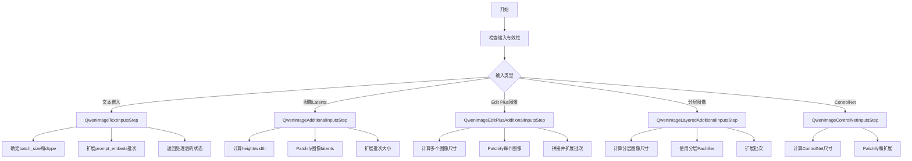

## 类结构

```
ModularPipelineBlocks (抽象基类)
├── QwenImageTextInputsStep (文本输入处理)
├── QwenImageAdditionalInputsStep (额外输入处理)
├── QwenImageEditPlusAdditionalInputsStep (Edit Plus输入处理)
├── QwenImageLayeredAdditionalInputsStep (分层输入处理)
└── QwenImageControlNetInputsStep (ControlNet输入处理)
```

## 全局变量及字段


### `repeat_tensor_to_batch_size`
    
全局函数，用于重复张量元素以匹配最终批次大小（batch_size * num_images_per_prompt）

类型：`function`
    


### `calculate_dimension_from_latents`
    
全局函数，用于将潜在空间维度转换为图像空间维度

类型：`function`
    


### `QwenImageLayeredPachifier`
    
从模块导入的分层打包器类，用于处理分层潜在张量

类型：`class`
    


### `QwenImageModularPipeline`
    
从模块导入的模块化管道类

类型：`class`
    


### `QwenImagePachifier`
    
从模块导入的打包器类，用于将潜在张量打包成补丁

类型：`class`
    


### `ModularPipelineBlocks`
    
从模块导入的模块化管道块基类

类型：`class`
    


### `PipelineState`
    
从模块导入的管道状态类，用于管理管道执行状态

类型：`class`
    


### `ComponentSpec`
    
从模块导入的组件规范类，用于定义组件的元数据

类型：`class`
    


### `InputParam`
    
从模块导入的输入参数类，用于定义管道输入参数

类型：`class`
    


### `OutputParam`
    
从模块导入的输出参数类，用于定义管道输出参数

类型：`class`
    


### `QwenImageMultiControlNetModel`
    
从模型导入的多ControlNet模型类

类型：`class`
    


### `QwenImageTextInputsStep.model_name`
    
类属性，表示模型名称为'qwenimage'

类型：`str`
    


### `QwenImageAdditionalInputsStep._image_latent_inputs`
    
私有实例属性，存储图像潜在输入参数列表，默认为[InputParam.template('image_latents')]

类型：`list[InputParam]`
    


### `QwenImageAdditionalInputsStep._additional_batch_inputs`
    
私有实例属性，存储额外批次输入参数列表，默认为空列表

类型：`list[InputParam]`
    


### `QwenImageAdditionalInputsStep.model_name`
    
类属性，表示模型名称为'qwenimage'

类型：`str`
    


### `QwenImageEditPlusAdditionalInputsStep._image_latent_inputs`
    
私有实例属性，存储图像潜在输入参数列表，用于Edit Plus模式

类型：`list[InputParam]`
    


### `QwenImageEditPlusAdditionalInputsStep._additional_batch_inputs`
    
私有实例属性，存储额外批次输入参数列表

类型：`list[InputParam]`
    


### `QwenImageEditPlusAdditionalInputsStep.model_name`
    
类属性，表示模型名称为'qwenimage-edit-plus'

类型：`str`
    


### `QwenImageLayeredAdditionalInputsStep._image_latent_inputs`
    
私有实例属性，存储图像潜在输入参数列表，用于分层模式

类型：`list[InputParam]`
    


### `QwenImageLayeredAdditionalInputsStep._additional_batch_inputs`
    
私有实例属性，存储额外批次输入参数列表

类型：`list[InputParam]`
    


### `QwenImageLayeredAdditionalInputsStep.model_name`
    
类属性，表示模型名称为'qwenimage-layered'

类型：`str`
    


### `QwenImageControlNetInputsStep.model_name`
    
类属性，表示模型名称为'qwenimage'

类型：`str`
    
    

## 全局函数及方法


### `repeat_tensor_to_batch_size`

该函数用于将输入张量的批次维度扩展到最终批次大小（batch_size * num_images_per_prompt），通过沿维度0重复每个元素来实现批次扩展。如果输入张量的批次大小为1，则重复batch_size * num_images_per_prompt次；如果等于batch_size，则重复num_images_per_prompt次。

参数：

- `input_name`：`str`，输入张量的名称，用于错误信息中的标识
- `input_tensor`：`torch.Tensor`，要重复的张量，必须具有批次大小1或batch_size
- `batch_size`：`int`，基础批次大小（提示词数量）
- `num_images_per_prompt`：`int`，可选，每个提示词生成的图像数量，默认为1

返回值：`torch.Tensor`，重复后的张量，其最终批次大小为batch_size * num_images_per_prompt

#### 流程图

```mermaid
flowchart TD
    A[开始] --> B{input_tensor是否为torch.Tensor?}
    B -->|否| C[抛出ValueError: `input_name` must be a tensor]
    B -->|是| D{input_tensor.shape[0] == 1?}
    D -->|是| E[repeat_by = batch_size * num_images_per_prompt]
    D -->|否| F{input_tensor.shape[0] == batch_size?}
    F -->|是| G[repeat_by = num_images_per_prompt]
    F -->|否| H[抛出ValueError: 批次大小必须为1或batch_size]
    E --> I[调用repeat_interleave扩展张量]
    G --> I
    I --> J[返回重复后的张量]
    C --> K[结束]
    H --> K
    J --> K
```

#### 带注释源码

```python
def repeat_tensor_to_batch_size(
    input_name: str,
    input_tensor: torch.Tensor,
    batch_size: int,
    num_images_per_prompt: int = 1,
) -> torch.Tensor:
    """Repeat tensor elements to match the final batch size.

    This function expands a tensor's batch dimension to match the final batch size (batch_size * num_images_per_prompt)
    by repeating each element along dimension 0.

    The input tensor must have batch size 1 or batch_size. The function will:
    - If batch size is 1: repeat each element (batch_size * num_images_per_prompt) times
    - If batch size equals batch_size: repeat each element num_images_per_prompt times

    Args:
        input_name (str): Name of the input tensor (used for error messages)
        input_tensor (torch.Tensor): The tensor to repeat. Must have batch size 1 or batch_size.
        batch_size (int): The base batch size (number of prompts)
        num_images_per_prompt (int, optional): Number of images to generate per prompt. Defaults to 1.

    Returns:
        torch.Tensor: The repeated tensor with final batch size (batch_size * num_images_per_prompt)

    Raises:
        ValueError: If input_tensor is not a torch.Tensor or has invalid batch size
    """
    # 确保输入是张量类型
    if not isinstance(input_tensor, torch.Tensor):
        raise ValueError(f"`{input_name}` must be a tensor")

    # 确保输入张量批次大小为1或与prompts的batch_size相同
    if input_tensor.shape[0] == 1:
        # 如果批次大小为1，需要扩展到 batch_size * num_images_per_prompt
        repeat_by = batch_size * num_images_per_prompt
    elif input_tensor.shape[0] == batch_size:
        # 如果批次大小等于batch_size，只需按num_images_per_prompt重复
        repeat_by = num_images_per_prompt
    else:
        raise ValueError(
            f"`{input_name}` must have have batch size 1 or {batch_size}, but got {input_tensor.shape[0]}"
        )

    # 使用repeat_interleave沿维度0重复张量以匹配batch_size * num_images_per_prompt
    input_tensor = input_tensor.repeat_interleave(repeat_by, dim=0)

    return input_tensor
```


### `calculate_dimension_from_latents`

该函数用于将潜在空间的张量维度转换为图像空间的实际像素尺寸。它通过提取潜在张量的高度和宽度维度，并乘以VAE缩放因子来实现从潜在空间到图像空间的尺寸转换。

参数：

- `latents`：`torch.Tensor`，潜在张量，必须有4或5个维度。期望的形状为 [batch, channels, height, width] 或 [batch, channels, frames, height, width]
- `vae_scale_factor`：`int`，VAE用于压缩图像的缩放因子。对于大多数VAE，通常为8（图像在每个维度上比潜在变量大8倍）

返回值：`tuple[int, int]`，计算出的图像尺寸，格式为 (height, width)

#### 流程图

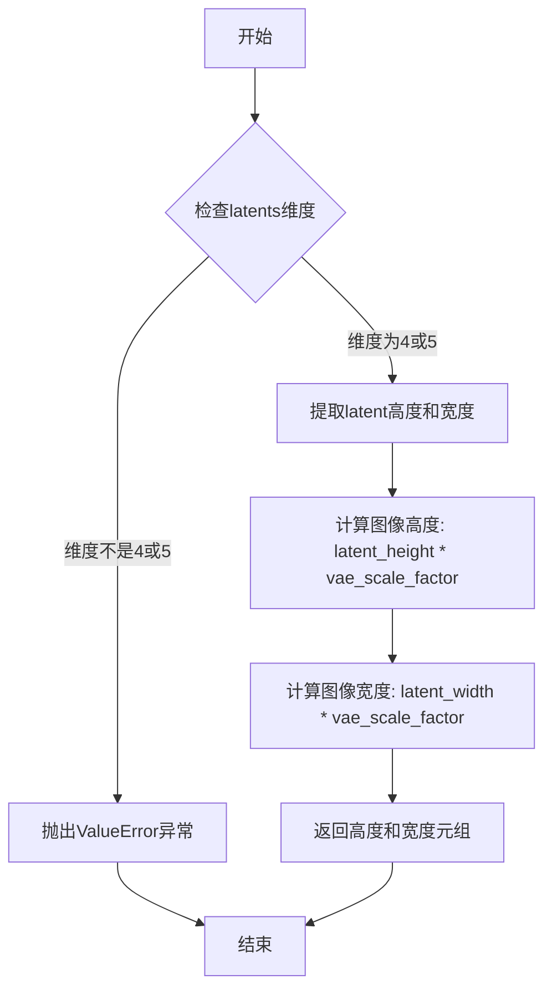

#### 带注释源码

```python
def calculate_dimension_from_latents(latents: torch.Tensor, vae_scale_factor: int) -> tuple[int, int]:
    """Calculate image dimensions from latent tensor dimensions.

    This function converts latent space dimensions to image space dimensions by multiplying the latent height and width
    by the VAE scale factor.

    Args:
        latents (torch.Tensor): The latent tensor. Must have 4 or 5 dimensions.
            Expected shapes: [batch, channels, height, width] or [batch, channels, frames, height, width]
        vae_scale_factor (int): The scale factor used by the VAE to compress images.
            Typically 8 for most VAEs (image is 8x larger than latents in each dimension)

    Returns:
        tuple[int, int]: The calculated image dimensions as (height, width)

    Raises:
        ValueError: If latents tensor doesn't have 4 or 5 dimensions

    """
    # 确保潜在变量未打包，检查维度数量
    if latents.ndim != 4 and latents.ndim != 5:
        raise ValueError(f"unpacked latents must have 4 or 5 dimensions, but got {latents.ndim}")

    # 从潜在张量的最后两个维度提取高度和宽度
    latent_height, latent_width = latents.shape[-2:]

    # 通过乘以VAE缩放因子将潜在空间尺寸转换为图像空间尺寸
    height = latent_height * vae_scale_factor
    width = latent_width * vae_scale_factor

    return height, width
```


### `QwenImageTextInputsStep.description`

这是一个只读属性（Property），返回该文本输入处理步骤的描述信息。该步骤负责标准化文本嵌入，具体功能包括：
1. 根据 `prompt_embeds` 确定 `batch_size` 和 `dtype`
2. 确保所有文本嵌入具有一致的批量大小（batch_size * num_images_per_prompt）
3. 还包含放置指导，说明该块应放在所有编码器步骤之后

参数：无（这是一个属性方法，不接受任何参数）

返回值：`str`，返回该步骤的描述字符串，包含功能总结和放置指导

#### 流程图

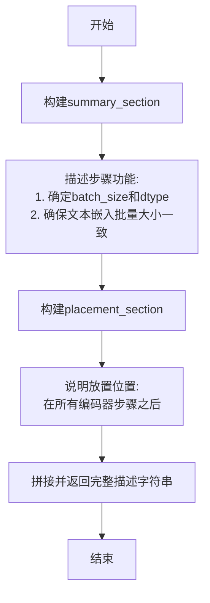

#### 带注释源码

```python
@property
def description(self) -> str:
    """返回该文本输入处理步骤的描述信息。
    
    该属性返回一个字符串，包含两部分内容：
    1. summary_section: 步骤的核心功能描述
    2. placement_section: 该模块在管道中的推荐放置位置
    
    Returns:
        str: 完整的步骤描述信息
    """
    # 定义总结部分，描述步骤的主要功能
    summary_section = (
        "Text input processing step that standardizes text embeddings for the pipeline.\n"
        "This step:\n"
        "  1. Determines `batch_size` and `dtype` based on `prompt_embeds`\n"
        "  2. Ensures all text embeddings have consistent batch sizes (batch_size * num_images_per_prompt)"
    )

    # 定义放置指导部分，说明该块在管道中的位置
    # 该块应该放在所有编码器步骤之后，用于处理文本嵌入
    placement_section = "\n\nThis block should be placed after all encoder steps to process the text embeddings before they are used in subsequent pipeline steps."

    # 拼接两部分描述并返回
    return summary_section + placement_section
```


### `QwenImageTextInputsStep.inputs`

该属性方法定义了文本输入处理步骤所需的所有输入参数，包括提示词嵌入、注意力掩码以及对应的负向提示词嵌入和掩码，用于后续管道步骤中的文本标准化处理。

参数：

- `self`：`QwenImageTextInputsStep`，隐式参数，表示类的实例本身

返回值：`list[InputParam]`，返回包含所有输入参数的列表，每个参数通过 `InputParam.template()` 模板方法构造，封装了参数的名称和元数据信息。

#### 流程图

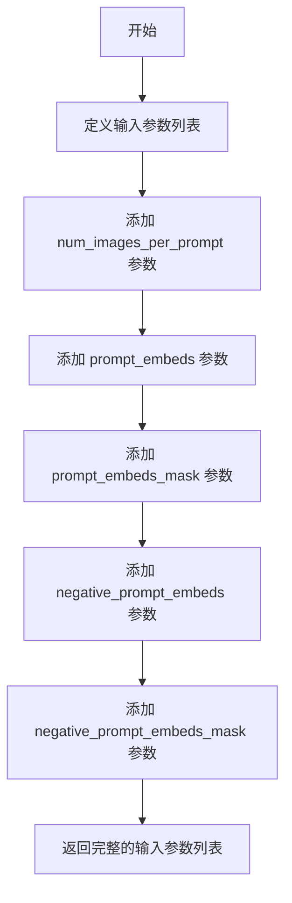

#### 带注释源码

```python
@property
def inputs(self) -> list[InputParam]:
    """
    定义文本输入处理步骤所需的输入参数列表。
    
    Returns:
        list[InputParam]: 包含以下参数的列表：
            - num_images_per_prompt: 每个提示词生成的图像数量
            - prompt_embeds: 提示词的文本嵌入向量
            - prompt_embeds_mask: 提示词嵌入的注意力掩码
            - negative_prompt_embeds: 负向提示词的文本嵌入向量（可选）
            - negative_prompt_embeds_mask: 负向提示词嵌入的注意力掩码（可选）
    """
    return [
        InputParam.template("num_images_per_prompt"),  # 每个提示词生成的图像数量
        InputParam.template("prompt_embeds"),           # 提示词文本嵌入
        InputParam.template("prompt_embeds_mask"),      # 提示词嵌入的注意力掩码
        InputParam.template("negative_prompt_embeds"), # 负向提示词文本嵌入
        InputParam.template("negative_prompt_embeds_mask"), # 负向提示词嵌入的注意力掩码
    ]
```


### `QwenImageTextInputsStep.intermediate_outputs`

该属性是 `QwenImageTextInputsStep` 类的一个属性方法（property），用于定义文本输入处理步骤的中间输出参数列表。它返回一系列 `OutputParam` 对象，描述该处理步骤结束后可提供给后续步骤的中间变量，包括批大小、数据类型以及经过批扩展处理的文本嵌入和注意力掩码。

参数：

- 该方法无参数（作为类的属性方法访问）

返回值：`list[OutputParam]`，返回文本嵌入处理步骤的中间输出参数列表，包含批大小、数据类型、以及批扩展后的提示词嵌入、提示词掩码、负提示词嵌入和负提示词掩码

#### 流程图

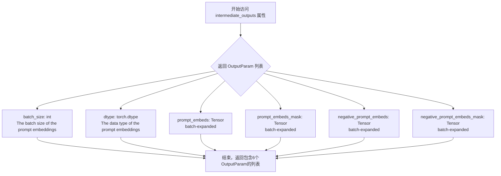

#### 带注释源码

```python
@property
def intermediate_outputs(self) -> list[OutputParam]:
    """
    定义文本输入处理步骤的中间输出参数列表。
    
    该属性返回一系列 OutputParam 对象，描述在 __call__ 方法执行后，
    可供后续管道步骤使用的中间变量。
    
    Returns:
        list[OutputParam]: 包含以下输出参数的列表：
            - batch_size: 处理后的批大小
            - dtype: 文本嵌入的数据类型
            - prompt_embeds: 经过批扩展处理的提示词嵌入
            - prompt_embeds_mask: 经过批扩展处理的提示词注意力掩码
            - negative_prompt_embeds: 经过批扩展处理的负提示词嵌入
            - negative_prompt_embeds_mask: 经过批扩展处理的负提示词注意力掩码
    """
    return [
        # 批大小：提示词嵌入的批处理维度
        OutputParam(name="batch_size", type_hint=int, description="The batch size of the prompt embeddings"),
        # 数据类型：提示词嵌入的数据类型（通常为float32或float16）
        OutputParam(name="dtype", type_hint=torch.dtype, description="The data type of the prompt embeddings"),
        # 提示词嵌入：经过批扩展后的文本嵌入向量
        OutputParam.template("prompt_embeds", note="batch-expanded"),
        # 提示词嵌入掩码：对应的注意力掩码
        OutputParam.template("prompt_embeds_mask", note="batch-expanded"),
        # 负提示词嵌入：用于无分类器指导的负向文本嵌入
        OutputParam.template("negative_prompt_embeds", note="batch-expanded"),
        # 负提示词嵌入掩码：负向文本嵌入的注意力掩码
        OutputParam.template("negative_prompt_embeds_mask", note="batch-expanded"),
    ]
```


### `QwenImageTextInputsStep.check_inputs`

该方法是一个静态方法，用于验证文本嵌入输入的一致性和有效性。它检查 `prompt_embeds` 和 `negative_prompt_embeds` 及其对应的 mask 是否正确配对，并确保它们具有相同的批次大小。如果输入不符合要求，该方法会抛出 `ValueError` 异常。

参数：

- `prompt_embeds`：Tensor，正向文本嵌入，用于引导图像生成
- `prompt_embeds_mask`：Tensor，正向文本嵌入的注意力掩码
- `negative_prompt_embeds`：Tensor（可选），负向文本嵌入，用于引导图像生成
- `negative_prompt_embeds_mask`：Tensor（可选），负向文本嵌入的注意力掩码

返回值：`None`，无返回值。该方法仅进行输入验证，通过抛出异常来处理无效输入。

#### 流程图

```mermaid
flowchart TD
    A[开始验证] --> B{negative_prompt_embeds is not None<br/>且 negative_prompt_embeds_mask is None?}
    B -->|是| C[抛出 ValueError:<br/>negative_prompt_embeds_mask is required]
    B -->|否| D{negative_prompt_embeds is None<br/>且 negative_prompt_embeds_mask is not None?}
    D -->|是| E[抛出 ValueError:<br/>cannot pass negative_prompt_embeds_mask<br/>without negative_prompt_embeds]
    D -->|否| F{prompt_embeds_mask.shape[0]<br/>!= prompt_embeds.shape[0]?}
    F -->|是| G[抛出 ValueError:<br/>prompt_embeds_mask batch size mismatch]
    F -->|否| H{negative_prompt_embeds is not None<br/>且 negative_prompt_embeds.shape[0]<br/>!= prompt_embeds.shape[0]?}
    H -->|是| I[抛出 ValueError:<br/>negative_prompt_embeds batch size mismatch]
    H -->|否| J{negative_prompt_embeds_mask is not None<br/>且 negative_prompt_embeds_mask.shape[0]<br/>!= prompt_embeds.shape[0]?}
    J -->|是| K[抛出 ValueError:<br/>negative_prompt_embeds_mask batch size mismatch]
    J -->|否| L[验证通过]
```

#### 带注释源码

```python
@staticmethod
def check_inputs(
    prompt_embeds,
    prompt_embeds_mask,
    negative_prompt_embeds,
    negative_prompt_embeds_mask,
):
    """验证文本嵌入输入的一致性和有效性。

    检查以下内容：
    1. negative_prompt_embeds 和 negative_prompt_embeds_mask 必须同时存在或同时为空
    2. prompt_embeds_mask 必须与 prompt_embeds 具有相同的批次大小
    3. negative_prompt_embeds（如果存在）必须与 prompt_embeds 具有相同的批次大小
    4. negative_prompt_embeds_mask（如果存在）必须与 prompt_embeds 具有相同的批次大小

    Args:
        prompt_embeds: 正向文本嵌入，形状为 [batch_size, seq_len, hidden_dim]
        prompt_embeds_mask: 正向文本嵌入的注意力掩码，形状为 [batch_size, seq_len]
        negative_prompt_embeds: 负向文本嵌入（可选）
        negative_prompt_embeds_mask: 负向文本嵌入的注意力掩码（可选）

    Raises:
        ValueError: 当输入参数不匹配或不符合要求时抛出
    """
    # 规则1: 如果提供了 negative_prompt_embeds，则必须同时提供 negative_prompt_embeds_mask
    if negative_prompt_embeds is not None and negative_prompt_embeds_mask is None:
        raise ValueError("`negative_prompt_embeds_mask` is required when `negative_prompt_embeds` is not None")

    # 规则2: 不能只提供 negative_prompt_embeds_mask 而不提供 negative_prompt_embeds
    if negative_prompt_embeds is None and negative_prompt_embeds_mask is not None:
        raise ValueError("cannot pass `negative_prompt_embeds_mask` without `negative_prompt_embeds`")

    # 规则3: prompt_embeds_mask 必须与 prompt_embeds 具有相同的批次大小
    if prompt_embeds_mask.shape[0] != prompt_embeds.shape[0]:
        raise ValueError("`prompt_embeds_mask` must have the same batch size as `prompt_embeds`")

    # 规则4: negative_prompt_embeds（如果存在）必须与 prompt_embeds 具有相同的批次大小
    elif negative_prompt_embeds is not None and negative_prompt_embeds.shape[0] != prompt_embeds.shape[0]:
        raise ValueError("`negative_prompt_embeds` must have the same batch size as `prompt_embeds`")

    # 规则5: negative_prompt_embeds_mask（如果存在）必须与 prompt_embeds 具有相同的批次大小
    elif (
        negative_prompt_embeds_mask is not None and negative_prompt_embeds_mask.shape[0] != prompt_embeds.shape[0]
    ):
        raise ValueError("`negative_prompt_embeds_mask` must have the same batch size as `prompt_embeds`")
```


### QwenImageTextInputsStep.__call__

该方法是 QwenImageTextInputsStep 类的核心调用方法，负责标准化文本嵌入以供管道使用。它首先根据 prompt_embeds 确定批处理大小和数据类型，然后确保所有文本嵌入（包括正向和负向）具有一致的批量大小（batch_size * num_images_per_prompt），最后更新并返回管道状态。

参数：

- `self`：隐式参数，QwenImageTextInputsStep 实例本身
- `components`：`QwenImageModularPipeline` 类型，管道组件容器，包含模型配置和组件
- `state`：`PipelineState` 类型，管道状态对象，包含当前管道执行的所有状态信息

返回值：`tuple[QwenImageModularPipeline, PipelineState]` 类型，返回组件和更新后的状态元组

#### 流程图

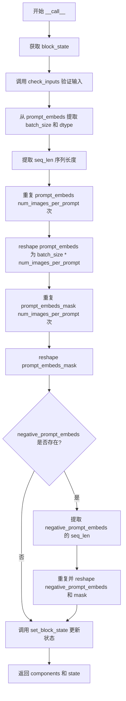

#### 带注释源码

```python
def __call__(self, components: QwenImageModularPipeline, state: PipelineState) -> PipelineState:
    """
    执行文本输入处理步骤，标准化文本嵌入。
    
    参数:
        components: QwenImageModularPipeline - 管道组件容器
        state: PipelineState - 管道状态对象
    
    返回:
        tuple[QwenImageModularPipeline, PipelineState] - 组件和状态元组
    """
    # 1. 从管道状态中获取当前块的状态
    block_state = self.get_block_state(state)

    # 2. 验证所有输入的有效性
    #    检查 prompt_embeds 和 mask 的批次大小一致性
    #    确保 negative_prompt_embeds 和 mask 配对正确
    self.check_inputs(
        prompt_embeds=block_state.prompt_embeds,
        prompt_embeds_mask=block_state.prompt_embeds_mask,
        negative_prompt_embeds=block_state.negative_prompt_embeds,
        negative_prompt_embeds_mask=block_state.negative_prompt_embeds_mask,
    )

    # 3. 从 prompt_embeds 的第一维获取 batch_size
    #    这是原始prompt的数量，不包含 num_images_per_prompt
    block_state.batch_size = block_state.prompt_embeds.shape[0]
    
    # 4. 从 prompt_embeds 获取数据类型，用于后续计算
    block_state.dtype = block_state.prompt_embeds.dtype

    # 5. 获取序列长度（token数量）
    _, seq_len, _ = block_state.prompt_embeds.shape

    # 6. 扩展 prompt_embeds 的批次维度
    #    先在序列维度重复 num_images_per_prompt 次
    #    例如: [B, seq_len, hidden] -> [B, seq_len * num_images_per_prompt, hidden]
    block_state.prompt_embeds = block_state.prompt_embeds.repeat(1, block_state.num_images_per_prompt, 1)
    
    # 7. 重塑为最终的批次大小
    #    从 [B, seq_len * num, hidden] -> [B * num_images_per_prompt, seq_len, hidden]
    block_state.prompt_embeds = block_state.prompt_embeds.view(
        block_state.batch_size * block_state.num_images_per_prompt, seq_len, -1
    )

    # 8. 对 prompt_embeds_mask 进行相同的处理
    #    先重复
    block_state.prompt_embeds_mask = block_state.prompt_embeds_mask.repeat(1, block_state.num_images_per_prompt, 1)
    #    再重塑
    block_state.prompt_embeds_mask = block_state.prompt_embeds_mask.view(
        block_state.batch_size * block_state.num_images_per_prompt, seq_len
    )

    # 9. 如果存在负向提示嵌入，进行相同处理
    if block_state.negative_prompt_embeds is not None:
        # 获取负向嵌入的序列长度
        _, seq_len, _ = block_state.negative_prompt_embeds.shape
        
        # 重复并重塑负向嵌入
        block_state.negative_prompt_embeds = block_state.negative_prompt_embeds.repeat(
            1, block_state.num_images_per_prompt, 1
        )
        block_state.negative_prompt_embeds = block_state.negative_prompt_embeds.view(
            block_state.batch_size * block_state.num_images_per_prompt, seq_len, -1
        )

        # 重复并重塑负向mask
        block_state.negative_prompt_embeds_mask = block_state.negative_prompt_embeds_mask.repeat(
            1, block_state.num_images_per_prompt, 1
        )
        block_state.negative_prompt_embeds_mask = block_state.negative_prompt_embeds_mask.view(
            block_state.batch_size * block_state.num_images_per_prompt, seq_len
        )

    # 10. 将更新后的块状态写回管道状态
    self.set_block_state(state, block_state)

    # 11. 返回组件和状态元组
    return components, state
```


### `QwenImageAdditionalInputsStep.__init__`

该方法是`QwenImageAdditionalInputsStep`类的构造函数，用于初始化图像潜在输入和附加批处理输入。它验证输入参数的类型（必须为列表，且元素必须为`InputParam`类型），并将处理后的输入存储为实例变量，同时调用父类的初始化方法。

参数：

- `image_latent_inputs`：`list[InputParam] | None`，图像潜在输入列表，默认为包含"image_latents"的列表，用于处理图像潜在输入
- `additional_batch_inputs`：`list[InputParam] | None`，附加批处理输入列表，默认为空列表，用于处理需要扩展批维度的其他输入

返回值：无（`None`），构造函数不返回任何值

#### 流程图

```mermaid
flowchart TD
    A[开始 __init__] --> B{image_latent_inputs is None?}
    B -->|是| C[设置默认值为 [InputParam.template('image_latents')]]
    B -->|否| D{additional_batch_inputs is None?}
    D -->|是| E[设置默认值为 []]
    D -->|否| F{image_latent_inputs 是 list?}
    C --> F
    E --> F
    F -->|否| G[抛出 ValueError: image_latent_inputs must be a list]
    F -->|是| H{image_latent_inputs 元素是 InputParam?}
    H -->|否| I[抛出 ValueError: image_latent_inputs must be a list of InputParam]
    H -->|是| J{additional_batch_inputs 是 list?}
    J -->|否| K[抛出 ValueError: additional_batch_inputs must be a list]
    J -->|是| L{additional_batch_inputs 元素是 InputParam?}
    L -->|否| M[抛出 ValueError: additional_batch_inputs must be a list of InputParam]
    L -->|是| N[设置 self._image_latent_inputs]
    N --> O[设置 self._additional_batch_inputs]
    O --> P[调用 super().__init__()]
    P --> Q[结束]
```

#### 带注释源码

```python
def __init__(
    self,
    image_latent_inputs: list[InputParam] | None = None,
    additional_batch_inputs: list[InputParam] | None = None,
):
    """初始化 QwenImageAdditionalInputsStep 类的实例。
    
    参数:
        image_latent_inputs: 图像潜在输入列表，默认为 [InputParam.template("image_latents")]
        additional_batch_inputs: 附加批处理输入列表，默认为空列表
    """
    # by default, process `image_latents`
    # 默认情况下，处理 'image_latents' 输入
    if image_latent_inputs is None:
        image_latent_inputs = [InputParam.template("image_latents")]
    
    # 默认情况下，没有附加批处理输入
    if additional_batch_inputs is None:
        additional_batch_inputs = []

    # 验证 image_latent_inputs 是列表类型
    if not isinstance(image_latent_inputs, list):
        raise ValueError(f"image_latent_inputs must be a list, but got {type(image_latent_inputs)}")
    else:
        # 验证列表中的每个元素都是 InputParam 类型
        for input_param in image_latent_inputs:
            if not isinstance(input_param, InputParam):
                raise ValueError(f"image_latent_inputs must be a list of InputParam, but got {type(input_param)}")

    # 验证 additional_batch_inputs 是列表类型
    if not isinstance(additional_batch_inputs, list):
        raise ValueError(f"additional_batch_inputs must be a list, but got {type(additional_batch_inputs)}")
    else:
        # 验证列表中的每个元素都是 InputParam 类型
        for input_param in additional_batch_inputs:
            if not isinstance(input_param, InputParam):
                raise ValueError(
                    f"additional_batch_inputs must be a list of InputParam, but got {type(input_param)}"
                )

    # 将处理后的输入参数存储为实例变量
    self._image_latent_inputs = image_latent_inputs
    self._additional_batch_inputs = additional_batch_inputs
    
    # 调用父类 ModularPipelineBlocks 的初始化方法
    super().__init__()
```


### `QwenImageAdditionalInputsStep.description`

这是一个属性（property），用于返回 `QwenImageAdditionalInputsStep` 类的描述信息，说明该输入处理步骤的功能、配置的输入以及放置位置。

参数：无（该方法是一个属性，只接收隐式的 `self` 参数）

返回值：`str`，返回该步骤的描述字符串，包含功能摘要、配置的输入信息以及放置指导

#### 流程图

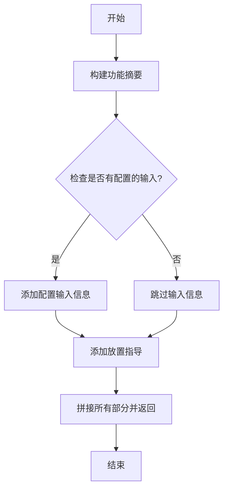

#### 带注释源码

```python
@property
def description(self) -> str:
    """返回该处理步骤的描述信息。
    
    描述内容包含三个部分：
    1. 功能摘要：说明该步骤对图像潜在输入和额外批处理输入的处理
    2. 配置的输入信息：列出当前配置的图像潜在输入和额外批处理输入
    3. 放置指导：说明该模块应该放置在编码器步骤和文本输入步骤之后
    """
    # 第一部分：功能摘要
    summary_section = (
        "Input processing step that:\n"
        "  1. For image latent inputs: Updates height/width if None, patchifies, and expands batch size\n"
        "  2. For additional batch inputs: Expands batch dimensions to match final batch size"
    )

    # 第二部分：配置的输入信息（可选）
    inputs_info = ""
    if self._image_latent_inputs or self._additional_batch_inputs:
        inputs_info = "\n\nConfigured inputs:"
        if self._image_latent_inputs:
            # 列出所有图像潜在输入的名称
            inputs_info += f"\n  - Image latent inputs: {[p.name for p in self._image_latent_inputs]}"
        if self._additional_batch_inputs:
            # 列出所有额外批处理输入的名称
            inputs_info += f"\n  - Additional batch inputs: {[p.name for p in self._additional_batch_inputs]}"

    # 第三部分：放置指导
    placement_section = "\n\nThis block should be placed after the encoder steps and the text input step."

    # 拼接所有部分并返回完整描述
    return summary_section + inputs_info + placement_section
```


### `QwenImageAdditionalInputsStep.expected_components`

该属性方法定义了 `QwenImageAdditionalInputsStep` 类期望的组件依赖，具体为 `pachifier`（负责将图像潜张量进行 patchify 处理）。

参数：无参数（为属性方法）

返回值：`list[ComponentSpec]`，返回包含组件规格的列表，指定了 pipeline 所需的组件及其创建方式。

#### 流程图

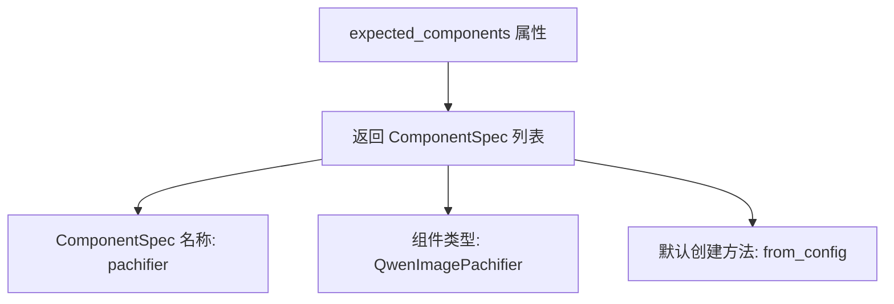

#### 带注释源码

```python
@property
def expected_components(self) -> list[ComponentSpec]:
    """Return the list of component specifications required by this pipeline block.

    This property defines the dependencies of the QwenImageAdditionalInputsStep.
    It specifies that a 'pachifier' component of type QwenImagePachifier is required
    to process image latents (patchify operation).

    The component will be created using the 'from_config' method, which means
    it will be instantiated from the pipeline's configuration.

    Returns:
        list[ComponentSpec]: A list containing one ComponentSpec for the 'pachifier' component.
            - name: "pachifier"
            - component_class: QwenImagePachifier
            - default_creation_method: "from_config"

    Example:
        >>> step = QwenImageAdditionalInputsStep()
        >>> specs = step.expected_components
        >>> print([(s.name, s.component_class.__name__) for s in specs])
        [('pachifier', 'QwenImagePachifier')]
    """
    return [
        ComponentSpec("pachifier", QwenImagePachifier, default_creation_method="from_config"),
    ]
```


### `QwenImageAdditionalInputsStep.inputs`

该属性方法定义了 `QwenImageAdditionalInputsStep` 模块的输入参数列表，包含基础的批次参数（num_images_per_prompt、batch_size、height、width）以及通过构造函数配置的可选图像潜在输入和额外批次输入。

参数：
- 无显式参数（该方法为属性方法，仅接收 `self` 实例）

返回值：`list[InputParam]`，返回输入参数列表，包含基础参数和配置的图像潜在输入及额外批次输入

#### 流程图

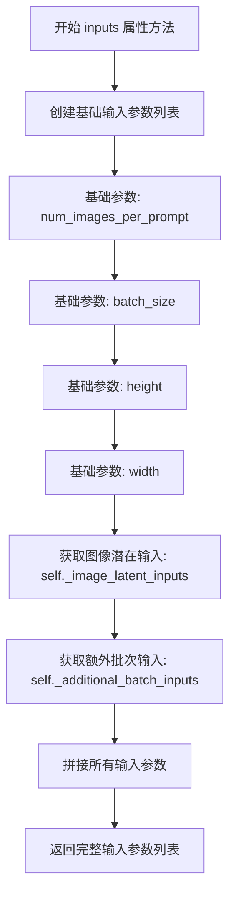

#### 带注释源码

```python
@property
def inputs(self) -> list[InputParam]:
    """
    定义模块的输入参数列表。
    
    包含四类基础参数：
    - num_images_per_prompt: 每个提示生成的图像数量
    - batch_size: 提示的数量
    - height: 生成图像的高度
    - width: 生成图像的宽度
    
    以及通过构造函数配置的：
    - 图像潜在输入 (_image_latent_inputs)
    - 额外批次输入 (_additional_batch_inputs)
    
    Returns:
        list[InputParam]: 输入参数列表
    """
    # 初始化基础输入参数列表
    inputs = [
        InputParam.template("num_images_per_prompt"),  # 每个提示生成的图像数量
        InputParam.template("batch_size"),             # 提示的批次大小
        InputParam.template("height"),                 # 生成图像的高度
        InputParam.template("width"),                  # 生成图像的宽度
    ]
    
    # 添加默认的图像潜在输入（默认为 'image_latents'）
    # 以及通过构造函数传入的额外批次输入
    inputs += self._image_latent_inputs + self._additional_batch_inputs

    return inputs
```


### `QwenImageAdditionalInputsStep.intermediate_outputs`

这是一个属性方法，用于定义 `QwenImageAdditionalInputsStep` 类的中间输出参数列表。它根据实例配置（`image_latent_inputs` 和 `additional_batch_inputs`）动态生成对应的 `OutputParam` 对象列表，描述该处理步骤的输出内容。

参数： 无（这是一个属性方法，不需要显式参数，通过 `self` 访问实例属性）

返回值： `list[OutputParam]`，返回包含所有中间输出参数的列表，每个 `OutputParam` 包含输出名称、类型提示和描述信息。

#### 流程图

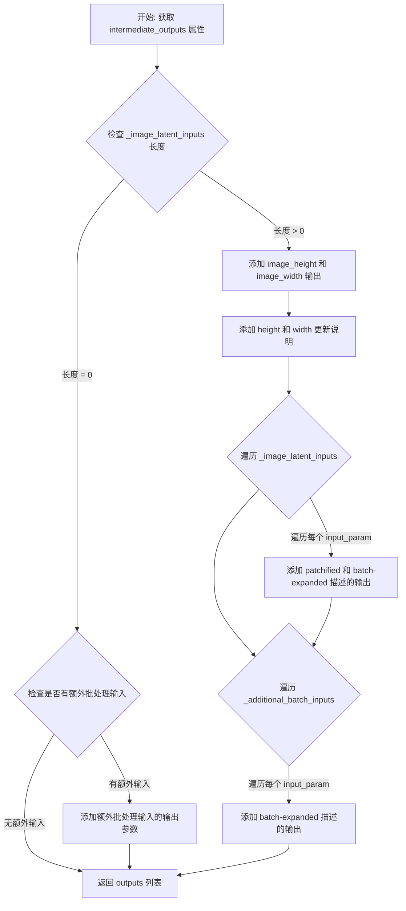

#### 带注释源码

```python
@property
def intermediate_outputs(self) -> list[OutputParam]:
    """
    定义该处理步骤的中间输出参数列表。
    
    Returns:
        list[OutputParam]: 包含所有输出参数的列表
    """
    # 初始化输出列表，首先添加图像尺寸相关的输出
    outputs = [
        OutputParam(
            name="image_height",
            type_hint=int,
            description="The image height calculated from the image latents dimension",
        ),
        OutputParam(
            name="image_width",
            type_hint=int,
            description="The image width calculated from the image latents dimension",
        ),
    ]

    # 如果存在图像潜在输入，则添加 height/width 的更新说明
    # 注意：height/width 不是新的输出，而是对已有输入的更新
    if len(self._image_latent_inputs) > 0:
        outputs.append(
            OutputParam(name="height", type_hint=int, description="if not provided, updated to image height")
        )
        outputs.append(
            OutputParam(name="width", type_hint=int, description="if not provided, updated to image width")
        )

    # 遍历所有图像潜在输入，为每个输入添加输出参数
    # 这些输入会被原地修改（patchified 和 batch-expanded）
    for input_param in self._image_latent_inputs:
        outputs.append(
            OutputParam(
                name=input_param.name,
                type_hint=input_param.type_hint,
                description=input_param.description + " (patchified and batch-expanded)",
            )
        )

    # 遍历所有额外批处理输入，添加输出参数
    # 这些输入只进行 batch-expanded 处理
    for input_param in self._additional_batch_inputs:
        outputs.append(
            OutputParam(
                name=input_param.name,
                type_hint=input_param.type_hint,
                description=input_param.description + " (batch-expanded)",
            )
        )

    return outputs
```


### `QwenImageAdditionalInputsStep.__call__`

该方法是 QwenImage 模块化管道中的输入处理步骤类 `QwenImageAdditionalInputsStep` 的核心调用方法，负责处理图像潜在输入和额外批处理输入。具体功能包括：对于图像潜在输入，计算并更新高度/宽度（如未提供），执行 patchify（分块）操作，并将批处理大小扩展到 `batch_size * num_images_per_prompt`；对于额外批处理输入，仅执行批处理维度扩展以匹配最终批处理大小。

参数：

- `components`：`QwenImageModularPipeline`，模块化管道组件，包含 VAE 缩放因子和 patchifier 等组件
- `state`：`PipelineState`，管道状态对象，包含当前步骤的块状态（block_state）

返回值：`Tuple[QwenImageModularPipeline, PipelineState]`，返回更新后的组件和状态元组

#### 流程图

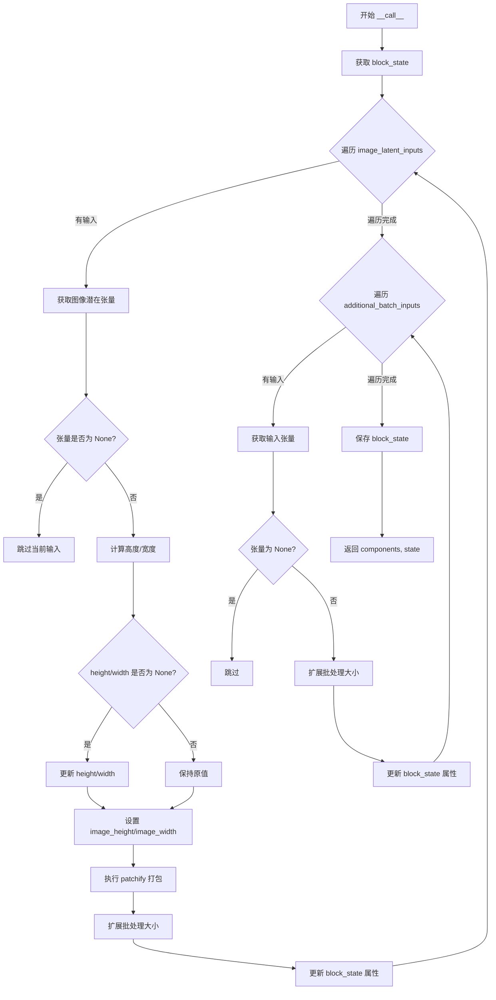

#### 带注释源码

```python
def __call__(self, components: QwenImageModularPipeline, state: PipelineState) -> PipelineState:
    """处理图像潜在输入和额外批处理输入的主方法
    
    Args:
        components: QwenImageModularPipeline，管道组件对象
        state: PipelineState，管道状态对象
    
    Returns:
        Tuple[QwenImageModularPipeline, PipelineState]：更新后的组件和状态
    """
    # 从管道状态中获取当前块的局部状态
    block_state = self.get_block_state(state)

    # ============================================================
    # 处理图像潜在输入（image_latent_inputs）
    # 包括：计算尺寸、patchify、批处理扩展
    # ============================================================
    for input_param in self._image_latent_inputs:
        # 获取输入参数名称（如 'image_latents'）
        image_latent_input_name = input_param.name
        # 从 block_state 中获取对应的张量
        image_latent_tensor = getattr(block_state, image_latent_input_name)
        
        # 如果张量为 None，跳过处理
        if image_latent_tensor is None:
            continue

        # 步骤1: 从潜在张量计算图像高度和宽度
        # 使用 VAE 缩放因子将潜在空间尺寸转换为像素空间尺寸
        height, width = calculate_dimension_from_latents(
            image_latent_tensor, 
            components.vae_scale_factor
        )
        
        # 如果未提供 height/width，则使用计算得到的值
        block_state.height = block_state.height or height
        block_state.width = block_state.width or width

        # 记录图像的原始高度和宽度（用于后续处理）
        if not hasattr(block_state, "image_height"):
            block_state.image_height = height
        if not hasattr(block_state, "image_width"):
            block_state.image_width = width

        # 步骤2: 使用 pachifier 对潜在张量进行 patchify（分块）处理
        # 将潜在张量转换为适合模型输入的格式
        image_latent_tensor = components.pachifier.pack_latents(image_latent_tensor)

        # 步骤3: 扩展批处理大小以匹配 batch_size * num_images_per_prompt
        # 使得每个提示可以生成多个图像
        image_latent_tensor = repeat_tensor_to_batch_size(
            input_name=image_latent_input_name,
            input_tensor=image_latent_tensor,
            num_images_per_prompt=block_state.num_images_per_prompt,
            batch_size=block_state.batch_size,
        )

        # 将处理后的张量存回 block_state
        setattr(block_state, image_latent_input_name, image_latent_tensor)

    # ============================================================
    # 处理额外批处理输入（additional_batch_inputs）
    # 仅执行批处理扩展，不进行 patchify
    # ============================================================
    for input_param in self._additional_batch_inputs:
        input_name = input_param.name
        input_tensor = getattr(block_state, input_name)
        
        # 如果张量为 None，跳过处理
        if input_tensor is None:
            continue

        # 仅执行批处理维度扩展
        input_tensor = repeat_tensor_to_batch_size(
            input_name=input_name,
            input_tensor=input_tensor,
            num_images_per_prompt=block_state.num_images_per_prompt,
            batch_size=block_state.batch_size,
        )

        # 更新 block_state 中的输入张量
        setattr(block_state, input_name, input_tensor)

    # 保存更新后的 block_state 到管道状态
    self.set_block_state(state, block_state)
    
    # 返回更新后的组件和状态
    return components, state
```


### `QwenImageEditPlusAdditionalInputsStep.__init__`

初始化图像编辑增强版的输入处理步骤。该方法接收图像潜在输入和额外的批处理输入参数，进行类型验证，并存储这些配置以供后续处理使用。

参数：

- `image_latent_inputs`：`list[InputParam] | None`，图像潜在输入列表，默认为 `[InputParam.template("image_latents")]`
- `additional_batch_inputs`：`list[InputParam] | None`，额外的批处理输入列表，默认为空列表

返回值：无（`None`）

#### 流程图

```mermaid
flowchart TD
    A[开始 __init__] --> B{image_latent_inputs is None?}
    B -->|Yes| C[设置默认值为 [InputParam.template('image_latents')]]
    B -->|No| D{additional_batch_inputs is None?}
    C --> D
    D -->|Yes| E[设置默认值为空列表]
    D -->|No| F{image_latent_inputs 是 list?}
    E --> F
    F -->|No| G[抛出 ValueError: image_latent_inputs must be a list]
    F -->|Yes| H{additional_batch_inputs 是 list?}
    H -->|No| I[抛出 ValueError: additional_batch_inputs must be a list]
    H -->|Yes| J{image_latent_inputs 元素都是 InputParam?}
    J -->|No| K[抛出 ValueError: image_latent_inputs must be a list of InputParam]
    J -->|Yes| L{additional_batch_inputs 元素都是 InputParam?}
    L -->|No| M[抛出 ValueError: additional_batch_inputs must be a list of InputParam]
    L -->|Yes| N[存储 _image_latent_inputs]
    N --> O[存储 _additional_batch_inputs]
    O --> P[调用 super().__init__()]
    P --> Q[结束 __init__]
```

#### 带注释源码

```
def __init__(
    self,
    image_latent_inputs: list[InputParam] | None = None,
    additional_batch_inputs: list[InputParam] | None = None,
):
    # 默认处理 `image_latent_inputs` 为 `image_latents`
    if image_latent_inputs is None:
        image_latent_inputs = [InputParam.template("image_latents")]
    
    # 默认 `additional_batch_inputs` 为空列表
    if additional_batch_inputs is None:
        additional_batch_inputs = []

    # 验证 image_latent_inputs 是列表类型
    if not isinstance(image_latent_inputs, list):
        raise ValueError(f"image_latent_inputs must be a list, but got {type(image_latent_inputs)}")
    else:
        # 验证列表中每个元素都是 InputParam 类型
        for input_param in image_latent_inputs:
            if not isinstance(input_param, InputParam):
                raise ValueError(f"image_latent_inputs must be a list of InputParam, but got {type(input_param)}")

    # 验证 additional_batch_inputs 是列表类型
    if not isinstance(additional_batch_inputs, list):
        raise ValueError(f"additional_batch_inputs must be a list, but got {type(additional_batch_inputs)}")
    else:
        # 验证列表中每个元素都是 InputParam 类型
        for input_param in additional_batch_inputs:
            if not isinstance(input_param, InputParam):
                raise ValueError(
                    f"additional_batch_inputs must be a list of InputParam, but got {type(input_param)}"
                )

    # 存储实例变量，供后续 __call__ 方法使用
    self._image_latent_inputs = image_latent_inputs
    self._additional_batch_inputs = additional_batch_inputs
    
    # 调用父类 ModularPipelineBlocks 的初始化方法
    super().__init__()
```


### `QwenImageEditPlusAdditionalInputsStep.description`

该属性是一个只读属性（property），用于返回 `QwenImageEditPlusAdditionalInputsStep` 类的描述信息，概述了 Edit Plus 输入处理步骤的核心功能：处理图像 latent 输入列表（收集高度/宽度、patchify 每个、拼接、扩展批量）以及额外批量输入的批量维度扩展，默认高度/宽度取自列表中最后一个图像。

参数： 无（该方法为属性方法，无显式参数）

返回值：`str`，返回描述该输入处理步骤的完整文档字符串，包含功能摘要、配置的输入信息以及块的放置指导。

#### 流程图

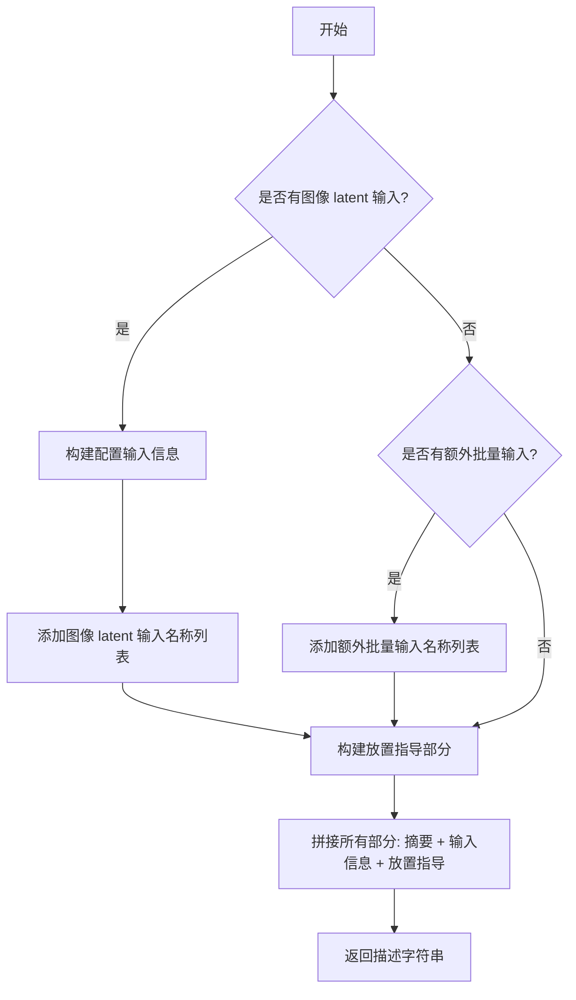

#### 带注释源码

```python
@property
def description(self) -> str:
    """获取该输入处理步骤的描述信息。

    该属性返回一个格式化的字符串，描述了 Edit Plus 输入处理步骤的功能：
    1. 对于图像 latent 输入列表：收集高度/宽度，对每个进行 patchify，拼接，然后扩展批量
    2. 对于额外批量输入：扩展批量维度以匹配最终批量大小
    高度/宽度默认取自列表中的最后一个图像。

    Returns:
        str: 包含功能摘要、配置的输入信息以及放置指导的完整描述字符串
    """
    # 第一部分：功能摘要
    # 描述该步骤的核心功能：处理图像 latent 输入列表和额外批量输入
    summary_section = (
        "Input processing step for Edit Plus that:\n"
        "  1. For image latent inputs (list): Collects heights/widths, patchifies each, concatenates, expands batch\n"
        "  2. For additional batch inputs: Expands batch dimensions to match final batch size\n"
        "  Height/width defaults to last image in the list."
    )

    # 第二部分：配置的输入信息
    # 根据类初始化时传入的 image_latent_inputs 和 additional_batch_inputs 构建输入描述
    inputs_info = ""
    # 检查是否存在配置的输入
    if self._image_latent_inputs or self._additional_batch_inputs:
        inputs_info = "\n\nConfigured inputs:"  # 添加"配置的输入"标题
        # 如果有图像 latent 输入，添加其名称列表
        if self._image_latent_inputs:
            inputs_info += f"\n  - Image latent inputs: {[p.name for p in self._image_latent_inputs]}"
        # 如果有额外批量输入，添加其名称列表
        if self._additional_batch_inputs:
            inputs_info += f"\n  - Additional batch inputs: {[p.name for p in self._additional_batch_inputs]}"

    # 第三部分：放置指导
    # 说明该块在管道中的正确位置（应在编码器步骤和文本输入步骤之后）
    placement_section = "\n\nThis block should be placed after the encoder steps and the text input step."

    # 拼接所有部分并返回完整的描述字符串
    return summary_section + inputs_info + placement_section
```


### `QwenImageEditPlusAdditionalInputsStep.expected_components`

该属性方法定义了 `QwenImageEditPlusAdditionalInputsStep` 步骤所需的组件规格。它返回一个包含 `ComponentSpec` 对象的列表，指定该步骤需要使用 `QwenImagePachifier` 组件（图像分块器）来处理图像潜在向量。

参数：

- 该方法是一个 `@property` 装饰器修饰的方法，没有显式参数

返回值：`list[ComponentSpec]`，返回该步骤所需的组件规格列表，包含一个 `pachifier` 组件

#### 流程图

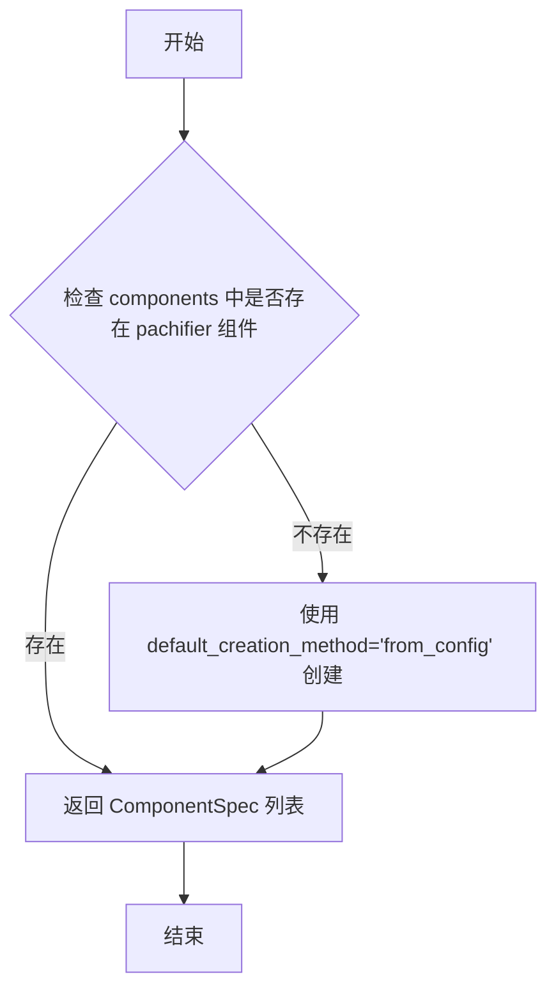

#### 带注释源码

```python
@property
def expected_components(self) -> list[ComponentSpec]:
    """
    定义该管道步骤所需的组件规格。
    
    该方法返回一个列表，包含一个 ComponentSpec 对象：
    - name: "pachifier" - 组件的名称，用于在组件字典中查找
    - component_class: QwenImagePachifier - 组件的实际类类型
    - default_creation_method: "from_config" - 默认创建方法
    
    QwenImagePachifier 组件用于将图像 latent 张量进行 patchify（分块）处理，
    以便后续在 transformer 模型中使用。
    
    Returns:
        list[ComponentSpec]: 包含一个 ComponentSpec 的列表，指定需要 pachifier 组件
    """
    return [
        ComponentSpec("pachifier", QwenImagePachifier, default_creation_method="from_config"),
    ]
```


### `QwenImageEditPlusAdditionalInputsStep.inputs`

这是一个属性方法（property method），用于定义 QwenImageEditPlusAdditionalInputsStep 块的输入参数列表。该方法返回一组标准输入参数（num_images_per_prompt、batch_size、height、width）以及通过构造函数配置的自定义输入参数（image_latents 和 additional_batch_inputs）。

参数：

- 无显式参数（除了隐式的 `self`）

返回值：`list[InputParam]`，返回输入参数列表，包含以下参数：

- `num_images_per_prompt`：`int`，每个提示生成的图像数量
- `batch_size`：`int`，提示的数量
- `height`：`int`，生成图像的高度（像素）
- `width`：`int`，生成图像的宽度（像素）
- `image_latents`：`Tensor`，用于引导图像生成的图像潜在向量（可配置，默认包含）

#### 流程图

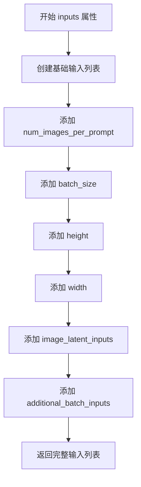

#### 带注释源码

```python
@property
def inputs(self) -> list[InputParam]:
    """
    定义该块的输入参数列表。
    
    返回一个包含所有输入参数的列表，包括：
    - 标准参数：num_images_per_prompt, batch_size, height, width
    - 自定义图像潜在向量输入：由 _image_latent_inputs 指定
    - 自定义批次输入：由 _additional_batch_inputs 指定
    
    Returns:
        list[InputParam]: 输入参数列表
    """
    # 初始化基础输入参数列表，包含流水线必需的标准参数
    inputs = [
        InputParam.template("num_images_per_prompt"),  # 每个提示生成的图像数量
        InputParam.template("batch_size"),             # 批处理大小
        InputParam.template("height"),                 # 生成图像的高度
        InputParam.template("width"),                  # 生成图像的宽度
    ]

    # 添加通过构造函数配置的图像潜在向量输入（默认为 ['image_latents']）
    # 然后添加额外的批次输入参数
    inputs += self._image_latent_inputs + self._additional_batch_inputs

    return inputs  # 返回完整的输入参数列表
```


### QwenImageEditPlusAdditionalInputsStep.intermediate_outputs

该属性方法定义了 Edit Plus 图像编辑流水线中额外输入步骤的中间输出参数。它返回一个列表，包含图像高度和宽度的列表、可能更新的全局 height/width 参数，以及经过分块（patchified）、连接（concatenated）和批量扩展（batch-expanded）处理后的图像潜在向量和其他批量输入的元数据描述。

参数：

- `self`：类的实例本身，包含以下关键属性：
  - `_image_latent_inputs`：`list[InputParam]`，图像潜在输入参数列表
  - `_additional_batch_inputs`：`list[InputParam]`，额外批量输入参数列表

返回值：`list[OutputParam]`，中间输出参数列表，包含以下元素：

- `image_height`：`list[int]`，从图像潜在向量维度计算出的图像高度列表
- `image_width`：`list[int]`，从图像潜在向量维度计算出的图像宽度列表
- `height`：`int`，如果未提供则更新为图像高度
- `width`：`int`，如果未提供则更新为图像宽度
- `image_latents`：`Tensor`，经过 patchified、concatenated 和 batch-expanded 处理后的图像潜在向量
- 其他额外批量输入：经过 batch-expanded 处理后的参数

#### 流程图

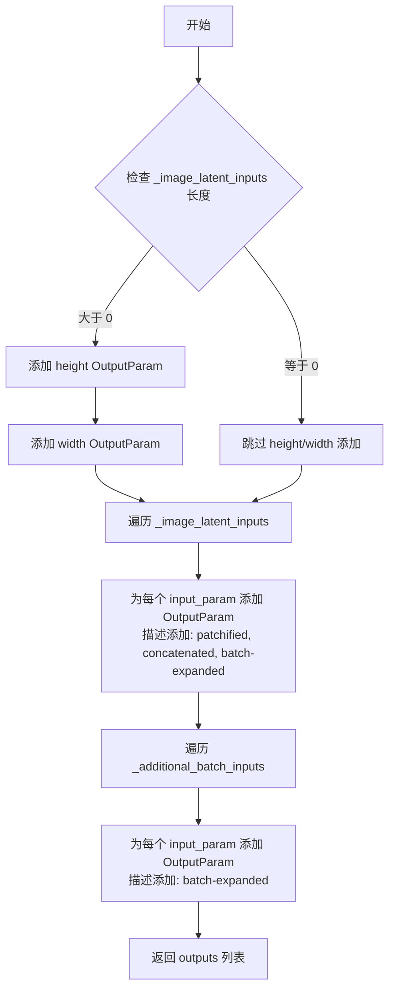

#### 带注释源码

```python
@property
def intermediate_outputs(self) -> list[OutputParam]:
    """
    定义 Edit Plus 流水线的中间输出参数。
    
    该属性返回一个列表，包含处理过程中产生的中间输出元数据，
    包括图像尺寸、更新的尺寸参数、以及处理后的图像潜在向量。
    
    Returns:
        list[OutputParam]: 中间输出参数列表
    """
    # 初始化输出列表，包含图像高度和宽度的列表类型
    outputs = [
        OutputParam(
            name="image_height",
            type_hint=list[int],
            description="The image heights calculated from the image latents dimension",
        ),
        OutputParam(
            name="image_width",
            type_hint=list[int],
            description="The image widths calculated from the image latents dimension",
        ),
    ]

    # 如果存在图像潜在输入，则添加 height 和 width 的 OutputParam
    # 这些参数在输入未提供时会被更新为图像的实际高度和宽度
    if len(self._image_latent_inputs) > 0:
        outputs.append(
            OutputParam(name="height", type_hint=int, description="if not provided, updated to image height")
        )
        outputs.append(
            OutputParam(name="width", type_hint=int, description="if not provided, updated to image width")
        )

    # 遍历图像潜在输入参数，为每个输入添加 OutputParam
    # 描述中注明该输入已经过了 patchified、concatenated 和 batch-expanded 处理
    for input_param in self._image_latent_inputs:
        outputs.append(
            OutputParam(
                name=input_param.name,
                type_hint=input_param.type_hint,
                description=input_param.description + " (patchified, concatenated, and batch-expanded)",
            )
        )

    # 遍历额外批量输入参数，为每个输入添加 OutputParam
    # 这些输入仅经过 batch-expanded 处理
    for input_param in self._additional_batch_inputs:
        outputs.append(
            OutputParam(
                name=input_param.name,
                type_hint=input_param.type_hint,
                description=input_param.description + " (batch-expanded)",
            )
        )

    return outputs
```


### `QwenImageEditPlusAdditionalInputsStep.__call__`

该方法是 Qwen-Image Edit Plus 流程的输入处理步骤，用于处理图像潜在表示（latents）和其他批量输入。核心功能包括：1) 对图像潜在表示列表中的每个元素进行尺寸计算、分批打包（patchify）和批量扩展；2) 将打包后的多个潜在表示沿通道维度拼接；3) 对其他批量输入仅进行批量维度扩展；4) 更新图像高度/宽度信息。

参数：

-  `components`：`QwenImageModularPipeline`，管道组件集合，包含 VAE 缩放因子和打包器（pachifier）等
-  `state`：`PipelineState`，管道的当前状态，包含批处理大小、图像潜在表示等中间数据

返回值：`PipelineState`，更新后的管道状态（包含处理后的图像潜在表示和尺寸信息）

#### 流程图

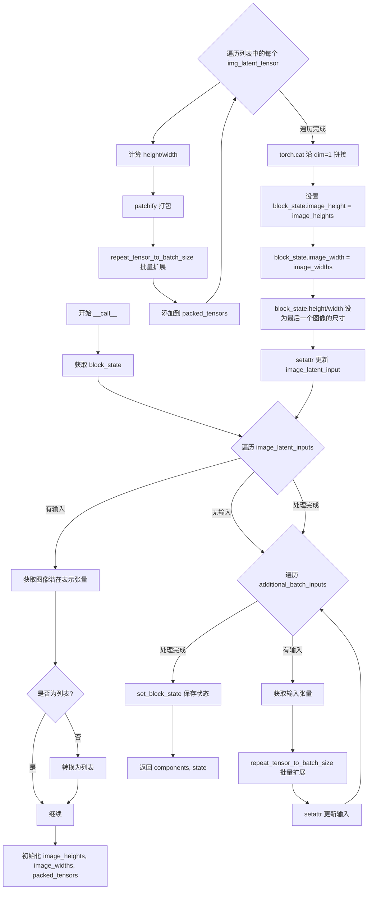

#### 带注释源码

```python
def __call__(self, components: QwenImageModularPipeline, state: PipelineState) -> PipelineState:
    """
    处理 Edit Plus 模式的图像潜在表示和其他批量输入。
    
    处理流程：
    1. 对图像潜在表示列表中的每个元素：计算尺寸、patchify、批量扩展
    2. 拼接所有打包后的潜在表示
    3. 对其他批量输入仅进行批量扩展
    4. 更新高度/宽度状态
    """
    # 从管道状态获取当前块状态
    block_state = self.get_block_state(state)

    # 遍历所有图像潜在输入（如 image_latents）
    for input_param in self._image_latent_inputs:
        image_latent_input_name = input_param.name  # 如 'image_latents'
        image_latent_tensor = getattr(block_state, image_latent_input_name)
        
        # 如果该输入为空，跳过处理
        if image_latent_tensor is None:
            continue

        # 检查是否为列表（Edit Plus 支持多个图像输入）
        is_list = isinstance(image_latent_tensor, list)
        if not is_list:
            # 单个张量转换为列表以便统一处理
            image_latent_tensor = [image_latent_tensor]

        # 用于存储每个图像的尺寸和打包后的张量
        image_heights = []
        image_widths = []
        packed_image_latent_tensors = []

        # 遍历列表中的每个潜在表示
        for i, img_latent_tensor in enumerate(image_latent_tensor):
            # 1. 从潜在表示计算图像高度和宽度
            # 调用 calculate_dimension_from_latents 将潜在空间尺寸转换为像素空间
            height, width = calculate_dimension_from_latents(
                img_latent_tensor, 
                components.vae_scale_factor
            )
            image_heights.append(height)
            image_widths.append(width)

            # 2. 使用 pachifier 进行 patchify（将图像转换为 patch 序列）
            img_latent_tensor = components.pachifier.pack_latents(img_latent_tensor)

            # 3. 扩展批量大小以匹配 batch_size * num_images_per_prompt
            img_latent_tensor = repeat_tensor_to_batch_size(
                input_name=f"{image_latent_input_name}[{i}]",
                input_tensor=img_latent_tensor,
                num_images_per_prompt=block_state.num_images_per_prompt,
                batch_size=block_state.batch_size,
            )
            packed_image_latent_tensors.append(img_latent_tensor)

        # 沿通道维度（dim=1）拼接所有打包后的潜在表示
        # 将多个图像的 patch 序列连接在一起
        packed_image_latent_tensors = torch.cat(packed_image_latent_tensors, dim=1)

        # 输出图像高度/宽度的列表（用于多个输入图像）
        block_state.image_height = image_heights
        block_state.image_width = image_widths

        # 默认高度/宽度取自列表中的最后一个图像
        block_state.height = block_state.height or image_heights[-1]
        block_state.width = block_state.width or image_widths[-1]

        # 更新 block_state 中的潜在表示
        setattr(block_state, image_latent_input_name, packed_image_latent_tensors)

    # 处理额外的批量输入（仅进行批量扩展，不进行 patchify）
    for input_param in self._additional_batch_inputs:
        input_name = input_param.name
        input_tensor = getattr(block_state, input_name)
        
        if input_tensor is None:
            continue

        # 仅进行批量维度扩展
        input_tensor = repeat_tensor_to_batch_size(
            input_name=input_name,
            input_tensor=input_tensor,
            num_images_per_prompt=block_state.num_images_per_prompt,
            batch_size=block_state.batch_size,
        )

        setattr(block_state, input_name, input_tensor)

    # 保存更新后的块状态
    self.set_block_state(state, block_state)
    return components, state
```


### `QwenImageLayeredAdditionalInputsStep.__init__`

初始化 `QwenImageLayeredAdditionalInputsStep` 类，该类是用于分层（Layered）图像处理的输入处理步骤。它接受图像潜在输入和额外批处理输入，验证其类型，并初始化内部属性。

参数：

- `self`：隐式参数，表示类的实例本身
- `image_latent_inputs`：`list[InputParam] | None`，要处理的图像潜在输入列表，默认为 `[InputParam.template("image_latents")]`
- `additional_batch_inputs`：`list[InputParam] | None`，额外需要扩展批处理维度的输入列表，默认为空列表

返回值：无（`None`），构造函数没有返回值

#### 流程图

```mermaid
flowchart TD
    A[开始 __init__] --> B{image_latent_inputs is None?}
    B -->|Yes| C[设置默认 image_latent_inputs = [InputParam.template('image_latents')]]
    B -->|No| D{additional_batch_inputs is None?}
    C --> D
    D -->|Yes| E[设置默认 additional_batch_inputs = []]
    D -->|No| F{image_latent_inputs 是 list?}
    E --> F
    F -->|No| G[抛出 ValueError: image_latent_inputs must be a list]
    F -->|Yes| H{image_latent_inputs 中元素都是 InputParam?}
    H -->|No| I[抛出 ValueError: image_latent_inputs must be a list of InputParam]
    H -->|Yes| J{additional_batch_inputs 是 list?}
    J -->|No| K[抛出 ValueError: additional_batch_inputs must be a list]
    J -->|Yes| L{additional_batch_inputs 中元素都是 InputParam?}
    L -->|No| M[抛出 ValueError: additional_batch_inputs must be a list of InputParam]
    L -->|Yes| N[设置 self._image_latent_inputs = image_latent_inputs]
    N --> O[设置 self._additional_batch_inputs = additional_batch_inputs]
    O --> P[调用 super().__init__()]
    P --> Q[结束 __init__]
    
    G --> R[结束]
    I --> R
    K --> R
    M --> R
```

#### 带注释源码

```python
def __init__(
    self,
    image_latent_inputs: list[InputParam] | None = None,
    additional_batch_inputs: list[InputParam] | None = None,
):
    """初始化 QwenImageLayeredAdditionalInputsStep。

    Args:
        image_latent_inputs: 要处理的图像潜在输入列表，默认为 ['image_latents']
        additional_batch_inputs: 额外需要扩展批处理维度的输入列表
    """
    # 如果未提供 image_latent_inputs，则使用默认的 ['image_latents']
    if image_latent_inputs is None:
        image_latent_inputs = [InputParam.template("image_latents")]
    
    # 如果未提供 additional_batch_inputs，则默认为空列表
    if additional_batch_inputs is None:
        additional_batch_inputs = []

    # 验证 image_latent_inputs 是列表类型
    if not isinstance(image_latent_inputs, list):
        raise ValueError(f"image_latent_inputs must be a list, but got {type(image_latent_inputs)}")
    else:
        # 验证列表中的每个元素都是 InputParam 类型
        for input_param in image_latent_inputs:
            if not isinstance(input_param, InputParam):
                raise ValueError(f"image_latent_inputs must be a list of InputParam, but got {type(input_param)}")

    # 验证 additional_batch_inputs 是列表类型
    if not isinstance(additional_batch_inputs, list):
        raise ValueError(f"additional_batch_inputs must be a list, but got {type(additional_batch_inputs)}")
    else:
        # 验证列表中的每个元素都是 InputParam 类型
        for input_param in additional_batch_inputs:
            if not isinstance(input_param, InputParam):
                raise ValueError(
                    f"additional_batch_inputs must be a list of InputParam, but got {type(input_param)}"
                )

    # 将验证后的输入存储为实例属性
    self._image_latent_inputs = image_latent_inputs
    self._additional_batch_inputs = additional_batch_inputs
    
    # 调用父类 Modul 的初始化方法
    super().__init__()
```


### `QwenImageLayeredAdditionalInputsStep.description`

该属性方法用于返回 `QwenImageLayeredAdditionalInputsStep` 类的描述信息，说明该步骤是一个用于分层（Layered）模型的输入处理步骤，主要功能包括：对图像潜在输入更新高度/宽度（如未提供）、使用分层打包器进行patchify，以及对额外批处理输入进行批维度扩展以匹配最终批大小。

参数： 无（仅包含隐式参数 `self`）

返回值：`str`，返回该处理步骤的完整描述字符串，包含功能摘要、配置的输入信息以及放置建议。

#### 流程图

```mermaid
flowchart TD
    A[开始] --> B[构建功能摘要]
    B --> C{是否存在图像潜在输入或额外批处理输入?}
    C -->|是| D[添加配置输入信息]
    C -->|否| E[跳过配置输入信息]
    D --> F[添加放置建议]
    E --> F
    F --> G[拼接所有部分返回描述字符串]
    G --> H[结束]
```

#### 带注释源码

```python
@property
def description(self) -> str:
    """返回该处理步骤的描述信息
    
    该方法构建并返回一个描述字符串，包含以下部分：
    1. 功能摘要：说明该步骤处理图像潜在输入和额外批处理输入
    2. 配置输入信息：列出当前配置的图像潜在输入和额外批处理输入
    3. 放置建议：说明该块应该放置在编码器步骤和文本输入步骤之后
    
    Returns:
        str: 完整的步骤描述字符串
    """
    # 定义功能摘要部分，说明该步骤的主要功能
    summary_section = (
        "Input processing step for Layered that:\n"
        "  1. For image latent inputs: Updates height/width if None, patchifies with layered pachifier, and expands batch size\n"
        "  2. For additional batch inputs: Expands batch dimensions to match final batch size"
    )

    # 初始化配置输入信息字符串
    inputs_info = ""
    # 检查是否存在图像潜在输入或额外批处理输入
    if self._image_latent_inputs or self._additional_batch_inputs:
        # 添加配置输入标题
        inputs_info = "\n\nConfigured inputs:"
        # 如果有图像潜在输入，添加其名称列表
        if self._image_latent_inputs:
            inputs_info += f"\n  - Image latent inputs: {[p.name for p in self._image_latent_inputs]}"
        # 如果有额外批处理输入，添加其名称列表
        if self._additional_batch_inputs:
            inputs_info += f"\n  - Additional batch inputs: {[p.name for p in self._additional_batch_inputs]}"

    # 定义放置建议部分
    placement_section = "\n\nThis block should be placed after the encoder steps and the text input step."

    # 拼接所有部分并返回完整的描述字符串
    return summary_section + inputs_info + placement_section
```


### `QwenImageLayeredAdditionalInputsStep.expected_components`

这是一个属性方法（用 `@property` 装饰器装饰），定义了该处理步骤期望的组件列表。它指定了需要从配置中创建的 `pachifier` 组件，其类型为 `QwenImageLayeredPachifier`。

参数：
- 该方法无显式参数（隐式参数 `self` 为类的实例）

返回值：`list[ComponentSpec]`，返回组件规范列表，包含一个 `ComponentSpec` 对象，描述了所需的 `pachifier` 组件。

#### 流程图

```mermaid
flowchart TD
    A[开始] --> B[返回 ComponentSpec 列表]
    B --> C[包含 pachifier 组件规范]
    C --> D[组件类型: QwenImageLayeredPachifier]
    C --> E[默认创建方法: from_config]
    D --> F[结束]
    E --> F
```

#### 带注释源码

```python
@property
def expected_components(self) -> list[ComponentSpec]:
    """
    定义该步骤期望的组件列表。
    
    该属性返回一个包含 ComponentSpec 对象的列表，
    指定了流水线需要预先配置或创建的组件。
    
    在 QwenImageLayeredAdditionalInputsStep 中，
    只需要一个 'pachifier' 组件，用于对分层图像 latent 进行 patchify 操作。
    
    Returns:
        list[ComponentSpec]: 组件规范列表，包含 pachifier 组件的规格说明
    """
    return [
        ComponentSpec("pachifier", QwenImageLayeredPachifier, default_creation_method="from_config"),
    ]
```


### `QwenImageLayeredAdditionalInputsStep.inputs`

该属性方法返回分层（Layered）输入处理步骤所需的所有输入参数列表，包括 `num_images_per_prompt`、`batch_size`、图像 latent 输入以及其他额外批量输入。

参数：

- （无显式参数，隐式参数 `self` 代表类实例）

返回值：`list[InputParam]`，返回输入参数列表，包含了处理图像 latent 和额外批量输入所需的全部参数定义。

#### 流程图

```mermaid
flowchart TD
    A["inputs 属性被调用"] --> B{初始化输入列表}
    B --> C["添加 num_images_per_prompt 参数"]
    B --> D["添加 batch_size 参数"]
    C --> E["添加 image_latent_inputs<br>默认为 ['image_latents']"]
    D --> E
    E --> F["添加 additional_batch_inputs<br>默认为空列表"]
    F --> G["返回完整输入列表"]
    
    style A fill:#e1f5fe
    style G fill:#e8f5e8
```

#### 带注释源码

```python
@property
def inputs(self) -> list[InputParam]:
    """获取该处理步骤的所有输入参数定义。
    
    返回的输入参数列表包含：
    - num_images_per_prompt: 每个提示生成的图像数量
    - batch_size: 提示数量
    - image_latent_inputs: 图像潜在表示输入（默认为 image_latents）
    - additional_batch_inputs: 额外的批量输入（如控制网图像等）
    
    Returns:
        list[InputParam]: 输入参数列表，用于定义该模块需要的输入
    """
    # 初始化基础输入参数列表，包含每个提示生成的图像数量和批处理大小
    inputs = [
        InputParam.template("num_images_per_prompt"),  # 每个提示生成的图像数量（可选，默认为1）
        InputParam.template("batch_size"),              # 批处理大小（可选，默认为1）
    ]
    
    # 添加图像潜在表示输入（默认为 'image_latents'）
    # 这些输入会被 patchify 处理并扩展批量维度
    inputs += self._image_latent_inputs + self._additional_batch_inputs

    return inputs  # 返回完整的输入参数列表
```


### `QwenImageLayeredAdditionalInputsStep.intermediate_outputs`

该属性方法定义了在分层（Layered）图像处理流水线中，`QwenImageLayeredAdditionalInputsStep` 步骤的中间输出参数。它动态构建并返回一个包含 `OutputParam` 对象的列表，描述了经过处理后的图像高度、宽度、图像潜在向量及其他批处理输入的状态。

参数：

- `self`：`QwenImageLayeredAdditionalInputsStep` 实例，隐式参数，表示调用该属性的类实例本身

返回值：`list[OutputParam]`，`OutputParam` 列表，描述该步骤产生的所有中间输出参数

#### 流程图

```mermaid
flowchart TD
    A[开始: 获取 intermediate_outputs] --> B{检查 _image_latent_inputs 长度}
    B -->|长度 > 0| C[添加 height 输出参数]
    B -->|长度 = 0| D[跳过 height 输出参数]
    C --> E[添加 width 输出参数]
    D --> F[遍历 _image_latent_inputs 列表]
    E --> F
    F --> G{当前索引 < 列表长度?}
    G -->|是| H[获取当前 input_param]
    H --> I[创建 OutputParam<br/>name: input_param.name<br/>description: +patchified with layered pachifier and batch-expanded]
    I --> J[添加到 outputs 列表]
    J --> G
    G -->|否| K[遍历 _additional_batch_inputs 列表]
    K --> L{当前索引 < 列表长度?}
    L -->|是| M[获取当前 input_param]
    M --> N[创建 OutputParam<br/>name: input_param.name<br/>description: +batch-expanded]
    N --> O[添加到 outputs 列表]
    O --> L
    L -->|否| P[返回 outputs 列表]
```

#### 带注释源码

```python
@property
def intermediate_outputs(self) -> list[OutputParam]:
    # 初始化输出参数列表，首先添加图像高度和宽度参数
    outputs = [
        OutputParam(
            name="image_height",
            type_hint=int,
            description="The image height calculated from the image latents dimension",
        ),
        OutputParam(
            name="image_width",
            type_hint=int,
            description="The image width calculated from the image latents dimension",
        ),
    ]

    # 如果存在图像潜在向量输入，则添加 height 和 width 输出参数
    # 这两个参数在未提供时将被更新为图像高度和宽度
    if len(self._image_latent_inputs) > 0:
        outputs.append(
            OutputParam(name="height", type_hint=int, description="if not provided, updated to image height")
        )
        outputs.append(
            OutputParam(name="width", type_hint=int, description="if not provided, updated to image width")
        )

    # 遍历图像潜在向量输入列表，为每个输入添加输出参数
    # 这些参数将被分批打包（patchified）并使用分层打包器进行批扩展
    for input_param in self._image_latent_inputs:
        outputs.append(
            OutputParam(
                name=input_param.name,
                type_hint=input_param.type_hint,
                description=input_param.description + " (patchified with layered pachifier and batch-expanded)",
            )
        )

    # 遍历额外的批处理输入列表，为每个输入添加输出参数
    # 这些参数仅进行批扩展，不进行分批打包处理
    for input_param in self._additional_batch_inputs:
        outputs.append(
            OutputParam(
                name=input_param.name,
                type_hint=input_param.type_hint,
                description=input_param.description + " (batch-expanded)",
            )
        )

    # 返回完整的输出参数列表
    return outputs
```


### QwenImageLayeredAdditionalInputsStep.__call__

该方法是分层（Layered）图像管道的输入处理步骤，负责：1）从图像latents计算并更新高度/宽度；2）使用分层pachifier对图像latents进行patchify处理；3）扩展batch维度以匹配最终的batch大小（batch_size * num_images_per_prompt）；4）对额外的batch输入进行batch扩展。

参数：

- `self`：隐式参数，当前类实例
- `components`：`QwenImageModularPipeline`，管道组件对象，包含pachifier等组件
- `state`：`PipelineState`，管道状态对象，包含批处理大小、图像数量等状态信息

返回值：`PipelineState`，更新后的管道状态对象

#### 流程图

```mermaid
flowchart TD
    A[开始 __call__] --> B[获取 block_state]
    B --> C{遍历 image_latent_inputs}
    C -->|有输入| D[获取图像latent张量]
    C -->|无输入| H[处理额外batch输入]
    D --> E{latent tensor 为 None?}
    E -->|是| C
    E -->|否| F[计算 height/width<br/>latent.shape[3] * vae_scale_factor]
    F --> G[更新 block_state.height/width<br/>和 image_height/image_width]
    G --> I[使用 layered pachifier<br/>pack_latents]
    I --> J[扩展batch维度<br/>repeat_tensor_to_batch_size]
    J --> K[更新 block_state 属性]
    K --> C
    H --> L{遍历 additional_batch_inputs}
    L -->|有输入| M[获取输入tensor]
    L -->|无输入| N[设置 block_state]
    M --> O{input_tensor 为 None?}
    O -->|是| L
    O -->|否| P[扩展batch维度]
    P --> Q[更新 block_state 属性]
    Q --> L
    L --> R[返回 components, state]
```

#### 带注释源码

```python
def __call__(self, components: QwenImageModularPipeline, state: PipelineState) -> PipelineState:
    """处理分层图像的额外输入，处理latents并扩展batch维度
    
    处理流程：
    1. 对每个图像latent输入计算height/width
    2. 使用layered pachifier进行patchify
    3. 扩展batch大小
    4. 对额外batch输入仅扩展batch
    """
    # 从state中获取当前block的局部状态
    block_state = self.get_block_state(state)

    # ========== 处理图像latent输入 ==========
    # 遍历所有配置的图像latent输入（默认是 ['image_latents']）
    for input_param in self._image_latent_inputs:
        # 获取输入参数名称（如 'image_latents'）
        image_latent_input_name = input_param.name
        # 从block_state获取对应的tensor
        image_latent_tensor = getattr(block_state, image_latent_input_name)
        
        # 如果tensor为None，跳过处理
        if image_latent_tensor is None:
            continue

        # 1. 从latents计算高度和宽度
        # 分层latents的shape为 (B, layers, C, H, W)
        height = image_latent_tensor.shape[3] * components.vae_scale_factor
        width = image_latent_tensor.shape[4] * components.vae_scale_factor
        
        # 更新block_state中的height和width
        block_state.height = height
        block_state.width = width

        # 如果block_state中没有image_height和image_width，则设置
        if not hasattr(block_state, "image_height"):
            block_state.image_height = height
        if not hasattr(block_state, "image_width"):
            block_state.image_width = width

        # 2. 使用layered pachifier进行patchify（将latent打包成patches）
        image_latent_tensor = components.pachifier.pack_latents(image_latent_tensor)

        # 3. 扩展batch维度以匹配最终batch大小
        # 最终batch大小 = batch_size * num_images_per_prompt
        image_latent_tensor = repeat_tensor_to_batch_size(
            input_name=image_latent_input_name,
            input_tensor=image_latent_tensor,
            num_images_per_prompt=block_state.num_images_per_prompt,
            batch_size=block_state.batch_size,
        )

        # 将处理后的tensor设置回block_state
        setattr(block_state, image_latent_input_name, image_latent_tensor)

    # ========== 处理额外的batch输入 ==========
    # 这类输入只需要扩展batch，不需要patchify
    for input_param in self._additional_batch_inputs:
        input_name = input_param.name
        input_tensor = getattr(block_state, input_name)
        
        if input_tensor is None:
            continue

        # 仅进行batch扩展
        input_tensor = repeat_tensor_to_batch_size(
            input_name=input_name,
            input_tensor=input_tensor,
            num_images_per_prompt=block_state.num_images_per_prompt,
            batch_size=block_state.batch_size,
        )

        setattr(block_state, input_name, input_tensor)

    # 将更新后的block_state写回state
    self.set_block_state(state, block_state)
    
    # 返回更新后的components和state（符合PipelineState协议）
    return components, state
```


### `QwenImageControlNetInputsStep.description`

这是一个属性方法（property），返回该处理步骤的描述字符串，用于说明该步骤的主要功能。

参数：无需参数（为属性方法）

返回值：`str`，返回该步骤的描述信息

#### 流程图

```mermaid
flowchart TD
    A[开始] --> B{访问description属性}
    B --> C[返回描述字符串]
    C --> D[结束]
    
    style B fill:#f9f,color:#333
    style C fill:#bbf,color:#333
```

#### 带注释源码

```python
@property
def description(self) -> str:
    """
    返回该处理步骤的描述信息。
    
    该属性用于文档生成和调试目的，
    说明了该步骤的主要功能是将control_image_latents准备好供controlnet使用，
    并应放在其他输入步骤之后执行。
    
    Returns:
        str: 描述该步骤功能的字符串
    """
    return "prepare the `control_image_latents` for controlnet. Insert after all the other inputs steps."
```


### `QwenImageControlNetInputsStep.inputs`

该属性方法定义了 ControlNet 输入处理步骤所需的输入参数列表，包括控制图像潜向量、批大小、每提示图像数量、输出高度和宽度。

参数：

- `self`：`QwenImageControlNetInputsStep` 实例，隐式参数，无需显式传递

返回值：`list[InputParam]`，返回一组输入参数定义，包含以下五个 `InputParam` 对象：

1. `control_image_latents`：`torch.Tensor`，控制图像潜向量，用于去噪过程，可在 ControlNet VAE 编码器步骤中生成（必需）
2. `batch_size`：`int`，提示数量，最终模型输入的批大小应为 `batch_size * num_images_per_prompt`，可在输入步骤中生成（可选，默认值 1）
3. `num_images_per_prompt`：`int`，每个提示生成的图像数量（可选，默认值 1）
4. `height`：`int`，生成图像的像素高度（可选）
5. `width`：`int`，生成图像的像素宽度（可选）

#### 流程图

```mermaid
flowchart TD
    A[获取 inputs 属性] --> B{返回输入参数列表}
    B --> C[control_image_latents: Tensor<br/>required=True]
    B --> D[batch_size: int<br/>optional, default=1]
    B --> E[num_images_per_prompt: int<br/>optional, default=1]
    B --> F[height: int<br/>optional]
    B --> G[width: int<br/>optional]
```

#### 带注释源码

```python
@property
def inputs(self) -> list[InputParam]:
    """
    定义 ControlNet 输入处理步骤所需的输入参数列表。
    
    该属性返回一个包含五个 InputParam 对象的列表：
    1. control_image_latents - 控制图像潜向量（必需）
    2. batch_size - 批大小（可选，默认1）
    3. num_images_per_prompt - 每提示图像数（可选，默认1）
    4. height - 图像高度（可选）
    5. width - 图像宽度（可选）
    
    Returns:
        list[InputParam]: 输入参数定义列表
    """
    return [
        # 必需参数：控制图像潜向量，用于 ControlNet 去噪过程
        InputParam(
            name="control_image_latents",
            required=True,
            type_hint=torch.Tensor,
            description="The control image latents to use for the denoising process. Can be generated in controlnet vae encoder step.",
        ),
        # 可选参数：批大小，最终批大小为 batch_size * num_images_per_prompt
        InputParam.template("batch_size"),
        # 可选参数：每个提示生成的图像数量
        InputParam.template("num_images_per_prompt"),
        # 可选参数：生成图像的高度（像素）
        InputParam.template("height"),
        # 可选参数：生成图像的宽度（像素）
        InputParam.template("width"),
    ]
```


### `QwenImageControlNetInputsStep.intermediate_outputs`

该属性方法定义了 `QwenImageControlNetInputsStep` 类的中间输出参数，包含了控制网图像潜在向量、图像高度和宽度等三个输出参数，用于在流水线中传递处理后的控制图像数据。

参数： 无（该方法为属性方法，无显式参数）

返回值：`list[OutputParam]`，包含三个 `OutputParam` 对象的列表，分别描述控制图像潜在向量、图像高度和图像宽度的输出信息。

#### 流程图

```mermaid
flowchart TD
    A[开始] --> B{intermediate_outputs 属性}
    B --> C[定义 control_image_latents 输出参数]
    C --> D[定义 height 输出参数]
    D --> E[定义 width 输出参数]
    E --> F[返回包含三个 OutputParam 的列表]
```

#### 带注释源码

```python
@property
def intermediate_outputs(self) -> list[OutputParam]:
    """定义该处理步骤的中间输出参数。

    Returns:
        list[OutputParam]: 包含以下三个输出参数的列表：
            - control_image_latents: 处理后的控制图像潜在向量（patchified 和 batch-expanded）
            - height: 如果未提供则更新为控制图像高度
            - width: 如果未提供则更新为控制图像宽度
    """
    return [
        OutputParam(
            name="control_image_latents",
            type_hint=torch.Tensor,
            description="The control image latents (patchified and batch-expanded).",
        ),
        OutputParam(name="height", type_hint=int, description="if not provided, updated to control image height"),
        OutputParam(name="width", type_hint=int, description="if not provided, updated to control image width"),
    ]
```


### `QwenImageControlNetInputsStep.__call__`

该方法是`QwenImageControlNetInputsStep`类的核心调用方法，负责准备ControlNet的图像潜在向量（control_image_latents），包括计算并更新图像尺寸、对潜在向量进行patchify打包处理、以及将其batch扩展以匹配最终的批处理大小。该方法支持单ControlNet和多ControlNet（`QwenImageMultiControlNetModel`）两种模式。

参数：

- `self`：实例本身，包含类属性如`model_name`等
- `components`：`QwenImageModularPipeline`类型，模块化流水线的组件容器，包含`controlnet`、`pachifier`、`vae_scale_factor`等组件
- `state`：`PipelineState`类型，流水线状态对象，用于存储块状态（block_state）中当前步骤的中间数据

返回值：`PipelineState`，更新后的流水线状态对象（实际返回`Tuple[QwenImageModularPipeline, PipelineState]`，但通常忽略第一个返回值）

#### 流程图

```mermaid
flowchart TD
    A[开始 __call__] --> B[获取 block_state]
    B --> C{controlnet 是否为<br/>QwenImageMultiControlNetModel?}
    
    C -->|是| D[初始化空列表<br/>control_image_latents]
    D --> E[遍历 block_state.control_image_latents]
    E --> F[计算当前 latent 的 height/width]
    F --> G[更新 block_state.height/width<br/>如果未提供]
    G --> H[使用 pachifier.pack_latents<br/>打包 latent]
    H --> I[调用 repeat_tensor_to_batch_size<br/>扩展 batch]
    I --> J[将处理后的 latent<br/>添加到列表]
    J --> K{还有更多 latent?}
    K -->|是| E
    K -->|否| L[更新 block_state.control_image_latents<br/>为处理后的列表]
    L --> Z[保存 block_state 并返回]
    
    C -->|否| M[计算单个 latent 的 height/width]
    M --> N[更新 block_state.height/width<br/>如果未提供]
    N --> O[使用 pachifier.pack_latents<br/>打包 latent]
    O --> P[调用 repeat_tensor_to_batch_size<br/>扩展 batch]
    P --> Q[更新 block_state.control_image_latents]
    Q --> Z
    
    Z --> R[返回 components, state]
```

#### 带注释源码

```python
@torch.no_grad()  # 禁用梯度计算以减少内存占用
def __call__(self, components: QwenImageModularPipeline, state: PipelineState) -> PipelineState:
    """
    处理ControlNet的图像潜在向量输入。
    
    该方法执行以下操作：
    1. 从latents计算图像高度和宽度（如未提供）
    2. 使用pachifier对latents进行patchify打包
    3. 扩展batch维度以匹配 batch_size * num_images_per_prompt
    
    Args:
        components: 包含pipeline组件的对象，需要访问controlnet、pachifier和vae_scale_factor
        state: 流水线状态对象，包含block_state
    
    Returns:
        更新后的PipelineState对象
    """
    # 从state中获取当前块的内部状态
    block_state = self.get_block_state(state)

    # 检查是否为多ControlNet模型
    if isinstance(components.controlnet, QwenImageMultiControlNetModel):
        # 多ControlNet分支：处理多个control_image_latents
        control_image_latents = []
        
        # 遍历每一个control_image_latents
        for i, control_image_latents_ in enumerate(block_state.control_image_latents):
            # 步骤1: 如果未提供height/width，则从latents计算
            height, width = calculate_dimension_from_latents(
                control_image_latents_, 
                components.vae_scale_factor
            )
            block_state.height = block_state.height or height
            block_state.width = block_state.width or width

            # 步骤2: 使用pachifier打包latents（patchify操作）
            control_image_latents_ = components.pachifier.pack_latents(control_image_latents_)

            # 步骤3: 重复tensor以匹配batch大小
            control_image_latents_ = repeat_tensor_to_batch_size(
                input_name=f"control_image_latents[{i}]",
                input_tensor=control_image_latents_,
                num_images_per_prompt=block_state.num_images_per_prompt,
                batch_size=block_state.batch_size,
            )

            # 收集处理后的latent
            control_image_latents.append(control_image_latents_)

        # 更新block_state中的control_image_latents为处理后的列表
        block_state.control_image_latents = control_image_latents

    else:
        # 单ControlNet分支：处理单个control_image_latents
        # 步骤1: 计算height/width
        height, width = calculate_dimension_from_latents(
            block_state.control_image_latents, 
            components.vae_scale_factor
        )
        block_state.height = block_state.height or height
        block_state.width = block_state.width or width

        # 步骤2: patchify打包
        block_state.control_image_latents = components.pachifier.pack_latents(
            block_state.control_image_latents
        )

        # 步骤3: 扩展batch维度
        block_state.control_image_latents = repeat_tensor_to_batch_size(
            input_name="control_image_latents",
            input_tensor=block_state.control_image_latents,
            num_images_per_prompt=block_state.num_images_per_prompt,
            batch_size=block_state.batch_size,
        )

        # 冗余赋值（可优化）
        block_state.control_image_latents = block_state.control_image_latents

    # 将更新后的block_state写回state
    self.set_block_state(state, block_state)

    # 返回components和state（通常调用方忽略components）
    return components, state
```

## 关键组件


### repeat_tensor_to_batch_size

张量批处理扩展函数，将输入张量的批次维度扩展到最终批次大小（batch_size * num_images_per_prompt），支持按元素重复以匹配多图生成需求。

### calculate_dimension_from_latents

潜在张量维度计算函数，将潜在空间尺寸转换为图像空间尺寸，通过将潜在高度和宽度乘以VAE缩放因子实现。

### QwenImageTextInputsStep

文本输入处理模块，标准化文本嵌入以适配管道。包括：确定batch_size和dtype，确保所有文本嵌入具有一致的批次大小，处理prompt_embeds和negative_prompt_embeds的批量扩展。

### QwenImageAdditionalInputsStep

图像潜在变量输入处理模块，负责：更新高度/宽度参数、patchify图像潜在变量、扩展批次维度以匹配最终批次大小。关键特性是支持图像潜在变量的惰性加载（检查None）。

### QwenImageEditPlusAdditionalInputsStep

Edit Plus场景的输入处理模块，支持多图像列表输入。功能包括：收集多个图像的高度/宽度、分别patchify每个图像潜在变量、沿维度1拼接、扩展批次大小。默认使用列表中最后一个图像的尺寸作为输出尺寸。

### QwenImageLayeredAdditionalInputsStep

分层输入处理模块，使用分层pachifier对图像潜在变量进行patchify。专门处理分层潜在张量（具有额外的layers维度），支持分层图像的批处理扩展。

### QwenImageControlNetInputsStep

ControlNet输入准备模块，为ControlNet准备控制图像潜在变量。支持单个和多个（MultiControlNet）控制图像的处理，包括高度/宽度更新、pack和批次扩展。

### QwenImagePachifier (组件依赖)

图像分块化组件，负责将图像潜在变量打包/分块化以适配模型输入格式。

### QwenImageLayeredPachifier (组件依赖)

分层分块化组件，专门处理具有多层结构的潜在变量，支持分层图像表示的打包。


## 问题及建议


### 已知问题

- **代码重复**：多个类（`QwenImageAdditionalInputsStep`、`QwenImageEditPlusAdditionalInputsStep`、`QwenImageLayeredAdditionalInputsStep`）的 `__init__` 方法、属性定义和验证逻辑高度重复，增加维护成本。
- **过度使用动态属性访问**：大量使用 `getattr`/`setattr` 动态获取和设置属性，降低了代码可读性、类型安全性，并增加调试难度。
- **类型提示不完整**：在 `__call__` 方法中 `block_state` 缺乏明确的类型定义，且 `get_block_state` 的返回类型未知。
- **组件存在性检查缺失**：`QwenImageControlNetInputsStep` 中直接访问 `components.pachifier`，但未验证该组件是否已正确初始化，可能导致运行时错误。
- **不一致的返回值**：部分类返回 `(components, state)` 元组，而文档描述未明确说明这种不一致的设计意图。
- **潜在的状态修改风险**：`QwenImageLayeredAdditionalInputsStep` 中直接赋值 `block_state.height = height` 而非使用 `or` 逻辑，可能覆盖用户提供的尺寸值。
- **缺少对 `num_images_per_prompt` 为 0 或负数的校验**：在多个扩展批次的方法中未进行有效性检查。

### 优化建议

- **提取公共基类**：将 `QwenImageAdditionalInputsStep`、`QwenImageEditPlusAdditionalInputsStep` 和 `QwenImageLayeredAdditionalInputsStep` 的公共逻辑抽取到基类中，减少代码重复。
- **引入数据类或 TypedDict**：为 `block_state` 定义明确的类型结构，使用数据类或 TypedDict 替代动态属性访问，提高类型安全性。
- **统一组件验证**：在访问组件前添加存在性检查，或在类的 `expected_components` 属性中声明的组件上进行断言验证。
- **统一返回值规范**：确保所有 Pipeline 步骤返回一致的格式，或在文档中明确说明不同返回值的使用场景。
- **修复状态修改逻辑**：将 `block_state.height = height` 改为 `block_state.height = block_state.height or height`，与其它步骤保持一致的行为。
- **添加输入参数校验**：在 `repeat_tensor_to_batch_size` 和各步骤的 `__call__` 方法中添加对 `num_images_per_prompt` 的有效性检查。
- **优化张量操作**：对于 `repeat` 后紧接 `view` 的操作，可以考虑使用更高效的 `expand` 或预先分配张量。

## 其它


### 设计目标与约束

本模块是Qwen-Image图像生成Pipeline的模块化输入处理组件集合，核心目标是标准化和预处理各种输入数据（文本嵌入、图像latents、ControlNet输入），确保它们符合后续扩散模型处理的格式要求。主要设计约束包括：(1) 输入张量必须符合特定的batch维度要求（batch_size或1）；(2) 支持多种输入模式（标准、Edit Plus、Layered）；(3) 所有输入处理步骤必须是无损的，确保信息完整性；(4) 模块化设计使得各步骤可以灵活组合和插拔。

### 错误处理与异常设计

代码实现了多层次的错误处理机制。在全局函数层面，`repeat_tensor_to_batch_size`函数会验证输入是否为torch.Tensor，并检查batch维度是否为1或batch_size，不符合时抛出ValueError并附带详细的错误信息；`calculate_dimension_from_latents`函数验证latents张量维度必须为4或5维。在类方法层面，`QwenImageTextInputsStep.check_inputs`方法执行全面的输入验证：检查negative_prompt_embeds和negative_prompt_embeds_mask的配对一致性、验证prompt_embeds_mask与prompt_embeds的batch维度匹配、确保negative_prompt_embeds的batch维度与prompt_embeds一致。构造函数中的参数验证确保`image_latent_inputs`和`additional_batch_inputs`必须是InputParam对象列表。所有异常都采用ValueError类型，便于调用方捕获和处理。

### 数据流与状态机

整个模块遵循Pipeline模式，数据通过`PipelineState`对象在各个处理步骤间流转。以`QwenImageTextInputsStep`为例的处理流程：接收包含prompt_embeds等输入的state对象，首先通过`get_block_state`获取当前块的内部状态，然后执行输入验证，接着更新batch_size和dtype属性，对prompt_embeds进行repeat操作以扩展到num_images_per_prompt维度，最后通过`set_block_state`将更新后的状态写回。`QwenImageAdditionalInputsStep`的数据流更加复杂：遍历image_latent_inputs列表，对每个输入依次执行高度/宽度计算、patchify处理、batch扩展，最后更新state中的height/width属性。状态转换是单向的，每个步骤接收上游输出作为输入，输出供下游消费。

### 外部依赖与接口契约

本模块依赖以下外部组件和接口：(1) `torch`库进行张量操作；(2) `QwenImageMultiControlNetModel`来自`...models`模块，用于多ControlNet场景判断；(3) `ModularPipelineBlocks`、`PipelineState`来自`..modular_pipeline`模块，定义Pipeline块抽象接口；(4) `ComponentSpec`、`InputParam`、`OutputParam`来自`..modular_pipeline_utils`模块，定义组件规格和参数规范；(5) `QwenImagePachifier`和`QwenImageLayeredPachifier`来自`.modular_pipeline`模块，负责latent数据的patchify操作；(6) `components.vae_scale_factor`属性提供VAE缩放因子。调用方必须确保传入的components对象包含上述属性，且state对象遵循PipelineState的接口约定。输入的prompt_embeds等张量必须是PyTorch张量且维度符合要求。

### 性能考虑

模块在性能方面做了以下优化：(1) 使用`repeat_interleave`而非显式循环进行batch扩展，该操作在底层进行了向量化优化；(2) 大量使用in-place操作如`view`、`repeat`减少内存分配；(3) 在`QwenImageControlNetInputsStep`中，对MultiControlNet和单ControlNet分别处理，避免不必要的类型检查开销；(4) 使用`@torch.no_grad()`装饰器禁用梯度计算，减少内存占用和计算开销。潜在的性能瓶颈包括：多次调用`get_block_state`和`set_block_state`可能引入序列化开销；list类型的image_latents处理需要额外的循环迭代。

### 配置与扩展性

模块提供了良好的配置和扩展机制。`QwenImageAdditionalInputsStep`、`QwenImageEditPlusAdditionalInputsStep`和`QwenImageLayeredAdditionalInputsStep`都支持通过构造函数参数`image_latent_inputs`和`additional_batch_inputs`自定义处理的输入列表，这使得模块可以适应不同的Pipeline配置。`InputParam.template`方法支持创建模板化的输入参数规范。每个步骤类通过`expected_components`属性声明其依赖的组件，Pipeline框架可以据此进行依赖注入和懒加载。model_name类属性支持针对不同模型变体（qwenimage、qwenimage-edit-plus、qwenimage-layered）使用不同的处理逻辑。

### 安全考虑

代码在安全方面采取了以下措施：(1) 输入类型检查确保所有张量操作使用正确的类型，避免类型错误导致的潜在安全漏洞；(2) 维度验证防止越界访问，例如检查latents的维度范围；(3) 在处理可选输入（如negative_prompt_embeds）时进行空值检查，避免对None值进行张量操作；(4) 不存在用户输入的直接解析或代码执行路径。潜在的安全风险：代码假设调用方已进行充分的输入清理，未实现额外的sanitization层；torch张量操作可能存在设备（CPU/GPU）不一致的问题。

### 测试策略

建议的测试覆盖策略包括：(1) 单元测试：为每个全局函数编写测试用例，验证边界条件（如batch_size=1、num_images_per_prompt=1、batch已匹配等）；(2) 集成测试：测试各Step类在模拟的PipelineState和Components环境下的行为；(3) 维度一致性测试：验证不同输入组合下输出张量的维度符合预期；(4) 异常测试：验证各类输入错误能否触发正确的异常；(5) 性能基准测试：测量repeat_tensor_to_batch_size等关键函数的执行时间。测试数据应覆盖：标准图像latents（4D）、分层图像latents（5D）、多ControlNet场景、空输入处理等。

### 版本兼容性

本模块依赖以下版本约束：(1) PyTorch：代码使用torch.Tensor、torch.no_grad等API，需PyTorch 1.0+；(2) 依赖模块（modular_pipeline等）需与本模块版本保持一致；(3) 内部使用的Tensor操作（repeat_interleave、view等）为PyTorch长期稳定API。向后的兼容性考虑：新增的Step类不影响现有Step的接口；通过可选参数实现功能扩展而非修改现有签名。未来可能需要关注：torch dtype处理的变化、PipelineState结构演进、多模态模型的新输入类型支持。

    