# `diffusers\src\diffusers\modular_pipelines\qwenimage\modular_blocks_qwenimage.py` 详细设计文档

该文件定义了QwenImage的模块化Pipeline架构，通过组合Text Encoder、VAE Encoder、Core Denoise Step（去噪核心）和Decoder Step，实现了Text-to-Image、Image-to-Image、Inpainting及ControlNet等多种图像生成任务的灵活配置与工作流选择。

## 整体流程

```mermaid
graph TD
    UserInput[用户输入: Prompt, Image, Mask, ControlImage] --> WorkflowSelector{工作流选择器}
    
    WorkflowSelector -->|Text2Image| Block_TextEnc[Text Encoder Step]
    WorkflowSelector -->|Img2Img| Block_VAE_Img2Img[VAE Encoder Step (Img2Img)]
    WorkflowSelector -->|Inpaint| Block_VAE_Inpaint[VAE Encoder Step (Inpaint)]
    WorkflowSelector -->|ControlNet| Block_ControlNetVAE[ControlNet VAE Encoder]
    
    Block_TextEnc --> Block_Denoise[Core Denoise Step]
    Block_VAE_Img2Img --> Block_Denoise
    Block_VAE_Inpaint --> Block_Denoise
    Block_ControlNetVAE --> Block_Denoise
    
    Block_Denoise --> DecodeSelector{解码器选择}
    DecodeSelector -->|Inpaint| Block_Decode_Inpaint[Inpaint Decode Step]
    DecodeSelector -->|Others| Block_Decode_Std[Standard Decode Step]
    
    Block_Decode_Inpaint --> Output[生成图像 / Images]
    Block_Decode_Std --> Output
```

## 类结构

```
PipelineBlocks (Abstract Base)
├── AutoPipelineBlocks (自动管道块)
│   ├── QwenImageAutoTextEncoderStep
│   ├── QwenImageAutoVaeEncoderStep
│   │   ├── QwenImageInpaintVaeEncoderStep
│   │   └── QwenImageImg2ImgVaeEncoderStep
│   ├── QwenImageOptionalControlNetVaeEncoderStep
│   └── QwenImageAutoDecodeStep
│       ├── QwenImageInpaintDecodeStep
│       └── QwenImageDecodeStep
├── SequentialPipelineBlocks (顺序管道块)
│   ├── Input Steps
│   │   ├── QwenImageImg2ImgInputStep
│   │   └── QwenImageInpaintInputStep
│   ├── Prepare Steps
│   │   └── QwenImageInpaintPrepareLatentsStep
│   ├── Core Denoise Steps
│   │   ├── QwenImageCoreDenoiseStep
│   │   ├── QwenImageInpaintCoreDenoiseStep
│   │   ├── QwenImageImg2ImgCoreDenoiseStep
│   │   ├── QwenImageControlNetCoreDenoiseStep
│   │   ├── QwenImageControlNetInpaintCoreDenoiseStep
│   │   └── QwenImageControlNetImg2ImgCoreDenoiseStep
│   └── QwenImageAutoBlocks (主入口)
└── ConditionalPipelineBlocks (条件管道块)
    └── QwenImageAutoCoreDenoiseStep
```

## 全局变量及字段


### `logger`
    
模块级日志记录器，用于输出调试和运行信息

类型：`logging.Logger`
    


### `AUTO_BLOCKS`
    
存储QwenImage自动管道所有预定义块的字典，包含文本编码器、VAE编码器、控制网编码器、去噪和解码步骤

类型：`InsertableDict`
    


### `QwenImageAutoTextEncoderStep.model_name`
    
模型名称标识符，用于标识当前管道所属的模型系列

类型：`str`
    


### `QwenImageAutoTextEncoderStep.block_classes`
    
包含该自动管道块所使用的基础管道块类的列表

类型：`list`
    


### `QwenImageAutoTextEncoderStep.block_names`
    
与block_classes对应的块名称列表，用于标识每个块

类型：`list`
    


### `QwenImageAutoTextEncoderStep.block_trigger_inputs`
    
触发该自动管道块执行的输入字段名称列表

类型：`list`
    


### `QwenImageInpaintVaeEncoderStep.model_name`
    
模型名称标识符，用于标识当前管道所属的模型系列

类型：`str`
    


### `QwenImageInpaintVaeEncoderStep.block_classes`
    
包含该管道步骤使用的处理图像输入和VAE编码的块类列表

类型：`list`
    


### `QwenImageInpaintVaeEncoderStep.block_names`
    
块名称列表，用于标识预处理和编码步骤

类型：`list`
    


### `QwenImageImg2ImgVaeEncoderStep.model_name`
    
模型名称标识符，用于标识当前管道所属的模型系列

类型：`str`
    


### `QwenImageImg2ImgVaeEncoderStep.block_classes`
    
包含图像预处理和VAE编码块类的列表

类型：`list`
    


### `QwenImageImg2ImgVaeEncoderStep.block_names`
    
预处理和编码步骤的名称标识

类型：`list`
    


### `QwenImageAutoVaeEncoderStep.block_classes`
    
自动VAE编码器的候选块类列表，包含修复和图像到图像编码步骤

类型：`list`
    


### `QwenImageAutoVaeEncoderStep.block_names`
    
自动VAE编码器各候选块的名称列表

类型：`list`
    


### `QwenImageAutoVaeEncoderStep.block_trigger_inputs`
    
触发自动选择修复或图像到图像编码器的输入字段

类型：`list`
    


### `QwenImageOptionalControlNetVaeEncoderStep.block_classes`
    
可选ControlNet VAE编码器的块类列表

类型：`list`
    


### `QwenImageOptionalControlNetVaeEncoderStep.block_names`
    
ControlNet VAE编码器的名称标识

类型：`list`
    


### `QwenImageOptionalControlNetVaeEncoderStep.block_trigger_inputs`
    
触发ControlNet VAE编码器执行的输入字段

类型：`list`
    


### `QwenImageImg2ImgInputStep.model_name`
    
模型名称标识符，用于标识当前管道所属的模型系列

类型：`str`
    


### `QwenImageImg2ImgInputStep.block_classes`
    
图像到图像去噪输入步骤的块类列表

类型：`list`
    


### `QwenImageImg2ImgInputStep.block_names`
    
文本输入和附加输入步骤的名称列表

类型：`list`
    


### `QwenImageInpaintInputStep.model_name`
    
模型名称标识符，用于标识当前管道所属的模型系列

类型：`str`
    


### `QwenImageInpaintInputStep.block_classes`
    
修复任务输入步骤的块类列表

类型：`list`
    


### `QwenImageInpaintInputStep.block_names`
    
文本输入和附加输入步骤的名称列表

类型：`list`
    


### `QwenImageInpaintPrepareLatentsStep.model_name`
    
模型名称标识符，用于标识当前管道所属的模型系列

类型：`str`
    


### `QwenImageInpaintPrepareLatentsStep.block_classes`
    
修复任务准备潜在变量的块类列表

类型：`list`
    


### `QwenImageInpaintPrepareLatentsStep.block_names`
    
添加噪声和创建掩码潜在变量的步骤名称

类型：`list`
    


### `QwenImageCoreDenoiseStep.model_name`
    
模型名称标识符，用于标识当前管道所属的模型系列

类型：`str`
    


### `QwenImageCoreDenoiseStep.block_classes`
    
文本到图像去噪核心步骤的完整块类列表

类型：`list`
    


### `QwenImageCoreDenoiseStep.block_names`
    
包含输入、准备潜在变量、时间步、RoPE输入、去噪和后处理步骤的名称

类型：`list`
    


### `QwenImageInpaintCoreDenoiseStep.model_name`
    
模型名称标识符，用于标识当前管道所属的模型系列

类型：`str`
    


### `QwenImageInpaintCoreDenoiseStep.block_classes`
    
修复任务去噪核心步骤的完整块类列表

类型：`list`
    


### `QwenImageInpaintCoreDenoiseStep.block_names`
    
包含输入、准备潜在变量、时间步、修复准备潜在变量、RoPE输入、去噪和后处理步骤

类型：`list`
    


### `QwenImageImg2ImgCoreDenoiseStep.model_name`
    
模型名称标识符，用于标识当前管道所属的模型系列

类型：`str`
    


### `QwenImageImg2ImgCoreDenoiseStep.block_classes`
    
图像到图像去噪核心步骤的块类列表

类型：`list`
    


### `QwenImageImg2ImgCoreDenoiseStep.block_names`
    
包含输入、准备潜在变量、时间步、图像到图像准备、RoPE输入、去噪和后处理步骤

类型：`list`
    


### `QwenImageControlNetCoreDenoiseStep.model_name`
    
模型名称标识符，用于标识当前管道所属的模型系列

类型：`str`
    


### `QwenImageControlNetCoreDenoiseStep.block_classes`
    
带ControlNet的文本到图像去噪步骤块类列表

类型：`list`
    


### `QwenImageControlNetCoreDenoiseStep.block_names`
    
包含文本输入、ControlNet输入、准备潜在变量、时间步、RoPE输入、ControlNet去噪前准备、ControlNet去噪和后处理步骤

类型：`list`
    


### `QwenImageControlNetInpaintCoreDenoiseStep.model_name`
    
模型名称标识符，用于标识当前管道所属的模型系列

类型：`str`
    


### `QwenImageControlNetInpaintCoreDenoiseStep.block_classes`
    
带ControlNet的修复任务去噪核心步骤块类列表

类型：`list`
    


### `QwenImageControlNetInpaintCoreDenoiseStep.block_names`
    
包含修复输入、ControlNet输入、准备潜在变量、时间步、修复准备、RoPE输入、ControlNet去噪前、去噪和后处理步骤

类型：`list`
    


### `QwenImageControlNetImg2ImgCoreDenoiseStep.model_name`
    
模型名称标识符，用于标识当前管道所属的模型系列

类型：`str`
    


### `QwenImageControlNetImg2ImgCoreDenoiseStep.block_classes`
    
带ControlNet的图像到图像去噪核心步骤块类列表

类型：`list`
    


### `QwenImageControlNetImg2ImgCoreDenoiseStep.block_names`
    
包含图像到图像输入、ControlNet输入、准备潜在变量、时间步、图像到图像准备、RoPE输入、ControlNet去噪前、去噪和后处理步骤

类型：`list`
    


### `QwenImageAutoCoreDenoiseStep.block_classes`
    
自动去噪核心步骤的所有候选块类列表，包含6种去噪任务类型

类型：`list`
    


### `QwenImageAutoCoreDenoiseStep.block_names`
    
自动去噪步骤的候选块名称列表

类型：`list`
    


### `QwenImageAutoCoreDenoiseStep.block_trigger_inputs`
    
触发自动选择去噪类型的输入字段列表

类型：`list`
    


### `QwenImageAutoCoreDenoiseStep.default_block_name`
    
未匹配到特定条件时使用的默认去噪步骤名称

类型：`str`
    


### `QwenImageAutoCoreDenoiseStep._workflow_map`
    
定义各去噪任务触发条件的字典映射

类型：`dict`
    


### `QwenImageDecodeStep.model_name`
    
模型名称标识符，用于标识当前管道所属的模型系列

类型：`str`
    


### `QwenImageDecodeStep.block_classes`
    
解码步骤的块类列表

类型：`list`
    


### `QwenImageDecodeStep.block_names`
    
解码和后处理步骤的名称列表

类型：`list`
    


### `QwenImageInpaintDecodeStep.model_name`
    
模型名称标识符，用于标识当前管道所属的模型系列

类型：`str`
    


### `QwenImageInpaintDecodeStep.block_classes`
    
修复解码步骤的块类列表

类型：`list`
    


### `QwenImageInpaintDecodeStep.block_names`
    
解码和修复后处理步骤的名称列表

类型：`list`
    


### `QwenImageAutoDecodeStep.block_classes`
    
自动解码步骤的候选块类列表

类型：`list`
    


### `QwenImageAutoDecodeStep.block_names`
    
自动解码候选块的名称列表

类型：`list`
    


### `QwenImageAutoDecodeStep.block_trigger_inputs`
    
触发自动选择解码类型的输入字段

类型：`list`
    


### `QwenImageAutoBlocks.model_name`
    
模型名称标识符，用于标识当前管道所属的模型系列

类型：`str`
    


### `QwenImageAutoBlocks.block_classes`
    
自动模块化管道的完整块类列表

类型：`list`
    


### `QwenImageAutoBlocks.block_names`
    
文本编码器、VAE编码器、控制网编码器、去噪和解码步骤的名称列表

类型：`list`
    


### `QwenImageAutoBlocks._workflow_map`
    
定义各工作流触发条件的字典映射，包含文本到图像、图像到图像、修复和控制网等任务

类型：`dict`
    
    

## 全局函数及方法


### `QwenImageAutoTextEncoderStep.description`

这是一个属性（property），用于描述 `QwenImageAutoTextEncoderStep` 类的功能和行为。

参数：

- （无，此为属性而非方法）

返回值：`str`，返回该步骤的描述字符串，说明其功能为将文本提示编码为文本嵌入，并解释触发条件。

#### 流程图

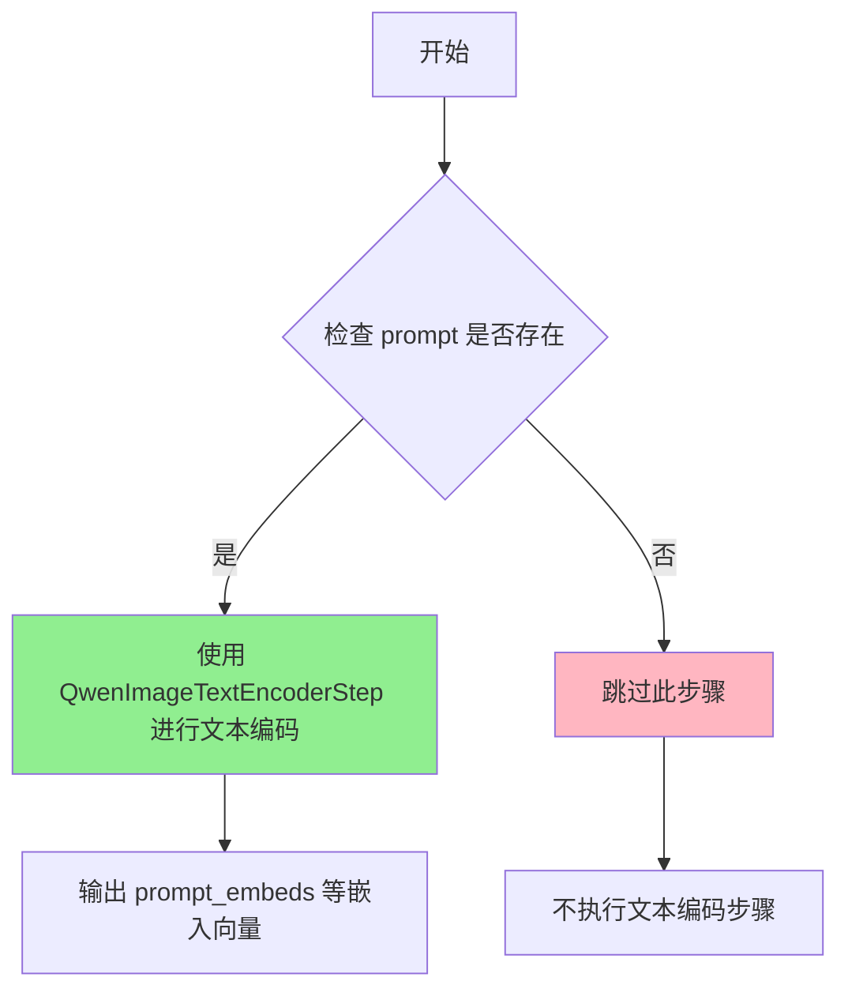

#### 带注释源码

```python
@property
def description(self) -> str:
    """
    属性描述符
    
    返回值:
        str: 描述文本编码步骤的功能和触发条件
    """
    return "Text encoder step that encodes the text prompt into a text embedding. This is an auto pipeline block."
    " - `QwenImageTextEncoderStep` (text_encoder) is used when `prompt` is provided."
    " - if `prompt` is not provided, step will be skipped."
```


### `QwenImageInpaintVaeEncoderStep.description`

该属性返回一段字符串描述，用于说明 `QwenImageInpaintVaeEncoderStep` 类的功能：用于处理图像修复任务的图像和蒙版输入，包括调整图像大小、处理图像和蒙版，以及创建图像潜在向量。

参数：

- 无（该属性不需要参数）

返回值：`str`，返回该步骤的描述字符串，包含以下功能说明：
  - 根据 `height` 和 `width` 将图像调整到目标大小
  - 处理并更新 `image` 和 `mask_image`
  - 创建 `image_latents`

#### 流程图

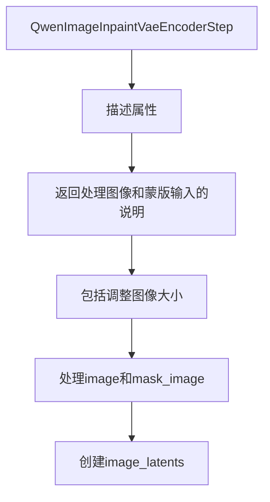

#### 带注释源码

```python
@property
def description(self) -> str:
    """
    属性描述：返回该处理步骤的功能说明字符串。
    
    返回值类型：str
    返回值描述：该步骤用于处理图像修复任务的图像和蒙版输入，包括：
        1. 根据height和width将图像调整到目标大小
        2. 处理并更新image和mask_image
        3. 创建image_latents（图像的潜在表示）
    """
    return (
        "This step is used for processing image and mask inputs for inpainting tasks. It:\n"
        " - Resizes the image to the target size, based on `height` and `width`.\n"
        " - Processes and updates `image` and `mask_image`.\n"
        " - Creates `image_latents`."
    )
```


### `QwenImageImg2ImgVaeEncoderStep.description`

这是 `QwenImageImg2ImgVaeEncoderStep` 类的描述属性（property），用于获取该步骤的功能描述。

参数： （无显式参数，这是类的属性（property），隐式参数为 `self`）

返回值：`str`，返回该 VAE 编码器步骤的描述字符串，说明它负责预处理和编码图像输入到它们的潜在表示。

#### 流程图

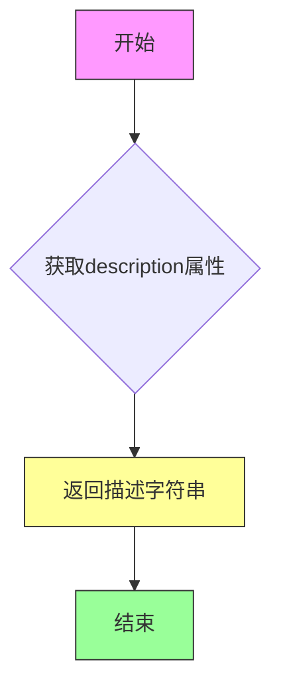

#### 带注释源码

```python
@property
def description(self) -> str:
    """
    获取该步骤的描述信息。
    
    返回:
        str: 描述字符串，说明该步骤的功能
              "Vae encoder step that preprocess andencode the image inputs into their latent representations."
    """
    return "Vae encoder step that preprocess andencode the image inputs into their latent representations."
```


### `QwenImageAutoVaeEncoderStep.description`

这是一个属性（property），用于返回 VAE 编码器步骤的描述信息。该属性属于 `QwenImageAutoVaeEncoderStep` 类，该类是自动管道块（AutoPipelineBlocks），用于根据输入条件自动选择合适的 VAE 编码步骤。

**参数：** 无（这是一个属性，不是方法）

**返回值：** `str`，返回该步骤的描述字符串，包含以下信息：
- 该步骤用于将图像输入编码为潜在表示
- 这是一个自动管道块
- 根据 `mask_image` 或 `image` 是否提供来选择不同的子步骤
- 如果两者都未提供，则跳过该步骤

#### 流程图

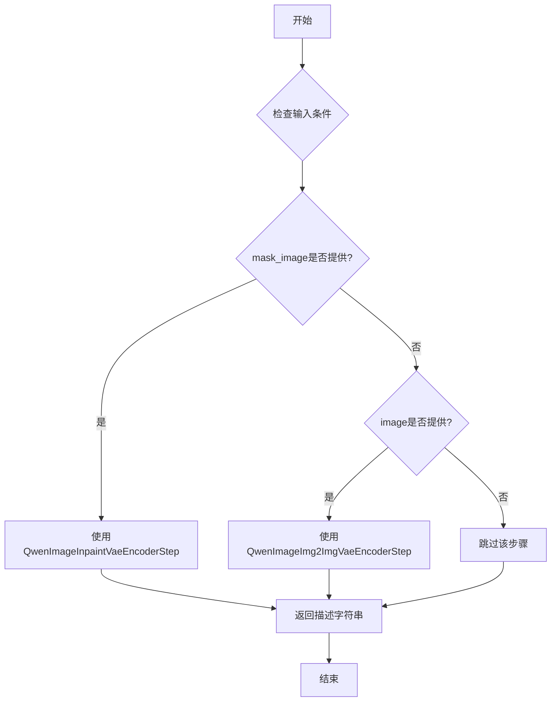

#### 带注释源码

```python
@property
def description(self):
    """
    属性：description
    
    返回 VAE 编码器步骤的描述信息。
    
    这是一个自动管道块，用于根据输入条件自动选择合适的 VAE 编码步骤：
    - 当提供 mask_image 时，使用 QwenImageInpaintVaeEncoderStep（用于图像修复任务）
    - 当提供 image 时，使用 QwenImageImg2ImgVaeEncoderStep（用于图像到图像转换任务）
    - 如果既没有提供 mask_image 也没有提供 image，则跳过该步骤
    
    Returns:
        str: 描述该步骤功能和触发条件的字符串
    """
    return (
        "Vae encoder step that encode the image inputs into their latent representations.\n"
        + "This is an auto pipeline block.\n"
        + " - `QwenImageInpaintVaeEncoderStep` (inpaint) is used when `mask_image` is provided.\n"
        + " - `QwenImageImg2ImgVaeEncoderStep` (img2img) is used when `image` is provided.\n"
        + " - if `mask_image` or `image` is not provided, step will be skipped."
    )
```


### `QwenImageOptionalControlNetVaeEncoderStep.description`

这是一个属性（property），用于返回 `QwenImageOptionalControlNetVaeEncoderStep` 类的描述信息。该类是可选的 ControlNet VAE 编码器步骤，当提供了 `control_image` 时会使用 `QwenImageControlNetVaeEncoderStep` 进行编码；如果未提供 `control_image`，则跳过此步骤。

参数：なし（这是一个属性，没有参数）

返回值：`str`，返回该管道块的描述字符串

#### 流程图

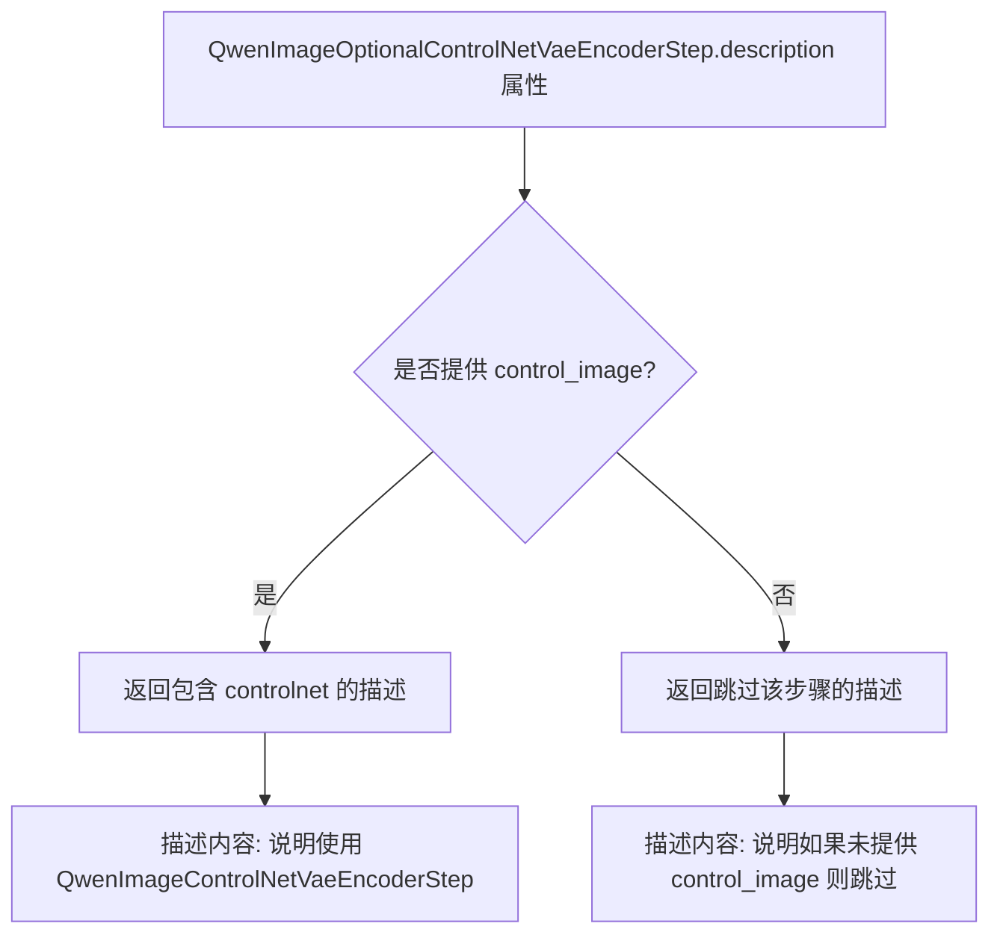

#### 带注释源码

```python
@property
def description(self):
    """
    属性描述:
        返回该可选 ControlNet VAE 编码器步骤的描述信息。
        
    返回值:
        str: 描述该自动管道块的功能和使用条件
              - 当提供 control_image 时使用 QwenImageControlNetVaeEncoderStep (controlnet)
              - 当未提供 control_image 时跳过此步骤
    """
    return (
        "Vae encoder step that encode the image inputs into their latent representations.\n"
        + "This is an auto pipeline block.\n"
        + " - `QwenImageControlNetVaeEncoderStep` (controlnet) is used when `control_image` is provided.\n"
        + " - if `control_image` is not provided, step will be skipped."
    )
```


### `QwenImageImg2ImgInputStep.description`

该属性是 `QwenImageImg2ImgInputStep` 类的描述属性，用于描述该步骤的功能。它返回一段文字说明，解释该步骤是用于为 img2img（图像到图像）去噪步骤准备输入的。

**参数：** 无（这是一个属性，不需要参数）

**返回值：** `str`，返回该步骤的描述字符串

#### 流程图

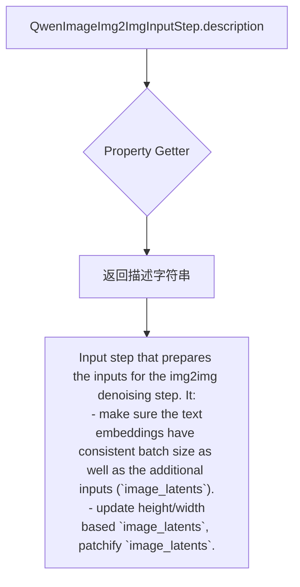

#### 带注释源码

```python
@property
def description(self):
    """
    属性描述：返回该步骤的描述信息
    
    该方法是一个属性 getter，用于获取 QwenImageImg2ImgInputStep 类的描述信息。
    描述内容说明了这个步骤的主要功能：
    1. 确保文本嵌入（prompt_embeds）与附加输入（image_latents）具有一致的批次大小
    2. 基于 image_latents 更新高度/宽度
    3. 对 image_latents 进行 patchify（分块）处理
    
    Returns:
        str: 描述该步骤功能的字符串
    """
    return "Input step that prepares the inputs for the img2img denoising step. It:\n"
    " - make sure the text embeddings have consistent batch size as well as the additional inputs (`image_latents`).\n"
    " - update height/width based `image_latents`, patchify `image_latents`."
```


### `QwenImageInpaintInputStep.description`

这是一个属性（Property），返回 `str` 类型，描述 `QwenImageInpaintInputStep` 类的功能。该步骤为图像修复（inpainting）去噪步骤准备输入，确保文本嵌入与 `image_latents` 和 `processed_mask_image` 具有一致的批量大小，并基于 `image_latents` 更新高度/宽度，同时对 `image_latents` 进行 patchify 处理。

参数：
- （无参数，这是 Property 属性）

返回值：`str`，描述该步骤的功能

#### 流程图

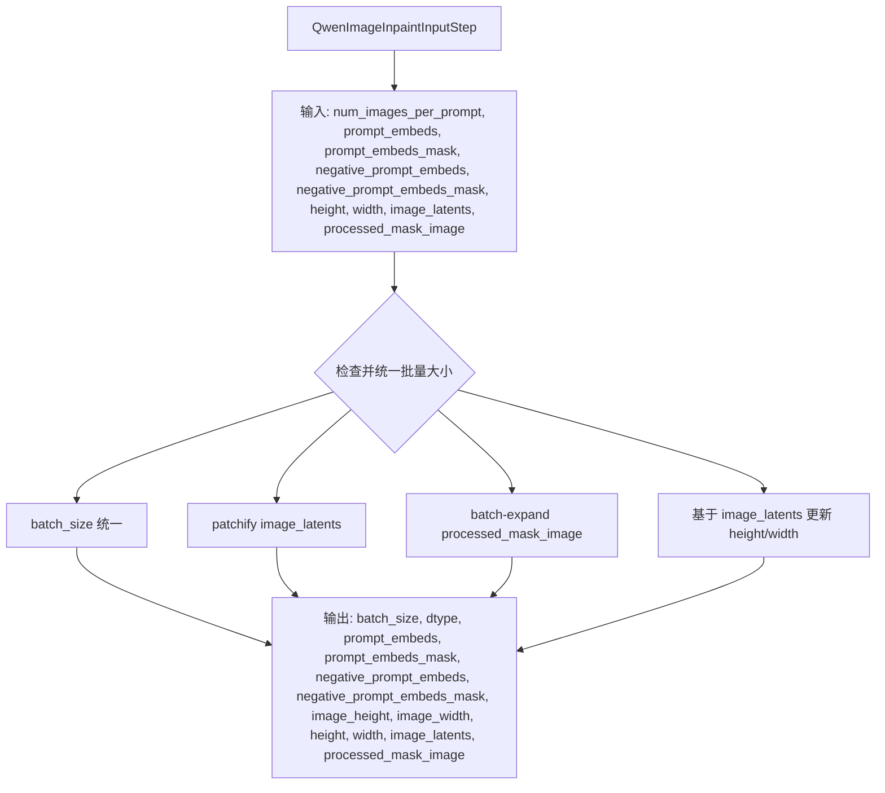

#### 带注释源码

```python
@property
def description(self):
    return "Input step that prepares the inputs for the inpainting denoising step. It:\n"
    " - make sure the text embeddings have consistent batch size as well as the additional inputs (`image_latents` and `processed_mask_image`).\n"
    " - update height/width based `image_latents`, patchify `image_latents`."
```


### `QwenImageInpaintPrepareLatentsStep.description`

该属性返回对 `QwenImageInpaintPrepareLatentsStep` 类的功能描述，说明该步骤用于准备图像修复（inpainting）去噪步骤的潜在表示（latents）和掩码输入，包括向图像潜在表示添加噪声以及基于处理后的掩码图像创建分块化的掩码。

参数：无（该属性不接受任何参数）

返回值：`str`，返回该步骤的描述字符串，说明其功能包括为去噪器准备潜在表示输入以及创建分块化掩码。

#### 流程图

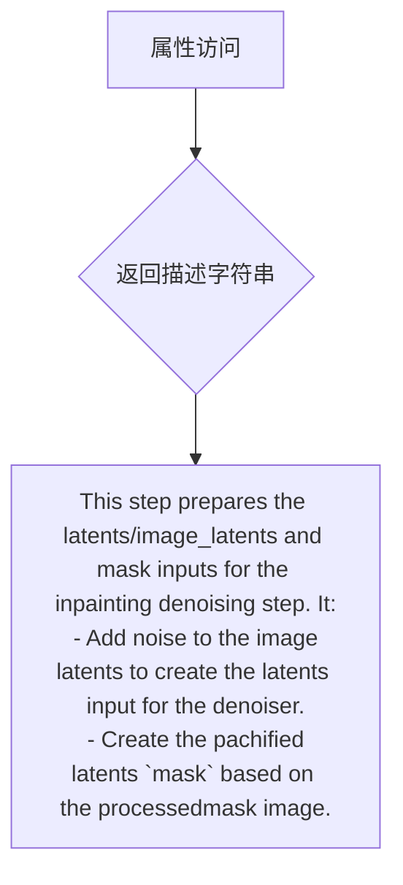

#### 带注释源码

```python
@property
def description(self) -> str:
    """
    返回该步骤的描述信息。
    
    该属性是 QwenImageInpaintPrepareLatentsStep 类的一个只读属性，
    用于描述该步骤在图像修复（inpainting）任务流水线中的功能作用。
    
    Returns:
        str: 描述该步骤功能的字符串，包含以下关键信息：
             - 准备 latents/image_latents 和 mask 输入
             - 向图像 latents 添加噪声以创建去噪器输入
             - 基于处理后的掩码图像创建分块化的 mask
    """
    return (
        "This step prepares the latents/image_latents and mask inputs for the inpainting denoising step. It:\n"
        " - Add noise to the image latents to create the latents input for the denoiser.\n"
        " - Create the pachified latents `mask` based on the processedmask image.\n"
    )
```


### `QwenImageCoreDenoiseStep.description`

这是一个属性（property），用于获取 `QwenImageCoreDenoiseStep` 类的描述信息。该属性返回该步骤的功能描述，说明其是用于文本到图像（text2image）任务的核心去噪步骤，包括去噪循环以及准备输入（timesteps、latents、rope inputs 等）。

参数：

- （无参数，这是一个只读的 property 属性）

返回值：`str`，返回该步骤的描述字符串，说明其功能是"将噪声去噪为图像，用于 text2image 任务，包含去噪循环以及准备输入（timesteps、latents、rope inputs 等）"。

#### 流程图

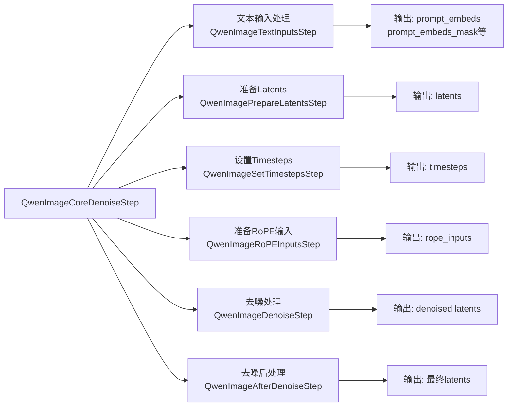

#### 带注释源码

```python
@property
def description(self):
    """
    属性描述:
        返回该步骤的描述信息，说明其功能用途。
        
    返回值:
        str: 描述字符串，说明这是用于text2image任务的核心去噪步骤，
             包括去噪循环以及准备输入（timesteps、latents、rope inputs等）。
    """
    return "step that denoise noise into image for text2image task. It includes the denoise loop, as well as prepare the inputs (timesteps, latents, rope inputs etc.)."
```


### `QwenImageCoreDenoiseStep.outputs`

该属性定义了 `QwenImageCoreDenoiseStep` 类的输出参数，返回一个包含 `latents` 输出信息的列表，用于描述该步骤产生的去噪后的潜在表示。

参数：无

返回值：`list[OutputParam]`，返回包含输出参数定义的列表，当前包含一个 `OutputParam.template("latents")`，表示去噪后的潜在表示。

#### 流程图

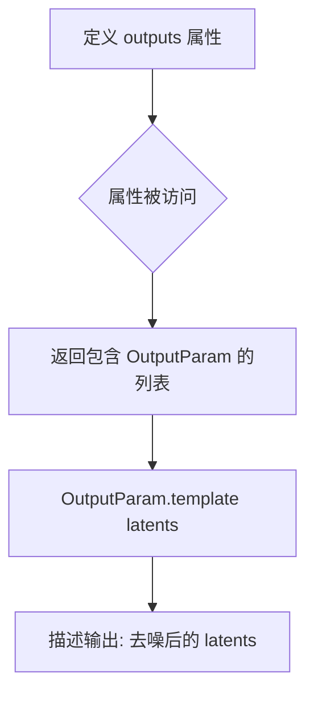

#### 带注释源码

```python
@property
def outputs(self):
    """
    定义该步骤的输出参数。
    
    该属性返回一个列表，包含该管道步骤产生的输出参数信息。
    每个输出参数通过 OutputParam.template 方法定义，描述了输出的名称和类型。
    
    Returns:
        list: 包含 OutputParam 的列表，描述该步骤的输出。
              当前定义了一个输出参数:
              - latents: 去噪后的潜在表示 (Tensor)
    """
    return [
        OutputParam.template("latents"),
    ]
```


### `QwenImageInpaintCoreDenoiseStep.description`

这是一个属性方法（property），返回描述字符串，说明该类是"准备去噪步骤的输入（时间步、潜在变量、RoPE输入等）用于图像修复任务的去噪步骤"。

参数：无（这是一个属性方法，没有输入参数）

返回值：`str`，返回该步骤的描述文本

#### 流程图

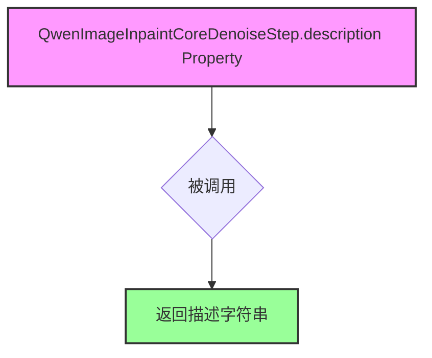

#### 带注释源码

```python
@property
def description(self):
    """
    Property method that returns a description string for the QwenImageInpaintCoreDenoiseStep class.
    
    This description indicates that this step is responsible for preparing inputs
    (timesteps, latents, rope inputs etc.) for the denoise step for inpaint task.
    
    Returns:
        str: Description of the inpaint core denoise step
    """
    return "Before denoise step that prepare the inputs (timesteps, latents, rope inputs etc.) for the denoise step for inpaint task."
```


### `QwenImageInpaintCoreDenoiseStep.outputs`

该属性定义了在图像修复（inpainting）任务中，去噪步骤的输出参数。它返回一个包含 `OutputParam` 的列表，描述该步骤产生的输出变量。

参数： 无（该属性为 property 装饰器定义的方法，调用时无需显式传递参数）

返回值： `List[OutputParam]`（输出参数列表），返回一个包含 `OutputParam.template("latents")` 的列表，表示该步骤输出名为 "latents" 的张量（去噪后的潜在表示）。

#### 流程图

```mermaid
flowchart TD
    A[调用 QwenImageInpaintCoreDenoiseStep.outputs 属性] --> B{返回输出参数列表}
    B --> C[创建 OutputParam 列表]
    C --> D[包含单个元素: OutputParam.template&#40;'latents'&#41;]
    D --> E[返回 List[OutputParam]]
```

#### 带注释源码

```python
@property
def outputs(self):
    """
    定义该管道步骤的输出参数。

    该属性是 QwenImageInpaintCoreDenoiseStep 类的一部分，
    用于描述去噪步骤产生的输出变量。

    返回值:
        List[OutputParam]: 包含输出参数的列表。当前实现中，
        该步骤仅输出 'latents'，即去噪后的潜在表示张量，
        可后续用于解码步骤生成最终图像。
    """
    return [
        OutputParam.template("latents"),
    ]
```


### `QwenImageImg2ImgCoreDenoiseStep.description`

这是一个用于 img2img（图像到图像）任务的去噪前置步骤，准备去噪过程所需的输入数据（timesteps、latents、rope inputs 等）。

参数：无（此属性不接受任何参数）

返回值：`str`，返回该步骤的描述字符串，描述其为 img2img 任务准备去噪输入的前置步骤。

#### 流程图

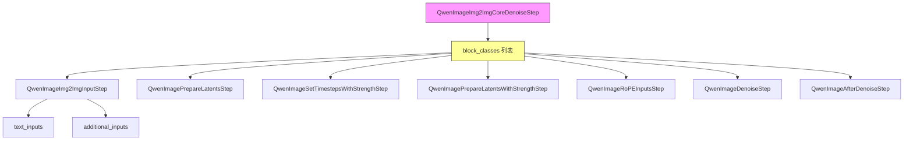

#### 带注释源码

```python
# Qwen Image (image2image)
# auto_docstring
class QwenImageImg2ImgCoreDenoiseStep(SequentialPipelineBlocks):
    """
    Before denoise step that prepare the inputs (timesteps, latents, rope inputs etc.) for the denoise step for img2img
    task.

      Components:
          pachifier (`QwenImagePachifier`) scheduler (`FlowMatchEulerDiscreteScheduler`) guider
          (`ClassifierFreeGuidance`) transformer (`QwenImageTransformer2DModel`)

      Inputs:
          num_images_per_prompt (`int`, *optional*, defaults to 1):
              The number of images to generate per prompt.
          prompt_embeds (`Tensor`):
              text embeddings used to guide the image generation. Can be generated from text_encoder step.
          prompt_embeds_mask (`Tensor`):
              mask for the text embeddings. Can be generated from text_encoder step.
          negative_prompt_embeds (`Tensor`, *optional*):
              negative text embeddings used to guide the image generation. Can be generated from text_encoder step.
          negative_prompt_embeds_mask (`Tensor`, *optional*):
              mask for the negative text embeddings. Can be generated from text_encoder step.
          height (`int`, *optional*):
              The height in pixels of the generated image.
          width (`int`, *optional*):
              The width in pixels of the generated image.
          image_latents (`Tensor`):
              image latents used to guide the image generation. Can be generated from vae_encoder step.
          latents (`Tensor`, *optional*):
              Pre-generated noisy latents for image generation.
          generator (`Generator`, *optional*):
              Torch generator for deterministic generation.
          num_inference_steps (`int`, *optional*, defaults to 50):
              The number of denoising steps.
          sigmas (`list`, *optional*):
              Custom sigmas for the denoising process.
          strength (`float`, *optional*, defaults to 0.9):
              Strength for img2img/inpainting.
          attention_kwargs (`dict`, *optional*):
              Additional kwargs for attention processors.
          **denoiser_input_fields (`None`, *optional*):
              conditional model inputs for the denoiser: e.g. prompt_embeds, negative_prompt_embeds, etc.

      Outputs:
          latents (`Tensor`):
              Denoised latents.
    """

    model_name = "qwenimage"
    # 定义该步骤包含的多个子步骤类
    block_classes = [
        QwenImageImg2ImgInputStep(),           # 输入处理步骤
        QwenImagePrepareLatentsStep(),         # 准备潜向量
        QwenImageSetTimestepsWithStrengthStep(),  # 设置时间步（带强度）
        QwenImagePrepareLatentsWithStrengthStep(), # 准备带强度的潜向量（img2img）
        QwenImageRoPEInputsStep(),             # 准备旋转位置编码输入
        QwenImageDenoiseStep(),                # 去噪步骤
        QwenImageAfterDenoiseStep(),           # 去噪后处理步骤
    ]
    # 对应子步骤的名称
    block_names = [
        "input",
        "prepare_latents",
        "set_timesteps",
        "prepare_img2img_latents",
        "prepare_rope_inputs",
        "denoise",
        "after_denoise",
    ]

    @property
    def description(self):
        # 返回该步骤的描述：用于img2img任务的前置去噪步骤，准备timesteps、latents、rope inputs等输入
        return "Before denoise step that prepare the inputs (timesteps, latents, rope inputs etc.) for the denoise step for img2img task."

    @property
    def outputs(self):
        # 定义该步骤的输出参数
        return [
            OutputParam.template("latents"),
        ]
```


### `QwenImageImg2ImgCoreDenoiseStep.outputs`

该属性定义了 `QwenImageImg2ImgCoreDenoiseStep` 类的输出参数，用于描述图像到图像（img2img）去噪步骤的输出结果。

参数：无（该属性不接受任何参数）

返回值：`List[OutputParam]`，返回包含去噪后的 latents（潜在表示）的列表

#### 流程图

```mermaid
flowchart TD
    A[outputs property] --> B{返回输出参数列表}
    B --> C[OutputParam.template: latents]
    C --> D[返回 List[OutputParam]]
    
    style A fill:#f9f,stroke:#333
    style C fill:#ff9,stroke:#333
    style D fill:#9f9,stroke:#333
```

#### 带注释源码

```python
@property
def outputs(self):
    """
    定义该步骤的输出参数。
    
    该属性返回一个列表，包含一个 OutputParam 对象，用于描述去噪步骤输出的 latents（潜在表示）。
    在 img2img 任务中，latents 表示去噪后的图像潜在表示，可以进一步解码为最终图像。
    
    Returns:
        List[OutputParam]: 包含输出参数信息的列表
            - latents: 去噪后的潜在表示，类型为 Tensor
    """
    return [
        OutputParam.template("latents"),
    ]
```


### `QwenImageControlNetCoreDenoiseStep.description`

该属性描述了 QwenImageControlNetCoreDenoiseStep 类的功能：这是一个用于文本到图像任务的去噪步骤，包含去噪循环以及准备输入（时间步、latents、RoPE 输入等）的过程。

参数：
- （无参数，这是一个属性 getter）

返回值：`str`，返回该步骤的描述字符串，说明其用于文本到图像任务的去噪，包括去噪循环以及准备时间步、latents、RoPE 输入等。

#### 流程图

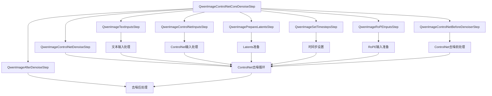

#### 带注释源码

```python
# Qwen Image (text2image) with controlnet
# auto_docstring
class QwenImageControlNetCoreDenoiseStep(SequentialPipelineBlocks):
    """
    step that denoise noise into image for text2image task. It includes the denoise loop, as well as prepare the inputs
    (timesteps, latents, rope inputs etc.).

      Components:
          pachifier (`QwenImagePachifier`) scheduler (`FlowMatchEulerDiscreteScheduler`) controlnet
          (`QwenImageControlNetModel`) guider (`ClassifierFreeGuidance`) transformer (`QwenImageTransformer2DModel`)

      Inputs:
          num_images_per_prompt (`int`, *optional*, defaults to 1):
              The number of images to generate per prompt.
          prompt_embeds (`Tensor`):
              text embeddings used to guide the image generation. Can be generated from text_encoder step.
          prompt_embeds_mask (`Tensor`):
              mask for the text embeddings. Can be generated from text_encoder step.
          negative_prompt_embeds (`Tensor`, *optional*):
              negative text embeddings used to guide the image generation. Can be generated from text_encoder step.
          negative_prompt_embeds_mask (`Tensor`, *optional*):
              mask for the negative text embeddings. Can be generated from text_encoder step.
          control_image_latents (`Tensor`):
              The control image latents to use for the denoising process. Can be generated in controlnet vae encoder
              step.
          height (`int`, *optional*):
              The height in pixels of the generated image.
          width (`int`, *optional*):
              The width in pixels of the generated image.
          latents (`Tensor`, *optional*):
              Pre-generated noisy latents for image generation.
          generator (`Generator`, *optional*):
              Torch generator for deterministic generation.
          num_inference_steps (`int`, *optional*, defaults to 50):
              The number of denoising steps.
          sigmas (`list`, *optional*):
              Custom sigmas for the denoising process.
          control_guidance_start (`float`, *optional*, defaults to 0.0):
              When to start applying ControlNet.
          control_guidance_end (`float`, *optional*, defaults to 1.0):
              When to stop applying ControlNet.
          controlnet_conditioning_scale (`float`, *optional*, defaults to 1.0):
              Scale for ControlNet conditioning.
          attention_kwargs (`dict`, *optional*):
              Additional kwargs for attention processors.
          **denoiser_input_fields (`None`, *optional*):
              conditional model inputs for the denoiser: e.g. prompt_embeds, negative_prompt_embeds, etc.

      Outputs:
          latents (`Tensor`):
              Denoised latents.
    """

    model_name = "qwenimage"
    # 定义该步骤包含的子步骤块类，按顺序执行
    block_classes = [
        QwenImageTextInputsStep(),           # 1. 文本输入处理
        QwenImageControlNetInputsStep(),     # 2. ControlNet输入处理
        QwenImagePrepareLatentsStep(),       # 3. 准备latents
        QwenImageSetTimestepsStep(),         # 4. 设置时间步
        QwenImageRoPEInputsStep(),           # 5. 准备RoPE输入
        QwenImageControlNetBeforeDenoiserStep(), # 6. ControlNet去噪前处理
        QwenImageControlNetDenoiseStep(),   # 7. ControlNet去噪循环
        QwenImageAfterDenoiseStep(),        # 8. 去噪后处理
    ]
    # 对应子步骤块的名称
    block_names = [
        "input",
        "controlnet_input",
        "prepare_latents",
        "set_timesteps",
        "prepare_rope_inputs",
        "controlnet_before_denoise",
        "controlnet_denoise",
        "after_denoise",
    ]

    @property
    def description(self) -> str:
        """
        返回该步骤的描述信息。
        
        返回值:
            str: 描述该步骤用于文本到图像任务去噪的字符串，包含去噪循环以及准备输入的过程。
        """
        return "step that denoise noise into image for text2image task. It includes the denoise loop, as well as prepare the inputs (timesteps, latents, rope inputs etc.)."

    @property
    def outputs(self):
        """
        定义该步骤的输出参数。
        
        返回值:
            list: 包含去噪后的latents张量。
        """
        return [
            OutputParam.template("latents"),
        ]
```


### `QwenImageControlNetCoreDenoiseStep.outputs`

该属性定义了 `QwenImageControlNetCoreDenoiseStep` 类的输出参数，用于返回去噪后的图像潜在表示（latents）。

参数：
- 该属性无输入参数

返回值：`list[OutputParam]`，返回包含去噪后 latents 的输出参数列表

#### 流程图

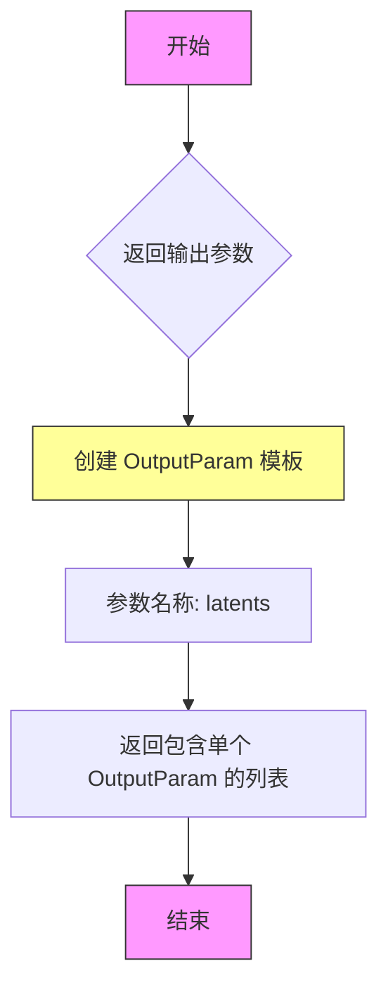

#### 带注释源码

```python
@property
def outputs(self):
    """
    定义该步骤的输出参数。
    
    该属性返回一个列表，包含该步骤产生的一个输出参数。
    输出参数使用 OutputParam.template 方法创建模板，
    模板名称为 'latents'，表示去噪后的潜在表示。
    
    Returns:
        list: 包含 OutputParam 对象的列表，目前只包含一个元素：
              - latents: 去噪后的潜在表示 (Tensor)
    
    示例:
        >>> step = QwenImageControlNetCoreDenoiseStep()
        >>> outputs = step.outputs
        >>> print(outputs[0].name)
        latents
    """
    return [
        OutputParam.template("latents"),
    ]
```


### `QwenImageControlNetInpaintCoreDenoiseStep.description`

该属性是一个 `@property` 装饰器方法，用于返回 `QwenImageControlNetInpaintCoreDenoiseStep` 类的描述信息。它是一个只读属性，用于说明该步骤的功能。

参数：无（该方法不接受任何参数）

返回值：`str`，返回该步骤的描述字符串，说明该步骤是为 inpaint 任务的去噪步骤准备输入（时间步、latents、rope 输入等）。

#### 流程图

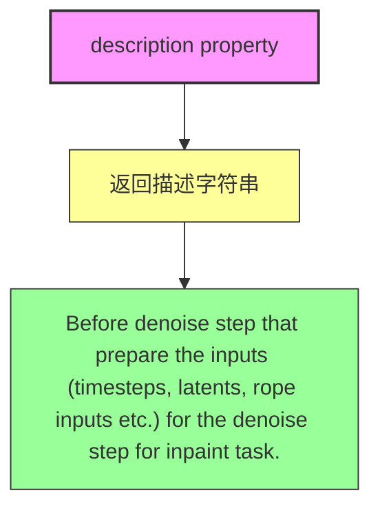

#### 带注释源码

```python
@property
def description(self):
    """
    返回该步骤的描述信息。
    
    该方法是一个只读属性，用于描述 QwenImageControlNetInpaintCoreDenoiseStep 的功能。
    它返回一段字符串，说明这是一个"Before denoise step"，用于为 inpaint 任务的
    denoise 步骤准备输入（包括 timesteps、latents、rope inputs 等）。
    
    Returns:
        str: 描述该步骤功能的字符串
    """
    return "Before denoise step that prepare the inputs (timesteps, latents, rope inputs etc.) for the denoise step for inpaint task."
```


### `QwenImageControlNetInpaintCoreDenoiseStep.outputs` (property)

该属性定义了 QwenImageControlNetInpaintCoreDenoiseStep 管道步骤的输出参数。它返回一个包含 OutputParam 对象的列表，用于描述该步骤输出的变量信息。在这个场景中，该步骤输出的是去噪后的 latents（潜在表示）。

参数：无

返回值：`list[OutputParam]`，返回一个 OutputParam 列表，描述该管道步骤的输出参数。当前包含一个 OutputParam 模板，名称为 "latents"，表示去噪后的潜在表示。

#### 流程图

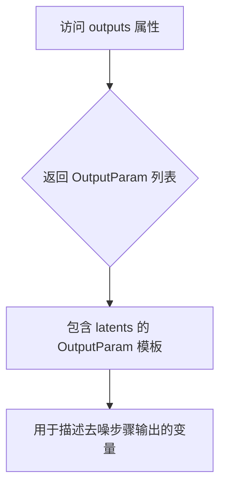

#### 带注释源码

```python
@property
def outputs(self):
    """
    定义该管道步骤的输出参数。
    
    Returns:
        list: 包含 OutputParam 对象的列表，当前返回 ['latents']，
              表示该去噪步骤输出的去噪后的潜在表示（latents）
    """
    return [
        OutputParam.template("latents"),
    ]
```


### QwenImageControlNetImg2ImgCoreDenoiseStep.description

这是一个属性（property）方法，返回该类的描述信息，用于说明该步骤是img2img任务中去噪步骤的准备阶段，负责准备输入数据（时间步、latents、rope输入等）。

参数： 无

返回值：`str`，描述该步骤的功能——"Before denoise step that prepare the inputs (timesteps, latents, rope inputs etc.) for the denoise step for img2img task."

#### 流程图

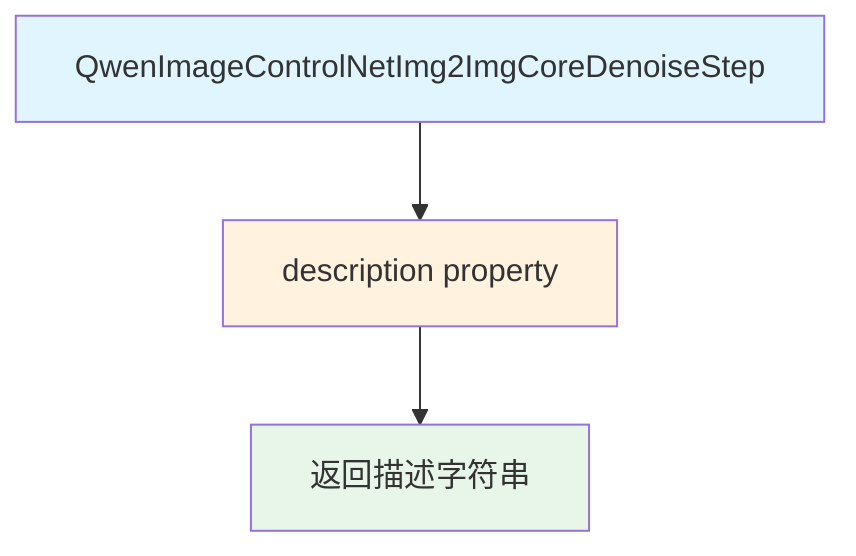

#### 带注释源码

```python
@property
def description(self):
    """
    属性方法，返回该类的描述信息。
    
    该类是QwenImage图像生成管道的核心去噪步骤之一，专门用于
    处理带ControlNet的image-to-image（img2img）任务。
    
    它继承自SequentialPipelineBlocks，按顺序执行以下子步骤：
    1. input - 输入处理
    2. controlnet_input - ControlNet输入处理
    3. prepare_latents - 准备latents
    4. set_timesteps - 设置时间步
    5. prepare_img2img_latents - 准备img2img的latents
    6. prepare_rope_inputs - 准备RoPE输入
    7. controlnet_before_denoise - ControlNet去噪前处理
    8. controlnet_denoise - ControlNet去噪
    9. after_denoise - 去噪后处理
    
    Returns:
        str: 描述该步骤功能的字符串
    """
    return "Before denoise step that prepare the inputs (timesteps, latents, rope inputs etc.) for the denoise step for img2img task."
```


### QwenImageControlNetImg2ImgCoreDenoiseStep.outputs

该属性是 `QwenImageControlNetImg2ImgCoreDenoiseStep` 类的输出属性，定义了图像到图像（img2img）任务的去噪步骤的输出参数。该步骤整合了 ControlNet 引导条件，准备输入（包括时间步、潜在向量、RoPE 输入等），并执行去噪循环以生成最终的潜在向量。

参数：无（该方法为属性，无参数）

返回值：`List[OutputParam]`，返回包含去噪后潜在向量（latents）的列表

#### 流程图

```mermaid
flowchart TD
    A[outputs 属性被调用] --> B[返回 OutputParam 列表]
    B --> C[包含模板化的 latents 参数]
    C --> D[表示去噪后的潜在向量]
    
    style A fill:#f9f,stroke:#333
    style B fill:#bbf,stroke:#333
    style C fill:#bbf,stroke:#333
    style D fill:#dfd,stroke:#333
```

#### 带注释源码

```python
@property
def outputs(self):
    """
    定义该步骤的输出参数。
    
    该属性返回去噪步骤产生的输出参数列表。
    在 ControlNet 引导的 img2img 任务中，主要输出是去噪后的潜在向量（latents），
    这些潜在向量后续会被传递到解码步骤（decode step）以生成最终图像。
    
    Returns:
        List[OutputParam]: 包含输出参数的列表，当前返回包含模板化 'latents' 的列表
    """
    return [
        OutputParam.template("latents"),
    ]
```

#### 详细说明

| 属性 | 详情 |
|------|------|
| **所属类** | `QwenImageControlNetImg2ImgCoreDenoiseStep` |
| **类型** | 属性（property） |
| **返回值类型** | `List[OutputParam]` |
| **输出参数** | `latents`（`Tensor`）- 去噪后的潜在向量 |

**输出参数详解：**

- **latents** (`Tensor`): 表示经过去噪过程处理后的潜在向量。这些潜在向量是通过对噪声潜在向量进行多次去噪迭代生成的，代表了从噪声图像到目标图像的中间状态。在 ControlNet 引导的 img2img 任务中，去噪过程同时考虑了文本提示、输入图像的潜在表示以及 ControlNet 条件信息。最终的去噪潜在向量会被传递到解码步骤，通过 VAE 解码器转换为最终的图像输出。


### `QwenImageAutoCoreDenoiseStep.select_block`

根据传入的图像latents、mask图像和控制图像条件，选择合适的去噪步骤块。

参数：

- `control_image_latents`：`Tensor`，可选，控制图像的latent表示，用于ControlNet流程
- `processed_mask_image`：`Tensor`，可选，处理后的mask图像，用于inpainting任务
- `image_latents`：`Tensor`，可选，图像的latent表示，用于img2img任务

返回值：`str`，返回选中的block名称（`text2image`、`img2img`、`inpaint`、`controlnet_text2image`、`controlnet_img2img`或`controlnet_inpaint`）

#### 流程图

```mermaid
flowchart TD
    A[开始 select_block] --> B{control_image_latents is not None?}
    
    B -- 是 --> C{processed_mask_image is not None?}
    B -- 否 --> D{processed_mask_image is not None?}
    
    C -- 是 --> E[return "controlnet_inpaint"]
    C -- 否 --> F{image_latents is not None?}
    F -- 是 --> G[return "controlnet_img2img"]
    F -- 否 --> H[return "controlnet_text2image"]
    
    D -- 是 --> I[return "inpaint"]
    D -- 否 --> J{image_latents is not None?}
    J -- 是 --> K[return "img2img"]
    J -- 否 --> L[return "text2image"]
```

#### 带注释源码

```python
def select_block(self, control_image_latents=None, processed_mask_image=None, image_latents=None):
    """
    根据输入条件选择合适的去噪步骤块。
    
    该方法实现了工作流路由逻辑：
    - 如果提供了control_image_latents，则进入ControlNet工作流
    - 否则根据processed_mask_image和image_latents判断是inpaint、img2img还是text2image
    
    参数:
        control_image_latents: 控制图像的latent表示，用于ControlNet引导
        processed_mask_image: 处理后的mask图像，用于inpainting任务
        image_latents: 图像的latent表示，用于image-to-image任务
    
    返回:
        str: 选中的block名称
    """
    # 首先检查是否使用ControlNet
    if control_image_latents is not None:
        # ControlNet工作流
        if processed_mask_image is not None:
            # ControlNet + Inpainting
            return "controlnet_inpaint"
        elif image_latents is not None:
            # ControlNet + Image-to-Image
            return "controlnet_img2img"
        else:
            # ControlNet + Text-to-Image
            return "controlnet_text2image"
    else:
        # 非ControlNet工作流
        if processed_mask_image is not None:
            # Inpainting
            return "inpaint"
        elif image_latents is not None:
            # Image-to-Image
            return "img2img"
        else:
            # Text-to-Image
            return "text2image"
```


### `QwenImageAutoCoreDenoiseStep.description`

该属性是 `QwenImageAutoCoreDenoiseStep` 类的一个只读属性，用于描述核心去噪步骤的功能。该自动管道块支持 QwenImage 的文本到图像、图像到图像、修复以及 ControlNet 任务，根据输入条件（`control_image_latents`、`processed_mask_image`、`image_latents`）自动选择合适的去噪实现类。

参数：无（该属性不接受任何参数）

返回值：`str`，返回对核心去噪步骤的功能描述字符串

#### 流程图

```mermaid
flowchart TD
    A[QwenImageAutoCoreDenoiseStep.description 访问] --> B{返回描述字符串}
    
    B --> C["Core step that performs the denoising process."]
    C --> D["- QwenImageCoreDenoiseStep (text2image) for text2image tasks"]
    D --> E["- QwenImageInpaintCoreDenoiseStep (inpaint) for inpaint tasks"]
    E --> F["- QwenImageImg2ImgCoreDenoiseStep (img2img) for img2img tasks"]
    F --> G["- QwenImageControlNetCoreDenoiseStep (controlnet_text2image) for text2image with controlnet"]
    G --> H["- QwenImageControlNetInpaintCoreDenoiseStep (controlnet_inpaint) for inpaint with controlnet"]
    H --> I["- QwenImageControlNetImg2ImgCoreDenoiseStep (controlnet_img2img) for img2img with controlnet"]
    I --> J["支持的工作流说明"]
```

#### 带注释源码

```python
@property
def description(self):
    """
    属性描述：
        返回一个描述性字符串，说明核心去噪步骤的功能。
        
        该自动块根据不同的输入条件选择不同的去噪实现：
        - text2image: 仅提供 prompt_embeds
        - inpaint: 提供 processed_mask_image 和 image_latents
        - img2img: 提供 image_latents
        - controlnet_text2image: 提供 control_image_latents
        - controlnet_inpaint: 提供 control_image_latents 和 processed_mask_image
        - controlnet_img2img: 提供 control_image_latents 和 image_latents
    """
    return (
        "Core step that performs the denoising process. \n"
        + " - `QwenImageCoreDenoiseStep` (text2image) for text2image tasks.\n"
        + " - `QwenImageInpaintCoreDenoiseStep` (inpaint) for inpaint tasks.\n"
        + " - `QwenImageImg2ImgCoreDenoiseStep` (img2img) for img2img tasks.\n"
        + " - `QwenImageControlNetCoreDenoiseStep` (controlnet_text2image) for text2image tasks with controlnet.\n"
        + " - `QwenImageControlNetInpaintCoreDenoiseStep` (controlnet_inpaint) for inpaint tasks with controlnet.\n"
        + " - `QwenImageControlNetImg2ImgCoreDenoiseStep` (controlnet_img2img) for img2img tasks with controlnet.\n"
        + "This step support text-to-image, image-to-image, inpainting, and controlnet tasks for QwenImage:\n"
        + " - for image-to-image generation, you need to provide `image_latents`\n"
        + " - for inpainting, you need to provide `processed_mask_image` and `image_latents`\n"
        + " - to run the controlnet workflow, you need to provide `control_image_latents`\n"
        + " - for text-to-image generation, all you need to provide is prompt embeddings"
    )
```


### `QwenImageAutoCoreDenoiseStep.outputs`

该属性定义了在 QwenImage 核心去噪步骤执行完成后返回的输出参数列表。由于这是 `QwenImageAutoCoreDenoiseStep` 类的一个属性方法（使用 `@property` 装饰器），它不接收显式的外部调用参数，而是由类的实例在流水线执行完毕后自动调用以获取输出定义。

**参数：**

- （无显式参数，该属性依赖类的内部状态 `self`，由 `@property` 装饰器管理）

**返回值：** `List[OutputParam]`，返回一个包含输出参数定义的列表。当前定义返回去噪后的潜在表示（latents）。

#### 流程图

```mermaid
flowchart TD
    A[Start: QwenImageAutoCoreDenoiseStep.outputs Property] --> B{Is property accessed?}
    B -- Yes --> C[Return list containing OutputParam.template for 'latents']
    C --> D[End]
    
    style A fill:#f9f,stroke:#333,stroke-width:2px
    style C fill:#bbf,stroke:#333,stroke-width:2px
```

#### 带注释源码

```python
@property
def outputs(self):
    """
    属性方法：定义该流水线步骤的输出参数。
    
    在 QwenImage 核心去噪步骤中，输出是去噪后的潜在表示（latents），
    这些 latents 可以被传递到后续的解码（decode）步骤以生成最终图像。
    
    返回值:
        List[OutputParam]: 包含输出参数定义的列表。
                          这里是 [OutputParam.template("latents")]，
                          表示该步骤输出名为 "latents" 的张量。
    """
    return [
        OutputParam.template("latents"),
    ]
```


### `QwenImageDecodeStep.description`

该属性返回描述文本，说明解码步骤的功能是将潜在表示解码为图像并对生成的图像进行后处理。

参数：无（这是一个属性，不是方法）

返回值：`str`，返回对解码步骤的描述文本，格式为："Decode step that decodes the latents to images and postprocess the generated image."

#### 带注释源码

```python
@property
def description(self):
    return "Decode step that decodes the latents to images and postprocess the generated image."
```


### QwenImageInpaintDecodeStep.description

这是一个属性（property），用于返回 `QwenImageInpaintDecodeStep` 类的描述信息。

参数：无（这是一个属性 getter，不接受参数）

返回值：`str`，返回该步骤的描述字符串，说明该步骤用于将 latents 解码为图像并进行后处理，可选择性地将掩码应用到原始图像上。

#### 流程图

```mermaid
flowchart TD
    A[访问 description 属性] --> B[返回描述字符串]
    
    style A fill:#e1f5fe
    style B fill:#e8f5e8
```

#### 带注释源码

```python
@property
def description(self):
    """Decode step that decodes the latents to images and postprocess the generated image, optional apply the mask overally to the original image."""
    return "Decode step that decodes the latents to images and postprocess the generated image, optional apply the mask overally to the original image."
```

#### 完整类定义参考

```python
# Inpaint decode step
# auto_docstring
class QwenImageInpaintDecodeStep(SequentialPipelineBlocks):
    """
    Decode step that decodes the latents to images and postprocess the generated image, optional apply the mask
    overally to the original image.

      Components:
          vae (`AutoencoderKLQwenImage`) image_mask_processor (`InpaintProcessor`)

      Inputs:
          latents (`Tensor`):
              The denoised latents to decode, can be generated in the denoise step and unpacked in the after denoise
              step.
          output_type (`str`, *optional*, defaults to pil):
              Output format: 'pil', 'np', 'pt'.
          mask_overlay_kwargs (`dict`, *optional*):
              The kwargs for the postprocess step to apply the mask overlay. generated in
              InpaintProcessImagesInputStep.

      Outputs:
          images (`list`):
              Generated images. (tensor output of the vae decoder.)
    """

    model_name = "qwenimage"
    block_classes = [QwenImageDecoderStep(), QwenImageInpaintProcessImagesOutputStep()]
    block_names = ["decode", "postprocess"]

    @property
    def description(self):
        return "Decode step that decodes the latents to images and postprocess the generated image, optional apply the mask overally to the original image."
```


### QwenImageAutoDecodeStep.description

该属性是 QwenImage 自动解码步骤的描述属性，用于说明该自动管道块的功能和工作原理。

参数： 无（该方法为属性方法，无参数）

返回值： `str`，返回该自动解码步骤的描述字符串，说明其支持的任务类型以及如何根据输入条件选择具体的解码步骤。

#### 流程图

```mermaid
flowchart TD
    A[QwenImageAutoDecodeStep.description] --> B{返回描述字符串}
    B --> C["Decode step that decode the latents into images."]
    B --> D["This is an auto pipeline block that works for inpaint/text2image/img2img tasks, for both QwenImage and QwenImage-Edit."]
    B --> E["- `QwenImageInpaintDecodeStep` (inpaint) is used when `mask` is provided."]
    B --> F["- `QwenImageDecodeStep` (text2image/img2img) is used when `mask` is not provided."]
```

#### 带注释源码

```python
class QwenImageAutoDecodeStep(AutoPipelineBlocks):
    """
    自动解码步骤类，用于根据输入条件选择合适的解码步骤。
    
    该类继承自 AutoPipelineBlocks，是一个自动管道块，会根据输入自动选择
    具体的解码实现类。
    
    属性:
        block_classes: 包含两个候选的解码步骤类
        block_names: 对应的步骤名称
        block_trigger_inputs: 触发条件，["mask", None] 表示当提供 mask 时选择 inpaint_decode，否则选择 decode
    """
    
    # 定义候选的解码步骤类：Inpaint解码步骤和标准解码步骤
    block_classes = [QwenImageInpaintDecodeStep, QwenImageDecodeStep]
    # 对应的步骤名称
    block_names = ["inpaint_decode", "decode"]
    # 触发条件：mask 为必选参数，第二个参数为 None 表示可选
    block_trigger_inputs = ["mask", None]

    @property
    def description(self) -> str:
        """
        获取该自动解码步骤的描述信息。
        
        该属性返回一段描述文本，说明：
        1. 该步骤的功能是将 latents 解码为 images
        2. 这是一个自动管道块，支持 inpaint/text2image/img2img 任务
        3. 根据是否提供 mask 参数来选择具体的解码步骤
        
        返回值:
            str: 描述该自动解码步骤的字符串
        """
        return (
            "Decode step that decode the latents into images. \n"
            " This is an auto pipeline block that works for inpaint/text2image/img2img tasks, for both QwenImage and QwenImage-Edit.\n"
            + " - `QwenImageInpaintDecodeStep` (inpaint) is used when `mask` is provided.\n"
            + " - `QwenImageDecodeStep` (text2image/img2img) is used when `mask` is not provided.\n"
        )
```


### `QwenImageAutoBlocks.description`

这是一个属性方法（property），返回 QwenImage 自动模块化管道的描述信息，说明该管道支持文本到图像、图像到图像、修复和控制网络等任务。

参数：无（这是一个属性方法，不需要额外参数）

返回值：`str`，返回管道的描述字符串："Auto Modular pipeline for text-to-image, image-to-image, inpainting, and controlnet tasks using QwenImage."

#### 流程图

```mermaid
flowchart TD
    A[QwenImageAutoBlocks.description] --> B{Property Access}
    B --> C[Return Description String]
    
    C --> D["Auto Modular pipeline for text-to-image,<br/>image-to-image, inpainting,<br/>and controlnet tasks using QwenImage."]
```

#### 带注释源码

```python
@property
def description(self):
    """
    属性方法，返回 QwenImage 自动模块化管道的描述信息。
    
    该管道是一个模块化的自动流水线，用于支持多种图像生成任务：
    - text2image：文本到图像生成
    - image2image：图像到图像转换
    - inpainting：图像修复
    - controlnet_text2image：带 ControlNet 的文本到图像
    - controlnet_image2image：带 ControlNet 的图像到图像
    - controlnet_inpainting：带 ControlNet 的图像修复
    
    Returns:
        str: 描述管道路径功能的字符串说明
    """
    return "Auto Modular pipeline for text-to-image, image-to-image, inpainting, and controlnet tasks using QwenImage."
```


### QwenImageAutoBlocks.outputs

该属性用于定义 QwenImage 自动模块化管道的输出参数，指定该管道执行完成后返回的结果。

参数： 无（该属性不接受任何参数）

返回值：`List[OutputParam]`，返回包含图像输出参数的列表，指示管道将生成图像列表作为输出。

#### 流程图

```mermaid
flowchart TD
    A[开始] --> B{获取outputs属性}
    B --> C[调用OutputParam.template创建输出参数]
    C --> D[返回包含images的列表]
    D --> E[结束]
    
    style A fill:#f9f,color:#333
    style E fill:#9f9,color:#333
```

#### 带注释源码

```python
@property
def outputs(self):
    """
    定义管道的输出参数。
    
    该属性返回一个列表，包含一个OutputParam对象，表示管道执行完成后
    将输出生成的图像列表。
    
    Returns:
        List[OutputParam]: 包含图像输出参数的列表
    """
    return [OutputParam.template("images")]
```

## 关键组件


### 文本编码器（Text Encoder）

将文本提示编码为文本嵌入向量，用于引导图像生成过程。

### VAE编码器（VAE Encoder）

将输入图像预处理并编码为潜在表示，包括图像修复VAE编码器和图像到图像VAE编码器两种模式。

### 核心去噪步骤（Denoise Core）

执行去噪过程的核心步骤，将噪声潜在向量逐步去噪为目标图像 latent，支持文本到图像、图像到图像、图像修复三种任务模式。

### ControlNet 去噪步骤

在去噪过程中集成 ControlNet 条件图像引导，支持文本到图像+ControlNet、图像修复+ControlNet、图像到图像+ControlNet 三种组合模式。

### 解码步骤（Decode）

将去噪后的潜在向量解码为最终图像，并进行后处理，支持标准解码和图像修复解码两种模式。

### 自动块选择器（Auto Pipeline Blocks）

根据输入条件自动选择合适的处理流程，包括自动文本编码器选择、自动VAE编码器选择、自动去噪步骤选择和自动解码步骤选择。

### 输入处理步骤（Input Steps）

准备去噪步骤所需的输入数据，包括文本输入处理、附加输入处理、ControlNet 输入处理和掩码图像处理。

### 潜在向量准备步骤（Prepare Latents）

准备去噪步骤所需的潜在向量，包括添加噪声到图像潜在向量、创建掩码潜在向量、设置时间步等操作。

### 预训练模型组件

包含文本编码器（Qwen2_5_VLForConditionalGeneration）、VAE 编码器（AutoencoderKLQwenImage）、Transformer（QwenImageTransformer2DModel）、ControlNet（QwenImageControlNetModel）、调度器（FlowMatchEulerDiscreteScheduler）和引导器（ClassifierFreeGuidance）等核心模型组件。

## 问题及建议


### 已知问题

-   **类型不一致问题**：`QwenImageAutoVaeEncoderStep` 中的 `block_classes` 使用类名（如 `QwenImageInpaintVaeEncoderStep`）而不是实例，而 `QwenImageOptionalControlNetVaeEncoderStep` 使用的是实例，这种不一致会导致运行时行为不同
-   **命名不一致**：代码中同时使用了 "mask"、"processed_mask_image"、"mask_image" 等多种命名风格，容易造成混淆
-   **类名不一致**：部分类使用 "Inpaint"（如 `QwenImageInpaintCoreDenoiseStep`），部分使用 "Inpainting"（如工作流定义中），应统一命名规范
-   **未使用的类属性**：`_workflow_map` 定义在 `QwenImageAutoBlocks` 类中但从未被调用，属于死代码
-   **文档字符串语法错误**：多处文档字符串存在拼写错误，如 "preprocess andencode" 应为 "preprocess and encode"
-   **属性类型提示不一致**：`description` 属性有返回类型提示 `-> str`，但 `outputs` 属性缺少类型提示
-   **硬编码默认值分散**：默认值如 `num_inference_steps=50`、`strength=0.9`、`control_guidance_start=0.0` 等分散在多个类中，不利于统一配置和维护
-   **Magic Strings 遍布**：工作流名称（"text2image"、"inpaint"、"img2img" 等）以字符串形式硬编码在多处，应提取为常量

### 优化建议

-   **统一 block_classes 的使用方式**：要么全部使用类名，要么全部使用实例，保持一致性
-   **提取常量**：将工作流名称、默认值、关键字符串等提取为模块级常量或枚举类
-   **统一命名规范**：定义清晰的命名规则，如统一使用 "inpaint" 或 "inpainting"，统一使用 "processed_mask" 或 "mask_image"
-   **删除未使用的代码**：移除 `_workflow_map` 或将其集成到实际的工作流选择逻辑中
-   **完善类型提示**：为所有属性和方法添加完整的类型提示，提高代码可维护性
-   **修复文档字符串**：修正所有拼写错误和语法问题，确保文档准确
-   **考虑配置中心**：将分散的默认值集中到一个配置类或配置文件中管理


## 其它


### 设计目标与约束

本模块实现了一个模块化的Qwen-Image图像生成流水线，支持多种图像生成任务：文本到图像（text2image）、图像到图像（img2img）、图像修复（inpainting）以及基于ControlNet的引导生成。设计目标包括：1）提供统一的自动流水线接口，根据输入自动选择合适的工作流程；2）支持可插拔的模块化组件，便于扩展和维护；3）实现高效的延迟计算和批量处理。约束条件包括：依赖PyTorch框架，需要Qwen2.5-VL文本编码器、VAE编码器、Transformer模型和Scheduler等组件协同工作。

### 错误处理与异常设计

代码主要通过HuggingFace的logging模块记录警告和错误信息，未实现显式的异常捕获机制。设计文档应补充：1）输入参数校验（如prompt、image、mask_image等关键输入的非空检查）；2）类型检查（确保传入的Tensor、Generator等类型正确）；3）维度兼容性检查（验证height、width与latents尺寸匹配）；4）资源加载失败处理（模型权重、VAE、Scheduler等加载异常）。建议增加自定义异常类（如QwenImagePipelineError）用于封装流水线执行过程中的各类错误。

### 数据流与状态机

流水线采用有向无环图（DAG）结构，数据按照固定顺序流动：文本编码 → VAE编码 → 输入准备 → 去噪（包含时间步设置、RoPE准备等子步骤） → 解码。状态转换由输入参数触发：仅提供prompt时触发text2image流程；提供prompt+image时触发img2img；提供prompt+mask_image+image时触发inpainting；提供control_image时叠加ControlNet流程。状态机实现位于QwenImageAutoCoreDenoiseStep.select_block()方法中，通过判断control_image_latents、processed_mask_image、image_latents三个关键输入是否非空来确定具体工作流程。

### 外部依赖与接口契约

本模块依赖以下外部组件：1）transformers库中的Qwen2_5_VLForConditionalGeneration和Qwen2Tokenizer；2）diffusers库中的AutoencoderKL、FlowMatchEulerDiscreteScheduler、ClassifierFreeGuidance；3）自定义组件QwenImageTransformer2DModel、QwenImageControlNetModel、QwenImagePachifier、InpaintProcessor、VaeImageProcessor。接口契约方面：各PipelineBlock类需实现call()方法接受字典形式的输入参数并返回字典形式的输出；AutoPipelineBlocks子类需定义block_trigger_inputs列表指定触发条件；SequentialPipelineBlocks需按block_classes顺序执行各子步骤。

### 版本兼容性说明

代码适配Apache License 2.0开源协议，需确保使用的模型组件与本模块版本兼容。max_sequence_length参数默认1024，与Qwen2.5-VL模型默认配置一致。output_type支持'pil'、'np'、'pt'三种格式，需确保对应的图像处理库（PIL、NumPy、PyTorch）可用。

### 性能优化建议

当前实现中多次进行batch expansion（如prompt_embeds、image_latents的批量扩展），可考虑缓存扩展结果避免重复计算。patchify操作在多个步骤中重复执行，建议提取为独立模块。VAE编码和解码可考虑启用GPU加速，denoising循环中的sigmas计算可预先缓存。此外，ControlNet相关步骤可实现懒加载，仅在实际使用control_image时才初始化ControlNet模型。

### 安全性与隐私考量

pipeline处理的用户输入包括prompt（文本）、image和control_image（图像），这些数据可能包含敏感信息。设计文档应建议：1）在服务端部署时确保输入数据的传输和存储安全；2）避免将用户输入的prompt日志记录到敏感环境；3）对生成的图像内容进行适当的内容审核。模型本身基于Qwen2.5-VL，需遵循其许可协议和使用限制。
    