# `diffusers\src\diffusers\modular_pipelines\qwenimage\modular_blocks_qwenimage_edit.py` 详细设计文档

QwenImage-Edit模块化管道库，用于实现图像编辑（img2img）和图像修复（inpainting）任务。该代码定义了一系列管道步骤类，通过组合不同的处理块（文本编码、VAE编码、去噪、解码）来实现灵活的图像生成和编辑工作流，支持基于图像条件的编辑和修复两种主要工作模式。

## 整体流程

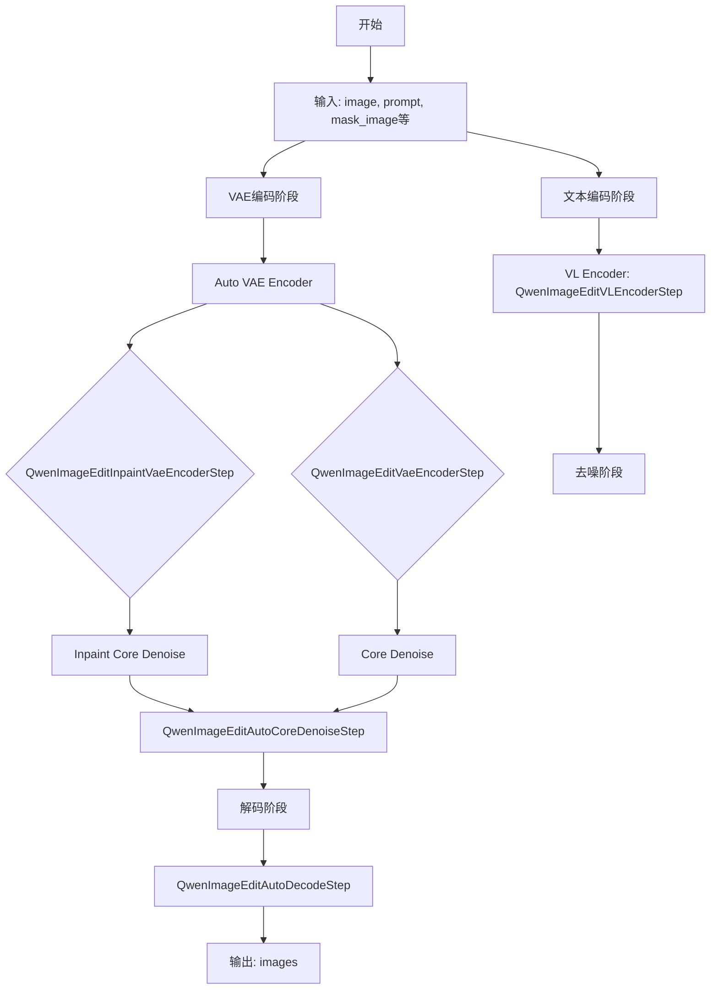
```mermaid
graph TD
    Start[开始] --> Input[输入: image, prompt, mask_image等]
    Input --> TextEncoder[文本编码阶段]
    Input --> VaeEncoder[VAE编码阶段]
    TextEncoder --> VLEncoder[VL Encoder: QwenImageEditVLEncoderStep]
    VaeEncoder --> AutoVae[Auto VAE Encoder]
    AutoVae --> InpaintVae{QwenImageEditInpaintVaeEncoderStep}
    AutoVae --> StdVae{QwenImageEditVaeEncoderStep}
    VLEncoder --> Denoise[去噪阶段]
    InpaintVae --> InpaintDenoise[Inpaint Core Denoise]
    StdVae --> StdDenoise[Core Denoise]
    InpaintDenoise --> AutoDenoise[QwenImageEditAutoCoreDenoiseStep]
    StdDenoise --> AutoDenoise
    AutoDenoise --> Decode[解码阶段]
    Decode --> AutoDecode[QwenImageEditAutoDecodeStep]
    AutoDecode --> Output[输出: images]
```

## 类结构

```
PipelineBlocks (抽象基类)
├── SequentialPipelineBlocks (顺序管道块)
│   ├── QwenImageEditVLEncoderStep
│   ├── QwenImageEditVaeEncoderStep
│   ├── QwenImageEditInpaintVaeEncoderStep
│   ├── QwenImageEditInputStep
│   ├── QwenImageEditInpaintInputStep
│   ├── QwenImageEditInpaintPrepareLatentsStep
│   ├── QwenImageEditCoreDenoiseStep
│   ├── QwenImageEditInpaintCoreDenoiseStep
│   ├── QwenImageEditDecodeStep
│   ├── QwenImageEditInpaintDecodeStep
│   └── QwenImageEditAutoBlocks
├── AutoPipelineBlocks (自动管道块)
│   ├── QwenImageEditAutoVaeEncoderStep
│   └── QwenImageEditAutoDecodeStep
└── ConditionalPipelineBlocks (条件管道块)
    └── QwenImageEditAutoCoreDenoiseStep
```

## 全局变量及字段


### `logger`
    
日志记录器，用于输出模块运行信息

类型：`logging.Logger`
    


### `EDIT_AUTO_BLOCKS`
    
编辑任务的自动模块流水线块字典，包含文本编码器、VAE编码器、去噪和解码步骤

类型：`InsertableDict`
    


### `QwenImageEditVLEncoderStep.model_name`
    
模型名称标识

类型：`str`
    


### `QwenImageEditVLEncoderStep.block_classes`
    
流水线块类列表，包含图像调整和文本编码步骤

类型：`list`
    


### `QwenImageEditVLEncoderStep.block_names`
    
流水线块名称列表

类型：`list`
    


### `QwenImageEditVaeEncoderStep.model_name`
    
模型名称标识

类型：`str`
    


### `QwenImageEditVaeEncoderStep.block_classes`
    
流水线块类列表，包含图像调整、预处理和VAE编码步骤

类型：`list`
    


### `QwenImageEditVaeEncoderStep.block_names`
    
流水线块名称列表

类型：`list`
    


### `QwenImageEditInpaintVaeEncoderStep.model_name`
    
模型名称标识

类型：`str`
    


### `QwenImageEditInpaintVaeEncoderStep.block_classes`
    
流水线块类列表，包含图像调整、图像修复预处理和VAE编码步骤

类型：`list`
    


### `QwenImageEditInpaintVaeEncoderStep.block_names`
    
流水线块名称列表

类型：`list`
    


### `QwenImageEditAutoVaeEncoderStep.block_classes`
    
自动流水线块类列表，包含图像修复和标准VAE编码器步骤

类型：`list`
    


### `QwenImageEditAutoVaeEncoderStep.block_names`
    
自动流水线块名称列表

类型：`list`
    


### `QwenImageEditAutoVaeEncoderStep.block_trigger_inputs`
    
触发自动选择的输入参数名称列表

类型：`list`
    


### `QwenImageEditInputStep.model_name`
    
模型名称标识

类型：`str`
    


### `QwenImageEditInputStep.block_classes`
    
流水线块类列表，包含文本输入和附加输入步骤

类型：`list`
    


### `QwenImageEditInputStep.block_names`
    
流水线块名称列表

类型：`list`
    


### `QwenImageEditInpaintInputStep.model_name`
    
模型名称标识

类型：`str`
    


### `QwenImageEditInpaintInputStep.block_classes`
    
流水线块类列表，包含文本输入和带掩码图像的附加输入步骤

类型：`list`
    


### `QwenImageEditInpaintInputStep.block_names`
    
流水线块名称列表

类型：`list`
    


### `QwenImageEditInpaintPrepareLatentsStep.model_name`
    
模型名称标识

类型：`str`
    


### `QwenImageEditInpaintPrepareLatentsStep.block_classes`
    
流水线块类列表，包含带强度的潜在变量准备和掩码潜在变量创建步骤

类型：`list`
    


### `QwenImageEditInpaintPrepareLatentsStep.block_names`
    
流水线块名称列表

类型：`list`
    


### `QwenImageEditCoreDenoiseStep.model_name`
    
模型名称标识

类型：`str`
    


### `QwenImageEditCoreDenoiseStep.block_classes`
    
流水线块类列表，包含输入准备、潜在变量准备、时间步设置、RoPE输入准备、去噪和去噪后处理步骤

类型：`list`
    


### `QwenImageEditCoreDenoiseStep.block_names`
    
流水线块名称列表

类型：`list`
    


### `QwenImageEditInpaintCoreDenoiseStep.model_name`
    
模型名称标识

类型：`str`
    


### `QwenImageEditInpaintCoreDenoiseStep.block_classes`
    
流水线块类列表，包含图像修复输入准备、潜在变量准备、带强度的时间步设置、图像修复潜在变量准备、RoPE输入准备、图像修复去噪和去噪后处理步骤

类型：`list`
    


### `QwenImageEditInpaintCoreDenoiseStep.block_names`
    
流水线块名称列表

类型：`list`
    


### `QwenImageEditAutoCoreDenoiseStep.model_name`
    
模型名称标识

类型：`str`
    


### `QwenImageEditAutoCoreDenoiseStep.block_classes`
    
自动流水线块类列表，包含图像修复和标准编辑去噪核心步骤

类型：`list`
    


### `QwenImageEditAutoCoreDenoiseStep.block_names`
    
自动流水线块名称列表

类型：`list`
    


### `QwenImageEditAutoCoreDenoiseStep.block_trigger_inputs`
    
触发自动选择的输入参数名称列表

类型：`list`
    


### `QwenImageEditAutoCoreDenoiseStep.default_block_name`
    
默认块名称，当无触发条件时使用

类型：`str`
    


### `QwenImageEditDecodeStep.model_name`
    
模型名称标识

类型：`str`
    


### `QwenImageEditDecodeStep.block_classes`
    
流水线块类列表，包含VAE解码和图像后处理步骤

类型：`list`
    


### `QwenImageEditDecodeStep.block_names`
    
流水线块名称列表

类型：`list`
    


### `QwenImageEditInpaintDecodeStep.model_name`
    
模型名称标识

类型：`str`
    


### `QwenImageEditInpaintDecodeStep.block_classes`
    
流水线块类列表，包含VAE解码和图像修复后处理步骤

类型：`list`
    


### `QwenImageEditInpaintDecodeStep.block_names`
    
流水线块名称列表

类型：`list`
    


### `QwenImageEditAutoDecodeStep.block_classes`
    
自动流水线块类列表，包含图像修复解码和标准解码步骤

类型：`list`
    


### `QwenImageEditAutoDecodeStep.block_names`
    
自动流水线块名称列表

类型：`list`
    


### `QwenImageEditAutoDecodeStep.block_trigger_inputs`
    
触发自动选择的输入参数名称列表

类型：`list`
    


### `QwenImageEditAutoBlocks.model_name`
    
模型名称标识

类型：`str`
    


### `QwenImageEditAutoBlocks.block_classes`
    
自动流水线块类列表，包含文本编码器、VAE编码器、去噪和解码步骤

类型：`list`
    


### `QwenImageEditAutoBlocks.block_names`
    
自动流水线块名称列表

类型：`list`
    


### `QwenImageEditAutoBlocks._workflow_map`
    
工作流映射字典，定义不同任务类型所需的输入参数

类型：`dict`
    
    

## 全局函数及方法


### `QwenImageEditVLEncoderStep.description`

该属性是 `QwenImageEditVLEncoderStep` 类的一个只读属性，用于返回该 VL 编码器步骤的描述信息，说明其主要功能是对图像和文本提示进行编码处理。

参数：无

返回值：`str`，返回该步骤的描述字符串，为 "QwenImage-Edit VL encoder step that encode the image and text prompts together."

#### 流程图

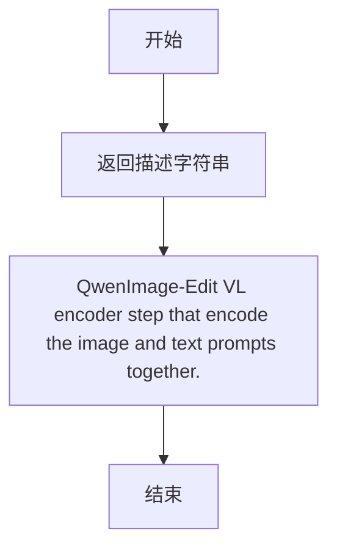
```mermaid
flowchart TD
    A[开始] --> B[返回描述字符串]
    B --> C["QwenImage-Edit VL encoder step that encode the image and text prompts together."]
    C --> D[结束]
```

#### 带注释源码

```python
@property
def description(self) -> str:
    """
    返回 QwenImage-Edit VL 编码器步骤的描述信息。
    
    该方法是一个只读属性，用于获取当前步骤的功能描述。
    不需要任何输入参数，直接返回类的用途说明。
    
    Returns:
        str: 描述字符串，说明该步骤用于对图像和文本提示进行编码
    """
    return "QwenImage-Edit VL encoder step that encode the image and text prompts together."
```


### `QwenImageEditVaeEncoderStep.description`

该属性方法属于 `QwenImageEditVaeEncoderStep` 类，用于返回该 VAE 编码步骤的描述信息，概述其将图像输入编码为潜在表示的功能。

参数：无（该方法为属性方法，无显式参数）

返回值：`str`，返回该步骤的描述字符串

#### 流程图

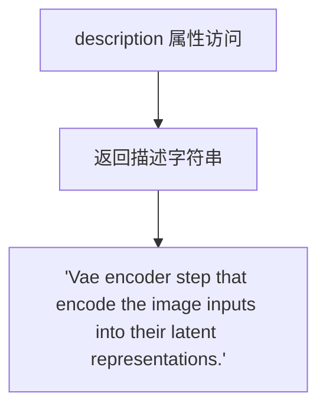
```mermaid
flowchart TD
    A[description 属性访问] --> B[返回描述字符串]
    B --> C["'Vae encoder step that encode the image inputs into their latent representations.'"]
```

#### 带注释源码

```python
class QwenImageEditVaeEncoderStep(SequentialPipelineBlocks):
    """
    Vae encoder step that encode the image inputs into their latent representations.

      Components:
          image_resize_processor (`VaeImageProcessor`) image_processor (`VaeImageProcessor`) vae
          (`AutoencoderKLQwenImage`)

      Inputs:
          image (`Image | list`):
              Reference image(s) for denoising. Can be a single image or list of images.
          generator (`Generator`, *optional*):
              Torch generator for deterministic generation.

      Outputs:
          resized_image (`list`):
              The resized images
          processed_image (`Tensor`):
              The processed image
          image_latents (`Tensor`):
              The latent representation of the input image.
    """

    model_name = "qwenimage-edit"
    # 定义该步骤包含的子处理块：图像调整、图像预处理、VAE编码
    block_classes = [
        QwenImageEditResizeStep(),
        QwenImageEditProcessImagesInputStep(),
        QwenImageVaeEncoderStep(),
    ]
    # 对应子处理块的名称
    block_names = ["resize", "preprocess", "encode"]

    @property
    def description(self) -> str:
        """
        属性方法：返回该 VAE 编码步骤的描述字符串
        
        Returns:
            str: 描述该步骤功能的字符串，说明其将图像输入编码为潜在表示
        """
        return "Vae encoder step that encode the image inputs into their latent representations."
```


### `QwenImageEditInpaintVaeEncoderStep.description`

该属性方法属于 `QwenImageEditInpaintVaeEncoderStep` 类，用于返回该步骤的描述信息。它说明了该步骤用于处理 QwenImage-Edit inpaint 任务的图像和掩码输入，包括：将图像调整到目标区域（1024 * 1024）同时保持纵横比、处理调整后的图像和掩码图像、以及创建图像潜在表示。

参数： 无（该方法是一个属性方法，不需要参数）

返回值：`str`，返回该步骤的描述字符串

#### 流程图

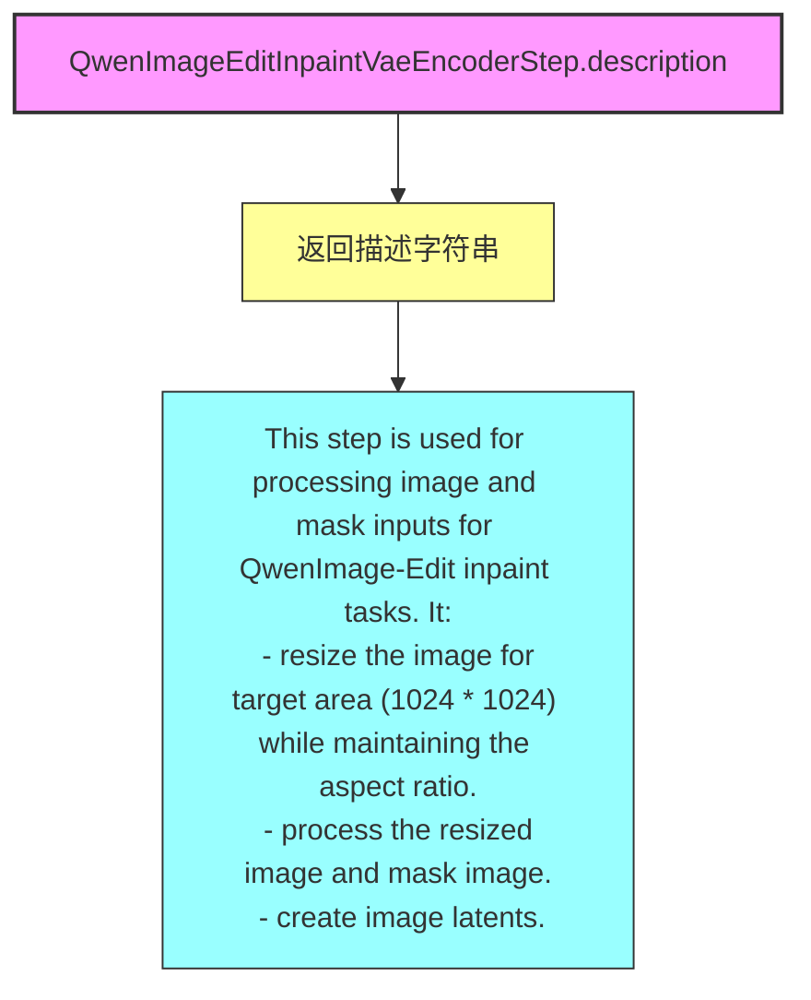
```mermaid
flowchart TD
    A[QwenImageEditInpaintVaeEncoderStep.description] --> B[返回描述字符串]
    B --> C["This step is used for processing image and mask inputs for QwenImage-Edit inpaint tasks. It:\n - resize the image for target area (1024 * 1024) while maintaining the aspect ratio.\n - process the resized image and mask image.\n - create image latents."]
    
    style A fill:#f9f,stroke:#333,stroke-width:2px
    style B fill:#ff9,stroke:#333,stroke-width:1px
    style C fill:#9ff,stroke:#333,stroke-width:1px
```

#### 带注释源码

```python
@property
def description(self) -> str:
    """
    返回该步骤的描述信息。
    
    该方法是一个属性方法（使用 @property 装饰器），用于描述 QwenImageEditInpaintVaeEncoderStep 的功能。
    它说明了该步骤用于处理 QwenImage-Edit inpaint 任务的图像和掩码输入，包括：
    1. 将图像调整到目标区域（1024 * 1024）同时保持纵横比
    2. 处理调整后的图像和掩码图像
    3. 创建图像潜在表示（image latents）
    
    Returns:
        str: 描述该步骤功能的字符串
        
    Example:
        >>> step = QwenImageEditInpaintVaeEncoderStep()
        >>> print(step.description)
        This step is used for processing image and mask inputs for QwenImage-Edit inpaint tasks. It:
         - resize the image for target area (1024 * 1024) while maintaining the aspect ratio.
         - process the resized image and mask image.
         - create image latents.
    """
    return (
        "This step is used for processing image and mask inputs for QwenImage-Edit inpaint tasks. It:\n"
        " - resize the image for target area (1024 * 1024) while maintaining the aspect ratio.\n"
        " - process the resized image and mask image.\n"
        " - create image latents."
    )
```


### `QwenImageEditAutoVaeEncoderStep.description`

该属性方法用于获取 QwenImage-Edit 的自动 VAE 编码器步骤的描述信息。它是一个自动管道块，根据输入是否包含 `mask_image` 或 `image` 来自动选择使用 `QwenImageEditInpaintVaeEncoderStep` 或 `QwenImageEditVaeEncoderStep`。

参数：

- 无显式参数（属性方法，隐式接收 `self`）

返回值：`str`，返回该自动 VAE 编码器步骤的描述字符串，包含对不同输入条件下使用不同编码器的说明。

#### 流程图

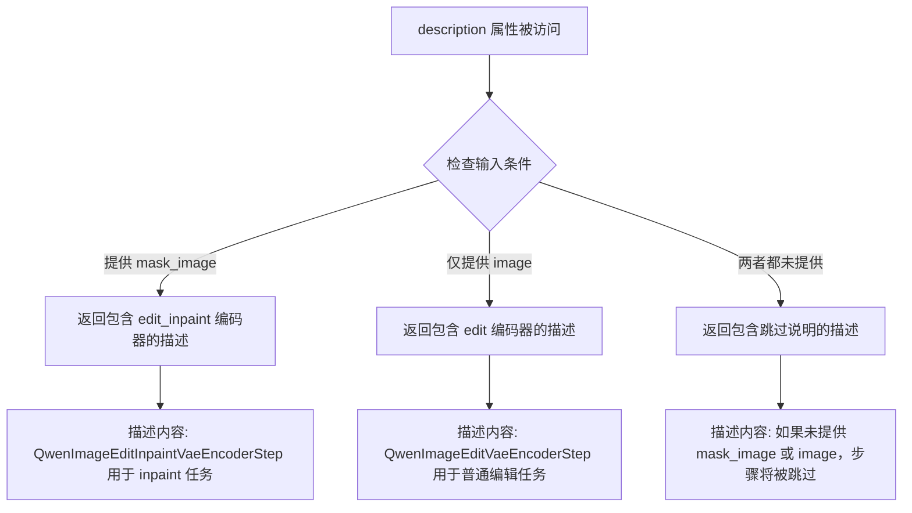
```mermaid
flowchart TD
    A[description 属性被访问] --> B{检查输入条件}
    B -->|提供 mask_image| C[返回包含 edit_inpaint 编码器的描述]
    B -->|仅提供 image| D[返回包含 edit 编码器的描述]
    B -->|两者都未提供| E[返回包含跳过说明的描述]
    
    C --> F[描述内容: QwenImageEditInpaintVaeEncoderStep 用于 inpaint 任务]
    D --> G[描述内容: QwenImageEditVaeEncoderStep 用于普通编辑任务]
    E --> H[描述内容: 如果未提供 mask_image 或 image，步骤将被跳过]
```

#### 带注释源码

```python
@property
def description(self):
    """
    获取自动 VAE 编码器步骤的描述信息。
    
    这是一个自动管道块（AutoPipelineBlocks），会根据输入条件
    自动选择合适的编码器实现：
    - 当提供 mask_image 时，使用 QwenImageEditInpaintVaeEncoderStep
    - 当提供 image 时，使用 QwenImageEditVaeEncoderStep
    - 如果两者都未提供，步骤将被跳过
    
    Returns:
        str: 描述该自动编码器步骤功能的字符串，包含使用条件和
            不同编码器的说明信息
    """
    return (
        "Vae encoder step that encode the image inputs into their latent representations.\n"
        "This is an auto pipeline block.\n"
        " - `QwenImageEditInpaintVaeEncoderStep` (edit_inpaint) is used when `mask_image` is provided.\n"
        " - `QwenImageEditVaeEncoderStep` (edit) is used when `image` is provided.\n"
        " - if `mask_image` or `image` is not provided, step will be skipped."
    )
```


### `QwenImageEditInputStep.description`

这是 `QwenImageEditInputStep` 类的属性描述，用于为编辑去噪步骤准备输入。

参数： 无（这是一个属性而非方法）

返回值： `str`，返回该步骤的描述字符串

#### 流程图

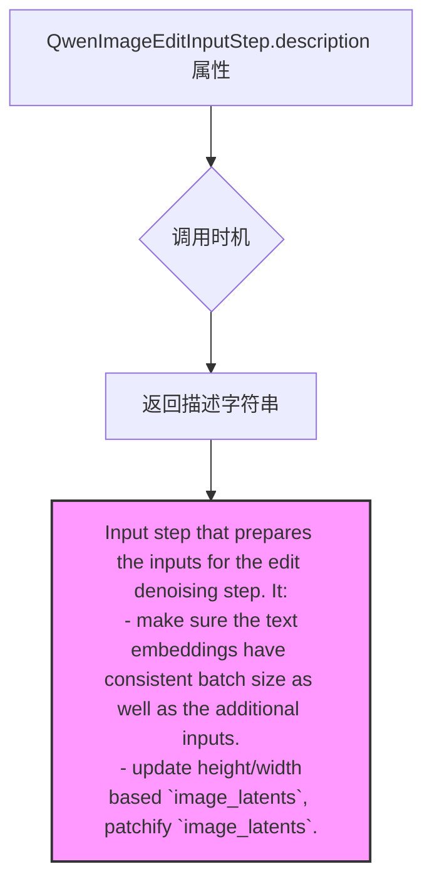
```mermaid
flowchart TD
    A[QwenImageEditInputStep.description 属性] --> B{调用时机}
    B --> C[返回描述字符串]
    
    C --> D["Input step that prepares the inputs for the edit denoising step. It:\n - make sure the text embeddings have consistent batch size as well as the additional inputs.\n - update height/width based `image_latents`, patchify `image_latents`."]
    
    style D fill:#f9f,stroke:#333,stroke-width:2px
```

#### 带注释源码

```python
@property
def description(self):
    """
    返回 QwenImageEditInputStep 的描述信息。
    
    该属性用于描述输入步骤的功能：
    - 确保文本嵌入与额外输入具有一致的批次大小
    - 基于 image_latents 更新高度/宽度
    - 对 image_latents 进行分块处理（patchify）
    
    Returns:
        str: 描述编辑任务输入准备步骤的字符串信息
    """
    return (
        "Input step that prepares the inputs for the edit denoising step. It:\n"
        " - make sure the text embeddings have consistent batch size as well as the additional inputs.\n"
        " - update height/width based `image_latents`, patchify `image_latents`."
    )
```


### `QwenImageEditInpaintInputStep.description`

该属性返回对 `QwenImageEditInpaintInputStep` 类的描述，说明该类是用于为编辑修复（edit inpaint）去噪步骤准备输入的步骤，确保文本嵌入具有一致的批次大小，并根据 `image_latents` 更新高度/宽度，同时对 `image_latents` 进行分块处理。

参数：
该方法为属性（property），无参数。

返回值：`str`，返回描述文本。

#### 流程图

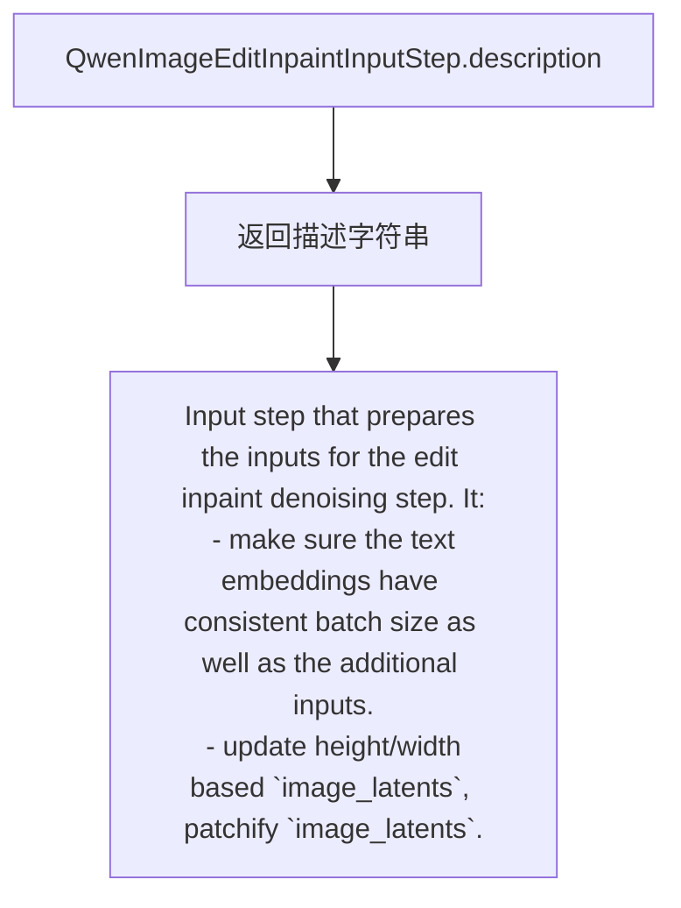
```mermaid
flowchart TD
    A[QwenImageEditInpaintInputStep.description] --> B[返回描述字符串]
    B --> C["Input step that prepares the inputs for the edit inpaint denoising step. It:\n - make sure the text embeddings have consistent batch size as well as the additional inputs.\n - update height/width based `image_latents`, patchify `image_latents`."]
```

#### 带注释源码

```python
@property
def description(self):
    return (
        "Input step that prepares the inputs for the edit inpaint denoising step. It:\n"
        " - make sure the text embeddings have consistent batch size as well as the additional inputs.\n"
        " - update height/width based `image_latents`, patchify `image_latents`."
    )
```

该属性是一个 `@property` 装饰器方法，属于 `QwenImageEditInpaintInputStep` 类（继承自 `SequentialPipelineBlocks`）。该方法返回一个字符串描述，说明该步骤的功能：
1. 确保文本嵌入与额外输入具有一致的批次大小
2. 根据 `image_latents` 更新高度/宽度
3. 对 `image_latents` 进行分块（patchify）处理


### `QwenImageEditInpaintPrepareLatentsStep.description`

该属性描述了 QwenImage-Edit 图像编辑中用于修复任务的潜在变量（latents）和掩码（mask）准备步骤。该步骤负责向图像潜在变量添加噪声以创建去噪器的输入，并根据处理后的掩码图像创建分块化的潜在变量掩码。

参数：
（该属性为属性方法，无直接参数，其功能参数来自类的 Inputs 定义）

- `latents`：`Tensor`，初始随机噪声，可在准备潜在变量步骤中生成
- `image_latents`：`Tensor`，用于引导图像生成的图像潜在变量，可由 VAE 编码器生成并在输入步骤中更新
- `timesteps`：`Tensor`，去噪过程使用的时间步，可在设置时间步步骤中生成
- `processed_mask_image`：`Tensor`，修复过程使用的处理后掩码
- `height`：`int`，生成图像的高度（像素）
- `width`：`int`，生成图像的宽度（像素）
- `dtype`：`dtype`（可选，默认为 torch.float32），模型输入的数据类型，可在输入步骤中生成

返回值：`str`，返回该步骤的描述字符串

#### 流程图

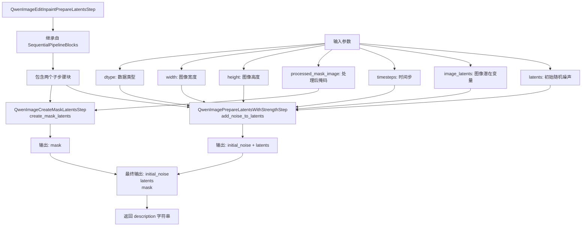
```mermaid
flowchart TD
    A[QwenImageEditInpaintPrepareLatentsStep] --> B[继承自 SequentialPipelineBlocks]
    B --> C[包含两个子步骤块]
    C --> D[QwenImagePrepareLatentsWithStrengthStep<br/>add_noise_to_latents]
    C --> E[QwenImageCreateMaskLatentsStep<br/>create_mask_latents]
    
    F[输入参数] --> F1[latents: 初始随机噪声]
    F --> F2[image_latents: 图像潜在变量]
    F --> F3[timesteps: 时间步]
    F --> F4[processed_mask_image: 处理后掩码]
    F --> F5[height: 图像高度]
    F --> F6[width: 图像宽度]
    F --> F7[dtype: 数据类型]
    
    F1 --> D
    F2 --> D
    F3 --> D
    F5 --> D
    F6 --> D
    F7 --> D
    F4 --> E
    
    D --> G[输出: initial_noise + latents]
    E --> H[输出: mask]
    
    G --> I[最终输出: initial_noise<br/>latents<br/>mask]
    H --> I
    
    I --> J[返回 description 字符串]
```

#### 带注释源码

```python
@property
def description(self) -> str:
    """
    属性方法：返回该步骤的描述信息
    
    该方法实现了一个只读属性，返回关于 QwenImageEditInpaintPrepareLatentsStep 步骤的详细描述。
    该步骤是 QwenImage-Edit 图像编辑管道中的关键组件，专门用于修复（inpainting）任务的准备阶段。
    
    描述内容包含：
    1. 步骤的核心功能：准备 latents/image_latents 和 mask 输入
    2. 具体操作：
       - 向图像潜在变量添加噪声，创建去噪器的输入
       - 基于处理后的掩码图像创建分块化的潜在变量掩码
    
    Returns:
        str: 步骤的详细描述字符串，包含两个主要功能的说明
    """
    return (
        "This step prepares the latents/image_latents and mask inputs for the edit inpainting denoising step. It:\n"
        " - Add noise to the image latents to create the latents input for the denoiser.\n"
        " - Create the patchified latents `mask` based on the processed mask image.\n"
    )
```


### `QwenImageEditCoreDenoiseStep.description`

该属性返回对 QwenImage-Edit 编辑（img2img）任务核心去噪工作流的描述。

参数：无（该方法为属性，无参数）

返回值：`str`，描述核心去噪工作流的功能

#### 流程图

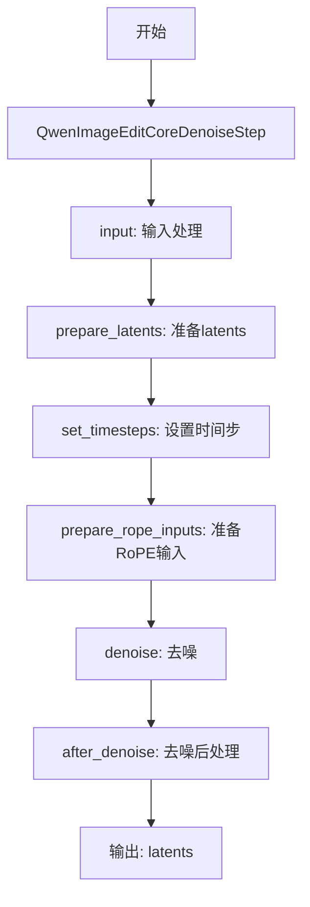
```mermaid
graph TD
    A[开始] --> B[QwenImageEditCoreDenoiseStep]
    B --> C[input: 输入处理]
    C --> D[prepare_latents: 准备latents]
    D --> E[set_timesteps: 设置时间步]
    E --> F[prepare_rope_inputs: 准备RoPE输入]
    F --> G[denoise: 去噪]
    G --> H[after_denoise: 去噪后处理]
    H --> I[输出: latents]
```

#### 带注释源码

```python
@property
def description(self):
    """
    返回该核心去噪步骤的描述信息。
    
    Returns:
        str: 描述文本，说明这是 QwenImage-Edit 编辑（img2img）任务的核心去噪工作流
    """
    return "Core denoising workflow for QwenImage-Edit edit (img2img) task."
```

#### 完整类结构参考

```python
# Qwen Image Edit (image2image) core denoise step
class QwenImageEditCoreDenoiseStep(SequentialPipelineBlocks):
    """
    Core denoising workflow for QwenImage-Edit edit (img2img) task.

      Components:
          pachifier (`QwenImagePachifier`) scheduler (`FlowMatchEulerDiscreteScheduler`) guider
          (`ClassifierFreeGuidance`) transformer (`QwenImageTransformer2DModel`)

      Inputs:
          num_images_per_prompt (`int`, *optional*, defaults to 1):
              The number of images to generate per prompt.
          prompt_embeds (`Tensor`):
              text embeddings used to guide the image generation. Can be generated from text_encoder step.
          prompt_embeds_mask (`Tensor`):
              mask for the text embeddings. Can be generated from text_encoder step.
          negative_prompt_embeds (`Tensor`, *optional*):
              negative text embeddings used to guide the image generation. Can be generated from text_encoder step.
          negative_prompt_embeds_mask (`Tensor`, *optional*):
              mask for the negative prompt embeddings. Can be generated from text_encoder step.
          height (`int`, *optional*):
              The height in pixels of the generated image.
          width (`int`, *optional*):
              The width in pixels of the generated image.
          image_latents (`Tensor`):
              image latents used to guide the image generation. Can be generated from vae_encoder step.
          latents (`Tensor`, *optional*):
              Pre-generated noisy latents for image generation.
          generator (`Generator`, *optional*):
              Torch generator for deterministic generation.
          num_inference_steps (`int`, *optional*, defaults to 50):
              The number of denoising steps.
          sigmas (`list`, *optional*):
              Custom sigmas for the denoising process.
          attention_kwargs (`dict`, *optional*):
              Additional kwargs for attention processors.
          **denoiser_input_fields (`None`, *optional*):
              conditional model inputs for the denoiser: e.g. prompt_embeds, negative_prompt_embeds, etc.

      Outputs:
          latents (`Tensor`):
              Denoised latents.
    """

    model_name = "qwenimage-edit"
    block_classes = [
        QwenImageEditInputStep(),
        QwenImagePrepareLatentsStep(),
        QwenImageSetTimestepsStep(),
        QwenImageEditRoPEInputsStep(),
        QwenImageEditDenoiseStep(),
        QwenImageAfterDenoiseStep(),
    ]
    block_names = [
        "input",
        "prepare_latents",
        "set_timesteps",
        "prepare_rope_inputs",
        "denoise",
        "after_denoise",
    ]

    @property
    def description(self):
        return "Core denoising workflow for QwenImage-Edit edit (img2img) task."

    @property
    def outputs(self):
        return [
            OutputParam.template("latents"),
        ]
```


### QwenImageEditCoreDenoiseStep.outputs

这是一个属性方法，返回 QwenImage-Edit 编辑任务（图像到图像）核心去噪步骤的输出参数信息。该属性定义了在去噪过程完成后所产生的结果，包含去噪后的潜在表示（latents），用于后续的解码步骤生成最终图像。

参数： 无（这是一个属性方法，不接受任何参数）

返回值：`list[OutputParam]`，返回包含去噪结果的输出参数列表。当前返回一个包含单个 `OutputParam` 对象的列表，该对象对应去噪后的 `latents`（类型为 `Tensor`）。

#### 流程图

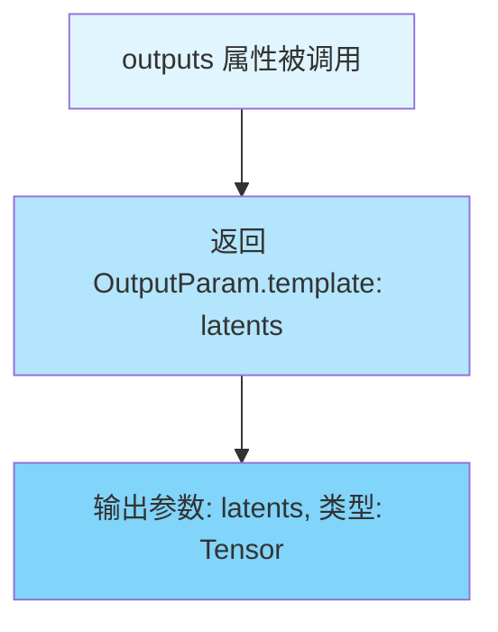
```mermaid
flowchart TD
    A[outputs 属性被调用] --> B[返回 OutputParam.template: latents]
    B --> C[输出参数: latents, 类型: Tensor]
    
    style A fill:#e1f5fe
    style B fill:#b3e5fc
    style C fill:#81d4fa
```

#### 带注释源码

```python
@property
def outputs(self):
    """
    属性方法：返回去噪步骤的输出参数定义
    
    Returns:
        list: 包含 OutputParam 对象的列表，当前定义了一个输出参数：
              - latents: 去噪后的潜在表示（Tensor 类型）
              这个输出将被传递给解码器（decode step）以生成最终图像
    """
    return [
        OutputParam.template("latents"),
    ]
```

#### 补充说明

该属性是 `QwenImageEditCoreDenoiseStep` 类的一部分，该类是一个 `SequentialPipelineBlocks`，组合了多个处理步骤：
- `QwenImageEditInputStep`：准备输入
- `QwenImagePrepareLatentsStep`：准备潜在表示
- `QwenImageSetTimestepsStep`：设置时间步
- `QwenImageEditRoPEInputsStep`：准备 RoPE 位置编码输入
- `QwenImageEditDenoiseStep`：执行核心去噪
- `QwenImageAfterDenoiseStep`：去噪后处理

最终的 `latents` 输出是去噪完成后的潜在张量，将被传递到后续的解码步骤（`QwenImageEditDecodeStep`）以生成最终图像。


### QwenImageEditInpaintCoreDenoiseStep.description

该属性是 QwenImageEditInpaintCoreDenoiseStep 类的描述属性，返回该类作为 QwenImage-Edit 编辑修复任务的核心去噪工作流的简要说明。

参数：

- 无参数（这是一个属性 getter）

返回值：`str`，返回核心去噪工作流的描述字符串

#### 流程图

```mermaid
flowchart TD
    A[QwenImageEditInpaintCoreDenoiseStep.description 属性的调用] --> B{获取属性值}
    B --> C[返回描述字符串: "Core denoising workflow for QwenImage-Edit edit inpaint task."]
    
    style A fill:#f9f,stroke:#333
    style B fill:#ff9,stroke:#333
    style C fill:#9f9,stroke:#333
```

#### 带注释源码

```python
@property
def description(self):
    """
    属性getter方法，返回该Pipeline Block的描述信息。
    
    该类是QwenImage-Edit编辑修复任务的核心去噪工作流，
    包含以下子步骤：
    - input: 准备输入数据
    - prepare_latents: 准备潜在向量
    - set_timesteps: 设置时间步
    - prepare_inpaint_latents: 准备修复用的潜在向量和掩码
    - prepare_rope_inputs: 准备RoPE位置编码输入
    - denoise: 执行去噪过程
    - after_denoise: 去噪后处理
    
    Returns:
        str: 描述该核心去噪工作流功能的字符串
    """
    return "Core denoising workflow for QwenImage-Edit edit inpaint task."
```

#### 补充信息

**所属类详情**：

- **类名**：`QwenImageEditInpaintCoreDenoiseStep`
- **父类**：`SequentialPipelineBlocks`
- **功能**：QwenImage-Edit 编辑修复（inpaint）任务的核心去噪工作流，协调多个子步骤完成图像修复的去噪过程

**关键组件**（block_classes）：
1. `QwenImageEditInpaintInputStep` - 输入准备
2. `QwenImagePrepareLatentsStep` - 潜在向量准备
3. `QwenImageSetTimestepsWithStrengthStep` - 带强度的 timesteps 设置
4. `QwenImageEditInpaintPrepareLatentsStep` - 修复用潜在向量准备（含噪声添加和掩码创建）
5. `QwenImageEditRoPEInputsStep` - RoPE 位置编码输入准备
6. `QwenImageEditInpaintDenoiseStep` - 核心去噪步骤
7. `QwenImageAfterDenoiseStep` - 去噪后处理

**输出参数**：
- `latents` (`Tensor`): 去噪后的潜在向量

**设计目标**：
- 支持图像修复（inpainting）任务
- 通过 `processed_mask_image` 参数区分修复和普通编辑模式
- 使用 FlowMatchEulerDiscreteScheduler 进行去噪调度


### `QwenImageEditInpaintCoreDenoiseStep.outputs`

该属性是 `QwenImageEditInpaintCoreDenoiseStep` 类中的一个属性方法，用于定义该核心去噪步骤的输出参数。它返回一个包含 `latents`（去噪后的潜在表示）的列表。

参数：无（该方法不接受任何参数）

返回值：`list`，返回一个包含 `OutputParam` 对象的列表，当前仅包含一个 `latents` 输出参数。

#### 流程图

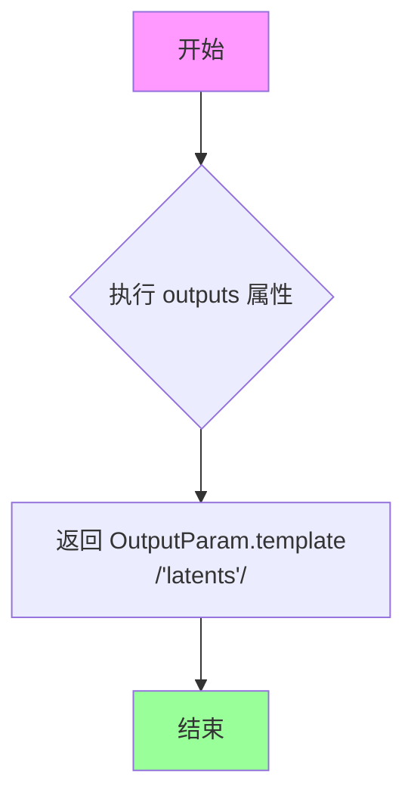
```mermaid
flowchart TD
    A[开始] --> B{执行 outputs 属性}
    B --> C[返回 OutputParam.template<br/>/'latents'/]
    C --> D[结束]
    
    style A fill:#f9f,color:#333
    style D fill:#9f9,color:#333
```

#### 带注释源码

```python
@property
def outputs(self):
    """
    定义该核心去噪步骤的输出参数。
    返回一个包含去噪后的 latents（潜在表示）的列表。
    """
    return [
        OutputParam.template("latents"),
    ]
```


### `QwenImageEditAutoCoreDenoiseStep.select_block`

该方法是 QwenImage 编辑任务的自动核心去噪步骤选择器，用于根据输入参数动态选择合适的去噪工作流：当提供 `processed_mask_image` 时选择 `edit_inpaint`（图像修复）工作流，当仅提供 `image_latents` 时选择 `edit`（图像到图像）工作流，若两者都未提供则返回 `None`。

参数：

- `processed_mask_image`：`Optional[Any]`，处理后的掩码图像，用于图像修复任务
- `image_latents`：`Optional[Any]`，图像潜变量，用于图像到图像编辑任务

返回值：`Optional[str]`，返回选中的块名称（"edit_inpaint"、"edit" 或 `None`）

#### 流程图

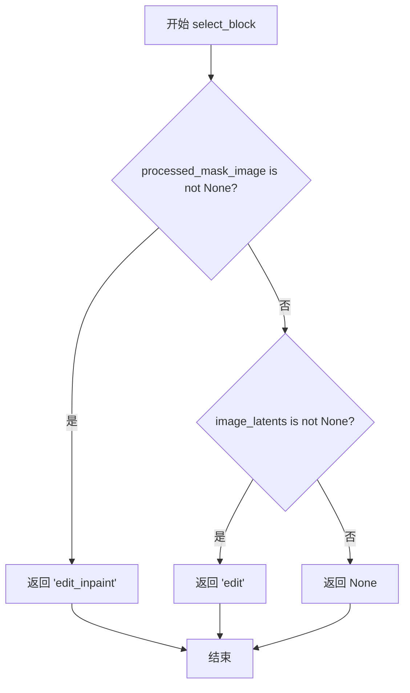
```mermaid
flowchart TD
    A[开始 select_block] --> B{processed_mask_image is not None?}
    B -->|是| C[返回 'edit_inpaint']
    B -->|否| D{image_latents is not None?}
    D -->|是| E[返回 'edit']
    D -->|否| F[返回 None]
    C --> G[结束]
    E --> G
    F --> G
```

#### 带注释源码

```python
def select_block(self, processed_mask_image=None, image_latents=None) -> str | None:
    """
    选择合适的去噪块
    
    根据提供的输入参数，选择对应的去噪工作流：
    - 如果提供了 processed_mask_image，选择 edit_inpaint 工作流（图像修复）
    - 如果只提供了 image_latents，选择 edit 工作流（图像到图像编辑）
    - 如果两者都未提供，返回 None
    
    参数:
        processed_mask_image: 处理后的掩码图像，用于图像修复任务
        image_latents: 图像潜变量，用于图像到图像编辑任务
    
    返回:
        str | None: 选中的块名称或 None
    """
    # 检查是否提供了掩码图像（优先检查）
    if processed_mask_image is not None:
        # 返回图像修复工作流名称
        return "edit_inpaint"
    # 检查是否提供了图像潜变量
    elif image_latents is not None:
        # 返回图像到图像编辑工作流名称
        return "edit"
    # 两者都未提供，返回 None
    return None
```


### `QwenImageEditAutoCoreDenoiseStep.description`

这是一个属性方法（Property），用于获取 `QwenImageEditAutoCoreDenoiseStep` 类的描述信息。该类是一个条件管道块（ConditionalPipelineBlocks），根据输入条件自动选择合适的去噪工作流程。当提供 `processed_mask_image` 时选择 inpaint 工作流，当提供 `image_latents` 时选择 edit（img2img）工作流。

参数：

- 无显式参数（隐式接收 `self`）

返回值：`str`，返回该类的描述字符串，说明其自动选择逻辑和支持的编辑、修复任务类型。

#### 流程图

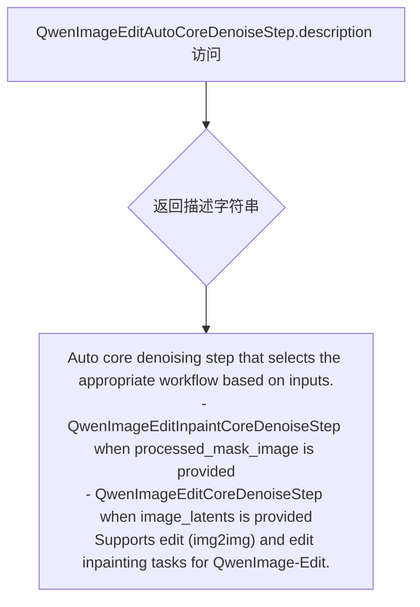
```mermaid
flowchart TD
    A[QwenImageEditAutoCoreDenoiseStep.description 访问] --> B{返回描述字符串}
    B --> C["Auto core denoising step that selects the appropriate workflow based on inputs.\n- QwenImageEditInpaintCoreDenoiseStep when processed_mask_image is provided\n- QwenImageEditCoreDenoiseStep when image_latents is provided\nSupports edit (img2img) and edit inpainting tasks for QwenImage-Edit."]
```

#### 带注释源码

```python
@property
def description(self):
    """
    属性方法，返回类的描述信息。
    
    该描述说明了：
    1. 这是一个自动核心去噪步骤
    2. 根据输入条件选择合适的工作流程
    3. 当提供 processed_mask_image 时使用 QwenImageEditInpaintCoreDenoiseStep
    4. 当提供 image_latents 时使用 QwenImageEditCoreDenoiseStep
    5. 支持编辑（img2img）和编辑修复任务
    
    Returns:
        str: 描述自动去噪步骤功能和使用场景的字符串
    """
    return (
        "Auto core denoising step that selects the appropriate workflow based on inputs.\n"
        " - `QwenImageEditInpaintCoreDenoiseStep` when `processed_mask_image` is provided\n"
        " - `QwenImageEditCoreDenoiseStep` when `image_latents` is provided\n"
        "Supports edit (img2img) and edit inpainting tasks for QwenImage-Edit."
    )
```


### `QwenImageEditAutoCoreDenoiseStep.outputs`

该属性为 QwenImage-Edit 的自动核心去噪步骤定义输出参数，返回去噪后的潜在表示（latents），用于后续的图像解码过程。

参数：无（该方法为属性，无需输入参数）

返回值：`list[OutputParam]`，返回一个包含输出参数定义的列表，当前定义输出参数 "latents"（去噪后的潜在表示）

#### 流程图


```mermaid
flowchart TD
    A[outputs 属性调用] --> B[返回 OutputParam 列表]
    B --> C[OutputParam.template&#40;'latents'&#41;]
    C --> D[定义输出参数: latents]
    
    style A fill:#f9f,stroke:#333
    style D fill:#9f9,stroke:#333
```

#### 带注释源码

```python
@property
def outputs(self):
    """
    定义 QwenImageEditAutoCoreDenoiseStep 的输出参数。
    
    该自动去噪步骤支持两种工作模式：
    - edit_inpaint: 当提供 processed_mask_image 时使用
    - edit: 当提供 image_latents 时使用
    
    两种模式都输出去噪后的 latents（潜在表示），
    供后续解码步骤转换为最终图像。
    
    Returns:
        list: 包含 OutputParam 的列表，当前定义单一输出参数 'latents'
              - latents (Tensor): 去噪后的潜在表示，用于图像解码
    """
    return [
        OutputParam.template("latents"),
    ]
```


### `QwenImageEditDecodeStep.description`

该属性用于获取 QwenImage-Edit 图像编辑管线中解码步骤的描述信息，指示该步骤负责将去噪后的潜在表示（latents）解码为实际图像，并进行后处理。

参数：

- 无参数（这是一个属性）

返回值：`str`，返回解码步骤的描述字符串，描述其功能为"解码 latents 到图像并对生成的图像进行后处理"。

#### 流程图

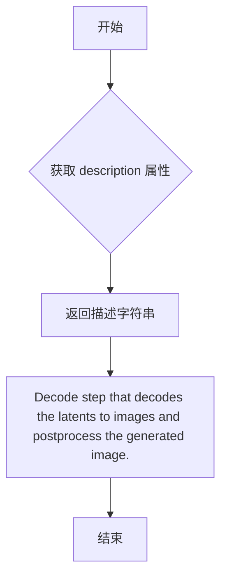
```mermaid
flowchart TD
    A[开始] --> B{获取 description 属性}
    B --> C[返回描述字符串]
    C --> D[Decode step that decodes the latents to images and postprocess the generated image.]
    D --> E[结束]
```

#### 带注释源码

```python
@property
def description(self):
    """
    属性描述：
        返回 QwenImageEditDecodeStep 类的描述信息。
        
    返回值：
        str: 解码步骤的描述字符串。
              解释该步骤负责将去噪后的 latents 解码为图像，
              并对生成的图像进行后处理（根据 output_type 格式化输出）。
    
    所属类：
        QwenImageEditDecodeStep
        
    注意事项：
        - 这是一个只读属性，用于文档和日志记录。
        - 实际的解码逻辑由 block_classes 中的 QwenImageDecoderStep 和 
          QwenImageProcessImagesOutputStep 实现。
    """
    return "Decode step that decodes the latents to images and postprocess the generated image."
```


### `QwenImageEditInpaintDecodeStep.description`

该属性返回对 `QwenImageEditInpaintDecodeStep` 类的功能描述，说明它是一个解码步骤，用于将潜在表示解码为图像并进行后处理，可选择性地将掩码叠加到原始图像上。

参数： 无（该属性不接受任何参数）

返回值：`str`，返回对该解码步骤的功能描述字符串

#### 流程图

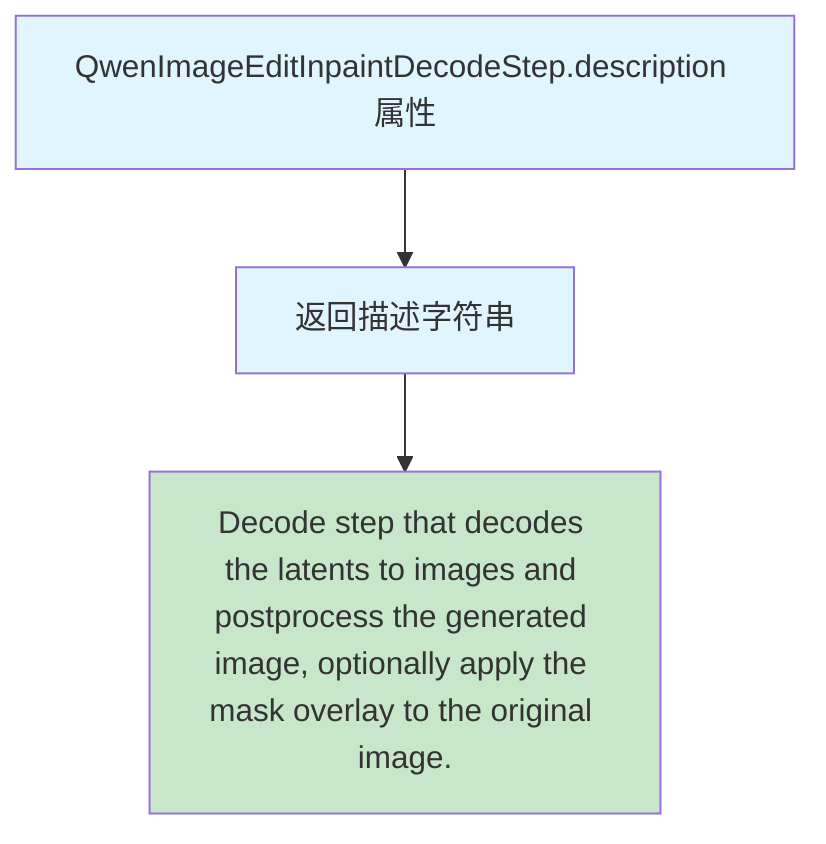
```mermaid
flowchart TD
    A[QwenImageEditInpaintDecodeStep.description 属性] --> B[返回描述字符串]
    B --> C["Decode step that decodes the latents to images and postprocess the generated image, optionally apply the mask overlay to the original image."]
    
    style A fill:#e1f5fe
    style B fill:#e1f5fe
    style C fill:#c8e6c9
```

#### 带注释源码

```python
@property
def description(self):
    """
    属性描述：
        返回该解码步骤的功能描述字符串。
    
    返回值：
        str: 解码步骤的描述，说明其用于将latents解码为图像并进行后处理，
             可选择性地将mask叠加到原始图像上。
    
    示例：
        >>> step = QwenImageEditInpaintDecodeStep()
        >>> print(step.description)
        "Decode step that decodes the latents to images and postprocess the 
         generated image, optionally apply the mask overlay to the original image."
    """
    return "Decode step that decodes the latents to images and postprocess the generated image, optionally apply the mask overlay to the original image."
```


### `QwenImageEditAutoDecodeStep.description`

这是一个属性方法（property），用于获取 QwenImageEditAutoDecodeStep 类的描述信息。该方法是自动解码步骤的核心描述符，展示了如何根据输入条件选择不同的解码器实现。

参数：无（该方法为 property 类型，无显式参数）

返回值：`str`，返回该自动解码步骤的描述字符串，说明其功能和使用场景。

#### 流程图

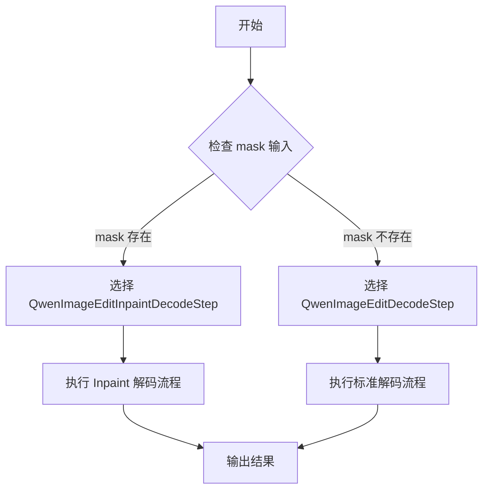
```mermaid
flowchart TD
    A[开始] --> B{检查 mask 输入}
    B -->|mask 存在| C[选择 QwenImageEditInpaintDecodeStep]
    B -->|mask 不存在| D[选择 QwenImageEditDecodeStep]
    C --> E[执行 Inpaint 解码流程]
    D --> F[执行标准解码流程]
    E --> G[输出结果]
    F --> G
```

#### 带注释源码

```python
# Auto decode step
# auto_docstring
class QwenImageEditAutoDecodeStep(AutoPipelineBlocks):
    """
    自动解码步骤类，继承自 AutoPipelineBlocks。
    根据输入是否包含 mask 来自动选择使用哪个解码步骤：
    - 有 mask：使用 QwenImageEditInpaintDecodeStep（图像修复/重绘）
    - 无 mask：使用 QwenImageEditDecodeStep（标准图像编辑）
    """
    
    # 定义可用的解码步骤类列表
    block_classes = [QwenImageEditInpaintDecodeStep, QwenImageEditDecodeStep]
    
    # 解码步骤的名称映射
    block_names = ["inpaint_decode", "decode"]
    
    # 触发条件：第一个参数是 "mask"，第二个参数为 None 表示默认情况
    block_trigger_inputs = ["mask", None]

    @property
    def description(self):
        """
        属性方法：返回该自动解码步骤的描述信息。
        
        描述内容：
        - 说明这是解码步骤，将 latents 解码为图像
        - 声明这是一个自动管道块
        - 说明不同条件下使用的具体解码步骤
        """
        return (
            "Decode step that decode the latents into images.\n"
            "This is an auto pipeline block.\n"
            " - `QwenImageEditInpaintDecodeStep` (inpaint) is used when `mask` is provided.\n"
            " - `QwenImageEditDecodeStep` (edit) is used when `mask` is not provided.\n"
        )

    @property
    def outputs(self):
        """
        属性方法：定义该步骤的输出参数。
        
        返回值：
        - latents：解码后的潜在表示（模板形式定义）
        """
        return [
            OutputParam.template("latents"),
        ]
```


### `QwenImageEditAutoDecodeStep.outputs`

该属性定义了在 QwenImage-Edit 的自动解码步骤中，输出参数为去噪后的潜在表示（latents），用于后续的图像解码过程。

参数：无（该方法为属性，无参数）

返回值：`list[OutputParam]`，返回包含 `latents` 输出参数的列表，代表去噪后的潜在表示，可用于后续的图像解码步骤。

#### 流程图

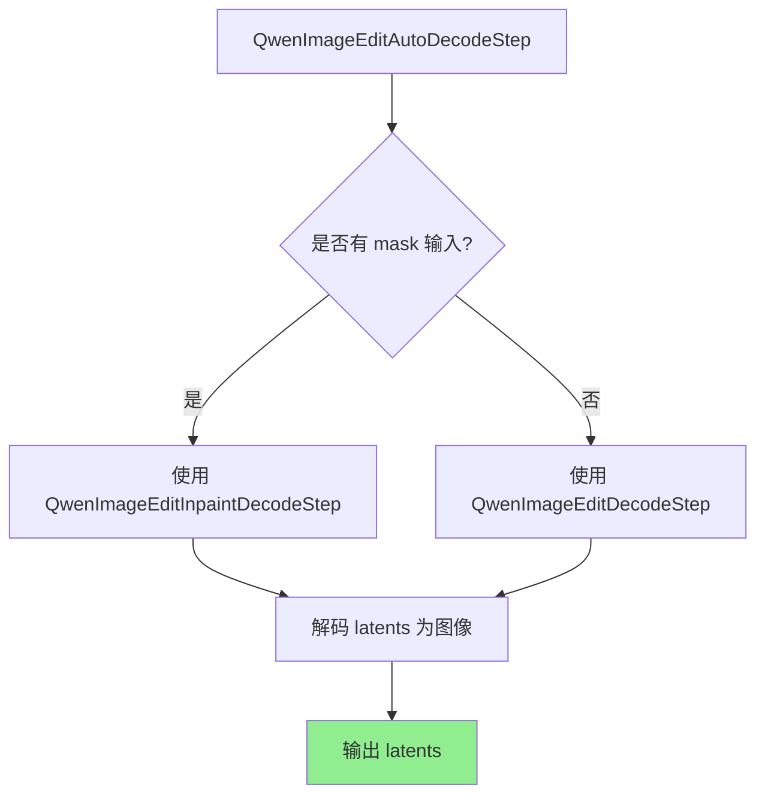
```mermaid
flowchart TD
    A[QwenImageEditAutoDecodeStep] --> B{是否有 mask 输入?}
    B -->|是| C[使用 QwenImageEditInpaintDecodeStep]
    B -->|否| D[使用 QwenImageEditDecodeStep]
    C --> E[解码 latents 为图像]
    D --> E
    E --> F[输出 latents]
    
    style F fill:#90EE90
```

#### 带注释源码

```python
@property
def outputs(self):
    """
    定义 QwenImageEditAutoDecodeStep 的输出参数。
    
    该属性返回一个列表，包含一个 OutputParam 对象，表示该步骤输出的 latents。
    在自动解码步骤中，虽然主要输出是 images，但这里的 outputs 定义为 latents，
    可能是为了保持管道的一致性或便于与其他步骤链接。
    
    Returns:
        list: 包含一个 OutputParam.template('latents') 的列表，表示去噪后的潜在表示。
    """
    return [
        OutputParam.template("latents"),
    ]
```


### QwenImageEditAutoBlocks.description

该属性返回 QwenImage-Edit 模块化流水线的描述信息，说明该流水线支持图像编辑（img2img）和图像修复（inpaint）任务，并列出对应的输入要求和工作流程。

参数：无（该方法为属性，无参数）

返回值：`str`，返回流水线用途的描述字符串

#### 流程图

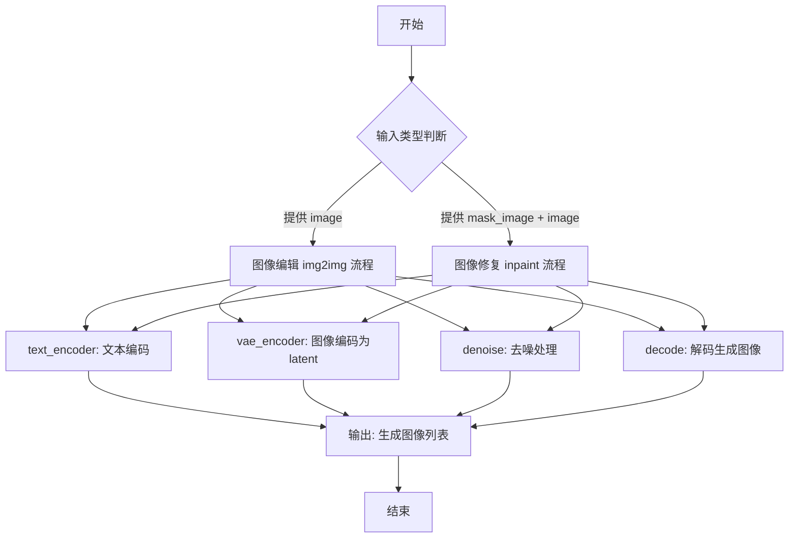
```mermaid
flowchart TD
    A[开始] --> B{输入类型判断}
    
    B -->|提供 image| C[图像编辑 img2img 流程]
    B -->|提供 mask_image + image| D[图像修复 inpaint 流程]
    
    C --> E[text_encoder: 文本编码]
    C --> F[vae_encoder: 图像编码为latent]
    C --> G[denoise: 去噪处理]
    C --> H[decode: 解码生成图像]
    
    D --> E
    D --> F
    D --> G
    D --> H
    
    E --> I[输出: 生成图像列表]
    F --> I
    G --> I
    H --> I
    
    I --> J[结束]
```

#### 带注释源码

```python
@property
def description(self):
    """
    返回 QwenImage-Edit 自动模块化流水线的描述信息。
    
    该属性说明:
    - 支持两种工作流程: 图像编辑 (img2img) 和图像修复 (inpaint)
    - 图像编辑需要提供 image 参数
    - 图像修复需要提供 mask_image 和 image 参数，可选提供 padding_mask_crop
    
    Returns:
        str: 流水线描述字符串，包含工作流程说明和输入要求
    """
    return (
        "Auto Modular pipeline for edit (img2img) and edit inpaint tasks using QwenImage-Edit.\n"
        "- for edit (img2img) generation, you need to provide `image`\n"
        "- for edit inpainting, you need to provide `mask_image` and `image`, optionally you can provide `padding_mask_crop`\n"
    )
```


### `QwenImageEditAutoBlocks.outputs`

该属性用于定义 QwenImage-Edit 自动模块化流水线的输出参数，返回一个包含图像OutputParam的列表，表示生成的图像列表。

参数：无（该方法不接受任何参数）

返回值：`list[OutputParam]`，返回一个包含 OutputParam 对象的列表，其中包装了名为 "images" 的输出参数，代表生成的图像列表。

#### 流程图

```mermaid
flowchart TD
    A[开始] --> B[返回 OutputParam.template]
    B --> C{返回列表元素}
    C --> D[创建 OutputParam 实例]
    D --> E[返回包含 images 参数的列表]
    E --> F[结束]
```

#### 带注释源码

```python
@property
def outputs(self):
    """
    定义流水线的输出参数。

    Returns:
        list: 包含 OutputParam.template("images") 的列表，表示生成的图像列表。
              每个 OutputParam 对象封装了输出参数的元数据。
    """
    return [OutputParam.template("images")]
```

## 关键组件


### VL Encoder（视觉语言编码器）

QwenImageEditVLEncoderStep: 编码图像和文本提示的视觉语言编码器步骤，包含图像调整大小和文本编码两个子步骤。

### VAE Encoder（VAE编码器）

QwenImageEditVaeEncoderStep: 将输入图像编码为潜空间表示的标准VAE编码器。

QwenImageEditInpaintVaeEncoderStep: 处理图像和mask输入的VAE编码器，用于inpainting任务，包含调整大小、预处理和编码三个步骤。

QwenImageEditAutoVaeEncoderStep: 自动VAE编码器，根据是否提供mask_image自动选择使用inpaint或标准编码器。

### Input Steps（输入步骤）

QwenImageEditInputStep: 编辑任务的输入准备步骤，确保文本嵌入batch大小一致，基于image_latents更新高度/宽度，并对image_latents进行patchify处理。

QwenImageEditInpaintInputStep: Inpaint任务的输入准备步骤，包含文本输入处理和额外batch输入（processed_mask_image）处理。

### Denoise Core Steps（去噪核心步骤）

QwenImageEditCoreDenoiseStep: QwenImage-Edit编辑（img2img）任务的核心去噪工作流，包含输入准备、准备latents、设置时间步、准备RoPE输入、去噪和去噪后处理六个步骤。

QwenImageEditInpaintCoreDenoiseStep: QwenImage-Edit inpaint任务的核心去噪工作流，在标准去噪流程基础上增加了prepare_inpaint_latents步骤处理mask。

QwenImageEditAutoCoreDenoiseStep: 自动去噪步骤，根据processed_mask_image是否提供自动选择inpaint或标准去噪流程。

### Decode Steps（解码步骤）

QwenImageEditDecodeStep: 将latents解码为图像并进行后处理的标准解码步骤。

QwenImageEditInpaintDecodeStep: Inpaint解码步骤，可选地将mask叠加到原始图像上。

QwenImageEditAutoDecodeStep: 自动解码步骤，根据是否提供mask选择inpaint或标准解码。

### Auto Pipeline（自动管道）

QwenImageEditAutoBlocks: QwenImage-Edit的完整模块化自动管道，支持编辑（img2img）和inpainting两种工作流。

### 关键技术特性

Tensor Patchification: 通过QwenImagePachifier对image_latents进行patchify处理，支持变尺寸输入。

条件触发机制: AutoPipelineBlocks和ConditionalPipelineBlocks实现基于输入参数的动态步骤选择。

Flow Matching Scheduler: 使用FlowMatchEulerDiscreteScheduler进行去噪调度。

多模态输入支持: 同时支持图像、文本prompt、mask_image等多种输入类型。

## 问题及建议


### 已知问题

-   **类代码重复**：`QwenImageEditInputStep` 与 `QwenImageEditInpaintInputStep`、`QwenImageEditCoreDenoiseStep` 与 `QwenImageEditInpaintCoreDenoiseStep`、`QwenImageEditDecodeStep` 与 `QwenImageEditInpaintDecodeStep` 之间存在大量重复代码，仅在少量参数上有差异，增加了维护成本。
-   **Auto Decode 输出错误**：`QwenImageEditAutoDecodeStep` 类的 `outputs` 属性返回 `OutputParam.template("latents")`，但该类是解码步骤，应返回 `images` 而非 `latents`，存在逻辑错误。
-   **触发器逻辑不一致**：`QwenImageEditAutoVaeEncoderStep` 使用 `block_trigger_inputs = ["mask_image", "image"]`，而 `QwenImageEditAutoDecodeStep` 使用 `block_trigger_inputs = ["mask", None]`，触发条件的命名和判断逻辑不统一。
-   **硬编码默认值**：多处硬编码 `num_inference_steps` 默认值 50、`strength` 默认值 0.9 等参数，分散在不同类中，缺乏统一的配置管理机制。
-   **ConditionalPipelineBlocks 使用冗余**：`QwenImageEditAutoCoreDenoiseStep` 同时定义了 `block_trigger_inputs` 和 `select_block` 方法，两者功能重复，增加了代码复杂度。
-   **Workflow 映射未完整使用**：类中定义了 `_workflow_map = {...}`，但似乎未被实际用于验证或约束输入，存在"死代码"。

### 优化建议

-   **提取公共基类**：将重复的输入处理、解码逻辑抽取为可复用的基类或 mixin，通过参数化配置区分 inpaint 和普通 edit 模式。
-   **修复输出类型**：将 `QwenImageEditAutoDecodeStep` 的 `outputs` 修正为返回 `images`，确保与解码语义一致。
-   **统一触发器设计**：规范 `block_trigger_inputs` 的命名和判断逻辑，建议使用字典或枚举明确每个触发条件对应的 block。
-   **集中配置管理**：创建统一的配置类或配置文件管理默认参数（如推理步数、strength 等），便于后续调整。
-   **简化条件选择逻辑**：移除 `QwenImageEditAutoCoreDenoiseStep` 中多余的 `select_block` 方法，保留一种条件判断方式（推荐使用 `block_trigger_inputs`）。
-   **激活 workflow 验证**：将 `_workflow_map` 用于输入参数的预验证，确保用户提供的输入组合符合支持的 workflow。
-   **文档字符串规范化**：考虑实现自动文档生成机制，或使用模板减少重复的 docstring 描述。

## 其它


### 设计目标与约束

本模块化管道旨在为QwenImage-Edit提供灵活且可扩展的图像编辑能力，主要目标包括：1）支持图像到图像（img2img）的条件生成任务；2）支持图像修复（inpainting）任务；3）通过模块化设计实现组件复用和流程定制；4）提供自动选择机制，根据输入参数动态选择合适的处理流程。设计约束包括：输入图像需预处理至1024x1024保持宽高比；支持PyTorch张量作为核心数据类型；依赖HuggingFace Transformers生态系统的模型和工具。

### 错误处理与异常设计

代码主要通过类型检查和参数验证实现错误处理。在模块层面，`AutoPipelineBlocks`和`ConditionalPipelineBlocks`提供了自动选择机制，当必需的触发输入（如`mask_image`或`image`）缺失时，会返回None或使用默认块。关键输入验证包括：检查`image`和`mask_image`是否为有效图像对象；验证`prompt`字符串不为空；确保`height`和`width`为正整数；对于可选参数如`generator`，需验证其为PyTorch Generator类型或None。异常传播机制遵循HuggingFace Diffusers库的错误报告规范，使用`logger.warning`和`logger.error`进行日志记录。

### 数据流与状态机

整体数据流分为五个主要阶段：**编码阶段**：输入图像和文本 prompts 分别通过VLEncoderStep和VaeEncoderStep编码为prompt_embeds和image_latents；**输入准备阶段**：TextInputsStep和AdditionalInputsStep确保embeddings的batch维度一致，并patchify图像latents；**去噪阶段**：核心循环，包含latents准备、时间步设置、RoPE位置编码准备、去噪（可能包含inpainting处理）和后处理；**解码阶段**：VAE decoder将denoised latents转换为图像；**输出处理阶段**：根据output_type参数将图像转换为pil、np或pt格式。状态转换由`SequentialPipelineBlocks`控制的有向无环图（DAG）管理，每个block的输出作为下一个block的输入。

### 外部依赖与接口契约

核心依赖包括：`torch`（PyTorch张量运算）；`transformers`库（Qwen2_5_VLForConditionalGeneration、Qwen2VLProcessor）；`diffusers`库（AutoencoderKL、FlowMatchEulerDiscreteScheduler、ClassifierFreeGuidance）；自定义模块（QwenImagePachifier、QwenImageTransformer2DModel、InpaintProcessor、VaeImageProcessor）。接口契约方面，所有Pipeline Blocks遵循统一的输入输出规范：输入通过`InputParam`定义，输出通过`OutputParam`定义；block之间通过字典传递中间结果；支持`attention_kwargs`传递注意力处理器参数；支持`denoiser_input_fields`传递条件模型输入。

### 性能考虑与资源管理

性能优化策略包括：1）batch扩展在input step中一次性完成，避免在去噪循环中重复处理；2）patchify操作将图像latents转换为transformer所需的patch格式，提高并行计算效率；3）支持`sigmas`参数自定义噪声调度，允许用户优化推理步骤；4）通过`num_images_per_prompt`参数支持单次生成多张图像。资源管理方面：支持`generator`参数实现确定性生成，便于调试；VAE编码和解码使用共享的model instance；去噪过程使用in-place操作减少内存分配。

### 配置与参数说明

关键配置参数包括：`model_name`（固定为"qwenimage-edit"）；`num_inference_steps`（默认50，去噪迭代次数）；`strength`（默认0.9，img2img/inpainting强度）；`output_type`（默认"pil"，输出格式）；`height`和`width`（默认从image_latents维度推断）；`num_images_per_prompt`（默认1，每prompt生成图像数）；`sigmas`（可选，自定义噪声调度）。组件配置通过`block_classes`和`block_names`列表指定，支持运行时替换具体实现类。

### 使用示例与调用流程

典型使用流程：1）实例化`QwenImageEditAutoBlocks`；2）准备输入（image、prompt、可选的mask_image）；3）调用pipeline获取结果。代码示例：
```python
# 图像编辑（img2img）
pipeline = QwenImageEditAutoBlocks()
result = pipeline(
    image=input_image,
    prompt="修改后的描述",
    negative_prompt="不希望出现的元素",
    num_inference_steps=50
)
# 图像修复（inpainting）
result = pipeline(
    image=input_image,
    mask_image=mask,
    prompt="修复区域的描述",
    padding_mask_crop=3
)
```

### 版本历史与变更记录

当前版本基于Apache License 2.0，由Qwen-Image Team和HuggingFace Team共同维护。作为模块化管道架构的组成部分，代码遵循HuggingFace Diffusers库的模块化设计模式，支持灵活的组件组合和扩展。初始版本支持两种工作流程：image_conditioned（图像条件生成）和image_conditioned_inpainting（带掩码的图像修复）。

### 安全性考虑

安全措施包括：1）输入验证确保不接受恶意构造的图像数据；2）支持`negative_prompt`实现内容过滤；3）遵循Apache 2.0开源许可证的版权合规要求；4）模型输出可能包含训练数据中的偏见，使用时应注意应用场景的适当性。潜在安全风险：生成的图像可能包含不当内容，建议在生产环境中添加额外的安全过滤层。

### 测试策略

测试应覆盖：1）单元测试：验证各个Block类的输入输出规范；2）集成测试：验证完整pipeline的端到端功能；3）参数组合测试：测试不同输入参数组合（有无mask_image、不同output_type等）；4）边界条件测试：测试空输入、极端尺寸图像、异常数据类型等情况；5）性能基准测试：验证推理时间和内存占用符合预期。建议使用pytest框架和HuggingFace的测试工具。

### 部署与运维考虑

部署要求：Python 3.8+；PyTorch 2.0+；CUDA 11.8+（GPU推理）；transformers、diffusers库版本需兼容。模型文件较大（约数GB），建议使用模型缓存目录。运维监控应关注：推理时间指标；GPU显存使用情况；生成的图像质量评估；错误日志收集。提供checkpoint保存和恢复机制，支持长推理任务的断点续传。


    