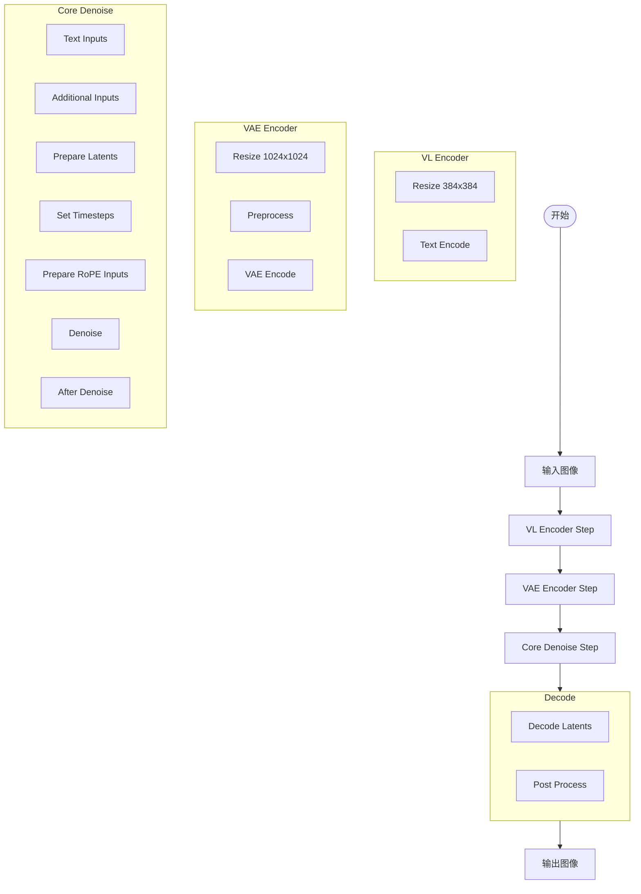
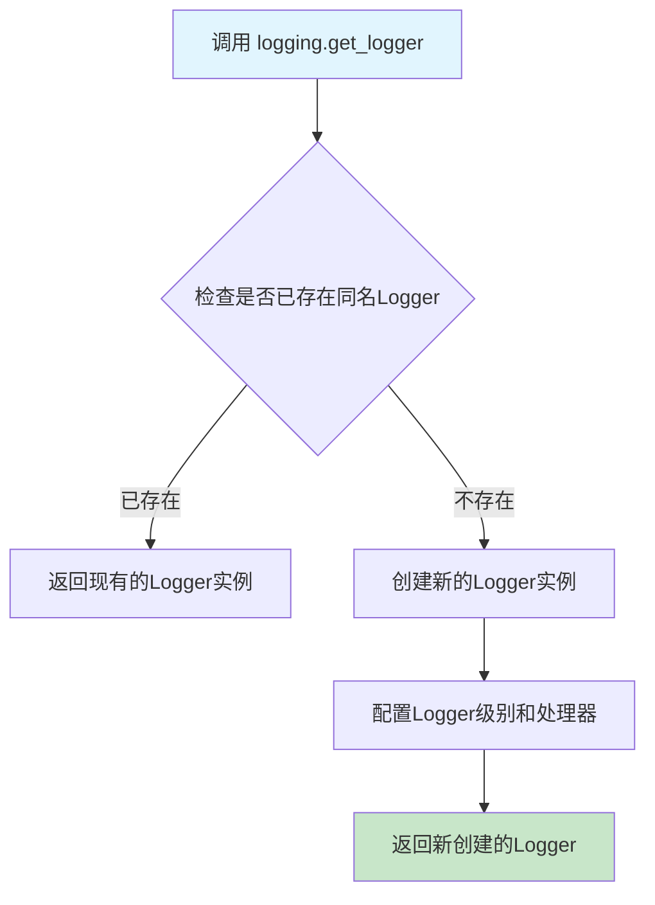
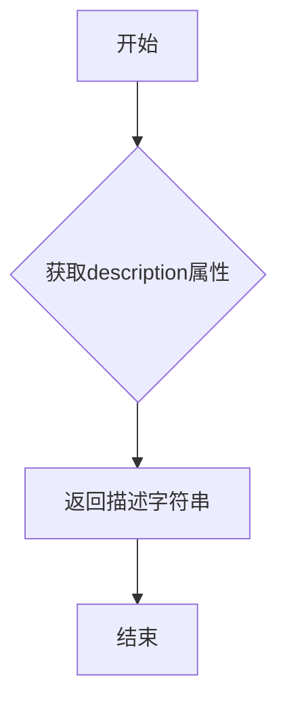
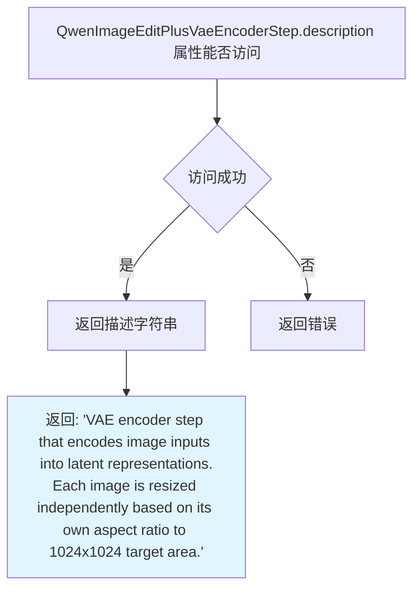
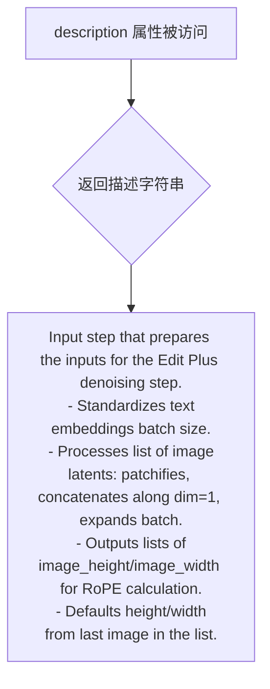
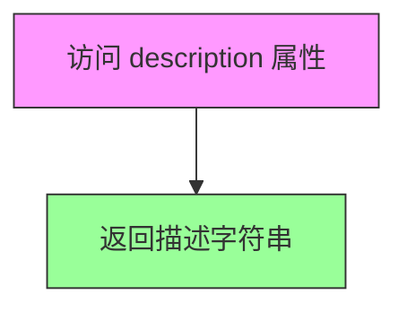
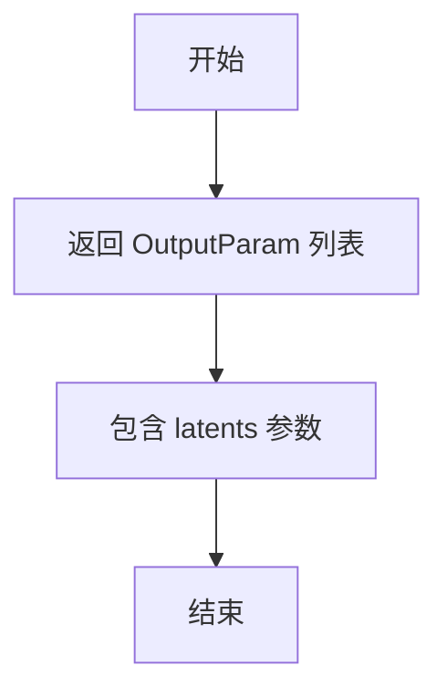
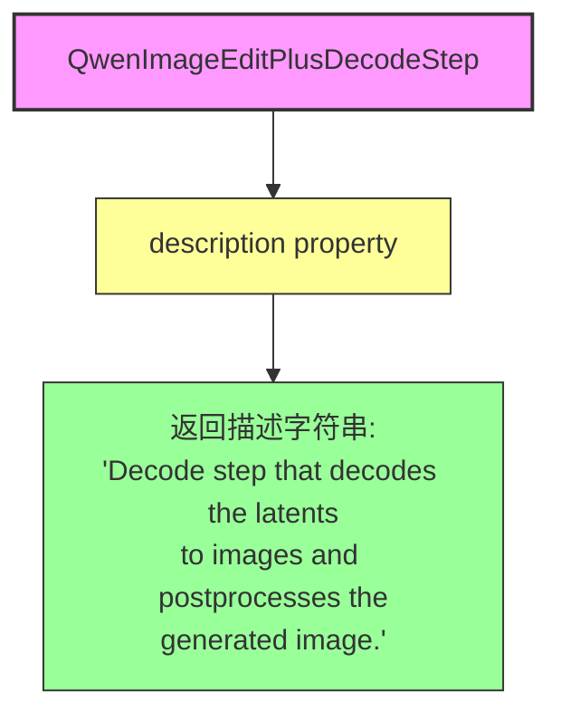
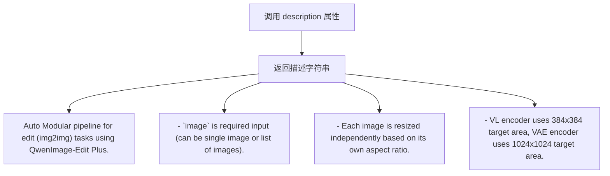

# `diffusers\src\diffusers\modular_pipelines\qwenimage\modular_blocks_qwenimage_edit_plus.py` 详细设计文档

QwenImage-Edit Plus模块化管道，用于图像编辑（img2img）任务。该管道通过VL编码器处理图像和文本提示，VAE编码器将图像编码为潜在表示，核心去噪步骤执行迭代去噪，最后通过VAE解码器将潜在表示解码为图像。

## 整体流程



## 类结构

```
SequentialPipelineBlocks (基类)
├── QwenImageEditPlusVLEncoderStep
│   ├── QwenImageEditPlusResizeStep
│   └── QwenImageEditPlusTextEncoderStep
├── QwenImageEditPlusVaeEncoderStep
QwenImageEditPlusResizeStep
│   ├── QwenImageEditPlusProcessImagesInputStep
│   └── QwenImageVaeEncoderStep
├── QwenImageEditPlusInputStep
QwenImageTextInputsStep
│   └── QwenImageEditPlusAdditionalInputsStep
├── QwenImageEditPlusCoreDenoiseStep
QwenImageEditPlusInputStep
QwenImagePrepareLatentsStep
QwenImageSetTimestepsStep
QwenImageEditPlusRoPEInputsStep
QwenImageEditDenoiseStep
QwenImageAfterDenoiseStep
├── QwenImageEditPlusDecodeStep
QwenImageDecoderStep
│   └── QwenImageProcessImagesOutputStep
└── QwenImageEditPlusAutoBlocks (组合所有块)
```

## 全局变量及字段


### `logger`
    
模块级日志记录器，用于记录该模块的运行信息

类型：`logging.Logger`
    


### `EDIT_PLUS_AUTO_BLOCKS`
    
包含所有编辑Plus管道块的字典，包括text_encoder、vae_encoder、denoise和decode四个主要步骤

类型：`InsertableDict`
    


### `QwenImageEditPlusVLEncoderStep.model_name`
    
模型名称标识

类型：`str`
    


### `QwenImageEditPlusVLEncoderStep.block_classes`
    
管道块类列表

类型：`list`
    


### `QwenImageEditPlusVLEncoderStep.block_names`
    
管道块名称列表

类型：`list`
    


### `QwenImageEditPlusVaeEncoderStep.model_name`
    
模型名称标识

类型：`str`
    


### `QwenImageEditPlusVaeEncoderStep.block_classes`
    
管道块类列表

类型：`list`
    


### `QwenImageEditPlusVaeEncoderStep.block_names`
    
管道块名称列表

类型：`list`
    


### `QwenImageEditPlusInputStep.model_name`
    
模型名称标识

类型：`str`
    


### `QwenImageEditPlusInputStep.block_classes`
    
管道块类列表

类型：`list`
    


### `QwenImageEditPlusInputStep.block_names`
    
管道块名称列表

类型：`list`
    


### `QwenImageEditPlusCoreDenoiseStep.model_name`
    
模型名称标识

类型：`str`
    


### `QwenImageEditPlusCoreDenoiseStep.block_classes`
    
管道块类列表

类型：`list`
    


### `QwenImageEditPlusCoreDenoiseStep.block_names`
    
管道块名称列表

类型：`list`
    


### `QwenImageEditPlusDecodeStep.model_name`
    
模型名称标识

类型：`str`
    


### `QwenImageEditPlusDecodeStep.block_classes`
    
管道块类列表

类型：`list`
    


### `QwenImageEditPlusDecodeStep.block_names`
    
管道块名称列表

类型：`list`
    


### `QwenImageEditPlusAutoBlocks.model_name`
    
模型名称标识

类型：`str`
    


### `QwenImageEditPlusAutoBlocks.block_classes`
    
管道块类列表

类型：`list`
    


### `QwenImageEditPlusAutoBlocks.block_names`
    
管道块名称列表

类型：`list`
    
    

## 全局函数及方法


# logging.get_logger 函数提取

### logging.get_logger

获取模块级日志记录器，用于在该模块中记录日志信息。

参数：

- `name`：`str`，日志记录器的名称，通常传入 `__name__` 以获取当前模块的日志记录器

返回值：`Logger`，返回 Python 标准库的 `logging.Logger` 对象，用于记录日志

#### 流程图



#### 带注释源码

```python
# 从上级模块导入 logging 工具模块
from ...utils import logging

# 使用当前模块的 __name__ 作为日志记录器的名称
# 这样可以在日志输出中识别日志来源的模块
logger = logging.get_logger(__name__)

# 这里的 logging.get_logger 是从 ...utils 导入的模块级函数
# 它的实现通常是这样的：
#
# def get_logger(name: str, log_level: Optional[str] = None) -> logging.Logger:
#     """获取或创建一个日志记录器
#     
#     参数:
#         name: 日志记录器的名称，通常使用 __name__
#         log_level: 可选的日志级别，默认使用环境变量或配置
#     
#     返回:
#         配置好的 Logger 实例
#     """
#     logger = logging.getLogger(name)
#     
#     # 如果logger没有处理器，则添加一个
#     if not logger.handlers:
#         handler = logging.StreamHandler()
#         handler.setFormatter(logging.Formatter(
#             '%(asctime)s - %(name)s - %(levelname)s - %(message)s'
#         ))
#         logger.addHandler(handler)
#     
#     # 设置日志级别（如果未设置）
#     if log_level is None:
#         log_level = os.environ.get("LOG_LEVEL", "INFO")
#     logger.setLevel(getattr(logging, log_level.upper()))
#     
#     return logger
```


### `QwenImageEditPlusVLEncoderStep.description`

该属性返回 QwenImage-Edit Plus VL 编码器步骤的描述信息，用于说明该步骤负责将图像和文本提示一起编码。

参数： 无

返回值：`str`，返回该步骤的描述字符串 "QwenImage-Edit Plus VL encoder step that encodes the image and text prompts together."

#### 流程图



#### 带注释源码

```python
@property
def description(self) -> str:
    """
    获取该步骤的描述信息。
    
    Returns:
        str: QwenImage-Edit Plus VL 编码器步骤的描述，说明该步骤负责
             将图像和文本提示一起编码。
    """
    return "QwenImage-Edit Plus VL encoder step that encodes the image and text prompts together."
```


### QwenImageEditPlusVaeEncoderStep.description

该属性返回 VAE 编码器步骤的描述字符串，说明该步骤将图像输入编码为潜在表示，每个图像根据其各自的宽高比独立调整大小到 1024x1024 目标区域。

参数：无

返回值：`str`，返回描述 VAE 编码器步骤功能的字符串

#### 流程图



#### 带注释源码

```python
@property
def description(self) -> str:
    """
    返回 VAE 编码器步骤的描述信息。
    
    该属性继承自 SequentialPipelineBlocks 类，通过 @property 装饰器实现。
    描述内容说明了该步骤的核心功能：将图像输入编码为潜在表示（latent representations），
    并且每个图像会根据自身的宽高比独立调整大小到 1024x1024 的目标区域。
    
    Returns:
        str: 描述 VAE 编码器步骤功能的字符串，包含两步关键信息：
             1. 编码图像输入为潜在表示
             2. 基于各自宽高比独立调整图像大小到 1024x1024 目标区域
    """
    return (
        "VAE encoder step that encodes image inputs into latent representations.\n"
        "Each image is resized independently based on its own aspect ratio to 1024x1024 target area."
    )
```


### `QwenImageEditPlusInputStep.description`

该属性返回编辑增强（Edit Plus）去噪步骤的输入准备阶段描述。用于准备编辑任务的输入数据，包括标准化文本嵌入批次大小、处理图像潜在表示（patchify、沿 dim=1 拼接、批次扩展）、输出用于 RoPE 计算的图像高度/宽度列表，以及默认使用列表中最后一张图像的宽高。

参数：无（该方法为属性，无参数）

返回值：`str`，返回描述该步骤功能的字符串

#### 流程图



#### 带注释源码

```python
@property
def description(self):
    """
    返回 QwenImageEditPlusInputStep 的描述信息。
    
    该方法是一个属性（property），用于获取该步骤的功能描述。
    描述内容说明了该步骤在图像编辑流水线中的作用：
    1. 标准化文本嵌入的批次大小
    2. 处理图像潜在表示：包括 patchify、沿 dim=1 拼接、批次扩展
    3. 输出用于 RoPE（旋转位置嵌入）计算的图像高度和宽度列表
    4. 默认使用列表中最后一张图像的宽高作为输出宽高
    
    Returns:
        str: 描述该输入步骤功能的字符串
    """
    return (
        "Input step that prepares the inputs for the Edit Plus denoising step. It:\n"
        " - Standardizes text embeddings batch size.\n"
        " - Processes list of image latents: patchifies, concatenates along dim=1, expands batch.\n"
        " - Outputs lists of image_height/image_width for RoPE calculation.\n"
        " - Defaults height/width from last image in the list."
    )
```


### `QwenImageEditPlusCoreDenoiseStep.description`

该属性返回 QwenImage-Edit Plus 编辑（img2img）任务的核心去噪工作流程描述。

参数：无（该方法为属性访问器，不接受任何参数）

返回值：`str`，返回核心去噪工作流程的描述字符串

#### 流程图



#### 带注释源码

```python
@property
def description(self):
    """
    返回 QwenImage-Edit Plus 编辑任务的核心去噪工作流程描述。
    
    该属性是类 QwenImageEditPlusCoreDenoiseStep 的一个只读属性（property），
    用于提供该类的功能描述信息，便于在模块化流水线中展示和文档化。
    
    返回值:
        str: 描述字符串 "Core denoising workflow for QwenImage-Edit Plus edit (img2img) task."
    """
    return "Core denoising workflow for QwenImage-Edit Plus edit (img2img) task."
```


### `QwenImageEditPlusCoreDenoiseStep.outputs`

该属性方法返回 QwenImage-Edit Plus 核心去噪步骤的输出参数列表。当前仅包含去噪后的 latents（潜在表示），用于后续的解码步骤将潜在表示转换为图像。

参数：无

返回值：`List[OutputParam]`，返回一个包含 `OutputParam` 对象的列表。当前列表中包含一个名为 "latents" 的输出参数，表示去噪后的潜在表示（Tensor 类型），用于后续的解码步骤。

#### 流程图



#### 带注释源码

```python
@property
def outputs(self):
    """
    返回核心去噪步骤的输出参数列表。
    
    Returns:
        List[OutputParam]: 包含去噪后latents的输出参数列表
    """
    return [
        OutputParam.template("latents"),
    ]
```


### `QwenImageEditPlusDecodeStep.description`

该属性返回 QwenImage-Edit Plus 解码步骤的描述，说明其功能是将 latents 解码为图像并对生成的图像进行后处理。

参数： 无（这是一个属性 getter，不接受任何参数）

返回值：`str`，返回步骤的描述字符串，描述该解码步骤的主要功能。

#### 流程图



#### 带注释源码

```python
@property
def description(self):
    """
    属性 getter: 返回该解码步骤的描述信息
    
    Returns:
        str: 描述字符串，说明该步骤的功能是将 latents 解码为图像并对生成的图像进行后处理
    """
    return "Decode step that decodes the latents to images and postprocesses the generated image."
```


### QwenImageEditPlusAutoBlocks.description

这是一个属性方法（property），返回 QwenImage-Edit Plus 编辑（img2img）任务的自动模块化管道描述。

参数：无

返回值：`str`，返回管道的描述字符串，说明管道支持的功能和特性

#### 流程图



#### 带注释源码

```python
@property
def description(self):
    """
    返回 QwenImage-Edit Plus 自动模块化管道的描述信息。
    
    该属性提供一个字符串描述，说明:
    1. 这是一个用于图像编辑（img2img）任务的自动模块化管道
    2. image 是必需输入，可以是单个图像或图像列表
    3. 每个图像根据其各自的宽高比独立调整大小
    4. VL 编码器使用 384x384 目标区域，VAE 编码器使用 1024x1024 目标区域
    
    Returns:
        str: 管道描述字符串，包含管道功能说明和使用约束
    """
    return (
        "Auto Modular pipeline for edit (img2img) tasks using QwenImage-Edit Plus.\n"
        "- `image` is required input (can be single image or list of images).\n"
        "- Each image is resized independently based on its own aspect ratio.\n"
        "- VL encoder uses 384x384 target area, VAE encoder uses 1024x1024 target area."
    )
```


### `QwenImageEditPlusAutoBlocks.outputs`

该属性定义了 QwenImage-Edit Plus 自动模块化管道的输出参数，返回生成的图像列表。

参数：无

返回值：`list`，包含生成的图像列表

#### 流程图

```mermaid
flowchart TD
    A[outputs property] --> B[返回列表]
    B --> C[OutputParam.template('images')]
    C --> D[list containing generated images]
    
    style A fill:#e1f5fe
    style D fill:#e8f5e8
```

#### 带注释源码

```python
@property
def outputs(self):
    """
    定义 QwenImageEditPlusAutoBlocks 流水线的输出参数。
    
    该属性返回包含生成图像的输出参数列表。
    输出图像的格式取决于 inputs 中的 output_type 参数：
    - 'pil': PIL Image 对象列表
    - 'np': NumPy 数组列表
    - 'pt': PyTorch 张量列表
    
    Returns:
        list: 包含 OutputParam 对象的列表，当前只有一个元素 'images'
              表示生成的图像列表
    """
    return [OutputParam.template("images")]
```

## 关键组件


### QwenImageEditPlusVLEncoderStep

VL编码器步骤，负责将图像和文本提示一起编码。包含图像调整大小处理器、文本编码器、处理器和引导器，输出调整大小后的图像和提示嵌入。

### QwenImageEditPlusVaeEncoderStep

VAE编码器步骤，将图像输入编码为潜在表示。每个图像根据其各自的长宽比独立调整大小到1024x1024目标区域，包含图像调整大小处理器和VAE模型。

### QwenImageEditPlusInputStep

输入准备步骤，用于为编辑加去噪步骤准备输入。标准化文本嵌入批量大小，处理图像潜在表示：分块、沿dim=1拼接、扩展批量，输出图像高度/宽度列表用于RoPE计算。

### QwenImageEditPlusCoreDenoiseStep

核心去噪工作流，用于QwenImage-Edit Plus编辑（img2img）任务。包含分块器、调度器、引导器和变换器，执行输入准备、潜在准备、时间步设置、RoPE输入准备、去噪和去噪后处理。

### QwenImageEditPlusDecodeStep

解码步骤，将潜在表示解码为图像并后处理生成图像。使用VAE解码器和图像处理器，可输出PIL、numpy数组或PyTorch张量格式。

### QwenImageEditPlusAutoBlocks

自动模块化管道，用于使用QwenImage-Edit Plus的编辑（img2img）任务。图像是必需输入，每个图像根据其长宽比独立调整大小，VL编码器使用384x384目标区域，VAE编码器使用1024x1024目标区域。

### EDIT_PLUS_AUTO_BLOCKS

可插入字典，包含文本编码器、VAE编码器、去噪和解码四个主要步骤的映射关系，定义了整个图像编辑pipeline的组件顺序。

### SequentialPipelineBlocks

顺序管道块基类，提供了模块化pipeline的框架，支持按顺序执行多个处理步骤，并维护每个步骤的名称和类引用。

### InsertableDict

可插入字典数据结构，用于存储和管理pipeline中的各个步骤块，支持通过键值对方式访问和配置pipeline组件。

## 问题及建议


### 已知问题

- **输入验证缺失**：代码未对关键输入参数（如`image`、`prompt`、`height`、`width`）进行有效性校验，可能导致运行时错误或难以追踪的问题。
- **硬编码目标分辨率**：文档中提到的384x384（VL编码器）和1024x1024（VAE编码器）目标分辨率在各个步骤中硬编码，缺少集中配置管理，修改时需要多处修改。
- **类型注解不一致**：部分属性（如`QwenImageEditPlusInputStep.description`）缺少返回类型注解`-> str`，而其他类有；`block_classes`和`block_names`使用混合类型（列表推导式与直接赋值），降低了代码一致性。
- **错误处理机制缺失**：整个管道未包含异常捕获、降级策略或详细错误日志，遇到模型加载失败、内存不足或设备不兼容等问题时会直接崩溃。
- **缺少资源管理**：未实现上下文管理器或显式的资源释放方法（如GPU显存管理），可能在连续处理多个任务时导致显存泄漏。
- **并发支持不足**：当前设计为顺序执行，未考虑批量处理或异步执行能力，对于大规模图像处理场景效率较低。

### 优化建议

- **添加输入验证层**：在`QwenImageEditPlusAutoBlocks.__call__`或基类中添加参数校验逻辑，确保`image`为有效图像格式、`height`/`width`为正整数、`prompt`非空等。
- **提取配置常量**：创建独立的配置类或枚举，集中管理目标分辨率、默认批次大小、默认推理步数等常量，便于维护和调整。
- **完善类型注解**：统一所有属性和方法的返回类型注解，使用`typing.List`、`typing.Optional`等替代隐式类型推断。
- **引入错误处理与重试机制**：添加try-except块捕获常见异常（如`RuntimeError`、`OutOfMemoryError`），实现优雅降级或用户友好的错误提示。
- **实现资源管理协议**：使用`__enter__`/`__exit__`或`contextlib.contextmanager`封装GPU资源，确保使用后自动释放。
- **优化内存使用**：对大尺寸图像处理采用分块处理或流式处理；考虑添加`torch.cuda.empty_cache()`调用以释放闲置显存。

## 其它


### 设计目标与约束

本模块旨在为Qwen-Image-Edit Plus提供模块化的图像编辑（img2img）管道，支持单图或多图输入，通过VL编码器、VAE编码器、去噪核心步骤和解码器实现端到端的图像编辑流程。设计约束包括：VL编码器使用384x384目标区域，VAE编码器使用1024x1024目标区域，默认50步去噪，默认输出格式为PIL图像。

### 错误处理与异常设计

代码依赖于SequentialPipelineBlocks的异常处理机制。主要异常场景包括：图像尺寸不匹配导致的ResizeError、VL编码器或VAE编码器处理失败、Latents维度不兼容、去噪过程OOM、Decoder输出格式错误。当输入图像为空或类型不正确时，应抛出ValueError；当生成器与设备不匹配时应抛出RuntimeError。

### 数据流与状态机

数据流遵循以下路径：image + prompt → VLEncoder (resized_cond_image, prompt_embeds) → VAEEncoder (image_latents) → InputStep (batch expand) → PrepareLatents → SetTimesteps → PrepareRoPEInputs → Denoise → AfterDenoise → Decode → images。状态机包含：INIT → ENCODING → PROCESSING → DENOISING → DECODING → COMPLETED。

### 外部依赖与接口契约

核心依赖包括：VaeImageProcessor（图像预处理）、Qwen2_5_VLForConditionalGeneration（文本编码）、Qwen2VLProcessor（多模态处理）、AutoencoderKLQwenImage（VAE编解码）、FlowMatchEulerDiscreteScheduler（调度器）、QwenImageTransformer2DModel（扩散变换器）、QwenImagePachifier（图像分块）、ClassifierFreeGuidance（无分类器引导）。

### 性能考虑与优化空间

当前实现每次处理单个图像批次，未充分利用批处理优势。可优化方向：支持更大批次处理以提高GPU利用率、Lazy loading of models、混合精度推理（fp16/bf16）、KV Cache优化、梯度检查点技术减少显存占用、异步图像预处理。

### 配置管理与参数说明

关键配置参数：num_images_per_prompt（默认1）、height/width（默认从输入图像推断）、num_inference_steps（默认50）、sigmas（自定义噪声调度）、attention_kwargs（注意力处理器配置）、output_type（pil/np/pt）、generator（确定性生成）。

### 安全性与权限控制

代码遵循Apache 2.0许可证。需要注意的是：模型加载可能涉及大文件下载、输入图像需验证格式防止恶意payload、prompt内容需过滤敏感信息、生成过程需防止CSRF类攻击。

### 版本兼容性与迁移路径

当前版本为qwenimage-edit-plus，后续升级需注意：模型结构变化可能导致checkpoint不兼容、API变更需同步更新block_classes、Scheduler接口变化需适配。

### 测试策略与验证方法

建议测试覆盖：单图/多图输入兼容性测试、不同尺寸图像处理测试、文本编码一致性测试、VAE编解码对称性测试、去噪过程收敛性测试、输出格式转换测试（pil/np/pt）、端到端pipeline集成测试。

### 监控与日志记录

使用Python标准logging模块，日志记录器名称为__name__。建议监控指标：编码耗时、去噪耗时（每步）、显存占用、GPU利用率、生成图像质量评分（FID/PSNR）。

### 部署架构与运维注意事项

推荐部署方式：模型按需加载（Lazy initialization）、支持多GPU并行推理、任务队列化管理。建议使用Docker容器化部署，配置合适的CUDA版本和内存限制。


    