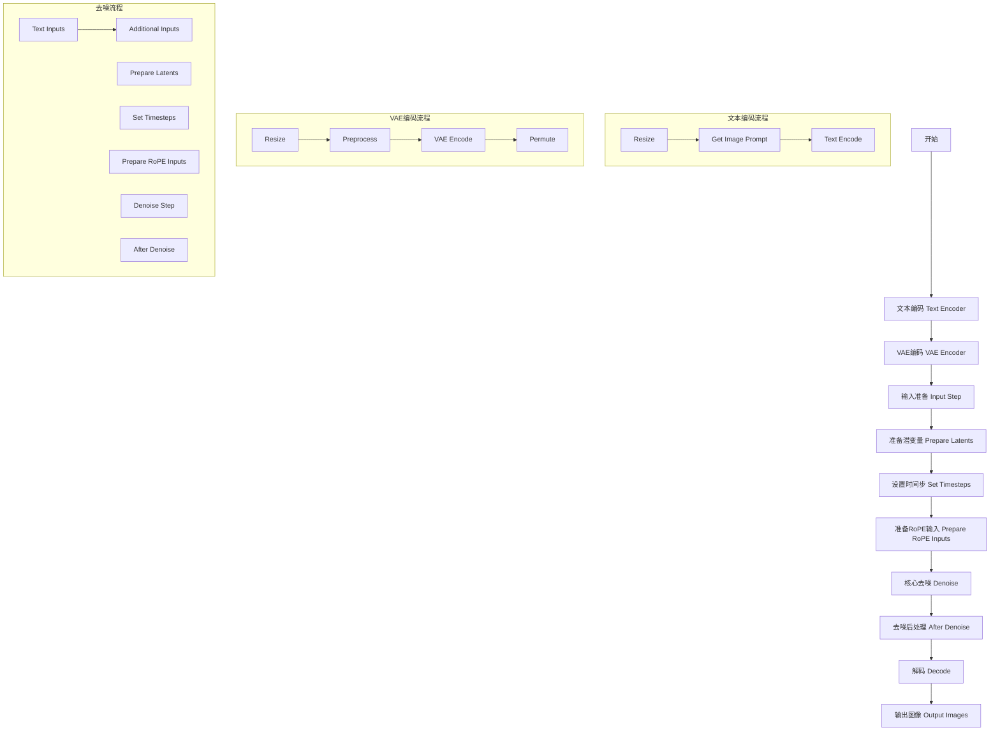
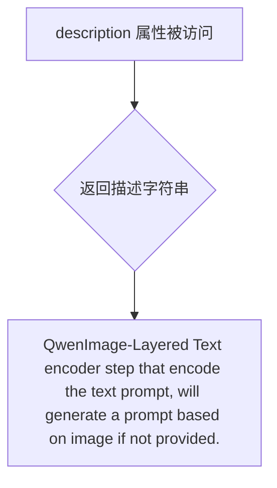
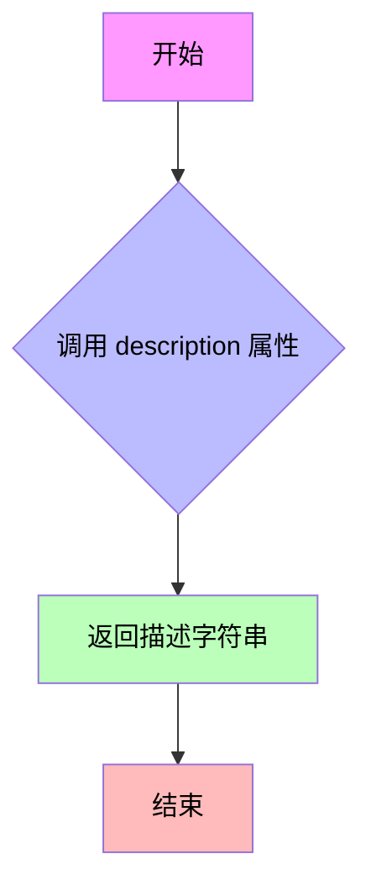
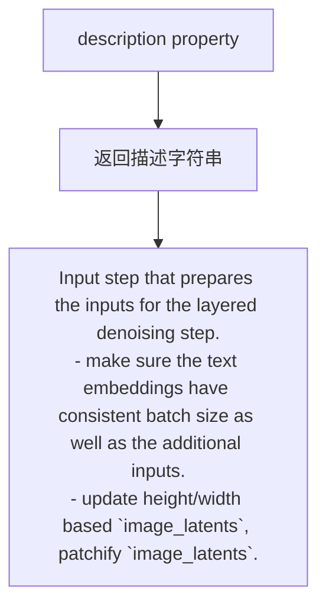
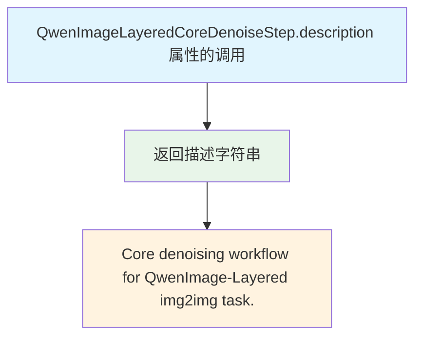
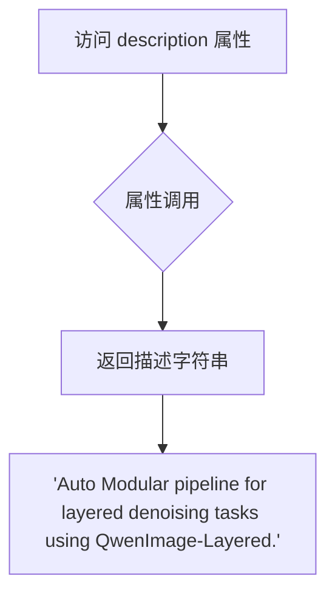
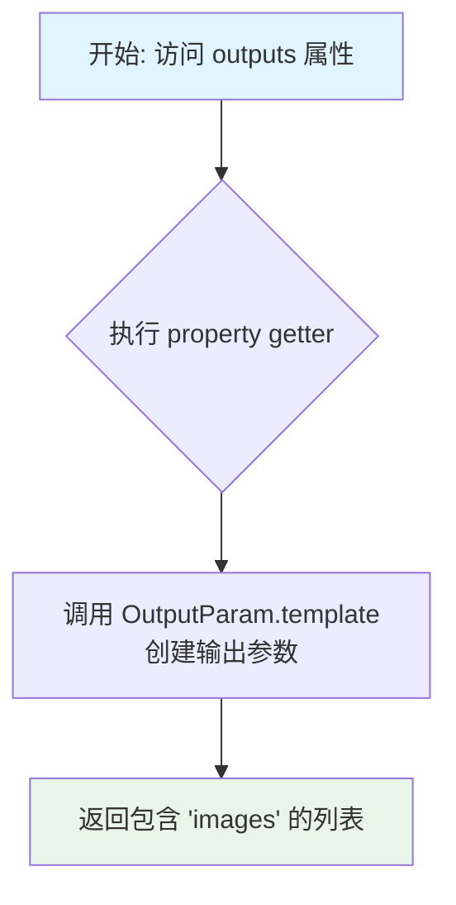

# `diffusers\src\diffusers\modular_pipelines\qwenimage\modular_blocks_qwenimage_layered.py` 详细设计文档

这是一个Qwen-Image分层图像处理管道模块，提供了从文本编码、VAE编码、核心去噪到图像解码的完整图像生成工作流程，支持基于图像的分层处理和多阶段去噪，适用于img2img等图像生成任务。

## 整体流程



## 类结构

```
SequentialPipelineBlocks (基类)
├── QwenImageLayeredTextEncoderStep
│   ├── QwenImageLayeredResizeStep
│   ├── QwenImageLayeredGetImagePromptStep
│   └── QwenImageTextEncoderStep
├── QwenImageLayeredVaeEncoderStep
│   ├── QwenImageLayeredResizeStep
│   ├── QwenImageEditProcessImagesInputStep
│   ├── QwenImageVaeEncoderStep
│   └── QwenImageLayeredPermuteLatentsStep
├── QwenImageLayeredInputStep
│   ├── QwenImageTextInputsStep
│   └── QwenImageLayeredAdditionalInputsStep
├── QwenImageLayeredCoreDenoiseStep
│   ├── QwenImageLayeredInputStep
│   ├── QwenImageLayeredPrepareLatentsStep
│   ├── QwenImageLayeredSetTimestepsStep
│   ├── QwenImageLayeredRoPEInputsStep
│   ├── QwenImageLayeredDenoiseStep
│   └── QwenImageLayeredAfterDenoiseStep
└── QwenImageLayeredAutoBlocks (聚合类)
    ├── text_encoder (QwenImageLayeredTextEncoderStep)
    ├── vae_encoder (QwenImageLayeredVaeEncoderStep)
    ├── denoise (QwenImageLayeredCoreDenoiseStep)
    └── decode (QwenImageLayeredDecoderStep)
```

## 全局变量及字段


### `logger`
    
模块级日志记录器，用于输出该模块的日志信息

类型：`logging.Logger`
    


### `LAYERED_AUTO_BLOCKS`
    
分层自动块字典，包含文本编码器、VAE编码器、去噪和解码器的步骤类

类型：`InsertableDict`
    


### `QwenImageLayeredTextEncoderStep.model_name`
    
模型标识符，值为qwenimage-layered

类型：`str`
    


### `QwenImageLayeredTextEncoderStep.block_classes`
    
文本编码步骤的块类列表，包含Resize、GetImagePrompt和TextEncoder步骤

类型：`list`
    


### `QwenImageLayeredTextEncoderStep.block_names`
    
文本编码步骤的块名称列表，对应block_classes的标识符

类型：`list`
    


### `QwenImageLayeredVaeEncoderStep.model_name`
    
模型标识符，值为qwenimage-layered

类型：`str`
    


### `QwenImageLayeredVaeEncoderStep.block_classes`
    
VAE编码步骤的块类列表，包含Resize、ProcessImagesInput、VaeEncoder和PermuteLatents步骤

类型：`list`
    


### `QwenImageLayeredVaeEncoderStep.block_names`
    
VAE编码步骤的块名称列表，对应block_classes的标识符

类型：`list`
    


### `QwenImageLayeredInputStep.model_name`
    
模型标识符，值为qwenimage-layered

类型：`str`
    


### `QwenImageLayeredInputStep.block_classes`
    
输入步骤的块类列表，包含TextInputs和AdditionalInputs步骤

类型：`list`
    


### `QwenImageLayeredInputStep.block_names`
    
输入步骤的块名称列表，对应block_classes的标识符

类型：`list`
    


### `QwenImageLayeredCoreDenoiseStep.model_name`
    
模型标识符，值为qwenimage-layered

类型：`str`
    


### `QwenImageLayeredCoreDenoiseStep.block_classes`
    
核心去噪步骤的块类列表，包含Input、PrepareLatents、SetTimesteps、RoPEInputs、Denoise和AfterDenoise步骤

类型：`list`
    


### `QwenImageLayeredCoreDenoiseStep.block_names`
    
核心去噪步骤的块名称列表，对应block_classes的标识符

类型：`list`
    


### `QwenImageLayeredAutoBlocks.model_name`
    
模型标识符，值为qwenimage-layered

类型：`str`
    


### `QwenImageLayeredAutoBlocks.block_classes`
    
自动块步骤的块类列表，包含TextEncoder、VaeEncoder、Denoise和Decoder步骤

类型：`list`
    


### `QwenImageLayeredAutoBlocks.block_names`
    
自动块步骤的块名称列表，对应block_classes的标识符

类型：`list`
    
    

## 全局函数及方法


### `QwenImageLayeredTextEncoderStep.description`

该属性返回对 QwenImage-Layered 文本编码器步骤的描述，说明该步骤用于编码文本提示词，如果未提供提示词则基于图像自动生成提示词。

参数：

- 该属性无显式参数（`self` 为隐式参数）

返回值：`str`，返回该步骤的描述字符串。

#### 流程图



#### 带注释源码

```python
@property
def description(self) -> str:
    """
    获取该管道步骤的描述信息。
    
    Returns:
        str: 描述文本编码器步骤功能的字符串，说明该步骤负责编码文本提示词，
             并在未提供提示词时基于图像自动生成提示词。
    """
    return "QwenImage-Layered Text encoder step that encode the text prompt, will generate a prompt based on image if not provided."
```


### `QwenImageLayeredVaeEncoderStep.description`

该属性返回 VAE 编码器步骤的描述，说明其功能是将图像输入编码到它们的潜在表示中。

参数：该属性无需显式参数（Python property 的隐式参数 `self` 已包含）

返回值：`str`，返回对 VAE 编码器步骤功能的描述字符串

#### 流程图



#### 带注释源码

```python
@property
def description(self) -> str:
    """
    属性描述：
        返回该 VAE 编码器步骤的描述信息。
    
    返回值：
        str: 描述字符串，说明该步骤的功能是将图像输入编码到它们的潜在表示中。
    """
    return "Vae encoder step that encode the image inputs into their latent representations."
```


### `QwenImageLayeredInputStep.description`

这是一个属性方法（property），用于返回 `QwenImageLayeredInputStep` 类的功能描述。

参数：无（除隐式 `self` 外）

返回值：`str`，返回该输入步骤的描述字符串，说明其准备分层降噪输入的功能

#### 流程图



#### 带注释源码

```python
@property
def description(self):
    """
    返回该输入步骤的描述信息。
    
    该方法是一个只读属性，返回描述字符串，说明此步骤的功能：
    1. 确保文本嵌入与额外输入的批量大小一致
    2. 根据 image_latents 更新高度/宽度，并对 image_latents 进行 patchify 处理
    
    Returns:
        str: 描述该步骤功能的字符串
    """
    return (
        "Input step that prepares the inputs for the layered denoising step. It:\n"
        " - make sure the text embeddings have consistent batch size as well as the additional inputs.\n"
        " - update height/width based `image_latents`, patchify `image_latents`."
    )
```


### `QwenImageLayeredCoreDenoiseStep.description`

该属性返回 QwenImage-Layered 图像到图像（img2img）任务的核心去噪工作流描述。

参数：无（该属性为只读 property，不接受额外参数，仅使用隐式参数 `self`）

返回值：`str`，返回该步骤的功能描述字符串 "Core denoising workflow for QwenImage-Layered img2img task."

#### 流程图



#### 带注释源码

```python
@property
def description(self):
    """
    获取该处理步骤的描述信息。
    
    该属性继承自 SequentialPipelineBlocks 基类，用于返回当前处理步骤
    的功能描述，供日志记录、调试信息或文档生成使用。
    
    返回:
        str: 核心去噪工作流的描述字符串，具体为
             "Core denoising workflow for QwenImage-Layered img2img task."
    """
    return "Core denoising workflow for QwenImage-Layered img2img task."
```


### `QwenImageLayeredCoreDenoiseStep.outputs`

该属性方法定义了 QwenImage-Layered 核心去噪步骤的输出参数，返回去噪后的潜在表示（latents）。

参数：无

返回值：`list[OutputParam]`，返回包含去噪后潜在表示的输出参数列表。

#### 流程图

```mermaid
flowchart TD
    A[开始] --> B[返回 OutputParam.template("latents")]
    B --> C[返回包含单个 'latents' 输出参数的列表]
    C --> D[结束]
```

#### 带注释源码

```python
@property
def outputs(self):
    """
    定义该管道步骤的输出参数。
    
    该属性方法返回去噪步骤产生的输出参数列表。
    在核心去噪流程中，输出为去噪后的 latents（潜在表示），
    可用于后续的解码步骤生成最终图像。
    
    Returns:
        list: 包含 OutputParam 对象的列表，目前只有一个元素 'latents'
              代表去噪后的潜在表示张量
    """
    return [
        OutputParam.template("latents"),
    ]
```


### `QwenImageLayeredAutoBlocks.description`

该属性是 `QwenImageLayeredAutoBlocks` 类的描述属性，用于返回该自动模块化流水线的功能描述。

参数：

- `self`：`QwenImageLayeredAutoBlocks`，隐式参数，指向类实例本身

返回值：`str`，返回对分层去噪任务的自动模块流水线的描述，即 "Auto Modular pipeline for layered denoising tasks using QwenImage-Layered."

#### 流程图



#### 带注释源码

```python
@property
def description(self):
    """
    属性装饰器：将方法转换为属性
    功能：返回该流水线的描述信息
    
    Args:
        self (QwenImageLayeredAutoBlocks): 类实例本身
        
    Returns:
        str: 对分层去噪任务的自动模块流水线的描述
    """
    return "Auto Modular pipeline for layered denoising tasks using QwenImage-Layered."
```


### `QwenImageLayeredAutoBlocks.outputs`

这是一个属性方法（property），用于定义 QwenImageLayered 模块化管道的输出参数。它返回该管道生成的图像列表。

参数：

- 该方法无显式参数（`self` 为隐含参数）

返回值：`List[OutputParam]`，返回一个包含图像输出参数的列表，用于表示生成的图像列表。

#### 流程图



#### 带注释源码

```python
@property
def outputs(self):
    """
    属性方法：定义管道的输出参数
    
    该方法返回管道生成的输出参数列表。
    在 QwenImageLayeredAutoBlocks 中，输出为生成的图像列表。
    
    Returns:
        List[OutputParam]: 包含图像输出参数的列表
    """
    return [OutputParam.template("images")]
```

## 关键组件


### QwenImageLayeredTextEncoderStep

文本编码器步骤，负责将文本提示编码为embedding向量。如果未提供prompt，会基于输入图像自动生成图像描述作为prompt。包含图像resize处理、图像caption生成、文本编码三个子步骤。

### QwenImageLayeredVaeEncoderStep

VAE编码器步骤，将输入图像编码到latent空间生成图像latent表示。包含图像resize、图像预处理、VAE编码、latent排列四个子步骤。

### QwenImageLayeredInputStep

去噪输入准备步骤，确保文本embeddings与附加输入具有一致的batch size，基于image_latents维度更新输出图像的height和width，并对image_latents进行layered patchify处理。

### QwenImageLayeredCoreDenoiseStep

核心去噪工作流，整合了输入处理、latent准备、时间步设置、RoPE输入准备、去噪和去噪后处理六个子步骤，是QwenImage-Layered图像到图像任务的核心处理流程。

### QwenImageLayeredDecoderStep

解码步骤，将去噪后的latents转换回图像空间，生成最终的输出图像。

### LAYERED_AUTO_BLOCKS

自动化模块预设字典，定义了分层去噪任务的四个主要组件：text_encoder（文本编码器）、vae_encoder（VAE编码器）、denoise（核心去噪）、decode（解码器）。

### QwenImageLayeredAutoBlocks

自动模块化管道类，整合了完整的分层图像生成pipeline，封装了从文本编码、图像编码、去噪到解码的全流程。

### SequentialPipelineBlocks

基础顺序管道块类，提供了模块化pipeline的组合能力，支持通过block_classes和block_names管理多个处理步骤。

### InsertableDict

可插入字典数据结构，用于存储和管理LAYERED_AUTO_BLOCKS中的pipeline组件。


## 问题及建议


### 已知问题

-   **硬编码默认值分散**：默认参数（如resolution=640、layers=4、num_inference_steps=50、max_sequence_length=1024等）硬编码在多个类中，缺乏统一的配置管理机制，修改成本高
-   **类型注解缺失**：部分方法缺少返回类型注解（如`QwenImageLayeredInputStep.description`方法），影响代码可维护性和静态分析
-   **文档冗余**：相同的组件列表（Components）和输入输出参数在多个类中重复描述，增加维护负担
-   **命名不一致风险**：代码中使用了`pachifier`（可能为patchifier的简写或typo），与常规patchify命名不一致，可能造成理解混淆
-   **缺少输入验证**：未见对输入参数（如image类型、prompt格式、resolution有效值）的显式校验
-   **字典顺序依赖**：使用`InsertableDict`存储blocks，其顺序依赖插入顺序，虽然Python 3.7+保证有序，但隐式依赖增加了脆弱性
-   **魔法数字**：多处使用未命名的数字常量（如默认值），缺乏有意义的命名，降低了代码可读性

### 优化建议

-   **抽取配置类**：创建专门的配置类或配置文件，集中管理所有默认参数，便于统一修改和查看
-   **完善类型注解**：为所有方法添加完整的类型注解，提升代码可读性和IDE支持
-   **抽象基类或Mixins**：将重复的block_classes和block_names定义逻辑抽象为基类或Mixin，减少重复代码
-   **统一命名规范**：确认`pachifier`是否为有意为之的简写，否则统一为`patchifier`并保持命名一致性
-   **添加输入验证**：在关键入口点添加参数校验逻辑（如类型检查、范围检查），提升鲁棒性
-   **使用OrderedDict或显式索引**：若需要明确顺序，应显式管理block顺序或使用带顺序保证的数据结构
-   **定义常量枚举**：将魔法数字定义为有意义的常量或枚举（如`Resolution`、`DefaultLayers`等）

## 其它


### 设计目标与约束

本模块化Pipeline旨在为Qwen-Image-Layered模型提供灵活的图像生成能力，支持基于文本提示和参考图像的Layered图像合成任务。设计目标包括：(1) 提供可组合的Pipeline块结构，支持文本编码、VAE编码、去噪和解码四个核心阶段；(2) 支持图像到图像(img2img)的Layered转换任务；(3) 通过SequentialPipelineBlocks实现流水线式的顺序执行；(4) 支持批量生成、分辨率控制、分类器自由引导(CFG)等常用图像生成特性。约束条件包括：依赖HuggingFace Transformers库、Qwen2-VL模型架构、FlowMatchEulerDiscreteScheduler调度器，以及特定的VAE和Transformer模型实现。

### 错误处理与异常设计

代码主要通过Python异常传播机制处理错误。关键异常场景包括：(1) 输入图像格式不兼容时抛出TypeError或ValueError；(2) 模型组件加载失败时抛出RuntimeError或OSError；(3) 设备(CPU/GPU)不兼容时抛出DeviceError。设计中建议增加：(1) 输入验证函数，检查图像类型、分辨率范围(640/1024)、prompt长度限制(max_sequence_length默认1024)；(2) try-catch包装关键步骤(如encode、decode)，记录详细错误日志后重新抛出；(3) 资源释放机制(使用finally或context manager)，确保GPU内存及时释放。

### 数据流与状态机

整体数据流遵循四阶段流水线：(1) Text Encoder阶段：接收image/prompt/resolution等输入，输出resized_image、prompt、prompt_embeds、negative_prompt_embeds及对应mask；(2) VAE Encoder阶段：接收image/resolution/generator，输出resized_image、processed_image、image_latents；(3) Denoise阶段：接收text_embeds、image_latents等，经过input→prepare_latents→set_timesteps→prepare_rope_inputs→denoise→after_denoise六步处理，输出denoised latents；(4) Decode阶段：将latents解码为最终images。状态转换由SequentialPipelineBlocks的__call__方法控制，各Block之间通过字典传递中间结果(InsertableDict结构)。

### 外部依赖与接口契约

主要外部依赖包括：(1) ...utils.logging - 日志记录模块；(2) ..modular_pipeline.SequentialPipelineBlocks - 流水线块基类；(3) ..modular_pipeline_utils.InsertableDict/OutputParam - 工具类；(4) .before_denoise模块 - 去噪前处理步骤(QwenImageLayeredPrepareLatentsStep、RoPE、Timesteps)；(5) .decoders模块 - 解码步骤；(6) .denoise模块 - 核心去噪；(7) .encoders模块 - 编码器步骤；(8) .inputs模块 - 输入处理。接口契约方面：各Step类需实现__call__(self, **kwargs)方法，返回字典类型输出；block_classes列表定义执行顺序；block_names提供可读标识。

### 性能考虑与优化空间

性能关键点包括：(1) 图像resize操作可能成为瓶颈，建议使用GPU加速的插值算法；(2) VAE编码/解码的批次处理效率依赖batch_size配置；(3) 去噪步骤的num_inferences_steps(默认50)直接影响推理时间；(4) prompt编码的max_sequence_length影响Transformer计算量。优化建议：(1) 对批量图像启用分组编码(group encoding)；(2) 使用torch.compile加速Transformer推理；(3) 考虑启用xformers等高效注意力实现；(4) 对重复调用场景添加结果缓存机制。

### 安全性考虑

代码涉及模型加载和推理，需关注：(1) 模型文件来源验证，防止加载恶意权重；(2) 输入图像的尺寸限制，防止过大图像导致内存溢出；(3) prompt内容过滤，防止注入攻击；(4) 生成结果的水印/签名处理，满足AI生成内容标识要求；(5) 模型推理时的设备隔离，防止侧信道信息泄露。

### 配置管理与版本兼容性

配置通过构造函数参数传入，关键配置项包括：resolution(640/1024)、use_en_prompt(英文模板开关)、num_images_per_prompt、layers(默认4层)、num_inference_steps(默认50)、output_type(pil/np/pt)、attention_kwargs。建议使用配置对象或dataclass统一管理，并提供预设配置(如LAYERED_AUTO_BLOCKS)。版本兼容性方面需注意：(1) Qwen2_5_VLForConditionalGeneration和Qwen2VLProcessor的版本匹配；(2) FlowMatchEulerDiscreteScheduler的API稳定性；(3) VAE模型(AutoencoderKLQwenImage)的版本要求；(4) Transformer模型(QwenImageTransformer2DModel)的接口变更。

### 测试策略

建议测试覆盖：(1) 单元测试：各Step类的输入输出验证，如QwenImageLayeredTextEncoderStep输出包含prompt_embeds；(2) 集成测试：完整Pipeline从输入到输出的端到端测试；(3) 边界测试：空prompt、单图像vs多图像、最大分辨率(1024)、最小num_inference_steps(1)等；(4) 回归测试：确保模型更新后输出质量不退化；(5) 性能基准测试：测量各阶段的延迟和吞吐量。测试数据建议使用标准图像生成基准数据集。

    