# `diffusers\src\diffusers\modular_pipelines\qwenimage\modular_pipeline.py` 详细设计文档

该文件实现了Qwen-Image的模块化Pipeline架构，包含用于打包/解包latent特征的Pachifier类，以及支持基础图像生成、图像编辑和分层图像的ModularPipeline类，用于管理Diffusion模型的推理流程。

## 整体流程

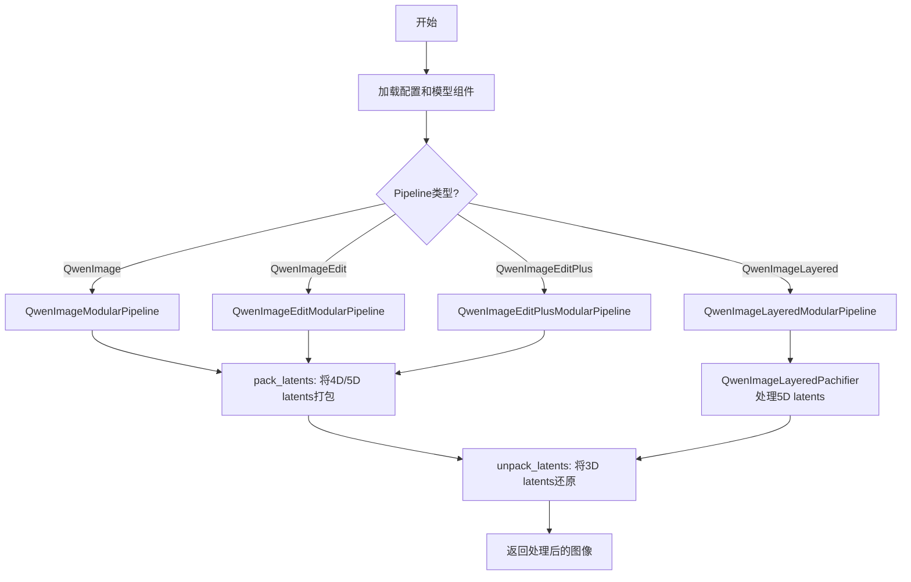

## 类结构

```
ConfigMixin (抽象基类)
├── QwenImagePachifier
├── QwenImageLayeredPachifier
├── QwenImageModularPipeline (继承ModularPipeline, QwenImageLoraLoaderMixin)
│   ├── QwenImageEditModularPipeline
│   │   └── QwenImageEditPlusModularPipeline
│   └── QwenImageLayeredModularPipeline
```

## 全局变量及字段


### `QwenImagePachifier.config_name`
    
配置文件名，默认为config.json

类型：`str`
    


### `QwenImagePachifier.patch_size`
    
通过@register_to_config注册的patch大小参数，用于latent的pack和unpack操作

类型：`int`
    


### `QwenImageLayeredPachifier.config_name`
    
配置文件名，默认为config.json

类型：`str`
    


### `QwenImageLayeredPachifier.patch_size`
    
通过@register_to_config注册的patch大小参数，用于latent的pack和unpack操作

类型：`int`
    


### `QwenImageModularPipeline.default_blocks_name`
    
默认的blocks名称，指定QwenImageAutoBlocks用于自动块配置

类型：`str`
    


### `QwenImageModularPipeline.default_sample_size`
    
默认采样大小属性，返回128用于计算默认高度和宽度

类型：`int`
    


### `QwenImageEditModularPipeline.default_blocks_name`
    
默认的blocks名称，指定QwenImageEditAutoBlocks用于自动块配置

类型：`str`
    


### `QwenImageEditPlusModularPipeline.default_blocks_name`
    
默认的blocks名称，指定QwenImageEditPlusAutoBlocks用于自动块配置

类型：`str`
    


### `QwenImageLayeredModularPipeline.default_blocks_name`
    
默认的blocks名称，指定QwenImageLayeredAutoBlocks用于自动块配置

类型：`str`
    
    

## 全局函数及方法


### `QwenImagePachifier.__init__`

该方法是 `QwenImagePachifier` 类的构造函数，用于初始化打包器实例，通过 `@register_to_config` 装饰器将 `patch_size` 参数注册到配置中，并调用父类的初始化方法。

参数：

- `self`：隐式参数，`QwenImagePachifier` 实例本身
- `patch_size`：`int`，图像分块（patch）的大小，默认为 2，用于控制 latents 的打包粒度

返回值：`None`，`__init__` 方法不返回值

#### 流程图

```mermaid
flowchart TD
    A[开始 __init__] --> B{检查 patch_size 参数}
    B -->|有效| C[调用 super().__init__]
    B -->|无效| D[抛出异常]
    C --> E[通过 @register_to_config 装饰器<br/>将 patch_size 注册到 self.config]
    E --> F[结束 __init__]
    
    style A fill:#f9f,stroke:#333
    style F fill:#9f9,stroke:#333
```

#### 带注释源码

```python
@register_to_config
def __init__(self, patch_size: int = 2):
    """
    初始化 QwenImagePachifier 实例。
    
    参数:
        patch_size: int, 图像分块的大小，默认为 2。
                   较大的 patch_size 会减少序列长度，但会丢失空间细节。
    
    注意:
        - @register_to_config 装饰器会自动将 patch_size 保存到 self.config.patch_size
        - super().__init__() 调用父类 ConfigMixin 的初始化方法
    """
    super().__init__()  # 调用父类 ConfigMixin 的初始化方法
    # patch_size 通过 @register_to_config 装饰器自动注册到 self.config 中
    # 可通过 self.config.patch_size 访问
```


### `QwenImagePachifier.pack_latents`

该方法负责将4D或5D的latent张量打包成适合Transformer处理的3D张量格式。它通过将空间维度（高度和宽度）按patch_size进行分割，并重新排列维度，最终输出形状为 (batch_size, num_patches, channels * patch_size * patch_size) 的3D张量，其中每个patch被展平为特征向量中的一个token。

参数：

- `self`：`QwenImagePachifier`，QwenImagePachifier类的实例，包含配置信息
- `latents`：`torch.Tensor`，输入的latent张量，形状为 (batch_size, num_channels_latents, latent_height, latent_width) 或 (batch_size, num_channels_latents, num_latent_frames, latent_height, latent_width)

返回值：`torch.Tensor`，打包后的latent张量，形状为 (batch_size, (latent_height // patch_size) * (latent_width // patch_size), num_channels_latents * patch_size * patch_size)

#### 流程图

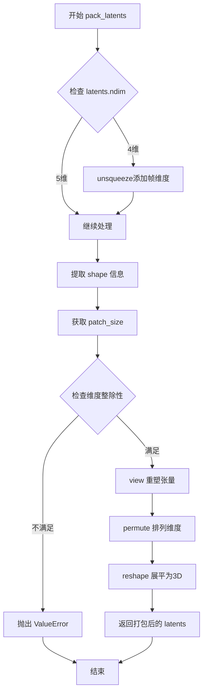

#### 带注释源码

```python
def pack_latents(self, latents):
    """
    Pack latents into a format suitable for transformer processing.
    
    This method converts 4D or 5D latent tensors to 3D tensors by:
    1. Expanding 4D tensors to 5D by adding a frame dimension
    2. Reshaping to split height/width into patches
    3. Permuting dimensions for proper layout
    4. Flattening patches into sequence tokens
    """
    # Step 1: Validate input dimensions - must be 4D or 5D
    if latents.ndim != 4 and latents.ndim != 5:
        raise ValueError(f"Latents must have 4 or 5 dimensions, but got {latents.ndim}")

    # Step 2: For 4D tensors (B, C, H, W), add frame dimension to make it 5D (B, C, 1, H, W)
    if latents.ndim == 4:
        latents = latents.unsqueeze(2)

    # Step 3: Extract tensor shape information
    batch_size, num_channels_latents, num_latent_frames, latent_height, latent_width = latents.shape
    # Get patch size from config (default is 2)
    patch_size = self.config.patch_size

    # Step 4: Validate that spatial dimensions are divisible by patch_size
    if latent_height % patch_size != 0 or latent_width % patch_size != 0:
        raise ValueError(
            f"Latent height and width must be divisible by {patch_size}, but got {latent_height} and {latent_width}"
        )

    # Step 5: Reshape - split height and width into patches
    # Transform from (B, C, F, H, W) to (B, C, F, H//p, p, W//p, p)
    latents = latents.view(
        batch_size,
        num_channels_latents,
        latent_height // patch_size,  # number of patches in height
        patch_size,                    # patch size dimension
        latent_width // patch_size,   # number of patches in width
        patch_size,                    # patch size dimension
    )
    
    # Step 6: Permute dimensions to reorder as (B, F, W, C, p, H)
    # Result: (Batch_size, num_patches_height, num_patches_width, num_channels_latents, patch_size, patch_size)
    latents = latents.permute(
        0, 2, 4, 1, 3, 5
    )  # Batch_size, num_patches_height, num_patches_width, num_channels_latents, patch_size, patch_size
    
    # Step 7: Reshape to final 3D format (B, num_patches, channels * p * p)
    # Flatten the spatial patch dimensions and channel dimensions into a single sequence dimension
    latents = latents.reshape(
        batch_size,
        (latent_height // patch_size) * (latent_width // patch_size),  # total number of patches
        num_channels_latents * patch_size * patch_size,                  # flattened channels per patch
    )

    return latents
```


### `QwenImagePachifier.unpack_latents`

该方法用于将打包后的潜在表示（latents）解包还原为4D张量（包含批次维度、通道维度、高度和宽度），是 `pack_latents` 的逆操作，配合 VAE 的压缩比例和补丁大小进行尺寸计算。

参数：

- `self`：`QwenImagePachifier` 实例，包含配置信息
- `latents`：`torch.Tensor`，已打包的3D潜在表示，形状为 (batch_size, num_patches, channels)
- `height`：`int`，目标图像的高度（像素空间）
- `width`：`int`，目标图像的宽度（像素空间）
- `vae_scale_factor`：`int`（默认值 8），VAE 的空间压缩倍数

返回值：`torch.Tensor`，解包后的4D潜在表示，形状为 (batch_size, channels // (patch_size * patch_size), 1, height, width)

#### 流程图

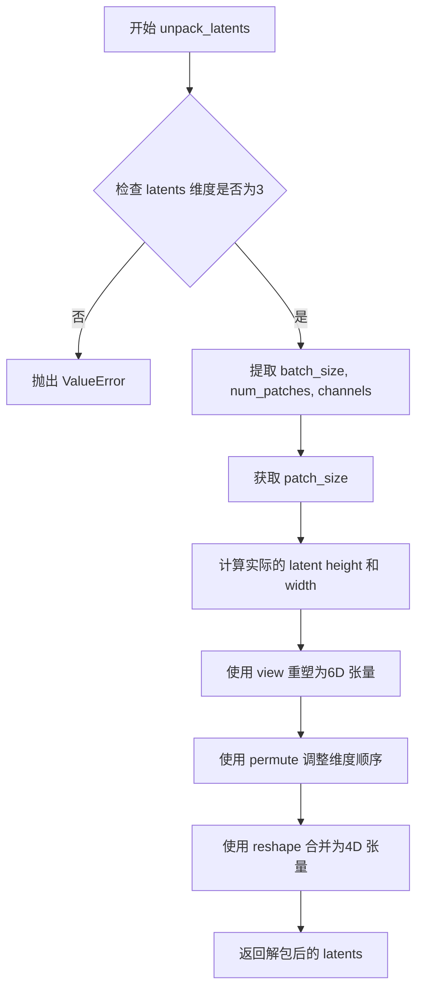

#### 带注释源码

```python
def unpack_latents(self, latents, height, width, vae_scale_factor=8):
    """
    将打包后的 latents 解包还原为 4D 张量。
    
    参数:
        latents: 已打包的 latents，形状为 (batch_size, num_patches, channels)
        height: 目标图像高度（像素空间）
        width: 目标图像宽度（像素空间）
        vae_scale_factor: VAE 的空间压缩倍数，默认为 8
    
    返回:
        解包后的 latents，形状为 (batch_size, channels // (patch_size^2), 1, height, width)
    """
    # 步骤1: 输入验证 - 确保 latents 是 3D 张量
    if latents.ndim != 3:
        raise ValueError(f"Latents must have 3 dimensions, but got {latents.ndim}")

    # 步骤2: 解包形状信息
    batch_size, num_patches, channels = latents.shape
    patch_size = self.config.patch_size

    # 步骤3: 计算实际的 latent 空间尺寸
    # VAE 应用 8x 压缩，但还需要考虑 packing 要求 latent 高宽能被 2 整除
    # 将像素空间尺寸转换为 latent 空间尺寸
    height = patch_size * (int(height) // (vae_scale_factor * patch_size))
    width = patch_size * (int(width) // (vae_scale_factor * patch_size))

    # 步骤4: 使用 view 将 3D 张量重塑为 6D 张量
    # 从 (B, num_patches, C) -> (B, H//patch, W//patch, C//patch^2, patch, patch)
    latents = latents.view(
        batch_size,
        height // patch_size,
        width // patch_size,
        channels // (patch_size * patch_size),
        patch_size,
        patch_size,
    )
    
    # 步骤5: 使用 permute 调整维度顺序
    # 从 (B, H', W', C', p, p) -> (B, C', H', p, W', p)
    latents = latents.permute(0, 3, 1, 4, 2, 5)

    # 步骤6: 使用 reshape 合并为 4D 张量
    # 从 (B, C', H', p, W', p) -> (B, C', 1, H, W)
    latents = latents.reshape(batch_size, channels // (patch_size * patch_size), 1, height, width)

    return latents
```


### `QwenImageLayeredPachifier.__init__`

这是 `QwenImageLayeredPachifier` 类的初始化方法，负责初始化分块打包器的基本配置。该类用于对 QwenImage Layered 模型的潜在表示（latents）进行打包和解包操作，与 `QwenImagePachifier` 不同的是，它处理的是 5D 潜在表示（包含层信息）。

参数：

- `self`：隐式参数，`QwenImageLayeredPachifier` 类的实例对象
- `patch_size`：`int`，分块大小，默认为 2，用于将潜在表示划分为 patch_size x patch_size 的小块

返回值：无（`None`），`__init__` 方法不返回值，用于初始化对象状态

#### 流程图

```mermaid
flowchart TD
    A[开始 __init__] --> B{检查 patch_size 参数}
    B -->|有效| C[调用 super().__init__]
    B -->|无效| D[抛出异常]
    C --> E[使用 @register_to_config 注册配置]
    E --> F[结束 __init__, 对象初始化完成]
    
    style A fill:#e1f5fe
    style C fill:#e8f5e8
    style F fill:#fff3e0
```

#### 带注释源码

```python
@register_to_config
def __init__(self, patch_size: int = 2):
    """
    初始化 QwenImageLayeredPachifier 实例。
    
    该方法继承自 ConfigMixin，使用 @register_to_config 装饰器将 patch_size 
    参数注册到配置系统中，使其可以通过 config.patch_size 访问。
    
    参数:
        patch_size: int, 默认为 2。分块大小，用于将潜在表示的空间维度
                   (height, width) 划分为 patch_size x patch_size 的小块。
                   这个值需要与模型的 patch embedding 方案保持一致。
    
    注意:
        - patch_size 必须为正整数
        - 潜在表示的高度和宽度必须能被 patch_size 整除
        - 该类的设计针对 5D 潜在表示，形状为 (B, layers+1, C, H, W)
    """
    super().__init__()
    # 调用父类 ConfigMixin 的初始化方法
    # ConfigMixin 提供了配置注册和管理功能
    # patch_size 通过 @register_to_config 装饰器自动保存到 self.config 中
    # 可通过 self.config.patch_size 访问
```


### `QwenImageLayeredPachifier.pack_latents`

该方法用于将5维张量形式的latent从 `(B, layers, C, H, W)` 形状打包转换为3维张量 `(B, layers * H/2 * W/2, C*4)`，以适应Transformer模型的序列输入格式。

参数：

-  `self`：`QwenImageLayeredPachifier`，QwenImageLayeredPachifier类实例，包含配置信息
-  `latents`：`torch.Tensor`，5维张量，形状为 (batch_size, layers, num_channels_latents, latent_height, latent_width)，待打包的latent张量

返回值：`torch.Tensor`，3维张量，形状为 (batch_size, layers * (latent_height // patch_size) * (latent_width // patch_size), num_channels_latents * patch_size * patch_size)，打包后的latent张量

#### 流程图

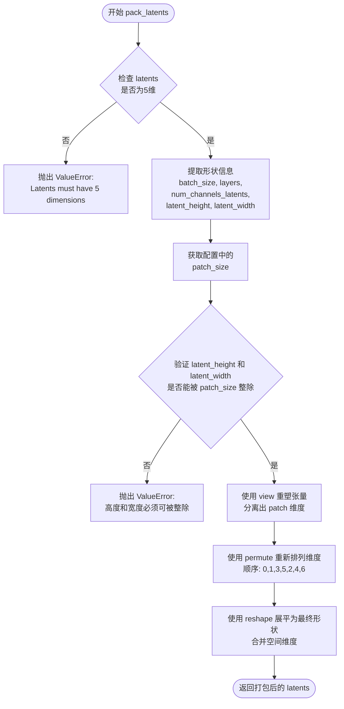

#### 带注释源码

```python
def pack_latents(self, latents):
    """
    Pack latents from (B, layers, C, H, W) to (B, layers * H/2 * W/2, C*4).
    """
    # 输入验证：确保 latents 是5维张量
    if latents.ndim != 5:
        raise ValueError(f"Latents must have 5 dimensions (B, layers, C, H, W), but got {latents.ndim}")

    # 提取各维度大小
    batch_size, layers, num_channels_latents, latent_height, latent_width = latents.shape
    # 从配置中获取 patch 大小，默认为2
    patch_size = self.config.patch_size

    # 验证：确保空间维度能被 patch_size 整除
    if latent_height % patch_size != 0 or latent_width % patch_size != 0:
        raise ValueError(
            f"Latent height and width must be divisible by {patch_size}, but got {latent_height} and {latent_width}"
        )

    # 第一次 reshape：将 H 和 W 维度分割为 (num_patches, patch_size)
    # 形状从 (B, layers, C, H, W) 变为 (B, layers, C, H//patch_size, patch_size, W//patch_size, patch_size)
    latents = latents.view(
        batch_size,
        layers,
        num_channels_latents,
        latent_height // patch_size,  # 高度方向上的 patch 数量
        patch_size,                    # patch 内部高度
        latent_width // patch_size,   # 宽度方向上的 patch 数量
        patch_size,                    # patch 内部宽度
    )
    
    # permute 重新排列维度：将空间 patch 维度提前，便于后续展平
    # 从 (B, layers, C, H_patches, patch_size_h, W_patches, patch_size_w)
    # 变为 (B, layers, H_patches, W_patches, C, patch_size_h, patch_size_w)
    latents = latents.permute(0, 1, 3, 5, 2, 4, 6)
    
    # 第二次 reshape：展平所有空间维度，合并 channel 和 patch 内部维度
    # 最终形状: (B, layers * H_patches * W_patches, C * patch_size * patch_size)
    # 即 (B, layers * H/2 * W/2, C*4)
    latents = latents.reshape(
        batch_size,
        layers * (latent_height // patch_size) * (latent_width // patch_size),
        num_channels_latents * patch_size * patch_size,
    )

    return latents
```


### `QwenImageLayeredPachifier.unpack_latents`

该方法将压缩后的潜在表示从打包格式 (batch_size, sequence_length, channels) 解包为解包后的5D格式 (batch_size, channels, layers+1, height, width)。它执行 pack_latents 的逆操作，通过 reshape 和 permute 操作重构原始的分层潜在表示。

参数：

- `self`：隐式参数，类实例自身
- `latents`：`torch.Tensor`，打包后的潜在表示，形状为 (B, seq, C*4)，其中 seq = (layers+1) * (height//patch_size) * (width//patch_size)
- `height`：`int`，目标图像高度
- `width`：`int`，目标图像宽度
- `layers`：`int`，层数
- `vae_scale_factor`：`int`（默认值 8），VAE 缩放因子，用于计算潜在维度

返回值：`torch.Tensor`，解包后的潜在表示，形状为 (B, C, layers+1, H, W)

#### 流程图

```mermaid
flowchart TD
    A[开始 unpack_latents] --> B{检查 latents 维度是否为 3}
    B -->|否| C[抛出 ValueError]
    B -->|是| D[获取 batch_size, channels]
    D --> E[获取 patch_size]
    E --> F[计算 latent_height 和 latent_width]
    F --> G[使用 view 重塑为 7D 张量]
    G --> H[使用 permute 调整维度顺序]
    H --> I[reshape 为 5D: (B, layers+1, C, H, W)]
    I --> J[再次 permute 调整为最终格式]
    J --> K[返回 (B, C, layers+1, H, W)]
```

#### 带注释源码

```python
def unpack_latents(self, latents, height, width, layers, vae_scale_factor=8):
    """
    Unpack latents from (B, seq, C*4) to (B, C, layers+1, H, W).
    """
    # Step 1: 验证输入维度
    # latents 必须是 3D 张量: (batch_size, num_patches, channels)
    if latents.ndim != 3:
        raise ValueError(f"Latents must have 3 dimensions, but got {latents.ndim}")

    # Step 2: 获取批次大小和通道数
    batch_size, _, channels = latents.shape
    # 从配置中获取 patch_size
    patch_size = self.config.patch_size

    # Step 3: 计算潜在的宽和高
    # 根据 VAE 缩放因子和 patch_size 计算 latent 尺寸
    height = patch_size * (int(height) // (vae_scale_factor * patch_size))
    width = patch_size * (int(width) // (vae_scale_factor * patch_size))

    # Step 4: 使用 view 将 3D 张量重塑为 7D 中间表示
    # 形状: (batch_size, layers+1, height//patch_size, width//patch_size, 
    #       channels//(patch_size*patch_size), patch_size, patch_size)
    latents = latents.view(
        batch_size,
        layers + 1,
        height // patch_size,
        width // patch_size,
        channels // (patch_size * patch_size),
        patch_size,
        patch_size,
    )
    
    # Step 5: 调整维度顺序
    # 从 (B, layers+1, H', W', C', p_h, p_w) 
    # 到 (B, layers+1, C', H', p_h, W', p_w)
    latents = latents.permute(0, 1, 4, 2, 5, 3, 6)
    
    # Step 6: 重塑为 5D 张量
    # 合并最后两个维度得到 (B, layers+1, C', H, W)
    latents = latents.reshape(
        batch_size,
        layers + 1,
        channels // (patch_size * patch_size),
        height,
        width,
    )
    
    # Step 7: 最终维度调整
    # 从 (B, layers+1, C, H, W) 转换为 (B, C, layers+1, H, W)
    # 以符合预期的输出格式
    latents = latents.permute(0, 2, 1, 3, 4)  # (b, c, f, h, w)

    return latents
```


### `QwenImageModularPipeline.default_height`

该属性是 `QwenImageModularPipeline` 类中的一个只读属性，用于返回默认的图像高度值。它通过将 `default_sample_size`（默认采样大小）与 `vae_scale_factor`（VAE 缩放因子）相乘计算得出，提供了默认的图像高度支持。

参数：

- （无显式参数，隐式参数为 `self`）

返回值：`int`，返回默认图像高度值，由 `default_sample_size` 与 `vae_scale_factor` 相乘得到。

#### 流程图

```mermaid
flowchart TD
    A[开始: 访问 default_height 属性] --> B{检查 self.vae 是否存在且有 temperal_downsample 属性}
    B -->|是| C[vae_scale_factor = 2 ** len(self.vae.temperal_downsample)]
    B -->|否| D[vae_scale_factor = 8]
    C --> E[default_height = default_sample_size * vae_scale_factor]
    D --> E
    E --> F[返回 default_height]
    
    G[default_sample_size = 128] --> E
```

#### 带注释源码

```python
@property
def default_height(self):
    """
    返回默认图像高度。
    
    计算逻辑：default_sample_size * vae_scale_factor
    - default_sample_size: 默认采样大小，固定为 128
    - vae_scale_factor: VAE 缩放因子，默认值为 8，
      如果 vae 存在且具有 temperal_downsample 属性，则为 2 ** len(self.vae.temperal_downsample)
    
    返回值示例：
        - 当 vae 不存在时: 128 * 8 = 1024
        - 当 vae 存在且有 1 个 temperal_downsample 时: 128 * 2 = 256
        - 当 vae 存在且有 2 个 temperal_downsample 时: 128 * 4 = 512
        - 当 vae 存在且有 3 个 temperal_downsample 时: 128 * 8 = 1024
    """
    return self.default_sample_size * self.vae_scale_factor
```


### `QwenImageModularPipeline.default_width`

该属性返回 QwenImageModularPipeline 的默认宽度，通过将默认采样大小乘以 VAE 缩放因子计算得出。

参数：

- 无显式参数（`self` 为隐式参数）

返回值：`int`，默认宽度值，由 `default_sample_size` 与 `vae_scale_factor` 相乘得到。

#### 流程图

```mermaid
graph TD
    A[开始访问 default_width] --> B{检查 vae 属性是否存在}
    B -->|是| C[获取 vae.temperal_downsample 长度]
    B -->|否| D[使用默认值 vae_scale_factor=8]
    C --> E[计算 vae_scale_factor = 2 ** len(temperal_downsample)]
    E --> F[获取 default_sample_size = 128]
    F --> G[计算 default_width = default_sample_size * vae_scale_factor]
    G --> H[返回 default_width]
```

#### 带注释源码

```python
@property
def default_width(self):
    """
    返回 QwenImageModularPipeline 的默认宽度。
    
    默认宽度通过将默认采样大小（default_sample_size）与 VAE 缩放因子（vae_scale_factor）相乘得到。
    如果 vae 属性存在且包含 temperal_downsample 属性，则根据其长度动态计算 vae_scale_factor；
    否则使用默认值 8。
    
    Returns:
        int: 默认宽度值（像素单位）
    """
    return self.default_sample_size * self.vae_scale_factor
```


# 详细设计文档

## 1. 一段话描述

`QwenImageModularPipeline.default_sample_size` 是一个只读属性（property），用于返回 QwenImage 模块化管道的默认采样大小，固定返回整数值 128，作为图像生成过程中默认的空间采样基准尺寸。

---

## 2. 类的详细信息

### 2.1 类名

`QwenImageModularPipeline`

### 2.2 继承关系

```python
class QwenImageModularPipeline(ModularPipeline, QwenImageLoraLoaderMixin)
```

### 2.3 类功能描述

`QwenImageModularPipeline` 是 Qwen-Image 的模块化管道类，继承自 `ModularPipeline` 和 `QwenImageLoraLoaderMixin`，用于图像生成任务。该类提供了多个计算属性，用于获取管道配置的关键参数，如默认高度、宽度、采样大小、VAE 缩放因子等。

### 2.4 类字段

| 字段名称 | 类型 | 描述 |
|---------|------|------|
| `default_blocks_name` | str | 自动块的默认名称，值为 "QwenImageAutoBlocks" |

---

## 3. `QwenImageModularPipeline.default_sample_size` 属性详细信息

### 属性名称

`QwenImageModularPipeline.default_sample_size`

### 参数

- （无显式参数，隐式参数为 `self`）

### 返回值

- **返回值类型**：`int`
- **返回值描述**：返回默认采样大小的固定值 128，用于计算 `default_height` 和 `default_width` 属性

#### 流程图

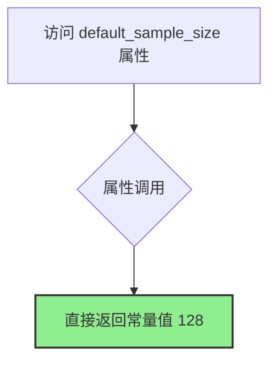

#### 带注释源码

```python
@property
def default_sample_size(self):
    """
    默认采样大小属性。
    
    返回值:
        int: 默认采样大小的固定值 128。
             该值用于与 vae_scale_factor 相乘计算默认的生成图像高度和宽度。
    
    示例:
        >>> pipeline = QwenImageModularPipeline(...)
        >>> pipeline.default_sample_size
        128
    """
    return 128
```

---

## 4. 关键组件信息

| 组件名称 | 描述 |
|---------|------|
| `QwenImagePachifier` | 用于打包和解包 QwenImage 潜在表示的类 |
| `QwenImageLayeredPachifier` | 用于处理分层潜在表示的打包和解包类 |
| `ModularPipeline` | 模块化管道基类 |
| `QwenImageLoraLoaderMixin` | LoRA 加载器混入类 |

---

## 5. 潜在的技术债务或优化空间

1. **硬编码值**：`default_sample_size` 固定返回 128，缺乏灵活性，未来可能需要支持配置文件或构造函数参数自定义。

2. **属性重复定义**：多个属性（如 `default_height`、`default_width`、`vae_scale_factor`）在 `QwenImageEditModularPipeline` 中有重复定义，可考虑提取到基类或混入类中。

3. **TODO 注释**：代码中存在 `YiYi TODO: qwen edit should not provide default height/width` 注释，表明默认高度/宽度的设计尚未完成。

---

## 6. 其它项目

### 6.1 设计目标与约束

- **目标**：为 QwenImage 提供模块化的管道实现，支持图像生成、编辑等任务。
- **约束**：默认采样大小固定为 128，不得修改。

### 6.2 错误处理与异常设计

- 当前属性不涉及错误处理，因为返回的是常量值。
- 依赖该属性的其他属性（如 `default_height`）在 `vae` 或 `transformer` 属性不存在时会有默认回退逻辑。

### 6.3 数据流与状态机

- `default_sample_size` 作为只读属性，不涉及状态变更。
- 数据流：`default_sample_size` → `default_height` / `default_width` → 管道配置

### 6.4 外部依赖与接口契约

- 依赖 `property` 装饰器（Python 内置）。
- 与 `vae_scale_factor` 属性协同工作以计算最终默认尺寸。

### 6.5 使用示例

```python
# 创建管道实例
pipeline = QwenImageModularPipeline(...)

# 访问默认采样大小
sample_size = pipeline.default_sample_size  # 返回 128

# 用于计算默认高度和宽度
height = pipeline.default_height  # 128 * vae_scale_factor
width = pipeline.default_width    # 128 * vae_scale_factor
```


### `QwenImageModularPipeline.vae_scale_factor`

该属性用于获取 QwenImageModularPipeline 的 VAE 缩放因子，默认值为 8，如果存在 vae 对象则根据其 temporal_downsample 的层级数动态计算缩放因子。

参数：

- `self`：`QwenImageModularPipeline` 实例，隐式参数，无需显式传递

返回值：`int`，返回 VAE 的缩放因子，用于图像到潜在空间的压缩比例计算

#### 流程图

```mermaid
flowchart TD
    A[开始: 获取 vae_scale_factor] --> B{self.vae 是否存在且不为 None}
    B -- 否 --> C[返回默认值 8]
    B -- 是 --> D[计算 2 ** len(self.vae.temperal_downsample)]
    D --> E[返回计算的缩放因子]
    C --> F[结束]
    E --> F
```

#### 带注释源码

```python
@property
def vae_scale_factor(self):
    """
    获取 VAE 缩放因子。

    VAE 缩放因子表示图像到潜在空间的压缩倍数，
    用于在图像生成过程中正确计算尺寸和分辨率。
    """
    # 初始化默认缩放因子为 8（标准 VAE 压缩比）
    vae_scale_factor = 8
    
    # 检查是否存在有效的 VAE 模型
    if hasattr(self, "vae") and self.vae is not None:
        # 如果 VAE 存在，根据 temporal_downsample 层数动态计算缩放因子
        # temporal_downsample 每增加一层，缩放因子翻倍
        vae_scale_factor = 2 ** len(self.vae.temperal_downsample)
    
    # 返回最终的 VAE 缩放因子
    return vae_scale_factor
```


### `QwenImageModularPipeline.num_channels_latents`

该属性用于获取QwenImageModularPipeline中latent的通道数，默认值为16，如果transformer组件存在则从transformer配置中获取in_channels并除以4得到实际的通道数。

参数：
-  无显式参数（隐式参数 `self` 类型为 `QwenImageModularPipeline`，表示当前Pipeline实例）

返回值：`int`，返回latent的通道数

#### 流程图

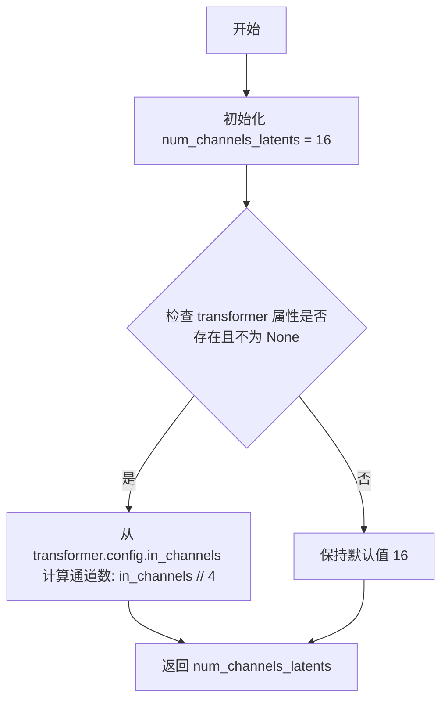

#### 带注释源码

```python
@property
def num_channels_latents(self):
    """
    获取latent的通道数。
    
    默认值为16，如果transformer组件存在且可用，
    则从transformer配置中获取in_channels并除以4得到实际的通道数。
    """
    # 初始化默认通道数为16
    num_channels_latents = 16
    
    # 检查transformer属性是否存在且不为None
    if hasattr(self, "transformer") and self.transformer is not None:
        # 从transformer配置中获取in_channels并除以4计算通道数
        num_channels_latents = self.transformer.config.in_channels // 4
    
    # 返回计算得到的通道数
    return num_channels_latents
```


### `QwenImageModularPipeline.is_guidance_distilled`

该属性用于判断当前管线中的 transformer 模型是否启用了 guidance embedding（引导嵌入）蒸馏功能。它通过检查 transformer 配置中的 `guidance_embeds` 字段来返回布尔值，表示模型是否支持无分类器指导（CFG）的蒸馏版本。

参数：

- 该属性不接受任何外部参数（`self` 为实例本身，无需额外说明）

返回值：`bool`，返回 `True` 表示 transformer 已启用 guidance embedding 蒸馏（支持 CFG 蒸馏），返回 `False` 表示未启用

#### 流程图

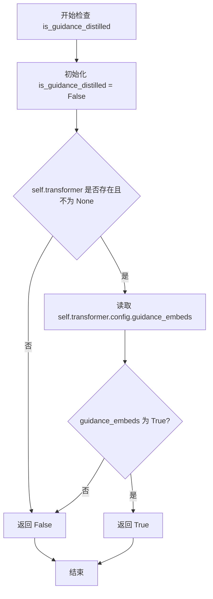

#### 带注释源码

```python
@property
def is_guidance_distilled(self):
    """
    判断 transformer 是否启用了 guidance embedding 蒸馏。

    该属性检查管线中 transformer 对象的配置，如果 transformer 存在且其配置中
    guidance_embeds 字段为 True，则表示该模型采用了 guidance embedding 蒸馏技术，
    可以支持无分类器指导（Classifier-Free Guidance）的蒸馏推理模式。

    Returns:
        bool: 如果 transformer 启用了 guidance embedding 蒸馏返回 True，否则返回 False
    """
    # 默认为 False，表示未启用 guidance embedding 蒸馏
    is_guidance_distilled = False

    # 检查管线中是否存在有效的 transformer 对象
    if hasattr(self, "transformer") and self.transformer is not None:
        # 从 transformer 配置中读取 guidance_embeds 标志
        is_guidance_distilled = self.transformer.config.guidance_embeds

    # 返回最终的判断结果
    return is_guidance_distilled
```


### `QwenImageModularPipeline.requires_unconditional_embeds`

该属性是一个布尔型属性，用于判断当前管线是否需要无条件嵌入（unconditional embeds）。它检查管线中是否配置了 guider，并且 guider 是否处于启用状态且具有多个条件，当满足这些条件时返回 True，否则返回 False。

参数：

-  `self`：`QwenImageModularPipeline`，隐式参数，表示当前管线实例本身

返回值：`bool`，返回一个布尔值，表示管线是否需要无条件嵌入。当 guider 存在、处于启用状态且条件数大于 1 时返回 True，否则返回 False。

#### 流程图

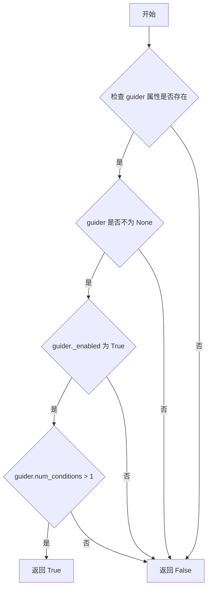

#### 带注释源码

```python
@property
def requires_unconditional_embeds(self):
    """
    属性：requires_unconditional_embeds
    描述：判断当前管线是否需要无条件嵌入（unconditional embeds）。
    当 guider 存在、处于启用状态且具有多个条件时返回 True。
    
    返回值：
        - bool：是否需要无条件嵌入
    """
    # 初始化为 False
    requires_unconditional_embeds = False

    # 检查是否存在 guider 属性且 guider 不为 None
    if hasattr(self, "guider") and self.guider is not None:
        # 仅当 guider 启用且条件数大于 1 时才需要无条件嵌入
        requires_unconditional_embeds = self.guider._enabled and self.guider.num_conditions > 1

    # 返回判断结果
    return requires_unconditional_embeds
```


### `QwenImageEditModularPipeline.default_height`

这是一个属性（property），用于获取QwenImageEditModularPipeline的默认高度。它通过将默认采样大小（default_sample_size）乘以VAE缩放因子（vae_scale_factor）来计算返回的默认高度值。

参数：

- `self`：`QwenImageEditModularPipeline`，隐式参数，表示类的实例本身

返回值：`int`，返回默认高度值，计算公式为 `default_sample_size * vae_scale_factor`，默认情况下为 128 * 8 = 1024

#### 流程图

```mermaid
flowchart TD
    A[访问 default_height 属性] --> B{检查 vae 属性是否存在}
    B -->|存在| C[获取 vae.temperal_downsample 长度]
    C --> D[计算 vae_scale_factor = 2 ** len(vae.temperal_downsample)]
    B -->|不存在| E[使用默认 vae_scale_factor = 8]
    D --> F[获取 default_sample_size = 128]
    E --> F
    F --> G[计算 default_height = default_sample_size * vae_scale_factor]
    G --> H[返回 default_height]
```

#### 带注释源码

```python
@property
def default_height(self):
    """
    获取默认高度属性。
    
    默认高度由 default_sample_size 乘以 vae_scale_factor 计算得出。
    这两个值都是属性，会根据 pipeline 中组件的实际配置动态计算。
    
    Returns:
        int: 默认高度值（像素单位）
    """
    # 调用 default_sample_size 属性获取基础采样大小（默认128）
    # 调用 vae_scale_factor 属性获取 VAE 缩放因子（默认8，或基于vae配置计算）
    # 最终返回两者的乘积作为默认高度
    return self.default_sample_size * self.vae_scale_factor
```

#### 相关依赖属性源码

```python
@property
def default_sample_size(self):
    """
    获取默认采样大小。
    
    这是用于生成图像的基础采样网格尺寸。
    """
    return 128

@property
def vae_scale_factor(self):
    """
    获取 VAE 缩放因子。
    
    用于将像素空间坐标转换为潜在空间坐标。
    默认值为8，表示VAE进行8倍下采样。
    如果 VAE 存在且有 temperal_downsample 属性，则基于其长度计算缩放因子。
    """
    vae_scale_factor = 8  # 默认缩放因子
    if hasattr(self, "vae") and self.vae is not None:
        # 根据VAE的时间下采样层数计算缩放因子
        vae_scale_factor = 2 ** len(self.vae.temperal_downsample)
    return vae_scale_factor
```


### `QwenImageEditModularPipeline.default_width`

该属性是 `QwenImageEditModularPipeline` 类的默认宽度属性，用于返回管道默认的图像宽度像素值。它通过将默认采样大小（`default_sample_size`）乘以 VAE 缩放因子（`vae_scale_factor`）计算得出。

参数： 无

返回值：`int`，返回默认宽度像素值，计算公式为 `default_sample_size * vae_scale_factor`。

#### 流程图

```mermaid
flowchart TD
    A[开始访问 default_width 属性] --> B{检查 self.vae 是否存在且不为 None}
    B -->|是| C[获取 self.vae.temperal_downsample 长度<br/>计算 vae_scale_factor = 2 ** len(self.vae.temperal_downsample)]
    B -->|否| D[使用默认 vae_scale_factor = 8]
    C --> E[获取 self.default_sample_size = 128]
    D --> E
    E --> F[计算 result = default_sample_size * vae_scale_factor]
    F --> G[返回结果]
```

#### 带注释源码

```python
@property
def default_width(self):
    """
    返回默认宽度像素值。
    
    该属性计算管道处理图像时的默认宽度，通过将默认采样大小
    乘以 VAE 缩放因子得到。
    
    返回:
        int: 默认宽度像素值
    """
    return self.default_sample_size * self.vae_scale_factor
```


### `QwenImageEditModularPipeline.default_sample_size`

该属性是 `QwenImageEditModularPipeline` 类的只读属性，用于返回默认的采样大小值（128），该值会被 `default_height` 和 `default_width` 属性用于计算默认图像高度和宽度。

参数：无（property 通过 `self` 隐式访问实例）

返回值：`int`，返回默认的采样大小值 128

#### 流程图

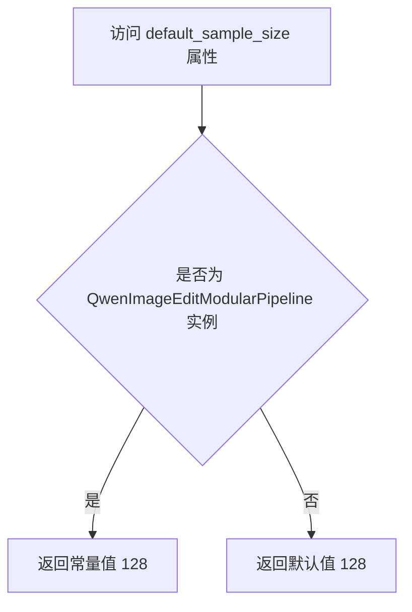

#### 带注释源码

```python
@property
def default_sample_size(self):
    """
    默认采样大小属性。
    该属性返回一个固定的整数值 128，作为图像处理的默认采样大小。
    此值会被 default_height 和 default_width 属性使用，用于计算默认的图像尺寸。
    
    注意：根据代码中的 TODO 注释，未来可能需要根据调整后的输入图像动态推导默认高度/宽度，
    而不是使用固定的采样大小。
    """
    return 128
```


### `QwenImageEditModularPipeline.vae_scale_factor`

这是一个属性（property），用于获取 QwenImageEditModularPipeline 的 VAE 缩放因子。该属性动态计算 VAE 的缩放因子，如果 VAE 模型存在且包含 `temporal_downsample` 属性，则根据其下采样层数计算（2 的 n 次方），否则返回默认值 8。

参数：

- `self`：`QwenImageEditModularPipeline`，隐式参数，方法的实例本身

返回值：`int`，VAE 缩放因子，用于将图像尺寸映射到潜在空间的缩放比例

#### 流程图

```mermaid
flowchart TD
    A[开始 vae_scale_factor] --> B{hasattr self.vae<br/>and self.vae is not None}
    B -->|是| C[vae_scale_factor = 2<sup>len(self.vae.temperal_downsample)</sup>]
    B -->|否| D[vae_scale_factor = 8]
    C --> E[返回 vae_scale_factor]
    D --> E
```

#### 带注释源码

```python
@property
def vae_scale_factor(self):
    """
    获取 VAE 缩放因子。
    
    该属性用于计算 VAE 的缩放因子，默认值为 8。如果 VAE 模型存在，
    则根据其 temporal_downsample 属性的长度动态计算缩放因子（2 的 n 次方）。
    这反映了 VAE 对时间维度的下采样次数。
    """
    # 默认的 VAE 缩放因子
    vae_scale_factor = 8
    
    # 检查 VAE 模型是否存在且已正确初始化
    if hasattr(self, "vae") and self.vae is not None:
        # 根据 VAE 的 temporal_downsample 层数计算缩放因子
        # 例如：如果有 1 层下采样，则 2^1=2；2 层则 2^2=4
        vae_scale_factor = 2 ** len(self.vae.temperal_downsample)
    
    # 返回计算得到的缩放因子
    return vae_scale_factor
```


### `QwenImageEditModularPipeline.num_channels_latents`

该属性用于获取 QwenImageEditModularPipeline 中的潜在空间通道数（num_channels_latents），它首先尝试从 transformer 配置中获取 in_channels 并除以 4，如果 transformer 不存在则返回默认值 16。

参数：无

返回值：`int`，返回潜在空间的通道数

#### 流程图

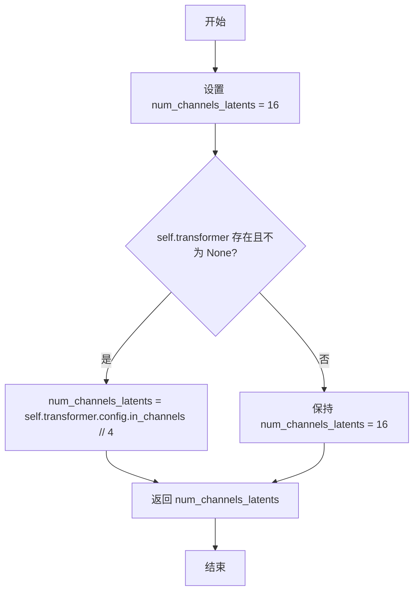

#### 带注释源码

```python
@property
def num_channels_latents(self):
    """
    获取潜在空间的通道数。
    
    如果 transformer 存在，则从其配置中获取 in_channels 并除以 4；
    否则返回默认值 16。
    """
    # 初始化默认通道数为 16
    num_channels_latents = 16
    
    # 检查 transformer 属性是否存在且不为 None
    if hasattr(self, "transformer") and self.transformer is not None:
        # 从 transformer 配置中获取通道数（in_channels 除以 4）
        num_channels_latents = self.transformer.config.in_channels // 4
    
    # 返回计算得到的通道数
    return num_channels_latents
```


### `QwenImageEditModularPipeline.is_guidance_distilled`

该属性用于检查transformer模型是否使用了guidance embeddings（即是否为蒸馏guidance模型），返回布尔值。

参数：

- 该方法为属性（property），无显式参数，`self` 为隐式参数

返回值：`bool`，如果transformer的config中启用了guidance_embeds则返回`True`，否则返回`False`

#### 流程图

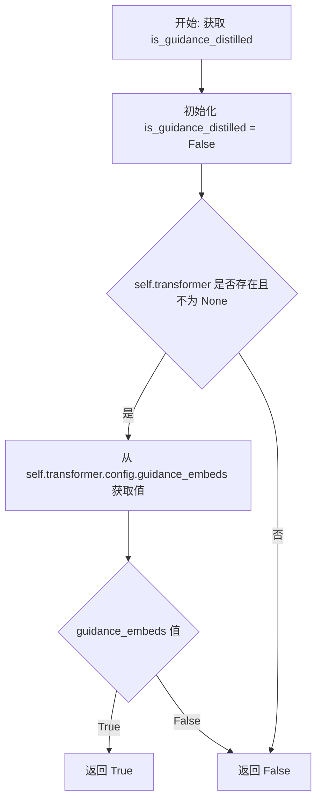

#### 带注释源码

```python
@property
def is_guidance_distilled(self):
    """
    检查transformer模型是否使用了guidance embeddings（蒸馏guidance）。
    
    返回值:
        bool: 如果transformer的config中启用了guidance_embeds则返回True，否则返回False
    """
    # 初始化为False（默认情况）
    is_guidance_distilled = False
    
    # 检查transformer属性是否存在且不为None
    if hasattr(self, "transformer") and self.transformer is not None:
        # 从transformer的配置中获取guidance_embeds标志
        is_guidance_distilled = self.transformer.config.guidance_embeds
    
    # 返回最终的guidance_distilled状态
    return is_guidance_distilled
```


### `QwenImageEditModularPipeline.requires_unconditional_embeds`

该属性用于判断当前流水线是否需要无条件嵌入（unconditional embeds）。它通过检查 guider 对象是否启用且条件数量是否大于1来确定返回值。

参数：无（这是一个属性 getter，不接受参数）

返回值：`bool`，表示是否需要无条件嵌入。如果返回 `True`，则表示 guider 已启用且有多个条件需要处理；如果返回 `False`，则表示不需要无条件嵌入。

#### 流程图

```mermaid
flowchart TD
    A[开始] --> B{self.guider 是否存在且不为 None}
    B -->|否| C[返回 False]
    B -->|是| D{self.guider._enabled 是否为 True}
    D -->|否| C
    D -->|是| E{self.guider.num_conditions > 1}
    E -->|否| C
    E -->|是| F[返回 True]
```

#### 带注释源码

```python
@property
def requires_unconditional_embeds(self):
    """
    判断当前流水线是否需要无条件嵌入（unconditional embeds）。
    
    无条件嵌入通常用于分类器自由引导（classifier-free guidance）技术中，
    当 guider 启用且存在多个条件时需要计算无条件嵌入。
    
    Returns:
        bool: 是否需要无条件嵌入
    """
    # 初始化为 False
    requires_unconditional_embeds = False

    # 检查 guider 属性是否存在且不为 None
    if hasattr(self, "guider") and self.guider is not None:
        # 只有当 guider 启用且条件数量大于1时才需要无条件嵌入
        requires_unconditional_embeds = self.guider._enabled and self.guider.num_conditions > 1

    # 返回最终判断结果
    return requires_unconditional_embeds
```

## 关键组件


### QwenImagePachifier

基础的张量打包解包类，负责将4D/5D latent张量转换为打包格式以便后续处理，支持标准的图像latent压缩与解压缩操作。

### QwenImageLayeredPachifier

分层latent的专用打包解包类，处理5D张量（B, layers+1, C, H, W），专门为QwenImage-Layered模型设计，支持多层特征的统一打包。

### QwenImageModularPipeline

QwenImage的模块化管道基类，继承自ModularPipeline和QwenImageLoraLoaderMixin，提供默认高度/宽度计算、VAE缩放因子、通道数、引导蒸馏等属性。

### QwenImageEditModularPipeline

QwenImage-Edit的模块化管道，继承自ModularPipeline，提供编辑功能相关的管道配置，注意其默认尺寸应为动态计算而非固定值。

### QwenImageEditPlusModularPipeline

QwenImage-Edit Plus的模块化管道，继承自QwenImageEditModularPipeline，提供增强的编辑功能。

### QwenImageLayeredModularPipeline

QwenImage-Layered的模块化管道，继承自QwenImageModularPipeline，专门处理分层/多图层图像生成任务。

### pack_latents方法

将输入latent张量进行空间分块打包的核心方法，将2D空间信息转换为序列形式，支持4D和5D输入的自动适配。

### unpack_latents方法

将打包后的latent恢复为标准格式的解包方法，需要原始图像尺寸和VAE缩放因子进行逆变换。

### vae_scale_factor属性

动态计算VAE的缩放因子，默认值为8，但会根据vae.temperal_downsample属性动态调整，支持不同的VAE架构。

### num_channels_latents属性

动态计算latent通道数，默认16，优先从transformer配置中获取in_channels并除以4。

### patch_size配置参数

控制空间分块大小的配置项，默认值为2，决定了latent的分割粒度和后续处理的计算密度。


## 问题及建议


### 已知问题

- **代码重复**：QwenImageModularPipeline 和 QwenImageEditModularPipeline 存在完全相同的属性方法（default_height、default_width、default_sample_size、vae_scale_factor、num_channels_latents、is_guidance_distilled、requires_unconditional_embeds），违反 DRY 原则
- **魔法数字硬编码**：vae_scale_factor 默认值为 8、num_channels_latents 默认值为 16、default_sample_size 默认值为 128 均以硬编码形式存在，缺乏配置灵活性
- **拼写错误**：vae.temperal_downsample 应为 temporal_downsample
- **参数验证缺失**：QwenImageLayeredPachifier.unpack_latents 的 layers 参数未做验证，且 latent 维度计算可能存在边界问题
- **TODO 未完成**：代码中存在 TODO 注释 "qwen edit should not provide default height/width, should be derived from the resized input image"，表明默认尺寸设计存在问题
- **类抽象缺失**：QwenImagePachifier 和 QwenImageLayeredPachifier 缺少抽象基类定义，无法强制实现统一的 pack/unpack 接口
- **配置重复**：config_name = "config.json" 在两个 Pacher 类中重复定义

### 优化建议

- 提取公共属性方法到基类（如 QwenImageBasePipeline），消除 QwenImageModularPipeline 和 QwenImageEditModularPipeline 的重复代码
- 将硬编码的默认值移至配置文件或 __init__ 方法参数，支持运行时配置
- 修复 temperal_downsample 拼写错误
- 为 unpack_latents 方法添加 layers 参数验证，检查 channels 是否能整除 (patch_size * patch_size)
- 实现 Pacher 抽象基类，定义 pack_latents 和 unpack_latents 接口规范
- 移除 TODO 所述的硬编码默认值，改为从输入图像动态推导 height/width

## 其它


### 设计目标与约束

本模块的设计目标是实现Qwen-Image模型的latent数据打包（pack）与解包（unpack）功能，支持图像的压缩与重建。主要约束包括：1) patch_size参数必须能整除latent的高度和宽度；2) 仅支持4D或5D输入（QwenImagePachifier）；3) QwenImageLayeredPachifier仅支持5D输入；4) 所有latent维度必须符合VAE的压缩规则。

### 错误处理与异常设计

1. 维度验证错误：当latents维度不符合要求时抛出ValueError，包括"Latents must have 4 or 5 dimensions"和"Latents must have 3 dimensions"
2. 尺寸验证错误：当latent尺寸不能被patch_size整除时抛出ValueError，提示"Latent height and width must be divisible by {patch_size}"
3. 参数类型检查：使用isinstance和hasattr检查对象属性，如检查vae和transformer是否存在

### 数据流与状态机

**QwenImagePachifier数据流**：
- pack_latents: (B, C, H, W) 或 (B, C, F, H, W) -> (B, seq, C*patch_size²)，其中seq = (H/patch_size) * (W/patch_size)
- unpack_latents: (B, seq, C*patch_size²) -> (B, C, F, H, W)，其中F=1

**QwenImageLayeredPachifier数据流**：
- pack_latents: (B, layers, C, H, W) -> (B, layers*seq, C*patch_size²)
- unpack_latents: (B, seq, C*patch_size²) -> (B, layers+1, C, H, W)

### 外部依赖与接口契约

1. ConfigMixin：配置混入类，提供register_to_config装饰器和config_name属性
2. ModularPipeline：模块化管道基类，继承自ModularPipeline
3. QwenImageLoraLoaderMixin：LoRA加载混入类
4. VAE组件：通过self.vae.temperal_downsample获取时序下采样信息
5. Transformer组件：通过self.transformer.config获取in_channels和guidance_embeds配置

### 配置管理

- 所有Pachifier类使用@register_to_config装饰器注册配置
- config.json作为默认配置文件名
- patch_size参数通过config统一管理，默认值为2
- Pipeline类通过@property动态计算vae_scale_factor、num_channels_latents等配置

### 性能考虑与优化空间

1. 当前实现使用view和permute进行张量重排，可考虑使用reshape+transpose组合提升可读性
2. unpack_latents中的计算可以预计算以减少重复运算
3. 建议缓存height//patch_size和width//patch_size的结果

### 安全性考虑

1. 输入验证：严格检查latents的维度和尺寸，防止非法内存访问
2. 整数除法保护：使用int()强制转换防止浮点数精度问题
3. 属性访问安全：使用hasattr和getattr防止属性不存在导致的错误

### 版本兼容性说明

本代码依赖HuggingFace的diffusers库，需要与transformers、diffusers版本兼容。ModularPipeline和ConfigMixin为diffusers库的核心组件，需确保使用兼容版本。代码中包含"YiYi TODO"注释，表明部分功能（如QwenImageEditModularPipeline的默认尺寸）仍在开发中。

### 使用示例与调用约定

1. 初始化：QwenImagePachifier(patch_size=2)或通过config.json加载
2. 打包：pack_latents(latents)返回打包后的latent序列
3. 解包：unpack_latents(latents, height, width, vae_scale_factor=8)返回原始形状latent
4. Layered版本额外需要layers参数用于unpack_latents

    