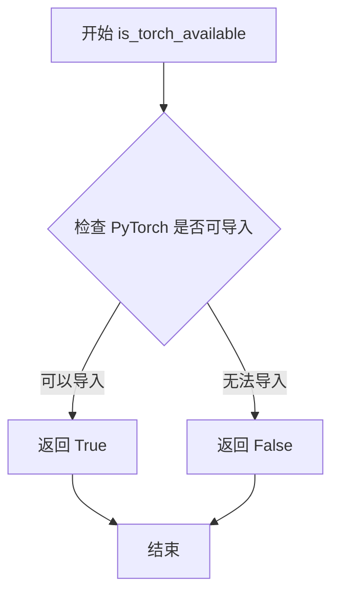
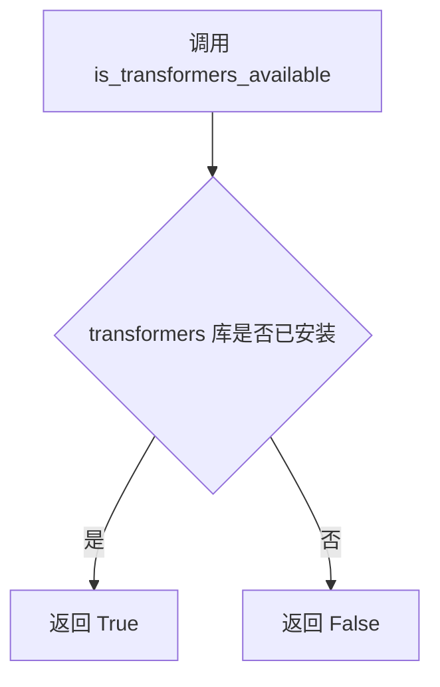
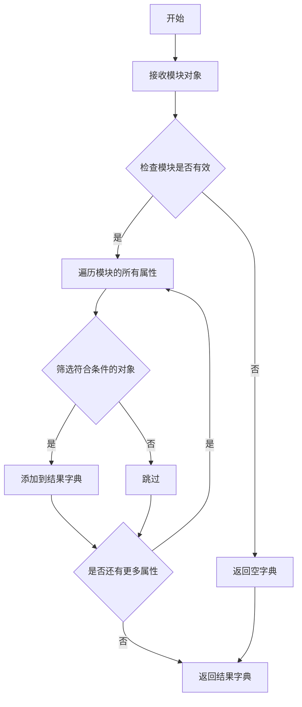

# `diffusers\src\diffusers\modular_pipelines\stable_diffusion_xl\__init__.py` 详细设计文档

这是一个Diffusers库的延迟导入模块，用于条件性地加载Stable Diffusion XL的模块化组件StableDiffusionXLAutoBlocks和StableDiffusionXLModularPipeline，通过LazyModule机制和可选依赖检查实现懒加载，只有在torch和transformers同时可用时才导入真实对象，否则使用虚拟占位对象。

## 整体流程

```mermaid
graph TD
    A[开始] --> B{DIFFUSERS_SLOW_IMPORT为True或TYPE_CHECKING为True?}
    B -- 是 --> C{is_transformers_available()且is_torch_available()?}
    C -- 是 --> D[从modular_blocks_stable_diffusion_xl导入StableDiffusionXLAutoBlocks]
    C -- 否 --> E[从dummy_torch_and_transformers_objects导入虚拟对象]
    D --> F[从modular_pipeline导入StableDiffusionXLModularPipeline]
    E --> F
    B -- 否 --> G[创建_LazyModule实例]
    G --> H[将_dummy_objects设置为模块属性]
    H --> I[返回LazyModule实例]
```

## 类结构

```
_LazyModule (延迟加载模块类)
└── 本文件模块 (StableDiffusionXL模块入口)
    ├── modular_blocks_stable_diffusion_xl
    │   └── StableDiffusionXLAutoBlocks
    └── modular_pipeline
    │   └── StableDiffusionXLModularPipeline
```

## 全局变量及字段


### `_dummy_objects`
    
存储虚拟对象的字典，当可选依赖（torch和transformers）不可用时使用，用于提供延迟导入的替代对象

类型：`dict`
    


### `_import_structure`
    
定义模块的导入结构，键为模块路径，值为可导出的类或函数名列表

类型：`dict`
    


### `TYPE_CHECKING`
    
typing模块中的常量，表示是否处于类型检查模式，值为True时仅导入类型提示不执行实际导入

类型：`bool`
    


### `DIFFUSERS_SLOW_IMPORT`
    
diffusers库的配置标志，控制是否使用慢速导入模式（立即导入所有模块而非延迟加载）

类型：`bool`
    


### `__name__`
    
Python内置变量，表示当前模块的完全限定名

类型：`str`
    


### `__file__`
    
Python内置变量，表示当前模块文件的绝对路径

类型：`str`
    


### `__spec__`
    
Python内置变量，表示当前模块的规格对象，包含模块的元数据信息

类型：`ModuleSpec`
    


    

## 全局函数及方法


### `is_torch_available`

该函数用于检查当前环境中 PyTorch 库是否可用，返回布尔值以决定是否加载相关的模块和对象。

参数：此函数无参数。

返回值：`bool`，如果 PyTorch 已安装并可用返回 `True`，否则返回 `False`。

#### 流程图



#### 带注释源码

```
# is_torch_available 函数的实现（在 diffusers.utils 中）
# 以下为推断的实现方式，实际实现可能略有不同

def is_torch_available() -> bool:
    """
    检查 PyTorch 库是否在当前环境中可用。
    
    Returns:
        bool: 如果 PyTorch 可以被导入则返回 True，否则返回 False
    """
    try:
        # 尝试导入 torch 模块
        import torch
        return True
    except ImportError:
        # 如果导入失败，说明 torch 不可用
        return False
```

#### 使用示例

在给定代码中的实际用法：

```python
# 从 utils 模块导入 is_torch_available
from ...utils import is_torch_available, is_transformers_available

# 使用该函数检查依赖
try:
    if not (is_transformers_available() and is_torch_available()):
        raise OptionalDependencyNotAvailable()
except OptionalDependencyNotAvailable:
    # 加载虚拟对象（dummy objects）
    from ...utils import dummy_torch_and_transformers_objects
    _dummy_objects.update(get_objects_from_module(dummy_torch_and_transformers_objects))
else:
    # 当依赖可用时，导入实际的模块
    _import_structure["modular_blocks_stable_diffusion_xl"] = ["StableDiffusionXLAutoBlocks"]
    _import_structure["modular_pipeline"] = ["StableDiffusionXLModularPipeline"]
```

---

### 附加信息

**设计目标**：这是一个轻量级的依赖检查函数，用于实现可选依赖的延迟加载（lazy loading）模式，避免在用户未安装某些依赖时导致整个库无法导入。

**潜在优化空间**：该函数可以被缓存，以避免重复导入检查的开销，但由于 Python 的导入缓存机制，实际性能影响通常可以忽略不计。


### `is_transformers_available`

该函数用于检查当前环境中 `transformers` 库是否已安装并可用，通常用于条件导入或功能降级处理，避免在未安装依赖时引发导入错误。

参数：

- （无参数）

返回值：`bool`，返回 `True` 表示 `transformers` 库可用，返回 `False` 表示不可用。

#### 流程图



#### 带注释源码

```
# 从 utils 模块导入 is_transformers_available 函数
# 该函数定义在 ...utils 包中，此处仅展示在本文件中的使用方式
from ...utils import (
    DIFFUSERS_SLOW_IMPORT,
    OptionalDependencyNotAvailable,
    _LazyModule,
    get_objects_from_module,
    is_torch_available,
    is_transformers_available,  # <-- 从外部导入的依赖检查函数
)

# 第一次使用：运行时条件检查
try:
    # 检查 transformers 和 torch 是否都可用
    if not (is_transformers_available() and is_torch_available()):
        # 如果任一依赖不可用，抛出可选依赖不可用异常
        raise OptionalDependencyNotAvailable()
except OptionalDependencyNotAvailable:
    # 捕获异常，导入虚拟对象（dummy objects）作为降级处理
    from ...utils import dummy_torch_and_transformers_objects  # noqa F403
    _dummy_objects.update(get_objects_from_module(dummy_torch_and_transformers_objects))
else:
    # 如果依赖可用，定义实际的导入结构
    _import_structure["modular_blocks_stable_diffusion_xl"] = ["StableDiffusionXLAutoBlocks"]
    _import_structure["modular_pipeline"] = ["StableDiffusionXLModularPipeline"]

# 第二次使用：TYPE_CHECKING 模式下的类型检查
if TYPE_CHECKING or DIFFUSERS_SLOW_IMPORT:
    try:
        # 再次检查依赖可用性（用于类型检查和慢速导入模式）
        if not (is_transformers_available() and is_torch_available()):
            raise OptionalDependencyNotAvailable()
    except OptionalDependencyNotAvailable:
        # 类型检查时导入虚拟对象
        from ...utils.dummy_torch_and_transformers_objects import *  # noqa F403
    else:
        # 依赖可用时导入真实模块供类型检查使用
        from .modular_blocks_stable_diffusion_xl import StableDiffusionXLAutoBlocks
        from .modular_pipeline import StableDiffusionXLModularPipeline
```

---

> **注意**：该函数本身定义在 `diffusers` 包的 `...utils` 模块中，当前代码文件仅负责导入和调用它。上述源码展示了 `is_transformers_available` 在本文件中的具体调用方式和使用上下文。


### `get_objects_from_module`

获取指定模块中的所有对象（通常是类或函数），并返回一个包含这些对象的字典，通常用于懒加载和动态导入场景。

参数：

- `module`：模块对象，要从中获取对象的目标模块（如 `dummy_torch_and_transformers_objects`）

返回值：`dict`，返回模块中的对象字典，键为对象名称，值为对象本身

#### 流程图



#### 带注释源码

```
# 注意：此函数在当前代码文件中并未定义，而是从 ...utils 模块导入
# 以下是根据函数名和使用方式推断的可能实现

def get_objects_from_module(module):
    """
    从给定模块中获取所有对象。
    
    参数:
        module: 要从中提取对象的目标模块
        
    返回值:
        dict: 包含模块中所有公共对象的字典
    """
    # 初始化结果字典
    objects = {}
    
    # 检查模块是否有效
    if module is None:
        return objects
    
    # 遍历模块的所有属性
    # 排除以单下划线开头的私有属性
    for attr_name in dir(module):
        if not attr_name.startswith('_'):
            try:
                # 获取属性值
                attr_value = getattr(module, attr_name)
                # 添加到结果字典
                objects[attr_name] = attr_value
            except AttributeError:
                # 如果获取属性失败，跳过
                continue
    
    return objects
```

#### 补充说明

**在当前代码中的使用方式**：

```python
# 从 utils 模块导入该函数
from ...utils import get_objects_from_module

# 使用该函数获取 dummy 模块中的所有对象
_dummy_objects.update(get_objects_from_module(dummy_torch_and_transformers_objects))
```

**调用关系**：

1. 首先尝试导入 `get_objects_from_module` 函数
2. 在 `except OptionalDependencyNotAvailable` 分支中调用
3. 将获取的虚拟对象（dummy objects）更新到 `_dummy_objects` 字典中
4. 这些虚拟对象用于在可选依赖不可用时提供替代实现


### `setattr`（在 `__init__.py` 上下文中）

此函数用于动态地将 `_dummy_objects` 字典中的每个对象设置为当前模块的属性，从而在模块被导入时提供虚拟的占位对象。

参数：

- `obj`：`module`，目标模块对象（`sys.modules[__name__]` 表示当前模块）
- `name`：`str`，要设置的属性名称（来自 `_dummy_objects` 字典的键）
- `value`：`any`，要设置的属性值（来自 `_dummy_objects` 字典的值）

返回值：`None`，无返回值（`setattr` 总是返回 `None`）

#### 流程图

```mermaid
flowchart TD
    A[开始遍历 _dummy_objects 字典] --> B{字典是否还有未处理的键值对?}
    B -->|是| C[取出下一个 name-value 对]
    C --> D[调用 setattr sys.modules[__name__], name, value]
    D --> E[将属性添加到模块命名空间]
    E --> B
    B -->|否| F[结束]
```

#### 带注释源码

```python
# 遍历 _dummy_objects 字典中的所有键值对
for name, value in _dummy_objects.items():
    # 使用 setattr 将每个虚拟对象设置为当前模块的属性
    # obj: sys.modules[__name__] - 当前模块的引用
    # name: str - 属性的名称（如 'SomeClass'）
    # value: object - 属性的值（虚拟的占位对象）
    setattr(sys.modules[__name__], name, value)
```

---

**补充说明**

| 项目 | 说明 |
|------|------|
| **设计目标** | 实现懒加载机制，当可选依赖（torch/transformers）不可用时，提供虚拟对象以避免导入错误 |
| **错误处理** | 通过 `try-except` 捕获 `OptionalDependencyNotAvailable`，确保依赖缺失时程序仍可运行 |
| **外部依赖** | 依赖 `sys.modules` 动态模块管理机制 |
| **技术债务** | 使用 `setattr` 动态挂载属性可能导致 IDE 类型推断困难，建议添加类型提示或 `__getattr__` 显式处理 |

## 关键组件


### 可选依赖处理机制

通过try-except捕获OptionalDependencyNotAvailable异常，判断torch和transformers是否同时可用，以决定是否加载Stable Diffusion XL相关模块。

### 延迟加载模块（Lazy Loading）

使用_LazyModule实现模块的延迟加载，仅在真正需要时才加载模块内容，提高导入速度并优化内存占用。

### 导入结构管理

通过_import_structure字典定义模块的导入结构，包含modular_blocks_stable_diffusion_xl和modular_pipeline两个子模块的导出列表。

### 虚拟对象模式（Dummy Objects）

当torch或transformers依赖不可用时，从dummy_torch_and_transformers_objects导入虚拟对象，避免导入错误并保持API一致性。

### 类型检查支持

使用TYPE_CHECKING和DIFFUSERS_SLOW_IMPORT标志控制类型检查时的导入行为，实现运行时延迟加载与类型提示的兼容性。

### 模块重定向机制

在非类型检查模式下，通过setattr将_dummy_objects添加到sys.modules中，实现模块的动态重定向和属性别名。


## 问题及建议


### 已知问题

-   **重复的依赖检查逻辑**：代码在两处（try-except块和TYPE_CHECKING块）重复执行相同的依赖检查（`is_transformers_available() and is_torch_available()`），违反DRY原则，增加维护成本
-   **使用通配符导入**：`from ...utils.dummy_torch_and_transformers_objects import *` 使用通配符导入，会污染命名空间，可能引入意外的名称冲突
-   **魔法般的异常处理流程**：通过在try块中主动抛出`OptionalDependencyNotAvailable`来控制流程跳转，这种模式不够直观，增加理解难度
-   **硬编码的相对导入路径**：使用了多层级的相对导入（`...utils`），当项目结构调整时容易失效，缺乏灵活性
-   **缺少错误日志记录**：依赖不可用时没有任何日志或警告信息，难以追踪问题根因
-   **对`globals()`的动态访问**：`globals()["__file__"]`的使用方式不够直接，可读性较差
-   **TYPE_CHECKING分支的else分支**：在TYPE_CHECKING为True时会执行导入语句，但这些导入在运行时不会被使用，造成一定的代码冗余

### 优化建议

-   **提取依赖检查为函数**：将依赖检查逻辑封装为独立函数，例如`check_dependencies()`，在两处调用，避免重复代码
-   **使用显式导入替代通配符**：将`*`改为显式导入需要虚拟对象的名称，提高代码可维护性和可预测性
-   **添加日志记录**：在依赖不可用时记录警告或调试信息，便于问题排查
-   **使用`__file__`直接引用**：直接使用`__file__`变量而非通过`globals()`字典访问
-   **考虑使用依赖注入模式**：将依赖检查逻辑外部化，提高模块的可测试性和灵活性
-   **添加类型注解完善**：为全局变量添加类型注解，提高代码的Type Safety
-   **重构异常处理逻辑**：考虑使用更清晰的条件判断替代主动抛出异常的流程控制方式


## 其它


### 设计目标与约束

**设计目标**：实现Stable Diffusion XL模块的延迟加载机制，通过可选依赖检测实现条件导入，确保在缺少torch或transformers时模块仍能以最小化方式加载，避免运行时导入错误。

**约束条件**：
- 依赖Python的TYPE_CHECKING机制进行类型提示导入
- 必须同时满足is_transformers_available()和istorch_available()条件才能导入实际模块
- 使用LazyModule实现懒加载以提升首次导入性能
- _import_structure字典结构必须符合LazyModule的规范要求

### 错误处理与异常设计

**异常处理机制**：
- 使用try-except捕获OptionalDependencyNotAvailable异常
- 当依赖不可用时，从dummy模块导入虚拟对象填充_dummy_objects
- 使用# noqa F403抑制import *的静态检查警告

**异常传播路径**：
- OptionalDependencyNotAvailable异常被捕获后触发虚拟对象加载流程
- 延迟加载失败时，LazyModule会抛出原始导入错误
- sys.modules直接赋值会覆盖原有模块对象的引用

### 数据流与状态机

**模块加载状态机**：
- 初始状态：模块被首次导入，_import_structure为空字典
- 依赖检查状态：判断transformers和torch可用性
- 虚拟对象状态：依赖不可用时加载dummy_objects
- 实际模块状态：依赖可用时配置真实导入结构
- 延迟加载状态：LazyModule拦截属性访问触发实际导入

**数据流向**：
- get_objects_from_module(dummy_torch_and_transformers_objects) → _dummy_objects
- 模块属性设置：setattr(sys.modules[__name__], name, value)
- globals()["__file__"] → LazyModule的_file参数

### 外部依赖与接口契约

**硬性依赖**：
- typing.TYPE_CHECKING：类型检查时导入标识
- ...utils._LazyModule：延迟加载模块基类
- ...utils.get_objects_from_module：从模块获取对象函数

**可选依赖**：
- is_torch_available()：PyTorch可用性检测
- is_transformers_available()：Transformers库可用性检测
- ...utils.dummy_torch_and_transformers_objects：虚拟对象模块

**导出接口**：
- StableDiffusionXLAutoBlocks：模块化块自动加载类
- StableDiffusionXLModularPipeline：模块化流水线类

### 版本兼容性考虑

**Python版本要求**：基于使用match语句和类型标注，推测需要Python 3.10+

**库版本约束**：
- transformers库版本需与当前diffusers版本兼容
- torch版本需支持Stable Diffusion XL运行要求
- 依赖检查函数返回布尔值表示版本兼容性状态

### 性能优化建议

**延迟加载策略**：
- 使用DIFFUSERS_SLOW_IMPORT控制是否启用延迟加载
- LazyModule仅在属性首次访问时才执行实际导入
- sys.modules缓存避免重复导入开销

**内存优化**：
- 虚拟对象占用极小内存，仅作为导入占位符
- 实际模块仅在需要时加载到内存

### 安全考量

**导入安全**：
- 使用import *可能导入未知符号，建议显式指定导出列表
- sys.modules直接操作需确保线程安全
- 模块spec验证通过__spec__属性实现

### 测试与验证

**测试覆盖点**：
- 完整依赖环境下的模块导入流程
- 缺失单一依赖时的优雅降级
- 多次导入的幂等性验证
- LazyModule属性访问触发实际加载


    