# `diffusers\src\diffusers\modular_pipelines\stable_diffusion_xl\before_denoise.py` 详细设计文档

Stable Diffusion XL模块化管道实现，提供了图像生成所需的各个处理步骤，包括输入处理、时间步设置、潜在变量准备、附加条件处理和ControlNet输入准备等，支持文本到图像、图像到图像和修复等多种生成模式。

## 整体流程

```mermaid
graph TD
    Start([开始]) --> InputStep[StableDiffusionXLInputStep]
    InputStep --> SetTimesteps[StableDiffusionXLSetTimestepsStep]
    SetTimesteps --> PrepareLatents[StableDiffusionXLPrepareLatentsStep]
    PrepareLatents --> PrepareConditioning[StableDiffusionXLPrepareAdditionalConditioningStep]
    PrepareConditioning --> Denoising[去噪循环]
    Denoising --> VAEDecode[VAE解码]
    VAEDecode --> End([结束])

graph TD
    InputStepImg2Img[StableDiffusionXLInputStep] --> Img2ImgSetTimesteps[StableDiffusionXLImg2ImgSetTimestepsStep]
    Img2ImgSetTimesteps --> Img2ImgPrepareLatents[StableDiffusionXLImg2ImgPrepareLatentsStep]
    Img2ImgPrepareLatents --> Img2ImgPrepareConditioning[StableDiffusionXLImg2ImgPrepareAdditionalConditioningStep]
    Img2ImgPrepareConditioning --> Img2ImgDenoising[去噪循环]
    Img2ImgDenoising --> Img2ImgVAEDecode[VAE解码]

graph TD
    InputStepInpaint[StableDiffusionXLInputStep] --> InpaintSetTimesteps[StableDiffusionXLImg2ImgSetTimestepsStep]
    InpaintSetTimesteps --> InpaintPrepareLatents[StableDiffusionXLInpaintPrepareLatentsStep]
    InpaintPrepareLatents --> InpaintPrepareConditioning[StableDiffusionXLImg2ImgPrepareAdditionalConditioningStep]
    InpaintPrepareConditioning --> InpaintDenoising[去噪循环]
    InpaintDenoising --> InpaintVAEDecode[VAE解码]

graph TD
    InputStepControlNet[StableDiffusionXLInputStep] --> ControlNetInput[StableDiffusionXLControlNetInputStep]
    ControlNetInput --> ControlNetSetTimesteps[StableDiffusionXLSetTimestepsStep]
    ControlNetSetTimesteps --> ControlNetPrepareLatents[StableDiffusionXLPrepareLatentsStep]
    ControlNetPrepareLatents --> ControlNetDenoising[去噪循环 + ControlNet]
```

## 类结构

```
ModularPipelineBlocks (抽象基类)
├── StableDiffusionXLInputStep (输入处理)
├── StableDiffusionXLImg2ImgSetTimestepsStep (图像到图像时间步设置)
├── StableDiffusionXLSetTimestepsStep (文本到图像时间步设置)
├── StableDiffusionXLInpaintPrepareLatentsStep (修复准备潜在变量)
├── StableDiffusionXLImg2ImgPrepareLatentsStep (图像到图像准备潜在变量)
├── StableDiffusionXLPrepareLatentsStep (文本到图像准备潜在变量)
├── StableDiffusionXLImg2ImgPrepareAdditionalConditioningStep (图像到图像附加条件)
├── StableDiffusionXLPrepareAdditionalConditioningStep (文本到图像附加条件)
├── StableDiffusionXLControlNetInputStep (ControlNet输入)
└── StableDiffusionXLControlNetUnionInputStep (ControlNet Union输入)
```

## 全局变量及字段


### `logger`
    
模块级日志记录器，用于记录运行时的日志信息

类型：`logging.Logger`
    


### `StableDiffusionXLInputStep.model_name`
    
模型名称标识，固定为 'stable-diffusion-xl'

类型：`str`
    


### `StableDiffusionXLImg2ImgSetTimestepsStep.model_name`
    
模型名称标识，固定为 'stable-diffusion-xl'

类型：`str`
    


### `StableDiffusionXLSetTimestepsStep.model_name`
    
模型名称标识，固定为 'stable-diffusion-xl'

类型：`str`
    


### `StableDiffusionXLInpaintPrepareLatentsStep.model_name`
    
模型名称标识，固定为 'stable-diffusion-xl'

类型：`str`
    


### `StableDiffusionXLImg2ImgPrepareLatentsStep.model_name`
    
模型名称标识，固定为 'stable-diffusion-xl'

类型：`str`
    


### `StableDiffusionXLPrepareLatentsStep.model_name`
    
模型名称标识，固定为 'stable-diffusion-xl'

类型：`str`
    


### `StableDiffusionXLImg2ImgPrepareAdditionalConditioningStep.model_name`
    
模型名称标识，固定为 'stable-diffusion-xl'

类型：`str`
    


### `StableDiffusionXLPrepareAdditionalConditioningStep.model_name`
    
模型名称标识，固定为 'stable-diffusion-xl'

类型：`str`
    


### `StableDiffusionXLControlNetInputStep.model_name`
    
模型名称标识，固定为 'stable-diffusion-xl'

类型：`str`
    


### `StableDiffusionXLControlNetUnionInputStep.model_name`
    
模型名称标识，固定为 'stable-diffusion-xl'

类型：`str`
    
    

## 全局函数及方法


### `retrieve_timesteps`

调用调度器的 `set_timesteps` 方法并从中检索时间步。处理自定义时间步和自定义 sigmas，支持通过参数覆盖调度器的时间步策略。任何额外的 `kwargs` 都将传递给 `scheduler.set_timesteps`。

参数：

-  `scheduler`：`SchedulerMixin`，调度器对象，用于获取时间步
-  `num_inference_steps`：`int | None`，生成样本时使用的扩散步数，如果使用此参数，`timesteps` 必须为 `None`
-  `device`：`str | torch.device | None`，时间步要移动到的设备，如果为 `None`，则不移动时间步
-  `timesteps`：`list[int] | None`，用于覆盖调度器时间步间距策略的自定义时间步，如果传递 `timesteps`，则 `num_inference_steps` 和 `sigmas` 必须为 `None`
-  `sigmas`：`list[float] | None`，用于覆盖调度器时间步间距策略的自定义 sigmas，如果传递 `sigmas`，则 `num_inference_steps` 和 `timesteps` 必须为 `None`
-  `**kwargs`：任意其他关键字参数，将传递给 `scheduler.set_timesteps`

返回值：`tuple[torch.Tensor, int]`，第一个元素是调度器的时间步调度，第二个元素是推理步数

#### 流程图

```mermaid
flowchart TD
    A[开始] --> B{检查 timesteps 和 sigmas 是否同时存在}
    B -->|是| C[抛出 ValueError: 只能选择 timesteps 或 sigmas 之一]
    B -->|否| D{是否提供了 timesteps?}
    D -->|是| E[检查 scheduler.set_timesteps 是否接受 timesteps]
    E -->|否| F[抛出 ValueError: 当前调度器不支持自定义 timesteps]
    E -->|是| G[调用 scheduler.set_timesteps<br/>timesteps=timesteps, device=device, **kwargs]
    G --> H[获取 scheduler.timesteps]
    H --> I[计算 num_inference_steps = len(timesteps)]
    D -->|否| J{是否提供了 sigmas?}
    J -->|是| K[检查 scheduler.set_timesteps 是否接受 sigmas]
    K -->|否| L[抛出 ValueError: 当前调度器不支持自定义 sigmas]
    K -->|是| M[调用 scheduler.set_timesteps<br/>sigmas=sigmas, device=device, **kwargs]
    M --> N[获取 scheduler.timesteps]
    N --> O[计算 num_inference_steps = len(timesteps)]
    J -->|否| P[调用 scheduler.set_timesteps<br/>num_inference_steps, device=device, **kwargs]
    P --> Q[获取 scheduler.timesteps]
    Q --> R[返回 timesteps 和 num_inference_steps]
    I --> R
    O --> R
    C --> Z[结束]
    F --> Z
    L --> Z
```

#### 带注释源码

```
def retrieve_timesteps(
    scheduler,
    num_inference_steps: int | None = None,
    device: str | torch.device | None = None,
    timesteps: list[int] | None = None,
    sigmas: list[float] | None = None,
    **kwargs,
):
    r"""
    Calls the scheduler's `set_timesteps` method and retrieves timesteps from the scheduler after the call. Handles
    custom timesteps. Any kwargs will be supplied to `scheduler.set_timesteps`.

    Args:
        scheduler (`SchedulerMixin`):
            The scheduler to get timesteps from.
        num_inference_steps (`int`):
            The number of diffusion steps used when generating samples with a pre-trained model. If used, `timesteps`
            must be `None`.
        device (`str` or `torch.device`, *optional*):
            The device to which the timesteps should be moved to. If `None`, the timesteps are not moved.
        timesteps (`list[int]`, *optional*):
            Custom timesteps used to override the timestep spacing strategy of the scheduler. If `timesteps` is passed,
            `num_inference_steps` and `sigmas` must be `None`.
        sigmas (`list[float]`, *optional*):
            Custom sigmas used to override the timestep spacing strategy of the scheduler. If `sigmas` is passed,
            `num_inference_steps` and `timesteps` must be `None`.

    Returns:
        `tuple[torch.Tensor, int]`: A tuple where the first element is the timestep schedule from the scheduler and the
        second element is the number of inference steps.
    """
    # 检查是否同时提供了 timesteps 和 sigmas，只能选择其中之一
    if timesteps is not None and sigmas is not None:
        raise ValueError("Only one of `timesteps` or `sigmas` can be passed. Please choose one to set custom values")
    
    # 处理自定义 timesteps 的情况
    if timesteps is not None:
        # 检查调度器的 set_timesteps 方法是否支持 timesteps 参数
        accepts_timesteps = "timesteps" in set(inspect.signature(scheduler.set_timesteps).parameters.keys())
        if not accepts_timesteps:
            raise ValueError(
                f"The current scheduler class {scheduler.__class__}'s `set_timesteps` does not support custom"
                f" timestep schedules. Please check whether you are using the correct scheduler."
            )
        # 调用调度器的 set_timesteps 方法
        scheduler.set_timesteps(timesteps=timesteps, device=device, **kwargs)
        # 获取设置后的时间步
        timesteps = scheduler.timesteps
        # 计算推理步数
        num_inference_steps = len(timesteps)
    
    # 处理自定义 sigmas 的情况
    elif sigmas is not None:
        # 检查调度器的 set_timesteps 方法是否支持 sigmas 参数
        accept_sigmas = "sigmas" in set(inspect.signature(scheduler.set_timesteps).parameters.keys())
        if not accept_sigmas:
            raise ValueError(
                f"The current scheduler class {scheduler.__class__}'s `set_timesteps` does not support custom"
                f" sigmas schedules. Please check whether you are using the correct scheduler."
            )
        # 调用调度器的 set_timesteps 方法
        scheduler.set_timesteps(sigmas=sigmas, device=device, **kwargs)
        # 获取设置后的时间步
        timesteps = scheduler.timesteps
        # 计算推理步数
        num_inference_steps = len(timesteps)
    
    # 没有提供自定义 timesteps 或 sigmas，使用默认的 num_inference_steps
    else:
        scheduler.set_timesteps(num_inference_steps, device=device, **kwargs)
        timesteps = scheduler.timesteps
    
    # 返回时间步调度和推理步数
    return timesteps, num_inference_steps
```


### `retrieve_latents`

该函数是 Stable Diffusion 图像处理管道中的工具函数，用于从 VAE 编码器的输出中提取潜在向量（latents）。它支持多种采样模式（随机采样或 argmax），并能处理不同的编码器输出格式。

参数：

- `encoder_output`：`torch.Tensor`，VAE 编码器的输出对象，包含 `latent_dist` 属性或 `latents` 属性
- `generator`：`torch.Generator | None`，可选的随机数生成器，用于控制随机采样时的随机种子
- `sample_mode`：`str`，采样模式，默认为 `"sample"`，可选值为 `"sample"`（随机采样）或 `"argmax"`（取分布模式）

返回值：`torch.Tensor`，从编码器输出中提取的潜在向量

#### 流程图

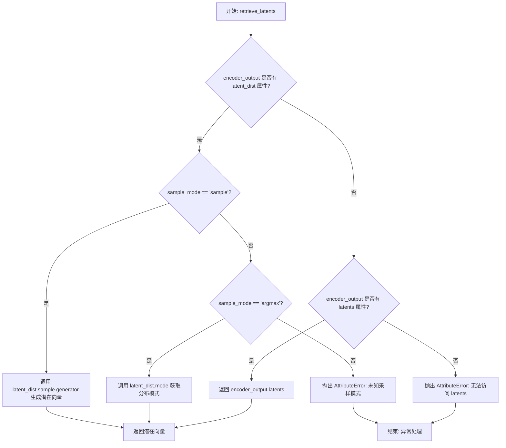

#### 带注释源码

```python
# 从 diffusers 库中复制的函数
# 来源: diffusers.pipelines.stable_diffusion.pipeline_stable_diffusion_img2img.retrieve_latents
def retrieve_latents(
    encoder_output: torch.Tensor,  # VAE 编码器的输出，包含 latent_dist 或 latents 属性
    generator: torch.Generator | None = None,  # 可选的随机数生成器，用于控制采样随机性
    sample_mode: str = "sample"  # 采样模式: "sample" 表示随机采样, "argmax" 表示取分布的模式
):
    """
    从 VAE 编码器输出中提取潜在向量。
    
    该函数支持三种提取方式:
    1. 当编码器输出包含 latent_dist 属性且 sample_mode="sample" 时，执行随机采样
    2. 当编码器输出包含 latent_dist 属性且 sample_mode="argmax" 时，取潜在分布的模式
    3. 当编码器输出包含 latents 属性时，直接返回 latents
    
    Args:
        encoder_output: VAE 编码器的输出对象
        generator: 随机数生成器，用于控制采样随机性
        sample_mode: 采样模式，"sample" 或 "argmax"
    
    Returns:
        torch.Tensor: 提取的潜在向量
    """
    
    # 情况1: 编码器输出有 latent_dist 属性，且使用 sample 模式
    if hasattr(encoder_output, "latent_dist") and sample_mode == "sample":
        # 从潜在分布中随机采样一个潜在向量
        # generator 参数用于控制随机性，确保可复现性
        return encoder_output.latent_dist.sample(generator)
    
    # 情况2: 编码器输出有 latent_dist 属性，且使用 argmax 模式
    elif hasattr(encoder_output, "latent_dist") and sample_mode == "argmax":
        # 取潜在分布的概率最大的那个潜在向量（即分布的模式）
        return encoder_output.latent_dist.mode()
    
    # 情况3: 编码器输出直接包含 latents 属性
    elif hasattr(encoder_output, "latents"):
        # 直接返回预计算的潜在向量
        return encoder_output.latents
    
    # 错误处理: 无法从编码器输出中提取潜在向量
    else:
        raise AttributeError("Could not access latents of provided encoder_output")
```


### `prepare_latents_img2img`

该函数用于为图像到图像（image-to-image）生成准备潜在向量（latents）。它接收输入图像，使用 VAE 将图像编码到潜在空间，处理批量大小扩展，并根据需要通过调度器在特定时间步添加噪声，最终返回处理后的潜在向量作为去噪过程的输入。

参数：

- `vae`：`AutoencoderKL`，用于将图像编码到潜在空间的 VAE 模型
- `scheduler`：`SchedulerMixin`，用于添加噪声的调度器
- `image`：`torch.Tensor | PIL.Image.Image | list`，输入图像，可以是张量、PIL图像或列表
- `timestep`：`torch.Tensor`，用于添加噪声的时间步
- `batch_size`：`int`，原始批次大小
- `num_images_per_prompt`：`int`，每个提示生成的图像数量
- `dtype`：`torch.dtype`，张量的数据类型
- `device`：`str | torch.device`，计算设备
- `generator`：`torch.Generator | None`，可选的随机数生成器，用于可重现的采样
- `add_noise`：`bool`，是否添加噪声，默认为 `True`

返回值：`torch.Tensor`，处理后的潜在向量，用于后续的去噪过程

#### 流程图

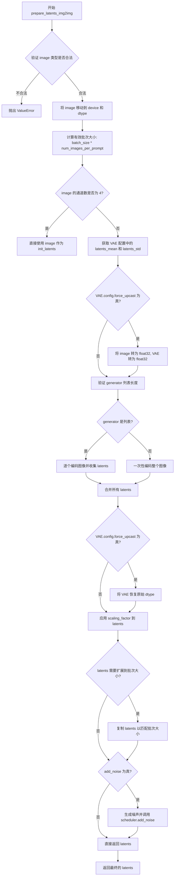

#### 带注释源码

```python
def prepare_latents_img2img(
    vae, scheduler, image, timestep, batch_size, num_images_per_prompt, dtype, device, generator=None, add_noise=True
):
    """
    为图像到图像（img2img）生成准备潜在向量。
    
    该函数执行以下步骤：
    1. 验证并转换输入图像到指定设备和数据类型
    2. 使用 VAE 将图像编码到潜在空间
    3. 处理批量大小扩展（支持 num_images_per_prompt）
    4. 可选地根据时间步向潜在向量添加噪声
    
    参数:
        vae: AutoencoderKL 模型，用于图像编码
        scheduler: 调度器，用于添加噪声
        image: 输入图像 (torch.Tensor, PIL.Image.Image, 或 list)
        timestep: 当前扩散时间步
        batch_size: 原始批次大小
        num_images_per_prompt: 每个提示生成的图像数量
        dtype: 目标数据类型
        device: 目标设备
        generator: 可选的随机生成器
        add_noise: 是否添加噪声
    
    返回:
        torch.Tensor: 处理后的潜在向量
    """
    # 步骤1: 验证输入图像类型
    if not isinstance(image, (torch.Tensor, PIL.Image.Image, list)):
        raise ValueError(f"`image` has to be of type `torch.Tensor`, `PIL.Image.Image` or list but is {type(image)}")

    # 将图像移动到指定设备和数据类型
    image = image.to(device=device, dtype=dtype)

    # 计算有效批次大小
    batch_size = batch_size * num_images_per_prompt

    # 步骤2: 检查图像是否已经是潜在向量（通道数为4）
    if image.shape[1] == 4:
        # 图像已经是潜在表示，直接使用
        init_latents = image
    else:
        # 需要使用 VAE 编码图像到潜在空间
        latents_mean = latents_std = None
        
        # 从 VAE 配置中获取潜在空间的均值和标准差（如果存在）
        if hasattr(vae.config, "latents_mean") and vae.config.latents_mean is not None:
            latents_mean = torch.tensor(vae.config.latents_mean).view(1, 4, 1, 1)
        if hasattr(vae.config, "latents_std") and vae.config.latents_std is not None:
            latents_std = torch.tensor(vae.config.latents_std).view(1, 4, 1, 1)
        
        # 为了避免 float16 溢出，在需要时强制将 VAE 转换为 float32
        if vae.config.force_upcast:
            image = image.float()
            vae.to(dtype=torch.float32)

        # 验证生成器列表长度是否与批次大小匹配
        if isinstance(generator, list) and len(generator) != batch_size:
            raise ValueError(
                f"You have passed a list of generators of length {len(generator)}, but requested an effective batch"
                f" size of {batch_size}. Make sure the batch size matches the length of the generators."
            )

        # 根据生成器类型编码图像
        elif isinstance(generator, list):
            # 处理生成器列表：需要逐个编码图像
            if image.shape[0] < batch_size and batch_size % image.shape[0] == 0:
                # 图像批次小于目标批次且可以整除，复制图像
                image = torch.cat([image] * (batch_size // image.shape[0]), dim=0)
            elif image.shape[0] < batch_size and batch_size % image.shape[0] != 0:
                raise ValueError(
                    f"Cannot duplicate `image` of batch size {image.shape[0]} to effective batch_size {batch_size} "
                )

            # 为每个图像使用对应的生成器进行编码
            init_latents = [
                retrieve_latents(vae.encode(image[i : i + 1]), generator=generator[i]) for i in range(batch_size)
            ]
            init_latents = torch.cat(init_latents, dim=0)
        else:
            # 单个生成器，一次性编码整个图像批次
            init_latents = retrieve_latents(vae.encode(image), generator=generator)

        # 恢复 VAE 的原始数据类型
        if vae.config.force_upcast:
            vae.to(dtype)

        # 转换 latents 到目标数据类型
        init_latents = init_latents.to(dtype)
        
        # 应用缩放因子（可选：使用均值和标准差进行归一化）
        if latents_mean is not None and latents_std is not None:
            latents_mean = latents_mean.to(device=device, dtype=dtype)
            latents_std = latents_std.to(device=device, dtype=dtype)
            # (latents - mean) * scaling_factor / std
            init_latents = (init_latents - latents_mean) * vae.config.scaling_factor / latents_std
        else:
            # 仅使用 scaling_factor 进行缩放
            init_latents = vae.config.scaling_factor * init_latents

    # 步骤3: 扩展 latents 以匹配有效批次大小
    if batch_size > init_latents.shape[0] and batch_size % init_latents.shape[0] == 0:
        # 扩展 latents 以匹配批次大小
        additional_image_per_prompt = batch_size // init_latents.shape[0]
        init_latents = torch.cat([init_latents] * additional_image_per_prompt, dim=0)
    elif batch_size > init_latents.shape[0] and batch_size % init_latents.shape[0] != 0:
        raise ValueError(
            f"Cannot duplicate `image` of batch size {init_latents.shape[0]} to {batch_size} text prompts."
        )
    else:
        # 批次大小匹配，保持原样
        init_latents = torch.cat([init_latents], dim=0)

    # 步骤4: 可选地添加噪声
    if add_noise:
        # 获取潜在向量的形状
        shape = init_latents.shape
        # 生成与潜在向量形状相同的随机噪声
        noise = randn_tensor(shape, generator=generator, device=device, dtype=dtype)
        # 使用调度器在指定时间步将噪声添加到潜在向量
        init_latents = scheduler.add_noise(init_latents, noise, timestep)

    latents = init_latents

    return latents
```


### `StableDiffusionXLInputStep.description`

该属性返回对 `StableDiffusionXLInputStep` 类的功能描述，说明该步骤负责处理输入数据，包括根据 `prompt_embeds` 确定 `batch_size` 和 `dtype`，以及根据 `batch_size` 和 `num_images_per_prompt` 调整输入张量形状。

参数：无（`@property` 装饰器方法，无参数）

返回值：`str`，返回描述文本，说明该输入处理步骤执行以下操作：
1. 基于 `prompt_embeds` 确定 `batch_size` 和 `dtype`
2. 基于 `batch_size`（提示词数量）和 `num_images_per_prompt` 调整输入张量形状
3. 所有输入张量预期具有 batch_size=1 或与 prompt_embeds 的 batch_size 匹配，张量将在批次维度上复制，最终 batch_size 为 batch_size * num_images_per_prompt

#### 带注释源码

```python
@property
def description(self) -> str:
    """
    返回对 StableDiffusionXLInputStep 处理步骤的描述说明。
    
    该属性说明了该步骤的核心功能：
    1. 根据 prompt_embeds 确定批处理大小(batch_size)和数据类型(dtype)
    2. 根据批处理大小和每提示词生成的图像数量(num_images_per_prompt)调整输入张量形状
    
    输入张量的预期格式：
    - 所有输入张量应具有 batch_size=1 或与 prompt_embeds 的 batch_size 相匹配
    - 张量将在批次维度上复制，以获得最终的 batch_size = batch_size * num_images_per_prompt
    
    Returns:
        str: 描述该输入处理步骤功能的字符串
    """
    return (
        "Input processing step that:\n"
        "  1. Determines `batch_size` and `dtype` based on `prompt_embeds`\n"
        "  2. Adjusts input tensor shapes based on `batch_size` (number of prompts) and `num_images_per_prompt`\n\n"
        "All input tensors are expected to have either batch_size=1 or match the batch_size\n"
        "of prompt_embeds. The tensors will be duplicated across the batch dimension to\n"
        "have a final batch_size of batch_size * num_images_per_prompt."
    )
```


### `StableDiffusionXLInputStep.inputs`

该属性定义了 Stable Diffusion XL 输入处理步骤所需的所有输入参数，包括文本嵌入、负向文本嵌入、池化文本嵌入以及 IP-Adapter 的图像嵌入等。

参数：

- `num_images_per_prompt`：`int`，每个提示词生成的图像数量，默认为 1
- `prompt_embeds`：`torch.Tensor`（必需），预先生成的文本嵌入，可由 text_encoder 步骤生成
- `negative_prompt_embeds`：`torch.Tensor`，预先生成的负向文本嵌入，可由 text_encoder 步骤生成
- `pooled_prompt_embeds`：`torch.Tensor`（必需），预先生成的池化文本嵌入，可由 text_encoder 步骤生成
- `negative_pooled_prompt_embeds`：`torch.Tensor`，预先生成的负向池化文本嵌入，可由 text_encoder 步骤生成
- `ip_adapter_embeds`：`list[torch.Tensor]`，预先生成的 IP-Adapter 图像嵌入，可由 ip_adapter 步骤生成
- `negative_ip_adapter_embeds`：`list[torch.Tensor]`，预先生成的 IP-Adapter 负向图像嵌入，可由 ip_adapter 步骤生成

返回值：`list[InputParam]`，返回输入参数列表，包含了所有需要配置的输入参数及其元数据信息

#### 流程图

```mermaid
flowchart TD
    A[inputs 属性被调用] --> B{返回输入参数列表}
    
    B --> C[num_images_per_prompt: 默认值1]
    B --> D[prompt_embeds: 必需, torch.Tensor]
    B --> E[negative_prompt_embeds: 可选, torch.Tensor]
    B --> F[pooled_prompt_embeds: 必需, torch.Tensor]
    B --> G[negative_pooled_prompt_embeds: 可选, torch.Tensor]
    B --> H[ip_adapter_embeds: 可选, list[torch.Tensor]]
    B --> I[negative_ip_adapter_embeds: 可选, list[torch.Tensor]]
    
    style A fill:#f9f,stroke:#333
    style B fill:#ff9,stroke:#333
```

#### 带注释源码

```python
@property
def inputs(self) -> list[InputParam]:
    """
    定义 Stable Diffusion XL 输入处理步骤的输入参数列表。
    这些参数用于配置文本嵌入、负向嵌入、池化嵌入以及 IP-Adapter 嵌入等输入数据。
    """
    return [
        # 每个提示词生成的图像数量，用于批量处理
        InputParam("num_images_per_prompt", default=1),
        
        # 预先生成的文本嵌入，描述要生成的图像内容（必需）
        InputParam(
            "prompt_embeds",
            required=True,
            type_hint=torch.Tensor,
            description="Pre-generated text embeddings. Can be generated from text_encoder step.",
        ),
        
        # 预先生成的负向文本嵌入，用于引导模型避免生成不希望的内容
        InputParam(
            "negative_prompt_embeds",
            type_hint=torch.Tensor,
            description="Pre-generated negative text embeddings. Can be generated from text_encoder step.",
        ),
        
        # 预先生成的池化文本嵌入，包含更高级的语义信息（必需）
        InputParam(
            "pooled_prompt_embeds",
            required=True,
            type_hint=torch.Tensor,
            description="Pre-generated pooled text embeddings. Can be generated from text_encoder step.",
        ),
        
        # 预先生成的负向池化文本嵌入
        InputParam(
            "negative_pooled_prompt_embeds",
            description="Pre-generated negative pooled text embeddings. Can be generated from text_encoder step.",
        ),
        
        # IP-Adapter 的图像嵌入，用于图像提示的额外控制
        InputParam(
            "ip_adapter_embeds",
            type_hint=list[torch.Tensor],
            description="Pre-generated image embeddings for IP-Adapter. Can be generated from ip_adapter step.",
        ),
        
        # IP-Adapter 的负向图像嵌入
        InputParam(
            "negative_ip_adapter_embeds",
            type_hint=list[torch.Tensor],
            description="Pre-generated negative image embeddings for IP-Adapter. Can be generated from ip_adapter step.",
        ),
    ]
```


### `StableDiffusionXLInputStep.intermediate_outputs`

该属性方法定义了 `StableDiffusionXLInputStep` 类的中间输出参数列表，包含了批处理大小、数据类型、以及经过处理的各种文本嵌入和IP-Adapter嵌入，这些输出将传递给后续的去噪步骤。

参数： （该方法无显式参数，`self` 为隐式参数）

-  `self`：`StableDiffusionXLInputStep` 实例，隐式参数，表示当前类的实例

返回值：`list[OutputParam]` ，返回包含多个 `OutputParam` 对象的列表，每个对象描述一个中间输出参数的名称、类型提示和描述信息。

#### 流程图

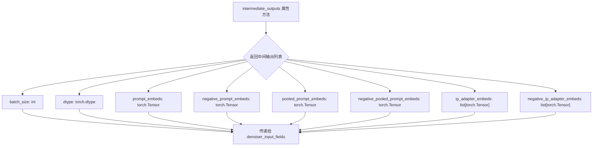

#### 带注释源码

```python
@property
def intermediate_outputs(self) -> list[str]:
    """
    定义该处理步骤的中间输出参数列表。
    这些输出将作为 denoiser_input_fields 传递给后续的去噪步骤，
    用于指导图像生成过程。
    
    Returns:
        list[str]: 包含多个 OutputParam 对象的列表，
                   每个对象描述一个中间输出参数的元数据。
    """
    return [
        # 1. batch_size: 最终的批次大小 = 原始 batch_size * num_images_per_prompt
        OutputParam(
            "batch_size",
            type_hint=int,
            description="Number of prompts, the final batch size of model inputs should be batch_size * num_images_per_prompt",
        ),
        # 2. dtype: 模型张量的数据类型，由 prompt_embeds 的数据类型决定
        OutputParam(
            "dtype",
            type_hint=torch.dtype,
            description="Data type of model tensor inputs (determined by `prompt_embeds`)",
        ),
        # 3. prompt_embeds: 用于指导图像生成的正向文本嵌入
        OutputParam(
            "prompt_embeds",
            type_hint=torch.Tensor,
            kwargs_type="denoiser_input_fields",  # 标记为去噪器输入字段
            description="text embeddings used to guide the image generation",
        ),
        # 4. negative_prompt_embeds: 用于指导图像生成的负向文本嵌入
        OutputParam(
            "negative_prompt_embeds",
            type_hint=torch.Tensor,
            kwargs_type="denoiser_input_fields",
            description="negative text embeddings used to guide the image generation",
        ),
        # 5. pooled_prompt_embeds: 池化后的正向文本嵌入
        OutputParam(
            "pooled_prompt_embeds",
            type_hint=torch.Tensor,
            kwargs_type="denoiser_input_fields",
            description="pooled text embeddings used to guide the image generation",
        ),
        # 6. negative_pooled_prompt_embeds: 池化后的负向文本嵌入
        OutputParam(
            "negative_pooled_prompt_embeds",
            type_hint=torch.Tensor,
            kwargs_type="denoiser_input_fields",
            description="negative pooled text embeddings used to guide the image generation",
        ),
        # 7. ip_adapter_embeds: IP-Adapter 的图像嵌入列表
        OutputParam(
            "ip_adapter_embeds",
            type_hint=list[torch.Tensor],
            kwargs_type="denoiser_input_fields",
            description="image embeddings for IP-Adapter",
        ),
        # 8. negative_ip_adapter_embeds: IP-Adapter 的负向图像嵌入列表
        OutputParam(
            "negative_ip_adapter_embeds",
            type_hint=list[torch.Tensor],
            kwargs_type="denoiser_input_fields",
            description="negative image embeddings for IP-Adapter",
        ),
    ]
```


### `StableDiffusionXLInputStep.check_inputs`

该方法用于验证 Stable Diffusion XL 输入步骤中的各类嵌入向量（prompt_embeds、pooled_prompt_embeds、ip_adapter_embeds 等）的有效性和一致性，确保它们在形状、类型和必需性方面满足模型输入要求。如果验证失败，将抛出详细的 ValueError 异常说明具体问题。

参数：

-  `self`：类的实例本身，用于访问类属性和方法。
-  `components`：`StableDiffusionXLModularPipeline` 类型，管道组件容器，包含 VAE、UNet、文本编码器等模型组件，但在当前验证方法中未直接使用。
-  `block_state`：`PipelineState` 或类似的状态对象，包含当前步骤的输入状态，如 prompt_embeds、negative_prompt_embeds、pooled_prompt_embeds、ip_adapter_embeds 等嵌入向量。

返回值：无（`None`），该方法仅进行输入验证，不返回任何值。如果验证失败，将抛出 `ValueError` 异常。

#### 流程图

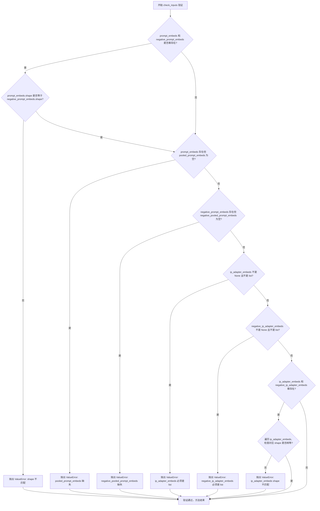

#### 带注释源码

```python
def check_inputs(self, components, block_state):
    """
    验证输入的嵌入向量是否符合要求。
    
    检查项包括：
    1. prompt_embeds 和 negative_prompt_embeds 的 shape 一致性
    2. prompt_embeds 存在时，pooled_prompt_embeds 必须存在
    3. negative_prompt_embeds 存在时，negative_pooled_prompt_embeds 必须存在
    4. ip_adapter_embeds 和 negative_ip_adapter_embeds 必须为 list 类型
    5. ip_adapter_embeds 和 negative_ip_adapter_embeds 的 shape 一致性
    
    参数:
        components: 管道组件对象
        block_state: 包含当前步骤输入状态的对象
    
    异常:
        ValueError: 当任一验证条件不满足时抛出
    """
    # 验证 prompt_embeds 和 negative_prompt_embeds 的 shape 是否一致
    if block_state.prompt_embeds is not None and block_state.negative_prompt_embeds is not None:
        if block_state.prompt_embeds.shape != block_state.negative_prompt_embeds.shape:
            raise ValueError(
                "`prompt_embeds` and `negative_prompt_embeds` must have the same shape when passed directly, but"
                f" got: `prompt_embeds` {block_state.prompt_embeds.shape} != `negative_prompt_embeds`"
                f" {block_state.negative_prompt_embeds.shape}."
            )

    # 如果提供了 prompt_embeds，必须同时提供 pooled_prompt_embeds
    if block_state.prompt_embeds is not None and block_state.pooled_prompt_embeds is None:
        raise ValueError(
            "If `prompt_embeds` are provided, `pooled_prompt_embeds` also have to be passed. Make sure to generate `pooled_prompt_embeds` from the same text encoder that was used to generate `prompt_embeds`."
        )

    # 如果提供了 negative_prompt_embeds，必须同时提供 negative_pooled_prompt_embeds
    if block_state.negative_prompt_embeds is not None and block_state.negative_pooled_prompt_embeds is None:
        raise ValueError(
            "If `negative_prompt_embeds` are provided, `negative_pooled_prompt_embeds` also have to be passed. Make sure to generate `negative_pooled_prompt_embeds` from the same text encoder that was used to generate `negative_prompt_embeds`."
        )

    # 验证 ip_adapter_embeds 是否为 list 类型
    if block_state.ip_adapter_embeds is not None and not isinstance(block_state.ip_adapter_embeds, list):
        raise ValueError("`ip_adapter_embeds` must be a list")

    # 验证 negative_ip_adapter_embeds 是否为 list 类型
    if block_state.negative_ip_adapter_embeds is not None and not isinstance(
        block_state.negative_ip_adapter_embeds, list
    ):
        raise ValueError("`negative_ip_adapter_embeds` must be a list")

    # 验证 ip_adapter_embeds 和 negative_ip_adapter_embeds 的 shape 是否一致
    if block_state.ip_adapter_embeds is not None and block_state.negative_ip_adapter_embeds is not None:
        for i, ip_adapter_embed in enumerate(block_state.ip_adapter_embeds):
            if ip_adapter_embed.shape != block_state.negative_ip_adapter_embeds[i].shape:
                raise ValueError(
                    "`ip_adapter_embeds` and `negative_ip_adapter_embeds` must have the same shape when passed directly, but"
                    f" got: `ip_adapter_embeds` {ip_adapter_embed.shape} != `negative_ip_adapter_embeds`"
                    f" {block_state.negative_ip_adapter_embeds[i].shape}."
                )
```


### `StableDiffusionXLInputStep.__call__`

该方法是Stable Diffusion XL模块化管道中的输入处理步骤，负责：
1. 根据`prompt_embeds`确定`batch_size`和`dtype`
2. 根据`batch_size`（提示词数量）和`num_images_per_prompt`调整输入张量形状，将张量在batch维度上复制以得到最终的`batch_size * num_images_per_prompt`大小的batch

参数：

-  `self`：`StableDiffusionXLInputStep` 实例本身
-  `components`：`StableDiffusionXLModularPipeline`，管道组件对象，包含UNet、VAE、scheduler等模型组件
-  `state`：`PipelineState`，管道状态对象，用于在各个步骤之间传递数据

返回值：`PipelineState`，实际上返回的是一个元组`(components, state)`，其中components保持不变，state被更新包含处理后的embeddings

#### 流程图

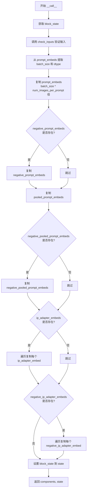

#### 带注释源码

```python
@torch.no_grad()
def __call__(self, components: StableDiffusionXLModularPipeline, state: PipelineState) -> PipelineState:
    # 获取当前block的状态对象，包含所有输入的embeddings和参数
    block_state = self.get_block_state(state)
    
    # 验证输入的有效性：检查embeddings的形状兼容性
    self.check_inputs(components, block_state)

    # 从prompt_embeds的形状中提取batch_size（提示词数量）和dtype（数据类型）
    block_state.batch_size = block_state.prompt_embeds.shape[0]
    block_state.dtype = block_state.prompt_embeds.dtype

    # 获取文本embeddings的序列长度
    _, seq_len, _ = block_state.prompt_embeds.shape
    
    # 复制prompt_embeddings以匹配num_images_per_prompt
    # 使用MPS友好的方法：先在序列维度重复，再reshape
    block_state.prompt_embeds = block_state.prompt_embeds.repeat(1, block_state.num_images_per_prompt, 1)
    block_state.prompt_embeds = block_state.prompt_embeds.view(
        block_state.batch_size * block_state.num_images_per_prompt, seq_len, -1
    )

    # 如果提供了negative_prompt_embeds，同样进行复制处理
    if block_state.negative_prompt_embeds is not None:
        _, seq_len, _ = block_state.negative_prompt_embeds.shape
        block_state.negative_prompt_embeds = block_state.negative_prompt_embeds.repeat(
            1, block_state.num_images_per_prompt, 1
        )
        block_state.negative_prompt_embeds = block_state.negative_prompt_embeds.view(
            block_state.batch_size * block_state.num_images_per_prompt, seq_len, -1
        )

    # 复制pooled_prompt_embeds（无需序列维度）
    block_state.pooled_prompt_embeds = block_state.pooled_prompt_embeds.repeat(
        1, block_state.num_images_per_prompt, 1
    )
    block_state.pooled_prompt_embeds = block_state.pooled_prompt_embeds.view(
        block_state.batch_size * block_state.num_images_per_prompt, -1
    )

    # 如果提供了negative_pooled_prompt_embeds，同样进行复制处理
    if block_state.negative_pooled_prompt_embeds is not None:
        block_state.negative_pooled_prompt_embeds = block_state.negative_pooled_prompt_embeds.repeat(
            1, block_state.num_images_per_prompt, 1
        )
        block_state.negative_pooled_prompt_embeds = block_state.negative_pooled_prompt_embeds.view(
            block_state.batch_size * block_state.num_images_per_prompt, -1
        )

    # 处理IP-Adapter embeddings（每个embed需要单独复制）
    if block_state.ip_adapter_embeds is not None:
        for i, ip_adapter_embed in enumerate(block_state.ip_adapter_embeds):
            block_state.ip_adapter_embeds[i] = torch.cat(
                [ip_adapter_embed] * block_state.num_images_per_prompt, dim=0
            )

    # 处理negative IP-Adapter embeddings
    if block_state.negative_ip_adapter_embeds is not None:
        for i, negative_ip_adapter_embed in enumerate(block_state.negative_ip_adapter_embeds):
            block_state.negative_ip_adapter_embeds[i] = torch.cat(
                [negative_ip_adapter_embed] * block_state.num_images_per_prompt, dim=0
            )

    # 将更新后的block_state写回state
    self.set_block_state(state, block_state)

    # 返回components和更新后的state
    return components, state
```


### `StableDiffusionXLImg2ImgSetTimestepsStep.expected_components`

该属性定义了 `StableDiffusionXLImg2ImgSetTimestepsStep` 步骤所需的核心依赖组件，返回一个包含调度器（scheduler）的组件规范列表。该步骤用于设置图像到图像（img2img）生成的时间步，并计算初始噪声级别（latent_timestep）。

参数： 无（这是一个属性而不是方法）

返回值：`list[ComponentSpec]`，返回该步骤所需的组件规范列表

#### 流程图

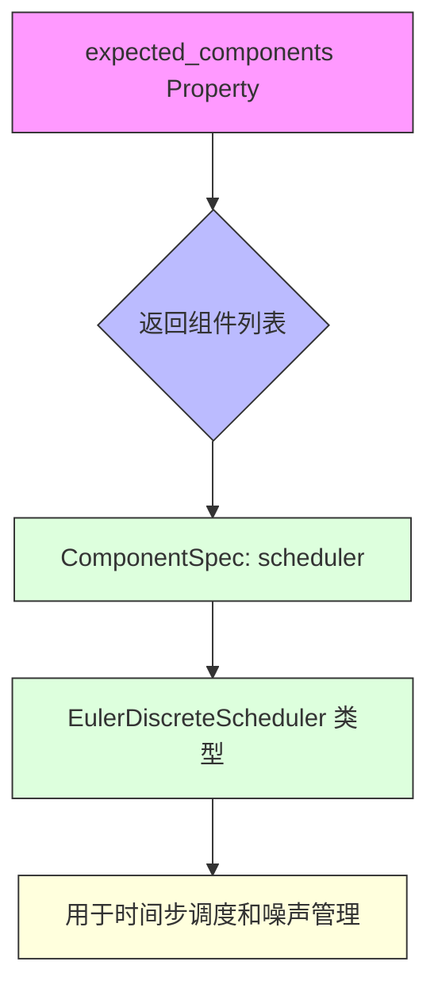

#### 带注释源码

```python
@property
def expected_components(self) -> list[ComponentSpec]:
    """
    定义该管道步骤所需的核心组件。
    
    该属性返回一个组件规范列表，指定了该步骤运行时必须存在的组件。
    在 StableDiffusionXLImg2ImgSetTimestepsStep 中，只需要一个调度器组件。
    
    返回值:
        list[ComponentSpec]: 包含所需组件规范的列表
            - scheduler: EulerDiscreteScheduler 类型的时间步调度器
              用于管理去噪过程中的时间步序列和噪声添加逻辑
    
    使用场景:
        此属性在管道初始化时由模块化管道系统使用，以验证所有必要的
        组件都已正确配置和加载。它确保在执行图像到图像推理之前
        调度器已准备好进行时间步设置。
    
    示例:
        >>> step = StableDiffusionXLImg2ImgSetTimestepsStep()
        >>> components = step.expected_components
        >>> print(components)
        [ComponentSpec(name='scheduler', component_class=<class '...EulerDiscreteScheduler'>)]
    """
    return [
        ComponentSpec("scheduler", EulerDiscreteScheduler),
    ]
```

#### 详细说明

| 项目 | 详情 |
|------|------|
| **属性类型** | `@property` 装饰器声明的属性方法 |
| **所属类** | `StableDiffusionXLImg2ImgSetTimestepsStep` |
| **返回类型** | `list[ComponentSpec]` |
| **组件名称** | `scheduler` |
| **组件类** | `EulerDiscreteScheduler` |
| **作用描述** | 提供时间步调度功能，用于图像到图像生成过程中的噪声调度和时间步管理 |

#### 组件规范详解

`ComponentSpec("scheduler", EulerDiscreteScheduler)` 表示：
- **组件名称（name）**: `scheduler` - 在管道中访问该组件时使用的标识符
- **组件类（component_class）**: `EulerDiscreteScheduler` - 欧拉离散调度器，用于计算扩散模型的去噪时间步序列

这个调度器在该步骤的 `__call__` 方法中被使用，通过 `retrieve_timesteps` 函数设置时间步，并通过 `get_timesteps` 方法根据 `strength` 参数计算初始噪声级别（latent_timestep）。


### `StableDiffusionXLImg2ImgSetTimestepsStep`

该类是 Stable Diffusion XL 图像到图像（img2img）流水线中的一个模块，负责设置调度器的时间步并确定图像到图像/修复生成的初始噪声水平（latent_timestep）。latent_timestep 是根据 `strength` 参数计算的，较高的强度意味着从更具噪声的输入图像版本开始。

参数：
- `components`：`StableDiffusionXLModularPipeline`，包含流水线组件的对象
- `state`：`PipelineState`，包含当前流水线状态的对象

返回值：`Tuple[StableDiffusionXLModularPipeline, PipelineState]`，返回更新后的组件和状态对象

#### 流程图

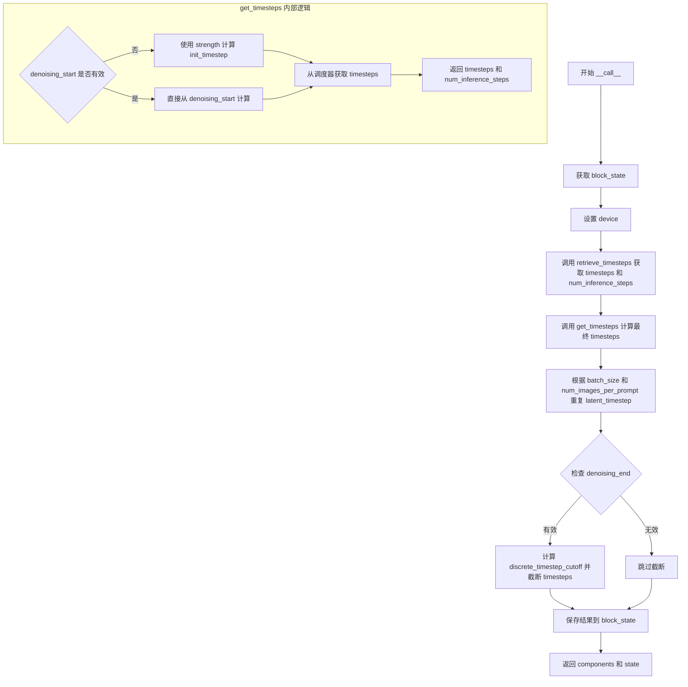

#### 带注释源码

```python
@torch.no_grad()
def __call__(self, components: StableDiffusionXLModularPipeline, state: PipelineState) -> PipelineState:
    # 获取当前块的状态
    block_state = self.get_block_state(state)

    # 设置执行设备
    block_state.device = components._execution_device

    # 第一步：调用 retrieve_timesteps 获取基础的时间步调度
    # 支持自定义 timesteps 或 sigmas，或使用默认的 num_inference_steps
    block_state.timesteps, block_state.num_inference_steps = retrieve_timesteps(
        components.scheduler,
        block_state.num_inference_steps,
        block_state.device,
        block_state.timesteps,
        block_state.sigmas,
    )

    # 定义一个辅助函数用于验证 denoising_value 是否有效
    # denoising_value 必须是 0 到 1 之间的浮点数
    def denoising_value_valid(dnv):
        return isinstance(dnv, float) and 0 < dnv < 1

    # 第二步：调用 get_timesteps 根据 strength 计算最终的时间步
    # 这会根据图像到图像的强度参数调整起始时间步
    block_state.timesteps, block_state.num_inference_steps = self.get_timesteps(
        components,
        block_state.num_inference_steps,
        block_state.strength,
        block_state.device,
        denoising_start=block_state.denoising_start
        if denoising_value_valid(block_state.denoising_start)
        else None,
    )
    
    # 第三步：创建 latent_timestep，这是图像到图像生成的初始噪声水平
    # 将单个时间步重复到整个批次大小
    block_state.latent_timestep = block_state.timesteps[:1].repeat(
        block_state.batch_size * block_state.num_images_per_prompt
    )

    # 第四步：处理 denoising_end（可选）
    # 如果指定了 denoising_end，则根据其值截断时间步
    if (
        block_state.denoising_end is not None
        and isinstance(block_state.denoising_end, float)
        and block_state.denoising_end > 0
        and block_state.denoising_end < 1
    ):
        # 计算离散时间步截止点
        block_state.discrete_timestep_cutoff = int(
            round(
                components.scheduler.config.num_train_timesteps
                - (block_state.denoising_end * components.scheduler.config.num_train_timesteps)
            )
        )
        # 过滤出大于等于 cutoff 的时间步
        block_state.num_inference_steps = len(
            list(filter(lambda ts: ts >= block_state.discrete_timestep_cutoff, block_state.timesteps))
        )
        # 截断时间步数组
        block_state.timesteps = block_state.timesteps[: block_state.num_inference_steps]

    # 保存更新后的块状态
    self.set_block_state(state, block_state)

    return components, state


@staticmethod
def get_timesteps(components, num_inference_steps, strength, device, denoising_start=None):
    """
    获取图像到图像生成的时间步。
    
    根据 strength 参数或 denoising_start 确定起始时间步。
    strength 表示对输入图像的噪声程度，值越大表示添加的噪声越多。
    """
    # 情况1：未指定 denoising_start，使用 strength 计算
    if denoising_start is None:
        # 根据 strength 计算初始时间步数量
        init_timestep = min(int(num_inference_steps * strength), num_inference_steps)
        # 计算起始索引，确保不为负
        t_start = max(num_inference_steps - init_timestep, 0)

        # 从调度器获取调整后的时间步
        timesteps = components.scheduler.timesteps[t_start * components.scheduler.order :]
        # 设置调度器的起始索引（如果支持）
        if hasattr(components.scheduler, "set_begin_index"):
            components.scheduler.set_begin_index(t_start * components.scheduler.order)

        return timesteps, num_inference_steps - t_start

    # 情况2：直接指定 denoising_start，忽略 strength
    else:
        # 将 denoising_start 转换为离散时间步截止点
        discrete_timestep_cutoff = int(
            round(
                components.scheduler.config.num_train_timesteps
                - (denoising_start * components.scheduler.config.num_train_timesteps)
            )
        )

        # 计算小于截止点的时间步数量
        num_inference_steps = (components.scheduler.timesteps < discrete_timestep_cutoff).sum().item()
        
        # 对于二阶调度器，如果步数为偶数，可能需要+1
        # 这是为了确保去噪过程在二阶导数步骤之后结束
        if components.scheduler.order == 2 and num_inference_steps % 2 == 0:
            num_inference_steps = num_inference_steps + 1

        # 从时间步数组末尾切片获取最终时间步
        t_start = len(components.scheduler.timesteps) - num_inference_steps
        timesteps = components.scheduler.timesteps[t_start:]
        
        # 设置调度器的起始索引
        if hasattr(components.scheduler, "set_begin_index"):
            components.scheduler.set_begin_index(t_start)
            
        return timesteps, num_inference_steps
```


### `StableDiffusionXLImg2ImgSetTimestepsStep.inputs`

该属性定义了 Stable Diffusion XL 图像到图像（Img2Img）流水线中设置时间步长步骤的输入参数列表，包括推理步数、时间步、噪声强度、 去噪起始和结束点等关键配置参数。

参数：

-  `self`：隐式参数，代表 `StableDiffusionXLImg2ImgSetTimestepsStep` 类的实例本身

返回值：`list[InputParam]`，`InputParam` 列表，包含该步骤需要的所有输入参数定义

#### 流程图

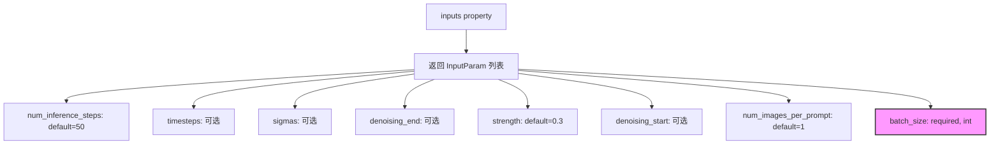

#### 带注释源码

```python
@property
def inputs(self) -> list[InputParam]:
    """
    定义图像到图像管线中设置时间步的输入参数。
    返回包含所有必需和可选输入参数的列表。
    """
    return [
        # 推理步骤数，默认为50
        InputParam("num_inference_steps", default=50),
        
        # 自定义时间步列表，用于覆盖调度器的默认时间步策略
        InputParam("timesteps"),
        
        # 自定义sigma列表，用于覆盖调度器的默认sigma策略
        InputParam("sigmas"),
        
        # 去噪结束点，可以是浮点数（0-1之间的比例）或None
        InputParam("denoising_end"),
        
        # 强度参数，控制对输入图像添加的噪声量
        # 值越高表示从更嘈杂的输入图像版本开始
        InputParam("strength", default=0.3),
        
        # 去噪起始点，指定从哪个时间步开始去噪
        InputParam("denoising_start"),
        
        # 每个提示生成的图像数量
        # YiYi TODO: do we need num_images_per_prompt here?
        InputParam("num_images_per_prompt", default=1),
        
        # 批大小，模型输入的最终批大小应为 batch_size * num_images_per_prompt
        InputParam(
            "batch_size",
            required=True,
            type_hint=int,
            description="Number of prompts, the final batch size of model inputs should be batch_size * num_images_per_prompt",
        ),
    ]
```


### `StableDiffusionXLImg2ImgSetTimestepsStep.intermediate_outputs`

该属性定义了图像到图像（img2img）流程中设置时间步长步骤的中间输出参数，包含用于推理的时间步、推理步数以及用于图像到图像生成的初始噪声水平的时间步。

参数： (无 - 这是一个属性而非方法)

返回值：`list[OutputParam]` - 返回三个 `OutputParam` 对象组成的列表，包含以下中间输出：

- `timesteps`：`torch.Tensor` - 用于推理的时间步
- `num_inference_steps`：`int` - 推理时执行的去噪步骤数
- `latent_timestep`：`torch.Tensor` - 表示图像到图像生成的初始噪声水平的时间步

#### 流程图

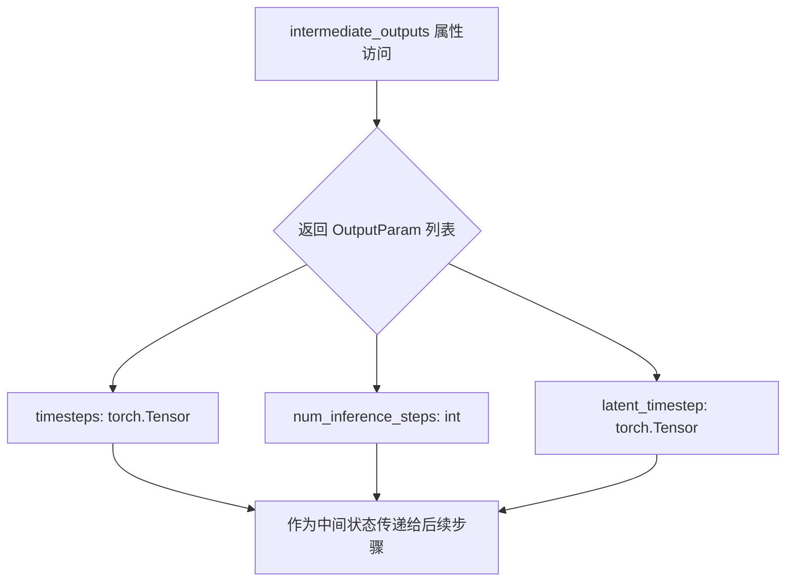

#### 带注释源码

```python
@property
def intermediate_outputs(self) -> list[str]:
    """
    定义该步骤输出的中间参数列表。
    这些参数将被传递给管道中的后续步骤使用。
    
    Returns:
        list: 包含三个 OutputParam 对象的列表，分别对应：
              - timesteps: 推理过程中使用的时间步序列
              - num_inference_steps: 去噪迭代的总步数  
              - latent_timestep: 图像到图像生成的初始噪声时间步
    """
    return [
        OutputParam(
            "timesteps", 
            type_hint=torch.Tensor, 
            description="The timesteps to use for inference"
        ),
        OutputParam(
            "num_inference_steps",
            type_hint=int,
            description="The number of denoising steps to perform at inference time"
        ),
        OutputParam(
            "latent_timestep",
            type_hint=torch.Tensor,
            description="The timestep that represents the initial noise level for image-to-image generation"
        ),
    ]
```


### `StableDiffusionXLImg2ImgSetTimestepsStep.get_timesteps`

该方法是一个静态方法，用于根据 `strength` 参数或 `denoising_start` 参数计算并返回用于图像到图像（img2img）推理的时间步（timesteps）。它根据 `strength` 计算初始噪声水平，或者当直接指定 `denoising_start` 时忽略 `strength`，并处理二阶调度器的边界情况。

参数：

- `components`：包含 `scheduler`（EulerDiscreteScheduler）等组件的对象，用于访问调度器的配置和时间步信息
- `num_inference_steps`：`int`，推理时使用的去噪步数
- `strength`：`float`，表示图像到图像转换的噪声强度（0-1之间），用于确定从输入图像开始去噪的起点
- `device`：`torch.device`，设备对象，用于设置调度器的起始索引
- `denoising_start`：`float | None`，可选参数，直接指定去噪开始的时刻（0-1之间），如果提供则忽略 `strength` 参数

返回值：`tuple[torch.Tensor, int]`，返回两个元素：第一个是时间步张量（timesteps），表示推理过程中使用的时间步序列；第二个是调整后的推理步数（num_inference_steps）

#### 流程图

```mermaid
flowchart TD
    A[开始] --> B{denoising_start is None?}
    B -->|Yes| C[计算 init_timestep = min<br/>num_inference_steps * strength]
    C --> D[计算 t_start = max<br/>num_inference_steps - init_timestep, 0]
    D --> E[从 scheduler.timesteps 切片获取 timesteps<br/>t_start * order 之后的数据]
    E --> F{scheduler has<br/>set_begin_index?}
    F -->|Yes| G[调用 scheduler.set_begin_index<br/>t_start * order]
    F -->|No| H[跳过]
    G --> I[返回 timesteps 和<br/>num_inference_steps - t_start]
    H --> I
    B -->|No| J[计算 discrete_timestep_cutoff<br/>基于 denoising_start]
    J --> K[计算 num_inference_steps<br/>timesteps < cutoff 的数量]
    K --> L{scheduler.order == 2<br/>且 num_inference_steps 是偶数?}
    L -->|Yes| M[num_inference_steps += 1<br/>避免在二阶导数中间截断]
    L -->|No| N[跳过]
    M --> O[计算 t_start = len(timesteps)<br/>- num_inference_steps]
    O --> P[从末尾切片 timesteps]
    P --> Q{scheduler has<br/>set_begin_index?}
    Q -->|Yes| R[调用 scheduler.set_begin_index t_start]
    Q -->|No| S[跳过]
    R --> T[返回 timesteps 和 num_inference_steps]
    S --> T
```

#### 带注释源码

```python
@staticmethod
# Copied from diffusers.pipelines.stable_diffusion_xl.pipeline_stable_diffusion_xl_img2img.StableDiffusionXLImg2ImgPipeline.get_timesteps with self->components
def get_timesteps(components, num_inference_steps, strength, device, denoising_start=None):
    """
    根据 strength 或 denoising_start 计算用于图像到图像推理的时间步。
    
    参数:
        components: 包含 scheduler 等组件的对象
        num_inference_steps: 推理步数
        strength: 噪声强度 (0-1)
        device: 设备
        denoising_start: 可选，直接指定去噪开始时刻
        
    返回:
        (timesteps, num_inference_steps) 元组
    """
    # 如果未指定 denoising_start，则使用 strength 计算初始时间步
    if denoising_start is None:
        # 根据 strength 计算初始噪声步数
        # strength 越高，从越 noisy 的图像开始
        init_timestep = min(int(num_inference_steps * strength), num_inference_steps)
        # 计算起始索引，确保不为负数
        t_start = max(num_inference_steps - init_timestep, 0)

        # 从调度器的时间步序列中获取有效的时间步
        # 乘以 order 是因为某些调度器会重复时间步
        timesteps = components.scheduler.timesteps[t_start * components.scheduler.order :]
        
        # 如果调度器支持设置起始索引，则设置它
        if hasattr(components.scheduler, "set_begin_index"):
            components.scheduler.set_begin_index(t_start * components.scheduler.order)

        # 返回调整后的时间步和推理步数
        return timesteps, num_inference_steps - t_start

    else:
        # 当直接指定 denoising_start 时，strength 被忽略
        # denoising_start 直接决定从哪里开始去噪
        # 将 denoising_start (0-1) 转换为对应的离散时间步索引
        discrete_timestep_cutoff = int(
            round(
                components.scheduler.config.num_train_timesteps
                - (denoising_start * components.scheduler.config.num_train_timesteps)
            )
        )

        # 计算小于 cutoff 的时间步数量
        num_inference_steps = (components.scheduler.timesteps < discrete_timestep_cutoff).sum().item()
        
        # 二阶调度器的特殊处理
        # 如果 num_inference_steps 是偶数，需要加 1
        # 因为每个时间步（除最高外）都会被复制
        # 偶数意味着我们在去噪步骤的中间截断（1阶和2阶导数之间）
        # 这会导致错误结果，加 1 确保总是在 2 阶导数步骤之后结束
        if components.scheduler.order == 2 and num_inference_steps % 2 == 0:
            num_inference_steps = num_inference_steps + 1

        # 因为 t_n+1 >= t_n，从末尾开始切片时间步
        t_start = len(components.scheduler.timesteps) - num_inference_steps
        timesteps = components.scheduler.timesteps[t_start:]
        
        # 设置调度器起始索引
        if hasattr(components.scheduler, "set_begin_index"):
            components.scheduler.set_begin_index(t_start)
            
        return timesteps, num_inference_steps
```


### `StableDiffusionXLImg2ImgSetTimestepsStep.__call__`

该方法是 Stable Diffusion XL 图像到图像（img2img）管道的关键步骤，负责设置调度器的时间步，并根据 `strength` 参数确定图像到图像生成的初始噪声级别（latent_timestep）。它通过 retrieve_timesteps 获取推理时间步，然后利用 get_timesteps 方法根据去噪强度调整时间步序列，最后将处理后的时间步和潜在时间步存储到管道状态中供后续去噪过程使用。

参数：

- `components`：`StableDiffusionXLModularPipeline`，包含管道组件的核心对象，提供对调度器（scheduler）等组件的访问
- `state`：`PipelineState`，管道状态对象，用于在各个步骤之间传递中间数据（block_state）

返回值：`tuple[StableDiffusionXLModularPipeline, PipelineState]`，返回更新后的组件对象和管道状态

#### 流程图

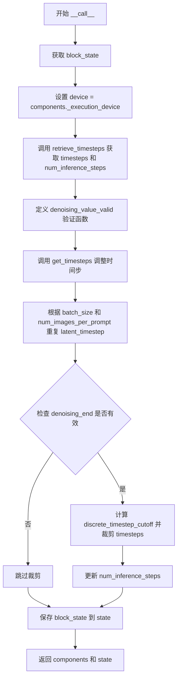

#### 带注释源码

```python
@torch.no_grad()
def __call__(self, components: StableDiffusionXLModularPipeline, state: PipelineState) -> PipelineState:
    """
    执行时间步设置和初始噪声级别确定的核心方法
    
    参数:
        components: 管道组件对象，包含 scheduler 等组件
        state: 管道状态对象
        
    返回:
        更新后的 PipelineState
    """
    # 1. 从管道状态中获取当前步骤的 block_state（中间数据存储单元）
    block_state = self.get_block_state(state)

    # 2. 设置执行设备
    block_state.device = components._execution_device

    # 3. 使用辅助函数 retrieve_timesteps 获取基础时间步序列
    #    该函数调用 scheduler.set_timesteps() 并返回时间步张量
    block_state.timesteps, block_state.num_inference_steps = retrieve_timesteps(
        components.scheduler,          # 调度器实例（EulerDiscreteScheduler）
        block_state.num_inference_steps,  # 推理步数（默认50）
        block_state.device,              # 计算设备
        block_state.timesteps,           # 可选：自定义时间步
        block_state.sigmas,              # 可选：自定义 sigmas
    )

    # 4. 定义验证函数：检查 denoising_start/end 是否为有效的 0-1 之间的浮点数
    def denoising_value_valid(dnv):
        return isinstance(dnv, float) and 0 < dnv < 1

    # 5. 调用 get_timesteps 根据 strength 参数调整时间步
    #    strength 控制图像到图像转换中保留原图多少信息
    #    更高的 strength 意味着从更 noisy 的图像开始
    block_state.timesteps, block_state.num_inference_steps = self.get_timesteps(
        components,
        block_state.num_inference_steps,
        block_state.strength,            # 噪声强度（默认0.3）
        block_state.device,
        # 根据 denoising_start 是否有效决定传入值
        denoising_start=block_state.denoising_start
        if denoising_value_valid(block_state.denoising_start)
        else None,
    )
    
    # 6. 创建 latent_timestep：表示图像到图像生成的初始噪声级别
    #    将单个时间步重复到整个批次维度
    block_state.latent_timestep = block_state.timesteps[:1].repeat(
        block_state.batch_size * block_state.num_images_per_prompt
    )

    # 7. 处理 denoising_end：允许提前停止去噪
    if (
        block_state.denoising_end is not None
        and isinstance(block_state.denoising_end, float)
        and block_state.denoising_end > 0
        and block_state.denoising_end < 1
    ):
        # 计算对应的时间步截止点
        block_state.discrete_timestep_cutoff = int(
            round(
                components.scheduler.config.num_train_timesteps
                - (block_state.denoising_end * components.scheduler.config.num_train_timesteps)
            )
        )
        # 过滤出大于截止点的时间步
        block_state.num_inference_steps = len(
            list(filter(lambda ts: ts >= block_state.discrete_timestep_cutoff, block_state.timesteps))
        )
        # 裁剪时间步数组
        block_state.timesteps = block_state.timesteps[: block_state.num_inference_steps]

    # 8. 将更新后的 block_state 写回管道状态
    self.set_block_state(state, block_state)

    return components, state
```


### `StableDiffusionXLSetTimestepsStep.expected_components`

该属性定义了 `StableDiffusionXLSetTimestepsStep` 步骤所需的组件列表，用于指定该步骤需要使用 `EulerDiscreteScheduler` 调度器组件。

参数： 无（这是一个属性方法，没有输入参数）

返回值： `list[ComponentSpec]`，返回该步骤所需的组件规格列表，其中包含一个 `ComponentSpec` 对象，指定需要 `scheduler` 组件，类型为 `EulerDiscreteScheduler`

#### 流程图

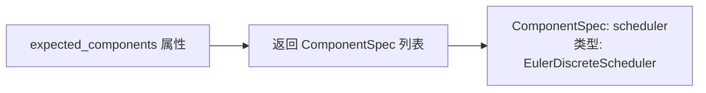

#### 带注释源码

```python
@property
def expected_components(self) -> list[ComponentSpec]:
    """
    定义该步骤所需的组件列表。

    返回值:
        list[ComponentSpec]: 包含组件规格的列表，当前只包含 scheduler 组件，
                           类型为 EulerDiscreteScheduler，用于设置推理时的时间步。
    """
    return [
        ComponentSpec("scheduler", EulerDiscreteScheduler),
    ]
```


### `StableDiffusionXLSetTimestepsStep`

该类是Stable Diffusion XL模块化管道中的一个步骤，负责设置调度器的时间步，用于推理过程。它通过调用`retrieve_timesteps`函数获取时间步，并根据可选的`denoising_end`参数调整时间步序列。

参数：

-  `components`：`StableDiffusionXLModularPipeline` 管道组件对象，包含所有模型组件
-  `state`：`PipelineState` 管道状态对象，包含当前执行的状态信息

返回值：`PipelineState`，返回更新后的管道状态对象

#### 流程图

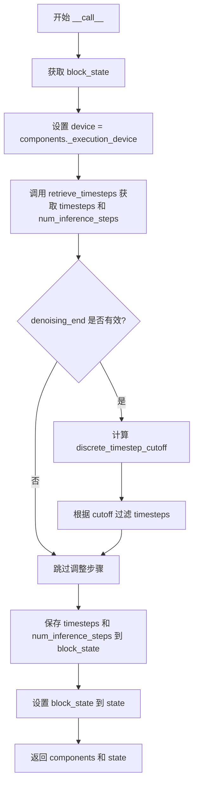

#### 带注释源码

```python
class StableDiffusionXLSetTimestepsStep(ModularPipelineBlocks):
    """
    设置调度器时间步的步骤类，用于推理过程
    """
    model_name = "stable-diffusion-xl"

    @property
    def expected_components(self) -> list[ComponentSpec]:
        """期望的组件列表"""
        return [
            ComponentSpec("scheduler", EulerDiscreteScheduler),
        ]

    @property
    def description(self) -> str:
        """步骤描述"""
        return "Step that sets the scheduler's timesteps for inference"

    @property
    def inputs(self) -> list[InputParam]:
        """输入参数列表"""
        return [
            InputParam("num_inference_steps", default=50),  # 推理步数，默认50
            InputParam("timesteps"),  # 自定义时间步
            InputParam("sigmas"),  # 自定义sigma值
            InputParam("denoising_end"),  # 去噪结束点（0-1之间的浮点数）
        ]

    @property
    def intermediate_outputs(self) -> list[OutputParam]:
        """中间输出参数列表"""
        return [
            OutputParam("timesteps", type_hint=torch.Tensor, description="The timesteps to use for inference"),
            OutputParam(
                "num_inference_steps",
                type_hint=int,
                description="The number of denoising steps to perform at inference time",
            ),
        ]

    @torch.no_grad()
    def __call__(self, components: StableDiffusionXLModularPipeline, state: PipelineState) -> PipelineState:
        """
        执行步骤，设置调度器的时间步
        
        参数:
            components: Stable Diffusion XL模块化管道组件
            state: 管道状态
            
        返回:
            更新后的 (components, state) 元组
        """
        # 1. 获取当前块状态
        block_state = self.get_block_state(state)

        # 2. 设置执行设备
        block_state.device = components._execution_device

        # 3. 调用 retrieve_timesteps 获取时间步序列
        # 该函数会根据 num_inference_steps、timesteps 或 sigmas 来确定时间步
        block_state.timesteps, block_state.num_inference_steps = retrieve_timesteps(
            components.scheduler,
            block_state.num_inference_steps,
            block_state.device,
            block_state.timesteps,
            block_state.sigmas,
        )

        # 4. 处理 denoising_end 参数（用于提前停止去噪）
        if (
            block_state.denoising_end is not None
            and isinstance(block_state.denoising_end, float)
            and block_state.denoising_end > 0
            and block_state.denoising_end < 1
        ):
            # 将相对值转换为绝对时间步索引
            block_state.discrete_timestep_cutoff = int(
                round(
                    components.scheduler.config.num_train_timesteps
                    - (block_state.denoising_end * components.scheduler.config.num_train_timesteps)
                )
            )
            # 过滤出大于等于 cutoff 的时间步
            block_state.num_inference_steps = len(
                list(filter(lambda ts: ts >= block_state.discrete_timestep_cutoff, block_state.timesteps))
            )
            # 截断时间步序列
            block_state.timesteps = block_state.timesteps[: block_state.num_inference_steps]

        # 5. 保存状态并返回
        self.set_block_state(state, block_state)
        return components, state
```


### `StableDiffusionXLSetTimestepsStep.inputs`

该属性定义了 `StableDiffusionXLSetTimestepsStep` 步骤类所需输入参数的列表，用于配置推理过程中的时间步调度。

参数：

- `num_inference_steps`：`int`，推理时使用的去噪步数，默认为 50
- `timesteps`：`list[int] | None`，自定义时间步，用于覆盖调度器的时间步间隔策略
- `sigmas`：`list[float] | None`，自定义 sigmas 值，用于覆盖调度器的时间步间隔策略
- `denoising_end`：`float | None`，指定去噪过程结束的时间点（相对于总去噪过程的百分比，0-1 之间）

返回值：`list[InputParam]`，返回输入参数列表，每个参数包含名称、类型提示、默认值和描述信息

#### 流程图

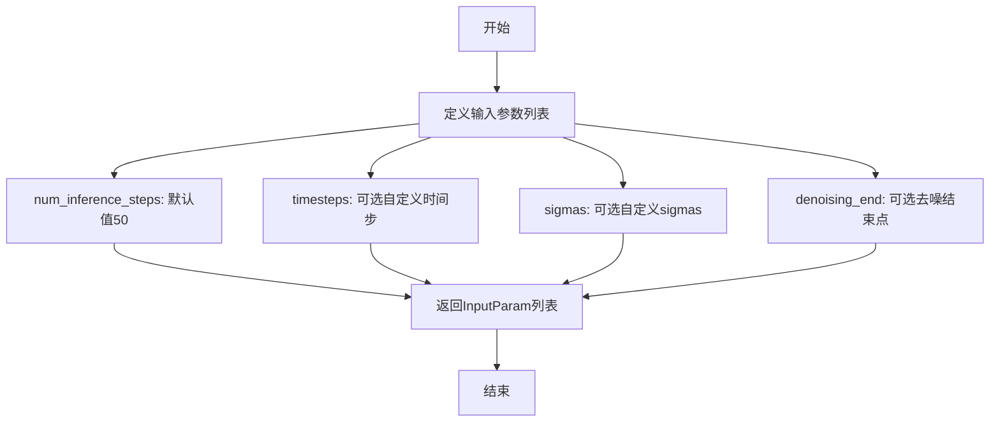

#### 带注释源码

```python
@property
def inputs(self) -> list[InputParam]:
    """
    定义 StableDiffusionXLSetTimestepsStep 步骤所需的输入参数。
    
    Returns:
        list[InputParam]: 输入参数列表，包含：
        - num_inference_steps: 推理时的去噪步数，默认50
        - timesteps: 自定义时间步序列，用于覆盖调度器默认策略
        - sigmas: 自定义sigma值，用于覆盖调度器默认策略
        - denoising_end: 去噪结束点，取值范围0-1，表示相对结束位置
    """
    return [
        # 推理时执行的去噪步数，默认为50
        InputParam("num_inference_steps", default=50),
        # 自定义时间步列表，如果传入则覆盖调度器的时间步间隔策略
        InputParam("timesteps"),
        # 自定义sigmas列表，如果传入则覆盖调度器的sigma间隔策略
        InputParam("sigmas"),
        # 去噪结束点，浮点数表示相对位置（0-1），可用于提前终止去噪过程
        InputParam("denoising_end"),
    ]
```


### `StableDiffusionXLSetTimestepsStep.intermediate_outputs`

该属性定义了 `StableDiffusionXLSetTimestepsStep` 类的中间输出，描述了该步骤在流水线执行过程中产生并传递给后续步骤的核心数据。

参数： （无，此为属性而非方法）

返回值：`list[OutputParam]` ，返回包含时间步和推理步数的输出参数列表

#### 流程图

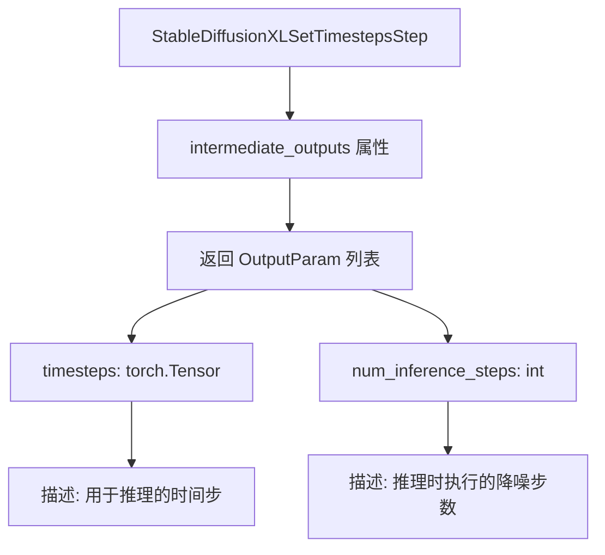

#### 带注释源码

```python
@property
def intermediate_outputs(self) -> list[OutputParam]:
    """
    定义该步骤的中间输出，这些输出将被传递给流水线中的后续步骤。
    
    Returns:
        list[OutputParam]: 包含两个输出参数的列表：
            - timesteps: 推理过程中使用的时间步序列
            - num_inference_steps: 推理时执行的降噪步数
    """
    return [
        # 时间步输出：用于控制扩散模型推理过程的时间步序列
        OutputParam("timesteps", type_hint=torch.Tensor, description="The timesteps to use for inference"),
        
        # 推理步数输出：指定推理过程中需要进行多少次降噪迭代
        OutputParam(
            "num_inference_steps",
            type_hint=int,
            description="The number of denoising steps to perform at inference time",
        ),
    ]
```

#### 详细说明

| 输出参数名称 | 类型 | 描述 |
|------------|------|------|
| `timesteps` | `torch.Tensor` | 调度器生成的时间步序列，用于引导扩散模型的迭代去噪过程 |
| `num_inference_steps` | `int` | 实际执行的推理步数，可能因 `denoising_end` 参数的设置而少于输入的 `num_inference_steps` |


### `StableDiffusionXLSetTimestepsStep.__call__`

设置推理用调度器时间步的处理步骤，用于配置扩散模型去噪过程的时间序列。

参数：

-  `components`：`StableDiffusionXLModularPipeline`，模块化管道组件实例，包含scheduler等组件
-  `state`：`PipelineState`，管道状态对象，包含num_inference_steps、timesteps、sigmas、denoising_end等中间参数

返回值：`PipelineState`，更新后的管道状态对象，包含timesteps和num_inference_steps等中间输出

#### 流程图

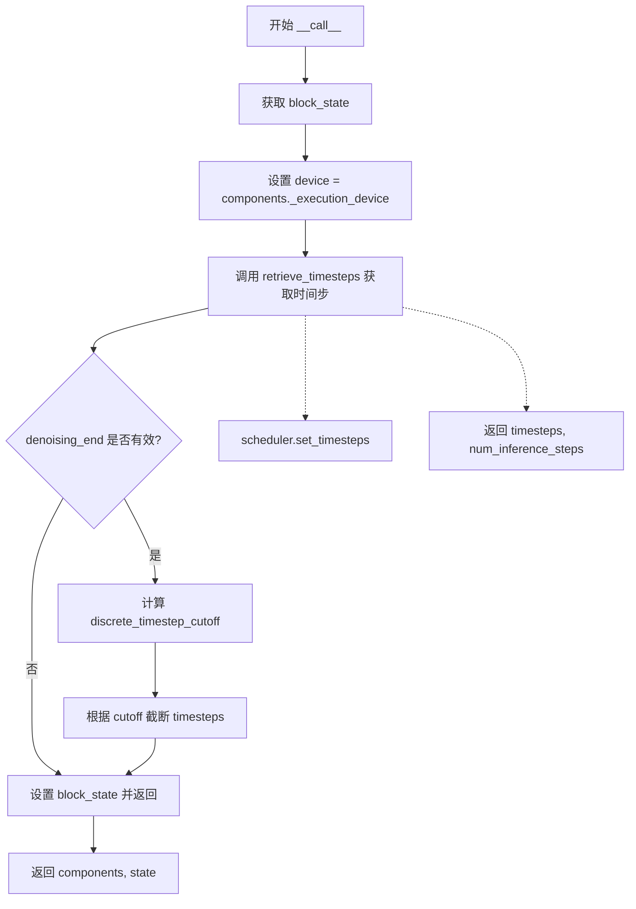

#### 带注释源码

```python
@torch.no_grad()
def __call__(self, components: StableDiffusionXLModularPipeline, state: PipelineState) -> PipelineState:
    """
    执行时间步设置的核心方法
    
    参数:
        components: StableDiffusionXLModularPipeline - 包含scheduler等组件的管道对象
        state: PipelineState - 管道状态，包含输入输出参数
    
    返回:
        PipelineState: 更新后的管道状态
    """
    # 1. 从state中获取当前block的中间状态
    block_state = self.get_block_state(state)

    # 2. 设置执行设备
    block_state.device = components._execution_device

    # 3. 调用retrieve_timesteps获取时间步序列
    # 该函数内部会调用scheduler.set_timesteps()配置调度器
    block_state.timesteps, block_state.num_inference_steps = retrieve_timesteps(
        components.scheduler,          # 调度器实例
        block_state.num_inference_steps, # 推理步数
        block_state.device,              # 执行设备
        block_state.timesteps,           # 自定义时间步(可选)
        block_state.sigmas,              # 自定义sigma值(可选)
    )

    # 4. 处理denoising_end参数(可选的提前停止点)
    if (
        block_state.denoising_end is not None
        and isinstance(block_state.denoising_end, float)
        and block_state.denoising_end > 0
        and block_state.denoising_end < 1
    ):
        # 将0-1范围的denoising_end转换为离散时间步索引
        block_state.discrete_timestep_cutoff = int(
            round(
                components.scheduler.config.num_train_timesteps
                - (block_state.denoising_end * components.scheduler.config.num_train_timesteps)
            )
        )
        # 根据cutoff过滤时间步，保留需要执行的去噪步数
        block_state.num_inference_steps = len(
            list(filter(lambda ts: ts >= block_state.discrete_timestep_cutoff, block_state.timesteps))
        )
        block_state.timesteps = block_state.timesteps[: block_state.num_inference_steps]

    # 5. 将更新后的block_state写回state
    self.set_block_state(state, block_state)
    return components, state
```


### `StableDiffusionXLInpaintPrepareLatentsStep.expected_components`

该属性定义了 `StableDiffusionXLInpaintPrepareLatentsStep` 步骤所需的组件依赖，明确该步骤需要 `scheduler`（调度器）组件才能正常工作。

参数：
- 无显式参数（该方法为属性方法，`self` 为隐式参数）

返回值：`list[ComponentSpec]`，返回包含调度器组件规范的列表，指定该步骤依赖 `EulerDiscreteScheduler` 类型的调度器。

#### 流程图

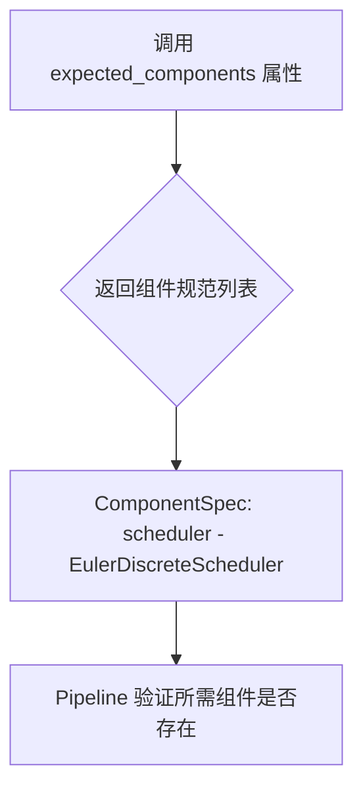

#### 带注释源码

```python
@property
def expected_components(self) -> list[ComponentSpec]:
    """
    定义该步骤所需的组件依赖。
    
    返回一个包含 ComponentSpec 的列表，其中指定了：
    - scheduler: 需要 EulerDiscreteScheduler 类型的调度器组件
    
    这些组件会在 Pipeline 初始化时被验证是否满足要求。
    
    Returns:
        list[ComponentSpec]: 组件规范列表，包含调度器依赖
    """
    return [
        ComponentSpec("scheduler", EulerDiscreteScheduler),
    ]
```


### `StableDiffusionXLInpaintPrepareLatentsStep.description`

该属性返回一步（step）的描述信息，用于说明该模块在流水线中的作用。

参数：无（该方法为一个属性装饰器 `@property`，不接受任何参数）

返回值：`str`，返回该步骤功能的描述文本

#### 流程图

```mermaid
flowchart TD
    A[开始] --> B{访问 description 属性}
    B --> C[返回描述字符串]
    C --> D[结束]
    
    style A fill:#f9f,stroke:#333
    style B fill:#ff9,stroke:#333
    style C fill:#9f9,stroke:#333
    style D fill:#f9f,stroke:#333
```

#### 带注释源码

```python
@property
def description(self) -> str:
    """
    属性描述：
    该属性用于描述 StableDiffusionXLInpaintPrepareLatentsStep 模块的功能。
    在模块化流水线（ModularPipeline）中，该描述信息用于帮助理解每个步骤的作用。
    
    返回值：
        str: 返回一个字符串，说明此步骤时“准备用于修复过程（inpainting）的潜在变量（latents）”。
    """
    return "Step that prepares the latents for the inpainting process"
```

---

### 补充说明

| 项目 | 详情 |
|------|------|
| **所属类** | `StableDiffusionXLInpaintPrepareLatentsStep` |
| **方法类型** | 属性（Property） |
| **定义方式** | 使用 `@property` 装饰器定义 |
| **功能说明** | 该类是 Stable Diffusion XL 修复（Inpainting）流水线中的一个步骤模块，继承自 `ModularPipelineBlocks`，主要用于准备修复任务所需的潜在变量（latents）、噪声（noise）和掩码相关变量（mask latents）。`description` 属性仅作为人类可读的描述信息，不参与实际逻辑处理。 |


### `StableDiffusionXLInpaintPrepareLatentsStep.inputs`

该属性定义了 Stable Diffusion XL Inpainting（图像修复）流水线的输入参数，用于准备图像修复所需的潜在向量、掩码、噪声等输入数据。

参数：

- `latents`：`torch.Tensor`，初始潜在向量，可选输入
- `num_images_per_prompt`：`int`，每个提示词生成的图像数量，默认为 1
- `denoising_start`：`float | None`，去噪起始点，控制何时开始去噪
- `strength`：`float`，图像修复强度，介于 0 和 1 之间，默认 0.9999。数值越大，对参考图像的变换越多
- `generator`：`torch.Generator | None`，随机数生成器，用于可复现的噪声生成
- `batch_size`：`int`，**必需**。提示词数量，最终模型输入的批次大小为 batch_size * num_images_per_prompt
- `latent_timestep`：`torch.Tensor`，**必需**。表示图像修复初始噪声水平的时间步
- `image_latents`：`torch.Tensor`，**必需**。表示图像修复参考图像的潜在向量
- `mask`：`torch.Tensor`，**必需**。图像修复的掩码
- `masked_image_latents`：`torch.Tensor`，可选。图像修复的掩码图像潜在向量（仅用于特定修复的 UNet）
- `dtype`：`torch.dtype`，模型输入的数据类型

返回值：`list[InputParam]`，返回输入参数列表，每个元素包含参数名称、默认值、类型提示和描述

#### 流程图

```mermaid
flowchart TD
    A[inputs 属性被调用] --> B{返回输入参数列表}
    
    B --> C[latents: 可选潜在向量]
    B --> D[num_images_per_prompt: 默认1]
    B --> E[denoising_start: 可选去噪起始点]
    B --> F[strength: 默认0.9999, 修复强度]
    B --> G[generator: 可选随机生成器]
    B --> H[batch_size: 必需, 批大小]
    B --> I[latent_timestep: 必需, 噪声时间步]
    B --> J[image_latents: 必需, 参考图像潜在向量]
    B --> K[mask: 必需, 修复掩码]
    B --> L[masked_image_latents: 可选, 掩码图像潜在向量]
    B --> M[dtype: 数据类型]
    
    C --> N[InputParam 对象]
    D --> N
    E --> N
    F --> N
    G --> N
    H --> N
    I --> N
    J --> N
    K --> N
    L --> N
    M --> N
    
    N --> O[返回 list[InputParam]]
```

#### 带注释源码

```python
@property
def inputs(self) -> list[tuple[str, Any]]:
    """
    定义 StableDiffusionXLInpaintPrepareLatentsStep 的输入参数。
    这些参数用于图像修复（inpainting）流程中准备潜在向量和其他必要的输入数据。
    """
    return [
        # 初始潜在向量，可由上一步提供或为 None
        InputParam("latents"),
        
        # 每个提示词生成的图像数量，默认为 1
        InputParam("num_images_per_prompt", default=1),
        
        # 去噪起始点，控制去噪过程的开始时刻
        InputParam("denoising_start"),
        
        # 图像修复强度参数，默认为 0.9999（最大强度）
        # 数值越大，对参考图像添加的噪声越多，变换程度越大
        InputParam(
            "strength",
            default=0.9999,
            description="Conceptually, indicates how much to transform the reference `image` (the masked portion of image for inpainting). Must be between 0 and 1. `image` "
            "will be used as a starting point, adding more noise to it the larger the `strength`. The number of "
            "denoising steps depends on the amount of noise initially added. When `strength` is 1, added noise will "
            "be maximum and the denoising process will run for the full number of iterations specified in "
            "`num_inference_steps`. A value of 1, therefore, essentially ignores `image`. Note that in the case of "
            "`denoising_start` being declared as an integer, the value of `strength` will be ignored.",
        ),
        
        # 随机数生成器，用于生成可复现的噪声
        InputParam("generator"),
        
        # 必需的批大小参数
        # 最终模型输入的批次大小 = batch_size * num_images_per_prompt
        InputParam(
            "batch_size",
            required=True,
            type_hint=int,
            description="Number of prompts, the final batch size of model inputs should be batch_size * num_images_per_prompt. Can be generated in input step.",
        ),
        
        # 必需的时间步参数，表示图像修复的初始噪声水平
        InputParam(
            "latent_timestep",
            required=True,
            type_hint=torch.Tensor,
            description="The timestep that represents the initial noise level for image-to-image/inpainting generation. Can be generated in set_timesteps step.",
        ),
        
        # 必需的参考图像潜在向量
        InputParam(
            "image_latents",
            required=True,
            type_hint=torch.Tensor,
            description="The latents representing the reference image for image-to-image/inpainting generation. Can be generated in vae_encode step.",
        ),
        
        # 必需的修复掩码
        InputParam(
            "mask",
            required=True,
            type_hint=torch.Tensor,
            description="The mask for the inpainting generation. Can be generated in vae_encode step.",
        ),
        
        # 可选的掩码图像潜在向量，仅用于特定修复的 UNet
        InputParam(
            "masked_image_latents",
            type_hint=torch.Tensor,
            description="The masked image latents for the inpainting generation (only for inpainting-specific unet). Can be generated in vae_encode step.",
        ),
        
        # 模型输入的数据类型
        InputParam("dtype", type_hint=torch.dtype, description="The dtype of the model inputs"),
    ]
```


### `StableDiffusionXLInpaintPrepareLatentsStep.intermediate_outputs`

该属性定义了图像修复（inpainting）流程中潜在变量准备步骤的中间输出参数，包括用于去噪过程的初始潜在变量和为图像修复生成的噪声。

参数：无（该方法为属性，不接受参数）

返回值：`list[OutputParam]`，返回两个中间输出参数：
- `latents`：`torch.Tensor`，用于去噪过程的初始潜在变量
- `noise`：`torch.Tensor`，为图像修复生成的噪声

#### 流程图

```mermaid
flowchart TD
    A[intermediate_outputs property] --> B[定义latents输出]
    A --> C[定义noise输出]
    B --> D[返回OutputParam列表]
    C --> D
```

#### 带注释源码

```python
@property
def intermediate_outputs(self) -> list[str]:
    """
    定义该步骤的中间输出参数。
    这些参数将被传递给后续的去噪步骤，用于图像修复生成过程。
    
    Returns:
        list[OutputParam]: 包含两个OutputParam对象的列表：
            - latents: 初始潜在变量张量，用于去噪过程
            - noise: 为图像修复添加的噪声张量
    """
    return [
        OutputParam(
            "latents", 
            type_hint=torch.Tensor, 
            description="The initial latents to use for the denoising process"
        ),
        OutputParam(
            "noise",
            type_hint=torch.Tensor,
            description="The noise added to the image latents, used for inpainting generation",
        ),
    ]
```

---

### 完整类信息：`StableDiffusionXLInpaintPrepareLatentsStep`

#### 类描述
`StableDiffusionXLInpaintPrepareLatentsStep`是Stable Diffusion XL模块化管道中的关键步骤类，负责为图像修复（inpainting）过程准备潜在变量（latents）、噪声和掩码相关的潜在变量。

#### 类字段

| 字段名 | 类型 | 描述 |
|--------|------|------|
| `model_name` | `str` | 模型名称标识："stable-diffusion-xl" |
| `expected_components` | `list[ComponentSpec]` | 必需的组件：scheduler (EulerDiscreteScheduler) |

#### 类方法

| 方法名 | 描述 |
|--------|------|
| `description` | 返回步骤描述："Step that prepares the latents for the inpainting process" |
| `inputs` | 定义输入参数列表（10个输入参数） |
| `intermediate_outputs` | **（目标方法）** 定义2个中间输出：latents, noise |
| `_encode_vae_image` | 静态方法，使用VAE编码图像为潜在变量 |
| `prepare_latents_inpaint` | 准备图像修复的潜在变量，处理噪声添加和初始latents |
| `prepare_mask_latents` | 准备掩码相关变量，包括掩码和掩码图像潜在变量 |
| `__call__` | 执行步骤的主方法，协调所有准备工作 |

#### 关键组件信息

| 组件名 | 描述 |
|--------|------|
| `latents` | 初始潜在变量，用于去噪过程 |
| `noise` | 添加到图像latents的噪声，用于inpainting生成 |
| `mask` | 图像修复掩码 |
| `masked_image_latents` | 掩码图像的潜在变量表示 |

#### 技术债务与优化空间

1. **重复代码模式**：`prepare_latents_inpaint`和`prepare_mask_latents`方法与`StableDiffusionXLImg2ImgPrepareLatentsStep`有相似逻辑，可考虑抽象通用基类
2. **硬编码默认值**：如`strength`默认值为0.9999，缺乏灵活性
3. **缺少完整错误处理**：部分边界情况（如generator列表长度不匹配）有检查，但仍有潜在未处理场景

#### 外部依赖与接口契约

- **依赖组件**：VAE (AutoencoderKL), Scheduler (EulerDiscreteScheduler)
- **输入来源**：通常来自`StableDiffusionXLInputStep`（batch_size, dtype）和`StableDiffusionXLImg2ImgSetTimestepsStep`（latent_timestep）
- **输出消费者**：去噪循环步骤（如UNet推理步骤）


### `StableDiffusionXLInpaintPrepareLatentsStep._encode_vae_image`

该方法是一个静态方法，用于将输入图像编码为 VAE 潜在空间中的latent表示。它负责处理图像的VAE编码、强制类型提升（force_upcast）、潜在空间的标准化/缩放，并支持批量生成器。

参数：

- `components`：`StableDiffusionXLModularPipeline`，包含VAE等组件的管道对象，用于访问`components.vae`进行编码和获取配置
- `image`：`torch.Tensor`，待编码的输入图像张量，形状通常为 `[B, C, H, W]`
- `generator`：`torch.Generator | None`，可选的随机数生成器，用于控制编码过程中的随机采样

返回值：`torch.Tensor`，编码后的图像潜在向量，形状为 `[B, 4, H//8, W//8]`（取决于VAE的下采样因子）

#### 流程图

```mermaid
graph TD
    A[开始 _encode_vae_image] --> B{components.vae.config<br/>有 latents_mean?}
    B -->|Yes| C[获取 latents_mean<br/>并 reshape 为 [1,4,1,1]]
    B --> |No| D[latents_mean = None]
    C --> E{components.vae.config<br/>有 latents_std?}
    D --> E
    E -->|Yes| F[获取 latents_std<br/>并 reshape 为 [1,4,1,1]]
    E --> |No| G[latents_std = None]
    F --> H[dtype = image.dtype]
    H --> I{components.vae.config<br/>.force_upcast?}
    I -->|Yes| J[image = image.float<br/>components.vae.to<br/>dtype=torch.float32]
    I --> |No| K[继续]
    J --> L{generator 是 list?}
    K --> L
    L -->|Yes| M[遍历图像批次<br/>分别编码并合并]
    L --> |No| N[直接编码整个图像]
    M --> O[retrieve_latents<br/>提取 latents]
    N --> O
    O --> P{components.vae.config<br/>.force_upcast?}
    P -->|Yes| Q[components.vae.to<br/>恢复原始 dtype]
    P --> |No| R[继续]
    Q --> S[image_latents.to dtype]
    R --> S
    S --> T{latents_mean 和<br/>latents_std 不为 None?}
    T -->|Yes| U[标准化处理<br/>latents = (latents - mean)<br/>* scale / std]
    T --> |No| V[简化处理<br/>latents = latent * scale]
    U --> W[返回 image_latents]
    V --> W
```

#### 带注释源码

```python
@staticmethod
def _encode_vae_image(components, image: torch.Tensor, generator: torch.Generator):
    """
    将图像编码为 VAE  latent 表示。
    
    处理流程：
    1. 获取 VAE 配置中的 latents_mean 和 latents_std（如果存在）
    2. 如果 force_upcast 为 True，临时将图像和 VAE 转换为 float32 以避免溢出
    3. 使用 VAE encoder 将图像编码为 latent
    4. 恢复 VAE 的原始 dtype（如果之前进行了 upcast）
    5. 应用 scaling_factor 和标准化（如果配置了 mean/std）
    """
    # 1. 初始化 mean 和 std 变量
    latents_mean = latents_std = None
    
    # 检查 VAE 配置中是否存在 latents_mean
    if hasattr(components.vae.config, "latents_mean") and components.vae.config.latents_mean is not None:
        # 将配置中的均值转换为 tensor 并 reshape 为 [1, 4, 1, 1] 以便广播
        latents_mean = torch.tensor(components.vae.config.latents_mean).view(1, 4, 1, 1)
    
    # 检查 VAE 配置中是否存在 latents_std
    if hasattr(components.vae.config, "latents_std") and components.vae.config.latents_std is not None:
        # 将配置中的标准差转换为 tensor 并 reshape 为 [1, 4, 1, 1] 以便广播
        latents_std = torch.tensor(components.vae.config.latents_std).view(1, 4, 1, 1)

    # 记录原始图像 dtype
    dtype = image.dtype
    
    # 2. 处理强制类型提升（避免 float16 溢出）
    if components.vae.config.force_upcast:
        # 将图像转换为 float32
        image = image.float()
        # 临时将 VAE 转换为 float32
        components.vae.to(dtype=torch.float32)

    # 3. 使用 VAE 编码图像
    if isinstance(generator, list):
        # 如果有多个生成器，需要逐个处理图像并合并结果
        image_latents = [
            # 对每个图像切片单独编码
            retrieve_latents(components.vae.encode(image[i : i + 1]), generator=generator[i])
            for i in range(image.shape[0])
        ]
        # 沿批次维度合并 latents
        image_latents = torch.cat(image_latents, dim=0)
    else:
        # 单个生成器，直接编码整个图像批次
        image_latents = retrieve_latents(components.vae.encode(image), generator=generator)

    # 4. 恢复 VAE 的原始 dtype（如果之前进行了 upcast）
    if components.vae.config.force_upcast:
        components.vae.to(dtype)

    # 5. 将 latents 转换回原始 dtype
    image_latents = image_latents.to(dtype)
    
    # 6. 应用 scaling 和标准化
    if latents_mean is not None and latents_std is not None:
        # 将 mean 和 std 移动到 latents 所在设备并转换 dtype
        latents_mean = latents_mean.to(device=image_latents.device, dtype=dtype)
        latents_std = latents_std.to(device=image_latents.device, dtype=dtype)
        # 标准化: (latents - mean) * scaling_factor / std
        image_latents = (image_latents - latents_mean) * components.vae.config.scaling_factor / latents_std
    else:
        # 仅应用 scaling_factor
        image_latents = components.vae.config.scaling_factor * image_latents

    return image_latents
```


### `StableDiffusionXLInpaintPrepareLatentsStep.prepare_latents_inpaint`

该方法用于在图像修复（inpainting）过程中准备潜在变量（latents），包括生成噪声、处理图像潜在变量，并根据强度参数决定是使用纯噪声还是噪声与图像潜在变量的混合。

参数：

-  `self`：`StableDiffusionXLInpaintPrepareLatentsStep` 类实例，隐含参数
-  `components`：`StableDiffusionXLModularPipeline`，包含 VAE、scheduler 等组件的对象
-  `batch_size`：`int`，批处理大小
-  `num_channels_latents`：`int`，潜在变量的通道数
-  `height`：`int`，图像高度
-  `width`：`int`，图像宽度
-  `dtype`：`torch.dtype`，数据类型
-  `device`：`torch.device`，设备
-  `generator`：`torch.Generator | None`，随机数生成器
-  `latents`：`torch.Tensor | None`，可选的初始潜在变量
-  `image`：`torch.Tensor | None`，可选的输入图像
-  `timestep`：`torch.Tensor | None`，可选的时间步
-  `is_strength_max`：`bool`，是否为最大强度（强度=1.0时为True）
-  `add_noise`：`bool`，是否添加噪声

返回值：`tuple[torch.Tensor, torch.Tensor, torch.Tensor]`，包含三个元素的元组：
-  `latents`：`torch.Tensor`，处理后的潜在变量，用于去噪过程
-  `noise`：`torch.Tensor`，添加到图像潜在变量的噪声
-  `image_latents`：`torch.Tensor`，图像的潜在表示

#### 流程图

```mermaid
flowchart TD
    A[开始 prepare_latents_inpaint] --> B[计算 shape 形状参数]
    B --> C{generator 列表长度<br/>是否等于 batch_size?}
    C -->|否| D[抛出 ValueError]
    C -->|是| E{image 和 timestep<br/>是否同时为空且<br/>is_strength_max 为 False?}
    E -->|是| F[抛出 ValueError]
    E -->|否| G{image.shape[1] == 4<br/>即图像是否已经是潜在变量?}
    G -->|是| H[将 image 转换为 device 和 dtype]
    H --> I[重复 batch_size // image_latents.shape[0] 次]
    G -->|否| J{latents 为 None 且<br/>is_strength_max 为 False?}
    J -->|是| K[将 image 转换为 device 和 dtype]
    K --> L[调用 _encode_vae_image 编码图像]
    L --> M[重复 batch_size // image_latents.shape[0] 次]
    J -->|否| N{latents 为 None 且<br/>add_noise 为 True?}
    N -->|是| O[使用 randn_tensor 生成噪声]
    O --> P{is_strength_max 为 True?]
    P -->|是| Q[latents = 噪声]
    P -->|否| R[latents = scheduler.add_noise<br/>(image_latents, noise, timestep)]
    Q --> S{is_strength_max 为 True?]
    S -->|是| T[latents = latents * scheduler.init_noise_sigma]
    S -->|否| U[latents 保持不变]
    N -->|否| V{add_noise 为 True?]
    V -->|是| W[noise = latents.to(device)]
    W --> X[latents = noise * scheduler.init_noise_sigma]
    V -->|否| Y[生成噪声]
    Y --> Z[latents = image_latents.to(device)]
    X --> AA[返回 (latents, noise, image_latents)]
    T --> AA
    U --> AA
    Z --> AA
    M --> AA
    I --> AA
```

#### 带注释源码

```python
def prepare_latents_inpaint(
    self,
    components,
    batch_size,
    num_channels_latents,
    height,
    width,
    dtype,
    device,
    generator,
    latents=None,
    image=None,
    timestep=None,
    is_strength_max=True,
    add_noise=True,
):
    # 计算潜在变量的形状：batch_size x num_channels_latents x (height // vae_scale_factor) x (width // vae_scale_factor)
    shape = (
        batch_size,
        num_channels_latents,
        int(height) // components.vae_scale_factor,
        int(width) // components.vae_scale_factor,
    )
    
    # 验证 generator 列表长度是否与 batch_size 匹配
    if isinstance(generator, list) and len(generator) != batch_size:
        raise ValueError(
            f"You have passed a list of generators of length {len(generator)}, but requested an effective batch"
            f" size of {batch_size}. Make sure the batch size matches the length of the generators."
        )

    # 当强度小于1时，需要同时提供 image 和 timestep，否则抛出错误
    if (image is None or timestep is None) and not is_strength_max:
        raise ValueError(
            "Since strength < 1. initial latents are to be initialised as a combination of Image + Noise."
            "However, either the image or the noise timestep has not been provided."
        )

    # 处理输入图像：
    # 如果图像已经是4通道（潜在变量格式），直接转换并重复到 batch_size
    # 否则，如果需要且 latents 为 None，则编码图像为潜在变量
    if image.shape[1] == 4:
        image_latents = image.to(device=device, dtype=dtype)
        image_latents = image_latents.repeat(batch_size // image_latents.shape[0], 1, 1, 1)
    elif latents is None and not is_strength_max:
        image = image.to(device=device, dtype=dtype)
        # 调用 _encode_vae_image 将图像编码为潜在变量
        image_latents = self._encode_vae_image(components, image=image, generator=generator)
        image_latents = image_latents.repeat(batch_size // image_latents.shape[0], 1, 1, 1)

    # 处理潜在变量的生成和噪声添加
    if latents is None and add_noise:
        # 生成随机噪声
        noise = randn_tensor(shape, generator=generator, device=device, dtype=dtype)
        # 如果强度最大，则用纯噪声初始化；否则将噪声添加到图像潜在变量
        # 如果是纯噪声，则根据 Scheduler 的初始 sigma 缩放潜在变量
        latents = noise if is_strength_max else components.scheduler.add_noise(image_latents, noise, timestep)
        # if pure noise then scale the initial latents by the Scheduler's init sigma
        latents = latents * components.scheduler.init_noise_sigma if is_strength_max else latents
    elif add_noise:
        # 如果已有 latents 但需要添加噪声
        noise = latents.to(device)
        latents = noise * components.scheduler.init_noise_sigma
    else:
        # 不添加噪声的情况，直接使用图像潜在变量
        noise = randn_tensor(shape, generator=generator, device=device, dtype=dtype)
        latents = image_latents.to(device)

    # 返回处理后的潜在变量、噪声和图像潜在变量
    outputs = (latents, noise, image_latents)

    return outputs
```


### `StableDiffusionXLInpaintPrepareLatentsStep.prepare_mask_latents`

该方法用于在 Stable Diffusion XL 图像修复（inpainting）流程中准备掩码（mask）和被掩码覆盖的图像潜在表示（masked image latents）。它对输入的掩码进行尺寸调整和批次复制，并对被掩码的图像进行 VAE 编码，最终返回与潜在空间尺寸一致的掩码和对应的被掩码图像潜在表示，以供后续的去噪网络使用。

参数：

- `self`：`StableDiffusionXLInpaintPrepareLatentsStep` 类实例本身
- `components`：`StableDiffusionXLModularPipeline` 管道组件集合，包含 VAE 等模型
- `mask`：`torch.Tensor`，用于 inpainting 的二进制掩码，指示需要修复的区域
- `masked_image`：`torch.Tensor` 或 `None`，原始输入图像（被掩码覆盖的部分）
- `batch_size`：`int`，期望的批次大小（通常为 batch_size * num_images_per_prompt）
- `height`：`int`，输出图像的高度（像素单位）
- `width`：`int`，输出图像的宽度（像素单位）
- `dtype`：`torch.dtype`，模型使用的数据类型（如 torch.float16）
- `device`：`torch.device`，计算设备（如 "cuda" 或 "cpu"）
- `generator`：`torch.Generator` 或 `None`，随机数生成器，用于可复现的噪声采样

返回值：`tuple[torch.Tensor, torch.Tensor | None]`，返回一个元组，包含：
- `mask`：`torch.Tensor`，调整尺寸并复制到目标批次大小后的掩码
- `masked_image_latents`：`torch.Tensor | None`，被掩码图像的潜在表示，如果无法编码则为 None

#### 流程图

```mermaid
flowchart TD
    A[开始: prepare_mask_latents] --> B[调整掩码尺寸]
    B --> C{使用 cpu_offload<br/>和半精度?}
    C -->|是| D[先调整尺寸<br/>后转 dtype]
    C -->|否| E[直接转到目标 dtype]
    D --> F
    E --> F[将掩码转移到目标设备<br/>并转换数据类型]
    F --> G{掩码批次大小<br/>小于目标批次?}
    G -->|是| H{目标批次能被<br/>掩码批次整除?}
    H -->|是| I[复制掩码到<br/>目标批次大小]
    H -->|否| J[抛出 ValueError]
    G -->|否| K
    I --> K{掩码图像存在?}
    K -->|是| L{掩码图像通道数=4?}
    K -->|否| M[返回 mask=None,<br/>masked_image_latents=None]
    L -->|是| N[直接作为<br/>masked_image_latents]
    L -->|否| O[调用 _encode_vae_image<br/>编码掩码图像]
    N --> P
    O --> P{masked_image_latents<br/>批次大小小于目标?}
    P -->|是| Q{目标批次能被<br/>latents 批次整除?}
    Q -->|是| R[复制 masked_image_latents<br/>到目标批次大小]
    Q -->|否| S[抛出 ValueError]
    P -->|否| T[转移设备<br/>转换 dtype]
    R --> T
    T --> U[返回 mask 和 masked_image_latents]
```

#### 带注释源码

```python
# modified from diffusers.pipelines.stable_diffusion_xl.pipeline_stable_diffusion_xl_inpaint.StableDiffusionXLInpaintPipeline.prepare_mask_latents
# do not accept do_classifier_free_guidance
def prepare_mask_latents(
    self, components, mask, masked_image, batch_size, height, width, dtype, device, generator
):
    """
    准备掩码和被掩码图像的潜在表示，用于 inpainting 生成流程。
    
    此方法执行以下操作：
    1. 将掩码调整到与潜在空间对应的尺寸
    2. 确保掩码和被掩码图像的批次大小与目标批次大小匹配
    3. 如果需要，对被掩码图像进行 VAE 编码
    
    参数:
        components: 管道组件集合，包含 VAE 等模型
        mask: 掩码张量
        masked_image: 被掩码覆盖的图像
        batch_size: 目标批次大小
        height: 输出图像高度（像素）
        width: 输出图像宽度（像素）
        dtype: 目标数据类型
        device: 目标设备
        generator: 随机数生成器
        
    返回:
        (mask, masked_image_latents) 元组
    """
    # resize the mask to latents shape as we concatenate the mask to the latents
    # we do that before converting to dtype to avoid breaking in case we're using cpu_offload
    # and half precision
    # 调整掩码尺寸到潜在空间大小
    # 在转换为 dtype 之前进行尺寸调整，以避免在使用 cpu_offload 和半精度时出现问题
    mask = torch.nn.functional.interpolate(
        mask, size=(height // components.vae_scale_factor, width // components.vae_scale_factor)
    )
    mask = mask.to(device=device, dtype=dtype)

    # duplicate mask and masked_image_latents for each generation per prompt, using mps friendly method
    # 如果掩码批次大小小于目标批次大小，则复制掩码
    if mask.shape[0] < batch_size:
        if not batch_size % mask.shape[0] == 0:
            raise ValueError(
                "The passed mask and the required batch size don't match. Masks are supposed to be duplicated to"
                f" a total batch size of {batch_size}, but {mask.shape[0]} masks were passed. Make sure the number"
                " of masks that you pass is divisible by the total requested batch size."
            )
        # 复制掩码以匹配目标批次大小
        mask = mask.repeat(batch_size // mask.shape[0], 1, 1, 1)

    # 处理被掩码的图像
    if masked_image is not None and masked_image.shape[1] == 4:
        # 如果图像已经是潜在表示格式（4通道），直接使用
        masked_image_latents = masked_image
    else:
        # 否则设置为 None，后续可能需要编码
        masked_image_latents = None

    # 如果提供了被掩码的图像
    if masked_image is not None:
        # 如果还没有编码（即不是4通道的潜在表示）
        if masked_image_latents is None:
            # 将图像转移到目标设备并转换类型
            masked_image = masked_image.to(device=device, dtype=dtype)
            # 使用 VAE 编码图像得到潜在表示
            masked_image_latents = self._encode_vae_image(components, masked_image, generator=generator)

        # 如果潜在表示的批次大小小于目标批次大小
        if masked_image_latents.shape[0] < batch_size:
            if not batch_size % masked_image_latents.shape[0] == 0:
                raise ValueError(
                    "The passed images and the required batch size don't match. Images are supposed to be duplicated"
                    f" to a total batch size of {batch_size}, but {masked_image_latents.shape[0]} images were passed."
                    " Make sure the number of images that you pass is divisible by the total requested batch size."
                )
            # 复制潜在表示以匹配目标批次大小
            masked_image_latents = masked_image_latents.repeat(
                batch_size // masked_image_latents.shape[0], 1, 1, 1
            )

        # aligning device to prevent device errors when concating it with the latent model input
        # 对齐设备以防止与潜在模型输入连接时出现设备错误
        masked_image_latents = masked_image_latents.to(device=device, dtype=dtype)

    # 返回处理后的掩码和被掩码图像潜在表示
    return mask, masked_image_latents
```


### `StableDiffusionXLInpaintPrepareLatentsStep.__call__`

该方法是 Stable Diffusion XL 修复（Inpainting）流程中的关键步骤，负责准备去噪所需的潜在向量（latents）、噪声和掩码。它从块状态（block_state）中获取输入参数，确定数据类型和设备，根据强度（strength）参数决定是否添加噪声，并调用 `prepare_latents_inpaint` 和 `prepare_mask_latents` 方法来处理潜在向量和掩码，最终将准备好的数据存储回块状态供后续去噪步骤使用。

参数：

-   `components`：`StableDiffusionXLModularPipeline`，包含管道组件（如 VAE、scheduler 等）的对象
-   `state`：`PipelineState`，管道状态对象，包含块状态（block_state）和中间结果

返回值：`Tuple[StableDiffusionXLModularPipeline, PipelineState]`，返回更新后的组件和状态对象

#### 流程图

```mermaid
flowchart TD
    A[开始 __call__] --> B[获取 block_state]
    B --> C[设置 dtype: 若 block_state.dtype 为 None 则使用 components.vae.dtype]
    C --> D[设置 device: components._execution_device]
    D --> E[判断 is_strength_max: strength == 1.0]
    E --> F{检查 UNet 配置}
    F -->|in_channels == 4| G[设置 masked_image_latents = None]
    F -->|否则| H[保持 masked_image_latents 不变]
    G --> I[设置 add_noise: True 如果 denoising_start 为 None，否则 False]
    I --> J[计算 height 和 width: image_latents 尺寸 * vae_scale_factor]
    J --> K[调用 prepare_latents_inpaint]
    K --> L[准备 latents, noise, image_latents]
    L --> M[调用 prepare_mask_latents]
    M --> N[准备 mask 和 masked_image_latents]
    N --> O[保存结果到 block_state]
    O --> P[更新 state]
    P --> Q[返回 components, state]
```

#### 带注释源码

```python
@torch.no_grad()
def __call__(self, components: StableDiffusionXLModularPipeline, state: PipelineState) -> PipelineState:
    """
    执行修复（Inpainting）的潜在向量准备步骤。

    参数:
        components: StableDiffusionXLModularPipeline 实例，包含管道组件
        state: PipelineState 实例，包含当前管道状态

    返回:
        更新后的 (components, state) 元组
    """
    # 1. 获取当前块的状态
    block_state = self.get_block_state(state)

    # 2. 设置数据类型 (dtype)
    # 如果 block_state 中没有指定 dtype，则使用 VAE 的数据类型
    block_state.dtype = block_state.dtype if block_state.dtype is not None else components.vae.dtype
    
    # 3. 设置设备 (device)
    # 获取执行设备
    block_state.device = components._execution_device

    # 4. 判断是否使用最大强度
    # 如果 strength == 1.0，则表示完全忽略输入图像，从纯噪声开始
    block_state.is_strength_max = block_state.strength == 1.0

    # 5. 处理非修复专用 UNet 的情况
    # 对于 in_channels == 4 的修复专用 UNet，不需要 masked_image_latents
    if hasattr(components, "unet") and components.unet is not None:
        if components.unet.config.in_channels == 4:
            block_state.masked_image_latents = None

    # 6. 设置是否添加噪声
    # 如果指定了 denoising_start，则不添加初始噪声
    block_state.add_noise = True if block_state.denoising_start is None else False

    # 7. 计算图像的高度和宽度
    # 基于 image_latents 的尺寸和 VAE 缩放因子
    block_state.height = block_state.image_latents.shape[-2] * components.vae_scale_factor
    block_state.width = block_state.image_latents.shape[-1] * components.vae_scale_factor

    # 8. 准备 latents、noise 和 image_latents
    # 调用 prepare_latents_inpaint 方法进行准备
    block_state.latents, block_state.noise, block_state.image_latents = self.prepare_latents_inpaint(
        components,  # 管道组件
        block_state.batch_size * block_state.num_images_per_prompt,  # 批处理大小
        components.num_channels_latents,  # latent 通道数
        block_state.height,  # 高度
        block_state.width,  # 宽度
        block_state.dtype,  # 数据类型
        block_state.device,  # 设备
        block_state.generator,  # 随机数生成器
        block_state.latents,  # 初始 latents（可选）
        image=block_state.image_latents,  # 输入图像 latents
        timestep=block_state.latent_timestep,  # 时间步
        is_strength_max=block_state.is_strength_max,  # 是否最大强度
        add_noise=block_state.add_noise,  # 是否添加噪声
    )

    # 9. 准备掩码 latent 变量
    # 处理修复掩码和被掩码图像的 latents
    block_state.mask, block_state.masked_image_latents = self.prepare_mask_latents(
        components,  # 管道组件
        block_state.mask,  # 修复掩码
        block_state.masked_image_latents,  # 被掩码图像 latents
        block_state.batch_size * block_state.num_images_per_prompt,  # 批处理大小
        block_state.height,  # 高度
        block_state.width,  # 宽度
        block_state.dtype,  # 数据类型
        block_state.device,  # 设备
        block_state.generator,  # 随机数生成器
    )

    # 10. 将更新后的 block_state 写回 state
    self.set_block_state(state, block_state)

    # 11. 返回更新后的 components 和 state
    return components, state
```


### `StableDiffusionXLImg2ImgPrepareLatentsStep.expected_components`

该属性定义了 `StableDiffusionXLImg2ImgPrepareLatentsStep` 步骤所需的组件规范，指定了该步骤期望的 VAE 模型和调度器组件。

参数：无（这是一个属性 getter，不接受参数）

返回值：`list[ComponentSpec]`，返回包含所需组件规范的列表

#### 流程图

```mermaid
flowchart TD
    A[开始] --> B[创建空列表]
    B --> C[创建 ComponentSpec: vae - AutoencoderKL]
    C --> D[创建 ComponentSpec: scheduler - EulerDiscreteScheduler]
    D --> E[返回组件规范列表]
```

#### 带注释源码

```python
@property
def expected_components(self) -> list[ComponentSpec]:
    """
    定义该步骤所需的组件规范
    
    Returns:
        list[ComponentSpec]: 包含所需组件的列表
            - vae: AutoencoderKL 模型，用于图像编码/解码
            - scheduler: EulerDiscreteScheduler，用于去噪调度
    """
    return [
        ComponentSpec("vae", AutoencoderKL),
        ComponentSpec("scheduler", EulerDiscreteScheduler),
    ]
```

#### 组件规范详情

| 组件名称 | 组件类型 | 描述 |
|---------|---------|------|
| `vae` | `AutoencoderKL` | VAE 模型，用于将图像编码为潜在表示以及从潜在表示解码回图像 |
| `scheduler` | `EulerDiscreteScheduler` | 离散欧拉调度器，用于控制去噪过程中的时间步长和噪声调度 |


### `StableDiffusionXLImg2ImgPrepareLatentsStep.description`

该属性返回对 `StableDiffusionXLImg2ImgPrepareLatentsStep` 类的功能描述，说明该步骤用于准备图像到图像（img2img）生成过程的潜在向量（latents）。

参数：无需参数

返回值：`str`，返回描述该步骤功能的字符串

#### 流程图

```mermaid
graph TD
    A[StableDiffusionXLImg2ImgPrepareLatentsStep.description] --> B{返回描述字符串}
    B --> C["Step that prepares the latents for the image-to-image generation process"]
    
    style A fill:#f9f,stroke:#333,stroke-width:2px
    style C fill:#9f9,stroke:#333,stroke-width:2px
```

#### 带注释源码

```python
@property
def description(self) -> str:
    """
    属性描述：
        返回该处理步骤的功能描述字符串。
        
    返回值：
        str: 描述该步骤用于准备图像到图像生成过程的latents（潜在向量）
             的字符串信息。
    
    关联组件：
        - vae (AutoencoderKL): 用于编码图像到潜在空间的变分自编码器
        - scheduler (EulerDiscreteScheduler): 离散欧拉调度器，用于控制去噪过程
    
    典型用途：
        该类属于Stable Diffusion XL模块化流水线的一部分，
        负责在图像到图像转换任务中准备初始潜在向量，
        包括对输入图像进行编码、添加噪声等处理。
    """
    return "Step that prepares the latents for the image-to-image generation process"
```


### `StableDiffusionXLImg2ImgPrepareLatentsStep.inputs`

该属性定义了 `StableDiffusionXLImg2ImgPrepareLatentsStep` 类的输入参数，用于图像到图像（img2img）生成过程的潜在向量准备步骤。

参数：

- `latents`：`torch.Tensor | None`，用于去噪过程的潜在向量（可选）
- `num_images_per_prompt`：`int`，每个提示词生成的图像数量，默认为 1
- `denoising_start`：`float | None`，去噪起始点，用于控制从哪个时间步开始去噪
- `generator`：`torch.Generator | None`，随机数生成器，用于可控的随机采样
- `latent_timestep`：`torch.Tensor`（必需），表示图像到图像/修复生成的初始噪声水平的时间步，可从 `set_timesteps` 步骤生成
- `image_latents`：`torch.Tensor`（必需），表示图像到图像/修复生成的参考图像的潜在向量，可从 `vae_encode` 步骤生成
- `batch_size`：`int`（必需），提示词数量，模型输入的最终批次大小应为 `batch_size * num_images_per_prompt`，可从输入步骤生成
- `dtype`：`torch.dtype`（必需），模型输入的数据类型

#### 流程图

```mermaid
flowchart TD
    A[开始] --> B{latents 是否为 None?}
    B -->|是| C[调用 prepare_latents_img2img]
    B -->|否| D[直接使用提供的 latents]
    C --> E[准备 img2img 潜在向量]
    E --> F[返回更新后的 block_state]
    D --> F
    
    subgraph prepare_latents_img2img 流程
    G[验证 image 类型] --> H[将 image 移动到设备并转换 dtype]
    I[计算批次大小] --> J{image 是否为 4 通道?}
    J -->|是| K[直接作为 init_latents]
    J -->|否| L[获取 VAE 配置]
    L --> M{是否有 latents_mean/std?}
    M -->|是| N[应用归一化]
    M -->|否| O[直接应用 scaling_factor]
    N --> P[返回处理后的 latents]
    O --> P
    K --> Q{add_noise 是否为 True?}
    Q -->|是| R[添加噪声]
    Q -->|否| P
    R --> P
    end
```

#### 带注释源码

```python
@property
def inputs(self) -> list[tuple[str, Any]]:
    return [
        InputParam("latents"),  # 用于去噪过程的潜在向量，可选
        InputParam("num_images_per_prompt", default=1),  # 每个提示词生成的图像数量
        InputParam("denoising_start"),  # 去噪起始点，控制从哪个时间步开始去噪
        InputParam("generator"),  # 随机数生成器，用于可控的随机采样
        InputParam(
            "latent_timestep",
            required=True,
            type_hint=torch.Tensor,
            description="The timestep that represents the initial noise level for image-to-image/inpainting generation. Can be generated in set_timesteps step.",
        ),  # 必需：图像到图像/修复生成的初始噪声水平的时间步
        InputParam(
            "image_latents",
            required=True,
            type_hint=torch.Tensor,
            description="The latents representing the reference image for image-to-image/inpainting generation. Can be generated in vae_encode step.",
        ),  # 必需：参考图像的潜在向量
        InputParam(
            "batch_size",
            required=True,
            type_hint=int,
            description="Number of prompts, the final batch size of model inputs should be batch_size * num_images_per_prompt. Can be generated in input step.",
        ),  # 必需的批次大小
        InputParam("dtype", required=True, type_hint=torch.dtype, description="The dtype of the model inputs"),  # 必需的数据类型
    ]
```


### `StableDiffusionXLImg2ImgPrepareLatentsStep.intermediate_outputs`

该属性定义了 `StableDiffusionXLImg2ImgPrepareLatentsStep` 类的中间输出参数，指定了该步骤在图像到图像（img2img）生成流程中传递给后续步骤的数据结构。核心功能是输出用于去噪过程的初始潜在向量（latents），这些向量是经过 VAE 编码和噪声处理后的图像潜在表示，是扩散模型去噪迭代的起点。

参数：
无（该属性不接受任何参数，为类属性）

返回值：`list[OutputParam]`，返回包含一个 `OutputParam` 对象的列表，描述了该步骤输出的中间变量

#### 流程图

```mermaid
flowchart TD
    A[StableDiffusionXLImg2ImgPrepareLatentsStep.intermediate_outputs] --> B{返回中间输出列表}
    B --> C[OutputParam: latents]
    C --> D[type_hint: torch.Tensor]
    C --> E[description: The initial latents to use for the denoising process]
    C --> F[kwargs_type: denoiser_input_fields]
```

#### 带注释源码

```python
@property
def intermediate_outputs(self) -> list[OutputParam]:
    """
    定义该步骤的中间输出参数。
    
    该属性返回一个列表，包含一个 OutputParam 对象，描述了该步骤
    输出的 latent（潜在向量），这些向量将作为去噪器（UNet）的输入，
    用于后续的图像生成去噪过程。
    
    Returns:
        list[OutputParam]: 包含一个 OutputParam 的列表，描述去噪过程
                         使用的初始潜在向量
    """
    return [
        OutputParam(
            "latents",  # 输出参数名称
            type_hint=torch.Tensor,  # 输出参数类型为 PyTorch 张量
            description="The initial latents to use for the denoising process"  # 描述：用于去噪过程的初始潜在向量
        )
    ]
```


### `StableDiffusionXLImg2ImgPrepareLatentsStep.__call__`

该方法是 Stable Diffusion XL 图像到图像（Img2Img）管道的核心步骤之一，负责准备去噪过程的初始潜在向量（latents）。它从图像潜在向量（由 VAE 编码的输入图像）出发，根据 `latent_timestep` 添加初始噪声，并根据 `denoising_start` 参数决定是否跳过预热期。

参数：

- `components`：`StableDiffusionXLModularPipeline`，包含 VAE、Scheduler 等模型组件的容器
- `state`：`PipelineState`，管道状态对象，包含所有中间输入输出和参数

返回值：`tuple[StableDiffusionXLModularPipeline, PipelineState]`，更新后的组件和状态对象

#### 流程图

```mermaid
flowchart TD
    A[__call__ 开始] --> B[获取 block_state]
    B --> C[设置 dtype: 取 block_state 值或 components.vae.dtype]
    C --> D[设置 device: components._execution_device]
    D --> E[设置 add_noise: 根据 denoising_start 是否为 None]
    E --> F{latents 是否为 None?}
    F -->|是| G[调用 prepare_latents_img2img]
    F -->|否| H[跳过准备直接使用现有 latents]
    G --> I[返回更新后的 components 和 state]
    H --> I
    
    G --> G1[传入 vae]
    G1 --> G2[传入 scheduler]
    G2 --> G3[传入 image_latents]
    G3 --> G4[传入 latent_timestep, batch_size, num_images_per_prompt, dtype, device, generator, add_noise]
    G4 --> G5[返回处理后的 latents]
```

#### 带注释源码

```python
@torch.no_grad()
def __call__(self, components: StableDiffusionXLModularPipeline, state: PipelineState) -> PipelineState:
    """
    执行图像到图像生成的潜在向量准备工作。
    
    此方法是 StableDiffusionXLImg2ImgPrepareLatentsStep 类的核心方法，负责：
    1. 获取当前块状态（block_state）
    2. 确定并设置正确的数据类型（dtype）和设备（device）
    3. 根据 denoising_start 参数确定是否需要添加噪声
    4. 如果 latents 为 None，则调用 prepare_latents_img2img 函数从图像潜在向量生成初始 latents
    5. 将准备好的 latents 存储到 block_state 中并更新状态
    
    Args:
        components: 包含 VAE、Scheduler 等模型组件的模块化管道对象
        state: 管道状态对象，包含所有中间参数和计算结果
        
    Returns:
        tuple: (components, state) - 更新后的组件和状态对象
    """
    # 1. 获取当前块的中间状态
    block_state = self.get_block_state(state)

    # 2. 设置数据类型：如果 block_state 中没有指定 dtype，则使用 VAE 的数据类型
    block_state.dtype = block_state.dtype if block_state.dtype is not None else components.vae.dtype
    
    # 3. 设置计算设备：获取管道的执行设备
    block_state.device = components._execution_device
    
    # 4. 确定是否添加噪声：如果 denoising_start 为 None，则默认添加噪声
    #    这表示从完整的去噪过程开始
    block_state.add_noise = True if block_state.denoising_start is None else False
    
    # 5. 如果 latents 为 None，则需要从图像潜在向量准备 latents
    if block_state.latents is None:
        # 调用辅助函数准备图像到图像的 latents
        # 该函数会：
        # - 将图像潜在向量转换到正确的设备和数据类型
        # - 使用 VAE 编码图像（如果需要）
        # - 根据 add_noise 参数添加初始噪声
        # - 处理批次大小和每提示图像数量的扩展
        block_state.latents = prepare_latents_img2img(
            components.vae,              # VAE 模型，用于编码图像
            components.scheduler,         # 调度器，用于添加噪声
            block_state.image_latents,    # 输入图像的潜在向量表示
            block_state.latent_timestep,  # 初始噪声水平的时间步
            block_state.batch_size,        # 批次大小
            block_state.num_images_per_prompt,  # 每个提示生成的图像数量
            block_state.dtype,            # 数据类型
            block_state.device,           # 计算设备
            block_state.generator,        # 随机数生成器（用于可重复生成）
            block_state.add_noise,         # 是否添加噪声的标志
        )

    # 6. 将更新后的 block_state 写回管道状态
    self.set_block_state(state, block_state)

    # 7. 返回更新后的组件和状态，供管道下一步使用
    return components, state
```


### `StableDiffusionXLPrepareLatentsStep.expected_components`

该属性定义了 `StableDiffusionXLPrepareLatentsStep` 步骤期望的组件列表，用于文本到图像（text-to-image）生成过程中的潜在向量准备阶段。

参数：无（这是一个属性 getter，不接受参数）

返回值：`list[ComponentSpec]`，返回该步骤正常运行所需的核心组件列表

#### 流程图

```mermaid
flowchart TD
    A[expected_components property] --> B[返回 ComponentSpec 列表]
    B --> C[scheduler: EulerDiscreteScheduler]
    B --> D[vae: AutoencoderKL]
    
    style A fill:#f9f,color:#333
    style C fill:#bbf,color:#333
    style D fill:#bbf,color:#333
```

#### 带注释源码

```python
@property
def expected_components(self) -> list[ComponentSpec]:
    """
    定义该管道步骤期望的组件列表。
    
    StableDiffusionXLPrepareLatentsStep 用于文本到图像生成过程中的
    潜在向量（latents）准备，需要以下组件：
    
    1. scheduler: 调度器，用于生成噪声时间步和处理噪声
       - 使用 EulerDiscreteScheduler 实现离散时间的欧拉调度
       
    2. vae: 变分自编码器
       - 使用 AutoencoderKL 实现，用于将图像编码/解码到潜在空间
       - 用于缩放潜在向量（通过 scaling_factor）
    
    Returns:
        list[ComponentSpec]: 包含所需组件规范的列表
    """
    return [
        ComponentSpec("scheduler", EulerDiscreteScheduler),
        ComponentSpec("vae", AutoencoderKL),
    ]
```

#### 详细说明

| 组件名称 | 组件类型 | 描述 |
|---------|---------|------|
| scheduler | EulerDiscreteScheduler | 噪声调度器，用于去噪过程中的时间步管理和噪声添加/移除 |
| vae | AutoencoderKL | 变分自编码器，用于图像与潜在空间之间的转换，并提供 scaling_factor |

#### 设计目的与约束

1. **核心职责**：准备文本到图像生成所需的初始潜在向量
2. **依赖关系**：该步骤依赖于调度器的 `init_noise_sigma` 参数和 VAE 的 `vae_scale_factor` 配置
3. **数据流**：接收文本嵌入（prompt_embeds）和生成参数，输出用于去噪过程的初始 latents

#### 潜在的技术债务或优化空间

1. 当前硬编码了 `EulerDiscreteScheduler`，可以扩展为支持多种调度器类型
2. `expected_components` 是静态定义的，无法根据运行时配置动态调整
3. 组件验证逻辑较为简单，缺少对组件配置参数的深度验证


### `StableDiffusionXLPrepareLatentsStep.description`

该属性返回对 StableDiffusionXLPrepareLatentsStep 类的功能描述，说明该步骤用于为文本到图像（text-to-image）生成过程准备潜在向量（latents）。

参数： 无（这是一个属性，不接受任何参数）

返回值： `str`，返回该步骤的功能描述字符串

#### 流程图

```mermaid
flowchart TD
    A[开始] --> B{访问 description 属性}
    B --> C[返回描述字符串: 'Prepare latents step that prepares the latents for the text-to-image generation process']
    C --> D[结束]
```

#### 带注释源码

```python
@property
def description(self) -> str:
    """
    属性描述：
    - 所属类：StableDiffusionXLPrepareLatentsStep
    - 属性类型：property（只读属性）
    - 返回值类型：str
    - 功能说明：返回该步骤的功能描述，表明该步骤用于为文本到图像生成过程准备潜在向量
    """
    return "Prepare latents step that prepares the latents for the text-to-image generation process"
```


### `StableDiffusionXLPrepareLatentsStep.inputs`

该属性定义了 `StableDiffusionXLPrepareLatentsStep` 管道步骤所需的输入参数列表。它返回一组 `InputParam` 对象，用于描述生成图像所需的高度、宽度、潜在向量、批量大小及数据类型等关键信息。

参数：
（由于 `inputs` 是一个属性（Property），其本身不接收显式的调用参数。以下列表展示了该属性返回值中所包含的每个参数定义。）
- `height`：`InputParam`，待生成的图像高度。
- `width`：`InputParam`，待生成的图像宽度。
- `latents`：`InputParam`，可选的初始潜在向量，用于指定起点或继续生成。
- `num_images_per_prompt`：`InputParam`，默认值 1，每个提示词生成的图像数量。
- `generator`：`torch.Generator`，可选的随机数生成器，用于控制生成过程的可重复性。
- `batch_size`：`int`，**必须**。提示词的数量，最终模型输入的批量大小为 `batch_size * num_images_per_prompt`。可在输入步骤中生成。
- `dtype`：`torch.dtype`，模型张量的数据类型。用于指定计算精度。

返回值：`list[InputParam]`，返回包含上述所有 `InputParam` 对象的列表，定义了步骤的所有输入依赖。

#### 流程图

```mermaid
graph LR
    A[inputs 属性] --> B[返回参数列表 List[InputParam]]
    
    B --> C[height]
    B --> D[width]
    B --> E[latents]
    B --> F[num_images_per_prompt]
    B --> G[generator]
    B --> H[batch_size]
    B --> I[dtype]
    
    C --> C1[类型: 任意]
    D --> D1[类型: 任意]
    E --> E1[类型: Tensor]
    F --> F1[默认: 1]
    G --> G1[类型: Generator]
    H --> H1[类型: int, 必填]
    I --> I1[类型: torch.dtype]
```

#### 带注释源码

```python
@property
def inputs(self) -> list[InputParam]:
    """
    返回该步骤所需的输入参数列表。
    """
    return [
        # 图像高度
        InputParam("height"),
        # 图像宽度
        InputParam("width"),
        # 初始潜在向量
        InputParam("latents"),
        # 每个提示词生成的图像数量，默认为1
        InputParam("num_images_per_prompt", default=1),
        # 随机数生成器
        InputParam("generator"),
        # 批量大小，必填参数，用于控制生成的批次
        InputParam(
            "batch_size",
            required=True,
            type_hint=int,
            description="Number of prompts, the final batch size of model inputs should be batch_size * num_images_per_prompt. Can be generated in input step.",
        ),
        # 数据类型，指定模型计算所使用的精度
        InputParam("dtype", type_hint=torch.dtype, description="The dtype of the model inputs"),
    ]
```


### `StableDiffusionXLPrepareLatentsStep.intermediate_outputs`

该属性方法定义了 `StableDiffusionXLPrepareLatentsStep` 类的中间输出，指定了该步骤生成的潜在向量（latents）的类型和描述。

参数：无（这是一个属性方法，`self` 为隐式参数）

返回值：`list[OutputParam]`，返回包含潜在向量输出信息的列表

#### 流程图

```mermaid
flowchart TD
    A[开始] --> B[定义 intermediate_outputs 属性]
    B --> C[返回包含 latents 的 OutputParam 列表]
    C --> D[latents 类型: torch.Tensor]
    D --> E[描述: The initial latents to use for the denoising process]
    E --> F[结束]
```

#### 带注释源码

```python
@property
def intermediate_outputs(self) -> list[OutputParam]:
    """
    定义 StableDiffusionXLPrepareLatentsStep 的中间输出属性
    
    该属性返回一个列表，包含该步骤生成的输出变量信息。
    在文本到图像生成过程中，此步骤负责准备初始的潜在向量（latents），
    这些潜在向量将用于后续的去噪过程。
    
    Returns:
        list[OutputParam]: 包含输出参数信息的列表，当前只包含 latents
    """
    return [
        OutputParam(
            "latents", 
            type_hint=torch.Tensor, 
            description="The initial latents to use for the denoising process"
        )
    ]
```


### `StableDiffusionXLPrepareLatentsStep.check_inputs`

该方法是一个静态方法，用于验证 `StableDiffusionXLPrepareLatentsStep` 步骤的输入参数。它检查 `height` 和 `width` 是否能被 `vae_scale_factor` 整除，如果不能则抛出 `ValueError` 异常。这是确保后续 VAE 编码/解码操作能够正确进行的关键验证步骤。

参数：

-  `components`：`StableDiffusionXLModularPipeline`，包含管道所有组件的对象，用于访问 `vae_scale_factor` 等配置信息
-  `block_state`：`PipelineState` 的块状态对象，包含 `height`、`width` 等需要验证的输入参数

返回值：`None`，该方法通过抛出异常来处理验证失败的情况

#### 流程图

```mermaid
flowchart TD
    A[开始 check_inputs] --> B{height is not None AND<br/>height % vae_scale_factor != 0?}
    B -->|是| H[抛出 ValueError]
    B -->|否| C{width is not None AND<br/>width % vae_scale_factor != 0?}
    C -->|是| H
    C -->|否| D[验证通过]
    H --> E[错误信息: height 和 width<br/>必须能被 vae_scale_factor 整除]
    D --> F[结束]
    E --> F
```

#### 带注释源码

```python
@staticmethod
def check_inputs(components, block_state):
    """
    检查输入的 height 和 width 参数是否有效。
    
    参数:
        components: StableDiffusionXLModularPipeline 实例，包含管道组件配置
        block_state: PipelineState 的块状态，包含用户输入的 height 和 width
    
    异常:
        ValueError: 当 height 或 width 不能被 vae_scale_factor 整除时抛出
    """
    # 检查 height 是否为非 None 且不能被 vae_scale_factor 整除
    # 或者检查 width 是否为非 None 且不能被 vae_scale_factor 整除
    # 这两个条件用 OR 连接，只要有一个满足就抛出异常
    if (
        block_state.height is not None
        and block_state.height % components.vae_scale_factor != 0
        or block_state.width is not None
        and block_state.width % components.vae_scale_factor != 0
    ):
        # 抛出详细的错误信息，包含实际值和 vae_scale_factor 值
        raise ValueError(
            f"`height` and `width` have to be divisible by {components.vae_scale_factor} but are {block_state.height} and {block_state.width}."
        )
```


### `StableDiffusionXLPrepareLatentsStep.prepare_latents`

该方法是 Stable Diffusion XL 管道中用于准备潜在向量（latents）的核心步骤，主要为文本到图像生成过程初始化噪声潜在向量。它根据指定的批次大小、图像尺寸和数据类型，利用随机张量生成器创建初始潜在向量，并按照调度器的初始噪声sigma进行缩放，为后续的去噪过程做好准备。

参数：

- `comp`：包含管道组件的对象（StableDiffusionXLModularPipeline），包含 VAE 和 scheduler 等组件
- `batch_size`：int，潜在向量的批次大小，对应于提示词数量
- `num_channels_latents`：int，潜在向量的通道数，通常为 4
- `height`：int，生成图像的高度（像素单位）
- `width`：int，生成图像的宽度（像素单位）
- `dtype`：torch.dtype，潜在向量的数据类型（如 torch.float32）
- `device`：torch.device，潜在向量所在的设备（如 'cuda' 或 'cpu'）
- `generator`：torch.Generator | None，用于生成随机噪声的随机数生成器
- `latents`：torch.Tensor | None，用户提供的潜在向量，如果为 None 则自动生成噪声

返回值：`torch.Tensor`，初始化并缩放后的潜在向量，用于去噪过程

#### 流程图

```mermaid
flowchart TD
    A[开始准备潜在向量] --> B{latents 是否为 None}
    B -->|是| C[使用 randn_tensor 生成形状为<br/>batch_size × num_channels_latents ×<br/>height//vae_scale_factor × width//vae_scale_factor<br/>的随机噪声]
    B -->|否| D[将提供的 latents 移动到目标设备]
    C --> E[使用 scheduler.init_noise_sigma 缩放初始噪声]
    D --> E
    E --> F[返回处理后的 latents]
    
    style A fill:#f9f,color:#000
    style F fill:#9f9,color:#000
```

#### 带注释源码

```python
@staticmethod
def prepare_latents(comp, batch_size, num_channels_latents, height, width, dtype, device, generator, latents=None):
    """
    准备文本到图像生成过程的初始潜在向量。
    
    参数:
        comp: 管道组件对象，包含 VAE 和 scheduler 配置
        batch_size: 批次大小（提示词数量）
        num_channels_latents: 潜在向量通道数（通常为 4）
        height: 目标图像高度
        width: 目标图像宽度
        dtype: 潜在向量的数据类型
        device: 计算设备
        generator: 随机数生成器，用于可复现的噪声生成
        latents: 可选的预定义潜在向量
    
    返回:
        初始化并缩放后的潜在向量张量
    """
    # 计算潜在向量的形状：batch_size × num_channels × (height/vae_scale) × (width/vae_scale)
    # VAE 的 scale_factor 用于将像素空间映射到潜在空间
    shape = (
        batch_size,
        num_channels_latents,
        int(height) // comp.vae_scale_factor,
        int(width) // comp.vae_scale_factor,
    )
    
    # 验证生成器列表长度与批次大小是否匹配
    if isinstance(generator, list) and len(generator) != batch_size:
        raise ValueError(
            f"You have passed a list of generators of length {len(generator)}, but requested an effective batch"
            f" size of {batch_size}. Make sure the batch size matches the length of the generators."
        )

    # 如果没有提供潜在向量，则使用随机噪声初始化
    if latents is None:
        # 使用 randn_tensor 生成标准正态分布的随机噪声
        # 支持通过 generator 参数实现可复现的生成
        latents = randn_tensor(shape, generator=generator, device=device, dtype=dtype)
    else:
        # 如果提供了潜在向量，只需确保它在正确的设备上
        latents = latents.to(device)

    # 使用调度器的初始噪声 sigma 对潜在向量进行缩放
    # 这确保了噪声水平与调度器的去噪计划相匹配
    latents = latents * comp.scheduler.init_noise_sigma
    
    return latents
```


### `StableDiffusionXLPrepareLatentsStep.__call__`

该方法是 Stable Diffusion XL 管道中用于准备文本到图像生成过程所需潜在变量的核心步骤。它从输入参数获取高度、宽度、批大小等配置，验证输入合法性，生成或转换初始噪声潜在变量，并通过调度器进行缩放处理，最终将准备好的潜在变量存储到管道状态中供后续去噪过程使用。

参数：

-   `self`：`StableDiffusionXLPrepareLatentsStep` 类的实例方法，隐含参数。
-   `components`：`StableDiffusionXLModularPipeline`，模块化管道对象，包含 VAE、调度器等组件。
-   `state`：`PipelineState`，管道状态对象，用于存储中间结果和块状态（block_state）。

返回值：`Tuple[StableDiffusionXLModularPipeline, PipelineState]`，返回更新后的组件和状态对象。

#### 流程图

```mermaid
flowchart TD
    A[开始 __call__] --> B[获取 block_state]
    B --> C{dtype 是否为 None?}
    C -->|是| D[设置 dtype = components.vae.dtype]
    C -->|否| E[保持原有 dtype]
    D --> F[设置 device = components._execution_device]
    E --> F
    F --> G[调用 check_inputs 验证 height/width]
    G --> H{height 是否为空?}
    H -->|是| I[height = default_sample_size * vae_scale_factor]
    H -->|否| J[保持原有 height]
    I --> K{width 是否为空?}
    J --> K
    K -->|是| L[width = default_sample_size * vae_scale_factor]
    K -->|否| M[保持原有 width]
    L --> N[设置 num_channels_latents]
    M --> N
    N --> O[调用 prepare_latents 方法]
    O --> P[生成/转换 latents]
    P --> Q[设置 block_state.latents]
    Q --> R[更新 state]
    R --> S[返回 components 和 state]
```

#### 带注释源码

```python
@torch.no_grad()
def __call__(self, components: StableDiffusionXLModularPipeline, state: PipelineState) -> PipelineState:
    # 1. 从 state 中获取当前块的内部状态 block_state
    block_state = self.get_block_state(state)

    # 2. 确定数据类型 (dtype)
    # 如果 block_state 中未指定 dtype，则使用 VAE 的数据类型
    if block_state.dtype is None:
        block_state.dtype = components.vae.dtype

    # 3. 确定执行设备 (device)
    # 从 components 中获取执行设备
    block_state.device = components._execution_device

    # 4. 验证输入参数
    # 检查 height 和 width 是否能被 vae_scale_factor 整除
    self.check_inputs(components, block_state)

    # 5. 设置默认的高度和宽度
    # 如果未提供 height/width，则使用默认采样大小乘以 VAE 缩放因子
    block_state.height = block_state.height or components.default_sample_size * components.vae_scale_factor
    block_state.width = block_state.width or components.default_sample_size * components.vae_scale_factor
    
    # 6. 设置潜在变量的通道数
    block_state.num_channels_latents = components.num_channels_latents

    # 7. 准备潜在变量
    # 调用静态方法 prepare_latents 生成或处理初始潜在变量
    block_state.latents = self.prepare_latents(
        components,
        block_state.batch_size * block_state.num_images_per_prompt,  # 实际批大小
        block_state.num_channels_latents,  # 潜在变量通道数
        block_state.height,  # 高度
        block_state.width,  # 宽度
        block_state.dtype,  # 数据类型
        block_state.device,  # 设备
        block_state.generator,  # 随机数生成器
        block_state.latents,  # 现有的潜在变量（如果有）
    )

    # 8. 将更新后的 block_state 写回 state
    self.set_block_state(state, block_state)

    # 9. 返回更新后的 components 和 state
    return components, state
```


### `StableDiffusionXLImg2ImgPrepareAdditionalConditioningStep.expected_configs`

该属性定义了 `StableDiffusionXLImg2ImgPrepareAdditionalConditioningStep` 步骤所需的预期配置规范，用于指定该步骤需要的配置参数及其默认值。

参数：无（这是一个属性而非方法）

返回值：`list[ConfigSpec]`，返回配置规范列表，包含该步骤所需的配置项名称和默认值

#### 流程图

```mermaid
flowchart TD
    A[开始] --> B[返回配置规范列表]
    B --> C[ConfigSpec: requires_aesthetics_score = False]
    D[结束]
```

#### 带注释源码

```python
@property
def expected_configs(self) -> list[ConfigSpec]:
    """
    定义该步骤所需的预期配置规范。
    
    配置规范指定了StableDiffusionXLImg2ImgPrepareAdditionalConditioningStep步骤
    需要从pipeline配置中获取的参数。这里定义了一个配置项：
    - requires_aesthetics_score: 是否需要美学评分
    当为False时，模型使用target_size进行时间嵌入；
    当为True时，模型使用aesthetic_score进行时间嵌入。
    
    Returns:
        list[ConfigSpec]: 包含配置规范的列表，当前只包含requires_aesthetics_score配置项
    """
    return [
        ConfigSpec("requires_aesthetics_score", False),
    ]
```


### `StableDiffusionXLImg2ImgPrepareAdditionalConditioningStep.expected_components`

这是一个属性（Property），用于定义 `StableDiffusionXLImg2ImgPrepareAdditionalConditioningStep` 步骤所需的组件依赖。该属性返回一个组件规范列表，指定了该步骤需要使用的核心组件（UNet2DConditionModel 和 ClassifierFreeGuidance）及其配置要求。

参数：无（这是一个属性，不接受参数）

返回值：`list[ComponentSpec]`，返回该步骤所需的组件规范列表，每个规范包含组件名称、类型、配置和创建方式。

#### 流程图

```mermaid
flowchart TD
    A[expected_components Property] --> B{返回组件列表}
    B --> C[ComponentSpec: unet]
    B --> D[ComponentSpec: guider]
    
    C --> C1[名称: unet]
    C --> C2[类型: UNet2DConditionModel]
    C --> C3[配置: None]
    C --> C4[创建方式: 默认]
    
    D --> D1[名称: guider]
    D --> D2[类型: ClassifierFreeGuidance]
    D --> D3[配置: FrozenDictguidance_scale: 7.5]
    D --> D4[创建方式: from_config]
```

#### 带注释源码

```python
@property
def expected_components(self) -> list[ComponentSpec]:
    """
    定义该步骤所需的核心组件。
    
    该属性返回一个组件规范列表，指定了 StableDiffusionXLImg2ImgPrepareAdditionalConditioningStep 
    在执行过程中需要使用的关键组件。这些组件由 ModularPipeline 系统在运行时注入。
    
    返回:
        list[ComponentSpec]: 包含以下组件的列表:
            - unet: UNet2DConditionModel，用于图像去噪的条件扩散模型
            - guider: ClassifierFreeGuidance，用于无分类器引导生成控制
    """
    return [
        # UNet2DConditionModel: Stable Diffusion XL 的核心去噪模型
        # 负责根据时间步、文本嵌入和附加条件进行图像潜在表示的去噪
        ComponentSpec("unet", UNet2DConditionModel),
        
        # ClassifierFreeGuidance: 无分类器引导器
        # 用于控制生成图像与提示词的对齐程度，通过调整 guidance_scale 参数
        # 配置中指定了默认的 guidance_scale 为 7.5
        # 创建方式为 from_config，表示从管道配置中加载或创建该组件
        ComponentSpec(
            "guider",
            ClassifierFreeGuidance,
            config=FrozenDict({"guidance_scale": 7.5}),
            default_creation_method="from_config",
        ),
    ]
```


### `StableDiffusionXLImg2ImgPrepareAdditionalConditioningStep.description`

该属性返回对 StableDiffusionXLImg2ImgPrepareAdditionalConditioningStep 类的功能描述，说明该步骤用于准备图像到图像（Image-to-Image）/修复（Inpainting）生成过程的额外条件信息。

参数： 无（这是一个 @property 装饰器定义的方法，而非标准函数）

返回值：`str`，返回该步骤的描述字符串，说明其用途是为图像到图像或修复生成过程准备额外的条件信息。

#### 流程图

```mermaid
graph TD
    A[获取 description 属性] --> B{返回描述字符串}
    B --> C["Step that prepares the additional conditioning for the image-to-image/inpainting generation process"]
```

#### 带注释源码

```python
@property
def description(self) -> str:
    """
    返回该处理步骤的描述信息。
    
    该步骤的主要功能是准备图像到图像（Image-to-Image）或修复（Inpainting）
    生成过程所需的额外条件信息（additional conditioning），包括：
    - 时间 IDs（add_time_ids）：用于条件化去噪过程
    - 负向时间 IDs（negative_add_time_ids）：用于无分类器自由引导
    - 时间步条件（timestep_cond）：用于 LCM（Latent Consistency Model）
    
    Returns:
        str: 描述该步骤功能的字符串
    """
    return "Step that prepares the additional conditioning for the image-to-image/inpainting generation process"
```


### `StableDiffusionXLImg2ImgPrepareAdditionalConditioningStep.inputs`

该属性定义了 StableDiffusionXLImg2ImgPrepareAdditionalConditioningStep 类的输入参数列表，包含了图像到图像（img2img）或修复（inpainting）生成过程中所需的额外条件信息，如图像尺寸、裁剪坐标、美学评分、潜在向量、池化提示嵌入等参数。

参数：

- `original_size`：`tuple[int, int] | None`，原始图像尺寸，用于条件去噪过程
- `target_size`：`tuple[int, int] | None`，目标图像尺寸，用于条件去噪过程
- `negative_original_size`：`tuple[int, int] | None`，负向提示的原始图像尺寸
- `negative_target_size`：`tuple[int, int] | None`，负向提示的目标图像尺寸
- `crops_coords_top_left`：`tuple[int, int]`，裁剪坐标起始点，默认为 (0, 0)
- `negative_crops_coords_top_left`：`tuple[int, int]`，负向提示的裁剪坐标起始点，默认为 (0, 0)
- `num_images_per_prompt`：`int`，每个提示生成的图像数量，默认为 1
- `aesthetic_score`：`float`，美学评分，用于控制生成图像的美学质量，默认为 6.0
- `negative_aesthetic_score`：`float`，负向提示的美学评分，默认为 2.0
- `latents`：`torch.Tensor`（必需），去噪过程使用的初始潜在向量，可从 prepare_latent 步骤生成
- `pooled_prompt_embeds`：`torch.Tensor`（必需），去噪过程使用的池化提示嵌入，用于确定其他附加条件输入的形状和数据类型，可从 text_encoder 步骤生成
- `batch_size`：`int`（必需），提示数量，模型输入的最终批大小应为 batch_size * num_images_per_prompt，可从 input 步骤生成

#### 流程图

```mermaid
flowchart TD
    A[开始] --> B[获取 block_state]
    B --> C[设置 device]
    C --> D[获取 vae_scale_factor]
    D --> E[从 latents 形状计算 height 和 width]
    E --> F[应用 vae_scale_factor 缩放]
    F --> G[设置默认 original_size 和 target_size]
    G --> H[获取 text_encoder_projection_dim]
    H --> I[设置默认 negative_original_size 和 negative_target_size]
    I --> J[调用 _get_add_time_ids 生成 add_time_ids 和 negative_add_time_ids]
    J --> K[重复 add_time_ids 和 negative_add_time_ids 到批大小]
    K --> L{检查 UNet time_cond_proj_dim}
    L -->|是| M[生成 guidance_scale_tensor]
    L -->|否| N[跳过条件嵌入生成]
    M --> O[生成 timestep_cond 嵌入]
    N --> P[设置 block_state]
    O --> P
    P --> Q[返回 components 和 state]
```

#### 带注释源码

```python
@property
def inputs(self) -> list[tuple[str, Any]]:
    """
    定义图像到图像/修复生成的额外条件准备步骤的输入参数列表
    
    Returns:
        包含所有输入参数的列表，每个参数由 InputParam 定义
    """
    return [
        # 原始图像尺寸，用于条件去噪过程
        InputParam("original_size"),
        # 目标图像尺寸，用于条件去噪过程
        InputParam("target_size"),
        # 负向提示的原始图像尺寸
        InputParam("negative_original_size"),
        # 负向提示的目标图像尺寸
        InputParam("negative_target_size"),
        # 裁剪坐标起始点，默认 (0, 0)
        InputParam("crops_coords_top_left", default=(0, 0)),
        # 负向提示的裁剪坐标起始点，默认 (0, 0)
        InputParam("negative_crops_coords_top_left", default=(0, 0)),
        # 每个提示生成的图像数量，默认 1
        InputParam("num_images_per_prompt", default=1),
        # 美学评分，默认 6.0
        InputParam("aesthetic_score", default=6.0),
        # 负向提示的美学评分，默认 2.0
        InputParam("negative_aesthetic_score", default=2.0),
        # 去噪过程使用的初始潜在向量（必需）
        InputParam(
            "latents",
            required=True,
            type_hint=torch.Tensor,
            description="The initial latents to use for the denoising process. Can be generated in prepare_latent step.",
        ),
        # 池化提示嵌入（必需），用于确定其他附加条件输入的形状和数据类型
        InputParam(
            "pooled_prompt_embeds",
            required=True,
            type_hint=torch.Tensor,
            description="The pooled prompt embeddings to use for the denoising process (used to determine shapes and dtypes for other additional conditioning inputs). Can be generated in text_encoder step.",
        ),
        # 批大小（必需），最终批大小为 batch_size * num_images_per_prompt
        InputParam(
            "batch_size",
            required=True,
            type_hint=int,
            description="Number of prompts, the final batch size of model inputs should be batch_size * num_images_per_prompt. Can be generated in input step.",
        ),
    ]
```


### `StableDiffusionXLImg2ImgPrepareAdditionalConditioningStep.intermediate_outputs`

该属性返回图像到图像（img2img）生成过程中的附加条件信息，包括用于去噪过程的时间ID（正向和负向）以及用于LCM（潜在一致性模型）的时间步条件。

参数：无（这是一个属性而不是方法）

返回值：`list[OutputParam]`，返回三个`OutputParam`对象，分别包含：
- `add_time_ids`：用于去噪过程的条件时间ID
- `negative_add_time_ids`：用于去噪过程的负向条件时间ID  
- `timestep_cond`：用于LCM的时间步条件

#### 流程图

```mermaid
flowchart TD
    A[intermediate_outputs 属性] --> B[返回 OutputParam 列表]
    B --> C[add_time_ids: torch.Tensor]
    B --> D[negative_add_time_ids: torch.Tensor]
    B --> E[timestep_cond: torch.Tensor]
    
    C --> C1[kwargs_type: denoiser_input_fields]
    C --> C2[description: The time ids to condition the denoising process]
    
    D --> D1[kwargs_type: denoiser_input_fields]
    D --> D2[description: The negative time ids to condition the denoising process]
    
    E --> E1[description: The timestep cond to use for LCM]
```

#### 带注释源码

```python
@property
def intermediate_outputs(self) -> list[OutputParam]:
    """
    定义该步骤的中间输出参数。
    这些输出将作为去噪器的输入字段传递，用于控制图像生成过程。
    
    返回:
        list[OutputParam]: 包含三个OutputParam对象的列表：
            1. add_time_ids - 正向时间ID，用于条件去噪过程
            2. negative_add_time_ids - 负向时间ID，用于条件去噪过程
            3. timestep_cond - 用于LCM（潜在一致性模型）的时间步条件
    """
    return [
        # 正向条件时间ID，用于告诉模型在特定时间步的尺寸和裁剪信息
        OutputParam(
            "add_time_ids",
            type_hint=torch.Tensor,
            kwargs_type="denoiser_input_fields",  # 标记为去噪器输入字段
            description="The time ids to condition the denoising process",
        ),
        # 负向条件时间ID，用于无分类器指导的负向提示
        OutputParam(
            "negative_add_time_ids",
            type_hint=torch.Tensor,
            kwargs_type="denoiser_input_fields",  # 标记为去噪器输入字段
            description="The negative time ids to condition the denoising process",
        ),
        # LCM专用的时间步条件嵌入，用于加速采样
        OutputParam(
            "timestep_cond", 
            type_hint=torch.Tensor,
            description="The timestep cond to use for LCM"
        ),
    ]
```


### `StableDiffusionXLImg2ImgPrepareAdditionalConditioningStep._get_add_time_ids`

该静态方法用于计算Stable Diffusion XL图像到图像（img2img）流水线的附加时间条件编码（additional time IDs）。它根据原始图像尺寸、裁剪坐标、目标尺寸以及美学评分（可选）构建时间嵌入向量，用于条件化UNet的去噪过程。同时生成正向和负向的时间ID，分别用于指导和无条件生成。

参数：

- `components`：`StableDiffusionXLModularPipeline`，流水线组件对象，包含UNet配置等信息
- `original_size`：`tuple[int, int]`，输入图像的原始尺寸(width, height)
- `crops_coords_top_left`：`tuple[int, int]`，图像裁剪的左上角坐标
- `target_size`：`tuple[int, int]`，目标输出尺寸(width, height)
- `aesthetic_score`：`float`，正向美学期望评分，用于条件化生成过程
- `negative_aesthetic_score`：`float`，负向美学期望评分
- `negative_original_size`：`tuple[int, int]`，负向条件的原始尺寸
- `negative_crops_coords_top_left`：`tuple[int, int]`，负向条件的裁剪坐标
- `negative_target_size`：`tuple[int, int]`，负向条件的目标尺寸
- `dtype`：`torch.dtype`，输出张量的数据类型
- `text_encoder_projection_dim`：`int | None`，文本编码器投影维度，默认为None

返回值：`tuple[torch.Tensor, torch.Tensor]`，返回两个张量——add_time_ids（正向时间ID）和add_neg_time_ids（负向时间ID），形状均为(1, num_time_ids)，用于去噪过程的条件化

#### 流程图

```mermaid
flowchart TD
    A[开始] --> B{requires_aesthetics_score?}
    B -->|True| C[构建正向add_time_ids<br/>original_size + crops + aesthetic_score]
    B -->|False| D[构建正向add_time_ids<br/>original_size + crops + target_size]
    C --> E[构建负向add_neg_time_ids<br/>neg_original_size + neg_crops + neg_aesthetic_score]
    D --> F[构建负向add_neg_time_ids<br/>neg_original_size + crops + neg_target_size]
    E --> G[计算passed_add_embed_dim<br/>addition_time_embed_dim × len + text_encoder_projection_dim]
    F --> G
    G --> H{expected != passed?}
    H -->|Yes| I[抛出ValueError<br/>提示配置问题]
    H -->|No| J[转换为torch.tensor<br/>dtype=输入dtype]
    I --> K[结束]
    J --> K
```

#### 带注释源码

```python
@staticmethod
# Copied from diffusers.pipelines.stable_diffusion_xl.pipeline_stable_diffusion_xl_img2img.StableDiffusionXLImg2ImgPipeline._get_add_time_ids with self->components
def _get_add_time_ids(
    components,
    original_size,
    crops_coords_top_left,
    target_size,
    aesthetic_score,
    negative_aesthetic_score,
    negative_original_size,
    negative_crops_coords_top_left,
    negative_target_size,
    dtype,
    text_encoder_projection_dim=None,
):
    """
    计算图像到图像生成所需的附加时间条件ID。

    参数:
        components: 流水线组件对象，包含unet配置信息
        original_size: 原始图像尺寸 (width, height)
        crops_coords_top_left: 裁剪左上角坐标 (x, y)
        target_size: 目标输出尺寸 (width, height)
        aesthetic_score: 美学评分，用于控制生成图像的美学质量
        negative_aesthetic_score: 负向美学评分
        negative_original_size: 负向条件下的原始尺寸
        negative_crops_coords_top_left: 负向条件下的裁剪坐标
        negative_target_size: 负向条件下的目标尺寸
        dtype: 输出张量的数据类型
        text_encoder_projection_dim: 文本编码器投影维度，可选

    返回:
        (add_time_ids, add_neg_time_ids): 正向和负向的时间ID张量
    """
    # 根据配置决定是否包含美学期望评分
    if components.config.requires_aesthetics_score:
        # 如果需要美学评分，时间ID包含: 原始尺寸 + 裁剪坐标 + 美学评分
        add_time_ids = list(original_size + crops_coords_top_left + (aesthetic_score,))
        add_neg_time_ids = list(
            negative_original_size + negative_crops_coords_top_left + (negative_aesthetic_score,)
        )
    else:
        # 如果不需要美学评分，时间ID包含: 原始尺寸 + 裁剪坐标 + 目标尺寸
        add_time_ids = list(original_size + crops_coords_top_left + target_size)
        add_neg_time_ids = list(negative_original_size + crops_coords_top_left + negative_target_size)

    # 计算传入的附加时间嵌入维度
    # = UNet配置的addition_time_embed_dim × 时间ID数量 + 文本编码器投影维度
    passed_add_embed_dim = (
        components.unet.config.addition_time_embed_dim * len(add_time_ids) + text_encoder_projection_dim
    )
    # 获取UNet期望的嵌入维度
    expected_add_embed_dim = components.unet.add_embedding.linear_1.in_features

    # 验证嵌入维度是否匹配，处理美学评分配置不一致的情况
    if (
        expected_add_embed_dim > passed_add_embed_dim
        and (expected_add_embed_dim - passed_add_embed_dim) == components.unet.config.addition_time_embed_dim
    ):
        raise ValueError(
            f"Model expects an added time embedding vector of length {expected_add_embed_dim}, but a vector of {passed_add_embed_dim} was created. Please make sure to enable `requires_aesthetics_score` with `pipe.register_to_config(requires_aesthetics_score=True)` to make sure `aesthetic_score` {aesthetic_score} and `negative_aesthetic_score` {negative_aesthetic_score} is correctly used by the model."
        )
    elif (
        expected_add_embed_dim < passed_add_embed_dim
        and (passed_add_embed_dim - expected_add_embed_dim) == components.unet.config.addition_time_embed_dim
    ):
        raise ValueError(
            f"Model expects an added time embedding vector of length {expected_add_embed_dim}, but a vector of {passed_add_embed_dim} was created. Please make sure to disable `requires_aesthetics_score` with `pipe.register_to_config(requires_aesthetics_score=False)` to make sure `target_size` {target_size} is correctly used by the model."
        )
    elif expected_add_embed_dim != passed_add_embed_dim:
        raise ValueError(
            f"Model expects an added time embedding vector of length {expected_add_embed_dim}, but a vector of {passed_add_embed_dim} was created. The model has an incorrect config. Please check `unet.config.time_embedding_type` and `text_encoder_2.config.projection_dim`."
        )

    # 将时间ID列表转换为PyTorch张量
    add_time_ids = torch.tensor([add_time_ids], dtype=dtype)
    add_neg_time_ids = torch.tensor([add_neg_time_ids], dtype=dtype)

    return add_time_ids, add_neg_time_ids
```


### `StableDiffusionXLImg2ImgPrepareAdditionalConditioningStep.get_guidance_scale_embedding`

该函数用于生成指导比例（guidance scale）的嵌入向量，基于正弦和余弦函数创建周期性的高维嵌入，用于丰富时间步嵌入（timestep embeddings），特别是在 LCM（Latent Consistency Models）等模型中用于条件生成。

参数：

- `self`：`StableDiffusionXLImg2ImgPrepareAdditionalConditioningStep`，所属类的实例引用
- `w`：`torch.Tensor`，用于生成嵌入向量的指导比例值，将用于后续丰富时间步嵌入
- `embedding_dim`：`int`，嵌入向量的维度，默认为 512
- `dtype`：`torch.dtype`，生成嵌入向量的数据类型，默认为 `torch.float32`

返回值：`torch.Tensor`，形状为 `(len(w), embedding_dim)` 的嵌入向量

#### 流程图

```mermaid
flowchart TD
    A[开始: 输入 w, embedding_dim, dtype] --> B{验证: w 是一维张量}
    B -->|是| C[将 w 乘以 1000.0]
    B -->|否| Z[抛出断言错误]
    
    C --> D[计算 half_dim = embedding_dim // 2]
    D --> E[计算基础频率: emb = log(10000.0) / (half_dim - 1)]
    E --> F[生成指数衰减频率: emb = exp(arange(half_dim) * -emb)]
    
    F --> G[扩展 w 维度并与频率相乘: emb = w[:, None] * emb[None, :]]
    G --> H[拼接正弦和余弦: emb = concat([sin(emb), cos(emb)], dim=1)]
    
    H --> I{embedding_dim 为奇数?}
    I -->|是| J[零填充: pad emb with (0, 1)]
    I -->|否| K[跳过填充]
    
    J --> L[验证输出形状: (w.shape[0], embedding_dim)]
    K --> L
    L --> M[返回嵌入向量]
    
    Z --> M
```

#### 带注释源码

```python
def get_guidance_scale_embedding(
    self, w: torch.Tensor, embedding_dim: int = 512, dtype: torch.dtype = torch.float32
) -> torch.Tensor:
    """
    基于 VDM 论文生成指导比例嵌入向量
    参考: https://github.com/google-research/vdm/blob/dc27b98a554f65cdc654b800da5aa1846545d41b/model_vdm.py#L298

    Args:
        w (torch.Tensor): 
            用于生成嵌入向量的指导比例值，用于后续丰富时间步嵌入
        embedding_dim (int, optional): 
            嵌入向量的维度，默认为 512
        dtype (torch.dtype, optional): 
            生成嵌入向量的数据类型，默认为 torch.float32

    Returns:
        torch.Tensor: 形状为 (len(w), embedding_dim) 的嵌入向量
    """
    # 断言确保输入 w 是一维张量
    assert len(w.shape) == 1
    
    # 将指导比例值缩放 1000 倍，以便更好地捕捉细微变化
    w = w * 1000.0

    # 计算嵌入维度的一半（用于正弦和余弦）
    half_dim = embedding_dim // 2
    
    # 计算对数基础频率，用于生成周期性嵌入
    # 使用 log(10000.0) / (half_dim - 1) 确保频率覆盖足够宽的范围
    emb = torch.log(torch.tensor(10000.0)) / (half_dim - 1)
    
    # 生成指数衰减的频率向量
    # 从 1 递减到 exp(-emb * (half_dim-1))，确保频率从高到低覆盖
    emb = torch.exp(torch.arange(half_dim, dtype=dtype) * -emb)
    
    # 将输入 w 与频率向量相乘，生成加权的正弦/余弦输入
    # w[:, None] 将 w 从 (n,) 扩展为 (n, 1)
    # emb[None, :] 将 emb 从 (half_dim,) 扩展为 (1, half_dim)
    # 结果 emb 形状为 (n, half_dim)
    emb = w.to(dtype)[:, None] * emb[None, :]
    
    # 拼接正弦和余弦结果，形成完整的周期性嵌入
    # 结果形状为 (n, half_dim * 2) = (n, embedding_dim)（除非 embedding_dim 为奇数）
    emb = torch.cat([torch.sin(emb), torch.cos(emb)], dim=1)
    
    # 如果 embedding_dim 为奇数，需要在最后填充一个零
    # 这是因为 half_dim * 2 < embedding_dim
    if embedding_dim % 2 == 1:  # zero pad
        emb = torch.nn.functional.pad(emb, (0, 1))
    
    # 最终验证输出形状是否正确
    assert emb.shape == (w.shape[0], embedding_dim)
    
    # 返回生成的嵌入向量
    return emb
```


### `StableDiffusionXLImg2ImgPrepareAdditionalConditioningStep.__call__`

该方法是 Stable Diffusion XL 图像到图像（Img2Img）/修复（Inpainting）流水线的条件准备步骤，负责准备额外的时间条件信息（add_time_ids）和可选的指导尺度嵌入（timestep_cond），以便在去噪过程中正确引导模型生成符合目标尺寸和美学评分要求的图像。

参数：

- `self`：类的实例对象
- `components`：`StableDiffusionXLModularPipeline` 类型，流水线组件容器，包含 unet、guider、vae 等模型组件
- `state`：`PipelineState` 类型，流水线状态对象，包含当前步骤的输入参数和中间输出

返回值：`PipelineState`，更新后的流水线状态对象，其中包含计算得到的 `add_time_ids`、`negative_add_time_ids`、`timestep_cond` 等条件信息

#### 流程图

```mermaid
flowchart TD
    A[开始 __call__] --> B[获取 block_state]
    B --> C[设置 device = components._execution_device]
    C --> D[获取 vae_scale_factor]
    D --> E[从 latents shape 计算 height 和 width]
    E --> F[计算实际的像素尺寸: height * vae_scale_factor]
    F --> G{original_size 是否为空?}
    G -->|是| H[使用计算的尺寸作为默认值]
    G -->|否| I[保留用户提供的值]
    H --> J{target_size 是否为空?}
    I --> J
    J -->|是| K[使用计算的尺寸作为默认值]
    J -->|否| L[保留用户提供的值]
    K --> M[计算 text_encoder_projection_dim]
    L --> M
    M --> N{negative_original_size 为空?}
    N -->|是| O[设置为 original_size]
    N -->|否| P[保留原值]
    O --> Q{negative_target_size 为空?}
    P --> Q
    Q -->|是| R[设置为 target_size]
    Q -->|否| S[保留原值]
    R --> T[调用 _get_add_time_ids 计算 add_time_ids 和 negative_add_time_ids]
    S --> T
    T --> U[重复 add_time_ids 到 batch_size * num_images_per_prompt]
    U --> V[重复 negative_add_time_ids 到 batch_size * num_images_per_prompt]
    V --> W{unet 存在且 time_cond_proj_dim 不为空?}
    W -->|是| X[计算 guidance_scale_tensor]
    W -->|否| Y[设置 timestep_cond = None]
    X --> Z[调用 get_guidance_scale_embedding 计算 timestep_cond]
    Y --> AA[保存 block_state 到 state]
    Z --> AA
    AA --> BB[返回 components 和 state]
```

#### 带注释源码

```python
@torch.no_grad()
def __call__(self, components: StableDiffusionXLModularPipeline, state: PipelineState) -> PipelineState:
    """
    准备图像到图像/修复生成过程的额外条件信息。
    
    该方法执行以下操作:
    1. 从 latents 的形状推断图像的高度和宽度
    2. 设置原始尺寸和目标尺寸（使用推断值或用户提供的值）
    3. 计算额外的时间 IDs（add_time_ids）用于条件化去噪过程
    4. 可选地计算指导尺度嵌入（timestep_cond）用于 LCM（潜在一致性模型）
    
    参数:
        components: 流水线组件容器，包含 unet、guider、vae 等模型
        state: 流水线状态对象，包含当前步骤的输入参数
        
    返回:
        更新后的 PipelineState，包含计算得到的条件信息
    """
    # 获取当前步骤的 block_state
    block_state = self.get_block_state(state)
    
    # 设置执行设备
    block_state.device = components._execution_device

    # 从组件获取 VAE 缩放因子
    block_state.vae_scale_factor = components.vae_scale_factor

    # 从 latents 的最后两个维度获取高度和宽度（latent 空间）
    block_state.height, block_state.width = block_state.latents.shape[-2:]
    # 将 latent 空间尺寸转换为像素空间尺寸
    block_state.height = block_state.height * block_state.vae_scale_factor
    block_state.width = block_state.width * block_state.vae_scale_factor

    # 设置原始尺寸（默认为推断的图像尺寸）
    block_state.original_size = block_state.original_size or (block_state.height, block_state.width)
    # 设置目标尺寸（默认为推断的图像尺寸）
    block_state.target_size = block_state.target_size or (block_state.height, block_state.width)

    # 从 pooled_prompt_embeds 的最后一维获取 text_encoder_projection_dim
    block_state.text_encoder_projection_dim = int(block_state.pooled_prompt_embeds.shape[-1])

    # 如果未提供 negative_original_size，则使用 original_size
    if block_state.negative_original_size is None:
        block_state.negative_original_size = block_state.original_size
    # 如果未提供 negative_target_size，则使用 target_size
    if block_state.negative_target_size is None:
        block_state.negative_target_size = block_state.target_size

    # 计算额外的时间 IDs，用于条件化去噪过程
    # 这包括了原始尺寸、裁剪坐标、目标尺寸和美学评分等信息
    block_state.add_time_ids, block_state.negative_add_time_ids = self._get_add_time_ids(
        components,
        block_state.original_size,
        block_state.crops_coords_top_left,
        block_state.target_size,
        block_state.aesthetic_score,
        block_state.negative_aesthetic_score,
        block_state.negative_original_size,
        block_state.negative_crops_coords_top_left,
        block_state.negative_target_size,
        dtype=block_state.pooled_prompt_embeds.dtype,
        text_encoder_projection_dim=block_state.text_encoder_projection_dim,
    )
    
    # 将 add_time_ids 扩展到批量大小，以适应每个提示生成多个图像
    block_state.add_time_ids = block_state.add_time_ids.repeat(
        block_state.batch_size * block_state.num_images_per_prompt, 1
    ).to(device=block_state.device)
    
    # 同样扩展负向的 add_time_ids
    block_state.negative_add_time_ids = block_state.negative_add_time_ids.repeat(
        block_state.batch_size * block_state.num_images_per_prompt, 1
    ).to(device=block_state.device)

    # 可选：获取指导尺度嵌入用于 LCM（潜在一致性模型）
    block_state.timestep_cond = None
    if (
        hasattr(components, "unet")
        and components.unet is not None
        and components.unet.config.time_cond_proj_dim is not None
    ):
        # 注意：这里使用 guider.guidance_scale - 1，理想情况下应该使用 embedded_guidance_scale
        block_state.guidance_scale_tensor = torch.tensor(components.guider.guidance_scale - 1).repeat(
            block_state.batch_size * block_state.num_images_per_prompt
        )
        # 计算指导尺度嵌入，用于增强时间嵌入
        block_state.timestep_cond = self.get_guidance_scale_embedding(
            block_state.guidance_scale_tensor, embedding_dim=components.unet.config.time_cond_proj_dim
        ).to(device=block_state.device, dtype=block_state.latents.dtype)

    # 保存更新后的 block_state 到流水线状态
    self.set_block_state(state, block_state)
    return components, state
```


### `StableDiffusionXLPrepareAdditionalConditioningStep.description`

该属性返回对 `StableDiffusionXLPrepareAdditionalConditioningStep` 类的功能描述，说明该步骤用于准备文本到图像（text-to-image）生成过程的额外调节条件（additional conditioning）。

参数：无（这是一个属性装饰器 `@property`，不接受任何参数）

返回值：`str`，描述该步骤的核心功能

#### 流程图

```mermaid
flowchart TD
    A[开始] --> B{访问 description 属性}
    B --> C[返回字符串描述]
    C --> D["Step that prepares the additional conditioning for the text-to-image generation process"]
    D --> E[结束]
```

#### 带注释源码

```python
@property
def description(self) -> str:
    """
    属性说明：
    - 所属类：StableDiffusionXLPrepareAdditionalConditioningStep
    - 属性类型：property (只读属性)
    - 返回值类型：str
    
    功能描述：
    该属性返回该处理步骤的文本描述，用于说明该步骤在 Stable Diffusion XL 流水线中的作用。
    具体来说，该步骤负责准备文本到图像生成所需的额外调节条件，包括：
    1. 计算和准备 add_time_ids（时间标识，用于调节生成过程）
    2. 计算和准备 negative_add_time_ids（负面提示的时间标识）
    3. 可选地生成 LCM（Latent Consistency Model）所需的 timestep_cond（时间步条件嵌入）
    
    这些调节条件将被传递给 UNet 模型，用于引导图像生成过程，使生成的图像符合用户的尺寸、
    裁剪坐标等要求。
    """
    return "Step that prepares the additional conditioning for the text-to-image generation process"
```


### `StableDiffusionXLPrepareAdditionalConditioningStep.expected_components`

该属性定义了 `StableDiffusionXLPrepareAdditionalConditioningStep` 步骤类在执行前需要准备好的组件列表，包括 UNet 模型和引导器（Guider），用于文本到图像生成过程中的额外条件准备。

参数： 无（这是一个属性，不是方法）

返回值：`list[ComponentSpec]`，返回需要准备的组件规范列表，包含组件名称、类型、配置和默认创建方式。

#### 流程图

```mermaid
flowchart TD
    A[expected_components 属性] --> B[定义组件列表]
    B --> C[ComponentSpec: unet]
    B --> D[ComponentSpec: guider]
    C --> E[类型: UNet2DConditionModel]
    D --> F[类型: ClassifierFreeGuidance]
    D --> G[config: FrozenDictguidance_scale: 7.5]
    D --> H[default_creation_method: from_config]
```

#### 带注释源码

```python
@property
def expected_components(self) -> list[ComponentSpec]:
    """
    定义该步骤所需的组件列表。
    
    该属性返回一个列表，包含两个 ComponentSpec 对象：
    1. unet: UNet2DConditionModel - 用于去噪过程的 UNet 模型
    2. guider: ClassifierFreeGuidance - 用于无分类器引导的引导器
    
    Returns:
        list[ComponentSpec]: 包含所需组件规范的列表
    """
    return [
        # 第一个组件：UNet2DConditionModel，用于图像生成的去噪过程
        ComponentSpec("unet", UNet2DConditionModel),
        
        # 第二个组件：ClassifierFreeGuidance，用于无分类器引导
        # config: 设置默认的 guidance_scale 为 7.5
        # default_creation_method: 从配置创建引导器
        ComponentSpec(
            "guider",
            ClassifierFreeGuidance,
            config=FrozenDict({"guidance_scale": 7.5}),
            default_creation_method="from_config",
        ),
    ]
```

#### 组件详情

| 组件名称 | 组件类型 | 配置 | 默认创建方式 | 描述 |
|---------|---------|------|-------------|------|
| `unet` | `UNet2DConditionModel` | 无 | 默认 | UNet2DConditionModel 模型，用于 Stable Diffusion XL 的去噪过程 |
| `guider` | `ClassifierFreeGuidance` | `FrozenDict({"guidance_scale": 7.5})` | `from_config` | 无分类器引导（CFG）引导器，用于控制生成图像与文本提示的对齐程度 |


### `StableDiffusionXLPrepareAdditionalConditioningStep.inputs`

这是一个属性（property），用于定义 Stable Diffusion XL 管道中文本到图像（text-to-image）生成过程的额外条件（additional conditioning）准备步骤的输入参数。这些输入参数包括图像尺寸、裁剪坐标、潜在向量和提示嵌入等，用于控制生成过程的条件信息。

参数：

该属性没有传统意义上的函数参数，因为它是一个属性（property），无需传入参数。它通过 `InputParam` 对象定义了一组可配置的输入参数：

- `original_size`：`tuple[int, int] | None`，原始图像尺寸，用于条件编码
- `target_size`：`tuple[int, int] | None`，目标图像尺寸，用于条件编码
- `negative_original_size`：`tuple[int, int] | None`，负向提示的原始图像尺寸
- `negative_target_size`：`tuple[int, int] | None`，负向提示的目标图像尺寸
- `crops_coords_top_left`：`tuple[int, int]`，裁剪坐标起始点，默认为 (0, 0)
- `negative_crops_coords_top_left`：`tuple[int, int]`，负向提示的裁剪坐标起始点，默认为 (0, 0)
- `num_images_per_prompt`：`int`，每个提示生成的图像数量，默认为 1
- `latents`：`torch.Tensor`，去噪过程的初始潜在向量，必填
- `pooled_prompt_embeds`：`torch.Tensor`，池化的提示嵌入，用于确定形状和数据类型，必填
- `batch_size`：`int`，提示数量，最终批次大小为 batch_size * num_images_per_prompt，必填

返回值：`list[tuple[str, Any]]`，返回 `InputParam` 对象的列表，每个对象包含参数名称、默认值、类型提示和描述信息。这些参数定义了管道步骤所需的所有输入条件。

#### 流程图

```mermaid
flowchart TD
    A[inputs 属性] --> B[定义输入参数列表]
    
    B --> C[original_size]
    B --> D[target_size]
    B --> E[negative_original_size]
    B --> F[negative_target_size]
    B --> G[crops_coords_top_left]
    B --> H[negative_crops_coords_top_left]
    B --> I[num_images_per_prompt]
    B --> J[latents]
    B --> K[pooled_prompt_embeds]
    B --> L[batch_size]
    
    C --> M[返回 InputParam 列表]
    D --> M
    E --> M
    F --> M
    G --> M
    H --> M
    I --> M
    J --> M
    K --> M
    L --> M
    
    M --> N[供 PipelineState 使用]
```

#### 带注释源码

```python
@property
def inputs(self) -> list[tuple[str, Any]]:
    """
    定义 StableDiffusionXLPrepareAdditionalConditioningStep 的输入参数。
    
    这些参数用于准备文本到图像生成过程中的额外条件信息，包括：
    - 图像尺寸信息（original_size, target_size）
    - 裁剪坐标（crops_coords_top_left）
    - 潜在向量（latents）
    - 提示嵌入（pooled_prompt_embeds）
    - 批次大小信息（batch_size, num_images_per_prompt）
    
    Returns:
        list[tuple[str, Any]]: 输入参数列表，每个元素是 InputParam 对象
    """
    return [
        InputParam("original_size"),
        InputParam("target_size"),
        InputParam("negative_original_size"),
        InputParam("negative_target_size"),
        InputParam("crops_coords_top_left", default=(0, 0)),
        InputParam("negative_crops_coords_top_left", default=(0, 0)),
        InputParam("num_images_per_prompt", default=1),
        InputParam(
            "latents",
            required=True,
            type_hint=torch.Tensor,
            description="The initial latents to use for the denoising process. Can be generated in prepare_latent step.",
        ),
        InputParam(
            "pooled_prompt_embeds",
            required=True,
            type_hint=torch.Tensor,
            description="The pooled prompt embeddings to use for the denoising process (used to determine shapes and dtypes for other additional conditioning inputs). Can be generated in text_encoder step.",
        ),
        InputParam(
            "batch_size",
            required=True,
            type_hint=int,
            description="Number of prompts, the final batch size of model inputs should be batch_size * num_images_per_prompt. Can be generated in input step.",
        ),
    ]
```


### `StableDiffusionXLPrepareAdditionalConditioningStep.intermediate_outputs`

该属性定义了 `StableDiffusionXLPrepareAdditionalConditioningStep` 步骤类在文本到图像生成过程中产生的中间输出参数，包括用于去噪过程的时间 IDs 和 LCM 的时间步条件。

参数：
- 该属性无直接调用参数，作为类属性通过 `__call__` 方法执行后填充到 `block_state` 中

返回值：`list[OutputParam]`，返回三个中间输出参数的列表

#### 流程图

```mermaid
flowchart TD
    A[intermediate_outputs property] --> B[add_time_ids: torch.Tensor]
    A --> C[negative_add_time_ids: torch.Tensor]
    A --> D[timestep_cond: torch.Tensor]
    
    B --> E[denoiser_input_fields]
    C --> E
    D --> F[LCM timestep conditioning]
    
    style A fill:#f9f,stroke:#333
    style B fill:#dfd,stroke:#333
    style C fill:#dfd,stroke:#333
    style D fill:#dfd,stroke:#333
```

#### 带注释源码

```python
@property
def intermediate_outputs(self) -> list[OutputParam]:
    """
    定义该步骤产生的中间输出参数列表
    
    Returns:
        list[OutputParam]: 包含三个OutputParam对象的列表:
            - add_time_ids: 用于去噪过程的时间 IDs
            - negative_add_time_ids: 用于去噪过程的负向时间 IDs  
            - timestep_cond: 用于LCM的时间步条件
    """
    return [
        OutputParam(
            "add_time_ids",
            type_hint=torch.Tensor,
            kwargs_type="denoiser_input_fields",
            description="The time ids to condition the denoising process",
        ),
        OutputParam(
            "negative_add_time_ids",
            type_hint=torch.Tensor,
            kwargs_type="denoiser_input_fields",
            description="The negative time ids to condition the denoising process",
        ),
        OutputParam("timestep_cond", type_hint=torch.Tensor, description="The timestep cond to use for LCM"),
    ]
```


### `StableDiffusionXLPrepareAdditionalConditioningStep._get_add_time_ids`

该方法是一个静态方法，用于计算 Stable Diffusion XL 管道中额外的时间条件标识（additional time IDs），将这些标识用于 UNet 模型的时序嵌入层，以支持图像生成过程中的尺寸和裁剪条件。

参数：

- `components`：`StableDiffusionXLModularPipeline`，包含 UNet 模型组件的配置对象，用于获取模型的时间嵌入维度信息
- `original_size`：`tuple[int, int]`，原始图像尺寸（高度，宽度）
- `crops_coords_top_left`：`tuple[int, int]`，裁剪坐标的左上角偏移量
- `target_size`：`tuple[int, int]`，目标图像尺寸（高度，宽度）
- `dtype`：`torch.dtype`，输出张量的数据类型
- `text_encoder_projection_dim`：`int | None`，文本编码器的投影维度，默认为 None

返回值：`torch.Tensor`，计算得到的额外时间标识张量，形状为 `(1, num_time_ids)`，其中 `num_time_ids` 取决于是否启用美学评分功能

#### 流程图

```mermaid
flowchart TD
    A[开始] --> B[组合 original_size + crops_coords_top_left + target_size]
    B --> C[计算 passed_add_embed_dim]
    C --> D{expected_add_embed_dim != passed_add_embed_dim?}
    D -->|是| E[抛出 ValueError]
    D -->|否| F[转换为 torch.Tensor]
    F --> G[返回 add_time_ids]
    E --> H[结束]
```

#### 带注释源码

```python
@staticmethod
# Copied from diffusers.pipelines.stable_diffusion_xl.pipeline_stable_diffusion_xl.StableDiffusionXLPipeline._get_add_time_ids with self->components
def _get_add_time_ids(
    components, original_size, crops_coords_top_left, target_size, dtype, text_encoder_projection_dim=None
):
    # 将原始尺寸、裁剪坐标和目标尺寸组合成一个列表
    # 这些值将作为额外的时间条件传递给 UNet
    add_time_ids = list(original_size + crops_coords_top_left + target_size)

    # 计算实际传入的时间嵌入维度：
    # = (UNet配置的addition_time_embed_dim * 时间ID数量) + 文本编码器投影维度
    passed_add_embed_dim = (
        components.unet.config.addition_time_embed_dim * len(add_time_ids) + text_encoder_projection_dim
    )
    
    # 获取 UNet 期望的时间嵌入维度（从第一个线性层的输入特征数获取）
    expected_add_embed_dim = components.unet.add_embedding.linear_1.in_features

    # 验证传入的嵌入维度与模型期望的维度是否一致
    if expected_add_embed_dim != passed_add_embed_dim:
        raise ValueError(
            f"Model expects an added time embedding vector of length {expected_add_embed_dim}, but a vector of {passed_add_embed_dim} was created. The model has an incorrect config. Please check `unet.config.time_embedding_type` and `text_encoder_2.config.projection_dim`."
        )

    # 将时间ID列表转换为 PyTorch 张量
    add_time_ids = torch.tensor([add_time_ids], dtype=dtype)
    return add_time_ids
```


### `StableDiffusionXLPrepareAdditionalConditioningStep.get_guidance_scale_embedding`

生成用于后续丰富时间步嵌入的指导比例（guidance scale）嵌入向量。该方法基于 VDM 论文实现，将标量指导比例值映射到高维正弦-余弦特征空间。

参数：

- `self`：隐含的类实例参数
- `w`：`torch.Tensor`，用于生成嵌入向量的指导比例值
- `embedding_dim`：`int`，可选，默认值为 `512`，嵌入向量的维度
- `dtype`：`torch.dtype`，可选，默认值为 `torch.float32`，生成嵌入的数据类型

返回值：`torch.Tensor`，形状为 `(len(w), embedding_dim)` 的嵌入向量

#### 流程图

```mermaid
flowchart TD
    A[开始: 输入w, embedding_dim, dtype] --> B{检查w的维度}
    B -->|assert len(w.shape) == 1| C[将w乘以1000.0]
    C --> D[计算half_dim = embedding_dim // 2]
    D --> E[计算基础频率: emb = log(10000.0) / (half_dim - 1)]
    E --> F[生成指数衰减频率: emb = exp(arange(half_dim) * -emb)]
    F --> G[将w与频率相乘: emb = w[:, None] * emb[None, :]]
    G --> H[拼接sin和cos: emb = concat([sin(emb), cos(emb)], dim=1)]
    H --> I{embedding_dim是奇数?}
    I -->|是| J[零填充: pad emb with (0, 1)]
    I -->|否| K[跳过填充]
    J --> L[验证输出形状]
    K --> L
    L --> M[返回嵌入向量]
```

#### 带注释源码

```python
def get_guidance_scale_embedding(
    self, w: torch.Tensor, embedding_dim: int = 512, dtype: torch.dtype = torch.float32
) -> torch.Tensor:
    """
    基于 VDM 论文生成 guidance scale 嵌入向量
    See https://github.com/google-research/vdm/blob/dc27b98a554f65cdc654b800da5aa1846545d41b/model_vdm.py#L298

    参数:
        w (torch.Tensor): 用于生成嵌入向量的指导比例值，用于后续丰富时间步嵌入
        embedding_dim (int, 可选): 嵌入向量的维度，默认 512
        dtype (torch.dtype, 可选): 生成嵌入的数据类型，默认 torch.float32

    返回:
        torch.Tensor: 形状为 (len(w), embedding_dim) 的嵌入向量
    """
    # 断言确保输入 w 是一维张量
    assert len(w.shape) == 1
    # 将 guidance scale 缩放 1000 倍以获得更好的数值范围
    w = w * 1000.0

    # 计算嵌入维度的一半（因为 sin 和 cos 各占一半）
    half_dim = embedding_dim // 2
    # 计算对数基础频率：log(10000.0) / (half_dim - 1)
    # 这创建一个从 1 到 10000 的对数尺度
    emb = torch.log(torch.tensor(10000.0)) / (half_dim - 1)
    # 生成指数衰减的频率向量：从 1 指数衰减到很小的值
    emb = torch.exp(torch.arange(half_dim, dtype=dtype) * -emb)
    # 将 w 与频率向量相乘：创建加权频率
    # 结果形状: (batch_size, half_dim)
    emb = w.to(dtype)[:, None] * emb[None, :]
    # 拼接 sin 和 cos 变换：创建正弦-余弦特征
    # 结果形状: (batch_size, embedding_dim)
    emb = torch.cat([torch.sin(emb), torch.cos(emb)], dim=1)
    # 如果 embedding_dim 是奇数，需要零填充以达到指定维度
    if embedding_dim % 2 == 1:  # zero pad
        emb = torch.nn.functional.pad(emb, (0, 1))
    # 断言确保输出形状正确
    assert emb.shape == (w.shape[0], embedding_dim)
    return emb
```


### `StableDiffusionXLPrepareAdditionalConditioningStep.__call__`

该方法是Stable Diffusion XL管道中准备文本到图像生成额外条件信息的步骤，主要功能是计算并准备时间ID（add_time_ids）和负面时间ID（negative_add_time_ids），这些条件信息用于引导去噪过程，同时支持LCM（Latent Consistency Models）的引导比例嵌入。

参数：

- `self`：StableDiffusionXLPrepareAdditionalConditioningStep类实例
- `components`：StableDiffusionXLModularPipeline，包含UNet和Guider组件
- `state`：PipelineState，包含块状态信息

返回值：`Tuple[StableDiffusionXLModularPipeline, PipelineState]`，返回更新后的组件和状态对象

#### 流程图

```mermaid
flowchart TD
    A[开始 __call__] --> B[获取 block_state 和 device]
    B --> C[从 latents 获取 height 和 width]
    C --> D[计算实际的 height 和 width = latents_shape * vae_scale_factor]
    D --> E[设置默认 original_size 和 target_size]
    E --> F[计算 text_encoder_projection_dim]
    F --> G[调用 _get_add_time_ids 计算 add_time_ids]
    G --> H{检查 negative_original_size 和 negative_target_size 是否存在}
    H -->|是| I[调用 _get_add_time_ids 计算 negative_add_time_ids]
    H -->|否| J[使用 add_time_ids 作为 negative_add_time_ids]
    I --> K[重复 add_time_ids 到 batch_size * num_images_per_prompt]
    J --> K
    K --> L[检查 unet 是否有 time_cond_proj_dim]
    L -->|是| M[计算 guidance_scale_embedding 作为 timestep_cond]
    L -->|否| N[设置 timestep_cond 为 None]
    M --> O[保存所有状态到 block_state]
    N --> O
    O --> P[返回 components 和 state]
```

#### 带注释源码

```python
@torch.no_grad()
def __call__(self, components: StableDiffusionXLModularPipeline, state: PipelineState) -> PipelineState:
    """
    准备文本到图像生成过程的额外条件信息
    
    该方法执行以下操作：
    1. 从latents获取图像尺寸信息
    2. 计算并准备时间ID (add_time_ids)
    3. 准备负面时间ID (negative_add_time_ids)
    4. 可选：计算LCM的引导比例嵌入
    
    Args:
        components: StableDiffusionXLModularPipeline实例，包含模型组件
        state: PipelineState实例，包含当前管道状态
        
    Returns:
        Tuple[StableDiffusionXLModularPipeline, PipelineState]: 更新后的组件和状态
    """
    # 获取当前块状态
    block_state = self.get_block_state(state)
    # 设置执行设备
    block_state.device = components._execution_device

    # 从latents的形状获取高度和宽度
    block_state.height, block_state.width = block_state.latents.shape[-2:]
    # 根据VAE缩放因子计算实际像素尺寸
    block_state.height = block_state.height * components.vae_scale_factor
    block_state.width = block_state.width * components.vae_scale_factor

    # 如果未提供，则使用当前latents尺寸作为默认值
    block_state.original_size = block_state.original_size or (block_state.height, block_state.width)
    block_state.target_size = block_state.target_size or (block_state.height, block_state.width)

    # 计算文本编码器投影维度
    block_state.text_encoder_projection_dim = int(block_state.pooled_prompt_embeds.shape[-1])

    # 计算正向条件的时间ID
    block_state.add_time_ids = self._get_add_time_ids(
        components,
        block_state.original_size,
        block_state.crops_coords_top_left,
        block_state.target_size,
        block_state.pooled_prompt_embeds.dtype,
        text_encoder_projection_dim=block_state.text_encoder_projection_dim,
    )
    
    # 如果提供了负面条件尺寸，则计算负面时间ID，否则使用正向时间ID
    if block_state.negative_original_size is not None and block_state.negative_target_size is not None:
        block_state.negative_add_time_ids = self._get_add_time_ids(
            components,
            block_state.negative_original_size,
            block_state.negative_crops_coords_top_left,
            block_state.negative_target_size,
            block_state.pooled_prompt_embeds.dtype,
            text_encoder_projection_dim=block_state.text_encoder_projection_dim,
        )
    else:
        block_state.negative_add_time_ids = block_state.add_time_ids

    # 将时间ID重复以匹配批处理大小和每提示图像数量
    block_state.add_time_ids = block_state.add_time_ids.repeat(
        block_state.batch_size * block_state.num_images_per_prompt, 1
    ).to(device=block_state.device)
    block_state.negative_add_time_ids = block_state.negative_add_time_ids.repeat(
        block_state.batch_size * block_state.num_images_per_prompt, 1
    ).to(device=block_state.device)

    # 可选：获取LCM的引导比例嵌入
    block_state.timestep_cond = None
    if (
        hasattr(components, "unet")
        and components.unet is not None
        and components.unet.config.time_cond_proj_dim is not None
    ):
        # 注意：理想情况下应该使用 embedded_guidance_scale，而不是从guider获取
        block_state.guidance_scale_tensor = torch.tensor(components.guider.guidance_scale - 1).repeat(
            block_state.batch_size * block_state.num_images_per_prompt
        )
        block_state.timestep_cond = self.get_guidance_scale_embedding(
            block_state.guidance_scale_tensor, embedding_dim=components.unet.config.time_cond_proj_dim
        ).to(device=block_state.device, dtype=block_state.latents.dtype)

    # 保存更新后的块状态
    self.set_block_state(state, block_state)
    return components, state
```


### `StableDiffusionXLControlNetInputStep.expected_components`

该属性方法定义了 `StableDiffusionXLControlNetInputStep` 步骤在执行前需要预加载的组件列表，包括 ControlNet 模型和图像处理器。

参数：无（这是一个属性方法，只使用 `self`）

返回值：`list[ComponentSpec]`，返回该步骤期望的组件规范列表，包含 ControlNet 模型和图像处理器。

#### 流程图

```mermaid
flowchart TD
    A[开始] --> B{检查 expected_components 属性}
    B --> C[定义组件列表]
    C --> D[ComponentSpec: controlnet - ControlNetModel]
    D --> E[ComponentSpec: control_image_processor - VaeImageProcessor]
    E --> F[配置图像处理器参数: do_convert_rgb=True, do_normalize=False]
    F --> G[设置默认创建方法: from_config]
    G --> H[返回组件规范列表]
    H --> I[结束]
```

#### 带注释源码

```python
@property
def expected_components(self) -> list[ComponentSpec]:
    """
    定义该步骤期望的组件列表。
    
    该属性方法返回该步骤在执行前需要预加载的组件规范列表。
    对于 StableDiffusionXLControlNetInputStep，需要以下组件：
    1. controlnet: ControlNetModel 实例，用于处理控制图像
    2. control_image_processor: VaeImageProcessor 实例，用于预处理控制图像
    
    Returns:
        list[ComponentSpec]: 组件规范列表，包含所需组件的名称、类型和配置信息
    """
    return [
        # 第一个组件：ControlNet 模型
        # 用于根据控制图像（如边缘图、姿态图等）来指导图像生成过程
        ComponentSpec("controlnet", ControlNetModel),
        
        # 第二个组件：图像预处理器
        # 配置参数：
        # - do_convert_rgb: True - 将输入图像转换为 RGB 格式
        # - do_normalize: False - 不进行归一化处理
        # 默认创建方法：从配置创建
        ComponentSpec(
            "control_image_processor",
            VaeImageProcessor,
            config=FrozenDict({"do_convert_rgb": True, "do_normalize": False}),
            default_creation_method="from_config",
        ),
    ]
```


### `StableDiffusionXLControlNetInputStep.description`

该属性返回对 `StableDiffusionXLControlNetInputStep` 类的功能描述，说明该步骤用于准备 ControlNet 的输入数据。

参数： 无（该方法为属性，无参数）

返回值： `str`，返回描述该步骤功能的字符串

#### 流程图

```mermaid
flowchart TD
    A[开始访问 description 属性] --> B[返回静态字符串描述]
    B --> C[结束]
    C --> D[输出: 'step that prepare inputs for controlnet']
```

#### 带注释源码

```python
@property
def description(self) -> str:
    """
    返回该处理步骤的描述信息
    
    该属性是StableDiffusionXLControlNetInputStep类的描述属性，
    用于说明该步骤的主要功能：准备ControlNet所需的输入数据。
    
    Returns:
        str: 描述字符串，说明该步骤用于准备ControlNet的输入
    """
    return "step that prepare inputs for controlnet"
```


### `StableDiffusionXLControlNetInputStep.inputs`

该属性定义了 Stable Diffusion XL ControlNet 输入处理步骤所需的所有输入参数，包括控制图像、引导参数、批次大小等，用于为 ControlNet 模型准备输入数据。

参数：

- `control_image`：`torch.Tensor | PIL.Image.Image | list`，必填，控制网络的条件图像，用于指导生成过程
- `control_guidance_start`：`float`，默认值为 0.0，ControlNet 引导起始点，指定从哪个时间步开始应用 ControlNet
- `control_guidance_end`：`float`，默认值为 1.0，ControlNet 引导结束点，指定在哪个时间步停止应用 ControlNet
- `controlnet_conditioning_scale`：`float`，默认值为 1.0，ControlNet 条件缩放因子，控制条件图像对生成的影响程度
- `guess_mode`：`bool`，默认值为 False，猜测模式，在此模式下 ControlNet 会生成多个预测供选择
- `num_images_per_prompt`：`int`，默认值为 1，每个提示词生成的图像数量
- `latents`：`torch.Tensor`，必填，去噪过程的初始潜向量，通常在 prepare_latent 步骤生成
- `batch_size`：`int`，必填，提示词数量，最终模型输入的批次大小应为 batch_size * num_images_per_prompt
- `timesteps`：`torch.Tensor`，必填，去噪过程使用的时间步，通常在 set_timesteps 步骤生成
- `crops_coords`：`tuple[int] | None`，可选，裁剪坐标，仅用于图像修复任务的图像预处理/后处理

返回值：`list[InputParam]`，返回包含所有输入参数的列表，每个参数都封装在 InputParam 对象中，包含参数名称、默认值、类型提示和描述信息

#### 流程图

```mermaid
flowchart TD
    A[inputs 属性被调用] --> B[创建 InputParam 列表]
    
    B --> C1[添加 control_image: required=True]
    B --> C2[添加 control_guidance_start: default=0.0]
    B --> C3[添加 control_guidance_end: default=1.0]
    B --> C4[添加 controlnet_conditioning_scale: default=1.0]
    B --> C5[添加 guess_mode: default=False]
    B --> C6[添加 num_images_per_prompt: default=1]
    B --> C7[添加 latents: required=True, type_hint=torch.Tensor]
    B --> C8[添加 batch_size: required=True, type_hint=int]
    B --> C9[添加 timesteps: required=True, type_hint=torch.Tensor]
    B --> C10[添加 crops_coords: optional, type_hint=tuple[int] | None]
    
    C1 --> D[返回 InputParam 列表]
    C2 --> D
    C3 --> D
    C4 --> D
    C5 --> D
    C6 --> D
    C7 --> D
    C8 --> D
    C9 --> D
    C10 --> D
    
    D --> E[调用方使用参数列表进行验证和处理]
```

#### 带注释源码

```python
@property
def inputs(self) -> list[tuple[str, Any]]:
    """
    定义 StableDiffusionXLControlNetInputStep 的输入参数规范。
    这些参数描述了运行此步骤所需的所有输入数据。
    
    返回:
        包含所有输入参数的列表，每个参数都是 InputParam 对象，
        包含参数名称、默认值、类型提示和描述信息。
    """
    return [
        # 控制图像 - 条件输入，必填
        InputParam("control_image", required=True),
        
        # ControlNet 引导的起始时间点，默认从0开始
        InputParam("control_guidance_start", default=0.0),
        
        # ControlNet 引导的结束时间点，默认到1.0（整个过程）
        InputParam("control_guidance_end", default=1.0),
        
        # ControlNet 条件缩放因子，默认1.0表示不缩放
        InputParam("controlnet_conditioning_scale", default=1.0),
        
        # 猜测模式标志，默认为False
        InputParam("guess_mode", default=False),
        
        # 每个提示词生成的图像数量，默认为1
        InputParam("num_images_per_prompt", default=1),
        
        # 初始潜向量，用于去噪过程，必填
        # 类型提示为 torch.Tensor，用于描述数据类型
        InputParam(
            "latents",
            required=True,
            type_hint=torch.Tensor,
            description="The initial latents to use for the denoising process. Can be generated in prepare_latent step.",
        ),
        
        # 批次大小，描述提示词数量和最终批次大小计算方式，必填
        InputParam(
            "batch_size",
            required=True,
            type_hint=int,
            description="Number of prompts, the final batch size of model inputs should be batch_size * num_images_per_prompt. Can be generated in input step.",
        ),
        
        # 去噪过程的时间步，必填
        InputParam(
            "timesteps",
            required=True,
            type_hint=torch.Tensor,
            description="The timesteps to use for the denoising process. Can be generated in set_timesteps step.",
        ),
        
        # 裁剪坐标，仅用于图像修复任务，可选
        InputParam(
            "crops_coords",
            type_hint=tuple[int] | None,
            description="The crop coordinates to use for preprocess/postprocess the image and mask, for inpainting task only. Can be generated in vae_encode step.",
        ),
    ]
```


### `StableDiffusionXLControlNetInputStep.intermediate_outputs`

该属性方法定义了 `StableDiffusionXLControlNetInputStep` 类的中间输出参数，用于描述 ControlNet 输入准备步骤产生的输出信息。这些输出包括处理后的控制图像、控制网络引导参数、条件缩放因子、猜测模式标志以及控制网络保留值。

参数：

- 无显式参数（为属性方法，通过 `self` 访问类实例）

返回值：`list[OutputParam]`，返回包含 6 个 `OutputParam` 对象的列表，描述该步骤产生的中间输出

#### 流程图

```mermaid
flowchart TD
    A["返回 intermediate_outputs 列表"] --> B[OutputParam: controlnet_cond]
    A --> C[OutputParam: control_guidance_start]
    A --> D[OutputParam: control_guidance_end]
    A --> E[OutputParam: conditioning_scale]
    A --> F[OutputParam: guess_mode]
    A --> G[OutputParam: controlnet_keep]
    
    B --> H["type_hint: torch.Tensor<br/>description: 处理后的控制图像"]
    C --> I["type_hint: list[float]<br/>description: ControlNet 引导起始值"]
    D --> J["type_hint: list[float]<br/>description: ControlNet 引导结束值"]
    E --> K["type_hint: list[float]<br/>description: ControlNet 条件缩放值"]
    F --> L["type_hint: bool<br/>description: 是否使用猜测模式"]
    G --> M["type_hint: list[float]<br/>description: ControlNet 保留值"]
```

#### 带注释源码

```python
@property
def intermediate_outputs(self) -> list[OutputParam]:
    """
    定义该步骤的中间输出参数。
    
    返回一个列表，包含该步骤处理后可供后续步骤使用的输出参数。
    每个 OutputParam 包含名称、类型提示和描述信息。
    """
    return [
        # 处理后的控制图像张量，用于 ControlNet 的条件输入
        OutputParam("controlnet_cond", type_hint=torch.Tensor, description="The processed control image"),
        
        # ControlNet 引导的起始时间点列表，用于控制何时开始应用 ControlNet
        OutputParam(
            "control_guidance_start", type_hint=list[float], description="The controlnet guidance start values"
        ),
        
        # ControlNet 引导的结束时间点列表，用于控制何时停止应用 ControlNet
        OutputParam(
            "control_guidance_end", type_hint=list[float], description="The controlnet guidance end values"
        ),
        
        # ControlNet 条件缩放因子列表，用于调整 ControlNet 影响的强度
        OutputParam(
            "conditioning_scale", type_hint=list[float], description="The controlnet conditioning scale values"
        ),
        
        # 猜测模式标志，指示是否使用猜测模式进行生成
        OutputParam("guess_mode", type_hint=bool, description="Whether guess mode is used"),
        
        # ControlNet 保留权重列表，用于每个时间步控制 ControlNet 的贡献度
        OutputParam("controlnet_keep", type_hint=list[float], description="The controlnet keep values"),
    ]
```


### `StableDiffusionXLControlNetInputStep.prepare_control_image`

该方法是一个静态方法，用于预处理 ControlNet 的输入图像。它接收原始的控制图像，根据指定的尺寸、批次大小和裁剪坐标对图像进行预处理（resize、normalize等），并将处理后的图像复制到指定的设备上，最终返回符合模型输入要求的图像张量。

参数：

- `components`：`StableDiffusionXLModularPipeline`，包含 ControlNet 模型和图像处理器的模块化管道组件
- `image`：PIL.Image.Image | torch.Tensor | list，控制网络的输入图像
- `width`：`int`，目标输出图像的宽度
- `height`：`int`，目标输出图像的高度
- `batch_size`：`int`，提示词数量，最终模型输入的批次大小为 `batch_size * num_images_per_prompt`
- `num_images_per_prompt`：`int`，每个提示词生成的图像数量
- `device`：`torch.device`，图像张量要移动到的目标设备
- `dtype`：`torch.dtype`，图像张量的目标数据类型
- `crops_coords`：`tuple[int] | None`，可选参数，用于预处理/后处理图像和掩码的裁剪坐标，仅用于图像修复任务

返回值：`torch.Tensor`，处理后的控制网络输入图像张量

#### 流程图

```mermaid
flowchart TD
    A[开始: prepare_control_image] --> B{crops_coords 是否为 None?}
    B -->|是| C[调用 preprocess 不含 crops_coords]
    B -->|否| D[调用 preprocess 包含 crops_coords 和 resize_mode]
    C --> E[转换为 float32]
    D --> E
    E --> F{image_batch_size == 1?}
    F -->|是| G[repeat_by = batch_size]
    F -->|否| H[repeat_by = num_images_per_prompt]
    G --> I[使用 repeat_interleave 扩展图像]
    H --> I
    I --> J[移动到指定设备]
    J --> K[转换为目标 dtype]
    K --> L[返回处理后的图像张量]
```

#### 带注释源码

```python
@staticmethod
def prepare_control_image(
    components,
    image,
    width,
    height,
    batch_size,
    num_images_per_prompt,
    device,
    dtype,
    crops_coords=None,
):
    """
    预处理 ControlNet 的输入图像。
    
    Args:
        components: 包含 control_image_processor 的管道组件
        image: 原始输入图像
        width: 目标宽度
        height: 目标高度
        batch_size: 批处理大小
        num_images_per_prompt: 每个提示词生成的图像数
        device: 目标设备
        dtype: 目标数据类型
        crops_coords: 可选的裁剪坐标
    
    Returns:
        处理后的图像张量
    """
    # 根据是否有裁剪坐标调用不同的预处理方法
    if crops_coords is not None:
        # 如果提供了裁剪坐标，使用 fill 模式进行预处理
        image = components.control_image_processor.preprocess(
            image, height=height, width=width, crops_coords=crops_coords, resize_mode="fill"
        ).to(dtype=torch.float32)
    else:
        # 否则使用默认预处理
        image = components.control_image_processor.preprocess(image, height=height, width=width).to(
            dtype=torch.float32
        )

    # 获取图像的批次大小
    image_batch_size = image.shape[0]
    if image_batch_size == 1:
        # 如果图像批次为1，则根据总批次大小重复
        repeat_by = batch_size
    else:
        # 图像批次大小与提示词批次大小相同时，按每提示词图像数重复
        repeat_by = num_images_per_prompt

    # 使用 repeat_interleave 在批次维度上重复图像
    image = image.repeat_interleave(repeat_by, dim=0)
    # 将图像移动到目标设备并转换数据类型
    image = image.to(device=device, dtype=dtype)
    return image
```


### `StableDiffusionXLControlNetInputStep.__call__`

该方法是 StableDiffusionXL 模组化流水线中的 ControlNet 输入处理步骤，负责准备和预处理 ControlNet 所需的控制图像、引导参数和条件缩放，并将这些信息存储到流水线状态中供后续去噪步骤使用。

参数：

- `self`：实例方法隐式参数，StableDiffusionXLControlNetInputStep 类实例
- `components`：`StableDiffusionXLModularPipeline` 模组化流水线实例，包含所有模型组件（如 controlnet、vae 等）
- `state`：`PipelineState` 流水线状态对象，用于在各个步骤之间传递数据

返回值：`PipelineState`，更新后的流水线状态对象，包含处理后的 ControlNet 输入参数

#### 流程图

```mermaid
flowchart TD
    A[开始 __call__] --> B[获取 block_state]
    B --> C[设置 device 为 execution_device]
    C --> D[从 latents 计算 height 和 width]
    D --> E[unwrap_module 获取 controlnet]
    E --> F{control_guidance_start 是 list?}
    F -->|否| G{control_guidance_end 是 list?}
    G -->|是| H[将 start 扩展为 list]
    G -->|否| I{start 和 end 都不是 list?}
    I -->|是| J[根据 nets 数量扩展为 list]
    F -->|是| K{control_guidance_end 是 list?}
    K -->|否| L[将 end 扩展为 list]
    K -->|是| M[保持不变]
    H --> M
    J --> M
    L --> M
    M --> N{controlnet 是 MultiControlNetModel?}
    N -->|是且 scale 是 float| O[将 scale 扩展为 list]
    N -->|否| P[global_pool_conditions 赋值]
    O --> P
    P --> Q[guess_mode 设置]
    Q --> R{controlnet 是 ControlNetModel?}
    R -->|是| S[prepare_control_image 处理单图]
    R -->|否| T{controlnet 是 MultiControlNetModel?}
    T -->|是| U[遍历处理每张图像]
    T -->|否| V[断言失败]
    S --> W[计算 controlnet_keep 列表]
    U --> W
    W --> X[设置 controlnet_cond 和 conditioning_scale]
    X --> Y[set_block_state 更新状态]
    Y --> Z[返回 components 和 state]
```

#### 带注释源码

```python
@torch.no_grad()
def __call__(self, components: StableDiffusionXLModularPipeline, state: PipelineState) -> PipelineState:
    # 获取当前 block 的状态
    block_state = self.get_block_state(state)

    # (1) 准备 controlnet 输入
    # 设置设备为执行设备
    block_state.device = components._execution_device
    # 从 latents 的最后两个维度获取高度和宽度
    block_state.height, block_state.width = block_state.latents.shape[-2:]
    # 根据 VAE 缩放因子调整高度和宽度
    block_state.height = block_state.height * components.vae_scale_factor
    block_state.width = block_state.width * components.vae_scale_factor

    # 展开 controlnet 模块
    controlnet = unwrap_module(components.controlnet)

    # (1.1) 对齐 control_guidance_start/control_guidance_end 格式
    # 处理不同类型的输入组合，确保格式统一为 list
    if not isinstance(block_state.control_guidance_start, list) and isinstance(
        block_state.control_guidance_end, list
    ):
        # start 是单个值，end 是 list，将 start 扩展为与 end 长度相同的 list
        block_state.control_guidance_start = len(block_state.control_guidance_end) * [
            block_state.control_guidance_start
        ]
    elif not isinstance(block_state.control_guidance_end, list) and isinstance(
        block_state.control_guidance_start, list
    ):
        # end 是单个值，start 是 list，将 end 扩展为与 start 长度相同的 list
        block_state.control_guidance_end = len(block_state.control_guidance_start) * [
            block_state.control_guidance_end
        ]
    elif not isinstance(block_state.control_guidance_start, list) and not isinstance(
        block_state.control_guidance_end, list
    ):
        # 两者都是单个值，根据 controlnet 数量扩展
        mult = len(controlnet.nets) if isinstance(controlnet, MultiControlNetModel) else 1
        block_state.control_guidance_start, block_state.control_guidance_end = (
            mult * [block_state.control_guidance_start],
            mult * [block_state.control_guidance_end],
        )

    # (1.2) 对齐 controlnet_conditioning_scale 格式
    # 如果是 MultiControlNetModel 且 scale 是单个 float，扩展为 list
    if isinstance(controlnet, MultiControlNetModel) and isinstance(
        block_state.controlnet_conditioning_scale, float
    ):
        block_state.controlnet_conditioning_scale = [block_state.controlnet_conditioning_scale] * len(
            controlnet.nets
        )

    # (1.3) global_pool_conditions
    # 根据 controlnet 类型获取全局池条件配置
    block_state.global_pool_conditions = (
        controlnet.config.global_pool_conditions
        if isinstance(controlnet, ControlNetModel)
        else controlnet.nets[0].config.global_pool_conditions
    )
    
    # (1.4) guess_mode
    # 如果未设置 guess_mode，则根据 global_pool_conditions 决定
    block_state.guess_mode = block_state.guess_mode or block_state.global_pool_conditions

    # (1.5) control_image
    # 预处理控制图像
    if isinstance(controlnet, ControlNetModel):
        # 单个 ControlNet 模型的处理
        block_state.control_image = self.prepare_control_image(
            components,
            image=block_state.control_image,
            width=block_state.width,
            height=block_state.height,
            batch_size=block_state.batch_size * block_state.num_images_per_prompt,
            num_images_per_prompt=block_state.num_images_per_prompt,
            device=block_state.device,
            dtype=controlnet.dtype,
            crops_coords=block_state.crops_coords,
        )
    elif isinstance(controlnet, MultiControlNetModel):
        # 多个 ControlNet 模型的处理
        control_images = []

        for control_image_ in block_state.control_image:
            control_image = self.prepare_control_image(
                components,
                image=control_image_,
                width=block_state.width,
                height=block_state.height,
                batch_size=block_state.batch_size * block_state.num_images_per_prompt,
                num_images_per_prompt=block_state.num_images_per_prompt,
                device=block_state.device,
                dtype=controlnet.dtype,
                crops_coords=block_state.crops_coords,
            )

            control_images.append(control_image)

        block_state.control_image = control_images
    else:
        # 不支持的 controlnet 类型
        assert False

    # (1.6) controlnet_keep
    # 计算每个时间步的 controlnet 权重
    block_state.controlnet_keep = []
    for i in range(len(block_state.timesteps)):
        # 根据 guidance start/end 计算当前时间步的权重
        keeps = [
            1.0 - float(i / len(block_state.timesteps) < s or (i + 1) / len(block_state.timesteps) > e)
            for s, e in zip(block_state.control_guidance_start, block_state.control_guidance_end)
        ]
        # 单个模型取第一个值，多个模型保留完整列表
        block_state.controlnet_keep.append(keeps[0] if isinstance(controlnet, ControlNetModel) else keeps)

    # 设置最终的条件输入和缩放
    block_state.controlnet_cond = block_state.control_image
    block_state.conditioning_scale = block_state.controlnet_conditioning_scale

    # 保存更新后的 block state
    self.set_block_state(state, block_state)

    return components, state
```


### `StableDiffusionXLControlNetUnionInputStep.expected_components`

该属性定义了 `StableDiffusionXLControlNetUnionInputStep` 步骤类所需的组件规范列表，用于指定该步骤需要从管道组件中获取哪些模型组件（如 ControlNet 模型和图像处理器）及其配置要求。

参数：无（这是一个属性，不是方法）

返回值：`list[ComponentSpec]`，返回包含两个组件规范的列表，分别是 ControlNetUnionModel 类型的控制网络模型和 VaeImageProcessor 类型的控制图像处理器。

#### 流程图

```mermaid
flowchart TD
    A[expected_components 属性] --> B{定义组件规范}
    B --> C[ComponentSpec: controlnet - ControlNetUnionModel]
    B --> D[ComponentSpec: control_image_processor - VaeImageProcessor]
    C --> E[返回列表包含两个组件规范]
    D --> E
    E --> F[供管道初始化时检查和加载所需组件]
```

#### 带注释源码

```python
@property
def expected_components(self) -> list[ComponentSpec]:
    """
    属性：expected_components
    描述：定义该步骤所需的核心组件规范列表。
    
    该属性返回一个包含 ComponentSpec 对象的列表，每个 ComponentSpec 指定了
    所需的组件名称、类型、可选配置和创建方法。在管道初始化时，系统会根据
    这些规范检查并加载对应的模型组件。
    
    返回：
        list[ComponentSpec]: 包含两个组件规范的列表：
        1. controlnet: ControlNetUnionModel 类型的控制网络模型
        2. control_image_processor: VaeImageProcessor 类型的图像处理器，
           配置 do_convert_rgb=True, do_normalize=False，
           默认从配置创建
    """
    return [
        # 第一个组件规范：ControlNet 联合模型
        # 用于处理多种控制类型的 ControlNet（如 Canny、Depth、Pose 等）
        ComponentSpec("controlnet", ControlNetUnionModel),
        
        # 第二个组件规范：ControlNet 图像预处理器
        # 负责将输入图像转换为模型所需格式，支持 RGB 转换但不做归一化
        ComponentSpec(
            "control_image_processor",
            VaeImageProcessor,
            # 图像处理器配置：转换为 RGB，不进行归一化
            config=FrozenDict({"do_convert_rgb": True, "do_normalize": False}),
            # 默认从配置创建处理器实例
            default_creation_method="from_config",
        ),
    ]
```


### `StableDiffusionXLControlNetUnionInputStep.description`

该属性返回对 `StableDiffusionXLControlNetUnionInputStep` 类的功能描述，说明该步骤是准备 ControlNetUnion 模型输入的步骤。

参数：

- （无参数，这是一个属性）

返回值：`str`，描述该步骤的功能——为 ControlNetUnion 模型准备输入。

#### 流程图

```mermaid
flowchart TD
    A[开始] --> B[返回描述字符串]
    B --> C["step that prepares inputs for the ControlNetUnion model"]
    C --> D[结束]
```

#### 带注释源码

```python
@property
def description(self) -> str:
    """
    返回对该步骤功能的描述字符串。
    
    该方法描述了 StableDiffusionXLControlNetUnionInputStep 类的核心功能：
    即准备 ControlNetUnion 模型的输入数据。
    
    Returns:
        str: 描述该步骤功能的字符串
    """
    return "step that prepares inputs for the ControlNetUnion model"
```

---

### 补充信息

**类整体描述：**

`StableDiffusionXLControlNetUnionInputStep` 是 Stable Diffusion XL 模块化管道中的一个步骤类，继承自 `ModularPipelineBlocks`。它负责处理和准备 ControlNetUnion 模型的输入数据，包括：

1. **输入参数**：
   - `control_image`：控制图像（必需）
   - `control_mode`：控制模式（必需）
   - `control_guidance_start/end`：控制引导起止值
   - `controlnet_conditioning_scale`：控制网络条件缩放
   - `guess_mode`：猜测模式
   - `num_images_per_prompt`：每提示生成的图像数量
   - `latents`：潜在变量
   - `batch_size`：批大小
   - `dtype`：数据类型
   - `timesteps`：时间步
   - `crops_coords`：裁剪坐标

2. **中间输出**：
   - `controlnet_cond`：处理后的控制图像
   - `control_type_idx`：控制模式索引
   - `control_type`：控制类型张量
   - `control_guidance_start/end`：控制引导值
   - `conditioning_scale`：条件缩放值
   - `guess_mode`：猜测模式标志
   - `controlnet_keep`：控制网络保留值

3. **预期组件**：
   - `controlnet`：ControlNetUnionModel
   - `control_image_processor`：VaeImageProcessor


### `StableDiffusionXLControlNetUnionInputStep.inputs`

该属性定义了 `StableDiffusionXLControlNetUnionInputStep` 类的输入参数列表，用于准备 ControlNetUnion 模型的输入数据。

参数：

- `control_image`：`torch.Tensor` 或 `list[torch.Tensor]`，必填，待处理的控制图像
- `control_mode`：`list[int]`，必填，控制模式索引，指定每个控制图像的类型
- `control_guidance_start`：`float`，默认 0.0，控制网络引导开始时间
- `control_guidance_end`：`float`，默认 1.0，控制网络引导结束时间
- `controlnet_conditioning_scale`：`float` 或 `list[float]`，默认 1.0，控制网络条件缩放因子
- `guess_mode`：`bool`，默认 False，是否启用猜测模式
- `num_images_per_prompt`：`int`，默认 1，每个提示生成的图像数量
- `latents`：`torch.Tensor`，必填，初始潜在变量，用于确定控制图像的形状
- `batch_size`：`int`，必填，提示数量，最终模型输入批处理大小应为 batch_size * num_images_per_prompt
- `dtype`：`torch.dtype`，必填，模型张量输入的数据类型
- `timesteps`：`torch.Tensor`，必填，去噪过程使用的时间步，用于确定 controlnet_keep
- `crops_coords`：`tuple[int]` 或 `None`，可选，用于图像预处理/后处理的裁剪坐标，仅用于图像修复任务

返回值：`list[InputParam]`，输入参数列表

#### 流程图

```mermaid
flowchart TD
    A[inputs 属性] --> B[定义输入参数列表]
    
    B --> C[control_image: 控制图像]
    B --> D[control_mode: 控制模式索引]
    B --> E[control_guidance_start: 引导开始]
    B --> F[control_guidance_end: 引导结束]
    B --> G[controlnet_conditioning_scale: 条件缩放]
    B --> H[guess_mode: 猜测模式]
    B --> I[num_images_per_prompt: 每提示图像数]
    B --> J[latents: 潜在变量]
    B --> K[batch_size: 批处理大小]
    B --> L[dtype: 数据类型]
    B --> M[timesteps: 时间步]
    B --> N[crops_coords: 裁剪坐标]
    
    C --> O[返回 InputParam 列表]
    D --> O
    E --> O
    F --> O
    G --> O
    H --> O
    I --> O
    J --> O
    K --> O
    L --> O
    M --> O
    N --> O
```

#### 带注释源码

```python
@property
def inputs(self) -> list[tuple[str, Any]]:
    """
    定义 StableDiffusionXLControlNetUnionInputStep 的输入参数列表。
    这些参数用于准备 ControlNetUnion 模型的输入数据。
    
    Returns:
        list[tuple[str, Any]]: 输入参数列表，每个元素是一个 InputParam 对象
    """
    return [
        # control_image: 控制图像，必填参数
        InputParam("control_image", required=True),
        
        # control_mode: 控制模式索引，指定每个控制图像的类型（如 canny, depth, pose 等），必填
        InputParam("control_mode", required=True),
        
        # control_guidance_start: 控制网络引导开始时间，控制网络从哪个时间步开始生效
        InputParam("control_guidance_start", default=0.0),
        
        # control_guidance_end: 控制网络引导结束时间，控制网络到哪个时间步停止生效
        InputParam("control_guidance_end", default=1.0),
        
        # controlnet_conditioning_scale: 控制网络条件缩放因子，控制图像对生成的影响程度
        InputParam("controlnet_conditioning_scale", default=1.0),
        
        # guess_mode: 猜测模式，如果为 True，控制网络将以更灵活的方式应用
        InputParam("guess_mode", default=False),
        
        # num_images_per_prompt: 每个提示词生成的图像数量
        InputParam("num_images_per_prompt", default=1),
        
        # latents: 初始潜在变量，用于确定控制图像的形状和尺寸
        # 用于去噪过程的初始潜在变量，可由 prepare_latent 步骤生成
        InputParam(
            "latents",
            required=True,
            type_hint=torch.Tensor,
            description="The initial latents to use for the denoising process. Used to determine the shape of the control images. Can be generated in prepare_latent step.",
        ),
        
        # batch_size: 提示词数量，最终批处理大小为 batch_size * num_images_per_prompt
        # 可由 input 步骤生成
        InputParam(
            "batch_size",
            required=True,
            type_hint=int,
            description="Number of prompts, the final batch size of model inputs should be batch_size * num_images_per_prompt. Can be generated in input step.",
        ),
        
        # dtype: 模型张量输入的数据类型，可由 input 步骤生成
        InputParam(
            "dtype",
            required=True,
            type_hint=torch.dtype,
            description="The dtype of model tensor inputs. Can be generated in input step.",
        ),
        
        # timesteps: 去噪过程使用的时间步，用于确定 controlnet_keep
        # 可由 set_timesteps 步骤生成
        InputParam(
            "timesteps",
            required=True,
            type_hint=torch.Tensor,
            description="The timesteps to use for the denoising process. Needed to determine `controlnet_keep`. Can be generated in set_timesteps step.",
        ),
        
        # crops_coords: 裁剪坐标，用于图像预处理/后处理，仅用于图像修复任务
        # 可由 vae_encode 步骤生成
        InputParam(
            "crops_coords",
            type_hint=tuple[int] | None,
            description="The crop coordinates to use for preprocess/postprocess the image and mask, for inpainting task only. Can be generated in vae_encode step.",
        ),
    ]
```


### `StableDiffusionXLControlNetUnionInputStep.intermediate_outputs`

该属性定义了 `StableDiffusionXLControlNetUnionInputStep` 类的中间输出参数，用于描述该步骤在执行过程中传递给后续步骤的数据。

返回值：`list[OutputParam]`，返回包含多个 `OutputParam` 对象的列表，描述该步骤生成的中间输出。

#### 流程图

```mermaid
flowchart TD
    A[StableDiffusionXLControlNetUnionInputStep] --> B{执行 __call__ 方法}
    B --> C[处理 control_image 和 control_mode]
    B --> D[计算 control_type 张量]
    B --> E[预处理 control_image]
    B --> F[计算 controlnet_keep]
    B --> G[设置中间输出到 block_state]
    G --> H[返回中间输出列表]
    
    H --> I[controlnet_cond: 处理后的控制图像列表]
    H --> J[control_type_idx: 控制模式索引列表]
    H --> K[control_type: 控制类型张量]
    H --> L[control_guidance_start: 引导起始值]
    H --> M[control_guidance_end: 引导结束值]
    H --> N[conditioning_scale: 条件缩放值列表]
    H --> O[guess_mode: 是否为猜测模式]
    H --> P[controlnet_keep: 控制网络保留值列表]
```

#### 带注释源码

```python
@property
def intermediate_outputs(self) -> list[OutputParam]:
    """
    定义该步骤的中间输出参数。
    这些参数将传递给后续的降噪步骤，用于控制 ControlNet Union 模型的行为。
    
    Returns:
        list[OutputParam]: 包含所有中间输出参数的列表
    """
    return [
        # 处理后的控制图像列表，用于提供给 ControlNet 进行条件控制
        OutputParam(
            "controlnet_cond", 
            type_hint=list[torch.Tensor], 
            description="The processed control images"
        ),
        # 控制模式索引，用于标识使用了哪些控制模式
        OutputParam(
            "control_type_idx",
            type_hint=list[int],
            description="The control mode indices",
            kwargs_type="controlnet_kwargs",
        ),
        # 控制类型张量，指定哪些控制类型处于激活状态
        OutputParam(
            "control_type",
            type_hint=torch.Tensor,
            description="The control type tensor that specifies which control type is active",
            kwargs_type="controlnet_kwargs",
        ),
        # ControlNet 引导起始值，控制引导从哪个时间步开始
        OutputParam("control_guidance_start", type_hint=float, description="The controlnet guidance start value"),
        # ControlNet 引导结束值，控制引导在哪个时间步结束
        OutputParam("control_guidance_end", type_hint=float, description="The controlnet guidance end value"),
        # 条件缩放值列表，控制每个 ControlNet 条件的强度
        OutputParam(
            "conditioning_scale", 
            type_hint=list[float], 
            description="The controlnet conditioning scale values"
        ),
        # 猜测模式标志，指示是否使用猜测模式
        OutputParam("guess_mode", type_hint=bool, description="Whether guess mode is used"),
        # ControlNet 保留值列表，控制每个时间步保留多少 ControlNet 的影响
        OutputParam("controlnet_keep", type_hint=list[float], description="The controlnet keep values"),
    ]
```

#### 输出参数详细信息

| 参数名称 | 类型 | 描述 |
|---------|------|------|
| `controlnet_cond` | `list[torch.Tensor]` | 经过预处理后的控制图像列表，包含了所有输入控制图像的张量表示 |
| `control_type_idx` | `list[int]` | 控制模式的索引列表，用于标识使用了哪些控制模式（如 canny, depth, pose 等） |
| `control_type` | `torch.Tensor` | 控制类型张量，一个二进制向量，指定哪些控制类型在当前推理中处于激活状态 |
| `control_guidance_start` | `float` | ControlNet 引导的起始时间步比例，控制从哪个时间点开始应用 ControlNet 条件 |
| `control_guidance_end` | `float` | ControlNet 引导的结束时间步比例，控制到哪个时间点为止应用 ControlNet 条件 |
| `conditioning_scale` | `list[float]` | 条件缩放值列表，用于调整每个 ControlNet 条件对生成结果的影响强度 |
| `guess_mode` | `bool` | 猜测模式标志，当启用时 ControlNet 会以更灵活的方式应用条件 |
| `controlnet_keep` | `list[float]` | ControlNet 保留值列表，表示在每个去噪时间步保留的 ControlNet 特征比例 |


### `StableDiffusionXLControlNetUnionInputStep.prepare_control_image`

该方法是一个静态方法，用于对输入的控制图像进行预处理，包括调整大小、归一化、批处理维度扩展，以适配 Stable Diffusion XL 模型的输入要求。

参数：

- `components`：`StableDiffusionXLModularPipeline`，管道组件集合，包含 control_image_processor 等预处理组件
- `image`：控制网络输入图像，支持 `PIL.Image.Image`、`torch.Tensor` 或 `list` 类型，待处理的原始控制图像
- `width`：`int`，目标输出宽度，用于将图像调整到指定像素尺寸
- `height`：`int`，目标输出高度，用于将图像调整到指定像素尺寸
- `batch_size`：`int`，提示词的批处理大小，用于决定图像的重复次数
- `num_images_per_prompt`：`int`，每个提示词生成的图像数量，用于决定图像的重复次数
- `device`：`torch.device`，图像处理后要移动到的目标设备
- `dtype`：`torch.dtype`，图像处理后要转换到的目标数据类型
- `crops_coords`：`tuple[int, int] | None`，可选的裁剪坐标，用于图像预处理时的裁剪操作

返回值：`torch.Tensor`，处理完成的控制图像张量，形状已调整为适配模型输入

#### 流程图

```mermaid
flowchart TD
    A[开始: prepare_control_image] --> B{判断crops_coords是否为空}
    B -->|不为空| C[调用preprocess with crops_coords和resize_mode='fill']
    B -->|为空| D[调用preprocess without crops_coords]
    C --> E[转换为torch.float32]
    D --> E
    E --> F{判断image_batch_size == 1}
    F -->|是| G[repeat_by = batch_size]
    F -->|否| H[repeat_by = num_images_per_prompt]
    G --> I[repeat_interleave扩展图像批次]
    H --> I
    I --> J[移动图像到指定device和dtype]
    K[结束: 返回处理后的image张量]
    J --> K
```

#### 带注释源码

```python
@staticmethod
def prepare_control_image(
    components,
    image,
    width,
    height,
    batch_size,
    num_images_per_prompt,
    device,
    dtype,
    crops_coords=None,
):
    """
    处理控制网络的输入图像，包括图像预处理和批次维度扩展
    
    参数:
        components: 管道组件对象，包含control_image_processor
        image: 输入的控制图像
        width: 目标宽度
        height: 目标高度
        batch_size: 批处理大小
        num_images_per_prompt: 每个提示词生成的图像数
        device: 目标设备
        dtype: 目标数据类型
        crops_coords: 可选的裁剪坐标
    
    返回:
        处理后的图像张量
    """
    # 判断是否提供了裁剪坐标
    if crops_coords is not None:
        # 如果有裁剪坐标，使用fill模式进行预处理（包含裁剪和缩放）
        image = components.control_image_processor.preprocess(
            image, height=height, width=width, crops_coords=crops_coords, resize_mode="fill"
        ).to(dtype=torch.float32)
    else:
        # 如果没有裁剪坐标，直接进行预处理（仅缩放）
        image = components.control_image_processor.preprocess(image, height=height, width=width).to(
            dtype=torch.float32
        )

    # 获取图像的批次大小
    image_batch_size = image.shape[0]
    if image_batch_size == 1:
        # 如果原始图像只有一张，重复batch_size次
        repeat_by = batch_size
    else:
        # 如果原始图像已有多张，重复num_images_per_prompt次
        # 这里的image batch size与prompt batch size相同
        repeat_by = num_images_per_prompt

    # 沿批次维度重复图像
    image = image.repeat_interleave(repeat_by, dim=0)
    # 将图像移动到指定设备并转换数据类型
    image = image.to(device=device, dtype=dtype)
    return image
```


### `StableDiffusionXLControlNetUnionInputStep.__call__`

该方法是 Stable Diffusion XL 的 ControlNetUnion 输入处理步骤，负责准备 ControlNetUnion 模型所需的输入数据，包括处理控制图像、对齐控制引导参数、计算控制类型张量、以及生成控制网络保留权重等操作。

参数：

- `components`：`StableDiffusionXLModularPipeline`，模块化管道实例，包含所有模型组件
- `state`：`PipelineState`，管道状态对象，包含当前步骤的中间数据和参数

返回值：`tuple[StableDiffusionXLModularPipeline, PipelineState]`，返回更新后的组件和状态对象

#### 流程图

```mermaid
flowchart TD
    A[开始 __call__] --> B[获取 block_state]
    B --> C[获取 controlnet 模型]
    C --> D[设置 device 和 dtype]
    D --> E[从 latents 获取 height 和 width]
    E --> F[计算实际图像尺寸: height *= vae_scale_factor, width *= vae_scale_factor]
    F --> G{检查 control_guidance_start/end 格式}
    G -->|需要转换| H[将单个值扩展为列表]
    H --> I[设置 global_pool_conditions 和 guess_mode]
    G -->|已是列表| I
    I --> J[确保 control_image 和 control_mode 为列表]
    J --> K{验证长度一致}
    K -->|不一致| L[抛出 ValueError]
    K -->|一致| M[创建 control_type 列表]
    M --> N[根据 control_mode 设置 control_type 值]
    N --> O[将 control_type 转换为 Tensor 并 reshape]
    O --> P[重复 control_type 以匹配 batch_size * num_images_per_prompt]
    P --> Q[遍历处理每个 control_image]
    Q --> R[调用 prepare_control_image 预处理图像]
    R --> S[更新 height, width 为处理后的图像尺寸]
    Q --> T{所有图像处理完成?}
    T -->|否| Q
    T --> U[计算 controlnet_keep 列表]
    U --> V[设置 control_type_idx, controlnet_cond, conditioning_scale]
    V --> W[保存 block_state 到 state]
    W --> X[返回 components, state]
```

#### 带注释源码

```python
@torch.no_grad()
def __call__(self, components: StableDiffusionXLModularPipeline, state: PipelineState) -> PipelineState:
    # 1. 获取当前步骤的 block_state
    block_state = self.get_block_state(state)

    # 2. 获取并解包 controlnet 模型
    controlnet = unwrap_module(components.controlnet)

    # 3. 设置执行设备和数据类型
    device = components._execution_device
    dtype = block_state.dtype or components.controlnet.dtype

    # 4. 从 latents 形状确定输出图像尺寸
    # latents 形状: [batch, channels, height, width]
    block_state.height, block_state.width = block_state.latents.shape[-2:]
    # 乘以 VAE 缩放因子得到像素空间尺寸
    block_state.height = block_state.height * components.vae_scale_factor
    block_state.width = block_state.width * components.vae_scale_factor

    # 5. 对齐 control_guidance_start/control_guidance_end 格式
    # 确保它们都是列表格式，与 controlnet 数量对应
    if not isinstance(block_state.control_guidance_start, list) and isinstance(
        block_state.control_guidance_end, list
    ):
        block_state.control_guidance_start = len(block_state.control_guidance_end) * [
            block_state.control_guidance_start
        ]
    elif not isinstance(block_state.control_guidance_end, list) and isinstance(
        block_state.control_guidance_start, list
    ):
        block_state.control_guidance_end = len(block_state.control_guidance_start) * [
            block_state.control_guidance_end
        ]

    # 6. 设置全局池化条件和猜测模式
    block_state.global_pool_conditions = controlnet.config.global_pool_conditions
    block_state.guess_mode = block_state.guess_mode or block_state.global_pool_conditions

    # 7. 确保 control_image 和 control_mode 是列表格式
    if not isinstance(block_state.control_image, list):
        block_state.control_image = [block_state.control_image]
    if not isinstance(block_state.control_mode, list):
        block_state.control_mode = [block_state.control_mode]

    # 8. 验证 control_image 和 control_mode 长度一致性
    if len(block_state.control_image) != len(block_state.control_mode):
        raise ValueError("Expected len(control_image) == len(control_type)")

    # 9. 创建 control_type 张量
    # 根据配置的控制类型数量创建 one-hot 编码
    block_state.num_control_type = controlnet.config.num_control_type
    block_state.control_type = [0 for _ in range(block_state.num_control_type)]
    # 根据 control_mode 索引设置对应的控制类型为 1
    for control_idx in block_state.control_mode:
        block_state.control_type[control_idx] = 1
    block_state.control_type = torch.Tensor(block_state.control_type)

    # 10. 调整 control_type 形状并复制到目标设备
    # reshape 为 [1, num_control_type]
    block_state.control_type = block_state.control_type.reshape(1, -1).to(device, dtype=block_state.dtype)
    # 重复以匹配批量大小
    repeat_by = block_state.batch_size * block_state.num_images_per_prompt // block_state.control_type.shape[0]
    block_state.control_type = block_state.control_type.repeat_interleave(repeat_by, dim=0)

    # 11. 遍历处理每个控制图像
    for idx, _ in enumerate(block_state.control_image):
        # 调用静态方法预处理控制图像
        block_state.control_image[idx] = self.prepare_control_image(
            components,
            image=block_state.control_image[idx],
            width=block_state.width,
            height=block_state.height,
            batch_size=block_state.batch_size * block_state.num_images_per_prompt,
            num_images_per_prompt=block_state.num_images_per_prompt,
            device=device,
            dtype=dtype,
            crops_coords=block_state.crops_coords,
        )
        # 更新尺寸为处理后的实际图像尺寸
        block_state.height, block_state.width = block_state.control_image[idx].shape[-2:]

    # 12. 计算 controlnet_keep 列表
    # 用于控制在每个时间步是否启用 controlnet
    block_state.controlnet_keep = []
    for i in range(len(block_state.timesteps)):
        block_state.controlnet_keep.append(
            1.0
            - float(
                i / len(block_state.timesteps) < block_state.control_guidance_start
                or (i + 1) / len(block_state.timesteps) > block_state.control_guidance_end
            )
        )

    # 13. 设置输出的中间结果
    block_state.control_type_idx = block_state.control_mode
    block_state.controlnet_cond = block_state.control_image
    block_state.conditioning_scale = block_state.controlnet_conditioning_scale

    # 14. 保存 block_state 到 pipeline state
    self.set_block_state(state, block_state)

    # 15. 返回更新后的 components 和 state
    return components, state
```

## 关键组件


### 张量索引与惰性加载

通过 `retrieve_latents` 函数实现，支持从不同的 encoder_output 对象中按需提取 latents，采用惰性访问模式避免一次性加载所有数据。

### 反量化支持

在 latent 准备过程中处理数据类型转换，包括 `force_upcast` 机制确保 VAE 在 float32 模式下运行以避免 float16 溢出，并使用 `latents_mean` 和 `latents_std` 进行尺度调整。

### 量化策略

通过 `dtype` 参数管理模型张量的数据类型，支持从 `prompt_embeds` 推断数据类型，并在不同组件间传递和转换数据类型。

### ModularPipelineBlocks

模块化管道的基类，定义了输入处理、时间步设置、latent 准备等通用接口。

### Timestep 检索机制

`retrieve_timesteps` 函数支持自定义时间步和 sigmas 调度，兼容不同调度器的 `set_timesteps` 方法签名。

### Latent 检索机制

`retrieve_latents` 函数从 encoder_output 中提取 latent 分布样本，支持 sample 和 argmax 两种模式。

### 输入批处理适配

`StableDiffusionXLInputStep` 类根据 `num_images_per_prompt` 复制文本嵌入以匹配批量大小。

### 时间步设置（Img2Img）

`StableDiffusionXLImg2ImgSetTimestepsStep` 类根据 strength 参数计算初始噪声级别 (latent_timestep)。

### Inpainting Latent 准备

`StableDiffusionXLInpaintPrepareLatentsStep` 类处理图像修复任务的 latent、mask 和 masked_image_latents 准备。

### Img2Img Latent 准备

`StableDiffusionXLImg2ImgPrepareLatentsStep` 类使用 VAE 编码图像并添加噪声进行图像到图像的转换。

### 文本到图像 Latent 准备

`StableDiffusionXLPrepareLatentsStep` 类为文本到图像生成初始化随机 latent 张量。

### 附加条件准备（Img2Img）

`StableDiffusionXLImg2ImgPrepareAdditionalConditioningStep` 类处理图像到图像的额外时间 ID 和美学评分条件。

### 附加条件准备（文本到图像）

`StableDiffusionXLPrepareAdditionalConditioningStep` 类为文本到图像生成准备额外的时间嵌入条件。

### ControlNet 输入处理

`StableDiffusionXLControlNetInputStep` 类预处理控制图像并设置 ControlNet 的引导参数。

### ControlNet Union 输入处理

`StableDiffusionXLControlNetUnionInputStep` 类处理多个控制模式，支持 ControlNetUnion 模型的复杂条件输入。

## 问题及建议


### 已知问题

- **代码重复**：多个准备latents的步骤（如`StableDiffusionXLPrepareLatentsStep`、`StableDiffusionXLImg2ImgPrepareLatentsStep`、`StableDiffusionXLInpaintPrepareLatentsStep`）中存在大量重复的latents处理逻辑，包括VAE编码、噪声添加、latent缩放等操作
- **TODO注释未完成**：代码中存在多处TODO注释（如`# YiYi TODO: do we need num_images_per_prompt here?`和`# TODO(yiyi, aryan): Ideally, this should be...`），表明部分设计决策尚未完成
- **硬编码配置**：部分类中硬编码了默认值（如`EulerDiscreteScheduler`、`guidance_scale=7.5`），降低了组件的灵活性
- **类型注解不一致**：部分方法的参数和返回值使用了`list[tuple[str, Any]]`而非推荐的`list[InputParam]`格式
- **文档字符串缺失**：`_encode_vae_image`、`prepare_latents_inpaint`、`prepare_mask_latents`等重要方法缺少详细的文档字符串
- **设备管理分散**：`device`属性在多个步骤中被重复设置，缺乏统一的设备管理机制
- **条件判断冗余**：在`StableDiffusionXLControlNetInputStep.__call__`中存在大量`isinstance`检查，可以考虑使用策略模式或更清晰的数据结构优化
- **错误信息不够具体**：部分错误信息缺少实际的数值对比信息，不利于调试

### 优化建议

- **提取公共基类**：将latents准备的公共逻辑提取到一个基类或工具函数中，减少代码重复
- **完成TODO项**：明确并完成所有TODO标记的功能需求
- **配置外部化**：将硬编码的配置值（如scheduler类型、guidance_scale默认值）移到配置文件中或通过构造函数注入
- **统一类型注解**：确保所有`inputs`属性使用统一的`list[InputParam]`类型注解
- **添加文档字符串**：为所有重要方法添加完整的文档字符串，包括参数说明和返回值描述
- **集中设备管理**：考虑在`ModularPipelineBlocks`基类中提供统一的设备获取逻辑
- **优化条件判断**：使用更清晰的数据结构或策略模式处理ControlNet相关的条件判断
- **改进错误信息**：在抛出异常时提供更详细的上下文信息，包括实际值和预期值的对比

## 其它


### 设计目标与约束

本模块化管道旨在为Stable Diffusion XL提供灵活、可扩展的图像生成框架。设计目标包括：(1) 支持多种生成模式，包括text-to-image、image-to-image、inpainting以及ControlNet控制生成；(2) 通过模块化架构实现各处理步骤的解耦，便于定制和扩展；(3) 支持自定义调度器、guidance scale和多图像生成。技术约束方面，代码依赖PyTorch和PIL库，要求输入的prompt_embeds与pooled_prompt_embeds必须同时提供，且图像尺寸必须能被vae_scale_factor整除。此外，批处理大小和生成器列表长度必须匹配，且scheduler必须支持set_timesteps方法。

### 错误处理与异常设计

代码实现了多层次的输入验证和错误处理机制。在StableDiffusionXLInputStep中，check_inputs方法验证prompt_embeds与negative_prompt_embeds形状一致性、pooled_prompt_embeds的必要性、ip_adapter_embeds的类型和形状匹配。在retrieve_timesteps函数中，检查scheduler是否支持自定义timesteps或sigmas，并抛出ValueError说明具体原因。prepare_latents相关函数验证生成器列表长度与批处理大小的匹配性，以及图像批处理大小是否能正确扩展。此外，代码对图像类型进行严格检查，仅接受torch.Tensor、PIL.Image.Image或list类型，并处理force_upcast场景以防止float16溢出。所有验证失败时均抛出带有明确错误信息的ValueError，便于调试和使用。

### 数据流与状态机

本管道采用PipelineState管理状态转换，数据流遵循以下模式：首先通过输入步骤（如StableDiffusionXLInputStep）处理prompt_embeds并确定batch_size和dtype；然后通过时间步设置步骤（如StableDiffusionXLSetTimestepsStep或StableDiffusionXLImg2ImgSetTimestepsStep）配置调度器；接着通过latent准备步骤（如StableDiffusionXLPrepareLatentsStep）初始化噪声或从图像编码；再通过条件准备步骤（如StableDiffusionXLPrepareAdditionalConditioningStep）构建额外条件信息；最后进入去噪循环。每个步骤块继承ModularPipelineBlocks，通过get_block_state获取当前状态、处理后通过set_block_state更新状态，并返回(components, state)元组。状态在步骤间传递，形成有向无环图结构。

### 外部依赖与接口契约

代码依赖多个核心组件：AutoencoderKL用于VAE编解码、EulerDiscreteScheduler作为默认调度器、UNet2DConditionModel用于去噪网络、ControlNetModel和ControlNetUnionModel用于条件控制、ClassifierFreeGuidance用于无分类器引导、ClassifierFreeGuidance用于指导生成。辅助工具包括VaeImageProcessor处理图像、PIL.Image支持多种图像格式、randn_tensor生成随机张量、unwrap_module处理模块封装。此外，代码从configuration_utils导入FrozenDict用于不可变配置、从modular_pipeline导入ModularPipelineBlocks和PipelineState作为步骤基类和状态容器。所有组件通过ComponentSpec定义期望类型和配置约束，步骤间通过InputParam和OutputParam定义接口契约，明确参数类型、默认值和描述信息。

### 配置管理与默认值

代码采用分层配置策略。步骤级输入参数提供合理的默认值：num_images_per_prompt默认为1、num_inference_steps默认为50、strength默认为0.3（img2img）或0.9999（inpainting）、guidance_scale默认为7.5、aesthetic_score默认为6.0、negative_aesthetic_score默认为2.0、crops_coords_top_left默认为(0,0)。组件级配置通过expected_components和expected_configs声明，例如scheduler期望EulerDiscreteScheduler类型、guider期望特定的guidance_scale配置。对于未显式设置的参数（如height、width、original_size、target_size），代码在运行时从图像或latents尺寸推断默认值，确保管道的鲁棒性。

### 性能优化策略

代码包含多项性能优化考虑。(1) 使用torch.no_grad()装饰器禁用梯度计算，减少内存占用；(2) 对重复的prompt embeddings使用in-place操作（repeat和view）而非创建新张量；(3) 支持MPS友好的tensor重复方法；(4) 对于img2img场景，当strength=1.0时跳过噪声添加，直接使用纯噪声初始化；(5) 支持CPU offload和半精度计算，通过force_upcast机制处理VAE的float16溢出问题；(6) 使用torch.cat进行batch扩展时，尽量减少中间张量创建。此外，代码通过检查is_strength_max标志优化inpainting的latent准备逻辑。

### 版本兼容性与迁移考虑

代码中包含多处TODO标记和迁移注意事项。例如，TODO注释指出需要在text encoder步骤前添加设置num_inference_steps属性的逻辑，以确定guidance时机和条件准备数量。当前实现假设始终启用guidance，导致negative embeddings始终被准备。另一个TODO建议在get_guidance_scale_embedding中应使用embedded_guidance_scale而非直接从guider获取。代码多处使用# Copied from注释标明从其他管道复制的函数，表明这些逻辑需要与上游仓库保持同步。此外，注释中提到的YiYi TODO建议简化_encode_vae_image的使用方式。版本兼容性还体现在对不同scheduler实现的适配上，通过inspect模块检查set_timesteps方法支持的参数。

    