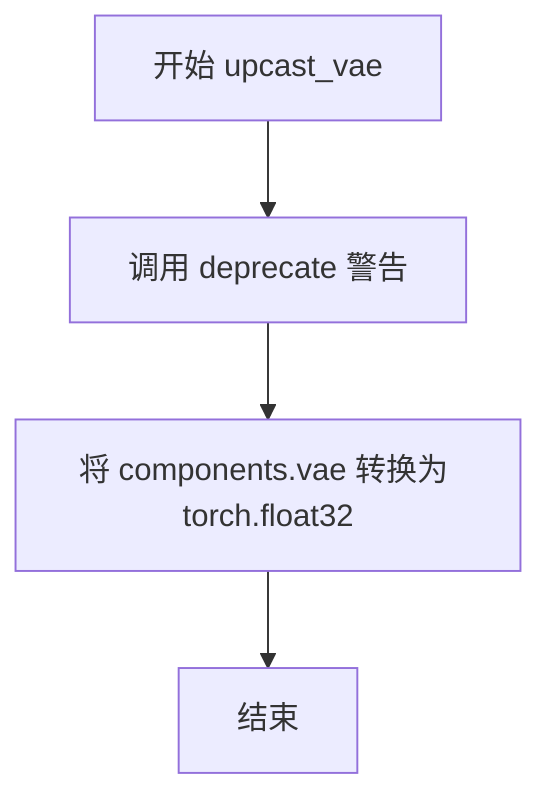
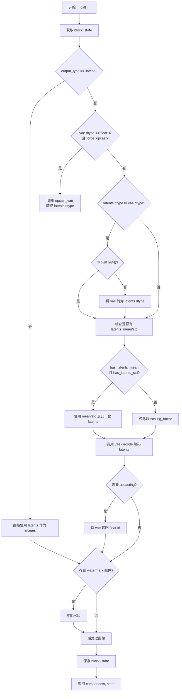
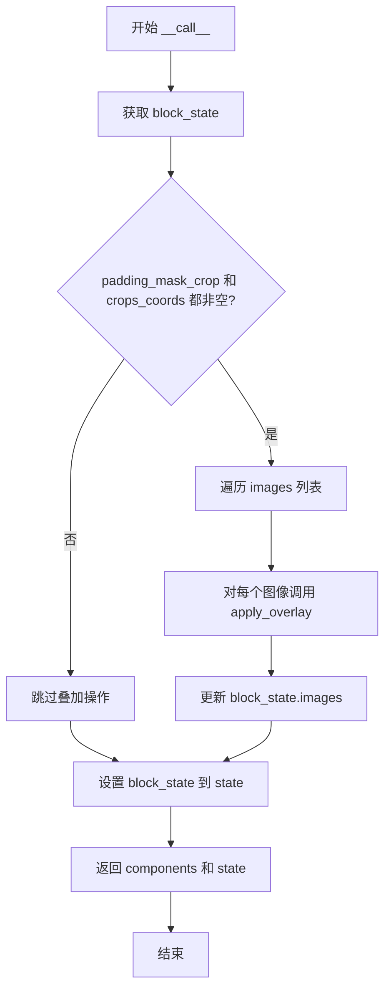

# `diffusers\src\diffusers\modular_pipelines\stable_diffusion_xl\decoders.py` 详细设计文档

该文件定义了Stable Diffusion XL的模块化管道步骤，包括将VAE潜在向量解码为图像的解码步骤（包含数据类型转换和去归一化处理）以及用于图像修复（inpainting）的遮罩叠加步骤。

## 整体流程

```mermaid
graph TD
    A[Start __call__] --> B{output_type == 'latent'}
    B -- 是 --> C[images = latents]
    B -- 否 --> D{检查VAE是否需要升采样}
    D -- 需要升采样 --> E[调用 upcast_vae]
    E --> F[latents 转换为 vae dtype]
    D -- 不需要升采样 --> G{检查 latents dtype}
    G -- 是 (MPS) --> H[vae 转换为 latents dtype]
    G -- 否 --> I[跳过转换]
    F --> J[去归一化 latents]
    H --> J
    I --> J
    J --> K[vae.decode(latents)]
    K --> L{是否需要升采样回 fp16}
    L -- 是 --> M[vae 转换回 float16]
    L -- 否 --> N[跳过]
    C --> O{是否有水印}
    M --> O
    N --> O
    O -- 是 --> P[应用水印]
    O -- 否 --> Q[后处理图像]
    P --> Q
    Q --> R[设置状态并返回]
```

## 类结构

```
ModularPipelineBlocks (抽象基类)
├── StableDiffusionXLDecodeStep (解码步骤)
└── StableDiffusionXLInpaintOverlayMaskStep (修复遮罩步骤)
```

## 全局变量及字段


### `logger`
    
用于记录模块日志的全局变量

类型：`logging.Logger`
    


### `StableDiffusionXLDecodeStep.model_name`
    
模型标识符

类型：`str`
    


### `StableDiffusionXLDecodeStep.expected_components`
    
预期的组件规格（vae, image_processor）

类型：`list[ComponentSpec]`
    


### `StableDiffusionXLDecodeStep.description`
    
步骤描述

类型：`str`
    


### `StableDiffusionXLDecodeStep.inputs`
    
输入参数（output_type, latents）

类型：`list[tuple[str, Any]]`
    


### `StableDiffusionXLDecodeStep.intermediate_outputs`
    
中间输出（images）

类型：`list[str]`
    


### `StableDiffusionXLInpaintOverlayMaskStep.model_name`
    
模型标识符

类型：`str`
    


### `StableDiffusionXLInpaintOverlayMaskStep.description`
    
步骤描述

类型：`str`
    


### `StableDiffusionXLInpaintOverlayMaskStep.expected_components`
    
预期的组件规格（image_processor）

类型：`list[ComponentSpec]`
    


### `StableDiffusionXLInpaintOverlayMaskStep.inputs`
    
输入参数（image, mask_image, padding_mask_crop, images, crops_coords）

类型：`list[tuple[str, Any]]`
    
    

## 全局函数及方法


### `StableDiffusionXLDecodeStep.upcast_vae`

这是一个已废弃的静态方法，用于将VAE（变分自编码器）强制转换为float32数据类型，以避免在float16模式下出现溢出问题。

参数：

- `components`：`components`（包含vae属性的组件对象），一个包含VAE模型及其他组件的对象容器

返回值：`None`，该方法没有返回值（隐式返回None）

#### 流程图



#### 带注释源码

```python
@staticmethod
# Copied from diffusers.pipelines.stable_diffusion.pipeline_stable_diffusion_upscale.StableDiffusionUpscalePipeline.upcast_vae with self->components
def upcast_vae(components):
    """
    将VAE强制转换为float32类型
    
    注意：此方法已废弃，请在需要时直接使用 pipe.vae.to(torch.float32)
    """
    # 发出废弃警告，指导用户使用新方法
    deprecate(
        "upcast_vae",  # 方法名
        "1.0.0",       # 废弃版本号
        # 废弃原因和替代方案说明
        "`upcast_vae` is deprecated. Please use `pipe.vae.to(torch.float32)`. For more details, please refer to: https://github.com/huggingface/diffusers/pull/12619#issue-3606633695.",
    )
    # 核心逻辑：将VAE模型转换为float32类型
    components.vae.to(dtype=torch.float32)
```


### `StableDiffusionXLDecodeStep.__call__`

该方法是 StableDiffusionXLDecodeStep 类的核心执行方法，负责将去噪后的潜在向量（latents）解码为实际的图像，并根据 output_type 进行类型转换和后处理，最终返回包含生成图像的 PipelineState。

参数：

- `self`：`StableDiffusionXLDecodeStep`，StableDiffusionXLDecodeStep 类的实例本身
- `components`：`Any`（包含 vae、image_processor 等组件的对象），提供解码所需的 VAE 模型和图像处理器
- `state`：`PipelineState`，管道状态对象，包含输出类型（output_type）、潜在向量（latents）等中间状态

返回值：`Tuple[Any, PipelineState]`，返回组件对象和更新后的管道状态（包含生成的图像）

#### 流程图



#### 带注释源码

```python
@torch.no_grad()
def __call__(self, components, state: PipelineState) -> PipelineState:
    # 获取当前块状态，包含输出类型、潜在向量等信息
    block_state = self.get_block_state(state)

    # 判断输出类型是否为 latent（跳过解码直接输出）
    if not block_state.output_type == "latent":
        latents = block_state.latents
        
        # 检查是否需要将 VAE 提升到 float32 以避免溢出问题
        block_state.needs_upcasting = components.vae.dtype == torch.float16 and components.vae.config.force_upcast

        # 如果需要 upcasting，执行 VAE 类型转换并调整 latents 数据类型
        if block_state.needs_upcasting:
            self.upcast_vae(components)
            latents = latents.to(next(iter(components.vae.post_quant_conv.parameters())).dtype)
        # 否则检查 latents 和 vae 的 dtype 是否一致，不一致时进行转换
        elif latents.dtype != components.vae.dtype:
            if torch.backends.mps.is_available():
                # 针对 Apple MPS 平台的特殊处理（pytorch bug 导致）
                components.vae = components.vae.to(latents.dtype)

        # 检查 VAE 配置中是否存在 latents_mean 和 latents_std
        block_state.has_latents_mean = (
            hasattr(components.vae.config, "latents_mean") and components.vae.config.latents_mean is not None
        )
        block_state.has_latents_std = (
            hasattr(components.vae.config, "latents_std") and components.vae.config.latents_std is not None
        )
        
        # 根据是否存在均值和标准差进行反归一化
        if block_state.has_latents_mean and block_state.has_latents_std:
            block_state.latents_mean = (
                torch.tensor(components.vae.config.latents_mean).view(1, 4, 1, 1).to(latents.device, latents.dtype)
            )
            block_state.latents_std = (
                torch.tensor(components.vae.config.latents_std).view(1, 4, 1, 1).to(latents.device, latents.dtype)
            )
            latents = (
                latents * block_state.latents_std / components.vae.config.scaling_factor + block_state.latents_mean
            )
        else:
            # 仅使用 scaling_factor 进行反归一化
            latents = latents / components.vae.config.scaling_factor

        # 调用 VAE 解码器将 latents 解码为图像
        block_state.images = components.vae.decode(latents, return_dict=False)[0]

        # 如果之前进行了 upcasting，解码后需要将 VAE 恢复为 float16
        if block_state.needs_upcasting:
            components.vae.to(dtype=torch.float16)
    else:
        # 如果 output_type 为 latent，直接使用 latents 作为 images（跳过解码）
        block_state.images = block_state.latents

    # 检查是否存在水印组件，如有则应用水印
    if hasattr(components, "watermark") and components.watermark is not None:
        block_state.images = components.watermark.apply_watermark(block_state.images)

    # 使用图像处理器对图像进行后处理（根据 output_type 转换为 PIL/Tensor/numpy）
    block_state.images = components.image_processor.postprocess(
        block_state.images, output_type=block_state.output_type
    )

    # 保存更新后的块状态到管道状态中
    self.set_block_state(state, block_state)

    # 返回组件对象和更新后的管道状态
    return components, state
```


### `StableDiffusionXLInpaintOverlayMaskStep.__call__`

一个后处理步骤，用于在图像上叠加遮罩（仅限图像修复任务）。仅当使用 `padding_mask_crop` 选项预处理图像和遮罩时才需要此步骤。

参数：

- `components`：包含管道组件的对象，包含 `image_processor` 等
- `state`：`PipelineState` 对象，包含输入状态和输出状态（包括 images、mask_image、image、padding_mask_crop、crops_coords 等）

返回值：`Tuple[components, state]`，返回更新后的组件和状态

#### 流程图



#### 带注释源码

```python
@torch.no_grad()
def __call__(self, components, state: PipelineState) -> PipelineState:
    """
    执行图像修复遮罩叠加操作
    
    参数:
        components: 包含管道组件的对象,必须有 image_processor
        state: 管道状态,包含 images, mask_image, image, padding_mask_crop, crops_coords
    
    返回:
        更新后的 components 和 state 元组
    """
    # 从状态中获取当前块的状态
    block_state = self.get_block_state(state)

    # 只有当提供了裁剪坐标时才执行遮罩叠加
    # padding_mask_crop: 预处理的padding mask裁剪选项
    # crops_coords: 图像和遮罩的裁剪坐标
    if block_state.padding_mask_crop is not None and block_state.crops_coords is not None:
        # 对每个生成的图像应用遮罩叠加
        # apply_overlay 方法会在指定裁剪区域将 mask_image 叠加到 image 上
        block_state.images = [
            components.image_processor.apply_overlay(
                block_state.mask_image,  # 遮罩图像
                block_state.image,        # 原始图像
                i,                        # 当前图像索引
                block_state.crops_coords  # 裁剪坐标
            )
            for i in block_state.images  # 遍历每个生成的图像
        ]

    # 将更新后的块状态设置回状态对象
    self.set_block_state(state, block_state)

    # 返回更新后的组件和状态
    return components, state
```

## 关键组件


### StableDiffusionXLDecodeStep

解码步骤类，负责将去噪后的潜在表示(latents)解码为实际图像，支持多种输出格式(pil/tensor/numpy)，并处理VAE类型转换、水印应用和图像后处理。

### StableDiffusionXLInpaintOverlayMaskStep

图像修复覆盖掩码步骤类，负责在图像修复任务中将掩码叠加到生成的图像上，仅在使用padding_mask_crop选项时需要。

### 张量索引与惰性加载

通过PipelineState和block_state机制实现状态管理，按需获取和设置块状态，避免不必要的内存分配和计算。

### 反量化支持

在decode前对latents进行反标准化处理，支持latents_mean和latents_std配置，实现从潜在空间到图像空间的正确映射。

### 量化策略

upcast_vae方法处理float16量化下的VAE溢出问题，支持条件性类型转换，确保在MPS平台上的兼容性。

### VAE后处理

图像后处理器(image_processor)负责将解码后的张量转换为指定输出格式(PIL.Image/torch.Tensor/numpy.array)。

### 水印组件

可选的水印组件，通过apply_watermark方法为生成的图像添加水印保护。

### 图像覆盖Overlay

apply_overlay方法处理图像修复中的掩码覆盖，支持基于crop坐标的精确图像与掩码对齐。

## 问题及建议


### 已知问题

-   **硬编码的vae_scale_factor**：多处硬编码`vae_scale_factor=8`，应该从VAE配置动态获取，降低了可维护性
-   **重复的ComponentSpec定义**：两个类都定义了相同的`image_processor`配置（VaeImageProcessor + FrozenDict({"vae_scale_factor": 8})），造成代码重复
-   **废弃方法仍保留**：upcast_vae方法标记为deprecated但仍然存在，增加代码冗余和维护负担
-   **类型提示过于宽泛**：inputs属性使用`list[tuple[str, Any]]`，丢失了具体类型信息，降低了代码可读性和类型检查效果
-   **非类型安全的属性检查**：使用`hasattr`检查watermark和latents_mean/std等属性，缺乏类型安全性和IDE支持
-   **魔法数字和硬编码值**：如`scaling_factor`、设备类型判断逻辑等散落在代码各处，缺乏统一配置管理
-   **MPS兼容性问题处理**：对MPS设备的特殊处理依赖特定PyTorch版本，可能随版本变化而失效
-   **错误处理缺失**：decode操作和tensor转换等关键步骤缺乏异常捕获和错误处理机制

### 优化建议

-   **提取公共配置**：将image_processor的ComponentSpec提取为共享配置或基类，避免重复定义
-   **完善类型提示**：使用具体的TypedDict或dataclass定义InputParam/OutputParam结构，增强类型安全
-   **清理废弃代码**：移除deprecated的upcast_vae方法，或将其迁移到独立工具模块
-   **添加错误处理**：在VAE decode、tensor dtype转换等关键路径添加try-except和日志记录
-   **配置外部化**：将vae_scale_factor、scaling_factor等配置值提取为常量或从配置读取
-   **简化状态管理**：明确block_state的生命周期和状态转换，避免images字段被多次覆盖导致的混乱
-   **设备兼容性抽象**：将MPS等特殊设备处理逻辑抽象为独立模块，便于版本维护

## 其它


### 设计目标与约束

本模块的设计目标是实现Stable Diffusion XL pipeline中的解码步骤，将去噪后的latents转换为最终图像，同时支持多种输出格式（pil、numpy array、tensor）。约束条件包括：1）必须依赖VAE模型进行解码；2）需要遵循ModularPipelineBlocks架构规范；3）需要处理float16类型VAE的溢出问题；4）需要支持MPS设备的特殊兼容性处理。

### 错误处理与异常设计

代码采用了多种错误处理策略：1）对于float16 VAE的溢出问题，通过`upcast_vae`方法将VAE临时转换为float32进行解码，完成后再转回float16；2）对于MPS设备的兼容性问题，检测到MPS可用时将VAE转换到latents的数据类型；3）通过`deprecate`函数对废弃的`upcast_vae`方法发出警告；4）使用`hasattr`检查组件属性是否存在后再访问。潜在改进：可以添加更具体的异常类型定义，明确捕获和处理各类解码异常。

### 数据流与状态机

数据流如下：输入latents → 判断output_type是否为latent → 如不是latent则进行denormalize处理（根据vae.config中的latents_mean/latents_std和scaling_factor） → VAE.decode解码 → 如需要则应用水印 → image_processor后处理 → 输出images。状态机方面，`PipelineState`包含block_state管理解码过程中的中间状态，包括latents、images、output_type、needs_upcasting、has_latents_mean、has_latents_std等状态变量。

### 外部依赖与接口契约

主要外部依赖包括：1）`AutoencoderKL`：VAE模型，用于latents到图像的解码；2）`VaeImageProcessor`：图像处理器，用于图像的后处理和格式转换；3）`FrozenDict`：不可变配置字典；4）`ModularPipelineBlocks`：模块化pipeline块基类，定义了expected_components、inputs、intermediate_outputs等接口；5）`PipelineState`：pipeline状态管理类。接口契约：decode step需要VAE和image_processor组件，输出images；inpaint overlay step需要image_processor组件进行mask覆盖处理。

### 性能考虑

性能关键点：1）使用`@torch.no_grad()`装饰器禁用梯度计算，减少内存占用；2）float16到float32的类型转换可能影响性能，应尽量避免；3）MPS设备的特殊处理增加了兼容性代码复杂度；4）图像后处理可能成为瓶颈，特别是大批量图像处理时。优化建议：可以考虑使用torch.compile加速、批量处理优化、异步处理等策略。

### 版本兼容性

代码需要处理的兼容性：1）PyTorch版本差异（特别是MPS相关bug）；2）VAE配置结构变化（latents_mean/latents_std可能不存在）；3）不同平台（Apple Silicon MPS、CUDA等）的dtype处理差异；4）与旧版本upcast_vae方法的兼容性保持（通过deprecate警告）。

### 安全性和权限

代码不涉及直接的用户输入处理，但作为pipeline组件需要考虑：1）VAE模型加载的内存安全问题；2）大规模tensor操作可能导致的内存溢出；3）watermark组件的恶意输入处理。代码遵循Apache 2.0许可证。

    