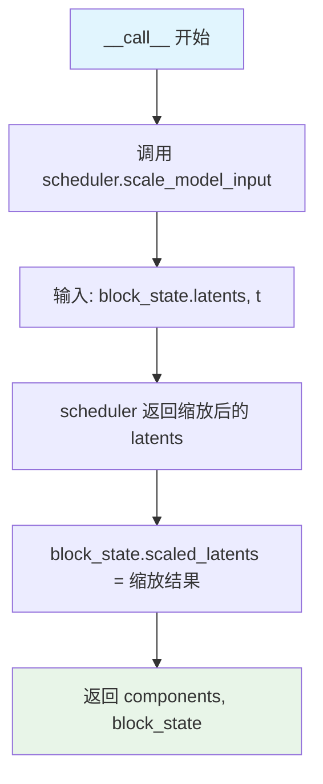
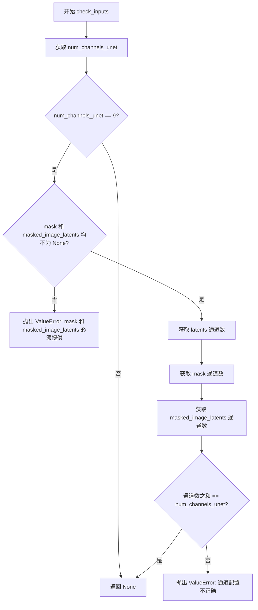
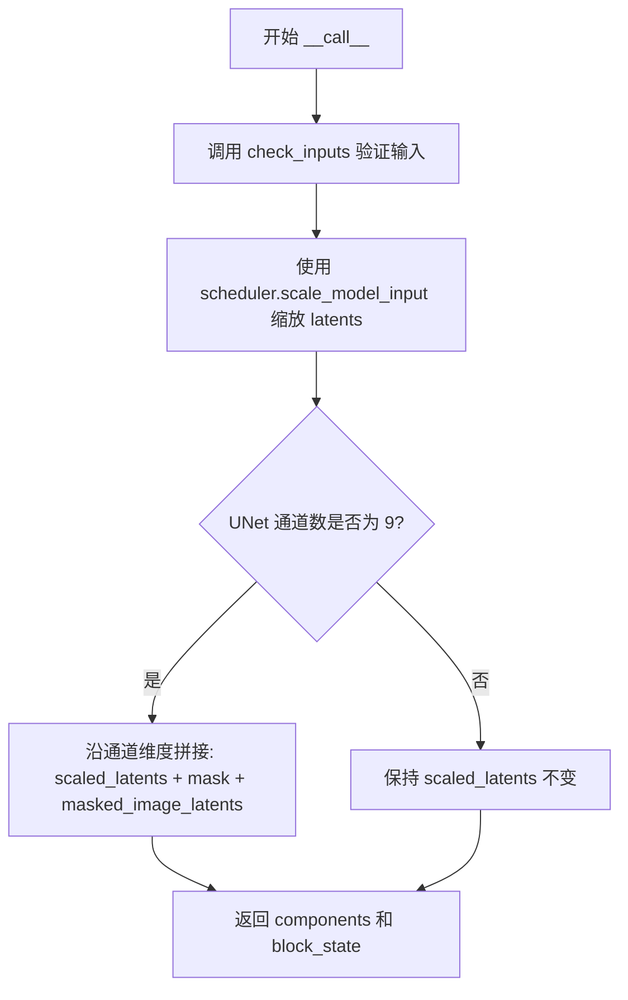
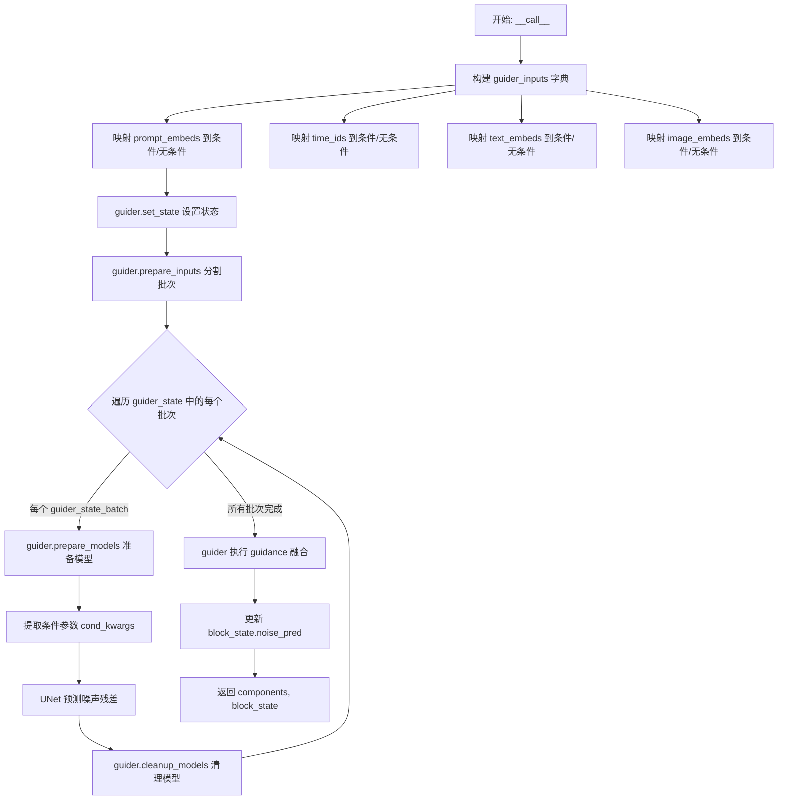
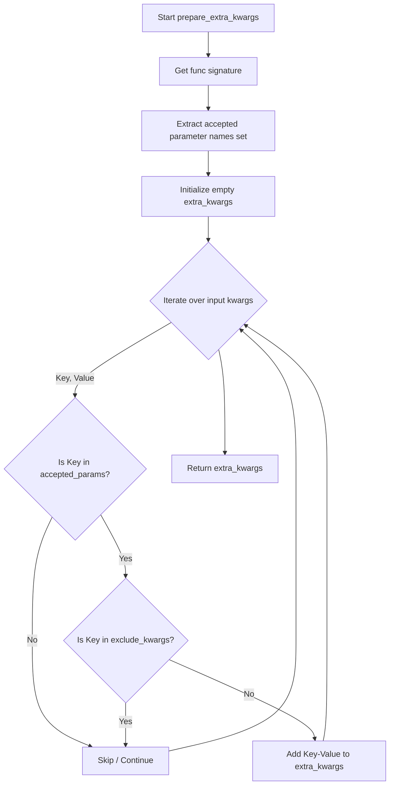
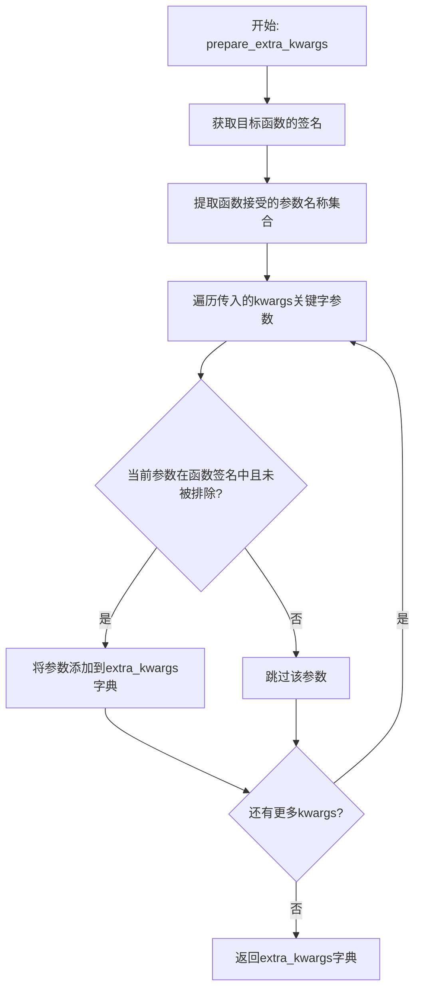
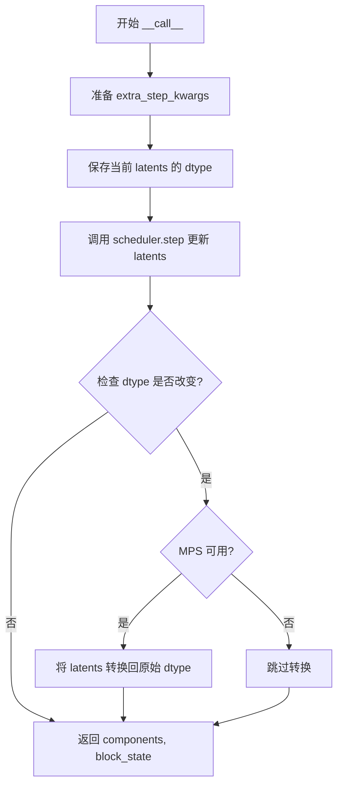
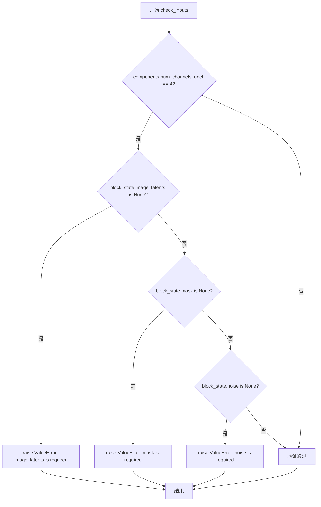
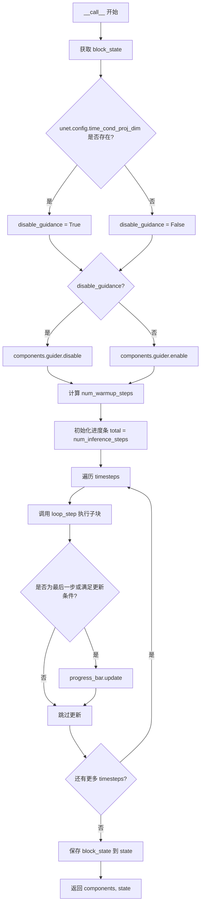

# `diffusers\src\diffusers\modular_pipelines\stable_diffusion_xl\denoise.py` 详细设计文档

该代码定义了一套用于Stable Diffusion XL (SDXL) 循环去噪过程的模块化管道块（Pipeline Blocks），通过组合'去噪前'、'去噪器'和'去噪后'三个步骤，支持文本到图像、图像修复（Inpainting）以及ControlNet控制等多种工作流程。

## 整体流程

```mermaid
graph TD
    A[入口: StableDiffusionXLDenoiseStep] --> B[StableDiffusionXLDenoiseLoopWrapper]
    B --> C{遍历 Timesteps}
    C -- 遍历 --> D[Step 1: LoopBeforeDenoiser (准备Latent)]
    D --> E[Step 2: LoopDenoiser (预测噪声)]
    E --> F[Step 3: LoopAfterDenoiser (更新Latent)]
    F --> C
    C -- 结束 --> G[输出最终Latents]
```

## 类结构

```
ModularPipelineBlocks (抽象基类)
├── StableDiffusionXLLoopBeforeDenoiser (准备输入)
│   └── StableDiffusionXLInpaintLoopBeforeDenoiser (支持Inpainting)
├── StableDiffusionXLLoopDenoiser (核心去噪)
│   └── StableDiffusionXLControlNetLoopDenoiser (支持ControlNet)
└── StableDiffusionXLLoopAfterDenoiser (调度器更新)
    └── StableDiffusionXLInpaintLoopAfterDenoiser (支持Inpainting)

LoopSequentialPipelineBlocks (循环基类)
└── StableDiffusionXLDenoiseLoopWrapper (循环封装)
    ├── StableDiffusionXLDenoiseStep (标准文本/Img2Img)
    ├── StableDiffusionXLControlNetDenoiseStep (ControlNet)
    ├── StableDiffusionXLInpaintDenoiseStep (Inpainting)
    └── StableDiffusionXLInpaintControlNetDenoiseStep (Inpainting + ControlNet)
```

## 全局变量及字段


### `logger`
    
模块级日志记录器，用于记录调试和运行信息

类型：`logging.Logger`
    


### `StableDiffusionXLLoopBeforeDenoiser.model_name`
    
模型标识符，固定为stable-diffusion-xl

类型：`str`
    


### `StableDiffusionXLLoopBeforeDenoiser.expected_components`
    
依赖组件列表，当前需要EulerDiscreteScheduler调度器

类型：`list[ComponentSpec]`
    


### `StableDiffusionXLLoopBeforeDenoiser.description`
    
步骤描述，说明该模块在去噪循环中准备潜在输入的功能

类型：`str`
    


### `StableDiffusionXLLoopBeforeDenoiser.inputs`
    
输入参数列表，包含latents张量用于去噪过程

类型：`list[InputParam]`
    


### `StableDiffusionXLInpaintLoopBeforeDenoiser.expected_components`
    
依赖组件列表，需要scheduler和unet模型

类型：`list[ComponentSpec]`
    


### `StableDiffusionXLInpaintLoopBeforeDenoiser.inputs`
    
输入参数列表，包含latents、mask和masked_image_latents用于图像修复

类型：`list[InputParam]`
    


### `StableDiffusionXLLoopDenoiser.expected_components`
    
依赖组件列表，需要guider和unet模型用于引导去噪

类型：`list[ComponentSpec]`
    


### `StableDiffusionXLLoopDenoiser.inputs`
    
输入参数列表，包含num_inference_steps、timestep_cond等去噪相关参数

类型：`list[InputParam]`
    


### `StableDiffusionXLControlNetLoopDenoiser.expected_components`
    
依赖组件列表，需要guider、unet和controlnet模型

类型：`list[ComponentSpec]`
    


### `StableDiffusionXLLoopAfterDenoiser.expected_components`
    
依赖组件列表，需要EulerDiscreteScheduler调度器

类型：`list[ComponentSpec]`
    


### `StableDiffusionXLLoopAfterDenoiser.intermediate_outputs`
    
中间输出参数，输出更新后的latents张量

类型：`list[OutputParam]`
    


### `StableDiffusionXLInpaintLoopAfterDenoiser.inputs`
    
输入参数列表，包含eta、generator、timesteps、mask、noise和image_latents

类型：`list[InputParam]`
    


### `StableDiffusionXLDenoiseLoopWrapper.loop_expected_components`
    
循环依赖组件列表，需要guider、scheduler和unet模型

类型：`list[ComponentSpec]`
    


### `StableDiffusionXLDenoiseLoopWrapper.loop_inputs`
    
循环输入参数，包含timesteps和num_inference_steps

类型：`list[InputParam]`
    


### `StableDiffusionXLDenoiseStep.block_classes`
    
块类列表，包含Before、Denoiser和After三个去噪步骤类

类型：`list`
    


### `StableDiffusionXLDenoiseStep.block_names`
    
块名称列表，对应before_denoiser、denoiser、after_denoiser

类型：`list`
    


### `StableDiffusionXLControlNetDenoiseStep.block_classes`
    
块类列表，包含Before、ControlNetDenoiser和After三个带ControlNet的去噪步骤类

类型：`list`
    


### `StableDiffusionXLInpaintDenoiseStep.block_classes`
    
块类列表，包含InpaintBefore、Denoiser和InpaintAfter三个图像修复去噪步骤类

类型：`list`
    


### `StableDiffusionXLInpaintControlNetDenoiseStep.block_classes`
    
块类列表，包含InpaintBefore、ControlNetDenoiser和InpaintAfter用于图像修复结合ControlNet

类型：`list`
    
    

## 全局函数及方法


### `StableDiffusionXLLoopBeforeDenoiser.__call__`

该方法是 Stable Diffusion XL 降噪循环中的第一步，负责使用 scheduler 对 latents 进行缩放处理，为后续的降噪器准备输入数据。

参数：

- `components`：`StableDiffusionXLModularPipeline`，包含所有管道组件的对象，例如 scheduler
- `block_state`：`BlockState`，存储当前循环块的状态，包括 latents、scaled_latents 等
- `i`：`int`，当前循环的索引（步骤编号）
- `t`：`int`，当前的时间步（timestep）

返回值：`Tuple[StableDiffusionXLModularPipeline, BlockState]`，返回更新后的 components 和 block_state，其中 block_state.scaled_latents 包含缩放后的 latents

#### 流程图



#### 带注释源码

```python
@torch.no_grad()
def __call__(self, components: StableDiffusionXLModularPipeline, block_state: BlockState, i: int, t: int):
    """
    执行循环前的准备工作：使用 scheduler 缩放 latents
    
    参数:
        components: 管道组件容器，包含 scheduler 等
        block_state: 块状态对象，存储 latents 等数据
        i: 当前循环迭代索引
        t: 当前时间步
    
    返回:
        更新后的 components 和 block_state
    """
    
    # 使用 scheduler 的 scale_model_input 方法将原始 latents 缩放为适合模型输入的格式
    # 这通常涉及将 latents 从原始分布映射到模型期望的输入分布
    block_state.scaled_latents = components.scheduler.scale_model_input(block_state.latents, t)

    # 返回更新后的组件和状态，scaled_latents 将被后续的 denoiser 步骤使用
    return components, block_state
```


### `StableDiffusionXLInpaintLoopBeforeDenoiser.check_inputs`

检查 mask 和 latents 通道数是否匹配，确保 inpainting 任务的输入配置正确。

参数：

- `components`：`StableDiffusionXLModularPipeline`，包含 UNet 通道数配置等组件信息
- `block_state`：`BlockState`，包含 mask、masked_image_latents 和 latents 等张量状态

返回值：`None`，该方法通过抛出 ValueError 来指示配置错误，若验证通过则正常返回

#### 流程图



#### 带注释源码

```python
@staticmethod
def check_inputs(components, block_state):
    # 获取 UNet 模型的通道数配置
    num_channels_unet = components.num_channels_unet
    
    # 仅在 UNet 通道数为 9 时进行 inpainting 特定检查
    # 9 通道是 stable-diffusion-v1-5/inpainting 的默认配置
    if num_channels_unet == 9:
        # 验证 mask 和 masked_image_latents 必须同时存在
        if block_state.mask is None or block_state.masked_image_latents is None:
            raise ValueError(
                "mask and masked_image_latents must be provided for inpainting-specific Unet"
            )
        
        # 获取各个输入的通道数
        num_channels_latents = block_state.latents.shape[1]       # latents 通道数（通常为 4）
        num_channels_mask = block_state.mask.shape[1]             # mask 通道数（通常为 1）
        num_channels_masked_image = block_state.masked_image_latents.shape[1]  # 被遮挡图像 latent 通道数（通常为 4）
        
        # 验证总通道数是否等于 UNet 期望的输入通道数
        if num_channels_latents + num_channels_mask + num_channels_masked_image != num_channels_unet:
            raise ValueError(
                f"Incorrect configuration settings! The config of `components.unet`: {components.unet.config} expects"
                f" {components.unet.config.in_channels} but received `num_channels_latents`: {num_channels_latents} +"
                f" `num_channels_mask`: {num_channels_mask} + `num_channels_masked_image`: {num_channels_masked_image}"
                f" = {num_channels_latents + num_channels_masked_image + num_channels_mask}. Please verify the config of"
                " `components.unet` or your `mask_image` or `image` input."
            )
```


### `StableDiffusionXLInpaintLoopBeforeDenoiser.__call__`

该方法在去噪循环之前准备 latent 输入，对于 inpainting 工作流，它会缩放 latents 并在 UNet 通道数为 9 时将 latents、mask 和 masked_image_latents 沿通道维度拼接在一起。

参数：

- `components`：`StableDiffusionXLModularPipeline`，包含所有组件的管道对象，提供 scheduler 和 unet 等组件
- `block_state`：`BlockState`，块状态对象，包含 latents、mask、masked_image_latents 等属性
- `i`：`int`，当前循环迭代的索引
- `t`：`int`，当前时间步

返回值：`tuple[StableDiffusionXLModularPipeline, BlockState]`，返回更新后的组件和块状态，其中 `block_state.scaled_latents` 包含缩放后的 latents（可能已拼接 mask 和 masked_image_latents）

#### 流程图



#### 带注释源码

```python
@torch.no_grad()
def __call__(self, components: StableDiffusionXLModularPipeline, block_state: BlockState, i: int, t: int):
    # 验证输入的 mask 和 masked_image_latents 是否正确提供
    self.check_inputs(components, block_state)

    # 使用调度器的 scale_model_input 方法对 latents 进行缩放
    # 这是为了将 latents 调整到适合当前时间步 t 的格式
    block_state.scaled_latents = components.scheduler.scale_model_input(block_state.latents, t)
    
    # 如果 UNet 配置为 9 通道（标准的 inpainting 配置）
    # 需要将 scaled_latents、mask 和 masked_image_latents 沿通道维度拼接
    if components.num_channels_unet == 9:
        block_state.scaled_latents = torch.cat(
            [block_state.scaled_latents, block_state.mask, block_state.masked_image_latents], dim=1
        )

    # 返回更新后的组件和块状态
    return components, block_state
```


### `StableDiffusionXLLoopDenoiser.__call__`

该方法是 Stable Diffusion XL 循环去噪步骤的核心实现，负责使用 guider 准备输入、运行 UNet 预测噪声残差，并根据指导策略执行噪声预测的加权融合，最终输出去噪后的噪声预测结果。

参数：

- `self`：类实例本身
- `components`：`StableDiffusionXLModularPipeline`，包含管道组件的配置对象，提供 guider、unet 等模型组件
- `block_state`：`BlockState`，表示当前块的执行状态，包含缩放后的 latents、条件嵌入、时间步条件、交叉注意力参数等
- `i`：`int`，当前去噪步骤的索引，用于设置 guider 状态
- `t`：`int`，当前推理的时间步（timestep），用于 UNet 预测

返回值：`PipelineState`（实际为 tuple[StableDiffusionXLModularPipeline, BlockState]），返回更新后的组件和块状态，其中 `block_state.noise_pred` 被设置为经过 guidance 处理后的最终噪声预测

#### 流程图



#### 带注释源码

```python
@torch.no_grad()
def __call__(
    self, components: StableDiffusionXLModularPipeline, block_state: BlockState, i: int, t: int
) -> PipelineState:
    # 构建 guider 输入映射：将 guider_state_batch 中的键映射到 block_state 中对应的
    # (条件, 无条件) 字段元组。例如：
    #   prompt_embeds -> (block_state.prompt_embeds, block_state.negative_prompt_embeds)
    guider_inputs = {
        "prompt_embeds": (
            getattr(block_state, "prompt_embeds", None),
            getattr(block_state, "negative_prompt_embeds", None),
        ),
        "time_ids": (
            getattr(block_state, "add_time_ids", None),
            getattr(block_state, "negative_add_time_ids", None),
        ),
        "text_embeds": (
            getattr(block_state, "pooled_prompt_embeds", None),
            getattr(block_state, "negative_pooled_prompt_embeds", None),
        ),
        "image_embeds": (
            getattr(block_state, "ip_adapter_embeds", None),
            getattr(block_state, "negative_ip_adapter_embeds", None),
        ),
    }

    # 设置 guider 的当前状态，包括步骤索引、推理步数和时间步
    components.guider.set_state(step=i, num_inference_steps=block_state.num_inference_steps, timestep=t)

    # guider 将模型输入分割为条件/无条件预测的独立批次
    # 对于 CFG，guider_state 包含两个批次：
    #   [
    #       {"prompt_embeds": ..., "__guidance_identifier__": "pred_cond"},   # 条件批次
    #       {"prompt_embeds": ..., "__guidance_identifier__": "pred_uncond"} # 无条件批次
    #   ]
    # 其他 guidance 方法可能返回 1 个批次（无 guidance）或 3+ 个批次（如 PAG、APG）
    guider_state = components.guider.prepare_inputs(guider_inputs)

    # 为每个 guidance 批次运行去噪器
    for guider_state_batch in guider_state:
        # 准备模型（例如，为 classifier-free guidance 启用/禁用某些层）
        components.guider.prepare_models(components.unet)
        
        # 从当前批次中提取条件参数
        cond_kwargs = {input_name: getattr(guider_state_batch, input_name) for input_name in guider_inputs.keys()}
        prompt_embeds = cond_kwargs.pop("prompt_embeds")

        # 预测噪声残差
        # 将 noise_pred 存储在 guider_state_batch 中，以便跨批次应用 guidance
        guider_state_batch.noise_pred = components.unet(
            block_state.scaled_latents,           # 缩放后的潜在表示
            t,                                      # 当前时间步
            encoder_hidden_states=prompt_embeds,   # 文本编码器隐藏状态
            timestep_cond=block_state.timestep_cond, # 时间步条件嵌入（用于 LCM 等）
            cross_attention_kwargs=block_state.cross_attention_kwargs, # 交叉注意力额外参数
            added_cond_kwargs=cond_kwargs,         # 附加条件参数（text_embeds, time_ids, image_embeds）
            return_dict=False,
        )[0]
        
        # 清理模型资源
        components.guider.cleanup_models(components.unet)

    # 执行 guidance（根据 guidance 类型加权融合条件和无条件预测）
    # 对于 CFG，这通常是：noise_pred = unconditional_pred + scale * (conditional_pred - unconditional_pred)
    block_state.noise_pred = components.guider(guider_state)[0]

    return components, block_state
```


### `StableDiffusionXLControlNetLoopDenoiser.prepare_extra_kwargs`

该方法是一个静态工具函数，用于过滤和传递关键字参数（kwargs）。它通过检查目标函数（`func`）的签名（Signature），将传入的 `kwargs` 中符合目标函数参数列表且未被列入黑名单（`exclude_kwargs`）的参数筛选出来，组成一个新的字典返回。这主要用于在流水线（Pipeline）执行过程中，将状态块（Block State）中存储的额外参数安全地传递给底层模型（如 ControlNet 或 Scheduler），避免因参数不匹配而引发的错误。

参数：

-  `func`：`Callable`，目标函数（例如 `components.controlnet.forward`），用于获取该函数所接受的参数列表。
-  `exclude_kwargs`：`list[str]`，一个字符串列表，指定即使目标函数接受也应当排除在外的参数名，默认为空列表 `[]`。
-  `**kwargs`：`Any`，可变关键字参数，通常来自 `block_state` 中的配置字典（如 `controlnet_kwargs`）。

返回值：`dict`，返回一个新的字典，包含仅来自 `kwargs` 且符合 `func` 签名且不在 `exclude_kwargs` 中的键值对。

#### 流程图



#### 带注释源码

```python
@staticmethod
def prepare_extra_kwargs(func, exclude_kwargs=[], **kwargs):
    """
    过滤额外的关键字参数，仅保留目标函数(func)签名中存在的参数。
    
    参数:
        func: 目标函数（例如 components.controlnet.forward），用于确定哪些参数是合法的。
        exclude_kwargs: 一个列表，指定即使 func 接受也应当被排除的参数。
        **kwargs: 从外部传入的原始参数字典。
    """
    # 1. 使用 inspect 获取目标函数的签名
    accepted_kwargs = set(inspect.signature(func).parameters.keys())
    
    # 2. 初始化结果字典
    extra_kwargs = {}
    
    # 3. 遍历所有传入的 kwargs
    for key, value in kwargs.items():
        # 4. 检查条件：
        #    a. 参数名必须在目标函数的签名中 (key in accepted_kwargs)
        #    b. 参数名必须不在排除列表中 (key not in exclude_kwargs)
        if key in accepted_kwargs and key not in exclude_kwargs:
            extra_kwargs[key] = value

    # 5. 返回过滤后的参数字典
    return extra_kwargs
```


### `StableDiffusionXLControlNetLoopDenoiser.__call__`

该方法是Stable Diffusion XL流水线中集成了ControlNet的去噪循环步骤。它在每个去噪迭代中首先运行ControlNet获取中间残差（down_block和mid_block的附加残差），然后将这些残差与UNet结合进行噪声预测，最后通过guidance机制（通常是Classifier-Free Guidance）合并条件和非条件预测结果。

参数：

- `components`：`StableDiffusionXLModularPipeline`，包含流水线所需的组件（如guider、unet、controlnet等）
- `block_state`：`BlockState`，存储当前迭代的中间状态（包括scaled_latents、controlnet_cond、conditioning_scale、guess_mode等）
- `i`：`int`，当前去噪循环的迭代索引（从0开始）
- `t`：`int`，当前的时间步（timestep）

返回值：`Tuple[StableDiffusionXLModularPipeline, BlockState]`，返回更新后的components和block_state，其中block_state.noise_pred被更新为最终的噪声预测结果

#### 流程图

```mermaid
flowchart TD
    A[开始: __call__] --> B[准备extra_controlnet_kwargs]
    B --> C[构建guider_inputs字典<br/>映射prompt_embeds/time_ids/text_embeds/image_embeds]
    C --> D[计算cond_scale<br/>根据conditioning_scale和controlnet_keep[i]]
    D --> E[初始化down_block_res_samples_zeros<br/>和mid_block_res_sample_zeros]
    E --> F[设置guider状态<br/>set_state step=i, num_inference_steps, timestep=t]
    F --> G[准备guider输入<br/>guider.prepare_inputs返回guider_state列表]
    G --> H{遍历guider_state_batch}
    H -->|每个batch| I[准备additional conditionings<br/>text_embeds, time_ids, image_embeds]
    I --> J{guess_mode且is_conditional?}
    J -->|Yes| K[使用零残差<br/>down_block_res_samples_zeros]
    J -->|No| L[运行ControlNet<br/>获取down_block_res_samples<br/>和mid_block_res_sample]
    L --> M{首次运行ControlNet?}
    M -->|Yes| N[保存零残差副本<br/>供uncond批次使用]
    M -->|No| O[跳过保存]
    K --> O
    O --> P[运行UNet预测噪声<br/>传入down_block和mid_block残差]
    P --> Q[保存noise_pred到guider_state_batch]
    Q --> H
    H -->|完成| R[执行guidance合并<br/>guider.guider_state计算最终noise_pred]
    R --> S[更新block_state.noise_pred]
    S --> T[返回components, block_state]
```

#### 带注释源码

```python
@torch.no_grad()
def __call__(self, components: StableDiffusionXLModularPipeline, block_state: BlockState, i: int, t: int):
    # 从block_state中提取extra_controlnet_kwargs，用于传递给ControlNet的额外参数
    # 例如control_type_idx, control_type等
    extra_controlnet_kwargs = self.prepare_extra_kwargs(
        components.controlnet.forward, **block_state.controlnet_kwargs
    )

    # 构建guider_inputs字典，将guider状态的批次字段映射到block_state中的对应字段
    # 格式为 {field_name: (cond_value, uncond_value)}
    # 例如 prompt_embeds -> (block_state.prompt_embeds, block_state.negative_prompt_embeds)
    guider_inputs = {
        "prompt_embeds": (
            getattr(block_state, "prompt_embeds", None),
            getattr(block_state, "negative_prompt_embeds", None),
        ),
        "time_ids": (
            getattr(block_state, "add_time_ids", None),
            getattr(block_state, "negative_add_time_ids", None),
        ),
        "text_embeds": (
            getattr(block_state, "pooled_prompt_embeds", None),
            getattr(block_state, "negative_pooled_prompt_embeds", None),
        ),
        "image_embeds": (
            getattr(block_state, "ip_adapter_embeds", None),
            getattr(block_state, "negative_ip_adapter_embeds", None),
        ),
    }

    # 计算当前时间步的conditioning_scale，考虑controlnet_keep[i]的值
    # 如果controlnet_keep[i]是列表，则对应每个conditioning_scale元素相乘
    if isinstance(block_state.controlnet_keep[i], list):
        block_state.cond_scale = [
            c * s for c, s in zip(block_state.conditioning_scale, block_state.controlnet_keep[i])
        ]
    else:
        controlnet_cond_scale = block_state.conditioning_scale
        if isinstance(controlnet_cond_scale, list):
            controlnet_cond_scale = controlnet_cond_scale[0]
        block_state.cond_scale = controlnet_cond_scale * block_state.controlnet_keep[i]

    # 初始化guess模式的零残差，用于无条件预测路径
    block_state.down_block_res_samples_zeros = None
    block_state.mid_block_res_sample_zeros = None

    # 设置guider的当前状态（当前步骤、总推理步骤、时间步）
    components.guider.set_state(step=i, num_inference_steps=block_state.num_inference_steps, timestep=t)

    # guider准备输入，根据guidance类型（如CFG）将输入拆分为条件和非条件批次
    # 返回guider_state列表，每个元素包含一个批次的输入
    guider_state = components.guider.prepare_inputs(guider_inputs)

    # 遍历每个guidance批次（通常为2个：条件和非条件）
    for guider_state_batch in guider_state:
        components.guider.prepare_models(components.unet)

        # 准备UNet的额外条件参数
        added_cond_kwargs = {
            "text_embeds": guider_state_batch.text_embeds,
            "time_ids": guider_state_batch.time_ids,
        }
        # 如果存在image_embeds（IP-Adapter），也添加到条件参数中
        if hasattr(guider_state_batch, "image_embeds") and guider_state_batch.image_embeds is not None:
            added_cond_kwargs["image_embeds"] = guider_state_batch.image_embeds

        # 准备ControlNet的额外条件参数
        controlnet_added_cond_kwargs = {
            "text_embeds": guider_state_batch.text_embeds,
            "time_ids": guider_state_batch.time_ids,
        }
        
        # 运行ControlNet：根据guess_mode和guidance类型决定如何获取残差
        if block_state.guess_mode and not components.guider.is_conditional:
            # 在guess_mode下，如果guider不是条件模式，使用预存的零残差
            down_block_res_samples = block_state.down_block_res_samples_zeros
            mid_block_res_sample = block_state.mid_block_res_sample_zeros
        else:
            # 正常运行ControlNet，获取中间残差
            down_block_res_samples, mid_block_res_sample = components.controlnet(
                block_state.scaled_latents,
                t,
                encoder_hidden_states=guider_state_batch.prompt_embeds,
                controlnet_cond=block_state.controlnet_cond,
                conditioning_scale=block_state.cond_scale,
                guess_mode=block_state.guess_mode,
                added_cond_kwargs=controlnet_added_cond_kwargs,
                return_dict=False,
                **extra_controlnet_kwargs,
            )

            # 如果是首次运行ControlNet（条件批次），保存零残差供后续非条件批次使用
            if block_state.down_block_res_samples_zeros is None:
                block_state.down_block_res_samples_zeros = [torch.zeros_like(d) for d in down_block_res_samples]
            if block_state.mid_block_res_sample_zeros is None:
                block_state.mid_block_res_sample_zeros = torch.zeros_like(mid_block_res_sample)

        # 运行UNet进行噪声预测，传入从ControlNet获取的附加残差
        # store the noise_pred in guider_state_batch so we can apply guidance across all batches
        guider_state_batch.noise_pred = components.unet(
            block_state.scaled_latents,
            t,
            encoder_hidden_states=guider_state_batch.prompt_embeds,
            timestep_cond=block_state.timestep_cond,
            cross_attention_kwargs=block_state.cross_attention_kwargs,
            added_cond_kwargs=added_cond_kwargs,
            down_block_additional_residuals=down_block_res_samples,
            mid_block_additional_residual=mid_block_res_sample,
            return_dict=False,
        )[0]
        components.guider.cleanup_models(components.unet)

    # 执行guidance操作，合并所有批次的噪声预测（通常是条件和非条件预测的加权平均）
    block_state.noise_pred = components.guider(guider_state)[0]

    return components, block_state
```


### `StableDiffusionXLLoopAfterDenoiser.prepare_extra_kwargs`

准备调度器额外参数。该静态方法通过检查目标函数的签名，过滤出符合函数参数要求且未被排除的额外关键字参数，用于调度器的 `step` 方法调用。

参数：

-  `func`：需要检查的目标函数（如 `scheduler.step` 方法）
-  `exclude_kwargs`：需要排除的关键字参数列表，默认为空列表
-  `**kwargs`：任意关键字参数（如 `generator`、`eta` 等）

返回值：`dict`，返回符合函数签名要求且未被排除的额外关键字参数

#### 流程图



#### 带注释源码

```python
@staticmethod
def prepare_extra_kwargs(func, exclude_kwargs=[], **kwargs):
    """
    准备额外参数，过滤出符合目标函数签名的参数
    
    参数:
        func: 目标函数对象（如 scheduler.step）
        exclude_kwargs: 需要排除的参数列表
        **kwargs: 传入的额外关键字参数
    
    返回:
        符合函数签名且未被排除的参数字典
    """
    # 使用inspect获取目标函数的签名信息
    accepted_kwargs = set(inspect.signature(func).parameters.keys())
    
    # 初始化存储过滤后参数的字典
    extra_kwargs = {}
    
    # 遍历所有传入的关键字参数
    for key, value in kwargs.items():
        # 仅添加在函数签名中且不在排除列表中的参数
        if key in accepted_kwargs and key not in exclude_kwargs:
            extra_kwargs[key] = value
    
    return extra_kwargs
```


### `StableDiffusionXLLoopAfterDenoiser.__call__`

该方法是 Stable Diffusion XL 去噪循环的第三步（最后一步），负责调用调度器（scheduler）根据预测的噪声残差（noise_pred）来更新潜在表示（latents），并处理 Apple MPS（Metal Performance Shaders）平台的兼容性 问题。

参数：

- `components`：`StableDiffusionXLModularPipeline`，包含所有管道组件（如 scheduler、unet 等）
- `block_state`：`BlockState`，保存中间状态的块状态对象，包含 noise_pred、latents、generator、eta 等
- `i`：`int`，当前去噪循环的迭代索引
- `t`：`int`，当前的时间步（timestep）

返回值：`(StableDiffusionXLModularPipeline, BlockState)`，返回更新后的组件和块状态，其中块状态的 latents 已被调度器更新

#### 流程图



#### 带注释源码

```python
@torch.no_grad()
def __call__(self, components: StableDiffusionXLModularPipeline, block_state: BlockState, i: int, t: int):
    # 准备额外的 step 参数（如 generator 和 eta）
    # TODO: 这个逻辑理论上应该移到管道外部
    block_state.extra_step_kwargs = self.prepare_extra_kwargs(
        components.scheduler.step, generator=block_state.generator, eta=block_state.eta
    )

    # 保存原始 latents 的数据类型，用于后续可能的类型恢复
    block_state.latents_dtype = block_state.latents.dtype

    # 使用调度器执行一步去噪：根据预测的噪声残差更新 latents
    # scheduler.step 是扩散模型去噪的核心步骤，根据算法（如 Euler、DDPM 等）计算下一步的 latents
    block_state.latents = components.scheduler.step(
        block_state.noise_pred,       # UNet 预测的噪声残差
        t,                            # 当前时间步
        block_state.latents,          # 当前的 latents
        **block_state.extra_step_kwargs,  # 额外的参数（generator, eta 等）
        return_dict=False,            # 返回元组而非字典
    )[0]  # 取第一个元素（通常是更新后的 latents）

    # 处理 Apple MPS (Metal Performance Shaders) 平台的兼容性问题
    # 由于 PyTorch 的一个 bug，某些平台（如 Apple M1/M2/M3）会导致 dtype 被意外改变
    # 参考: https://github.com/pytorch/pytorch/pull/99272
    if block_state.latents.dtype != block_state.latents_dtype:
        if torch.backends.mps.is_available():
            # 将 latents 转换回原始的 dtype，确保后续计算正确
            block_state.latents = block_state.latents.to(block_state.latents_dtype)

    # 返回更新后的组件和块状态
    return components, block_state
```


### `StableDiffusionXLInpaintLoopAfterDenoiser.check_inputs`

该方法用于验证在图像修复（inpainting）工作流中，`image_latents`、`mask` 和 `noise` 这三个关键输入是否存在。这是 Stable Diffusion XL 图像修复管道中的输入校验逻辑，确保在执行去噪步骤前所有必要的张量都已正确提供。

参数：

- `self`：隐式参数，`StableDiffusionXLInpaintLoopAfterDenoiser` 类的实例对象
- `components`：`StableDiffusionXLModularPipeline` 类型，模块化管道组件容器，包含 `unet`、`scheduler` 等组件
- `block_state`：`BlockState` 类型，块状态对象，存储当前块执行过程中的中间状态和输入数据

返回值：`None`，该方法不返回任何值，通过抛出 `ValueError` 异常来处理验证失败的情况

#### 流程图



#### 带注释源码

```python
def check_inputs(self, components, block_state):
    """
    检查图像修复（inpainting）工作流所需的输入参数是否完整。
    
    当 UNet 配置为 4 通道模式时（num_channels_unet == 4），
    需要验证 image_latents、mask 和 noise 三个关键输入都存在。
    
    参数:
        components: 管道组件容器，包含 unet 等模型组件
        block_state: 块状态对象，存储中间计算结果和输入数据
    
    异常:
        ValueError: 当任一必要输入参数缺失时抛出
    """
    # 仅在 4 通道 UNet 配置下进行图像修复专用的输入检查
    if components.num_channels_unet == 4:
        # 检查图像潜在表示是否提供
        # image_latents 是从原始图像编码而来的潜在空间表示
        if block_state.image_latents is None:
            raise ValueError(f"image_latents is required for this step {self.__class__.__name__}")
        
        # 检查遮罩是否提供
        # mask 定义了需要修复/重绘的区域
        if block_state.mask is None:
            raise ValueError(f"mask is required for this step {self.__class__.__name__}")
        
        # 检查噪声是否提供
        # noise 用于在潜在空间中添加噪声，实现修复效果
        if block_state.noise is None:
            raise ValueError(f"noise is required for this step {self.__class__.__name__}")
```


### `StableDiffusionXLInpaintLoopAfterDenoiser.__call__`

执行调度器步骤（scheduler step）以使用预测的噪声残差更新潜在表示（latents），并对inpainting任务应用mask混合逻辑，将原始图像潜在与当前去噪潜在按mask进行加权混合。

参数：

- `self`：`StableDiffusionXLInpaintLoopAfterDenoiser` 类实例，方法所属对象
- `components`：`StableDiffusionXLModularPipeline`，包含所有流水线组件的对象，如scheduler、unet等
- `block_state`：`BlockState`，存储当前块执行状态的上下文对象，包含latents、mask、noise等
- `i`：`int`，当前去噪迭代的索引，用于判断是否为最后一次迭代
- `t`：`int`，当前去噪的时间步（timestep）

返回值：`Tuple[StableDiffusionXLModularPipeline, BlockState]`，返回更新后的components和block_state，其中block_state.latents已更新

#### 流程图

```mermaid
flowchart TD
    A[__call__ 开始] --> B{检查输入有效性}
    B -->|通过| C[准备额外调度器参数]
    C --> D[执行 scheduler.step 使用 noise_pred 更新 latents]
    D --> E{检查 latents 数据类型}
    E -->|不匹配| F[MPS 后端特殊处理: 转换数据类型]
    E -->|匹配| G{检查 num_channels_unet == 4}
    F --> G
    G -->|是 inpainting| H[设置 init_latents_proper 为 image_latents]
    G -->|不是 inpainting| I[返回 components 和 block_state]
    H -->{判断是否不是最后一步}
    -->|i < len-1| J[计算下一个 timestep 的噪声并添加到 init_latents]
    -->|i >= len-1| K[跳过噪声添加]
    J --> L[应用 mask 混合: (1-mask)*init + mask*latents]
    K --> L
    L --> I
```

#### 带注释源码

```python
@torch.no_grad()
def __call__(self, components: StableDiffusionXLModularPipeline, block_state: BlockState, i: int, t: int):
    # 检查必要输入是否存在：对于 inpainting 任务（num_channels_unet==4），
    # 需要确保 block_state 中包含 image_latents、mask 和 noise
    self.check_inputs(components, block_state)

    # 准备调度器的额外关键字参数。
    # 从 scheduler.step 函数的签名中提取 generator 和 eta 参数，
    # 这些参数控制采样过程中的随机性和退火进度
    block_state.extra_step_kwargs = self.prepare_extra_kwargs(
        components.scheduler.step, generator=block_state.generator, eta=block_state.eta
    )

    # 执行调度器步骤，使用预测的噪声残差（noise_pred）来更新潜在表示。
    # scheduler.step 接收噪声预测、当前时间步、当前潜在表示作为输入，
    # 返回去噪后的潜在表示
    block_state.latents_dtype = block_state.latents.dtype
    block_state.latents = components.scheduler.step(
        block_state.noise_pred,
        t,
        block_state.latents,
        **block_state.extra_step_kwargs,
        return_dict=False,
    )[0]

    # 处理数据类型转换：某些平台（如 Apple MPS）由于 PyTorch bug
    # 可能导致潜在表示的数据类型发生变化，这里确保数据类型一致性
    if block_state.latents.dtype != block_state.latents_dtype:
        if torch.backends.mps.is_available():
            # some platforms (eg. apple mps) misbehave due to a pytorch bug: https://github.com/pytorch/pytorch/pull/99272
            block_state.latents = block_state.latents.to(block_state.latents_dtype)

    # Inpainting 特定处理：应用 mask 混合
    # 当使用 4 通道的 UNet（支持 inpainting）时，需要将原始图像潜在与
    # 当前去噪潜在进行混合，以保持 mask 区域外的原始图像内容
    if components.num_channels_unet == 4:
        # 初始化原始图像潜在表示
        block_state.init_latents_proper = block_state.image_latents
        
        # 如果不是最后一步，需要在原始图像潜在上添加与下一个时间步对应的噪声
        # 这样可以确保在后续迭代中保持噪声的一致性
        if i < len(block_state.timesteps) - 1:
            block_state.noise_timestep = block_state.timesteps[i + 1]
            block_state.init_latents_proper = components.scheduler.add_noise(
                block_state.init_latents_proper, block_state.noise, torch.tensor([block_state.noise_timestep])
            )

        # 执行 mask 混合：
        # - mask=1 的区域（需要重绘）：使用去噪后的 latents
        # - mask=0 的区域（保留原图）：使用带噪声的原始图像潜在 init_latents_proper
        block_state.latents = (
            1 - block_state.mask
        ) * block_state.init_latents_proper + block_state.mask * block_state.latents

    # 返回更新后的组件和块状态
    return components, block_state
```


### `StableDiffusionXLDenoiseLoopWrapper.__call__`

该方法是 Stable Diffusion XL 去噪循环的包装器，负责遍历时间步（timesteps）并调用 `loop_step` 执行每个子块（如去噪前处理、去噪器、去噪后处理），最终输出更新后的 PipelineState。

参数：

- `components`：`StableDiffusionXLModularPipeline`，包含管道所有组件（如 unet、scheduler、guider 等）的容器对象
- `state`：`PipelineState`，管道的全局状态对象，包含 timesteps、num_inference_steps 等推理参数及中间状态

返回值：`PipelineState`，更新后的管道状态对象，包含去噪后的 latents 等数据

#### 流程图



#### 带注释源码

```python
@torch.no_grad()
def __call__(self, components: StableDiffusionXLModularPipeline, state: PipelineState) -> PipelineState:
    """
    去噪循环包装器的主方法，遍历 timesteps 执行去噪子块
    """
    # 1. 从全局 state 中提取当前 block 的状态
    block_state = self.get_block_state(state)

    # 2. 根据 UNet 是否使用时间条件投影维度决定是否禁用 guidance
    #    如果 time_cond_proj_dim 不为 None，说明使用了 LCM 等时间条件模型，需要禁用 CFG
    block_state.disable_guidance = True if components.unet.config.time_cond_proj_dim is not None else False
    
    # 3. 启用或禁用 guider（ClassifierFreeGuidance）
    if block_state.disable_guidance:
        components.guider.disable()
    else:
        components.guider.enable()

    # 4. 计算预热步数：在推理过程中，前 num_warmup_steps 步不输出中间结果
    #    公式：max(len(timesteps) - num_inference_steps * scheduler.order, 0)
    block_state.num_warmup_steps = max(
        len(block_state.timesteps) - block_state.num_inference_steps * components.scheduler.order, 0
    )

    # 5. 初始化进度条，用于展示去噪进度
    with self.progress_bar(total=block_state.num_inference_steps) as progress_bar:
        # 6. 遍历所有时间步，执行去噪循环
        for i, t in enumerate(block_state.timesteps):
            # 调用 loop_step 方法，该方法会依次执行 sub_blocks 中的子块
            # sub_blocks 包含：BeforeDenoiser -> Denoiser -> AfterDenoiser
            components, block_state = self.loop_step(components, block_state, i=i, t=t)
            
            # 7. 判断是否更新进度条
            #    条件：最后一步 或 (超过预热步数 且 步数是 scheduler.order 的倍数)
            if i == len(block_state.timesteps) - 1 or (
                (i + 1) > block_state.num_warmup_steps and (i + 1) % components.scheduler.order == 0
            ):
                progress_bar.update()

    # 8. 将更新后的 block_state 写回全局 state
    self.set_block_state(state, block_state)

    # 9. 返回更新后的 components 和 state
    return components, state
```

## 关键组件


### StableDiffusionXLLoopBeforeDenoiser

去噪循环第一步，准备潜在变量输入给去噪器。通过 scheduler 对 latents 进行缩放处理。

### StableDiffusionXLInpaintLoopBeforeDenoiser

去噪循环第一步（支持 inpainting），准备潜在变量输入给去噪器，同时处理 mask 和 masked_image_latents，并在 UNet 通道数为 9 时进行张量拼接。

### StableDiffusionXLLoopDenoiser

去噪循环第二步，使用 ClassifierFreeGuidance 引导的 UNet 对潜在变量进行去噪。通过 guider 将条件/非条件输入分离为不同批次，分别推理后合并预测结果。

### StableDiffusionXLControlNetLoopDenoiser

去噪循环第二步（支持 ControlNet），在去噪过程中集成 ControlNet 条件控制。支持 guess_mode 和多条件缩放处理。

### StableDiffusionXLLoopAfterDenoiser

去噪循环第三步，通过调度器（scheduler）更新潜在变量，完成一步去噪迭代。

### StableDiffusionXLInpaintLoopAfterDenoiser

去噪循环第三步（支持 inpainting），在调度器更新潜在变量后，根据 mask 对图像潜在变量进行混合处理。

### StableDiffusionXLDenoiseLoopWrapper

去噪循环包装器，迭代遍历时间步序列。管理引导器启用/禁用、warmup 步数统计和进度条。

### StableDiffusionXLDenoiseStep

标准去噪步骤组件，组合 BeforeDenoiser → Denoiser → AfterDenoiser 三个子块，支持 text2img 和 img2img 任务。

### StableDiffusionXLControlNetDenoiseStep

带 ControlNet 的去噪步骤组件，组合 BeforeDenoiser → ControlNetLoopDenoiser → AfterDenoiser 三个子块。

### StableDiffusionXLInpaintDenoiseStep

Inpainting 去噪步骤组件，组合 InpaintBeforeDenoiser → Denoiser → InpaintAfterDenoiser 三个子块。

### StableDiffusionXLInpaintControlNetDenoiseStep

Inpainting + ControlNet 组合的去噪步骤组件，组合 InpaintBeforeDenoiser → ControlNetLoopDenoiser → InpaintAfterDenoiser 三个子块。

## 问题及建议


### 已知问题

-   **代码重复**：方法 `prepare_extra_kwargs` 在 `StableDiffusionXLControlNetLoopDenoiser`、`StableDiffusionXLLoopAfterDenoiser` 和 `StableDiffusionXLInpaintLoopAfterDenoiser` 三个类中完全相同；`guider_inputs` 字典在 `StableDiffusionXLLoopDenoiser` 和 `StableDiffusionXLControlNetLoopDenoiser` 中几乎一致
-   **硬编码值**：多个类中硬编码 `guidance_scale=7.5`，缺乏配置灵活性
-   **类型注解不精确**：`inputs` 属性使用 `list[tuple[str, Any]]` 而非更具体的 `list[InputParam]`
-   **实验性代码标识**：存在 "YiYi experimenting composible denoise loop" 和 "YiYi TODO: move this out of here" 注释，表明代码可能未完全成熟
-   **魔法数字**：使用 `num_channels_unet == 9` 和 `num_channels_unet == 4` 判断管道类型，缺乏常量定义
-   **类继承设计冗余**：`StableDiffusionXLDenoiseStep`、`StableDiffusionXLControlNetDenoiseStep`、`StableDiffusionXLInpaintDenoiseStep` 和 `StableDiffusionXLInpaintControlNetDenoiseStep` 之间存在大量重复代码，仅 `block_classes` 不同
-   **属性访问性能**：循环中频繁使用 `getattr(block_state, ...)` 获取可选字段，可能影响性能
-   **不一致的错误处理**：`check_inputs` 方法在不同类中实现逻辑不一致，部分仅做通道数校验
-   **文档缺失**：部分类如 `StableDiffusionXLInpaintLoopAfterDenoiser.check_inputs` 缺少文档说明

### 优化建议

-   **提取公共方法**：将 `prepare_extra_kwargs` 和 `guider_inputs` 构建逻辑提取到基类或工具模块中
-   **引入配置类**：创建常量或配置类管理 `guidance_scale`、通道数判断等 magic numbers
-   **改进类型注解**：使用 `list[InputParam]` 替代 `list[tuple[str, Any]]`，增强类型安全
-   **重构继承结构**：考虑使用组合模式或工厂模式减少 `DenoiseStep` 系列类的代码重复
-   **优化属性访问**：对于高频访问的 `block_state` 属性，考虑预计算或缓存机制
-   **统一错误处理**：制定 `check_inputs` 方法的统一规范，提供更一致的验证逻辑
-   **完善文档**：为所有公共方法和类添加完整的文档字符串，特别是实验性功能
-   **移除 TODO 标记**：在代码成熟时移除 "YiYi TODO" 标记或将待办事项纳入项目管理系统

## 其它


### 设计目标与约束

本模块化管道的设计目标是提供一个灵活、可扩展的Stable Diffusion XL去噪框架，支持多种工作流程（文本到图像、图像到图像、修复、ControlNet等）。设计约束包括：(1) 依赖HuggingFace Diffusers库的组件（UNet2DConditionModel、ControlNetModel、EulerDiscreteScheduler等）；(2) 必须与ModularPipelineBlocks体系兼容；(3) 支持ClassifierFreeGuidance引导策略；(4) 处理MPS设备特定的类型转换问题。

### 错误处理与异常设计

代码中的错误处理主要通过以下机制实现：

1. **输入验证**：`StableDiffusionXLInpaintLoopBeforeDenoiser.check_inputs()` 方法验证mask和masked_image_latents的完整性，并检查UNet通道配置是否正确
2. **数据类型一致性**：在scheduler步骤后检查latents dtype是否发生变化，对MPS设备进行特殊处理以避免PyTorch bug
3. **参数过滤**：`prepare_extra_kwargs()` 静态方法过滤不接受额外kwargs的函数参数，防止运行时错误
4. **异常抛出**：当配置不正确时抛出ValueError并附带详细诊断信息

### 数据流与状态机

去噪循环的状态流转如下：

1. **初始化阶段**：PipelineState携带timesteps和num_inference_steps进入循环
2. **BeforeDenoiser阶段**：对latents进行scale处理，inpainting场景下进行mask和latents的拼接
3. **Denoiser阶段**：通过guider处理条件输入，运行UNet预测噪声，ControlNet场景下额外运行ControlNet获取中间特征
4. **AfterDenoiser阶段**：scheduler根据预测噪声更新latents，inpainting场景下应用mask混合
5. **循环迭代**：重复步骤2-4直至所有timesteps处理完成

BlockState在循环中维护的关键状态包括：scaled_latents、noise_pred、latents、num_inference_steps、timestep_cond、cross_attention_kwargs等。

### 外部依赖与接口契约

本模块依赖以下外部组件：

1. **torch**：张量操作和设备管理
2. **diffusers组件**：
   - `UNet2DConditionModel`：条件UNet去噪模型
   - `ControlNetModel`：ControlNet控制模型
   - `EulerDiscreteScheduler`：欧拉离散调度器
   - `ClassifierFreeGuidance`：无分类器引导器
3. **内部模块**：
   - `configuration_utils.FrozenDict`：不可变配置字典
   - `guiders.ClassifierFreeGuidance`：引导策略
   - `modular_pipeline.BlockState`、`LoopSequentialPipelineBlocks`、`ModularPipelineBlocks`、`PipelineState`：管道状态管理
   - `modular_pipeline_utils.ComponentSpec`、`InputParam`、`OutputParam`：组件规格定义

所有Block类必须实现`__call__`方法，签名为`(self, components: StableDiffusionXLModularPipeline, block_state: BlockState, i: int, t: int)`，返回值均为`(components, block_state)`。

### 性能优化考量

1. **内存优化**：使用`@torch.no_grad()`装饰器禁用梯度计算，减少显存占用
2. **MPS特殊处理**：针对Apple MPS设备的dtype bug进行显式转换
3. **引导批处理**：guider将条件/非条件输入批处理后统一处理，减少UNet调用次数
4. **ControlNet缓存**：在guess_mode下缓存零初始化的中间特征，避免重复计算

### 版本兼容性与迁移说明

当前实现针对Stable Diffusion XL（model_name = "stable-diffusion-xl"）设计，兼容以下场景：

- 基础text2img/img2img流程
- inpainting流程（num_channels_unet=4或9）
- ControlNet控制流程
- IP-Adapter多条件引导

若需迁移到其他模型（如SD 1.5），需调整`ComponentSpec`中的默认配置（如guidance_scale）和scheduler参数。

### 可扩展性设计

模块化设计允许通过以下方式扩展：

1. **自定义Block**：实现新的ModularPipelineBlocks子类
2. **组合策略**：通过修改`sub_blocks`属性调整去噪循环步骤
3. **引导策略替换**：可插拔的guider实现
4. **调度器更换**：支持任意符合Diffusers接口的scheduler

</content>
    