# `diffusers\src\diffusers\modular_pipelines\stable_diffusion_xl\encoders.py` 详细设计文档

定义了Stable Diffusion XL模块化管道的核心步骤类，包括IP适配器图像嵌入准备、文本编码、VAE编码和修复编码，用于构建灵活的图像生成管线。

## 整体流程

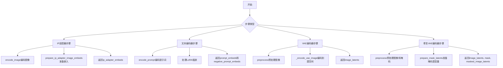

## 类结构

```
ModularPipelineBlocks (抽象基类)
├── StableDiffusionXLIPAdapterStep
├── StableDiffusionXLTextEncoderStep
├── StableDiffusionXLVaeEncoderStep
└── StableDiffusionXLInpaintVaeEncoderStep
```

## 全局变量及字段


### `logger`
    
模块级日志记录器，用于记录日志信息

类型：`logging.Logger`
    


### `retrieve_latents`
    
全局工具函数，用于从encoder_output中提取latents，支持sample和argmax两种模式

类型：`function`
    


### `StableDiffusionXLIPAdapterStep.model_name`
    
模型名称标识，值为'stable-diffusion-xl'

类型：`str`
    


### `StableDiffusionXLTextEncoderStep.model_name`
    
模型名称标识，值为'stable-diffusion-xl'

类型：`str`
    


### `StableDiffusionXLVaeEncoderStep.model_name`
    
模型名称标识，值为'stable-diffusion-xl'

类型：`str`
    


### `StableDiffusionXLInpaintVaeEncoderStep.model_name`
    
模型名称标识，值为'stable-diffusion-xl'

类型：`str`
    
    

## 全局函数及方法


### `retrieve_latents`

该函数是一个全局工具函数，用于从变分编码器（VAE）的输出中提取潜变量表示。它通过检查输出对象的属性结构，支持两种不同的采样模式——随机采样（sample）和确定性.argmax采样——从而为扩散模型的图像生成过程提供所需的潜在空间表示。

参数：

- `encoder_output`：`torch.Tensor`，编码器的输出张量，通常包含 `latent_dist`（潜变量分布）或 `latents`（直接潜变量）属性
- `generator`：`torch.Generator | None`，可选的随机数生成器，用于控制采样过程中的随机性
- `sample_mode`：`str`，采样模式，默认为 `"sample"`，可选值为 `"sample"`（随机采样）或 `"argmax"`（取分布的均值/最可能值）

返回值：`torch.Tensor`，从编码器输出中提取的潜变量张量，可直接用于后续的图像生成或处理流程

#### 流程图

```mermaid
flowchart TD
    A[开始: retrieve_latents] --> B{encoder_output 是否具有 latent_dist 属性?}
    B -->|是| C{sample_mode == 'sample'?}
    C -->|是| D[调用 latent_dist.sample&#40;generator&#41;]
    D --> F[返回采样结果]
    C -->|否| E{sample_mode == 'argmax'?}
    E -->|是| G[调用 latent_dist.mode&#40;&#41;]
    G --> F
    E -->|否| H{encoder_output 是否具有 latents 属性?}
    H -->|是| I[返回 encoder_output.latents]
    B -->|否| H
    H -->|否| J[抛出 AttributeError]
    J --> K[结束: 异常处理]
    F --> K
    I --> K
```

#### 带注释源码

```python
# 从变分编码器输出中检索潜变量的全局函数
# 支持两种采样模式：随机采样(sample)和确定性采样(argmax)
def retrieve_latents(
    encoder_output: torch.Tensor,  # 编码器输出，通常是VAE的encode结果
    generator: torch.Generator | None = None,  # 可选的随机数生成器，用于采样控制
    sample_mode: str = "sample"  # 采样模式：'sample'随机采样 或 'argmax'取最可能值
):
    # 检查编码器输出是否具有latent_dist属性（变分分布）
    if hasattr(encoder_output, "latent_dist") and sample_mode == "sample":
        # 从潜在分布中采样，返回随机潜变量
        return encoder_output.latent_dist.sample(generator)
    # 同样有latent_dist但模式为argmax时，取分布的众数（均值）
    elif hasattr(encoder_output, "latent_dist") and sample_mode == "argmax":
        return encoder_output.latent_dist.mode()
    # 检查是否直接具有latents属性（确定性编码器输出）
    elif hasattr(encoder_output, "latents"):
        return encoder_output.latents
    # 如果无法识别编码器输出的结构，抛出属性错误
    else:
        raise AttributeError("Could not access latents of provided encoder_output")
```


### `StableDiffusionXLIPAdapterStep.description`

该属性返回 IP Adapter 步骤的描述信息，用于说明该步骤的功能以及使用时的前置条件（需要通过 `ModularPipeline.load_ip_adapter()` 加载权重并通过 `pipeline.set_ip_adapter_scale()` 设置比例）。

参数： 无

返回值：`str`，返回 IP Adapter 步骤的描述文本，说明该步骤仅准备图像嵌入，并提示用户需要额外加载 IP Adapter 权重和设置比例才能正常工作。

#### 流程图

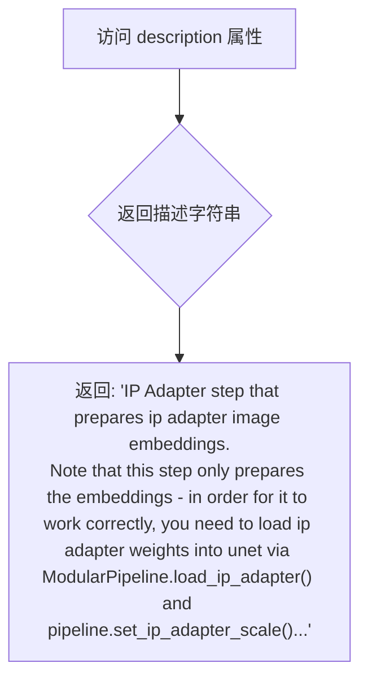

#### 带注释源码

```python
@property
def description(self) -> str:
    """
    返回 IP Adapter 步骤的描述信息。
    
    该属性说明了该步骤的主要功能是准备 IP Adapter 的图像嵌入（image embeddings）。
    同时提示用户：要使该步骤正常工作，需要：
    1. 通过 ModularPipeline.load_ip_adapter() 加载 IP Adapter 权重到 UNet
    2. 通过 pipeline.set_ip_adapter_scale() 设置 IP Adapter 的比例
    
    Returns:
        str: 描述 IP Adapter 步骤功能和使用要求的字符串
    """
    return (
        "IP Adapter step that prepares ip adapter image embeddings.\n"
        "Note that this step only prepares the embeddings - in order for it to work correctly, "
        "you need to load ip adapter weights into unet via ModularPipeline.load_ip_adapter() and pipeline.set_ip_adapter_scale().\n"
        "See [ModularIPAdapterMixin](https://huggingface.co/docs/diffusers/api/loaders/ip_adapter#diffusers.loaders.ModularIPAdapterMixin)"
        " for more details"
    )
```


### `StableDiffusionXLIPAdapterStep.expected_components`

该属性方法定义了 IP Adapter 步骤所需的预期组件规格列表，返回包含图像编码器、特征提取器、UNet 和引导器四个核心组件的规格说明，用于确保流水线正确初始化所需的模型组件。

参数：无需参数（作为属性方法）

返回值：`list[ComponentSpec]`，返回预期组件规格列表，包含 4 个组件规范对象

#### 流程图

```mermaid
flowchart TD
    A[调用 expected_components 属性] --> B{返回 ComponentSpec 列表}
    
    B --> C1[ComponentSpec: image_encoder - CLIPVisionModelWithProjection]
    B --> C2[ComponentSpec: feature_extractor - CLIPImageProcessor]
    B --> C3[ComponentSpec: unet - UNet2DConditionModel]
    B --> C4[ComponentSpec: guider - ClassifierFreeGuidance]
    
    C1 --> D[返回 list[ComponentSpec] 给调用者]
    C2 --> D
    C3 --> D
    C4 --> D
    
    style A fill:#e1f5fe
    style D fill:#c8e6c9
```

#### 带注释源码

```python
@property
def expected_components(self) -> list[ComponentSpec]:
    """
    属性方法，返回当前流水线步骤所需的预期组件规格列表。
    IP Adapter 步骤需要以下组件：
    1. image_encoder: 用于编码图像特征的 CLIP 视觉模型
    2. feature_extractor: 用于预处理图像的 CLIP 图像处理器
    3. unet: 用于生成图像的 UNet 条件模型
    4. guider: 用于无分类器引导的引导器
    
    返回:
        list[ComponentSpec]: 包含四个 ComponentSpec 对象的列表，
        每个对象描述一个必需组件的名称、类型和配置信息
    """
    return [
        # 组件1: 图像编码器 - CLIPVisionModelWithProjection
        # 用于将图像编码为 IP Adapter 所需的特征向量
        ComponentSpec("image_encoder", CLIPVisionModelWithProjection),
        
        # 组件2: 特征提取器 - CLIPImageProcessor
        # 配置: size=224, crop_size=224
        # 默认创建方式: from_config (从配置文件中加载)
        ComponentSpec(
            "feature_extractor",
            CLIPImageProcessor,
            config=FrozenDict({"size": 224, "crop_size": 224}),
            default_creation_method="from_config",
        ),
        
        # 组件3: UNet 条件模型 - UNet2DConditionModel
        # 用于根据文本和图像条件生成图像的扩散模型核心组件
        ComponentSpec("unet", UNet2DConditionModel),
        
        # 组件4: 引导器 - ClassifierFreeGuidance
        # 配置: guidance_scale=7.5 (无分类器引导强度)
        # 默认创建方式: from_config
        ComponentSpec(
            "guider",
            ClassifierFreeGuidance,
            config=FrozenDict({"guidance_scale": 7.5}),
            default_creation_method="from_config",
        ),
    ]
```


### `StableDiffusionXLIPAdapterStep.inputs`

该属性定义了 IP Adapter 步骤所需的输入参数列表，返回一个包含输入参数的列表，用于指定图像到图像的适配器处理。

参数（该属性为 property，无显式参数）：

- （隐式参数 `self`）：`StableDiffusionXLIPAdapterStep`，调用该属性的类实例

返回值：`list[InputParam]`，返回 IP Adapter 步骤的输入参数列表，包含图像输入配置信息

#### 流程图

```mermaid
flowchart TD
    A[调用 inputs 属性] --> B{检查类实例}
    B --> C[返回 InputParam 列表]
    C --> D[包含 ip_adapter_image 参数]
    D --> E[参数类型: PipelineImageInput]
    E --> F[必填: True]
    F --> G[描述: The image(s) to be used as ip adapter]
```

#### 带注释源码

```python
@property
def inputs(self) -> list[InputParam]:
    """
    定义 IP Adapter 步骤的输入参数。
    
    返回一个包含输入参数的列表，用于指定图像到图像的适配器处理。
    当前实现仅包含 ip_adapter_image 参数。
    
    Returns:
        list[InputParam]: 输入参数列表，当前包含一个必填的图像参数
    """
    return [
        InputParam(
            "ip_adapter_image",           # 参数名称
            PipelineImageInput,          # 参数类型
            required=True,               # 是否必填
            description="The image(s) to be used as ip adapter"  # 参数描述
        )
    ]
```


### `StableDiffusionXLIPAdapterStep.intermediate_outputs`

该属性定义了 `StableDiffusionXLIPAdapterStep` 步骤在执行推理（`__call__`）后所产生的中间结果清单。这些结果主要用于向后续的 UNet 网络传递图像提示（IP Adapter）的嵌入向量，包括用于引导的正向嵌入和用于 Classifier-Free Guidance 的负向嵌入。

参数：

- `self`：`StableDiffusionXLIPAdapterStep`，调用此属性的类实例本身。

返回值：`list[OutputParam]`，返回一个包含输出参数定义的列表。
- `ip_adapter_embeds`：`torch.Tensor`，IP 适配器的图像嵌入向量，用于引导图像生成。
- `negative_ip_adapter_embeds`：`torch.Tensor`，负向的 IP 适配器图像嵌入向量，用于无分类器引导。

#### 流程图

```mermaid
graph LR
    A[输入: ip_adapter_image] --> B[encode_image]
    B --> C[prepare_ip_adapter_image_embeds]
    C --> D{CFG 启用?}
    D -- 是 --> E[拆分 Embeddings]
    D -- 否 --> F[直接传递正向 Embeddings]
    E --> G[negative_ip_adapter_embeds]
    E --> H[ip_adapter_embeds]
    F --> H
    G --> I[Output: List[OutputParam]]
    H --> I
```

#### 带注释源码

```python
@property
def intermediate_outputs(self) -> list[OutputParam]:
    return [
        OutputParam("ip_adapter_embeds", type_hint=torch.Tensor, description="IP adapter image embeddings"),
        OutputParam(
            "negative_ip_adapter_embeds",
            type_hint=torch.Tensor,
            description="Negative IP adapter image embeddings",
        ),
    ]
```


### `StableDiffusionXLIPAdapterStep.encode_image`

该静态方法用于将输入图像编码为IP Adapter图像嵌入（image embeddings）或隐藏状态（hidden states），支持分类器自由引导（Classifier-Free Guidance）所需的正向和负向嵌入。

参数：

- `components`：包含 `image_encoder` 和 `feature_extractor` 组件的对象，提供模型权重和预处理功能
- `image`：`PipelineImageInput | torch.Tensor`，待编码的输入图像，支持列表或张量格式
- `device`：`torch.device`，执行计算的设备（如CPU或CUDA）
- `num_images_per_prompt`：`int`，每个提示词生成的图像数量，用于批量复制嵌入
- `output_hidden_states`：`bool | None`，是否输出隐藏状态而非图像嵌入，默认为 `None`

返回值：`(torch.Tensor, torch.Tensor)`，返回两个张量元组——正向嵌入（image_embeds 或 image_enc_hidden_states）和对应的零填充负向嵌入（uncond_image_embeds 或 uncond_image_enc_hidden_states）

#### 流程图

```mermaid
flowchart TD
    A[开始 encode_image] --> B[获取 image_encoder 的数据类型 dtype]
    B --> C{image 是否为 torch.Tensor?}
    C -->|否| D[使用 feature_extractor 提取像素值]
    C -->|是| E[直接使用 image]
    D --> F[将 image 移动到指定 device 并转换 dtype]
    E --> F
    F --> G{output_hidden_states == True?}
    G -->|是| H[调用 image_encoder 输出 hidden_states]
    H --> I[提取倒数第二层隐藏状态 hidden_states[-2]]
    I --> J[按 num_images_per_prompt 重复扩展]
    J --> K[生成全零图像作为负向输入]
    K --> L[调用 image_encoder 获取负向隐藏状态]
    L --> M[提取并扩展负向隐藏状态]
    M --> N[返回 hidden_states 元组]
    G -->|否| O[调用 image_encoder 获取 image_embeds]
    O --> P[扩展正向嵌入]
    P --> Q[创建全零负向嵌入]
    Q --> R[返回嵌入元组]
```

#### 带注释源码

```python
@staticmethod
# 复制自 diffusers.pipelines.stable_diffusion.pipeline_stable_diffusion.StableDiffusionPipeline.encode_image
# 将 self->components 以适配模块化管道结构
def encode_image(components, image, device, num_images_per_prompt, output_hidden_states=None):
    # 1. 获取 image_encoder 模型参数的数据类型，用于后续计算保持一致
    dtype = next(components.image_encoder.parameters()).dtype

    # 2. 如果输入不是 PyTorch 张量，则使用特征提取器（feature_extractor）进行预处理
    #    将图像转换为模型所需的像素值张量
    if not isinstance(image, torch.Tensor):
        image = components.feature_extractor(image, return_tensors="pt").pixel_values

    # 3. 将图像数据移动到指定设备并转换数据类型
    image = image.to(device=device, dtype=dtype)
    
    # 4. 根据 output_hidden_states 参数决定输出类型
    if output_hidden_states:
        # ===== 分支：输出隐藏状态 =====
        # 用于需要细粒度特征的场景（如 ImageProjection 层）
        
        # 4.1 编码正向图像，提取倒数第二层隐藏状态（-2 层）
        image_enc_hidden_states = components.image_encoder(image, output_hidden_states=True).hidden_states[-2]
        
        # 4.2 按 num_images_per_prompt 重复扩展维度，支持批量生成
        image_enc_hidden_states = image_enc_hidden_states.repeat_interleave(num_images_per_prompt, dim=0)
        
        # 4.3 创建全零图像（与输入形状相同的零张量）作为负向（unconditional）输入
        uncond_image_enc_hidden_states = components.image_encoder(
            torch.zeros_like(image), output_hidden_states=True
        ).hidden_states[-2]
        
        # 4.4 同样扩展负向隐藏状态
        uncond_image_enc_hidden_states = uncond_image_enc_hidden_states.repeat_interleave(
            num_images_per_prompt, dim=0
        )
        
        # 4.5 返回隐藏状态元组
        return image_enc_hidden_states, uncond_image_enc_hidden_states
    else:
        # ===== 分支：输出图像嵌入 =====
        # 使用预训练的 CLIP 视觉编码器提取图像特征
        
        # 4.6 编码图像获取 image_embeds（投影后的图像嵌入向量）
        image_embeds = components.image_encoder(image).image_embeds
        
        # 4.7 扩展正向嵌入以匹配批量生成数量
        image_embeds = image_embeds.repeat_interleave(num_images_per_prompt, dim=0)
        
        # 4.8 创建全零负向嵌入（与正向嵌入形状相同的零张量）
        #    零嵌入在 CFG 中代表"无图像引导"的效果
        uncond_image_embeds = torch.zeros_like(image_embeds)

        # 4.9 返回嵌入元组
        return image_embeds, uncond_image_embeds
```


### `StableDiffusionXLIPAdapterStep.prepare_ip_adapter_image_embeds`

该方法负责准备IP适配器的图像嵌入（image embeddings），用于在Stable Diffusion XL生成过程中引导图像生成。它接受原始图像或预计算的嵌入，处理条件和无条件嵌入，并将它们组织成适合UNet消费的格式。

参数：

- `components`：包含pipeline组件的对象（如`StableDiffusionXLModularPipeline`），包含`image_encoder`、`feature_extractor`、`unet`等组件
- `ip_adapter_image`：输入的IP适配器图像，可以是单个图像或图像列表（`PipelineImageInput`类型）
- `ip_adapter_image_embeds`：预计算的IP适配器图像嵌入，如果为`None`则从原始图像编码生成
- `device`：目标设备（`torch.device`类型），用于将张量移动到指定设备
- `num_images_per_prompt`：每个提示需要生成的图像数量（`int`类型），用于复制嵌入
- `prepare_unconditional_embeds`：布尔标志（`bool`类型），指示是否需要为无分类器自由引导准备无条件嵌入

返回值：`list[torch.Tensor]` - IP适配器图像嵌入列表，每个元素对应一个IP适配器，包含条件嵌入（和可选的无条件嵌入）

#### 流程图

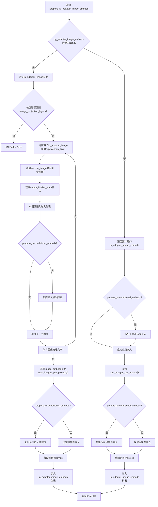

#### 带注释源码

```python
def prepare_ip_adapter_image_embeds(
    self,
    components,
    ip_adapter_image,
    ip_adapter_image_embeds,
    device,
    num_images_per_prompt,
    prepare_unconditional_embeds,
):
    """
    准备IP适配器图像嵌入，用于后续Stable Diffusion生成过程。
    
    参数:
        components: 包含模型组件的字典/对象，包括image_encoder、feature_extractor、unet等
        ip_adapter_image: 输入的IP适配器图像
        ip_adapter_image_embeds: 预计算的嵌入，如果为None则从图像编码
        device: 计算设备
        num_images_per_prompt: 每个prompt生成的图像数量
        prepare_unconditional_embeds: 是否为CFG准备无条件嵌入
    """
    # 存储处理后的图像嵌入
    image_embeds = []
    # 如果需要无条件嵌入，初始化负面嵌入列表
    if prepare_unconditional_embeds:
        negative_image_embeds = []
    
    # 情况1: 未提供预计算嵌入，需要从原始图像编码
    if ip_adapter_image_embeds is None:
        # 确保图像是列表格式
        if not isinstance(ip_adapter_image, list):
            ip_adapter_image = [ip_adapter_image]

        # 验证图像数量与IP适配器数量匹配
        # image_projection_layers是UNet中IP适配器的投影层
        if len(ip_adapter_image) != len(components.unet.encoder_hid_proj.image_projection_layers):
            raise ValueError(
                f"`ip_adapter_image` must have same length as the number of IP Adapters. Got {len(ip_adapter_image)} images and {len(components.unet.encoder_hid_proj.image_projection_layers)} IP Adapters."
            )

        # 遍历每个IP适配器的图像和对应的投影层
        for single_ip_adapter_image, image_proj_layer in zip(
            ip_adapter_image, components.unet.encoder_hid_proj.image_projection_layers
        ):
            # 判断是否需要输出隐藏状态（某些投影层类型需要）
            output_hidden_state = not isinstance(image_proj_layer, ImageProjection)
            
            # 调用encode_image编码单个图像
            # 返回正向和（可选的）负面图像嵌入
            single_image_embeds, single_negative_image_embeds = self.encode_image(
                components, single_ip_adapter_image, device, 1, output_hidden_state
            )

            # 将单图像嵌入添加到列表（添加批次维度）
            image_embeds.append(single_image_embeds[None, :])
            
            # 如果需要无条件嵌入，同时保存负面嵌入
            if prepare_unconditional_embeds:
                negative_image_embeds.append(single_negative_image_embeds[None, :])
    
    # 情况2: 已提供预计算嵌入，直接使用
    else:
        for single_image_embeds in ip_adapter_image_embeds:
            # 如果需要无条件嵌入，从预计算嵌入中拆分
            if prepare_unconditional_embeds:
                # 假设预计算的嵌入是 [negative_embeds, positive_embeds] 拼接格式
                single_negative_image_embeds, single_image_embeds = single_image_embeds.chunk(2)
                negative_image_embeds.append(single_negative_image_embeds)
            image_embeds.append(single_image_embeds)

    # 处理复制和拼接操作
    ip_adapter_image_embeds = []
    for i, single_image_embeds in enumerate(image_embeds):
        # 为每个prompt复制对应数量的图像嵌入
        # 例如：如果num_images_per_prompt=2，形状从[1,768]变为[2,768]
        single_image_embeds = torch.cat([single_image_embeds] * num_images_per_prompt, dim=0)
        
        # 如果需要无条件嵌入，处理负面嵌入
        if prepare_unconditional_embeds:
            # 同样复制负面嵌入
            single_negative_image_embeds = torch.cat([negative_image_embeds[i]] * num_images_per_prompt, dim=0)
            # 拼接：[negative_embeds, positive_embeds]
            # 这是为了CFG：负面嵌入在前，正向嵌入在后
            single_image_embeds = torch.cat([single_negative_image_embeds, single_image_embeds], dim=0)

        # 将处理后的嵌入移动到目标设备
        single_image_embeds = single_image_embeds.to(device=device)
        ip_adapter_image_embeds.append(single_image_embeds)

    return ip_adapter_image_embeds
```


### `StableDiffusionXLIPAdapterStep.__call__`

该方法是 Stable Diffusion XL IP 适配器管道的核心执行步骤，负责准备 IP 适配器图像嵌入（image embeddings），以便在后续的图像生成过程中引导模型参考输入图像的风格和内容。

参数：

- `components`：`StableDiffusionXLModularPipeline`，包含管道所有组件（如 image_encoder、unet、guider 等）的容器对象
- `state`：`PipelineState`，管道执行过程中的状态容器，用于存储中间结果和配置参数

返回值：`Tuple[StableDiffusionXLModularPipeline, PipelineState]`，返回更新后的组件和状态对象

#### 流程图

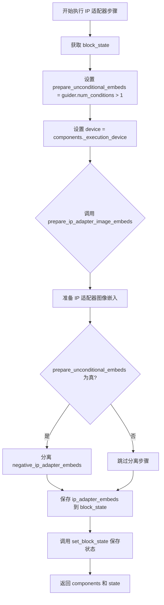

#### 带注释源码

```python
@torch.no_grad()
def __call__(self, components: StableDiffusionXLModularPipeline, state: PipelineState) -> PipelineState:
    """
    执行 IP 适配器步骤，准备图像嵌入
    
    该方法:
    1. 从 state 中获取当前块的执行状态
    2. 准备无条件嵌入标志和执行设备
    3. 调用 prepare_ip_adapter_image_embeds 编码 IP 适配器图像
    4. 如果需要无条件嵌入，分离负向嵌入
    5. 保存更新后的状态并返回
    """
    # 从管道状态中获取当前模块的块状态
    block_state = self.get_block_state(state)

    # 根据引导器的条件数量决定是否需要准备无条件嵌入
    # 当 guidance_scale > 1 时，需要为 classifier-free guidance 准备无条件嵌入
    block_state.prepare_unconditional_embeds = components.guider.num_conditions > 1
    
    # 设置执行设备（CPU/CUDA等）
    block_state.device = components._execution_device

    # 准备 IP 适配器图像嵌入
    # 调用 prepare_ip_adapter_image_embeds 方法进行图像编码
    block_state.ip_adapter_embeds = self.prepare_ip_adapter_image_embeds(
        components,
        ip_adapter_image=block_state.ip_adapter_image,      # 输入的 IP 适配器图像
        ip_adapter_image_embeds=None,                        # 预计算的嵌入（此处为 None，需新计算）
        device=block_state.device,                            # 执行设备
        num_images_per_prompt=1,                              # 每个 prompt 生成的图像数量
        prepare_unconditional_embeds=block_state.prepare_unconditional_embeds,
    )
    
    # 如果需要无条件嵌入，则分离负向嵌入
    # IP 适配器嵌入的形状为 [negative_embeds, positive_embeds]，需要拆分
    if block_state.prepare_unconditional_embeds:
        block_state.negative_ip_adapter_embeds = []
        for i, image_embeds in enumerate(block_state.ip_adapter_embeds):
            # chunk(2) 将嵌入分成两半：前半是负向嵌入，后半是正向嵌入
            negative_image_embeds, image_embeds = image_embeds.chunk(2)
            block_state.negative_ip_adapter_embeds.append(negative_image_embeds)
            block_state.ip_adapter_embeds[i] = image_embeds

    # 将更新后的块状态写回管道状态
    self.set_block_state(state, block_state)
    
    # 返回更新后的组件和状态
    return components, state
```

---

### 完整类信息：`StableDiffusionXLIPAdapterStep`

**类描述**：IP 适配器步骤类，继承自 `ModularPipelineBlocks`，用于在 Stable Diffusion XL 模块化管道中处理 IP 适配器图像并生成对应的嵌入向量。

#### 类字段

| 字段名 | 类型 | 描述 |
|--------|------|------|
| `model_name` | `str` | 模型名称，值为 "stable-diffusion-xl" |

#### 类方法

| 方法名 | 描述 |
|--------|------|
| `description` | 返回该步骤的描述信息 |
| `expected_components` | 返回该步骤期望的组件列表（image_encoder, feature_extractor, unet, guider） |
| `inputs` | 返回输入参数列表（ip_adapter_image） |
| `intermediate_outputs` | 返回中间输出列表（ip_adapter_embeds, negative_ip_adapter_embeds） |
| `encode_image` | 静态方法，编码图像为嵌入向量 |
| `prepare_ip_adapter_image_embeds` | 准备 IP 适配器图像嵌入，处理多适配器情况 |
| `__call__` | 执行入口，调用上述方法完成嵌入准备 |

---

### 关键组件信息

| 组件名称 | 描述 |
|----------|------|
| `image_encoder` | CLIP 视觉模型，用于将图像编码为特征向量 |
| `feature_extractor` | CLIP 图像预处理模块，将输入图像转换为模型所需格式 |
| `unet` | UNet2DConditionModel，负责去噪过程，需要预先加载 IP 适配器权重 |
| `guider` | ClassifierFreeGuidance，引导生成过程，控制无分类器自由引导 |

---

### 潜在技术债务与优化空间

1. **硬编码设备管理**：`block_state.device = components._execution_device` 在每个步骤中重复设置，可考虑在基类中统一处理。

2. **图像嵌入缓存机制缺失**：当前实现每次调用都重新编码图像，对于相同输入可考虑添加缓存层避免重复计算。

3. **多适配器顺序依赖**：`zip(ip_adapter_image, components.unet.encoder_hid_proj.image_projection_layers)` 假设顺序固定，缺乏显式映射机制。

4. **错误处理不足**：缺少对 `ip_adapter_image` 格式、维度异常的详细校验。

5. **类型注解不完整**：部分内部变量缺少类型注解，影响代码可维护性。

---

### 其它项目

**设计目标**：将输入图像通过 CLIP 视觉编码器转换为嵌入向量，供后续 UNet 去噪过程使用，实现基于图像内容的条件生成。

**约束条件**：
- 依赖 `ModularPipeline.load_ip_adapter()` 预先加载权重
- 需要通过 `pipeline.set_ip_adapter_scale()` 设置适配器权重
- 仅支持 torch.no_grad() 上下文（避免梯度计算）

**错误处理**：
- 验证 `ip_adapter_image` 数量与 IP 适配器数量匹配
- 检查 `encoder_hid_proj.image_projection_layers` 是否存在

**数据流**：
```
ip_adapter_image 
    → feature_extractor 预处理 
    → image_encoder 编码 
    → image_embeds 
    → (如需 CFG) 拆分 negative/positive 
    → ip_adapter_embeds / negative_ip_adapter_embeds
```

**外部依赖**：
- `transformers.CLIPVisionModelWithProjection`
- `transformers.CLIPImageProcessor`
- `diffusers.models.UNet2DConditionModel`
- `diffusers.guiders.ClassifierFreeGuidance`


### `StableDiffusionXLTextEncoderStep.description`

该属性返回对文本编码器步骤的描述，说明该步骤用于生成用于引导图像生成的文本嵌入（text_embeddings）。

返回值：`str`，返回描述文本编码器步骤功能的字符串，说明该步骤生成用于引导图像生成的文本嵌入。

#### 流程图

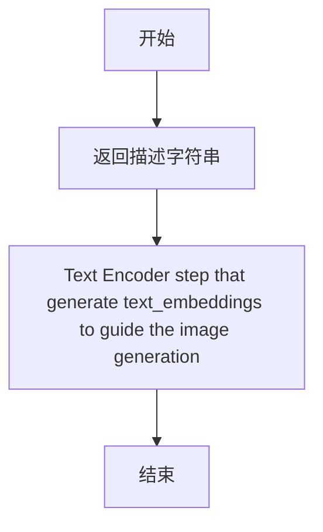

#### 带注释源码

```python
@property
def description(self) -> str:
    """
    属性描述符，返回当前步骤的描述信息。
    
    该属性继承自 ModularPipelineBlocks 基类，被重写以提供
    StableDiffusionXLTextEncoderStep 的特定描述。
    
    Returns:
        str: 描述文本编码器步骤功能的字符串，说明该步骤
            生成用于引导图像生成的文本嵌入（text_embeddings）
    """
    return "Text Encoder step that generate text_embeddings to guide the image generation"
```


### `StableDiffusionXLTextEncoderStep.expected_components`

该属性定义了 StableDiffusionXLTextEncoderStep 所需的组件规格列表，用于文本编码步骤以生成指导图像生成的文本嵌入。

返回值：`list[ComponentSpec]`，返回预期组件的规格列表，每个组件包含名称、类型、配置和默认创建方法。

#### 流程图

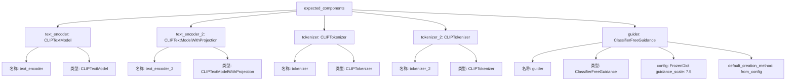

#### 带注释源码

```python
@property
def expected_components(self) -> list[ComponentSpec]:
    """
    定义该步骤所需的组件规格列表。
    
    返回:
        list[ComponentSpec]: 包含以下组件的列表:
            - text_encoder: CLIPTextModel - 主要的文本编码器模型
            - text_encoder_2: CLIPTextModelWithProjection - 带投影的第二个文本编码器（用于SDXL）
            - tokenizer: CLIPTokenizer - 第一个分词器
            - tokenizer_2: CLIPTokenizer - 第二个分词器（用于SDXL）
            - guider: ClassifierFreeGuidance - 无分类器引导器，包含配置和默认创建方法
    """
    return [
        # 主要文本编码器，用于将文本转换为嵌入向量
        ComponentSpec("text_encoder", CLIPTextModel),
        
        # 第二个文本编码器，带有投影层，用于SDXL的双文本编码器架构
        ComponentSpec("text_encoder_2", CLIPTextModelWithProjection),
        
        # 第一个分词器，用于对prompt进行分词
        ComponentSpec("tokenizer", CLIPTokenizer),
        
        # 第二个分词器，用于对prompt_2进行分词
        ComponentSpec("tokenizer_2", CLIPTokenizer),
        
        # 无分类器引导器配置，用于控制引导强度
        ComponentSpec(
            "guider",
            ClassifierFreeGuidance,
            config=FrozenDict({"guidance_scale": 7.5}),  # 默认引导尺度为7.5
            default_creation_method="from_config",      # 从配置创建
        ),
    ]
```


### `StableDiffusionXLTextEncoderStep.expected_configs`

这是一个属性（property），定义在 `StableDiffusionXLTextEncoderStep` 类中，用于返回文本编码器步骤的预期配置项列表。该配置指定了当使用空提示词（empty prompt）时是否强制使用零向量，主要用于分类器自由引导（Classifier-Free Guidance）模式下，确保在没有提供负面提示词时仍然能够正确生成无条件嵌入。

参数： 无（这是一个属性，不接受参数）

返回值：`list[ConfigSpec]`，返回包含预期配置项的列表，当前只包含一个配置项 `force_zeros_for_empty_prompt`，值为 `True`

#### 流程图

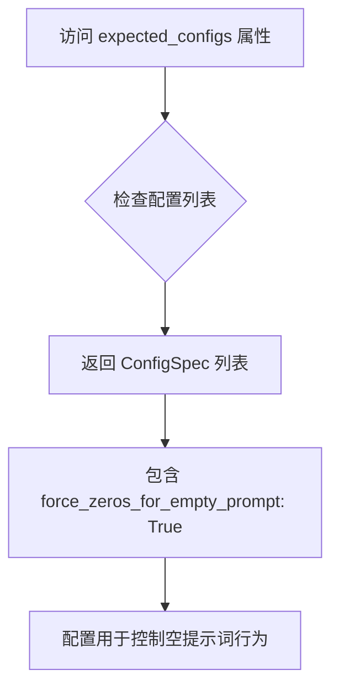

#### 带注释源码

```python
@property
def expected_configs(self) -> list[ConfigSpec]:
    """
    返回文本编码器步骤的预期配置项列表。
    
    该属性定义了StableDiffusionXLTextEncoderStep需要使用的配置项。
    当前配置指定了force_zeros_for_empty_prompt为True，这意味着：
    - 当negative_prompt为空且force_zeros_for_empty_prompt为True时
    - 系统将使用全零的张量作为负向嵌入
    - 这是一种常见的分类器自由引导（CFG）技术
    
    Returns:
        list[ConfigSpec]: 包含配置规范的列表，目前包含一个配置项
    """
    return [ConfigSpec("force_zeros_for_empty_prompt", True)]
```


### `StableDiffusionXLTextEncoderStep.inputs`

该属性定义了 Stable Diffusion XL 文本编码步骤的输入参数列表，包含了用于引导图像生成的各种提示词和注意力控制参数。

参数：
（该方法为属性方法，无显式参数）

返回值：`list[InputParam]`，返回包含6个输入参数的列表，每个参数描述如下：

- `prompt`：`str | list[str] | None`，主提示词，用于描述期望生成的图像内容
- `prompt_2`：`str | list[str] | None`，第二个文本编码器的提示词，若不指定则使用 `prompt`
- `negative_prompt`：`str | list[str] | None`，反向提示词，用于指定不希望出现的图像特征
- `negative_prompt_2`：`str | list[str] | None`，第二个文本编码器的反向提示词
- `cross_attention_kwargs`：`dict | None`，交叉注意力机制的额外参数，如 LoRA 权重等
- `clip_skip`：`int | None`，CLIP 模型中跳过的层数，用于调整文本嵌入的特征提取深度

#### 流程图

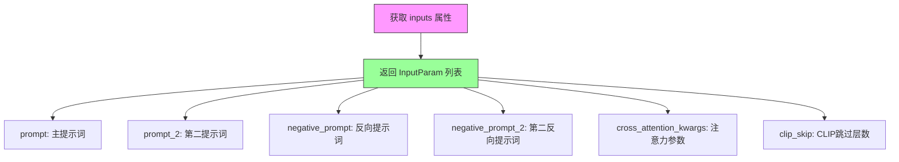

#### 带注释源码

```python
@property
def inputs(self) -> list[InputParam]:
    """
    定义 StableDiffusionXLTextEncoderStep 的输入参数列表
    
    Returns:
        list[InputParam]: 包含所有输入参数的列表，用于描述文本编码步骤所需的用户输入
    """
    return [
        InputParam("prompt"),                          # 主提示词，描述期望生成的图像
        InputParam("prompt_2"),                        # 第二文本编码器的提示词
        InputParam("negative_prompt"),                # 反向提示词，指定不希望的内容
        InputParam("negative_prompt_2"),              # 第二反向提示词
        InputParam("cross_attention_kwargs"),         # 交叉注意力额外参数（如LoRA）
        InputParam("clip_skip"),                      # CLIP跳过的层数，控制特征提取深度
    ]
```


### `StableDiffusionXLTextEncoderStep.intermediate_outputs`

该属性定义了文本编码步骤的中间输出，包括用于引导图像生成的正向和负向文本嵌入（prompt_embeds、negative_prompt_embeds）以及对应的池化嵌入（pooled_prompt_embeds、negative_pooled_prompt_embeds）。

参数： 无（该属性不接受任何参数）

返回值：`list[OutputParam]`，返回四个 `OutputParam` 对象组成的列表，分别代表：
1. `prompt_embeds`：用于引导图像生成的正向文本嵌入
2. `negative_prompt_embeds`：用于引导图像生成的负向文本嵌入
3. `pooled_prompt_embeds`：用于引导图像生成的池化正向文本嵌入
4. `negative_pooled_prompt_embeds`：用于引导图像生成的池化负向文本嵌入

#### 流程图

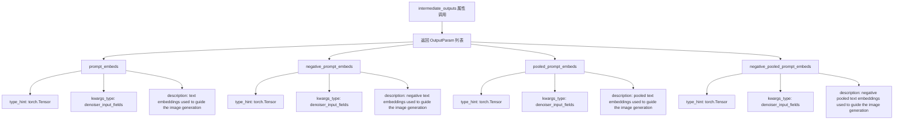

#### 带注释源码

```python
@property
def intermediate_outputs(self) -> list[OutputParam]:
    """
    定义文本编码步骤的中间输出参数。
    这些输出将传递给后续的去噪步骤，用于引导图像生成过程。
    
    Returns:
        list[OutputParam]: 包含四个 OutputParam 对象的列表，分别对应：
            - prompt_embeds: 正向文本嵌入
            - negative_prompt_embeds: 负向文本嵌入
            - pooled_prompt_embeds: 池化的正向文本嵌入
            - negative_pooled_prompt_embeds: 池化的负向文本嵌入
    """
    return [
        OutputParam(
            "prompt_embeds",
            type_hint=torch.Tensor,
            kwargs_type="denoiser_input_fields",
            description="text embeddings used to guide the image generation",
        ),
        OutputParam(
            "negative_prompt_embeds",
            type_hint=torch.Tensor,
            kwargs_type="denoiser_input_fields",
            description="negative text embeddings used to guide the image generation",
        ),
        OutputParam(
            "pooled_prompt_embeds",
            type_hint=torch.Tensor,
            kwargs_type="denoiser_input_fields",
            description="pooled text embeddings used to guide the image generation",
        ),
        OutputParam(
            "negative_pooled_prompt_embeds",
            type_hint=torch.Tensor,
            kwargs_type="denoiser_input_fields",
            description="negative pooled text embeddings used to guide the image generation",
        ),
    ]
```


### `StableDiffusionXLTextEncoderStep.check_inputs`

验证 `prompt` 和 `prompt_2` 输入参数的类型是否合法（必须为 `str` 或 `list`），若类型不匹配则抛出 `ValueError` 异常。

参数：

- `block_state`：对象，包含 `prompt` 和 `prompt_2` 属性的块状态对象

返回值：`None`，无返回值，仅进行参数验证

#### 流程图

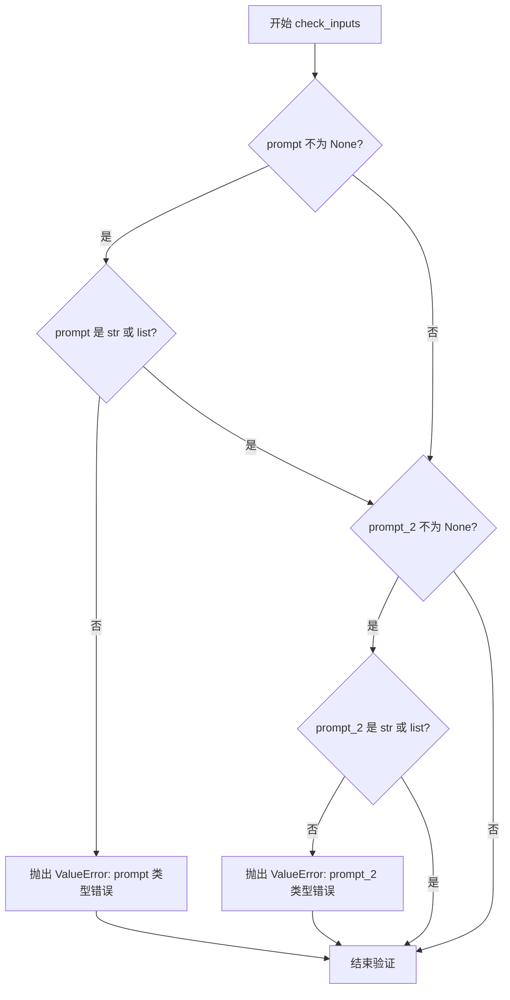

#### 带注释源码

```python
@staticmethod
def check_inputs(block_state):
    """
    验证 prompt 和 prompt_2 的类型是否合法
    
    参数:
        block_state: 包含 prompt 和 prompt_2 属性的块状态对象
    
    异常:
        ValueError: 当 prompt 或 prompt_2 类型不是 str 或 list 时抛出
    """
    # 检查 prompt 参数
    if block_state.prompt is not None and (
        not isinstance(block_state.prompt, str) and not isinstance(block_state.prompt, list)
    ):
        # 如果 prompt 不为 None，且不是 str 或 list 类型，则抛出 ValueError
        raise ValueError(f"`prompt` has to be of type `str` or `list` but is {type(block_state.prompt)}")
    # 检查 prompt_2 参数
    elif block_state.prompt_2 is not None and (
        not isinstance(block_state.prompt_2, str) and not isinstance(block_state.prompt_2, list)
    ):
        # 如果 prompt_2 不为 None，且不是 str 或 list 类型，则抛出 ValueError
        raise ValueError(f"`prompt_2` has to be of type `str` or `list` but is {type(block_state.prompt_2)}")
```


### `StableDiffusionXLTextEncoderStep.encode_prompt`

这是一个静态方法，用于将文本提示词编码为文本嵌入向量，以指导图像生成。该方法处理Stable Diffusion XL的两个文本编码器（CLIPTextModel和CLIPTextModelWithProjection），支持LoRA缩放、CLIP层跳过等高级功能，并生成用于无分类器自由引导（Classifier-Free Guidance）的正向和负向嵌入。

**参数：**

- `components`：包含text_encoder、text_encoder_2、tokenizer、tokenizer_2等组件的管道对象
- `prompt`：`str | list[str] | None`，要编码的主提示词
- `prompt_2`：`str | list[str] | None`，发送给第二个tokenizer和text_encoder的提示词，若不定义则使用prompt
- `device`：`torch.device | None`，计算设备
- `num_images_per_prompt`：`int`，每个提示词要生成的图像数量
- `prepare_unconditional_embeds`：`bool`，是否准备无条件嵌入
- `negative_prompt`：`str | list[str] | None`，不引导图像生成的负向提示词
- `negative_prompt_2`：`str | list[str] | None`，发送给第二个tokenizer和text_encoder的负向提示词
- `prompt_embeds`：`torch.Tensor | None`，预生成的提示词嵌入
- `negative_prompt_embeds`：`torch.Tensor | None`，预生成的负向提示词嵌入
- `pooled_prompt_embeds`：`torch.Tensor | None`，预生成的池化提示词嵌入
- `negative_pooled_prompt_embeds`：`torch.Tensor | None`，预生成的负向池化提示词嵌入
- `lora_scale`：`float | None`，应用于所有LoRA层的缩放因子
- `clip_skip`：`int | None`，计算提示词嵌入时从CLIP跳过的层数

**返回值：**`tuple[torch.Tensor, torch.Tensor, torch.Tensor, torch.Tensor]`，返回四个张量分别是：提示词嵌入、负向提示词嵌入、池化提示词嵌入、负向池化提示词嵌入

#### 流程图

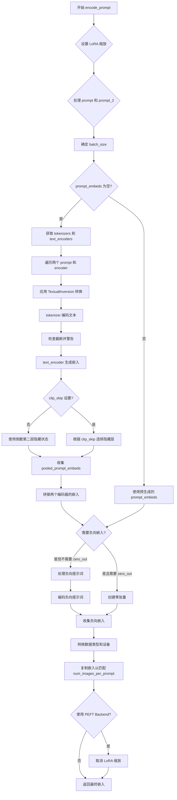

#### 带注释源码

```python
@staticmethod
def encode_prompt(
    components,
    prompt: str,
    prompt_2: str | None = None,
    device: torch.device | None = None,
    num_images_per_prompt: int = 1,
    prepare_unconditional_embeds: bool = True,
    negative_prompt: str | None = None,
    negative_prompt_2: str | None = None,
    prompt_embeds: torch.Tensor | None = None,
    negative_prompt_embeds: torch.Tensor | None = None,
    pooled_prompt_embeds: torch.Tensor | None = None,
    negative_pooled_prompt_embeds: torch.Tensor | None = None,
    lora_scale: float | None = None,
    clip_skip: int | None = None,
):
    r"""
    Encodes the prompt into text encoder hidden states.

    Args:
        prompt (`str` or `list[str]`, *optional*):
            prompt to be encoded
        prompt_2 (`str` or `list[str]`, *optional*):
            The prompt or prompts to be sent to the `tokenizer_2` and `text_encoder_2`. If not defined, `prompt` is
            used in both text-encoders
        device: (`torch.device`):
            torch device
        num_images_per_prompt (`int`):
            number of images that should be generated per prompt
        prepare_unconditional_embeds (`bool`):
            whether to use prepare unconditional embeddings or not
        negative_prompt (`str` or `list[str]`, *optional*):
            The prompt or prompts not to guide the image generation. If not defined, one has to pass
            `negative_prompt_embeds` instead. Ignored when not using guidance (i.e., ignored if `guidance_scale` is
            less than `1`).
        negative_prompt_2 (`str` or `list[str]`, *optional*):
            The prompt or prompts not to guide the image generation to be sent to `tokenizer_2` and
            `text_encoder_2`. If not defined, `negative_prompt` is used in both text-encoders
        prompt_embeds (`torch.Tensor`, *optional*):
            Pre-generated text embeddings. Can be used to easily tweak text inputs, *e.g.* prompt weighting. If not
            provided, text embeddings will be generated from `prompt` input argument.
        negative_prompt_embeds (`torch.Tensor`, *optional*):
            Pre-generated negative text embeddings. Can be used to easily tweak text inputs, *e.g.* prompt
            weighting. If not provided, negative_prompt_embeds will be generated from `negative_prompt` input
            argument.
        pooled_prompt_embeds (`torch.Tensor`, *optional*):
            Pre-generated pooled text embeddings. Can be used to easily tweak text inputs, *e.g.* prompt weighting.
            If not provided, pooled text embeddings will be generated from `prompt` input argument.
        negative_pooled_prompt_embeds (`torch.Tensor`, *optional*):
            Pre-generated negative pooled text embeddings. Can be used to easily tweak text inputs, *e.g.* prompt
            weighting. If not provided, pooled negative_prompt_embeds will be generated from `negative_prompt`
            input argument.
        lora_scale (`float`, *optional*):
            A lora scale that will be applied to all LoRA layers of the text encoder if LoRA layers are loaded.
        clip_skip (`int`, *optional*):
            Number of layers to be skipped from CLIP while computing the prompt embeddings. A value of 1 means that
            the output of the pre-final layer will be used for computing the prompt embeddings.
    """
    # 确定执行设备，优先使用传入的device，否则使用组件的默认执行设备
    device = device or components._execution_device

    # 设置lora scale以便文本编码器的LoRA函数可以正确访问
    # 如果传入了lora_scale且组件支持LoRA
    if lora_scale is not None and isinstance(components, StableDiffusionXLLoraLoaderMixin):
        components._lora_scale = lora_scale

        # 动态调整LoRA scale
        if components.text_encoder is not None:
            if not USE_PEFT_BACKEND:
                # 非PEFT后端：直接调整LoRA scale
                adjust_lora_scale_text_encoder(components.text_encoder, lora_scale)
            else:
                # PEFT后端：使用scale_lora_layers
                scale_lora_layers(components.text_encoder, lora_scale)

        if components.text_encoder_2 is not None:
            if not USE_PEFT_BACKEND:
                adjust_lora_scale_text_encoder(components.text_encoder_2, lora_scale)
            else:
                scale_lora_layers(components.text_encoder_2, lora_scale)

    # 标准化prompt为列表格式
    prompt = [prompt] if isinstance(prompt, str) else prompt

    # 确定batch_size：如果有prompt则使用其长度，否则使用预生成嵌入的batch维度
    if prompt is not None:
        batch_size = len(prompt)
    else:
        batch_size = prompt_embeds.shape[0]

    # 定义tokenizers和text_encoders列表
    # 如果两个tokenizer都存在则使用两个，否则只使用存在的那个
    tokenizers = (
        [components.tokenizer, components.tokenizer_2]
        if components.tokenizer is not None
        else [components.tokenizer_2]
    )
    text_encoders = (
        [components.text_encoder, components.text_encoder_2]
        if components.text_encoder is not None
        else [components.text_encoder_2]
    )

    # 如果没有预生成的prompt_embeds，则从prompt生成
    if prompt_embeds is None:
        # prompt_2默认为prompt
        prompt_2 = prompt_2 or prompt
        prompt_2 = [prompt_2] if isinstance(prompt_2, str) else prompt_2

        # 用于存储两个编码器生成的embeddings
        prompt_embeds_list = []
        prompts = [prompt, prompt_2]
        
        # 遍历两个prompt、tokenizer和text_encoder
        for prompt, tokenizer, text_encoder in zip(prompts, tokenizers, text_encoders):
            # 处理TextualInversion的多向量token（如自定义token）
            if isinstance(components, TextualInversionLoaderMixin):
                prompt = components.maybe_convert_prompt(prompt, tokenizer)

            # tokenizer将文本转换为token IDs
            text_inputs = tokenizer(
                prompt,
                padding="max_length",
                max_length=tokenizer.model_max_length,
                truncation=True,
                return_tensors="pt",
            )

            text_input_ids = text_inputs.input_ids
            # 获取未截断的token IDs用于检查
            untruncated_ids = tokenizer(prompt, padding="longest", return_tensors="pt").input_ids

            # 检查是否有token被截断，并给出警告
            if untruncated_ids.shape[-1] >= text_input_ids.shape[-1] and not torch.equal(
                text_input_ids, untruncated_ids
            ):
                removed_text = tokenizer.batch_decode(untruncated_ids[:, tokenizer.model_max_length - 1 : -1])
                logger.warning(
                    "The following part of your input was truncated because CLIP can only handle sequences up to"
                    f" {tokenizer.model_max_length} tokens: {removed_text}"
                )

            # 使用text_encoder生成embedding，开启hidden_states输出
            prompt_embeds = text_encoder(text_input_ids.to(device), output_hidden_states=True)

            # 获取pooled输出（最后一个hidden state的[0]位置）
            pooled_prompt_embeds = prompt_embeds[0]
            
            # 根据clip_skip决定使用哪层hidden states
            if clip_skip is None:
                # 默认使用倒数第二层
                prompt_embeds = prompt_embeds.hidden_states[-2]
            else:
                # SDXL总是从倒数第clip_skip+2层获取（因为索引从0开始）
                prompt_embeds = prompt_embeds.hidden_states[-(clip_skip + 2)]

            prompt_embeds_list.append(prompt_embeds)

        # 沿最后一维拼接两个编码器的embeddings
        prompt_embeds = torch.concat(prompt_embeds_list, dim=-1)

    # 获取用于classifier free guidance的无条件embeddings
    # 检查是否需要将负向prompt置零
    zero_out_negative_prompt = negative_prompt is None and components.config.force_zeros_for_empty_prompt
    
    # 如果需要准备无条件嵌入且没有预生成的负向嵌入
    if prepare_unconditional_embeds and negative_prompt_embeds is None and zero_out_negative_prompt:
        # 创建与prompt_embeds形状相同的零张量
        negative_prompt_embeds = torch.zeros_like(prompt_embeds)
        negative_pooled_prompt_embeds = torch.zeros_like(pooled_prompt_embeds)
    elif prepare_unconditional_embeds and negative_prompt_embeds is None:
        # 需要从negative_prompt生成负向嵌入
        negative_prompt = negative_prompt or ""
        negative_prompt_2 = negative_prompt_2 or negative_prompt

        # 标准化为列表格式
        negative_prompt = batch_size * [negative_prompt] if isinstance(negative_prompt, str) else negative_prompt
        negative_prompt_2 = (
            batch_size * [negative_prompt_2] if isinstance(negative_prompt_2, str) else negative_prompt_2
        )

        # 类型和batch_size检查
        uncond_tokens: list[str]
        if prompt is not None and type(prompt) is not type(negative_prompt):
            raise TypeError(
                f"`negative_prompt` should be the same type to `prompt`, but got {type(negative_prompt)} !="
                f" {type(prompt)}."
            )
        elif batch_size != len(negative_prompt):
            raise ValueError(
                f"`negative_prompt`: {negative_prompt} has batch size {len(negative_prompt)}, but `prompt`:"
                f" {prompt} has batch size {batch_size}. Please make sure that passed `negative_prompt` matches"
                " the batch size of `prompt`."
            )
        else:
            uncond_tokens = [negative_prompt, negative_prompt_2]

        negative_prompt_embeds_list = []
        # 遍历生成负向embeddings
        for negative_prompt, tokenizer, text_encoder in zip(uncond_tokens, tokenizers, text_encoders):
            # 处理TextualInversion
            if isinstance(components, TextualInversionLoaderMixin):
                negative_prompt = components.maybe_convert_prompt(negative_prompt, tokenizer)

            max_length = prompt_embeds.shape[1]
            uncond_input = tokenizer(
                negative_prompt,
                padding="max_length",
                max_length=max_length,
                truncation=True,
                return_tensors="pt",
            )

            # 生成负向prompt embeddings
            negative_prompt_embeds = text_encoder(
                uncond_input.input_ids.to(device),
                output_hidden_states=True,
            )
            # 获取pooled输出
            negative_pooled_prompt_embeds = negative_prompt_embeds[0]
            # 使用倒数第二层hidden states
            negative_prompt_embeds = negative_prompt_embeds.hidden_states[-2]

            negative_prompt_embeds_list.append(negative_prompt_embeds)

        # 拼接负向embeddings
        negative_prompt_embeds = torch.concat(negative_prompt_embeds_list, dim=-1)

    # 转换prompt_embeds的dtype和device
    if components.text_encoder_2 is not None:
        prompt_embeds = prompt_embeds.to(dtype=components.text_encoder_2.dtype, device=device)
    else:
        prompt_embeds = prompt_embeds.to(dtype=components.unet.dtype, device=device)

    # 获取batch_size和序列长度
    bs_embed, seq_len, _ = prompt_embeds.shape
    
    # 为每个prompt复制多个embedding以支持生成多张图像（mps友好的方法）
    prompt_embeds = prompt_embeds.repeat(1, num_images_per_prompt, 1)
    prompt_embeds = prompt_embeds.view(bs_embed * num_images_per_prompt, seq_len, -1)

    # 如果需要无条件嵌入，同样复制
    if prepare_unconditional_embeds:
        seq_len = negative_prompt_embeds.shape[1]

        if components.text_encoder_2 is not None:
            negative_prompt_embeds = negative_prompt_embeds.to(
                dtype=components.text_encoder_2.dtype, device=device
            )
        else:
            negative_prompt_embeds = negative_prompt_embeds.to(dtype=components.unet.dtype, device=device)

        negative_prompt_embeds = negative_prompt_embeds.repeat(1, num_images_per_prompt, 1)
        negative_prompt_embeds = negative_prompt_embeds.view(batch_size * num_images_per_prompt, seq_len, -1)

    # 复制pooled embeddings
    pooled_prompt_embeds = pooled_prompt_embeds.repeat(1, num_images_per_prompt).view(
        bs_embed * num_images_per_prompt, -1
    )
    if prepare_unconditional_embeds:
        negative_pooled_prompt_embeds = negative_pooled_prompt_embeds.repeat(1, num_images_per_prompt).view(
            bs_embed * num_images_per_prompt, -1
        )

    # 如果使用PEFT后端，恢复LoRA layers到原始scale
    if components.text_encoder is not None:
        if isinstance(components, StableDiffusionXLLoraLoaderMixin) and USE_PEFT_BACKEND:
            # 通过取消LoRA layers的缩放来恢复原始scale
            unscale_lora_layers(components.text_encoder, lora_scale)

    if components.text_encoder_2 is not None:
        if isinstance(components, StableDiffusionXLLoraLoaderMixin) and USE_PEFT_BACKEND:
            unscale_lora_layers(components.text_encoder_2, lora_scale)

    # 返回四个embeddings
    return prompt_embeds, negative_prompt_embeds, pooled_prompt_embeds, negative_pooled_prompt_embeds
```


### `StableDiffusionXLTextEncoderStep.__call__`

该方法是 Stable Diffusion XL 模块化管道中的文本编码步骤，负责将输入的文本提示（prompt）编码为文本嵌入向量（text embeddings），以指导图像生成过程。该步骤支持双文本编码器（CLIPTextModel 和 CLIPTextModelWithProjection），并处理无条件嵌入（negative prompts）以实现分类器自由引导（CFG）。

参数：

-   `self`：隐式参数，表示 `StableDiffusionXLTextEncoderStep` 类的实例。
-   `components`：`StableDiffusionXLModularPipeline`，管道组件对象，包含文本编码器、分词器、引导器等。
-   `state`：`PipelineState`，管道的当前状态，包含输入参数和中间输出。

返回值：`PipelineState`，更新后的管道状态，其中包含生成的 `prompt_embeds`、`negative_prompt_embeds`、`pooled_prompt_embeds` 和 `negative_pooled_prompt_embeds`。

#### 流程图

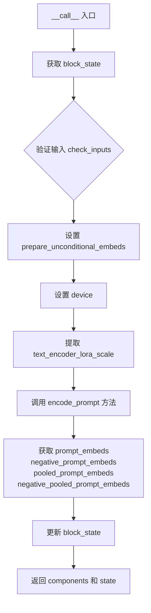

#### 带注释源码

```python
@torch.no_grad()
def __call__(self, components: StableDiffusionXLModularPipeline, state: PipelineState) -> PipelineState:
    # 1. 从 state 中获取当前块的内部状态 block_state
    block_state = self.get_block_state(state)
    
    # 2. 验证输入的有效性（如 prompt 类型检查）
    self.check_inputs(block_state)

    # 3. 确定是否需要准备无条件嵌入
    # 如果引导条件数大于1（如 CFG > 1），则需要准备无条件嵌入
    block_state.prepare_unconditional_embeds = components.guider.num_conditions > 1
    
    # 4. 设置执行设备（CPU/CUDA）
    block_state.device = components._execution_device

    # 5. 从交叉注意力 kwargs 中提取 LoRA 缩放因子
    block_state.text_encoder_lora_scale = (
        block_state.cross_attention_kwargs.get("scale", None)
        if block_state.cross_attention_kwargs is not None
        else None
    )

    # 6. 调用核心编码函数 encode_prompt
    # 该函数处理两个文本编码器（text_encoder 和 text_encoder_2）
    # 返回：正负提示嵌入、池化嵌入
    (
        block_state.prompt_embeds,          # 正向提示嵌入
        block_state.negative_prompt_embeds, # 负向提示嵌入
        block_state.pooled_prompt_embeds,   # 池化后的正向提示嵌入
        block_state.negative_pooled_prompt_embeds, # 池化后的负向提示嵌入
    ) = self.encode_prompt(
        components,
        block_state.prompt,           # 主提示词
        block_state.prompt_2,         # 第二个提示词（可选）
        block_state.device,
        1,                            # num_images_per_prompt
        block_state.prepare_unconditional_embeds,
        block_state.negative_prompt, # 负向提示词
        block_state.negative_prompt_2,
        prompt_embeds=None,          # 允许外部传入预计算的嵌入
        negative_prompt_embeds=None,
        pooled_prompt_embeds=None,
        negative_pooled_prompt_embeds=None,
        lora_scale=block_state.text_encoder_lora_scale,
        clip_skip=block_state.clip_skip, # CLIP 跳层数
    )
    
    # 7. 将计算得到的嵌入更新到 block_state 中
    self.set_block_state(state, block_state)
    
    # 8. 返回更新后的 components 和 state
    return components, state
```


### `StableDiffusionXLVaeEncoderStep.description`

该属性是 `StableDiffusionXLVaeEncoderStep` 类的描述属性，用于返回该步骤的功能说明，即 VAE 编码器步骤，将输入图像编码为潜在表示。

返回值：`str`，返回该步骤的功能描述字符串。

#### 流程图

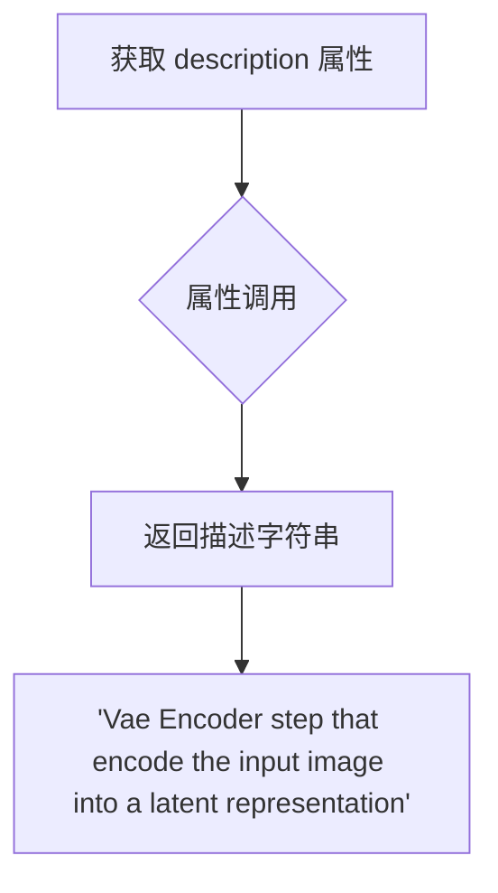

#### 带注释源码

```python
class StableDiffusionXLVaeEncoderStep(ModularPipelineBlocks):
    """Stable Diffusion XL VAE 编码器步骤类，继承自 ModularPipelineBlocks"""
    model_name = "stable-diffusion-xl"  # 模型名称为 stable-diffusion-xl

    @property
    def description(self) -> str:
        """
        获取该步骤的描述信息
        
        该属性返回一个字符串描述，说明此步骤的功能是将输入图像
        编码为潜在表示（latent representation），用于后续的图像生成过程。
        
        Returns:
            str: 描述字符串，说明该步骤为 VAE Encoder 步骤，用于将输入图像编码为潜在表示
        """
        return "Vae Encoder step that encode the input image into a latent representation"
```


### `StableDiffusionXLVaeEncoderStep.expected_components`

该属性定义了VAE编码器步骤所需的核心组件规范，包括VAE模型和图像处理器，用于将输入图像编码为潜在表示。

参数： 无

返回值：`list[ComponentSpec]`，返回预期组件规格列表，包含VAE模型和图像处理器两个核心组件的规格定义。

#### 流程图

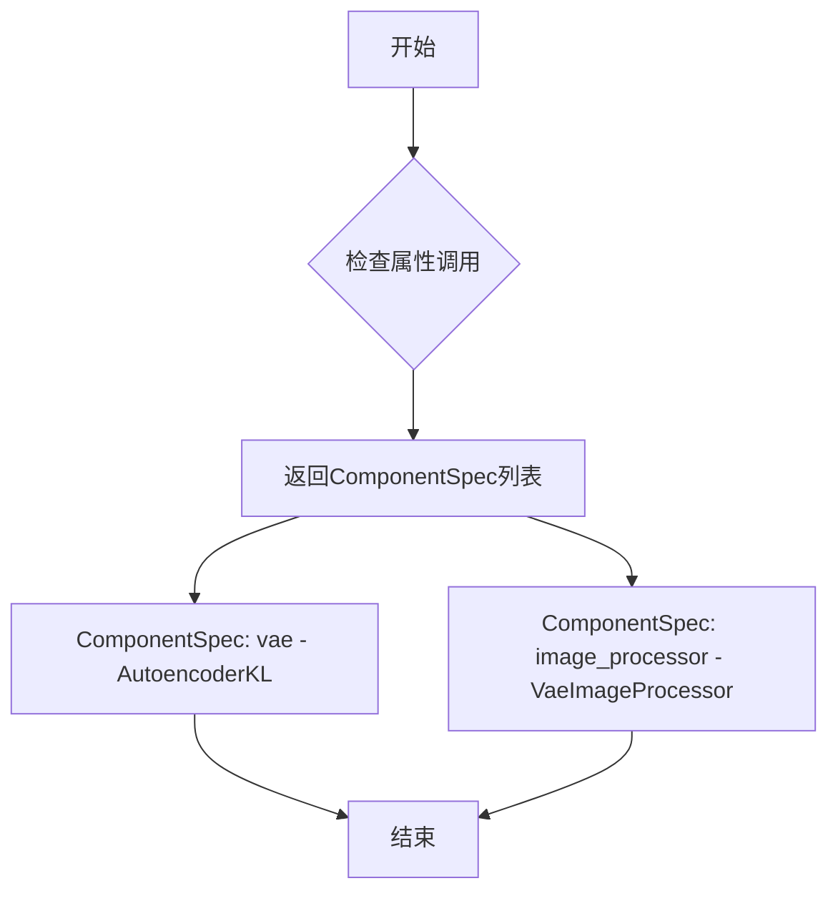

#### 带注释源码

```python
@property
def expected_components(self) -> list[ComponentSpec]:
    """
    定义VAE编码器步骤所需的预期组件规格。
    
    该属性返回一个组件规范列表，包含：
    1. vae: AutoencoderKL模型，用于将图像编码到潜在空间
    2. image_processor: VaeImageProcessor，用于图像预处理，配置vae_scale_factor为8
    
    Returns:
        list[ComponentSpec]: 包含VAE和图像处理器组件规范的列表
    """
    return [
        # VAE模型组件，用于图像到潜在表示的编码
        ComponentSpec("vae", AutoencoderKL),
        # 图像处理器组件，用于预处理输入图像
        ComponentSpec(
            "image_processor",
            VaeImageProcessor,
            # 配置图像处理器的VAE缩放因子为8
            config=FrozenDict({"vae_scale_factor": 8}),
            # 指定默认创建方法为从配置加载
            default_creation_method="from_config",
        ),
    ]
```


### `StableDiffusionXLVaeEncoderStep.inputs`

该属性定义了 VAE 编码步骤的输入参数列表，包括图像、高度、宽度、生成器、数据类型以及预处理关键字参数，用于将输入图像编码为潜在表示。

参数：

- `image`：`PipelineImageInput`，必需参数，待编码的输入图像
- `height`：`int | None`，目标图像高度
- `width`：`int | None`，目标图像宽度
- `generator`：`torch.Generator | None`，用于随机采样的生成器
- `dtype`：`torch.dtype`，模型张量输入的数据类型
- `preprocess_kwargs`：`dict | None`，传递给图像处理器的关键字参数字典

返回值：`list[InputParam]`，输入参数列表

#### 流程图

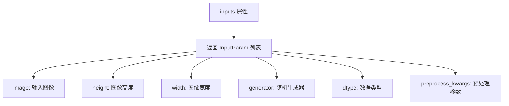

#### 带注释源码

```python
@property
def inputs(self) -> list[InputParam]:
    """
    定义 VAE 编码步骤的输入参数。
    
    返回包含以下参数的列表：
    - image: 必须的输入图像
    - height: 可选的图像高度
    - width: 可选的图像宽度
    - generator: 可选的随机生成器
    - dtype: 模型张量的数据类型
    - preprocess_kwargs: 传递给图像处理器的额外参数
    """
    return [
        InputParam("image", required=True),  # 必需的输入图像参数
        InputParam("height"),                 # 可选的图像高度参数
        InputParam("width"),                  # 可选的图像宽度参数
        InputParam("generator"),              # 可选的随机生成器参数
        InputParam(
            "dtype", 
            type_hint=torch.dtype, 
            description="Data type of model tensor inputs"
        ),  # 模型张量的数据类型参数
        InputParam(
            "preprocess_kwargs",
            type_hint=dict | None,
            description="A kwargs dictionary that if specified is passed along to the `ImageProcessor` as defined under `self.image_processor` in [diffusers.image_processor.VaeImageProcessor]"
        ),  # 预处理关键字参数，传递给图像处理器
    ]
```


### 1. 一段话描述

该属性定义了 `StableDiffusionXLVaeEncoderStep` 管道步骤向后续步骤提供的中间输出数据结构，明确指定了图像经 VAE 编码后的潜在表示（Latent Representation）名为 `image_latents`，用于图像到图像（img2img）或重绘（inpainting） generation。

### 2. 文件的整体运行流程

该文件实现了 Stable Diffusion XL (SDXL) 的模块化管道架构。定义了多个步骤类（Step Classes），每个类继承自 `ModularPipelineBlocks`，负责处理生成流程中的特定环节：
1.  **IP Adapter Step**: 准备图像适配器的 embedding。
2.  **Text Encoder Step**: 处理文本 prompt，生成 text embeddings 和 pooled embeddings。
3.  **VAE Encoder Step (Target)**: 将输入的原始图像编码为潜在空间向量（latents）。
4.  **Inpaint VAE Encoder Step**: 处理重绘任务中的图像和掩码。

`StableDiffusionXLVaeEncoderStep` 位于流程的前端，负责将像素空间的图像转换为模型潜空间的数据。

### 3. 类的详细信息

#### 类：`StableDiffusionXLVaeEncoderStep`

**类字段 (Class Fields):**

- **model_name**: `str`
  - 标识该步骤适用于 "stable-diffusion-xl" 模型。
- **expected_components**: `list[ComponentSpec]`
  - 定义该步骤依赖的核心组件： VAE 模型 (`AutoencoderKL`) 和图像处理器 (`VaeImageProcessor`)。
- **inputs**: `list[InputParam]`
  - 定义该步骤需要的输入参数，如 `image` (必填), `height`, `width`, `generator`, `dtype` 等。

**类方法 (Class Methods):**

- **intermediate_outputs** (属性)
  - **功能**: 定义该步骤的输出元数据。
- **_encode_vae_image(...)**
  - **功能**: 实际执行 VAE 编码的私有方法，处理潜在变量的均值/标准差缩放和上/下转型。
- **__call__(...)**
  - **功能**: 管道执行的主入口，调度图像预处理和 VAE 编码过程。

---

### 4. 给定函数/方法的详细信息

#### 属性：`StableDiffusionXLVaeEncoderStep.intermediate_outputs`

**参数：**
- `self`: `StableDiffusionXLVaeEncoderStep` 实例

**返回值：**
- **类型**: `list[OutputParam]`
- **描述**: 返回一个包含 `OutputParam` 对象的列表，描述了该步骤向管道状态（PipelineState）注入的中间变量。
- **内部变量详情**:
    - **Name**: `image_latents`
    - **Type**: `torch.Tensor`
    - **Description**: The latents representing the reference image for image-to-image/inpainting generation. (代表用于图像到图像或重绘生成的参考图像的潜在向量)

#### 流程图

```mermaid
flowchart TD
    A([Start: 访问 intermediate_outputs 属性]) --> B[初始化列表 container]
    B --> C[创建 OutputParam 对象]
    C --> D[设置名称: image_latents]
    D --> E[设置类型提示: torch.Tensor]
    E --> F[设置描述: The latents representing the reference image...]
    F --> G[将 OutputParam 添加到列表]
    G --> H([Return: list[OutputParam]])
```

#### 带注释源码

```python
@property
def intermediate_outputs(self) -> list[OutputParam]:
    """
    定义该步骤向管道下游提供的中间输出参数。
    在本步骤中，主要是经过 VAE 编码后的图像潜在向量。
    """
    return [
        OutputParam(
            "image_latents",
            type_hint=torch.Tensor,
            description="The latents representing the reference image for image-to-image/inpainting generation",
        )
    ]
```

### 5. 关键组件信息

- **VAE (AutoencoderKL)**: 负责将图像从像素空间编码到潜空间，是图像变分自编码器的核心模型。
- **Image Processor (VaeImageProcessor)**: 负责对输入的原始图像进行预处理（调整大小、归一化等），使其符合 VAE 的输入要求。

### 6. 潜在的技术债务或优化空间

1.  **代码重复**: `_encode_vae_image` 方法在 `StableDiffusionXLVaeEncoderStep` 和 `StableDiffusionXLInpaintVaeEncoderStep` 中几乎完全一致（除了 `StableDiffusionXLInpaintVaeEncoderStep` 版本中有一处 `self.vae.config.scaling_factor` 的 typo/引用错误 `self.vae` vs `components.vae`）。应该提取为基类方法或工具函数。
2.  **配置硬编码**: VAE 的 `force_upcast` 逻辑嵌入在编码方法中，如果能通过配置统一管理会更灵活。

### 7. 其它项目

- **设计目标与约束**: 该模块设计遵循了 Diffusers 库的 `ModularPipeline` 架构，旨在解耦 Pipeline 的各个逻辑部分，使其可复用和可组合。
- **错误处理**: 在 `__call__` 方法中检查了 `generator` 列表长度与 `batch_size` 是否匹配，防止潜在的维度错误。
- **外部依赖**: 强依赖于 `diffusers` 库的核心组件 (`AutoencoderKL`, `VaeImageProcessor`) 和 PyTorch 框架。


### `StableDiffusionXLVaeEncoderStep._encode_vae_image`

该方法将输入的图像张量通过VAE编码器编码到潜空间（latent space），生成可用于后续图像生成任务的潜空间表示，支持可选的随机生成器和VAE配置参数。

参数：

- `self`：类实例本身
- `components`：`StableDiffusionXLModularPipeline`，包含VAE等组件的管道组件对象
- `image`：`torch.Tensor`，输入的要编码的图像张量，形状通常为 `[B, C, H, W]`
- `generator`：`torch.Generator | None`，用于随机采样潜空间的生成器，如果为列表则支持批量生成器

返回值：`torch.Tensor`，编码后的图像潜空间表示，形状通常为 `[B, 4, H/8, W/8]`

#### 流程图

```mermaid
flowchart TD
    A[开始 _encode_vae_image] --> B{检查 VAE config 是否有 latents_mean}
    B -->|有| C[获取 latents_mean 并 reshape 为 [1, 4, 1, 1]]
    B -->|无| D[latents_mean = None]
    C --> E{检查 VAE config 是否有 latents_std}
    E -->|有| F[获取 latents_std 并 reshape 为 [1, 4, 1, 1]]
    E -->|无| G[latents_std = None]
    F --> H[保存原始 dtype]
    H --> I{force_upcast 为 True?}
    I -->|是| J[将 image 转为 float32<br/>VAE 转为 float32]
    I -->|否| K[直接使用原始 dtype]
    J --> L[编码 image]
    K --> L
    L --> M{generator 是 list?}
    M -->|是| N[遍历每个 generator 编码对应图像<br/>cat 合并结果]
    M -->|否| O[直接编码整个 image]
    N --> P[force_upcast 恢复]
    O --> Q[转换 image_latents dtype]
    P --> Q
    Q --> R{latents_mean 和 latents_std 都不为 None?}
    R -->|是| S[标准化: image_latents = (latents - mean) * scaling / std]
    R -->|否| T[直接乘 scaling_factor]
    S --> U[返回 image_latents]
    T --> U
```

#### 带注释源码

```python
def _encode_vae_image(self, components, image: torch.Tensor, generator: torch.Generator):
    """
    将图像编码到VAE潜空间
    
    参数:
        components: 管道组件对象，包含vae等
        image: 输入图像张量 [B, C, H, W]
        generator: 随机生成器，用于采样潜空间
    
    返回:
        编码后的潜空间表示 [B, 4, H/8, W/8]
    """
    # 1. 初始化均值和标准差为 None
    latents_mean = latents_std = None
    
    # 2. 如果VAE配置中定义了latents_mean，则获取并reshape为 [1, 4, 1, 1]
    # 这用于标准化潜空间分布
    if hasattr(components.vae.config, "latents_mean") and components.vae.config.latents_mean is not None:
        latents_mean = torch.tensor(components.vae.config.latents_mean).view(1, 4, 1, 1)
    
    # 3. 如果VAE配置中定义了latents_std，则获取并reshape为 [1, 4, 1, 1]
    if hasattr(components.vae.config, "latents_std") and components.vae.config.latents_std is not None:
        latents_std = torch.tensor(components.vae.config.latents_std).view(1, 4, 1, 1)

    # 4. 保存输入图像的原始dtype，用于后续恢复
    dtype = image.dtype
    
    # 5. 如果VAE配置了force_upcast，则将图像转为float32
    # 并将VAE转为float32以避免精度问题（某些VAE在fp16下可能有问题）
    if components.vae.config.force_upcast:
        image = image.float()
        components.vae.to(dtype=torch.float32)

    # 6. 使用VAE编码图像获取潜在分布
    if isinstance(generator, list):
        # 如果generator是列表，为batch中每个图像使用对应的generator
        # 分别编码每个图像然后在batch维度拼接
        image_latents = [
            retrieve_latents(components.vae.encode(image[i : i + 1]), generator=generator[i])
            for i in range(image.shape[0])
        ]
        image_latents = torch.cat(image_latents, dim=0)
    else:
        # 单一generator，直接编码整个batch
        image_latents = retrieve_latents(components.vae.encode(image), generator=generator)

    # 7. 如果之前进行了force_upcast，恢复VAE的原始dtype
    if components.vae.config.force_upcast:
        components.vae.to(dtype)

    # 8. 确保输出latents的dtype与输入图像一致
    image_latents = image_latents.to(dtype)
    
    # 9. 应用缩放因子进行标准化
    if latents_mean is not None and latents_std is not None:
        # 如果配置了均值和标准差，使用标准化公式
        # image_latents = (latents - mean) * scaling_factor / std
        latents_mean = latents_mean.to(device=image_latents.device, dtype=dtype)
        latents_std = latents_std.to(device=image_latents.device, dtype=dtype)
        image_latents = (image_latents - latents_mean) * components.vae.config.scaling_factor / latents_std
    else:
        # 否则直接乘以缩放因子
        image_latents = components.vae.config.scaling_factor * image_latents

    return image_latents
```


### `StableDiffusionXLVaeEncoderStep.__call__`

该方法是Stable Diffusion XL模块化管道中的VAE编码步骤，负责将输入图像预处理后通过VAE编码器编码为潜在表示（latent representation），用于后续的图像到图像生成或修复任务。

参数：

- `self`：实例本身
- `components`：`StableDiffusionXLModularPipeline`，管道组件容器，包含VAE、图像处理器等组件
- `state`：`PipelineState`，管道状态对象，包含当前步骤的输入参数和中间输出

返回值：`PipelineState`，更新后的管道状态对象，其中包含编码后的图像潜在表示（`image_latents`）

#### 流程图

```mermaid
flowchart TD
    A[开始 __call__] --> B[获取 block_state]
    B --> C[初始化 preprocess_kwargs]
    C --> D[设置 device 和 dtype]
    D --> E[调用 image_processor.preprocess 预处理图像]
    E --> F[将图像移动到指定设备和数据类型]
    F --> G[设置 batch_size]
    G --> H{检查 generator 列表长度}
    H -->|长度不匹配| I[抛出 ValueError]
    H -->|长度匹配| J[调用 _encode_vae_image 编码图像]
    J --> K[设置 image_latents 到 block_state]
    K --> L[保存 block_state 到 state]
    L --> M[返回 components 和 state]
    
    subgraph "_encode_vae_image 内部流程"
    J --> J1[获取 latents_mean 和 latents_std]
    J1 --> J2{需要 force_upcast?}
    J2 -->|是| J3[将图像转为 float, VAE 转为 float32]
    J2 -->|否| J4[直接编码]
    J3 --> J4
    J4 --> J5{generator 是列表?}
    J5 -->|是| J6[逐个编码并拼接]
    J5 -->|否| J7[一次性编码]
    J6 --> J8
    J7 --> J8[恢复 VAE 数据类型]
    J8 --> J9[应用 scaling_factor 和归一化]
    J9 --> J10[返回 image_latents]
    end
```

#### 带注释源码

```python
@torch.no_grad()
def __call__(self, components: StableDiffusionXLModularPipeline, state: PipelineState) -> PipelineState:
    """
    执行VAE编码步骤，将输入图像编码为潜在表示
    
    参数:
        components: StableDiffusionXLModularPipeline - 管道组件容器
        state: PipelineState - 管道状态对象
    
    返回:
        PipelineState - 更新后的管道状态，包含 image_latents
    """
    # 1. 获取当前步骤的 block_state（包含输入参数和中间输出）
    block_state = self.get_block_state(state)
    
    # 2. 初始化预处理关键字参数为空字典（如果未提供）
    block_state.preprocess_kwargs = block_state.preprocess_kwargs or {}
    
    # 3. 设置执行设备和数据类型
    block_state.device = components._execution_device
    # 如果未指定 dtype，则使用 VAE 的数据类型
    block_state.dtype = block_state.dtype if block_state.dtype is not None else components.vae.dtype

    # 4. 预处理图像：调整大小、归一化等操作
    # 调用 VaeImageProcessor.preprocess 方法进行预处理
    image = components.image_processor.preprocess(
        block_state.image, 
        height=block_state.height, 
        width=block_state.width, 
        **block_state.preprocess_kwargs
    )
    
    # 5. 将图像移动到指定设备和数据类型
    image = image.to(device=block_state.device, dtype=block_state.dtype)
    
    # 6. 设置批次大小
    block_state.batch_size = image.shape[0]

    # 7. 验证 generator 列表长度是否与批次大小匹配
    # 如果 generator 是列表，其长度必须等于批次大小
    if isinstance(block_state.generator, list) and len(block_state.generator) != block_state.batch_size:
        raise ValueError(
            f"You have passed a list of generators of length {len(block_state.generator)}, but requested an effective batch"
            f" size of {block_state.batch_size}. Make sure the batch size matches the length of the generators."
        )

    # 8. 调用内部方法 _encode_vae_image 进行 VAE 编码
    # 将图像编码为潜在表示
    block_state.image_latents = self._encode_vae_image(
        components, 
        image=image, 
        generator=block_state.generator
    )

    # 9. 保存更新后的 block_state 到管道状态
    self.set_block_state(state, block_state)

    # 10. 返回组件和状态
    return components, state


def _encode_vae_image(self, components, image: torch.Tensor, generator: torch.Generator):
    """
    内部方法：执行实际的 VAE 编码
    
    参数:
        components: 管道组件容器
        image: torch.Tensor - 预处理后的图像张量
        generator: torch.Generator - 随机生成器（可选）
    
    返回:
        torch.Tensor - 编码后的图像潜在表示
    """
    # 1. 获取 VAE 配置中的潜在表示统计参数（均值和标准差）
    # 用于归一化潜在表示
    latents_mean = latents_std = None
    if hasattr(components.vae.config, "latents_mean") and components.vae.config.latents_mean is not None:
        # 将均值 reshape 为 (1, 4, 1, 1) 格式以匹配潜在表示的形状
        latents_mean = torch.tensor(components.vae.config.latents_mean).view(1, 4, 1, 1)
    if hasattr(components.vae.config, "latents_std") and components.vae.config.latents_std is not None:
        # 将标准差 reshape 为 (1, 4, 1, 1) 格式
        latents_std = torch.tensor(components.vae.config.latents_std).view(1, 4, 1, 1)

    # 2. 记录输入图像的原始数据类型
    dtype = image.dtype
    
    # 3. 处理强制向上转换（force_upcast）
    # 如果 VAE 配置要求强制向上转换，将图像转为 float32，VAE 也转为 float32
    if components.vae.config.force_upcast:
        image = image.float()
        components.vae.to(dtype=torch.float32)

    # 4. 使用 VAE 编码器编码图像
    if isinstance(generator, list):
        # 如果有多个 generator（每个样本一个），逐个编码并拼接结果
        image_latents = [
            retrieve_latents(components.vae.encode(image[i : i + 1]), generator=generator[i])
            for i in range(image.shape[0])
        ]
        image_latents = torch.cat(image_latents, dim=0)
    else:
        # 单一 generator，一次性编码整个批次
        image_latents = retrieve_latents(components.vae.encode(image), generator=generator)

    # 5. 恢复 VAE 的原始数据类型
    if components.vae.config.force_upcast:
        components.vae.to(dtype)

    # 6. 确保潜在表示的数据类型正确
    image_latents = image_latents.to(dtype)
    
    # 7. 应用缩放因子和归一化
    if latents_mean is not None and latents_std is not None:
        # 如果配置了均值和标准差，进行归一化处理
        latents_mean = latents_mean.to(device=image_latents.device, dtype=dtype)
        latents_std = latents_std.to(device=image_latents.device, dtype=dtype)
        # 公式: (latents - mean) * scaling_factor / std
        image_latents = (image_latents - latents_mean) * components.vae.config.scaling_factor / latents_std
    else:
        # 只应用缩放因子
        image_latents = components.vae.config.scaling_factor * image_latents

    return image_latents
```


### `StableDiffusionXLInpaintVaeEncoderStep.expected_components`

该属性定义了 StableDiffusionXLInpaintVaeEncoderStep 类在执行图像修复（inpainting）VAE 编码步骤时所需的组件规格列表，包含 VAE 模型、图像处理器和掩码处理器。

参数：无（这是一个属性 getter，不接受参数）

返回值：`list[ComponentSpec]`，返回预期组件规格列表，定义了 inpaitining 过程所需的 VAE、图像处理器和掩码处理器组件

#### 流程图

```mermaid
flowchart TD
    A[expected_components 属性] --> B[返回组件列表]
    
    B --> C[vae: AutoencoderKL]
    B --> D[image_processor: VaeImageProcessor]
    B --> E[mask_processor: VaeImageProcessor]
    
    C --> C1[变分自编码器模型<br/>用于图像到潜在空间的编码]
    
    D --> D1[图像预处理器<br/>vae_scale_factor=8<br/>默认创建方法: from_config]
    
    E --> E1[掩码预处理器<br/>do_normalize=False<br/>do_binarize=True<br/>do_convert_grayscale=True<br/>vae_scale_factor=8<br/>默认创建方法: from_config]
    
    style C fill:#e1f5fe
    style D fill:#e1f5fe
    style E fill:#e1f5fe
```

#### 带注释源码

```python
@property
def expected_components(self) -> list[ComponentSpec]:
    """
    定义该 Pipeline 步骤所需的组件规格列表。
    
    StableDiffusionXLInpaintVaeEncoderStep 需要以下组件：
    1. vae: AutoencoderKL - 用于将图像编码到潜在空间
    2. image_processor: VaeImageProcessor - 用于预处理输入图像
    3. mask_processor: VaeImageProcessor - 用于预处理掩码图像
    
    Returns:
        list[ComponentSpec]: 包含三个 ComponentSpec 对象的列表，
                            定义了所需的组件类型、配置和创建方法
    """
    return [
        # VAE 组件：变分自编码器模型，用于图像到潜在空间的转换
        ComponentSpec("vae", AutoencoderKL),
        
        # 图像处理器组件：用于预处理输入图像
        ComponentSpec(
            "image_processor",
            VaeImageProcessor,
            config=FrozenDict({"vae_scale_factor": 8}),
            default_creation_method="from_config",
        ),
        
        # 掩码处理器组件：用于预处理掩码图像
        # 配置说明：
        # - do_normalize: False - 不对掩码进行归一化
        # - vae_scale_factor: 8 - VAE 缩放因子
        # - do_binarize: True - 对掩码进行二值化处理
        # - do_convert_grayscale: True - 转换为灰度图
        ComponentSpec(
            "mask_processor",
            VaeImageProcessor,
            config=FrozenDict(
                {"do_normalize": False, "vae_scale_factor": 8, "do_binarize": True, "do_convert_grayscale": True}
            ),
            default_creation_method="from_config",
        ),
    ]
```


### `StableDiffusionXLInpaintVaeEncoderStep.description`

这是一个属性（Property），用于描述 `StableDiffusionXLInpaintVaeEncoderStep` 类的功能。

参数：无（属性不接受任何参数）

返回值：`str`，返回该步骤的描述信息

#### 流程图

```mermaid
flowchart TD
    A[访问 description 属性] --> B{返回描述字符串}
    B --> C["Vae encoder step that prepares the image and mask for the inpainting process"]
```

#### 带注释源码

```python
@property
def description(self) -> str:
    """
    属性：description
    
    描述：
        返回对 StableDiffusionXLInpaintVaeEncoderStep 类的文字描述。
        该步骤用于准备图像修复（inpainting）过程的图像和掩码。
    
    参数：
        无（属性方法不接受参数）
    
    返回值：
        str: 描述文本，说明这是一个 VAE 编码器步骤，用于准备图像修复过程的图像和掩码
    """
    return "Vae encoder step that prepares the image and mask for the inpainting process"
```

#### 补充信息

该属性属于 `StableDiffusionXLInpaintVaeEncoderStep` 类，该类是 Stable Diffusion XL 流水线中的一个模块化步骤（ModularPipelineBlocks），专门用于处理图像修复任务。`description` 属性提供了该步骤功能的简要说明，便于在流水线构建或文档生成时展示步骤用途。


### `StableDiffusionXLInpaintVaeEncoderStep.inputs`

该属性定义了 Stable Diffusion XL 图像修复 VAE 编码步骤所需的输入参数列表。它返回一个 `InputParam` 列表，这些参数将被传递给管道的状态块。

参数：

- `height`：`int | None`，描述：生成图像的目标高度，如果为 `None`，则使用默认值。
- `width`：`int | None`，描述：生成图像的目标宽度，如果为 `None`，则使用默认值。
- `image`：`PipelineImageInput`，描述：要编码的输入图像（必需）。
- `mask_image`：`PipelineImageInput`，描述：用于定义修复区域的掩码图像（必需）。
- `padding_mask_crop`：`int | None`，描述：掩码裁剪的填充参数。
- `dtype`：`torch.dtype`，描述：模型张量的数据类型。
- `generator`：`torch.Generator | None`，描述：用于随机数生成的生成器，以确保可重复性。

返回值：`list[InputParam]`，返回包含所有输入参数的列表。

#### 流程图

```mermaid
graph LR
    A[Start] --> B{inputs Property}
    B --> C[Return List of InputParams]
    C --> D[height: int | None]
    C --> E[width: int | None]
    C --> F[image: PipelineImageInput (Required)]
    C --> G[mask_image: PipelineImageInput (Required)]
    C --> H[padding_mask_crop: int | None]
    C --> I[dtype: torch.dtype]
    C --> J[generator: torch.Generator | None]
```

#### 带注释源码

```python
@property
def inputs(self) -> list[InputParam]:
    """
    返回该步骤需要的输入参数列表。
    """
    return [
        # 目标图像高度
        InputParam("height"),
        # 目标图像宽度
        InputParam("width"),
        # 要处理的输入图像
        InputParam("image", required=True),
        # 修复任务所需的掩码图像
        InputParam("mask_image", required=True),
        # 掩码裁剪的padding
        InputParam("padding_mask_crop"),
        # 模型参数的数据类型
        InputParam("dtype", type_hint=torch.dtype, description="The dtype of the model inputs"),
        # 随机数生成器
        InputParam("generator"),
    ]
```


### `StableDiffusionXLInpaintVaeEncoderStep.intermediate_outputs`

该属性定义了 `StableDiffusionXLInpaintVaeEncoderStep` 类的中间输出参数，用于描述图像修复（inpainting）过程中 VAE 编码步骤产生的中间结果，包括图像潜在表示、掩码、掩码图像潜在表示以及裁剪坐标。

参数： 无（该属性不接受任何参数）

返回值：`list[OutputParam]`，返回四个中间输出参数的列表

#### 流程图

```mermaid
flowchart TD
    A["intermediate_outputs 属性"] --> B["创建 OutputParam 列表"]
    B --> C1["OutputParam: image_latents"]
    B --> C2["OutputParam: mask"]
    B --> C3["OutputParam: masked_image_latents"]
    B --> C4["OutputParam: crops_coords"]
    C1 --> D["返回 OutputParam 列表"]
    C2 --> D
    C3 --> D
    C4 --> D
```

#### 带注释源码

```python
@property
def intermediate_outputs(self) -> list[OutputParam]:
    """
    定义该步骤的中间输出参数。
    返回一个包含四个 OutputParam 的列表，描述 VAE 编码图像和掩码后产生的结果。
    """
    return [
        # 图像潜在表示：输入图像经过 VAE 编码后的潜在空间表示
        OutputParam(
            "image_latents", 
            type_hint=torch.Tensor, 
            description="The latents representation of the input image"
        ),
        # 掩码：用于指示需要修复的区域
        OutputParam(
            "mask", 
            type_hint=torch.Tensor, 
            description="The mask to use for the inpainting process"
        ),
        # 掩码图像潜在表示：带有掩码信息的图像潜在表示（仅用于特定于 inpainting 的 UNet）
        OutputParam(
            "masked_image_latents",
            type_hint=torch.Tensor,
            description="The masked image latents to use for the inpainting process (only for inpainting-specifid unet)",
        ),
        # 裁剪坐标：图像和掩码预处理/后处理时使用的裁剪区域坐标
        OutputParam(
            "crops_coords",
            type_hint=tuple[int, int] | None,
            description="The crop coordinates to use for the preprocess/postprocess of the image and mask",
        ),
    ]
```


### `StableDiffusionXLInpaintVaeEncoderStep._encode_vae_image`

该方法将输入的图像编码到VAE潜空间，生成用于图像修复过程的潜在表示。它处理VAE的配置参数（如latents_mean、latents_std、scaling_factor），并支持强制类型提升以确保数值稳定性。

参数：

- `self`：实例方法隐含的self参数，指向StableDiffusionXLInpaintVaeEncoderStep类的实例
- `components`：StableDiffusionXLModularPipeline，包含VAE模型及其配置
- `image`：torch.Tensor，待编码的输入图像张量
- `generator`：torch.Generator | None，用于随机采样的生成器，如果为列表则需与batch size匹配

返回值：`torch.Tensor`，编码后的图像潜在表示（image_latents），形状为(batch_size, 4, height/8, width/8)

#### 流程图

```mermaid
flowchart TD
    A[开始 _encode_vae_image] --> B{检查 vae.config.latents_mean}
    B -->|存在| C[创建 latents_mean 张量]
    B -->|不存在| D[latents_mean = None]
    C --> E{检查 vae.config.latents_std}
    D --> E
    E -->|存在| F[创建 latents_std 张量]
    E -->|不存在| G[latents_std = None]
    F --> H{检查 vae.config.force_upcast}
    G --> H
    H -->|True| I[将image转为float类型]
    H -->|False| J[保持原dtype]
    I --> K[将VAE转为float32]
    J --> L{检查 generator 是否为列表}
    K --> L
    L -->|是列表| M[遍历图像逐个编码]
    L -->|否| N[一次性编码整个图像]
    M --> O[合并所有latents]
    N --> O
    O --> P{force_upcast为True?}
    P -->|是| Q[恢复VAE原始dtype]
    P -->|否| R[继续处理]
    Q --> S[转换latents dtype]
    R --> S
    S --> T{latents_mean 和 latents_std 存在?}
    T -->|是| U[归一化: (latents - mean) * scaling_factor / std]
    T -->|否| V[仅乘以 scaling_factor]
    U --> W[返回 image_latents]
    V --> W
```

#### 带注释源码

```python
def _encode_vae_image(self, components, image: torch.Tensor, generator: torch.Generator):
    """
    将图像编码到VAE潜空间
    
    参数:
        components: 包含VAE模型的Pipeline组件集合
        image: 输入图像张量
        generator: 随机生成器，用于VAE采样
    
    返回:
        编码后的图像潜在表示
    """
    # 初始化均值和标准差为None
    latents_mean = latents_std = None
    
    # 检查VAE配置中是否存在latents_mean，并创建对应的张量
    if hasattr(components.vae.config, "latents_mean") and components.vae.config.latents_mean is not None:
        # 将配置中的均值转换为(1,4,1,1)形状的张量以匹配潜在空间维度
        latents_mean = torch.tensor(components.vae.config.latents_mean).view(1, 4, 1, 1)
    
    # 检查VAE配置中是否存在latents_std，并创建对应的张量
    if hasattr(components.vae.config, "latents_std") and components.vae.config.latents_std is not None:
        # 将配置中的标准差转换为(1,4,1,1)形状的张量
        latents_std = torch.tensor(components.vae.config.latents_std).view(1, 4, 1, 1)

    # 保存原始图像数据类型
    dtype = image.dtype
    
    # 如果VAE配置要求强制升精度处理
    if components.vae.config.force_upcast:
        # 将图像转换为float32以确保数值精度
        image = image.float()
        # 将VAE模型临时转换为float32
        components.vae.to(dtype=torch.float32)

    # 处理generator为列表的情况（批量处理）
    if isinstance(generator, list):
        # 逐个编码图像并使用对应的generator
        image_latents = [
            retrieve_latents(components.vae.encode(image[i : i + 1]), generator=generator[i])
            for i in range(image.shape[0])
        ]
        # 将所有latents在batch维度上拼接
        image_latents = torch.cat(image_latents, dim=0)
    else:
        # 使用单个generator编码整个图像batch
        image_latents = retrieve_latents(components.vae.encode(image), generator=generator)

    # 如果之前进行了升精度处理，现在恢复VAE的原始dtype
    if components.vae.config.force_upcast:
        components.vae.to(dtype)

    # 将latents转换为原始图像的dtype
    image_latents = image_latents.to(dtype)
    
    # 根据是否有预定义的均值和标准差进行归一化处理
    if latents_mean is not None and latents_std is not None:
        # 将均值和标准差移动到与latents相同的设备和dtype
        latents_mean = latents_mean.to(device=image_latents.device, dtype=dtype)
        latents_std = latents_std.to(device=image_latents.device, dtype=dtype)
        # 应用归一化：减去均值，乘以scaling_factor，除以标准差
        image_latents = (image_latents - latents_mean) * components.vae.config.scaling_factor / latents_std
    else:
        # 仅应用scaling_factor进行缩放
        image_latents = components.vae.config.scaling_factor * image_latents

    return image_latents
```


### `StableDiffusionXLInpaintVaeEncoderStep.prepare_mask_latents`

该方法用于准备修复（inpainting）过程中的掩码潜变量（mask latents）和被掩码图像的潜变量（masked image latents），包括掩码的缩放、批量复制以及被掩码图像的VAE编码。

参数：

- `self`：实例方法隐含参数，指向类实例本身
- `components`：`StableDiffusionXLModularPipeline`，包含VAE等组件的管道组件集合
- `mask`：`torch.Tensor`，输入的修复掩码张量
- `masked_image`：`torch.Tensor`，被掩码覆盖的图像张量
- `batch_size`：`int`，批处理大小
- `height`：`int`，图像高度
- `width`：`int`，图像宽度
- `dtype`：`torch.dtype`，张量的数据类型
- `device`：`torch.device`，计算设备
- `generator`：`torch.Generator | None`，随机数生成器

返回值：`(torch.Tensor, torch.Tensor | None)`，返回处理后的掩码潜变量和被掩码图像潜变量（元组形式）

#### 流程图

```mermaid
flowchart TD
    A[开始准备掩码潜变量] --> B[将掩码resize到潜变量尺寸]
    B --> C[转换掩码到指定设备和数据类型]
    C --> D{掩码batch大小 < 要求的batch大小?}
    D -->|是| E{掩码数量能否被batch大小整除?}
    E -->|否| F[抛出ValueError异常]
    E -->|是| G[复制掩码以匹配batch大小]
    D -->|否| H{输入的masked_image形状是否已是4通道?}
    H -->|是| I[直接作为masked_image_latents]
    H -->|否| J{masked_image是否存在?}
    J -->|否| K[设置masked_image_latents为None]
    J -->|是| L[将masked_image转到指定设备和数据类型]
    L --> M[调用_encode_vae_image编码为潜变量]
    M --> N{编码后数量 < batch大小?}
    N -->|是| O{图像数量能否被batch大小整除?}
    O -->|否| P[抛出ValueError异常]
    O -->|是| Q[复制masked_image_latents以匹配batch]
    N -->|否| R[将masked_image_latents转到指定设备和数据类型]
    G --> S[返回处理后的mask和masked_image_latents]
    I --> S
    K --> S
    Q --> S
    R --> S
```

#### 带注释源码

```python
def prepare_mask_latents(
    self, components, mask, masked_image, batch_size, height, width, dtype, device, generator
):
    # 将掩码resize到潜变量形状，因为我们需要将掩码与潜变量进行拼接
    # 我们在转换为dtype之前执行此操作，以避免在使用cpu_offload和半精度时出现问题
    mask = torch.nn.functional.interpolate(
        mask, size=(height // components.vae_scale_factor, width // components.vae_scale_factor)
    )
    mask = mask.to(device=device, dtype=dtype)

    # 为每个prompt复制mask和masked_image_latents，使用mps友好的方法
    if mask.shape[0] < batch_size:
        if not batch_size % mask.shape[0] == 0:
            raise ValueError(
                "The passed mask and the required batch size don't match. Masks are supposed to be duplicated to"
                f" a total batch size of {batch_size}, but {mask.shape[0]} masks were passed. Make sure the number"
                " of masks that you pass is divisible by the total requested batch size."
            )
        mask = mask.repeat(batch_size // mask.shape[0], 1, 1, 1)

    # 检查masked_image是否已经是4通道的潜变量表示
    if masked_image is not None and masked_image.shape[1] == 4:
        masked_image_latents = masked_image
    else:
        masked_image_latents = None

    # 如果存在masked_image，则进行编码处理
    if masked_image is not None:
        # 如果masked_image不是潜变量形式，则需要进行VAE编码
        if masked_image_latents is None:
            masked_image = masked_image.to(device=device, dtype=dtype)
            masked_image_latents = self._encode_vae_image(components, masked_image, generator=generator)

        # 确保masked_image_latents的batch大小与要求的batch大小匹配
        if masked_image_latents.shape[0] < batch_size:
            if not batch_size % masked_image_latents.shape[0] == 0:
                raise ValueError(
                    "The passed images and the required batch size don't match. Images are supposed to be duplicated"
                    f" to a total batch size of {batch_size}, but {masked_image_latents.shape[0]} images were passed."
                    " Make sure the number of images that you pass is divisible by the total requested batch size."
                )
            masked_image_latents = masked_image_latents.repeat(
                batch_size // masked_image_latents.shape[0], 1, 1, 1
            )

        # 对齐设备以防止在与潜在模型输入拼接时出现设备错误
        masked_image_latents = masked_image_latents.to(device=device, dtype=dtype)

    return mask, masked_image_latents
```


### `StableDiffusionXLInpaintVaeEncoderStep.__call__`

该方法是 Stable Diffusion XL 修复（Inpainting）流程中的 VAE 编码步骤，负责对输入图像和掩码进行预处理，生成图像潜在表示（latents）、掩码以及被掩码图像的潜在表示，供后续的修复去噪过程使用。

参数：

- `self`：隐藏参数，表示 `StableDiffusionXLInpaintVaeEncoderStep` 类的实例。
- `components`：`StableDiffusionXLModularPipeline` 类型，模块化流水线组件集合，包含 VAE、图像处理器、掩码处理器等。
- `state`：`PipelineState` 类型，流水线状态对象，包含当前步骤的输入参数和中间结果。

返回值：`PipelineState` 类型，更新后的流水线状态对象，其中包含了 `image_latents`（图像潜在表示）、`mask`（掩码）、`masked_image_latents`（被掩码图像的潜在表示）和 `crops_coords`（裁剪坐标）等中间输出。

#### 流程图

```mermaid
flowchart TD
    A[开始 __call__] --> B[获取 block_state]
    B --> C[设置 dtype 和 device]
    C --> D{检查 height 和 width}
    D -->|None| E[设置为默认值]
    D -->|有值| F[直接使用]
    E --> G
    F --> G
    G -->{padding_mask_crop 是否存在}
    G -->|是| H[计算 crops_coords 并设置 resize_mode = 'fill']
    G -->|否| I[设置 crops_coords = None, resize_mode = 'default']
    H --> J
    I --> J
    J --> K[预处理图像]
    K --> L[预处理掩码]
    L --> M[生成 masked_image]
    M --> N[获取 batch_size]
    N --> O[移动图像到设备并编码为 image_latents]
    O --> P[准备掩码 latent 变量]
    P --> Q[更新 block_state]
    Q --> R[设置 block_state 到 state]
    R --> S[返回 components 和 state]
```

#### 带注释源码

```python
@torch.no_grad()
def __call__(self, components: StableDiffusionXLModularPipeline, state: PipelineState) -> PipelineState:
    # 1. 获取当前步骤的 block_state，其中包含了输入参数
    block_state = self.get_block_state(state)

    # 2. 设置 dtype：如果未指定，则使用 VAE 的 dtype
    block_state.dtype = block_state.dtype if block_state.dtype is not None else components.vae.dtype
    # 3. 设置 device：使用流水线的执行设备
    block_state.device = components._execution_device

    # 4. 处理高度和宽度：如果未指定，使用组件的默认值
    if block_state.height is None:
        block_state.height = components.default_height
    if block_state.width is None:
        block_state.width = components.default_width

    # 5. 处理裁剪坐标：如果指定了 padding_mask_crop，则计算裁剪区域
    if block_state.padding_mask_crop is not None:
        # 使用 mask_processor 获取裁剪区域
        block_state.crops_coords = components.mask_processor.get_crop_region(
            block_state.mask_image, block_state.width, block_state.height, pad=block_state.padding_mask_crop
        )
        block_state.resize_mode = "fill"
    else:
        block_state.crops_coords = None
        block_state.resize_mode = "default"

    # 6. 预处理图像：使用 image_processor 对输入图像进行预处理
    image = components.image_processor.preprocess(
        block_state.image,
        height=block_state.height,
        width=block_state.width,
        crops_coords=block_state.crops_coords,
        resize_mode=block_state.resize_mode,
    )
    # 转换为 float32 以进行后续处理
    image = image.to(dtype=torch.float32)

    # 7. 预处理掩码：使用 mask_processor 对掩码图像进行预处理
    mask = components.mask_processor.preprocess(
        block_state.mask_image,
        height=block_state.height,
        width=block_state.width,
        resize_mode=block_state.resize_mode,
        crops_coords=block_state.crops_coords,
    )
    # 8. 生成 masked_image：仅保留掩码值小于 0.5 的区域（即需要修复的区域）
    block_state.masked_image = image * (mask < 0.5)

    # 9. 获取批处理大小
    block_state.batch_size = image.shape[0]
    # 10. 移动图像到指定设备，并使用 VAE 编码为潜在表示
    image = image.to(device=block_state.device, dtype=block_state.dtype)
    block_state.image_latents = self._encode_vae_image(components, image=image, generator=block_state.generator)

    # 11. 准备掩码 latent 变量：调整掩码大小并与潜在表示对齐
    block_state.mask, block_state.masked_image_latents = self.prepare_mask_latents(
        components,
        mask,
        block_state.masked_image,
        block_state.batch_size,
        block_state.height,
        block_state.width,
        block_state.dtype,
        block_state.device,
        block_state.generator,
    )

    # 12. 将更新后的 block_state 写回 state
    self.set_block_state(state, block_state)

    # 13. 返回更新后的 components 和 state
    return components, state
```

## 关键组件


### StableDiffusionXLIPAdapterStep

IP适配器步骤，准备IP适配器图像嵌入。通过image_encoder和feature_extractor处理图像，生成用于引导图像生成的图像嵌入。支持多IP适配器，需配合ModularPipeline.load_ip_adapter()和pipeline.set_ip_adapter_scale()使用。

### StableDiffusionXLTextEncoderStep

文本编码器步骤，生成用于指导图像生成的文本嵌入。支持双文本编码器（CLIPTextModel和CLIPTextModelWithProjection），处理提示词和负提示词，生成分池化和非池化的嵌入向量。支持LoRA缩放、clip_skip和文本反转。

### StableDiffusionXLVaeEncoderStep

VAE编码器步骤，将输入图像编码为潜在表示。使用AutoencoderKL模型和VaeImageProcessor进行图像预处理和编码，支持latents_mean和latents_std的归一化处理，以及force_upcast配置。

### StableDiffusionXLInpaintVaeEncoderStep

修复VAE编码器步骤，准备修复（inpainting）过程的图像和掩码。处理图像、掩码图像和填充掩码，生成图像潜在表示、掩码和掩码图像潜在表示。支持crops_coords和resize_mode配置。

### retrieve_latents

全局函数，从编码器输出中检索潜在表示。支持sample_mode="sample"和"argmax"两种模式，处理latent_dist或latents属性。

### encode_image

IP适配器图像编码方法，将图像编码为图像嵌入或隐藏状态。支持output_hidden_states选项，用于处理不同类型的图像投影层。

### prepare_ip_adapter_image_embeds

准备IP适配器图像嵌入的方法，处理单张或多张图像，支持图像嵌入列表输入，处理无条件嵌入的生成。

### encode_prompt

提示词编码方法，将文本提示编码为文本编码器隐藏状态。支持双文本编码器系统，处理LoRA缩放、clip_skip跳过层，生成用于分类器自由引导的负嵌入。

### _encode_vae_image

VAE图像编码内部方法，处理图像编码为潜在表示，支持force_upcast、latents_mean、latents_std和scaling_factor配置。

### prepare_mask_latents

准备修复掩码潜在表示的方法，对掩码进行插值处理，生成掩码和掩码图像潜在表示用于修复过程。


## 问题及建议


### 已知问题

- **代码重复**: `_encode_vae_image` 方法在 `StableDiffusionXLVaeEncoderStep` 和 `StableDiffusionXLInpaintVaeEncoderStep` 两个类中完全重复，违反 DRY 原则
- **潜在 Bug**: `StableDiffusionXLInpaintVaeEncoderStep._encode_vae_image` 方法中使用了 `self.vae.config.scaling_factor`，但该方法参数是 `components` 而非 `self`，应该是 `components.vae.config.scaling_factor`，这是一个 typo
- **TODO 注释遗留**: 代码中存在 `# YiYi TODO: update the _encode_vae_image so that we can use #Coped from` 注释，表明有技术债务未完成
- **硬编码值**: `StableDiffusionXLIPAdapterStep.__call__` 中硬编码 `num_images_per_prompt=1`，但 `StableDiffusionXLTextEncoderStep.encode_prompt` 接受此参数作为输入，不一致
- **不完整的输入验证**: `StableDiffusionXLTextEncoderStep.check_inputs` 仅验证 `prompt` 和 `prompt_2` 的类型，未验证其他必填参数如 `device`、长度匹配等
- **类型提示缺失**: 多个方法如 `__call__`、部分 `encode_prompt` 参数等缺少完整的类型注解
- **Magic Numbers**: 多次出现 `num_images_per_prompt=1` 且无注释说明为何固定为 1

### 优化建议

- **提取公共方法**: 将 `_encode_vae_image` 提取为基类方法或工具函数，消除代码重复
- **修复 typo**: 将 `self.vae.config.scaling_factor` 改为 `components.vae.config.scaling_factor`
- **统一参数传递**: 将 `num_images_per_prompt` 作为参数从外部传入而非硬编码，提高灵活性
- **完善输入验证**: 扩展 `check_inputs` 方法，增加对 `negative_prompt` 与 `prompt` 长度匹配、类型一致性等验证
- **添加类型注解**: 为所有公开方法添加完整的类型提示，提高代码可读性和 IDE 支持
- **消除魔法数字**: 将硬编码的默认值提取为类常量或配置文件，如 `DEFAULT_NUM_IMAGES_PER_PROMPT = 1`
- **优化循环逻辑**: `prepare_ip_adapter_image_embeds` 中的多重循环可通过列表推导式或向量化操作优化性能

## 其它


### 设计目标与约束

本模块化管道的设计目标是通过可组合的模块（ModularPipelineBlocks）实现Stable Diffusion XL的多种变体（img2img、inpainting等），提高代码复用性和可维护性。核心约束包括：必须依赖diffusers的核心组件（UNet、VAE、CLIPTextModel等），遵循既定的接口契约（ComponentSpec、InputParam、OutputParam），支持LoRA和Textual Inversion等微调技术，并保持与标准Stable Diffusion XL Pipeline的功能兼容性。

### 错误处理与异常设计

代码中的错误处理主要通过以下方式实现：1）输入验证（如check_inputs方法检查prompt类型必须为str或list）；2）批大小匹配验证（检查generator列表长度与batch size是否一致）；3）参数类型检查（如negative_prompt与prompt类型一致性）；4）属性存在性检查（如hasattr检查encoder_output的latent_dist）。异常类型主要包括ValueError（参数不匹配）和TypeError（类型错误），均带有清晰的错误信息描述。

### 数据流与状态机

管道采用PipelineState作为状态容器在各步骤间传递数据。数据流向为：输入阶段（IP Adapter Step/Text Encoder Step/VAE Encoder Step）→ 中间输出（prompt_embeds、image_latents等）→ 后续处理阶段。每个步骤通过get_block_state获取当前状态，通过set_block_state更新状态。状态管理采用块状结构（block_state），每个步骤维护独立的中间状态，包含设备信息、dtype、批处理参数等。

### 外部依赖与接口契约

主要外部依赖包括：1）transformers库提供的CLIPTextModel、CLIPTextModelWithProjection、CLIPTokenizer、CLIPVisionModelWithProjection、CLIPImageProcessor；2）diffusers内部的AutoencoderKL、UNet2DConditionModel、ImageProjection；3）自定义模块如ClassifierFreeGuidance、VaeImageProcessor、PipelineImageInput。接口契约通过ComponentSpec定义组件要求（类型、配置、创建方法），通过InputParam/OutputParam定义输入输出规范。

### 性能考虑与资源管理

代码中的性能优化包括：1）使用@torch.no_grad()装饰器减少内存占用；2）设备动态管理（device参数传递）；3）dtype转换优化（避免不必要的精度提升）；4）批处理重复使用repeat_interleave和repeat方法；5）LoRA层的scale/unscale管理以正确应用权重。资源管理主要通过_execution_device追踪执行设备，以及dtype参数控制计算精度。

### 并发与线程安全性

当前代码主要在PyTorch框架下运行，GIL限制了真正的多线程并行。设计上未引入额外的线程安全机制，因为管道调用通常是顺序的。潜在并发场景包括：1）多个pipeline实例并行运行（需外部管理）；2）设备间数据传递（需确保tensor正确复制）。建议在多进程环境下使用独立的pipeline实例。

### 配置与参数说明

关键配置通过以下方式管理：1）ComponentSpec.config使用FrozenDict定义不可变配置；2）ConfigSpec定义预期配置项（如force_zeros_for_empty_prompt）；3）step的inputs定义可配置参数。重要参数包括：guidance_scale（引导强度）、clip_skip（CLIP跳过的层数）、num_images_per_prompt（每提示生成的图像数）、lora_scale（LoRA权重缩放）、dtype（计算精度）。

### 版本兼容性

代码需要兼容的版本要求包括：1）Python 3.8+（类型提示语法）；2）PyTorch 2.0+（支持torch.generator类型）；3）transformers库版本需支持CLIPWithProjection类；4）diffusers库版本需支持ModularPipeline和相关组件。代码中使用isinstance检查和hasattr进行运行时版本适配。

### 安全考虑

安全相关设计包括：1）CLIP模型的文本编码处理（潜在提示注入风险）；2）图像处理中的mask应用（防止不当内容生成）；3）LoRA权重加载时的scale管理（防止权重失衡）。建议在生产环境中增加内容过滤机制和提示词安全审查。

### 扩展性与未来改进

代码的扩展性体现在：1）模块化步骤设计易于添加新步骤类型；2）组件注册机制支持自定义组件；3）intermediate_outputs支持步骤间数据传递。未来改进方向包括：1）增加更多步骤类型（如ControlNet步骤）；2）优化内存使用（支持模型offload）；3）增加异步执行支持；4）提供更细粒度的缓存机制。

### 测试策略建议

测试应覆盖：1）单元测试验证各步骤类的encode方法；2）集成测试验证完整管道；3）参数边界测试（如空prompt、极大batch size）；4）设备兼容性测试（CPU/CUDA/MPS）；5）LoRA和Textual Inversion加载测试；6）输入类型兼容性测试（list vs str等）。

    