# `diffusers\src\diffusers\modular_pipelines\stable_diffusion_xl\modular_blocks_stable_diffusion_xl.py` 详细设计文档

这是Stable Diffusion XL的自动模块化管道实现，通过组合多个可插拔的步骤块（AutoPipelineBlocks和SequentialPipelineBlocks）来支持text-to-image、image-to-image、inpainting、controlnet和ip-adapter等多种工作流程。

## 整体流程

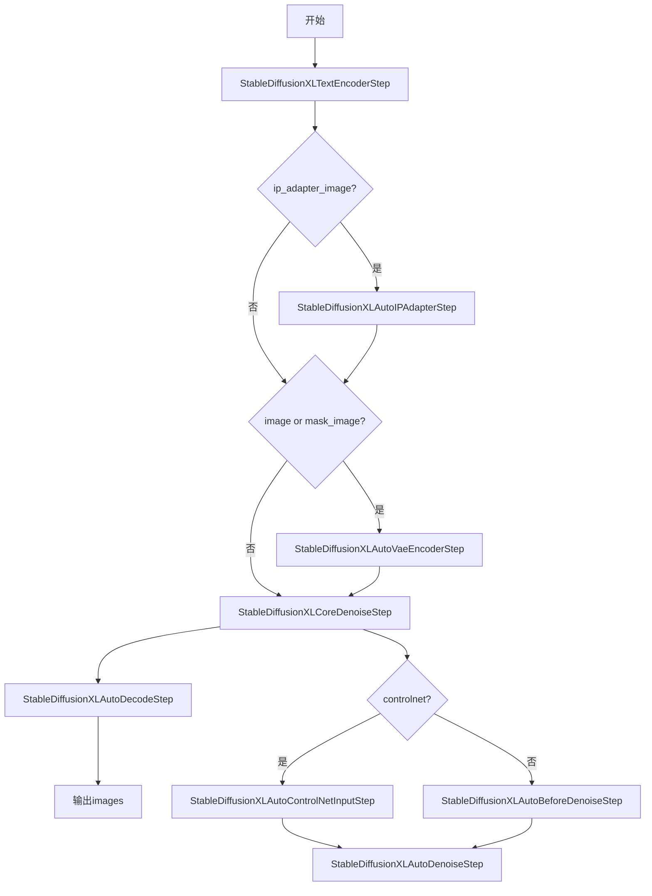

## 类结构

```
AutoPipelineBlocks (抽象基类)
├── StableDiffusionXLAutoVaeEncoderStep
├── StableDiffusionXLAutoIPAdapterStep
├── StableDiffusionXLAutoBeforeDenoiseStep
├── StableDiffusionXLAutoControlNetInputStep
├── StableDiffusionXLAutoControlNetDenoiseStep
├── StableDiffusionXLAutoDenoiseStep
├── StableDiffusionXLAutoDecodeStep
└── StableDiffusionXLAutoBlocks
SequentialPipelineBlocks (抽象基类)
├── StableDiffusionXLBeforeDenoiseStep
├── StableDiffusionXLImg2ImgBeforeDenoiseStep
├── StableDiffusionXLInpaintBeforeDenoiseStep
├── StableDiffusionXLInpaintDecodeStep
└── StableDiffusionXLCoreDenoiseStep
```

## 全局变量及字段


### `logger`
    
用于记录模块日志的Logger对象

类型：`logging.Logger`
    


### `StableDiffusionXLAutoVaeEncoderStep.StableDiffusionXLAutoVaeEncoderStep.block_classes`
    
自动VAE编码步骤的候选类列表

类型：`List[Type[PipelineStep]]`
    


### `StableDiffusionXLAutoVaeEncoderStep.StableDiffusionXLAutoVaeEncoderStep.block_names`
    
自动VAE编码步骤的候选类名称列表

类型：`List[str]`
    


### `StableDiffusionXLAutoVaeEncoderStep.StableDiffusionXLAutoVaeEncoderStep.block_trigger_inputs`
    
触发自动VAE编码步骤的输入参数名称列表

类型：`List[str]`
    


### `StableDiffusionXLAutoIPAdapterStep.StableDiffusionXLAutoIPAdapterStep.block_classes`
    
IP适配器步骤的候选类列表

类型：`List[Type[PipelineStep]]`
    


### `StableDiffusionXLAutoIPAdapterStep.StableDiffusionXLAutoIPAdapterStep.block_names`
    
IP适配器步骤的候选类名称列表

类型：`List[str]`
    


### `StableDiffusionXLAutoIPAdapterStep.StableDiffusionXLAutoIPAdapterStep.block_trigger_inputs`
    
触发IP适配器步骤的输入参数名称列表

类型：`List[str]`
    


### `StableDiffusionXLBeforeDenoiseStep.StableDiffusionXLBeforeDenoiseStep.block_classes`
    
文本到图像去噪前步骤的候选类列表

类型：`List[Type[PipelineStep]]`
    


### `StableDiffusionXLBeforeDenoiseStep.StableDiffusionXLBeforeDenoiseStep.block_names`
    
文本到图像去噪前步骤的候选类名称列表

类型：`List[str]`
    


### `StableDiffusionXLImg2ImgBeforeDenoiseStep.StableDiffusionXLImg2ImgBeforeDenoiseStep.block_classes`
    
图像到图像去噪前步骤的候选类列表

类型：`List[Type[PipelineStep]]`
    


### `StableDiffusionXLImg2ImgBeforeDenoiseStep.StableDiffusionXLImg2ImgBeforeDenoiseStep.block_names`
    
图像到图像去噪前步骤的候选类名称列表

类型：`List[str]`
    


### `StableDiffusionXLInpaintBeforeDenoiseStep.StableDiffusionXLInpaintBeforeDenoiseStep.block_classes`
    
图像修复去噪前步骤的候选类列表

类型：`List[Type[PipelineStep]]`
    


### `StableDiffusionXLInpaintBeforeDenoiseStep.StableDiffusionXLInpaintBeforeDenoiseStep.block_names`
    
图像修复去噪前步骤的候选类名称列表

类型：`List[str]`
    


### `StableDiffusionXLAutoBeforeDenoiseStep.StableDiffusionXLAutoBeforeDenoiseStep.block_classes`
    
自动去噪前步骤的候选类列表

类型：`List[Type[PipelineStep]]`
    


### `StableDiffusionXLAutoBeforeDenoiseStep.StableDiffusionXLAutoBeforeDenoiseStep.block_names`
    
自动去噪前步骤的候选类名称列表

类型：`List[str]`
    


### `StableDiffusionXLAutoBeforeDenoiseStep.StableDiffusionXLAutoBeforeDenoiseStep.block_trigger_inputs`
    
触发自动去噪前步骤的输入参数名称列表

类型：`List[str]`
    


### `StableDiffusionXLAutoControlNetInputStep.StableDiffusionXLAutoControlNetInputStep.block_classes`
    
ControlNet输入步骤的候选类列表

类型：`List[Type[PipelineStep]]`
    


### `StableDiffusionXLAutoControlNetInputStep.StableDiffusionXLAutoControlNetInputStep.block_names`
    
ControlNet输入步骤的候选类名称列表

类型：`List[str]`
    


### `StableDiffusionXLAutoControlNetInputStep.StableDiffusionXLAutoControlNetInputStep.block_trigger_inputs`
    
触发ControlNet输入步骤的输入参数名称列表

类型：`List[str]`
    


### `StableDiffusionXLAutoControlNetDenoiseStep.StableDiffusionXLAutoControlNetDenoiseStep.block_classes`
    
ControlNet去噪步骤的候选类列表

类型：`List[Type[PipelineStep]]`
    


### `StableDiffusionXLAutoControlNetDenoiseStep.StableDiffusionXLAutoControlNetDenoiseStep.block_names`
    
ControlNet去噪步骤的候选类名称列表

类型：`List[str]`
    


### `StableDiffusionXLAutoControlNetDenoiseStep.StableDiffusionXLAutoControlNetDenoiseStep.block_trigger_inputs`
    
触发ControlNet去噪步骤的输入参数名称列表

类型：`List[str]`
    


### `StableDiffusionXLAutoDenoiseStep.StableDiffusionXLAutoDenoiseStep.block_classes`
    
自动去噪步骤的候选类列表

类型：`List[Type[PipelineStep]]`
    


### `StableDiffusionXLAutoDenoiseStep.StableDiffusionXLAutoDenoiseStep.block_names`
    
自动去噪步骤的候选类名称列表

类型：`List[str]`
    


### `StableDiffusionXLAutoDenoiseStep.StableDiffusionXLAutoDenoiseStep.block_trigger_inputs`
    
触发自动去噪步骤的输入参数名称列表

类型：`List[str]`
    


### `StableDiffusionXLInpaintDecodeStep.StableDiffusionXLInpaintDecodeStep.block_classes`
    
图像修复解码步骤的候选类列表

类型：`List[Type[PipelineStep]]`
    


### `StableDiffusionXLInpaintDecodeStep.StableDiffusionXLInpaintDecodeStep.block_names`
    
图像修复解码步骤的候选类名称列表

类型：`List[str]`
    


### `StableDiffusionXLAutoDecodeStep.StableDiffusionXLAutoDecodeStep.block_classes`
    
自动解码步骤的候选类列表

类型：`List[Type[PipelineStep]]`
    


### `StableDiffusionXLAutoDecodeStep.StableDiffusionXLAutoDecodeStep.block_names`
    
自动解码步骤的候选类名称列表

类型：`List[str]`
    


### `StableDiffusionXLAutoDecodeStep.StableDiffusionXLAutoDecodeStep.block_trigger_inputs`
    
触发自动解码步骤的输入参数名称列表

类型：`List[str]`
    


### `StableDiffusionXLCoreDenoiseStep.StableDiffusionXLCoreDenoiseStep.block_classes`
    
核心去噪步骤的候选类列表

类型：`List[Type[PipelineStep]]`
    


### `StableDiffusionXLCoreDenoiseStep.StableDiffusionXLCoreDenoiseStep.block_names`
    
核心去噪步骤的候选类名称列表

类型：`List[str]`
    


### `StableDiffusionXLAutoBlocks.StableDiffusionXLAutoBlocks.block_classes`
    
自动模块化管道的步骤类列表

类型：`List[Type[PipelineStep]]`
    


### `StableDiffusionXLAutoBlocks.StableDiffusionXLAutoBlocks.block_names`
    
自动模块化管道的步骤名称列表

类型：`List[str]`
    


### `StableDiffusionXLAutoBlocks.StableDiffusionXLAutoBlocks._workflow_map`
    
工作流名称到所需输入参数的映射字典

类型：`Dict[str, Dict[str, bool]]`
    
    

## 全局函数及方法


### `StableDiffusionXLAutoVaeEncoderStep.description`

该属性返回 StableDiffusionXLAutoVaeEncoderStep 类的描述信息，说明该自动 pipeline 块用于将图像输入编码为潜在表示，支持 inpainting 和 img2img 两种任务模式。

参数：

- 该方法为属性方法，无显式参数

返回值：`str`，返回该模块的描述字符串

#### 流程图

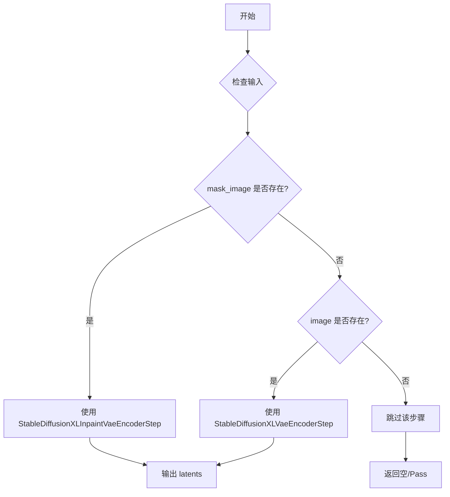

#### 带注释源码

```python
# vae encoder (run before before_denoise)
class StableDiffusionXLAutoVaeEncoderStep(AutoPipelineBlocks):
    """
    自动 VAE 编码器步骤类，继承自 AutoPipelineBlocks。
    该类用于在去噪之前将图像编码为潜在表示。
    支持 inpainting（图像修复）和 img2img（图像到图像转换）两种任务。
    """
    
    # 定义可用的块类列表
    # - StableDiffusionXLInpaintVaeEncoderStep: 用于 inpainting 任务
    # - StableDiffusionXLVaeEncoderStep: 用于 img2img 任务
    block_classes = [StableDiffusionXLInpaintVaeEncoderStep, StableDiffusionXLVaeEncoderStep]
    
    # 块名称映射，用于日志和调试
    block_names = ["inpaint", "img2img"]
    
    # 触发输入条件，用于自动选择合适的块
    # 第一个条件检查 mask_image，第二个条件检查 image
    block_trigger_inputs = ["mask_image", "image"]

    @property
    def description(self):
        """
        返回该模块的描述信息。
        
        说明:
            - 当提供 mask_image 时，使用 StableDiffusionXLInpaintVaeEncoderStep 进行 inpainting
            - 当仅提供 image 时，使用 StableDiffusionXLVaeEncoderStep 进行 img2img
            - 如果既没有提供 mask_image 也没有提供 image，则跳过该步骤
        """
        return (
            "Vae encoder step that encode the image inputs into their latent representations.\n"
            + "This is an auto pipeline block that works for both inpainting and img2img tasks.\n"
            + " - `StableDiffusionXLInpaintVaeEncoderStep` (inpaint) is used when `mask_image` is provided.\n"
            + " - `StableDiffusionXLVaeEncoderStep` (img2img) is used when only `image` is provided."
            + " - if neither `mask_image` nor `image` is provided, step will be skipped."
        )
```


### `StableDiffusionXLAutoIPAdapterStep.description`

这是一个属性（property），用于返回 `StableDiffusionXLAutoIPAdapterStep` 类的描述信息。该类是一个自动管道块，用于在提供 `ip_adapter_image` 时执行 IP Adapter 步骤，并且该步骤应放置在 'input' 步骤之前。

参数：无（该方法为属性，无参数）

返回值：`str`，返回对该自动 IP Adapter 步骤的描述，说明其在提供 `ip_adapter_image` 时执行，并应位于 'input' 步骤之前。

#### 流程图

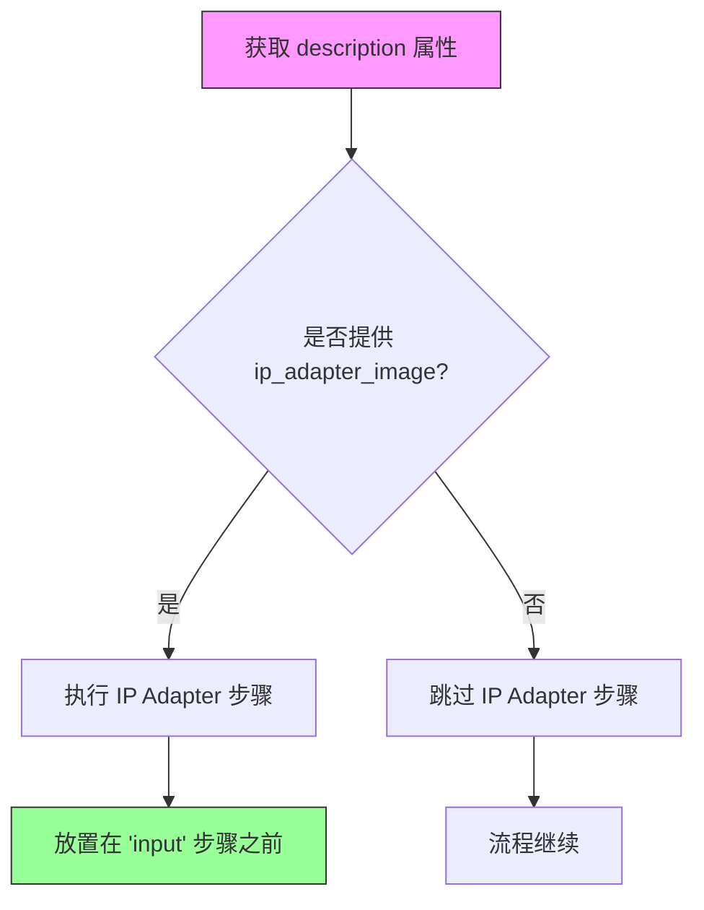

#### 带注释源码

```python
# optional ip-adapter (run before input step)
class StableDiffusionXLAutoIPAdapterStep(AutoPipelineBlocks):
    """
    自动管道块类，用于处理 IP Adapter 步骤的自动选择。
    
    该类继承自 AutoPipelineBlocks，根据输入条件自动选择是否执行 IP Adapter 步骤。
    当提供了 ip_adapter_image 时，会使用 StableDiffusionXLIPAdapterStep 进行处理。
    """
    
    # 可用的块类列表，目前只包含 StableDiffusionXLIPAdapterStep
    block_classes = [StableDiffusionXLIPAdapterStep]
    
    # 块名称列表，用于标识这个自动块
    block_names = ["ip_adapter"]
    
    # 触发输入列表，当提供 ip_adapter_image 时触发此块
    block_trigger_inputs = ["ip_adapter_image"]

    @property
    def description(self):
        """
        返回该自动 IP Adapter 步骤的描述信息。
        
        返回值说明:
            str: 描述文本，说明该步骤在提供 ip_adapter_image 时执行，
                 并且应该放置在 'input' 步骤之前
        """
        return "Run IP Adapter step if `ip_adapter_image` is provided. This step should be placed before the 'input' step.\n"
```


### `StableDiffusionXLBeforeDenoiseStep.description`

该属性方法用于描述 Stable Diffusion XL 流水线中文本到图像（text2img）任务的去噪前处理步骤。它返回一个字符串，说明该步骤是一个顺序管道块，包含设置时间步、准备潜在向量和准备额外条件化三个子步骤。

参数：无（这是一个 `@property` 装饰器方法，不需要显式参数）

返回值：`str`，返回描述该管道块功能的字符串，说明各子步骤的作用。

#### 流程图

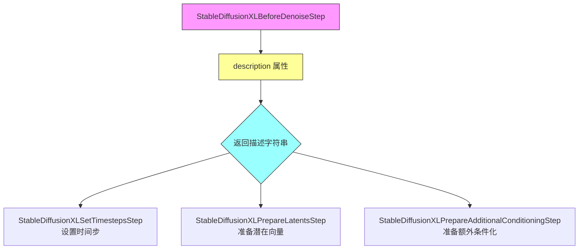

#### 带注释源码

```python
# before_denoise: text2img
class StableDiffusionXLBeforeDenoiseStep(SequentialPipelineBlocks):
    """
    用于文本到图像（text2img）任务的去噪前处理步骤类。
    继承自 SequentialPipelineBlocks，表示按顺序执行各个子步骤。
    """
    
    # 定义该管道块包含的子步骤类列表
    block_classes = [
        StableDiffusionXLSetTimestepsStep,          # 设置去噪时间步
        StableDiffusionXLPrepareLatentsStep,        # 准备潜在向量表示
        StableDiffusionXLPrepareAdditionalConditioningStep,  # 准备额外条件化信息
    ]
    
    # 子步骤的名称别名，用于日志和调试
    block_names = ["set_timesteps", "prepare_latents", "prepare_add_cond"]

    @property
    def description(self):
        """
        返回该管道块的描述信息。
        
        描述内容：
        - 说明这是去噪前处理步骤，准备去噪所需的输入
        - 说明这是一个顺序管道块，按顺序执行三个子步骤
        - 列出每个子步骤的功能
        
        返回:
            str: 描述该管道块的字符串
        """
        return (
            "Before denoise step that prepare the inputs for the denoise step.\n"
            + "This is a sequential pipeline blocks:\n"
            + " - `StableDiffusionXLSetTimestepsStep` is used to set the timesteps\n"
            + " - `StableDiffusionXLPrepareLatentsStep` is used to prepare the latents\n"
            + " - `StableDiffusionXLPrepareAdditionalConditioningStep` is used to prepare the additional conditioning\n"
        )
```


### StableDiffusionXLImg2ImgBeforeDenoiseStep.description

该方法是 `StableDiffusionXLImg2ImgBeforeDenoiseStep` 类的描述属性，用于为图像到图像（img2img）任务准备去噪步骤所需的输入。它是一个顺序管道块，包含设置时间步长、准备潜变量和准备额外条件三个子步骤。

参数：无（该方法为属性，无显式参数）

返回值：`str`，返回该步骤的描述字符串，说明其功能和包含的子步骤。

#### 流程图

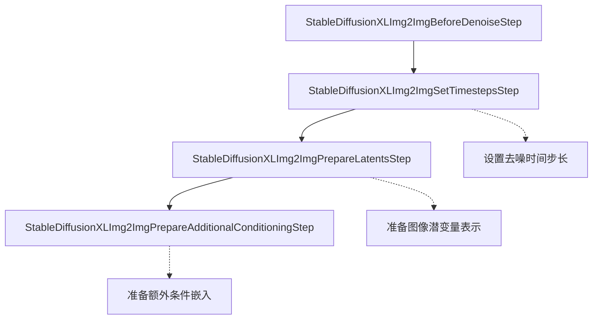

#### 带注释源码

```python
# before_denoise: img2img
class StableDiffusionXLImg2ImgBeforeDenoiseStep(SequentialPipelineBlocks):
    """
    用于图像到图像（img2img）任务的去噪前处理步骤。
    
    该类继承自 SequentialPipelineBlocks，定义了 img2img 任务所需的三
    个顺序执行的子步骤：设置时间步长、准备潜变量、准备额外条件。
    """
    
    # 定义该步骤包含的子步骤类列表
    block_classes = [
        StableDiffusionXLImg2ImgSetTimestepsStep,        # 设置时间步长步骤
        StableDiffusionXLImg2ImgPrepareLatentsStep,     # 准备潜变量步骤
        StableDiffusionXLImg2ImgPrepareAdditionalConditioningStep,  # 准备额外条件步骤
    ]
    
    # 子步骤的别名名称
    block_names = ["set_timesteps", "prepare_latents", "prepare_add_cond"]

    @property
    def description(self):
        """
        返回该步骤的描述信息。
        
        描述说明了该步骤用于 img2img 任务的前处理，包含三个顺序执行
        的子步骤及其各自的功能。
        
        返回:
            str: 描述字符串，说明步骤功能和子步骤信息
        """
        return (
            "Before denoise step that prepare the inputs for the denoise step for img2img task.\n"
            + "This is a sequential pipeline blocks:\n"
            + " - `StableDiffusionXLImg2ImgSetTimestepsStep` is used to set the timesteps\n"
            + " - `StableDiffusionXLImg2ImgPrepareLatentsStep` is used to prepare the latents\n"
            + " - `StableDiffusionXLImg2ImgPrepareAdditionalConditioningStep` is used to prepare the additional conditioning\n"
        )
```


### `StableDiffusionXLInpaintBeforeDenoiseStep.description`

该属性是 `StableDiffusionXLInpaintBeforeDenoiseStep` 类的描述属性，用于返回关于图像修复任务（inpainting）在去噪之前准备步骤的说明信息。它是一个顺序流水线块（SequentialPipelineBlocks），按顺序执行三个步骤：设置时间步（set_timesteps）、准备潜变量（prepare_latents）和准备额外条件（prepare_add_cond）。

参数： 无（这是一个 `@property` 装饰器定义的数据属性，而非方法）

返回值： `str`，返回该步骤的描述字符串，说明该步骤用于为图像修复任务准备去噪步骤的输入，并列出三个子步骤的功能。

#### 流程图

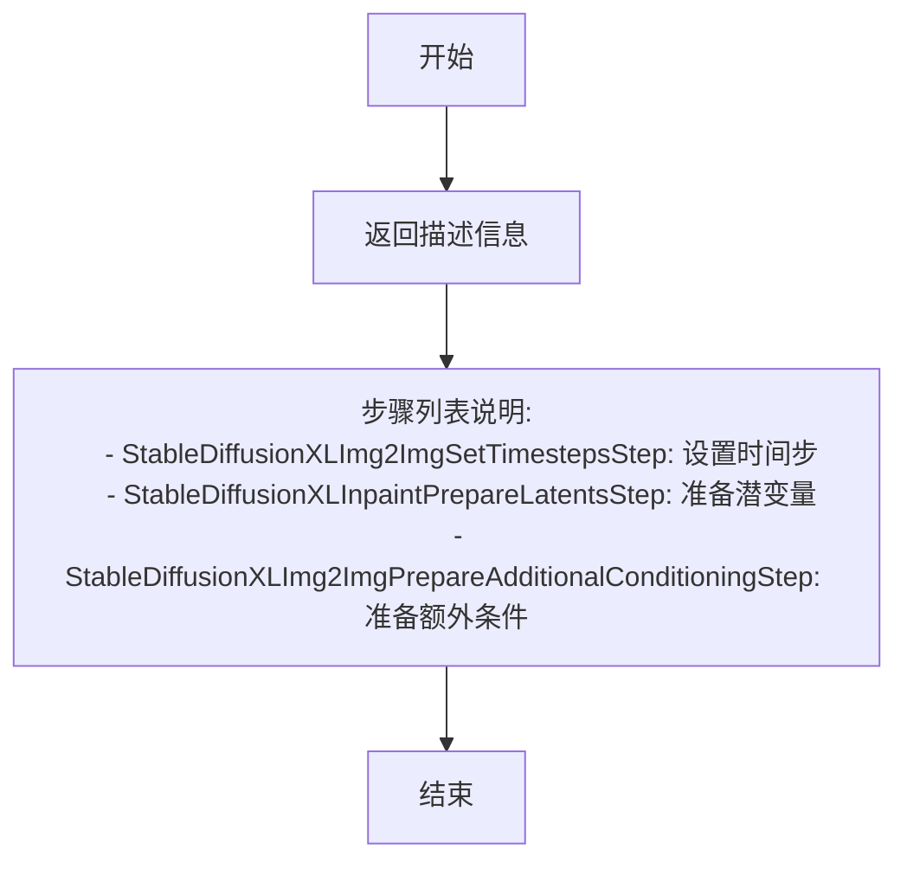

#### 带注释源码

```python
# before_denoise: inpainting
class StableDiffusionXLInpaintBeforeDenoiseStep(SequentialPipelineBlocks):
    # 定义该块包含的子步骤类列表，按执行顺序排列
    block_classes = [
        StableDiffusionXLImg2ImgSetTimestepsStep,      # 用于设置去噪调度器的时间步
        StableDiffusionXLInpaintPrepareLatentsStep,  # 用于准备图像修复任务的潜变量
        StableDiffusionXLImg2ImgPrepareAdditionalConditioningStep,  # 用于准备额外的条件信息
    ]
    # 子步骤的名称标识符列表，用于日志和调试
    block_names = ["set_timesteps", "prepare_latents", "prepare_add_cond"]

    @property
    def description(self):
        # 返回该步骤的描述信息，说明其用途和包含的子步骤
        return (
            "Before denoise step that prepare the inputs for the denoise step for inpainting task.\n"
            + "This is a sequential pipeline blocks:\n"
            + " - `StableDiffusionXLImg2ImgSetTimestepsStep` is used to set the timesteps\n"
            + " - `StableDiffusionXLInpaintPrepareLatentsStep` is used to prepare the latents\n"
            + " - `StableDiffusionXLImg2ImgPrepareAdditionalConditioningStep` is used to prepare the additional conditioning\n"
        )
```


### `StableDiffusionXLAutoBeforeDenoiseStep.description`

该属性方法用于描述 `StableDiffusionXLAutoBeforeDenoiseStep` 类的功能：作为自动管道块，根据输入参数（mask 和 image_latents）自动选择合适的前处理步骤（inpaint/ img2img/ text2img），为去噪步骤准备输入。该类支持 text2img、img2img、inpainting 以及 controlnet 和 controlnet_union 任务。

参数：
- 该方法为属性方法（使用 `@property` 装饰器），无显式参数
- 隐式参数 `self`：指向类实例的引用

返回值：`str`，返回该自动管道块的描述字符串

#### 流程图

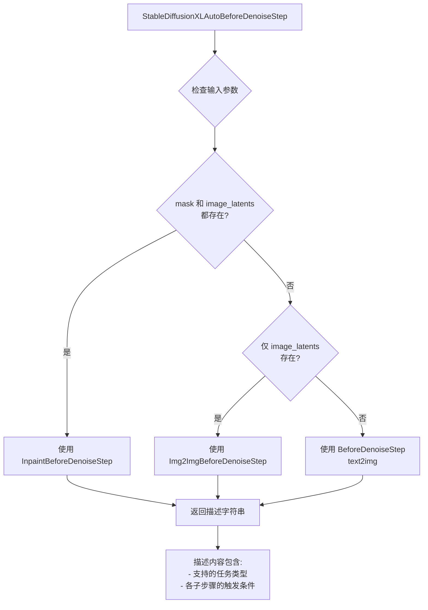

#### 带注释源码

```python
# before_denoise: all task (text2img, img2img, inpainting)
class StableDiffusionXLAutoBeforeDenoiseStep(AutoPipelineBlocks):
    """
    自动管道块类，用于处理不同任务（text2img、img2img、inpainting）
    的前处理步骤。根据输入参数自动选择合适的处理块。
    """
    
    # 定义可用的子处理块类
    block_classes = [
        StableDiffusionXLInpaintBeforeDenoiseStep,  # inpainting 任务的前处理
        StableDiffusionXLImg2ImgBeforeDenoiseStep,   # img2img 任务的前处理
        StableDiffusionXLBeforeDenoiseStep,          # text2img 任务的前处理
    ]
    
    # 子处理块的名称映射
    block_names = ["inpaint", "img2img", "text2img"]
    
    # 触发条件：用于自动选择合适的处理块
    # - "mask": 当提供 mask 时触发（inpainting）
    # - "image_latents": 当提供 image_latents 时触发（img2img）
    # - None: 默认触发（text2img）
    block_trigger_inputs = ["mask", "image_latents", None]

    @property
    def description(self):
        """
        返回该自动管道块的描述信息
        
        说明：
        - 这是一个属性方法（使用 @property 装饰器）
        - 返回类型为 str
        - 无需显式调用，直接通过 .description 访问
        """
        return (
            "Before denoise step that prepare the inputs for the denoise step.\n"
            + "This is an auto pipeline block that works for text2img, img2img and inpainting tasks as well as controlnet, controlnet_union.\n"
            + " - `StableDiffusionXLInpaintBeforeDenoiseStep` (inpaint) is used when both `mask` and `image_latents` are provided.\n"
            + " - `StableDiffusionXLImg2ImgBeforeDenoiseStep` (img2img) is used when only `image_latents` is provided.\n"
            + " - `StableDiffusionXLBeforeDenoiseStep` (text2img) is used when both `image_latents` and `mask` are not provided.\n"
        )
```


### `StableDiffusionXLAutoControlNetInputStep.description`

这是一个自动管道块（Auto Pipeline Block）的描述属性，用于准备 ControlNet 输入数据。该类能够根据输入参数智能选择使用 `StableDiffusionXLControlNetUnionInputStep`（支持联合 ControlNet）或 `StableDiffusionXLControlNetInputStep`（标准 ControlNet），如果未提供 `control_mode` 和 `control_image` 则跳过此步骤。

参数：
- （无参数，这是一个 `@property` 属性方法）

返回值：`str`，返回该步骤的详细描述文本，说明其功能、支持的模式以及触发条件。

#### 流程图

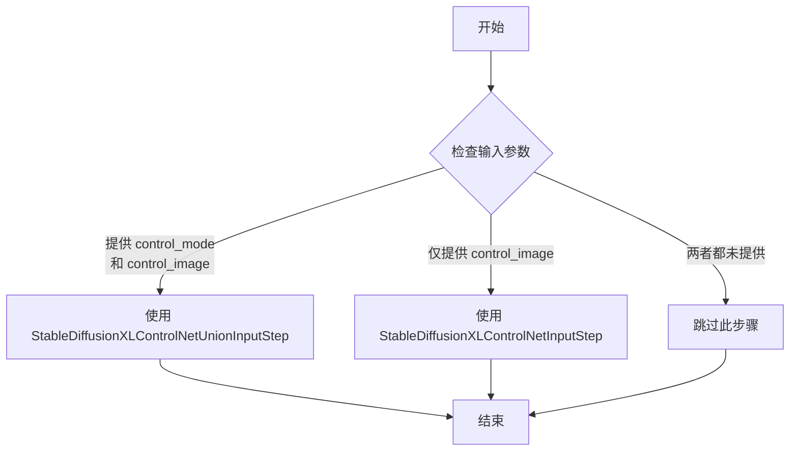

#### 带注释源码

```python
# optional controlnet input step (after before_denoise, before denoise)
# works for both controlnet and controlnet_union
class StableDiffusionXLAutoControlNetInputStep(AutoPipelineBlocks):
    """
    ControlNet 输入步骤的自动管道块类。
    
    此类是一个自动管道块（AutoPipelineBlocks），用于处理 ControlNet 的输入准备。
    它支持两种模式：
      - controlnet_union：当同时提供 control_mode 和 control_image 时使用
      - controlnet：当仅提供 control_image 时使用
    
    该步骤应在 before_denoise 之后、denoise 之前调用。
    """
    
    # 定义块类列表，包含联合输入步骤和标准输入步骤
    block_classes = [StableDiffusionXLControlNetUnionInputStep, StableDiffusionXLControlNetInputStep]
    
    # 块名称映射
    block_names = ["controlnet_union", "controlnet"]
    
    # 触发此块所需的输入参数
    block_trigger_inputs = ["control_mode", "control_image"]

    @property
    def description(self):
        """
        返回该步骤的描述信息。
        
        描述内容包括：
        - 步骤的基本功能：准备 ControlNet 输入
        - 支持的模式：controlnet 和 controlnet_union
        - 触发条件：如何根据输入选择不同的处理步骤
        - 跳过条件：当没有提供必要输入时的行为
        
        Returns:
            str: 描述该 ControlNet 输入步骤的详细文本
        """
        return (
            "Controlnet Input step that prepare the controlnet input.\n"
            + "This is an auto pipeline block that works for both controlnet and controlnet_union.\n"
            + " (it should be called right before the denoise step)"
            + " - `StableDiffusionXLControlNetUnionInputStep` is called to prepare the controlnet input when `control_mode` and `control_image` are provided.\n"
            + " - `StableDiffusionXLControlNetInputStep` is called to prepare the controlnet input when `control_image` is provided."
            + " - if neither `control_mode` nor `control_image` is provided, step will be skipped."
        )
```


### `StableDiffusionXLAutoControlNetDenoiseStep.description`

这是一个属性方法（property），用于描述 StableDiffusionXLAutoControlNetDenoiseStep 类的功能。该类是自动管道块（AutoPipelineBlocks），用于根据不同的输入条件（mask 和 controlnet_cond）自动选择合适的 ControlNet 去噪步骤，支持 text2img、img2img 和 inpainting 任务。

参数：

- `self`：隐式参数，StableDiffusionXLAutoControlNetDenoiseStep 实例本身

返回值：`str`，返回该类的描述字符串，说明其自动选择逻辑和适用场景

#### 流程图

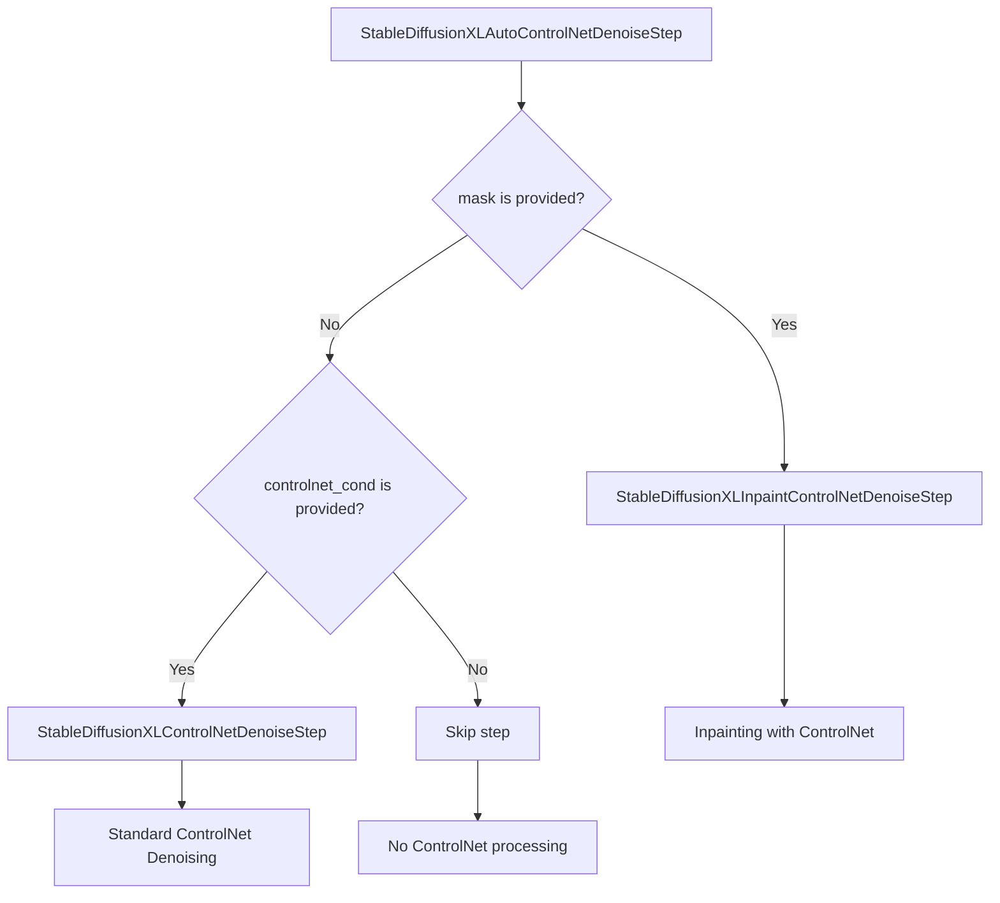

#### 带注释源码

```python
# denoise: controlnet (text2img, img2img, inpainting)
class StableDiffusionXLAutoControlNetDenoiseStep(AutoPipelineBlocks):
    # 定义该自动块支持的子步骤类
    block_classes = [StableDiffusionXLInpaintControlNetDenoiseStep, StableDiffusionXLControlNetDenoiseStep]
    # 子步骤的别名名称
    block_names = ["inpaint_controlnet_denoise", "controlnet_denoise"]
    # 触发条件：检查 mask 和 controlnet_cond 输入
    block_trigger_inputs = ["mask", "controlnet_cond"]

    @property
    def description(self) -> str:
        return (
            "Denoise step that iteratively denoise the latents with controlnet. "  # 使用 controlnet 迭代去噪 latent
            "This is a auto pipeline block that using controlnet for text2img, img2img and inpainting tasks."  # 自动块支持三种任务
            "This block should not be used without a controlnet_cond input"  # 必须提供 controlnet_cond
            " - `StableDiffusionXLInpaintControlNetDenoiseStep` (inpaint_controlnet_denoise) is used when mask is provided."  # 有 mask 时使用 inpaint 版本
            " - `StableDiffusionXLControlNetDenoiseStep` (controlnet_denoise) is used when mask is not provided but controlnet_cond is provided."  # 无 mask 但有 controlnet_cond 时使用标准版本
            " - If neither mask nor controlnet_cond are provided, step will be skipped."  # 两者都没有则跳过
        )
```


### `StableDiffusionXLAutoDenoiseStep.description`

该属性方法是Stable Diffusion XL自动去噪步骤的描述符，用于迭代地对潜在表示进行去噪处理。它是一个自动管道块，支持text2img、img2img和inpainting任务，并且可以与ControlNet结合使用或单独使用。根据提供的输入条件（controlnet_cond或mask），自动选择合适的去噪实现类。

参数：

- `self`：无，它是一个属性方法（property），不需要显式传递参数

返回值：`str`，返回一个描述字符串，说明该自动去噪步骤支持的多种任务模式以及如何根据输入条件选择具体的去噪实现类

#### 流程图

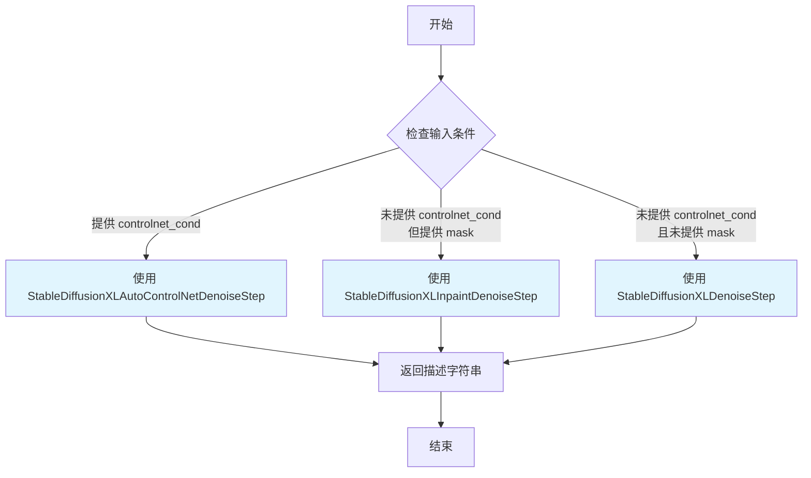

#### 带注释源码

```python
@property
def description(self) -> str:
    """
    属性方法：返回该自动去噪步骤的描述信息
    
    该方法是一个property装饰器，用于描述StableDiffusionXLAutoDenoiseStep类的功能：
    - 支持text2img、img2img和inpainting三种任务模式
    - 可以与ControlNet结合使用，也可以独立使用
    - 根据输入条件自动选择合适的去噪实现类
    
    Returns:
        str: 描述字符串，包含所有支持的任務类型和选择逻辑
    """
    return (
        "Denoise step that iteratively denoise the latents. "  # 迭代去噪潜在表示
        "This is a auto pipeline block that works for text2img, img2img and inpainting tasks. And can be used with or without controlnet."
        # 当提供controlnet_cond时，使用ControlNet去噪步骤（支持text2img、img2img和inpainting）
        " - `StableDiffusionXLAutoControlNetDenoiseStep` (controlnet_denoise) is used when controlnet_cond is provided (support controlnet withtext2img, img2img and inpainting tasks)."
        # 当提供mask时，使用Inpaint去噪步骤（支持inpainting任务）
        " - `StableDiffusionXLInpaintDenoiseStep` (inpaint_denoise) is used when mask is provided (support inpainting tasks)."
        # 当既没有提供controlnet_cond也没有提供mask时，使用标准去噪步骤（支持text2img和img2img任务）
        " - `StableDiffusionXLDenoiseStep` (denoise) is used when neither mask nor controlnet_cond are provided (support text2img and img2img tasks)."
    )
```


### `StableDiffusionXLInpaintDecodeStep.description`

该属性方法用于获取 Stable Diffusion XL 图像修复解码步骤的描述信息，返回一个说明该步骤功能的字符串。

参数：无（该方法为 property 装饰器修饰的属性方法，无需显式参数）

返回值：`str`，返回该 pipeline block 的功能描述，说明其用于将去噪后的潜在表示解码为图像输出，并包含组成该步骤的两个子步骤的说明。

#### 流程图

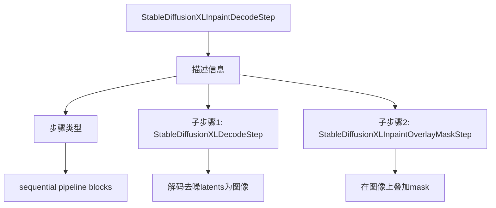

#### 带注释源码

```python
# decode: inpaint
class StableDiffusionXLInpaintDecodeStep(SequentialPipelineBlocks):
    """
    Inpaint decode step that decode the denoised latents into images outputs.
    This is a sequential pipeline blocks:
     - `StableDiffusionXLDecodeStep` is used to decode the denoised latents into images
     - `StableDiffusionXLInpaintOverlayMaskStep` is used to overlay the mask on the image
    """
    # 定义该顺序 pipeline 包含的两个子步骤类
    block_classes = [StableDiffusionXLDecodeStep, StableDiffusionXLInpaintOverlayMaskStep]
    # 定义子步骤的别名名称
    block_names = ["decode", "mask_overlay"]

    @property
    def description(self):
        return (
            "Inpaint decode step that decode the denoised latents into images outputs.\n"
            + "This is a sequential pipeline blocks:\n"
            + " - `StableDiffusionXLDecodeStep` is used to decode the denoised latents into images\n"
            + " - `StableDiffusionXLInpaintOverlayMaskStep` is used to overlay the mask on the image"
        )
```


### `StableDiffusionXLAutoDecodeStep.description`

该属性用于获取 Stable Diffusion XL 自动解码步骤的描述信息。它是一个自动管道块（AutoPipelineBlocks），根据输入参数自动选择合适的解码策略：当提供 `padding_mask_crop` 参数时使用 inpaint 解码步骤，否则使用非 inpaint 解码步骤。

参数：无（该方法为属性，不接受任何参数）

返回值：`str`，返回解码步骤的描述文本，包含对 `StableDiffusionXLInpaintDecodeStep` 和 `StableDiffusionXLDecodeStep` 两个具体解码步骤的说明及其适用场景。

#### 流程图

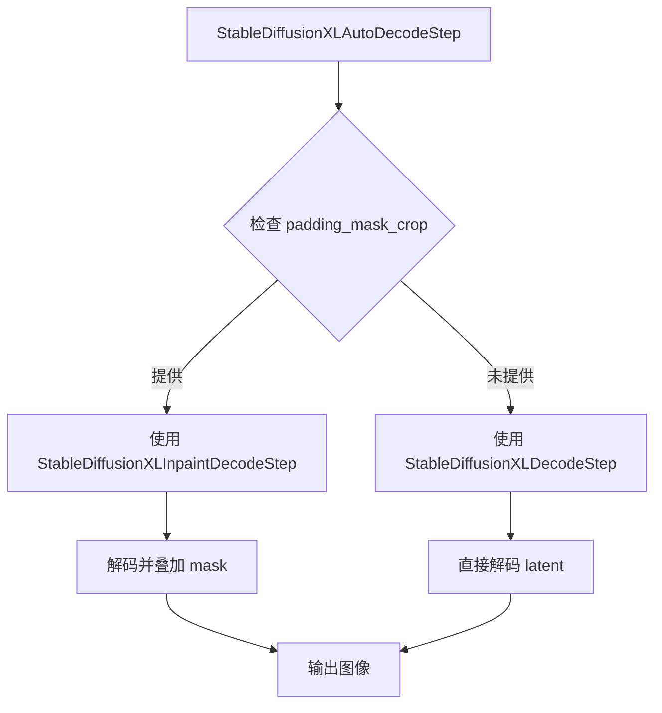

#### 带注释源码

```python
# decode: all task (text2img, img2img, inpainting)
class StableDiffusionXLAutoDecodeStep(AutoPipelineBlocks):
    """
    自动解码步骤类，继承自 AutoPipelineBlocks。
    用于处理 text2img、img2img 和 inpainting 任务的解码过程。
    
    块类列表：
        - StableDiffusionXLInpaintDecodeStep: 用于 inpainting 任务的解码
        - StableDiffusionXLDecodeStep: 用于非 inpainting 任务的解码
    
    触发输入：
        - padding_mask_crop: 当提供此参数时，触发 inpaint 解码流程
        - None: 当未提供时，使用普通解码流程
    """
    
    # 定义该自动块支持的块类
    block_classes = [StableDiffusionXLInpaintDecodeStep, StableDiffusionXLDecodeStep]
    
    # 块名称映射
    block_names = ["inpaint", "non-inpaint"]
    
    # 触发条件：检查 padding_mask_crop 是否存在
    block_trigger_inputs = ["padding_mask_crop", None]

    @property
    def description(self):
        """
        获取解码步骤的描述信息。
        
        返回值说明：
            - 描述了解码步骤的核心功能：将去噪后的 latent 转换为图像输出
            - 说明了自动选择逻辑：根据 padding_mask_crop 参数选择不同的解码器
            - 列出了两个具体解码步骤及其适用场景
        
        返回：
            str: 包含详细描述的字符串
        """
        return (
            "Decode step that decode the denoised latents into images outputs.\n"
            + "This is an auto pipeline block that works for inpainting and non-inpainting tasks.\n"
            + " - `StableDiffusionXLInpaintDecodeStep` (inpaint) is used when `padding_mask_crop` is provided.\n"
            + " - `StableDiffusionXLDecodeStep` (non-inpaint) is used when `padding_mask_crop` is not provided."
        )
```


### `StableDiffusionXLCoreDenoiseStep.description`

这是一个属性（property），用于描述`StableDiffusionXLCoreDenoiseStep`类的功能。该类是Stable Diffusion XL模块化管道中的核心去噪步骤，按顺序执行输入标准化、预处理、控制网输入准备和迭代去噪等多个子步骤，支持文生图、图生图、图像修复以及带/不带ControlNet和IP-Adapter的各种工作流。

参数： 无（这是一个属性，不接受任何参数）

返回值：`str`，返回该步骤的详细描述文本，说明其包含的子步骤以及支持的工作流类型

#### 流程图

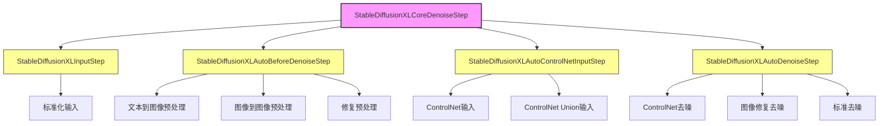

#### 带注释源码

```python
class StableDiffusionXLCoreDenoiseStep(SequentialPipelineBlocks):
    """
    核心去噪步骤类，继承自SequentialPipelineBlocks。
    该类按照特定顺序执行四个主要步骤：
    1. 输入标准化 (StableDiffusionXLInputStep)
    2. 去噪前预处理 (StableDiffusionXLAutoBeforeDenoiseStep)
    3. ControlNet输入准备 (StableDiffusionXLAutoControlNetInputStep)
    4. 迭代去噪 (StableDiffusionXLAutoDenoiseStep)
    """
    
    # 定义该步骤包含的子步骤类
    block_classes = [
        StableDiffusionXLInputStep,              # 输入标准化步骤
        StableDiffusionXLAutoBeforeDenoiseStep,  # 自动去噪前预处理步骤
        StableDiffusionXLAutoControlNetInputStep, # 自动ControlNet输入步骤
        StableDiffusionXLAutoDenoiseStep,       # 自动去噪步骤
    ]
    
    # 子步骤的名称标识
    block_names = ["input", "before_denoise", "controlnet_input", "denoise"]

    @property
    def description(self):
        """
        返回该核心去噪步骤的详细描述。
        
        描述内容包含：
        - 四个子步骤的功能说明
        - 支持的工作流类型（text2img, img2img, inpainting）
        - 支持的扩展功能（controlnet, controlnet_union, ip_adapter）
        - 各种工作流所需的输入参数
        
        返回：
            str: 描述文本，说明该步骤支持的各种生成任务和所需参数
        """
        return (
            "Core step that performs the denoising process. \n"
            + " - `StableDiffusionXLInputStep` (input) standardizes the inputs for the denoising step.\n"
            + " - `StableDiffusionXLAutoBeforeDenoiseStep` (before_denoise) prepares the inputs for the denoising step.\n"
            + " - `StableDiffusionXLAutoControlNetInputStep` (controlnet_input) prepares the controlnet input.\n"
            + " - `StableDiffusionXLAutoDenoiseStep` (denoise) iteratively denoises the latents.\n\n"
            + "This step support text-to-image, image-to-image, inpainting, with or without controlnet/controlnet_union/ip_adapter for Stable Diffusion XL:\n"
            + "- for image-to-image generation, you need to provide `image_latents`\n"
            + "- for inpainting, you need to provide `mask_image` and `image_latents`\n"
            + "- to run the controlnet workflow, you need to provide `control_image`\n"
            + "- to run the controlnet_union workflow, you need to provide `control_image` and `control_mode`\n"
            + "- to run the ip_adapter workflow, you need to load ip_adapter into your unet and provide `ip_adapter_embeds`\n"
            + "- for text-to-image generation, all you need to provide is prompt embeddings\n"
        )
```


### `StableDiffusionXLAutoBlocks.description`

Auto Modular pipeline for text-to-image, image-to-image, inpainting, and controlnet tasks using Stable Diffusion XL.

参数： 无（这是一个属性方法，通过 `@property` 装饰器定义，不需要显式参数）

返回值：`str`，返回对 StableDiffusionXLAutoBlocks 管道功能的描述字符串

#### 流程图

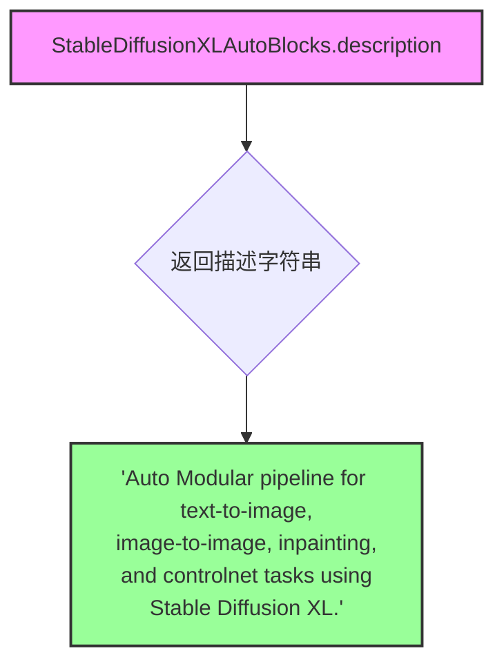

#### 带注释源码

```python
@property
def description(self):
    """
    返回 StableDiffusionXLAutoBlocks 类的描述信息。
    
    该属性提供了一个简洁的字符串，说明这是用于 Stable Diffusion XL 的
    自动模块化管道，支持文本到图像、图像到图像、修复以及 controlnet 任务。
    
    Returns:
        str: 描述字符串，说明管道支持的任务类型
    """
    return "Auto Modular pipeline for text-to-image, image-to-image, inpainting, and controlnet tasks using Stable Diffusion XL."
```


### `StableDiffusionXLAutoBlocks.outputs`

这是一个属性方法，用于定义 Stable Diffusion XL 自动模块流水线的输出参数。它返回包含图像输出参数的列表，描述流水线执行完成后生成的图像结果。

参数：

- （无显式参数，隐式参数 `self` 表示类的实例）

返回值：`List[OutputParam]`，返回包含图像输出参数的列表，用于描述流水线生成的图像输出。

#### 流程图

```mermaid
graph TD
    A[开始] --> B{执行 outputs 属性}
    B --> C[返回 [OutputParam.template('images')] ]
    C --> D[结束]
```

#### 带注释源码

```python
@property
def outputs(self):
    """
    定义流水线的输出参数。
    
    该属性返回一个包含 OutputParam 的列表，描述流水线执行完成后
    生成的输出结果。在当前实现中，只定义了一个 'images' 输出参数。
    
    Returns:
        List[OutputParam]: 包含图像输出参数的列表
                        - images: 生成的图像列表
    """
    # 使用 OutputParam.template 创建图像输出参数模板
    # 返回包装在列表中的输出参数
    return [OutputParam.template("images")]
```

## 关键组件


### StableDiffusionXLAutoVaeEncoderStep

VAE自动编码步骤，根据输入条件自动选择Inpaint或Img2Img的VAE编码器，将图像输入编码为潜在表示。

### StableDiffusionXLAutoIPAdapterStep

IP-Adapter自动步骤，当提供ip_adapter_image时执行IP-Adapter处理，用于图像提示增强。

### StableDiffusionXLAutoBeforeDenoiseStep

去噪前自动步骤，根据mask、image_latents等输入自动选择Inpaint、Img2Img或Text2Img的前处理流程。

### StableDiffusionXLAutoControlNetInputStep

ControlNet输入自动步骤，准备ControlNet所需的输入条件，支持controlnet和controlnet_union模式。

### StableDiffusionXLAutoControlNetDenoiseStep

ControlNet去噪自动步骤，根据mask和controlnet_cond条件自动选择Inpaint ControlNet或标准ControlNet去噪。

### StableDiffusionXLAutoDenoiseStep

去噪自动步骤，综合支持ControlNet、Inpaint和标准Text2Img/Img2Img的去噪任务。

### StableDiffusionXLAutoDecodeStep

解码自动步骤，将去噪后的潜在表示解码为图像输出，支持Inpaint和Non-Inpaint任务。

### StableDiffusionXLCoreDenoiseStep

核心去噪步骤，组合了输入标准化、前处理、ControlNet输入准备和去噪迭代的完整流程。

### StableDiffusionXLAutoBlocks

主自动模块化Pipeline，整合Text Encoder、IP-Adapter、VAE Encoder、Core Denoise和Decode步骤，支持多种工作流。


## 问题及建议


### 已知问题

- **TODO注释未完成**：类文档字符串中存在大量`TODO: Add description`的占位符，表明输入参数的描述不完整，影响代码可维护性和可理解性
- **重复代码模式**：`StableDiffusionXLBeforeDenoiseStep`、`StableDiffusionXLImg2ImgBeforeDenoiseStep`、`StableDiffusionXLInpaintBeforeDenoiseStep`三个类结构高度相似，仅block_classes不同，可通过抽象基类或数据驱动方式重构
- **魔法字符串硬编码**：`block_trigger_inputs`使用字符串列表来触发不同行为，缺乏类型安全性和IDE支持，易产生拼写错误
- **描述属性冗余**：多个类的`description`属性文本高度重复（如"prepare the inputs for the denoise step"），可提取为共享常量或通过代码自动生成
- **命名不一致**：类名`StableDiffusionXLCoreDenoiseStep`实际包含input、before_denoise、controlnet_input等多个步骤，命名具有误导性
- **单类AutoPipeline**：如`StableDiffusionXLAutoIPAdapterStep`的block_classes仅包含一个类，使用AutoPipelineBlocks模式过于笨重，可考虑条件逻辑替代
- **缺乏输入验证**：代码中没有对必需参数（如prompt、workflow必需字段）的显式验证，运行时可能产生难以追踪的错误
- **类型注解不完整**：部分方法返回类型标注为`str`而非更具体的类型，降低了代码的文档价值
- **工作流映射静态定义**：`_workflow_map`字典完全硬编码，新增工作流需要修改代码而非配置化，降低了扩展性
- **文档与实现脱节**：类文档中描述的"Supported workflows"与实际block_classes的执行逻辑存在隐式依赖关系，文档维护成本高

### 优化建议

- **完成TODO文档**：补充所有输入参数的描述，确保API完整性
- **提取公共抽象**：创建BeforeDenoise基类，通过参数化block_classes实现复用，减少重复代码
- **类型安全改进**：使用Enum或dataclass替代字符串触发条件，增强编译时检查
- **自动生成描述**：通过类元数据和反射自动生成description属性，减少手动维护
- **添加验证层**：在管道入口添加输入验证逻辑，明确检查必需参数并给出友好错误信息
- **配置化工作流**：将workflow_map外部化或使用注册机制，支持插件式扩展
- **统一命名规范**：重命名`StableDiffusionXLCoreDenoiseStep`为`StableDiffusionXLCorePipelineStep`以准确反映功能
- **简化单类AutoPipeline**：对于仅有一个候选类的AutoPipeline，考虑使用条件表达式直接返回，减少抽象开销

## 其它


### 设计目标与约束

本模块化Pipeline的设计目标是提供一个灵活、可扩展的Stable Diffusion XL推理框架，支持text2img、img2img、inpainting、controlnet、controlnet_union、ip_adapter等多种工作流的统一入口。核心约束包括：(1) 必须依赖HuggingFace的transformers和diffusers库；(2) 模型组件包括text_encoder、text_encoder_2、tokenizer、tokenizer_2、unet、vae、scheduler等；(3) 配置参数force_zeros_for_empty_prompt默认为True，requires_aesthetics_score默认为False；(4) 支持的图像输出格式默认为pil。

### 错误处理与异常设计

代码中主要通过Python标准日志模块进行错误记录，使用`logger = logging.get_logger(__name__)`获取日志记录器。各Pipeline Block的触发依赖于输入参数的存在性（如mask_image、control_image、ip_adapter_image等），当必要输入缺失时，相关步骤会被自动跳过而非抛出异常。建议增加更详细的参数校验和明确的异常抛出机制，特别是在工作流匹配和必需参数缺失的场景下。

### 数据流与状态机

整体数据流遵循以下顺序：TextEncoderStep → IPAdapterStep → VAEEncoderStep → CoreDenoiseStep → DecodeStep。其中CoreDenoiseStep内部又包含：InputStep → BeforeDenoiseStep → ControlNetInputStep → DenoiseStep。状态转换由输入参数触发决定，block_trigger_inputs定义了各AutoBlock的触发条件，例如StableDiffusionXLAutoVaeEncoderStep在提供mask_image时使用InpaintVaeEncoder，提供image时使用VaeEncoder，两者都不提供则跳过该步骤。

### 外部依赖与接口契约

主要外部依赖包括：(1) transformers库：CLIPTextModel、CLIPTextModelWithProjection、CLIPTokenizer、CLIPVisionModelWithProjection；(2) diffusers库：UNet2DConditionModel、AutoencoderKL、EulerDiscreteScheduler、ControlNetUnionModel；(3) 本地模块：..modular_pipeline中的AutoPipelineBlocks和SequentialPipelineBlocks，以及..modular_pipeline_utils中的OutputParam。各组件通过统一的__call__方法或process方法进行调用，返回值通过OutputParam模板封装。

### 配置参数说明

关键配置参数包括：num_images_per_prompt默认为1，num_inference_steps默认为50，strength默认为0.3，eta默认为0.0，output_type默认为pil。ControlNet相关参数：control_guidance_start默认为0.0，control_guidance_end默认为1.0，controlnet_conditioning_scale默认为1.0，guess_mode默认为False。Aesthetics相关参数：aesthetic_score默认为6.0，negative_aesthetic_score默认为2.0。裁剪相关参数：crops_coords_top_left和negative_crops_coords_top_left默认为(0, 0)。

### 使用示例

StableDiffusionXLAutoBlocks支持多种工作流，每种工作流有对应的必需输入参数。例如：text2img工作流需要prompt；image2img工作流需要image和prompt；inpainting工作流需要mask_image、image和prompt；controlnet_text2image需要control_image和prompt；ip_adapter_text2image需要ip_adapter_image和prompt；ip_adapter_controlnet_union_text2image需要ip_adapter_image、control_image、control_mode和prompt。通过_workflow_map字典定义了18种支持的工作流及其必需参数映射。

### 性能考虑

VAE编码和解码步骤可能成为性能瓶颈，建议在不需要时显式跳过。ControlNet和IP-Adapter的并行计算可以提升效率。Denoise步骤的迭代次数（num_inference_steps）直接影响生成时间和质量。对于大批量生成，num_images_per_prompt参数需要合理设置。模型权重可采用fp16进行推理以减少内存占用。

### 安全性考虑

代码本身为开源实现（Apache License 2.0），安全风险主要集中在输入验证方面。建议对用户提供的prompt进行长度限制和内容过滤，防止Prompt Injection攻击。图像输入需要进行尺寸验证和格式检查，防止恶意图像导致模型崩溃。生成的图像应添加水印或追溯信息以符合AI生成内容标识规范。

### 测试策略

建议针对18种工作流分别编写集成测试，验证各工作流的输入输出正确性。单元测试应覆盖各独立Step类的功能，包括TextEncoderStep、VaeEncoderStep、DenoiseStep等。性能测试应关注各步骤的执行时间，特别是VAE编码/解码和Denoise迭代过程。边界测试应覆盖参数缺失、参数类型错误、图像尺寸异常等场景。

    