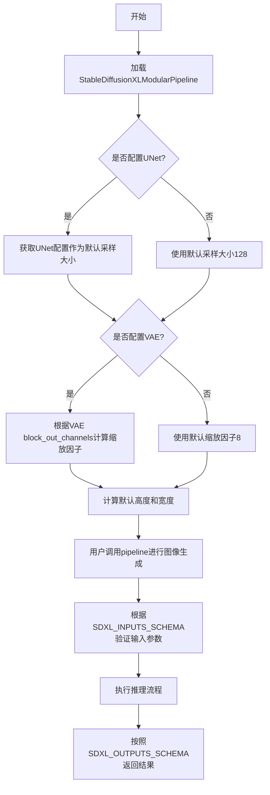
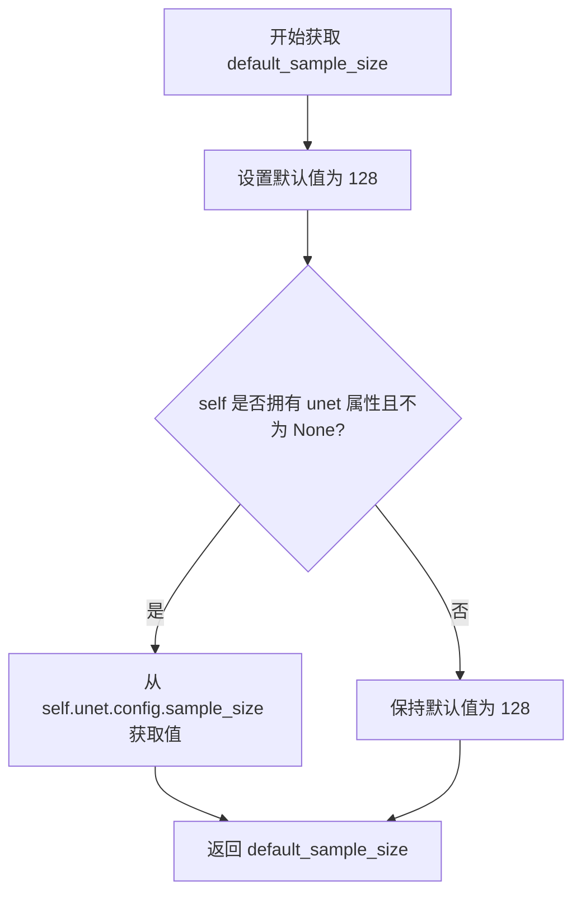
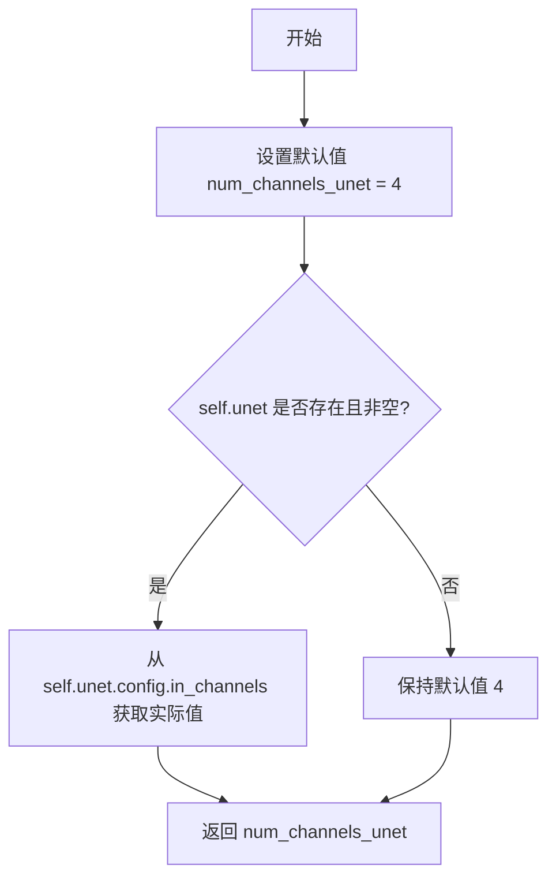
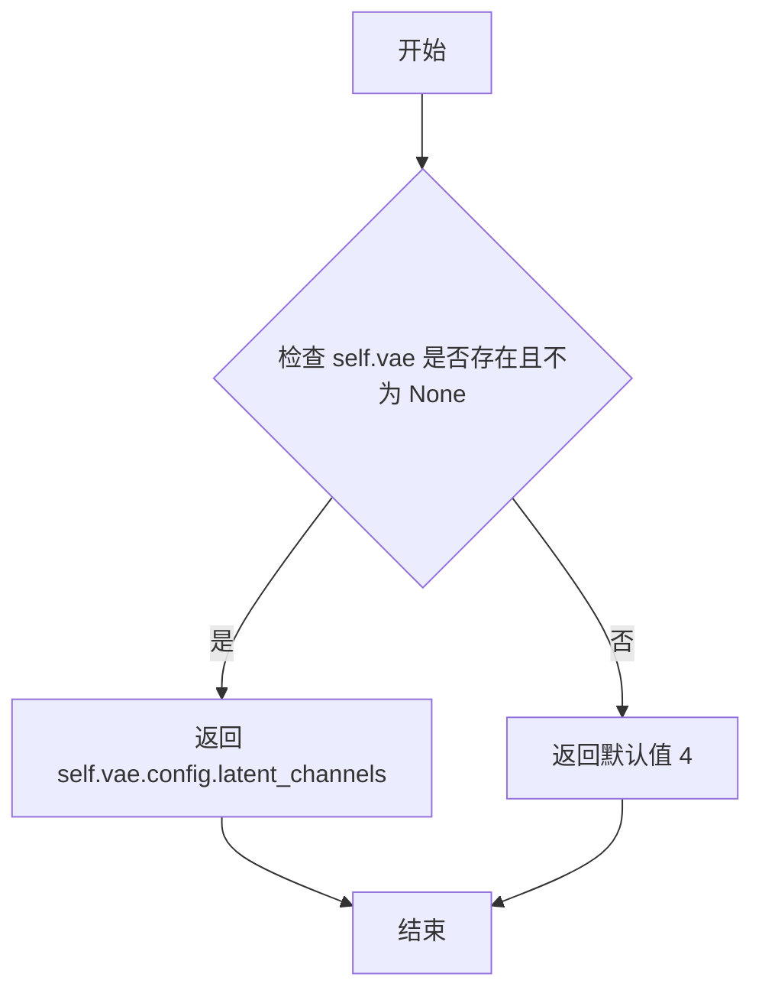

# `diffusers\src\diffusers\modular_pipelines\stable_diffusion_xl\modular_pipeline.py` 详细设计文档

Stable Diffusion XL模块化流水线是一种实验性的图像生成框架，通过组合多个混入类（Mixin）实现对文本到图像生成、图像到图像转换、修复等任务的支持，并提供了标准化的输入输出参数模式定义。

## 整体流程



## 类结构

```
object
├── ModularPipeline (基类)
├── StableDiffusionMixin (混入)
├── TextualInversionLoaderMixin (混入)
├── StableDiffusionXLLoraLoaderMixin (混入)
├── ModularIPAdapterMixin (混入)
└── StableDiffusionXLModularPipeline (具体实现)
```

## 全局变量及字段


### `logger`
    
Logger instance for the module, used for debugging and informational logging

类型：`logging.Logger`
    


### `default_blocks_name`
    
Default name for the auto blocks configuration used in Stable Diffusion XL pipeline

类型：`str`
    


### `SDXL_INPUTS_SCHEMA`
    
Dictionary defining the input schema for Stable Diffusion XL modular pipeline, containing all configurable input parameters

类型：`dict[str, InputParam]`
    


### `SDXL_INTERMEDIATE_OUTPUTS_SCHEMA`
    
Dictionary defining the intermediate output schema for Stable Diffusion XL pipeline, containing parameters passed between pipeline blocks

类型：`dict[str, OutputParam]`
    


### `SDXL_OUTPUTS_SCHEMA`
    
Dictionary defining the final output schema for Stable Diffusion XL pipeline, containing the generated images

类型：`dict[str, OutputParam]`
    


### `StableDiffusionXLModularPipeline.default_blocks_name`
    
Class attribute specifying the default auto blocks name (StableDiffusionXLAutoBlocks) for the pipeline

类型：`str`
    
    

## 全局函数及方法


### `StableDiffusionXLModularPipeline.default_height`

该属性方法用于计算 Stable Diffusion XL 流水线生成图像的默认高度（以像素为单位），通过将默认采样大小与 VAE 缩放因子相乘得到。

参数：

- 无显式参数（该方法为属性，只接受隐式的 `self` 参数）

返回值：`int`，默认生成图像的高度（像素），计算公式为 `default_sample_size * vae_scale_factor`

#### 流程图

```mermaid
flowchart TD
    A[default_height 属性被访问] --> B{self.unet 存在?}
    B -->|是| C[获取 self.unet.config.sample_size]
    B -->|否| D[使用默认值 128]
    C --> E[返回 default_sample_size]
    D --> E
    E --> F{self.vae 存在?}
    F -->|是| G[计算 2 ** (len(self.vae.config.block_out_channels) - 1)]
    F -->|否| H[使用默认值 8]
    G --> I[返回 vae_scale_factor]
    H --> I
    E --> J[计算 default_sample_size * vae_scale_factor]
    I --> J
    J --> K[返回 default_height]
```

#### 带注释源码

```python
@property
def default_height(self):
    """
    计算 Stable Diffusion XL 流水线生成图像的默认高度。
    
    默认高度由 default_sample_size 和 vae_scale_factor 相乘得到。
    - default_sample_size：默认采样大小，如果 unet 存在则从其配置获取，否则默认为 128
    - vae_scale_factor：VAE 缩放因子，如果 vae 存在则根据其 block_out_channels 计算，否则默认为 8
    
    返回:
        int: 默认图像高度（像素）
    """
    # 调用 default_sample_size 属性获取采样大小
    # 如果 unet 存在则返回 self.unet.config.sample_size，否则返回 128
    sample_size = self.default_sample_size
    
    # 调用 vae_scale_factor 属性获取 VAE 缩放因子
    # 如果 vae 存在则根据 block_out_channels 计算，否则返回 8
    scale_factor = self.vae_scale_factor
    
    # 计算默认高度：采样大小 × VAE 缩放因子
    return sample_size * scale_factor
```


### `StableDiffusionXLModularPipeline.default_width`

这是一个属性方法，用于获取Stable Diffusion XL模块化流水线的默认图像生成宽度。它通过将默认样本大小与VAE缩放因子相乘来计算默认宽度值。

参数：

- `self`：隐式参数，StableDiffusionXLModularPipeline实例本身

返回值：`int`，默认生成的图像宽度（以像素为单位）

#### 流程图

```mermaid
flowchart TD
    A[访问 default_width 属性] --> B{检查 self.unet 是否存在}
    B -->|存在| C[获取 self.unet.config.sample_size]
    B -->|不存在| D[使用默认值 128]
    C --> E[返回 default_sample_size]
    D --> E
    E --> F{检查 self.vae 是否存在}
    F -->|存在| G[计算 2<sup>len(vae.config.block_out_channels) - 1</sup>]
    F -->|不存在| H[使用默认值 8]
    G --> I[返回 vae_scale_factor]
    H --> I
    I --> J[计算 default_sample_size * vae_scale_factor]
    J --> K[返回默认宽度值]
```

#### 带注释源码

```python
@property
def default_width(self):
    """
    获取默认图像生成宽度。
    
    通过将默认样本大小与VAE缩放因子相乘来计算默认宽度。
    该属性依赖于 default_sample_size 和 vae_scale_factor 属性。
    
    Returns:
        int: 默认生成的图像宽度（像素单位）
    """
    return self.default_sample_size * self.vae_scale_factor
    # 计算逻辑：
    # - default_sample_size: 默认为128，若存在unet则使用unet.config.sample_size
    # - vae_scale_factor: 默认为8，若存在vae则根据其config.block_out_channels计算
    # - 最终返回两者的乘积作为默认宽度
```


### `StableDiffusionXLModularPipeline.default_sample_size`

这是一个属性方法，用于获取 Stable Diffusion XL 管道生成图像时的默认采样大小。它首先尝试从 UNet 模型的配置中获取 `sample_size`，如果 UNet 未初始化或不存在，则使用硬编码的默认值 128。

参数：

- 该方法为属性方法，无显式参数（通过 `self` 访问实例属性）

返回值：`int`，返回默认采样大小值（像素单位）

#### 流程图



#### 带注释源码

```python
@property
def default_sample_size(self):
    """
    获取默认采样大小。
    
    如果管道已初始化 UNet 组件，则从 UNet 配置中读取 sample_size；
    否则使用硬编码的默认值 128。
    
    Returns:
        int: 默认采样大小，用于确定生成图像的潜在空间分辨率
    """
    # 1. 设置硬编码的默认值 128（对应 128x128 的潜在空间尺寸）
    default_sample_size = 128
    
    # 2. 检查实例是否包含 unet 属性且已正确初始化
    if hasattr(self, "unet") and self.unet is not None:
        # 3. 从 UNet 配置中覆盖默认值为模型预设的 sample_size
        default_sample_size = self.unet.config.sample_size
    
    # 4. 返回最终确定的默认采样大小
    return default_sample_size
```


### `StableDiffusionXLModularPipeline.vae_scale_factor`

该属性方法用于获取 VAE（变分自编码器）的缩放因子，该因子决定了潜在空间与像素空间之间的转换比例。如果 VAE 组件存在且已配置，则根据 VAE 的 block_out_channels 计算缩放因子（通常为 2 的幂次），否则返回默认值 8。

参数：

- 该方法无显式参数（`self` 为隐式参数，表示 Pipeline 实例本身）

返回值：`int`，返回 VAE 的缩放因子，用于在图像生成过程中将潜在表示转换为像素空间

#### 流程图

```mermaid
flowchart TD
    A[开始: 获取 vae_scale_factor] --> B[设置默认值 vae_scale_factor = 8]
    B --> C{检查 self.vae 是否存在且非空}
    C -->|是| D[获取 vae.config.block_out_channels 长度]
    C -->|否| F[返回默认值 8]
    D --> E[计算 2 ** (len(block_out_channels) - 1)]
    E --> G[返回计算得到的缩放因子]
    F --> G
```

#### 带注释源码

```python
@property
def vae_scale_factor(self):
    """
    获取 VAE 缩放因子。

    VAE 缩放因子用于在潜在空间（latent space）和像素空间（pixel space）
    之间进行转换。当将图像编码为潜在表示时，图像尺寸会按此因子缩小；
    当将潜在表示解码回图像时，尺寸会按此因子放大。

    默认值为 8（对应 2**3），这是标准 SDXL VAE 的典型配置。
    如果 VAE 组件存在，则根据其 block_out_channels 动态计算更精确的值。

    Returns:
        int: VAE 缩放因子，值通常为 8、16、32 等 2 的幂次
    """
    # 初始化默认缩放因子为 8，这是 Stable Diffusion 系列模型的常见默认值
    vae_scale_factor = 8
    
    # 检查 VAE 组件是否存在且已正确初始化
    if hasattr(self, "vae") and self.vae is not None:
        # VAE 的 block_out_channels 定义了各解码器块的输出通道数
        # 通过计算通道数列表长度的幂次来推导缩放因子
        # 例如：block_out_channels = [128, 256, 512, 512] 时
        # len = 4，缩放因子 = 2 ** (4 - 1) = 8
        vae_scale_factor = 2 ** (len(self.vae.config.block_out_channels) - 1)
    
    # 返回计算得到的缩放因子
    return vae_scale_factor
```


### `StableDiffusionXLModularPipeline.num_channels_unet`

这是一个属性方法（property），用于获取 UNet 模型的输入通道数（in_channels）。如果 UNet 模型已加载且配置可用，则从其配置中读取 `in_channels` 值；否则返回默认值 4（这是 Stable Diffusion 系列模型的标准通道数）。

参数：无（该方法为属性访问器，仅使用隐式参数 `self`）

返回值：`int`，返回 UNet 模型的输入通道数

#### 流程图



#### 带注释源码

```python
# YiYi TODO: change to num_channels_latents
@property
def num_channels_unet(self):
    """
    获取 UNet 模型的输入通道数。
    
    Returns:
        int: UNet 的输入通道数。如果 UNet 已加载则返回配置中的值，否则返回默认的 4。
    """
    # 初始化默认通道数为 4（Stable Diffusion 标准值）
    num_channels_unet = 4
    # 检查 UNet 模型是否存在且已正确加载
    if hasattr(self, "unet") and self.unet is not None:
        # 从 UNet 配置中读取实际的输入通道数
        num_channels_unet = self.unet.config.in_channels
    # 返回通道数
    return num_channels_unet
```


### `StableDiffusionXLModularPipeline.num_channels_latents`

这是一个属性方法，用于获取 Stable Diffusion XL 管道中 VAE（变分自编码器）的潜在通道数（latent channels）。如果 VAE 组件已加载且配置可用，则从 VAE 配置中读取 `latent_channels` 值；否则返回默认值 4。

参数：
- 无（该方法为属性方法，无需显式参数，`self` 为隐式参数）

返回值：`int`，返回 VAE 潜在空间的通道数，默认值为 4

#### 流程图



#### 带注释源码

```python
@property
def num_channels_latents(self):
    """
    获取 VAE 潜在通道数。
    
    如果 VAE 组件已加载，则从 VAE 配置中读取 latent_channels；
    否则返回默认值 4（SDXL 的标准潜在通道数）。
    
    返回:
        int: VAE 潜在空间的通道数
    """
    # 初始化默认潜在通道数为 4
    num_channels_latents = 4
    
    # 检查 VAE 组件是否存在且已正确加载
    if hasattr(self, "vae") and self.vae is not None:
        # 从 VAE 配置中获取实际的潜在通道数
        num_channels_latents = self.vae.config.latent_channels
    
    # 返回潜在通道数
    return num_channels_latents
```

## 关键组件


### StableDiffusionXLModularPipeline

Stable Diffusion XL的模块化管道类，继承自多个Mixin类，充当容器来持有组件和配置，提供了动态获取模型配置属性的能力。

### 张量索引与惰性加载

通过property装饰器实现的惰性加载机制，在访问default_height、default_width、default_sample_size、vae_scale_factor、num_channels_unet、num_channels_latents等属性时，才会检查并获取对应模型组件的配置值，避免了提前加载模型的开销。

### 多继承Mixin设计模式

采用 ModularPipeline、StableDiffusionMixin、TextualInversionLoaderMixin、StableDiffusionXLLoraLoaderMixin、ModularIPAdapterMixin 多个Mixin类的组合，实现了Loaders、Textual Inversion、IP-Adapter等多种功能的复用和组合。

### SDXL_INPUTS_SCHEMA

输入参数模式定义，包含了prompt、negative_prompt、image、mask_image、height、width、num_inference_steps、strength等数十个输入参数的元数据定义，用于管道参数的标准化描述。

### SDXL_INTERMEDIATE_OUTPUTS_SCHEMA

中间输出模式定义，描述了管道在推理过程中产生的中间状态，如prompt_embeds、latents、mask、timesteps等，用于管道各阶段之间的数据传递。

### SDXL_OUTPUTS_SCHEMA

最终输出模式定义，指定了管道最终返回的images字段类型，可以是PIL图像列表、张量列表或StableDiffusionXLPipelineOutput对象。

### 默认配置属性

通过hasattr检查动态获取UNet和VAE模型的配置信息，包括sample_size、block_out_channels、in_channels、latent_channels等关键参数，实现了配置的自适应获取。


## 问题及建议


### 已知问题

- **TODO 标记过多**：代码中包含多个 TODO 注释（如"move to a different file"、"not used yet"、"change to num_channels_latents"），表明核心功能尚未完成开发
- **属性命名不一致**：`num_channels_unet` 属性实际返回的是 latent channels，但命名暗示其与 UNet 相关，容易造成混淆
- **Schema 定义冗余**：SDXL_INPUTS_SCHEMA 和 SDXL_INTERMEDIATE_OUTPUTS_SCHEMA 中存在大量重复参数定义，且许多参数被标记为 `required=True`，但在实际使用中并非所有场景都需要
- **Schema 字段与 pipeline 实际需求不匹配**：如 `image`、`mask_image`、`control_image`、`ip_adapter_image` 等在 Schema 中被标记为必需，但这些是 img2img/inpainting/ControlNet/IP-Adapter 等特定功能才需要的参数
- **缺少核心执行逻辑**：该类仅定义了属性和 Schema，缺乏实际的 `__call__` 或推理方法，无法直接用于图像生成
- **硬编码默认值**：多处使用硬编码值（如 `default_sample_size=128`、`vae_scale_factor=8`），缺乏灵活配置机制
- **实验性功能警告**：类文档明确标注为"experimental feature"，表明 API 可能会发生破坏性变更

### 优化建议

- 将 TODO 转换为具体的 Issue 或 Task，优先完成核心功能的实现
- 重命名 `num_channels_unet` 为 `num_channels_latents` 以保持命名一致性
- 拆分 Schema 定义：为不同任务（img2img、inpainting、ControlNet、IP-Adapter）创建独立的 Schema 或使用可选参数组
- 实现完整的 pipeline 调用逻辑，或明确该类的用途仅为配置容器
- 将硬编码的默认值迁移至配置文件或从模型配置中动态读取
- 在 Schema 中为条件性参数使用 `required=False`，并通过文档说明参数的实际使用场景

## 其它


### 设计目标与约束

**设计目标**：提供一个实验性的模块化Stable Diffusion XL pipeline，支持文本到图像生成、图像到图像转换、修复等任务，具备高度可配置性和组件化设计。

**约束条件**：
- 继承自多个Mixin类（`StableDiffusionMixin`、`TextualInversionLoaderMixin`、`StableDiffusionXLLoraLoaderMixin`、`ModularIPAdapterMixin`），要求兼容这些类的接口
- 必须实现模块化架构，支持动态组件加载和管理
- 需要支持SDXL特有的微条件（micro-conditioning），包括`original_size`、`target_size`、`aesthetic_score`等参数

### 错误处理与异常设计

代码中未显式定义异常处理逻辑，但预期错误场景包括：
- 模型组件未正确加载（`unet`、`vae`为None时使用默认值）
- 输入参数类型不匹配（schema中定义了`type_hint`）
- 设备兼容性错误（torch张量操作）
- 图像处理异常（PIL/numpy/tensor格式转换失败）

建议在调用处添加参数验证和异常捕获机制。

### 数据流与状态机

**输入数据流**：
1. 原始输入（prompt、image、mask等）→ Schema验证
2. 预处理（tokenization、图像编码、latent生成）
3. 中间输出（prompt_embeds、image_latents等）→ SDXL_INTERMEDIATE_OUTPUTS_SCHEMA
4. 推理循环（denoising process）
5. 最终输出（images）→ SDXL_OUTPUTS_SCHEMA

**状态转换**：
- Idle → Initialized（组件加载完成）→ Running（推理进行中）→ Completed/Failed

### 外部依赖与接口契约

**核心依赖**：
- `numpy`、`PIL`、`torch`：基础计算和图像处理
- `PipelineImageInput`：图像输入类型定义
- `ModularIPAdapterMixin`、`StableDiffusionXLLoraLoaderMixin`、`TextualInversionLoaderMixin`：模型加载和适配器相关Mixin
- `ModularPipeline`：模块化管道基类
- `InputParam`、`OutputParam`：参数模式定义类

**接口契约**：
- `SDXL_INPUTS_SCHEMA`：定义所有可能的输入参数及其类型
- `SDXL_INTERMEDIATE_OUTPUTS_SCHEMA`：定义推理过程中的中间输出
- `SDXL_OUTPUTS_SCHEMA`：定义最终输出格式

### 配置管理

**默认配置获取机制**：
- `default_sample_size`：从UNet配置获取，默认128
- `vae_scale_factor`：根据VAE block_out_channels计算，默认8
- `num_channels_unet`：从UNet配置获取，默认4
- `num_channels_latents`：从VAE配置获取，默认4

这些属性通过`hasattr`检查实现优雅降级，在组件未加载时使用默认值。

### 版本与兼容性信息

- 当前版本：实验性功能（标注为`TODO`和`warning`）
- 代码中存在多处`YiYi TODO`和`Sayak TODO`注释，表明功能仍在开发中
- License：Apache License 2.0

### 安全与权限

代码遵循Apache 2.0许可证，不包含特定的权限管理逻辑，但通过`logging`模块记录操作日志。

    