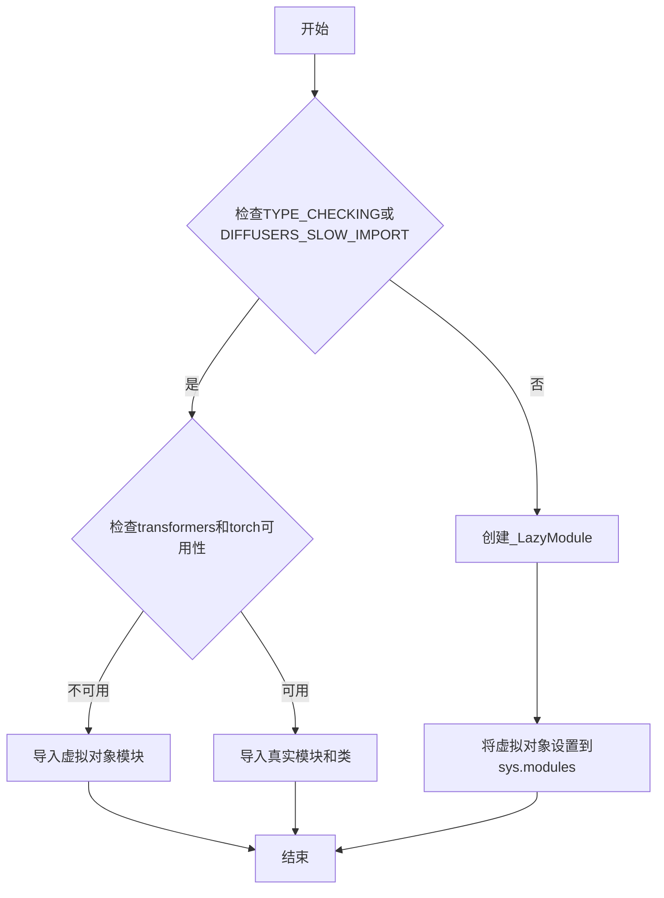
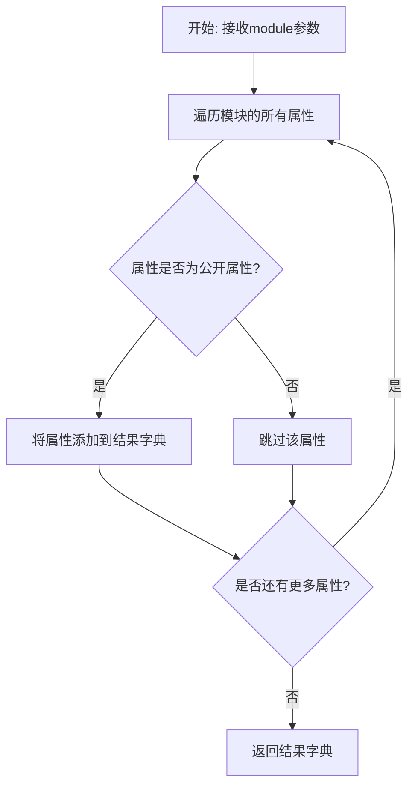
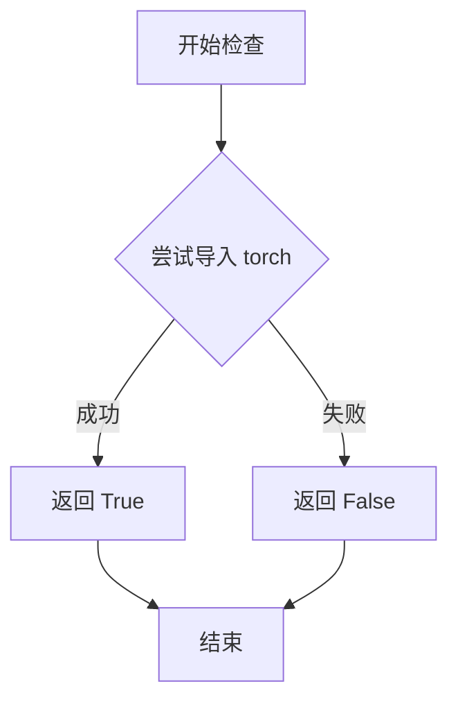
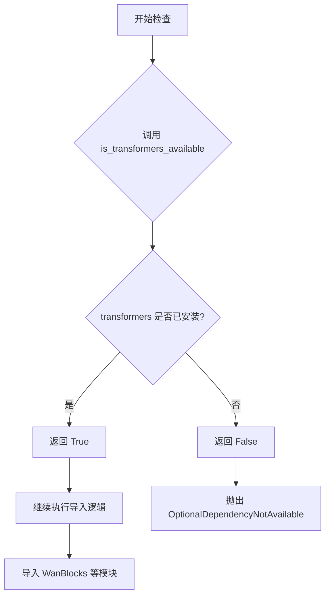

# `diffusers\src\diffusers\modular_pipelines\wan\__init__.py` 详细设计文档

这是Wan模型的模块初始化文件，通过延迟导入机制和可选依赖检查来动态加载图像到视频（I2V）和视频生成相关的模块化管道和构建块，支持Wan22和Wan系列模型的灵活组合。

## 整体流程



## 类结构

```
WanModels (包)
├── WanBlocks (模块)
├── Wan22Blocks (模块)
├── WanImage2VideoAutoBlocks (模块)
├── Wan22Image2VideoBlocks (模块)
├── WanModularPipeline (模块)
├── Wan22ModularPipeline (模块)
├── WanImage2VideoModularPipeline (模块)
└── Wan22Image2VideoModularPipeline (模块)
```

## 全局变量及字段


### `_dummy_objects`
    
存储虚拟对象的字典，当torch和transformers可选依赖不可用时使用，用于保持模块导入结构完整性

类型：`dict`
    


### `_import_structure`
    
定义模块导入结构的字典，包含可导出的类和模块名称映射关系

类型：`dict`
    


### `DIFFUSERS_SLOW_IMPORT`
    
控制是否使用慢速导入模式的标志变量，用于延迟加载模块内容

类型：`bool`
    


    

## 全局函数及方法


### `get_objects_from_module`

该函数是一个工具函数，用于从指定模块中动态提取所有公开对象（如类、函数等），并将其转换为字典格式以便后续的延迟导入机制使用。在给定的代码中，它被用于获取 `dummy_torch_and_transformers_objects` 模块中的所有虚拟对象，并将它们添加到 `_dummy_objects` 字典中，以便在可选依赖不可用时提供替代实现。

参数：

- `module`：`module`，目标模块对象，从中提取所有公开属性和对象

返回值：`dict`，返回键为对象名称、值为对象本身的字典，用于批量注册模块中的对象

#### 流程图



#### 带注释源码

```python
def get_objects_from_module(module):
    """
    从给定模块中提取所有对象并返回字典。
    
    参数:
        module: 目标模块对象
        
    返回:
        包含模块中所有公开对象的字典，键为对象名称，值为对象本身
    """
    # 初始化结果字典
    objects = {}
    
    # 遍历模块的所有属性
    for attr_name in dir(module):
        # 跳过私有属性（以单下划线开头）
        if attr_name.startswith('_'):
            continue
        
        # 获取属性值
        attr_value = getattr(module, attr_name)
        
        # 将对象添加到结果字典
        objects[attr_name] = attr_value
    
    return objects
```


### `is_torch_available`

该函数用于检查当前环境中 PyTorch 库是否可用。它通过尝试导入 `torch` 模块来判断，如果导入成功则返回 `True`，否则返回 `False`。

参数： 无

返回值：`bool`，如果 PyTorch 可用返回 `True`，否则返回 `False`

#### 流程图



#### 带注释源码

```python
# 从 utils 模块导入的函数，用于检测 PyTorch 是否可用
# 在当前代码中的使用场景：
from ...utils import is_torch_available

# 示例用法（在当前文件中）
if not (is_transformers_available() and is_torch_available()):
    raise OptionalDependencyNotAvailable()

# 函数原型（定义在 ...utils 中，典型实现如下）：
def is_torch_available() -> bool:
    """
    检查 PyTorch 库是否已安装且可导入。
    
    Returns:
        bool: 如果 torch 模块可以成功导入返回 True，否则返回 False
    """
    try:
        import torch  # noqa F401
        return True
    except ImportError:
        return False
```

#### 补充说明

| 项目 | 说明 |
|------|------|
| **来源模块** | `...utils` (utils/__init__.py 或 utils/import_utils.py) |
| **调用场景** | 用于条件导入，检测 torch 和 transformers 是否同时可用 |
| **依赖** | 外部依赖：需要 `torch` 包已安装 |
| **设计目标** | 提供软依赖检查，避免强制要求 torch 不可用时程序崩溃 |


### `is_transformers_available`

该函数用于检查当前环境中是否安装了 `transformers` 库，返回布尔值以表示依赖是否可用。

参数：

- 无参数

返回值：`bool`，返回 `True` 表示 `transformers` 库可用，返回 `False` 表示不可用。

#### 流程图



#### 带注释源码

```python
# 该函数从 ...utils 导入，未在此文件中定义
# 其签名大致如下（基于使用方式推断）:

def is_transformers_available() -> bool:
    """
    检查 transformers 库是否可用。
    
    Returns:
        bool: 如果 transformers 库已安装且可导入则返回 True，否则返回 False。
    """
    try:
        import transformers
        return True
    except ImportError:
        return False

# 在当前文件中的使用方式:
# 用于条件判断，检查 transformers 和 torch 是否都可用
if not (is_transformers_available() and is_torch_available()):
    raise OptionalDependencyNotAvailable()
```

> **注意**：该函数定义在 `...utils` 模块中，未在本文件内实现。通过 `from ...utils import is_transformers_available` 导入使用。从代码中的调用方式来看，该函数不接受任何参数，并返回一个布尔值来指示 `transformers` 库的可用性。

## 关键组件


### 可选依赖检查机制

检查torch和transformers是否同时可用，如果不可用则抛出OptionalDependencyNotAvailable异常，用于条件导入。

### 延迟加载模块 (_LazyModule)

使用LazyModule实现懒加载机制，通过_import_structure定义可导入的类和模块，仅在首次访问时加载实际模块，提高导入速度。

### 虚拟对象集合 (_dummy_objects)

存储当可选依赖不可用时的替代对象，通过get_objects_from_module从dummy模块获取，用于保持导入接口的一致性。

### 导入结构定义 (_import_structure)

定义模块的导出结构，包含modular_blocks_wan、modular_blocks_wan22、modular_blocks_wan22_i2v、modular_blocks_wan_i2v和modular_pipeline五个子模块及其导出的类名。

### WanBlocks

Wan模型的基础模块块组件。

### Wan22Blocks

Wan 2.2版本的基础模块块组件。

### Wan22Image2VideoBlocks

Wan 2.2版本的图像到视频转换模块块组件，支持I2V任务。

### WanImage2VideoAutoBlocks

Wan模型的图像到视频自动模块块组件，支持I2V任务。

### Wan22Image2VideoModularPipeline

Wan 2.2版本的图像到视频模块化流水线组件。

### Wan22ModularPipeline

Wan 2.2版本的模块化流水线组件。

### WanImage2VideoModularPipeline

Wan模型的图像到视频模块化流水线组件。

### WanModularPipeline

Wan模型的基础模块化流水线组件。

### 动态模块替换

在非TYPE_CHECKING模式下，将当前模块替换为_LazyModule实例，并设置虚拟对象属性，实现运行时动态加载。


## 问题及建议


### 已知问题

-   **代码重复**：检查依赖可用性（`is_transformers_available()` 和 `is_torch_available()`）的逻辑在第15-17行和第29-31行重复出现，增加了维护成本和出错风险
-   **魔法字符串和硬编码**：模块名（如`"modular_blocks_wan"`）以硬编码字符串形式存在，缺乏集中管理
-   **通配符导入**：`from ...utils.dummy_torch_and_transformers_objects import *` 使用通配符导入，可能导入未使用的符号，污染命名空间，且难以被静态分析工具识别
-   **类型检查分支冗余**：在 `TYPE_CHECKING or DIFFUSERS_SLOW_IMPORT` 条件下，代码逻辑几乎完全重复，只有导入路径不同
-   **缺乏错误处理**：如果 `get_objects_from_module` 或 `_LazyModule` 初始化失败，没有适当的错误提示
-   **全局状态管理**：通过 `setattr` 动态设置模块属性的方式可能影响代码的可预测性和调试体验

### 优化建议

-   **提取依赖检查逻辑**：创建一个专门的函数或方法来处理依赖可用性检查，避免代码重复
-   **配置驱动**：将模块名和导入结构迁移到配置文件或数据结构中，减少硬编码
-   **明确导入**：将通配符导入改为显式导入，提高代码可读性和静态分析支持
-   **重构条件分支**：将 `TYPE_CHECKING` 和运行时逻辑合并，使用工厂函数或配置对象区分不同场景
-   **添加日志和错误处理**：在关键路径添加日志记录，特别是在动态模块加载失败时提供有意义的错误信息
-   **考虑类型注解**：为公共导出的类和函数添加类型注解，提升代码质量和IDE支持


## 其它


### 设计目标与约束

本模块的设计目标是为Wan系列模型（ WanBlocks、Wan22Blocks、Wan22Image2VideoBlocks、WanImage2VideoAutoBlocks 等）提供延迟加载的导入机制，同时优雅地处理可选依赖（torch和transformers）。约束条件包括：必须同时满足 torch 和 transformers 可用时才导入真实对象，否则导入虚拟对象；仅在 TYPE_CHECKING 或 DIFFUSERS_SLOW_IMPORT 模式下进行类型检查时的导入。

### 错误处理与异常设计

使用 OptionalDependencyNotAvailable 异常来处理可选依赖不可用的情况。当检测到 torch 或 transformers 任一不可用时，抛出该异常并回退到 dummy 对象。_dummy_objects 字典用于存储虚拟对象，确保模块在缺少依赖时仍可导入但不执行实际功能。

### 外部依赖与接口契约

本模块依赖以下外部包：torch（is_torch_available）、transformers（is_transformers_available）、diffusers.utils 中的辅助函数（_LazyModule、get_objects_from_module 等）。导出的公开接口包括：WanBlocks、Wan22Blocks、Wan22Image2VideoBlocks、WanImage2VideoAutoBlocks、Wan22Image2VideoModularPipeline、Wan22ModularPipeline、WanImage2VideoModularPipeline、WanModularPipeline。所有导出对象均通过 _import_structure 字典进行声明式定义。

### 模块初始化流程

模块加载时首先定义 _dummy_objects 和 _import_structure 两个空字典，然后检查依赖可用性。若依赖不可用，则从 dummy_torch_and_transformers_objects 模块导入虚拟对象；若依赖可用，则填充 _import_structure 中的实际导出项。在非类型检查模式下，使用 _LazyModule 替换当前模块，并手动将 _dummy_objects 注册到 sys.modules 中。

### 性能考量

采用延迟加载（Lazy Loading）模式，仅在真正需要时才加载实际的模块和类，减少启动时间。_dummy_objects 在依赖不可用时作为占位符，避免了完整的依赖树加载。_import_structure 使用字典存储，查找效率为 O(1)。

### 版本兼容性

本模块需要 Python 3.7+（支持 TYPE_CHECKING 语法和 sys.modules 动态修改）。依赖的 diffusers.utils 模块需要包含 _LazyModule、get_objects_from_module 等工具函数。建议使用 diffusers 0.31.0+ 版本以确保兼容性。

    