# `diffusers\src\diffusers\modular_pipelines\wan\before_denoise.py` 详细设计文档

这是HuggingFace Diffusers库中Wan文本到视频生成模型的模块化管道步骤实现，提供了文本嵌入处理、额外输入处理、时间步设置和潜在张量准备等核心功能，用于构建可组合的AI生成管道。

## 整体流程

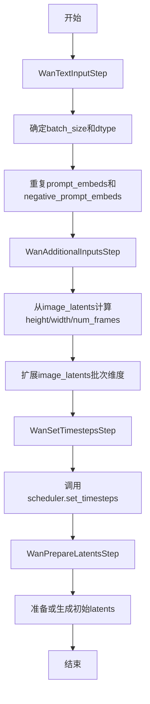

## 类结构

```
ModularPipelineBlocks (抽象基类)
├── WanTextInputStep
├── WanAdditionalInputsStep
├── WanSetTimestepsStep
└── WanPrepareLatentsStep
```

## 全局变量及字段


### `logger`
    
模块级日志记录器，用于输出调试和信息日志

类型：`logging.Logger`
    


### `WanAdditionalInputsStep._image_latent_inputs`
    
图像潜在张量的名称列表，用于处理图像条件潜在变量和计算高度/宽度

类型：`list[str]`
    


### `WanAdditionalInputsStep._additional_batch_inputs`
    
额外批量输入张量的名称列表，仅用于扩展批次维度以匹配最终批次大小

类型：`list[str]`
    
    

## 全局函数及方法


### `repeat_tensor_to_batch_size`

将输入张量的批次维度扩展为最终批次大小（batch_size * num_videos_per_prompt），通过沿维度0重复每个元素实现。

参数：

- `input_name`：`str`，输入张量的名称，用于错误消息中的标识
- `input_tensor`：`torch.Tensor`，要重复的张量，批次大小必须为1或等于batch_size
- `batch_size`：`int`，基础批次大小（提示数量）
- `num_videos_per_prompt`：`int`，每个提示生成的视频数量，默认为1

返回值：`torch.Tensor`，重复后的张量，最终批次大小为 batch_size * num_videos_per_prompt

#### 流程图

```mermaid
flowchart TD
    A([开始]) --> B{input_tensor 是否为 torch.Tensor}
    B -- 否 --> C[抛出 ValueError: 必须为 tensor]
    B -- 是 --> D{input_tensor.shape[0] == 1?}
    D -- 是 --> E[repeat_by = batch_size * num_videos_per_prompt]
    D -- 否 --> F{input_tensor.shape[0] == batch_size?}
    F -- 是 --> G[repeat_by = num_videos_per_prompt]
    F -- 否 --> H[抛出 ValueError: 批次大小无效]
    E --> I[调用 repeat_interleave 扩展张量]
    G --> I
    I --> J([返回扩展后的张量])
    C --> J
    H --> J
```

#### 带注释源码

```python
def repeat_tensor_to_batch_size(
    input_name: str,
    input_tensor: torch.Tensor,
    batch_size: int,
    num_videos_per_prompt: int = 1,
) -> torch.Tensor:
    """Repeat tensor elements to match the final batch size.

    This function expands a tensor's batch dimension to match the final batch size (batch_size * num_videos_per_prompt)
    by repeating each element along dimension 0.

    The input tensor must have batch size 1 or batch_size. The function will:
    - If batch size is 1: repeat each element (batch_size * num_videos_per_prompt) times
    - If batch size equals batch_size: repeat each element num_videos_per_prompt times

    Args:
        input_name (str): Name of the input tensor (used for error messages)
        input_tensor (torch.Tensor): The tensor to repeat. Must have batch size 1 or batch_size.
        batch_size (int): The base batch size (number of prompts)
        num_videos_per_prompt (int, optional): Number of videos to generate per prompt. Defaults to 1.

    Returns:
        torch.Tensor: The repeated tensor with final batch size (batch_size * num_videos_per_prompt)

    Raises:
        ValueError: If input_tensor is not a torch.Tensor or has invalid batch size

    Examples:
        tensor = torch.tensor([[1, 2, 3]]) # shape: [1, 3] repeated = repeat_tensor_to_batch_size("image", tensor,
        batch_size=2, num_videos_per_prompt=2) repeated # tensor([[1, 2, 3], [1, 2, 3], [1, 2, 3], [1, 2, 3]]) - shape:
        [4, 3]

        tensor = torch.tensor([[1, 2, 3], [4, 5, 6]]) # shape: [2, 3] repeated = repeat_tensor_to_batch_size("image",
        tensor, batch_size=2, num_videos_per_prompt=2) repeated # tensor([[1, 2, 3], [1, 2, 3], [4, 5, 6], [4, 5, 6]])
        - shape: [4, 3]
    """
    # 确保输入是张量类型
    if not isinstance(input_tensor, torch.Tensor):
        raise ValueError(f"`{input_name}` must be a tensor")

    # 确保输入张量（如 image_latents）的批次大小为1或与提示的批次大小相同
    if input_tensor.shape[0] == 1:
        # 当批次大小为1时，重复次数 = batch_size * num_videos_per_prompt
        repeat_by = batch_size * num_videos_per_prompt
    elif input_tensor.shape[0] == batch_size:
        # 当批次大小等于 batch_size 时，重复次数 = num_videos_per_prompt
        repeat_by = num_videos_per_prompt
    else:
        raise ValueError(
            f"`{input_name}` must have have batch size 1 or {batch_size}, but got {input_tensor.shape[0]}"
        )

    # 使用 repeat_interleave 沿维度0扩展张量以匹配 batch_size * num_videos_per_prompt
    input_tensor = input_tensor.repeat_interleave(repeat_by, dim=0)

    return input_tensor
```


### `calculate_dimension_from_latents`

该函数用于从潜在张量（latents）的维度计算生成图像/视频的实际尺寸。它通过将潜在张量的帧数、高度和宽度乘以对应的 VAE 缩放因子来还原原始维度信息。此函数是 WanModularPipeline 中处理图像潜在输入的关键工具，使得管道能够根据输入的潜在表示动态确定输出分辨率。

参数：

-  `latents`：`torch.Tensor`，输入的潜在张量，必须是 5 维张量，形状为 [batch, channels, frames, height, width]
-  `vae_scale_factor_temporal`：`int`，VAE 用于压缩时间维度的缩放因子，通常为 4
-  `vae_scale_factor_spatial`：`int`，VAE 用于压缩空间维度的缩放因子，通常为 8

返回值：`tuple[int, int, int]`，计算得到的图像/视频尺寸，包含 (num_frames, height, width)

#### 流程图

```mermaid
flowchart TD
    A[开始] --> B{检查 latents 维度}
    B -->|不是 5 维| C[抛出 ValueError]
    B -->|是 5 维| D[解包张量形状获取 num_latent_frames, latent_height, latent_width]
    D --> E[计算 num_frames = (num_latent_frames - 1) * vae_scale_factor_temporal + 1]
    E --> F[计算 height = latent_height * vae_scale_factor_spatial]
    F --> G[计算 width = latent_width * vae_scale_factor_spatial]
    G --> H[返回 tuple[num_frames, height, width]]
```

#### 带注释源码

```python
def calculate_dimension_from_latents(
    latents: torch.Tensor, vae_scale_factor_temporal: int, vae_scale_factor_spatial: int
) -> tuple[int, int]:
    """Calculate image dimensions from latent tensor dimensions.

    This function converts latent temporal and spatial dimensions to image temporal and spatial dimensions by
    multiplying the latent num_frames/height/width by the VAE scale factor.

    Args:
        latents (torch.Tensor): The latent tensor. Must have 4 or 5 dimensions.
            Expected shapes: [batch, channels, height, width] or [batch, channels, frames, height, width]
        vae_scale_factor_temporal (int): The scale factor used by the VAE to compress temporal dimension.
            Typically 4 for most VAEs (video is 4x larger than latents in temporal dimension)
        vae_scale_factor_spatial (int): The scale factor used by the VAE to compress spatial dimension.
            Typically 8 for most VAEs (image is 8x larger than latents in each dimension)

    Returns:
        tuple[int, int]: The calculated image dimensions as (height, width)

    Raises:
        ValueError: If latents tensor doesn't have 4 or 5 dimensions

    """
    # 验证输入张量维度，必须是 5 维 [batch, channels, frames, height, width]
    if latents.ndim != 5:
        raise ValueError(f"latents must have 5 dimensions, but got {latents.ndim}")

    # 解包张量形状，提取潜在空间的帧数、高度和宽度
    _, _, num_latent_frames, latent_height, latent_width = latents.shape

    # 计算实际帧数：使用逆公式还原原始帧数
    # 公式来源：num_latent_frames = (num_frames - 1) / vae_scale_factor_temporal + 1
    # 逆推：num_frames = (num_latent_frames - 1) * vae_scale_factor_temporal + 1
    num_frames = (num_latent_frames - 1) * vae_scale_factor_temporal + 1
    
    # 计算实际高度：潜在高度乘以空间缩放因子
    height = latent_height * vae_scale_factor_spatial
    
    # 计算实际宽度：潜在宽度乘以空间缩放因子
    width = latent_width * vae_scale_factor_spatial

    # 返回计算得到的 (帧数, 高度, 宽度) 元组
    return num_frames, height, width
```


### `retrieve_timesteps`

该函数是扩散模型推理管道中的时间步检索工具函数，负责调用调度器的 `set_timesteps` 方法并从中获取时间步序列。它支持自定义时间步（timesteps）或自定义sigmas，也可以使用默认的推理步数来自动生成时间步调度。任何额外的关键字参数（**kwargs）都会传递给调度器的 `set_timesteps` 方法。

参数：

- `scheduler`：`SchedulerMixin`，调度器对象，用于生成时间步序列
- `num_inference_steps`：`int | None`，推理步数，用于生成样本的扩散步数。如果使用，则 `timesteps` 必须为 `None`
- `device`：`str | torch.device | None`，时间步要移动到的设备。如果为 `None`，则时间步不会移动
- `timesteps`：`list[int] | None`，自定义时间步，用于覆盖调度器的时间步间距策略。如果传入此参数，`num_inference_steps` 和 `sigmas` 必须为 `None`
- `sigmas`：`list[float] | None`，自定义sigmas，用于覆盖调度器的时间步间距策略。如果传入此参数，`num_inference_steps` 和 `timesteps` 必须为 `None`
- `**kwargs`：任意关键字参数，将传递给 `scheduler.set_timesteps` 方法

返回值：`tuple[torch.Tensor, int]`，返回元组，第一个元素是调度器的时间步schedule（torch.Tensor），第二个元素是推理步数（int）

#### 流程图

```mermaid
flowchart TD
    A[开始] --> B{同时传入timesteps和sigmas?}
    B -->|是| C[抛出ValueError]
    B -->|否| D{传入了timesteps?}
    D -->|是| E{scheduler.set_timesteps<br/>支持timesteps参数?}
    E -->|否| F[抛出ValueError]
    E -->|是| G[调用scheduler.set_timesteps<br/>timesteps=timesteps, device=device, **kwargs]
    G --> H[获取scheduler.timesteps]
    H --> I[num_inference_steps = len(timesteps)]
    D -->|否| J{传入了sigmas?}
    J -->|是| K{scheduler.set_timesteps<br/>支持sigmas参数?}
    K -->|否| L[抛出ValueError]
    K -->|是| M[调用scheduler.set_timesteps<br/>sigmas=sigmas, device=device, **kwargs]
    M --> N[获取scheduler.timesteps]
    N --> O[num_inference_steps = len(timesteps)]
    J -->|否| P[调用scheduler.set_timesteps<br/>num_inference_steps, device=device, **kwargs]
    P --> Q[获取scheduler.timesteps]
    Q --> R[返回timesteps和num_inference_steps]
    I --> R
    O --> R
    C --> Z[结束]
    F --> Z
    L --> Z
```

#### 带注释源码

```python
# Copied from diffusers.pipelines.stable_diffusion.pipeline_stable_diffusion.retrieve_timesteps
def retrieve_timesteps(
    scheduler,  # 调度器对象 (SchedulerMixin)
    num_inference_steps: int | None = None,  # 推理步数，如果使用则timesteps必须为None
    device: str | torch.device | None = None,  # 目标设备，None则不移动
    timesteps: list[int] | None = None,  # 自定义时间步列表
    sigmas: list[float] | None = None,  # 自定义sigmas列表
    **kwargs,  # 额外参数，传递给scheduler.set_timesteps
):
    r"""
    Calls the scheduler's `set_timesteps` method and retrieves timesteps from the scheduler after the call. Handles
    custom timesteps. Any kwargs will be supplied to `scheduler.set_timesteps`.

    Args:
        scheduler (`SchedulerMixin`):
            The scheduler to get timesteps from.
        num_inference_steps (`int`):
            The number of diffusion steps used when generating samples with a pre-trained model. If used, `timesteps`
            must be `None`.
        device (`str` or `torch.device`, *optional*):
            The device to which the timesteps should be moved to. If `None`, the timesteps are not moved.
        timesteps (`list[int]`, *optional*):
            Custom timesteps used to override the timestep spacing strategy of the scheduler. If `timesteps` is passed,
            `num_inference_steps` and `sigmas` must be `None`.
        sigmas (`list[float]`, *optional*):
            Custom sigmas used to override the timestep spacing strategy of the scheduler. If `sigmas` is passed,
            `num_inference_steps` and `timesteps` must be `None`.

    Returns:
        `tuple[torch.Tensor, int]`: A tuple where the first element is the timestep schedule from the scheduler and the
        second element is the number of inference steps.
    """
    # 检查是否同时传入了timesteps和sigmas，这是不允许的
    if timesteps is not None and sigmas is not None:
        raise ValueError("Only one of `timesteps` or `sigmas` can be passed. Please choose one to set custom values")
    
    # 处理自定义timesteps的情况
    if timesteps is not None:
        # 检查调度器的set_timesteps方法是否支持timesteps参数
        accepts_timesteps = "timesteps" in set(inspect.signature(scheduler.set_timesteps).parameters.keys())
        if not accepts_timesteps:
            raise ValueError(
                f"The current scheduler class {scheduler.__class__}'s `set_timesteps` does not support custom"
                f" timestep schedules. Please check whether you are using the correct scheduler."
            )
        # 调用调度器的set_timesteps方法设置自定义时间步
        scheduler.set_timesteps(timesteps=timesteps, device=device, **kwargs)
        # 从调度器获取生成的时间步
        timesteps = scheduler.timesteps
        # 计算推理步数
        num_inference_steps = len(timesteps)
    
    # 处理自定义sigmas的情况
    elif sigmas is not None:
        # 检查调度器的set_timesteps方法是否支持sigmas参数
        accept_sigmas = "sigmas" in set(inspect.signature(scheduler.set_timesteps).parameters.keys())
        if not accept_sigmas:
            raise ValueError(
                f"The current scheduler class {scheduler.__class__}'s `set_timesteps` does not support custom"
                f" sigmas schedules. Please check whether you are using the correct scheduler."
            )
        # 调用调度器的set_timesteps方法设置自定义sigmas
        scheduler.set_timesteps(sigmas=sigmas, device=device, **kwargs)
        # 从调度器获取生成的时间步
        timesteps = scheduler.timesteps
        # 计算推理步数
        num_inference_steps = len(timesteps)
    
    # 默认情况：使用num_inference_steps生成时间步
    else:
        scheduler.set_timesteps(num_inference_steps, device=device, **kwargs)
        timesteps = scheduler.timesteps
    
    # 返回时间步序列和推理步数
    return timesteps, num_inference_steps
```


### `WanTextInputStep.description`

这是一个属性方法（Property），用于描述 `WanTextInputStep` 类的功能。它返回一段说明文本，阐述该步骤如何处理文本输入张量，包括批次大小和数据类型的确定，以及如何根据 `batch_size` 和 `num_videos_per_prompt` 调整输入张量形状。

参数：此方法为属性方法，无需显式参数（隐式接收 `self` 实例）。

返回值：`str`，返回该处理步骤的功能描述字符串。

#### 流程图

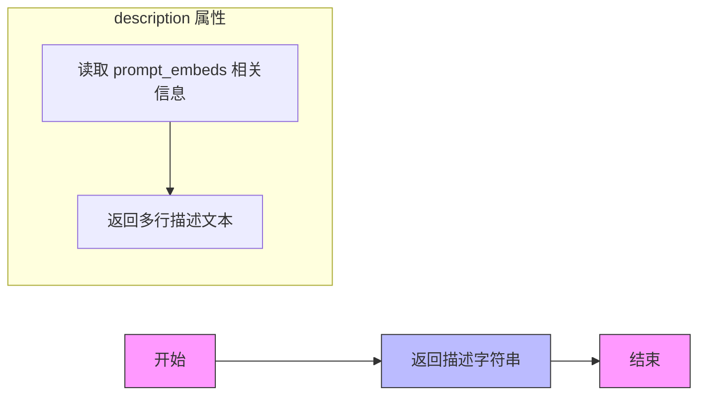

#### 带注释源码

```python
@property
def description(self) -> str:
    """
    属性方法：返回对该处理步骤功能的文字描述。
    
    该方法说明 WanTextInputStep 类的核心职责：
    1. 基于 prompt_embeds 确定 batch_size 和 dtype
    2. 根据 batch_size（提示词数量）和 num_videos_per_prompt 调整输入张量形状
    
    所有输入张量预期具有 batch_size=1 或与 prompt_embeds 的 batch_size 相匹配。
    张量将在批次维度上复制，以得到最终的 batch_size * num_videos_per_prompt。
    
    Returns:
        str: 描述文本，包含步骤功能的详细说明
    """
    return (
        "Input processing step that:\n"
        "  1. Determines `batch_size` and `dtype` based on `prompt_embeds`\n"
        "  2. Adjusts input tensor shapes based on `batch_size` (number of prompts) and `num_videos_per_prompt`\n\n"
        "All input tensors are expected to have either batch_size=1 or match the batch_size\n"
        "of prompt_embeds. The tensors will be duplicated across the batch dimension to\n"
        "have a final batch_size of batch_size * num_videos_per_prompt."
    )
```


### `WanTextInputStep.expected_components`

该属性方法定义了 `WanTextInputStep` 步骤期望的组件列表，用于指定该步骤需要使用的模型组件。在这个步骤中，只需要 `transformer` 组件来获取数据类型（dtype）。

参数：无需参数（属性方法，仅包含 `self`）

返回值：`list[ComponentSpec]`，返回包含 transformer 组件规范的列表，用于后续步骤获取数据类型等信息

#### 流程图

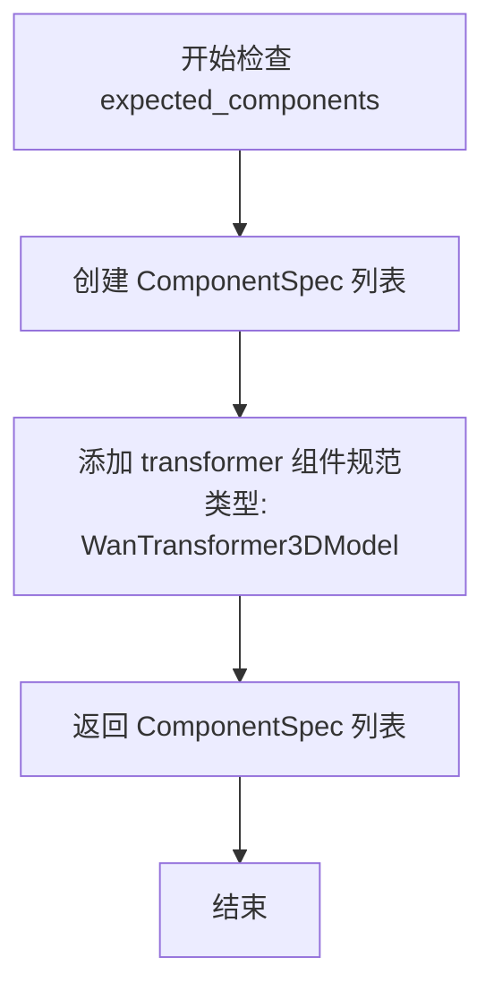

#### 带注释源码

```python
@property
def expected_components(self) -> list[ComponentSpec]:
    """定义该步骤期望的组件列表。

    WanTextInputStep 步骤只需要 transformer 组件，用于：
    1. 获取 transformer 的数据类型 (dtype) 以便进行类型统一
    2. 确保在执行前所需的模型组件可用

    Returns:
        list[ComponentSpec]: 包含单个组件规范的列表，
                             指定了 transformer 组件及其类型 WanTransformer3DModel
    """
    return [
        ComponentSpec("transformer", WanTransformer3DModel),
    ]
```


### WanTextInputStep.inputs

该属性方法定义了WanTextInputStep模块的输入参数规范，用于文本输入处理步骤的参数配置。

参数：

- `self`： WanTextInputStep，当前类的实例属性

返回值：`list[InputParam]` InputParam对象的列表，包含了该步骤所需的所有输入参数定义

#### 流程图

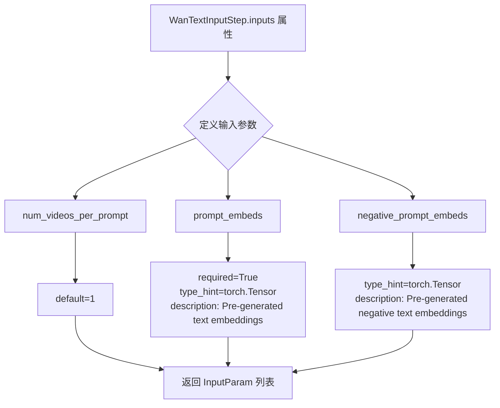

#### 带注释源码

```python
@property
def inputs(self) -> list[InputParam]:
    """定义 WanTextInputStep 的输入参数规范。
    
    该属性方法返回输入参数列表，用于描述该处理步骤需要哪些输入参数。
    每个 InputParam 对象包含参数名称、类型提示、默认值、是否必需等信息。
    
    Returns:
        list[InputParam]: 包含三个输入参数的列表：
            - num_videos_per_prompt: 每个提示生成的视频数量，默认为1
            - prompt_embeds: 预生成的文本嵌入，必需参数
            - negative_prompt_embeds: 预生成的负向文本嵌入，可选参数
    """
    return [
        # 参数1: 每个提示生成的视频数量，默认为1
        InputParam("num_videos_per_prompt", default=1),
        
        # 参数2: 预生成的文本嵌入，必需参数
        # 用于文本到视频生成过程的文本条件输入
        InputParam(
            "prompt_embeds",
            required=True,
            type_hint=torch.Tensor,
            description="Pre-generated text embeddings. Can be generated from text_encoder step.",
        ),
        
        # 参数3: 预生成的负向文本嵌入，可选参数
        # 用于无分类器引导的负向条件输入，帮助模型避免生成不想要的内容
        InputParam(
            "negative_prompt_embeds",
            type_hint=torch.Tensor,
            description="Pre-generated negative text embeddings. Can be generated from text_encoder step.",
        ),
    ]
```


### `WanTextInputStep.intermediate_outputs`

该属性方法定义了 `WanTextInputStep` 块的中间输出参数，包括 `batch_size`（批处理大小）和 `dtype`（数据类型），用于后续管道步骤获取这些信息。

参数：

- 该方法无显式参数（隐式参数 `self` 为类实例本身）

返回值：`list[str]`，实际为 `list[OutputParam]` 对象列表，包含以下两个输出参数：

- `batch_size`：`int`，提示词数量，最终模型输入的批处理大小应为 `batch_size * num_videos_per_prompt`
- `dtype`：`torch.dtype`，模型张量输入的数据类型（由 `transformer.dtype` 决定）

#### 流程图

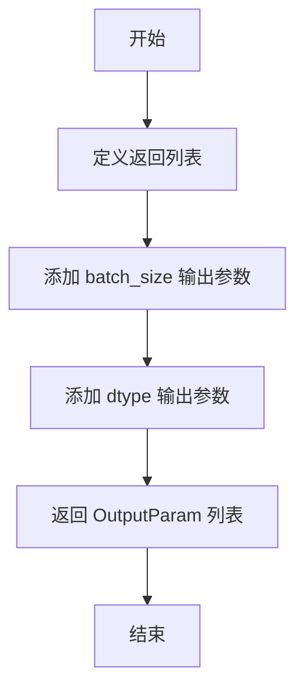

#### 带注释源码

```python
@property
def intermediate_outputs(self) -> list[str]:
    """定义该管道块的中间输出参数。

    这些输出参数将提供给后续的管道步骤使用，
    用于确定批处理大小和数据类型等关键信息。

    Returns:
        list[str]: 包含 OutputParam 对象的列表，定义了 batch_size 和 dtype 两个中间输出
    """
    return [
        OutputParam(
            "batch_size",
            type_hint=int,
            description="Number of prompts, the final batch size of model inputs should be batch_size * num_videos_per_prompt",
        ),
        OutputParam(
            "dtype",
            type_hint=torch.dtype,
            description="Data type of model tensor inputs (determined by `transformer.dtype`)",
        ),
    ]
```


### `WanTextInputStep.check_inputs`

该方法负责验证文本输入步骤中 `prompt_embeds` 和 `negative_prompt_embeds` 的形状一致性，确保两者在同时提供时具有相同的维度，否则抛出 `ValueError` 异常。这是文本输入验证的关键环节，防止因嵌入形状不匹配导致的后续处理错误。

参数：

- `components`：`WanModularPipeline`，管道组件容器，包含 transformer 等模型组件，用于访问配置信息
- `block_state`：`PipelineState`，管道块状态对象，存储当前块的输入输出状态，包含 `prompt_embeds` 和 `negative_prompt_embeds` 属性

返回值：`None`，该方法仅进行验证操作，不返回任何值

#### 流程图

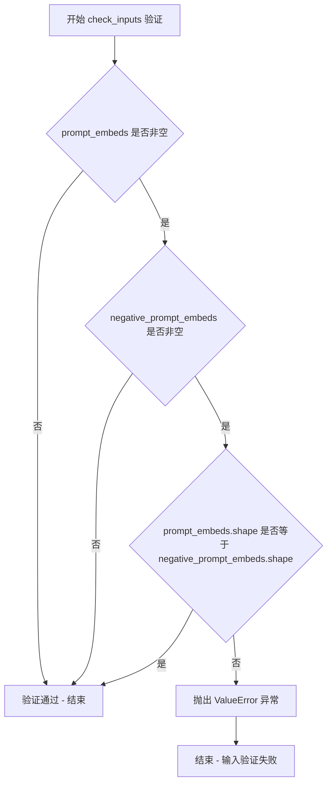

#### 带注释源码

```python
def check_inputs(self, components, block_state):
    """验证文本输入嵌入的形状一致性。
    
    该方法检查 prompt_embeds 和 negative_prompt_embeds 的形状是否匹配。
    只有当两者都非空时才进行形状比较，如果形状不一致则抛出 ValueError。
    
    Args:
        components: 管道组件容器，提供对模型组件的访问
        block_state: 管道块状态，包含当前块的输入输出数据
        
    Returns:
        None: 验证仅产生副作用，不返回任何值
        
    Raises:
        ValueError: 当 prompt_embeds 和 negative_prompt_embeds 形状不一致时
    """
    # 检查两个嵌入都非空时才进行形状验证
    if block_state.prompt_embeds is not None and block_state.negative_prompt_embeds is not None:
        # 验证形状一致性，确保后续处理不会因维度不匹配而失败
        if block_state.prompt_embeds.shape != block_state.negative_prompt_embeds.shape:
            raise ValueError(
                "`prompt_embeds` and `negative_prompt_embeds` must have the same shape when passed directly, but"
                f" got: `prompt_embeds` {block_state.prompt_embeds.shape} != `negative_prompt_embeds`"
                f" {block_state.negative_prompt_embeds.shape}."
            )
```


### `WanTextInputStep.__call__`

该方法是 Wan 模块化管道中的文本输入处理步骤，负责确定批处理大小和数据类型，并根据 `num_videos_per_prompt` 调整输入张量形状。所有输入张量预期具有 batch_size=1 或与 prompt_embeds 相同的 batch_size，张量将在批处理维度上复制以获得最终的 batch_size = batch_size * num_videos_per_prompt。

参数：

- `self`：隐式参数，代表 `WanTextInputStep` 类的实例
- `components`：`WanModularPipeline`，管道组件集合，包含 transformer 等模型组件
- `state`：`PipelineState`，管道状态对象，包含当前块状态（block_state）

返回值：`PipelineState`，更新后的管道状态对象，包含调整后的 batch_size、dtype、prompt_embeds 和 negative_prompt_embeds

#### 流程图

```mermaid
flowchart TD
    A[开始 __call__] --> B[获取 block_state]
    B --> C[调用 check_inputs 验证 prompt_embeds 和 negative_prompt_embeds 形状]
    C --> D[从 prompt_embeds.shape[0] 获取 batch_size]
    D --> E[从 prompt_embeds.dtype 获取 dtype]
    E --> F[提取 seq_len 并重复 prompt_embeds]
    F --> G[使用 view 重新整形 prompt_embeds 为 batch_size * num_videos_per_prompt]
    G --> H{negative_prompt_embeds 是否存在?}
    H -->|是| I[提取 seq_len 并重复 negative_prompt_embeds]
    H -->|否| J[保存 block_state 到 state]
    I --> K[使用 view 重新整形 negative_prompt_embeds]
    K --> J
    J --> L[返回 components 和 state]
```

#### 带注释源码

```python
@torch.no_grad()
def __call__(self, components: WanModularPipeline, state: PipelineState) -> PipelineState:
    """执行文本输入处理步骤
    
    该方法完成以下任务：
    1. 验证输入的 prompt_embeds 和 negative_prompt_embeds 形状一致性
    2. 从 prompt_embeds 确定 batch_size 和 dtype
    3. 根据 num_videos_per_prompt 调整 prompt_embeds 和 negative_prompt_embeds 的批次维度
    
    Args:
        components: WanModularPipeline 实例，包含管道组件
        state: PipelineState 实例，包含当前管道状态
        
    Returns:
        更新后的 (components, state) 元组
    """
    # 获取当前块的内部状态
    block_state = self.get_block_state(state)
    
    # 验证输入的有效性
    self.check_inputs(components, block_state)

    # 从 prompt_embeds 的第一维获取 batch_size（prompt 数量）
    block_state.batch_size = block_state.prompt_embeds.shape[0]
    
    # 从 prompt_embeds 的 dtype 获取模型输入的数据类型
    block_state.dtype = block_state.prompt_embeds.dtype

    # 获取序列长度
    _, seq_len, _ = block_state.prompt_embeds.shape
    
    # 重复 prompt_embeds 以匹配 num_videos_per_prompt
    # 例如：如果有 2 个 prompt，每个 prompt 生成 2 个视频，则重复 2 次
    block_state.prompt_embeds = block_state.prompt_embeds.repeat(1, block_state.num_videos_per_prompt, 1)
    
    # 重新整形为最终的 batch_size（batch_size * num_videos_per_prompt）
    block_state.prompt_embeds = block_state.prompt_embeds.view(
        block_state.batch_size * block_state.num_videos_per_prompt, seq_len, -1
    )

    # 如果存在 negative_prompt_embeds，进行相同的处理
    if block_state.negative_prompt_embeds is not None:
        _, seq_len, _ = block_state.negative_prompt_embeds.shape
        block_state.negative_prompt_embeds = block_state.negative_prompt_embeds.repeat(
            1, block_state.num_videos_per_prompt, 1
        )
        block_state.negative_prompt_embeds = block_state.negative_prompt_embeds.view(
            block_state.batch_size * block_state.num_videos_per_prompt, seq_len, -1
        )

    # 将更新后的 block_state 保存回 state
    self.set_block_state(state, block_state)

    # 返回组件和状态元组
    return components, state
```


### `WanAdditionalInputsStep.__init__`

该方法是 `WanAdditionalInputsStep` 类的初始化方法，用于配置和管理去噪步骤的输入处理逻辑。通过接收可配置的图像潜在变量输入列表和额外的批处理输入列表，该类能够动态地标准化和调整输入张量的批次维度，以适配最终的批处理大小需求。

参数：

- `image_latent_inputs`：`list[str]`，可选，要处理的图像潜在变量张量的名称列表。除了调整这些输入的批次大小外，它们还将用于确定高度和宽度。默认为 `["image_condition_latents"]`。
- `additional_batch_inputs`：`list[str]`，可选，要扩展批次大小的附加条件输入张量的名称列表。这些张量仅会调整其批次维度以匹配最终批次大小。默认为空列表 `[]`。

返回值：无（`None`），该方法为构造函数，不返回任何值，仅初始化实例属性。

#### 流程图

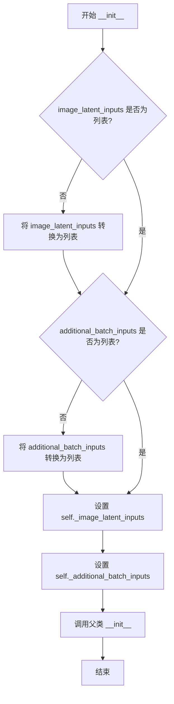

#### 带注释源码

```python
def __init__(
    self,
    image_latent_inputs: list[str] = ["image_condition_latents"],
    additional_batch_inputs: list[str] = [],
):
    """Initialize a configurable step that standardizes the inputs for the denoising step. It:\n"

    This step handles multiple common tasks to prepare inputs for the denoising step:
    1. For encoded image latents, use it update height/width if None, and expands batch size
    2. For additional_batch_inputs: Only expands batch dimensions to match final batch size

    This is a dynamic block that allows you to configure which inputs to process.

    Args:
        image_latent_inputs (list[str], optional): Names of image latent tensors to process.
            In additional to adjust batch size of these inputs, they will be used to determine height/width. Can be
            a single string or list of strings. Defaults to ["image_condition_latents"].
        additional_batch_inputs (List[str], optional):
            Names of additional conditional input tensors to expand batch size. These tensors will only have their
            batch dimensions adjusted to match the final batch size. Can be a single string or list of strings.
            Defaults to [].

    Examples:
        # Configure to process image_condition_latents (default behavior) WanAdditionalInputsStep() # Configure to
        process image latents and additional batch inputs WanAdditionalInputsStep(
            image_latent_inputs=["image_condition_latents"], additional_batch_inputs=["image_embeds"]
        )
    """
    # 确保 image_latent_inputs 是列表类型，以便统一处理
    if not isinstance(image_latent_inputs, list):
        image_latent_inputs = [image_latent_inputs]
    
    # 确保 additional_batch_inputs 是列表类型，以便统一处理
    if not isinstance(additional_batch_inputs, list):
        additional_batch_inputs = [additional_batch_inputs]

    # 将配置好的输入名称列表存储为实例属性，供后续 __call__ 方法使用
    self._image_latent_inputs = image_latent_inputs
    self._additional_batch_inputs = additional_batch_inputs
    
    # 调用父类 ModularPipelineBlocks 的初始化方法，完成基类属性的初始化
    super().__init__()
```


### `WanAdditionalInputsStep.description`

这是一个属性（Property），用于返回 `WanAdditionalInputsStep` 类的描述信息。该描述说明了该步骤的核心功能：处理图像潜在输入的批次大小扩展和尺寸计算，以及处理额外批次输入的批次维度扩展。

参数：无（这是一个属性 getter，不需要参数）

返回值：`str`，返回该处理步骤的详细描述，包含功能摘要、配置的输入信息以及放置指导

#### 流程图

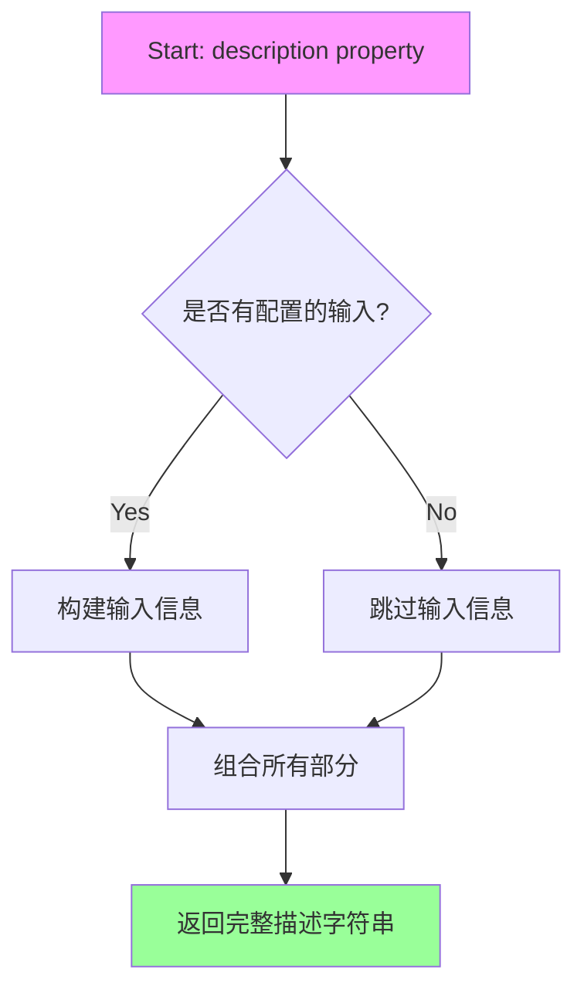

#### 带注释源码

```python
@property
def description(self) -> str:
    # 功能部分：描述该步骤的核心功能
    summary_section = (
        "Input processing step that:\n"
        "  1. For image latent inputs: Updates height/width if None, and expands batch size\n"
        "  2. For additional batch inputs: Expands batch dimensions to match final batch size"
    )

    # 输入信息：包含配置的图像潜在输入和额外批次输入
    inputs_info = ""
    if self._image_latent_inputs or self._additional_batch_inputs:
        inputs_info = "\n\nConfigured inputs:"
        if self._image_latent_inputs:
            inputs_info += f"\n  - Image latent inputs: {self._image_latent_inputs}"
        if self._additional_batch_inputs:
            inputs_info += f"\n  - Additional batch inputs: {self._additional_batch_inputs}"

    # 放置指导：说明该模块应该放置在编码器步骤和文本输入步骤之后
    placement_section = "\n\nThis block should be placed after the encoder steps and the text input step."

    # 返回组合后的完整描述字符串
    return summary_section + inputs_info + placement_section
```


### `WanAdditionalInputsStep.inputs`

该属性返回 `WanAdditionalInputsStep` 步骤类所需输入参数的列表。它是一个动态属性，根据构造函数中配置的 `image_latent_inputs` 和 `additional_batch_inputs` 参数来确定具体返回哪些输入项。默认情况下，包含基础批处理参数（num_videos_per_prompt、batch_size、height、width、num_frames）以及图像潜在变量输入（image_condition_latents）。

参数：

- `num_videos_per_prompt`：`int`，可选参数，默认值为 1。表示每个提示词生成的视频数量，用于控制批量扩展的倍数。
- `batch_size`：`int`，必需参数。表示提示词的数量，最终模型输入的批量大小应为 `batch_size * num_videos_per_prompt`。
- `height`：`int`，可选参数。生成图像的高度，如果为 None 则会根据图像潜在变量计算得出。
- `width`：`int`，可选参数。生成图像的宽度，如果为 None 则会根据图像潜在变量计算得出。
- `num_frames`：`int`，可选参数。生成视频的帧数，如果为 None 则会根据图像潜在变量计算得出。
- `image_condition_latents`：`torch.Tensor | None`，可选参数（当 image_latent_inputs 包含此名称时）。图像条件潜在变量，用于条件生成并可从中推导高度、宽度和帧数信息。
- `image_embeds`：`torch.Tensor | None`，可选参数（当 additional_batch_inputs 包含此名称时）。额外的条件输入张量，仅进行批量维度扩展。

返回值：`list[InputParam]`，返回 InputParam 对象列表，包含了该步骤所有需要的输入参数定义。

#### 流程图

```mermaid
flowchart TD
    A[开始获取 inputs 属性] --> B{检查 image_latent_inputs 配置}
    B -->|默认: ['image_condition_latents']| C[添加基础参数列表]
    C --> D[遍历 image_latent_inputs]
    D --> E[为每个 image_latent_input_name 创建 InputParam]
    E --> F[添加到 inputs 列表]
    F --> G{检查 additional_batch_inputs 配置}
    G -->|默认: []| H[遍历 additional_batch_inputs]
    H --> I[为每个 input_name 创建 InputParam]
    I --> J[添加到 inputs 列表]
    J --> K[返回完整的 inputs 列表]
    
    B -.->|自定义配置| L[使用自定义的 image_latent_inputs]
    G -.->|自定义配置| M[使用自定义的 additional_batch_inputs]
    L --> D
    M --> H
```

#### 带注释源码

```python
@property
def inputs(self) -> list[InputParam]:
    """获取该步骤所需输入参数的列表。
    
    这是一个动态属性，根据构造函数中配置的 image_latent_inputs 和 
    additional_batch_inputs 来确定具体需要哪些输入参数。
    
    默认情况下返回包含以下参数的列表：
    - num_videos_per_prompt: 每个提示词生成的视频数量
    - batch_size: 提示词批处理大小
    - height/width/num_frames: 输出尺寸参数
    - image_condition_latents: 图像条件潜在变量（来自 image_latent_inputs）
    
    Returns:
        list[InputParam]: 输入参数规范列表
    """
    # 初始化基础输入参数列表
    inputs = [
        # 视频生成数量参数，用于控制批量扩展
        InputParam(name="num_videos_per_prompt", default=1),
        # 必需的批处理大小参数
        InputParam(name="batch_size", required=True),
        # 可选的输出高度参数
        InputParam(name="height"),
        # 可选的输出宽度参数
        InputParam(name="width"),
        # 可选的帧数参数
        InputParam(name="num_frames"),
    ]

    # 遍历配置的图像潜在变量输入名称，添加对应的 InputParam
    # 这些输入除了扩展批量外，还会用于计算 height/width/num_frames
    for image_latent_input_name in self._image_latent_inputs:
        inputs.append(InputParam(name=image_latent_input_name))

    # 遍历配置的额外批量输入名称，添加对应的 InputParam
    # 这些输入仅进行批量维度扩展，不参与尺寸计算
    for input_name in self._additional_batch_inputs:
        inputs.append(InputParam(name=input_name))

    return inputs
```


### `WanAdditionalInputsStep.__call__`

该方法是 Wan 模块化管道中的输入处理步骤，负责标准化去噪步骤的输入。它主要处理两类输入：1) 图像潜在变量输入，用于更新/计算高度/宽度并扩展批量大小；2) 额外批量输入，仅扩展批量维度以匹配最终批量大小。

参数：

- `self`：WanAdditionalInputsStep 实例本身
- `components`：`WanModularPipeline`，包含 VAE 比例因子等组件配置
- `state`：`PipelineState`，管道状态对象，包含当前 block 的状态

返回值：`PipelineState`，更新后的管道状态对象

#### 流程图

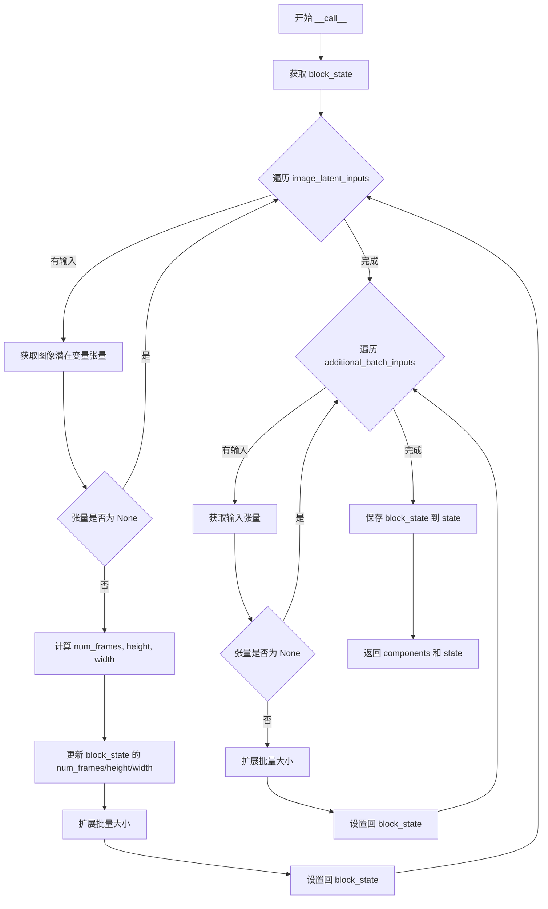

#### 带注释源码

```python
@torch.no_grad()
def __call__(self, components: WanModularPipeline, state: PipelineState) -> PipelineState:
    """处理额外输入的标准化步骤
    
    该方法执行以下操作:
    1. 对于图像潜在变量输入: 计算并更新 num_frames/height/width，扩展批量大小
    2. 对于额外批量输入: 仅扩展批量维度
    
    Args:
        components: 管道组件，包含 vae_scale_factor_temporal 和 vae_scale_factor_spatial
        state: 管道状态对象
        
    Returns:
        更新后的 (components, state) 元组
    """
    # 从 state 中获取当前 block 的状态
    block_state = self.get_block_state(state)

    # ========== 处理图像潜在变量输入 ==========
    # 包括：高度/宽度计算、patchify 和批量扩展
    for image_latent_input_name in self._image_latent_inputs:
        # 通过属性名动态获取潜在变量张量
        image_latent_tensor = getattr(block_state, image_latent_input_name)
        if image_latent_tensor is None:
            continue

        # 1. 从潜在变量计算 num_frames, height, width
        # 使用 VAE 比例因子将潜在变量维度转换为实际图像维度
        num_frames, height, width = calculate_dimension_from_latents(
            image_latent_tensor, 
            components.vae_scale_factor_temporal, 
            components.vae_scale_factor_spatial
        )
        # 仅当当前值为 None 时才更新（保持用户提供的值优先）
        block_state.num_frames = block_state.num_frames or num_frames
        block_state.height = block_state.height or height
        block_state.width = block_state.width or width

        # 2. 扩展批量大小以匹配 num_videos_per_prompt
        image_latent_tensor = repeat_tensor_to_batch_size(
            input_name=image_latent_input_name,
            input_tensor=image_latent_tensor,
            num_videos_per_prompt=block_state.num_videos_per_prompt,
            batch_size=block_state.batch_size,
        )

        # 将处理后的张量存回 block_state
        setattr(block_state, image_latent_input_name, image_latent_tensor)

    # ========== 处理额外批量输入 ==========
    # 仅执行批量扩展，不计算维度
    for input_name in self._additional_batch_inputs:
        input_tensor = getattr(block_state, input_name)
        if input_tensor is None:
            continue

        # 仅扩展批量大小
        input_tensor = repeat_tensor_to_batch_size(
            input_name=input_name,
            input_tensor=input_tensor,
            num_videos_per_prompt=block_state.num_videos_per_prompt,
            batch_size=block_state.batch_size,
        )

        setattr(block_state, input_name, input_tensor)

    # 保存更新后的 block_state 到 state
    self.set_block_state(state, block_state)
    return components, state
```


### `WanSetTimestepsStep.expected_components`

该属性定义了 `WanSetTimestepsStep` 步骤期望的组件规范列表，用于声明该步骤需要哪些组件才能正常运行。当前该步骤仅依赖 `scheduler`（调度器）组件。

参数：

- 无参数（属性方法，隐式接收 `self`）

返回值：`list[ComponentSpec]`，返回该步骤所需的组件规范列表，当前包含一个 `scheduler` 组件，类型为 `UniPCMultistepScheduler`

#### 流程图

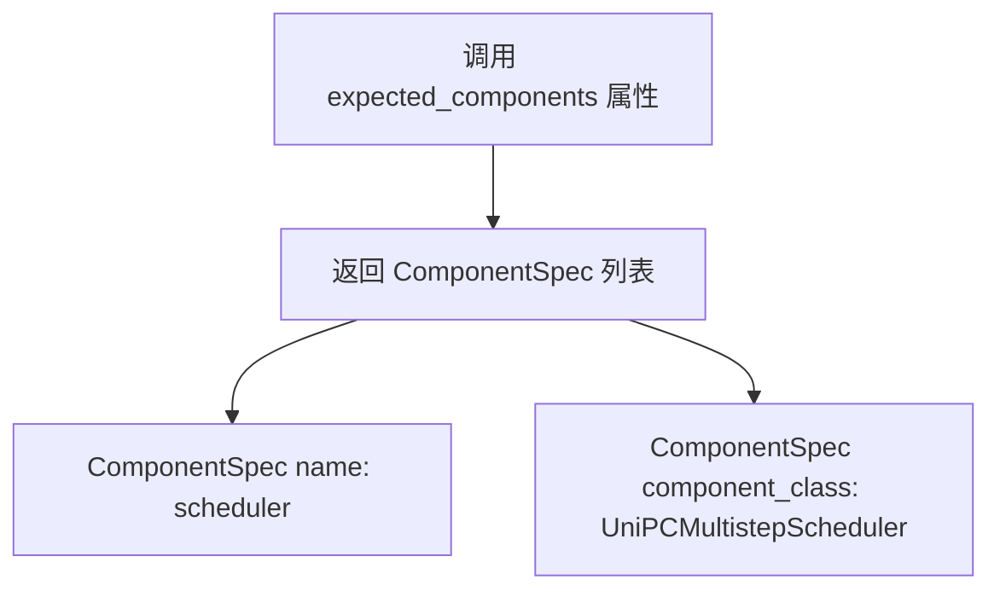

#### 带注释源码

```python
@property
def expected_components(self) -> list[ComponentSpec]:
    """返回该步骤期望的组件规范列表。

    该属性用于声明 WanSetTimestepsStep 步骤运行所需的组件依赖。
    当前步骤仅依赖 scheduler（调度器）组件，用于设置推理时的时间步。

    Returns:
        list[ComponentSpec]: 包含组件规范的列表，每个规范指定组件名称和类型
    """
    return [
        ComponentSpec("scheduler", UniPCMultistepScheduler),
    ]
```


### `WanSetTimestepsStep.description`

该属性返回一步的描述信息，用于说明该步骤的核心功能。该属性是只读的 `@property`，不接收显式参数，但在类实例上下文中可访问 `WanModularPipeline` 和 `PipelineState` 的状态信息。

参数：无（该属性为只读属性，无显式参数）

返回值：`str`，返回描述设置调度器时间步的字符串说明

#### 流程图

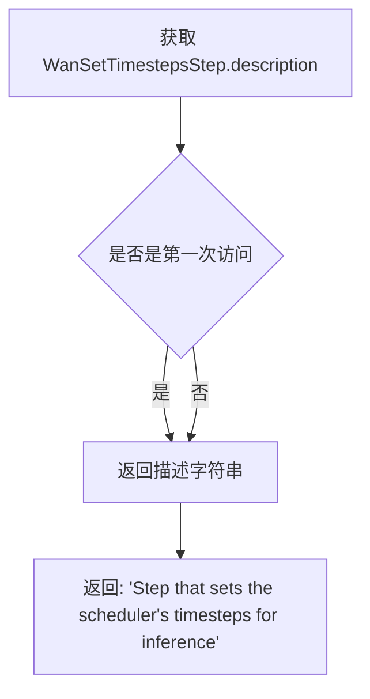

#### 带注释源码

```python
@property
def description(self) -> str:
    """返回该步骤的描述信息

    这是一个只读属性，用于说明 WanSetTimestepsStep 的功能。
    该属性在文档生成、调试信息展示或流水线可视化时使用。

    Returns:
        str: 描述字符串，说明该步骤用于设置调度器的时间步

    Example:
        >>> step = WanSetTimestepsStep()
        >>> print(step.description)
        Step that sets the scheduler's timesteps for inference
    """
    return "Step that sets the scheduler's timesteps for inference"
```

---

### 相关联的 `__call__` 方法详细信息

虽然用户询问的是 `description` 属性，但为了完整性，以下是与该属性关联的 `WanSetTimestepsStep.__call__` 方法的详细信息：

#### 流程图

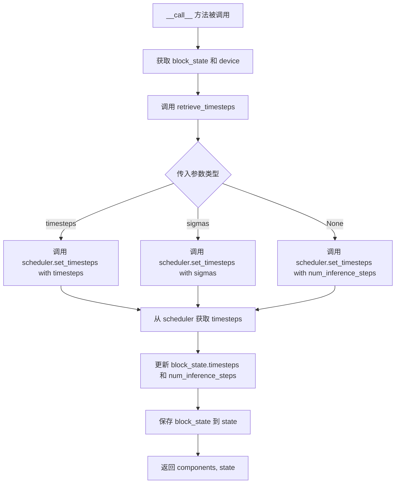

#### 带注释源码

```python
@torch.no_grad()
def __call__(self, components: WanModularPipeline, state: PipelineState) -> PipelineState:
    """执行时间步设置步骤

    该方法是 WanSetTimestepsStep 的核心执行逻辑，负责：
    1. 从 PipelineState 获取当前的 num_inference_steps、timesteps 或 sigmas
    2. 调用 retrieve_timesteps 函数设置调度器的时间步
    3. 将更新后的 timesteps 和 num_inference_steps 存回 PipelineState

    Args:
        components (WanModularPipeline): 流水线组件容器，包含 scheduler 等组件
        state (PipelineState): 流水线状态对象，包含当前执行上下文的数据

    Returns:
        PipelineState: 更新后的流水线状态对象，包含设置好的 timesteps

    Raises:
        ValueError: 如果同时传入 timesteps 和 sigmas
        ValueError: 如果调度器不支持自定义 timesteps 或 sigmas
    """
    # 1. 获取当前 block_state 和执行设备
    block_state = self.get_block_state(state)
    device = components._execution_device

    # 2. 调用 retrieve_timesteps 设置调度器的时间步
    #    retrieve_timesteps 会根据传入的参数类型选择不同的设置策略
    block_state.timesteps, block_state.num_inference_steps = retrieve_timesteps(
        components.scheduler,           # 调度器实例
        block_state.num_inference_steps, # 推理步数（默认50）
        device,                          # 执行设备
        block_state.timesteps,           # 自定义时间步（可选）
        block_state.sigmas,              # 自定义 sigmas（可选）
    )

    # 3. 将更新后的 block_state 写回 state
    self.set_block_state(state, block_state)

    # 4. 返回更新后的 components 和 state
    return components, state
```


### WanSetTimestepsStep.inputs

该属性定义了 `WanSetTimestepsStep` 步骤的输入参数，用于配置扩散模型的时间步调度。该步骤负责设置调度器的时间步，以便进行推理。

参数：

- `num_inference_steps`：`int`，默认值为 50，表示生成样本时使用的扩散步数。如果传递了 `timesteps`，则必须为 `None`。
- `timesteps`：`list[int] | None`，自定义时间步，用于覆盖调度器的时间步间隔策略。如果传递了此参数，则 `num_inference_steps` 和 `sigmas` 必须为 `None`。
- `sigmas`：`list[float] | None`，自定义 sigmas 值，用于覆盖调度器的时间步间隔策略。如果传递了此参数，则 `num_inference_steps` 和 `timesteps` 必须为 `None`。

返回值：`list[InputParam]`，返回包含三个输入参数的列表，这些参数用于配置时间步调度器。

#### 流程图

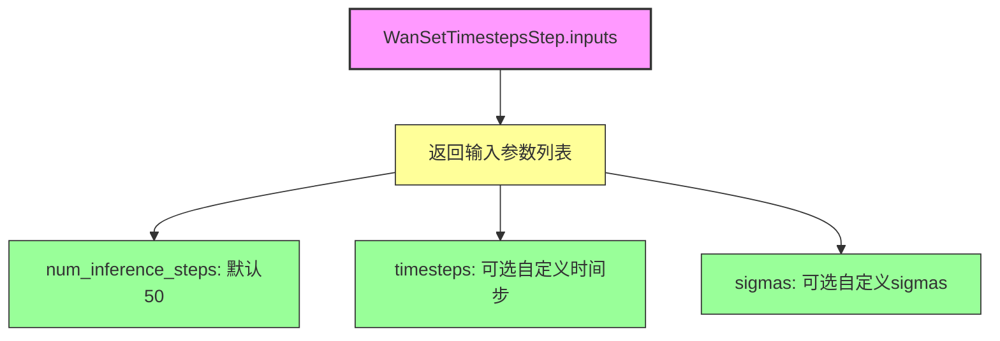

#### 带注释源码

```python
@property
def inputs(self) -> list[InputParam]:
    """定义该步骤的输入参数列表。
    
    该方法返回一个包含三个 InputParam 对象的列表，用于配置扩散模型的时间步调度：
    1. num_inference_steps: 扩散推理步数，默认值为50
    2. timesteps: 可选的自定义时间步列表
    3. sigmas: 可选的自定义 sigma 值列表
    
    Returns:
        list[InputParam]: 输入参数列表，用于配置时间步调度器
    """
    return [
        InputParam("num_inference_steps", default=50),  # 扩散推理步数，默认50
        InputParam("timesteps"),  # 可选的自定义时间步
        InputParam("sigmas"),  # 可选的自定义 sigmas
    ]
```


### `WanSetTimestepsStep.__call__`

该方法是 Wan 模块化管道中的时间步设置步骤，用于在推理过程中配置调度器的时间步。它从调度器获取时间步序列，并将更新后的时间步和推理步数存储到管道状态中。

参数：

- `self`：`WanSetTimestepsStep`，调用该方法的类实例本身
- `components`：`WanModularPipeline`，管道组件对象，包含调度器等组件
- `state`：`PipelineState`，管道状态对象，用于在各个步骤之间传递数据

返回值：`PipelineState`，更新后的管道状态，包含时间步和推理步数信息

#### 流程图

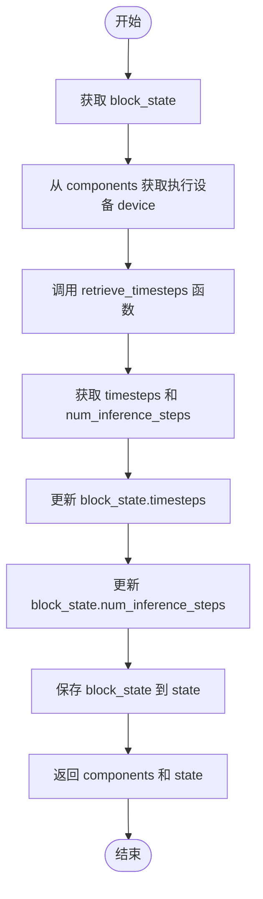

#### 带注释源码

```python
@torch.no_grad()
def __call__(self, components: WanModularPipeline, state: PipelineState) -> PipelineState:
    # 获取当前块状态，包含从之前步骤传递的 num_inference_steps、timesteps、sigmas 等参数
    block_state = self.get_block_state(state)
    
    # 从管道组件中获取执行设备（如 CUDA 或 CPU）
    device = components._execution_device

    # 调用 retrieve_timesteps 函数从调度器获取时间步序列
    # 该函数会根据 num_inference_steps、timesteps 或 sigmas 参数配置调度器
    block_state.timesteps, block_state.num_inference_steps = retrieve_timesteps(
        components.scheduler,       # 调度器实例（UniPCMultistepScheduler）
        block_state.num_inference_steps,  # 推理步数（默认 50）
        device,                     # 执行设备
        block_state.timesteps,      # 可选的自定义时间步
        block_state.sigmas,         # 可选的自定义 sigmas
    )

    # 将更新后的 block_state 写回 pipeline state
    self.set_block_state(state, block_state)
    
    # 返回组件和状态，供下一步使用
    return components, state
```


### `WanPrepareLatentsStep.description`

该属性返回 `WanPrepareLatentsStep` 类的描述信息，用于说明该步骤在文本到视频生成流程中的功能定位，即准备潜在向量（latents）供去噪过程使用。

参数：

- `self`：`WanPrepareLatentsStep` 实例，当前类的实例对象

返回值：`str`，返回该步骤的描述字符串，说明其用于文本到视频生成过程的潜在向量准备。

#### 流程图

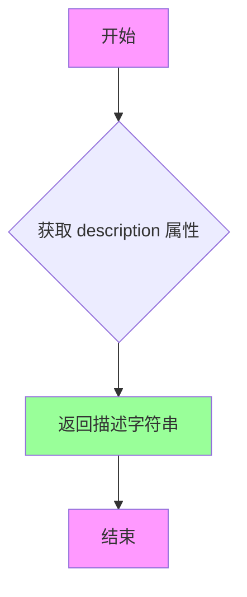

#### 带注释源码

```python
@property
def description(self) -> str:
    """返回该处理步骤的描述信息。
    
    该属性作为 WanPrepareLatentsStep 类的元数据信息，用于向用户或系统
    说明该步骤在整个流水线中的功能和定位。描述内容为：
    'Prepare latents step that prepares the latents for the text-to-video 
    generation process'
    
    Args:
        self: WanPrepareLatentsStep 类的实例对象
        
    Returns:
        str: 描述该步骤功能的字符串，说明其用于文本到视频生成过程中
            的潜在向量准备
    """
    return "Prepare latents step that prepares the latents for the text-to-video generation process"
```


### `WanPrepareLatentsStep.inputs`

该属性定义了 `WanPrepareLatentsStep` 类的输入参数规范，返回一个包含多个 `InputParam` 对象的列表，用于描述该步骤需要接收的输入参数集合。

参数：

- 无（该属性不接受外部参数）

返回值：`list[InputParam]`，返回该步骤所需的输入参数列表，每个 `InputParam` 包含参数名称、类型提示、默认值和描述信息。

#### 流程图

```mermaid
flowchart TD
    A[开始获取 inputs 属性] --> B[创建 InputParam 列表]
    
    B --> C[添加 height 参数]
    C --> D[添加 width 参数]
    D --> E[添加 num_frames 参数]
    E --> F[添加 latents 参数]
    F --> G[添加 num_videos_per_prompt 参数]
    G --> H[添加 generator 参数]
    H --> I[添加 batch_size 参数 - required=True]
    I --> J[添加 dtype 参数]
    J --> K[返回完整的 InputParam 列表]
    
    style A fill:#f9f,color:#000
    style K fill:#9f9,color:#000
```

#### 带注释源码

```python
@property
def inputs(self) -> list[InputParam]:
    """定义 WanPrepareLatentsStep 的输入参数规范。
    
    该属性返回一个 InputParam 列表，描述了该步骤需要接收的所有输入参数。
    每个 InputParam 包含参数名称、类型提示、默认值和描述信息。
    
    Returns:
        list[InputParam]: 输入参数列表，包含 8 个参数
    """
    return [
        # 视频高度参数，用于指定生成视频的高度
        InputParam("height", type_hint=int),
        
        # 视频宽度参数，用于指定生成视频的宽度
        InputParam("width", type_hint=int),
        
        # 视频帧数参数，用于指定生成视频的帧数
        InputParam("num_frames", type_hint=int),
        
        # 潜在向量参数，可以是预定义的潜在向量或 None（则随机生成）
        InputParam("latents", type_hint=torch.Tensor | None),
        
        # 每个提示词生成的视频数量，默认为 1
        InputParam("num_videos_per_prompt", type_hint=int, default=1),
        
        # 随机数生成器，用于潜在向量的随机生成
        InputParam("generator"),
        
        # 批大小参数（必需），表示提示词数量，最终模型输入批大小为 batch_size * num_videos_per_prompt
        InputParam(
            "batch_size",
            required=True,
            type_hint=int,
            description="Number of prompts, the final batch size of model inputs should be `batch_size * num_videos_per_prompt`. Can be generated in input step.",
        ),
        
        # 数据类型参数，指定模型输入的数据类型
        InputParam("dtype", type_hint=torch.dtype, description="The dtype of the model inputs"),
    ]
```


### `WanPrepareLatentsStep.intermediate_outputs`

该属性是 `WanPrepareLatentsStep` 类中的一个属性方法（property），用于定义该处理步骤的中间输出参数。它返回一个新的 `latents` 张量，作为去噪过程的初始输入。

参数： 无（该方法为属性方法，无显式参数）

返回值：`list[OutputParam]`，返回包含输出参数规范的列表，其中定义了输出参数的名称、类型和描述。

#### 流程图

```mermaid
flowchart TD
    A[开始访问 intermediate_outputs 属性] --> B[返回包含单个 OutputParam 的列表]
    B --> C[OutputParam: latents - torch.Tensor]
    C --> D[用于去噪过程的初始潜在向量]
```

#### 带注释源码

```python
@property
def intermediate_outputs(self) -> list[OutputParam]:
    """
    定义该处理步骤的中间输出参数。
    
    Returns:
        list[OutputParam]: 包含输出参数规范的列表，目前只包含一个参数：
            - latents: torch.Tensor - 去噪过程的初始潜在向量
    """
    return [
        OutputParam(
            "latents", 
            type_hint=torch.Tensor, 
            description="The initial latents to use for the denoising process"
        )
    ]
```


### `WanPrepareLatentsStep.check_inputs`

该方法是一个静态验证函数，用于在准备潜在向量（latents）之前检查输入参数的有效性。具体来说，它验证 `height`、`width` 和 `num_frames` 参数是否符合 VAE 缩放因子的要求，确保这些维度能够被 VAE 的空间缩放因子整除，且帧数满足时间缩放因子的约束条件。

参数：

- `components`：`WanModularPipeline`，包含 VAE 组件的对象，提供 `vae_scale_factor_spatial` 和 `vae_scale_factor_temporal` 等配置参数
- `block_state`：`PipelineState`，管道状态对象，包含待验证的 `height`、`width` 和 `num_frames` 参数

返回值：`None`，该方法通过抛出 `ValueError` 来指示验证失败，不返回任何值

#### 流程图

```mermaid
flowchart TD
    A[开始 check_inputs 验证] --> B{检查 height 和 width}
    B --> C{height 不为 None 且 height % vae_scale_factor_spatial != 0?}
    C -->|是| D[抛出 ValueError: height 和 width 必须可被 vae_scale_factor_spatial 整除]
    C -->|否| E{width 不为 None 且 width % vae_scale_factor_spatial != 0?}
    E -->|是| F[抛出 ValueError: height 和 width 必须可被 vae_scale_factor_spatial 整除]
    E -->|否| G{检查 num_frames}
    G --> H{num_frames 不为 None?}
    H -->|是| I{num_frames < 1?}
    I -->|是| J[抛出 ValueError: num_frames 必须大于 0]
    I -->|否| K{(num_frames - 1) % vae_scale_factor_temporal != 0?}
    K -->|是| L[抛出 ValueError: num_frames - 1 必须可被 vae_scale_factor_temporal 整除]
    K -->|否| M[验证通过，方法结束]
    H -->|否| M
    D --> M
    F --> M
    J --> M
    L --> M
```

#### 带注释源码

```python
@staticmethod
def check_inputs(components, block_state):
    """
    验证输入参数的合法性，确保 height、width、num_frames 符合 VAE 缩放因子的要求。
    
    该方法为静态方法，不依赖实例状态，仅做纯逻辑验证。
    
    Args:
        components (WanModularPipeline): 包含 VAE 配置的组件对象，
            需要访问 vae_scale_factor_spatial 和 vae_scale_factor_temporal 属性
        block_state (PipelineState): 管道块状态对象，
            需要访问 height、width、num_frames 属性
    
    Raises:
        ValueError: 当 height 或 width 不能被空间缩放因子整除时抛出
        ValueError: 当 num_frames 小于 1 或 (num_frames-1) 不能被时间缩放因子整除时抛出
    """
    # 验证 height 和 width 是否能被 VAE 空间缩放因子整除
    # 这是因为 VAE 会将图像压缩 vae_scale_factor_spatial 倍，例如 8 倍压缩
    if (block_state.height is not None and block_state.height % components.vae_scale_factor_spatial != 0) or (
        block_state.width is not None and block_state.width % components.vae_scale_factor_spatial != 0
    ):
        raise ValueError(
            f"`height` and `width` have to be divisible by {components.vae_scale_factor_spatial} but are {block_state.height} and {block_state.width}."
        )
    
    # 验证 num_frames 的有效性：
    # 1. 必须大于 0
    # 2. (num_frames - 1) 必须能被 VAE 时间缩放因子整除
    # 这是因为 VAE 对帧数的压缩公式为: num_latent_frames = (num_frames - 1) / vae_scale_factor_temporal + 1
    # 需要保证结果为整数，因此 (num_frames - 1) 必须能被整除
    if block_state.num_frames is not None and (
        block_state.num_frames < 1 or (block_state.num_frames - 1) % components.vae_scale_factor_temporal != 0
    ):
        raise ValueError(
            f"`num_frames` has to be greater than 0, and (num_frames - 1) must be divisible by {components.vae_scale_factor_temporal}, but got {block_state.num_frames}."
        )
```


### `WanPrepareLatentsStep.prepare_latents`

该静态方法用于为 Wan 文本到视频生成流程准备初始潜在变量（latents）。如果调用时已提供了 latents 张量，则将其转移到指定设备并转换数据类型后直接返回；否则，根据批大小、通道数、帧数、高度和宽度等参数计算潜在变量的形状，并使用随机张量生成器创建新的潜在变量。

参数：

- `comp`：`WanModularPipeline`，Wan 模块化管道组件对象，包含 VAE 缩放因子等配置信息
- `batch_size`：`int`，批大小，即生成的视频数量
- `num_channels_latents`：`int`，潜在变量的通道数，默认为 16
- `height`：`int`，目标图像高度，默认为 480
- `width`：`int`，目标图像宽度，默认为 832
- `num_frames`：`int`，目标视频帧数，默认为 81
- `dtype`：`torch.dtype | None`，潜在变量的数据类型，默认为 None
- `device`：`torch.device | None`，潜在变量存放的设备，默认为 None
- `generator`：`torch.Generator | list[torch.Generator] | None`，随机数生成器，用于生成潜在变量
- `latents`：`torch.Tensor | None`，可选的预定义潜在变量张量，若提供则直接返回

返回值：`torch.Tensor`，准备好的潜在变量张量

#### 流程图

```mermaid
flowchart TD
    A[开始 prepare_latents] --> B{latents 是否为 None?}
    B -->|否| C[将 latents 转换到指定 device 和 dtype]
    C --> D[返回转换后的 latents]
    B -->|是| E[计算 latent 帧数]
    E --> F[计算潜在变量形状]
    F --> G{generator 是列表且长度与 batch_size 不匹配?}
    G -->|是| H[抛出 ValueError 异常]
    G -->|否| I[使用 randn_tensor 生成随机潜在变量]
    I --> J[返回生成的 latents]
    D --> K[结束]
    J --> K
    H --> K
```

#### 带注释源码

```python
@staticmethod
# 复制自 diffusers.pipelines.wan.pipeline_wan.WanPipeline.prepare_latents，将 self 改为 comp
def prepare_latents(
    comp,  # WanModularPipeline 组件对象，包含 VAE 缩放因子等配置
    batch_size: int,  # 批大小
    num_channels_latents: int = 16,  # 潜在变量通道数，默认 16
    height: int = 480,  # 目标高度，默认 480
    width: int = 832,  # 目标宽度，默认 832
    num_frames: int = 81,  # 目标帧数，默认 81
    dtype: torch.dtype | None = None,  # 潜在变量数据类型
    device: torch.device | None = None,  # 设备
    generator: torch.Generator | list[torch.Generator] | None = None,  # 随机数生成器
    latents: torch.Tensor | None = None,  # 可选的预定义潜在变量
) -> torch.Tensor:
    # 如果提供了 latents，直接转换设备和数据类型后返回
    if latents is not None:
        return latents.to(device=device, dtype=dtype)

    # 计算 latent 帧数：通过 (num_frames - 1) // vae_scale_factor_temporal + 1
    # 将原始帧数转换为 latent 空间的帧数
    num_latent_frames = (num_frames - 1) // comp.vae_scale_factor_temporal + 1
    
    # 构建潜在变量的形状：[batch_size, channels, latent_frames, latent_height, latent_width]
    # 其中 height 和 width 需要除以 vae_scale_factor_spatial 转换为 latent 空间维度
    shape = (
        batch_size,
        num_channels_latents,
        num_latent_frames,
        int(height) // comp.vae_scale_factor_spatial,
        int(width) // comp.vae_scale_factor_spatial,
    )
    
    # 验证 generator 列表长度与 batch_size 是否匹配
    if isinstance(generator, list) and len(generator) != batch_size:
        raise ValueError(
            f"You have passed a list of generators of length {len(generator)}, but requested an effective batch"
            f" size of {batch_size}. Make sure the batch size matches the length of the generators."
        )

    # 使用 randn_tensor 生成符合正态分布的随机潜在变量
    latents = randn_tensor(shape, generator=generator, device=device, dtype=dtype)
    return latents
```


### `WanPrepareLatentsStep.__call__`

该方法是 WanModularPipeline 中的一个关键步骤，负责为文本到视频生成流程准备初始潜在表示（latents）。它首先验证输入参数（高度、宽度、帧数）的有效性，然后使用默认值或组件默认值初始化这些参数，最后通过调用 `prepare_latents` 静态方法生成用于去噪过程的初始潜在张量，并将其存储在 PipelineState 中返回。

参数：

- `self`：`WanPrepareLatentsStep`，类的实例本身
- `components`：`WanModularPipeline`，包含模型组件和配置的执行组件对象，提供 VAE 比例因子、默认尺寸、潜在通道数等信息
- `state`：`PipelineState`，管道的当前状态对象，用于在各个步骤之间传递数据和中间结果

返回值：`PipelineState`，更新后的管道状态对象，其中包含生成的 latents 以及可能更新后的 height、width、num_frames 等参数

#### 流程图

```mermaid
flowchart TD
    A[开始 __call__] --> B[从 state 获取 block_state]
    B --> C[调用 check_inputs 验证输入]
    C --> D[获取执行设备 device]
    D --> E[设置 dtype = torch.float32]
    E --> F[使用组件默认值填充 height/width/num_frames]
    F --> G[调用 prepare_latents 生成 latents]
    G --> H[将 latents 存入 block_state]
    H --> I[将更新后的 block_state 写回 state]
    I --> J[返回 components 和 state]
```

#### 带注释源码

```python
@torch.no_grad()
def __call__(self, components: WanModularPipeline, state: PipelineState) -> PipelineState:
    """执行潜在张量准备步骤
    
    该方法为去噪过程准备初始的潜在张量：
    1. 验证输入参数的有效性
    2. 使用默认值填充未指定的尺寸参数
    3. 生成或转换潜在张量
    4. 将结果存储到状态中供后续步骤使用
    
    Args:
        components: WanModularPipeline 实例，包含模型组件和配置
        state: PipelineState 实例，保存当前管道的中间状态
    
    Returns:
        更新后的 (components, state) 元组
    """
    # 1. 获取当前步骤的块状态
    block_state = self.get_block_state(state)
    
    # 2. 验证输入参数的有效性
    # 检查 height/width 是否能被 vae_scale_factor_spatial 整除
    # 检查 num_frames 是否有效且满足 vae_scale_factor_temporal 的要求
    self.check_inputs(components, block_state)

    # 3. 获取执行设备（通常为 GPU）
    device = components._execution_device
    
    # 4. 设置数据类型为 float32 以获得最佳质量
    # Wan 模型建议使用 float32 精度
    dtype = torch.float32  # Wan latents should be torch.float32 for best quality

    # 5. 使用组件默认值填充未指定的尺寸参数
    block_state.height = block_state.height or components.default_height
    block_state.width = block_state.width or components.default_width
    block_state.num_frames = block_state.num_frames or components.default_num_frames

    # 6. 调用 prepare_latents 生成或转换潜在张量
    # 计算最终批次大小：batch_size * num_videos_per_prompt
    block_state.latents = self.prepare_latents(
        components,
        batch_size=block_state.batch_size * block_state.num_videos_per_prompt,
        num_channels_latents=components.num_channels_latents,
        height=block_state.height,
        width=block_state.width,
        num_frames=block_state.num_frames,
        dtype=dtype,
        device=device,
        generator=block_state.generator,
        latents=block_state.latents,
    )

    # 7. 将更新后的块状态写回管道状态
    self.set_block_state(state, block_state)

    # 8. 返回更新后的组件和状态供下一步使用
    return components, state
```

## 关键组件


### WanTextInputStep

文本输入处理步骤，负责确定batch_size和dtype，并根据num_videos_per_prompt调整输入张量形状，将所有输入张量在batch维度上重复以匹配最终的batch_size * num_videos_per_prompt。

### WanAdditionalInputsStep

额外的输入处理步骤，支持配置化处理图像潜在变量和批量输入。对于图像潜在变量，计算并更新height/width，并将batch维度扩展到最终批量大小；对于额外的批量输入，仅扩展batch维度以匹配最终批量大小。

### WanSetTimestepsStep

时间步设置步骤，负责调用调度器的set_timesteps方法并从调度器检索时间步，支持自定义时间步和时间步调度策略。

### WanPrepareLatentsStep

潜在变量准备步骤，负责为文本到视频生成过程准备初始潜在变量，支持从高度、宽度、帧数计算潜在变量形状，并使用随机张量初始化或直接使用提供的潜在变量。

### repeat_tensor_to_batch_size

张量批量扩展函数，将输入张量的batch维度扩展到最终批量大小（batch_size * num_videos_per_prompt），支持batch_size为1或等于batch_size两种情况的处理，使用repeat_interleave实现高效的张量复制。

### calculate_dimension_from_latents

从潜在变量计算维度函数，将潜在变量的时间维度和空间维度转换为图像的对应维度，通过将潜在变量的帧数/高度/宽度乘以VAE缩放因子实现。

### retrieve_timesteps

时间步检索函数，调用调度器的set_timesteps方法并检索时间步，支持自定义时间步和sigmas参数，处理不同调度器的兼容性检查。


## 问题及建议


### 已知问题

-   **TODO未实现**: 代码中存在TODO注释（TODO(yiyi, aryan): We need another step before text encoder...），表明需要添加一个步骤来设置`num_inference_steps`属性，但目前未实现，这是一个已知的功能缺失。
-   **硬编码数据类型**: `WanPrepareLatentsStep.__call__`方法中硬编码了`dtype = torch.float32`，缺乏灵活性，无法根据配置或模型要求动态调整。
-   **文档与实现不一致**: `calculate_dimension_from_latents`函数文档声明返回`tuple[int, int]`（2个值），但实际返回`tuple[int, int, int]`（3个值：num_frames, height, width）。
-   **代码重复**: 张量批处理扩展逻辑在`WanTextInputStep.__call__`中手动实现（使用repeat和view），与`repeat_tensor_to_batch_size`函数存在重复实现，不符合DRY原则。
-   **缺少输入验证**: `WanAdditionalInputsStep`的`__call__`方法中，直接使用`getattr`获取属性并处理，没有验证输入是否为None时的预期行为处理不够完善。
-   **属性类型标注不精确**: `WanTextInputStep.intermediate_outputs`返回类型标注为`list[str]`，但实际返回的是`list[OutputParam]`对象列表。
-   **复制代码遗留**: `retrieve_timesteps`函数头部注释仍保留"Copied from diffusers.pipelines.stable_diffusion.pipeline_stable_diffusion.retrieve_timesteps"，表明是复制代码但未清理相关元信息。

### 优化建议

-   实现TODO中提到的text encoder前预处理步骤，统一管理`num_inference_steps`属性的设置逻辑。
-   将`dtype`作为可配置参数或从`components`获取，而非硬编码，以提高代码适应性。
-   统一使用`repeat_tensor_to_batch_size`函数处理所有张量批处理扩展，消除手动实现。
-   修正`calculate_dimension_from_latents`函数的文档描述，使其与实际返回值一致。
-   在`WanAdditionalInputsStep`中添加对输入张量的更严格验证，处理边界情况。
-   修正属性返回类型标注，确保类型提示与实际返回类型匹配。
-   清理复制代码的遗留注释，保持代码库的整洁性。
-   考虑将重复的批处理扩展逻辑抽象到基类或工具函数中，提高代码复用性。

## 其它


### 设计目标与约束

本模块是 Wan 文本到视频生成管道的模块化组件，核心目标是提供可组合、可扩展的管道步骤，用于处理文本输入、附加输入、时间步设置和潜在向量准备。设计约束包括：输入张量必须具有 batch_size=1 或与 prompt_embeds 匹配的 batch_size；height/width 必须可被 vae_scale_factor_spatial 整除；num_frames 必须大于 0 且 (num_frames-1) 可被 vae_scale_factor_temporal 整除；潜在向量数据类型固定为 torch.float32 以保证最佳生成质量。

### 错误处理与异常设计

代码采用显式验证和错误消息抛出的设计模式。主要错误类型包括：ValueError 用于输入参数验证（如张量类型错误、batch size 不匹配、维度不符合要求、height/width/num_frames 不可整除）；参数检查在函数入口处执行，确保早期失败。错误消息格式统一，包含参数名称、期望值和实际值，便于调试。scheduler.set_timesteps 调用前会检查是否支持自定义 timesteps 或 sigmas。

### 数据流与状态机

管道采用 PipelineState 状态对象在各个步骤间传递数据。数据流如下：WanTextInputStep 从 prompt_embeds 提取 batch_size 和 dtype，并扩展 prompt_embeds 和 negative_prompt_embeds 的批次维度；WanAdditionalInputsStep 根据 image_latent_inputs 计算并设置 num_frames/height/width，同时扩展所有条件输入的批次维度；WanSetTimestepsStep 从 scheduler 获取 timesteps；WanPrepareLatentsStep 根据已设置的参数生成或转换初始 latents。每个步骤通过 get_block_state 获取当前状态，处理后通过 set_block_state 写回。

### 外部依赖与接口契约

本模块依赖以下核心组件：WanTransformer3DModel（3D 变换器模型）、UniPCMultistepScheduler（调度器）、randn_tensor（潜在向量生成工具）。接口契约要求：components 必须包含 expected_components 中指定的组件；state 必须实现 PipelineState 接口（包含 get_block_state/set_block_state 方法）；输入参数需符合 inputs 中定义的类型提示和默认值要求；中间输出需符合 intermediate_outputs 中定义的类型和描述。

### 配置与参数规范

关键配置参数包括：num_videos_per_prompt（每提示生成的视频数，默认为 1）、num_inference_steps（推理步数，默认为 50）、height/width/num_frames（输出尺寸，可由 latents 自动推断）、latents（可选的预定义潜在向量）、generator（随机数生成器，用于可重复生成）。WanAdditionalInputsStep 支持灵活配置 image_latent_inputs 和 additional_batch_inputs 列表。

### 性能考虑与优化空间

当前实现使用 torch.no_grad() 装饰器确保推理时无需梯度计算。使用 repeat_interleave 进行批次扩展而非循环复制，提高张量操作效率。潜在向量采用 float32 而非混合精度，可能影响大规模推理速度。TODO 注释指出当前总是假设需要 guidance，未来可优化为根据 guider 配置动态决定是否准备负向嵌入。

### 并发与线程安全性

代码本身不涉及多线程或并发操作，所有操作在 torch.no_grad() 上下文中执行。状态对象 PipelineState 的线程安全性取决于其具体实现，模块层面未做特殊并发保护。

### 版本兼容性

代码依赖 inspect 模块检查 scheduler.set_timesteps 的签名参数，以动态适配不同版本的调度器。类型提示使用 Python 3.10+ 的联合类型语法（int | None、torch.dtype | None），要求 Python 3.10 及以上版本。

### 资源管理与生命周期

模型组件（transformer、scheduler）通过 components 对象引用，由外部管道负责初始化和销毁。临时张量在函数作用域内创建，Python 垃圾回收自动释放。无显式资源释放逻辑。

### 可扩展性设计

WanAdditionalInputsStep 采用配置化设计，支持通过构造函数参数扩展处理的输入类型。ModularPipelineBlocks 基类提供了标准化的步骤接口，便于添加新的管道步骤。ComponentSpec 和 InputParam/OutputParam 定义了声明式的组件和参数规范，支持自动验证和文档生成。

### 安全考量

代码不直接处理用户输入的敏感数据，但作为生成管道需注意：prompt_embeds 和 negative_prompt_embeds 应来自可信的文本编码器；generator 参数可影响随机性，需确保适当的随机种子管理以支持可重复的生成结果。

### 关键组件信息

WanTextInputStep：文本输入处理步骤，负责提取 batch_size/dtype 并扩展文本嵌入的批次维度。WanAdditionalInputsStep：附加输入处理步骤，支持灵活配置处理图像潜在向量和额外批次输入。WanSetTimestepsStep：时间步设置步骤，调用调度器获取推理 timesteps。WanPrepareLatentsStep：潜在向量准备步骤，生成或转换初始潜在向量用于去噪过程。repeat_tensor_to_batch_size：工具函数，将张量扩展至目标批次大小。calculate_dimension_from_latents：根据潜在向量维度计算输出视频的帧数、高度和宽度。retrieve_timesteps：工具函数，从调度器获取 timesteps，支持自定义 timesteps 和 sigmas。

### 潜在技术债务与优化空间

TODO 注释指出需要添加步骤在文本编码器之前设置 num_inference_steps 属性，以便根据 guider 配置动态决定 guidance 时机；当前实现总是准备负向嵌入，无论实际是否需要。WanPrepareLatentsStep 中 dtype 硬编码为 float32，可考虑开放为配置选项以支持混合精度推理。错误消息可进一步优化，增加更多上下文信息辅助调试。类型提示可补充更多泛型信息以增强 IDE 支持。

    