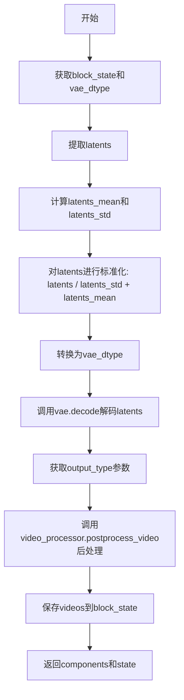
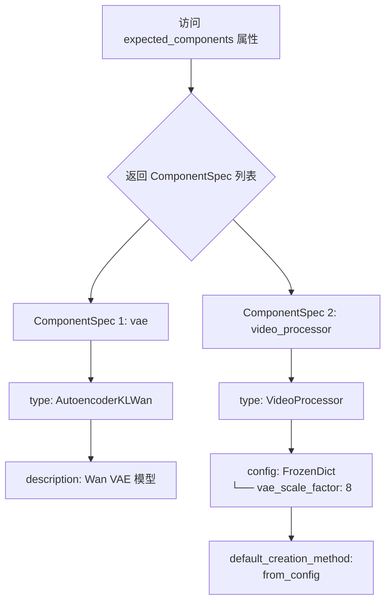
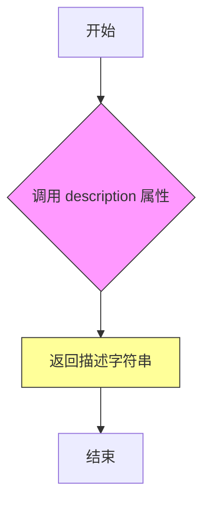
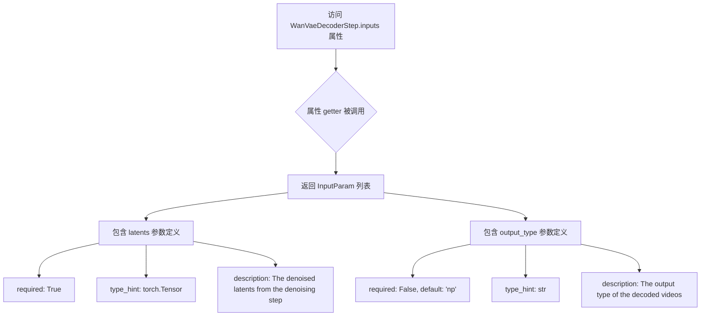
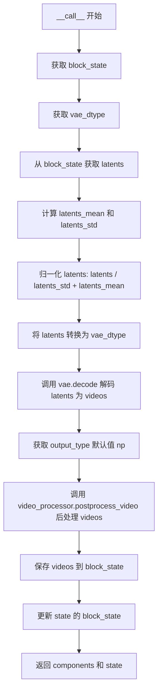

# `diffusers\src\diffusers\modular_pipelines\wan\decoders.py` 详细设计文档

这是一个视频解码步骤模块，负责将去噪后的潜在表示(latents)通过Wan VAE模型解码为实际视频帧，并进行后处理。该模块继承自ModularPipelineBlocks，实现了视频生成管道中的解码环节。

## 整体流程



## 类结构

```
ModularPipelineBlocks (抽象基类)
└── WanVaeDecoderStep
```

## 全局变量及字段


### `logger`
    
模块级别的日志记录器对象，用于记录运行过程中的日志信息

类型：`logging.Logger`
    


### `WanVaeDecoderStep.model_name`
    
类属性，表示模型名称为'wan'

类型：`str`
    


### `WanVaeDecoderStep.expected_components`
    
属性方法，返回期望的组件列表，包含vae和video_processor组件规范

类型：`property`
    


### `WanVaeDecoderStep.description`
    
属性方法，返回步骤描述字符串，说明该步骤用于将去噪后的潜在表示解码为视频

类型：`property`
    


### `WanVaeDecoderStep.inputs`
    
属性方法，返回输入参数列表，包含latents和output_type两个输入参数

类型：`property`
    


### `WanVaeDecoderStep.intermediate_outputs`
    
属性方法，返回中间输出列表，包含videos输出参数

类型：`property`
    


### `WanVaeDecoderStep.__call__`
    
实例方法，执行解码步骤的主方法，将去噪后的潜在表示解码为最终的视频输出

类型：`method`
    
    

## 全局函数及方法


### `WanVaeDecoderStep.expected_components`

该属性方法用于定义解码步骤所需的组件列表，包括 VAE 模型和视频处理器，并配置视频处理器的缩放因子和默认创建方法。

参数：

- 无（仅包含隐式参数 `self`）

返回值：`list[ComponentSpec]`，返回期望的组件规范列表，包含 VAE 模型和视频处理器两个组件的配置信息。

#### 流程图



#### 带注释源码

```python
@property
def expected_components(self) -> list[ComponentSpec]:
    """
    定义解码步骤期望的组件列表。
    
    返回一个包含两个组件规范的列表：
    1. vae: AutoencoderKLWan 类型的 VAE 模型
    2. video_processor: VideoProcessor 类型的视频处理器，
       配置了 vae_scale_factor=8 和默认创建方法 from_config
    
    Returns:
        list[ComponentSpec]: 组件规范列表，用于初始化管道组件
    """
    return [
        # 第一个组件：VAE 解码器模型
        ComponentSpec("vae", AutoencoderKLWan),
        # 第二个组件：视频处理器
        # - 类型: VideoProcessor
        # - 配置: 冻结字典，包含 vae_scale_factor=8（用于将潜在空间坐标映射到像素空间）
        # - 默认创建方法: from_config（从配置文件中创建）
        ComponentSpec(
            "video_processor",
            VideoProcessor,
            config=FrozenDict({"vae_scale_factor": 8}),
            default_creation_method="from_config",
        ),
    ]
```


### `WanVaeDecoderStep.description`

该属性方法属于 `WanVaeDecoderStep` 类，用于返回当前步骤的描述信息，说明该步骤的功能是将去噪后的潜在表示解码为图像或视频。

参数：

- `self`：`WanVaeDecoderStep` 实例本身，无需显式传递

返回值：`str`，返回步骤的描述字符串，告知用户此步骤负责将去噪后的潜在表示解码为图像。

#### 流程图



#### 带注释源码

```python
@property
def description(self) -> str:
    """
    属性装饰器标识这是一个只读属性方法
    
    返回值类型: str
    该方法返回当前处理步骤的描述信息
    
    返回值描述: "Step that decodes the denoised latents into images"
    明确指出此步骤的核心功能是将去噪后的潜在表示（latents）
    解码（decode）为实际的图像或视频数据
    """
    return "Step that decodes the denoised latents into images"
```


### `WanVaeDecoderStep.inputs`

该属性方法用于返回WanVaeDecoderStep步骤的输入参数列表，包含解码所需的潜在向量和输出类型配置。

参数：

由于`inputs`是属性方法（getter），其本身无直接输入参数，但返回以下输入参数定义：

- `latents`：`torch.Tensor`，去噪步骤生成的潜在向量，是解码过程的必需输入
- `output_type`：`str`，可选参数，默认值为`"np"`，指定解码视频的输出类型

返回值：`list[InputParam]`，返回输入参数列表，包含两个`InputParam`对象，分别定义了解码步骤需要的`latents`和`output_type`参数

#### 流程图



#### 带注释源码

```python
@property
def inputs(self) -> list[tuple[str, Any]]:
    """
    属性方法：返回WanVaeDecoderStep步骤的输入参数列表
    
    Returns:
        list[tuple[str, Any]]: 输入参数规范列表，包含latents和output_type两个参数
    """
    return [
        # 输入参数1：latents - 去噪后的潜在向量
        InputParam(
            "latents",  # 参数名称
            required=True,  # 必需参数
            type_hint=torch.Tensor,  # 类型提示：torch.Tensor
            description="The denoised latents from the denoising step",  # 描述：去噪步骤生成的潜在向量
        ),
        # 输入参数2：output_type - 输出类型
        InputParam(
            "output_type",  # 参数名称
            default="np",  # 默认值：np
            type_hint=str,  # 类型提示：str
            description="The output type of the decoded videos"  # 描述：解码视频的输出类型
        ),
    ]
```


### `WanVaeDecoderStep.intermediate_outputs`

该属性方法用于定义解码步骤的中间输出信息，返回一个包含视频输出参数的列表，描述从潜在表示解码后生成的视频结果，支持 PIL 图像、PyTorch 张量或 NumPy 数组格式。

参数： 无

返回值：`list[str]`，返回一个 `OutputParam` 列表，描述生成的视频中间输出

#### 流程图

```mermaid
flowchart TD
    A[开始] --> B[返回 OutputParam 列表]
    B --> C[定义 videos 输出参数]
    C --> D[指定类型: list[PIL.Image] | list[torch.Tensor] | list[np.ndarray]]
    E[结束]
```

#### 带注释源码

```python
@property
def intermediate_outputs(self) -> list[str]:
    """
    定义解码步骤的中间输出信息。
    
    该属性返回一个列表，包含一个 OutputParam 对象，
    用于描述从 VAE 解码器生成的视频结果。
    
    Returns:
        list[str]: 返回包含 OutputParam 的列表，
                   其中定义了 'videos' 输出参数的信息
    """
    return [
        OutputParam(
            "videos",  # 输出参数名称
            # 输出类型：支持三种格式的视频数据
            type_hint=list[list[PIL.Image.Image]] | list[torch.Tensor] | list[np.ndarray],
            description="The generated videos, can be a PIL.Image.Image, torch.Tensor or a numpy array",
        )
    ]
```


### WanVaeDecoderStep.__call__

实例方法，执行解码步骤的主方法，将去噪后的潜在表示解码为最终的视频输出。

参数：

- `self`：`WanVaeDecoderStep`，WanVaeDecoderStep类的实例
- `components`：包含 VAE 和视频处理器的组件对象，包含 `vae`（AutoencoderKLWan 模型）和 `video_processor`（VideoProcessor）
- `state`：`PipelineState`，管道状态对象，包含当前的中间状态（如 latents 和 output_type）

返回值：`(components, state)`，返回原始组件和更新后的管道状态，其中 `state.block_state.videos` 包含解码后的视频结果

#### 流程图



#### 带注释源码

```python
@torch.no_grad()
def __call__(self, components, state: PipelineState) -> PipelineState:
    """
    执行 VAE 解码步骤，将去噪后的潜在表示解码为视频
    
    参数:
        components: 包含 VAE 模型和视频处理器的组件对象
        state: 管道状态对象
    
    返回:
        包含更新后状态的元组 (components, state)
    """
    
    # 从管道状态获取当前块的内部状态
    block_state = self.get_block_state(state)
    
    # 获取 VAE 模型的数据类型，用于后续数据类型转换
    vae_dtype = components.vae.dtype
    
    # 从块状态中获取去噪后的潜在表示
    latents = block_state.latents
    
    # 根据 VAE 配置创建 latents_mean 张量，用于反标准化
    # 将 1D mean 向量 reshape 为 (1, z_dim, 1, 1, 1) 以匹配 latents 的 5D 形状
    latents_mean = (
        torch.tensor(components.vae.config.latents_mean)
        .view(1, components.vae.config.z_dim, 1, 1, 1)
        .to(latents.device, latents.dtype)
    )
    
    # 根据 VAE 配置创建 latents_std 张量，用于反标准化
    # 注意：这里 std 被设为 1.0 / config.std，即存储的是标准差的倒数
    latents_std = 1.0 / torch.tensor(components.vae.config.latents_std).view(
        1, components.vae.config.z_dim, 1, 1, 1
    ).to(latents.device, latents.dtype)
    
    # 对 latents 进行反标准化：先除以标准差，再加上均值
    # 这将 latents 从标准化空间转换回原始潜在空间
    latents = latents / latents_std + latents_mean
    
    # 将 latents 转换为 VAE 模型期望的数据类型
    latents = latents.to(vae_dtype)
    
    # 调用 VAE 的 decode 方法将潜在表示解码为视频
    # decode 返回元组，取第一个元素为视频张量
    block_state.videos = components.vae.decode(latents, return_dict=False)[0]
    
    # 从块状态获取输出类型，默认值为 "np"（numpy 数组）
    output_type = getattr(block_state, "output_type", "np")
    
    # 使用视频处理器对解码后的视频进行后处理
    # 根据 output_type 转换为目标格式（PIL Image、Tensor 或 numpy 数组）
    block_state.videos = components.video_processor.postprocess_video(
        block_state.videos, 
        output_type=output_type
    )
    
    # 将更新后的块状态保存回管道状态
    self.set_block_state(state, block_state)
    
    # 返回组件对象和更新后的管道状态
    return components, state
```

## 关键组件


### WanVaeDecoderStep 类

WanVaeDecoderStep 是模块化管道中的解码步骤类，负责将去噪后的潜在表示（latents）解码为实际视频帧，支持多种输出格式（numpy数组、PIL图像或PyTorch张量），并通过VideoProcessor进行后处理。

### 潜在表示归一化（去量化支持）

代码中的 latents_mean 和 latents_std 用于将量化后的潜在表示进行反归一化处理，将潜在表示从标准差为1的分布转换回原始的潜在空间分布，这是实现量化策略支持的关键步骤，通过除以标准差并加上均值来恢复原始 latent 值。

### VAE dtype 转换（量化策略）

代码通过 `latents = latents.to(vae_dtype)` 将潜在张量转换为VAE模型对应的数据类型，这是量化感知推理的重要环节，确保潜在表示与VAE解码器的量化策略相匹配。

### VideoProcessor 后处理

使用 VideoProcessor 对解码后的视频进行后处理，根据 output_type 参数将视频转换为目标格式（np数组、PIL图像或PyTorch张量），实现灵活的输出格式支持。

### PipelineState 状态管理

通过 get_block_state 和 set_block_state 方法管理管道状态，实现跨步骤的状态传递，确保解码步骤能够访问前序去噪步骤产生的 latents，并向后续步骤传递生成的 videos。


## 问题及建议


### 已知问题

-   **重复计算张量对象**：在每次调用`__call__`方法时，都会重复创建`latents_mean`和`latents_std`的`torch.tensor`对象，这些值来自配置且不变，应在初始化或组件准备阶段预先计算并缓存
-   **硬编码配置值**：`video_processor`的`vae_scale_factor=8`被硬编码在组件规范中，缺乏灵活性，应考虑从VAE配置中动态获取或允许外部配置
-   **缺乏错误处理**：`vae.decode()`调用和`video_processor.postprocess_video()`调用均未进行异常捕获，当模型解码失败或后处理出错时会导致程序直接崩溃
-   **类型安全不足**：`output_type`使用`getattr`获取并有默认值，但未对输入值进行类型验证或白名单检查，可能导致后续处理出现意外行为
-   **组件依赖未验证**：虽然通过`expected_components`声明了依赖，但未在运行时检查`components.vae`和`components.video_processor`是否为`None`
-   **解码返回值未校验**：`vae.decode()`返回的`[0]`索引访问未检查列表是否为空，可能引发索引越界异常
-   **设备转移开销**：`latents_mean`和`latents_std`在每次调用时都需要使用`.to()`转移到`latents`设备，当处理大批量数据时会产生额外开销

### 优化建议

-   **缓存预计算张量**：在组件初始化阶段（`__init__`或专门准备方法中）计算并缓存`latents_mean`和`latents_std`的`torch.tensor`，存储为实例变量，避免重复创建和设备转移
-   **配置外部化**：将`vae_scale_factor`等配置参数从代码中移至配置文件或构造函数参数，提高可配置性
-   **添加异常处理**：为`decode`和`postprocess_video`调用添加`try-except`块，捕获可能的异常并提供有意义的错误信息或降级方案
-   **输入验证增强**：在方法开始时添加对`latents`形状、类型的验证，以及对`output_type`的有效性检查（np/pil/torch）
-   **空值检查**：在访问组件属性前添加`None`检查，确保依赖组件已正确初始化
-   **返回值校验**：在访问`decode`返回结果前检查列表长度，确保解码操作成功完成
-   **性能优化**：考虑使用`torch.no_grad()`上下文管理器时同时使用`@torch.cuda.amp.autocast()`以支持混合精度推理
</think>

## 其它


### 设计目标与约束

**设计目标**：
- 实现将Wan VAE模型的去噪潜在表示（latents）解码为实际视频的功能
- 支持多种输出格式（PIL图像、PyTorch张量、NumPy数组）
- 遵循模块化流水线架构，支持组件热插拔

**设计约束**：
- 必须使用`ModularPipelineBlocks`基类以集成到更大的流水线系统中
- 必须提供`expected_components`属性声明所需依赖（vae、video_processor）
- 输入输出必须符合`InputParam`和`OutputParam`规范
- 解码过程必须在`torch.no_grad()`上下文执行以节省显存

### 错误处理与异常设计

**潜在异常情况**：
1. **组件缺失异常**：如果`components.vae`或`components.video_processor`未正确初始化，`__call__`方法执行时将抛出`AttributeError`
2. **数据类型不匹配**：如果`latents`设备（device）与`latents_mean/std`设备不一致，可能导致运行时错误
3. **配置缺失异常**：`components.vae.config.latents_mean`和`latents_std`如果不存在将抛出`AttributeError`
4. **输出类型不支持**：`video_processor.postprocess_video`可能不支持某些`output_type`，需依赖下游处理

**异常处理策略**：
- 当前代码未显式捕获异常，建议在`__call__`开头添加组件存在性检查
- 建议对`latents_mean/std`的设备转换添加异常捕获，防止设备不匹配导致崩溃

### 数据流与状态机

**数据流**：
```
输入: latents (torch.Tensor) → 去噪后的潜在表示
     output_type (str, default="np") → 期望的输出格式

处理流程:
1. block_state.latents → 获取当前状态的潜在表示
2. latents标准化 → latents / latents_std + latents_mean
3. dtype转换 → 转换为vae的dtype
4. VAE解码 → components.vae.decode()
5. 后处理 → video_processor.postprocess_video()

输出: block_state.videos → 解码后的视频（多种格式）
```

**状态管理**：
- 使用`PipelineState`管理流水线状态
- 通过`get_block_state(state)`获取当前块状态
- 通过`set_block_state(state, block_state)`更新块状态
- 状态包含：`latents`（输入）、`output_type`（配置）、`videos`（输出）

### 外部依赖与接口契约

**外部依赖**：
1. **AutoencoderKLWan**：Wan VAE解码器模型，提供`decode()`方法
2. **VideoProcessor**：视频处理工具，提供`postprocess_video()`方法
3. **FrozenDict**：不可变配置字典
4. **PipelineState**：流水线状态管理类
5. **ModularPipelineBlocks**：模块化流水线块基类
6. **ComponentSpec/InputParam/OutputParam**：组件规范类

**接口契约**：
- `expected_components`：声明需要`vae`和`video_processor`组件
- `inputs`：声明必须提供`latents`，可选提供`output_type`
- `intermediate_outputs`：声明输出`videos`为多种类型
- `__call__`方法：接收`components`和`state`，返回更新后的`components`和`state`

### 版本兼容性考虑

- 依赖`torch`、`numpy`、`PIL`等基础库
- 假设`AutoencoderKLWan.decode()`返回元组`(video_tensor,)`格式
- 假设`VideoProcessor.postprocess_video()`支持`output_type`参数为"np"、"pt"、"pil"等
- 需与`ModularPipelineBlocks`基类版本兼容

### 性能考量

- 使用`@torch.no_grad()`装饰器避免梯度计算，节省显存
- `latents_mean`和`latents_std`在每次调用时重新创建tensor，建议缓存以提升性能
- VAE解码是计算密集型操作，需考虑批量处理场景
- 视频后处理可能涉及内存拷贝，需关注大视频场景的内存占用

### 安全与权限

- 代码遵循Apache License 2.0
- 无用户认证或授权相关逻辑
- 无敏感数据处理
- 无外部网络请求

### 测试建议

- 单元测试：验证标准化逆变换逻辑（latents → videos）
- 集成测试：验证与ModularPipeline的集成
- 参数化测试：测试不同output_type（"np"、"pt"、"pil"）
- 异常测试：测试组件缺失、配置缺失等场景

### 配置管理

**VAE配置依赖**（从`components.vae.config`读取）：
- `latents_mean`：潜在表示均值，用于逆标准化
- `latents_std`：潜在表示标准差，用于逆标准化
- `z_dim`：潜在空间维度
- `vae_scale_factor`：VAE缩放因子（8，在video_processor配置中声明）

**运行时配置**：
- `output_type`：输出格式，可通过block_state动态设置

    