# `diffusers\src\diffusers\modular_pipelines\wan\denoise.py` 详细设计文档

该文件实现了Wan2.1和Wan2.2视频生成模型的去噪循环组件，支持文本到视频和图像到视频任务。通过模块化管道设计，将去噪过程分为去噪前准备、执行去噪和去噪后更新三个阶段，支持Classifier-Free Guidance引导和多transformer架构。

## 整体流程

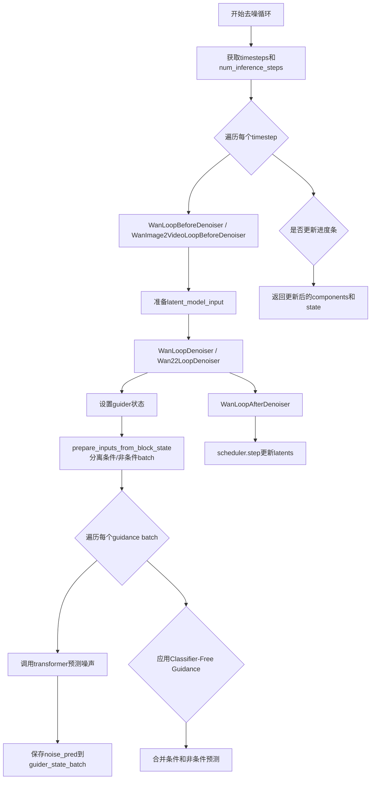

## 类结构

```
ModularPipelineBlocks (抽象基类)
├── WanLoopBeforeDenoiser
├── WanImage2VideoLoopBeforeDenoiser
├── WanLoopDenoiser
├── Wan22LoopDenoiser
├── WanLoopAfterDenoiser
└── LoopSequentialPipelineBlocks
    └── WanDenoiseLoopWrapper
        ├── WanDenoiseStep (Wan2.1 T2V)
        ├── Wan22DenoiseStep (Wan2.2 T2V)
        ├── WanImage2VideoDenoiseStep (Wan2.1 I2V)
        └── Wan22Image2VideoDenoiseStep (Wan2.2 I2V)
```

## 全局变量及字段


### `logger`
    
模块级别的日志记录器，用于记录该模块的运行信息和调试信息

类型：`logging.Logger`
    


### `model_name`
    
Wan模型的标识名称，用于标识该模块属于Wan模型系列

类型：`str`
    


### `WanLoopDenoiser._guider_input_fields`
    
guider输入字段的映射配置字典，用于将block_state中的字段映射到denoiser模型需要的参数

类型：`dict[str, Any]`
    


### `Wan22LoopDenoiser._guider_input_fields`
    
guider输入字段的映射配置字典，用于将block_state中的字段映射到denoiser模型需要的参数（支持Wan2.2版本的双guider配置）

类型：`dict[str, Any]`
    


### `WanDenoiseStep.block_classes`
    
定义该denoise步骤的子块类列表，包含before_denoiser、denoiser、after_denoiser三个块，用于Wan2.1文本到视频任务

类型：`list[type]`
    


### `WanDenoiseStep.block_names`
    
对应block_classes中各块的名称列表，用于标识和引用各个子块

类型：`list[str]`
    


### `Wan22DenoiseStep.block_classes`
    
定义该denoise步骤的子块类列表，包含before_denoiser、denoiser、after_denoiser三个块，用于Wan2.2文本到视频任务

类型：`list[type]`
    


### `Wan22DenoiseStep.block_names`
    
对应block_classes中各块的名称列表，用于标识和引用各个子块

类型：`list[str]`
    


### `WanImage2VideoDenoiseStep.block_classes`
    
定义该denoise步骤的子块类列表，包含before_denoiser、denoiser、after_denoiser三个块，用于Wan2.1图像到视频任务

类型：`list[type]`
    


### `WanImage2VideoDenoiseStep.block_names`
    
对应block_classes中各块的名称列表，用于标识和引用各个子块

类型：`list[str]`
    


### `Wan22Image2VideoDenoiseStep.block_classes`
    
定义该denoise步骤的子块类列表，包含before_denoiser、denoiser、after_denoiser三个块，用于Wan2.2图像到视频任务

类型：`list[type]`
    


### `Wan22Image2VideoDenoiseStep.block_names`
    
对应block_classes中各块的名称列表，用于标识和引用各个子块

类型：`list[str]`
    
    

## 全局函数及方法


### WanLoopBeforeDenoiser.description

这是 `WanLoopBeforeDenoiser` 类的描述属性，用于说明该模块在去噪循环中的作用：准备去噪器的潜在输入。该块用于组成 `LoopSequentialPipelineBlocks` 对象（例如 `WanDenoiseLoopWrapper`）的 `sub_blocks` 属性。

参数：

- `self`：类的实例本身，无需显式传递

返回值：`str`，返回对该块的文字描述，说明其功能用途和使用场景

#### 流程图

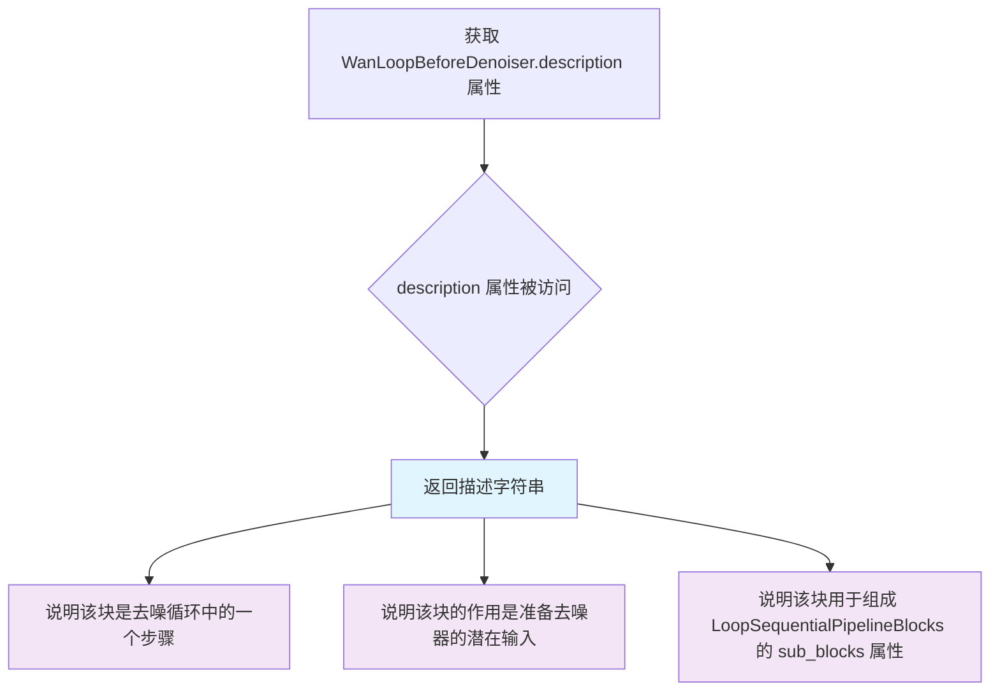

#### 带注释源码

```python
@property
def description(self) -> str:
    """
    获取该模块的描述信息。
    
    该描述说明了:
    1. 这是去噪循环中的一个步骤
    2. 该步骤的作用是准备去噪器的潜在输入
    3. 该块应该用于组合 LoopSequentialPipelineBlocks 对象的 sub_blocks 属性
    
    Returns:
        str: 描述该模块功能的字符串
        
    Example:
        >>> block = WanLoopBeforeDenoiser()
        >>> print(block.description)
        step within the denoising loop that prepares the latent input for the denoiser. 
        This block should be used to compose the `sub_blocks` attribute of a `LoopSequentialPipelineBlocks` 
        object (e.g. `WanDenoiseLoopWrapper`)
    """
    return (
        "step within the denoising loop that prepares the latent input for the denoiser. "
        "This block should be used to compose the `sub_blocks` attribute of a `LoopSequentialPipelineBlocks` "
        "object (e.g. `WanDenoiseLoopWrapper`)"
    )
```


### `WanLoopBeforeDenoiser.inputs`

该属性定义了在去噪循环中为去噪器准备潜在输入所需的参数列表。它返回两个必需的输入参数：`latents`（用于去噪过程的初始潜在表示）和 `dtype`（模型输入的数据类型）。

参数：
- （该属性无传统意义上的参数，作为类的 property 不接受任何参数）

返回值：`list[InputParam]`，返回一个包含 `InputParam` 对象的列表，每个对象描述一个输入参数的名称、类型、是否必需以及描述信息。

#### 流程图

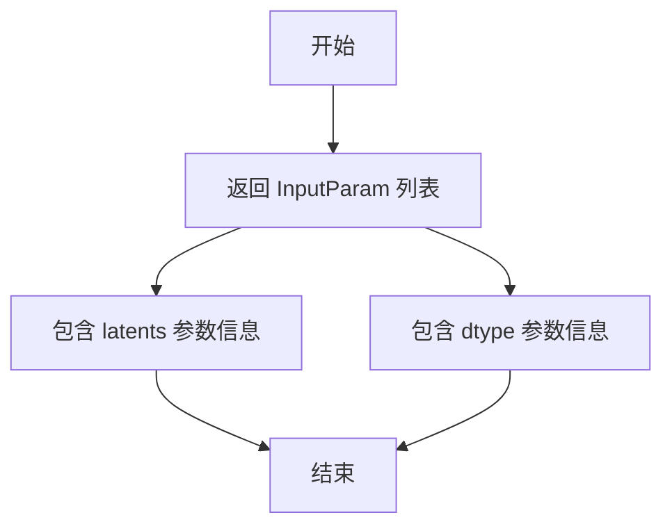

#### 带注释源码

```python
@property
def inputs(self) -> list[InputParam]:
    """定义该模块所需输入参数的列表。
    
    返回:
        list[InputParam]: 包含所有输入参数的列表，每个参数由 InputParam 对象描述。
    """
    return [
        InputParam(
            "latents",  # 参数名称
            required=True,  # 是否必需
            type_hint=torch.Tensor,  # 参数类型提示
            # 参数描述：用于去噪过程的初始潜在表示，可在 prepare_latent 步骤中生成
            description="The initial latents to use for the denoising process. Can be generated in prepare_latent step.",
        ),
        InputParam(
            "dtype",  # 参数名称
            required=True,  # 是否必需
            type_hint=torch.dtype,  # 参数类型提示
            # 参数描述：模型输入的数据类型，可在 input 步骤中生成
            description="The dtype of the model inputs. Can be generated in input step.",
        ),
    ]
```


### `WanLoopBeforeDenoiser.__call__`

该方法是 WanLoopBeforeDenoiser 类的主要执行方法，在去噪循环中准备潜在输入供去噪器使用。它将块状态中的 latents 转换为指定的数据类型，并将其设置为 latent_model_input，以供后续的去噪步骤使用。

参数：

- `self`：类的实例方法隐含参数
- `components`：`WanModularPipeline`，包含管道所有组件的对象，提供对模型 guider、transformer 等组件的访问
- `block_state`：`BlockState`，存储当前块状态的对象，包含 latents、dtype 等属性，用于在管道块之间传递状态
- `i`：`int`，当前去噪循环的步骤索引，从 0 开始
- `t`：`torch.Tensor`，当前去噪步骤的时间步张量，用于指示当前的噪声水平

返回值：`(WanModularPipeline, BlockState)`，返回更新后的组件和块状态。块状态的 latent_model_input 属性被设置为转换后的 latents。

#### 流程图

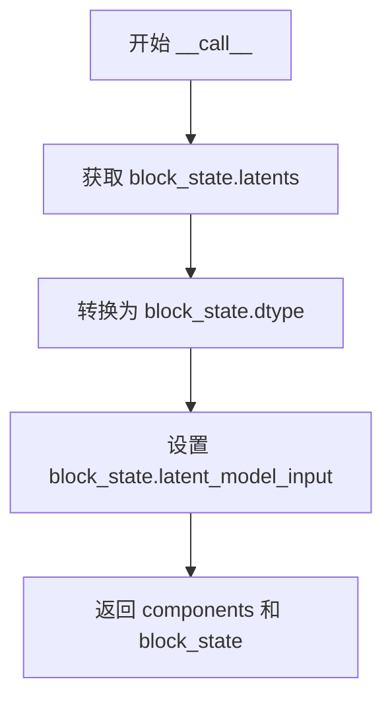

#### 带注释源码

```python
@torch.no_grad()
def __call__(self, components: WanModularPipeline, block_state: BlockState, i: int, t: torch.Tensor):
    """
    在去噪循环开始前准备潜在输入。
    
    该方法执行以下操作：
    1. 将 block_state.latents 转换为指定的数据类型 (dtype)
    2. 将转换后的张量赋值给 block_state.latent_model_input
    3. 返回更新后的 components 和 block_state
    
    参数:
        components: WanModularPipeline 实例，包含管道所有组件
        block_state: BlockState 实例，存储当前块状态
        i: int，当前去噪步骤的索引
        t: torch.Tensor，当前去噪步骤的时间步
    
    返回:
        components: 保持不变的 WanModularPipeline 实例
        block_state: 更新了 latent_model_input 的 BlockState 实例
    """
    # 将 latents 转换为指定的数据类型并设置为 latent_model_input
    # 这使得后续的去噪步骤可以使用正确数据类型的潜在表示
    block_state.latent_model_input = block_state.latents.to(block_state.dtype)
    
    # 返回更新后的组件和块状态，供管道下一步使用
    return components, block_state
```


### WanImage2VideoLoopBeforeDenoiser.description

这是一个属性（property），用于描述 `WanImage2VideoLoopBeforeDenoiser` 类在去噪循环中的作用。该属性返回一段字符串说明，表明这是一个在去噪循环中准备潜在输入的步骤，用于组成 `LoopSequentialPipelineBlocks` 对象的 `sub_blocks` 属性。

参数：
- （无，此为属性而非方法）

返回值：`str`，返回对该模块功能的文字描述，说明其在去噪循环中的用途

#### 流程图

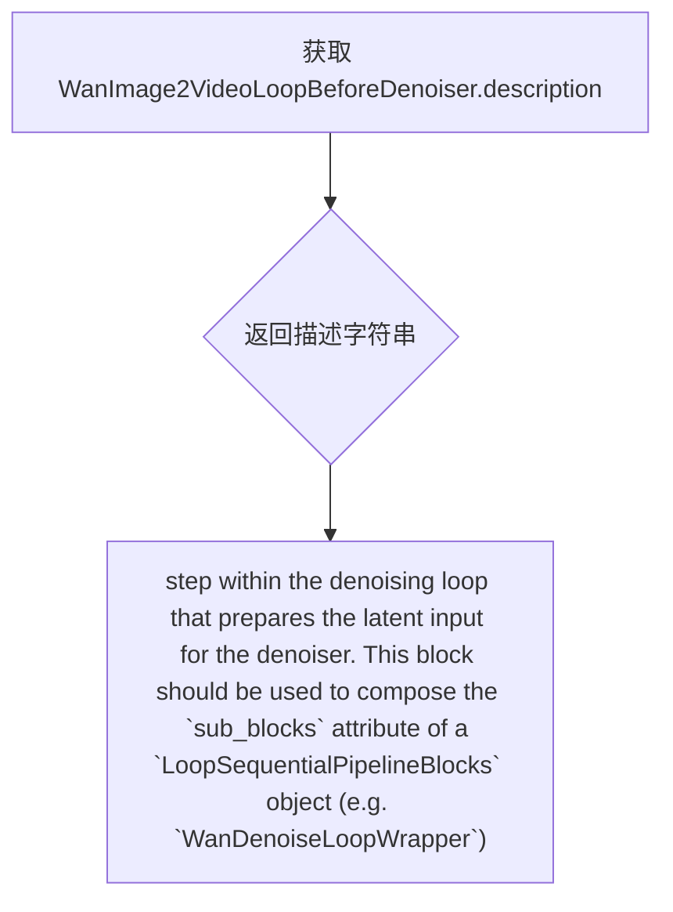

#### 带注释源码

```python
@property
def description(self) -> str:
    return (
        "step within the denoising loop that prepares the latent input for the denoiser. "
        "This block should be used to compose the `sub_blocks` attribute of a `LoopSequentialPipelineBlocks` "
        "object (e.g. `WanDenoiseLoopWrapper`)"
    )
```


### `WanImage2VideoLoopBeforeDenoiser.inputs`

该属性方法定义了`WanImage2VideoVideoLoopBeforeDenoiser`模块在去噪循环中准备潜在输入所需的输入参数列表，包括初始潜在张量、图像条件潜在张量以及数据类型，用于支持图像到视频任务的去噪处理。

参数：

- `latents`：`torch.Tensor`，去噪过程使用的初始潜在张量，可在prepare_latent步骤中生成
- `image_condition_latents`：`torch.Tensor`，去噪过程使用的图像条件潜在张量，可在prepare_first_frame_latents/prepare_first_last_frame_latents步骤中生成
- `dtype`：`torch.dtype`，模型输入的数据类型，可在input步骤中生成

返回值：`list[InputParam]`，返回包含所有输入参数的列表，每个`InputParam`对象包含参数名称、是否必需、类型提示和描述信息

#### 流程图

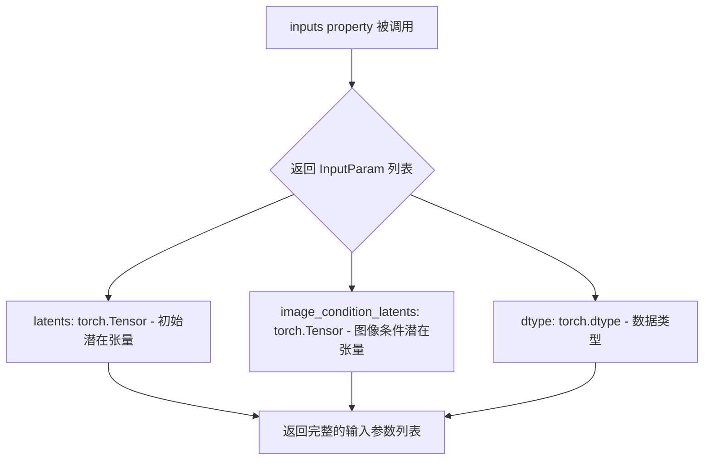

#### 带注释源码

```python
@property
def inputs(self) -> list[InputParam]:
    """
    定义该模块所需的输入参数列表。
    
    该属性返回一个包含三个InputParam对象的列表：
    1. latents: 去噪过程的初始潜在张量
    2. image_condition_latents: 图像条件潜在张量，用于图像到视频任务
    3. dtype: 模型输入的数据类型
    
    Returns:
        list[InputParam]: 输入参数列表，用于模块配置和验证
    """
    return [
        InputParam(
            "latents",
            required=True,
            type_hint=torch.Tensor,
            description="The initial latents to use for the denoising process. Can be generated in prepare_latent step.",
        ),
        InputParam(
            "image_condition_latents",
            required=True,
            type_hint=torch.Tensor,
            description="The image condition latents to use for the denoising process. Can be generated in prepare_first_frame_latents/prepare_first_last_frame_latents step.",
        ),
        InputParam(
            "dtype",
            required=True,
            type_hint=torch.dtype,
            description="The dtype of the model inputs. Can be generated in input step.",
        ),
    ]
```


### `WanImage2VideoLoopBeforeDenoiser.__call__`

在 Wan 图像到视频去噪循环中，该方法准备去噪器的潜在输入。它将当前潜在向量与图像条件潜在向量在通道维度上进行拼接，并确保数据类型一致。此块用于组合 `LoopSequentialPipelineBlocks` 对象的 `sub_blocks` 属性（例如 `WanDenoiseLoopWrapper`），专门支持 wan2.1 的图像到视频任务。

参数：

- `components`：`WanModularPipeline`，模块化管道组件容器，包含所有管道组件
- `block_state`：`BlockState`，块状态对象，存储当前块的中间状态和数据
- `i`：`int`，去噪循环中的当前迭代索引
- `t`：`torch.Tensor`，当前去噪时间步

返回值：`Tuple[Any, BlockState]`，返回更新后的组件和块状态

#### 流程图

```mermaid
flowchart TD
    A[__call__ 开始] --> B[获取 block_state.latents]
    B --> C[获取 block_state.image_condition_latents]
    C --> D[在 dim=1 拼接: torch.cat<br/>[latents, image_condition_latents]]
    D --> E[转换为 block_state.dtype]
    E --> F[更新 block_state.latent_model_input]
    F --> G[返回 components, block_state]
```

#### 带注释源码

```python
@torch.no_grad()
def __call__(self, components: WanModularPipeline, block_state: BlockState, i: int, t: torch.Tensor):
    # 核心操作：将潜在向量与图像条件潜在向量在通道维度(dim=1)拼接
    # latents: 当前去噪过程的潜在表示 [B, C, H, W]
    # image_condition_latents: 图像条件潜在向量 [B, C, H, W]
    # 拼接后: [B, 2*C, H, W]，使模型能够同时看到噪声潜力和图像条件
    block_state.latent_model_input = torch.cat(
        [block_state.latents, block_state.image_condition_latents], dim=1
    ).to(block_state.dtype)  # 转换为目标dtype，确保与模型参数类型匹配
    
    # 返回更新后的组件和块状态，供下一个块使用
    return components, block_state
```


### `WanLoopDenoiser.__init__`

该方法是 `WanLoopDenoiser` 类的初始化方法，用于初始化一个去噪器块（denoiser block），该块在 Wan2.1 的去噪循环中调用去噪模型。它接收一个 `guider_input_fields` 字典参数，用于配置引导器（guider）如何从块状态中获取模型输入。

参数：

- `guider_input_fields`：`dict[str, Any]`，可选，默认值为 `{"encoder_hidden_states": ("prompt_embeds", "negative_prompt_embeds")}`。一个字典，将去噪器模型期望的参数（例如 "encoder_hidden_states"）映射到存储在 `block_state` 上的数据。值可以是字符串元组（表示条件和非条件批次）或单个字符串（表示条件和非条件使用相同数据）。

返回值：`None`，无返回值，仅完成对象的初始化。

#### 流程图

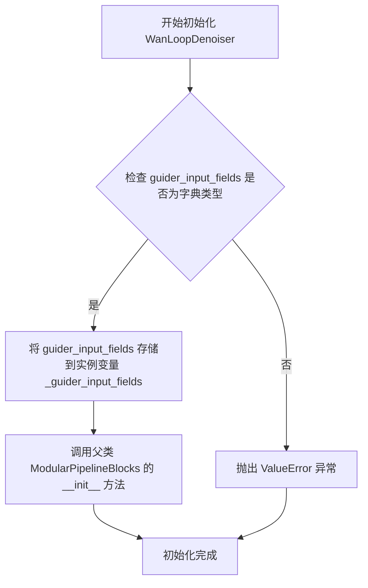

#### 带注释源码

```python
def __init__(
    self,
    guider_input_fields: dict[str, Any] = {"encoder_hidden_states": ("prompt_embeds", "negative_prompt_embeds")},
):
    """Initialize a denoiser block that calls the denoiser model. This block is used in Wan2.1.

    Args:
        guider_input_fields: A dictionary that maps each argument expected by the denoiser model
            (for example, "encoder_hidden_states") to data stored on 'block_state'. The value can be either:

            - A tuple of strings. For instance, {"encoder_hidden_states": ("prompt_embeds",
              "negative_prompt_embeds")} tells the guider to read `block_state.prompt_embeds` and
              `block_state.negative_prompt_embeds` and pass them as the conditional and unconditional batches of
              'encoder_hidden_states'.
            - A string. For example, {"encoder_hidden_image": "image_embeds"} makes the guider forward
              `block_state.image_embeds` for both conditional and unconditional batches.
    """
    # 验证 guider_input_fields 参数类型是否为字典
    if not isinstance(guider_input_fields, dict):
        raise ValueError(f"guider_input_fields must be a dictionary but is {type(guider_input_fields)}")
    
    # 将参数存储到实例变量中，供后续方法使用
    self._guider_input_fields = guider_input_fields
    
    # 调用父类 ModularPipelineBlocks 的初始化方法
    super().__init__()
```


### `WanLoopDenoiser.expected_components`

该属性定义了 `WanLoopDenoiser` 模块在管道执行过程中所依赖的必需组件规范。它返回一个组件列表，包含用于分类器自由引导的 `guider` 对象和用于去噪的 `transformer` 模型。

参数： 无（该方法为属性访问器，仅使用隐式 `self` 参数）

返回值：`list[ComponentSpec]`，返回该去噪块所需的组件规范列表，包含 guider 和 transformer 两个核心组件。

#### 流程图

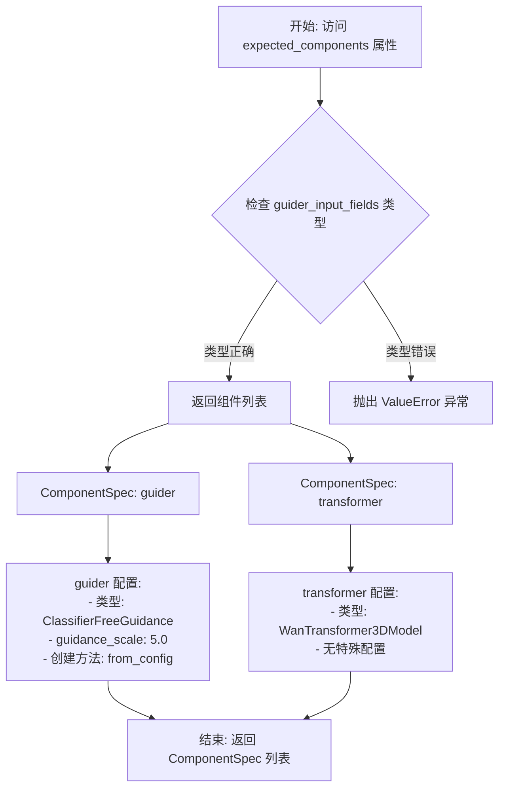

#### 带注释源码

```python
@property
def expected_components(self) -> list[ComponentSpec]:
    """定义该去噪块所需的组件规范。
    
    WanLoopDenoiser 在执行去噪过程时需要以下组件：
    1. guider: 用于分类器自由引导 (Classifier Free Guidance) 的控制器
    2. transformer: 用于预测噪声残差的 3D 变换器模型
    
    Returns:
        list[ComponentSpec]: 包含必需组件的规范列表
    """
    return [
        # guider 组件：负责分类器自由引导 (CFG)
        # 默认配置 guidance_scale=5.0，用于平衡条件/无条件预测
        # 使用 from_config 方法从配置创建，支持运行时参数覆盖
        ComponentSpec(
            "guider",
            ClassifierFreeGuidance,
            config=FrozenDict({"guidance_scale": 5.0}),
            default_creation_method="from_config",
        ),
        # transformer 组件：Wan 3D 变换器模型
        # 负责根据潜在表示、时间步和文本嵌入预测噪声残差
        # 无需额外配置，从预训练模型加载
        ComponentSpec("transformer", WanTransformer3DModel),
    ]
```


### WanLoopDenoiser.description

该属性是`WanLoopDenoiser`类的描述属性，用于说明该模块在去噪循环中的功能和用途。

参数：

- `self`：WanLoopDenoiser，隐式参数，指向当前类实例

返回值：`str`，返回该模块的描述字符串，说明它是去噪循环中用于引导去噪潜在表示的步骤，应被用于组合`LoopSequentialPipelineBlocks`对象的`sub_blocks`属性（例如`WanDenoiseLoopWrapper`）

#### 流程图

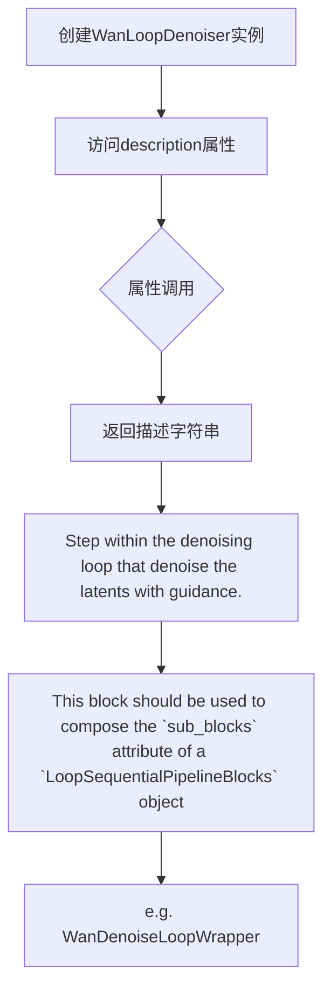

#### 带注释源码

```python
@property
def description(self) -> str:
    """WanLoopDenoiser类的描述属性

    该属性说明了该模块在扩散模型去噪循环中的位置和功能：
    1. 这是一个位于去噪循环中的步骤
    2. 负责使用引导（guidance）对潜在表示（latents）进行去噪
    3. 旨在被用作LoopSequentialPipelineBlocks的sub_blocks属性的组成部分
    4. 具体用于WanDenoiseLoopWrapper中

    Returns:
        str: 描述该模块功能和用途的字符串
    """
    return (
        "Step within the denoising loop that denoise the latents with guidance. "
        "This block should be used to compose the `sub_blocks` attribute of a `LoopSequentialPipelineBlocks` "
        "object (e.g. `WanDenoiseLoopWrapper`)"
    )
```


### `WanLoopDenoiser.inputs`

该属性定义了 `WanLoopDenoiser` 块在去噪循环中所需的输入参数列表。它是一个动态属性，根据初始化时传入的 `guider_input_fields` 参数来确定需要哪些引导相关的输入（如 prompt_embeds、negative_prompt_embeds 等）。

参数：

- `attention_kwargs`：`dict`，可选，用于传递注意力机制的相关参数
- `num_inference_steps`：`int`，必需，去噪过程中使用的推理步数，可在 set_timesteps 步骤中生成
- `prompt_embeds`：`torch.Tensor`，必需，用于条件生成的提示嵌入，可在相应步骤中生成
- `negative_prompt_embeds`：`torch.Tensor`，必需的，用于无条件的提示嵌入（用于 Classifier-Free Guidance），可在相应步骤中生成

返回值：`list[InputParam]`，返回包含所有输入参数的 `InputParam` 对象列表

#### 流程图

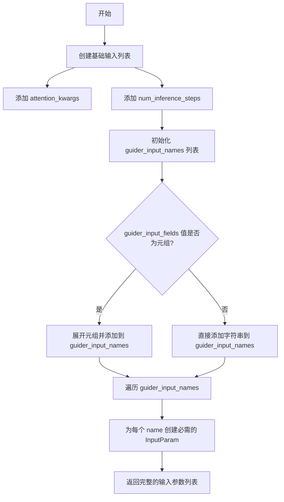

#### 带注释源码

```python
@property
def inputs(self) -> list[tuple[str, Any]]:
    """定义该块所需的输入参数列表
    
    根据 guider_input_fields 动态构建输入参数。
    默认情况下包含 attention_kwargs、num_inference_steps 以及
    从 guider_input_fields 推导出的引导输入（如 prompt_embeds）
    
    Returns:
        包含所有输入参数的 InputParam 列表
    """
    inputs = [
        InputParam("attention_kwargs"),  # 可选的注意力参数
        InputParam(
            "num_inference_steps",
            required=True,
            type_hint=int,
            description="The number of inference steps to use for the denoising process. Can be generated in set_timesteps step.",
        ),
    ]
    # 从 guider_input_fields 提取所有输入名称
    # 例如: {"encoder_hidden_states": ("prompt_embeds", "negative_prompt_embeds")}
    guider_input_names = []
    for value in self._guider_input_fields.values():
        if isinstance(value, tuple):
            # 如果值是元组，展开并添加所有元素
            guider_input_names.extend(value)
        else:
            # 如果是单个字符串，直接添加
            guider_input_names.append(value)

    # 为每个引导输入创建必需的 InputParam
    for name in guider_input_names:
        inputs.append(InputParam(name=name, required=True, type_hint=torch.Tensor))
    return inputs
```


### `WanLoopDenoiser.__call__`

该方法是 WanLoopDenoiser 类的核心调用方法，负责在去噪循环中执行实际的噪声预测操作。它通过 ClassifierFreeGuidance (CFG) 机制将模型输入拆分为条件和非条件批次，分别对每个批次运行 Transformer 模型进行噪声残差预测，最后综合所有批次的预测结果应用指导策略得到最终的去噪结果。

参数：

- `components`：`WanModularPipeline`，包含管道所有组件的对象，主要使用其中的 `guider` 和 `transformer` 组件
- `block_state`：`BlockState`，存储当前块执行状态的容器，包含 `latent_model_input`、`num_inference_steps`、`attention_kwargs`、`dtype` 等属性
- `i`：`int`，当前去噪循环的步骤索引（从 0 开始）
- `t`：`torch.Tensor`，当前时间步张量，用于指导去噪过程

返回值：`Tuple[WanModularPipeline, BlockState]`，返回更新后的组件和块状态，其中 `block_state.noise_pred` 包含最终预测的噪声残差

#### 流程图

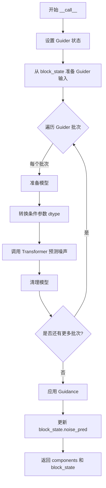

#### 带注释源码

```python
@torch.no_grad()
def __call__(
    self, components: WanModularPipeline, block_state: BlockState, i: int, t: torch.Tensor
) -> PipelineState:
    # 设置引导器的当前状态，包括步骤索引、推理步数和时间步
    components.guider.set_state(step=i, num_inference_steps=block_state.num_inference_steps, timestep=t)

    # 引导器将模型输入拆分为单独的批次进行条件/非条件预测
    # 对于 CFG，guider_inputs = {"encoder_hidden_states": (prompt_embeds, negative_prompt_embeds)}:
    # 会得到两个批次的 guider_state:
    #   guider_state = [
    #       {"encoder_hidden_states": prompt_embeds, "__guidance_identifier__": "pred_cond"},      # 条件批次
    #       {"encoder_hidden_states": negative_prompt_embeds, "__guidance_identifier__": "pred_uncond"},  # 非条件批次
    #   ]
    # 其他引导方法可能返回 1 个批次（无引导）或 3+ 个批次（如 PAG, APG）
    guider_state = components.guider.prepare_inputs_from_block_state(block_state, self._guider_input_fields)

    # 对每个引导批次运行去噪器
    for guider_state_batch in guider_state:
        # 准备模型以进行推理
        components.guider.prepare_models(components.transformer)
        
        # 将条件参数转换为正确的 dtype（从 block_state 获取）
        cond_kwargs = guider_state_batch.as_dict()
        cond_kwargs = {
            k: v.to(block_state.dtype) if isinstance(v, torch.Tensor) else v
            for k, v in cond_kwargs.items()
            if k in self._guider_input_fields.keys()
        }

        # 预测噪声残差
        # 将 noise_pred 存储在 guider_state_batch 中，以便我们可以在所有批次上应用引导
        guider_state_batch.noise_pred = components.transformer(
            hidden_states=block_state.latent_model_input.to(block_state.dtype),
            timestep=t.expand(block_state.latent_model_input.shape[0]).to(block_state.dtype),
            attention_kwargs=block_state.attention_kwargs,
            return_dict=False,
            **cond_kwargs,
        )[0]
        
        # 清理模型资源
        components.guider.cleanup_models(components.transformer)

    # 执行引导（应用 CFG 或其他引导策略）
    block_state.noise_pred = components.guider(guider_state)[0]

    return components, block_state
```


### Wan22LoopDenoiser.__init__

初始化一个用于调用去噪器模型的去噪块。该块用于 Wan2.2 版本，继承自 `ModularPipelineBlocks`，主要功能是根据配置的去噪指导输入字段来设置去噪过程。

参数：

- `guider_input_fields`：`dict[str, Any]`，可选，默认为 `{"encoder_hidden_states": ("prompt_embeds", "negative_prompt_embeds")}`。一个字典，将去噪器模型期望的参数（如 "encoder_hidden_states"）映射到存储在 `block_state` 上的数据。值可以是字符串元组（如 `("prompt_embeds", "negative_prompt_embeds")`）表示条件和非条件批次，也可以是单个字符串（如 `"image_embeds"`）表示条件和非条件使用相同的输入。

返回值：无（`None`），`__init__` 方法不返回任何值，仅初始化对象状态。

#### 流程图

```mermaid
flowchart TD
    A[开始 __init__] --> B{guider_input_fields 是否为字典?}
    B -->|否| C[抛出 ValueError 异常]
    B -->|是| D[设置 self._guider_input_fields]
    D --> E[调用 super().__init__]
    E --> F[结束 __init__]
```

#### 带注释源码

```python
def __init__(
    self,
    guider_input_fields: dict[str, Any] = {"encoder_hidden_states": ("prompt_embeds", "negative_prompt_embeds")},
):
    """Initialize a denoiser block that calls the denoiser model. This block is used in Wan2.2.

    Args:
        guider_input_fields: A dictionary that maps each argument expected by the denoiser model
            (for example, "encoder_hidden_states") to data stored on `block_state`. The value can be either:

            - A tuple of strings. For instance, `{"encoder_hidden_states": ("prompt_embeds",
              "negative_prompt_embeds")}` tells the guider to read `block_state.prompt_embeds` and
              `block_state.negative_prompt_embeds` and pass them as the conditional and unconditional batches of
              `encoder_hidden_states`.
            - A string. For example, `{"encoder_hidden_image": "image_embeds"}` makes the guider forward
              `block_state.image_embeds` for both conditional and unconditional batches.
    """
    # 参数类型检查，确保 guider_input_fields 是字典类型
    if not isinstance(guider_input_fields, dict):
        raise ValueError(f"guider_input_fields must be a dictionary but is {type(guider_input_fields)}")
    
    # 将传入的 guider_input_fields 保存为实例变量
    self._guider_input_fields = guider_input_fields
    
    # 调用父类 ModularPipelineBlocks 的初始化方法
    super().__init__()
```


### `Wan22LoopDenoiser.expected_components`

该属性方法定义了 `Wan22LoopDenoiser` 类在去噪循环中所需的组件列表。它返回四个关键组件：两个 `ClassifierFreeGuidance` 引导器（分别用于高噪声和低噪声阶段）以及两个 `WanTransformer3DModel` 变换器模型。这种双模型双引导器的设计是 Wan2.2 相对于 Wan2.1 的主要区别，允许在不同噪声水平下使用不同的引导参数。

参数：

- 无（该方法为属性方法，仅访问 `self`）

返回值：`list[ComponentSpec]`，返回该去噪块所需组件的规范列表，包含 guider、guider_2、transformer 和 transformer_2 四个组件的规格说明。

#### 流程图

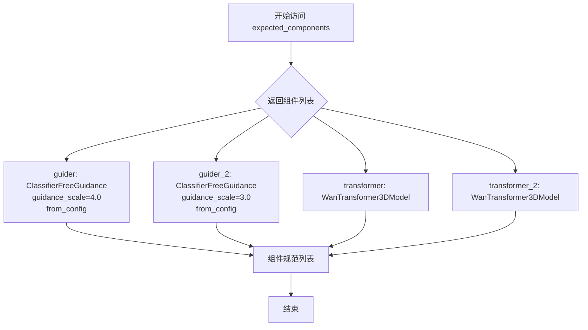

#### 带注释源码

```python
@property
def expected_components(self) -> list[ComponentSpec]:
    """定义 Wan22LoopDenoiser 所需的组件列表。
    
    Wan2.2 版本的去噪器需要两个引导器和两个变换器模型：
    - guider: 用于高噪声阶段的引导器（guidance_scale=4.0）
    - guider_2: 用于低噪声阶段的引导器（guidance_scale=3.0）
    - transformer: 高噪声阶段的变换器模型
    - transformer_2: 低噪声阶段的变换器模型
    
    这种设计允许在不同噪声水平下使用不同的引导强度，
    以优化去噪质量和生成效果。
    
    Returns:
        list[ComponentSpec]: 包含四个组件规范的列表，
            分别对应 guider、guider_2、transformer 和 transformer_2。
    """
    return [
        ComponentSpec(
            "guider",
            ClassifierFreeGuidance,
            config=FrozenDict({"guidance_scale": 4.0}),
            default_creation_method="from_config",
        ),
        ComponentSpec(
            "guider_2",
            ClassifierFreeGuidance,
            config=FrozenDict({"guidance_scale": 3.0}),
            default_creation_method="from_config",
        ),
        ComponentSpec("transformer", WanTransformer3DModel),
        ComponentSpec("transformer_2", WanTransformer3DModel),
    ]
```


### `Wan22LoopDenoiser.description`

这是一个属性（property），用于描述 `Wan22LoopDenoiser` 类在去噪循环中的功能和用途。

参数： 无（这是一个只读属性，不接受任何参数）

返回值： `str`，返回对该块的描述说明

#### 流程图

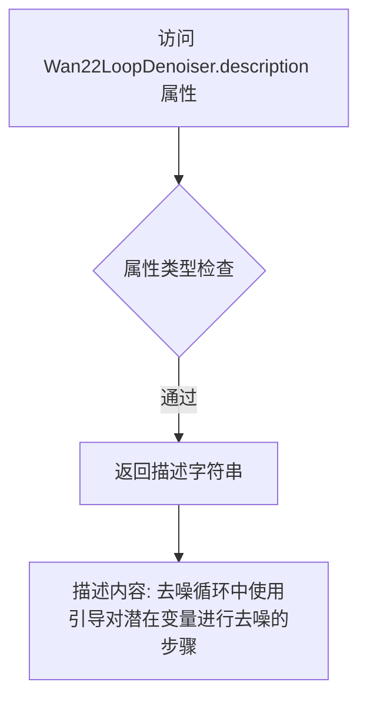

#### 带注释源码

```python
@property
def description(self) -> str:
    """返回对该块的描述说明。
    
    这是一个只读属性，用于描述 Wan22LoopDenoiser 类在去噪循环中的功能。
    它指明该块用于对 latents 进行去噪处理，并应用引导（guidance）。
    该块应被用作 LoopSequentialPipelineBlocks 对象的 sub_blocks 属性的组成部分
    （例如 WanDenoiseLoopWrapper）。
    
    Returns:
        str: 描述该块功能的字符串
    """
    return (
        "Step within the denoising loop that denoise the latents with guidance. "
        "This block should be used to compose the `sub_blocks` attribute of a `LoopSequentialPipelineBlocks` "
        "object (e.g. `WanDenoiseLoopWrapper`)"
    )
```


### `Wan22LoopDenoiser.expected_configs`

该属性定义了 Wan22LoopDenoiser 类在去噪循环中所期望的配置参数，包括边界比率（boundary_ratio），用于将去噪循环划分为高噪声和低噪声阶段。

参数：
- `self`：`Wan22LoopDenoiser` 实例，隐式参数，表示当前对象

返回值：`list[ConfigSpec]`，返回配置规范列表，包含去噪循环所需的配置参数信息。

#### 流程图

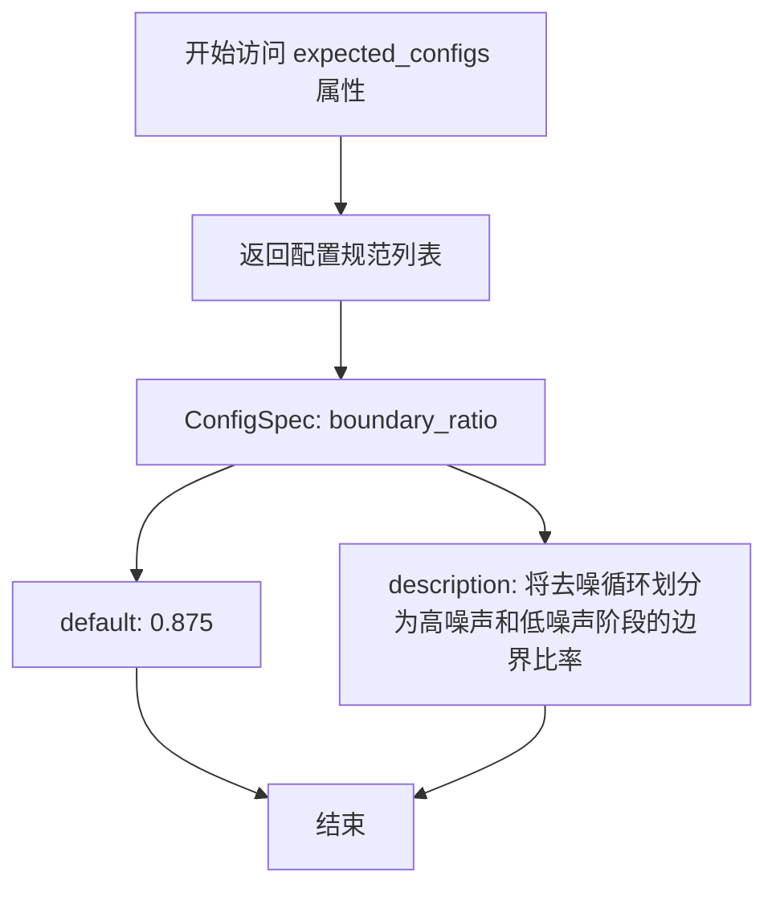

#### 带注释源码

```python
@property
def expected_configs(self) -> list[ConfigSpec]:
    """定义去噪循环中期望的配置参数。

    该配置包含一个边界比率参数，用于将去噪过程分为两个阶段：
    - 高噪声阶段：使用第一个引导器（guider）和变换器（transformer）
    - 低噪声阶段：使用第二个引导器（guider_2）和变换器（transformer_2）

    Returns:
        list[ConfigSpec]: 包含配置规范的列表，目前只有一个配置项：
            - boundary_ratio: 边界比率，默认为 0.875
    """
    return [
        ConfigSpec(
            name="boundary_ratio",
            default=0.875,
            description="The boundary ratio to divide the denoising loop into high noise and low noise stages.",
        ),
    ]
```


### `Wan22LoopDenoiser.inputs`

该属性方法定义了 `Wan22LoopDenoiser` 类的输入参数规范，返回一个包含所有必需和可选输入参数的列表。这些输入参数用于配置去噪循环中的指导器（guider）和模型输入。

参数：
- 该方法为属性方法，无直接参数。其返回值由类实例的 `guider_input_fields` 初始化参数决定。

返回值：`list[InputParam]`，返回输入参数规范列表，包含 `attention_kwargs`（可选）、`num_inference_steps`（必需，整数）、以及根据 `guider_input_fields` 动态生成的引导输入参数（如 `prompt_embeds` 和 `negative_prompt_embeds`，均为必需的 Tensor 类型）。

#### 流程图

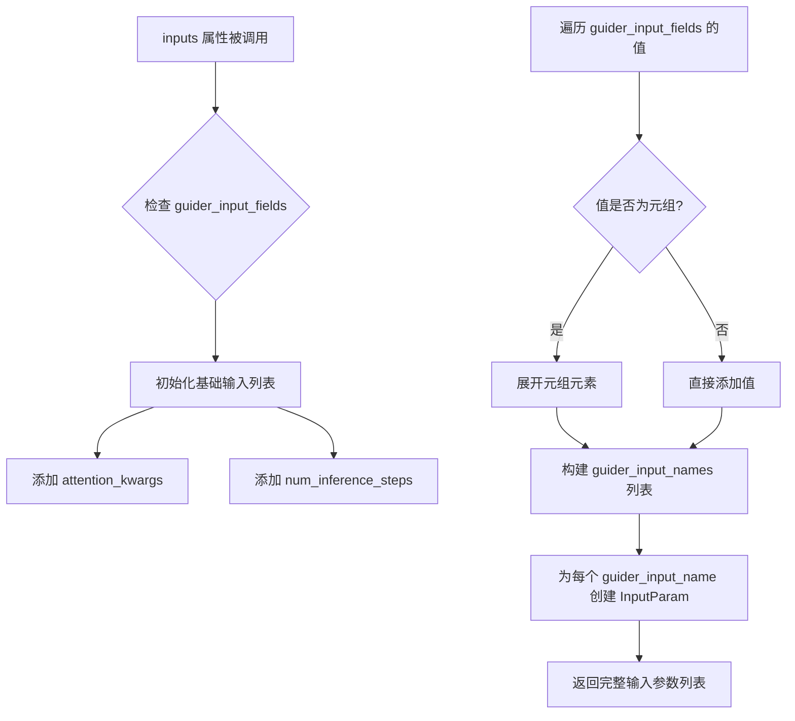

#### 带注释源码

```python
@property
def inputs(self) -> list[tuple[str, Any]]:
    """定义去噪器的输入参数规范
    
    Returns:
        包含所有输入参数的列表，每个参数由 InputParam 对象描述
    """
    # 初始化基础输入参数列表，包含可选的注意力参数和必需的推理步数
    inputs = [
        InputParam("attention_kwargs"),  # 可选参数，用于传递注意力机制的额外配置
        InputParam(
            "num_inference_steps",
            required=True,  # 必需参数，去噪过程使用的推理步数
            type_hint=int,  # 参数类型为整数
            description="The number of inference steps to use for the denoising process. Can be generated in set_timesteps step.",  # 参数描述
        ),
    ]
    
    # 解析 guider_input_fields，提取所有引导输入的名称
    # 例如: {"encoder_hidden_states": ("prompt_embeds", "negative_prompt_embeds")}
    # 会提取出 ["prompt_embeds", "negative_prompt_embeds"]
    guider_input_names = []
    for value in self._guider_input_fields.values():
        if isinstance(value, tuple):
            # 如果值是元组（如条件/非条件嵌入），展开元组
            guider_input_names.extend(value)
        else:
            # 如果值是字符串，直接添加
            guider_input_names.append(value)

    # 为每个引导输入创建 InputParam 对象
    for name in guider_input_names:
        inputs.append(
            InputParam(
                name=name,  # 参数名称（如 prompt_embeds, negative_prompt_embeds）
                required=True,  # 必需参数
                type_hint=torch.Tensor,  # 参数类型为张量
                description=f"The {name} to use for the denoising process."  # 参数描述
            )
        )
    return inputs
```


### Wan22LoopDenoiser.__call__

这是 Wan2.2 版本的循环去噪器块的核心方法，负责在去噪循环中根据时间步选择合适的模型（transformer 或 transformer_2）并执行条件和无条件的噪声预测，最后通过 guider 应用引导策略生成最终的去噪结果。

参数：

- `self`：Wan22LoopDenoiser 实例本身
- `components`：`WanModularPipeline` 类型，包含管道组件，包括两个 transformer 模型、两个 guider 以及配置信息
- `block_state`：`BlockState` 类型，包含当前块状态，存储有 latents、latent_model_input、num_inference_steps、attention_kwargs 等中间数据
- `i`：`int` 类型，当前去噪迭代的索引（从 0 开始）
- `t`：`torch.Tensor` 类型，当前去噪迭代的时间步（timestep）

返回值：`PipelineState`（实际为 `Tuple[WanModularPipeline, BlockState]`），返回更新后的组件和块状态，块状态中的 `noise_pred` 字段被设置为经过引导处理后的噪声预测结果

#### 流程图

```mermaid
flowchart TD
    A[开始 __call__] --> B{计算 boundary_timestep}
    B --> C{boundary_ratio × num_train_timesteps}
    C --> D{t >= boundary_timestep?}
    D -->|Yes| E[选择 transformer 和 guider]
    D -->|No| F[选择 transformer_2 和 guider_2]
    E --> G[设置 guider 状态]
    F --> G
    G --> H[从 block_state 准备 guider 输入]
    H --> I[遍历每个 guider_state_batch]
    I --> J[准备模型: guider.prepare_models]
    J --> K[转换条件参数 dtype]
    K --> L[运行 transformer 预测噪声]
    L --> M[清理模型: guider.cleanup_models]
    M --> N{还有更多 guider_state_batch?}
    N -->|Yes| I
    N -->|No| O[应用引导: guider(guider_state)]
    O --> P[保存 noise_pred 到 block_state]
    P --> Q[返回 components, block_state]
```

#### 带注释源码

```python
@torch.no_grad()
def __call__(
    self, components: WanModularPipeline, block_state: BlockState, i: int, t: torch.Tensor
) -> PipelineState:
    # 计算边界时间步，用于区分高噪声阶段和低噪声阶段
    # boundary_ratio 默认值为 0.875，num_train_timesteps 通常为 1000
    boundary_timestep = components.config.boundary_ratio * components.num_train_timesteps
    
    # 根据当前时间步 t 与边界时间步的比较，选择使用哪一组模型
    # 高噪声阶段（t >= boundary_timestep）：使用 transformer + guider
    # 低噪声阶段（t < boundary_timestep）：使用 transformer_2 + guider_2
    if t >= boundary_timestep:
        block_state.current_model = components.transformer
        block_state.guider = components.guider
    else:
        block_state.current_model = components.transformer_2
        block_state.guider = components.guider_2

    # 设置 guider 的状态，包括当前步骤、推理步数和时间步
    block_state.guider.set_state(step=i, num_inference_steps=block_state.num_inference_steps, timestep=t)

    # guider 将模型输入拆分为条件/无条件预测的独立批次
    # 对于 CFG，guider_inputs = {"encoder_hidden_states": (prompt_embeds, negative_prompt_embeds)} 时：
    # guider_state 包含两个批次：
    #   [
    #       {"encoder_hidden_states": prompt_embeds, "__guidance_identifier__": "pred_cond"},      # 条件批次
    #       {"encoder_hidden_states": negative_prompt_embeds, "__guidance_identifier__": "pred_uncond"}  # 无条件批次
    #   ]
    # 其他引导方法可能返回 1 个批次（无引导）或 3+ 个批次（如 PAG, APG）
    guider_state = block_state.guider.prepare_inputs_from_block_state(block_state, self._guider_input_fields)

    # 对每个引导批次运行去噪器
    for guider_state_batch in guider_state:
        # 准备模型：可能包括启用/禁用某些层等操作
        block_state.guider.prepare_models(block_state.current_model)
        
        # 将条件参数转换为与 block_state.dtype 一致
        # 只保留 guider_input_fields 中定义的键
        cond_kwargs = guider_state_batch.as_dict()
        cond_kwargs = {
            k: v.to(block_state.dtype) if isinstance(v, torch.Tensor) else v
            for k, v in cond_kwargs.items()
            if k in self._guider_input_fields.keys()
        }

        # 预测噪声残差
        # 将 noise_pred 存储在 guider_state_batch 中，以便对所有批次应用引导
        guider_state_batch.noise_pred = block_state.current_model(
            hidden_states=block_state.latent_model_input.to(block_state.dtype),
            timestep=t.expand(block_state.latent_model_input.shape[0]).to(block_state.dtype),
            attention_kwargs=block_state.attention_kwargs,
            return_dict=False,
            **cond_kwargs,
        )[0]
        
        # 清理模型：恢复模型状态
        block_state.guider.cleanup_models(block_state.current_model)

    # 执行引导：将多个批次的预测合并为最终的去噪结果
    # 对于 CFG，这通常是条件预测和无条件预测的加权组合
    block_state.noise_pred = block_state.guider(guider_state)[0]

    return components, block_state
```


### `WanLoopAfterDenoiser.expected_components`

该属性定义了 `WanLoopAfterDenoiser` 模块在执行过程中所依赖的核心组件规格列表，用于声明该模块需要从外部注入的组件。

参数：

- （无显式参数，self 为隐式参数）

返回值：`list[ComponentSpec]`，返回该模块期望的组件规格列表，当前包含一个 `scheduler` 组件，类型为 `UniPCMultistepScheduler`。

#### 流程图

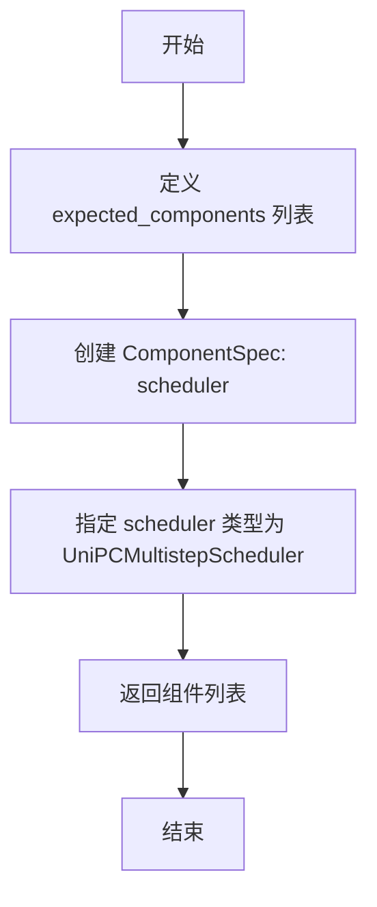

#### 带注释源码

```python
@property
def expected_components(self) -> list[ComponentSpec]:
    """
    定义该模块期望的组件列表。
    
    WanLoopAfterDenoiser 是在去噪循环中更新 latent 的步骤，
    它依赖于 scheduler 组件来执行噪声预测后的单步更新操作。
    
    Returns:
        list[ComponentSpec]: 包含组件规格的列表，当前只包含 scheduler 组件
    """
    return [
        ComponentSpec("scheduler", UniPCMultistepScheduler),
    ]
```


### WanLoopAfterDenoiser.description

该属性返回对 `WanLoopAfterDenoiser` 类的功能描述，说明它是去噪循环中的一个步骤，用于更新潜在表示（latents），并作为 `LoopSequentialPipelineBlocks` 对象（例如 `WanDenoiseLoopWrapper`）的 `sub_blocks` 属性的一部分。

参数：
- `self`：隐式参数，表示类的实例本身。

返回值：`str`，返回描述该去噪循环步骤功能的字符串。

#### 流程图

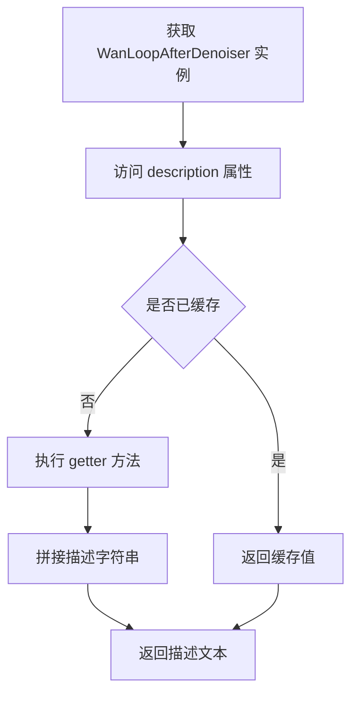

#### 带注释源码

```python
@property
def description(self) -> str:
    """返回该块的功能描述。
    
    该方法是一个属性 getter，用于描述 'WanLoopAfterDenoiser' 在去噪循环中的作用。
    它指示该块负责在去噪循环中更新 latents（潜在表示）。
    此块用于组成 'LoopSequentialPipelineBlocks' 对象（例如 'WanDenoiseLoopWrapper'）的 'sub_blocks' 属性。
    
    Returns:
        str: 描述该块功能的字符串，说明它是去噪循环中更新 latents 的步骤。
    """
    return (
        "step within the denoising loop that update the latents. "
        "This block should be used to compose the `sub_blocks` attribute of a `LoopSequentialPipelineBlocks` "
        "object (e.g. `WanDenoiseLoopWrapper`)"
    )
```


### `WanLoopAfterDenoiser.__call__`

这是 WanLoopAfterDenoiser 类的核心方法，负责在去噪循环中执行单步去噪后的处理操作。该方法调用调度器（scheduler）根据预测的噪声残差（noise_pred）来更新潜在表示（latents），并将数据类型转换回原始类型以保持数值稳定性。

参数：

- `components`：`WanModularPipeline`，模块化管道对象，包含所有管道组件（如 scheduler 等），用于访问调度器进行去噪步骤计算。
- `block_state`：`BlockState`，块状态对象，包含当前去噪循环的中间状态，如 `latents`（当前潜在表示）、`noise_pred`（预测的噪声残差）等。
- `i`：`int`，当前去噪循环的迭代索引，用于标识当前处于第几步去噪。
- `t`：`torch.Tensor`，当前时间步（timestep），是一个张量，用于调度器计算下一步的潜在表示。

返回值：`Tuple[WanModularPipeline, BlockState]`，返回更新后的组件对象和块状态对象，其中块状态对象的 `latents` 字段已被调度器更新。

#### 流程图

```mermaid
flowchart TD
    A[开始 __call__] --> B[保存原始 latents 数据类型]
    B --> C[调用 scheduler.step 方法]
    C --> D[传入 noise_pred, t, latents]
    E[获取返回的新 latents] --> F{新 latents 数据类型是否等于原始类型?}
    F -->|否| G[将新 latents 转换回原始数据类型]
    F -->|是| H[保持不变]
    G --> I[返回 components 和 block_state]
    H --> I
```

#### 带注释源码

```python
@torch.no_grad()
def __call__(self, components: WanModularPipeline, block_state: BlockState, i: int, t: torch.Tensor):
    # 保存原始 latents 的数据类型，以便之后恢复
    # 这是为了保持数值稳定性，避免数据类型不一致导致的潜在问题
    latents_dtype = block_state.latents.dtype
    
    # 调用调度器的 step 方法，根据预测的噪声残差更新 latents
    # scheduler.step 执行单步去噪：latents = latents - noise_pred * sigma
    # 其中 sigma 与当前时间步 t 相关
    # return_dict=False 返回元组，第一个元素是更新后的 latents
    block_state.latents = components.scheduler.step(
        block_state.noise_pred.float(),  # 将噪声预测转换为 float 以提高数值精度
        t,                                # 当前时间步
        block_state.latents.float(),     # 将 latents 转换为 float
        return_dict=False,               # 不返回字典，直接返回元组
    )[0]  # 获取更新后的 latents

    # 检查更新后的 latents 数据类型是否与原始类型一致
    # 如果不一致（可能是 scheduler 内部转换），则转换回原始数据类型
    if block_state.latents.dtype != latents_dtype:
        block_state.latents = block_state.latents.to(latents_dtype)

    # 返回更新后的组件和块状态
    return components, block_state
```


### `WanDenoiseLoopWrapper.description`

这是 `WanDenoiseLoopWrapper` 类的描述属性，用于说明该类的功能。

参数：无（属性不接受显式参数）

返回值：`str`，返回对 `WanDenoiseLoopWrapper` 类的功能描述，说明它是一个迭代去噪 `latents` 的管道块，具体的迭代步骤可以通过 `sub_blocks` 属性自定义。

#### 流程图

```mermaid
flowchart TD
    A[开始] --> B[访问 description 属性]
    B --> C[调用 getter 方法]
    C --> D[返回描述字符串]
    
    D --> E["Pipeline block that iteratively denoise the latents over `timesteps`. The specific steps with each iteration can be customized with `sub_blocks` attributes"]
```

#### 带注释源码

```python
@property
def description(self) -> str:
    """WanDenoiseLoopWrapper 类的描述属性
    
    该属性返回对 WanDenoiseLoopWrapper 类的功能描述。
    WanDenoiseLoopWrapper 是一个管道块，用于在 `timesteps` 上迭代去噪 latents。
    每次迭代的具体步骤可以通过 `sub_blocks` 属性进行自定义。
    
    Returns:
        str: 描述 WanDenoiseLoopWrapper 功能的字符串
    """
    return (
        "Pipeline block that iteratively denoise the latents over `timesteps`. "
        "The specific steps with each iteration can be customized with `sub_blocks` attributes"
    )
```


### `WanDenoiseLoopWrapper.loop_expected_components`

该属性定义了去噪循环（denoising loop）中所需要的组件规范列表，用于指定在迭代去噪过程中必须存在的组件类型。

参数：

- （无参数，该属性不接受任何输入）

返回值：`list[ComponentSpec]`，返回去噪循环所需的组件规范列表，当前包含调度器（scheduler）组件。

#### 流程图

```mermaid
flowchart TD
    A[开始] --> B{访问 loop_expected_components 属性}
    B --> C[创建 ComponentSpec 列表]
    C --> D[添加 scheduler 组件规范]
    D --> E[返回 list[ComponentSpec]]
    E --> F[结束]
```

#### 带注释源码

```python
@property
def loop_expected_components(self) -> list[ComponentSpec]:
    """定义去噪循环中必需的组件规范列表。
    
    该属性返回一个 ComponentSpec 列表，用于指定在去噪循环执行过程中
    必须存在的组件类型。当前实现仅包含调度器（scheduler）组件。
    
    Returns:
        list[ComponentSpec]: 包含所需组件规范的列表
    """
    return [
        ComponentSpec("scheduler", UniPCMultistepScheduler),
    ]
```


### `WanDenoiseLoopWrapper.loop_inputs`

该属性定义了去噪循环（denoising loop）所需输入参数列表，包含去噪所需的时间步（timesteps）和推理步数（num_inference_steps）。

参数：无（该方法为属性，无参数）

返回值：`list[InputParam]`，返回去噪循环所需输入参数列表，包含 `timesteps` 和 `num_inference_steps` 两个参数。

#### 流程图

```mermaid
flowchart TD
    A[访问 loop_inputs 属性] --> B[返回 InputParam 列表]
    B --> C[包含 timesteps 参数]
    B --> D[包含 num_inference_steps 参数]
```

#### 带注释源码

```python
@property
def loop_inputs(self) -> list[InputParam]:
    """定义去噪循环所需的输入参数列表。
    
    返回:
        list[InputParam]: 包含两个必需输入参数的列表：
            - timesteps: 去噪过程使用的时间步张量
            - num_inference_steps: 去噪过程使用的推理步数
    """
    return [
        InputParam(
            "timesteps",
            required=True,
            type_hint=torch.Tensor,
            description="The timesteps to use for the denoising process. Can be generated in set_timesteps step.",
        ),
        InputParam(
            "num_inference_steps",
            required=True,
            type_hint=int,
            description="The number of inference steps to use for the denoising process. Can be generated in set_timesteps step.",
        ),
    ]
```


### `WanDenoiseLoopWrapper.__call__`

该方法是WanDenoiseLoopWrapper类的核心调用方法，负责执行去噪循环的迭代过程。它通过获取管道状态和组件，初始化进度条，然后遍历所有时间步，每一步调用`loop_step`执行具体的去噪操作（通常包括准备输入、执行去噪模型、调度器步进），最后更新并返回管道状态。

参数：

- `self`：`WanDenoiseLoopWrapper` 实例，隐含的实例参数
- `components`：`WanModularPipeline`，模块化管道组件，包含scheduler等组件
- `state`：`PipelineState`，管道状态，包含timesteps等数据

返回值：`PipelineState`，更新后的管道状态，包含去噪后的latents等数据

#### 流程图

```mermaid
flowchart TD
    A[开始 __call__] --> B[获取 block_state]
    B --> C[计算 num_warmup_steps]
    C --> D[初始化 progress_bar]
    D --> E{遍历 timesteps}
    E -->|for i, t in enumerate| F[调用 loop_step]
    F --> G[执行子块: before_denoiser → denoiser → after_denoiser]
    G --> H{是否是最后一个timestep 或 满足更新条件}
    H -->|是| I[更新 progress_bar]
    H -->|否| J{继续下一个timestep}
    J --> E
    I --> J
    E -->|遍历完成| K[设置 block_state 到 state]
    K --> L[返回 components, state]
    L --> M[结束]
```

#### 带注释源码

```python
@torch.no_grad()
def __call__(self, components: WanModularPipeline, state: PipelineState) -> PipelineState:
    """
    执行去噪循环的迭代过程。
    
    Args:
        components: WanModularPipeline, 模块化管道组件，包含scheduler等
        state: PipelineState, 管道状态，包含timesteps等数据
    
    Returns:
        PipelineState: 更新后的管道状态
    """
    # 1. 从state中获取block_state（包含latents、timesteps等状态数据）
    block_state = self.get_block_state(state)

    # 2. 计算预热步数，用于进度条显示
    # num_inference_steps: 推理步数
    # scheduler.order: 调度器的阶数（用于多步方法）
    block_state.num_warmup_steps = max(
        len(block_state.timesteps) - block_state.num_inference_steps * components.scheduler.order, 0
    )

    # 3. 初始化进度条，跟踪去噪迭代进度
    with self.progress_bar(total=block_state.num_inference_steps) as progress_bar:
        # 4. 遍历所有时间步，执行去噪迭代
        for i, t in enumerate(block_state.timesteps):
            # 5. 执行单步去噪操作（内部调用sub_blocks）
            # sub_blocks通常包含: before_denoiser → denoiser → after_denoiser
            components, block_state = self.loop_step(components, block_state, i=i, t=t)
            
            # 6. 判断是否需要更新进度条
            # 条件：最后一个timestep 或 已过预热期且达到调度器阶数的整数倍
            if i == len(block_state.timesteps) - 1 or (
                (i + 1) > block_state.num_warmup_steps and (i + 1) % components.scheduler.order == 0
            ):
                progress_bar.update()

    # 7. 将更新后的block_state设置回state
    self.set_block_state(state, block_state)

    # 8. 返回更新后的components和state
    return components, state
```


### `WanDenoiseStep.description`

这是一个属性（property），用于描述 `WanDenoiseStep` 类的功能。该类是 Wan2.1 文本到视频任务的去噪步骤封装，定义了去噪循环中所使用的子块。

参数： 无（属性方法不接受任何参数）

返回值： `str`，返回对 `WanDenoiseStep` 类的功能描述，说明其去噪逻辑、执行的子块顺序以及支持的任務类型。

#### 流程图

```mermaid
flowchart TD
    A[开始访问 description 属性] --> B[返回描述字符串]
    
    B --> B1[说明这是迭代去噪 latent 的步骤]
    B1 --> B2[说明去噪逻辑定义在 WanDenoiseLoopWrapper.__call__]
    B2 --> B3[列出每次迭代顺序执行的三个块]
    B3 --> B3a[WanLoopBeforeDenoiser]
    B3 --> B3b[WanLoopDenoiser]
    B3 --> B3c[WanLoopAfterDenoiser]
    B3 --> B4[说明支持 wan2.1 的 text-to-video 任务]
    
    style A fill:#f9f,stroke:#333
    style B fill:#bbf,stroke:#333
```

#### 带注释源码

```python
@property
def description(self) -> str:
    """
    返回对 WanDenoiseStep 类的功能描述。
    
    该属性说明：
    1. 这是一个迭代去噪 latent 的步骤
    2. 其去噪循环逻辑定义在父类 WanDenoiseLoopWrapper 的 __call__ 方法中
    3. 每次迭代按顺序执行以下子块：
       - WanLoopBeforeDenoiser: 准备 latent 输入
       - WanLoopDenoiser: 执行去噪模型推理
       - WanLoopAfterDenoiser: 更新 latents
    4. 明确标注该块支持 wan2.1 的文本到视频任务
       
    Returns:
        str: 描述文本，说明该去噪步骤的功能和组成
    """
    return (
        "Denoise step that iteratively denoise the latents. \n"
        "Its loop logic is defined in `WanDenoiseLoopWrapper.__call__` method \n"
        "At each iteration, it runs blocks defined in `sub_blocks` sequentially:\n"
        " - `WanLoopBeforeDenoiser`\n"
        " - `WanLoopDenoiser`\n"
        " - `WanLoopAfterDenoiser`\n"
        "This block supports text-to-video tasks for wan2.1."
    )
```


### `Wan22DenoiseStep.description`

该属性返回 `Wan22DenoiseStep` 类的描述字符串，说明该类是用于对潜向量进行迭代去噪的去噪步骤块，其循环逻辑在 `WanDenoiseLoopWrapper.__call__` 方法中定义，每次迭代依次运行 `sub_blocks` 中定义的块（`WanLoopBeforeDenoiser` → `Wan22LoopDenoiser` → `WanLoopAfterDenoiser`），支持 Wan2.2 的文本到视频任务。

参数：
- （无参数，`@property` 装饰器下的 getter 方法）

返回值：`str`，返回对该去噪步骤块的描述文本，包含其功能、循环逻辑、子块执行顺序以及支持的任務类型。

#### 流程图

```mermaid
flowchart TD
    A[获取 description 属性] --> B[返回描述字符串]
    
    B --> C["功能: 迭代去噪潜向量"]
    B --> D["循环逻辑: WanDenoiseLoopWrapper.__call__"]
    B --> E["子块执行顺序:"]
    E --> E1["WanLoopBeforeDenoiser"]
    E --> E2["Wan22LoopDenoiser"]
    E --> E3["WanLoopAfterDenoiser"]
    B --> F["支持任务: Wan2.2 文本到视频"]
```

#### 带注释源码

```python
@property
def description(self) -> str:
    """
    获取该去噪步骤块的描述信息。
    
    该方法说明了:
    1. 核心功能: 对 latents 进行迭代去噪
    2. 循环逻辑位置: 继承自 WanDenoiseLoopWrapper 的 __call__ 方法
    3. 子块执行顺序: before_denoiser → denoiser → after_denoiser
    4. 支持的任务类型: Wan2.2 版本的文本到视频任务
    
    Returns:
        str: 描述该去噪步骤块的字符串
    """
    return (
        "Denoise step that iteratively denoise the latents. \n"
        "Its loop logic is defined in `WanDenoiseLoopWrapper.__call__` method \n"
        "At each iteration, it runs blocks defined in `sub_blocks` sequentially:\n"
        " - `WanLoopBeforeDenoiser`\n"
        " - `Wan22LoopDenoiser`\n"
        " - `WanLoopAfterDenoiser`\n"
        "This block supports text-to-video tasks for Wan2.2."
    )
```


### `WanImage2VideoDenoiseStep.description`

返回该去噪步骤的描述信息，说明其用于 Wan2.1 模型的图像到视频（Image-to-Video）任务，通过迭代去噪潜在变量来生成视频。

参数：
- 无（这是一个属性方法，由 `@property` 装饰器装饰）

返回值：`str`，描述该去噪步骤的功能、循环逻辑以及依次执行的两个子模块。

#### 流程图

```mermaid
flowchart TD
    A[获取 description 属性] --> B[返回描述字符串]
    
    B --> B1["说明去噪步骤功能"]
    B --> B2["引用 WanDenoiseLoopWrapper.__call__ 的循环逻辑"]
    B --> B3["列出子模块执行顺序:<br/>1. WanImage2VideoLoopBeforeDenoiser<br/>2. WanLoopDenoiser<br/>3. WanLoopAfterDenoiser"]
    B --> B4["说明支持 wan2.1 的图像到视频任务"]
```

#### 带注释源码

```python
@property
def description(self) -> str:
    """返回该去噪步骤的描述信息

    该方法是一个属性方法，返回描述字符串，说明：
    1. 这是一个迭代去噪潜在变量的步骤
    2. 循环逻辑定义在 WanDenoiseLoopWrapper.__call__ 方法中
    3. 每次迭代依次运行 sub_blocks 中定义的块
    4. 该块支持 wan2.1 的图像到视频任务

    Returns:
        str: 描述该去噪步骤功能和组成的字符串
    """
    return (
        "Denoise step that iteratively denoise the latents. \n"
        "Its loop logic is defined in `WanDenoiseLoopWrapper.__call__` method \n"
        "At each iteration, it runs blocks defined in `sub_blocks` sequentially:\n"
        " - `WanImage2VideoLoopBeforeDenoiser`\n"
        " - `WanLoopDenoiser`\n"
        " - `WanLoopAfterDenoiser`\n"
        "This block supports image-to-video tasks for wan2.1."
    )
```


### `Wan22Image2VideoDenoiseStep.description`

这是一个类属性（property），用于描述 `Wan22Image2VideoDenoiseStep` 类的功能和用途。

参数： 无（这是一个属性 getter，不接受参数）

返回值：`str`，返回该类的功能描述字符串，说明其支持的模型版本和任务类型。

#### 流程图

```mermaid
graph LR
    A[Wan22Image2VideoDenoiseStep.description] --> B[返回描述字符串]
    B --> C[描述去噪步骤功能]
    B --> D[引用WanDenoiseLoopWrapper.__call__]
    B --> E[列出子块执行顺序]
    B --> F[说明支持Wan2.2图像到视频任务]
```

#### 带注释源码

```python
@property
def description(self) -> str:
    """Wan22Image2VideoDenoiseStep 类的描述属性
    
    该属性返回一个人类可读的字符串，描述这个去噪步骤的功能：
    1. 这是一个迭代去噪步骤，对latents进行去噪处理
    2. 其循环逻辑定义在父类WanDenoiseLoopWrapper的__call__方法中
    3. 每次迭代按顺序执行以下子块：
       - WanImage2VideoLoopBeforeDenoiser: 准备去噪器的 latent 输入
       - WanLoopDenoiser: 使用指导执行去噪
       - WanLoopAfterDenoiser: 更新 latents
    4. 明确说明该块支持 Wan2.2 模型的图像到视频任务
    
    Returns:
        str: 描述该类功能的字符串
    """
    return (
        "Denoise step that iteratively denoise the latents. \n"
        "Its loop logic is defined in `WanDenoiseLoopWrapper.__call__` method \n"
        "At each iteration, it runs blocks defined in `sub_blocks` sequentially:\n"
        " - `WanImage2VideoLoopBeforeDenoiser`\n"
        " - `WanLoopDenoiser`\n"
        " - `WanLoopAfterDenoiser`\n"
        "This block supports image-to-video tasks for Wan2.2."
    )
```

## 关键组件


### WanLoopBeforeDenoiser

去噪循环前的准备步骤，将初始latents转换为模型输入所需的dtype，为去噪器准备latent输入。

### WanImage2VideoLoopBeforeDenoiser

图片到视频任务的去噪前准备步骤，除了处理latents外，还拼接图像条件latents（image_condition_latents）作为额外输入。

### WanLoopDenoiser

Wan2.1的核心去噪块，调用WanTransformer3DModel进行去噪预测，支持ClassifierFreeGuidance引导，包含单个transformer和guider。

### Wan22LoopDenoiser

Wan2.2的去噪块，支持双transformer和双guider机制，根据boundary_ratio将去噪循环划分为高噪声和低噪声阶段，使用不同的模型进行处理。

### WanLoopAfterDenoiser

去噪后处理步骤，使用UniPCMultistepScheduler根据预测的噪声残差更新latents，并保持原始数据类型。

### WanDenoiseLoopWrapper

去噪循环的包装器，封装了迭代去噪的核心逻辑，管理进度条、warmup步骤和循环迭代。

### WanDenoiseStep

Wan2.1的完整去噪步骤，包含before_denoiser、denoiser和after_denoiser三个子块，支持文本到视频任务。

### Wan22DenoiseStep

Wan2.2的完整去噪步骤，使用Wan22LoopDenoiser替代WanLoopDenoiser，支持双模型切换机制。

### WanImage2VideoDenoiseStep

Wan2.1的图片到视频去噪步骤，使用WanImage2VideoLoopBeforeDenoiser处理图像条件输入，支持image_embeds引导。

### Wan22Image2VideoDenoiseStep

Wan2.2的图片到视频去噪步骤，结合图像条件处理和双模型切换机制。

## 问题及建议


### 已知问题

- **代码重复**：WanLoopDenoiser 和 Wan22LoopDenoiser 存在大量重复代码（如 inputs 属性、__call__ 方法主体），仅在 expected_components 和模型选择逻辑上有差异，增加了维护成本。
- **类型注解不一致**：WanLoopDenoiser 和 Wan22LoopDenoiser 的 inputs 属性声明为 `list[tuple[str, Any]]`，但实际返回的是 `list[InputParam]`，与其他类（如 WanLoopBeforeDenoiser）的声明不一致。
- **硬编码配置值**：guider 的 guidance_scale（5.0、4.0、3.0）和 boundary_ratio（0.875）在 expected_components 和 expected_configs 中硬编码，限制了灵活性。
- **缺少输入验证**：guider_input_fields 字典仅在构造函数中检查是否为 dict，但未验证其值的有效性（如是否为合法的 tuple 或 string）。
- **类型转换开销**：在 __call__ 方法中多次执行 `.to(block_state.dtype)` 和 `.to(block_state.dtype)` 转换，可能造成不必要的性能开销。
- **magic number 和字符串**：代码中存在未提取的魔法数字（如 `block_state.num_warmup_steps` 的计算逻辑）和重复的字符串描述，可提取为常量。
- **继承滥用风险**：WanDenoiseStep、Wan22DenoiseStep 等类通过类属性定义 block_classes，但这些属性在实例化时会被重新创建，可能导致意外的共享状态。
- **错误处理缺失**：__call__ 方法中缺少对潜在异常（如 transformer 调用失败、guider 状态设置失败）的捕获和处理。

### 优化建议

- **提取公共基类**：将 WanLoopDenoiser 和 Wan22LoopDenoiser 的公共逻辑提取到一个基类中，通过参数化或模板方法模式处理差异部分。
- **统一类型注解**：修正 inputs 属性的返回类型为 `list[InputParam]`，并确保所有类保持一致。
- **配置外部化**：将 guidance_scale、boundary_ratio 等配置值从代码中移至配置文件或构造函数参数，提供默认值的同时允许运行时配置。
- **增加输入验证**：在构造函数中添加对 guider_input_fields 值的验证，确保每个键对应的值是合法的 tuple 或 string。
- **减少类型转换**：在方法入口处一次性进行 dtype 转换，或在 BlockState 中缓存 dtype，避免重复转换。
- **提取常量**：将魔法数字和重复字符串定义为模块级常量，提高可读性和可维护性。
- **增强错误处理**：在 __call__ 方法中添加 try-except 块，捕获并处理可能的异常，提供有意义的错误信息。
- **添加文档和注释**：为关键方法（如 loop_step、prepare_inputs_from_block_state）添加更详细的 docstrings，说明其输入输出和行为。

## 其它


### 设计目标与约束

本模块实现 Wan2.1 和 Wan2.2 文本到视频和图像到视频的扩散模型去噪循环逻辑。支持模块化pipeline架构，通过组合不同的Block实现灵活的去噪流程。设计约束包括：(1) 必须与 ModularPipelineBlocks 框架兼容；(2) 支持 ClassifierFreeGuidance 引导机制；(3) 支持单模型（Wan2.1）和双模型（Wan2.2）切换；(4) 需要与 UniPCMultistepScheduler 配合使用。

### 错误处理与异常设计

(1) 参数类型校验：guider_input_fields 必须为字典类型，否则抛出 ValueError；(2) 组件依赖检查：通过 expected_components 定义必需的 guider、transformer、scheduler 组件；(3) 数据类型转换：在模型推理时显式转换 tensor dtype 以确保计算精度；(4) 资源清理：使用 prepare_models/cleanup_models 配对管理模型资源。

### 数据流与状态机

去噪循环的状态流转：初始化 BlockState → 设置 num_inference_steps 和 timesteps → 迭代执行 loop_step → 每个 step 顺序执行 before_denoiser（准备 latent_model_input）→ denoiser（预测噪声）→ after_denoiser（更新 latents）→ 循环直到所有 timesteps 处理完毕。BlockState 在迭代间保持状态，包含 latents、noise_pred、latent_model_input 等中间结果。

### 外部依赖与接口契约

(1) WanModularPipeline：模块化管道容器，提供 components 访问模型组件；(2) BlockState：块状态容器，存储去噪过程中的中间变量；(3) PipelineState：管道全局状态；(4) ClassifierFreeGuidance：引导器接口，需实现 prepare_inputs_from_block_state、set_state、prepare_models、cleanup_models 方法；(5) UniPCMultistepScheduler：调度器接口，需实现 step 方法；(6) WanTransformer3DModel：3D 变压器模型，需支持 hidden_states、timestep、attention_kwargs 参数。

### 配置规范与默认值

关键配置项包括：(1) guidance_scale：Wan2.1 默认 5.0，Wan2.2 guider 默认 4.0，guider_2 默认 3.0；(2) boundary_ratio：Wan2.2 专用，默认为 0.875，用于划分高噪声和低噪声阶段；(3) guider_input_fields：默认映射 encoder_hidden_states 到 (prompt_embeds, negative_prompt_embeds)；(4) num_inference_steps：由 set_timesteps 步骤生成；(5) attention_kwargs：可选的注意力控制参数。

### 版本差异与兼容性

Wan2.1 与 Wan2.2 的主要差异：(1) 模型数量：Wan2.1 使用单个 transformer，Wan2.2 使用 transformer 和 transformer_2 双模型；(2) 引导器数量：Wan2.1 使用单个 guider，Wan2.2 使用 guider 和 guider_2 双引导器；(3) 调度策略：Wan2.2 通过 boundary_ratio 将去噪过程分为两个阶段，分别使用不同的模型和引导器；(4) 图像条件：Wan2.1 支持 image_embeds 图像条件，Wan2.2 暂不支持图像到视频。

### 模块化架构设计

本代码采用 Block 组合模式：(1) LoopSequentialPipelineBlocks：循环顺序管道块基类，管理迭代逻辑；(2) ModularPipelineBlocks：模块化管道块基类，定义 inputs、expected_components、description 等元信息；(3) 子 Block：通过 block_classes 和 block_names 属性组合成完整的去噪步骤；(4) 支持动态替换 sub_blocks 以实现不同的去噪策略。

### 资源管理与性能优化

(1) @torch.no_grad() 装饰器：禁用梯度计算以减少内存占用；(2) 批量处理：对引导器的每个批次顺序执行模型推理；(3) 类型转换优化：仅在必要时进行 dtype 转换，避免精度损失；(4) warmup steps 计算：根据 scheduler.order 和 num_inference_steps 计算预热步骤数；(5) progress_bar：显示去噪进度。

### 使用示例与调用流程

典型调用流程：(1) 创建 WanDenoiseStep 或 Wan22DenoiseStep 实例；(2) 将实例添加到 LoopSequentialPipelineBlocks 的 sub_blocks；(3) 通过 Pipeline 调用执行去噪；(4) 在每次迭代中自动执行 before_denoiser → denoiser → after_denoiser 三个步骤。


    