# `diffusers\src\diffusers\modular_pipelines\wan\encoders.py` 详细设计文档

这是一个用于视频生成的Diffusers模块化Pipeline（ Wan），通过文本编码器生成文本嵌入、图像编码器生成图像特征、VAE编码器生成视频潜在表示，支持文本到视频和图像到视频的生成任务。整个流程包含多个可组合的处理步骤（Steps），分别负责文本处理、图像预处理、图像编码和潜在表示准备等核心功能。

## 整体流程

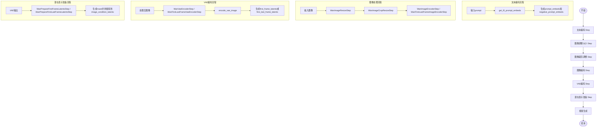

## 类结构

```
ModularPipelineBlocks (抽象基类)
├── WanTextEncoderStep (文本编码步骤)
├── WanImageResizeStep (图像调整大小步骤)
├── WanImageCropResizeStep (图像裁剪调整步骤)
├── WanImageEncoderStep (图像编码步骤)
├── WanFirstLastFrameImageEncoderStep (首尾帧图像编码步骤)
├── WanVaeEncoderStep (VAE编码步骤)
├── WanPrepareFirstFrameLatentsStep (首帧潜在表示准备步骤)
├── WanFirstLastFrameVaeEncoderStep (首尾帧VAE编码步骤)
└── WanPrepareFirstLastFrameLatentsStep (首尾帧潜在表示准备步骤)
```

## 全局变量及字段


### `logger`
    
模块级别的日志记录器，用于输出调试和信息日志

类型：`logging.Logger`
    


### `dtype`
    
文本编码器的数据类型，用于指定张量的精度

类型：`torch.dtype`
    


### `device`
    
计算设备，用于指定张量在CPU或GPU上运行

类型：`torch.device`
    


### `batch_size`
    
批处理大小，表示一次处理的样本数量

类型：`int`
    


### `max_sequence_length`
    
最大序列长度，用于文本tokenization和编码

类型：`int`
    


### `latent_channels`
    
潜在空间通道数，用于VAE编码的潜在表示维度

类型：`int`
    


### `height`
    
图像高度，用于指定输出图像的垂直像素数

类型：`int`
    


### `width`
    
图像宽度，用于指定输出图像的水平像素数

类型：`int`
    


### `num_frames`
    
视频帧数，用于指定生成的视频帧数量

类型：`int`
    


### `WanTextEncoderStep.model_name`
    
模型名称标识，固定为'wan'

类型：`str = 'wan'`
    


### `WanTextEncoderStep.description`
    
文本编码器步骤的描述，说明其生成文本嵌入以指导视频生成

类型：`str`
    


### `WanTextEncoderStep.expected_components`
    
预期组件列表，包含text_encoder、tokenizer和guider

类型：`list[ComponentSpec]`
    


### `WanTextEncoderStep.inputs`
    
输入参数列表，包含prompt、negative_prompt和max_sequence_length

类型：`list[InputParam]`
    


### `WanTextEncoderStep.intermediate_outputs`
    
中间输出列表，包含prompt_embeds和negative_prompt_embeds

类型：`list[OutputParam]`
    


### `WanImageResizeStep.model_name`
    
模型名称标识，固定为'wan'

类型：`str = 'wan'`
    


### `WanImageResizeStep.description`
    
图像调整步骤的描述，说明其调整图像大小并保持宽高比

类型：`str`
    


### `WanImageResizeStep.inputs`
    
输入参数列表，包含image、height和width

类型：`list[InputParam]`
    


### `WanImageResizeStep.intermediate_outputs`
    
中间输出列表，包含resized_image

类型：`list[OutputParam]`
    


### `WanImageCropResizeStep.model_name`
    
模型名称标识，固定为'wan'

类型：`str = 'wan'`
    


### `WanImageCropResizeStep.description`
    
图像裁剪调整步骤的描述，说明其调整最后帧图像与第一帧相同大小

类型：`str`
    


### `WanImageCropResizeStep.inputs`
    
输入参数列表，包含resized_image和last_image

类型：`list[InputParam]`
    


### `WanImageCropResizeStep.intermediate_outputs`
    
中间输出列表，包含resized_last_image

类型：`list[OutputParam]`
    


### `WanImageEncoderStep.model_name`
    
模型名称标识，固定为'wan'

类型：`str = 'wan'`
    


### `WanImageEncoderStep.description`
    
图像编码器步骤的描述，说明其基于第一帧图像生成图像嵌入

类型：`str`
    


### `WanImageEncoderStep.expected_components`
    
预期组件列表，包含image_processor和image_encoder

类型：`list[ComponentSpec]`
    


### `WanImageEncoderStep.inputs`
    
输入参数列表，包含resized_image

类型：`list[InputParam]`
    


### `WanImageEncoderStep.intermediate_outputs`
    
中间输出列表，包含image_embeds

类型：`list[OutputParam]`
    


### `WanFirstLastFrameImageEncoderStep.model_name`
    
模型名称标识，固定为'wan'

类型：`str = 'wan'`
    


### `WanFirstLastFrameImageEncoderStep.description`
    
首尾帧图像编码器步骤的描述，说明其基于首尾帧生成图像嵌入

类型：`str`
    


### `WanFirstLastFrameImageEncoderStep.expected_components`
    
预期组件列表，包含image_processor和image_encoder

类型：`list[ComponentSpec]`
    


### `WanFirstLastFrameImageEncoderStep.inputs`
    
输入参数列表，包含resized_image和resized_last_image

类型：`list[InputParam]`
    


### `WanFirstLastFrameImageEncoderStep.intermediate_outputs`
    
中间输出列表，包含image_embeds

类型：`list[OutputParam]`
    


### `WanVaeEncoderStep.model_name`
    
模型名称标识，固定为'wan'

类型：`str = 'wan'`
    


### `WanVaeEncoderStep.description`
    
VAE编码器步骤的描述，说明其基于第一帧图像生成条件潜在表示

类型：`str`
    


### `WanVaeEncoderStep.expected_components`
    
预期组件列表，包含vae和video_processor

类型：`list[ComponentSpec]`
    


### `WanVaeEncoderStep.inputs`
    
输入参数列表，包含resized_image、height、width、num_frames和generator

类型：`list[InputParam]`
    


### `WanVaeEncoderStep.intermediate_outputs`
    
中间输出列表，包含first_frame_latents

类型：`list[OutputParam]`
    


### `WanPrepareFirstFrameLatentsStep.model_name`
    
模型名称标识，固定为'wan'

类型：`str = 'wan'`
    


### `WanPrepareFirstFrameLatentsStep.description`
    
准备第一帧潜在变量步骤的描述，说明其准备掩码并添加到潜在条件

类型：`str`
    


### `WanPrepareFirstFrameLatentsStep.inputs`
    
输入参数列表，包含first_frame_latents和num_frames

类型：`list[InputParam]`
    


### `WanPrepareFirstFrameLatentsStep.intermediate_outputs`
    
中间输出列表，包含image_condition_latents

类型：`list[OutputParam]`
    


### `WanFirstLastFrameVaeEncoderStep.model_name`
    
模型名称标识，固定为'wan'

类型：`str = 'wan'`
    


### `WanFirstLastFrameVaeEncoderStep.description`
    
首尾帧VAE编码器步骤的描述，说明其基于首尾帧图像生成条件潜在表示

类型：`str`
    


### `WanFirstLastFrameVaeEncoderStep.expected_components`
    
预期组件列表，包含vae和video_processor

类型：`list[ComponentSpec]`
    


### `WanFirstLastFrameVaeEncoderStep.inputs`
    
输入参数列表，包含resized_image、resized_last_image、height、width、num_frames和generator

类型：`list[InputParam]`
    


### `WanFirstLastFrameVaeEncoderStep.intermediate_outputs`
    
中间输出列表，包含first_last_frame_latents

类型：`list[OutputParam]`
    


### `WanPrepareFirstLastFrameLatentsStep.model_name`
    
模型名称标识，固定为'wan'

类型：`str = 'wan'`
    


### `WanPrepareFirstLastFrameLatentsStep.description`
    
准备首尾帧潜在变量步骤的描述，说明其准备掩码并添加到潜在条件

类型：`str`
    


### `WanPrepareFirstLastFrameLatentsStep.inputs`
    
输入参数列表，包含first_last_frame_latents和num_frames

类型：`list[InputParam]`
    


### `WanPrepareFirstLastFrameLatentsStep.intermediate_outputs`
    
中间输出列表，包含image_condition_latents

类型：`list[OutputParam]`
    
    

## 全局函数及方法


### `basic_clean`

该函数用于对文本进行基本的清理处理，包括修复文本编码问题、解码HTML实体以及去除首尾空白字符。

参数：

- `text`：`str`，需要清理的原始文本

返回值：`str`，清理后的文本

#### 流程图

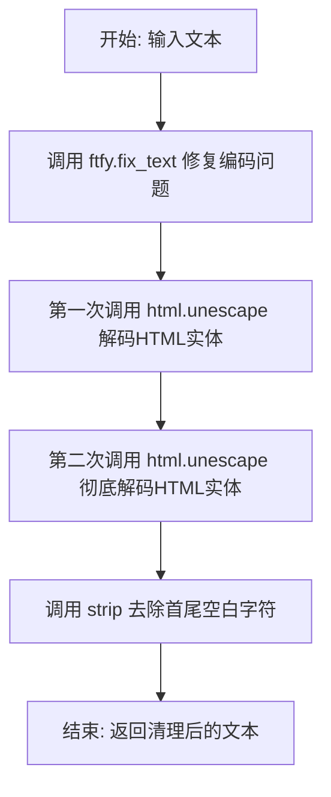

#### 带注释源码

```python
def basic_clean(text):
    """
    对文本进行基本清理处理。
    
    该函数执行以下清理步骤：
    1. 使用 ftfy.fix_text 修复文本中的编码问题（如UTF-8编码错误、mojibake等）
    2. 连续两次调用 html.unescape 以确保完全解码HTML实体（处理嵌套转义的情况）
    3. 去除文本首尾的空白字符
    
    Args:
        text (str): 需要清理的原始文本字符串
        
    Returns:
        str: 清理后的文本字符串
    """
    # 步骤1: 使用ftfy库修复文本编码问题
    # ftfy能够检测并修复常见的文本编码错误，如UTF-8被误读为Latin-1等
    text = ftfy.fix_text(text)
    
    # 步骤2: 连续两次调用html.unescape以处理双重转义的情况
    # 例如: &amp;lt; 会被解码为 &lt;，然后再解码为 <
    text = html.unescape(html.unescape(text))
    
    # 步骤3: 去除文本首尾的空白字符（包括空格、制表符、换行符等）
    return text.strip()
```


### `whitespace_clean`

该函数用于清理文本中的多余空白字符，将所有连续的空字符（包括空格、制表符、换行符等）替换为单个空格，并去除文本首尾的空白。

参数：

- `text`：`str`，需要清理的原始文本

返回值：`str`，清理后的文本

#### 流程图

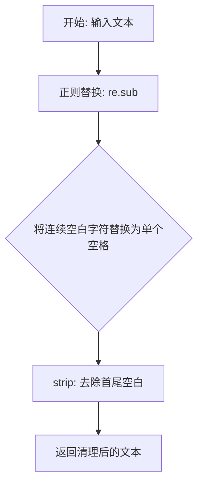

#### 带注释源码

```python
def whitespace_clean(text):
    """
    清理文本中的多余空白字符。
    
    该函数执行两步清理操作：
    1. 使用正则表达式将所有连续的空字符（包括空格、制表符、换行符等）替换为单个空格
    2. 去除文本首尾的空白字符
    
    Args:
        text: 需要清理的原始文本
        
    Returns:
        清理后的文本
    """
    # 使用正则表达式 \s+ 匹配一个或多个空白字符，并替换为单个空格
    text = re.sub(r"\s+", " ", text)
    # 去除文本首尾的空白字符
    text = text.strip()
    return text
```


### `prompt_clean`

该函数是文本预处理管道中的核心清理函数，通过组合调用 `basic_clean` 和 `whitespace_clean` 两个辅助函数，实现对用户输入提示词（prompt）的标准化清理，去除潜在的编码问题和多余空白字符。

参数：

- `text`：`str`，需要清理的原始文本输入

返回值：`str`，清理标准化后的文本

#### 流程图

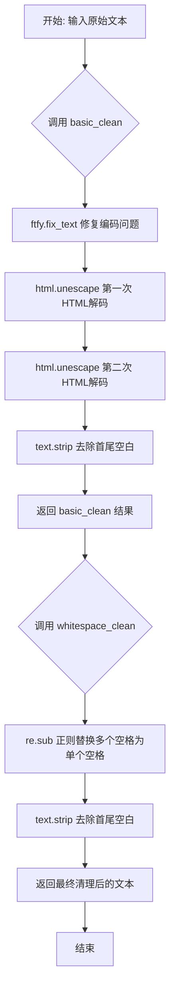

#### 带注释源码

```python
def prompt_clean(text):
    """
    对输入文本进行完整的清理处理流程。
    
    该函数是文本预处理的入口函数，通过组合 basic_clean 和 whitespace_clean
    两个清理步骤，实现对提示词的标准化处理：
    1. basic_clean: 处理编码问题和HTML实体
    2. whitespace_clean: 规范化空白字符
    
    Args:
        text: 需要清理的原始文本字符串
        
    Returns:
        清理并标准化后的文本字符串
    """
    # 第一步：调用 basic_clean 进行基础清理
    # - 使用 ftfy 修复常见编码错误
    # - 使用 html.unescape 解码 HTML 实体（双重解码确保彻底）
    # - 去除文本首尾的空白字符
    text = basic_clean(text)
    
    # 第二步：调用 whitespace_clean 进行空白字符规范化
    # - 使用正则表达式将连续多个空白字符替换为单个空格
    # - 再次去除文本首尾的空白字符
    text = whitespace_clean(text)
    
    # 返回最终清理后的文本
    return text
```


### `get_t5_prompt_embeds`

该函数接收文本编码器、分词器、提示词和设备等参数，对提示词进行清洗、分词和编码，最终返回固定长度的文本嵌入张量，用于指导视频生成过程。

参数：

- `text_encoder`：`UMT5EncoderModel`，文本编码器模型，用于生成文本嵌入
- `tokenizer`：`AutoTokenizer`，分词器，用于将文本转换为token ID
- `prompt`：`str | list[str]`，待编码的提示词，可以是单个字符串或字符串列表
- `max_sequence_length`：`int`，文本序列的最大长度
- `device`：`torch.device`，计算设备

返回值：`torch.Tensor`，形状为 `(batch_size, max_sequence_length, hidden_size)` 的文本嵌入张量

#### 流程图

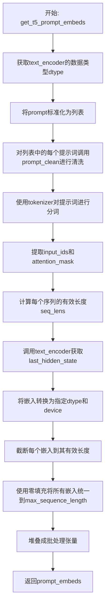

#### 带注释源码

```python
def get_t5_prompt_embeds(
    text_encoder: UMT5EncoderModel,
    tokenizer: AutoTokenizer,
    prompt: str | list[str],
    max_sequence_length: int,
    device: torch.device,
):
    # 获取文本编码器的数据类型，用于后续嵌入的类型转换
    dtype = text_encoder.dtype
    
    # 将单个字符串转换为列表，统一处理方式
    prompt = [prompt] if isinstance(prompt, str) else prompt
    
    # 对每个提示词进行清洗：修复HTML实体、清理多余空白字符
    prompt = [prompt_clean(u) for u in prompt]

    # 使用分词器将文本转换为模型输入格式
    # padding="max_length": 填充到最大长度
    # truncation=True: 超过最大长度时截断
    # add_special_tokens=True: 添加特殊token（如<BOS>、<EOS>）
    # return_attention_mask=True: 返回注意力掩码
    # return_tensors="pt": 返回PyTorch张量
    text_inputs = tokenizer(
        prompt,
        padding="max_length",
        max_length=max_sequence_length,
        truncation=True,
        add_special_tokens=True,
        return_attention_mask=True,
        return_tensors="pt",
    )
    
    # 提取输入ID和注意力掩码
    text_input_ids, mask = text_inputs.input_ids, text_inputs.attention_mask
    
    # 计算每个序列的有效长度（非填充token的数量）
    seq_lens = mask.gt(0).sum(dim=1).long()
    
    # 将输入ID和掩码传递给文本编码器，获取隐藏状态
    # .last_hidden_state: 获取最后一层的隐藏状态
    prompt_embeds = text_encoder(text_input_ids.to(device), mask.to(device)).last_hidden_state
    
    # 将嵌入转换到指定的dtype和device
    prompt_embeds = prompt_embeds.to(dtype=dtype, device=device)
    
    # 对每个嵌入截断到其实际有效长度，去除padding部分
    prompt_embeds = [u[:v] for u, v in zip(prompt_embeds, seq_lens)]
    
    # 对每个嵌入进行零填充，使其长度统一为max_sequence_length
    # 使用torch.cat将原始嵌入与零张量拼接
    prompt_embeds = torch.stack(
        [torch.cat([u, u.new_zeros(max_sequence_length - u.size(0), u.size(1))]) for u in prompt_embeds], dim=0
    )

    # 返回形状为 (batch_size, max_sequence_length, hidden_size) 的文本嵌入
    return prompt_embeds
```


### `encode_image`

该函数负责将输入图像通过CLIP图像处理器和视觉编码器转换为图像嵌入向量，是Wan视频生成管道中图像编码步骤的核心实现。

参数：

- `image`：`PipelineImageInput`，输入的图像数据，支持多种格式（PIL图像、numpy数组等）
- `image_processor`：`CLIPImageProcessor`，CLIP图像预处理器，用于对图像进行标准化和转换
- `image_encoder`：`CLIPVisionModel`，CLIP视觉编码模型，用于生成图像特征表示
- `device`：`torch.device | None = None`，执行计算的设备，默认为None

返回值：`torch.Tensor`，图像的隐藏状态嵌入向量，具体为编码器输出的倒数第二个隐藏层状态

#### 流程图

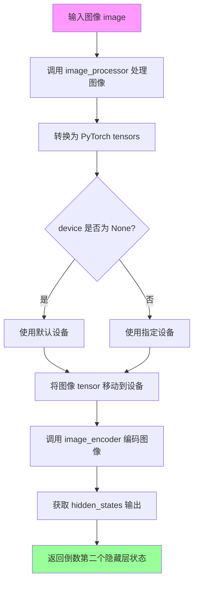

#### 带注释源码

```python
def encode_image(
    image: PipelineImageInput,        # 输入图像，支持多种格式
    image_processor: CLIPImageProcessor,  # CLIP图像预处理器
    image_encoder: CLIPVisionModel,   # CLIP视觉编码模型
    device: torch.device | None = None,  # 计算设备，可选
):
    # Step 1: 使用图像处理器预处理图像
    # 将图像转换为包含PyTorch张量的字典
    # 包含 'pixel_values' 等键
    image = image_processor(images=image, return_tensors="pt").to(device)
    
    # Step 2: 使用CLIP视觉编码器编码图像
    # output_hidden_states=True 要求返回所有隐藏层状态
    # 以便获取深层次的特征表示
    image_embeds = image_encoder(**image, output_hidden_states=True)
    
    # Step 3: 返回倒数第二个隐藏层状态
    # hidden_states[-2] 通常包含最丰富的图像特征表示
    # 相比最后一层，它保留了更多的语义信息
    return image_embeds.hidden_states[-2]
```


### `retrieve_latents`

该函数用于从编码器输出中提取 latent（潜在表示）。它支持三种提取模式：当编码器输出包含 `latent_dist` 属性时，根据 `sample_mode` 参数从分布中采样或计算众数；当编码器输出直接包含 `latents` 属性时直接返回；若两者都不存在则抛出 `AttributeError` 异常。

参数：

-  `encoder_output`：`torch.Tensor`，编码器输出对象，可能包含 `latent_dist` 属性（分布式表示）或 `latents` 属性（直接 latent 张量）
-  `generator`：`torch.Generator | None`，可选的随机数生成器，用于从分布中采样时控制随机性
-  `sample_mode`：`str`，采样模式，"sample" 表示从 latent 分布中采样，"argmax" 表示取分布的众数（mode）

返回值：`torch.Tensor`，提取出的 latent 表示张量

#### 流程图

```mermaid
flowchart TD
    A[开始: retrieve_latents] --> B{encoder_output 是否具有<br/>latent_dist 属性?}
    B -- 是 --> C{sample_mode == 'sample'?}
    B -- 否 --> D{encoder_output 是否具有<br/>latents 属性?}
    
    C -- 是 --> E[返回 encoder_output.latent_dist.sample<br/>(generator)]
    C -- 否 --> F{sample_mode == 'argmax'?}
    
    F -- 是 --> G[返回 encoder_output.latent_dist.mode<br/>()]
    F -- 否 --> H[抛出 AttributeError]
    
    D -- 是 --> I[返回 encoder_output.latents]
    D -- 否 --> H
    
    E --> J[结束]
    G --> J
    I --> J
    H --> J
```

#### 带注释源码

```
# 从编码器输出中检索 latent 表示的函数
# Copied from diffusers.pipelines.stable_diffusion.pipeline_stable_diffusion_img2img.retrieve_latents
def retrieve_latents(
    encoder_output: torch.Tensor,          # 编码器输出，包含 latent 分布或直接 latent
    generator: torch.Generator | None = None,  # 可选的随机生成器，用于采样
    sample_mode: str = "sample"            # 采样模式：'sample' 或 'argmax'
):
    # 情况1: 编码器输出包含 latent_dist 属性，且使用 sample 模式
    # 从潜在分布中采样得到 latent
    if hasattr(encoder_output, "latent_dist") and sample_mode == "sample":
        return encoder_output.latent_dist.sample(generator)
    
    # 情况2: 编码器输出包含 latent_dist 属性，且使用 argmax 模式
    # 取潜在分布的众数（最可能值）作为 latent
    elif hasattr(encoder_output, "latent_dist") and sample_mode == "argmax":
        return encoder_output.latent_dist.mode()
    
    # 情况3: 编码器输出直接包含 latents 属性
    # 直接返回预计算的 latent 张量
    elif hasattr(encoder_output, "latents"):
        return encoder_output.latents
    
    # 错误情况: 无法从编码器输出中获取 latent
    else:
        raise AttributeError("Could not access latents of provided encoder_output")
```


### `encode_vae_image`

该函数是 Wan 视频生成管道的核心组件，负责将输入的视频张量编码为潜在空间表示（latent representation）。它通过 VAE（变分自编码器）对视频帧进行编码，并使用预计算的均值和标准差对潜在表示进行标准化处理，以适配后续的扩散模型处理流程。

参数：

- `video_tensor`：`torch.Tensor`，输入的视频张量，通常为 5D 张量 (batch, channels, frames, height, width)，代表待编码的视频帧序列
- `vae`：`AutoencoderKLWan`，Wan 专用的 VAE 模型，用于将像素空间的视频转换为潜在空间的表示
- `generator`：`torch.Generator`，PyTorch 随机生成器，用于 VAE 编码过程中的随机采样。若传入列表，则需与视频帧数匹配
- `device`：`torch.device`，计算设备（如 CUDA 或 CPU），用于指定张量运算的目标设备
- `dtype`：`torch.dtype`，数据类型（如 torch.float32），指定视频张量转换后的精度
- `latent_channels`：`int`，潜在通道数，默认为 16，表示潜在表示的通道维度大小

返回值：`torch.Tensor`，编码并标准化后的视频潜在表示，形状为 (batch, latent_channels, frames, latent_height, latent_width)，可直接用于后续的扩散模型推理

#### 流程图

```mermaid
flowchart TD
    A[开始: encode_vae_image] --> B{检查 video_tensor 类型是否为 Tensor}
    B -->|否| C[抛出 ValueError: 期望 Tensor 类型]
    B -->|是| D{检查 generator 是否为列表}
    D -->|是| E{验证 generator 列表长度与视频帧数是否匹配}
    E -->|否| F[抛出 ValueError: generator 列表长度不匹配]
    E -->|是| G[继续处理]
    D -->|否| H[继续处理]
    G --> I[将 video_tensor 移动到指定 device 和 dtype]
    H --> I
    I --> J{判断 generator 类型}
    J -->|列表| K[逐帧编码: for i in range(batch_size)]
    J -->|单个| L[批量编码整个视频张量]
    K --> M[调用 vae.encode 并使用 retrieve_latents 提取潜在表示]
    L --> M
    M --> N[计算 latents_mean 和 latents_std]
    N --> O[标准化: (video_latents - latents_mean) * latents_std]
    O --> P[返回标准化后的 video_latents]
```

#### 带注释源码

```python
def encode_vae_image(
    video_tensor: torch.Tensor,
    vae: AutoencoderKLWan,
    generator: torch.Generator,
    device: torch.device,
    dtype: torch.dtype,
    latent_channels: int = 16,
):
    """
    将输入的视频张量编码为潜在空间的表示，并进行标准化处理。
    
    Args:
        video_tensor: 输入视频张量，形状为 (batch, channels, frames, height, width)
        vae: Wan 专用的变分自编码器模型
        generator: PyTorch 随机生成器，用于采样潜在分布
        device: 计算设备
        dtype: 目标数据类型
        latent_channels: 潜在空间的通道数，默认为 16
    
    Returns:
        编码并标准化后的视频潜在表示
    """
    # 参数校验：确保 video_tensor 是 PyTorch 张量类型
    if not isinstance(video_tensor, torch.Tensor):
        raise ValueError(f"Expected video_tensor to be a tensor, got {type(video_tensor)}.")

    # 参数校验：若传入生成器列表，则其长度必须与视频帧数匹配
    if isinstance(generator, list) and len(generator) != video_tensor.shape[0]:
        raise ValueError(
            f"You have passed a list of generators of length {len(generator)}, but it is not same as number of images {video_tensor.shape[0]}."
        )

    # 将视频张量移动到指定设备并转换为目标数据类型
    video_tensor = video_tensor.to(device=device, dtype=dtype)

    # VAE 编码：根据 generator 类型选择不同的编码策略
    if isinstance(generator, list):
        # 逐帧编码：当存在多个生成器时，对每一帧独立编码
        video_latents = [
            # 调用 retrieve_latents 从 VAE 输出中提取潜在表示，使用 argmax 模式
            retrieve_latents(vae.encode(video_tensor[i : i + 1]), generator=generator[i], sample_mode="argmax")
            for i in range(video_tensor.shape[0])
        ]
        # 沿批次维度拼接各帧的潜在表示
        video_latents = torch.cat(video_latents, dim=0)
    else:
        # 批量编码：当存在单个生成器时，一次性编码整个视频张量
        video_latents = retrieve_latents(vae.encode(video_tensor), sample_mode="argmax")

    # 构建潜在表示的均值和标准差张量，用于标准化
    # 从 VAE 配置中读取均值和标准差，并reshape为广播友好的形状
    latents_mean = (
        torch.tensor(vae.config.latents_mean)
        .view(1, latent_channels, 1, 1, 1)
        .to(video_latents.device, video_latents.dtype)
    )
    # 标准差取倒数（即 1/std），以便后续通过乘法实现除法
    latents_std = 1.0 / torch.tensor(vae.config.latents_std).view(1, latent_channels, 1, 1, 1).to(
        video_latents.device, video_latents.dtype
    )
    
    # 标准化处理：(latents - mean) * (1/std)，将潜在表示转换为标准正态分布
    video_latents = (video_latents - latents_mean) * latents_std

    return video_latents
```


### `WanTextEncoderStep.check_inputs`

该方法是一个静态输入验证函数，用于检查 `block_state` 中的 `prompt` 参数是否为合法的类型（字符串或字符串列表）。若 `prompt` 不为 `None` 且不是 `str` 或 `list` 类型，则抛出 `ValueError` 异常。

参数：

- `block_state`：对象，包含 `prompt` 属性的状态对象，用于验证输入的 prompt 参数是否符合类型要求。

返回值：`None`，该方法仅进行输入验证，不返回任何值。

#### 流程图

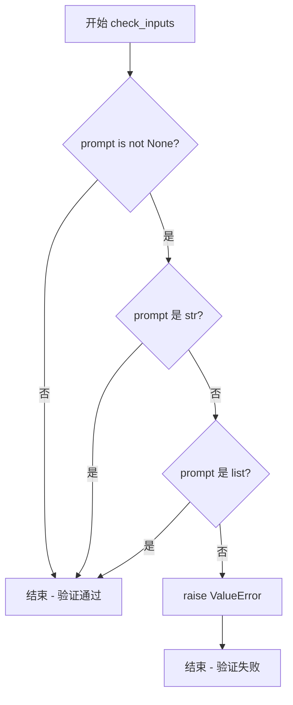

#### 带注释源码

```python
@staticmethod
def check_inputs(block_state):
    """
    检查 block_state 中的 prompt 参数类型是否合法。
    
    Args:
        block_state: 包含 prompt 属性的状态对象。
                     预期包含字段:
                     - prompt: str | list[str] | None, 待验证的提示词。
    
    Raises:
        ValueError: 如果 prompt 不为 None 且不是 str 或 list 类型。
    """
    # 检查 prompt 是否存在且类型不符合要求
    if block_state.prompt is not None and (
        not isinstance(block_state.prompt, str) and not isinstance(block_state.prompt, list)
    ):
        # 抛出详细错误信息，包含实际类型
        raise ValueError(f"`prompt` has to be of type `str` or `list` but is {type(block_state.prompt)}")
```


### `WanTextEncoderStep.encode_prompt`

该方法是一个静态方法，用于将文本提示（prompt）编码为文本编码器（UMT5EncoderModel）的隐藏状态向量（text embeddings），以指导视频生成过程。支持正向提示和负向提示的编码，并返回对应的嵌入向量。

参数：

- `components`：组件对象，包含 `text_encoder`、`tokenizer` 等文本编码相关组件
- `prompt`：`str`，要编码的文本提示
- `device`：`torch.device | None`，执行运算的 torch 设备，若为 None 则从 `components._execution_device` 获取
- `prepare_unconditional_embeds`：`bool`，是否准备无条件嵌入（用于 Classifier-Free Guidance）
- `negative_prompt`：`str | None`，负向提示，用于引导不期望的生成内容
- `max_sequence_length`：`int`，最大序列长度，默认为 512

返回值：`tuple[torch.Tensor, torch.Tensor | None]`，返回 (prompt_embeds, negative_prompt_embeds) 元组，其中 prompt_embeds 为正向提示的文本嵌入，negative_prompt_embeds 为负向提示的文本嵌入（若 prepare_unconditional_embeds 为 False 则为 None）

#### 流程图

```mermaid
flowchart TD
    A[开始 encode_prompt] --> B{device是否为None?}
    B -->|是| C[从components._execution_device获取device]
    B -->|否| D[使用传入的device]
    C --> E{prompt是否为list?}
    D --> E
    E -->|否| F[将prompt转为list]
    E -->|是| G[保持原样]
    F --> H[获取batch_size = len(prompt)]
    G --> H
    H --> I[调用get_t5_prompt_embeds获取prompt_embeds]
    I --> J{prepare_unconditional_embeds为True?}
    J -->|是| K[处理negative_prompt]
    K --> L[确保negative_prompt类型与prompt一致]
    L --> M{检查batch_size是否匹配?}
    M -->|是| N[调用get_t5_prompt_embeds获取negative_prompt_embeds]
    M -->|否| O[抛出ValueError]
    J -->|否| P[negative_prompt_embeds = None]
    N --> Q[返回prompt_embeds和negative_prompt_embeds]
    P --> Q
    O --> Q
```

#### 带注释源码

```python
@staticmethod
def encode_prompt(
    components,
    prompt: str,
    device: torch.device | None = None,
    prepare_unconditional_embeds: bool = True,
    negative_prompt: str | None = None,
    max_sequence_length: int = 512,
):
    r"""
    Encodes the prompt into text encoder hidden states.

    Args:
        prompt (`str` or `list[str]`, *optional*):
            prompt to be encoded
        device: (`torch.device`):
            torch device
        prepare_unconditional_embeds (`bool`):
            whether to use prepare unconditional embeddings or not
        negative_prompt (`str` or `list[str]`, *optional*):
            The prompt or prompts not to guide the image generation. If not defined, one has to pass
            `negative_prompt_embeds` instead. Ignored when not using guidance (i.e., ignored if `guidance_scale` is
            less than `1`).
        max_sequence_length (`int`, defaults to `512`):
            The maximum number of text tokens to be used for the generation process.
    """
    # 确定执行设备：如果未传入device，则从components获取执行设备
    device = device or components._execution_device
    
    # 标准化prompt为list格式，便于批量处理
    if not isinstance(prompt, list):
        prompt = [prompt]
    
    # 获取批次大小
    batch_size = len(prompt)

    # ========== 第一步：编码正向提示 ==========
    # 使用T5文本编码器将prompt转换为嵌入向量
    prompt_embeds = get_t5_prompt_embeds(
        text_encoder=components.text_encoder,
        tokenizer=components.tokenizer,
        prompt=prompt,
        max_sequence_length=max_sequence_length,
        device=device,
    )

    # ========== 第二步：编码负向提示（可选）==========
    # 仅当需要使用Classifier-Free Guidance时执行
    if prepare_unconditional_embeds:
        # 处理空负向提示：默认为空字符串
        negative_prompt = negative_prompt or ""
        
        # 标准化negative_prompt为list格式，保持与prompt相同的批次大小
        negative_prompt = batch_size * [negative_prompt] if isinstance(negative_prompt, str) else negative_prompt

        # 类型检查：确保negative_prompt与prompt类型一致
        if prompt is not None and type(prompt) is not type(negative_prompt):
            raise TypeError(
                f"`negative_prompt` should be the same type to `prompt`, but got {type(negative_prompt)} !="
                f" {type(prompt)}."
            )
        
        # 批次大小一致性检查
        elif batch_size != len(negative_prompt):
            raise ValueError(
                f"`negative_prompt`: {negative_prompt} has batch size {len(negative_prompt)}, but `prompt`:"
                f" {prompt} has batch size {batch_size}. Please make sure that passed `negative_prompt` matches"
                " the batch size of `prompt`."
            )

        # 使用相同的T5编码器获取负向提示嵌入
        negative_prompt_embeds = get_t5_prompt_embeds(
            text_encoder=components.text_encoder,
            tokenizer=components.tokenizer,
            prompt=negative_prompt,
            max_sequence_length=max_sequence_length,
            device=device,
        )

    # 返回正向和负向提示嵌入（若未启用CFG，则negative_prompt_embeds为None）
    return prompt_embeds, negative_prompt_embeds
```


### `WanTextEncoderStep.__call__`

该方法是 Wan 管道中的文本编码步骤，负责将输入的提示词（prompt）编码为文本嵌入向量（text embeddings），用于指导视频生成过程。它通过 T5 文本编码器生成正向和负向提示词的嵌入表示。

参数：

- `components`：`WanModularPipeline`，模块化管道组件，包含文本编码器（text_encoder）、分词器（tokenizer）和引导器（guider）等组件
- `state`：`PipelineState`，管道状态对象，包含当前步骤的输入参数（如 prompt、negative_prompt、max_sequence_length）和中间输出

返回值：`PipelineState`，更新后的管道状态，包含生成的 prompt_embeds 和 negative_prompt_embeds

#### 流程图

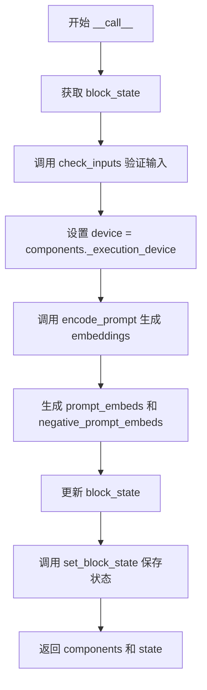

#### 带注释源码

```python
@torch.no_grad()
def __call__(self, components: WanModularPipeline, state: PipelineState) -> PipelineState:
    # 从管道状态中获取当前步骤的块状态
    block_state = self.get_block_state(state)
    
    # 验证输入参数的合法性（检查 prompt 类型）
    self.check_inputs(block_state)

    # 设置执行设备（从组件获取）
    block_state.device = components._execution_device

    # 编码输入的提示词，生成文本嵌入
    (
        block_state.prompt_embeds,        # 正向提示词嵌入
        block_state.negative_prompt_embeds, # 负向提示词嵌入
    ) = self.encode_prompt(
        components=components,            # 管道组件（包含 text_encoder 和 tokenizer）
        prompt=block_state.prompt,         # 输入的提示词
        device=block_state.device,         # 执行设备
        prepare_unconditional_embeds=components.requires_unconditional_embeds, # 是否需要无条件嵌入
        negative_prompt=block_state.negative_prompt, # 负向提示词
        max_sequence_length=block_state.max_sequence_length, # 最大序列长度
    )

    # 将更新后的块状态设置回管道状态
    self.set_block_state(state, block_state)
    
    # 返回组件和更新后的状态
    return components, state
```


### `WanImageResizeStep.__call__`

该方法是 WanImageResizeStep 类的调用方法，负责将输入图像调整为目标面积（高度 × 宽度），同时保持原始宽高比，并确保调整后的尺寸符合 VAE 空间缩放因子和空间补丁大小的要求。

参数：

- `components`：`WanModularPipeline`，管道组件容器，包含 VAE 相关的配置信息（如 vae_scale_factor_spatial 和 patch_size_spatial）
- `state`：`PipelineState`，管道状态对象，包含当前步骤的输入参数（image、height、width）和中间输出（resized_image）

返回值：`PipelineState`，更新后的管道状态对象，包含调整后的高度、宽度以及调整大小后的图像

#### 流程图

```mermaid
flowchart TD
    A[开始] --> B[获取 block_state]
    B --> C[计算目标面积 max_area = height × width]
    D[获取输入图像] --> E[计算宽高比 aspect_ratio = image.height / image.width]
    E --> F[计算模数值 mod_value = vae_scale_factor_spatial × patch_size_spatial]
    F --> G[计算新高度: round(√(max_area × aspect_ratio)) // mod_value × mod_value]
    G --> H[计算新宽度: round(√(max_area / aspect_ratio)) // mod_value × mod_value]
    H --> I[调整图像大小: image.resize width × height]
    I --> J[设置 block_state 的 height、width、resized_image]
    J --> K[保存 block_state 到 state]
    K --> L[返回 components 和 state]
```

#### 带注释源码

```python
def __call__(self, components: WanModularPipeline, state: PipelineState) -> PipelineState:
    """
    执行图像resize步骤，将图像调整为目标面积同时保持宽高比
    
    参数:
        components: WanModularPipeline - 管道组件，包含VAE配置
        state: PipelineState - 管道状态
    
    返回:
        PipelineState - 更新后的状态
    """
    # 从state中获取当前步骤的block_state
    block_state = self.get_block_state(state)
    
    # 计算目标面积（目标像素数）
    max_area = block_state.height * block_state.width

    # 获取输入图像
    image = block_state.image
    
    # 计算图像的宽高比（用于保持纵横比）
    aspect_ratio = image.height / image.width
    
    # 获取VAE空间缩放因子与空间补丁大小的乘积（用于确保尺寸对齐）
    mod_value = components.vae_scale_factor_spatial * components.patch_size_spatial
    
    # 根据目标面积和宽高比计算新的高度，确保是mod_value的倍数
    # 使用sqrt实现面积保持：height × width = max_area, height / width = aspect_ratio
    block_state.height = round(np.sqrt(max_area * aspect_ratio)) // mod_value * mod_value
    
    # 根据目标面积和宽高比计算新的宽度，确保是mod_value的倍数
    block_state.width = round(np.sqrt(max_area / aspect_ratio)) // mod_value * mod_value
    
    # 使用PIL.Image.resize将图像调整到计算出的尺寸
    block_state.resized_image = image.resize((block_state.width, block_state.height))

    # 将更新后的block_state保存回state
    self.set_block_state(state, block_state)
    
    # 返回更新后的components和state
    return components, state
```


### `WanImageCropResizeStep.__call__`

该方法是 Wan 管道中的图像裁剪调整步骤，用于将最后帧图像调整到与第一帧相同的尺寸，并进行中心裁剪以保持宽高比。

参数：

- `components`：`WanModularPipeline`，管道组件集合，包含 VAE 模型相关信息
- `state`：`PipelineState`，管道状态，包含输入图像和中间结果

返回值：`PipelineState`，更新后的管道状态，包含处理后的 `resized_last_image`

#### 流程图

```mermaid
flowchart TD
    A[开始执行 WanImageCropResizeStep.__call__] --> B[获取 block_state]
    B --> C[提取 resized_image 尺寸: height, width]
    C --> D[获取 last_image]
    D --> E[计算缩放比例: resize_ratio = maxwidth/image.width, height/image.height]
    E --> F[计算新尺寸: width = roundimage.width × resize_ratio<br/>height = roundimage.height × resize_ratio]
    F --> G[创建尺寸列表: size = [width, height]]
    G --> H[使用 center_crop 进行中心裁剪]
    H --> I[保存结果到 block_state.resized_last_image]
    I --> J[更新 state]
    J --> K[返回 components 和 state]
```

#### 带注释源码

```python
def __call__(self, components: WanModularPipeline, state: PipelineState) -> PipelineState:
    """
    执行图像裁剪调整步骤，将最后帧图像调整到与第一帧相同尺寸
    
    参数:
        components: WanModularPipeline, 管道组件集合
        state: PipelineState, 管道状态
    
    返回:
        PipelineState, 更新后的管道状态
    """
    # 从管道状态获取当前块的执行状态
    block_state = self.get_block_state(state)

    # 获取已调整大小的第一帧图像的尺寸
    height = block_state.resized_image.height
    width = block_state.resized_image.width
    # 获取需要调整的最后帧图像
    image = block_state.last_image

    # 计算缩放比例，使图像能够覆盖目标尺寸
    # 取宽度比和高度比中的最大值，确保图像足够大以覆盖目标区域
    resize_ratio = max(width / image.width, height / image.height)

    # 根据缩放比例计算新的宽高尺寸
    width = round(image.width * resize_ratio)
    height = round(image.height * resize_ratio)
    # 创建尺寸列表 [宽, 高]
    size = [width, height]
    
    # 使用 torchvision 的中心裁剪功能，将图像裁剪到目标尺寸
    # 中心裁剪会从图像中心提取指定大小的区域
    resized_image = transforms.functional.center_crop(image, size)
    # 将处理后的图像保存到块状态中
    block_state.resized_last_image = resized_image

    # 将更新后的块状态写回管道状态
    self.set_block_state(state, block_state)
    # 返回组件和更新后的状态
    return components, state
```


### `WanImageEncoderStep.__call__`

该方法是 Wan 图像编码步骤的核心执行逻辑，负责将调整大小的第一帧图像转换为图像嵌入向量（image_embeds），以指导后续的视频生成过程。

参数：

- `self`：`WanImageEncoderStep`，类实例自身
- `components`：`WanModularPipeline`，管道组件集合，包含图像处理器和图像编码器等组件
- `state`：`PipelineState`，管道状态对象，包含当前块的中间状态和数据

返回值：`PipelineState`，更新后的管道状态对象，包含生成的图像嵌入向量

#### 流程图

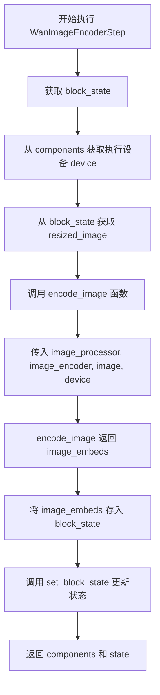

#### 带注释源码

```python
def __call__(self, components: WanModularPipeline, state: PipelineState) -> PipelineState:
    """
    执行图像编码步骤，将图像转换为嵌入向量
    
    参数:
        components: WanModularPipeline 实例，包含 image_processor 和 image_encoder
        state: PipelineState 管道状态
    
    返回:
        更新后的 PipelineState，包含 image_embeds
    """
    # 从管道状态中获取当前块的中间状态
    block_state = self.get_block_state(state)

    # 获取执行设备（通常为 CUDA 或 CPU）
    device = components._execution_device

    # 从块状态中获取已调整大小的图像（由前序步骤 WanImageResizeStep 生成）
    image = block_state.resized_image

    # 调用 encode_image 函数生成图像嵌入向量
    # 该函数使用 CLIP 图像处理器和 CLIP 视觉编码器
    image_embeds = encode_image(
        image_processor=components.image_processor,  # CLIP 图像预处理器
        image_encoder=components.image_encoder,       # CLIP 视觉编码模型
        image=image,                                    # 输入图像（PIL.Image.Image）
        device=device,                                  # 执行设备
    )
    
    # 将生成的图像嵌入向量存储到块状态中
    block_state.image_embeds = image_embeds
    
    # 更新管道状态
    self.set_block_state(state, block_state)
    
    # 返回组件和更新后的状态（符合 PipelineState 返回格式）
    return components, state
```

#### 相关依赖函数信息

**`encode_image` 函数**（被调用）：

```python
def encode_image(
    image: PipelineImageInput,
    image_processor: CLIPImageProcessor,
    image_encoder: CLIPVisionModel,
    device: torch.device | None = None,
):
    """
    使用 CLIP 模型将图像编码为嵌入向量
    
    参数:
        image: 输入图像
        image_processor: CLIP 图像预处理器
        image_encoder: CLIP 视觉编码模型
        device: 执行设备
    
    返回:
        图像的隐藏状态嵌入（hidden_states[-2]）
    """
    image = image_processor(images=image, return_tensors="pt").to(device)
    image_embeds = image_encoder(**image, output_hidden_states=True)
    return image_embeds.hidden_states[-2]
```


### `WanFirstLastFrameImageEncoderStep.__call__`

该方法是 Wan 管道中用于对第一帧和最后一帧图像进行编码的步骤，通过调用 `encode_image` 函数生成图像嵌入（image_embeds），用于引导视频生成过程。

参数：

- `components`：`WanModularPipeline` 类型，管道组件容器，包含图像处理器（image_processor）和图像编码器（image_encoder）等组件
- `state`：`PipelineState` 类型，管道状态对象，包含当前块状态（block_state），其中包含已调整大小的第一帧图像（resized_image）和最后一帧图像（resized_last_image）

返回值：`PipelineState`，更新后的管道状态对象，其中包含生成的图像嵌入（image_embeds）

#### 流程图

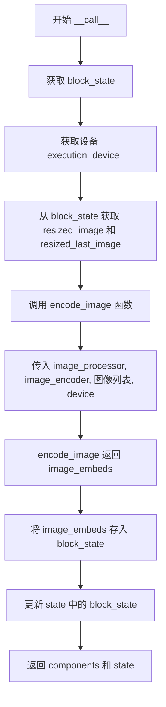

#### 带注释源码

```python
def __call__(self, components: WanModularPipeline, state: PipelineState) -> PipelineState:
    # 获取当前块的状态，包含输入的图像数据
    block_state = self.get_block_state(state)

    # 从组件中获取执行设备（CPU/CUDA）
    device = components._execution_device

    # 从块状态中获取第一帧和最后一帧的调整大小后的图像
    first_frame_image = block_state.resized_image
    last_frame_image = block_state.resized_last_image

    # 调用 encode_image 函数对两帧图像进行编码
    # 参数：图像处理器、图像编码器、图像列表（第一帧和最后一帧）、设备
    image_embeds = encode_image(
        image_processor=components.image_processor,
        image_encoder=components.image_encoder,
        image=[first_frame_image, last_frame_image],
        device=device,
    )
    
    # 将生成的图像嵌入存储到块状态中
    block_state.image_embeds = image_embeds
    
    # 更新管道状态中的块状态
    self.set_block_state(state, block_state)
    
    # 返回组件和状态
    return components, state
```


### `WanVaeEncoderStep.check_inputs`

该方法是一个静态验证函数，用于检查 VAE 编码器输入参数的有效性。它验证 `height`、`width` 和 `num_frames` 参数是否满足模型要求（高度和宽度必须能被空间缩放因子整除，帧数必须大于0且减1后能被时间缩放因子整除），如果不满足则抛出详细的 `ValueError` 异常。

参数：

- `components`：`WanModularPipeline` 或包含 `vae_scale_factor_spatial`、`vae_scale_factor_temporal` 等属性的组件对象，包含 VAE 模型的空间和时间缩放因子配置
- `block_state`：包含 `height`、`width`、`num_frames` 属性的状态对象，存储输入的图像尺寸和帧数信息

返回值：`None`，该方法无返回值，通过抛出异常来处理验证失败的情况

#### 流程图

```mermaid
flowchart TD
    A[开始检查输入] --> B{height 是否非空且不可被 vae_scale_factor_spatial 整除?}
    B -->|是| C[抛出 ValueError: height 必须可被整除]
    B -->|否| D{width 是否非空且不可被 vae_scale_factor_spatial 整除?}
    D -->|是| E[抛出 ValueError: width 必须可被整除]
    D -->|否| F{num_frames 是否非空?}
    F -->|否| G[验证通过，返回]
    F -->|是| H{num_frames < 1?}
    H -->|是| I[抛出 ValueError: num_frames 必须大于0]
    H -->|否| J{(num_frames - 1) 是否可被 vae_scale_factor_temporal 整除?}
    J -->|否| K[抛出 ValueError: num_frames 条件不满足]
    J -->|是| G
```

#### 带注释源码

```python
@staticmethod
def check_inputs(components, block_state):
    """
    检查 VAE 编码器输入参数的有效性
    
    验证 height、width 是否能被 vae_scale_factor_spatial 整除
    验证 num_frames 是否大于0且 (num_frames-1) 能被 vae_scale_factor_temporal 整除
    
    参数:
        components: 包含 VAE 缩放因子配置的组件对象
        block_state: 包含输入参数的状态对象
    """
    # 检查高度和宽度是否满足空间缩放因子要求
    if (block_state.height is not None and block_state.height % components.vae_scale_factor_spatial != 0) or (
        block_state.width is not None and block_state.width % components.vae_scale_factor_spatial != 0
    ):
        raise ValueError(
            f"`height` and `width` have to be divisible by {components.vae_scale_factor_spatial} but are {block_state.height} and {block_state.width}."
        )
    
    # 检查帧数是否满足时间缩放因子要求
    # num_frames 必须大于0，且 (num_frames - 1) 必须能被时间缩放因子整除
    if block_state.num_frames is not None and (
        block_state.num_frames < 1 or (block_state.num_frames - 1) % components.vae_scale_factor_temporal != 0
    ):
        raise ValueError(
            f"`num_frames` has to be greater than 0, and (num_frames - 1) must be divisible by {components.vae_scale_factor_temporal}, but got {block_state.num_frames}."
        )
```


### `WanVaeEncoderStep.__call__`

该方法是 WanVaeEncoderStep 类的核心调用方法，负责将输入的重采样图像编码为视频潜在表示（latents），作为视频生成的条件信号。它通过 VAE 编码器处理图像，生成包含第一帧图像条件的潜在张量，用于引导视频生成过程。

参数：

-   `components`：`WanModularPipeline`，管道组件容器，包含 VAE、视频处理器等模型组件
-   `state`：`PipelineState`，管道状态对象，包含当前块的输入参数和中间输出

返回值：`PipelineState`，更新后的管道状态对象，其中包含编码后的第一帧潜在表示（`first_frame_latents`）

#### 流程图

```mermaid
flowchart TD
    A[开始: __call__] --> B[获取 block_state]
    B --> C[验证输入参数: check_inputs]
    C --> D{验证通过?}
    D -->|否| E[抛出 ValueError]
    D -->|是| F[提取 resized_image]
    F --> G[获取设备 device 和数据类型 dtype]
    G --> H[获取/设置默认 height, width, num_frames]
    H --> I[视频预处理: video_processor.preprocess]
    I --> J{图像张量维度 == 4?}
    J -->|是| K[扩展维度: unsqueeze(2)]
    J -->|否| L[直接使用]
    K --> L
    L --> M[构建视频张量: 复制第一帧 + 填充零帧]
    M --> N[VAE 编码: encode_vae_image]
    N --> O[存储 first_frame_latents]
    O --> P[更新 block_state 到 state]
    P --> Q[返回 components, state]
```

#### 带注释源码

```python
def __call__(self, components: WanModularPipeline, state: PipelineState) -> PipelineState:
    """
    执行 VAE 编码步骤，将重采样图像转换为潜在表示
    
    参数:
        components: WanModularPipeline - 管道组件容器
        state: PipelineState - 管道状态
        
    返回:
        PipelineState - 更新后的状态，包含 first_frame_latents
    """
    # 1. 从状态中获取当前块的局部状态
    block_state = self.get_block_state(state)
    
    # 2. 验证输入参数的合法性
    # 检查 height/width 是否能被 vae_scale_factor_spatial 整除
    # 检查 num_frames 是否符合 vae_scale_factor_temporal 的要求
    self.check_inputs(components, block_state)

    # 3. 获取输入的重采样图像
    image = block_state.resized_image

    # 4. 获取执行设备（CPU/CUDA）和数据类型
    device = components._execution_device
    dtype = torch.float32  # 预处理使用 float32
    vae_dtype = components.vae.dtype  # VAE 使用其配置的数据类型

    # 5. 获取或使用默认的生成参数
    height = block_state.height or components.default_height
    width = block_state.width or components.default_width
    num_frames = block_state.num_frames or components.default_num_frames

    # 6. 预处理图像：PIL Image -> Tensor，并调整到目标尺寸
    image_tensor = components.video_processor.preprocess(image, height=height, width=width).to(
        device=device, dtype=dtype
    )

    # 7. 如果图像张量是 4D (C, H, W)，扩展为 5D (C, 1, H, W) 表示单帧视频
    if image_tensor.dim() == 4:
        image_tensor = image_tensor.unsqueeze(2)

    # 8. 构造视频张量：
    #    - 第一帧：输入的图像
    #    - 后续帧：(num_frames - 1) 个零张量（占位符）
    #    - 这样创建了一个"伪视频"，第一帧有内容，其余帧为黑色/空白
    video_tensor = torch.cat(
        [
            image_tensor,
            # 创建 (batch, channel, num_frames-1, height, width) 的零张量
            image_tensor.new_zeros(image_tensor.shape[0], image_tensor.shape[1], num_frames - 1, height, width),
        ],
        dim=2,  # 在时间维度（帧）上拼接
    ).to(device=device, dtype=dtype)

    # 9. 使用 VAE 编码图像到潜在空间
    #    返回的 latents 形状: (batch, latent_channels, latent_t, latent_h, latent_w)
    block_state.first_frame_latents = encode_vae_image(
        video_tensor=video_tensor,
        vae=components.vae,
        generator=block_state.generator,
        device=device,
        dtype=vae_dtype,
        latent_channels=components.num_channels_latents,
    )

    # 10. 将更新后的 block_state 写回全局状态
    self.set_block_state(state, block_state)
    
    # 11. 返回更新后的组件和状态
    return components, state
```


### `WanPrepareFirstFrameLatentsStep.__call__`

该方法是 Wan 模块化管道中的第一步，用于准备带掩码的第一帧潜变量并将其添加到潜变量条件中。它通过创建掩码来标记第一帧的位置，然后将掩码与第一帧潜变量在通道维度上拼接，生成用于引导视频生成的图像条件潜变量。

参数：

- `components`：`WanModularPipeline`，模块化管道组件，包含 VAE、时间因子等配置
- `state`：`PipelineState`，当前管道状态，包含输入参数和中间输出

返回值：`PipelineState`，更新后的管道状态，其中 `image_condition_latents` 被设置为掩码与第一帧潜变量的拼接结果

#### 流程图

```mermaid
flowchart TD
    A[开始: __call__] --> B[获取 block_state]
    B --> C[从 first_frame_latents 获取形状: batch_size, _, _, latent_height, latent_width]
    C --> D[创建初始掩码 tensor: torch.ones]
    D --> E[将非第一帧位置设为 0: mask_lat_size[:, :, list(range(1, num_frames))] = 0]
    E --> F[提取第一帧掩码: first_frame_mask = mask_lat_size[:, :, 0:1]]
    F --> G[沿时间维度重复第一帧掩码: torch.repeat_interleave]
    G --> H[拼接第一帧掩码和其余帧: torch.concat]
    H --> I[重塑掩码以匹配 VAE 时间因子: view 操作]
    I --> J[转置维度: transpose]
    J --> K[将掩码移到正确设备: .to]
    K --> L[拼接掩码和第一帧潜变量: image_condition_latents]
    L --> M[保存到 block_state]
    M --> N[返回 components, state]
```

#### 带注释源码

```python
def __call__(self, components: WanModularPipeline, state: PipelineState) -> PipelineState:
    """
    准备带掩码的第一帧潜变量并添加到潜变量条件中
    
    参数:
        components: WanModularPipeline - 管道组件，包含 VAE、时间因子等配置
        state: PipelineState - 当前管道状态
    
    返回:
        PipelineState - 更新后的管道状态
    """
    # 1. 获取当前 block 的状态
    block_state = self.get_block_state(state)

    # 2. 从第一帧潜变量中提取形状信息
    # 形状: [batch_size, channels, frames, height, width]
    batch_size, _, _, latent_height, latent_width = block_state.first_frame_latents.shape

    # 3. 创建初始掩码 tensor，形状为 [batch_size, 1, num_frames, latent_height, latent_width]
    # 初始全部设为 1
    mask_lat_size = torch.ones(batch_size, 1, block_state.num_frames, latent_height, latent_width)

    # 4. 将非第一帧的位置设为 0（保留第一帧，掩码其余帧）
    # range(1, num_frames) 生成 [1, 2, ..., num_frames-1]
    mask_lat_size[:, :, list(range(1, block_state.num_frames))] = 0

    # 5. 提取第一帧的掩码 [batch_size, 1, 1, latent_height, latent_width]
    first_frame_mask = mask_lat_size[:, :, 0:1]

    # 6. 沿时间维度（dim=2）重复第一帧掩码，以匹配 VAE 的时间缩放因子
    # 例如: 如果 vae_scale_factor_temporal=4，则重复 4 次
    first_frame_mask = torch.repeat_interleave(
        first_frame_mask, dim=2, repeats=components.vae_scale_factor_temporal
    )

    # 7. 拼接处理后的第一帧掩码和剩余帧的掩码
    # 形状: [batch_size, 1, num_frames, latent_height, latent_width]
    mask_lat_size = torch.concat([first_frame_mask, mask_lat_size[:, :, 1:, :]], dim=2)

    # 8. 重塑掩码以匹配 VAE 时间因子的组织方式
    # 视图变换: [batch_size, 1, temporal_factor, frames, height, width] -> [batch_size, temporal_factor, frames, height, width]
    mask_lat_size = mask_lat_size.view(
        batch_size, -1, components.vae_scale_factor_temporal, latent_height, latent_width
    )

    # 9. 交换维度顺序，将 temporal_factor 维度移到前面
    # 从 [batch, temporal_factor, frames, h, w] -> [batch, frames, temporal_factor, h, w]
    mask_lat_size = mask_lat_size.transpose(1, 2)

    # 10. 确保掩码在正确的设备上（CPU/GPU）
    mask_lat_size = mask_lat_size.to(block_state.first_frame_latents.device)

    # 11. 在通道维度（dim=1）上拼接掩码和第一帧潜变量
    # 生成图像条件潜变量，包含掩码信息用于指导生成
    block_state.image_condition_latents = torch.concat([mask_lat_size, block_state.first_frame_latents], dim=1)

    # 12. 保存更新后的 block_state
    self.set_block_state(state, block_state)

    # 13. 返回更新后的 components 和 state
    return components, state
```


### `WanFirstLastFrameVaeEncoderStep.check_inputs`

该方法是一个静态输入验证函数，用于检查视频编码步骤的输入参数（高度、宽度和帧数）是否符合 VAE 编码器的约束条件，确保尺寸能被空间缩放因子整除且帧数满足时间缩放因子的要求。

参数：

- `components`：`WanModularPipeline` 类型，包含 VAE、视频处理器等组件，提供 `vae_scale_factor_spatial` 和 `vae_scale_factor_temporal` 等配置属性
- `block_state`：`PipelineState` 类型，存储当前步骤的状态信息，包含 `height`（图像高度）、`width`（图像宽度）和 `num_frames`（帧数）等属性

返回值：`None`（无返回值），该方法通过抛出 `ValueError` 异常来处理验证失败的情况

#### 流程图

```mermaid
flowchart TD
    A[开始检查输入] --> B{height不为None且<br>height % vae_scale_factor_spatial != 0?}
    B -->|是| C[抛出ValueError:<br>height必须能被vae_scale_factor_spatial整除]
    B -->|否| D{width不为None且<br>width % vae_scale_factor_spatial != 0?}
    D -->|是| E[抛出ValueError:<br>width必须能被vae_scale_factor_spatial整除]
    D -->|否| F{num_frames不为None?}
    F -->|否| G[验证通过,返回]
    F -->|是| H{num_frames < 1?}
    H -->|是| I[抛出ValueError:<br>num_frames必须大于0]
    H -->|否| J{(num_frames - 1) %<br>vae_scale_factor_temporal != 0?}
    J -->|是| K[抛出ValueError:<br>(num_frames-1)必须能被vae_scale_factor_temporal整除]
    J -->|否| G
```

#### 带注释源码

```python
@staticmethod
def check_inputs(components, block_state):
    """
    验证 WanFirstLastFrameVaeEncoderStep 的输入参数是否符合 VAE 编码器的约束条件
    
    参数:
        components: WanModularPipeline 对象，包含 VAE、视频处理器等组件
        block_state: PipelineState 对象，存储高度、宽度和帧数等参数
    
    异常:
        ValueError: 当 height、width 不能被 vae_scale_factor_spatial 整除，
                   或 num_frames 不满足 (num_frames-1) % vae_scale_factor_temporal == 0 时抛出
    """
    # 检查高度和宽度是否能为空间缩放因子整除
    if (block_state.height is not None and block_state.height % components.vae_scale_factor_spatial != 0) or (
        block_state.width is not None and block_state.width % components.vae_scale_factor_spatial != 0
    ):
        raise ValueError(
            f"`height` and `width` have to be divisible by {components.vae_scale_factor_spatial} but are {block_state.height} and {block_state.width}."
        )
    
    # 检查帧数是否满足要求：大于0且(num_frames-1)能被时间缩放因子整除
    if block_state.num_frames is not None and (
        block_state.num_frames < 1 or (block_state.num_frames - 1) % components.vae_scale_factor_temporal != 0
    ):
        raise ValueError(
            f"`num_frames` has to be greater than 0, and (num_frames - 1) must be divisible by {components.vae_scale_factor_temporal}, but got {block_state.num_frames}."
        )
```


### `WanFirstLastFrameVaeEncoderStep.__call__`

该方法是一个模块化管道块，用于基于首帧和末帧图像生成条件潜在向量，以指导视频生成。它首先对输入的首帧和末帧图像进行预处理，然后将其与零填充的张量拼接形成视频张量，最后使用 VAE 编码器将视频张量转换为潜在表示。

参数：

- `self`：类的实例方法隐含参数
- `components`：`WanModularPipeline`，管道组件容器，包含 VAE、视频处理器等模型组件
- `state`：`PipelineState`，管道状态对象，包含输入参数（resized_image、resized_last_image、height、width、num_frames、generator）和中间输出

返回值：`PipelineState`，更新后的管道状态对象，其中包含 `first_last_frame_latents` 中间输出

#### 流程图

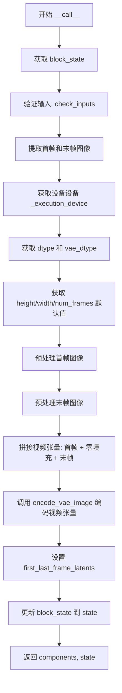

#### 带注释源码

```python
def __call__(self, components: WanModularPipeline, state: PipelineState) -> PipelineState:
    # 从管道状态中获取当前块的输入状态
    block_state = self.get_block_state(state)
    # 验证输入参数的有效性（height/width 可被 vae_scale_factor_spatial 整除，num_frames 符合要求）
    self.check_inputs(components, block_state)

    # 获取首帧和末帧图像
    first_frame_image = block_state.resized_image
    last_frame_image = block_state.resized_last_image

    # 获取执行设备和数据类型
    device = components._execution_device
    dtype = torch.float32  # 预处理使用 float32
    vae_dtype = components.vae.dtype  # VAE 使用其自身的 dtype

    # 获取或使用默认值（height、width、num_frames）
    height = block_state.height or components.default_height
    width = block_state.width or components.default_width
    num_frames = block_state.num_frames or components.default_num_frames

    # 使用视频处理器预处理首帧图像，转换为张量并扩展维度
    first_image_tensor = components.video_processor.preprocess(first_frame_image, height=height, width=width).to(
        device=device, dtype=dtype
    )
    first_image_tensor = first_image_tensor.unsqueeze(2)  # 在帧维度扩展

    # 使用视频处理器预处理末帧图像
    last_image_tensor = components.video_processor.preprocess(last_frame_image, height=height, width=width).to(
        device=device, dtype=dtype
    )
    last_image_tensor = last_image_tensor.unsqueeze(2)

    # 拼接视频张量：[首帧, 零填充的中间帧, 末帧]
    video_tensor = torch.cat(
        [
            first_image_tensor,
            first_image_tensor.new_zeros(
                first_image_tensor.shape[0], first_image_tensor.shape[1], num_frames - 2, height, width
            ),
            last_image_tensor,
        ],
        dim=2,  # 在帧维度拼接
    ).to(device=device, dtype=dtype)

    # 使用 VAE 编码视频张量，生成首帧和末帧的条件潜在向量
    block_state.first_last_frame_latents = encode_vae_image(
        video_tensor=video_tensor,
        vae=components.vae,
        generator=block_state.generator,
        device=device,
        dtype=vae_dtype,
        latent_channels=components.num_channels_latents,
    )

    # 将更新后的块状态设置回管道状态
    self.set_block_state(state, block_state)
    return components, state
```


### `WanPrepareFirstLastFrameLatentsStep.__call__`

该方法是 `WanPrepareFirstLastFrameLatentsStep` 类的核心调用方法，负责准备带有首帧和尾帧掩码的潜在向量，并将其添加到潜在条件中。具体流程为：从状态中获取首尾帧的潜在向量，根据帧数量创建掩码张量，对首帧位置进行掩码处理，最后将掩码与原始潜在向量在通道维度上拼接，生成用于指导视频生成的条件潜在向量。

参数：

- `components`：`WanModularPipeline`，包含 VAE 模型、时间缩放因子等组件的对象，提供模型执行所需的组件和配置信息。
- `state`：`PipelineState`，管道状态对象，包含当前处理块的中间状态（如首尾帧潜在向量、帧数量等）。

返回值：`PipelineState`，更新后的管道状态对象，其中包含新生成的条件潜在向量 `image_condition_latents`。

#### 流程图

```mermaid
flowchart TD
    A[开始 __call__] --> B[获取 block_state]
    B --> C[从 block_state 获取 first_last_frame_latents 形状]
    C --> D[创建初始掩码张量 mask_lat_size<br/>形状: batch_size x 1 x num_frames x latent_h x latent_w]
    D --> E[将中间帧位置设为 0<br/>保留首帧和尾帧]
    E --> F[提取首帧掩码 first_frame_mask]
    F --> G[沿时间维度重复首帧掩码<br/>repeat_interleave 次数 = vae_scale_factor_temporal]
    G --> H[拼接首帧掩码和其余掩码]
    H --> I[reshape 掩码张量以适配时间缩放]
    I --> J[转置维度]
    J --> K[将掩码移动到正确设备]
    K --> L[沿通道维度拼接掩码和首尾帧潜在向量]
    L --> M[存储到 block_state.image_condition_latents]
    M --> N[更新 state 并返回]
```

#### 带注释源码

```python
def __call__(self, components: WanModularPipeline, state: PipelineState) -> PipelineState:
    # 从管道状态中获取当前块的状态对象
    block_state = self.get_block_state(state)

    # 解包首尾帧潜在向量的形状信息
    # 形状: [batch_size, channels, frames, latent_height, latent_width]
    batch_size, _, _, latent_height, latent_width = block_state.first_last_frame_latents.shape

    # 创建一个全 1 的掩码张量，初始假设所有位置都需要掩码
    # 形状: [batch_size, 1, num_frames, latent_height, latent_width]
    mask_lat_size = torch.ones(batch_size, 1, block_state.num_frames, latent_height, latent_width)
    
    # 将中间帧（除首帧和尾帧外）的掩码值设为 0，保留首帧和尾帧
    # 索引范围: 1 到 num_frames-1（不包括尾帧）
    mask_lat_size[:, :, list(range(1, block_state.num_frames - 1))] = 0

    # 提取首帧位置的掩码
    # 形状: [batch_size, 1, 1, latent_height, latent_width]
    first_frame_mask = mask_lat_size[:, :, 0:1]
    
    # 沿时间维度重复首帧掩码，以适配 VAE 的时间缩放因子
    # 例如: 如果 num_frames=81, vae_scale_factor_temporal=4，则重复 4 次
    first_frame_mask = torch.repeat_interleave(
        first_frame_mask, dim=2, repeats=components.vae_scale_factor_temporal
    )
    
    # 拼接首帧掩码和其余帧的掩码（包含尾帧）
    # 形状重新排列以包含首帧掩码部分
    mask_lat_size = torch.concat([first_frame_mask, mask_lat_size[:, :, 1:, :]], dim=2)
    
    # Reshape 以适配时间缩放因子的维度
    # 将时间维度展开为 (frames/temporal_scale, temporal_scale)
    mask_lat_size = mask_lat_size.view(
        batch_size, -1, components.vae_scale_factor_temporal, latent_height, latent_width
    )
    
    # 转置维度，将时间相关维度移到正确位置
    # 从 [batch, frames, temporal_scale, h, w] 转为 [batch, temporal_scale, frames, h, w]
    mask_lat_size = mask_lat_size.transpose(1, 2)
    
    # 确保掩码张量在正确的设备上（与潜在向量相同）
    mask_lat_size = mask_lat_size.to(block_state.first_last_frame_latents.device)
    
    # 沿通道维度拼接掩码和首尾帧潜在向量
    # 掩码作为第一个通道，潜在向量作为后续通道
    # 结果形状: [batch_size, 1+channels, ...]
    block_state.image_condition_latents = torch.concat(
        [mask_lat_size, block_state.first_last_frame_latents], dim=1
    )

    # 将更新后的块状态写回管道状态
    self.set_block_state(state, block_state)
    
    # 返回组件和状态元组
    return components, state
```

## 关键组件


### 文本编码与提示词处理（Text Encoding & Prompt Processing）

负责将文本提示（prompt）转换为文本嵌入向量，支持正向和负向提示词，用于引导视频生成方向。

### T5文本嵌入提取（get_t5_prompt_embeds）

利用UMT5EncoderModel将文本提示编码为隐藏状态向量，支持变长提示词并填充到固定最大长度，返回标准化后的文本嵌入张量。

### 图像编码（Image Encoding）

使用CLIPImageProcessor和CLIPVisionModel从输入图像提取图像嵌入向量，用于视频生成的条件引导。

### VAE图像编码（VAE Image Encoding）

使用AutoencoderKLWan将视频/图像张量编码为潜在表示，支持批量生成器处理，应用潜在空间均值和标准差进行归一化。

### 潜在表示检索（Latent Retrieval）

从VAE编码器输出中提取潜在表示，支持采样模式（sample/argmax）或直接访问latents属性。

### 文本编码步骤（WanTextEncoderStep）

模块化管道步骤，封装文本编码流程，整合T5编码器、分词器和分类器自由引导，生成prompt_embeds和negative_prompt_embeds。

### 图像调整大小步骤（WanImageResizeStep）

根据目标面积（height * width）和宽高比调整图像尺寸，确保尺寸可被VAE空间缩放因子和patch大小整除。

### 图像裁剪调整大小步骤（WanImageCropResizeStep）

将目标图像调整大小并执行中心裁剪，使其与参考图像尺寸一致，用于首尾帧处理。

### 图像编码步骤（WanImageEncoderStep）

使用CLIP视觉模型编码调整大小后的图像，生成图像嵌入向量用于视频生成条件。

### 首尾帧图像编码步骤（WanFirstLastFrameImageEncoderStep）

同时编码首帧和尾帧图像，生成组合的图像嵌入向量，支持双条件视频生成。

### VAE编码器步骤（WanVaeEncoderStep）

使用VAE编码单帧图像生成第一帧条件潜在表示，构建视频张量并编码为潜在空间表示。

### 准备第一帧潜在表示步骤（WanPrepareFirstFrameLatentsStep）

创建第一帧掩码并与潜在表示拼接，生成用于去噪的图像条件潜在表示。

### 首尾帧VAE编码步骤（WanFirstLastFrameVaeEncoderStep）

同时编码首帧和尾帧图像为潜在表示，构建包含首尾帧的视频张量并编码为联合条件潜在表示。

### 准备首尾帧潜在表示步骤（WanPrepareFirstLastFrameLatentsStep）

创建首尾帧掩码并与潜在表示拼接，生成双条件图像潜在表示用于去噪过程。

### 文本清理函数（Text Cleaning Functions）

包含basic_clean、whitespace_clean和prompt_clean三个函数，用于清理和标准化输入文本，处理HTML转义和多余空格。

### 模块化管道块（ModularPipelineBlocks）

基类框架，定义管道步骤的标准接口，包括组件规范、输入输出参数、状态管理和执行调用。


## 问题及建议


### 已知问题

-   **返回值未定义风险**：`encode_prompt` 方法中，当 `prepare_unconditional_embeds=False` 时，`negative_prompt_embeds` 变量未被定义但会作为返回值返回，将导致 `UnboundLocalError`。
-   **类型不一致**：`WanTextEncoderStep.check_inputs` 定义为静态方法但接收 `block_state` 参数，而 `WanVaeEncoderStep.check_inputs` 接收 `components` 和 `block_state` 两个参数，调用方式不统一。
-   **魔法数字硬编码**：`encode_vae_image` 函数中 `latent_channels=16` 硬编码，多个 VAE 步骤中 `dtype = torch.float32` 硬编码，`num_frames` 默认值 81 散落在多处。
-   **重复代码**：图像编码步骤（`WanImageEncoderStep` 与 `WanFirstLastFrameImageEncoderStep`）、VAE 编码步骤（`WanVaeEncoderStep` 与 `WanFirstLastFrameVaeEncoderStep`）、以及 prepare latents 步骤存在大量重复逻辑，未抽象成通用方法。
-   **generator 类型处理缺陷**：`encode_vae_image` 中当传入 `generator` 列表时，`vae.encode()` 内部可能无法正确处理列表类型的 generator，导致运行时错误。

### 优化建议

-   **修复返回值问题**：在 `encode_prompt` 方法开头添加 `negative_prompt_embeds = None`，确保返回值始终定义。
-   **统一接口设计**：将 `check_inputs` 方法签名统一为接收 `(components, block_state)` 两个参数，或在基类中定义抽象方法规范。
-   **提取配置常量**：将 `latent_channels`、`dtype`、`default_num_frames` 等硬编码值提取为模块级常量或配置类，提高可维护性。
-   **抽象通用逻辑**：创建基类或混入类（Mixin）封装图像编码和 VAE 编码的通用逻辑，通过参数区分单帧/双帧处理场景，减少代码冗余。
-   **添加类型注解**：为全局函数如 `get_t5_prompt_embeds` 的返回值添加类型注解，增强代码可读性和 IDE 支持。
-   **优化张量操作**：合并连续的 `torch.concat` 和 `torch.transpose` 调用，使用原地操作减少内存分配。

## 其它


### 设计目标与约束

本代码实现了一个模块化的Wan视频生成管道，采用步骤（Step）模式将视频生成过程分解为多个独立可复用的组件。设计目标包括：支持文本到视频（Text-to-Video）和图像到视频（Image-to-Video）的生成能力；通过条件潜变量（condition_latents）实现首帧或首尾帧图像作为生成条件；支持分类器自由引导（Classifier-Free Guidance）来提升生成质量。约束条件包括：图像高度和宽度必须能被`vae_scale_factor_spatial`整除；帧数`num_frames`必须大于0且`(num_frames-1)`必须能被`vae_scale_factor_temporal`整除；所有张量操作需要在指定设备上执行且注意dtype转换。

### 错误处理与异常设计

代码中的错误处理主要通过以下机制实现：1）输入验证通过`check_inputs`静态方法进行，包括类型检查（如`prompt`必须为`str`或`list`）、维度检查（高度/宽度可被vae_scale_factor整除）、数量一致性检查（generator列表长度与batch size匹配）；2）数值合法性检查（如`num_frames`必须大于0）；3）类型兼容性检查（`negative_prompt`与`prompt`类型必须一致）；4）异常抛出使用`ValueError`和`TypeError`，并提供详细的错误信息说明期望值与实际值。当遇到无法处理的情况时（如`encoder_output`没有`latent_dist`或`latents`属性），会抛出`AttributeError`并提示"Could not access latents of provided encoder_output"。

### 数据流与状态机

整个管道的数据流遵循以下模式：首先通过`WanTextEncoderStep`将文本prompt编码为text_embeddings；然后通过`WanImageResizeStep`调整输入图像尺寸；接着通过`WanImageCropResizeStep`对尾帧图像进行裁剪以匹配首帧尺寸；之后通过`WanImageEncoderStep`或`WanFirstLastFrameImageEncoderStep`生成图像embeddings用于CLIP引导；通过`WanVaeEncoderStep`或`WanFirstLastFrameVaeEncoderStep`将图像编码为VAE潜变量；最后通过`WanPrepareFirstFrameLatentsStep`或`WanPrepareFirstLastFrameLatentsStep`准备带有mask的条件潜变量供后续去噪步骤使用。状态管理通过`PipelineState`对象和每个Step的`block_state`实现，block_state在每个Step中被获取、修改并重新设置。

### 外部依赖与接口契约

本代码依赖以下外部组件和接口：1）Transformers库提供的`AutoTokenizer`、`CLIPImageProcessor`、`CLIPVisionModel`、`UMT5EncoderModel`用于文本编码和图像编码；2）自定义的`AutoencoderKLWan`用于VAE编解码；3）`ClassifierFreeGuidance`用于无分类器引导；4）`VideoProcessor`用于视频预处理；5）可选依赖`ftfy`用于文本清洗。接口契约方面，每个Step类需继承`ModularPipelineBlocks`并实现：`description`属性返回步骤描述；`expected_components`属性返回所需组件列表；`inputs`属性定义输入参数；`intermediate_outputs`属性定义中间输出；`__call__`方法接收`components`和`state`参数并返回更新后的`(components, state)`元组。

### 版本与兼容性信息

代码版权为Apache License 2.0，由HuggingFace Team维护。代码中使用了Python 3.9+的类型注解语法（如`str | list[str]`、`torch.device | None`），需要Python 3.9及以上版本。PyTorch版本需支持`torch.no_grad`装饰器。依赖版本约束通过`is_ftfy_available()`和`is_torchvision_available()`进行条件检查，确保可选依赖不存在时不会导入失败。

    