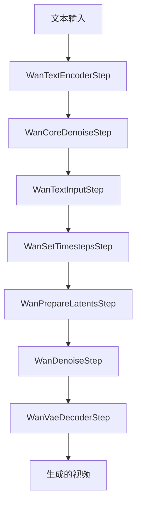
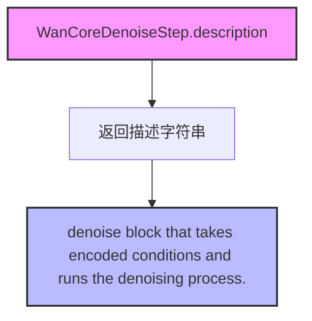
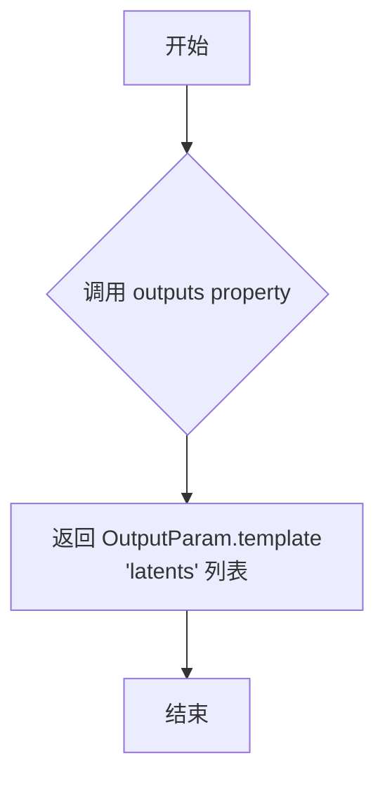
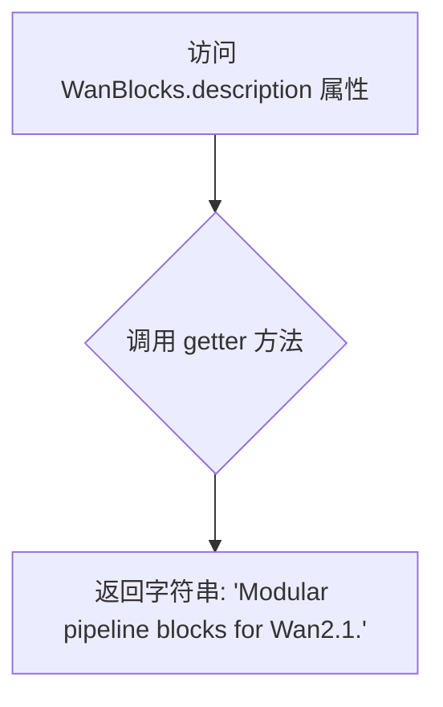

# `diffusers\src\diffusers\modular_pipelines\wan\modular_blocks_wan.py` 详细设计文档

Wan2.1 text2video模块化管道实现，定义了从文本输入到视频生成的去噪核心步骤和完整pipeline块，包含文本编码、时间步设置、潜在向量准备、去噪和VAE解码等阶段

## 整体流程



## 类结构

```
SequentialPipelineBlocks (基类)
├── WanCoreDenoiseStep (去噪核心步骤)
│   ├── WanTextInputStep
│   ├── WanSetTimestepsStep
│   ├── WanPrepareLatentsStep
│   └── WanDenoiseStep
└── WanBlocks (完整pipeline块)
    ├── WanTextEncoderStep
    ├── WanCoreDenoiseStep
    │   ├── WanTextInputStep
    │   ├── WanSetTimestepsStep
    │   ├── WanPrepareLatentsStep
    │   └── WanDenoiseStep
    └── WanVaeDecoderStep
```

## 全局变量及字段


### `logger`
    
模块级日志记录器，用于记录该模块的运行信息

类型：`logging.Logger`
    


### `WanCoreDenoiseStep.model_name`
    
模型名称标识，用于标识当前去噪步骤对应的模型为wan

类型：`str`
    


### `WanCoreDenoiseStep.block_classes`
    
去噪步骤的类列表，包含WanTextInputStep、WanSetTimestepsStep、WanPrepareLatentsStep、WanDenoiseStep四个步骤类

类型：`list`
    


### `WanCoreDenoiseStep.block_names`
    
去噪步骤的名称列表，对应block_classes中各步骤的标识名称

类型：`list`
    


### `WanCoreDenoiseStep.description`
    
返回去噪块描述，说明该模块接收编码条件并执行去噪处理流程

类型：`property`
    


### `WanCoreDenoiseStep.outputs`
    
返回输出参数模板，定义去噪后的latents张量输出

类型：`property`
    


### `WanBlocks.model_name`
    
模型名称标识，用于标识当前pipeline对应的模型为wan

类型：`str`
    


### `WanBlocks.block_classes`
    
完整pipeline的步骤类列表，包含文本编码、去噪核心处理、VAE解码三个步骤类

类型：`list`
    


### `WanBlocks.block_names`
    
完整pipeline的步骤名称列表，对应block_classes中各步骤的标识名称

类型：`list`
    


### `WanBlocks.description`
    
返回模块化pipeline块描述，说明该模块为Wan2.1模块化pipeline的构建块

类型：`property`
    


### `WanBlocks.outputs`
    
返回输出参数模板，定义生成的视频列表输出

类型：`property`
    
    

## 全局函数及方法


### `WanCoreDenoiseStep.description`

这是一个属性方法（property），属于 `WanCoreDenoiseStep` 类，用于返回该去噪块的描述信息。

参数：

- 无

返回值：`str`，返回去噪块的描述，说明该块接收编码条件并执行去噪过程。

#### 流程图



#### 带注释源码

```python
@property
def description(self):
    """
    属性方法：返回去噪块的描述信息
    
    返回值类型：str
    返回值描述：说明该去噪块的功能是接收编码条件并执行去噪过程
    
    所属类：WanCoreDenoiseStep
    父类：SequentialPipelineBlocks
    """
    return "denoise block that takes encoded conditions and runs the denoising process."
```


### `WanCoreDenoiseStep.outputs`

这是一个属性（property）方法，用于定义 `WanCoreDenoiseStep` 类的输出参数模板。它返回一个包含 `OutputParam` 对象的列表，该列表描述了该处理步骤的输出参数信息。

参数：此属性无参数。

返回值：`List[OutputParam]`，返回一个包含输出参数模板的列表，当前包含一个名为 "latents" 的输出参数模板。

#### 流程图



#### 带注释源码

```python
@property
def outputs(self):
    """
    返回该处理块的输出参数模板。

    该属性定义了 WanCoreDenoiseStep 的输出参数。
    在这个去噪核心步骤中，输出的是去噪后的 latents（潜在表示）。

    返回:
        List[OutputParam]: 包含输出参数模板的列表。
        当前返回一个包含 'latents' 参数模板的列表。
    """
    return [OutputParam.template("latents")]
```


### WanBlocks.description

这是一个属性方法（property），返回模块化pipeline块的描述信息，用于标识Wan2.1模块化pipeline的功能。

参数：无（这是一个属性访问器，不接受任何参数）

返回值：`str`，返回模块化pipeline块描述，值为 "Modular pipeline blocks for Wan2.1."

#### 流程图



#### 带注释源码

```python
@property
def description(self):
    """
    返回模块化pipeline块的描述信息。
    
    该属性用于提供WanBlocks类的功能描述，
    帮助文档生成和调试跟踪。
    
    Returns:
        str: 模块化pipeline块的描述字符串
              固定返回 "Modular pipeline blocks for Wan2.1."
    """
    return "Modular pipeline blocks for Wan2.1."
```


### `WanBlocks.outputs`

该属性用于返回 WanBlocks 模块的输出参数模板，包含生成视频的输出信息。

参数：无

返回值：`List[OutputParam]`，返回输出参数模板，输出名称为 `videos`，表示生成的视频列表。

#### 流程图

```mermaid
flowchart TD
    A[获取 outputs 属性] --> B{调用 outputs 方法}
    B --> C[返回 OutputParam.template('videos') 列表]
    C --> D[输出参数: videos]
```

#### 带注释源码

```python
@property
def outputs(self):
    """
    返回输出参数模板。

    该属性定义了该模块的输出参数，包含生成视频的输出信息。
    使用 OutputParam.template 方法创建输出参数模板。

    Returns:
        List[OutputParam]: 包含输出参数的列表，当前定义为 [OutputParam.template('videos')]
                          表示该模块输出视频列表
    """
    return [OutputParam.template("videos")]
```

## 关键组件


### WanCoreDenoiseStep

核心去噪块，负责接收编码后的条件（文本嵌入、潜在变量等）并执行去噪过程以生成视频潜在表示。内部组合了WanTextInputStep、WanSetTimestepsStep、WanPrepareLatentsStep和WanDenoiseStep四个子步骤，形成完整的文本到潜在变量的处理流程。

### WanBlocks

Wan2.1文本到视频生成的完整模块化管道块，按顺序执行文本编码、核心去噪和VAE解码三个主要阶段。设计遵循顺序管道模式（SequentialPipelineBlocks），支持从文本提示到最终视频输出的端到端生成。

### WanTextInputStep

文本输入处理步骤，负责接收prompt和negative_prompt并转换为模型可处理的文本嵌入表示，支持最大序列长度控制（默认512）。

### WanSetTimestepsStep

时间步设置步骤，负责配置去噪过程的调度参数，包括推理步数、时间步序列或sigmas的选择，用于控制去噪迭代过程。

### WanPrepareLatentsStep

潜在变量准备步骤，负责初始化或处理去噪的起始潜在变量，支持通过generator进行随机种子控制，支持图像/视频尺寸（height、width、num_frames）规范。

### WanDenoiseStep

去噪核心步骤，在给定的时间步序列下，利用transformer模型和scheduler对潜在变量进行迭代去噪，支持分类器自由引导（ClassifierFreeGuidance）以提升生成质量，支持注意力参数（attention_kwargs）传递。

### WanTextEncoderStep

文本编码步骤，使用UMT5EncoderModel和AutoTokenizer将文本prompt转换为高维语义嵌入（prompt_embeds和negative_prompt_embeds），为去噪过程提供文本条件。

### WanVaeDecoderStep

VAE解码步骤，使用AutoencoderKLWan将去噪后的潜在变量解码为实际的视频帧，支持可配置的输出类型（output_type），配合VideoProcessor完成最终视频生成。

### SequentialPipelineBlocks

顺序管道块基类，定义了模块化管道的执行框架，支持按顺序注册和执行多个处理步骤（block_classes），并通过OutputParam模板定义输入输出规范。

### 潜在变量与张量处理机制

系统通过latents参数在去噪步骤间传递潜在表示，支持Tensor格式的输入输出，可通过设置为None让系统自动初始化，支持generator参数实现可复现的随机生成。

### 分类器自由引导（ClassifierFreeGuidance）

去噪过程支持CFG机制，通过同时处理prompt_embeds和negative_prompt_embeds并在推理时调整引导权重，提升生成内容与文本提示的对齐度。

### 模块化设计架构

采用模块化管道架构，将复杂的视频生成流程拆分为独立的、可复用的步骤组件（text_encoder、denoise、decode），便于独立优化、替换和扩展各环节。


## 问题及建议


### 已知问题

-   **文档不完整**：大量参数（如`num_videos_per_prompt`、`num_inference_steps`、`timesteps`、`sigmas`、`height`、`width`、`num_frames`、`latents`、`generator`、`attention_kwargs`等）仅有TODO标记，缺少实际的参数描述和文档说明。
-   **硬编码默认值**：`max_sequence_length`默认512和`num_inference_steps`默认50以硬编码方式存在，降低了配置的灵活性。
-   **类名与职责不匹配**：`WanCoreDenoiseStep`类名暗示仅包含去噪步骤，但实际上包含text_input、set_timesteps、prepare_latents、denoise四个步骤，可能造成理解混淆。
-   **代码重复**：`model_name = "wan"`在两个类中重复定义，`@property`装饰的`description`和`outputs`方法在两个类中重复实现。
-   **类型注解不精确**：`latents`参数类型标注为`Tensor | NoneType`而非标准写法`Tensor | None`；`output_type`参数缺少字面量类型约束（如`Literal["np", "pt", "pil"]`）。
-   **缺少参数验证**：未发现对输入参数（如负样本embedding长度一致性、latents维度、图像尺寸边界等）的有效性校验逻辑。
-   **嵌套管道设计**：WanBlocks内部直接实例化了WanCoreDenoiseStep，可能导致耦合度过高和潜在的冗余计算。

### 优化建议

-   **完善文档**：将所有TODO标记的参数描述补充完整，明确每个参数的作用、默认值含义及使用约束。
-   **提取配置常量**：将硬编码的默认值（如512、50）提取为模块级常量或配置类，提高可维护性。
-   **重构类名**：考虑将`WanCoreDenoiseStep`重命名为更准确的名称（如`WanDenoisePipelineStep`），或在文档中明确说明其包含的多个子步骤。
-   **抽象公共逻辑**：将重复的`model_name`、`description`属性和`outputs`属性提升到基类或通过mixin实现，减少代码冗余。
-   **改进类型注解**：使用更精确的类型标注，引入`typing.Literal`或`typing_extensions.Literal`定义枚举类型的参数。
-   **添加参数验证**：在`__init__`或入口方法中添加关键参数的校验逻辑（如类型检查、维度验证、边界检查），并抛出有意义的异常信息。
-   **解耦管道组件**：考虑使用依赖注入或工厂模式创建子步骤，降低WanBlocks与WanCoreDenoiseStep之间的耦合。

## 其它


### 设计目标与约束

本模块的设计目标是实现Wan2.1文本到视频生成的模块化流水线架构，支持文本编码、去噪和VAE解码三个核心阶段的解耦与组合。核心约束包括：1）必须继承`SequentialPipelineBlocks`基类以保持流水线一致性；2）各步骤块必须按照固定顺序执行（text_encoder -> denoise -> decode）；3）支持 Classifier-Free Guidance 引导生成；4）必须兼容HuggingFace Diffusers生态的调度器（Scheduler）和模型接口。

### 错误处理与异常设计

代码中通过`logger`记录器进行日志记录，但缺少显式的异常处理机制。潜在异常场景包括：1）模型加载失败（transformer/VAE/text_encoder）；2）输入张量维度不匹配；3）调度器配置错误；4）GPU内存不足导致OOM。建议在关键步骤添加异常捕获：WanTextEncoderStep捕获文本编码异常、WanCoreDenoiseStep捕获去噪过程异常、WanVaeDecoderStep捕获解码异常。

### 数据流与状态机

数据流遵循以下路径：`prompt` → `WanTextEncoderStep` (生成prompt_embeds/negative_prompt_embeds) → `WanTextInputStep` → `WanSetTimestepsStep` → `WanPrepareLatentsStep` → `WanDenoiseStep` (迭代去噪) → `latents` → `WanVaeDecoderStep` → `videos`。状态机表现为：初始化状态（空latents）→ 编码状态（prompt_embeds就绪）→ 去噪状态（latents逐步精化）→ 解码状态（最终视频生成）。状态转换由SequentialPipelineBlocks的`__call__`方法驱动。

### 外部依赖与接口契约

核心依赖包括：1）`transformer` - WanTransformer3DModel，用于去噪；2）`scheduler` - UniPCMultistepScheduler，控制去噪调度；3）`guider` - ClassifierFreeGuidance，文本引导；4）`vae` - AutoencoderKLWan，视频解码；5）`text_encoder` - UMT5EncoderModel，文本编码；6）`tokenizer` - AutoTokenizer。输入契约：prompt可为None但需配合prompt_embeds；latents可为None表示随机初始化；height/width/num_frames定义输出分辨率。输出契约：返回videos列表，类型由output_type指定（默认np数组）。

### 性能考量与优化空间

当前设计存在以下性能优化空间：1）TODO标记的字段需完善文档，特别是num_videos_per_prompt、num_inference_steps等关键参数；2）缺乏批处理优化策略，多视频生成时建议缓存编码结果；3）缺少ONNX/TorchScript导出支持；4）注意力机制（attention_kwargs）支持有限，仅传递未深度集成；5）缺少异步执行接口，无法充分利用异步推理；6）latents缓存机制缺失，相同prompt重复生成时未利用缓存。

### 兼容性设计

本模块设计为与HuggingFace Diffusers v0.26+兼容。模型名称标记为"wan"，支持Wan2.1系列模型。调度器接口遵循Diffusers标准SchedulerMixin契约。输出格式支持numpy数组(np)和PyTorch张量(pt)两种模式。版本兼容性考虑：1）SequentialPipelineBlocks基类接口稳定性；2）OutputParam模板结构；3）PipelineBlockInfo元数据格式。

### 配置与扩展性

模块支持以下扩展点：1）通过block_classes属性替换自定义步骤实现；2）通过attention_kwargs传递注意力机制参数；3）支持自定义调度器（scheduler）注入；4）支持自定义guider实现。配置约束：max_sequence_length默认512；num_inference_steps默认50；output_type默认"np"。

### 安全与权限

代码遵循Apache License 2.0开源协议。需注意：1）模型权重下载需遵守相应许可证；2）文本编码涉及用户输入，需考虑输入 sanitization；3）生成的视频内容符合TOS；4）无敏感数据处理逻辑。

    