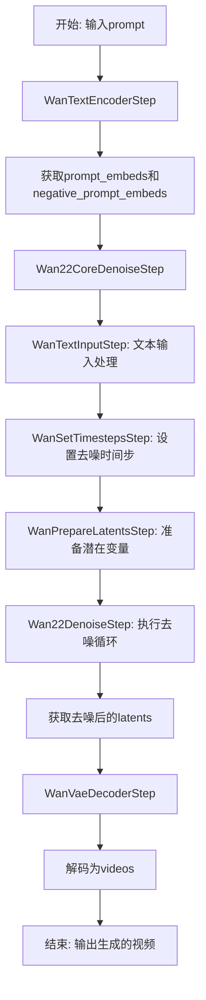
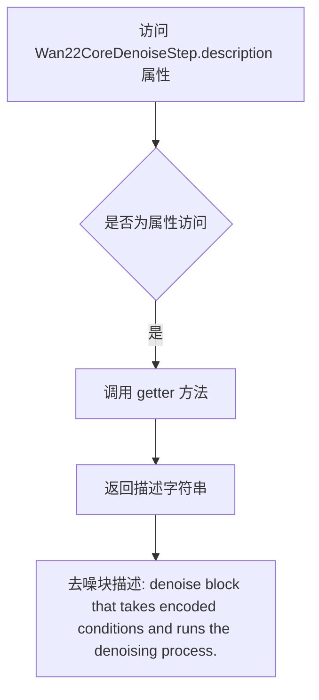
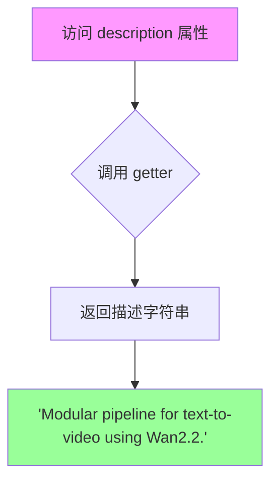
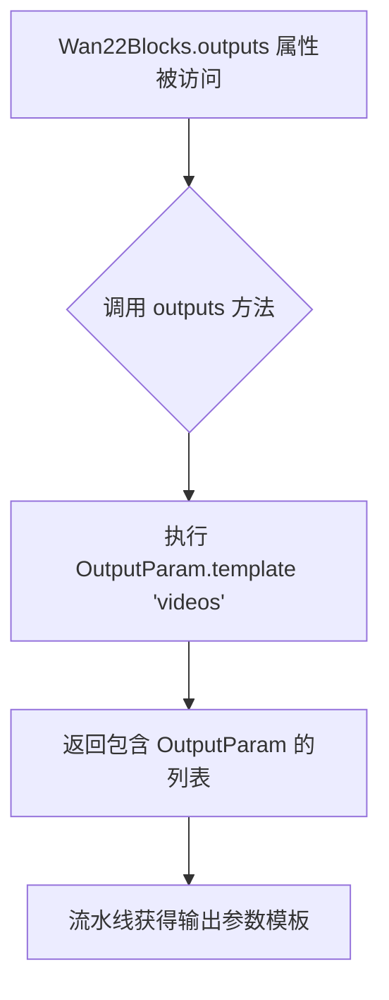

# `diffusers\src\diffusers\modular_pipelines\wan\modular_blocks_wan22.py` 详细设计文档

这是Wan2.2文本到视频生成模型的模块化管道实现，包含了核心去噪步骤(Wan22CoreDenoiseStep)和完整推理管道(Wan22Blocks)，通过串接文本编码、去噪和VAE解码三个主要阶段，将文本提示转换为视频内容。

## 整体流程



## 类结构

```
SequentialPipelineBlocks (基类)
├── Wan22CoreDenoiseStep (去噪核心块)
│   ├── WanTextInputStep
│   ├── WanSetTimestepsStep
│   ├── WanPrepareLatentsStep
│   └── Wan22DenoiseStep
└── Wan22Blocks (完整文本到视频管道)
    ├── WanTextEncoderStep
    ├── Wan22CoreDenoiseStep
    └── WanVaeDecoderStep
```

## 全局变量及字段


### `logger`
    
模块级别的日志记录器，用于输出运行日志

类型：`logging.Logger`
    


### `Wan22CoreDenoiseStep.model_name`
    
模型名称标识，值为'wan'

类型：`str`
    


### `Wan22CoreDenoiseStep.block_classes`
    
去噪步骤的类列表

类型：`list`
    


### `Wan22CoreDenoiseStep.block_names`
    
去噪步骤的名称列表

类型：`list`
    


### `Wan22CoreDenoiseStep.description`
    
返回去噪块描述

类型：`property`
    


### `Wan22CoreDenoiseStep.outputs`
    
返回输出参数模板

类型：`property`
    


### `Wan22Blocks.model_name`
    
模型名称标识，值为'wan'

类型：`str`
    


### `Wan22Blocks.block_classes`
    
完整管道的步骤类列表

类型：`list`
    


### `Wan22Blocks.block_names`
    
完整管道的步骤名称列表

类型：`list`
    


### `Wan22Blocks.description`
    
返回管道描述

类型：`property`
    


### `Wan22Blocks.outputs`
    
返回输出参数模板

类型：`property`
    
    

## 全局函数及方法


### `Wan22CoreDenoiseStep.description`

返回去噪块的描述信息，用于说明该模块的功能定位。

参数：此属性不需要任何参数（`@property` 装饰器下的 getter 方法）

返回值：`str`，返回去噪块的描述字符串 `"denoise block that takes encoded conditions and runs the denoising process."`

#### 流程图



#### 带注释源码

```python
@property
def description(self):
    """
    返回去噪块的描述信息。
    
    该属性用于获取当前去噪块的功能说明，主要描述了：
    - 接收编码后的条件（encoded conditions）作为输入
    - 执行去噪过程（denoising process）
    
    Returns:
        str: 去噪块的描述字符串
    """
    return "denoise block that takes encoded conditions and runs the denoising process."
```


### Wan22CoreDenoiseStep.outputs

该属性用于返回去噪步骤的输出参数模板，定义了该步骤输出的参数名称和类型。

参数：无需输入参数（仅使用 self）

返回值：`List[OutputParam]`，返回包含单个输出参数模板的列表，其中输出参数名称为 "latents"（表示去噪后的潜在表示）

#### 流程图

```mermaid
flowchart TD
    A[开始] --> B{执行 outputs 属性}
    B --> C[创建 OutputParam 模板: name='latents']
    C --> D[返回列表 [OutputParam]]
    D --> E[结束]
    
    style A fill:#f9f,stroke:#333
    style E fill:#9f9,stroke:#333
```

#### 带注释源码

```python
@property
def outputs(self):
    """
    返回去噪步骤的输出参数模板。
    
    该属性定义了该管道步骤运行时将产生的输出参数。
    在 Wan22CoreDenoiseStep 中，输出为去噪后的 latents（潜在表示）。
    
    Returns:
        List[OutputParam]: 包含输出参数模板的列表，目前只包含一个 'latents' 参数
        
    Example:
        >>> step = Wan22CoreDenoiseStep(...)
        >>> output_params = step.outputs
        >>> print(output_params[0].name)
        'latents'
    """
    # 使用 OutputParam.template 创建输出参数模板
    # 参数名为 "latents"，表示去噪处理后生成的潜在表示张量
    return [OutputParam.template("latents")]
```

#### 补充说明

- **设计目标**：该方法遵循模块化管道（Modular Pipeline）模式，通过统一的输出参数模板接口，规范化各个处理步骤的输出定义
- **数据流**：`Wan22CoreDenoiseStep` 是 Wan2.2 视频生成管道的核心去噪组件，接收文本嵌入和时间步，经过去噪处理后输出干净 latents
- **OutputParam 模板**：使用 `OutputParam.template()` 工厂方法创建参数模板，这是一种声明式的参数定义方式，便于后续的参数验证和类型检查


### `Wan22Blocks.description`

这是一个属性方法（property），用于返回 Wan22Blocks 管道类的描述信息。

参数：无需参数

返回值：`str`，返回对 Wan22Blocks 管道功能的描述字符串 "Modular pipeline for text-to-video using Wan2.2."

#### 流程图



#### 带注释源码

```python
@property
def description(self):
    """
    返回 Wan22Blocks 管道类的描述信息。
    
    该属性用于获取当前管道模块的功能说明，
    主要用于文档生成、调试信息和日志记录等场景。
    
    Returns:
        str: 描述字符串，说明这是一个用于 Wan2.2 的文本到视频模块化管道
    """
    return "Modular pipeline for text-to-video using Wan2.2."
```

#### 补充说明

| 项目 | 说明 |
|------|------|
| **所属类** | `Wan22Blocks` |
| **方法类型** | 属性 getter (`@property`) |
| **定义位置** | 第 124-125 行 |
| **调用场景** | 通常在需要获取管道描述信息时调用，如日志记录、文档生成、调试输出等 |
| **相关属性** | 同类中还有 `outputs` 属性，用于定义管道的输出参数 |


### `Wan22Blocks.outputs`

该属性方法定义了 Wan2.2 文本转视频模块化流水线的输出参数模板，返回一个包含视频输出参数的列表，用于描述该流水线最终生成的输出内容。

参数：此属性为只读属性，无需输入参数。

返回值：`List[OutputParam]`，返回包含输出参数模板的列表，当前定义为 `[OutputParam.template("videos")]`，表示该流水线输出视频数据。

#### 流程图



#### 带注释源码

```python
@property
def outputs(self):
    """
    定义 Wan22Blocks 模块化流水线的输出参数模板。
    
    该属性方法返回包含输出参数定义的列表，用于描述流水线
    最终生成的输出内容。当前定义输出为视频（videos）。
    
    Returns:
        List[OutputParam]: 包含输出参数模板的列表，
                          当前只包含一个 'videos' 参数模板
    """
    return [OutputParam.template("videos")]
```

## 关键组件


### Wan22CoreDenoiseStep

Wan2.2核心去噪步骤类，继承自SequentialPipelineBlocks，负责执行完整的去噪流程，包含文本输入、时间步设置、潜在变量准备和去噪操作。

### Wan22Blocks

Wan2.2模块化管道类，继承自SequentialPipelineBlocks，是文本到视频生成的顶层编排器，依次执行文本编码、去噪和视频解码步骤。

### WanTextEncoderStep

文本编码步骤，负责将输入的文本提示转换为文本嵌入向量，供后续去噪步骤使用。

### WanTextInputStep

文本输入预处理步骤，负责处理和准备文本输入数据。

### WanSetTimestepsStep

时间步设置步骤，负责配置去噪过程的时间步调度。

### WanPrepareLatentsStep

潜在变量准备步骤，负责初始化或准备去噪所需的潜在变量。

### Wan22DenoiseStep

Wan2.2去噪核心步骤，负责执行实际的扩散模型去噪推理过程。

### WanVaeDecoderStep

VAE解码步骤，负责将去噪后的潜在变量解码为最终的视频输出。

### SequentialPipelineBlocks

顺序管道块基类，提供模块化的步骤组合和执行框架。

### OutputParam.template

输出参数模板，用于定义管道各步骤的输出规范。

### 关键配置参数

boundary_ratio：边界比率配置（默认0.875），用于将去噪循环划分为高噪声和低噪声阶段。


## 问题及建议


### 已知问题

-   **文档严重不完整**：大量参数（如`num_videos_per_prompt`、`prompt_embeds`、`timesteps`、`sigmas`等）标注为`TODO: Add description`，无法为使用者提供有效指导
-   **类型标注不规范**：使用`Tensor | NoneType`而非Python标准`Optional[Tensor]`，不符合PEP 484规范
-   **日志对象未使用**：导入了`logger`但在代码中没有任何日志输出，违反了日志记录最佳实践
-   **重复代码模式**：`description`和`outputs`属性在每个类中以相同模式重复定义，可考虑抽象到基类或使用装饰器
-   **硬编码魔法数字**：`boundary_ratio`默认值0.875缺乏业务解释注释，且该值在不同组件间可能需要保持一致性
-   **组件配置不透明**：类文档中提到`guider`、`guider_2`、`transformer`和`transformer_2`两个transformer，但它们的职责分工和协作机制未说明
-   **缺失错误处理**：未见对输入参数的有效性校验（如负数尺寸、None值处理等）

### 优化建议

-   **补充完整文档**：逐一完成TODO标记的参数描述，明确每个输入参数的用途、约束和默认值来源
-   **统一类型注解**：将`Tensor | NoneType`改为`Optional[Tensor]`，提升代码可读性和工具链支持
-   **启用日志记录**：在关键路径添加`logger.info`、`logger.warning`等日志输出，便于调试和监控
-   **抽象公共逻辑**：将`description`和`outputs`属性的定义模式提取到父类`SequentialPipelineBlocks`或使用`__init_subclass__`机制
-   **提取配置常量**：将`boundary_ratio`等配置值声明为类常量并添加文档注释说明其业务含义
-   **添加输入校验**：在`__call__`或初始化方法中添加参数范围校验（如`height > 0`、`num_frames > 0`），并给出明确的错误信息


## 其它


### 设计目标与约束

本模块化管道旨在实现Wan2.2文本到视频生成功能，采用模块化架构以提高可扩展性和可维护性。设计目标包括：支持文本提示到视频的端到端生成、模块化组合不同处理步骤（文本编码、去噪、VAE解码）、支持分类器无分类器引导（Classifier Free Guidance）以提升生成质量、灵活配置去噪过程的边界比率（boundary_ratio）以平衡高噪声和低噪声阶段。约束条件包括：依赖HuggingFace Transformers库和diffusers架构、需要支持GPU加速的transformer模型和VAE解码器、输入高度/宽度/帧数需符合模型要求。

### 错误处理与异常设计

代码依赖于...utils模块的logging工具进行日志记录，使用logger.warning和logger.error记录警告和错误。当输入参数不符合要求时（如latents类型不匹配、prompt_embeds维度错误），应在各步骤类中抛出ValueError或TypeError。模块化管道框架（SequentialPipelineBlocks）应负责捕获并传播异常，确保错误信息能够传递到顶层调用者。对于可选参数（如generator、attention_kwargs），应进行None检查并在必要时使用默认值。潜在变量（latents）为None时的处理逻辑应在WanPrepareLatentsStep中实现。

### 数据流与状态机

数据流遵循以下顺序：输入文本prompt → WanTextEncoderStep（生成prompt_embeds和negative_prompt_embeds） → WanSetTimestepsStep（根据num_inference_steps设置timesteps） → WanPrepareLatentsStep（初始化或处理latents） → Wan22DenoiseStep（执行去噪循环，生成去噪后的latents） → WanVaeDecoderStep（将latents解码为视频）。状态机方面，管道初始状态为接收原始输入（prompt、negative_prompt、height、width、num_frames等），中间状态为各步骤的输出（编码后的文本embedding、设置好的timesteps、处理后的latents），最终状态为生成的视频列表（videos）。去噪步骤内部还包含迭代状态，在每个时间步循环执行去噪操作。

### 外部依赖与接口契约

核心依赖包括：...utils.logging（日志记录）、..modular_pipeline.SequentialPipelineBlocks（模块化管道基类）、..modular_pipeline_utils.OutputParam（输出参数模板）、.before_denoise模块（WanPrepareLatentsStep、WanSetTimestepsStep、WanTextInputStep）、.decoders模块（WanVaeDecoderStep）、.denoise模块（Wan22DenoiseStep）、.encoders模块（WanTextEncoderStep）。接口契约方面，SequentialPipelineBlocks子类需定义block_classes列表、block_names列表、description属性（返回块描述字符串）和outputs属性（返回OutputParam列表）。各步骤类需实现__call__方法以执行具体逻辑，输入输出遵循预定义的参数约定。配置参数boundary_ratio默认为0.875，用于控制去噪循环中高噪声和低噪声阶段的划分。

### 配置与参数说明

Wan22CoreDenoiseStep配置参数：boundary_ratio（默认0.875）- 划分去噪循环中高噪声和低噪声阶段的边界比率。Wan22Blocks配置参数同样包含boundary_ratio（默认0.875）。输入参数包括：prompt（文本提示）、negative_prompt（负面提示）、max_sequence_length（最大序列长度，默认512）、num_videos_per_prompt（每个提示生成的视频数，默认1）、num_inference_steps（推理步数，默认50）、timesteps（时间步，可选）、sigmas（噪声水平，可选）、height/width/num_frames（视频尺寸和帧数）、latents（潜在变量，可选）、generator（随机生成器，可选）、attention_kwargs（注意力参数，可选）、output_type（输出类型，默认np）。输出参数：videos（生成的视频列表）。

### 性能考虑与优化空间

潜在性能瓶颈包括：去噪循环中的transformer推理（可能需要优化使用ONNX或TorchScript）、VAE解码大尺寸视频的计算开销、文本编码器推理的延迟。优化方向：可考虑实现潜在变量缓存机制避免重复初始化、可添加批处理支持以提高多视频生成效率、可探索CPU offloading策略以节省显存、attention_kwargs可支持xFormers等高效注意力实现。当前代码存在TODO标记的未完成文档（多处TODO: Add description），表明部分参数功能描述尚需完善。

### 安全性与权限

代码遵循Apache License 2.0开源许可。处理用户输入的prompt和negative_prompt时，应考虑内容过滤和安全审查机制。生成的视频内容应遵守相关法律法规和平台使用条款。模型加载和推理过程中应避免敏感信息泄露。transformer模型和文本编码器的使用需遵守其各自的开源许可协议。

### 版本兼容性

代码明确标注版权年份为2025年，依赖的HuggingFace生态库应保持版本兼容。Wan22CoreDenoiseStep和Wan22Blocks类分别定义model_name = "wan"，表明这是专为Wan 2.2模型设计的实现。模块化架构允许通过替换block_classes中的步骤类来实现不同版本模型的兼容。向后兼容性需要确保SequentialPipelineBlocks基类的接口保持稳定。

### 测试策略建议

单元测试应覆盖各步骤类（WanTextEncoderStep、WanSetTimestepsStep、WanPrepareLatentsStep、Wan22DenoiseStep、WanVaeDecoderStep）的独立功能。集成测试应验证Wan22CoreDenoiseStep和Wan22Blocks的端到端执行流程。测试用例应包含：正常输入生成、边界条件处理（最小/最大尺寸、零帧数等）、错误输入的异常捕获、多种配置参数组合。性能测试应评估不同硬件配置下的推理速度和显存占用。Mock测试可用于隔离外部依赖（模型权重、tokenizer等）。

    