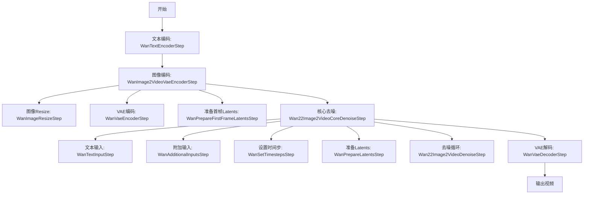
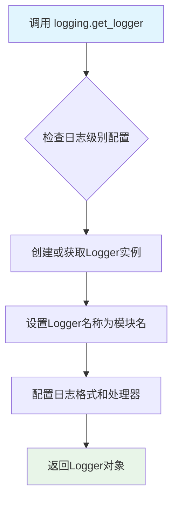
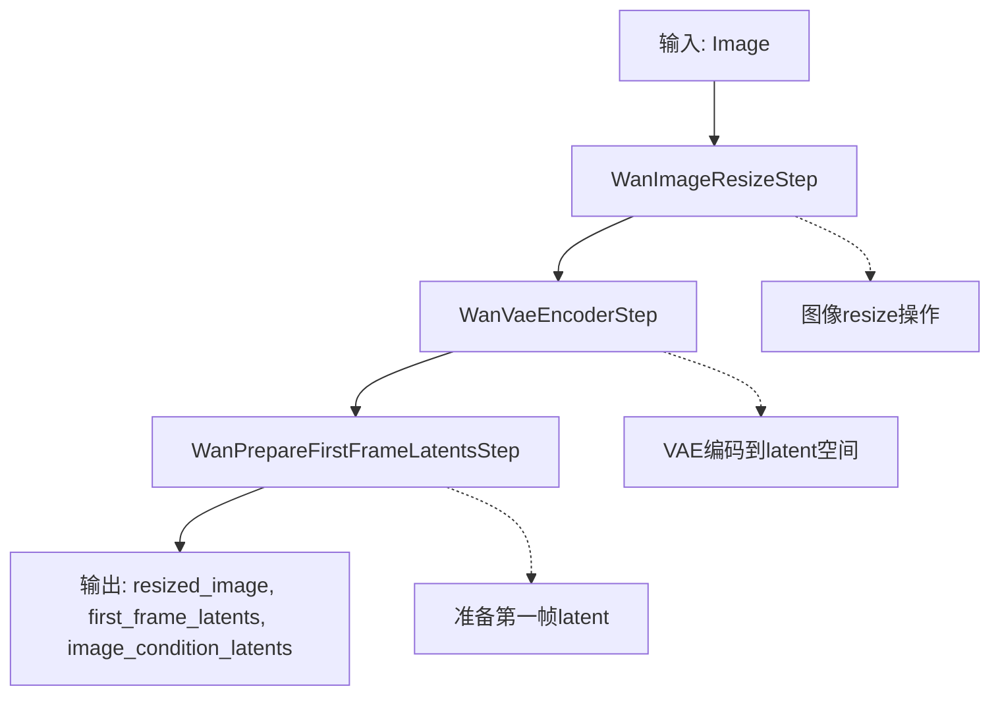
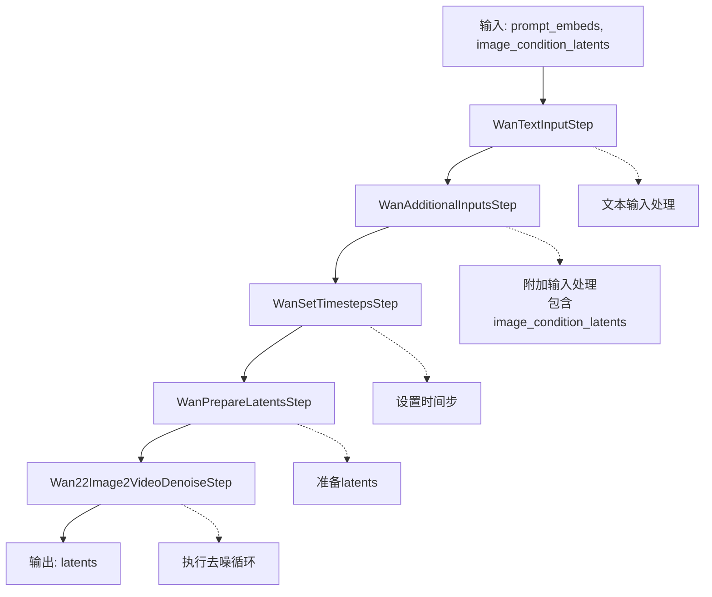
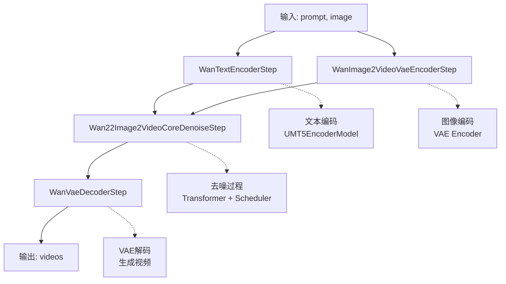
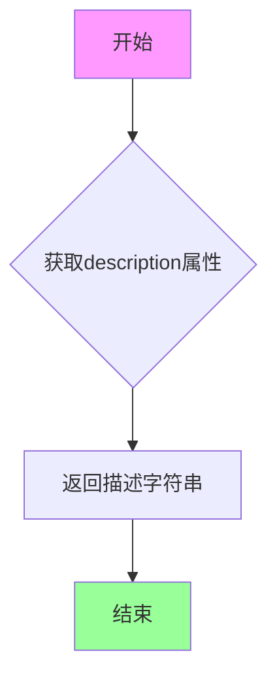
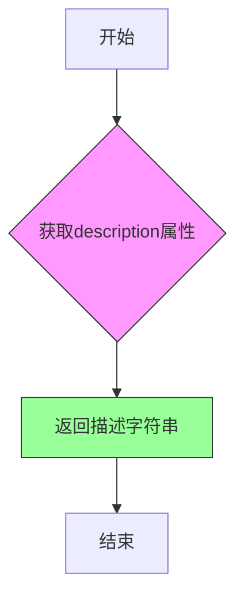
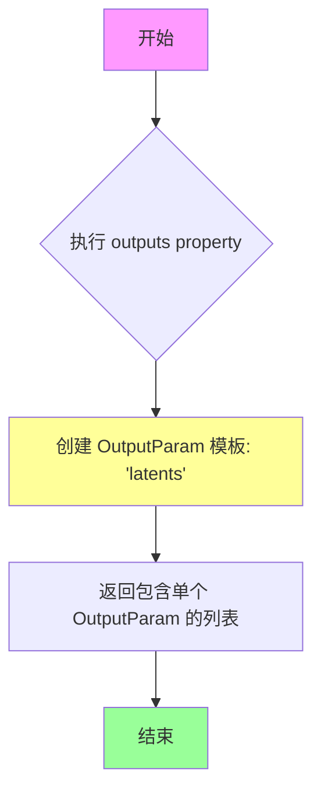
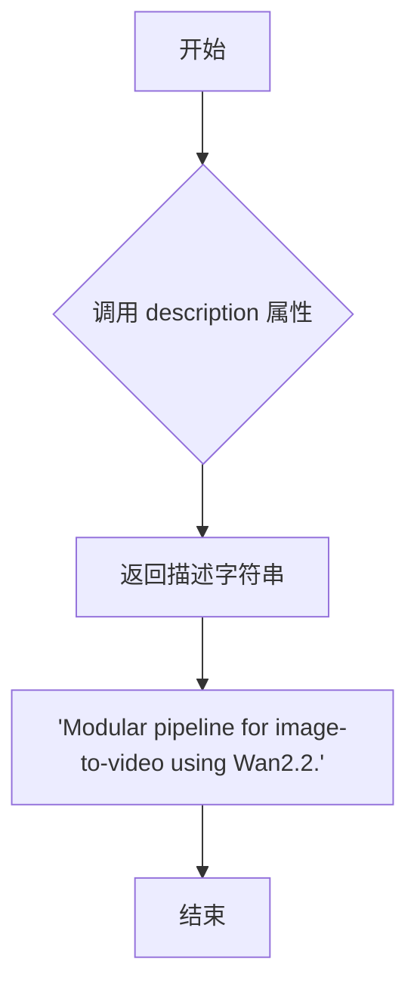
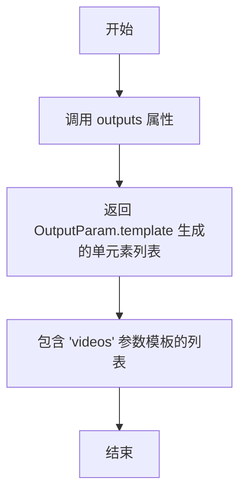

# `diffusers\src\diffusers\modular_pipelines\wan\modular_blocks_wan22_i2v.py` 详细设计文档

Wan2.2图像到视频(Image-to-Video)生成Pipeline的模块化实现，通过VAE编码输入图像和文本嵌入，然后使用Transformer进行多步去噪，最后通过VAE解码器将去噪后的latents转换为视频输出。

## 整体流程



## 类结构

```
SequentialPipelineBlocks (抽象基类)
└── WanImage2VideoPipeline
    ├── WanImage2VideoVaeEncoderStep (图像编码分支)
    │   ├── WanImageResizeStep
    │   ├── WanVaeEncoderStep
    │   └── WanPrepareFirstFrameLatentsStep
    ├── Wan22Image2VideoCoreDenoiseStep (去噪分支)
    │   ├── WanTextInputStep
    │   ├── WanAdditionalInputsStep
    │   ├── WanSetTimestepsStep
    │   ├── WanPrepareLatentsStep
    │   └── Wan22Image2VideoDenoiseStep
    └── WanVaeDecoderStep (解码分支)
```

## 全局变量及字段


### `logger`
    
模块级日志记录器，用于记录该模块的运行信息

类型：`logging.Logger`
    


### `WanImage2VideoVaeEncoderStep.model_name`
    
模型名称标识

类型：`str`
    


### `WanImage2VideoVaeEncoderStep.block_classes`
    
包含编码步骤的类列表

类型：`List`
    


### `WanImage2VideoVaeEncoderStep.block_names`
    
步骤名称列表

类型：`List`
    


### `Wan22Image2VideoCoreDenoiseStep.model_name`
    
模型名称标识

类型：`str`
    


### `Wan22Image2VideoCoreDenoiseStep.block_classes`
    
包含去噪步骤的类列表

类型：`List`
    


### `Wan22Image2VideoCoreDenoiseStep.block_names`
    
步骤名称列表

类型：`List`
    


### `Wan22Image2VideoBlocks.model_name`
    
模型名称标识

类型：`str`
    


### `Wan22Image2VideoBlocks.block_classes`
    
包含主Pipeline所有步骤的类列表

类型：`List`
    


### `Wan22Image2VideoBlocks.block_names`
    
步骤名称列表

类型：`List`
    
    

## 全局函数及方法


### `logging.get_logger`

获取与当前模块关联的日志记录器实例，用于在模块内进行日志记录。

参数：

- `__name__`：`str`，Python 模块的 `__name__` 变量，通常传入 `__name__` 以便日志记录器以模块名称作为标识

返回值：`logging.Logger`，返回一个日志记录器（Logger）对象，可用于输出日志信息

#### 流程图



#### 带注释源码

```python
# 从上层包的 utils 模块导入 logging 工具
from ...utils import logging

# 使用当前模块的 __name__ 作为日志记录器的名称
# 这样可以方便地在日志中识别出日志来源的模块
# pylint: disable=invalid-name: 禁用此行关于变量名的检查
logger = logging.get_logger(__name__)
```

---

### 补充说明

**调用位置**：此函数在模块顶层被调用，生成的 `logger` 对象将用于该模块后续的日志记录操作。

**设计意图**：在 Hugging Face 的 diffusers 库中，`logging.get_logger` 是标准化的日志获取方式，确保所有模块使用统一的日志配置和格式，便于调试和监控。

**返回值类型说明**：实际返回的是 `logging.Logger` 类型，这是 Python 标准库 `logging` 模块中的日志记录器类，用于记录不同级别的日志信息（如 debug、info、warning、error 等）。


### `WanImage2VideoVaeEncoderStep`

Image2Video VAE 图像编码器步骤，对图像进行resize操作，并将第一帧图像编码为其latent表示形式。

参数：

- `image`：`Image`，输入的图像数据
- `height`：`int`，可选，默认为480，目标图像高度
- `width`：`int`，可选，默认为832，目标图像宽度
- `num_frames`：`int`，可选，默认为81，视频帧数
- `generator`：`None`，可选，随机数生成器

返回值：`tuple`，包含以下元素：
- `resized_image`：`Image`，调整大小后的图像
- `first_frame_latents`：`Tensor`，第一帧图像的video latent表示
- `image_condition_latents`：`Tensor | NoneType`，图像条件latent

#### 流程图



#### 带注释源码

```python
# auto_docstring
class WanImage2VideoVaeEncoderStep(SequentialPipelineBlocks):
    """
    Image2Video Vae Image Encoder step that resize the image and encode the first frame image to its latent
    representation

      Components:
          vae (`AutoencoderKLWan`) video_processor (`VideoProcessor`)

      Inputs:
          image (`Image`):
              TODO: Add description.
          height (`int`, *optional*, defaults to 480):
              TODO: Add description.
          width (`int`, *optional*, defaults to 832):
              TODO: Add description.
          num_frames (`int`, *optional*, defaults to 81):
              TODO: Add description.
          generator (`None`, *optional*):
              TODO: Add description.

      Outputs:
          resized_image (`Image`):
              TODO: Add description.
          first_frame_latents (`Tensor`):
              video latent representation with the first frame image condition
          image_condition_latents (`Tensor | NoneType`):
              TODO: Add description.
    """

    # 模型名称标识
    model_name = "wan-i2v"
    
    # 块类列表：包含图像resize、VAE编码、准备第一帧latents三个步骤
    block_classes = [WanImageResizeStep, WanVaeEncoderStep, WanPrepareFirstFrameLatentsStep]
    
    # 块名称列表
    block_names = ["image_resize", "vae_encoder", "prepare_first_frame_latents"]

    @property
    def description(self):
        """返回该步骤的描述信息"""
        return "Image2Video Vae Image Encoder step that resize the image and encode the first frame image to its latent representation"
```

---

### `Wan22Image2VideoCoreDenoiseStep`

接收编码后的文本和图像latent条件，执行去噪过程的去噪块。

参数：

- `num_videos_per_prompt`：`None`，可选，默认为1，每个prompt生成的视频数量
- `prompt_embeds`：`Tensor`，预生成的文本embeddings
- `negative_prompt_embeds`：`Tensor`，可选，预生成的负面文本embeddings
- `height`：`None`，可选，目标高度
- `width`：`None`，可选，目标宽度
- `num_frames`：`None`，可选，视频帧数
- `image_condition_latents`：`None`，可选，图像条件latent
- `num_inference_steps`：`None`，可选，默认为50，推理步数
- `timesteps`：`None`，可选，时间步
- `sigmas`：`None`，可选，sigma值
- `latents`：`Tensor | NoneType`，可选，初始latent
- `generator`：`None`，可选，随机数生成器
- `attention_kwargs`：`None`，可选，注意力相关参数

返回值：`Tensor`，去噪后的latents

#### 流程图



#### 带注释源码

```python
# inputs (text + image_condition_latents) -> set_timesteps -> prepare_latents -> denoise (latents)
# auto_docstring
class Wan22Image2VideoCoreDenoiseStep(SequentialPipelineBlocks):
    """
    denoise block that takes encoded text and image latent conditions and runs the denoising process.

      Components:
          transformer (`WanTransformer3DModel`) scheduler (`UniPCMultistepScheduler`) guider (`ClassifierFreeGuidance`)
          guider_2 (`ClassifierFreeGuidance`) transformer_2 (`WanTransformer3DModel`)

      Configs:
          boundary_ratio (default: 0.875): The boundary ratio to divide the denoising loop into high noise and low
          noise stages.

      Inputs:
          num_videos_per_prompt (`None`, *optional*, defaults to 1):
              TODO: Add description.
          prompt_embeds (`Tensor`):
              Pre-generated text embeddings. Can be generated from text_encoder step.
          negative_prompt_embeds (`Tensor`, *optional*):
              Pre-generated negative text embeddings. Can be generated from text_encoder step.
          height (`None`, *optional*):
              TODO: Add description.
          width (`None`, *optional*):
              TODO: Add description.
          num_frames (`None`, *optional*):
              TODO: Add description.
          image_condition_latents (`None`, *optional*):
              TODO: Add description.
          num_inference_steps (`None`, *optional*, defaults to 50):
              TODO: Add description.
          timesteps (`None`, *optional*):
              TODO: Add description.
          sigmas (`None`, *optional*):
              TODO: Add description.
          latents (`Tensor | NoneType`, *optional*):
              TODO: Add description.
          generator (`None`, *optional*):
              TODO: Add description.
          attention_kwargs (`None`, *optional*):
              TODO: Add description.

      Outputs:
          latents (`Tensor`):
              Denoised latents.
    """

    model_name = "wan-i2v"
    block_classes = [
        WanTextInputStep,
        WanAdditionalInputsStep(image_latent_inputs=["image_condition_latents"]),
        WanSetTimestepsStep,
        WanPrepareLatentsStep,
        Wan22Image2VideoDenoiseStep,
    ]
    block_names = [
        "input",
        "additional_inputs",
        "set_timesteps",
        "prepare_latents",
        "denoise",
    ]

    @property
    def description(self):
        """返回去噪块的描述信息"""
        return "denoise block that takes encoded text and image latent conditions and runs the denoising process."

    @property
    def outputs(self):
        """定义输出参数模板"""
        return [OutputParam.template("latents")]
```

---

### `Wan22Image2VideoBlocks`

Wan2.2的模块化图像到视频管道，整合文本编码、VAE编码、去噪和VAE解码全过程。

参数：

- `prompt`：`None`，可选，文本提示
- `negative_prompt`：`None`，可选，负面文本提示
- `max_sequence_length`：`None`，可选，默认为512，最大序列长度
- `image`：`Image`，输入图像
- `height`：`int`，可选，默认为480，目标高度
- `width`：`int`，可选，默认为832，目标宽度
- `num_frames`：`int`，可选，默认为81，视频帧数
- `generator`：`None`，可选，随机数生成器
- `num_videos_per_prompt`：`None`，可选，默认为1，每个prompt生成的视频数
- `num_inference_steps`：`None`，可选，默认为50，推理步数
- `timesteps`：`None`，可选，时间步
- `sigmas`：`None`，可选，sigma值
- `latents`：`Tensor | NoneType`，可选，初始latents
- `attention_kwargs`：`None`，可选，注意力参数
- `output_type`：`str`，可选，默认为np，输出类型

返回值：`list`，生成的视频列表

#### 流程图



#### 带注释源码

```python
# auto_docstring
class Wan22Image2VideoBlocks(SequentialPipelineBlocks):
    """
    Modular pipeline for image-to-video using Wan2.2.

      Components:
          text_encoder (`UMT5EncoderModel`) tokenizer (`AutoTokenizer`) guider (`ClassifierFreeGuidance`) vae
          (`AutoencoderKLWan`) video_processor (`VideoProcessor`) transformer (`WanTransformer3DModel`) scheduler
          (`UniPCMultistepScheduler`) guider_2 (`ClassifierFreeGuidance`) transformer_2 (`WanTransformer3DModel`)

      Configs:
          boundary_ratio (default: 0.875): The boundary ratio to divide the denoising loop into high noise and low
          noise stages.

      Inputs:
          prompt (`None`, *optional*):
              TODO: Add description.
          negative_prompt (`None`, *optional*):
              TODO: Add description.
          max_sequence_length (`None`, *optional*, defaults to 512):
              TODO: Add description.
          image (`Image`):
              TODO: Add description.
          height (`int`, *optional*, defaults to 480):
              TODO: Add description.
          width (`int`, *optional*, defaults to 832):
              TODO: Add description.
          num_frames (`int`, *optional*, defaults to 81):
              TODO: Add description.
          generator (`None`, *optional*):
              TODO: Add description.
          num_videos_per_prompt (`None`, *optional*, defaults to 1):
              TODO: Add description.
          num_inference_steps (`None`, *optional*, defaults to 50):
              TODO: Add description.
          timesteps (`None`, *optional*):
              TODO: Add description.
          sigmas (`None`, *optional*):
              TODO: Add description.
          latents (`Tensor | NoneType`, *optional*):
              TODO: Add description.
          attention_kwargs (`None`, *optional*):
              TODO: Add description.
          output_type (`str`, *optional*, defaults to np):
              The output type of the decoded videos

      Outputs:
          videos (`list`):
              The generated videos.
    """

    model_name = "wan-i2v"
    # 管道块序列：文本编码 -> VAE编码 -> 去噪 -> 解码
    block_classes = [
        WanTextEncoderStep,
        WanImage2VideoVaeEncoderStep,
        Wan22Image2VideoCoreDenoiseStep,
        WanVaeDecoderStep,
    ]
    block_names = [
        "text_encoder",
        "vae_encoder",
        "denoise",
        "decode",
    ]

    @property
    def description(self):
        """返回管道描述信息"""
        return "Modular pipeline for image-to-video using Wan2.2."

    @property
    def outputs(self):
        """定义输出参数模板"""
        return [OutputParam.template("videos")]
```


### `WanImage2VideoVaeEncoderStep.description`

这是一个属性方法，属于 `WanImage2VideoVaeEncoderStep` 类，用于返回该步骤的描述信息。

参数：

- 该属性方法没有显式参数（隐含参数 `self` 指代类实例本身）

返回值：`str`，返回步骤的描述文本，说明该步骤的功能是将图像调整大小并将第一帧图像编码为其潜在表示。

#### 流程图



#### 带注释源码

```python
@property
def description(self):
    """
    属性方法：返回该步骤的描述信息
    
    该方法是一个只读属性，用于获取当前步骤的文字说明。
    在模块化流水线中，该描述信息可用于日志记录、调试展示
    以及流水线组装时的步骤识别。
    
    Returns:
        str: 描述文本，说明该步骤是"Image2Video Vae Image Encoder step 
             that resize the image and encode the first frame image to 
             its latent representation"
    """
    return "Image2Video Vae Image Encoder step that resize the image and encode the first frame image to its latent representation"
```


### `Wan22Image2VideoCoreDenoiseStep.description`

该属性返回对 Wan22Image2VideoCoreDenoiseStep 核心功能的描述，说明它是一个去噪模块，接收编码后的文本和图像潜在条件并执行去噪过程。

参数：无（这是一个 `@property` 装饰器方法，不接受任何参数）

返回值：`str`，返回该步骤的描述字符串

#### 流程图



#### 带注释源码

```python
@property
def description(self):
    """
    返回该去噪步骤的描述信息。
    
    该方法是一个只读属性，用于获取对 Wan22Image2VideoCoreDenoiseStep 类的功能描述。
    它告诉用户这个模块是用于接收编码后的文本嵌入和图像潜在条件，
    并运行去噪过程的核心去噪块。
    
    Returns:
        str: 描述字符串，说明该步骤是"denoise block that takes encoded 
             text and image latent conditions and runs the denoising process."
    
    Example:
        >>> step = Wan22Image2VideoCoreDenoiseStep(...)
        >>> print(step.description)
        denoise block that takes encoded text and image latent conditions and runs the denoising process.
    """
    return "denoise block that takes encoded text and image latent conditions and runs the denoising process."
```


### `Wan22Image2VideoCoreDenoiseStep.outputs`

这是一个属性方法（property），用于定义图像转视频去噪核心步骤的输出参数模板。该方法返回包含去噪后潜在表示（latents）的输出参数列表，标识该管道块的输出结果。

参数：

- `self`：隐式参数，类型为 `Wan22Image2VideoCoreDenoiseStep` 实例，表示当前管道块对象本身

返回值：`List[OutputParam]`，返回一个 OutputParam 模板列表，当前包含一个元素，表示该步骤的输出为 `latents`（去噪后的潜在表示张量）

#### 流程图



#### 带注释源码

```python
@property
def outputs(self):
    """
    属性方法：返回该管道块的输出参数模板
    
    该方法定义了 Wan22Image2VideoCoreDenoiseStep 的输出接口。
    在图像转视频流程中，该步骤负责去噪处理，输出去噪后的 latents
    （潜在表示），这些 latents 将被传递到后续的 VAE 解码器步骤。
    
    Returns:
        List[OutputParam]: 包含输出参数模板的列表
            - latents: 去噪后的潜在表示张量，将被用于后续的解码步骤
    """
    # 使用 OutputParam.template 创建输出参数模板
    # 参数 "latents" 表示输出参数的名称，对应去噪后的潜在表示
    return [OutputParam.template("latents")]
```


### `Wan22Image2VideoBlocks.description`

这是一个属性方法（property），用于返回 Wan2.2 图像到视频（Image-to-Video）模块化流水线的描述信息。

参数：无（property 方法不接受任何参数）

返回值：`str`，返回该流水线模块的描述信息，即 "Modular pipeline for image-to-video using Wan2.2."

#### 流程图



#### 带注释源码

```python
@property
def description(self):
    """
    属性方法：返回 Wan22Image2VideoBlocks 流水线的描述信息
    
    该属性继承自 SequentialPipelineBlocks 类，
    用于提供流水线模块的文本描述，便于日志记录、调试和文档生成。
    
    返回值:
        str: 流水线描述字符串，固定返回 "Modular pipeline for image-to-video using Wan2.2."
    """
    return "Modular pipeline for image-to-video using Wan2.2."
```


### `Wan22Image2VideoBlocks.outputs`

这是一个属性方法，用于返回该模块化流水线的输出参数模板，包含生成的视频列表。

参数：
- `self`：`Wan22Image2VideoBlocks`，对类实例本身的引用

返回值：`list[OutputParam]`，返回包含视频输出参数模板的列表

#### 流程图



#### 带注释源码

```python
@property
def outputs(self):
    """
    返回该模块化流水线的输出参数模板。
    
    该属性方法定义了 Wan22Image2VideoBlocks 流水线的输出格式，
    即生成视频列表的输出参数模板。
    
    Returns:
        list[OutputParam]: 包含视频输出参数模板的列表
    """
    return [OutputParam.template("videos")]
```

## 关键组件


### WanImage2VideoVaeEncoderStep

图像到视频的VAE编码器步骤，负责将输入图像resize并编码第一帧到其latent表示，包含图像resize、VAE编码和第一帧latents准备三个子步骤。

### Wan22Image2VideoCoreDenoiseStep

Wan 2.2核心去噪块，接收编码的文本和图像latent条件执行去噪过程，包含文本输入设置、额外输入配置、时间步设置、latents准备和去噪等步骤，支持通过boundary_ratio配置将去噪循环划分为高噪声和低噪声阶段。

### Wan22Image2VideoBlocks

Wan 2.2图像到视频的模块化管道顶层类，整合文本编码器、VAE编码器、核心去噪块和VAE解码器四个主要组件，形成完整的图像到视频生成流程。

### SequentialPipelineBlocks

模块化管道基类，提供了顺序执行各个pipeline块的框架，支持通过block_classes和block_names配置子步骤，支持通过outputs属性定义输出参数模板。

### WanTextEncoderStep

文本编码步骤，使用UMT5EncoderModel将文本提示编码为embedding向量，为去噪过程提供文本条件。

### WanVaeEncoderStep

VAE编码步骤，使用AutoencoderKLWan模型将图像编码为latent空间表示。

### WanVaeDecoderStep

VAE解码步骤，将去噪后的latents解码回视频帧输出。

### WanImageResizeStep

图像resize步骤，调整输入图像的尺寸以符合模型要求。

### WanPrepareFirstFrameLatentsStep

第一帧latents准备步骤，为后续去噪过程准备第一帧的latent条件。

### WanTextInputStep

文本输入处理步骤，处理和准备文本embedding输入到去噪模块。

### WanAdditionalInputsStep

额外输入处理步骤，支持image_latent_inputs参数配置，处理图像条件latents的输入。

### WanSetTimestepsStep

时间步设置步骤，配置去噪过程的时间步调度。

### WanPrepareLatentsStep

Latents准备步骤，初始化或准备去噪过程的输入latents。

### Wan22Image2VideoDenoiseStep

具体的去噪执行步骤，使用双transformer模型（WanTransformer3DModel）和双引导器（ClassifierFreeGuidance）执行实际的去噪迭代。

### boundary_ratio配置参数

边界比例配置参数，默认值为0.875，用于将去噪循环划分为高噪声和低噪声两个阶段，是该模型的关键量化策略参数。

### OutputParam模板

输出参数模板类，用于定义pipeline的输出格式和类型，支持通过template方法创建标准化的输出参数定义。


## 问题及建议


### 已知问题

-   **大量未完成的文档注释**: 代码中存在大量`TODO`标记的参数描述（如`image`、`height`、`width`、`num_frames`等），文档不完整，影响代码可维护性和可理解性
-   **硬编码的默认值**: 多个地方硬编码了默认数值（如`height=480`、`width=832`、`num_frames=81`、`num_inference_steps=50`、`max_sequence_length=512`、`boundary_ratio=0.875`），缺乏配置灵活性
-   **未使用的logger**: 定义了`logger = logging.get_logger(__name__)`但在整个代码中未使用，造成资源浪费
-   **类型提示不完整**: 某些参数使用了`None`作为默认值但未提供完整的`Optional[X]`类型提示（如`generator`、`attention_kwargs`等）
-   **重复的配置声明**: `boundary_ratio`配置项在`Wan22Image2VideoCoreDenoiseStep`和`Wan22Image2VideoBlocks`类中重复声明，缺乏单一配置源
-   **命名不一致**: 类属性使用了混合命名风格（`block_classes`、`block_names`、`model_name`等），与Python命名规范（PEP 8）不完全一致

### 优化建议

-   **完善文档注释**: 移除所有`TODO`标记，为所有参数提供清晰的描述信息
-   **配置外部化**: 将硬编码的默认值提取到配置文件或类常量中，支持运行时配置
-   **移除未使用代码**: 删除未使用的`logger`导入和定义，或者添加适当的日志记录调用
-   **完善类型提示**: 使用`Optional[X]`替代`X | NoneType`，提供更精确的类型注解
-   **统一配置管理**: 将`boundary_ratio`等共享配置集中管理，避免重复声明
-   **遵循命名规范**: 考虑将`block_classes`、`block_names`等属性改为符合PEP 8的命名（如`block_class_names`）
-   **添加错误处理**: 为关键步骤添加异常处理和输入验证逻辑
-   **增加单元测试**: 补充针对各个Step类的单元测试，确保组件正确性


## 其它


### 设计目标与约束

本模块旨在实现Wan 2.2图像转视频（Image-to-Video）的模块化推理管道，核心目标是将静态图像转换为动态视频。设计约束包括：依赖HuggingFace Diffusers框架的SequentialPipelineBlocks架构；支持文本提示和图像条件的多模态输入；通过boundary_ratio配置参数将去噪过程划分为高噪声和低噪声两个阶段以优化生成质量；默认输出np数组格式的视频；支持自定义timesteps、sigmas和latents以提供细粒度控制。

### 错误处理与异常设计

代码中通过`...utils.logging`模块记录日志，使用`logger = logging.get_logger(__name__)`获取模块级日志记录器。TODO注释遍布各个输入输出参数，说明当前处于开发阶段，错误处理机制尚未完善。潜在风险包括：image参数为None时的空值检查缺失；latents和image_condition_latents为None时的类型处理；generator参数未校验；num_frames、height、width等几何参数的一致性校验缺失。建议在生产环境中添加参数校验、异常捕获和友好的错误提示。

### 数据流与状态机

数据流按照管道顺序流转：输入图像首先经过`WanImageResizeStep`调整尺寸，然后通过`WanVaeEncoderStep`编码为潜在表示，最后由`WanPrepareFirstFrameLatentsStep`准备第一帧条件潜在向量。与此同时，文本提示通过`WanTextEncoderStep`生成prompt_embeds。在去噪阶段，`WanTextInputStep`、`WanAdditionalInputsStep`、`WanSetTimestepsStep`、`WanPrepareLatentsStep`和`Wan22Image2VideoDenoiseStep`依次执行，形成去噪循环。最终`WanVaeDecoderStep`将去噪后的潜在表示解码为视频输出。状态转换依赖于前一个block的输出作为下一个block的输入，形成单向数据流。

### 外部依赖与接口契约

本模块依赖以下外部组件：`SequentialPipelineBlocks`（模块化管道基类）；`OutputParam`（输出参数模板）；图像处理步骤类（WanImageResizeStep、WanVaeEncoderStep、WanPrepareFirstFrameLatentsStep）；文本编码步骤（WanTextEncoderStep）；去噪相关步骤（WanTextInputStep、WanAdditionalInputsStep、WanSetTimestepsStep、WanPrepareLatentsStep、Wan22Image2VideoDenoiseStep）；解码步骤（WanVaeDecoderStep）。接口契约要求：所有block必须实现call方法；输入输出通过字典传递；block_classes和block_names必须一一对应；outputs属性必须返回OutputParam列表。

### 性能考虑与资源管理

代码中未显式包含性能优化措施，如显存管理、批处理优化或混合精度计算。默认配置下num_frames=81、height=480、width=832可能导致较高的显存占用。boundary_ratio参数允许调整去噪阶段的噪声分布，可能影响生成速度和质量之间的权衡。建议生产环境中考虑：模型量化以减少显存占用；分块处理大尺寸视频；GPU资源动态分配；缓存机制避免重复计算文本嵌入。

### 配置与参数管理

关键配置参数包括：model_name（默认"wan-i2v"）；boundary_ratio（默认0.875，用于划分高/低噪声阶段）；默认高度480、宽度832、帧数81；num_inference_steps默认50；max_sequence_length默认512；output_type默认np。所有配置通过类属性定义，缺乏运行时动态配置能力。建议引入Config类或dataclass来集中管理配置，并支持从配置文件或环境变量加载。

### 并发与线程安全

代码中未使用多线程或多进程机制。由于Diffusers模型通常不是线程安全的，在多线程环境下并发调用同一个pipeline实例可能导致竞态条件。建议：单例模式或线程本地存储；提供独立的pipeline实例给每个请求；或在调用前使用锁机制保护共享状态。

### 测试策略

当前代码中未包含任何测试。建议补充：单元测试验证各block类的输入输出格式；集成测试验证完整管道的端到端功能；参数边界测试（如极端分辨率、超长文本、超大帧数）；性能基准测试；模型加载和内存占用的稳定性测试。

### 版本兼容性

代码声明Apache License 2.0，版权归属HuggingFace Team（2025年）。依赖的transformers、diffusers等库版本未明确指定，可能存在API兼容性风险。建议：锁定依赖版本；使用版本范围约束；定期更新以获取安全补丁和新特性。


    