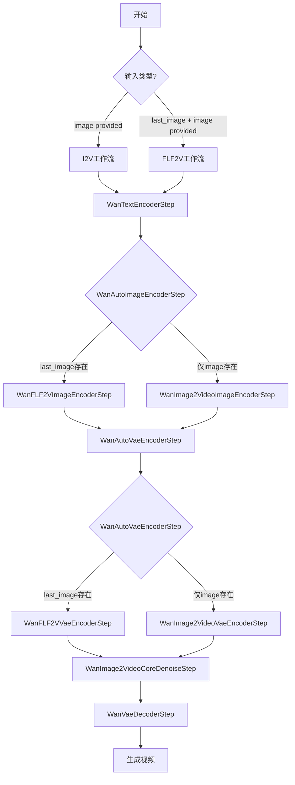
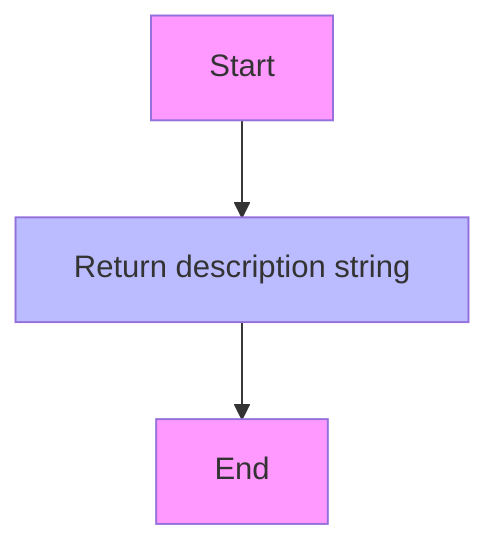
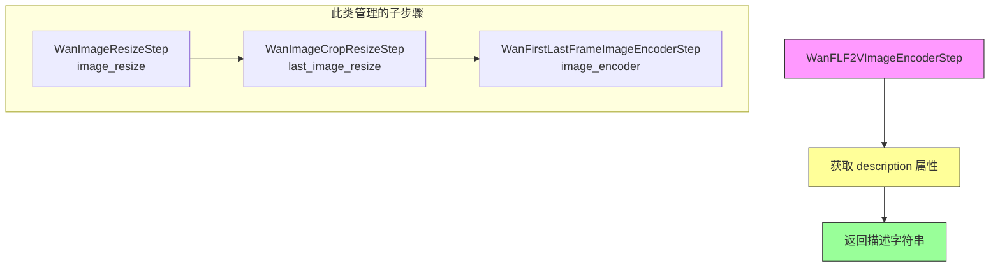
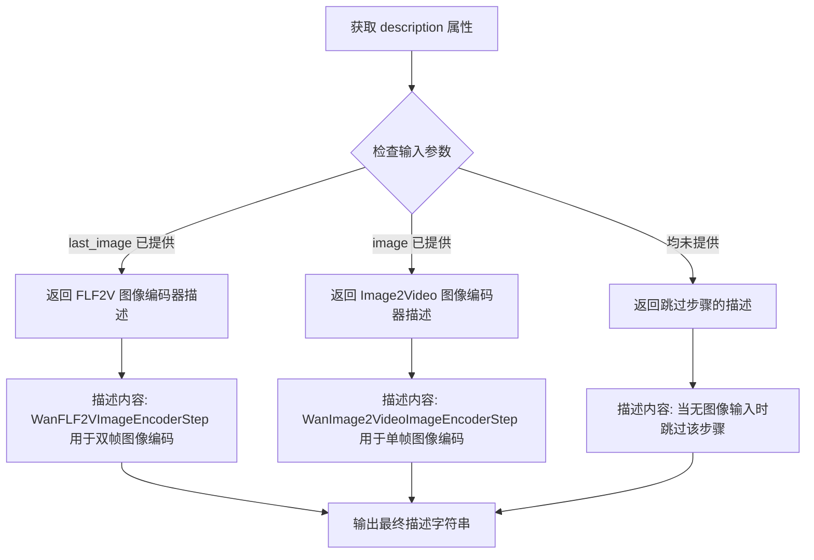
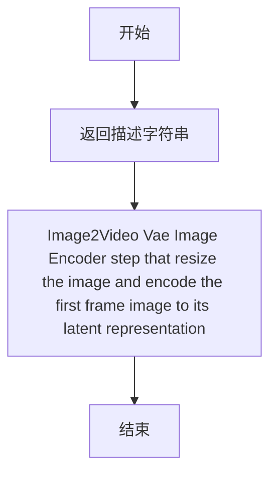
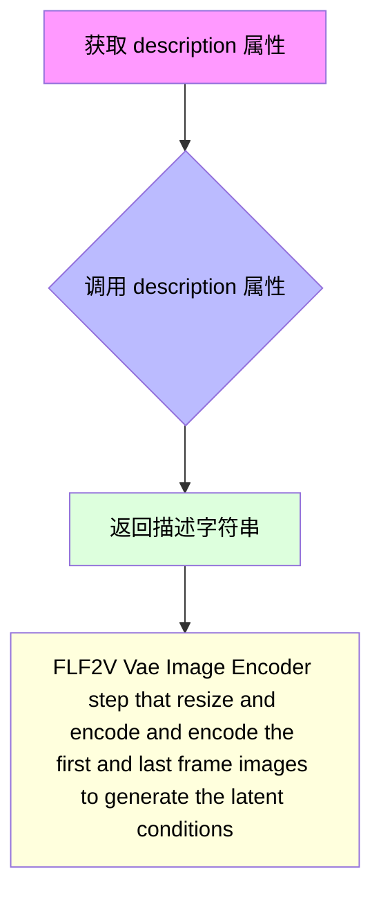
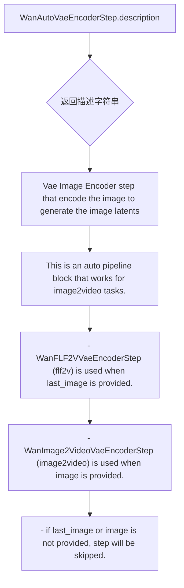
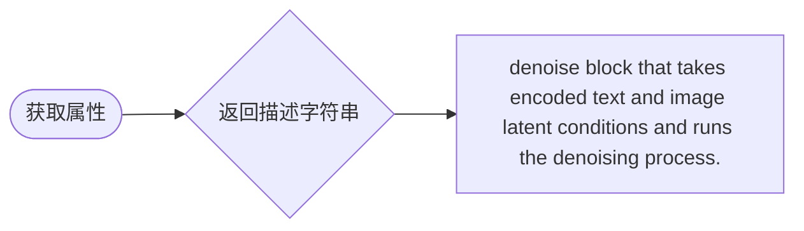
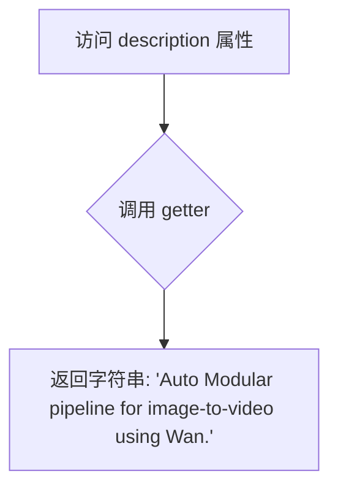
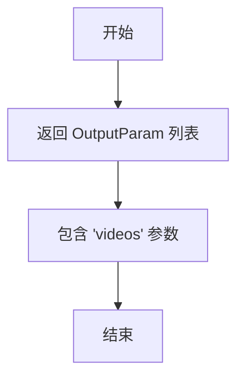

# `diffusers\src\diffusers\modular_pipelines\wan\modular_blocks_wan_i2v.py` 详细设计文档

Wan2.1 Image-to-Video (I2V) 模块化管道实现，支持两种工作流：image2video（单图转视频）和 flf2v（首尾帧转视频），通过模块化的编码器、去噪和解码步骤实现图像到视频的生成

## 整体流程



## 类结构

```
SequentialPipelineBlocks (基类)
├── WanImage2VideoImageEncoderStep
├── WanFLF2VImageEncoderStep
├── WanImage2VideoVaeEncoderStep
├── WanFLF2VVaeEncoderStep
├── WanImage2VideoCoreDenoiseStep
└── WanImage2VideoAutoBlocks

AutoPipelineBlocks (基类)
├── WanAutoImageEncoderStep
└── WanAutoVaeEncoderStep
```

## 全局变量及字段


### `logger`
    
模块级别的日志记录器，用于输出日志信息

类型：`logging.Logger`
    


### `WanImage2VideoImageEncoderStep.model_name`
    
模型名称标识，值为 'wan-i2v'

类型：`str`
    


### `WanImage2VideoImageEncoderStep.block_classes`
    
包含图像调整大小和编码步骤的类列表

类型：`list[Type[SequentialPipelineBlocks]]`
    


### `WanImage2VideoImageEncoderStep.block_names`
    
步骤名称列表，标识各个处理块

类型：`list[str]`
    


### `WanFLF2VImageEncoderStep.model_name`
    
模型名称标识，值为 'wan-i2v'

类型：`str`
    


### `WanFLF2VImageEncoderStep.block_classes`
    
包含图像调整、裁剪和首尾帧编码步骤的类列表

类型：`list[Type[SequentialPipelineBlocks]]`
    


### `WanFLF2VImageEncoderStep.block_names`
    
步骤名称列表，标识各个处理块

类型：`list[str]`
    


### `WanAutoImageEncoderStep.block_classes`
    
自动选择图像编码器步骤的类列表，根据输入条件自动选择

类型：`list[Type[AutoPipelineBlocks]]`
    


### `WanAutoImageEncoderStep.block_names`
    
步骤名称列表，标识各个处理块

类型：`list[str]`
    


### `WanAutoImageEncoderStep.block_trigger_inputs`
    
触发自动选择的输入字段列表

类型：`list[str]`
    


### `WanAutoImageEncoderStep.model_name`
    
模型名称标识，值为 'wan-i2v'

类型：`str`
    


### `WanImage2VideoVaeEncoderStep.model_name`
    
模型名称标识，值为 'wan-i2v'

类型：`str`
    


### `WanImage2VideoVaeEncoderStep.block_classes`
    
包含图像调整、VAE编码和首帧潜变量准备步骤的类列表

类型：`list[Type[SequentialPipelineBlocks]]`
    


### `WanImage2VideoVaeEncoderStep.block_names`
    
步骤名称列表，标识各个处理块

类型：`list[str]`
    


### `WanFLF2VVaeEncoderStep.model_name`
    
模型名称标识，值为 'wan-i2v'

类型：`str`
    


### `WanFLF2VVaeEncoderStep.block_classes`
    
包含图像调整、裁剪、首尾帧VAE编码和潜变量准备步骤的类列表

类型：`list[Type[SequentialPipelineBlocks]]`
    


### `WanFLF2VVaeEncoderStep.block_names`
    
步骤名称列表，标识各个处理块

类型：`list[str]`
    


### `WanAutoVaeEncoderStep.model_name`
    
模型名称标识，值为 'wan-i2v'

类型：`str`
    


### `WanAutoVaeEncoderStep.block_classes`
    
自动选择VAE编码器步骤的类列表，根据输入条件自动选择

类型：`list[Type[AutoPipelineBlocks]]`
    


### `WanAutoVaeEncoderStep.block_names`
    
步骤名称列表，标识各个处理块

类型：`list[str]`
    


### `WanAutoVaeEncoderStep.block_trigger_inputs`
    
触发自动选择的输入字段列表

类型：`list[str]`
    


### `WanImage2VideoCoreDenoiseStep.model_name`
    
模型名称标识，值为 'wan-i2v'

类型：`str`
    


### `WanImage2VideoCoreDenoiseStep.block_classes`
    
包含文本输入、附加输入、时间步设置、潜变量准备和去噪步骤的类列表

类型：`list[Type[SequentialPipelineBlocks]]`
    


### `WanImage2VideoCoreDenoiseStep.block_names`
    
步骤名称列表，标识各个处理块

类型：`list[str]`
    


### `WanImage2VideoAutoBlocks.model_name`
    
模型名称标识，值为 'wan-i2v'

类型：`str`
    


### `WanImage2VideoAutoBlocks.block_classes`
    
包含文本编码、图像编码、VAE编码、去噪和解码步骤的类列表

类型：`list[Type[SequentialPipelineBlocks]]`
    


### `WanImage2VideoAutoBlocks.block_names`
    
步骤名称列表，标识各个处理块

类型：`list[str]`
    


### `WanImage2VideoAutoBlocks._workflow_map`
    
工作流映射字典，定义不同工作流所需的输入条件

类型：`dict[str, dict[str, bool]]`
    
    

## 全局函数及方法


### `WanImage2VideoImageEncoderStep.description`

该属性是 `WanImage2VideoImageEncoderStep` 类的一个只读属性，用于返回该图像编码步骤的功能描述信息。

参数：無

返回值：`str`，返回该图像编码步骤的描述字符串，说明其功能是调整图像大小并将图像编码以生成图像嵌入。

#### 流程图



#### 带注释源码

```python
@property
def description(self):
    """
    返回图像编码步骤的描述信息
    
    Returns:
        str: 描述字符串，说明该步骤用于调整图像大小并将图像编码生成图像嵌入
    """
    return "Image2Video Image Encoder step that resize the image and encode the image to generate the image embeddings"
```


### `WanFLF2VImageEncoderStep.description`

这是一个属性方法（property），用于获取 FLF2V（First-Last Frame to Video）图像编码步骤的描述信息。

参数：无（该方法为 property 类型，无显式参数）

返回值：`str`，返回该图像编码步骤的描述字符串，阐明该步骤的功能是调整第一帧和最后一帧图像的大小并进行编码，以生成图像嵌入向量。

#### 流程图



#### 带注释源码

```python
@property
def description(self):
    """
    属性方法：获取 FLF2V 图像编码步骤的描述信息
    
    描述内容说明该步骤的功能：
    - 对第一帧和最后一帧图像进行 resize 处理
    - 对调整大小后的图像进行编码
    - 生成图像嵌入向量（image embeddings）
    
    Returns:
        str: 步骤的功能描述字符串
    """
    return "FLF2V Image Encoder step that resize and encode and encode the first and last frame images to generate the image embeddings"
```


### `WanAutoImageEncoderStep.description`

这是一个自动管道属性方法，用于获取图像编码器步骤的描述信息。该方法根据传入的图像参数（`last_image` 或 `image`）自动选择合适的图像编码器实现，并返回相应的功能描述字符串。

参数：该方法无参数（作为 `@property` 装饰的属性方法）

返回值：`str`，返回图像编码器步骤的描述文本，包含自动选择逻辑和使用说明。

#### 流程图



#### 带注释源码

```python
@property
def description(self):
    """
    获取图像编码器步骤的描述信息。
    
    这是一个自动管道块( AutoPipelineBlocks )的属性方法,
    根据输入条件返回对应的功能描述。
    
    Returns:
        str: 描述图像编码器功能的字符串,包含:
             - 基础功能:对图像进行编码生成图像嵌入
             - 自动选择逻辑:根据 last_image 或 image 参数选择不同编码器
             - 跳过逻辑:当无图像输入时的处理方式
    """
    return (
        "Image Encoder step that encode the image to generate the image embeddings"
        + "This is an auto pipeline block that works for image2video tasks."
        + " - `WanFLF2VImageEncoderStep` (flf2v) is used when `last_image` is provided."
        + " - `WanImage2VideoImageEncoderStep` (image2video) is used when `image` is provided."
        + " - if `last_image` or `image` is not provided, step will be skipped."
    )
```


### `WanImage2VideoVaeEncoderStep.description`

该属性方法返回 Image2Video VAE 图像编码器步骤的描述字符串，说明该步骤负责调整图像大小并将第一帧图像编码为其潜在表示。

参数：

- `self`：`WanImage2VideoVaeEncoderStep`，隐式参数，表示类的实例本身

返回值：`str`，返回该编码器步骤的功能描述字符串

#### 流程图



#### 带注释源码

```python
@property
def description(self):
    """
    获取该图像到视频VAE编码器步骤的描述信息
    
    Returns:
        str: 描述该步骤功能的字符串，说明其用于调整图像大小并将第一帧图像编码为潜在表示
    """
    return "Image2Video Vae Image Encoder step that resize the image and encode the first frame image to its latent representation"
```

**说明**：这是一个属性方法（使用 `@property` 装饰器），用于获取 `WanImage2VideoVaeEncoderStep` 类的描述信息。该类是 Wan2.1 图像到视频流水线中的一个步骤组件，属于 VAE 编码器模块，负责将输入的图像（第一帧）处理并编码为潜在空间表示，以便后续的去噪处理。


### WanFLF2VVaeEncoderStep.description

这是一个属性方法（property），用于返回 FLF2V VAE 图像编码器步骤的描述信息。该方法是 WanFLF2VVaeEncoderStep 类的一部分，描述了该步骤的功能：调整并编码第一帧和最后一帧图像以生成潜在条件。

参数：无（这是一个属性方法，不接受任何参数）

返回值：`str`，返回描述 FLF2V VAE 图像编码器步骤功能的字符串

#### 流程图



#### 带注释源码

```python
@property
def description(self):
    """
    属性方法，返回该 pipeline block 的描述信息
    
    Returns:
        str: FLF2V Vae Image Encoder step that resize and encode and encode 
             the first and last frame images to generate the latent conditions
    """
    return "FLF2V Vae Image Encoder step that resize and encode and encode the first and last frame images to generate the latent conditions"
```

#### 所属类的完整信息

**类名**: WanFLF2VVaeEncoderStep

**类描述**: 
FLF2V Vae Image Encoder step that resize and encode and encode the first and last frame images to generate the latent conditions

**类字段**:

- `model_name`: `str`，模型名称，值为 "wan-i2v"
- `block_classes`: `list`，包含多个块类 [WanImageResizeStep, WanImageCropResizeStep, WanFirstLastFrameVaeEncoderStep, WanPrepareFirstLastFrameLatentsStep]
- `block_names`: `list`，块名称列表 ["image_resize", "last_image_resize", "vae_encoder", "prepare_first_last_frame_latents"]

**类方法**: 仅包含上述 `description` 属性方法


### `WanAutoVaeEncoderStep.description`

该属性用于获取 Wan VAE 图像编码器步骤的描述信息，返回一个说明该自动管道块功能的字符串。该自动管道块用于图像到视频任务，根据输入条件自动选择使用 `WanFLF2VVaeEncoderStep`（当前后帧都提供时）或 `WanImage2VideoVaeEncoderStep`（仅提供首帧时）。

参数：无（该方法为属性方法，无显式参数）

返回值：`str`，描述 VAE 编码器步骤功能的字符串

#### 流程图



#### 带注释源码

```python
@property
def description(self):
    """
    属性方法，返回该自动管道块的描述信息。
    
    该描述说明了：
    1. 这是VAE图像编码器步骤，用于将图像编码为图像潜变量
    2. 这是一个自动管道块，适用于image2video任务
    3. 根据输入条件自动选择不同的编码器实现
       - 当提供 last_image 时使用 WanFLF2VVaeEncoderStep (flf2v)
       - 当提供 image 时使用 WanImage2VideoVaeEncoderStep (image2video)
       - 如果未提供 last_image 或 image，则跳过该步骤
    
    Returns:
        str: 描述该VAE编码器步骤功能和自动选择逻辑的字符串
    """
    return (
        "Vae Image Encoder step that encode the image to generate the image latents"
        + "This is an auto pipeline block that works for image2video tasks."
        + " - `WanFLF2VVaeEncoderStep` (flf2v) is used when `last_image` is provided."
        + " - `WanImage2VideoVaeEncoderStep` (image2video) is used when `image` is provided."
        + " - if `last_image` or `image` is not provided, step will be skipped."
    )
```


### WanImage2VideoCoreDenoiseStep.description

该属性返回对 `WanImage2VideoCoreDenoiseStep` 类的文字描述，说明该类是一个去噪块，负责接收编码后的文本和图像潜在条件并执行去噪过程。

参数：
- （无，该方法为一个属性 getter，不接受显式参数）

返回值：`str`，返回该类的描述字符串。

#### 流程图



#### 带注释源码

```python
@property
def description(self) -> str:
    """
    返回对 WanImage2VideoCoreDenoiseStep 类的描述。
    
    该属性继承自 SequentialPipelineBlocks，用于在自动化流水线或文档生成时
    标识当前步骤的功能。

    Returns:
        str: 描述文本，内容为 "denoise block that takes encoded text and image latent 
             conditions and runs the denoising process."
    """
    return "denoise block that takes encoded text and image latent conditions and runs the denoising process."
```


### `WanImage2VideoAutoBlocks.description`

这是一个属性方法（property），返回 `WanImage2VideoAutoBlocks` 类的描述信息，说明该类是一个用于 Wan 模型的图像到视频（Image-to-Video）自动模块化管道。

参数：无（除了隐含的 `self`）

返回值：`str`，返回描述字符串 `"Auto Modular pipeline for image-to-video using Wan."`

#### 流程图



#### 带注释源码

```python
@property
def description(self):
    """
    获取该自动模块化管道的描述信息。
    
    Returns:
        str: 描述字符串，说明该管道用于 Wan 模型的图像到视频任务
    """
    return "Auto Modular pipeline for image-to-video using Wan."
```

---

**补充说明**：

- 这是一个只读属性（read-only property），通过 `@property` 装饰器实现
- 该属性是 `WanImage2VideoAutoBlocks` 类的一部分，该类是 `SequentialPipelineBlocks` 的子类
- 此类支持两种工作流程：
  - `image2video`：需要 `image` 和 `prompt`
  - `flf2v`（首尾帧视频）：需要 `last_image`、`image` 和 `prompt`
- 整个管道包含以下主要组件：文本编码器、图像编码器、VAE 编码器、去噪步骤和 VAE 解码器


### `WanImage2VideoAutoBlocks.outputs`

该属性方法定义了 WanImage2Video 模块化流水线的输出参数，返回包含生成视频的列表。

参数： 无

返回值：`List[OutputParam]`，返回包含生成视频的输出参数列表，当前仅包含 `videos` 参数

#### 流程图



#### 带注释源码

```python
@property
def outputs(self):
    """
    属性方法：定义管道的输出参数
    
    返回值：
        List[OutputParam]: 包含生成视频的输出参数列表
    """
    return [OutputParam.template("videos")]
```

## 关键组件


### WanImage2VideoImageEncoderStep

单图图像编码步骤，用于将输入图像调整大小并编码生成图像嵌入向量，支持wan2.1 I2V任务的首帧处理。

### WanFLF2VImageEncoderStep

首尾帧图像编码步骤，用于同时处理第一帧和最后一帧图像，生成双条件图像嵌入，支持wan2.1 FLF2V任务。

### WanAutoImageEncoderStep

自动图像编码选择器，根据输入条件自动选择使用WanFLF2VImageEncoderStep（当提供last_image时）或WanImage2VideoImageEncoderStep（当仅提供image时），实现惰性加载和按需调用。

### WanImage2VideoVaeEncoderStep

单图VAE编码步骤，将输入图像编码为潜在表示，生成第一帧潜在向量和图像条件潜在向量。

### WanFLF2VVaeEncoderStep

首尾帧VAE编码步骤，同时编码首帧和尾帧图像，生成首尾帧联合潜在表示用于视频生成条件。

### WanAutoVaeEncoderStep

自动VAE编码选择器，根据last_image或image的提供情况自动选择对应的VAE编码策略，实现张量索引与条件触发。

### WanImage2VideoCoreDenoiseStep

核心去噪模块，整合文本输入、附加输入处理、时间步设置、潜在向量准备和去噪过程，是Wan2.1 I2V/FLF2V的核心推理引擎。

### WanImage2VideoAutoBlocks

完整的模块化自动Pipeline，协调文本编码器、图像编码器、VAE编码器、核心去噪和VAE解码器，支持image2video和flf2v两种工作流模式。

### SequentialPipelineBlocks

顺序执行管道块基类，定义模块执行顺序和块名称列表。

### AutoPipelineBlocks

自动管道块基类，支持基于触发输入（block_trigger_inputs）动态选择具体实现块，实现张量索引与惰性加载机制。

### workflow_map

工作流映射配置，定义image2video（需要image和prompt）和flf2v（需要last_image、image和prompt）两种任务的输入要求。


## 问题及建议


### 已知问题

-   **大量未完成的文档注释**：代码中存在大量 "TODO: Add description." 注释，表明参数和返回值描述不完整，影响代码可维护性和可用性
-   **拼写错误**：`last_frameimage` 在多处出现，应为 `last_frame_image`
- **魔法数字**：默认高度 480、宽度 832、帧数 81、推理步数 50、序列长度 512 等硬编码在多处，分散且难以统一调整
- **类型提示不完整**：部分参数类型标注不够精确，如 `generator` 仅标注为 `None`，应使用 `Optional[torch.Generator]`
- **字符串拼接方式不当**：使用 `+` 拼接多行描述字符串，应使用括号换行或 f-string 提升可读性
- **未使用的属性**：`_workflow_map` 定义但在当前代码中未被引用
- **属性方法冗余**：`description` 属性返回的字符串可读性较差，缺乏统一的格式化标准
- **缺少输入验证**：未对输入参数（如 image、last_image、height、width 等）进行合法性检查
- **代码重复模式**：`block_classes` 和 `block_names` 的定义模式在多个类中重复，可考虑使用元类或装饰器简化

### 优化建议

-   **完善文档注释**：逐步补充所有 TODO 描述，确保 API 可用性
-   **提取常量**：将默认参数值统一提取为模块级常量（如 DEFAULT_HEIGHT、DEFAULT_WIDTH 等）
- **改进类型标注**：使用完整的类型提示（如 `Optional[Tensor]`, `Optional[Generator]`）
- **优化字符串格式**：使用多行字符串或 join 方法构建描述信息
- **启用工作流映射**：将 `_workflow_map` 应用于运行时参数校验，验证必填参数
- **添加参数校验**：在 pipeline 入口处增加参数校验逻辑，提升鲁棒性
- **考虑抽象基类**：将重复的 block 定义模式抽象为基类实现，减少代码冗余

## 其它


### 设计目标与约束

该代码实现Wan2.1 Image-to-Video模块化Pipeline，支持两种工作流模式：image2video（单图生成视频）和flf2v（首尾帧生成视频）。设计目标是将图像编码、VAE编码、去噪、解码等步骤解耦为可组合的Pipeline Blocks，支持Auto自动选择合适的实现。约束条件包括：依赖HuggingFace diffusers框架、遵循Apache 2.0开源许可、默认参数针对480x832分辨率和81帧优化。

### 错误处理与异常设计

代码中TODO标记了大量参数描述，说明当前处于开发阶段。预期错误处理包括：1）当last_image或image都未提供时，AutoPipelineBlocks应跳过该步骤；2）各Step类应验证输入类型（如Image、Tensor）；3）Pipeline应捕获模型加载失败、CUDA内存不足等运行时异常；4）使用logger记录警告和错误信息。

### 数据流与状态机

数据流遵循Pipeline Blocks的顺序执行：Text Encoder → Image Encoder → VAE Encoder → Core Denoise → VAE Decoder。WanAutoImageEncoderStep和WanAutoVaeEncoderStep根据输入条件（last_image vs image）自动选择WanFLF2V或WanImage2Video实现。_workflow_map定义了工作流触发条件：image2video需要image+prompt，flf2v需要last_image+image+prompt。

### 外部依赖与接口契约

核心依赖包括：1）transformers库（UMT5EncoderModel、CLIPVisionModel、AutoTokenizer、CLIPImageProcessor）；2）diffusers库（UniPCMultistepScheduler、AutoencoderKLWan）；3）WanTransformer3DModel（自定义模型）；4）VideoProcessor（视频处理工具）。接口契约：所有Step类需继承SequentialPipelineBlocks或AutoPipelineBlocks，实现description属性和block_classes/block_names定义。

### 性能考虑与优化空间

当前默认num_inference_steps=50，num_frames=81，分辨率480x832。优化空间：1）可添加ONNX/TorchScript导出支持；2）支持KV Cache减少去噪步骤内存占用；3）支持xFormers加速注意力计算；4）批处理优化num_videos_per_prompt；5）可添加FP16/INT8量化推理支持。

### 安全性考虑

代码遵循Apache 2.0许可。潜在安全风险：1）用户提供的prompt和image需验证合法性，防止Prompt Injection；2）模型输出需考虑内容过滤；3）避免在生成过程中泄露敏感信息到日志；4）模型下载需校验SHA256或GPG签名。

### 兼容性设计

model_name统一为"wan-i2v"，便于版本管理。设计支持向后兼容：1）AutoPipelineBlocks可扩展新Step实现；2）_workflow_map可添加新工作流；3）OutputParam.template提供输出格式标准化。依赖版本约束需在requirements.txt中明确指定。

### 配置与参数说明

关键配置参数：height默认480、width默认832、num_frames默认81、num_inference_steps默认50、max_sequence_length默认512、num_videos_per_prompt默认1、output_type默认np。内部参数：block_trigger_inputs用于Auto选择触发条件、image_latent_inputs定义图像潜在条件输入。

### 使用示例

```python
from diffusers import WanImage2VideoPipeline

# image2video模式
pipe = WanImage2VideoPipeline.from_pretrained("Wan-AI/Wan2.1-I2V-480P")
video = pipe(image=input_image, prompt="生成的视频描述").videos[0]

# flf2v模式（首尾帧）
video = pipe(
    image=first_frame_image, 
    last_image=last_frame_image, 
    prompt="视频描述"
).videos[0]
```

### 测试策略

建议测试覆盖：1）各Step单元测试验证输入输出形状；2）集成测试验证image2video和flf2v工作流；3）参数边界测试（空输入、极大分辨率）；4）模型加载和内存使用基准测试；5）AutoPipelineBlocks选择逻辑测试。

### 部署注意事项

部署时需注意：1）GPU显存要求（预估至少16GB）；2）模型权重下载和缓存管理；3）支持分布式推理扩展；4）提供RESTful API封装示例；5）监控指标包括生成耗时、显存占用、成功率。

    