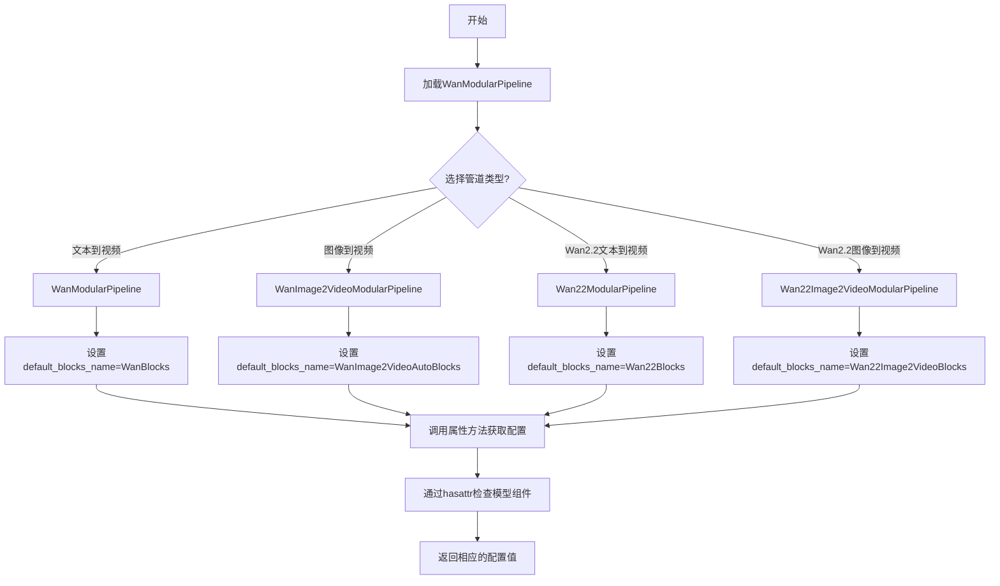
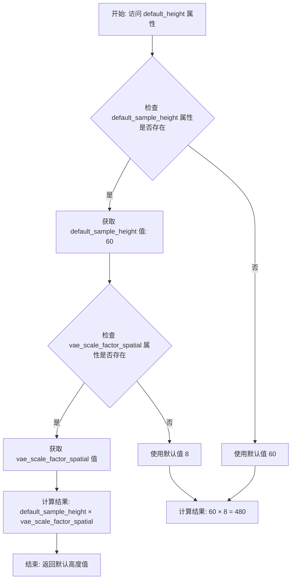
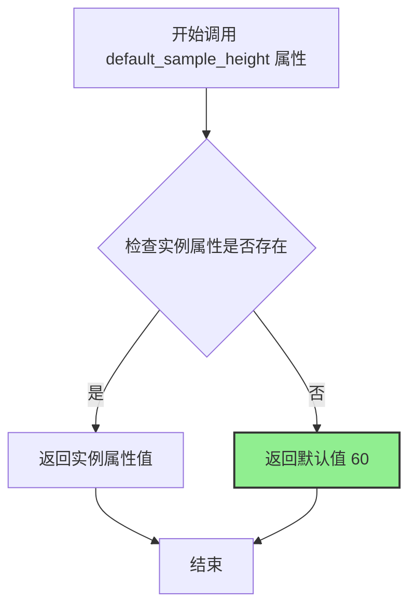
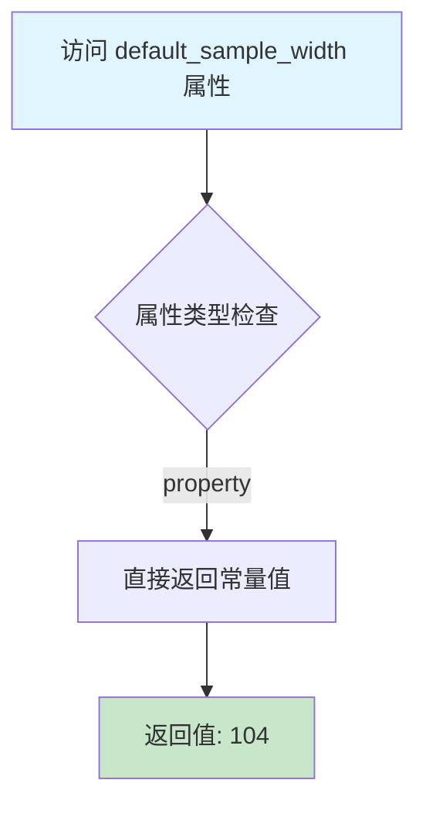
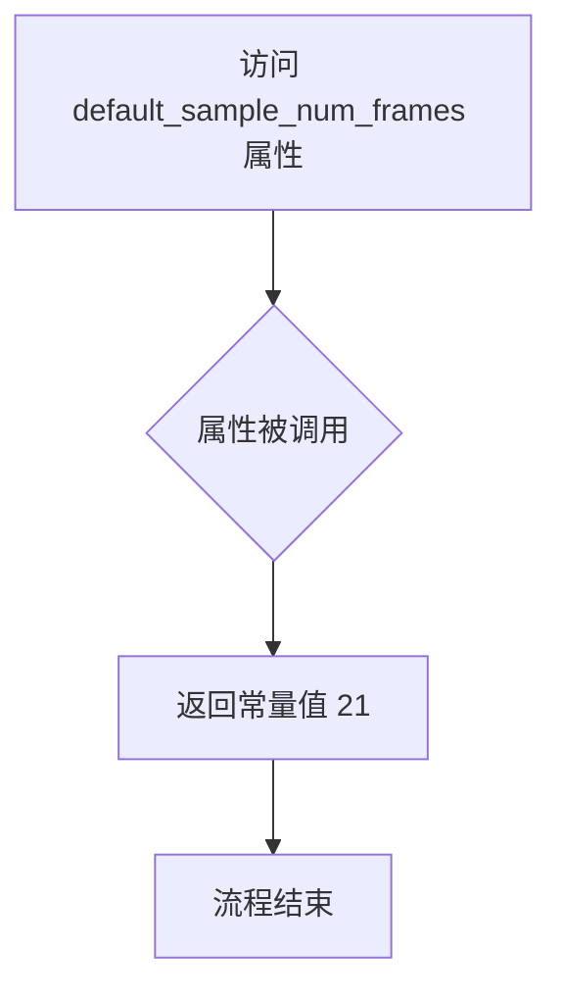
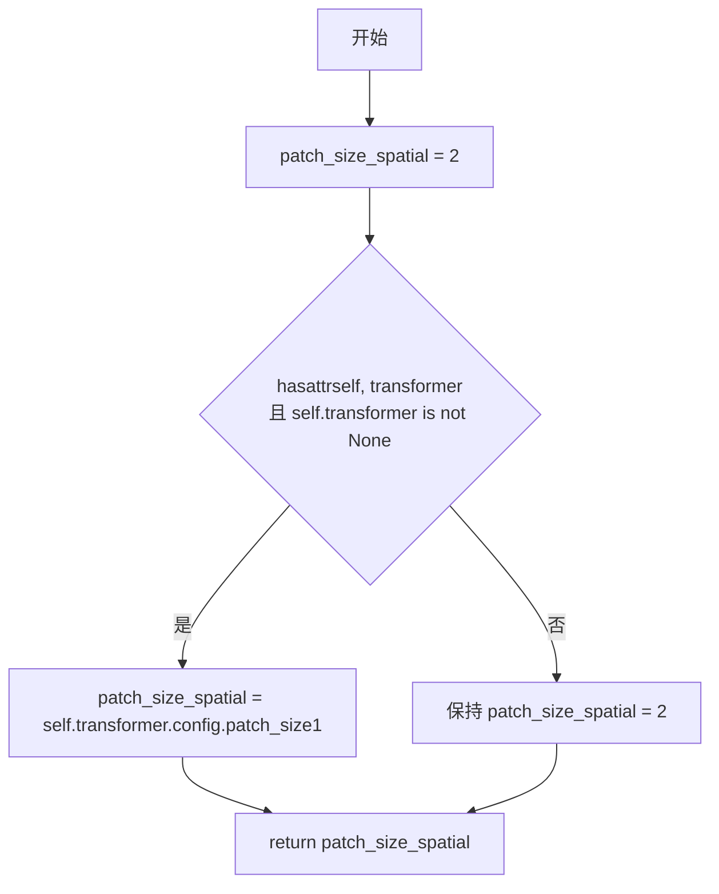
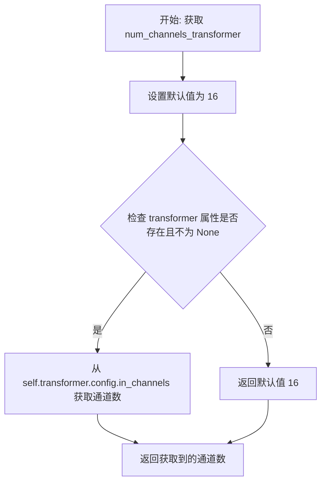
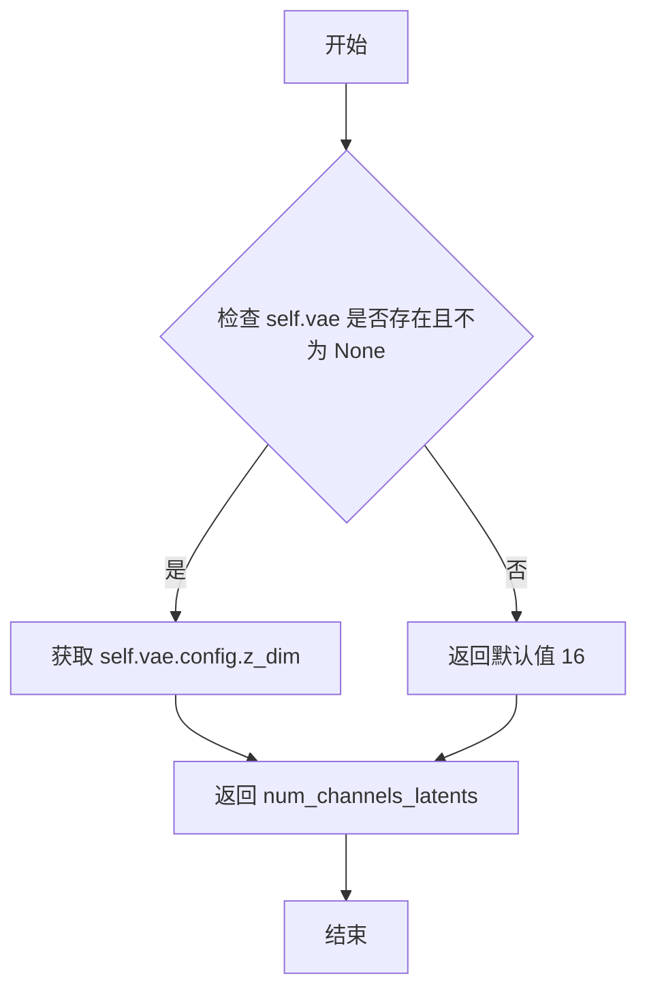
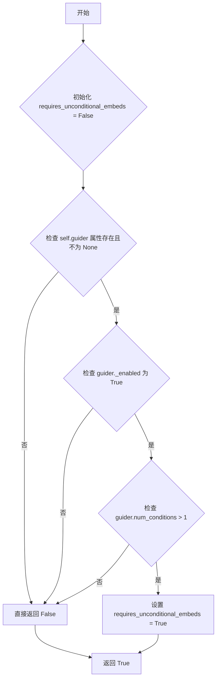
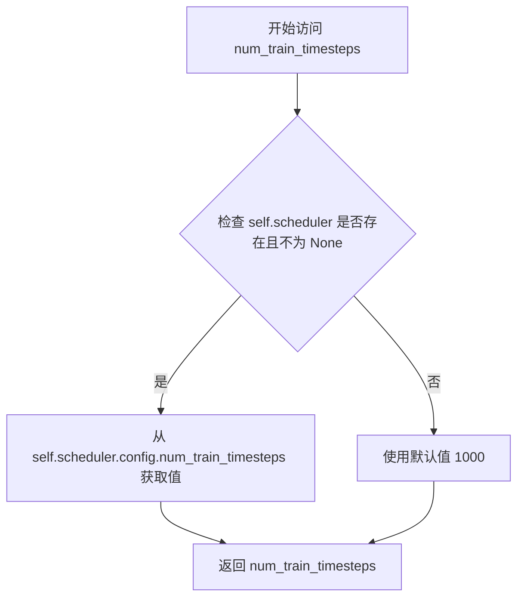

# `diffusers\src\diffusers\modular_pipelines\wan\modular_pipeline.py` 详细设计文档

这是一个用于Wan2.1和Wan2.2文本到视频/图像到视频生成的模块化管道实现，通过继承ModularPipeline并混合StableDiffusionMixin和WanLoraLoaderMixin，提供统一的推理接口，支持多种变体模型（WanModularPipeline、WanImage2VideoModularPipeline、Wan22ModularPipeline、Wan22Image2VideoModularPipeline），每个变体对应不同的模型架构和任务类型。

## 整体流程



## 类结构

```
ModularPipeline (基类)
├── StableDiffusionMixin (混合类)
├── WanLoraLoaderMixin (混合类)
└── WanModularPipeline (主类)
    ├── WanImage2VideoModularPipeline (图像到视频变体)
    ├── Wan22ModularPipeline (Wan2.2文本到视频)
    └── Wan22Image2VideoModularPipeline (Wan2.2图像到视频)
```

## 全局变量及字段


### `logger`
    
模块级日志记录器，用于输出 WanModularPipeline 相关的日志信息

类型：`logging.Logger`
    


### `WanModularPipeline.default_blocks_name`
    
默认的模型块名称，指定 Wan2.1 text2video 使用的模型块类型

类型：`str`
    


### `WanModularPipeline.default_height`
    
默认输出视频高度，由基础高度乘以 VAE 空间缩放因子计算得出

类型：`int`
    


### `WanModularPipeline.default_width`
    
默认输出视频宽度，由基础宽度乘以 VAE 空间缩放因子计算得出

类型：`int`
    


### `WanModularPipeline.default_num_frames`
    
默认输出视频帧数，根据时间轴缩放因子和基础帧数计算得出

类型：`int`
    


### `WanModularPipeline.default_sample_height`
    
默认采样基础高度，用于计算最终输出高度，值为 60

类型：`int`
    


### `WanModularPipeline.default_sample_width`
    
默认采样基础宽度，用于计算最终输出宽度，值为 104

类型：`int`
    


### `WanModularPipeline.default_sample_num_frames`
    
默认采样基础帧数，用于计算最终帧数，值为 21

类型：`int`
    


### `WanModularPipeline.patch_size_spatial`
    
空间 patch 大小，用于 transformer 的patchify操作，默认为 2

类型：`int`
    


### `WanModularPipeline.vae_scale_factor_spatial`
    
VAE 空间缩放因子，用于计算 latent 到像素空间的放大倍数，默认为 8

类型：`int`
    


### `WanModularPipeline.vae_scale_factor_temporal`
    
VAE 时间轴缩放因子，用于计算 latent 到像素空间的帧数放大倍数，默认为 4

类型：`int`
    


### `WanModularPipeline.num_channels_transformer`
    
Transformer 模型的输入通道数，默认值为 16

类型：`int`
    


### `WanModularPipeline.num_channels_latents`
    
VAE latent 空间的通道数，默认值为 16

类型：`int`
    


### `WanModularPipeline.requires_unconditional_embeds`
    
指示是否需要无条件嵌入，用于判断 classifier-free guidance 是否启用

类型：`bool`
    


### `WanModularPipeline.num_train_timesteps`
    
训练时的总时间步数，用于调度器配置，默认值为 1000

类型：`int`
    


### `WanImage2VideoModularPipeline.default_blocks_name`
    
图像到视频模型的默认块名称，指定 Wan2.1 I2V 和 FLF2V 使用的模型块类型

类型：`str`
    


### `Wan22ModularPipeline.default_blocks_name`
    
Wan2.2 text2video 模型的默认块名称

类型：`str`
    


### `Wan22Image2VideoModularPipeline.default_blocks_name`
    
Wan2.2 图像到视频模型的默认块名称

类型：`str`
    
    

## 全局函数及方法


### `WanModularPipeline.default_height`

该属性是 WanModularPipeline 类中的一个只读属性，用于获取默认生成图像的高度值。它通过将默认采样高度乘以 VAE 的空间缩放因子来计算最终的默认高度，以适配不同 VAE 配置下的输出分辨率。

参数：

- 无显式参数（隐式参数 `self` 表示类的实例）

返回值：`int`，返回经过 VAE 空间缩放因子调整后的默认生成高度（像素单位）

#### 流程图



#### 带注释源码

```python
@property
def default_height(self):
    """
    返回默认生成高度（经过VAE空间缩放因子调整后的像素值）
    
    计算公式: default_sample_height × vae_scale_factor_spatial
    
    Returns:
        int: 默认生成高度值（像素）
    """
    return self.default_sample_height * self.vae_scale_factor_spatial
```


### `WanModularPipeline.default_width`

该属性是 WanModularPipeline 类中的一个只读属性，用于计算并返回默认的输出图像宽度。它通过将默认采样宽度乘以 VAE 的空间缩放因子来得到最终的默认宽度值。

参数：此属性无参数（Python property 不接受额外参数）

返回值：`int`，返回默认输出宽度（像素单位），计算方式为 `default_sample_width * vae_scale_factor_spatial`

#### 流程图

```mermaid
flowchart TD
    A[开始访问 default_width 属性] --> B{检查 VAE 是否存在}
    B -->|VAE 不存在| C[vae_scale_factor_spatial = 8]
    B -->|VAE 存在| D[vae_scale_factor_spatial = 2 ** len(vae.temperal_downsample)]
    C --> E[default_sample_width = 104]
    D --> E
    E --> F[返回 default_sample_width * vae_scale_factor_spatial]
    F --> G[结束]
```

#### 带注释源码

```python
@property
def default_width(self):
    """
    返回默认输出宽度。
    
    计算方式：将默认采样宽度乘以 VAE 的空间缩放因子。
    如果 VAE 存在，则使用 VAE 的实际空间缩放因子；否则使用默认值 8。
    
    返回:
        int: 默认输出宽度（像素）
    """
    return self.default_sample_width * self.vae_scale_factor_spatial
```


### `WanModularPipeline.default_num_frames`

该属性是 Wan2.1 文本转视频模块化流水线的默认帧数计算器，通过将默认采样帧数减1后乘以 VAE 时间下采样因子再加1，计算出最终的有效帧数。

参数：
- 该方法为属性方法，隐式参数 `self`：实例本身，无需显式传递

返回值：`int`，默认帧数，计算公式为 `(default_sample_num_frames - 1) * vae_scale_factor_temporal + 1`

#### 流程图

```mermaid
flowchart TD
    A[开始] --> B{检查 vae 属性是否存在}
    B -->|是| C[获取 vae.temperal_downsample]
    B -->|否| D[使用默认值 4]
    C --> E[计算 vae_scale_factor_temporal = 2 ** sum(temperal_downsample)]
    D --> F[获取 default_sample_num_frames = 21]
    E --> G[计算: (21 - 1) * vae_scale_factor_temporal + 1]
    F --> G
    G --> H[返回默认帧数]
```

#### 带注释源码

```python
@property
def default_num_frames(self):
    """
    计算 Wan2.1 文本转视频流水线的默认帧数。
    
    计算公式：(default_sample_num_frames - 1) * vae_scale_factor_temporal + 1
    
    Returns:
        int: 默认帧数。如果 VAE 存在且配置了 temperal_downsample，
             则基于 VAE 的时间下采样因子计算；否则使用默认值计算。
    """
    return (self.default_sample_num_frames - 1) * self.vae_scale_factor_temporal + 1
```


### `WanModularPipeline.default_sample_height`

该属性是 WanModularPipeline 类中的一个只读属性，用于返回 Wan2.1 文本转视频模型的默认采样高度值（以像素为单位），其值为 60。

参数：

- 该属性无显式参数（隐式接收 `self` 实例引用）

返回值：`int`，返回默认采样高度值 60

#### 流程图



#### 带注释源码

```python
@property
def default_sample_height(self):
    """
    返回默认采样高度（以像素为单位）。
    
    此属性用于 Wan2.1 文本转视频模型的默认采样高度设定。
    该值表示在 VAE 编码/解码之前的原始采样高度。
    
    Returns:
        int: 默认采样高度值，固定返回 60
    """
    return 60
```


### `WanModularPipeline.default_sample_width` (property)

这是一个只读属性方法，用于返回Wan2.1文本到视频模型的默认采样宽度值。该属性提供模型默认的视频帧宽度参数，供管道初始化时使用。

参数：

- （无参数，property 方法不接受外部参数）

返回值：`int`，返回默认值 104，表示Wan2.1模型的默认采样宽度

#### 流程图



#### 带注释源码

```python
@property
def default_sample_width(self):
    """
    返回Wan2.1模型的默认采样宽度。
    
    该属性提供了文本到视频生成模型的默认视频帧宽度参数。
    在管道初始化时，如果用户未指定宽度，将使用此默认值。
    
    Returns:
        int: 默认采样宽度值，当前为104像素
    """
    return 104
```

---

**补充说明：**

1. **设计目标**：该属性为Wan2.1模型提供硬编码的默认采样宽度，确保管道在未明确指定宽度参数时能够使用合理的默认值。

2. **与其他属性的关系**：
   - `default_width` 属性通过 `default_sample_width * self.vae_scale_factor_spatial` 计算最终的实际宽度
   - 这允许默认宽度根据VAE的缩放因子进行自适应调整

3. **潜在优化空间**：
   - 当前为硬编码值（104），可考虑将其移至模型配置中，使其可配置化
   - 缺少对负值或零值的校验

4. **错误处理**：当前实现无错误处理，直接返回常量值


### WanModularPipeline.default_sample_num_frames

这是一个只读属性（property），用于获取 Wan2.1 文本转视频模型的默认采样帧数。该属性返回整数 `21`，表示模型默认处理的视频帧数量。

参数： 无

返回值：`int`，返回默认的采样帧数 `21`

#### 流程图



#### 带注释源码

```python
@property
def default_sample_num_frames(self):
    """
    返回 Wan2.1 文本转视频模型的默认采样帧数。
    
    该属性定义了模型默认处理的视频帧数量，用于在未指定帧数时
    作为pipeline的默认参数。值为21帧。
    
    Returns:
        int: 默认采样帧数，当前固定返回 21
    """
    return 21
```

---

### 补充信息

#### 关键组件信息

- **WanModularPipeline**: 核心模块化Pipeline类，继承自 `ModularPipeline`、`StableDiffusionMixin` 和 `WanLoraLoaderMixin`，用于 Wan2.1 文本转视频任务
- **default_sample_num_frames**: 默认采样帧数属性，固定返回 21

#### 潜在的技术债务或优化空间

1. **硬编码值**: 默认帧数 21 被硬编码在属性中，建议可配置化，通过初始化参数或配置文件管理
2. **与其他属性的不一致性**: 该属性直接返回常量，而类似属性（如 `default_height`、`default_width`）会乘以 VAE 缩放因子，可能导致使用上的困惑

#### 其它项目

- **设计目标**: 为 Wan2.1 模型提供合理的默认参数，降低用户使用门槛
- **错误处理**: 无需错误处理，该属性始终返回固定值
- **依赖关系**: 无外部依赖，仅作为配置属性使用


### `WanModularPipeline.patch_size_spatial`

这是一个属性方法，用于获取 Wan2.1 模型的 spatial patch 大小。如果 transformer 对象存在且已初始化，则从其配置中读取 patch_size 的空间维度（索引1）；否则返回默认值 2。

参数：该方法为属性 getter，无参数。

返回值：`int`，返回空间 patch 的大小值。

#### 流程图



#### 带注释源码

```python
@property
def patch_size_spatial(self):
    """
    获取空间patch大小。
    
    如果transformer对象存在，则从其配置中读取patch_size的空间维度；
    否则返回默认值2。
    """
    patch_size_spatial = 2  # 默认的空间patch大小
    # 检查transformer是否存在且已初始化
    if hasattr(self, "transformer") and self.transformer is not None:
        # 从transformer配置中获取spatial patch size（索引1对应空间维度）
        patch_size_spatial = self.transformer.config.patch_size[1]
    return patch_size_spatial  # 返回最终的patch大小值
```


### `WanModularPipeline.vae_scale_factor_spatial`

该属性用于获取 VAE（变分自编码器）的空间缩放因子，默认值为 8。如果存在 VAE 模型且其具有 `temperal_downsample` 属性，则根据该属性的长度动态计算缩放因子（2 的 n 次方），用于后续计算默认图像高度和宽度。

参数：

- `self`：`WanModularPipeline` 实例，隐式参数，表示当前管道对象

返回值：`int`，返回 VAE 的空间缩放因子，用于将采样空间坐标映射到潜在空间

#### 流程图

```mermaid
flowchart TD
    A[开始] --> B[设置 vae_scale_factor = 8]
    B --> C{检查 self.vae 是否存在且不为 None}
    C -->|是| D[计算 vae_scale_factor = 2 ** len(self.vae.temperal_downsample)]
    C -->|否| E[保持 vae_scale_factor = 8]
    D --> F[返回 vae_scale_factor]
    E --> F
```

#### 带注释源码

```python
@property
def vae_scale_factor_spatial(self):
    """
    获取 VAE 的空间缩放因子。
    
    该属性返回 VAE 在空间维度上的下采样因子，用于将采样空间的
    坐标映射到 VAE 潜在空间的坐标。默认值为 8，如果 VAE 模型
    存在且配置了 temperal_downsample 属性，则动态计算缩放因子。
    
    返回:
        int: VAE 空间缩放因子，通常为 8 或基于 VAE 配置计算的值
    """
    # 设置默认的空间缩放因子为 8
    vae_scale_factor = 8
    
    # 检查 VAE 模型是否存在且已正确加载
    if hasattr(self, "vae") and self.vae is not None:
        # 根据 VAE 的 temporal_downsample 层数动态计算空间缩放因子
        # 使用 2 的 n 次方计算，其中 n 为 temperal_downsample 列表的长度
        vae_scale_factor = 2 ** len(self.vae.temperal_downsample)
    
    # 返回计算得到的空间缩放因子
    return vae_scale_factor
```


### `WanModularPipeline.vae_scale_factor_temporal`

该属性用于获取 VAE（变分自编码器）的时间维度缩放因子（Temporal Scale Factor），默认值为 4，如果存在 VAE 模型则根据其 `temperal_downsample` 属性动态计算 2 的幂次值，用于视频生成时的时间上采样或下采样计算。

参数： 无

返回值： `int`，返回 VAE 的时间缩放因子，用于视频帧数的缩放计算

#### 流程图

```mermaid
flowchart TD
    A[开始] --> B[设置默认值 vae_scale_factor = 4]
    B --> C{检查 self.vae 是否存在且不为 None}
    C -->|是| D[计算 vae_scale_factor = 2 ** sum(self.vae.temperal_downsample)]
    C -->|否| E[保持默认值 4]
    D --> F[返回 vae_scale_factor]
    E --> F
```

#### 带注释源码

```python
@property
def vae_scale_factor_temporal(self):
    """
    获取 VAE 时间维度缩放因子
    
    用于视频生成时的时间上采样/下采样计算。
    如果 VAE 存在，则根据其 temperal_downsample 属性动态计算，
    否则返回默认值 4。
    
    Returns:
        int: 时间缩放因子
    """
    # 1. 设置默认时间缩放因子为 4
    vae_scale_factor = 4
    
    # 2. 检查是否存在有效的 VAE 模型
    if hasattr(self, "vae") and self.vae is not None:
        # 3. 根据 VAE 的 temporal_downsample 属性动态计算缩放因子
        # 使用 2 的幂次方来表示下采样的倍数
        vae_scale_factor = 2 ** sum(self.vae.temperal_downsample)
    
    # 4. 返回计算得到的时间缩放因子
    return vae_scale_factor
```


### `WanModularPipeline.num_channels_transformer`

该属性用于获取Transformer模型的输入通道数。如果Transformer对象存在且已加载，则从其配置中读取`in_channels`值；否则返回默认值16。

参数：该方法为属性装饰器，无参数

返回值：`int`，Transformer模型的输入通道数

#### 流程图



#### 带注释源码

```python
@property
def num_channels_transformer(self):
    """
    获取Transformer模型的输入通道数。
    
    如果transformer对象已加载，则从其配置中读取in_channels；
    否则返回默认值16（适用于Wan2.1的典型配置）。
    
    Returns:
        int: Transformer模型的输入通道数
    """
    # 设定默认通道数，适用于Wan2.1的基础配置
    num_channels_transformer = 16
    
    # 检查transformer对象是否存在且已正确加载
    if hasattr(self, "transformer") and self.transformer is not None:
        # 从transformer的配置中获取实际的输入通道数
        num_channels_transformer = self.transformer.config.in_channels
    
    # 返回最终的通道数（either default 16 or from config）
    return num_channels_transformer
```


### `WanModularPipeline.num_channels_latents`

这是一个属性方法，用于获取潜在空间（latent space）的通道数。该属性返回VAE潜在变量的通道维度，默认值为16，如果VAE模型存在且配置了z_dim，则返回VAE配置中的z_dim值。

参数：

- （无参数，这是一个只读属性）

返回值：`int`，返回潜在空间的通道数。如果VAE已初始化且配置了z_dim，则返回该值；否则返回默认值16。

#### 流程图



#### 带注释源码

```python
@property
def num_channels_latents(self):
    """
    获取潜在空间的通道数。
    
    该属性返回VAE潜在变量的通道维度。如果VAE模型已加载，
    则从VAE配置中获取z_dim；否则返回默认通道数16。
    
    Returns:
        int: 潜在空间的通道数
    """
    # 默认通道数为16，对应基础模型的配置
    num_channels_latents = 16
    
    # 检查VAE是否存在且已正确初始化
    if hasattr(self, "vae") and self.vae is not None:
        # 从VAE配置中获取潜在空间的维度
        num_channels_latents = self.vae.config.z_dim
    
    return num_channels_latents
```


### WanModularPipeline.requires_unconditional_embeds

该属性用于判断当前管道是否需要无条件嵌入（unconditional embeds），通常用于分类器自由引导（Classifier-Free Guidance）操作。当 guider 组件启用且包含多个条件时返回 `True`，否则返回 `False`。

参数：

- 无显式参数（`self` 为隐含参数，类型为 `WanModularPipeline` 实例）

返回值：`bool`，表示是否需要无条件嵌入。当 guider 启用且条件数大于 1 时返回 `True`，否则返回 `False`

#### 流程图



#### 带注释源码

```python
@property
def requires_unconditional_embeds(self):
    """
    判断当前管道是否需要无条件嵌入（unconditional embeds）。
    
    无条件嵌入通常用于分类器自由引导（Classifier-Free Guidance, CFG），
    当 guider 组件启用且包含多个条件时，需要同时提供条件嵌入和无条件嵌入
    来进行引导生成。
    
    Returns:
        bool: 是否需要无条件嵌入
    """
    # 默认为 False，表示默认情况下不需要无条件嵌入
    requires_unconditional_embeds = False

    # 检查是否存在 guider 属性且不为 None
    # guider 组件负责处理条件引导相关的逻辑
    if hasattr(self, "guider") and self.guider is not None:
        # 仅当 guider 启用且条件数大于 1 时才需要无条件嵌入
        # _enabled 表示 guider 是否处于激活状态
        # num_conditions 表示当前条件的数量
        requires_unconditional_embeds = self.guider._enabled and self.guider.num_conditions > 1

    return requires_unconditional_embeds
```


### `WanModularPipeline.num_train_timesteps`

这是一个属性方法，用于获取扩散模型训练时使用的时间步数量。如果 pipeline 中配置了 scheduler，则从 scheduler 的配置中读取 `num_train_timesteps`；否则使用默认值 1000。

参数：

- （无参数）

返回值：`int`，训练时间步数，默认值为 1000，当 scheduler 存在时从其配置中获取。

#### 流程图



#### 带注释源码

```python
@property
def num_train_timesteps(self):
    # 初始化默认训练时间步数为 1000
    num_train_timesteps = 1000
    # 检查 pipeline 是否配置了 scheduler
    if hasattr(self, "scheduler") and self.scheduler is not None:
        # 如果存在 scheduler，从其配置中读取 num_train_timesteps
        num_train_timesteps = self.scheduler.config.num_train_timesteps
    # 返回训练时间步数
    return num_train_timesteps
```


### `WanImage2VideoModularPipeline.default_blocks_name`

该属性是`WanImage2VideoModularPipeline`类的类属性，用于指定该Pipeline默认使用的Blocks名称。在Wan2.1图像到视频（I2V和FLF2V）模块化Pipeline中，此属性返回"WanImage2VideoAutoBlocks"字符串，用于标识对应的模型块配置。

参数： 无（此类属性不接受任何参数）

返回值：`str`，返回默认的Blocks名称字符串"WanImage2VideoAutoBlocks"，用于在Pipeline初始化或运行时代替默认的块名称。

#### 流程图

```mermaid
graph TD
    A[访问 default_blocks_name 属性] --> B{类属性访问}
    B --> C[返回字符串常量: "WanImage2VideoAutoBlocks"]
```

#### 带注释源码

```python
class WanImage2VideoModularPipeline(WanModularPipeline):
    """
    A ModularPipeline for Wan2.1 image2video (both I2V and FLF2V).
    继承自WanModularPipeline，用于处理Wan2.1模型的图像到视频生成任务。
    支持I2V（Image to Video）和FLF2V（Frame Latent Flow to Video）两种模式。

    > [!WARNING] > This is an experimental feature and is likely to change in the future.
    """

    # 类属性：定义该Pipeline默认使用的Blocks名称
    # 该属性用于在Pipeline中引用对应的模型块配置（WanImage2VideoAutoBlocks）
    # 作为类变量定义，无需实例化即可访问
    default_blocks_name = "WanImage2VideoAutoBlocks"
```


### `Wan22ModularPipeline.default_blocks_name`

这是 `Wan22ModularPipeline` 类的类属性，定义了 Wan2.2 文本到视频流水线的默认块名称。

参数：

- （无，此为类属性，非方法）

返回值：`str`，返回默认的块名称字符串 `"Wan22Blocks"`

#### 流程图

```mermaid
graph TB
    A[WanModularPipeline] -->|default_blocks_name = "WanBlocks"| B[Wan22ModularPipeline]
    B -->|default_blocks_name = "Wan22Blocks"| C[Wan22Image2VideoModularPipeline]
    B1[WanImage2VideoModularPipeline] -->|default_blocks_name = "WanImage2VideoAutoBlocks"| C
    
    style B fill:#f9f,stroke:#333,stroke-width:2px
    style C fill:#ff9,stroke:#333,stroke-width:2px
```

#### 带注释源码

```python
class Wan22ModularPipeline(WanModularPipeline):
    """
    A ModularPipeline for Wan2.2 text2video.

    > [!WARNING] > This is an experimental feature and is likely to change in the future.
    """

    default_blocks_name = "Wan22Blocks"  # 类属性：指定 Wan2.2 文本到视频模型使用的默认块名称为 "Wan22Blocks"
```


### Wan22Image2VideoModularPipeline.default_blocks_name

这是一个类属性，用于指定 Wan2.2 图像到视频模块化管道（image2video）所使用的默认块名称。该属性继承自父类 `Wan22ModularPipeline`，并被重写为 `"Wan22Image2VideoBlocks"`，以区分不同的管道变体。

参数： 无（类属性不接受实例化参数）

返回值： `str`，返回默认块名称字符串 `"Wan22Image2VideoBlocks"`

#### 流程图

```mermaid
flowchart TD
    A[ Wan22Image2VideoModularPipeline 类定义 ] --> B{访问 default_blocks_name 属性}
    B --> C[返回类属性值: "Wan22Image2VideoBlocks"]
    
    D[继承关系] --> E[Wan22ModularPipeline]
    E --> F[WanModularPipeline]
    F --> G[ModularPipeline]
    
    style C fill:#90EE90,stroke:#333,stroke-width:2px
```

#### 带注释源码

```python
class Wan22Image2VideoModularPipeline(Wan22ModularPipeline):
    """
    Wan2.2 图像到视频模块化管道类。
    继承自 Wan22ModularPipeline，专门用于图像到视频（I2V）和首帧到视频（FLF2V）任务。
    
    > [!WARNING] > 这是一个实验性功能，未来可能会发生变化。
    """

    # 类属性：定义该管道使用的默认块名称
    # 该属性被重写以区分 Wan2.2 版本的图像到视频管道
    # 值为 "Wan22Image2VideoBlocks"
    default_blocks_name = "Wan22Image2VideoBlocks"
```

#### 详细说明

| 属性 | 值 |
|------|-----|
| 所属类 | `Wan22Image2VideoModularPipeline` |
| 属性类型 | 类属性（Class Attribute） |
| 数据类型 | `str` |
| 访问方式 | `Wan22Image2VideoModularPipeline.default_blocks_name` 或实例访问 |
| 继承自 | `Wan22ModularPipeline`（该类中此属性为 `"Wan22Blocks"`） |

#### 继承层次

```
ModularPipeline
    └── WanModularPipeline (default_blocks_name = "WanBlocks")
            ├── WanImage2VideoModularPipeline (default_blocks_name = "WanImage2VideoAutoBlocks")
            └── Wan22ModularPipeline (default_blocks_name = "Wan22Blocks")
                    └── Wan22Image2VideoModularPipeline (default_blocks_name = "Wan22Image2VideoBlocks")
```

## 关键组件


### WanModularPipeline

Wan2.1 text2video的模块化管道基类，继承自ModularPipeline、StableDiffusionMixin和WanLoraLoaderMixin，提供视频生成的核心配置属性和默认值。

### WanImage2VideoModularPipeline

Wan2.1图像到视频的模块化管道类，继承自WanModularPipeline，支持I2V（图像到视频）和FLF2V（首帧到视频）两种模式。

### Wan22ModularPipeline

Wan2.2 text2video的模块化管道类，继承自WanModularPipeline，用于 Wan2.2 版本的文本到视频生成任务。

### Wan22Image2VideoModularPipeline

Wan2.2图像到视频的模块化管道类，继承自Wan22ModularPipeline，处理 Wan2.2 版本中的图像到视频生成。

### 默认尺寸属性组

包含default_height、default_width、default_num_frames三个属性，分别计算最终输出视频的空间高度、宽度和帧数，基于采样尺寸与VAE缩放因子的乘积。

### VAE缩放因子计算

vae_scale_factor_spatial和vae_scale_factor_temporal属性，根据VAE的时序下采样层配置计算空间和时间维度的缩放因子，用于协调潜在空间与原始像素空间的转换。

### 通道数配置

num_channels_transformer和num_channels_latents属性，分别从transformer和VAE配置中获取输入通道数和潜在空间维度，确保模型结构一致性。

### patch_size_spatial

空间patch大小配置，从transformer配置中获取，用于处理输入数据的空间分块策略。

### requires_unconditional_embeds

条件嵌入需求判断属性，根据guider组件的启用状态和条件数量确定是否需要无条件嵌入，用于 Classifier-free guidance 处理。

### num_train_timesteps

训练时间步数配置，从scheduler配置中获取，用于去噪采样过程的迭代控制。


## 问题及建议


### 已知问题

-   **拼写错误**: 代码中使用了 `temperal_downsample` 而非 `temporal_downsample`（缺少字母 'o'），这是一个明显的拼写错误，可能导致属性查找失败或与实际属性名不匹配。
-   **魔法数字缺乏文档**: 多个属性中使用了硬编码的数值（如 60、104、21、2、8、4、16、1000 等），这些值缺乏注释说明其来源或含义，降低了代码的可维护性。
-   **属性空值处理不一致**: 部分属性（如 `vae_scale_factor_spatial`、`vae_scale_factor_temporal`）在访问 `self.vae.temperal_downsample` 时未进行属性存在性检查，如果 `vae` 存在但缺少该属性将抛出 `AttributeError`。
-   **缺少类型注解**: 所有属性和方法均未提供类型提示（type hints），降低了代码的可读性和静态分析工具的有效性。
-   **属性缺少文档字符串**: 所有 `@property` 装饰器方法均无 docstring，无法快速理解各属性的用途和计算逻辑。
-   **重复性代码模式**: 多个属性使用相同的 `if hasattr(self, "xxx") and self.xxx is not None:` 模式进行空值检查，可提取为通用方法以减少重复。
-   **潜在运行时错误**: `num_channels_transformer` 和 `num_channels_latents` 属性直接访问 `config.in_channels` 和 `config.z_dim`，若配置对象缺少这些属性会导致运行时错误。
-   **`requires_unconditional_embeds` 属性逻辑复杂**: 该属性包含较复杂的条件判断逻辑，嵌套了多个属性访问和条件检查，调试和维护难度较高。

### 优化建议

-   **修正拼写错误**: 将所有 `temperal_downsample` 更正为 `temporal_downsample` 以保持命名一致性。
-   **添加类型注解**: 为所有属性添加返回类型注解，并为关键配置属性添加类型提示。
-   **提取公共模式**: 创建私有辅助方法（如 `_get_config_value`）来封装 `hasattr` 检查和默认值获取逻辑，减少代码重复。
-   **添加属性文档**: 为每个属性添加 docstring 说明其计算逻辑、返回值含义及默认值来源。
-   **增强错误处理**: 使用 `getattr` 带默认值的方式替代直接属性访问，例如 `getattr(self.vae, 'temperal_downsample', [])`，避免属性不存在时的异常。
-   **配置常量提取**: 将魔法数字提取为类级别常量或配置参数，并添加注释说明其用途（如 patch size、VAE 缩放因子等）。
-   **简化条件逻辑**: 将 `requires_unconditional_embeds` 中的复杂嵌套逻辑拆分为独立的私有方法，提高可读性和可测试性。
-   **添加输入验证**: 在属性中增加对 `config` 对象必要属性的验证，提供更友好的错误信息而非隐式的 `AttributeError`。

## 其它


### 设计目标与约束

本模块旨在为Wan2.1文本到视频（text2video）和图像到视频（image2video）提供统一的模块化Pipeline实现，支持Wan2.1和Wan2.2两个版本的模型。设计约束包括：必须继承ModularPipeline、StableDiffusionMixin和WanLoraLoaderMixin；默认使用WanBlocks作为基础块名称；图像到视频任务支持I2V（Image to Video）和FLF2V（First Frame to Video）两种模式；所有尺寸参数均可通过transformer和vae配置动态覆盖。

### 错误处理与异常设计

本类主要通过属性访问时的hasattr检查来防止 AttributeError。当transformer或vae为None时，使用默认值（patch_size_spatial=2, vae_scale_factor_spatial=8, vae_scale_factor_temporal=4, num_channels_transformer=16, num_channels_latents=16）。对于guider相关属性，当guider为None或未启用时，requires_unconditional_embeds返回False。scheduler为None时使用默认的num_train_timesteps=1000。

### 数据流与状态机

数据流主要体现为配置参数的传递和计算：输入的transformer和vae配置通过hasattr动态读取，计算得到的scale factor用于后续的图像/视频尺寸处理。状态机方面，本类主要提供只读的configuration properties，不涉及显式的状态转换。每个property独立计算，不维护内部状态。

### 外部依赖与接口契约

本模块依赖三个主要外部组件：1) ModularPipeline基类，提供pipeline的基础架构；2) StableDiffusionMixin，提供Stable Diffusion相关的混合功能；3) WanLoraLoaderMixin，提供LoRA加载功能。模块还依赖logging工具进行日志记录。所有属性方法期望transformer、vae、scheduler、guider等组件对象具有config属性，且vae对象应具有temperal_downsample属性和z_dim配置。

### 配置与参数设计

核心配置参数包括：default_sample_height=60、default_sample_width=104、default_sample_num_frames=21，用于控制默认输出尺寸；vae_scale_factor_spatial和vae_scale_factor_temporal通过vae的temporal_downsample计算空间和时间维度的缩放因子；num_channels_transformer和num_channels_latents分别定义transformer和VAE的通道数；num_train_timesteps=1000对应扩散模型的标准训练步数。

### 版本兼容性说明

Wan2.1和Wan2.2版本通过不同的default_blocks_name区分：Wan2.1使用"WanBlocks"或"WanImage2VideoAutoBlocks"，Wan2.2使用"Wan22Blocks"或"Wan22Image2VideoBlocks"。代码中通过继承关系实现版本特定的配置，同时保留共同的默认属性逻辑。

### 潜在技术债务与优化空间

1. 代码中存在typo："temperal_downsample"应为"temporal_downsample"；2. 多个property方法中存在重复的hasattr检查逻辑，可提取为私有方法；3. 默认值硬编码在类中，可考虑迁移到配置文件；4. 缺少类型注解（type hints），影响代码可读性和IDE支持；5. 文档字符串仅包含警告信息，缺少详细的API使用说明。


    