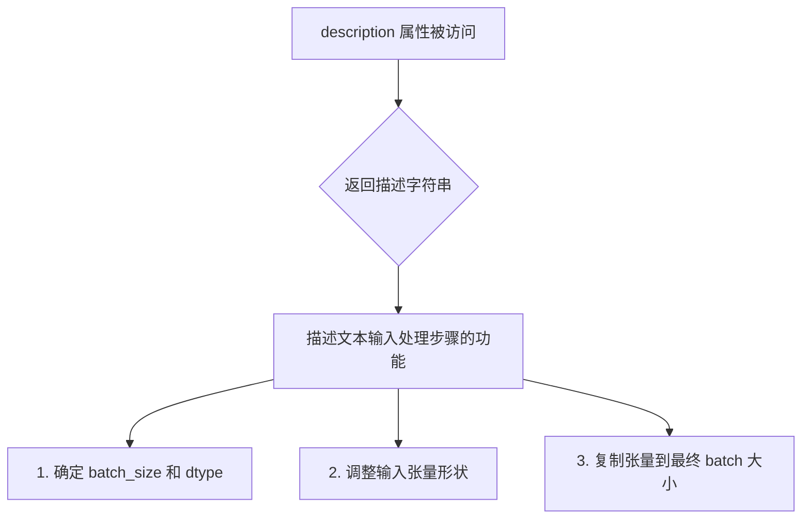
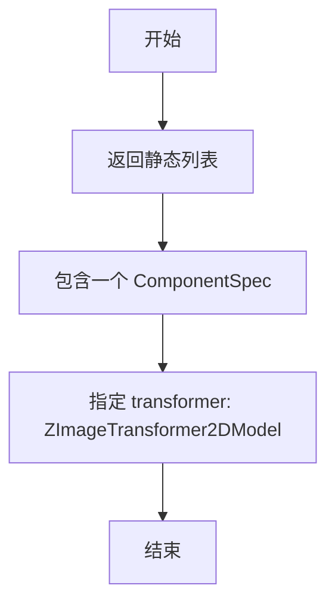
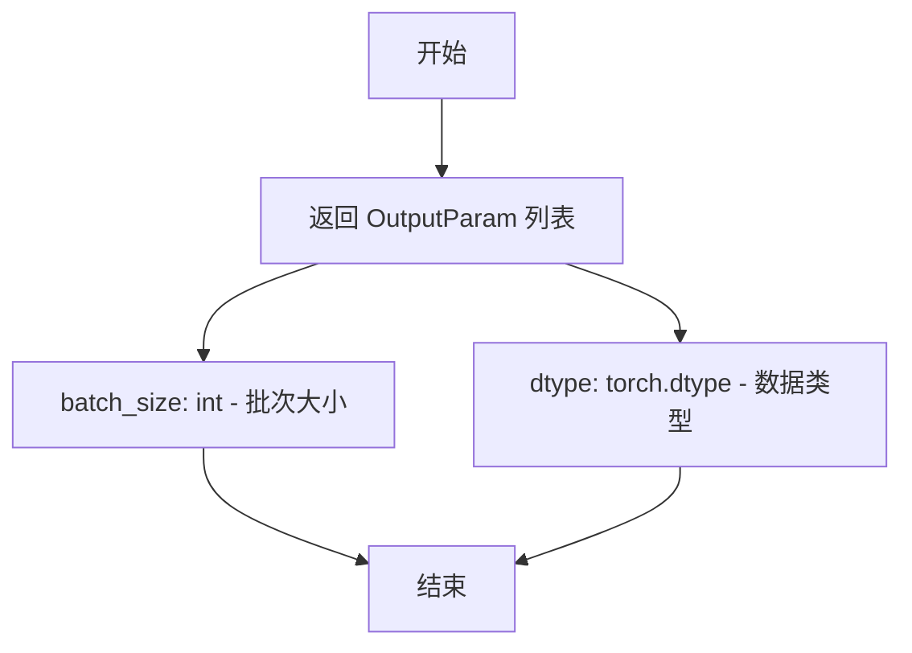
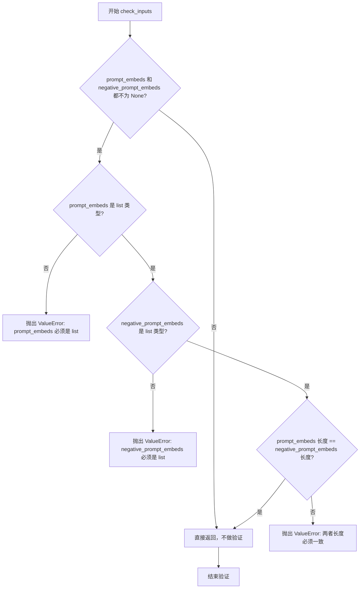
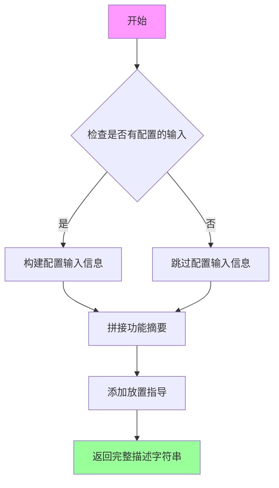
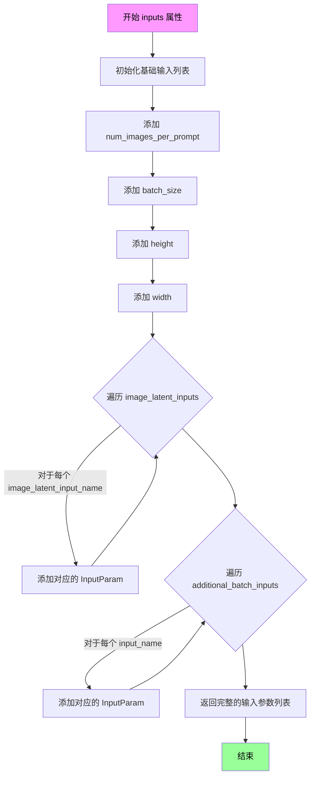
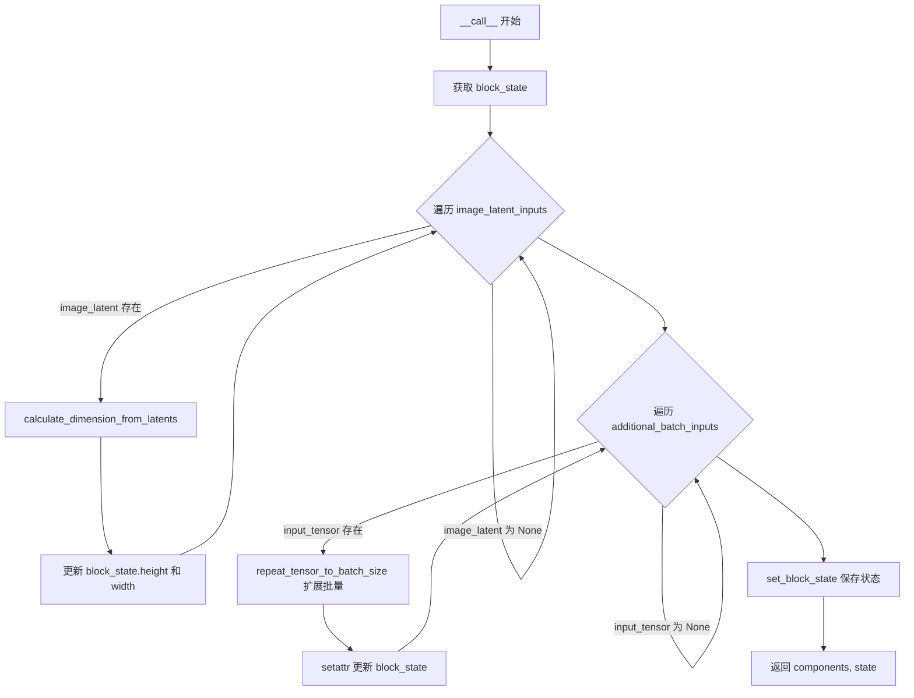
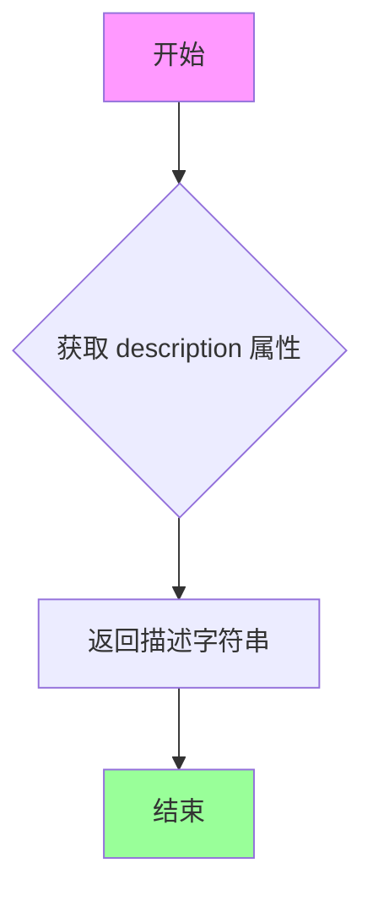
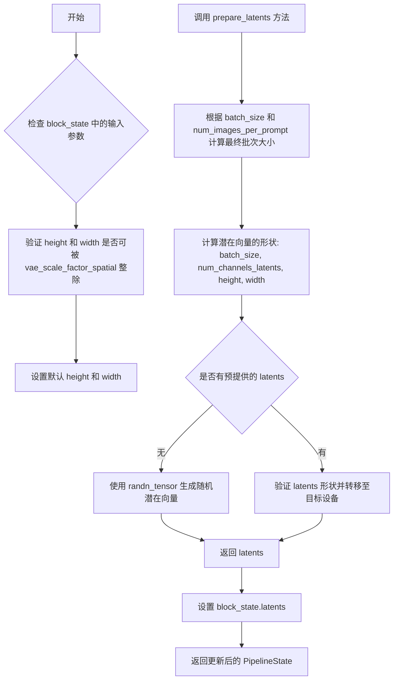
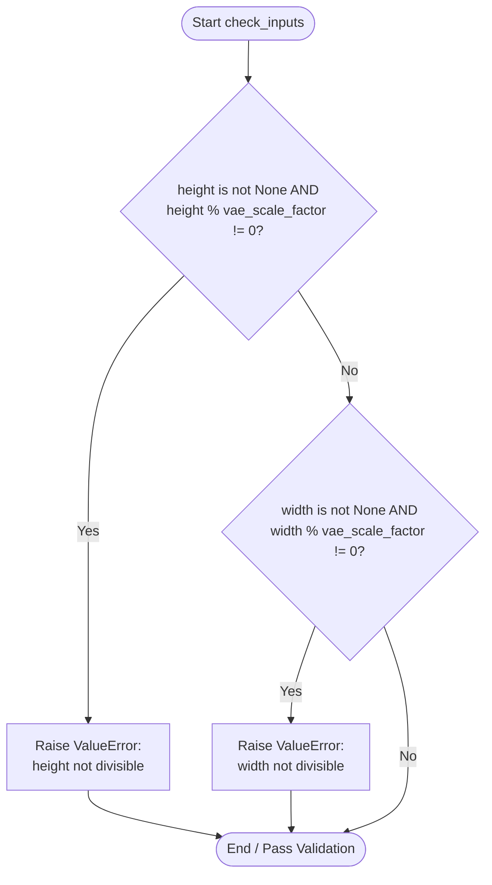

# `diffusers\src\diffusers\modular_pipelines\z_image\before_denoise.py` 详细设计文档

Z-Image文本到图像生成管道的模块化实现，提供文本编码输入处理、附加输入处理、潜在向量准备、时间步调度等核心步骤的模块化管道组件，支持图像生成的条件输入、批量处理和噪声调度。

## 整体流程

```mermaid
graph TD
    A[开始] --> B[ZImageTextInputStep]
    B --> C[ZImageAdditionalInputsStep]
    C --> D[ZImagePrepareLatentsStep]
    D --> E[ZImageSetTimestepsStep]
    E --> F{ZImageSetTimestepsWithStrengthStep?}
    F -- 是 --> G[ZImageSetTimestepsWithStrengthStep]
    F -- 否 --> H[ZImagePrepareLatentswithImageStep]
    G --> H
    H --> I[去噪循环 (后续步骤)]
```

## 类结构

```
ModularPipelineBlocks (抽象基类)
├── ZImageTextInputStep
├── ZImageAdditionalInputsStep
├── ZImagePrepareLatentsStep
├── ZImageSetTimestepsStep
├── ZImageSetTimestepsWithStrengthStep
└── ZImagePrepareLatentswithImageStep
```

## 全局变量及字段


### `logger`
    
模块级logger对象，用于记录该模块的日志信息

类型：`logging.Logger`
    


### `repeat_tensor_to_batch_size`
    
全局函数，用于将输入tensor的batch维度扩展到batch_size * num_images_per_prompt

类型：`Callable[[str, torch.Tensor, int, int], torch.Tensor]`
    


### `calculate_dimension_from_latents`
    
全局函数，根据latent tensor的形状计算输出图像的高度和宽度

类型：`Callable[[torch.Tensor, int], tuple[int, int]]`
    


### `calculate_shift`
    
全局函数，计算图像序列的shift值，用于调度器参数调整

类型：`Callable[[int, int, int, float, float], float]`
    


### `retrieve_timesteps`
    
全局函数，获取调度器的时间步长列表，支持自定义timesteps或sigmas

类型：`Callable`
    


### `ZImageTextInputStep.model_name`
    
模型名称标识，固定为'z-image'

类型：`str`
    


### `ZImageTextInputStep.description`
    
描述该步骤的功能：处理prompt_embeds，确定batch_size和dtype，并调整输入tensor形状

类型：`property str`
    


### `ZImageTextInputStep.expected_components`
    
该步骤期望的组件列表，包含transformer模型

类型：`property list[ComponentSpec]`
    


### `ZImageTextInputStep.inputs`
    
该步骤的输入参数列表，包含num_images_per_prompt、prompt_embeds和negative_prompt_embeds

类型：`property list[InputParam]`
    


### `ZImageTextInputStep.intermediate_outputs`
    
中间输出参数，包含batch_size和dtype

类型：`property list[OutputParam]`
    


### `ZImageAdditionalInputsStep.model_name`
    
模型名称标识，固定为'z-image'

类型：`str`
    


### `ZImageAdditionalInputsStep._image_latent_inputs`
    
私有属性，待处理的图像latent输入名称列表

类型：`list[str]`
    


### `ZImageAdditionalInputsStep._additional_batch_inputs`
    
私有属性，待扩展batch维度的额外输入名称列表

类型：`list[str]`
    


### `ZImageAdditionalInputsStep.description`
    
描述该步骤的功能：处理图像latent输入的height/width和batch扩展，以及额外batch输入的扩展

类型：`property str`
    


### `ZImageAdditionalInputsStep.inputs`
    
该步骤的输入参数列表，包含num_images_per_prompt、batch_size、height、width及配置的latent和batch输入

类型：`property list[InputParam]`
    


### `ZImagePrepareLatentsStep.model_name`
    
模型名称标识，固定为'z-image'

类型：`str`
    


### `ZImagePrepareLatentsStep.description`
    
描述该步骤的功能：准备denoising过程的初始latents

类型：`property str`
    


### `ZImagePrepareLatentsStep.inputs`
    
该步骤的输入参数列表，包含height、width、latents、num_images_per_prompt、generator、batch_size和dtype

类型：`property list[InputParam]`
    


### `ZImagePrepareLatentsStep.intermediate_outputs`
    
中间输出参数，包含准备好的latents

类型：`property list[OutputParam]`
    


### `ZImageSetTimestepsStep.model_name`
    
模型名称标识，固定为'z-image'

类型：`str`
    


### `ZImageSetTimestepsStep.expected_components`
    
该步骤期望的组件列表，包含scheduler调度器

类型：`property list[ComponentSpec]`
    


### `ZImageSetTimestepsStep.description`
    
描述该步骤的功能：设置推理时调度器的时间步

类型：`property str`
    


### `ZImageSetTimestepsStep.inputs`
    
该步骤的输入参数列表，包含latents、num_inference_steps和sigmas

类型：`property list[InputParam]`
    


### `ZImageSetTimestepsStep.intermediate_outputs`
    
中间输出参数，包含timesteps和num_inference_steps

类型：`property list[OutputParam]`
    


### `ZImageSetTimestepsWithStrengthStep.model_name`
    
模型名称标识，固定为'z-image'

类型：`str`
    


### `ZImageSetTimestepsWithStrengthStep.expected_components`
    
该步骤期望的组件列表，包含scheduler调度器

类型：`property list[ComponentSpec]`
    


### `ZImageSetTimestepsWithStrengthStep.description`
    
描述该步骤的功能：根据strength参数调整推理时间步，用于图像修复或ControlNet场景

类型：`property str`
    


### `ZImageSetTimestepsWithStrengthStep.inputs`
    
该步骤的输入参数列表，包含timesteps、num_inference_steps和strength

类型：`property list[InputParam]`
    


### `ZImagePrepareLatentswithImageStep.model_name`
    
模型名称标识，固定为'z-image'

类型：`str`
    


### `ZImagePrepareLatentswithImageStep.description`
    
描述该步骤的功能：使用图像条件准备latents，进行噪声缩放

类型：`property str`
    


### `ZImagePrepareLatentswithImageStep.inputs`
    
该步骤的输入参数列表，包含latents、image_latents和timesteps

类型：`property list[InputParam]`
    
    

## 全局函数及方法


### `repeat_tensor_to_batch_size`

该函数通过沿维度0重复元素，将张量的批次维度扩展到最终批次大小（batch_size * num_images_per_prompt）。输入张量必须具有批次大小1或batch_size。

参数：

- `input_name`：`str`，输入张量的名称（用于错误消息）
- `input_tensor`：`torch.Tensor`，要重复的张量。必须具有批次大小1或batch_size
- `batch_size`：`int`，基础批次大小（提示数量）
- `num_images_per_prompt`：`int`，可选，每个提示生成的图像数量。默认为1

返回值：`torch.Tensor`，具有最终批次大小（batch_size * num_images_per_prompt）的重复张量

#### 流程图

```mermaid
flowchart TD
    A[Start: repeat_tensor_to_batch_size] --> B{input_tensor 是 torch.Tensor?}
    B -->|否| C[抛出 ValueError: input_name 必须是张量]
    B -->|是| D{input_tensor.shape[0] == 1?}
    D -->|是| E[repeat_by = batch_size * num_images_per_prompt]
    D -->|否| F{input_tensor.shape[0] == batch_size?}
    F -->|否| G[抛出 ValueError: 无效的批次大小]
    F -->|是| H[repeat_by = num_images_per_prompt]
    E --> I[input_tensor.repeat_interleave repeat_by dim=0]
    H --> I
    I --> J[返回重复后的张量]
```

#### 带注释源码

```python
def repeat_tensor_to_batch_size(
    input_name: str,
    input_tensor: torch.Tensor,
    batch_size: int,
    num_images_per_prompt: int = 1,
) -> torch.Tensor:
    """Repeat tensor elements to match the final batch size.

    This function expands a tensor's batch dimension to match the final batch size (batch_size * num_images_per_prompt)
    by repeating each element along dimension 0.

    The input tensor must have batch size 1 or batch_size. The function will:
    - If batch size is 1: repeat each element (batch_size * num_images_per_prompt) times
    - If batch size equals batch_size: repeat each element num_images_per_prompt times

    Args:
        input_name (str): Name of the input tensor (used for error messages)
        input_tensor (torch.Tensor): The tensor to repeat. Must have batch size 1 or batch_size.
        batch_size (int): The base batch size (number of prompts)
        num_images_per_prompt (int, optional): Number of images to generate per prompt. Defaults to 1.

    Returns:
        torch.Tensor: The repeated tensor with final batch size (batch_size * num_images_per_prompt)

    Raises:
        ValueError: If input_tensor is not a torch.Tensor or has invalid batch size

    Examples:
        tensor = torch.tensor([[1, 2, 3]]) # shape: [1, 3] repeated = repeat_tensor_to_batch_size("image", tensor,
        batch_size=2, num_images_per_prompt=2) repeated # tensor([[1, 2, 3], [1, 2, 3], [1, 2, 3], [1, 2, 3]]) - shape:
        [4, 3]

        tensor = torch.tensor([[1, 2, 3], [4, 5, 6]]) # shape: [2, 3] repeated = repeat_tensor_to_batch_size("image",
        tensor, batch_size=2, num_images_per_prompt=2) repeated # tensor([[1, 2, 3], [1, 2, 3], [4, 5, 6], [4, 5, 6]])
        - shape: [4, 3]
    """
    # 确保输入是张量
    if not isinstance(input_tensor, torch.Tensor):
        raise ValueError(f"`{input_name}` must be a tensor")

    # 确保输入张量例如 image_latents 的批次大小为1或与提示的批次大小相同
    if input_tensor.shape[0] == 1:
        repeat_by = batch_size * num_images_per_prompt
    elif input_tensor.shape[0] == batch_size:
        repeat_by = num_images_per_prompt
    else:
        raise ValueError(
            f"`{input_name}` must have have batch size 1 or {batch_size}, but got {input_tensor.shape[0]}"
        )

    # 扩展张量以匹配 batch_size * num_images_per_prompt
    input_tensor = input_tensor.repeat_interleave(repeat_by, dim=0)

    return input_tensor
```


### `calculate_dimension_from_latents`

该函数通过将潜在张量的空间维度乘以VAE的空间缩放因子并除以2，将潜在空间维度转换为实际图像的空间维度（高度和宽度）。

参数：

- `latents`：`torch.Tensor`，潜在张量，必须有4个维度，期望形状为 [batch, channels, height, width]
- `vae_scale_factor_spatial`：`int`，VAE用于压缩图像空间维度的缩放因子，默认为16

返回值：`tuple[int, int]`，计算出的图像尺寸 (height, width)

#### 流程图

```mermaid
flowchart TD
    A[开始] --> B[从latents提取高度和宽度]
    B --> C[latents.shape[2:] 获取 latent_height 和 latent_width]
    C --> D[计算图像高度]
    D --> E[height = latent_height * vae_scale_factor_spatial // 2]
    E --> F[计算图像宽度]
    F --> G[width = latent_width * vae_scale_factor_spatial // 2]
    G --> H[返回 tuple[height, width]]
    H --> I[结束]
```

#### 带注释源码

```python
def calculate_dimension_from_latents(
    latents: torch.Tensor, 
    vae_scale_factor_spatial: int
) -> tuple[int, int]:
    """Calculate image dimensions from latent tensor dimensions.

    This function converts latent spatial dimensions to image spatial dimensions by multiplying the latent height/width
    by the VAE scale factor.

    Args:
        latents (torch.Tensor): The latent tensor. Must have 4 dimensions.
            Expected shapes: [batch, channels, height, width]
        vae_scale_factor (int): The scale factor used by the VAE to compress image spatial dimension.
            By default, it is 16
    Returns:
        tuple[int, int]: The calculated image dimensions as (height, width)
    """
    # 从潜在张量的形状中提取空间维度（高度和宽度）
    # latents.shape = [batch, channels, height, width]
    # 通过 shape[2:] 获取 height 和 width
    latent_height, latent_width = latents.shape[2:]
    
    # 计算实际图像高度：潜在高度 × VAE缩放因子 ÷ 2
    # 除以2是因为VAE在编码时会对空间维度进行2倍下采样
    height = latent_height * vae_scale_factor_spatial // 2
    
    # 计算实际图像宽度：潜在宽度 × VAE缩放因子 ÷ 2
    width = latent_width * vae_scale_factor_spatial // 2

    # 返回计算得到的图像尺寸元组 (height, width)
    return height, width
```


### `calculate_shift`

该函数通过线性插值方法，根据图像序列长度计算 Flow Match 调度器的 sigma 偏移量（shift），用于自适应调整不同分辨率图像的去噪调度节奏。

参数：

- `image_seq_len`：`int`，图像经过 patchify 后的序列长度（即 latent 高度与宽度的乘积除以 4）
- `base_seq_len`：`int` = 256，基础序列长度，对应 base_shift 的参考序列长度
- `max_seq_len`：`int` = 4096，最大序列长度，对应 max_shift 的参考序列长度
- `base_shift`：`float` = 0.5，基础偏移量，当序列长度为 base_seq_len 时的 shift 值
- `max_shift`：`float` = 1.15，最大偏移量，当序列长度为 max_seq_len 时的 shift 值

返回值：`float`，计算得到的偏移量 mu，用于传递给调度器的 sigmas 参数

#### 流程图

```mermaid
flowchart TD
    A[开始] --> B[计算斜率 m<br/>m = (max_shift - base_shift) / (max_seq_len - base_seq_len)]
    B --> C[计算截距 b<br/>b = base_shift - m * base_seq_len]
    C --> D[计算偏移量 mu<br/>mu = image_seq_len * m + b]
    D --> E[返回 mu]
```

#### 带注释源码

```python
# Copied from diffusers.pipelines.flux.pipeline_flux.calculate_shift
def calculate_shift(
    image_seq_len,
    base_seq_len: int = 256,
    max_seq_len: int = 4096,
    base_shift: float = 0.5,
    max_shift: float = 1.15,
):
    """Calculate the shift (mu) for flow matching schedulers based on image sequence length.
    
    This function implements a linear interpolation to compute the sigma shift value
    that adapts the noise schedule based on the spatial size of the input latents.
    Larger images require different noise schedules compared to smaller images.
    
    Args:
        image_seq_len: The sequence length of the image after patchify (h//2 * w//2)
        base_seq_len: Reference sequence length for base_shift (default: 256)
        max_seq_len: Reference sequence length for max_shift (default: 4096)
        base_shift: Shift value at base_seq_len (default: 0.5)
        max_shift: Shift value at max_seq_len (default: 1.15)
    
    Returns:
        float: The computed shift value (mu) for the scheduler
    """
    # Calculate the slope (m) of the linear interpolation
    # Represents how much shift changes per unit of sequence length
    m = (max_shift - base_shift) / (max_seq_len - base_seq_len)
    
    # Calculate the y-intercept (b) of the linear equation
    # Ensures the line passes through (base_seq_len, base_shift)
    b = base_shift - m * base_seq_len
    
    # Calculate the final shift value (mu) for the given image sequence length
    # This is the core formula: mu = m * image_seq_len + b
    mu = image_seq_len * m + b
    
    return mu
```


### `retrieve_timesteps`

该函数是Diffusers库中用于从调度器（scheduler）检索推理时间步的核心工具函数。它封装了调度器的`set_timesteps`方法调用，支持自定义时间步或sigma值，并返回调度后的时间步张量及实际的推理步数。

参数：

- `scheduler`：`SchedulerMixin`，用于生成样本的预训练模型所对应的调度器
- `num_inference_steps`：`int | None`，生成样本时使用的扩散步数。若使用此参数，`timesteps`必须为`None`
- `device`：`str | torch.device | None`，时间步要移动到的设备。如果为`None`，时间步不会被移动
- `timesteps`：`list[int] | None`，用于覆盖调度器时间步间隔策略的自定义时间步。如果传递` timesteps`，则`num_inference_steps`和`sigmas`必须为`None`
- `sigmas`：`list[float] | None`，用于覆盖调度器sigma间隔策略的自定义sigma值。如果传递`sigmas`，则`num_inference_steps`和`timesteps`必须为`None`
- `**kwargs`：任意关键字参数，将传递给`scheduler.set_timesteps`

返回值：`tuple[torch.Tensor, int]`，包含调度器的时间步时间表和推理步数

#### 流程图

```mermaid
flowchart TD
    A[开始 retrieve_timesteps] --> B{检查 timesteps 和 sigmas 是否同时存在}
    B -->|是| C[抛出 ValueError: 只能选择 timesteps 或 sigmas 其中一个]
    B -->|否| D{是否提供了 timesteps}
    
    D -->|是| E[检查 scheduler.set_timesteps 是否接受 timesteps 参数]
    E --> F{接受 timesteps?}
    F -->|否| G[抛出 ValueError: 当前调度器类不支持自定义时间步]
    F -->|是| H[调用 scheduler.set_timesteps<br/>参数: timesteps=timesteps, device=device, **kwargs]
    H --> I[获取 scheduler.timesteps]
    I --> J[设置 num_inference_steps = len(timesteps)]
    J --> K[返回 timesteps, num_inference_steps]
    
    D -->|否| L{是否提供了 sigmas}
    L -->|是| M[检查 scheduler.set_timesteps 是否接受 sigmas 参数]
    M --> N{接受 sigmas?}
    N -->|否| O[抛出 ValueError: 当前调度器类不支持自定义 sigmas]
    N -->|是| P[调用 scheduler.set_timesteps<br/>参数: sigmas=sigmas, device=device, **kwargs]
    P --> Q[获取 scheduler.timesteps]
    Q --> R[设置 num_inference_steps = len(timesteps)]
    R --> K
    
    L -->|否| S[调用 scheduler.set_timesteps<br/>参数: num_inference_steps, device=device, **kwargs]
    S --> T[获取 scheduler.timesteps]
    T --> K
```

#### 带注释源码

```python
# Copied from diffusers.pipelines.stable_diffusion.pipeline_stable_diffusion.retrieve_timesteps
def retrieve_timesteps(
    scheduler,
    num_inference_steps: int | None = None,
    device: str | torch.device | None = None,
    timesteps: list[int] | None = None,
    sigmas: list[float] | None = None,
    **kwargs,
):
    r"""
    Calls the scheduler's `set_timesteps` method and retrieves timesteps from the scheduler after the call. Handles
    custom timesteps. Any kwargs will be supplied to `scheduler.set_timesteps`.

    Args:
        scheduler (`SchedulerMixin`):
            The scheduler to get timesteps from.
        num_inference_steps (`int`):
            The number of diffusion steps used when generating samples with a pre-trained model. If used, `timesteps`
            must be `None`.
        device (`str` or `torch.device`, *optional*):
            The device to which the timesteps should be moved to. If `None`, the timesteps are not moved.
        timesteps (`list[int]`, *optional*):
            Custom timesteps used to override the timestep spacing strategy of the scheduler. If `timesteps` is passed,
            `num_inference_steps` and `sigmas` must be `None`.
        sigmas (`list[float]`, *optional*):
            Custom sigmas used to override the timestep spacing strategy of the scheduler. If `sigmas` is passed,
            `num_inference_steps` and `timesteps` must be `None`.

    Returns:
        `tuple[torch.Tensor, int]`: A tuple where the first element is the timestep schedule from the scheduler and the
        second element is the number of inference steps.
    """
    # 检查是否同时提供了 timesteps 和 sigmas，两者只能选其一
    if timesteps is not None and sigmas is not None:
        raise ValueError("Only one of `timesteps` or `sigmas` can be passed. Please choose one to set custom values")
    
    # 处理自定义 timesteps 的情况
    if timesteps is not None:
        # 使用 inspect 检查 scheduler.set_timesteps 是否接受 timesteps 参数
        accepts_timesteps = "timesteps" in set(inspect.signature(scheduler.set_timesteps).parameters.keys())
        if not accepts_timesteps:
            raise ValueError(
                f"The current scheduler class {scheduler.__class__}'s `set_timesteps` does not support custom"
                f" timestep schedules. Please check whether you are using the correct scheduler."
            )
        # 调用调度器的 set_timesteps 方法设置自定义时间步
        scheduler.set_timesteps(timesteps=timesteps, device=device, **kwargs)
        # 从调度器获取更新后的时间步
        timesteps = scheduler.timesteps
        # 计算实际的推理步数
        num_inference_steps = len(timesteps)
    
    # 处理自定义 sigmas 的情况
    elif sigmas is not None:
        # 使用 inspect 检查 scheduler.set_timesteps 是否接受 sigmas 参数
        accept_sigmas = "sigmas" in set(inspect.signature(scheduler.set_timesteps).parameters.keys())
        if not accept_sigmas:
            raise ValueError(
                f"The current scheduler class {scheduler.__class__}'s `set_timesteps` does not support custom"
                f" sigmas schedules. Please check whether you are using the correct scheduler."
            )
        # 调用调度器的 set_timesteps 方法设置自定义 sigma
        scheduler.set_timesteps(sigmas=sigmas, device=device, **kwargs)
        # 从调度器获取更新后的时间步
        timesteps = scheduler.timesteps
        # 计算实际的推理步数
        num_inference_steps = len(timesteps)
    
    # 默认情况：使用 num_inference_steps 设置时间步
    else:
        scheduler.set_timesteps(num_inference_steps, device=device, **kwargs)
        timesteps = scheduler.timesteps
    
    # 返回时间步张量和推理步数
    return timesteps, num_inference_steps
```


### `ZImageTextInputStep.description`

该属性返回一个字符串描述，概述了文本输入处理步骤的核心功能：基于 `prompt_embeds` 确定 `batch_size` 和 `dtype`，并根据 `batch_size`（提示词数量）和 `num_images_per_prompt` 调整输入张量的形状。所有输入张量预期具有 batch_size=1 或与 prompt_embeds 的 batch_size 相匹配，张量将在 batch 维度上进行复制以获得最终的 batch_size = batch_size * num_images_per_prompt。

参数： 无

返回值：`str`，返回描述文本输入处理步骤功能的字符串，包含以下要点：
1. 基于 `prompt_embeds` 确定 `batch_size` 和 `dtype`
2. 根据 `batch_size` 和 `num_images_per_prompt` 调整输入张量形状
3. 输入张量预期具有 batch_size=1 或与 prompt_embeds 的 batch_size 匹配
4. 张量将在 batch 维度复制以获得最终 batch_size = batch_size * num_images_per_prompt

#### 流程图



#### 带注释源码

```python
@property
def description(self) -> str:
    return (
        "Input processing step that:\n"
        "  1. Determines `batch_size` and `dtype` based on `prompt_embeds`\n"
        "  2. Adjusts input tensor shapes based on `batch_size` (number of prompts) and `num_images_per_prompt`\n\n"
        "All input tensors are expected to have either batch_size=1 or match the batch_size\n"
        "of prompt_embeds. The tensors will be duplicated across the batch dimension to\n"
        "have a final batch_size of batch_size * num_images_per_prompt."
    )
```


### `ZImageTextInputStep.expected_components`

该属性方法定义了 `ZImageTextInputStep` 步骤所需的组件规范。它返回包含单个 `ComponentSpec` 的列表，指定了该步骤需要使用 `ZImageTransformer2DModel` 类型的 `transformer` 组件。

参数：
- 无显式参数（`expected_components` 是一个属性方法，`self` 是隐式参数）

返回值：`list[ComponentSpec]`，返回组件规范列表，包含步骤所需的 transformer 组件规范。

#### 流程图



#### 带注释源码

```python
@property
def expected_components(self) -> list[ComponentSpec]:
    """定义该步骤所需的组件规范。

    该属性方法返回一个列表，指定了 ZImageTextInputStep 步骤
    需要使用的组件。在这个实现中，只需要一个 transformer 组件。

    Returns:
        list[ComponentSpec]: 包含组件规范的列表，每个 ComponentSpec
            指定了组件的名称和类型。
            - "transformer": 用于处理文本嵌入的 transformer 模型组件，
              类型为 ZImageTransformer2DModel
    """
    return [
        ComponentSpec("transformer", ZImageTransformer2DModel),
    ]
```


### `ZImageTextInputStep.inputs`

该属性定义了 ZImageTextInputStep 处理步骤所需的所有输入参数，包括 `num_images_per_prompt`（每个提示生成的图像数量）、`prompt_embeds`（预生成的文本嵌入）和 `negative_prompt_embeds`（预生成的负向文本嵌入）。这些参数用于配置文本输入的处理方式，确定批次大小和数据类型。

参数：

- `num_images_per_prompt`：`int`，可选参数，默认值为 1，表示每个提示要生成的图像数量
- `prompt_embeds`：`list[torch.Tensor]`，必填参数，预生成的文本嵌入，可以从 text_encoder 步骤生成
- `negative_prompt_embeds`：`list[torch.Tensor]`，可选参数，预生成的负向文本嵌入，可以从 text_encoder 步骤生成

返回值：`list[InputParam]`，返回该步骤所需的所有输入参数列表

#### 流程图

```mermaid
flowchart TD
    A[开始: 定义 inputs 属性] --> B{定义参数列表}
    
    B --> C[添加 num_images_per_prompt 参数<br/>类型: int<br/>默认值: 1]
    C --> D[添加 prompt_embeds 参数<br/>类型: list[torch.Tensor]<br/>必填: True]
    D --> E[添加 negative_prompt_embeds 参数<br/>类型: list[torch.Tensor]<br/>必填: False]
    
    E --> F[返回 InputParam 列表]
    
    style A fill:#e1f5fe
    style F fill:#c8e6c9
```

#### 带注释源码

```python
@property
def inputs(self) -> list[InputParam]:
    """
    定义 ZImageTextInputStep 步骤的输入参数规范。
    
    该属性返回一个 InputParam 列表，描述该处理步骤需要的所有输入参数。
    这些参数将在流水线执行时被传递给当前步骤的 block_state。
    
    返回:
        list[InputParam]: 包含以下参数的列表:
            - num_images_per_prompt: 每个提示生成的图像数量，默认值为 1
            - prompt_embeds: 预生成的文本嵌入，必填参数
            - negative_prompt_embeds: 预生成的负向文本嵌入，可选参数
    """
    return [
        # num_images_per_prompt: 控制每个提示生成的图像数量
        # 默认为 1，即每个提示生成一张图像
        InputParam("num_images_per_prompt", default=1),
        
        # prompt_embeds: 预生成的文本嵌入向量
        # 类型为 torch.Tensor 的列表，通常由 text_encoder 步骤生成
        # 包含正向提示的语义表示，用于指导图像生成
        InputParam(
            "prompt_embeds",
            required=True,  # 该参数为必填项
            type_hint=list[torch.Tensor],
            description="Pre-generated text embeddings. Can be generated from text_encoder step.",
        ),
        
        # negative_prompt_embeds: 预生成的负向文本嵌入向量
        # 类型为 torch.Tensor 的列表，可选参数
        # 用于指定不想要的图像特征，帮助模型排除某些内容
        InputParam(
            "negative_prompt_embeds",
            type_hint=list[torch.Tensor],
            description="Pre-generated negative text embeddings. Can be generated from text_encoder step.",
        ),
    ]
```


### `ZImageTextInputStep.intermediate_outputs`

该属性定义了 `ZImageTextInputStep` 步骤的中间输出参数，包括 `batch_size`（批次大小）和 `dtype`（数据类型），用于在流水线中向下游步骤传递批次大小和数据类型信息。

参数：

- `self`：`ZImageTextInputStep` 实例本身，无额外参数

返回值：`list[str]`，实际上返回 `OutputParam` 对象列表，包含 `batch_size`（int 类型，批次大小）和 `dtype`（torch.dtype 类型，数据类型）两个输出参数

#### 流程图



#### 带注释源码

```python
@property
def intermediate_outputs(self) -> list[str]:
    """定义该步骤的中间输出参数。

    该属性返回两个关键的中间输出：
    1. batch_size: 表示提示词的数量，最终的模型输入批次大小应为 batch_size * num_images_per_prompt
    2. dtype: 模型张量的数据类型（由 transformer.dtype 决定）

    这些输出将被打包到 PipelineState 中，供流水线中的后续步骤使用。

    Returns:
        list[str]: 返回 OutputParam 对象列表，包含批次大小和数据类型信息
    """
    return [
        OutputParam(
            "batch_size",
            type_hint=int,
            description="Number of prompts, the final batch size of model inputs should be batch_size * num_images_per_prompt",
        ),
        OutputParam(
            "dtype",
            type_hint=torch.dtype,
            description="Data type of model tensor inputs (determined by `transformer.dtype`)",
        ),
    ]
```


### `ZImageTextInputStep.check_inputs`

该方法用于验证文本嵌入输入参数的有效性，确保 `prompt_embeds` 和 `negative_prompt_embeds` 在直接传入时为列表类型且长度一致。

参数：

- `self`：类方法隐式参数，代表 `ZImageTextInputStep` 的实例
- `components`：`ZImageModularPipeline`，组件容器，用于访问管道配置和模型组件（此处主要用到 `components.vae_scale_factor_spatial` 等属性）
- `block_state`：`PipelineState` 或类似对象，管道状态对象，包含 `prompt_embeds`、`negative_prompt_embeds` 等属性

返回值：`None`，该方法通过抛出异常来处理验证失败，不返回任何值

#### 流程图



#### 带注释源码

```python
def check_inputs(self, components, block_state):
    """验证文本嵌入输入参数的有效性。

    当 prompt_embeds 和 negative_prompt_embeds 同时存在时，检查它们是否满足以下条件：
    1. 两者都必须是 list 类型（当直接传入时）
    2. 两者长度必须一致

    Args:
        components: ZImageModularPipeline 实例，提供对管道组件的访问
        block_state: PipelineState 或类似对象，包含 prompt_embeds 和 negative_prompt_embeds 属性

    Raises:
        ValueError: 当 prompt_embeds 或 negative_prompt_embeds 类型不正确或长度不一致时

    Returns:
        None: 验证通过则直接返回，不返回任何值
    """
    # 检查两个嵌入是否都存在（只要有一个为 None 就跳过验证）
    if block_state.prompt_embeds is not None and block_state.negative_prompt_embeds is not None:
        # 验证 prompt_embeds 是否为列表类型
        if not isinstance(block_state.prompt_embeds, list):
            raise ValueError(
                f"`prompt_embeds` must be a list when passed directly, but got {type(block_state.prompt_embeds)}."
            )
        # 验证 negative_prompt_embeds 是否为列表类型
        if not isinstance(block_state.negative_prompt_embeds, list):
            raise ValueError(
                f"`negative_prompt_embeds` must be a list when passed directly, but got {type(block_state.negative_prompt_embeds)}."
            )
        # 验证两个列表的长度是否一致
        if len(block_state.prompt_embeds) != len(block_state.negative_prompt_embeds):
            raise ValueError(
                "`prompt_embeds` and `negative_prompt_embeds` must have the same length when passed directly, but"
                f" got: `prompt_embeds` {len(block_state.prompt_embeds)} != `negative_prompt_embeds`"
                f" {len(block_state.negative_prompt_embeds)}."
            )
```


### ZImageTextInputStep.__call__

该方法是模块化管道中的文本输入处理步骤，负责从提示嵌入中确定批次大小和数据类型，并根据 `num_images_per_prompt` 参数调整输入张量的形状以支持批量生成多个图像。

参数：

- `components`：`ZImageModularPipeline`，管道组件容器，提供对模型和配置属性的访问
- `state`：`PipelineState`，管道状态对象，包含当前步骤的块状态（block_state）

返回值：`Tuple[ZImageModularPipeline, PipelineState]`，返回更新后的组件和状态对象

#### 流程图

```mermaid
flowchart TD
    A[__call__ 开始] --> B[获取 block_state]
    --> C[调用 check_inputs 验证输入]
    --> D[从 prompt_embeds 长度确定 batch_size]
    --> E[从 prompt_embeds[0] 获取 dtype]
    --> F{num_images_per_prompt > 1?}
    -->|是| G[重复 prompt_embeds num_images_per_prompt 次]
    --> H{negative_prompt_embeds 存在?}
    -->|是| I[重复 negative_prompt_embeds num_images_per_prompt 次]
    --> J[更新 block_state]
    --> K[设置 block_state 到 state]
    --> L[返回 components 和 state]
    F -->|否| J
    H -->|否| J
```

#### 带注释源码

```python
@torch.no_grad()
def __call__(self, components: ZImageModularPipeline, state: PipelineState) -> PipelineState:
    """执行文本输入处理步骤的主方法。
    
    该方法完成以下任务：
    1. 验证输入参数的有效性
    2. 从 prompt_embeds 确定 batch_size 和 dtype
    3. 根据 num_images_per_prompt 扩展嵌入向量的批次维度
    4. 将处理后的状态写回管道状态
    
    Args:
        components: ZImageModularPipeline 实例，包含管道组件
        state: PipelineState 管道状态对象
        
    Returns:
        Tuple[ZImageModularPipeline, PipelineState]: 更新后的组件和状态
    """
    # 从管道状态中获取当前步骤的块状态
    block_state = self.get_block_state(state)
    
    # 验证输入参数的有效性（检查 prompt_embeds 和 negative_prompt_embeds 的类型和长度一致性）
    self.check_inputs(components, block_state)

    # 从 prompt_embeds 列表的长度确定批次大小（prompt 数量）
    block_state.batch_size = len(block_state.prompt_embeds)
    
    # 从第一个 prompt_embed 的数据类型确定后续计算使用的数据类型
    block_state.dtype = block_state.prompt_embeds[0].dtype

    # 如果需要为每个 prompt 生成多个图像，则扩展 prompt_embeds 的批次维度
    if block_state.num_images_per_prompt > 1:
        # 使用列表推导式重复每个 prompt_embed num_images_per_prompt 次
        # 例如：如果有 2 个 prompt，每个需要生成 3 张图像，结果将有 6 个 embed
        prompt_embeds = [pe for pe in block_state.prompt_embeds for _ in range(block_state.num_images_per_prompt)]
        block_state.prompt_embeds = prompt_embeds

        # 同样处理负向提示嵌入（用于无分类器指导）
        if block_state.negative_prompt_embeds is not None:
            negative_prompt_embeds = [
                npe for npe in block_state.negative_prompt_embeds for _ in range(block_state.num_images_per_prompt)
            ]
            block_state.negative_prompt_embeds = negative_prompt_embeds

    # 将更新后的块状态写回管道状态
    self.set_block_state(state, block_state)

    # 返回更新后的组件和状态，供管道下一步使用
    return components, state
```


### `ZImageAdditionalInputsStep.__init__`

该方法是一个初始化方法，用于配置 `ZImageAdditionalInputsStep` 类实例。它接收两个可选参数：`image_latent_inputs`（图像潜在张量名称列表）和 `additional_batch_inputs`（额外批处理输入名称列表），并将它们规范化为列表类型后存储为实例变量，同时调用父类的初始化方法。

参数：

- `image_latent_inputs`：`list[str]`，默认值 `["image_latents"]`，需要处理的图像潜在张量名称列表，除了调整这些输入的批次大小外，还将用于确定高度/宽度。可以是单个字符串或字符串列表。
- `additional_batch_inputs`：`list[str]`，默认值 `[]`，需要扩展批次大小以匹配最终批次大小的额外条件输入张量名称列表。可以是单个字符串或字符串列表。

返回值：`None`（`__init__` 方法的隐式返回值）

#### 流程图

```mermaid
graph TD
    A[开始 __init__] --> B{image_latent_inputs 是否为列表?}
    B -->|否| C[转换为列表: [image_latent_inputs]]
    B -->|是| D[保持原值]
    C --> E{additional_batch_inputs 是否为列表?}
    D --> E
    E -->|否| F[转换为列表: [additional_batch_inputs]]
    E -->|是| G[保持原值]
    F --> H[设置实例变量: self._image_latent_inputs]
    G --> H
    H --> I[设置实例变量: self._additional_batch_inputs]
    I --> J[调用父类 __init__: super().__init__()]
    J --> K[结束]
```

#### 带注释源码

```python
def __init__(
    self,
    image_latent_inputs: list[str] = ["image_latents"],
    additional_batch_inputs: list[str] = [],
):
    """Initialize a configurable step that standardizes the inputs for the denoising step. It:\n"
    
    This step handles multiple common tasks to prepare inputs for the denoising step:
    1. For encoded image latents, use it update height/width if None, and expands batch size
    2. For additional_batch_inputs: Only expands batch dimensions to match final batch size
    
    This is a dynamic block that allows you to configure which inputs to process.
    
    Args:
        image_latent_inputs (list[str], optional): Names of image latent tensors to process.
            In additional to adjust batch size of these inputs, they will be used to determine height/width. Can be
            a single string or list of strings. Defaults to ["image_latents"].
        additional_batch_inputs (list[str], optional):
            Names of additional conditional input tensors to expand batch size. These tensors will only have their
            batch dimensions adjusted to match the final batch size. Can be a single string or list of strings.
            Defaults to [].
    
    Examples:
        # Configure to process image_latents (default behavior) ZImageAdditionalInputsStep()
        
        # Configure to process multiple image latent inputs
        ZImageAdditionalInputsStep(image_latent_inputs=["image_latents", "control_image_latents"])
        
        # Configure to process image latents and additional batch inputs ZImageAdditionalInputsStep(
            image_latent_inputs=["image_latents"], additional_batch_inputs=["image_embeds"]
        )
    """
    # 确保 image_latent_inputs 是列表类型，以便统一处理
    if not isinstance(image_latent_inputs, list):
        image_latent_inputs = [image_latent_inputs]
    # 确保 additional_batch_inputs 是列表类型，以便统一处理
    if not isinstance(additional_batch_inputs, list):
        additional_batch_inputs = [additional_batch_inputs]
    
    # 将处理后的参数存储为实例变量，供后续 __call__ 方法使用
    self._image_latent_inputs = image_latent_inputs
    self._additional_batch_inputs = additional_batch_inputs
    # 调用父类 ModularPipelineBlocks 的初始化方法
    super().__init__()
```


### `ZImageAdditionalInputsStep.description`

这是一个属性（property），用于描述 `ZImageAdditionalInputsStep` 类的功能和处理逻辑。该属性返回一个格式化的字符串，说明该步骤负责处理图像潜在输入的尺寸计算和批次扩展，以及额外批次输入的批次维度扩展。

参数：
- 无参数（这是一个属性方法，仅接收隐式的 `self` 参数）

返回值：`str`，返回该步骤的描述信息，包含功能摘要、配置的输入信息以及放置指导

#### 流程图



#### 带注释源码

```python
@property
def description(self) -> str:
    """返回该处理步骤的描述信息。
    
    该属性方法生成一个包含三个部分的描述字符串：
    1. 功能摘要：说明该步骤的主要功能
    2. 配置的输入信息：列出配置的具体输入参数
    3. 放置指导：说明该模块在管道中的正确位置
    
    Returns:
        str: 格式化的描述字符串，包含步骤功能、输入配置和放置位置
    """
    
    # ============================================================
    # 第一部分：功能摘要
    # ============================================================
    # 说明该步骤处理两类输入：图像潜在输入和额外批次输入
    summary_section = (
        "Input processing step that:\n"
        "  1. For image latent inputs: Updates height/width if None, and expands batch size\n"
        "  2. For additional batch inputs: Expands batch dimensions to match final batch size"
    )

    # ============================================================
    # 第二部分：配置的输入信息
    # ============================================================
    # 如果配置了图像潜在输入或额外批次输入，则添加详细信息
    inputs_info = ""
    # 检查是否配置了任何输入
    if self._image_latent_inputs or self._additional_batch_inputs:
        # 添加"Configured inputs:"标题
        inputs_info = "\n\nConfigured inputs:"
        # 如果有图像潜在输入，添加到信息中
        if self._image_latent_inputs:
            inputs_info += f"\n  - Image latent inputs: {self._image_latent_inputs}"
        # 如果有额外批次输入，添加到信息中
        if self._additional_batch_inputs:
            inputs_info += f"\n  - Additional batch inputs: {self._additional_batch_inputs}"

    # ============================================================
    # 第三部分：放置指导
    # ============================================================
    # 说明该模块在管道中的正确位置
    placement_section = "\n\nThis block should be placed after the encoder steps and the text input step."

    # ============================================================
    # 组合所有部分并返回
    # ============================================================
    return summary_section + inputs_info + placement_section
```


### `ZImageAdditionalInputsStep.inputs`

该属性用于定义 Z-Image 管道中额外输入处理步骤的输入参数列表。它是一个动态属性，根据初始化时配置的 `image_latent_inputs` 和 `additional_batch_inputs` 来确定具体的输入参数。默认情况下，该步骤会处理图像潜在变量（如 `image_latents`）以及通用的批次相关参数（如 `batch_size`、`num_images_per_prompt`、`height` 和 `width`），为后续的去噪步骤准备标准化的输入数据。

参数：

- `num_images_per_prompt`：`int`，可选参数，默认值为 1。表示每个提示词要生成的图像数量，用于控制批次大小的倍率。
- `batch_size`：`int`，必需参数。表示提示词的数量，最终模型输入的批次大小应为 `batch_size * num_images_per_prompt`。
- `height`：`int | None`，可选参数。表示生成图像的高度，如果为 None，则会根据图像潜在变量的维度自动计算。
- `width`：`int | None`，可选参数。表示生成图像的宽度，如果为 None，则会根据图像潜在变量的维度自动计算。
- `image_latents`：`torch.Tensor | None`，可选参数（由 `_image_latent_inputs` 配置决定，默认配置下存在）。表示经过 VAE 编码后的图像潜在变量，用于图像到图像的生成任务或控制生成。
- `image_embeds` 等额外批次输入：`torch.Tensor | None`，可选参数（由 `_additional_batch_inputs` 配置决定，默认配置下可能不存在）。表示额外的条件输入张量，仅进行批次维度扩展以匹配最终批次大小。

返回值：`list[InputParam]`，返回一个包含所有输入参数的列表，每个元素都是一个 `InputParam` 对象，封装了参数的名称、类型提示、默认值和描述等信息。

#### 流程图



#### 带注释源码

```python
@property
def inputs(self) -> list[InputParam]:
    """定义 ZImageAdditionalInputsStep 的输入参数列表。

    该属性返回一个包含所有输入参数的列表，这些参数用于在管道执行过程中
    为去噪步骤准备和标准化输入数据。输入参数分为以下几类：
    1. 通用批次参数：num_images_per_prompt、batch_size、height、width
    2. 图像潜在变量输入：由 _image_latent_inputs 配置决定
    3. 额外批次输入：由 _additional_batch_inputs 配置决定

    Returns:
        list[InputParam]: 包含所有输入参数的列表
    """
    # 步骤1：初始化基础输入参数列表，包含通用的批次控制参数
    inputs = [
        # num_images_per_prompt：每个提示词生成的图像数量，默认为1
        InputParam(name="num_images_per_prompt", default=1),
        # batch_size：提示词数量，必需参数
        InputParam(name="batch_size", required=True),
        # height：图像高度，可选参数
        InputParam(name="height"),
        # width：图像宽度，可选参数
        InputParam(name="width"),
    ]

    # 步骤2：根据初始化时配置的 image_latent_inputs，动态添加图像潜在变量输入
    # 默认配置下，image_latent_inputs = ["image_latents"]
    # 这些输入不仅用于批次扩展，还会用于计算和更新 height/width
    for image_latent_input_name in self._image_latent_inputs:
        inputs.append(InputParam(name=image_latent_input_name))

    # 步骤3：根据初始化时配置的 additional_batch_inputs，动态添加额外批次输入
    # 默认配置下，additional_batch_inputs = []
    # 这些输入仅用于批次维度扩展，不参与 height/width 的计算
    for input_name in self._additional_batch_inputs:
        inputs.append(InputParam(name=input_name))

    # 步骤4：返回完整的输入参数列表
    return inputs
```


### `ZImageAdditionalInputsStep.__call__`

该方法是一个模块化管道块，用于标准化去噪步骤的输入。它主要处理两类输入：1) 图像潜在变量输入，用于更新高度/宽度（如果为None）并扩展批量大小；2) 附加批量输入，仅扩展批量维度以匹配最终批量大小。这是一个动态块，允许配置要处理的输入名称。

参数：

- `components`：`ZImageModularPipeline`，管道组件对象，包含 VAE 比例因子等配置信息
- `state`：`PipelineState`，管道状态对象，包含当前执行上下文的所有数据和中间结果

返回值：`Tuple[ZImageModularPipeline, PipelineState]`，返回组件和更新后的状态对象

#### 流程图



#### 带注释源码

```python
def __call__(self, components: ZImageModularPipeline, state: PipelineState) -> PipelineState:
    """处理图像潜在输入和附加批量输入的标准化步骤。
    
    该方法执行以下操作：
    1. 对于图像潜在输入：计算高度/宽度（如果为None），并扩展批量大小
    2. 对于附加批量输入：仅扩展批量维度以匹配最终批量大小
    
    Args:
        components: ZImageModularPipeline，管道组件对象
        state: PipelineState，管道状态对象
    
    Returns:
        Tuple[ZImageModularPipeline, PipelineState]：更新后的组件和状态
    """
    # 从状态中获取当前块的局部状态
    block_state = self.get_block_state(state)

    # ============================================================
    # 处理图像潜在输入（高度/宽度计算和批量扩展）
    # ============================================================
    for image_latent_input_name in self._image_latent_inputs:
        # 动态获取属性名对应的潜在张量
        image_latent_tensor = getattr(block_state, image_latent_input_name)
        
        # 如果该潜在张量不存在，跳过处理
        if image_latent_tensor is None:
            continue

        # 1. 从潜在张量维度计算图像的高度和宽度
        # 使用 VAE 空间比例因子将潜在空间维度转换为图像空间维度
        height, width = calculate_dimension_from_latents(
            image_latent_tensor, 
            components.vae_scale_factor_spatial
        )
        
        # 仅当高度/宽度未设置时才更新（保持用户提供的值优先）
        block_state.height = block_state.height or height
        block_state.width = block_state.width or width

    # ============================================================
    # 处理附加批量输入（仅批量扩展）
    # ============================================================
    for input_name in self._additional_batch_inputs:
        # 动态获取属性名对应的输入张量
        input_tensor = getattr(block_state, input_name)
        
        # 如果该输入张量不存在，跳过处理
        if input_tensor is None:
            continue

        # 仅扩展批量大小，不进行其他处理
        # 根据 batch_size 和 num_images_per_prompt 重复张量
        input_tensor = repeat_tensor_to_batch_size(
            input_name=input_name,
            input_tensor=input_tensor,
            num_images_per_prompt=block_state.num_images_per_prompt,
            batch_size=block_state.batch_size,
        )

        # 将更新后的张量写回 block_state
        setattr(block_state, input_name, input_tensor)

    # 保存更新后的块状态到管道状态
    self.set_block_state(state, block_state)
    
    # 返回组件和状态元组，符合 ModularPipelineBlocks 的调用约定
    return components, state
```


### `ZImagePrepareLatentsStep.description`

该属性返回 ZImagePrepareLatentsStep 类的功能描述，说明该步骤用于准备用于文本到视频生成过程的潜在向量（latents）。

参数：无

返回值：`str`，返回对 Prepare Latents 步骤的功能描述，说明该步骤准备用于文本到视频生成过程的 latents。

#### 流程图



#### 带注释源码

```python
@property
def description(self) -> str:
    """ZImagePrepareLatentsStep 类的描述属性.
    
    该属性返回一个字符串,简要说明该步骤的功能和用途。
    在模块化管道中,这个描述用于文档和调试目的,
    帮助开发者理解每个管道步骤的作用。
    
    Returns:
        str: 描述文本,说明该步骤是准备 latents 的步骤,
            用于文本到视频生成过程
    """
    return "Prepare latents step that prepares the latents for the text-to-video generation process"
```


### `ZImagePrepareLatentsStep.inputs`

该属性定义了 ZImagePrepareLatentsStep 类的输入参数列表，用于为文本到图像生成过程准备潜在变量（latents）。它包含了高度、宽度、潜在变量张量、每提示图像数量、生成器、批大小和数据类型等关键参数。

参数：

- `height`：`int`，生成图像的高度，如果为 None 则使用默认值
- `width`：`int`，生成图像的宽度，如果为 None 则使用默认值
- `latents`：`torch.Tensor | None`，可选的初始潜在变量张量，如果为 None 则随机生成
- `num_images_per_prompt`：`int`，每个提示词生成的图像数量，默认为 1
- `generator`：`torch.Generator`，用于随机数生成的生成器，用于确保可重复性
- `batch_size`：`int`，**必需**。提示词数量，模型输入的最终批大小应为 `batch_size * num_images_per_prompt`，可在输入步骤中生成
- `dtype`：`torch.dtype`，模型输入的数据类型

返回值：`list[InputParam]`，返回包含所有输入参数的列表，每个参数由 InputParam 对象封装

#### 流程图

```mermaid
flowchart TD
    A[ZImagePrepareLatentsStep.inputs 属性] --> B[定义输入参数列表]
    
    B --> C[height: int]
    B --> D[width: int]
    B --> E[latents: torch.Tensor | None]
    B --> F[num_images_per_prompt: int]
    B --> G[generator]
    B --> H[batch_size: int - 必需]
    B --> I[dtype: torch.dtype]
    
    C --> J[返回 list[InputParam]]
    D --> J
    E --> J
    F --> J
    G --> J
    H --> J
    I --> J
    
    J --> K[供 PipelineState 调用时使用]
```

#### 带注释源码

```python
@property
def inputs(self) -> list[InputParam]:
    """定义 ZImagePrepareLatentsStep 的输入参数列表。
    
    这些参数用于配置潜在变量的准备工作，包括图像尺寸、批处理大小、
    数据类型等关键信息。该属性被 Pipeline 框架用于验证和绑定输入数据。
    
    Returns:
        list[InputParam]: 包含所有输入参数的列表
    """
    return [
        # 图像高度参数，可选，若为 None 则使用默认高度
        InputParam("height", type_hint=int),
        
        # 图像宽度参数，可选，若为 None 则使用默认宽度
        InputParam("width", type_hint=int),
        
        # 初始潜在变量张量，可选。若提供则使用提供的 latents，
        # 若为 None 则在 __call__ 方法中随机生成
        InputParam("latents", type_hint=torch.Tensor | None),
        
        # 每个提示词生成的图像数量，默认为 1
        InputParam("num_images_per_prompt", type_hint=int, default=1),
        
        # 随机数生成器，用于确保生成过程的可重复性
        InputParam("generator"),
        
        # 必需的批大小参数。表示提示词数量，最终批大小为 
        # batch_size * num_images_per_prompt。该值通常由前置步骤生成
        InputParam(
            "batch_size",
            required=True,
            type_hint=int,
            description="Number of prompts, the final batch size of model inputs should be `batch_size * num_images_per_prompt`. Can be generated in input step.",
        ),
        
        # 模型输入的数据类型，默认为 torch.float32
        InputParam("dtype", type_hint=torch.dtype, description="The dtype of the model inputs"),
    ]
```


### `ZImagePrepareLatentsStep.intermediate_outputs`

`intermediate_outputs` 是 `ZImagePrepareLatentsStep` 类的属性方法（property），用于定义该步骤的中间输出参数。该方法返回一个包含输出参数规范的列表，描述了该步骤向前序步骤或后续步骤传递的中间状态信息。

参数：
- （无参数，这是 property 方法）

返回值：`list[OutputParam]`，返回该步骤的中间输出参数列表，包含一个 `OutputParam` 对象，描述了去噪过程所需的初始潜在向量。

#### 流程图



#### 带注释源码

```python
@property
def intermediate_outputs(self) -> list[OutputParam]:
    """定义 Prepare Latents 步骤的中间输出参数。

    该方法返回一个列表，包含该步骤向前序或后续步骤传递的输出参数规范。
    在 ZImage 管道中，Prepare Latents 步骤的主要输出是去噪过程所需的初始潜在向量。

    Returns:
        list[OutputParam]: 包含输出参数规范的列表，当前返回一个 OutputParam 对象
    """
    return [
        OutputParam(
            "latents",
            type_hint=torch.Tensor,
            description="The initial latents to use for the denoising process"
        )
    ]
```

#### 详细说明

`intermediate_outputs` 是 `ModularPipelineBlocks` 框架中定义的标准属性方法之一，用于声明步骤块的中间输出。在 `ZImagePrepareLatentsStep` 中：

1. **输出参数名称**：`latents`
2. **输出参数类型**：`torch.Tensor`
3. **输出参数描述**：去噪过程所需的初始潜在向量（The initial latents to use for the denoising process）

这个输出会被后续的 `ZImageSetTimestepsStep`、`ZImagePrepareLatentswithImageStep` 等步骤使用，作为扩散模型去噪的起点。`latents` 张量的形状为 `[batch_size * num_images_per_prompt, num_channels_latents, latent_height, latent_width]`，其中 `latent_height = height // vae_scale_factor // 2`，`latent_width = width // vae_scale_factor // 2`。


### `ZImagePrepareLatentsStep.check_inputs`

验证输入的图像高度和宽度是否满足 VAE 缩放因子的对齐要求。如果高度或宽度不为空，则必须能够被 `vae_scale_factor_spatial` 整除，否则抛出 `ValueError`。

参数：

- `self`：隐式参数，类实例本身。
- `components`：`ZImageModularPipeline`，管道组件对象，包含 `vae_scale_factor_spatial` 等配置属性。
- `block_state`：`PipelineState`，当前步骤的块状态对象，包含 `height`（图像高度）和 `width`（图像宽度）属性。

返回值：`None`。该方法不返回任何值，主要通过抛出异常来处理验证失败的情况。如果验证通过，程序流程继续。

#### 流程图



#### 带注释源码

```python
def check_inputs(self, components, block_state):
    """
    检查 height 和 width 是否可被 vae_scale_factor_spatial 整除。
    
    这是一个关键的前置检查，确保输入的图像尺寸在经过 VAE 下采样后
    能够保持整数维度，防止在后续的潜在空间编码/解码过程中出现维度错误。
    """
    # 获取块状态中的高度和宽度
    height = block_state.height
    width = block_state.width
    
    # 从组件中获取 VAE 的空间缩放因子
    vae_scale_factor = components.vae_scale_factor_spatial
    
    # 验证逻辑：
    # 如果 height 不为 None 且不能被整除，或者 width 不为 None 且不能被整除
    if (height is not None and height % vae_scale_factor != 0) or (
        width is not None and width % vae_scale_factor != 0
    ):
        raise ValueError(
            f"`height` and `width` have to be divisible by {vae_scale_factor} but are {height} and {width}."
        )
```


### `ZImagePrepareLatentsStep.prepare_latents`

该静态方法用于为文本到图像生成过程准备潜空间向量（latents）。它根据指定的批量大小、通道数、高度和宽度创建潜空间张量，如果未提供现有潜空间，则使用随机噪声初始化；否则验证并迁移现有潜空间到目标设备。

参数：

- `comp`：对象，VAE 缩放因子组件，包含 `vae_scale_factor` 属性用于计算潜空间尺寸
- `batch_size`：`int`，批量大小，决定生成潜空间的样本数量
- `num_channels_latents`：`int`，潜空间通道数，对应模型的潜在特征维度
- `height`：`int`，目标图像高度（像素单位），方法内部会转换为潜空间高度
- `width`：`int`，目标图像宽度（像素单位），方法内部会转换为潜空间宽度
- `dtype`：`torch.dtype`，潜空间张量的数据类型（如 torch.float32）
- `device`：`torch.device`，潜空间张量存放的设备（如 'cuda' 或 'cpu'）
- `generator`：`torch.Generator`，可选，用于生成随机数的随机生成器，确保复现性
- `latents`：`torch.Tensor | None`，可选，外部传入的潜空间张量，若为 None 则随机初始化

返回值：`torch.Tensor`，准备好的潜空间张量，形状为 (batch_size, num_channels_latents, latent_height, latent_width)

#### 流程图

```mermaid
flowchart TD
    A[开始 prepare_latents] --> B[计算潜空间高度: height = 2 * (height // (vae_scale_factor * 2))]
    B --> C[计算潜空间宽度: width = 2 * (width // (vae_scale_factor * 2))]
    C --> D[构建形状元组: shape = (batch_size, num_channels_latents, height, width)]
    D --> E{latents 是否为 None?}
    E -->|是| F[使用 randn_tensor 生成随机潜空间]
    E -->|否| G{latents.shape == shape?}
    G -->|否| H[抛出 ValueError 异常]
    G -->|是| I[将 latents 迁移到目标设备]
    F --> J[返回 latents]
    I --> J
    H --> J
```

#### 带注释源码

```python
@staticmethod
# 从 diffusers.pipelines.z_image.pipeline_z_image.ZImagePipeline.prepare_latents 复制，self 改为 comp
def prepare_latents(
    comp,                      # 组件对象，包含 VAE 缩放因子配置
    batch_size,                # 批量大小
    num_channels_latents,      # 潜空间通道数
    height,                    # 输入图像高度（像素）
    width,                     # 输入图像宽度（像素）
    dtype,                     # 输出张量的数据类型
    device,                    # 输出张量存放的设备
    generator,                 # 随机数生成器（用于复现性）
    latents=None,              # 可选的外部传入潜空间
):
    # 根据 VAE 缩放因子将像素尺寸转换为潜空间尺寸
    # 公式：latent_dim = 2 * (pixel_dim // (vae_scale_factor * 2))
    height = 2 * (int(height) // (comp.vae_scale_factor * 2))
    width = 2 * (int(width) // (comp.vae_scale_factor * 2))

    # 定义最终潜空间张量的形状
    shape = (batch_size, num_channels_latents, height, width)

    # 如果未提供潜空间，则随机生成
    if latents is None:
        # 使用 randn_tensor 生成标准正态分布的随机张量
        latents = randn_tensor(shape, generator=generator, device=device, dtype=dtype)
    else:
        # 验证传入潜空间的形状是否匹配预期
        if latents.shape != shape:
            raise ValueError(f"Unexpected latents shape, got {latents.shape}, expected {shape}")
        # 将已有潜空间迁移到目标设备
        latents = latents.to(device)
    
    return latents  # 返回准备好的潜空间张量
```


### `ZImagePrepareLatentsStep.__call__`

该方法是 ZImage 管道中准备潜在向量（latents）的核心步骤，负责验证输入参数、计算图像尺寸、生成或处理初始噪声潜在向量，为去噪过程提供初始输入。

参数：

-  `self`：类的实例本身
-  `components`：`ZImageModularPipeline` 类型，模块化管道组件容器，包含模型、调度器等组件
-  `state`：`PipelineState` 类型，管道状态对象，包含当前块状态（block_state）中所有输入参数和中间结果

返回值：`PipelineState` 类型，更新后的管道状态对象，包含生成的 `latents` 张量

#### 流程图

```mermaid
flowchart TD
    A[__call__ 开始] --> B[获取 block_state]
    B --> C[调用 check_inputs 验证 height/width]
    C --> D{验证通过?}
    D -->|否| E[抛出 ValueError]
    D -->|是| F[获取执行设备 device]
    F --> G[设置 dtype 为 torch.float32]
    G --> H[使用默认高度/宽度更新 block_state]
    H --> I[调用 prepare_latents 方法生成 latents]
    I --> J[将 latents 存入 block_state]
    J --> K[更新 state 并返回]
```

#### 带注释源码

```python
@torch.no_grad()  # 禁用梯度计算以节省内存
def __call__(self, components: ZImageModularPipeline, state: PipelineState) -> PipelineState:
    """
    执行准备潜在向量的步骤，生成用于去噪过程的初始 latent 张量。
    
    处理流程：
    1. 验证输入参数（height, width）是否合法
    2. 获取执行设备并设置数据类型
    3. 使用默认值或传入值确定图像尺寸
    4. 调用 prepare_latents 生成/处理 latent 张量
    5. 将结果存储到 block_state 并更新管道状态
    """
    # 从 state 中获取当前块的执行状态
    block_state = self.get_block_state(state)
    
    # 验证输入参数合法性
    # 检查 height 和 width 是否能被 vae_scale_factor_spatial 整除
    self.check_inputs(components, block_state)

    # 获取执行设备（通常是 GPU 或 CPU）
    device = components._execution_device
    
    # 设置默认数据类型为 float32
    dtype = torch.float32

    # 如果未指定 height/width，则使用组件的默认值
    block_state.height = block_state.height or components.default_height
    block_state.width = block_state.width or components.default_width

    # 调用 prepare_latents 静态方法生成潜在向量
    # batch_size 乘以 num_images_per_prompt 得到最终批次大小
    block_state.latents = self.prepare_latents(
        components,                                   # 管道组件对象
        batch_size=block_state.batch_size * block_state.num_images_per_prompt,  # 最终批次大小
        num_channels_latents=components.num_channels_latents,  # latent 通道数
        height=block_state.height,                     # 图像高度（latent 空间）
        width=block_state.width,                       # 图像宽度（latent 空间）
        dtype=dtype,                                   # 数据类型
        device=device,                                 # 执行设备
        generator=block_state.generator,               # 随机数生成器
        latents=block_state.latents,                   # 外部传入的 latent（可选）
    )

    # 将更新后的 block_state 写回 state
    self.set_block_state(state, block_state)

    # 返回更新后的 components 和 state
    return components, state
```


### `ZImageSetTimestepsStep.expected_components`

该属性定义了 `ZImageSetTimestepsStep` 步骤类在执行时所依赖的必需组件列表，用于设置推理的时间步调度。

参数：此属性为属性（property），无直接参数。

返回值：`list[ComponentSpec]`，返回包含调度器组件规范的列表。

#### 流程图

```mermaid
flowchart TD
    A[开始] --> B[定义 expected_components 属性]
    B --> C[返回包含 scheduler 组件的列表]
    C --> D[ComponentSpec name='scheduler']
    D --> E[ComponentSpec type=FlowMatchEulerDiscreteScheduler]
    E --> F[结束]
```

#### 带注释源码

```python
@property
def expected_components(self) -> list[ComponentSpec]:
    """定义此步骤所需的组件列表。

    此步骤依赖 FlowMatchEulerDiscreteScheduler 调度器来设置推理时的时间步。
    调度器必须在外部被正确初始化并传递给 pipeline。

    Returns:
        list[ComponentSpec]: 包含单个组件规范的列表
            - scheduler: FlowMatchEulerDiscreteScheduler 实例，用于生成推理时间步
    """
    return [
        ComponentSpec("scheduler", FlowMatchEulerDiscreteScheduler),
    ]
```


### ZImageSetTimestepsStep.description

该属性返回 `ZImageSetTimestepsStep` 类的描述，说明这是一个设置调度器时间步的步骤，用于推理过程，需要在准备潜在变量步骤之后运行。

参数：

- （无，此属性不接受任何参数）

返回值：`str`，返回该步骤的描述字符串

#### 带注释源码

```python
@property
def description(self) -> str:
    return "Step that sets the scheduler's timesteps for inference. Need to run after prepare latents step."
```


### ZImageSetTimestepsStep.inputs

该属性方法定义了 `ZImageSetTimestepsStep` 步骤的输入参数规范，返回一个包含三个 `InputParam` 对象的列表，用于描述该步骤需要接收的输入参数名称、类型、是否必填以及描述信息。

参数（返回的 InputParam 列表中的参数）：

- `latents`：`InputParam`，必填参数，表示需要去噪的潜在变量张量
- `num_inference_steps`：`InputParam`，可选参数，默认值为 9，表示推理过程中的去噪步数
- `sigmas`：`InputParam`，可选参数，表示自定义的噪声调度 sigma 值

返回值：`list[InputParam]`，返回输入参数规范列表，包含参数名称、类型提示、默认值和描述信息

#### 流程图

```mermaid
flowchart TD
    A[inputs 属性被调用] --> B[创建 InputParam 列表]
    B --> C[添加 latents 参数: required=True]
    B --> D[添加 num_inference_steps 参数: default=9]
    B --> E[添加 sigmas 参数: 无默认值]
    C --> F[返回 InputParam 列表]
    D --> F
    E --> F
```

#### 带注释源码

```python
@property
def inputs(self) -> list[InputParam]:
    """定义 ZImageSetTimestepsStep 的输入参数规范。

    该属性返回一个 InputParam 列表，描述该处理步骤需要接收的输入参数。
    这些参数将在管道执行时被传递给 __call__ 方法。

    Returns:
        list[InputParam]: 包含三个输入参数的列表
            - latents: 必须的潜在变量张量，用于去噪处理
            - num_inference_steps: 推理步数，默认值为 9
            - sigmas: 自定义 sigma 值，用于调度器的时间步设置

    Example:
        # 在管道执行时，这些参数会从 PipelineState 中获取
        step = ZImageSetTimestepsStep()
        input_params = step.inputs
        for param in input_params:
            print(f"参数名: {param.name}, 必填: {param.required}")
    """
    return [
        InputParam("latents", required=True),
        InputParam("num_inference_steps", default=9),
        InputParam("sigmas"),
    ]
```


### `ZImageSetTimestepsStep.intermediate_outputs`

该属性定义了 `ZImageSetTimestepsStep` 步骤的中间输出参数，指定了该步骤在调度器设置时间步后向后续步骤传递的数据。

参数：无（该方法为属性方法，无需传入参数，通过 `self` 访问类实例状态）

返回值：`list[OutputParam]`，返回包含时间步信息的输出参数列表

#### 流程图

```mermaid
flowchart TD
    A[开始] --> B{访问 intermediate_outputs 属性}
    B --> C[返回 OutputParam 列表]
    C --> D[包含 timesteps 输出参数]
    D --> E[结束]
    
    style A fill:#f9f,color:#333
    style E fill:#9f9,color:#333
```

#### 带注释源码

```python
@property
def intermediate_outputs(self) -> list[OutputParam]:
    """定义该步骤的中间输出参数。

    该属性指定了在设置调度器时间步之后，此步骤向前置步骤传递的输出数据。
    主要输出是去噪过程所需的时间步张量。

    Returns:
        list[OutputParam]: 包含输出参数的列表，当前包含:
            - timesteps: 用于去噪过程的调度器时间步张量
    """
    return [
        OutputParam(
            "timesteps", 
            type_hint=torch.Tensor, 
            description="The timesteps to use for the denoising process"
        ),
    ]
```


### `ZImageSetTimestepsStep.__call__`

该方法是Z-Image流水线中的时间步设置步骤，负责为推理过程配置调度器的时间步。它接收潜在表示、推理步骤数和可选的sigma值，计算图像序列长度以进行调度器偏移调整，然后通过`retrieve_timesteps`函数获取并设置调度器的时间步，最终将时间步和推理步骤数存储在块状态中供后续去噪步骤使用。

参数：

- `components`：`ZImageModularPipeline`，包含流水线组件的对象，提供对调度器（scheduler）和执行设备（_execution_device）的访问
- `state`：`PipelineState`，流水线状态对象，包含当前块状态（block_state），用于存储输入参数（latents、num_inference_steps、sigmas）和输出参数（timesteps、num_inference_steps）

返回值：`PipelineState`，更新后的流水线状态对象，包含设置好的时间步（timesteps）和推理步骤数（num_inference_steps）

#### 流程图

```mermaid
flowchart TD
    A[__call__ 开始] --> B[获取 block_state 和 device]
    B --> C[从 latents 计算图像序列长度]
    C --> D[使用 calculate_shift 计算 mu]
    D --> E[设置 scheduler.sigma_min = 0.0]
    E --> F[调用 retrieve_timesteps 获取时间步]
    F --> G[将 timesteps 和 num_inference_steps 存入 block_state]
    G --> H[保存 block_state 到 state]
    H --> I[返回 components 和 state]
```

#### 带注释源码

```python
@torch.no_grad()
def __call__(self, components: ZImageModularPipeline, state: PipelineState) -> PipelineState:
    # 获取当前块的状态，包含输入参数 latents、num_inference_steps、sigmas
    block_state = self.get_block_state(state)
    # 获取执行设备（CPU 或 GPU）
    device = components._execution_device

    # 从潜在表示的形状中提取高度和宽度
    latent_height, latent_width = block_state.latents.shape[2], block_state.latents.shape[3]
    # 计算图像序列长度：patchify 后的序列长度 = (latent_height // 2) * (latent_width // 2)
    image_seq_len = (latent_height // 2) * (latent_width // 2)

    # 根据图像序列长度计算调度器偏移量 mu，用于调整噪声调度
    mu = calculate_shift(
        image_seq_len,
        base_seq_len=components.scheduler.config.get("base_image_seq_len", 256),
        max_seq_len=components.scheduler.config.get("max_image_seq_len", 4096),
        base_shift=components.scheduler.config.get("base_shift", 0.5),
        max_shift=components.scheduler.config.get("max_shift", 1.15),
    )
    # 设置最小 sigma 值为 0.0，确保最终去噪到纯数据
    components.scheduler.sigma_min = 0.0

    # 调用 retrieve_timesteps 获取调度器的时间步序列
    # 该函数会调用 scheduler.set_timesteps() 并返回生成的时间步和实际推理步骤数
    block_state.timesteps, block_state.num_inference_steps = retrieve_timesteps(
        components.scheduler,
        block_state.num_inference_steps,
        device,
        sigmas=block_state.sigmas,
        mu=mu,
    )

    # 将更新后的块状态保存回流水线状态
    self.set_block_state(state, block_state)
    return components, state
```


### `ZImageSetTimestepsWithStrengthStep`

该类是 Z-Image 模块化管道中的一个处理步骤，用于根据强度（strength）参数调整调度器的时间步。它是在设置时间步之后运行的，用于控制图像生成或编辑过程中的去噪强度。

参数：

- `components`：`ZImageModularPipeline`，管道组件容器，包含 scheduler 等组件
- `state`：`PipelineState`，管道状态对象，包含当前的中间结果和参数

返回值：`Tuple[ZImageModularPipeline, PipelineState]`，返回更新后的组件和状态对象

#### 流程图

```mermaid
flowchart TD
    A[开始 __call__] --> B[获取 block_state]
    B --> C[调用 check_inputs 验证 strength]
    C --> D{strength 是否在 0.0-1.0 之间}
    D -->|否| E[抛出 ValueError]
    D -->|是| F[计算 init_timestep]
    F --> G[计算 t_start]
    G --> H[从 scheduler.timesteps 切片获取新时间步]
    H --> I{scheduler 是否有 set_begin_index}
    I -->|是| J[调用 set_begin_index]
    I -->|否| K[跳过设置起始索引]
    J --> L[更新 block_state.timesteps]
    K --> L
    L --> M[更新 block_state.num_inference_steps]
    M --> N[保存 block_state 到 state]
    N --> O[返回 components, state]
    E --> O
```

#### 带注释源码

```python
class ZImageSetTimestepsWithStrengthStep(ModularPipelineBlocks):
    """设置推理时间步的步骤，包含强度控制。"""
    
    model_name = "z-image"  # 模型名称标识

    @property
    def expected_components(self) -> list[ComponentSpec]:
        """定义该步骤依赖的组件规范。
        
        Returns:
            list[ComponentSpec]: 包含 scheduler 组件的列表，scheduler 必须是 FlowMatchEulerDiscreteScheduler 类型
        """
        return [
            ComponentSpec("scheduler", FlowMatchEulerDiscreteScheduler),
        ]

    @property
    def description(self) -> str:
        """步骤的功能描述。
        
        Returns:
            str: 描述该步骤用于根据强度设置推理时间步，需要在 set timesteps 步骤之后运行
        """
        return "Step that sets the scheduler's timesteps for inference with strength. Need to run after set timesteps step."

    @property
    def inputs(self) -> list[InputParam]:
        """定义该步骤的输入参数。
        
        Returns:
            list[InputParam]: 包含 timesteps、num_inference_steps 和 strength 的参数列表
        """
        return [
            InputParam("timesteps", required=True),          # 已有的时间步
            InputParam("num_inference_steps", required=True), # 推理步数
            InputParam("strength", default=0.6),            # 强度参数，控制去噪程度
        ]

    def check_inputs(self, components, block_state):
        """验证输入参数的有效性。
        
        Args:
            components: 管道组件容器
            block_state: 当前步骤的块状态
            
        Raises:
            ValueError: 如果 strength 不在 0.0 到 1.0 之间
        """
        if block_state.strength < 0.0 or block_state.strength > 1.0:
            raise ValueError(f"Strength must be between 0.0 and 1.0, but got {block_state.strength}")

    @torch.no_grad()
    def __call__(self, components: ZImageModularPipeline, state: PipelineState) -> PipelineState:
        """执行步骤，根据 strength 调整时间步。
        
        该方法根据 strength 参数计算有效的时间步数量，并从完整的时间步序列中
        提取子集用于条件图像生成或编辑任务。这允许控制图像保真度和输入图像的保留程度。

        Args:
            components: ZImageModularPipeline，管道组件容器，包含 scheduler 等
            state: PipelineState，管道状态对象
            
        Returns:
            Tuple[ZImageModularPipeline, PipelineState]: 更新后的组件和状态
        """
        block_state = self.get_block_state(state)  # 获取当前步骤的块状态
        self.check_inputs(components, block_state)  # 验证输入参数

        # 根据 strength 计算有效的时间步数量
        # strength 越高，init_timestep 越大，保留更多原始图像信息
        init_timestep = min(block_state.num_inference_steps * block_state.strength, block_state.num_inference_steps)

        # 计算起始索引，从完整时间步序列的末尾开始截取
        t_start = int(max(block_state.num_inference_steps - init_timestep, 0))
        
        # 从 scheduler 的时间步序列中提取子集
        # 使用 scheduler.order 确保正确处理多步调度器
        timesteps = components.scheduler.timesteps[t_start * components.scheduler.order :]
        
        # 如果调度器支持，设置起始索引以优化推理
        if hasattr(components.scheduler, "set_begin_index"):
            components.scheduler.set_begin_index(t_start * components.scheduler.order)

        # 更新块状态中的时间步和推理步数
        block_state.timesteps = timesteps
        block_state.num_inference_steps = block_state.num_inference_steps - t_start

        self.set_block_state(state, block_state)  # 保存更新后的块状态
        return components, state
```


### `ZImageSetTimestepsWithStrengthStep`

设置推理调度的 timesteps，并应用强度调整。该步骤在 `set timesteps` 步骤之后运行，用于根据 `strength` 参数裁剪 timesteps 序列，以支持图像到图像的生成任务。

参数：

- `timesteps`：`torch.Tensor`，必填，用于去噪过程的 timesteps 序列
- `num_inference_steps`：`int`，必填，推理步数
- `strength`：`float`，默认值为 0.6，强度值，控制要保留的 timesteps 比例（0.0-1.0 之间）

返回值：`Tuple[ZImageModularPipeline, PipelineState]`，返回更新后的 components 和 state 元组

#### 流程图

```mermaid
flowchart TD
    A[开始] --> B[获取 block_state]
    B --> C[调用 check_inputs 验证 strength]
    C --> D{strength 有效?}
    D -->|否| E[抛出 ValueError]
    D -->|是| F[计算 init_timestep]
    F --> G[计算 t_start 起始索引]
    G --> H[从 scheduler.timesteps 裁剪 timesteps]
    H --> I{scheduler 有 set_begin_index?}
    I -->|是| J[设置 begin_index]
    I -->|否| K[跳过]
    J --> L[更新 block_state.timesteps]
    K --> L
    L --> M[更新 block_state.num_inference_steps]
    M --> N[保存 block_state 到 state]
    N --> O[返回 components 和 state]
```

#### 带注释源码

```python
class ZImageSetTimestepsWithStrengthStep(ModularPipelineBlocks):
    """设置推理 timesteps 并应用强度调整的步骤"""
    model_name = "z-image"

    @property
    def expected_components(self) -> list[ComponentSpec]:
        """定义该步骤依赖的组件"""
        return [
            ComponentSpec("scheduler", FlowMatchEulerDiscreteScheduler),
        ]

    @property
    def description(self) -> str:
        """步骤描述：设置带强度的推理 timesteps，需要在 set timesteps 步骤之后运行"""
        return "Step that sets the scheduler's timesteps for inference with strength. Need to run after set timesteps step."

    @property
    def inputs(self) -> list[InputParam]:
        """定义该步骤的输入参数"""
        return [
            InputParam("timesteps", required=True),
            InputParam("num_inference_steps", required=True),
            InputParam("strength", default=0.6),
        ]

    def check_inputs(self, components, block_state):
        """验证输入参数的合法性"""
        if block_state.strength < 0.0 or block_state.strength > 1.0:
            raise ValueError(f"Strength must be between 0.0 and 1.0, but got {block_state.strength}")

    @torch.no_grad()
    def __call__(self, components: ZImageModularPipeline, state: PipelineState) -> PipelineState:
        """执行 timesteps 设置和强度调整"""
        # 1. 获取当前 block 的状态
        block_state = self.get_block_state(state)
        
        # 2. 验证 strength 参数在有效范围内 [0.0, 1.0]
        self.check_inputs(components, block_state)

        # 3. 根据 strength 计算初始 timesteps 数量
        #    strength 越高，保留的 timesteps 越多（更多去噪步骤）
        #    strength * num_inference_steps = 实际用于去噪的步数
        init_timestep = min(block_state.num_inference_steps * block_state.strength, block_state.num_inference_steps)

        # 4. 计算起始索引 t_start
        #    从完整的 timesteps 序列中跳过前面的步骤
        t_start = int(max(block_state.num_inference_steps - init_timestep, 0))
        
        # 5. 裁剪 timesteps 序列
        #    使用 scheduler.order 来确保正确对齐
        timesteps = components.scheduler.timesteps[t_start * components.scheduler.order :]
        
        # 6. 如果 scheduler 支持，设置起始索引
        if hasattr(components.scheduler, "set_begin_index"):
            components.scheduler.set_begin_index(t_start * components.scheduler.order)

        # 7. 更新 block_state 中的 timesteps 和 num_inference_steps
        block_state.timesteps = timesteps
        block_state.num_inference_steps = block_state.num_inference_steps - t_start

        # 8. 保存更新后的状态并返回
        self.set_block_state(state, block_state)
        return components, state
```


### `ZImageSetTimestepsWithStrengthStep.inputs`

该属性定义了 `ZImageSetTimestepsWithStrengthStep` 步骤类所需的输入参数列表，用于配置推理过程中的时间步配置 strength 参数。

参数：

- `timesteps`：`InputParam`，必需参数，类型为 `list[InputParam]`。表示从调度器获取的时间步序列。
- `num_inference_steps`：`InputParam`，必需参数，类型为 `list[InputParam]`。表示推理过程中的总步数。
- `strength`：`InputParam`，默认值参数，类型为 `list[InputParam]`，默认值为 `0.6`。表示控制推理强度的参数，用于确定实际使用的时间步数量。

返回值：`list[InputParam]`。返回包含三个 `InputParam` 对象的列表，定义了设置时间步及强度所需的输入参数。

#### 流程图

```mermaid
flowchart TD
    A[开始] --> B{定义 inputs 属性}
    B --> C[创建 InputParam 列表]
    C --> D[添加 timesteps 参数 required=True]
    C --> E[添加 num_inference_steps 参数 required=True]
    C --> F[添加 strength 参数 default=0.6]
    D --> G[返回 InputParam 列表]
    E --> G
    F --> G
    G --> H[结束]
```

#### 带注释源码

```python
@property
def inputs(self) -> list[InputParam]:
    """
    定义该步骤所需的输入参数。
    
    该属性返回一个包含 InputParam 对象的列表，用于描述
    ZImageSetTimestepsWithStrengthStep 步骤需要的输入参数。
    
    Returns:
        list[InputParam]: 包含三个输入参数的列表：
            - timesteps: 必须提供的时间步序列
            - num_inference_steps: 必须提供的推理步数
            - strength: 可选的强度参数，默认值为 0.6
    """
    return [
        InputParam("timesteps", required=True),
        InputParam("num_inference_steps", required=True),
        InputParam("strength", default=0.6),
    ]
```


### `ZImageSetTimestepsWithStrengthStep.check_inputs`

该方法用于验证 `strength` 参数的有效性，确保其在 [0.0, 1.0] 范围内。如果 `strength` 值超出此范围，将抛出 `ValueError` 异常。

参数：

- `components`：`ZImageModularPipeline`，管道组件对象，包含调度器等组件
- `block_state`：`PipelineState`，管道状态对象，包含 `strength` 等参数

返回值：`None`，该方法仅进行输入验证，不返回任何值

#### 流程图

```mermaid
flowchart TD
    A[开始 check_inputs] --> B{strength 是否在 [0.0, 1.0] 范围内}
    B -->|是| C[验证通过 - 结束]
    B -->|否| D[抛出 ValueError 异常]
    D --> E[结束]
```

#### 带注释源码

```python
def check_inputs(self, components, block_state):
    """验证 strength 参数的有效性。

    检查 block_state.strength 是否在 [0.0, 1.0] 范围内，
    这是图像生成/编辑任务中强度参数的合理取值范围。

    Args:
        components (ZImageModularPipeline): 管道组件对象
        block_state (PipelineState): 管道状态对象，包含 strength 属性

    Raises:
        ValueError: 如果 strength 不在 [0.0, 1.0] 范围内

    Returns:
        None
    """
    # 检查 strength 是否在有效范围内 [0.0, 1.0]
    if block_state.strength < 0.0 or block_state.strength > 1.0:
        # 抛出异常并提供具体的错误信息，包含当前获取的 strength 值
        raise ValueError(f"Strength must be between 0.0 and 1.0, but got {block_state.strength}")
```


### `ZImageSetTimestepsWithStrengthStep.__call__`

该方法是 Z-Image 管道中的一个模块化步骤，用于根据推理强度（strength）参数调整去噪时间步。它计算起始时间步索引，截取对应的时间步序列，并更新调度器的起始索引，从而实现图像生成过程中不同强度的时间步控制。

参数：

-  `components`：`ZImageModularPipeline`，管道组件对象，包含调度器（scheduler）等组件
-  `state`：`PipelineState`，管道状态对象，包含当前块状态（block_state），其中包含 timesteps、num_inference_steps、strength 等参数

返回值：`(ZImageModularPipeline, PipelineState)`，返回更新后的组件和状态对象，其中 block_state 的 timesteps 和 num_inference_steps 已被更新

#### 流程图

```mermaid
flowchart TD
    A[开始 __call__ 方法] --> B[获取 block_state]
    B --> C{检查 strength 输入}
    C -->|不合法| D[抛出 ValueError]
    C -->|合法| E[计算 init_timestep]
    E --> F[计算 t_start 起始索引]
    F --> G[从调度器获取截断后的 timesteps]
    G --> H{检查调度器是否有 set_begin_index}
    H -->|是| I[调用 set_begin_index 设置起始索引]
    H -->|否| J[跳过设置]
    I --> K[更新 block_state.timesteps]
    J --> K
    K --> L[更新 block_state.num_inference_steps]
    L --> M[保存 block_state 到 state]
    M --> N[返回 components 和 state]
    
    D --> N
```

#### 带注释源码

```python
@torch.no_grad()
def __call__(self, components: ZImageModularPipeline, state: PipelineState) -> PipelineState:
    """根据推理强度设置和调整时间步。
    
    该方法执行以下操作：
    1. 获取当前块状态
    2. 验证 strength 参数是否在有效范围 [0.0, 1.0] 内
    3. 根据 strength 计算实际起始时间步索引
    4. 从调度器的时间步序列中截取对应的时间步
    5. 设置调度器的起始索引（如果支持）
    6. 更新块状态中的时间步和推理步数
    
    Args:
        components: ZImageModularPipeline，管道组件，包含 scheduler 等
        state: PipelineState，管道状态对象
    
    Returns:
        PipelineState：更新后的管道状态
    """
    # 获取当前块状态，包含 timesteps、num_inference_steps、strength 等参数
    block_state = self.get_block_state(state)
    
    # 验证 strength 参数的有效性，必须在 0.0 到 1.0 之间
    self.check_inputs(components, block_state)

    # 计算初始时间步索引：取推理步数与强度的乘积，再与总步数取最小值
    # 例如：num_inference_steps=10, strength=0.6 → init_timestep=6
    init_timestep = min(block_state.num_inference_steps * block_state.strength, block_state.num_inference_steps)

    # 计算起始索引：从总步数中减去初始时间步，确保不为负数
    # 例如：10 - 6 = 4，即从第4步开始执行去噪
    t_start = int(max(block_state.num_inference_steps - init_timestep, 0))
    
    # 从调度器的时间步序列中截取从 t_start 开始的时间步
    # 乘以 scheduler.order 是因为有些调度器需要按顺序倍数来获取正确的时间步
    timesteps = components.scheduler.timesteps[t_start * components.scheduler.order :]
    
    # 如果调度器支持 set_begin_index 方法，则设置起始索引
    # 这用于告诉调度器从哪个时间步开始处理
    if hasattr(components.scheduler, "set_begin_index"):
        components.scheduler.set_begin_index(t_start * components.scheduler.order)

    # 更新块状态中的时间步为截断后的时间步序列
    block_state.timesteps = timesteps
    
    # 更新剩余的推理步数：减去已跳过的步数
    block_state.num_inference_steps = block_state.num_inference_steps - t_start

    # 将更新后的块状态保存回管道状态
    self.set_block_state(state, block_state)
    
    # 返回更新后的组件和状态
    return components, state
```


### `ZImagePrepareLatentswithImageStep`

step that prepares the latents with image condition, need to run after set timesteps and prepare latents step.

参数：

-  `self`：隐式参数，类实例本身
-  `components`：`ZImageModularPipeline`，管道组件集合，包含scheduler等组件
-  `state`：`PipelineState`，管道状态对象，包含block_state

返回值：`Tuple[ZImageModularPipeline, PipelineState]`，返回组件和状态元组

#### 流程图

```mermaid
flowchart TD
    A[开始: ZImagePrepareLatentswithImageStep] --> B[获取block_state]
    B --> C[从block_state提取timesteps和latents]
    C --> D[latent_timestep = timesteps[:1].repeat latents.shape[0]]
    D --> E[调用scheduler.scale_noise]
    E --> F[image_latents: 图像潜在表示]
    E --> G[latent_timestep: 重复的时间步]
    E --> H[latents: 初始潜在表示]
    F --> I[scale_noise返回调整后的latents]
    G --> I
    H --> I
    I --> J[更新block_state.latents]
    J --> K[保存block_state到state]
    K --> L[返回components和state]
```

#### 带注释源码

```python
class ZImagePrepareLatentswithImageStep(ModularPipelineBlocks):
    """
    准备带有图像条件的潜在表示的步骤。
    必须在set timesteps和prepare latents步骤之后运行。
    """
    model_name = "z-image"

    @property
    def description(self) -> str:
        """返回该步骤的描述信息"""
        return "step that prepares the latents with image condition, need to run after set timesteps and prepare latents step."

    @property
    def inputs(self) -> list[InputParam]:
        """定义该步骤需要的输入参数"""
        return [
            InputParam("latents", required=True),        # 初始潜在表示
            InputParam("image_latents", required=True), # 图像条件潜在表示
            InputParam("timesteps", required=True),     # 时间步序列
        ]

    def __call__(self, components: ZImageModularPipeline, state: PipelineState) -> PipelineState:
        """
        执行步骤：使用图像条件准备潜在表示
        
        该步骤通过scheduler.scale_noise方法对噪声进行缩放，
        使初始latents与image_latents在给定时间步下进行对齐，
        实现图像到图像的生成或转换功能。
        """
        # 从state获取当前block的状态
        block_state = self.get_block_state(state)

        # 获取第一个时间步并根据latents的batch大小进行重复
        # latent_timestep用于指定当前处理的时间点
        latent_timestep = block_state.timesteps[:1].repeat(block_state.latents.shape[0])
        
        # 使用scheduler的scale_noise方法对latents进行缩放
        # 这会根据image_latents和timestep调整原始latents
        block_state.latents = components.scheduler.scale_noise(
            block_state.image_latents,  # 图像条件潜在表示
            latent_timestep,            # 重复的时间步
            block_state.latents         # 待调整的潜在表示
        )

        # 将更新后的block_state保存回state
        self.set_block_state(state, block_state)
        
        # 返回组件和状态
        return components, state
```


### `ZImagePrepareLatentswithImageStep`

该类是一个模块化管道块（ModularPipelineBlocks），用于在图像到图像的生成过程中准备带图像条件的潜向量（latents）。它通过调度器的 `scale_noise` 方法对噪声进行缩放，使原始潜向量与图像潜向量进行混合，从而实现图像条件的注入。此步骤需要在前面的设置时间步和准备潜向量步骤之后运行。

参数：

- `self`：`ZImagePrepareLatentswithImageStep`，类的实例本身
- `components`：`ZImageModularPipeline`，管道组件对象，包含调度器（scheduler）等组件
- `state`：`PipelineState`，管道状态对象，包含潜向量、图像潜向量、时间步等中间状态

返回值：`Tuple[ZImageModularPipeline, PipelineState]`，返回更新后的管道组件和状态对象

#### 流程图

```mermaid
flowchart TD
    A[开始: ZImagePrepareLatentswithImageStep.__call__] --> B[获取块状态: block_state = self.get_block_state]
    B --> C[提取时间步: timesteps]
    C --> D[提取潜向量: latents]
    D --> E[提取图像潜向量: image_latents]
    E --> F[重复时间步以匹配批次: latent_timestep = timesteps[:1].repeatlatents.shape[0]]
    F --> G[调用调度器缩放噪声: scheduler.scale_noise]
    G --> H[更新潜向量: block_state.latents = scaled_latents]
    H --> I[保存块状态: self.set_block_state]
    I --> J[返回: components, state]
```

#### 带注释源码

```python
class ZImagePrepareLatentswithImageStep(ModularPipelineBlocks):
    """处理图像条件潜向量的模块化管道步骤
    
    该步骤在图像到图像的生成任务中准备带图像条件的潜向量。
    它使用调度器的scale_noise方法将图像信息注入到噪声潜向量中，
    从而实现从输入图像到目标图像的转换。
    """
    
    model_name = "z-image"  # 模型名称标识

    @property
    def description(self) -> str:
        """返回步骤的描述信息
        
        说明此步骤需要在前置步骤（设置时间步和准备潜向量）之后运行，
        目的是准备带图像条件的潜向量。
        """
        return "step that prepares the latents with image condition, need to run after set timesteps and prepare latents step."

    @property
    def inputs(self) -> list[InputParam]:
        """定义此步骤的输入参数
        
        返回:
            InputParam列表，包含:
            - latents: 当前的去噪潜向量（必需）
            - image_latents: 编码后的图像潜向量（必需）
            - timesteps: 当前的时间步（必需）
        """
        return [
            InputParam("latents", required=True),
            InputParam("image_latents", required=True),
            InputParam("timesteps", required=True),
        ]

    def __call__(self, components: ZImageModularPipeline, state: PipelineState) -> PipelineState:
        """执行图像条件潜向量准备步骤
        
        主要功能：
        1. 从状态中获取当前的时间步、潜向量和图像潜向量
        2. 将时间步重复以匹配批次大小
        3. 调用调度器的scale_noise方法对噪声进行缩放
        4. 将混合后的潜向量存回状态
        
        参数:
            components: 管道组件对象，包含scheduler等组件
            state: 管道状态对象
            
        返回:
            更新后的(components, state)元组
        """
        # 获取当前块的执行状态
        block_state = self.get_block_state(state)

        # 从时间步张量中提取第一个时间步，并将其重复以匹配批次大小
        # 例如：如果有4个潜向量样本，则时间步从[1]变为[1,1,1,1]
        latent_timestep = block_state.timesteps[:1].repeat(block_state.latents.shape[0])
        
        # 使用调度器的scale_noise方法对潜向量进行图像条件混合
        # 这会根据时间步将图像潜向量的信息注入到噪声潜向量中
        block_state.latents = components.scheduler.scale_noise(
            block_state.image_latents,  # 源图像的潜向量表示
            latent_timestep,            # 当前去噪时间步
            block_state.latents         # 当前的去噪潜向量（将被混合）
        )

        # 将更新后的块状态保存回管道状态
        self.set_block_state(state, block_state)

        # 返回更新后的组件和状态，供后续管道步骤使用
        return components, state
```


### `ZImagePrepareLatentswithImageStep.__call__`

该方法是 Z-Image 管道中的关键步骤，用于在图像条件下去准备（调整）latent。通过使用调度器的 `scale_noise` 方法，将噪声 latent 与图像 latent 进行混合/调整，为后续的去噪过程准备初始状态。

参数：

- `self`：调用此方法的类实例本身
- `components`：`ZImageModularPipeline`，包含管道组件的引用，特别是 `scheduler`（调度器）用于执行噪声缩放操作
- `state`：`PipelineState`，管道状态对象，包含当前的 block_state（保存了 latents、image_latents、timesteps 等中间数据）

返回值：`tuple[ZImageModularPipeline, PipelineState]`，返回更新后的组件和管道状态，其中 `block_state.latents` 已被更新为经过图像条件调整后的 latent

#### 流程图

```mermaid
flowchart TD
    A[开始 __call__] --> B[从 state 获取 block_state]
    B --> C[提取 timesteps 和 latents 信息]
    C --> D[latent_timestep = timesteps[:1].repeat latents.shape[0]]
    D --> E[调用 scheduler.scale_noise]
    E --> F[image_latents, latent_timestep, latents 作为参数]
    F --> G[block_state.latents = scale_noise 结果]
    G --> H[更新 state 中的 block_state]
    H --> I[返回 components, state]
```

#### 带注释源码

```python
def __call__(self, components: ZImageModularPipeline, state: PipelineState) -> PipelineState:
    """执行图像条件下的 latent 准备步骤
    
    该方法执行以下核心逻辑：
    1. 从管道状态中获取当前的块状态（block_state）
    2. 根据当前的 latent 批次大小，对时间步进行重复处理
    3. 使用调度器的 scale_noise 方法，根据图像 latent 对初始 latent 进行噪声调整
    4. 更新状态并返回
    
    Args:
        components: ZImageModularPipeline 类型的管道组件对象，
                    提供了对调度器（scheduler）等组件的访问
        state: PipelineState 类型的管道状态对象，
               包含当前的执行状态和中间结果
    
    Returns:
        tuple[ZImageModularPipeline, PipelineState]: 
        返回更新后的组件和状态对象，其中 block_state.latents 
        被更新为经过图像条件调整后的新 latent
    """
    # 1. 获取当前块的执行状态
    block_state = self.get_block_state(state)

    # 2. 准备时间步：将第一个时间步重复以匹配 latent 批次大小
    #    例如：如果有 4 个 latent (batch=4)，timesteps 是 [1000, 900, ...]
    #    则 latent_timestep 变为 [1000, 1000, 1000, 1000]
    latent_timestep = block_state.timesteps[:1].repeat(block_state.latents.shape[0])
    
    # 3. 使用调度器的 scale_noise 方法进行噪声缩放/调整
    #    该方法根据图像 latent (image_latents) 和时间步 (latent_timestep)
    #    对原始 latent 进行调整，生成用于去噪的初始 latent
    block_state.latents = components.scheduler.scale_noise(
        block_state.image_latents,  # 图像条件 latent
        latent_timestep,            # 调整后的时间步
        block_state.latents         # 原始/目标 latent
    )

    # 4. 将更新后的块状态写回管道状态
    self.set_block_state(state, block_state)

    # 5. 返回更新后的组件和状态，供管道下一步使用
    return components, state
```

## 关键组件


# Z-Image 模块化管道设计文档

## 一段话描述

Z-Image 模块化管道是一个基于扩散模型的图像/视频生成框架，通过可组合的模块化步骤（ModularPipelineBlocks）实现文本到图像的生成流程，支持文本嵌入处理、潜在变量准备、时间步调度和图像条件注入等核心功能。

## 文件的整体运行流程

```
输入(prompt_embeds) 
    ↓
ZImageTextInputStep (确定batch_size/dtype，扩展embeddings)
    ↓
ZImageAdditionalInputsStep (处理图像latents和额外批量输入)
    ↓
ZImagePrepareLatentsStep (准备初始噪声latents)
    ↓
ZImageSetTimestepsStep (设置推理时间步)
    ↓
ZImageSetTimestepsWithStrengthStep (可选：基于强度调整时间步)
    ↓
ZImagePrepareLatentswithImageStep (可选：注入图像条件)
    ↓
去噪循环 (由外部管道执行)
```

## 类的详细信息

### 全局函数

#### `repeat_tensor_to_batch_size`

| 参数名称 | 参数类型 | 参数描述 |
|---------|---------|---------|
| input_name | str | 输入张量名称（用于错误消息） |
| input_tensor | torch.Tensor | 要重复的张量 |
| batch_size | int | 基础批量大小 |
| num_images_per_prompt | int | 每个提示生成的图像数量 |

| 返回值类型 | 返回值描述 |
|-----------|-----------|
| torch.Tensor | 重复后的张量，形状为 [batch_size * num_images_per_prompt, ...] |

**Mermaid 流程图：**

```mermaid
flowchart TD
    A[开始] --> B{输入是Tensor?}
    B -->|否| C[抛出ValueError]
    B --> D{batch维度=1?}
    D -->|是| E[repeat_by = batch_size * num_images_per_prompt]
    D -->|否| F{batch维度=batch_size?}
    F -->|否| G[抛出ValueError]
    F -->|是| H[repeat_by = num_images_per_prompt]
    E --> I[repeat_interleave]
    H --> I
    I --> J[返回重复后的Tensor]
```

---

#### `calculate_dimension_from_latents`

| 参数名称 | 参数类型 | 参数描述 |
|---------|---------|---------|
| latents | torch.Tensor | 潜在张量，形状 [batch, channels, height, width] |
| vae_scale_factor_spatial | int | VAE空间缩放因子 |

| 返回值类型 | 返回值描述 |
|-----------|-----------|
| tuple[int, int] | 计算出的图像尺寸 (height, width) |

---

#### `calculate_shift`

| 参数名称 | 参数类型 | 参数描述 |
|---------|---------|---------|
| image_seq_len | int | 图像序列长度 |
| base_seq_len | int | 基础序列长度，默认256 |
| max_seq_len | int | 最大序列长度，默认4096 |
| base_shift | float | 基础偏移，默认0.5 |
| max_shift | float | 最大偏移，默认1.15 |

| 返回值类型 | 返回值描述 |
|-----------|-----------|
| float | 计算出的偏移值 mu |

---

#### `retrieve_timesteps`

| 参数名称 | 参数类型 | 参数描述 |
|---------|---------|---------|
| scheduler | SchedulerMixin | 调度器对象 |
| num_inference_steps | int \| None | 推理步数 |
| device | str \| torch.device \| None | 设备 |
| timesteps | list[int] \| None | 自定义时间步 |
| sigmas | list[float] \| None | 自定义sigma值 |
| **kwargs | Any | 传递给scheduler.set_timesteps的其他参数 |

| 返回值类型 | 返回值描述 |
|-----------|-----------|
| tuple[torch.Tensor, int] | (时间步列表, 推理步数) |

---

### 类 `ZImageTextInputStep`

| 类字段 | 类型 | 描述 |
|--------|------|------|
| model_name | str | 模型名称标识 "z-image" |

**类方法：**

#### `description` (属性)

| 返回值类型 | 返回值描述 |
|-----------|-----------|
| str | 步骤描述文本 |

#### `expected_components` (属性)

| 返回值类型 | 返回值描述 |
|-----------|-----------|
| list[ComponentSpec] | 期望的组件列表，包含 transformer |

#### `inputs` (属性)

| 返回值类型 | 返回值描述 |
|-----------|-----------|
| list[InputParam] | 输入参数列表 |

#### `intermediate_outputs` (属性)

| 返回值类型 | 返回值描述 |
|-----------|-----------|
| list[str] | 中间输出，包含 batch_size 和 dtype |

#### `check_inputs`

验证 prompt_embeds 和 negative_prompt_embeds 的有效性。

#### `__call__`

| 参数名称 | 参数类型 | 参数描述 |
|---------|---------|---------|
| components | ZImageModularPipeline | 管道组件 |
| state | PipelineState | 管道状态 |

| 返回值类型 | 返回值描述 |
|-----------|-----------|
| tuple[ZImageModularPipeline, PipelineState] | 更新后的组件和状态 |

---

### 类 `ZImageAdditionalInputsStep`

| 类字段 | 类型 | 描述 |
|--------|------|------|
| _image_latent_inputs | list[str] | 要处理的图像潜在输入名称列表 |
| _additional_batch_inputs | list[str] | 额外批量输入名称列表 |

#### `__init__`

| 参数名称 | 参数类型 | 参数描述 |
|---------|---------|---------|
| image_latent_inputs | list[str] | 图像潜在输入名称，默认 ["image_latents"] |
| additional_batch_inputs | list[str] | 额外批量输入，默认 [] |

#### `__call__`

处理图像潜在输入（计算高度/宽度，批量扩展）和额外批量输入（仅批量扩展）。

---

### 类 `ZImagePrepareLatentsStep`

#### `prepare_latents` (静态方法)

| 参数名称 | 参数类型 | 参数描述 |
|---------|---------|---------|
| comp | ZImageModularPipeline | 管道组件 |
| batch_size | int | 批量大小 |
| num_channels_latents | int | 潜在通道数 |
| height | int | 高度 |
| width | int | 宽度 |
| dtype | torch.dtype | 数据类型 |
| device | torch.device | 设备 |
| generator | torch.Generator | 随机生成器 |
| latents | torch.Tensor \| None | 初始潜在张量 |

| 返回值类型 | 返回值描述 |
|-----------|-----------|
| torch.Tensor | 准备好的潜在张量 |

---

### 类 `ZImageSetTimestepsStep`

| 类字段 | 类型 | 描述 |
|--------|------|------|
| model_name | str | "z-image" |

#### `__call__`

设置调度器的时间步，考虑图像序列长度偏移。

---

### 类 `ZImageSetTimestepsWithStrengthStep`

#### `check_inputs`

验证 strength 值在 [0.0, 1.0] 范围内。

#### `__call__`

根据强度参数调整时间步，用于图像到图像的生成。

---

### 类 `ZImagePrepareLatentswithImageStep`

#### `__call__`

使用调度器的 scale_noise 方法，将图像条件注入到潜在变量中。

---

## 关键组件信息

### ZImageTextInputStep

文本输入处理步骤，确定批量大小和数据类型

### ZImageAdditionalInputsStep

可配置的输入处理步骤，支持动态处理图像潜在变量和额外批量输入

### ZImagePrepareLatentsStep

准备去噪过程的初始潜在变量

### ZImageSetTimestepsStep

基于图像序列长度计算偏移并设置推理时间步

### ZImageSetTimestepsWithStrengthStep

基于强度参数调整时间步，支持图像到图像生成

### ZImagePrepareLatentswithImageStep

将图像条件注入潜在变量的步骤

---

## 潜在的技术债务或优化空间

1. **TODO注释**：`num_inference_steps` 属性设置逻辑需要重构，目前 guider 假设总是需要 guidance

2. **硬编码默认值**：`ZImageSetTimestepsStep` 中 `num_inference_steps` 默认值为 9，应从配置中读取

3. **dtype处理**：`ZImagePrepareLatentsStep` 中 dtype 被硬编码为 `torch.float32`，应使用 transformer 的实际 dtype

4. **重复逻辑**：`repeat_tensor_to_batch_size` 和 `ZImageTextInputStep.__call__` 中都有张量重复逻辑，存在代码重复

5. **缺乏类型提示**：部分内部变量和返回类型可以添加更详细的类型提示

6. **调度器配置依赖**：`calculate_shift` 函数依赖调度器配置中的 `base_image_seq_len`、`max_image_seq_len` 等参数，但未做默认值处理

---

## 其它项目

### 设计目标与约束

- 支持文本到图像/视频的生成流程
- 模块化设计，支持可组合的步骤块
- 批量生成支持（batch_size * num_images_per_prompt）
- 图像条件注入支持

### 错误处理与异常设计

- 输入验证：检查张量类型、批量大小匹配、strength 范围
- 调度器兼容性检查：验证 set_timesteps 方法是否支持自定义参数
- 形状验证：latents 形状检查

### 数据流与状态机

- 使用 `PipelineState` 管理中间状态
- 每个步骤通过 `get_block_state` / `set_block_state` 访问和更新状态
- 状态流：prompt_embeds → batch_size → latents → timesteps → 最终去噪

### 外部依赖与接口契约

- 依赖 `ZImageTransformer2DModel`（transformer组件）
- 依赖 `FlowMatchEulerDiscreteScheduler`（调度器）
- 依赖 `randn_tensor`（工具函数）
- 依赖 `ModularPipelineBlocks` 抽象基类

## 问题及建议


### 已知问题

-   **硬编码的 dtype 值**：在 `ZImagePrepareLatentsStep.__call__` 方法中，`dtype = torch.float32` 被硬编码，忽略了传入的 `block_state.dtype` 参数，导致用户指定的精度被忽略。
-   **TODO 任务未完成**：代码中包含 TODO 注释，表示需要在 text encoder 之前添加一个步骤来设置 `num_inference_steps` 属性，以便确定 guidance 时机，但目前尚未实现。
-   **不一致的 batch 扩展处理**：在 `ZImageAdditionalInputsStep.__call__` 中，`image_latent_inputs` 仅用于计算 height/width，但没有像 `additional_batch_inputs` 那样进行 batch size 扩展，可能导致潜在的不一致。
-   **私有属性访问**：多处使用 `components._execution_device`（私有属性），这可能不稳定且容易因版本更新而破坏。
-   **类型检查不完整**：`ZImageTextInputStep.check_inputs` 只检查了 `prompt_embeds` 和 `negative_prompt_embeds` 是否为 list，但没有验证 list 中的元素是否为 torch.Tensor。
-   **错误的错误消息**：在 `repeat_tensor_to_batch_size` 函数中，错误消息包含 "must have have"（重复了 "have"），存在拼写错误。

### 优化建议

-   **修复 dtype 处理**：将 `dtype = torch.float32` 改为使用 `block_state.dtype` 或提供默认值 `block_state.dtype or torch.float32`。
-   **统一 batch 扩展逻辑**：为 `image_latent_inputs` 也添加 batch 扩展逻辑，与 `additional_batch_inputs` 保持一致。
-   **提取私有属性**：将 `_execution_device` 替换为公开的方法或属性，如 `components.device`。
-   **完善输入验证**：在 `check_inputs` 方法中添加对 list 元素类型的验证，确保包含 torch.Tensor。
-   **修正拼写错误**：修复错误消息中的拼写问题。
-   **实现 TODO 功能**：根据 TODO 注释的描述，在 text encoder 之前添加设置 `num_inference_steps` 的步骤。

## 其它


### 设计目标与约束

本模块化流水线旨在为 Z-Image 图像生成模型提供灵活、可扩展的推理管道。核心设计目标包括：1) 支持文本到图像的生成任务；2) 支持图像到图像的条件生成；3) 支持批量生成多张图像；4) 通过模块化设计实现各处理步骤的解耦和复用。设计约束包括：输入的 height 和 width 必须能被 vae_scale_factor_spatial 整除；prompt_embeds 和 negative_prompt_embeds 必须类型一致且长度匹配；timesteps 和 sigmas 不能同时指定；strength 参数必须在 [0.0, 1.0] 范围内。

### 错误处理与异常设计

本代码采用分层错误处理策略：1) 在 check_inputs 方法中进行输入验证，包括类型检查、维度验证、数值范围检查；2) 在函数入口处进行参数类型检查（如 repeat_tensor_to_batch_size 对输入类型的检查）；3) 使用 ValueError 抛出可恢复的业务逻辑错误；4) 潜在的系统级错误（如 CUDA 内存不足）由上层调用者处理。主要验证点包括：prompt_embeds 必须是列表类型；height/width 必须能被 vae_scale_factor_spatial 整除；latents shape 必须符合预期；strength 必须在 [0.0, 1.0] 范围内。

### 数据流与状态机

整体数据流遵循以下顺序：ZImageTextInputStep → ZImageAdditionalInputsStep → ZImagePrepareLatentsStep → ZImageSetTimestepsStep → [ZImageSetTimestepsWithStrengthStep] → ZImagePrepareLatentswithImageStep → Denoising Step → Decoding Step。PipelineState 管理整个流水线的状态，包含：prompt_embeds、negative_prompt_embeds、batch_size、num_images_per_prompt、height、width、dtype、latents、timesteps、num_inference_steps、sigmas、strength 等中间状态。每个步骤通过 get_block_state 获取当前状态，处理后通过 set_block_state 更新状态。

### 外部依赖与接口契约

本模块依赖以下外部组件：1) torch - 张量计算；2) ZImageTransformer2DModel - 图像变换器模型；3) FlowMatchEulerDiscreteScheduler - 调度器；4) randn_tensor - 随机张量生成工具；5) ModularPipelineBlocks、PipelineState - 模块化流水线基础设施；6) ComponentSpec、InputParam、OutputParam - 组件规格定义。接口契约要求：所有输入参数必须通过 InputParam 正确定义；组件必须通过 expected_components 声明依赖；步骤通过返回值 (components, state) 传递执行结果。

### 性能考虑与资源管理

性能优化点包括：1) 使用 @torch.no_grad() 装饰器禁用梯度计算，减少内存占用；2) 批量处理机制通过 repeat_tensor_to_batch_size 实现，支持 batch_size * num_images_per_prompt 的组合；3) latents 初始化使用 randn_tensor，支持 GPU 加速；4) 中间状态复用避免重复计算。资源管理方面：设备选择通过 components._execution_device 获取；dtype 默认使用 torch.float32；内存敏感场景需注意 batch_size 和 num_images_per_prompt 的乘积效应。

### 配置参数详解

关键配置参数包括：1) num_inference_steps - 推理步数，默认 9；2) num_images_per_prompt - 每个提示词生成的图像数，默认 1；3) strength - 图像条件强度，默认 0.6，仅在 ZImageSetTimestepsWithStrengthStep 中使用；4) vae_scale_factor_spatial - VAE 空间缩放因子，默认 16；5) base_seq_len/max_seq_len - 序列长度参数，用于 calculate_shift 函数；6) base_shift/max_shift - 偏移参数，用于计算 mu 值调整。

### 版本兼容性与迁移说明

本代码设计兼容以下版本：1) Python 3.8+；2) PyTorch 2.0+；3) Diffusers 库最新版本。迁移注意事项：1) 如果调度器不支持自定义 timesteps 或 sigmas，会抛出 ValueError；2) 不同版本的 ZImageTransformer2DModel 可能有不同的配置结构；3) future 版本的 ModularPipelineBlocks 接口可能变化，需同步更新。

    