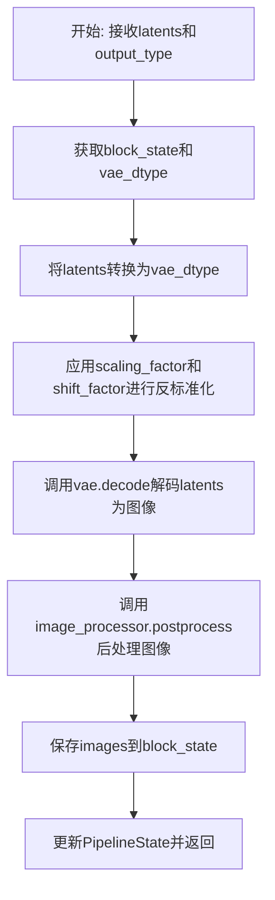
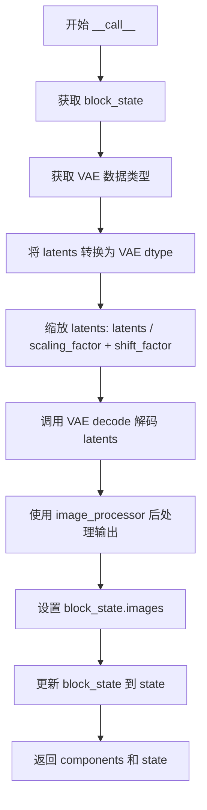
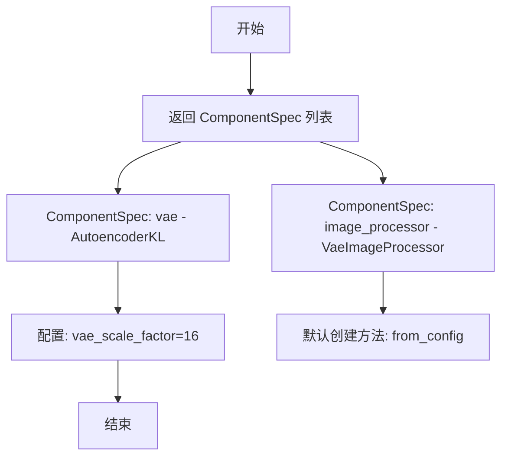
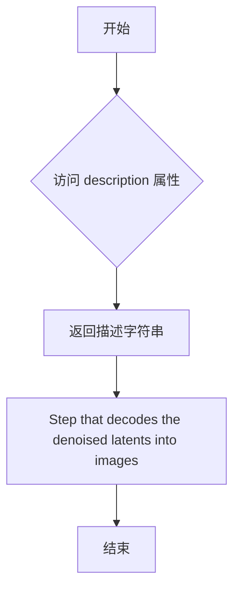
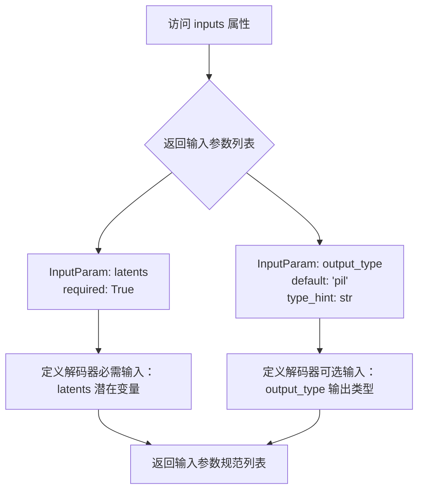

# `diffusers\src\diffusers\modular_pipelines\z_image\decoders.py` 详细设计文档

这是一个VAE解码器步骤模块，继承自ModularPipelineBlocks，用于将去噪后的latents通过AutoencoderKL解码为图像，并支持多种输出格式（pil、np、pt）的后处理。

## 整体流程



## 类结构

```
ModularPipelineBlocks (基类)
└── ZImageVaeDecoderStep (VAE解码器步骤实现类)
```

## 全局变量及字段


### `logger`
    
模块级日志记录器，用于记录ZImageVaeDecoderStep的运行状态和调试信息

类型：`logging.Logger`
    


### `ZImageVaeDecoderStep.model_name`
    
模型名称标识，用于标识Z-Image VAE解码步骤

类型：`str`
    
    

## 全局函数及方法


### `ZImageVaeDecoderStep.__call__`

该方法是将去噪后的潜在表示（latents）解码为图像的核心步骤，通过 VAE 解码器将潜在空间的数据转换为可见的图像输出，并支持多种输出格式（PIL、NumPy、PyTorch）。

参数：

- `self`：`ZImageVaeDecoderStep` 类实例，调用此方法的对象本身
- `components`：`components` 对象，包含 VAE 模型和图像处理器等组件
- `state`：`PipelineState` 对象，包含管道状态和块状态信息

返回值：`Tuple[components, state]`，返回更新后的组件和状态对象，其中 state 包含解码后的图像

#### 流程图



#### 带注释源码

```python
@torch.no_grad()
def __call__(self, components, state: PipelineState) -> PipelineState:
    # 获取当前块的局部状态，包含输入的 latents 和 output_type
    block_state = self.get_block_state(state)
    
    # 获取 VAE 模型的数据类型，用于后续的 dtype 转换
    vae_dtype = components.vae.dtype

    # 将输入的 latents 转换为 VAE 模型对应的数据类型
    # 确保计算精度与 VAE 模型一致
    latents = block_state.latents.to(vae_dtype)
    
    # 对 latents 进行缩放和移位，这是 VAE 解码前的标准预处理
    # scaling_factor 和 shift_factor 通常来自 VAE 的配置文件
    latents = latents / components.vae.config.scaling_factor + components.vae.config.shift_factor

    # 调用 VAE 的 decode 方法将潜在表示解码为图像
    # return_dict=False 返回元组，取第一个元素（生成的图像张量）
    block_state.images = components.vae.decode(latents, return_dict=False)[0]
    
    # 使用图像处理器对输出的图像张量进行后处理
    # 根据 output_type 参数转换为目标格式（PIL.Image、numpy array 或 torch.Tensor）
    block_state.images = components.image_processor.postprocess(
        block_state.images, output_type=block_state.output_type
    )

    # 将更新后的块状态写回全局状态对象
    self.set_block_state(state, block_state)

    # 返回组件和更新后的状态，遵循管道的调用约定
    return components, state
```


### `ZImageVaeDecoderStep.expected_components`

该属性定义了 VAE 解码步骤期望的组件配置，包括 VAE 模型和图像处理器组件。

参数： 无

返回值：`list[ComponentSpec]` ComponentSpec 对象列表，定义了执行 VAE 解码所需的组件规范

#### 流程图



#### 带注释源码

```python
@property
def expected_components(self) -> list[ComponentSpec]:
    """
    定义 ZImageVaeDecoderStep 期望的组件配置。
    
    该属性返回一个 ComponentSpec 列表，指定了 VAE 解码步骤所需的组件：
    1. vae: 用于将潜在向量解码为图像的变分自编码器模型
    2. image_processor: 用于后处理解码后的图像（转换为 PIL/numpy/torch 格式）
    
    Returns:
        list[ComponentSpec]: 包含组件规范的列表，定义了所需的组件类型和配置
    """
    return [
        # VAE 组件规范：使用 AutoencoderKL 模型类
        ComponentSpec("vae", AutoencoderKL),
        
        # 图像处理器组件规范：
        # - 模型类: VaeImageProcessor
        # - 配置: vae_scale_factor = 8 * 2 = 16（用于图像缩放）
        # - 默认创建方法: from_config（从配置文件中创建）
        ComponentSpec(
            "image_processor",
            VaeImageProcessor,
            config=FrozenDict({"vae_scale_factor": 8 * 2}),
            default_creation_method="from_config",
        ),
    ]
```


### `ZImageVaeDecoderStep.description`

该属性返回当前步骤的描述信息，说明该步骤的核心功能是将去噪后的潜在变量（latents）解码为实际的图像（images）。

参数：

- `self`：隐含参数，ZImageVaeDecoderStep 实例本身，无需显式传递

返回值：`str`，返回步骤的描述字符串，用于说明该步骤的功能为“将去噪的潜在变量解码为图像”。

#### 流程图



#### 带注释源码

```python
@property
def description(self) -> str:
    """
    属性描述符，返回当前步骤的描述信息。
    
    该属性用于向外部调用者说明当前处理步骤的功能和目的。
    在本例中，明确指出该步骤负责将去噪后的潜在表示（latents）
    解码转换为最终的图像输出。
    
    Returns:
        str: 步骤的描述字符串，具体为 "Step that decodes the denoised latents into images"
    """
    return "Step that decodes the denoised latents into images"
```


### `ZImageVaeDecoderStep.inputs`

该属性定义了 ZImageVaeDecoderStep 的输入参数规范，包括必需的 latent 变量和可选的输出类型参数，用于指导流水线如何传递和处理解码器的输入数据。

参数：
- 无（该方法为属性访问器，无传统参数列表）

返回值：`list[tuple[str, Any]]`，返回包含输入参数定义的列表，每个元素为 `InputParam` 对象，描述参数名称、类型、默认值和描述信息。

#### 流程图



#### 带注释源码

```python
@property
def inputs(self) -> list[tuple[str, Any]]:
    """
    定义 ZImageVaeDecoderStep 的输入参数规范
    
    返回值类型: list[tuple[str, Any]]
    返回值描述: 包含所有输入参数的 InputParam 对象列表，用于描述
                解码器步骤需要接收的输入参数及其属性
    
    返回参数说明:
    - latents: 必需的潜在变量输入，来自前序去噪步骤的输出
    - output_type: 可选的输出类型参数，指定生成图像的格式
    
    该属性被流水线框架用于:
    1. 验证前序步骤的输出是否满足当前步骤的输入要求
    2. 自动传递参数到当前处理步骤
    3. 生成 API 文档和参数校验
    """
    return [
        # 第一个输入参数：latents（潜在变量）
        # required=True 表示该参数为必需参数，必须由前序步骤提供
        InputParam(
            "latents",
            required=True,
        ),
        # 第二个输入参数：output_type（输出类型）
        # default="pil" 指定默认输出为 PIL 图像格式
        # type_hint=str 声明参数类型为字符串
        # description 说明参数可选值：'pil', 'np', 'pt'
        InputParam(
            name="output_type",
            default="pil",
            type_hint=str,
            description="The type of the output images, can be 'pil', 'np', 'pt'",
        ),
    ]
```


### `ZImageVaeDecoderStep.intermediate_outputs`

该属性定义了ZImageVaeDecoderStep步骤的中间输出规范，指定了从解码步骤生成的图像输出，包括输出名称、类型提示和描述信息。

参数：
- 该属性无参数（作为property装饰器的方法）

返回值：`list[OutputParam]`，返回一个包含OutputParam对象的列表，定义了中间输出"images"的元数据信息

#### 流程图

```mermaid
flowchart TD
    A[intermediate_outputs property] --> B{被调用}
    B --> C[返回OutputParam列表]
    C --> D[OutputParam: name='images']
    D --> E[类型提示: listPIL.Image.Image<br/>list[torch.Tensor]<br/>list[np.ndarray]]
    E --> F[描述: 生成的图像<br/>可以是PIL.Image.Image<br/>torch.Tensor或numpy数组]
```

#### 带注释源码

```python
@property
def intermediate_outputs(self) -> list[str]:
    """
    定义步骤的中间输出规范
    
    Returns:
        list[OutputParam]: 包含输出参数规范的列表
    """
    return [
        OutputParam(
            "images",  # 输出参数名称：images
            type_hint=list[PIL.Image.Image, list[torch.Tensor], list[np.ndarray]],  # 类型提示：支持PIL图像、PyTorch张量或NumPy数组的列表
            description="The generated images, can be a PIL.Image.Image, torch.Tensor or a numpy array",  # 描述：生成的图像，可以是PIL.Image.Image、torch.Tensor或numpy数组
        )
    ]
```


### `ZImageVaeDecoderStep.__call__`

执行VAE解码的核心方法，将去噪后的潜在表示（latents）解码为实际的图像，并进行后处理。

参数：

- `components`：组件对象，包含 VAE 模型和图像处理器等组件
- `state`：`PipelineState`，管道状态对象，用于在管道步骤之间传递数据

返回值：`(components, state)`，返回组件对象和更新后的管道状态元组

#### 流程图

```mermaid
flowchart TD
    A[开始 __call__] --> B[获取 block_state]
    B --> C[获取 vae_dtype]
    C --> D[转换 latents dtype]
    D --> E{缩放 latents}
    E --> F[latents / scaling_factor]
    F --> G[+ shift_factor]
    G --> H[VAE decode 解码]
    H --> I[image_processor.postprocess 后处理]
    I --> J[设置 block_state.images]
    J --> K[set_block_state 更新状态]
    K --> L[返回 (components, state)]
```

#### 带注释源码

```python
@torch.no_grad()
def __call__(self, components, state: PipelineState) -> PipelineState:
    """
    执行 VAE 解码步骤，将潜在表示解码为图像
    
    参数:
        components: 包含 VAE 模型和图像处理器的组件对象
        state: 管道状态对象
    
    返回:
        包含组件和状态的元组
    """
    # 从管道状态中获取当前块的局部状态
    block_state = self.get_block_state(state)
    
    # 获取 VAE 模型的数据类型
    vae_dtype = components.vae.dtype

    # 将潜在表示转换为 VAE 模型对应的数据类型
    latents = block_state.latents.to(vae_dtype)
    
    # 根据 VAE 配置对 latents 进行缩放和移位处理
    # 这是 VAE 解码前的标准预处理步骤
    latents = latents / components.vae.config.scaling_factor + components.vae.config.shift_factor

    # 使用 VAE 解码器将 latents 解码为图像
    # return_dict=False 返回元组形式的输出
    block_state.images = components.vae.decode(latents, return_dict=False)[0]
    
    # 使用图像处理器对输出进行后处理
    # 根据 output_type 参数转换为相应格式（PIL/numpy/PyTorch）
    block_state.images = components.image_processor.postprocess(
        block_state.images, output_type=block_state.output_type
    )

    # 将更新后的块状态写回管道状态
    self.set_block_state(state, block_state)

    # 返回组件对象和更新后的管道状态
    return components, state
```

## 关键组件


### ZImageVaeDecoderStep

核心解码步骤类，继承ModularPipelineBlocks，负责将去噪后的VAE潜在表示解码为实际图像，支持PIL、NumPy和PyTorch多种输出格式。

### expected_components

定义了VAE解码器所需的组件规范，包含AutoencoderKL模型和VaeImageProcessor图像处理器，其中image_processor配置了8*2的缩放因子。

### inputs (latents)

潜在表示输入参数，类型为torch.Tensor，是VAE编码后的去噪潜在向量，经过反量化处理后用于解码。

### inputs (output_type)

输出类型参数，支持'pil'、'np'、'pt'三种模式，决定最终生成的图像格式为PIL.Image、numpy数组或PyTorch张量。

### 量化策略 (scaling_factor + shift_factor)

反量化逻辑，通过除以scaling_factor并加上shift_factor将量化后的潜在表示恢复到原始数值范围，这是VAE解码的关键预处理步骤。

### VaeImageProcessor后处理

图像后处理组件，负责将VAE解码输出的原始张量转换为用户指定的输出格式（pil/np/pt），完成数据格式转换。


## 问题及建议


### 已知问题

-   **硬编码配置值**：`image_processor`配置中`vae_scale_factor`硬编码为`8 * 2`（即16），未从VAE配置中动态获取，可能导致与实际VAE模型不匹配
-   **缺少配置验证**：直接使用`components.vae.config.scaling_factor`和`shift_factor`，未验证这些配置项是否存在，若配置缺失会导致运行时错误
-   **类型注解错误**：`intermediate_outputs`中`list[PIL.Image.Image, list[torch.Tensor], list[np.ndarray]]`语法不正确，应使用`Union`或`|`联合类型
-   **缺乏输入验证**：未对`latents`参数进行类型和形状验证，可能导致后续解码失败时难以定位问题
-   **异常处理缺失**：`vae.decode()`调用未包装在try-except块中， decode失败时会直接抛出异常，缺乏友好的错误处理
-   **资源管理不足**：虽然使用了`@torch.no_grad()`装饰器，但未考虑混合精度（AMP）优化和GPU内存管理
-   **日志缺失**：定义了`logger`但未使用任何日志记录，调试时难以追踪执行流程
-   **状态同步风险**：`get_block_state`和`set_block_state`的成对使用存在中间状态不一致的风险

### 优化建议

-   **动态获取配置**：从`components.vae.config`中读取`scaling_factor`或提供默认值，而非硬编码
-   **添加输入校验**：在`__call__`方法开头添加latents的类型、形状和设备校验
-   **完善类型注解**：修正类型提示为`Union[list[PIL.Image.Image], list[torch.Tensor], list[np.ndarray]]`或使用Python 3.10+的`list[PIL.Image.Image] | list[torch.Tensor] | list[np.ndarray]`
-   **增加异常处理**：为`vae.decode()`添加try-except块，捕获并转换异常为更友好的错误信息
-   **启用日志记录**：在关键步骤添加logger.info或logger.debug日志，记录输入输出维度、解码耗时等信息
-   **考虑混合精度**：在支持的硬件上使用`torch.cuda.amp.autocast`提升推理性能
-   **优化状态管理**：考虑使用上下文管理器或生成器模式改进状态管理模式，提高线程安全性
-   **添加文档注释**：为属性和方法添加详细的docstring，说明参数含义和返回值

## 其它


### 设计目标与约束

本模块的设计目标是实现一个高效的VAE解码步骤，将去噪后的潜在表示(latents)转换为最终图像输出。作为模块化流水线(ModularPipeline)的一部分，该组件遵循即插即用的设计原则，支持动态组件配置。约束条件包括：1) 必须使用PyTorch的`@torch.no_grad()`装饰器以避免梯度计算和内存占用；2) 输入的latents必须与VAE模型的dtype兼容；3) 输出类型支持PIL图像、NumPy数组和PyTorch张量三种格式。

### 错误处理与异常设计

代码中未显式包含错误处理和异常捕获逻辑，但依赖底层组件(AutoencoderKL.decode和VaeImageProcessor.postprocess)的异常传播。主要潜在异常包括：1) latents类型不匹配或维度错误；2) output_type参数无效导致后处理失败；3) VAE模型未正确加载或配置。建议在__call__方法中添加输入验证，包括检查latents的shape和dtype是否合法，验证output_type是否在允许的范围内(pil/np/pt)，并捕获解码过程中的异常后提供有意义的错误信息。

### 数据流与状态机

数据流从输入latents开始，经过dtype转换、潜在空间反归一化、VAE解码、后处理四个阶段，最终输出images。PipelineState包含block_state用于存储中间结果和配置参数，包括latents、output_type和生成的images。状态转换遵循：获取block_state → 处理latents → 生成images → 更新block_state → 返回状态。intermediate_outputs定义了输出为images列表，支持多种格式。

### 外部依赖与接口契约

主要依赖包括：1) torch和torch.no_grad装饰器；2) numpy和PIL用于图像处理；3) 内部模块configuration_utils的FrozenDict、image_processor的VaeImageProcessor、models的AutoencoderKL、utils的logging、modular_pipeline的ModularPipelineBlocks和PipelineState、modular_pipeline_utils的ComponentSpec和InputParam/OutputParam。接口契约方面：输入需要latents(必需，torch.Tensor)和output_type(可选，默认"pil")；输出为images，类型取决于output_type参数。expected_components要求vae(AutoencoderKL类型)和image_processor(VaeImageProcessor类型)两个组件。

### 性能考虑

当前实现使用@torch.no_grad()装饰器避免梯度计算。潜在优化点：1) 批量处理支持，当前设计未明确批量大小限制；2) dtype转换可以提前到流水线前端以减少中间转换；3) VAE解码可能占用大量显存，可以考虑分块解码策略；4) image_processor.postprocess可能涉及CPU-GPU数据传输，可评估是否需要异步处理。scaling_factor和shift_factor的硬编码(8*2=16)可能需要根据不同VAE模型动态调整。

### 安全性与权限

代码遵循Apache License 2.0。安全考虑：1) 未对输入latents进行恶意输入检测；2) 图像后处理需要确保输出的图像尺寸和内容在合理范围内；3) 模型加载时应验证模型来源和完整性。建议添加输入验证逻辑，防止通过畸形latents触发内存溢出或异常行为。

### 可测试性

测试应覆盖：1) 正常解码流程，验证输出图像格式和尺寸；2) 不同output_type参数的兼容性测试；3) dtype转换正确性验证；4) 异常输入(空latents、错误类型)的错误处理；5) PipelineState状态更新的正确性。由于依赖VAE模型和图像处理器，需要构建mock对象或使用测试替身进行单元测试。建议添加集成测试验证完整的编解码循环。

### 配置管理

配置通过ComponentSpec定义：vae组件使用AutoencoderKL模型，image_processor使用VaeImageProcessor并配置vae_scale_factor=8*2=16。output_type通过InputParam定义默认值"pil"。当前scaling_factor和shift_factor从VAE配置中读取，这是良好的动态配置设计。建议将硬编码的scale_factor(16)提取为配置参数，支持不同VAE模型的适配。

### 兼容性与版本管理

代码针对Diffusers库设计，依赖内部模块。版本兼容性考虑：1) FrozenDict、PipelineState等内部API可能随版本变化；2) AutoencoderKL接口的兼容性；3) VaeImageProcessor.postprocess方法签名。需关注Diffusers库的版本更新日志，确保API变更时及时适配。

### 监控与日志

当前使用logger获取模块级日志记录器，但未进行显式日志记录。建议添加：1) 解码开始和完成的日志，包含时间戳；2. 输入latents的shape和dtype信息日志；3) 输出images的数量和格式信息；4) 性能指标如解码耗时；5. 异常发生时的错误日志，便于问题诊断。

### 故障恢复

当前未实现故障恢复机制。建议：1) 添加超时控制，防止VAE解码长时间挂起；2) 实现重试逻辑，处理临时性资源不足问题；3) 保存中间状态，支持从失败点恢复；4) 提供健康检查接口，验证组件可用性。

### 部署考虑

部署时需确保：1) PyTorch和CUDA版本兼容；2) VAE模型权重正确加载；3) 足够的GPU显存支持图像解码；4) 内存管理策略，防止显存泄漏；5) 多实例部署时的资源隔离。建议提供资源需求文档和部署检查清单。

    