# `diffusers\src\diffusers\modular_pipelines\z_image\denoise.py` 详细设计文档

Z-Image模块化去噪管道实现，提供了完整的图像生成流程，包括去噪前处理、去噪执行和去噪后处理三个阶段，支持文本到图像和图像到图像任务。

## 整体流程

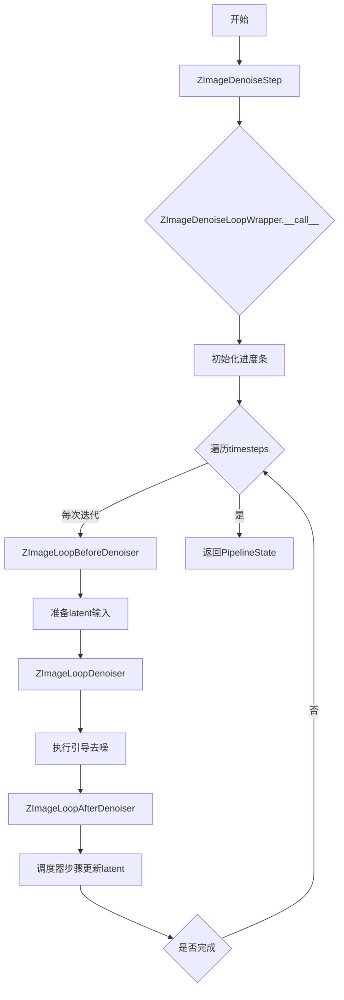

## 类结构

```
ModularPipelineBlocks (抽象基类)
├── ZImageLoopBeforeDenoiser (去噪前处理)
├── ZImageLoopDenoiser (去噪执行)
└── ZImageLoopAfterDenoiser (去噪后处理)
LoopSequentialPipelineBlocks (循环管道基类)
├── ZImageDenoiseLoopWrapper (去噪循环包装器)
└── ZImageDenoiseStep (去噪步骤实现)
```

## 全局变量及字段


### `logger`
    
模块级别的日志记录器，用于输出Z-Image管道相关的日志信息

类型：`logging.Logger`
    


### `ZImageLoopBeforeDenoiser.model_name`
    
模型名称标识，固定为'z-image'，用于标识该块属于Z-Image模型

类型：`str`
    


### `ZImageLoopDenoiser._guider_input_fields`
    
引导器输入字段的映射配置字典，定义了去噪器模型期望的参数如何从block_state中获取

类型：`dict[str, Any]`
    


### `ZImageLoopAfterDenoiser.model_name`
    
模型名称标识，固定为'z-image'，用于标识该块属于Z-Image模型

类型：`str`
    


### `ZImageDenoiseLoopWrapper.model_name`
    
模型名称标识，固定为'z-image'，用于标识该块属于Z-Image模型

类型：`str`
    


### `ZImageDenoiseStep.block_classes`
    
去噪步骤中包含的块类列表，定义了循环去噪过程中依次执行的处理块

类型：`list[type]`
    


### `ZImageDenoiseStep.block_names`
    
去噪步骤中各个块的名称列表，用于标识和引用sub_blocks中的各个处理块

类型：`list[str]`
    
    

## 全局函数及方法


### `_convert_dtype`

将输入值递归转换为指定的数据类型（dtype），支持 Tensor 和 list 类型的转换。

参数：

- `v`：`Any`，需要转换的输入值，可以是 `torch.Tensor`、`list` 或其他类型
- `dtype`：`torch.dtype`，目标数据类型

返回值：`Any`，转换后的值，类型与输入类型相同（如果是 Tensor 则转换为目标 dtype，如果是 list 则递归转换每个元素，否则原样返回）

#### 流程图

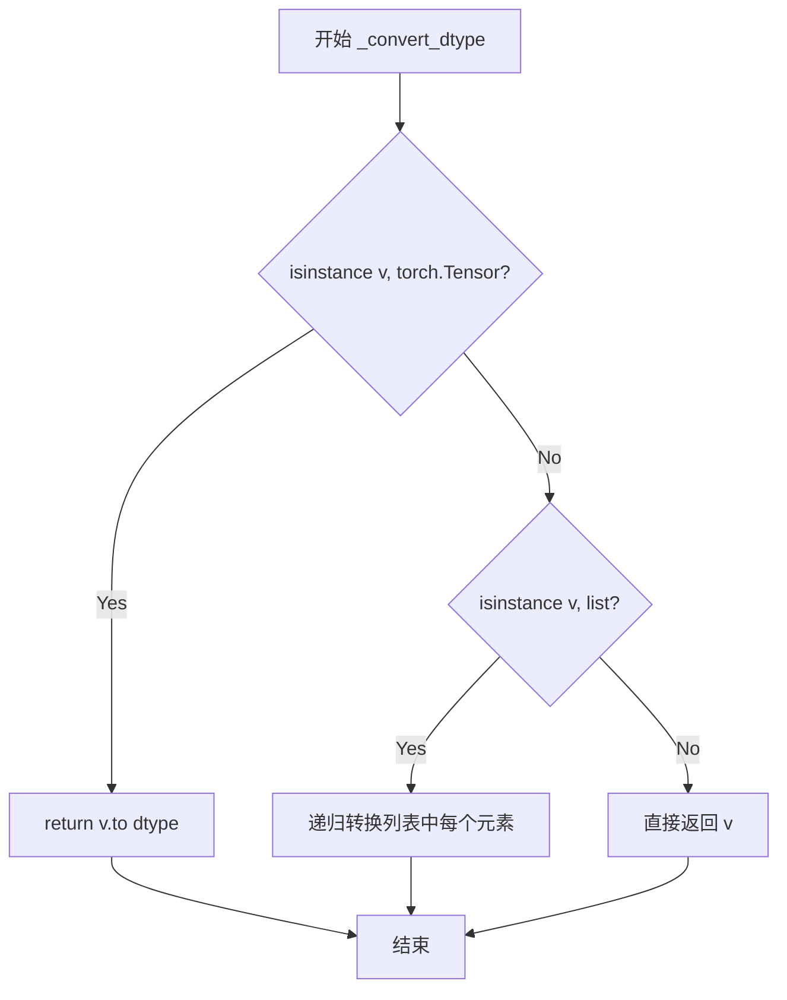

#### 带注释源码

```python
def _convert_dtype(v, dtype):
    """将输入值递归转换为指定的数据类型
    
    Args:
        v: 需要转换的输入值，可以是 torch.Tensor、list 或其他类型
        dtype: 目标数据类型
        
    Returns:
        转换后的值，类型与输入类型相同
    """
    # 如果输入是 Tensor，转换为目标 dtype
    if isinstance(v, torch.Tensor):
        return v.to(dtype)
    # 如果输入是列表，递归转换列表中的每个元素
    elif isinstance(v, list):
        return [_convert_dtype(t, dtype) for t in v]
    # 其他类型直接返回
    return v
```


### `ZImageLoopBeforeDenoiser.description`

这是一个属性（property），用于描述 `ZImageLoopBeforeDenoiser` 类在去噪循环中的功能。该属性返回一个字符串，说明这个块是去噪循环中的一个步骤，用于准备 latent 输入供 denoiser 使用，并且应该被用来组成 `LoopSequentialPipelineBlocks` 对象的 `sub_blocks` 属性。

参数： 无（这是一个属性，不是方法）

返回值： `str`，返回对该块的描述文本

#### 流程图

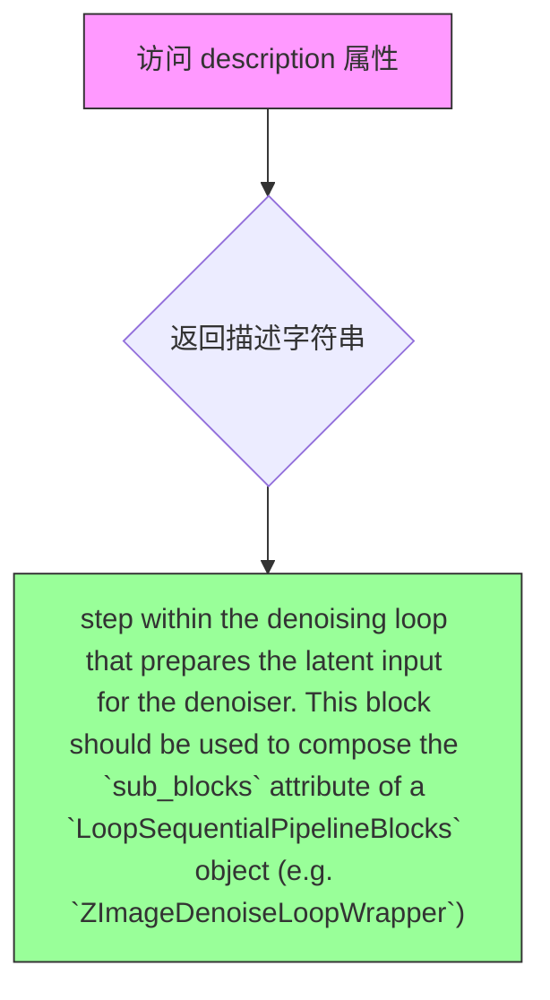

#### 带注释源码

```python
@property
def description(self) -> str:
    """
    返回对 ZImageLoopBeforeDenoiser 块的描述信息。
    
    该描述说明了：
    1. 这是去噪循环（denoising loop）中的一个步骤
    2. 它的功能是准备 latent 输入供 denoiser 使用
    3. 它应该被用作 LoopSequentialPipelineBlocks 对象的 sub_blocks 属性的组成部分
       （例如 ZImageDenoiseLoopWrapper）
    
    Returns:
        str: 描述该块功能和用途的字符串
    """
    return (
        "step within the denoising loop that prepares the latent input for the denoiser. "
        "This block should be used to compose the `sub_blocks` attribute of a `LoopSequentialPipelineBlocks` "
        "object (e.g. `ZImageDenoiseLoopWrapper`)"
    )
```


### `ZImageLoopBeforeDenoiser.inputs`

该属性定义了 `ZImageLoopBeforeDenoiser` 块的输入参数规范，用于描述该块在去噪循环中所需要的输入数据。

参数：

- `latents`：`torch.Tensor`，初始潜在向量，用于去噪过程。可以在 prepare_latent 步骤中生成。
- `dtype`：`torch.dtype`，模型输入的数据类型。可以在 input 步骤中生成。

返回值：`list[InputParam]`，返回该块所需输入参数的列表。

#### 流程图

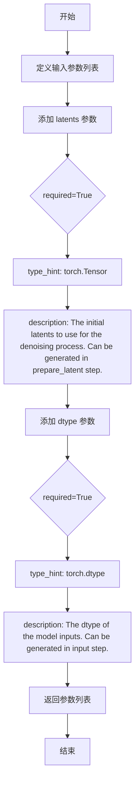

#### 带注释源码

```python
@property
def inputs(self) -> list[InputParam]:
    """定义该块的输入参数规范
    
    Returns:
        list[InputParam]: 包含该块所需输入参数的列表
    """
    return [
        # latents: 初始潜在向量
        # required=True 表示该参数为必需参数
        # type_hint=torch.Tensor 指定参数类型为 PyTorch 张量
        # description 描述了该参数的用途和来源
        InputParam(
            "latents",
            required=True,
            type_hint=torch.Tensor,
            description="The initial latents to use for the denoising process. Can be generated in prepare_latent step.",
        ),
        # dtype: 模型输入的数据类型
        # 用于确保模型输入的数据类型一致性
        # 可以从 input 步骤中获取或推断
        InputParam(
            "dtype",
            required=True,
            type_hint=torch.dtype,
            description="The dtype of the model inputs. Can be generated in input step.",
        ),
    ]
```


### ZImageLoopBeforeDenoiser.__call__

该方法是Z-Image去噪循环中的第一步，负责准备潜在输入（latent input）并处理时间步（timestep）。它将原始latents进行维度调整以适配模型输入格式，并对timestep进行归一化处理后存储到block_state中。

参数：

- `components`：`ZImageModularPipeline`，包含模型组件的管道对象
- `block_state`：`BlockState`，保存当前块状态的对象，包含latents等数据
- `i`：`int`，当前去噪迭代的索引
- `t`：`torch.Tensor`，当前的时间步张量

返回值：`(ZImageModularPipeline, BlockState)`，返回更新后的components和block_state

#### 流程图

```mermaid
flowchart TD
    A[开始 __call__] --> B[获取 latents 并 unsqueeze 扩展维度]
    B --> C[转换为指定 dtype]
    C --> D[沿 dim=0 解绑为列表]
    D --> E[存储到 block_state.latent_model_input]
    E --> F[扩展 timestep 到 batch_size]
    F --> G[归一化 timestep: (1000 - t) / 1000]
    G --> H[存储到 block_state.timestep]
    H --> I[返回 components, block_state]
```

#### 带注释源码

```python
@torch.no_grad()
def __call__(self, components: ZImageModularPipeline, block_state: BlockState, i: int, t: torch.Tensor):
    """
    准备去噪器的潜在输入并处理时间步。
    
    参数:
        components: ZImageModularPipeline，管道组件容器
        block_state: BlockState，块状态对象，包含latents等数据
        i: int，当前去噪循环的迭代索引
        t: torch.Tensor，当前时间步
    
    返回:
        (ZImageModularPipeline, BlockState): 更新后的组件和块状态
    """
    # 从block_state获取latents，并在第2维(通道维后)插入新维度
    # 转换: [batch_size, num_channels, height, width] -> [batch_size, num_channels, 1, height, width]
    latents = block_state.latents.unsqueeze(2).to(block_state.dtype)
    
    # 将latents沿dim=0解绑为列表，每个元素对应一个batch
    # 结果: list of [num_channels, 1, height, width]
    block_state.latent_model_input = list(latents.unbind(dim=0))
    
    # 扩展timestep到与latents的batch size相同，并转换为指定dtype
    timestep = t.expand(latents.shape[0]).to(block_state.dtype)
    
    # 归一化timestep: 将[0, 1000]范围映射到[1, 0]范围
    # 这是FlowMatch调度器的标准处理方式
    timestep = (1000 - timestep) / 1000
    
    # 将处理后的timestep存储到block_state供后续块使用
    block_state.timestep = timestep
    
    # 返回更新后的components和block_state
    return components, block_state
```


### `ZImageLoopDenoiser.__init__`

该方法用于初始化 Z-Image 循环去噪器块，配置引导器输入字段以将条件/无条件嵌入映射到块状态中的数据。

参数：

- `guider_input_fields`：`dict[str, Any]`，可选，默认值为 `{"cap_feats": ("prompt_embeds", "negative_prompt_embeds")}`。一个字典，将去噪器模型期望的参数（如 "encoder_hidden_states"）映射到存储在 `block_state` 上的数据。值可以是元组（如 `("prompt_embeds", "negative_prompt_embeds")`）表示条件和非条件批次，也可以是字符串（如 `"image_embeds"`）表示条件和非条件使用相同数据。

返回值：`None`，无返回值（`__init__` 方法）。

#### 流程图

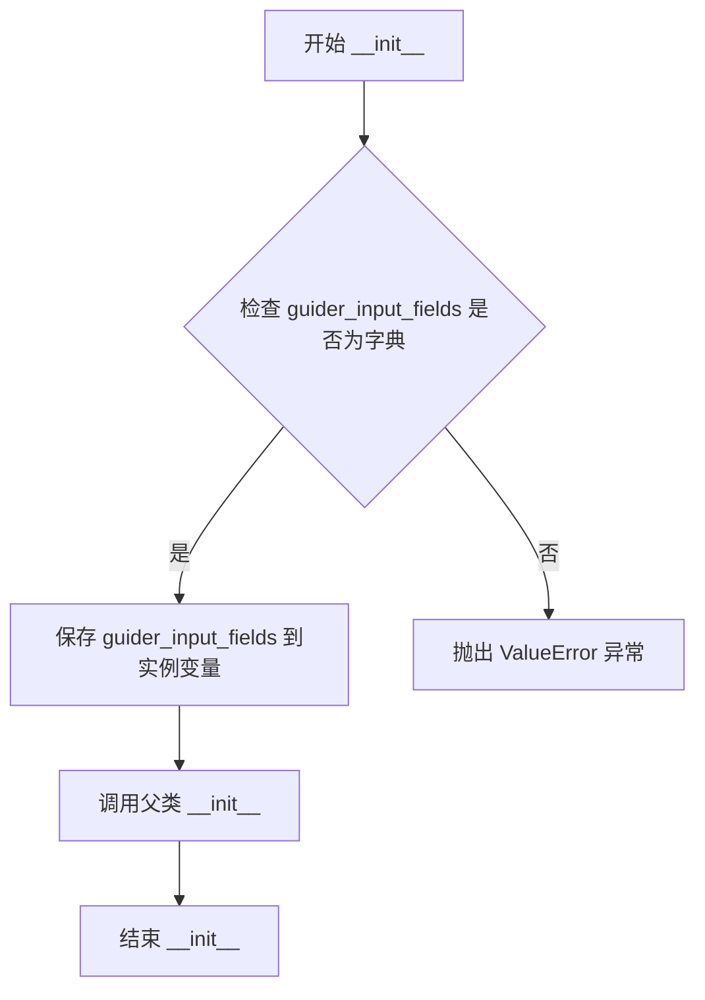

#### 带注释源码

```python
def __init__(
    self,
    guider_input_fields: dict[str, Any] = {"cap_feats": ("prompt_embeds", "negative_prompt_embeds")},
):
    """Initialize a denoiser block that calls the denoiser model. This block is used in Z-Image.

    Args:
        guider_input_fields: A dictionary that maps each argument expected by the denoiser model
            (for example, "encoder_hidden_states") to data stored on 'block_state'. The value can be either:

            - A tuple of strings. For instance, {"encoder_hidden_states": ("prompt_embeds",
              "negative_prompt_embeds")} tells the guider to read `block_state.prompt_embeds` and
              `block_state.negative_prompt_embeds` and pass them as the conditional and unconditional batches of
              'encoder_hidden_states'.
            - A string. For example, {"encoder_hidden_image": "image_embeds"} makes the guider forward
              `block_state.image_embeds` for both conditional and unconditional batches.
    """
    # 验证 guider_input_fields 参数类型，必须为字典类型
    if not isinstance(guider_input_fields, dict):
        raise ValueError(f"guider_input_fields must be a dictionary but is {type(guider_input_fields)}")
    
    # 将传入的 guider_input_fields 保存为实例变量，供后续 __call__ 方法使用
    self._guider_input_fields = guider_input_fields
    
    # 调用父类 ModularPipelineBlocks 的初始化方法
    super().__init__()
```


### `ZImageLoopDenoiser.expected_components`

该属性定义了 `ZImageLoopDenoiser` 模块在管道中运行时所需的核心组件，包括用于分类器自由引导的 `guider` 组件和用于去噪的 `transformer` 组件。

参数：

- `self`：`ZImageLoopDenoiser` 实例本身，隐式参数，无需显式传递

返回值：`list[ComponentSpec]`，返回一个组件规范列表，包含了该去噪块正常工作所必需的两个组件：`guider`（分类器自由引导器）和 `transformer`（Z-Image 变换器模型）

#### 流程图

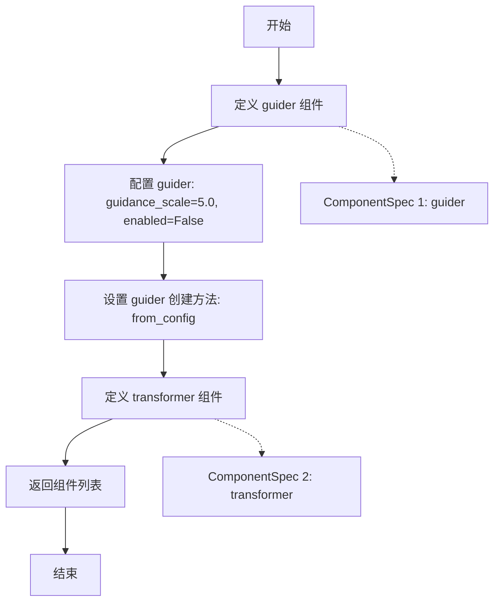

#### 带注释源码

```python
@property
def expected_components(self) -> list[ComponentSpec]:
    """定义 ZImageLoopDenoiser 模块所需的组件规范。
    
    该属性返回去噪块在管道执行过程中必需的组件列表。
    包含两个核心组件：
    1. guider: 用于分类器自由引导（Classifier Free Guidance）的引导器，
       负责将条件输入和无条件输入进行分离处理，以便在去噪过程中应用 CFG
    2. transformer: Z-Image 的 2D 变换器模型，负责实际的噪声预测和去噪操作
    
    Returns:
        list[ComponentSpec]: 组件规范列表，包含 guider 和 transformer 两个组件
    """
    return [
        ComponentSpec(
            "guider",
            ClassifierFreeGuidance,
            config=FrozenDict({"guidance_scale": 5.0, "enabled": False}),
            default_creation_method="from_config",
        ),
        ComponentSpec("transformer", ZImageTransformer2DModel),
    ]
```


### `ZImageLoopDenoiser.description`

该属性返回对 `ZImageLoopDenoiser` 块的文字描述，说明该块位于去噪循环中，用于对 latent 进行带引导的去噪处理，并且应作为 `LoopSequentialPipelineBlocks` 对象（如 `ZImageDenoiseLoopWrapper`）的 `sub_blocks` 属性的一部分来使用。

参数： 无（因为是 `@property` 装饰的属性，不是可调用方法）

返回值：`str`，返回一段描述性文字，说明该块在 Z-Image 管道中的功能定位和用途

#### 流程图

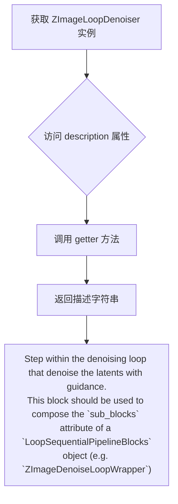

#### 带注释源码

```python
@property
def description(self) -> str:
    """返回该块的描述信息，用于文档和管道组装说明。

    Returns:
        str: 描述 ZImageLoopDenoiser 块在去噪循环中的作用的字符串，
             说明它用于对 latents 进行带引导的去噪，并应作为
             LoopSequentialPipelineBlocks 的 sub_blocks 属性的一部分使用。
    """
    return (
        "Step within the denoising loop that denoise the latents with guidance. "
        "This block should be used to compose the `sub_blocks` attribute of a `LoopSequentialPipelineBlocks` "
        "object (e.g. `ZImageDenoiseLoopWrapper`)"
    )
```


### `ZImageLoopDenoiser.inputs`

该属性定义了 Z-Image 循环去噪器的输入参数规范，用于描述该模块需要从外部接收的输入参数列表。它返回一个包含 `InputParam` 对象的列表，这些参数描述了去噪过程中所需的配置信息和条件输入（如提示词嵌入等）。

参数：

- `num_inference_steps`：`int`，必需参数，表示去噪过程使用的推理步数，通常在 `set_timesteps` 步骤中生成。
- `denoiser_input_fields`：可变关键字参数（kwargs_type），表示去噪器的条件模型输入，例如 `prompt_embeds`、`negative_prompt_embeds` 等。
- `prompt_embeds`：`torch.Tensor`（隐式），必需参数，由 `guider_input_fields` 动态生成，表示条件提示词嵌入。
- `negative_prompt_embeds`：`torch.Tensor`（隐式），可选参数，由 `guider_input_fields` 动态生成，表示无条件提示词嵌入。

返回值：`list[InputParam]`，返回包含所有输入参数的列表，每个 `InputParam` 描述了参数的名称、类型、是否必需以及描述信息。

#### 流程图

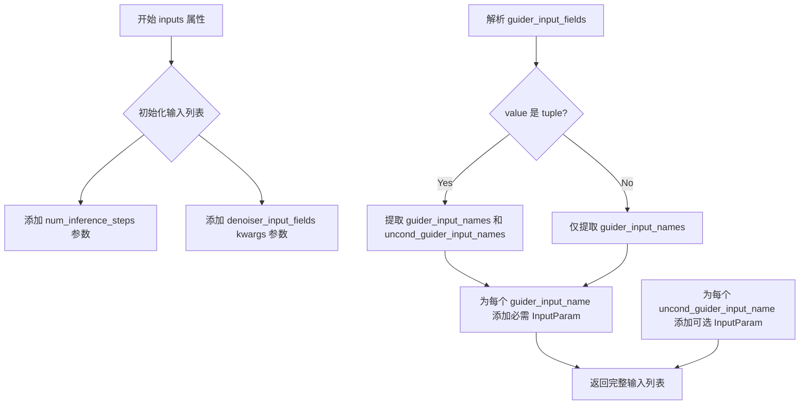

#### 带注释源码

```python
@property
def inputs(self) -> list[tuple[str, Any]]:
    """
    定义去噪器模块的输入参数规范。
    
    该方法动态构建输入参数列表，包括：
    1. 推理步数（必需）
    2. 去噪器输入字段的可变关键字参数
    3. 从 guider_input_fields 解析出的条件/无条件嵌入（动态生成）
    
    Returns:
        list[InputParam]: 输入参数列表，包含参数名称、类型、是否必需等元信息
    """
    # 初始化基础输入列表
    inputs = [
        InputParam(
            "num_inference_steps",
            required=True,
            type_hint=int,
            description="The number of inference steps to use for the denoising process. Can be generated in set_timesteps step.",
        ),
        InputParam(
            kwargs_type="denoiser_input_fields",
            description="The conditional model inputs for the denoiser: e.g. prompt_embeds, negative_prompt_embeds, etc.",
        ),
    ]
    
    # 解析 guider_input_fields，提取条件和无条件输入名称
    # 例如：{"cap_feats": ("prompt_embeds", "negative_prompt_embeds")}
    # - guider_input_names: ["prompt_embeds"] （条件输入）
    # - uncond_guider_input_names: ["negative_prompt_embeds"] （无条件输入）
    guider_input_names = []
    uncond_guider_input_names = []
    for value in self._guider_input_fields.values():
        if isinstance(value, tuple):
            # tuple 格式：(conditional_name, unconditional_name)
            guider_input_names.append(value[0])
            uncond_guider_input_names.append(value[1])
        else:
            # 单一字符串，仅作为条件输入
            guider_input_names.append(value)

    # 为每个条件输入添加必需的 InputParam
    for name in guider_input_names:
        inputs.append(InputParam(name=name, required=True))
    
    # 为每个无条件输入添加可选的 InputParam
    for name in uncond_guider_input_names:
        inputs.append(InputParam(name=name))
    
    return inputs
```


### ZImageLoopDenoiser.__call__

该方法是 Z-Image 去噪循环中的核心去噪步骤，负责使用引导器（Classifier Free Guidance）和变换器模型对潜在表示进行去噪处理。它首先设置引导器状态并准备条件/非条件输入，然后遍历每个引导批次调用变换器模型预测噪声残差，最后通过引导器聚合所有预测结果得到最终的去噪预测。

参数：

- `self`：ZImageLoopDenoiser，去噪器模块实例自身
- `components`：ZImageModularPipeline，管道组件容器，包含 guider 和 transformer 等组件
- `block_state`：BlockState，块状态对象，存储当前的潜在表示、时间步、推理步数等状态信息
- `i`：int，当前去噪循环的迭代索引（从 0 开始）
- `t`：torch.Tensor，当前去噪步骤的时间步张量

返回值：`tuple[ZImageModularPipeline, BlockState]`，返回更新后的组件和块状态

#### 流程图

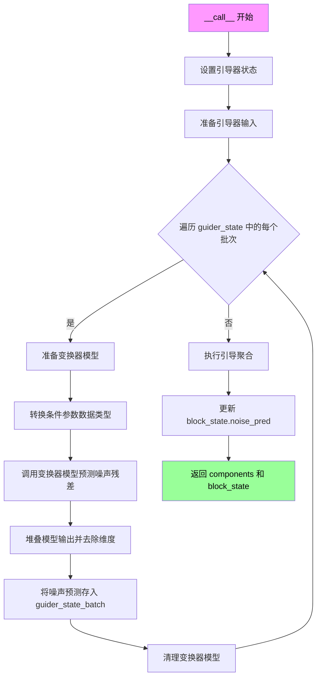

#### 带注释源码

```python
@torch.no_grad()
def __call__(
    self, components: ZImageModularPipeline, block_state: BlockState, i: int, t: torch.Tensor
) -> PipelineState:
    """对潜在表示进行去噪处理
    
    Args:
        components: 管道组件容器，包含 guider 和 transformer
        block_state: 块状态，存储当前迭代的 latents、timestep 等
        i: 当前去噪循环的步骤索引
        t: 当前时间步张量
    
    Returns:
        更新后的 components 和 block_state 元组
    """
    # 步骤1: 设置引导器的状态信息
    # 根据当前步骤索引 i、总推理步数和当前时间步配置引导器
    components.guider.set_state(step=i, num_inference_steps=block_state.num_inference_steps, timestep=t)

    # 步骤2: 从块状态准备引导器所需的输入
    # 引导器会将模型输入拆分为条件和非条件批次
    # 例如: CFG 模式下会返回两个批次 [cond_batch, uncond_batch]
    # 其他引导方法可能返回 1 个批次（无引导）或 3+ 个批次（如 PAG、APG）
    guider_state = components.guider.prepare_inputs_from_block_state(block_state, self._guider_input_fields)

    # 步骤3: 遍历每个引导批次分别进行去噪预测
    for guider_state_batch in guider_state:
        # 准备变换器模型（可能涉及模型切换或模式设置）
        components.guider.prepare_models(components.transformer)
        
        # 将引导状态批次转换为字典格式作为条件参数
        cond_kwargs = guider_state_batch.as_dict()

        # 定义递归函数：将张量或列表转换为指定 dtype
        def _convert_dtype(v, dtype):
            if isinstance(v, torch.Tensor):
                return v.to(dtype)
            elif isinstance(v, list):
                return [_convert_dtype(t, dtype) for t in v]
            return v

        # 步骤4: 转换条件参数的数据类型以匹配块状态的数据类型
        cond_kwargs = {
            k: _convert_dtype(v, block_state.dtype)
            for k, v in cond_kwargs.items()
            if k in self._guider_input_fields.keys()
        }

        # 步骤5: 调用变换器模型进行噪声预测
        # 返回的 model_out_list 可能包含多个输出，我们取第一个
        model_out_list = components.transformer(
            x=block_state.latent_model_input,
            t=block_state.timestep,
            return_dict=False,
            **cond_kwargs,
        )[0]
        
        # 步骤6: 处理模型输出
        # 堆叠输出并移除维度，得到 [batch, channels, height, width] 形状
        noise_pred = torch.stack(model_out_list, dim=0).squeeze(2)
        
        # 步骤7: 将噪声预测取反（因为模型预测的是残差）
        # 并存储到 guider_state_batch 中，以便后续跨批次应用引导
        guider_state_batch.noise_pred = -noise_pred
        
        # 清理变换器模型资源
        components.guider.cleanup_models(components.transformer)

    # 步骤8: 执行引导聚合
    # 根据引导方法（CFG、PAG 等）聚合所有批次的噪声预测
    block_state.noise_pred = components.guider(guider_state)[0]

    # 返回更新后的组件和块状态
    return components, block_state
```


### `ZImageLoopAfterDenoiser.expected_components`

该属性方法定义了 `ZImageLoopAfterDenoiser` 模块在去噪循环中需要使用的预期组件列表。该方法返回一个包含调度器（scheduler）组件的规范列表，用于在去噪步骤之后更新潜在变量。

参数： 无

返回值：`list[ComponentSpec]` ，返回一个 ComponentSpec 列表，其中包含一个名为 "scheduler" 的 `FlowMatchEulerDiscreteScheduler` 组件规范。

#### 流程图

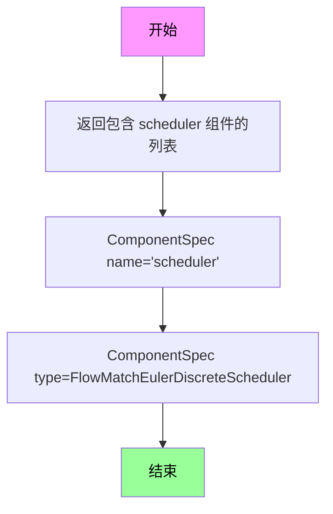

#### 带注释源码

```python
@property
def expected_components(self) -> list[ComponentSpec]:
    """
    定义该模块需要的预期组件。
    
    该属性方法返回一个列表，包含一个 ComponentSpec 对象，
    指定了去噪循环后处理步骤所需的调度器组件。
    
    Returns:
        list[ComponentSpec]: 包含调度器组件规范的列表
    """
    return [
        ComponentSpec("scheduler", FlowMatchEulerDiscreteScheduler),
    ]
```


### ZImageLoopAfterDenoiser

这是Z-Image管道中去噪循环内的步骤，用于更新潜在表示（latents）。该模块作为`LoopSequentialPipelineBlocks`对象的`sub_blocks`属性的一部分（例如`ZImageDenoiseLoopWrapper`），在每个去噪迭代中调用调度器来更新latents。

参数：

- `components`：`ZImageModularPipeline`，管道组件容器，包含scheduler等组件
- `block_state`：`BlockState`，块状态对象，存储当前迭代的latents、noise_pred等状态数据
- `i`：`int`，当前去噪迭代的索引
- `t`：`torch.Tensor`，当前时间步

返回值：元组`(components, block_state)`，返回更新后的组件和块状态

#### 流程图

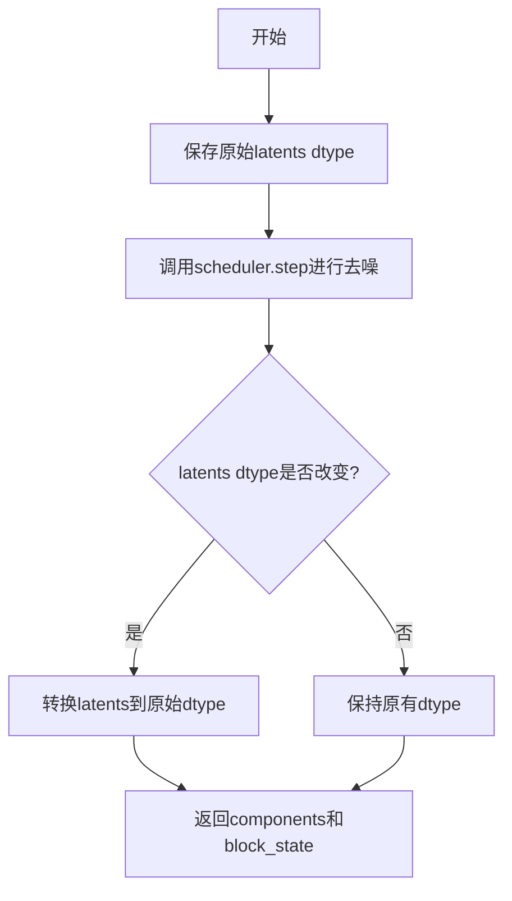

#### 带注释源码

```python
class ZImageLoopAfterDenoiser(ModularPipelineBlocks):
    """去噪循环后的处理块，用于更新latents"""
    
    model_name = "z-image"

    @property
    def expected_components(self) -> list[ComponentSpec]:
        """定义该块需要的组件规格"""
        return [
            ComponentSpec("scheduler", FlowMatchEulerDiscreteScheduler),
        ]

    @property
    def description(self) -> str:
        """返回该块的描述信息"""
        return (
            "step within the denoising loop that update the latents. "
            "This block should be used to compose the `sub_blocks` attribute of a `LoopSequentialPipelineBlocks` "
            "object (e.g. `ZImageDenoiseLoopWrapper`)"
        )

    @torch.no_grad()
    def __call__(self, components: ZImageModularPipeline, block_state: BlockState, i: int, t: torch.Tensor):
        """
        执行去噪后的latent更新步骤
        
        Args:
            components: ZImageModularPipeline, 管道组件容器
            block_state: BlockState, 块状态对象
            i: int, 当前迭代索引
            t: torch.Tensor, 当前时间步
        
        Returns:
            tuple: (components, block_state)
        """
        # 保存原始latents的数据类型，以便后续恢复
        latents_dtype = block_state.latents.dtype
        
        # 使用调度器执行去噪步骤，根据预测的噪声更新latents
        # scheduler.step返回更新后的latents和额外信息（return_dict=False时返回tuple）
        block_state.latents = components.scheduler.step(
            block_state.noise_pred.float(),  # 将预测的噪声转换为float类型
            t,                                # 当前时间步
            block_state.latents.float(),     # 将latents转换为float类型
            return_dict=False,
        )[0]  # 取第一个元素（更新后的latents）

        # 检查更新后的latents数据类型是否改变，如果是则转换回原始类型
        if block_state.latents.dtype != latents_dtype:
            block_state.latents = block_state.latents.to(latents_dtype)

        return components, block_state
```


### `ZImageLoopAfterDenoiser.__call__`

在去噪循环中执行调度器步骤，基于预测的噪声残差更新latents，同时保持原始数据类型。该方法是Z-Image去噪流程的最后一步，调用调度器的step方法来推进去噪过程。

参数：

- `self`：隐式参数，ZImageLoopAfterDenoiser的实例
- `components`：`ZImageModularPipeline`，包含所有组件的模块化管道对象，提供对scheduler等组件的访问
- `block_state`：`BlockState`，当前块的执行状态，包含latents（当前潜变量）、noise_pred（预测的噪声）等
- `i`：`int`，当前去噪循环的迭代索引
- `t`：`torch.Tensor`，当前的时间步张量

返回值：`Tuple[ZImageModularPipeline, BlockState]`，返回更新后的组件对象和块状态对象，其中block_state.latents已被更新

#### 流程图

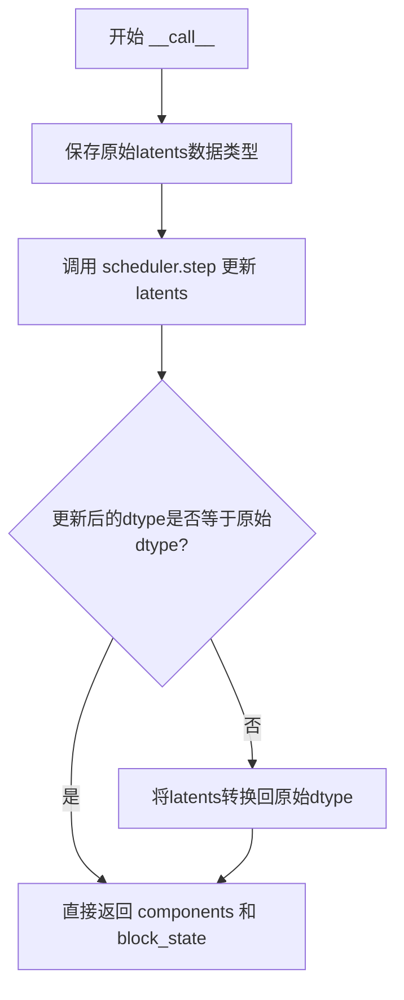

#### 带注释源码

```python
@torch.no_grad()
def __call__(self, components: ZImageModularPipeline, block_state: BlockState, i: int, t: torch.Tensor):
    # 保存原始latents的数据类型，以便在调度器步骤后恢复
    latents_dtype = block_state.latents.dtype
    
    # 使用调度器执行一步去噪
    # 参数:
    #   - block_state.noise_pred.float(): 预测的噪声残差（转换为float以避免精度问题）
    #   - t: 当前时间步
    #   - block_state.latents.float(): 当前latents（转换为float）
    #   - return_dict=False: 返回元组而非字典
    # 返回的元组第一个元素是更新后的latents
    block_state.latents = components.scheduler.step(
        block_state.noise_pred.float(),
        t,
        block_state.latents.float(),
        return_dict=False,
    )[0]

    # 检查更新后的latents数据类型是否与原始数据类型一致
    # 如果不一致（调度器可能返回不同dtype），则转换回原始dtype
    if block_state.latents.dtype != latents_dtype:
        block_state.latents = block_state.latents.to(latents_dtype)

    # 返回更新后的组件和块状态
    return components, block_state
```


### `ZImageDenoiseLoopWrapper.description`

这是一个属性（property），用于返回对 `ZImageDenoiseLoopWrapper` 类的文字描述。

参数：无（该方法是一个属性装饰器 `@property`，不接受任何参数）

返回值：`str`，返回对 `ZImageDenoiseLoopWrapper` 类的描述，说明它是一个 Pipeline block，用于在 `timesteps` 上迭代去噪 latents，具体步骤可以通过 `sub_blocks` 属性自定义。

#### 流程图

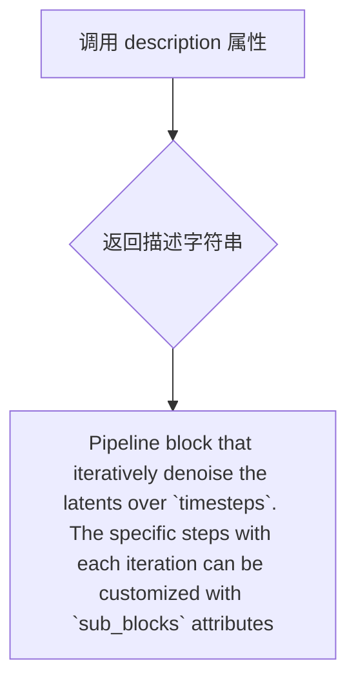

#### 带注释源码

```python
@property
def description(self) -> str:
    return (
        "Pipeline block that iteratively denoise the latents over `timesteps`. "
        "The specific steps with each iteration can be customized with `sub_blocks` attributes"
    )
```

**说明：**

- 该方法是 `ZImageDenoiseLoopWrapper` 类的属性，使用 `@property` 装饰器定义
- 返回值类型为 `str`（字符串）
- 描述内容表明该类是一个流水线块（Pipeline block），用于在 timesteps 上迭代对 latents 进行去噪
- 具体每个迭代步骤可以通过 `sub_blocks` 属性进行自定义配置


### `ZImageDenoiseLoopWrapper.loop_expected_components`

这是一个属性方法，定义了Z-Image去噪循环Pipeline所需的组件规范。它返回一个包含调度器组件的列表，用于在去噪循环过程中对潜在表示进行逐步去噪。

参数：

- `self`：`ZImageDenoiseLoopWrapper` 实例，隐式参数，无需显式传递

返回值：`list[ComponentSpec]`，返回去噪循环所需的组件规范列表，当前包含 `scheduler` 组件

#### 流程图

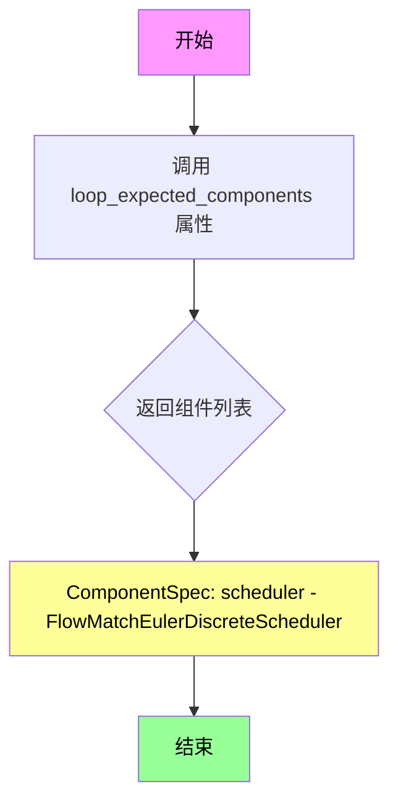

#### 带注释源码

```python
@property
def loop_expected_components(self) -> list[ComponentSpec]:
    """
    定义去噪循环所需的组件规范。
    
    该属性方法返回在去噪循环执行过程中必须存在的组件列表。
    对于Z-Image去噪循环，目前只需要调度器(Scheduler)组件来执行
    潜在表示的逐步去噪步骤。
    
    Returns:
        list[ComponentSpec]: 包含组件规范的列表，每个规范定义了
                            组件名称和类型
    """
    return [
        ComponentSpec("scheduler", FlowMatchEulerDiscreteScheduler),
    ]
```

#### 关键组件信息

| 组件名称 | 类型 | 描述 |
|---------|------|------|
| scheduler | FlowMatchEulerDiscreteScheduler | 流匹配欧拉离散调度器，用于执行去噪循环中的噪声预测步骤，将噪声潜在表示逐步转换为清晰图像 |

#### 潜在的技术债务或优化空间

1. **组件扩展性**：当前 `loop_expected_components` 仅返回调度器组件，但根据 `ZImageLoopDenoiser.expected_components` 的实现来看，去噪过程还依赖于 `guider` 和 `transformer` 组件。这些组件可能也应该在 `loop_expected_components` 中声明，以提高代码的一致性和可读性。

2. **类型注解**：返回值类型使用了 `list[ComponentSpec]`，这是 Python 3.9+ 的内置泛型类型注解。如果项目需要支持更低版本的 Python，应该使用 `typing.List` 来保持兼容性。

3. **组件配置硬编码**：与 `ZImageLoopDenoiser` 中可以通过参数自定义 guider 配置不同，`loop_expected_components` 中的组件规范是硬编码的，缺乏灵活性。


### `ZImageDenoiseLoopWrapper.loop_inputs`

该属性定义了 Z-Image 去噪循环包装器的输入参数列表，包含了去噪过程所需的时间步（timesteps）和推理步数（num_inference_steps）两个关键输入参数。

参数：

- 该属性为 property 类型，没有直接参数。它返回的列表包含两个 `InputParam` 对象：
  - `timesteps`：`torch.Tensor`，去噪过程使用的时间步，可由 set_timesteps 步骤生成
  - `num_inference_steps`：`int`，去噪过程使用的推理步数，可由 set_timesteps 步骤生成

返回值：`list[InputParam]` - 返回输入参数列表，包含时间步和推理步数两个参数定义

#### 流程图

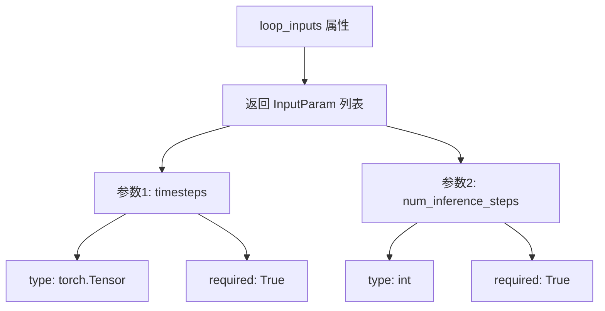

#### 带注释源码

```python
@property
def loop_inputs(self) -> list[InputParam]:
    """定义去噪循环的输入参数列表
    
    Returns:
        包含两个InputParam的列表:
        - timesteps: torch.Tensor, 去噪过程使用的时间步
        - num_inference_steps: int, 去噪过程的推理步数
    """
    return [
        InputParam(
            "timesteps",
            required=True,
            type_hint=torch.Tensor,
            description="The timesteps to use for the denoising process. Can be generated in set_timesteps step.",
        ),
        InputParam(
            "num_inference_steps",
            required=True,
            type_hint=int,
            description="The number of inference steps to use for the denoising process. Can be generated in set_timesteps step.",
        ),
    ]
```


### `ZImageDenoiseLoopWrapper.__call__`

这是一个去噪循环的封装方法，通过迭代方式对 latent 向量进行去噪处理。该方法管理整个去噪过程，包括初始化热身步骤、遍历时间步、执行每个去噪步骤，并使用进度条显示进度。

参数：

- `components`：`ZImageModularPipeline`，管道组件对象，包含模型、调度器、引导器等
- `state`：`PipelineState`，管道状态对象，保存当前管道的全部状态信息

返回值：`PipelineState`，更新后的管道状态（实际返回 `Tuple[ZImageModularPipeline, PipelineState]`）

#### 流程图

```mermaid
flowchart TD
    A[开始 __call__] --> B[获取 block_state]
    B --> C[计算 num_warmup_steps]
    C --> D[初始化进度条 total=block_state.num_inference_steps]
    D --> E{遍历 timesteps}
    E -->|第 i 步| F[执行 loop_step]
    F --> G[components, block_state = loop_step]
    G --> H{判断是否更新进度条}
    H -->|是| I[progress_bar.update]
    H -->|否| J[继续]
    I --> J
    J --> K{i < len(timesteps)?}
    K -->|是| E
    K -->|否| L[保存 block_state 到 state]
    L --> M[返回 components, state]
    M --> N[结束]
```

#### 带注释源码

```python
@torch.no_grad()  # 禁用梯度计算以节省内存
def __call__(self, components: ZImageModularPipeline, state: PipelineState) -> PipelineState:
    # 从管道状态中获取块状态
    block_state = self.get_block_state(state)

    # 计算热身步骤数量：在总时间步数中减去实际推理步骤乘以调度器阶数
    # 确保在推理开始前有足够的热身步骤
    block_state.num_warmup_steps = max(
        len(block_state.timesteps) - block_state.num_inference_steps * components.scheduler.order, 0
    )

    # 创建进度条，跟踪去噪进度
    with self.progress_bar(total=block_state.num_inference_steps) as progress_bar:
        # 遍历所有时间步
        for i, t in enumerate(block_state.timesteps):
            # 执行单步去噪：依次调用 sub_blocks 中的块
            # 包括 ZImageLoopBeforeDenoiser -> ZImageLoopDenoiser -> ZImageLoopAfterDenoiser
            components, block_state = self.loop_step(components, block_state, i=i, t=t)
            
            # 判断是否需要更新进度条：
            # 1. 已经是最后一步，或
            # 2. 已完成热身步骤且该步是调度器阶数的倍数
            if i == len(block_state.timesteps) - 1 or (
                ((i + 1) > block_state.num_warmup_steps) and ((i + 1) % components.scheduler.order == 0)
            ):
                progress_bar.update()  # 更新进度条

    # 将更新后的块状态保存回管道状态
    self.set_block_state(state, block_state)

    # 返回更新后的组件和状态
    return components, state
```


### ZImageDenoiseStep.description

该属性描述了 ZImageDenoiseStep 类的功能：这是一个迭代去噪步骤，通过循环逻辑逐步对潜在向量进行去噪处理。在每次迭代中，它按顺序执行三个子块：ZImageLoopBeforeDenoiser（准备潜在输入）、ZImageLoopDenoiser（执行去噪）和 ZImageLoopAfterDenoiser（更新潜在向量）。该块支持 Z-Image 的文本到图像和图像到图像任务。

参数：

- （无，传统方法参数；但该属性接收隐式 `self` 参数）

返回值：`str`，返回该块的描述字符串，说明其功能、循环逻辑来源、子块执行顺序以及支持的任务类型。

#### 流程图

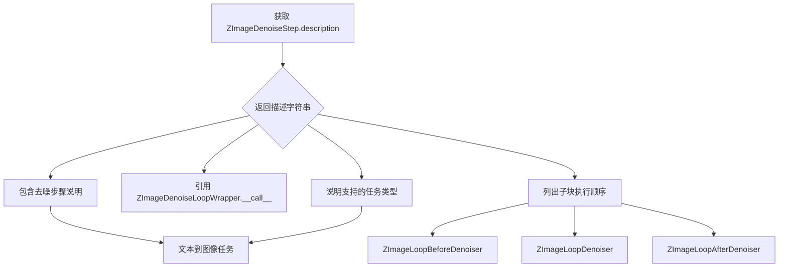

#### 带注释源码

```python
@property
def description(self) -> str:
    """
    获取该块的描述信息。
    
    该属性返回一个人类可读的字符串，描述 ZImageDenoiseStep 块的功能和执行流程。
    说明包括：
    1. 核心功能：迭代去噪潜在向量
    2. 循环逻辑来源：ZImageDenoiseLoopWrapper.__call__ 方法
    3. 每次迭代中执行的子块顺序
    4. 支持的任务类型：文本到图像和图像到图像
    
    Args:
        self: ZImageDenoiseStep 实例的隐式引用
        
    Returns:
        str: 描述该去噪步骤功能的字符串
    """
    return (
        "Denoise step that iteratively denoise the latents. \n"
        "Its loop logic is defined in `ZImageDenoiseLoopWrapper.__call__` method \n"
        "At each iteration, it runs blocks defined in `sub_blocks` sequentially:\n"
        " - `ZImageLoopBeforeDenoiser`\n"
        " - `ZImageLoopDenoiser`\n"
        " - `ZImageLoopAfterDenoiser`\n"
        "This block supports text-to-image and image-to-image tasks for Z-Image."
    )
```

## 关键组件


### ZImageLoopBeforeDenoiser

去噪循环中的第一步，准备去噪器的潜在输入。该块将初始潜在变量转换为模型输入格式，并设置时间步。

### ZImageLoopDenoiser

去噪循环的核心块，调用Z-Image变换器模型进行去噪处理。支持分类器自由引导（CFG），能够处理条件和无条件预测，并通过guider机制支持多种引导策略。

### ZImageLoopAfterDenoiser

去噪循环的最后一步，使用调度器（scheduler）根据预测的噪声残差更新潜在变量。处理数据类型转换以保持精度。

### ZImageDenoiseLoopWrapper

迭代去噪循环的包装器，管理整个去噪过程的时间步遍历和进度条显示。负责协调子块的顺序执行。

### ZImageDenoiseStep

完整的去噪步骤，组合了before_denoiser、denoiser和after_denoiser三个子块。支持文本到图像和图像到图像任务。

### ClassifierFreeGuidance (guider)

分类器自由引导机制，将模型输入分割为条件批次和无条件批次，支持CFG、PAG、APG等多种引导方法。

### ZImageTransformer2DModel

Z-Image变换器2D模型，执行实际的噪声预测。

### FlowMatchEulerDiscreteScheduler

流匹配欧拉离散调度器，用于根据预测的噪声残差更新潜在变量。

### 张量索引与形状变换

代码中通过unsqueeze、unbind、expand等操作处理张量维度，支持批量处理和模型输入格式要求。

### 引导输入字段映射机制

通过guider_input_fields字典配置，将block_state中的数据映射到模型输入，支持元组形式（条件/无条件）和字符串形式（单一输入）的配置。


## 问题及建议


### 已知问题

-   **硬编码的配置值**: `ZImageLoopDenoiser`中guider的`guidance_scale`被硬编码为5.0，无法通过外部参数灵活配置，降低了模块的可复用性。
-   **类型注解不一致**: `ZImageLoopDenoiser.inputs`属性返回`list[tuple[str, Any]]`，而其他类返回`list[InputParam]`，这种类型不一致可能导致类型检查工具无法正确识别。
-   **缺失的输入验证**: `__call__`方法中未对关键输入参数（如`block_state.latents`、`block_state.timestep`）进行None检查或有效性验证，可能导致运行时错误。
-   **数据类型转换逻辑重复**: `ZImageLoopDenoiser`中手动进行dtype转换，而`FlowMatchEulerDiscreteScheduler.step`内部可能已有类型处理逻辑，存在重复转换的风险。
-   **Timestep变换缺乏文档说明**: `(1000 - timestep) / 1000`这种变换逻辑没有注释说明其数学原理或业务意义，增加后续维护难度。
-   **Guider状态管理效率问题**: 每次循环迭代都调用`set_state`、`prepare_models`和`cleanup_models`，这些重复操作可能影响性能。
-   **进度条计算逻辑脆弱**: `num_warmup_steps`的计算高度依赖`scheduler.order`属性，如果scheduler实现变化可能导致计算错误。
-   **日志未实际使用**: 定义了`logger`但代码中未使用任何日志记录，降低了可调试性。
-   **Block类实例化方式不灵活**: `ZImageDenoiseStep`中`block_classes`包含已实例化的`ZImageLoopDenoiser`对象，导致guider_input_fields被固定，无法通过配置灵活调整。

### 优化建议

-   将`guidance_scale`等配置值提取为可初始化参数，通过`ComponentSpec`的`config`参数或模块化配置系统传入。
-   统一`inputs`属性的返回类型为`list[InputParam]`，保持类型一致性。
-   在各`__call__`方法入口处添加输入参数验证逻辑，检查必要字段是否存在且类型正确。
-   移除冗余的dtype转换逻辑，依赖scheduler内部的类型处理，或在文档中明确说明转换的必要性。
-   为timestep变换逻辑添加详细的代码注释，说明其数学原理和用途。
-   考虑将guider的状态设置和模型准备工作提到循环外部，或添加缓存机制减少重复调用。
-   为`num_warmup_steps`添加默认值保护逻辑，当scheduler属性不可用时使用保守估计。
-   在关键代码路径添加适当的日志记录，便于调试和问题追踪。
-   重构`ZImageDenoiseStep`，将`guider_input_fields`作为初始化参数或配置属性传入，提高模块的可配置性。

## 其它


### 设计目标与约束

本模块实现Z-Image模型的模块化去噪管道，支持文本到图像和图像到图像任务。设计目标包括：1）通过模块化架构实现去噪流程的可组合性和可定制性；2）支持Classifier Free Guidance（CFG）引导机制；3）使用FlowMatchEulerDiscreteScheduler进行噪声调度；4）通过LoopSequentialPipelineBlocks实现循环迭代去噪。主要约束包括：依赖HuggingFace Diffusers框架、使用PyTorch张量操作、必须与ZImageModularPipeline配合使用。

### 错误处理与异常设计

代码中的错误处理主要包括：1）在ZImageLoopDenoiser.__init__中检查guider_input_fields是否为字典类型，若不是则抛出ValueError；2）数据类型转换使用torch.no_grad()装饰器确保无梯度计算；3）latents.dtype会在步骤结束后恢复原始数据类型。潜在异常情况包括：guider_input_fields格式错误、transformer模型输入不匹配、scheduler.step返回格式异常、CUDA内存不足等。当前实现缺少对模型输出形状校验、输入张量合法性检查、组件初始化失败等情况的显式处理。

### 数据流与状态机

数据流遵循以下流程：1）初始latents进入ZImageLoopBeforeDenoiser进行预处理（unsqueeze和维度调整）；2）处理后的latent_model_input传入ZImageLoopDenoiser进行去噪预测；3）noise_pred传入ZImageLoopAfterDenoiser进行scheduler.step更新。状态管理通过BlockState对象实现，关键状态包括：latents（原始潜在表示）、latent_model_input（模型输入）、timestep（当前时间步）、noise_pred（预测噪声）、num_inference_steps（推理步数）。循环状态机由ZImageDenoiseLoopWrapper控制，迭代执行sub_blocks直到完成所有timesteps。

### 外部依赖与接口契约

本模块依赖以下外部组件：1）ZImageModularPipeline - 模块化管道主类；2）ClassifierFreeGuidance - CFG引导器；3）ZImageTransformer2DModel - 2D变换器模型；4）FlowMatchEulerDiscreteScheduler - 流匹配欧拉离散调度器；5）BlockState/PipelineState - 状态管理类；6）ComponentSpec/InputParam - 组件规格定义。接口契约要求：1）guider必须实现set_state、prepare_inputs_from_block_state、prepare_models、cleanup_models方法；2）transformer必须支持x、t、return_dict和条件输入参数；3）scheduler必须实现step方法返回元组（pred.sample）；4）所有ModularPipelineBlocks子类必须实现__call__方法返回(components, state)元组。

### 配置与初始化要求

ZImageLoopDenoiser在初始化时接受guider_input_fields参数，用于映射block_state中的字段到模型输入。expected_components定义了必需的组件规格：guider使用from_config创建方法，默认配置包含guidance_scale=5.0和enabled=False；transformer直接引用ZImageTransformer2DModel类。ZImageDenoiseLoopWrapper的loop_expected_components要求scheduler为FlowMatchEulerDiscreteScheduler类型。配置冻结使用FrozenDict确保运行时不可变。

### 性能考虑与优化空间

性能优化点包括：1）使用@torch.no_grad()装饰器避免梯度计算；2）guider_state中的tensors使用_convert_dtype函数批量转换；3）progress_bar仅在指定条件满足时更新；4）noise_pred通过torch.stack和squeeze操作高效处理。潜在优化方向：1）可考虑使用torch.cuda.amp.autocast进行混合精度计算；2）guider_state_batch.as_dict()和字典推导式可优化为预分配；3）latents的float()转换可考虑使用to(dtype)替代避免拷贝；4）可添加缓存机制避免重复的组件查询。

### 版本与兼容性信息

代码版本：基于Apache License 2.0开源协议，版权声明包含2025年Alibaba Z-Image Team和HuggingFace Team。依赖版本要求：torch、diffusers框架（configuration_utils、guiders、models、schedulers、utils）。Python类型提示使用typing.Any，兼容Python 3.8+。模块路径表明这是diffusers库的一部分（...开头的相对导入）。

### 使用示例与调用模式

标准调用流程：1）实例化ZImageModularPipeline并配置组件；2）创建ZImageDenoiseStep或ZImageDenoiseLoopWrapper；3）传入components和state调用；4）在循环内部自动执行before_denoiser、denoiser、after_denoiser三阶段。guider_input_fields配置示例：{"cap_feats": ("prompt_embeds", "negative_prompt_embeds")}表示使用prompt_embeds作为条件输入、negative_prompt_embeds作为无条件输入。循环迭代可通过sub_blocks属性自定义各阶段实现。


    