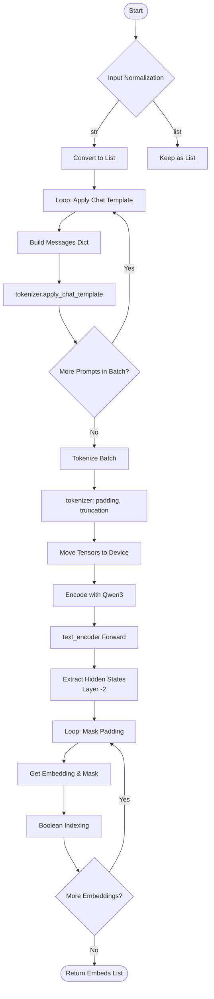
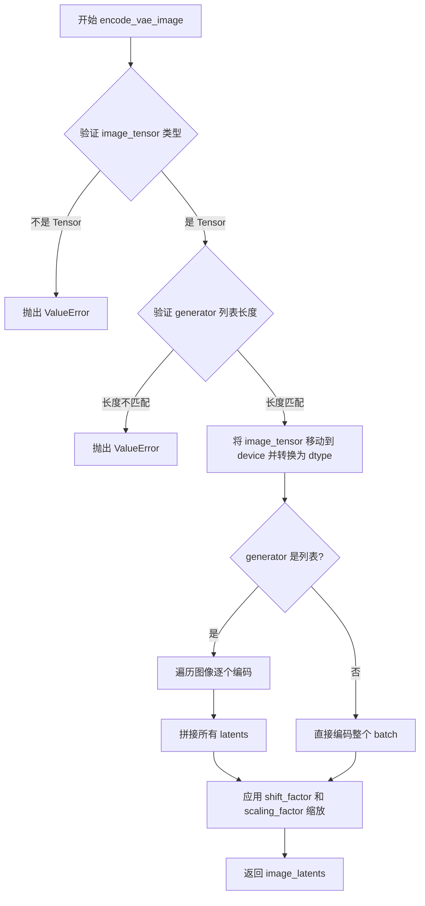
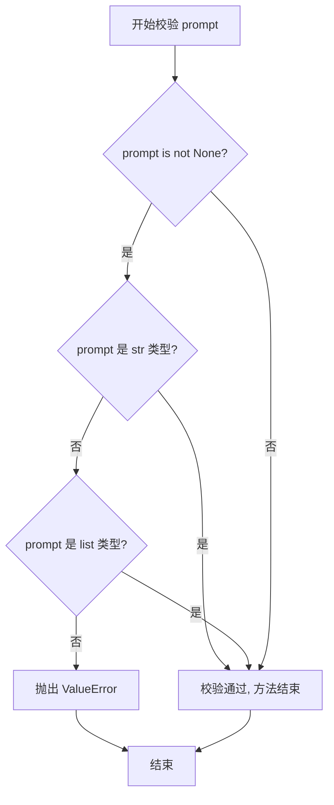
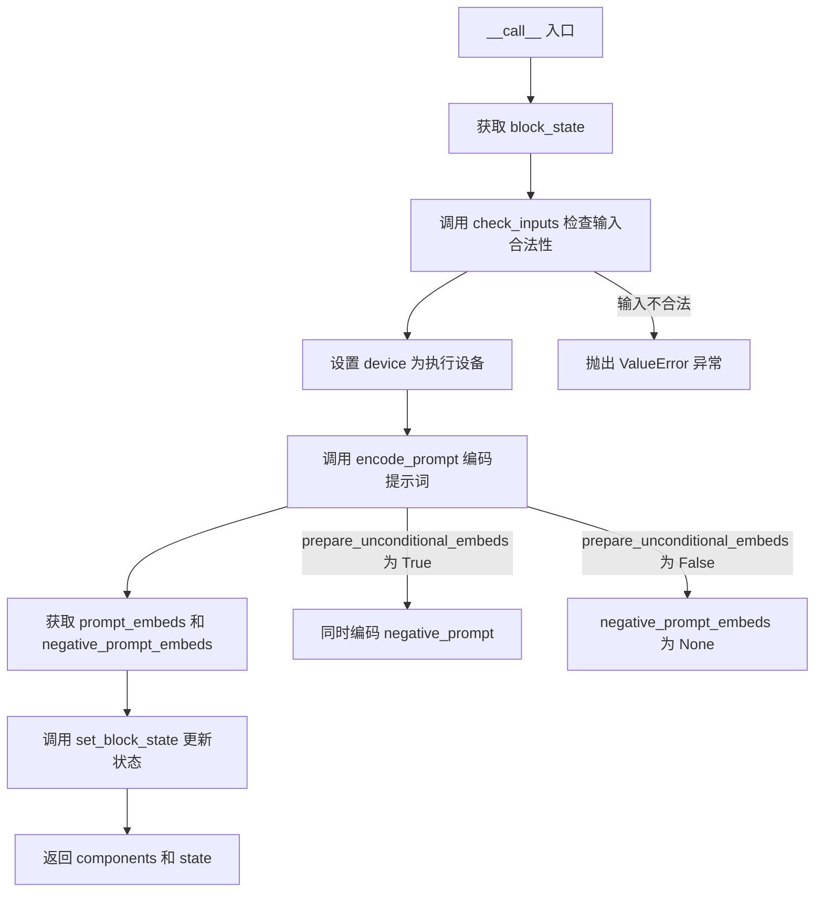
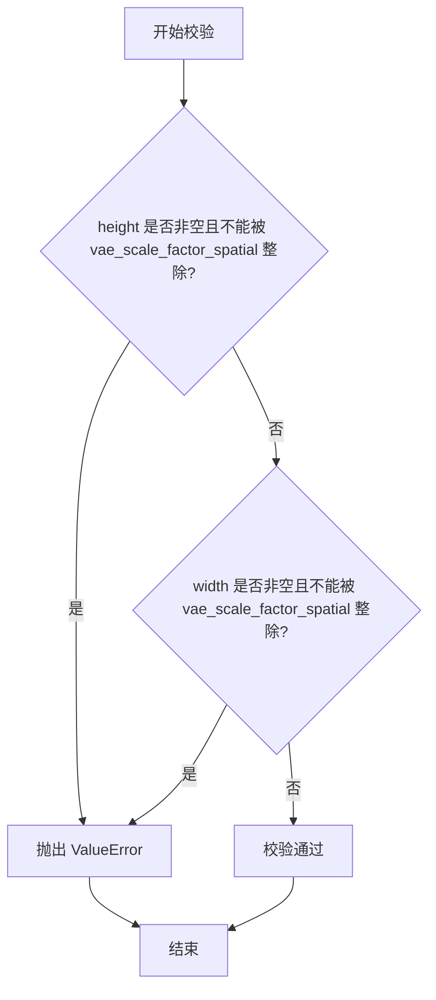
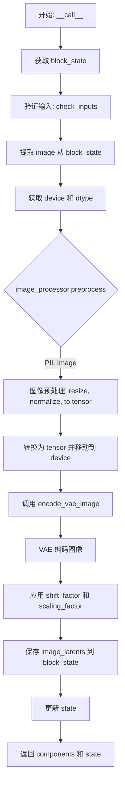

# `diffusers\src\diffusers\modular_pipelines\z_image\encoders.py` 详细设计文档

该代码文件实现了 Z-Image 生成管道的核心编码模块，专注于将用户输入（文本提示和参考图像）转换为模型潜在空间向量。它包含两个主要的模块化管道块：分别利用 Qwen2/Qwen3 模型处理文本语义，以及利用 VAE 模型处理图像视觉条件，最终输出 prompt_embeds 和 image_latents 用于引导图像生成。

## 整体流程

```mermaid
graph TD
    Start((开始))
    Check{输入检查}
    Check -- 文本流程 --> TextBlock[ZImageTextEncoderStep]
    Check -- 图像流程 --> ImageBlock[ZImageVaeImageEncoderStep]

    subgraph TextFlow [文本编码子流程]
    TextBlock --> EncodePrompt[调用 encode_prompt]
    EncodePrompt --> QwenEmbed[调用 get_qwen_prompt_embeds]
    QwenEmbed --> ChatTemplate[Qwen2 Tokenizer: apply_chat_template]
    ChatTemplate --> Tokenize[分词与 masking]
    Tokenize --> Forward[Qwen3 Model 前向传播]
    Forward --> Extract[提取倒数第二层隐状态]
    Extract --> Masking[根据 attention_mask 筛选有效 token]
    end

    subgraph ImageFlow [图像编码子流程]
    ImageBlock --> Preprocess[ImageProcessor 预处理 (Resize/Crop)]
-> tensor]
    Preprocess --> VAEEncode[VAE.encode()]
-> latent_dist
    VAEEncode --> GetLatents[调用 retrieve_latents]
(采样或取模)
    GetLatents --> Scale[(latents - shift) * scaling]
进行潜空间缩放
    end

    Masking --> UpdateState[更新 PipelineState]
设置 prompt_embeds
    Scale --> UpdateStateImg[更新 PipelineState]
设置 image_latents
    UpdateState --> End((结束))
    UpdateStateImg --> End
```

## 类结构

```
ModularPipelineBlocks (抽象基类)
├── ZImageTextEncoderStep (文本编码步骤)
│   └── 负责文本到向量 (Text -> Embedding)
└── ZImageVaeImageEncoderStep (图像编码步骤)
    └── 负责图像到潜空间 (Image -> Latent)
```

## 全局变量及字段


### `logger`
    
模块级日志记录器，用于记录运行时日志信息

类型：`logging.Logger`
    


### `ZImageTextEncoderStep.model_name`
    
管道标识符，固定值为'z-image'

类型：`str`
    


### `ZImageTextEncoderStep.description`
    
文本编码步骤描述，生成用于引导图像生成的文本嵌入

类型：`str`
    


### `ZImageTextEncoderStep.expected_components`
    
期望组件列表，包含text_encoder(Qwen3Model)、tokenizer(Qwen2Tokenizer)和guider(ClassifierFreeGuidance)

类型：`list[ComponentSpec]`
    


### `ZImageTextEncoderStep.inputs`
    
输入参数列表，包含prompt、negative_prompt和max_sequence_length

类型：`list[InputParam]`
    


### `ZImageTextEncoderStep.intermediate_outputs`
    
中间输出参数列表，包含prompt_embeds和negative_prompt_embeds

类型：`list[OutputParam]`
    


### `ZImageVaeImageEncoderStep.model_name`
    
管道标识符，固定值为'z-image'

类型：`str`
    


### `ZImageVaeImageEncoderStep.description`
    
VAE图像编码步骤描述，基于图像生成条件Latents引导图像生成

类型：`str`
    


### `ZImageVaeImageEncoderStep.expected_components`
    
期望组件列表，包含vae(AutoencoderKL)和image_processor(VaeImageProcessor)

类型：`list[ComponentSpec]`
    


### `ZImageVaeImageEncoderStep.inputs`
    
输入参数列表，包含image(PIL.Image.Image)、height、width和generator

类型：`list[InputParam]`
    


### `ZImageVaeImageEncoderStep.intermediate_outputs`
    
中间输出参数列表，包含image_latents

类型：`list[OutputParam]`
    
    

## 全局函数及方法


### `get_qwen_prompt_embeds`

这是一个全局辅助函数，封装了 Qwen2 分词器和 Qwen3 文本编码器的调用逻辑。它负责将用户输入的文本 prompt 转换为模型可理解的嵌入向量（Embeddings）。核心流程包括：标准化输入格式、应用聊天模板（Chat Template）、执行分词、调用模型推理，并根据注意力掩码（Attention Mask）过滤掉填充（Padding）部分，最终输出包含有效语义信息的嵌入列表。

参数：

- `text_encoder`：`Qwen3Model`，Qwen3 文本编码器模型实例，负责根据输入 ID 生成隐藏状态。
- `tokenizer`：`Qwen2Tokenizer`，Qwen2 分词器，用于分词和应用聊天模板。
- `prompt`：`str | list[str]`，待编码的提示词，支持单条字符串或字符串列表（批量处理）。
- `device`：`torch.device`，计算设备，用于将张量移动到 GPU 或 CPU。
- `max_sequence_length`：`int`，最大序列长度，默认为 512，用于控制分词后的最大 token 数。

返回值：`list[torch.Tensor]`，返回一个列表，其中每个元素对应一个 prompt 的嵌入向量。列表中的张量已经过 mask 处理，仅包含有效 token 的表示（去除了 padding），形状为 `[有效token数, hidden_dim]`。

#### 流程图



#### 带注释源码

```python
def get_qwen_prompt_embeds(
    text_encoder: Qwen3Model,
    tokenizer: Qwen2Tokenizer,
    prompt: str | list[str],
    device: torch.device,
    max_sequence_length: int = 512,
) -> list[torch.Tensor]:
    # 1. 输入标准化：确保 prompt 格式统一为列表，以便批量处理
    prompt = [prompt] if isinstance(prompt, str) else prompt

    # 2. 应用聊天模板 (Chat Template)：
    #    遍历列表中的每个 prompt，构造符合 Qwen2/3 对话格式的输入
    for i, prompt_item in enumerate(prompt):
        # 构建消息历史，这里模拟单轮 User 对话
        messages = [
            {"role": "user", "content": prompt_item},
        ]
        # 使用 tokenizer 应用聊天模板
        # tokenize=False: 返回格式化后的字符串，而非 token ids
        # add_generation_prompt=True: 在模板末尾添加生成提示 (如 "Assistant:" )，引导模型开始生成
        # enable_thinking=True: 启用 Qwen3 的思考模式 (Thinking Mode)，允许模型输出内部推理过程
        prompt_item = tokenizer.apply_chat_template(
            messages,
            tokenize=False,
            add_generation_prompt=True,
            enable_thinking=True,
        )
        # 将处理后的字符串放回列表
        prompt[i] = prompt_item

    # 3. 分词 (Tokenization)：将处理好的文本转换为模型输入 ID 和注意力掩码
    text_inputs = tokenizer(
        prompt,
        padding="max_length",        # 填充 (Pad) 到最大长度，确保 batch 内张量形状一致
        max_length=max_sequence_length,
        truncation=True,            # 截断超过最大长度的序列
        return_tensors="pt",         # 返回 PyTorch 张量
    )

    # 4. 设备转移：将分词结果移至指定设备 (GPU/CPU)
    text_input_ids = text_inputs.input_ids.to(device)
    # 将 attention_mask 转换为布尔类型，True 表示有效 token，False 表示 padding
    prompt_masks = text_inputs.attention_mask.to(device).bool()

    # 5. 编码推理：调用 Qwen3 模型获取文本表示
    # output_hidden_states=True: 强制模型输出所有层的隐藏状态
    # .hidden_states[-2]: 取出倒数第二层的隐藏状态，通常这层包含更丰富的语义信息
    prompt_embeds = text_encoder(
        input_ids=text_input_ids,
        attention_mask=prompt_masks,
        output_hidden_states=True,
    ).hidden_states[-2]

    # 6. Masking 处理：去除 Padding 带来的无效嵌入
    # 初始化结果列表
    prompt_embeds_list = []

    # 遍历 Batch 维度
    for i in range(len(prompt_embeds)):
        # 使用布尔索引 (Boolean Indexing) 提取有效 token 的嵌入
        # prompt_embeds[i]: 单个样本的嵌入，形状为 [seq_len, hidden_dim]
        # prompt_masks[i]: 单个样本的 mask，形状为 [seq_len] (bool)
        # 索引操作保留 mask 为 True 的行，去除 padding 对应的行
        prompt_embeds_list.append(prompt_embeds[i][prompt_masks[i]])

    return prompt_embeds_list
```


### `retrieve_latents`

全局辅助函数，用于从 VAE 输出中安全提取 latent tensor（支持 sample 或 argmax 模式）。该函数通过检查 encoder_output 对象的属性，优先从 latent_dist 中采样或取模，必要时回退到直接获取 latents 属性。

参数：

- `encoder_output`：`torch.Tensor`，VAE 编码器的输出对象，可能包含 `latent_dist` 或 `latents` 属性
- `generator`：`torch.Generator | None`，可选的随机数生成器，用于 sample 模式下的采样操作
- `sample_mode`：`str`，模式选择字符串，"sample" 表示从分布中采样，"argmax" 表示取分布的众数

返回值：`torch.Tensor`，提取出的 latent tensor

#### 流程图

```mermaid
flowchart TD
    A[开始] --> B{encoder_output 是否有 latent_dist 属性?}
    B -->|是| C{sample_mode == 'sample'?}
    B -->|否| D{encoder_output 是否有 latents 属性?}
    C -->|是| E[返回 latent_dist.sample<br/>(generator)]
    C -->|否| F{sample_mode == 'argmax'?}
    F -->|是| G[返回 latent_dist.mode<br/>()]
    F -->|否| H[抛出 AttributeError]
    D -->|是| I[返回 encoder_output.latents]
    D -->|否| J[抛出 AttributeError]
    E --> K[结束]
    G --> K
    I --> K
    H --> K
    J --> K
```

#### 带注释源码

```python
# Copied from diffusers.pipelines.stable_diffusion.pipeline_stable_diffusion_img2img.retrieve_latents
def retrieve_latents(
    encoder_output: torch.Tensor, generator: torch.Generator | None = None, sample_mode: str = "sample"
):
    # 优先检查 latent_dist 属性是否存在
    if hasattr(encoder_output, "latent_dist") and sample_mode == "sample":
        # 采样模式：从潜在分布中采样
        return encoder_output.latent_dist.sample(generator)
    # argmax 模式：取潜在分布的众数（最可能的值）
    elif hasattr(encoder_output, "latent_dist") and sample_mode == "argmax":
        return encoder_output.latent_dist.mode()
    # 回退：直接获取预计算的 latents 属性
    elif hasattr(encoder_output, "latents"):
        return encoder_output.latents
    # 错误处理：无法从 encoder_output 中提取 latent
    else:
        raise AttributeError("Could not access latents of provided encoder_output")
```


### `encode_vae_image`

全局辅助函数，封装了图像预处理、VAE 编码及潜空间数值缩放（shift_factor, scaling_factor）的逻辑，输出经过潜空间缩放处理的图像潜在表示。

参数：

- `image_tensor`：`torch.Tensor`，输入的图像张量，待编码的图像数据
- `vae`：`AutoencoderKL`，VAE 模型实例，用于将图像编码到潜在空间
- `generator`：`torch.Generator`，随机数生成器，用于 VAE 采样过程中的随机性控制
- `device`：`torch.device`，计算设备（CPU/CUDA），指定张量运算的执行设备
- `dtype`：`torch.dtype`，数据类型，VAE 编码时使用的数据精度（如 float32）
- `latent_channels`：`int = 16`，潜在通道数，默认为 16

返回值：`torch.Tensor`，编码并缩放后的图像潜在表示

#### 流程图



#### 带注释源码

```python
def encode_vae_image(
    image_tensor: torch.Tensor,
    vae: AutoencoderKL,
    generator: torch.Generator,
    device: torch.device,
    dtype: torch.dtype,
    latent_channels: int = 16,
):
    """
    将图像张量编码为 VAE 潜在表示，并应用潜空间缩放因子
    
    参数:
        image_tensor: 输入图像张量，形状为 [B, C, H, W] 或类似结构
        vae: AutoencoderKL 模型实例
        generator: 随机数生成器，用于 VAE 采样
        device: 计算设备
        dtype: VAE 编码使用的数据类型
        latent_channels: 潜在空间通道数，默认 16
        
    返回:
        编码并缩放后的图像潜在张量
    """
    # 参数校验：确保 image_tensor 是 PyTorch Tensor 类型
    if not isinstance(image_tensor, torch.Tensor):
        raise ValueError(f"Expected image_tensor to be a tensor, got {type(image_tensor)}.")

    # 参数校验：如果 generator 是列表，其长度必须与图像数量一致
    if isinstance(generator, list) and len(generator) != image_tensor.shape[0]:
        raise ValueError(
            f"You have passed a list of generators of length {len(generator)}, but it is not same as number of images {image_tensor.shape[0]}."
        )

    # 将图像张量移动到指定设备并转换为指定数据类型
    image_tensor = image_tensor.to(device=device, dtype=dtype)

    # 根据 generator 类型选择编码策略
    if isinstance(generator, list):
        # 多个 generator 时需要逐个处理每个图像，以匹配对应的随机状态
        image_latents = [
            retrieve_latents(vae.encode(image_tensor[i : i + 1]), generator=generator[i])
            for i in range(image_tensor.shape[0])
        ]
        # 沿批次维度拼接所有单独编码的 latents
        image_latents = torch.cat(image_latents, dim=0)
    else:
        # 单个 generator 时直接编码整个批次
        image_latents = retrieve_latents(vae.encode(image_tensor), generator=generator)

    # 应用 VAE 配置中的缩放因子进行潜空间数值变换
    # shift_factor 用于平移潜在分布，scaling_factor 用于缩放潜在值范围
    image_latents = (image_latents - vae.config.shift_factor) * vae.config.scaling_factor

    return image_latents
```


### `ZImageTextEncoderStep.check_inputs`

静态方法，用于校验 `block_state` 中的 `prompt` 参数类型是否合法（必须为 `str` 或 `list` 类型），若类型不合法则抛出 `ValueError` 异常。

参数：

- `block_state`：包含了 prompt 数据的块状态对象，通过该对象访问待校验的 `prompt` 属性

返回值：`None`，该方法无返回值，仅在校验失败时抛出异常

#### 流程图



#### 带注释源码

```python
@staticmethod
def check_inputs(block_state):
    """
    校验 block_state 中的 prompt 参数类型是否合法
    
    Args:
        block_state: 包含 prompt 属性的 PipelineState 对象
        
    Raises:
        ValueError: 当 prompt 既不是 str 类型也不是 list 类型时抛出
    """
    # 检查 prompt 是否为 None，若不为 None，则验证其类型
    if block_state.prompt is not None and (
        # 使用 isinstance 检查类型：prompt 必须是 str 或 list[str] 之一
        not isinstance(block_state.prompt, str) and not isinstance(block_state.prompt, list)
    ):
        # 类型不匹配时抛出详细的错误信息，包含实际类型
        raise ValueError(f"`prompt` has to be of type `str` or `list` but is {type(block_state.prompt)}")
```


### `ZImageTextEncoderStep.encode_prompt`

该方法是一个静态方法，负责将用户输入的正向提示词（prompt）和负向提示词（negative_prompt）通过 Qwen 文本编码器编码为高维向量表示（text embeddings），用于后续图像生成过程中的条件引导。

参数：

- `components`：`Any`，组件对象，包含 text_encoder、tokenizer 等模型组件
- `prompt`：`str`，待编码的正向提示词，用于引导图像生成方向
- `device`：`torch.device | None`，计算设备，若为 None 则从 components 中获取
- `prepare_unconditional_embeds`：`bool`，是否生成无条件嵌入（用于 Classifier-Free Guidance）
- `negative_prompt`：`str | None`，负向提示词，用于引导图像生成避开某些内容
- `max_sequence_length`：`int`，文本序列的最大长度，默认为 512

返回值：`tuple[list[torch.Tensor], list[torch.Tensor]]`，返回两个列表——第一个为正向提示词嵌入列表，第二个为负向提示词嵌入列表

#### 流程图

```mermaid
flowchart TD
    A[开始 encode_prompt] --> B{device 是否为 None?}
    B -- 是 --> C[从 components._execution_device 获取设备]
    B -- 否 --> D[使用传入的 device]
    C --> E{prompt 是否为 list?}
    D --> E
    E -- 否 --> F[将 prompt 转换为 list]
    E -- 是 --> G[直接使用 prompt]
    F --> H[获取 batch_size = len(prompt)]
    G --> H
    H --> I[调用 get_qwen_prompt_embeds<br/>生成正向提示词嵌入]
    I --> J{prepare_unconditional_embeds<br/>为 True?}
    J -- 否 --> K[negative_prompt_embeds = None]
    J -- 是 --> L[处理 negative_prompt]
    L --> M{类型一致性检查}
    M -- 失败 --> N[抛出 TypeError]
    M -- 通过 --> O{batch_size 一致性检查}
    O -- 失败 --> P[抛出 ValueError]
    O -- 通过 --> Q[调用 get_qwen_prompt_embeds<br/>生成负向提示词嵌入]
    K --> R[返回 prompt_embeds 和 negative_prompt_embeds]
    Q --> R
```

#### 带注释源码

```python
@staticmethod
def encode_prompt(
    components,
    prompt: str,
    device: torch.device | None = None,
    prepare_unconditional_embeds: bool = True,
    negative_prompt: str | None = None,
    max_sequence_length: int = 512,
):
    r"""
    Encodes the prompt into text encoder hidden states.

    Args:
        prompt (`str` or `list[str]`, *optional*):
            prompt to be encoded
        device: (`torch.device`):
            torch device
        prepare_unconditional_embeds (`bool`):
            whether to use prepare unconditional embeddings or not
        negative_prompt (`str` or `list[str]`, *optional*):
            The prompt or prompts not to guide the image generation. If not defined, one has to pass
            `negative_prompt_embeds` instead. Ignored when not using guidance (i.e., ignored if `guidance_scale` is
            less than `1`).
        max_sequence_length (`int`, defaults to `512`):
            The maximum number of text tokens to be used for the generation process.
    """
    # 如果未指定设备，则从 components 中获取执行设备
    device = device or components._execution_device
    
    # 确保 prompt 为列表形式，便于批量处理
    if not isinstance(prompt, list):
        prompt = [prompt]
    
    # 获取批次大小
    batch_size = len(prompt)

    # 调用全局函数 get_qwen_prompt_embeds 生成正向提示词的嵌入向量
    # 该函数内部使用 Qwen2Tokenizer 进行分词，Qwen3Model 进行编码
    prompt_embeds = get_qwen_prompt_embeds(
        text_encoder=components.text_encoder,
        tokenizer=components.tokenizer,
        prompt=prompt,
        max_sequence_length=max_sequence_length,
        device=device,
    )

    # 初始化负向提示词嵌入为 None
    negative_prompt_embeds = None
    
    # 如果需要准备无条件嵌入（用于 Classifier-Free Guidance）
    if prepare_unconditional_embeds:
        # 如果 negative_prompt 为 None，则使用空字符串
        negative_prompt = negative_prompt or ""
        
        # 将 negative_prompt 扩展为与 batch_size 相同的长度
        negative_prompt = batch_size * [negative_prompt] if isinstance(negative_prompt, str) else negative_prompt

        # 类型一致性检查：确保 prompt 和 negative_prompt 类型相同
        if prompt is not None and type(prompt) is not type(negative_prompt):
            raise TypeError(
                f"`negative_prompt` should be the same type to `prompt`, but got {type(negative_prompt)} !="
                f" {type(prompt)}."
            )
        
        # 批次大小一致性检查
        elif batch_size != len(negative_prompt):
            raise ValueError(
                f"`negative_prompt`: {negative_prompt} has batch size {len(negative_prompt)}, but `prompt`:"
                f" {prompt} has batch size {batch_size}. Please make sure that passed `negative_prompt` matches"
                " the batch size of `prompt`."
            )

        # 生成负向提示词嵌入
        negative_prompt_embeds = get_qwen_prompt_embeds(
            text_encoder=components.text_encoder,
            tokenizer=components.tokenizer,
            prompt=negative_prompt,
            max_sequence_length=max_sequence_length,
            device=device,
        )

    # 返回正向和负向提示词嵌入元组
    return prompt_embeds, negative_prompt_embeds
```


### `ZImageTextEncoderStep.__call__`

管道回调入口，执行文本编码检查、提示词编码并更新 PipelineState，生成用于引导图像生成的文本嵌入向量。

参数：

-   `self`：实例本身
-   `components`：`ZImageModularPipeline`，管道组件容器，包含 text_encoder、tokenizer、guider 等组件
-   `state`：`PipelineState`，管道状态对象，包含 prompt、negative_prompt、max_sequence_length 等中间状态

返回值：`PipelineState`，更新后的管道状态对象（注意：实际返回值为元组 `(components, state)`，但类型标注为 `PipelineState`）

#### 流程图



#### 带注释源码

```python
@torch.no_grad()
def __call__(self, components: ZImageModularPipeline, state: PipelineState) -> PipelineState:
    # 获取当前 block 的状态，包含 prompt、negative_prompt、max_sequence_length 等参数
    block_state = self.get_block_state(state)
    
    # 检查输入参数合法性：prompt 必须为 str 或 list 类型
    self.check_inputs(block_state)

    # 设置设备为管道的执行设备（从 components 中获取）
    block_state.device = components._execution_device

    # 编码输入提示词（prompt），生成正向和负向文本嵌入
    (
        block_state.prompt_embeds,
        block_state.negative_prompt_embeds,
    ) = self.encode_prompt(
        components=components,
        prompt=block_state.prompt,
        device=block_state.device,
        # 根据管道是否需要无条件嵌入决定是否同时编码 negative_prompt
        prepare_unconditional_embeds=components.requires_unconditional_embeds,
        negative_prompt=block_state.negative_prompt,
        max_sequence_length=block_state.max_sequence_length,
    )

    # 将更新后的 block_state 写回 PipelineState
    self.set_block_state(state, block_state)
    
    # 返回组件和状态（注意：类型标注为 PipelineState 但实际返回元组）
    return components, state
```


### `ZImageVaeImageEncoderStep.check_inputs`

校验图像尺寸是否能够被 VAE 的空间缩放因子整除，确保后续 VAE 编码可以正常进行。

参数：

- `components`：`ZImageModularPipeline`，包含 VAE 组件及相关配置的对象，通过 `components.vae_scale_factor_spatial` 获取 VAE 空间缩放因子
- `block_state`：`PipelineState`，管道状态对象，包含 `height` 和 `width` 属性，用于指定图像的高度和宽度

返回值：无返回值，若校验失败则抛出 `ValueError` 异常

#### 流程图



#### 带注释源码

```python
@staticmethod
def check_inputs(components, block_state):
    """
    校验图像高度和宽度是否能够被 VAE 空间缩放因子整除。
    
    参数:
        components: 包含 VAE 组件的对象，需具备 vae_scale_factor_spatial 属性
        block_state: 管道状态对象，需具备 height 和 width 属性
    
    异常:
        ValueError: 当 height 或 width 不能被 vae_scale_factor_spatial 整除时抛出
    """
    # 检查高度是否已设置且不能被 VAE 缩放因子整除
    # 或者检查宽度是否已设置且不能被 VAE 缩放因子整除
    if (block_state.height is not None and block_state.height % components.vae_scale_factor_spatial != 0) or (
        block_state.width is not None and block_state.width % components.vae_scale_factor_spatial != 0
    ):
        # 抛出详细的错误信息，说明期望值和实际值
        raise ValueError(
            f"`height` and `width` have to be divisible by {components.vae_scale_factor_spatial} but are {block_state.height} and {block_state.width}."
        )
```


### `ZImageVaeImageEncoderStep.__call__`

管道回调入口，执行图像预处理、VAE编码并生成图像潜在表示，同时更新 PipelineState。

参数：

- `components`：`ZImageModularPipeline`，管道组件容器，包含 VAE、image_processor 等模型组件
- `state`：`PipelineState`，管道状态对象，包含当前块的输入参数和中间输出

返回值：`PipelineState`，更新后的管道状态，其中包含生成的 `image_latents`

#### 流程图



#### 带注释源码

```python
def __call__(self, components: ZImageModularPipeline, state: PipelineState) -> PipelineState:
    """
    管道回调入口，执行图像预处理、VAE 编码并生成图像潜在表示
    
    处理流程：
    1. 从 state 获取当前块的输入参数
    2. 验证 height/width 是否符合 vae_scale_factor_spatial 要求
    3. 使用 image_processor 预处理图像（PIL -> Tensor）
    4. 使用 VAE 编码图像为 latent 空间表示
    5. 更新 state 中的 image_latents
    """
    
    # 1. 获取当前 block 的状态
    block_state = self.get_block_state(state)
    
    # 2. 验证输入参数的合法性（height/width 必须能被 vae_scale_factor_spatial 整除）
    self.check_inputs(components, block_state)
    
    # 3. 从 block_state 中提取待处理的图像
    image = block_state.image
    
    # 4. 获取执行设备和数据类型
    device = components._execution_device  # 执行设备（CPU/CUDA）
    dtype = torch.float32                   # 图像预处理数据类型
    vae_dtype = components.vae.dtype       # VAE 模型权重数据类型
    
    # 5. 图像预处理：PIL Image -> Tensor，并调整尺寸
    image_tensor = components.image_processor.preprocess(
        image, 
        height=block_state.height, 
        width=block_state.width
    ).to(device=device, dtype=dtype)
    
    # 6. VAE 编码图像为 latent 表示
    block_state.image_latents = encode_vae_image(
        image_tensor=image_tensor,    # 预处理后的图像张量
        vae=components.vae,            # VAE 编码器模型
        generator=block_state.generator,  # 随机数生成器（用于采样）
        device=device,                 # 执行设备
        dtype=vae_dtype,               # VAE 推理数据类型
        latent_channels=components.num_channels_latents,  # latent 通道数
    )
    
    # 7. 将更新后的 block_state 写回 state
    self.set_block_state(state, block_state)
    
    # 8. 返回更新后的 components 和 state
    return components, state
```

## 关键组件


### 张量索引 (Tensor Indexing)

代码中的 `get_qwen_prompt_embeds` 函数使用了布尔掩码进行张量索引，通过 `prompt_embeds[i][prompt_masks[i]]` 从隐藏状态中提取有效token的嵌入向量，实现精确的张量切片操作。

### 惰性加载 (Lazy Loading)

`retrieve_latents` 函数采用惰性加载模式，通过 `hasattr` 检查属性是否存在来决定如何获取潜在向量，支持多种潜在表示模式（sample/argmax），避免不必要的计算和属性访问。

### 潜在向量编码 (Latent Encoding)

`encode_vae_image` 函数负责将图像张量编码为潜在表示，处理批量生成器匹配、VAE编码、潜在分布采样以及缩放因子应用，是图像到潜在空间转换的核心组件。


## 问题及建议


### 已知问题

-   **ZImageTextEncoderStep.check_inputs 方法签名不匹配**: 在 `__call__` 方法中调用 `self.check_inputs(block_state)` 时只传递了一个参数，但方法定义需要两个参数 `(block_state)`，虽然检查逻辑只用到了 block_state，但调用方式存在潜在风险
-   **guider 组件定义但未使用**: `ZImageTextEncoderStep` 的 `expected_components` 中定义了 `guider` 组件，但在整个类中从未被调用或使用，造成冗余定义
-   **ZImageVaeImageEncoderStep 中 dtype 硬编码**: 在 `__call__` 方法中 `dtype = torch.float32` 被定义但未实际使用，应该使用 `vae.dtype` 或从配置中获取
-   **latent_channels 参数未使用**: `encode_vae_image` 函数接收 `latent_channels` 参数但从未使用；`ZImageVaeImageEncoderStep.__call__` 中传入的是 `components.num_channels_latents`，但这个值可能未被正确定义或传递
-   **encode_prompt 返回值处理不完整**: `encode_prompt` 方法返回两个值 `(prompt_embeds, negative_prompt_embeds)`，但在 `__call__` 中仅使用了这两个值，逻辑正确，但 `guider` 组件未被利用来应用 guidance
- **PIL 导入但未直接使用**: 导入了 `PIL` 模块，但在代码中实际使用的是 `torch.Tensor` 类型，PIL.Image 类型通过 `type_hint` 使用但未直接引用 PIL 模块

### 优化建议

-   **移除未使用的 guider 组件定义**: 如果当前不需要 ClassifierFreeGuidance 引导，应从 `expected_components` 中移除，避免组件初始化开销
-   **修复 dtype 使用**: 使用 `vae.dtype` 替代硬编码的 `torch.float32`，或添加配置项允许自定义 dtype
-   **统一 check_inputs 方法签名**: 将 `ZImageTextEncoderStep.check_inputs` 改为接收 `components` 和 `block_state` 两个参数，与 `ZImageVaeImageEncoderStep` 保持一致
-   **移除未使用参数**: 从 `encode_vae_image` 函数签名中移除未使用的 `latent_channels` 参数，简化接口
-   **优化 get_qwen_prompt_embeds 循环**: 当前循环中每次都修改列表元素，可以考虑使用列表推导式或直接构建新列表，提高可读性和性能
-   **添加完整的类型注解**: 为部分方法添加返回类型注解，如 `check_inputs` 方法目前没有声明返回类型

## 其它


### 设计目标与约束

**设计目标**：
1. 实现一个模块化的图像生成管道，支持文本到图像和图像到图像的转换
2. 使用Qwen3作为文本编码器生成文本嵌入向量
3. 使用VAE（变分自编码器）将输入图像编码为潜在表示
4. 支持Classifier Free Guidance（CFG）引导机制
5. 提供可扩展的模块化架构，便于添加新的处理步骤

**约束条件**：
1. 依赖PyTorch框架和transformers库
2. 文本编码器限制为Qwen3Model，tokenizer限制为Qwen2Tokenizer
3. 最大序列长度默认为512
4. VAE编码图像时需要符合VAE的scale factor（8*2=16）要求
5. 输入图像尺寸必须能被vae_scale_factor_spatial整除

### 错误处理与异常设计

**主要异常类型**：
1. `ValueError`：输入参数类型或值不符合要求时抛出
   - prompt类型不是str或list时
   - negative_prompt与prompt类型不一致时
   - batch size不匹配时
   - 图像尺寸不能被vae_scale_factor_spatial整除时
   - generator列表长度与图像数量不匹配时
2. `TypeError`：类型不匹配时抛出（如negative_prompt与prompt类型不一致）
3. `AttributeError`：encoder_output没有latent_dist或latents属性时抛出
4. `torch.cuda.OutOfMemoryError`：GPU显存不足时可能抛出

**错误处理策略**：
- 输入验证在每个步骤开始时执行（check_inputs方法）
- 参数类型检查使用isinstance进行
- 数值范围验证确保生成过程的稳定性

### 数据流与状态机

**数据流**：
1. **输入阶段**：接收prompt、negative_prompt、image等原始输入
2. **文本编码阶段**：通过ZImageTextEncoderStep将文本转换为embeddings
   - prompt → tokenizer.apply_chat_template → tokenize → text_encoder → hidden_states → prompt_embeds
   - 同样流程处理negative_prompt
3. **图像编码阶段**：通过ZImageVaeImageEncoderStep将图像编码为latents
   - PIL Image → image_processor.preprocess → VAE encode → retrieve_latents → image_latents
4. **输出阶段**：返回编码后的embeddings和latents供后续去噪步骤使用

**PipelineState状态管理**：
- 使用PipelineState存储中间结果
- block_state维护当前步骤的输入参数和输出结果
- 通过get_block_state获取状态，通过set_block_state更新状态

### 外部依赖与接口契约

**核心依赖**：
1. `torch`：张量运算和深度学习框架
2. `PIL`：图像处理
3. `transformers`：Qwen2Tokenizer和Qwen3Model
4. `diffusers`：AutoencoderKL、VaeImageProcessor、ClassifierFreeGuidance、ModularPipelineBlocks等

**接口契约**：
1. **ZImageTextEncoderStep**：
   - 输入：prompt（str|list[str]）、negative_prompt（str|list[str]|None）、max_sequence_length（int）
   - 输出：prompt_embeds（list[torch.Tensor]）、negative_prompt_embeds（list[torch.Tensor]）
   - 依赖组件：text_encoder（Qwen3Model）、tokenizer（Qwen2Tokenizer）、guider（ClassifierFreeGuidance）

2. **ZImageVaeImageEncoderStep**：
   - 输入：image（PIL.Image.Image）、height、width、generator
   - 输出：image_latents（torch.Tensor）
   - 依赖组件：vae（AutoencoderKL）、image_processor（VaeImageProcessor）

3. **全局函数**：
   - get_qwen_prompt_embeds：需要text_encoder、tokenizer、prompt、device、max_sequence_length
   - encode_vae_image：需要image_tensor、vae、generator、device、dtype、latent_channels

### 性能考虑与优化空间

**当前实现特点**：
1. 文本编码使用@torch.no_grad()装饰器，禁用梯度计算以节省显存
2. VAE编码同样使用@torch.no_grad()
3. 支持批量处理多个prompt

**潜在优化**：
1. 可以添加KV-cache优化以加速文本编码推理
2. 可以实现异步预加载机制减少IO阻塞
3. 可以添加混合精度推理（fp16/bf16）以减少显存占用
4. 可以实现分块编码处理超大图像
5. 可以添加结果缓存机制避免重复计算

### 线程安全与并发考虑

**当前限制**：
1. 代码本身未实现线程安全机制
2. 全局函数（get_qwen_prompt_embeds、retrieve_latents、encode_vae_image）是纯函数，可安全并发调用
3. 类方法依赖于共享的components和state对象，需要外部保证不并发调用同一pipeline实例

**使用建议**：
- 每个线程应创建独立的pipeline实例
- 或使用锁机制保护共享状态

### 配置管理

**配置参数**：
1. **Guidance配置**：guider默认使用guidance_scale=5.0，enabled=False
2. **图像处理配置**：image_processor使用vae_scale_factor=8*2=16
3. **编码参数**：max_sequence_length默认512
4. **VAE参数**：shift_factor和scaling_factor从vae.config获取

**配置获取方式**：
- 组件配置通过ComponentSpec定义
- 运行时配置通过block_state传递
- 设备配置从components._execution_device获取

### 版本兼容性

**依赖版本要求**：
1. Python 3.8+（基于类型注解语法）
2. PyTorch 2.0+（支持torch.device类型）
3. transformers库需支持Qwen2Tokenizer和Qwen3Model
4. diffusers库需包含ModularPipelineBlocks和相关组件

**兼容性考虑**：
- 使用isinstance进行类型检查而非精确类型匹配
- 使用hasattr检查可选属性（latent_dist、latents）
- 代码兼容Python 3.10+的str|list[str]联合类型语法

    