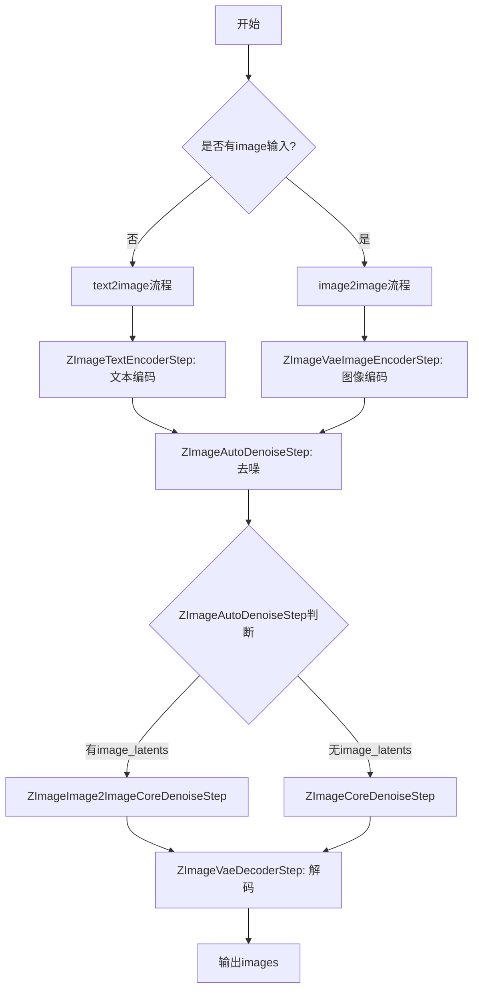
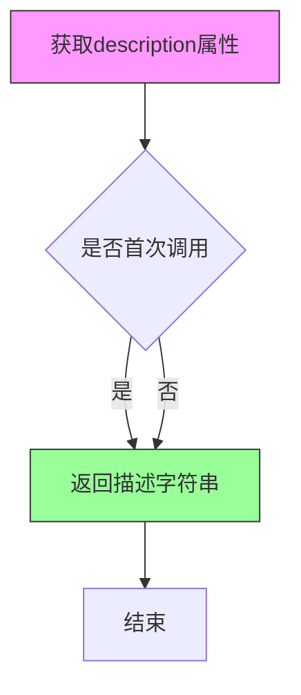
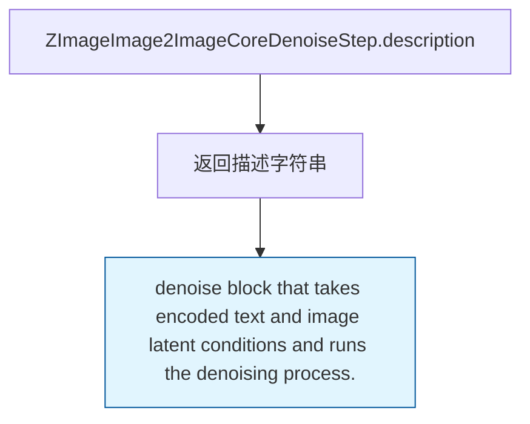
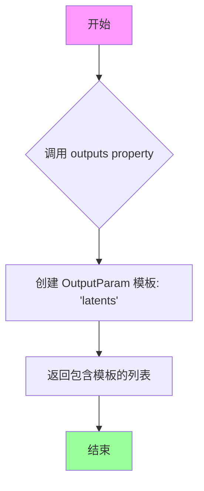
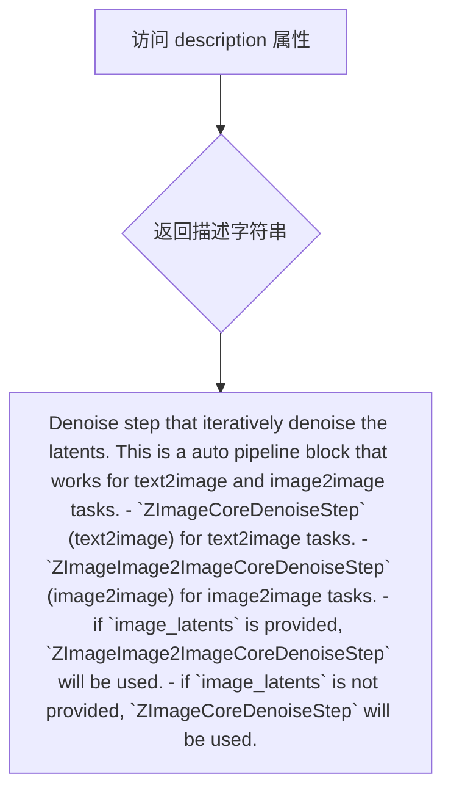
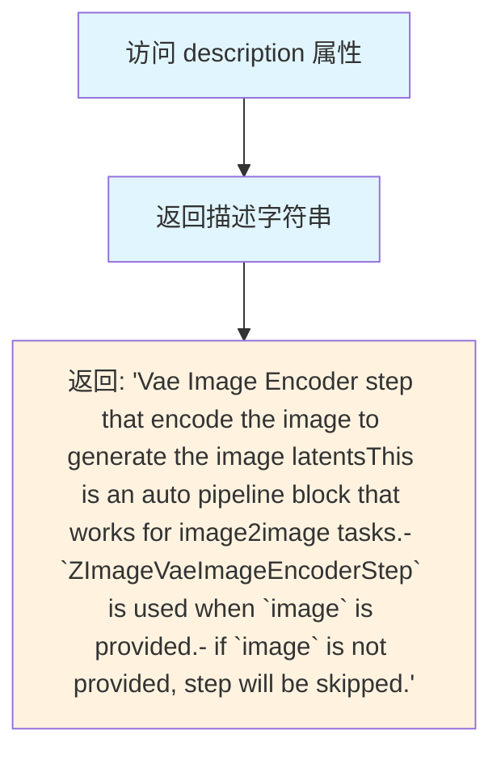

# `diffusers\src\diffusers\modular_pipelines\z_image\modular_blocks_z_image.py` 详细设计文档

ZImage模块化管道实现，支持文本到图像(text2image)和图像到图像(image2image)的生成任务，通过组合文本编码、VAE编码、去噪和VAE解码等步骤完成图像生成。

## 整体流程



## 类结构

```
SequentialPipelineBlocks (基类)
├── ZImageCoreDenoiseStep (文本到图像去噪)
└── ZImageImage2ImageCoreDenoiseStep (图像到图像去噪)
AutoPipelineBlocks (基类)
├── ZImageAutoDenoiseStep (自动去噪选择)
└── ZImageAutoVaeImageEncoderStep (自动VAE编码)
ZImageAutoBlocks (主管道类)
```

## 全局变量及字段


### `logger`
    
模块日志记录器，用于记录ZImage管道运行过程中的日志信息

类型：`logging.Logger`
    


### `ZImageCoreDenoiseStep.block_classes`
    
包含ZImageTextInputStep, ZImagePrepareLatentsStep, ZImageSetTimestepsStep, ZImageDenoiseStep的步骤类列表

类型：`list`
    


### `ZImageCoreDenoiseStep.block_names`
    
步骤名称列表['input', 'prepare_latents', 'set_timesteps', 'denoise']

类型：`list`
    


### `ZImageCoreDenoiseStep.description`
    
返回去噪块描述的属性方法

类型：`property`
    


### `ZImageCoreDenoiseStep.outputs`
    
返回输出参数模板[OutputParam.template('latents')]的属性方法

类型：`property`
    


### `ZImageImage2ImageCoreDenoiseStep.block_classes`
    
包含ZImageTextInputStep, ZImageAdditionalInputsStep等7个步骤类的列表

类型：`list`
    


### `ZImageImage2ImageCoreDenoiseStep.block_names`
    
步骤名称列表，包含input, additional_inputs, prepare_latents, set_timesteps, set_timesteps_with_strength, prepare_latents_with_image, denoise

类型：`list`
    


### `ZImageImage2ImageCoreDenoiseStep.description`
    
返回去噪块描述的属性方法

类型：`property`
    


### `ZImageImage2ImageCoreDenoiseStep.outputs`
    
返回输出参数模板[OutputParam.template('latents')]的属性方法

类型：`property`
    


### `ZImageAutoDenoiseStep.block_classes`
    
包含ZImageImage2ImageCoreDenoiseStep和ZImageCoreDenoiseStep的自动管道块类列表

类型：`list`
    


### `ZImageAutoDenoiseStep.block_names`
    
自动去噪步骤名称列表['image2image', 'text2image']

类型：`list`
    


### `ZImageAutoDenoiseStep.block_trigger_inputs`
    
触发条件列表['image_latents', None]，用于自动选择image2image或text2image流程

类型：`list`
    


### `ZImageAutoDenoiseStep.description`
    
返回自动去噪步骤描述的属性方法

类型：`property`
    


### `ZImageAutoVaeImageEncoderStep.block_classes`
    
包含ZImageVaeImageEncoderStep的VAE图像编码步骤类列表

类型：`list`
    


### `ZImageAutoVaeImageEncoderStep.block_names`
    
VAE编码器步骤名称列表['vae_encoder']

类型：`list`
    


### `ZImageAutoVaeImageEncoderStep.block_trigger_inputs`
    
触发条件列表['image']，当提供image时触发编码步骤

类型：`list`
    


### `ZImageAutoVaeImageEncoderStep.description`
    
返回VAE图像编码器描述的属性方法

类型：`property`
    


### `ZImageAutoBlocks.block_classes`
    
包含ZImageTextEncoderStep, ZImageAutoVaeImageEncoderStep, ZImageAutoDenoiseStep, ZImageVaeDecoderStep的完整管道块类列表

类型：`list`
    


### `ZImageAutoBlocks.block_names`
    
管道步骤名称列表['text_encoder', 'vae_encoder', 'denoise', 'decode']

类型：`list`
    


### `ZImageAutoBlocks._workflow_map`
    
工作流映射字典{'text2image': {'prompt': True}, 'image2image': {'image': True, 'prompt': True}}，定义不同工作流的输入要求

类型：`dict`
    


### `ZImageAutoBlocks.description`
    
返回管道描述的属性方法

类型：`property`
    


### `ZImageAutoBlocks.outputs`
    
返回输出参数模板[OutputParam.template('images')]的属性方法

类型：`property`
    
    

## 全局函数及方法


### `ZImageCoreDenoiseStep.description`

返回去噪块的描述信息，用于说明该模块的功能定位。

参数： 无

返回值：`str`，返回去噪块的描述字符串，说明该块接收编码条件并执行去噪过程。

#### 流程图



#### 带注释源码

```python
@property
def description(self):
    """
    获取去噪块的描述信息。
    
    该属性返回一个人类可读的字符串，描述 ZImageCoreDenoiseStep 的功能。
    在本实现中，它返回一个固定的描述字符串，说明该块接收编码条件
    （如文本嵌入、负向文本嵌入等）并执行去噪过程。
    
    Returns:
        str: 去噪块的描述信息
            - "denoise block that takes encoded conditions and runs the denoising process."
    
    Note:
        - 这是一个只读属性，不接受任何参数
        - 返回值用于文档、日志记录和调试目的
        - 该描述与类文档字符串（docstring）中的描述保持一致
    """
    return "denoise block that takes encoded conditions and runs the denoising process."
```


### `ZImageCoreDenoiseStep.outputs`

该属性用于定义 ZImageCoreDenoiseStep 类的输出参数模板，返回一个包含 latents 输出参数的列表。

参数：无（这是一个属性 getter，不需要输入参数）

返回值：`List[OutputParam]`，返回一个包含 OutputParam 模板的列表，其中模板名为 "latents"，表示该步骤的输出为去噪后的潜在表示（latents）。

#### 流程图

```mermaid
flowchart TD
    A[调用 outputs 属性] --> B{返回输出参数模板}
    B --> C[创建 OutputParam.template('latents')]
    C --> D[返回列表 [OutputParam.template('latents')]]
```

#### 带注释源码

```python
@property
def outputs(self):
    """
    定义该步骤的输出参数模板。
    
    Returns:
        List[OutputParam]: 包含输出参数模板的列表，当前返回 'latents' 参数模板，
                          表示该去噪步骤输出的是去噪后的潜在表示（latents tensor）。
    """
    return [OutputParam.template("latents")]
```


### `ZImageImage2ImageCoreDenoiseStep.description`

返回去噪块的描述，说明该块接收编码的文本和图像潜在条件，并运行去噪过程。

参数： 无

返回值：`str`，返回去噪块的描述字符串。

#### 流程图



#### 带注释源码

```python
@property
def description(self):
    """
    返回去噪块的描述信息。
    
    该属性方法属于 ZImageImage2ImageCoreDenoiseStep 类，
    用于描述该去噪块的功能：接收编码的文本和图像潜在条件，
    并运行去噪过程。
    
    Returns:
        str: 去噪块的描述字符串
    """
    return "denoise block that takes encoded text and image latent conditions and runs the denoising process."
```


### `ZImageImage2ImageCoreDenoiseStep.outputs`

该属性方法用于返回图像到图像（image2image）核心去噪步骤的输出参数模板，输出为去噪后的潜在表示（latents）。

参数： 无（该方法为属性方法，无参数）

返回值：`list[OutputParam]`，返回包含去噪后潜在表示的输出参数模板列表

#### 流程图



#### 带注释源码

```python
@property
def outputs(self):
    """
    返回图像到图像核心去噪步骤的输出参数模板。
    
    该方法继承自 SequentialPipelineBlocks 基类，覆盖了基类的 outputs 属性。
    用于定义当前管道块（ZImageImage2ImageCoreDenoiseStep）的输出参数。
    
    Returns:
        list: 包含 OutputParam 对象的列表，当前实现返回去噪后的 latents（潜在表示）。
              返回格式为 [OutputParam.template("latents")]，其中 OutputParam.template() 
              是模块化管道工具类提供的模板工厂方法，用于生成标准化的输出参数模板。
    
    Example:
        >>> step = ZImageImage2ImageCoreDenoiseStep()
        >>> output_params = step.outputs
        >>> print(output_params)
        # 输出: [<OutputParam.template('latents')>]
    """
    return [OutputParam.template("latents")]
```


### `ZImageAutoDenoiseStep.description`

这是一个属性（property），用于返回自动去噪步骤的描述信息，说明该步骤用于迭代去噪潜在向量，支持文本到图像和图像到图像两种任务。

参数：

- `self`：`ZImageAutoDenoiseStep` 实例，隐式参数，无需显式传递

返回值：`str`，返回自动去噪步骤的描述字符串，说明该自动管道块适用于 text2image 和 image2image 任务，并根据 `image_latents` 是否提供来选择使用 `ZImageCoreDenoiseStep` 或 `ZImageImage2ImageCoreDenoiseStep`。

#### 流程图



#### 带注释源码

```python
@property
def description(self) -> str:
    """
    返回自动去噪步骤的描述信息。
    
    该属性说明 ZImageAutoDenoiseStep 是一个自动管道块，适用于 text2image 和 image2image 任务。
    如果提供了 image_latents，则使用 ZImageImage2ImageCoreDenoiseStep；
    如果未提供 image_latents，则使用 ZImageCoreDenoiseStep。
    
    Returns:
        str: 描述自动去噪步骤功能的字符串
    """
    return (
        "Denoise step that iteratively denoise the latents. "
        "This is a auto pipeline block that works for text2image and image2image tasks."
        " - `ZImageCoreDenoiseStep` (text2image) for text2image tasks."
        " - `ZImageImage2ImageCoreDenoiseStep` (image2image) for image2image tasks."
        + " - if `image_latents` is provided, `ZImageImage2ImageCoreDenoiseStep` will be used.\n"
        + " - if `image_latents` is not provided, `ZImageCoreDenoiseStep` will be used.\n"
    )
```


### `ZImageAutoVaeImageEncoderStep.description`

该属性返回 VAE 图像编码器步骤的描述信息，说明该步骤用于将图像编码生成图像潜在向量（image latents），是一个自动管道块，根据是否提供 `image` 参数来决定是否执行编码步骤。

参数：无（该方法为属性访问器，无函数参数）

返回值：`str`，返回描述 VAE 图像编码器步骤功能的字符串，包含该块用于图像到图像任务、当提供 `image` 时使用 `ZImageVaeImageEncoderStep`、未提供时跳过该步骤等信息。

#### 流程图



#### 带注释源码

```python
@property
def description(self) -> str:
    """
    返回 VAE 图像编码器步骤的描述信息。
    
    该属性说明:
    1. 此步骤用于将输入图像编码生成图像潜在向量 (image latents)
    2. 这是一个自动管道块,适用于 image2image 任务
    3. 当提供了 image 参数时,使用 ZImageVaeImageEncoderStep 进行编码
    4. 当未提供 image 参数时,该步骤将被跳过
    
    Returns:
        str: 描述该步骤功能的字符串
    """
    return "Vae Image Encoder step that encode the image to generate the image latents"
    +"This is an auto pipeline block that works for image2image tasks."
    +" - `ZImageVaeImageEncoderStep` is used when `image` is provided."
    +" - if `image` is not provided, step will be skipped."
```


### ZImageAutoBlocks.description

这是一个属性方法，返回 ZImage 自动模块化管道的描述字符串，用于说明该管道支持 text-to-image 和 image-to-image 任务。

参数：

- `self`：`ZImageAutoBlocks`，拥有该属性的类实例本身。

返回值：`str`，返回管道的描述字符串，内容为 "Auto Modular pipeline for text-to-image and image-to-image using ZImage."。

#### 流程图

```mermaid
graph LR
    A[ZImageAutoBlocks 实例] --> B{访问 description 属性}
    B --> C[返回字符串: <br/>"Auto Modular pipeline for <br/>text-to-image and <br/>image-to-image using ZImage."]
```

#### 带注释源码

```python
@property
def description(self) -> str:
    """
    返回管道的描述字符串。

    该属性用于提供 ZImage 自动模块化管道的基本说明，表明其支持
    text-to-image 和 image-to-image 两种工作流程。

    参数:
        self (ZImageAutoBlocks): 拥有该属性的类实例。

    返回:
        str: 描述管道的字符串，说明其功能和支持的任务类型。
    """
    return "Auto Modular pipeline for text-to-image and image-to-image using ZImage."
```


### `ZImageAutoBlocks.outputs`

该属性是 `ZImageAutoBlocks` 类的输出参数模板定义方法，用于声明该模块化流水线最终输出的产物为生成的图像列表。

参数：
- （无显式参数，self 为隐式参数）

返回值：`List[OutputParam]`，返回一个包含输出参数模板的列表，当前模板为 `images`，表示生成的图像列表。

#### 流程图

```mermaid
flowchart TD
    A[调用 ZImageAutoBlocks.outputs 属性] --> B{返回输出模板}
    B --> C[OutputParam.template('images')]
    C --> D[返回列表: [OutputParam.template('images')]]
    
    style A fill:#f9f,stroke:#333
    style D fill:#9f9,stroke:#333
```

#### 带注释源码

```python
@property
def outputs(self):
    """
    定义 ZImageAutoBlocks 模块化流水线的输出参数模板。
    
    该属性返回一个列表，包含一个 OutputParam 模板对象，
    模板名称为 'images'，表示该流水线最终输出的是生成的图像列表。
    
    Returns:
        List[OutputParam]: 包含输出参数模板的列表，当前为 [OutputParam.template('images')]
    """
    return [OutputParam.template("images")]
```

## 关键组件


### ZImageCoreDenoiseStep

文本到图像的核心去噪块，按顺序执行文本输入、潜在变量准备、时间步设置和去噪过程，支持text2image任务。

### ZImageImage2ImageCoreDenoiseStep

图像到图像的核心去噪块，在ZImageCoreDenoiseStep基础上增加了图像潜在变量处理 strength参数控制，用于image2image任务。

### ZImageAutoDenoiseStep

自动去噪步骤，通过block_trigger_inputs自动选择text2image或image2image流程，当提供image_latents时使用ZImageImage2ImageCoreDenoiseStep，否则使用ZImageCoreDenoiseStep。

### ZImageAutoVaeImageEncoderStep

VAE图像编码步骤，用于将输入图像编码为图像潜在变量，支持image2image任务的图像条件输入。

### ZImageAutoBlocks

自动模块化流水线，整合文本编码、VAE编码、去噪和VAE解码步骤，支持text2image和image2image两种工作流，通过_workflow_map映射触发条件。

### SequentialPipelineBlocks

顺序流水线块基类，按顺序执行多个block，支持block_names定义各阶段名称。

### AutoPipelineBlocks

自动流水线块基类，根据输入条件自动选择执行哪个block，支持block_trigger_inputs定义触发条件列表。

### ZImageTextEncoderStep

文本编码步骤，将文本提示转换为文本嵌入向量。

### ZImageVaeDecoderStep

VAE解码器步骤，将去噪后的潜在变量解码为最终图像。

### ZImagePrepareLatentsStep

潜在变量准备步骤，初始化或处理去噪过程的潜在变量。

### ZImageSetTimestepsStep

时间步设置步骤，配置扩散模型的时间步调度。

### ZImageDenoiseStep

去噪核心步骤，执行实际的迭代去噪过程。

### OutputParam.template

输出参数模板，用于定义流水线各阶段的输出参数类型和名称。


## 问题及建议


### 已知问题

-   **文档严重缺失**: 代码中存在大量"TODO: Add description."占位符，包括所有输入参数（num_images_per_prompt、prompt_embeds、negative_prompt_embeds、height、width、latents、generator、num_inference_steps、sigmas、image、strength等）和组件描述，影响代码可维护性和可读性
-   **字符串拼接语法错误**: `ZImageAutoVaeImageEncoderStep.description`属性使用+号连接多行字符串，但第一行末尾缺少括号，导致实际返回结果与预期不符（只会返回第一行字符串）
-   **block_trigger_inputs配置不一致**: `ZImageAutoDenoiseStep`的触发条件为`["image_latents", None]`，而`ZImageImage2ImageCoreDenoiseStep`中实际使用了`image_latents`作为条件，逻辑语义不够清晰
-   **类属性定义不统一**: `ZImageCoreDenoiseStep`、`ZImageImage2ImageCoreDenoiseStep`有outputs属性，但`ZImageAutoDenoiseStep`、`ZImageAutoVaeImageEncoderStep`缺少此属性，造成接口不一致
-   **魔法数字和硬编码值**: 默认值如`num_inference_steps`默认9、`strength`默认0.6在多处重复硬编码，缺乏统一配置管理
-   **注释标注"auto_docstring"但未实现**: 多处注释标注`# auto_docstring`，暗示存在自动生成文档的机制，但代码中未见相关实现，可能为未完成的功能
-   **workflow_map未被使用**: `ZImageAutoBlocks`中定义了`_workflow_map`字典（text2image和image2image工作流映射），但代码中未见实际使用该映射的逻辑

### 优化建议

-   完善所有TODO项的文档描述，确保每个参数都有清晰的用途说明
-   修复`ZImageAutoVaeImageEncoderStep.description`字符串拼接问题，使用括号或f-string重写
-   统一类的接口规范，要求所有Pipeline Blocks类实现outputs属性
-   将硬编码的默认值（如9、0.6、512）提取为常量或配置类，集中管理
-   实现auto_docstring机制或移除相关注释，避免误导
-   如果_workflow_map为预留功能，应完成其实现；否则应移除以避免代码冗余
-   考虑为block_trigger_inputs添加类型注解和更清晰的文档说明


## 其它


### 设计目标与约束

本模块的设计目标是提供一个灵活、可扩展的模块化图像生成Pipeline，支持文本到图像（text2image）和图像到图像（image2image）两种工作流程。核心约束包括：1）依赖HuggingFace Diffusers库的基础组件（VAE、Scheduler、Text Encoder等）；2）使用FlowMatchEulerDiscreteScheduler作为去噪调度器；3）支持Qwen3Model作为文本编码器；4）仅支持Python 3.8+；5）需要CUDA支持以进行GPU加速推理。

### 错误处理与异常设计

代码中TODO注释较多，表明部分参数描述不完整。异常处理设计应包含：1）输入验证异常（InvalidPromptError）- 当prompt为空或不符合要求时抛出；2）图像尺寸异常（InvalidImageSizeError）- 当输入图像尺寸不满足要求时抛出；3）模型加载异常（ModelLoadError）- 当模型组件加载失败时抛出；4）内存不足异常（OutOfMemoryError）- 当GPU内存不足时抛出；5）数据类型异常（TypeError）- 当输入参数类型不匹配时抛出。建议在关键步骤添加try-except块和详细的错误日志记录。

### 数据流与状态机

Pipeline的状态转换如下：初始状态（None）→文本编码状态（ZImageTextEncoderStep完成）→VAE编码状态（ZImageAutoVaeImageEncoderStep完成，若有图像输入）→去噪状态（ZImageAutoDenoiseStep完成）→解码状态（ZImageVaeDecoderStep完成）→最终输出状态。对于text2image流程，状态跳过VAE编码；对于image2image流程，完整经历所有状态。状态转换由SequentialPipelineBlocks和AutoPipelineBlocks控制，通过block_trigger_inputs判断是否执行特定步骤。

### 外部依赖与接口契约

核心依赖包括：1）transformers库 - 提供Qwen3Model和Qwen2Tokenizer；2）diffusers库 - 提供AutoencoderKL、FlowMatchEulerDiscreteScheduler、VaeImageProcessor；3）torch库 - 提供Tensor操作和CUDA支持；4）PIL库 - 图像处理。模块间接口契约：所有Step类必须实现__call__方法返回字典类型输出；AutoPipelineBlocks的block_trigger_inputs为None时表示该步骤可选；OutputParam.template用于定义输出参数模板；SequentialPipelineBlocks按顺序执行block_classes中的步骤。

### 配置参数说明

关键配置参数包括：num_images_per_prompt（默认1）- 控制每次生成的图像数量；height/width（默认None）- 输出图像尺寸；num_inference_steps（默认9）- 去噪步骤数；sigmas（默认None）- 自定义噪声调度参数；strength（默认0.6）- image2image模式下对原图的保留程度；max_sequence_length（默认512）- 文本编码的最大序列长度；output_type（默认"pil"）- 输出图像格式，可选"pil"/"np"/"pt"。

### 性能考虑与优化点

当前实现存在以下优化空间：1）批处理优化 - 可支持批量推理以提高吞吐量；2）内存优化 - 可实现VAE分块解码（Tiled VAE Decoding）以处理高分辨率图像；3）推理速度 - 可集成xFormers等高性能算子；4）异步处理 - 可使用asyncio实现非阻塞的模型加载；5）缓存机制 - 可添加文本嵌入缓存避免重复编码。性能瓶颈主要在去噪步骤的Transformer前向传播和VAE解码步骤。

### 使用示例与调用方式

```python
from diffusers import ZImageAutoBlocks

# 初始化Pipeline
pipeline = ZImageAutoBlocks.from_pretrained("z-image-model-path")

# Text2Image示例
images = pipeline(
    prompt="A beautiful sunset over mountains",
    num_inference_steps=20,
    height=512,
    width=512
)

# Image2Image示例
from PIL import Image
input_image = Image.open("input.jpg")
images = pipeline(
    prompt="Transform to oil painting style",
    image=input_image,
    strength=0.7,
    num_inference_steps=20
)
```

### 版本变更与兼容性

当前版本为初始实现（v1.0），基于Apache License 2.0开源。后续版本可能的方向包括：1）添加更多工作流支持（如Inpainting、ControlNet）；2）支持更多调度器；3）添加ONNX导出支持；4）优化移动端部署兼容性。API变更将遵循语义化版本规范（SemVer），重大变更将提供迁移指南。

    