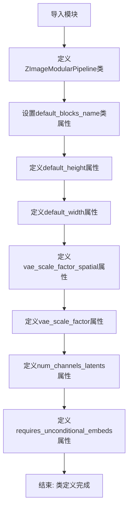
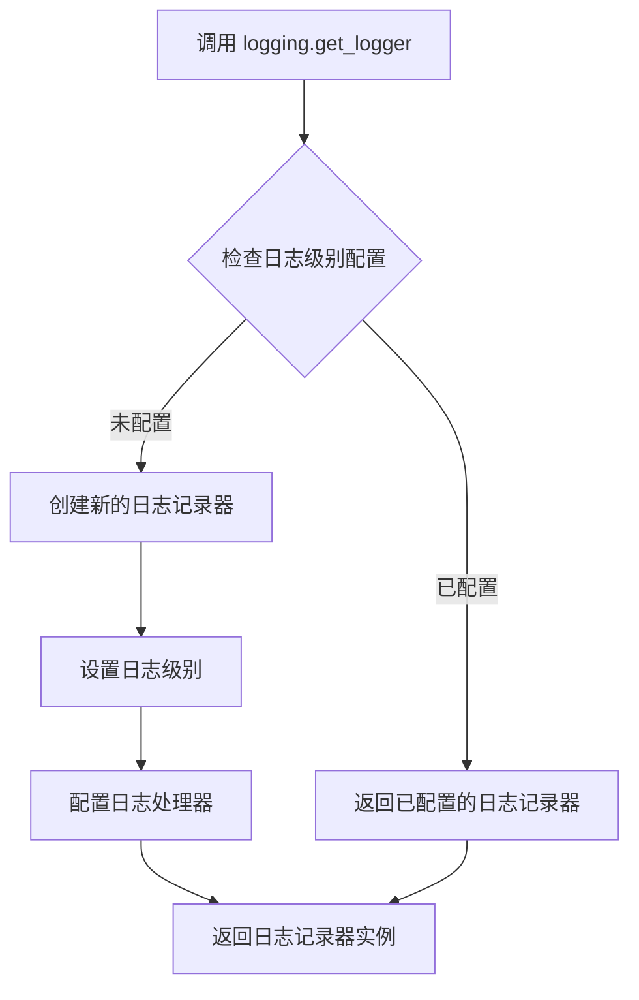
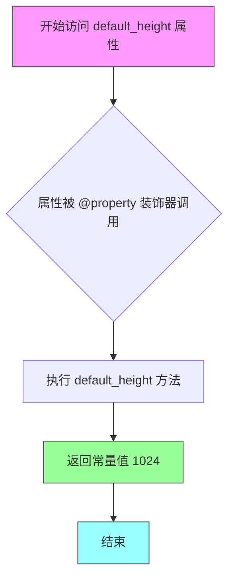
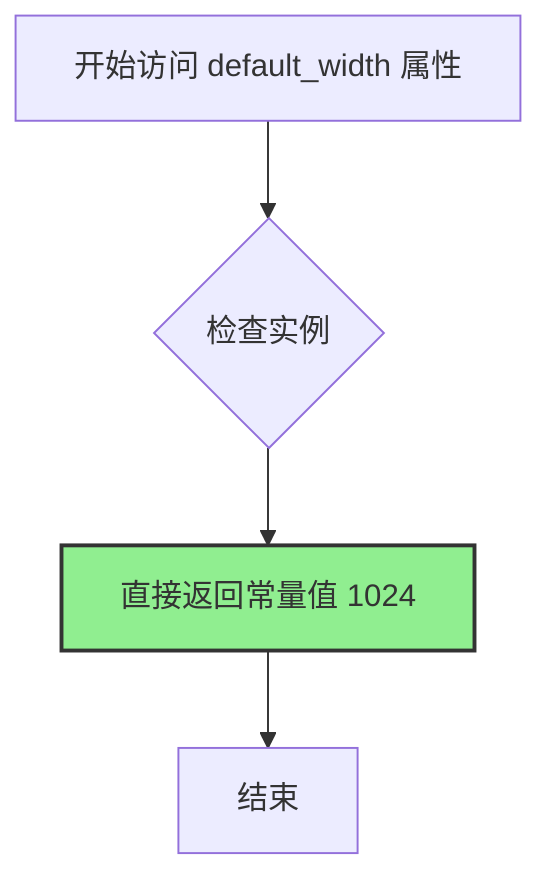
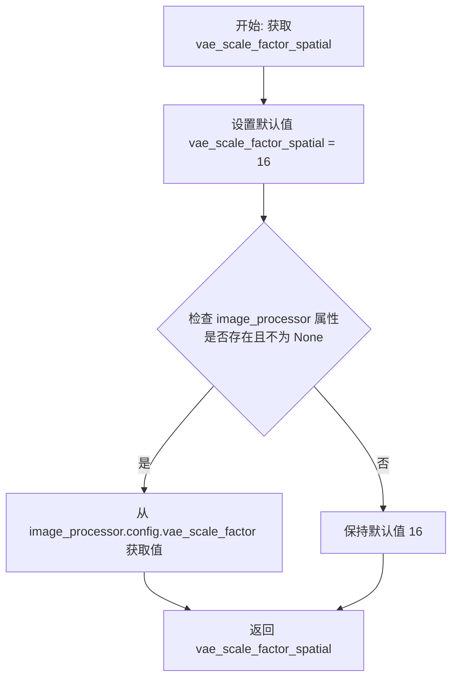
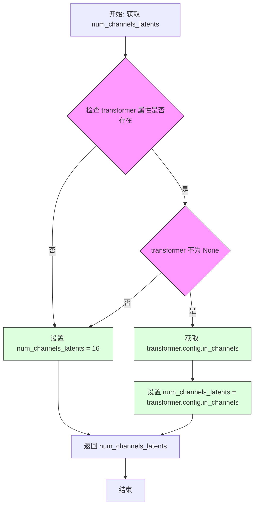
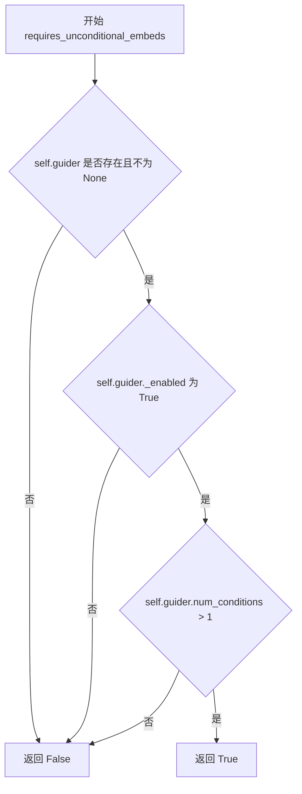

# `diffusers\src\diffusers\modular_pipelines\z_image\modular_pipeline.py` 详细设计文档

ZImageModularPipeline 是一个模块化的图像生成管道，继承自ModularPipeline和ZImageLoraLoaderMixin，提供了图像生成所需的各种配置属性，包括默认高度/宽度、VAE缩放因子、潜在通道数等实验性功能。

## 整体流程



## 类结构

```
ModularPipeline (父类)
├── ZImageModularPipeline (当前类)
│   └── ZImageLoraLoaderMixin (mixin类)
```

## 全局变量及字段


### `logger`
    
模块级日志记录器，用于记录该模块的运行信息和调试信息

类型：`logging.Logger`
    


### `ZImageModularPipeline.default_blocks_name`
    
类属性，指定默认的块名称为ZImageAutoBlocks，用于自动块配置

类型：`str`
    


### `ZImageModularPipeline.default_height`
    
属性方法，返回默认图像高度1024像素

类型：`int (property)`
    


### `ZImageModularPipeline.default_width`
    
属性方法，返回默认图像宽度1024像素

类型：`int (property)`
    


### `ZImageModularPipeline.vae_scale_factor_spatial`
    
属性方法，返回VAE空间缩放因子，默认16，若存在image_processor则从配置读取

类型：`int (property)`
    


### `ZImageModularPipeline.vae_scale_factor`
    
属性方法，返回VAE缩放因子，默认8，若存在vae则根据block_out_channels计算

类型：`int (property)`
    


### `ZImageModularPipeline.num_channels_latents`
    
属性方法，返回潜在空间通道数，默认16，若存在transformer则从配置读取in_channels

类型：`int (property)`
    


### `ZImageModularPipeline.requires_unconditional_embeds`
    
属性方法，返回是否需要无条件嵌入，根据guider的启用状态和条件数量判断

类型：`bool (property)`
    
    

## 全局函数及方法


### `logging.get_logger`

获取与当前模块关联的日志记录器实例，用于在该模块中记录日志信息。

参数：

-  `name`：`str`，模块的完全限定名称（通常使用 Python 的 `__name__` 变量），用于标识日志记录器的来源。

返回值：`logging.Logger`，返回一个日志记录器对象，该对象配置为记录来自指定模块的日志消息，可用于调试、监控和错误追踪。

#### 流程图



#### 带注释源码

```python
# 导入 logging 模块（来自上层包的 utils）
from ...utils import logging

# 调用 logging.get_logger(__name__) 获取当前模块的日志记录器
# __name__ 是 Python 内置变量，代表当前模块的完全限定名称
# 例如：如果这个文件是 src/models/zimage_pipeline.py，则 __name__ 为 "src.models.zimage_pipeline"
# logging.get_logger 会返回一个 Logger 实例，用于记录该模块的日志信息
logger = logging.get_logger(__name__)  # pylint: disable=invalid-name
```

#### 额外说明

1. **设计目标**：为当前模块创建一个专用的日志记录器，便于追踪和调试特定模块的运行情况。

2. **调用位置**：此调用位于模块顶层（在类定义之外），确保模块加载时即可使用日志记录器。

3. **命名规范**：使用 `logger` 作为变量名，并在代码中通过 `pylint: disable=invalid-name` 跳过 pylint 的命名检查，因为单字母变量名在日志记录器中是常见约定。

4. **日志级别**：通常由全局日志配置决定，默认情况下可能继承父日志记录器的级别设置。

5. **使用示例**：
   ```python
   logger.info("ZImageModularPipeline 初始化完成")
   logger.warning("这是一个实验性功能")
   logger.error("发生错误")
   ```


### `ZImageModularPipeline.default_height`

该属性返回 Z-Image 模块化流水线的默认图像高度，用于在没有指定高度时作为默认值。

参数：

- `self`：`ZImageModularPipeline`，隐式参数，指向当前实例本身

返回值：`int`，返回默认高度值 1024

#### 流程图



#### 带注释源码

```python
@property
def default_height(self):
    """
    返回 Z-Image 模块化流水线的默认图像高度。
    
    该属性提供了一个硬编码的默认值 1024 像素，
    用于在没有用户指定高度的情况下作为默认输出图像高度。
    
    Returns:
        int: 默认高度值，当前固定返回 1024
    """
    return 1024
```


### `ZImageModularPipeline.default_width`

该属性是 `ZImageModularPipeline` 类的默认宽度属性，用于返回 Z-Image 模块化流水线的默认图像宽度值。

参数：

- `self`：`ZImageModularPipeline` 实例，隐式参数，表示当前管道对象本身

返回值：`int`，返回默认宽度值 1024（像素）

#### 流程图



#### 带注释源码

```python
@property
def default_width(self):
    """
    返回 Z-Image 模块化流水线的默认图像宽度。
    
    该属性提供一个固定的默认宽度值 1024 像素，
    用于在没有明确指定宽度参数时作为默认值。
    
    Returns:
        int: 默认宽度值，固定为 1024
    """
    return 1024
```


### `ZImageModularPipeline.vae_scale_factor_spatial`

该属性用于获取VAE（变分自编码器）的空间缩放因子。它首先检查是否存在图像处理器（image_processor），如果存在则从其配置中读取`vae_scale_factor`，否则返回默认值16。

参数：
- `self`：`ZImageModularPipeline`，隐式参数，属性所属的实例对象

返回值：`int`，VAE的空间缩放因子值。如果存在有效的image_processor则返回其配置中的值，否则返回默认值16。

#### 流程图



#### 带注释源码

```python
@property
def vae_scale_factor_spatial(self):
    """
    获取VAE的空间缩放因子。
    
    该属性首先检查是否存在有效的图像处理器（image_processor）。
    如果存在，则从图像处理器的配置中读取vae_scale_factor；
    否则，返回默认的缩放因子值16。
    
    Returns:
        int: VAE的空间缩放因子。如果image_processor存在且有效，
            返回其配置中的值；否则返回默认值16。
    """
    # 初始化默认的空间缩放因子为16
    vae_scale_factor_spatial = 16
    
    # 检查image_processor是否存在且不为None
    if hasattr(self, "image_processor") and self.image_processor is not None:
        # 从image_processor的配置中获取vae_scale_factor
        vae_scale_factor_spatial = self.image_processor.config.vae_scale_factor
    
    # 返回最终的缩放因子值
    return vae_scale_factor_spatial
```


### `ZImageModularPipeline.vae_scale_factor`

这是一个属性（property）getter方法，用于获取VAE（变分自编码器）的缩放因子。该因子用于将潜在空间（latent space）的坐标映射回像素空间。如果没有配置vae，则默认返回8。

参数：

- 无（这是属性访问器，不接受参数）

返回值：`int`，返回VAE的缩放因子，用于在潜在空间和像素空间之间进行坐标转换

#### 流程图

```mermaid
flowchart TD
    A[开始] --> B[设置默认vae_scale_factor = 8]
    B --> C{检查 self.vae 是否存在且不为 None}
    C -->|是| D[计算 vae_scale_factor = 2 ** (len(vae.config.block_out_channels) - 1)]
    C -->|否| E[返回默认的 vae_scale_factor = 8]
    D --> F[返回计算后的 vae_scale_factor]
    E --> F
```

#### 带注释源码

```python
@property
def vae_scale_factor(self):
    """
    获取VAE的缩放因子，用于潜在空间到像素空间的映射。
    
    Returns:
        int: VAE缩放因子，默认值为8。如果vae可用，则根据其配置
             计算：2^(block_out_channels数量-1)
    """
    # 步骤1：设置默认的VAE缩放因子为8
    vae_scale_factor = 8
    
    # 步骤2：检查self.vae是否存在且已正确初始化
    if hasattr(self, "vae") and self.vae is not None:
        # 步骤3：如果vae可用，根据其配置计算缩放因子
        # block_out_channels定义了VAE解码器各层的通道数
        # 缩放因子计算公式：2^(层数-1)
        vae_scale_factor = 2 ** (len(self.vae.config.block_out_channels) - 1)
    
    # 步骤4：返回计算得到的VAE缩放因子
    return vae_scale_factor
```


### `ZImageModularPipeline.num_channels_latents`

这是一个属性方法，用于获取Z-Image模块化管道中潜在变量（latents）的通道数。该属性返回输入潜在变量的通道维度，默认值为16，如果transformer组件存在且已正确初始化，则从transformer的配置中读取`in_channels`值。

参数：

- `self`：`ZImageModularPipeline`，隐式参数，指向当前Z-Image模块化管道实例本身

返回值：`int`，返回潜在通道数（num_channels_latents），用于确定输入潜在变量的通道维度。默认值为16，当transformer组件存在时返回`transformer.config.in_channels`的值。

#### 流程图



#### 带注释源码

```python
@property
def num_channels_latents(self):
    """
    获取潜在通道数（Number of latent channels）。
    
    此属性用于确定输入到模型的潜在变量的通道维度。
    在扩散模型中，潜在变量通常是从VAE编码器输出得到的，
    其通道数决定了模型的输入维度。
    
    Returns:
        int: 潜在通道数。如果transformer组件存在且已初始化，
             返回transformer配置中的in_channels值；否则返回默认值16。
    """
    # 初始化默认潜在通道数为16
    num_channels_latents = 16
    
    # 检查transformer属性是否存在且不为None
    # transformer是Z-Image管道中的核心组件，负责模型的前向传播
    if hasattr(self, "transformer") and self.transformer is not None:
        # 从transformer配置中获取输入通道数
        # in_channels定义了模型期望的输入数据通道维度
        num_channels_latents = self.transformer.config.in_channels
    
    # 返回最终计算得到的潜在通道数
    return num_channels_latents
```


### `ZImageModularPipeline.requires_unconditional_embeds`

该属性用于判断当前管线是否需要无条件嵌入（unconditional embeds）。它通过检查 guider 是否启用且条件数是否大于1来确定返回值，如果需要条件嵌入则返回 True，否则返回 False。

参数：
- 无参数（作为属性，通过 `self` 访问实例）

返回值：`bool`，返回是否需要无条件嵌入的条件标志

#### 流程图



#### 带注释源码

```python
@property
def requires_unconditional_embeds(self):
    """
    属性：requires_unconditional_embeds
    
    用于判断管线是否需要无条件嵌入（unconditional embeds）。
    无条件嵌入通常用于Classifier-free guidance（CFG）技术中，
    以便在推理时同时生成条件和无条件输出。
    
    返回:
        bool: 如果 guider 已启用且条件数大于1，返回 True；
              否则返回 False。
    """
    # 初始化默认值为 False，表示默认不需要无条件嵌入
    requires_unconditional_embeds = False

    # 检查是否存在 guider 且 guider 不为 None
    if hasattr(self, "guider") and self.guider is not None:
        # 判断 guider 是否启用（_enabled 属性）并且条件数大于1
        # num_conditions > 1 表示存在多个条件需要处理
        requires_unconditional_embeds = self.guider._enabled and self.guider.num_conditions > 1

    # 返回最终判断结果
    return requires_unconditional_embeds
```

## 关键组件


### ZImageModularPipeline 类

模块化管道类，继承自ModularPipeline和ZImageLoraLoaderMixin，用于Z-Image模型的推理流水线，提供多种属性配置以支持图像生成任务。

### default_blocks_name 属性

返回默认的块名称"ZImageAutoBlocks"，用于自动块配置。

### default_height 属性

返回默认图像高度1024像素。

### default_width 属性

返回默认图像宽度1024像素。

### vae_scale_factor_spatial 属性

返回VAE空间缩放因子，默认值为16。如果存在image_processor配置，则使用其vae_scale_factor属性值，用于空间维度的缩放计算。

### vae_scale_factor 属性

返回VAE缩放因子，默认值为8。通过计算VAE的block_out_channels长度来确定缩放因子，用于潜在空间的缩放。

### num_channels_latents 属性

返回潜在变量通道数，默认值为16。如果存在transformer配置，则使用其in_channels属性值，定义潜在表示的通道维度。

### requires_unconditional_embeds 属性

返回是否需要无条件嵌入。根据guider的启用状态和条件数量判断，当guider启用且条件数大于1时返回True，用于条件生成控制。


## 问题及建议


### 已知问题

-   **硬编码的默认值**：多处使用魔法数字（1024、16、8等）作为默认值，这些值分散在各个属性中，难以统一管理和修改
-   **重复的属性检查模式**：多个属性方法使用相同的 `hasattr(self, xxx) and self.xxx is not None` 检查模式，代码冗余
-   **访问私有属性**：`requires_unconditional_embeds` 方法直接访问 `guider._enabled` 私有属性，违反了封装原则，可能导致未来版本兼容性问题
-   **缺乏类型注解**：所有属性方法都缺少返回类型注解，影响代码可读性和静态分析工具的效能
-   **缺少错误处理**：属性访问依赖于下游对象（vae、transformer、image_processor）的配置结构，如果配置字段缺失或结构不同，可能产生运行时错误
-   **文档不完整**：类和方法缺少详细的文档字符串，难以理解各属性的用途和约束条件

### 优化建议

-   **提取配置常量**：将硬编码的默认值定义为类常量或配置对象，便于统一管理和配置化
-   **封装属性检查逻辑**：创建通用的辅助方法或装饰器来处理属性存在性和非空检查，减少代码重复
-   **使用公共接口**：将 `guider._enabled` 改为通过公共方法或属性访问，提高代码健壮性
-   **添加类型注解**：为所有属性方法添加明确的返回类型注解，提升代码可维护性
-   **增加防御性检查**：对依赖的配置对象添加更全面的检查和默认值回退机制
-   **完善文档注释**：为类和关键方法添加详细的文档字符串，说明其功能、返回值含义和可能的异常情况

## 其它


### 设计目标与约束

该代码旨在为Z-Image提供模块化的Pipeline实现，支持可插拔的组件架构。设计约束包括：必须继承ModularPipeline和ZImageLoraLoaderMixin以获得LoRA加载能力；默认输出尺寸为1024x1024像素；所有属性采用延迟初始化模式，支持运行时动态配置。

### 错误处理与异常设计

代码中未实现显式的异常处理机制。主要通过hasattr检查和None值判断来避免属性访问错误。当image_processor、vae或transformer等关键组件缺失时，属性会返回默认值而非抛出异常。logger用于记录潜在的配置问题。

### 数据流与状态机

该类作为Pipeline的容器类，不直接处理数据流。数据流由父类ModularPipeline的__call__方法管理。状态转换主要体现在各属性的延迟初始化过程：当组件（vae、transformer、guider等）被加载后，相应的属性会自动返回基于实际配置的计算值。

### 外部依赖与接口契约

核心依赖包括：ModularPipeline（父类，提供管道执行框架）、ZImageLoraLoaderMixin（提供LoRA权重加载能力）、image_processor（图像处理器，需包含vae_scale_factor配置）、vae（变分自编码器，需包含block_out_channels配置）、transformer（变换器模型，需包含in_channels配置）、guider（引导器，需支持_enabled和num_conditions属性）。

### 继承关系与类层次结构

ZImageModularPipeline继承自ModularPipeline（基础管道功能）和ZImageLoraLoaderMixin（LoRA加载扩展）。类层次结构遵循Mixin模式，允许通过组合扩展功能。该类还包含default_blocks_name类属性，指向ZImageAutoBlocks配置。

    