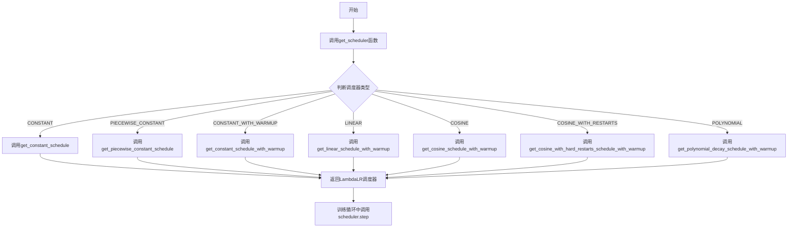
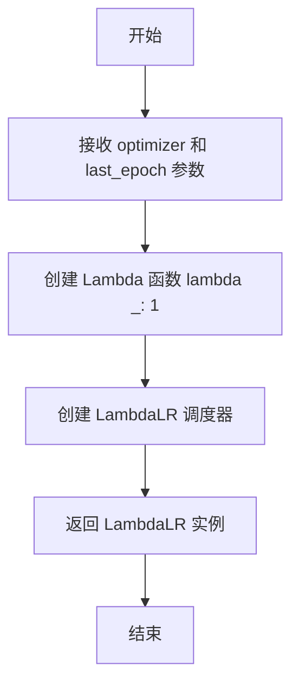
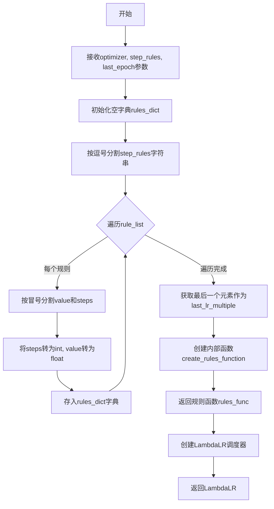
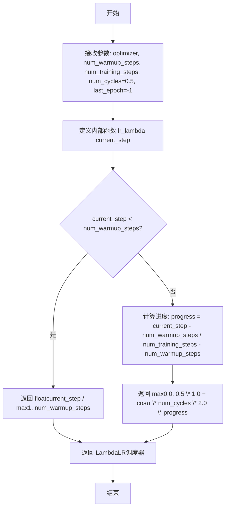
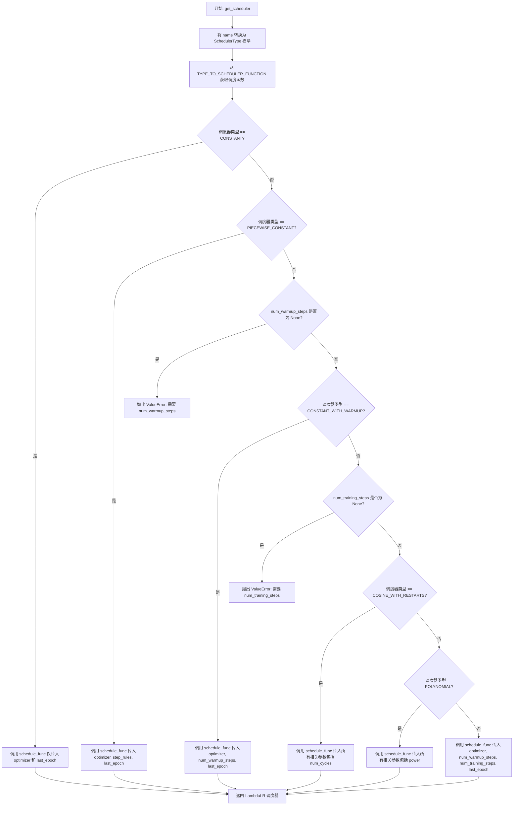

# `diffusers\src\diffusers\optimization.py` 详细设计文档

这是一个PyTorch优化器的学习率调度器库，专门为diffusion models设计。它提供了多种学习率调度策略（包括constant、linear、cosine、polynomial等），支持warmup阶段，并通过统一的API接口get_scheduler来创建和管理各种学习率调度器。

## 整体流程



## 类结构

```
SchedulerType (枚举类)
└── LINEAR, COSINE, COSINE_WITH_RESTARTS, POLYNOMIAL, CONSTANT, CONSTANT_WITH_WARMUP, PIECEWISE_CONSTANT
```

## 全局变量及字段


### `TYPE_TO_SCHEDULER_FUNCTION`
    
将调度器类型映射到对应创建函数的字典

类型：`dict[SchedulerType, Callable]`
    


### `logger`
    
用于记录模块日志的日志记录器对象

类型：`logging.Logger`
    


### `SchedulerType.SchedulerType.LINEAR`
    
线性学习率调度器枚举成员

类型：`SchedulerType`
    


### `SchedulerType.SchedulerType.COSINE`
    
余弦学习率调度器枚举成员

类型：`SchedulerType`
    


### `SchedulerType.SchedulerType.COSINE_WITH_RESTARTS`
    
带硬重启的余弦学习率调度器枚举成员

类型：`SchedulerType`
    


### `SchedulerType.SchedulerType.POLYNOMIAL`
    
多项式衰减学习率调度器枚举成员

类型：`SchedulerType`
    


### `SchedulerType.SchedulerType.CONSTANT`
    
恒定学习率调度器枚举成员

类型：`SchedulerType`
    


### `SchedulerType.SchedulerType.CONSTANT_WITH_WARMUP`
    
带预热的恒定学习率调度器枚举成员

类型：`SchedulerType`
    


### `SchedulerType.SchedulerType.PIECEWISE_CONSTANT`
    
分段恒定学习率调度器枚举成员

类型：`SchedulerType`
    
    

## 全局函数及方法


### `get_constant_schedule`

创建一个保持恒定学习率的调度器，使用优化器中设置的学习率。

参数：

- `optimizer`：`Optimizer`，需要为其调度学习率的优化器
- `last_epoch`：`int`，可选，默认为 -1，恢复训练时的最后一个 epoch 索引

返回值：`LambdaLR`，返回与适当调度关联的 `torch.optim.lr_scheduler.LambdaLR` 对象

#### 流程图



#### 带注释源码

```python
def get_constant_schedule(optimizer: Optimizer, last_epoch: int = -1) -> LambdaLR:
    """
    Create a schedule with a constant learning rate, using the learning rate set in optimizer.

    Args:
        optimizer ([`~torch.optim.Optimizer`]):
            The optimizer for which to schedule the learning rate.
        last_epoch (`int`, *optional*, defaults to -1):
            The index of the last epoch when resuming training.

    Return:
        `torch.optim.lr_scheduler.LambdaLR` with the appropriate schedule.
    """
    # 创建一个返回常数值 1 的 Lambda 函数，使学习率保持不变
    # LambdaLR 会将优化器的基础学习率乘以这个 Lambda 函数的返回值
    # 由于返回值为 1，学习率始终保持为优化器中设置的初始值
    return LambdaLR(optimizer, lambda _: 1, last_epoch=last_epoch)
```


### `get_constant_schedule_with_warmup`

该函数创建一个学习率调度器，在预热阶段（warmup phase）学习率从0线性增长到优化器中设置的初始学习率，之后保持恒定的学习率。

参数：

- `optimizer`：`Optimizer`，需要调度学习率的优化器
- `num_warmup_steps`：`int`，预热阶段的步数
- `last_epoch`：`int`（可选，默认为-1），恢复训练时的最后一个 epoch 索引

返回值：`LambdaLR`，具有预热阶段的恒定学习率调度器

#### 流程图

```mermaid
flowchart TD
    A[开始] --> B[定义 lr_lambda 函数]
    B --> C{current_step < num_warmup_steps?}
    C -->|是| D[返回 float(current_step) / float(max(1.0, num_warmup_steps))]
    C -->|否| E[返回 1.0]
    D --> F[创建并返回 LambdaLR 调度器]
    E --> F
```

#### 带注释源码

```python
def get_constant_schedule_with_warmup(
    optimizer: Optimizer,        # PyTorch 优化器实例
    num_warmup_steps: int,       # 预热阶段的步数
    last_epoch: int = -1         # 恢复训练时的最后一个 epoch 索引，默认为 -1 表示从头开始
) -> LambdaLR:
    """
    Create a schedule with a constant learning rate preceded by a warmup period during which the learning rate
    increases linearly between 0 and the initial lr set in the optimizer.
    
    创建一个学习率调度器，在预热阶段学习率从0线性增长到优化器中设置的初始学习率，
    之后保持恒定学习率。

    Args:
        optimizer ([`~torch.optim.Optimizer`]):
            The optimizer for which to schedule the learning rate.
            需要调度学习率的优化器
        num_warmup_steps (`int`):
            The number of steps for the warmup phase.
            预热阶段的步数
        last_epoch (`int`, *optional*, defaults to -1):
            The index of the last epoch when resuming training.
            恢复训练时的最后一个 epoch 索引

    Return:
        `torch.optim.lr_scheduler.LambdaLR` with the appropriate schedule.
        返回一个 LambdaLR 调度器实例
    """

    # 定义内部函数 lr_lambda，用于计算当前步骤的学习率乘数
    def lr_lambda(current_step: int):
        # 如果当前步数小于预热步数，执行线性预热
        # 在预热阶段，学习率从 0 线性增长到 1（相对于初始学习率）
        if current_step < num_warmup_steps:
            # 防止除零错误，使用 max(1.0, num_warmup_steps)
            return float(current_step) / float(max(1.0, num_warmup_steps))
        
        # 预热阶段结束后，返回 1.0，表示使用优化器中设置的初始学习率
        return 1.0

    # 创建 LambdaLR 调度器，将 lr_lambda 作为学习率更新函数
    # last_epoch 参数用于指定恢复训练时的起始 epoch
    return LambdaLR(optimizer, lr_lambda, last_epoch=last_epoch)
```


### `get_piecewise_constant_schedule`

该函数创建一个分段恒定学习率调度器，根据预定义的规则在不同训练步骤阶段应用不同的学习率倍数，实现灵活的学习率阶段性调整。

参数：

- `optimizer`：`torch.optim.Optimizer`，需要调度学习率的优化器
- `step_rules`：`str`，学习率规则字符串，格式为"倍数:步数,倍数:步数,..."，例如"1:10,0.1:20,0.01:30,0.005"表示前10步使用1倍学习率，接着20步使用0.1倍，再接着30步使用0.01倍，剩余步骤使用0.005倍
- `last_epoch`：`int`，可选参数，默认值为-1，恢复训练时的上一个epoch索引

返回值：`torch.optim.lr_scheduler.LambdaLR`，配置好的LambdaLR学习率调度器对象

#### 流程图



#### 带注释源码

```python
def get_piecewise_constant_schedule(optimizer: Optimizer, step_rules: str, last_epoch: int = -1) -> LambdaLR:
    """
    Create a schedule with a constant learning rate, using the learning rate set in optimizer.
    创建一个基于优化器中设置的学习率的分段恒定学习率调度器。

    Args:
        optimizer ([~torch.optim.Optimizer]):
            The optimizer for which to schedule the learning rate.
            需要调度学习率的优化器。
        step_rules (string):
            The rules for the learning rate. ex: rule_steps="1:10,0.1:20,0.01:30,0.005" it means that the learning rate
            if multiple 1 for the first 10 steps, multiple 0.1 for the next 20 steps, multiple 0.01 for the next 30
            steps and multiple 0.005 for the other steps.
            学习率规则字符串，格式示例："1:10,0.1:20,0.01:30,0.005"表示：
            前10步使用1倍学习率，接着20步使用0.1倍，再接着30步使用0.01倍，剩余步骤使用0.005倍。
        last_epoch (int, optional, defaults to -1):
            The index of the last epoch when resuming training.
            恢复训练时的上一个epoch索引。

    Return:
        torch.optim.lr_scheduler.LambdaLR with the appropriate schedule.
        返回配置好学习率调度规则的LambdaLR调度器。
    """

    # 初始化用于存储学习率规则的字典，键为步数阈值，值为学习率倍数
    rules_dict = {}
    # 按逗号分割规则字符串，得到每个阶段的规则
    rule_list = step_rules.split(",")
    # 遍历除最后一个元素外的所有规则（最后一个是默认的最终学习率倍数）
    for rule_str in rule_list[:-1]:
        # 按冒号分割得到学习率倍数和对应的步数
        value_str, steps_str = rule_str.split(":")
        # 将步数转换为整数
        steps = int(steps_str)
        # 将学习率倍数转换为浮点数
        value = float(value_str)
        # 将规则存入字典，键为步数阈值，值为学习率倍数
        rules_dict[steps] = value
    # 获取最后一个元素作为所有指定步骤之后的默认学习率倍数
    last_lr_multiple = float(rule_list[-1])

    # 创建内部函数，用于生成学习率计算函数
    def create_rules_function(rules_dict, last_lr_multiple):
        # 定义学习率计算函数，输入当前步数，返回学习率倍数
        def rule_func(steps: int) -> float:
            # 对步数阈值进行排序
            sorted_steps = sorted(rules_dict.keys())
            # 遍历排序后的步数阈值
            for i, sorted_step in enumerate(sorted_steps):
                # 如果当前步数小于该阈值，返回对应学习率倍数
                if steps < sorted_step:
                    return rules_dict[sorted_steps[i]]
            # 如果遍历完所有阈值都没有匹配，返回最后的默认学习率倍数
            return last_lr_multiple

        # 返回学习率计算函数
        return rule_func

    # 调用create_rules_function创建学习率函数
    rules_func = create_rules_function(rules_dict, last_lr_multiple)

    # 创建并返回LambdaLR调度器，使用创建的学习率函数
    return LambdaLR(optimizer, rules_func, last_epoch=last_epoch)
```


### `get_linear_schedule_with_warmup`

该函数用于创建一种学习率调度策略：首先在预热阶段（warmup）从0线性增长到优化器中设置的初始学习率，然后在正式训练阶段从初始学习率线性衰减至0。这种调度方式广泛用于扩散模型和Transformer等深度学习模型的训练中，以实现更稳定的训练和更好的收敛性能。

参数：

- `optimizer`：`torch.optim.Optimizer`，需要调度学习率的优化器
- `num_warmup_steps`：`int`，预热阶段的步数
- `num_training_steps`：`int`，总训练步数
- `last_epoch`：`int`，可选，默认为-1，恢复训练时的最后一个epoch索引

返回值：`torch.optim.lr_scheduler.LambdaLR`，配置好的学习率调度器对象

#### 流程图

```mermaid
flowchart TD
    A[开始] --> B[接收 optimizer, num_warmup_steps, num_training_steps, last_epoch]
    B --> C[定义内部函数 lr_lambda current_step]
    C --> D{current_step < num_warmup_steps?}
    D -->|是| E[返回 current_step / max(1, num_warmup_steps)]
    D -->|否| F[返回 max(0.0, (num_training_steps - current_step) / max(1, num_training_steps - num_warmup_steps))]
    E --> G[创建 LambdaLR 调度器]
    F --> G
    G --> H[返回 LambdaLR 实例]
    
    style E fill:#90EE90
    style F fill:#FFB6C1
    style H fill:#87CEEB
```

#### 带注释源码

```python
def get_linear_schedule_with_warmup(
    optimizer: Optimizer, 
    num_warmup_steps: int, 
    num_training_steps: int, 
    last_epoch: int = -1
) -> LambdaLR:
    """
    创建学习率调度器：在预热阶段线性增长到初始学习率，
    之后线性衰减至0。
    
    参数:
        optimizer: torch优化器实例
        num_warmup_steps: 预热阶段的步数
        num_training_steps: 总训练步数
        last_epoch: 可选，恢复训练时的epoch索引，默认为-1
        
    返回:
        配置好的LambdaLR调度器实例
    """
    
    # 定义学习率计算函数，会在每个训练步骤被调用
    def lr_lambda(current_step: int):
        # 预热阶段：从0线性增长到1（相对于初始学习率的倍数）
        if current_step < num_warmup_steps:
            # 计算预热进度：当前步数 / 预热总步数
            # 使用max(1, num_warmup_steps)防止除零错误
            return float(current_step) / float(max(1, num_warmup_steps))
        
        # 正式训练阶段：线性衰减
        # 计算剩余步数比例，用于线性衰减
        # max(1, num_training_steps - num_warmup_steps)确保分母不为零
        # max(0.0, ...)确保返回值不为负数
        return max(
            0.0, 
            float(num_training_steps - current_step) / float(max(1, num_training_steps - num_warmup_steps))
        )
    
    # 创建并返回PyTorch的LambdaLR调度器
    # 该调度器会根据lr_lambda函数的返回值动态调整学习率
    return LambdaLR(optimizer, lr_lambda, last_epoch)
```


### `get_cosine_schedule_with_warmup`

该函数用于创建一个学习率调度器，在预热阶段（warmup）学习率从0线性增长到优化器的初始学习率，随后按照余弦函数的曲线从初始学习率平滑衰减至0，支持配置余弦周期数以实现不同的衰减策略。

参数：

- `optimizer`：`Optimizer`，PyTorch优化器实例，用于设置学习率
- `num_warmup_steps`：`int`，预热阶段的步数
- `num_training_steps`：`int`，总训练步数
- `num_cycles`：`float`，余弦函数的周期数（可选，默认为0.5，即半个余弦周期）
- `last_epoch`：`int`，恢复训练时的最后一个epoch索引（可选，默认为-1）

返回值：`LambdaLR`，PyTorch的学习率调度器对象

#### 流程图



#### 带注释源码

```python
def get_cosine_schedule_with_warmup(
    optimizer: Optimizer,  # PyTorch优化器实例
    num_warmup_steps: int,  # 预热阶段的步数
    num_training_steps: int,  # 总训练步数
    num_cycles: float = 0.5,  # 余弦函数周期数，默认0.5表示半个余弦
    last_epoch: int = -1  # 恢复训练时的最后epoch索引，-1表示从头开始
) -> LambdaLR:
    """
    创建学习率调度器：预热阶段线性增长，之后按余弦曲线衰减。
    
    Args:
        optimizer: PyTorch优化器
        num_warmup_steps: 预热步数
        num_training_steps: 总训练步数
        num_cycles: 余弦周期数（默认0.5表示半周期）
        last_epoch: 最后epoch索引
    
    Returns:
        LambdaLR调度器实例
    """

    def lr_lambda(current_step: int):
        """内部函数，计算当前步的学习率乘数"""
        # 预热阶段：线性增长
        if current_step < num_warmup_steps:
            return float(current_step) / float(max(1, num_warmup_steps))
        
        # 衰减阶段：计算已完成的进度（0到1）
        progress = float(current_step - num_warmup_steps) / float(max(1, num_training_steps - num_warmup_steps))
        
        # 余弦衰减：0.5 * (1 + cos(π * num_cycles * 2 * progress))
        # 当progress=0时，cos(0)=1，返回1.0（最大学习率）
        # 当progress=1时，cos(2π)=1，返回1.0（完整周期）
        return max(0.0, 0.5 * (1.0 + math.cos(math.pi * float(num_cycles) * 2.0 * progress)))

    # 创建并返回LambdaLR调度器
    return LambdaLR(optimizer, lr_lambda, last_epoch)
```


### get_cosine_with_hard_restarts_schedule_with_warmup

创建一个学习率调度器，学习率在预热阶段线性从0增加到初始学习率，然后在剩余训练过程中按照带硬重启的余弦函数曲线从初始学习率递减到0。该调度器支持多个余弦周期的硬重启，用于在训练过程中周期性重新调整学习率。

参数：

- `optimizer`：`torch.optim.Optimizer`，用于设置学习率的优化器
- `num_warmup_steps`：`int`，预热阶段的步数
- `num_training_steps`：`int`，总训练步数
- `num_cycles`：`int` (默认值=1)，硬重启的次数，即余弦函数的周期数
- `last_epoch`：`int` (默认值=-1)，恢复训练时的最后一个epoch索引，-1表示从头开始训练

返回值：`torch.optim.lr_scheduler.LambdaLR`，PyTorch的学习率调度器对象

#### 流程图

```mermaid
flowchart TD
    A[开始] --> B{当前步数 < 预热步数?}
    B -->|是| C[返回 步数/预热步数 线性递增]
    B -->|否| D[计算进度 progress]
    D --> E{progress >= 1.0?}
    E -->|是| F[返回 0.0 学习率]
    E -->|否| G[计算余弦值]
    G --> H[返回 0.5 * (1 + cos(π * num_cycles * progress))]
    C --> I[返回 LambdaLR 调度器]
    F --> I
    H --> I
    
    style B fill:#e1f5fe
    style E fill:#fff3e0
    style I fill:#e8f5e9
```

#### 带注释源码

```python
def get_cosine_with_hard_restarts_schedule_with_warmup(
    optimizer: Optimizer, 
    num_warmup_steps: int, 
    num_training_steps: int, 
    num_cycles: int = 1, 
    last_epoch: int = -1
) -> LambdaLR:
    """
    Create a schedule with a learning rate that decreases following the values of the cosine function 
    between the initial lr set in the optimizer to 0, with several hard restarts, after a warmup period 
    during which it increases linearly between 0 and the initial lr set in the optimizer.

    Args:
        optimizer ([~torch.optim.Optimizer]): The optimizer for which to schedule the learning rate.
        num_warmup_steps (int): The number of steps for the warmup phase.
        num_training_steps (int): The total number of training steps.
        num_cycles (int, optional, defaults to 1): The number of hard restarts to use.
        last_epoch (int, optional, defaults to -1): The index of the last epoch when resuming training.

    Return:
        torch.optim.lr_scheduler.LambdaLR with the appropriate schedule.
    """

    # 定义学习率lambda函数，用于计算当前step的学习率乘数
    def lr_lambda(current_step):
        # === 预热阶段 ===
        # 在预热阶段，学习率从0线性增加到初始学习率
        if current_step < num_warmup_steps:
            # 计算预热进度：当前步数 / 预热步数
            return float(current_step) / float(max(1, num_warmup_steps))
        
        # === 余弦衰减阶段 ===
        # 计算训练进度（0到1之间）
        # (当前步数 - 预热步数) / (总步数 - 预热步数)
        progress = float(current_step - num_warmup_steps) / float(max(1, num_training_steps - num_warmup_steps))
        
        # 如果进度已经完成，返回0学习率
        if progress >= 1.0:
            return 0.0
        
        # 使用带硬重启的余弦函数计算学习率
        # 公式: 0.5 * (1 + cos(π * num_cycles * progress))
        # - progress在0-1之间
        # - num_cycles控制周期数（硬重启次数）
        # - math.cos计算余弦值
        # - 乘以0.5并加1将余弦值从[-1,1]映射到[0,1]
        return max(0.0, 0.5 * (1.0 + math.cos(math.pi * ((float(num_cycles) * progress) % 1.0))))

    # 创建并返回LambdaLR调度器
    # LambdaLR会将lambda函数的返回值乘以优化器中的初始学习率
    return LambdaLR(optimizer, lr_lambda, last_epoch)
```


### `get_polynomial_decay_schedule_with_warmup`

该函数用于创建一种学习率调度策略，在warmup阶段线性增长学习率，之后使用多项式衰减将学习率从初始值降低到指定的最终学习率。这种调度方式常用于扩散模型和BERT等深度学习模型的训练中。

参数：

- `optimizer`：`Optimizer`，PyTorch优化器实例，用于应用学习率调度
- `num_warmup_steps`：`int`，warmup阶段的步数，学习率在此阶段从0线性增长到初始学习率
- `num_training_steps`：`int`，总训练步数，用于计算衰减曲线
- `lr_end`：`float`，可选，默认值 `1e-7`，多项式衰减的最终学习率
- `power`：`float`，可选，默认值 `1.0`，多项式衰减的幂次因子，默认值与fairseq和原始BERT实现一致
- `last_epoch`：`int`，可选，默认值 `-1`，恢复训练时的最后一个epoch索引，-1表示从头开始

返回值：`LambdaLR`，PyTorch学习率调度器对象，包含根据当前训练步骤计算学习率乘数的功能

#### 流程图

```mermaid
flowchart TD
    A[开始] --> B[获取optimizer的初始学习率 lr_init]
    B --> C{检查 lr_init > lr_end?}
    C -->|否| D[抛出ValueError]
    C -->|是| E[创建lr_lambda函数]
    
    E --> F{当前步骤 current_step < num_warmup_steps?}
    F -->|是| G[返回 current_step / num_warmup_steps]
    F -->|否| H{current_step > num_training_steps?}
    
    H -->|是| I[返回 lr_end / lr_init]
    H -->|否| J[计算lr_range = lr_init - lr_end]
    J --> K[计算decay_steps = num_training_steps - num_warmup_steps]
    K --> L[计算pct_remaining = 1 - (current_step - num_warmup_steps) / decay_steps]
    L --> M[计算decay = lr_range * pct_remaining^power + lr_end]
    M --> N[返回 decay / lr_init]
    
    G --> O[返回LambdaLR调度器]
    I --> O
    N --> O
    
    D --> P[结束]
    O --> P
```

#### 带注释源码

```python
def get_polynomial_decay_schedule_with_warmup(
    optimizer: Optimizer,
    num_warmup_steps: int,
    num_training_steps: int,
    lr_end: float = 1e-7,
    power: float = 1.0,
    last_epoch: int = -1,
) -> LambdaLR:
    """
    Create a schedule with a learning rate that decreases as a polynomial decay from the initial lr set in the
    optimizer to end lr defined by *lr_end*, after a warmup period during which it increases linearly from 0 to the
    initial lr set in the optimizer.

    Args:
        optimizer ([`~torch.optim.Optimizer`]):
            The optimizer for which to schedule the learning rate.
        num_warmup_steps (`int`):
            The number of steps for the warmup phase.
        num_training_steps (`int`):
            The total number of training steps.
        lr_end (`float`, *optional*, defaults to 1e-7):
            The end LR.
        power (`float`, *optional*, defaults to 1.0):
            Power factor.
        last_epoch (`int`, *optional*, defaults to -1):
            The index of the last epoch when resuming training.

    Note: *power* defaults to 1.0 as in the fairseq implementation, which in turn is based on the original BERT
    implementation at
    https://github.com/google-research/bert/blob/f39e881b169b9d53bea03d2d341b31707a6c052b/optimization.py#L37

    Return:
        `torch.optim.lr_scheduler.LambdaLR` with the appropriate schedule.

    """

    # 从优化器获取初始学习率
    lr_init = optimizer.defaults["lr"]
    # 验证lr_end小于初始学习率，确保衰减有实际意义
    if not (lr_init > lr_end):
        raise ValueError(f"lr_end ({lr_end}) must be smaller than initial lr ({lr_init})")

    # 定义学习率计算函数，将作为LambdaLR的输入
    def lr_lambda(current_step: int):
        # Warmup阶段：线性增长学习率
        if current_step < num_warmup_steps:
            return float(current_step) / float(max(1, num_warmup_steps))
        # 训练结束后：保持最小学习率
        elif current_step > num_training_steps:
            return lr_end / lr_init  # as LambdaLR multiplies by lr_init
        else:
            # 多项式衰减阶段
            lr_range = lr_init - lr_end  # 学习率下降范围
            decay_steps = num_training_steps - num_warmup_steps  # 实际衰减的步数
            pct_remaining = 1 - (current_step - num_warmup_steps) / decay_steps  # 剩余比例
            decay = lr_range * pct_remaining**power + lr_end  # 多项式衰减公式
            return decay / lr_init  # as LambdaLR multiplies by lr_init

    # 返回LambdaLR调度器实例
    return LambdaLR(optimizer, lr_lambda, last_epoch)
```


### `get_scheduler`

统一调度器工厂函数，根据调度器名称返回相应的学习率调度器实例。

参数：

- `name`：`str | SchedulerType`，调度器的名称或枚举类型
- `optimizer`：`Optimizer`，训练过程中使用的优化器
- `step_rules`：`str | None`，分段常量调度器的步骤规则字符串（仅 PIECEWISE_CONSTANT 类型需要）
- `num_warmup_steps`：`int | None`，预热阶段的步数（部分调度器需要）
- `num_training_steps`：`int | None`，总训练步数（部分调度器需要）
- `num_cycles`：`int`，余弦调度器的周期数，默认为 1
- `power`：`float`，多项式衰减调度器的幂次，默认为 1.0
- `last_epoch`：`int`，恢复训练时的最后一个 epoch 索引，默认为 -1

返回值：`LambdaLR`，PyTorch 学习率调度器实例

#### 流程图



#### 带注释源码

```python
def get_scheduler(
    name: str | SchedulerType,
    optimizer: Optimizer,
    step_rules: str | None = None,
    num_warmup_steps: int | None = None,
    num_training_steps: int | None = None,
    num_cycles: int = 1,
    power: float = 1.0,
    last_epoch: int = -1,
) -> LambdaLR:
    """
    Unified API to get any scheduler from its name.

    Args:
        name (`str` or `SchedulerType`):
            The name of the scheduler to use.
        optimizer (`torch.optim.Optimizer`):
            The optimizer that will be used during training.
        step_rules (`str`, *optional*):
            A string representing the step rules to use. This is only used by the `PIECEWISE_CONSTANT` scheduler.
        num_warmup_steps (`int`, *optional*):
            The number of warmup steps to do. This is not required by all schedulers (hence the argument being
            optional), the function will raise an error if it's unset and the scheduler type requires it.
        num_training_steps (`int``, *optional*):
            The number of training steps to do. This is not required by all schedulers (hence the argument being
            optional), the function will raise an error if it's unset and the scheduler type requires it.
        num_cycles (`int`, *optional*):
            The number of hard restarts used in `COSINE_WITH_RESTARTS` scheduler.
        power (`float`, *optional*, defaults to 1.0):
            Power factor. See `POLYNOMIAL` scheduler
        last_epoch (`int`, *optional*, defaults to -1):
            The index of the last epoch when resuming training.
    """
    # 将字符串名称转换为枚举类型，支持灵活的输入格式
    name = SchedulerType(name)
    
    # 从映射字典中获取对应的调度器创建函数
    schedule_func = TYPE_TO_SCHEDULER_FUNCTION[name]
    
    # CONSTANT 类型调度器只需要优化器和 last_epoch 参数
    if name == SchedulerType.CONSTANT:
        return schedule_func(optimizer, last_epoch=last_epoch)

    # PIECEWISE_CONSTANT 类型需要额外的 step_rules 参数
    if name == SchedulerType.PIECEWISE_CONSTANT:
        return schedule_func(optimizer, step_rules=step_rules, last_epoch=last_epoch)

    # 所有其他调度器都需要 num_warmup_steps 参数
    # 如果未提供则抛出明确的错误信息
    if num_warmup_steps is None:
        raise ValueError(f"{name} requires `num_warmup_steps`, please provide that argument.")

    # CONSTANT_WITH_WARMUP 类型只需要预热步数
    if name == SchedulerType.CONSTANT_WITH_WARMUP:
        return schedule_func(optimizer, num_warmup_steps=num_warmup_steps, last_epoch=last_epoch)

    # 剩余调度器都需要 num_training_steps 参数
    if num_training_steps is None:
        raise ValueError(f"{name} requires `num_training_steps`, please provide that argument.")

    # COSINE_WITH_RESTARTS 需要额外的 num_cycles 参数来控制硬重启次数
    if name == SchedulerType.COSINE_WITH_RESTARTS:
        return schedule_func(
            optimizer,
            num_warmup_steps=num_warmup_steps,
            num_training_steps=num_training_steps,
            num_cycles=num_cycles,
            last_epoch=last_epoch,
        )

    # POLYNOMIAL 需要额外的 power 参数控制多项式衰减的幂次
    if name == SchedulerType.POLYNOMIAL:
        return schedule_func(
            optimizer,
            num_warmup_steps=num_warmup_steps,
            num_training_steps=num_training_steps,
            power=power,
            last_epoch=last_epoch,
        )

    # 默认处理 LINEAR 和 COSINE 类型
    return schedule_func(
        optimizer, num_warmup_steps=num_warmup_steps, num_training_steps=num_training_steps, last_epoch=last_epoch
    )
```

## 关键组件


### SchedulerType

定义学习率调度器的枚举类型，包含7种调度策略：LINEAR（线性）、COSINE（余弦）、COSINE_WITH_RESTARTS（带重启余弦）、POLYNOMIAL（多项式）、CONSTANT（恒定）、CONSTANT_WITH_WARMUP（带预热恒定）、PIECEWISE_CONSTANT（分段恒定）。

### get_constant_schedule

创建恒定学习率调度器，在整个训练过程中保持固定的学习率。

### get_constant_schedule_with_warmup

创建带线性预热期的恒定学习率调度器，学习率从0线性增长到初始值，然后保持恒定。

### get_piecewise_constant_schedule

创建分段恒定学习率调度器，根据step_rules字符串定义的规则在不同训练阶段应用不同的学习率倍数。

### get_linear_schedule_with_warmup

创建线性学习率调度器，预热期学习率线性增长，之后线性衰减至0。

### get_cosine_schedule_with_warmup

创建余弦学习率调度器，预热期线性增长，之后按余弦曲线衰减至0。

### get_cosine_with_hard_restarts_schedule_with_warmup

创建带硬重启的余弦学习率调度器，在余弦衰减过程中支持多个完整的余弦周期重启。

### get_polynomial_decay_schedule_with_warmup

创建多项式衰减学习率调度器，预热期线性增长，之后按多项式函数从初始学习率衰减到lr_end。

### TYPE_TO_SCHEDULER_FUNCTION

调度器类型到具体调度函数实现的映射字典，提供统一的调度器注册表。

### get_scheduler

统一入口API函数，根据调度器名称返回对应的LambdaLR学习率调度器对象，自动处理不同调度器的参数验证和分发。

## 问题及建议


### 已知问题

-   **重复的warmup逻辑**: 多个调度器函数（`get_linear_schedule_with_warmup`、`get_cosine_schedule_with_warmup`、`get_cosine_with_hard_restarts_schedule_with_warmup`、`get_polynomial_decay_schedule_with_warmup`）中包含完全相同的warmup阶段计算逻辑，导致代码冗余
-   **文档与实现不一致**: `get_cosine_schedule_with_warmup`函数的docstring中参数名为`num_periods`，但实际参数名为`num_cycles`
-   **`get_piecewise_constant_schedule`逻辑缺陷**: 该函数将`rule_list`的最后一个元素同时作为规则解析（通过`rule_list[:-1]`）和最终乘数（`last_lr_multiple`），导致最后一个规则定义被忽略
-   **参数验证不足**: 
  - 未对`num_warmup_steps`、`num_training_steps`为负数或零进行验证
  - 未对`step_rules`格式进行有效性校验
  - `get_polynomial_decay_schedule_with_warmup`中访问`optimizer.defaults["lr"]`前未验证该键是否存在
-   **不一致的返回值语法**: 部分函数使用`LambdaLR(optimizer, lr_lambda, last_epoch)`，部分使用`LambdaLR(optimizer, lr_lambda, last_epoch=last_epoch)`，风格不统一
-   **命名不一致**: `get_cosine_schedule_with_warmup`的docstring参数名为`num_periods`，与实际参数`num_cycles`不匹配

### 优化建议

-   **提取公共warmup逻辑**: 创建一个共享的`lr_lambda` warmup部分，或使用组合模式将warmup逻辑与衰减逻辑分离，减少代码重复
-   **修复文档错误**: 将`get_cosine_schedule_with_warmup` docstring中的`num_periods`改为`num_cycles`
-   **修复`get_piecewise_constant_schedule`逻辑**: 正确处理`step_rules`字符串解析，确保最后一个元素仅作为最终乘数使用
-   **添加参数验证**: 
  - 在各函数入口处验证`num_warmup_steps >= 0`和`num_training_steps > num_warmup_steps`
  - 验证`step_rules`格式是否符合"乘数:步数,乘数:步数,..."的格式
  - 在访问`optimizer.defaults["lr"]`前检查键是否存在
-   **统一返回语句风格**: 所有`LambdaLR`调用统一使用命名参数`last_epoch=last_epoch`
-   **优化错误信息**: 统一使用`ValueError`并提供更详细的上下文信息，如当前传入的值


## 其它


### 设计目标与约束

本模块的设计目标是提供一套灵活、可扩展的PyTorch学习率调度框架，支持扩散模型训练过程中的多种学习率衰减策略。核心约束包括：1）必须与PyTorch的Optimizer和LambdaLR完全兼容；2）所有调度函数必须返回LambdaLR实例以保持API一致性；3）参数验证需要在调度器创建时完成而非运行时；4）必须支持训练中断后的恢复（通过last_epoch参数）。

### 错误处理与异常设计

代码中的错误处理采用参数验证前置策略，主要包含以下几种情况：1）ValueError - 当必需参数缺失时抛出，典型场景包括num_warmup_steps或num_training_steps未提供；2）ValueError - 在get_polynomial_decay_schedule_with_warmup中验证lr_end必须小于初始学习率；3）TypeError - 当name参数无法转换为SchedulerType枚举时由枚举构造函数抛出。此外，代码使用logger.warning记录非致命问题如超过训练步数的情况。

### 数据流与状态机

整体数据流遵循"配置->创建->调度"三阶段模式。首先通过SchedulerType枚举或字符串指定调度策略名称；然后调用get_scheduler统一入口函数，该函数根据策略类型验证必要参数并路由到具体的调度函数；最后各调度函数返回LambdaLR实例，该实例在训练循环中由optimizer.step()触发更新学习率。状态转换在warmup阶段和正式训练阶段之间进行，部分调度器（如cosine_with_restarts）内部维护多个周期状态。

### 外部依赖与接口契约

主要外部依赖包括：1）torch.optim.Optimizer - 调度器作用的优化器对象；2）torch.optim.lr_scheduler.LambdaLR - 返回的调度器基类；3）torch.math库 - 用于三角函数计算；4）自定义utils.logging模块 - 用于日志记录。接口契约方面：所有调度函数接收optimizer作为首个必需参数；last_epoch默认为-1表示从头开始训练；调度器返回的LambdaLR实例的get_last_lr()方法可获取当前学习率倍数。

### 使用示例与最佳实践

典型使用场景为扩散模型训练 pipeline：先创建优化器（如AdamW），然后根据模型规模选择调度策略，最后在训练循环中按步调用scheduler.step()。最佳实践包括：1）对于大规模模型优先使用cosine调度以获得更平滑的学习率曲线；2）debug时可先用constant scheduler验证模型收敛性；3）使用wandb或tensorboard监控学习率变化曲线；4）恢复训练时确保传入正确的last_epoch值。

### 性能考量

当前实现性能开销主要集中在每次scheduler.step()时调用的lambda函数计算。由于lambda函数在每步都执行，建议：1）避免在lambda内部进行复杂计算；2）对于超大规模训练，可考虑预计算整个学习率曲线并使用ListLR替代LambdaLR；3）piecewise_constant scheduler的规则解析在创建时完成而非每步执行，设计合理。内存占用方面，所有调度器均为轻量级，无额外状态存储需求。

### 配置参数详解

关键配置参数说明：1）num_warmup_steps - warmup阶段步数，建议设为总步数的5%-10%；2）num_training_steps - 总训练步数，决定学习率衰减曲线长度；3）num_cycles - cosine_with_restarts重启次数，影响学习率曲线波动频率；4）lr_end - polynomial decay最终学习率，需小于初始学习率；5）power - 多项式衰减指数，1.0为线性衰减，值越大后期衰减越缓慢。

### 安全考虑

代码本身不涉及敏感数据处理，但需注意：1）传入的optimizer对象会被直接引用，确保不会被外部意外修改；2）step_rules字符串解析未做恶意输入防护，建议在生产环境对输入格式进行验证；3）浮点数计算可能产生极小值（如1e-7），需确保下游代码能正确处理。

    