# `diffusers\src\diffusers\pipelines\__init__.py` 详细设计文档

Diffusers库的懒加载管道(Pipeline)导入模块，通过检测可选依赖项(torch, transformers, flax, onnx等)的可用性，动态构建并导入图像、视频、音频生成等多种扩散模型的管道类，支持条件导入和模块化加载。

## 整体流程

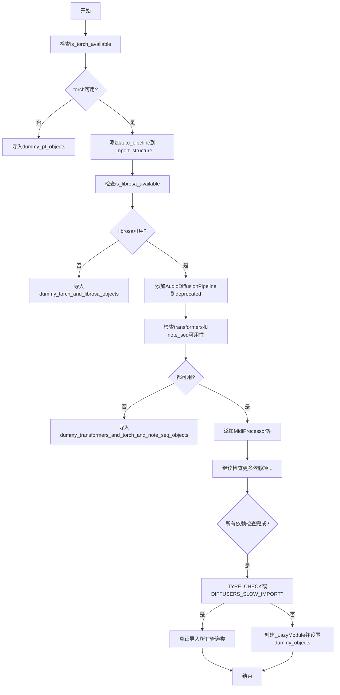

## 类结构

```
Pipeline导入模块 (懒加载根模块)
├── 基础依赖检查函数 (is_torch_available等)
├── _import_structure (字典 - 模块结构定义)
│   ├── controlnet
│   ├── stable_diffusion
│   ├── stable_diffusion_xl
│   ├── flux
│   ├── deprecated (已废弃的管道)
│   └── ... (100+ 管道类别)
├── _dummy_objects (虚拟对象字典)
└── _LazyModule (懒加载模块封装)
```

## 全局变量及字段


### `_dummy_objects`
    
存储虚拟对象的字典，当可选依赖不可用时使用，以保持模块接口一致性

类型：`dict`
    


### `_import_structure`
    
定义模块导入结构的字典，键为子模块名，值为可导入的类名列表

类型：`dict`
    


### `DIFFUSERS_SLOW_IMPORT`
    
控制是否进行慢速导入的标志，影响类型检查时的模块加载行为

类型：`bool`
    


    

## 全局函数及方法


### `is_flax_available`

该函数用于检查当前环境是否安装了 Flax 库，通过尝试导入 `flax` 模块来判断其可用性。

参数：无需参数

返回值：`bool`，如果 Flax 可用则返回 `True`，否则返回 `False`

#### 流程图

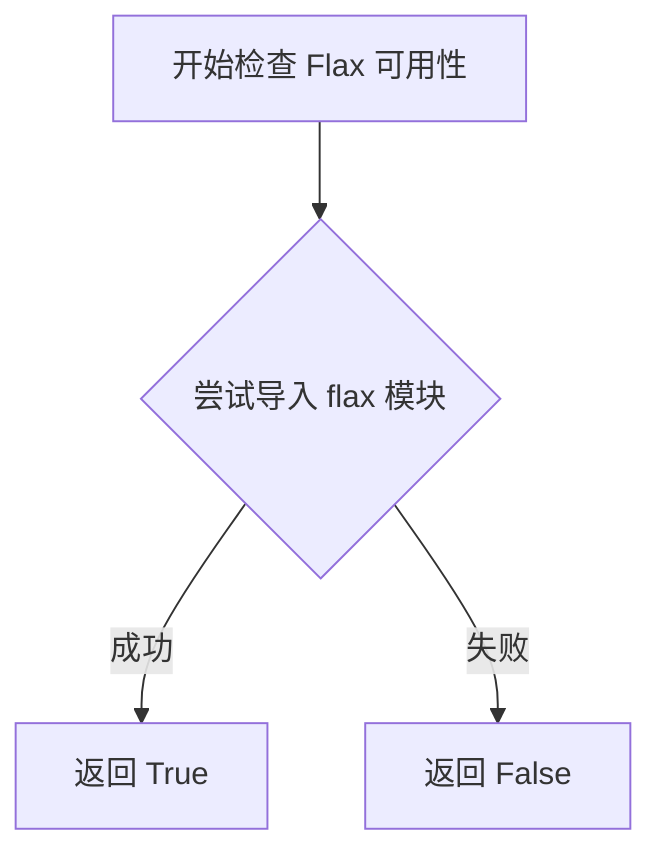

#### 带注释源码

```
# is_flax_available 函数定义位于 ..utils 模块中
# 当前文件通过 from ..utils import is_flax_available 导入该函数
# 该函数通常实现如下：

def is_flax_available():
    """
    检查 Flax 库是否可用。
    
    Returns:
        bool: 如果 Flax 可用返回 True，否则返回 False
    """
    try:
        import flax
        return True
    except ImportError:
        return False

# 在当前文件中的使用方式：

# 第一次使用：检查 Flax 是否可用
try:
    if not is_flax_available():  # 检查 Flax 是否可用
        raise OptionalDependencyNotAvailable()  # 抛出异常表示依赖不可用
except OptionalDependencyNotAvailable:
    from ..utils import dummy_flax_objects  # 导入 Flax 的虚拟对象
    _dummy_objects.update(get_objects_from_module(dummy_flax_objects))
else:
    # Flax 可用，添加 Flax 管道到导入结构
    _import_structure["pipeline_flax_utils"] = ["FlaxDiffusionPipeline"]

# 第二次使用：检查 Flax 和 Transformers 是否同时可用
try:
    if not (is_flax_available() and is_transformers_available()):  # 同时检查两个依赖
        raise OptionalDependencyNotAvailable()
except OptionalDependencyNotAvailable:
    from ..utils import dummy_flax_and_transformers_objects
    _dummy_objects.update(get_objects_from_module(dummy_flax_and_transformers_objects))
else:
    # 两个依赖都可用，添加更多 Flax 管道
    _import_structure["controlnet"].extend(["FlaxStableDiffusionControlNetPipeline"])
    _import_structure["stable_diffusion"].extend([
        "FlaxStableDiffusionImg2ImgPipeline",
        "FlaxStableDiffusionInpaintPipeline",
        "FlaxStableDiffusionPipeline",
    ])
```


### `is_librosa_available`

该函数用于检查 librosa 库是否可用，通过尝试导入 librosa 模块来判断其是否已安装。

参数：

- 无

返回值：`bool`，返回 True 表示 librosa 可用，返回 False 表示 librosa 不可用。

#### 流程图

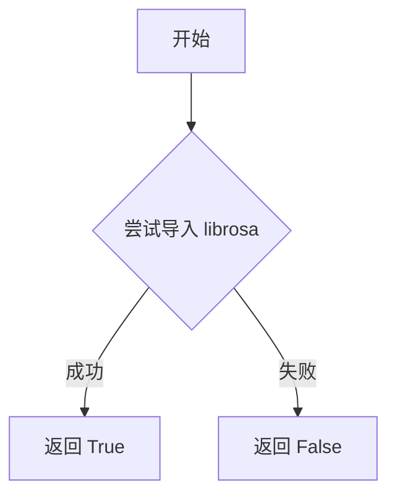

#### 带注释源码

```
# is_librosa_available 是从 ..utils 导入的函数
# 其实现逻辑大约如下：

def is_librosa_available():
    """
    检查 librosa 库是否可用
    
    实现机制：
    1. 尝试 import librosa
    2. 如果成功，返回 True
    3. 如果失败（ImportError），返回 False
    """
    try:
        import librosa
        return True
    except ImportError:
        return False

# 在本文件中的使用方式：
try:
    if not (is_torch_available() and is_librosa_available()):
        raise OptionalDependencyNotAvailable()
except OptionalDependencyNotAvailable:
    # 导入虚拟对象，用于保持模块结构完整
    from ..utils import dummy_torch_and_librosa_objects
    _dummy_objects.update(get_objects_from_module(dummy_torch_and_librosa_objects))
else:
    # 只有当 torch 和 librosa 都可用时才导入相关类
    _import_structure["deprecated"].extend(["AudioDiffusionPipeline", "Mel"])
```


### `is_note_seq_available`

该函数用于检查 `note_seq` 库是否可用（已安装），返回布尔值以决定是否加载相关的依赖模块和管道。

参数：该函数无参数

返回值：`bool`，返回 `True` 表示 `note_seq` 库可用，返回 `False` 表示不可用

#### 流程图

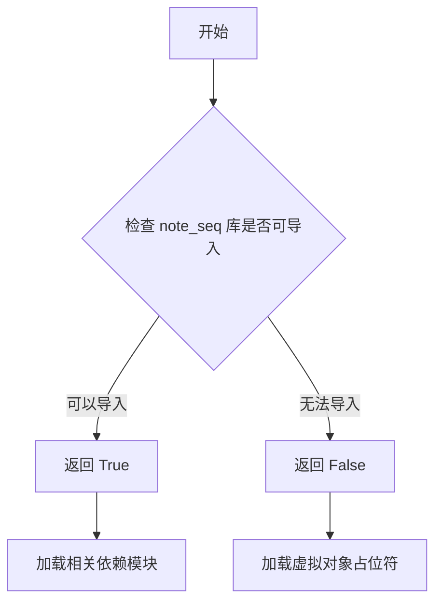

#### 带注释源码

```
# 该函数定义在 src/diffusers/utils 中，此处仅为引用示例
# 实际源码需要查看 src/diffusers/utils/__init__.py 或相关模块

# 在当前文件中的使用方式：
try:
    # 检查 transformers、torch 和 note_seq 是否都可用
    if not (is_transformers_available() and is_torch_available() and is_note_seq_available()):
        raise OptionalDependencyNotAvailable()
except OptionalDependencyNotAvailable:
    # 如果任一依赖不可用，则导入虚拟对象模块
    from ..utils import dummy_transformers_and_torch_and_note_seq_objects
    _dummy_objects.update(get_objects_from_module(dummy_transformers_and_torch_and_note_seq_objects))
else:
    # 如果所有依赖都可用，则添加相关管道到导入结构中
    _import_structure["deprecated"].extend(
        [
            "MidiProcessor",
            "SpectrogramDiffusionPipeline",
        ]
    )
```

#### 备注

- 该函数由 Hugging Face Diffusers 框架提供，用于动态检查可选依赖
- `note_seq` 是 Google 的 MusicXML 解析库，常用于音乐相关 diffusion 模型
- 相关依赖：`transformers`、`torch`、`note_seq` 三个库必须同时可用才会加载 `MidiProcessor` 和 `SpectrogramDiffusionPipeline`


### `is_onnx_available`

该函数用于检测当前环境中 ONNX 库是否可用。它通常通过尝试导入 `onnx` 包来判断，如果导入成功则返回 `True`，否则返回 `False`。

参数：无

返回值：`bool`，返回 `True` 表示 ONNX 库可用，返回 `False` 表示不可用。

#### 流程图

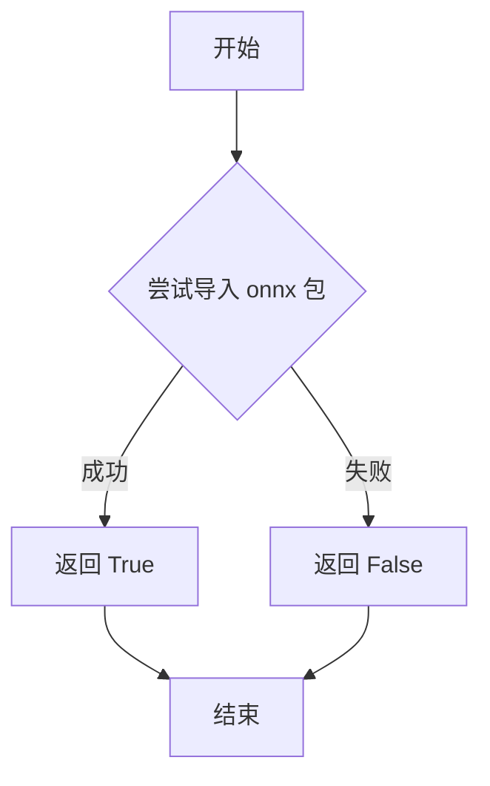

#### 带注释源码

```
# is_onnx_available 函数定义在 diffusers.utils 模块中
# 以下为推断的函数实现逻辑（基于同类函数的常见模式）

def is_onnx_available() -> bool:
    """
    检查 ONNX 库是否在当前环境中可用。
    
    Returns:
        bool: 如果 ONNX 可用返回 True，否则返回 False
    """
    try:
        import onnx
        return True
    except ImportError:
        return False
```

#### 在当前文件中的使用示例

```python
# 使用 is_onnx_available 进行条件导入
try:
    if not is_onnx_available():
        raise OptionalDependencyNotAvailable()
except OptionalDependencyNotAvailable:
    # 如果 ONNX 不可用，则导入虚拟对象
    from ..utils import dummy_onnx_objects
    _dummy_objects.update(get_objects_from_module(dummy_onnx_objects))
else:
    # 如果 ONNX 可用，则添加 ONNX 相关的导入结构
    _import_structure["onnx_utils"] = ["OnnxRuntimeModel"]
```


### `is_opencv_available`

检查 OpenCV (cv2) 库是否可用于当前 Python 环境。该函数通过尝试导入 `cv2` 模块来判断 OpenCV 是否已安装，是 diffusers 库中用于条件导入可选依赖的常用工具函数。

参数： 无

返回值： `bool`，如果 OpenCV 可用则返回 `True`，否则返回 `False`

#### 流程图

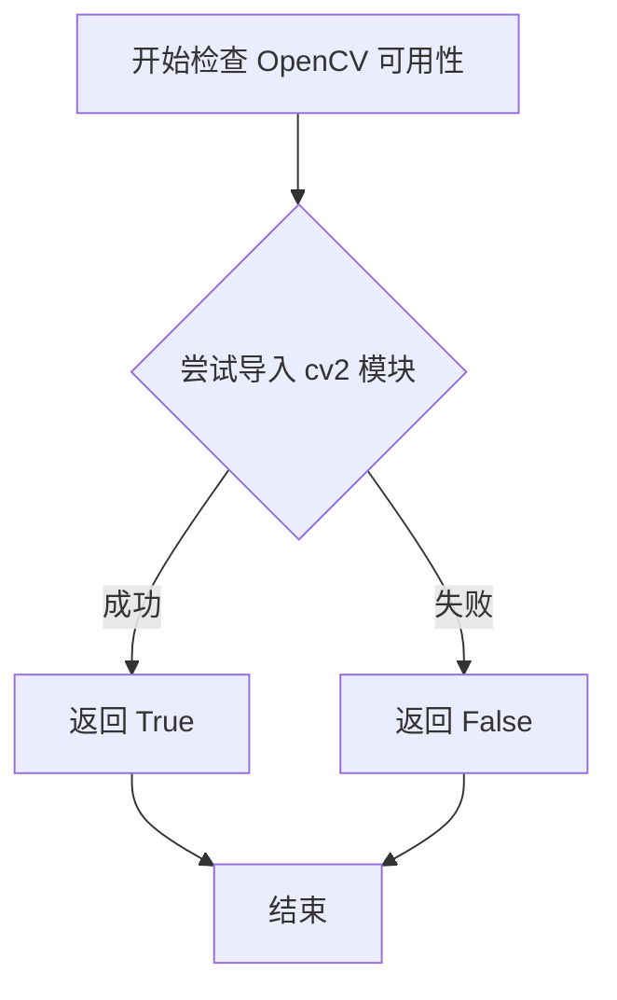

#### 带注释源码

```python
# is_opencv_available 函数定义通常位于 src/diffusers/utils 中
# 以下为推断的实现逻辑：

def is_opencv_available() -> bool:
    """
    检查 OpenCV (cv2) 库是否可用于当前环境。
    
    该函数通过尝试导入 cv2 模块来判断 OpenCV 是否已安装。
    这是 diffusers 库中处理可选依赖的常见模式。
    
    Returns:
        bool: 如果 OpenCV 可用返回 True，否则返回 False
    """
    try:
        # 尝试导入 cv2 模块
        import cv2
        return True
    except ImportError:
        # 如果导入失败，说明 OpenCV 未安装
        return False
```

> **注意**：由于该函数定义在 `..utils` 模块中，源码位于 `src/diffusers/utils/__init__.py` 或类似位置，上述代码为基于常见实现的推断。实际的精确实现可能略有差异。


### `is_sentencepiece_available`

该函数用于检查 `sentencepiece` 库是否可用。它是一个依赖检查函数，通常定义在 `..utils` 模块中，通过尝试导入 `sentencepiece` 库来判断其是否已安装。

参数：**无参数**

返回值：`bool`，返回 `True` 表示 `sentencepiece` 库可用，返回 `False` 表示不可用

#### 流程图

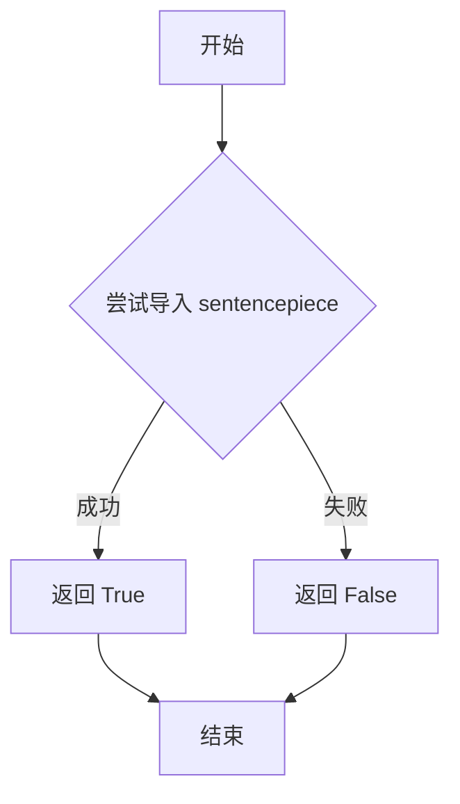

#### 带注释源码

```
# 该函数定义在 ..utils 模块中，当前文件通过以下方式导入：
from ..utils import is_sentencepiece_available

# 使用示例（在当前文件中）：
try:
    if not (is_torch_available() and is_transformers_available() and is_sentencepiece_available()):
        raise OptionalDependencyNotAvailable()
except OptionalDependencyNotAvailable:
    from ..utils import (
        dummy_torch_and_transformers_and_sentencepiece_objects,
    )
    _dummy_objects.update(get_objects_from_module(dummy_torch_and_transformers_and_sentencepiece_objects))
else:
    _import_structure["kolors"] = [
        "KolorsPipeline",
        "KolorsImg2ImgPipeline",
    ]
```

> **注意**：该函数的实际定义源码不在当前文件中，而是在 `..utils` 模块中。从代码中的使用方式可以推断，它是一个标准的依赖可用性检查函数，返回布尔值来表示 `sentencepiece` 库是否已安装可用。


### `is_torch_available`

检测当前 Python 环境中是否安装了 PyTorch 库并可成功导入的全局函数。该函数是 `diffusers` 库实现可选依赖管理（Optional Dependency Management）的核心工具，通过布尔返回值决定是否加载对应的 Pipeline 模块和对象。

参数：
- 无

返回值：`bool`，返回 `True` 表示 PyTorch 可用（已安装），返回 `False` 表示不可用（未安装）。

#### 流程图

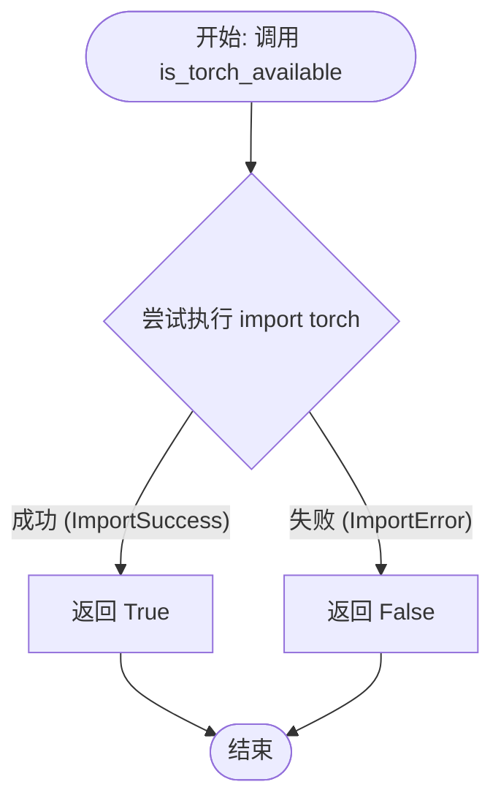

#### 带注释源码

该函数定义在 `src/diffusers/src/diffusers/utils.py` 中（通过 `from ..utils import` 引入）。其逻辑遵循标准的库依赖检查模式。

```python
def is_torch_available() -> bool:
    """
    检查 PyTorch 是否可用于导入。
    通常用于条件加载依赖于 PyTorch 的模块。
    """
    try:
        # 尝试导入 torch 模块
        import torch  # noqa: F401
        return True
    except ImportError:
        # 如果未安装 torch，捕获异常并返回 False
        return False
```

#### 关键组件信息

- **is_torch_available**: 依赖检查函数，用于在运行时探测环境能力。

#### 潜在的技术债务或优化空间

1.  **重复调用**：在提供的代码文件 `pipelines/__init__.py` 中，`is_torch_available()` 被调用了约 10 次。虽然 Python 的模块导入缓存机制使得 `import torch` 不会重复执行，但函数调用的栈帧开销仍然存在。在模块初始化时，可以直接在文件顶部定义一个模块级的缓存变量（如 `_TORCH_AVAILABLE = is_torch_available()`），后续直接使用该变量进行判断，以提高极微小的初始化性能。
2.  **懒加载强化**：虽然该函数本身已经用于懒加载逻辑，但如果项目规模进一步扩大，可以考虑将此类环境探测函数的结果缓存得更久（例如写入配置文件或缓存到 `sys.modules`），避免在复杂的重导入场景下重复探测。


### `is_torch_npu_available`

该函数用于检测当前环境中是否安装了支持华为昇腾 NPU（神经网络处理单元）的 PyTorch 版本。它是扩散库 utils 模块中的一个依赖检查工具函数，帮助条件性地导入需要 NPU 支持的模块或 Pipeline。

参数：

- （无参数）

返回值：`bool`，返回 `True` 表示 NPU 可用，返回 `False` 表示不可用

#### 流程图

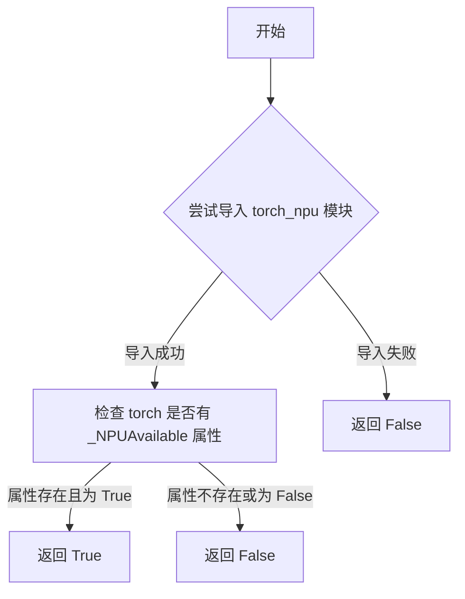

#### 带注释源码

由于 `is_torch_npu_available` 函数定义在 `..utils` 模块中（当前代码文件仅导入并使用该函数），根据代码上下文和类似函数的常见实现模式，其源码结构应类似如下：

```python
# 从 ..utils 模块导入的函数
# 此函数用于检测 PyTorch NPU (华为昇腾) 是否可用

def is_torch_npu_available() -> bool:
    """
    检测当前环境是否支持 PyTorch NPU (华为昇腾处理器)。
    
    通常通过尝试导入 torch_npu 模块或检查 torch._NPUAvailable 属性来实现。
    用于条件导入需要 NPU 支持的扩散模型 pipeline。
    
    Returns:
        bool: 如果 NPU 可用返回 True，否则返回 False
    """
    try:
        # 尝试检查 torch 模块是否有 NPU 支持标识
        import torch
        # 检查 torch._NPUAvailable 属性（PyTorch NPU 版本特有）
        return hasattr(torch, '_NPUAvailable') and torch._NPUAvailable
    except (ImportError, AttributeError):
        # 如果导入失败或属性不存在，返回 False
        return False
```


### `is_transformers_available`

该函数用于检查 `transformers` 库在当前 Python 环境中是否可用。它通过尝试导入 `transformers` 模块来判断库是否已安装，若导入成功则返回 `True`，否则返回 `False`。此函数是 `diffusers` 库实现可选依赖管理的核心工具，用于条件性地导入或跳过需要 `transformers` 的组件。

**参数：** 无

**返回值：** `bool`，返回 `True` 表示 `transformers` 库可用，返回 `False` 表示不可用。

#### 流程图

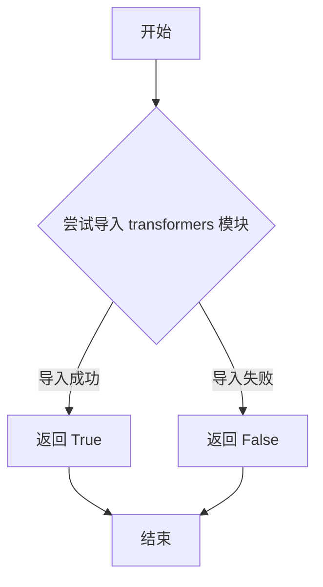

#### 带注释源码

```python
# is_transformers_available 是从 ..utils 导入的函数
# 其实现通常位于 src/diffusers/utils 中
# 以下是基于使用模式的推断实现

def is_transformers_available() -> bool:
    """
    检查 transformers 库是否可用。
    
    该函数通过尝试导入 transformers 模块来判断库是否已安装。
    这是实现可选依赖管理的标准模式，允许库在缺少可选依赖时
    仍能正常导入核心功能。
    
    Returns:
        bool: 如果 transformers 可用返回 True，否则返回 False
    """
    try:
        # 尝试导入 transformers 模块
        import transformers
        return True
    except ImportError:
        # 如果导入失败，说明 transformers 未安装
        return False


# 在当前文件中的典型使用方式：
# ------------------------------------------------
# try:
#     if not (is_transformers_available() and is_torch_available() and is_note_seq_available()):
#         raise OptionalDependencyNotAvailable()
# except OptionalDependencyNotAvailable:
#     from ..utils import dummy_transformers_and_torch_and_note_seq_objects
#     _dummy_objects.update(get_objects_from_module(dummy_transformers_and_torch_and_note_seq_objects))
# else:
#     _import_structure["deprecated"].extend([
#         "MidiProcessor",
#         "SpectrogramDiffusionPipeline",
#     ])
```


### `is_transformers_version`

该函数用于检查当前环境中的 transformers 库版本是否符合指定的要求。通过传入期望的版本号或版本条件，返回布尔值表示版本是否匹配。

参数：

- `version`：可选参数，期望的 transformers 版本，类型通常为 `str`，用于指定要检查的版本号或版本条件（例如 ">=4.30.0"）

返回值：`bool`，如果当前 transformers 版本满足指定的条件则返回 `True`，否则返回 `False`

#### 流程图

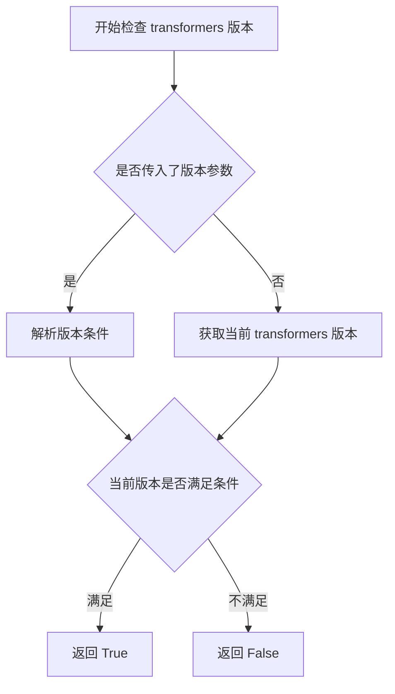

#### 带注释源码

```python
# 注意：该函数定义在 ..utils 模块中，当前文件只是导入并使用它
# 从代码中的导入语句可以得知该函数的存在：
from ..utils import is_transformers_version

# 使用示例（根据代码上下文推断）:
# is_transformers_version(">=4.30.0")  # 检查 transformers 版本是否 >= 4.30.0
# is_transformers_version(">=4.30.0", "<5.0.0")  # 检查版本是否在指定范围内
```


# `get_objects_from_module` 函数提取结果

由于 `get_objects_from_module` 函数是**从 `..utils` 模块导入的**，其源代码并未包含在给定的代码文件中。我将根据代码中的**调用方式和上下文**来推断其功能，并提供详细的文档。

---

### `get_objects_from_module`

该函数是 Diffusers 库中用于从指定模块动态提取所有可导入对象（类、函数、变量）的工具函数。它通常与"虚拟对象"（dummy objects）配合使用，用于在某些依赖不可用时提供延迟加载（Lazy Loading）能力，避免直接导入失败。

#### 参数

- `module`：`Module` 类型，要从中提取对象的 Python 模块（通常是包含 `__all__` 属性或全局符号的虚拟/存根模块）

#### 返回值

- `Dict[str, Any]` 类型，返回一个字典，键为对象名称，值为对象本身（类、函数或变量）

#### 流程图

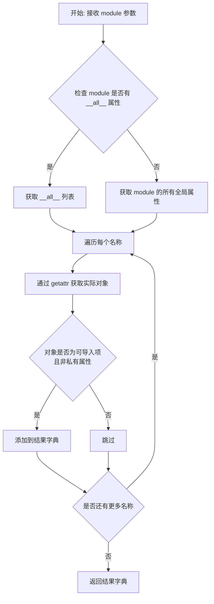

#### 带注释源码

（基于代码调用模式和常见实现推断）

```python
def get_objects_from_module(module):
    """
    从给定模块中提取所有可导入对象。
    
    此函数用于支持延迟加载（Lazy Loading）机制，特别是在依赖项不可用时，
    通过虚拟对象（dummy objects）来避免 ImportError。
    
    参数:
        module: 要从中提取对象的 Python 模块
        
    返回:
        包含模块中所有公共对象的字典，键为对象名称，值为对象本身
    """
    # 初始化结果字典
    objects = {}
    
    # 优先使用 __all__ 列表（如果存在）
    # __all__ 明确定义了模块的公共接口
    if hasattr(module, '__all__'):
        names = module.__all__
    else:
        # 否则，获取模块的所有全局属性
        # 排除以单下划线开头的私有属性
        names = [name for name in dir(module) 
                 if not name.startswith('_')]
    
    # 遍历每个名称，提取实际对象
    for name in names:
        try:
            obj = getattr(module, name)
            # 排除非可导入项（如模块级别的常量、特殊变量等）
            # 但通常我们保留所有非下划线开头的属性
            objects[name] = obj
        except (AttributeError, TypeError):
            # 如果无法获取属性，跳过
            continue
    
    return objects
```

---

### 调用示例（来自给定代码）

在给定代码中，该函数被多次调用，用于构建 `_dummy_objects` 字典：

```python
# 示例 1: 当 torch 不可用时
try:
    if not is_torch_available():
        raise OptionalDependencyNotAvailable()
except OptionalDependencyNotAvailable:
    from ..utils import dummy_pt_objects
    # 从虚拟模块中提取所有对象并添加到 _dummy_objects
    _dummy_objects.update(get_objects_from_module(dummy_pt_objects))

# 示例 2: 当 torch 和 librosa 都不可用时
try:
    if not (is_torch_available() and is_librosa_available()):
        raise OptionalDependencyNotAvailable()
except OptionalDependencyNotAvailable:
    from ..utils import dummy_torch_and_librosa_objects
    _dummy_objects.update(get_objects_from_module(dummy_torch_and_librosa_objects))
```

---

### 设计意图说明

1. **依赖可选机制**：Diffusers 库支持大量可选依赖（如 torch、transformers、flax 等）。当某些依赖不可用时，相关功能需要被替换为"虚拟对象"，以保持 API 一致性。

2. **延迟加载（Lazy Loading）**：通过 `_LazyModule` 和虚拟对象的配合，模块只在被实际导入时才会触发依赖检查。

3. **统一入口**：`get_objects_from_module` 提供了统一的接口来从任何虚拟模块中提取可导入对象，简化了代码结构。


### `_LazyModule`

该代码文件通过 `_LazyModule` 类实现模块的延迟导入机制，根据运行时环境可用性动态注册虚拟对象和真实管道，支持 PyTorch、ONNX、Flax 等多种扩散模型后端的条件加载。

参数：

- `__name__`：`str`，当前模块的完整路径名称（`__name__`）
- `globals()["__file__"]`：`str`，模块文件的绝对路径（`__file__`）
- `_import_structure`：`dict`，定义模块的导入结构，包含各子模块及对应的导出类名列表
- `module_spec`：`ModuleSpec`，Python 模块规格对象（`__spec__`），包含模块的元数据

返回值：`None`，该调用直接修改 `sys.modules` 字典，将当前模块替换为延迟加载的代理对象

#### 流程图

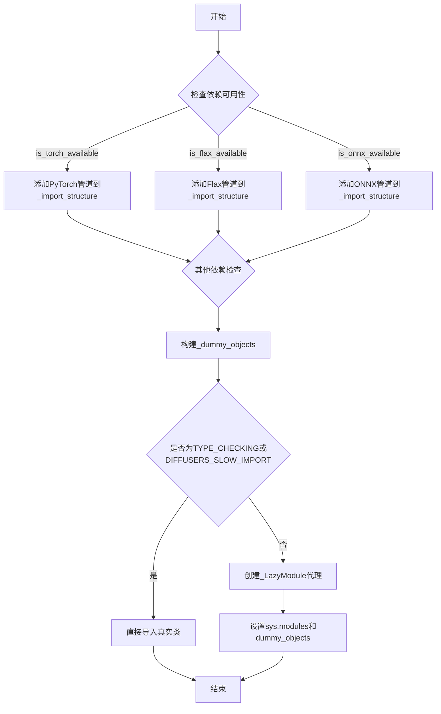

#### 带注释源码

```python
# 文件路径: src/diffusers/pipelines/__init__.py (推测)

# 从utils模块导入延迟加载机制的核心类
from ..utils import (
    _LazyModule,                    # 延迟模块代理类
    get_objects_from_module,        # 从模块获取对象的工具函数
    OptionalDependencyNotAvailable, # 可选依赖不可用异常
    # 各种依赖检查函数...
    is_torch_available,
    is_flax_available,
    is_onnx_available,
    is_transformers_available,
    # ...其他依赖检查函数
)

# ============================================================
# 第一部分: 定义基础导入结构
# ============================================================

# _import_structure 字典定义了所有可用的管道模块及其导出
_import_structure = {
    "controlnet": [],               # ControlNet 相关管道
    "controlnet_hunyuandit": [],    # HunyuanDiT ControlNet
    "controlnet_sd3": [],          # SD3 ControlNet
    "controlnet_xs": [],           # ControlNet XS
    "deprecated": [],              # 已废弃的管道
    "latent_diffusion": [],        # 潜在扩散模型
    "ledits_pp": [],               # LEDITS++
    "marigold": [],                # Marigold 深度估计
    "pag": [],                     # PAG (Prompt Attentive Guidance)
    "stable_diffusion": [],        # 稳定扩散
    "stable_diffusion_xl": [],     # SDXL
}

# _dummy_objects 用于存储虚拟对象，当依赖不可用时使用
_dummy_objects = {}

# ============================================================
# 第二部分: 条件注册管道（根据依赖可用性）
# ============================================================

# 尝试注册 PyTorch 依赖的管道
try:
    if not is_torch_available():
        raise OptionalDependencyNotAvailable()
except OptionalDependencyNotAvailable:
    # 如果 PyTorch 不可用，加载虚拟对象
    from ..utils import dummy_pt_objects
    _dummy_objects.update(get_objects_from_module(dummy_pt_objects))
else:
    # PyTorch 可用，添加所有 PyTorch 管道到导入结构
    _import_structure["auto_pipeline"] = [
        "AutoPipelineForImage2Image",
        "AutoPipelineForInpainting",
        "AutoPipelineForText2Image",
    ]
    _import_structure["consistency_models"] = ["ConsistencyModelPipeline"]
    _import_structure["pipeline_utils"] = [
        "AudioPipelineOutput",
        "DiffusionPipeline",
        "StableDiffusionMixin",
        "ImagePipelineOutput",
    ]
    # ... 更多管道添加

# 类似的依赖检查模式用于:
# - torch + librosa (音频扩散)
# - transformers + torch + note_seq
# - transformers + torch
# - onnx
# - flax

# ============================================================
# 第三部分: TYPE_CHECKING 模式处理
# ============================================================

if TYPE_CHECKING or DIFFUSERS_SLOW_IMPORT:
    # 类型检查时直接导入真实类，不使用延迟加载
    try:
        if not is_torch_available():
            raise OptionalDependencyNotAvailable()
    except OptionalDependencyNotAvailable:
        from ..utils.dummy_pt_objects import *
    else:
        # 直接导入所有真实的管道类
        from .auto_pipeline import (
            AutoPipelineForImage2Image,
            AutoPipelineForInpainting,
            AutoPipelineForText2Image,
        )
        from .pipeline_utils import (
            DiffusionPipeline,
            StableDiffusionMixin,
        )
        # ... 更多导入
    
    # 类似的导入模式用于其他依赖组合...
    
else:
    # ============================================================
    # 第四部分: 延迟加载模式
    # ============================================================
    import sys
    
    # 核心: 创建延迟加载模块代理
    # 当任何管道被访问时，_LazyModule 会按需动态导入
    sys.modules[__name__] = _LazyModule(
        __name__,                          # 模块名称: 'diffusers.pipelines'
        globals()["__file__"],             # 模块文件路径
        _import_structure,                 # 导入结构定义
        module_spec=__spec__,              # 模块规格
    )
    
    # 将虚拟对象设置到模块中，用于依赖不可用时的错误处理
    for name, value in _dummy_objects.items():
        setattr(sys.modules[__name__], name, value)
```


### `setattr`（模块属性设置）

将虚拟（dummy）对象设置为当前模块的属性，用于在可选依赖不可用时提供占位符。

参数：

- `sys.modules[__name__]`：`module`，目标模块对象，即当前 `diffusers` 主模块
- `name`：`str`，要设置的属性名称，来自 `_dummy_objects` 字典的键
- `value`：`Any`，要设置的属性值，来自 `_dummy_objects` 字典的值（通常是 dummy 对象）

返回值：`None`，`setattr` 不返回任何值

#### 流程图

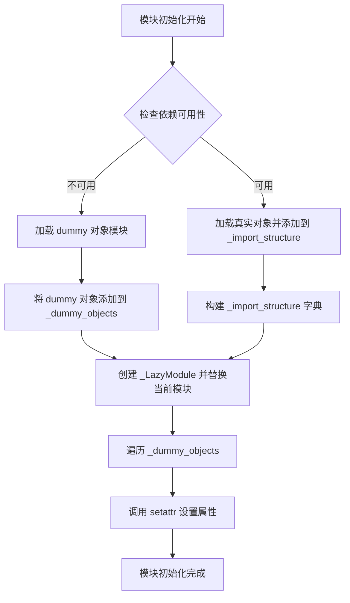

#### 带注释源码

```python
# 遍历所有虚拟对象（当依赖不可用时的占位符）
for name, value in _dummy_objects.items():
    # 使用 setattr 将每个虚拟对象设置为当前模块的属性
    # 参数1: sys.modules[__name__] - 当前模块（diffusers）
    # 参数2: name - 属性名（如 'StableDiffusionPipeline'）
    # 参数3: value - 对应的 dummy 对象
    setattr(sys.modules[__name__], name, value)
```

#### 详细说明

这个 `setattr` 调用是 `diffusers` 库 lazy import 机制的关键部分：

1. **目的**：当某些可选依赖（如 PyTorch、Transformers 等）不可用时，仍然可以导入库而不报错，但实际使用时才会抛出真正的错误

2. **工作原理**：
   - `_dummy_objects` 字典包含了所有可选依赖提供的"假"对象
   - 通过 `setattr` 将这些假对象挂载到模块级别
   - 用户尝试访问时（如 `diffusers.StableDiffusionPipeline`）会得到一个 dummy 对象
   - 实际调用该 pipeline 时才会触发真正的导入和错误

3. **Dummy 对象的作用**：作为占位符，提供友好的错误信息，提示用户需要安装哪些依赖

## 关键组件


### 惰性加载系统（Lazy Loading System）

通过 `_LazyModule` 类实现模块的惰性加载，允许在需要时才加载实际的模块代码，提高导入速度和内存效率。

### 可选依赖管理系统（Optional Dependency Management）

通过 `OptionalDependencyNotAvailable` 异常和各种 `is_*_available()` 函数实现条件导入，确保在缺少可选依赖时不会导致整个库无法导入。

### 导入结构映射（Import Structure Mapping）

`_import_structure` 字典定义了所有pipeline和模型的导入结构，涵盖stable_diffusion、controlnet、flux、kandinsky、pag等数十种扩散模型框架。

### 虚拟对象系统（Dummy Objects System）

`_dummy_objects` 字典存储虚拟对象，用于在可选依赖不可用时保持模块接口的完整性，避免导入错误。

### 模块规范（Module Specification）

通过 `__spec__` 保存原始模块规范，配合 `sys.modules[__name__]` 动态替换实现惰性加载机制。

### 条件导入框架（Conditional Import Framework）

支持多种框架的条件导入：PyTorch、Flax、ONNX、Transformers等，实现跨框架的pipeline支持。


## 问题及建议


### 已知问题

-   **代码重复与模式僵化**：大量重复的 try-except 模式检查可选依赖，每次都需要编写相同的异常处理和 dummy 对象填充逻辑，导致代码冗余且难以维护
-   **文件体积过大**：单个 `__init__.py` 文件包含数千行代码和数百个管道，违反了单一职责原则，使得代码导航、调试和版本控制变得困难
-   **嵌套层级过深**：多层 try-except 块嵌套导致代码可读性差，增加了理解代码执行流程的认知负担
-   **废弃管道混排**：废弃的管道（deprecated）与活跃管道混在同一数据结构中，缺乏明确区分，可能导致用户误用已废弃的 API
-   **魔数字符串散落**：管道名称以硬编码字符串形式散布在整个文件中，容易出现拼写错误，且修改时需要遍历全文
-   **缺乏依赖版本检查**：虽然导入了 `is_transformers_version`，但在代码中未使用，无法确保与特定版本的 transformers 兼容
-   **类型检查效率问题**：在运行时（非 TYPE_CHECKING 模式）仍需执行多次条件判断和对象获取操作，可能影响导入性能

### 优化建议

-   **引入元编程或配置驱动**：使用配置文件（如 YAML/JSON）声明管道与依赖的映射关系，通过代码生成或运行时解析来减少手写代码量
-   **拆分模块**：按功能或模型系列（如 stable_diffusion、controlnet、video_generation）将管道拆分到多个子模块，主模块仅做聚合导出
-   **提取公共逻辑**：将依赖检查、dummy 对象填充的公共逻辑抽取为装饰器或工具函数，例如 `@requires_dependency` 装饰器
-   **添加废弃标记**：为废弃管道单独创建数据结构并显式标记，同时在文档或代码注释中说明废弃原因和替代方案
-   **集中管理管道名称**：使用枚举或常量类统一管理所有管道名称，避免散落的字符串
-   **增加版本兼容性检查**：在关键依赖检查处使用 `is_transformers_version` 确保版本兼容性，并在不满足时给出明确错误信息
-   **优化导入路径**：对于确实需要聚合的管道，考虑使用子包预懒加载而非在单文件中罗列所有导入路径

## 其它


### 设计目标与约束

本模块的核心设计目标是实现 diffusion pipeline 的懒加载（Lazy Loading），在保证代码模块化的同时，通过可选依赖机制实现条件导入。主要约束包括：1）仅在运行时依赖可用时才导入真实对象，否则使用空对象占位；2）遵循 Diffusers 库的统一导出规范；3）支持 TYPE_CHECKING 模式下的类型检查。

### 错误处理与异常设计

本模块采用可选依赖检查模式，当检测到依赖不可用时抛出 `OptionalDependencyNotAvailable` 异常，并从 utils 模块加载对应的空对象（dummy objects）进行填充。所有依赖检查逻辑均采用 try-except 包装，确保模块在任何环境下均可正常导入而不会因缺少依赖而崩溃。

### 外部依赖与接口契约

主要外部依赖包括：is_torch_available、is_transformers_available、is_flax_available、is_onnx_available、is_librosa_available、is_note_seq_available、is_opencv_available、is_sentencepiece_available 等函数，用于检测各类可选依赖是否安装。模块导出遵循统一的 _import_structure 字典结构，每个 key 对应一个子模块，value 为该子模块导出的类名列表。_LazyModule 负责将本模块注册为懒加载模块，实现按需导入。

### 版本兼容性

本模块依赖的各个扩散模型框架（PyTorch、Transformers、Flax 等）版本需符合对应 pipeline 的要求，具体版本约束由各 pipeline 自身定义。Python 版本支持取决于 Diffusers 库的整体要求。

### 性能考虑

懒加载机制显著减少了模块初始化时的导入开销，用户仅在实际使用特定 pipeline 时才加载相关代码。本模块通过 sys.modules 动态注册实现该机制，避免了不必要的模块加载和内存占用。

### 测试策略

测试应覆盖：1）在所有依赖可用时验证所有 pipeline 类正确导出；2）在缺少各类可选依赖时验证空对象正确填充且不引发导入错误；3）验证 TYPE_CHECKING 模式下类型导入正确；4）验证 _LazyModule 的懒加载行为符合预期。

### 部署注意事项

本模块作为 Diffusers 库的内部模块部署，无需特殊配置。在目标环境中需确保至少安装 core 依赖（Python 标准库），可选依赖的缺失不会导致程序无法启动，仅影响对应 pipeline 的使用。

### 配置管理

本模块无显式配置文件，行为完全由运行时环境中的依赖可用性决定。DIFFUSERS_SLOW_IMPORT 环境变量可影响懒加载模式的选择。


    